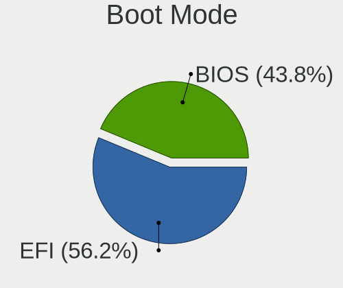
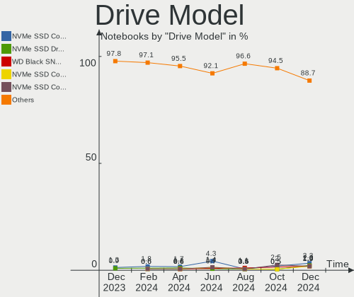
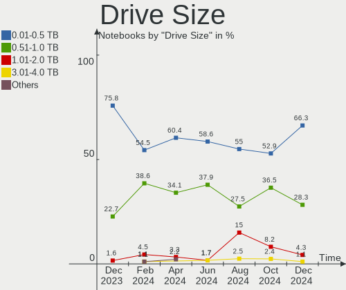
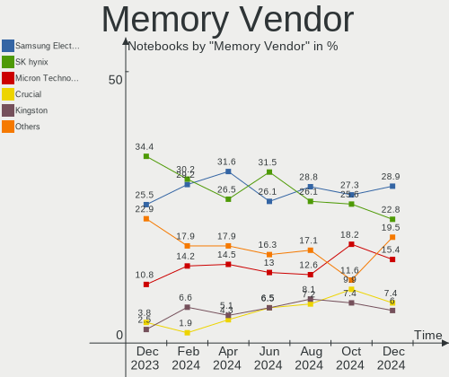

Linux in France - Hardware Trends (Notebooks)
---------------------------------------------

A project to identify most popular hardware characteristics and track their change
over time based on data collected by Linux users at https://Linux-Hardware.org.

Anyone can contribute to this report by the [hw-probe](https://github.com/linuxhw/hw-probe) tool:

    sudo -E hw-probe -all -upload

Period: Nov, 2023.

Contents
--------

* [ System ](#system)
  - [ OS                       ](#os)
  - [ OS Family                ](#os-family)
  - [ Kernel                   ](#kernel)
  - [ Kernel Family            ](#kernel-family)
  - [ Kernel Major Ver.        ](#kernel-major-ver)
  - [ Arch                     ](#arch)
  - [ DE                       ](#de)
  - [ Display Server           ](#display-server)
  - [ Display Manager          ](#display-manager)
  - [ OS Lang                  ](#os-lang)
  - [ Boot Mode                ](#boot-mode)
  - [ Filesystem               ](#filesystem)
  - [ Part. scheme             ](#part-scheme)
  - [ Dual Boot with Linux/BSD ](#dual-boot-with-linuxbsd)
  - [ Dual Boot (Win)          ](#dual-boot-win)

* [ Board ](#board)
  - [ Vendor                   ](#vendor)
  - [ Model                    ](#model)
  - [ Model Family             ](#model-family)
  - [ MFG Year                 ](#mfg-year)
  - [ Form Factor              ](#form-factor)
  - [ Secure Boot              ](#secure-boot)
  - [ Coreboot                 ](#coreboot)
  - [ RAM Size                 ](#ram-size)
  - [ RAM Used                 ](#ram-used)
  - [ Total Drives             ](#total-drives)
  - [ Has CD-ROM               ](#has-cd-rom)
  - [ Has Ethernet             ](#has-ethernet)
  - [ Has WiFi                 ](#has-wifi)
  - [ Has Bluetooth            ](#has-bluetooth)

* [ Location ](#location)
  - [ Country                  ](#country)
  - [ City                     ](#city)

* [ Drives ](#drives)
  - [ Drive Vendor             ](#drive-vendor)
  - [ Drive Model              ](#drive-model)
  - [ HDD Vendor               ](#hdd-vendor)
  - [ SSD Vendor               ](#ssd-vendor)
  - [ Drive Kind               ](#drive-kind)
  - [ Drive Connector          ](#drive-connector)
  - [ Drive Size               ](#drive-size)
  - [ Space Total              ](#space-total)
  - [ Space Used               ](#space-used)
  - [ Malfunc. Drives          ](#malfunc-drives)
  - [ Malfunc. Drive Vendor    ](#malfunc-drive-vendor)
  - [ Malfunc. HDD Vendor      ](#malfunc-hdd-vendor)
  - [ Malfunc. Drive Kind      ](#malfunc-drive-kind)
  - [ Failed Drives            ](#failed-drives)
  - [ Failed Drive Vendor      ](#failed-drive-vendor)
  - [ Drive Status             ](#drive-status)

* [ Storage controller ](#storage-controller)
  - [ Storage Vendor           ](#storage-vendor)
  - [ Storage Model            ](#storage-model)
  - [ Storage Kind             ](#storage-kind)

* [ Processor ](#processor)
  - [ CPU Vendor               ](#cpu-vendor)
  - [ CPU Model                ](#cpu-model)
  - [ CPU Model Family         ](#cpu-model-family)
  - [ CPU Cores                ](#cpu-cores)
  - [ CPU Sockets              ](#cpu-sockets)
  - [ CPU Threads              ](#cpu-threads)
  - [ CPU Op-Modes             ](#cpu-op-modes)
  - [ CPU Microcode            ](#cpu-microcode)
  - [ CPU Microarch            ](#cpu-microarch)

* [ Graphics ](#graphics)
  - [ GPU Vendor               ](#gpu-vendor)
  - [ GPU Model                ](#gpu-model)
  - [ GPU Combo                ](#gpu-combo)
  - [ GPU Driver               ](#gpu-driver)
  - [ GPU Memory               ](#gpu-memory)

* [ Monitor ](#monitor)
  - [ Monitor Vendor           ](#monitor-vendor)
  - [ Monitor Model            ](#monitor-model)
  - [ Monitor Resolution       ](#monitor-resolution)
  - [ Monitor Diagonal         ](#monitor-diagonal)
  - [ Monitor Width            ](#monitor-width)
  - [ Aspect Ratio             ](#aspect-ratio)
  - [ Monitor Area             ](#monitor-area)
  - [ Pixel Density            ](#pixel-density)
  - [ Multiple Monitors        ](#multiple-monitors)

* [ Network ](#network)
  - [ Net Controller Vendor    ](#net-controller-vendor)
  - [ Net Controller Model     ](#net-controller-model)
  - [ Wireless Vendor          ](#wireless-vendor)
  - [ Wireless Model           ](#wireless-model)
  - [ Ethernet Vendor          ](#ethernet-vendor)
  - [ Ethernet Model           ](#ethernet-model)
  - [ Net Controller Kind      ](#net-controller-kind)
  - [ Used Controller          ](#used-controller)
  - [ NICs                     ](#nics)
  - [ IPv6                     ](#ipv6)

* [ Bluetooth ](#bluetooth)
  - [ Bluetooth Vendor         ](#bluetooth-vendor)
  - [ Bluetooth Model          ](#bluetooth-model)

* [ Sound ](#sound)
  - [ Sound Vendor             ](#sound-vendor)
  - [ Sound Model              ](#sound-model)

* [ Memory ](#memory)
  - [ Memory Vendor            ](#memory-vendor)
  - [ Memory Model             ](#memory-model)
  - [ Memory Kind              ](#memory-kind)
  - [ Memory Form Factor       ](#memory-form-factor)
  - [ Memory Size              ](#memory-size)
  - [ Memory Speed             ](#memory-speed)

* [ Printers & scanners ](#printers--scanners)
  - [ Printer Vendor           ](#printer-vendor)
  - [ Printer Model            ](#printer-model)
  - [ Scanner Vendor           ](#scanner-vendor)
  - [ Scanner Model            ](#scanner-model)

* [ Camera ](#camera)
  - [ Camera Vendor            ](#camera-vendor)
  - [ Camera Model             ](#camera-model)

* [ Security ](#security)
  - [ Fingerprint Vendor       ](#fingerprint-vendor)
  - [ Fingerprint Model        ](#fingerprint-model)
  - [ Chipcard Vendor          ](#chipcard-vendor)
  - [ Chipcard Model           ](#chipcard-model)

* [ Unsupported ](#unsupported)
  - [ Unsupported Devices      ](#unsupported-devices)
  - [ Unsupported Device Types ](#unsupported-device-types)

System
------

OS
--

Installed operating systems

| Name                        | Notebooks | Percent |
|-----------------------------|-----------|---------|
| Ubuntu 22.04                | 40        | 22.35%  |
| OpenMandriva 23.08          | 14        | 7.82%   |
| Fedora 39                   | 11        | 6.15%   |
| Linux Mint 21.2             | 9         | 5.03%   |
| Arch Rolling                | 9         | 5.03%   |
| Zorin 16                    | 8         | 4.47%   |
| OpenMandriva 23.11          | 6         | 3.35%   |
| Xubuntu 22.04               | 5         | 2.79%   |
| Ubuntu 23.04                | 5         | 2.79%   |
| Debian 12                   | 5         | 2.79%   |
| Ubuntu 23.10                | 4         | 2.23%   |
| Xero Rolling                | 3         | 1.68%   |
| Pop!_OS 22.04               | 3         | 1.68%   |
| OpenMandriva 5.0            | 3         | 1.68%   |
| Kubuntu 23.10               | 3         | 1.68%   |
| Xubuntu 23.10               | 2         | 1.12%   |
| Ubuntu 20.04                | 2         | 1.12%   |
| Trisquel 11.0               | 2         | 1.12%   |
| Lubuntu 23.10               | 2         | 1.12%   |
| LMDE 6                      | 2         | 1.12%   |
| Linux Mint 21.1             | 2         | 1.12%   |
| Kubuntu 22.04               | 2         | 1.12%   |
| Kali 2023.3                 | 2         | 1.12%   |
| Fedora 38                   | 2         | 1.12%   |
| Elementary 7.1              | 2         | 1.12%   |
| ArcoLinux Rolling           | 2         | 1.12%   |
| Xubuntu 23.04               | 1         | 0.56%   |
| Xubuntu 20.04               | 1         | 0.56%   |
| Void Linux Rolling          | 1         | 0.56%   |
| Ubuntu MATE 23.10           | 1         | 0.56%   |
| Ubuntu Budgie 22.04         | 1         | 0.56%   |
| Ubuntu 22.10                | 1         | 0.56%   |
| Ubuntu 18.04                | 1         | 0.56%   |
| SteamOS 4                   | 1         | 0.56%   |
| SteamOS 3.6                 | 1         | 0.56%   |
| SteamOS 3.5.5               | 1         | 0.56%   |
| org.kde.Platform 5.15-21.08 | 1         | 0.56%   |
| OpenMandriva 4.50           | 1         | 0.56%   |
| OpenMandriva 4.2            | 1         | 0.56%   |
| OpenMandriva 23.90          | 1         | 0.56%   |

OS Family
---------

OS without a version

| Name             | Notebooks | Percent |
|------------------|-----------|---------|
| Ubuntu           | 53        | 29.61%  |
| OpenMandriva     | 28        | 15.64%  |
| Linux Mint       | 13        | 7.26%   |
| Fedora           | 13        | 7.26%   |
| Xubuntu          | 9         | 5.03%   |
| Arch             | 9         | 5.03%   |
| Zorin            | 8         | 4.47%   |
| Kubuntu          | 7         | 3.91%   |
| Debian           | 7         | 3.91%   |
| Xero             | 3         | 1.68%   |
| SteamOS          | 3         | 1.68%   |
| Pop!_OS          | 3         | 1.68%   |
| Manjaro          | 3         | 1.68%   |
| Lubuntu          | 3         | 1.68%   |
| Trisquel         | 2         | 1.12%   |
| LMDE             | 2         | 1.12%   |
| Kali             | 2         | 1.12%   |
| Elementary       | 2         | 1.12%   |
| ArcoLinux        | 2         | 1.12%   |
| Void Linux       | 1         | 0.56%   |
| Ubuntu MATE      | 1         | 0.56%   |
| Ubuntu Budgie    | 1         | 0.56%   |
| org.kde.Platform | 1         | 0.56%   |
| Nobara           | 1         | 0.56%   |
| Garuda Linux     | 1         | 0.56%   |
| EndeavourOS      | 1         | 0.56%   |

Kernel
------

Version of the Linux kernel

| Version                                                | Notebooks | Percent |
|--------------------------------------------------------|-----------|---------|
| 6.2.0-36-generic                                       | 30        | 16.76%  |
| 5.15.0-88-generic                                      | 19        | 10.61%  |
| 6.4.11-desktop-1omv2390                                | 16        | 8.94%   |
| 6.2.0-37-generic                                       | 13        | 7.26%   |
| 6.5.0-10-generic                                       | 8         | 4.47%   |
| 6.1.0-13-amd64                                         | 7         | 3.91%   |
| 6.5.9-arch2-1                                          | 6         | 3.35%   |
| 6.6.2-desktop-1omv2390                                 | 5         | 2.79%   |
| 6.2.0-35-generic                                       | 5         | 2.79%   |
| 6.5.11-300.fc39.x86_64                                 | 4         | 2.23%   |
| 6.5.10-300.fc39.x86_64                                 | 4         | 2.23%   |
| 6.6.2-arch1-1                                          | 3         | 1.68%   |
| 6.6.1-arch1-1                                          | 3         | 1.68%   |
| 6.5.0-13-generic                                       | 3         | 1.68%   |
| 6.6.1-desktop-1omv2390                                 | 2         | 1.12%   |
| 6.5.6-76060506-generic                                 | 2         | 1.12%   |
| 6.2.0-34-generic                                       | 2         | 1.12%   |
| 5.15.0-89-generic                                      | 2         | 1.12%   |
| 6.7.0-0.rc1.20231114gt9bacdd89.316.vanilla.fc39.x86_64 | 1         | 0.56%   |
| 6.6.2-zen1-1-zen                                       | 1         | 0.56%   |
| 6.6.2-201.fc39.x86_64                                  | 1         | 0.56%   |
| 6.6.1_1                                                | 1         | 0.56%   |
| 6.6.0-desktop-1omv2390                                 | 1         | 0.56%   |
| 6.6.0-arch1-1                                          | 1         | 0.56%   |
| 6.5.9-201.fsync.fc38.x86_64                            | 1         | 0.56%   |
| 6.5.9-200.fc38.x86_64                                  | 1         | 0.56%   |
| 6.5.8-200.fc38.x86_64                                  | 1         | 0.56%   |
| 6.5.5-desktop-1omv2390                                 | 1         | 0.56%   |
| 6.5.4-76060504-generic                                 | 1         | 0.56%   |
| 6.5.12-300.fc39.x86_64                                 | 1         | 0.56%   |
| 6.5.12-1-MANJARO                                       | 1         | 0.56%   |
| 6.5.11-1-MANJARO                                       | 1         | 0.56%   |
| 6.5.0-kali3-amd64                                      | 1         | 0.56%   |
| 6.5.0-9-generic                                        | 1         | 0.56%   |
| 6.5.0-4-amd64                                          | 1         | 0.56%   |
| 6.4.11-arch2-1                                         | 1         | 0.56%   |
| 6.3.7-zen1-1-zen                                       | 1         | 0.56%   |
| 6.2.6-desktop-1omv2390                                 | 1         | 0.56%   |
| 6.2.0-33-generic                                       | 1         | 0.56%   |
| 6.2.0-26-generic                                       | 1         | 0.56%   |

Kernel Family
-------------

Linux kernel without a distro release

| Version  | Notebooks | Percent |
|----------|-----------|---------|
| 6.2.0    | 52        | 29.05%  |
| 5.15.0   | 26        | 14.53%  |
| 6.4.11   | 17        | 9.5%    |
| 6.5.0    | 14        | 7.82%   |
| 6.6.2    | 10        | 5.59%   |
| 6.5.9    | 8         | 4.47%   |
| 6.1.0    | 8         | 4.47%   |
| 6.6.1    | 6         | 3.35%   |
| 6.5.11   | 5         | 2.79%   |
| 6.5.10   | 4         | 2.23%   |
| 5.4.0    | 4         | 2.23%   |
| 6.6.0    | 2         | 1.12%   |
| 6.5.6    | 2         | 1.12%   |
| 6.5.12   | 2         | 1.12%   |
| 6.1.52   | 2         | 1.12%   |
| 5.19.0   | 2         | 1.12%   |
| 5.10.0   | 2         | 1.12%   |
| 6.7.0    | 1         | 0.56%   |
| 6.5.8    | 1         | 0.56%   |
| 6.5.5    | 1         | 0.56%   |
| 6.5.4    | 1         | 0.56%   |
| 6.3.7    | 1         | 0.56%   |
| 6.2.6    | 1         | 0.56%   |
| 6.1.62   | 1         | 0.56%   |
| 6.1.55   | 1         | 0.56%   |
| 5.8.0    | 1         | 0.56%   |
| 5.19.12  | 1         | 0.56%   |
| 5.15.77  | 1         | 0.56%   |
| 5.10.14  | 1         | 0.56%   |
| 4.19.127 | 1         | 0.56%   |

Kernel Major Ver.
-----------------

Linux kernel major version

| Version | Notebooks | Percent |
|---------|-----------|---------|
| 6.2     | 53        | 29.61%  |
| 6.5     | 38        | 21.23%  |
| 5.15    | 27        | 15.08%  |
| 6.6     | 18        | 10.06%  |
| 6.4     | 17        | 9.5%    |
| 6.1     | 12        | 6.7%    |
| 5.4     | 4         | 2.23%   |
| 5.19    | 3         | 1.68%   |
| 5.10    | 3         | 1.68%   |
| 6.7     | 1         | 0.56%   |
| 6.3     | 1         | 0.56%   |
| 5.8     | 1         | 0.56%   |
| 4.19    | 1         | 0.56%   |

Arch
----

OS architecture (x86_64, i586, etc.)

| Name   | Notebooks | Percent |
|--------|-----------|---------|
| x86_64 | 178       | 99.44%  |
| armv7l | 1         | 0.56%   |

DE
--

Desktop Environment

| Name            | Notebooks | Percent |
|-----------------|-----------|---------|
| GNOME           | 83        | 46.37%  |
| KDE5            | 43        | 24.02%  |
| XFCE            | 17        | 9.5%    |
| X-Cinnamon      | 16        | 8.94%   |
| MATE            | 5         | 2.79%   |
| LXQt            | 5         | 2.79%   |
| Pantheon        | 2         | 1.12%   |
| LeftWM          | 1         | 0.56%   |
| KDE             | 1         | 0.56%   |
| i3              | 1         | 0.56%   |
| GNOME Flashback | 1         | 0.56%   |
| Deepin          | 1         | 0.56%   |
| DDE             | 1         | 0.56%   |
| Budgie          | 1         | 0.56%   |
| Unknown         | 1         | 0.56%   |

Display Server
--------------

X11 or Wayland

| Name    | Notebooks | Percent |
|---------|-----------|---------|
| X11     | 94        | 52.51%  |
| Wayland | 84        | 46.93%  |
| Tty     | 1         | 0.56%   |

Display Manager
---------------

SDDM, LightDM, etc.

| Name    | Notebooks | Percent |
|---------|-----------|---------|
| GDM3    | 54        | 30.17%  |
| SDDM    | 44        | 24.58%  |
| Unknown | 39        | 21.79%  |
| LightDM | 26        | 14.53%  |
| GDM     | 16        | 8.94%   |

OS Lang
-------

Language

| Lang  | Notebooks | Percent |
|-------|-----------|---------|
| fr_FR | 135       | 75.42%  |
| en_US | 32        | 17.88%  |
| en_GB | 4         | 2.23%   |
| it_IT | 3         | 1.68%   |
| C     | 3         | 1.68%   |
| sk_SK | 1         | 0.56%   |
| de_DE | 1         | 0.56%   |

Boot Mode
---------

EFI or BIOS

| Mode | Notebooks | Percent |
|------|-----------|---------|
| EFI  | 111       | 62.01%  |
| BIOS | 68        | 37.99%  |

Filesystem
----------

Type of filesystem

| Type    | Notebooks | Percent |
|---------|-----------|---------|
| Ext4    | 110       | 61.45%  |
| Btrfs   | 24        | 13.41%  |
| Tmpfs   | 23        | 12.85%  |
| Overlay | 12        | 6.7%    |
| Xfs     | 3         | 1.68%   |
| F2fs    | 3         | 1.68%   |
| Ext3    | 3         | 1.68%   |
| Zfs     | 1         | 0.56%   |

Part. scheme
------------

Scheme of partitioning

| Type    | Notebooks | Percent |
|---------|-----------|---------|
| GPT     | 124       | 69.27%  |
| Unknown | 37        | 20.67%  |
| MBR     | 18        | 10.06%  |

Dual Boot with Linux/BSD
------------------------

Hosting more than one Linux/BSD

| Dual boot | Notebooks | Percent |
|-----------|-----------|---------|
| No        | 156       | 87.15%  |
| Yes       | 23        | 12.85%  |

Dual Boot (Win)
---------------

Hosting Linux and Windows

| Dual boot | Notebooks | Percent |
|-----------|-----------|---------|
| No        | 125       | 69.83%  |
| Yes       | 54        | 30.17%  |

Board
-----

Vendor
------

Motherboard manufacturer

| Name                | Notebooks | Percent |
|---------------------|-----------|---------|
| Hewlett-Packard     | 33        | 18.44%  |
| ASUSTek Computer    | 32        | 17.88%  |
| Lenovo              | 27        | 15.08%  |
| Dell                | 21        | 11.73%  |
| MSI                 | 10        | 5.59%   |
| Toshiba             | 7         | 3.91%   |
| Apple               | 7         | 3.91%   |
| Acer                | 7         | 3.91%   |
| HUAWEI              | 5         | 2.79%   |
| Thomson             | 3         | 1.68%   |
| Teclast             | 3         | 1.68%   |
| Notebook            | 3         | 1.68%   |
| Valve               | 2         | 1.12%   |
| Samsung Electronics | 2         | 1.12%   |
| Packard Bell        | 2         | 1.12%   |
| Google              | 2         | 1.12%   |
| Fujitsu Siemens     | 2         | 1.12%   |
| Timi                | 1         | 0.56%   |
| Star Labs           | 1         | 0.56%   |
| Sony                | 1         | 0.56%   |
| Qilive              | 1         | 0.56%   |
| PC Specialist       | 1         | 0.56%   |
| Mediacom            | 1         | 0.56%   |
| LG Electronics      | 1         | 0.56%   |
| Fujitsu             | 1         | 0.56%   |
| Framework           | 1         | 0.56%   |
| Clevo               | 1         | 0.56%   |
| Unknown             | 1         | 0.56%   |

Model
-----

Motherboard model

| Name                                     | Notebooks | Percent |
|------------------------------------------|-----------|---------|
| Valve Jupiter                            | 2         | 1.12%   |
| Thomson N14C4WH64                        | 2         | 1.12%   |
| Notebook NJ50_70CU                       | 2         | 1.12%   |
| Lenovo ThinkPad L13 Gen 3 21BAS0X700     | 2         | 1.12%   |
| HP ProBook 650 G5                        | 2         | 1.12%   |
| HP Notebook                              | 2         | 1.12%   |
| HP EliteBook 860 16 inch G10 Notebook PC | 2         | 1.12%   |
| HP EliteBook 840 G6                      | 2         | 1.12%   |
| Dell Venue 11 Pro 5130                   | 2         | 1.12%   |
| Dell Latitude 5430                       | 2         | 1.12%   |
| ASUS Zenbook UX3402ZA_UX3402ZA           | 2         | 1.12%   |
| Apple MacBookPro8,1                      | 2         | 1.12%   |
| Unknown                                  | 2         | 1.12%   |
| Toshiba Satellite S70t-A                 | 1         | 0.56%   |
| Toshiba Satellite Pro L500               | 1         | 0.56%   |
| Toshiba Satellite L550                   | 1         | 0.56%   |
| Toshiba Satellite C870D-116              | 1         | 0.56%   |
| Toshiba Satellite C70-B                  | 1         | 0.56%   |
| Toshiba Satellite C670D-11Z              | 1         | 0.56%   |
| Toshiba Satellite C650D                  | 1         | 0.56%   |
| Timi A35                                 | 1         | 0.56%   |
| Thomson N15C8BK2T                        | 1         | 0.56%   |
| Teclast F6 Pro                           | 1         | 0.56%   |
| Teclast F15S                             | 1         | 0.56%   |
| Teclast F15Plus 2                        | 1         | 0.56%   |
| Star Labs StarBook                       | 1         | 0.56%   |
| Sony VGN-NS12M_W                         | 1         | 0.56%   |
| Samsung R425D/R525D                      | 1         | 0.56%   |
| Samsung 305E4A/305E5A/305E7A             | 1         | 0.56%   |
| Qilive QW2214FR                          | 1         | 0.56%   |
| PC Specialist Lafite Pro II 15           | 1         | 0.56%   |
| Packard Bell EasyNote ENLG71BM           | 1         | 0.56%   |
| Packard Bell DOT S                       | 1         | 0.56%   |
| Notebook W54_55SU1,SUW                   | 1         | 0.56%   |
| MSI Prestige 15 A11SCX                   | 1         | 0.56%   |
| MSI Prestige 15 A10SC                    | 1         | 0.56%   |
| MSI Prestige 14H B12UCX                  | 1         | 0.56%   |
| MSI Modern 15 A10M                       | 1         | 0.56%   |
| MSI GS65 Stealth 9SD                     | 1         | 0.56%   |
| MSI GP72 6QF                             | 1         | 0.56%   |

Model Family
------------

Motherboard model prefix

| Name                  | Notebooks | Percent |
|-----------------------|-----------|---------|
| Lenovo ThinkPad       | 16        | 8.94%   |
| Dell Latitude         | 12        | 6.7%    |
| HP Pavilion           | 9         | 5.03%   |
| Toshiba Satellite     | 7         | 3.91%   |
| HP EliteBook          | 7         | 3.91%   |
| Lenovo IdeaPad        | 5         | 2.79%   |
| HP ProBook            | 5         | 2.79%   |
| ASUS Zenbook          | 5         | 2.79%   |
| Acer Aspire           | 5         | 2.79%   |
| ASUS VivoBook         | 4         | 2.23%   |
| MSI Prestige          | 3         | 1.68%   |
| Dell XPS              | 3         | 1.68%   |
| ASUS ROG              | 3         | 1.68%   |
| Valve Jupiter         | 2         | 1.12%   |
| Thomson N14C4WH64     | 2         | 1.12%   |
| Notebook NJ50         | 2         | 1.12%   |
| Lenovo Yoga           | 2         | 1.12%   |
| HP ZBook              | 2         | 1.12%   |
| HP OMEN               | 2         | 1.12%   |
| HP Notebook           | 2         | 1.12%   |
| HP Laptop             | 2         | 1.12%   |
| HP Compaq             | 2         | 1.12%   |
| Fujitsu Siemens AMILO | 2         | 1.12%   |
| Dell Venue            | 2         | 1.12%   |
| Dell Precision        | 2         | 1.12%   |
| Dell Inspiron         | 2         | 1.12%   |
| Apple MacBookPro8     | 2         | 1.12%   |
| Apple MacBookPro11    | 2         | 1.12%   |
| Unknown               | 2         | 1.12%   |
| Timi A35              | 1         | 0.56%   |
| Thomson N15C8BK2T     | 1         | 0.56%   |
| Teclast F6            | 1         | 0.56%   |
| Teclast F15S          | 1         | 0.56%   |
| Teclast F15Plus       | 1         | 0.56%   |
| Star Labs StarBook    | 1         | 0.56%   |
| Sony VGN-NS12M        | 1         | 0.56%   |
| Samsung R425D         | 1         | 0.56%   |
| Samsung 305E4A        | 1         | 0.56%   |
| Qilive QW2214FR       | 1         | 0.56%   |
| PC Specialist Lafite  | 1         | 0.56%   |

MFG Year
--------

Motherboard manufacture year

| Year    | Notebooks | Percent |
|---------|-----------|---------|
| 2021    | 21        | 11.73%  |
| 2022    | 18        | 10.06%  |
| 2012    | 15        | 8.38%   |
| 2023    | 14        | 7.82%   |
| 2020    | 14        | 7.82%   |
| 2019    | 13        | 7.26%   |
| 2014    | 12        | 6.7%    |
| 2016    | 10        | 5.59%   |
| 2015    | 9         | 5.03%   |
| 2013    | 9         | 5.03%   |
| 2018    | 8         | 4.47%   |
| 2011    | 8         | 4.47%   |
| 2010    | 8         | 4.47%   |
| 2008    | 7         | 3.91%   |
| 2017    | 6         | 3.35%   |
| 2009    | 5         | 2.79%   |
| 2007    | 1         | 0.56%   |
| Unknown | 1         | 0.56%   |

Form Factor
-----------

Physical design of the computer

| Name     | Notebooks | Percent |
|----------|-----------|---------|
| Notebook | 179       | 100%    |

Secure Boot
-----------

Enabled or disabled

| State    | Notebooks | Percent |
|----------|-----------|---------|
| Disabled | 164       | 91.62%  |
| Enabled  | 15        | 8.38%   |

Coreboot
--------

Have coreboot on board

| Used | Notebooks | Percent |
|------|-----------|---------|
| No   | 176       | 98.32%  |
| Yes  | 3         | 1.68%   |

RAM Size
--------

Total RAM memory

| Size in GB  | Notebooks | Percent |
|-------------|-----------|---------|
| 4.01-8.0    | 47        | 26.26%  |
| 8.01-16.0   | 36        | 20.11%  |
| 3.01-4.0    | 35        | 19.55%  |
| 16.01-24.0  | 28        | 15.64%  |
| 32.01-64.0  | 15        | 8.38%   |
| 1.01-2.0    | 9         | 5.03%   |
| 24.01-32.0  | 4         | 2.23%   |
| 2.01-3.0    | 3         | 1.68%   |
| 64.01-256.0 | 2         | 1.12%   |

RAM Used
--------

Used RAM memory

| Used GB    | Notebooks | Percent |
|------------|-----------|---------|
| 2.01-3.0   | 58        | 32.4%   |
| 1.01-2.0   | 57        | 31.84%  |
| 4.01-8.0   | 29        | 16.2%   |
| 3.01-4.0   | 17        | 9.5%    |
| 8.01-16.0  | 10        | 5.59%   |
| 0.51-1.0   | 7         | 3.91%   |
| 16.01-24.0 | 1         | 0.56%   |

Total Drives
------------

Number of drives on board

| Drives | Notebooks | Percent |
|--------|-----------|---------|
| 1      | 134       | 74.86%  |
| 2      | 35        | 19.55%  |
| 3      | 6         | 3.35%   |
| 4      | 3         | 1.68%   |
| 0      | 1         | 0.56%   |

Has CD-ROM
----------

Has CD-ROM on board

| Presented | Notebooks | Percent |
|-----------|-----------|---------|
| No        | 118       | 65.92%  |
| Yes       | 61        | 34.08%  |

Has Ethernet
------------

Has Ethernet on board

| Presented | Notebooks | Percent |
|-----------|-----------|---------|
| Yes       | 134       | 74.86%  |
| No        | 45        | 25.14%  |

Has WiFi
--------

Has WiFi module

| Presented | Notebooks | Percent |
|-----------|-----------|---------|
| Yes       | 174       | 97.21%  |
| No        | 5         | 2.79%   |

Has Bluetooth
-------------

Has Bluetooth module

| Presented | Notebooks | Percent |
|-----------|-----------|---------|
| Yes       | 142       | 79.33%  |
| No        | 37        | 20.67%  |

Location
--------

Country
-------

Geographic location (country)

| Country | Notebooks | Percent |
|---------|-----------|---------|
| France  | 179       | 100%    |

City
----

Geographic location (city)

| City                  | Notebooks | Percent |
|-----------------------|-----------|---------|
| Paris                 | 22        | 12.29%  |
| Burgnac               | 5         | 2.79%   |
| Rennes                | 4         | 2.23%   |
| Nantes                | 3         | 1.68%   |
| Marseille             | 3         | 1.68%   |
| Grenoble              | 3         | 1.68%   |
| Boulogne-Billancourt  | 3         | 1.68%   |
| Vitry-sur-Seine       | 2         | 1.12%   |
| Villeurbanne          | 2         | 1.12%   |
| Sartrouville          | 2         | 1.12%   |
| Roubaix               | 2         | 1.12%   |
| Rosny-sous-Bois       | 2         | 1.12%   |
| Rezé                 | 2         | 1.12%   |
| Palaiseau             | 2         | 1.12%   |
| Loudéac              | 2         | 1.12%   |
| Lille                 | 2         | 1.12%   |
| La Broque             | 2         | 1.12%   |
| Compiègne            | 2         | 1.12%   |
| Colmar                | 2         | 1.12%   |
| Châtenay-Malabry     | 2         | 1.12%   |
| Cerons                | 2         | 1.12%   |
| Bordeaux              | 2         | 1.12%   |
| Bastia                | 2         | 1.12%   |
| Yutz                  | 1         | 0.56%   |
| Viroflay              | 1         | 0.56%   |
| Villeneuve-la-Garenne | 1         | 0.56%   |
| Villemur-sur-Tarn     | 1         | 0.56%   |
| Ville-la-Grand        | 1         | 0.56%   |
| Vesoul                | 1         | 0.56%   |
| Vaux-sur-Mer          | 1         | 0.56%   |
| Vailhauques           | 1         | 0.56%   |
| Treillieres           | 1         | 0.56%   |
| Tours                 | 1         | 0.56%   |
| Torreilles            | 1         | 0.56%   |
| Tincry                | 1         | 0.56%   |
| Thiers-sur-Theve      | 1         | 0.56%   |
| Strasbourg            | 1         | 0.56%   |
| Sourzac               | 1         | 0.56%   |
| Signes                | 1         | 0.56%   |
| Sedan                 | 1         | 0.56%   |

Drives
------

Drive Vendor
------------

Hard drive vendors

| Vendor                      | Notebooks | Drives | Percent |
|-----------------------------|-----------|--------|---------|
| Samsung Electronics         | 31        | 34     | 13.84%  |
| WDC                         | 18        | 18     | 8.04%   |
| Seagate                     | 18        | 18     | 8.04%   |
| Unknown                     | 16        | 18     | 7.14%   |
| Toshiba                     | 13        | 13     | 5.8%    |
| SanDisk                     | 13        | 13     | 5.8%    |
| Micron Technology           | 13        | 13     | 5.8%    |
| Crucial                     | 13        | 14     | 5.8%    |
| Kingston                    | 9         | 9      | 4.02%   |
| Intel                       | 9         | 10     | 4.02%   |
| SK hynix                    | 8         | 8      | 3.57%   |
| KIOXIA                      | 6         | 6      | 2.68%   |
| HGST                        | 6         | 6      | 2.68%   |
| Hitachi                     | 5         | 5      | 2.23%   |
| Apple                       | 4         | 4      | 1.79%   |
| PNY                         | 3         | 3      | 1.34%   |
| Kingston Technology Company | 3         | 3      | 1.34%   |
| Unknown                     | 3         | 3      | 1.34%   |
| Teclast                     | 2         | 2      | 0.89%   |
| SPCC                        | 2         | 2      | 0.89%   |
| Silicon Motion              | 2         | 2      | 0.89%   |
| JMicron Technology          | 2         | 2      | 0.89%   |
| China                       | 2         | 2      | 0.89%   |
| USB3.0                      | 1         | 1      | 0.45%   |
| USB                         | 1         | 1      | 0.45%   |
| TO Exter                    | 1         | 1      | 0.45%   |
| Star                        | 1         | 1      | 0.45%   |
| SC550                       | 1         | 1      | 0.45%   |
| SABRENT                     | 1         | 1      | 0.45%   |
| PNY CS90                    | 1         | 1      | 0.45%   |
| Plextor                     | 1         | 1      | 0.45%   |
| Phison                      | 1         | 1      | 0.45%   |
| Micron/Crucial Technology   | 1         | 1      | 0.45%   |
| LITEONIT                    | 1         | 1      | 0.45%   |
| LITEON                      | 1         | 1      | 0.45%   |
| Lenovo                      | 1         | 1      | 0.45%   |
| LDLC                        | 1         | 1      | 0.45%   |
| LaCie                       | 1         | 1      | 0.45%   |
| KingDian                    | 1         | 1      | 0.45%   |
| KESU                        | 1         | 1      | 0.45%   |

Drive Model
-----------

Hard drive models

| Model                                               | Notebooks | Percent |
|-----------------------------------------------------|-----------|---------|
| Unknown MMC Card  64GB                              | 4         | 1.75%   |
| Samsung NVMe SSD Controller SM981/PM981/PM983 250GB | 4         | 1.75%   |
| Samsung NVMe SSD Controller PM9A1/PM9A3/980PRO 2TB  | 4         | 1.75%   |
| Unknown MMC Card  32GB                              | 3         | 1.31%   |
| Toshiba MQ01ABD100 1TB                              | 3         | 1.31%   |
| SanDisk SSD PLUS 240GB                              | 3         | 1.31%   |
| Samsung SSD 970 EVO Plus 1TB                        | 3         | 1.31%   |
| Intel SSDPEKNU512GZ 512GB                           | 3         | 1.31%   |
| Crucial CT500MX500SSD1 500GB                        | 3         | 1.31%   |
| Unknown                                             | 3         | 1.31%   |
| Toshiba XG6 NVMe SSD Controller 512GB               | 2         | 0.87%   |
| Seagate ST500LM021-1KJ152 500GB                     | 2         | 0.87%   |
| Seagate ST1000LM024 HN-M101MBB 1TB                  | 2         | 0.87%   |
| Samsung MZVL4512HBLU-00BH1 512GB                    | 2         | 0.87%   |
| Samsung MZALQ512HBLU-00BL2 512GB                    | 2         | 0.87%   |
| PNY CS900 240GB SSD                                 | 2         | 0.87%   |
| Micron 3400_MTFDKBA512TFH 512GB                     | 2         | 0.87%   |
| KIOXIA KBG40ZNS256G NVMe 256GB                      | 2         | 0.87%   |
| Kingston Company U-SNS8154P3 NVMe SSD 256GB         | 2         | 0.87%   |
| Kingston SA400S37240G 240GB SSD                     | 2         | 0.87%   |
| Intel SSDPEKNW512GZL 512GB                          | 2         | 0.87%   |
| HGST HTS721010A9E630 1TB                            | 2         | 0.87%   |
| Crucial CT275MX300SSD1 275GB                        | 2         | 0.87%   |
| Crucial CT1000BX500SSD1 1TB                         | 2         | 0.87%   |
| WDC WDS240G2G0B-00EPW0 240GB SSD                    | 1         | 0.44%   |
| WDC WD5000LPVX-22V0TT0 500GB                        | 1         | 0.44%   |
| WDC WD5000LPVT-08G33T1 500GB                        | 1         | 0.44%   |
| WDC WD5000LPLX-60ZNTT2 500GB                        | 1         | 0.44%   |
| WDC WD5000LPCX-60VHAT1 500GB                        | 1         | 0.44%   |
| WDC WD5000BEVT-22A0RT0 500GB                        | 1         | 0.44%   |
| WDC WD3200BPVT-80JJ5T0 320GB                        | 1         | 0.44%   |
| WDC WD3200BEVT-26ZCT0 320GB                         | 1         | 0.44%   |
| WDC WD3200BEKX-60B7WT0 320GB                        | 1         | 0.44%   |
| WDC WD1600BEVS-22RST0 160GB                         | 1         | 0.44%   |
| WDC PC SN810 NVMe 512GB                             | 1         | 0.44%   |
| WDC PC SN730 SDBPNTY-512G-1027 512GB                | 1         | 0.44%   |
| WDC PC SN720 SDAPNTW-256G-1014 256GB                | 1         | 0.44%   |
| WDC PC SN540 SDDPNPF-1T00-1032 1TB                  | 1         | 0.44%   |
| WDC PC SN530 SDBPNPZ-512G-1006 512GB                | 1         | 0.44%   |
| WDC PC SN520 SDAPNUW-512G-1006 512GB                | 1         | 0.44%   |

HDD Vendor
----------

Hard disk drive vendors

| Vendor              | Notebooks | Drives | Percent |
|---------------------|-----------|--------|---------|
| Seagate             | 18        | 18     | 33.96%  |
| Toshiba             | 10        | 10     | 18.87%  |
| WDC                 | 9         | 9      | 16.98%  |
| HGST                | 6         | 6      | 11.32%  |
| Hitachi             | 5         | 5      | 9.43%   |
| USB3.0              | 1         | 1      | 1.89%   |
| USB                 | 1         | 1      | 1.89%   |
| TO Exter            | 1         | 1      | 1.89%   |
| Samsung Electronics | 1         | 1      | 1.89%   |
| KESU                | 1         | 1      | 1.89%   |

SSD Vendor
----------

Solid state drive vendors

| Vendor              | Notebooks | Drives | Percent |
|---------------------|-----------|--------|---------|
| Crucial             | 12        | 12     | 17.65%  |
| SanDisk             | 8         | 8      | 11.76%  |
| Samsung Electronics | 7         | 8      | 10.29%  |
| Kingston            | 7         | 7      | 10.29%  |
| Micron Technology   | 6         | 6      | 8.82%   |
| Apple               | 4         | 4      | 5.88%   |
| Teclast             | 2         | 2      | 2.94%   |
| SPCC                | 2         | 2      | 2.94%   |
| PNY                 | 2         | 2      | 2.94%   |
| China               | 2         | 2      | 2.94%   |
| WDC                 | 1         | 1      | 1.47%   |
| Toshiba             | 1         | 1      | 1.47%   |
| Star                | 1         | 1      | 1.47%   |
| SK hynix            | 1         | 1      | 1.47%   |
| SC550               | 1         | 1      | 1.47%   |
| PNY CS90            | 1         | 1      | 1.47%   |
| Plextor             | 1         | 1      | 1.47%   |
| LITEONIT            | 1         | 1      | 1.47%   |
| LITEON              | 1         | 1      | 1.47%   |
| LDLC                | 1         | 1      | 1.47%   |
| KingDian            | 1         | 1      | 1.47%   |
| Intenso             | 1         | 1      | 1.47%   |
| Hypertec            | 1         | 1      | 1.47%   |
| Dogfish             | 1         | 1      | 1.47%   |
| BHT                 | 1         | 1      | 1.47%   |
| A-DATA Technology   | 1         | 1      | 1.47%   |

Drive Kind
----------

HDD or SSD

| Kind    | Notebooks | Drives | Percent |
|---------|-----------|--------|---------|
| NVMe    | 75        | 86     | 35.71%  |
| SSD     | 64        | 69     | 30.48%  |
| HDD     | 50        | 53     | 23.81%  |
| MMC     | 17        | 19     | 8.1%    |
| Unknown | 4         | 4      | 1.9%    |

Drive Connector
---------------

SATA, SAS, NVMe, etc.

| Type | Notebooks | Drives | Percent |
|------|-----------|--------|---------|
| SATA | 99        | 112    | 49.01%  |
| NVMe | 74        | 84     | 36.63%  |
| MMC  | 17        | 19     | 8.42%   |
| SAS  | 12        | 16     | 5.94%   |

Drive Size
----------

Size of hard drive

| Size in TB | Notebooks | Drives | Percent |
|------------|-----------|--------|---------|
| 0.01-0.5   | 84        | 91     | 73.68%  |
| 0.51-1.0   | 25        | 26     | 21.93%  |
| 1.01-2.0   | 4         | 4      | 3.51%   |
| 3.01-4.0   | 1         | 1      | 0.88%   |

Space Total
-----------

Amount of disk space available on the file system

| Size in GB     | Notebooks | Percent |
|----------------|-----------|---------|
| 251-500        | 57        | 31.84%  |
| 101-250        | 41        | 22.91%  |
| 501-1000       | 25        | 13.97%  |
| 1-20           | 17        | 9.5%    |
| 51-100         | 12        | 6.7%    |
| 1001-2000      | 8         | 4.47%   |
| 21-50          | 6         | 3.35%   |
| 2001-3000      | 5         | 2.79%   |
| Unknown        | 5         | 2.79%   |
| More than 3000 | 3         | 1.68%   |

Space Used
----------

Amount of used disk space

| Used GB   | Notebooks | Percent |
|-----------|-----------|---------|
| 1-20      | 67        | 37.43%  |
| 21-50     | 29        | 16.2%   |
| 101-250   | 24        | 13.41%  |
| 51-100    | 22        | 12.29%  |
| 251-500   | 19        | 10.61%  |
| 501-1000  | 10        | 5.59%   |
| Unknown   | 5         | 2.79%   |
| 1001-2000 | 3         | 1.68%   |

Malfunc. Drives
---------------

Drive models with a malfunction

| Model                                    | Notebooks | Drives | Percent |
|------------------------------------------|-----------|--------|---------|
| WDC WDS240G2G0B-00EPW0 240GB SSD         | 1         | 1      | 7.14%   |
| WDC WD5000LPVT-08G33T1 500GB             | 1         | 1      | 7.14%   |
| WDC WD5000BEVT-22A0RT0 500GB             | 1         | 1      | 7.14%   |
| Toshiba MK1637GSX 160GB                  | 1         | 1      | 7.14%   |
| Seagate ST9250315AS 250GB                | 1         | 1      | 7.14%   |
| Seagate ST500LT012-1DG142 500GB          | 1         | 1      | 7.14%   |
| Seagate ST500LM021-1KJ152 500GB          | 1         | 1      | 7.14%   |
| SanDisk SSD PLUS 240GB                   | 1         | 1      | 7.14%   |
| Samsung Electronics SSD 970 EVO Plus 1TB | 1         | 1      | 7.14%   |
| Intenso SSD Sata III 120GB               | 1         | 1      | 7.14%   |
| Hypertec SSD 240GB                       | 1         | 1      | 7.14%   |
| Hitachi HTS547575A9E384 752GB            | 1         | 1      | 7.14%   |
| Crucial CT275MX300SSD1 275GB             | 1         | 1      | 7.14%   |
| Apple SSD SM256C 256GB                   | 1         | 1      | 7.14%   |

Malfunc. Drive Vendor
---------------------

Vendors of faulty drives

| Vendor              | Notebooks | Drives | Percent |
|---------------------|-----------|--------|---------|
| WDC                 | 3         | 3      | 21.43%  |
| Seagate             | 3         | 3      | 21.43%  |
| Toshiba             | 1         | 1      | 7.14%   |
| SanDisk             | 1         | 1      | 7.14%   |
| Samsung Electronics | 1         | 1      | 7.14%   |
| Intenso             | 1         | 1      | 7.14%   |
| Hypertec            | 1         | 1      | 7.14%   |
| Hitachi             | 1         | 1      | 7.14%   |
| Crucial             | 1         | 1      | 7.14%   |
| Apple               | 1         | 1      | 7.14%   |

Malfunc. HDD Vendor
-------------------

Vendors of faulty HDD drives

| Vendor  | Notebooks | Drives | Percent |
|---------|-----------|--------|---------|
| Seagate | 3         | 3      | 42.86%  |
| WDC     | 2         | 2      | 28.57%  |
| Toshiba | 1         | 1      | 14.29%  |
| Hitachi | 1         | 1      | 14.29%  |

Malfunc. Drive Kind
-------------------

Kinds of faulty drives

| Kind | Notebooks | Drives | Percent |
|------|-----------|--------|---------|
| HDD  | 7         | 7      | 50%     |
| SSD  | 6         | 6      | 42.86%  |
| NVMe | 1         | 1      | 7.14%   |

Failed Drives
-------------

Failed drive models

Zero info for selected period =(

Failed Drive Vendor
-------------------

Failed drive vendors

Zero info for selected period =(

Drive Status
------------

Number of failed and malfunc. drives

| Status   | Notebooks | Drives | Percent |
|----------|-----------|--------|---------|
| Works    | 100       | 121    | 52.36%  |
| Detected | 77        | 96     | 40.31%  |
| Malfunc  | 14        | 14     | 7.33%   |

Storage controller
------------------

Storage Vendor
--------------

Storage controller vendors

| Vendor                       | Notebooks | Percent |
|------------------------------|-----------|---------|
| Intel                        | 112       | 54.9%   |
| Samsung Electronics          | 23        | 11.27%  |
| AMD                          | 16        | 7.84%   |
| SanDisk                      | 12        | 5.88%   |
| Micron Technology            | 8         | 3.92%   |
| SK hynix                     | 7         | 3.43%   |
| KIOXIA                       | 5         | 2.45%   |
| Kingston Technology Company  | 5         | 2.45%   |
| Toshiba America Info Systems | 3         | 1.47%   |
| Nvidia                       | 3         | 1.47%   |
| Solidigm                     | 2         | 0.98%   |
| Silicon Motion               | 2         | 0.98%   |
| Phison Electronics           | 2         | 0.98%   |
| Micron/Crucial Technology    | 2         | 0.98%   |
| Marvell Technology Group     | 1         | 0.49%   |
| Lenovo                       | 1         | 0.49%   |

Storage Model
-------------

Storage controller models

| Model                                                                          | Notebooks | Percent |
|--------------------------------------------------------------------------------|-----------|---------|
| Intel Volume Management Device NVMe RAID Controller                            | 13        | 5.83%   |
| AMD FCH SATA Controller [AHCI mode]                                            | 12        | 5.38%   |
| Samsung NVMe SSD Controller SM981/PM981/PM983                                  | 11        | 4.93%   |
| Intel Sunrise Point-LP SATA Controller [AHCI mode]                             | 10        | 4.48%   |
| Intel 7 Series Chipset Family 6-port SATA Controller [AHCI mode]               | 9         | 4.04%   |
| Intel 82801 Mobile SATA Controller [RAID mode]                                 | 8         | 3.59%   |
| Intel 82801IBM/IEM (ICH9M/ICH9M-E) 4 port SATA Controller [AHCI mode]          | 7         | 3.14%   |
| Intel 6 Series/C200 Series Chipset Family 6 port Mobile SATA AHCI Controller   | 7         | 3.14%   |
| Intel SSD 670p Series [Keystone Harbor]                                        | 6         | 2.69%   |
| Intel HM170/QM170 Chipset SATA Controller [AHCI Mode]                          | 6         | 2.69%   |
| Intel 8 Series/C220 Series Chipset Family 6-port SATA Controller 1 [AHCI mode] | 6         | 2.69%   |
| SK hynix Gold P31/BC711/PC711 NVMe Solid State Drive                           | 5         | 2.24%   |
| Samsung NVMe SSD Controller PM9A1/PM9A3/980PRO                                 | 5         | 2.24%   |
| Samsung NVMe SSD Controller 980 (DRAM-less)                                    | 5         | 2.24%   |
| Intel Wildcat Point-LP SATA Controller [AHCI Mode]                             | 5         | 2.24%   |
| Intel Comet Lake SATA AHCI Controller                                          | 5         | 2.24%   |
| Intel 8 Series SATA Controller 1 [AHCI mode]                                   | 5         | 2.24%   |
| Intel Tiger Lake-LP SATA Controller                                            | 4         | 1.79%   |
| Intel Celeron/Pentium Silver Processor SATA Controller                         | 4         | 1.79%   |
| AMD SB7x0/SB8x0/SB9x0 SATA Controller [AHCI mode]                              | 4         | 1.79%   |
| Toshiba America Info Systems XG6 NVMe SSD Controller                           | 3         | 1.35%   |
| Micron 3400 NVMe SSD [Hendrix]                                                 | 3         | 1.35%   |
| KIOXIA NVMe SSD Controller BG4 (DRAM-less)                                     | 3         | 1.35%   |
| Kingston Company A1000/U-SNS8154P3 x2 NVMe SSD                                 | 3         | 1.35%   |
| Intel SSD 660P Series                                                          | 3         | 1.35%   |
| Intel Cannon Point-LP SATA Controller [AHCI Mode]                              | 3         | 1.35%   |
| Intel Atom Processor E3800 Series SATA AHCI Controller                         | 3         | 1.35%   |
| Intel 82801HM/HEM (ICH8M/ICH8M-E) SATA Controller [AHCI mode]                  | 3         | 1.35%   |
| Intel 82801HM/HEM (ICH8M/ICH8M-E) IDE Controller                               | 3         | 1.35%   |
| Intel 5 Series/3400 Series Chipset 4 port SATA AHCI Controller                 | 3         | 1.35%   |
| SK hynix Platinum P41/PC801 NVMe Solid State Drive                             | 2         | 0.9%    |
| SanDisk WD Blue SN500 / PC SN520 x2 M.2 2280 NVMe SSD                          | 2         | 0.9%    |
| SanDisk WD Black SN770 / PC SN740 256GB / PC SN560 (DRAM-less) NVMe SSD        | 2         | 0.9%    |
| SanDisk Ultra 3D / WD Blue SN550 NVMe SSD                                      | 2         | 0.9%    |
| Samsung NVMe SSD Controller PM9B1 (DRAM-less)                                  | 2         | 0.9%    |
| Micron 2400 NVMe SSD (DRAM-less)                                               | 2         | 0.9%    |
| Intel Celeron N3350/Pentium N4200/Atom E3900 Series SATA AHCI Controller       | 2         | 0.9%    |
| Intel Cannon Lake Mobile PCH SATA AHCI Controller                              | 2         | 0.9%    |
| Solidigm P44 Pro NVMe SSD [Hollywood Beach]                                    | 1         | 0.45%   |
| Solidigm P41 Plus NVMe SSD (DRAM-less) [Echo Harbor]                           | 1         | 0.45%   |

Storage Kind
------------

Kind of storage controller (IDE, SATA, NVMe, SAS, ...)

| Kind | Notebooks | Percent |
|------|-----------|---------|
| SATA | 110       | 51.4%   |
| NVMe | 74        | 34.58%  |
| RAID | 22        | 10.28%  |
| IDE  | 8         | 3.74%   |

Processor
---------

CPU Vendor
----------

Processor vendors

| Vendor | Notebooks | Percent |
|--------|-----------|---------|
| Intel  | 142       | 79.33%  |
| AMD    | 36        | 20.11%  |
| ARM    | 1         | 0.56%   |

CPU Model
---------

Processor models

| Model                                       | Notebooks | Percent |
|---------------------------------------------|-----------|---------|
| Intel Core i7-7700HQ CPU @ 2.80GHz          | 5         | 2.79%   |
| Intel Core i5-10210U CPU @ 1.60GHz          | 4         | 2.23%   |
| Intel Celeron N4020 CPU @ 1.10GHz           | 4         | 2.23%   |
| Intel Core i5-5300U CPU @ 2.30GHz           | 3         | 1.68%   |
| Intel Core i3-4030U CPU @ 1.90GHz           | 3         | 1.68%   |
| Intel 12th Gen Core i5-1240P                | 3         | 1.68%   |
| AMD Ryzen 7 5700U with Radeon Graphics      | 3         | 1.68%   |
| AMD Ryzen 5 4600H with Radeon Graphics      | 3         | 1.68%   |
| Intel Core i7-3610QM CPU @ 2.30GHz          | 2         | 1.12%   |
| Intel Core i5-8365U CPU @ 1.60GHz           | 2         | 1.12%   |
| Intel Core i5-6300U CPU @ 2.40GHz           | 2         | 1.12%   |
| Intel Core i5-3210M CPU @ 2.50GHz           | 2         | 1.12%   |
| Intel Core i5-2520M CPU @ 2.50GHz           | 2         | 1.12%   |
| Intel Core i5-2435M CPU @ 2.40GHz           | 2         | 1.12%   |
| Intel Core i3-6006U CPU @ 2.00GHz           | 2         | 1.12%   |
| Intel Core i3-4000M CPU @ 2.40GHz           | 2         | 1.12%   |
| Intel Core i3-10110U CPU @ 2.10GHz          | 2         | 1.12%   |
| Intel Core 2 Duo CPU T5870 @ 2.00GHz        | 2         | 1.12%   |
| Intel Core 2 Duo CPU T5800 @ 2.00GHz        | 2         | 1.12%   |
| Intel Celeron CPU N2840 @ 2.16GHz           | 2         | 1.12%   |
| Intel 13th Gen Core i7-1360P                | 2         | 1.12%   |
| Intel 12th Gen Core i5-12450H               | 2         | 1.12%   |
| Intel 11th Gen Core i7-1165G7 @ 2.80GHz     | 2         | 1.12%   |
| Intel 11th Gen Core i5-1135G7 @ 2.40GHz     | 2         | 1.12%   |
| AMD Ryzen 7 4800H with Radeon Graphics      | 2         | 1.12%   |
| AMD Ryzen 5 PRO 5675U with Radeon Graphics  | 2         | 1.12%   |
| AMD Ryzen 5 5600H with Radeon Graphics      | 2         | 1.12%   |
| AMD Ryzen 5 5500U with Radeon Graphics      | 2         | 1.12%   |
| AMD Custom APU 0405                         | 2         | 1.12%   |
| Intel Pentium Dual-Core CPU T4400 @ 2.20GHz | 1         | 0.56%   |
| Intel Pentium Dual CPU T2390 @ 1.86GHz      | 1         | 0.56%   |
| Intel Pentium CPU N3540 @ 2.16GHz           | 1         | 0.56%   |
| Intel Pentium CPU B980 @ 2.40GHz            | 1         | 0.56%   |
| Intel Pentium CPU 987 @ 1.50GHz             | 1         | 0.56%   |
| Intel Core m3-7Y30 CPU @ 1.00GHz            | 1         | 0.56%   |
| Intel Core i9-9980HK CPU @ 2.40GHz          | 1         | 0.56%   |
| Intel Core i7-9750H CPU @ 2.60GHz           | 1         | 0.56%   |
| Intel Core i7-8750H CPU @ 2.20GHz           | 1         | 0.56%   |
| Intel Core i7-8665U CPU @ 1.90GHz           | 1         | 0.56%   |
| Intel Core i7-8550U CPU @ 1.80GHz           | 1         | 0.56%   |

CPU Model Family
----------------

Processor model prefix

| Model                   | Notebooks | Percent |
|-------------------------|-----------|---------|
| Intel Core i5           | 34        | 18.99%  |
| Other                   | 31        | 17.32%  |
| Intel Core i7           | 27        | 15.08%  |
| Intel Core i3           | 16        | 8.94%   |
| Intel Celeron           | 13        | 7.26%   |
| AMD Ryzen 7             | 11        | 6.15%   |
| Intel Core 2 Duo        | 10        | 5.59%   |
| AMD Ryzen 5             | 8         | 4.47%   |
| Intel Atom              | 5         | 2.79%   |
| Intel Pentium           | 3         | 1.68%   |
| AMD Ryzen 5 PRO         | 3         | 1.68%   |
| AMD A6                  | 2         | 1.12%   |
| Intel Pentium Dual-Core | 1         | 0.56%   |
| Intel Pentium Dual      | 1         | 0.56%   |
| Intel Core m3           | 1         | 0.56%   |
| Intel Core i9           | 1         | 0.56%   |
| Intel Celeron Dual-Core | 1         | 0.56%   |
| ARM ARMv7               | 1         | 0.56%   |
| AMD V120                | 1         | 0.56%   |
| AMD Turion 64 X2 Mobile | 1         | 0.56%   |
| AMD Ryzen 9             | 1         | 0.56%   |
| AMD Ryzen 7 PRO         | 1         | 0.56%   |
| AMD E1                  | 1         | 0.56%   |
| AMD E                   | 1         | 0.56%   |
| AMD Athlon X2           | 1         | 0.56%   |
| AMD Athlon II           | 1         | 0.56%   |
| AMD A8                  | 1         | 0.56%   |
| AMD A12                 | 1         | 0.56%   |

CPU Cores
---------

Number of processor cores

| Number | Notebooks | Percent |
|--------|-----------|---------|
| 2      | 77        | 43.02%  |
| 4      | 52        | 29.05%  |
| 8      | 20        | 11.17%  |
| 6      | 14        | 7.82%   |
| 12     | 6         | 3.35%   |
| 10     | 5         | 2.79%   |
| 14     | 3         | 1.68%   |
| 24     | 1         | 0.56%   |
| 1      | 1         | 0.56%   |

CPU Sockets
-----------

Number of sockets

| Number | Notebooks | Percent |
|--------|-----------|---------|
| 1      | 178       | 99.44%  |
| 2      | 1         | 0.56%   |

CPU Threads
-----------

Threads per core (Hyper-Threading)

| Number | Notebooks | Percent |
|--------|-----------|---------|
| 2      | 131       | 73.18%  |
| 1      | 48        | 26.82%  |

CPU Op-Modes
------------

CPU Operation Modes (32-bit, 64-bit)

| Op mode        | Notebooks | Percent |
|----------------|-----------|---------|
| 32-bit, 64-bit | 178       | 99.44%  |
| Unknown        | 1         | 0.56%   |

CPU Microcode
-------------

Microcode number

| Number     | Notebooks | Percent |
|------------|-----------|---------|
| Unknown    | 118       | 65.92%  |
| 0x306a9    | 4         | 2.23%   |
| 0x30678    | 4         | 2.23%   |
| 0x806ec    | 3         | 1.68%   |
| 0x6fd      | 3         | 1.68%   |
| 0x206a7    | 3         | 1.68%   |
| 0x0a50000d | 3         | 1.68%   |
| 0x0a50000c | 3         | 1.68%   |
| 0x0a404102 | 3         | 1.68%   |
| 0x08608103 | 3         | 1.68%   |
| 0x08600106 | 3         | 1.68%   |
| 0x806ea    | 2         | 1.12%   |
| 0x806c1    | 2         | 1.12%   |
| 0x706a8    | 2         | 1.12%   |
| 0x306c3    | 2         | 1.12%   |
| 0x05000119 | 2         | 1.12%   |
| 0xa0652    | 1         | 0.56%   |
| 0x906a3    | 1         | 0.56%   |
| 0x806e9    | 1         | 0.56%   |
| 0x806d1    | 1         | 0.56%   |
| 0x406e3    | 1         | 0.56%   |
| 0x40661    | 1         | 0.56%   |
| 0x40651    | 1         | 0.56%   |
| 0x30673    | 1         | 0.56%   |
| 0x20652    | 1         | 0.56%   |
| 0x1067a    | 1         | 0.56%   |
| 0x0a704103 | 1         | 0.56%   |
| 0x0a404101 | 1         | 0.56%   |
| 0x08608104 | 1         | 0.56%   |
| 0x08608102 | 1         | 0.56%   |
| 0x08108109 | 1         | 0.56%   |
| 0x07030105 | 1         | 0.56%   |
| 0x0600611a | 1         | 0.56%   |
| 0x02000057 | 1         | 0.56%   |
| 0x010000c8 | 1         | 0.56%   |

CPU Microarch
-------------

Microarchitecture

| Name             | Notebooks | Percent |
|------------------|-----------|---------|
| KabyLake         | 30        | 16.76%  |
| Unknown          | 18        | 10.06%  |
| Haswell          | 14        | 7.82%   |
| Alderlake Hybrid | 12        | 6.7%    |
| IvyBridge        | 11        | 6.15%   |
| TigerLake        | 9         | 5.03%   |
| Silvermont       | 9         | 5.03%   |
| SandyBridge      | 9         | 5.03%   |
| Zen 3            | 8         | 4.47%   |
| Core             | 7         | 3.91%   |
| Skylake          | 6         | 3.35%   |
| Penryn           | 6         | 3.35%   |
| Broadwell        | 6         | 3.35%   |
| Zen 2            | 5         | 2.79%   |
| Goldmont plus    | 5         | 2.79%   |
| Icelake          | 4         | 2.23%   |
| Westmere         | 3         | 1.68%   |
| K10              | 2         | 1.12%   |
| Goldmont         | 2         | 1.12%   |
| Excavator        | 2         | 1.12%   |
| CometLake        | 2         | 1.12%   |
| Bobcat           | 2         | 1.12%   |
| Zen+             | 1         | 0.56%   |
| Puma             | 1         | 0.56%   |
| Nehalem          | 1         | 0.56%   |
| K8 Hammer        | 1         | 0.56%   |
| K8 & K10 hybrid  | 1         | 0.56%   |
| K10 Llano        | 1         | 0.56%   |
| Bonnell          | 1         | 0.56%   |

Graphics
--------

GPU Vendor
----------

Vendors of graphics cards

| Vendor | Notebooks | Percent |
|--------|-----------|---------|
| Intel  | 129       | 57.85%  |
| Nvidia | 50        | 22.42%  |
| AMD    | 44        | 19.73%  |

GPU Model
---------

Graphics card models

| Model                                                                                    | Notebooks | Percent |
|------------------------------------------------------------------------------------------|-----------|---------|
| Intel 3rd Gen Core processor Graphics Controller                                         | 9         | 3.93%   |
| Intel 2nd Generation Core Processor Family Integrated Graphics Controller                | 9         | 3.93%   |
| Intel TigerLake-LP GT2 [Iris Xe Graphics]                                                | 8         | 3.49%   |
| Intel CometLake-U GT2 [UHD Graphics]                                                     | 8         | 3.49%   |
| Intel Atom Processor Z36xxx/Z37xxx Series Graphics & Display                             | 7         | 3.06%   |
| Intel HD Graphics 630                                                                    | 6         | 2.62%   |
| Intel HD Graphics 5500                                                                   | 6         | 2.62%   |
| Intel Haswell-ULT Integrated Graphics Controller                                         | 6         | 2.62%   |
| Intel WhiskeyLake-U GT2 [UHD Graphics 620]                                               | 5         | 2.18%   |
| Intel Skylake GT2 [HD Graphics 520]                                                      | 5         | 2.18%   |
| Intel Mobile 4 Series Chipset Integrated Graphics Controller                             | 5         | 2.18%   |
| Intel GeminiLake [UHD Graphics 600]                                                      | 5         | 2.18%   |
| Intel Alder Lake-P GT2 [Iris Xe Graphics]                                                | 5         | 2.18%   |
| Intel 4th Gen Core Processor Integrated Graphics Controller                              | 5         | 2.18%   |
| AMD Renoir [Radeon RX Vega 6 (Ryzen 4000/5000 Mobile Series)]                            | 5         | 2.18%   |
| AMD Lucienne                                                                             | 5         | 2.18%   |
| Nvidia TU117M [GeForce GTX 1650 Mobile / Max-Q]                                          | 4         | 1.75%   |
| Nvidia GP107M [GeForce GTX 1050 Mobile]                                                  | 4         | 1.75%   |
| Intel Raptor Lake-P [Iris Xe Graphics]                                                   | 4         | 1.75%   |
| AMD Rembrandt [Radeon 680M]                                                              | 4         | 1.75%   |
| AMD Cezanne [Radeon Vega Series / Radeon Vega Mobile Series]                             | 4         | 1.75%   |
| Nvidia GP106M [GeForce GTX 1060 Mobile]                                                  | 3         | 1.31%   |
| Intel UHD Graphics 620                                                                   | 3         | 1.31%   |
| Intel TigerLake-H GT1 [UHD Graphics]                                                     | 3         | 1.31%   |
| Intel HD Graphics 620                                                                    | 3         | 1.31%   |
| Intel Alder Lake-P GT1 [UHD Graphics]                                                    | 3         | 1.31%   |
| AMD Barcelo                                                                              | 3         | 1.31%   |
| Nvidia GF117M [GeForce 610M/710M/810M/820M / GT 620M/625M/630M/720M]                     | 2         | 0.87%   |
| Intel Mobile GM965/GL960 Integrated Graphics Controller (secondary)                      | 2         | 0.87%   |
| Intel Mobile GM965/GL960 Integrated Graphics Controller (primary)                        | 2         | 0.87%   |
| Intel HD Graphics 500                                                                    | 2         | 0.87%   |
| Intel Core Processor Integrated Graphics Controller                                      | 2         | 0.87%   |
| Intel CoffeeLake-H GT2 [UHD Graphics 630]                                                | 2         | 0.87%   |
| Intel Atom/Celeron/Pentium Processor x5-E8000/J3xxx/N3xxx Integrated Graphics Controller | 2         | 0.87%   |
| AMD VanGogh [AMD Custom GPU 0405]                                                        | 2         | 0.87%   |
| AMD RV710/M92 [Mobility Radeon HD 4530/4570/5145/530v/540v/545v]                         | 2         | 0.87%   |
| AMD RV620/M82 [Mobility Radeon HD 3410/3430]                                             | 2         | 0.87%   |
| AMD RS880M [Mobility Radeon HD 4225/4250]                                                | 2         | 0.87%   |
| AMD Park [Mobility Radeon HD 5430/5450/5470]                                             | 2         | 0.87%   |
| Nvidia TU117M [GeForce MX450]                                                            | 1         | 0.44%   |

GPU Combo
---------

Combinations of graphics cards

| Name                     | Notebooks | Percent |
|--------------------------|-----------|---------|
| 1 x Intel                | 85        | 47.49%  |
| Intel + Nvidia           | 35        | 19.55%  |
| 1 x AMD                  | 31        | 17.32%  |
| 1 x Nvidia               | 10        | 5.59%   |
| 2 x Intel                | 4         | 2.23%   |
| 2 x AMD                  | 4         | 2.23%   |
| Intel + AMD              | 4         | 2.23%   |
| AMD + Nvidia             | 4         | 2.23%   |
| Other                    | 1         | 0.56%   |
| Intel + AMD + 1 x Nvidia | 1         | 0.56%   |

GPU Driver
----------

Free vs proprietary

| Driver      | Notebooks | Percent |
|-------------|-----------|---------|
| Free        | 155       | 86.59%  |
| Proprietary | 22        | 12.29%  |
| Unknown     | 2         | 1.12%   |

GPU Memory
----------

Total video memory

| Size in GB | Notebooks | Percent |
|------------|-----------|---------|
| Unknown    | 125       | 69.83%  |
| 0.01-0.5   | 23        | 12.85%  |
| 1.01-2.0   | 15        | 8.38%   |
| 0.51-1.0   | 8         | 4.47%   |
| 7.01-8.0   | 3         | 1.68%   |
| 5.01-6.0   | 2         | 1.12%   |
| 3.01-4.0   | 2         | 1.12%   |
| 2.01-3.0   | 1         | 0.56%   |

Monitor
-------

Monitor Vendor
--------------

Monitor vendors

| Vendor                  | Notebooks | Percent |
|-------------------------|-----------|---------|
| AU Optronics            | 42        | 19.91%  |
| Samsung Electronics     | 30        | 14.22%  |
| BOE                     | 30        | 14.22%  |
| Chimei Innolux          | 29        | 13.74%  |
| LG Display              | 17        | 8.06%   |
| Iiyama                  | 7         | 3.32%   |
| Chi Mei Optoelectronics | 7         | 3.32%   |
| Apple                   | 7         | 3.32%   |
| PANDA                   | 5         | 2.37%   |
| Goldstar                | 5         | 2.37%   |
| Sharp                   | 4         | 1.9%    |
| Hewlett-Packard         | 4         | 1.9%    |
| Dell                    | 4         | 1.9%    |
| Philips                 | 3         | 1.42%   |
| LG Philips              | 3         | 1.42%   |
| Valve                   | 2         | 0.95%   |
| SLD                     | 2         | 0.95%   |
| ASUSTek Computer        | 2         | 0.95%   |
| Ancor Communications    | 2         | 0.95%   |
| Lenovo                  | 1         | 0.47%   |
| LDLC                    | 1         | 0.47%   |
| Gigabyte Technology     | 1         | 0.47%   |
| Denver                  | 1         | 0.47%   |
| CVT                     | 1         | 0.47%   |
| CTO                     | 1         | 0.47%   |

Monitor Model
-------------

Monitor models

| Model                                                                 | Notebooks | Percent |
|-----------------------------------------------------------------------|-----------|---------|
| Samsung Electronics LCD Monitor SEC504B 1600x900 382x215mm 17.3-inch  | 3         | 1.4%    |
| Chimei Innolux LCD Monitor CMN1521 1920x1080 344x193mm 15.5-inch      | 3         | 1.4%    |
| AU Optronics LCD Monitor AUO61ED 1920x1080 344x194mm 15.5-inch        | 3         | 1.4%    |
| Valve ANX7530 U VLV3001 800x1280 100x150mm 7.1-inch                   | 2         | 0.93%   |
| SLD LCD Monitor SLD003C 1366x768 309x173mm 13.9-inch                  | 2         | 0.93%   |
| Samsung Electronics LCD Monitor SDC4C48 1920x1080 309x174mm 14.0-inch | 2         | 0.93%   |
| Samsung Electronics LCD Monitor SDC4171 2880x1800 302x189mm 14.0-inch | 2         | 0.93%   |
| PANDA LM156LF1L03 NCP001C 1920x1080 344x194mm 15.5-inch               | 2         | 0.93%   |
| Chimei Innolux LCD Monitor CMN15E8 1920x1080 344x193mm 15.5-inch      | 2         | 0.93%   |
| Chimei Innolux LCD Monitor CMN15E7 1920x1080 344x193mm 15.5-inch      | 2         | 0.93%   |
| BOE LCD Monitor BOE0A84 1920x1200 286x179mm 13.3-inch                 | 2         | 0.93%   |
| BOE LCD Monitor BOE0872 1920x1080 344x194mm 15.5-inch                 | 2         | 0.93%   |
| AU Optronics LCD Monitor AUO80ED 1920x1080 344x193mm 15.5-inch        | 2         | 0.93%   |
| AU Optronics LCD Monitor AUO403D 1920x1080 309x174mm 14.0-inch        | 2         | 0.93%   |
| AU Optronics LCD Monitor AUO21ED 1920x1080 344x194mm 15.5-inch        | 2         | 0.93%   |
| AU Optronics LCD Monitor AUO213E 1600x900 309x174mm 14.0-inch         | 2         | 0.93%   |
| AU Optronics LCD Monitor AUO109E 1600x900 382x214mm 17.2-inch         | 2         | 0.93%   |
| Sharp LCD Monitor SHP1548 1920x1200 288x180mm 13.4-inch               | 1         | 0.47%   |
| Sharp LCD Monitor SHP14D1 1920x1200 336x210mm 15.6-inch               | 1         | 0.47%   |
| Sharp LCD Monitor SHP14BA 1920x1080 344x194mm 15.5-inch               | 1         | 0.47%   |
| Sharp LCD Monitor SHP14AB 1920x1080 294x165mm 13.3-inch               | 1         | 0.47%   |
| Sharp LCD Monitor SHP140B 1920x1080 239x134mm 10.8-inch               | 1         | 0.47%   |
| Samsung Electronics U32J59x SAM0F33 3840x2160 697x392mm 31.5-inch     | 1         | 0.47%   |
| Samsung Electronics SyncMaster SAM01B7 1280x1024 340x270mm 17.1-inch  | 1         | 0.47%   |
| Samsung Electronics SMS23A350H SAM07D4 1920x1080 509x286mm 23.0-inch  | 1         | 0.47%   |
| Samsung Electronics S24E650 SAM0CB8 1920x1080 521x293mm 23.5-inch     | 1         | 0.47%   |
| Samsung Electronics S24E650 SAM0CB7 1920x1080 521x293mm 23.5-inch     | 1         | 0.47%   |
| Samsung Electronics S24E450 SAM0C81 1920x1080 531x299mm 24.0-inch     | 1         | 0.47%   |
| Samsung Electronics S24C650 SAM09E9 1920x1080 521x293mm 23.5-inch     | 1         | 0.47%   |
| Samsung Electronics LCD Monitor SEC5541 1366x768 344x193mm 15.5-inch  | 1         | 0.47%   |
| Samsung Electronics LCD Monitor SEC544B 1600x900 382x215mm 17.3-inch  | 1         | 0.47%   |
| Samsung Electronics LCD Monitor SEC5044 1920x1080 382x215mm 17.3-inch | 1         | 0.47%   |
| Samsung Electronics LCD Monitor SEC414A 1366x768 293x165mm 13.2-inch  | 1         | 0.47%   |
| Samsung Electronics LCD Monitor SEC3945 1280x800 330x210mm 15.4-inch  | 1         | 0.47%   |
| Samsung Electronics LCD Monitor SEC384A 1366x768 344x194mm 15.5-inch  | 1         | 0.47%   |
| Samsung Electronics LCD Monitor SEC3847 1440x900 367x230mm 17.1-inch  | 1         | 0.47%   |
| Samsung Electronics LCD Monitor SEC3245 1366x768 344x194mm 15.5-inch  | 1         | 0.47%   |
| Samsung Electronics LCD Monitor SDC4E42 1366x768 309x174mm 14.0-inch  | 1         | 0.47%   |
| Samsung Electronics LCD Monitor SDC4A51 1366x768 344x194mm 15.5-inch  | 1         | 0.47%   |
| Samsung Electronics LCD Monitor SDC434B 3840x2160 344x194mm 15.5-inch | 1         | 0.47%   |

Monitor Resolution
------------------

Monitor screen resolution

| Resolution         | Notebooks | Percent |
|--------------------|-----------|---------|
| 1920x1080 (FHD)    | 88        | 44.44%  |
| 1366x768 (WXGA)    | 36        | 18.18%  |
| 1600x900 (HD+)     | 17        | 8.59%   |
| 1920x1200 (WUXGA)  | 10        | 5.05%   |
| 3840x2160 (4K)     | 9         | 4.55%   |
| 2560x1440 (QHD)    | 7         | 3.54%   |
| 1280x800 (WXGA)    | 6         | 3.03%   |
| 1680x1050 (WSXGA+) | 5         | 2.53%   |
| 2880x1800          | 4         | 2.02%   |
| 1440x900 (WXGA+)   | 4         | 2.02%   |
| 2560x1600          | 3         | 1.52%   |
| 800x1280           | 2         | 1.01%   |
| 3456x2160          | 1         | 0.51%   |
| 3072x1920          | 1         | 0.51%   |
| 2880x1620          | 1         | 0.51%   |
| 2520x1680          | 1         | 0.51%   |
| 2256x1504          | 1         | 0.51%   |
| 1280x1024 (SXGA)   | 1         | 0.51%   |
| 1024x600           | 1         | 0.51%   |

Monitor Diagonal
----------------

Diagonal size in inches

| Inches  | Notebooks | Percent |
|---------|-----------|---------|
| 15      | 70        | 33.02%  |
| 17      | 32        | 15.09%  |
| 13      | 31        | 14.62%  |
| 14      | 19        | 8.96%   |
| 24      | 11        | 5.19%   |
| 27      | 8         | 3.77%   |
| 16      | 7         | 3.3%    |
| 21      | 5         | 2.36%   |
| 31      | 4         | 1.89%   |
| 23      | 4         | 1.89%   |
| 22      | 4         | 1.89%   |
| 12      | 4         | 1.89%   |
| 18      | 3         | 1.42%   |
| 11      | 2         | 0.94%   |
| 10      | 2         | 0.94%   |
| 7       | 2         | 0.94%   |
| Unknown | 2         | 0.94%   |
| 32      | 1         | 0.47%   |
| 26      | 1         | 0.47%   |

Monitor Width
-------------

Physical width

| Width in mm | Notebooks | Percent |
|-------------|-----------|---------|
| 301-350     | 106       | 50.72%  |
| 351-400     | 33        | 15.79%  |
| 201-300     | 28        | 13.4%   |
| 501-600     | 22        | 10.53%  |
| 401-500     | 10        | 4.78%   |
| 601-700     | 5         | 2.39%   |
| 1-100       | 2         | 0.96%   |
| Unknown     | 2         | 0.96%   |
| 701-800     | 1         | 0.48%   |

Aspect Ratio
------------

Proportional relationship between the width and the height

| Ratio   | Notebooks | Percent |
|---------|-----------|---------|
| 16/9    | 145       | 78.8%   |
| 16/10   | 33        | 17.93%  |
| 3/2     | 2         | 1.09%   |
| 0.67    | 2         | 1.09%   |
| 5/4     | 1         | 0.54%   |
| Unknown | 1         | 0.54%   |

Monitor Area
------------

Area in inch²

| Area in inch² | Notebooks | Percent |
|----------------|-----------|---------|
| 101-110        | 71        | 33.81%  |
| 81-90          | 35        | 16.67%  |
| 121-130        | 26        | 12.38%  |
| 201-250        | 17        | 8.1%    |
| 71-80          | 14        | 6.67%   |
| 301-350        | 8         | 3.81%   |
| 111-120        | 6         | 2.86%   |
| 351-500        | 5         | 2.38%   |
| 131-140        | 5         | 2.38%   |
| 61-70          | 4         | 1.9%    |
| 141-150        | 4         | 1.9%    |
| 251-300        | 3         | 1.43%   |
| 51-60          | 2         | 0.95%   |
| 41-50          | 2         | 0.95%   |
| 1-40           | 2         | 0.95%   |
| 151-200        | 2         | 0.95%   |
| 91-100         | 2         | 0.95%   |
| Unknown        | 2         | 0.95%   |

Pixel Density
-------------

Pixels per inch

| Density       | Notebooks | Percent |
|---------------|-----------|---------|
| 121-160       | 82        | 40.2%   |
| 101-120       | 54        | 26.47%  |
| 51-100        | 32        | 15.69%  |
| 161-240       | 27        | 13.24%  |
| More than 240 | 7         | 3.43%   |
| Unknown       | 2         | 0.98%   |

Multiple Monitors
-----------------

Total monitors connected

| Total | Notebooks | Percent |
|-------|-----------|---------|
| 1     | 142       | 79.33%  |
| 2     | 30        | 16.76%  |
| 3     | 4         | 2.23%   |
| 0     | 2         | 1.12%   |
| 4     | 1         | 0.56%   |

Network
-------

Net Controller Vendor
---------------------

Controller vendors

| Vendor                    | Notebooks | Percent |
|---------------------------|-----------|---------|
| Intel                     | 98        | 35.51%  |
| Realtek Semiconductor     | 88        | 31.88%  |
| Qualcomm Atheros          | 25        | 9.06%   |
| Broadcom                  | 19        | 6.88%   |
| MediaTek                  | 12        | 4.35%   |
| ASIX Electronics          | 7         | 2.54%   |
| Broadcom Limited          | 4         | 1.45%   |
| Marvell Technology Group  | 3         | 1.09%   |
| Lenovo                    | 3         | 1.09%   |
| Dell                      | 3         | 1.09%   |
| Qualcomm                  | 2         | 0.72%   |
| Nvidia                    | 2         | 0.72%   |
| DisplayLink               | 2         | 0.72%   |
| Xiaomi                    | 1         | 0.36%   |
| TP-Link                   | 1         | 0.36%   |
| Memorex                   | 1         | 0.36%   |
| JMicron Technology        | 1         | 0.36%   |
| InterBiometrics           | 1         | 0.36%   |
| Fujitsu Siemens Computers | 1         | 0.36%   |
| D-Link                    | 1         | 0.36%   |
| Aquantia                  | 1         | 0.36%   |

Net Controller Model
--------------------

Controller models

| Model                                                             | Notebooks | Percent |
|-------------------------------------------------------------------|-----------|---------|
| Realtek RTL8111/8168/8411 PCI Express Gigabit Ethernet Controller | 42        | 13%     |
| Realtek RTL8153 Gigabit Ethernet Adapter                          | 13        | 4.02%   |
| Realtek RTL810xE PCI Express Fast Ethernet controller             | 11        | 3.41%   |
| Intel Alder Lake-P PCH CNVi WiFi                                  | 10        | 3.1%    |
| Intel Wi-Fi 6 AX200                                               | 9         | 2.79%   |
| Intel Wireless 7265                                               | 8         | 2.48%   |
| Intel Comet Lake PCH-LP CNVi WiFi                                 | 8         | 2.48%   |
| Qualcomm Atheros AR9485 Wireless Network Adapter                  | 7         | 2.17%   |
| ASIX AX88179 Gigabit Ethernet                                     | 7         | 2.17%   |
| Realtek RTL8822CE 802.11ac PCIe Wireless Network Adapter          | 6         | 1.86%   |
| Qualcomm Atheros QCA9565 / AR9565 Wireless Network Adapter        | 6         | 1.86%   |
| MediaTek MT7922 802.11ax PCI Express Wireless Network Adapter     | 6         | 1.86%   |
| Intel Wi-Fi 6 AX201                                               | 6         | 1.86%   |
| Realtek RTL8821CE 802.11ac PCIe Wireless Network Adapter          | 5         | 1.55%   |
| MediaTek MT7921 802.11ax PCI Express Wireless Network Adapter     | 5         | 1.55%   |
| Intel Wireless 8265 / 8275                                        | 5         | 1.55%   |
| Intel Raptor Lake PCH CNVi WiFi                                   | 5         | 1.55%   |
| Broadcom BCM43142 802.11b/g/n                                     | 5         | 1.55%   |
| Realtek RTL8152 Fast Ethernet Adapter                             | 4         | 1.24%   |
| Intel Wireless 8260                                               | 4         | 1.24%   |
| Intel Wi-Fi 6 AX210/AX211/AX411 160MHz                            | 4         | 1.24%   |
| Intel Centrino Wireless-N 2230                                    | 4         | 1.24%   |
| Intel 82579LM Gigabit Network Connection (Lewisville)             | 4         | 1.24%   |
| Realtek RTL8723BE PCIe Wireless Network Adapter                   | 3         | 0.93%   |
| Qualcomm Atheros AR9285 Wireless Network Adapter (PCI-Express)    | 3         | 0.93%   |
| Intel Wireless 7260                                               | 3         | 0.93%   |
| Intel WiFi Link 5100                                              | 3         | 0.93%   |
| Intel Tiger Lake PCH CNVi WiFi                                    | 3         | 0.93%   |
| Intel Ethernet Connection (4) I219-LM                             | 3         | 0.93%   |
| Intel Ethernet Connection (3) I218-LM                             | 3         | 0.93%   |
| Intel Dual Band Wireless-AC 3168NGW [Stone Peak]                  | 3         | 0.93%   |
| Realtek USB 10/100/1G/2.5G LAN                                    | 2         | 0.62%   |
| Realtek RTL8723DE Wireless Network Adapter                        | 2         | 0.62%   |
| Realtek RTL8191SEvB Wireless LAN Controller                       | 2         | 0.62%   |
| Realtek RTL8188CE 802.11b/g/n WiFi Adapter                        | 2         | 0.62%   |
| Realtek 802.11n WLAN Adapter                                      | 2         | 0.62%   |
| Qualcomm QCNFA765 Wireless Network Adapter                        | 2         | 0.62%   |
| Qualcomm Atheros Killer E2500 Gigabit Ethernet Controller         | 2         | 0.62%   |
| Qualcomm Atheros AR9287 Wireless Network Adapter (PCI-Express)    | 2         | 0.62%   |
| Qualcomm Atheros AR8161 Gigabit Ethernet                          | 2         | 0.62%   |

Wireless Vendor
---------------

Wireless vendors

| Vendor                    | Notebooks | Percent |
|---------------------------|-----------|---------|
| Intel                     | 94        | 52.81%  |
| Realtek Semiconductor     | 28        | 15.73%  |
| Qualcomm Atheros          | 21        | 11.8%   |
| Broadcom                  | 14        | 7.87%   |
| MediaTek                  | 10        | 5.62%   |
| Dell                      | 3         | 1.69%   |
| Qualcomm                  | 2         | 1.12%   |
| Broadcom Limited          | 2         | 1.12%   |
| TP-Link                   | 1         | 0.56%   |
| Memorex                   | 1         | 0.56%   |
| Fujitsu Siemens Computers | 1         | 0.56%   |
| D-Link                    | 1         | 0.56%   |

Wireless Model
--------------

Wireless models

| Model                                                          | Notebooks | Percent |
|----------------------------------------------------------------|-----------|---------|
| Intel Alder Lake-P PCH CNVi WiFi                               | 10        | 5.62%   |
| Intel Wi-Fi 6 AX200                                            | 9         | 5.06%   |
| Intel Wireless 7265                                            | 8         | 4.49%   |
| Intel Comet Lake PCH-LP CNVi WiFi                              | 8         | 4.49%   |
| Qualcomm Atheros AR9485 Wireless Network Adapter               | 7         | 3.93%   |
| Realtek RTL8822CE 802.11ac PCIe Wireless Network Adapter       | 6         | 3.37%   |
| Qualcomm Atheros QCA9565 / AR9565 Wireless Network Adapter     | 6         | 3.37%   |
| Intel Wi-Fi 6 AX201                                            | 6         | 3.37%   |
| Realtek RTL8821CE 802.11ac PCIe Wireless Network Adapter       | 5         | 2.81%   |
| MediaTek MT7921 802.11ax PCI Express Wireless Network Adapter  | 5         | 2.81%   |
| Intel Wireless 8265 / 8275                                     | 5         | 2.81%   |
| Intel Raptor Lake PCH CNVi WiFi                                | 5         | 2.81%   |
| Broadcom BCM43142 802.11b/g/n                                  | 5         | 2.81%   |
| MediaTek MT7922 802.11ax PCI Express Wireless Network Adapter  | 4         | 2.25%   |
| Intel Wireless 8260                                            | 4         | 2.25%   |
| Intel Wi-Fi 6 AX210/AX211/AX411 160MHz                         | 4         | 2.25%   |
| Intel Centrino Wireless-N 2230                                 | 4         | 2.25%   |
| Realtek RTL8723BE PCIe Wireless Network Adapter                | 3         | 1.69%   |
| Qualcomm Atheros AR9285 Wireless Network Adapter (PCI-Express) | 3         | 1.69%   |
| Intel Wireless 7260                                            | 3         | 1.69%   |
| Intel WiFi Link 5100                                           | 3         | 1.69%   |
| Intel Tiger Lake PCH CNVi WiFi                                 | 3         | 1.69%   |
| Intel Dual Band Wireless-AC 3168NGW [Stone Peak]               | 3         | 1.69%   |
| Realtek RTL8723DE Wireless Network Adapter                     | 2         | 1.12%   |
| Realtek RTL8191SEvB Wireless LAN Controller                    | 2         | 1.12%   |
| Realtek RTL8188CE 802.11b/g/n WiFi Adapter                     | 2         | 1.12%   |
| Realtek 802.11n WLAN Adapter                                   | 2         | 1.12%   |
| Qualcomm QCNFA765 Wireless Network Adapter                     | 2         | 1.12%   |
| Qualcomm Atheros AR9287 Wireless Network Adapter (PCI-Express) | 2         | 1.12%   |
| Intel Wireless 3165                                            | 2         | 1.12%   |
| Intel PRO/Wireless 5100 AGN [Shiloh] Network Connection        | 2         | 1.12%   |
| Intel PRO/Wireless 3945ABG [Golan] Network Connection          | 2         | 1.12%   |
| Intel Centrino Advanced-N 6205 [Taylor Peak]                   | 2         | 1.12%   |
| Intel Cannon Point-LP CNVi [Wireless-AC]                       | 2         | 1.12%   |
| Intel Cannon Lake PCH CNVi WiFi                                | 2         | 1.12%   |
| Broadcom BCM4331 802.11a/b/g/n                                 | 2         | 1.12%   |
| Broadcom BCM43224 802.11a/b/g/n                                | 2         | 1.12%   |
| Broadcom BCM4313 802.11bgn Wireless Network Adapter            | 2         | 1.12%   |
| TP-Link Archer T3U [Realtek RTL8812BU]                         | 1         | 0.56%   |
| Realtek RTL8852AE WiFi 6 802.11ax PCIe Adapter                 | 1         | 0.56%   |

Ethernet Vendor
---------------

Ethernet vendors

| Vendor                   | Notebooks | Percent |
|--------------------------|-----------|---------|
| Realtek Semiconductor    | 72        | 51.06%  |
| Intel                    | 30        | 21.28%  |
| Qualcomm Atheros         | 8         | 5.67%   |
| Broadcom                 | 7         | 4.96%   |
| ASIX Electronics         | 7         | 4.96%   |
| Marvell Technology Group | 3         | 2.13%   |
| Lenovo                   | 3         | 2.13%   |
| Nvidia                   | 2         | 1.42%   |
| MediaTek                 | 2         | 1.42%   |
| DisplayLink              | 2         | 1.42%   |
| Broadcom Limited         | 2         | 1.42%   |
| Xiaomi                   | 1         | 0.71%   |
| JMicron Technology       | 1         | 0.71%   |
| Aquantia                 | 1         | 0.71%   |

Ethernet Model
--------------

Ethernet models

| Model                                                             | Notebooks | Percent |
|-------------------------------------------------------------------|-----------|---------|
| Realtek RTL8111/8168/8411 PCI Express Gigabit Ethernet Controller | 42        | 29.17%  |
| Realtek RTL8153 Gigabit Ethernet Adapter                          | 13        | 9.03%   |
| Realtek RTL810xE PCI Express Fast Ethernet controller             | 11        | 7.64%   |
| ASIX AX88179 Gigabit Ethernet                                     | 7         | 4.86%   |
| Realtek RTL8152 Fast Ethernet Adapter                             | 4         | 2.78%   |
| Intel 82579LM Gigabit Network Connection (Lewisville)             | 4         | 2.78%   |
| Intel Ethernet Connection (4) I219-LM                             | 3         | 2.08%   |
| Intel Ethernet Connection (3) I218-LM                             | 3         | 2.08%   |
| Realtek USB 10/100/1G/2.5G LAN                                    | 2         | 1.39%   |
| Qualcomm Atheros Killer E2500 Gigabit Ethernet Controller         | 2         | 1.39%   |
| Qualcomm Atheros AR8161 Gigabit Ethernet                          | 2         | 1.39%   |
| Qualcomm Atheros AR8151 v2.0 Gigabit Ethernet                     | 2         | 1.39%   |
| MediaTek MT7922 802.11ax PCI Express Wireless Network Adapter     | 2         | 1.39%   |
| Lenovo USB-C to LAN                                               | 2         | 1.39%   |
| Intel Ethernet Connection I219-LM                                 | 2         | 1.39%   |
| Intel Ethernet Connection I218-LM                                 | 2         | 1.39%   |
| Intel Ethernet Connection I217-LM                                 | 2         | 1.39%   |
| Intel Ethernet Connection (6) I219-V                              | 2         | 1.39%   |
| Intel Ethernet Connection (6) I219-LM                             | 2         | 1.39%   |
| Intel Ethernet Connection (16) I219-LM                            | 2         | 1.39%   |
| Broadcom NetXtreme BCM57765 Gigabit Ethernet PCIe                 | 2         | 1.39%   |
| Broadcom NetLink BCM5906M Fast Ethernet PCI Express               | 2         | 1.39%   |
| Xiaomi Mi/Redmi series (RNDIS)                                    | 1         | 0.69%   |
| Realtek RTL8125 2.5GbE Controller                                 | 1         | 0.69%   |
| Realtek Killer E3000 2.5GbE Controller                            | 1         | 0.69%   |
| Realtek Killer E2600 Gigabit Ethernet Controller                  | 1         | 0.69%   |
| Qualcomm Atheros Killer E2400 Gigabit Ethernet Controller         | 1         | 0.69%   |
| Qualcomm Atheros AR8152 v1.1 Fast Ethernet                        | 1         | 0.69%   |
| Nvidia MCP79 Ethernet                                             | 1         | 0.69%   |
| Nvidia MCP51 Ethernet Controller                                  | 1         | 0.69%   |
| Marvell Group 88E8072 PCI-E Gigabit Ethernet Controller           | 1         | 0.69%   |
| Marvell Group 88E8055 PCI-E Gigabit Ethernet Controller           | 1         | 0.69%   |
| Marvell Group 88E8040 PCI-E Fast Ethernet Controller              | 1         | 0.69%   |
| Lenovo ThinkPad TBT 3 Dock                                        | 1         | 0.69%   |
| JMicron JMC260 PCI Express Fast Ethernet Controller               | 1         | 0.69%   |
| Intel Ethernet Connection I219-V                                  | 1         | 0.69%   |
| Intel Ethernet Connection I217-V                                  | 1         | 0.69%   |
| Intel Ethernet Connection (5) I219-LM                             | 1         | 0.69%   |
| Intel Ethernet Connection (14) I219-V                             | 1         | 0.69%   |
| Intel Ethernet Connection (14) I219-LM                            | 1         | 0.69%   |

Net Controller Kind
-------------------

Ethernet, WiFi or modem

| Kind     | Notebooks | Percent |
|----------|-----------|---------|
| WiFi     | 173       | 56.35%  |
| Ethernet | 133       | 43.32%  |
| Modem    | 1         | 0.33%   |

Used Controller
---------------

Currently used network controller

| Kind     | Notebooks | Percent |
|----------|-----------|---------|
| WiFi     | 137       | 72.87%  |
| Ethernet | 51        | 27.13%  |

NICs
----

Total network controllers on board

| Total | Notebooks | Percent |
|-------|-----------|---------|
| 2     | 106       | 59.22%  |
| 1     | 63        | 35.2%   |
| 0     | 9         | 5.03%   |
| 3     | 1         | 0.56%   |

IPv6
----

IPv6 vs IPv4

| Used | Notebooks | Percent |
|------|-----------|---------|
| Yes  | 95        | 53.07%  |
| No   | 84        | 46.93%  |

Bluetooth
---------

Bluetooth Vendor
----------------

Controller vendors

| Vendor                          | Notebooks | Percent |
|---------------------------------|-----------|---------|
| Intel                           | 81        | 57.04%  |
| Realtek Semiconductor           | 11        | 7.75%   |
| IMC Networks                    | 11        | 7.75%   |
| Apple                           | 7         | 4.93%   |
| Foxconn / Hon Hai               | 5         | 3.52%   |
| Broadcom                        | 5         | 3.52%   |
| Lite-On Technology              | 4         | 2.82%   |
| Realtek                         | 3         | 2.11%   |
| MediaTek                        | 3         | 2.11%   |
| Dell                            | 3         | 2.11%   |
| Toshiba                         | 2         | 1.41%   |
| Qualcomm Atheros Communications | 2         | 1.41%   |
| Hewlett-Packard                 | 2         | 1.41%   |
| ASUSTek Computer                | 2         | 1.41%   |
| USI                             | 1         | 0.7%    |

Bluetooth Model
---------------

Controller models

| Model                                              | Notebooks | Percent |
|----------------------------------------------------|-----------|---------|
| Intel Bluetooth wireless interface                 | 20        | 14.08%  |
| Intel AX201 Bluetooth                              | 18        | 12.68%  |
| Intel Bluetooth Device                             | 13        | 9.15%   |
| Intel Bluetooth 9460/9560 Jefferson Peak (JfP)     | 9         | 6.34%   |
| Intel AX200 Bluetooth                              | 9         | 6.34%   |
| Realtek Bluetooth Radio                            | 8         | 5.63%   |
| Intel Centrino Bluetooth Wireless Transceiver      | 5         | 3.52%   |
| Intel AX210 Bluetooth                              | 4         | 2.82%   |
| IMC Networks Wireless_Device                       | 4         | 2.82%   |
| Apple Bluetooth Host Controller                    | 4         | 2.82%   |
| Realtek 802.11ac WLAN Adapter                      | 3         | 2.11%   |
| Lite-On Atheros AR3012 Bluetooth                   | 3         | 2.11%   |
| Intel Wireless-AC 3168 Bluetooth                   | 3         | 2.11%   |
| IMC Networks Bluetooth Radio                       | 3         | 2.11%   |
| Foxconn / Hon Hai Wireless_Device                  | 3         | 2.11%   |
| Qualcomm Atheros AR3012 Bluetooth 4.0              | 2         | 1.41%   |
| MediaTek Wireless_Device                           | 2         | 1.41%   |
| IMC Networks Bluetooth Device                      | 2         | 1.41%   |
| Foxconn / Hon Hai MediaTek Bluetooth Adapter       | 2         | 1.41%   |
| Broadcom BCM43142A0 Bluetooth 4.0                  | 2         | 1.41%   |
| Apple Built-in Bluetooth 2.0+EDR HCI               | 2         | 1.41%   |
| USI Bluetooth Device                               | 1         | 0.7%    |
| Toshiba RT Bluetooth Radio                         | 1         | 0.7%    |
| Toshiba Bluetooth Device                           | 1         | 0.7%    |
| Realtek RTL8723B Bluetooth                         | 1         | 0.7%    |
| Realtek  Bluetooth 4.2 Adapter                     | 1         | 0.7%    |
| Realtek 802.11ac WLAN Adapter                      | 1         | 0.7%    |
| MediaTek MT7630e Bluetooth Adapter                 | 1         | 0.7%    |
| Lite-On Broadcom BCM43142A0 Bluetooth Device       | 1         | 0.7%    |
| IMC Networks Bluetooth USB Host Controller         | 1         | 0.7%    |
| IMC Networks Atheros AR3012 Bluetooth 4.0 Adapter  | 1         | 0.7%    |
| HP Broadcom 2070 Bluetooth Combo                   | 1         | 0.7%    |
| HP Bluetooth 2.0 Interface [Broadcom BCM2045]      | 1         | 0.7%    |
| Dell DW375 Bluetooth Module                        | 1         | 0.7%    |
| Dell Broadcom BCM20702A0 Bluetooth                 | 1         | 0.7%    |
| Dell BCM20702A0 Bluetooth Module                   | 1         | 0.7%    |
| Broadcom BCM43142A0 Bluetooth Device               | 1         | 0.7%    |
| Broadcom BCM2045B (BDC-2.1) [Bluetooth Controller] | 1         | 0.7%    |
| Broadcom BCM2045B (BDC-2.1)                        | 1         | 0.7%    |
| ASUS BT-270 Bluetooth Adapter                      | 1         | 0.7%    |

Sound
-----

Sound Vendor
------------

Sound card vendors

| Vendor                 | Notebooks | Percent |
|------------------------|-----------|---------|
| Intel                  | 135       | 61.64%  |
| AMD                    | 42        | 19.18%  |
| Nvidia                 | 30        | 13.7%   |
| Realtek Semiconductor  | 2         | 0.91%   |
| Logitech               | 2         | 0.91%   |
| Generalplus Technology | 2         | 0.91%   |
| VIA Technologies       | 1         | 0.46%   |
| Texas Instruments      | 1         | 0.46%   |
| Superlux digit         | 1         | 0.46%   |
| Razer USA              | 1         | 0.46%   |
| Lenovo                 | 1         | 0.46%   |
| Arturia                | 1         | 0.46%   |

Sound Model
-----------

Sound card models

| Model                                                                      | Notebooks | Percent |
|----------------------------------------------------------------------------|-----------|---------|
| AMD Family 17h/19h HD Audio Controller                                     | 23        | 8.61%   |
| AMD Renoir Radeon High Definition Audio Controller                         | 16        | 5.99%   |
| Intel 7 Series/C216 Chipset Family High Definition Audio Controller        | 13        | 4.87%   |
| Intel Sunrise Point-LP HD Audio                                            | 12        | 4.49%   |
| Intel Alder Lake PCH-P High Definition Audio Controller                    | 10        | 3.75%   |
| Intel Tiger Lake-LP Smart Sound Technology Audio Controller                | 9         | 3.37%   |
| Intel Comet Lake PCH-LP cAVS                                               | 9         | 3.37%   |
| Intel 82801I (ICH9 Family) HD Audio Controller                             | 8         | 3%      |
| Intel 8 Series/C220 Series Chipset High Definition Audio Controller        | 8         | 3%      |
| Intel CM238 HD Audio Controller                                            | 7         | 2.62%   |
| Intel 6 Series/C200 Series Chipset Family High Definition Audio Controller | 7         | 2.62%   |
| AMD Rembrandt Radeon High Definition Audio Controller                      | 7         | 2.62%   |
| Intel Xeon E3-1200 v3/4th Gen Core Processor HD Audio Controller           | 6         | 2.25%   |
| Intel Wildcat Point-LP High Definition Audio Controller                    | 6         | 2.25%   |
| Intel Haswell-ULT HD Audio Controller                                      | 6         | 2.25%   |
| Intel Broadwell-U Audio Controller                                         | 6         | 2.25%   |
| Intel 8 Series HD Audio Controller                                         | 6         | 2.25%   |
| Intel Celeron/Pentium Silver Processor High Definition Audio               | 5         | 1.87%   |
| Intel Cannon Point-LP High Definition Audio Controller                     | 5         | 1.87%   |
| Nvidia GA104 High Definition Audio Controller                              | 4         | 1.5%    |
| Nvidia Audio device                                                        | 4         | 1.5%    |
| Intel Raptor Lake-P/U/H cAVS                                               | 4         | 1.5%    |
| Intel Atom Processor Z36xxx/Z37xxx Series High Definition Audio Controller | 4         | 1.5%    |
| Intel 5 Series/3400 Series Chipset High Definition Audio                   | 4         | 1.5%    |
| AMD SBx00 Azalia (Intel HDA)                                               | 4         | 1.5%    |
| Nvidia GP106 High Definition Audio Controller                              | 3         | 1.12%   |
| Intel Tiger Lake-H HD Audio Controller                                     | 3         | 1.12%   |
| Intel Cannon Lake PCH cAVS                                                 | 3         | 1.12%   |
| Intel 82801H (ICH8 Family) HD Audio Controller                             | 3         | 1.12%   |
| AMD FCH Azalia Controller                                                  | 3         | 1.12%   |
| Realtek Semiconductor USB Audio                                            | 2         | 0.75%   |
| Nvidia TU107 GeForce GTX 1650 High Definition Audio Controller             | 2         | 0.75%   |
| Nvidia GK107 HDMI Audio Controller                                         | 2         | 0.75%   |
| Nvidia GF108 High Definition Audio Controller                              | 2         | 0.75%   |
| Intel Celeron N3350/Pentium N4200/Atom E3900 Series Audio Cluster          | 2         | 0.75%   |
| Generalplus Technology USB Audio Device                                    | 2         | 0.75%   |
| AMD RV710/730 HDMI Audio [Radeon HD 4000 series]                           | 2         | 0.75%   |
| AMD Oland/Hainan/Cape Verde/Pitcairn HDMI Audio [Radeon HD 7000 Series]    | 2         | 0.75%   |
| AMD Kabini HDMI/DP Audio                                                   | 2         | 0.75%   |
| AMD Family 15h (Models 60h-6fh) Audio Controller                           | 2         | 0.75%   |

Memory
------

Memory Vendor
-------------

Memory module vendors

| Vendor              | Notebooks | Percent |
|---------------------|-----------|---------|
| SK hynix            | 42        | 28.19%  |
| Samsung Electronics | 41        | 27.52%  |
| Micron Technology   | 17        | 11.41%  |
| Unknown             | 10        | 6.71%   |
| Kingston            | 8         | 5.37%   |
| Crucial             | 7         | 4.7%    |
| Ramaxel Technology  | 5         | 3.36%   |
| G.Skill             | 5         | 3.36%   |
| Unknown (ABCD)      | 4         | 2.68%   |
| Elpida              | 3         | 2.01%   |
| Unknown (053E)      | 1         | 0.67%   |
| Transcend           | 1         | 0.67%   |
| TEXTORM             | 1         | 0.67%   |
| Nanya Technology    | 1         | 0.67%   |
| ff                  | 1         | 0.67%   |
| A-DATA Technology   | 1         | 0.67%   |
| 4ea5                | 1         | 0.67%   |

Memory Model
------------

Memory module models

| Model                                                            | Notebooks | Percent |
|------------------------------------------------------------------|-----------|---------|
| Unknown (ABCD) RAM 123456789012345678 2GB SODIMM LPDDR4 2400MT/s | 4         | 2.63%   |
| Unknown RAM Module 2GB SODIMM DDR2 667MT/s                       | 3         | 1.97%   |
| SK hynix RAM HMA81GS6AFR8N-UH 8GB SODIMM DDR4 2667MT/s           | 3         | 1.97%   |
| SK hynix RAM H9JCNNNCP3MLYR-N6E 2GB Row Of Chips LPDDR5 6400MT/s | 3         | 1.97%   |
| Samsung RAM M471B5273DH0-CH9 4GB SODIMM DDR3 1334MT/s            | 3         | 1.97%   |
| Samsung RAM M471A5244CB0-CTD 4GB SODIMM DDR4 3266MT/s            | 3         | 1.97%   |
| SK hynix RAM Module 16GB SODIMM DDR5 5600MT/s                    | 2         | 1.32%   |
| SK hynix RAM HMT451S6BFR8A-PB 4GB SODIMM DDR3 1600MT/s           | 2         | 1.32%   |
| SK hynix RAM HMT41GS6BFR8A-PB 8GB SODIMM DDR3 1600MT/s           | 2         | 1.32%   |
| SK hynix RAM HMAA2GS6AJR8N-XN 16GB SODIMM DDR4 3200MT/s          | 2         | 1.32%   |
| Samsung RAM M471B5273CH0-YK0 4GB SODIMM DDR3 1600MT/s            | 2         | 1.32%   |
| Samsung RAM M471B5173QH0-YK0 4GB SODIMM DDR3 1600MT/s            | 2         | 1.32%   |
| Samsung RAM M471B5173DB0-YK0 4GB SODIMM DDR3 1600MT/s            | 2         | 1.32%   |
| Samsung RAM M471A2K43CB1-CTD 16GB SODIMM DDR4 8400MT/s           | 2         | 1.32%   |
| Samsung RAM M471A2K43CB1-CRC 16GB SODIMM DDR4 2667MT/s           | 2         | 1.32%   |
| Samsung RAM M471A1K43EB1-CWE 8GB SODIMM DDR4 3200MT/s            | 2         | 1.32%   |
| Samsung RAM M471A1G44BB0-CWE 8GB SODIMM DDR4 3200MT/s            | 2         | 1.32%   |
| Samsung RAM M471A1G44BB0-CWE 8GB Row Of Chips DDR4 3200MT/s      | 2         | 1.32%   |
| Ramaxel RAM RMT3160ED58E9W1600 4GB SODIMM DDR3 1600MT/s          | 2         | 1.32%   |
| Micron RAM 4ATF1G64HZ-3G2E1 8GB Row Of Chips DDR4 3200MT/s       | 2         | 1.32%   |
| G.Skill RAM F3-1600C9-8GRSL 8GB SODIMM DDR3 1600MT/s             | 2         | 1.32%   |
| Elpida RAM EBJ20UF8BCS0-DJ-F 2GB SODIMM DDR3 1334MT/s            | 2         | 1.32%   |
| Crucial RAM CT102464BF160B.M16 8GB SODIMM DDR3 1600MT/s          | 2         | 1.32%   |
| Unknown RAM Module 8GB SODIMM DDR4 2400MT/s                      | 1         | 0.66%   |
| Unknown RAM Module 8GB SODIMM DDR3 1600MT/s                      | 1         | 0.66%   |
| Unknown RAM Module 2GB SODIMM DDR3 1066MT/s                      | 1         | 0.66%   |
| Unknown RAM Module 2GB Row Of Chips LPDDR4 4267MT/s              | 1         | 0.66%   |
| Unknown RAM Module 2048MB SODIMM DDR3 1333MT/s                   | 1         | 0.66%   |
| Unknown RAM Module 2048MB SODIMM DDR2                            | 1         | 0.66%   |
| Unknown RAM Module 1GB SODIMM DRAM                               | 1         | 0.66%   |
| Unknown RAM Module 1GB SODIMM DDR2 667MT/s                       | 1         | 0.66%   |
| Unknown (053E) RAM BN109161.......... 2GB SODIMM DDR3 1334MT/s   | 1         | 0.66%   |
| Transcend RAM JM2666HSB-8G 8GB SODIMM DDR4 2667MT/s              | 1         | 0.66%   |
| TEXTORM RAM TXS8G1M2666C19 8GB SODIMM DDR4 2667MT/s              | 1         | 0.66%   |
| SK hynix RAM Module 4GB SODIMM DDR3 1600MT/s                     | 1         | 0.66%   |
| SK hynix RAM Module 32GB SODIMM DDR4 3200MT/s                    | 1         | 0.66%   |
| SK hynix RAM Module 2GB SODIMM DDR3 1333MT/s                     | 1         | 0.66%   |
| SK hynix RAM Module 16GB SODIMM DDR4 3200MT/s                    | 1         | 0.66%   |
| SK hynix RAM Module 16GB SODIMM DDR4 2667MT/s                    | 1         | 0.66%   |
| SK hynix RAM HYMP125S64CP8-S6 2GB SODIMM DDR2 800MT/s            | 1         | 0.66%   |

Memory Kind
-----------

Memory module kinds

| Kind   | Notebooks | Percent |
|--------|-----------|---------|
| DDR4   | 50        | 39.37%  |
| DDR3   | 41        | 32.28%  |
| LPDDR5 | 8         | 6.3%    |
| DDR5   | 8         | 6.3%    |
| DDR2   | 8         | 6.3%    |
| LPDDR4 | 6         | 4.72%   |
| SDRAM  | 3         | 2.36%   |
| LPDDR3 | 2         | 1.57%   |
| DRAM   | 1         | 0.79%   |

Memory Form Factor
------------------

Physical design of the memory module

| Name         | Notebooks | Percent |
|--------------|-----------|---------|
| SODIMM       | 108       | 84.38%  |
| Row Of Chips | 18        | 14.06%  |
| DIMM         | 1         | 0.78%   |
| Unknown      | 1         | 0.78%   |

Memory Size
-----------

Memory module size

| Size  | Notebooks | Percent |
|-------|-----------|---------|
| 8192  | 47        | 34.31%  |
| 4096  | 39        | 28.47%  |
| 16384 | 21        | 15.33%  |
| 2048  | 21        | 15.33%  |
| 1024  | 5         | 3.65%   |
| 32768 | 3         | 2.19%   |
| 49152 | 1         | 0.73%   |

Memory Speed
------------

Memory module speed

| Speed   | Notebooks | Percent |
|---------|-----------|---------|
| 3200    | 24        | 17.91%  |
| 1600    | 24        | 17.91%  |
| 2667    | 22        | 16.42%  |
| 6400    | 8         | 5.97%   |
| 2400    | 7         | 5.22%   |
| 1334    | 7         | 5.22%   |
| 5600    | 4         | 2.99%   |
| 4800    | 4         | 2.99%   |
| 2133    | 4         | 2.99%   |
| 1333    | 4         | 2.99%   |
| 1067    | 4         | 2.99%   |
| 667     | 4         | 2.99%   |
| 3266    | 3         | 2.24%   |
| 8400    | 2         | 1.49%   |
| 4199    | 2         | 1.49%   |
| 1867    | 2         | 1.49%   |
| 800     | 2         | 1.49%   |
| Unknown | 2         | 1.49%   |
| 4267    | 1         | 0.75%   |
| 2048    | 1         | 0.75%   |
| 1066    | 1         | 0.75%   |
| 975     | 1         | 0.75%   |
| 533     | 1         | 0.75%   |

Printers & scanners
-------------------

Printer Vendor
--------------

Printer device vendors

| Vendor | Notebooks | Percent |
|--------|-----------|---------|
| Canon  | 1         | 100%    |

Printer Model
-------------

Printer device models

| Model         | Notebooks | Percent |
|---------------|-----------|---------|
| Canon LBP6020 | 1         | 100%    |

Scanner Vendor
--------------

Scanner device vendors

Zero info for selected period =(

Scanner Model
-------------

Scanner device models

Zero info for selected period =(

Camera
------

Camera Vendor
-------------

Camera device vendors

| Vendor                                 | Notebooks | Percent |
|----------------------------------------|-----------|---------|
| Chicony Electronics                    | 36        | 22.78%  |
| IMC Networks                           | 21        | 13.29%  |
| Bison Electronics                      | 11        | 6.96%   |
| Microdia                               | 10        | 6.33%   |
| Sunplus Innovation Technology          | 9         | 5.7%    |
| Realtek Semiconductor                  | 9         | 5.7%    |
| Lite-On Technology                     | 8         | 5.06%   |
| Cheng Uei Precision Industry (Foxlink) | 8         | 5.06%   |
| Quanta                                 | 6         | 3.8%    |
| Acer                                   | 6         | 3.8%    |
| Luxvisions Innotech Limited            | 5         | 3.16%   |
| Apple                                  | 5         | 3.16%   |
| Alcor Micro                            | 4         | 2.53%   |
| Suyin                                  | 3         | 1.9%    |
| Logitech                               | 3         | 1.9%    |
| Importek                               | 3         | 1.9%    |
| Y Media                                | 2         | 1.27%   |
| Sonix Technology                       | 2         | 1.27%   |
| Ricoh                                  | 2         | 1.27%   |
| Z-Star Microelectronics                | 1         | 0.63%   |
| Syntek                                 | 1         | 0.63%   |
| Shinetech                              | 1         | 0.63%   |
| Lenovo                                 | 1         | 0.63%   |
| DigiTech                               | 1         | 0.63%   |

Camera Model
------------

Camera device models

| Model                                                                      | Notebooks | Percent |
|----------------------------------------------------------------------------|-----------|---------|
| Chicony Integrated Camera                                                  | 9         | 5.66%   |
| IMC Networks USB2.0 HD UVC WebCam                                          | 7         | 4.4%    |
| Microdia Integrated_Webcam_HD                                              | 5         | 3.14%   |
| Lite-On Integrated Camera                                                  | 5         | 3.14%   |
| Bison HD Webcam                                                            | 5         | 3.14%   |
| Sunplus Integrated_Webcam_HD                                               | 3         | 1.89%   |
| Sunplus Asus Webcam                                                        | 3         | 1.89%   |
| Quanta HP HD Camera                                                        | 3         | 1.89%   |
| IMC Networks HD Camera                                                     | 3         | 1.89%   |
| Chicony USB2.0 Camera                                                      | 3         | 1.89%   |
| Alcor Micro USB 2.0 Camera                                                 | 3         | 1.89%   |
| Y Media USB Camera                                                         | 2         | 1.26%   |
| Realtek USB2.0 HD UVC WebCam                                               | 2         | 1.26%   |
| Realtek USB Camera                                                         | 2         | 1.26%   |
| Realtek Integrated_Webcam_HD                                               | 2         | 1.26%   |
| Realtek Acer 640 x 480 laptop camera                                       | 2         | 1.26%   |
| Luxvisions Innotech Limited HP HD Camera                                   | 2         | 1.26%   |
| IMC Networks USB2.0 VGA UVC WebCam                                         | 2         | 1.26%   |
| IMC Networks ov9734_azurewave_camera                                       | 2         | 1.26%   |
| Chicony USB2.0 VGA UVC WebCam                                              | 2         | 1.26%   |
| Chicony USB2.0 UVC WebCam                                                  | 2         | 1.26%   |
| Chicony USB2.0 HD UVC WebCam                                               | 2         | 1.26%   |
| Chicony HP HD Webcam                                                       | 2         | 1.26%   |
| Cheng Uei Precision Industry (Foxlink) HP Wide Vision HD Integrated Webcam | 2         | 1.26%   |
| Cheng Uei Precision Industry (Foxlink) HP TrueVision HD                    | 2         | 1.26%   |
| Bison Integrated Camera                                                    | 2         | 1.26%   |
| Bison HP Webcam                                                            | 2         | 1.26%   |
| Apple FaceTime HD Camera                                                   | 2         | 1.26%   |
| Apple FaceTime Camera                                                      | 2         | 1.26%   |
| Acer BisonCam, NB Pro                                                      | 2         | 1.26%   |
| Z-Star WebCam SC-03FFL11739P                                               | 1         | 0.63%   |
| Syntek Integrated Camera                                                   | 1         | 0.63%   |
| Suyin HD WebCam                                                            | 1         | 0.63%   |
| Suyin Acer/HP Integrated Webcam [CN0314]                                   | 1         | 0.63%   |
| Suyin Acer CrystalEye Webcam                                               | 1         | 0.63%   |
| Sunplus Integrated_Webcam_FHD                                              | 1         | 0.63%   |
| Sunplus HD 720P webcam                                                     | 1         | 0.63%   |
| Sunplus Dell Integrated HD Webcam                                          | 1         | 0.63%   |
| Sonix USB2.0 HD UVC WebCam                                                 | 1         | 0.63%   |
| Sonix USB2.0 FHD UVC WebCam                                                | 1         | 0.63%   |

Security
--------

Fingerprint Vendor
------------------

Fingerprint sensor vendors

| Vendor                     | Notebooks | Percent |
|----------------------------|-----------|---------|
| Shenzhen Goodix Technology | 8         | 28.57%  |
| Synaptics                  | 7         | 25%     |
| Validity Sensors           | 5         | 17.86%  |
| Elan Microelectronics      | 3         | 10.71%  |
| AuthenTec                  | 3         | 10.71%  |
| Upek                       | 2         | 7.14%   |

Fingerprint Model
-----------------

Fingerprint sensor models

| Model                                                    | Notebooks | Percent |
|----------------------------------------------------------|-----------|---------|
| Shenzhen Goodix  Fingerprint Device                      | 6         | 21.43%  |
| Synaptics FS7604 Touch Fingerprint Sensor with PurePrint | 3         | 10.71%  |
| Validity Sensors VFS301 Fingerprint Reader               | 2         | 7.14%   |
| Upek Biometric Touchchip/Touchstrip Fingerprint Sensor   | 2         | 7.14%   |
| Synaptics WBDI Fingerprint Reader USB 086                | 2         | 7.14%   |
| Synaptics Fingerprint reader [HP G6]                     | 2         | 7.14%   |
| Elan ELAN:ARM-M4                                         | 2         | 7.14%   |
| Validity Sensors VFS495 Fingerprint Reader               | 1         | 3.57%   |
| Validity Sensors VFS 5011 fingerprint sensor             | 1         | 3.57%   |
| Validity Sensors Synaptics WBDI                          | 1         | 3.57%   |
| Shenzhen Goodix Fingerprint Reader                       | 1         | 3.57%   |
| Shenzhen Goodix FingerPrint                              | 1         | 3.57%   |
| Elan ELAN:Fingerprint                                    | 1         | 3.57%   |
| AuthenTec AES2810                                        | 1         | 3.57%   |
| AuthenTec AES2550 Fingerprint Sensor                     | 1         | 3.57%   |
| AuthenTec AES2501 Fingerprint Sensor                     | 1         | 3.57%   |

Chipcard Vendor
---------------

Chipcard module vendors

| Vendor                            | Notebooks | Percent |
|-----------------------------------|-----------|---------|
| Broadcom                          | 10        | 71.43%  |
| Alcor Micro                       | 2         | 14.29%  |
| Yubico.com                        | 1         | 7.14%   |
| VASCO Data Security International | 1         | 7.14%   |

Chipcard Model
--------------

Chipcard module models

| Model                                                                        | Notebooks | Percent |
|------------------------------------------------------------------------------|-----------|---------|
| Broadcom 58200                                                               | 4         | 28.57%  |
| Broadcom BCM5880 Secure Applications Processor with fingerprint swipe sensor | 2         | 14.29%  |
| Broadcom BCM5880 Secure Applications Processor                               | 2         | 14.29%  |
| Broadcom 5880                                                                | 2         | 14.29%  |
| Alcor Micro AU9540 Smartcard Reader                                          | 2         | 14.29%  |
| Yubico.com Yubikey 4/5 U2F+CCID                                              | 1         | 7.14%   |
| VASCO Data Security International Digipass 905 SmartCard Reader              | 1         | 7.14%   |

Unsupported
-----------

Unsupported Devices
-------------------

Total unsupported devices on board

| Total | Notebooks | Percent |
|-------|-----------|---------|
| 0     | 116       | 64.8%   |
| 1     | 55        | 30.73%  |
| 2     | 8         | 4.47%   |

Unsupported Device Types
------------------------

Types of unsupported devices

| Type                     | Notebooks | Percent |
|--------------------------|-----------|---------|
| Fingerprint reader       | 25        | 35.21%  |
| Graphics card            | 18        | 25.35%  |
| Chipcard                 | 11        | 15.49%  |
| Multimedia controller    | 7         | 9.86%   |
| Camera                   | 3         | 4.23%   |
| Storage                  | 2         | 2.82%   |
| Net/wireless             | 2         | 2.82%   |
| Bluetooth                | 2         | 2.82%   |
| Communication controller | 1         | 1.41%   |

