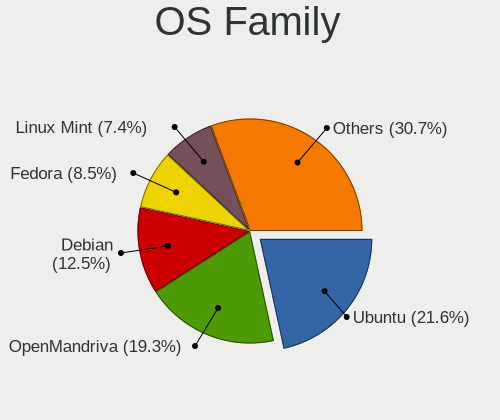
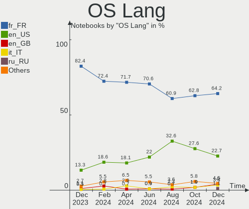
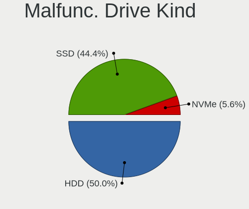
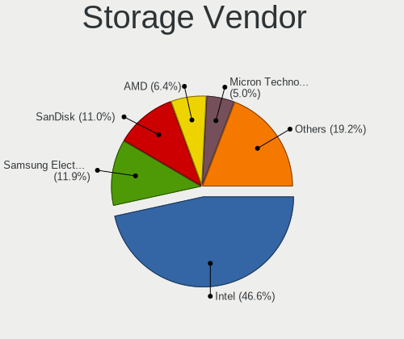
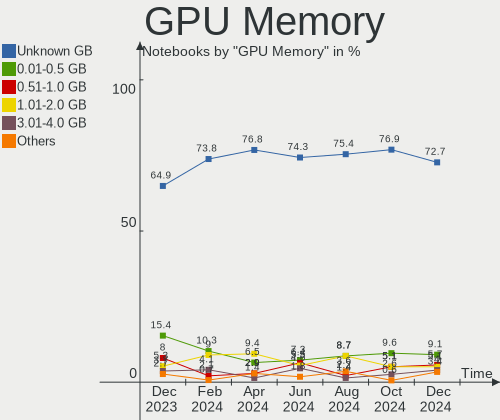
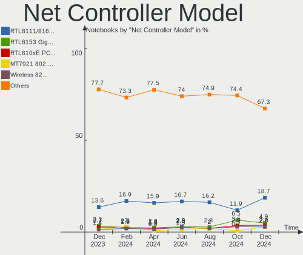
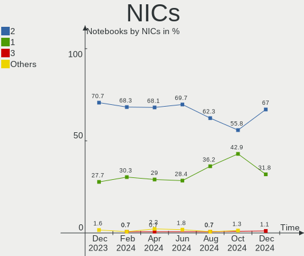

Linux in France - Hardware Trends (Notebooks)
---------------------------------------------

A project to identify most popular hardware characteristics and track their change
over time based on data collected by Linux users at https://Linux-Hardware.org.

Anyone can contribute to this report by the [hw-probe](https://github.com/linuxhw/hw-probe) tool:

    sudo -E hw-probe -all -upload

Period: Oct, 2023.

Contents
--------

* [ System ](#system)
  - [ OS                       ](#os)
  - [ OS Family                ](#os-family)
  - [ Kernel                   ](#kernel)
  - [ Kernel Family            ](#kernel-family)
  - [ Kernel Major Ver.        ](#kernel-major-ver)
  - [ Arch                     ](#arch)
  - [ DE                       ](#de)
  - [ Display Server           ](#display-server)
  - [ Display Manager          ](#display-manager)
  - [ OS Lang                  ](#os-lang)
  - [ Boot Mode                ](#boot-mode)
  - [ Filesystem               ](#filesystem)
  - [ Part. scheme             ](#part-scheme)
  - [ Dual Boot with Linux/BSD ](#dual-boot-with-linuxbsd)
  - [ Dual Boot (Win)          ](#dual-boot-win)

* [ Board ](#board)
  - [ Vendor                   ](#vendor)
  - [ Model                    ](#model)
  - [ Model Family             ](#model-family)
  - [ MFG Year                 ](#mfg-year)
  - [ Form Factor              ](#form-factor)
  - [ Secure Boot              ](#secure-boot)
  - [ Coreboot                 ](#coreboot)
  - [ RAM Size                 ](#ram-size)
  - [ RAM Used                 ](#ram-used)
  - [ Total Drives             ](#total-drives)
  - [ Has CD-ROM               ](#has-cd-rom)
  - [ Has Ethernet             ](#has-ethernet)
  - [ Has WiFi                 ](#has-wifi)
  - [ Has Bluetooth            ](#has-bluetooth)

* [ Location ](#location)
  - [ Country                  ](#country)
  - [ City                     ](#city)

* [ Drives ](#drives)
  - [ Drive Vendor             ](#drive-vendor)
  - [ Drive Model              ](#drive-model)
  - [ HDD Vendor               ](#hdd-vendor)
  - [ SSD Vendor               ](#ssd-vendor)
  - [ Drive Kind               ](#drive-kind)
  - [ Drive Connector          ](#drive-connector)
  - [ Drive Size               ](#drive-size)
  - [ Space Total              ](#space-total)
  - [ Space Used               ](#space-used)
  - [ Malfunc. Drives          ](#malfunc-drives)
  - [ Malfunc. Drive Vendor    ](#malfunc-drive-vendor)
  - [ Malfunc. HDD Vendor      ](#malfunc-hdd-vendor)
  - [ Malfunc. Drive Kind      ](#malfunc-drive-kind)
  - [ Failed Drives            ](#failed-drives)
  - [ Failed Drive Vendor      ](#failed-drive-vendor)
  - [ Drive Status             ](#drive-status)

* [ Storage controller ](#storage-controller)
  - [ Storage Vendor           ](#storage-vendor)
  - [ Storage Model            ](#storage-model)
  - [ Storage Kind             ](#storage-kind)

* [ Processor ](#processor)
  - [ CPU Vendor               ](#cpu-vendor)
  - [ CPU Model                ](#cpu-model)
  - [ CPU Model Family         ](#cpu-model-family)
  - [ CPU Cores                ](#cpu-cores)
  - [ CPU Sockets              ](#cpu-sockets)
  - [ CPU Threads              ](#cpu-threads)
  - [ CPU Op-Modes             ](#cpu-op-modes)
  - [ CPU Microcode            ](#cpu-microcode)
  - [ CPU Microarch            ](#cpu-microarch)

* [ Graphics ](#graphics)
  - [ GPU Vendor               ](#gpu-vendor)
  - [ GPU Model                ](#gpu-model)
  - [ GPU Combo                ](#gpu-combo)
  - [ GPU Driver               ](#gpu-driver)
  - [ GPU Memory               ](#gpu-memory)

* [ Monitor ](#monitor)
  - [ Monitor Vendor           ](#monitor-vendor)
  - [ Monitor Model            ](#monitor-model)
  - [ Monitor Resolution       ](#monitor-resolution)
  - [ Monitor Diagonal         ](#monitor-diagonal)
  - [ Monitor Width            ](#monitor-width)
  - [ Aspect Ratio             ](#aspect-ratio)
  - [ Monitor Area             ](#monitor-area)
  - [ Pixel Density            ](#pixel-density)
  - [ Multiple Monitors        ](#multiple-monitors)

* [ Network ](#network)
  - [ Net Controller Vendor    ](#net-controller-vendor)
  - [ Net Controller Model     ](#net-controller-model)
  - [ Wireless Vendor          ](#wireless-vendor)
  - [ Wireless Model           ](#wireless-model)
  - [ Ethernet Vendor          ](#ethernet-vendor)
  - [ Ethernet Model           ](#ethernet-model)
  - [ Net Controller Kind      ](#net-controller-kind)
  - [ Used Controller          ](#used-controller)
  - [ NICs                     ](#nics)
  - [ IPv6                     ](#ipv6)

* [ Bluetooth ](#bluetooth)
  - [ Bluetooth Vendor         ](#bluetooth-vendor)
  - [ Bluetooth Model          ](#bluetooth-model)

* [ Sound ](#sound)
  - [ Sound Vendor             ](#sound-vendor)
  - [ Sound Model              ](#sound-model)

* [ Memory ](#memory)
  - [ Memory Vendor            ](#memory-vendor)
  - [ Memory Model             ](#memory-model)
  - [ Memory Kind              ](#memory-kind)
  - [ Memory Form Factor       ](#memory-form-factor)
  - [ Memory Size              ](#memory-size)
  - [ Memory Speed             ](#memory-speed)

* [ Printers & scanners ](#printers--scanners)
  - [ Printer Vendor           ](#printer-vendor)
  - [ Printer Model            ](#printer-model)
  - [ Scanner Vendor           ](#scanner-vendor)
  - [ Scanner Model            ](#scanner-model)

* [ Camera ](#camera)
  - [ Camera Vendor            ](#camera-vendor)
  - [ Camera Model             ](#camera-model)

* [ Security ](#security)
  - [ Fingerprint Vendor       ](#fingerprint-vendor)
  - [ Fingerprint Model        ](#fingerprint-model)
  - [ Chipcard Vendor          ](#chipcard-vendor)
  - [ Chipcard Model           ](#chipcard-model)

* [ Unsupported ](#unsupported)
  - [ Unsupported Devices      ](#unsupported-devices)
  - [ Unsupported Device Types ](#unsupported-device-types)

System
------

OS
--

Installed operating systems

| Name                         | Notebooks | Percent |
|------------------------------|-----------|---------|
| Ubuntu 22.04                 | 46        | 27.38%  |
| Debian 12                    | 14        | 8.33%   |
| Linux Mint 21.2              | 13        | 7.74%   |
| Fedora 38                    | 10        | 5.95%   |
| Ubuntu 20.04                 | 7         | 4.17%   |
| OpenMandriva 23.08           | 7         | 4.17%   |
| Pop!_OS 22.04                | 6         | 3.57%   |
| Ubuntu 23.04                 | 5         | 2.98%   |
| OpenMandriva 23.10           | 4         | 2.38%   |
| Lubuntu 22.04                | 4         | 2.38%   |
| Ubuntu 23.10                 | 3         | 1.79%   |
| openSUSE Tumbleweed-XXXXXXXX | 3         | 1.79%   |
| LMDE 6                       | 3         | 1.79%   |
| Debian 11                    | 3         | 1.79%   |
| Arch Rolling                 | 3         | 1.79%   |
| Ubuntu MATE 22.04            | 2         | 1.19%   |
| Ubuntu Budgie 22.04          | 2         | 1.19%   |
| OpenMandriva 23.01           | 2         | 1.19%   |
| Linux Mint 21.1              | 2         | 1.19%   |
| Kali 2023.3                  | 2         | 1.19%   |
| Gentoo 2.14                  | 2         | 1.19%   |
| ArcoLinux Rolling            | 2         | 1.19%   |
| Zorin 16                     | 1         | 0.6%    |
| Xubuntu 23.10                | 1         | 0.6%    |
| Xubuntu 22.04                | 1         | 0.6%    |
| Ubuntu MATE 23.04            | 1         | 0.6%    |
| Ubuntu 18.04                 | 1         | 0.6%    |
| SteamOS Rolling              | 1         | 0.6%    |
| SteamOS 3.4.10               | 1         | 0.6%    |
| Slackware 15.0               | 1         | 0.6%    |
| OpenMandriva 4.50            | 1         | 0.6%    |
| OpenMandriva 4.3             | 1         | 0.6%    |
| OpenMandriva 23.90           | 1         | 0.6%    |
| Nobara 38                    | 1         | 0.6%    |
| Manjaro 23.0.4               | 1         | 0.6%    |
| Manjaro 23.0.2               | 1         | 0.6%    |
| Manjaro                      | 1         | 0.6%    |
| Linux Lite 6.4               | 1         | 0.6%    |
| Kubuntu 22.04                | 1         | 0.6%    |
| Kubuntu 14.04                | 1         | 0.6%    |

OS Family
---------

OS without a version

| Name          | Notebooks | Percent |
|---------------|-----------|---------|
| Ubuntu        | 62        | 36.9%   |
| Debian        | 17        | 10.12%  |
| OpenMandriva  | 16        | 9.52%   |
| Linux Mint    | 15        | 8.93%   |
| Fedora        | 10        | 5.95%   |
| Pop!_OS       | 6         | 3.57%   |
| Lubuntu       | 4         | 2.38%   |
| Ubuntu MATE   | 3         | 1.79%   |
| openSUSE      | 3         | 1.79%   |
| Manjaro       | 3         | 1.79%   |
| LMDE          | 3         | 1.79%   |
| Arch          | 3         | 1.79%   |
| Xubuntu       | 2         | 1.19%   |
| Ubuntu Budgie | 2         | 1.19%   |
| SteamOS       | 2         | 1.19%   |
| Kubuntu       | 2         | 1.19%   |
| Kali          | 2         | 1.19%   |
| Gentoo        | 2         | 1.19%   |
| ArcoLinux     | 2         | 1.19%   |
| Zorin         | 1         | 0.6%    |
| Slackware     | 1         | 0.6%    |
| Nobara        | 1         | 0.6%    |
| Linux Lite    | 1         | 0.6%    |
| KDE neon      | 1         | 0.6%    |
| Garuda Linux  | 1         | 0.6%    |
| EndeavourOS   | 1         | 0.6%    |
| Elementary    | 1         | 0.6%    |
| ChimeraOS     | 1         | 0.6%    |

Kernel
------

Version of the Linux kernel

| Version                     | Notebooks | Percent |
|-----------------------------|-----------|---------|
| 6.2.0-34-generic            | 24        | 14.29%  |
| 6.2.0-35-generic            | 16        | 9.52%   |
| 6.1.0-13-amd64              | 12        | 7.14%   |
| 5.15.0-86-generic           | 10        | 5.95%   |
| 6.2.0-33-generic            | 9         | 5.36%   |
| 6.4.11-desktop-1omv2390     | 7         | 4.17%   |
| 5.15.0-84-generic           | 5         | 2.98%   |
| 6.5.5-desktop-1omv2390      | 4         | 2.38%   |
| 6.5.5-200.fc38.x86_64       | 4         | 2.38%   |
| 5.15.0-87-generic           | 4         | 2.38%   |
| 6.5.6-76060506-generic      | 3         | 1.79%   |
| 6.5.4-1-default             | 3         | 1.79%   |
| 5.15.0-76-generic           | 3         | 1.79%   |
| 6.5.7-arch1-1               | 2         | 1.19%   |
| 6.5.7-200.fc38.x86_64       | 2         | 1.19%   |
| 6.5.6-200.fc38.x86_64       | 2         | 1.19%   |
| 6.5.5-1-MANJARO             | 2         | 1.19%   |
| 6.5.4-76060504-generic      | 2         | 1.19%   |
| 6.5.0-9-generic             | 2         | 1.19%   |
| 6.5.0-10-generic            | 2         | 1.19%   |
| 6.4.0-0.deb12.2-amd64       | 2         | 1.19%   |
| 6.2.0-26-generic            | 2         | 1.19%   |
| 6.1.0-12-amd64              | 2         | 1.19%   |
| 5.15.0-87-lowlatency        | 2         | 1.19%   |
| 5.10.0-25-amd64             | 2         | 1.19%   |
| 6.6.0-rc5-1-mainline        | 1         | 0.6%    |
| 6.6.0-1-MANJARO             | 1         | 0.6%    |
| 6.5.8-arch1-1               | 1         | 0.6%    |
| 6.5.8-200.fc38.x86_64       | 1         | 0.6%    |
| 6.5.7-060507-generic        | 1         | 0.6%    |
| 6.5.6-chos1-chimeraos-1     | 1         | 0.6%    |
| 6.5.6-200.fsync.fc38.x86_64 | 1         | 0.6%    |
| 6.5.5-arch1-1               | 1         | 0.6%    |
| 6.5.4-arch2-1               | 1         | 0.6%    |
| 6.5.0-kali3-amd64           | 1         | 0.6%    |
| 6.4.8-desktop-2omv2390      | 1         | 0.6%    |
| 6.4.3-desktop-2omv2390      | 1         | 0.6%    |
| 6.3.8-arch1-1               | 1         | 0.6%    |
| 6.3.0-kali1-amd64           | 1         | 0.6%    |
| 6.2.6-76060206-generic      | 1         | 0.6%    |

Kernel Family
-------------

Linux kernel without a distro release

| Version  | Notebooks | Percent |
|----------|-----------|---------|
| 6.2.0    | 51        | 30.36%  |
| 5.15.0   | 30        | 17.86%  |
| 6.1.0    | 16        | 9.52%   |
| 6.5.5    | 11        | 6.55%   |
| 6.5.6    | 7         | 4.17%   |
| 6.4.11   | 7         | 4.17%   |
| 6.5.4    | 6         | 3.57%   |
| 6.5.7    | 5         | 2.98%   |
| 6.5.0    | 5         | 2.98%   |
| 5.10.0   | 3         | 1.79%   |
| 6.6.0    | 2         | 1.19%   |
| 6.5.8    | 2         | 1.19%   |
| 6.4.0    | 2         | 1.19%   |
| 5.4.0    | 2         | 1.19%   |
| 6.4.8    | 1         | 0.6%    |
| 6.4.3    | 1         | 0.6%    |
| 6.3.8    | 1         | 0.6%    |
| 6.3.0    | 1         | 0.6%    |
| 6.2.6    | 1         | 0.6%    |
| 6.2.1    | 1         | 0.6%    |
| 6.1.57   | 1         | 0.6%    |
| 6.1.53   | 1         | 0.6%    |
| 6.1.52   | 1         | 0.6%    |
| 6.1.4    | 1         | 0.6%    |
| 6.1.1    | 1         | 0.6%    |
| 5.4.19   | 1         | 0.6%    |
| 5.19.5   | 1         | 0.6%    |
| 5.19.0   | 1         | 0.6%    |
| 5.17.0   | 1         | 0.6%    |
| 5.16.7   | 1         | 0.6%    |
| 5.15.118 | 1         | 0.6%    |
| 5.13.0   | 1         | 0.6%    |
| 4.14.23  | 1         | 0.6%    |

Kernel Major Ver.
-----------------

Linux kernel major version

| Version | Notebooks | Percent |
|---------|-----------|---------|
| 6.2     | 53        | 31.55%  |
| 6.5     | 36        | 21.43%  |
| 5.15    | 31        | 18.45%  |
| 6.1     | 21        | 12.5%   |
| 6.4     | 11        | 6.55%   |
| 5.4     | 3         | 1.79%   |
| 5.10    | 3         | 1.79%   |
| 6.6     | 2         | 1.19%   |
| 6.3     | 2         | 1.19%   |
| 5.19    | 2         | 1.19%   |
| 5.17    | 1         | 0.6%    |
| 5.16    | 1         | 0.6%    |
| 5.13    | 1         | 0.6%    |
| 4.14    | 1         | 0.6%    |

Arch
----

OS architecture (x86_64, i586, etc.)

| Name   | Notebooks | Percent |
|--------|-----------|---------|
| x86_64 | 168       | 100%    |

DE
--

Desktop Environment

| Name       | Notebooks | Percent |
|------------|-----------|---------|
| GNOME      | 84        | 50%     |
| KDE5       | 34        | 20.24%  |
| X-Cinnamon | 18        | 10.71%  |
| XFCE       | 7         | 4.17%   |
| LXQt       | 6         | 3.57%   |
| Unknown    | 6         | 3.57%   |
| MATE       | 4         | 2.38%   |
| i3         | 2         | 1.19%   |
| Budgie     | 2         | 1.19%   |
| Pantheon   | 1         | 0.6%    |
| KDE4       | 1         | 0.6%    |
| Hyprland   | 1         | 0.6%    |
| DDE        | 1         | 0.6%    |
| Cinnamon   | 1         | 0.6%    |

Display Server
--------------

X11 or Wayland

| Name    | Notebooks | Percent |
|---------|-----------|---------|
| X11     | 97        | 57.74%  |
| Wayland | 67        | 39.88%  |
| Unknown | 3         | 1.79%   |
| Tty     | 1         | 0.6%    |

Display Manager
---------------

SDDM, LightDM, etc.

| Name    | Notebooks | Percent |
|---------|-----------|---------|
| GDM3    | 60        | 35.71%  |
| SDDM    | 36        | 21.43%  |
| Unknown | 36        | 21.43%  |
| LightDM | 24        | 14.29%  |
| GDM     | 10        | 5.95%   |
| LY-DM   | 1         | 0.6%    |
| KDM     | 1         | 0.6%    |

OS Lang
-------

Language

| Lang    | Notebooks | Percent |
|---------|-----------|---------|
| fr_FR   | 126       | 75%     |
| en_US   | 35        | 20.83%  |
| en_GB   | 5         | 2.98%   |
| C       | 1         | 0.6%    |
| Unknown | 1         | 0.6%    |

Boot Mode
---------

EFI or BIOS

| Mode | Notebooks | Percent |
|------|-----------|---------|
| EFI  | 97        | 57.74%  |
| BIOS | 71        | 42.26%  |

Filesystem
----------

Type of filesystem

| Type    | Notebooks | Percent |
|---------|-----------|---------|
| Ext4    | 116       | 69.05%  |
| Tmpfs   | 29        | 17.26%  |
| Btrfs   | 18        | 10.71%  |
| Overlay | 3         | 1.79%   |
| Zfs     | 2         | 1.19%   |

Part. scheme
------------

Scheme of partitioning

| Type    | Notebooks | Percent |
|---------|-----------|---------|
| GPT     | 117       | 69.64%  |
| Unknown | 36        | 21.43%  |
| MBR     | 15        | 8.93%   |

Dual Boot with Linux/BSD
------------------------

Hosting more than one Linux/BSD

| Dual boot | Notebooks | Percent |
|-----------|-----------|---------|
| No        | 154       | 91.67%  |
| Yes       | 14        | 8.33%   |

Dual Boot (Win)
---------------

Hosting Linux and Windows

| Dual boot | Notebooks | Percent |
|-----------|-----------|---------|
| No        | 121       | 72.02%  |
| Yes       | 47        | 27.98%  |

Board
-----

Vendor
------

Motherboard manufacturer

| Name                | Notebooks | Percent |
|---------------------|-----------|---------|
| Hewlett-Packard     | 30        | 17.86%  |
| Lenovo              | 29        | 17.26%  |
| Dell                | 29        | 17.26%  |
| ASUSTek Computer    | 23        | 13.69%  |
| Acer                | 13        | 7.74%   |
| MSI                 | 8         | 4.76%   |
| UNOWHY              | 4         | 2.38%   |
| HUAWEI              | 4         | 2.38%   |
| Toshiba             | 3         | 1.79%   |
| Notebook            | 3         | 1.79%   |
| Apple               | 3         | 1.79%   |
| Valve               | 2         | 1.19%   |
| Thomson             | 2         | 1.19%   |
| Samsung Electronics | 2         | 1.19%   |
| Fujitsu Siemens     | 2         | 1.19%   |
| Clevo               | 2         | 1.19%   |
| Sony                | 1         | 0.6%    |
| Packard Bell        | 1         | 0.6%    |
| OFF GLOBAL          | 1         | 0.6%    |
| GPD                 | 1         | 0.6%    |
| Google              | 1         | 0.6%    |
| Fujitsu             | 1         | 0.6%    |
| Framework           | 1         | 0.6%    |
| Extra Terrestrial   | 1         | 0.6%    |
| EUROCOM             | 1         | 0.6%    |

Model
-----

Motherboard model

| Name                                             | Notebooks | Percent |
|--------------------------------------------------|-----------|---------|
| Dell Precision 5480                              | 3         | 1.79%   |
| Valve Jupiter                                    | 2         | 1.19%   |
| UNOWHY Y13G012S4EI                               | 2         | 1.19%   |
| UNOWHY Y13G011S4EI                               | 2         | 1.19%   |
| HUAWEI NBLB-WAX9N                                | 2         | 1.19%   |
| HP ZBook Fury 15.6 inch G8 Mobile Workstation PC | 2         | 1.19%   |
| HP ProBook 450 G6                                | 2         | 1.19%   |
| HP Pavilion 17                                   | 2         | 1.19%   |
| Dell Latitude E6320                              | 2         | 1.19%   |
| ASUS Zenbook UX7602VI_UX7602VI                   | 2         | 1.19%   |
| Acer Aspire A314-23P                             | 2         | 1.19%   |
| Toshiba Satellite C70D-B                         | 1         | 0.6%    |
| Toshiba Satellite C660D                          | 1         | 0.6%    |
| Toshiba Satellite C660                           | 1         | 0.6%    |
| Thomson X15I5-8TU512                             | 1         | 0.6%    |
| Thomson NEO14-4W64                               | 1         | 0.6%    |
| Sony VPCEH1L0E                                   | 1         | 0.6%    |
| Samsung 350V5C/351V5C/3540VC/3440VC              | 1         | 0.6%    |
| Samsung 305E4A/305E5A/305E7A                     | 1         | 0.6%    |
| Packard Bell EasyNote LM98                       | 1         | 0.6%    |
| OFF GLOBAL Nokia PureBook Pro 17                 | 1         | 0.6%    |
| Notebook W510LU                                  | 1         | 0.6%    |
| Notebook NS5x_NS7xAU                             | 1         | 0.6%    |
| Notebook NJ50_70CU                               | 1         | 0.6%    |
| MSI Stealth 16Studio A13VG                       | 1         | 0.6%    |
| MSI Modern 15 A5M                                | 1         | 0.6%    |
| MSI GT73EVR 7RE                                  | 1         | 0.6%    |
| MSI GT62VR 6RD                                   | 1         | 0.6%    |
| MSI GL73 8RD                                     | 1         | 0.6%    |
| MSI GF63 8RC                                     | 1         | 0.6%    |
| MSI GE63 Raider RGB 9SF                          | 1         | 0.6%    |
| MSI CX61 2PC                                     | 1         | 0.6%    |
| Lenovo Yoga Slim 7 14ARE05 82A2                  | 1         | 0.6%    |
| Lenovo V145-15AST 81MT                           | 1         | 0.6%    |
| Lenovo ThinkPad X240 20AMS7X300                  | 1         | 0.6%    |
| Lenovo ThinkPad X230 23259T0                     | 1         | 0.6%    |
| Lenovo ThinkPad X1C 5th W10DG 20K3S0WJ23         | 1         | 0.6%    |
| Lenovo ThinkPad X1 Carbon Gen 10 21CCS5P600      | 1         | 0.6%    |
| Lenovo ThinkPad T480 20L6S2LK0J                  | 1         | 0.6%    |
| Lenovo ThinkPad T420 4236EJ3                     | 1         | 0.6%    |

Model Family
------------

Motherboard model prefix

| Name                  | Notebooks | Percent |
|-----------------------|-----------|---------|
| Lenovo ThinkPad       | 16        | 9.52%   |
| Dell Latitude         | 12        | 7.14%   |
| Acer Aspire           | 12        | 7.14%   |
| HP Pavilion           | 8         | 4.76%   |
| Lenovo IdeaPad        | 7         | 4.17%   |
| HP EliteBook          | 7         | 4.17%   |
| Dell Precision        | 7         | 4.17%   |
| Dell XPS              | 6         | 3.57%   |
| ASUS VivoBook         | 6         | 3.57%   |
| HP ProBook            | 5         | 2.98%   |
| ASUS Zenbook          | 4         | 2.38%   |
| Toshiba Satellite     | 3         | 1.79%   |
| Valve Jupiter         | 2         | 1.19%   |
| UNOWHY Y13G012S4EI    | 2         | 1.19%   |
| UNOWHY Y13G011S4EI    | 2         | 1.19%   |
| Lenovo Legion         | 2         | 1.19%   |
| HUAWEI NBLB-WAX9N     | 2         | 1.19%   |
| HP ZBook              | 2         | 1.19%   |
| HP Victus             | 2         | 1.19%   |
| HP Laptop             | 2         | 1.19%   |
| Dell Inspiron         | 2         | 1.19%   |
| Dell G15              | 2         | 1.19%   |
| Thomson X15I5-8TU512  | 1         | 0.6%    |
| Thomson NEO14-4W64    | 1         | 0.6%    |
| Sony VPCEH1L0E        | 1         | 0.6%    |
| Samsung 350V5C        | 1         | 0.6%    |
| Samsung 305E4A        | 1         | 0.6%    |
| Packard Bell EasyNote | 1         | 0.6%    |
| OFF GLOBAL Nokia      | 1         | 0.6%    |
| Notebook W510LU       | 1         | 0.6%    |
| Notebook NS5x         | 1         | 0.6%    |
| Notebook NJ50         | 1         | 0.6%    |
| MSI Stealth           | 1         | 0.6%    |
| MSI Modern            | 1         | 0.6%    |
| MSI GT73EVR           | 1         | 0.6%    |
| MSI GT62VR            | 1         | 0.6%    |
| MSI GL73              | 1         | 0.6%    |
| MSI GF63              | 1         | 0.6%    |
| MSI GE63              | 1         | 0.6%    |
| MSI CX61              | 1         | 0.6%    |

MFG Year
--------

Motherboard manufacture year

| Year | Notebooks | Percent |
|------|-----------|---------|
| 2022 | 23        | 13.69%  |
| 2023 | 19        | 11.31%  |
| 2021 | 19        | 11.31%  |
| 2018 | 13        | 7.74%   |
| 2015 | 13        | 7.74%   |
| 2020 | 12        | 7.14%   |
| 2014 | 11        | 6.55%   |
| 2019 | 9         | 5.36%   |
| 2012 | 9         | 5.36%   |
| 2011 | 9         | 5.36%   |
| 2013 | 8         | 4.76%   |
| 2017 | 6         | 3.57%   |
| 2016 | 6         | 3.57%   |
| 2010 | 4         | 2.38%   |
| 2009 | 2         | 1.19%   |
| 2008 | 2         | 1.19%   |
| 2007 | 2         | 1.19%   |
| 2006 | 1         | 0.6%    |

Form Factor
-----------

Physical design of the computer

| Name     | Notebooks | Percent |
|----------|-----------|---------|
| Notebook | 168       | 100%    |

Secure Boot
-----------

Enabled or disabled

| State    | Notebooks | Percent |
|----------|-----------|---------|
| Disabled | 149       | 88.69%  |
| Enabled  | 19        | 11.31%  |

Coreboot
--------

Have coreboot on board

| Used | Notebooks | Percent |
|------|-----------|---------|
| No   | 167       | 99.4%   |
| Yes  | 1         | 0.6%    |

RAM Size
--------

Total RAM memory

| Size in GB  | Notebooks | Percent |
|-------------|-----------|---------|
| 4.01-8.0    | 47        | 27.98%  |
| 3.01-4.0    | 32        | 19.05%  |
| 8.01-16.0   | 31        | 18.45%  |
| 16.01-24.0  | 24        | 14.29%  |
| 32.01-64.0  | 22        | 13.1%   |
| 64.01-256.0 | 8         | 4.76%   |
| 1.01-2.0    | 2         | 1.19%   |
| 24.01-32.0  | 1         | 0.6%    |
| 2.01-3.0    | 1         | 0.6%    |

RAM Used
--------

Used RAM memory

| Used GB    | Notebooks | Percent |
|------------|-----------|---------|
| 2.01-3.0   | 49        | 29.17%  |
| 1.01-2.0   | 40        | 23.81%  |
| 4.01-8.0   | 38        | 22.62%  |
| 3.01-4.0   | 24        | 14.29%  |
| 8.01-16.0  | 12        | 7.14%   |
| 0.51-1.0   | 3         | 1.79%   |
| 16.01-24.0 | 2         | 1.19%   |

Total Drives
------------

Number of drives on board

| Drives | Notebooks | Percent |
|--------|-----------|---------|
| 1      | 122       | 72.62%  |
| 2      | 39        | 23.21%  |
| 3      | 6         | 3.57%   |
| 0      | 1         | 0.6%    |

Has CD-ROM
----------

Has CD-ROM on board

| Presented | Notebooks | Percent |
|-----------|-----------|---------|
| No        | 126       | 75%     |
| Yes       | 42        | 25%     |

Has Ethernet
------------

Has Ethernet on board

| Presented | Notebooks | Percent |
|-----------|-----------|---------|
| Yes       | 128       | 76.19%  |
| No        | 40        | 23.81%  |

Has WiFi
--------

Has WiFi module

| Presented | Notebooks | Percent |
|-----------|-----------|---------|
| Yes       | 167       | 99.4%   |
| No        | 1         | 0.6%    |

Has Bluetooth
-------------

Has Bluetooth module

| Presented | Notebooks | Percent |
|-----------|-----------|---------|
| Yes       | 145       | 86.31%  |
| No        | 23        | 13.69%  |

Location
--------

Country
-------

Geographic location (country)

| Country | Notebooks | Percent |
|---------|-----------|---------|
| France  | 168       | 100%    |

City
----

Geographic location (city)

| City                       | Notebooks | Percent |
|----------------------------|-----------|---------|
| Paris                      | 21        | 12.5%   |
| Toulouse                   | 9         | 5.36%   |
| Nantes                     | 4         | 2.38%   |
| Lyon                       | 4         | 2.38%   |
| Tours                      | 3         | 1.79%   |
| Grenoble                   | 3         | 1.79%   |
| Champs-sur-Marne           | 3         | 1.79%   |
| Aulnay-sous-Bois           | 3         | 1.79%   |
| Yerres                     | 2         | 1.19%   |
| Saint-Denis                | 2         | 1.19%   |
| Rennes                     | 2         | 1.19%   |
| Pau                        | 2         | 1.19%   |
| Nîmes                     | 2         | 1.19%   |
| Montpellier                | 2         | 1.19%   |
| La Ciotat                  | 2         | 1.19%   |
| Évreux                    | 2         | 1.19%   |
| Epiniac                    | 2         | 1.19%   |
| Egly                       | 2         | 1.19%   |
| Cormeilles-en-Parisis      | 2         | 1.19%   |
| Argenteuil                 | 2         | 1.19%   |
| Villeurbanne               | 1         | 0.6%    |
| Villefranche-sur-Saône    | 1         | 0.6%    |
| Vigneux-sur-Seine          | 1         | 0.6%    |
| Vélizy-Villacoublay       | 1         | 0.6%    |
| Vaulx-en-Velin             | 1         | 0.6%    |
| Vallon-Pont-d'Arc          | 1         | 0.6%    |
| Troyes                     | 1         | 0.6%    |
| Trappes                    | 1         | 0.6%    |
| Strasbourg                 | 1         | 0.6%    |
| St Laurent des Arbres      | 1         | 0.6%    |
| Seraincourt                | 1         | 0.6%    |
| Sarrebourg                 | 1         | 0.6%    |
| Sainte-Geneviève-des-Bois | 1         | 0.6%    |
| Sainte-Foy-les-Lyon        | 1         | 0.6%    |
| Saint-Sébastien-sur-Loire | 1         | 0.6%    |
| Saint-Julien-en-Genevois   | 1         | 0.6%    |
| Saint-Jean-de-Vedas        | 1         | 0.6%    |
| Saint-Germain-en-Laye      | 1         | 0.6%    |
| Royan                      | 1         | 0.6%    |
| Roubaix                    | 1         | 0.6%    |

Drives
------

Drive Vendor
------------

Hard drive vendors

| Vendor                      | Notebooks | Drives | Percent |
|-----------------------------|-----------|--------|---------|
| Samsung Electronics         | 37        | 40     | 17.87%  |
| SK hynix                    | 16        | 16     | 7.73%   |
| WDC                         | 14        | 16     | 6.76%   |
| Toshiba                     | 13        | 13     | 6.28%   |
| SanDisk                     | 13        | 13     | 6.28%   |
| Kingston                    | 13        | 13     | 6.28%   |
| Unknown                     | 11        | 11     | 5.31%   |
| Intel                       | 11        | 12     | 5.31%   |
| Seagate                     | 10        | 10     | 4.83%   |
| Micron Technology           | 10        | 10     | 4.83%   |
| Crucial                     | 8         | 9      | 3.86%   |
| HGST                        | 7         | 7      | 3.38%   |
| KIOXIA                      | 6         | 6      | 2.9%    |
| Hitachi                     | 6         | 6      | 2.9%    |
| China                       | 4         | 4      | 1.93%   |
| Emtec                       | 3         | 3      | 1.45%   |
| Phison Electronics          | 2         | 2      | 0.97%   |
| Micron/Crucial Technology   | 2         | 2      | 0.97%   |
| JMicron Technology          | 2         | 2      | 0.97%   |
| Fanxiang                    | 2         | 2      | 0.97%   |
| Apple                       | 2         | 2      | 0.97%   |
| WDC WDB                     | 1         | 1      | 0.48%   |
| Verbatim                    | 1         | 1      | 0.48%   |
| Transcend                   | 1         | 1      | 0.48%   |
| SPCC                        | 1         | 1      | 0.48%   |
| Phison                      | 1         | 1      | 0.48%   |
| LITEONIT                    | 1         | 1      | 0.48%   |
| LITEON                      | 1         | 1      | 0.48%   |
| LDLC                        | 1         | 1      | 0.48%   |
| Kingston Technology Company | 1         | 1      | 0.48%   |
| KingDian                    | 1         | 1      | 0.48%   |
| Integral                    | 1         | 1      | 0.48%   |
| Fujitsu                     | 1         | 1      | 0.48%   |
| FORESEE                     | 1         | 1      | 0.48%   |
| BIWIN                       | 1         | 1      | 0.48%   |
| ASMedia                     | 1         | 1      | 0.48%   |

Drive Model
-----------

Hard drive models

| Model                                              | Notebooks | Percent |
|----------------------------------------------------|-----------|---------|
| Intel SSDPEKNU512GZ 512GB                          | 5         | 2.35%   |
| Samsung NVMe SSD Controller PM9A1/PM9A3/980PRO 1TB | 4         | 1.88%   |
| Unknown MMC64G  64GB                               | 3         | 1.41%   |
| Unknown MMC Card  64GB                             | 3         | 1.41%   |
| Toshiba MQ04ABF100 1TB                             | 3         | 1.41%   |
| Toshiba MQ01ABD100 1TB                             | 3         | 1.41%   |
| Seagate ST1000LM035-1RK172 1TB                     | 3         | 1.41%   |
| Kingston SA400S37480G 480GB SSD                    | 3         | 1.41%   |
| HGST HTS721010A9E630 1TB                           | 3         | 1.41%   |
| SK hynix PC801 NVMe 512GB                          | 2         | 0.94%   |
| SanDisk SSD PLUS 240GB                             | 2         | 0.94%   |
| SanDisk NVMe SSD Drive 512GB                       | 2         | 0.94%   |
| Samsung SSD 870 QVO 1TB                            | 2         | 0.94%   |
| Samsung SSD 840 EVO 250GB                          | 2         | 0.94%   |
| Samsung PM9A1 NVMe 512GB                           | 2         | 0.94%   |
| Samsung PM991a NVMe 1024GB                         | 2         | 0.94%   |
| Samsung NVMe SSD Controller SM981/PM981/PM983 1TB  | 2         | 0.94%   |
| Micron 3400_MTFDKBA2T0TFH 2TB                      | 2         | 0.94%   |
| Micron 2450_MTFDKBA512TFK 512GB                    | 2         | 0.94%   |
| Kingston SA400S37240G 240GB SSD                    | 2         | 0.94%   |
| JMicron Generic 256GB                              | 2         | 0.94%   |
| Intel SSDPEKNU512GZH 512GB                         | 2         | 0.94%   |
| HGST HTS545050A7E680 500GB                         | 2         | 0.94%   |
| Fanxiang S101 1TB MX                               | 2         | 0.94%   |
| Crucial CT275MX300SSD1 275GB                       | 2         | 0.94%   |
| Crucial CT1000P3SSD8 1TB                           | 2         | 0.94%   |
| WDC WDS120G2G0B-00EPW0 120GB SSD                   | 1         | 0.47%   |
| WDC WDS100T2B0B-00YS70 1TB SSD                     | 1         | 0.47%   |
| WDC WDB NCE5000PNC 500GB SSD                       | 1         | 0.47%   |
| WDC WD5000LPCX-60VHAT1 500GB                       | 1         | 0.47%   |
| WDC WD5000LPCX-21VHAT0 500GB                       | 1         | 0.47%   |
| WDC WD32 00BEKX-75B7WT0 320GB                      | 1         | 0.47%   |
| WDC WD1600BEVS-07RST0 160GB                        | 1         | 0.47%   |
| WDC WD10SPZX-24Z10 1TB                             | 1         | 0.47%   |
| WDC WD10SPZX-21Z10T0 1TB                           | 1         | 0.47%   |
| WDC WD10SPZX-17Z10T1 1TB                           | 1         | 0.47%   |
| WDC WD10SPCX-24HWST1 1TB                           | 1         | 0.47%   |
| WDC WD10 0EMAZ-00WJTA0 10TB                        | 1         | 0.47%   |
| WDC PC SN810 NVMe 1024GB                           | 1         | 0.47%   |
| WDC PC SN530 SDBPNPZ-256G-1006 256GB               | 1         | 0.47%   |

HDD Vendor
----------

Hard disk drive vendors

| Vendor  | Notebooks | Drives | Percent |
|---------|-----------|--------|---------|
| WDC     | 9         | 9      | 22.5%   |
| Seagate | 9         | 9      | 22.5%   |
| Toshiba | 7         | 7      | 17.5%   |
| HGST    | 7         | 7      | 17.5%   |
| Hitachi | 6         | 6      | 15%     |
| Unknown | 1         | 1      | 2.5%    |
| Fujitsu | 1         | 1      | 2.5%    |

SSD Vendor
----------

Solid state drive vendors

| Vendor              | Notebooks | Drives | Percent |
|---------------------|-----------|--------|---------|
| Samsung Electronics | 11        | 12     | 18.64%  |
| Kingston            | 11        | 11     | 18.64%  |
| SanDisk             | 5         | 5      | 8.47%   |
| Crucial             | 5         | 6      | 8.47%   |
| China               | 4         | 4      | 6.78%   |
| SK hynix            | 3         | 3      | 5.08%   |
| Intel               | 3         | 3      | 5.08%   |
| Emtec               | 3         | 3      | 5.08%   |
| WDC                 | 2         | 2      | 3.39%   |
| WDC WDB             | 1         | 1      | 1.69%   |
| Verbatim            | 1         | 1      | 1.69%   |
| Transcend           | 1         | 1      | 1.69%   |
| SPCC                | 1         | 1      | 1.69%   |
| Micron Technology   | 1         | 1      | 1.69%   |
| LITEONIT            | 1         | 1      | 1.69%   |
| LITEON              | 1         | 1      | 1.69%   |
| LDLC                | 1         | 1      | 1.69%   |
| KingDian            | 1         | 1      | 1.69%   |
| Integral            | 1         | 1      | 1.69%   |
| ASMedia             | 1         | 1      | 1.69%   |
| Apple               | 1         | 1      | 1.69%   |

Drive Kind
----------

HDD or SSD

| Kind    | Notebooks | Drives | Percent |
|---------|-----------|--------|---------|
| NVMe    | 89        | 101    | 46.35%  |
| SSD     | 52        | 61     | 27.08%  |
| HDD     | 39        | 40     | 20.31%  |
| MMC     | 10        | 10     | 5.21%   |
| Unknown | 2         | 2      | 1.04%   |

Drive Connector
---------------

SATA, SAS, NVMe, etc.

| Type | Notebooks | Drives | Percent |
|------|-----------|--------|---------|
| NVMe | 88        | 99     | 47.06%  |
| SATA | 82        | 97     | 43.85%  |
| MMC  | 10        | 10     | 5.35%   |
| SAS  | 7         | 8      | 3.74%   |

Drive Size
----------

Size of hard drive

| Size in TB | Notebooks | Drives | Percent |
|------------|-----------|--------|---------|
| 0.01-0.5   | 56        | 63     | 60.22%  |
| 0.51-1.0   | 32        | 33     | 34.41%  |
| 1.01-2.0   | 4         | 4      | 4.3%    |
| 4.01-10.0  | 1         | 1      | 1.08%   |

Space Total
-----------

Amount of disk space available on the file system

| Size in GB     | Notebooks | Percent |
|----------------|-----------|---------|
| 251-500        | 42        | 25%     |
| 101-250        | 41        | 24.4%   |
| 501-1000       | 33        | 19.64%  |
| 51-100         | 13        | 7.74%   |
| 1001-2000      | 10        | 5.95%   |
| 1-20           | 9         | 5.36%   |
| More than 3000 | 7         | 4.17%   |
| Unknown        | 5         | 2.98%   |
| 21-50          | 4         | 2.38%   |
| 2001-3000      | 4         | 2.38%   |

Space Used
----------

Amount of used disk space

| Used GB        | Notebooks | Percent |
|----------------|-----------|---------|
| 1-20           | 58        | 34.52%  |
| 21-50          | 30        | 17.86%  |
| 101-250        | 28        | 16.67%  |
| 51-100         | 17        | 10.12%  |
| 251-500        | 14        | 8.33%   |
| 501-1000       | 10        | 5.95%   |
| Unknown        | 5         | 2.98%   |
| 1001-2000      | 3         | 1.79%   |
| 2001-3000      | 2         | 1.19%   |
| More than 3000 | 1         | 0.6%    |

Malfunc. Drives
---------------

Drive models with a malfunction

| Model                                 | Notebooks | Drives | Percent |
|---------------------------------------|-----------|--------|---------|
| WDC WDS120G2G0B-00EPW0 120GB SSD      | 1         | 1      | 7.14%   |
| Transcend TS512GMTS430S 512GB SSD     | 1         | 1      | 7.14%   |
| Toshiba MQ04ABF100 1TB                | 1         | 1      | 7.14%   |
| SK hynix HFS128G39TND-N210A 128GB SSD | 1         | 1      | 7.14%   |
| SK hynix BC711 HFM512GD3JX013N 512GB  | 1         | 1      | 7.14%   |
| SanDisk SSD PLUS 240GB                | 1         | 1      | 7.14%   |
| LDLC F6+M.2 240 240GB SSD             | 1         | 1      | 7.14%   |
| Kingston SV300S37A120G 120GB SSD      | 1         | 1      | 7.14%   |
| Kingston RBU-SMSM151S324GD 24GB SSD   | 1         | 1      | 7.14%   |
| Hitachi HTS547550A9E384 500GB         | 1         | 1      | 7.14%   |
| HGST HTS725032A7E630 320GB            | 1         | 1      | 7.14%   |
| HGST HTS721010A9E630 1TB              | 1         | 1      | 7.14%   |
| HGST HTS545050A7E680 500GB            | 1         | 1      | 7.14%   |
| Crucial CT275MX300SSD1 275GB          | 1         | 1      | 7.14%   |

Malfunc. Drive Vendor
---------------------

Vendors of faulty drives

| Vendor    | Notebooks | Drives | Percent |
|-----------|-----------|--------|---------|
| HGST      | 3         | 3      | 21.43%  |
| SK hynix  | 2         | 2      | 14.29%  |
| Kingston  | 2         | 2      | 14.29%  |
| WDC       | 1         | 1      | 7.14%   |
| Transcend | 1         | 1      | 7.14%   |
| Toshiba   | 1         | 1      | 7.14%   |
| SanDisk   | 1         | 1      | 7.14%   |
| LDLC      | 1         | 1      | 7.14%   |
| Hitachi   | 1         | 1      | 7.14%   |
| Crucial   | 1         | 1      | 7.14%   |

Malfunc. HDD Vendor
-------------------

Vendors of faulty HDD drives

| Vendor  | Notebooks | Drives | Percent |
|---------|-----------|--------|---------|
| HGST    | 3         | 3      | 60%     |
| Toshiba | 1         | 1      | 20%     |
| Hitachi | 1         | 1      | 20%     |

Malfunc. Drive Kind
-------------------

Kinds of faulty drives

| Kind | Notebooks | Drives | Percent |
|------|-----------|--------|---------|
| SSD  | 8         | 8      | 57.14%  |
| HDD  | 5         | 5      | 35.71%  |
| NVMe | 1         | 1      | 7.14%   |

Failed Drives
-------------

Failed drive models

Zero info for selected period =(

Failed Drive Vendor
-------------------

Failed drive vendors

Zero info for selected period =(

Drive Status
------------

Number of failed and malfunc. drives

| Status   | Notebooks | Drives | Percent |
|----------|-----------|--------|---------|
| Works    | 90        | 113    | 51.14%  |
| Detected | 73        | 87     | 41.48%  |
| Malfunc  | 13        | 14     | 7.39%   |

Storage controller
------------------

Storage Vendor
--------------

Storage controller vendors

| Vendor                       | Notebooks | Percent |
|------------------------------|-----------|---------|
| Intel                        | 106       | 50%     |
| Samsung Electronics          | 26        | 12.26%  |
| AMD                          | 17        | 8.02%   |
| SK hynix                     | 13        | 6.13%   |
| SanDisk                      | 13        | 6.13%   |
| Micron Technology            | 9         | 4.25%   |
| Toshiba America Info Systems | 8         | 3.77%   |
| Micron/Crucial Technology    | 5         | 2.36%   |
| KIOXIA                       | 4         | 1.89%   |
| Phison Electronics           | 3         | 1.42%   |
| Kingston Technology Company  | 3         | 1.42%   |
| Shenzhen Longsys Electronics | 1         | 0.47%   |
| Seagate Technology           | 1         | 0.47%   |
| Marvell Technology Group     | 1         | 0.47%   |
| Biwin Storage Technology     | 1         | 0.47%   |
| Apple                        | 1         | 0.47%   |

Storage Model
-------------

Storage controller models

| Model                                                                          | Notebooks | Percent |
|--------------------------------------------------------------------------------|-----------|---------|
| AMD FCH SATA Controller [AHCI mode]                                            | 15        | 6.73%   |
| Intel 82801 Mobile SATA Controller [RAID mode]                                 | 11        | 4.93%   |
| Intel Volume Management Device NVMe RAID Controller                            | 10        | 4.48%   |
| Samsung NVMe SSD Controller PM9A1/PM9A3/980PRO                                 | 9         | 4.04%   |
| Samsung NVMe SSD Controller 980 (DRAM-less)                                    | 9         | 4.04%   |
| Intel Sunrise Point-LP SATA Controller [AHCI mode]                             | 9         | 4.04%   |
| Intel 6 Series/C200 Series Chipset Family 6 port Mobile SATA AHCI Controller   | 9         | 4.04%   |
| Intel SSD 670p Series [Keystone Harbor]                                        | 8         | 3.59%   |
| Intel 8 Series/C220 Series Chipset Family 6-port SATA Controller 1 [AHCI mode] | 7         | 3.14%   |
| Intel Volume Management Device NVMe RAID Controller Intel Corporation          | 6         | 2.69%   |
| Samsung NVMe SSD Controller SM981/PM981/PM983                                  | 5         | 2.24%   |
| Micron 3400 NVMe SSD [Hendrix]                                                 | 5         | 2.24%   |
| Intel HM170/QM170 Chipset SATA Controller [AHCI Mode]                          | 5         | 2.24%   |
| Intel 7 Series Chipset Family 6-port SATA Controller [AHCI mode]               | 5         | 2.24%   |
| Toshiba America Info Systems XG6 NVMe SSD Controller                           | 4         | 1.79%   |
| Micron/Crucial P2 [Nick P2] / P3 / P3 Plus NVMe PCIe SSD (DRAM-less)           | 4         | 1.79%   |
| Intel Wildcat Point-LP SATA Controller [AHCI Mode]                             | 4         | 1.79%   |
| Intel Comet Lake SATA AHCI Controller                                          | 4         | 1.79%   |
| Intel Celeron/Pentium Silver Processor SATA Controller                         | 4         | 1.79%   |
| Intel Cannon Lake Mobile PCH SATA AHCI Controller                              | 4         | 1.79%   |
| Intel 5 Series/3400 Series Chipset 4 port SATA AHCI Controller                 | 4         | 1.79%   |
| SK hynix Platinum P41/PC801 NVMe Solid State Drive                             | 3         | 1.35%   |
| SK hynix Gold P31/BC711/PC711 NVMe Solid State Drive                           | 3         | 1.35%   |
| Intel Cannon Point-LP SATA Controller [AHCI Mode]                              | 3         | 1.35%   |
| Intel 8 Series SATA Controller 1 [AHCI mode]                                   | 3         | 1.35%   |
| Toshiba America Info Systems XG4 NVMe SSD Controller                           | 2         | 0.9%    |
| SK hynix PC611 NVMe Solid State Drive                                          | 2         | 0.9%    |
| SK hynix BC901 NVMe Solid State Drive (DRAM-less)                              | 2         | 0.9%    |
| SK hynix BC501 NVMe Solid State Drive                                          | 2         | 0.9%    |
| SanDisk WD PC SN810 / Black SN850 NVMe SSD                                     | 2         | 0.9%    |
| SanDisk WD Blue SN500 / PC SN520 x2 M.2 2280 NVMe SSD                          | 2         | 0.9%    |
| Sandisk WD Black SN850X NVMe SSD                                               | 2         | 0.9%    |
| SanDisk WD Black SN770 / PC SN740 256GB / PC SN560 (DRAM-less) NVMe SSD        | 2         | 0.9%    |
| Samsung NVMe SSD Controller S4LV008[Pascal]                                    | 2         | 0.9%    |
| Phison PS5013-E13 PCIe3 NVMe Controller (DRAM-less)                            | 2         | 0.9%    |
| Micron 2450 NVMe SSD [HendrixV] (DRAM-less)                                    | 2         | 0.9%    |
| KIOXIA NVMe SSD Controller XG8                                                 | 2         | 0.9%    |
| Intel Tiger Lake-LP SATA Controller                                            | 2         | 0.9%    |
| Intel Q170/Q150/B150/H170/H110/Z170/CM236 Chipset SATA Controller [AHCI Mode]  | 2         | 0.9%    |
| Intel Atom Processor E3800 Series SATA AHCI Controller                         | 2         | 0.9%    |

Storage Kind
------------

Kind of storage controller (IDE, SATA, NVMe, SAS, ...)

| Kind | Notebooks | Percent |
|------|-----------|---------|
| SATA | 92        | 43.19%  |
| NVMe | 88        | 41.31%  |
| RAID | 27        | 12.68%  |
| IDE  | 6         | 2.82%   |

Processor
---------

CPU Vendor
----------

Processor vendors

| Vendor | Notebooks | Percent |
|--------|-----------|---------|
| Intel  | 133       | 79.17%  |
| AMD    | 35        | 20.83%  |

CPU Model
---------

Processor models

| Model                                         | Notebooks | Percent |
|-----------------------------------------------|-----------|---------|
| AMD Ryzen 5 7520U with Radeon Graphics        | 5         | 2.98%   |
| Intel Core i5-6300U CPU @ 2.40GHz             | 4         | 2.38%   |
| Intel Celeron N4120 CPU @ 1.10GHz             | 4         | 2.38%   |
| Intel Core i7-9750H CPU @ 2.60GHz             | 3         | 1.79%   |
| Intel Core i7-6500U CPU @ 2.50GHz             | 3         | 1.79%   |
| Intel Core i5-2520M CPU @ 2.50GHz             | 3         | 1.79%   |
| Intel 13th Gen Core i9-13900H                 | 3         | 1.79%   |
| Intel 12th Gen Core i7-12700H                 | 3         | 1.79%   |
| AMD Ryzen 7 3700U with Radeon Vega Mobile Gfx | 3         | 1.79%   |
| Intel Core i7-6820HQ CPU @ 2.70GHz            | 2         | 1.19%   |
| Intel Core i7-6700HQ CPU @ 2.60GHz            | 2         | 1.19%   |
| Intel Core i7-4750HQ CPU @ 2.00GHz            | 2         | 1.19%   |
| Intel Core i7-10510U CPU @ 1.80GHz            | 2         | 1.19%   |
| Intel Core i5-8300H CPU @ 2.30GHz             | 2         | 1.19%   |
| Intel Core i5-8265U CPU @ 1.60GHz             | 2         | 1.19%   |
| Intel Core i5-7200U CPU @ 2.50GHz             | 2         | 1.19%   |
| Intel Core i5-4310U CPU @ 2.00GHz             | 2         | 1.19%   |
| Intel Core i5-3320M CPU @ 2.60GHz             | 2         | 1.19%   |
| Intel Core i5-1035G1 CPU @ 1.00GHz            | 2         | 1.19%   |
| Intel Core i3-6006U CPU @ 2.00GHz             | 2         | 1.19%   |
| Intel Core i3-10110U CPU @ 2.10GHz            | 2         | 1.19%   |
| Intel Celeron Dual-Core CPU T3000 @ 1.80GHz   | 2         | 1.19%   |
| Intel 13th Gen Core i7-13700H                 | 2         | 1.19%   |
| Intel 13th Gen Core i7-1360P                  | 2         | 1.19%   |
| Intel 13th Gen Core i5-1345U                  | 2         | 1.19%   |
| Intel 11th Gen Core i7-11850H @ 2.50GHz       | 2         | 1.19%   |
| Intel 11th Gen Core i7-11800H @ 2.30GHz       | 2         | 1.19%   |
| AMD Ryzen 9 5900HX with Radeon Graphics       | 2         | 1.19%   |
| AMD Ryzen 7 7735U with Radeon Graphics        | 2         | 1.19%   |
| AMD Ryzen 5 5500U with Radeon Graphics        | 2         | 1.19%   |
| AMD Ryzen 5 4500U with Radeon Graphics        | 2         | 1.19%   |
| AMD E1-6010 APU with AMD Radeon R2 Graphics   | 2         | 1.19%   |
| AMD Custom APU 0405                           | 2         | 1.19%   |
| AMD A4-9125 RADEON R3, 4 COMPUTE CORES 2C+2G  | 2         | 1.19%   |
| Intel Pentium Silver N6000 @ 1.10GHz          | 1         | 0.6%    |
| Intel Pentium Dual CPU T2310 @ 1.46GHz        | 1         | 0.6%    |
| Intel Pentium CPU B970 @ 2.30GHz              | 1         | 0.6%    |
| Intel Pentium CPU B940 @ 2.00GHz              | 1         | 0.6%    |
| Intel Core i7-8750H CPU @ 2.20GHz             | 1         | 0.6%    |
| Intel Core i7-8665U CPU @ 1.90GHz             | 1         | 0.6%    |

CPU Model Family
----------------

Processor model prefix

| Model                                | Notebooks | Percent |
|--------------------------------------|-----------|---------|
| Other                                | 38        | 22.62%  |
| Intel Core i5                        | 36        | 21.43%  |
| Intel Core i7                        | 31        | 18.45%  |
| Intel Core i3                        | 13        | 7.74%   |
| Intel Celeron                        | 10        | 5.95%   |
| AMD Ryzen 5                          | 10        | 5.95%   |
| AMD Ryzen 7                          | 8         | 4.76%   |
| AMD E1                               | 4         | 2.38%   |
| Intel Pentium                        | 2         | 1.19%   |
| Intel Celeron Dual-Core              | 2         | 1.19%   |
| AMD Ryzen 9                          | 2         | 1.19%   |
| AMD A6                               | 2         | 1.19%   |
| AMD A4                               | 2         | 1.19%   |
| Intel Pentium Silver                 | 1         | 0.6%    |
| Intel Pentium Dual                   | 1         | 0.6%    |
| Intel Core 2                         | 1         | 0.6%    |
| Intel Atom                           | 1         | 0.6%    |
| AMD Turion X2 Ultra Dual-Core Mobile | 1         | 0.6%    |
| AMD E                                | 1         | 0.6%    |
| AMD A8                               | 1         | 0.6%    |
| AMD A10                              | 1         | 0.6%    |

CPU Cores
---------

Number of processor cores

| Number | Notebooks | Percent |
|--------|-----------|---------|
| 2      | 65        | 38.69%  |
| 4      | 54        | 32.14%  |
| 14     | 12        | 7.14%   |
| 8      | 12        | 7.14%   |
| 6      | 12        | 7.14%   |
| 10     | 7         | 4.17%   |
| 12     | 3         | 1.79%   |
| 24     | 1         | 0.6%    |
| 16     | 1         | 0.6%    |
| 1      | 1         | 0.6%    |

CPU Sockets
-----------

Number of sockets

| Number | Notebooks | Percent |
|--------|-----------|---------|
| 1      | 168       | 100%    |

CPU Threads
-----------

Threads per core (Hyper-Threading)

| Number | Notebooks | Percent |
|--------|-----------|---------|
| 2      | 133       | 79.17%  |
| 1      | 35        | 20.83%  |

CPU Op-Modes
------------

CPU Operation Modes (32-bit, 64-bit)

| Op mode        | Notebooks | Percent |
|----------------|-----------|---------|
| 32-bit, 64-bit | 168       | 100%    |

CPU Microcode
-------------

Microcode number

| Number     | Notebooks | Percent |
|------------|-----------|---------|
| Unknown    | 106       | 63.1%   |
| 0x906a3    | 6         | 3.57%   |
| 0xb06a2    | 4         | 2.38%   |
| 0x806ec    | 4         | 2.38%   |
| 0x08a00008 | 4         | 2.38%   |
| 0x08608103 | 3         | 1.79%   |
| 0x906ea    | 2         | 1.19%   |
| 0x906e9    | 2         | 1.19%   |
| 0x806c1    | 2         | 1.19%   |
| 0x706a8    | 2         | 1.19%   |
| 0x506e3    | 2         | 1.19%   |
| 0x40651    | 2         | 1.19%   |
| 0x206a7    | 2         | 1.19%   |
| 0x1067a    | 2         | 1.19%   |
| 0x0a50000d | 2         | 1.19%   |
| 0x0a404102 | 2         | 1.19%   |
| 0x08600106 | 2         | 1.19%   |
| 0x906c0    | 1         | 0.6%    |
| 0x906a4    | 1         | 0.6%    |
| 0x90672    | 1         | 0.6%    |
| 0x806d1    | 1         | 0.6%    |
| 0x6fd      | 1         | 0.6%    |
| 0x406e3    | 1         | 0.6%    |
| 0x406c3    | 1         | 0.6%    |
| 0x306d4    | 1         | 0.6%    |
| 0x30678    | 1         | 0.6%    |
| 0x20655    | 1         | 0.6%    |
| 0x10661    | 1         | 0.6%    |
| 0x0a601203 | 1         | 0.6%    |
| 0x0a50000c | 1         | 0.6%    |
| 0x08900201 | 1         | 0.6%    |
| 0x08108102 | 1         | 0.6%    |
| 0x07030105 | 1         | 0.6%    |
| 0x06006705 | 1         | 0.6%    |
| 0x0500010d | 1         | 0.6%    |
| 0x05000101 | 1         | 0.6%    |

CPU Microarch
-------------

Microarchitecture

| Name             | Notebooks | Percent |
|------------------|-----------|---------|
| KabyLake         | 25        | 14.88%  |
| Alderlake Hybrid | 22        | 13.1%   |
| Unknown          | 17        | 10.12%  |
| Skylake          | 14        | 8.33%   |
| Haswell          | 13        | 7.74%   |
| SandyBridge      | 11        | 6.55%   |
| Icelake          | 8         | 4.76%   |
| TigerLake        | 5         | 2.98%   |
| IvyBridge        | 5         | 2.98%   |
| Goldmont plus    | 5         | 2.98%   |
| Excavator        | 5         | 2.98%   |
| Zen 3            | 4         | 2.38%   |
| Silvermont       | 4         | 2.38%   |
| Puma             | 4         | 2.38%   |
| Broadwell        | 4         | 2.38%   |
| Zen+             | 3         | 1.79%   |
| Westmere         | 3         | 1.79%   |
| Core             | 3         | 1.79%   |
| CometLake        | 3         | 1.79%   |
| Zen 2            | 2         | 1.19%   |
| Penryn           | 2         | 1.19%   |
| Bobcat           | 2         | 1.19%   |
| Tremont          | 1         | 0.6%    |
| Nehalem          | 1         | 0.6%    |
| K8 & K10 hybrid  | 1         | 0.6%    |
| K10 Llano        | 1         | 0.6%    |

Graphics
--------

GPU Vendor
----------

Vendors of graphics cards

| Vendor | Notebooks | Percent |
|--------|-----------|---------|
| Intel  | 126       | 57.01%  |
| Nvidia | 54        | 24.43%  |
| AMD    | 41        | 18.55%  |

GPU Model
---------

Graphics card models

| Model                                                                                    | Notebooks | Percent |
|------------------------------------------------------------------------------------------|-----------|---------|
| Intel Raptor Lake-P [Iris Xe Graphics]                                                   | 12        | 5.31%   |
| Intel 2nd Generation Core Processor Family Integrated Graphics Controller                | 11        | 4.87%   |
| Intel Skylake GT2 [HD Graphics 520]                                                      | 9         | 3.98%   |
| Intel Haswell-ULT Integrated Graphics Controller                                         | 6         | 2.65%   |
| Intel CometLake-U GT2 [UHD Graphics]                                                     | 6         | 2.65%   |
| Intel WhiskeyLake-U GT2 [UHD Graphics 620]                                               | 5         | 2.21%   |
| Intel TigerLake-H GT1 [UHD Graphics]                                                     | 5         | 2.21%   |
| Intel GeminiLake [UHD Graphics 600]                                                      | 5         | 2.21%   |
| Intel CoffeeLake-H GT2 [UHD Graphics 630]                                                | 5         | 2.21%   |
| Intel 4th Gen Core Processor Integrated Graphics Controller                              | 5         | 2.21%   |
| Intel 3rd Gen Core processor Graphics Controller                                         | 5         | 2.21%   |
| AMD Mendocino                                                                            | 5         | 2.21%   |
| Nvidia GA106M [GeForce RTX 3060 Mobile / Max-Q]                                          | 4         | 1.77%   |
| Nvidia AD106M [GeForce RTX 4070 Max-Q / Mobile]                                          | 4         | 1.77%   |
| Intel TigerLake-LP GT2 [Iris Xe Graphics]                                                | 4         | 1.77%   |
| Intel HD Graphics 620                                                                    | 4         | 1.77%   |
| Intel HD Graphics 530                                                                    | 4         | 1.77%   |
| Intel Alder Lake-P GT2 [Iris Xe Graphics]                                                | 4         | 1.77%   |
| AMD Stoney [Radeon R2/R3/R4/R5 Graphics]                                                 | 4         | 1.77%   |
| Nvidia GP107M [GeForce GTX 1050 Mobile]                                                  | 3         | 1.33%   |
| Nvidia GM107M [GeForce GTX 950M]                                                         | 3         | 1.33%   |
| Intel Iris Plus Graphics G1 (Ice Lake)                                                   | 3         | 1.33%   |
| Intel HD Graphics 5500                                                                   | 3         | 1.33%   |
| Intel CometLake-H GT2 [UHD Graphics]                                                     | 3         | 1.33%   |
| AMD Picasso/Raven 2 [Radeon Vega Series / Radeon Vega Mobile Series]                     | 3         | 1.33%   |
| AMD Mullins [Radeon R2 Graphics]                                                         | 3         | 1.33%   |
| AMD Lucienne                                                                             | 3         | 1.33%   |
| AMD Cezanne [Radeon Vega Series / Radeon Vega Mobile Series]                             | 3         | 1.33%   |
| Nvidia TU117M [GeForce GTX 1650 Mobile / Max-Q]                                          | 2         | 0.88%   |
| Nvidia GM107M [GeForce GTX 960M]                                                         | 2         | 0.88%   |
| Nvidia GA107M [GeForce RTX 3050 Ti Mobile]                                               | 2         | 0.88%   |
| Nvidia GA107GLM [RTX A2000 Mobile]                                                       | 2         | 0.88%   |
| Nvidia GA107GLM [RTX A2000 8GB Laptop GPU]                                               | 2         | 0.88%   |
| Intel Mobile GM965/GL960 Integrated Graphics Controller (secondary)                      | 2         | 0.88%   |
| Intel Mobile GM965/GL960 Integrated Graphics Controller (primary)                        | 2         | 0.88%   |
| Intel Mobile 4 Series Chipset Integrated Graphics Controller                             | 2         | 0.88%   |
| Intel HD Graphics 630                                                                    | 2         | 0.88%   |
| Intel Crystal Well Integrated Graphics Controller                                        | 2         | 0.88%   |
| Intel Atom/Celeron/Pentium Processor x5-E8000/J3xxx/N3xxx Integrated Graphics Controller | 2         | 0.88%   |
| Intel Atom Processor Z36xxx/Z37xxx Series Graphics & Display                             | 2         | 0.88%   |

GPU Combo
---------

Combinations of graphics cards

| Name           | Notebooks | Percent |
|----------------|-----------|---------|
| 1 x Intel      | 73        | 43.45%  |
| Intel + Nvidia | 50        | 29.76%  |
| 1 x AMD        | 35        | 20.83%  |
| 2 x AMD        | 3         | 1.79%   |
| 1 x Nvidia     | 3         | 1.79%   |
| Intel + AMD    | 2         | 1.19%   |
| 2 x Intel      | 1         | 0.6%    |
| AMD + Nvidia   | 1         | 0.6%    |

GPU Driver
----------

Free vs proprietary

| Driver      | Notebooks | Percent |
|-------------|-----------|---------|
| Free        | 141       | 83.93%  |
| Proprietary | 23        | 13.69%  |
| Unknown     | 4         | 2.38%   |

GPU Memory
----------

Total video memory

| Size in GB | Notebooks | Percent |
|------------|-----------|---------|
| Unknown    | 124       | 73.81%  |
| 0.01-0.5   | 15        | 8.93%   |
| 1.01-2.0   | 10        | 5.95%   |
| 3.01-4.0   | 9         | 5.36%   |
| 0.51-1.0   | 5         | 2.98%   |
| 7.01-8.0   | 2         | 1.19%   |
| 5.01-6.0   | 2         | 1.19%   |
| 8.01-16.0  | 1         | 0.6%    |

Monitor
-------

Monitor Vendor
--------------

Monitor vendors

| Vendor                  | Notebooks | Percent |
|-------------------------|-----------|---------|
| AU Optronics            | 40        | 19.9%   |
| BOE                     | 38        | 18.91%  |
| Chimei Innolux          | 20        | 9.95%   |
| Samsung Electronics     | 18        | 8.96%   |
| LG Display              | 18        | 8.96%   |
| Dell                    | 9         | 4.48%   |
| Lenovo                  | 7         | 3.48%   |
| Sharp                   | 6         | 2.99%   |
| Iiyama                  | 5         | 2.49%   |
| Chi Mei Optoelectronics | 5         | 2.49%   |
| InfoVision              | 4         | 1.99%   |
| AOC                     | 4         | 1.99%   |
| Apple                   | 3         | 1.49%   |
| Ancor Communications    | 3         | 1.49%   |
| Valve                   | 2         | 1%      |
| Hewlett-Packard         | 2         | 1%      |
| Goldstar                | 2         | 1%      |
| CPT                     | 2         | 1%      |
| TMX                     | 1         | 0.5%    |
| SNC                     | 1         | 0.5%    |
| Philips                 | 1         | 0.5%    |
| PANDA                   | 1         | 0.5%    |
| NEC Computers           | 1         | 0.5%    |
| JDZ                     | 1         | 0.5%    |
| Hyundai ImageQuest      | 1         | 0.5%    |
| HKC                     | 1         | 0.5%    |
| HD@                     | 1         | 0.5%    |
| Daewoo                  | 1         | 0.5%    |
| CSO                     | 1         | 0.5%    |
| BenQ                    | 1         | 0.5%    |
| Unknown                 | 1         | 0.5%    |

Monitor Model
-------------

Monitor models

| Model                                                                 | Notebooks | Percent |
|-----------------------------------------------------------------------|-----------|---------|
| BOE LCD Monitor BOE0812 1920x1080 344x194mm 15.5-inch                 | 3         | 1.46%   |
| AU Optronics LCD Monitor AUO61ED 1920x1080 344x194mm 15.5-inch        | 3         | 1.46%   |
| Valve ANX7530 U VLV3001 800x1280 100x150mm 7.1-inch                   | 2         | 0.97%   |
| Sharp LCD Monitor SHP143B 3840x2160 346x194mm 15.6-inch               | 2         | 0.97%   |
| Samsung Electronics LCD Monitor SDC4161 1920x1080 344x194mm 15.5-inch | 2         | 0.97%   |
| LG Display LCD Monitor LGD06B3 1920x1200 336x210mm 15.6-inch          | 2         | 0.97%   |
| Lenovo LEN P27h-10 LEN61AF 2560x1440 597x336mm 27.0-inch              | 2         | 0.97%   |
| Iiyama PL2530H IVM6132 1920x1080 544x303mm 24.5-inch                  | 2         | 0.97%   |
| Chimei Innolux LCD Monitor CMN1747 1920x1080 381x214mm 17.2-inch      | 2         | 0.97%   |
| Chimei Innolux LCD Monitor CMN1538 1920x1080 344x193mm 15.5-inch      | 2         | 0.97%   |
| Chimei Innolux LCD Monitor CMN1361 1920x1080 293x165mm 13.2-inch      | 2         | 0.97%   |
| BOE LCD Monitor BOE0877 1920x1080 309x173mm 13.9-inch                 | 2         | 0.97%   |
| BOE LCD Monitor BOE07D0 1920x1080 294x165mm 13.3-inch                 | 2         | 0.97%   |
| BOE LCD Monitor BOE069C 1920x1080 344x193mm 15.5-inch                 | 2         | 0.97%   |
| BOE LCD Monitor BOE0685 1600x900 382x215mm 17.3-inch                  | 2         | 0.97%   |
| AU Optronics LCD Monitor AUO4F9B 2560x1600 301x188mm 14.0-inch        | 2         | 0.97%   |
| AU Optronics LCD Monitor AUO403D 1920x1080 309x173mm 13.9-inch        | 2         | 0.97%   |
| TMX TL156MDMP11-0 TMX1560 3200x2000 336x210mm 15.6-inch               | 1         | 0.49%   |
| SNC G24-001 SKP SNC2409 1920x1080 600x330mm 27.0-inch                 | 1         | 0.49%   |
| Sharp LCD Monitor SHP1515 1920x1200 336x210mm 15.6-inch               | 1         | 0.49%   |
| Sharp LCD Monitor SHP14BA 1920x1080 340x190mm 15.3-inch               | 1         | 0.49%   |
| Sharp LCD Monitor SHP1453 1920x1080 346x194mm 15.6-inch               | 1         | 0.49%   |
| Sharp LCD Monitor SHP1449 1920x1080 294x165mm 13.3-inch               | 1         | 0.49%   |
| Samsung Electronics S27R65 SAM1045 1920x1080 598x336mm 27.0-inch      | 1         | 0.49%   |
| Samsung Electronics S27H85x SAM0E0F 2560x1440 597x336mm 27.0-inch     | 1         | 0.49%   |
| Samsung Electronics S24F350 SAM0D21 1920x1080 521x293mm 23.5-inch     | 1         | 0.49%   |
| Samsung Electronics LCD Monitor SEC414A 1366x768 293x165mm 13.2-inch  | 1         | 0.49%   |
| Samsung Electronics LCD Monitor SEC384A 1366x768 344x194mm 15.5-inch  | 1         | 0.49%   |
| Samsung Electronics LCD Monitor SEC3651 1366x768 344x194mm 15.5-inch  | 1         | 0.49%   |
| Samsung Electronics LCD Monitor SEC364C 1366x768 365x214mm 16.7-inch  | 1         | 0.49%   |
| Samsung Electronics LCD Monitor SEC3253 1366x768 344x194mm 15.5-inch  | 1         | 0.49%   |
| Samsung Electronics LCD Monitor SEC3150 1366x768 344x193mm 15.5-inch  | 1         | 0.49%   |
| Samsung Electronics LCD Monitor SDC4852 1366x768 344x194mm 15.5-inch  | 1         | 0.49%   |
| Samsung Electronics LCD Monitor SDC4180 2880x1620 344x194mm 15.5-inch | 1         | 0.49%   |
| Samsung Electronics LCD Monitor SDC4178 3200x2000 344x215mm 16.0-inch | 1         | 0.49%   |
| Samsung Electronics LCD Monitor SDC416E 2880x1620 344x194mm 15.5-inch | 1         | 0.49%   |
| Samsung Electronics LCD Monitor SDC4163 3456x2160 288x180mm 13.4-inch | 1         | 0.49%   |
| Samsung Electronics LCD Monitor SDC3654 1600x900 382x215mm 17.3-inch  | 1         | 0.49%   |
| Samsung Electronics LCD Monitor SDC324C 1920x1080 344x194mm 15.5-inch | 1         | 0.49%   |
| Samsung Electronics LCD Monitor SAM0900 1366x768 580x320mm 26.1-inch  | 1         | 0.49%   |

Monitor Resolution
------------------

Monitor screen resolution

| Resolution         | Notebooks | Percent |
|--------------------|-----------|---------|
| 1920x1080 (FHD)    | 86        | 45.74%  |
| 1366x768 (WXGA)    | 35        | 18.62%  |
| 1600x900 (HD+)     | 13        | 6.91%   |
| 1920x1200 (WUXGA)  | 11        | 5.85%   |
| 3840x2160 (4K)     | 8         | 4.26%   |
| 2560x1440 (QHD)    | 7         | 3.72%   |
| 2560x1600          | 5         | 2.66%   |
| 1280x800 (WXGA)    | 5         | 2.66%   |
| 1680x1050 (WSXGA+) | 3         | 1.6%    |
| 800x1280           | 2         | 1.06%   |
| 3200x2000          | 2         | 1.06%   |
| 3072x1920          | 2         | 1.06%   |
| 2880x1620          | 2         | 1.06%   |
| 3456x2160          | 1         | 0.53%   |
| 3440x1440          | 1         | 0.53%   |
| 2256x1504          | 1         | 0.53%   |
| 1920x1280          | 1         | 0.53%   |
| 1440x900 (WXGA+)   | 1         | 0.53%   |
| 1366x912           | 1         | 0.53%   |
| 1280x1024 (SXGA)   | 1         | 0.53%   |

Monitor Diagonal
----------------

Diagonal size in inches

| Inches  | Notebooks | Percent |
|---------|-----------|---------|
| 15      | 79        | 39.5%   |
| 13      | 25        | 12.5%   |
| 17      | 20        | 10%     |
| 14      | 17        | 8.5%    |
| 27      | 14        | 7%      |
| 24      | 12        | 6%      |
| 16      | 10        | 5%      |
| 23      | 5         | 2.5%    |
| 12      | 5         | 2.5%    |
| 11      | 3         | 1.5%    |
| 31      | 2         | 1%      |
| 22      | 2         | 1%      |
| 7       | 2         | 1%      |
| Unknown | 2         | 1%      |
| 34      | 1         | 0.5%    |
| 26      | 1         | 0.5%    |

Monitor Width
-------------

Physical width

| Width in mm | Notebooks | Percent |
|-------------|-----------|---------|
| 301-350     | 113       | 56.78%  |
| 501-600     | 30        | 15.08%  |
| 201-300     | 24        | 12.06%  |
| 351-400     | 22        | 11.06%  |
| 601-700     | 3         | 1.51%   |
| 401-500     | 2         | 1.01%   |
| 1-100       | 2         | 1.01%   |
| Unknown     | 2         | 1.01%   |
| 701-800     | 1         | 0.5%    |

Aspect Ratio
------------

Proportional relationship between the width and the height

| Ratio   | Notebooks | Percent |
|---------|-----------|---------|
| 16/9    | 137       | 79.19%  |
| 16/10   | 27        | 15.61%  |
| 3/2     | 3         | 1.73%   |
| 0.67    | 2         | 1.16%   |
| Unknown | 2         | 1.16%   |
| 5/4     | 1         | 0.58%   |
| 21/9    | 1         | 0.58%   |

Monitor Area
------------

Area in inch²

| Area in inch² | Notebooks | Percent |
|----------------|-----------|---------|
| 101-110        | 77        | 38.5%   |
| 81-90          | 29        | 14.5%   |
| 121-130        | 19        | 9.5%    |
| 301-350        | 15        | 7.5%    |
| 71-80          | 13        | 6.5%    |
| 201-250        | 13        | 6.5%    |
| 111-120        | 9         | 4.5%    |
| 61-70          | 5         | 2.5%    |
| 251-300        | 5         | 2.5%    |
| 51-60          | 3         | 1.5%    |
| 351-500        | 3         | 1.5%    |
| 91-100         | 3         | 1.5%    |
| 1-40           | 2         | 1%      |
| Unknown        | 2         | 1%      |
| 141-150        | 1         | 0.5%    |
| 131-140        | 1         | 0.5%    |

Pixel Density
-------------

Pixels per inch

| Density       | Notebooks | Percent |
|---------------|-----------|---------|
| 121-160       | 81        | 41.33%  |
| 101-120       | 43        | 21.94%  |
| 51-100        | 37        | 18.88%  |
| 161-240       | 28        | 14.29%  |
| More than 240 | 4         | 2.04%   |
| Unknown       | 2         | 1.02%   |
| 1-50          | 1         | 0.51%   |

Multiple Monitors
-----------------

Total monitors connected

| Total | Notebooks | Percent |
|-------|-----------|---------|
| 1     | 128       | 76.19%  |
| 2     | 31        | 18.45%  |
| 3     | 5         | 2.98%   |
| 0     | 3         | 1.79%   |
| 4     | 1         | 0.6%    |

Network
-------

Net Controller Vendor
---------------------

Controller vendors

| Vendor                          | Notebooks | Percent |
|---------------------------------|-----------|---------|
| Intel                           | 100       | 36.76%  |
| Realtek Semiconductor           | 89        | 32.72%  |
| Qualcomm Atheros                | 31        | 11.4%   |
| Broadcom                        | 14        | 5.15%   |
| MediaTek                        | 9         | 3.31%   |
| Lenovo                          | 3         | 1.1%    |
| Sierra Wireless                 | 2         | 0.74%   |
| Samsung Electronics             | 2         | 0.74%   |
| Ralink                          | 2         | 0.74%   |
| Qualcomm Atheros Communications | 2         | 0.74%   |
| OPPO Electronics                | 2         | 0.74%   |
| Google                          | 2         | 0.74%   |
| ASIX Electronics                | 2         | 0.74%   |
| Xiaomi                          | 1         | 0.37%   |
| TP-Link                         | 1         | 0.37%   |
| Texas Instruments               | 1         | 0.37%   |
| NetGear                         | 1         | 0.37%   |
| Microchip Technology            | 1         | 0.37%   |
| JMicron Technology              | 1         | 0.37%   |
| Hewlett-Packard                 | 1         | 0.37%   |
| Fibocom                         | 1         | 0.37%   |
| DisplayLink                     | 1         | 0.37%   |
| Dell                            | 1         | 0.37%   |
| D-Link                          | 1         | 0.37%   |
| Broadcom Limited                | 1         | 0.37%   |

Net Controller Model
--------------------

Controller models

| Model                                                             | Notebooks | Percent |
|-------------------------------------------------------------------|-----------|---------|
| Realtek RTL8111/8168/8411 PCI Express Gigabit Ethernet Controller | 47        | 14.64%  |
| Realtek RTL8153 Gigabit Ethernet Adapter                          | 17        | 5.3%    |
| Realtek RTL810xE PCI Express Fast Ethernet controller             | 13        | 4.05%   |
| Intel Raptor Lake PCH CNVi WiFi                                   | 11        | 3.43%   |
| Intel Alder Lake-P PCH CNVi WiFi                                  | 9         | 2.8%    |
| Intel Wireless 7260                                               | 8         | 2.49%   |
| Qualcomm Atheros QCA9377 802.11ac Wireless Network Adapter        | 7         | 2.18%   |
| Intel Wireless 8260                                               | 7         | 2.18%   |
| Intel Comet Lake PCH-LP CNVi WiFi                                 | 6         | 1.87%   |
| Realtek RTL8821CE 802.11ac PCIe Wireless Network Adapter          | 5         | 1.56%   |
| Qualcomm Atheros QCA6174 802.11ac Wireless Network Adapter        | 5         | 1.56%   |
| Intel Wireless 7265                                               | 5         | 1.56%   |
| Intel Wi-Fi 6 AX201                                               | 5         | 1.56%   |
| Intel Wi-Fi 6 AX200                                               | 5         | 1.56%   |
| Intel Tiger Lake PCH CNVi WiFi                                    | 5         | 1.56%   |
| Intel 82579LM Gigabit Network Connection (Lewisville)             | 5         | 1.56%   |
| Realtek RTL8822CE 802.11ac PCIe Wireless Network Adapter          | 4         | 1.25%   |
| Realtek RTL8188CE 802.11b/g/n WiFi Adapter                        | 4         | 1.25%   |
| Qualcomm Atheros AR9485 Wireless Network Adapter                  | 4         | 1.25%   |
| Qualcomm Atheros AR9285 Wireless Network Adapter (PCI-Express)    | 4         | 1.25%   |
| MediaTek MT7922 802.11ax PCI Express Wireless Network Adapter     | 4         | 1.25%   |
| Intel Ethernet Connection I219-LM                                 | 4         | 1.25%   |
| Intel Centrino Advanced-N 6205 [Taylor Peak]                      | 4         | 1.25%   |
| Intel Cannon Lake PCH CNVi WiFi                                   | 4         | 1.25%   |
| Broadcom BCM43142 802.11b/g/n                                     | 4         | 1.25%   |
| Realtek RTL8852BE PCIe 802.11ax Wireless Network Controller       | 3         | 0.93%   |
| Qualcomm Atheros QCA8171 Gigabit Ethernet                         | 3         | 0.93%   |
| MediaTek Wi-Fi 6E MT7902 Wireless Network Adapter                 | 3         | 0.93%   |
| Lenovo USB-C Dock Ethernet                                        | 3         | 0.93%   |
| Intel Wireless 8265 / 8275                                        | 3         | 0.93%   |
| Intel Wireless 3165                                               | 3         | 0.93%   |
| Intel Ice Lake-LP PCH CNVi WiFi                                   | 3         | 0.93%   |
| Intel Gemini Lake PCH CNVi WiFi                                   | 3         | 0.93%   |
| Intel Ethernet Connection I218-LM                                 | 3         | 0.93%   |
| Intel Cannon Point-LP CNVi [Wireless-AC]                          | 3         | 0.93%   |
| Samsung Galaxy series, misc. (tethering mode)                     | 2         | 0.62%   |
| Realtek USB 10/100/1G/2.5G LAN                                    | 2         | 0.62%   |
| Realtek RTL8125 2.5GbE Controller                                 | 2         | 0.62%   |
| Qualcomm Atheros QCA9565 / AR9565 Wireless Network Adapter        | 2         | 0.62%   |
| Qualcomm Atheros Killer E2400 Gigabit Ethernet Controller         | 2         | 0.62%   |

Wireless Vendor
---------------

Wireless vendors

| Vendor                          | Notebooks | Percent |
|---------------------------------|-----------|---------|
| Intel                           | 98        | 55.37%  |
| Qualcomm Atheros                | 26        | 14.69%  |
| Realtek Semiconductor           | 22        | 12.43%  |
| Broadcom                        | 11        | 6.21%   |
| MediaTek                        | 9         | 5.08%   |
| Sierra Wireless                 | 2         | 1.13%   |
| Ralink                          | 2         | 1.13%   |
| Qualcomm Atheros Communications | 2         | 1.13%   |
| TP-Link                         | 1         | 0.56%   |
| NetGear                         | 1         | 0.56%   |
| Fibocom                         | 1         | 0.56%   |
| D-Link                          | 1         | 0.56%   |
| Broadcom Limited                | 1         | 0.56%   |

Wireless Model
--------------

Wireless models

| Model                                                                         | Notebooks | Percent |
|-------------------------------------------------------------------------------|-----------|---------|
| Intel Raptor Lake PCH CNVi WiFi                                               | 11        | 6.21%   |
| Intel Alder Lake-P PCH CNVi WiFi                                              | 9         | 5.08%   |
| Intel Wireless 7260                                                           | 8         | 4.52%   |
| Qualcomm Atheros QCA9377 802.11ac Wireless Network Adapter                    | 7         | 3.95%   |
| Intel Wireless 8260                                                           | 7         | 3.95%   |
| Intel Comet Lake PCH-LP CNVi WiFi                                             | 6         | 3.39%   |
| Realtek RTL8821CE 802.11ac PCIe Wireless Network Adapter                      | 5         | 2.82%   |
| Qualcomm Atheros QCA6174 802.11ac Wireless Network Adapter                    | 5         | 2.82%   |
| Intel Wireless 7265                                                           | 5         | 2.82%   |
| Intel Wi-Fi 6 AX201                                                           | 5         | 2.82%   |
| Intel Wi-Fi 6 AX200                                                           | 5         | 2.82%   |
| Intel Tiger Lake PCH CNVi WiFi                                                | 5         | 2.82%   |
| Realtek RTL8822CE 802.11ac PCIe Wireless Network Adapter                      | 4         | 2.26%   |
| Realtek RTL8188CE 802.11b/g/n WiFi Adapter                                    | 4         | 2.26%   |
| Qualcomm Atheros AR9485 Wireless Network Adapter                              | 4         | 2.26%   |
| Qualcomm Atheros AR9285 Wireless Network Adapter (PCI-Express)                | 4         | 2.26%   |
| MediaTek MT7922 802.11ax PCI Express Wireless Network Adapter                 | 4         | 2.26%   |
| Intel Centrino Advanced-N 6205 [Taylor Peak]                                  | 4         | 2.26%   |
| Intel Cannon Lake PCH CNVi WiFi                                               | 4         | 2.26%   |
| Broadcom BCM43142 802.11b/g/n                                                 | 4         | 2.26%   |
| Realtek RTL8852BE PCIe 802.11ax Wireless Network Controller                   | 3         | 1.69%   |
| MediaTek Wi-Fi 6E MT7902 Wireless Network Adapter                             | 3         | 1.69%   |
| Intel Wireless 8265 / 8275                                                    | 3         | 1.69%   |
| Intel Wireless 3165                                                           | 3         | 1.69%   |
| Intel Ice Lake-LP PCH CNVi WiFi                                               | 3         | 1.69%   |
| Intel Gemini Lake PCH CNVi WiFi                                               | 3         | 1.69%   |
| Intel Cannon Point-LP CNVi [Wireless-AC]                                      | 3         | 1.69%   |
| Qualcomm Atheros QCA9565 / AR9565 Wireless Network Adapter                    | 2         | 1.13%   |
| Qualcomm Atheros TP-Link TL-WN821N v2 / TL-WN822N v1 802.11n [Atheros AR9170] | 2         | 1.13%   |
| Qualcomm Atheros AR928X Wireless Network Adapter (PCI-Express)                | 2         | 1.13%   |
| Qualcomm Atheros AR242x / AR542x Wireless Network Adapter (PCI-Express)       | 2         | 1.13%   |
| Intel PRO/Wireless 3945ABG [Golan] Network Connection                         | 2         | 1.13%   |
| Intel Comet Lake PCH CNVi WiFi                                                | 2         | 1.13%   |
| Intel Centrino Wireless-N 2230                                                | 2         | 1.13%   |
| Broadcom BCM4313 802.11bgn Wireless Network Adapter                           | 2         | 1.13%   |
| TP-Link TL-WN823N v2/v3 [Realtek RTL8192EU]                                   | 1         | 0.56%   |
| Sierra Wireless EM7455                                                        | 1         | 0.56%   |
| Sierra Wireless EM7305 Modem                                                  | 1         | 0.56%   |
| Realtek RTL8822BE 802.11a/b/g/n/ac WiFi adapter                               | 1         | 0.56%   |
| Realtek RTL8812AU 802.11a/b/g/n/ac 2T2R DB WLAN Adapter                       | 1         | 0.56%   |

Ethernet Vendor
---------------

Ethernet vendors

| Vendor                | Notebooks | Percent |
|-----------------------|-----------|---------|
| Realtek Semiconductor | 79        | 58.09%  |
| Intel                 | 31        | 22.79%  |
| Qualcomm Atheros      | 7         | 5.15%   |
| Broadcom              | 4         | 2.94%   |
| Lenovo                | 3         | 2.21%   |
| Samsung Electronics   | 2         | 1.47%   |
| OPPO Electronics      | 2         | 1.47%   |
| Google                | 2         | 1.47%   |
| ASIX Electronics      | 2         | 1.47%   |
| Xiaomi                | 1         | 0.74%   |
| Microchip Technology  | 1         | 0.74%   |
| JMicron Technology    | 1         | 0.74%   |
| DisplayLink           | 1         | 0.74%   |

Ethernet Model
--------------

Ethernet models

| Model                                                             | Notebooks | Percent |
|-------------------------------------------------------------------|-----------|---------|
| Realtek RTL8111/8168/8411 PCI Express Gigabit Ethernet Controller | 47        | 33.33%  |
| Realtek RTL8153 Gigabit Ethernet Adapter                          | 17        | 12.06%  |
| Realtek RTL810xE PCI Express Fast Ethernet controller             | 13        | 9.22%   |
| Intel 82579LM Gigabit Network Connection (Lewisville)             | 5         | 3.55%   |
| Intel Ethernet Connection I219-LM                                 | 4         | 2.84%   |
| Qualcomm Atheros QCA8171 Gigabit Ethernet                         | 3         | 2.13%   |
| Lenovo USB-C Dock Ethernet                                        | 3         | 2.13%   |
| Intel Ethernet Connection I218-LM                                 | 3         | 2.13%   |
| Samsung Galaxy series, misc. (tethering mode)                     | 2         | 1.42%   |
| Realtek USB 10/100/1G/2.5G LAN                                    | 2         | 1.42%   |
| Realtek RTL8125 2.5GbE Controller                                 | 2         | 1.42%   |
| Qualcomm Atheros Killer E2400 Gigabit Ethernet Controller         | 2         | 1.42%   |
| OPPO RMX2027                                                      | 2         | 1.42%   |
| Intel Ethernet Connection I217-V                                  | 2         | 1.42%   |
| Intel Ethernet Connection (4) I219-LM                             | 2         | 1.42%   |
| Intel Ethernet Connection (2) I219-LM                             | 2         | 1.42%   |
| Intel Ethernet Connection (16) I219-LM                            | 2         | 1.42%   |
| Intel Ethernet Connection (14) I219-LM                            | 2         | 1.42%   |
| Google Pixel 8 Pro                                                | 2         | 1.42%   |
| ASIX AX88179 Gigabit Ethernet                                     | 2         | 1.42%   |
| Xiaomi Mi/Redmi series (RNDIS + ADB)                              | 1         | 0.71%   |
| Realtek RTL8152 Fast Ethernet Adapter                             | 1         | 0.71%   |
| Realtek Killer E3000 2.5GbE Controller                            | 1         | 0.71%   |
| Realtek Killer E2600 Gigabit Ethernet Controller                  | 1         | 0.71%   |
| Qualcomm Atheros Killer E2500 Gigabit Ethernet Controller         | 1         | 0.71%   |
| Qualcomm Atheros AR8161 Gigabit Ethernet                          | 1         | 0.71%   |
| Microchip LAN7500 Ethernet 10/100/1000 Adapter                    | 1         | 0.71%   |
| JMicron JMC250 PCI Express Gigabit Ethernet Controller            | 1         | 0.71%   |
| Intel Killer E3100X 2.5 Gigabit Ethernet Controller (3)           | 1         | 0.71%   |
| Intel Ethernet Connection I219-V                                  | 1         | 0.71%   |
| Intel Ethernet Connection I217-LM                                 | 1         | 0.71%   |
| Intel Ethernet Connection (6) I219-V                              | 1         | 0.71%   |
| Intel Ethernet Connection (6) I219-LM                             | 1         | 0.71%   |
| Intel Ethernet Connection (5) I219-LM                             | 1         | 0.71%   |
| Intel Ethernet Connection (16) I219-V                             | 1         | 0.71%   |
| Intel Ethernet Connection (11) I219-LM                            | 1         | 0.71%   |
| Intel Ethernet Connection (10) I219-V                             | 1         | 0.71%   |
| DisplayLink Dell Universal Dock D6000                             | 1         | 0.71%   |
| Broadcom NetXtreme BCM57765 Gigabit Ethernet PCIe                 | 1         | 0.71%   |
| Broadcom NetLink BCM5787M Gigabit Ethernet PCI Express            | 1         | 0.71%   |

Net Controller Kind
-------------------

Ethernet, WiFi or modem

| Kind     | Notebooks | Percent |
|----------|-----------|---------|
| WiFi     | 167       | 56.04%  |
| Ethernet | 128       | 42.95%  |
| Modem    | 2         | 0.67%   |
| Unknown  | 1         | 0.34%   |

Used Controller
---------------

Currently used network controller

| Kind     | Notebooks | Percent |
|----------|-----------|---------|
| WiFi     | 128       | 71.91%  |
| Ethernet | 50        | 28.09%  |

NICs
----

Total network controllers on board

| Total | Notebooks | Percent |
|-------|-----------|---------|
| 2     | 105       | 62.5%   |
| 1     | 61        | 36.31%  |
| 0     | 2         | 1.19%   |

IPv6
----

IPv6 vs IPv4

| Used | Notebooks | Percent |
|------|-----------|---------|
| Yes  | 93        | 55.36%  |
| No   | 75        | 44.64%  |

Bluetooth
---------

Bluetooth Vendor
----------------

Controller vendors

| Vendor                          | Notebooks | Percent |
|---------------------------------|-----------|---------|
| Intel                           | 86        | 59.31%  |
| IMC Networks                    | 15        | 10.34%  |
| Qualcomm Atheros Communications | 10        | 6.9%    |
| Realtek Semiconductor           | 8         | 5.52%   |
| Lite-On Technology              | 6         | 4.14%   |
| Broadcom                        | 5         | 3.45%   |
| Foxconn / Hon Hai               | 3         | 2.07%   |
| Dell                            | 3         | 2.07%   |
| Apple                           | 2         | 1.38%   |
| Toshiba                         | 1         | 0.69%   |
| Realtek                         | 1         | 0.69%   |
| Ralink Technology               | 1         | 0.69%   |
| Ralink                          | 1         | 0.69%   |
| MediaTek                        | 1         | 0.69%   |
| Cambridge Silicon Radio         | 1         | 0.69%   |
| ASUSTek Computer                | 1         | 0.69%   |

Bluetooth Model
---------------

Controller models

| Model                                               | Notebooks | Percent |
|-----------------------------------------------------|-----------|---------|
| Intel Bluetooth wireless interface                  | 23        | 15.86%  |
| Intel AX201 Bluetooth                               | 19        | 13.1%   |
| Intel Bluetooth 9460/9560 Jefferson Peak (JfP)      | 18        | 12.41%  |
| Intel Bluetooth Device                              | 16        | 11.03%  |
| Realtek Bluetooth Radio                             | 6         | 4.14%   |
| Intel AX200 Bluetooth                               | 5         | 3.45%   |
| IMC Networks Wireless_Device                        | 5         | 3.45%   |
| Qualcomm Atheros QCA61x4 Bluetooth 4.0              | 4         | 2.76%   |
| Lite-On Qualcomm Atheros QCA9377 Bluetooth          | 4         | 2.76%   |
| IMC Networks Bluetooth Radio                        | 4         | 2.76%   |
| Qualcomm Atheros AR3012 Bluetooth 4.0               | 3         | 2.07%   |
| IMC Networks Bluetooth Device                       | 3         | 2.07%   |
| Qualcomm Atheros AR3011 Bluetooth                   | 2         | 1.38%   |
| Intel Centrino Bluetooth Wireless Transceiver       | 2         | 1.38%   |
| Foxconn / Hon Hai Wireless_Device                   | 2         | 1.38%   |
| Dell DW375 Bluetooth Module                         | 2         | 1.38%   |
| Broadcom BCM43142A0 Bluetooth Device                | 2         | 1.38%   |
| Apple Bluetooth USB Host Controller                 | 2         | 1.38%   |
| Toshiba BCM43142A0                                  | 1         | 0.69%   |
| Realtek RTL8822BE Bluetooth 4.2 Adapter             | 1         | 0.69%   |
| Realtek  Bluetooth 4.2 Adapter                      | 1         | 0.69%   |
| Realtek Bluetooth Radio                             | 1         | 0.69%   |
| Ralink CSR BS8510                                   | 1         | 0.69%   |
| Ralink RT3290 Bluetooth                             | 1         | 0.69%   |
| Qualcomm Atheros  Bluetooth Device                  | 1         | 0.69%   |
| MediaTek Wireless_Device                            | 1         | 0.69%   |
| Lite-On Bluetooth Radio                             | 1         | 0.69%   |
| Lite-On Bluetooth Device                            | 1         | 0.69%   |
| Intel Wireless-AC 9260 Bluetooth Adapter            | 1         | 0.69%   |
| Intel Wireless-AC 3168 Bluetooth                    | 1         | 0.69%   |
| Intel AX210 Bluetooth                               | 1         | 0.69%   |
| IMC Networks Bluetooth                              | 1         | 0.69%   |
| IMC Networks BCM20702A0                             | 1         | 0.69%   |
| IMC Networks Atheros AR3012 Bluetooth 4.0 Adapter   | 1         | 0.69%   |
| Foxconn / Hon Hai BCM43142A0 broadcom bluetooth     | 1         | 0.69%   |
| Dell BCM20702A0 Bluetooth Module                    | 1         | 0.69%   |
| Cambridge Silicon Radio Bluetooth Dongle (HCI mode) | 1         | 0.69%   |
| Broadcom HP Portable Valentine                      | 1         | 0.69%   |
| Broadcom HP Portable Bumble Bee                     | 1         | 0.69%   |
| Broadcom BCM20703A1 Bluetooth 4.1 + LE              | 1         | 0.69%   |

Sound
-----

Sound Vendor
------------

Sound card vendors

| Vendor                     | Notebooks | Percent |
|----------------------------|-----------|---------|
| Intel                      | 131       | 59.82%  |
| AMD                        | 37        | 16.89%  |
| Nvidia                     | 28        | 12.79%  |
| Lenovo                     | 4         | 1.83%   |
| ASUSTek Computer           | 3         | 1.37%   |
| Realtek Semiconductor      | 2         | 0.91%   |
| Logitech                   | 2         | 0.91%   |
| Hewlett-Packard            | 2         | 0.91%   |
| C-Media Electronics        | 2         | 0.91%   |
| PreSonus Audio Electronics | 1         | 0.46%   |
| Plantronics                | 1         | 0.46%   |
| JMTek                      | 1         | 0.46%   |
| Corsair                    | 1         | 0.46%   |
| BTD 600                    | 1         | 0.46%   |
| Asahi Kasei Microsystems   | 1         | 0.46%   |
| Apple                      | 1         | 0.46%   |
| AKAI Professional M.I.     | 1         | 0.46%   |

Sound Model
-----------

Sound card models

| Model                                                                      | Notebooks | Percent |
|----------------------------------------------------------------------------|-----------|---------|
| AMD Family 17h/19h HD Audio Controller                                     | 19        | 7.09%   |
| Intel Sunrise Point-LP HD Audio                                            | 14        | 5.22%   |
| Intel Raptor Lake-P/U/H cAVS                                               | 13        | 4.85%   |
| Nvidia Audio device                                                        | 10        | 3.73%   |
| Intel Alder Lake PCH-P High Definition Audio Controller                    | 10        | 3.73%   |
| Intel 6 Series/C200 Series Chipset Family High Definition Audio Controller | 9         | 3.36%   |
| AMD Renoir Radeon High Definition Audio Controller                         | 9         | 3.36%   |
| AMD Rembrandt Radeon High Definition Audio Controller                      | 9         | 3.36%   |
| Intel 8 Series/C220 Series Chipset High Definition Audio Controller        | 7         | 2.61%   |
| Intel 7 Series/C216 Chipset Family High Definition Audio Controller        | 7         | 2.61%   |
| Intel Haswell-ULT HD Audio Controller                                      | 6         | 2.24%   |
| Intel Comet Lake PCH-LP cAVS                                               | 6         | 2.24%   |
| Intel 8 Series HD Audio Controller                                         | 6         | 2.24%   |
| AMD FCH Azalia Controller                                                  | 6         | 2.24%   |
| Intel Xeon E3-1200 v3/4th Gen Core Processor HD Audio Controller           | 5         | 1.87%   |
| Intel Tiger Lake-LP Smart Sound Technology Audio Controller                | 5         | 1.87%   |
| Intel Tiger Lake-H HD Audio Controller                                     | 5         | 1.87%   |
| Intel Celeron/Pentium Silver Processor High Definition Audio               | 5         | 1.87%   |
| Intel Cannon Point-LP High Definition Audio Controller                     | 5         | 1.87%   |
| Intel Cannon Lake PCH cAVS                                                 | 5         | 1.87%   |
| Intel 100 Series/C230 Series Chipset Family HD Audio Controller            | 5         | 1.87%   |
| AMD Kabini HDMI/DP Audio                                                   | 5         | 1.87%   |
| AMD Family 15h (Models 60h-6fh) Audio Controller                           | 5         | 1.87%   |
| Nvidia GA106 High Definition Audio Controller                              | 4         | 1.49%   |
| Intel Wildcat Point-LP High Definition Audio Controller                    | 4         | 1.49%   |
| Intel Ice Lake-LP Smart Sound Technology Audio Controller                  | 4         | 1.49%   |
| Intel Broadwell-U Audio Controller                                         | 4         | 1.49%   |
| Intel 5 Series/3400 Series Chipset High Definition Audio                   | 4         | 1.49%   |
| AMD High Definition Audio Controller                                       | 4         | 1.49%   |
| Nvidia GM107 High Definition Audio Controller [GeForce 940MX]              | 3         | 1.12%   |
| Lenovo ThinkPad USB-C Dock Gen2 USB Audio                                  | 3         | 1.12%   |
| Intel Comet Lake PCH cAVS                                                  | 3         | 1.12%   |
| Intel CM238 HD Audio Controller                                            | 3         | 1.12%   |
| AMD Raven/Raven2/Fenghuang HDMI/DP Audio Controller                        | 3         | 1.12%   |
| Realtek Semiconductor USB Audio                                            | 2         | 0.75%   |
| Nvidia TU107 GeForce GTX 1650 High Definition Audio Controller             | 2         | 0.75%   |
| Intel Crystal Well HD Audio Controller                                     | 2         | 0.75%   |
| Intel Atom Processor Z36xxx/Z37xxx Series High Definition Audio Controller | 2         | 0.75%   |
| Intel 82801I (ICH9 Family) HD Audio Controller                             | 2         | 0.75%   |
| Intel 82801H (ICH8 Family) HD Audio Controller                             | 2         | 0.75%   |

Memory
------

Memory Vendor
-------------

Memory module vendors

| Vendor              | Notebooks | Percent |
|---------------------|-----------|---------|
| Samsung Electronics | 38        | 29.23%  |
| SK hynix            | 37        | 28.46%  |
| Micron Technology   | 13        | 10%     |
| Kingston            | 12        | 9.23%   |
| G.Skill             | 5         | 3.85%   |
| Crucial             | 4         | 3.08%   |
| Unknown             | 4         | 3.08%   |
| Unknown (ABCD)      | 3         | 2.31%   |
| Unknown             | 3         | 2.31%   |
| Corsair             | 3         | 2.31%   |
| Ramaxel Technology  | 2         | 1.54%   |
| Elpida              | 2         | 1.54%   |
| Shenzhen Longsys    | 1         | 0.77%   |
| Nanya Technology    | 1         | 0.77%   |
| Apacer              | 1         | 0.77%   |
| A-DATA Technology   | 1         | 0.77%   |

Memory Model
------------

Memory module models

| Model                                                            | Notebooks | Percent |
|------------------------------------------------------------------|-----------|---------|
| SK hynix RAM HMT451S6BFR8A-PB 4GB SODIMM DDR3 1600MT/s           | 4         | 2.96%   |
| Unknown                                                          | 4         | 2.96%   |
| Unknown (ABCD) RAM 123456789012345678 2GB SODIMM LPDDR4 2400MT/s | 3         | 2.22%   |
| Samsung RAM M471B5173QH0-YK0 4GB SODIMM DDR3 1600MT/s            | 3         | 2.22%   |
| G.Skill RAM F3-1600C9-8GRSL 8GB SODIMM DDR3 1600MT/s             | 3         | 2.22%   |
| SK hynix RAM Module 16GB SODIMM DDR4 3200MT/s                    | 2         | 1.48%   |
| SK hynix RAM HMCG78MEBSA095N 16GB SODIMM DDR5 4800MT/s           | 2         | 1.48%   |
| SK hynix RAM H9JCNNNFA5MLYR-N6E 8GB SODIMM LPDDR5 6400MT/s       | 2         | 1.48%   |
| SK hynix RAM H58G78BK7BX114 8GB SODIMM LPDDR4 6400MT/s           | 2         | 1.48%   |
| Samsung RAM M471B5273DH0-CH9 4GB SODIMM DDR3 1334MT/s            | 2         | 1.48%   |
| Samsung RAM M471B5173DB0-YK0 4GB SODIMM DDR3 1600MT/s            | 2         | 1.48%   |
| Samsung RAM M471A5244CB0-CWE 4GB SODIMM DDR4 3200MT/s            | 2         | 1.48%   |
| Samsung RAM M471A5244CB0-CTD 4GB SODIMM DDR4 3266MT/s            | 2         | 1.48%   |
| Samsung RAM M471A1K43DB1-CWE 8GB SODIMM DDR4 3200MT/s            | 2         | 1.48%   |
| Samsung RAM M471A1K43CB1-CRC 8GB SODIMM DDR4 2667MT/s            | 2         | 1.48%   |
| Samsung RAM M471A1G44BB0-CWE 8GB SODIMM DDR4 3200MT/s            | 2         | 1.48%   |
| Samsung RAM M471A1G44AB0-CWE 8GB SODIMM DDR4 3200MT/s            | 2         | 1.48%   |
| Samsung RAM M425R2GA3BB0-CQKOD 16GB SODIMM DDR5 4800MT/s         | 2         | 1.48%   |
| Micron RAM 8ATF1G64HZ-2G6E1 8GB SODIMM DDR4 2667MT/s             | 2         | 1.48%   |
| Micron RAM 16ATF2G64HZ-3G2J1 16GB SODIMM DDR4 3200MT/s           | 2         | 1.48%   |
| Kingston RAM MSI24D4S7S8MB-8 8GB SODIMM DDR4 2667MT/s            | 2         | 1.48%   |
| Unknown RAM Module 8GB SODIMM DDR3 1333MT/s                      | 1         | 0.74%   |
| Unknown RAM Module 2GB SODIMM DDR3 1333MT/s                      | 1         | 0.74%   |
| Unknown RAM Module 2GB SODIMM DDR2 533MT/s                       | 1         | 0.74%   |
| Unknown RAM Module 1GB SODIMM DDR2 533MT/s                       | 1         | 0.74%   |
| SK hynix RAM Module 4GB SODIMM DDR3 1600MT/s                     | 1         | 0.74%   |
| SK hynix RAM Module 4GB Row Of Chips LPDDR5 6400MT/s             | 1         | 0.74%   |
| SK hynix RAM Module 32GB SODIMM DDR4 3200MT/s                    | 1         | 0.74%   |
| SK hynix RAM Module 16GB SODIMM DDR5 5600MT/s                    | 1         | 0.74%   |
| SK hynix RAM Module 16384MB SODIMM DDR4 3200MT/s                 | 1         | 0.74%   |
| SK hynix RAM HYS5482048816GBOE-ST 16GB SODIMM DDR5 4800MT/s      | 1         | 0.74%   |
| SK hynix RAM HMT425S6AFR6A-PB 2GB SODIMM DDR3 1600MT/s           | 1         | 0.74%   |
| SK hynix RAM HMT325S6CFR8C-PB 2GB SODIMM DDR3 1600MT/s           | 1         | 0.74%   |
| SK hynix RAM HMCG78MEBSA092N 16GB SODIMM DDR5 4800MT/s           | 1         | 0.74%   |
| SK hynix RAM HMCG78AGBSA095N 16GB SODIMM DDR5 5600MT/s           | 1         | 0.74%   |
| SK hynix RAM HMCG66MEBSA092N 8GB SODIMM DDR5 4800MT/s            | 1         | 0.74%   |
| SK hynix RAM HMAA1GS6CMR8N-VK 8GB SODIMM DDR4 2667MT/s           | 1         | 0.74%   |
| SK hynix RAM HMAA1GS6CMR8N-VK 8192MB Row Of Chips DDR4 2667MT/s  | 1         | 0.74%   |
| SK hynix RAM HMAA1GS6CJR6N-XN 8GB Row Of Chips DDR4 3200MT/s     | 1         | 0.74%   |
| SK hynix RAM HMA851S6CJR6N-XN 4GB SODIMM DDR4 3200MT/s           | 1         | 0.74%   |

Memory Kind
-----------

Memory module kinds

| Kind   | Notebooks | Percent |
|--------|-----------|---------|
| DDR4   | 47        | 41.23%  |
| DDR3   | 28        | 24.56%  |
| DDR5   | 13        | 11.4%   |
| LPDDR5 | 12        | 10.53%  |
| LPDDR4 | 9         | 7.89%   |
| SDRAM  | 2         | 1.75%   |
| LPDDR3 | 2         | 1.75%   |
| DDR2   | 1         | 0.88%   |

Memory Form Factor
------------------

Physical design of the memory module

| Name         | Notebooks | Percent |
|--------------|-----------|---------|
| SODIMM       | 98        | 84.48%  |
| Row Of Chips | 15        | 12.93%  |
| Unknown      | 2         | 1.72%   |
| Chip         | 1         | 0.86%   |

Memory Size
-----------

Memory module size

| Size  | Notebooks | Percent |
|-------|-----------|---------|
| 8192  | 45        | 36.29%  |
| 4096  | 34        | 27.42%  |
| 16384 | 23        | 18.55%  |
| 2048  | 14        | 11.29%  |
| 32768 | 6         | 4.84%   |
| 1024  | 2         | 1.61%   |

Memory Speed
------------

Memory module speed

| Speed | Notebooks | Percent |
|-------|-----------|---------|
| 1600  | 23        | 19.49%  |
| 3200  | 22        | 18.64%  |
| 2667  | 21        | 17.8%   |
| 6400  | 12        | 10.17%  |
| 4800  | 9         | 7.63%   |
| 2400  | 7         | 5.93%   |
| 5600  | 4         | 3.39%   |
| 4266  | 3         | 2.54%   |
| 1867  | 3         | 2.54%   |
| 1334  | 3         | 2.54%   |
| 1333  | 3         | 2.54%   |
| 3266  | 2         | 1.69%   |
| 5500  | 1         | 0.85%   |
| 4267  | 1         | 0.85%   |
| 4199  | 1         | 0.85%   |
| 2133  | 1         | 0.85%   |
| 2048  | 1         | 0.85%   |
| 533   | 1         | 0.85%   |

Printers & scanners
-------------------

Printer Vendor
--------------

Printer device vendors

Zero info for selected period =(

Printer Model
-------------

Printer device models

Zero info for selected period =(

Scanner Vendor
--------------

Scanner device vendors

Zero info for selected period =(

Scanner Model
-------------

Scanner device models

Zero info for selected period =(

Camera
------

Camera Vendor
-------------

Camera device vendors

| Vendor                                 | Notebooks | Percent |
|----------------------------------------|-----------|---------|
| Chicony Electronics                    | 32        | 21.92%  |
| Realtek Semiconductor                  | 17        | 11.64%  |
| Microdia                               | 16        | 10.96%  |
| IMC Networks                           | 16        | 10.96%  |
| Bison Electronics                      | 10        | 6.85%   |
| Sunplus Innovation Technology          | 7         | 4.79%   |
| Luxvisions Innotech Limited            | 7         | 4.79%   |
| Quanta                                 | 6         | 4.11%   |
| Lite-On Technology                     | 6         | 4.11%   |
| Cheng Uei Precision Industry (Foxlink) | 5         | 3.42%   |
| Sonix Technology                       | 4         | 2.74%   |
| Syntek                                 | 3         | 2.05%   |
| Suyin                                  | 2         | 1.37%   |
| Alcor Micro                            | 2         | 1.37%   |
| Acer                                   | 2         | 1.37%   |
| Z-Star Microelectronics                | 1         | 0.68%   |
| Y Media                                | 1         | 0.68%   |
| Sony Ericsson Mobile Communications AB | 1         | 0.68%   |
| Silicon Motion                         | 1         | 0.68%   |
| Shinetech                              | 1         | 0.68%   |
| SHENZHEN AONI ELECTRONIC               | 1         | 0.68%   |
| Samsung Electronics                    | 1         | 0.68%   |
| Logitech                               | 1         | 0.68%   |
| GEMBIRD                                | 1         | 0.68%   |
| Apple                                  | 1         | 0.68%   |
| 8SSC20F27114V1SR0BK1X4S                | 1         | 0.68%   |

Camera Model
------------

Camera device models

| Model                                                   | Notebooks | Percent |
|---------------------------------------------------------|-----------|---------|
| Microdia Integrated_Webcam_HD                           | 7         | 4.76%   |
| Chicony Integrated Camera                               | 7         | 4.76%   |
| Realtek USB2.0 camera                                   | 5         | 3.4%    |
| Realtek Integrated_Webcam_HD                            | 5         | 3.4%    |
| Luxvisions Innotech Limited HP HD Camera                | 4         | 2.72%   |
| Syntek Integrated Camera                                | 3         | 2.04%   |
| Sonix USB2.0 HD UVC WebCam                              | 3         | 2.04%   |
| Luxvisions Innotech Limited HP Wide Vision HD Camera    | 3         | 2.04%   |
| IMC Networks USB2.0 HD UVC WebCam                       | 3         | 2.04%   |
| IMC Networks HD Camera                                  | 3         | 2.04%   |
| Chicony ACER HD User Facing                             | 3         | 2.04%   |
| Bison HD Webcam                                         | 3         | 2.04%   |
| Sunplus Dell E5570 integrated webcam                    | 2         | 1.36%   |
| Realtek USB2.0 HD UVC WebCam                            | 2         | 1.36%   |
| Realtek Acer 640 x 480 laptop camera                    | 2         | 1.36%   |
| Quanta HP Webcam                                        | 2         | 1.36%   |
| Microdia Laptop Integrated Webcam HD (Composite Device) | 2         | 1.36%   |
| Lite-On Integrated Camera                               | 2         | 1.36%   |
| IMC Networks USB2.0 VGA UVC WebCam                      | 2         | 1.36%   |
| IMC Networks USB2.0 FHD UVC WebCam                      | 2         | 1.36%   |
| IMC Networks EasyCamera                                 | 2         | 1.36%   |
| Chicony USB2.0 Camera                                   | 2         | 1.36%   |
| Chicony HP Truevision HD camera                         | 2         | 1.36%   |
| Chicony HD WebCam (Asus N-series)                       | 2         | 1.36%   |
| Chicony HD WebCam                                       | 2         | 1.36%   |
| Bison Integrated RGB Camera                             | 2         | 1.36%   |
| Bison Integrated Camera                                 | 2         | 1.36%   |
| Z-Star WebCam SC-03FFL11739P                            | 1         | 0.68%   |
| Y Media USB Camera                                      | 1         | 0.68%   |
| Suyin Asus Integrated Webcam                            | 1         | 0.68%   |
| Suyin 1.3M HD WebCam                                    | 1         | 0.68%   |
| Sunplus Integrated_Webcam_FHD                           | 1         | 0.68%   |
| Sunplus HP HD Webcam [Fixed]                            | 1         | 0.68%   |
| Sunplus HD User Facing                                  | 1         | 0.68%   |
| Sunplus FHD Capture                                     | 1         | 0.68%   |
| Sunplus Asus Webcam                                     | 1         | 0.68%   |
| Sony Ericsson Mobile AB XQ-CC54                         | 1         | 0.68%   |
| Sonix USB2.0 FHD UVC WebCam                             | 1         | 0.68%   |
| Silicon Motion WebCam SC-13HDL11939N                    | 1         | 0.68%   |
| Shinetech USB2.0 FHD UVC WebCam                         | 1         | 0.68%   |

Security
--------

Fingerprint Vendor
------------------

Fingerprint sensor vendors

| Vendor                             | Notebooks | Percent |
|------------------------------------|-----------|---------|
| Validity Sensors                   | 6         | 33.33%  |
| Synaptics                          | 5         | 27.78%  |
| Shenzhen Goodix Technology         | 2         | 11.11%  |
| Upek                               | 1         | 5.56%   |
| Realtek USB2.0 Finger Print Bridge | 1         | 5.56%   |
| LighTuning Technology              | 1         | 5.56%   |
| Focal-systems.Corp                 | 1         | 5.56%   |
| Elan Microelectronics              | 1         | 5.56%   |

Fingerprint Model
-----------------

Fingerprint sensor models

| Model                                                           | Notebooks | Percent |
|-----------------------------------------------------------------|-----------|---------|
| Synaptics FS7604 Touch Fingerprint Sensor with PurePrint        | 3         | 16.67%  |
| Validity Sensors VFS7500 Touch Fingerprint Sensor               | 2         | 11.11%  |
| Validity Sensors Synaptics WBDI                                 | 2         | 11.11%  |
| Shenzhen Goodix  Fingerprint Device                             | 2         | 11.11%  |
| Validity Sensors VFS495 Fingerprint Reader                      | 1         | 5.56%   |
| Validity Sensors VFS471 Fingerprint Reader                      | 1         | 5.56%   |
| Upek Biometric Touchchip/Touchstrip Fingerprint Sensor          | 1         | 5.56%   |
| Synaptics Metallica MIS Touch Fingerprint Reader                | 1         | 5.56%   |
| Synaptics Fingerprint reader [HP G6]                            | 1         | 5.56%   |
| Realtek USB2.0 Finger Print Bridge FocalTech Fingerprint Device | 1         | 5.56%   |
| LighTuning EgisTec Touch Fingerprint Sensor                     | 1         | 5.56%   |
| Focal-systems.Corp FT9201Fingerprint.                           | 1         | 5.56%   |
| Elan ELAN:ARM-M4                                                | 1         | 5.56%   |

Chipcard Vendor
---------------

Chipcard module vendors

| Vendor                | Notebooks | Percent |
|-----------------------|-----------|---------|
| Broadcom              | 10        | 66.67%  |
| Lenovo                | 3         | 20%     |
| Alcor Micro           | 1         | 6.67%   |
| Advanced Card Systems | 1         | 6.67%   |

Chipcard Model
--------------

Chipcard module models

| Model                                          | Notebooks | Percent |
|------------------------------------------------|-----------|---------|
| Broadcom 58200                                 | 5         | 33.33%  |
| Broadcom BCM5880 Secure Applications Processor | 3         | 20%     |
| Lenovo Integrated Smart Card Reader            | 2         | 13.33%  |
| Broadcom 5880                                  | 2         | 13.33%  |
| Lenovo Smartcard Keyboard                      | 1         | 6.67%   |
| Alcor Micro AU9540 Smartcard Reader            | 1         | 6.67%   |
| Advanced Card Systems ACR122U                  | 1         | 6.67%   |

Unsupported
-----------

Unsupported Devices
-------------------

Total unsupported devices on board

| Total | Notebooks | Percent |
|-------|-----------|---------|
| 0     | 99        | 58.93%  |
| 1     | 60        | 35.71%  |
| 2     | 7         | 4.17%   |
| 3     | 2         | 1.19%   |

Unsupported Device Types
------------------------

Types of unsupported devices

| Type                  | Notebooks | Percent |
|-----------------------|-----------|---------|
| Graphics card         | 23        | 29.49%  |
| Fingerprint reader    | 18        | 23.08%  |
| Net/wireless          | 10        | 12.82%  |
| Chipcard              | 9         | 11.54%  |
| Multimedia controller | 5         | 6.41%   |
| Bluetooth             | 4         | 5.13%   |
| Card reader           | 3         | 3.85%   |
| Camera                | 3         | 3.85%   |
| Sound                 | 2         | 2.56%   |
| Net/ethernet          | 1         | 1.28%   |

