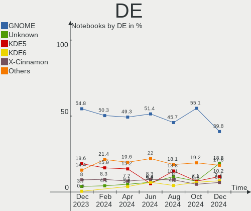
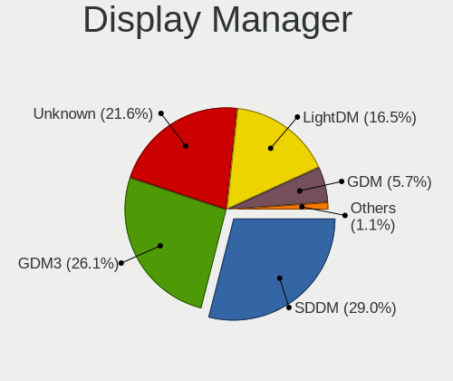
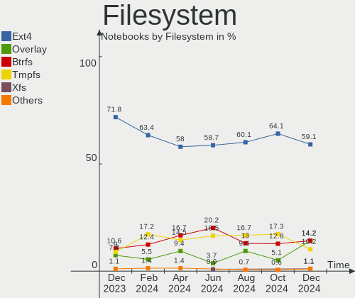
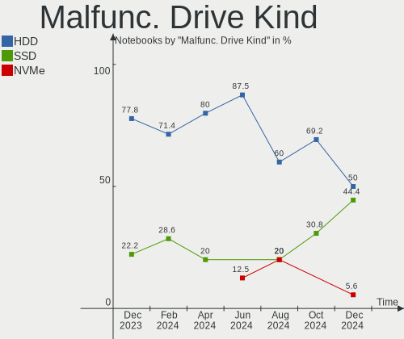
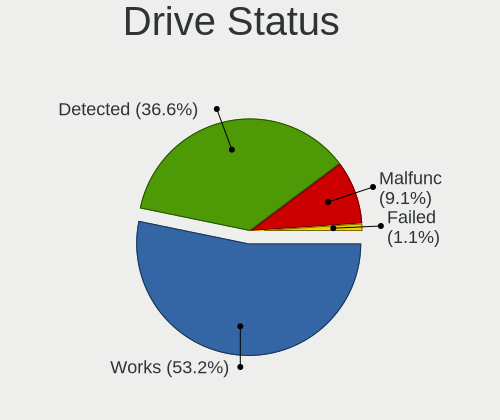
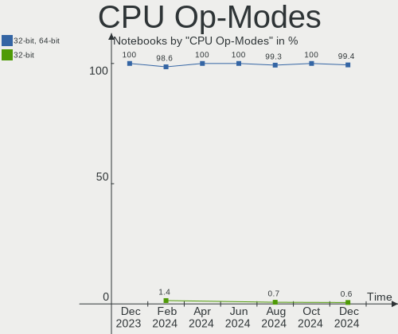
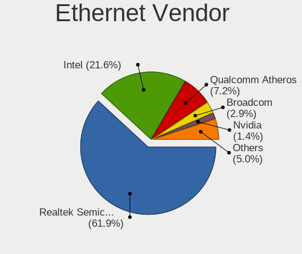

Linux in France - Hardware Trends (Notebooks)
---------------------------------------------

A project to identify most popular hardware characteristics and track their change
over time based on data collected by Linux users at https://Linux-Hardware.org.

Anyone can contribute to this report by the [hw-probe](https://github.com/linuxhw/hw-probe) tool:

    sudo -E hw-probe -all -upload

Period: Sep, 2022.

Contents
--------

* [ System ](#system)
  - [ OS                       ](#os)
  - [ OS Family                ](#os-family)
  - [ Kernel                   ](#kernel)
  - [ Kernel Family            ](#kernel-family)
  - [ Kernel Major Ver.        ](#kernel-major-ver)
  - [ Arch                     ](#arch)
  - [ DE                       ](#de)
  - [ Display Server           ](#display-server)
  - [ Display Manager          ](#display-manager)
  - [ OS Lang                  ](#os-lang)
  - [ Boot Mode                ](#boot-mode)
  - [ Filesystem               ](#filesystem)
  - [ Part. scheme             ](#part-scheme)
  - [ Dual Boot with Linux/BSD ](#dual-boot-with-linuxbsd)
  - [ Dual Boot (Win)          ](#dual-boot-win)

* [ Board ](#board)
  - [ Vendor                   ](#vendor)
  - [ Model                    ](#model)
  - [ Model Family             ](#model-family)
  - [ MFG Year                 ](#mfg-year)
  - [ Form Factor              ](#form-factor)
  - [ Secure Boot              ](#secure-boot)
  - [ Coreboot                 ](#coreboot)
  - [ RAM Size                 ](#ram-size)
  - [ RAM Used                 ](#ram-used)
  - [ Total Drives             ](#total-drives)
  - [ Has CD-ROM               ](#has-cd-rom)
  - [ Has Ethernet             ](#has-ethernet)
  - [ Has WiFi                 ](#has-wifi)
  - [ Has Bluetooth            ](#has-bluetooth)

* [ Location ](#location)
  - [ Country                  ](#country)
  - [ City                     ](#city)

* [ Drives ](#drives)
  - [ Drive Vendor             ](#drive-vendor)
  - [ Drive Model              ](#drive-model)
  - [ HDD Vendor               ](#hdd-vendor)
  - [ SSD Vendor               ](#ssd-vendor)
  - [ Drive Kind               ](#drive-kind)
  - [ Drive Connector          ](#drive-connector)
  - [ Drive Size               ](#drive-size)
  - [ Space Total              ](#space-total)
  - [ Space Used               ](#space-used)
  - [ Malfunc. Drives          ](#malfunc-drives)
  - [ Malfunc. Drive Vendor    ](#malfunc-drive-vendor)
  - [ Malfunc. HDD Vendor      ](#malfunc-hdd-vendor)
  - [ Malfunc. Drive Kind      ](#malfunc-drive-kind)
  - [ Failed Drives            ](#failed-drives)
  - [ Failed Drive Vendor      ](#failed-drive-vendor)
  - [ Drive Status             ](#drive-status)

* [ Storage controller ](#storage-controller)
  - [ Storage Vendor           ](#storage-vendor)
  - [ Storage Model            ](#storage-model)
  - [ Storage Kind             ](#storage-kind)

* [ Processor ](#processor)
  - [ CPU Vendor               ](#cpu-vendor)
  - [ CPU Model                ](#cpu-model)
  - [ CPU Model Family         ](#cpu-model-family)
  - [ CPU Cores                ](#cpu-cores)
  - [ CPU Sockets              ](#cpu-sockets)
  - [ CPU Threads              ](#cpu-threads)
  - [ CPU Op-Modes             ](#cpu-op-modes)
  - [ CPU Microcode            ](#cpu-microcode)
  - [ CPU Microarch            ](#cpu-microarch)

* [ Graphics ](#graphics)
  - [ GPU Vendor               ](#gpu-vendor)
  - [ GPU Model                ](#gpu-model)
  - [ GPU Combo                ](#gpu-combo)
  - [ GPU Driver               ](#gpu-driver)
  - [ GPU Memory               ](#gpu-memory)

* [ Monitor ](#monitor)
  - [ Monitor Vendor           ](#monitor-vendor)
  - [ Monitor Model            ](#monitor-model)
  - [ Monitor Resolution       ](#monitor-resolution)
  - [ Monitor Diagonal         ](#monitor-diagonal)
  - [ Monitor Width            ](#monitor-width)
  - [ Aspect Ratio             ](#aspect-ratio)
  - [ Monitor Area             ](#monitor-area)
  - [ Pixel Density            ](#pixel-density)
  - [ Multiple Monitors        ](#multiple-monitors)

* [ Network ](#network)
  - [ Net Controller Vendor    ](#net-controller-vendor)
  - [ Net Controller Model     ](#net-controller-model)
  - [ Wireless Vendor          ](#wireless-vendor)
  - [ Wireless Model           ](#wireless-model)
  - [ Ethernet Vendor          ](#ethernet-vendor)
  - [ Ethernet Model           ](#ethernet-model)
  - [ Net Controller Kind      ](#net-controller-kind)
  - [ Used Controller          ](#used-controller)
  - [ NICs                     ](#nics)
  - [ IPv6                     ](#ipv6)

* [ Bluetooth ](#bluetooth)
  - [ Bluetooth Vendor         ](#bluetooth-vendor)
  - [ Bluetooth Model          ](#bluetooth-model)

* [ Sound ](#sound)
  - [ Sound Vendor             ](#sound-vendor)
  - [ Sound Model              ](#sound-model)

* [ Memory ](#memory)
  - [ Memory Vendor            ](#memory-vendor)
  - [ Memory Model             ](#memory-model)
  - [ Memory Kind              ](#memory-kind)
  - [ Memory Form Factor       ](#memory-form-factor)
  - [ Memory Size              ](#memory-size)
  - [ Memory Speed             ](#memory-speed)

* [ Printers & scanners ](#printers--scanners)
  - [ Printer Vendor           ](#printer-vendor)
  - [ Printer Model            ](#printer-model)
  - [ Scanner Vendor           ](#scanner-vendor)
  - [ Scanner Model            ](#scanner-model)

* [ Camera ](#camera)
  - [ Camera Vendor            ](#camera-vendor)
  - [ Camera Model             ](#camera-model)

* [ Security ](#security)
  - [ Fingerprint Vendor       ](#fingerprint-vendor)
  - [ Fingerprint Model        ](#fingerprint-model)
  - [ Chipcard Vendor          ](#chipcard-vendor)
  - [ Chipcard Model           ](#chipcard-model)

* [ Unsupported ](#unsupported)
  - [ Unsupported Devices      ](#unsupported-devices)
  - [ Unsupported Device Types ](#unsupported-device-types)

System
------

OS
--

Installed operating systems

| Name                | Notebooks | Percent |
|---------------------|-----------|---------|
| Ubuntu 22.04        | 25        | 20.16%  |
| OpenMandriva 4.3    | 9         | 7.26%   |
| Debian 11           | 9         | 7.26%   |
| Ubuntu 20.04        | 8         | 6.45%   |
| Linux Mint 21       | 8         | 6.45%   |
| Arch                | 8         | 6.45%   |
| Xubuntu 20.04       | 4         | 3.23%   |
| Pop!_OS 22.04       | 4         | 3.23%   |
| Fedora 36           | 4         | 3.23%   |
| Arch Rolling        | 4         | 3.23%   |
| Xubuntu 22.04       | 3         | 2.42%   |
| Linux Mint 20.3     | 3         | 2.42%   |
| Fedora 37           | 3         | 2.42%   |
| Debian Unstable     | 3         | 2.42%   |
| Zorin 16            | 2         | 1.61%   |
| NixOS 22.05         | 2         | 1.61%   |
| Manjaro 22.0.0      | 2         | 1.61%   |
| KDE neon 20.04      | 2         | 1.61%   |
| Zorin 15            | 1         | 0.81%   |
| Ubuntu MATE 20.04   | 1         | 0.81%   |
| Ubuntu Budgie 22.04 | 1         | 0.81%   |
| Ubuntu 21.10        | 1         | 0.81%   |
| Ubuntu 20.10        | 1         | 0.81%   |
| SteamOS Rolling     | 1         | 0.81%   |
| SteamOS 3.3.1       | 1         | 0.81%   |
| ROSA 12.2           | 1         | 0.81%   |
| Pop!_OS 20.04       | 1         | 0.81%   |
| Parrot 5.1          | 1         | 0.81%   |
| openSUSE Leap-15.4  | 1         | 0.81%   |
| OpenMandriva 4.2    | 1         | 0.81%   |
| NixOS 22.11         | 1         | 0.81%   |
| Linux Mint 20.2     | 1         | 0.81%   |
| Linux Mint 20.1     | 1         | 0.81%   |
| Linux Mint 19.3     | 1         | 0.81%   |
| Kubuntu 20.04       | 1         | 0.81%   |
| Kubuntu 11          | 1         | 0.81%   |
| Elementary 6.1      | 1         | 0.81%   |
| Debian Testing      | 1         | 0.81%   |
| Clear Linux 37230   | 1         | 0.81%   |

OS Family
---------

OS without a version

| Name          | Notebooks | Percent |
|---------------|-----------|---------|
| Ubuntu        | 35        | 28.23%  |
| Linux Mint    | 14        | 11.29%  |
| Debian        | 13        | 10.48%  |
| Arch          | 12        | 9.68%   |
| OpenMandriva  | 10        | 8.06%   |
| Xubuntu       | 7         | 5.65%   |
| Fedora        | 7         | 5.65%   |
| Pop!_OS       | 5         | 4.03%   |
| Zorin         | 3         | 2.42%   |
| NixOS         | 3         | 2.42%   |
| SteamOS       | 2         | 1.61%   |
| Manjaro       | 2         | 1.61%   |
| Kubuntu       | 2         | 1.61%   |
| KDE neon      | 2         | 1.61%   |
| Ubuntu MATE   | 1         | 0.81%   |
| Ubuntu Budgie | 1         | 0.81%   |
| ROSA          | 1         | 0.81%   |
| Parrot        | 1         | 0.81%   |
| openSUSE      | 1         | 0.81%   |
| Elementary    | 1         | 0.81%   |
| Clear Linux   | 1         | 0.81%   |

Kernel
------

Version of the Linux kernel

| Version                                        | Notebooks | Percent |
|------------------------------------------------|-----------|---------|
| 5.15.0-47-generic                              | 23        | 18.55%  |
| 5.15.0-48-generic                              | 14        | 11.29%  |
| 5.16.7-desktop-1omv4003                        | 9         | 7.26%   |
| 5.15.0-46-generic                              | 9         | 7.26%   |
| 5.4.0-126-generic                              | 5         | 4.03%   |
| 5.4.0-125-generic                              | 5         | 4.03%   |
| 5.10.0-18-amd64                                | 5         | 4.03%   |
| 5.19.0-76051900-generic                        | 4         | 3.23%   |
| 5.19.0-1-amd64                                 | 4         | 3.23%   |
| 5.19.6-arch1-1                                 | 3         | 2.42%   |
| 5.10.0-17-amd64                                | 3         | 2.42%   |
| 5.19.9-arch1-1                                 | 2         | 1.61%   |
| 5.19.7-arch1-1                                 | 2         | 1.61%   |
| 5.15.68                                        | 2         | 1.61%   |
| 5.15.0-43-generic                              | 2         | 1.61%   |
| 5.13.0-valve21.1-1-neptune-02211-gc54cda5a36f3 | 2         | 1.61%   |
| 6.0.0-1-MANJARO                                | 1         | 0.81%   |
| 5.8.0-25-generic                               | 1         | 0.81%   |
| 5.4.0-113-generic                              | 1         | 0.81%   |
| 5.19.9-300.fc37.x86_64                         | 1         | 0.81%   |
| 5.19.9-200.fc36.x86_64                         | 1         | 0.81%   |
| 5.19.8-300.fc37.x86_64                         | 1         | 0.81%   |
| 5.19.8-200.fc36.x86_64                         | 1         | 0.81%   |
| 5.19.7-arch1-g14-1                             | 1         | 0.81%   |
| 5.19.7-269-tkg-pds                             | 1         | 0.81%   |
| 5.19.6-zen1-1-zen                              | 1         | 0.81%   |
| 5.19.4-200.fc36.x86_64                         | 1         | 0.81%   |
| 5.19.11-xanmod1-1-zen2                         | 1         | 0.81%   |
| 5.19.11-arch1-1                                | 1         | 0.81%   |
| 5.19.10-300.fc37.x86_64                        | 1         | 0.81%   |
| 5.19.1-xm1.0.fc36.x86_64                       | 1         | 0.81%   |
| 5.18.0-14parrot1-amd64                         | 1         | 0.81%   |
| 5.17.5-76051705-generic                        | 1         | 0.81%   |
| 5.17.0-1018-oem                                | 1         | 0.81%   |
| 5.15.67-1-lts                                  | 1         | 0.81%   |
| 5.15.55                                        | 1         | 0.81%   |
| 5.15.0-48-lowlatency                           | 1         | 0.81%   |
| 5.14.21-150400.24.21-default                   | 1         | 0.81%   |
| 5.14.0-1051-oem                                | 1         | 0.81%   |
| 5.14.0-1018-oem                                | 1         | 0.81%   |

Kernel Family
-------------

Linux kernel without a distro release

| Version  | Notebooks | Percent |
|----------|-----------|---------|
| 5.15.0   | 49        | 39.52%  |
| 5.4.0    | 11        | 8.87%   |
| 5.16.7   | 9         | 7.26%   |
| 5.10.0   | 9         | 7.26%   |
| 5.19.0   | 8         | 6.45%   |
| 5.19.9   | 4         | 3.23%   |
| 5.19.7   | 4         | 3.23%   |
| 5.19.6   | 4         | 3.23%   |
| 5.13.0   | 3         | 2.42%   |
| 5.19.8   | 2         | 1.61%   |
| 5.19.11  | 2         | 1.61%   |
| 5.15.68  | 2         | 1.61%   |
| 5.14.0   | 2         | 1.61%   |
| 6.0.0    | 1         | 0.81%   |
| 5.8.0    | 1         | 0.81%   |
| 5.19.4   | 1         | 0.81%   |
| 5.19.10  | 1         | 0.81%   |
| 5.19.1   | 1         | 0.81%   |
| 5.18.0   | 1         | 0.81%   |
| 5.17.5   | 1         | 0.81%   |
| 5.17.0   | 1         | 0.81%   |
| 5.15.67  | 1         | 0.81%   |
| 5.15.55  | 1         | 0.81%   |
| 5.14.21  | 1         | 0.81%   |
| 5.11.0   | 1         | 0.81%   |
| 5.10.74  | 1         | 0.81%   |
| 5.10.144 | 1         | 0.81%   |
| 5.10.14  | 1         | 0.81%   |

Kernel Major Ver.
-----------------

Linux kernel major version

| Version | Notebooks | Percent |
|---------|-----------|---------|
| 5.15    | 53        | 42.74%  |
| 5.19    | 27        | 21.77%  |
| 5.10    | 12        | 9.68%   |
| 5.4     | 11        | 8.87%   |
| 5.16    | 9         | 7.26%   |
| 5.14    | 3         | 2.42%   |
| 5.13    | 3         | 2.42%   |
| 5.17    | 2         | 1.61%   |
| 6.0     | 1         | 0.81%   |
| 5.8     | 1         | 0.81%   |
| 5.18    | 1         | 0.81%   |
| 5.11    | 1         | 0.81%   |

Arch
----

OS architecture (x86_64, i586, etc.)

| Name   | Notebooks | Percent |
|--------|-----------|---------|
| x86_64 | 123       | 99.19%  |
| i686   | 1         | 0.81%   |

DE
--

Desktop Environment

| Name       | Notebooks | Percent |
|------------|-----------|---------|
| GNOME      | 62        | 50%     |
| KDE5       | 26        | 20.97%  |
| XFCE       | 11        | 8.87%   |
| X-Cinnamon | 11        | 8.87%   |
| MATE       | 4         | 3.23%   |
| i3         | 3         | 2.42%   |
| Unknown    | 2         | 1.61%   |
| sway       | 1         | 0.81%   |
| Pantheon   | 1         | 0.81%   |
| KDE        | 1         | 0.81%   |
| Cinnamon   | 1         | 0.81%   |
| Budgie     | 1         | 0.81%   |

Display Server
--------------

X11 or Wayland

| Name    | Notebooks | Percent |
|---------|-----------|---------|
| X11     | 81        | 65.32%  |
| Wayland | 37        | 29.84%  |
| Tty     | 3         | 2.42%   |
| Unknown | 3         | 2.42%   |

Display Manager
---------------

SDDM, LightDM, etc.

| Name    | Notebooks | Percent |
|---------|-----------|---------|
| GDM3    | 32        | 25.81%  |
| Unknown | 30        | 24.19%  |
| SDDM    | 22        | 17.74%  |
| LightDM | 21        | 16.94%  |
| GDM     | 19        | 15.32%  |

OS Lang
-------

Language

| Lang    | Notebooks | Percent |
|---------|-----------|---------|
| fr_FR   | 83        | 66.94%  |
| en_US   | 33        | 26.61%  |
| en_GB   | 2         | 1.61%   |
| Unknown | 2         | 1.61%   |
| ru_RU   | 1         | 0.81%   |
| fr_BE   | 1         | 0.81%   |
| en_CA   | 1         | 0.81%   |
| C       | 1         | 0.81%   |

Boot Mode
---------

EFI or BIOS

| Mode | Notebooks | Percent |
|------|-----------|---------|
| EFI  | 73        | 58.87%  |
| BIOS | 51        | 41.13%  |

Filesystem
----------

Type of filesystem

| Type    | Notebooks | Percent |
|---------|-----------|---------|
| Ext4    | 98        | 79.03%  |
| Btrfs   | 15        | 12.1%   |
| Overlay | 8         | 6.45%   |
| F2fs    | 2         | 1.61%   |
| Ext3    | 1         | 0.81%   |

Part. scheme
------------

Scheme of partitioning

| Type    | Notebooks | Percent |
|---------|-----------|---------|
| GPT     | 72        | 58.06%  |
| Unknown | 43        | 34.68%  |
| MBR     | 9         | 7.26%   |

Dual Boot with Linux/BSD
------------------------

Hosting more than one Linux/BSD

| Dual boot | Notebooks | Percent |
|-----------|-----------|---------|
| No        | 106       | 85.48%  |
| Yes       | 18        | 14.52%  |

Dual Boot (Win)
---------------

Hosting Linux and Windows

| Dual boot | Notebooks | Percent |
|-----------|-----------|---------|
| No        | 89        | 71.77%  |
| Yes       | 35        | 28.23%  |

Board
-----

Vendor
------

Motherboard manufacturer

| Name                | Notebooks | Percent |
|---------------------|-----------|---------|
| Dell                | 26        | 20.97%  |
| Lenovo              | 25        | 20.16%  |
| Hewlett-Packard     | 21        | 16.94%  |
| ASUSTek Computer    | 18        | 14.52%  |
| Acer                | 6         | 4.84%   |
| HUAWEI              | 4         | 3.23%   |
| Valve               | 3         | 2.42%   |
| Toshiba             | 3         | 2.42%   |
| MSI                 | 3         | 2.42%   |
| Samsung Electronics | 2         | 1.61%   |
| Packard Bell        | 2         | 1.61%   |
| Apple               | 2         | 1.61%   |
| TUXEDO              | 1         | 0.81%   |
| Timi                | 1         | 0.81%   |
| System76            | 1         | 0.81%   |
| PC Specialist       | 1         | 0.81%   |
| Notebook            | 1         | 0.81%   |
| Insyde              | 1         | 0.81%   |
| Fujitsu             | 1         | 0.81%   |
| Framework           | 1         | 0.81%   |
| Unknown             | 1         | 0.81%   |

Model
-----

Motherboard model

| Name                                        | Notebooks | Percent |
|---------------------------------------------|-----------|---------|
| Valve Jupiter                               | 3         | 2.42%   |
| Lenovo Legion 5 15ACH6H 82JU                | 2         | 1.61%   |
| HUAWEI HVY-WXX9                             | 2         | 1.61%   |
| HP Laptop 14s-fq1xxx                        | 2         | 1.61%   |
| Dell XPS 9320                               | 2         | 1.61%   |
| TUXEDO Book_XA1510                          | 1         | 0.81%   |
| Toshiba Satellite NB10t-A-102               | 1         | 0.81%   |
| Toshiba Satellite L875-11M                  | 1         | 0.81%   |
| Toshiba Satellite L670                      | 1         | 0.81%   |
| Timi TM1604                                 | 1         | 0.81%   |
| System76 Lemur                              | 1         | 0.81%   |
| Samsung RV411/RV511/E3511/S3511/RV711/E3411 | 1         | 0.81%   |
| Samsung 950XED                              | 1         | 0.81%   |
| PC Specialist NS50MU                        | 1         | 0.81%   |
| Packard Bell EasyNote MH45                  | 1         | 0.81%   |
| Packard Bell EasyNote LS44SB                | 1         | 0.81%   |
| Notebook NL40_50GU                          | 1         | 0.81%   |
| MSI Modern 14 A10M                          | 1         | 0.81%   |
| MSI Katana GF66 12UD                        | 1         | 0.81%   |
| MSI GS73 Stealth 8RF                        | 1         | 0.81%   |
| Lenovo Yoga S740-15IRH 81NX                 | 1         | 0.81%   |
| Lenovo ThinkPad X200 7458VL3                | 1         | 0.81%   |
| Lenovo ThinkPad X1C 5th W10DG 20K3S0WJ23    | 1         | 0.81%   |
| Lenovo ThinkPad X1 Extreme 2nd 20QVCTO1WW   | 1         | 0.81%   |
| Lenovo ThinkPad X1 Extreme 20MFCTO1WW       | 1         | 0.81%   |
| Lenovo ThinkPad X1 Carbon Gen 9 20XWCTO1WW  | 1         | 0.81%   |
| Lenovo ThinkPad X1 Carbon Gen 10 21CBCTO1WW | 1         | 0.81%   |
| Lenovo ThinkPad T61p 6457A24                | 1         | 0.81%   |
| Lenovo ThinkPad T61 7659AB7                 | 1         | 0.81%   |
| Lenovo ThinkPad T440s 20ARS0CN16            | 1         | 0.81%   |
| Lenovo ThinkPad T440p 20AWS17N00            | 1         | 0.81%   |
| Lenovo ThinkPad T14s Gen 3 21CQCTO1WW       | 1         | 0.81%   |
| Lenovo ThinkPad P51s 20HCS00F00             | 1         | 0.81%   |
| Lenovo ThinkPad P50 20EQS1WW00              | 1         | 0.81%   |
| Lenovo ThinkPad P14s Gen 2a 21A00000FR      | 1         | 0.81%   |
| Lenovo ThinkPad L440 20ASS11T00             | 1         | 0.81%   |
| Lenovo ThinkPad L390 20NSS11E00             | 1         | 0.81%   |
| Lenovo ThinkPad Edge E320 1298AAG           | 1         | 0.81%   |
| Lenovo ThinkPad E15 Gen 3 20YGCTO1WW        | 1         | 0.81%   |
| Lenovo ThinkPad E15 Gen 2 20T80053FR        | 1         | 0.81%   |

Model Family
------------

Motherboard model prefix

| Name                  | Notebooks | Percent |
|-----------------------|-----------|---------|
| Lenovo ThinkPad       | 19        | 15.32%  |
| Dell Precision        | 9         | 7.26%   |
| Dell Latitude         | 7         | 5.65%   |
| Acer Aspire           | 6         | 4.84%   |
| HP Laptop             | 5         | 4.03%   |
| Dell XPS              | 4         | 3.23%   |
| Dell Inspiron         | 4         | 3.23%   |
| Valve Jupiter         | 3         | 2.42%   |
| Toshiba Satellite     | 3         | 2.42%   |
| HP ZBook              | 3         | 2.42%   |
| HP EliteBook          | 3         | 2.42%   |
| ASUS VivoBook         | 3         | 2.42%   |
| Packard Bell EasyNote | 2         | 1.61%   |
| Lenovo Legion         | 2         | 1.61%   |
| Lenovo IdeaPad        | 2         | 1.61%   |
| HUAWEI HVY-WXX9       | 2         | 1.61%   |
| HP ProBook            | 2         | 1.61%   |
| HP Pavilion           | 2         | 1.61%   |
| Dell Vostro           | 2         | 1.61%   |
| ASUS ZenBook          | 2         | 1.61%   |
| ASUS ROG              | 2         | 1.61%   |
| ASUS ASUS             | 2         | 1.61%   |
| TUXEDO Book           | 1         | 0.81%   |
| Timi TM1604           | 1         | 0.81%   |
| System76 Lemur        | 1         | 0.81%   |
| Samsung RV411         | 1         | 0.81%   |
| Samsung 950XED        | 1         | 0.81%   |
| PC Specialist NS50MU  | 1         | 0.81%   |
| Notebook NL40         | 1         | 0.81%   |
| MSI Modern            | 1         | 0.81%   |
| MSI Katana            | 1         | 0.81%   |
| MSI GS73              | 1         | 0.81%   |
| Lenovo Yoga           | 1         | 0.81%   |
| Lenovo ThinkBook      | 1         | 0.81%   |
| Insyde WindTab89      | 1         | 0.81%   |
| HUAWEI VLT-WX0        | 1         | 0.81%   |
| HUAWEI BOHB-WAX9      | 1         | 0.81%   |
| HP Victus             | 1         | 0.81%   |
| HP Spectre            | 1         | 0.81%   |
| HP OMEN               | 1         | 0.81%   |

MFG Year
--------

Motherboard manufacture year

| Year | Notebooks | Percent |
|------|-----------|---------|
| 2021 | 20        | 16.13%  |
| 2022 | 17        | 13.71%  |
| 2019 | 13        | 10.48%  |
| 2018 | 13        | 10.48%  |
| 2013 | 13        | 10.48%  |
| 2020 | 10        | 8.06%   |
| 2014 | 7         | 5.65%   |
| 2017 | 6         | 4.84%   |
| 2015 | 6         | 4.84%   |
| 2016 | 5         | 4.03%   |
| 2011 | 3         | 2.42%   |
| 2008 | 3         | 2.42%   |
| 2007 | 3         | 2.42%   |
| 2010 | 2         | 1.61%   |
| 2009 | 2         | 1.61%   |
| 2012 | 1         | 0.81%   |

Form Factor
-----------

Physical design of the computer

| Name     | Notebooks | Percent |
|----------|-----------|---------|
| Notebook | 124       | 100%    |

Secure Boot
-----------

Enabled or disabled

| State    | Notebooks | Percent |
|----------|-----------|---------|
| Disabled | 111       | 89.52%  |
| Enabled  | 13        | 10.48%  |

Coreboot
--------

Have coreboot on board

| Used | Notebooks | Percent |
|------|-----------|---------|
| No   | 124       | 100%    |

RAM Size
--------

Total RAM memory

| Size in GB  | Notebooks | Percent |
|-------------|-----------|---------|
| 4.01-8.0    | 33        | 26.61%  |
| 8.01-16.0   | 24        | 19.35%  |
| 32.01-64.0  | 22        | 17.74%  |
| 16.01-24.0  | 20        | 16.13%  |
| 3.01-4.0    | 18        | 14.52%  |
| 1.01-2.0    | 3         | 2.42%   |
| 24.01-32.0  | 2         | 1.61%   |
| 64.01-256.0 | 2         | 1.61%   |

RAM Used
--------

Used RAM memory

| Used GB    | Notebooks | Percent |
|------------|-----------|---------|
| 1.01-2.0   | 39        | 31.45%  |
| 2.01-3.0   | 32        | 25.81%  |
| 4.01-8.0   | 26        | 20.97%  |
| 3.01-4.0   | 18        | 14.52%  |
| 8.01-16.0  | 3         | 2.42%   |
| 0.51-1.0   | 3         | 2.42%   |
| 24.01-32.0 | 1         | 0.81%   |
| 16.01-24.0 | 1         | 0.81%   |
| 0.01-0.5   | 1         | 0.81%   |

Total Drives
------------

Number of drives on board

| Drives | Notebooks | Percent |
|--------|-----------|---------|
| 1      | 85        | 68.55%  |
| 2      | 37        | 29.84%  |
| 3      | 2         | 1.61%   |

Has CD-ROM
----------

Has CD-ROM on board

| Presented | Notebooks | Percent |
|-----------|-----------|---------|
| No        | 98        | 79.03%  |
| Yes       | 26        | 20.97%  |

Has Ethernet
------------

Has Ethernet on board

| Presented | Notebooks | Percent |
|-----------|-----------|---------|
| Yes       | 97        | 78.23%  |
| No        | 27        | 21.77%  |

Has WiFi
--------

Has WiFi module

| Presented | Notebooks | Percent |
|-----------|-----------|---------|
| Yes       | 122       | 98.39%  |
| No        | 2         | 1.61%   |

Has Bluetooth
-------------

Has Bluetooth module

| Presented | Notebooks | Percent |
|-----------|-----------|---------|
| Yes       | 106       | 85.48%  |
| No        | 18        | 14.52%  |

Location
--------

Country
-------

Geographic location (country)

| Country | Notebooks | Percent |
|---------|-----------|---------|
| France  | 124       | 100%    |

City
----

Geographic location (city)

| City                   | Notebooks | Percent |
|------------------------|-----------|---------|
| Paris                  | 29        | 23.39%  |
| Nantes                 | 3         | 2.42%   |
| Fontenay-sous-Bois     | 3         | 2.42%   |
| Auxerre                | 3         | 2.42%   |
| Palaiseau              | 2         | 1.61%   |
| Montpellier            | 2         | 1.61%   |
| Marseille              | 2         | 1.61%   |
| Lyon                   | 2         | 1.61%   |
| Lille                  | 2         | 1.61%   |
| Corbeil-Essonnes       | 2         | 1.61%   |
| Angoulême             | 2         | 1.61%   |
| Yerres                 | 1         | 0.81%   |
| Villeurbanne           | 1         | 0.81%   |
| Villeneuve-d'Ascq      | 1         | 0.81%   |
| Toulouse               | 1         | 0.81%   |
| Toulon                 | 1         | 0.81%   |
| Tavaux                 | 1         | 0.81%   |
| Talant                 | 1         | 0.81%   |
| Surgeres               | 1         | 0.81%   |
| Strasbourg             | 1         | 0.81%   |
| Saint-Cyprien          | 1         | 0.81%   |
| Saint-Brieuc           | 1         | 0.81%   |
| Saint-Brice-sous-Foret | 1         | 0.81%   |
| Rumilly-en-Cambresis   | 1         | 0.81%   |
| Roubaix                | 1         | 0.81%   |
| Rives                  | 1         | 0.81%   |
| Ransart                | 1         | 0.81%   |
| Quiberon               | 1         | 0.81%   |
| Pont-à-Mousson        | 1         | 0.81%   |
| Poisy                  | 1         | 0.81%   |
| Plancher-les-Mines     | 1         | 0.81%   |
| Pessac                 | 1         | 0.81%   |
| Perassay               | 1         | 0.81%   |
| Ordonnac               | 1         | 0.81%   |
| Noisy-le-Grand         | 1         | 0.81%   |
| Mont-Saint-Aignan      | 1         | 0.81%   |
| Massy                  | 1         | 0.81%   |
| Lezignan-Corbieres     | 1         | 0.81%   |
| Lesneven               | 1         | 0.81%   |
| Le Havre               | 1         | 0.81%   |

Drives
------

Drive Vendor
------------

Hard drive vendors

| Vendor                      | Notebooks | Drives | Percent |
|-----------------------------|-----------|--------|---------|
| Samsung Electronics         | 32        | 36     | 21.77%  |
| WDC                         | 15        | 16     | 10.2%   |
| SanDisk                     | 12        | 12     | 8.16%   |
| Toshiba                     | 11        | 11     | 7.48%   |
| Micron Technology           | 11        | 12     | 7.48%   |
| Crucial                     | 11        | 14     | 7.48%   |
| Seagate                     | 6         | 7      | 4.08%   |
| Intel                       | 6         | 7      | 4.08%   |
| KIOXIA                      | 5         | 6      | 3.4%    |
| Unknown                     | 4         | 6      | 2.72%   |
| SK hynix                    | 4         | 4      | 2.72%   |
| PNY                         | 4         | 4      | 2.72%   |
| Kingston                    | 4         | 4      | 2.72%   |
| HGST                        | 3         | 3      | 2.04%   |
| LITEON                      | 2         | 2      | 1.36%   |
| Dogfish                     | 2         | 2      | 1.36%   |
| YMTC                        | 1         | 1      | 0.68%   |
| SPCC                        | 1         | 1      | 0.68%   |
| Silicon Motion              | 1         | 1      | 0.68%   |
| Phison Electronics          | 1         | 1      | 0.68%   |
| Phison                      | 1         | 1      | 0.68%   |
| LDLC                        | 1         | 1      | 0.68%   |
| LaCie                       | 1         | 1      | 0.68%   |
| Kingston Technology Company | 1         | 1      | 0.68%   |
| KingSpec                    | 1         | 1      | 0.68%   |
| Hoodisk                     | 1         | 1      | 0.68%   |
| Hitachi                     | 1         | 1      | 0.68%   |
| Emtec                       | 1         | 1      | 0.68%   |
| BHT                         | 1         | 1      | 0.68%   |
| Apple                       | 1         | 2      | 0.68%   |
| A-DATA Technology           | 1         | 1      | 0.68%   |

Drive Model
-----------

Hard drive models

| Model                                                 | Notebooks | Percent |
|-------------------------------------------------------|-----------|---------|
| Samsung NVMe SSD Controller SM981/PM981/PM983 256GB   | 4         | 2.53%   |
| Toshiba KXG50ZNV512G NVMe 512GB                       | 3         | 1.9%    |
| WDC PC SN520 SDAPNUW-512G-1002 512GB                  | 2         | 1.27%   |
| Unknown MMC Card  32GB                                | 2         | 1.27%   |
| Toshiba MQ04ABF100 1TB                                | 2         | 1.27%   |
| Sandisk WD Black 2018/SN750 / PC SN720 NVMe SSD 512GB | 2         | 1.27%   |
| SanDisk SD8SNAT128G1002 128GB SSD                     | 2         | 1.27%   |
| SanDisk NVMe SSD Drive 512GB                          | 2         | 1.27%   |
| Samsung SSD 970 EVO Plus 1TB                          | 2         | 1.27%   |
| Samsung SSD 870 QVO 1TB                               | 2         | 1.27%   |
| Samsung SSD 860 EVO M.2 1TB                           | 2         | 1.27%   |
| Samsung SSD 860 EVO 250GB                             | 2         | 1.27%   |
| Samsung SSD 850 EVO 500GB                             | 2         | 1.27%   |
| Samsung NVMe SSD Drive 512GB                          | 2         | 1.27%   |
| Samsung NVMe SSD Drive 1TB                            | 2         | 1.27%   |
| Samsung MZVLQ512HBLU-00BH1 512GB                      | 2         | 1.27%   |
| PNY CS900 120GB SSD                                   | 2         | 1.27%   |
| Micron 2450_MTFDKBA1T0TFK 1TB                         | 2         | 1.27%   |
| KIOXIA KBG40ZNV1T02 1TB                               | 2         | 1.27%   |
| Crucial CT240BX500SSD1 240GB                          | 2         | 1.27%   |
| Crucial CT1000MX500SSD1 1TB                           | 2         | 1.27%   |
| YMTC PC005 512GB                                      | 1         | 0.63%   |
| WDC WD5000LPVX-75V0TT0 500GB                          | 1         | 0.63%   |
| WDC WD5000LPCX-24VHAT0 500GB                          | 1         | 0.63%   |
| WDC WD3200BEVT-22ZCT0 320GB                           | 1         | 0.63%   |
| WDC WD10SPZX-21Z10T0 1TB                              | 1         | 0.63%   |
| WDC WD10JPVX-60JC3T1 1TB                              | 1         | 0.63%   |
| WDC PC SN810 NVMe 512GB                               | 1         | 0.63%   |
| WDC PC SN810 NVMe 1024GB                              | 1         | 0.63%   |
| WDC PC SN730 SDBPNTY-1T00-1006 1TB                    | 1         | 0.63%   |
| WDC PC SN530 SDBPNPZ-512G-1027 512GB                  | 1         | 0.63%   |
| WDC PC SN530 SDBPNPZ-1T00-1006 1TB                    | 1         | 0.63%   |
| WDC PC SN530 SDBPMPZ-512G-1001 512GB                  | 1         | 0.63%   |
| WDC PC SN520 SDAPNUW-256G-1102 256GB                  | 1         | 0.63%   |
| WDC PC SN520 SDAPMUW-512G-1101 512GB                  | 1         | 0.63%   |
| Unknown SD/MMC/MS PRO 2GB                             | 1         | 0.63%   |
| Unknown MMC Card  8GB                                 | 1         | 0.63%   |
| Unknown MMC Card  64GB                                | 1         | 0.63%   |
| Toshiba MQ01ACF050 500GB                              | 1         | 0.63%   |
| Toshiba MQ01ABF050 500GB                              | 1         | 0.63%   |

HDD Vendor
----------

Hard disk drive vendors

| Vendor  | Notebooks | Drives | Percent |
|---------|-----------|--------|---------|
| Toshiba | 6         | 6      | 27.27%  |
| WDC     | 5         | 5      | 22.73%  |
| Seagate | 5         | 6      | 22.73%  |
| HGST    | 3         | 3      | 13.64%  |
| Unknown | 1         | 1      | 4.55%   |
| LaCie   | 1         | 1      | 4.55%   |
| Hitachi | 1         | 1      | 4.55%   |

SSD Vendor
----------

Solid state drive vendors

| Vendor              | Notebooks | Drives | Percent |
|---------------------|-----------|--------|---------|
| Samsung Electronics | 14        | 14     | 26.92%  |
| Crucial             | 9         | 12     | 17.31%  |
| SanDisk             | 6         | 6      | 11.54%  |
| PNY                 | 4         | 4      | 7.69%   |
| Micron Technology   | 3         | 3      | 5.77%   |
| Intel               | 3         | 3      | 5.77%   |
| LITEON              | 2         | 2      | 3.85%   |
| Dogfish             | 2         | 2      | 3.85%   |
| SPCC                | 1         | 1      | 1.92%   |
| SK hynix            | 1         | 1      | 1.92%   |
| LDLC                | 1         | 1      | 1.92%   |
| Kingston            | 1         | 1      | 1.92%   |
| KingSpec            | 1         | 1      | 1.92%   |
| Hoodisk             | 1         | 1      | 1.92%   |
| Emtec               | 1         | 1      | 1.92%   |
| BHT                 | 1         | 1      | 1.92%   |
| A-DATA Technology   | 1         | 1      | 1.92%   |

Drive Kind
----------

HDD or SSD

| Kind    | Notebooks | Drives | Percent |
|---------|-----------|--------|---------|
| NVMe    | 67        | 78     | 48.2%   |
| SSD     | 46        | 55     | 33.09%  |
| HDD     | 22        | 23     | 15.83%  |
| MMC     | 3         | 5      | 2.16%   |
| Unknown | 1         | 1      | 0.72%   |

Drive Connector
---------------

SATA, SAS, NVMe, etc.

| Type | Notebooks | Drives | Percent |
|------|-----------|--------|---------|
| NVMe | 67        | 78     | 50%     |
| SATA | 60        | 75     | 44.78%  |
| SAS  | 4         | 4      | 2.99%   |
| MMC  | 3         | 5      | 2.24%   |

Drive Size
----------

Size of hard drive

| Size in TB | Notebooks | Drives | Percent |
|------------|-----------|--------|---------|
| 0.01-0.5   | 43        | 50     | 60.56%  |
| 0.51-1.0   | 25        | 25     | 35.21%  |
| 1.01-2.0   | 3         | 3      | 4.23%   |

Space Total
-----------

Amount of disk space available on the file system

| Size in GB     | Notebooks | Percent |
|----------------|-----------|---------|
| 251-500        | 37        | 29.84%  |
| 101-250        | 36        | 29.03%  |
| 501-1000       | 22        | 17.74%  |
| 1-20           | 9         | 7.26%   |
| 1001-2000      | 5         | 4.03%   |
| More than 3000 | 4         | 3.23%   |
| 21-50          | 3         | 2.42%   |
| 51-100         | 3         | 2.42%   |
| Unknown        | 3         | 2.42%   |
| 2001-3000      | 2         | 1.61%   |

Space Used
----------

Amount of used disk space

| Used GB   | Notebooks | Percent |
|-----------|-----------|---------|
| 1-20      | 41        | 33.06%  |
| 21-50     | 22        | 17.74%  |
| 101-250   | 22        | 17.74%  |
| 51-100    | 14        | 11.29%  |
| 251-500   | 11        | 8.87%   |
| 501-1000  | 7         | 5.65%   |
| 2001-3000 | 3         | 2.42%   |
| Unknown   | 3         | 2.42%   |
| 1001-2000 | 1         | 0.81%   |

Malfunc. Drives
---------------

Drive models with a malfunction

| Model                                 | Notebooks | Drives | Percent |
|---------------------------------------|-----------|--------|---------|
| Toshiba MQ01ACF050 500GB              | 1         | 1      | 16.67%  |
| SK hynix HFS128G32MND-2200A 128GB SSD | 1         | 1      | 16.67%  |
| Seagate ST320LT007-9ZV142 320GB       | 1         | 1      | 16.67%  |
| Intel SSDSCKKF256G8H 256GB            | 1         | 1      | 16.67%  |
| Intel SSDSC2KW120H6 120GB             | 1         | 1      | 16.67%  |
| Intel SSDSC2BF180A5L 180GB            | 1         | 1      | 16.67%  |

Malfunc. Drive Vendor
---------------------

Vendors of faulty drives

| Vendor   | Notebooks | Drives | Percent |
|----------|-----------|--------|---------|
| Intel    | 3         | 3      | 50%     |
| Toshiba  | 1         | 1      | 16.67%  |
| SK hynix | 1         | 1      | 16.67%  |
| Seagate  | 1         | 1      | 16.67%  |

Malfunc. HDD Vendor
-------------------

Vendors of faulty HDD drives

| Vendor  | Notebooks | Drives | Percent |
|---------|-----------|--------|---------|
| Toshiba | 1         | 1      | 50%     |
| Seagate | 1         | 1      | 50%     |

Malfunc. Drive Kind
-------------------

Kinds of faulty drives

| Kind | Notebooks | Drives | Percent |
|------|-----------|--------|---------|
| SSD  | 4         | 4      | 66.67%  |
| HDD  | 2         | 2      | 33.33%  |

Failed Drives
-------------

Failed drive models

Zero info for selected period =(

Failed Drive Vendor
-------------------

Failed drive vendors

Zero info for selected period =(

Drive Status
------------

Number of failed and malfunc. drives

| Status   | Notebooks | Drives | Percent |
|----------|-----------|--------|---------|
| Works    | 76        | 93     | 58.46%  |
| Detected | 48        | 63     | 36.92%  |
| Malfunc  | 6         | 6      | 4.62%   |

Storage controller
------------------

Storage Vendor
--------------

Storage controller vendors

| Vendor                       | Notebooks | Percent |
|------------------------------|-----------|---------|
| Intel                        | 77        | 50.33%  |
| Samsung Electronics          | 19        | 12.42%  |
| SanDisk                      | 16        | 10.46%  |
| Micron Technology            | 8         | 5.23%   |
| AMD                          | 7         | 4.58%   |
| Toshiba America Info Systems | 5         | 3.27%   |
| KIOXIA                       | 5         | 3.27%   |
| Kingston Technology Company  | 4         | 2.61%   |
| SK hynix                     | 3         | 1.96%   |
| Phison Electronics           | 2         | 1.31%   |
| Micron/Crucial Technology    | 2         | 1.31%   |
| Yangtze Memory Technologies  | 1         | 0.65%   |
| Silicon Motion               | 1         | 0.65%   |
| Nvidia                       | 1         | 0.65%   |
| Marvell Technology Group     | 1         | 0.65%   |
| Apple                        | 1         | 0.65%   |

Storage Model
-------------

Storage controller models

| Model                                                                            | Notebooks | Percent |
|----------------------------------------------------------------------------------|-----------|---------|
| Samsung NVMe SSD Controller SM981/PM981/PM983                                    | 10        | 6.17%   |
| Intel 82801 Mobile SATA Controller [RAID mode]                                   | 10        | 6.17%   |
| Intel Sunrise Point-LP SATA Controller [AHCI mode]                               | 9         | 5.56%   |
| Micron Non-Volatile memory controller                                            | 8         | 4.94%   |
| Intel Volume Management Device NVMe RAID Controller                              | 8         | 4.94%   |
| Intel 8 Series/C220 Series Chipset Family 6-port SATA Controller 1 [AHCI mode]   | 8         | 4.94%   |
| AMD FCH SATA Controller [AHCI mode]                                              | 7         | 4.32%   |
| Samsung NVMe SSD Controller 980                                                  | 6         | 3.7%    |
| Samsung NVMe SSD Controller PM9A1/PM9A3/980PRO                                   | 5         | 3.09%   |
| Intel 8 Series SATA Controller 1 [AHCI mode]                                     | 5         | 3.09%   |
| KIOXIA NVMe SSD Controller BG4                                                   | 4         | 2.47%   |
| Intel Cannon Lake Mobile PCH SATA AHCI Controller                                | 4         | 2.47%   |
| Intel 7 Series Chipset Family 6-port SATA Controller [AHCI mode]                 | 4         | 2.47%   |
| Toshiba America Info Systems Toshiba America Info Non-Volatile memory controller | 3         | 1.85%   |
| SanDisk WD PC SN810 / Black SN850 NVMe SSD                                       | 3         | 1.85%   |
| SanDisk WD Blue SN500 / PC SN520 NVMe SSD                                        | 3         | 1.85%   |
| Sandisk Non-Volatile memory controller                                           | 3         | 1.85%   |
| Kingston Company OM3PDP3 NVMe SSD                                                | 3         | 1.85%   |
| Intel Wildcat Point-LP SATA Controller [AHCI Mode]                               | 3         | 1.85%   |
| Intel HM170/QM170 Chipset SATA Controller [AHCI Mode]                            | 3         | 1.85%   |
| Intel Alder Lake-P SATA AHCI Controller                                          | 3         | 1.85%   |
| Toshiba America Info Systems BG3 NVMe SSD Controller                             | 2         | 1.23%   |
| SanDisk WD Blue SN550 NVMe SSD                                                   | 2         | 1.23%   |
| SanDisk WD Black SN750 / PC SN730 NVMe SSD                                       | 2         | 1.23%   |
| SanDisk WD Black 2018/SN750 / PC SN720 NVMe SSD                                  | 2         | 1.23%   |
| Intel SSD 660P Series                                                            | 2         | 1.23%   |
| Intel Q170/Q150/B150/H170/H110/Z170/CM236 Chipset SATA Controller [AHCI Mode]    | 2         | 1.23%   |
| Intel Cannon Point-LP SATA Controller [AHCI Mode]                                | 2         | 1.23%   |
| Intel 82801IBM/IEM (ICH9M/ICH9M-E) 4 port SATA Controller [AHCI mode]            | 2         | 1.23%   |
| Intel 82801HM/HEM (ICH8M/ICH8M-E) SATA Controller [AHCI mode]                    | 2         | 1.23%   |
| Intel 82801HM/HEM (ICH8M/ICH8M-E) IDE Controller                                 | 2         | 1.23%   |
| Intel 6 Series/C200 Series Chipset Family 6 port Mobile SATA AHCI Controller     | 2         | 1.23%   |
| Intel 5 Series/3400 Series Chipset 4 port SATA AHCI Controller                   | 2         | 1.23%   |
| Yangtze Memory Non-Volatile memory controller                                    | 1         | 0.62%   |
| SK hynix PC401 NVMe Solid State Drive 256GB                                      | 1         | 0.62%   |
| SK hynix Gold P31 SSD                                                            | 1         | 0.62%   |
| SK hynix BC511                                                                   | 1         | 0.62%   |
| Silicon Motion Non-Volatile memory controller                                    | 1         | 0.62%   |
| SanDisk PC SN520 NVMe SSD                                                        | 1         | 0.62%   |
| Phison PS5013 E13 NVMe Controller                                                | 1         | 0.62%   |

Storage Kind
------------

Kind of storage controller (IDE, SATA, NVMe, SAS, ...)

| Kind | Notebooks | Percent |
|------|-----------|---------|
| NVMe | 67        | 43.23%  |
| SATA | 66        | 42.58%  |
| RAID | 18        | 11.61%  |
| IDE  | 4         | 2.58%   |

Processor
---------

CPU Vendor
----------

Processor vendors

| Vendor | Notebooks | Percent |
|--------|-----------|---------|
| Intel  | 100       | 80.65%  |
| AMD    | 24        | 19.35%  |

CPU Model
---------

Processor models

| Model                                       | Notebooks | Percent |
|---------------------------------------------|-----------|---------|
| Intel 12th Gen Core i7-1260P                | 5         | 4.03%   |
| Intel Core i7-8750H CPU @ 2.20GHz           | 3         | 2.42%   |
| Intel Core i7-8565U CPU @ 1.80GHz           | 3         | 2.42%   |
| Intel 11th Gen Core i7-1165G7 @ 2.80GHz     | 3         | 2.42%   |
| Intel 11th Gen Core i5-1135G7 @ 2.40GHz     | 3         | 2.42%   |
| AMD Ryzen 5 5500U with Radeon Graphics      | 3         | 2.42%   |
| AMD Ryzen 5 4600H with Radeon Graphics      | 3         | 2.42%   |
| AMD Custom APU 0405                         | 3         | 2.42%   |
| Intel Core i7-7700HQ CPU @ 2.80GHz          | 2         | 1.61%   |
| Intel Core i7-7500U CPU @ 2.70GHz           | 2         | 1.61%   |
| Intel Core i7-6700HQ CPU @ 2.60GHz          | 2         | 1.61%   |
| Intel Core i7-10850H CPU @ 2.70GHz          | 2         | 1.61%   |
| Intel Core i5-8265U CPU @ 1.60GHz           | 2         | 1.61%   |
| Intel Core i5-8250U CPU @ 1.60GHz           | 2         | 1.61%   |
| Intel Core i5-7200U CPU @ 2.50GHz           | 2         | 1.61%   |
| Intel Core i5-6300U CPU @ 2.40GHz           | 2         | 1.61%   |
| Intel Core i5-5300U CPU @ 2.30GHz           | 2         | 1.61%   |
| Intel Core i5-4300U CPU @ 1.90GHz           | 2         | 1.61%   |
| Intel Core i5-4200U CPU @ 1.60GHz           | 2         | 1.61%   |
| Intel Core i5-4200M CPU @ 2.50GHz           | 2         | 1.61%   |
| Intel Core i5-10210U CPU @ 1.60GHz          | 2         | 1.61%   |
| Intel 12th Gen Core i5-12500H               | 2         | 1.61%   |
| Intel 11th Gen Core i7-11850H @ 2.50GHz     | 2         | 1.61%   |
| AMD Ryzen 7 PRO 5850U with Radeon Graphics  | 2         | 1.61%   |
| AMD Ryzen 7 5700U with Radeon Graphics      | 2         | 1.61%   |
| Intel Xeon CPU E3-1505M v6 @ 3.00GHz        | 1         | 0.81%   |
| Intel Pentium Dual-Core CPU T4200 @ 2.00GHz | 1         | 0.81%   |
| Intel Pentium Dual CPU T2390 @ 1.86GHz      | 1         | 0.81%   |
| Intel Pentium CPU N4200 @ 1.10GHz           | 1         | 0.81%   |
| Intel Pentium CPU N3510 @ 1.99GHz           | 1         | 0.81%   |
| Intel Pentium CPU 2127U @ 1.90GHz           | 1         | 0.81%   |
| Intel Core i7-9850H CPU @ 2.60GHz           | 1         | 0.81%   |
| Intel Core i7-9750H CPU @ 2.60GHz           | 1         | 0.81%   |
| Intel Core i7-8665U CPU @ 1.90GHz           | 1         | 0.81%   |
| Intel Core i7-8550U CPU @ 1.80GHz           | 1         | 0.81%   |
| Intel Core i7-6820HQ CPU @ 2.70GHz          | 1         | 0.81%   |
| Intel Core i7-6600U CPU @ 2.60GHz           | 1         | 0.81%   |
| Intel Core i7-6500U CPU @ 2.50GHz           | 1         | 0.81%   |
| Intel Core i7-4800MQ CPU @ 2.70GHz          | 1         | 0.81%   |
| Intel Core i7-4710MQ CPU @ 2.50GHz          | 1         | 0.81%   |

CPU Model Family
----------------

Processor model prefix

| Model                   | Notebooks | Percent |
|-------------------------|-----------|---------|
| Intel Core i7           | 31        | 25%     |
| Intel Core i5           | 28        | 22.58%  |
| Other                   | 23        | 18.55%  |
| AMD Ryzen 5             | 10        | 8.06%   |
| Intel Core i3           | 6         | 4.84%   |
| Intel Core 2 Duo        | 4         | 3.23%   |
| AMD Ryzen 7             | 4         | 3.23%   |
| Intel Pentium           | 3         | 2.42%   |
| AMD Ryzen 7 PRO         | 3         | 2.42%   |
| Intel Celeron           | 2         | 1.61%   |
| Intel Atom              | 2         | 1.61%   |
| AMD Ryzen 9             | 2         | 1.61%   |
| Intel Xeon              | 1         | 0.81%   |
| Intel Pentium Dual-Core | 1         | 0.81%   |
| Intel Pentium Dual      | 1         | 0.81%   |
| Intel Core 2 Solo       | 1         | 0.81%   |
| AMD E2                  | 1         | 0.81%   |
| AMD A4                  | 1         | 0.81%   |

CPU Cores
---------

Number of processor cores

| Number | Notebooks | Percent |
|--------|-----------|---------|
| 4      | 44        | 35.48%  |
| 2      | 41        | 33.06%  |
| 6      | 17        | 13.71%  |
| 8      | 11        | 8.87%   |
| 12     | 9         | 7.26%   |
| 10     | 1         | 0.81%   |
| 1      | 1         | 0.81%   |

CPU Sockets
-----------

Number of sockets

| Number | Notebooks | Percent |
|--------|-----------|---------|
| 1      | 124       | 100%    |

CPU Threads
-----------

Threads per core (Hyper-Threading)

| Number | Notebooks | Percent |
|--------|-----------|---------|
| 2      | 103       | 83.06%  |
| 1      | 21        | 16.94%  |

CPU Op-Modes
------------

CPU Operation Modes (32-bit, 64-bit)

| Op mode        | Notebooks | Percent |
|----------------|-----------|---------|
| 32-bit, 64-bit | 124       | 100%    |

CPU Microcode
-------------

Microcode number

| Number     | Notebooks | Percent |
|------------|-----------|---------|
| Unknown    | 36        | 29.03%  |
| 0x906a3    | 7         | 5.65%   |
| 0x806c1    | 7         | 5.65%   |
| 0x306c3    | 7         | 5.65%   |
| 0x406e3    | 5         | 4.03%   |
| 0x40651    | 5         | 4.03%   |
| 0x806d1    | 4         | 3.23%   |
| 0x1067a    | 4         | 3.23%   |
| 0x08608103 | 4         | 3.23%   |
| 0x806e9    | 3         | 2.42%   |
| 0x08600106 | 3         | 2.42%   |
| 0xa0652    | 2         | 1.61%   |
| 0x906ed    | 2         | 1.61%   |
| 0x906ea    | 2         | 1.61%   |
| 0x906e9    | 2         | 1.61%   |
| 0x806ec    | 2         | 1.61%   |
| 0x806eb    | 2         | 1.61%   |
| 0x806ea    | 2         | 1.61%   |
| 0x6fb      | 2         | 1.61%   |
| 0x506e3    | 2         | 1.61%   |
| 0x306a9    | 2         | 1.61%   |
| 0x20655    | 2         | 1.61%   |
| 0x0a50000c | 2         | 1.61%   |
| 0x0a404101 | 2         | 1.61%   |
| 0x08900201 | 2         | 1.61%   |
| 0x906a4    | 1         | 0.81%   |
| 0x706e5    | 1         | 0.81%   |
| 0x6fd      | 1         | 0.81%   |
| 0x506c9    | 1         | 0.81%   |
| 0x306d4    | 1         | 0.81%   |
| 0x30673    | 1         | 0.81%   |
| 0x206a7    | 1         | 0.81%   |
| 0x08701013 | 1         | 0.81%   |
| 0x08608102 | 1         | 0.81%   |
| 0x08600103 | 1         | 0.81%   |
| 0x03000014 | 1         | 0.81%   |

CPU Microarch
-------------

Microarchitecture

| Name             | Notebooks | Percent |
|------------------|-----------|---------|
| KabyLake         | 28        | 22.58%  |
| Haswell          | 15        | 12.1%   |
| Unknown          | 12        | 9.68%   |
| Skylake          | 9         | 7.26%   |
| Alderlake Hybrid | 8         | 6.45%   |
| TigerLake        | 7         | 5.65%   |
| Zen 2            | 5         | 4.03%   |
| Icelake          | 5         | 4.03%   |
| Zen 3            | 4         | 3.23%   |
| Penryn           | 4         | 3.23%   |
| IvyBridge        | 4         | 3.23%   |
| Broadwell        | 4         | 3.23%   |
| Silvermont       | 3         | 2.42%   |
| Core             | 3         | 2.42%   |
| CometLake        | 3         | 2.42%   |
| Zen+             | 2         | 1.61%   |
| Westmere         | 2         | 1.61%   |
| SandyBridge      | 2         | 1.61%   |
| Puma             | 1         | 0.81%   |
| K10 Llano        | 1         | 0.81%   |
| Goldmont plus    | 1         | 0.81%   |
| Goldmont         | 1         | 0.81%   |

Graphics
--------

GPU Vendor
----------

Vendors of graphics cards

| Vendor | Notebooks | Percent |
|--------|-----------|---------|
| Intel  | 94        | 56.29%  |
| Nvidia | 44        | 26.35%  |
| AMD    | 29        | 17.37%  |

GPU Model
---------

Graphics card models

| Model                                                                                 | Notebooks | Percent |
|---------------------------------------------------------------------------------------|-----------|---------|
| Intel Alder Lake-P Integrated Graphics Controller                                     | 8         | 4.65%   |
| Intel 4th Gen Core Processor Integrated Graphics Controller                           | 8         | 4.65%   |
| Intel TigerLake-LP GT2 [Iris Xe Graphics]                                             | 7         | 4.07%   |
| Intel CoffeeLake-H GT2 [UHD Graphics 630]                                             | 7         | 4.07%   |
| Intel WhiskeyLake-U GT2 [UHD Graphics 620]                                            | 6         | 3.49%   |
| Intel HD Graphics 620                                                                 | 6         | 3.49%   |
| Intel Haswell-ULT Integrated Graphics Controller                                      | 6         | 3.49%   |
| Intel Skylake GT2 [HD Graphics 520]                                                   | 5         | 2.91%   |
| AMD Lucienne                                                                          | 5         | 2.91%   |
| Nvidia TU117M [GeForce GTX 1650 Mobile / Max-Q]                                       | 4         | 2.33%   |
| Nvidia GA106M [GeForce RTX 3060 Mobile / Max-Q]                                       | 4         | 2.33%   |
| Intel TigerLake-H GT1 [UHD Graphics]                                                  | 4         | 2.33%   |
| Intel HD Graphics 5500                                                                | 4         | 2.33%   |
| AMD Renoir                                                                            | 4         | 2.33%   |
| AMD Cezanne                                                                           | 4         | 2.33%   |
| Nvidia TU117GLM [Quadro T1000 Mobile]                                                 | 3         | 1.74%   |
| Intel UHD Graphics 620                                                                | 3         | 1.74%   |
| Intel Mobile 4 Series Chipset Integrated Graphics Controller                          | 3         | 1.74%   |
| Intel HD Graphics 530                                                                 | 3         | 1.74%   |
| Intel CometLake-U GT2 [UHD Graphics]                                                  | 3         | 1.74%   |
| Intel CometLake-H GT2 [UHD Graphics]                                                  | 3         | 1.74%   |
| Intel 3rd Gen Core processor Graphics Controller                                      | 3         | 1.74%   |
| AMD VanGogh [AMD Custom GPU 0405]                                                     | 3         | 1.74%   |
| AMD Rembrandt [Radeon 680M]                                                           | 3         | 1.74%   |
| Nvidia GP108M [GeForce MX150]                                                         | 2         | 1.16%   |
| Nvidia GP107M [GeForce GTX 1050 Ti Mobile]                                            | 2         | 1.16%   |
| Nvidia GP107M [GeForce GTX 1050 Mobile]                                               | 2         | 1.16%   |
| Nvidia GM107M [GeForce GTX 960M]                                                      | 2         | 1.16%   |
| Intel Mobile GM965/GL960 Integrated Graphics Controller (secondary)                   | 2         | 1.16%   |
| Intel Mobile GM965/GL960 Integrated Graphics Controller (primary)                     | 2         | 1.16%   |
| Intel Atom Processor Z36xxx/Z37xxx Series Graphics & Display                          | 2         | 1.16%   |
| Intel 2nd Generation Core Processor Family Integrated Graphics Controller             | 2         | 1.16%   |
| AMD Topaz XT [Radeon R7 M260/M265 / M340/M360 / M440/M445 / 530/535 / 620/625 Mobile] | 2         | 1.16%   |
| AMD Seymour [Radeon HD 6400M/7400M Series]                                            | 2         | 1.16%   |
| AMD Picasso/Raven 2 [Radeon Vega Series / Radeon Vega Mobile Series]                  | 2         | 1.16%   |
| Nvidia TU117M [GeForce MX450]                                                         | 1         | 0.58%   |
| Nvidia TU117M [GeForce GTX 1650 Ti Mobile]                                            | 1         | 0.58%   |
| Nvidia TU117GLM [T600 Laptop GPU]                                                     | 1         | 0.58%   |
| Nvidia TU117GLM [T1200 Laptop GPU]                                                    | 1         | 0.58%   |
| Nvidia TU117GLM [Quadro T2000 Mobile / Max-Q]                                         | 1         | 0.58%   |

GPU Combo
---------

Combinations of graphics cards

| Name           | Notebooks | Percent |
|----------------|-----------|---------|
| 1 x Intel      | 56        | 45.16%  |
| Intel + Nvidia | 34        | 27.42%  |
| 1 x AMD        | 18        | 14.52%  |
| AMD + Nvidia   | 5         | 4.03%   |
| 1 x Nvidia     | 4         | 3.23%   |
| Intel + AMD    | 4         | 3.23%   |
| 2 x AMD        | 2         | 1.61%   |
| 2 x Nvidia     | 1         | 0.81%   |

GPU Driver
----------

Free vs proprietary

| Driver      | Notebooks | Percent |
|-------------|-----------|---------|
| Free        | 96        | 77.42%  |
| Proprietary | 25        | 20.16%  |
| Unknown     | 3         | 2.42%   |

GPU Memory
----------

Total video memory

| Size in GB | Notebooks | Percent |
|------------|-----------|---------|
| Unknown    | 86        | 69.35%  |
| 3.01-4.0   | 13        | 10.48%  |
| 0.01-0.5   | 12        | 9.68%   |
| 1.01-2.0   | 6         | 4.84%   |
| 0.51-1.0   | 4         | 3.23%   |
| 7.01-8.0   | 2         | 1.61%   |
| 5.01-6.0   | 1         | 0.81%   |

Monitor
-------

Monitor Vendor
--------------

Monitor vendors

| Vendor                  | Notebooks | Percent |
|-------------------------|-----------|---------|
| AU Optronics            | 31        | 22.14%  |
| BOE                     | 28        | 20%     |
| Chimei Innolux          | 20        | 14.29%  |
| Samsung Electronics     | 12        | 8.57%   |
| LG Display              | 11        | 7.86%   |
| Lenovo                  | 6         | 4.29%   |
| Iiyama                  | 4         | 2.86%   |
| Sharp                   | 3         | 2.14%   |
| Dell                    | 3         | 2.14%   |
| ANX                     | 3         | 2.14%   |
| PANDA                   | 2         | 1.43%   |
| Goldstar                | 2         | 1.43%   |
| BenQ                    | 2         | 1.43%   |
| Apple                   | 2         | 1.43%   |
| ViewSonic               | 1         | 0.71%   |
| Tech Concepts           | 1         | 0.71%   |
| Philips                 | 1         | 0.71%   |
| LG Philips              | 1         | 0.71%   |
| Hewlett-Packard         | 1         | 0.71%   |
| EQV                     | 1         | 0.71%   |
| Chi Mei Optoelectronics | 1         | 0.71%   |
| ASUSTek Computer        | 1         | 0.71%   |
| AOC                     | 1         | 0.71%   |
| Ancor Communications    | 1         | 0.71%   |
| Acer                    | 1         | 0.71%   |

Monitor Model
-------------

Monitor models

| Model                                                                   | Notebooks | Percent |
|-------------------------------------------------------------------------|-----------|---------|
| ANX ANX7530 U ANX7539 800x1280                                          | 3         | 2.14%   |
| Chimei Innolux LCD Monitor CMN1437 1920x1080 309x173mm 13.9-inch        | 2         | 1.43%   |
| BOE LCD Monitor BOE08CF 1920x1080 344x194mm 15.5-inch                   | 2         | 1.43%   |
| BOE LCD Monitor BOE0878 1920x1080 355x200mm 16.0-inch                   | 2         | 1.43%   |
| ViewSonic VA926 Series VSC7D20 1280x1024 376x301mm 19.0-inch            | 1         | 0.71%   |
| Tech Concepts LCD Monitor      DTV 1360x768                             | 1         | 0.71%   |
| Sharp LCD Monitor SHP1548 1920x1200 288x180mm 13.4-inch                 | 1         | 0.71%   |
| Sharp LCD Monitor SHP1547 1920x1200 288x180mm 13.4-inch                 | 1         | 0.71%   |
| Sharp LCD Monitor SHP149A 1920x1080 344x194mm 15.5-inch                 | 1         | 0.71%   |
| Samsung Electronics T27B750 SAM0962 1920x1080 598x336mm 27.0-inch       | 1         | 0.71%   |
| Samsung Electronics SMS22A200/460 SAM0831 1920x1080 477x268mm 21.5-inch | 1         | 0.71%   |
| Samsung Electronics SME1920N SAM06A3 1366x768 410x230mm 18.5-inch       | 1         | 0.71%   |
| Samsung Electronics LCD Monitor SEC544B 1600x900 382x215mm 17.3-inch    | 1         | 0.71%   |
| Samsung Electronics LCD Monitor SEC5441 1366x768 353x198mm 15.9-inch    | 1         | 0.71%   |
| Samsung Electronics LCD Monitor SEC3945 1280x800 331x207mm 15.4-inch    | 1         | 0.71%   |
| Samsung Electronics LCD Monitor SEC314F 1600x900 382x215mm 17.3-inch    | 1         | 0.71%   |
| Samsung Electronics LCD Monitor SDCA029 3840x2160 344x194mm 15.5-inch   | 1         | 0.71%   |
| Samsung Electronics LCD Monitor SDC4159 1920x1080 344x194mm 15.5-inch   | 1         | 0.71%   |
| Samsung Electronics LCD Monitor SDC3854 1920x1080 382x215mm 17.3-inch   | 1         | 0.71%   |
| Samsung Electronics LCD Monitor SDC324C 1920x1080 344x194mm 15.5-inch   | 1         | 0.71%   |
| Samsung Electronics C49HG9x SAM0E5D 1920x1080 1196x336mm 48.9-inch      | 1         | 0.71%   |
| Philips PHL 276E8V PHLC18F 3840x2160 597x336mm 27.0-inch                | 1         | 0.71%   |
| PANDA LCD Monitor NCP004B 1920x1080 344x194mm 15.5-inch                 | 1         | 0.71%   |
| PANDA LCD Monitor NCP0036 1920x1080 344x194mm 15.5-inch                 | 1         | 0.71%   |
| LG Philips LCD Monitor LPL3B01 1280x800 331x207mm 15.4-inch             | 1         | 0.71%   |
| LG Display LCD Monitor LGD06ED 1920x1200 302x188mm 14.0-inch            | 1         | 0.71%   |
| LG Display LCD Monitor LGD062E 1920x1080 344x194mm 15.5-inch            | 1         | 0.71%   |
| LG Display LCD Monitor LGD054F 1920x1080 344x194mm 15.5-inch            | 1         | 0.71%   |
| LG Display LCD Monitor LGD0541 1920x1080 344x194mm 15.5-inch            | 1         | 0.71%   |
| LG Display LCD Monitor LGD04B1 1366x768 310x174mm 14.0-inch             | 1         | 0.71%   |
| LG Display LCD Monitor LGD0446 1920x1080 309x174mm 14.0-inch            | 1         | 0.71%   |
| LG Display LCD Monitor LGD03FB 1920x1080 382x215mm 17.3-inch            | 1         | 0.71%   |
| LG Display LCD Monitor LGD03D7 1366x768 310x174mm 14.0-inch             | 1         | 0.71%   |
| LG Display LCD Monitor LGD0340 1600x900 383x215mm 17.3-inch             | 1         | 0.71%   |
| LG Display LCD Monitor LGD033B 1366x768 344x194mm 15.5-inch             | 1         | 0.71%   |
| LG Display LCD Monitor LGD0258 1600x900 345x194mm 15.6-inch             | 1         | 0.71%   |
| Lenovo T24v-20 LEN61FC 1920x1080 527x296mm 23.8-inch                    | 1         | 0.71%   |
| Lenovo T22v-10 LEN61BB 1920x1080 476x267mm 21.5-inch                    | 1         | 0.71%   |
| Lenovo LEN D27-20B LEN65F5 1920x1080 598x336mm 27.0-inch                | 1         | 0.71%   |
| Lenovo LCD Monitor LEN4055 1920x1200 331x207mm 15.4-inch                | 1         | 0.71%   |

Monitor Resolution
------------------

Monitor screen resolution

| Resolution        | Notebooks | Percent |
|-------------------|-----------|---------|
| 1920x1080 (FHD)   | 70        | 53.85%  |
| 1366x768 (WXGA)   | 22        | 16.92%  |
| 1600x900 (HD+)    | 9         | 6.92%   |
| 1920x1200 (WUXGA) | 7         | 5.38%   |
| 3840x2160 (4K)    | 6         | 4.62%   |
| 800x1280          | 3         | 2.31%   |
| 1280x800 (WXGA)   | 3         | 2.31%   |
| 2560x1440 (QHD)   | 2         | 1.54%   |
| 1440x900 (WXGA+)  | 2         | 1.54%   |
| 3840x1080         | 1         | 0.77%   |
| 2880x1800         | 1         | 0.77%   |
| 2256x1504         | 1         | 0.77%   |
| 1600x1200         | 1         | 0.77%   |
| 1360x768          | 1         | 0.77%   |
| 1280x1024 (SXGA)  | 1         | 0.77%   |

Monitor Diagonal
----------------

Diagonal size in inches

| Inches  | Notebooks | Percent |
|---------|-----------|---------|
| 15      | 54        | 38.85%  |
| 14      | 17        | 12.23%  |
| 13      | 16        | 11.51%  |
| 17      | 15        | 10.79%  |
| 27      | 8         | 5.76%   |
| 21      | 5         | 3.6%    |
| 24      | 4         | 2.88%   |
| 16      | 4         | 2.88%   |
| Unknown | 4         | 2.88%   |
| 12      | 3         | 2.16%   |
| 23      | 2         | 1.44%   |
| 18      | 2         | 1.44%   |
| 49      | 1         | 0.72%   |
| 40      | 1         | 0.72%   |
| 20      | 1         | 0.72%   |
| 19      | 1         | 0.72%   |
| 11      | 1         | 0.72%   |

Monitor Width
-------------

Physical width

| Width in mm | Notebooks | Percent |
|-------------|-----------|---------|
| 301-350     | 77        | 55.4%   |
| 351-400     | 20        | 14.39%  |
| 501-600     | 14        | 10.07%  |
| 201-300     | 14        | 10.07%  |
| 401-500     | 8         | 5.76%   |
| Unknown     | 4         | 2.88%   |
| 801-900     | 1         | 0.72%   |
| 1001-1500   | 1         | 0.72%   |

Aspect Ratio
------------

Proportional relationship between the width and the height

| Ratio   | Notebooks | Percent |
|---------|-----------|---------|
| 16/9    | 101       | 82.79%  |
| 16/10   | 13        | 10.66%  |
| 0.62    | 3         | 2.46%   |
| 5/4     | 1         | 0.82%   |
| 4/3     | 1         | 0.82%   |
| 32/9    | 1         | 0.82%   |
| 3/2     | 1         | 0.82%   |
| Unknown | 1         | 0.82%   |

Monitor Area
------------

Area in inch²

| Area in inch² | Notebooks | Percent |
|----------------|-----------|---------|
| 101-110        | 57        | 41.01%  |
| 81-90          | 23        | 16.55%  |
| 121-130        | 14        | 10.07%  |
| 71-80          | 9         | 6.47%   |
| 301-350        | 8         | 5.76%   |
| 201-250        | 8         | 5.76%   |
| 151-200        | 5         | 3.6%    |
| Unknown        | 4         | 2.88%   |
| 61-70          | 3         | 2.16%   |
| 141-150        | 2         | 1.44%   |
| 501-1000       | 2         | 1.44%   |
| 51-60          | 1         | 0.72%   |
| 131-140        | 1         | 0.72%   |
| 111-120        | 1         | 0.72%   |
| 91-100         | 1         | 0.72%   |

Pixel Density
-------------

Pixels per inch

| Density       | Notebooks | Percent |
|---------------|-----------|---------|
| 121-160       | 68        | 49.64%  |
| 101-120       | 27        | 19.71%  |
| 51-100        | 20        | 14.6%   |
| 161-240       | 14        | 10.22%  |
| More than 240 | 4         | 2.92%   |
| Unknown       | 4         | 2.92%   |

Multiple Monitors
-----------------

Total monitors connected

| Total | Notebooks | Percent |
|-------|-----------|---------|
| 1     | 96        | 77.42%  |
| 2     | 24        | 19.35%  |
| 0     | 4         | 3.23%   |

Network
-------

Net Controller Vendor
---------------------

Controller vendors

| Vendor                            | Notebooks | Percent |
|-----------------------------------|-----------|---------|
| Intel                             | 79        | 40.93%  |
| Realtek Semiconductor             | 64        | 33.16%  |
| Qualcomm Atheros                  | 18        | 9.33%   |
| Broadcom                          | 9         | 4.66%   |
| MediaTek                          | 4         | 2.07%   |
| Qualcomm                          | 3         | 1.55%   |
| ASIX Electronics                  | 3         | 1.55%   |
| DisplayLink                       | 2         | 1.04%   |
| Broadcom Limited                  | 2         | 1.04%   |
| Xiaomi                            | 1         | 0.52%   |
| TP-Link                           | 1         | 0.52%   |
| Sierra Wireless                   | 1         | 0.52%   |
| Samsung Electronics               | 1         | 0.52%   |
| Ralink                            | 1         | 0.52%   |
| Nvidia                            | 1         | 0.52%   |
| Huawei Technologies               | 1         | 0.52%   |
| Ericsson Business Mobile Networks | 1         | 0.52%   |
| ASUSTek Computer                  | 1         | 0.52%   |

Net Controller Model
--------------------

Controller models

| Model                                                             | Notebooks | Percent |
|-------------------------------------------------------------------|-----------|---------|
| Realtek RTL8111/8168/8411 PCI Express Gigabit Ethernet Controller | 36        | 15.38%  |
| Realtek RTL8153 Gigabit Ethernet Adapter                          | 16        | 6.84%   |
| Intel Wi-Fi 6 AX200                                               | 9         | 3.85%   |
| Intel Alder Lake-P PCH CNVi WiFi                                  | 9         | 3.85%   |
| Intel Wireless 8260                                               | 7         | 2.99%   |
| Realtek RTL810xE PCI Express Fast Ethernet controller             | 6         | 2.56%   |
| Qualcomm Atheros QCA9565 / AR9565 Wireless Network Adapter        | 6         | 2.56%   |
| Intel Wireless 8265 / 8275                                        | 6         | 2.56%   |
| Intel Wireless 7260                                               | 6         | 2.56%   |
| Realtek RTL8821CE 802.11ac PCIe Wireless Network Adapter          | 5         | 2.14%   |
| Intel Ethernet Connection I217-LM                                 | 5         | 2.14%   |
| Intel Wireless 7265                                               | 4         | 1.71%   |
| Intel Wi-Fi 6 AX201                                               | 4         | 1.71%   |
| Realtek RTL8822CE 802.11ac PCIe Wireless Network Adapter          | 3         | 1.28%   |
| Qualcomm Atheros QCA9377 802.11ac Wireless Network Adapter        | 3         | 1.28%   |
| Intel Wireless-AC 9260                                            | 3         | 1.28%   |
| Intel Wi-Fi 6 AX210/AX211/AX411 160MHz                            | 3         | 1.28%   |
| Intel Tiger Lake PCH CNVi WiFi                                    | 3         | 1.28%   |
| Intel Ethernet Connection I218-LM                                 | 3         | 1.28%   |
| Intel Comet Lake PCH-LP CNVi WiFi                                 | 3         | 1.28%   |
| Intel Comet Lake PCH CNVi WiFi                                    | 3         | 1.28%   |
| Intel Cannon Point-LP CNVi [Wireless-AC]                          | 3         | 1.28%   |
| Intel Cannon Lake PCH CNVi WiFi                                   | 3         | 1.28%   |
| ASIX AX88179 Gigabit Ethernet                                     | 3         | 1.28%   |
| Realtek RTL8852AE 802.11ax PCIe Wireless Network Adapter          | 2         | 0.85%   |
| Realtek RTL8723DE Wireless Network Adapter                        | 2         | 0.85%   |
| Realtek RTL8191SEvB Wireless LAN Controller                       | 2         | 0.85%   |
| Realtek 802.11ac NIC                                              | 2         | 0.85%   |
| Qualcomm QCNFA765 Wireless Network Adapter                        | 2         | 0.85%   |
| Qualcomm Atheros AR9485 Wireless Network Adapter                  | 2         | 0.85%   |
| Qualcomm Atheros AR8151 v2.0 Gigabit Ethernet                     | 2         | 0.85%   |
| MediaTek MT7921 802.11ax PCI Express Wireless Network Adapter     | 2         | 0.85%   |
| Intel PRO/Wireless 4965 AG or AGN [Kedron] Network Connection     | 2         | 0.85%   |
| Intel Ethernet Connection I219-LM                                 | 2         | 0.85%   |
| Intel Ethernet Connection (7) I219-V                              | 2         | 0.85%   |
| Intel Ethernet Connection (3) I218-LM                             | 2         | 0.85%   |
| Intel Ethernet Connection (14) I219-LM                            | 2         | 0.85%   |
| Intel Ethernet Connection (11) I219-LM                            | 2         | 0.85%   |
| Intel 82566MM Gigabit Network Connection                          | 2         | 0.85%   |
| Xiaomi Mi/Redmi series (RNDIS + ADB)                              | 1         | 0.43%   |

Wireless Vendor
---------------

Wireless vendors

| Vendor                | Notebooks | Percent |
|-----------------------|-----------|---------|
| Intel                 | 75        | 59.52%  |
| Realtek Semiconductor | 18        | 14.29%  |
| Qualcomm Atheros      | 14        | 11.11%  |
| Broadcom              | 7         | 5.56%   |
| MediaTek              | 4         | 3.17%   |
| Qualcomm              | 2         | 1.59%   |
| Broadcom Limited      | 2         | 1.59%   |
| TP-Link               | 1         | 0.79%   |
| Sierra Wireless       | 1         | 0.79%   |
| Ralink                | 1         | 0.79%   |
| ASUSTek Computer      | 1         | 0.79%   |

Wireless Model
--------------

Wireless models

| Model                                                                   | Notebooks | Percent |
|-------------------------------------------------------------------------|-----------|---------|
| Intel Wi-Fi 6 AX200                                                     | 9         | 7.09%   |
| Intel Alder Lake-P PCH CNVi WiFi                                        | 9         | 7.09%   |
| Intel Wireless 8260                                                     | 7         | 5.51%   |
| Qualcomm Atheros QCA9565 / AR9565 Wireless Network Adapter              | 6         | 4.72%   |
| Intel Wireless 8265 / 8275                                              | 6         | 4.72%   |
| Intel Wireless 7260                                                     | 6         | 4.72%   |
| Realtek RTL8821CE 802.11ac PCIe Wireless Network Adapter                | 5         | 3.94%   |
| Intel Wireless 7265                                                     | 4         | 3.15%   |
| Intel Wi-Fi 6 AX201                                                     | 4         | 3.15%   |
| Realtek RTL8822CE 802.11ac PCIe Wireless Network Adapter                | 3         | 2.36%   |
| Qualcomm Atheros QCA9377 802.11ac Wireless Network Adapter              | 3         | 2.36%   |
| Intel Wireless-AC 9260                                                  | 3         | 2.36%   |
| Intel Wi-Fi 6 AX210/AX211/AX411 160MHz                                  | 3         | 2.36%   |
| Intel Tiger Lake PCH CNVi WiFi                                          | 3         | 2.36%   |
| Intel Comet Lake PCH-LP CNVi WiFi                                       | 3         | 2.36%   |
| Intel Comet Lake PCH CNVi WiFi                                          | 3         | 2.36%   |
| Intel Cannon Point-LP CNVi [Wireless-AC]                                | 3         | 2.36%   |
| Intel Cannon Lake PCH CNVi WiFi                                         | 3         | 2.36%   |
| Realtek RTL8852AE 802.11ax PCIe Wireless Network Adapter                | 2         | 1.57%   |
| Realtek RTL8723DE Wireless Network Adapter                              | 2         | 1.57%   |
| Realtek RTL8191SEvB Wireless LAN Controller                             | 2         | 1.57%   |
| Realtek 802.11ac NIC                                                    | 2         | 1.57%   |
| Qualcomm QCNFA765 Wireless Network Adapter                              | 2         | 1.57%   |
| Qualcomm Atheros AR9485 Wireless Network Adapter                        | 2         | 1.57%   |
| MediaTek MT7921 802.11ax PCI Express Wireless Network Adapter           | 2         | 1.57%   |
| Intel PRO/Wireless 4965 AG or AGN [Kedron] Network Connection           | 2         | 1.57%   |
| TP-Link TL-WN823N v2/v3 [Realtek RTL8192EU]                             | 1         | 0.79%   |
| Sierra Wireless EM7455                                                  | 1         | 0.79%   |
| Realtek RTL8811AU 802.11a/b/g/n/ac WLAN Adapter                         | 1         | 0.79%   |
| Realtek RTL8723BE PCIe Wireless Network Adapter                         | 1         | 0.79%   |
| Realtek RTL8187B Wireless 802.11g 54Mbps Network Adapter                | 1         | 0.79%   |
| Ralink RT5390 [802.11 b/g/n 1T1R G-band PCI Express Single Chip]        | 1         | 0.79%   |
| Qualcomm Atheros QCA6174 802.11ac Wireless Network Adapter              | 1         | 0.79%   |
| Qualcomm Atheros AR9462 Wireless Network Adapter                        | 1         | 0.79%   |
| Qualcomm Atheros AR242x / AR542x Wireless Network Adapter (PCI-Express) | 1         | 0.79%   |
| MediaTek WLAN controller                                                | 1         | 0.79%   |
| MediaTek MT7922 802.11ax PCI Express Wireless Network Adapter           | 1         | 0.79%   |
| Intel WiFi Link 5100                                                    | 1         | 0.79%   |
| Intel Ice Lake-LP PCH CNVi WiFi                                         | 1         | 0.79%   |
| Intel Gemini Lake PCH CNVi WiFi                                         | 1         | 0.79%   |

Ethernet Vendor
---------------

Ethernet vendors

| Vendor                | Notebooks | Percent |
|-----------------------|-----------|---------|
| Realtek Semiconductor | 59        | 56.19%  |
| Intel                 | 30        | 28.57%  |
| Qualcomm Atheros      | 4         | 3.81%   |
| ASIX Electronics      | 3         | 2.86%   |
| DisplayLink           | 2         | 1.9%    |
| Broadcom              | 2         | 1.9%    |
| Xiaomi                | 1         | 0.95%   |
| Samsung Electronics   | 1         | 0.95%   |
| Qualcomm              | 1         | 0.95%   |
| Nvidia                | 1         | 0.95%   |
| Huawei Technologies   | 1         | 0.95%   |

Ethernet Model
--------------

Ethernet models

| Model                                                             | Notebooks | Percent |
|-------------------------------------------------------------------|-----------|---------|
| Realtek RTL8111/8168/8411 PCI Express Gigabit Ethernet Controller | 36        | 33.96%  |
| Realtek RTL8153 Gigabit Ethernet Adapter                          | 16        | 15.09%  |
| Realtek RTL810xE PCI Express Fast Ethernet controller             | 6         | 5.66%   |
| Intel Ethernet Connection I217-LM                                 | 5         | 4.72%   |
| Intel Ethernet Connection I218-LM                                 | 3         | 2.83%   |
| ASIX AX88179 Gigabit Ethernet                                     | 3         | 2.83%   |
| Qualcomm Atheros AR8151 v2.0 Gigabit Ethernet                     | 2         | 1.89%   |
| Intel Ethernet Connection I219-LM                                 | 2         | 1.89%   |
| Intel Ethernet Connection (7) I219-V                              | 2         | 1.89%   |
| Intel Ethernet Connection (3) I218-LM                             | 2         | 1.89%   |
| Intel Ethernet Connection (14) I219-LM                            | 2         | 1.89%   |
| Intel Ethernet Connection (11) I219-LM                            | 2         | 1.89%   |
| Intel 82566MM Gigabit Network Connection                          | 2         | 1.89%   |
| Xiaomi Mi/Redmi series (RNDIS + ADB)                              | 1         | 0.94%   |
| Samsung GT-I9070 (network tethering, USB debugging enabled)       | 1         | 0.94%   |
| Realtek RTL8152 Fast Ethernet Adapter                             | 1         | 0.94%   |
| Realtek RTL8125 2.5GbE Controller                                 | 1         | 0.94%   |
| Qualcomm Mobile Router                                            | 1         | 0.94%   |
| Qualcomm Atheros Killer E2500 Gigabit Ethernet Controller         | 1         | 0.94%   |
| Qualcomm Atheros AR8131 Gigabit Ethernet                          | 1         | 0.94%   |
| Nvidia MCP79 Ethernet                                             | 1         | 0.94%   |
| Intel Ethernet Connection I217-V                                  | 1         | 0.94%   |
| Intel Ethernet Connection (7) I219-LM                             | 1         | 0.94%   |
| Intel Ethernet Connection (6) I219-V                              | 1         | 0.94%   |
| Intel Ethernet Connection (6) I219-LM                             | 1         | 0.94%   |
| Intel Ethernet Connection (5) I219-LM                             | 1         | 0.94%   |
| Intel Ethernet Connection (4) I219-LM                             | 1         | 0.94%   |
| Intel Ethernet Connection (2) I219-LM                             | 1         | 0.94%   |
| Intel Ethernet Connection (16) I219-LM                            | 1         | 0.94%   |
| Intel 82579V Gigabit Network Connection                           | 1         | 0.94%   |
| Intel 82567LF Gigabit Network Connection                          | 1         | 0.94%   |
| Huawei YAL-L21                                                    | 1         | 0.94%   |
| DisplayLink Kensington SD3650 Dual Video Dock                     | 1         | 0.94%   |
| DisplayLink Dell Universal Dock D6000                             | 1         | 0.94%   |
| Broadcom NetXtreme BCM57786 Gigabit Ethernet PCIe                 | 1         | 0.94%   |
| Broadcom NetLink BCM5906M Fast Ethernet PCI Express               | 1         | 0.94%   |

Net Controller Kind
-------------------

Ethernet, WiFi or modem

| Kind     | Notebooks | Percent |
|----------|-----------|---------|
| WiFi     | 122       | 55.45%  |
| Ethernet | 97        | 44.09%  |
| Modem    | 1         | 0.45%   |

Used Controller
---------------

Currently used network controller

| Kind     | Notebooks | Percent |
|----------|-----------|---------|
| WiFi     | 90        | 70.87%  |
| Ethernet | 37        | 29.13%  |

NICs
----

Total network controllers on board

| Total | Notebooks | Percent |
|-------|-----------|---------|
| 2     | 77        | 62.1%   |
| 1     | 44        | 35.48%  |
| 0     | 2         | 1.61%   |
| 3     | 1         | 0.81%   |

IPv6
----

IPv6 vs IPv4

| Used | Notebooks | Percent |
|------|-----------|---------|
| No   | 64        | 51.61%  |
| Yes  | 60        | 48.39%  |

Bluetooth
---------

Bluetooth Vendor
----------------

Controller vendors

| Vendor                          | Notebooks | Percent |
|---------------------------------|-----------|---------|
| Intel                           | 69        | 65.09%  |
| Realtek Semiconductor           | 9         | 8.49%   |
| IMC Networks                    | 8         | 7.55%   |
| Qualcomm Atheros Communications | 4         | 3.77%   |
| Lite-On Technology              | 4         | 3.77%   |
| Foxconn / Hon Hai               | 3         | 2.83%   |
| Broadcom                        | 3         | 2.83%   |
| USI                             | 1         | 0.94%   |
| Toshiba                         | 1         | 0.94%   |
| Ralink Technology               | 1         | 0.94%   |
| Dell                            | 1         | 0.94%   |
| Cambridge Silicon Radio         | 1         | 0.94%   |
| Apple                           | 1         | 0.94%   |

Bluetooth Model
---------------

Controller models

| Model                                               | Notebooks | Percent |
|-----------------------------------------------------|-----------|---------|
| Intel Bluetooth wireless interface                  | 21        | 19.81%  |
| Intel AX201 Bluetooth                               | 14        | 13.21%  |
| Intel Bluetooth 9460/9560 Jefferson Peak (JfP)      | 10        | 9.43%   |
| Intel AX200 Bluetooth                               | 9         | 8.49%   |
| Intel Bluetooth Device                              | 6         | 5.66%   |
| Realtek Bluetooth Radio                             | 5         | 4.72%   |
| Realtek  Bluetooth 4.2 Adapter                      | 3         | 2.83%   |
| Intel Wireless-AC 9260 Bluetooth Adapter            | 3         | 2.83%   |
| Intel AX210 Bluetooth                               | 3         | 2.83%   |
| IMC Networks 802.11ac WLAN Adapter                  | 3         | 2.83%   |
| Qualcomm Atheros AR9462 Bluetooth                   | 2         | 1.89%   |
| Lite-On Broadcom BCM43142A0 Bluetooth Device        | 2         | 1.89%   |
| Intel Centrino Bluetooth Wireless Transceiver       | 2         | 1.89%   |
| IMC Networks Wireless_Device                        | 2         | 1.89%   |
| IMC Networks Bluetooth Device                       | 2         | 1.89%   |
| Foxconn / Hon Hai Wireless_Device                   | 2         | 1.89%   |
| USI Bluetooth Device                                | 1         | 0.94%   |
| Toshiba Bluetooth Device                            | 1         | 0.94%   |
| Realtek RTL8723B Bluetooth                          | 1         | 0.94%   |
| Ralink CSR BS8510                                   | 1         | 0.94%   |
| Qualcomm Atheros  Bluetooth Device                  | 1         | 0.94%   |
| Qualcomm Atheros AR3012 Bluetooth                   | 1         | 0.94%   |
| Lite-On Qualcomm Atheros QCA9377 Bluetooth          | 1         | 0.94%   |
| Lite-On Bluetooth Device                            | 1         | 0.94%   |
| Intel Wireless-AC 3168 Bluetooth                    | 1         | 0.94%   |
| IMC Networks Bluetooth Radio                        | 1         | 0.94%   |
| Foxconn / Hon Hai Bluetooth Device                  | 1         | 0.94%   |
| Dell Broadcom BCM20702A0 Bluetooth                  | 1         | 0.94%   |
| Cambridge Silicon Radio Bluetooth Dongle (HCI mode) | 1         | 0.94%   |
| Broadcom Bluetooth Device                           | 1         | 0.94%   |
| Broadcom BCM2070 Bluetooth Device                   | 1         | 0.94%   |
| Broadcom BCM2045B (BDC-2.1) [Bluetooth Controller]  | 1         | 0.94%   |
| Apple Bluetooth Host Controller                     | 1         | 0.94%   |

Sound
-----

Sound Vendor
------------

Sound card vendors

| Vendor                | Notebooks | Percent |
|-----------------------|-----------|---------|
| Intel                 | 97        | 61.78%  |
| AMD                   | 26        | 16.56%  |
| Nvidia                | 24        | 15.29%  |
| Realtek Semiconductor | 3         | 1.91%   |
| Kingston Technology   | 3         | 1.91%   |
| C-Media Electronics   | 2         | 1.27%   |
| SteelSeries ApS       | 1         | 0.64%   |
| Hewlett-Packard       | 1         | 0.64%   |

Sound Model
-----------

Sound card models

| Model                                                                      | Notebooks | Percent |
|----------------------------------------------------------------------------|-----------|---------|
| AMD Family 17h/19h HD Audio Controller                                     | 16        | 8.42%   |
| Intel Sunrise Point-LP HD Audio                                            | 15        | 7.89%   |
| AMD Renoir Radeon High Definition Audio Controller                         | 11        | 5.79%   |
| Intel Alder Lake PCH-P High Definition Audio Controller                    | 9         | 4.74%   |
| Intel 8 Series/C220 Series Chipset High Definition Audio Controller        | 9         | 4.74%   |
| Nvidia TU107 GeForce GTX 1650 High Definition Audio Controller             | 7         | 3.68%   |
| Intel Xeon E3-1200 v3/4th Gen Core Processor HD Audio Controller           | 7         | 3.68%   |
| Intel Tiger Lake-LP Smart Sound Technology Audio Controller                | 7         | 3.68%   |
| Intel Cannon Lake PCH cAVS                                                 | 7         | 3.68%   |
| Intel Haswell-ULT HD Audio Controller                                      | 6         | 3.16%   |
| Intel Cannon Point-LP High Definition Audio Controller                     | 6         | 3.16%   |
| Intel 8 Series HD Audio Controller                                         | 6         | 3.16%   |
| AMD Rembrandt Radeon High Definition Audio Controller                      | 6         | 3.16%   |
| Nvidia GA106 High Definition Audio Controller                              | 4         | 2.11%   |
| Intel Wildcat Point-LP High Definition Audio Controller                    | 4         | 2.11%   |
| Intel Tiger Lake-H HD Audio Controller                                     | 4         | 2.11%   |
| Intel Broadwell-U Audio Controller                                         | 4         | 2.11%   |
| Intel 7 Series/C216 Chipset Family High Definition Audio Controller        | 4         | 2.11%   |
| Realtek Semiconductor USB Audio                                            | 3         | 1.58%   |
| Intel Comet Lake PCH-LP cAVS                                               | 3         | 1.58%   |
| Intel Comet Lake PCH cAVS                                                  | 3         | 1.58%   |
| Intel CM238 HD Audio Controller                                            | 3         | 1.58%   |
| Intel 82801I (ICH9 Family) HD Audio Controller                             | 3         | 1.58%   |
| Intel 82801H (ICH8 Family) HD Audio Controller                             | 3         | 1.58%   |
| Intel 100 Series/C230 Series Chipset Family HD Audio Controller            | 3         | 1.58%   |
| Nvidia GP104 High Definition Audio Controller                              | 2         | 1.05%   |
| Nvidia GM107 High Definition Audio Controller [GeForce 940MX]              | 2         | 1.05%   |
| Intel 6 Series/C200 Series Chipset Family High Definition Audio Controller | 2         | 1.05%   |
| Intel 5 Series/3400 Series Chipset High Definition Audio                   | 2         | 1.05%   |
| AMD FCH Azalia Controller                                                  | 2         | 1.05%   |
| SteelSeries ApS SteelSeries Arctis 7                                       | 1         | 0.53%   |
| Nvidia TU106 High Definition Audio Controller                              | 1         | 0.53%   |
| Nvidia MCP79 High Definition Audio                                         | 1         | 0.53%   |
| Nvidia High Definition Audio Controller                                    | 1         | 0.53%   |
| Nvidia GP107GL High Definition Audio Controller                            | 1         | 0.53%   |
| Nvidia GM206 High Definition Audio Controller                              | 1         | 0.53%   |
| Nvidia GK107 HDMI Audio Controller                                         | 1         | 0.53%   |
| Nvidia GK106 HDMI Audio Controller                                         | 1         | 0.53%   |
| Nvidia GK104 HDMI Audio Controller                                         | 1         | 0.53%   |
| Nvidia GA104 High Definition Audio Controller                              | 1         | 0.53%   |

Memory
------

Memory Vendor
-------------

Memory module vendors

| Vendor              | Notebooks | Percent |
|---------------------|-----------|---------|
| Samsung Electronics | 34        | 33.66%  |
| SK hynix            | 26        | 25.74%  |
| Micron Technology   | 14        | 13.86%  |
| Crucial             | 8         | 7.92%   |
| Corsair             | 4         | 3.96%   |
| Unknown             | 4         | 3.96%   |
| Unknown             | 3         | 2.97%   |
| Kingston            | 2         | 1.98%   |
| A-DATA Technology   | 2         | 1.98%   |
| Ramaxel Technology  | 1         | 0.99%   |
| G.Skill             | 1         | 0.99%   |
| Elpida              | 1         | 0.99%   |
| Atermiter           | 1         | 0.99%   |

Memory Model
------------

Memory module models

| Model                                                             | Notebooks | Percent |
|-------------------------------------------------------------------|-----------|---------|
| Unknown                                                           | 4         | 3.85%   |
| SK hynix RAM HMT451S6AFR8A-PB 4GB SODIMM DDR3 1600MT/s            | 3         | 2.88%   |
| SK hynix RAM HMA81GS6DJR8N-XN 8GB SODIMM DDR4 3200MT/s            | 3         | 2.88%   |
| Samsung RAM M471A1K43EB1-CWE 8GB SODIMM DDR4 3200MT/s             | 3         | 2.88%   |
| Samsung RAM M471A1G44AB0-CWE 8GB SODIMM DDR4 3200MT/s             | 3         | 2.88%   |
| SK hynix RAM HMT451S6BFR8A-PB 4096MB SODIMM DDR3 1600MT/s         | 2         | 1.92%   |
| SK hynix RAM HMAA1GS6CJR6N-XN 8GB SODIMM DDR4 3200MT/s            | 2         | 1.92%   |
| SK hynix RAM HMA851S6AFR6N-UH 4GB SODIMM DDR4 2667MT/s            | 2         | 1.92%   |
| SK hynix RAM HMA81GS6AFR8N-UH 8192MB SODIMM DDR4 2667MT/s         | 2         | 1.92%   |
| Samsung RAM M471B5173QH0-YK0 4GB SODIMM DDR3 1600MT/s             | 2         | 1.92%   |
| Samsung RAM M471A1K43BB0-CPB 8GB SODIMM DDR4 2133MT/s             | 2         | 1.92%   |
| Micron RAM 8ATF1G64HZ-3G2J1 8GB SODIMM DDR4 3200MT/s              | 2         | 1.92%   |
| Crucial RAM CT16G4SFRA32A.M16FRS 16GB SODIMM DDR4 3200MT/s        | 2         | 1.92%   |
| Unknown RAM Module 2GB SODIMM DDR2 667MT/s                        | 1         | 0.96%   |
| Unknown RAM Module 2GB SODIMM 667MT/s                             | 1         | 0.96%   |
| Unknown RAM Module 1GB SODIMM DDR2 667MT/s                        | 1         | 0.96%   |
| SK hynix RAM Module 8GB SODIMM DDR4 3200MT/s                      | 1         | 0.96%   |
| SK hynix RAM HMT425S6CFR6A-PB 2GB SODIMM DDR3 1600MT/s            | 1         | 0.96%   |
| SK hynix RAM HMCG78MEBSA092N 16GB SODIMM DDR5 4800MT/s            | 1         | 0.96%   |
| SK hynix RAM HMAA1GS6CMR6N-XN 8GB SODIMM DDR4 3200MT/s            | 1         | 0.96%   |
| SK hynix RAM HMAA1GS6CJR6N-XN 8GB Row Of Chips DDR4 3200MT/s      | 1         | 0.96%   |
| SK hynix RAM HMA851S6CJR6N-VK 4GB SODIMM DDR4 2667MT/s            | 1         | 0.96%   |
| SK hynix RAM HMA851S6AFR6N-UH 4GB SODIMM DDR4 2400MT/s            | 1         | 0.96%   |
| SK hynix RAM HMA82GS6DJR8N-VK 16GB SODIMM DDR4 2667MT/s           | 1         | 0.96%   |
| SK hynix RAM HMA81GS6MFR8N-UH 8192MB SODIMM DDR4 2400MT/s         | 1         | 0.96%   |
| SK hynix RAM HCNNNFAMBLHR-NEE 4096MB Row Of Chips LPDDR4 4267MT/s | 1         | 0.96%   |
| SK hynix RAM H9JCNNNFA5MLYR-N6E 8GB SODIMM LPDDR5 6400MT/s        | 1         | 0.96%   |
| SK hynix RAM H9CCNNNBJTALAR-NVD 4GB Row Of Chips LPDDR3 2133MT/s  | 1         | 0.96%   |
| SK hynix RAM H5AN8G6NCJR-VKC 4GB SODIMM DDR4 2667MT/s             | 1         | 0.96%   |
| Samsung RAM Module 8GB SODIMM DDR4 2667MT/s                       | 1         | 0.96%   |
| Samsung RAM Module 4GB SODIMM DDR3 1600MT/s                       | 1         | 0.96%   |
| Samsung RAM Module 2GB DIMM DDR2 533MT/s                          | 1         | 0.96%   |
| Samsung RAM Module 16GB SODIMM 4800MT/s                           | 1         | 0.96%   |
| Samsung RAM M471B5273DH0-CH9 4GB SODIMM DDR3 1334MT/s             | 1         | 0.96%   |
| Samsung RAM M471B5273CH0-YK0 4GB SODIMM DDR3 1600MT/s             | 1         | 0.96%   |
| Samsung RAM M471B5273CH0-CH9 4GB SODIMM DDR3 1334MT/s             | 1         | 0.96%   |
| Samsung RAM M471B5173BH0-YK0 4GB SODIMM DDR3 1600MT/s             | 1         | 0.96%   |
| Samsung RAM M471B1G73QH0-YK0 8192MB SODIMM DDR3 1600MT/s          | 1         | 0.96%   |
| Samsung RAM M471A5244CB0-CRC 4GB SODIMM DDR4 2667MT/s             | 1         | 0.96%   |
| Samsung RAM M471A4G43BB1-CWE 32GB SODIMM DDR4 3200MT/s            | 1         | 0.96%   |

Memory Kind
-----------

Memory module kinds

| Kind    | Notebooks | Percent |
|---------|-----------|---------|
| DDR4    | 47        | 54.65%  |
| DDR3    | 17        | 19.77%  |
| LPDDR5  | 6         | 6.98%   |
| LPDDR3  | 4         | 4.65%   |
| LPDDR4  | 3         | 3.49%   |
| DDR5    | 3         | 3.49%   |
| DDR2    | 3         | 3.49%   |
| Unknown | 3         | 3.49%   |

Memory Form Factor
------------------

Physical design of the memory module

| Name         | Notebooks | Percent |
|--------------|-----------|---------|
| SODIMM       | 72        | 84.71%  |
| Row Of Chips | 11        | 12.94%  |
| DIMM         | 1         | 1.18%   |
| Chip         | 1         | 1.18%   |

Memory Size
-----------

Memory module size

| Size  | Notebooks | Percent |
|-------|-----------|---------|
| 8192  | 38        | 42.22%  |
| 4096  | 25        | 27.78%  |
| 16384 | 18        | 20%     |
| 2048  | 6         | 6.67%   |
| 32768 | 2         | 2.22%   |
| 1024  | 1         | 1.11%   |

Memory Speed
------------

Memory module speed

| Speed | Notebooks | Percent |
|-------|-----------|---------|
| 3200  | 26        | 29.89%  |
| 2667  | 18        | 20.69%  |
| 1600  | 14        | 16.09%  |
| 6400  | 5         | 5.75%   |
| 2400  | 5         | 5.75%   |
| 4800  | 4         | 4.6%    |
| 2133  | 4         | 4.6%    |
| 667   | 3         | 3.45%   |
| 4266  | 2         | 2.3%    |
| 1867  | 2         | 2.3%    |
| 1334  | 2         | 2.3%    |
| 4267  | 1         | 1.15%   |
| 533   | 1         | 1.15%   |

Printers & scanners
-------------------

Printer Vendor
--------------

Printer device vendors

Zero info for selected period =(

Printer Model
-------------

Printer device models

Zero info for selected period =(

Scanner Vendor
--------------

Scanner device vendors

Zero info for selected period =(

Scanner Model
-------------

Scanner device models

Zero info for selected period =(

Camera
------

Camera Vendor
-------------

Camera device vendors

| Vendor                                 | Notebooks | Percent |
|----------------------------------------|-----------|---------|
| Chicony Electronics                    | 27        | 25.71%  |
| Microdia                               | 13        | 12.38%  |
| IMC Networks                           | 13        | 12.38%  |
| Sunplus Innovation Technology          | 8         | 7.62%   |
| Acer                                   | 8         | 7.62%   |
| Realtek Semiconductor                  | 6         | 5.71%   |
| Cheng Uei Precision Industry (Foxlink) | 6         | 5.71%   |
| Luxvisions Innotech Limited            | 5         | 4.76%   |
| Lite-On Technology                     | 5         | 4.76%   |
| Suyin                                  | 4         | 3.81%   |
| Quanta                                 | 3         | 2.86%   |
| The Imaging Source Europe              | 1         | 0.95%   |
| SunplusIT                              | 1         | 0.95%   |
| Sonix Technology                       | 1         | 0.95%   |
| Silicon Motion                         | 1         | 0.95%   |
| Primax Electronics                     | 1         | 0.95%   |
| Apple                                  | 1         | 0.95%   |
| 2M UVC CAMERA                          | 1         | 0.95%   |

Camera Model
------------

Camera device models

| Model                                               | Notebooks | Percent |
|-----------------------------------------------------|-----------|---------|
| Microdia Integrated_Webcam_HD                       | 9         | 8.49%   |
| Chicony Integrated Camera                           | 9         | 8.49%   |
| IMC Networks USB2.0 HD UVC WebCam                   | 5         | 4.72%   |
| Sunplus Integrated_Webcam_HD                        | 3         | 2.83%   |
| Microdia Integrated Webcam                          | 3         | 2.83%   |
| IMC Networks Integrated Camera                      | 3         | 2.83%   |
| Chicony USB2.0 Camera                               | 3         | 2.83%   |
| Acer Integrated Camera                              | 3         | 2.83%   |
| Suyin Laptop_Integrated_Webcam_HD                   | 2         | 1.89%   |
| Realtek USB Camera                                  | 2         | 1.89%   |
| Luxvisions Innotech Limited HP TrueVision HD Camera | 2         | 1.89%   |
| Luxvisions Innotech Limited HP HD Camera            | 2         | 1.89%   |
| IMC Networks USB2.0 VGA UVC WebCam                  | 2         | 1.89%   |
| Chicony HD WebCam                                   | 2         | 1.89%   |
| Acer HD Webcam                                      | 2         | 1.89%   |
| The Imaging Source Europe DFx 21BU04 Camera         | 1         | 0.94%   |
| Suyin Acer CrystalEye Webcam                        | 1         | 0.94%   |
| Suyin 1.3M HD WebCam                                | 1         | 0.94%   |
| SunplusIT 1080p FHD Camera                          | 1         | 0.94%   |
| Sunplus Laptop_Integrated_Webcam_HD                 | 1         | 0.94%   |
| Sunplus Laptop Integrated Webcam HD                 | 1         | 0.94%   |
| Sunplus HP Wide Vision HD                           | 1         | 0.94%   |
| Sunplus HP Truevision Full HD                       | 1         | 0.94%   |
| Sunplus HK 1080P K20Pro                             | 1         | 0.94%   |
| Sonix USB2.0 HD UVC WebCam                          | 1         | 0.94%   |
| Silicon Motion WebCam SCB-0385N                     | 1         | 0.94%   |
| Realtek USB2.0 HD UVC WebCam                        | 1         | 0.94%   |
| Realtek Integrated_Webcam_HD                        | 1         | 0.94%   |
| Realtek Integrated Webcam HD                        | 1         | 0.94%   |
| Realtek Asus laptop camera                          | 1         | 0.94%   |
| Quanta USB2.0 HD UVC WebCam                         | 1         | 0.94%   |
| Quanta hm1091_techfront                             | 1         | 0.94%   |
| Quanta HD Camera                                    | 1         | 0.94%   |
| Primax HP HD Webcam [Fixed]                         | 1         | 0.94%   |
| Microdia Integrated_Webcam_FHD                      | 1         | 0.94%   |
| Luxvisions Innotech Limited HP 5MP Camera           | 1         | 0.94%   |
| Lite-On TOSHIBA Web Camera - HD                     | 1         | 0.94%   |
| Lite-On Integrated Camera                           | 1         | 0.94%   |
| Lite-On HP TrueVision HD Camera                     | 1         | 0.94%   |
| Lite-On HP HD Webcam                                | 1         | 0.94%   |

Security
--------

Fingerprint Vendor
------------------

Fingerprint sensor vendors

| Vendor                     | Notebooks | Percent |
|----------------------------|-----------|---------|
| Validity Sensors           | 7         | 29.17%  |
| Synaptics                  | 7         | 29.17%  |
| Shenzhen Goodix Technology | 6         | 25%     |
| Elan Microelectronics      | 3         | 12.5%   |
| STMicroelectronics         | 1         | 4.17%   |

Fingerprint Model
-----------------

Fingerprint sensor models

| Model                                                      | Notebooks | Percent |
|------------------------------------------------------------|-----------|---------|
| Shenzhen Goodix  Fingerprint Device                        | 6         | 25%     |
| Unknown                                                    | 4         | 16.67%  |
| Validity Sensors VFS495 Fingerprint Reader                 | 3         | 12.5%   |
| Synaptics Prometheus MIS Touch Fingerprint Reader          | 2         | 8.33%   |
| Elan ELAN:ARM-M4                                           | 2         | 8.33%   |
| Validity Sensors VFS7500 Touch Fingerprint Sensor          | 1         | 4.17%   |
| Validity Sensors VFS491                                    | 1         | 4.17%   |
| Validity Sensors Synaptics WBDI                            | 1         | 4.17%   |
| Validity Sensors Fingerprint scanner                       | 1         | 4.17%   |
| Synaptics  VFS7552 Touch Fingerprint Sensor with PurePrint | 1         | 4.17%   |
| STMicroelectronics Fingerprint Reader                      | 1         | 4.17%   |
| Elan ELAN:Fingerprint                                      | 1         | 4.17%   |

Chipcard Vendor
---------------

Chipcard module vendors

| Vendor      | Notebooks | Percent |
|-------------|-----------|---------|
| Broadcom    | 8         | 72.73%  |
| Alcor Micro | 2         | 18.18%  |
| Yubico.com  | 1         | 9.09%   |

Chipcard Model
--------------

Chipcard module models

| Model                                                                        | Notebooks | Percent |
|------------------------------------------------------------------------------|-----------|---------|
| Broadcom BCM5880 Secure Applications Processor with fingerprint swipe sensor | 2         | 18.18%  |
| Broadcom BCM5880 Secure Applications Processor                               | 2         | 18.18%  |
| Broadcom 5880                                                                | 2         | 18.18%  |
| Broadcom 58200                                                               | 2         | 18.18%  |
| Alcor Micro AU9540 Smartcard Reader                                          | 2         | 18.18%  |
| Yubico.com Yubikey 4/5 U2F+CCID                                              | 1         | 9.09%   |

Unsupported
-----------

Unsupported Devices
-------------------

Total unsupported devices on board

| Total | Notebooks | Percent |
|-------|-----------|---------|
| 0     | 73        | 58.87%  |
| 1     | 41        | 33.06%  |
| 2     | 6         | 4.84%   |
| 3     | 4         | 3.23%   |

Unsupported Device Types
------------------------

Types of unsupported devices

| Type                  | Notebooks | Percent |
|-----------------------|-----------|---------|
| Fingerprint reader    | 24        | 38.1%   |
| Graphics card         | 15        | 23.81%  |
| Chipcard              | 9         | 14.29%  |
| Net/wireless          | 6         | 9.52%   |
| Multimedia controller | 3         | 4.76%   |
| Camera                | 2         | 3.17%   |
| Network               | 1         | 1.59%   |
| Modem                 | 1         | 1.59%   |
| Card reader           | 1         | 1.59%   |
| Bluetooth             | 1         | 1.59%   |

