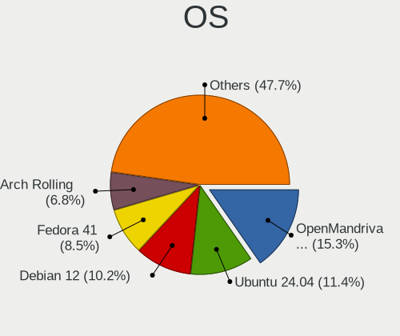
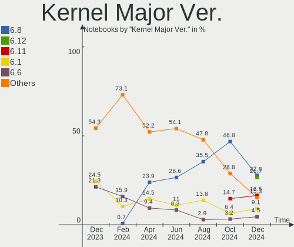
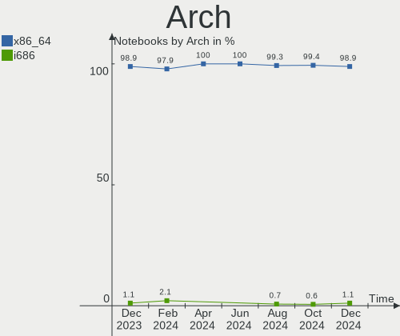
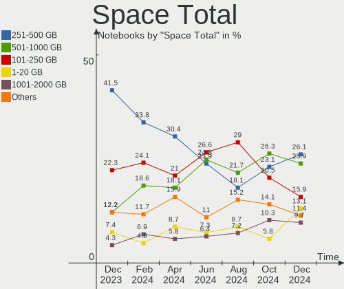
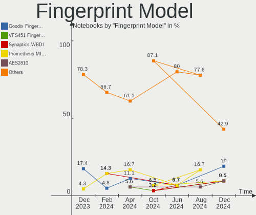

Linux in France - Hardware Trends (Notebooks)
---------------------------------------------

A project to identify most popular hardware characteristics and track their change
over time based on data collected by Linux users at https://Linux-Hardware.org.

Anyone can contribute to this report by the [hw-probe](https://github.com/linuxhw/hw-probe) tool:

    sudo -E hw-probe -all -upload

Period: Feb, 2023.

Contents
--------

* [ System ](#system)
  - [ OS                       ](#os)
  - [ OS Family                ](#os-family)
  - [ Kernel                   ](#kernel)
  - [ Kernel Family            ](#kernel-family)
  - [ Kernel Major Ver.        ](#kernel-major-ver)
  - [ Arch                     ](#arch)
  - [ DE                       ](#de)
  - [ Display Server           ](#display-server)
  - [ Display Manager          ](#display-manager)
  - [ OS Lang                  ](#os-lang)
  - [ Boot Mode                ](#boot-mode)
  - [ Filesystem               ](#filesystem)
  - [ Part. scheme             ](#part-scheme)
  - [ Dual Boot with Linux/BSD ](#dual-boot-with-linuxbsd)
  - [ Dual Boot (Win)          ](#dual-boot-win)

* [ Board ](#board)
  - [ Vendor                   ](#vendor)
  - [ Model                    ](#model)
  - [ Model Family             ](#model-family)
  - [ MFG Year                 ](#mfg-year)
  - [ Form Factor              ](#form-factor)
  - [ Secure Boot              ](#secure-boot)
  - [ Coreboot                 ](#coreboot)
  - [ RAM Size                 ](#ram-size)
  - [ RAM Used                 ](#ram-used)
  - [ Total Drives             ](#total-drives)
  - [ Has CD-ROM               ](#has-cd-rom)
  - [ Has Ethernet             ](#has-ethernet)
  - [ Has WiFi                 ](#has-wifi)
  - [ Has Bluetooth            ](#has-bluetooth)

* [ Location ](#location)
  - [ Country                  ](#country)
  - [ City                     ](#city)

* [ Drives ](#drives)
  - [ Drive Vendor             ](#drive-vendor)
  - [ Drive Model              ](#drive-model)
  - [ HDD Vendor               ](#hdd-vendor)
  - [ SSD Vendor               ](#ssd-vendor)
  - [ Drive Kind               ](#drive-kind)
  - [ Drive Connector          ](#drive-connector)
  - [ Drive Size               ](#drive-size)
  - [ Space Total              ](#space-total)
  - [ Space Used               ](#space-used)
  - [ Malfunc. Drives          ](#malfunc-drives)
  - [ Malfunc. Drive Vendor    ](#malfunc-drive-vendor)
  - [ Malfunc. HDD Vendor      ](#malfunc-hdd-vendor)
  - [ Malfunc. Drive Kind      ](#malfunc-drive-kind)
  - [ Failed Drives            ](#failed-drives)
  - [ Failed Drive Vendor      ](#failed-drive-vendor)
  - [ Drive Status             ](#drive-status)

* [ Storage controller ](#storage-controller)
  - [ Storage Vendor           ](#storage-vendor)
  - [ Storage Model            ](#storage-model)
  - [ Storage Kind             ](#storage-kind)

* [ Processor ](#processor)
  - [ CPU Vendor               ](#cpu-vendor)
  - [ CPU Model                ](#cpu-model)
  - [ CPU Model Family         ](#cpu-model-family)
  - [ CPU Cores                ](#cpu-cores)
  - [ CPU Sockets              ](#cpu-sockets)
  - [ CPU Threads              ](#cpu-threads)
  - [ CPU Op-Modes             ](#cpu-op-modes)
  - [ CPU Microcode            ](#cpu-microcode)
  - [ CPU Microarch            ](#cpu-microarch)

* [ Graphics ](#graphics)
  - [ GPU Vendor               ](#gpu-vendor)
  - [ GPU Model                ](#gpu-model)
  - [ GPU Combo                ](#gpu-combo)
  - [ GPU Driver               ](#gpu-driver)
  - [ GPU Memory               ](#gpu-memory)

* [ Monitor ](#monitor)
  - [ Monitor Vendor           ](#monitor-vendor)
  - [ Monitor Model            ](#monitor-model)
  - [ Monitor Resolution       ](#monitor-resolution)
  - [ Monitor Diagonal         ](#monitor-diagonal)
  - [ Monitor Width            ](#monitor-width)
  - [ Aspect Ratio             ](#aspect-ratio)
  - [ Monitor Area             ](#monitor-area)
  - [ Pixel Density            ](#pixel-density)
  - [ Multiple Monitors        ](#multiple-monitors)

* [ Network ](#network)
  - [ Net Controller Vendor    ](#net-controller-vendor)
  - [ Net Controller Model     ](#net-controller-model)
  - [ Wireless Vendor          ](#wireless-vendor)
  - [ Wireless Model           ](#wireless-model)
  - [ Ethernet Vendor          ](#ethernet-vendor)
  - [ Ethernet Model           ](#ethernet-model)
  - [ Net Controller Kind      ](#net-controller-kind)
  - [ Used Controller          ](#used-controller)
  - [ NICs                     ](#nics)
  - [ IPv6                     ](#ipv6)

* [ Bluetooth ](#bluetooth)
  - [ Bluetooth Vendor         ](#bluetooth-vendor)
  - [ Bluetooth Model          ](#bluetooth-model)

* [ Sound ](#sound)
  - [ Sound Vendor             ](#sound-vendor)
  - [ Sound Model              ](#sound-model)

* [ Memory ](#memory)
  - [ Memory Vendor            ](#memory-vendor)
  - [ Memory Model             ](#memory-model)
  - [ Memory Kind              ](#memory-kind)
  - [ Memory Form Factor       ](#memory-form-factor)
  - [ Memory Size              ](#memory-size)
  - [ Memory Speed             ](#memory-speed)

* [ Printers & scanners ](#printers--scanners)
  - [ Printer Vendor           ](#printer-vendor)
  - [ Printer Model            ](#printer-model)
  - [ Scanner Vendor           ](#scanner-vendor)
  - [ Scanner Model            ](#scanner-model)

* [ Camera ](#camera)
  - [ Camera Vendor            ](#camera-vendor)
  - [ Camera Model             ](#camera-model)

* [ Security ](#security)
  - [ Fingerprint Vendor       ](#fingerprint-vendor)
  - [ Fingerprint Model        ](#fingerprint-model)
  - [ Chipcard Vendor          ](#chipcard-vendor)
  - [ Chipcard Model           ](#chipcard-model)

* [ Unsupported ](#unsupported)
  - [ Unsupported Devices      ](#unsupported-devices)
  - [ Unsupported Device Types ](#unsupported-device-types)

System
------

OS
--

Installed operating systems

| Name                         | Notebooks | Percent |
|------------------------------|-----------|---------|
| Ubuntu 22.04                 | 31        | 19.87%  |
| OpenMandriva 23.01           | 18        | 11.54%  |
| Debian 11                    | 10        | 6.41%   |
| Linux Mint 21.1              | 9         | 5.77%   |
| Fedora 37                    | 9         | 5.77%   |
| OpenMandriva 4.3             | 7         | 4.49%   |
| Ubuntu 20.04                 | 6         | 3.85%   |
| Debian                       | 5         | 3.21%   |
| Ubuntu 22.10                 | 4         | 2.56%   |
| Pop!_OS 22.04                | 4         | 2.56%   |
| KDE neon 22.04               | 4         | 2.56%   |
| Arch Rolling                 | 4         | 2.56%   |
| Xubuntu 22.04                | 3         | 1.92%   |
| Ubuntu MATE 22.04            | 3         | 1.92%   |
| Lubuntu 22.04                | 3         | 1.92%   |
| Kubuntu 22.04                | 3         | 1.92%   |
| Elementary 7                 | 3         | 1.92%   |
| Zorin 16                     | 2         | 1.28%   |
| Ubuntu 23.04                 | 2         | 1.28%   |
| Linux Mint 21                | 2         | 1.28%   |
| Kubuntu 22.10                | 2         | 1.28%   |
| Xubuntu 22.10                | 1         | 0.64%   |
| Xubuntu 18.04                | 1         | 0.64%   |
| Void Linux Rolling           | 1         | 0.64%   |
| Ubuntu Unity 22.04           | 1         | 0.64%   |
| Ubuntu Budgie 22.10          | 1         | 0.64%   |
| Ubuntu Budgie 20.04          | 1         | 0.64%   |
| Ubuntu 21.10                 | 1         | 0.64%   |
| Ubuntu 21.04                 | 1         | 0.64%   |
| SteamOS 3.4.4                | 1         | 0.64%   |
| ROSA R11.1                   | 1         | 0.64%   |
| Rocky Linux 9.1              | 1         | 0.64%   |
| openSUSE Tumbleweed-XXXXXXXX | 1         | 0.64%   |
| MX 21                        | 1         | 0.64%   |
| Manjaro 22.0.2               | 1         | 0.64%   |
| Linux Mint 20.3              | 1         | 0.64%   |
| Linux Mint 20.2              | 1         | 0.64%   |
| Kali 2022.4                  | 1         | 0.64%   |
| Gentoo 2.9                   | 1         | 0.64%   |
| Gentoo 2.13                  | 1         | 0.64%   |

OS Family
---------

OS without a version

| Name          | Notebooks | Percent |
|---------------|-----------|---------|
| Ubuntu        | 45        | 28.85%  |
| OpenMandriva  | 25        | 16.03%  |
| Debian        | 15        | 9.62%   |
| Linux Mint    | 13        | 8.33%   |
| Fedora        | 10        | 6.41%   |
| Xubuntu       | 5         | 3.21%   |
| Kubuntu       | 5         | 3.21%   |
| Pop!_OS       | 4         | 2.56%   |
| KDE neon      | 4         | 2.56%   |
| Arch          | 4         | 2.56%   |
| Ubuntu MATE   | 3         | 1.92%   |
| Lubuntu       | 3         | 1.92%   |
| Elementary    | 3         | 1.92%   |
| Zorin         | 2         | 1.28%   |
| Ubuntu Budgie | 2         | 1.28%   |
| Gentoo        | 2         | 1.28%   |
| Void Linux    | 1         | 0.64%   |
| Ubuntu Unity  | 1         | 0.64%   |
| SteamOS       | 1         | 0.64%   |
| ROSA          | 1         | 0.64%   |
| Rocky Linux   | 1         | 0.64%   |
| openSUSE      | 1         | 0.64%   |
| MX            | 1         | 0.64%   |
| Manjaro       | 1         | 0.64%   |
| Kali          | 1         | 0.64%   |
| Athena        | 1         | 0.64%   |
| ArcoLinux     | 1         | 0.64%   |

Kernel
------

Version of the Linux kernel

| Version                  | Notebooks | Percent |
|--------------------------|-----------|---------|
| 5.15.0-58-generic        | 22        | 14.1%   |
| 5.15.0-60-generic        | 20        | 12.82%  |
| 5.19.0-32-generic        | 16        | 10.26%  |
| 6.1.1-desktop-1omv2290   | 11        | 7.05%   |
| 5.10.0-21-amd64          | 7         | 4.49%   |
| 6.1.4-desktop-1omv2301   | 6         | 3.85%   |
| 6.1.0-3-amd64            | 5         | 3.21%   |
| 5.19.0-31-generic        | 4         | 2.56%   |
| 5.16.7-desktop-1omv4003  | 4         | 2.56%   |
| 6.0.7-301.fc37.x86_64    | 3         | 1.92%   |
| 5.19.0-29-generic        | 3         | 1.92%   |
| 5.16.13-desktop-1omv4003 | 3         | 1.92%   |
| 5.15.0-43-generic        | 3         | 1.92%   |
| 6.1.9-200.fc37.x86_64    | 2         | 1.28%   |
| 6.1.8-200.fc37.x86_64    | 2         | 1.28%   |
| 6.1.12-zen1-1-zen        | 2         | 1.28%   |
| 6.1.11-76060111-generic  | 2         | 1.28%   |
| 6.0.12-76060006-generic  | 2         | 1.28%   |
| 5.4.0-139-generic        | 2         | 1.28%   |
| 5.4.0-137-generic        | 2         | 1.28%   |
| 5.15.0-56-generic        | 2         | 1.28%   |
| 5.10.0-19-amd64          | 2         | 1.28%   |
| 6.2.1-gentoo-y           | 1         | 0.64%   |
| 6.2.1-060201-generic     | 1         | 0.64%   |
| 6.1.9-gentoo-dist        | 1         | 0.64%   |
| 6.1.9-273-tkg-cfs        | 1         | 0.64%   |
| 6.1.9-1-MANJARO          | 1         | 0.64%   |
| 6.1.9-060109-generic     | 1         | 0.64%   |
| 6.1.7-200.fc37.x86_64    | 1         | 0.64%   |
| 6.1.12-arch1-1           | 1         | 0.64%   |
| 6.1.12-3-liquorix-amd64  | 1         | 0.64%   |
| 6.1.11-zen1-1-zen        | 1         | 0.64%   |
| 6.1.11-273-tkg-cfs       | 1         | 0.64%   |
| 6.1.11-200.fc37.x86_64   | 1         | 0.64%   |
| 6.1.10_1                 | 1         | 0.64%   |
| 6.1.10-1-default         | 1         | 0.64%   |
| 6.1.0-5-amd64            | 1         | 0.64%   |
| 6.0.0-kali6-amd64        | 1         | 0.64%   |
| 6.0.0-2-amd64            | 1         | 0.64%   |
| 5.19.0-21-generic        | 1         | 0.64%   |

Kernel Family
-------------

Linux kernel without a distro release

| Version | Notebooks | Percent |
|---------|-----------|---------|
| 5.15.0  | 51        | 32.69%  |
| 5.19.0  | 24        | 15.38%  |
| 6.1.1   | 11        | 7.05%   |
| 5.10.0  | 9         | 5.77%   |
| 6.1.9   | 6         | 3.85%   |
| 6.1.4   | 6         | 3.85%   |
| 6.1.0   | 6         | 3.85%   |
| 6.1.11  | 5         | 3.21%   |
| 6.1.12  | 4         | 2.56%   |
| 5.4.0   | 4         | 2.56%   |
| 5.16.7  | 4         | 2.56%   |
| 6.0.7   | 3         | 1.92%   |
| 5.16.13 | 3         | 1.92%   |
| 6.2.1   | 2         | 1.28%   |
| 6.1.8   | 2         | 1.28%   |
| 6.1.10  | 2         | 1.28%   |
| 6.0.12  | 2         | 1.28%   |
| 6.0.0   | 2         | 1.28%   |
| 5.14.0  | 2         | 1.28%   |
| 5.13.0  | 2         | 1.28%   |
| 6.1.7   | 1         | 0.64%   |
| 5.17.5  | 1         | 0.64%   |
| 5.11.0  | 1         | 0.64%   |
| 5.10.14 | 1         | 0.64%   |
| 4.9.155 | 1         | 0.64%   |
| 4.15.0  | 1         | 0.64%   |

Kernel Major Ver.
-----------------

Linux kernel major version

| Version | Notebooks | Percent |
|---------|-----------|---------|
| 5.15    | 51        | 32.69%  |
| 6.1     | 43        | 27.56%  |
| 5.19    | 24        | 15.38%  |
| 5.10    | 10        | 6.41%   |
| 6.0     | 7         | 4.49%   |
| 5.16    | 7         | 4.49%   |
| 5.4     | 4         | 2.56%   |
| 6.2     | 2         | 1.28%   |
| 5.14    | 2         | 1.28%   |
| 5.13    | 2         | 1.28%   |
| 5.17    | 1         | 0.64%   |
| 5.11    | 1         | 0.64%   |
| 4.9     | 1         | 0.64%   |
| 4.15    | 1         | 0.64%   |

Arch
----

OS architecture (x86_64, i586, etc.)

| Name   | Notebooks | Percent |
|--------|-----------|---------|
| x86_64 | 154       | 98.72%  |
| i686   | 2         | 1.28%   |

DE
--

Desktop Environment

| Name       | Notebooks | Percent |
|------------|-----------|---------|
| GNOME      | 71        | 45.51%  |
| KDE5       | 42        | 26.92%  |
| XFCE       | 13        | 8.33%   |
| X-Cinnamon | 10        | 6.41%   |
| MATE       | 5         | 3.21%   |
| LXQt       | 4         | 2.56%   |
| Pantheon   | 3         | 1.92%   |
| Budgie     | 2         | 1.28%   |
| Unity      | 1         | 0.64%   |
| sway       | 1         | 0.64%   |
| LXDE       | 1         | 0.64%   |
| KDE4       | 1         | 0.64%   |
| Hyprland   | 1         | 0.64%   |
| Cinnamon   | 1         | 0.64%   |

Display Server
--------------

X11 or Wayland

| Name    | Notebooks | Percent |
|---------|-----------|---------|
| X11     | 101       | 64.74%  |
| Wayland | 53        | 33.97%  |
| Tty     | 1         | 0.64%   |
| Unknown | 1         | 0.64%   |

Display Manager
---------------

SDDM, LightDM, etc.

| Name    | Notebooks | Percent |
|---------|-----------|---------|
| GDM3    | 44        | 28.21%  |
| SDDM    | 41        | 26.28%  |
| Unknown | 31        | 19.87%  |
| LightDM | 22        | 14.1%   |
| GDM     | 16        | 10.26%  |
| LXDM    | 1         | 0.64%   |
| KDM     | 1         | 0.64%   |

OS Lang
-------

Language

| Lang    | Notebooks | Percent |
|---------|-----------|---------|
| fr_FR   | 117       | 75%     |
| en_US   | 32        | 20.51%  |
| C       | 2         | 1.28%   |
| pl_PL   | 1         | 0.64%   |
| es_ES   | 1         | 0.64%   |
| en_GB   | 1         | 0.64%   |
| de_DE   | 1         | 0.64%   |
| Default | 1         | 0.64%   |

Boot Mode
---------

EFI or BIOS

| Mode | Notebooks | Percent |
|------|-----------|---------|
| EFI  | 94        | 60.26%  |
| BIOS | 62        | 39.74%  |

Filesystem
----------

Type of filesystem

| Type    | Notebooks | Percent |
|---------|-----------|---------|
| Ext4    | 129       | 82.69%  |
| Overlay | 13        | 8.33%   |
| Btrfs   | 11        | 7.05%   |
| Zfs     | 1         | 0.64%   |
| Xfs     | 1         | 0.64%   |
| Jfs     | 1         | 0.64%   |

Part. scheme
------------

Scheme of partitioning

| Type    | Notebooks | Percent |
|---------|-----------|---------|
| GPT     | 102       | 65.38%  |
| Unknown | 31        | 19.87%  |
| MBR     | 23        | 14.74%  |

Dual Boot with Linux/BSD
------------------------

Hosting more than one Linux/BSD

| Dual boot | Notebooks | Percent |
|-----------|-----------|---------|
| No        | 137       | 87.82%  |
| Yes       | 19        | 12.18%  |

Dual Boot (Win)
---------------

Hosting Linux and Windows

| Dual boot | Notebooks | Percent |
|-----------|-----------|---------|
| No        | 115       | 73.72%  |
| Yes       | 41        | 26.28%  |

Board
-----

Vendor
------

Motherboard manufacturer

| Name                | Notebooks | Percent |
|---------------------|-----------|---------|
| Lenovo              | 30        | 19.23%  |
| ASUSTek Computer    | 27        | 17.31%  |
| Dell                | 25        | 16.03%  |
| Hewlett-Packard     | 21        | 13.46%  |
| Acer                | 11        | 7.05%   |
| Toshiba             | 6         | 3.85%   |
| Sony                | 6         | 3.85%   |
| Apple               | 5         | 3.21%   |
| Notebook            | 4         | 2.56%   |
| MSI                 | 3         | 1.92%   |
| HUAWEI              | 3         | 1.92%   |
| TUXEDO              | 2         | 1.28%   |
| Google              | 2         | 1.28%   |
| Valve               | 1         | 0.64%   |
| Timi                | 1         | 0.64%   |
| Thomson             | 1         | 0.64%   |
| HONOR               | 1         | 0.64%   |
| Gigabyte Technology | 1         | 0.64%   |
| Fujitsu Siemens     | 1         | 0.64%   |
| Fujitsu             | 1         | 0.64%   |
| EXTRA Computer      | 1         | 0.64%   |
| eMachines           | 1         | 0.64%   |
| Chuwi               | 1         | 0.64%   |
| Alienware           | 1         | 0.64%   |

Model
-----

Motherboard model

| Name                                     | Notebooks | Percent |
|------------------------------------------|-----------|---------|
| Dell Precision 5570                      | 6         | 3.85%   |
| Lenovo G50-80 80E5                       | 2         | 1.28%   |
| HP Victus by Laptop 16-e0xxx             | 2         | 1.28%   |
| HP Pavilion 17                           | 2         | 1.28%   |
| Dell Latitude 5400                       | 2         | 1.28%   |
| ASUS S551LN                              | 2         | 1.28%   |
| Valve Jupiter                            | 1         | 0.64%   |
| TUXEDO Pulse 15 Gen1                     | 1         | 0.64%   |
| TUXEDO InfinityBook S 14 Gen6            | 1         | 0.64%   |
| Toshiba TECRA R850                       | 1         | 0.64%   |
| Toshiba Satellite Pro R50-B              | 1         | 0.64%   |
| Toshiba Satellite L655                   | 1         | 0.64%   |
| Toshiba Satellite C870-196               | 1         | 0.64%   |
| Toshiba Satellite C70-C-18E              | 1         | 0.64%   |
| Toshiba Satellite C660                   | 1         | 0.64%   |
| Timi TM1701                              | 1         | 0.64%   |
| Thomson N17V3C4WH128                     | 1         | 0.64%   |
| Sony VPCEH1E1E                           | 1         | 0.64%   |
| Sony VGN-Z31MN_B                         | 1         | 0.64%   |
| Sony VGN-NW21MF_W                        | 1         | 0.64%   |
| Sony VGN-NS38E_S                         | 1         | 0.64%   |
| Sony SVE1513U1ESI                        | 1         | 0.64%   |
| Sony SVE1513B1EW                         | 1         | 0.64%   |
| Notebook NLx0MU                          | 1         | 0.64%   |
| Notebook NL5xNU                          | 1         | 0.64%   |
| Notebook NJ50_70CU                       | 1         | 0.64%   |
| Notebook N8xEJEK                         | 1         | 0.64%   |
| MSI GF65 Thin 9SEXR                      | 1         | 0.64%   |
| MSI GF63 Thin 11UD                       | 1         | 0.64%   |
| MSI GE60 2QE                             | 1         | 0.64%   |
| Lenovo Yoga 500-15IBD 80N6               | 1         | 0.64%   |
| Lenovo Yoga 500-14ACL 80NA               | 1         | 0.64%   |
| Lenovo V130-15IGM 81HL                   | 1         | 0.64%   |
| Lenovo ThinkPad Z13 Gen 1 21D2CTO1WW     | 1         | 0.64%   |
| Lenovo ThinkPad X260 20F5S65B0J          | 1         | 0.64%   |
| Lenovo ThinkPad X250 20CLS2TQ22          | 1         | 0.64%   |
| Lenovo ThinkPad X240 20AMS4AN00          | 1         | 0.64%   |
| Lenovo ThinkPad X230 23259S9             | 1         | 0.64%   |
| Lenovo ThinkPad X1 Carbon 4th 20FCS2L300 | 1         | 0.64%   |
| Lenovo ThinkPad X1 Carbon 3rd 20BS00AFMS | 1         | 0.64%   |

Model Family
------------

Motherboard model prefix

| Name                 | Notebooks | Percent |
|----------------------|-----------|---------|
| Lenovo ThinkPad      | 18        | 11.54%  |
| Dell Precision       | 8         | 5.13%   |
| Dell Latitude        | 8         | 5.13%   |
| HP Pavilion          | 6         | 3.85%   |
| Toshiba Satellite    | 5         | 3.21%   |
| HP Laptop            | 5         | 3.21%   |
| ASUS VivoBook        | 5         | 3.21%   |
| Acer Aspire          | 5         | 3.21%   |
| Lenovo IdeaPad       | 4         | 2.56%   |
| Lenovo G50-80        | 3         | 1.92%   |
| HP EliteBook         | 3         | 1.92%   |
| Dell XPS             | 3         | 1.92%   |
| Dell Inspiron        | 3         | 1.92%   |
| ASUS ROG             | 3         | 1.92%   |
| Acer Nitro           | 3         | 1.92%   |
| Lenovo Yoga          | 2         | 1.28%   |
| Lenovo Legion        | 2         | 1.28%   |
| HP Victus            | 2         | 1.28%   |
| Dell Vostro          | 2         | 1.28%   |
| ASUS S551LN          | 2         | 1.28%   |
| ASUS ASUS            | 2         | 1.28%   |
| Apple MacBookPro9    | 2         | 1.28%   |
| Valve Jupiter        | 1         | 0.64%   |
| TUXEDO Pulse         | 1         | 0.64%   |
| TUXEDO InfinityBook  | 1         | 0.64%   |
| Toshiba TECRA        | 1         | 0.64%   |
| Timi TM1701          | 1         | 0.64%   |
| Thomson N17V3C4WH128 | 1         | 0.64%   |
| Sony VPCEH1E1E       | 1         | 0.64%   |
| Sony VGN-Z31MN       | 1         | 0.64%   |
| Sony VGN-NW21MF      | 1         | 0.64%   |
| Sony VGN-NS38E       | 1         | 0.64%   |
| Sony SVE1513U1ESI    | 1         | 0.64%   |
| Sony SVE1513B1EW     | 1         | 0.64%   |
| Notebook NLx0MU      | 1         | 0.64%   |
| Notebook NL5xNU      | 1         | 0.64%   |
| Notebook NJ50        | 1         | 0.64%   |
| Notebook N8xEJEK     | 1         | 0.64%   |
| MSI GF65             | 1         | 0.64%   |
| MSI GF63             | 1         | 0.64%   |

MFG Year
--------

Motherboard manufacture year

| Year | Notebooks | Percent |
|------|-----------|---------|
| 2022 | 22        | 14.1%   |
| 2021 | 20        | 12.82%  |
| 2020 | 15        | 9.62%   |
| 2012 | 14        | 8.97%   |
| 2019 | 12        | 7.69%   |
| 2015 | 10        | 6.41%   |
| 2014 | 10        | 6.41%   |
| 2011 | 9         | 5.77%   |
| 2010 | 9         | 5.77%   |
| 2018 | 8         | 5.13%   |
| 2017 | 6         | 3.85%   |
| 2016 | 6         | 3.85%   |
| 2008 | 6         | 3.85%   |
| 2013 | 5         | 3.21%   |
| 2009 | 2         | 1.28%   |
| 2023 | 1         | 0.64%   |
| 2007 | 1         | 0.64%   |

Form Factor
-----------

Physical design of the computer

| Name     | Notebooks | Percent |
|----------|-----------|---------|
| Notebook | 156       | 100%    |

Secure Boot
-----------

Enabled or disabled

| State    | Notebooks | Percent |
|----------|-----------|---------|
| Disabled | 138       | 88.46%  |
| Enabled  | 18        | 11.54%  |

Coreboot
--------

Have coreboot on board

| Used | Notebooks | Percent |
|------|-----------|---------|
| No   | 154       | 98.72%  |
| Yes  | 2         | 1.28%   |

RAM Size
--------

Total RAM memory

| Size in GB  | Notebooks | Percent |
|-------------|-----------|---------|
| 4.01-8.0    | 45        | 28.85%  |
| 3.01-4.0    | 35        | 22.44%  |
| 8.01-16.0   | 28        | 17.95%  |
| 16.01-24.0  | 27        | 17.31%  |
| 32.01-64.0  | 6         | 3.85%   |
| 64.01-256.0 | 6         | 3.85%   |
| 1.01-2.0    | 6         | 3.85%   |
| 24.01-32.0  | 3         | 1.92%   |

RAM Used
--------

Used RAM memory

| Used GB    | Notebooks | Percent |
|------------|-----------|---------|
| 1.01-2.0   | 53        | 33.97%  |
| 2.01-3.0   | 46        | 29.49%  |
| 3.01-4.0   | 27        | 17.31%  |
| 4.01-8.0   | 17        | 10.9%   |
| 8.01-16.0  | 7         | 4.49%   |
| 0.51-1.0   | 4         | 2.56%   |
| 16.01-24.0 | 1         | 0.64%   |
| 0.01-0.5   | 1         | 0.64%   |

Total Drives
------------

Number of drives on board

| Drives | Notebooks | Percent |
|--------|-----------|---------|
| 1      | 112       | 71.79%  |
| 2      | 39        | 25%     |
| 3      | 3         | 1.92%   |
| 0      | 2         | 1.28%   |

Has CD-ROM
----------

Has CD-ROM on board

| Presented | Notebooks | Percent |
|-----------|-----------|---------|
| No        | 98        | 62.82%  |
| Yes       | 58        | 37.18%  |

Has Ethernet
------------

Has Ethernet on board

| Presented | Notebooks | Percent |
|-----------|-----------|---------|
| Yes       | 118       | 75.64%  |
| No        | 38        | 24.36%  |

Has WiFi
--------

Has WiFi module

| Presented | Notebooks | Percent |
|-----------|-----------|---------|
| Yes       | 154       | 98.72%  |
| No        | 2         | 1.28%   |

Has Bluetooth
-------------

Has Bluetooth module

| Presented | Notebooks | Percent |
|-----------|-----------|---------|
| Yes       | 130       | 83.33%  |
| No        | 26        | 16.67%  |

Location
--------

Country
-------

Geographic location (country)

| Country | Notebooks | Percent |
|---------|-----------|---------|
| France  | 156       | 100%    |

City
----

Geographic location (city)

| City                      | Notebooks | Percent |
|---------------------------|-----------|---------|
| Paris                     | 27        | 17.31%  |
| Versailles                | 3         | 1.92%   |
| Marseille                 | 3         | 1.92%   |
| Houilles                  | 3         | 1.92%   |
| Toulouse                  | 2         | 1.28%   |
| Saint-Nazaire             | 2         | 1.28%   |
| Nanterre                  | 2         | 1.28%   |
| Montpellier               | 2         | 1.28%   |
| Lyon                      | 2         | 1.28%   |
| Grenoble                  | 2         | 1.28%   |
| Brest                     | 2         | 1.28%   |
| Wasquehal                 | 1         | 0.64%   |
| Villefontaine             | 1         | 0.64%   |
| Vichy                     | 1         | 0.64%   |
| Vesoul                    | 1         | 0.64%   |
| Vélizy-Villacoublay      | 1         | 0.64%   |
| Valbonne                  | 1         | 0.64%   |
| Tremblay-en-France        | 1         | 0.64%   |
| Tregueux                  | 1         | 0.64%   |
| Tours                     | 1         | 0.64%   |
| Strasbourg                | 1         | 0.64%   |
| Sotteville-lès-Rouen     | 1         | 0.64%   |
| Soissons                  | 1         | 0.64%   |
| Saumur                    | 1         | 0.64%   |
| Sancoins                  | 1         | 0.64%   |
| Salon-de-Provence         | 1         | 0.64%   |
| Saint-Raphaël            | 1         | 0.64%   |
| Saint-Martin-d'Hères     | 1         | 0.64%   |
| Saint-Hilaire-sur-Benaize | 1         | 0.64%   |
| Saint-Etienne-de-Valoux   | 1         | 0.64%   |
| Roussillon                | 1         | 0.64%   |
| Rouen                     | 1         | 0.64%   |
| Roubaix                   | 1         | 0.64%   |
| Rennes                    | 1         | 0.64%   |
| Quetigny                  | 1         | 0.64%   |
| Publy                     | 1         | 0.64%   |
| Poitiers                  | 1         | 0.64%   |
| Pleugriffet               | 1         | 0.64%   |
| Peumerit                  | 1         | 0.64%   |
| Perreuil                  | 1         | 0.64%   |

Drives
------

Drive Vendor
------------

Hard drive vendors

| Vendor                      | Notebooks | Drives | Percent |
|-----------------------------|-----------|--------|---------|
| Samsung Electronics         | 30        | 33     | 15.54%  |
| WDC                         | 20        | 21     | 10.36%  |
| Seagate                     | 19        | 19     | 9.84%   |
| Toshiba                     | 13        | 13     | 6.74%   |
| Crucial                     | 13        | 13     | 6.74%   |
| SK hynix                    | 10        | 10     | 5.18%   |
| SanDisk                     | 10        | 11     | 5.18%   |
| Micron Technology           | 9         | 9      | 4.66%   |
| Unknown                     | 8         | 8      | 4.15%   |
| Kingston                    | 7         | 7      | 3.63%   |
| Intel                       | 5         | 5      | 2.59%   |
| HGST                        | 5         | 5      | 2.59%   |
| SPCC                        | 4         | 4      | 2.07%   |
| JMicron Technology          | 4         | 4      | 2.07%   |
| PNY                         | 3         | 3      | 1.55%   |
| LDLC                        | 3         | 3      | 1.55%   |
| KIOXIA                      | 3         | 3      | 1.55%   |
| Kingston Technology Company | 3         | 3      | 1.55%   |
| Hitachi                     | 3         | 3      | 1.55%   |
| China                       | 3         | 3      | 1.55%   |
| LITEONIT                    | 2         | 2      | 1.04%   |
| LITEON                      | 2         | 2      | 1.04%   |
| Apple                       | 2         | 2      | 1.04%   |
| Transcend                   | 1         | 1      | 0.52%   |
| SSSTC                       | 1         | 1      | 0.52%   |
| Plextor                     | 1         | 1      | 0.52%   |
| Phison Electronics          | 1         | 1      | 0.52%   |
| Phison                      | 1         | 1      | 0.52%   |
| Micron/Crucial Technology   | 1         | 1      | 0.52%   |
| Lite-On Technology          | 1         | 1      | 0.52%   |
| Hewlett-Packard             | 1         | 1      | 0.52%   |
| G521N                       | 1         | 1      | 0.52%   |
| CT1000P2                    | 1         | 1      | 0.52%   |
| Corsair                     | 1         | 1      | 0.52%   |
| Unknown                     | 1         | 1      | 0.52%   |

Drive Model
-----------

Hard drive models

| Model                                            | Notebooks | Percent |
|--------------------------------------------------|-----------|---------|
| Crucial CT240BX500SSD1 240GB                     | 5         | 2.54%   |
| Samsung SSD 980 1TB                              | 4         | 2.03%   |
| Samsung PM9A1 NVMe 1024GB                        | 4         | 2.03%   |
| SPCC Solid State Disk 512GB                      | 3         | 1.52%   |
| Seagate ST1000LM035-1RK172 1TB                   | 3         | 1.52%   |
| HGST HTS721010A9E630 1TB                         | 3         | 1.52%   |
| WDC WD10JPCX-24UE4T0 1TB                         | 2         | 1.02%   |
| Unknown MMC Card  32GB                           | 2         | 1.02%   |
| Unknown MMC Card  128GB                          | 2         | 1.02%   |
| Toshiba MQ04ABF100 1TB                           | 2         | 1.02%   |
| SK hynix PC711 HFS512GDE9X073N 512GB             | 2         | 1.02%   |
| Seagate ST2000LM015-2E8174 2TB                   | 2         | 1.02%   |
| Sandisk WD Black SN750 / PC SN730 NVMe SSD 512GB | 2         | 1.02%   |
| Samsung SSD 860 EVO 500GB                        | 2         | 1.02%   |
| Samsung MZVLQ512HBLU-00B00 512GB                 | 2         | 1.02%   |
| PNY CS900 240GB SSD                              | 2         | 1.02%   |
| Kingston SA400S37240G 240GB SSD                  | 2         | 1.02%   |
| JMicron Tech 250GB                               | 2         | 1.02%   |
| JMicron H/W JBOD 512GB SSD                       | 2         | 1.02%   |
| Crucial CT120BX500SSD1 120GB                     | 2         | 1.02%   |
| WDC WDS120G2G0A-00JH30 120GB SSD                 | 1         | 0.51%   |
| WDC WD7500BPVT-55HXZT4 752GB                     | 1         | 0.51%   |
| WDC WD5000LPCX-24C6HT0 500GB                     | 1         | 0.51%   |
| WDC WD5000LPCX-21VHAT0 500GB                     | 1         | 0.51%   |
| WDC WD5000BPVT-55HXZT4 500GB                     | 1         | 0.51%   |
| WDC WD5000BPKT-00PK4T0 500GB                     | 1         | 0.51%   |
| WDC WD2500BEKT-60PVMT0 250GB                     | 1         | 0.51%   |
| WDC WD20SPZX-22UA7T0 2TB                         | 1         | 0.51%   |
| WDC WD1600BEVS-60RST0 160GB                      | 1         | 0.51%   |
| WDC WD10SPCX-24HWST1 1TB                         | 1         | 0.51%   |
| WDC WD10JPVX-22JC3T0 1TB                         | 1         | 0.51%   |
| WDC WD Green M.2 2280 240GB                      | 1         | 0.51%   |
| WDC PC SN730 SDBQNTY-512G-1001 512GB             | 1         | 0.51%   |
| WDC PC SN730 SDBPNTY-512G-1027 512GB             | 1         | 0.51%   |
| WDC PC SN730 SDBPNTY-512G-1006 512GB             | 1         | 0.51%   |
| WDC PC SN730 SDBPNTY-256G-1036 256GB             | 1         | 0.51%   |
| WDC PC SN530 SDBQTPZ-512G-1016 512GB             | 1         | 0.51%   |
| WDC PC SN520 SDAPNUW-512G-1006 512GB             | 1         | 0.51%   |
| Unknown SD/MMC/MS PRO 16GB                       | 1         | 0.51%   |
| Unknown MMC Card  7GB                            | 1         | 0.51%   |

HDD Vendor
----------

Hard disk drive vendors

| Vendor              | Notebooks | Drives | Percent |
|---------------------|-----------|--------|---------|
| Seagate             | 18        | 18     | 36.73%  |
| WDC                 | 12        | 12     | 24.49%  |
| Toshiba             | 9         | 9      | 18.37%  |
| HGST                | 5         | 5      | 10.2%   |
| Hitachi             | 3         | 3      | 6.12%   |
| Unknown             | 1         | 1      | 2.04%   |
| Samsung Electronics | 1         | 1      | 2.04%   |

SSD Vendor
----------

Solid state drive vendors

| Vendor              | Notebooks | Drives | Percent |
|---------------------|-----------|--------|---------|
| Crucial             | 12        | 12     | 19.67%  |
| Samsung Electronics | 10        | 10     | 16.39%  |
| Kingston            | 5         | 5      | 8.2%    |
| SPCC                | 3         | 3      | 4.92%   |
| PNY                 | 3         | 3      | 4.92%   |
| Micron Technology   | 3         | 3      | 4.92%   |
| China               | 3         | 3      | 4.92%   |
| WDC                 | 2         | 2      | 3.28%   |
| SanDisk             | 2         | 2      | 3.28%   |
| LITEONIT            | 2         | 2      | 3.28%   |
| LITEON              | 2         | 2      | 3.28%   |
| LDLC                | 2         | 2      | 3.28%   |
| JMicron Technology  | 2         | 2      | 3.28%   |
| Transcend           | 1         | 1      | 1.64%   |
| Toshiba             | 1         | 1      | 1.64%   |
| SK hynix            | 1         | 1      | 1.64%   |
| Plextor             | 1         | 1      | 1.64%   |
| Intel               | 1         | 1      | 1.64%   |
| Hewlett-Packard     | 1         | 1      | 1.64%   |
| G521N               | 1         | 1      | 1.64%   |
| CT1000P2            | 1         | 1      | 1.64%   |
| Corsair             | 1         | 1      | 1.64%   |
| Apple               | 1         | 1      | 1.64%   |

Drive Kind
----------

HDD or SSD

| Kind    | Notebooks | Drives | Percent |
|---------|-----------|--------|---------|
| NVMe    | 67        | 76     | 37.43%  |
| SSD     | 55        | 61     | 30.73%  |
| HDD     | 46        | 49     | 25.7%   |
| MMC     | 8         | 8      | 4.47%   |
| Unknown | 3         | 4      | 1.68%   |

Drive Connector
---------------

SATA, SAS, NVMe, etc.

| Type | Notebooks | Drives | Percent |
|------|-----------|--------|---------|
| SATA | 92        | 108    | 53.49%  |
| NVMe | 67        | 76     | 38.95%  |
| MMC  | 8         | 8      | 4.65%   |
| SAS  | 5         | 6      | 2.91%   |

Drive Size
----------

Size of hard drive

| Size in TB | Notebooks | Drives | Percent |
|------------|-----------|--------|---------|
| 0.01-0.5   | 65        | 67     | 62.5%   |
| 0.51-1.0   | 32        | 36     | 30.77%  |
| 1.01-2.0   | 7         | 7      | 6.73%   |

Space Total
-----------

Amount of disk space available on the file system

| Size in GB     | Notebooks | Percent |
|----------------|-----------|---------|
| 251-500        | 49        | 31.41%  |
| 101-250        | 36        | 23.08%  |
| 501-1000       | 31        | 19.87%  |
| 1-20           | 12        | 7.69%   |
| 1001-2000      | 10        | 6.41%   |
| 51-100         | 5         | 3.21%   |
| More than 3000 | 4         | 2.56%   |
| 21-50          | 4         | 2.56%   |
| 2001-3000      | 4         | 2.56%   |
| Unknown        | 1         | 0.64%   |

Space Used
----------

Amount of used disk space

| Used GB   | Notebooks | Percent |
|-----------|-----------|---------|
| 1-20      | 56        | 35.9%   |
| 101-250   | 33        | 21.15%  |
| 21-50     | 24        | 15.38%  |
| 51-100    | 16        | 10.26%  |
| 501-1000  | 10        | 6.41%   |
| 251-500   | 9         | 5.77%   |
| 2001-3000 | 4         | 2.56%   |
| 1001-2000 | 3         | 1.92%   |
| Unknown   | 1         | 0.64%   |

Malfunc. Drives
---------------

Drive models with a malfunction

| Model                                       | Notebooks | Drives | Percent |
|---------------------------------------------|-----------|--------|---------|
| SK hynix PC711 HFS512GDE9X073N 512GB        | 2         | 2      | 10%     |
| WDC WD7500BPVT-55HXZT4 752GB                | 1         | 1      | 5%      |
| WDC WD2500BEKT-60PVMT0 250GB                | 1         | 1      | 5%      |
| WDC WD1600BEVS-60RST0 160GB                 | 1         | 1      | 5%      |
| WDC WD10JPVX-22JC3T0 1TB                    | 1         | 1      | 5%      |
| Toshiba MQ01ACF050 500GB                    | 1         | 1      | 5%      |
| Toshiba MK7575GSX 752GB                     | 1         | 1      | 5%      |
| Seagate ST9500325AS 500GB                   | 1         | 1      | 5%      |
| Seagate ST320LT007-9ZV142 320GB             | 1         | 1      | 5%      |
| Seagate ST2000LM007-1R8174 2TB              | 1         | 1      | 5%      |
| Seagate ST1000LM035-1RK172 1TB              | 1         | 1      | 5%      |
| Seagate ST1000LM024 HN-M101MBB 1TB          | 1         | 1      | 5%      |
| Samsung Electronics SSD SM871 2.5 7mm 256GB | 1         | 1      | 5%      |
| Samsung Electronics SSD 980 1TB             | 1         | 1      | 5%      |
| Samsung Electronics SSD 850 EVO 1TB         | 1         | 1      | 5%      |
| HGST HTS721010A9E630 1TB                    | 1         | 1      | 5%      |
| HGST HTS541075A9E680 752GB                  | 1         | 1      | 5%      |
| HGST HTS541010A9E680 1TB                    | 1         | 1      | 5%      |
| Corsair Neutron GTX SSD 120GB               | 1         | 1      | 5%      |

Malfunc. Drive Vendor
---------------------

Vendors of faulty drives

| Vendor              | Notebooks | Drives | Percent |
|---------------------|-----------|--------|---------|
| Seagate             | 5         | 5      | 25%     |
| WDC                 | 4         | 4      | 20%     |
| Samsung Electronics | 3         | 3      | 15%     |
| HGST                | 3         | 3      | 15%     |
| Toshiba             | 2         | 2      | 10%     |
| SK hynix            | 2         | 2      | 10%     |
| Corsair             | 1         | 1      | 5%      |

Malfunc. HDD Vendor
-------------------

Vendors of faulty HDD drives

| Vendor  | Notebooks | Drives | Percent |
|---------|-----------|--------|---------|
| Seagate | 5         | 5      | 35.71%  |
| WDC     | 4         | 4      | 28.57%  |
| HGST    | 3         | 3      | 21.43%  |
| Toshiba | 2         | 2      | 14.29%  |

Malfunc. Drive Kind
-------------------

Kinds of faulty drives

| Kind | Notebooks | Drives | Percent |
|------|-----------|--------|---------|
| HDD  | 14        | 14     | 70%     |
| NVMe | 3         | 3      | 15%     |
| SSD  | 3         | 3      | 15%     |

Failed Drives
-------------

Failed drive models

| Model                    | Notebooks | Drives | Percent |
|--------------------------|-----------|--------|---------|
| Toshiba MK3259GSXP 320GB | 1         | 1      | 100%    |

Failed Drive Vendor
-------------------

Failed drive vendors

| Vendor  | Notebooks | Drives | Percent |
|---------|-----------|--------|---------|
| Toshiba | 1         | 1      | 100%    |

Drive Status
------------

Number of failed and malfunc. drives

| Status   | Notebooks | Drives | Percent |
|----------|-----------|--------|---------|
| Works    | 82        | 96     | 48.81%  |
| Detected | 65        | 81     | 38.69%  |
| Malfunc  | 20        | 20     | 11.9%   |
| Failed   | 1         | 1      | 0.6%    |

Storage controller
------------------

Storage Vendor
--------------

Storage controller vendors

| Vendor                         | Notebooks | Percent |
|--------------------------------|-----------|---------|
| Intel                          | 107       | 54.87%  |
| Samsung Electronics            | 21        | 10.77%  |
| AMD                            | 17        | 8.72%   |
| SanDisk                        | 15        | 7.69%   |
| SK hynix                       | 9         | 4.62%   |
| Micron Technology              | 6         | 3.08%   |
| KIOXIA                         | 4         | 2.05%   |
| Kingston Technology Company    | 4         | 2.05%   |
| Nvidia                         | 3         | 1.54%   |
| Toshiba America Info Systems   | 2         | 1.03%   |
| Phison Electronics             | 2         | 1.03%   |
| Micron/Crucial Technology      | 2         | 1.03%   |
| Solid State Storage Technology | 1         | 0.51%   |
| Realtek Semiconductor          | 1         | 0.51%   |
| Lite-On Technology             | 1         | 0.51%   |

Storage Model
-------------

Storage controller models

| Model                                                                          | Notebooks | Percent |
|--------------------------------------------------------------------------------|-----------|---------|
| AMD FCH SATA Controller [AHCI mode]                                            | 16        | 7.84%   |
| Intel Volume Management Device NVMe RAID Controller                            | 13        | 6.37%   |
| Intel Sunrise Point-LP SATA Controller [AHCI mode]                             | 12        | 5.88%   |
| Intel 7 Series Chipset Family 6-port SATA Controller [AHCI mode]               | 12        | 5.88%   |
| Samsung NVMe SSD Controller 980                                                | 10        | 4.9%    |
| Intel Wildcat Point-LP SATA Controller [AHCI Mode]                             | 10        | 4.9%    |
| Intel 8 Series SATA Controller 1 [AHCI mode]                                   | 9         | 4.41%   |
| SK hynix Gold P31/PC711 NVMe Solid State Drive                                 | 7         | 3.43%   |
| Intel 82801IBM/IEM (ICH9M/ICH9M-E) 4 port SATA Controller [AHCI mode]          | 7         | 3.43%   |
| SanDisk WD Black SN750 / PC SN730 NVMe SSD                                     | 6         | 2.94%   |
| Sandisk Non-Volatile memory controller                                         | 6         | 2.94%   |
| Samsung NVMe SSD Controller PM9A1/PM9A3/980PRO                                 | 6         | 2.94%   |
| Micron Non-Volatile memory controller                                          | 6         | 2.94%   |
| Intel 82801 Mobile SATA Controller [RAID mode]                                 | 6         | 2.94%   |
| Intel 6 Series/C200 Series Chipset Family 6 port Mobile SATA AHCI Controller   | 6         | 2.94%   |
| Samsung NVMe SSD Controller SM981/PM981/PM983                                  | 5         | 2.45%   |
| Intel 5 Series/3400 Series Chipset 4 port SATA AHCI Controller                 | 4         | 1.96%   |
| Intel 400 Series Chipset Family SATA AHCI Controller                           | 4         | 1.96%   |
| KIOXIA Non-Volatile memory controller                                          | 3         | 1.47%   |
| Intel Comet Lake SATA AHCI Controller                                          | 3         | 1.47%   |
| Micron/Crucial P2 NVMe PCIe SSD                                                | 2         | 0.98%   |
| Kingston Company Company Non-Volatile memory controller                        | 2         | 0.98%   |
| Intel Tiger Lake-LP SATA Controller                                            | 2         | 0.98%   |
| Intel SSD Pro 7600p/760p/E 6100p Series                                        | 2         | 0.98%   |
| Intel Cannon Point-LP SATA Controller [AHCI Mode]                              | 2         | 0.98%   |
| Intel Cannon Lake Mobile PCH SATA AHCI Controller                              | 2         | 0.98%   |
| Intel Atom Processor E3800 Series SATA AHCI Controller                         | 2         | 0.98%   |
| Intel 82801HM/HEM (ICH8M/ICH8M-E) SATA Controller [AHCI mode]                  | 2         | 0.98%   |
| Intel 82801HM/HEM (ICH8M/ICH8M-E) IDE Controller                               | 2         | 0.98%   |
| Intel 8 Series/C220 Series Chipset Family 6-port SATA Controller 1 [AHCI mode] | 2         | 0.98%   |
| Intel 5 Series/3400 Series Chipset 6 port SATA AHCI Controller                 | 2         | 0.98%   |
| Toshiba America Info Systems XG6 NVMe SSD Controller                           | 1         | 0.49%   |
| Toshiba America Info Systems XG5 NVMe SSD Controller                           | 1         | 0.49%   |
| Solid State Storage Non-Volatile memory controller                             | 1         | 0.49%   |
| SK hynix Platinum P41 NVMe Solid State Drive 2TB                               | 1         | 0.49%   |
| SK hynix BC511                                                                 | 1         | 0.49%   |
| SanDisk WD PC SN810 / Black SN850 NVMe SSD                                     | 1         | 0.49%   |
| SanDisk WD Blue SN570 NVMe SSD                                                 | 1         | 0.49%   |
| SanDisk WD Blue SN550 NVMe SSD                                                 | 1         | 0.49%   |
| SanDisk WD Blue SN500 / PC SN520 NVMe SSD                                      | 1         | 0.49%   |

Storage Kind
------------

Kind of storage controller (IDE, SATA, NVMe, SAS, ...)

| Kind | Notebooks | Percent |
|------|-----------|---------|
| SATA | 105       | 53.57%  |
| NVMe | 68        | 34.69%  |
| RAID | 19        | 9.69%   |
| IDE  | 4         | 2.04%   |

Processor
---------

CPU Vendor
----------

Processor vendors

| Vendor | Notebooks | Percent |
|--------|-----------|---------|
| Intel  | 122       | 78.21%  |
| AMD    | 34        | 21.79%  |

CPU Model
---------

Processor models

| Model                                         | Notebooks | Percent |
|-----------------------------------------------|-----------|---------|
| Intel Core i5-8250U CPU @ 1.60GHz             | 5         | 3.21%   |
| Intel 12th Gen Core i7-12700H                 | 4         | 2.56%   |
| AMD Ryzen 7 5800H with Radeon Graphics        | 4         | 2.56%   |
| Intel Core i5-7200U CPU @ 2.50GHz             | 3         | 1.92%   |
| Intel Core i5-5200U CPU @ 2.20GHz             | 3         | 1.92%   |
| Intel Core i5-3210M CPU @ 2.50GHz             | 3         | 1.92%   |
| Intel Core i5-10300H CPU @ 2.50GHz            | 3         | 1.92%   |
| Intel Core i3 CPU M 380 @ 2.53GHz             | 3         | 1.92%   |
| Intel 12th Gen Core i5-1235U                  | 3         | 1.92%   |
| Intel 11th Gen Core i5-1135G7 @ 2.40GHz       | 3         | 1.92%   |
| AMD Ryzen 5 5600H with Radeon Graphics        | 3         | 1.92%   |
| Intel Pentium Dual CPU T3400 @ 2.16GHz        | 2         | 1.28%   |
| Intel Pentium CPU 2020M @ 2.40GHz             | 2         | 1.28%   |
| Intel Core i7-9750H CPU @ 2.60GHz             | 2         | 1.28%   |
| Intel Core i7-8550U CPU @ 1.80GHz             | 2         | 1.28%   |
| Intel Core i5-5300U CPU @ 2.30GHz             | 2         | 1.28%   |
| Intel Core i5-4210U CPU @ 1.70GHz             | 2         | 1.28%   |
| Intel Core i5-3230M CPU @ 2.60GHz             | 2         | 1.28%   |
| Intel Core i5-2520M CPU @ 2.50GHz             | 2         | 1.28%   |
| Intel Core i3-6006U CPU @ 2.00GHz             | 2         | 1.28%   |
| Intel Core i3-5005U CPU @ 2.00GHz             | 2         | 1.28%   |
| Intel Core i3-4030U CPU @ 1.90GHz             | 2         | 1.28%   |
| Intel Core i3-4005U CPU @ 1.70GHz             | 2         | 1.28%   |
| Intel Core i3-10110U CPU @ 2.10GHz            | 2         | 1.28%   |
| Intel Celeron CPU N3350 @ 1.10GHz             | 2         | 1.28%   |
| Intel 12th Gen Core i7-12800H                 | 2         | 1.28%   |
| Intel 11th Gen Core i3-1115G4 @ 3.00GHz       | 2         | 1.28%   |
| AMD Ryzen 9 5900HX with Radeon Graphics       | 2         | 1.28%   |
| AMD Ryzen 7 PRO 6850U with Radeon Graphics    | 2         | 1.28%   |
| AMD Ryzen 7 6800H with Radeon Graphics        | 2         | 1.28%   |
| AMD Ryzen 7 3700U with Radeon Vega Mobile Gfx | 2         | 1.28%   |
| AMD Ryzen 5 4600H with Radeon Graphics        | 2         | 1.28%   |
| Intel Pentium Dual-Core CPU T4400 @ 2.20GHz   | 1         | 0.64%   |
| Intel Pentium Dual-Core CPU T4200 @ 2.00GHz   | 1         | 0.64%   |
| Intel Pentium CPU N3540 @ 2.16GHz             | 1         | 0.64%   |
| Intel Pentium CPU B940 @ 2.00GHz              | 1         | 0.64%   |
| Intel Core i7-9850H CPU @ 2.60GHz             | 1         | 0.64%   |
| Intel Core i7-8750H CPU @ 2.20GHz             | 1         | 0.64%   |
| Intel Core i7-6700HQ CPU @ 2.60GHz            | 1         | 0.64%   |
| Intel Core i7-6600U CPU @ 2.60GHz             | 1         | 0.64%   |

CPU Model Family
----------------

Processor model prefix

| Model                   | Notebooks | Percent |
|-------------------------|-----------|---------|
| Intel Core i5           | 40        | 25.64%  |
| Other                   | 22        | 14.1%   |
| Intel Core i7           | 22        | 14.1%   |
| Intel Core i3           | 16        | 10.26%  |
| AMD Ryzen 7             | 11        | 7.05%   |
| AMD Ryzen 5             | 9         | 5.77%   |
| Intel Core 2 Duo        | 7         | 4.49%   |
| Intel Celeron           | 7         | 4.49%   |
| Intel Pentium           | 4         | 2.56%   |
| AMD Ryzen 7 PRO         | 3         | 1.92%   |
| Intel Pentium Dual-Core | 2         | 1.28%   |
| Intel Pentium Dual      | 2         | 1.28%   |
| AMD Ryzen 9             | 2         | 1.28%   |
| Intel Atom              | 1         | 0.64%   |
| AMD Turion 64 X2 Mobile | 1         | 0.64%   |
| AMD Ryzen 5 PRO         | 1         | 0.64%   |
| AMD E2                  | 1         | 0.64%   |
| AMD E                   | 1         | 0.64%   |
| AMD Athlon              | 1         | 0.64%   |
| AMD A8                  | 1         | 0.64%   |
| AMD A6                  | 1         | 0.64%   |
| AMD A4                  | 1         | 0.64%   |

CPU Cores
---------

Number of processor cores

| Number | Notebooks | Percent |
|--------|-----------|---------|
| 2      | 77        | 49.36%  |
| 4      | 37        | 23.72%  |
| 8      | 17        | 10.9%   |
| 6      | 15        | 9.62%   |
| 14     | 5         | 3.21%   |
| 10     | 5         | 3.21%   |

CPU Sockets
-----------

Number of sockets

| Number | Notebooks | Percent |
|--------|-----------|---------|
| 1      | 156       | 100%    |

CPU Threads
-----------

Threads per core (Hyper-Threading)

| Number | Notebooks | Percent |
|--------|-----------|---------|
| 2      | 121       | 77.56%  |
| 1      | 35        | 22.44%  |

CPU Op-Modes
------------

CPU Operation Modes (32-bit, 64-bit)

| Op mode        | Notebooks | Percent |
|----------------|-----------|---------|
| 32-bit, 64-bit | 156       | 100%    |

CPU Microcode
-------------

Microcode number

| Number     | Notebooks | Percent |
|------------|-----------|---------|
| Unknown    | 44        | 28.21%  |
| 0x306a9    | 12        | 7.69%   |
| 0x806ea    | 6         | 3.85%   |
| 0x806c1    | 6         | 3.85%   |
| 0x40651    | 6         | 3.85%   |
| 0x306d4    | 6         | 3.85%   |
| 0x206a7    | 6         | 3.85%   |
| 0x1067a    | 5         | 3.21%   |
| 0xa0652    | 4         | 2.56%   |
| 0x906a4    | 4         | 2.56%   |
| 0x906a3    | 4         | 2.56%   |
| 0x806ec    | 4         | 2.56%   |
| 0x406e3    | 4         | 2.56%   |
| 0x806e9    | 3         | 1.92%   |
| 0x30678    | 3         | 1.92%   |
| 0x0a50000c | 3         | 1.92%   |
| 0x0a404102 | 3         | 1.92%   |
| 0x08108109 | 3         | 1.92%   |
| 0x906ed    | 2         | 1.28%   |
| 0x906ea    | 2         | 1.28%   |
| 0x806d1    | 2         | 1.28%   |
| 0x6fd      | 2         | 1.28%   |
| 0x506c9    | 2         | 1.28%   |
| 0x20655    | 2         | 1.28%   |
| 0x08608103 | 2         | 1.28%   |
| 0x08600106 | 2         | 1.28%   |
| 0x706a1    | 1         | 0.64%   |
| 0x506e3    | 1         | 0.64%   |
| 0x306c3    | 1         | 0.64%   |
| 0x106e5    | 1         | 0.64%   |
| 0x10676    | 1         | 0.64%   |
| 0x0a50000d | 1         | 0.64%   |
| 0x0a50000b | 1         | 0.64%   |
| 0x0a404101 | 1         | 0.64%   |
| 0x08600103 | 1         | 0.64%   |
| 0x08108102 | 1         | 0.64%   |
| 0x07030105 | 1         | 0.64%   |
| 0x07000110 | 1         | 0.64%   |
| 0x06006704 | 1         | 0.64%   |
| 0x05000029 | 1         | 0.64%   |

CPU Microarch
-------------

Microarchitecture

| Name             | Notebooks | Percent |
|------------------|-----------|---------|
| KabyLake         | 22        | 14.1%   |
| IvyBridge        | 14        | 8.97%   |
| Unknown          | 13        | 8.33%   |
| Zen 3            | 12        | 7.69%   |
| Haswell          | 11        | 7.05%   |
| Broadwell        | 10        | 6.41%   |
| TigerLake        | 8         | 5.13%   |
| Penryn           | 8         | 5.13%   |
| Skylake          | 7         | 4.49%   |
| SandyBridge      | 7         | 4.49%   |
| Alderlake Hybrid | 7         | 4.49%   |
| Westmere         | 6         | 3.85%   |
| CometLake        | 5         | 3.21%   |
| Zen+             | 4         | 2.56%   |
| Zen 2            | 4         | 2.56%   |
| Silvermont       | 3         | 1.92%   |
| Core             | 3         | 1.92%   |
| Goldmont         | 2         | 1.28%   |
| Tremont          | 1         | 0.64%   |
| Puma             | 1         | 0.64%   |
| Piledriver       | 1         | 0.64%   |
| Nehalem          | 1         | 0.64%   |
| K8 Hammer        | 1         | 0.64%   |
| Jaguar           | 1         | 0.64%   |
| Icelake          | 1         | 0.64%   |
| Goldmont plus    | 1         | 0.64%   |
| Excavator        | 1         | 0.64%   |
| Bobcat           | 1         | 0.64%   |

Graphics
--------

GPU Vendor
----------

Vendors of graphics cards

| Vendor | Notebooks | Percent |
|--------|-----------|---------|
| Intel  | 109       | 54.23%  |
| Nvidia | 50        | 24.88%  |
| AMD    | 42        | 20.9%   |

GPU Model
---------

Graphics card models

| Model                                                                         | Notebooks | Percent |
|-------------------------------------------------------------------------------|-----------|---------|
| Intel 3rd Gen Core processor Graphics Controller                              | 12        | 5.88%   |
| Intel HD Graphics 5500                                                        | 10        | 4.9%    |
| AMD Cezanne [Radeon Vega Series / Radeon Vega Mobile Series]                  | 9         | 4.41%   |
| Intel Haswell-ULT Integrated Graphics Controller                              | 8         | 3.92%   |
| Intel UHD Graphics 620                                                        | 7         | 3.43%   |
| Intel TigerLake-LP GT2 [Iris Xe Graphics]                                     | 6         | 2.94%   |
| Intel Skylake GT2 [HD Graphics 520]                                           | 6         | 2.94%   |
| Intel Mobile 4 Series Chipset Integrated Graphics Controller                  | 6         | 2.94%   |
| Intel Alder Lake-P Integrated Graphics Controller                             | 6         | 2.94%   |
| Nvidia GA107GLM [RTX A1000 Laptop GPU]                                        | 5         | 2.45%   |
| Intel CometLake-H GT2 [UHD Graphics]                                          | 5         | 2.45%   |
| Intel CoffeeLake-H GT2 [UHD Graphics 630]                                     | 5         | 2.45%   |
| Intel 2nd Generation Core Processor Family Integrated Graphics Controller     | 5         | 2.45%   |
| AMD Rembrandt [Radeon 680M]                                                   | 5         | 2.45%   |
| Intel HD Graphics 620                                                         | 4         | 1.96%   |
| Intel Core Processor Integrated Graphics Controller                           | 4         | 1.96%   |
| Intel CometLake-U GT2 [UHD Graphics]                                          | 4         | 1.96%   |
| AMD Renoir                                                                    | 4         | 1.96%   |
| AMD Picasso/Raven 2 [Radeon Vega Series / Radeon Vega Mobile Series]          | 4         | 1.96%   |
| Nvidia TU117M                                                                 | 3         | 1.47%   |
| Nvidia GM108M [GeForce 840M]                                                  | 3         | 1.47%   |
| Nvidia GA107M [GeForce RTX 3050 Ti Mobile]                                    | 3         | 1.47%   |
| Nvidia GA104M [GeForce RTX 3070 Mobile / Max-Q]                               | 3         | 1.47%   |
| Intel Atom Processor Z36xxx/Z37xxx Series Graphics & Display                  | 3         | 1.47%   |
| AMD Barcelo                                                                   | 3         | 1.47%   |
| Nvidia TU106GLM [Quadro RTX 3000 Mobile / Max-Q]                              | 2         | 0.98%   |
| Nvidia GP107M [GeForce GTX 1050 Mobile]                                       | 2         | 0.98%   |
| Nvidia GF119M [GeForce 610M]                                                  | 2         | 0.98%   |
| Nvidia GA107M [GeForce RTX 3050 Mobile]                                       | 2         | 0.98%   |
| Nvidia GA106M [GeForce RTX 3060 Mobile / Max-Q]                               | 2         | 0.98%   |
| Nvidia G86M [GeForce 8400M GS]                                                | 2         | 0.98%   |
| Intel WhiskeyLake-U GT2 [UHD Graphics 620]                                    | 2         | 0.98%   |
| Intel TigerLake-H GT1 [UHD Graphics]                                          | 2         | 0.98%   |
| Intel Tiger Lake-LP GT2 [UHD Graphics G4]                                     | 2         | 0.98%   |
| Intel HD Graphics 500                                                         | 2         | 0.98%   |
| Intel Alder Lake-UP3 GT2 [UHD Graphics]                                       | 2         | 0.98%   |
| Intel Alder Lake-UP3 GT2 [Iris Xe Graphics]                                   | 2         | 0.98%   |
| Intel 4th Gen Core Processor Integrated Graphics Controller                   | 2         | 0.98%   |
| AMD Sun XT [Radeon HD 8670A/8670M/8690M / R5 M330 / M430 / Radeon 520 Mobile] | 2         | 0.98%   |
| AMD Navi 14 [Radeon RX 5500/5500M / Pro 5500M]                                | 2         | 0.98%   |

GPU Combo
---------

Combinations of graphics cards

| Name           | Notebooks | Percent |
|----------------|-----------|---------|
| 1 x Intel      | 70        | 44.87%  |
| Intel + Nvidia | 34        | 21.79%  |
| 1 x AMD        | 28        | 17.95%  |
| 1 x Nvidia     | 8         | 5.13%   |
| AMD + Nvidia   | 8         | 5.13%   |
| 2 x AMD        | 3         | 1.92%   |
| Intel + AMD    | 3         | 1.92%   |
| Other          | 1         | 0.64%   |
| 2 x Intel      | 1         | 0.64%   |

GPU Driver
----------

Free vs proprietary

| Driver      | Notebooks | Percent |
|-------------|-----------|---------|
| Free        | 133       | 85.26%  |
| Proprietary | 19        | 12.18%  |
| Unknown     | 4         | 2.56%   |

GPU Memory
----------

Total video memory

| Size in GB | Notebooks | Percent |
|------------|-----------|---------|
| Unknown    | 109       | 69.87%  |
| 0.01-0.5   | 13        | 8.33%   |
| 0.51-1.0   | 12        | 7.69%   |
| 3.01-4.0   | 10        | 6.41%   |
| 1.01-2.0   | 9         | 5.77%   |
| 7.01-8.0   | 2         | 1.28%   |
| 5.01-6.0   | 1         | 0.64%   |

Monitor
-------

Monitor Vendor
--------------

Monitor vendors

| Vendor                  | Notebooks | Percent |
|-------------------------|-----------|---------|
| AU Optronics            | 35        | 21.6%   |
| BOE                     | 29        | 17.9%   |
| Chimei Innolux          | 22        | 13.58%  |
| LG Display              | 19        | 11.73%  |
| Samsung Electronics     | 15        | 9.26%   |
| Sharp                   | 8         | 4.94%   |
| Apple                   | 6         | 3.7%    |
| Dell                    | 4         | 2.47%   |
| LG Philips              | 3         | 1.85%   |
| AOC                     | 3         | 1.85%   |
| Lenovo                  | 2         | 1.23%   |
| Hewlett-Packard         | 2         | 1.23%   |
| Vestel Elektronik       | 1         | 0.62%   |
| Valve                   | 1         | 0.62%   |
| Toshiba                 | 1         | 0.62%   |
| Quanta Display          | 1         | 0.62%   |
| Philips                 | 1         | 0.62%   |
| PANDA                   | 1         | 0.62%   |
| LGD                     | 1         | 0.62%   |
| InfoVision              | 1         | 0.62%   |
| Goldstar                | 1         | 0.62%   |
| CSO                     | 1         | 0.62%   |
| Chi Mei Optoelectronics | 1         | 0.62%   |
| BenQ                    | 1         | 0.62%   |
| Ancor Communications    | 1         | 0.62%   |
| Acer                    | 1         | 0.62%   |

Monitor Model
-------------

Monitor models

| Model                                                                 | Notebooks | Percent |
|-----------------------------------------------------------------------|-----------|---------|
| AU Optronics LCD Monitor AUO219D 1920x1080 381x214mm 17.2-inch        | 3         | 1.85%   |
| Sharp LCD Monitor SHP1516 3840x2400 336x210mm 15.6-inch               | 2         | 1.23%   |
| Sharp LCD Monitor SHP1515 1920x1200 336x210mm 15.6-inch               | 2         | 1.23%   |
| Samsung Electronics C24F390 SAM0D2C 1920x1080 521x293mm 23.5-inch     | 2         | 1.23%   |
| LG Display LCD Monitor LGD0468 1366x768 344x194mm 15.5-inch           | 2         | 1.23%   |
| LG Display LCD Monitor LGD03CD 1366x768 277x156mm 12.5-inch           | 2         | 1.23%   |
| Chimei Innolux LCD Monitor CMN15CA 1366x768 344x193mm 15.5-inch       | 2         | 1.23%   |
| BOE LCD Monitor BOE0700 1920x1080 344x194mm 15.5-inch                 | 2         | 1.23%   |
| AU Optronics LCD Monitor AUO36ED 1920x1080 344x193mm 15.5-inch        | 2         | 1.23%   |
| Apple Color LCD APP9CC7 1280x800 286x179mm 13.3-inch                  | 2         | 1.23%   |
| Vestel Elektronik 42 FHD_LCD-TV VES3700 1920x540                      | 1         | 0.62%   |
| Valve ANX7530 U VLV3001 800x1280 100x150mm 7.1-inch                   | 1         | 0.62%   |
| Toshiba Internal LCD TOS5092 1600x900 344x193mm 15.5-inch             | 1         | 0.62%   |
| Sharp LQ156M1JW01 SHP14C3 1920x1080 344x194mm 15.5-inch               | 1         | 0.62%   |
| Sharp LCD Monitor SHP1548 1920x1200 288x180mm 13.4-inch               | 1         | 0.62%   |
| Sharp LCD Monitor SHP14D6 3840x2400 366x229mm 17.0-inch               | 1         | 0.62%   |
| Sharp LCD Monitor SHP1484 1920x1080 294x165mm 13.3-inch               | 1         | 0.62%   |
| Samsung Electronics SyncMaster SAM0610 1920x1080                      | 1         | 0.62%   |
| Samsung Electronics SyncMaster SAM011F 1280x1024 376x301mm 19.0-inch  | 1         | 0.62%   |
| Samsung Electronics SMS24A350H SAM07D5 1920x1080 531x299mm 24.0-inch  | 1         | 0.62%   |
| Samsung Electronics LCD Monitor SEC5442 1440x900 331x207mm 15.4-inch  | 1         | 0.62%   |
| Samsung Electronics LCD Monitor SEC504B 1600x900 382x215mm 17.3-inch  | 1         | 0.62%   |
| Samsung Electronics LCD Monitor SEC3642 1366x768 309x174mm 14.0-inch  | 1         | 0.62%   |
| Samsung Electronics LCD Monitor SEC3152 1366x768 344x194mm 15.5-inch  | 1         | 0.62%   |
| Samsung Electronics LCD Monitor SEC3150 1366x768 344x193mm 15.5-inch  | 1         | 0.62%   |
| Samsung Electronics LCD Monitor SEC314F 1600x900 382x215mm 17.3-inch  | 1         | 0.62%   |
| Samsung Electronics LCD Monitor SDC4951 1366x768 344x194mm 15.5-inch  | 1         | 0.62%   |
| Samsung Electronics LCD Monitor SDC4161 1920x1080 344x194mm 15.5-inch | 1         | 0.62%   |
| Samsung Electronics LCD Monitor SDC415D 3840x2400 344x215mm 16.0-inch | 1         | 0.62%   |
| Samsung Electronics LCD Monitor SDC4158 1920x1080 294x165mm 13.3-inch | 1         | 0.62%   |
| Quanta Display LCD Monitor QDS0027 1280x800 331x207mm 15.4-inch       | 1         | 0.62%   |
| Philips 236VL PHLC082 1920x1080 509x286mm 23.0-inch                   | 1         | 0.62%   |
| PANDA LCD Monitor NCP004D 1920x1080 344x194mm 15.5-inch               | 1         | 0.62%   |
| LGD LCD Monitor 1366x768                                              | 1         | 0.62%   |
| LG Philips LCD Monitor LPLBC00 1280x800 331x207mm 15.4-inch           | 1         | 0.62%   |
| LG Philips LCD Monitor LPLA101 1440x900 367x230mm 17.1-inch           | 1         | 0.62%   |
| LG Philips LCD Monitor LPL1E01 1280x800 331x207mm 15.4-inch           | 1         | 0.62%   |
| LG Display LCD Monitor LGD7B93 1440x900 367x230mm 17.1-inch           | 1         | 0.62%   |
| LG Display LCD Monitor LGD06E1 1920x1080 344x194mm 15.5-inch          | 1         | 0.62%   |
| LG Display LCD Monitor LGD06B3 1920x1200 336x210mm 15.6-inch          | 1         | 0.62%   |

Monitor Resolution
------------------

Monitor screen resolution

| Resolution        | Notebooks | Percent |
|-------------------|-----------|---------|
| 1920x1080 (FHD)   | 68        | 44.16%  |
| 1366x768 (WXGA)   | 32        | 20.78%  |
| 1600x900 (HD+)    | 12        | 7.79%   |
| 1920x1200 (WUXGA) | 9         | 5.84%   |
| 1280x800 (WXGA)   | 6         | 3.9%    |
| 2560x1440 (QHD)   | 5         | 3.25%   |
| 1440x900 (WXGA+)  | 5         | 3.25%   |
| 3840x2400         | 4         | 2.6%    |
| 3440x1440         | 4         | 2.6%    |
| 3840x2160 (4K)    | 3         | 1.95%   |
| 800x1280          | 1         | 0.65%   |
| 2880x1800         | 1         | 0.65%   |
| 2560x1600         | 1         | 0.65%   |
| 2520x1680         | 1         | 0.65%   |
| 2160x1440         | 1         | 0.65%   |
| 1280x1024 (SXGA)  | 1         | 0.65%   |

Monitor Diagonal
----------------

Diagonal size in inches

| Inches  | Notebooks | Percent |
|---------|-----------|---------|
| 15      | 64        | 39.51%  |
| 17      | 25        | 15.43%  |
| 13      | 21        | 12.96%  |
| 14      | 15        | 9.26%   |
| 16      | 7         | 4.32%   |
| 12      | 6         | 3.7%    |
| 23      | 5         | 3.09%   |
| 27      | 4         | 2.47%   |
| 34      | 3         | 1.85%   |
| 24      | 3         | 1.85%   |
| Unknown | 2         | 1.23%   |
| 84      | 1         | 0.62%   |
| 35      | 1         | 0.62%   |
| 22      | 1         | 0.62%   |
| 21      | 1         | 0.62%   |
| 19      | 1         | 0.62%   |
| 11      | 1         | 0.62%   |
| 7       | 1         | 0.62%   |

Monitor Width
-------------

Physical width

| Width in mm | Notebooks | Percent |
|-------------|-----------|---------|
| 301-350     | 93        | 57.76%  |
| 351-400     | 28        | 17.39%  |
| 201-300     | 19        | 11.8%   |
| 501-600     | 11        | 6.83%   |
| 701-800     | 3         | 1.86%   |
| 401-500     | 2         | 1.24%   |
| Unknown     | 2         | 1.24%   |
| 801-900     | 1         | 0.62%   |
| 1501-2000   | 1         | 0.62%   |
| 1-100       | 1         | 0.62%   |

Aspect Ratio
------------

Proportional relationship between the width and the height

| Ratio   | Notebooks | Percent |
|---------|-----------|---------|
| 16/9    | 115       | 76.16%  |
| 16/10   | 27        | 17.88%  |
| 21/9    | 4         | 2.65%   |
| 3/2     | 2         | 1.32%   |
| 5/4     | 1         | 0.66%   |
| 0.67    | 1         | 0.66%   |
| Unknown | 1         | 0.66%   |

Monitor Area
------------

Area in inch²

| Area in inch² | Notebooks | Percent |
|----------------|-----------|---------|
| 101-110        | 62        | 38.27%  |
| 81-90          | 27        | 16.67%  |
| 121-130        | 22        | 13.58%  |
| 71-80          | 9         | 5.56%   |
| 111-120        | 9         | 5.56%   |
| 201-250        | 8         | 4.94%   |
| 61-70          | 6         | 3.7%    |
| 351-500        | 4         | 2.47%   |
| 301-350        | 4         | 2.47%   |
| 131-140        | 3         | 1.85%   |
| 251-300        | 2         | 1.23%   |
| Unknown        | 2         | 1.23%   |
| More than 1000 | 1         | 0.62%   |
| 51-60          | 1         | 0.62%   |
| 1-40           | 1         | 0.62%   |
| 151-200        | 1         | 0.62%   |

Pixel Density
-------------

Pixels per inch

| Density       | Notebooks | Percent |
|---------------|-----------|---------|
| 121-160       | 68        | 42.24%  |
| 101-120       | 42        | 26.09%  |
| 51-100        | 24        | 14.91%  |
| 161-240       | 21        | 13.04%  |
| More than 240 | 4         | 2.48%   |
| Unknown       | 2         | 1.24%   |

Multiple Monitors
-----------------

Total monitors connected

| Total | Notebooks | Percent |
|-------|-----------|---------|
| 1     | 133       | 85.26%  |
| 2     | 17        | 10.9%   |
| 0     | 5         | 3.21%   |
| 3     | 1         | 0.64%   |

Network
-------

Net Controller Vendor
---------------------

Controller vendors

| Vendor                            | Notebooks | Percent |
|-----------------------------------|-----------|---------|
| Intel                             | 82        | 32.8%   |
| Realtek Semiconductor             | 81        | 32.4%   |
| Qualcomm Atheros                  | 24        | 9.6%    |
| Broadcom                          | 18        | 7.2%    |
| MediaTek                          | 10        | 4%      |
| ASIX Electronics                  | 5         | 2%      |
| Ralink                            | 3         | 1.2%    |
| Qualcomm                          | 3         | 1.2%    |
| D-Link                            | 2         | 0.8%    |
| TP-Link                           | 1         | 0.4%    |
| Toshiba                           | 1         | 0.4%    |
| Texas Instruments                 | 1         | 0.4%    |
| T & A Mobile Phones               | 1         | 0.4%    |
| Sierra Wireless                   | 1         | 0.4%    |
| Samsung Electronics               | 1         | 0.4%    |
| Qualcomm Atheros Communications   | 1         | 0.4%    |
| Nvidia                            | 1         | 0.4%    |
| NetGear                           | 1         | 0.4%    |
| Marvell Technology Group          | 1         | 0.4%    |
| Lenovo                            | 1         | 0.4%    |
| JMicron Technology                | 1         | 0.4%    |
| Huawei Technologies               | 1         | 0.4%    |
| Hewlett-Packard                   | 1         | 0.4%    |
| Google                            | 1         | 0.4%    |
| Ericsson Business Mobile Networks | 1         | 0.4%    |
| Edimax Technology                 | 1         | 0.4%    |
| Dresden Elektronik                | 1         | 0.4%    |
| DisplayLink                       | 1         | 0.4%    |
| D-Link System                     | 1         | 0.4%    |
| Broadcom Limited                  | 1         | 0.4%    |
| Arduino SA                        | 1         | 0.4%    |

Net Controller Model
--------------------

Controller models

| Model                                                             | Notebooks | Percent |
|-------------------------------------------------------------------|-----------|---------|
| Realtek RTL8111/8168/8411 PCI Express Gigabit Ethernet Controller | 50        | 17.01%  |
| Realtek RTL810xE PCI Express Fast Ethernet controller             | 10        | 3.4%    |
| Intel Alder Lake-P PCH CNVi WiFi                                  | 10        | 3.4%    |
| Intel Wi-Fi 6 AX200                                               | 9         | 3.06%   |
| MediaTek MT7921 802.11ax PCI Express Wireless Network Adapter     | 7         | 2.38%   |
| Intel Wireless 7265                                               | 7         | 2.38%   |
| Intel Wireless 8260                                               | 6         | 2.04%   |
| Intel Wireless 7260                                               | 6         | 2.04%   |
| Realtek RTL8822CE 802.11ac PCIe Wireless Network Adapter          | 5         | 1.7%    |
| Realtek RTL8153 Gigabit Ethernet Adapter                          | 5         | 1.7%    |
| ASIX AX88179 Gigabit Ethernet                                     | 5         | 1.7%    |
| Realtek RTL8821CE 802.11ac PCIe Wireless Network Adapter          | 4         | 1.36%   |
| Qualcomm Atheros AR9485 Wireless Network Adapter                  | 4         | 1.36%   |
| Qualcomm Atheros AR9285 Wireless Network Adapter (PCI-Express)    | 4         | 1.36%   |
| Intel Wireless 3160                                               | 4         | 1.36%   |
| Intel Wi-Fi 6 AX201                                               | 4         | 1.36%   |
| Intel Ethernet Connection (3) I218-LM                             | 4         | 1.36%   |
| Intel Comet Lake PCH CNVi WiFi                                    | 4         | 1.36%   |
| Intel 82579LM Gigabit Network Connection (Lewisville)             | 4         | 1.36%   |
| Realtek RTL8723BE PCIe Wireless Network Adapter                   | 3         | 1.02%   |
| Realtek RTL8188CE 802.11b/g/n WiFi Adapter                        | 3         | 1.02%   |
| Realtek RTL8125 2.5GbE Controller                                 | 3         | 1.02%   |
| Qualcomm QCNFA765 Wireless Network Adapter                        | 3         | 1.02%   |
| Qualcomm Atheros QCA9377 802.11ac Wireless Network Adapter        | 3         | 1.02%   |
| Qualcomm Atheros QCA6174 802.11ac Wireless Network Adapter        | 3         | 1.02%   |
| Qualcomm Atheros AR8161 Gigabit Ethernet                          | 3         | 1.02%   |
| Intel Wireless 8265 / 8275                                        | 3         | 1.02%   |
| Intel WiFi Link 5100                                              | 3         | 1.02%   |
| Intel Ethernet Connection I219-LM                                 | 3         | 1.02%   |
| Intel Dual Band Wireless-AC 3168NGW [Stone Peak]                  | 3         | 1.02%   |
| Intel Comet Lake PCH-LP CNVi WiFi                                 | 3         | 1.02%   |
| Intel Centrino Advanced-N 6205 [Taylor Peak]                      | 3         | 1.02%   |
| Intel Cannon Lake PCH CNVi WiFi                                   | 3         | 1.02%   |
| Broadcom NetXtreme BCM57765 Gigabit Ethernet PCIe                 | 3         | 1.02%   |
| Broadcom BCM4331 802.11a/b/g/n                                    | 3         | 1.02%   |
| Broadcom BCM43142 802.11b/g/n                                     | 3         | 1.02%   |
| Realtek RTL8852AE 802.11ax PCIe Wireless Network Adapter          | 2         | 0.68%   |
| Realtek Killer E2600 Gigabit Ethernet Controller                  | 2         | 0.68%   |
| Ralink RT5390 Wireless 802.11n 1T/1R PCIe                         | 2         | 0.68%   |
| Qualcomm Atheros QCA9565 / AR9565 Wireless Network Adapter        | 2         | 0.68%   |

Wireless Vendor
---------------

Wireless vendors

| Vendor                          | Notebooks | Percent |
|---------------------------------|-----------|---------|
| Intel                           | 81        | 49.69%  |
| Realtek Semiconductor           | 22        | 13.5%   |
| Qualcomm Atheros                | 20        | 12.27%  |
| Broadcom                        | 14        | 8.59%   |
| MediaTek                        | 10        | 6.13%   |
| Ralink                          | 3         | 1.84%   |
| Qualcomm                        | 3         | 1.84%   |
| D-Link                          | 2         | 1.23%   |
| TP-Link                         | 1         | 0.61%   |
| Sierra Wireless                 | 1         | 0.61%   |
| Qualcomm Atheros Communications | 1         | 0.61%   |
| NetGear                         | 1         | 0.61%   |
| Hewlett-Packard                 | 1         | 0.61%   |
| Edimax Technology               | 1         | 0.61%   |
| D-Link System                   | 1         | 0.61%   |
| Broadcom Limited                | 1         | 0.61%   |

Wireless Model
--------------

Wireless models

| Model                                                                | Notebooks | Percent |
|----------------------------------------------------------------------|-----------|---------|
| Intel Alder Lake-P PCH CNVi WiFi                                     | 10        | 6.1%    |
| Intel Wi-Fi 6 AX200                                                  | 9         | 5.49%   |
| MediaTek MT7921 802.11ax PCI Express Wireless Network Adapter        | 7         | 4.27%   |
| Intel Wireless 7265                                                  | 7         | 4.27%   |
| Intel Wireless 8260                                                  | 6         | 3.66%   |
| Intel Wireless 7260                                                  | 6         | 3.66%   |
| Realtek RTL8822CE 802.11ac PCIe Wireless Network Adapter             | 5         | 3.05%   |
| Realtek RTL8821CE 802.11ac PCIe Wireless Network Adapter             | 4         | 2.44%   |
| Qualcomm Atheros AR9485 Wireless Network Adapter                     | 4         | 2.44%   |
| Qualcomm Atheros AR9285 Wireless Network Adapter (PCI-Express)       | 4         | 2.44%   |
| Intel Wireless 3160                                                  | 4         | 2.44%   |
| Intel Wi-Fi 6 AX201                                                  | 4         | 2.44%   |
| Intel Comet Lake PCH CNVi WiFi                                       | 4         | 2.44%   |
| Realtek RTL8723BE PCIe Wireless Network Adapter                      | 3         | 1.83%   |
| Realtek RTL8188CE 802.11b/g/n WiFi Adapter                           | 3         | 1.83%   |
| Qualcomm QCNFA765 Wireless Network Adapter                           | 3         | 1.83%   |
| Qualcomm Atheros QCA9377 802.11ac Wireless Network Adapter           | 3         | 1.83%   |
| Qualcomm Atheros QCA6174 802.11ac Wireless Network Adapter           | 3         | 1.83%   |
| Intel Wireless 8265 / 8275                                           | 3         | 1.83%   |
| Intel WiFi Link 5100                                                 | 3         | 1.83%   |
| Intel Dual Band Wireless-AC 3168NGW [Stone Peak]                     | 3         | 1.83%   |
| Intel Comet Lake PCH-LP CNVi WiFi                                    | 3         | 1.83%   |
| Intel Centrino Advanced-N 6205 [Taylor Peak]                         | 3         | 1.83%   |
| Intel Cannon Lake PCH CNVi WiFi                                      | 3         | 1.83%   |
| Broadcom BCM4331 802.11a/b/g/n                                       | 3         | 1.83%   |
| Broadcom BCM43142 802.11b/g/n                                        | 3         | 1.83%   |
| Realtek RTL8852AE 802.11ax PCIe Wireless Network Adapter             | 2         | 1.22%   |
| Ralink RT5390 Wireless 802.11n 1T/1R PCIe                            | 2         | 1.22%   |
| Qualcomm Atheros QCA9565 / AR9565 Wireless Network Adapter           | 2         | 1.22%   |
| Qualcomm Atheros AR928X Wireless Network Adapter (PCI-Express)       | 2         | 1.22%   |
| MediaTek WLAN controller                                             | 2         | 1.22%   |
| Intel Tiger Lake PCH CNVi WiFi                                       | 2         | 1.22%   |
| D-Link DWA-131 Wireless N Nano Adapter (Rev. E1) [Realtek RTL8192EU] | 2         | 1.22%   |
| Broadcom BCM43162 802.11ac Wireless Network Adapter                  | 2         | 1.22%   |
| Broadcom BCM4313 802.11bgn Wireless Network Adapter                  | 2         | 1.22%   |
| TP-Link Archer T2U PLUS [RTL8821AU]                                  | 1         | 0.61%   |
| Sierra Wireless EM7345 4G LTE                                        | 1         | 0.61%   |
| Realtek RTL88x2bu [AC1200 Techkey]                                   | 1         | 0.61%   |
| Realtek RTL8723DE Wireless Network Adapter                           | 1         | 0.61%   |
| Realtek RTL8191SEvB Wireless LAN Controller                          | 1         | 0.61%   |

Ethernet Vendor
---------------

Ethernet vendors

| Vendor                   | Notebooks | Percent |
|--------------------------|-----------|---------|
| Realtek Semiconductor    | 71        | 56.8%   |
| Intel                    | 23        | 18.4%   |
| Broadcom                 | 9         | 7.2%    |
| Qualcomm Atheros         | 8         | 6.4%    |
| ASIX Electronics         | 5         | 4%      |
| T & A Mobile Phones      | 1         | 0.8%    |
| Samsung Electronics      | 1         | 0.8%    |
| Nvidia                   | 1         | 0.8%    |
| Marvell Technology Group | 1         | 0.8%    |
| Lenovo                   | 1         | 0.8%    |
| JMicron Technology       | 1         | 0.8%    |
| Huawei Technologies      | 1         | 0.8%    |
| Google                   | 1         | 0.8%    |
| DisplayLink              | 1         | 0.8%    |

Ethernet Model
--------------

Ethernet models

| Model                                                             | Notebooks | Percent |
|-------------------------------------------------------------------|-----------|---------|
| Realtek RTL8111/8168/8411 PCI Express Gigabit Ethernet Controller | 50        | 40%     |
| Realtek RTL810xE PCI Express Fast Ethernet controller             | 10        | 8%      |
| Realtek RTL8153 Gigabit Ethernet Adapter                          | 5         | 4%      |
| ASIX AX88179 Gigabit Ethernet                                     | 5         | 4%      |
| Intel Ethernet Connection (3) I218-LM                             | 4         | 3.2%    |
| Intel 82579LM Gigabit Network Connection (Lewisville)             | 4         | 3.2%    |
| Realtek RTL8125 2.5GbE Controller                                 | 3         | 2.4%    |
| Qualcomm Atheros AR8161 Gigabit Ethernet                          | 3         | 2.4%    |
| Intel Ethernet Connection I219-LM                                 | 3         | 2.4%    |
| Broadcom NetXtreme BCM57765 Gigabit Ethernet PCIe                 | 3         | 2.4%    |
| Realtek Killer E2600 Gigabit Ethernet Controller                  | 2         | 1.6%    |
| Intel Ethernet Connection I218-LM                                 | 2         | 1.6%    |
| Intel Ethernet Connection (13) I219-LM                            | 2         | 1.6%    |
| Broadcom NetXtreme BCM5761 Gigabit Ethernet PCIe                  | 2         | 1.6%    |
| T & A Mobile Phones A509DL                                        | 1         | 0.8%    |
| Samsung Galaxy series, misc. (tethering mode)                     | 1         | 0.8%    |
| Realtek RTL8152 Fast Ethernet Adapter                             | 1         | 0.8%    |
| Qualcomm Atheros Killer E220x Gigabit Ethernet Controller         | 1         | 0.8%    |
| Qualcomm Atheros AR8152 v2.0 Fast Ethernet                        | 1         | 0.8%    |
| Qualcomm Atheros AR8152 v1.1 Fast Ethernet                        | 1         | 0.8%    |
| Qualcomm Atheros AR8151 v2.0 Gigabit Ethernet                     | 1         | 0.8%    |
| Qualcomm Atheros AR8131 Gigabit Ethernet                          | 1         | 0.8%    |
| Nvidia MCP51 Ethernet Controller                                  | 1         | 0.8%    |
| Marvell Group 88E8057 PCI-E Gigabit Ethernet Controller           | 1         | 0.8%    |
| Lenovo Powered Hub                                                | 1         | 0.8%    |
| JMicron JMC250 PCI Express Gigabit Ethernet Controller            | 1         | 0.8%    |
| Intel Ethernet Connection (7) I219-LM                             | 1         | 0.8%    |
| Intel Ethernet Connection (6) I219-V                              | 1         | 0.8%    |
| Intel Ethernet Connection (6) I219-LM                             | 1         | 0.8%    |
| Intel Ethernet Connection (4) I219-V                              | 1         | 0.8%    |
| Intel Ethernet Connection (13) I219-V                             | 1         | 0.8%    |
| Intel 82577LM Gigabit Network Connection                          | 1         | 0.8%    |
| Intel 82567LM Gigabit Network Connection                          | 1         | 0.8%    |
| Intel 82567LF Gigabit Network Connection                          | 1         | 0.8%    |
| Huawei MLA-L11                                                    | 1         | 0.8%    |
| Google Nexus/Pixel Device (tether)                                | 1         | 0.8%    |
| DisplayLink Quad Video Dock                                       | 1         | 0.8%    |
| Broadcom NetXtreme BCM57786 Gigabit Ethernet PCIe                 | 1         | 0.8%    |
| Broadcom NetXtreme BCM57761 Gigabit Ethernet PCIe                 | 1         | 0.8%    |
| Broadcom NetXtreme BCM5764M Gigabit Ethernet PCIe                 | 1         | 0.8%    |

Net Controller Kind
-------------------

Ethernet, WiFi or modem

| Kind     | Notebooks | Percent |
|----------|-----------|---------|
| WiFi     | 154       | 55.8%   |
| Ethernet | 117       | 42.39%  |
| Modem    | 5         | 1.81%   |

Used Controller
---------------

Currently used network controller

| Kind     | Notebooks | Percent |
|----------|-----------|---------|
| WiFi     | 117       | 70.91%  |
| Ethernet | 48        | 29.09%  |

NICs
----

Total network controllers on board

| Total | Notebooks | Percent |
|-------|-----------|---------|
| 2     | 105       | 67.31%  |
| 1     | 48        | 30.77%  |
| 0     | 2         | 1.28%   |
| 3     | 1         | 0.64%   |

IPv6
----

IPv6 vs IPv4

| Used | Notebooks | Percent |
|------|-----------|---------|
| Yes  | 95        | 60.9%   |
| No   | 61        | 39.1%   |

Bluetooth
---------

Bluetooth Vendor
----------------

Controller vendors

| Vendor                          | Notebooks | Percent |
|---------------------------------|-----------|---------|
| Intel                           | 69        | 52.67%  |
| IMC Networks                    | 11        | 8.4%    |
| Realtek Semiconductor           | 10        | 7.63%   |
| Broadcom                        | 10        | 7.63%   |
| Foxconn / Hon Hai               | 7         | 5.34%   |
| Lite-On Technology              | 5         | 3.82%   |
| Qualcomm Atheros Communications | 4         | 3.05%   |
| Apple                           | 4         | 3.05%   |
| USI                             | 3         | 2.29%   |
| Realtek                         | 2         | 1.53%   |
| Dell                            | 2         | 1.53%   |
| Cambridge Silicon Radio         | 2         | 1.53%   |
| Toshiba                         | 1         | 0.76%   |
| Ralink                          | 1         | 0.76%   |

Bluetooth Model
---------------

Controller models

| Model                                               | Notebooks | Percent |
|-----------------------------------------------------|-----------|---------|
| Intel Bluetooth wireless interface                  | 27        | 20.61%  |
| Intel AX201 Bluetooth                               | 12        | 9.16%   |
| Intel Bluetooth Device                              | 9         | 6.87%   |
| Intel AX200 Bluetooth                               | 9         | 6.87%   |
| Realtek Bluetooth Radio                             | 8         | 6.11%   |
| Intel Bluetooth 9460/9560 Jefferson Peak (JfP)      | 6         | 4.58%   |
| IMC Networks Wireless_Device                        | 6         | 4.58%   |
| USI Bluetooth Device                                | 3         | 2.29%   |
| Lite-On Wireless_Device                             | 3         | 2.29%   |
| Intel Wireless-AC 3168 Bluetooth                    | 3         | 2.29%   |
| Broadcom BCM43142A0 Bluetooth Device                | 3         | 2.29%   |
| Apple Bluetooth USB Host Controller                 | 3         | 2.29%   |
| Realtek  Bluetooth 4.2 Adapter                      | 2         | 1.53%   |
| Realtek 802.11ac WLAN Adapter                       | 2         | 1.53%   |
| Qualcomm Atheros  Bluetooth Device                  | 2         | 1.53%   |
| IMC Networks Bluetooth Device                       | 2         | 1.53%   |
| IMC Networks Atheros AR3012 Bluetooth 4.0 Adapter   | 2         | 1.53%   |
| Foxconn / Hon Hai Bluetooth USB Host Controller     | 2         | 1.53%   |
| Foxconn / Hon Hai Bluetooth Device                  | 2         | 1.53%   |
| Foxconn / Hon Hai BCM2045A0                         | 2         | 1.53%   |
| Cambridge Silicon Radio Bluetooth Dongle (HCI mode) | 2         | 1.53%   |
| Broadcom BCM2045B (BDC-2.1)                         | 2         | 1.53%   |
| Toshiba Bluetooth Radio                             | 1         | 0.76%   |
| Ralink RT3290 Bluetooth                             | 1         | 0.76%   |
| Qualcomm Atheros QCA61x4 Bluetooth 4.0              | 1         | 0.76%   |
| Qualcomm Atheros AR3011 Bluetooth                   | 1         | 0.76%   |
| Lite-On Qualcomm Atheros Bluetooth                  | 1         | 0.76%   |
| Lite-On Atheros AR3012 Bluetooth                    | 1         | 0.76%   |
| Intel Wireless-AC 9260 Bluetooth Adapter            | 1         | 0.76%   |
| Intel Centrino Advanced-N 6230 Bluetooth adapter    | 1         | 0.76%   |
| Intel AX210 Bluetooth                               | 1         | 0.76%   |
| IMC Networks Bluetooth Radio                        | 1         | 0.76%   |
| Foxconn / Hon Hai Wireless_Device                   | 1         | 0.76%   |
| Dell DW375 Bluetooth Module                         | 1         | 0.76%   |
| Dell BCM20702A0 Bluetooth Module                    | 1         | 0.76%   |
| Broadcom HP Portable Valentine                      | 1         | 0.76%   |
| Broadcom BCM20702A0 Bluetooth 4.0                   | 1         | 0.76%   |
| Broadcom BCM20702A0                                 | 1         | 0.76%   |
| Broadcom BCM20702 Bluetooth 4.0 [ThinkPad]          | 1         | 0.76%   |
| Broadcom BCM2045B (BDC-2.1) [Bluetooth Controller]  | 1         | 0.76%   |

Sound
-----

Sound Vendor
------------

Sound card vendors

| Vendor                | Notebooks | Percent |
|-----------------------|-----------|---------|
| Intel                 | 119       | 60.41%  |
| AMD                   | 39        | 19.8%   |
| Nvidia                | 24        | 12.18%  |
| C-Media Electronics   | 2         | 1.02%   |
| Texas Instruments     | 1         | 0.51%   |
| SteelSeries ApS       | 1         | 0.51%   |
| Saitek                | 1         | 0.51%   |
| RODE Microphones      | 1         | 0.51%   |
| Realtek Semiconductor | 1         | 0.51%   |
| Plantronics           | 1         | 0.51%   |
| No brand              | 1         | 0.51%   |
| Logitech              | 1         | 0.51%   |
| Guillemot             | 1         | 0.51%   |
| GN Netcom             | 1         | 0.51%   |
| DigiTech              | 1         | 0.51%   |
| Apple                 | 1         | 0.51%   |
| Anlya.cn              | 1         | 0.51%   |

Sound Model
-----------

Sound card models

| Model                                                                      | Notebooks | Percent |
|----------------------------------------------------------------------------|-----------|---------|
| AMD Family 17h/19h HD Audio Controller                                     | 26        | 10.61%  |
| Intel Sunrise Point-LP HD Audio                                            | 17        | 6.94%   |
| Intel 7 Series/C216 Chipset Family High Definition Audio Controller        | 15        | 6.12%   |
| AMD Renoir Radeon High Definition Audio Controller                         | 14        | 5.71%   |
| Intel Wildcat Point-LP High Definition Audio Controller                    | 10        | 4.08%   |
| Intel Broadwell-U Audio Controller                                         | 10        | 4.08%   |
| Intel Alder Lake PCH-P High Definition Audio Controller                    | 10        | 4.08%   |
| Intel Haswell-ULT HD Audio Controller                                      | 9         | 3.67%   |
| Intel 8 Series HD Audio Controller                                         | 9         | 3.67%   |
| Intel Tiger Lake-LP Smart Sound Technology Audio Controller                | 8         | 3.27%   |
| Intel 82801I (ICH9 Family) HD Audio Controller                             | 7         | 2.86%   |
| Intel 5 Series/3400 Series Chipset High Definition Audio                   | 7         | 2.86%   |
| Intel 6 Series/C200 Series Chipset Family High Definition Audio Controller | 6         | 2.45%   |
| Intel Comet Lake PCH cAVS                                                  | 5         | 2.04%   |
| Intel Cannon Lake PCH cAVS                                                 | 5         | 2.04%   |
| Nvidia GA104 High Definition Audio Controller                              | 4         | 1.63%   |
| Intel Comet Lake PCH-LP cAVS                                               | 4         | 1.63%   |
| AMD Rembrandt Radeon High Definition Audio Controller                      | 4         | 1.63%   |
| AMD Raven/Raven2/Fenghuang HDMI/DP Audio Controller                        | 4         | 1.63%   |
| Nvidia TU107 GeForce GTX 1650 High Definition Audio Controller             | 3         | 1.22%   |
| Nvidia TU106 High Definition Audio Controller                              | 3         | 1.22%   |
| AMD FCH Azalia Controller                                                  | 3         | 1.22%   |
| Nvidia GP107GL High Definition Audio Controller                            | 2         | 0.82%   |
| Nvidia GK107 HDMI Audio Controller                                         | 2         | 0.82%   |
| Nvidia GA106 High Definition Audio Controller                              | 2         | 0.82%   |
| Nvidia Audio device                                                        | 2         | 0.82%   |
| Intel Xeon E3-1200 v3/4th Gen Core Processor HD Audio Controller           | 2         | 0.82%   |
| Intel Tiger Lake-H HD Audio Controller                                     | 2         | 0.82%   |
| Intel Celeron N3350/Pentium N4200/Atom E3900 Series Audio Cluster          | 2         | 0.82%   |
| Intel Cannon Point-LP High Definition Audio Controller                     | 2         | 0.82%   |
| Intel Atom Processor Z36xxx/Z37xxx Series High Definition Audio Controller | 2         | 0.82%   |
| Intel 82801H (ICH8 Family) HD Audio Controller                             | 2         | 0.82%   |
| Intel 8 Series/C220 Series Chipset High Definition Audio Controller        | 2         | 0.82%   |
| AMD Navi 10 HDMI Audio                                                     | 2         | 0.82%   |
| AMD Kabini HDMI/DP Audio                                                   | 2         | 0.82%   |
| AMD Cedar HDMI Audio [Radeon HD 5400/6300/7300 Series]                     | 2         | 0.82%   |
| Texas Instruments PCM2904 Audio Codec                                      | 1         | 0.41%   |
| SteelSeries ApS SteelSeries Arctis 1 Wireless                              | 1         | 0.41%   |
| Saitek Cyborg F.R.E.Q.5 Gaming Headset                                     | 1         | 0.41%   |
| RODE Microphones RODE NT-USB                                               | 1         | 0.41%   |

Memory
------

Memory Vendor
-------------

Memory module vendors

| Vendor                 | Notebooks | Percent |
|------------------------|-----------|---------|
| Samsung Electronics    | 38        | 29.92%  |
| SK hynix               | 34        | 26.77%  |
| Micron Technology      | 17        | 13.39%  |
| Kingston               | 11        | 8.66%   |
| Unknown                | 7         | 5.51%   |
| Ramaxel Technology     | 5         | 3.94%   |
| Crucial                | 3         | 2.36%   |
| A-DATA Technology      | 3         | 2.36%   |
| Unknown (ABCD)         | 1         | 0.79%   |
| Unknown (000000008A91) | 1         | 0.79%   |
| Transcend              | 1         | 0.79%   |
| Teikon                 | 1         | 0.79%   |
| Nanya Technology       | 1         | 0.79%   |
| G.Skill                | 1         | 0.79%   |
| fef5                   | 1         | 0.79%   |
| Elpida                 | 1         | 0.79%   |
| Unknown                | 1         | 0.79%   |

Memory Model
------------

Memory module models

| Model                                                            | Notebooks | Percent |
|------------------------------------------------------------------|-----------|---------|
| Samsung RAM M471A1G44AB0-CWE 8GB SODIMM DDR4 3200MT/s            | 5         | 3.76%   |
| SK hynix RAM HMA851S6DJR6N-XN 4GB SODIMM DDR4 3200MT/s           | 4         | 3.01%   |
| Samsung RAM M471B5273CH0-CH9 4GB SODIMM DDR3 1334MT/s            | 4         | 3.01%   |
| Samsung RAM M471B1G73DB0-YK0 8192MB SODIMM DDR3 1600MT/s         | 4         | 3.01%   |
| Unknown RAM Module 4GB SODIMM DDR3                               | 3         | 2.26%   |
| SK hynix RAM HMCG88MEBSA092N 32GB SODIMM DDR5 4800MT/s           | 3         | 2.26%   |
| Samsung RAM M471B5173QH0-YK0 4GB SODIMM DDR3 1600MT/s            | 3         | 2.26%   |
| SK hynix RAM HYMP125S64CP8-S6 2GB SODIMM DDR2 800MT/s            | 2         | 1.5%    |
| SK hynix RAM HMT425S6AFR6A-PB 2GB SODIMM DDR3 3200MT/s           | 2         | 1.5%    |
| SK hynix RAM HMT41GS6MFR8C-PB 8GB SODIMM DDR3 1600MT/s           | 2         | 1.5%    |
| SK hynix RAM HMA81GS6JJR8N-VK 8GB SODIMM DDR4 2667MT/s           | 2         | 1.5%    |
| SK hynix RAM HMA81GS6DJR8N-XN 8GB SODIMM DDR4 3200MT/s           | 2         | 1.5%    |
| Samsung RAM M471A5244CB0-CTD 4GB SODIMM DDR4 3266MT/s            | 2         | 1.5%    |
| Samsung RAM M471A5244CB0-CRC 4GB SODIMM DDR4 2667MT/s            | 2         | 1.5%    |
| Samsung RAM M471A1G44BB0-CWE 8GB SODIMM DDR4 3200MT/s            | 2         | 1.5%    |
| Ramaxel RAM RMT3170MN68F9F1600 4GB SODIMM DDR3 1600MT/s          | 2         | 1.5%    |
| Micron RAM MT62F2G32D8DR-031 WT 8GB SODIMM LPDDR5 6400MT/s       | 2         | 1.5%    |
| Micron RAM Module 4GB SODIMM DDR3 1600MT/s                       | 2         | 1.5%    |
| Micron RAM 4ATF51264HZ-2G6E1 4GB SODIMM DDR4 2667MT/s            | 2         | 1.5%    |
| Kingston RAM 99U5428-018.A00LF 8GB SODIMM DDR3 1600MT/s          | 2         | 1.5%    |
| Unknown RAM Module 8GB SODIMM DDR3 1333MT/s                      | 1         | 0.75%   |
| Unknown RAM Module 2GB SODIMM DDR3 1333MT/s                      | 1         | 0.75%   |
| Unknown RAM Module 2GB SODIMM DDR3                               | 1         | 0.75%   |
| Unknown RAM Module 2GB SODIMM DDR2 667MT/s                       | 1         | 0.75%   |
| Unknown RAM Module 1GB SODIMM DDR2 667MT/s                       | 1         | 0.75%   |
| Unknown (ABCD) RAM 123456789012345678 2GB SODIMM LPDDR4 2400MT/s | 1         | 0.75%   |
| Unknown (000000008A91) RAM S8G2666CL19 8GB SODIMM DDR4 2667MT/s  | 1         | 0.75%   |
| Transcend RAM JM1333KSN-2G 2GB SODIMM DDR3 1333MT/s              | 1         | 0.75%   |
| Teikon RAM TMT41GS6BFR8A-PBHJ 8GB SODIMM DDR3 1600MT/s           | 1         | 0.75%   |
| SK hynix RAM Module 8GB SODIMM DDR3 1600MT/s                     | 1         | 0.75%   |
| SK hynix RAM HMT451S6MFR8A-PB 4GB SODIMM DDR3 1600MT/s           | 1         | 0.75%   |
| SK hynix RAM HMT451S6BFR8A-PB 4GB SODIMM DDR3 1600MT/s           | 1         | 0.75%   |
| SK hynix RAM HMT425S6AFR6A-PB 2GB SODIMM DDR3 1600MT/s           | 1         | 0.75%   |
| SK hynix RAM HMT425S6AFR6A-PB 2GB DDR3 1600MT/s                  | 1         | 0.75%   |
| SK hynix RAM HMT41GS6AFR8A-PB 8GB SODIMM DDR3 1600MT/s           | 1         | 0.75%   |
| SK hynix RAM HMT351S6EFR8C-PB 4GB SODIMM DDR3 1600MT/s           | 1         | 0.75%   |
| SK hynix RAM HMT351S6CFR8C-PB 4GB SODIMM DDR3 1600MT/s           | 1         | 0.75%   |
| SK hynix RAM HMT325S6CFR8C-PB 2GB SODIMM DDR3 1600MT/s           | 1         | 0.75%   |
| SK hynix RAM HMAA4GS6CJR8N-XN 32GB SODIMM DDR4 3200MT/s          | 1         | 0.75%   |
| SK hynix RAM HMAA1GS6CJR6N-XN 8192MB SODIMM DDR4 3200MT/s        | 1         | 0.75%   |

Memory Kind
-----------

Memory module kinds

| Kind    | Notebooks | Percent |
|---------|-----------|---------|
| DDR4    | 48        | 44.44%  |
| DDR3    | 40        | 37.04%  |
| LPDDR4  | 4         | 3.7%    |
| DDR5    | 4         | 3.7%    |
| DDR2    | 4         | 3.7%    |
| LPDDR5  | 3         | 2.78%   |
| LPDDR3  | 3         | 2.78%   |
| SDRAM   | 1         | 0.93%   |
| Unknown | 1         | 0.93%   |

Memory Form Factor
------------------

Physical design of the memory module

| Name         | Notebooks | Percent |
|--------------|-----------|---------|
| SODIMM       | 96        | 88.89%  |
| Row Of Chips | 8         | 7.41%   |
| Chip         | 2         | 1.85%   |
| Unknown      | 2         | 1.85%   |

Memory Size
-----------

Memory module size

| Size  | Notebooks | Percent |
|-------|-----------|---------|
| 8192  | 44        | 36.07%  |
| 4096  | 43        | 35.25%  |
| 2048  | 18        | 14.75%  |
| 16384 | 11        | 9.02%   |
| 32768 | 4         | 3.28%   |
| 1024  | 2         | 1.64%   |

Memory Speed
------------

Memory module speed

| Speed   | Notebooks | Percent |
|---------|-----------|---------|
| 3200    | 29        | 25%     |
| 1600    | 28        | 24.14%  |
| 2667    | 17        | 14.66%  |
| 1334    | 8         | 6.9%    |
| 2400    | 7         | 6.03%   |
| 1333    | 5         | 4.31%   |
| 4800    | 4         | 3.45%   |
| 6400    | 3         | 2.59%   |
| Unknown | 3         | 2.59%   |
| 3266    | 2         | 1.72%   |
| 2133    | 2         | 1.72%   |
| 975     | 2         | 1.72%   |
| 667     | 2         | 1.72%   |
| 4267    | 1         | 0.86%   |
| 2933    | 1         | 0.86%   |
| 2048    | 1         | 0.86%   |
| 1867    | 1         | 0.86%   |

Printers & scanners
-------------------

Printer Vendor
--------------

Printer device vendors

Zero info for selected period =(

Printer Model
-------------

Printer device models

Zero info for selected period =(

Scanner Vendor
--------------

Scanner device vendors

Zero info for selected period =(

Scanner Model
-------------

Scanner device models

Zero info for selected period =(

Camera
------

Camera Vendor
-------------

Camera device vendors

| Vendor                                 | Notebooks | Percent |
|----------------------------------------|-----------|---------|
| Chicony Electronics                    | 30        | 20.98%  |
| Realtek Semiconductor                  | 16        | 11.19%  |
| IMC Networks                           | 16        | 11.19%  |
| Microdia                               | 15        | 10.49%  |
| Acer                                   | 13        | 9.09%   |
| Apple                                  | 9         | 6.29%   |
| Sunplus Innovation Technology          | 7         | 4.9%    |
| Quanta                                 | 6         | 4.2%    |
| Cheng Uei Precision Industry (Foxlink) | 6         | 4.2%    |
| Suyin                                  | 4         | 2.8%    |
| Ricoh                                  | 3         | 2.1%    |
| Luxvisions Innotech Limited            | 3         | 2.1%    |
| Logitech                               | 3         | 2.1%    |
| Syntek                                 | 2         | 1.4%    |
| Sonix Technology                       | 2         | 1.4%    |
| ShineTech                              | 1         | 0.7%    |
| Lite-On Technology                     | 1         | 0.7%    |
| Lenovo                                 | 1         | 0.7%    |
| Importek                               | 1         | 0.7%    |
| icSpring                               | 1         | 0.7%    |
| Generalplus Technology                 | 1         | 0.7%    |
| Bison Electronics                      | 1         | 0.7%    |
| Alcor Micro                            | 1         | 0.7%    |

Camera Model
------------

Camera device models

| Model                                            | Notebooks | Percent |
|--------------------------------------------------|-----------|---------|
| Microdia Integrated_Webcam_HD                    | 8         | 5.56%   |
| Chicony Integrated Camera                        | 7         | 4.86%   |
| Realtek Integrated_Webcam_HD                     | 6         | 4.17%   |
| IMC Networks USB2.0 HD UVC WebCam                | 4         | 2.78%   |
| IMC Networks Integrated Camera                   | 4         | 2.78%   |
| Realtek USB Camera                               | 3         | 2.08%   |
| Logitech C922 Pro Stream Webcam                  | 3         | 2.08%   |
| IMC Networks USB2.0 VGA UVC WebCam               | 3         | 2.08%   |
| Chicony HD Webcam                                | 3         | 2.08%   |
| Apple iPhone 5/5C/5S/6/SE                        | 3         | 2.08%   |
| Apple FaceTime HD Camera                         | 3         | 2.08%   |
| Acer BisonCam,NB Pro                             | 3         | 2.08%   |
| Syntek Integrated Camera                         | 2         | 1.39%   |
| Sunplus Asus Webcam                              | 2         | 1.39%   |
| Sonix USB2.0 HD UVC WebCam                       | 2         | 1.39%   |
| Realtek HD WebCam                                | 2         | 1.39%   |
| Microdia Integrated_Webcam_FHD                   | 2         | 1.39%   |
| IMC Networks HD Camera                           | 2         | 1.39%   |
| Chicony TOSHIBA Web Camera - HD                  | 2         | 1.39%   |
| Chicony HP Truevision HD camera                  | 2         | 1.39%   |
| Chicony HD User Facing                           | 2         | 1.39%   |
| Cheng Uei Precision Industry (Foxlink) HP Webcam | 2         | 1.39%   |
| Acer Lenovo EasyCamera                           | 2         | 1.39%   |
| Acer Integrated Camera                           | 2         | 1.39%   |
| Acer BisonCam, NB Pro                            | 2         | 1.39%   |
| Suyin WebCam                                     | 1         | 0.69%   |
| Suyin UVC HD Webcam                              | 1         | 0.69%   |
| Suyin UVC 1.3MPixel WebCam                       | 1         | 0.69%   |
| Suyin HD WebCam                                  | 1         | 0.69%   |
| Sunplus Laptop Integrated Webcam HD              | 1         | 0.69%   |
| Sunplus Integrated_Webcam_HD                     | 1         | 0.69%   |
| Sunplus Hy HD Camera                             | 1         | 0.69%   |
| Sunplus HP Truevision HD                         | 1         | 0.69%   |
| Sunplus FHD Camera Microphone                    | 1         | 0.69%   |
| ShineTech HD Camera                              | 1         | 0.69%   |
| Ricoh USB2.0 Camera                              | 1         | 0.69%   |
| Ricoh Sony Vaio Integrated Webcam                | 1         | 0.69%   |
| Ricoh Dell Laptop Integrated Webcam              | 1         | 0.69%   |
| Realtek USB2.0 HD UVC WebCam                     | 1         | 0.69%   |
| Realtek Lenovo EasyCamera                        | 1         | 0.69%   |

Security
--------

Fingerprint Vendor
------------------

Fingerprint sensor vendors

| Vendor                     | Notebooks | Percent |
|----------------------------|-----------|---------|
| Validity Sensors           | 7         | 33.33%  |
| Synaptics                  | 4         | 19.05%  |
| Shenzhen Goodix Technology | 3         | 14.29%  |
| AuthenTec                  | 3         | 14.29%  |
| LighTuning Technology      | 2         | 9.52%   |
| Upek                       | 1         | 4.76%   |
| Elan Microelectronics      | 1         | 4.76%   |

Fingerprint Model
-----------------

Fingerprint sensor models

| Model                                                  | Notebooks | Percent |
|--------------------------------------------------------|-----------|---------|
| Shenzhen Goodix  Fingerprint Device                    | 2         | 9.52%   |
| Unknown                                                | 2         | 9.52%   |
| Validity Sensors VFS7500 Touch Fingerprint Sensor      | 1         | 4.76%   |
| Validity Sensors VFS495 Fingerprint Reader             | 1         | 4.76%   |
| Validity Sensors VFS451 Fingerprint Reader             | 1         | 4.76%   |
| Validity Sensors VFS Fingerprint sensor                | 1         | 4.76%   |
| Validity Sensors VFS 5011 fingerprint sensor           | 1         | 4.76%   |
| Validity Sensors Swipe Fingerprint Sensor              | 1         | 4.76%   |
| Validity Sensors Fingerprint scanner                   | 1         | 4.76%   |
| Upek Biometric Touchchip/Touchstrip Fingerprint Sensor | 1         | 4.76%   |
| Synaptics Prometheus MIS Touch Fingerprint Reader      | 1         | 4.76%   |
| Synaptics Metallica MIS Touch Fingerprint Reader       | 1         | 4.76%   |
| Shenzhen Goodix FingerPrint                            | 1         | 4.76%   |
| LighTuning ES603 Swipe Fingerprint Sensor              | 1         | 4.76%   |
| LighTuning EgisTec Touch Fingerprint Sensor            | 1         | 4.76%   |
| Elan ELAN:Fingerprint                                  | 1         | 4.76%   |
| AuthenTec Fingerprint Sensor                           | 1         | 4.76%   |
| AuthenTec AES2810                                      | 1         | 4.76%   |
| AuthenTec AES1600                                      | 1         | 4.76%   |

Chipcard Vendor
---------------

Chipcard module vendors

| Vendor                    | Notebooks | Percent |
|---------------------------|-----------|---------|
| Broadcom                  | 6         | 46.15%  |
| Alcor Micro               | 4         | 30.77%  |
| Upek                      | 1         | 7.69%   |
| Lenovo                    | 1         | 7.69%   |
| Aladdin Knowledge Systems | 1         | 7.69%   |

Chipcard Model
--------------

Chipcard module models

| Model                                                      | Notebooks | Percent |
|------------------------------------------------------------|-----------|---------|
| Alcor Micro AU9540 Smartcard Reader                        | 4         | 30.77%  |
| Broadcom BCM5880 Secure Applications Processor             | 3         | 23.08%  |
| Broadcom 58200                                             | 3         | 23.08%  |
| Upek TouchChip Fingerprint Coprocessor (WBF advanced mode) | 1         | 7.69%   |
| Lenovo Integrated Smart Card Reader                        | 1         | 7.69%   |
| Aladdin Knowledge Systems Token JC                         | 1         | 7.69%   |

Unsupported
-----------

Unsupported Devices
-------------------

Total unsupported devices on board

| Total | Notebooks | Percent |
|-------|-----------|---------|
| 0     | 99        | 63.46%  |
| 1     | 47        | 30.13%  |
| 2     | 6         | 3.85%   |
| 3     | 4         | 2.56%   |

Unsupported Device Types
------------------------

Types of unsupported devices

| Type                  | Notebooks | Percent |
|-----------------------|-----------|---------|
| Fingerprint reader    | 21        | 30.43%  |
| Graphics card         | 19        | 27.54%  |
| Chipcard              | 12        | 17.39%  |
| Net/wireless          | 8         | 11.59%  |
| Camera                | 2         | 2.9%    |
| Bluetooth             | 2         | 2.9%    |
| Storage               | 1         | 1.45%   |
| Sound                 | 1         | 1.45%   |
| Network               | 1         | 1.45%   |
| Multimedia controller | 1         | 1.45%   |
| Card reader           | 1         | 1.45%   |

