Linux in France - Hardware Trends (Notebooks)
---------------------------------------------

A project to identify most popular hardware characteristics and track their change
over time based on data collected by Linux users at https://Linux-Hardware.org.

Anyone can contribute to this report by the [hw-probe](https://github.com/linuxhw/hw-probe) tool:

    sudo -E hw-probe -all -upload

Period: Jun, 2022.

Contents
--------

* [ System ](#system)
  - [ OS                       ](#os)
  - [ OS Family                ](#os-family)
  - [ Kernel                   ](#kernel)
  - [ Kernel Family            ](#kernel-family)
  - [ Kernel Major Ver.        ](#kernel-major-ver)
  - [ Arch                     ](#arch)
  - [ DE                       ](#de)
  - [ Display Server           ](#display-server)
  - [ Display Manager          ](#display-manager)
  - [ OS Lang                  ](#os-lang)
  - [ Boot Mode                ](#boot-mode)
  - [ Filesystem               ](#filesystem)
  - [ Part. scheme             ](#part-scheme)
  - [ Dual Boot with Linux/BSD ](#dual-boot-with-linuxbsd)
  - [ Dual Boot (Win)          ](#dual-boot-win)

* [ Board ](#board)
  - [ Vendor                   ](#vendor)
  - [ Model                    ](#model)
  - [ Model Family             ](#model-family)
  - [ MFG Year                 ](#mfg-year)
  - [ Form Factor              ](#form-factor)
  - [ Secure Boot              ](#secure-boot)
  - [ Coreboot                 ](#coreboot)
  - [ RAM Size                 ](#ram-size)
  - [ RAM Used                 ](#ram-used)
  - [ Total Drives             ](#total-drives)
  - [ Has CD-ROM               ](#has-cd-rom)
  - [ Has Ethernet             ](#has-ethernet)
  - [ Has WiFi                 ](#has-wifi)
  - [ Has Bluetooth            ](#has-bluetooth)

* [ Location ](#location)
  - [ Country                  ](#country)
  - [ City                     ](#city)

* [ Drives ](#drives)
  - [ Drive Vendor             ](#drive-vendor)
  - [ Drive Model              ](#drive-model)
  - [ HDD Vendor               ](#hdd-vendor)
  - [ SSD Vendor               ](#ssd-vendor)
  - [ Drive Kind               ](#drive-kind)
  - [ Drive Connector          ](#drive-connector)
  - [ Drive Size               ](#drive-size)
  - [ Space Total              ](#space-total)
  - [ Space Used               ](#space-used)
  - [ Malfunc. Drives          ](#malfunc-drives)
  - [ Malfunc. Drive Vendor    ](#malfunc-drive-vendor)
  - [ Malfunc. HDD Vendor      ](#malfunc-hdd-vendor)
  - [ Malfunc. Drive Kind      ](#malfunc-drive-kind)
  - [ Failed Drives            ](#failed-drives)
  - [ Failed Drive Vendor      ](#failed-drive-vendor)
  - [ Drive Status             ](#drive-status)

* [ Storage controller ](#storage-controller)
  - [ Storage Vendor           ](#storage-vendor)
  - [ Storage Model            ](#storage-model)
  - [ Storage Kind             ](#storage-kind)

* [ Processor ](#processor)
  - [ CPU Vendor               ](#cpu-vendor)
  - [ CPU Model                ](#cpu-model)
  - [ CPU Model Family         ](#cpu-model-family)
  - [ CPU Cores                ](#cpu-cores)
  - [ CPU Sockets              ](#cpu-sockets)
  - [ CPU Threads              ](#cpu-threads)
  - [ CPU Op-Modes             ](#cpu-op-modes)
  - [ CPU Microcode            ](#cpu-microcode)
  - [ CPU Microarch            ](#cpu-microarch)

* [ Graphics ](#graphics)
  - [ GPU Vendor               ](#gpu-vendor)
  - [ GPU Model                ](#gpu-model)
  - [ GPU Combo                ](#gpu-combo)
  - [ GPU Driver               ](#gpu-driver)
  - [ GPU Memory               ](#gpu-memory)

* [ Monitor ](#monitor)
  - [ Monitor Vendor           ](#monitor-vendor)
  - [ Monitor Model            ](#monitor-model)
  - [ Monitor Resolution       ](#monitor-resolution)
  - [ Monitor Diagonal         ](#monitor-diagonal)
  - [ Monitor Width            ](#monitor-width)
  - [ Aspect Ratio             ](#aspect-ratio)
  - [ Monitor Area             ](#monitor-area)
  - [ Pixel Density            ](#pixel-density)
  - [ Multiple Monitors        ](#multiple-monitors)

* [ Network ](#network)
  - [ Net Controller Vendor    ](#net-controller-vendor)
  - [ Net Controller Model     ](#net-controller-model)
  - [ Wireless Vendor          ](#wireless-vendor)
  - [ Wireless Model           ](#wireless-model)
  - [ Ethernet Vendor          ](#ethernet-vendor)
  - [ Ethernet Model           ](#ethernet-model)
  - [ Net Controller Kind      ](#net-controller-kind)
  - [ Used Controller          ](#used-controller)
  - [ NICs                     ](#nics)
  - [ IPv6                     ](#ipv6)

* [ Bluetooth ](#bluetooth)
  - [ Bluetooth Vendor         ](#bluetooth-vendor)
  - [ Bluetooth Model          ](#bluetooth-model)

* [ Sound ](#sound)
  - [ Sound Vendor             ](#sound-vendor)
  - [ Sound Model              ](#sound-model)

* [ Memory ](#memory)
  - [ Memory Vendor            ](#memory-vendor)
  - [ Memory Model             ](#memory-model)
  - [ Memory Kind              ](#memory-kind)
  - [ Memory Form Factor       ](#memory-form-factor)
  - [ Memory Size              ](#memory-size)
  - [ Memory Speed             ](#memory-speed)

* [ Printers & scanners ](#printers--scanners)
  - [ Printer Vendor           ](#printer-vendor)
  - [ Printer Model            ](#printer-model)
  - [ Scanner Vendor           ](#scanner-vendor)
  - [ Scanner Model            ](#scanner-model)

* [ Camera ](#camera)
  - [ Camera Vendor            ](#camera-vendor)
  - [ Camera Model             ](#camera-model)

* [ Security ](#security)
  - [ Fingerprint Vendor       ](#fingerprint-vendor)
  - [ Fingerprint Model        ](#fingerprint-model)
  - [ Chipcard Vendor          ](#chipcard-vendor)
  - [ Chipcard Model           ](#chipcard-model)

* [ Unsupported ](#unsupported)
  - [ Unsupported Devices      ](#unsupported-devices)
  - [ Unsupported Device Types ](#unsupported-device-types)

System
------

OS
--

Installed operating systems

| Name                         | Notebooks | Percent |
|------------------------------|-----------|---------|
| Ubuntu 22.04                 | 18        | 15.13%  |
| Ubuntu 20.04                 | 17        | 14.29%  |
| Linux Mint 20.3              | 13        | 10.92%  |
| OpenMandriva 4.3             | 7         | 5.88%   |
| Fedora 36                    | 5         | 4.2%    |
| Debian 11                    | 5         | 4.2%    |
| Arch                         | 5         | 4.2%    |
| Xubuntu 20.04                | 4         | 3.36%   |
| Kubuntu 22.04                | 4         | 3.36%   |
| Zorin 16                     | 3         | 2.52%   |
| Pop!_OS 22.04                | 3         | 2.52%   |
| Lubuntu 22.04                | 3         | 2.52%   |
| Arch Rolling                 | 3         | 2.52%   |
| OpenMandriva 4.2             | 2         | 1.68%   |
| Manjaro 21.3.0               | 2         | 1.68%   |
| Manjaro 21.2.6               | 2         | 1.68%   |
| Kubuntu 11                   | 2         | 1.68%   |
| Debian 10                    | 2         | 1.68%   |
| Xubuntu 22.04                | 1         | 0.84%   |
| Xero Rolling                 | 1         | 0.84%   |
| Ubuntu MATE 20.04            | 1         | 0.84%   |
| Ubuntu Budgie 22.04          | 1         | 0.84%   |
| Ubuntu 22.10                 | 1         | 0.84%   |
| Ubuntu 21.10                 | 1         | 0.84%   |
| Ubuntu 18.04                 | 1         | 0.84%   |
| SteamOS 3.2                  | 1         | 0.84%   |
| ROSA 12.2                    | 1         | 0.84%   |
| openSUSE Tumbleweed-XXXXXXXX | 1         | 0.84%   |
| Manjaro                      | 1         | 0.84%   |
| Lubuntu 21.10                | 1         | 0.84%   |
| Kubuntu 20.04                | 1         | 0.84%   |
| Kali 2022.2                  | 1         | 0.84%   |
| Gentoo 2.8                   | 1         | 0.84%   |
| Gentoo 2.6                   | 1         | 0.84%   |
| Elementary 5.1.7             | 1         | 0.84%   |
| Debian Testing               | 1         | 0.84%   |
| ArcoLinux Rolling            | 1         | 0.84%   |

OS Family
---------

OS without a version

| Name          | Notebooks | Percent |
|---------------|-----------|---------|
| Ubuntu        | 38        | 31.93%  |
| Linux Mint    | 13        | 10.92%  |
| OpenMandriva  | 9         | 7.56%   |
| Debian        | 8         | 6.72%   |
| Arch          | 8         | 6.72%   |
| Kubuntu       | 7         | 5.88%   |
| Xubuntu       | 5         | 4.2%    |
| Manjaro       | 5         | 4.2%    |
| Fedora        | 5         | 4.2%    |
| Lubuntu       | 4         | 3.36%   |
| Zorin         | 3         | 2.52%   |
| Pop!_OS       | 3         | 2.52%   |
| Gentoo        | 2         | 1.68%   |
| Xero          | 1         | 0.84%   |
| Ubuntu MATE   | 1         | 0.84%   |
| Ubuntu Budgie | 1         | 0.84%   |
| SteamOS       | 1         | 0.84%   |
| ROSA          | 1         | 0.84%   |
| openSUSE      | 1         | 0.84%   |
| Kali          | 1         | 0.84%   |
| Elementary    | 1         | 0.84%   |
| ArcoLinux     | 1         | 0.84%   |

Kernel
------

Version of the Linux kernel

| Version                                      | Notebooks | Percent |
|----------------------------------------------|-----------|---------|
| 5.13.0-44-generic                            | 9         | 7.56%   |
| 5.4.0-113-generic                            | 8         | 6.72%   |
| 5.13.0-51-generic                            | 8         | 6.72%   |
| 5.16.7-desktop-1omv4003                      | 7         | 5.88%   |
| 5.15.0-35-generic                            | 7         | 5.88%   |
| 5.15.0-37-generic                            | 6         | 5.04%   |
| 5.15.0-39-generic                            | 5         | 4.2%    |
| 5.4.0-120-generic                            | 4         | 3.36%   |
| 5.4.0-117-generic                            | 4         | 3.36%   |
| 5.18.3-arch1-1                               | 4         | 3.36%   |
| 5.15.0-25-generic                            | 4         | 3.36%   |
| 5.18.5-200.fc36.x86_64                       | 3         | 2.52%   |
| 5.15.0-40-generic                            | 3         | 2.52%   |
| 5.13.0-48-generic                            | 3         | 2.52%   |
| 5.4.0-121-generic                            | 2         | 1.68%   |
| 5.18.2-arch1-1                               | 2         | 1.68%   |
| 5.18.1-arch1-1                               | 2         | 1.68%   |
| 5.17.5-76051705-generic                      | 2         | 1.68%   |
| 5.16.0-0.bpo.4-amd64                         | 2         | 1.68%   |
| 5.15.41-1-MANJARO                            | 2         | 1.68%   |
| 5.10.0-15-amd64                              | 2         | 1.68%   |
| 5.8.0-43-generic                             | 1         | 0.84%   |
| 5.4.0-113-lowlatency                         | 1         | 0.84%   |
| 5.18.6-xanmod1                               | 1         | 0.84%   |
| 5.18.5-1-MANJARO                             | 1         | 0.84%   |
| 5.18.2-1-default                             | 1         | 0.84%   |
| 5.18.1-gentoo-r2                             | 1         | 0.84%   |
| 5.17.6-arch1-1                               | 1         | 0.84%   |
| 5.17.15-76051715-generic                     | 1         | 0.84%   |
| 5.17.13-300.fc36.x86_64                      | 1         | 0.84%   |
| 5.17.12-300.fc36.x86_64                      | 1         | 0.84%   |
| 5.17.0-1-amd64                               | 1         | 0.84%   |
| 5.16.0-kali7-amd64                           | 1         | 0.84%   |
| 5.15.49-1-MANJARO                            | 1         | 0.84%   |
| 5.15.48-1-MANJARO                            | 1         | 0.84%   |
| 5.15.48-1-lts                                | 1         | 0.84%   |
| 5.15.32-gentoo-r1                            | 1         | 0.84%   |
| 5.15.0-33-generic                            | 1         | 0.84%   |
| 5.15.0-30-generic                            | 1         | 0.84%   |
| 5.14.0-1038-oem                              | 1         | 0.84%   |
| 5.13.0-valve15-1-neptune-02197-gf6ec7ad3762a | 1         | 0.84%   |
| 5.13.0-52-generic                            | 1         | 0.84%   |
| 5.13.0-40-generic                            | 1         | 0.84%   |
| 5.11.12-desktop-1omv4002                     | 1         | 0.84%   |
| 5.11.0-43-generic                            | 1         | 0.84%   |
| 5.10.74-generic-2rosa2021.1-x86_64           | 1         | 0.84%   |
| 5.10.14-desktop-1omv4002                     | 1         | 0.84%   |
| 5.10.0-14-amd64                              | 1         | 0.84%   |
| 5.10.0-0.bpo.9-amd64                         | 1         | 0.84%   |
| 5.10.0-0.bpo.12-amd64                        | 1         | 0.84%   |
| 4.15.0-180-generic                           | 1         | 0.84%   |

Kernel Family
-------------

Linux kernel without a distro release

| Version | Notebooks | Percent |
|---------|-----------|---------|
| 5.15.0  | 27        | 22.69%  |
| 5.13.0  | 23        | 19.33%  |
| 5.4.0   | 19        | 15.97%  |
| 5.16.7  | 7         | 5.88%   |
| 5.10.0  | 5         | 4.2%    |
| 5.18.5  | 4         | 3.36%   |
| 5.18.3  | 4         | 3.36%   |
| 5.18.2  | 3         | 2.52%   |
| 5.18.1  | 3         | 2.52%   |
| 5.16.0  | 3         | 2.52%   |
| 5.17.5  | 2         | 1.68%   |
| 5.15.48 | 2         | 1.68%   |
| 5.15.41 | 2         | 1.68%   |
| 5.8.0   | 1         | 0.84%   |
| 5.18.6  | 1         | 0.84%   |
| 5.17.6  | 1         | 0.84%   |
| 5.17.15 | 1         | 0.84%   |
| 5.17.13 | 1         | 0.84%   |
| 5.17.12 | 1         | 0.84%   |
| 5.17.0  | 1         | 0.84%   |
| 5.15.49 | 1         | 0.84%   |
| 5.15.32 | 1         | 0.84%   |
| 5.14.0  | 1         | 0.84%   |
| 5.11.12 | 1         | 0.84%   |
| 5.11.0  | 1         | 0.84%   |
| 5.10.74 | 1         | 0.84%   |
| 5.10.14 | 1         | 0.84%   |
| 4.15.0  | 1         | 0.84%   |

Kernel Major Ver.
-----------------

Linux kernel major version

| Version | Notebooks | Percent |
|---------|-----------|---------|
| 5.15    | 33        | 27.73%  |
| 5.13    | 23        | 19.33%  |
| 5.4     | 19        | 15.97%  |
| 5.18    | 15        | 12.61%  |
| 5.16    | 10        | 8.4%    |
| 5.17    | 7         | 5.88%   |
| 5.10    | 7         | 5.88%   |
| 5.11    | 2         | 1.68%   |
| 5.8     | 1         | 0.84%   |
| 5.14    | 1         | 0.84%   |
| 4.15    | 1         | 0.84%   |

Arch
----

OS architecture (x86_64, i586, etc.)

| Name   | Notebooks | Percent |
|--------|-----------|---------|
| x86_64 | 119       | 100%    |

DE
--

Desktop Environment

| Name       | Notebooks | Percent |
|------------|-----------|---------|
| GNOME      | 54        | 45.38%  |
| KDE5       | 29        | 24.37%  |
| XFCE       | 11        | 9.24%   |
| X-Cinnamon | 8         | 6.72%   |
| MATE       | 6         | 5.04%   |
| LXQt       | 4         | 3.36%   |
| i3         | 2         | 1.68%   |
| sway       | 1         | 0.84%   |
| Pantheon   | 1         | 0.84%   |
| Cinnamon   | 1         | 0.84%   |
| Budgie     | 1         | 0.84%   |
| Unknown    | 1         | 0.84%   |

Display Server
--------------

X11 or Wayland

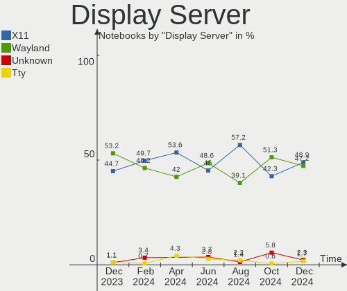

| Name    | Notebooks | Percent |
|---------|-----------|---------|
| X11     | 93        | 78.15%  |
| Wayland | 25        | 21.01%  |
| Unknown | 1         | 0.84%   |

Display Manager
---------------

SDDM, LightDM, etc.

| Name    | Notebooks | Percent |
|---------|-----------|---------|
| SDDM    | 29        | 24.37%  |
| GDM3    | 27        | 22.69%  |
| LightDM | 23        | 19.33%  |
| Unknown | 20        | 16.81%  |
| GDM     | 19        | 15.97%  |
| NODM    | 1         | 0.84%   |

OS Lang
-------

Language

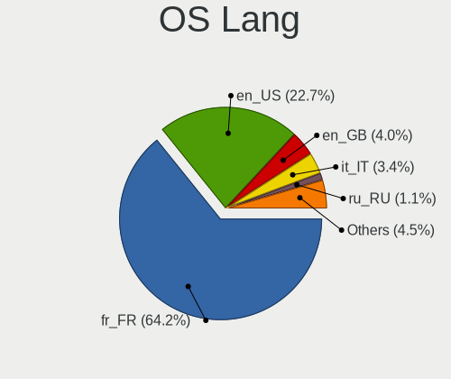

| Lang  | Notebooks | Percent |
|-------|-----------|---------|
| fr_FR | 89        | 74.79%  |
| en_US | 27        | 22.69%  |
| POSIX | 1         | 0.84%   |
| es_ES | 1         | 0.84%   |
| de_DE | 1         | 0.84%   |

Boot Mode
---------

EFI or BIOS

| Mode | Notebooks | Percent |
|------|-----------|---------|
| EFI  | 68        | 57.14%  |
| BIOS | 51        | 42.86%  |

Filesystem
----------

Type of filesystem

| Type    | Notebooks | Percent |
|---------|-----------|---------|
| Ext4    | 100       | 84.03%  |
| Btrfs   | 9         | 7.56%   |
| Overlay | 8         | 6.72%   |
| Xfs     | 1         | 0.84%   |
| F2fs    | 1         | 0.84%   |

Part. scheme
------------

Scheme of partitioning

| Type    | Notebooks | Percent |
|---------|-----------|---------|
| GPT     | 59        | 49.58%  |
| Unknown | 47        | 39.5%   |
| MBR     | 13        | 10.92%  |

Dual Boot with Linux/BSD
------------------------

Hosting more than one Linux/BSD

| Dual boot | Notebooks | Percent |
|-----------|-----------|---------|
| No        | 103       | 86.55%  |
| Yes       | 16        | 13.45%  |

Dual Boot (Win)
---------------

Hosting Linux and Windows

| Dual boot | Notebooks | Percent |
|-----------|-----------|---------|
| No        | 81        | 68.07%  |
| Yes       | 38        | 31.93%  |

Board
-----

Vendor
------

Motherboard manufacturer

| Name                 | Notebooks | Percent |
|----------------------|-----------|---------|
| Lenovo               | 22        | 18.49%  |
| Hewlett-Packard      | 20        | 16.81%  |
| Dell                 | 18        | 15.13%  |
| ASUSTek Computer     | 17        | 14.29%  |
| MSI                  | 11        | 9.24%   |
| Toshiba              | 5         | 4.2%    |
| Packard Bell         | 4         | 3.36%   |
| Acer                 | 4         | 3.36%   |
| TUXEDO               | 3         | 2.52%   |
| Notebook             | 3         | 2.52%   |
| Sony                 | 2         | 1.68%   |
| Samsung Electronics  | 2         | 1.68%   |
| Fujitsu              | 2         | 1.68%   |
| Valve                | 1         | 0.84%   |
| Thomson              | 1         | 0.84%   |
| Intel Client Systems | 1         | 0.84%   |
| HUAWEI               | 1         | 0.84%   |
| Fujitsu Siemens      | 1         | 0.84%   |
| AZW                  | 1         | 0.84%   |

Model
-----

Motherboard model

| Name                                        | Notebooks | Percent |
|---------------------------------------------|-----------|---------|
| Lenovo ThinkPad X230 23259T0                | 2         | 1.68%   |
| Dell XPS 13 9360                            | 2         | 1.68%   |
| Valve Jupiter                               | 1         | 0.84%   |
| TUXEDO Pulse 15 Gen1                        | 1         | 0.84%   |
| TUXEDO InfinityBook S 15 Gen6               | 1         | 0.84%   |
| TUXEDO Aura 15 Gen1                         | 1         | 0.84%   |
| Toshiba Satellite Pro L500                  | 1         | 0.84%   |
| Toshiba Satellite Click 10 LX5W-C-108       | 1         | 0.84%   |
| Toshiba Satellite C855-2CF                  | 1         | 0.84%   |
| Toshiba Satellite C850D-115                 | 1         | 0.84%   |
| Toshiba Satellite C660                      | 1         | 0.84%   |
| Thomson N17V3C8WH512                        | 1         | 0.84%   |
| Sony VGN-SZ71WN_C                           | 1         | 0.84%   |
| Sony SVS1312J3EW                            | 1         | 0.84%   |
| Samsung RV411/RV511/E3511/S3511/RV711/E3411 | 1         | 0.84%   |
| Samsung 300E5EV/300E4EV/270E5EV/270E4EV     | 1         | 0.84%   |
| Packard Bell H17HV                          | 1         | 0.84%   |
| Packard Bell EasyNote TS44HR                | 1         | 0.84%   |
| Packard Bell EasyNote TK11BZ                | 1         | 0.84%   |
| Packard Bell EasyNote LS11HR                | 1         | 0.84%   |
| Notebook P7xxDM3(-G)                        | 1         | 0.84%   |
| Notebook NS50MU                             | 1         | 0.84%   |
| Notebook NL40_50CU                          | 1         | 0.84%   |
| MSI VR630                                   | 1         | 0.84%   |
| MSI Stealth GS66 12UHS                      | 1         | 0.84%   |
| MSI Raider GE76 12UH                        | 1         | 0.84%   |
| MSI Raider GE66 12UGS                       | 1         | 0.84%   |
| MSI Pulse GL66 12UEK                        | 1         | 0.84%   |
| MSI GP76 Leopard 11UH                       | 1         | 0.84%   |
| MSI GL62 6QF                                | 1         | 0.84%   |
| MSI GE75 Raider 10SF                        | 1         | 0.84%   |
| MSI Creator Z16 A11UET                      | 1         | 0.84%   |
| MSI CR70 2M/CX70 2OC/CX70 2OD               | 1         | 0.84%   |
| MSI Bravo 15 A4DDR                          | 1         | 0.84%   |
| Lenovo Z51-70 80K6                          | 1         | 0.84%   |
| Lenovo ThinkPad X1 Carbon 6th 20KHS0S900    | 1         | 0.84%   |
| Lenovo ThinkPad X1 Carbon 5th 20HQS24900    | 1         | 0.84%   |
| Lenovo ThinkPad X1 Carbon 4th 20FCS2L300    | 1         | 0.84%   |
| Lenovo ThinkPad W510 431963G                | 1         | 0.84%   |
| Lenovo ThinkPad T495 20NJ0007US             | 1         | 0.84%   |
| Lenovo ThinkPad T460s 20FAS76R00            | 1         | 0.84%   |
| Lenovo ThinkPad T14 Gen 1 20S1SGQM00        | 1         | 0.84%   |
| Lenovo ThinkPad P14s Gen 2a 21A00000FR      | 1         | 0.84%   |
| Lenovo ThinkPad E490 20N8002APB             | 1         | 0.84%   |
| Lenovo ThinkPad E470 20H2S01A00             | 1         | 0.84%   |
| Lenovo ThinkPad E15 Gen 2 20TD001JFR        | 1         | 0.84%   |
| Lenovo ThinkPad E14 Gen 3 20Y7004TFR        | 1         | 0.84%   |
| Lenovo Legion 5 Pro 16ACH6H 82JQ            | 1         | 0.84%   |
| Lenovo IdeaPad L340-15API 81LW              | 1         | 0.84%   |
| Lenovo IdeaPad 330S-15IKB 81F5              | 1         | 0.84%   |
| Lenovo IdeaPad 3 15ADA05 81W1               | 1         | 0.84%   |
| Lenovo G580 2689PWG                         | 1         | 0.84%   |
| Lenovo G505 20240                           | 1         | 0.84%   |
| Lenovo G50-30 80G0                          | 1         | 0.84%   |
| Intel Client Systems LAPKC71F               | 1         | 0.84%   |
| HUAWEI HN-WX9X                              | 1         | 0.84%   |
| HP Stream Laptop 11-y0XX                    | 1         | 0.84%   |
| HP ProBook 6550b                            | 1         | 0.84%   |
| HP ProBook 640 G1                           | 1         | 0.84%   |
| HP ProBook 450 G8 Notebook PC               | 1         | 0.84%   |

Model Family
------------

Motherboard model prefix

| Name                          | Notebooks | Percent |
|-------------------------------|-----------|---------|
| Lenovo ThinkPad               | 14        | 11.76%  |
| HP Pavilion                   | 8         | 6.72%   |
| Dell Latitude                 | 8         | 6.72%   |
| Toshiba Satellite             | 5         | 4.2%    |
| HP ProBook                    | 5         | 4.2%    |
| ASUS ROG                      | 4         | 3.36%   |
| Acer Aspire                   | 4         | 3.36%   |
| Packard Bell EasyNote         | 3         | 2.52%   |
| Lenovo IdeaPad                | 3         | 2.52%   |
| HP EliteBook                  | 3         | 2.52%   |
| Dell XPS                      | 3         | 2.52%   |
| MSI Raider                    | 2         | 1.68%   |
| Dell Precision                | 2         | 1.68%   |
| ASUS VivoBook                 | 2         | 1.68%   |
| ASUS TUF                      | 2         | 1.68%   |
| ASUS ASUS                     | 2         | 1.68%   |
| Valve Jupiter                 | 1         | 0.84%   |
| TUXEDO Pulse                  | 1         | 0.84%   |
| TUXEDO InfinityBook           | 1         | 0.84%   |
| TUXEDO Aura                   | 1         | 0.84%   |
| Thomson N17V3C8WH512          | 1         | 0.84%   |
| Sony VGN-SZ71WN               | 1         | 0.84%   |
| Sony SVS1312J3EW              | 1         | 0.84%   |
| Samsung RV411                 | 1         | 0.84%   |
| Samsung 300E5EV               | 1         | 0.84%   |
| Packard Bell H17HV            | 1         | 0.84%   |
| Notebook P7xxDM3(-G)          | 1         | 0.84%   |
| Notebook NS50MU               | 1         | 0.84%   |
| Notebook NL40                 | 1         | 0.84%   |
| MSI VR630                     | 1         | 0.84%   |
| MSI Stealth                   | 1         | 0.84%   |
| MSI Pulse                     | 1         | 0.84%   |
| MSI GP76                      | 1         | 0.84%   |
| MSI GL62                      | 1         | 0.84%   |
| MSI GE75                      | 1         | 0.84%   |
| MSI Creator                   | 1         | 0.84%   |
| MSI CR70                      | 1         | 0.84%   |
| MSI Bravo                     | 1         | 0.84%   |
| Lenovo Z51-70                 | 1         | 0.84%   |
| Lenovo Legion                 | 1         | 0.84%   |
| Lenovo G580                   | 1         | 0.84%   |
| Lenovo G505                   | 1         | 0.84%   |
| Lenovo G50-30                 | 1         | 0.84%   |
| Intel Client Systems LAPKC71F | 1         | 0.84%   |
| HUAWEI HN-WX9X                | 1         | 0.84%   |
| HP Stream                     | 1         | 0.84%   |
| HP OMEN                       | 1         | 0.84%   |
| HP Laptop                     | 1         | 0.84%   |
| HP ENVY                       | 1         | 0.84%   |
| Fujitsu Siemens ESPRIMO       | 1         | 0.84%   |
| Fujitsu LIFEBOOK              | 1         | 0.84%   |
| Fujitsu CELSIUS               | 1         | 0.84%   |
| Dell Vostro                   | 1         | 0.84%   |
| Dell Inspiron                 | 1         | 0.84%   |
| Dell G5                       | 1         | 0.84%   |
| Dell G3                       | 1         | 0.84%   |
| Dell G15                      | 1         | 0.84%   |
| AZW GT-R                      | 1         | 0.84%   |
| ASUS X411UA                   | 1         | 0.84%   |
| ASUS UX51VZ                   | 1         | 0.84%   |

MFG Year
--------

Motherboard manufacture year

| Year | Notebooks | Percent |
|------|-----------|---------|
| 2020 | 20        | 16.81%  |
| 2021 | 16        | 13.45%  |
| 2019 | 11        | 9.24%   |
| 2012 | 11        | 9.24%   |
| 2016 | 10        | 8.4%    |
| 2013 | 8         | 6.72%   |
| 2018 | 6         | 5.04%   |
| 2017 | 6         | 5.04%   |
| 2022 | 5         | 4.2%    |
| 2011 | 5         | 4.2%    |
| 2010 | 5         | 4.2%    |
| 2008 | 4         | 3.36%   |
| 2015 | 3         | 2.52%   |
| 2014 | 3         | 2.52%   |
| 2009 | 3         | 2.52%   |
| 2007 | 3         | 2.52%   |

Form Factor
-----------

Physical design of the computer

| Name     | Notebooks | Percent |
|----------|-----------|---------|
| Notebook | 119       | 100%    |

Secure Boot
-----------

Enabled or disabled

| State    | Notebooks | Percent |
|----------|-----------|---------|
| Disabled | 110       | 92.44%  |
| Enabled  | 9         | 7.56%   |

Coreboot
--------

Have coreboot on board

| Used | Notebooks | Percent |
|------|-----------|---------|
| No   | 119       | 100%    |

RAM Size
--------

Total RAM memory

| Size in GB | Notebooks | Percent |
|------------|-----------|---------|
| 4.01-8.0   | 29        | 24.37%  |
| 16.01-24.0 | 26        | 21.85%  |
| 3.01-4.0   | 23        | 19.33%  |
| 8.01-16.0  | 22        | 18.49%  |
| 32.01-64.0 | 11        | 9.24%   |
| 1.01-2.0   | 4         | 3.36%   |
| 24.01-32.0 | 2         | 1.68%   |
| 2.01-3.0   | 2         | 1.68%   |

RAM Used
--------

Used RAM memory

| Used GB   | Notebooks | Percent |
|-----------|-----------|---------|
| 1.01-2.0  | 41        | 34.45%  |
| 4.01-8.0  | 24        | 20.17%  |
| 2.01-3.0  | 23        | 19.33%  |
| 3.01-4.0  | 15        | 12.61%  |
| 0.51-1.0  | 11        | 9.24%   |
| 8.01-16.0 | 5         | 4.2%    |

Total Drives
------------

Number of drives on board

| Drives | Notebooks | Percent |
|--------|-----------|---------|
| 1      | 91        | 76.47%  |
| 2      | 27        | 22.69%  |
| 3      | 1         | 0.84%   |

Has CD-ROM
----------

Has CD-ROM on board

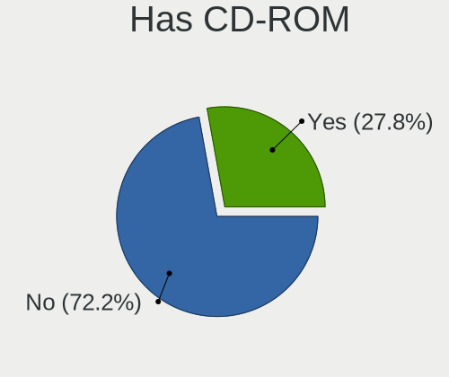

| Presented | Notebooks | Percent |
|-----------|-----------|---------|
| No        | 84        | 70.59%  |
| Yes       | 35        | 29.41%  |

Has Ethernet
------------

Has Ethernet on board

| Presented | Notebooks | Percent |
|-----------|-----------|---------|
| Yes       | 104       | 87.39%  |
| No        | 15        | 12.61%  |

Has WiFi
--------

Has WiFi module

| Presented | Notebooks | Percent |
|-----------|-----------|---------|
| Yes       | 118       | 99.16%  |
| No        | 1         | 0.84%   |

Has Bluetooth
-------------

Has Bluetooth module

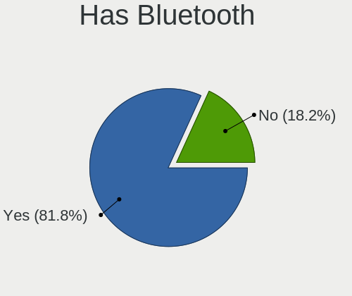

| Presented | Notebooks | Percent |
|-----------|-----------|---------|
| Yes       | 93        | 78.15%  |
| No        | 26        | 21.85%  |

Location
--------

Country
-------

Geographic location (country)

| Country | Notebooks | Percent |
|---------|-----------|---------|
| France  | 119       | 100%    |

City
----

Geographic location (city)

| City                   | Notebooks | Percent |
|------------------------|-----------|---------|
| Paris                  | 26        | 21.85%  |
| Nantes                 | 4         | 3.36%   |
| Toulouse               | 3         | 2.52%   |
| Grenoble               | 3         | 2.52%   |
| Rennes                 | 2         | 1.68%   |
| Marseille              | 2         | 1.68%   |
| Lille                  | 2         | 1.68%   |
| Évreux                | 2         | 1.68%   |
| Chenove                | 2         | 1.68%   |
| Villeurbanne           | 1         | 0.84%   |
| Vendome                | 1         | 0.84%   |
| Tours                  | 1         | 0.84%   |
| Tourcoing              | 1         | 0.84%   |
| Touget                 | 1         | 0.84%   |
| Tassin-la-Demi-Lune    | 1         | 0.84%   |
| Surzur                 | 1         | 0.84%   |
| St-Malo                | 1         | 0.84%   |
| Saint-Gely-du-Fesc     | 1         | 0.84%   |
| Saint-Denis            | 1         | 0.84%   |
| Saint-Brice-sous-Foret | 1         | 0.84%   |
| Rouvray-Saint-Denis    | 1         | 0.84%   |
| Roubaix                | 1         | 0.84%   |
| Rosny-sous-Bois        | 1         | 0.84%   |
| Raches                 | 1         | 0.84%   |
| Pomarede               | 1         | 0.84%   |
| Peronne                | 1         | 0.84%   |
| Pau                    | 1         | 0.84%   |
| Orléans               | 1         | 0.84%   |
| Ordonnac               | 1         | 0.84%   |
| Montpellier            | 1         | 0.84%   |
| Montevrain             | 1         | 0.84%   |
| Monteux                | 1         | 0.84%   |
| Montauban              | 1         | 0.84%   |
| Millau                 | 1         | 0.84%   |
| Mieuxce                | 1         | 0.84%   |
| Mansle                 | 1         | 0.84%   |
| Mâcon                 | 1         | 0.84%   |
| Lyon                   | 1         | 0.84%   |
| Longjumeau             | 1         | 0.84%   |
| Lognes                 | 1         | 0.84%   |
| Lexy                   | 1         | 0.84%   |
| Les Mureaux            | 1         | 0.84%   |
| Les Matelles           | 1         | 0.84%   |
| Le Raincy              | 1         | 0.84%   |
| Le Mee-sur-Seine       | 1         | 0.84%   |
| La Madeleine           | 1         | 0.84%   |
| La Bridoire            | 1         | 0.84%   |
| Ivry-sur-Seine         | 1         | 0.84%   |
| Istres                 | 1         | 0.84%   |
| Ingre                  | 1         | 0.84%   |
| Guyancourt             | 1         | 0.84%   |
| Grasse                 | 1         | 0.84%   |
| Frouzins               | 1         | 0.84%   |
| Franconville           | 1         | 0.84%   |
| Fourneaux-le-Val       | 1         | 0.84%   |
| Floirac                | 1         | 0.84%   |
| Feuquieres-en-Vimeu    | 1         | 0.84%   |
| Eyjeaux                | 1         | 0.84%   |
| Évry                  | 1         | 0.84%   |
| Escales                | 1         | 0.84%   |

Drives
------

Drive Vendor
------------

Hard drive vendors

| Vendor                    | Notebooks | Drives | Percent |
|---------------------------|-----------|--------|---------|
| WDC                       | 22        | 24     | 15.83%  |
| Samsung Electronics       | 21        | 21     | 15.11%  |
| SanDisk                   | 12        | 13     | 8.63%   |
| Seagate                   | 11        | 12     | 7.91%   |
| Toshiba                   | 10        | 10     | 7.19%   |
| SK hynix                  | 7         | 7      | 5.04%   |
| Crucial                   | 7         | 7      | 5.04%   |
| Micron Technology         | 5         | 5      | 3.6%    |
| Kingston                  | 5         | 5      | 3.6%    |
| Intel                     | 5         | 5      | 3.6%    |
| Hitachi                   | 4         | 4      | 2.88%   |
| LITEON                    | 3         | 3      | 2.16%   |
| KIOXIA                    | 3         | 3      | 2.16%   |
| Unknown                   | 2         | 2      | 1.44%   |
| Transcend                 | 2         | 2      | 1.44%   |
| Phison                    | 2         | 2      | 1.44%   |
| Micron/Crucial Technology | 2         | 2      | 1.44%   |
| HGST                      | 2         | 2      | 1.44%   |
| Gigabyte Technology       | 2         | 2      | 1.44%   |
| XPG                       | 1         | 2      | 0.72%   |
| Union Memory              | 1         | 1      | 0.72%   |
| UMIS                      | 1         | 1      | 0.72%   |
| Silicon Motion            | 1         | 1      | 0.72%   |
| Lite-On                   | 1         | 1      | 0.72%   |
| Lenovo                    | 1         | 1      | 0.72%   |
| Fujitsu                   | 1         | 1      | 0.72%   |
| Dahua                     | 1         | 1      | 0.72%   |
| BHT                       | 1         | 1      | 0.72%   |
| Apacer                    | 1         | 1      | 0.72%   |
| A-DATA Technology         | 1         | 1      | 0.72%   |
| Unknown                   | 1         | 1      | 0.72%   |

Drive Model
-----------

Hard drive models

| Model                                   | Notebooks | Percent |
|-----------------------------------------|-----------|---------|
| Crucial CT240BX500SSD1 240GB            | 4         | 2.78%   |
| WDC WD10JPVX-22JC3T0 1TB                | 3         | 2.08%   |
| WDC WD10SPZX-24Z10T0 1TB                | 2         | 1.39%   |
| Toshiba MQ04ABF100 1TB                  | 2         | 1.39%   |
| SK hynix PC801 NVMe 1TB                 | 2         | 1.39%   |
| SK hynix NVMe SSD Drive 512GB           | 2         | 1.39%   |
| Seagate ST500LT012-1DG142 500GB         | 2         | 1.39%   |
| Seagate ST2000LM015-2E8174 2TB          | 2         | 1.39%   |
| Seagate ST1000LM024 HN-M101MBB 1TB      | 2         | 1.39%   |
| SanDisk SSD PLUS 240GB                  | 2         | 1.39%   |
| SanDisk NVMe SSD Drive 1TB              | 2         | 1.39%   |
| Samsung SSD 860 EVO M.2 250GB           | 2         | 1.39%   |
| Samsung NVMe SSD Drive 256GB            | 2         | 1.39%   |
| Micron 3400_MTFDKBA1T0TFH 1TB           | 2         | 1.39%   |
| Intel SSDPEKNW512G8 512GB               | 2         | 1.39%   |
| Hitachi HTS545050A7E380 500GB           | 2         | 1.39%   |
| XPG NVMe SSD Drive 256GB                | 1         | 0.69%   |
| XPG NVMe SSD Drive 1024GB               | 1         | 0.69%   |
| WDC WDS100T1X0E-00AFY0 1TB              | 1         | 0.69%   |
| WDC WD7500BPVT-60HXZT3 752GB            | 1         | 0.69%   |
| WDC WD5000LPLX-60ZNTT2 500GB            | 1         | 0.69%   |
| WDC WD3200BEVT-26ZCT0 320GB             | 1         | 0.69%   |
| WDC WD3200BEVT-22ZCT0 320GB             | 1         | 0.69%   |
| WDC WD32 00BEKX-75B7WT0 320GB           | 1         | 0.69%   |
| WDC WD2500BEVT-80A23T0 250GB            | 1         | 0.69%   |
| WDC WD20SPZX-60UA7T0 2TB                | 1         | 0.69%   |
| WDC WD1200BEVS-22UST0 120GB             | 1         | 0.69%   |
| WDC WD10SPZX-00Z10T0 1TB                | 1         | 0.69%   |
| WDC WD10JPVX-60JC3T1 1TB                | 1         | 0.69%   |
| WDC PC SN810 SDCPNRZ-2T00-1032 2TB      | 1         | 0.69%   |
| WDC PC SN730 SDBQNTY-512G-1001 512GB    | 1         | 0.69%   |
| WDC PC SN730 SDBQNTY-256G-1001 256GB    | 1         | 0.69%   |
| WDC PC SN730 SDBPNTY-1T00-1032 1TB      | 1         | 0.69%   |
| WDC PC SN730 NVMe 256GB                 | 1         | 0.69%   |
| WDC PC SN530 SDBQTPZ-512G-1016 512GB    | 1         | 0.69%   |
| WDC PC SN530 SDBPNPZ-512G-1027 512GB    | 1         | 0.69%   |
| WDC PC SN530 NVMe 512GB                 | 1         | 0.69%   |
| Unknown HBG4a2  32GB                    | 1         | 0.69%   |
| Unknown 064GE2  64GB                    | 1         | 0.69%   |
| Union Memory RTOTJ128VGD2EYX 128GB      | 1         | 0.69%   |
| UMIS RPETJ512MGE2QDQ 512GB              | 1         | 0.69%   |
| Transcend TS240GSSD220S 240GB           | 1         | 0.69%   |
| Transcend TS120GMTS420S 120GB SSD       | 1         | 0.69%   |
| Toshiba NVMe SSD Drive 512GB            | 1         | 0.69%   |
| Toshiba MQ01ABD075 752GB                | 1         | 0.69%   |
| Toshiba MQ01ABD050 500GB                | 1         | 0.69%   |
| Toshiba MK7559GSXP 752GB                | 1         | 0.69%   |
| Toshiba MK5059GSXP 500GB                | 1         | 0.69%   |
| Toshiba MK2561GSYN 250GB                | 1         | 0.69%   |
| Toshiba KSG60ZMV256G M.2 2280 256GB SSD | 1         | 0.69%   |
| Toshiba KBG30ZMS128G 128GB NVMe SSD     | 1         | 0.69%   |
| SK hynix NVMe SSD Drive 256GB           | 1         | 0.69%   |
| SK hynix HFM512GDHTNG-8710B 512GB       | 1         | 0.69%   |
| SK hynix HFM001TD3JX013N 1TB            | 1         | 0.69%   |
| Silicon Motion 512GB                    | 1         | 0.69%   |
| Seagate ST9500325AS 500GB               | 1         | 0.69%   |
| Seagate ST500LM030-1RK17D 500GB         | 1         | 0.69%   |
| Seagate ST500LM000-1EJ162 500GB         | 1         | 0.69%   |
| Seagate ST320LT020-9YG142 320GB         | 1         | 0.69%   |
| Seagate ST1000LM014-SSHD-8GB            | 1         | 0.69%   |

HDD Vendor
----------

Hard disk drive vendors

| Vendor              | Notebooks | Drives | Percent |
|---------------------|-----------|--------|---------|
| WDC                 | 14        | 15     | 35%     |
| Seagate             | 11        | 12     | 27.5%   |
| Toshiba             | 7         | 7      | 17.5%   |
| Hitachi             | 4         | 4      | 10%     |
| HGST                | 2         | 2      | 5%      |
| Samsung Electronics | 1         | 1      | 2.5%    |
| Fujitsu             | 1         | 1      | 2.5%    |

SSD Vendor
----------

Solid state drive vendors

| Vendor              | Notebooks | Drives | Percent |
|---------------------|-----------|--------|---------|
| Samsung Electronics | 9         | 9      | 24.32%  |
| SanDisk             | 8         | 8      | 21.62%  |
| Crucial             | 6         | 6      | 16.22%  |
| Transcend           | 2         | 2      | 5.41%   |
| Kingston            | 2         | 2      | 5.41%   |
| Union Memory        | 1         | 1      | 2.7%    |
| Toshiba             | 1         | 1      | 2.7%    |
| Micron Technology   | 1         | 1      | 2.7%    |
| LITEON              | 1         | 1      | 2.7%    |
| Lenovo              | 1         | 1      | 2.7%    |
| Gigabyte Technology | 1         | 1      | 2.7%    |
| Dahua               | 1         | 1      | 2.7%    |
| BHT                 | 1         | 1      | 2.7%    |
| Apacer              | 1         | 1      | 2.7%    |
| Unknown             | 1         | 1      | 2.7%    |

Drive Kind
----------

HDD or SSD

| Kind | Notebooks | Drives | Percent |
|------|-----------|--------|---------|
| NVMe | 57        | 62     | 42.22%  |
| HDD  | 40        | 42     | 29.63%  |
| SSD  | 35        | 37     | 25.93%  |
| MMC  | 3         | 3      | 2.22%   |

Drive Connector
---------------

SATA, SAS, NVMe, etc.

| Type | Notebooks | Drives | Percent |
|------|-----------|--------|---------|
| SATA | 67        | 76     | 51.54%  |
| NVMe | 57        | 62     | 43.85%  |
| SAS  | 3         | 3      | 2.31%   |
| MMC  | 3         | 3      | 2.31%   |

Drive Size
----------

Size of hard drive

| Size in TB | Notebooks | Drives | Percent |
|------------|-----------|--------|---------|
| 0.01-0.5   | 46        | 51     | 63.01%  |
| 0.51-1.0   | 24        | 25     | 32.88%  |
| 1.01-2.0   | 3         | 3      | 4.11%   |

Space Total
-----------

Amount of disk space available on the file system

| Size in GB | Notebooks | Percent |
|------------|-----------|---------|
| 251-500    | 35        | 29.41%  |
| 101-250    | 33        | 27.73%  |
| 501-1000   | 23        | 19.33%  |
| 1-20       | 8         | 6.72%   |
| 51-100     | 7         | 5.88%   |
| 21-50      | 5         | 4.2%    |
| 2001-3000  | 4         | 3.36%   |
| 1001-2000  | 2         | 1.68%   |
| Unknown    | 2         | 1.68%   |

Space Used
----------

Amount of used disk space

| Used GB   | Notebooks | Percent |
|-----------|-----------|---------|
| 1-20      | 49        | 41.18%  |
| 101-250   | 21        | 17.65%  |
| 21-50     | 16        | 13.45%  |
| 51-100    | 14        | 11.76%  |
| 251-500   | 12        | 10.08%  |
| 501-1000  | 3         | 2.52%   |
| 1001-2000 | 2         | 1.68%   |
| Unknown   | 2         | 1.68%   |

Malfunc. Drives
---------------

Drive models with a malfunction

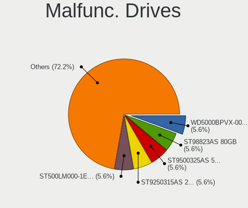

| Model                                   | Notebooks | Drives | Percent |
|-----------------------------------------|-----------|--------|---------|
| WDC WD10SPZX-24Z10T0 1TB                | 1         | 1      | 10%     |
| Toshiba MQ01ABD050 500GB                | 1         | 1      | 10%     |
| Toshiba MK5059GSXP 500GB                | 1         | 1      | 10%     |
| Seagate ST1000LM024 HN-M101MBB 1TB      | 1         | 1      | 10%     |
| Seagate ST1000LM014-SSHD-8GB            | 1         | 1      | 10%     |
| Kingston RBU-SNS8350DES3128GP 128GB SSD | 1         | 1      | 10%     |
| Hitachi HTS547564A9E384 640GB           | 1         | 1      | 10%     |
| Hitachi HTS545050A7E380 500GB           | 1         | 1      | 10%     |
| Apacer 16GB SATA Flash Drive SSD        | 1         | 1      | 10%     |
| A-DATA Technology SX8200PNP 1TB         | 1         | 1      | 10%     |

Malfunc. Drive Vendor
---------------------

Vendors of faulty drives

| Vendor            | Notebooks | Drives | Percent |
|-------------------|-----------|--------|---------|
| Toshiba           | 2         | 2      | 20%     |
| Seagate           | 2         | 2      | 20%     |
| Hitachi           | 2         | 2      | 20%     |
| WDC               | 1         | 1      | 10%     |
| Kingston          | 1         | 1      | 10%     |
| Apacer            | 1         | 1      | 10%     |
| A-DATA Technology | 1         | 1      | 10%     |

Malfunc. HDD Vendor
-------------------

Vendors of faulty HDD drives

| Vendor  | Notebooks | Drives | Percent |
|---------|-----------|--------|---------|
| Toshiba | 2         | 2      | 28.57%  |
| Seagate | 2         | 2      | 28.57%  |
| Hitachi | 2         | 2      | 28.57%  |
| WDC     | 1         | 1      | 14.29%  |

Malfunc. Drive Kind
-------------------

Kinds of faulty drives

| Kind | Notebooks | Drives | Percent |
|------|-----------|--------|---------|
| HDD  | 7         | 7      | 70%     |
| SSD  | 2         | 2      | 20%     |
| NVMe | 1         | 1      | 10%     |

Failed Drives
-------------

Failed drive models

Zero info for selected period =(

Failed Drive Vendor
-------------------

Failed drive vendors

Zero info for selected period =(

Drive Status
------------

Number of failed and malfunc. drives

| Status   | Notebooks | Drives | Percent |
|----------|-----------|--------|---------|
| Works    | 60        | 70     | 49.18%  |
| Detected | 52        | 64     | 42.62%  |
| Malfunc  | 10        | 10     | 8.2%    |

Storage controller
------------------

Storage Vendor
--------------

Storage controller vendors

| Vendor                           | Notebooks | Percent |
|----------------------------------|-----------|---------|
| Intel                            | 72        | 48.98%  |
| AMD                              | 17        | 11.56%  |
| SanDisk                          | 12        | 8.16%   |
| Samsung Electronics              | 11        | 7.48%   |
| SK hynix                         | 7         | 4.76%   |
| Micron Technology                | 4         | 2.72%   |
| Phison Electronics               | 3         | 2.04%   |
| Micron/Crucial Technology        | 3         | 2.04%   |
| Lite-On Technology               | 3         | 2.04%   |
| KIOXIA                           | 3         | 2.04%   |
| Kingston Technology Company      | 3         | 2.04%   |
| Toshiba America Info Systems     | 2         | 1.36%   |
| ADATA Technology                 | 2         | 1.36%   |
| Union Memory (Shenzhen)          | 1         | 0.68%   |
| Silicon Motion                   | 1         | 0.68%   |
| Silicon Integrated Systems [SiS] | 1         | 0.68%   |
| Nvidia                           | 1         | 0.68%   |
| ASMedia Technology               | 1         | 0.68%   |

Storage Model
-------------

Storage controller models

| Model                                                                            | Notebooks | Percent |
|----------------------------------------------------------------------------------|-----------|---------|
| AMD FCH SATA Controller [AHCI mode]                                              | 14        | 9.09%   |
| Intel 7 Series Chipset Family 6-port SATA Controller [AHCI mode]                 | 10        | 6.49%   |
| Intel Sunrise Point-LP SATA Controller [AHCI mode]                               | 7         | 4.55%   |
| Samsung NVMe SSD Controller 980                                                  | 6         | 3.9%    |
| Intel Volume Management Device NVMe RAID Controller                              | 5         | 3.25%   |
| Intel 82801 Mobile SATA Controller [RAID mode]                                   | 5         | 3.25%   |
| Intel 8 Series/C220 Series Chipset Family 6-port SATA Controller 1 [AHCI mode]   | 5         | 3.25%   |
| SanDisk WD Black SN750 / PC SN730 NVMe SSD                                       | 4         | 2.6%    |
| Micron Non-Volatile memory controller                                            | 4         | 2.6%    |
| SK hynix BC501 NVMe Solid State Drive                                            | 3         | 1.95%   |
| SanDisk WD Blue SN550 NVMe SSD                                                   | 3         | 1.95%   |
| SanDisk Non-Volatile memory controller                                           | 3         | 1.95%   |
| KIOXIA Non-Volatile memory controller                                            | 3         | 1.95%   |
| Intel Non-Volatile memory controller                                             | 3         | 1.95%   |
| Intel Cannon Point-LP SATA Controller [AHCI Mode]                                | 3         | 1.95%   |
| Intel 82801IBM/IEM (ICH9M/ICH9M-E) 4 port SATA Controller [AHCI mode]            | 3         | 1.95%   |
| Intel 6 Series/C200 Series Chipset Family 6 port Mobile SATA AHCI Controller     | 3         | 1.95%   |
| Intel 400 Series Chipset Family SATA AHCI Controller                             | 3         | 1.95%   |
| SK hynix Non-Volatile memory controller                                          | 2         | 1.3%    |
| SK hynix Gold P31 SSD                                                            | 2         | 1.3%    |
| SanDisk WD PC SN810 / Black SN850 NVMe SSD                                       | 2         | 1.3%    |
| Samsung NVMe SSD Controller SM981/PM981/PM983                                    | 2         | 1.3%    |
| Samsung NVMe SSD Controller SM961/PM961/SM963                                    | 2         | 1.3%    |
| Phison E12 NVMe Controller                                                       | 2         | 1.3%    |
| Micron/Crucial P2 NVMe PCIe SSD                                                  | 2         | 1.3%    |
| Intel Wildcat Point-LP SATA Controller [AHCI Mode]                               | 2         | 1.3%    |
| Intel SSD 660P Series                                                            | 2         | 1.3%    |
| Intel Celeron N3350/Pentium N4200/Atom E3900 Series SATA AHCI Controller         | 2         | 1.3%    |
| Intel Cannon Lake Mobile PCH SATA AHCI Controller                                | 2         | 1.3%    |
| Intel 82801HM/HEM (ICH8M/ICH8M-E) SATA Controller [IDE mode]                     | 2         | 1.3%    |
| Intel 82801HM/HEM (ICH8M/ICH8M-E) IDE Controller                                 | 2         | 1.3%    |
| Intel 8 Series SATA Controller 1 [AHCI mode]                                     | 2         | 1.3%    |
| Intel 5 Series/3400 Series Chipset 6 port SATA AHCI Controller                   | 2         | 1.3%    |
| Intel 5 Series/3400 Series Chipset 4 port SATA IDE Controller                    | 2         | 1.3%    |
| Intel 5 Series/3400 Series Chipset 4 port SATA AHCI Controller                   | 2         | 1.3%    |
| Intel 5 Series/3400 Series Chipset 2 port SATA IDE Controller                    | 2         | 1.3%    |
| AMD SB7x0/SB8x0/SB9x0 SATA Controller [AHCI mode]                                | 2         | 1.3%    |
| ADATA XPG SX8200 Pro PCIe Gen3x4 M.2 2280 Solid State Drive                      | 2         | 1.3%    |
| Union Memory (Shenzhen) AM630 PCIe 4.0 x4 NVMe SSD Controller                    | 1         | 0.65%   |
| Toshiba America Info Systems XG4 NVMe SSD Controller                             | 1         | 0.65%   |
| Toshiba America Info Systems Toshiba America Info Non-Volatile memory controller | 1         | 0.65%   |
| Silicon Motion SM2263EN/SM2263XT SSD Controller                                  | 1         | 0.65%   |
| Silicon Integrated Systems [SiS] SATA Controller / IDE mode                      | 1         | 0.65%   |
| Silicon Integrated Systems [SiS] 5513 IDE Controller                             | 1         | 0.65%   |
| Samsung NVMe SSD Controller PM9A1/PM9A3/980PRO                                   | 1         | 0.65%   |
| Phison E16 PCIe4 NVMe Controller                                                 | 1         | 0.65%   |
| Nvidia nForce SATA Controller                                                    | 1         | 0.65%   |
| Micron/Crucial P1 NVMe PCIe SSD                                                  | 1         | 0.65%   |
| Lite-On NVMe Controller                                                          | 1         | 0.65%   |
| Lite-On Non-Volatile memory controller                                           | 1         | 0.65%   |
| Lite-On Lite-On Non-Volatile memory controller                                   | 1         | 0.65%   |
| Kingston Company Company Non-Volatile memory controller                          | 1         | 0.65%   |
| Kingston Company SNVS2000G [NV1 NVMe PCIe SSD 2TB]                               | 1         | 0.65%   |
| Kingston Company OM3PDP3 NVMe SSD                                                | 1         | 0.65%   |
| Intel Q170/Q150/B150/H170/H110/Z170/CM236 Chipset SATA Controller [AHCI Mode]    | 1         | 0.65%   |
| Intel NM10/ICH7 Family SATA Controller [AHCI mode]                               | 1         | 0.65%   |
| Intel HM170/QM170 Chipset SATA Controller [AHCI Mode]                            | 1         | 0.65%   |
| Intel Comet Lake SATA AHCI Controller                                            | 1         | 0.65%   |
| Intel Atom/Celeron/Pentium Processor x5-E8000/J3xxx/N3xxx Series SATA Controller | 1         | 0.65%   |
| Intel Atom Processor E3800 Series SATA AHCI Controller                           | 1         | 0.65%   |

Storage Kind
------------

Kind of storage controller (IDE, SATA, NVMe, SAS, ...)

| Kind | Notebooks | Percent |
|------|-----------|---------|
| SATA | 71        | 48.97%  |
| NVMe | 57        | 39.31%  |
| RAID | 10        | 6.9%    |
| IDE  | 7         | 4.83%   |

Processor
---------

CPU Vendor
----------

Processor vendors

| Vendor | Notebooks | Percent |
|--------|-----------|---------|
| Intel  | 91        | 76.47%  |
| AMD    | 28        | 23.53%  |

CPU Model
---------

Processor models

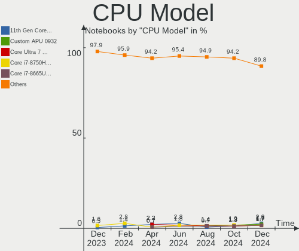

| Model                                         | Notebooks | Percent |
|-----------------------------------------------|-----------|---------|
| Intel 12th Gen Core i7-12700H                 | 4         | 3.36%   |
| Intel 11th Gen Core i7-1165G7 @ 2.80GHz       | 4         | 3.36%   |
| Intel 11th Gen Core i7-11800H @ 2.30GHz       | 3         | 2.52%   |
| AMD Ryzen 5 3550H with Radeon Vega Mobile Gfx | 3         | 2.52%   |
| Intel Core i7-6600U CPU @ 2.60GHz             | 2         | 1.68%   |
| Intel Core i7-10750H CPU @ 2.60GHz            | 2         | 1.68%   |
| Intel Core i5-8265U CPU @ 1.60GHz             | 2         | 1.68%   |
| Intel Core i5-8250U CPU @ 1.60GHz             | 2         | 1.68%   |
| Intel Core i5-7200U CPU @ 2.50GHz             | 2         | 1.68%   |
| Intel Core i5-4210U CPU @ 1.70GHz             | 2         | 1.68%   |
| Intel Core i5-3320M CPU @ 2.60GHz             | 2         | 1.68%   |
| Intel Core i5-2410M CPU @ 2.30GHz             | 2         | 1.68%   |
| Intel Core i5-1035G1 CPU @ 1.00GHz            | 2         | 1.68%   |
| Intel Core i3 CPU M 380 @ 2.53GHz             | 2         | 1.68%   |
| Intel Celeron CPU N3060 @ 1.60GHz             | 2         | 1.68%   |
| Intel 11th Gen Core i5-1135G7 @ 2.40GHz       | 2         | 1.68%   |
| AMD Ryzen 7 3700U with Radeon Vega Mobile Gfx | 2         | 1.68%   |
| Intel Pentium CPU P6200 @ 2.13GHz             | 1         | 0.84%   |
| Intel Pentium CPU B960 @ 2.20GHz              | 1         | 0.84%   |
| Intel Pentium CPU 987 @ 1.50GHz               | 1         | 0.84%   |
| Intel Pentium CPU 967 @ 1.30GHz               | 1         | 0.84%   |
| Intel Core i7-9750H CPU @ 2.60GHz             | 1         | 0.84%   |
| Intel Core i7-8750H CPU @ 2.20GHz             | 1         | 0.84%   |
| Intel Core i7-8565U CPU @ 1.80GHz             | 1         | 0.84%   |
| Intel Core i7-8550U CPU @ 1.80GHz             | 1         | 0.84%   |
| Intel Core i7-7700T CPU @ 2.90GHz             | 1         | 0.84%   |
| Intel Core i7-7600U CPU @ 2.80GHz             | 1         | 0.84%   |
| Intel Core i7-7560U CPU @ 2.40GHz             | 1         | 0.84%   |
| Intel Core i7-5500U CPU @ 2.40GHz             | 1         | 0.84%   |
| Intel Core i7-4800MQ CPU @ 2.70GHz            | 1         | 0.84%   |
| Intel Core i7-4700HQ CPU @ 2.40GHz            | 1         | 0.84%   |
| Intel Core i7-3632QM CPU @ 2.20GHz            | 1         | 0.84%   |
| Intel Core i7-3610QM CPU @ 2.30GHz            | 1         | 0.84%   |
| Intel Core i7-10610U CPU @ 1.80GHz            | 1         | 0.84%   |
| Intel Core i7 CPU Q 740 @ 1.73GHz             | 1         | 0.84%   |
| Intel Core i7 CPU M 620 @ 2.67GHz             | 1         | 0.84%   |
| Intel Core i5-8365U CPU @ 1.60GHz             | 1         | 0.84%   |
| Intel Core i5-8300H CPU @ 2.30GHz             | 1         | 0.84%   |
| Intel Core i5-7300U CPU @ 2.60GHz             | 1         | 0.84%   |
| Intel Core i5-6300U CPU @ 2.40GHz             | 1         | 0.84%   |
| Intel Core i5-6300HQ CPU @ 2.30GHz            | 1         | 0.84%   |
| Intel Core i5-5300U CPU @ 2.30GHz             | 1         | 0.84%   |
| Intel Core i5-4210M CPU @ 2.60GHz             | 1         | 0.84%   |
| Intel Core i5-4200M CPU @ 2.50GHz             | 1         | 0.84%   |
| Intel Core i5-3380M CPU @ 2.90GHz             | 1         | 0.84%   |
| Intel Core i5-3230M CPU @ 2.60GHz             | 1         | 0.84%   |
| Intel Core i5-3210M CPU @ 2.50GHz             | 1         | 0.84%   |
| Intel Core i5-2450M CPU @ 2.50GHz             | 1         | 0.84%   |
| Intel Core i5-10500H CPU @ 2.50GHz            | 1         | 0.84%   |
| Intel Core i5-10310U CPU @ 1.70GHz            | 1         | 0.84%   |
| Intel Core i5-10300H CPU @ 2.50GHz            | 1         | 0.84%   |
| Intel Core i5 CPU M 480 @ 2.67GHz             | 1         | 0.84%   |
| Intel Core i3-8145U CPU @ 2.10GHz             | 1         | 0.84%   |
| Intel Core i3-7100U CPU @ 2.40GHz             | 1         | 0.84%   |
| Intel Core i3-2348M CPU @ 2.30GHz             | 1         | 0.84%   |
| Intel Core i3-10110U CPU @ 2.10GHz            | 1         | 0.84%   |
| Intel Core 2 Extreme CPU X7900 @ 2.80GHz      | 1         | 0.84%   |
| Intel Core 2 Duo CPU T9300 @ 2.50GHz          | 1         | 0.84%   |
| Intel Core 2 Duo CPU T7500 @ 2.20GHz          | 1         | 0.84%   |
| Intel Core 2 Duo CPU T6600 @ 2.20GHz          | 1         | 0.84%   |

CPU Model Family
----------------

Processor model prefix

| Model                                | Notebooks | Percent |
|--------------------------------------|-----------|---------|
| Intel Core i5                        | 30        | 25.21%  |
| Intel Core i7                        | 19        | 15.97%  |
| Other                                | 18        | 15.13%  |
| Intel Celeron                        | 7         | 5.88%   |
| Intel Core i3                        | 6         | 5.04%   |
| AMD Ryzen 5                          | 6         | 5.04%   |
| Intel Core 2 Duo                     | 5         | 4.2%    |
| AMD Ryzen 7                          | 5         | 4.2%    |
| Intel Pentium                        | 4         | 3.36%   |
| AMD Ryzen 9                          | 3         | 2.52%   |
| AMD E1                               | 3         | 2.52%   |
| Intel Atom                           | 2         | 1.68%   |
| AMD Ryzen 7 PRO                      | 2         | 1.68%   |
| AMD Ryzen 3                          | 2         | 1.68%   |
| AMD E2                               | 2         | 1.68%   |
| Intel Core 2 Extreme                 | 1         | 0.84%   |
| AMD Turion X2 Ultra Dual-Core Mobile | 1         | 0.84%   |
| AMD E                                | 1         | 0.84%   |
| AMD Athlon X2                        | 1         | 0.84%   |
| AMD A6                               | 1         | 0.84%   |

CPU Cores
---------

Number of processor cores

| Number | Notebooks | Percent |
|--------|-----------|---------|
| 2      | 54        | 45.38%  |
| 4      | 40        | 33.61%  |
| 8      | 12        | 10.08%  |
| 6      | 7         | 5.88%   |
| 14     | 4         | 3.36%   |
| 12     | 1         | 0.84%   |
| 1      | 1         | 0.84%   |

CPU Sockets
-----------

Number of sockets

| Number | Notebooks | Percent |
|--------|-----------|---------|
| 1      | 119       | 100%    |

CPU Threads
-----------

Threads per core (Hyper-Threading)

| Number | Notebooks | Percent |
|--------|-----------|---------|
| 2      | 90        | 75.63%  |
| 1      | 29        | 24.37%  |

CPU Op-Modes
------------

CPU Operation Modes (32-bit, 64-bit)

| Op mode        | Notebooks | Percent |
|----------------|-----------|---------|
| 32-bit, 64-bit | 119       | 100%    |

CPU Microcode
-------------

Microcode number

| Number     | Notebooks | Percent |
|------------|-----------|---------|
| Unknown    | 27        | 22.69%  |
| 0x306a9    | 6         | 5.04%   |
| 0x206a7    | 6         | 5.04%   |
| 0x806ec    | 5         | 4.2%    |
| 0x806e9    | 5         | 4.2%    |
| 0x806d1    | 5         | 4.2%    |
| 0x806c1    | 5         | 4.2%    |
| 0x306c3    | 5         | 4.2%    |
| 0x906a3    | 4         | 3.36%   |
| 0x20655    | 4         | 3.36%   |
| 0x08108102 | 4         | 3.36%   |
| 0xa0652    | 3         | 2.52%   |
| 0x0a50000c | 3         | 2.52%   |
| 0x08108109 | 3         | 2.52%   |
| 0x906ea    | 2         | 1.68%   |
| 0x806eb    | 2         | 1.68%   |
| 0x806ea    | 2         | 1.68%   |
| 0x706e5    | 2         | 1.68%   |
| 0x506c9    | 2         | 1.68%   |
| 0x406e3    | 2         | 1.68%   |
| 0x406c4    | 2         | 1.68%   |
| 0x40651    | 2         | 1.68%   |
| 0x08600104 | 2         | 1.68%   |
| 0x07030105 | 2         | 1.68%   |
| 0x6fa      | 1         | 0.84%   |
| 0x406c3    | 1         | 0.84%   |
| 0x306d4    | 1         | 0.84%   |
| 0x30678    | 1         | 0.84%   |
| 0x106e5    | 1         | 0.84%   |
| 0x1067a    | 1         | 0.84%   |
| 0x10676    | 1         | 0.84%   |
| 0x0a50000b | 1         | 0.84%   |
| 0x08608103 | 1         | 0.84%   |
| 0x08600106 | 1         | 0.84%   |
| 0x08600103 | 1         | 0.84%   |
| 0x0700010f | 1         | 0.84%   |
| 0x05000119 | 1         | 0.84%   |
| 0x02000057 | 1         | 0.84%   |

CPU Microarch
-------------

Microarchitecture

| Name             | Notebooks | Percent |
|------------------|-----------|---------|
| KabyLake         | 21        | 17.65%  |
| SandyBridge      | 8         | 6.72%   |
| Zen+             | 7         | 5.88%   |
| TigerLake        | 7         | 5.88%   |
| IvyBridge        | 7         | 5.88%   |
| IceLake          | 7         | 5.88%   |
| Haswell          | 7         | 5.88%   |
| Zen 3            | 6         | 5.04%   |
| Westmere         | 5         | 4.2%    |
| Zen 2            | 4         | 3.36%   |
| Skylake          | 4         | 3.36%   |
| Silvermont       | 4         | 3.36%   |
| CometLake        | 4         | 3.36%   |
| Unknown          | 4         | 3.36%   |
| Puma             | 3         | 2.52%   |
| Penryn           | 3         | 2.52%   |
| Core             | 3         | 2.52%   |
| Alderlake Hybrid | 3         | 2.52%   |
| K8 & K10 hybrid  | 2         | 1.68%   |
| Goldmont         | 2         | 1.68%   |
| Broadwell        | 2         | 1.68%   |
| Bobcat           | 2         | 1.68%   |
| Nehalem          | 1         | 0.84%   |
| K10 Llano        | 1         | 0.84%   |
| Jaguar           | 1         | 0.84%   |
| Bonnell          | 1         | 0.84%   |

Graphics
--------

GPU Vendor
----------

Vendors of graphics cards

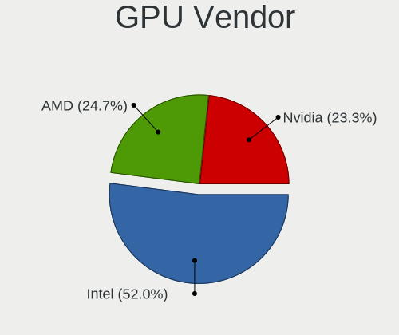

| Vendor                           | Notebooks | Percent |
|----------------------------------|-----------|---------|
| Intel                            | 82        | 55.78%  |
| Nvidia                           | 34        | 23.13%  |
| AMD                              | 30        | 20.41%  |
| Silicon Integrated Systems [SiS] | 1         | 0.68%   |

GPU Model
---------

Graphics card models

| Model                                                                                    | Notebooks | Percent |
|------------------------------------------------------------------------------------------|-----------|---------|
| Intel 2nd Generation Core Processor Family Integrated Graphics Controller                | 8         | 5.3%    |
| Intel 3rd Gen Core processor Graphics Controller                                         | 7         | 4.64%   |
| AMD Picasso/Raven 2 [Radeon Vega Series / Radeon Vega Mobile Series]                     | 7         | 4.64%   |
| Intel TigerLake-LP GT2 [Iris Xe Graphics]                                                | 6         | 3.97%   |
| Nvidia GA106M [GeForce RTX 3060 Mobile / Max-Q]                                          | 5         | 3.31%   |
| Intel WhiskeyLake-U GT2 [UHD Graphics 620]                                               | 5         | 3.31%   |
| Intel TigerLake-H GT1 [UHD Graphics]                                                     | 5         | 3.31%   |
| Intel HD Graphics 620                                                                    | 5         | 3.31%   |
| Intel CometLake-H GT2 [UHD Graphics]                                                     | 4         | 2.65%   |
| Intel Alder Lake-P Integrated Graphics Controller                                        | 4         | 2.65%   |
| Intel 4th Gen Core Processor Integrated Graphics Controller                              | 4         | 2.65%   |
| AMD Renoir                                                                               | 4         | 2.65%   |
| AMD Cezanne                                                                              | 4         | 2.65%   |
| Intel UHD Graphics 620                                                                   | 3         | 1.99%   |
| Intel Skylake GT2 [HD Graphics 520]                                                      | 3         | 1.99%   |
| Intel CometLake-U GT2 [UHD Graphics]                                                     | 3         | 1.99%   |
| Intel Atom/Celeron/Pentium Processor x5-E8000/J3xxx/N3xxx Integrated Graphics Controller | 3         | 1.99%   |
| Nvidia GM108M [GeForce 840M]                                                             | 2         | 1.32%   |
| Nvidia GK107M [GeForce GT 650M]                                                          | 2         | 1.32%   |
| Nvidia GA104M [GeForce RTX 3080 Mobile / Max-Q 8GB/16GB]                                 | 2         | 1.32%   |
| Nvidia GA104M [GeForce RTX 3070 Mobile / Max-Q]                                          | 2         | 1.32%   |
| Intel Mobile GM965/GL960 Integrated Graphics Controller (secondary)                      | 2         | 1.32%   |
| Intel Mobile GM965/GL960 Integrated Graphics Controller (primary)                        | 2         | 1.32%   |
| Intel Mobile 4 Series Chipset Integrated Graphics Controller                             | 2         | 1.32%   |
| Intel Iris Plus Graphics G1 (Ice Lake)                                                   | 2         | 1.32%   |
| Intel HD Graphics 5500                                                                   | 2         | 1.32%   |
| Intel HD Graphics 500                                                                    | 2         | 1.32%   |
| Intel Haswell-ULT Integrated Graphics Controller                                         | 2         | 1.32%   |
| Intel Core Processor Integrated Graphics Controller                                      | 2         | 1.32%   |
| Intel CoffeeLake-H GT2 [UHD Graphics 630]                                                | 2         | 1.32%   |
| AMD Mullins [Radeon R2 Graphics]                                                         | 2         | 1.32%   |
| Silicon Integrated Systems [SiS] 771/671 PCIE VGA Display Adapter                        | 1         | 0.66%   |
| Nvidia TU117M [GeForce GTX 1650 Mobile / Max-Q]                                          | 1         | 0.66%   |
| Nvidia TU117M                                                                            | 1         | 0.66%   |
| Nvidia TU106M [GeForce RTX 2070 Mobile / Max-Q Refresh]                                  | 1         | 0.66%   |
| Nvidia TU106M [GeForce RTX 2060 Mobile]                                                  | 1         | 0.66%   |
| Nvidia GT218M [GeForce 315M]                                                             | 1         | 0.66%   |
| Nvidia GT216GLM [Quadro FX 880M]                                                         | 1         | 0.66%   |
| Nvidia GP107M [GeForce GTX 1050 3 GB Max-Q]                                              | 1         | 0.66%   |
| Nvidia GP107GLM [Quadro P600 Mobile]                                                     | 1         | 0.66%   |
| Nvidia GP106M [GeForce GTX 1060 Mobile]                                                  | 1         | 0.66%   |
| Nvidia GP106BM [GeForce GTX 1060 Mobile 6GB]                                             | 1         | 0.66%   |
| Nvidia GM107M [GeForce GTX 960M]                                                         | 1         | 0.66%   |
| Nvidia GK106GLM [Quadro K2100M]                                                          | 1         | 0.66%   |
| Nvidia GF119M [GeForce GT 520M]                                                          | 1         | 0.66%   |
| Nvidia GF119M [GeForce 610M]                                                             | 1         | 0.66%   |
| Nvidia GA107M [GeForce RTX 3050 Ti Mobile]                                               | 1         | 0.66%   |
| Nvidia GA107M [GeForce RTX 3050 Mobile]                                                  | 1         | 0.66%   |
| Nvidia GA104 [Geforce RTX 3070 Ti Laptop GPU]                                            | 1         | 0.66%   |
| Nvidia GA103M [GeForce RTX 3080 Ti Mobile]                                               | 1         | 0.66%   |
| Nvidia G96CM [GeForce GT 220M]                                                           | 1         | 0.66%   |
| Nvidia G92GLM [Quadro FX 2800M]                                                          | 1         | 0.66%   |
| Nvidia C77 [GeForce 9100M G]                                                             | 1         | 0.66%   |
| Intel Tiger Lake UHD Graphics                                                            | 1         | 0.66%   |
| Intel Iris Plus Graphics 640                                                             | 1         | 0.66%   |
| Intel HD Graphics 530                                                                    | 1         | 0.66%   |
| Intel Haswell Integrated Graphics Controller                                             | 1         | 0.66%   |
| Intel Atom Processor Z36xxx/Z37xxx Series Graphics & Display                             | 1         | 0.66%   |
| Intel Atom Processor D4xx/D5xx/N4xx/N5xx Integrated Graphics Controller                  | 1         | 0.66%   |
| AMD Wrestler [Radeon HD 7310]                                                            | 1         | 0.66%   |

GPU Combo
---------

Combinations of graphics cards

| Name           | Notebooks | Percent |
|----------------|-----------|---------|
| 1 x Intel      | 57        | 47.9%   |
| Intel + Nvidia | 22        | 18.49%  |
| 1 x AMD        | 22        | 18.49%  |
| 1 x Nvidia     | 9         | 7.56%   |
| Intel + AMD    | 3         | 2.52%   |
| AMD + Nvidia   | 3         | 2.52%   |
| 2 x AMD        | 2         | 1.68%   |
| 1 x SiS        | 1         | 0.84%   |

GPU Driver
----------

Free vs proprietary

| Driver      | Notebooks | Percent |
|-------------|-----------|---------|
| Free        | 94        | 78.99%  |
| Proprietary | 21        | 17.65%  |
| Unknown     | 4         | 3.36%   |

GPU Memory
----------

Total video memory

| Size in GB | Notebooks | Percent |
|------------|-----------|---------|
| Unknown    | 82        | 68.91%  |
| 0.01-0.5   | 12        | 10.08%  |
| 0.51-1.0   | 9         | 7.56%   |
| 1.01-2.0   | 8         | 6.72%   |
| 5.01-6.0   | 3         | 2.52%   |
| 3.01-4.0   | 3         | 2.52%   |
| 7.01-8.0   | 1         | 0.84%   |
| 2.01-3.0   | 1         | 0.84%   |

Monitor
-------

Monitor Vendor
--------------

Monitor vendors

| Vendor                  | Notebooks | Percent |
|-------------------------|-----------|---------|
| Chimei Innolux          | 25        | 17.73%  |
| LG Display              | 22        | 15.6%   |
| BOE                     | 21        | 14.89%  |
| AU Optronics            | 16        | 11.35%  |
| Samsung Electronics     | 15        | 10.64%  |
| Sharp                   | 7         | 4.96%   |
| Dell                    | 6         | 4.26%   |
| PANDA                   | 4         | 2.84%   |
| Iiyama                  | 4         | 2.84%   |
| Philips                 | 2         | 1.42%   |
| Hewlett-Packard         | 2         | 1.42%   |
| BenQ                    | 2         | 1.42%   |
| AOC                     | 2         | 1.42%   |
| ___                     | 1         | 0.71%   |
| Unknown                 | 1         | 0.71%   |
| TMX                     | 1         | 0.71%   |
| TCL                     | 1         | 0.71%   |
| Microsoft               | 1         | 0.71%   |
| Lenovo Group Limited    | 1         | 0.71%   |
| Lenovo                  | 1         | 0.71%   |
| Fujitsu Siemens         | 1         | 0.71%   |
| CPT                     | 1         | 0.71%   |
| Chi Mei Optoelectronics | 1         | 0.71%   |
| CHD                     | 1         | 0.71%   |
| ANX                     | 1         | 0.71%   |
| Unknown                 | 1         | 0.71%   |

Monitor Model
-------------

Monitor models

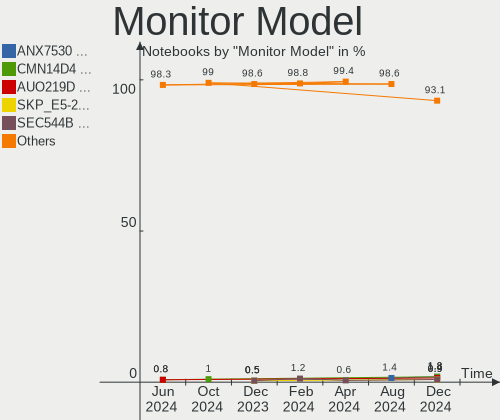

| Model                                                                  | Notebooks | Percent |
|------------------------------------------------------------------------|-----------|---------|
| Sharp LQ156T1JW04 SHP153C 2560x1440 344x194mm 15.5-inch                | 2         | 1.41%   |
| Sharp LCD Monitor SHP1449 1920x1080 294x165mm 13.3-inch                | 2         | 1.41%   |
| LG Display LCD Monitor LGD03A3 1366x768 277x156mm 12.5-inch            | 2         | 1.41%   |
| LG Display LCD Monitor LGD0323 1920x1080 345x194mm 15.6-inch           | 2         | 1.41%   |
| Chimei Innolux LCD Monitor CMN15F5 1920x1080 344x193mm 15.5-inch       | 2         | 1.41%   |
| Chimei Innolux LCD Monitor CMN14D4 1920x1080 309x173mm 13.9-inch       | 2         | 1.41%   |
| BOE LCD Monitor BOE06DF 1920x1080 309x173mm 13.9-inch                  | 2         | 1.41%   |
| AU Optronics LCD Monitor AUO2D3C 1366x768 309x173mm 13.9-inch          | 2         | 1.41%   |
| AU Optronics LCD Monitor AUO26EC 1366x768 344x193mm 15.5-inch          | 2         | 1.41%   |
| ___ LCD TV ___0101 1360x768                                            | 1         | 0.7%    |
| Unknown LCD TV 0101 1920x1080 1600x900mm 72.3-inch                     | 1         | 0.7%    |
| TMX TL156MDMP01-1 TMX1560 3200x2000 336x210mm 15.6-inch                | 1         | 0.7%    |
| TCL SMART TV TCL6586 3840x2160 1209x680mm 54.6-inch                    | 1         | 0.7%    |
| Sharp LQ173M1JW08 SHP1544 1920x1080 382x215mm 17.3-inch                | 1         | 0.7%    |
| Sharp LQ156M1JW01 SHP14C3 1920x1080 344x194mm 15.5-inch                | 1         | 0.7%    |
| Sharp LQ134N1JW52 SHP151E 1920x1200 288x180mm 13.4-inch                | 1         | 0.7%    |
| Samsung Electronics U28E590 SAM0C4E 3840x2160 608x345mm 27.5-inch      | 1         | 0.7%    |
| Samsung Electronics SyncMaster SAM0304 1680x1050 494x320mm 23.2-inch   | 1         | 0.7%    |
| Samsung Electronics LCD Monitor SEC5441 1366x768 344x194mm 15.5-inch   | 1         | 0.7%    |
| Samsung Electronics LCD Monitor SEC4C47 1680x1050 367x229mm 17.0-inch  | 1         | 0.7%    |
| Samsung Electronics LCD Monitor SEC4351 1366x768 344x194mm 15.5-inch   | 1         | 0.7%    |
| Samsung Electronics LCD Monitor SEC3651 1366x768 344x194mm 15.5-inch   | 1         | 0.7%    |
| Samsung Electronics LCD Monitor SEC3454 1600x900 382x215mm 17.3-inch   | 1         | 0.7%    |
| Samsung Electronics LCD Monitor SEC3157 1280x800 261x163mm 12.1-inch   | 1         | 0.7%    |
| Samsung Electronics LCD Monitor SEC3130 1024x600 220x130mm 10.1-inch   | 1         | 0.7%    |
| Samsung Electronics LCD Monitor SEC304C 1366x768 353x198mm 15.9-inch   | 1         | 0.7%    |
| Samsung Electronics LCD Monitor SDC4752 1366x768 344x194mm 15.5-inch   | 1         | 0.7%    |
| Samsung Electronics LCD Monitor SDC3654 1600x900 382x215mm 17.3-inch   | 1         | 0.7%    |
| Samsung Electronics LCD Monitor SAM07C5 1920x1080 1020x570mm 46.0-inch | 1         | 0.7%    |
| Samsung Electronics LCD Monitor C27F390 4480x1600                      | 1         | 0.7%    |
| Samsung Electronics LCD Monitor C27F390                                | 1         | 0.7%    |
| Samsung Electronics EPSON PJ SECA514 1920x1080                         | 1         | 0.7%    |
| Philips PHL 272B8Q PHL0918 2560x1440 597x336mm 27.0-inch               | 1         | 0.7%    |
| Philips PHL 241E1 PHLC207 1920x1080 527x296mm 23.8-inch                | 1         | 0.7%    |
| PANDA LCD Monitor NCP005F 1920x1080 344x194mm 15.5-inch                | 1         | 0.7%    |
| PANDA LCD Monitor NCP004D 1920x1080 344x194mm 15.5-inch                | 1         | 0.7%    |
| PANDA LCD Monitor NCP0046 1920x1080 344x194mm 15.5-inch                | 1         | 0.7%    |
| PANDA LCD Monitor NCP002D 1920x1080 344x194mm 15.5-inch                | 1         | 0.7%    |
| Microsoft Xbox One MSH0001 1920x1080 1210x680mm 54.6-inch              | 1         | 0.7%    |
| LG Display LCD Monitor LGD6302 1366x768 344x194mm 15.5-inch            | 1         | 0.7%    |
| LG Display LCD Monitor LGD06C3 1920x1080 309x174mm 14.0-inch           | 1         | 0.7%    |
| LG Display LCD Monitor LGD066E 1920x1080 344x194mm 15.5-inch           | 1         | 0.7%    |
| LG Display LCD Monitor LGD062E 1920x1080 344x194mm 15.5-inch           | 1         | 0.7%    |
| LG Display LCD Monitor LGD0612 1920x1080 344x194mm 15.5-inch           | 1         | 0.7%    |
| LG Display LCD Monitor LGD05E5 1920x1080 340x190mm 15.3-inch           | 1         | 0.7%    |
| LG Display LCD Monitor LGD0589 1920x1080 294x165mm 13.3-inch           | 1         | 0.7%    |
| LG Display LCD Monitor LGD0502 2560x1440 310x174mm 14.0-inch           | 1         | 0.7%    |
| LG Display LCD Monitor LGD04AF 1366x768 344x194mm 15.5-inch            | 1         | 0.7%    |
| LG Display LCD Monitor LGD04A2 1920x1080 276x156mm 12.5-inch           | 1         | 0.7%    |
| LG Display LCD Monitor LGD046E 1920x1080 382x215mm 17.3-inch           | 1         | 0.7%    |
| LG Display LCD Monitor LGD040F 1920x1080 345x194mm 15.6-inch           | 1         | 0.7%    |
| LG Display LCD Monitor LGD0357 1600x900 382x215mm 17.3-inch            | 1         | 0.7%    |
| LG Display LCD Monitor LGD0340 1600x900 383x215mm 17.3-inch            | 1         | 0.7%    |
| LG Display LCD Monitor LGD033A 1366x768 344x194mm 15.5-inch            | 1         | 0.7%    |
| LG Display LCD Monitor LGD02D9 1920x1080 344x194mm 15.5-inch           | 1         | 0.7%    |
| LG Display LCD Monitor LGD02A6 1366x768 345x194mm 15.6-inch            | 1         | 0.7%    |
| LG Display LCD Monitor LGD027A 1600x900 382x215mm 17.3-inch            | 1         | 0.7%    |
| Lenovo Q27q-10 LEN65F4 2560x1440 597x336mm 27.0-inch                   | 1         | 0.7%    |
| Lenovo Group Limited LCD Monitor 1600x900                              | 1         | 0.7%    |
| Iiyama PLX2783H IVM6611 1920x1080 598x336mm 27.0-inch                  | 1         | 0.7%    |

Monitor Resolution
------------------

Monitor screen resolution

| Resolution         | Notebooks | Percent |
|--------------------|-----------|---------|
| 1920x1080 (FHD)    | 64        | 50.79%  |
| 1366x768 (WXGA)    | 27        | 21.43%  |
| 1600x900 (HD+)     | 11        | 8.73%   |
| 2560x1440 (QHD)    | 8         | 6.35%   |
| 1680x1050 (WSXGA+) | 3         | 2.38%   |
| 3840x2160 (4K)     | 2         | 1.59%   |
| 1440x900 (WXGA+)   | 2         | 1.59%   |
| 800x1280           | 1         | 0.79%   |
| 4480x1600          | 1         | 0.79%   |
| 3200x2000          | 1         | 0.79%   |
| 2560x1600          | 1         | 0.79%   |
| 2160x1440          | 1         | 0.79%   |
| 2048x1152          | 1         | 0.79%   |
| 1920x1200 (WUXGA)  | 1         | 0.79%   |
| 1024x600           | 1         | 0.79%   |
| Unknown            | 1         | 0.79%   |

Monitor Diagonal
----------------

Diagonal size in inches

| Inches  | Notebooks | Percent |
|---------|-----------|---------|
| 15      | 55        | 39.57%  |
| 13      | 21        | 15.11%  |
| 17      | 17        | 12.23%  |
| 14      | 8         | 5.76%   |
| 24      | 7         | 5.04%   |
| 23      | 7         | 5.04%   |
| 27      | 5         | 3.6%    |
| 12      | 4         | 2.88%   |
| 21      | 3         | 2.16%   |
| Unknown | 3         | 2.16%   |
| 72      | 2         | 1.44%   |
| 54      | 2         | 1.44%   |
| 22      | 1         | 0.72%   |
| 19      | 1         | 0.72%   |
| 16      | 1         | 0.72%   |
| 11      | 1         | 0.72%   |
| 10      | 1         | 0.72%   |

Monitor Width
-------------

Physical width

| Width in mm | Notebooks | Percent |
|-------------|-----------|---------|
| 301-350     | 75        | 53.96%  |
| 351-400     | 19        | 13.67%  |
| 501-600     | 17        | 12.23%  |
| 201-300     | 14        | 10.07%  |
| 401-500     | 6         | 4.32%   |
| Unknown     | 3         | 2.16%   |
| 1501-2000   | 2         | 1.44%   |
| 1001-1500   | 2         | 1.44%   |
| 601-700     | 1         | 0.72%   |

Aspect Ratio
------------

Proportional relationship between the width and the height

| Ratio   | Notebooks | Percent |
|---------|-----------|---------|
| 16/9    | 104       | 89.66%  |
| 16/10   | 7         | 6.03%   |
| 3/2     | 2         | 1.72%   |
| Unknown | 2         | 1.72%   |
| 0.62    | 1         | 0.86%   |

Monitor Area
------------

Area in inch²

| Area in inch² | Notebooks | Percent |
|----------------|-----------|---------|
| 101-110        | 55        | 39.57%  |
| 81-90          | 21        | 15.11%  |
| 201-250        | 18        | 12.95%  |
| 121-130        | 15        | 10.79%  |
| 71-80          | 8         | 5.76%   |
| 301-350        | 5         | 3.6%    |
| More than 1000 | 4         | 2.88%   |
| 61-70          | 4         | 2.88%   |
| Unknown        | 3         | 2.16%   |
| 131-140        | 2         | 1.44%   |
| 51-60          | 1         | 0.72%   |
| 41-50          | 1         | 0.72%   |
| 151-200        | 1         | 0.72%   |
| 111-120        | 1         | 0.72%   |

Pixel Density
-------------

Pixels per inch

| Density       | Notebooks | Percent |
|---------------|-----------|---------|
| 121-160       | 56        | 40.58%  |
| 101-120       | 38        | 27.54%  |
| 51-100        | 23        | 16.67%  |
| 161-240       | 13        | 9.42%   |
| 1-50          | 4         | 2.9%    |
| Unknown       | 3         | 2.17%   |
| More than 240 | 1         | 0.72%   |

Multiple Monitors
-----------------

Total monitors connected

| Total | Notebooks | Percent |
|-------|-----------|---------|
| 1     | 89        | 74.79%  |
| 2     | 25        | 21.01%  |
| 0     | 3         | 2.52%   |
| 3     | 2         | 1.68%   |

Network
-------

Net Controller Vendor
---------------------

Controller vendors

| Vendor                           | Notebooks | Percent |
|----------------------------------|-----------|---------|
| Realtek Semiconductor            | 71        | 36.79%  |
| Intel                            | 68        | 35.23%  |
| Qualcomm Atheros                 | 27        | 13.99%  |
| Broadcom                         | 9         | 4.66%   |
| Ralink                           | 3         | 1.55%   |
| MediaTek                         | 3         | 1.55%   |
| Broadcom Limited                 | 2         | 1.04%   |
| Silicon Integrated Systems [SiS] | 1         | 0.52%   |
| Samsung Electronics              | 1         | 0.52%   |
| Ralink Technology                | 1         | 0.52%   |
| Qualcomm Atheros Communications  | 1         | 0.52%   |
| NetGear                          | 1         | 0.52%   |
| Marvell Technology Group         | 1         | 0.52%   |
| Lenovo                           | 1         | 0.52%   |
| Dell                             | 1         | 0.52%   |
| ASIX Electronics                 | 1         | 0.52%   |
| Apple                            | 1         | 0.52%   |

Net Controller Model
--------------------

Controller models

| Model                                                                   | Notebooks | Percent |
|-------------------------------------------------------------------------|-----------|---------|
| Realtek RTL8111/8168/8411 PCI Express Gigabit Ethernet Controller       | 47        | 19.83%  |
| Intel Wi-Fi 6 AX200                                                     | 12        | 5.06%   |
| Realtek RTL810xE PCI Express Fast Ethernet controller                   | 8         | 3.38%   |
| Realtek RTL8153 Gigabit Ethernet Adapter                                | 7         | 2.95%   |
| Qualcomm Atheros QCA9377 802.11ac Wireless Network Adapter              | 5         | 2.11%   |
| Intel Alder Lake-P PCH CNVi WiFi                                        | 5         | 2.11%   |
| Realtek RTL8821CE 802.11ac PCIe Wireless Network Adapter                | 4         | 1.69%   |
| Intel Wi-Fi 6 AX210/AX211/AX411 160MHz                                  | 4         | 1.69%   |
| Intel Wi-Fi 6 AX201                                                     | 4         | 1.69%   |
| Intel Comet Lake PCH CNVi WiFi                                          | 4         | 1.69%   |
| Realtek RTL8822CE 802.11ac PCIe Wireless Network Adapter                | 3         | 1.27%   |
| Realtek RTL8188CE 802.11b/g/n WiFi Adapter                              | 3         | 1.27%   |
| Realtek Killer E3000 2.5GbE Controller                                  | 3         | 1.27%   |
| Qualcomm Atheros QCA6174 802.11ac Wireless Network Adapter              | 3         | 1.27%   |
| Qualcomm Atheros AR9485 Wireless Network Adapter                        | 3         | 1.27%   |
| Qualcomm Atheros AR8151 v2.0 Gigabit Ethernet                           | 3         | 1.27%   |
| MediaTek MT7921 802.11ax PCI Express Wireless Network Adapter           | 3         | 1.27%   |
| Intel Wireless-AC 9260                                                  | 3         | 1.27%   |
| Intel Wireless 8265 / 8275                                              | 3         | 1.27%   |
| Intel Wireless 8260                                                     | 3         | 1.27%   |
| Intel Ethernet Connection I219-LM                                       | 3         | 1.27%   |
| Intel Centrino Advanced-N 6200                                          | 3         | 1.27%   |
| Intel Cannon Point-LP CNVi [Wireless-AC]                                | 3         | 1.27%   |
| Intel Cannon Lake PCH CNVi WiFi                                         | 3         | 1.27%   |
| Broadcom BCM4313 802.11bgn Wireless Network Adapter                     | 3         | 1.27%   |
| Realtek RTL8723AE PCIe Wireless Network Adapter                         | 2         | 0.84%   |
| Qualcomm Atheros AR8161 Gigabit Ethernet                                | 2         | 0.84%   |
| Qualcomm Atheros AR242x / AR542x Wireless Network Adapter (PCI-Express) | 2         | 0.84%   |
| Intel Wireless 7265                                                     | 2         | 0.84%   |
| Intel Wireless 7260                                                     | 2         | 0.84%   |
| Intel Ethernet Connection I217-LM                                       | 2         | 0.84%   |
| Intel Ethernet Connection (4) I219-LM                                   | 2         | 0.84%   |
| Intel Ethernet Connection (10) I219-LM                                  | 2         | 0.84%   |
| Intel Comet Lake PCH-LP CNVi WiFi                                       | 2         | 0.84%   |
| Intel Centrino Advanced-N 6235                                          | 2         | 0.84%   |
| Intel Centrino Advanced-N 6205 [Taylor Peak]                            | 2         | 0.84%   |
| Intel 82579LM Gigabit Network Connection (Lewisville)                   | 2         | 0.84%   |
| Intel 82577LM Gigabit Network Connection                                | 2         | 0.84%   |
| Broadcom BCM43142 802.11b/g/n                                           | 2         | 0.84%   |
| Silicon Integrated Systems [SiS] 191 Gigabit Ethernet Adapter           | 1         | 0.42%   |
| Samsung Galaxy series, misc. (tethering mode)                           | 1         | 0.42%   |
| Realtek RTL8852AE 802.11ax PCIe Wireless Network Adapter                | 1         | 0.42%   |
| Realtek RTL8822BE 802.11a/b/g/n/ac WiFi adapter                         | 1         | 0.42%   |
| Realtek RTL8814AU 802.11a/b/g/n/ac Wireless Adapter                     | 1         | 0.42%   |
| Realtek RTL8723DE Wireless Network Adapter                              | 1         | 0.42%   |
| Realtek RTL8723BE PCIe Wireless Network Adapter                         | 1         | 0.42%   |
| Realtek RTL8191SEvB Wireless LAN Controller                             | 1         | 0.42%   |
| Realtek RTL8188EUS 802.11n Wireless Network Adapter                     | 1         | 0.42%   |
| Realtek RTL8152 Fast Ethernet Adapter                                   | 1         | 0.42%   |
| Realtek RTL8125 2.5GbE Controller                                       | 1         | 0.42%   |
| Realtek Killer E2500 Gigabit Ethernet Controller                        | 1         | 0.42%   |
| Realtek 802.11ac NIC                                                    | 1         | 0.42%   |
| Ralink MT7610U ("Archer T2U" 2.4G+5G WLAN Adapter                       | 1         | 0.42%   |
| Ralink RT5390 [802.11 b/g/n 1T1R G-band PCI Express Single Chip]        | 1         | 0.42%   |
| Ralink RT3290 Wireless 802.11n 1T/1R PCIe                               | 1         | 0.42%   |
| Ralink RT2790 Wireless 802.11n 1T/2R PCIe                               | 1         | 0.42%   |
| Qualcomm Atheros QCA9565 / AR9565 Wireless Network Adapter              | 1         | 0.42%   |
| Qualcomm Atheros QCA8172 Fast Ethernet                                  | 1         | 0.42%   |
| Qualcomm Atheros QCA8171 Gigabit Ethernet                               | 1         | 0.42%   |
| Qualcomm Atheros Killer E2500 Gigabit Ethernet Controller               | 1         | 0.42%   |

Wireless Vendor
---------------

Wireless vendors

| Vendor                          | Notebooks | Percent |
|---------------------------------|-----------|---------|
| Intel                           | 67        | 54.47%  |
| Realtek Semiconductor           | 19        | 15.45%  |
| Qualcomm Atheros                | 17        | 13.82%  |
| Broadcom                        | 8         | 6.5%    |
| Ralink                          | 3         | 2.44%   |
| MediaTek                        | 3         | 2.44%   |
| Broadcom Limited                | 2         | 1.63%   |
| Ralink Technology               | 1         | 0.81%   |
| Qualcomm Atheros Communications | 1         | 0.81%   |
| NetGear                         | 1         | 0.81%   |
| Dell                            | 1         | 0.81%   |

Wireless Model
--------------

Wireless models

| Model                                                                   | Notebooks | Percent |
|-------------------------------------------------------------------------|-----------|---------|
| Intel Wi-Fi 6 AX200                                                     | 12        | 9.6%    |
| Qualcomm Atheros QCA9377 802.11ac Wireless Network Adapter              | 5         | 4%      |
| Intel Alder Lake-P PCH CNVi WiFi                                        | 5         | 4%      |
| Realtek RTL8821CE 802.11ac PCIe Wireless Network Adapter                | 4         | 3.2%    |
| Intel Wi-Fi 6 AX210/AX211/AX411 160MHz                                  | 4         | 3.2%    |
| Intel Wi-Fi 6 AX201                                                     | 4         | 3.2%    |
| Intel Comet Lake PCH CNVi WiFi                                          | 4         | 3.2%    |
| Realtek RTL8822CE 802.11ac PCIe Wireless Network Adapter                | 3         | 2.4%    |
| Realtek RTL8188CE 802.11b/g/n WiFi Adapter                              | 3         | 2.4%    |
| Qualcomm Atheros QCA6174 802.11ac Wireless Network Adapter              | 3         | 2.4%    |
| Qualcomm Atheros AR9485 Wireless Network Adapter                        | 3         | 2.4%    |
| MediaTek MT7921 802.11ax PCI Express Wireless Network Adapter           | 3         | 2.4%    |
| Intel Wireless-AC 9260                                                  | 3         | 2.4%    |
| Intel Wireless 8265 / 8275                                              | 3         | 2.4%    |
| Intel Wireless 8260                                                     | 3         | 2.4%    |
| Intel Centrino Advanced-N 6200                                          | 3         | 2.4%    |
| Intel Cannon Point-LP CNVi [Wireless-AC]                                | 3         | 2.4%    |
| Intel Cannon Lake PCH CNVi WiFi                                         | 3         | 2.4%    |
| Broadcom BCM4313 802.11bgn Wireless Network Adapter                     | 3         | 2.4%    |
| Realtek RTL8723AE PCIe Wireless Network Adapter                         | 2         | 1.6%    |
| Qualcomm Atheros AR242x / AR542x Wireless Network Adapter (PCI-Express) | 2         | 1.6%    |
| Intel Wireless 7265                                                     | 2         | 1.6%    |
| Intel Wireless 7260                                                     | 2         | 1.6%    |
| Intel Comet Lake PCH-LP CNVi WiFi                                       | 2         | 1.6%    |
| Intel Centrino Advanced-N 6235                                          | 2         | 1.6%    |
| Intel Centrino Advanced-N 6205 [Taylor Peak]                            | 2         | 1.6%    |
| Broadcom BCM43142 802.11b/g/n                                           | 2         | 1.6%    |
| Realtek RTL8852AE 802.11ax PCIe Wireless Network Adapter                | 1         | 0.8%    |
| Realtek RTL8822BE 802.11a/b/g/n/ac WiFi adapter                         | 1         | 0.8%    |
| Realtek RTL8814AU 802.11a/b/g/n/ac Wireless Adapter                     | 1         | 0.8%    |
| Realtek RTL8723DE Wireless Network Adapter                              | 1         | 0.8%    |
| Realtek RTL8723BE PCIe Wireless Network Adapter                         | 1         | 0.8%    |
| Realtek RTL8191SEvB Wireless LAN Controller                             | 1         | 0.8%    |
| Realtek RTL8188EUS 802.11n Wireless Network Adapter                     | 1         | 0.8%    |
| Realtek 802.11ac NIC                                                    | 1         | 0.8%    |
| Ralink MT7610U ("Archer T2U" 2.4G+5G WLAN Adapter                       | 1         | 0.8%    |
| Ralink RT5390 [802.11 b/g/n 1T1R G-band PCI Express Single Chip]        | 1         | 0.8%    |
| Ralink RT3290 Wireless 802.11n 1T/1R PCIe                               | 1         | 0.8%    |
| Ralink RT2790 Wireless 802.11n 1T/2R PCIe                               | 1         | 0.8%    |
| Qualcomm Atheros QCA9565 / AR9565 Wireless Network Adapter              | 1         | 0.8%    |
| Qualcomm Atheros UB94                                                   | 1         | 0.8%    |
| Qualcomm Atheros AR9462 Wireless Network Adapter                        | 1         | 0.8%    |
| Qualcomm Atheros AR9287 Wireless Network Adapter (PCI-Express)          | 1         | 0.8%    |
| Qualcomm Atheros AR9285 Wireless Network Adapter (PCI-Express)          | 1         | 0.8%    |
| NetGear WNA3100M(v1) Wireless-N 300 [Realtek RTL8192CU]                 | 1         | 0.8%    |
| Intel Wireless Gigabit 17265                                            | 1         | 0.8%    |
| Intel Wireless 3165                                                     | 1         | 0.8%    |
| Intel Wireless 3160                                                     | 1         | 0.8%    |
| Intel WiFi Link 5100                                                    | 1         | 0.8%    |
| Intel Tiger Lake PCH CNVi WiFi                                          | 1         | 0.8%    |
| Intel PRO/Wireless 4965 AG or AGN [Kedron] Network Connection           | 1         | 0.8%    |
| Intel Ice Lake-LP PCH CNVi WiFi                                         | 1         | 0.8%    |
| Intel Dual Band Wireless-AC 3165 Plus Bluetooth                         | 1         | 0.8%    |
| Intel Centrino Wireless-N 2230                                          | 1         | 0.8%    |
| Intel Centrino Wireless-N 1000 [Condor Peak]                            | 1         | 0.8%    |
| Intel Centrino Advanced-N 6230 [Rainbow Peak]                           | 1         | 0.8%    |
| Dell DW5811e Snapdragon™ X7 LTE                                    | 1         | 0.8%    |
| Broadcom Limited BCM43225 802.11b/g/n                                   | 1         | 0.8%    |
| Broadcom Limited BCM4313 802.11bgn Wireless Network Adapter             | 1         | 0.8%    |
| Broadcom BCM43228 802.11a/b/g/n                                         | 1         | 0.8%    |

Ethernet Vendor
---------------

Ethernet vendors

| Vendor                           | Notebooks | Percent |
|----------------------------------|-----------|---------|
| Realtek Semiconductor            | 65        | 59.63%  |
| Intel                            | 23        | 21.1%   |
| Qualcomm Atheros                 | 12        | 11.01%  |
| Broadcom                         | 3         | 2.75%   |
| Silicon Integrated Systems [SiS] | 1         | 0.92%   |
| Samsung Electronics              | 1         | 0.92%   |
| Marvell Technology Group         | 1         | 0.92%   |
| Lenovo                           | 1         | 0.92%   |
| ASIX Electronics                 | 1         | 0.92%   |
| Apple                            | 1         | 0.92%   |

Ethernet Model
--------------

Ethernet models

| Model                                                             | Notebooks | Percent |
|-------------------------------------------------------------------|-----------|---------|
| Realtek RTL8111/8168/8411 PCI Express Gigabit Ethernet Controller | 47        | 41.96%  |
| Realtek RTL810xE PCI Express Fast Ethernet controller             | 8         | 7.14%   |
| Realtek RTL8153 Gigabit Ethernet Adapter                          | 7         | 6.25%   |
| Realtek Killer E3000 2.5GbE Controller                            | 3         | 2.68%   |
| Qualcomm Atheros AR8151 v2.0 Gigabit Ethernet                     | 3         | 2.68%   |
| Intel Ethernet Connection I219-LM                                 | 3         | 2.68%   |
| Qualcomm Atheros AR8161 Gigabit Ethernet                          | 2         | 1.79%   |
| Intel Ethernet Connection I217-LM                                 | 2         | 1.79%   |
| Intel Ethernet Connection (4) I219-LM                             | 2         | 1.79%   |
| Intel Ethernet Connection (10) I219-LM                            | 2         | 1.79%   |
| Intel 82579LM Gigabit Network Connection (Lewisville)             | 2         | 1.79%   |
| Intel 82577LM Gigabit Network Connection                          | 2         | 1.79%   |
| Silicon Integrated Systems [SiS] 191 Gigabit Ethernet Adapter     | 1         | 0.89%   |
| Samsung Galaxy series, misc. (tethering mode)                     | 1         | 0.89%   |
| Realtek RTL8152 Fast Ethernet Adapter                             | 1         | 0.89%   |
| Realtek RTL8125 2.5GbE Controller                                 | 1         | 0.89%   |
| Realtek Killer E2500 Gigabit Ethernet Controller                  | 1         | 0.89%   |
| Qualcomm Atheros QCA8172 Fast Ethernet                            | 1         | 0.89%   |
| Qualcomm Atheros QCA8171 Gigabit Ethernet                         | 1         | 0.89%   |
| Qualcomm Atheros Killer E2500 Gigabit Ethernet Controller         | 1         | 0.89%   |
| Qualcomm Atheros Killer E2400 Gigabit Ethernet Controller         | 1         | 0.89%   |
| Qualcomm Atheros AR8162 Fast Ethernet                             | 1         | 0.89%   |
| Qualcomm Atheros AR8132 Fast Ethernet                             | 1         | 0.89%   |
| Qualcomm Atheros AR8131 Gigabit Ethernet                          | 1         | 0.89%   |
| Marvell Group 88E8055 PCI-E Gigabit Ethernet Controller           | 1         | 0.89%   |
| Lenovo USB-C Dock Ethernet                                        | 1         | 0.89%   |
| Intel Ethernet Controller I225-V                                  | 1         | 0.89%   |
| Intel Ethernet Connection I217-V                                  | 1         | 0.89%   |
| Intel Ethernet Connection (7) I219-LM                             | 1         | 0.89%   |
| Intel Ethernet Connection (6) I219-LM                             | 1         | 0.89%   |
| Intel Ethernet Connection (4) I219-V                              | 1         | 0.89%   |
| Intel Ethernet Connection (3) I218-LM                             | 1         | 0.89%   |
| Intel Ethernet Connection (14) I219-LM                            | 1         | 0.89%   |
| Intel Ethernet Connection (13) I219-V                             | 1         | 0.89%   |
| Intel Ethernet Connection (13) I219-LM                            | 1         | 0.89%   |
| Intel 82577LC Gigabit Network Connection                          | 1         | 0.89%   |
| Broadcom NetXtreme BCM5761 Gigabit Ethernet PCIe                  | 1         | 0.89%   |
| Broadcom NetXtreme BCM5755M Gigabit Ethernet PCI Express          | 1         | 0.89%   |
| Broadcom NetLink BCM57785 Gigabit Ethernet PCIe                   | 1         | 0.89%   |
| ASIX AX88179 Gigabit Ethernet                                     | 1         | 0.89%   |
| Apple iPad 4/Mini1                                                | 1         | 0.89%   |

Net Controller Kind
-------------------

Ethernet, WiFi or modem

| Kind     | Notebooks | Percent |
|----------|-----------|---------|
| WiFi     | 118       | 53.39%  |
| Ethernet | 103       | 46.61%  |

Used Controller
---------------

Currently used network controller

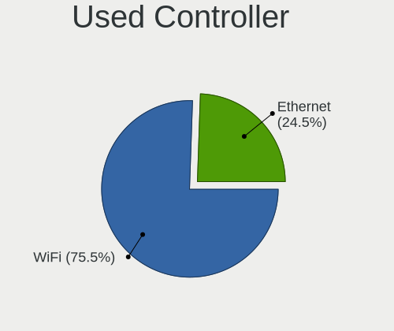

| Kind     | Notebooks | Percent |
|----------|-----------|---------|
| WiFi     | 92        | 72.44%  |
| Ethernet | 35        | 27.56%  |

NICs
----

Total network controllers on board

| Total | Notebooks | Percent |
|-------|-----------|---------|
| 2     | 96        | 80.67%  |
| 1     | 17        | 14.29%  |
| 3     | 4         | 3.36%   |
| 0     | 2         | 1.68%   |

IPv6
----

IPv6 vs IPv4

| Used | Notebooks | Percent |
|------|-----------|---------|
| Yes  | 68        | 57.14%  |
| No   | 51        | 42.86%  |

Bluetooth
---------

Bluetooth Vendor
----------------

Controller vendors

| Vendor                          | Notebooks | Percent |
|---------------------------------|-----------|---------|
| Intel                           | 54        | 57.45%  |
| IMC Networks                    | 11        | 11.7%   |
| Qualcomm Atheros Communications | 6         | 6.38%   |
| Broadcom                        | 5         | 5.32%   |
| Realtek Semiconductor           | 4         | 4.26%   |
| Lite-On Technology              | 4         | 4.26%   |
| Cambridge Silicon Radio         | 2         | 2.13%   |
| Toshiba                         | 1         | 1.06%   |
| Realtek                         | 1         | 1.06%   |
| Ralink Technology               | 1         | 1.06%   |
| Ralink                          | 1         | 1.06%   |
| Hewlett-Packard                 | 1         | 1.06%   |
| Foxconn / Hon Hai               | 1         | 1.06%   |
| Dell                            | 1         | 1.06%   |
| Alps Electric                   | 1         | 1.06%   |

Bluetooth Model
---------------

Controller models

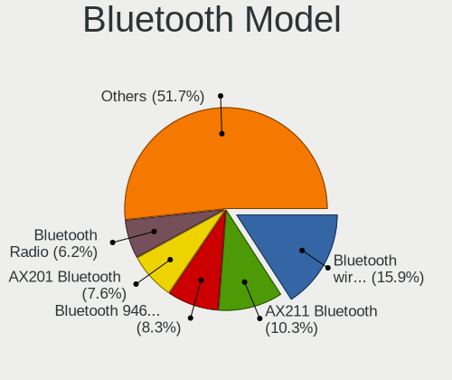

| Model                                               | Notebooks | Percent |
|-----------------------------------------------------|-----------|---------|
| Intel Bluetooth Device                              | 16        | 17.02%  |
| Intel AX200 Bluetooth                               | 12        | 12.77%  |
| Intel Bluetooth wireless interface                  | 10        | 10.64%  |
| Intel Bluetooth 9460/9560 Jefferson Peak (JfP)      | 7         | 7.45%   |
| IMC Networks Bluetooth Radio                        | 5         | 5.32%   |
| Qualcomm Atheros  Bluetooth Device                  | 3         | 3.19%   |
| Lite-On Qualcomm Atheros QCA9377 Bluetooth          | 3         | 3.19%   |
| Intel Wireless-AC 9260 Bluetooth Adapter            | 3         | 3.19%   |
| Intel AX210 Bluetooth                               | 3         | 3.19%   |
| IMC Networks Wireless_Device                        | 3         | 3.19%   |
| Realtek Bluetooth Radio                             | 2         | 2.13%   |
| Qualcomm Atheros QCA61x4 Bluetooth 4.0              | 2         | 2.13%   |
| Intel Centrino Bluetooth Wireless Transceiver       | 2         | 2.13%   |
| Cambridge Silicon Radio Bluetooth Dongle (HCI mode) | 2         | 2.13%   |
| Toshiba RT Bluetooth Radio                          | 1         | 1.06%   |
| Realtek RTL8723B Bluetooth                          | 1         | 1.06%   |
| Realtek  Bluetooth 4.2 Adapter                      | 1         | 1.06%   |
| Realtek Bluetooth Radio                             | 1         | 1.06%   |
| Ralink CSR BS8510                                   | 1         | 1.06%   |
| Ralink RT3290 Bluetooth                             | 1         | 1.06%   |
| Qualcomm Atheros AR3012 Bluetooth 4.0               | 1         | 1.06%   |
| Lite-On Bluetooth Device                            | 1         | 1.06%   |
| Intel Centrino Advanced-N 6230 Bluetooth adapter    | 1         | 1.06%   |
| IMC Networks Bluetooth USB Host Controller          | 1         | 1.06%   |
| IMC Networks Bluetooth Device                       | 1         | 1.06%   |
| IMC Networks Bluetooth                              | 1         | 1.06%   |
| HP Broadcom 2070 Bluetooth Combo                    | 1         | 1.06%   |
| Foxconn / Hon Hai Broadcom BCM20702 Bluetooth       | 1         | 1.06%   |
| Dell BCM20702A0 Bluetooth Module                    | 1         | 1.06%   |
| Broadcom HP Portable Bumble Bee                     | 1         | 1.06%   |
| Broadcom BCM43142A0 Bluetooth Device                | 1         | 1.06%   |
| Broadcom BCM2070 Bluetooth Device                   | 1         | 1.06%   |
| Broadcom BCM2070 Bluetooth 2.1 + EDR                | 1         | 1.06%   |
| Broadcom BCM2045B (BDC-2.1)                         | 1         | 1.06%   |
| Alps Electric Bluetooth Adapter                     | 1         | 1.06%   |

Sound
-----

Sound Vendor
------------

Sound card vendors

| Vendor                           | Notebooks | Percent |
|----------------------------------|-----------|---------|
| Intel                            | 89        | 59.73%  |
| AMD                              | 28        | 18.79%  |
| Nvidia                           | 23        | 15.44%  |
| Realtek Semiconductor            | 2         | 1.34%   |
| TC Electronic                    | 1         | 0.67%   |
| Silicon Integrated Systems [SiS] | 1         | 0.67%   |
| Plantronics                      | 1         | 0.67%   |
| Medeli Electronics               | 1         | 0.67%   |
| Lenovo                           | 1         | 0.67%   |
| Kingston Technology              | 1         | 0.67%   |
| AOKEO                            | 1         | 0.67%   |

Sound Model
-----------

Sound card models

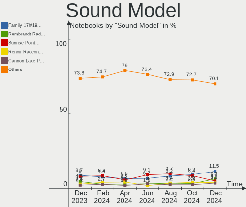

| Model                                                                                             | Notebooks | Percent |
|---------------------------------------------------------------------------------------------------|-----------|---------|
| AMD Family 17h/19h HD Audio Controller                                                            | 18        | 9.84%   |
| Intel Sunrise Point-LP HD Audio                                                                   | 12        | 6.56%   |
| Intel 7 Series/C216 Chipset Family High Definition Audio Controller                               | 12        | 6.56%   |
| AMD Renoir Radeon High Definition Audio Controller                                                | 9         | 4.92%   |
| Nvidia Audio device                                                                               | 7         | 3.83%   |
| Intel Tiger Lake-LP Smart Sound Technology Audio Controller                                       | 7         | 3.83%   |
| Intel 5 Series/3400 Series Chipset High Definition Audio                                          | 6         | 3.28%   |
| AMD Raven/Raven2/Fenghuang HDMI/DP Audio Controller                                               | 6         | 3.28%   |
| AMD FCH Azalia Controller                                                                         | 6         | 3.28%   |
| Intel Xeon E3-1200 v3/4th Gen Core Processor HD Audio Controller                                  | 5         | 2.73%   |
| Intel Tiger Lake-H HD Audio Controller                                                            | 5         | 2.73%   |
| Intel Cannon Point-LP High Definition Audio Controller                                            | 5         | 2.73%   |
| Intel Alder Lake PCH-P High Definition Audio Controller                                           | 5         | 2.73%   |
| Intel 8 Series/C220 Series Chipset High Definition Audio Controller                               | 5         | 2.73%   |
| Nvidia GA104 High Definition Audio Controller                                                     | 4         | 2.19%   |
| Intel Comet Lake PCH cAVS                                                                         | 4         | 2.19%   |
| AMD Kabini HDMI/DP Audio                                                                          | 4         | 2.19%   |
| Intel Comet Lake PCH-LP cAVS                                                                      | 3         | 1.64%   |
| Intel Cannon Lake PCH cAVS                                                                        | 3         | 1.64%   |
| Intel 82801I (ICH9 Family) HD Audio Controller                                                    | 3         | 1.64%   |
| Intel 6 Series/C200 Series Chipset Family High Definition Audio Controller                        | 3         | 1.64%   |
| Realtek Semiconductor USB Audio                                                                   | 2         | 1.09%   |
| Nvidia TU107 GeForce GTX 1650 High Definition Audio Controller                                    | 2         | 1.09%   |
| Nvidia TU106 High Definition Audio Controller                                                     | 2         | 1.09%   |
| Nvidia GP106 High Definition Audio Controller                                                     | 2         | 1.09%   |
| Nvidia GK107 HDMI Audio Controller                                                                | 2         | 1.09%   |
| Intel Wildcat Point-LP High Definition Audio Controller                                           | 2         | 1.09%   |
| Intel Ice Lake-LP Smart Sound Technology Audio Controller                                         | 2         | 1.09%   |
| Intel Haswell-ULT HD Audio Controller                                                             | 2         | 1.09%   |
| Intel Celeron N3350/Pentium N4200/Atom E3900 Series Audio Cluster                                 | 2         | 1.09%   |
| Intel Broadwell-U Audio Controller                                                                | 2         | 1.09%   |
| Intel Atom/Celeron/Pentium Processor x5-E8000/J3xxx/N3xxx Series High Definition Audio Controller | 2         | 1.09%   |
| Intel 82801H (ICH8 Family) HD Audio Controller                                                    | 2         | 1.09%   |
| Intel 8 Series HD Audio Controller                                                                | 2         | 1.09%   |
| Intel 100 Series/C230 Series Chipset Family HD Audio Controller                                   | 2         | 1.09%   |
| AMD Wrestler HDMI Audio                                                                           | 2         | 1.09%   |
| AMD SBx00 Azalia (Intel HDA)                                                                      | 2         | 1.09%   |
| TC Electronic GoXLRMini                                                                           | 1         | 0.55%   |
| Silicon Integrated Systems [SiS] Azalia Audio Controller                                          | 1         | 0.55%   |
| Plantronics Blackwire 5220 Series                                                                 | 1         | 0.55%   |
| Nvidia MCP72XE/MCP72P/MCP78U/MCP78S High Definition Audio                                         | 1         | 0.55%   |
| Nvidia High Definition Audio Controller                                                           | 1         | 0.55%   |
| Nvidia GT216 HDMI Audio Controller                                                                | 1         | 0.55%   |
| Nvidia GF119 HDMI Audio Controller                                                                | 1         | 0.55%   |
| Medeli Electronics AudioPro X5 Microphone                                                         | 1         | 0.55%   |
| Lenovo ThinkPad USB-C Dock Gen2 USB Audio                                                         | 1         | 0.55%   |
| Kingston Technology HyperX Cloud Flight Wireless Headset                                          | 1         | 0.55%   |
| Intel USB PnP Sound Device                                                                        | 1         | 0.55%   |
| Intel NM10/ICH7 Family High Definition Audio Controller                                           | 1         | 0.55%   |
| Intel Atom Processor Z36xxx/Z37xxx Series High Definition Audio Controller                        | 1         | 0.55%   |
| AOKEO LCS_USB_Audio                                                                               | 1         | 0.55%   |
| AMD RV620 HDMI Audio [Radeon HD 3450/3470/3550/3570]                                              | 1         | 0.55%   |
| AMD Rembrandt Radeon High Definition Audio Controller                                             | 1         | 0.55%   |
| AMD Navi 10 HDMI Audio                                                                            | 1         | 0.55%   |
| AMD Cedar HDMI Audio [Radeon HD 5400/6300/7300 Series]                                            | 1         | 0.55%   |
| AMD BeaverCreek HDMI Audio [Radeon HD 6500D and 6400G-6600G series]                               | 1         | 0.55%   |

Memory
------

Memory Vendor
-------------

Memory module vendors

| Vendor              | Notebooks | Percent |
|---------------------|-----------|---------|
| SK hynix            | 28        | 30.11%  |
| Samsung Electronics | 28        | 30.11%  |
| Micron Technology   | 18        | 19.35%  |
| Crucial             | 6         | 6.45%   |
| Unknown             | 5         | 5.38%   |
| Kingston            | 2         | 2.15%   |
| Unknown (ABCD)      | 1         | 1.08%   |
| Ramaxel Technology  | 1         | 1.08%   |
| Nanya Technology    | 1         | 1.08%   |
| HMD                 | 1         | 1.08%   |
| Elpida              | 1         | 1.08%   |
| A-DATA Technology   | 1         | 1.08%   |

Memory Model
------------

Memory module models

| Model                                                               | Notebooks | Percent |
|---------------------------------------------------------------------|-----------|---------|
| SK hynix RAM HMT351S6CFR8C-PB 4GB SODIMM DDR3 1600MT/s              | 5         | 5.05%   |
| Samsung RAM M471B1G73DB0-YK0 8GB SODIMM DDR3 1600MT/s               | 4         | 4.04%   |
| Samsung RAM M471A1K43DB1-CWE 8GB SODIMM DDR4 3200MT/s               | 4         | 4.04%   |
| SK hynix RAM HMAA1GS6CJR6N-XN 8192MB SODIMM DDR4 3200MT/s           | 3         | 3.03%   |
| Samsung RAM M471A1G44AB0-CWE 8192MB SODIMM DDR4 3200MT/s            | 3         | 3.03%   |
| Samsung RAM M425R2GA3BB0-CQKOD 16GB SODIMM 4800MT/s                 | 3         | 3.03%   |
| SK hynix RAM HMT41GS6AFR8A-PB 8192MB SODIMM DDR3 1600MT/s           | 2         | 2.02%   |
| SK hynix RAM HMA81GS6AFR8N-UH 8GB SODIMM DDR4 2667MT/s              | 2         | 2.02%   |
| Samsung RAM M471B1G73EB0-YK0 8GB SODIMM DDR3 1600MT/s               | 2         | 2.02%   |
| Samsung RAM M471A2K43DB1-CWE 16GB SODIMM DDR4 3200MT/s              | 2         | 2.02%   |
| Micron RAM 8ATF1G64HZ-3G2J1 8GB SODIMM DDR4 3200MT/s                | 2         | 2.02%   |
| Unknown RAM Module 8GB SODIMM DDR4 2667MT/s                         | 1         | 1.01%   |
| Unknown RAM Module 4GB SODIMM DDR3 1600MT/s                         | 1         | 1.01%   |
| Unknown RAM Module 4GB SODIMM DDR3                                  | 1         | 1.01%   |
| Unknown RAM Module 4GB Chip DDR4 2133MT/s                           | 1         | 1.01%   |
| Unknown RAM Module 2GB SODIMM DDR2 800MT/s                          | 1         | 1.01%   |
| Unknown (ABCD) RAM 123456789012345678 2048MB SODIMM LPDDR4 2400MT/s | 1         | 1.01%   |
| SK hynix RAM Module 2GB SODIMM DDR3 1333MT/s                        | 1         | 1.01%   |
| SK hynix RAM Module 2GB Row Of Chips DDR3 1600MT/s                  | 1         | 1.01%   |
| SK hynix RAM HMT451S6AFR8A-PB 4GB SODIMM DDR3 1600MT/s              | 1         | 1.01%   |
| SK hynix RAM HMT41GS6BFR8A-PB 8GB SODIMM DDR3 1600MT/s              | 1         | 1.01%   |
| SK hynix RAM HMT351S6EFR8C-PB 4GB SODIMM DDR3 1600MT/s              | 1         | 1.01%   |
| SK hynix RAM HMT351S6EFR8A-PB 4096MB SODIMM DDR3 1600MT/s           | 1         | 1.01%   |
| SK hynix RAM HMT351S6CFR8C-H9 4GB SODIMM DDR3 1600MT/s              | 1         | 1.01%   |
| SK hynix RAM HMAA1GS6CJR6N-XN 8GB SODIMM DDR4 3200MT/s              | 1         | 1.01%   |
| SK hynix RAM HMA851S6DJR6N-XN 4GB SODIMM DDR4 3200MT/s              | 1         | 1.01%   |
| SK hynix RAM HMA851S6DJR6N-XN 4GB Row Of Chips DDR4 3200MT/s        | 1         | 1.01%   |
| SK hynix RAM HMA82GS6DJR8N-XN 16GB SODIMM DDR4 3200MT/s             | 1         | 1.01%   |
| SK hynix RAM HMA82GS6CJR8N-VK 16GB SODIMM DDR4 2667MT/s             | 1         | 1.01%   |
| SK hynix RAM HMA81GS6JJR8N-VK 8GB SODIMM DDR4 2667MT/s              | 1         | 1.01%   |
| SK hynix RAM HMA81GS6DJR8N-XN 8GB SODIMM DDR4 3200MT/s              | 1         | 1.01%   |
| SK hynix RAM HMA81GS6DJR8N-XN 8192MB SODIMM DDR4 3200MT/s           | 1         | 1.01%   |
| SK hynix RAM HMA81GS6DJR8N-VK 8GB SODIMM DDR4 2667MT/s              | 1         | 1.01%   |
| SK hynix RAM HMA81GS6CJR8N-VK 8GB SODIMM DDR4 2667MT/s              | 1         | 1.01%   |
| SK hynix RAM HMA451S6AFR8N-TF 4GB SODIMM DDR4 2133MT/s              | 1         | 1.01%   |
| Samsung RAM Module 16384MB SODIMM DDR4 3200MT/s                     | 1         | 1.01%   |
| Samsung RAM M471B5173QH0-YK0 4GB SODIMM DDR3 1600MT/s               | 1         | 1.01%   |
| Samsung RAM M471A5244CB0-CRC 4GB SODIMM DDR4 2667MT/s               | 1         | 1.01%   |
| Samsung RAM M471A4G43AB1-CWE 32GB SODIMM DDR4 3200MT/s              | 1         | 1.01%   |
| Samsung RAM M471A2K43EB1-CWE 16GB SODIMM DDR4 3200MT/s              | 1         | 1.01%   |
| Samsung RAM M471A2G44AM0-CWE 16384MB SODIMM DDR4 3200MT/s           | 1         | 1.01%   |
| Samsung RAM M471A1K43EB1-CWE 8GB SODIMM DDR4 3200MT/s               | 1         | 1.01%   |
| Samsung RAM M471A1K43DB1-CTD 8GB SODIMM DDR4 2667MT/s               | 1         | 1.01%   |
| Samsung RAM M471A1G44BB0-CWE 8GB SODIMM DDR4 3200MT/s               | 1         | 1.01%   |
| Samsung RAM M471A1G44AB0-CTD 8GB SODIMM DDR4 2667MT/s               | 1         | 1.01%   |
| Samsung RAM M425R1GB4BB0-CQKOL 8GB SODIMM 4800MT/s                  | 1         | 1.01%   |
| Samsung RAM M4 70T5663EH3-CF7 2GB SODIMM DDR 975MT/s                | 1         | 1.01%   |
| Samsung RAM M4 70T2864QZ3-CE6 1GB SODIMM DDR 1639MT/s               | 1         | 1.01%   |
| Samsung RAM K4EBE304EB-EGCG 8192MB Row Of Chips LPDDR3 2133MT/s     | 1         | 1.01%   |
| Ramaxel RAM RMT3170EF68F9W1600 4096MB SODIMM DDR3 1600MT/s          | 1         | 1.01%   |
| Nanya RAM NT4GC64B8HB0NS-CG 4096MB SODIMM DDR3 1334MT/s             | 1         | 1.01%   |
| Micron RAM MT52L1G32D4PG-093 8GB Row Of Chips LPDDR3 2133MT/s       | 1         | 1.01%   |
| Micron RAM MT40A512M16TB-062E:R 4096MB SODIMM DDR4 2400MT/s         | 1         | 1.01%   |
| Micron RAM Module 8GB SODIMM DDR4 2667MT/s                          | 1         | 1.01%   |
| Micron RAM Module 8192MB SODIMM DDR4 3200MT/s                       | 1         | 1.01%   |
| Micron RAM Module 4GB SODIMM DDR3 1600MT/s                          | 1         | 1.01%   |
| Micron RAM Module 16384MB SODIMM DDR4 2667MT/s                      | 1         | 1.01%   |
| Micron RAM AFSD44FK1P 4096MB SODIMM DDR4 2667MT/s                   | 1         | 1.01%   |
| Micron RAM 8KTF51264HZ-1G6E1 4096MB SODIMM DDR3 1600MT/s            | 1         | 1.01%   |
| Micron RAM 8ATF51264HZ-2G1B1 8GB SODIMM DDR4 2667MT/s               | 1         | 1.01%   |

Memory Kind
-----------

Memory module kinds

| Kind    | Notebooks | Percent |
|---------|-----------|---------|
| DDR4    | 45        | 58.44%  |
| DDR3    | 23        | 29.87%  |
| Unknown | 4         | 5.19%   |
| LPDDR3  | 2         | 2.6%    |
| SDRAM   | 1         | 1.3%    |
| LPDDR4  | 1         | 1.3%    |
| DDR2    | 1         | 1.3%    |

Memory Form Factor
------------------

Physical design of the memory module

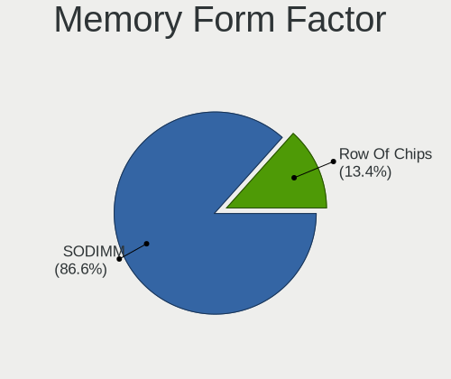

| Name         | Notebooks | Percent |
|--------------|-----------|---------|
| SODIMM       | 74        | 93.67%  |
| Row Of Chips | 4         | 5.06%   |
| Chip         | 1         | 1.27%   |

Memory Size
-----------

Memory module size

| Size  | Notebooks | Percent |
|-------|-----------|---------|
| 8192  | 40        | 48.78%  |
| 4096  | 20        | 24.39%  |
| 16384 | 16        | 19.51%  |
| 2048  | 4         | 4.88%   |
| 32768 | 1         | 1.22%   |
| 1024  | 1         | 1.22%   |

Memory Speed
------------

Memory module speed

| Speed   | Notebooks | Percent |
|---------|-----------|---------|
| 3200    | 28        | 33.33%  |
| 1600    | 20        | 23.81%  |
| 2667    | 17        | 20.24%  |
| 2400    | 5         | 5.95%   |
| 4800    | 4         | 4.76%   |
| 2133    | 3         | 3.57%   |
| 1333    | 2         | 2.38%   |
| 2048    | 1         | 1.19%   |
| 1639    | 1         | 1.19%   |
| 1334    | 1         | 1.19%   |
| 800     | 1         | 1.19%   |
| Unknown | 1         | 1.19%   |

Printers & scanners
-------------------

Printer Vendor
--------------

Printer device vendors

| Vendor          | Notebooks | Percent |
|-----------------|-----------|---------|
| Hewlett-Packard | 3         | 100%    |

Printer Model
-------------

Printer device models

| Model                    | Notebooks | Percent |
|--------------------------|-----------|---------|
| HP OfficeJet 3830 series | 1         | 33.33%  |
| HP DeskJet 3630 series   | 1         | 33.33%  |
| HP DeskJet 2700 series   | 1         | 33.33%  |

Scanner Vendor
--------------

Scanner device vendors

Zero info for selected period =(

Scanner Model
-------------

Scanner device models

Zero info for selected period =(

Camera
------

Camera Vendor
-------------

Camera device vendors

| Vendor                                 | Notebooks | Percent |
|----------------------------------------|-----------|---------|
| Chicony Electronics                    | 25        | 23.15%  |
| Acer                                   | 17        | 15.74%  |
| IMC Networks                           | 13        | 12.04%  |
| Realtek Semiconductor                  | 9         | 8.33%   |
| Microdia                               | 9         | 8.33%   |
| Lite-On Technology                     | 6         | 5.56%   |
| Quanta                                 | 4         | 3.7%    |
| Cheng Uei Precision Industry (Foxlink) | 4         | 3.7%    |
| Suyin                                  | 3         | 2.78%   |
| Sunplus Innovation Technology          | 3         | 2.78%   |
| Syntek                                 | 2         | 1.85%   |
| Silicon Motion                         | 2         | 1.85%   |
| Logitech                               | 2         | 1.85%   |
| Sonix Technology                       | 1         | 0.93%   |
| Samsung Electronics                    | 1         | 0.93%   |
| Ricoh                                  | 1         | 0.93%   |
| Luxvisions Innotech Limited            | 1         | 0.93%   |
| Lenovo                                 | 1         | 0.93%   |
| Guillemot                              | 1         | 0.93%   |
| Generalplus Technology                 | 1         | 0.93%   |
| Denron                                 | 1         | 0.93%   |
| Apple                                  | 1         | 0.93%   |

Camera Model
------------

Camera device models

| Model                                                | Notebooks | Percent |
|------------------------------------------------------|-----------|---------|
| Chicony Integrated Camera                            | 6         | 5.56%   |
| Acer Integrated Camera                               | 6         | 5.56%   |
| Realtek Integrated_Webcam_HD                         | 5         | 4.63%   |
| Microdia Integrated_Webcam_HD                        | 4         | 3.7%    |
| IMC Networks Integrated Camera                       | 4         | 3.7%    |
| IMC Networks USB2.0 HD UVC WebCam                    | 3         | 2.78%   |
| Acer HD Webcam                                       | 3         | 2.78%   |
| Microdia Integrated Webcam HD                        | 2         | 1.85%   |
| Lite-On HP Wide Vision HD Camera                     | 2         | 1.85%   |
| IMC Networks USB2.0 VGA UVC WebCam                   | 2         | 1.85%   |
| Chicony USB2.0 Camera                                | 2         | 1.85%   |
| Chicony HD Webcam                                    | 2         | 1.85%   |
| Chicony 1.3M HD WebCam                               | 2         | 1.85%   |
| Acer Lenovo EasyCamera                               | 2         | 1.85%   |
| Acer HD Camera                                       | 2         | 1.85%   |
| Acer BisonCam,NB Pro                                 | 2         | 1.85%   |
| Syntek USB2.0 Camera                                 | 1         | 0.93%   |
| Syntek Integrated Camera                             | 1         | 0.93%   |
| Suyin HP Truevision HD                               | 1         | 0.93%   |
| Suyin Asus Integrated Webcam                         | 1         | 0.93%   |
| Suyin 1.3M HD WebCam                                 | 1         | 0.93%   |
| Sunplus HP Truevision HD                             | 1         | 0.93%   |
| Sunplus FHD Camera Microphone                        | 1         | 0.93%   |
| Sunplus Asus Webcam                                  | 1         | 0.93%   |
| Sonix USB2.0 HD UVC WebCam                           | 1         | 0.93%   |
| Silicon Motion WebCam SCB-0385N                      | 1         | 0.93%   |
| Silicon Motion WebCam SC-10HDD12636N                 | 1         | 0.93%   |
| Samsung Galaxy series, misc. (MTP mode)              | 1         | 0.93%   |
| Ricoh Visual Communication Camera VGP-VCC7 [R5U870]  | 1         | 0.93%   |
| Realtek USB Camera                                   | 1         | 0.93%   |
| Realtek Lenovo EasyCamera                            | 1         | 0.93%   |
| Realtek Integrated Webcam HD                         | 1         | 0.93%   |
| Realtek HD Webcam - Realtek                          | 1         | 0.93%   |
| Quanta VGA WebCam                                    | 1         | 0.93%   |
| Quanta USB2.0 HD UVC WebCam                          | 1         | 0.93%   |
| Quanta HP Webcam                                     | 1         | 0.93%   |
| Quanta HP HD Camera                                  | 1         | 0.93%   |
| Microdia Integrated Webcam                           | 1         | 0.93%   |
| Microdia HP Webcam                                   | 1         | 0.93%   |
| Microdia Dell Integrated HD Webcam                   | 1         | 0.93%   |
| Luxvisions Innotech Limited HP Wide Vision HD Camera | 1         | 0.93%   |
| Logitech Webcam C270                                 | 1         | 0.93%   |
| Logitech B525 HD Webcam                              | 1         | 0.93%   |
| Lite-On TOSHIBA Web Camera - HD                      | 1         | 0.93%   |
| Lite-On Integrated Camera                            | 1         | 0.93%   |
| Lite-On HP HD Webcam                                 | 1         | 0.93%   |
| Lite-On HP HD Camera                                 | 1         | 0.93%   |
| Lenovo Integrated Webcam [R5U877]                    | 1         | 0.93%   |
| IMC Networks VGA UVC WebCam                          | 1         | 0.93%   |
| IMC Networks UVC VGA Webcam                          | 1         | 0.93%   |
| IMC Networks USB2.0 UVC HD Webcam                    | 1         | 0.93%   |
| IMC Networks SunplusIT Integrated Camera             | 1         | 0.93%   |
| Guillemot Hercules HD Twist                          | 1         | 0.93%   |
| Generalplus 2K HD Camera                             | 1         | 0.93%   |
| Denron USB 2.0 Camera                                | 1         | 0.93%   |
| Chicony VGA Webcam                                   | 1         | 0.93%   |
| Chicony USB2.0 UVC WebCam                            | 1         | 0.93%   |
| Chicony USB2.0 HD UVC WebCam                         | 1         | 0.93%   |
| Chicony USB 2.0 Camera                               | 1         | 0.93%   |
| Chicony TOSHIBA Web Camera - HD                      | 1         | 0.93%   |

Security
--------

Fingerprint Vendor
------------------

Fingerprint sensor vendors

| Vendor                     | Notebooks | Percent |
|----------------------------|-----------|---------|
| Validity Sensors           | 8         | 44.44%  |
| Synaptics                  | 5         | 27.78%  |
| Shenzhen Goodix Technology | 3         | 16.67%  |
| Upek                       | 2         | 11.11%  |

Fingerprint Model
-----------------

Fingerprint sensor models

| Model                                                  | Notebooks | Percent |
|--------------------------------------------------------|-----------|---------|
| Validity Sensors VFS451 Fingerprint Reader             | 2         | 11.11%  |
| Validity Sensors Fingerprint scanner                   | 2         | 11.11%  |
| Upek Biometric Touchchip/Touchstrip Fingerprint Sensor | 2         | 11.11%  |
| Shenzhen Goodix Fingerprint Reader                     | 2         | 11.11%  |
| Validity Sensors VFS7500 Touch Fingerprint Sensor      | 1         | 5.56%   |
| Validity Sensors VFS495 Fingerprint Reader             | 1         | 5.56%   |
| Validity Sensors VFS301 Fingerprint Reader             | 1         | 5.56%   |
| Validity Sensors Synaptics WBDI                        | 1         | 5.56%   |
| Synaptics WBDI Device                                  | 1         | 5.56%   |
| Synaptics Prometheus MIS Touch Fingerprint Reader      | 1         | 5.56%   |
| Synaptics Metallica MOH Touch Fingerprint Reader       | 1         | 5.56%   |
| Synaptics Metallica MIS Touch Fingerprint Reader       | 1         | 5.56%   |
| Shenzhen Goodix  FingerPrint Device                    | 1         | 5.56%   |
| Unknown                                                | 1         | 5.56%   |

Chipcard Vendor
---------------

Chipcard module vendors

| Vendor                | Notebooks | Percent |
|-----------------------|-----------|---------|
| O2 Micro              | 2         | 28.57%  |
| Broadcom              | 2         | 28.57%  |
| Alcor Micro           | 2         | 28.57%  |
| Gemalto (was Gemplus) | 1         | 14.29%  |

Chipcard Model
--------------

Chipcard module models

| Model                                             | Notebooks | Percent |
|---------------------------------------------------|-----------|---------|
| O2 Micro OZ776 CCID Smartcard Reader              | 2         | 28.57%  |
| Broadcom 5880                                     | 2         | 28.57%  |
| Alcor Micro AU9540 Smartcard Reader               | 2         | 28.57%  |
| Gemalto (was Gemplus) GemPC Twin SmartCard Reader | 1         | 14.29%  |

Unsupported
-----------

Unsupported Devices
-------------------

Total unsupported devices on board

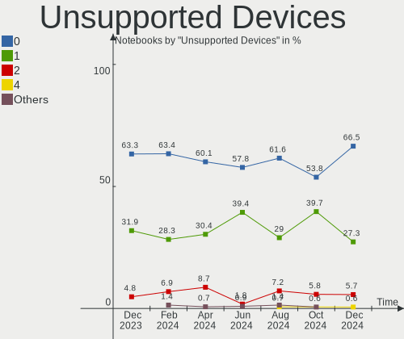

| Total | Notebooks | Percent |
|-------|-----------|---------|
| 0     | 81        | 68.07%  |
| 1     | 32        | 26.89%  |
| 2     | 5         | 4.2%    |
| 3     | 1         | 0.84%   |

Unsupported Device Types
------------------------

Types of unsupported devices

| Type                  | Notebooks | Percent |
|-----------------------|-----------|---------|
| Fingerprint reader    | 18        | 40.91%  |
| Graphics card         | 10        | 22.73%  |
| Chipcard              | 7         | 15.91%  |
| Net/wireless          | 3         | 6.82%   |
| Multimedia controller | 3         | 6.82%   |
| Camera                | 2         | 4.55%   |
| Bluetooth             | 1         | 2.27%   |

