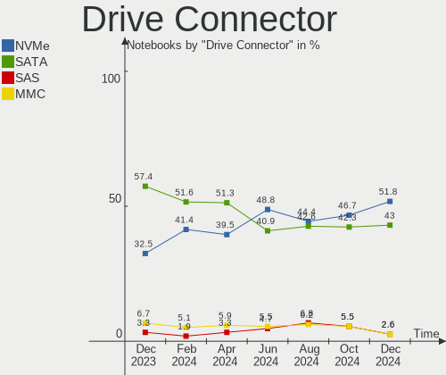
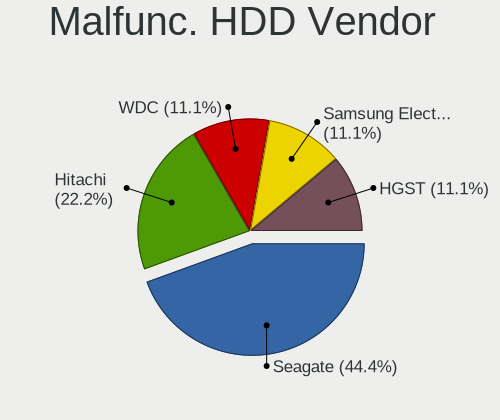
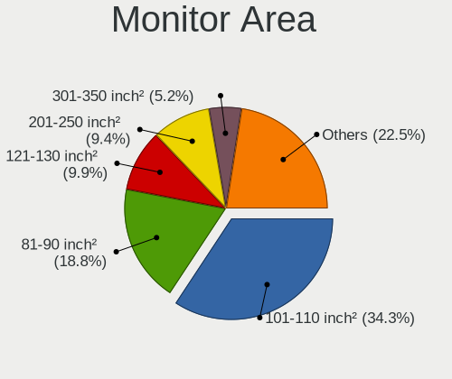
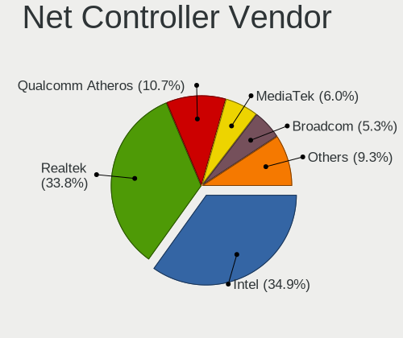
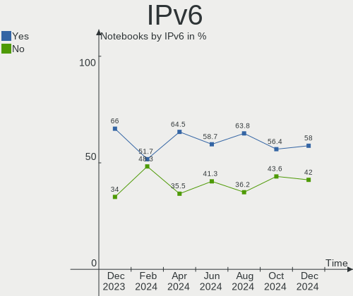
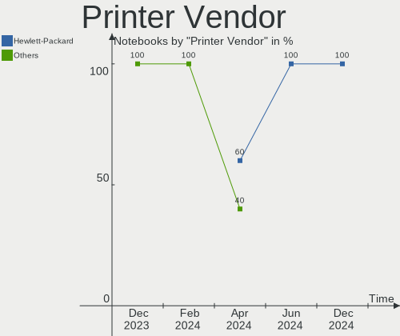
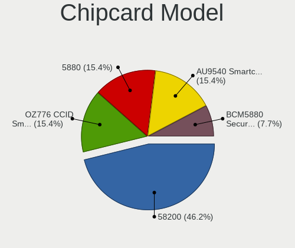

Linux in France - Hardware Trends (Notebooks)
---------------------------------------------

A project to identify most popular hardware characteristics and track their change
over time based on data collected by Linux users at https://Linux-Hardware.org.

Anyone can contribute to this report by the [hw-probe](https://github.com/linuxhw/hw-probe) tool:

    sudo -E hw-probe -all -upload

Period: Jan, 2024.

Contents
--------

* [ System ](#system)
  - [ OS                       ](#os)
  - [ OS Family                ](#os-family)
  - [ Kernel                   ](#kernel)
  - [ Kernel Family            ](#kernel-family)
  - [ Kernel Major Ver.        ](#kernel-major-ver)
  - [ Arch                     ](#arch)
  - [ DE                       ](#de)
  - [ Display Server           ](#display-server)
  - [ Display Manager          ](#display-manager)
  - [ OS Lang                  ](#os-lang)
  - [ Boot Mode                ](#boot-mode)
  - [ Filesystem               ](#filesystem)
  - [ Part. scheme             ](#part-scheme)
  - [ Dual Boot with Linux/BSD ](#dual-boot-with-linuxbsd)
  - [ Dual Boot (Win)          ](#dual-boot-win)

* [ Board ](#board)
  - [ Vendor                   ](#vendor)
  - [ Model                    ](#model)
  - [ Model Family             ](#model-family)
  - [ MFG Year                 ](#mfg-year)
  - [ Form Factor              ](#form-factor)
  - [ Secure Boot              ](#secure-boot)
  - [ Coreboot                 ](#coreboot)
  - [ RAM Size                 ](#ram-size)
  - [ RAM Used                 ](#ram-used)
  - [ Total Drives             ](#total-drives)
  - [ Has CD-ROM               ](#has-cd-rom)
  - [ Has Ethernet             ](#has-ethernet)
  - [ Has WiFi                 ](#has-wifi)
  - [ Has Bluetooth            ](#has-bluetooth)

* [ Location ](#location)
  - [ Country                  ](#country)
  - [ City                     ](#city)

* [ Drives ](#drives)
  - [ Drive Vendor             ](#drive-vendor)
  - [ Drive Model              ](#drive-model)
  - [ HDD Vendor               ](#hdd-vendor)
  - [ SSD Vendor               ](#ssd-vendor)
  - [ Drive Kind               ](#drive-kind)
  - [ Drive Connector          ](#drive-connector)
  - [ Drive Size               ](#drive-size)
  - [ Space Total              ](#space-total)
  - [ Space Used               ](#space-used)
  - [ Malfunc. Drives          ](#malfunc-drives)
  - [ Malfunc. Drive Vendor    ](#malfunc-drive-vendor)
  - [ Malfunc. HDD Vendor      ](#malfunc-hdd-vendor)
  - [ Malfunc. Drive Kind      ](#malfunc-drive-kind)
  - [ Failed Drives            ](#failed-drives)
  - [ Failed Drive Vendor      ](#failed-drive-vendor)
  - [ Drive Status             ](#drive-status)

* [ Storage controller ](#storage-controller)
  - [ Storage Vendor           ](#storage-vendor)
  - [ Storage Model            ](#storage-model)
  - [ Storage Kind             ](#storage-kind)

* [ Processor ](#processor)
  - [ CPU Vendor               ](#cpu-vendor)
  - [ CPU Model                ](#cpu-model)
  - [ CPU Model Family         ](#cpu-model-family)
  - [ CPU Cores                ](#cpu-cores)
  - [ CPU Sockets              ](#cpu-sockets)
  - [ CPU Threads              ](#cpu-threads)
  - [ CPU Op-Modes             ](#cpu-op-modes)
  - [ CPU Microcode            ](#cpu-microcode)
  - [ CPU Microarch            ](#cpu-microarch)

* [ Graphics ](#graphics)
  - [ GPU Vendor               ](#gpu-vendor)
  - [ GPU Model                ](#gpu-model)
  - [ GPU Combo                ](#gpu-combo)
  - [ GPU Driver               ](#gpu-driver)
  - [ GPU Memory               ](#gpu-memory)

* [ Monitor ](#monitor)
  - [ Monitor Vendor           ](#monitor-vendor)
  - [ Monitor Model            ](#monitor-model)
  - [ Monitor Resolution       ](#monitor-resolution)
  - [ Monitor Diagonal         ](#monitor-diagonal)
  - [ Monitor Width            ](#monitor-width)
  - [ Aspect Ratio             ](#aspect-ratio)
  - [ Monitor Area             ](#monitor-area)
  - [ Pixel Density            ](#pixel-density)
  - [ Multiple Monitors        ](#multiple-monitors)

* [ Network ](#network)
  - [ Net Controller Vendor    ](#net-controller-vendor)
  - [ Net Controller Model     ](#net-controller-model)
  - [ Wireless Vendor          ](#wireless-vendor)
  - [ Wireless Model           ](#wireless-model)
  - [ Ethernet Vendor          ](#ethernet-vendor)
  - [ Ethernet Model           ](#ethernet-model)
  - [ Net Controller Kind      ](#net-controller-kind)
  - [ Used Controller          ](#used-controller)
  - [ NICs                     ](#nics)
  - [ IPv6                     ](#ipv6)

* [ Bluetooth ](#bluetooth)
  - [ Bluetooth Vendor         ](#bluetooth-vendor)
  - [ Bluetooth Model          ](#bluetooth-model)

* [ Sound ](#sound)
  - [ Sound Vendor             ](#sound-vendor)
  - [ Sound Model              ](#sound-model)

* [ Memory ](#memory)
  - [ Memory Vendor            ](#memory-vendor)
  - [ Memory Model             ](#memory-model)
  - [ Memory Kind              ](#memory-kind)
  - [ Memory Form Factor       ](#memory-form-factor)
  - [ Memory Size              ](#memory-size)
  - [ Memory Speed             ](#memory-speed)

* [ Printers & scanners ](#printers--scanners)
  - [ Printer Vendor           ](#printer-vendor)
  - [ Printer Model            ](#printer-model)
  - [ Scanner Vendor           ](#scanner-vendor)
  - [ Scanner Model            ](#scanner-model)

* [ Camera ](#camera)
  - [ Camera Vendor            ](#camera-vendor)
  - [ Camera Model             ](#camera-model)

* [ Security ](#security)
  - [ Fingerprint Vendor       ](#fingerprint-vendor)
  - [ Fingerprint Model        ](#fingerprint-model)
  - [ Chipcard Vendor          ](#chipcard-vendor)
  - [ Chipcard Model           ](#chipcard-model)

* [ Unsupported ](#unsupported)
  - [ Unsupported Devices      ](#unsupported-devices)
  - [ Unsupported Device Types ](#unsupported-device-types)

System
------

OS
--

Installed operating systems

| Name                         | Notebooks | Percent |
|------------------------------|-----------|---------|
| Ubuntu 22.04                 | 34        | 19.77%  |
| Debian 12                    | 17        | 9.88%   |
| Fedora 39                    | 15        | 8.72%   |
| Ubuntu 23.10                 | 11        | 6.4%    |
| Linux Mint 21.2              | 10        | 5.81%   |
| Xubuntu 22.04                | 7         | 4.07%   |
| Ubuntu 20.04                 | 7         | 4.07%   |
| Arch Rolling                 | 7         | 4.07%   |
| Zorin 17                     | 4         | 2.33%   |
| OpenMandriva 5.0             | 4         | 2.33%   |
| Zorin 16                     | 3         | 1.74%   |
| Ubuntu 23.04                 | 3         | 1.74%   |
| Pop!_OS 22.04                | 3         | 1.74%   |
| Manjaro                      | 3         | 1.74%   |
| Linux Mint 21.3              | 3         | 1.74%   |
| Kubuntu 23.10                | 3         | 1.74%   |
| Debian 11                    | 3         | 1.74%   |
| Xubuntu 18.04                | 2         | 1.16%   |
| OpenMandriva 4.3             | 2         | 1.16%   |
| OpenMandriva 4.2             | 2         | 1.16%   |
| OpenMandriva 24.01           | 2         | 1.16%   |
| Linux Mint 20.3              | 2         | 1.16%   |
| KDE neon 22.04               | 2         | 1.16%   |
| Zorin 15                     | 1         | 0.58%   |
| Xubuntu 20.04                | 1         | 0.58%   |
| Xero Rolling                 | 1         | 0.58%   |
| Ubuntu MATE 23.10            | 1         | 0.58%   |
| SteamOS 4                    | 1         | 0.58%   |
| Salix 15.0                   | 1         | 0.58%   |
| openSUSE Tumbleweed-XXXXXXXX | 1         | 0.58%   |
| OpenMandriva 23.08           | 1         | 0.58%   |
| OpenMandriva 23.03           | 1         | 0.58%   |
| NixOS 23.11                  | 1         | 0.58%   |
| Manjaro 23.1.1               | 1         | 0.58%   |
| Lubuntu 22.04                | 1         | 0.58%   |
| Lubuntu 20.04                | 1         | 0.58%   |
| LMDE 6                       | 1         | 0.58%   |
| Linux Mint 21                | 1         | 0.58%   |
| Linux Mint 20.2              | 1         | 0.58%   |
| Kubuntu 22.04                | 1         | 0.58%   |

OS Family
---------

OS without a version

| Name         | Notebooks | Percent |
|--------------|-----------|---------|
| Ubuntu       | 55        | 31.98%  |
| Debian       | 21        | 12.21%  |
| Linux Mint   | 17        | 9.88%   |
| Fedora       | 16        | 9.3%    |
| OpenMandriva | 12        | 6.98%   |
| Xubuntu      | 10        | 5.81%   |
| Zorin        | 8         | 4.65%   |
| Arch         | 7         | 4.07%   |
| Manjaro      | 4         | 2.33%   |
| Kubuntu      | 4         | 2.33%   |
| Pop!_OS      | 3         | 1.74%   |
| Lubuntu      | 2         | 1.16%   |
| KDE neon     | 2         | 1.16%   |
| Xero         | 1         | 0.58%   |
| Ubuntu MATE  | 1         | 0.58%   |
| SteamOS      | 1         | 0.58%   |
| Salix        | 1         | 0.58%   |
| openSUSE     | 1         | 0.58%   |
| NixOS        | 1         | 0.58%   |
| LMDE         | 1         | 0.58%   |
| Kali         | 1         | 0.58%   |
| Elementary   | 1         | 0.58%   |
| BunsenLabs   | 1         | 0.58%   |
| ArcoLinux    | 1         | 0.58%   |

Kernel
------

Version of the Linux kernel

| Version                  | Notebooks | Percent |
|--------------------------|-----------|---------|
| 6.5.0-14-generic         | 27        | 15.7%   |
| 5.15.0-91-generic        | 23        | 13.37%  |
| 6.2.0-39-generic         | 12        | 6.98%   |
| 6.5.0-15-generic         | 11        | 6.4%    |
| 6.1.0-17-amd64           | 11        | 6.4%    |
| 6.6.2-desktop-1omv2390   | 6         | 3.49%   |
| 6.6.8-200.fc39.x86_64    | 5         | 2.91%   |
| 6.6.11-200.fc39.x86_64   | 4         | 2.33%   |
| 6.2.0-26-generic         | 4         | 2.33%   |
| 6.1.0-16-amd64           | 3         | 1.74%   |
| 6.7.2-arch1-1            | 2         | 1.16%   |
| 6.6.9-200.fc39.x86_64    | 2         | 1.16%   |
| 6.6.10-arch1-1           | 2         | 1.16%   |
| 6.6.10-76060610-generic  | 2         | 1.16%   |
| 6.5.13-7-MANJARO         | 2         | 1.16%   |
| 5.4.0-169-generic        | 2         | 1.16%   |
| 5.16.7-desktop-1omv4003  | 2         | 1.16%   |
| 5.15.0-92-generic        | 2         | 1.16%   |
| 5.15.0-76-generic        | 2         | 1.16%   |
| 5.10.14-desktop-1omv4002 | 2         | 1.16%   |
| 5.10.0-27-amd64          | 2         | 1.16%   |
| 6.7.2-tereszkiewicz      | 1         | 0.58%   |
| 6.7.1-200.fc39.x86_64    | 1         | 0.58%   |
| 6.7.1-1-default          | 1         | 0.58%   |
| 6.6.9-060609-generic     | 1         | 0.58%   |
| 6.6.8-arch1-1            | 1         | 0.58%   |
| 6.6.8-100.fc38.x86_64    | 1         | 0.58%   |
| 6.6.7-arch1-1            | 1         | 0.58%   |
| 6.6.6-76060606-generic   | 1         | 0.58%   |
| 6.6.13-200.fc39.x86_64   | 1         | 0.58%   |
| 6.6.11-1-lts             | 1         | 0.58%   |
| 6.6.1-arch1-1            | 1         | 0.58%   |
| 6.5.9-arch2-1            | 1         | 0.58%   |
| 6.5.6-300.fc39.x86_64    | 1         | 0.58%   |
| 6.5.11-300.fc39.x86_64   | 1         | 0.58%   |
| 6.5.0-kali3-amd64        | 1         | 0.58%   |
| 6.5.0-9-generic          | 1         | 0.58%   |
| 6.5.0-15-lowlatency      | 1         | 0.58%   |
| 6.5.0-1003-intel-opt     | 1         | 0.58%   |
| 6.4.6-76060406-generic   | 1         | 0.58%   |

Kernel Family
-------------

Linux kernel without a distro release

| Version | Notebooks | Percent |
|---------|-----------|---------|
| 6.5.0   | 42        | 24.42%  |
| 5.15.0  | 27        | 15.7%   |
| 6.2.0   | 19        | 11.05%  |
| 6.1.0   | 18        | 10.47%  |
| 6.6.8   | 7         | 4.07%   |
| 6.6.2   | 6         | 3.49%   |
| 6.6.11  | 5         | 2.91%   |
| 5.4.0   | 5         | 2.91%   |
| 5.10.0  | 5         | 2.91%   |
| 6.6.10  | 4         | 2.33%   |
| 6.7.2   | 3         | 1.74%   |
| 6.6.9   | 3         | 1.74%   |
| 6.7.1   | 2         | 1.16%   |
| 6.5.13  | 2         | 1.16%   |
| 5.16.7  | 2         | 1.16%   |
| 5.14.0  | 2         | 1.16%   |
| 5.10.14 | 2         | 1.16%   |
| 4.15.0  | 2         | 1.16%   |
| 6.6.7   | 1         | 0.58%   |
| 6.6.6   | 1         | 0.58%   |
| 6.6.13  | 1         | 0.58%   |
| 6.6.1   | 1         | 0.58%   |
| 6.5.9   | 1         | 0.58%   |
| 6.5.6   | 1         | 0.58%   |
| 6.5.11  | 1         | 0.58%   |
| 6.4.6   | 1         | 0.58%   |
| 6.4.12  | 1         | 0.58%   |
| 6.4.11  | 1         | 0.58%   |
| 6.2.6   | 1         | 0.58%   |
| 6.1.69  | 1         | 0.58%   |
| 6.1.68  | 1         | 0.58%   |
| 6.1.52  | 1         | 0.58%   |
| 5.19.17 | 1         | 0.58%   |
| 5.15.63 | 1         | 0.58%   |

Kernel Major Ver.
-----------------

Linux kernel major version

| Version | Notebooks | Percent |
|---------|-----------|---------|
| 6.5     | 47        | 27.33%  |
| 6.6     | 29        | 16.86%  |
| 5.15    | 28        | 16.28%  |
| 6.1     | 21        | 12.21%  |
| 6.2     | 20        | 11.63%  |
| 5.10    | 7         | 4.07%   |
| 6.7     | 5         | 2.91%   |
| 5.4     | 5         | 2.91%   |
| 6.4     | 3         | 1.74%   |
| 5.16    | 2         | 1.16%   |
| 5.14    | 2         | 1.16%   |
| 4.15    | 2         | 1.16%   |
| 5.19    | 1         | 0.58%   |

Arch
----

OS architecture (x86_64, i586, etc.)

| Name   | Notebooks | Percent |
|--------|-----------|---------|
| x86_64 | 168       | 97.67%  |
| i686   | 4         | 2.33%   |

DE
--

Desktop Environment

| Name          | Notebooks | Percent |
|---------------|-----------|---------|
| GNOME         | 85        | 49.42%  |
| KDE5          | 26        | 15.12%  |
| XFCE          | 21        | 12.21%  |
| X-Cinnamon    | 13        | 7.56%   |
| MATE          | 8         | 4.65%   |
| Unknown       | 5         | 2.91%   |
| LXQt          | 3         | 1.74%   |
| Pantheon      | 2         | 1.16%   |
| Trinity       | 1         | 0.58%   |
| none+i3       | 1         | 0.58%   |
| i3            | 1         | 0.58%   |
| Hyprland      | 1         | 0.58%   |
| GNOME Classic | 1         | 0.58%   |
| Enlightenment | 1         | 0.58%   |
| Cinnamon      | 1         | 0.58%   |
| Budgie        | 1         | 0.58%   |
| awesome       | 1         | 0.58%   |

Display Server
--------------

X11 or Wayland

| Name    | Notebooks | Percent |
|---------|-----------|---------|
| X11     | 103       | 59.88%  |
| Wayland | 64        | 37.21%  |
| Tty     | 4         | 2.33%   |
| Unknown | 1         | 0.58%   |

Display Manager
---------------

SDDM, LightDM, etc.

| Name    | Notebooks | Percent |
|---------|-----------|---------|
| GDM3    | 55        | 31.98%  |
| Unknown | 43        | 25%     |
| LightDM | 34        | 19.77%  |
| SDDM    | 23        | 13.37%  |
| GDM     | 15        | 8.72%   |
| WDM     | 1         | 0.58%   |
| TDM     | 1         | 0.58%   |

OS Lang
-------

Language

| Lang    | Notebooks | Percent |
|---------|-----------|---------|
| fr_FR   | 129       | 75%     |
| en_US   | 28        | 16.28%  |
| C       | 7         | 4.07%   |
| en_GB   | 2         | 1.16%   |
| de_DE   | 2         | 1.16%   |
| Unknown | 2         | 1.16%   |
| pt_PT   | 1         | 0.58%   |
| es_ES   | 1         | 0.58%   |

Boot Mode
---------

EFI or BIOS

| Mode | Notebooks | Percent |
|------|-----------|---------|
| EFI  | 108       | 62.79%  |
| BIOS | 64        | 37.21%  |

Filesystem
----------

Type of filesystem

| Type    | Notebooks | Percent |
|---------|-----------|---------|
| Ext4    | 113       | 65.7%   |
| Btrfs   | 21        | 12.21%  |
| Tmpfs   | 20        | 11.63%  |
| Overlay | 15        | 8.72%   |
| Zfs     | 2         | 1.16%   |
| Xfs     | 1         | 0.58%   |

Part. scheme
------------

Scheme of partitioning

| Type    | Notebooks | Percent |
|---------|-----------|---------|
| GPT     | 115       | 66.86%  |
| Unknown | 41        | 23.84%  |
| MBR     | 16        | 9.3%    |

Dual Boot with Linux/BSD
------------------------

Hosting more than one Linux/BSD

| Dual boot | Notebooks | Percent |
|-----------|-----------|---------|
| No        | 157       | 91.28%  |
| Yes       | 15        | 8.72%   |

Dual Boot (Win)
---------------

Hosting Linux and Windows

| Dual boot | Notebooks | Percent |
|-----------|-----------|---------|
| No        | 138       | 80.23%  |
| Yes       | 34        | 19.77%  |

Board
-----

Vendor
------

Motherboard manufacturer

| Name                | Notebooks | Percent |
|---------------------|-----------|---------|
| Dell                | 38        | 22.09%  |
| Hewlett-Packard     | 31        | 18.02%  |
| Lenovo              | 26        | 15.12%  |
| ASUSTek Computer    | 21        | 12.21%  |
| Acer                | 11        | 6.4%    |
| Toshiba             | 10        | 5.81%   |
| Apple               | 5         | 2.91%   |
| Medion              | 4         | 2.33%   |
| HUAWEI              | 4         | 2.33%   |
| Packard Bell        | 3         | 1.74%   |
| UNOWHY              | 2         | 1.16%   |
| Thomson             | 2         | 1.16%   |
| Sony                | 2         | 1.16%   |
| Samsung Electronics | 2         | 1.16%   |
| Notebook            | 2         | 1.16%   |
| MSI                 | 2         | 1.16%   |
| Google              | 2         | 1.16%   |
| PC Specialist       | 1         | 0.58%   |
| LDLC                | 1         | 0.58%   |
| Fujitsu Siemens     | 1         | 0.58%   |
| Fujitsu             | 1         | 0.58%   |
| Unknown             | 1         | 0.58%   |

Model
-----

Motherboard model

| Name                                | Notebooks | Percent |
|-------------------------------------|-----------|---------|
| Lenovo IdeaPad 3 17ADA05 81W2       | 2         | 1.16%   |
| Lenovo IdeaPad 3 15ADA05 81W1       | 2         | 1.16%   |
| HP Pavilion dv7                     | 2         | 1.16%   |
| HP Pavilion dv6                     | 2         | 1.16%   |
| HP Notebook                         | 2         | 1.16%   |
| Dell XPS 15 9570                    | 2         | 1.16%   |
| Dell XPS 13 9360                    | 2         | 1.16%   |
| Dell Precision 7560                 | 2         | 1.16%   |
| Dell Latitude 5590                  | 2         | 1.16%   |
| Dell Latitude 5521                  | 2         | 1.16%   |
| ASUS Zenbook UX3402ZA_UX3402ZA      | 2         | 1.16%   |
| Apple MacBook5,1                    | 2         | 1.16%   |
| UNOWHY Y13G011S4EI                  | 1         | 0.58%   |
| UNOWHY Y13G010S4EI                  | 1         | 0.58%   |
| Toshiba Satellite Pro NB10-A-125    | 1         | 0.58%   |
| Toshiba Satellite Pro C660          | 1         | 0.58%   |
| Toshiba Satellite P300              | 1         | 0.58%   |
| Toshiba Satellite P200              | 1         | 0.58%   |
| Toshiba Satellite L655              | 1         | 0.58%   |
| Toshiba Satellite L300              | 1         | 0.58%   |
| Toshiba Satellite C70-B             | 1         | 0.58%   |
| Toshiba Satellite C55-C             | 1         | 0.58%   |
| Toshiba PORTEGE R500                | 1         | 0.58%   |
| Toshiba PORTEGE R30-A               | 1         | 0.58%   |
| Thomson N17V3C8WH512                | 1         | 0.58%   |
| Thomson N15C8BK2T                   | 1         | 0.58%   |
| Sony SVF1521H2EW                    | 1         | 0.58%   |
| Sony SVF1521G6EW                    | 1         | 0.58%   |
| Samsung N150/N210/N220              | 1         | 0.58%   |
| Samsung 350V5C/351V5C/3540VC/3440VC | 1         | 0.58%   |
| PC Specialist GK5NPFO               | 1         | 0.58%   |
| Packard Bell EasyNote TJ65          | 1         | 0.58%   |
| Packard Bell EasyNote LM85          | 1         | 0.58%   |
| Packard Bell EasyNote ENLG71BM      | 1         | 0.58%   |
| Notebook W65_W67RZ1                 | 1         | 0.58%   |
| Notebook W54_55SU1,SUW              | 1         | 0.58%   |
| MSI GL62M 7RDX                      | 1         | 0.58%   |
| MSI GF63 Thin 11UC                  | 1         | 0.58%   |
| Medion E15423                       | 1         | 0.58%   |
| Medion Deputy P50                   | 1         | 0.58%   |

Model Family
------------

Motherboard model prefix

| Name                  | Notebooks | Percent |
|-----------------------|-----------|---------|
| Lenovo ThinkPad       | 13        | 7.56%   |
| Dell Latitude         | 13        | 7.56%   |
| HP EliteBook          | 10        | 5.81%   |
| HP Pavilion           | 9         | 5.23%   |
| Dell XPS              | 9         | 5.23%   |
| Toshiba Satellite     | 8         | 4.65%   |
| Lenovo IdeaPad        | 7         | 4.07%   |
| Dell Precision        | 7         | 4.07%   |
| Acer Aspire           | 7         | 4.07%   |
| Dell Inspiron         | 6         | 3.49%   |
| HP ZBook              | 4         | 2.33%   |
| ASUS Zenbook          | 4         | 2.33%   |
| ASUS ASUS             | 4         | 2.33%   |
| Packard Bell EasyNote | 3         | 1.74%   |
| ASUS VivoBook         | 3         | 1.74%   |
| ASUS ROG              | 3         | 1.74%   |
| Toshiba PORTEGE       | 2         | 1.16%   |
| Lenovo Legion         | 2         | 1.16%   |
| HP ProBook            | 2         | 1.16%   |
| HP Notebook           | 2         | 1.16%   |
| HP 250                | 2         | 1.16%   |
| Apple MacBook5        | 2         | 1.16%   |
| Acer Swift            | 2         | 1.16%   |
| Acer Nitro            | 2         | 1.16%   |
| UNOWHY Y13G011S4EI    | 1         | 0.58%   |
| UNOWHY Y13G010S4EI    | 1         | 0.58%   |
| Thomson N17V3C8WH512  | 1         | 0.58%   |
| Thomson N15C8BK2T     | 1         | 0.58%   |
| Sony SVF1521H2EW      | 1         | 0.58%   |
| Sony SVF1521G6EW      | 1         | 0.58%   |
| Samsung N150          | 1         | 0.58%   |
| Samsung 350V5C        | 1         | 0.58%   |
| PC Specialist GK5NPFO | 1         | 0.58%   |
| Notebook W65          | 1         | 0.58%   |
| Notebook W54          | 1         | 0.58%   |
| MSI GL62M             | 1         | 0.58%   |
| MSI GF63              | 1         | 0.58%   |
| Medion E15423         | 1         | 0.58%   |
| Medion Deputy         | 1         | 0.58%   |
| Medion Defender       | 1         | 0.58%   |

MFG Year
--------

Motherboard manufacture year

| Year | Notebooks | Percent |
|------|-----------|---------|
| 2021 | 26        | 15.12%  |
| 2016 | 15        | 8.72%   |
| 2023 | 14        | 8.14%   |
| 2022 | 14        | 8.14%   |
| 2020 | 14        | 8.14%   |
| 2013 | 13        | 7.56%   |
| 2018 | 12        | 6.98%   |
| 2008 | 12        | 6.98%   |
| 2014 | 10        | 5.81%   |
| 2019 | 7         | 4.07%   |
| 2010 | 7         | 4.07%   |
| 2012 | 6         | 3.49%   |
| 2017 | 5         | 2.91%   |
| 2007 | 5         | 2.91%   |
| 2015 | 4         | 2.33%   |
| 2011 | 4         | 2.33%   |
| 2009 | 3         | 1.74%   |
| 2006 | 1         | 0.58%   |

Form Factor
-----------

Physical design of the computer

| Name     | Notebooks | Percent |
|----------|-----------|---------|
| Notebook | 172       | 100%    |

Secure Boot
-----------

Enabled or disabled

| State    | Notebooks | Percent |
|----------|-----------|---------|
| Disabled | 149       | 86.63%  |
| Enabled  | 23        | 13.37%  |

Coreboot
--------

Have coreboot on board

| Used | Notebooks | Percent |
|------|-----------|---------|
| No   | 170       | 98.84%  |
| Yes  | 2         | 1.16%   |

RAM Size
--------

Total RAM memory

| Size in GB  | Notebooks | Percent |
|-------------|-----------|---------|
| 4.01-8.0    | 49        | 28.49%  |
| 3.01-4.0    | 32        | 18.6%   |
| 8.01-16.0   | 28        | 16.28%  |
| 16.01-24.0  | 24        | 13.95%  |
| 32.01-64.0  | 22        | 12.79%  |
| 1.01-2.0    | 10        | 5.81%   |
| 64.01-256.0 | 5         | 2.91%   |
| 24.01-32.0  | 2         | 1.16%   |

RAM Used
--------

Used RAM memory

| Used GB    | Notebooks | Percent |
|------------|-----------|---------|
| 2.01-3.0   | 51        | 29.65%  |
| 1.01-2.0   | 49        | 28.49%  |
| 4.01-8.0   | 29        | 16.86%  |
| 3.01-4.0   | 24        | 13.95%  |
| 8.01-16.0  | 8         | 4.65%   |
| 0.51-1.0   | 6         | 3.49%   |
| 24.01-32.0 | 4         | 2.33%   |
| 16.01-24.0 | 1         | 0.58%   |

Total Drives
------------

Number of drives on board

| Drives | Notebooks | Percent |
|--------|-----------|---------|
| 1      | 136       | 79.07%  |
| 2      | 29        | 16.86%  |
| 3      | 4         | 2.33%   |
| 4      | 2         | 1.16%   |
| 0      | 1         | 0.58%   |

Has CD-ROM
----------

Has CD-ROM on board

| Presented | Notebooks | Percent |
|-----------|-----------|---------|
| No        | 120       | 69.77%  |
| Yes       | 52        | 30.23%  |

Has Ethernet
------------

Has Ethernet on board

| Presented | Notebooks | Percent |
|-----------|-----------|---------|
| Yes       | 143       | 83.14%  |
| No        | 29        | 16.86%  |

Has WiFi
--------

Has WiFi module

| Presented | Notebooks | Percent |
|-----------|-----------|---------|
| Yes       | 167       | 97.09%  |
| No        | 5         | 2.91%   |

Has Bluetooth
-------------

Has Bluetooth module

| Presented | Notebooks | Percent |
|-----------|-----------|---------|
| Yes       | 129       | 75%     |
| No        | 43        | 25%     |

Location
--------

Country
-------

Geographic location (country)

| Country | Notebooks | Percent |
|---------|-----------|---------|
| France  | 172       | 100%    |

City
----

Geographic location (city)

| City                          | Notebooks | Percent |
|-------------------------------|-----------|---------|
| Paris                         | 23        | 13.37%  |
| Toulouse                      | 5         | 2.91%   |
| Strasbourg                    | 5         | 2.91%   |
| Montpellier                   | 5         | 2.91%   |
| Grenoble                      | 4         | 2.33%   |
| Saint-Denis                   | 3         | 1.74%   |
| Rennes                        | 3         | 1.74%   |
| Nanterre                      | 3         | 1.74%   |
| Le Haillan                    | 3         | 1.74%   |
| Burgnac                       | 3         | 1.74%   |
| Bordeaux                      | 3         | 1.74%   |
| Vitry-sur-Seine               | 2         | 1.16%   |
| Villeurbanne                  | 2         | 1.16%   |
| Saint-Jacques-de-la-Lande     | 2         | 1.16%   |
| Saint-Etienne                 | 2         | 1.16%   |
| Narbonne                      | 2         | 1.16%   |
| Nancy                         | 2         | 1.16%   |
| Lannion                       | 2         | 1.16%   |
| Ivry-sur-Seine                | 2         | 1.16%   |
| Clermont-Ferrand              | 2         | 1.16%   |
| Carcassonne                   | 2         | 1.16%   |
| Brest                         | 2         | 1.16%   |
| Villerupt                     | 1         | 0.58%   |
| Vertou                        | 1         | 0.58%   |
| Versailles                    | 1         | 0.58%   |
| Verdun                        | 1         | 0.58%   |
| Vendôme                      | 1         | 0.58%   |
| Toulon                        | 1         | 0.58%   |
| Thiais                        | 1         | 0.58%   |
| Talmont-Saint-Hilaire         | 1         | 0.58%   |
| Servian                       | 1         | 0.58%   |
| Sartrouville                  | 1         | 0.58%   |
| Sainville                     | 1         | 0.58%   |
| Saint-Romain-le-Puy           | 1         | 0.58%   |
| Saint-Raphaël                | 1         | 0.58%   |
| Saint-Pierre-d'Aurillac       | 1         | 0.58%   |
| Saint-Maximin-la-Sainte-Baume | 1         | 0.58%   |
| Saint-Lô                     | 1         | 0.58%   |
| Saint-Leger-les-Vignes        | 1         | 0.58%   |
| Ruelle-sur-Touvre             | 1         | 0.58%   |

Drives
------

Drive Vendor
------------

Hard drive vendors

| Vendor                      | Notebooks | Drives | Percent |
|-----------------------------|-----------|--------|---------|
| Samsung Electronics         | 36        | 42     | 17.73%  |
| Toshiba                     | 17        | 17     | 8.37%   |
| Seagate                     | 17        | 18     | 8.37%   |
| WDC                         | 15        | 15     | 7.39%   |
| SanDisk                     | 14        | 14     | 6.9%    |
| Intel                       | 13        | 13     | 6.4%    |
| SK hynix                    | 11        | 12     | 5.42%   |
| Micron Technology           | 11        | 11     | 5.42%   |
| Unknown                     | 8         | 8      | 3.94%   |
| Kingston                    | 6         | 6      | 2.96%   |
| HGST                        | 6         | 6      | 2.96%   |
| Crucial                     | 6         | 6      | 2.96%   |
| Phison Electronics          | 5         | 5      | 2.46%   |
| Micron/Crucial Technology   | 4         | 4      | 1.97%   |
| Hitachi                     | 3         | 3      | 1.48%   |
| China                       | 3         | 3      | 1.48%   |
| Apple                       | 3         | 3      | 1.48%   |
| SPCC                        | 2         | 2      | 0.99%   |
| Silicon Motion              | 2         | 2      | 0.99%   |
| Lexar                       | 2         | 2      | 0.99%   |
| KIOXIA                      | 2         | 2      | 0.99%   |
| Yangtze Memory Technologies | 1         | 1      | 0.49%   |
| Transcend                   | 1         | 1      | 0.49%   |
| Plextor                     | 1         | 1      | 0.49%   |
| OCZ                         | 1         | 1      | 0.49%   |
| MS310                       | 1         | 1      | 0.49%   |
| LITEONIT                    | 1         | 1      | 0.49%   |
| LITEON                      | 1         | 1      | 0.49%   |
| Kingston Technology Company | 1         | 1      | 0.49%   |
| KingDian                    | 1         | 1      | 0.49%   |
| JMicron Technology          | 1         | 1      | 0.49%   |
| Hewlett-Packard             | 1         | 1      | 0.49%   |
| Gigabyte Technology         | 1         | 1      | 0.49%   |
| Fujitsu                     | 1         | 1      | 0.49%   |
| FORESEE                     | 1         | 1      | 0.49%   |
| External                    | 1         | 1      | 0.49%   |
| ASL                         | 1         | 1      | 0.49%   |
| Unknown                     | 1         | 1      | 0.49%   |

Drive Model
-----------

Hard drive models

| Model                                              | Notebooks | Percent |
|----------------------------------------------------|-----------|---------|
| Samsung NVMe SSD Controller PM9A1/PM9A3/980PRO 2TB | 5         | 2.4%    |
| Intel SSDPEKNU512GZ 512GB                          | 4         | 1.92%   |
| Toshiba MQ01ABF050 500GB                           | 3         | 1.44%   |
| Samsung NVMe SSD Controller SM981/PM981/PM983 1TB  | 3         | 1.44%   |
| Samsung MZVLB256HAHQ-000H1 256GB                   | 3         | 1.44%   |
| Unknown MMC Card  128GB                            | 2         | 0.96%   |
| Toshiba MQ01ACF050 500GB                           | 2         | 0.96%   |
| Toshiba MQ01ABD100 1TB                             | 2         | 0.96%   |
| SK hynix PC801 NVMe 1TB                            | 2         | 0.96%   |
| SK hynix PC711 NVMe 512GB                          | 2         | 0.96%   |
| Silicon Motion PCIe-8 SSD 512GB                    | 2         | 0.96%   |
| Seagate ST9500325AS 500GB                          | 2         | 0.96%   |
| Seagate ST1000LM049-2GH172 1TB                     | 2         | 0.96%   |
| Seagate ST1000LM035-1RK172 1TB                     | 2         | 0.96%   |
| SanDisk NVMe SSD Drive 512GB                       | 2         | 0.96%   |
| SanDisk NVMe SSD Drive 1TB                         | 2         | 0.96%   |
| Samsung SSD 980 1TB                                | 2         | 0.96%   |
| Samsung SSD 970 EVO 1TB                            | 2         | 0.96%   |
| Samsung SSD 860 EVO 500GB                          | 2         | 0.96%   |
| Samsung SSD 850 EVO 250GB                          | 2         | 0.96%   |
| Samsung PM9A1 NVMe 1024GB                          | 2         | 0.96%   |
| Samsung MZALQ512HBLU-00BL2 512GB                   | 2         | 0.96%   |
| Micron/Crucial P2 NVMe PCIe SSD 1TB                | 2         | 0.96%   |
| Micron MTFDHBA512QFD 512GB                         | 2         | 0.96%   |
| Intel SSD 660P Series 1024GB                       | 2         | 0.96%   |
| China SSD 512GB                                    | 2         | 0.96%   |
| Yangtze Memory YMTC PC005 256GB                    | 1         | 0.48%   |
| WDC WDS240G2G0B-00EPW0 240GB SSD                   | 1         | 0.48%   |
| WDC WDS240G2G0A-00JH30 240GB SSD                   | 1         | 0.48%   |
| WDC WDS200T1R0A-68A4W0 2TB SSD                     | 1         | 0.48%   |
| WDC WD7500BPKX-00HPJT0 752GB                       | 1         | 0.48%   |
| WDC WD5000LPVX-22V0TT0 500GB                       | 1         | 0.48%   |
| WDC WD5000LPVT-24G33T1 500GB                       | 1         | 0.48%   |
| WDC WD5000LPCX-21VHAT0 500GB                       | 1         | 0.48%   |
| WDC WD3200BPVT-80JJ5T0 320GB                       | 1         | 0.48%   |
| WDC WD2500BEVT-22ZCT0 250GB                        | 1         | 0.48%   |
| WDC WD2500BEVS-22UST0 250GB                        | 1         | 0.48%   |
| WDC WD2500BEKT-75A25T0 250GB                       | 1         | 0.48%   |
| WDC WD1200UE-22KVT0 120GB                          | 1         | 0.48%   |
| WDC WD10JPCX-24UE4T0 1TB                           | 1         | 0.48%   |

HDD Vendor
----------

Hard disk drive vendors

| Vendor   | Notebooks | Drives | Percent |
|----------|-----------|--------|---------|
| Seagate  | 16        | 17     | 32.65%  |
| Toshiba  | 12        | 12     | 24.49%  |
| WDC      | 10        | 10     | 20.41%  |
| HGST     | 6         | 6      | 12.24%  |
| Hitachi  | 3         | 3      | 6.12%   |
| Fujitsu  | 1         | 1      | 2.04%   |
| External | 1         | 1      | 2.04%   |

SSD Vendor
----------

Solid state drive vendors

| Vendor              | Notebooks | Drives | Percent |
|---------------------|-----------|--------|---------|
| Samsung Electronics | 11        | 11     | 21.15%  |
| SanDisk             | 5         | 5      | 9.62%   |
| Crucial             | 5         | 5      | 9.62%   |
| WDC                 | 3         | 3      | 5.77%   |
| Kingston            | 3         | 3      | 5.77%   |
| Intel               | 3         | 3      | 5.77%   |
| China               | 3         | 3      | 5.77%   |
| SPCC                | 2         | 2      | 3.85%   |
| Micron Technology   | 2         | 2      | 3.85%   |
| Lexar               | 2         | 2      | 3.85%   |
| Transcend           | 1         | 1      | 1.92%   |
| Toshiba             | 1         | 1      | 1.92%   |
| SK hynix            | 1         | 1      | 1.92%   |
| Plextor             | 1         | 1      | 1.92%   |
| OCZ                 | 1         | 1      | 1.92%   |
| MS310               | 1         | 1      | 1.92%   |
| LITEONIT            | 1         | 1      | 1.92%   |
| LITEON              | 1         | 1      | 1.92%   |
| KingDian            | 1         | 1      | 1.92%   |
| Hewlett-Packard     | 1         | 1      | 1.92%   |
| Gigabyte Technology | 1         | 1      | 1.92%   |
| ASL                 | 1         | 1      | 1.92%   |
| Apple               | 1         | 1      | 1.92%   |

Drive Kind
----------

HDD or SSD

| Kind    | Notebooks | Drives | Percent |
|---------|-----------|--------|---------|
| NVMe    | 83        | 98     | 43.46%  |
| SSD     | 50        | 52     | 26.18%  |
| HDD     | 47        | 50     | 24.61%  |
| MMC     | 10        | 10     | 5.24%   |
| Unknown | 1         | 1      | 0.52%   |

Drive Connector
---------------

SATA, SAS, NVMe, etc.

| Type | Notebooks | Drives | Percent |
|------|-----------|--------|---------|
| SATA | 92        | 100    | 48.94%  |
| NVMe | 83        | 98     | 44.15%  |
| MMC  | 10        | 10     | 5.32%   |
| SAS  | 3         | 3      | 1.6%    |

Drive Size
----------

Size of hard drive

| Size in TB | Notebooks | Drives | Percent |
|------------|-----------|--------|---------|
| 0.01-0.5   | 64        | 66     | 65.31%  |
| 0.51-1.0   | 30        | 32     | 30.61%  |
| 1.01-2.0   | 3         | 3      | 3.06%   |
| 3.01-4.0   | 1         | 1      | 1.02%   |

Space Total
-----------

Amount of disk space available on the file system

| Size in GB     | Notebooks | Percent |
|----------------|-----------|---------|
| 251-500        | 59        | 34.3%   |
| 101-250        | 36        | 20.93%  |
| 501-1000       | 30        | 17.44%  |
| 1-20           | 14        | 8.14%   |
| 1001-2000      | 10        | 5.81%   |
| 51-100         | 10        | 5.81%   |
| Unknown        | 5         | 2.91%   |
| 21-50          | 4         | 2.33%   |
| More than 3000 | 2         | 1.16%   |
| 2001-3000      | 2         | 1.16%   |

Space Used
----------

Amount of used disk space

| Used GB        | Notebooks | Percent |
|----------------|-----------|---------|
| 1-20           | 62        | 36.05%  |
| 21-50          | 30        | 17.44%  |
| 101-250        | 25        | 14.53%  |
| 51-100         | 19        | 11.05%  |
| 251-500        | 17        | 9.88%   |
| 501-1000       | 9         | 5.23%   |
| Unknown        | 5         | 2.91%   |
| 1001-2000      | 3         | 1.74%   |
| More than 3000 | 2         | 1.16%   |

Malfunc. Drives
---------------

Drive models with a malfunction

| Model                                               | Notebooks | Drives | Percent |
|-----------------------------------------------------|-----------|--------|---------|
| Seagate ST9500325AS 500GB                           | 2         | 2      | 13.33%  |
| WDC WD2500BEVT-22ZCT0 250GB                         | 1         | 1      | 6.67%   |
| Toshiba MQ01ABD050 500GB                            | 1         | 1      | 6.67%   |
| SK hynix SC401 SATA 512GB SSD                       | 1         | 1      | 6.67%   |
| Seagate ST9500420AS 500GB                           | 1         | 1      | 6.67%   |
| SanDisk SD6SB2M-512G-1006 512GB SSD                 | 1         | 1      | 6.67%   |
| Micron Technology MTFDDAK512TBN-1AR1ZABHA 512GB SSD | 1         | 1      | 6.67%   |
| LITEONIT LAT-256M2S 256GB SSD                       | 1         | 1      | 6.67%   |
| JMicron Technology Tech 250GB                       | 1         | 1      | 6.67%   |
| Intel SSDSA2M080G2GC 80GB                           | 1         | 1      | 6.67%   |
| Hitachi HTS541616J9SA00 160GB                       | 1         | 1      | 6.67%   |
| HGST HTS721075A9E630 752GB                          | 1         | 1      | 6.67%   |
| HGST HTS721010A9E630 1TB                            | 1         | 1      | 6.67%   |
| HGST HTS545050A7E380 500GB                          | 1         | 1      | 6.67%   |

Malfunc. Drive Vendor
---------------------

Vendors of faulty drives

| Vendor             | Notebooks | Drives | Percent |
|--------------------|-----------|--------|---------|
| Seagate            | 3         | 3      | 20%     |
| HGST               | 3         | 3      | 20%     |
| WDC                | 1         | 1      | 6.67%   |
| Toshiba            | 1         | 1      | 6.67%   |
| SK hynix           | 1         | 1      | 6.67%   |
| SanDisk            | 1         | 1      | 6.67%   |
| Micron Technology  | 1         | 1      | 6.67%   |
| LITEONIT           | 1         | 1      | 6.67%   |
| JMicron Technology | 1         | 1      | 6.67%   |
| Intel              | 1         | 1      | 6.67%   |
| Hitachi            | 1         | 1      | 6.67%   |

Malfunc. HDD Vendor
-------------------

Vendors of faulty HDD drives

| Vendor  | Notebooks | Drives | Percent |
|---------|-----------|--------|---------|
| Seagate | 3         | 3      | 33.33%  |
| HGST    | 3         | 3      | 33.33%  |
| WDC     | 1         | 1      | 11.11%  |
| Toshiba | 1         | 1      | 11.11%  |
| Hitachi | 1         | 1      | 11.11%  |

Malfunc. Drive Kind
-------------------

Kinds of faulty drives

| Kind    | Notebooks | Drives | Percent |
|---------|-----------|--------|---------|
| HDD     | 9         | 9      | 60%     |
| SSD     | 5         | 5      | 33.33%  |
| Unknown | 1         | 1      | 6.67%   |

Failed Drives
-------------

Failed drive models

Zero info for selected period =(

Failed Drive Vendor
-------------------

Failed drive vendors

Zero info for selected period =(

Drive Status
------------

Number of failed and malfunc. drives

| Status   | Notebooks | Drives | Percent |
|----------|-----------|--------|---------|
| Works    | 89        | 105    | 50.57%  |
| Detected | 74        | 91     | 42.05%  |
| Malfunc  | 13        | 15     | 7.39%   |

Storage controller
------------------

Storage Vendor
--------------

Storage controller vendors

| Vendor                           | Notebooks | Percent |
|----------------------------------|-----------|---------|
| Intel                            | 126       | 57.27%  |
| Samsung Electronics              | 25        | 11.36%  |
| SK hynix                         | 10        | 4.55%   |
| SanDisk                          | 10        | 4.55%   |
| Micron Technology                | 9         | 4.09%   |
| AMD                              | 9         | 4.09%   |
| Toshiba America Info Systems     | 5         | 2.27%   |
| Phison Electronics               | 5         | 2.27%   |
| Micron/Crucial Technology        | 5         | 2.27%   |
| Kingston Technology Company      | 4         | 1.82%   |
| Silicon Motion                   | 2         | 0.91%   |
| Nvidia                           | 2         | 0.91%   |
| Apple                            | 2         | 0.91%   |
| Yangtze Memory Technologies      | 1         | 0.45%   |
| Silicon Integrated Systems [SiS] | 1         | 0.45%   |
| Shenzhen Longsys Electronics     | 1         | 0.45%   |
| Seagate Technology               | 1         | 0.45%   |
| O2 Micro                         | 1         | 0.45%   |
| KIOXIA                           | 1         | 0.45%   |

Storage Model
-------------

Storage controller models

| Model                                                                            | Notebooks | Percent |
|----------------------------------------------------------------------------------|-----------|---------|
| Intel Volume Management Device NVMe RAID Controller                              | 14        | 6.03%   |
| Samsung NVMe SSD Controller SM981/PM981/PM983                                    | 12        | 5.17%   |
| Intel 7 Series Chipset Family 6-port SATA Controller [AHCI mode]                 | 12        | 5.17%   |
| Intel Sunrise Point-LP SATA Controller [AHCI mode]                               | 11        | 4.74%   |
| Samsung NVMe SSD Controller PM9A1/PM9A3/980PRO                                   | 8         | 3.45%   |
| AMD FCH SATA Controller [AHCI mode]                                              | 7         | 3.02%   |
| Intel Cannon Lake Mobile PCH SATA AHCI Controller                                | 6         | 2.59%   |
| Intel 82801 Mobile SATA Controller [RAID mode]                                   | 6         | 2.59%   |
| Intel 8 Series SATA Controller 1 [AHCI mode]                                     | 6         | 2.59%   |
| SK hynix Gold P31/BC711/PC711 NVMe Solid State Drive                             | 5         | 2.16%   |
| Intel SSD 670p Series [Keystone Harbor]                                          | 5         | 2.16%   |
| Intel 82801IBM/IEM (ICH9M/ICH9M-E) 4 port SATA Controller [AHCI mode]            | 5         | 2.16%   |
| Intel 6 Series/C200 Series Chipset Family 6 port Mobile SATA AHCI Controller     | 5         | 2.16%   |
| SK hynix Platinum P41/PC801 NVMe Solid State Drive                               | 4         | 1.72%   |
| Samsung NVMe SSD Controller 980 (DRAM-less)                                      | 4         | 1.72%   |
| Micron 2210 NVMe SSD [Cobain]                                                    | 4         | 1.72%   |
| Intel Wildcat Point-LP SATA Controller [AHCI Mode]                               | 4         | 1.72%   |
| Intel Tiger Lake-LP SATA Controller                                              | 4         | 1.72%   |
| Intel Tiger Lake SATA AHCI Controller                                            | 4         | 1.72%   |
| Intel Q170/Q150/B150/H170/H110/Z170/CM236 Chipset SATA Controller [AHCI Mode]    | 4         | 1.72%   |
| Micron/Crucial P2 [Nick P2] / P3 / P3 Plus NVMe PCIe SSD (DRAM-less)             | 3         | 1.29%   |
| Kingston Company OM3PDP3 NVMe SSD                                                | 3         | 1.29%   |
| Intel Volume Management Device NVMe RAID Controller Intel Corporation            | 3         | 1.29%   |
| Intel SSD 660P Series                                                            | 3         | 1.29%   |
| Intel HM170/QM170 Chipset SATA Controller [AHCI Mode]                            | 3         | 1.29%   |
| Intel Celeron/Pentium Silver Processor SATA Controller                           | 3         | 1.29%   |
| Intel Cannon Point-LP SATA Controller [AHCI Mode]                                | 3         | 1.29%   |
| Intel Atom/Celeron/Pentium Processor x5-E8000/J3xxx/N3xxx Series SATA Controller | 3         | 1.29%   |
| Intel Atom Processor E3800 Series SATA AHCI Controller                           | 3         | 1.29%   |
| Intel Alder Lake-P SATA AHCI Controller                                          | 3         | 1.29%   |
| Intel 8 Series/C220 Series Chipset Family 6-port SATA Controller 1 [AHCI mode]   | 3         | 1.29%   |
| Intel 5 Series/3400 Series Chipset 6 port SATA AHCI Controller                   | 3         | 1.29%   |
| Toshiba America Info Systems XG6 NVMe SSD Controller                             | 2         | 0.86%   |
| Toshiba America Info Systems XG5 NVMe SSD Controller                             | 2         | 0.86%   |
| Silicon Motion Non-Volatile memory controller                                    | 2         | 0.86%   |
| SanDisk WD PC SN810 / Black SN850 NVMe SSD                                       | 2         | 0.86%   |
| SanDisk WD Black SN770 / PC SN740 256GB / PC SN560 (DRAM-less) NVMe SSD          | 2         | 0.86%   |
| Phison PS5021-E21 PCIe4 NVMe Controller (DRAM-less)                              | 2         | 0.86%   |
| Phison PS5019-E19 PCIe4 NVMe Controller (DRAM-less)                              | 2         | 0.86%   |
| Nvidia MCP79 AHCI Controller                                                     | 2         | 0.86%   |

Storage Kind
------------

Kind of storage controller (IDE, SATA, NVMe, SAS, ...)

| Kind | Notebooks | Percent |
|------|-----------|---------|
| SATA | 108       | 48.87%  |
| NVMe | 83        | 37.56%  |
| RAID | 23        | 10.41%  |
| IDE  | 7         | 3.17%   |

Processor
---------

CPU Vendor
----------

Processor vendors

| Vendor | Notebooks | Percent |
|--------|-----------|---------|
| Intel  | 144       | 83.72%  |
| AMD    | 28        | 16.28%  |

CPU Model
---------

Processor models

| Model                                         | Notebooks | Percent |
|-----------------------------------------------|-----------|---------|
| Intel 11th Gen Core i7-11850H @ 2.50GHz       | 4         | 2.33%   |
| Intel 11th Gen Core i7-1165G7 @ 2.80GHz       | 4         | 2.33%   |
| Intel Core i5-5200U CPU @ 2.20GHz             | 3         | 1.74%   |
| Intel Core i5-3320M CPU @ 2.60GHz             | 3         | 1.74%   |
| Intel Core i3-6006U CPU @ 2.00GHz             | 3         | 1.74%   |
| Intel 11th Gen Core i7-11800H @ 2.30GHz       | 3         | 1.74%   |
| AMD Ryzen 5 5600H with Radeon Graphics        | 3         | 1.74%   |
| Intel Pentium CPU N3710 @ 1.60GHz             | 2         | 1.16%   |
| Intel Core i7-7700HQ CPU @ 2.80GHz            | 2         | 1.16%   |
| Intel Core i7-7500U CPU @ 2.70GHz             | 2         | 1.16%   |
| Intel Core i7-6820HQ CPU @ 2.70GHz            | 2         | 1.16%   |
| Intel Core i7-3610QM CPU @ 2.30GHz            | 2         | 1.16%   |
| Intel Core i7-10510U CPU @ 1.80GHz            | 2         | 1.16%   |
| Intel Core i5-8365U CPU @ 1.60GHz             | 2         | 1.16%   |
| Intel Core i5-8265U CPU @ 1.60GHz             | 2         | 1.16%   |
| Intel Core i5-7300U CPU @ 2.60GHz             | 2         | 1.16%   |
| Intel Core i5-7200U CPU @ 2.50GHz             | 2         | 1.16%   |
| Intel Core i5-6300U CPU @ 2.40GHz             | 2         | 1.16%   |
| Intel Core i5-3210M CPU @ 2.50GHz             | 2         | 1.16%   |
| Intel Core i5-10300H CPU @ 2.50GHz            | 2         | 1.16%   |
| Intel Core i3-6100U CPU @ 2.30GHz             | 2         | 1.16%   |
| Intel Core i3-3217U CPU @ 1.80GHz             | 2         | 1.16%   |
| Intel Core i3-3110M CPU @ 2.40GHz             | 2         | 1.16%   |
| Intel Core 2 Duo CPU P8600 @ 2.40GHz          | 2         | 1.16%   |
| Intel 13th Gen Core i5-1345U                  | 2         | 1.16%   |
| Intel 12th Gen Core i5-12450H                 | 2         | 1.16%   |
| Intel 12th Gen Core i5-1240P                  | 2         | 1.16%   |
| Intel 11th Gen Core i5-1155G7 @ 2.50GHz       | 2         | 1.16%   |
| AMD Ryzen 7 PRO 7840U w/ Radeon 780M Graphics | 2         | 1.16%   |
| AMD Ryzen 7 4800H with Radeon Graphics        | 2         | 1.16%   |
| AMD Ryzen 7 3700U with Radeon Vega Mobile Gfx | 2         | 1.16%   |
| AMD Ryzen 5 5500U with Radeon Graphics        | 2         | 1.16%   |
| Intel Xeon CPU E3-1505M v6 @ 3.00GHz          | 1         | 0.58%   |
| Intel Pentium Dual-Core CPU T4300 @ 2.10GHz   | 1         | 0.58%   |
| Intel Pentium Dual-Core CPU T4200 @ 2.00GHz   | 1         | 0.58%   |
| Intel Pentium CPU P6200 @ 2.13GHz             | 1         | 0.58%   |
| Intel Pentium CPU N3540 @ 2.16GHz             | 1         | 0.58%   |
| Intel Pentium CPU N3530 @ 2.16GHz             | 1         | 0.58%   |
| Intel Pentium CPU 2020M @ 2.40GHz             | 1         | 0.58%   |
| Intel Genuine CPU T2080 @ 1.73GHz             | 1         | 0.58%   |

CPU Model Family
----------------

Processor model prefix

| Model                          | Notebooks | Percent |
|--------------------------------|-----------|---------|
| Other                          | 36        | 20.93%  |
| Intel Core i5                  | 36        | 20.93%  |
| Intel Core i7                  | 22        | 12.79%  |
| Intel Core i3                  | 19        | 11.05%  |
| AMD Ryzen 5                    | 9         | 5.23%   |
| Intel Core 2 Duo               | 7         | 4.07%   |
| Intel Celeron                  | 7         | 4.07%   |
| Intel Pentium                  | 6         | 3.49%   |
| AMD Ryzen 7                    | 6         | 3.49%   |
| Intel Atom                     | 3         | 1.74%   |
| AMD Ryzen 7 PRO                | 3         | 1.74%   |
| AMD Ryzen 3                    | 3         | 1.74%   |
| Intel Pentium Dual-Core        | 2         | 1.16%   |
| Intel Genuine                  | 2         | 1.16%   |
| Intel Core i9                  | 2         | 1.16%   |
| Intel Core 2                   | 2         | 1.16%   |
| Intel Xeon                     | 1         | 0.58%   |
| AMD Turion X2 Dual-Core Mobile | 1         | 0.58%   |
| AMD Ryzen 5 PRO                | 1         | 0.58%   |
| AMD E1                         | 1         | 0.58%   |
| AMD Athlon II                  | 1         | 0.58%   |
| AMD A8                         | 1         | 0.58%   |
| AMD A4                         | 1         | 0.58%   |

CPU Cores
---------

Number of processor cores

| Number | Notebooks | Percent |
|--------|-----------|---------|
| 2      | 76        | 44.19%  |
| 4      | 49        | 28.49%  |
| 8      | 18        | 10.47%  |
| 6      | 12        | 6.98%   |
| 14     | 6         | 3.49%   |
| 10     | 5         | 2.91%   |
| 12     | 4         | 2.33%   |
| 16     | 1         | 0.58%   |
| 1      | 1         | 0.58%   |

CPU Sockets
-----------

Number of sockets

| Number | Notebooks | Percent |
|--------|-----------|---------|
| 1      | 172       | 100%    |

CPU Threads
-----------

Threads per core (Hyper-Threading)

| Number | Notebooks | Percent |
|--------|-----------|---------|
| 2      | 139       | 80.81%  |
| 1      | 33        | 19.19%  |

CPU Op-Modes
------------

CPU Operation Modes (32-bit, 64-bit)

| Op mode        | Notebooks | Percent |
|----------------|-----------|---------|
| 32-bit, 64-bit | 170       | 98.84%  |
| 32-bit         | 2         | 1.16%   |

CPU Microcode
-------------

Microcode number

| Number     | Notebooks | Percent |
|------------|-----------|---------|
| Unknown    | 103       | 59.88%  |
| 0x806d1    | 5         | 2.91%   |
| 0x306a9    | 5         | 2.91%   |
| 0x906ea    | 3         | 1.74%   |
| 0x906a3    | 3         | 1.74%   |
| 0x806e9    | 3         | 1.74%   |
| 0x406e3    | 3         | 1.74%   |
| 0x206a7    | 3         | 1.74%   |
| 0x0a50000c | 3         | 1.74%   |
| 0x806ec    | 2         | 1.16%   |
| 0x40651    | 2         | 1.16%   |
| 0x1067a    | 2         | 1.16%   |
| 0x08a00008 | 2         | 1.16%   |
| 0x08200103 | 2         | 1.16%   |
| 0xb06a3    | 1         | 0.58%   |
| 0xb06a2    | 1         | 0.58%   |
| 0x906ed    | 1         | 0.58%   |
| 0x906e9    | 1         | 0.58%   |
| 0x806ea    | 1         | 0.58%   |
| 0x806c2    | 1         | 0.58%   |
| 0x806c1    | 1         | 0.58%   |
| 0x706a8    | 1         | 0.58%   |
| 0x6fd      | 1         | 0.58%   |
| 0x6f6      | 1         | 0.58%   |
| 0x6f2      | 1         | 0.58%   |
| 0x6ec      | 1         | 0.58%   |
| 0x506c9    | 1         | 0.58%   |
| 0x406c4    | 1         | 0.58%   |
| 0x406c3    | 1         | 0.58%   |
| 0x306c3    | 1         | 0.58%   |
| 0x30678    | 1         | 0.58%   |
| 0x30661    | 1         | 0.58%   |
| 0x20655    | 1         | 0.58%   |
| 0x10676    | 1         | 0.58%   |
| 0x0a704103 | 1         | 0.58%   |
| 0x0a50000d | 1         | 0.58%   |
| 0x0a404101 | 1         | 0.58%   |
| 0x08608103 | 1         | 0.58%   |
| 0x08600106 | 1         | 0.58%   |
| 0x08600103 | 1         | 0.58%   |

CPU Microarch
-------------

Microarchitecture

| Name             | Notebooks | Percent |
|------------------|-----------|---------|
| KabyLake         | 29        | 16.86%  |
| IvyBridge        | 15        | 8.72%   |
| Alderlake Hybrid | 15        | 8.72%   |
| Skylake          | 12        | 6.98%   |
| Icelake          | 10        | 5.81%   |
| Unknown          | 10        | 5.81%   |
| Haswell          | 9         | 5.23%   |
| TigerLake        | 8         | 4.65%   |
| Silvermont       | 7         | 4.07%   |
| Penryn           | 7         | 4.07%   |
| Zen 3            | 6         | 3.49%   |
| Zen+             | 5         | 2.91%   |
| Westmere         | 5         | 2.91%   |
| SandyBridge      | 5         | 2.91%   |
| Core             | 5         | 2.91%   |
| Broadwell        | 4         | 2.33%   |
| Zen 2            | 3         | 1.74%   |
| Goldmont plus    | 3         | 1.74%   |
| Zen              | 2         | 1.16%   |
| Goldmont         | 2         | 1.16%   |
| CometLake        | 2         | 1.16%   |
| Bonnell          | 2         | 1.16%   |
| Puma             | 1         | 0.58%   |
| P6               | 1         | 0.58%   |
| K8 & K10 hybrid  | 1         | 0.58%   |
| K10 Llano        | 1         | 0.58%   |
| K10              | 1         | 0.58%   |
| Jaguar           | 1         | 0.58%   |

Graphics
--------

GPU Vendor
----------

Vendors of graphics cards

| Vendor                           | Notebooks | Percent |
|----------------------------------|-----------|---------|
| Intel                            | 127       | 57.47%  |
| Nvidia                           | 54        | 24.43%  |
| AMD                              | 39        | 17.65%  |
| Silicon Integrated Systems [SiS] | 1         | 0.45%   |

GPU Model
---------

Graphics card models

| Model                                                                                    | Notebooks | Percent |
|------------------------------------------------------------------------------------------|-----------|---------|
| Intel 3rd Gen Core processor Graphics Controller                                         | 14        | 6.19%   |
| Intel Skylake GT2 [HD Graphics 520]                                                      | 8         | 3.54%   |
| Intel TigerLake-LP GT2 [Iris Xe Graphics]                                                | 7         | 3.1%    |
| Intel TigerLake-H GT1 [UHD Graphics]                                                     | 7         | 3.1%    |
| Intel HD Graphics 620                                                                    | 7         | 3.1%    |
| AMD Picasso/Raven 2 [Radeon Vega Series / Radeon Vega Mobile Series]                     | 7         | 3.1%    |
| Intel Haswell-ULT Integrated Graphics Controller                                         | 6         | 2.65%   |
| Intel CoffeeLake-H GT2 [UHD Graphics 630]                                                | 6         | 2.65%   |
| Nvidia TU117M [GeForce GTX 1650 Mobile / Max-Q]                                          | 5         | 2.21%   |
| Nvidia GA106M [GeForce RTX 3060 Mobile / Max-Q]                                          | 5         | 2.21%   |
| Intel WhiskeyLake-U GT2 [UHD Graphics 620]                                               | 5         | 2.21%   |
| Intel Raptor Lake-P [Iris Xe Graphics]                                                   | 5         | 2.21%   |
| AMD Cezanne [Radeon Vega Series / Radeon Vega Mobile Series]                             | 5         | 2.21%   |
| Nvidia GP107M [GeForce GTX 1050 Mobile]                                                  | 4         | 1.77%   |
| Intel UHD Graphics 620                                                                   | 4         | 1.77%   |
| Intel HD Graphics 5500                                                                   | 4         | 1.77%   |
| Intel HD Graphics 530                                                                    | 4         | 1.77%   |
| Intel Atom Processor Z36xxx/Z37xxx Series Graphics & Display                             | 4         | 1.77%   |
| Intel Alder Lake-P GT2 [Iris Xe Graphics]                                                | 4         | 1.77%   |
| Intel 2nd Generation Core Processor Family Integrated Graphics Controller                | 4         | 1.77%   |
| Nvidia GA107M [GeForce RTX 3050 Mobile]                                                  | 3         | 1.33%   |
| Nvidia AD107M [GeForce RTX 4060 Max-Q / Mobile]                                          | 3         | 1.33%   |
| Intel Mobile 4 Series Chipset Integrated Graphics Controller                             | 3         | 1.33%   |
| Intel GeminiLake [UHD Graphics 600]                                                      | 3         | 1.33%   |
| Intel CometLake-U GT2 [UHD Graphics]                                                     | 3         | 1.33%   |
| Intel Atom/Celeron/Pentium Processor x5-E8000/J3xxx/N3xxx Integrated Graphics Controller | 3         | 1.33%   |
| Intel Alder Lake-P Integrated Graphics Controller                                        | 3         | 1.33%   |
| AMD Renoir [Radeon RX Vega 6 (Ryzen 4000/5000 Mobile Series)]                            | 3         | 1.33%   |
| Nvidia C79 [GeForce 9400M]                                                               | 2         | 0.88%   |
| Intel Mobile 945GM/GMS/GME, 943/940GML Express Integrated Graphics Controller            | 2         | 0.88%   |
| Intel Mobile 945GM/GMS, 943/940GML Express Integrated Graphics Controller                | 2         | 0.88%   |
| Intel HD Graphics 630                                                                    | 2         | 0.88%   |
| Intel HD Graphics 500                                                                    | 2         | 0.88%   |
| Intel Core Processor Integrated Graphics Controller                                      | 2         | 0.88%   |
| Intel CometLake-H GT2 [UHD Graphics]                                                     | 2         | 0.88%   |
| Intel Alder Lake-P GT1 [UHD Graphics]                                                    | 2         | 0.88%   |
| Intel 4th Gen Core Processor Integrated Graphics Controller                              | 2         | 0.88%   |
| AMD Topaz XT [Radeon R7 M260/M265 / M340/M360 / M440/M445 / 530/535 / 620/625 Mobile]    | 2         | 0.88%   |
| AMD Thames [Radeon HD 7500M/7600M Series]                                                | 2         | 0.88%   |
| AMD Seymour [Radeon HD 6400M/7400M Series]                                               | 2         | 0.88%   |

GPU Combo
---------

Combinations of graphics cards

| Name           | Notebooks | Percent |
|----------------|-----------|---------|
| 1 x Intel      | 83        | 48.26%  |
| Intel + Nvidia | 33        | 19.19%  |
| 1 x AMD        | 22        | 12.79%  |
| 1 x Nvidia     | 15        | 8.72%   |
| Intel + AMD    | 9         | 5.23%   |
| AMD + Nvidia   | 6         | 3.49%   |
| 2 x AMD        | 2         | 1.16%   |
| 2 x Intel      | 1         | 0.58%   |
| 1 x SiS        | 1         | 0.58%   |

GPU Driver
----------

Free vs proprietary

| Driver      | Notebooks | Percent |
|-------------|-----------|---------|
| Free        | 144       | 83.72%  |
| Proprietary | 23        | 13.37%  |
| Unknown     | 5         | 2.91%   |

GPU Memory
----------

Total video memory

| Size in GB | Notebooks | Percent |
|------------|-----------|---------|
| Unknown    | 128       | 74.42%  |
| 0.01-0.5   | 14        | 8.14%   |
| 3.01-4.0   | 10        | 5.81%   |
| 0.51-1.0   | 9         | 5.23%   |
| 1.01-2.0   | 8         | 4.65%   |
| 5.01-6.0   | 2         | 1.16%   |
| 7.01-8.0   | 1         | 0.58%   |

Monitor
-------

Monitor Vendor
--------------

Monitor vendors

| Vendor                  | Notebooks | Percent |
|-------------------------|-----------|---------|
| Chimei Innolux          | 35        | 17.68%  |
| BOE                     | 30        | 15.15%  |
| AU Optronics            | 30        | 15.15%  |
| Samsung Electronics     | 18        | 9.09%   |
| LG Display              | 15        | 7.58%   |
| Sharp                   | 11        | 5.56%   |
| Dell                    | 10        | 5.05%   |
| PANDA                   | 6         | 3.03%   |
| Goldstar                | 5         | 2.53%   |
| Apple                   | 5         | 2.53%   |
| Chi Mei Optoelectronics | 4         | 2.02%   |
| LG Philips              | 3         | 1.52%   |
| Hewlett-Packard         | 3         | 1.52%   |
| Philips                 | 2         | 1.01%   |
| Lenovo                  | 2         | 1.01%   |
| InfoVision              | 2         | 1.01%   |
| Iiyama                  | 2         | 1.01%   |
| Denver                  | 2         | 1.01%   |
| AOC                     | 2         | 1.01%   |
| TMX                     | 1         | 0.51%   |
| MSI                     | 1         | 0.51%   |
| JDZ                     | 1         | 0.51%   |
| IBM                     | 1         | 0.51%   |
| HannStar                | 1         | 0.51%   |
| GreenWood               | 1         | 0.51%   |
| Eizo                    | 1         | 0.51%   |
| CASIO                   | 1         | 0.51%   |
| BenQ                    | 1         | 0.51%   |
| Ancor Communications    | 1         | 0.51%   |
| Acer                    | 1         | 0.51%   |

Monitor Model
-------------

Monitor models

| Model                                                                 | Notebooks | Percent |
|-----------------------------------------------------------------------|-----------|---------|
| Chimei Innolux LCD Monitor CMN1521 1920x1080 344x193mm 15.5-inch      | 4         | 2%      |
| BOE LCD Monitor BOE0872 1920x1080 344x194mm 15.5-inch                 | 3         | 1.5%    |
| AU Optronics LCD Monitor AUO45EC 1366x768 340x190mm 15.3-inch         | 3         | 1.5%    |
| Sharp LCD Monitor SHP14BA 1920x1080 344x194mm 15.5-inch               | 2         | 1%      |
| Sharp LCD Monitor SHP144A 3200x1800 294x165mm 13.3-inch               | 2         | 1%      |
| Samsung Electronics LCD Monitor SDC4171 2880x1800 302x189mm 14.0-inch | 2         | 1%      |
| PANDA LCD Monitor NCP004D 1920x1080 344x194mm 15.5-inch               | 2         | 1%      |
| PANDA LCD Monitor NCP0036 1920x1080 344x194mm 15.5-inch               | 2         | 1%      |
| LG Philips LCD Monitor LPLA101 1440x900 367x230mm 17.1-inch           | 2         | 1%      |
| LG Display LCD Monitor LGD03A3 1366x768 277x156mm 12.5-inch           | 2         | 1%      |
| LG Display LCD Monitor LGD02E3 1366x768 344x194mm 15.5-inch           | 2         | 1%      |
| Dell P2417H DELA0DC 1920x1080 527x296mm 23.8-inch                     | 2         | 1%      |
| Chimei Innolux LCD Monitor CMN15C2 1920x1080 344x194mm 15.5-inch      | 2         | 1%      |
| Chimei Innolux LCD Monitor CMN15AB 1366x768 344x194mm 15.5-inch       | 2         | 1%      |
| BOE LCD Monitor BOE08E4 1600x900 382x215mm 17.3-inch                  | 2         | 1%      |
| AU Optronics LCD Monitor AUO23ED 1920x1080 344x194mm 15.5-inch        | 2         | 1%      |
| AU Optronics LCD Monitor AUO22EC 1366x768 344x193mm 15.5-inch         | 2         | 1%      |
| TMX TL156MDMP01-0 TMX1560 3200x2000 336x210mm 15.6-inch               | 1         | 0.5%    |
| Sharp LCD Monitor SHP1548 1920x1200 288x180mm 13.4-inch               | 1         | 0.5%    |
| Sharp LCD Monitor SHP1517 3840x2400 366x229mm 17.0-inch               | 1         | 0.5%    |
| Sharp LCD Monitor SHP1515 1920x1200 336x210mm 15.6-inch               | 1         | 0.5%    |
| Sharp LCD Monitor SHP149A 1920x1080 344x194mm 15.5-inch               | 1         | 0.5%    |
| Sharp LCD Monitor SHP148D 3840x2160 344x194mm 15.5-inch               | 1         | 0.5%    |
| Sharp LCD Monitor SHP1453 1920x1080 346x194mm 15.6-inch               | 1         | 0.5%    |
| Sharp LCD Monitor SHP140B 1920x1080 239x134mm 10.8-inch               | 1         | 0.5%    |
| Samsung Electronics U28E590 SAM0C4E 3840x2160 608x345mm 27.5-inch     | 1         | 0.5%    |
| Samsung Electronics S27F350 SAM0D22 1920x1080 598x336mm 27.0-inch     | 1         | 0.5%    |
| Samsung Electronics LCD Monitor SEC504B 1600x900 382x215mm 17.3-inch  | 1         | 0.5%    |
| Samsung Electronics LCD Monitor SEC4251 1366x768 344x194mm 15.5-inch  | 1         | 0.5%    |
| Samsung Electronics LCD Monitor SEC4141 1366x768 344x193mm 15.5-inch  | 1         | 0.5%    |
| Samsung Electronics LCD Monitor SEC3847 1440x900 367x230mm 17.1-inch  | 1         | 0.5%    |
| Samsung Electronics LCD Monitor SEC3152 1366x768 344x194mm 15.5-inch  | 1         | 0.5%    |
| Samsung Electronics LCD Monitor SEC3030 1024x600 223x125mm 10.1-inch  | 1         | 0.5%    |
| Samsung Electronics LCD Monitor SDC4E51 1366x768 344x194mm 15.5-inch  | 1         | 0.5%    |
| Samsung Electronics LCD Monitor SDC4A51 1366x768 344x194mm 15.5-inch  | 1         | 0.5%    |
| Samsung Electronics LCD Monitor SDC416E 2880x1620 344x194mm 15.5-inch | 1         | 0.5%    |
| Samsung Electronics LCD Monitor SDC4141 3840x2160 344x194mm 15.5-inch | 1         | 0.5%    |
| Samsung Electronics LCD Monitor SDC3654 1600x900 382x215mm 17.3-inch  | 1         | 0.5%    |
| Samsung Electronics LCD Monitor SAM7129 3840x2160 950x540mm 43.0-inch | 1         | 0.5%    |
| Samsung Electronics LC34G55T SAM7119 3440x1440 798x334mm 34.1-inch    | 1         | 0.5%    |

Monitor Resolution
------------------

Monitor screen resolution

| Resolution         | Notebooks | Percent |
|--------------------|-----------|---------|
| 1920x1080 (FHD)    | 82        | 43.62%  |
| 1366x768 (WXGA)    | 36        | 19.15%  |
| 1600x900 (HD+)     | 13        | 6.91%   |
| 3840x2160 (4K)     | 12        | 6.38%   |
| 1920x1200 (WUXGA)  | 12        | 6.38%   |
| 1440x900 (WXGA+)   | 6         | 3.19%   |
| 2560x1440 (QHD)    | 5         | 2.66%   |
| 2880x1800          | 3         | 1.6%    |
| 2560x1600          | 3         | 1.6%    |
| 1280x800 (WXGA)    | 3         | 1.6%    |
| 3440x1440          | 2         | 1.06%   |
| 3200x1800 (QHD+)   | 2         | 1.06%   |
| 1680x1050 (WSXGA+) | 2         | 1.06%   |
| 1600x1200          | 2         | 1.06%   |
| 3840x2400          | 1         | 0.53%   |
| 3200x2000          | 1         | 0.53%   |
| 2880x1620          | 1         | 0.53%   |
| 1280x1024 (SXGA)   | 1         | 0.53%   |
| 1024x600           | 1         | 0.53%   |

Monitor Diagonal
----------------

Diagonal size in inches

| Inches  | Notebooks | Percent |
|---------|-----------|---------|
| 15      | 86        | 43.65%  |
| 17      | 23        | 11.68%  |
| 13      | 22        | 11.17%  |
| 14      | 19        | 9.64%   |
| 27      | 12        | 6.09%   |
| 24      | 7         | 3.55%   |
| 23      | 5         | 2.54%   |
| 12      | 4         | 2.03%   |
| 16      | 3         | 1.52%   |
| 34      | 2         | 1.02%   |
| 31      | 2         | 1.02%   |
| 21      | 2         | 1.02%   |
| 10      | 2         | 1.02%   |
| 84      | 1         | 0.51%   |
| 49      | 1         | 0.51%   |
| 22      | 1         | 0.51%   |
| 20      | 1         | 0.51%   |
| 19      | 1         | 0.51%   |
| 18      | 1         | 0.51%   |
| 11      | 1         | 0.51%   |
| Unknown | 1         | 0.51%   |

Monitor Width
-------------

Physical width

| Width in mm | Notebooks | Percent |
|-------------|-----------|---------|
| 301-350     | 113       | 58.25%  |
| 351-400     | 25        | 12.89%  |
| 201-300     | 22        | 11.34%  |
| 501-600     | 21        | 10.82%  |
| 401-500     | 5         | 2.58%   |
| 601-700     | 3         | 1.55%   |
| 701-800     | 2         | 1.03%   |
| 1501-2000   | 1         | 0.52%   |
| 1001-1500   | 1         | 0.52%   |
| Unknown     | 1         | 0.52%   |

Aspect Ratio
------------

Proportional relationship between the width and the height

| Ratio | Notebooks | Percent |
|-------|-----------|---------|
| 16/9  | 137       | 78.29%  |
| 16/10 | 32        | 18.29%  |
| 4/3   | 2         | 1.14%   |
| 21/9  | 2         | 1.14%   |
| 5/4   | 1         | 0.57%   |
| 32/9  | 1         | 0.57%   |

Monitor Area
------------

Area in inch²

| Area in inch² | Notebooks | Percent |
|----------------|-----------|---------|
| 101-110        | 84        | 42.64%  |
| 81-90          | 27        | 13.71%  |
| 121-130        | 18        | 9.14%   |
| 71-80          | 14        | 7.11%   |
| 301-350        | 12        | 6.09%   |
| 201-250        | 11        | 5.58%   |
| 131-140        | 5         | 2.54%   |
| 61-70          | 4         | 2.03%   |
| 351-500        | 4         | 2.03%   |
| 251-300        | 3         | 1.52%   |
| 151-200        | 3         | 1.52%   |
| 111-120        | 3         | 1.52%   |
| 41-50          | 2         | 1.02%   |
| 91-100         | 2         | 1.02%   |
| More than 1000 | 1         | 0.51%   |
| 51-60          | 1         | 0.51%   |
| 141-150        | 1         | 0.51%   |
| 501-1000       | 1         | 0.51%   |
| Unknown        | 1         | 0.51%   |

Pixel Density
-------------

Pixels per inch

| Density       | Notebooks | Percent |
|---------------|-----------|---------|
| 121-160       | 79        | 41.58%  |
| 101-120       | 49        | 25.79%  |
| 51-100        | 31        | 16.32%  |
| 161-240       | 21        | 11.05%  |
| More than 240 | 9         | 4.74%   |
| Unknown       | 1         | 0.53%   |

Multiple Monitors
-----------------

Total monitors connected

| Total | Notebooks | Percent |
|-------|-----------|---------|
| 1     | 136       | 79.07%  |
| 2     | 22        | 12.79%  |
| 0     | 7         | 4.07%   |
| 3     | 5         | 2.91%   |
| 4     | 2         | 1.16%   |

Network
-------

Net Controller Vendor
---------------------

Controller vendors

| Vendor                           | Notebooks | Percent |
|----------------------------------|-----------|---------|
| Intel                            | 91        | 34.08%  |
| Realtek Semiconductor            | 89        | 33.33%  |
| Qualcomm Atheros                 | 29        | 10.86%  |
| Broadcom                         | 21        | 7.87%   |
| MediaTek                         | 9         | 3.37%   |
| Samsung Electronics              | 3         | 1.12%   |
| Marvell Technology Group         | 3         | 1.12%   |
| Ralink                           | 2         | 0.75%   |
| Qualcomm                         | 2         | 0.75%   |
| Nvidia                           | 2         | 0.75%   |
| ASIX Electronics                 | 2         | 0.75%   |
| Xiaomi                           | 1         | 0.37%   |
| TP-Link                          | 1         | 0.37%   |
| Silicon Integrated Systems [SiS] | 1         | 0.37%   |
| Sierra Wireless                  | 1         | 0.37%   |
| Ralink Technology                | 1         | 0.37%   |
| Lenovo                           | 1         | 0.37%   |
| ICS Advent                       | 1         | 0.37%   |
| Hewlett-Packard                  | 1         | 0.37%   |
| Google                           | 1         | 0.37%   |
| Edimax Technology                | 1         | 0.37%   |
| Dell                             | 1         | 0.37%   |
| D-Link                           | 1         | 0.37%   |
| Broadcom Limited                 | 1         | 0.37%   |
| Attansic Technology              | 1         | 0.37%   |

Net Controller Model
--------------------

Controller models

| Model                                                                   | Notebooks | Percent |
|-------------------------------------------------------------------------|-----------|---------|
| Realtek RTL8111/8168/8211/8411 PCI Express Gigabit Ethernet Controller  | 46        | 14.15%  |
| Realtek RTL8153 Gigabit Ethernet Adapter                                | 14        | 4.31%   |
| Realtek RTL810xE PCI Express Fast Ethernet controller                   | 14        | 4.31%   |
| Intel Alder Lake-P PCH CNVi WiFi                                        | 10        | 3.08%   |
| Qualcomm Atheros QCA6174 802.11ac Wireless Network Adapter              | 7         | 2.15%   |
| Intel Wireless 8265 / 8275                                              | 7         | 2.15%   |
| Intel Wi-Fi 6 AX201                                                     | 7         | 2.15%   |
| Realtek RTL8822CE 802.11ac PCIe Wireless Network Adapter                | 6         | 1.85%   |
| Broadcom BCM43142 802.11b/g/n                                           | 6         | 1.85%   |
| Intel Wireless 8260                                                     | 5         | 1.54%   |
| Intel Wireless 3165                                                     | 5         | 1.54%   |
| Intel Wi-Fi 6E(802.11ax) AX210/AX1675* 2x2 [Typhoon Peak]               | 5         | 1.54%   |
| Intel Tiger Lake PCH CNVi WiFi                                          | 5         | 1.54%   |
| Intel Raptor Lake PCH CNVi WiFi                                         | 5         | 1.54%   |
| Qualcomm Atheros QCA9565 / AR9565 Wireless Network Adapter              | 4         | 1.23%   |
| MediaTek MT7922 802.11ax PCI Express Wireless Network Adapter           | 4         | 1.23%   |
| MediaTek MT7921 802.11ax PCI Express Wireless Network Adapter           | 4         | 1.23%   |
| Intel Wireless 7260                                                     | 4         | 1.23%   |
| Intel Wi-Fi 6 AX200                                                     | 4         | 1.23%   |
| Intel Ethernet Connection (4) I219-LM                                   | 4         | 1.23%   |
| Intel Ethernet Connection (14) I219-LM                                  | 4         | 1.23%   |
| Intel Centrino Advanced-N 6205 [Taylor Peak]                            | 4         | 1.23%   |
| Intel Cannon Point-LP CNVi [Wireless-AC]                                | 4         | 1.23%   |
| Intel 82579LM Gigabit Network Connection (Lewisville)                   | 4         | 1.23%   |
| Realtek RTL8821CE 802.11ac PCIe Wireless Network Adapter                | 3         | 0.92%   |
| Realtek RTL8152 Fast Ethernet Adapter                                   | 3         | 0.92%   |
| Qualcomm Atheros QCA9377 802.11ac Wireless Network Adapter              | 3         | 0.92%   |
| Qualcomm Atheros AR242x / AR542x Wireless Network Adapter (PCI-Express) | 3         | 0.92%   |
| Intel Wireless 7265                                                     | 3         | 0.92%   |
| Intel Comet Lake PCH-LP CNVi WiFi                                       | 3         | 0.92%   |
| Broadcom BCM4313 802.11bgn Wireless Network Adapter                     | 3         | 0.92%   |
| Broadcom BCM4312 802.11b/g LP-PHY                                       | 3         | 0.92%   |
| Samsung Galaxy series, misc. (tethering mode)                           | 2         | 0.62%   |
| Realtek RTL8852AE 802.11ax PCIe Wireless Network Adapter                | 2         | 0.62%   |
| Realtek RTL8723BE PCIe Wireless Network Adapter                         | 2         | 0.62%   |
| Realtek RTL8191SEvB Wireless LAN Controller                             | 2         | 0.62%   |
| Realtek RTL8125 2.5GbE Controller                                       | 2         | 0.62%   |
| Realtek Killer E2600 GbE Controller                                     | 2         | 0.62%   |
| Qualcomm QCNFA765 Wireless Network Adapter                              | 2         | 0.62%   |
| Qualcomm Atheros AR9485 Wireless Network Adapter                        | 2         | 0.62%   |

Wireless Vendor
---------------

Wireless vendors

| Vendor                | Notebooks | Percent |
|-----------------------|-----------|---------|
| Intel                 | 88        | 50.87%  |
| Qualcomm Atheros      | 25        | 14.45%  |
| Realtek Semiconductor | 21        | 12.14%  |
| Broadcom              | 19        | 10.98%  |
| MediaTek              | 9         | 5.2%    |
| Ralink                | 2         | 1.16%   |
| Qualcomm              | 2         | 1.16%   |
| TP-Link               | 1         | 0.58%   |
| Sierra Wireless       | 1         | 0.58%   |
| Ralink Technology     | 1         | 0.58%   |
| Edimax Technology     | 1         | 0.58%   |
| Dell                  | 1         | 0.58%   |
| D-Link                | 1         | 0.58%   |
| Broadcom Limited      | 1         | 0.58%   |

Wireless Model
--------------

Wireless models

| Model                                                                   | Notebooks | Percent |
|-------------------------------------------------------------------------|-----------|---------|
| Intel Alder Lake-P PCH CNVi WiFi                                        | 10        | 5.78%   |
| Qualcomm Atheros QCA6174 802.11ac Wireless Network Adapter              | 7         | 4.05%   |
| Intel Wireless 8265 / 8275                                              | 7         | 4.05%   |
| Intel Wi-Fi 6 AX201                                                     | 7         | 4.05%   |
| Realtek RTL8822CE 802.11ac PCIe Wireless Network Adapter                | 6         | 3.47%   |
| Broadcom BCM43142 802.11b/g/n                                           | 6         | 3.47%   |
| Intel Wireless 8260                                                     | 5         | 2.89%   |
| Intel Wireless 3165                                                     | 5         | 2.89%   |
| Intel Wi-Fi 6E(802.11ax) AX210/AX1675* 2x2 [Typhoon Peak]               | 5         | 2.89%   |
| Intel Tiger Lake PCH CNVi WiFi                                          | 5         | 2.89%   |
| Intel Raptor Lake PCH CNVi WiFi                                         | 5         | 2.89%   |
| Qualcomm Atheros QCA9565 / AR9565 Wireless Network Adapter              | 4         | 2.31%   |
| MediaTek MT7922 802.11ax PCI Express Wireless Network Adapter           | 4         | 2.31%   |
| MediaTek MT7921 802.11ax PCI Express Wireless Network Adapter           | 4         | 2.31%   |
| Intel Wireless 7260                                                     | 4         | 2.31%   |
| Intel Wi-Fi 6 AX200                                                     | 4         | 2.31%   |
| Intel Centrino Advanced-N 6205 [Taylor Peak]                            | 4         | 2.31%   |
| Intel Cannon Point-LP CNVi [Wireless-AC]                                | 4         | 2.31%   |
| Realtek RTL8821CE 802.11ac PCIe Wireless Network Adapter                | 3         | 1.73%   |
| Qualcomm Atheros QCA9377 802.11ac Wireless Network Adapter              | 3         | 1.73%   |
| Qualcomm Atheros AR242x / AR542x Wireless Network Adapter (PCI-Express) | 3         | 1.73%   |
| Intel Wireless 7265                                                     | 3         | 1.73%   |
| Intel Comet Lake PCH-LP CNVi WiFi                                       | 3         | 1.73%   |
| Broadcom BCM4313 802.11bgn Wireless Network Adapter                     | 3         | 1.73%   |
| Broadcom BCM4312 802.11b/g LP-PHY                                       | 3         | 1.73%   |
| Realtek RTL8852AE 802.11ax PCIe Wireless Network Adapter                | 2         | 1.16%   |
| Realtek RTL8723BE PCIe Wireless Network Adapter                         | 2         | 1.16%   |
| Realtek RTL8191SEvB Wireless LAN Controller                             | 2         | 1.16%   |
| Qualcomm QCNFA765 Wireless Network Adapter                              | 2         | 1.16%   |
| Qualcomm Atheros AR9485 Wireless Network Adapter                        | 2         | 1.16%   |
| Qualcomm Atheros AR928X Wireless Network Adapter (PCI-Express)          | 2         | 1.16%   |
| Qualcomm Atheros AR9285 Wireless Network Adapter (PCI-Express)          | 2         | 1.16%   |
| Intel Wireless 3160                                                     | 2         | 1.16%   |
| Intel WiFi Link 5100                                                    | 2         | 1.16%   |
| Intel PRO/Wireless 4965 AG or AGN [Kedron] Network Connection           | 2         | 1.16%   |
| Intel Dual Band Wireless-AC 3168NGW [Stone Peak]                        | 2         | 1.16%   |
| Intel Centrino Wireless-N 1030 [Rainbow Peak]                           | 2         | 1.16%   |
| Broadcom BCM4322 802.11a/b/g/n Wireless LAN Controller                  | 2         | 1.16%   |
| TP-Link Archer T3U [Realtek RTL8812BU]                                  | 1         | 0.58%   |
| Sierra Wireless EM7305                                                  | 1         | 0.58%   |

Ethernet Vendor
---------------

Ethernet vendors

| Vendor                           | Notebooks | Percent |
|----------------------------------|-----------|---------|
| Realtek Semiconductor            | 81        | 53.64%  |
| Intel                            | 44        | 29.14%  |
| Qualcomm Atheros                 | 6         | 3.97%   |
| Samsung Electronics              | 3         | 1.99%   |
| Marvell Technology Group         | 3         | 1.99%   |
| Broadcom                         | 3         | 1.99%   |
| Nvidia                           | 2         | 1.32%   |
| ASIX Electronics                 | 2         | 1.32%   |
| Xiaomi                           | 1         | 0.66%   |
| Silicon Integrated Systems [SiS] | 1         | 0.66%   |
| Lenovo                           | 1         | 0.66%   |
| ICS Advent                       | 1         | 0.66%   |
| Hewlett-Packard                  | 1         | 0.66%   |
| Google                           | 1         | 0.66%   |
| Attansic Technology              | 1         | 0.66%   |

Ethernet Model
--------------

Ethernet models

| Model                                                                  | Notebooks | Percent |
|------------------------------------------------------------------------|-----------|---------|
| Realtek RTL8111/8168/8211/8411 PCI Express Gigabit Ethernet Controller | 46        | 30.46%  |
| Realtek RTL8153 Gigabit Ethernet Adapter                               | 14        | 9.27%   |
| Realtek RTL810xE PCI Express Fast Ethernet controller                  | 14        | 9.27%   |
| Intel Ethernet Connection (4) I219-LM                                  | 4         | 2.65%   |
| Intel Ethernet Connection (14) I219-LM                                 | 4         | 2.65%   |
| Intel 82579LM Gigabit Network Connection (Lewisville)                  | 4         | 2.65%   |
| Realtek RTL8152 Fast Ethernet Adapter                                  | 3         | 1.99%   |
| Samsung Galaxy series, misc. (tethering mode)                          | 2         | 1.32%   |
| Realtek RTL8125 2.5GbE Controller                                      | 2         | 1.32%   |
| Realtek Killer E2600 GbE Controller                                    | 2         | 1.32%   |
| Qualcomm Atheros AR8152 v1.1 Fast Ethernet                             | 2         | 1.32%   |
| Nvidia MCP79 Ethernet                                                  | 2         | 1.32%   |
| Intel Ethernet Connection I219-LM                                      | 2         | 1.32%   |
| Intel Ethernet Connection I218-LM                                      | 2         | 1.32%   |
| Intel Ethernet Connection (4) I219-V                                   | 2         | 1.32%   |
| Intel Ethernet Connection (2) I219-LM                                  | 2         | 1.32%   |
| Intel Ethernet Connection (13) I219-V                                  | 2         | 1.32%   |
| Intel Ethernet Connection (10) I219-V                                  | 2         | 1.32%   |
| Xiaomi Mi/Redmi series (RNDIS)                                         | 1         | 0.66%   |
| Silicon Integrated Systems [SiS] 191 Gigabit Ethernet Adapter          | 1         | 0.66%   |
| Samsung GT-I9070 (network tethering, USB debugging enabled)            | 1         | 0.66%   |
| Qualcomm Atheros QCA8171 Gigabit Ethernet                              | 1         | 0.66%   |
| Qualcomm Atheros AR8161 Gigabit Ethernet                               | 1         | 0.66%   |
| Qualcomm Atheros AR8151 v2.0 Gigabit Ethernet                          | 1         | 0.66%   |
| Qualcomm Atheros AR8121/AR8113/AR8114 Gigabit or Fast Ethernet         | 1         | 0.66%   |
| Marvell Group 88E8042 PCI-E Fast Ethernet Controller                   | 1         | 0.66%   |
| Marvell Group 88E8040T PCI-E Fast Ethernet Controller                  | 1         | 0.66%   |
| Marvell Group 88E8040 PCI-E Fast Ethernet Controller                   | 1         | 0.66%   |
| Lenovo Powered Hub                                                     | 1         | 0.66%   |
| Intel Ethernet Controller I225-LM                                      | 1         | 0.66%   |
| Intel Ethernet Controller I219-V                                       | 1         | 0.66%   |
| Intel Ethernet Controller (2) I225-LMvP                                | 1         | 0.66%   |
| Intel Ethernet Connection I219-V                                       | 1         | 0.66%   |
| Intel Ethernet Connection I217-V                                       | 1         | 0.66%   |
| Intel Ethernet Connection I217-LM                                      | 1         | 0.66%   |
| Intel Ethernet Connection (7) I219-LM                                  | 1         | 0.66%   |
| Intel Ethernet Connection (6) I219-LM                                  | 1         | 0.66%   |
| Intel Ethernet Connection (5) I219-LM                                  | 1         | 0.66%   |
| Intel Ethernet Connection (3) I218-V                                   | 1         | 0.66%   |
| Intel Ethernet Connection (3) I218-LM                                  | 1         | 0.66%   |

Net Controller Kind
-------------------

Ethernet, WiFi or modem

| Kind     | Notebooks | Percent |
|----------|-----------|---------|
| WiFi     | 167       | 54.05%  |
| Ethernet | 141       | 45.63%  |
| Unknown  | 1         | 0.32%   |

Used Controller
---------------

Currently used network controller

| Kind     | Notebooks | Percent |
|----------|-----------|---------|
| WiFi     | 122       | 68.54%  |
| Ethernet | 56        | 31.46%  |

NICs
----

Total network controllers on board

| Total | Notebooks | Percent |
|-------|-----------|---------|
| 2     | 120       | 69.77%  |
| 1     | 48        | 27.91%  |
| 0     | 4         | 2.33%   |

IPv6
----

IPv6 vs IPv4

| Used | Notebooks | Percent |
|------|-----------|---------|
| Yes  | 94        | 54.65%  |
| No   | 78        | 45.35%  |

Bluetooth
---------

Bluetooth Vendor
----------------

Controller vendors

| Vendor                          | Notebooks | Percent |
|---------------------------------|-----------|---------|
| Intel                           | 69        | 52.67%  |
| Qualcomm Atheros Communications | 13        | 9.92%   |
| IMC Networks                    | 12        | 9.16%   |
| Realtek Semiconductor           | 10        | 7.63%   |
| Foxconn / Hon Hai               | 5         | 3.82%   |
| Broadcom                        | 4         | 3.05%   |
| Toshiba                         | 3         | 2.29%   |
| Cambridge Silicon Radio         | 3         | 2.29%   |
| Apple                           | 3         | 2.29%   |
| Lite-On Technology              | 2         | 1.53%   |
| Hewlett-Packard                 | 2         | 1.53%   |
| USI                             | 1         | 0.76%   |
| Realtek                         | 1         | 0.76%   |
| Ralink                          | 1         | 0.76%   |
| MediaTek                        | 1         | 0.76%   |
| Dell                            | 1         | 0.76%   |

Bluetooth Model
---------------

Controller models

| Model                                               | Notebooks | Percent |
|-----------------------------------------------------|-----------|---------|
| Intel Bluetooth wireless interface                  | 20        | 15.27%  |
| Intel AX201 Bluetooth                               | 15        | 11.45%  |
| Intel Bluetooth Device                              | 13        | 9.92%   |
| Realtek Bluetooth Radio                             | 8         | 6.11%   |
| Intel Bluetooth 9460/9560 Jefferson Peak (JfP)      | 8         | 6.11%   |
| Qualcomm Atheros QCA61x4 Bluetooth 4.0              | 6         | 4.58%   |
| IMC Networks Wireless_Device                        | 6         | 4.58%   |
| Intel AX210 Bluetooth                               | 5         | 3.82%   |
| Qualcomm Atheros  Bluetooth Device                  | 4         | 3.05%   |
| Intel AX200 Bluetooth                               | 4         | 3.05%   |
| IMC Networks Bluetooth Radio                        | 3         | 2.29%   |
| Cambridge Silicon Radio Bluetooth Dongle (HCI mode) | 3         | 2.29%   |
| Apple Bluetooth Host Controller                     | 3         | 2.29%   |
| Toshiba BCM43142A0                                  | 2         | 1.53%   |
| Realtek  Bluetooth 4.2 Adapter                      | 2         | 1.53%   |
| Qualcomm Atheros AR3012 Bluetooth 4.0               | 2         | 1.53%   |
| Intel Wireless-AC 3168 Bluetooth                    | 2         | 1.53%   |
| HP Broadcom 2070 Bluetooth Combo                    | 2         | 1.53%   |
| Foxconn / Hon Hai Wireless_Device                   | 2         | 1.53%   |
| Foxconn / Hon Hai BCM43142A0                        | 2         | 1.53%   |
| Broadcom BCM20702 Bluetooth 4.0 [ThinkPad]          | 2         | 1.53%   |
| USI Bluetooth Device                                | 1         | 0.76%   |
| Toshiba Bluetooth Device                            | 1         | 0.76%   |
| Realtek Bluetooth Radio                             | 1         | 0.76%   |
| Ralink RT3290 Bluetooth                             | 1         | 0.76%   |
| Qualcomm Atheros AR3011 Bluetooth                   | 1         | 0.76%   |
| MediaTek Wireless_Device                            | 1         | 0.76%   |
| Lite-On Bluetooth Device                            | 1         | 0.76%   |
| Lite-On BCM43142A0                                  | 1         | 0.76%   |
| Intel Wireless-AC 9260 Bluetooth Adapter            | 1         | 0.76%   |
| Intel Centrino Bluetooth Wireless Transceiver       | 1         | 0.76%   |
| IMC Networks Bluetooth Module                       | 1         | 0.76%   |
| IMC Networks Bluetooth Device                       | 1         | 0.76%   |
| IMC Networks BCM20702A0                             | 1         | 0.76%   |
| Foxconn / Hon Hai Bluetooth Device                  | 1         | 0.76%   |
| Dell Wireless 360 Bluetooth                         | 1         | 0.76%   |
| Broadcom BCM2070 Bluetooth 2.1 + EDR                | 1         | 0.76%   |
| Broadcom BCM2045B (BDC-2.1)                         | 1         | 0.76%   |

Sound
-----

Sound Vendor
------------

Sound card vendors

| Vendor                           | Notebooks | Percent |
|----------------------------------|-----------|---------|
| Intel                            | 140       | 61.67%  |
| Nvidia                           | 37        | 16.3%   |
| AMD                              | 32        | 14.1%   |
| Realtek Semiconductor            | 4         | 1.76%   |
| Logitech                         | 3         | 1.32%   |
| Hewlett-Packard                  | 2         | 0.88%   |
| Apple                            | 2         | 0.88%   |
| Texas Instruments                | 1         | 0.44%   |
| Silicon Integrated Systems [SiS] | 1         | 0.44%   |
| RODE Microphones                 | 1         | 0.44%   |
| Microsoft                        | 1         | 0.44%   |
| Lenovo                           | 1         | 0.44%   |
| JMTek                            | 1         | 0.44%   |
| Focusrite-Novation               | 1         | 0.44%   |

Sound Model
-----------

Sound card models

| Model                                                                                             | Notebooks | Percent |
|---------------------------------------------------------------------------------------------------|-----------|---------|
| Intel Sunrise Point-LP HD Audio                                                                   | 19        | 7.34%   |
| AMD Family 17h/19h HD Audio Controller                                                            | 19        | 7.34%   |
| Intel 7 Series/C216 Chipset Family High Definition Audio Controller                               | 15        | 5.79%   |
| Intel Alder Lake PCH-P High Definition Audio Controller                                           | 10        | 3.86%   |
| Nvidia Audio device                                                                               | 9         | 3.47%   |
| Intel Tiger Lake-H HD Audio Controller                                                            | 9         | 3.47%   |
| Intel Tiger Lake-LP Smart Sound Technology Audio Controller                                       | 8         | 3.09%   |
| AMD Renoir Radeon High Definition Audio Controller                                                | 8         | 3.09%   |
| Intel Raptor Lake-P/U/H cAVS                                                                      | 6         | 2.32%   |
| Intel Haswell-ULT HD Audio Controller                                                             | 6         | 2.32%   |
| Intel Cannon Point-LP High Definition Audio Controller                                            | 6         | 2.32%   |
| Intel Cannon Lake PCH cAVS                                                                        | 6         | 2.32%   |
| Intel 8 Series HD Audio Controller                                                                | 6         | 2.32%   |
| AMD Raven/Raven2/Fenghuang HDMI/DP Audio Controller                                               | 6         | 2.32%   |
| Nvidia GA106 High Definition Audio Controller                                                     | 5         | 1.93%   |
| Intel NM10/ICH7 Family High Definition Audio Controller                                           | 5         | 1.93%   |
| Intel 82801I (ICH9 Family) HD Audio Controller                                                    | 5         | 1.93%   |
| Intel 6 Series/C200 Series Chipset Family High Definition Audio Controller                        | 5         | 1.93%   |
| Intel 5 Series/3400 Series Chipset High Definition Audio                                          | 5         | 1.93%   |
| AMD Rembrandt Radeon High Definition Audio Controller                                             | 5         | 1.93%   |
| Nvidia TU107 GeForce GTX 1650 High Definition Audio Controller                                    | 4         | 1.54%   |
| Intel Wildcat Point-LP High Definition Audio Controller                                           | 4         | 1.54%   |
| Intel Broadwell-U Audio Controller                                                                | 4         | 1.54%   |
| Intel 100 Series/C230 Series Chipset Family HD Audio Controller                                   | 4         | 1.54%   |
| Realtek Semiconductor USB Audio                                                                   | 3         | 1.16%   |
| Nvidia GF108 High Definition Audio Controller                                                     | 3         | 1.16%   |
| Intel Comet Lake PCH-LP cAVS                                                                      | 3         | 1.16%   |
| Intel CM238 HD Audio Controller                                                                   | 3         | 1.16%   |
| Intel Celeron/Pentium Silver Processor High Definition Audio                                      | 3         | 1.16%   |
| Intel Atom/Celeron/Pentium Processor x5-E8000/J3xxx/N3xxx Series High Definition Audio Controller | 3         | 1.16%   |
| Intel Atom Processor Z36xxx/Z37xxx Series High Definition Audio Controller                        | 3         | 1.16%   |
| Intel 8 Series/C220 Series Chipset High Definition Audio Controller                               | 3         | 1.16%   |
| AMD FCH Azalia Controller                                                                         | 3         | 1.16%   |
| Nvidia MCP79 High Definition Audio                                                                | 2         | 0.77%   |
| Nvidia High Definition Audio Controller                                                           | 2         | 0.77%   |
| Nvidia GP107GL High Definition Audio Controller                                                   | 2         | 0.77%   |
| Nvidia GA104 High Definition Audio Controller                                                     | 2         | 0.77%   |
| Logitech G535 Wireless Gaming Headset                                                             | 2         | 0.77%   |
| Intel Xeon E3-1200 v3/4th Gen Core Processor HD Audio Controller                                  | 2         | 0.77%   |
| Intel Comet Lake PCH cAVS                                                                         | 2         | 0.77%   |

Memory
------

Memory Vendor
-------------

Memory module vendors

| Vendor              | Notebooks | Percent |
|---------------------|-----------|---------|
| Samsung Electronics | 44        | 31.43%  |
| SK hynix            | 36        | 25.71%  |
| Micron Technology   | 25        | 17.86%  |
| Kingston            | 8         | 5.71%   |
| Unknown             | 7         | 5%      |
| Unknown (ABCD)      | 3         | 2.14%   |
| Ramaxel Technology  | 3         | 2.14%   |
| Unknown             | 3         | 2.14%   |
| G.Skill             | 2         | 1.43%   |
| Elpida              | 2         | 1.43%   |
| Crucial             | 2         | 1.43%   |
| Corsair             | 2         | 1.43%   |
| A-DATA Technology   | 2         | 1.43%   |
| Nanya Technology    | 1         | 0.71%   |

Memory Model
------------

Memory module models

| Model                                                               | Notebooks | Percent |
|---------------------------------------------------------------------|-----------|---------|
| SK hynix RAM HMAA2GS6CJR8N-XN 16GB SODIMM DDR4 3200MT/s             | 5         | 3.47%   |
| Samsung RAM M471B5173DB0-YK0 4GB SODIMM DDR3 1600MT/s               | 5         | 3.47%   |
| SK hynix RAM HMA81GS6AFR8N-UH 8GB SODIMM DDR4 2667MT/s              | 4         | 2.78%   |
| Samsung RAM M471A5244CB0-CTD 4096MB SODIMM DDR4 3266MT/s            | 4         | 2.78%   |
| Samsung RAM M471A1K43EB1-CWE 8GB SODIMM DDR4 3200MT/s               | 4         | 2.78%   |
| Unknown (ABCD) RAM 123456789012345678 2048MB SODIMM LPDDR4 2400MT/s | 3         | 2.08%   |
| SK hynix RAM Module 8GB SODIMM DDR4 2133MT/s                        | 3         | 2.08%   |
| Samsung RAM M471B5773DH0-CH9 2GB SODIMM DDR3 1600MT/s               | 3         | 2.08%   |
| Unknown                                                             | 3         | 2.08%   |
| SK hynix RAM HMT351S6CFR8C-PB 4GB SODIMM DDR3 1600MT/s              | 2         | 1.39%   |
| SK hynix RAM HMCG78AEBSA095N 16GB SODIMM DDR5 4800MT/s              | 2         | 1.39%   |
| SK hynix RAM HMAA1GS6CJR6N-XN 8GB SODIMM DDR4 3200MT/s              | 2         | 1.39%   |
| SK hynix RAM HMA82GS6JJR8N-VK 16GB SODIMM DDR4 2667MT/s             | 2         | 1.39%   |
| SK hynix RAM H9JCNNNCP3MLYR-N6E 2GB Row Of Chips LPDDR5 6400MT/s    | 2         | 1.39%   |
| Samsung RAM M471B5173QH0-YK0 4096MB SODIMM DDR3 1600MT/s            | 2         | 1.39%   |
| Samsung RAM M471A2G44AM0-CWE 16GB SODIMM DDR4 3200MT/s              | 2         | 1.39%   |
| Samsung RAM M471A2G43AB2-CWE 16GB SODIMM DDR4 3200MT/s              | 2         | 1.39%   |
| Samsung RAM M471A1G44AB0-CWE 8GB SODIMM DDR4 3200MT/s               | 2         | 1.39%   |
| Micron RAM Module 16GB SODIMM DDR4 3200MT/s                         | 2         | 1.39%   |
| Micron RAM 8KTF25664HZ-1G6M1 2GB SODIMM DDR3 1600MT/s               | 2         | 1.39%   |
| Unknown RAM Module 8GB Row Of Chips LPDDR3 2133MT/s                 | 1         | 0.69%   |
| Unknown RAM Module 4GB SODIMM DDR3                                  | 1         | 0.69%   |
| Unknown RAM Module 2GB SODIMM DRAM                                  | 1         | 0.69%   |
| Unknown RAM Module 2GB SODIMM DDR3                                  | 1         | 0.69%   |
| Unknown RAM Module 1GB SODIMM DDR3 1066MT/s                         | 1         | 0.69%   |
| Unknown RAM Module 1GB SODIMM DDR2 667MT/s                          | 1         | 0.69%   |
| Unknown RAM Module 1024MB SODIMM DDR                                | 1         | 0.69%   |
| SK hynix RAM Module 32GB SODIMM DDR5 5600MT/s                       | 1         | 0.69%   |
| SK hynix RAM Module 1GB SODIMM DDR3 1067MT/s                        | 1         | 0.69%   |
| SK hynix RAM HMT351S6EFR8A-PB 4096MB SODIMM DDR3 1600MT/s           | 1         | 0.69%   |
| SK hynix RAM HMT351S6BFR8C-H9 4GB SODIMM DDR3 1333MT/s              | 1         | 0.69%   |
| SK hynix RAM HMT125S6BFR8C-H9 2GB SODIMM DDR3 1333MT/s              | 1         | 0.69%   |
| SK hynix RAM HMAG68EXNSA051N 8GB SODIMM DDR4 3200MT/s               | 1         | 0.69%   |
| SK hynix RAM HMA851S6DJR6N-XN 4GB SODIMM DDR4 3200MT/s              | 1         | 0.69%   |
| SK hynix RAM HMA82GS6DJR8N-VK 16GB SODIMM DDR4 2667MT/s             | 1         | 0.69%   |
| SK hynix RAM HMA81GS6DJR8N-XN 8GB SODIMM DDR4 3200MT/s              | 1         | 0.69%   |
| SK hynix RAM HMA425S6AFR6N-UH 2GB SODIMM DDR4 2400MT/s              | 1         | 0.69%   |
| SK hynix RAM H9HCNNNCRMALPR-NEE 4GB Row Of Chips LPDDR4 3733MT/s    | 1         | 0.69%   |
| SK hynix RAM H9CCNNNCLTMLAR-NUD 8GB Row Of Chips LPDDR3 1867MT/s    | 1         | 0.69%   |
| SK hynix RAM H T 2 S C R C P 2GB SODIMM DDR3 800MT/s                | 1         | 0.69%   |

Memory Kind
-----------

Memory module kinds

| Kind   | Notebooks | Percent |
|--------|-----------|---------|
| DDR4   | 53        | 43.8%   |
| DDR3   | 34        | 28.1%   |
| LPDDR5 | 8         | 6.61%   |
| DDR5   | 8         | 6.61%   |
| LPDDR4 | 7         | 5.79%   |
| DDR2   | 6         | 4.96%   |
| LPDDR3 | 3         | 2.48%   |
| DRAM   | 1         | 0.83%   |
| DDR    | 1         | 0.83%   |

Memory Form Factor
------------------

Physical design of the memory module

| Name         | Notebooks | Percent |
|--------------|-----------|---------|
| SODIMM       | 104       | 84.55%  |
| Row Of Chips | 16        | 13.01%  |
| Chip         | 2         | 1.63%   |
| Unknown      | 1         | 0.81%   |

Memory Size
-----------

Memory module size

| Size  | Notebooks | Percent |
|-------|-----------|---------|
| 4096  | 45        | 35.43%  |
| 8192  | 35        | 27.56%  |
| 16384 | 23        | 18.11%  |
| 2048  | 14        | 11.02%  |
| 32768 | 5         | 3.94%   |
| 1024  | 5         | 3.94%   |

Memory Speed
------------

Memory module speed

| Speed   | Notebooks | Percent |
|---------|-----------|---------|
| 3200    | 31        | 24.22%  |
| 1600    | 24        | 18.75%  |
| 2667    | 12        | 9.38%   |
| 6400    | 7         | 5.47%   |
| 2400    | 7         | 5.47%   |
| 2133    | 7         | 5.47%   |
| 4800    | 6         | 4.69%   |
| Unknown | 5         | 3.91%   |
| 3266    | 4         | 3.13%   |
| 1334    | 4         | 3.13%   |
| 1867    | 3         | 2.34%   |
| 1333    | 3         | 2.34%   |
| 800     | 3         | 2.34%   |
| 667     | 3         | 2.34%   |
| 5600    | 2         | 1.56%   |
| 8400    | 1         | 0.78%   |
| 7500    | 1         | 0.78%   |
| 4267    | 1         | 0.78%   |
| 3733    | 1         | 0.78%   |
| 1067    | 1         | 0.78%   |
| 1066    | 1         | 0.78%   |
| 975     | 1         | 0.78%   |

Printers & scanners
-------------------

Printer Vendor
--------------

Printer device vendors

| Vendor      | Notebooks | Percent |
|-------------|-----------|---------|
| Dymo-CoStar | 1         | 100%    |

Printer Model
-------------

Printer device models

| Model                       | Notebooks | Percent |
|-----------------------------|-----------|---------|
| Dymo-CoStar LabelWriter 450 | 1         | 100%    |

Scanner Vendor
--------------

Scanner device vendors

Zero info for selected period =(

Scanner Model
-------------

Scanner device models

Zero info for selected period =(

Camera
------

Camera Vendor
-------------

Camera device vendors

| Vendor                                 | Notebooks | Percent |
|----------------------------------------|-----------|---------|
| Chicony Electronics                    | 36        | 23.53%  |
| Microdia                               | 22        | 14.38%  |
| IMC Networks                           | 14        | 9.15%   |
| Realtek Semiconductor                  | 12        | 7.84%   |
| Sunplus Innovation Technology          | 9         | 5.88%   |
| Quanta                                 | 9         | 5.88%   |
| Lite-On Technology                     | 9         | 5.88%   |
| Logitech                               | 5         | 3.27%   |
| Cheng Uei Precision Industry (Foxlink) | 5         | 3.27%   |
| Syntek                                 | 4         | 2.61%   |
| Sonix Technology                       | 4         | 2.61%   |
| Apple                                  | 4         | 2.61%   |
| Suyin                                  | 3         | 1.96%   |
| Luxvisions Innotech Limited            | 3         | 1.96%   |
| Importek                               | 2         | 1.31%   |
| Acer                                   | 2         | 1.31%   |
| Z-Star Microelectronics                | 1         | 0.65%   |
| SJ-180517-N                            | 1         | 0.65%   |
| ShineOptics                            | 1         | 0.65%   |
| Samsung Electronics                    | 1         | 0.65%   |
| Primax Electronics                     | 1         | 0.65%   |
| Microsoft                              | 1         | 0.65%   |
| Lenovo                                 | 1         | 0.65%   |
| Denron                                 | 1         | 0.65%   |
| Bison Electronics                      | 1         | 0.65%   |
| Alcor Micro                            | 1         | 0.65%   |

Camera Model
------------

Camera device models

| Model                                                   | Notebooks | Percent |
|---------------------------------------------------------|-----------|---------|
| Microdia Integrated_Webcam_HD                           | 13        | 8.5%    |
| IMC Networks USB2.0 HD UVC WebCam                       | 7         | 4.58%   |
| Chicony Integrated Camera                               | 5         | 3.27%   |
| Syntek Integrated Camera                                | 4         | 2.61%   |
| Realtek USB Camera                                      | 4         | 2.61%   |
| Realtek Integrated_Webcam_HD                            | 4         | 2.61%   |
| Chicony USB 2.0 Camera                                  | 4         | 2.61%   |
| Sunplus Integrated_Webcam_HD                            | 3         | 1.96%   |
| Lite-On HP HD Webcam                                    | 3         | 1.96%   |
| Lite-On HP HD Camera                                    | 3         | 1.96%   |
| IMC Networks Integrated Camera                          | 3         | 1.96%   |
| Chicony USB2.0 Camera                                   | 3         | 1.96%   |
| Chicony HP HD Camera                                    | 3         | 1.96%   |
| Chicony HD Webcam                                       | 3         | 1.96%   |
| Cheng Uei Precision Industry (Foxlink) HP Truevision HD | 3         | 1.96%   |
| Sonix USB2.0 HD UVC WebCam                              | 2         | 1.31%   |
| Quanta USB2.0 HD UVC WebCam                             | 2         | 1.31%   |
| Quanta HD User Facing                                   | 2         | 1.31%   |
| Microdia Integrated_Webcam_FHD                          | 2         | 1.31%   |
| Microdia Integrated Webcam HD                           | 2         | 1.31%   |
| Luxvisions Innotech Limited HP 5MP Camera               | 2         | 1.31%   |
| Logitech C922 Pro Stream Webcam                         | 2         | 1.31%   |
| Logitech C920 PRO HD Webcam                             | 2         | 1.31%   |
| Lite-On Integrated Camera                               | 2         | 1.31%   |
| IMC Networks HD Camera                                  | 2         | 1.31%   |
| Chicony USB2.0 VGA UVC WebCam                           | 2         | 1.31%   |
| Chicony HP Webcam                                       | 2         | 1.31%   |
| Apple iPhone 5/5C/5S/6/SE/7/8/X/XR                      | 2         | 1.31%   |
| Acer EasyCamera                                         | 2         | 1.31%   |
| Z-Star Webcam                                           | 1         | 0.65%   |
| Suyin HP TrueVision HD Integrated Webcam                | 1         | 0.65%   |
| Suyin HP Truevision HD                                  | 1         | 0.65%   |
| Suyin Acer/HP Integrated Webcam [CN0314]                | 1         | 0.65%   |
| Sunplus Integrated_Webcam_FHD                           | 1         | 0.65%   |
| Sunplus HP HD Webcam [Fixed]                            | 1         | 0.65%   |
| Sunplus FHD Camera Microphone                           | 1         | 0.65%   |
| Sunplus Dell HD Webcam                                  | 1         | 0.65%   |
| Sunplus Camera                                          | 1         | 0.65%   |
| Sunplus ASUS Webcam                                     | 1         | 0.65%   |
| Sonix USB2.0 VGAUVC WebCam                              | 1         | 0.65%   |

Security
--------

Fingerprint Vendor
------------------

Fingerprint sensor vendors

| Vendor                             | Notebooks | Percent |
|------------------------------------|-----------|---------|
| Validity Sensors                   | 13        | 52%     |
| Synaptics                          | 4         | 16%     |
| Shenzhen Goodix Technology         | 4         | 16%     |
| Upek                               | 1         | 4%      |
| Realtek USB2.0 Finger Print Bridge | 1         | 4%      |
| Elan Microelectronics              | 1         | 4%      |
| AuthenTec                          | 1         | 4%      |

Fingerprint Model
-----------------

Fingerprint sensor models

| Model                                                           | Notebooks | Percent |
|-----------------------------------------------------------------|-----------|---------|
| Validity Sensors VFS495 Fingerprint Reader                      | 5         | 20%     |
| Validity Sensors Fingerprint scanner                            | 3         | 12%     |
| Shenzhen Goodix  Fingerprint Device                             | 3         | 12%     |
| Synaptics Prometheus MIS Touch Fingerprint Reader               | 2         | 8%      |
| Synaptics FS7604 Touch Fingerprint Sensor with PurePrint        | 2         | 8%      |
| Validity Sensors VFS5011 Fingerprint Reader                     | 1         | 4%      |
| Validity Sensors VFS491                                         | 1         | 4%      |
| Validity Sensors VFS471 Fingerprint Reader                      | 1         | 4%      |
| Validity Sensors VFS451 Fingerprint Reader                      | 1         | 4%      |
| Validity Sensors VFS 5011 fingerprint sensor                    | 1         | 4%      |
| Upek Biometric Touchchip/Touchstrip Fingerprint Sensor          | 1         | 4%      |
| Shenzhen Goodix Fingerprint Reader                              | 1         | 4%      |
| Realtek USB2.0 Finger Print Bridge FocalTech Fingerprint Device | 1         | 4%      |
| Elan ELAN:ARM-M4                                                | 1         | 4%      |
| AuthenTec AES1600                                               | 1         | 4%      |

Chipcard Vendor
---------------

Chipcard module vendors

| Vendor      | Notebooks | Percent |
|-------------|-----------|---------|
| Broadcom    | 11        | 78.57%  |
| Alcor Micro | 2         | 14.29%  |
| O2 Micro    | 1         | 7.14%   |

Chipcard Model
--------------

Chipcard module models

| Model                                          | Notebooks | Percent |
|------------------------------------------------|-----------|---------|
| Broadcom 58200                                 | 6         | 42.86%  |
| Broadcom 5880                                  | 3         | 21.43%  |
| Broadcom BCM5880 Secure Applications Processor | 2         | 14.29%  |
| Alcor Micro AU9540 Smartcard Reader            | 2         | 14.29%  |
| O2 Micro OZ776 CCID Smartcard Reader           | 1         | 7.14%   |

Unsupported
-----------

Unsupported Devices
-------------------

Total unsupported devices on board

| Total | Notebooks | Percent |
|-------|-----------|---------|
| 0     | 104       | 60.47%  |
| 1     | 56        | 32.56%  |
| 2     | 9         | 5.23%   |
| 3     | 2         | 1.16%   |
| 5     | 1         | 0.58%   |

Unsupported Device Types
------------------------

Types of unsupported devices

| Type                     | Notebooks | Percent |
|--------------------------|-----------|---------|
| Fingerprint reader       | 23        | 28.4%   |
| Graphics card            | 20        | 24.69%  |
| Chipcard                 | 12        | 14.81%  |
| Net/wireless             | 7         | 8.64%   |
| Camera                   | 6         | 7.41%   |
| Sound                    | 4         | 4.94%   |
| Multimedia controller    | 3         | 3.7%    |
| Bluetooth                | 2         | 2.47%   |
| Storage                  | 1         | 1.23%   |
| Net/ethernet             | 1         | 1.23%   |
| Modem                    | 1         | 1.23%   |
| Communication controller | 1         | 1.23%   |

