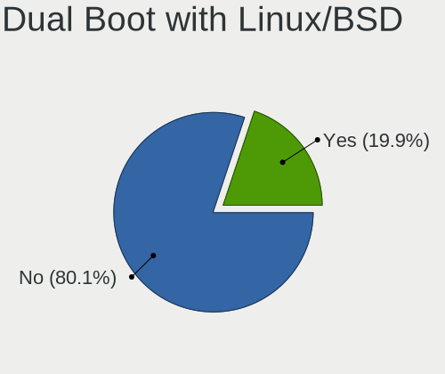
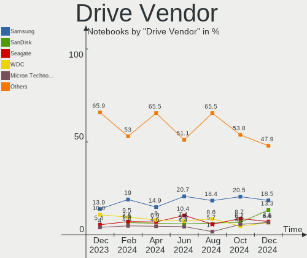
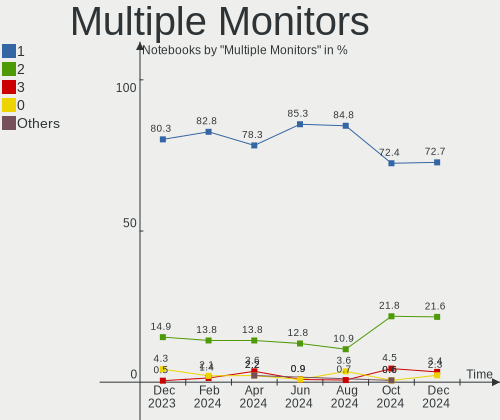
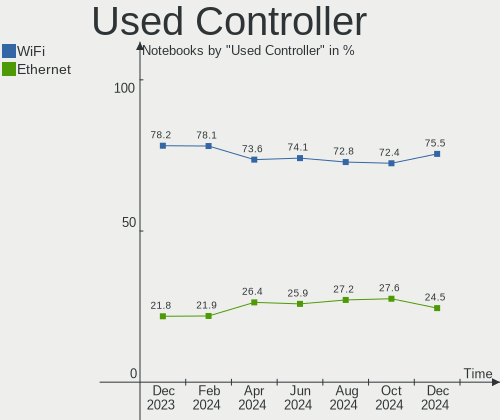
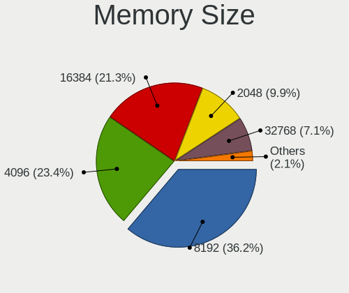

Linux in France - Hardware Trends (Notebooks)
---------------------------------------------

A project to identify most popular hardware characteristics and track their change
over time based on data collected by Linux users at https://Linux-Hardware.org.

Anyone can contribute to this report by the [hw-probe](https://github.com/linuxhw/hw-probe) tool:

    sudo -E hw-probe -all -upload

Period: Mar, 2023.

Contents
--------

* [ System ](#system)
  - [ OS                       ](#os)
  - [ OS Family                ](#os-family)
  - [ Kernel                   ](#kernel)
  - [ Kernel Family            ](#kernel-family)
  - [ Kernel Major Ver.        ](#kernel-major-ver)
  - [ Arch                     ](#arch)
  - [ DE                       ](#de)
  - [ Display Server           ](#display-server)
  - [ Display Manager          ](#display-manager)
  - [ OS Lang                  ](#os-lang)
  - [ Boot Mode                ](#boot-mode)
  - [ Filesystem               ](#filesystem)
  - [ Part. scheme             ](#part-scheme)
  - [ Dual Boot with Linux/BSD ](#dual-boot-with-linuxbsd)
  - [ Dual Boot (Win)          ](#dual-boot-win)

* [ Board ](#board)
  - [ Vendor                   ](#vendor)
  - [ Model                    ](#model)
  - [ Model Family             ](#model-family)
  - [ MFG Year                 ](#mfg-year)
  - [ Form Factor              ](#form-factor)
  - [ Secure Boot              ](#secure-boot)
  - [ Coreboot                 ](#coreboot)
  - [ RAM Size                 ](#ram-size)
  - [ RAM Used                 ](#ram-used)
  - [ Total Drives             ](#total-drives)
  - [ Has CD-ROM               ](#has-cd-rom)
  - [ Has Ethernet             ](#has-ethernet)
  - [ Has WiFi                 ](#has-wifi)
  - [ Has Bluetooth            ](#has-bluetooth)

* [ Location ](#location)
  - [ Country                  ](#country)
  - [ City                     ](#city)

* [ Drives ](#drives)
  - [ Drive Vendor             ](#drive-vendor)
  - [ Drive Model              ](#drive-model)
  - [ HDD Vendor               ](#hdd-vendor)
  - [ SSD Vendor               ](#ssd-vendor)
  - [ Drive Kind               ](#drive-kind)
  - [ Drive Connector          ](#drive-connector)
  - [ Drive Size               ](#drive-size)
  - [ Space Total              ](#space-total)
  - [ Space Used               ](#space-used)
  - [ Malfunc. Drives          ](#malfunc-drives)
  - [ Malfunc. Drive Vendor    ](#malfunc-drive-vendor)
  - [ Malfunc. HDD Vendor      ](#malfunc-hdd-vendor)
  - [ Malfunc. Drive Kind      ](#malfunc-drive-kind)
  - [ Failed Drives            ](#failed-drives)
  - [ Failed Drive Vendor      ](#failed-drive-vendor)
  - [ Drive Status             ](#drive-status)

* [ Storage controller ](#storage-controller)
  - [ Storage Vendor           ](#storage-vendor)
  - [ Storage Model            ](#storage-model)
  - [ Storage Kind             ](#storage-kind)

* [ Processor ](#processor)
  - [ CPU Vendor               ](#cpu-vendor)
  - [ CPU Model                ](#cpu-model)
  - [ CPU Model Family         ](#cpu-model-family)
  - [ CPU Cores                ](#cpu-cores)
  - [ CPU Sockets              ](#cpu-sockets)
  - [ CPU Threads              ](#cpu-threads)
  - [ CPU Op-Modes             ](#cpu-op-modes)
  - [ CPU Microcode            ](#cpu-microcode)
  - [ CPU Microarch            ](#cpu-microarch)

* [ Graphics ](#graphics)
  - [ GPU Vendor               ](#gpu-vendor)
  - [ GPU Model                ](#gpu-model)
  - [ GPU Combo                ](#gpu-combo)
  - [ GPU Driver               ](#gpu-driver)
  - [ GPU Memory               ](#gpu-memory)

* [ Monitor ](#monitor)
  - [ Monitor Vendor           ](#monitor-vendor)
  - [ Monitor Model            ](#monitor-model)
  - [ Monitor Resolution       ](#monitor-resolution)
  - [ Monitor Diagonal         ](#monitor-diagonal)
  - [ Monitor Width            ](#monitor-width)
  - [ Aspect Ratio             ](#aspect-ratio)
  - [ Monitor Area             ](#monitor-area)
  - [ Pixel Density            ](#pixel-density)
  - [ Multiple Monitors        ](#multiple-monitors)

* [ Network ](#network)
  - [ Net Controller Vendor    ](#net-controller-vendor)
  - [ Net Controller Model     ](#net-controller-model)
  - [ Wireless Vendor          ](#wireless-vendor)
  - [ Wireless Model           ](#wireless-model)
  - [ Ethernet Vendor          ](#ethernet-vendor)
  - [ Ethernet Model           ](#ethernet-model)
  - [ Net Controller Kind      ](#net-controller-kind)
  - [ Used Controller          ](#used-controller)
  - [ NICs                     ](#nics)
  - [ IPv6                     ](#ipv6)

* [ Bluetooth ](#bluetooth)
  - [ Bluetooth Vendor         ](#bluetooth-vendor)
  - [ Bluetooth Model          ](#bluetooth-model)

* [ Sound ](#sound)
  - [ Sound Vendor             ](#sound-vendor)
  - [ Sound Model              ](#sound-model)

* [ Memory ](#memory)
  - [ Memory Vendor            ](#memory-vendor)
  - [ Memory Model             ](#memory-model)
  - [ Memory Kind              ](#memory-kind)
  - [ Memory Form Factor       ](#memory-form-factor)
  - [ Memory Size              ](#memory-size)
  - [ Memory Speed             ](#memory-speed)

* [ Printers & scanners ](#printers--scanners)
  - [ Printer Vendor           ](#printer-vendor)
  - [ Printer Model            ](#printer-model)
  - [ Scanner Vendor           ](#scanner-vendor)
  - [ Scanner Model            ](#scanner-model)

* [ Camera ](#camera)
  - [ Camera Vendor            ](#camera-vendor)
  - [ Camera Model             ](#camera-model)

* [ Security ](#security)
  - [ Fingerprint Vendor       ](#fingerprint-vendor)
  - [ Fingerprint Model        ](#fingerprint-model)
  - [ Chipcard Vendor          ](#chipcard-vendor)
  - [ Chipcard Model           ](#chipcard-model)

* [ Unsupported ](#unsupported)
  - [ Unsupported Devices      ](#unsupported-devices)
  - [ Unsupported Device Types ](#unsupported-device-types)

System
------

OS
--

Installed operating systems

| Name                         | Notebooks | Percent |
|------------------------------|-----------|---------|
| Ubuntu 22.04                 | 40        | 21.86%  |
| OpenMandriva 23.03           | 14        | 7.65%   |
| OpenMandriva 23.01           | 13        | 7.1%    |
| Linux Mint 21.1              | 11        | 6.01%   |
| Ubuntu 22.10                 | 8         | 4.37%   |
| Ubuntu 20.04                 | 8         | 4.37%   |
| Fedora 37                    | 8         | 4.37%   |
| Debian 11                    | 7         | 3.83%   |
| Arch Rolling                 | 5         | 2.73%   |
| Pop!_OS 22.04                | 4         | 2.19%   |
| OpenMandriva 4.3             | 4         | 2.19%   |
| OpenMandriva 4.2             | 4         | 2.19%   |
| Linux Mint 20.3              | 4         | 2.19%   |
| Kubuntu 22.04                | 4         | 2.19%   |
| Debian 12                    | 4         | 2.19%   |
| Debian                       | 4         | 2.19%   |
| ArcoLinux Rolling            | 4         | 2.19%   |
| Zorin 16                     | 3         | 1.64%   |
| KDE neon 22.04               | 3         | 1.64%   |
| Xubuntu 18.04                | 2         | 1.09%   |
| Ubuntu MATE 22.04            | 2         | 1.09%   |
| SteamOS 3.4.6                | 2         | 1.09%   |
| openSUSE Tumbleweed-XXXXXXXX | 2         | 1.09%   |
| Linux Mint 21                | 2         | 1.09%   |
| Kubuntu 22.10                | 2         | 1.09%   |
| Gentoo 2.13                  | 2         | 1.09%   |
| Xubuntu 22.04                | 1         | 0.55%   |
| Ubuntu Studio 22.04          | 1         | 0.55%   |
| Ubuntu Budgie 22.10          | 1         | 0.55%   |
| Ubuntu Budgie 21.04          | 1         | 0.55%   |
| Ubuntu 18.04                 | 1         | 0.55%   |
| Pop!_OS 21.10                | 1         | 0.55%   |
| OpenMandriva 4.90            | 1         | 0.55%   |
| OpenMandriva 23.90           | 1         | 0.55%   |
| Manjaro 22.0.5               | 1         | 0.55%   |
| Lubuntu 22.10                | 1         | 0.55%   |
| Lubuntu 22.04                | 1         | 0.55%   |
| Linux Mint 19.3              | 1         | 0.55%   |
| Fedora 34                    | 1         | 0.55%   |
| Fedora 33                    | 1         | 0.55%   |

OS Family
---------

OS without a version

| Name          | Notebooks | Percent |
|---------------|-----------|---------|
| Ubuntu        | 57        | 31.15%  |
| OpenMandriva  | 37        | 20.22%  |
| Linux Mint    | 18        | 9.84%   |
| Debian        | 16        | 8.74%   |
| Fedora        | 10        | 5.46%   |
| Kubuntu       | 6         | 3.28%   |
| Pop!_OS       | 5         | 2.73%   |
| Arch          | 5         | 2.73%   |
| ArcoLinux     | 4         | 2.19%   |
| Zorin         | 3         | 1.64%   |
| Xubuntu       | 3         | 1.64%   |
| KDE neon      | 3         | 1.64%   |
| Ubuntu MATE   | 2         | 1.09%   |
| Ubuntu Budgie | 2         | 1.09%   |
| SteamOS       | 2         | 1.09%   |
| openSUSE      | 2         | 1.09%   |
| Lubuntu       | 2         | 1.09%   |
| Gentoo        | 2         | 1.09%   |
| Ubuntu Studio | 1         | 0.55%   |
| Manjaro       | 1         | 0.55%   |
| EndeavourOS   | 1         | 0.55%   |
| CentOS        | 1         | 0.55%   |

Kernel
------

Version of the Linux kernel

| Version                   | Notebooks | Percent |
|---------------------------|-----------|---------|
| 5.19.0-35-generic         | 31        | 16.94%  |
| 5.15.0-67-generic         | 21        | 11.48%  |
| 6.1.1-desktop-1omv2290    | 12        | 6.56%   |
| 6.2.6-desktop-1omv2390    | 9         | 4.92%   |
| 5.15.0-60-generic         | 7         | 3.83%   |
| 5.19.0-32-generic         | 6         | 3.28%   |
| 5.10.0-21-amd64           | 5         | 2.73%   |
| 6.2.2-desktop-1omv2390    | 4         | 2.19%   |
| 5.4.0-144-generic         | 4         | 2.19%   |
| 5.16.13-desktop-1omv4003  | 4         | 2.19%   |
| 5.15.0-69-generic         | 4         | 2.19%   |
| 5.10.14-desktop-1omv4002  | 4         | 2.19%   |
| 6.1.0-5-amd64             | 3         | 1.64%   |
| 5.19.0-38-generic         | 3         | 1.64%   |
| 5.19.0-31-generic         | 3         | 1.64%   |
| 6.2.7-200.fc37.x86_64     | 2         | 1.09%   |
| 6.2.5-arch1-1             | 2         | 1.09%   |
| 6.2.2-arch1-1             | 2         | 1.09%   |
| 6.2.0-76060200-generic    | 2         | 1.09%   |
| 6.1.18-200.fc37.x86_64    | 2         | 1.09%   |
| 6.1.14-200.fc37.x86_64    | 2         | 1.09%   |
| 6.1.13-200.fc37.x86_64    | 2         | 1.09%   |
| 6.0.0-0.deb11.6-amd64     | 2         | 1.09%   |
| 5.16.7-desktop-1omv4003   | 2         | 1.09%   |
| 5.15.0-67-lowlatency      | 2         | 1.09%   |
| 5.13.0-valve36-1-neptune  | 2         | 1.09%   |
| 4.15.0-206-generic        | 2         | 1.09%   |
| 6.2.8-arch1-1             | 1         | 0.55%   |
| 6.2.8                     | 1         | 0.55%   |
| 6.2.7-arch1-1             | 1         | 0.55%   |
| 6.2.6-76060206-generic    | 1         | 0.55%   |
| 6.2.6-1-default           | 1         | 0.55%   |
| 6.2.3-gentoo              | 1         | 0.55%   |
| 6.2.2-zen1-1-zen          | 1         | 0.55%   |
| 6.2.2-jason               | 1         | 0.55%   |
| 6.2.2-060202-generic      | 1         | 0.55%   |
| 6.2.1-desktop-1omv2390    | 1         | 0.55%   |
| 6.2.1-1-default           | 1         | 0.55%   |
| 6.1.8-1.el9.elrepo.x86_64 | 1         | 0.55%   |
| 6.1.19-gentoo-x86_64      | 1         | 0.55%   |

Kernel Family
-------------

Linux kernel without a distro release

| Version | Notebooks | Percent |
|---------|-----------|---------|
| 5.19.0  | 46        | 25.14%  |
| 5.15.0  | 38        | 20.77%  |
| 6.1.1   | 12        | 6.56%   |
| 6.2.6   | 11        | 6.01%   |
| 6.2.2   | 9         | 4.92%   |
| 5.10.0  | 7         | 3.83%   |
| 5.4.0   | 5         | 2.73%   |
| 6.1.0   | 4         | 2.19%   |
| 5.16.13 | 4         | 2.19%   |
| 5.10.14 | 4         | 2.19%   |
| 4.15.0  | 4         | 2.19%   |
| 6.2.7   | 3         | 1.64%   |
| 6.1.14  | 3         | 1.64%   |
| 6.2.8   | 2         | 1.09%   |
| 6.2.5   | 2         | 1.09%   |
| 6.2.1   | 2         | 1.09%   |
| 6.2.0   | 2         | 1.09%   |
| 6.1.18  | 2         | 1.09%   |
| 6.1.13  | 2         | 1.09%   |
| 6.0.0   | 2         | 1.09%   |
| 5.16.7  | 2         | 1.09%   |
| 5.14.0  | 2         | 1.09%   |
| 5.13.0  | 2         | 1.09%   |
| 5.11.0  | 2         | 1.09%   |
| 6.2.3   | 1         | 0.55%   |
| 6.1.8   | 1         | 0.55%   |
| 6.1.19  | 1         | 0.55%   |
| 6.1.15  | 1         | 0.55%   |
| 6.1.12  | 1         | 0.55%   |
| 6.1.11  | 1         | 0.55%   |
| 5.18.12 | 1         | 0.55%   |
| 5.18.10 | 1         | 0.55%   |
| 5.17.12 | 1         | 0.55%   |
| 5.15.94 | 1         | 0.55%   |
| 5.14.18 | 1         | 0.55%   |

Kernel Major Ver.
-----------------

Linux kernel major version

| Version | Notebooks | Percent |
|---------|-----------|---------|
| 5.19    | 46        | 25.14%  |
| 5.15    | 39        | 21.31%  |
| 6.2     | 32        | 17.49%  |
| 6.1     | 28        | 15.3%   |
| 5.10    | 11        | 6.01%   |
| 5.16    | 6         | 3.28%   |
| 5.4     | 5         | 2.73%   |
| 4.15    | 4         | 2.19%   |
| 5.14    | 3         | 1.64%   |
| 6.0     | 2         | 1.09%   |
| 5.18    | 2         | 1.09%   |
| 5.13    | 2         | 1.09%   |
| 5.11    | 2         | 1.09%   |
| 5.17    | 1         | 0.55%   |

Arch
----

OS architecture (x86_64, i586, etc.)

| Name   | Notebooks | Percent |
|--------|-----------|---------|
| x86_64 | 180       | 98.36%  |
| i686   | 3         | 1.64%   |

DE
--

Desktop Environment

| Name       | Notebooks | Percent |
|------------|-----------|---------|
| GNOME      | 72        | 39.34%  |
| KDE5       | 60        | 32.79%  |
| X-Cinnamon | 15        | 8.2%    |
| XFCE       | 11        | 6.01%   |
| MATE       | 7         | 3.83%   |
| Cinnamon   | 5         | 2.73%   |
| LXQt       | 3         | 1.64%   |
| awesome    | 3         | 1.64%   |
| Budgie     | 2         | 1.09%   |
| Unknown    | 2         | 1.09%   |
| sway       | 1         | 0.55%   |
| i3         | 1         | 0.55%   |
| GNUstep    | 1         | 0.55%   |

Display Server
--------------

X11 or Wayland

| Name    | Notebooks | Percent |
|---------|-----------|---------|
| X11     | 132       | 72.13%  |
| Wayland | 50        | 27.32%  |
| Unknown | 1         | 0.55%   |

Display Manager
---------------

SDDM, LightDM, etc.

| Name    | Notebooks | Percent |
|---------|-----------|---------|
| SDDM    | 57        | 31.15%  |
| GDM3    | 50        | 27.32%  |
| Unknown | 32        | 17.49%  |
| LightDM | 29        | 15.85%  |
| GDM     | 13        | 7.1%    |
| LXDM    | 1         | 0.55%   |
| GREETD  | 1         | 0.55%   |

OS Lang
-------

Language

| Lang  | Notebooks | Percent |
|-------|-----------|---------|
| fr_FR | 131       | 71.58%  |
| en_US | 46        | 25.14%  |
| en_GB | 3         | 1.64%   |
| zh_CN | 1         | 0.55%   |
| oc_FR | 1         | 0.55%   |
| de_DE | 1         | 0.55%   |

Boot Mode
---------

EFI or BIOS

| Mode | Notebooks | Percent |
|------|-----------|---------|
| EFI  | 109       | 59.56%  |
| BIOS | 74        | 40.44%  |

Filesystem
----------

Type of filesystem

| Type    | Notebooks | Percent |
|---------|-----------|---------|
| Ext4    | 145       | 79.23%  |
| Btrfs   | 20        | 10.93%  |
| Overlay | 13        | 7.1%    |
| Xfs     | 3         | 1.64%   |
| Zfs     | 2         | 1.09%   |

Part. scheme
------------

Scheme of partitioning

| Type    | Notebooks | Percent |
|---------|-----------|---------|
| GPT     | 124       | 67.76%  |
| Unknown | 34        | 18.58%  |
| MBR     | 25        | 13.66%  |

Dual Boot with Linux/BSD
------------------------

Hosting more than one Linux/BSD

| Dual boot | Notebooks | Percent |
|-----------|-----------|---------|
| No        | 156       | 85.25%  |
| Yes       | 27        | 14.75%  |

Dual Boot (Win)
---------------

Hosting Linux and Windows

| Dual boot | Notebooks | Percent |
|-----------|-----------|---------|
| No        | 129       | 70.49%  |
| Yes       | 54        | 29.51%  |

Board
-----

Vendor
------

Motherboard manufacturer

| Name                | Notebooks | Percent |
|---------------------|-----------|---------|
| Dell                | 37        | 20.22%  |
| Lenovo              | 31        | 16.94%  |
| Hewlett-Packard     | 30        | 16.39%  |
| ASUSTek Computer    | 26        | 14.21%  |
| Acer                | 15        | 8.2%    |
| Toshiba             | 9         | 4.92%   |
| MSI                 | 4         | 2.19%   |
| Notebook            | 3         | 1.64%   |
| HUAWEI              | 3         | 1.64%   |
| Fujitsu Siemens     | 3         | 1.64%   |
| Valve               | 2         | 1.09%   |
| TUXEDO              | 2         | 1.09%   |
| Sony                | 2         | 1.09%   |
| Packard Bell        | 2         | 1.09%   |
| Chuwi               | 2         | 1.09%   |
| Apple               | 2         | 1.09%   |
| Unknown             | 2         | 1.09%   |
| System76            | 1         | 0.55%   |
| Samsung Electronics | 1         | 0.55%   |
| LG Electronics      | 1         | 0.55%   |
| Google              | 1         | 0.55%   |
| Fujitsu             | 1         | 0.55%   |
| BESSTAR Tech        | 1         | 0.55%   |
| AZW                 | 1         | 0.55%   |
| Alienware           | 1         | 0.55%   |

Model
-----

Motherboard model

| Name                                | Notebooks | Percent |
|-------------------------------------|-----------|---------|
| Dell XPS 15 9570                    | 3         | 1.64%   |
| Valve Jupiter                       | 2         | 1.09%   |
| HP ZBook 17 G3                      | 2         | 1.09%   |
| HP EliteBook 840 G8 Notebook PC     | 2         | 1.09%   |
| Dell XPS 15 9510                    | 2         | 1.09%   |
| Dell Precision 5570                 | 2         | 1.09%   |
| Dell Latitude 5520                  | 2         | 1.09%   |
| ASUS VivoBook_ASUSLaptop X513UA     | 2         | 1.09%   |
| Unknown                             | 2         | 1.09%   |
| TUXEDO Pulse 14 Gen1                | 1         | 0.55%   |
| TUXEDO InfinityBook S 14 Gen6       | 1         | 0.55%   |
| Toshiba TECRA Z40-A                 | 1         | 0.55%   |
| Toshiba Satellite Pro L500          | 1         | 0.55%   |
| Toshiba Satellite Pro C50-A-1EM     | 1         | 0.55%   |
| Toshiba Satellite P200              | 1         | 0.55%   |
| Toshiba Satellite L300              | 1         | 0.55%   |
| Toshiba Satellite C870-198          | 1         | 0.55%   |
| Toshiba Satellite C55-A-1T6         | 1         | 0.55%   |
| Toshiba PORTEGE Z30-B               | 1         | 0.55%   |
| Toshiba KIRA                        | 1         | 0.55%   |
| System76 Gazelle Professional       | 1         | 0.55%   |
| Sony SVF1521C2EW                    | 1         | 0.55%   |
| Sony SVE1513I4E                     | 1         | 0.55%   |
| Samsung 350V5C/351V5C/3540VC/3440VC | 1         | 0.55%   |
| Packard Bell H17HV                  | 1         | 0.55%   |
| Packard Bell EasyNote SB65          | 1         | 0.55%   |
| Notebook NS50_70MU                  | 1         | 0.55%   |
| Notebook NL40_50GU                  | 1         | 0.55%   |
| Notebook NL40_50CU                  | 1         | 0.55%   |
| MSI MS-7C80                         | 1         | 0.55%   |
| MSI GV62 7RE                        | 1         | 0.55%   |
| MSI GP62 6QE                        | 1         | 0.55%   |
| MSI GF63 Thin 10SCSR                | 1         | 0.55%   |
| LG R580-K.APC4BE1                   | 1         | 0.55%   |
| Lenovo V15-ADA 82C7                 | 1         | 0.55%   |
| Lenovo V145-15AST 81MT              | 1         | 0.55%   |
| Lenovo U41-70 80JV                  | 1         | 0.55%   |
| Lenovo ThinkPad X270 20HMS4EC0D     | 1         | 0.55%   |
| Lenovo ThinkPad X250 20CL001LMB     | 1         | 0.55%   |
| Lenovo ThinkPad X230 2325BA3        | 1         | 0.55%   |

Model Family
------------

Motherboard model prefix

| Name                  | Notebooks | Percent |
|-----------------------|-----------|---------|
| Dell Latitude         | 15        | 8.2%    |
| Lenovo ThinkPad       | 14        | 7.65%   |
| Acer Aspire           | 13        | 7.1%    |
| ASUS VivoBook         | 11        | 6.01%   |
| Lenovo IdeaPad        | 8         | 4.37%   |
| HP EliteBook          | 8         | 4.37%   |
| Dell Precision        | 8         | 4.37%   |
| HP Pavilion           | 7         | 3.83%   |
| Dell XPS              | 7         | 3.83%   |
| Toshiba Satellite     | 6         | 3.28%   |
| HP Laptop             | 5         | 2.73%   |
| HP ZBook              | 4         | 2.19%   |
| Dell Inspiron         | 4         | 2.19%   |
| Dell Vostro           | 3         | 1.64%   |
| Valve Jupiter         | 2         | 1.09%   |
| Notebook NL40         | 2         | 1.09%   |
| Lenovo Legion         | 2         | 1.09%   |
| HP OMEN               | 2         | 1.09%   |
| Unknown               | 2         | 1.09%   |
| TUXEDO Pulse          | 1         | 0.55%   |
| TUXEDO InfinityBook   | 1         | 0.55%   |
| Toshiba TECRA         | 1         | 0.55%   |
| Toshiba PORTEGE       | 1         | 0.55%   |
| Toshiba KIRA          | 1         | 0.55%   |
| System76 Gazelle      | 1         | 0.55%   |
| Sony SVF1521C2EW      | 1         | 0.55%   |
| Sony SVE1513I4E       | 1         | 0.55%   |
| Samsung 350V5C        | 1         | 0.55%   |
| Packard Bell H17HV    | 1         | 0.55%   |
| Packard Bell EasyNote | 1         | 0.55%   |
| Notebook NS50         | 1         | 0.55%   |
| MSI MS-7C80           | 1         | 0.55%   |
| MSI GV62              | 1         | 0.55%   |
| MSI GP62              | 1         | 0.55%   |
| MSI GF63              | 1         | 0.55%   |
| LG R580-K.APC4BE1     | 1         | 0.55%   |
| Lenovo V15-ADA        | 1         | 0.55%   |
| Lenovo V145-15AST     | 1         | 0.55%   |
| Lenovo U41-70         | 1         | 0.55%   |
| Lenovo G700           | 1         | 0.55%   |

MFG Year
--------

Motherboard manufacture year

| Year | Notebooks | Percent |
|------|-----------|---------|
| 2021 | 22        | 12.02%  |
| 2022 | 21        | 11.48%  |
| 2018 | 17        | 9.29%   |
| 2020 | 16        | 8.74%   |
| 2019 | 15        | 8.2%    |
| 2015 | 15        | 8.2%    |
| 2016 | 12        | 6.56%   |
| 2013 | 11        | 6.01%   |
| 2017 | 9         | 4.92%   |
| 2012 | 9         | 4.92%   |
| 2010 | 7         | 3.83%   |
| 2009 | 7         | 3.83%   |
| 2008 | 7         | 3.83%   |
| 2014 | 5         | 2.73%   |
| 2011 | 5         | 2.73%   |
| 2007 | 3         | 1.64%   |
| 2006 | 2         | 1.09%   |

Form Factor
-----------

Physical design of the computer

| Name     | Notebooks | Percent |
|----------|-----------|---------|
| Notebook | 183       | 100%    |

Secure Boot
-----------

Enabled or disabled

| State    | Notebooks | Percent |
|----------|-----------|---------|
| Disabled | 169       | 92.35%  |
| Enabled  | 14        | 7.65%   |

Coreboot
--------

Have coreboot on board

| Used | Notebooks | Percent |
|------|-----------|---------|
| No   | 182       | 99.45%  |
| Yes  | 1         | 0.55%   |

RAM Size
--------

Total RAM memory

| Size in GB  | Notebooks | Percent |
|-------------|-----------|---------|
| 4.01-8.0    | 43        | 23.5%   |
| 3.01-4.0    | 39        | 21.31%  |
| 8.01-16.0   | 32        | 17.49%  |
| 16.01-24.0  | 29        | 15.85%  |
| 32.01-64.0  | 22        | 12.02%  |
| 1.01-2.0    | 6         | 3.28%   |
| 2.01-3.0    | 5         | 2.73%   |
| 64.01-256.0 | 4         | 2.19%   |
| 24.01-32.0  | 3         | 1.64%   |

RAM Used
--------

Used RAM memory

| Used GB    | Notebooks | Percent |
|------------|-----------|---------|
| 1.01-2.0   | 63        | 34.43%  |
| 2.01-3.0   | 45        | 24.59%  |
| 4.01-8.0   | 31        | 16.94%  |
| 3.01-4.0   | 25        | 13.66%  |
| 8.01-16.0  | 9         | 4.92%   |
| 0.51-1.0   | 6         | 3.28%   |
| 16.01-24.0 | 3         | 1.64%   |
| 32.01-64.0 | 1         | 0.55%   |

Total Drives
------------

Number of drives on board

| Drives | Notebooks | Percent |
|--------|-----------|---------|
| 1      | 135       | 73.77%  |
| 2      | 39        | 21.31%  |
| 3      | 8         | 4.37%   |
| 6      | 1         | 0.55%   |

Has CD-ROM
----------

Has CD-ROM on board

| Presented | Notebooks | Percent |
|-----------|-----------|---------|
| No        | 129       | 70.49%  |
| Yes       | 54        | 29.51%  |

Has Ethernet
------------

Has Ethernet on board

| Presented | Notebooks | Percent |
|-----------|-----------|---------|
| Yes       | 142       | 77.6%   |
| No        | 41        | 22.4%   |

Has WiFi
--------

Has WiFi module

| Presented | Notebooks | Percent |
|-----------|-----------|---------|
| Yes       | 179       | 97.81%  |
| No        | 4         | 2.19%   |

Has Bluetooth
-------------

Has Bluetooth module

| Presented | Notebooks | Percent |
|-----------|-----------|---------|
| Yes       | 148       | 80.87%  |
| No        | 35        | 19.13%  |

Location
--------

Country
-------

Geographic location (country)

| Country | Notebooks | Percent |
|---------|-----------|---------|
| France  | 183       | 100%    |

City
----

Geographic location (city)

| City                     | Notebooks | Percent |
|--------------------------|-----------|---------|
| Paris                    | 32        | 17.49%  |
| Poitiers                 | 4         | 2.19%   |
| Nantes                   | 4         | 2.19%   |
| Strasbourg               | 3         | 1.64%   |
| Roubaix                  | 3         | 1.64%   |
| Rennes                   | 3         | 1.64%   |
| Roquebilliere            | 2         | 1.09%   |
| Rambouillet              | 2         | 1.09%   |
| Marseille                | 2         | 1.09%   |
| Lyon                     | 2         | 1.09%   |
| Grenoble                 | 2         | 1.09%   |
| Gennevilliers            | 2         | 1.09%   |
| Échirolles              | 2         | 1.09%   |
| Clamart                  | 2         | 1.09%   |
| Châtenay-Malabry        | 2         | 1.09%   |
| Cergy                    | 2         | 1.09%   |
| Blois                    | 2         | 1.09%   |
| Angers                   | 2         | 1.09%   |
| Wasquehal                | 1         | 0.55%   |
| Vitry-sur-Seine          | 1         | 0.55%   |
| Villerupt                | 1         | 0.55%   |
| Villerbon                | 1         | 0.55%   |
| Villeneuve-Saint-Georges | 1         | 0.55%   |
| Villeneuve-d'Ascq        | 1         | 0.55%   |
| Vendres                  | 1         | 0.55%   |
| Vallenay                 | 1         | 0.55%   |
| Ussel-dAllier            | 1         | 0.55%   |
| Trelaze                  | 1         | 0.55%   |
| Tours                    | 1         | 0.55%   |
| Tournefeuille            | 1         | 0.55%   |
| Toulouse                 | 1         | 0.55%   |
| Toulon                   | 1         | 0.55%   |
| Thiers-sur-Theve         | 1         | 0.55%   |
| Templeuve-en-Pevele      | 1         | 0.55%   |
| Tarbes                   | 1         | 0.55%   |
| Sèvres                  | 1         | 0.55%   |
| Sassenage                | 1         | 0.55%   |
| Saint-Renan              | 1         | 0.55%   |
| Saint-Quentin-Fallavier  | 1         | 0.55%   |
| Saint-Pont               | 1         | 0.55%   |

Drives
------

Drive Vendor
------------

Hard drive vendors

| Vendor                  | Notebooks | Drives | Percent |
|-------------------------|-----------|--------|---------|
| Samsung Electronics     | 41        | 46     | 17.98%  |
| WDC                     | 24        | 27     | 10.53%  |
| Toshiba                 | 19        | 19     | 8.33%   |
| Seagate                 | 17        | 18     | 7.46%   |
| Unknown                 | 15        | 15     | 6.58%   |
| SK hynix                | 12        | 12     | 5.26%   |
| Crucial                 | 12        | 12     | 5.26%   |
| Sandisk                 | 11        | 11     | 4.82%   |
| Micron Technology       | 11        | 11     | 4.82%   |
| HGST                    | 11        | 11     | 4.82%   |
| Intel                   | 7         | 7      | 3.07%   |
| Kingston                | 6         | 7      | 2.63%   |
| Hitachi                 | 5         | 5      | 2.19%   |
| Netac                   | 3         | 3      | 1.32%   |
| Intenso                 | 3         | 3      | 1.32%   |
| Transcend               | 2         | 2      | 0.88%   |
| SSSTC                   | 2         | 2      | 0.88%   |
| LDLC                    | 2         | 2      | 0.88%   |
| Fujitsu                 | 2         | 2      | 0.88%   |
| Corsair                 | 2         | 2      | 0.88%   |
| China                   | 2         | 2      | 0.88%   |
| YMTC                    | 1         | 1      | 0.44%   |
| Union Memory (Shenzhen) | 1         | 1      | 0.44%   |
| Teclast                 | 1         | 1      | 0.44%   |
| SPCC                    | 1         | 1      | 0.44%   |
| Silicon Motion          | 1         | 1      | 0.44%   |
| Plextor                 | 1         | 1      | 0.44%   |
| Phison Electronics      | 1         | 1      | 0.44%   |
| Phison                  | 1         | 1      | 0.44%   |
| OCZ                     | 1         | 1      | 0.44%   |
| LITEON                  | 1         | 1      | 0.44%   |
| KIOXIA                  | 1         | 1      | 0.44%   |
| JMicron Technology      | 1         | 1      | 0.44%   |
| Fanxiang                | 1         | 1      | 0.44%   |
| Emtec                   | 1         | 1      | 0.44%   |
| Dogfish                 | 1         | 1      | 0.44%   |
| BHT                     | 1         | 1      | 0.44%   |
| ASENNO                  | 1         | 1      | 0.44%   |
| Apple                   | 1         | 1      | 0.44%   |
| Unknown                 | 1         | 1      | 0.44%   |

Drive Model
-----------

Hard drive models

| Model                                              | Notebooks | Percent |
|----------------------------------------------------|-----------|---------|
| Seagate ST1000LM035-1RK172 1TB                     | 5         | 2.1%    |
| Unknown MMC Card  128GB                            | 4         | 1.68%   |
| Toshiba MQ04ABF100 1TB                             | 4         | 1.68%   |
| Samsung PM9A1 NVMe 1024GB                          | 3         | 1.26%   |
| Samsung NVMe SSD Controller PM9A1/PM9A3/980PRO 1TB | 3         | 1.26%   |
| Netac SSD 256GB                                    | 3         | 1.26%   |
| HGST HTS721010A9E630 1TB                           | 3         | 1.26%   |
| WDC WD3200BEKT-60V5T1 320GB                        | 2         | 0.84%   |
| WDC WD10SPZX-00Z10T0 1TB                           | 2         | 0.84%   |
| WDC PC SN530 SDBPNPZ-1T00-1002 1TB                 | 2         | 0.84%   |
| Unknown MMC Card  64GB                             | 2         | 0.84%   |
| Toshiba THNSNJ256GMCU 256GB SSD                    | 2         | 0.84%   |
| Toshiba MQ01ABF050 500GB                           | 2         | 0.84%   |
| Toshiba KXG50ZNV512G NVMe 512GB                    | 2         | 0.84%   |
| SK hynix SC311 SATA 512GB SSD                      | 2         | 0.84%   |
| SK hynix PC801 NVMe 1TB                            | 2         | 0.84%   |
| SK hynix PC711 NVMe 1TB                            | 2         | 0.84%   |
| SK hynix HFM512GD3JX013N 512GB                     | 2         | 0.84%   |
| Seagate ST1000LM024 HN-M101MBB 1TB                 | 2         | 0.84%   |
| Samsung SSD 980 1TB                                | 2         | 0.84%   |
| Samsung SSD 970 EVO Plus 1TB                       | 2         | 0.84%   |
| Samsung SSD 870 QVO 1TB                            | 2         | 0.84%   |
| Samsung SSD 860 EVO 1TB                            | 2         | 0.84%   |
| Samsung MZVLQ512HBLU-00BH1 512GB                   | 2         | 0.84%   |
| Micron MTFDKCD1T0TFK 1TB                           | 2         | 0.84%   |
| Micron 2200_MTFDHBA512TCK 512GB                    | 2         | 0.84%   |
| Intel SSDPEKNU512GZH 512GB                         | 2         | 0.84%   |
| HGST HTS545050A7E380 500GB                         | 2         | 0.84%   |
| Crucial CT500MX500SSD1 500GB                       | 2         | 0.84%   |
| Crucial CT1000MX500SSD1 1TB                        | 2         | 0.84%   |
| Corsair Force 3 SSD 120GB                          | 2         | 0.84%   |
| YMTC PC005 512GB                                   | 1         | 0.42%   |
| WDC WD7500BPKT-22PK4T0 752GB                       | 1         | 0.42%   |
| WDC WD5000LPCX-60VHAT1 500GB                       | 1         | 0.42%   |
| WDC WD3200BEVT-26ZCT0 320GB                        | 1         | 0.42%   |
| WDC WD32 00BEKX-75B7WT0 320GB                      | 1         | 0.42%   |
| WDC WD2500BEVT-75A23T0 250GB                       | 1         | 0.42%   |
| WDC WD2500BEVS-60UST0 250GB                        | 1         | 0.42%   |
| WDC WD1600BEVS-22RST0 160GB                        | 1         | 0.42%   |
| WDC WD16 00BEVT-60ZCT 160GB                        | 1         | 0.42%   |

HDD Vendor
----------

Hard disk drive vendors

| Vendor  | Notebooks | Drives | Percent |
|---------|-----------|--------|---------|
| WDC     | 16        | 18     | 25.4%   |
| Seagate | 16        | 16     | 25.4%   |
| Toshiba | 12        | 12     | 19.05%  |
| HGST    | 11        | 11     | 17.46%  |
| Hitachi | 5         | 5      | 7.94%   |
| Fujitsu | 2         | 2      | 3.17%   |
| Unknown | 1         | 1      | 1.59%   |

SSD Vendor
----------

Solid state drive vendors

| Vendor              | Notebooks | Drives | Percent |
|---------------------|-----------|--------|---------|
| Samsung Electronics | 19        | 20     | 26.03%  |
| Crucial             | 10        | 10     | 13.7%   |
| SanDisk             | 7         | 7      | 9.59%   |
| SK hynix            | 4         | 4      | 5.48%   |
| Kingston            | 4         | 5      | 5.48%   |
| Netac               | 3         | 3      | 4.11%   |
| Intenso             | 3         | 3      | 4.11%   |
| Transcend           | 2         | 2      | 2.74%   |
| Toshiba             | 2         | 2      | 2.74%   |
| Micron Technology   | 2         | 2      | 2.74%   |
| LDLC                | 2         | 2      | 2.74%   |
| Corsair             | 2         | 2      | 2.74%   |
| China               | 2         | 2      | 2.74%   |
| Teclast             | 1         | 1      | 1.37%   |
| Plextor             | 1         | 1      | 1.37%   |
| OCZ                 | 1         | 1      | 1.37%   |
| LITEON              | 1         | 1      | 1.37%   |
| Intel               | 1         | 1      | 1.37%   |
| Fanxiang            | 1         | 1      | 1.37%   |
| Emtec               | 1         | 1      | 1.37%   |
| Dogfish             | 1         | 1      | 1.37%   |
| BHT                 | 1         | 1      | 1.37%   |
| ASENNO              | 1         | 1      | 1.37%   |
| Apple               | 1         | 1      | 1.37%   |

Drive Kind
----------

HDD or SSD

| Kind    | Notebooks | Drives | Percent |
|---------|-----------|--------|---------|
| NVMe    | 75        | 82     | 34.88%  |
| SSD     | 66        | 75     | 30.7%   |
| HDD     | 59        | 65     | 27.44%  |
| MMC     | 13        | 14     | 6.05%   |
| Unknown | 2         | 2      | 0.93%   |

Drive Connector
---------------

SATA, SAS, NVMe, etc.

| Type | Notebooks | Drives | Percent |
|------|-----------|--------|---------|
| SATA | 113       | 132    | 53.81%  |
| NVMe | 75        | 82     | 35.71%  |
| MMC  | 13        | 14     | 6.19%   |
| SAS  | 9         | 10     | 4.29%   |

Drive Size
----------

Size of hard drive

| Size in TB | Notebooks | Drives | Percent |
|------------|-----------|--------|---------|
| 0.01-0.5   | 82        | 89     | 62.6%   |
| 0.51-1.0   | 43        | 45     | 32.82%  |
| 1.01-2.0   | 6         | 6      | 4.58%   |

Space Total
-----------

Amount of disk space available on the file system

| Size in GB     | Notebooks | Percent |
|----------------|-----------|---------|
| 251-500        | 43        | 23.5%   |
| 101-250        | 43        | 23.5%   |
| 501-1000       | 37        | 20.22%  |
| 1001-2000      | 12        | 6.56%   |
| 1-20           | 12        | 6.56%   |
| 21-50          | 11        | 6.01%   |
| 51-100         | 11        | 6.01%   |
| 2001-3000      | 8         | 4.37%   |
| More than 3000 | 4         | 2.19%   |
| Unknown        | 2         | 1.09%   |

Space Used
----------

Amount of used disk space

| Used GB        | Notebooks | Percent |
|----------------|-----------|---------|
| 1-20           | 58        | 31.69%  |
| 21-50          | 36        | 19.67%  |
| 51-100         | 29        | 15.85%  |
| 101-250        | 24        | 13.11%  |
| 501-1000       | 16        | 8.74%   |
| 251-500        | 11        | 6.01%   |
| 1001-2000      | 5         | 2.73%   |
| Unknown        | 2         | 1.09%   |
| More than 3000 | 1         | 0.55%   |
| 2001-3000      | 1         | 0.55%   |

Malfunc. Drives
---------------

Drive models with a malfunction

| Model                                               | Notebooks | Drives | Percent |
|-----------------------------------------------------|-----------|--------|---------|
| Seagate ST1000LM024 HN-M101MBB 1TB                  | 2         | 2      | 10%     |
| WDC WD2500BEVS-60UST0 250GB                         | 1         | 1      | 5%      |
| Toshiba MQ01ABF050 500GB                            | 1         | 1      | 5%      |
| Toshiba MK2555GSX 250GB                             | 1         | 1      | 5%      |
| Toshiba MK1637GSX 160GB                             | 1         | 1      | 5%      |
| Toshiba HDWL110 1TB                                 | 1         | 1      | 5%      |
| Seagate ST9250827AS 250GB                           | 1         | 1      | 5%      |
| Samsung Electronics SSD 980 1TB                     | 1         | 1      | 5%      |
| Netac SSD 256GB                                     | 1         | 1      | 5%      |
| Micron Technology MTFDDAK256MAY-1AH1ZABHA 256GB SSD | 1         | 1      | 5%      |
| Kingston RBU-SMSM151S324GD 24GB SSD                 | 1         | 1      | 5%      |
| Intenso SSD Sata III 120GB                          | 1         | 1      | 5%      |
| Intel SSDSCKKF256G8H 256GB                          | 1         | 1      | 5%      |
| Hitachi HTS725032A9A364 320GB                       | 1         | 1      | 5%      |
| Hitachi HTS421210H9AT00 100GB                       | 1         | 1      | 5%      |
| HGST HTS725032A7E630 320GB                          | 1         | 1      | 5%      |
| HGST HTS721010A9E630 1TB                            | 1         | 1      | 5%      |
| HGST HTS545050A7E380 500GB                          | 1         | 1      | 5%      |
| Fujitsu MJA2250BH G2 250GB                          | 1         | 1      | 5%      |

Malfunc. Drive Vendor
---------------------

Vendors of faulty drives

| Vendor              | Notebooks | Drives | Percent |
|---------------------|-----------|--------|---------|
| Toshiba             | 4         | 4      | 20%     |
| Seagate             | 3         | 3      | 15%     |
| HGST                | 3         | 3      | 15%     |
| Hitachi             | 2         | 2      | 10%     |
| WDC                 | 1         | 1      | 5%      |
| Samsung Electronics | 1         | 1      | 5%      |
| Netac               | 1         | 1      | 5%      |
| Micron Technology   | 1         | 1      | 5%      |
| Kingston            | 1         | 1      | 5%      |
| Intenso             | 1         | 1      | 5%      |
| Intel               | 1         | 1      | 5%      |
| Fujitsu             | 1         | 1      | 5%      |

Malfunc. HDD Vendor
-------------------

Vendors of faulty HDD drives

| Vendor  | Notebooks | Drives | Percent |
|---------|-----------|--------|---------|
| Toshiba | 4         | 4      | 28.57%  |
| Seagate | 3         | 3      | 21.43%  |
| HGST    | 3         | 3      | 21.43%  |
| Hitachi | 2         | 2      | 14.29%  |
| WDC     | 1         | 1      | 7.14%   |
| Fujitsu | 1         | 1      | 7.14%   |

Malfunc. Drive Kind
-------------------

Kinds of faulty drives

| Kind | Notebooks | Drives | Percent |
|------|-----------|--------|---------|
| HDD  | 14        | 14     | 70%     |
| SSD  | 5         | 5      | 25%     |
| NVMe | 1         | 1      | 5%      |

Failed Drives
-------------

Failed drive models

Zero info for selected period =(

Failed Drive Vendor
-------------------

Failed drive vendors

Zero info for selected period =(

Drive Status
------------

Number of failed and malfunc. drives

| Status   | Notebooks | Drives | Percent |
|----------|-----------|--------|---------|
| Works    | 107       | 129    | 55.44%  |
| Detected | 67        | 89     | 34.72%  |
| Malfunc  | 19        | 20     | 9.84%   |

Storage controller
------------------

Storage Vendor
--------------

Storage controller vendors

| Vendor                         | Notebooks | Percent |
|--------------------------------|-----------|---------|
| Intel                          | 131       | 55.98%  |
| Samsung Electronics            | 25        | 10.68%  |
| AMD                            | 25        | 10.68%  |
| SanDisk                        | 13        | 5.56%   |
| Micron Technology              | 9         | 3.85%   |
| SK hynix                       | 8         | 3.42%   |
| Toshiba America Info Systems   | 5         | 2.14%   |
| Solid State Storage Technology | 2         | 0.85%   |
| Phison Electronics             | 2         | 0.85%   |
| Micron/Crucial Technology      | 2         | 0.85%   |
| Kingston Technology Company    | 2         | 0.85%   |
| Yangtze Memory Technologies    | 1         | 0.43%   |
| Union Memory (Shenzhen)        | 1         | 0.43%   |
| Silicon Motion                 | 1         | 0.43%   |
| Seagate Technology             | 1         | 0.43%   |
| Realtek Semiconductor          | 1         | 0.43%   |
| Nvidia                         | 1         | 0.43%   |
| KIOXIA                         | 1         | 0.43%   |
| JMicron Technology             | 1         | 0.43%   |
| INNOGRIT                       | 1         | 0.43%   |
| ASMedia Technology             | 1         | 0.43%   |

Storage Model
-------------

Storage controller models

| Model                                                                          | Notebooks | Percent |
|--------------------------------------------------------------------------------|-----------|---------|
| AMD FCH SATA Controller [AHCI mode]                                            | 20        | 8%      |
| Intel Volume Management Device NVMe RAID Controller                            | 12        | 4.8%    |
| Intel 7 Series Chipset Family 6-port SATA Controller [AHCI mode]               | 11        | 4.4%    |
| Intel Sunrise Point-LP SATA Controller [AHCI mode]                             | 10        | 4%      |
| Intel 82801 Mobile SATA Controller [RAID mode]                                 | 10        | 4%      |
| Samsung NVMe SSD Controller PM9A1/PM9A3/980PRO                                 | 9         | 3.6%    |
| Micron NVMe Storage Controller                                                 | 9         | 3.6%    |
| Intel 82801IBM/IEM (ICH9M/ICH9M-E) 4 port SATA Controller [AHCI mode]          | 9         | 3.6%    |
| Intel Wildcat Point-LP SATA Controller [AHCI Mode]                             | 8         | 3.2%    |
| Samsung NVMe SSD Controller SM981/PM981/PM983                                  | 7         | 2.8%    |
| Samsung NVMe SSD Controller 980                                                | 7         | 2.8%    |
| Intel Cannon Lake Mobile PCH SATA AHCI Controller                              | 7         | 2.8%    |
| SK hynix Gold P31/PC711 NVMe Solid State Drive                                 | 6         | 2.4%    |
| Intel HM170/QM170 Chipset SATA Controller [AHCI Mode]                          | 6         | 2.4%    |
| Intel Q170/Q150/B150/H170/H110/Z170/CM236 Chipset SATA Controller [AHCI Mode]  | 5         | 2%      |
| Intel Celeron/Pentium Silver Processor SATA Controller                         | 5         | 2%      |
| Intel 82801HM/HEM (ICH8M/ICH8M-E) IDE Controller                               | 5         | 2%      |
| Intel 8 Series/C220 Series Chipset Family 6-port SATA Controller 1 [AHCI mode] | 5         | 2%      |
| AMD SB7x0/SB8x0/SB9x0 SATA Controller [AHCI mode]                              | 5         | 2%      |
| Intel Non-Volatile memory controller                                           | 4         | 1.6%    |
| Intel 82801HM/HEM (ICH8M/ICH8M-E) SATA Controller [AHCI mode]                  | 4         | 1.6%    |
| Intel 5 Series/3400 Series Chipset 4 port SATA AHCI Controller                 | 4         | 1.6%    |
| Toshiba America Info Systems XG5 NVMe SSD Controller                           | 3         | 1.2%    |
| SanDisk WD Blue SN550 NVMe SSD                                                 | 3         | 1.2%    |
| SanDisk WD Blue SN500 / PC SN520 NVMe SSD                                      | 3         | 1.2%    |
| Samsung NVMe SSD Controller SM961/PM961/SM963                                  | 3         | 1.2%    |
| Intel Comet Lake SATA AHCI Controller                                          | 3         | 1.2%    |
| Intel Celeron N3350/Pentium N4200/Atom E3900 Series SATA AHCI Controller       | 3         | 1.2%    |
| Intel Atom Processor E3800 Series SATA AHCI Controller                         | 3         | 1.2%    |
| Intel 8 Series SATA Controller 1 [AHCI mode]                                   | 3         | 1.2%    |
| Intel 6 Series/C200 Series Chipset Family 6 port Mobile SATA AHCI Controller   | 3         | 1.2%    |
| Intel 400 Series Chipset Family SATA AHCI Controller                           | 3         | 1.2%    |
| Solid State Storage Non-Volatile memory controller                             | 2         | 0.8%    |
| SK hynix Platinum P41 NVMe Solid State Drive 2TB                               | 2         | 0.8%    |
| SanDisk WD Black SN750 / PC SN730 NVMe SSD                                     | 2         | 0.8%    |
| SanDisk NVMe Controller                                                        | 2         | 0.8%    |
| Intel Tiger Lake-LP SATA Controller                                            | 2         | 0.8%    |
| Intel SATA Controller [RAID mode]                                              | 2         | 0.8%    |
| Intel Cannon Point-LP SATA Controller [AHCI Mode]                              | 2         | 0.8%    |
| Intel 7 Series Chipset Family 4-port SATA Controller [IDE mode]                | 2         | 0.8%    |

Storage Kind
------------

Kind of storage controller (IDE, SATA, NVMe, SAS, ...)

| Kind | Notebooks | Percent |
|------|-----------|---------|
| SATA | 126       | 53.16%  |
| NVMe | 75        | 31.65%  |
| RAID | 24        | 10.13%  |
| IDE  | 12        | 5.06%   |

Processor
---------

CPU Vendor
----------

Processor vendors

| Vendor | Notebooks | Percent |
|--------|-----------|---------|
| Intel  | 145       | 79.23%  |
| AMD    | 38        | 20.77%  |

CPU Model
---------

Processor models

| Model                                       | Notebooks | Percent |
|---------------------------------------------|-----------|---------|
| Intel Core i7-6820HQ CPU @ 2.70GHz          | 6         | 3.28%   |
| Intel 12th Gen Core i7-12700H               | 5         | 2.73%   |
| Intel Core i7-7700HQ CPU @ 2.80GHz          | 4         | 2.19%   |
| Intel Core i5-8250U CPU @ 1.60GHz           | 4         | 2.19%   |
| Intel Core i5-7200U CPU @ 2.50GHz           | 4         | 2.19%   |
| Intel Celeron N4120 CPU @ 1.10GHz           | 4         | 2.19%   |
| Intel Core i7-9750H CPU @ 2.60GHz           | 3         | 1.64%   |
| Intel Core i7-8750H CPU @ 2.20GHz           | 3         | 1.64%   |
| Intel Core i7-5600U CPU @ 2.60GHz           | 3         | 1.64%   |
| Intel Core i3-3110M CPU @ 2.40GHz           | 3         | 1.64%   |
| Intel 11th Gen Core i7-1185G7 @ 3.00GHz     | 3         | 1.64%   |
| Intel 11th Gen Core i7-11800H @ 2.30GHz     | 3         | 1.64%   |
| Intel 11th Gen Core i7-1165G7 @ 2.80GHz     | 3         | 1.64%   |
| AMD Ryzen 7 5700U with Radeon Graphics      | 3         | 1.64%   |
| Intel Core i7-5500U CPU @ 2.40GHz           | 2         | 1.09%   |
| Intel Core i5-8350U CPU @ 1.70GHz           | 2         | 1.09%   |
| Intel Core i5-8265U CPU @ 1.60GHz           | 2         | 1.09%   |
| Intel Core i5-6300U CPU @ 2.40GHz           | 2         | 1.09%   |
| Intel Core i5-5300U CPU @ 2.30GHz           | 2         | 1.09%   |
| Intel Core i5-3320M CPU @ 2.60GHz           | 2         | 1.09%   |
| Intel Core i5-2410M CPU @ 2.30GHz           | 2         | 1.09%   |
| Intel Core i5-10210U CPU @ 1.60GHz          | 2         | 1.09%   |
| Intel Core 2 Duo CPU T7250 @ 2.00GHz        | 2         | 1.09%   |
| Intel Core 2 Duo CPU P8700 @ 2.53GHz        | 2         | 1.09%   |
| Intel Core 2 Duo CPU P7450 @ 2.13GHz        | 2         | 1.09%   |
| Intel Celeron CPU N3350 @ 1.10GHz           | 2         | 1.09%   |
| Intel Celeron CPU N2840 @ 2.16GHz           | 2         | 1.09%   |
| AMD Ryzen 9 5900HX with Radeon Graphics     | 2         | 1.09%   |
| AMD Ryzen 7 PRO 5875U with Radeon Graphics  | 2         | 1.09%   |
| AMD Ryzen 7 5800H with Radeon Graphics      | 2         | 1.09%   |
| AMD Ryzen 7 4800H with Radeon Graphics      | 2         | 1.09%   |
| AMD Ryzen 5 5600H with Radeon Graphics      | 2         | 1.09%   |
| AMD Custom APU 0405                         | 2         | 1.09%   |
| Intel Xeon W-11955M CPU @ 2.60GHz           | 1         | 0.55%   |
| Intel Pentium Silver N5030 CPU @ 1.10GHz    | 1         | 0.55%   |
| Intel Pentium M processor 1.80GHz           | 1         | 0.55%   |
| Intel Pentium Dual-Core CPU T4500 @ 2.30GHz | 1         | 0.55%   |
| Intel Pentium Dual-Core CPU T4200 @ 2.00GHz | 1         | 0.55%   |
| Intel Pentium Dual CPU T3400 @ 2.16GHz      | 1         | 0.55%   |
| Intel Pentium Dual CPU T2390 @ 1.86GHz      | 1         | 0.55%   |

CPU Model Family
----------------

Processor model prefix

| Model                          | Notebooks | Percent |
|--------------------------------|-----------|---------|
| Intel Core i5                  | 42        | 22.95%  |
| Intel Core i7                  | 33        | 18.03%  |
| Other                          | 27        | 14.75%  |
| Intel Core i3                  | 12        | 6.56%   |
| Intel Core 2 Duo               | 11        | 6.01%   |
| AMD Ryzen 7                    | 10        | 5.46%   |
| Intel Celeron                  | 9         | 4.92%   |
| AMD Ryzen 5                    | 7         | 3.83%   |
| Intel Pentium                  | 4         | 2.19%   |
| Intel Pentium Dual             | 3         | 1.64%   |
| Intel Pentium Dual-Core        | 2         | 1.09%   |
| AMD Ryzen 9                    | 2         | 1.09%   |
| AMD Ryzen 7 PRO                | 2         | 1.09%   |
| AMD E2                         | 2         | 1.09%   |
| AMD E1                         | 2         | 1.09%   |
| AMD Athlon II Neo              | 2         | 1.09%   |
| Intel Xeon                     | 1         | 0.55%   |
| Intel Pentium Silver           | 1         | 0.55%   |
| Intel Pentium M                | 1         | 0.55%   |
| Intel Genuine                  | 1         | 0.55%   |
| Intel Atom                     | 1         | 0.55%   |
| AMD Turion X2 Dual-Core Mobile | 1         | 0.55%   |
| AMD Sempron                    | 1         | 0.55%   |
| AMD Ryzen 3 PRO                | 1         | 0.55%   |
| AMD E                          | 1         | 0.55%   |
| AMD Athlon                     | 1         | 0.55%   |
| AMD A6                         | 1         | 0.55%   |
| AMD A4                         | 1         | 0.55%   |
| AMD A12                        | 1         | 0.55%   |

CPU Cores
---------

Number of processor cores

| Number | Notebooks | Percent |
|--------|-----------|---------|
| 2      | 78        | 42.62%  |
| 4      | 58        | 31.69%  |
| 8      | 18        | 9.84%   |
| 6      | 16        | 8.74%   |
| 14     | 5         | 2.73%   |
| 10     | 3         | 1.64%   |
| 1      | 3         | 1.64%   |
| 12     | 2         | 1.09%   |

CPU Sockets
-----------

Number of sockets

| Number | Notebooks | Percent |
|--------|-----------|---------|
| 1      | 183       | 100%    |

CPU Threads
-----------

Threads per core (Hyper-Threading)

| Number | Notebooks | Percent |
|--------|-----------|---------|
| 2      | 133       | 72.68%  |
| 1      | 50        | 27.32%  |

CPU Op-Modes
------------

CPU Operation Modes (32-bit, 64-bit)

| Op mode        | Notebooks | Percent |
|----------------|-----------|---------|
| 32-bit, 64-bit | 181       | 98.91%  |
| 32-bit         | 2         | 1.09%   |

CPU Microcode
-------------

Microcode number

| Number     | Notebooks | Percent |
|------------|-----------|---------|
| Unknown    | 68        | 37.16%  |
| 0x306a9    | 10        | 5.46%   |
| 0x806c1    | 9         | 4.92%   |
| 0x1067a    | 6         | 3.28%   |
| 0x6fd      | 5         | 2.73%   |
| 0x306d4    | 5         | 2.73%   |
| 0x906a3    | 4         | 2.19%   |
| 0x506e3    | 4         | 2.19%   |
| 0x40651    | 4         | 2.19%   |
| 0x206a7    | 4         | 2.19%   |
| 0x08108109 | 4         | 2.19%   |
| 0x906ea    | 3         | 1.64%   |
| 0x906e9    | 3         | 1.64%   |
| 0x906a4    | 3         | 1.64%   |
| 0x506c9    | 3         | 1.64%   |
| 0x406e3    | 3         | 1.64%   |
| 0x30678    | 3         | 1.64%   |
| 0x0a50000d | 3         | 1.64%   |
| 0x0a50000c | 3         | 1.64%   |
| 0xa0652    | 2         | 1.09%   |
| 0x806ec    | 2         | 1.09%   |
| 0x806eb    | 2         | 1.09%   |
| 0x806ea    | 2         | 1.09%   |
| 0x706a8    | 2         | 1.09%   |
| 0x306c3    | 2         | 1.09%   |
| 0x08608103 | 2         | 1.09%   |
| 0x08600104 | 2         | 1.09%   |
| 0x010000c8 | 2         | 1.09%   |
| 0x906ed    | 1         | 0.55%   |
| 0x906c0    | 1         | 0.55%   |
| 0x806e9    | 1         | 0.55%   |
| 0x806d1    | 1         | 0.55%   |
| 0x6ec      | 1         | 0.55%   |
| 0x6d8      | 1         | 0.55%   |
| 0x20655    | 1         | 0.55%   |
| 0x106e5    | 1         | 0.55%   |
| 0x08600106 | 1         | 0.55%   |
| 0x08200103 | 1         | 0.55%   |
| 0x08108102 | 1         | 0.55%   |
| 0x08101016 | 1         | 0.55%   |

CPU Microarch
-------------

Microarchitecture

| Name             | Notebooks | Percent |
|------------------|-----------|---------|
| KabyLake         | 32        | 17.49%  |
| IvyBridge        | 13        | 7.1%    |
| Unknown          | 12        | 6.56%   |
| Skylake          | 11        | 6.01%   |
| Zen 3            | 10        | 5.46%   |
| Haswell          | 10        | 5.46%   |
| Broadwell        | 10        | 5.46%   |
| TigerLake        | 9         | 4.92%   |
| Penryn           | 8         | 4.37%   |
| Core             | 8         | 4.37%   |
| Alderlake Hybrid | 8         | 4.37%   |
| Zen+             | 5         | 2.73%   |
| SandyBridge      | 5         | 2.73%   |
| Goldmont plus    | 5         | 2.73%   |
| Zen 2            | 4         | 2.19%   |
| Silvermont       | 4         | 2.19%   |
| CometLake        | 4         | 2.19%   |
| Westmere         | 3         | 1.64%   |
| K10              | 3         | 1.64%   |
| Goldmont         | 3         | 1.64%   |
| Excavator        | 3         | 1.64%   |
| Zen              | 2         | 1.09%   |
| Puma             | 2         | 1.09%   |
| P6               | 2         | 1.09%   |
| Tremont          | 1         | 0.55%   |
| Nehalem          | 1         | 0.55%   |
| K8 & K10 hybrid  | 1         | 0.55%   |
| K10 Llano        | 1         | 0.55%   |
| Jaguar           | 1         | 0.55%   |
| Icelake          | 1         | 0.55%   |
| Bobcat           | 1         | 0.55%   |

Graphics
--------

GPU Vendor
----------

Vendors of graphics cards

| Vendor | Notebooks | Percent |
|--------|-----------|---------|
| Intel  | 132       | 55.7%   |
| Nvidia | 58        | 24.47%  |
| AMD    | 47        | 19.83%  |

GPU Model
---------

Graphics card models

| Model                                                                     | Notebooks | Percent |
|---------------------------------------------------------------------------|-----------|---------|
| Intel 3rd Gen Core processor Graphics Controller                          | 12        | 5%      |
| Intel TigerLake-LP GT2 [Iris Xe Graphics]                                 | 9         | 3.75%   |
| Intel HD Graphics 5500                                                    | 9         | 3.75%   |
| Intel CoffeeLake-H GT2 [UHD Graphics 630]                                 | 9         | 3.75%   |
| Intel Mobile 4 Series Chipset Integrated Graphics Controller              | 8         | 3.33%   |
| Intel HD Graphics 530                                                     | 8         | 3.33%   |
| Intel Alder Lake-P Integrated Graphics Controller                         | 7         | 2.92%   |
| AMD Cezanne [Radeon Vega Series / Radeon Vega Mobile Series]              | 7         | 2.92%   |
| Intel UHD Graphics 620                                                    | 6         | 2.5%    |
| Intel HD Graphics 620                                                     | 6         | 2.5%    |
| AMD Picasso/Raven 2 [Radeon Vega Series / Radeon Vega Mobile Series]      | 6         | 2.5%    |
| Intel Haswell-ULT Integrated Graphics Controller                          | 5         | 2.08%   |
| Intel WhiskeyLake-U GT2 [UHD Graphics 620]                                | 4         | 1.67%   |
| Intel HD Graphics 630                                                     | 4         | 1.67%   |
| Intel GeminiLake [UHD Graphics 600]                                       | 4         | 1.67%   |
| Intel 4th Gen Core Processor Integrated Graphics Controller               | 4         | 1.67%   |
| Intel 2nd Generation Core Processor Family Integrated Graphics Controller | 4         | 1.67%   |
| AMD Renoir                                                                | 4         | 1.67%   |
| Nvidia TU117M [GeForce GTX 1650 Ti Mobile]                                | 3         | 1.25%   |
| Nvidia TU117M [GeForce GTX 1650 Mobile / Max-Q]                           | 3         | 1.25%   |
| Nvidia GM107M [GeForce GTX 950M]                                          | 3         | 1.25%   |
| Nvidia GA107M [GeForce RTX 3050 Ti Mobile]                                | 3         | 1.25%   |
| Intel TigerLake-H GT1 [UHD Graphics]                                      | 3         | 1.25%   |
| Intel CometLake-H GT2 [UHD Graphics]                                      | 3         | 1.25%   |
| Intel Atom Processor Z36xxx/Z37xxx Series Graphics & Display              | 3         | 1.25%   |
| AMD RS880M [Mobility Radeon HD 4225/4250]                                 | 3         | 1.25%   |
| AMD Lucienne                                                              | 3         | 1.25%   |
| AMD Barcelo                                                               | 3         | 1.25%   |
| Nvidia GP107M [GeForce GTX 1050 Ti Mobile]                                | 2         | 0.83%   |
| Nvidia GP107M [GeForce GTX 1050 Mobile]                                   | 2         | 0.83%   |
| Nvidia GP107GLM [Quadro P620]                                             | 2         | 0.83%   |
| Nvidia GP106M [GeForce GTX 1060 Mobile]                                   | 2         | 0.83%   |
| Nvidia GM204GLM [Quadro M3000M]                                           | 2         | 0.83%   |
| Nvidia GM107GLM [Quadro M1000M]                                           | 2         | 0.83%   |
| Nvidia GA107GLM [RTX A1000 Laptop GPU]                                    | 2         | 0.83%   |
| Nvidia GA106M [GeForce RTX 3060 Mobile / Max-Q]                           | 2         | 0.83%   |
| Nvidia GA104M [GeForce RTX 3070 Mobile / Max-Q]                           | 2         | 0.83%   |
| Nvidia G86M [GeForce 8400M G]                                             | 2         | 0.83%   |
| Intel Skylake GT2 [HD Graphics 520]                                       | 2         | 0.83%   |
| Intel Mobile GM965/GL960 Integrated Graphics Controller (secondary)       | 2         | 0.83%   |

GPU Combo
---------

Combinations of graphics cards

| Name           | Notebooks | Percent |
|----------------|-----------|---------|
| 1 x Intel      | 78        | 42.62%  |
| Intel + Nvidia | 45        | 24.59%  |
| 1 x AMD        | 38        | 20.77%  |
| 1 x Nvidia     | 10        | 5.46%   |
| Intel + AMD    | 6         | 3.28%   |
| 2 x Intel      | 3         | 1.64%   |
| AMD + Nvidia   | 3         | 1.64%   |

GPU Driver
----------

Free vs proprietary

| Driver      | Notebooks | Percent |
|-------------|-----------|---------|
| Free        | 170       | 92.9%   |
| Proprietary | 13        | 7.1%    |

GPU Memory
----------

Total video memory

| Size in GB | Notebooks | Percent |
|------------|-----------|---------|
| Unknown    | 117       | 63.93%  |
| 0.01-0.5   | 24        | 13.11%  |
| 1.01-2.0   | 20        | 10.93%  |
| 0.51-1.0   | 10        | 5.46%   |
| 3.01-4.0   | 9         | 4.92%   |
| 5.01-6.0   | 3         | 1.64%   |

Monitor
-------

Monitor Vendor
--------------

Monitor vendors

| Vendor                  | Notebooks | Percent |
|-------------------------|-----------|---------|
| AU Optronics            | 46        | 21.9%   |
| LG Display              | 33        | 15.71%  |
| Chimei Innolux          | 31        | 14.76%  |
| BOE                     | 25        | 11.9%   |
| Samsung Electronics     | 15        | 7.14%   |
| Sharp                   | 10        | 4.76%   |
| LG Philips              | 6         | 2.86%   |
| Philips                 | 4         | 1.9%    |
| Iiyama                  | 4         | 1.9%    |
| Goldstar                | 4         | 1.9%    |
| PANDA                   | 3         | 1.43%   |
| Chi Mei Optoelectronics | 3         | 1.43%   |
| BenQ                    | 3         | 1.43%   |
| Valve                   | 2         | 0.95%   |
| InfoVision              | 2         | 0.95%   |
| Apple                   | 2         | 0.95%   |
| Acer                    | 2         | 0.95%   |
| ViewSonic               | 1         | 0.48%   |
| TCL                     | 1         | 0.48%   |
| Sony                    | 1         | 0.48%   |
| SNC                     | 1         | 0.48%   |
| NECCI                   | 1         | 0.48%   |
| Lenovo                  | 1         | 0.48%   |
| JRY                     | 1         | 0.48%   |
| Hitachi                 | 1         | 0.48%   |
| Hewlett-Packard         | 1         | 0.48%   |
| Fujitsu Siemens         | 1         | 0.48%   |
| Dell                    | 1         | 0.48%   |
| CSO                     | 1         | 0.48%   |
| CHD                     | 1         | 0.48%   |
| AOC                     | 1         | 0.48%   |
| Ancor Communications    | 1         | 0.48%   |

Monitor Model
-------------

Monitor models

| Model                                                                 | Notebooks | Percent |
|-----------------------------------------------------------------------|-----------|---------|
| AU Optronics LCD Monitor AUO38ED 1920x1080 344x193mm 15.5-inch        | 4         | 1.9%    |
| Sharp LCD Monitor SHP149A 1920x1080 344x194mm 15.5-inch               | 3         | 1.42%   |
| LG Display LCD Monitor LGD06B3 1920x1200 336x210mm 15.6-inch          | 3         | 1.42%   |
| Chimei Innolux LCD Monitor CMN15F5 1920x1080 344x193mm 15.5-inch      | 3         | 1.42%   |
| BenQ GW2480 BNQ78E7 1920x1080 527x296mm 23.8-inch                     | 3         | 1.42%   |
| AU Optronics LCD Monitor AUO21ED 1920x1080 344x194mm 15.5-inch        | 3         | 1.42%   |
| Valve ANX7530 U VLV3001 800x1280 100x150mm 7.1-inch                   | 2         | 0.95%   |
| Sharp LQ133M1JW02 SHP141A 1920x1080 294x165mm 13.3-inch               | 2         | 0.95%   |
| Samsung Electronics LCD Monitor SDC4161 1920x1080 344x194mm 15.5-inch | 2         | 0.95%   |
| LG Philips LCD Monitor LPLA101 1440x900 367x230mm 17.1-inch           | 2         | 0.95%   |
| LG Display LCD Monitor LGD05F2 1920x1080 344x194mm 15.5-inch          | 2         | 0.95%   |
| LG Display LCD Monitor LGD046D 1920x1080 309x174mm 14.0-inch          | 2         | 0.95%   |
| LG Display LCD Monitor LGD039F 1366x768 345x194mm 15.6-inch           | 2         | 0.95%   |
| Goldstar HDR 4K GSM7706 3840x2160 600x340mm 27.2-inch                 | 2         | 0.95%   |
| Chimei Innolux P140ZKA-BZ1 CMN8C03 2160x1440 296x197mm 14.0-inch      | 2         | 0.95%   |
| Chimei Innolux LCD Monitor CMN1745 1600x900 382x214mm 17.2-inch       | 2         | 0.95%   |
| Chimei Innolux LCD Monitor CMN1738 1920x1080 381x214mm 17.2-inch      | 2         | 0.95%   |
| Chimei Innolux LCD Monitor CMN14D5 1920x1080 309x173mm 13.9-inch      | 2         | 0.95%   |
| AU Optronics LCD Monitor AUO6287 1440x900 367x229mm 17.0-inch         | 2         | 0.95%   |
| AU Optronics LCD Monitor AUO61ED 1920x1080 344x194mm 15.5-inch        | 2         | 0.95%   |
| AU Optronics LCD Monitor AUO139E 1600x900 382x214mm 17.2-inch         | 2         | 0.95%   |
| AU Optronics LCD Monitor AUO109D 1920x1080 381x214mm 17.2-inch        | 2         | 0.95%   |
| AU Optronics LCD Monitor AUO106C 1366x768 276x155mm 12.5-inch         | 2         | 0.95%   |
| ViewSonic VX2453 Series VSC0C28 1920x1080 520x290mm 23.4-inch         | 1         | 0.47%   |
| TCL SMART TV TCL667B 3840x2160 1209x680mm 54.6-inch                   | 1         | 0.47%   |
| Sony TV SNY4B03 1920x1080 1063x598mm 48.0-inch                        | 1         | 0.47%   |
| SNC 24 PIXEL VIEW SNC2413 1920x1080 525x297mm 23.7-inch               | 1         | 0.47%   |
| Sharp LQ156M1JW26 SHP1532 1920x1080 344x194mm 15.5-inch               | 1         | 0.47%   |
| Sharp LCD Monitor SHP1548 1920x1200 288x180mm 13.4-inch               | 1         | 0.47%   |
| Sharp LCD Monitor SHP1516 3840x2400 336x210mm 15.6-inch               | 1         | 0.47%   |
| Sharp LCD Monitor SHP14D0 3840x2400 336x210mm 15.6-inch               | 1         | 0.47%   |
| Sharp LCD Monitor SHP1453 1920x1080 346x194mm 15.6-inch               | 1         | 0.47%   |
| Samsung Electronics SyncMaster SAM011F 1280x1024 376x301mm 19.0-inch  | 1         | 0.47%   |
| Samsung Electronics SMT22A350 SAM07A7 1920x1080 477x268mm 21.5-inch   | 1         | 0.47%   |
| Samsung Electronics S23C550 SAM0A42 1920x1080 510x287mm 23.0-inch     | 1         | 0.47%   |
| Samsung Electronics S22F350 SAM0D1A 1920x1080 477x268mm 21.5-inch     | 1         | 0.47%   |
| Samsung Electronics LCD Monitor SEC4C42 1280x800 303x190mm 14.1-inch  | 1         | 0.47%   |
| Samsung Electronics LCD Monitor SEC3847 1440x900 367x230mm 17.1-inch  | 1         | 0.47%   |
| Samsung Electronics LCD Monitor SEC3451 1366x768 344x194mm 15.5-inch  | 1         | 0.47%   |
| Samsung Electronics LCD Monitor SEC314F 1600x900 382x215mm 17.3-inch  | 1         | 0.47%   |

Monitor Resolution
------------------

Monitor screen resolution

| Resolution         | Notebooks | Percent |
|--------------------|-----------|---------|
| 1920x1080 (FHD)    | 95        | 48.22%  |
| 1366x768 (WXGA)    | 38        | 19.29%  |
| 1600x900 (HD+)     | 13        | 6.6%    |
| 1440x900 (WXGA+)   | 10        | 5.08%   |
| 1920x1200 (WUXGA)  | 7         | 3.55%   |
| 3840x2160 (4K)     | 6         | 3.05%   |
| 1280x800 (WXGA)    | 6         | 3.05%   |
| 2560x1440 (QHD)    | 5         | 2.54%   |
| 3840x2400          | 3         | 1.52%   |
| 800x1280           | 2         | 1.02%   |
| 2560x1600          | 2         | 1.02%   |
| 2160x1440          | 2         | 1.02%   |
| 1280x1024 (SXGA)   | 2         | 1.02%   |
| 3440x1440          | 1         | 0.51%   |
| 2880x1800          | 1         | 0.51%   |
| 2880x1620          | 1         | 0.51%   |
| 2560x1080          | 1         | 0.51%   |
| 2520x1680          | 1         | 0.51%   |
| 1680x1050 (WSXGA+) | 1         | 0.51%   |

Monitor Diagonal
----------------

Diagonal size in inches

| Inches | Notebooks | Percent |
|--------|-----------|---------|
| 15     | 85        | 40.28%  |
| 17     | 29        | 13.74%  |
| 13     | 26        | 12.32%  |
| 14     | 21        | 9.95%   |
| 24     | 8         | 3.79%   |
| 27     | 7         | 3.32%   |
| 16     | 6         | 2.84%   |
| 23     | 5         | 2.37%   |
| 12     | 5         | 2.37%   |
| 84     | 2         | 0.95%   |
| 21     | 2         | 0.95%   |
| 19     | 2         | 0.95%   |
| 11     | 2         | 0.95%   |
| 7      | 2         | 0.95%   |
| 65     | 1         | 0.47%   |
| 50     | 1         | 0.47%   |
| 34     | 1         | 0.47%   |
| 33     | 1         | 0.47%   |
| 31     | 1         | 0.47%   |
| 29     | 1         | 0.47%   |
| 26     | 1         | 0.47%   |
| 25     | 1         | 0.47%   |
| 22     | 1         | 0.47%   |

Monitor Width
-------------

Physical width

| Width in mm | Notebooks | Percent |
|-------------|-----------|---------|
| 301-350     | 125       | 60.1%   |
| 351-400     | 32        | 15.38%  |
| 501-600     | 19        | 9.13%   |
| 201-300     | 18        | 8.65%   |
| 401-500     | 4         | 1.92%   |
| 701-800     | 2         | 0.96%   |
| 601-700     | 2         | 0.96%   |
| 1501-2000   | 2         | 0.96%   |
| 1001-1500   | 2         | 0.96%   |
| 1-100       | 2         | 0.96%   |

Aspect Ratio
------------

Proportional relationship between the width and the height

| Ratio | Notebooks | Percent |
|-------|-----------|---------|
| 16/9  | 149       | 79.26%  |
| 16/10 | 30        | 15.96%  |
| 3/2   | 3         | 1.6%    |
| 5/4   | 2         | 1.06%   |
| 21/9  | 2         | 1.06%   |
| 0.67  | 2         | 1.06%   |

Monitor Area
------------

Area in inch²

| Area in inch² | Notebooks | Percent |
|----------------|-----------|---------|
| 101-110        | 86        | 41.15%  |
| 81-90          | 40        | 19.14%  |
| 121-130        | 20        | 9.57%   |
| 201-250        | 14        | 6.7%    |
| 301-350        | 8         | 3.83%   |
| 131-140        | 8         | 3.83%   |
| 71-80          | 7         | 3.35%   |
| 61-70          | 5         | 2.39%   |
| 111-120        | 5         | 2.39%   |
| More than 1000 | 4         | 1.91%   |
| 351-500        | 3         | 1.44%   |
| 51-60          | 2         | 0.96%   |
| 1-40           | 2         | 0.96%   |
| 251-300        | 2         | 0.96%   |
| 151-200        | 2         | 0.96%   |
| 141-150        | 1         | 0.48%   |

Pixel Density
-------------

Pixels per inch

| Density       | Notebooks | Percent |
|---------------|-----------|---------|
| 121-160       | 94        | 45.41%  |
| 101-120       | 49        | 23.67%  |
| 51-100        | 37        | 17.87%  |
| 161-240       | 19        | 9.18%   |
| More than 240 | 5         | 2.42%   |
| 1-50          | 3         | 1.45%   |

Multiple Monitors
-----------------

Total monitors connected

| Total | Notebooks | Percent |
|-------|-----------|---------|
| 1     | 154       | 84.15%  |
| 2     | 26        | 14.21%  |
| 3     | 3         | 1.64%   |

Network
-------

Net Controller Vendor
---------------------

Controller vendors

| Vendor                                | Notebooks | Percent |
|---------------------------------------|-----------|---------|
| Intel                                 | 107       | 39.05%  |
| Realtek Semiconductor                 | 96        | 35.04%  |
| Qualcomm Atheros                      | 34        | 12.41%  |
| Broadcom                              | 13        | 4.74%   |
| MediaTek                              | 5         | 1.82%   |
| Broadcom Limited                      | 5         | 1.82%   |
| ASIX Electronics                      | 3         | 1.09%   |
| Samsung Electronics                   | 2         | 0.73%   |
| Sierra Wireless                       | 1         | 0.36%   |
| Ralink                                | 1         | 0.36%   |
| Marvell Technology Group              | 1         | 0.36%   |
| JMicron Technology                    | 1         | 0.36%   |
| DisplayLink                           | 1         | 0.36%   |
| Dell                                  | 1         | 0.36%   |
| D-Link System                         | 1         | 0.36%   |
| Apple                                 | 1         | 0.36%   |
| 802.11g Adapter [Linksys WUSB54GC v3] | 1         | 0.36%   |

Net Controller Model
--------------------

Controller models

| Model                                                                   | Notebooks | Percent |
|-------------------------------------------------------------------------|-----------|---------|
| Realtek RTL8111/8168/8411 PCI Express Gigabit Ethernet Controller       | 54        | 16.07%  |
| Realtek RTL810xE PCI Express Fast Ethernet controller                   | 13        | 3.87%   |
| Intel Wireless 8265 / 8275                                              | 12        | 3.57%   |
| Intel Wi-Fi 6 AX200                                                     | 11        | 3.27%   |
| Realtek RTL8822CE 802.11ac PCIe Wireless Network Adapter                | 10        | 2.98%   |
| Intel Wireless 7265                                                     | 10        | 2.98%   |
| Intel Alder Lake-P PCH CNVi WiFi                                        | 9         | 2.68%   |
| Realtek RTL8153 Gigabit Ethernet Adapter                                | 8         | 2.38%   |
| Qualcomm Atheros QCA9377 802.11ac Wireless Network Adapter              | 7         | 2.08%   |
| Intel Wireless 7260                                                     | 7         | 2.08%   |
| Intel Wi-Fi 6 AX201                                                     | 7         | 2.08%   |
| Realtek RTL8821CE 802.11ac PCIe Wireless Network Adapter                | 6         | 1.79%   |
| Intel Wireless 8260                                                     | 6         | 1.79%   |
| Qualcomm Atheros AR9485 Wireless Network Adapter                        | 5         | 1.49%   |
| Intel Wireless 3165                                                     | 5         | 1.49%   |
| Intel Ethernet Connection (3) I218-LM                                   | 5         | 1.49%   |
| Intel Ethernet Connection (2) I219-LM                                   | 5         | 1.49%   |
| Qualcomm Atheros QCA9565 / AR9565 Wireless Network Adapter              | 4         | 1.19%   |
| Qualcomm Atheros AR9285 Wireless Network Adapter (PCI-Express)          | 4         | 1.19%   |
| Qualcomm Atheros AR242x / AR542x Wireless Network Adapter (PCI-Express) | 4         | 1.19%   |
| Intel WiFi Link 5100                                                    | 4         | 1.19%   |
| Intel Comet Lake PCH CNVi WiFi                                          | 4         | 1.19%   |
| Intel 82579LM Gigabit Network Connection (Lewisville)                   | 4         | 1.19%   |
| Realtek RTL8723BE PCIe Wireless Network Adapter                         | 3         | 0.89%   |
| Realtek RTL8152 Fast Ethernet Adapter                                   | 3         | 0.89%   |
| Realtek RTL8125 2.5GbE Controller                                       | 3         | 0.89%   |
| Qualcomm Atheros QCA8172 Fast Ethernet                                  | 3         | 0.89%   |
| Qualcomm Atheros QCA6174 802.11ac Wireless Network Adapter              | 3         | 0.89%   |
| Intel Tiger Lake PCH CNVi WiFi                                          | 3         | 0.89%   |
| Intel Ethernet Connection I218-LM                                       | 3         | 0.89%   |
| Intel Ethernet Connection (4) I219-LM                                   | 3         | 0.89%   |
| Intel Ethernet Connection (13) I219-LM                                  | 3         | 0.89%   |
| Intel Dual Band Wireless-AC 3168NGW [Stone Peak]                        | 3         | 0.89%   |
| Intel Centrino Advanced-N 6205 [Taylor Peak]                            | 3         | 0.89%   |
| Intel Cannon Point-LP CNVi [Wireless-AC]                                | 3         | 0.89%   |
| Broadcom BCM43142 802.11b/g/n                                           | 3         | 0.89%   |
| Broadcom BCM4313 802.11bgn Wireless Network Adapter                     | 3         | 0.89%   |
| ASIX AX88179 Gigabit Ethernet                                           | 3         | 0.89%   |
| Samsung GT-I9070 (network tethering, USB debugging enabled)             | 2         | 0.6%    |
| Realtek RTL8821AE 802.11ac PCIe Wireless Network Adapter                | 2         | 0.6%    |

Wireless Vendor
---------------

Wireless vendors

| Vendor                                | Notebooks | Percent |
|---------------------------------------|-----------|---------|
| Intel                                 | 103       | 55.98%  |
| Qualcomm Atheros                      | 30        | 16.3%   |
| Realtek Semiconductor                 | 29        | 15.76%  |
| Broadcom                              | 8         | 4.35%   |
| MediaTek                              | 5         | 2.72%   |
| Broadcom Limited                      | 4         | 2.17%   |
| Sierra Wireless                       | 1         | 0.54%   |
| Ralink                                | 1         | 0.54%   |
| Dell                                  | 1         | 0.54%   |
| D-Link System                         | 1         | 0.54%   |
| 802.11g Adapter [Linksys WUSB54GC v3] | 1         | 0.54%   |

Wireless Model
--------------

Wireless models

| Model                                                                   | Notebooks | Percent |
|-------------------------------------------------------------------------|-----------|---------|
| Intel Wireless 8265 / 8275                                              | 12        | 6.52%   |
| Intel Wi-Fi 6 AX200                                                     | 11        | 5.98%   |
| Realtek RTL8822CE 802.11ac PCIe Wireless Network Adapter                | 10        | 5.43%   |
| Intel Wireless 7265                                                     | 10        | 5.43%   |
| Intel Alder Lake-P PCH CNVi WiFi                                        | 9         | 4.89%   |
| Qualcomm Atheros QCA9377 802.11ac Wireless Network Adapter              | 7         | 3.8%    |
| Intel Wireless 7260                                                     | 7         | 3.8%    |
| Intel Wi-Fi 6 AX201                                                     | 7         | 3.8%    |
| Realtek RTL8821CE 802.11ac PCIe Wireless Network Adapter                | 6         | 3.26%   |
| Intel Wireless 8260                                                     | 6         | 3.26%   |
| Qualcomm Atheros AR9485 Wireless Network Adapter                        | 5         | 2.72%   |
| Intel Wireless 3165                                                     | 5         | 2.72%   |
| Qualcomm Atheros QCA9565 / AR9565 Wireless Network Adapter              | 4         | 2.17%   |
| Qualcomm Atheros AR9285 Wireless Network Adapter (PCI-Express)          | 4         | 2.17%   |
| Qualcomm Atheros AR242x / AR542x Wireless Network Adapter (PCI-Express) | 4         | 2.17%   |
| Intel WiFi Link 5100                                                    | 4         | 2.17%   |
| Intel Comet Lake PCH CNVi WiFi                                          | 4         | 2.17%   |
| Realtek RTL8723BE PCIe Wireless Network Adapter                         | 3         | 1.63%   |
| Qualcomm Atheros QCA6174 802.11ac Wireless Network Adapter              | 3         | 1.63%   |
| Intel Tiger Lake PCH CNVi WiFi                                          | 3         | 1.63%   |
| Intel Dual Band Wireless-AC 3168NGW [Stone Peak]                        | 3         | 1.63%   |
| Intel Centrino Advanced-N 6205 [Taylor Peak]                            | 3         | 1.63%   |
| Intel Cannon Point-LP CNVi [Wireless-AC]                                | 3         | 1.63%   |
| Broadcom BCM43142 802.11b/g/n                                           | 3         | 1.63%   |
| Broadcom BCM4313 802.11bgn Wireless Network Adapter                     | 3         | 1.63%   |
| Realtek RTL8821AE 802.11ac PCIe Wireless Network Adapter                | 2         | 1.09%   |
| MediaTek MT7922 802.11ax PCI Express Wireless Network Adapter           | 2         | 1.09%   |
| MediaTek MT7921 802.11ax PCI Express Wireless Network Adapter           | 2         | 1.09%   |
| Intel Wireless 3160                                                     | 2         | 1.09%   |
| Intel Wi-Fi 6 AX210/AX211/AX411 160MHz                                  | 2         | 1.09%   |
| Intel PRO/Wireless 3945ABG [Golan] Network Connection                   | 2         | 1.09%   |
| Sierra Wireless EM7305                                                  | 1         | 0.54%   |
| Realtek RTL8852AE WiFi 6 802.11ax PCIe Adapter                          | 1         | 0.54%   |
| Realtek RTL8822BE 802.11a/b/g/n/ac WiFi adapter                         | 1         | 0.54%   |
| Realtek RTL8723DE Wireless Network Adapter                              | 1         | 0.54%   |
| Realtek RTL8191SEvB Wireless LAN Controller                             | 1         | 0.54%   |
| Realtek RTL8188EUS 802.11n Wireless Network Adapter                     | 1         | 0.54%   |
| Realtek RTL8188CUS 802.11n WLAN Adapter                                 | 1         | 0.54%   |
| Realtek RTL8188CE 802.11b/g/n WiFi Adapter                              | 1         | 0.54%   |
| Realtek RTL8187B Wireless 802.11g 54Mbps Network Adapter                | 1         | 0.54%   |

Ethernet Vendor
---------------

Ethernet vendors

| Vendor                   | Notebooks | Percent |
|--------------------------|-----------|---------|
| Realtek Semiconductor    | 81        | 53.64%  |
| Intel                    | 42        | 27.81%  |
| Qualcomm Atheros         | 12        | 7.95%   |
| Broadcom                 | 6         | 3.97%   |
| ASIX Electronics         | 3         | 1.99%   |
| Samsung Electronics      | 2         | 1.32%   |
| Marvell Technology Group | 1         | 0.66%   |
| JMicron Technology       | 1         | 0.66%   |
| DisplayLink              | 1         | 0.66%   |
| Broadcom Limited         | 1         | 0.66%   |
| Apple                    | 1         | 0.66%   |

Ethernet Model
--------------

Ethernet models

| Model                                                             | Notebooks | Percent |
|-------------------------------------------------------------------|-----------|---------|
| Realtek RTL8111/8168/8411 PCI Express Gigabit Ethernet Controller | 54        | 35.53%  |
| Realtek RTL810xE PCI Express Fast Ethernet controller             | 13        | 8.55%   |
| Realtek RTL8153 Gigabit Ethernet Adapter                          | 8         | 5.26%   |
| Intel Ethernet Connection (3) I218-LM                             | 5         | 3.29%   |
| Intel Ethernet Connection (2) I219-LM                             | 5         | 3.29%   |
| Intel 82579LM Gigabit Network Connection (Lewisville)             | 4         | 2.63%   |
| Realtek RTL8152 Fast Ethernet Adapter                             | 3         | 1.97%   |
| Realtek RTL8125 2.5GbE Controller                                 | 3         | 1.97%   |
| Qualcomm Atheros QCA8172 Fast Ethernet                            | 3         | 1.97%   |
| Intel Ethernet Connection I218-LM                                 | 3         | 1.97%   |
| Intel Ethernet Connection (4) I219-LM                             | 3         | 1.97%   |
| Intel Ethernet Connection (13) I219-LM                            | 3         | 1.97%   |
| ASIX AX88179 Gigabit Ethernet                                     | 3         | 1.97%   |
| Samsung GT-I9070 (network tethering, USB debugging enabled)       | 2         | 1.32%   |
| Qualcomm Atheros Killer E2400 Gigabit Ethernet Controller         | 2         | 1.32%   |
| Intel Ethernet Connection I219-LM                                 | 2         | 1.32%   |
| Intel Ethernet Connection (7) I219-V                              | 2         | 1.32%   |
| Intel Ethernet Connection (7) I219-LM                             | 2         | 1.32%   |
| Intel Ethernet Connection (4) I219-V                              | 2         | 1.32%   |
| Realtek RTL-8100/8101L/8139 PCI Fast Ethernet Adapter             | 1         | 0.66%   |
| Qualcomm Atheros QCA8171 Gigabit Ethernet                         | 1         | 0.66%   |
| Qualcomm Atheros AR8161 Gigabit Ethernet                          | 1         | 0.66%   |
| Qualcomm Atheros AR8152 v2.0 Fast Ethernet                        | 1         | 0.66%   |
| Qualcomm Atheros AR8151 v2.0 Gigabit Ethernet                     | 1         | 0.66%   |
| Qualcomm Atheros AR8151 v1.0 Gigabit Ethernet                     | 1         | 0.66%   |
| Qualcomm Atheros AR8132 Fast Ethernet                             | 1         | 0.66%   |
| Qualcomm Atheros AR8131 Gigabit Ethernet                          | 1         | 0.66%   |
| Marvell Group 88E8039 PCI-E Fast Ethernet Controller              | 1         | 0.66%   |
| JMicron JMC250 PCI Express Gigabit Ethernet Controller            | 1         | 0.66%   |
| Intel Ethernet Connection I217-V                                  | 1         | 0.66%   |
| Intel Ethernet Connection I217-LM                                 | 1         | 0.66%   |
| Intel Ethernet Connection (6) I219-LM                             | 1         | 0.66%   |
| Intel Ethernet Connection (5) I219-LM                             | 1         | 0.66%   |
| Intel Ethernet Connection (16) I219-V                             | 1         | 0.66%   |
| Intel Ethernet Connection (16) I219-LM                            | 1         | 0.66%   |
| Intel Ethernet Connection (14) I219-LM                            | 1         | 0.66%   |
| Intel Ethernet Connection (11) I219-LM                            | 1         | 0.66%   |
| Intel 82567LM Gigabit Network Connection                          | 1         | 0.66%   |
| Intel 82567LF Gigabit Network Connection                          | 1         | 0.66%   |
| Intel 82566MM Gigabit Network Connection                          | 1         | 0.66%   |

Net Controller Kind
-------------------

Ethernet, WiFi or modem

| Kind     | Notebooks | Percent |
|----------|-----------|---------|
| WiFi     | 179       | 55.76%  |
| Ethernet | 142       | 44.24%  |

Used Controller
---------------

Currently used network controller

| Kind     | Notebooks | Percent |
|----------|-----------|---------|
| WiFi     | 154       | 80.21%  |
| Ethernet | 38        | 19.79%  |

NICs
----

Total network controllers on board

| Total | Notebooks | Percent |
|-------|-----------|---------|
| 2     | 128       | 69.95%  |
| 1     | 54        | 29.51%  |
| 3     | 1         | 0.55%   |

IPv6
----

IPv6 vs IPv4

| Used | Notebooks | Percent |
|------|-----------|---------|
| Yes  | 98        | 53.55%  |
| No   | 85        | 46.45%  |

Bluetooth
---------

Bluetooth Vendor
----------------

Controller vendors

| Vendor                          | Notebooks | Percent |
|---------------------------------|-----------|---------|
| Intel                           | 86        | 57.72%  |
| Realtek Semiconductor           | 14        | 9.4%    |
| IMC Networks                    | 12        | 8.05%   |
| Qualcomm Atheros Communications | 7         | 4.7%    |
| Broadcom                        | 6         | 4.03%   |
| Foxconn / Hon Hai               | 5         | 3.36%   |
| Realtek                         | 3         | 2.01%   |
| Lite-On Technology              | 3         | 2.01%   |
| Toshiba                         | 2         | 1.34%   |
| Dell                            | 2         | 1.34%   |
| Chicony Electronics             | 2         | 1.34%   |
| Apple                           | 2         | 1.34%   |
| Qcom                            | 1         | 0.67%   |
| Hewlett-Packard                 | 1         | 0.67%   |
| Foxconn International           | 1         | 0.67%   |
| ASUSTek Computer                | 1         | 0.67%   |
| Unknown                         | 1         | 0.67%   |

Bluetooth Model
---------------

Controller models

| Model                                             | Notebooks | Percent |
|---------------------------------------------------|-----------|---------|
| Intel Bluetooth wireless interface                | 41        | 27.52%  |
| Intel AX201 Bluetooth                             | 15        | 10.07%  |
| Realtek Bluetooth Radio                           | 11        | 7.38%   |
| Intel AX200 Bluetooth                             | 11        | 7.38%   |
| Intel Bluetooth Device                            | 7         | 4.7%    |
| Intel Bluetooth 9460/9560 Jefferson Peak (JfP)    | 5         | 3.36%   |
| IMC Networks Bluetooth Radio                      | 5         | 3.36%   |
| Realtek Bluetooth Radio                           | 3         | 2.01%   |
| Qualcomm Atheros  Bluetooth Device                | 3         | 2.01%   |
| Qualcomm Atheros QCA61x4 Bluetooth 4.0            | 3         | 2.01%   |
| Lite-On Qualcomm Atheros QCA9377 Bluetooth        | 3         | 2.01%   |
| Intel Wireless-AC 3168 Bluetooth                  | 3         | 2.01%   |
| IMC Networks Wireless_Device                      | 3         | 2.01%   |
| IMC Networks Bluetooth Device                     | 3         | 2.01%   |
| Toshiba Bluetooth Device                          | 2         | 1.34%   |
| Realtek  Bluetooth 4.2 Adapter                    | 2         | 1.34%   |
| Intel AX210 Bluetooth                             | 2         | 1.34%   |
| Foxconn / Hon Hai Wireless_Device                 | 2         | 1.34%   |
| Chicony Bluetooth (RTL8723BE)                     | 2         | 1.34%   |
| Apple Bluetooth USB Host Controller               | 2         | 1.34%   |
| Realtek RTL8821A Bluetooth                        | 1         | 0.67%   |
| Qualcomm Atheros AR3012 Bluetooth 4.0             | 1         | 0.67%   |
| Qcom Broadcom Bluetooth USB                       | 1         | 0.67%   |
| Intel Wireless-AC 9260 Bluetooth Adapter          | 1         | 0.67%   |
| Intel Centrino Bluetooth Wireless Transceiver     | 1         | 0.67%   |
| IMC Networks Bluetooth module                     | 1         | 0.67%   |
| HP Bluetooth 2.0 Interface [Broadcom BCM2045]     | 1         | 0.67%   |
| Foxconn International BCM43142A0 Bluetooth module | 1         | 0.67%   |
| Foxconn / Hon Hai Broadcom BCM20702A1 Bluetooth   | 1         | 0.67%   |
| Foxconn / Hon Hai Bluetooth USB Host Controller   | 1         | 0.67%   |
| Foxconn / Hon Hai BCM43142A0                      | 1         | 0.67%   |
| Dell Wireless 355 Bluetooth                       | 1         | 0.67%   |
| Dell BCM20702A0 Bluetooth Module                  | 1         | 0.67%   |
| Broadcom HP Portable SoftSailing                  | 1         | 0.67%   |
| Broadcom Bluetooth                                | 1         | 0.67%   |
| Broadcom BCM43142A0 Bluetooth Device              | 1         | 0.67%   |
| Broadcom BCM20702 Bluetooth 4.0 [ThinkPad]        | 1         | 0.67%   |
| Broadcom BCM2070 Bluetooth Device                 | 1         | 0.67%   |
| Broadcom BCM2070 Bluetooth 2.1 + EDR              | 1         | 0.67%   |
| ASUS BT-270 Bluetooth Adapter                     | 1         | 0.67%   |

Sound
-----

Sound Vendor
------------

Sound card vendors

| Vendor                 | Notebooks | Percent |
|------------------------|-----------|---------|
| Intel                  | 144       | 62.88%  |
| AMD                    | 42        | 18.34%  |
| Nvidia                 | 29        | 12.66%  |
| SteelSeries ApS        | 2         | 0.87%   |
| Logitech               | 2         | 0.87%   |
| GN Netcom              | 2         | 0.87%   |
| Sony                   | 1         | 0.44%   |
| Realtek Semiconductor  | 1         | 0.44%   |
| Plantronics            | 1         | 0.44%   |
| Kingston Technology    | 1         | 0.44%   |
| JMTek                  | 1         | 0.44%   |
| Generalplus Technology | 1         | 0.44%   |
| Corsair                | 1         | 0.44%   |
| C-Media Electronics    | 1         | 0.44%   |

Sound Model
-----------

Sound card models

| Model                                                                      | Notebooks | Percent |
|----------------------------------------------------------------------------|-----------|---------|
| AMD Family 17h/19h HD Audio Controller                                     | 23        | 8.16%   |
| AMD Renoir Radeon High Definition Audio Controller                         | 16        | 5.67%   |
| Intel Sunrise Point-LP HD Audio                                            | 15        | 5.32%   |
| Intel 7 Series/C216 Chipset Family High Definition Audio Controller        | 15        | 5.32%   |
| Intel Wildcat Point-LP High Definition Audio Controller                    | 10        | 3.55%   |
| Intel Broadwell-U Audio Controller                                         | 10        | 3.55%   |
| Intel Alder Lake PCH-P High Definition Audio Controller                    | 10        | 3.55%   |
| Intel 82801I (ICH9 Family) HD Audio Controller                             | 10        | 3.55%   |
| Intel Tiger Lake-LP Smart Sound Technology Audio Controller                | 9         | 3.19%   |
| Intel Cannon Lake PCH cAVS                                                 | 9         | 3.19%   |
| Intel 100 Series/C230 Series Chipset Family HD Audio Controller            | 7         | 2.48%   |
| Intel CM238 HD Audio Controller                                            | 6         | 2.13%   |
| AMD Raven/Raven2/Fenghuang HDMI/DP Audio Controller                        | 6         | 2.13%   |
| Nvidia TU107 GeForce GTX 1650 High Definition Audio Controller             | 5         | 1.77%   |
| Intel Haswell-ULT HD Audio Controller                                      | 5         | 1.77%   |
| Intel Celeron/Pentium Silver Processor High Definition Audio               | 5         | 1.77%   |
| Intel 82801H (ICH8 Family) HD Audio Controller                             | 5         | 1.77%   |
| Intel 8 Series/C220 Series Chipset High Definition Audio Controller        | 5         | 1.77%   |
| Intel 8 Series HD Audio Controller                                         | 5         | 1.77%   |
| AMD SBx00 Azalia (Intel HDA)                                               | 5         | 1.77%   |
| Nvidia GA104 High Definition Audio Controller                              | 4         | 1.42%   |
| Intel Xeon E3-1200 v3/4th Gen Core Processor HD Audio Controller           | 4         | 1.42%   |
| Intel Tiger Lake-H HD Audio Controller                                     | 4         | 1.42%   |
| Intel Comet Lake PCH cAVS                                                  | 4         | 1.42%   |
| Intel Cannon Point-LP High Definition Audio Controller                     | 4         | 1.42%   |
| Intel 5 Series/3400 Series Chipset High Definition Audio                   | 4         | 1.42%   |
| AMD Kabini HDMI/DP Audio                                                   | 4         | 1.42%   |
| AMD FCH Azalia Controller                                                  | 4         | 1.42%   |
| Nvidia GP107GL High Definition Audio Controller                            | 3         | 1.06%   |
| Nvidia GP106 High Definition Audio Controller                              | 3         | 1.06%   |
| Intel Celeron N3350/Pentium N4200/Atom E3900 Series Audio Cluster          | 3         | 1.06%   |
| Intel Atom Processor Z36xxx/Z37xxx Series High Definition Audio Controller | 3         | 1.06%   |
| Intel 6 Series/C200 Series Chipset Family High Definition Audio Controller | 3         | 1.06%   |
| AMD RS880 HDMI Audio [Radeon HD 4200 Series]                               | 3         | 1.06%   |
| AMD Family 15h (Models 60h-6fh) Audio Controller                           | 3         | 1.06%   |
| Nvidia GM204 High Definition Audio Controller                              | 2         | 0.71%   |
| Nvidia GM107 High Definition Audio Controller [GeForce 940MX]              | 2         | 0.71%   |
| Nvidia GA106 High Definition Audio Controller                              | 2         | 0.71%   |
| Intel Comet Lake PCH-LP cAVS                                               | 2         | 0.71%   |
| GN Netcom Jabra EVOLVE 20                                                  | 2         | 0.71%   |

Memory
------

Memory Vendor
-------------

Memory module vendors

| Vendor              | Notebooks | Percent |
|---------------------|-----------|---------|
| Samsung Electronics | 51        | 32.9%   |
| SK hynix            | 34        | 21.94%  |
| Micron Technology   | 22        | 14.19%  |
| Kingston            | 14        | 9.03%   |
| Crucial             | 9         | 5.81%   |
| Unknown             | 7         | 4.52%   |
| Ramaxel Technology  | 4         | 2.58%   |
| A-DATA Technology   | 4         | 2.58%   |
| Elpida              | 3         | 1.94%   |
| Unknown (ABCD)      | 2         | 1.29%   |
| Qimonda             | 2         | 1.29%   |
| Nanya Technology    | 1         | 0.65%   |
| ASint Technology    | 1         | 0.65%   |
| Unknown             | 1         | 0.65%   |

Memory Model
------------

Memory module models

| Model                                                            | Notebooks | Percent |
|------------------------------------------------------------------|-----------|---------|
| Samsung RAM M471A1K43CB1-CRC 8GB SODIMM DDR4 2667MT/s            | 5         | 3.05%   |
| Samsung RAM M471A1G44AB0-CWE 8GB SODIMM DDR4 3200MT/s            | 4         | 2.44%   |
| SK hynix RAM Module 8GB SODIMM DDR4 2133MT/s                     | 3         | 1.83%   |
| SK hynix RAM HMT451S6BFR8A-PB 4GB SODIMM DDR3 1600MT/s           | 3         | 1.83%   |
| SK hynix RAM HMAA2GS6CJR8N-XN 16384MB SODIMM DDR4 3200MT/s       | 3         | 1.83%   |
| SK hynix RAM HMA81GS6DJR8N-XN 8GB SODIMM DDR4 3200MT/s           | 3         | 1.83%   |
| Samsung RAM Module 8GB SODIMM DDR4 2400MT/s                      | 3         | 1.83%   |
| Samsung RAM M471A5244CB0-CTD 4GB SODIMM DDR4 3266MT/s            | 3         | 1.83%   |
| SK hynix RAM HMT451S6DFR8A-PB 4GB SODIMM DDR3 1600MT/s           | 2         | 1.22%   |
| SK hynix RAM HMT41GS6BFR8A-PB 8GB SODIMM DDR3 1600MT/s           | 2         | 1.22%   |
| SK hynix RAM HMT351S6CFR8C-PB 4GB SODIMM DDR3 1600MT/s           | 2         | 1.22%   |
| SK hynix RAM HMA81GS6AFR8N-UH 8GB SODIMM DDR4 2667MT/s           | 2         | 1.22%   |
| Samsung RAM Module 16GB SODIMM DDR4 3200MT/s                     | 2         | 1.22%   |
| Samsung RAM M471B5173QH0-YK0 4GB SODIMM DDR3 1600MT/s            | 2         | 1.22%   |
| Samsung RAM M471B1G73QH0-YK0 8GB SODIMM DDR3 1867MT/s            | 2         | 1.22%   |
| Samsung RAM M471A2K43DB1-CTD 16GB SODIMM DDR4 2667MT/s           | 2         | 1.22%   |
| Samsung RAM M471A2G43BB2-CWE 16GB SODIMM DDR4 3200MT/s           | 2         | 1.22%   |
| Samsung RAM M471A2G43AB2-CWE 16384MB SODIMM DDR4 3200MT/s        | 2         | 1.22%   |
| Samsung RAM M425R2GA3BB0-CQKOL 16GB SODIMM DDR5 4800MT/s         | 2         | 1.22%   |
| Micron RAM 8ATF2G64HZ-3G2F1 16GB SODIMM DDR4 3200MT/s            | 2         | 1.22%   |
| Micron RAM 8ATF2G64HZ-3G2E2 16GB SODIMM DDR4 3200MT/s            | 2         | 1.22%   |
| Micron RAM 4ATF1G64HZ-3G2E1 8GB Row Of Chips DDR4 3200MT/s       | 2         | 1.22%   |
| Kingston RAM KN2M64-ETB 8GB SODIMM DDR3 1600MT/s                 | 2         | 1.22%   |
| A-DATA RAM AD73I1C1674EV 4GB SODIMM DDR3 1334MT/s                | 2         | 1.22%   |
| Unknown RAM Module 8GB SODIMM DDR4 2667MT/s                      | 1         | 0.61%   |
| Unknown RAM Module 512MB SODIMM DDR2 533MT/s                     | 1         | 0.61%   |
| Unknown RAM Module 4GB SODIMM DDR4 2400MT/s                      | 1         | 0.61%   |
| Unknown RAM Module 2GB SODIMM DDR2 667MT/s                       | 1         | 0.61%   |
| Unknown RAM Module 2GB SODIMM DDR2 533MT/s                       | 1         | 0.61%   |
| Unknown RAM Module 2GB SODIMM DDR2 333MT/s                       | 1         | 0.61%   |
| Unknown RAM Module 1GB SODIMM DDR2 533MT/s                       | 1         | 0.61%   |
| Unknown RAM Module 1GB SODIMM DDR2                               | 1         | 0.61%   |
| Unknown (ABCD) RAM 123456789012345678 2GB SODIMM LPDDR4 2400MT/s | 1         | 0.61%   |
| Unknown (ABCD) RAM 123456789012345678 1GB DIMM DDR3 2400MT/s     | 1         | 0.61%   |
| SK hynix RAM HYMP125S64CP8-S6 2GB SODIMM DDR 800MT/s             | 1         | 0.61%   |
| SK hynix RAM HYMP112S64CP6-S6 1GB SODIMM DDR2 800MT/s            | 1         | 0.61%   |
| SK hynix RAM HMT451S6MFR8A-PB 4096MB SODIMM DDR3 1600MT/s        | 1         | 0.61%   |
| SK hynix RAM HMT425S6AFR6A-PB 2GB DDR3 1600MT/s                  | 1         | 0.61%   |
| SK hynix RAM HMT351S6EFR8A 8GB SODIMM DDR3 1600MT/s              | 1         | 0.61%   |
| SK hynix RAM HMT351S6CFR8C-H9 4GB SODIMM DDR3 1600MT/s           | 1         | 0.61%   |

Memory Kind
-----------

Memory module kinds

| Kind   | Notebooks | Percent |
|--------|-----------|---------|
| DDR4   | 73        | 54.89%  |
| DDR3   | 33        | 24.81%  |
| DDR2   | 12        | 9.02%   |
| LPDDR4 | 5         | 3.76%   |
| DDR5   | 5         | 3.76%   |
| SDRAM  | 3         | 2.26%   |
| LPDDR5 | 2         | 1.5%    |

Memory Form Factor
------------------

Physical design of the memory module

| Name         | Notebooks | Percent |
|--------------|-----------|---------|
| SODIMM       | 120       | 90.91%  |
| Row Of Chips | 9         | 6.82%   |
| DIMM         | 2         | 1.52%   |
| Unknown      | 1         | 0.76%   |

Memory Size
-----------

Memory module size

| Size  | Notebooks | Percent |
|-------|-----------|---------|
| 8192  | 56        | 39.44%  |
| 4096  | 32        | 22.54%  |
| 16384 | 26        | 18.31%  |
| 2048  | 15        | 10.56%  |
| 1024  | 7         | 4.93%   |
| 32768 | 5         | 3.52%   |
| 512   | 1         | 0.7%    |

Memory Speed
------------

Memory module speed

| Speed   | Notebooks | Percent |
|---------|-----------|---------|
| 3200    | 36        | 25.17%  |
| 2667    | 27        | 18.88%  |
| 1600    | 26        | 18.18%  |
| 2400    | 13        | 9.09%   |
| 2133    | 6         | 4.2%    |
| 4800    | 5         | 3.5%    |
| 1334    | 4         | 2.8%    |
| 800     | 4         | 2.8%    |
| 667     | 4         | 2.8%    |
| 3266    | 3         | 2.1%    |
| 6400    | 2         | 1.4%    |
| 2048    | 2         | 1.4%    |
| 1333    | 2         | 1.4%    |
| 975     | 2         | 1.4%    |
| 533     | 2         | 1.4%    |
| 4266    | 1         | 0.7%    |
| 4199    | 1         | 0.7%    |
| 1067    | 1         | 0.7%    |
| 333     | 1         | 0.7%    |
| Unknown | 1         | 0.7%    |

Printers & scanners
-------------------

Printer Vendor
--------------

Printer device vendors

Zero info for selected period =(

Printer Model
-------------

Printer device models

Zero info for selected period =(

Scanner Vendor
--------------

Scanner device vendors

Zero info for selected period =(

Scanner Model
-------------

Scanner device models

Zero info for selected period =(

Camera
------

Camera Vendor
-------------

Camera device vendors

| Vendor                                 | Notebooks | Percent |
|----------------------------------------|-----------|---------|
| Chicony Electronics                    | 38        | 23.31%  |
| IMC Networks                           | 22        | 13.5%   |
| Microdia                               | 21        | 12.88%  |
| Realtek Semiconductor                  | 15        | 9.2%    |
| Quanta                                 | 10        | 6.13%   |
| Syntek                                 | 7         | 4.29%   |
| Suyin                                  | 7         | 4.29%   |
| Sunplus Innovation Technology          | 6         | 3.68%   |
| Lite-On Technology                     | 6         | 3.68%   |
| Acer                                   | 6         | 3.68%   |
| Luxvisions Innotech Limited            | 4         | 2.45%   |
| Cheng Uei Precision Industry (Foxlink) | 3         | 1.84%   |
| Alcor Micro                            | 3         | 1.84%   |
| Sonix Technology                       | 2         | 1.23%   |
| Silicon Motion                         | 2         | 1.23%   |
| Logitech                               | 2         | 1.23%   |
| Bison Electronics                      | 2         | 1.23%   |
| Apple                                  | 2         | 1.23%   |
| YGTek                                  | 1         | 0.61%   |
| Sunplus Technology                     | 1         | 0.61%   |
| Samsung Electronics                    | 1         | 0.61%   |
| Importek                               | 1         | 0.61%   |
| Unknown                                | 1         | 0.61%   |

Camera Model
------------

Camera device models

| Model                                                       | Notebooks | Percent |
|-------------------------------------------------------------|-----------|---------|
| Microdia Integrated_Webcam_HD                               | 12        | 7.32%   |
| Realtek Integrated_Webcam_HD                                | 7         | 4.27%   |
| IMC Networks USB2.0 HD UVC WebCam                           | 5         | 3.05%   |
| IMC Networks Integrated Camera                              | 5         | 3.05%   |
| Syntek Integrated Camera                                    | 4         | 2.44%   |
| Sunplus Integrated_Webcam_HD                                | 4         | 2.44%   |
| Microdia Integrated Webcam                                  | 4         | 2.44%   |
| Chicony Integrated Camera                                   | 4         | 2.44%   |
| Syntek Lenovo EasyCamera                                    | 3         | 1.83%   |
| Quanta USB2.0 HD UVC WebCam                                 | 3         | 1.83%   |
| Quanta HP HD Camera                                         | 3         | 1.83%   |
| Luxvisions Innotech Limited HP TrueVision HD Camera         | 3         | 1.83%   |
| Lite-On Integrated Camera                                   | 3         | 1.83%   |
| IMC Networks USB2.0 VGA UVC WebCam                          | 3         | 1.83%   |
| IMC Networks HD Camera                                      | 3         | 1.83%   |
| Chicony USB2.0 Camera                                       | 3         | 1.83%   |
| Chicony HP HD Camera                                        | 3         | 1.83%   |
| Lite-On HP HD Camera                                        | 2         | 1.22%   |
| IMC Networks EasyCamera                                     | 2         | 1.22%   |
| Chicony VGA Webcam                                          | 2         | 1.22%   |
| Chicony UVC 1.00 device HD UVC WebCam                       | 2         | 1.22%   |
| Chicony TOSHIBA Web Camera - HD                             | 2         | 1.22%   |
| Chicony TOSHIBA Web Camera - FHD                            | 2         | 1.22%   |
| Chicony HD WebCam                                           | 2         | 1.22%   |
| Chicony HD User Facing                                      | 2         | 1.22%   |
| Cheng Uei Precision Industry (Foxlink) HP HD Camera         | 2         | 1.22%   |
| YGTek webcam                                                | 1         | 0.61%   |
| Suyin HP Webcam-50                                          | 1         | 0.61%   |
| Suyin HP Truevision HD                                      | 1         | 0.61%   |
| Suyin Asus Integrated Webcam                                | 1         | 0.61%   |
| Suyin Acer HD Crystal Eye webcam                            | 1         | 0.61%   |
| Suyin Acer CrystalEye Webcam                                | 1         | 0.61%   |
| Suyin 1.3M WebCam (notebook emachines E730, Acer sub-brand) | 1         | 0.61%   |
| Suyin 1.3M HD WebCam                                        | 1         | 0.61%   |
| Sunplus 1.3M HD WebCam                                      | 1         | 0.61%   |
| Sunplus WEMISS CM-A1                                        | 1         | 0.61%   |
| Sunplus HD User Facing                                      | 1         | 0.61%   |
| Sonix USB2.0 HD UVC WebCam                                  | 1         | 0.61%   |
| Sonix USB2.0 FHD UVC WebCam                                 | 1         | 0.61%   |
| Silicon Motion HP Webcam-101                                | 1         | 0.61%   |

Security
--------

Fingerprint Vendor
------------------

Fingerprint sensor vendors

| Vendor                             | Notebooks | Percent |
|------------------------------------|-----------|---------|
| Validity Sensors                   | 12        | 38.71%  |
| Synaptics                          | 7         | 22.58%  |
| Shenzhen Goodix Technology         | 3         | 9.68%   |
| LighTuning Technology              | 3         | 9.68%   |
| AuthenTec                          | 3         | 9.68%   |
| Upek                               | 1         | 3.23%   |
| Realtek USB2.0 Finger Print Bridge | 1         | 3.23%   |
| Elan Microelectronics              | 1         | 3.23%   |

Fingerprint Model
-----------------

Fingerprint sensor models

| Model                                                                      | Notebooks | Percent |
|----------------------------------------------------------------------------|-----------|---------|
| Validity Sensors VFS495 Fingerprint Reader                                 | 3         | 9.68%   |
| Shenzhen Goodix  Fingerprint Device                                        | 3         | 9.68%   |
| Validity Sensors VFS7500 Touch Fingerprint Sensor                          | 2         | 6.45%   |
| Validity Sensors VFS Fingerprint sensor                                    | 2         | 6.45%   |
| Synaptics Prometheus MIS Touch Fingerprint Reader                          | 2         | 6.45%   |
| Synaptics FS7604 Touch Fingerprint Sensor with PurePrint                   | 2         | 6.45%   |
| LighTuning EgisTec Touch Fingerprint Sensor                                | 2         | 6.45%   |
| AuthenTec AES2810                                                          | 2         | 6.45%   |
| Validity Sensors VFS491                                                    | 1         | 3.23%   |
| Validity Sensors VFS301 Fingerprint Reader                                 | 1         | 3.23%   |
| Validity Sensors VFS 5011 fingerprint sensor                               | 1         | 3.23%   |
| Validity Sensors Synaptics WBDI                                            | 1         | 3.23%   |
| Validity Sensors Synaptics VFS7552 Touch Fingerprint Sensor with PurePrint | 1         | 3.23%   |
| Upek Biometric Touchchip/Touchstrip Fingerprint Sensor                     | 1         | 3.23%   |
| Synaptics UWP WBDI Device                                                  | 1         | 3.23%   |
| Synaptics  WBDI                                                            | 1         | 3.23%   |
| Synaptics Metallica MIS Touch Fingerprint Reader                           | 1         | 3.23%   |
| Realtek USB2.0 Finger Print Bridge FocalTech Fingerprint Device            | 1         | 3.23%   |
| LighTuning Fingerprint Reader                                              | 1         | 3.23%   |
| Elan ELAN:ARM-M4                                                           | 1         | 3.23%   |
| AuthenTec AES2501 Fingerprint Sensor                                       | 1         | 3.23%   |

Chipcard Vendor
---------------

Chipcard module vendors

| Vendor      | Notebooks | Percent |
|-------------|-----------|---------|
| Broadcom    | 10        | 66.67%  |
| Alcor Micro | 3         | 20%     |
| O2 Micro    | 2         | 13.33%  |

Chipcard Model
--------------

Chipcard module models

| Model                                                                        | Notebooks | Percent |
|------------------------------------------------------------------------------|-----------|---------|
| Broadcom 58200                                                               | 4         | 26.67%  |
| Broadcom BCM5880 Secure Applications Processor                               | 3         | 20%     |
| Alcor Micro AU9540 Smartcard Reader                                          | 3         | 20%     |
| O2 Micro OZ776 CCID Smartcard Reader                                         | 2         | 13.33%  |
| Broadcom 5880                                                                | 2         | 13.33%  |
| Broadcom BCM5880 Secure Applications Processor with fingerprint swipe sensor | 1         | 6.67%   |

Unsupported
-----------

Unsupported Devices
-------------------

Total unsupported devices on board

| Total | Notebooks | Percent |
|-------|-----------|---------|
| 0     | 119       | 65.03%  |
| 1     | 52        | 28.42%  |
| 2     | 12        | 6.56%   |

Unsupported Device Types
------------------------

Types of unsupported devices

| Type                     | Notebooks | Percent |
|--------------------------|-----------|---------|
| Fingerprint reader       | 31        | 40.79%  |
| Graphics card            | 17        | 22.37%  |
| Chipcard                 | 13        | 17.11%  |
| Multimedia controller    | 5         | 6.58%   |
| Storage                  | 3         | 3.95%   |
| Camera                   | 3         | 3.95%   |
| Net/wireless             | 1         | 1.32%   |
| Modem                    | 1         | 1.32%   |
| Communication controller | 1         | 1.32%   |
| Card reader              | 1         | 1.32%   |

