Linux in France - Hardware Trends (Notebooks)
---------------------------------------------

A project to identify most popular hardware characteristics and track their change
over time based on data collected by Linux users at https://Linux-Hardware.org.

Anyone can contribute to this report by the [hw-probe](https://github.com/linuxhw/hw-probe) tool:

    sudo -E hw-probe -all -upload

Contents
--------

* [ System ](#system)
  - [ OS                       ](#os)
  - [ OS Family                ](#os-family)
  - [ Kernel                   ](#kernel)
  - [ Kernel Family            ](#kernel-family)
  - [ Kernel Major Ver.        ](#kernel-major-ver)
  - [ Arch                     ](#arch)
  - [ DE                       ](#de)
  - [ Display Server           ](#display-server)
  - [ Display Manager          ](#display-manager)
  - [ OS Lang                  ](#os-lang)
  - [ Boot Mode                ](#boot-mode)
  - [ Filesystem               ](#filesystem)
  - [ Part. scheme             ](#part-scheme)
  - [ Dual Boot with Linux/BSD ](#dual-boot-with-linuxbsd)
  - [ Dual Boot (Win)          ](#dual-boot-win)

* [ Board ](#board)
  - [ Vendor                   ](#vendor)
  - [ Model                    ](#model)
  - [ Model Family             ](#model-family)
  - [ MFG Year                 ](#mfg-year)
  - [ Form Factor              ](#form-factor)
  - [ Secure Boot              ](#secure-boot)
  - [ Coreboot                 ](#coreboot)
  - [ RAM Size                 ](#ram-size)
  - [ RAM Used                 ](#ram-used)
  - [ Total Drives             ](#total-drives)
  - [ Has CD-ROM               ](#has-cd-rom)
  - [ Has Ethernet             ](#has-ethernet)
  - [ Has WiFi                 ](#has-wifi)
  - [ Has Bluetooth            ](#has-bluetooth)

* [ Location ](#location)
  - [ Country                  ](#country)
  - [ City                     ](#city)

* [ Drives ](#drives)
  - [ Drive Vendor             ](#drive-vendor)
  - [ Drive Model              ](#drive-model)
  - [ HDD Vendor               ](#hdd-vendor)
  - [ SSD Vendor               ](#ssd-vendor)
  - [ Drive Kind               ](#drive-kind)
  - [ Drive Connector          ](#drive-connector)
  - [ Drive Size               ](#drive-size)
  - [ Space Total              ](#space-total)
  - [ Space Used               ](#space-used)
  - [ Malfunc. Drives          ](#malfunc-drives)
  - [ Malfunc. Drive Vendor    ](#malfunc-drive-vendor)
  - [ Malfunc. HDD Vendor      ](#malfunc-hdd-vendor)
  - [ Malfunc. Drive Kind      ](#malfunc-drive-kind)
  - [ Failed Drives            ](#failed-drives)
  - [ Failed Drive Vendor      ](#failed-drive-vendor)
  - [ Drive Status             ](#drive-status)

* [ Storage controller ](#storage-controller)
  - [ Storage Vendor           ](#storage-vendor)
  - [ Storage Model            ](#storage-model)
  - [ Storage Kind             ](#storage-kind)

* [ Processor ](#processor)
  - [ CPU Vendor               ](#cpu-vendor)
  - [ CPU Model                ](#cpu-model)
  - [ CPU Model Family         ](#cpu-model-family)
  - [ CPU Cores                ](#cpu-cores)
  - [ CPU Sockets              ](#cpu-sockets)
  - [ CPU Threads              ](#cpu-threads)
  - [ CPU Op-Modes             ](#cpu-op-modes)
  - [ CPU Microcode            ](#cpu-microcode)
  - [ CPU Microarch            ](#cpu-microarch)

* [ Graphics ](#graphics)
  - [ GPU Vendor               ](#gpu-vendor)
  - [ GPU Model                ](#gpu-model)
  - [ GPU Combo                ](#gpu-combo)
  - [ GPU Driver               ](#gpu-driver)
  - [ GPU Memory               ](#gpu-memory)

* [ Monitor ](#monitor)
  - [ Monitor Vendor           ](#monitor-vendor)
  - [ Monitor Model            ](#monitor-model)
  - [ Monitor Resolution       ](#monitor-resolution)
  - [ Monitor Diagonal         ](#monitor-diagonal)
  - [ Monitor Width            ](#monitor-width)
  - [ Aspect Ratio             ](#aspect-ratio)
  - [ Monitor Area             ](#monitor-area)
  - [ Pixel Density            ](#pixel-density)
  - [ Multiple Monitors        ](#multiple-monitors)

* [ Network ](#network)
  - [ Net Controller Vendor    ](#net-controller-vendor)
  - [ Net Controller Model     ](#net-controller-model)
  - [ Wireless Vendor          ](#wireless-vendor)
  - [ Wireless Model           ](#wireless-model)
  - [ Ethernet Vendor          ](#ethernet-vendor)
  - [ Ethernet Model           ](#ethernet-model)
  - [ Net Controller Kind      ](#net-controller-kind)
  - [ Used Controller          ](#used-controller)
  - [ NICs                     ](#nics)
  - [ IPv6                     ](#ipv6)

* [ Bluetooth ](#bluetooth)
  - [ Bluetooth Vendor         ](#bluetooth-vendor)
  - [ Bluetooth Model          ](#bluetooth-model)

* [ Sound ](#sound)
  - [ Sound Vendor             ](#sound-vendor)
  - [ Sound Model              ](#sound-model)

* [ Memory ](#memory)
  - [ Memory Vendor            ](#memory-vendor)
  - [ Memory Model             ](#memory-model)
  - [ Memory Kind              ](#memory-kind)
  - [ Memory Form Factor       ](#memory-form-factor)
  - [ Memory Size              ](#memory-size)
  - [ Memory Speed             ](#memory-speed)

* [ Printers & scanners ](#printers--scanners)
  - [ Printer Vendor           ](#printer-vendor)
  - [ Printer Model            ](#printer-model)
  - [ Scanner Vendor           ](#scanner-vendor)
  - [ Scanner Model            ](#scanner-model)

* [ Camera ](#camera)
  - [ Camera Vendor            ](#camera-vendor)
  - [ Camera Model             ](#camera-model)

* [ Security ](#security)
  - [ Fingerprint Vendor       ](#fingerprint-vendor)
  - [ Fingerprint Model        ](#fingerprint-model)
  - [ Chipcard Vendor          ](#chipcard-vendor)
  - [ Chipcard Model           ](#chipcard-model)

* [ Unsupported ](#unsupported)
  - [ Unsupported Devices      ](#unsupported-devices)
  - [ Unsupported Device Types ](#unsupported-device-types)

System
------

OS
--

Installed operating systems

| Name                | Notebooks | Percent |
|---------------------|-----------|---------|
| Ubuntu 20.04        | 31        | 21.53%  |
| Linux Mint 20.3     | 14        | 9.72%   |
| Debian 11           | 13        | 9.03%   |
| Ubuntu 22.04        | 9         | 6.25%   |
| Fedora 35           | 9         | 6.25%   |
| Ubuntu 21.10        | 8         | 5.56%   |
| OpenMandriva 4.3    | 6         | 4.17%   |
| Arch                | 4         | 2.78%   |
| Manjaro             | 3         | 2.08%   |
| Arch Rolling        | 3         | 2.08%   |
| Ubuntu 18.04        | 2         | 1.39%   |
| Pop!_OS 21.10       | 2         | 1.39%   |
| OpenMandriva 4.2    | 2         | 1.39%   |
| LMDE 5              | 2         | 1.39%   |
| Kubuntu 22.04       | 2         | 1.39%   |
| Kubuntu 21.10       | 2         | 1.39%   |
| Gentoo 2.7          | 2         | 1.39%   |
| Fedora 36           | 2         | 1.39%   |
| Debian Unstable     | 2         | 1.39%   |
| Xubuntu 20.04       | 1         | 0.69%   |
| Ubuntu Studio 20.04 | 1         | 0.69%   |
| Ubuntu MATE 20.04   | 1         | 0.69%   |
| Ubuntu Budgie 20.04 | 1         | 0.69%   |
| Ubuntu 19.10        | 1         | 0.69%   |
| SteamOS Snapshot    | 1         | 0.69%   |
| Sparky 6            | 1         | 0.69%   |
| Slackware 15.0      | 1         | 0.69%   |
| Pop!_OS 22.04       | 1         | 0.69%   |
| Parrot 4.11         | 1         | 0.69%   |
| openSUSE 20220324   | 1         | 0.69%   |
| Manjaro 21.2.6      | 1         | 0.69%   |
| Manjaro 21.2.5      | 1         | 0.69%   |
| Linux Mint 19.3     | 1         | 0.69%   |
| Kubuntu 20.04       | 1         | 0.69%   |
| KDE neon 20.04      | 1         | 0.69%   |
| Kaisen 2.0          | 1         | 0.69%   |
| Gentoo 2.8          | 1         | 0.69%   |
| Gentoo 2.6          | 1         | 0.69%   |
| Fedora 34           | 1         | 0.69%   |
| EndeavourOS Rolling | 1         | 0.69%   |
| Elementary 6.1      | 1         | 0.69%   |
| Debian 11-updates   | 1         | 0.69%   |
| Debian 10           | 1         | 0.69%   |
| Clear Linux 36150   | 1         | 0.69%   |
| Artix Rolling       | 1         | 0.69%   |

OS Family
---------

OS without a version

| Name          | Notebooks | Percent |
|---------------|-----------|---------|
| Ubuntu        | 51        | 35.42%  |
| Debian        | 17        | 11.81%  |
| Linux Mint    | 15        | 10.42%  |
| Fedora        | 12        | 8.33%   |
| OpenMandriva  | 8         | 5.56%   |
| Arch          | 7         | 4.86%   |
| Manjaro       | 5         | 3.47%   |
| Kubuntu       | 5         | 3.47%   |
| Gentoo        | 4         | 2.78%   |
| Pop!_OS       | 3         | 2.08%   |
| LMDE          | 2         | 1.39%   |
| Xubuntu       | 1         | 0.69%   |
| Ubuntu Studio | 1         | 0.69%   |
| Ubuntu MATE   | 1         | 0.69%   |
| Ubuntu Budgie | 1         | 0.69%   |
| SteamOS       | 1         | 0.69%   |
| Sparky        | 1         | 0.69%   |
| Slackware     | 1         | 0.69%   |
| Parrot        | 1         | 0.69%   |
| openSUSE      | 1         | 0.69%   |
| KDE neon      | 1         | 0.69%   |
| Kaisen        | 1         | 0.69%   |
| EndeavourOS   | 1         | 0.69%   |
| Elementary    | 1         | 0.69%   |
| Clear Linux   | 1         | 0.69%   |
| Artix         | 1         | 0.69%   |

Kernel
------

Version of the Linux kernel

| Version                                        | Notebooks | Percent |
|------------------------------------------------|-----------|---------|
| 5.13.0-39-generic                              | 20        | 13.89%  |
| 5.13.0-40-generic                              | 15        | 10.42%  |
| 5.10.0-13-amd64                                | 9         | 6.25%   |
| 5.4.0-109-generic                              | 7         | 4.86%   |
| 5.4.0-107-generic                              | 6         | 4.17%   |
| 5.16.7-desktop-1omv4003                        | 6         | 4.17%   |
| 5.15.0-25-generic                              | 6         | 4.17%   |
| 5.15.0-27-generic                              | 5         | 3.47%   |
| 5.16.18-200.fc35.x86_64                        | 4         | 2.78%   |
| 5.4.0-91-generic                               | 2         | 1.39%   |
| 5.4.0-100-generic                              | 2         | 1.39%   |
| 5.17.1-arch1-1                                 | 2         | 1.39%   |
| 5.17.1-300.fc36.x86_64                         | 2         | 1.39%   |
| 5.16.16-200.fc35.x86_64                        | 2         | 1.39%   |
| 5.16.0-6-amd64                                 | 2         | 1.39%   |
| 5.15.28-1-MANJARO                              | 2         | 1.39%   |
| 5.13.0-37-generic                              | 2         | 1.39%   |
| 5.10.14-desktop-1omv4002                       | 2         | 1.39%   |
| 5.10.0-11-amd64                                | 2         | 1.39%   |
| 5.4.0-73-generic                               | 1         | 0.69%   |
| 5.4.0-48-generic                               | 1         | 0.69%   |
| 5.4.0-107-lowlatency                           | 1         | 0.69%   |
| 5.3.0-62-generic                               | 1         | 0.69%   |
| 5.3.0-51-generic                               | 1         | 0.69%   |
| 5.17.4-arch1-1                                 | 1         | 0.69%   |
| 5.17.4-200.fc35.x86_64                         | 1         | 0.69%   |
| 5.17.4-100.fc34.x86_64                         | 1         | 0.69%   |
| 5.17.3-zen1-1-zen                              | 1         | 0.69%   |
| 5.17.3-arch1-1                                 | 1         | 0.69%   |
| 5.17.2-gentoo-yoshi-hp                         | 1         | 0.69%   |
| 5.17.1-zen1-1-zen                              | 1         | 0.69%   |
| 5.17.1-gentoo-r1                               | 1         | 0.69%   |
| 5.17.1-1-rt16-MANJARO                          | 1         | 0.69%   |
| 5.17.1                                         | 1         | 0.69%   |
| 5.17.0-1-amd64                                 | 1         | 0.69%   |
| 5.16.4-1119.native                             | 1         | 0.69%   |
| 5.16.20-tkg-pds                                | 1         | 0.69%   |
| 5.16.20-200.fc35.x86_64                        | 1         | 0.69%   |
| 5.16.19-76051619-generic                       | 1         | 0.69%   |
| 5.16.15-arch1-1                                | 1         | 0.69%   |
| 5.16.15-76051615-generic                       | 1         | 0.69%   |
| 5.16.15-1-default                              | 1         | 0.69%   |
| 5.16.0-kaisen1-amd64                           | 1         | 0.69%   |
| 5.16.0-0.bpo.4-amd64                           | 1         | 0.69%   |
| 5.15.32-1-MANJARO                              | 1         | 0.69%   |
| 5.15.32-1-lts                                  | 1         | 0.69%   |
| 5.15.13-arch1-1                                | 1         | 0.69%   |
| 5.15.0-3-amd64                                 | 1         | 0.69%   |
| 5.15.0-2-amd64                                 | 1         | 0.69%   |
| 5.14.10-300.fc35.x86_64                        | 1         | 0.69%   |
| 5.14.0-1032-oem                                | 1         | 0.69%   |
| 5.14.0-1029-oem                                | 1         | 0.69%   |
| 5.13.0-valve10.1-1-neptune-02144-g7fffaf925dfb | 1         | 0.69%   |
| 5.13.0-27-generic                              | 1         | 0.69%   |
| 5.13.0-25-generic                              | 1         | 0.69%   |
| 5.13.0-19-generic                              | 1         | 0.69%   |
| 5.13.0-10039-tuxedo                            | 1         | 0.69%   |
| 5.12.19-gentoo-dist                            | 1         | 0.69%   |
| 5.11.0-46-generic                              | 1         | 0.69%   |
| 5.10.52-gentoo-amd64-fomys                     | 1         | 0.69%   |

Kernel Family
-------------

Linux kernel without a distro release

| Version  | Notebooks | Percent |
|----------|-----------|---------|
| 5.13.0   | 42        | 29.17%  |
| 5.4.0    | 20        | 13.89%  |
| 5.10.0   | 14        | 9.72%   |
| 5.15.0   | 13        | 9.03%   |
| 5.17.1   | 8         | 5.56%   |
| 5.16.7   | 6         | 4.17%   |
| 5.16.18  | 4         | 2.78%   |
| 5.16.0   | 4         | 2.78%   |
| 5.17.4   | 3         | 2.08%   |
| 5.16.15  | 3         | 2.08%   |
| 5.3.0    | 2         | 1.39%   |
| 5.17.3   | 2         | 1.39%   |
| 5.16.20  | 2         | 1.39%   |
| 5.16.16  | 2         | 1.39%   |
| 5.15.32  | 2         | 1.39%   |
| 5.15.28  | 2         | 1.39%   |
| 5.14.0   | 2         | 1.39%   |
| 5.10.14  | 2         | 1.39%   |
| 5.17.2   | 1         | 0.69%   |
| 5.17.0   | 1         | 0.69%   |
| 5.16.4   | 1         | 0.69%   |
| 5.16.19  | 1         | 0.69%   |
| 5.15.13  | 1         | 0.69%   |
| 5.14.10  | 1         | 0.69%   |
| 5.12.19  | 1         | 0.69%   |
| 5.11.0   | 1         | 0.69%   |
| 5.10.52  | 1         | 0.69%   |
| 5.10.105 | 1         | 0.69%   |
| 4.19.0   | 1         | 0.69%   |

Kernel Major Ver.
-----------------

Linux kernel major version

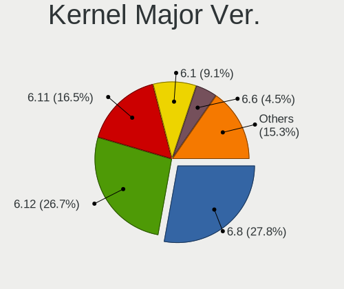

| Version | Notebooks | Percent |
|---------|-----------|---------|
| 5.13    | 42        | 29.17%  |
| 5.16    | 23        | 15.97%  |
| 5.4     | 20        | 13.89%  |
| 5.15    | 18        | 12.5%   |
| 5.10    | 18        | 12.5%   |
| 5.17    | 15        | 10.42%  |
| 5.14    | 3         | 2.08%   |
| 5.3     | 2         | 1.39%   |
| 5.12    | 1         | 0.69%   |
| 5.11    | 1         | 0.69%   |
| 4.19    | 1         | 0.69%   |

Arch
----

OS architecture (x86_64, i586, etc.)

| Name   | Notebooks | Percent |
|--------|-----------|---------|
| x86_64 | 143       | 99.31%  |
| i686   | 1         | 0.69%   |

DE
--

Desktop Environment

| Name       | Notebooks | Percent |
|------------|-----------|---------|
| GNOME      | 76        | 52.78%  |
| KDE5       | 23        | 15.97%  |
| XFCE       | 9         | 6.25%   |
| MATE       | 9         | 6.25%   |
| Unknown    | 9         | 6.25%   |
| X-Cinnamon | 6         | 4.17%   |
| Cinnamon   | 6         | 4.17%   |
| i3         | 3         | 2.08%   |
| Pantheon   | 1         | 0.69%   |
| openbox    | 1         | 0.69%   |
| Budgie     | 1         | 0.69%   |

Display Server
--------------

X11 or Wayland

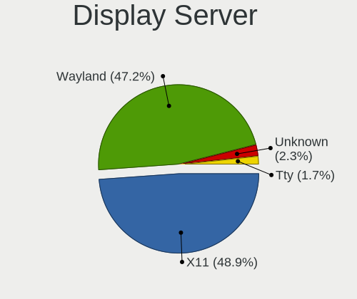

| Name    | Notebooks | Percent |
|---------|-----------|---------|
| X11     | 108       | 75%     |
| Wayland | 27        | 18.75%  |
| Unknown | 5         | 3.47%   |
| Tty     | 4         | 2.78%   |

Display Manager
---------------

SDDM, LightDM, etc.

| Name    | Notebooks | Percent |
|---------|-----------|---------|
| GDM     | 41        | 28.47%  |
| LightDM | 33        | 22.92%  |
| Unknown | 28        | 19.44%  |
| GDM3    | 21        | 14.58%  |
| SDDM    | 20        | 13.89%  |
| Ly      | 1         | 0.69%   |

OS Lang
-------

Language

| Lang    | Notebooks | Percent |
|---------|-----------|---------|
| fr_FR   | 108       | 75%     |
| en_US   | 26        | 18.06%  |
| Unknown | 7         | 4.86%   |
| ru_RU   | 1         | 0.69%   |
| es_UY   | 1         | 0.69%   |
| C       | 1         | 0.69%   |

Boot Mode
---------

EFI or BIOS

| Mode | Notebooks | Percent |
|------|-----------|---------|
| EFI  | 94        | 65.28%  |
| BIOS | 50        | 34.72%  |

Filesystem
----------

Type of filesystem

| Type    | Notebooks | Percent |
|---------|-----------|---------|
| Ext4    | 119       | 82.64%  |
| Btrfs   | 14        | 9.72%   |
| Overlay | 8         | 5.56%   |
| Zfs     | 2         | 1.39%   |
| Xfs     | 1         | 0.69%   |

Part. scheme
------------

Scheme of partitioning

| Type    | Notebooks | Percent |
|---------|-----------|---------|
| GPT     | 93        | 64.58%  |
| Unknown | 37        | 25.69%  |
| MBR     | 14        | 9.72%   |

Dual Boot with Linux/BSD
------------------------

Hosting more than one Linux/BSD

| Dual boot | Notebooks | Percent |
|-----------|-----------|---------|
| No        | 125       | 86.81%  |
| Yes       | 19        | 13.19%  |

Dual Boot (Win)
---------------

Hosting Linux and Windows

| Dual boot | Notebooks | Percent |
|-----------|-----------|---------|
| No        | 98        | 68.06%  |
| Yes       | 46        | 31.94%  |

Board
-----

Vendor
------

Motherboard manufacturer

| Name                | Notebooks | Percent |
|---------------------|-----------|---------|
| Dell                | 35        | 24.31%  |
| Lenovo              | 26        | 18.06%  |
| Hewlett-Packard     | 25        | 17.36%  |
| ASUSTek Computer    | 17        | 11.81%  |
| Acer                | 7         | 4.86%   |
| MSI                 | 6         | 4.17%   |
| TUXEDO              | 3         | 2.08%   |
| Sony                | 3         | 2.08%   |
| Samsung Electronics | 3         | 2.08%   |
| Toshiba             | 2         | 1.39%   |
| eMachines           | 2         | 1.39%   |
| Valve               | 1         | 0.69%   |
| Timi                | 1         | 0.69%   |
| System76            | 1         | 0.69%   |
| Star Labs           | 1         | 0.69%   |
| PC Specialist       | 1         | 0.69%   |
| Packard Bell        | 1         | 0.69%   |
| Notebook            | 1         | 0.69%   |
| LincPlus            | 1         | 0.69%   |
| HUAWEI              | 1         | 0.69%   |
| Google              | 1         | 0.69%   |
| Fujitsu             | 1         | 0.69%   |
| Clevo               | 1         | 0.69%   |
| Apple               | 1         | 0.69%   |
| Alienware           | 1         | 0.69%   |
| Unknown             | 1         | 0.69%   |

Model
-----

Motherboard model

| Name                                        | Notebooks | Percent |
|---------------------------------------------|-----------|---------|
| TUXEDO InfinityBook Pro 14 Gen6             | 2         | 1.39%   |
| HP Pavilion dv7                             | 2         | 1.39%   |
| HP OMEN by Laptop                           | 2         | 1.39%   |
| eMachines eM350                             | 2         | 1.39%   |
| Dell Precision 3561                         | 2         | 1.39%   |
| Dell Latitude 5310                          | 2         | 1.39%   |
| Dell G5 5590                                | 2         | 1.39%   |
| ASUS S551LN                                 | 2         | 1.39%   |
| Valve Jupiter                               | 1         | 0.69%   |
| TUXEDO Pulse 15 Gen1                        | 1         | 0.69%   |
| Toshiba Satellite Pro C660                  | 1         | 0.69%   |
| Toshiba Satellite C50t-B                    | 1         | 0.69%   |
| Timi RedmiBook 14-APCS                      | 1         | 0.69%   |
| System76 Gazelle                            | 1         | 0.69%   |
| Star Labs Lite                              | 1         | 0.69%   |
| Sony VGN-NS38E_S                            | 1         | 0.69%   |
| Sony VGN-FZ31M                              | 1         | 0.69%   |
| Sony SVE1713V1EB                            | 1         | 0.69%   |
| Samsung RV411/RV511/E3511/S3511/RV711/E3411 | 1         | 0.69%   |
| Samsung 350V5C/351V5C/3540VC/3440VC         | 1         | 0.69%   |
| Samsung 305U1A                              | 1         | 0.69%   |
| PC Specialist Standard                      | 1         | 0.69%   |
| Packard Bell EasyNote MH45                  | 1         | 0.69%   |
| Notebook NH5x_NH7x_HHx_HJx_HKx              | 1         | 0.69%   |
| MSI Pulse GL76 11UEK                        | 1         | 0.69%   |
| MSI PS42 Modern 8RA                         | 1         | 0.69%   |
| MSI Prestige 14Evo A11M                     | 1         | 0.69%   |
| MSI Modern 14 B10MW                         | 1         | 0.69%   |
| MSI GS70 6QE                                | 1         | 0.69%   |
| MSI GF65 Thin 10UE                          | 1         | 0.69%   |
| LincPlus LINNCPLUS P1                       | 1         | 0.69%   |
| Lenovo ThinkPad X260 20F5S6QV00             | 1         | 0.69%   |
| Lenovo ThinkPad X240 20AMS00J00             | 1         | 0.69%   |
| Lenovo ThinkPad X1 Extreme Gen 3 20TKCTO1WW | 1         | 0.69%   |
| Lenovo ThinkPad X1 Extreme 2nd 20QVCTO1WW   | 1         | 0.69%   |
| Lenovo ThinkPad X1 Carbon 4th 20FCS2L300    | 1         | 0.69%   |
| Lenovo ThinkPad W510 4391DK3                | 1         | 0.69%   |
| Lenovo ThinkPad T530 2394CTO                | 1         | 0.69%   |
| Lenovo ThinkPad T490s 20NXCTO1WW            | 1         | 0.69%   |
| Lenovo ThinkPad T450s 20BWS0PF00            | 1         | 0.69%   |
| Lenovo ThinkPad T440p 20AWS3AG00            | 1         | 0.69%   |
| Lenovo ThinkPad T14 Gen 2i 20W00097FR       | 1         | 0.69%   |
| Lenovo ThinkPad P14s Gen 1 20Y1003NFR       | 1         | 0.69%   |
| Lenovo ThinkPad L470 W10DG 20JVS0YA00       | 1         | 0.69%   |
| Lenovo ThinkPad L440 20ASS34K00             | 1         | 0.69%   |
| Lenovo ThinkBook 15p Gen 2 21B1             | 1         | 0.69%   |
| Lenovo ThinkBook 15 G2 ITL 20VE             | 1         | 0.69%   |
| Lenovo Legion Y530-15ICH 81FV               | 1         | 0.69%   |
| Lenovo Legion 5 15ITH6H 82JH                | 1         | 0.69%   |
| Lenovo IdeaPad S340-15API 81NC              | 1         | 0.69%   |
| Lenovo IdeaPad 510S-13IKB 80V0              | 1         | 0.69%   |
| Lenovo IdeaPad 5 14ALC05 82LM               | 1         | 0.69%   |
| Lenovo IdeaPad 330-15AST 81D6               | 1         | 0.69%   |
| Lenovo IdeaPad 3 15ADA05 81W1               | 1         | 0.69%   |
| Lenovo IdeaPad 100-15IBD 80QQ               | 1         | 0.69%   |
| Lenovo G50-45 80E3                          | 1         | 0.69%   |
| Lenovo G50-30 80G0                          | 1         | 0.69%   |
| HUAWEI HVY-WXX9                             | 1         | 0.69%   |
| HP ZBook 15 G5                              | 1         | 0.69%   |
| HP ProBook 640 G8 Notebook PC               | 1         | 0.69%   |

Model Family
------------

Motherboard model prefix

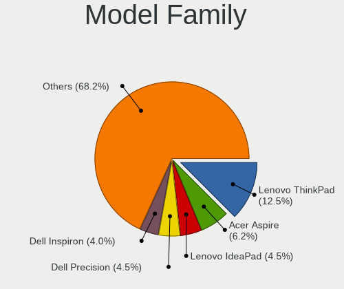

| Name                   | Notebooks | Percent |
|------------------------|-----------|---------|
| Lenovo ThinkPad        | 14        | 9.72%   |
| Dell Latitude          | 10        | 6.94%   |
| HP Pavilion            | 9         | 6.25%   |
| Dell Precision         | 8         | 5.56%   |
| HP EliteBook           | 7         | 4.86%   |
| Lenovo IdeaPad         | 6         | 4.17%   |
| Dell Inspiron          | 6         | 4.17%   |
| Dell XPS               | 5         | 3.47%   |
| Acer Aspire            | 5         | 3.47%   |
| ASUS VivoBook          | 4         | 2.78%   |
| TUXEDO InfinityBook    | 2         | 1.39%   |
| Toshiba Satellite      | 2         | 1.39%   |
| Lenovo ThinkBook       | 2         | 1.39%   |
| Lenovo Legion          | 2         | 1.39%   |
| HP ProBook             | 2         | 1.39%   |
| HP OMEN                | 2         | 1.39%   |
| eMachines eM350        | 2         | 1.39%   |
| Dell G5                | 2         | 1.39%   |
| ASUS S551LN            | 2         | 1.39%   |
| ASUS ROG               | 2         | 1.39%   |
| Valve Jupiter          | 1         | 0.69%   |
| TUXEDO Pulse           | 1         | 0.69%   |
| Timi RedmiBook         | 1         | 0.69%   |
| System76 Gazelle       | 1         | 0.69%   |
| Star Labs Lite         | 1         | 0.69%   |
| Sony VGN-NS38E         | 1         | 0.69%   |
| Sony VGN-FZ31M         | 1         | 0.69%   |
| Sony SVE1713V1EB       | 1         | 0.69%   |
| Samsung RV411          | 1         | 0.69%   |
| Samsung 350V5C         | 1         | 0.69%   |
| Samsung 305U1A         | 1         | 0.69%   |
| PC Specialist Standard | 1         | 0.69%   |
| Packard Bell EasyNote  | 1         | 0.69%   |
| Notebook NH5x          | 1         | 0.69%   |
| MSI Pulse              | 1         | 0.69%   |
| MSI PS42               | 1         | 0.69%   |
| MSI Prestige           | 1         | 0.69%   |
| MSI Modern             | 1         | 0.69%   |
| MSI GS70               | 1         | 0.69%   |
| MSI GF65               | 1         | 0.69%   |
| LincPlus LINNCPLUS     | 1         | 0.69%   |
| Lenovo G50-45          | 1         | 0.69%   |
| Lenovo G50-30          | 1         | 0.69%   |
| HUAWEI HVY-WXX9        | 1         | 0.69%   |
| HP ZBook               | 1         | 0.69%   |
| HP Notebook            | 1         | 0.69%   |
| HP G72                 | 1         | 0.69%   |
| HP ENVY                | 1         | 0.69%   |
| HP 250                 | 1         | 0.69%   |
| Google Squawks         | 1         | 0.69%   |
| Fujitsu LIFEBOOK       | 1         | 0.69%   |
| Dell Vostro            | 1         | 0.69%   |
| Dell Studio            | 1         | 0.69%   |
| Dell G7                | 1         | 0.69%   |
| Dell G3                | 1         | 0.69%   |
| Clevo W240EU           | 1         | 0.69%   |
| ASUS X705UA            | 1         | 0.69%   |
| ASUS X556UQ            | 1         | 0.69%   |
| ASUS X550CC            | 1         | 0.69%   |
| ASUS X540LJ            | 1         | 0.69%   |

MFG Year
--------

Motherboard manufacture year

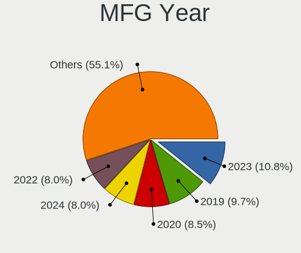

| Year    | Notebooks | Percent |
|---------|-----------|---------|
| 2021    | 26        | 18.06%  |
| 2020    | 24        | 16.67%  |
| 2019    | 17        | 11.81%  |
| 2018    | 13        | 9.03%   |
| 2015    | 11        | 7.64%   |
| 2010    | 9         | 6.25%   |
| 2014    | 8         | 5.56%   |
| 2016    | 6         | 4.17%   |
| 2008    | 6         | 4.17%   |
| 2017    | 5         | 3.47%   |
| 2013    | 5         | 3.47%   |
| 2011    | 5         | 3.47%   |
| 2012    | 4         | 2.78%   |
| 2007    | 3         | 2.08%   |
| 2005    | 1         | 0.69%   |
| Unknown | 1         | 0.69%   |

Form Factor
-----------

Physical design of the computer

| Name     | Notebooks | Percent |
|----------|-----------|---------|
| Notebook | 144       | 100%    |

Secure Boot
-----------

Enabled or disabled

| State    | Notebooks | Percent |
|----------|-----------|---------|
| Disabled | 123       | 85.42%  |
| Enabled  | 21        | 14.58%  |

Coreboot
--------

Have coreboot on board

| Used | Notebooks | Percent |
|------|-----------|---------|
| No   | 142       | 98.61%  |
| Yes  | 2         | 1.39%   |

RAM Size
--------

Total RAM memory

| Size in GB  | Notebooks | Percent |
|-------------|-----------|---------|
| 16.01-24.0  | 48        | 33.33%  |
| 4.01-8.0    | 34        | 23.61%  |
| 3.01-4.0    | 22        | 15.28%  |
| 8.01-16.0   | 17        | 11.81%  |
| 32.01-64.0  | 13        | 9.03%   |
| 1.01-2.0    | 4         | 2.78%   |
| 64.01-256.0 | 3         | 2.08%   |
| 24.01-32.0  | 1         | 0.69%   |
| 2.01-3.0    | 1         | 0.69%   |
| 0.51-1.0    | 1         | 0.69%   |

RAM Used
--------

Used RAM memory

| Used GB    | Notebooks | Percent |
|------------|-----------|---------|
| 4.01-8.0   | 35        | 24.31%  |
| 1.01-2.0   | 35        | 24.31%  |
| 2.01-3.0   | 31        | 21.53%  |
| 3.01-4.0   | 25        | 17.36%  |
| 8.01-16.0  | 8         | 5.56%   |
| 0.51-1.0   | 7         | 4.86%   |
| 24.01-32.0 | 2         | 1.39%   |
| 0.01-0.5   | 1         | 0.69%   |

Total Drives
------------

Number of drives on board

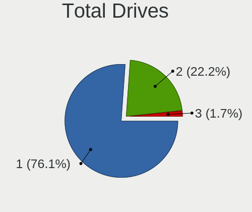

| Drives | Notebooks | Percent |
|--------|-----------|---------|
| 1      | 100       | 69.44%  |
| 2      | 42        | 29.17%  |
| 3      | 2         | 1.39%   |

Has CD-ROM
----------

Has CD-ROM on board

| Presented | Notebooks | Percent |
|-----------|-----------|---------|
| No        | 105       | 72.92%  |
| Yes       | 39        | 27.08%  |

Has Ethernet
------------

Has Ethernet on board

| Presented | Notebooks | Percent |
|-----------|-----------|---------|
| Yes       | 118       | 81.94%  |
| No        | 26        | 18.06%  |

Has WiFi
--------

Has WiFi module

| Presented | Notebooks | Percent |
|-----------|-----------|---------|
| Yes       | 143       | 99.31%  |
| No        | 1         | 0.69%   |

Has Bluetooth
-------------

Has Bluetooth module

| Presented | Notebooks | Percent |
|-----------|-----------|---------|
| Yes       | 119       | 82.64%  |
| No        | 25        | 17.36%  |

Location
--------

Country
-------

Geographic location (country)

| Country | Notebooks | Percent |
|---------|-----------|---------|
| France  | 144       | 100%    |

City
----

Geographic location (city)

| City                     | Notebooks | Percent |
|--------------------------|-----------|---------|
| Paris                    | 14        | 9.72%   |
| Lyon                     | 6         | 4.17%   |
| Toulouse                 | 4         | 2.78%   |
| Saint-Denis              | 3         | 2.08%   |
| Marseille                | 3         | 2.08%   |
| Villejuif                | 2         | 1.39%   |
| Roubaix                  | 2         | 1.39%   |
| Rennes                   | 2         | 1.39%   |
| Palaiseau                | 2         | 1.39%   |
| Nantes                   | 2         | 1.39%   |
| Mieuxcé                 | 2         | 1.39%   |
| Lille                    | 2         | 1.39%   |
| Chenove                  | 2         | 1.39%   |
| Besançon                | 2         | 1.39%   |
| Bergerac                 | 2         | 1.39%   |
| Annecy                   | 2         | 1.39%   |
| Vizille                  | 1         | 0.69%   |
| Vitré                   | 1         | 0.69%   |
| Villeurbanne             | 1         | 0.69%   |
| Vieux-Boucau-les-Bains   | 1         | 0.69%   |
| Valros                   | 1         | 0.69%   |
| Valence                  | 1         | 0.69%   |
| Triel-sur-Seine          | 1         | 0.69%   |
| Tours                    | 1         | 0.69%   |
| Toulon                   | 1         | 0.69%   |
| Strasbourg               | 1         | 0.69%   |
| Sarreguemines            | 1         | 0.69%   |
| Sainte-Foy-les-Lyon      | 1         | 0.69%   |
| Saint-Fargeau-Ponthierry | 1         | 0.69%   |
| Saint-Dizier             | 1         | 0.69%   |
| Reignier-Esery           | 1         | 0.69%   |
| Puteaux                  | 1         | 0.69%   |
| Pujaut                   | 1         | 0.69%   |
| Pujaudran                | 1         | 0.69%   |
| Pontoise                 | 1         | 0.69%   |
| Pontault-Combault        | 1         | 0.69%   |
| Pomarede                 | 1         | 0.69%   |
| Poitiers                 | 1         | 0.69%   |
| Pinsaguel                | 1         | 0.69%   |
| Perpignan                | 1         | 0.69%   |
| Pau                      | 1         | 0.69%   |
| Ozoir-la-Ferriere        | 1         | 0.69%   |
| Orvault                  | 1         | 0.69%   |
| Orlienas                 | 1         | 0.69%   |
| Nîmes                   | 1         | 0.69%   |
| Nancy                    | 1         | 0.69%   |
| Mordelles                | 1         | 0.69%   |
| Montry                   | 1         | 0.69%   |
| Montpellier              | 1         | 0.69%   |
| Montmerle-sur-Saone      | 1         | 0.69%   |
| Montmelard               | 1         | 0.69%   |
| Montereau-Fault-Yonne    | 1         | 0.69%   |
| Montbéliard             | 1         | 0.69%   |
| Miramas                  | 1         | 0.69%   |
| Mieussy                  | 1         | 0.69%   |
| Maisons-Laffitte         | 1         | 0.69%   |
| Maisons-Alfort           | 1         | 0.69%   |
| Luce                     | 1         | 0.69%   |
| Limoges                  | 1         | 0.69%   |
| Levallois-Perret         | 1         | 0.69%   |

Drives
------

Drive Vendor
------------

Hard drive vendors

| Vendor                    | Notebooks | Drives | Percent |
|---------------------------|-----------|--------|---------|
| Samsung Electronics       | 32        | 33     | 17.58%  |
| WDC                       | 17        | 17     | 9.34%   |
| Seagate                   | 17        | 17     | 9.34%   |
| SK Hynix                  | 14        | 15     | 7.69%   |
| Toshiba                   | 13        | 14     | 7.14%   |
| Crucial                   | 13        | 13     | 7.14%   |
| Micron Technology         | 10        | 10     | 5.49%   |
| Kingston                  | 10        | 11     | 5.49%   |
| Unknown                   | 9         | 9      | 4.95%   |
| SanDisk                   | 9         | 9      | 4.95%   |
| Intel                     | 8         | 9      | 4.4%    |
| HGST                      | 6         | 6      | 3.3%    |
| KIOXIA                    | 5         | 5      | 2.75%   |
| PNY                       | 2         | 2      | 1.1%    |
| Hitachi                   | 2         | 2      | 1.1%    |
| China                     | 2         | 2      | 1.1%    |
| YMTC                      | 1         | 1      | 0.55%   |
| Teclast                   | 1         | 1      | 0.55%   |
| Silicon Motion            | 1         | 1      | 0.55%   |
| OCZ                       | 1         | 1      | 0.55%   |
| Micron/Crucial Technology | 1         | 1      | 0.55%   |
| LITEON                    | 1         | 1      | 0.55%   |
| LaCie                     | 1         | 1      | 0.55%   |
| JMicron                   | 1         | 1      | 0.55%   |
| Fujitsu                   | 1         | 1      | 0.55%   |
| BHT                       | 1         | 1      | 0.55%   |
| ASENNO                    | 1         | 1      | 0.55%   |
| APPLE HD                  | 1         | 1      | 0.55%   |
| A-DATA Technology         | 1         | 1      | 0.55%   |

Drive Model
-----------

Hard drive models

| Model                                   | Notebooks | Percent |
|-----------------------------------------|-----------|---------|
| Seagate ST1000LM035-1RK172 1TB          | 5         | 2.69%   |
| Samsung SSD 980 PRO 500GB               | 4         | 2.15%   |
| Crucial CT500MX500SSD1 500GB            | 4         | 2.15%   |
| Toshiba NVMe SSD Drive 512GB            | 3         | 1.61%   |
| Toshiba MQ04ABF100 1TB                  | 3         | 1.61%   |
| Samsung SSD 860 EVO 500GB               | 3         | 1.61%   |
| KIOXIA KBG40ZNS512G NVMe 512GB          | 3         | 1.61%   |
| Toshiba MQ01ABD100 1TB                  | 2         | 1.08%   |
| SK Hynix PC711 NVMe 1TB                 | 2         | 1.08%   |
| Seagate ST9500420AS 500GB               | 2         | 1.08%   |
| Seagate ST1000LM024 HN-M101MBB 1TB      | 2         | 1.08%   |
| SanDisk Ultra II 960GB SSD              | 2         | 1.08%   |
| Samsung NVMe SSD Drive 250GB            | 2         | 1.08%   |
| Kingston SA400S37480G 480GB SSD         | 2         | 1.08%   |
| Kingston SA400S37240G 240GB SSD         | 2         | 1.08%   |
| Intel NVMe SSD Drive 512GB              | 2         | 1.08%   |
| Hitachi HTS547564A9E384 640GB           | 2         | 1.08%   |
| HGST HTS721010A9E630 1TB                | 2         | 1.08%   |
| Crucial CT240BX500SSD1 240GB            | 2         | 1.08%   |
| Crucial CT1000P5SSD8 1TB                | 2         | 1.08%   |
| YMTC PC005 512GB                        | 1         | 0.54%   |
| WDC WDS500G2B0C-00PXH0 500GB            | 1         | 0.54%   |
| WDC WDS240G2G0A-00JH30 240GB SSD        | 1         | 0.54%   |
| WDC WD5000LPLX-00ZNTT0 500GB            | 1         | 0.54%   |
| WDC WD5000BEKT-75KA9T0 500GB            | 1         | 0.54%   |
| WDC WD3200BEVT-22ZCT0 320GB             | 1         | 0.54%   |
| WDC WD3200BEVT-11ZCT0 320GB             | 1         | 0.54%   |
| WDC WD2500BEVT-22ZCT0 250GB             | 1         | 0.54%   |
| WDC WD1600BEVS-60RST0 160GB             | 1         | 0.54%   |
| WDC WD10JPVX-75JC3T0 1TB                | 1         | 0.54%   |
| WDC WD10JPVX-22JC3T0 1TB                | 1         | 0.54%   |
| WDC WD10JPCX-24UE4T0 1TB                | 1         | 0.54%   |
| WDC PC SN810 NVMe 1024GB                | 1         | 0.54%   |
| WDC PC SN730 SDBQNTY-1T00-1001 1TB      | 1         | 0.54%   |
| WDC PC SN530 SDBPNPZ-256G-1032 256GB    | 1         | 0.54%   |
| WDC PC SN530 SDBPNPZ-1T00-1002 1TB      | 1         | 0.54%   |
| WDC PC SN520 SDAPNUW-512G               | 1         | 0.54%   |
| WDC PC SN520 SDAPNUW-256G-1002 256GB    | 1         | 0.54%   |
| Unknown SA16G  16GB                     | 1         | 0.54%   |
| Unknown S0J59X  128GB                   | 1         | 0.54%   |
| Unknown MS 500GB                        | 1         | 0.54%   |
| Unknown MMC Card  32GB                  | 1         | 0.54%   |
| Unknown MMC Card  128GB                 | 1         | 0.54%   |
| Unknown GF8S5  513GB                    | 1         | 0.54%   |
| Unknown Biwin  64GB                     | 1         | 0.54%   |
| Unknown 032G34  32GB                    | 1         | 0.54%   |
| Unknown 00000  128GB                    | 1         | 0.54%   |
| Toshiba MK7575GSX 752GB                 | 1         | 0.54%   |
| Toshiba KXG60ZNV512G NVMe 512GB         | 1         | 0.54%   |
| Toshiba KXG50ZNV512G NVMe 512GB         | 1         | 0.54%   |
| Toshiba KXG50ZNV256G NVMe 256GB         | 1         | 0.54%   |
| Toshiba KXG50ZNV1T02 NVMe 1024GB        | 1         | 0.54%   |
| Toshiba KBG30ZMS128G 128GB NVMe SSD     | 1         | 0.54%   |
| Teclast 480GB A900 SSD                  | 1         | 0.54%   |
| SK Hynix SKHynix_HFS512GDE9X081N 512GB  | 1         | 0.54%   |
| SK Hynix SKHynix_HFS001TD9TNI-L2B0B 1TB | 1         | 0.54%   |
| SK Hynix SC308 SATA 256GB SSD           | 1         | 0.54%   |
| SK Hynix PC611 NVMe 1TB                 | 1         | 0.54%   |
| SK Hynix NVMe SSD Drive 256GB           | 1         | 0.54%   |
| SK Hynix NVMe SSD Drive 128GB           | 1         | 0.54%   |

HDD Vendor
----------

Hard disk drive vendors

| Vendor   | Notebooks | Drives | Percent |
|----------|-----------|--------|---------|
| Seagate  | 17        | 17     | 39.53%  |
| WDC      | 9         | 9      | 20.93%  |
| Toshiba  | 6         | 6      | 13.95%  |
| HGST     | 6         | 6      | 13.95%  |
| Hitachi  | 2         | 2      | 4.65%   |
| Unknown  | 1         | 1      | 2.33%   |
| Fujitsu  | 1         | 1      | 2.33%   |
| APPLE HD | 1         | 1      | 2.33%   |

SSD Vendor
----------

Solid state drive vendors

| Vendor              | Notebooks | Drives | Percent |
|---------------------|-----------|--------|---------|
| Samsung Electronics | 12        | 12     | 21.05%  |
| Crucial             | 10        | 10     | 17.54%  |
| SanDisk             | 9         | 9      | 15.79%  |
| Kingston            | 7         | 8      | 12.28%  |
| Micron Technology   | 4         | 4      | 7.02%   |
| SK Hynix            | 3         | 3      | 5.26%   |
| PNY                 | 2         | 2      | 3.51%   |
| Intel               | 2         | 2      | 3.51%   |
| China               | 2         | 2      | 3.51%   |
| WDC                 | 1         | 1      | 1.75%   |
| Teclast             | 1         | 1      | 1.75%   |
| OCZ                 | 1         | 1      | 1.75%   |
| LITEON              | 1         | 1      | 1.75%   |
| BHT                 | 1         | 1      | 1.75%   |
| ASENNO              | 1         | 1      | 1.75%   |

Drive Kind
----------

HDD or SSD

| Kind    | Notebooks | Drives | Percent |
|---------|-----------|--------|---------|
| NVMe    | 71        | 76     | 40.34%  |
| SSD     | 54        | 58     | 30.68%  |
| HDD     | 41        | 43     | 23.3%   |
| MMC     | 8         | 8      | 4.55%   |
| Unknown | 2         | 2      | 1.14%   |

Drive Connector
---------------

SATA, SAS, NVMe, etc.

| Type | Notebooks | Drives | Percent |
|------|-----------|--------|---------|
| SATA | 86        | 98     | 50.59%  |
| NVMe | 71        | 76     | 41.76%  |
| MMC  | 8         | 8      | 4.71%   |
| SAS  | 5         | 5      | 2.94%   |

Drive Size
----------

Size of hard drive

| Size in TB | Notebooks | Drives | Percent |
|------------|-----------|--------|---------|
| 0.01-0.5   | 55        | 61     | 58.51%  |
| 0.51-1.0   | 34        | 35     | 36.17%  |
| 1.01-2.0   | 5         | 5      | 5.32%   |

Space Total
-----------

Amount of disk space available on the file system

| Size in GB     | Notebooks | Percent |
|----------------|-----------|---------|
| 251-500        | 45        | 31.25%  |
| 101-250        | 33        | 22.92%  |
| 501-1000       | 31        | 21.53%  |
| 1001-2000      | 10        | 6.94%   |
| 1-20           | 7         | 4.86%   |
| Unknown        | 6         | 4.17%   |
| 2001-3000      | 5         | 3.47%   |
| 21-50          | 3         | 2.08%   |
| More than 3000 | 2         | 1.39%   |
| 51-100         | 2         | 1.39%   |

Space Used
----------

Amount of used disk space

| Used GB   | Notebooks | Percent |
|-----------|-----------|---------|
| 1-20      | 37        | 25.69%  |
| 101-250   | 24        | 16.67%  |
| 251-500   | 22        | 15.28%  |
| 21-50     | 21        | 14.58%  |
| 51-100    | 18        | 12.5%   |
| 501-1000  | 10        | 6.94%   |
| Unknown   | 6         | 4.17%   |
| 1001-2000 | 4         | 2.78%   |
| 2001-3000 | 2         | 1.39%   |

Malfunc. Drives
---------------

Drive models with a malfunction

| Model                          | Notebooks | Drives | Percent |
|--------------------------------|-----------|--------|---------|
| Seagate ST9500420AS 500GB      | 2         | 2      | 16.67%  |
| WDC WD5000BEKT-75KA9T0 500GB   | 1         | 1      | 8.33%   |
| WDC WD1600BEVS-60RST0 160GB    | 1         | 1      | 8.33%   |
| Unknown MS 500GB               | 1         | 1      | 8.33%   |
| Toshiba MQ01ABD100 1TB         | 1         | 1      | 8.33%   |
| Toshiba MK7575GSX 752GB        | 1         | 1      | 8.33%   |
| Intel SSDSCKKF256G8 SATA 256GB | 1         | 1      | 8.33%   |
| Intel SSDSC2BF180A4L 180GB     | 1         | 1      | 8.33%   |
| HGST HTS721010A9E630 1TB       | 1         | 1      | 8.33%   |
| HGST HTS541075A7E630 752GB     | 1         | 1      | 8.33%   |
| ASENNO AS25 1TB SSD            | 1         | 1      | 8.33%   |

Malfunc. Drive Vendor
---------------------

Vendors of faulty drives

| Vendor  | Notebooks | Drives | Percent |
|---------|-----------|--------|---------|
| WDC     | 2         | 2      | 16.67%  |
| Toshiba | 2         | 2      | 16.67%  |
| Seagate | 2         | 2      | 16.67%  |
| Intel   | 2         | 2      | 16.67%  |
| HGST    | 2         | 2      | 16.67%  |
| Unknown | 1         | 1      | 8.33%   |
| ASENNO  | 1         | 1      | 8.33%   |

Malfunc. HDD Vendor
-------------------

Vendors of faulty HDD drives

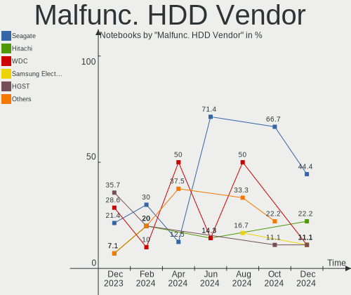

| Vendor  | Notebooks | Drives | Percent |
|---------|-----------|--------|---------|
| WDC     | 2         | 2      | 22.22%  |
| Toshiba | 2         | 2      | 22.22%  |
| Seagate | 2         | 2      | 22.22%  |
| HGST    | 2         | 2      | 22.22%  |
| Unknown | 1         | 1      | 11.11%  |

Malfunc. Drive Kind
-------------------

Kinds of faulty drives

| Kind | Notebooks | Drives | Percent |
|------|-----------|--------|---------|
| HDD  | 9         | 9      | 75%     |
| SSD  | 3         | 3      | 25%     |

Failed Drives
-------------

Failed drive models

| Model                       | Notebooks | Drives | Percent |
|-----------------------------|-----------|--------|---------|
| WDC WD3200BEVT-11ZCT0 320GB | 1         | 1      | 100%    |

Failed Drive Vendor
-------------------

Failed drive vendors

| Vendor | Notebooks | Drives | Percent |
|--------|-----------|--------|---------|
| WDC    | 1         | 1      | 100%    |

Drive Status
------------

Number of failed and malfunc. drives

| Status   | Notebooks | Drives | Percent |
|----------|-----------|--------|---------|
| Works    | 92        | 111    | 60.93%  |
| Detected | 46        | 63     | 30.46%  |
| Malfunc  | 12        | 12     | 7.95%   |
| Failed   | 1         | 1      | 0.66%   |

Storage controller
------------------

Storage Vendor
--------------

Storage controller vendors

| Vendor                       | Notebooks | Percent |
|------------------------------|-----------|---------|
| Intel                        | 105       | 57.07%  |
| Samsung Electronics          | 20        | 10.87%  |
| AMD                          | 12        | 6.52%   |
| SK Hynix                     | 11        | 5.98%   |
| Toshiba America Info Systems | 10        | 5.43%   |
| Sandisk                      | 7         | 3.8%    |
| Micron Technology            | 7         | 3.8%    |
| Micron/Crucial Technology    | 3         | 1.63%   |
| KIOXIA                       | 3         | 1.63%   |
| Kingston Technology Company  | 3         | 1.63%   |
| Yangtze Memory Technologies  | 1         | 0.54%   |
| Silicon Motion               | 1         | 0.54%   |
| ADATA Technology             | 1         | 0.54%   |

Storage Model
-------------

Storage controller models

| Model                                                                                  | Notebooks | Percent |
|----------------------------------------------------------------------------------------|-----------|---------|
| Intel Volume Management Device NVMe RAID Controller                                    | 11        | 5.64%   |
| Intel Cannon Lake Mobile PCH SATA AHCI Controller                                      | 11        | 5.64%   |
| AMD FCH SATA Controller [AHCI mode]                                                    | 11        | 5.64%   |
| Intel Wildcat Point-LP SATA Controller [AHCI Mode]                                     | 9         | 4.62%   |
| Intel 82801 Mobile SATA Controller [RAID mode]                                         | 9         | 4.62%   |
| Intel 500 Series Chipset Family SATA AHCI Controller                                   | 9         | 4.62%   |
| Samsung NVMe SSD Controller SM981/PM981/PM983                                          | 8         | 4.1%    |
| Micron Non-Volatile memory controller                                                  | 7         | 3.59%   |
| Intel Sunrise Point-LP SATA Controller [AHCI mode]                                     | 7         | 3.59%   |
| SK Hynix Gold P31 SSD                                                                  | 6         | 3.08%   |
| Samsung NVMe SSD Controller 980                                                        | 6         | 3.08%   |
| Toshiba America Info Systems XG6 NVMe SSD Controller                                   | 5         | 2.56%   |
| Intel 5 Series/3400 Series Chipset 6 port SATA AHCI Controller                         | 5         | 2.56%   |
| Toshiba America Info Systems Toshiba America Info Non-Volatile memory controller       | 4         | 2.05%   |
| Samsung NVMe SSD Controller PM9A1/PM9A3/980PRO                                         | 4         | 2.05%   |
| Intel Non-Volatile memory controller                                                   | 4         | 2.05%   |
| Intel HM170/QM170 Chipset SATA Controller [AHCI Mode]                                  | 4         | 2.05%   |
| Intel 7 Series Chipset Family 6-port SATA Controller [AHCI mode]                       | 4         | 2.05%   |
| Sandisk WD Blue SN550 NVMe SSD                                                         | 3         | 1.54%   |
| KIOXIA Non-Volatile memory controller                                                  | 3         | 1.54%   |
| Intel Atom Processor E3800 Series SATA AHCI Controller                                 | 3         | 1.54%   |
| Intel 8 Series/C220 Series Chipset Family 6-port SATA Controller 1 [AHCI mode]         | 3         | 1.54%   |
| Intel 8 Series SATA Controller 1 [AHCI mode]                                           | 3         | 1.54%   |
| Intel 6 Series/C200 Series Chipset Family 6 port Mobile SATA AHCI Controller           | 3         | 1.54%   |
| SK Hynix Non-Volatile memory controller                                                | 2         | 1.03%   |
| SK Hynix BC501 NVMe Solid State Drive                                                  | 2         | 1.03%   |
| Sandisk WD Blue SN500 / PC SN520 NVMe SSD                                              | 2         | 1.03%   |
| Micron/Crucial Non-Volatile memory controller                                          | 2         | 1.03%   |
| Kingston Company Company Non-Volatile memory controller                                | 2         | 1.03%   |
| Intel SSD 660P Series                                                                  | 2         | 1.03%   |
| Intel Q170/Q150/B150/H170/H110/Z170/CM236 Chipset SATA Controller [AHCI Mode]          | 2         | 1.03%   |
| Intel Celeron/Pentium Silver Processor SATA Controller                                 | 2         | 1.03%   |
| Intel Cannon Point-LP SATA Controller [AHCI Mode]                                      | 2         | 1.03%   |
| Intel 82801IBM/IEM (ICH9M/ICH9M-E) 4 port SATA Controller [AHCI mode]                  | 2         | 1.03%   |
| Intel 82801HM/HEM (ICH8M/ICH8M-E) SATA Controller [AHCI mode]                          | 2         | 1.03%   |
| Intel 82801HM/HEM (ICH8M/ICH8M-E) IDE Controller                                       | 2         | 1.03%   |
| Intel 82801GBM/GHM (ICH7-M Family) SATA Controller [IDE mode]                          | 2         | 1.03%   |
| Intel 400 Series Chipset Family SATA AHCI Controller                                   | 2         | 1.03%   |
| Yangtze Memory Non-Volatile memory controller                                          | 1         | 0.51%   |
| Toshiba America Info Systems BG3 NVMe SSD Controller                                   | 1         | 0.51%   |
| SK Hynix BC511                                                                         | 1         | 0.51%   |
| Silicon Motion SM2263EN/SM2263XT SSD Controller                                        | 1         | 0.51%   |
| Sandisk WD PC SN810 / Black SN850 NVMe SSD                                             | 1         | 0.51%   |
| Sandisk WD Black SN750 / PC SN730 NVMe SSD                                             | 1         | 0.51%   |
| Samsung NVMe SSD Controller SM961/PM961/SM963                                          | 1         | 0.51%   |
| Samsung NVMe SSD Controller SM951/PM951                                                | 1         | 0.51%   |
| Micron/Crucial P2 NVMe PCIe SSD                                                        | 1         | 0.51%   |
| Kingston Company OM3PDP3 NVMe SSD                                                      | 1         | 0.51%   |
| Intel Tiger Lake-LP SATA Controller [AHCI mode]                                        | 1         | 0.51%   |
| Intel SATA Controller [RAID mode]                                                      | 1         | 0.51%   |
| Intel NM10/ICH7 Family SATA Controller [IDE mode]                                      | 1         | 0.51%   |
| Intel NM10/ICH7 Family SATA Controller [AHCI mode]                                     | 1         | 0.51%   |
| Intel Celeron N3350/Pentium N4200/Atom E3900 Series SATA AHCI Controller               | 1         | 0.51%   |
| Intel Atom/Celeron/Pentium Processor x5-E8000/J3xxx/N3xxx Series SATA Controller       | 1         | 0.51%   |
| Intel 82801IBM/IEM (ICH9M/ICH9M-E) 2 port SATA Controller [IDE mode]                   | 1         | 0.51%   |
| Intel 7 Series Chipset Family 4-port SATA Controller [IDE mode]                        | 1         | 0.51%   |
| Intel 7 Series Chipset Family 2-port SATA Controller [IDE mode]                        | 1         | 0.51%   |
| Intel 6 Series/C200 Series Chipset Family Mobile SATA Controller (IDE mode, ports 0-3) | 1         | 0.51%   |
| Intel 5 Series/3400 Series Chipset 4 port SATA IDE Controller                          | 1         | 0.51%   |
| Intel 5 Series/3400 Series Chipset 4 port SATA AHCI Controller                         | 1         | 0.51%   |

Storage Kind
------------

Kind of storage controller (IDE, SATA, NVMe, SAS, ...)

| Kind | Notebooks | Percent |
|------|-----------|---------|
| SATA | 90        | 47.12%  |
| NVMe | 71        | 37.17%  |
| RAID | 21        | 10.99%  |
| IDE  | 9         | 4.71%   |

Processor
---------

CPU Vendor
----------

Processor vendors

| Vendor | Notebooks | Percent |
|--------|-----------|---------|
| Intel  | 126       | 87.5%   |
| AMD    | 18        | 12.5%   |

CPU Model
---------

Processor models

| Model                                         | Notebooks | Percent |
|-----------------------------------------------|-----------|---------|
| Intel 11th Gen Core i7-1165G7 @ 2.80GHz       | 7         | 4.86%   |
| Intel 11th Gen Core i7-11800H @ 2.30GHz       | 6         | 4.17%   |
| Intel Core i7-9750H CPU @ 2.60GHz             | 5         | 3.47%   |
| AMD Ryzen 5 3500U with Radeon Vega Mobile Gfx | 4         | 2.78%   |
| Intel Core i7-8750H CPU @ 2.20GHz             | 3         | 2.08%   |
| Intel Core i7-8665U CPU @ 1.90GHz             | 3         | 2.08%   |
| Intel Core i7-5600U CPU @ 2.60GHz             | 3         | 2.08%   |
| Intel Core i7-1065G7 CPU @ 1.30GHz            | 3         | 2.08%   |
| Intel Core i5-7200U CPU @ 2.50GHz             | 3         | 2.08%   |
| Intel Core i5-6200U CPU @ 2.30GHz             | 3         | 2.08%   |
| Intel Pentium Dual-Core CPU T4200 @ 2.00GHz   | 2         | 1.39%   |
| Intel Pentium CPU P6100 @ 2.00GHz             | 2         | 1.39%   |
| Intel Core i7-8850H CPU @ 2.60GHz             | 2         | 1.39%   |
| Intel Core i7-7700HQ CPU @ 2.80GHz            | 2         | 1.39%   |
| Intel Core i7-6700HQ CPU @ 2.60GHz            | 2         | 1.39%   |
| Intel Core i7-6600U CPU @ 2.60GHz             | 2         | 1.39%   |
| Intel Core i5-3230M CPU @ 2.60GHz             | 2         | 1.39%   |
| Intel Core i5-2410M CPU @ 2.30GHz             | 2         | 1.39%   |
| Intel Core i3-5005U CPU @ 2.00GHz             | 2         | 1.39%   |
| Intel Core i3 CPU M 380 @ 2.53GHz             | 2         | 1.39%   |
| Intel Atom CPU N450 @ 1.66GHz                 | 2         | 1.39%   |
| Intel 11th Gen Core i7-1185G7 @ 3.00GHz       | 2         | 1.39%   |
| Intel 11th Gen Core i7-11850H @ 2.50GHz       | 2         | 1.39%   |
| Intel 11th Gen Core i5-11400H @ 2.70GHz       | 2         | 1.39%   |
| Intel 11th Gen Core i5-1135G7 @ 2.40GHz       | 2         | 1.39%   |
| AMD Ryzen 5 4600H with Radeon Graphics        | 2         | 1.39%   |
| Intel Pentium Dual CPU T3200 @ 2.00GHz        | 1         | 0.69%   |
| Intel Pentium CPU N4200 @ 1.10GHz             | 1         | 0.69%   |
| Intel Pentium CPU N3540 @ 2.16GHz             | 1         | 0.69%   |
| Intel Pentium CPU B970 @ 2.30GHz              | 1         | 0.69%   |
| Intel Pentium CPU 3825U @ 1.90GHz             | 1         | 0.69%   |
| Intel Pentium CPU 2117U @ 1.80GHz             | 1         | 0.69%   |
| Intel Genuine CPU T2400 @ 1.83GHz             | 1         | 0.69%   |
| Intel Core i9-9880H CPU @ 2.30GHz             | 1         | 0.69%   |
| Intel Core i9-10885H CPU @ 2.40GHz            | 1         | 0.69%   |
| Intel Core i7-8565U CPU @ 1.80GHz             | 1         | 0.69%   |
| Intel Core i7-8550U CPU @ 1.80GHz             | 1         | 0.69%   |
| Intel Core i7-7500U CPU @ 2.70GHz             | 1         | 0.69%   |
| Intel Core i7-6820HQ CPU @ 2.70GHz            | 1         | 0.69%   |
| Intel Core i7-6500U CPU @ 2.50GHz             | 1         | 0.69%   |
| Intel Core i7-5500U CPU @ 2.40GHz             | 1         | 0.69%   |
| Intel Core i7-4980HQ CPU @ 2.80GHz            | 1         | 0.69%   |
| Intel Core i7-4710HQ CPU @ 2.50GHz            | 1         | 0.69%   |
| Intel Core i7-4600M CPU @ 2.90GHz             | 1         | 0.69%   |
| Intel Core i7-3630QM CPU @ 2.40GHz            | 1         | 0.69%   |
| Intel Core i7-2675QM CPU @ 2.20GHz            | 1         | 0.69%   |
| Intel Core i7-10810U CPU @ 1.10GHz            | 1         | 0.69%   |
| Intel Core i7-10750H CPU @ 2.60GHz            | 1         | 0.69%   |
| Intel Core i7 CPU Q 720 @ 1.60GHz             | 1         | 0.69%   |
| Intel Core i7 CPU M 620 @ 2.67GHz             | 1         | 0.69%   |
| Intel Core i5-8300H CPU @ 2.30GHz             | 1         | 0.69%   |
| Intel Core i5-8265U CPU @ 1.60GHz             | 1         | 0.69%   |
| Intel Core i5-8250U CPU @ 1.60GHz             | 1         | 0.69%   |
| Intel Core i5-7440HQ CPU @ 2.80GHz            | 1         | 0.69%   |
| Intel Core i5-6300HQ CPU @ 2.30GHz            | 1         | 0.69%   |
| Intel Core i5-5300U CPU @ 2.30GHz             | 1         | 0.69%   |
| Intel Core i5-5200U CPU @ 2.20GHz             | 1         | 0.69%   |
| Intel Core i5-4300U CPU @ 1.90GHz             | 1         | 0.69%   |
| Intel Core i5-4210U CPU @ 1.70GHz             | 1         | 0.69%   |
| Intel Core i5-4210M CPU @ 2.60GHz             | 1         | 0.69%   |

CPU Model Family
----------------

Processor model prefix

| Model                   | Notebooks | Percent |
|-------------------------|-----------|---------|
| Intel Core i7           | 40        | 27.78%  |
| Other                   | 28        | 19.44%  |
| Intel Core i5           | 27        | 18.75%  |
| Intel Pentium           | 7         | 4.86%   |
| Intel Core i3           | 7         | 4.86%   |
| AMD Ryzen 5             | 7         | 4.86%   |
| Intel Celeron           | 6         | 4.17%   |
| AMD Ryzen 7             | 4         | 2.78%   |
| Intel Core 2 Duo        | 3         | 2.08%   |
| Intel Atom              | 3         | 2.08%   |
| Intel Pentium Dual-Core | 2         | 1.39%   |
| Intel Core i9           | 2         | 1.39%   |
| Intel Pentium Dual      | 1         | 0.69%   |
| Intel Genuine           | 1         | 0.69%   |
| Intel Core 2            | 1         | 0.69%   |
| AMD Ryzen 7 PRO         | 1         | 0.69%   |
| AMD Ryzen 5 PRO         | 1         | 0.69%   |
| AMD E2                  | 1         | 0.69%   |
| AMD E1                  | 1         | 0.69%   |
| AMD E                   | 1         | 0.69%   |

CPU Cores
---------

Number of processor cores

| Number | Notebooks | Percent |
|--------|-----------|---------|
| 2      | 56        | 38.89%  |
| 4      | 52        | 36.11%  |
| 6      | 19        | 13.19%  |
| 8      | 15        | 10.42%  |
| 1      | 2         | 1.39%   |

CPU Sockets
-----------

Number of sockets

| Number | Notebooks | Percent |
|--------|-----------|---------|
| 1      | 144       | 100%    |

CPU Threads
-----------

Threads per core (Hyper-Threading)

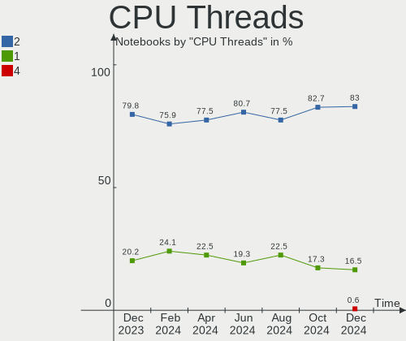

| Number | Notebooks | Percent |
|--------|-----------|---------|
| 2      | 115       | 79.86%  |
| 1      | 29        | 20.14%  |

CPU Op-Modes
------------

CPU Operation Modes (32-bit, 64-bit)

| Op mode        | Notebooks | Percent |
|----------------|-----------|---------|
| 32-bit, 64-bit | 143       | 99.31%  |
| 32-bit         | 1         | 0.69%   |

CPU Microcode
-------------

Microcode number

| Number     | Notebooks | Percent |
|------------|-----------|---------|
| Unknown    | 32        | 22.22%  |
| 0x806c1    | 12        | 8.33%   |
| 0x806d1    | 9         | 6.25%   |
| 0x306d4    | 8         | 5.56%   |
| 0x906ea    | 7         | 4.86%   |
| 0x406e3    | 5         | 3.47%   |
| 0x206a7    | 5         | 3.47%   |
| 0x806ec    | 4         | 2.78%   |
| 0x806e9    | 4         | 2.78%   |
| 0x20655    | 4         | 2.78%   |
| 0x08108109 | 4         | 2.78%   |
| 0x706e5    | 3         | 2.08%   |
| 0x6fd      | 3         | 2.08%   |
| 0x30678    | 3         | 2.08%   |
| 0x08600106 | 3         | 2.08%   |
| 0xa0652    | 2         | 1.39%   |
| 0x906e9    | 2         | 1.39%   |
| 0x806eb    | 2         | 1.39%   |
| 0x806ea    | 2         | 1.39%   |
| 0x506e3    | 2         | 1.39%   |
| 0x40651    | 2         | 1.39%   |
| 0x306c3    | 2         | 1.39%   |
| 0x306a9    | 2         | 1.39%   |
| 0x106ca    | 2         | 1.39%   |
| 0x1067a    | 2         | 1.39%   |
| 0x08608103 | 2         | 1.39%   |
| 0x07030104 | 2         | 1.39%   |
| 0xa0660    | 1         | 0.69%   |
| 0x806c2    | 1         | 0.69%   |
| 0x706a8    | 1         | 0.69%   |
| 0x706a1    | 1         | 0.69%   |
| 0x6e8      | 1         | 0.69%   |
| 0x506c9    | 1         | 0.69%   |
| 0x406c4    | 1         | 0.69%   |
| 0x406c3    | 1         | 0.69%   |
| 0x40661    | 1         | 0.69%   |
| 0x106e5    | 1         | 0.69%   |
| 0x0a50000c | 1         | 0.69%   |
| 0x08600103 | 1         | 0.69%   |
| 0x06006705 | 1         | 0.69%   |
| 0x05000119 | 1         | 0.69%   |

CPU Microarch
-------------

Microarchitecture

| Name          | Notebooks | Percent |
|---------------|-----------|---------|
| KabyLake      | 28        | 19.44%  |
| TigerLake     | 15        | 10.42%  |
| IceLake       | 14        | 9.72%   |
| Skylake       | 10        | 6.94%   |
| Broadwell     | 9         | 6.25%   |
| SandyBridge   | 7         | 4.86%   |
| Haswell       | 7         | 4.86%   |
| Westmere      | 6         | 4.17%   |
| Silvermont    | 6         | 4.17%   |
| Zen+          | 5         | 3.47%   |
| Zen 2         | 5         | 3.47%   |
| CometLake     | 5         | 3.47%   |
| IvyBridge     | 4         | 2.78%   |
| Core          | 4         | 2.78%   |
| Unknown       | 4         | 2.78%   |
| Penryn        | 3         | 2.08%   |
| Puma          | 2         | 1.39%   |
| Goldmont plus | 2         | 1.39%   |
| Bonnell       | 2         | 1.39%   |
| Zen 3         | 1         | 0.69%   |
| P6            | 1         | 0.69%   |
| Nehalem       | 1         | 0.69%   |
| Goldmont      | 1         | 0.69%   |
| Excavator     | 1         | 0.69%   |
| Bobcat        | 1         | 0.69%   |

Graphics
--------

GPU Vendor
----------

Vendors of graphics cards

| Vendor | Notebooks | Percent |
|--------|-----------|---------|
| Intel  | 112       | 58.64%  |
| Nvidia | 55        | 28.8%   |
| AMD    | 24        | 12.57%  |

GPU Model
---------

Graphics card models

| Model                                                                                    | Notebooks | Percent |
|------------------------------------------------------------------------------------------|-----------|---------|
| Intel TigerLake-LP GT2 [Iris Xe Graphics]                                                | 15        | 7.77%   |
| Intel CoffeeLake-H GT2 [UHD Graphics 630]                                                | 11        | 5.7%    |
| Intel TigerLake-H GT1 [UHD Graphics]                                                     | 9         | 4.66%   |
| Intel HD Graphics 5500                                                                   | 8         | 4.15%   |
| Intel Skylake GT2 [HD Graphics 520]                                                      | 6         | 3.11%   |
| Intel 2nd Generation Core Processor Family Integrated Graphics Controller                | 6         | 3.11%   |
| Nvidia GA106M [GeForce RTX 3060 Mobile / Max-Q]                                          | 5         | 2.59%   |
| Intel WhiskeyLake-U GT2 [UHD Graphics 620]                                               | 5         | 2.59%   |
| AMD Renoir                                                                               | 5         | 2.59%   |
| AMD Picasso/Raven 2 [Radeon Vega Series / Radeon Vega Mobile Series]                     | 5         | 2.59%   |
| Intel HD Graphics 620                                                                    | 4         | 2.07%   |
| Intel CometLake-H GT2 [UHD Graphics]                                                     | 4         | 2.07%   |
| Intel Atom Processor Z36xxx/Z37xxx Series Graphics & Display                             | 4         | 2.07%   |
| Nvidia TU117M [GeForce GTX 1650 Mobile / Max-Q]                                          | 3         | 1.55%   |
| Nvidia TU106M [GeForce RTX 2060 Mobile]                                                  | 3         | 1.55%   |
| Intel Mobile 4 Series Chipset Integrated Graphics Controller                             | 3         | 1.55%   |
| Intel Iris Plus Graphics G7                                                              | 3         | 1.55%   |
| Intel HD Graphics 630                                                                    | 3         | 1.55%   |
| Intel HD Graphics 530                                                                    | 3         | 1.55%   |
| Intel Haswell-ULT Integrated Graphics Controller                                         | 3         | 1.55%   |
| Intel Core Processor Integrated Graphics Controller                                      | 3         | 1.55%   |
| Intel 4th Gen Core Processor Integrated Graphics Controller                              | 3         | 1.55%   |
| Intel 3rd Gen Core processor Graphics Controller                                         | 3         | 1.55%   |
| Nvidia TU117M [GeForce GTX 1650 Ti Mobile]                                               | 2         | 1.04%   |
| Nvidia TU117M                                                                            | 2         | 1.04%   |
| Nvidia GT218M [GeForce 315M]                                                             | 2         | 1.04%   |
| Nvidia GP107M [GeForce GTX 1050 Mobile]                                                  | 2         | 1.04%   |
| Nvidia GP107GLM [Quadro P1000 Mobile]                                                    | 2         | 1.04%   |
| Nvidia GP106M [GeForce GTX 1060 Mobile]                                                  | 2         | 1.04%   |
| Nvidia GM204M [GeForce GTX 980M]                                                         | 2         | 1.04%   |
| Nvidia GM108M [GeForce 940MX]                                                            | 2         | 1.04%   |
| Nvidia GM108M [GeForce 840M]                                                             | 2         | 1.04%   |
| Nvidia GK208BM [GeForce 920M]                                                            | 2         | 1.04%   |
| Nvidia GA107M [GeForce RTX 3050 Mobile]                                                  | 2         | 1.04%   |
| Intel UHD Graphics 620                                                                   | 2         | 1.04%   |
| Intel GeminiLake [UHD Graphics 600]                                                      | 2         | 1.04%   |
| Intel CometLake-U GT2 [UHD Graphics]                                                     | 2         | 1.04%   |
| Intel Atom/Celeron/Pentium Processor x5-E8000/J3xxx/N3xxx Integrated Graphics Controller | 2         | 1.04%   |
| Intel Atom Processor D4xx/D5xx/N4xx/N5xx Integrated Graphics Controller                  | 2         | 1.04%   |
| AMD Mullins [Radeon R2 Graphics]                                                         | 2         | 1.04%   |
| AMD Lucienne                                                                             | 2         | 1.04%   |
| Nvidia TU117GLM [T600 Mobile]                                                            | 1         | 0.52%   |
| Nvidia TU117GLM [T1200 Laptop GPU]                                                       | 1         | 0.52%   |
| Nvidia TU116M [GeForce GTX 1660 Ti Mobile]                                               | 1         | 0.52%   |
| Nvidia GT216GLM [Quadro FX 880M]                                                         | 1         | 0.52%   |
| Nvidia GP108M [GeForce MX250]                                                            | 1         | 0.52%   |
| Nvidia GP107M [GeForce GTX 1050 Ti Mobile]                                               | 1         | 0.52%   |
| Nvidia GP107GLM [Quadro P620]                                                            | 1         | 0.52%   |
| Nvidia GM204M [GeForce GTX 970M]                                                         | 1         | 0.52%   |
| Nvidia GM108M [GeForce 830M]                                                             | 1         | 0.52%   |
| Nvidia GM107M [GeForce GTX 960M]                                                         | 1         | 0.52%   |
| Nvidia GM107M [GeForce GTX 850M]                                                         | 1         | 0.52%   |
| Nvidia GM107GLM [Quadro M1200 Mobile]                                                    | 1         | 0.52%   |
| Nvidia GK208M [GeForce GT 720M]                                                          | 1         | 0.52%   |
| Nvidia GK104M [GeForce GTX 870M]                                                         | 1         | 0.52%   |
| Nvidia GF108M [GeForce GT 620M/630M/635M/640M LE]                                        | 1         | 0.52%   |
| Nvidia GF108M [GeForce GT 525M]                                                          | 1         | 0.52%   |
| Nvidia GA107M [GeForce RTX 3050 Ti Mobile]                                               | 1         | 0.52%   |
| Nvidia GA107GLM [RTX A2000 Mobile]                                                       | 1         | 0.52%   |
| Nvidia G96CM [GeForce 9600M GS]                                                          | 1         | 0.52%   |

GPU Combo
---------

Combinations of graphics cards

| Name           | Notebooks | Percent |
|----------------|-----------|---------|
| 1 x Intel      | 67        | 46.53%  |
| Intel + Nvidia | 42        | 29.17%  |
| 1 x AMD        | 19        | 13.19%  |
| 1 x Nvidia     | 11        | 7.64%   |
| Intel + AMD    | 3         | 2.08%   |
| 2 x AMD        | 1         | 0.69%   |
| AMD + Nvidia   | 1         | 0.69%   |

GPU Driver
----------

Free vs proprietary

| Driver      | Notebooks | Percent |
|-------------|-----------|---------|
| Free        | 111       | 77.08%  |
| Proprietary | 32        | 22.22%  |
| Unknown     | 1         | 0.69%   |

GPU Memory
----------

Total video memory

| Size in GB | Notebooks | Percent |
|------------|-----------|---------|
| Unknown    | 104       | 72.22%  |
| 1.01-2.0   | 13        | 9.03%   |
| 0.01-0.5   | 9         | 6.25%   |
| 3.01-4.0   | 8         | 5.56%   |
| 0.51-1.0   | 7         | 4.86%   |
| 5.01-6.0   | 2         | 1.39%   |
| 7.01-8.0   | 1         | 0.69%   |

Monitor
-------

Monitor Vendor
--------------

Monitor vendors

| Vendor                  | Notebooks | Percent |
|-------------------------|-----------|---------|
| AU Optronics            | 31        | 17.92%  |
| LG Display              | 25        | 14.45%  |
| BOE                     | 25        | 14.45%  |
| Chimei Innolux          | 20        | 11.56%  |
| Samsung Electronics     | 14        | 8.09%   |
| Dell                    | 10        | 5.78%   |
| PANDA                   | 6         | 3.47%   |
| Sharp                   | 5         | 2.89%   |
| Iiyama                  | 5         | 2.89%   |
| Goldstar                | 4         | 2.31%   |
| Acer                    | 4         | 2.31%   |
| Lenovo                  | 3         | 1.73%   |
| InfoVision              | 3         | 1.73%   |
| ViewSonic               | 2         | 1.16%   |
| LG Philips              | 2         | 1.16%   |
| CSO                     | 2         | 1.16%   |
| Vestel Elektronik       | 1         | 0.58%   |
| Toshiba                 | 1         | 0.58%   |
| LPL                     | 1         | 0.58%   |
| Hewlett-Packard         | 1         | 0.58%   |
| Eizo                    | 1         | 0.58%   |
| CPT                     | 1         | 0.58%   |
| Chi Mei Optoelectronics | 1         | 0.58%   |
| CHD                     | 1         | 0.58%   |
| BenQ                    | 1         | 0.58%   |
| ASUSTek Computer        | 1         | 0.58%   |
| Apple                   | 1         | 0.58%   |
| ANX                     | 1         | 0.58%   |

Monitor Model
-------------

Monitor models

| Model                                                                 | Notebooks | Percent |
|-----------------------------------------------------------------------|-----------|---------|
| AU Optronics LCD Monitor AUO133D 1920x1080 309x173mm 13.9-inch        | 3         | 1.7%    |
| LG Display LCD Monitor LGD021D 1600x900 382x215mm 17.3-inch           | 2         | 1.14%   |
| CSO LCD Monitor CSO1402 2880x1800 302x188mm 14.0-inch                 | 2         | 1.14%   |
| Chimei Innolux LCD Monitor CMN15F5 1920x1080 344x193mm 15.5-inch      | 2         | 1.14%   |
| Chimei Innolux LCD Monitor CMN14D5 1920x1080 309x173mm 13.9-inch      | 2         | 1.14%   |
| Chimei Innolux LCD Monitor CMN1482 1600x900 309x174mm 14.0-inch       | 2         | 1.14%   |
| BOE LCD Monitor BOE0900 1920x1080 344x194mm 15.5-inch                 | 2         | 1.14%   |
| BOE LCD Monitor BOE06A5 1366x768 344x194mm 15.5-inch                  | 2         | 1.14%   |
| BOE LCD Monitor BOE061D 1366x768 309x173mm 13.9-inch                  | 2         | 1.14%   |
| AU Optronics LCD Monitor AUO61ED 1920x1080 344x194mm 15.5-inch        | 2         | 1.14%   |
| AU Optronics LCD Monitor AUO562D 1920x1080 293x165mm 13.2-inch        | 2         | 1.14%   |
| AU Optronics LCD Monitor AUO403D 1920x1080 309x173mm 13.9-inch        | 2         | 1.14%   |
| AU Optronics LCD Monitor AUO38ED 1920x1080 344x193mm 15.5-inch        | 2         | 1.14%   |
| ViewSonic XG2402 SERIES VSC1B35 1920x1080 531x299mm 24.0-inch         | 1         | 0.57%   |
| ViewSonic PJ VSC9831 1920x1080                                        | 1         | 0.57%   |
| Vestel Elektronik 32FHD_LCD_TV VES3700 1920x1080 700x390mm 31.5-inch  | 1         | 0.57%   |
| Toshiba LCD Monitor LCD2207 1280x800 287x180mm 13.3-inch              | 1         | 0.57%   |
| Sharp LCD Monitor SHP14FA 3840x2400 288x180mm 13.4-inch               | 1         | 0.57%   |
| Sharp LCD Monitor SHP14CC 3840x2400 288x180mm 13.4-inch               | 1         | 0.57%   |
| Sharp LCD Monitor SHP14AE 1920x1080 294x165mm 13.3-inch               | 1         | 0.57%   |
| Sharp LCD Monitor SHP149A 1920x1080 344x194mm 15.5-inch               | 1         | 0.57%   |
| Sharp LCD Monitor SHP148B 3840x2160 294x165mm 13.3-inch               | 1         | 0.57%   |
| Samsung Electronics U32R59x SAM0F94 3840x2160 700x390mm 31.5-inch     | 1         | 0.57%   |
| Samsung Electronics SyncMaster SAM03E8 1920x1080                      | 1         | 0.57%   |
| Samsung Electronics S22D300 SAM0B3F 1920x1080 477x268mm 21.5-inch     | 1         | 0.57%   |
| Samsung Electronics LCD Monitor SEC544B 1600x900 382x215mm 17.3-inch  | 1         | 0.57%   |
| Samsung Electronics LCD Monitor SEC5441 1366x768 309x174mm 14.0-inch  | 1         | 0.57%   |
| Samsung Electronics LCD Monitor SEC3354 1600x900 382x215mm 17.3-inch  | 1         | 0.57%   |
| Samsung Electronics LCD Monitor SEC3155 1920x1200 331x207mm 15.4-inch | 1         | 0.57%   |
| Samsung Electronics LCD Monitor SDCA029 3840x2160 344x194mm 15.5-inch | 1         | 0.57%   |
| Samsung Electronics LCD Monitor SDC8648 1920x1080 276x155mm 12.5-inch | 1         | 0.57%   |
| Samsung Electronics LCD Monitor SDC4171 2880x1800 302x189mm 14.0-inch | 1         | 0.57%   |
| Samsung Electronics LCD Monitor SDC4161 1920x1080 344x194mm 15.5-inch | 1         | 0.57%   |
| Samsung Electronics LCD Monitor SDC4146 1366x768 344x194mm 15.5-inch  | 1         | 0.57%   |
| Samsung Electronics LCD Monitor SDC4141 3840x2160 344x194mm 15.5-inch | 1         | 0.57%   |
| Samsung Electronics LCD Monitor SAM0B60 1920x1080 887x500mm 40.1-inch | 1         | 0.57%   |
| PANDA LCD Monitor NCP0057 1920x1080 344x194mm 15.5-inch               | 1         | 0.57%   |
| PANDA LCD Monitor NCP004D 1920x1080 344x194mm 15.5-inch               | 1         | 0.57%   |
| PANDA LCD Monitor NCP004A 1920x1080 309x174mm 14.0-inch               | 1         | 0.57%   |
| PANDA LCD Monitor NCP0046 1920x1080 344x194mm 15.5-inch               | 1         | 0.57%   |
| PANDA LCD Monitor NCP0036 1920x1080 344x194mm 15.5-inch               | 1         | 0.57%   |
| PANDA LC133LF2L03 NCP0015 1920x1080 294x165mm 13.3-inch               | 1         | 0.57%   |
| LPL LCD Monitor 1440x900                                              | 1         | 0.57%   |
| LG Philips LCD Monitor LPLBC00 1280x800 331x207mm 15.4-inch           | 1         | 0.57%   |
| LG Philips LCD Monitor LPL3B01 1280x800 331x207mm 15.4-inch           | 1         | 0.57%   |
| LG Display LCD Monitor LGD7B93 1440x900 367x230mm 17.1-inch           | 1         | 0.57%   |
| LG Display LCD Monitor LGD06E1 1920x1080 344x194mm 15.5-inch          | 1         | 0.57%   |
| LG Display LCD Monitor LGD06A5 1920x1080 340x190mm 15.3-inch          | 1         | 0.57%   |
| LG Display LCD Monitor LGD0683 1920x1080 344x194mm 15.5-inch          | 1         | 0.57%   |
| LG Display LCD Monitor LGD066A 1920x1080 344x194mm 15.5-inch          | 1         | 0.57%   |
| LG Display LCD Monitor LGD062E 1920x1080 344x194mm 15.5-inch          | 1         | 0.57%   |
| LG Display LCD Monitor LGD0612 1920x1080 344x194mm 15.5-inch          | 1         | 0.57%   |
| LG Display LCD Monitor LGD05F6 1920x1080 309x174mm 14.0-inch          | 1         | 0.57%   |
| LG Display LCD Monitor LGD05E5 1920x1080 344x194mm 15.5-inch          | 1         | 0.57%   |
| LG Display LCD Monitor LGD053F 1920x1080 344x194mm 15.5-inch          | 1         | 0.57%   |
| LG Display LCD Monitor LGD0502 2560x1440 310x174mm 14.0-inch          | 1         | 0.57%   |
| LG Display LCD Monitor LGD04E8 1920x1080 380x210mm 17.1-inch          | 1         | 0.57%   |
| LG Display LCD Monitor LGD04E1 1366x768 344x194mm 15.5-inch           | 1         | 0.57%   |
| LG Display LCD Monitor LGD048C 1920x1080 294x165mm 13.3-inch          | 1         | 0.57%   |
| LG Display LCD Monitor LGD046D 1920x1080 309x174mm 14.0-inch          | 1         | 0.57%   |

Monitor Resolution
------------------

Monitor screen resolution

| Resolution         | Notebooks | Percent |
|--------------------|-----------|---------|
| 1920x1080 (FHD)    | 87        | 54.72%  |
| 1366x768 (WXGA)    | 24        | 15.09%  |
| 1600x900 (HD+)     | 13        | 8.18%   |
| 3840x2160 (4K)     | 5         | 3.14%   |
| 1920x1200 (WUXGA)  | 4         | 2.52%   |
| 1440x900 (WXGA+)   | 4         | 2.52%   |
| 2880x1800          | 3         | 1.89%   |
| 2560x1440 (QHD)    | 3         | 1.89%   |
| 1680x1050 (WSXGA+) | 3         | 1.89%   |
| 1280x800 (WXGA)    | 3         | 1.89%   |
| 3840x2400          | 2         | 1.26%   |
| 2560x1080          | 2         | 1.26%   |
| 1024x600           | 2         | 1.26%   |
| 800x1280           | 1         | 0.63%   |
| 3840x1080          | 1         | 0.63%   |
| 3440x1440          | 1         | 0.63%   |
| 1280x1024 (SXGA)   | 1         | 0.63%   |

Monitor Diagonal
----------------

Diagonal size in inches

| Inches  | Notebooks | Percent |
|---------|-----------|---------|
| 15      | 59        | 33.91%  |
| 17      | 24        | 13.79%  |
| 13      | 24        | 13.79%  |
| 14      | 19        | 10.92%  |
| 24      | 12        | 6.9%    |
| 27      | 6         | 3.45%   |
| 12      | 4         | 2.3%    |
| Unknown | 4         | 2.3%    |
| 34      | 3         | 1.72%   |
| 23      | 3         | 1.72%   |
| 22      | 3         | 1.72%   |
| 21      | 2         | 1.15%   |
| 11      | 2         | 1.15%   |
| 10      | 2         | 1.15%   |
| 84      | 1         | 0.57%   |
| 54      | 1         | 0.57%   |
| 49      | 1         | 0.57%   |
| 31      | 1         | 0.57%   |
| 19      | 1         | 0.57%   |
| 18      | 1         | 0.57%   |
| 16      | 1         | 0.57%   |

Monitor Width
-------------

Physical width

| Width in mm | Notebooks | Percent |
|-------------|-----------|---------|
| 301-350     | 92        | 53.8%   |
| 351-400     | 25        | 14.62%  |
| 501-600     | 20        | 11.7%   |
| 201-300     | 17        | 9.94%   |
| 401-500     | 6         | 3.51%   |
| Unknown     | 4         | 2.34%   |
| 701-800     | 3         | 1.75%   |
| 1001-1500   | 2         | 1.17%   |
| 601-700     | 1         | 0.58%   |
| 1501-2000   | 1         | 0.58%   |

Aspect Ratio
------------

Proportional relationship between the width and the height

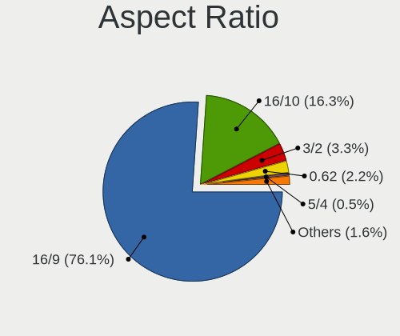

| Ratio   | Notebooks | Percent |
|---------|-----------|---------|
| 16/9    | 126       | 85.14%  |
| 16/10   | 15        | 10.14%  |
| 21/9    | 3         | 2.03%   |
| 5/4     | 1         | 0.68%   |
| 32/9    | 1         | 0.68%   |
| 0.62    | 1         | 0.68%   |
| Unknown | 1         | 0.68%   |

Monitor Area
------------

Area in inch²

| Area in inch² | Notebooks | Percent |
|----------------|-----------|---------|
| 101-110        | 59        | 33.91%  |
| 81-90          | 34        | 19.54%  |
| 121-130        | 19        | 10.92%  |
| 201-250        | 16        | 9.2%    |
| 71-80          | 9         | 5.17%   |
| 301-350        | 6         | 3.45%   |
| 61-70          | 4         | 2.3%    |
| 351-500        | 4         | 2.3%    |
| 251-300        | 4         | 2.3%    |
| 131-140        | 4         | 2.3%    |
| Unknown        | 4         | 2.3%    |
| More than 1000 | 2         | 1.15%   |
| 51-60          | 2         | 1.15%   |
| 41-50          | 2         | 1.15%   |
| 151-200        | 2         | 1.15%   |
| 141-150        | 1         | 0.57%   |
| 501-1000       | 1         | 0.57%   |
| 91-100         | 1         | 0.57%   |

Pixel Density
-------------

Pixels per inch

| Density       | Notebooks | Percent |
|---------------|-----------|---------|
| 121-160       | 81        | 47.93%  |
| 101-120       | 35        | 20.71%  |
| 51-100        | 32        | 18.93%  |
| More than 240 | 8         | 4.73%   |
| 161-240       | 8         | 4.73%   |
| Unknown       | 4         | 2.37%   |
| 1-50          | 1         | 0.59%   |

Multiple Monitors
-----------------

Total monitors connected

| Total | Notebooks | Percent |
|-------|-----------|---------|
| 1     | 108       | 75%     |
| 2     | 32        | 22.22%  |
| 3     | 2         | 1.39%   |
| 4     | 1         | 0.69%   |
| 0     | 1         | 0.69%   |

Network
-------

Net Controller Vendor
---------------------

Controller vendors

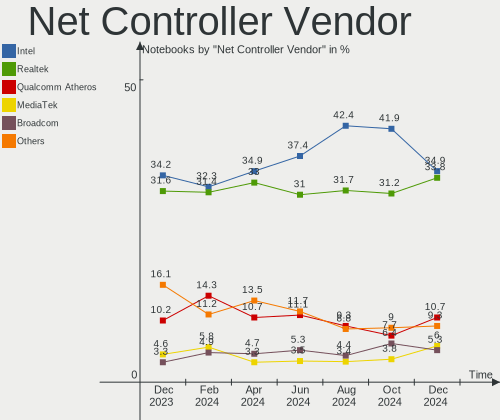

| Vendor                   | Notebooks | Percent |
|--------------------------|-----------|---------|
| Intel                    | 86        | 37.39%  |
| Realtek Semiconductor    | 81        | 35.22%  |
| Qualcomm Atheros         | 27        | 11.74%  |
| Broadcom                 | 13        | 5.65%   |
| ASIX Electronics         | 4         | 1.74%   |
| MEDIATEK                 | 3         | 1.3%    |
| Broadcom Limited         | 3         | 1.3%    |
| Ralink Technology        | 2         | 0.87%   |
| Xiaomi                   | 1         | 0.43%   |
| Sierra Wireless          | 1         | 0.43%   |
| Ralink                   | 1         | 0.43%   |
| NetGear                  | 1         | 0.43%   |
| Marvell Technology Group | 1         | 0.43%   |
| Lenovo                   | 1         | 0.43%   |
| Hewlett-Packard          | 1         | 0.43%   |
| Google                   | 1         | 0.43%   |
| Dell                     | 1         | 0.43%   |
| Cypress Semiconductor    | 1         | 0.43%   |
| Apple                    | 1         | 0.43%   |

Net Controller Model
--------------------

Controller models

| Model                                                             | Notebooks | Percent |
|-------------------------------------------------------------------|-----------|---------|
| Realtek RTL8111/8168/8411 PCI Express Gigabit Ethernet Controller | 44        | 15.49%  |
| Realtek RTL8153 Gigabit Ethernet Adapter                          | 13        | 4.58%   |
| Intel Wi-Fi 6 AX201                                               | 13        | 4.58%   |
| Realtek RTL810xE PCI Express Fast Ethernet controller             | 12        | 4.23%   |
| Intel Wi-Fi 6 AX200                                               | 11        | 3.87%   |
| Qualcomm Atheros QCA6174 802.11ac Wireless Network Adapter        | 7         | 2.46%   |
| Intel Tiger Lake PCH CNVi WiFi                                    | 7         | 2.46%   |
| Qualcomm Atheros QCA9565 / AR9565 Wireless Network Adapter        | 6         | 2.11%   |
| Intel Wireless 8265 / 8275                                        | 6         | 2.11%   |
| Intel Wireless 8260                                               | 6         | 2.11%   |
| Intel Wireless 7265                                               | 6         | 2.11%   |
| Broadcom BCM4313 802.11bgn Wireless Network Adapter               | 6         | 2.11%   |
| Intel Cannon Lake PCH CNVi WiFi                                   | 5         | 1.76%   |
| Realtek RTL8822CE 802.11ac PCIe Wireless Network Adapter          | 4         | 1.41%   |
| Realtek RTL8821CE 802.11ac PCIe Wireless Network Adapter          | 4         | 1.41%   |
| Realtek RTL8723BE PCIe Wireless Network Adapter                   | 4         | 1.41%   |
| Qualcomm Atheros QCA9377 802.11ac Wireless Network Adapter        | 4         | 1.41%   |
| Intel Ethernet Connection (3) I218-LM                             | 4         | 1.41%   |
| Intel Comet Lake PCH CNVi WiFi                                    | 4         | 1.41%   |
| ASIX AX88179 Gigabit Ethernet                                     | 4         | 1.41%   |
| Realtek Killer E2500 Gigabit Ethernet Controller                  | 3         | 1.06%   |
| Qualcomm Atheros AR9485 Wireless Network Adapter                  | 3         | 1.06%   |
| Qualcomm Atheros AR9285 Wireless Network Adapter (PCI-Express)    | 3         | 1.06%   |
| Intel Wireless-AC 9260                                            | 3         | 1.06%   |
| Intel Wireless 7260                                               | 3         | 1.06%   |
| Intel PRO/Wireless 3945ABG [Golan] Network Connection             | 3         | 1.06%   |
| Intel Ice Lake-LP PCH CNVi WiFi                                   | 3         | 1.06%   |
| Intel Ethernet Connection I219-V                                  | 3         | 1.06%   |
| Intel Ethernet Connection (7) I219-LM                             | 3         | 1.06%   |
| Intel Ethernet Connection (6) I219-LM                             | 3         | 1.06%   |
| Intel Ethernet Connection (14) I219-LM                            | 3         | 1.06%   |
| Intel Comet Lake PCH-LP CNVi WiFi                                 | 3         | 1.06%   |
| Realtek RTL88x2bu [AC1200 Techkey]                                | 2         | 0.7%    |
| Realtek RTL8192EE PCIe Wireless Network Adapter                   | 2         | 0.7%    |
| Realtek RTL8188EE Wireless Network Adapter                        | 2         | 0.7%    |
| Realtek 802.11ac NIC                                              | 2         | 0.7%    |
| Qualcomm Atheros AR928X Wireless Network Adapter (PCI-Express)    | 2         | 0.7%    |
| Qualcomm Atheros AR8132 Fast Ethernet                             | 2         | 0.7%    |
| MEDIATEK MT7630e 802.11bgn Wireless Network Adapter               | 2         | 0.7%    |
| Intel Ethernet Connection I219-LM                                 | 2         | 0.7%    |
| Intel Ethernet Connection (5) I219-LM                             | 2         | 0.7%    |
| Intel Ethernet Connection (4) I219-LM                             | 2         | 0.7%    |
| Intel Ethernet Connection (13) I219-V                             | 2         | 0.7%    |
| Intel Centrino Wireless-N 1030 [Rainbow Peak]                     | 2         | 0.7%    |
| Intel Centrino Advanced-N 6205 [Taylor Peak]                      | 2         | 0.7%    |
| Intel Cannon Point-LP CNVi [Wireless-AC]                          | 2         | 0.7%    |
| Intel 82579LM Gigabit Network Connection (Lewisville)             | 2         | 0.7%    |
| Broadcom Limited BCM4312 802.11b/g LP-PHY                         | 2         | 0.7%    |
| Broadcom BCM43142 802.11b/g/n                                     | 2         | 0.7%    |
| Xiaomi Mi/Redmi series (RNDIS)                                    | 1         | 0.35%   |
| Sierra Wireless EM7355                                            | 1         | 0.35%   |
| Realtek RTL8822BE 802.11a/b/g/n/ac WiFi adapter                   | 1         | 0.35%   |
| Realtek RTL8187B Wireless 802.11g 54Mbps Network Adapter          | 1         | 0.35%   |
| Realtek RTL8125 2.5GbE Controller                                 | 1         | 0.35%   |
| Realtek Killer E2600 Gigabit Ethernet Controller                  | 1         | 0.35%   |
| Realtek 802.11n WLAN Adapter                                      | 1         | 0.35%   |
| Ralink MT7610U ("Archer T2U" 2.4G+5G WLAN Adapter                 | 1         | 0.35%   |
| Ralink MT7601U Wireless Adapter                                   | 1         | 0.35%   |
| Ralink RT5390 [802.11 b/g/n 1T1R G-band PCI Express Single Chip]  | 1         | 0.35%   |
| Qualcomm Atheros QCA8171 Gigabit Ethernet                         | 1         | 0.35%   |

Wireless Vendor
---------------

Wireless vendors

| Vendor                | Notebooks | Percent |
|-----------------------|-----------|---------|
| Intel                 | 83        | 54.97%  |
| Qualcomm Atheros      | 25        | 16.56%  |
| Realtek Semiconductor | 22        | 14.57%  |
| Broadcom              | 10        | 6.62%   |
| MEDIATEK              | 3         | 1.99%   |
| Ralink Technology     | 2         | 1.32%   |
| Broadcom Limited      | 2         | 1.32%   |
| Sierra Wireless       | 1         | 0.66%   |
| Ralink                | 1         | 0.66%   |
| Hewlett-Packard       | 1         | 0.66%   |
| Dell                  | 1         | 0.66%   |

Wireless Model
--------------

Wireless models

| Model                                                            | Notebooks | Percent |
|------------------------------------------------------------------|-----------|---------|
| Intel Wi-Fi 6 AX201                                              | 13        | 8.5%    |
| Intel Wi-Fi 6 AX200                                              | 11        | 7.19%   |
| Qualcomm Atheros QCA6174 802.11ac Wireless Network Adapter       | 7         | 4.58%   |
| Intel Tiger Lake PCH CNVi WiFi                                   | 7         | 4.58%   |
| Qualcomm Atheros QCA9565 / AR9565 Wireless Network Adapter       | 6         | 3.92%   |
| Intel Wireless 8265 / 8275                                       | 6         | 3.92%   |
| Intel Wireless 8260                                              | 6         | 3.92%   |
| Intel Wireless 7265                                              | 6         | 3.92%   |
| Broadcom BCM4313 802.11bgn Wireless Network Adapter              | 6         | 3.92%   |
| Intel Cannon Lake PCH CNVi WiFi                                  | 5         | 3.27%   |
| Realtek RTL8822CE 802.11ac PCIe Wireless Network Adapter         | 4         | 2.61%   |
| Realtek RTL8821CE 802.11ac PCIe Wireless Network Adapter         | 4         | 2.61%   |
| Realtek RTL8723BE PCIe Wireless Network Adapter                  | 4         | 2.61%   |
| Qualcomm Atheros QCA9377 802.11ac Wireless Network Adapter       | 4         | 2.61%   |
| Intel Comet Lake PCH CNVi WiFi                                   | 4         | 2.61%   |
| Qualcomm Atheros AR9485 Wireless Network Adapter                 | 3         | 1.96%   |
| Qualcomm Atheros AR9285 Wireless Network Adapter (PCI-Express)   | 3         | 1.96%   |
| Intel Wireless-AC 9260                                           | 3         | 1.96%   |
| Intel Wireless 7260                                              | 3         | 1.96%   |
| Intel PRO/Wireless 3945ABG [Golan] Network Connection            | 3         | 1.96%   |
| Intel Ice Lake-LP PCH CNVi WiFi                                  | 3         | 1.96%   |
| Intel Comet Lake PCH-LP CNVi WiFi                                | 3         | 1.96%   |
| Realtek RTL88x2bu [AC1200 Techkey]                               | 2         | 1.31%   |
| Realtek RTL8192EE PCIe Wireless Network Adapter                  | 2         | 1.31%   |
| Realtek RTL8188EE Wireless Network Adapter                       | 2         | 1.31%   |
| Realtek 802.11ac NIC                                             | 2         | 1.31%   |
| Qualcomm Atheros AR928X Wireless Network Adapter (PCI-Express)   | 2         | 1.31%   |
| MEDIATEK MT7630e 802.11bgn Wireless Network Adapter              | 2         | 1.31%   |
| Intel Centrino Wireless-N 1030 [Rainbow Peak]                    | 2         | 1.31%   |
| Intel Centrino Advanced-N 6205 [Taylor Peak]                     | 2         | 1.31%   |
| Intel Cannon Point-LP CNVi [Wireless-AC]                         | 2         | 1.31%   |
| Broadcom Limited BCM4312 802.11b/g LP-PHY                        | 2         | 1.31%   |
| Broadcom BCM43142 802.11b/g/n                                    | 2         | 1.31%   |
| Sierra Wireless EM7355                                           | 1         | 0.65%   |
| Realtek RTL8822BE 802.11a/b/g/n/ac WiFi adapter                  | 1         | 0.65%   |
| Realtek RTL8187B Wireless 802.11g 54Mbps Network Adapter         | 1         | 0.65%   |
| Realtek 802.11n WLAN Adapter                                     | 1         | 0.65%   |
| Ralink MT7610U ("Archer T2U" 2.4G+5G WLAN Adapter                | 1         | 0.65%   |
| Ralink MT7601U Wireless Adapter                                  | 1         | 0.65%   |
| Ralink RT5390 [802.11 b/g/n 1T1R G-band PCI Express Single Chip] | 1         | 0.65%   |
| MEDIATEK MT7921 802.11ax PCI Express Wireless Network Adapter    | 1         | 0.65%   |
| Intel Wireless Gigabit 17265                                     | 1         | 0.65%   |
| Intel Wireless 3165                                              | 1         | 0.65%   |
| Intel Wi-Fi 6 AX210/AX211/AX411 160MHz                           | 1         | 0.65%   |
| Intel PRO/Wireless 4965 AG or AGN [Kedron] Network Connection    | 1         | 0.65%   |
| Intel Centrino Advanced-N 6200                                   | 1         | 0.65%   |
| HP lt4112 Gobi 4G Module Network Device                          | 1         | 0.65%   |
| Dell DW5820e L850-GL                                             | 1         | 0.65%   |
| Broadcom BCM4352 802.11ac Wireless Network Adapter               | 1         | 0.65%   |
| Broadcom BCM4331 802.11a/b/g/n                                   | 1         | 0.65%   |

Ethernet Vendor
---------------

Ethernet vendors

| Vendor                   | Notebooks | Percent |
|--------------------------|-----------|---------|
| Realtek Semiconductor    | 73        | 56.15%  |
| Intel                    | 35        | 26.92%  |
| Qualcomm Atheros         | 6         | 4.62%   |
| Broadcom                 | 4         | 3.08%   |
| ASIX Electronics         | 4         | 3.08%   |
| Xiaomi                   | 1         | 0.77%   |
| NetGear                  | 1         | 0.77%   |
| Marvell Technology Group | 1         | 0.77%   |
| Lenovo                   | 1         | 0.77%   |
| Google                   | 1         | 0.77%   |
| Cypress Semiconductor    | 1         | 0.77%   |
| Broadcom Limited         | 1         | 0.77%   |
| Apple                    | 1         | 0.77%   |

Ethernet Model
--------------

Ethernet models

| Model                                                             | Notebooks | Percent |
|-------------------------------------------------------------------|-----------|---------|
| Realtek RTL8111/8168/8411 PCI Express Gigabit Ethernet Controller | 44        | 33.59%  |
| Realtek RTL8153 Gigabit Ethernet Adapter                          | 13        | 9.92%   |
| Realtek RTL810xE PCI Express Fast Ethernet controller             | 12        | 9.16%   |
| Intel Ethernet Connection (3) I218-LM                             | 4         | 3.05%   |
| ASIX AX88179 Gigabit Ethernet                                     | 4         | 3.05%   |
| Realtek Killer E2500 Gigabit Ethernet Controller                  | 3         | 2.29%   |
| Intel Ethernet Connection I219-V                                  | 3         | 2.29%   |
| Intel Ethernet Connection (7) I219-LM                             | 3         | 2.29%   |
| Intel Ethernet Connection (6) I219-LM                             | 3         | 2.29%   |
| Intel Ethernet Connection (14) I219-LM                            | 3         | 2.29%   |
| Qualcomm Atheros AR8132 Fast Ethernet                             | 2         | 1.53%   |
| Intel Ethernet Connection I219-LM                                 | 2         | 1.53%   |
| Intel Ethernet Connection (5) I219-LM                             | 2         | 1.53%   |
| Intel Ethernet Connection (4) I219-LM                             | 2         | 1.53%   |
| Intel Ethernet Connection (13) I219-V                             | 2         | 1.53%   |
| Intel 82579LM Gigabit Network Connection (Lewisville)             | 2         | 1.53%   |
| Xiaomi Mi/Redmi series (RNDIS)                                    | 1         | 0.76%   |
| Realtek RTL8125 2.5GbE Controller                                 | 1         | 0.76%   |
| Realtek Killer E2600 Gigabit Ethernet Controller                  | 1         | 0.76%   |
| Qualcomm Atheros QCA8171 Gigabit Ethernet                         | 1         | 0.76%   |
| Qualcomm Atheros Killer E2400 Gigabit Ethernet Controller         | 1         | 0.76%   |
| Qualcomm Atheros Killer E220x Gigabit Ethernet Controller         | 1         | 0.76%   |
| Qualcomm Atheros AR8152 v1.1 Fast Ethernet                        | 1         | 0.76%   |
| NetGear AirCard 790S                                              | 1         | 0.76%   |
| Marvell Group 88E8036 PCI-E Fast Ethernet Controller              | 1         | 0.76%   |
| Lenovo USB-C Dock Ethernet                                        | 1         | 0.76%   |
| Intel Ethernet Connection I218-LM                                 | 1         | 0.76%   |
| Intel Ethernet Connection I217-V                                  | 1         | 0.76%   |
| Intel Ethernet Connection I217-LM                                 | 1         | 0.76%   |
| Intel Ethernet Connection (14) I219-V                             | 1         | 0.76%   |
| Intel Ethernet Connection (11) I219-V                             | 1         | 0.76%   |
| Intel Ethernet Connection (10) I219-V                             | 1         | 0.76%   |
| Intel Ethernet Connection (10) I219-LM                            | 1         | 0.76%   |
| Intel 82577LM Gigabit Network Connection                          | 1         | 0.76%   |
| Intel 82567LM Gigabit Network Connection                          | 1         | 0.76%   |
| Google Nexus/Pixel Device (tether)                                | 1         | 0.76%   |
| Cypress K38231_03                                                 | 1         | 0.76%   |
| Broadcom NetXtreme BCM57765 Gigabit Ethernet PCIe                 | 1         | 0.76%   |
| Broadcom NetXtreme BCM5764M Gigabit Ethernet PCIe                 | 1         | 0.76%   |
| Broadcom NetXtreme BCM5761e Gigabit Ethernet PCIe                 | 1         | 0.76%   |
| Broadcom NetXtreme BCM5752 Gigabit Ethernet PCI Express           | 1         | 0.76%   |
| Broadcom Limited BCM4401-B0 100Base-TX                            | 1         | 0.76%   |
| Apple iPad 4/Mini1                                                | 1         | 0.76%   |

Net Controller Kind
-------------------

Ethernet, WiFi or modem

| Kind     | Notebooks | Percent |
|----------|-----------|---------|
| WiFi     | 143       | 54.79%  |
| Ethernet | 118       | 45.21%  |

Used Controller
---------------

Currently used network controller

| Kind     | Notebooks | Percent |
|----------|-----------|---------|
| WiFi     | 118       | 75.64%  |
| Ethernet | 38        | 24.36%  |

NICs
----

Total network controllers on board

| Total | Notebooks | Percent |
|-------|-----------|---------|
| 2     | 106       | 73.61%  |
| 1     | 36        | 25%     |
| 3     | 1         | 0.69%   |
| 0     | 1         | 0.69%   |

IPv6
----

IPv6 vs IPv4

| Used | Notebooks | Percent |
|------|-----------|---------|
| No   | 73        | 50.69%  |
| Yes  | 71        | 49.31%  |

Bluetooth
---------

Bluetooth Vendor
----------------

Controller vendors

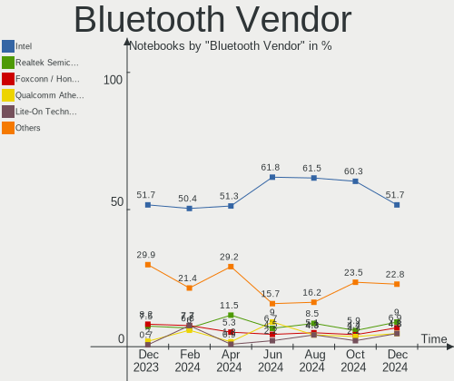

| Vendor                          | Notebooks | Percent |
|---------------------------------|-----------|---------|
| Intel                           | 72        | 58.54%  |
| Realtek Semiconductor           | 12        | 9.76%   |
| Qualcomm Atheros Communications | 9         | 7.32%   |
| IMC Networks                    | 6         | 4.88%   |
| Broadcom                        | 5         | 4.07%   |
| Lite-On Technology              | 4         | 3.25%   |
| Foxconn / Hon Hai               | 4         | 3.25%   |
| Cambridge Silicon Radio         | 3         | 2.44%   |
| Dell                            | 2         | 1.63%   |
| TP-Link                         | 1         | 0.81%   |
| Toshiba                         | 1         | 0.81%   |
| Ralink Technology               | 1         | 0.81%   |
| MediaTek                        | 1         | 0.81%   |
| ASUSTek Computer                | 1         | 0.81%   |
| Apple                           | 1         | 0.81%   |

Bluetooth Model
---------------

Controller models

| Model                                               | Notebooks | Percent |
|-----------------------------------------------------|-----------|---------|
| Intel AX201 Bluetooth                               | 26        | 21.14%  |
| Intel Bluetooth wireless interface                  | 20        | 16.26%  |
| Realtek Bluetooth Radio                             | 10        | 8.13%   |
| Intel Bluetooth 9460/9560 Jefferson Peak (JfP)      | 10        | 8.13%   |
| Intel AX200 Bluetooth                               | 10        | 8.13%   |
| Qualcomm Atheros  Bluetooth Device                  | 4         | 3.25%   |
| Qualcomm Atheros AR3012 Bluetooth 4.0               | 4         | 3.25%   |
| Intel Wireless-AC 9260 Bluetooth Adapter            | 3         | 2.44%   |
| Cambridge Silicon Radio Bluetooth Dongle (HCI mode) | 3         | 2.44%   |
| Lite-On Bluetooth Device                            | 2         | 1.63%   |
| Intel Bluetooth Device                              | 2         | 1.63%   |
| IMC Networks Bluetooth Radio                        | 2         | 1.63%   |
| IMC Networks Bluetooth Device                       | 2         | 1.63%   |
| Foxconn / Hon Hai Bluetooth Device                  | 2         | 1.63%   |
| Dell Wireless 365 Bluetooth                         | 2         | 1.63%   |
| Broadcom BCM43142A0 Bluetooth Device                | 2         | 1.63%   |
| Broadcom BCM2070 Bluetooth Device                   | 2         | 1.63%   |
| TP-Link TP-TR- UB500 Adapter                       | 1         | 0.81%   |
| Toshiba Bluetooth Device                            | 1         | 0.81%   |
| Realtek RTL8723B Bluetooth                          | 1         | 0.81%   |
| Realtek  Bluetooth 4.2 Adapter                      | 1         | 0.81%   |
| Ralink CSR BS8510                                   | 1         | 0.81%   |
| Qualcomm Atheros QCA61x4 Bluetooth 4.0              | 1         | 0.81%   |
| MediaTek BT                                         | 1         | 0.81%   |
| Lite-On Qualcomm Atheros QCA9377 Bluetooth          | 1         | 0.81%   |
| Lite-On Atheros AR3012 Bluetooth                    | 1         | 0.81%   |
| Intel AX210 Bluetooth                               | 1         | 0.81%   |
| IMC Networks Wireless_Device                        | 1         | 0.81%   |
| IMC Networks BCM20702A0                             | 1         | 0.81%   |
| Foxconn / Hon Hai BT                                | 1         | 0.81%   |
| Foxconn / Hon Hai Bluetooth USB Host Controller     | 1         | 0.81%   |
| Broadcom BCM20702 Bluetooth 4.0 [ThinkPad]          | 1         | 0.81%   |
| ASUS Broadcom BCM20702A0 Bluetooth                  | 1         | 0.81%   |
| Apple Bluetooth Host Controller                     | 1         | 0.81%   |

Sound
-----

Sound Vendor
------------

Sound card vendors

| Vendor                 | Notebooks | Percent |
|------------------------|-----------|---------|
| Intel                  | 125       | 61.58%  |
| Nvidia                 | 35        | 17.24%  |
| AMD                    | 20        | 9.85%   |
| Realtek Semiconductor  | 6         | 2.96%   |
| GN Netcom              | 4         | 1.97%   |
| Logitech               | 2         | 0.99%   |
| C-Media Electronics    | 2         | 0.99%   |
| Texas Instruments      | 1         | 0.49%   |
| Plantronics            | 1         | 0.49%   |
| Lenovo                 | 1         | 0.49%   |
| Kingston Technology    | 1         | 0.49%   |
| Hewlett-Packard        | 1         | 0.49%   |
| Generalplus Technology | 1         | 0.49%   |
| Focusrite-Novation     | 1         | 0.49%   |
| Elite Silicon          | 1         | 0.49%   |
| Dell                   | 1         | 0.49%   |

Sound Model
-----------

Sound card models

| Model                                                                                             | Notebooks | Percent |
|---------------------------------------------------------------------------------------------------|-----------|---------|
| Intel Tiger Lake-LP Smart Sound Technology Audio Controller                                       | 15        | 6.38%   |
| Intel Sunrise Point-LP HD Audio                                                                   | 12        | 5.11%   |
| Intel Cannon Lake PCH cAVS                                                                        | 12        | 5.11%   |
| AMD Family 17h/19h HD Audio Controller                                                            | 12        | 5.11%   |
| Intel Tiger Lake-H HD Audio Controller                                                            | 11        | 4.68%   |
| Nvidia Audio device                                                                               | 9         | 3.83%   |
| Intel Wildcat Point-LP High Definition Audio Controller                                           | 9         | 3.83%   |
| Intel Broadwell-U Audio Controller                                                                | 9         | 3.83%   |
| Intel 5 Series/3400 Series Chipset High Definition Audio                                          | 7         | 2.98%   |
| AMD Renoir Radeon High Definition Audio Controller                                                | 7         | 2.98%   |
| Realtek Semiconductor USB Audio                                                                   | 6         | 2.55%   |
| Nvidia TU107 GeForce GTX 1650 High Definition Audio Controller                                    | 6         | 2.55%   |
| Intel 7 Series/C216 Chipset Family High Definition Audio Controller                               | 6         | 2.55%   |
| Intel Cannon Point-LP High Definition Audio Controller                                            | 5         | 2.13%   |
| Intel 6 Series/C200 Series Chipset Family High Definition Audio Controller                        | 5         | 2.13%   |
| AMD Raven/Raven2/Fenghuang HDMI/DP Audio Controller                                               | 5         | 2.13%   |
| Nvidia GP107GL High Definition Audio Controller                                                   | 4         | 1.7%    |
| Intel NM10/ICH7 Family High Definition Audio Controller                                           | 4         | 1.7%    |
| Intel Ice Lake-LP Smart Sound Technology Audio Controller                                         | 4         | 1.7%    |
| Intel Comet Lake PCH cAVS                                                                         | 4         | 1.7%    |
| Intel CM238 HD Audio Controller                                                                   | 4         | 1.7%    |
| Intel Atom Processor Z36xxx/Z37xxx Series High Definition Audio Controller                        | 4         | 1.7%    |
| Intel 82801I (ICH9 Family) HD Audio Controller                                                    | 4         | 1.7%    |
| Intel 8 Series/C220 Series Chipset High Definition Audio Controller                               | 4         | 1.7%    |
| Nvidia TU106 High Definition Audio Controller                                                     | 3         | 1.28%   |
| Nvidia GK208 HDMI/DP Audio Controller                                                             | 3         | 1.28%   |
| Intel Xeon E3-1200 v3/4th Gen Core Processor HD Audio Controller                                  | 3         | 1.28%   |
| Intel Haswell-ULT HD Audio Controller                                                             | 3         | 1.28%   |
| Intel Comet Lake PCH-LP cAVS                                                                      | 3         | 1.28%   |
| Intel 8 Series HD Audio Controller                                                                | 3         | 1.28%   |
| Intel 100 Series/C230 Series Chipset Family HD Audio Controller                                   | 3         | 1.28%   |
| Nvidia High Definition Audio Controller                                                           | 2         | 0.85%   |
| Nvidia GP106 High Definition Audio Controller                                                     | 2         | 0.85%   |
| Nvidia GF108 High Definition Audio Controller                                                     | 2         | 0.85%   |
| Intel Celeron/Pentium Silver Processor High Definition Audio                                      | 2         | 0.85%   |
| Intel 82801H (ICH8 Family) HD Audio Controller                                                    | 2         | 0.85%   |
| C-Media Electronics Audio Adapter (Unitek Y-247A)                                                 | 2         | 0.85%   |
| AMD Kabini HDMI/DP Audio                                                                          | 2         | 0.85%   |
| AMD FCH Azalia Controller                                                                         | 2         | 0.85%   |
| Texas Instruments PCM2912A Audio Codec                                                            | 1         | 0.43%   |
| Plantronics Blackwire 5220 Series                                                                 | 1         | 0.43%   |
| Nvidia TU116 High Definition Audio Controller                                                     | 1         | 0.43%   |
| Nvidia GT216 HDMI Audio Controller                                                                | 1         | 0.43%   |
| Nvidia GM204 High Definition Audio Controller                                                     | 1         | 0.43%   |
| Nvidia GM107 High Definition Audio Controller [GeForce 940MX]                                     | 1         | 0.43%   |
| Logitech Speakerphone P710e                                                                       | 1         | 0.43%   |
| Logitech Headset H390                                                                             | 1         | 0.43%   |
| Lenovo ThinkPad USB-C Dock Gen2 USB Audio                                                         | 1         | 0.43%   |
| Kingston Technology HyperX Cloud Revolver S                                                       | 1         | 0.43%   |
| Intel Crystal Well HD Audio Controller                                                            | 1         | 0.43%   |
| Intel Celeron N3350/Pentium N4200/Atom E3900 Series Audio Cluster                                 | 1         | 0.43%   |
| Intel Atom/Celeron/Pentium Processor x5-E8000/J3xxx/N3xxx Series High Definition Audio Controller | 1         | 0.43%   |
| Hewlett-Packard USB Audio                                                                         | 1         | 0.43%   |
| GN Netcom Jabra SPEAK 510                                                                         | 1         | 0.43%   |
| GN Netcom Jabra SPEAK 410 USB                                                                     | 1         | 0.43%   |
| GN Netcom Jabra Link 370                                                                          | 1         | 0.43%   |
| GN Netcom Jabra Evolve 65                                                                         | 1         | 0.43%   |
| GN Netcom Jabra EVOLVE 20 MS                                                                      | 1         | 0.43%   |
| Generalplus Technology Usb Audio Device                                                           | 1         | 0.43%   |
| Focusrite-Novation Scarlett 8i6 USB                                                               | 1         | 0.43%   |

Memory
------

Memory Vendor
-------------

Memory module vendors

| Vendor              | Notebooks | Percent |
|---------------------|-----------|---------|
| SK Hynix            | 38        | 29.23%  |
| Samsung Electronics | 35        | 26.92%  |
| Micron Technology   | 20        | 15.38%  |
| Crucial             | 9         | 6.92%   |
| Unknown             | 8         | 6.15%   |
| Kingston            | 8         | 6.15%   |
| Unknown (ABCD)      | 2         | 1.54%   |
| ELPIDA              | 2         | 1.54%   |
| Corsair             | 2         | 1.54%   |
| A-DATA Technology   | 2         | 1.54%   |
| Unknown (0x7301)    | 1         | 0.77%   |
| PKI                 | 1         | 0.77%   |
| Neo Forza           | 1         | 0.77%   |
| Nanya Technology    | 1         | 0.77%   |

Memory Model
------------

Memory module models

| Model                                                               | Notebooks | Percent |
|---------------------------------------------------------------------|-----------|---------|
| SK Hynix RAM HMA81GS6DJR8N-XN 8GB SODIMM DDR4 3200MT/s              | 5         | 3.76%   |
| Samsung RAM M471A5244CB0-CTD 4GB SODIMM DDR4 3266MT/s               | 4         | 3.01%   |
| Samsung RAM M471A1G44AB0-CWE 8GB SODIMM DDR4 3200MT/s               | 4         | 3.01%   |
| SK Hynix RAM HMAA2GS6CJR8N-XN 16GB SODIMM DDR4 3200MT/s             | 3         | 2.26%   |
| Samsung RAM M471A4G43AB1-CWE 32GB SODIMM DDR4 3200MT/s              | 3         | 2.26%   |
| Unknown (ABCD) RAM 123456789012345678 2048MB SODIMM LPDDR4 2400MT/s | 2         | 1.5%    |
| SK Hynix RAM HMT425S6AFR6A-PB 2GB SODIMM DDR3 1600MT/s              | 2         | 1.5%    |
| SK Hynix RAM HMAA4GS6AJR8N-XN 32GB SODIMM DDR4 3200MT/s             | 2         | 1.5%    |
| SK Hynix RAM HMA81GS6AFR8N-UH 8GB SODIMM DDR4 2667MT/s              | 2         | 1.5%    |
| Samsung RAM M471B5273DH0-CH9 4GB SODIMM DDR3 1334MT/s               | 2         | 1.5%    |
| Samsung RAM M471B5173EB0-YK0 4GB SODIMM DDR3 1600MT/s               | 2         | 1.5%    |
| Samsung RAM M471B5173DB0-YK0 4096MB SODIMM DDR3 1600MT/s            | 2         | 1.5%    |
| Samsung RAM M471A1K43DB1-CTD 8GB SODIMM DDR4 2667MT/s               | 2         | 1.5%    |
| Samsung RAM M471A1K43CB1-CRC 8GB SODIMM DDR4 2667MT/s               | 2         | 1.5%    |
| Micron RAM Module 4GB SODIMM DDR3 1600MT/s                          | 2         | 1.5%    |
| Micron RAM 4ATF51264HZ-2G6E1 4096MB SODIMM DDR4 2667MT/s            | 2         | 1.5%    |
| Micron RAM 16KTF51264HZ-1G6M1 4096MB SODIMM DDR3 1600MT/s           | 2         | 1.5%    |
| Unknown RAM Module 8GB SODIMM DDR3 1600MT/s                         | 1         | 0.75%   |
| Unknown RAM Module 8192MB SODIMM DDR4 2133MT/s                      | 1         | 0.75%   |
| Unknown RAM Module 8192MB Row Of Chips LPDDR4 4267MT/s              | 1         | 0.75%   |
| Unknown RAM Module 2GB Row Of Chips LPDDR4 4267MT/s                 | 1         | 0.75%   |
| Unknown RAM Module 2048MB SODIMM 667MT/s                            | 1         | 0.75%   |
| Unknown RAM Module 2048MB Row Of Chips LPDDR4 4267MT/s              | 1         | 0.75%   |
| Unknown RAM Module 1GB SODIMM DDR2 667MT/s                          | 1         | 0.75%   |
| Unknown RAM Module 1GB SODIMM DDR2                                  | 1         | 0.75%   |
| Unknown (0x7301) RAM G2TT-4AFW00 16GB SODIMM DDR4 3200MT/s          | 1         | 0.75%   |
| SK Hynix RAM Module 8192MB SODIMM DDR3 1066MT/s                     | 1         | 0.75%   |
| SK Hynix RAM Module 4096MB SODIMM DDR4 2400MT/s                     | 1         | 0.75%   |
| SK Hynix RAM Module 16GB SODIMM DDR4 3200MT/s                       | 1         | 0.75%   |
| SK Hynix RAM HMT851S6AMR6R-PB 4096MB SODIMM DDR3 1600MT/s           | 1         | 0.75%   |
| SK Hynix RAM HMT451S6MFR8A-PB 4GB SODIMM DDR3 1600MT/s              | 1         | 0.75%   |
| SK Hynix RAM HMT451S6DFR8A-PB 4GB SODIMM DDR3 1600MT/s              | 1         | 0.75%   |
| SK Hynix RAM HMT451S6BFR8A-PB 4GB SODIMM DDR3 1600MT/s              | 1         | 0.75%   |
| SK Hynix RAM HMT41GS6BFR8A-PB 8GB SODIMM DDR3 1600MT/s              | 1         | 0.75%   |
| SK Hynix RAM HMT351S6EFR8A-PB 4GB SODIMM DDR3 1600MT/s              | 1         | 0.75%   |
| SK Hynix RAM HMT351S6CFR8C-H9 4GB SODIMM DDR3 1334MT/s              | 1         | 0.75%   |
| SK Hynix RAM HMT351S6BFR8C-H9 4GB SODIMM DDR3 1334MT/s              | 1         | 0.75%   |
| SK Hynix RAM HMT351S6BFR8C-G7 4GB SODIMM DDR3 1067MT/s              | 1         | 0.75%   |
| SK Hynix RAM HMT325S6CFR8C-PB 2048MB SODIMM DDR3 1600MT/s           | 1         | 0.75%   |
| SK Hynix RAM HMAA2GS6AJR8N-XN 16384MB SODIMM DDR4 3200MT/s          | 1         | 0.75%   |
| SK Hynix RAM HMAA1GS6CJR6N-XN 8GB SODIMM DDR4 3200MT/s              | 1         | 0.75%   |
| SK Hynix RAM HMAA1GS6CJR6N-XN 8GB Row Of Chips DDR4 3200MT/s        | 1         | 0.75%   |
| SK Hynix RAM HMA851S6CJR6N-VK 4GB SODIMM DDR4 2667MT/s              | 1         | 0.75%   |
| SK Hynix RAM HMA82GS6JJR8N-VK 16GB SODIMM DDR4 2667MT/s             | 1         | 0.75%   |
| SK Hynix RAM HMA82GS6DJR8N-XN 16384MB SODIMM DDR4 3200MT/s          | 1         | 0.75%   |
| SK Hynix RAM HMA82GS6DJR8N-VK 16GB SODIMM DDR4 2667MT/s             | 1         | 0.75%   |
| SK Hynix RAM HMA81GS6JJR8N-VK 8GB SODIMM DDR4 2667MT/s              | 1         | 0.75%   |
| SK Hynix RAM HMA81GS6CJR8N-XN 8GB SODIMM DDR4 3200MT/s              | 1         | 0.75%   |
| SK Hynix RAM HMA451S6AFR8N-TF 4GB SODIMM DDR4 2133MT/s              | 1         | 0.75%   |
| SK Hynix RAM HCNNNCPMMLXR-NEE 2GB Row Of Chips LPDDR4 4267MT/s      | 1         | 0.75%   |
| SK Hynix RAM H5TC4G63CFR-PBA 2048MB SODIMM DDR3 1600MT/s            | 1         | 0.75%   |
| Samsung RAM Module 8GB SODIMM DDR4 2667MT/s                         | 1         | 0.75%   |
| Samsung RAM Module 16GB SODIMM DDR4 3200MT/s                        | 1         | 0.75%   |
| Samsung RAM Module 16GB SODIMM DDR4 2667MT/s                        | 1         | 0.75%   |
| Samsung RAM M471B5773CHS-CH9 2GB SODIMM DDR3 4199MT/s               | 1         | 0.75%   |
| Samsung RAM M471B5273DH0-YK0 4096MB SODIMM DDR3 1600MT/s            | 1         | 0.75%   |
| Samsung RAM M471B1G73EB0-YK0 8192MB SODIMM DDR3 1600MT/s            | 1         | 0.75%   |
| Samsung RAM M471B1G73DB0-YK0 8GB SODIMM DDR3 1600MT/s               | 1         | 0.75%   |
| Samsung RAM M471A5244CB0-CWE 4GB Row Of Chips DDR4 3200MT/s         | 1         | 0.75%   |
| Samsung RAM M471A5244CB0-CRC 4096MB SODIMM DDR4 2667MT/s            | 1         | 0.75%   |

Memory Kind
-----------

Memory module kinds

| Kind    | Notebooks | Percent |
|---------|-----------|---------|
| DDR4    | 69        | 62.73%  |
| DDR3    | 29        | 26.36%  |
| LPDDR4  | 6         | 5.45%   |
| DDR2    | 2         | 1.82%   |
| DDR     | 2         | 1.82%   |
| SDRAM   | 1         | 0.91%   |
| Unknown | 1         | 0.91%   |

Memory Form Factor
------------------

Physical design of the memory module

| Name         | Notebooks | Percent |
|--------------|-----------|---------|
| SODIMM       | 104       | 92.86%  |
| Row Of Chips | 8         | 7.14%   |

Memory Size
-----------

Memory module size

| Size  | Notebooks | Percent |
|-------|-----------|---------|
| 8192  | 43        | 36.75%  |
| 4096  | 32        | 27.35%  |
| 16384 | 24        | 20.51%  |
| 2048  | 10        | 8.55%   |
| 32768 | 6         | 5.13%   |
| 1024  | 2         | 1.71%   |

Memory Speed
------------

Memory module speed

| Speed   | Notebooks | Percent |
|---------|-----------|---------|
| 3200    | 36        | 31.58%  |
| 2667    | 25        | 21.93%  |
| 1600    | 19        | 16.67%  |
| 2400    | 6         | 5.26%   |
| 1334    | 5         | 4.39%   |
| 4267    | 4         | 3.51%   |
| 3266    | 4         | 3.51%   |
| 667     | 4         | 3.51%   |
| 2133    | 3         | 2.63%   |
| 1067    | 2         | 1.75%   |
| 4199    | 1         | 0.88%   |
| 1867    | 1         | 0.88%   |
| 1777    | 1         | 0.88%   |
| 1333    | 1         | 0.88%   |
| 1066    | 1         | 0.88%   |
| Unknown | 1         | 0.88%   |

Printers & scanners
-------------------

Printer Vendor
--------------

Printer device vendors

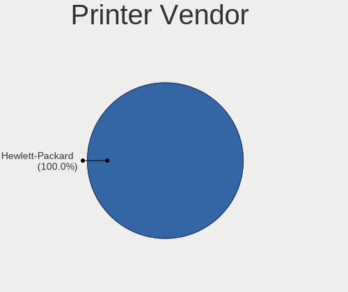

| Vendor      | Notebooks | Percent |
|-------------|-----------|---------|
| Xiaomi      | 1         | 33.33%  |
| Seiko Epson | 1         | 33.33%  |
| Canon       | 1         | 33.33%  |

Printer Model
-------------

Printer device models

| Model                      | Notebooks | Percent |
|----------------------------|-----------|---------|
| Xiaomi MiMouse 2           | 1         | 33.33%  |
| Seiko Epson XP-2150 Series | 1         | 33.33%  |
| Canon PIXMA MG3600 Series  | 1         | 33.33%  |

Scanner Vendor
--------------

Scanner device vendors

Zero info for selected period =(

Scanner Model
-------------

Scanner device models

Zero info for selected period =(

Camera
------

Camera Vendor
-------------

Camera device vendors

| Vendor                                 | Notebooks | Percent |
|----------------------------------------|-----------|---------|
| Chicony Electronics                    | 25        | 19.23%  |
| Microdia                               | 23        | 17.69%  |
| Realtek Semiconductor                  | 14        | 10.77%  |
| Acer                                   | 14        | 10.77%  |
| IMC Networks                           | 13        | 10%     |
| Sunplus Innovation Technology          | 6         | 4.62%   |
| Cheng Uei Precision Industry (Foxlink) | 6         | 4.62%   |
| Lite-On Technology                     | 5         | 3.85%   |
| Luxvisions Innotech Limited            | 4         | 3.08%   |
| Silicon Motion                         | 3         | 2.31%   |
| Quanta                                 | 3         | 2.31%   |
| Apple                                  | 3         | 2.31%   |
| Syntek                                 | 2         | 1.54%   |
| Sonix Technology                       | 2         | 1.54%   |
| Ricoh                                  | 2         | 1.54%   |
| Logitech                               | 2         | 1.54%   |
| webcam                                 | 1         | 0.77%   |
| DJJHFA1BIF5CB0                         | 1         | 0.77%   |
| Alcor Micro                            | 1         | 0.77%   |

Camera Model
------------

Camera device models

| Model                                                                      | Notebooks | Percent |
|----------------------------------------------------------------------------|-----------|---------|
| Microdia Integrated_Webcam_HD                                              | 14        | 10.69%  |
| Realtek Integrated_Webcam_HD                                               | 7         | 5.34%   |
| Chicony Integrated Camera                                                  | 7         | 5.34%   |
| Chicony HD Webcam                                                          | 6         | 4.58%   |
| IMC Networks USB2.0 HD UVC WebCam                                          | 4         | 3.05%   |
| IMC Networks Integrated Camera                                             | 4         | 3.05%   |
| Sunplus Integrated_Webcam_HD                                               | 3         | 2.29%   |
| Luxvisions Innotech Limited HP HD Camera                                   | 3         | 2.29%   |
| Acer Integrated Camera                                                     | 3         | 2.29%   |
| Realtek USB2.0 VGA UVC WebCam                                              | 2         | 1.53%   |
| Microdia Sonix USB 2.0 Camera                                              | 2         | 1.53%   |
| Microdia Lenovo EasyCamera                                                 | 2         | 1.53%   |
| Microdia Laptop_Integrated_Webcam_2M                                       | 2         | 1.53%   |
| Lite-On HP Wide Vision HD Camera                                           | 2         | 1.53%   |
| IMC Networks USB2.0 UVC HD Webcam                                          | 2         | 1.53%   |
| Chicony HP HD Webcam                                                       | 2         | 1.53%   |
| Cheng Uei Precision Industry (Foxlink) Webcam                              | 2         | 1.53%   |
| Cheng Uei Precision Industry (Foxlink) HP Wide Vision HD integrated webcam | 2         | 1.53%   |
| Apple iPhone 5/5C/5S/6/SE                                                  | 2         | 1.53%   |
| Acer SunplusIT INC. Integrated Camera                                      | 2         | 1.53%   |
| Acer HD Webcam                                                             | 2         | 1.53%   |
| webcam webcam                                                              | 1         | 0.76%   |
| Syntek Integrated Camera                                                   | 1         | 0.76%   |
| Syntek EasyCamera                                                          | 1         | 0.76%   |
| Sunplus Laptop_Integrated_Webcam_FHD                                       | 1         | 0.76%   |
| Sunplus Integrated_Webcam_FHD                                              | 1         | 0.76%   |
| Sunplus HP Wide Vision HD                                                  | 1         | 0.76%   |
| Sonix USB2.0 HD UVC WebCam                                                 | 1         | 0.76%   |
| Sonix USB Camera                                                           | 1         | 0.76%   |
| Silicon Motion WebCam SCB-1100N                                            | 1         | 0.76%   |
| Silicon Motion WebCam SCB-0385N                                            | 1         | 0.76%   |
| Silicon Motion WebCam SC-13HDL11939N                                       | 1         | 0.76%   |
| Ricoh Visual Communication Camera VGP-VCC8 [R5U870]                        | 1         | 0.76%   |
| Ricoh Dell Laptop Integrated Webcam                                        | 1         | 0.76%   |
| Realtek VGA WebCam                                                         | 1         | 0.76%   |
| Realtek USB2.0 HD UVC WebCam                                               | 1         | 0.76%   |
| Realtek USB2.0 camera                                                      | 1         | 0.76%   |
| Realtek USB Camera                                                         | 1         | 0.76%   |
| Realtek Integrated Webcam HD                                               | 1         | 0.76%   |
| Realtek FULL HD 1080P Webcam                                               | 1         | 0.76%   |
| Quanta USB2.0 HD UVC WebCam                                                | 1         | 0.76%   |
| Quanta HP HD Camera                                                        | 1         | 0.76%   |
| Quanta HD User Facing                                                      | 1         | 0.76%   |
| Microdia Sonix 1.3 MP Laptop Integrated Webcam                             | 1         | 0.76%   |
| Microdia Laptop_Integrated_Webcam_HD                                       | 1         | 0.76%   |
| Microdia Integrated_Webcam_2M                                              | 1         | 0.76%   |
| Luxvisions Innotech Limited HP TrueVision HD Camera                        | 1         | 0.76%   |
| Logitech Webcam C930e                                                      | 1         | 0.76%   |
| Logitech C920 PRO HD Webcam                                                | 1         | 0.76%   |
| Lite-On HP Webcam                                                          | 1         | 0.76%   |
| Lite-On HP HD Webcam                                                       | 1         | 0.76%   |
| Lite-On HP HD Camera                                                       | 1         | 0.76%   |
| IMC Networks USB2.0 VGA UVC WebCam                                         | 1         | 0.76%   |
| IMC Networks TOSHIBA Web Camera - HD                                       | 1         | 0.76%   |
| IMC Networks Lenovo EasyCamera                                             | 1         | 0.76%   |
| DJJHFA1BIF5CB0 HP HD Camera                                                | 1         | 0.76%   |
| Chicony VGA Webcam                                                         | 1         | 0.76%   |
| Chicony USB2.0 VGA UVC WebCam                                              | 1         | 0.76%   |
| Chicony USB2.0 Camera                                                      | 1         | 0.76%   |
| Chicony USB 2.0 Camera                                                     | 1         | 0.76%   |

Security
--------

Fingerprint Vendor
------------------

Fingerprint sensor vendors

| Vendor                     | Notebooks | Percent |
|----------------------------|-----------|---------|
| Validity Sensors           | 10        | 37.04%  |
| Synaptics                  | 9         | 33.33%  |
| Shenzhen Goodix Technology | 6         | 22.22%  |
| LighTuning Technology      | 1         | 3.7%    |
| Elan Microelectronics      | 1         | 3.7%    |

Fingerprint Model
-----------------

Fingerprint sensor models

| Model                                                                      | Notebooks | Percent |
|----------------------------------------------------------------------------|-----------|---------|
| Synaptics Prometheus MIS Touch Fingerprint Reader                          | 5         | 18.52%  |
| Shenzhen Goodix Fingerprint Reader                                         | 3         | 11.11%  |
| Unknown                                                                    | 3         | 11.11%  |
| Validity Sensors VFS495 Fingerprint Reader                                 | 2         | 7.41%   |
| Validity Sensors Swipe Fingerprint Sensor                                  | 2         | 7.41%   |
| Validity Sensors Fingerprint scanner                                       | 2         | 7.41%   |
| Shenzhen Goodix  Fingerprint Device                                        | 2         | 7.41%   |
| Validity Sensors VFS7500 Touch Fingerprint Sensor                          | 1         | 3.7%    |
| Validity Sensors VFS5011 Fingerprint Reader                                | 1         | 3.7%    |
| Validity Sensors VFS 5011 fingerprint sensor                               | 1         | 3.7%    |
| Validity Sensors Synaptics VFS7552 Touch Fingerprint Sensor with PurePrint | 1         | 3.7%    |
| Synaptics  VFS7552 Touch Fingerprint Sensor with PurePrint                 | 1         | 3.7%    |
| Shenzhen Goodix FingerPrint                                                | 1         | 3.7%    |
| LighTuning EgisTec Touch Fingerprint Sensor                                | 1         | 3.7%    |
| Elan ELAN:ARM-M4                                                           | 1         | 3.7%    |

Chipcard Vendor
---------------

Chipcard module vendors

| Vendor          | Notebooks | Percent |
|-----------------|-----------|---------|
| Broadcom        | 7         | 53.85%  |
| Alcor Micro     | 4         | 30.77%  |
| O2 Micro        | 1         | 7.69%   |
| Hewlett-Packard | 1         | 7.69%   |

Chipcard Model
--------------

Chipcard module models

| Model                                          | Notebooks | Percent |
|------------------------------------------------|-----------|---------|
| Broadcom 5880                                  | 4         | 30.77%  |
| Alcor Micro AU9540 Smartcard Reader            | 4         | 30.77%  |
| Broadcom BCM5880 Secure Applications Processor | 3         | 23.08%  |
| O2 Micro Oz776 SmartCard Reader                | 1         | 7.69%   |
| Hewlett-Packard SC Keyboard - Apollo (Liteon)  | 1         | 7.69%   |

Unsupported
-----------

Unsupported Devices
-------------------

Total unsupported devices on board

| Total | Notebooks | Percent |
|-------|-----------|---------|
| 0     | 91        | 63.19%  |
| 1     | 42        | 29.17%  |
| 2     | 10        | 6.94%   |
| 3     | 1         | 0.69%   |

Unsupported Device Types
------------------------

Types of unsupported devices

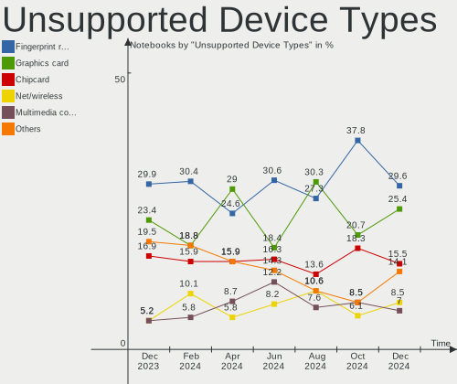

| Type                     | Notebooks | Percent |
|--------------------------|-----------|---------|
| Fingerprint reader       | 26        | 40.63%  |
| Chipcard                 | 12        | 18.75%  |
| Graphics card            | 8         | 12.5%   |
| Net/wireless             | 7         | 10.94%  |
| Storage                  | 2         | 3.13%   |
| Multimedia controller    | 2         | 3.13%   |
| Card reader              | 2         | 3.13%   |
| Camera                   | 2         | 3.13%   |
| Net/ethernet             | 1         | 1.56%   |
| Communication controller | 1         | 1.56%   |
| Bluetooth                | 1         | 1.56%   |

