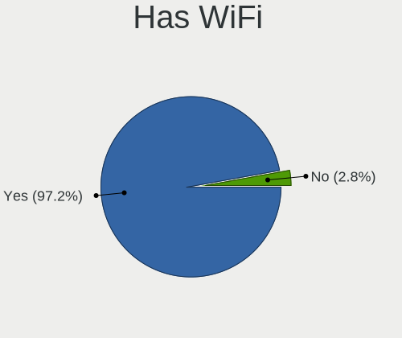
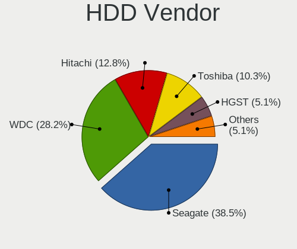
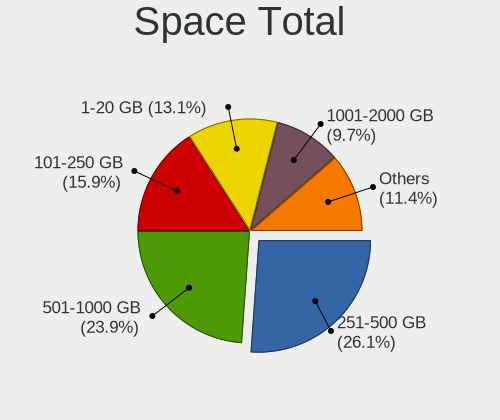
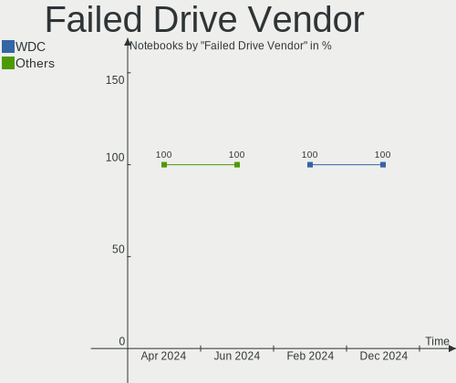
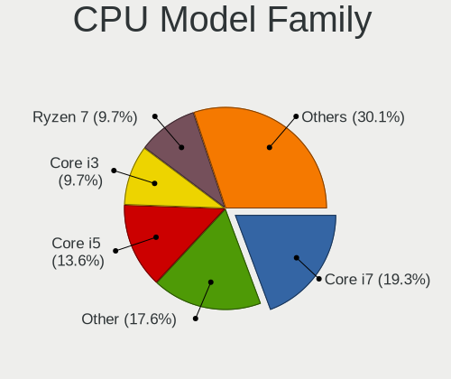
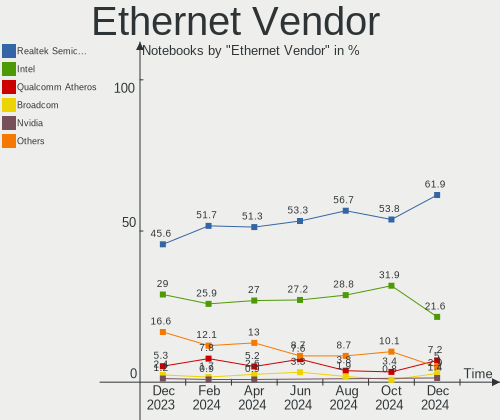
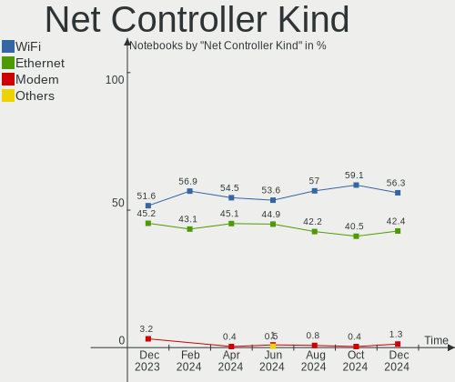

Linux in France - Hardware Trends (Notebooks)
---------------------------------------------

A project to identify most popular hardware characteristics and track their change
over time based on data collected by Linux users at https://Linux-Hardware.org.

Anyone can contribute to this report by the [hw-probe](https://github.com/linuxhw/hw-probe) tool:

    sudo -E hw-probe -all -upload

Period: May, 2023.

Contents
--------

* [ System ](#system)
  - [ OS                       ](#os)
  - [ OS Family                ](#os-family)
  - [ Kernel                   ](#kernel)
  - [ Kernel Family            ](#kernel-family)
  - [ Kernel Major Ver.        ](#kernel-major-ver)
  - [ Arch                     ](#arch)
  - [ DE                       ](#de)
  - [ Display Server           ](#display-server)
  - [ Display Manager          ](#display-manager)
  - [ OS Lang                  ](#os-lang)
  - [ Boot Mode                ](#boot-mode)
  - [ Filesystem               ](#filesystem)
  - [ Part. scheme             ](#part-scheme)
  - [ Dual Boot with Linux/BSD ](#dual-boot-with-linuxbsd)
  - [ Dual Boot (Win)          ](#dual-boot-win)

* [ Board ](#board)
  - [ Vendor                   ](#vendor)
  - [ Model                    ](#model)
  - [ Model Family             ](#model-family)
  - [ MFG Year                 ](#mfg-year)
  - [ Form Factor              ](#form-factor)
  - [ Secure Boot              ](#secure-boot)
  - [ Coreboot                 ](#coreboot)
  - [ RAM Size                 ](#ram-size)
  - [ RAM Used                 ](#ram-used)
  - [ Total Drives             ](#total-drives)
  - [ Has CD-ROM               ](#has-cd-rom)
  - [ Has Ethernet             ](#has-ethernet)
  - [ Has WiFi                 ](#has-wifi)
  - [ Has Bluetooth            ](#has-bluetooth)

* [ Location ](#location)
  - [ Country                  ](#country)
  - [ City                     ](#city)

* [ Drives ](#drives)
  - [ Drive Vendor             ](#drive-vendor)
  - [ Drive Model              ](#drive-model)
  - [ HDD Vendor               ](#hdd-vendor)
  - [ SSD Vendor               ](#ssd-vendor)
  - [ Drive Kind               ](#drive-kind)
  - [ Drive Connector          ](#drive-connector)
  - [ Drive Size               ](#drive-size)
  - [ Space Total              ](#space-total)
  - [ Space Used               ](#space-used)
  - [ Malfunc. Drives          ](#malfunc-drives)
  - [ Malfunc. Drive Vendor    ](#malfunc-drive-vendor)
  - [ Malfunc. HDD Vendor      ](#malfunc-hdd-vendor)
  - [ Malfunc. Drive Kind      ](#malfunc-drive-kind)
  - [ Failed Drives            ](#failed-drives)
  - [ Failed Drive Vendor      ](#failed-drive-vendor)
  - [ Drive Status             ](#drive-status)

* [ Storage controller ](#storage-controller)
  - [ Storage Vendor           ](#storage-vendor)
  - [ Storage Model            ](#storage-model)
  - [ Storage Kind             ](#storage-kind)

* [ Processor ](#processor)
  - [ CPU Vendor               ](#cpu-vendor)
  - [ CPU Model                ](#cpu-model)
  - [ CPU Model Family         ](#cpu-model-family)
  - [ CPU Cores                ](#cpu-cores)
  - [ CPU Sockets              ](#cpu-sockets)
  - [ CPU Threads              ](#cpu-threads)
  - [ CPU Op-Modes             ](#cpu-op-modes)
  - [ CPU Microcode            ](#cpu-microcode)
  - [ CPU Microarch            ](#cpu-microarch)

* [ Graphics ](#graphics)
  - [ GPU Vendor               ](#gpu-vendor)
  - [ GPU Model                ](#gpu-model)
  - [ GPU Combo                ](#gpu-combo)
  - [ GPU Driver               ](#gpu-driver)
  - [ GPU Memory               ](#gpu-memory)

* [ Monitor ](#monitor)
  - [ Monitor Vendor           ](#monitor-vendor)
  - [ Monitor Model            ](#monitor-model)
  - [ Monitor Resolution       ](#monitor-resolution)
  - [ Monitor Diagonal         ](#monitor-diagonal)
  - [ Monitor Width            ](#monitor-width)
  - [ Aspect Ratio             ](#aspect-ratio)
  - [ Monitor Area             ](#monitor-area)
  - [ Pixel Density            ](#pixel-density)
  - [ Multiple Monitors        ](#multiple-monitors)

* [ Network ](#network)
  - [ Net Controller Vendor    ](#net-controller-vendor)
  - [ Net Controller Model     ](#net-controller-model)
  - [ Wireless Vendor          ](#wireless-vendor)
  - [ Wireless Model           ](#wireless-model)
  - [ Ethernet Vendor          ](#ethernet-vendor)
  - [ Ethernet Model           ](#ethernet-model)
  - [ Net Controller Kind      ](#net-controller-kind)
  - [ Used Controller          ](#used-controller)
  - [ NICs                     ](#nics)
  - [ IPv6                     ](#ipv6)

* [ Bluetooth ](#bluetooth)
  - [ Bluetooth Vendor         ](#bluetooth-vendor)
  - [ Bluetooth Model          ](#bluetooth-model)

* [ Sound ](#sound)
  - [ Sound Vendor             ](#sound-vendor)
  - [ Sound Model              ](#sound-model)

* [ Memory ](#memory)
  - [ Memory Vendor            ](#memory-vendor)
  - [ Memory Model             ](#memory-model)
  - [ Memory Kind              ](#memory-kind)
  - [ Memory Form Factor       ](#memory-form-factor)
  - [ Memory Size              ](#memory-size)
  - [ Memory Speed             ](#memory-speed)

* [ Printers & scanners ](#printers--scanners)
  - [ Printer Vendor           ](#printer-vendor)
  - [ Printer Model            ](#printer-model)
  - [ Scanner Vendor           ](#scanner-vendor)
  - [ Scanner Model            ](#scanner-model)

* [ Camera ](#camera)
  - [ Camera Vendor            ](#camera-vendor)
  - [ Camera Model             ](#camera-model)

* [ Security ](#security)
  - [ Fingerprint Vendor       ](#fingerprint-vendor)
  - [ Fingerprint Model        ](#fingerprint-model)
  - [ Chipcard Vendor          ](#chipcard-vendor)
  - [ Chipcard Model           ](#chipcard-model)

* [ Unsupported ](#unsupported)
  - [ Unsupported Devices      ](#unsupported-devices)
  - [ Unsupported Device Types ](#unsupported-device-types)

System
------

OS
--

Installed operating systems

| Name                         | Notebooks | Percent |
|------------------------------|-----------|---------|
| Ubuntu 22.04                 | 38        | 22.49%  |
| Fedora 38                    | 14        | 8.28%   |
| Debian 11                    | 14        | 8.28%   |
| Linux Mint 21.1              | 11        | 6.51%   |
| Arch Rolling                 | 10        | 5.92%   |
| Ubuntu 23.04                 | 9         | 5.33%   |
| Debian 12                    | 8         | 4.73%   |
| Ubuntu 20.04                 | 7         | 4.14%   |
| Zorin 16                     | 4         | 2.37%   |
| OpenMandriva 23.03           | 4         | 2.37%   |
| Xubuntu 22.04                | 3         | 1.78%   |
| OpenMandriva 4.3             | 3         | 1.78%   |
| KDE neon 22.04               | 3         | 1.78%   |
| Xubuntu 18.04                | 2         | 1.18%   |
| Ubuntu 22.10                 | 2         | 1.18%   |
| Pop!_OS 22.04                | 2         | 1.18%   |
| Linux Mint 20.3              | 2         | 1.18%   |
| Kubuntu 22.04                | 2         | 1.18%   |
| Zorin 15                     | 1         | 0.59%   |
| Xubuntu 20.04                | 1         | 0.59%   |
| Ubuntu MATE 22.10            | 1         | 0.59%   |
| Ubuntu MATE 20.04            | 1         | 0.59%   |
| Ubuntu Budgie 22.04          | 1         | 0.59%   |
| SteamOS 3.4.6                | 1         | 0.59%   |
| Parrot 5.3                   | 1         | 0.59%   |
| openSUSE Tumbleweed-XXXXXXXX | 1         | 0.59%   |
| OpenMandriva 23.01           | 1         | 0.59%   |
| NuTyX                        | 1         | 0.59%   |
| MX 21                        | 1         | 0.59%   |
| Manjaro 22.1.3               | 1         | 0.59%   |
| Manjaro 22.1.1               | 1         | 0.59%   |
| Mageia 9                     | 1         | 0.59%   |
| Lubuntu 22.04                | 1         | 0.59%   |
| LMDE 5                       | 1         | 0.59%   |
| Linux Mint 21                | 1         | 0.59%   |
| Linux Mint 20.2              | 1         | 0.59%   |
| Linux Mint 20                | 1         | 0.59%   |
| Linux Lite 5.4               | 1         | 0.59%   |
| Kubuntu 23.04                | 1         | 0.59%   |
| Kali 2023.2                  | 1         | 0.59%   |

OS Family
---------

OS without a version

| Name          | Notebooks | Percent |
|---------------|-----------|---------|
| Ubuntu        | 56        | 33.14%  |
| Debian        | 22        | 13.02%  |
| Linux Mint    | 16        | 9.47%   |
| Fedora        | 16        | 9.47%   |
| Arch          | 10        | 5.92%   |
| OpenMandriva  | 8         | 4.73%   |
| Xubuntu       | 6         | 3.55%   |
| Zorin         | 5         | 2.96%   |
| Kubuntu       | 3         | 1.78%   |
| KDE neon      | 3         | 1.78%   |
| Ubuntu MATE   | 2         | 1.18%   |
| Pop!_OS       | 2         | 1.18%   |
| Manjaro       | 2         | 1.18%   |
| Kali          | 2         | 1.18%   |
| Ubuntu Budgie | 1         | 0.59%   |
| SteamOS       | 1         | 0.59%   |
| Parrot        | 1         | 0.59%   |
| openSUSE      | 1         | 0.59%   |
| NuTyX         | 1         | 0.59%   |
| MX            | 1         | 0.59%   |
| Mageia        | 1         | 0.59%   |
| Lubuntu       | 1         | 0.59%   |
| LMDE          | 1         | 0.59%   |
| Linux Lite    | 1         | 0.59%   |
| Endless       | 1         | 0.59%   |
| Elementary    | 1         | 0.59%   |
| Devuan        | 1         | 0.59%   |
| BunsenLabs    | 1         | 0.59%   |
| Artix         | 1         | 0.59%   |
| ArcoLinux     | 1         | 0.59%   |

Kernel
------

Version of the Linux kernel

| Version                      | Notebooks | Percent |
|------------------------------|-----------|---------|
| 5.19.0-41-generic            | 27        | 15.98%  |
| 5.15.0-71-generic            | 17        | 10.06%  |
| 6.2.0-20-generic             | 10        | 5.92%   |
| 5.15.0-72-generic            | 10        | 5.92%   |
| 6.2.14-300.fc38.x86_64       | 7         | 4.14%   |
| 5.19.0-42-generic            | 6         | 3.55%   |
| 6.2.15-300.fc38.x86_64       | 5         | 2.96%   |
| 5.10.0-22-amd64              | 5         | 2.96%   |
| 6.2.6-desktop-1omv2390       | 4         | 2.37%   |
| 6.1.0-9-amd64                | 4         | 2.37%   |
| 5.10.0-21-amd64              | 4         | 2.37%   |
| 6.3.1-arch1-1                | 3         | 1.78%   |
| 5.4.0-148-generic            | 3         | 1.78%   |
| 5.10.0-23-amd64              | 3         | 1.78%   |
| 6.3.3-arch1-1                | 2         | 1.18%   |
| 5.19.0-32-generic            | 2         | 1.18%   |
| 5.16.7-desktop-1omv4003      | 2         | 1.18%   |
| 5.15.0-56-generic            | 2         | 1.18%   |
| 6.3.5-zen1-1-zen             | 1         | 0.59%   |
| 6.3.4-dell-latitude-e5510    | 1         | 0.59%   |
| 6.3.4-asus-amd               | 1         | 0.59%   |
| 6.3.4-arch1-1                | 1         | 0.59%   |
| 6.3.2-060302-generic         | 1         | 0.59%   |
| 6.3.1-artix1-1               | 1         | 0.59%   |
| 6.3.1-arch2-1                | 1         | 0.59%   |
| 6.3.1-2-default              | 1         | 0.59%   |
| 6.3.1-060301-generic         | 1         | 0.59%   |
| 6.3.0-060300-generic         | 1         | 0.59%   |
| 6.2.6-arch1-1                | 1         | 0.59%   |
| 6.2.15-200.fc37.x86_64       | 1         | 0.59%   |
| 6.2.14-703.inttf.fc38.x86_64 | 1         | 0.59%   |
| 6.2.13-300.fc38.x86_64       | 1         | 0.59%   |
| 6.2.10-NuTyX                 | 1         | 0.59%   |
| 6.1.30-1-MANJARO             | 1         | 0.59%   |
| 6.1.28-1-lts                 | 1         | 0.59%   |
| 6.1.27-1-lts                 | 1         | 0.59%   |
| 6.1.26-1-MANJARO             | 1         | 0.59%   |
| 6.1.25                       | 1         | 0.59%   |
| 6.1.14-desktop-1.mga9        | 1         | 0.59%   |
| 6.1.1-desktop-1omv2290       | 1         | 0.59%   |

Kernel Family
-------------

Linux kernel without a distro release

| Version  | Notebooks | Percent |
|----------|-----------|---------|
| 5.19.0   | 38        | 22.49%  |
| 5.15.0   | 36        | 21.3%   |
| 6.1.0    | 13        | 7.69%   |
| 5.10.0   | 13        | 7.69%   |
| 6.2.0    | 10        | 5.92%   |
| 6.2.14   | 8         | 4.73%   |
| 6.3.1    | 7         | 4.14%   |
| 6.2.15   | 6         | 3.55%   |
| 5.4.0    | 6         | 3.55%   |
| 6.2.6    | 5         | 2.96%   |
| 6.3.4    | 3         | 1.78%   |
| 6.3.3    | 2         | 1.18%   |
| 5.18.0   | 2         | 1.18%   |
| 5.16.7   | 2         | 1.18%   |
| 4.15.0   | 2         | 1.18%   |
| 6.3.5    | 1         | 0.59%   |
| 6.3.2    | 1         | 0.59%   |
| 6.3.0    | 1         | 0.59%   |
| 6.2.13   | 1         | 0.59%   |
| 6.2.10   | 1         | 0.59%   |
| 6.1.30   | 1         | 0.59%   |
| 6.1.28   | 1         | 0.59%   |
| 6.1.27   | 1         | 0.59%   |
| 6.1.26   | 1         | 0.59%   |
| 6.1.25   | 1         | 0.59%   |
| 6.1.14   | 1         | 0.59%   |
| 6.1.1    | 1         | 0.59%   |
| 5.16.5   | 1         | 0.59%   |
| 5.15.107 | 1         | 0.59%   |
| 5.14.10  | 1         | 0.59%   |
| 5.13.0   | 1         | 0.59%   |

Kernel Major Ver.
-----------------

Linux kernel major version

| Version | Notebooks | Percent |
|---------|-----------|---------|
| 5.19    | 38        | 22.49%  |
| 5.15    | 37        | 21.89%  |
| 6.2     | 31        | 18.34%  |
| 6.1     | 20        | 11.83%  |
| 6.3     | 15        | 8.88%   |
| 5.10    | 13        | 7.69%   |
| 5.4     | 6         | 3.55%   |
| 5.16    | 3         | 1.78%   |
| 5.18    | 2         | 1.18%   |
| 4.15    | 2         | 1.18%   |
| 5.14    | 1         | 0.59%   |
| 5.13    | 1         | 0.59%   |

Arch
----

OS architecture (x86_64, i586, etc.)

| Name   | Notebooks | Percent |
|--------|-----------|---------|
| x86_64 | 167       | 98.82%  |
| i686   | 2         | 1.18%   |

DE
--

Desktop Environment

| Name            | Notebooks | Percent |
|-----------------|-----------|---------|
| GNOME           | 87        | 51.48%  |
| KDE5            | 30        | 17.75%  |
| XFCE            | 19        | 11.24%  |
| X-Cinnamon      | 13        | 7.69%   |
| MATE            | 6         | 3.55%   |
| Unknown         | 4         | 2.37%   |
| sway            | 2         | 1.18%   |
| Pantheon        | 2         | 1.18%   |
| LXQt            | 2         | 1.18%   |
| GNOME Flashback | 2         | 1.18%   |
| i3              | 1         | 0.59%   |
| Budgie          | 1         | 0.59%   |

Display Server
--------------

X11 or Wayland

| Name    | Notebooks | Percent |
|---------|-----------|---------|
| X11     | 105       | 62.13%  |
| Wayland | 53        | 31.36%  |
| Tty     | 8         | 4.73%   |
| Unknown | 2         | 1.18%   |
| Xcb     | 1         | 0.59%   |

Display Manager
---------------

SDDM, LightDM, etc.

| Name    | Notebooks | Percent |
|---------|-----------|---------|
| GDM3    | 49        | 28.99%  |
| Unknown | 42        | 24.85%  |
| LightDM | 34        | 20.12%  |
| SDDM    | 24        | 14.2%   |
| GDM     | 19        | 11.24%  |
| SLiM    | 1         | 0.59%   |

OS Lang
-------

Language

| Lang        | Notebooks | Percent |
|-------------|-----------|---------|
| fr_FR       | 129       | 76.33%  |
| en_US       | 30        | 17.75%  |
| en_GB       | 2         | 1.18%   |
| it_IT       | 1         | 0.59%   |
| fr_FR.utf-8 | 1         | 0.59%   |
| fr_CH       | 1         | 0.59%   |
| en_IN       | 1         | 0.59%   |
| en_IE       | 1         | 0.59%   |
| en_AG       | 1         | 0.59%   |
| de_DE       | 1         | 0.59%   |
| C           | 1         | 0.59%   |

Boot Mode
---------

EFI or BIOS

| Mode | Notebooks | Percent |
|------|-----------|---------|
| EFI  | 87        | 51.48%  |
| BIOS | 82        | 48.52%  |

Filesystem
----------

Type of filesystem

| Type    | Notebooks | Percent |
|---------|-----------|---------|
| Ext4    | 122       | 72.19%  |
| Btrfs   | 20        | 11.83%  |
| Tmpfs   | 17        | 10.06%  |
| Xfs     | 4         | 2.37%   |
| Overlay | 4         | 2.37%   |
| Zfs     | 1         | 0.59%   |
| Unknown | 1         | 0.59%   |

Part. scheme
------------

Scheme of partitioning

| Type    | Notebooks | Percent |
|---------|-----------|---------|
| GPT     | 109       | 64.5%   |
| Unknown | 40        | 23.67%  |
| MBR     | 20        | 11.83%  |

Dual Boot with Linux/BSD
------------------------

Hosting more than one Linux/BSD

| Dual boot | Notebooks | Percent |
|-----------|-----------|---------|
| No        | 150       | 88.76%  |
| Yes       | 19        | 11.24%  |

Dual Boot (Win)
---------------

Hosting Linux and Windows

| Dual boot | Notebooks | Percent |
|-----------|-----------|---------|
| No        | 123       | 72.78%  |
| Yes       | 46        | 27.22%  |

Board
-----

Vendor
------

Motherboard manufacturer

| Name                | Notebooks | Percent |
|---------------------|-----------|---------|
| Dell                | 29        | 17.16%  |
| ASUSTek Computer    | 29        | 17.16%  |
| Hewlett-Packard     | 27        | 15.98%  |
| Lenovo              | 25        | 14.79%  |
| Acer                | 12        | 7.1%    |
| Toshiba             | 7         | 4.14%   |
| Sony                | 5         | 2.96%   |
| MSI                 | 5         | 2.96%   |
| HUAWEI              | 5         | 2.96%   |
| Notebook            | 3         | 1.78%   |
| Apple               | 3         | 1.78%   |
| Samsung Electronics | 2         | 1.18%   |
| Fujitsu Siemens     | 2         | 1.18%   |
| Unknown             | 2         | 1.18%   |
| Valve               | 1         | 0.59%   |
| UNOWHY              | 1         | 0.59%   |
| Timi                | 1         | 0.59%   |
| Thomson             | 1         | 0.59%   |
| SLIMBOOK            | 1         | 0.59%   |
| Shuttle             | 1         | 0.59%   |
| Packard Bell        | 1         | 0.59%   |
| Medion              | 1         | 0.59%   |
| Jumper              | 1         | 0.59%   |
| Fujitsu             | 1         | 0.59%   |
| eMachines           | 1         | 0.59%   |
| AMI                 | 1         | 0.59%   |
| Alienware           | 1         | 0.59%   |

Model
-----

Motherboard model

| Name                                    | Notebooks | Percent |
|-----------------------------------------|-----------|---------|
| Unknown                                 | 3         | 1.78%   |
| Lenovo Legion 5 15ACH6H 82JU            | 2         | 1.18%   |
| HP Victus by Laptop 16-e0xxx            | 2         | 1.18%   |
| HP EliteBook 640 14 inch G9 Notebook PC | 2         | 1.18%   |
| Dell Precision 5520                     | 2         | 1.18%   |
| Dell Precision 5470                     | 2         | 1.18%   |
| Dell Latitude 7490                      | 2         | 1.18%   |
| ASUS K73SJ                              | 2         | 1.18%   |
| ASUS K55VJ                              | 2         | 1.18%   |
| Valve Jupiter                           | 1         | 0.59%   |
| UNOWHY Y13G011S4EI                      | 1         | 0.59%   |
| Toshiba Satellite Pro C660              | 1         | 0.59%   |
| Toshiba Satellite P300                  | 1         | 0.59%   |
| Toshiba Satellite L655                  | 1         | 0.59%   |
| Toshiba Satellite L300                  | 1         | 0.59%   |
| Toshiba Satellite C855-22N              | 1         | 0.59%   |
| Toshiba Satellite C660D                 | 1         | 0.59%   |
| Toshiba PORTEGE Z830                    | 1         | 0.59%   |
| Timi Xiaomi Book Pro 16 2022            | 1         | 0.59%   |
| Thomson N14C64WF                        | 1         | 0.59%   |
| Sony VPCZ12C5E                          | 1         | 0.59%   |
| Sony VPCF11M1E                          | 1         | 0.59%   |
| Sony VGN-FW51MF_H                       | 1         | 0.59%   |
| Sony VGN-AW11M_H                        | 1         | 0.59%   |
| Sony SVE1713K1EB                        | 1         | 0.59%   |
| SLIMBOOK Executive                      | 1         | 0.59%   |
| Shuttle X50V5                           | 1         | 0.59%   |
| Samsung R610                            | 1         | 0.59%   |
| Samsung N150/N210/N220                  | 1         | 0.59%   |
| Packard Bell EasyNote LJ75              | 1         | 0.59%   |
| Notebook NS5x_NS7xPU                    | 1         | 0.59%   |
| Notebook N7x0WU                         | 1         | 0.59%   |
| Notebook N150ZU                         | 1         | 0.59%   |
| MSI PS63 Modern 8MO                     | 1         | 0.59%   |
| MSI Katana GF76 12UEK                   | 1         | 0.59%   |
| MSI Katana GF66 11UE                    | 1         | 0.59%   |
| MSI GL73 8RC                            | 1         | 0.59%   |
| MSI GE70 2QE                            | 1         | 0.59%   |
| Medion Crawler E40                      | 1         | 0.59%   |
| Lenovo ThinkPad Z13 Gen 1 21D2002CFR    | 1         | 0.59%   |

Model Family
------------

Motherboard model prefix

| Name                  | Notebooks | Percent |
|-----------------------|-----------|---------|
| Lenovo ThinkPad       | 18        | 10.65%  |
| Dell Precision        | 9         | 5.33%   |
| Dell Latitude         | 9         | 5.33%   |
| Acer Aspire           | 9         | 5.33%   |
| HP EliteBook          | 7         | 4.14%   |
| ASUS VivoBook         | 7         | 4.14%   |
| Toshiba Satellite     | 6         | 3.55%   |
| Lenovo IdeaPad        | 5         | 2.96%   |
| HP Pavilion           | 5         | 2.96%   |
| Dell Inspiron         | 5         | 2.96%   |
| ASUS ASUS             | 4         | 2.37%   |
| HP ProBook            | 3         | 1.78%   |
| Dell XPS              | 3         | 1.78%   |
| Unknown               | 3         | 1.78%   |
| MSI Katana            | 2         | 1.18%   |
| Lenovo Legion         | 2         | 1.18%   |
| HP Victus             | 2         | 1.18%   |
| HP Presario           | 2         | 1.18%   |
| HP Laptop             | 2         | 1.18%   |
| ASUS K73SJ            | 2         | 1.18%   |
| ASUS K55VJ            | 2         | 1.18%   |
| Valve Jupiter         | 1         | 0.59%   |
| UNOWHY Y13G011S4EI    | 1         | 0.59%   |
| Toshiba PORTEGE       | 1         | 0.59%   |
| Timi Xiaomi           | 1         | 0.59%   |
| Thomson N14C64WF      | 1         | 0.59%   |
| Sony VPCZ12C5E        | 1         | 0.59%   |
| Sony VPCF11M1E        | 1         | 0.59%   |
| Sony VGN-FW51MF       | 1         | 0.59%   |
| Sony VGN-AW11M        | 1         | 0.59%   |
| Sony SVE1713K1EB      | 1         | 0.59%   |
| SLIMBOOK Executive    | 1         | 0.59%   |
| Shuttle X50V5         | 1         | 0.59%   |
| Samsung R610          | 1         | 0.59%   |
| Samsung N150          | 1         | 0.59%   |
| Packard Bell EasyNote | 1         | 0.59%   |
| Notebook NS5x         | 1         | 0.59%   |
| Notebook N7x0WU       | 1         | 0.59%   |
| Notebook N150ZU       | 1         | 0.59%   |
| MSI PS63              | 1         | 0.59%   |

MFG Year
--------

Motherboard manufacture year

| Year | Notebooks | Percent |
|------|-----------|---------|
| 2021 | 21        | 12.43%  |
| 2022 | 18        | 10.65%  |
| 2020 | 17        | 10.06%  |
| 2019 | 13        | 7.69%   |
| 2011 | 13        | 7.69%   |
| 2010 | 13        | 7.69%   |
| 2018 | 11        | 6.51%   |
| 2015 | 10        | 5.92%   |
| 2013 | 10        | 5.92%   |
| 2008 | 10        | 5.92%   |
| 2023 | 6         | 3.55%   |
| 2009 | 6         | 3.55%   |
| 2016 | 5         | 2.96%   |
| 2014 | 5         | 2.96%   |
| 2017 | 4         | 2.37%   |
| 2012 | 4         | 2.37%   |
| 2007 | 1         | 0.59%   |
| 2006 | 1         | 0.59%   |
| 2005 | 1         | 0.59%   |

Form Factor
-----------

Physical design of the computer

| Name     | Notebooks | Percent |
|----------|-----------|---------|
| Notebook | 169       | 100%    |

Secure Boot
-----------

Enabled or disabled

| State    | Notebooks | Percent |
|----------|-----------|---------|
| Disabled | 150       | 88.76%  |
| Enabled  | 19        | 11.24%  |

Coreboot
--------

Have coreboot on board

| Used | Notebooks | Percent |
|------|-----------|---------|
| No   | 169       | 100%    |

RAM Size
--------

Total RAM memory

| Size in GB  | Notebooks | Percent |
|-------------|-----------|---------|
| 4.01-8.0    | 49        | 28.99%  |
| 3.01-4.0    | 31        | 18.34%  |
| 16.01-24.0  | 29        | 17.16%  |
| 8.01-16.0   | 29        | 17.16%  |
| 32.01-64.0  | 15        | 8.88%   |
| 1.01-2.0    | 8         | 4.73%   |
| 64.01-256.0 | 4         | 2.37%   |
| 24.01-32.0  | 3         | 1.78%   |
| 0.51-1.0    | 1         | 0.59%   |

RAM Used
--------

Used RAM memory

| Used GB   | Notebooks | Percent |
|-----------|-----------|---------|
| 1.01-2.0  | 44        | 26.04%  |
| 2.01-3.0  | 40        | 23.67%  |
| 4.01-8.0  | 36        | 21.3%   |
| 3.01-4.0  | 28        | 16.57%  |
| 0.51-1.0  | 11        | 6.51%   |
| 8.01-16.0 | 10        | 5.92%   |

Total Drives
------------

Number of drives on board

| Drives | Notebooks | Percent |
|--------|-----------|---------|
| 1      | 120       | 71.01%  |
| 2      | 42        | 24.85%  |
| 3      | 5         | 2.96%   |
| 6      | 1         | 0.59%   |
| 4      | 1         | 0.59%   |

Has CD-ROM
----------

Has CD-ROM on board

| Presented | Notebooks | Percent |
|-----------|-----------|---------|
| No        | 111       | 65.68%  |
| Yes       | 58        | 34.32%  |

Has Ethernet
------------

Has Ethernet on board

| Presented | Notebooks | Percent |
|-----------|-----------|---------|
| Yes       | 130       | 76.92%  |
| No        | 39        | 23.08%  |

Has WiFi
--------

Has WiFi module

| Presented | Notebooks | Percent |
|-----------|-----------|---------|
| Yes       | 167       | 98.82%  |
| No        | 2         | 1.18%   |

Has Bluetooth
-------------

Has Bluetooth module

| Presented | Notebooks | Percent |
|-----------|-----------|---------|
| Yes       | 132       | 78.11%  |
| No        | 37        | 21.89%  |

Location
--------

Country
-------

Geographic location (country)

| Country | Notebooks | Percent |
|---------|-----------|---------|
| France  | 169       | 100%    |

City
----

Geographic location (city)

| City                      | Notebooks | Percent |
|---------------------------|-----------|---------|
| Paris                     | 24        | 14.2%   |
| Toulouse                  | 6         | 3.55%   |
| Marseille                 | 6         | 3.55%   |
| Nantes                    | 4         | 2.37%   |
| Rennes                    | 3         | 1.78%   |
| Poitiers                  | 3         | 1.78%   |
| Caen                      | 3         | 1.78%   |
| Villeurbanne              | 2         | 1.18%   |
| Vanves                    | 2         | 1.18%   |
| Tiranges                  | 2         | 1.18%   |
| Nancy                     | 2         | 1.18%   |
| Montpellier               | 2         | 1.18%   |
| Lyon                      | 2         | 1.18%   |
| Lille                     | 2         | 1.18%   |
| La Rochelle               | 2         | 1.18%   |
| La Roche-de-Glun          | 2         | 1.18%   |
| Évry                     | 2         | 1.18%   |
| Châtenay-Malabry         | 2         | 1.18%   |
| Argenteuil                | 2         | 1.18%   |
| Yzeure                    | 1         | 0.59%   |
| Vouille                   | 1         | 0.59%   |
| Villemomble               | 1         | 0.59%   |
| Villefranche-sur-Saône   | 1         | 0.59%   |
| Villebon-sur-Yvette       | 1         | 0.59%   |
| Vaureal                   | 1         | 0.59%   |
| Thouars                   | 1         | 0.59%   |
| Thonon-les-Bains          | 1         | 0.59%   |
| Telgruc-sur-Mer           | 1         | 0.59%   |
| Strasbourg                | 1         | 0.59%   |
| Siouville-Hague           | 1         | 0.59%   |
| Sartrouville              | 1         | 0.59%   |
| Saint-Vit                 | 1         | 0.59%   |
| Saint-Savournin           | 1         | 0.59%   |
| Saint-Priest-Bramefant    | 1         | 0.59%   |
| Saint-Pierre-du-Perray    | 1         | 0.59%   |
| Saint-Papoul              | 1         | 0.59%   |
| Saint-Maur-des-Fossés    | 1         | 0.59%   |
| Saint-Julien-de-Concelles | 1         | 0.59%   |
| Saint-Jacques-de-la-Lande | 1         | 0.59%   |
| Saint-Etienne             | 1         | 0.59%   |

Drives
------

Drive Vendor
------------

Hard drive vendors

| Vendor                      | Notebooks | Drives | Percent |
|-----------------------------|-----------|--------|---------|
| Samsung Electronics         | 39        | 45     | 18.14%  |
| WDC                         | 24        | 25     | 11.16%  |
| Toshiba                     | 18        | 18     | 8.37%   |
| Crucial                     | 17        | 17     | 7.91%   |
| Seagate                     | 16        | 16     | 7.44%   |
| SK hynix                    | 13        | 13     | 6.05%   |
| Unknown                     | 10        | 10     | 4.65%   |
| HGST                        | 9         | 9      | 4.19%   |
| SanDisk                     | 8         | 9      | 3.72%   |
| Kingston                    | 7         | 8      | 3.26%   |
| Intel                       | 7         | 8      | 3.26%   |
| Micron Technology           | 6         | 6      | 2.79%   |
| KIOXIA                      | 4         | 4      | 1.86%   |
| Kingston Technology Company | 3         | 3      | 1.4%    |
| Hitachi                     | 3         | 3      | 1.4%    |
| Fanxiang                    | 3         | 3      | 1.4%    |
| China                       | 3         | 3      | 1.4%    |
| Phison Electronics          | 2         | 2      | 0.93%   |
| Micron/Crucial Technology   | 2         | 3      | 0.93%   |
| LITEONIT                    | 2         | 2      | 0.93%   |
| Emtec                       | 2         | 2      | 0.93%   |
| Unknown                     | 2         | 2      | 0.93%   |
| Verbatim                    | 1         | 1      | 0.47%   |
| Teclast                     | 1         | 1      | 0.47%   |
| SPCC                        | 1         | 1      | 0.47%   |
| Solid State Storage         | 1         | 1      | 0.47%   |
| Silicon Motion              | 1         | 1      | 0.47%   |
| PNY                         | 1         | 1      | 0.47%   |
| Plextor                     | 1         | 1      | 0.47%   |
| NGFF                        | 1         | 1      | 0.47%   |
| LITEON                      | 1         | 1      | 0.47%   |
| Lexar                       | 1         | 1      | 0.47%   |
| LaCie                       | 1         | 1      | 0.47%   |
| Hewlett-Packard             | 1         | 1      | 0.47%   |
| CT2000MX                    | 1         | 1      | 0.47%   |
| ASMT                        | 1         | 2      | 0.47%   |
| Apple                       | 1         | 1      | 0.47%   |

Drive Model
-----------

Hard drive models

| Model                                               | Notebooks | Percent |
|-----------------------------------------------------|-----------|---------|
| Seagate ST1000LM035-1RK172 1TB                      | 4         | 1.79%   |
| Samsung NVMe SSD Controller SM981/PM981/PM983 256GB | 4         | 1.79%   |
| Unknown MMC Card  32GB                              | 3         | 1.35%   |
| Samsung SSD 860 EVO 500GB                           | 3         | 1.35%   |
| HGST HTS725050A7E630 500GB                          | 3         | 1.35%   |
| Crucial CT500MX500SSD1 500GB                        | 3         | 1.35%   |
| WDC WD2500BEVS-22UST0 250GB                         | 2         | 0.9%    |
| Toshiba MQ04ABF100 1TB                              | 2         | 0.9%    |
| Toshiba MQ01ABF050 500GB                            | 2         | 0.9%    |
| SK hynix PC801 NVMe 1TB                             | 2         | 0.9%    |
| SK hynix HFM512GD3JX013N 512GB                      | 2         | 0.9%    |
| Seagate ST9500325AS 500GB                           | 2         | 0.9%    |
| Seagate ST1000LX015-1U7172 1TB                      | 2         | 0.9%    |
| Sandisk WDC PC SN530 SDBPMPZ-512G-1101 512GB        | 2         | 0.9%    |
| Samsung SSD 850 EVO 120GB                           | 2         | 0.9%    |
| Samsung NVMe SSD Controller SM961/PM961/SM963 256GB | 2         | 0.9%    |
| Samsung NVMe SSD Controller PM9A1/PM9A3/980PRO 1TB  | 2         | 0.9%    |
| Micron/Crucial P2 NVMe PCIe SSD 1TB                 | 2         | 0.9%    |
| Micron MTFDKCD512TFK 512GB                          | 2         | 0.9%    |
| HGST HTS721010A9E630 1TB                            | 2         | 0.9%    |
| HGST HTS541010A9E680 1TB                            | 2         | 0.9%    |
| Crucial CT1000P3SSD8 1TB                            | 2         | 0.9%    |
| Unknown                                             | 2         | 0.9%    |
| WDC WDS500G2B0C-00PXH0 500GB                        | 1         | 0.45%   |
| WDC WDS120G2G0B-00EPW0 120GB SSD                    | 1         | 0.45%   |
| WDC WDS100T3X0C-00SJG0 1TB                          | 1         | 0.45%   |
| WDC WDS100T2B0C-00PXH0 1TB                          | 1         | 0.45%   |
| WDC WD7500BPVT-80HXZT3 752GB                        | 1         | 0.45%   |
| WDC WD7500BPVT-22HXZT1 752GB                        | 1         | 0.45%   |
| WDC WD5000LPVX-80V0TT0 500GB                        | 1         | 0.45%   |
| WDC WD5000LPLX-60ZNTT1 500GB                        | 1         | 0.45%   |
| WDC WD3200BEVT-75ZCT2 320GB                         | 1         | 0.45%   |
| WDC WD3200BEVT-22A23T0 320GB                        | 1         | 0.45%   |
| WDC WD1600BEVS-22RST0 160GB                         | 1         | 0.45%   |
| WDC WD16 00BEVT-60ZCT 160GB                         | 1         | 0.45%   |
| WDC WD10SPZX-17Z10T1 1TB                            | 1         | 0.45%   |
| WDC WD10JPVX-22JC3T0 1TB                            | 1         | 0.45%   |
| WDC WD10JPVX-11JC3T0 1TB                            | 1         | 0.45%   |
| WDC PC SN730 SDBPNTY-512G-1027 512GB                | 1         | 0.45%   |
| WDC PC SN730 SDBPNTY-512G                           | 1         | 0.45%   |

HDD Vendor
----------

Hard disk drive vendors

| Vendor              | Notebooks | Drives | Percent |
|---------------------|-----------|--------|---------|
| Seagate             | 16        | 16     | 29.63%  |
| WDC                 | 13        | 13     | 24.07%  |
| Toshiba             | 10        | 10     | 18.52%  |
| HGST                | 9         | 9      | 16.67%  |
| Hitachi             | 3         | 3      | 5.56%   |
| Samsung Electronics | 1         | 1      | 1.85%   |
| LaCie               | 1         | 1      | 1.85%   |
| ASMT                | 1         | 2      | 1.85%   |

SSD Vendor
----------

Solid state drive vendors

| Vendor              | Notebooks | Drives | Percent |
|---------------------|-----------|--------|---------|
| Samsung Electronics | 16        | 19     | 25%     |
| Crucial             | 12        | 12     | 18.75%  |
| SanDisk             | 6         | 6      | 9.38%   |
| Toshiba             | 3         | 3      | 4.69%   |
| Kingston            | 3         | 4      | 4.69%   |
| China               | 3         | 3      | 4.69%   |
| LITEONIT            | 2         | 2      | 3.13%   |
| Intel               | 2         | 2      | 3.13%   |
| Fanxiang            | 2         | 2      | 3.13%   |
| Emtec               | 2         | 2      | 3.13%   |
| WDC                 | 1         | 1      | 1.56%   |
| Verbatim            | 1         | 1      | 1.56%   |
| Teclast             | 1         | 1      | 1.56%   |
| SPCC                | 1         | 1      | 1.56%   |
| SK hynix            | 1         | 1      | 1.56%   |
| PNY                 | 1         | 1      | 1.56%   |
| Plextor             | 1         | 1      | 1.56%   |
| NGFF                | 1         | 1      | 1.56%   |
| LITEON              | 1         | 1      | 1.56%   |
| Lexar               | 1         | 1      | 1.56%   |
| Hewlett-Packard     | 1         | 1      | 1.56%   |
| CT2000MX            | 1         | 1      | 1.56%   |
| Apple               | 1         | 1      | 1.56%   |

Drive Kind
----------

HDD or SSD

| Kind | Notebooks | Drives | Percent |
|------|-----------|--------|---------|
| NVMe | 81        | 92     | 40.3%   |
| SSD  | 59        | 68     | 29.35%  |
| HDD  | 49        | 55     | 24.38%  |
| MMC  | 12        | 12     | 5.97%   |

Drive Connector
---------------

SATA, SAS, NVMe, etc.

| Type | Notebooks | Drives | Percent |
|------|-----------|--------|---------|
| SATA | 96        | 115    | 49.23%  |
| NVMe | 81        | 92     | 41.54%  |
| MMC  | 12        | 12     | 6.15%   |
| SAS  | 6         | 8      | 3.08%   |

Drive Size
----------

Size of hard drive

| Size in TB | Notebooks | Drives | Percent |
|------------|-----------|--------|---------|
| 0.01-0.5   | 66        | 77     | 61.11%  |
| 0.51-1.0   | 33        | 36     | 30.56%  |
| 1.01-2.0   | 7         | 7      | 6.48%   |
| 3.01-4.0   | 2         | 3      | 1.85%   |

Space Total
-----------

Amount of disk space available on the file system

| Size in GB     | Notebooks | Percent |
|----------------|-----------|---------|
| 251-500        | 54        | 31.95%  |
| 101-250        | 45        | 26.63%  |
| 501-1000       | 27        | 15.98%  |
| 1001-2000      | 18        | 10.65%  |
| 51-100         | 12        | 7.1%    |
| 1-20           | 4         | 2.37%   |
| More than 3000 | 3         | 1.78%   |
| 21-50          | 3         | 1.78%   |
| 2001-3000      | 2         | 1.18%   |
| Unknown        | 1         | 0.59%   |

Space Used
----------

Amount of used disk space

| Used GB        | Notebooks | Percent |
|----------------|-----------|---------|
| 1-20           | 52        | 30.77%  |
| 21-50          | 31        | 18.34%  |
| 251-500        | 21        | 12.43%  |
| 101-250        | 20        | 11.83%  |
| 51-100         | 20        | 11.83%  |
| 501-1000       | 15        | 8.88%   |
| 1001-2000      | 7         | 4.14%   |
| More than 3000 | 2         | 1.18%   |
| Unknown        | 1         | 0.59%   |

Malfunc. Drives
---------------

Drive models with a malfunction

| Model                                       | Notebooks | Drives | Percent |
|---------------------------------------------|-----------|--------|---------|
| WDC WD2500BEVS-22UST0 250GB                 | 1         | 1      | 9.09%   |
| Toshiba MQ01ABF050 500GB                    | 1         | 1      | 9.09%   |
| Toshiba MK6476GSX 640GB                     | 1         | 1      | 9.09%   |
| Toshiba MK6459GSXP 640GB                    | 1         | 1      | 9.09%   |
| Seagate ST9500325AS 500GB                   | 1         | 1      | 9.09%   |
| Seagate ST9160827AS 160GB                   | 1         | 1      | 9.09%   |
| Seagate ST2000LX001-1RG174 2TB              | 1         | 1      | 9.09%   |
| Seagate ST1000LX015-1U7172 1TB              | 1         | 1      | 9.09%   |
| Samsung Electronics SSD PM810 FDE 2.5 128GB | 1         | 1      | 9.09%   |
| Hitachi HTS543232L9SA00 320GB               | 1         | 1      | 9.09%   |
| HGST HTS545050A7E380 500GB                  | 1         | 1      | 9.09%   |

Malfunc. Drive Vendor
---------------------

Vendors of faulty drives

| Vendor              | Notebooks | Drives | Percent |
|---------------------|-----------|--------|---------|
| Seagate             | 4         | 4      | 36.36%  |
| Toshiba             | 3         | 3      | 27.27%  |
| WDC                 | 1         | 1      | 9.09%   |
| Samsung Electronics | 1         | 1      | 9.09%   |
| Hitachi             | 1         | 1      | 9.09%   |
| HGST                | 1         | 1      | 9.09%   |

Malfunc. HDD Vendor
-------------------

Vendors of faulty HDD drives

| Vendor  | Notebooks | Drives | Percent |
|---------|-----------|--------|---------|
| Seagate | 4         | 4      | 40%     |
| Toshiba | 3         | 3      | 30%     |
| WDC     | 1         | 1      | 10%     |
| Hitachi | 1         | 1      | 10%     |
| HGST    | 1         | 1      | 10%     |

Malfunc. Drive Kind
-------------------

Kinds of faulty drives

| Kind | Notebooks | Drives | Percent |
|------|-----------|--------|---------|
| HDD  | 10        | 10     | 90.91%  |
| SSD  | 1         | 1      | 9.09%   |

Failed Drives
-------------

Failed drive models

| Model                  | Notebooks | Drives | Percent |
|------------------------|-----------|--------|---------|
| Toshiba MQ04ABF100 1TB | 1         | 1      | 100%    |

Failed Drive Vendor
-------------------

Failed drive vendors

| Vendor  | Notebooks | Drives | Percent |
|---------|-----------|--------|---------|
| Toshiba | 1         | 1      | 100%    |

Drive Status
------------

Number of failed and malfunc. drives

| Status   | Notebooks | Drives | Percent |
|----------|-----------|--------|---------|
| Works    | 92        | 109    | 50.83%  |
| Detected | 77        | 106    | 42.54%  |
| Malfunc  | 11        | 11     | 6.08%   |
| Failed   | 1         | 1      | 0.55%   |

Storage controller
------------------

Storage Vendor
--------------

Storage controller vendors

| Vendor                           | Notebooks | Percent |
|----------------------------------|-----------|---------|
| Intel                            | 116       | 54.72%  |
| Samsung Electronics              | 25        | 11.79%  |
| SK hynix                         | 12        | 5.66%   |
| SanDisk                          | 11        | 5.19%   |
| AMD                              | 10        | 4.72%   |
| Micron/Crucial Technology        | 7         | 3.3%    |
| Kingston Technology Company      | 7         | 3.3%    |
| Micron Technology                | 6         | 2.83%   |
| Toshiba America Info Systems     | 5         | 2.36%   |
| KIOXIA                           | 4         | 1.89%   |
| Phison Electronics               | 2         | 0.94%   |
| Nvidia                           | 2         | 0.94%   |
| Solid State Storage Technology   | 1         | 0.47%   |
| Silicon Motion                   | 1         | 0.47%   |
| Silicon Integrated Systems [SiS] | 1         | 0.47%   |
| MAXIO Technology (Hangzhou)      | 1         | 0.47%   |
| JMicron Technology               | 1         | 0.47%   |

Storage Model
-------------

Storage controller models

| Model                                                                          | Notebooks | Percent |
|--------------------------------------------------------------------------------|-----------|---------|
| Samsung NVMe SSD Controller SM981/PM981/PM983                                  | 13        | 5.88%   |
| Intel 6 Series/C200 Series Chipset Family 6 port Mobile SATA AHCI Controller   | 13        | 5.88%   |
| Intel 82801IBM/IEM (ICH9M/ICH9M-E) 4 port SATA Controller [AHCI mode]          | 10        | 4.52%   |
| Intel Wildcat Point-LP SATA Controller [AHCI Mode]                             | 8         | 3.62%   |
| Intel Volume Management Device NVMe RAID Controller                            | 8         | 3.62%   |
| Intel Sunrise Point-LP SATA Controller [AHCI mode]                             | 8         | 3.62%   |
| Intel 82801 Mobile SATA Controller [RAID mode]                                 | 8         | 3.62%   |
| AMD FCH SATA Controller [AHCI mode]                                            | 8         | 3.62%   |
| Micron/Crucial P2 NVMe PCIe SSD                                                | 7         | 3.17%   |
| Intel Celeron/Pentium Silver Processor SATA Controller                         | 7         | 3.17%   |
| Intel 7 Series Chipset Family 6-port SATA Controller [AHCI mode]               | 7         | 3.17%   |
| Intel 5 Series/3400 Series Chipset 4 port SATA AHCI Controller                 | 7         | 3.17%   |
| SK hynix Gold P31/PC711 NVMe Solid State Drive                                 | 5         | 2.26%   |
| Samsung NVMe SSD Controller PM9A1/PM9A3/980PRO                                 | 5         | 2.26%   |
| Micron NVMe Storage Controller                                                 | 5         | 2.26%   |
| SanDisk WD Blue SN550 NVMe SSD                                                 | 4         | 1.81%   |
| Intel Q170/Q150/B150/H170/H110/Z170/CM236 Chipset SATA Controller [AHCI Mode]  | 4         | 1.81%   |
| Intel Cannon Lake Mobile PCH SATA AHCI Controller                              | 4         | 1.81%   |
| Intel 8 Series/C220 Series Chipset Family 6-port SATA Controller 1 [AHCI mode] | 4         | 1.81%   |
| Toshiba America Info Systems XG5 NVMe SSD Controller                           | 3         | 1.36%   |
| Samsung NVMe SSD Controller 980                                                | 3         | 1.36%   |
| KIOXIA Non-Volatile memory controller                                          | 3         | 1.36%   |
| Kingston Company U-SNS8154P3 NVMe SSD                                          | 3         | 1.36%   |
| Intel Tiger Lake-LP SATA Controller                                            | 3         | 1.36%   |
| Intel SSD 660P Series                                                          | 3         | 1.36%   |
| Intel Comet Lake SATA AHCI Controller                                          | 3         | 1.36%   |
| Intel Cannon Point-LP SATA Controller [AHCI Mode]                              | 3         | 1.36%   |
| Intel 8 Series SATA Controller 1 [AHCI mode]                                   | 3         | 1.36%   |
| Intel 5 Series/3400 Series Chipset 6 port SATA AHCI Controller                 | 3         | 1.36%   |
| Toshiba America Info Systems XG6 NVMe SSD Controller                           | 2         | 0.9%    |
| SK hynix Platinum P41 NVMe Solid State Drive 2TB                               | 2         | 0.9%    |
| SK hynix Non-Volatile memory controller                                        | 2         | 0.9%    |
| SanDisk WD Blue SN500 / PC SN520 NVMe SSD                                      | 2         | 0.9%    |
| SanDisk WD Black SN750 / PC SN730 NVMe SSD                                     | 2         | 0.9%    |
| SanDisk NVMe Controller                                                        | 2         | 0.9%    |
| Samsung NVMe SSD Controller SM961/PM961/SM963                                  | 2         | 0.9%    |
| Kingston Company Company Non-Volatile memory controller                        | 2         | 0.9%    |
| Kingston Company OM3PDP3 NVMe SSD                                              | 2         | 0.9%    |
| Intel Alder Lake-P SATA AHCI Controller                                        | 2         | 0.9%    |
| Intel 82801HM/HEM (ICH8M/ICH8M-E) SATA Controller [AHCI mode]                  | 2         | 0.9%    |

Storage Kind
------------

Kind of storage controller (IDE, SATA, NVMe, SAS, ...)

| Kind | Notebooks | Percent |
|------|-----------|---------|
| SATA | 111       | 52.11%  |
| NVMe | 80        | 37.56%  |
| RAID | 18        | 8.45%   |
| IDE  | 4         | 1.88%   |

Processor
---------

CPU Vendor
----------

Processor vendors

| Vendor | Notebooks | Percent |
|--------|-----------|---------|
| Intel  | 143       | 84.62%  |
| AMD    | 26        | 15.38%  |

CPU Model
---------

Processor models

| Model                                       | Notebooks | Percent |
|---------------------------------------------|-----------|---------|
| Intel Core i7-8565U CPU @ 1.80GHz           | 4         | 2.37%   |
| AMD Ryzen 5 5600H with Radeon Graphics      | 4         | 2.37%   |
| Intel Core i7-5500U CPU @ 2.40GHz           | 3         | 1.78%   |
| Intel Core i5-4300U CPU @ 1.90GHz           | 3         | 1.78%   |
| Intel Celeron N4120 CPU @ 1.10GHz           | 3         | 1.78%   |
| Intel 12th Gen Core i7-12700H               | 3         | 1.78%   |
| Intel 12th Gen Core i5-1240P                | 3         | 1.78%   |
| Intel Core i9-10885H CPU @ 2.40GHz          | 2         | 1.18%   |
| Intel Core i7-9750H CPU @ 2.60GHz           | 2         | 1.18%   |
| Intel Core i7-8650U CPU @ 1.90GHz           | 2         | 1.18%   |
| Intel Core i7-6700HQ CPU @ 2.60GHz          | 2         | 1.18%   |
| Intel Core i7-4702MQ CPU @ 2.20GHz          | 2         | 1.18%   |
| Intel Core i7-3630QM CPU @ 2.40GHz          | 2         | 1.18%   |
| Intel Core i7-10510U CPU @ 1.80GHz          | 2         | 1.18%   |
| Intel Core i7 CPU M 640 @ 2.80GHz           | 2         | 1.18%   |
| Intel Core i7 CPU M 620 @ 2.67GHz           | 2         | 1.18%   |
| Intel Core i5-8265U CPU @ 1.60GHz           | 2         | 1.18%   |
| Intel Core i5-8250U CPU @ 1.60GHz           | 2         | 1.18%   |
| Intel Core i5-3230M CPU @ 2.60GHz           | 2         | 1.18%   |
| Intel Core i5-1035G1 CPU @ 1.00GHz          | 2         | 1.18%   |
| Intel Core i5-10210U CPU @ 1.60GHz          | 2         | 1.18%   |
| Intel Core i3 CPU M 330 @ 2.13GHz           | 2         | 1.18%   |
| Intel Core 2 Duo CPU T6400 @ 2.00GHz        | 2         | 1.18%   |
| Intel 12th Gen Core i7-12800H               | 2         | 1.18%   |
| Intel 12th Gen Core i7-1265U                | 2         | 1.18%   |
| Intel 11th Gen Core i7-1165G7 @ 2.80GHz     | 2         | 1.18%   |
| Intel 11th Gen Core i5-11400H @ 2.70GHz     | 2         | 1.18%   |
| Intel 11th Gen Core i5-1135G7 @ 2.40GHz     | 2         | 1.18%   |
| AMD Ryzen 7 5800H with Radeon Graphics      | 2         | 1.18%   |
| AMD Ryzen 5 4600H with Radeon Graphics      | 2         | 1.18%   |
| Intel Xeon CPU E3-1505M v5 @ 2.80GHz        | 1         | 0.59%   |
| Intel Pentium Silver N5030 CPU @ 1.10GHz    | 1         | 0.59%   |
| Intel Pentium Dual-Core CPU T4200 @ 2.00GHz | 1         | 0.59%   |
| Intel Pentium Dual CPU T3400 @ 2.16GHz      | 1         | 0.59%   |
| Intel Pentium CPU B950 @ 2.10GHz            | 1         | 0.59%   |
| Intel Pentium CPU 4405U @ 2.10GHz           | 1         | 0.59%   |
| Intel Genuine CPU T1600 @ 1.66GHz           | 1         | 0.59%   |
| Intel Core i9-8950HK CPU @ 2.90GHz          | 1         | 0.59%   |
| Intel Core i7-8750H CPU @ 2.20GHz           | 1         | 0.59%   |
| Intel Core i7-8665U CPU @ 1.90GHz           | 1         | 0.59%   |

CPU Model Family
----------------

Processor model prefix

| Model                   | Notebooks | Percent |
|-------------------------|-----------|---------|
| Intel Core i7           | 38        | 22.49%  |
| Intel Core i5           | 33        | 19.53%  |
| Other                   | 24        | 14.2%   |
| Intel Celeron           | 14        | 8.28%   |
| Intel Core i3           | 11        | 6.51%   |
| Intel Core 2 Duo        | 11        | 6.51%   |
| AMD Ryzen 5             | 9         | 5.33%   |
| AMD Ryzen 7             | 5         | 2.96%   |
| Intel Core i9           | 3         | 1.78%   |
| Intel Pentium           | 2         | 1.18%   |
| Intel Atom              | 2         | 1.18%   |
| AMD Ryzen 9             | 2         | 1.18%   |
| AMD Ryzen 5 PRO         | 2         | 1.18%   |
| Intel Xeon              | 1         | 0.59%   |
| Intel Pentium Silver    | 1         | 0.59%   |
| Intel Pentium Dual-Core | 1         | 0.59%   |
| Intel Pentium Dual      | 1         | 0.59%   |
| Intel Genuine           | 1         | 0.59%   |
| Intel Core 2            | 1         | 0.59%   |
| AMD V120                | 1         | 0.59%   |
| AMD Ryzen 7 PRO         | 1         | 0.59%   |
| AMD Ryzen 3 PRO         | 1         | 0.59%   |
| AMD PRO A10             | 1         | 0.59%   |
| AMD Mobile Sempron      | 1         | 0.59%   |
| AMD E                   | 1         | 0.59%   |
| AMD Athlon X2           | 1         | 0.59%   |

CPU Cores
---------

Number of processor cores

| Number | Notebooks | Percent |
|--------|-----------|---------|
| 2      | 72        | 42.6%   |
| 4      | 55        | 32.54%  |
| 6      | 16        | 9.47%   |
| 8      | 10        | 5.92%   |
| 14     | 6         | 3.55%   |
| 12     | 4         | 2.37%   |
| 10     | 3         | 1.78%   |
| 1      | 3         | 1.78%   |

CPU Sockets
-----------

Number of sockets

| Number | Notebooks | Percent |
|--------|-----------|---------|
| 1      | 169       | 100%    |

CPU Threads
-----------

Threads per core (Hyper-Threading)

| Number | Notebooks | Percent |
|--------|-----------|---------|
| 2      | 131       | 77.51%  |
| 1      | 38        | 22.49%  |

CPU Op-Modes
------------

CPU Operation Modes (32-bit, 64-bit)

| Op mode        | Notebooks | Percent |
|----------------|-----------|---------|
| 32-bit, 64-bit | 168       | 99.41%  |
| 32-bit         | 1         | 0.59%   |

CPU Microcode
-------------

Microcode number

| Number     | Notebooks | Percent |
|------------|-----------|---------|
| Unknown    | 73        | 43.2%   |
| 0x206a7    | 8         | 4.73%   |
| 0x1067a    | 7         | 4.14%   |
| 0x306a9    | 6         | 3.55%   |
| 0x806ec    | 5         | 2.96%   |
| 0x706a8    | 4         | 2.37%   |
| 0x306d4    | 4         | 2.37%   |
| 0x906ea    | 3         | 1.78%   |
| 0x906a3    | 3         | 1.78%   |
| 0x806eb    | 3         | 1.78%   |
| 0x806ea    | 3         | 1.78%   |
| 0x806c1    | 3         | 1.78%   |
| 0x706e5    | 3         | 1.78%   |
| 0x6fd      | 3         | 1.78%   |
| 0x0a50000d | 3         | 1.78%   |
| 0xa0652    | 2         | 1.18%   |
| 0x906a4    | 2         | 1.18%   |
| 0x806e9    | 2         | 1.18%   |
| 0x506e3    | 2         | 1.18%   |
| 0x406e3    | 2         | 1.18%   |
| 0x40651    | 2         | 1.18%   |
| 0x20655    | 2         | 1.18%   |
| 0x0a50000c | 2         | 1.18%   |
| 0x0a404102 | 2         | 1.18%   |
| 0x906c0    | 1         | 0.59%   |
| 0x806c2    | 1         | 0.59%   |
| 0x706a1    | 1         | 0.59%   |
| 0x506c9    | 1         | 0.59%   |
| 0x306c3    | 1         | 0.59%   |
| 0x30673    | 1         | 0.59%   |
| 0x20652    | 1         | 0.59%   |
| 0x10676    | 1         | 0.59%   |
| 0x0a704103 | 1         | 0.59%   |
| 0x0a404101 | 1         | 0.59%   |
| 0x08608103 | 1         | 0.59%   |
| 0x08600106 | 1         | 0.59%   |
| 0x08600104 | 1         | 0.59%   |
| 0x08108102 | 1         | 0.59%   |
| 0x0810100b | 1         | 0.59%   |
| 0x08101007 | 1         | 0.59%   |

CPU Microarch
-------------

Microarchitecture

| Name             | Notebooks | Percent |
|------------------|-----------|---------|
| KabyLake         | 28        | 16.57%  |
| SandyBridge      | 14        | 8.28%   |
| Unknown          | 14        | 8.28%   |
| Westmere         | 11        | 6.51%   |
| Penryn           | 10        | 5.92%   |
| Zen 3            | 9         | 5.33%   |
| Broadwell        | 9         | 5.33%   |
| Haswell          | 8         | 4.73%   |
| TigerLake        | 7         | 4.14%   |
| Skylake          | 7         | 4.14%   |
| IvyBridge        | 7         | 4.14%   |
| Goldmont plus    | 7         | 4.14%   |
| Alderlake Hybrid | 7         | 4.14%   |
| Core             | 5         | 2.96%   |
| CometLake        | 5         | 2.96%   |
| IceLake          | 4         | 2.37%   |
| Zen 2            | 3         | 1.78%   |
| Silvermont       | 3         | 1.78%   |
| Zen              | 2         | 1.18%   |
| Zen+             | 1         | 0.59%   |
| Tremont          | 1         | 0.59%   |
| K8 Hammer        | 1         | 0.59%   |
| K8 & K10 hybrid  | 1         | 0.59%   |
| K10              | 1         | 0.59%   |
| Goldmont         | 1         | 0.59%   |
| Excavator        | 1         | 0.59%   |
| Bonnell          | 1         | 0.59%   |
| Bobcat           | 1         | 0.59%   |

Graphics
--------

GPU Vendor
----------

Vendors of graphics cards

| Vendor                           | Notebooks | Percent |
|----------------------------------|-----------|---------|
| Intel                            | 123       | 54.91%  |
| Nvidia                           | 65        | 29.02%  |
| AMD                              | 35        | 15.63%  |
| Silicon Integrated Systems [SiS] | 1         | 0.45%   |

GPU Model
---------

Graphics card models

| Model                                                                     | Notebooks | Percent |
|---------------------------------------------------------------------------|-----------|---------|
| Intel 2nd Generation Core Processor Family Integrated Graphics Controller | 13        | 5.75%   |
| Intel Alder Lake-P Integrated Graphics Controller                         | 9         | 3.98%   |
| Intel HD Graphics 5500                                                    | 8         | 3.54%   |
| AMD Cezanne [Radeon Vega Series / Radeon Vega Mobile Series]              | 8         | 3.54%   |
| Intel WhiskeyLake-U GT2 [UHD Graphics 620]                                | 7         | 3.1%    |
| Intel 3rd Gen Core processor Graphics Controller                          | 7         | 3.1%    |
| Intel TigerLake-LP GT2 [Iris Xe Graphics]                                 | 6         | 2.65%   |
| Intel GeminiLake [UHD Graphics 600]                                       | 6         | 2.65%   |
| Intel UHD Graphics 620                                                    | 5         | 2.21%   |
| Intel Mobile 4 Series Chipset Integrated Graphics Controller              | 5         | 2.21%   |
| Intel Core Processor Integrated Graphics Controller                       | 5         | 2.21%   |
| Intel CoffeeLake-H GT2 [UHD Graphics 630]                                 | 5         | 2.21%   |
| Nvidia GA106M [GeForce RTX 3060 Mobile / Max-Q]                           | 4         | 1.77%   |
| Intel CometLake-U GT2 [UHD Graphics]                                      | 4         | 1.77%   |
| Intel CometLake-H GT2 [UHD Graphics]                                      | 4         | 1.77%   |
| Intel 4th Gen Core Processor Integrated Graphics Controller               | 4         | 1.77%   |
| AMD Park [Mobility Radeon HD 5430/5450/5470]                              | 4         | 1.77%   |
| Nvidia GT216M [GeForce GT 330M]                                           | 3         | 1.33%   |
| Nvidia GA107M [GeForce RTX 3050 Mobile]                                   | 3         | 1.33%   |
| Intel HD Graphics 620                                                     | 3         | 1.33%   |
| Intel Haswell-ULT Integrated Graphics Controller                          | 3         | 1.33%   |
| AMD Renoir                                                                | 3         | 1.33%   |
| AMD Rembrandt [Radeon 680M]                                               | 3         | 1.33%   |
| Nvidia GP108M [GeForce MX250]                                             | 2         | 0.88%   |
| Nvidia GP108M [GeForce MX150]                                             | 2         | 0.88%   |
| Nvidia GP107M [GeForce GTX 1050 Mobile]                                   | 2         | 0.88%   |
| Nvidia GM204M [GeForce GTX 980M]                                          | 2         | 0.88%   |
| Nvidia GM107M [GeForce GTX 960M]                                          | 2         | 0.88%   |
| Nvidia GM107GLM [Quadro M1200 Mobile]                                     | 2         | 0.88%   |
| Nvidia GF119M [GeForce GT 520M]                                           | 2         | 0.88%   |
| Nvidia GF108M [GeForce GT 635M]                                           | 2         | 0.88%   |
| Nvidia GA107GLM [RTX A1000 Laptop GPU]                                    | 2         | 0.88%   |
| Nvidia G98M [GeForce 9200M GS]                                            | 2         | 0.88%   |
| Intel TigerLake-H GT1 [UHD Graphics]                                      | 2         | 0.88%   |
| Intel Iris Plus Graphics G1 (Ice Lake)                                    | 2         | 0.88%   |
| Intel HD Graphics 630                                                     | 2         | 0.88%   |
| Intel HD Graphics 530                                                     | 2         | 0.88%   |
| Intel HD Graphics 510                                                     | 2         | 0.88%   |
| Intel Atom Processor Z36xxx/Z37xxx Series Graphics & Display              | 2         | 0.88%   |
| Intel Alder Lake-UP3 GT2 [UHD Graphics]                                   | 2         | 0.88%   |

GPU Combo
---------

Combinations of graphics cards

| Name           | Notebooks | Percent |
|----------------|-----------|---------|
| 1 x Intel      | 73        | 43.2%   |
| Intel + Nvidia | 47        | 27.81%  |
| 1 x AMD        | 25        | 14.79%  |
| 1 x Nvidia     | 13        | 7.69%   |
| AMD + Nvidia   | 5         | 2.96%   |
| Intel + AMD    | 3         | 1.78%   |
| 2 x AMD        | 2         | 1.18%   |
| 1 x SiS        | 1         | 0.59%   |

GPU Driver
----------

Free vs proprietary

| Driver      | Notebooks | Percent |
|-------------|-----------|---------|
| Free        | 136       | 80.47%  |
| Proprietary | 26        | 15.38%  |
| Unknown     | 7         | 4.14%   |

GPU Memory
----------

Total video memory

| Size in GB | Notebooks | Percent |
|------------|-----------|---------|
| Unknown    | 116       | 68.64%  |
| 0.01-0.5   | 19        | 11.24%  |
| 3.01-4.0   | 13        | 7.69%   |
| 1.01-2.0   | 12        | 7.1%    |
| 0.51-1.0   | 6         | 3.55%   |
| 7.01-8.0   | 2         | 1.18%   |
| 5.01-6.0   | 1         | 0.59%   |

Monitor
-------

Monitor Vendor
--------------

Monitor vendors

| Vendor                  | Notebooks | Percent |
|-------------------------|-----------|---------|
| Chimei Innolux          | 31        | 16.94%  |
| BOE                     | 31        | 16.94%  |
| AU Optronics            | 23        | 12.57%  |
| LG Display              | 19        | 10.38%  |
| Samsung Electronics     | 16        | 8.74%   |
| Sharp                   | 11        | 6.01%   |
| Dell                    | 7         | 3.83%   |
| LG Philips              | 6         | 3.28%   |
| Chi Mei Optoelectronics | 4         | 2.19%   |
| Hewlett-Packard         | 3         | 1.64%   |
| Apple                   | 3         | 1.64%   |
| Sony                    | 2         | 1.09%   |
| PANDA                   | 2         | 1.09%   |
| Lenovo                  | 2         | 1.09%   |
| Iiyama                  | 2         | 1.09%   |
| Goldstar                | 2         | 1.09%   |
| CSO                     | 2         | 1.09%   |
| Acer                    | 2         | 1.09%   |
| Valve                   | 1         | 0.55%   |
| Toshiba                 | 1         | 0.55%   |
| MStar                   | 1         | 0.55%   |
| MSI                     | 1         | 0.55%   |
| InnoLux Display         | 1         | 0.55%   |
| InfoVision              | 1         | 0.55%   |
| HannStar Display        | 1         | 0.55%   |
| GDH                     | 1         | 0.55%   |
| Fujitsu Siemens         | 1         | 0.55%   |
| Eizo                    | 1         | 0.55%   |
| CPT                     | 1         | 0.55%   |
| BenQ                    | 1         | 0.55%   |
| ASUSTek Computer        | 1         | 0.55%   |
| AOC                     | 1         | 0.55%   |
| Ancor Communications    | 1         | 0.55%   |

Monitor Model
-------------

Monitor models

| Model                                                                 | Notebooks | Percent |
|-----------------------------------------------------------------------|-----------|---------|
| Sharp LCD Monitor SHP1453 1920x1080 346x194mm 15.6-inch               | 3         | 1.64%   |
| LG Philips LCD Monitor LPLA101 1440x900 367x230mm 17.1-inch           | 3         | 1.64%   |
| Chimei Innolux LCD Monitor CMN1735 1920x1080 382x215mm 17.3-inch      | 3         | 1.64%   |
| Sony Nvidia Defaul t Flat Panel MS_0025 1920x1080 360x200mm 16.2-inch | 2         | 1.09%   |
| Samsung Electronics LCD Monitor SEC3150 1366x768 344x193mm 15.5-inch  | 2         | 1.09%   |
| Samsung Electronics LCD Monitor SDC4161 1920x1080 344x194mm 15.5-inch | 2         | 1.09%   |
| Hewlett-Packard LE2201w HWP2843 1680x1050 473x296mm 22.0-inch         | 2         | 1.09%   |
| Chimei Innolux LCD Monitor CMN1604 1920x1080 355x199mm 16.0-inch      | 2         | 1.09%   |
| Chimei Innolux LCD Monitor CMN15E8 1920x1080 344x193mm 15.5-inch      | 2         | 1.09%   |
| Chimei Innolux LCD Monitor CMN1490 1366x768 309x173mm 13.9-inch       | 2         | 1.09%   |
| BOE LCD Monitor BOE08F6 1920x1080 355x200mm 16.0-inch                 | 2         | 1.09%   |
| AU Optronics LCD Monitor AUO4F9B 2560x1600 301x188mm 14.0-inch        | 2         | 1.09%   |
| Valve ANX7530 U VLV3001 800x1280 100x150mm 7.1-inch                   | 1         | 0.55%   |
| Toshiba ScreenXpert TSB8888 1080x2160                                 | 1         | 0.55%   |
| Sharp LQ156M1JW25 SHP152C 1920x1080 344x194mm 15.5-inch               | 1         | 0.55%   |
| Sharp LQ133T1JW14 SHP1406 2560x1440 294x165mm 13.3-inch               | 1         | 0.55%   |
| Sharp LCD Monitor SHP1548 1920x1200 288x180mm 13.4-inch               | 1         | 0.55%   |
| Sharp LCD Monitor SHP14D6 3840x2400 370x230mm 17.2-inch               | 1         | 0.55%   |
| Sharp LCD Monitor SHP14D1 1920x1200 336x210mm 15.6-inch               | 1         | 0.55%   |
| Sharp LCD Monitor SHP149A 1920x1080 344x194mm 15.5-inch               | 1         | 0.55%   |
| Sharp LCD Monitor SHP1476 3840x2160 346x194mm 15.6-inch               | 1         | 0.55%   |
| Sharp LCD Monitor SHP13C1 1920x1200 366x229mm 17.0-inch               | 1         | 0.55%   |
| Samsung Electronics SyncMaster SAM02AD 1440x900 410x257mm 19.1-inch   | 1         | 0.55%   |
| Samsung Electronics LCD Monitor SEC5441 1280x800 331x207mm 15.4-inch  | 1         | 0.55%   |
| Samsung Electronics LCD Monitor SEC3942 1366x768 309x174mm 14.0-inch  | 1         | 0.55%   |
| Samsung Electronics LCD Monitor SEC3941 1600x900 382x214mm 17.2-inch  | 1         | 0.55%   |
| Samsung Electronics LCD Monitor SEC3541 1366x768 344x193mm 15.5-inch  | 1         | 0.55%   |
| Samsung Electronics LCD Monitor SEC314F 1600x900 382x215mm 17.3-inch  | 1         | 0.55%   |
| Samsung Electronics LCD Monitor SEC304C 1366x768 309x174mm 14.0-inch  | 1         | 0.55%   |
| Samsung Electronics LCD Monitor SDC4C48 1920x1080 239x134mm 10.8-inch | 1         | 0.55%   |
| Samsung Electronics LCD Monitor SDC4173 3840x2400 344x215mm 16.0-inch | 1         | 0.55%   |
| Samsung Electronics LCD Monitor SDC416B 3840x2400 344x215mm 16.0-inch | 1         | 0.55%   |
| Samsung Electronics LCD Monitor SDC4143 3840x2160 344x194mm 15.5-inch | 1         | 0.55%   |
| Samsung Electronics LCD Monitor SDC3147 1920x1080 276x155mm 12.5-inch | 1         | 0.55%   |
| PANDA LCD Monitor NCP005F 1920x1080 344x194mm 15.5-inch               | 1         | 0.55%   |
| PANDA LCD Monitor NCP004D 1920x1080 344x194mm 15.5-inch               | 1         | 0.55%   |
| MStar TV MST0030 1920x1080 708x398mm 32.0-inch                        | 1         | 0.55%   |
| MSI MAG271C MSI3FA6 1920x1080 598x336mm 27.0-inch                     | 1         | 0.55%   |
| LG Philips LCD Monitor LPLA103 1440x900 367x230mm 17.1-inch           | 1         | 0.55%   |
| LG Philips LCD Monitor LPLA002 1440x900 367x230mm 17.1-inch           | 1         | 0.55%   |

Monitor Resolution
------------------

Monitor screen resolution

| Resolution         | Notebooks | Percent |
|--------------------|-----------|---------|
| 1920x1080 (FHD)    | 86        | 48.59%  |
| 1366x768 (WXGA)    | 34        | 19.21%  |
| 1600x900 (HD+)     | 10        | 5.65%   |
| 1440x900 (WXGA+)   | 8         | 4.52%   |
| 3840x2160 (4K)     | 6         | 3.39%   |
| 1920x1200 (WUXGA)  | 6         | 3.39%   |
| 2560x1440 (QHD)    | 5         | 2.82%   |
| 2560x1600          | 4         | 2.26%   |
| 3840x2400          | 3         | 1.69%   |
| 1280x800 (WXGA)    | 3         | 1.69%   |
| 1280x1024 (SXGA)   | 3         | 1.69%   |
| 1680x1050 (WSXGA+) | 2         | 1.13%   |
| 800x1280           | 1         | 0.56%   |
| 3440x1440          | 1         | 0.56%   |
| 3072x1920          | 1         | 0.56%   |
| 3000x2000          | 1         | 0.56%   |
| 2880x1800          | 1         | 0.56%   |
| 1920x1280          | 1         | 0.56%   |
| 1024x600           | 1         | 0.56%   |

Monitor Diagonal
----------------

Diagonal size in inches

| Inches  | Notebooks | Percent |
|---------|-----------|---------|
| 15      | 70        | 38.46%  |
| 17      | 23        | 12.64%  |
| 13      | 22        | 12.09%  |
| 14      | 19        | 10.44%  |
| 16      | 9         | 4.95%   |
| 24      | 7         | 3.85%   |
| 27      | 5         | 2.75%   |
| 19      | 3         | 1.65%   |
| 12      | 3         | 1.65%   |
| 11      | 3         | 1.65%   |
| 52      | 2         | 1.1%    |
| 23      | 2         | 1.1%    |
| 22      | 2         | 1.1%    |
| 21      | 2         | 1.1%    |
| 65      | 1         | 0.55%   |
| 34      | 1         | 0.55%   |
| 33      | 1         | 0.55%   |
| 31      | 1         | 0.55%   |
| 26      | 1         | 0.55%   |
| 25      | 1         | 0.55%   |
| 18      | 1         | 0.55%   |
| 10      | 1         | 0.55%   |
| 7       | 1         | 0.55%   |
| Unknown | 1         | 0.55%   |

Monitor Width
-------------

Physical width

| Width in mm | Notebooks | Percent |
|-------------|-----------|---------|
| 301-350     | 104       | 56.83%  |
| 351-400     | 30        | 16.39%  |
| 201-300     | 18        | 9.84%   |
| 501-600     | 16        | 8.74%   |
| 401-500     | 7         | 3.83%   |
| 1001-1500   | 3         | 1.64%   |
| 701-800     | 2         | 1.09%   |
| 601-700     | 1         | 0.55%   |
| 1-100       | 1         | 0.55%   |
| Unknown     | 1         | 0.55%   |

Aspect Ratio
------------

Proportional relationship between the width and the height

| Ratio   | Notebooks | Percent |
|---------|-----------|---------|
| 16/9    | 134       | 79.29%  |
| 16/10   | 26        | 15.38%  |
| 3/2     | 3         | 1.78%   |
| 5/4     | 2         | 1.18%   |
| 4/3     | 1         | 0.59%   |
| 21/9    | 1         | 0.59%   |
| 0.67    | 1         | 0.59%   |
| Unknown | 1         | 0.59%   |

Monitor Area
------------

Area in inch²

| Area in inch² | Notebooks | Percent |
|----------------|-----------|---------|
| 101-110        | 72        | 39.34%  |
| 81-90          | 34        | 18.58%  |
| 121-130        | 17        | 9.29%   |
| 201-250        | 13        | 7.1%    |
| 71-80          | 7         | 3.83%   |
| 301-350        | 6         | 3.28%   |
| 131-140        | 6         | 3.28%   |
| 111-120        | 6         | 3.28%   |
| More than 1000 | 3         | 1.64%   |
| 61-70          | 3         | 1.64%   |
| 51-60          | 3         | 1.64%   |
| 351-500        | 3         | 1.64%   |
| 151-200        | 3         | 1.64%   |
| 141-150        | 2         | 1.09%   |
| 41-50          | 1         | 0.55%   |
| 1-40           | 1         | 0.55%   |
| 251-300        | 1         | 0.55%   |
| 91-100         | 1         | 0.55%   |
| Unknown        | 1         | 0.55%   |

Pixel Density
-------------

Pixels per inch

| Density       | Notebooks | Percent |
|---------------|-----------|---------|
| 121-160       | 87        | 48.07%  |
| 101-120       | 40        | 22.1%   |
| 51-100        | 30        | 16.57%  |
| 161-240       | 15        | 8.29%   |
| More than 240 | 6         | 3.31%   |
| 1-50          | 2         | 1.1%    |
| Unknown       | 1         | 0.55%   |

Multiple Monitors
-----------------

Total monitors connected

| Total | Notebooks | Percent |
|-------|-----------|---------|
| 1     | 136       | 80.47%  |
| 2     | 25        | 14.79%  |
| 0     | 6         | 3.55%   |
| 3     | 2         | 1.18%   |

Network
-------

Net Controller Vendor
---------------------

Controller vendors

| Vendor                            | Notebooks | Percent |
|-----------------------------------|-----------|---------|
| Intel                             | 98        | 36.03%  |
| Realtek Semiconductor             | 76        | 27.94%  |
| Qualcomm Atheros                  | 34        | 12.5%   |
| Broadcom                          | 15        | 5.51%   |
| Marvell Technology Group          | 8         | 2.94%   |
| Broadcom Limited                  | 7         | 2.57%   |
| Xiaomi                            | 5         | 1.84%   |
| MediaTek                          | 5         | 1.84%   |
| ASIX Electronics                  | 4         | 1.47%   |
| DisplayLink                       | 3         | 1.1%    |
| Qualcomm                          | 2         | 0.74%   |
| OPPO Electronics                  | 2         | 0.74%   |
| Ericsson Business Mobile Networks | 2         | 0.74%   |
| Silicon Integrated Systems [SiS]  | 1         | 0.37%   |
| Shenzhen Goodix Technology        | 1         | 0.37%   |
| Samsung Electronics               | 1         | 0.37%   |
| Ralink                            | 1         | 0.37%   |
| NetGear                           | 1         | 0.37%   |
| Motorola PCS                      | 1         | 0.37%   |
| Microsoft                         | 1         | 0.37%   |
| Lenovo                            | 1         | 0.37%   |
| JMicron Technology                | 1         | 0.37%   |
| Hisense                           | 1         | 0.37%   |
| Hewlett-Packard                   | 1         | 0.37%   |

Net Controller Model
--------------------

Controller models

| Model                                                                   | Notebooks | Percent |
|-------------------------------------------------------------------------|-----------|---------|
| Realtek RTL8111/8168/8411 PCI Express Gigabit Ethernet Controller       | 42        | 13%     |
| Intel Alder Lake-P PCH CNVi WiFi                                        | 13        | 4.02%   |
| Realtek RTL810xE PCI Express Fast Ethernet controller                   | 12        | 3.72%   |
| Qualcomm Atheros AR9285 Wireless Network Adapter (PCI-Express)          | 7         | 2.17%   |
| Intel Wireless 8265 / 8275                                              | 7         | 2.17%   |
| Intel Wireless 7265                                                     | 7         | 2.17%   |
| Intel Wi-Fi 6 AX201                                                     | 7         | 2.17%   |
| Intel Wi-Fi 6 AX200                                                     | 7         | 2.17%   |
| Realtek RTL8153 Gigabit Ethernet Adapter                                | 6         | 1.86%   |
| Qualcomm Atheros AR9485 Wireless Network Adapter                        | 5         | 1.55%   |
| Qualcomm Atheros AR8151 v2.0 Gigabit Ethernet                           | 5         | 1.55%   |
| Intel Cannon Point-LP CNVi [Wireless-AC]                                | 5         | 1.55%   |
| Xiaomi Mi/Redmi series (RNDIS)                                          | 4         | 1.24%   |
| Realtek RTL8852AE 802.11ax PCIe Wireless Network Adapter                | 4         | 1.24%   |
| Realtek RTL8822CE 802.11ac PCIe Wireless Network Adapter                | 4         | 1.24%   |
| Realtek RTL8822BE 802.11a/b/g/n/ac WiFi adapter                         | 4         | 1.24%   |
| Realtek RTL8821CE 802.11ac PCIe Wireless Network Adapter                | 4         | 1.24%   |
| Qualcomm Atheros QCA9377 802.11ac Wireless Network Adapter              | 4         | 1.24%   |
| Qualcomm Atheros QCA6174 802.11ac Wireless Network Adapter              | 4         | 1.24%   |
| Marvell Group 88E8055 PCI-E Gigabit Ethernet Controller                 | 4         | 1.24%   |
| Intel Wireless 7260                                                     | 4         | 1.24%   |
| Intel Wireless 3165                                                     | 4         | 1.24%   |
| Intel WiFi Link 5100                                                    | 4         | 1.24%   |
| Intel Comet Lake PCH CNVi WiFi                                          | 4         | 1.24%   |
| Intel Centrino Advanced-N 6205 [Taylor Peak]                            | 4         | 1.24%   |
| Intel Centrino Advanced-N 6200                                          | 4         | 1.24%   |
| ASIX AX88179 Gigabit Ethernet                                           | 4         | 1.24%   |
| Qualcomm Atheros AR242x / AR542x Wireless Network Adapter (PCI-Express) | 3         | 0.93%   |
| Intel Ethernet Connection I218-LM                                       | 3         | 0.93%   |
| Intel Ethernet Connection (4) I219-LM                                   | 3         | 0.93%   |
| Intel Comet Lake PCH-LP CNVi WiFi                                       | 3         | 0.93%   |
| Intel 82579LM Gigabit Network Connection (Lewisville)                   | 3         | 0.93%   |
| Broadcom Limited NetLink BCM57780 Gigabit Ethernet PCIe                 | 3         | 0.93%   |
| Broadcom BCM4313 802.11bgn Wireless Network Adapter                     | 3         | 0.93%   |
| Realtek RTL8852BE PCIe 802.11ax Wireless Network Controller             | 2         | 0.62%   |
| Realtek RTL8188EUS 802.11n Wireless Network Adapter                     | 2         | 0.62%   |
| Realtek RTL8188CE 802.11b/g/n WiFi Adapter                              | 2         | 0.62%   |
| Realtek PCIe GbE Family Controller                                      | 2         | 0.62%   |
| Qualcomm Atheros QCA9565 / AR9565 Wireless Network Adapter              | 2         | 0.62%   |
| Qualcomm Atheros Killer E220x Gigabit Ethernet Controller               | 2         | 0.62%   |

Wireless Vendor
---------------

Wireless vendors

| Vendor                | Notebooks | Percent |
|-----------------------|-----------|---------|
| Intel                 | 95        | 55.23%  |
| Realtek Semiconductor | 28        | 16.28%  |
| Qualcomm Atheros      | 28        | 16.28%  |
| Broadcom              | 10        | 5.81%   |
| MediaTek              | 4         | 2.33%   |
| Qualcomm              | 2         | 1.16%   |
| Broadcom Limited      | 2         | 1.16%   |
| Ralink                | 1         | 0.58%   |
| NetGear               | 1         | 0.58%   |
| Microsoft             | 1         | 0.58%   |

Wireless Model
--------------

Wireless models

| Model                                                                   | Notebooks | Percent |
|-------------------------------------------------------------------------|-----------|---------|
| Intel Alder Lake-P PCH CNVi WiFi                                        | 13        | 7.51%   |
| Qualcomm Atheros AR9285 Wireless Network Adapter (PCI-Express)          | 7         | 4.05%   |
| Intel Wireless 8265 / 8275                                              | 7         | 4.05%   |
| Intel Wireless 7265                                                     | 7         | 4.05%   |
| Intel Wi-Fi 6 AX201                                                     | 7         | 4.05%   |
| Intel Wi-Fi 6 AX200                                                     | 7         | 4.05%   |
| Qualcomm Atheros AR9485 Wireless Network Adapter                        | 5         | 2.89%   |
| Intel Cannon Point-LP CNVi [Wireless-AC]                                | 5         | 2.89%   |
| Realtek RTL8852AE 802.11ax PCIe Wireless Network Adapter                | 4         | 2.31%   |
| Realtek RTL8822CE 802.11ac PCIe Wireless Network Adapter                | 4         | 2.31%   |
| Realtek RTL8822BE 802.11a/b/g/n/ac WiFi adapter                         | 4         | 2.31%   |
| Realtek RTL8821CE 802.11ac PCIe Wireless Network Adapter                | 4         | 2.31%   |
| Qualcomm Atheros QCA9377 802.11ac Wireless Network Adapter              | 4         | 2.31%   |
| Qualcomm Atheros QCA6174 802.11ac Wireless Network Adapter              | 4         | 2.31%   |
| Intel Wireless 7260                                                     | 4         | 2.31%   |
| Intel Wireless 3165                                                     | 4         | 2.31%   |
| Intel WiFi Link 5100                                                    | 4         | 2.31%   |
| Intel Comet Lake PCH CNVi WiFi                                          | 4         | 2.31%   |
| Intel Centrino Advanced-N 6205 [Taylor Peak]                            | 4         | 2.31%   |
| Intel Centrino Advanced-N 6200                                          | 4         | 2.31%   |
| Qualcomm Atheros AR242x / AR542x Wireless Network Adapter (PCI-Express) | 3         | 1.73%   |
| Intel Comet Lake PCH-LP CNVi WiFi                                       | 3         | 1.73%   |
| Broadcom BCM4313 802.11bgn Wireless Network Adapter                     | 3         | 1.73%   |
| Realtek RTL8852BE PCIe 802.11ax Wireless Network Controller             | 2         | 1.16%   |
| Realtek RTL8188EUS 802.11n Wireless Network Adapter                     | 2         | 1.16%   |
| Realtek RTL8188CE 802.11b/g/n WiFi Adapter                              | 2         | 1.16%   |
| Qualcomm Atheros QCA9565 / AR9565 Wireless Network Adapter              | 2         | 1.16%   |
| MediaTek MT7922 802.11ax PCI Express Wireless Network Adapter           | 2         | 1.16%   |
| MediaTek MT7921 802.11ax PCI Express Wireless Network Adapter           | 2         | 1.16%   |
| Intel Wi-Fi 6 AX210/AX211/AX411 160MHz                                  | 2         | 1.16%   |
| Intel PRO/Wireless 4965 AG or AGN [Kedron] Network Connection           | 2         | 1.16%   |
| Intel Gemini Lake PCH CNVi WiFi                                         | 2         | 1.16%   |
| Intel Dual Band Wireless-AC 3168NGW [Stone Peak]                        | 2         | 1.16%   |
| Intel Cannon Lake PCH CNVi WiFi                                         | 2         | 1.16%   |
| Realtek RTL8821AE 802.11ac PCIe Wireless Network Adapter                | 1         | 0.58%   |
| Realtek RTL8723AE PCIe Wireless Network Adapter                         | 1         | 0.58%   |
| Realtek RTL8192EE PCIe Wireless Network Adapter                         | 1         | 0.58%   |
| Realtek RTL8191SEvB Wireless LAN Controller                             | 1         | 0.58%   |
| Realtek RTL8188FTV 802.11b/g/n 1T1R 2.4G WLAN Adapter                   | 1         | 0.58%   |
| Realtek RTL8188EE Wireless Network Adapter                              | 1         | 0.58%   |

Ethernet Vendor
---------------

Ethernet vendors

| Vendor                           | Notebooks | Percent |
|----------------------------------|-----------|---------|
| Realtek Semiconductor            | 63        | 44.37%  |
| Intel                            | 28        | 19.72%  |
| Qualcomm Atheros                 | 9         | 6.34%   |
| Marvell Technology Group         | 8         | 5.63%   |
| Broadcom                         | 8         | 5.63%   |
| Xiaomi                           | 5         | 3.52%   |
| Broadcom Limited                 | 5         | 3.52%   |
| ASIX Electronics                 | 4         | 2.82%   |
| DisplayLink                      | 3         | 2.11%   |
| OPPO Electronics                 | 2         | 1.41%   |
| Silicon Integrated Systems [SiS] | 1         | 0.7%    |
| Samsung Electronics              | 1         | 0.7%    |
| Motorola PCS                     | 1         | 0.7%    |
| MediaTek                         | 1         | 0.7%    |
| Lenovo                           | 1         | 0.7%    |
| JMicron Technology               | 1         | 0.7%    |
| Hisense                          | 1         | 0.7%    |

Ethernet Model
--------------

Ethernet models

| Model                                                             | Notebooks | Percent |
|-------------------------------------------------------------------|-----------|---------|
| Realtek RTL8111/8168/8411 PCI Express Gigabit Ethernet Controller | 42        | 28.97%  |
| Realtek RTL810xE PCI Express Fast Ethernet controller             | 12        | 8.28%   |
| Realtek RTL8153 Gigabit Ethernet Adapter                          | 6         | 4.14%   |
| Qualcomm Atheros AR8151 v2.0 Gigabit Ethernet                     | 5         | 3.45%   |
| Xiaomi Mi/Redmi series (RNDIS)                                    | 4         | 2.76%   |
| Marvell Group 88E8055 PCI-E Gigabit Ethernet Controller           | 4         | 2.76%   |
| ASIX AX88179 Gigabit Ethernet                                     | 4         | 2.76%   |
| Intel Ethernet Connection I218-LM                                 | 3         | 2.07%   |
| Intel Ethernet Connection (4) I219-LM                             | 3         | 2.07%   |
| Intel 82579LM Gigabit Network Connection (Lewisville)             | 3         | 2.07%   |
| Broadcom Limited NetLink BCM57780 Gigabit Ethernet PCIe           | 3         | 2.07%   |
| Realtek PCIe GbE Family Controller                                | 2         | 1.38%   |
| Qualcomm Atheros Killer E220x Gigabit Ethernet Controller         | 2         | 1.38%   |
| Intel Ethernet Connection (3) I218-LM                             | 2         | 1.38%   |
| Intel Ethernet Connection (16) I219-V                             | 2         | 1.38%   |
| Intel 82577LM Gigabit Network Connection                          | 2         | 1.38%   |
| Broadcom NetXtreme BCM5764M Gigabit Ethernet PCIe                 | 2         | 1.38%   |
| Broadcom NetLink BCM57780 Gigabit Ethernet PCIe                   | 2         | 1.38%   |
| Xiaomi Mi/Redmi series (RNDIS + ADB)                              | 1         | 0.69%   |
| Silicon Integrated Systems [SiS] SiS900 PCI Fast Ethernet         | 1         | 0.69%   |
| Samsung Galaxy series, misc. (tethering mode)                     | 1         | 0.69%   |
| Realtek RTL8152 Fast Ethernet Adapter                             | 1         | 0.69%   |
| Realtek Killer E2500 Gigabit Ethernet Controller                  | 1         | 0.69%   |
| Qualcomm Atheros QCA8171 Gigabit Ethernet                         | 1         | 0.69%   |
| Qualcomm Atheros AR8152 v1.1 Fast Ethernet                        | 1         | 0.69%   |
| OPPO SM8350-MTP _SN:1518BD09                                      | 1         | 0.69%   |
| OPPO SM8150-MTP _SN:487017FC                                      | 1         | 0.69%   |
| Motorola PCS moto g(40) fusion                                    | 1         | 0.69%   |
| MediaTek TECNO SPARK 9T                                           | 1         | 0.69%   |
| Marvell Group 88E8072 PCI-E Gigabit Ethernet Controller           | 1         | 0.69%   |
| Marvell Group 88E8057 PCI-E Gigabit Ethernet Controller           | 1         | 0.69%   |
| Marvell Group 88E8040T PCI-E Fast Ethernet Controller             | 1         | 0.69%   |
| Marvell Group 88E8040 PCI-E Fast Ethernet Controller              | 1         | 0.69%   |
| Lenovo ThinkPad Lan                                               | 1         | 0.69%   |
| JMicron JMC250 PCI Express Gigabit Ethernet Controller            | 1         | 0.69%   |
| Intel Ethernet Controller I219-V                                  | 1         | 0.69%   |
| Intel Ethernet Controller I219-LM                                 | 1         | 0.69%   |
| Intel Ethernet Controller (2) I225-LMvP                           | 1         | 0.69%   |
| Intel Ethernet Connection I219-LM                                 | 1         | 0.69%   |
| Intel Ethernet Connection I217-LM                                 | 1         | 0.69%   |

Net Controller Kind
-------------------

Ethernet, WiFi or modem

| Kind     | Notebooks | Percent |
|----------|-----------|---------|
| WiFi     | 167       | 55.3%   |
| Ethernet | 130       | 43.05%  |
| Modem    | 4         | 1.32%   |
| Unknown  | 1         | 0.33%   |

Used Controller
---------------

Currently used network controller

| Kind     | Notebooks | Percent |
|----------|-----------|---------|
| WiFi     | 127       | 72.57%  |
| Ethernet | 48        | 27.43%  |

NICs
----

Total network controllers on board

| Total | Notebooks | Percent |
|-------|-----------|---------|
| 2     | 113       | 66.86%  |
| 1     | 51        | 30.18%  |
| 3     | 3         | 1.78%   |
| 0     | 2         | 1.18%   |

IPv6
----

IPv6 vs IPv4

| Used | Notebooks | Percent |
|------|-----------|---------|
| Yes  | 90        | 53.25%  |
| No   | 79        | 46.75%  |

Bluetooth
---------

Bluetooth Vendor
----------------

Controller vendors

| Vendor                          | Notebooks | Percent |
|---------------------------------|-----------|---------|
| Intel                           | 73        | 54.89%  |
| Realtek Semiconductor           | 13        | 9.77%   |
| Qualcomm Atheros Communications | 11        | 8.27%   |
| IMC Networks                    | 11        | 8.27%   |
| Foxconn / Hon Hai               | 6         | 4.51%   |
| Dell                            | 4         | 3.01%   |
| Broadcom                        | 3         | 2.26%   |
| Apple                           | 3         | 2.26%   |
| Hewlett-Packard                 | 2         | 1.5%    |
| USI                             | 1         | 0.75%   |
| Toshiba                         | 1         | 0.75%   |
| Realtek                         | 1         | 0.75%   |
| Lite-On Technology              | 1         | 0.75%   |
| Cambridge Silicon Radio         | 1         | 0.75%   |
| ASUSTek Computer                | 1         | 0.75%   |
| Alps Electric                   | 1         | 0.75%   |

Bluetooth Model
---------------

Controller models

| Model                                                                               | Notebooks | Percent |
|-------------------------------------------------------------------------------------|-----------|---------|
| Intel Bluetooth wireless interface                                                  | 22        | 16.54%  |
| Intel AX201 Bluetooth                                                               | 14        | 10.53%  |
| Intel Bluetooth Device                                                              | 12        | 9.02%   |
| Intel Bluetooth 9460/9560 Jefferson Peak (JfP)                                      | 12        | 9.02%   |
| Realtek Bluetooth Radio                                                             | 9         | 6.77%   |
| Intel AX200 Bluetooth                                                               | 6         | 4.51%   |
| Qualcomm Atheros  Bluetooth Device                                                  | 5         | 3.76%   |
| Qualcomm Atheros AR3011 Bluetooth                                                   | 5         | 3.76%   |
| IMC Networks Bluetooth Radio                                                        | 5         | 3.76%   |
| Realtek  Bluetooth 4.2 Adapter                                                      | 3         | 2.26%   |
| IMC Networks Atheros AR3012 Bluetooth 4.0 Adapter                                   | 3         | 2.26%   |
| Intel Wireless-AC 3168 Bluetooth                                                    | 2         | 1.5%    |
| Intel Centrino Bluetooth Wireless Transceiver                                       | 2         | 1.5%    |
| Intel AX210 Bluetooth                                                               | 2         | 1.5%    |
| IMC Networks Bluetooth Device                                                       | 2         | 1.5%    |
| HP Broadcom 2070 Bluetooth Combo                                                    | 2         | 1.5%    |
| Foxconn / Hon Hai Wireless_Device                                                   | 2         | 1.5%    |
| Dell DW375 Bluetooth Module                                                         | 2         | 1.5%    |
| Apple Bluetooth Host Controller                                                     | 2         | 1.5%    |
| USI Bluetooth Device                                                                | 1         | 0.75%   |
| Toshiba RT Bluetooth Radio                                                          | 1         | 0.75%   |
| Realtek RTL8822BE Bluetooth 4.2 Adapter                                             | 1         | 0.75%   |
| Realtek Bluetooth Radio                                                             | 1         | 0.75%   |
| Qualcomm Atheros QCA61x4 Bluetooth 4.0                                              | 1         | 0.75%   |
| Lite-On Atheros AR3012 Bluetooth                                                    | 1         | 0.75%   |
| Intel Wireless-AC 9260 Bluetooth Adapter                                            | 1         | 0.75%   |
| IMC Networks Wireless_Device                                                        | 1         | 0.75%   |
| Foxconn / Hon Hai MediaTek Bluetooth Adapter                                        | 1         | 0.75%   |
| Foxconn / Hon Hai Foxconn T77H114 BCM2070 [Single-Chip Bluetooth 2.1 + EDR Adapter] | 1         | 0.75%   |
| Foxconn / Hon Hai Bluetooth Device                                                  | 1         | 0.75%   |
| Foxconn / Hon Hai Acer Module                                                       | 1         | 0.75%   |
| Dell Wireless 365 Bluetooth                                                         | 1         | 0.75%   |
| Dell Wireless 355 Bluetooth                                                         | 1         | 0.75%   |
| Cambridge Silicon Radio Bluetooth Dongle (HCI mode)                                 | 1         | 0.75%   |
| Broadcom HP Portable Valentine                                                      | 1         | 0.75%   |
| Broadcom BCM43142A0 Bluetooth 4.0                                                   | 1         | 0.75%   |
| Broadcom BCM2045B (BDC-2.1) [Bluetooth Controller]                                  | 1         | 0.75%   |
| ASUS BT-183 Bluetooth 2.0+EDR adapter                                               | 1         | 0.75%   |
| Apple Bluetooth USB Host Controller                                                 | 1         | 0.75%   |
| Alps Electric BCM2046 Bluetooth Device                                              | 1         | 0.75%   |

Sound
-----

Sound Vendor
------------

Sound card vendors

| Vendor                                       | Notebooks | Percent |
|----------------------------------------------|-----------|---------|
| Intel                                        | 141       | 64.98%  |
| Nvidia                                       | 34        | 15.67%  |
| AMD                                          | 32        | 14.75%  |
| Logitech                                     | 3         | 1.38%   |
| Zoran Co. Personal Media Division (Nogatech) | 1         | 0.46%   |
| Texas Instruments                            | 1         | 0.46%   |
| Silicon Integrated Systems [SiS]             | 1         | 0.46%   |
| Hewlett-Packard                              | 1         | 0.46%   |
| Generalplus Technology                       | 1         | 0.46%   |
| EDFIER                                       | 1         | 0.46%   |
| DSEA A/S                                     | 1         | 0.46%   |

Sound Model
-----------

Sound card models

| Model                                                                      | Notebooks | Percent |
|----------------------------------------------------------------------------|-----------|---------|
| AMD Family 17h/19h HD Audio Controller                                     | 20        | 7.84%   |
| Intel 6 Series/C200 Series Chipset Family High Definition Audio Controller | 14        | 5.49%   |
| Intel Alder Lake PCH-P High Definition Audio Controller                    | 13        | 5.1%    |
| Intel Sunrise Point-LP HD Audio                                            | 12        | 4.71%   |
| Intel 82801I (ICH9 Family) HD Audio Controller                             | 11        | 4.31%   |
| Intel 5 Series/3400 Series Chipset High Definition Audio                   | 11        | 4.31%   |
| AMD Renoir Radeon High Definition Audio Controller                         | 11        | 4.31%   |
| Intel Wildcat Point-LP High Definition Audio Controller                    | 9         | 3.53%   |
| Intel Broadwell-U Audio Controller                                         | 9         | 3.53%   |
| Intel Tiger Lake-LP Smart Sound Technology Audio Controller                | 7         | 2.75%   |
| Intel Celeron/Pentium Silver Processor High Definition Audio               | 7         | 2.75%   |
| Intel Cannon Point-LP High Definition Audio Controller                     | 7         | 2.75%   |
| Intel 7 Series/C216 Chipset Family High Definition Audio Controller        | 7         | 2.75%   |
| Intel Cannon Lake PCH cAVS                                                 | 6         | 2.35%   |
| Intel Comet Lake PCH cAVS                                                  | 5         | 1.96%   |
| Intel 8 Series/C220 Series Chipset High Definition Audio Controller        | 5         | 1.96%   |
| AMD Rembrandt Radeon High Definition Audio Controller                      | 5         | 1.96%   |
| Nvidia GT216 HDMI Audio Controller                                         | 4         | 1.57%   |
| Nvidia GF108 High Definition Audio Controller                              | 4         | 1.57%   |
| Nvidia GA106 High Definition Audio Controller                              | 4         | 1.57%   |
| Nvidia Audio device                                                        | 4         | 1.57%   |
| Intel Xeon E3-1200 v3/4th Gen Core Processor HD Audio Controller           | 4         | 1.57%   |
| Intel Comet Lake PCH-LP cAVS                                               | 4         | 1.57%   |
| AMD Cedar HDMI Audio [Radeon HD 5400/6300/7300 Series]                     | 4         | 1.57%   |
| Nvidia TU107 GeForce GTX 1650 High Definition Audio Controller             | 3         | 1.18%   |
| Nvidia GP107GL High Definition Audio Controller                            | 3         | 1.18%   |
| Intel Ice Lake-LP Smart Sound Technology Audio Controller                  | 3         | 1.18%   |
| Intel Haswell-ULT HD Audio Controller                                      | 3         | 1.18%   |
| Intel CM238 HD Audio Controller                                            | 3         | 1.18%   |
| Intel 8 Series HD Audio Controller                                         | 3         | 1.18%   |
| Intel 100 Series/C230 Series Chipset Family HD Audio Controller            | 3         | 1.18%   |
| AMD Raven/Raven2/Fenghuang HDMI/DP Audio Controller                        | 3         | 1.18%   |
| Nvidia TU106 High Definition Audio Controller                              | 2         | 0.78%   |
| Nvidia GM204 High Definition Audio Controller                              | 2         | 0.78%   |
| Nvidia GK208 HDMI/DP Audio Controller                                      | 2         | 0.78%   |
| Intel Tiger Lake-H HD Audio Controller                                     | 2         | 0.78%   |
| Intel NM10/ICH7 Family High Definition Audio Controller                    | 2         | 0.78%   |
| Intel 82801H (ICH8 Family) HD Audio Controller                             | 2         | 0.78%   |
| AMD SBx00 Azalia (Intel HDA)                                               | 2         | 0.78%   |
| AMD RV710/730 HDMI Audio [Radeon HD 4000 series]                           | 2         | 0.78%   |

Memory
------

Memory Vendor
-------------

Memory module vendors

| Vendor              | Notebooks | Percent |
|---------------------|-----------|---------|
| Samsung Electronics | 42        | 33.6%   |
| SK hynix            | 35        | 28%     |
| Micron Technology   | 13        | 10.4%   |
| Unknown             | 8         | 6.4%    |
| Crucial             | 7         | 5.6%    |
| Kingston            | 6         | 4.8%    |
| Unknown (ABCD)      | 3         | 2.4%    |
| Unknown             | 3         | 2.4%    |
| Elpida              | 2         | 1.6%    |
| Wilk                | 1         | 0.8%    |
| Unknown (0x5846)    | 1         | 0.8%    |
| Ramaxel Technology  | 1         | 0.8%    |
| Lexar               | 1         | 0.8%    |
| Corsair             | 1         | 0.8%    |
| A-DATA Technology   | 1         | 0.8%    |

Memory Model
------------

Memory module models

| Model                                                            | Notebooks | Percent |
|------------------------------------------------------------------|-----------|---------|
| SK hynix RAM HMA81GS6DJR8N-XN 8GB SODIMM DDR4 3200MT/s           | 4         | 3.05%   |
| Samsung RAM M471A1K43CB1-CTD 8GB SODIMM DDR4 2667MT/s            | 4         | 3.05%   |
| Unknown (ABCD) RAM 123456789012345678 2GB SODIMM LPDDR4 2400MT/s | 3         | 2.29%   |
| SK hynix RAM HMT351S6CFR8C-H9 4096MB SODIMM DDR3 1333MT/s        | 3         | 2.29%   |
| Samsung RAM M471A5244CB0-CTD 4GB SODIMM DDR4 3266MT/s            | 3         | 2.29%   |
| Unknown                                                          | 3         | 2.29%   |
| Unknown RAM Module 2GB SODIMM DDR2 667MT/s                       | 2         | 1.53%   |
| Unknown RAM Module 2GB SODIMM DDR2                               | 2         | 1.53%   |
| SK hynix RAM Module 16GB SODIMM DDR4 3200MT/s                    | 2         | 1.53%   |
| SK hynix RAM HMT451S6BFR8A-PB 4GB SODIMM DDR3 1600MT/s           | 2         | 1.53%   |
| SK hynix RAM HMT351S6CFR8C-PB 4GB SODIMM DDR3 1600MT/s           | 2         | 1.53%   |
| SK hynix RAM HMAB2GS6AMR6N-XN 16GB SODIMM DDR4 3200MT/s          | 2         | 1.53%   |
| SK hynix RAM HMA82GS6AFR8N-UH 16GB SODIMM DDR4 2667MT/s          | 2         | 1.53%   |
| Samsung RAM M471B5273DH0-CH9 4GB SODIMM DDR3 1334MT/s            | 2         | 1.53%   |
| Samsung RAM M471B5273CH0-CK0 4GB SODIMM DDR3 1600MT/s            | 2         | 1.53%   |
| Samsung RAM M471B5273CH0-CH9 4GB SODIMM DDR3 1334MT/s            | 2         | 1.53%   |
| Samsung RAM M471B5173DB0-YK0 4GB SODIMM DDR3 1600MT/s            | 2         | 1.53%   |
| Samsung RAM M471B1G73QH0-YK0 8GB SODIMM DDR3 1867MT/s            | 2         | 1.53%   |
| Samsung RAM M471A2G43AB2-CWE 16GB SODIMM DDR4 3200MT/s           | 2         | 1.53%   |
| Samsung RAM M471A1K43EB1-CWE 8GB SODIMM DDR4 3200MT/s            | 2         | 1.53%   |
| Crucial RAM CT51264BF160BJ.C8F 4GB SODIMM DDR3 1600MT/s          | 2         | 1.53%   |
| Wilk RAM GR3200S464L22/32G 32GB SODIMM DDR4 3200MT/s             | 1         | 0.76%   |
| Unknown RAM Module 8GB SODIMM DDR4 3200MT/s                      | 1         | 0.76%   |
| Unknown RAM Module 8192MB SODIMM DDR3 1333MT/s                   | 1         | 0.76%   |
| Unknown RAM Module 4GB SODIMM DDR2                               | 1         | 0.76%   |
| Unknown RAM Module 2GB SODIMM 800MT/s                            | 1         | 0.76%   |
| Unknown RAM Module 1024MB SODIMM DDR2 667MT/s                    | 1         | 0.76%   |
| Unknown (0x5846) RAM DDR4 NB 8G 2666 8GB SODIMM DDR4 2667MT/s    | 1         | 0.76%   |
| SK hynix RAM Module 8GB SODIMM DDR4 2400MT/s                     | 1         | 0.76%   |
| SK hynix RAM HYMP125S64CP8-S6 2GB SODIMM DDR2 800MT/s            | 1         | 0.76%   |
| SK hynix RAM HMT851S6AMR6A-PB 4GB Chip DDR3 1600MT/s             | 1         | 0.76%   |
| SK hynix RAM HMT351S6BFR8C-H9 4GB SODIMM DDR3 1333MT/s           | 1         | 0.76%   |
| SK hynix RAM HMT351S6BFR8C-G7 4GB SODIMM DDR3 1067MT/s           | 1         | 0.76%   |
| SK hynix RAM HMT125S6BFR8C-H9 2GB SODIMM DDR3 1333MT/s           | 1         | 0.76%   |
| SK hynix RAM HMT112S6AFP8C-G7N0 1GB SODIMM DDR3 1066MT/s         | 1         | 0.76%   |
| SK hynix RAM HMCG78MEBSA095N 16GB SODIMM DDR5 4800MT/s           | 1         | 0.76%   |
| SK hynix RAM HMAA4GS6CJR8N-XN 32GB SODIMM DDR4 3200MT/s          | 1         | 0.76%   |
| SK hynix RAM HMAA4GS6AJR8N-XN 32GB SODIMM DDR4 3200MT/s          | 1         | 0.76%   |
| SK hynix RAM HMAA2GS6AJR8N-XN 16GB SODIMM DDR4 3200MT/s          | 1         | 0.76%   |
| SK hynix RAM HMAA1GS6CMR8N-VK 8GB SODIMM DDR4 2667MT/s           | 1         | 0.76%   |

Memory Kind
-----------

Memory module kinds

| Kind    | Notebooks | Percent |
|---------|-----------|---------|
| DDR4    | 53        | 48.18%  |
| DDR3    | 31        | 28.18%  |
| LPDDR5  | 7         | 6.36%   |
| DDR2    | 7         | 6.36%   |
| LPDDR4  | 5         | 4.55%   |
| SDRAM   | 3         | 2.73%   |
| DDR5    | 2         | 1.82%   |
| LPDDR3  | 1         | 0.91%   |
| Unknown | 1         | 0.91%   |

Memory Form Factor
------------------

Physical design of the memory module

| Name         | Notebooks | Percent |
|--------------|-----------|---------|
| SODIMM       | 98        | 89.09%  |
| Row Of Chips | 10        | 9.09%   |
| Chip         | 1         | 0.91%   |
| Unknown      | 1         | 0.91%   |

Memory Size
-----------

Memory module size

| Size  | Notebooks | Percent |
|-------|-----------|---------|
| 4096  | 44        | 37.61%  |
| 8192  | 38        | 32.48%  |
| 16384 | 16        | 13.68%  |
| 2048  | 12        | 10.26%  |
| 32768 | 5         | 4.27%   |
| 1024  | 2         | 1.71%   |

Memory Speed
------------

Memory module speed

| Speed   | Notebooks | Percent |
|---------|-----------|---------|
| 3200    | 25        | 21.74%  |
| 2667    | 21        | 18.26%  |
| 1600    | 18        | 15.65%  |
| 6400    | 7         | 6.09%   |
| 2400    | 7         | 6.09%   |
| 1333    | 7         | 6.09%   |
| 1334    | 5         | 4.35%   |
| 3266    | 3         | 2.61%   |
| 667     | 3         | 2.61%   |
| 4800    | 2         | 1.74%   |
| 4267    | 2         | 1.74%   |
| 4199    | 2         | 1.74%   |
| 2133    | 2         | 1.74%   |
| 1067    | 2         | 1.74%   |
| 800     | 2         | 1.74%   |
| Unknown | 2         | 1.74%   |
| 8400    | 1         | 0.87%   |
| 2933    | 1         | 0.87%   |
| 2048    | 1         | 0.87%   |
| 1066    | 1         | 0.87%   |
| 975     | 1         | 0.87%   |

Printers & scanners
-------------------

Printer Vendor
--------------

Printer device vendors

Zero info for selected period =(

Printer Model
-------------

Printer device models

Zero info for selected period =(

Scanner Vendor
--------------

Scanner device vendors

Zero info for selected period =(

Scanner Model
-------------

Scanner device models

Zero info for selected period =(

Camera
------

Camera Vendor
-------------

Camera device vendors

| Vendor                                 | Notebooks | Percent |
|----------------------------------------|-----------|---------|
| Chicony Electronics                    | 34        | 22.97%  |
| IMC Networks                           | 20        | 13.51%  |
| Sunplus Innovation Technology          | 16        | 10.81%  |
| Microdia                               | 16        | 10.81%  |
| Quanta                                 | 9         | 6.08%   |
| Suyin                                  | 7         | 4.73%   |
| Cheng Uei Precision Industry (Foxlink) | 6         | 4.05%   |
| Realtek Semiconductor                  | 5         | 3.38%   |
| Lite-On Technology                     | 5         | 3.38%   |
| Bison Electronics                      | 4         | 2.7%    |
| Z-Star Microelectronics                | 3         | 2.03%   |
| Ricoh                                  | 3         | 2.03%   |
| Alcor Micro                            | 3         | 2.03%   |
| Acer                                   | 3         | 2.03%   |
| Y Media                                | 2         | 1.35%   |
| Sonix Technology                       | 2         | 1.35%   |
| Luxvisions Innotech Limited            | 2         | 1.35%   |
| icSpring                               | 2         | 1.35%   |
| Apple                                  | 2         | 1.35%   |
| Primax Electronics                     | 1         | 0.68%   |
| Logitech                               | 1         | 0.68%   |
| Lenovo                                 | 1         | 0.68%   |
| Importek                               | 1         | 0.68%   |

Camera Model
------------

Camera device models

| Model                                            | Notebooks | Percent |
|--------------------------------------------------|-----------|---------|
| Microdia Integrated_Webcam_HD                    | 12        | 8.11%   |
| Chicony Integrated Camera                        | 8         | 5.41%   |
| IMC Networks USB2.0 HD UVC WebCam                | 7         | 4.73%   |
| IMC Networks Integrated Camera                   | 5         | 3.38%   |
| Sunplus HD WebCam                                | 4         | 2.7%    |
| Chicony USB2.0 Camera                            | 4         | 2.7%    |
| Realtek Integrated_Webcam_HD                     | 3         | 2.03%   |
| Lite-On Integrated Camera                        | 3         | 2.03%   |
| Chicony HP HD Camera                             | 3         | 2.03%   |
| Acer HD Webcam                                   | 3         | 2.03%   |
| Y Media USB Camera                               | 2         | 1.35%   |
| Suyin Acer/HP Integrated Webcam [CN0314]         | 2         | 1.35%   |
| Sunplus Integrated_Webcam_HD                     | 2         | 1.35%   |
| Sonix USB2.0 HD UVC WebCam                       | 2         | 1.35%   |
| Quanta HP Wide Vision HD Camera                  | 2         | 1.35%   |
| Quanta HP HD Camera                              | 2         | 1.35%   |
| Microdia Integrated_Webcam_FHD                   | 2         | 1.35%   |
| IMC Networks UVC VGA Webcam                      | 2         | 1.35%   |
| IMC Networks USB2.0 VGA UVC WebCam               | 2         | 1.35%   |
| IMC Networks ov9734_azurewave_camera             | 2         | 1.35%   |
| icSpring camera                                  | 2         | 1.35%   |
| Chicony USB2.0 HD UVC WebCam                     | 2         | 1.35%   |
| Chicony HP Truevision HD                         | 2         | 1.35%   |
| Chicony HD WebCam                                | 2         | 1.35%   |
| Cheng Uei Precision Industry (Foxlink) HD Camera | 2         | 1.35%   |
| Alcor Micro Asus Integrated Webcam               | 2         | 1.35%   |
| Z-Star Webcam                                    | 1         | 0.68%   |
| Z-Star Vega USB 2.0 Camera                       | 1         | 0.68%   |
| Z-Star Laptop_Integrated_Webcam_2M               | 1         | 0.68%   |
| Suyin UVC HD Webcam                              | 1         | 0.68%   |
| Suyin UVC 1.3MPixel WebCam                       | 1         | 0.68%   |
| Suyin Sony Visual Communication Camera           | 1         | 0.68%   |
| Suyin HP TrueVision HD Integrated Webcam         | 1         | 0.68%   |
| Suyin Acer CrystalEye Webcam                     | 1         | 0.68%   |
| Sunplus XiaoMi WebCam                            | 1         | 0.68%   |
| Sunplus TOSHIBA Web Camera - HD                  | 1         | 0.68%   |
| Sunplus Laptop_Integrated_Webcam_FHD             | 1         | 0.68%   |
| Sunplus Laptop Integrated Webcam FHD             | 1         | 0.68%   |
| Sunplus Integrated Webcam                        | 1         | 0.68%   |
| Sunplus Integrated Camera                        | 1         | 0.68%   |

Security
--------

Fingerprint Vendor
------------------

Fingerprint sensor vendors

| Vendor                     | Notebooks | Percent |
|----------------------------|-----------|---------|
| Shenzhen Goodix Technology | 6         | 28.57%  |
| Synaptics                  | 5         | 23.81%  |
| Upek                       | 4         | 19.05%  |
| Validity Sensors           | 2         | 9.52%   |
| Elan Microelectronics      | 2         | 9.52%   |
| LighTuning Technology      | 1         | 4.76%   |
| AuthenTec                  | 1         | 4.76%   |

Fingerprint Model
-----------------

Fingerprint sensor models

| Model                                                                      | Notebooks | Percent |
|----------------------------------------------------------------------------|-----------|---------|
| Upek Biometric Touchchip/Touchstrip Fingerprint Sensor                     | 3         | 14.29%  |
| Shenzhen Goodix Fingerprint Reader                                         | 3         | 14.29%  |
| Synaptics Metallica MIS Touch Fingerprint Reader                           | 2         | 9.52%   |
| Shenzhen Goodix FingerPrint                                                | 2         | 9.52%   |
| Validity Sensors VFS 5011 fingerprint sensor                               | 1         | 4.76%   |
| Validity Sensors Synaptics VFS7552 Touch Fingerprint Sensor with PurePrint | 1         | 4.76%   |
| Upek TCS5B Fingerprint sensor                                              | 1         | 4.76%   |
| Synaptics WBDI Fingerprint Reader USB 086                                  | 1         | 4.76%   |
| Synaptics WBDI                                                             | 1         | 4.76%   |
| Shenzhen Goodix  Fingerprint Device                                        | 1         | 4.76%   |
| LighTuning EgisTec Touch Fingerprint Sensor                                | 1         | 4.76%   |
| Elan fingerprint sensor [FeinTech FPS00200]                                | 1         | 4.76%   |
| Elan ELAN:ARM-M4                                                           | 1         | 4.76%   |
| AuthenTec Fingerprint Sensor                                               | 1         | 4.76%   |
| Unknown                                                                    | 1         | 4.76%   |

Chipcard Vendor
---------------

Chipcard module vendors

| Vendor      | Notebooks | Percent |
|-------------|-----------|---------|
| Broadcom    | 5         | 50%     |
| Alcor Micro | 4         | 40%     |
| O2 Micro    | 1         | 10%     |

Chipcard Model
--------------

Chipcard module models

| Model                                                                        | Notebooks | Percent |
|------------------------------------------------------------------------------|-----------|---------|
| Alcor Micro AU9540 Smartcard Reader                                          | 4         | 40%     |
| Broadcom 58200                                                               | 2         | 20%     |
| O2 Micro Oz776 SmartCard Reader                                              | 1         | 10%     |
| Broadcom BCM5880 Secure Applications Processor with fingerprint swipe sensor | 1         | 10%     |
| Broadcom BCM5880 Secure Applications Processor                               | 1         | 10%     |
| Broadcom 5880                                                                | 1         | 10%     |

Unsupported
-----------

Unsupported Devices
-------------------

Total unsupported devices on board

| Total | Notebooks | Percent |
|-------|-----------|---------|
| 0     | 106       | 62.72%  |
| 1     | 52        | 30.77%  |
| 2     | 9         | 5.33%   |
| 3     | 2         | 1.18%   |

Unsupported Device Types
------------------------

Types of unsupported devices

| Type                     | Notebooks | Percent |
|--------------------------|-----------|---------|
| Graphics card            | 23        | 31.08%  |
| Fingerprint reader       | 21        | 28.38%  |
| Chipcard                 | 8         | 10.81%  |
| Multimedia controller    | 6         | 8.11%   |
| Net/wireless             | 5         | 6.76%   |
| Camera                   | 3         | 4.05%   |
| Card reader              | 2         | 2.7%    |
| Wireless                 | 1         | 1.35%   |
| Storage                  | 1         | 1.35%   |
| Network                  | 1         | 1.35%   |
| Net/ethernet             | 1         | 1.35%   |
| Modem                    | 1         | 1.35%   |
| Communication controller | 1         | 1.35%   |

