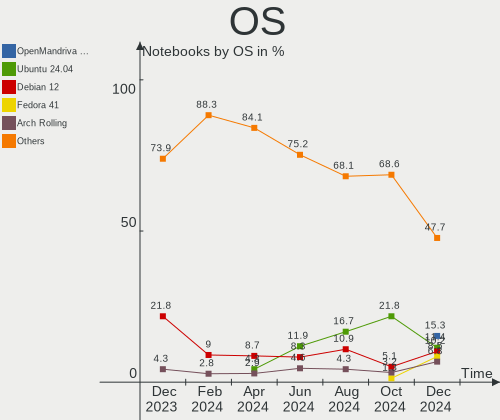
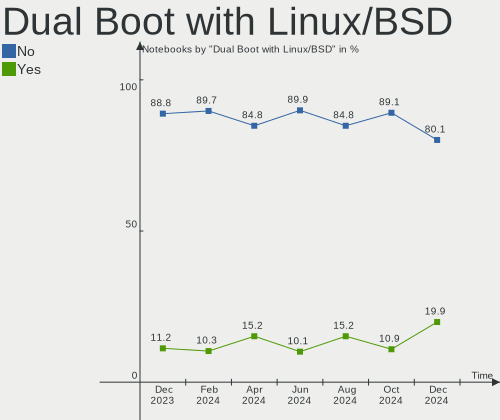
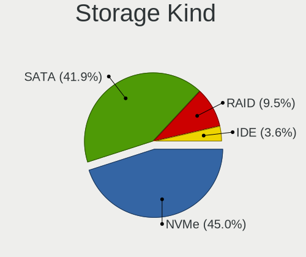
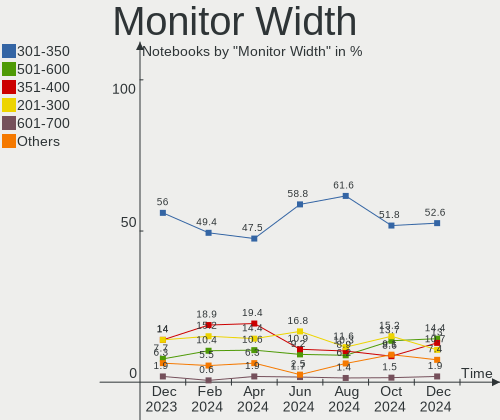

Linux in France - Hardware Trends (Notebooks)
---------------------------------------------

A project to identify most popular hardware characteristics and track their change
over time based on data collected by Linux users at https://Linux-Hardware.org.

Anyone can contribute to this report by the [hw-probe](https://github.com/linuxhw/hw-probe) tool:

    sudo -E hw-probe -all -upload

Period: Dec, 2022.

Contents
--------

* [ System ](#system)
  - [ OS                       ](#os)
  - [ OS Family                ](#os-family)
  - [ Kernel                   ](#kernel)
  - [ Kernel Family            ](#kernel-family)
  - [ Kernel Major Ver.        ](#kernel-major-ver)
  - [ Arch                     ](#arch)
  - [ DE                       ](#de)
  - [ Display Server           ](#display-server)
  - [ Display Manager          ](#display-manager)
  - [ OS Lang                  ](#os-lang)
  - [ Boot Mode                ](#boot-mode)
  - [ Filesystem               ](#filesystem)
  - [ Part. scheme             ](#part-scheme)
  - [ Dual Boot with Linux/BSD ](#dual-boot-with-linuxbsd)
  - [ Dual Boot (Win)          ](#dual-boot-win)

* [ Board ](#board)
  - [ Vendor                   ](#vendor)
  - [ Model                    ](#model)
  - [ Model Family             ](#model-family)
  - [ MFG Year                 ](#mfg-year)
  - [ Form Factor              ](#form-factor)
  - [ Secure Boot              ](#secure-boot)
  - [ Coreboot                 ](#coreboot)
  - [ RAM Size                 ](#ram-size)
  - [ RAM Used                 ](#ram-used)
  - [ Total Drives             ](#total-drives)
  - [ Has CD-ROM               ](#has-cd-rom)
  - [ Has Ethernet             ](#has-ethernet)
  - [ Has WiFi                 ](#has-wifi)
  - [ Has Bluetooth            ](#has-bluetooth)

* [ Location ](#location)
  - [ Country                  ](#country)
  - [ City                     ](#city)

* [ Drives ](#drives)
  - [ Drive Vendor             ](#drive-vendor)
  - [ Drive Model              ](#drive-model)
  - [ HDD Vendor               ](#hdd-vendor)
  - [ SSD Vendor               ](#ssd-vendor)
  - [ Drive Kind               ](#drive-kind)
  - [ Drive Connector          ](#drive-connector)
  - [ Drive Size               ](#drive-size)
  - [ Space Total              ](#space-total)
  - [ Space Used               ](#space-used)
  - [ Malfunc. Drives          ](#malfunc-drives)
  - [ Malfunc. Drive Vendor    ](#malfunc-drive-vendor)
  - [ Malfunc. HDD Vendor      ](#malfunc-hdd-vendor)
  - [ Malfunc. Drive Kind      ](#malfunc-drive-kind)
  - [ Failed Drives            ](#failed-drives)
  - [ Failed Drive Vendor      ](#failed-drive-vendor)
  - [ Drive Status             ](#drive-status)

* [ Storage controller ](#storage-controller)
  - [ Storage Vendor           ](#storage-vendor)
  - [ Storage Model            ](#storage-model)
  - [ Storage Kind             ](#storage-kind)

* [ Processor ](#processor)
  - [ CPU Vendor               ](#cpu-vendor)
  - [ CPU Model                ](#cpu-model)
  - [ CPU Model Family         ](#cpu-model-family)
  - [ CPU Cores                ](#cpu-cores)
  - [ CPU Sockets              ](#cpu-sockets)
  - [ CPU Threads              ](#cpu-threads)
  - [ CPU Op-Modes             ](#cpu-op-modes)
  - [ CPU Microcode            ](#cpu-microcode)
  - [ CPU Microarch            ](#cpu-microarch)

* [ Graphics ](#graphics)
  - [ GPU Vendor               ](#gpu-vendor)
  - [ GPU Model                ](#gpu-model)
  - [ GPU Combo                ](#gpu-combo)
  - [ GPU Driver               ](#gpu-driver)
  - [ GPU Memory               ](#gpu-memory)

* [ Monitor ](#monitor)
  - [ Monitor Vendor           ](#monitor-vendor)
  - [ Monitor Model            ](#monitor-model)
  - [ Monitor Resolution       ](#monitor-resolution)
  - [ Monitor Diagonal         ](#monitor-diagonal)
  - [ Monitor Width            ](#monitor-width)
  - [ Aspect Ratio             ](#aspect-ratio)
  - [ Monitor Area             ](#monitor-area)
  - [ Pixel Density            ](#pixel-density)
  - [ Multiple Monitors        ](#multiple-monitors)

* [ Network ](#network)
  - [ Net Controller Vendor    ](#net-controller-vendor)
  - [ Net Controller Model     ](#net-controller-model)
  - [ Wireless Vendor          ](#wireless-vendor)
  - [ Wireless Model           ](#wireless-model)
  - [ Ethernet Vendor          ](#ethernet-vendor)
  - [ Ethernet Model           ](#ethernet-model)
  - [ Net Controller Kind      ](#net-controller-kind)
  - [ Used Controller          ](#used-controller)
  - [ NICs                     ](#nics)
  - [ IPv6                     ](#ipv6)

* [ Bluetooth ](#bluetooth)
  - [ Bluetooth Vendor         ](#bluetooth-vendor)
  - [ Bluetooth Model          ](#bluetooth-model)

* [ Sound ](#sound)
  - [ Sound Vendor             ](#sound-vendor)
  - [ Sound Model              ](#sound-model)

* [ Memory ](#memory)
  - [ Memory Vendor            ](#memory-vendor)
  - [ Memory Model             ](#memory-model)
  - [ Memory Kind              ](#memory-kind)
  - [ Memory Form Factor       ](#memory-form-factor)
  - [ Memory Size              ](#memory-size)
  - [ Memory Speed             ](#memory-speed)

* [ Printers & scanners ](#printers--scanners)
  - [ Printer Vendor           ](#printer-vendor)
  - [ Printer Model            ](#printer-model)
  - [ Scanner Vendor           ](#scanner-vendor)
  - [ Scanner Model            ](#scanner-model)

* [ Camera ](#camera)
  - [ Camera Vendor            ](#camera-vendor)
  - [ Camera Model             ](#camera-model)

* [ Security ](#security)
  - [ Fingerprint Vendor       ](#fingerprint-vendor)
  - [ Fingerprint Model        ](#fingerprint-model)
  - [ Chipcard Vendor          ](#chipcard-vendor)
  - [ Chipcard Model           ](#chipcard-model)

* [ Unsupported ](#unsupported)
  - [ Unsupported Devices      ](#unsupported-devices)
  - [ Unsupported Device Types ](#unsupported-device-types)

System
------

OS
--

Installed operating systems

| Name                      | Notebooks | Percent |
|---------------------------|-----------|---------|
| Ubuntu 22.04              | 39        | 22.03%  |
| Debian 11                 | 13        | 7.34%   |
| OpenMandriva 4.3          | 11        | 6.21%   |
| Linux Mint 21             | 9         | 5.08%   |
| Fedora 37                 | 9         | 5.08%   |
| Ubuntu 22.10              | 7         | 3.95%   |
| Arch Rolling              | 7         | 3.95%   |
| Ubuntu 20.04              | 6         | 3.39%   |
| Xubuntu 22.04             | 5         | 2.82%   |
| Manjaro 22.0.0            | 5         | 2.82%   |
| Linux Mint 20.3           | 5         | 2.82%   |
| Kubuntu 22.04             | 4         | 2.26%   |
| Kali 2022.4               | 4         | 2.26%   |
| Zorin 16                  | 3         | 1.69%   |
| SteamOS 3.3.2             | 3         | 1.69%   |
| Parrot 5.1                | 3         | 1.69%   |
| Kubuntu 22.10             | 3         | 1.69%   |
| Fedora 36                 | 3         | 1.69%   |
| Debian                    | 3         | 1.69%   |
| Pop!_OS 22.04             | 2         | 1.13%   |
| openSUSE Microos-XXXXXXXX | 2         | 1.13%   |
| OpenMandriva 4.50         | 2         | 1.13%   |
| Manjaro                   | 2         | 1.13%   |
| Lubuntu 22.04             | 2         | 1.13%   |
| Gentoo 2.9                | 2         | 1.13%   |
| Zorin 15                  | 1         | 0.56%   |
| Ubuntu Studio 20.04       | 1         | 0.56%   |
| Ubuntu MATE 22.04         | 1         | 0.56%   |
| Ubuntu 18.04              | 1         | 0.56%   |
| ROSA R11.1                | 1         | 0.56%   |
| ROSA 12.3                 | 1         | 0.56%   |
| openSUSE Leap-15.3        | 1         | 0.56%   |
| OpenMandriva 4.2          | 1         | 0.56%   |
| OpenMandriva 22.12        | 1         | 0.56%   |
| OpenMandriva 22.11        | 1         | 0.56%   |
| Mageia 9                  | 1         | 0.56%   |
| Linux Mint 21.1           | 1         | 0.56%   |
| Linux Mint 19.3           | 1         | 0.56%   |
| Kubuntu 20.04             | 1         | 0.56%   |
| KDE neon 22.04            | 1         | 0.56%   |

OS Family
---------

OS without a version

| Name          | Notebooks | Percent |
|---------------|-----------|---------|
| Ubuntu        | 53        | 29.94%  |
| OpenMandriva  | 16        | 9.04%   |
| Linux Mint    | 16        | 9.04%   |
| Debian        | 16        | 9.04%   |
| Fedora        | 12        | 6.78%   |
| Kubuntu       | 8         | 4.52%   |
| Manjaro       | 7         | 3.95%   |
| Arch          | 7         | 3.95%   |
| Xubuntu       | 5         | 2.82%   |
| Zorin         | 4         | 2.26%   |
| Kali          | 4         | 2.26%   |
| SteamOS       | 3         | 1.69%   |
| Parrot        | 3         | 1.69%   |
| openSUSE      | 3         | 1.69%   |
| ROSA          | 2         | 1.13%   |
| Pop!_OS       | 2         | 1.13%   |
| Lubuntu       | 2         | 1.13%   |
| Gentoo        | 2         | 1.13%   |
| Ubuntu Studio | 1         | 0.56%   |
| Ubuntu MATE   | 1         | 0.56%   |
| Mageia        | 1         | 0.56%   |
| KDE neon      | 1         | 0.56%   |
| Garuda Linux  | 1         | 0.56%   |
| Endless       | 1         | 0.56%   |
| EndeavourOS   | 1         | 0.56%   |
| Elementary    | 1         | 0.56%   |
| Devuan        | 1         | 0.56%   |
| CentOS        | 1         | 0.56%   |
| BlackPanther  | 1         | 0.56%   |
| ArcoLinux     | 1         | 0.56%   |

Kernel
------

Version of the Linux kernel

| Version                    | Notebooks | Percent |
|----------------------------|-----------|---------|
| 5.15.0-56-generic          | 55        | 31.07%  |
| 5.16.7-desktop-1omv4003    | 10        | 5.65%   |
| 5.4.0-135-generic          | 7         | 3.95%   |
| 5.19.0-26-generic          | 7         | 3.95%   |
| 5.15.0-53-generic          | 7         | 3.95%   |
| 5.10.0-20-amd64            | 5         | 2.82%   |
| 5.10.0-19-amd64            | 4         | 2.26%   |
| 6.0.0-5-amd64              | 3         | 1.69%   |
| 6.0.0-2parrot1-amd64       | 3         | 1.69%   |
| 5.15.81-1-MANJARO          | 3         | 1.69%   |
| 5.15.0-52-generic          | 3         | 1.69%   |
| 5.13.0-valve21.3-1-neptune | 3         | 1.69%   |
| 6.1.1-arch1-1              | 2         | 1.13%   |
| 6.1.0-1-MANJARO            | 2         | 1.13%   |
| 6.0.9-arch1-1              | 2         | 1.13%   |
| 6.0.6-76060006-generic     | 2         | 1.13%   |
| 6.0.14-300.fc37.x86_64     | 2         | 1.13%   |
| 6.0.11-300.fc37.x86_64     | 2         | 1.13%   |
| 6.0.10-300.fc37.x86_64     | 2         | 1.13%   |
| 6.0.0-kali3-amd64          | 2         | 1.13%   |
| 6.0.0-0.deb11.2-amd64      | 2         | 1.13%   |
| 5.19.12-desktop-2omv4090   | 2         | 1.13%   |
| 5.15.0-57-generic          | 2         | 1.13%   |
| 6.1.1-zen1-1-zen           | 1         | 0.56%   |
| 6.1.1-1-MANJARO            | 1         | 0.56%   |
| 6.1.0-1-default            | 1         | 0.56%   |
| 6.0.9-desktop-1omv22090    | 1         | 0.56%   |
| 6.0.9-300.fc37.x86_64      | 1         | 0.56%   |
| 6.0.9-060009-generic       | 1         | 0.56%   |
| 6.0.7-301.fc37.x86_64      | 1         | 0.56%   |
| 6.0.5-200.fc36.x86_64      | 1         | 0.56%   |
| 6.0.12-arch1-1             | 1         | 0.56%   |
| 6.0.12-200.fc36.x86_64     | 1         | 0.56%   |
| 6.0.12-1-default           | 1         | 0.56%   |
| 6.0.11-arch1-1             | 1         | 0.56%   |
| 6.0.10-desktop-2omv22090   | 1         | 0.56%   |
| 6.0.10-desktop-1.mga9      | 1         | 0.56%   |
| 6.0.10-arch2-1             | 1         | 0.56%   |
| 6.0.10-200.fc36.x86_64     | 1         | 0.56%   |
| 6.0.0-kali6-amd64          | 1         | 0.56%   |

Kernel Family
-------------

Linux kernel without a distro release

| Version | Notebooks | Percent |
|---------|-----------|---------|
| 5.15.0  | 70        | 39.55%  |
| 6.0.0   | 12        | 6.78%   |
| 5.10.0  | 11        | 6.21%   |
| 5.16.7  | 10        | 5.65%   |
| 5.19.0  | 9         | 5.08%   |
| 5.4.0   | 8         | 4.52%   |
| 6.0.10  | 6         | 3.39%   |
| 6.0.9   | 5         | 2.82%   |
| 6.1.1   | 4         | 2.26%   |
| 6.1.0   | 3         | 1.69%   |
| 6.0.12  | 3         | 1.69%   |
| 6.0.11  | 3         | 1.69%   |
| 5.15.81 | 3         | 1.69%   |
| 5.13.0  | 3         | 1.69%   |
| 6.0.6   | 2         | 1.13%   |
| 6.0.14  | 2         | 1.13%   |
| 5.19.12 | 2         | 1.13%   |
| 5.15.80 | 2         | 1.13%   |
| 4.15.0  | 2         | 1.13%   |
| 6.0.7   | 1         | 0.56%   |
| 6.0.5   | 1         | 0.56%   |
| 5.3.18  | 1         | 0.56%   |
| 5.19.16 | 1         | 0.56%   |
| 5.18.0  | 1         | 0.56%   |
| 5.17.0  | 1         | 0.56%   |
| 5.16.13 | 1         | 0.56%   |
| 5.15.79 | 1         | 0.56%   |
| 5.15.78 | 1         | 0.56%   |
| 5.15.75 | 1         | 0.56%   |
| 5.15.52 | 1         | 0.56%   |
| 5.14.0  | 1         | 0.56%   |
| 5.11.0  | 1         | 0.56%   |
| 5.10.14 | 1         | 0.56%   |
| 4.9.155 | 1         | 0.56%   |
| 4.18.16 | 1         | 0.56%   |
| 3.10.0  | 1         | 0.56%   |

Kernel Major Ver.
-----------------

Linux kernel major version

| Version | Notebooks | Percent |
|---------|-----------|---------|
| 5.15    | 79        | 44.63%  |
| 6.0     | 35        | 19.77%  |
| 5.19    | 12        | 6.78%   |
| 5.10    | 12        | 6.78%   |
| 5.16    | 11        | 6.21%   |
| 5.4     | 8         | 4.52%   |
| 6.1     | 7         | 3.95%   |
| 5.13    | 3         | 1.69%   |
| 4.15    | 2         | 1.13%   |
| 5.3     | 1         | 0.56%   |
| 5.18    | 1         | 0.56%   |
| 5.17    | 1         | 0.56%   |
| 5.14    | 1         | 0.56%   |
| 5.11    | 1         | 0.56%   |
| 4.9     | 1         | 0.56%   |
| 4.18    | 1         | 0.56%   |
| 3.10    | 1         | 0.56%   |

Arch
----

OS architecture (x86_64, i586, etc.)

| Name   | Notebooks | Percent |
|--------|-----------|---------|
| x86_64 | 176       | 99.44%  |
| i686   | 1         | 0.56%   |

DE
--

Desktop Environment

| Name            | Notebooks | Percent |
|-----------------|-----------|---------|
| GNOME           | 78        | 44.07%  |
| KDE5            | 40        | 22.6%   |
| XFCE            | 19        | 10.73%  |
| X-Cinnamon      | 15        | 8.47%   |
| MATE            | 7         | 3.95%   |
| i3              | 4         | 2.26%   |
| Unknown         | 4         | 2.26%   |
| LXQt            | 3         | 1.69%   |
| GNOME Classic   | 3         | 1.69%   |
| Pantheon        | 1         | 0.56%   |
| KDE4            | 1         | 0.56%   |
| GNOME Flashback | 1         | 0.56%   |
| Cinnamon        | 1         | 0.56%   |

Display Server
--------------

X11 or Wayland

| Name    | Notebooks | Percent |
|---------|-----------|---------|
| X11     | 112       | 63.28%  |
| Wayland | 59        | 33.33%  |
| Tty     | 3         | 1.69%   |
| Unknown | 3         | 1.69%   |

Display Manager
---------------

SDDM, LightDM, etc.

| Name    | Notebooks | Percent |
|---------|-----------|---------|
| GDM3    | 46        | 25.99%  |
| LightDM | 40        | 22.6%   |
| SDDM    | 35        | 19.77%  |
| Unknown | 32        | 18.08%  |
| GDM     | 21        | 11.86%  |
| XDM     | 1         | 0.56%   |
| Ly      | 1         | 0.56%   |
| KDM     | 1         | 0.56%   |

OS Lang
-------

Language

| Lang    | Notebooks | Percent |
|---------|-----------|---------|
| fr_FR   | 125       | 70.62%  |
| en_US   | 43        | 24.29%  |
| en_GB   | 4         | 2.26%   |
| Unknown | 2         | 1.13%   |
| tr_TR   | 1         | 0.56%   |
| POSIX   | 1         | 0.56%   |
| es_ES   | 1         | 0.56%   |

Boot Mode
---------

EFI or BIOS

| Mode | Notebooks | Percent |
|------|-----------|---------|
| EFI  | 107       | 60.45%  |
| BIOS | 70        | 39.55%  |

Filesystem
----------

Type of filesystem

| Type    | Notebooks | Percent |
|---------|-----------|---------|
| Ext4    | 136       | 76.84%  |
| Btrfs   | 22        | 12.43%  |
| Overlay | 15        | 8.47%   |
| Xfs     | 2         | 1.13%   |
| Tmpfs   | 1         | 0.56%   |
| F2fs    | 1         | 0.56%   |

Part. scheme
------------

Scheme of partitioning

| Type    | Notebooks | Percent |
|---------|-----------|---------|
| GPT     | 121       | 68.36%  |
| Unknown | 29        | 16.38%  |
| MBR     | 27        | 15.25%  |

Dual Boot with Linux/BSD
------------------------

Hosting more than one Linux/BSD

| Dual boot | Notebooks | Percent |
|-----------|-----------|---------|
| No        | 155       | 87.57%  |
| Yes       | 22        | 12.43%  |

Dual Boot (Win)
---------------

Hosting Linux and Windows

| Dual boot | Notebooks | Percent |
|-----------|-----------|---------|
| No        | 128       | 72.32%  |
| Yes       | 49        | 27.68%  |

Board
-----

Vendor
------

Motherboard manufacturer

| Name                        | Notebooks | Percent |
|-----------------------------|-----------|---------|
| Lenovo                      | 34        | 19.21%  |
| Hewlett-Packard             | 34        | 19.21%  |
| ASUSTek Computer            | 31        | 17.51%  |
| Dell                        | 21        | 11.86%  |
| Acer                        | 16        | 9.04%   |
| Toshiba                     | 8         | 4.52%   |
| HUAWEI                      | 5         | 2.82%   |
| MSI                         | 4         | 2.26%   |
| Valve                       | 3         | 1.69%   |
| Samsung Electronics         | 3         | 1.69%   |
| Notebook                    | 2         | 1.13%   |
| Fujitsu                     | 2         | 1.13%   |
| TUXEDO                      | 1         | 0.56%   |
| Timi                        | 1         | 0.56%   |
| Sony                        | 1         | 0.56%   |
| Shenzhen Wangang Technology | 1         | 0.56%   |
| LG Electronics              | 1         | 0.56%   |
| HONOR                       | 1         | 0.56%   |
| Framework                   | 1         | 0.56%   |
| eMachines                   | 1         | 0.56%   |
| Danew                       | 1         | 0.56%   |
| BESSTAR Tech                | 1         | 0.56%   |
| AZW                         | 1         | 0.56%   |
| Apple                       | 1         | 0.56%   |
| Alienware                   | 1         | 0.56%   |
| Unknown                     | 1         | 0.56%   |

Model
-----

Motherboard model

| Name                                       | Notebooks | Percent |
|--------------------------------------------|-----------|---------|
| Valve Jupiter                              | 3         | 1.69%   |
| HP Pavilion 17                             | 3         | 1.69%   |
| HUAWEI BOD-WXX9                            | 2         | 1.13%   |
| HP Notebook                                | 2         | 1.13%   |
| Dell XPS 13 9380                           | 2         | 1.13%   |
| Dell Inspiron 7720                         | 2         | 1.13%   |
| Dell G3 3500                               | 2         | 1.13%   |
| ASUS S551LN                                | 2         | 1.13%   |
| Acer Nitro AN515-57                        | 2         | 1.13%   |
| TUXEDO Pulse 15 Gen1                       | 1         | 0.56%   |
| Toshiba Satellite Pro L300                 | 1         | 0.56%   |
| Toshiba Satellite L500                     | 1         | 0.56%   |
| Toshiba Satellite C870-13V                 | 1         | 0.56%   |
| Toshiba Satellite C650                     | 1         | 0.56%   |
| Toshiba Satellite C55-C                    | 1         | 0.56%   |
| Toshiba Satellite C50D-A-12M               | 1         | 0.56%   |
| Toshiba PORTEGE Z30T-A                     | 1         | 0.56%   |
| Toshiba PORTEGE R830                       | 1         | 0.56%   |
| Timi TM1701                                | 1         | 0.56%   |
| Sony VPCEL2S1E                             | 1         | 0.56%   |
| Shenzhen Wangang TANK56                    | 1         | 0.56%   |
| Samsung RV410/RV510/S3510/E3510            | 1         | 0.56%   |
| Samsung R540/R538/SA41/E452                | 1         | 0.56%   |
| Samsung 930XED                             | 1         | 0.56%   |
| Notebook W65_67SZ                          | 1         | 0.56%   |
| Notebook L14xMU                            | 1         | 0.56%   |
| MSI GS73VR 7RF                             | 1         | 0.56%   |
| MSI GP62 7QF                               | 1         | 0.56%   |
| MSI GE62 2QC                               | 1         | 0.56%   |
| MSI CR700                                  | 1         | 0.56%   |
| LG 17Z90P-G.AA56F                          | 1         | 0.56%   |
| Lenovo Yoga Slim 9 14ITL5 82D1             | 1         | 0.56%   |
| Lenovo Yoga 2 13 20344                     | 1         | 0.56%   |
| Lenovo Y520-15IKBN 80WK                    | 1         | 0.56%   |
| Lenovo V15 G2 ITL 82KB                     | 1         | 0.56%   |
| Lenovo ThinkPad X250 20CLS1UB00            | 1         | 0.56%   |
| Lenovo ThinkPad X220 4291UUC               | 1         | 0.56%   |
| Lenovo ThinkPad X1 Carbon Gen 9 20XWS2B300 | 1         | 0.56%   |
| Lenovo ThinkPad X1 Carbon Gen 8 20U9CTO1WW | 1         | 0.56%   |
| Lenovo ThinkPad X1 Carbon 6th 20KHCTO1WW   | 1         | 0.56%   |

Model Family
------------

Motherboard model prefix

| Name                    | Notebooks | Percent |
|-------------------------|-----------|---------|
| Lenovo ThinkPad         | 22        | 12.43%  |
| Acer Aspire             | 10        | 5.65%   |
| HP EliteBook            | 8         | 4.52%   |
| Dell Inspiron           | 7         | 3.95%   |
| Toshiba Satellite       | 6         | 3.39%   |
| HP Pavilion             | 6         | 3.39%   |
| Lenovo IdeaPad          | 5         | 2.82%   |
| Dell Latitude           | 5         | 2.82%   |
| ASUS VivoBook           | 5         | 2.82%   |
| HP ProBook              | 4         | 2.26%   |
| HP Laptop               | 4         | 2.26%   |
| Dell XPS                | 4         | 2.26%   |
| Valve Jupiter           | 3         | 1.69%   |
| Dell Precision          | 3         | 1.69%   |
| ASUS ZenBook            | 3         | 1.69%   |
| ASUS ROG                | 3         | 1.69%   |
| Acer Nitro              | 3         | 1.69%   |
| Toshiba PORTEGE         | 2         | 1.13%   |
| Lenovo Yoga             | 2         | 1.13%   |
| Lenovo Legion           | 2         | 1.13%   |
| HUAWEI BOD-WXX9         | 2         | 1.13%   |
| HP ZBook                | 2         | 1.13%   |
| HP Notebook             | 2         | 1.13%   |
| HP ENVY                 | 2         | 1.13%   |
| HP 250                  | 2         | 1.13%   |
| Dell G3                 | 2         | 1.13%   |
| ASUS S551LN             | 2         | 1.13%   |
| ASUS ASUS               | 2         | 1.13%   |
| TUXEDO Pulse            | 1         | 0.56%   |
| Timi TM1701             | 1         | 0.56%   |
| Sony VPCEL2S1E          | 1         | 0.56%   |
| Shenzhen Wangang TANK56 | 1         | 0.56%   |
| Samsung RV410           | 1         | 0.56%   |
| Samsung R540            | 1         | 0.56%   |
| Samsung 930XED          | 1         | 0.56%   |
| Notebook W65            | 1         | 0.56%   |
| Notebook L14xMU         | 1         | 0.56%   |
| MSI GS73VR              | 1         | 0.56%   |
| MSI GP62                | 1         | 0.56%   |
| MSI GE62                | 1         | 0.56%   |

MFG Year
--------

Motherboard manufacture year

| Year | Notebooks | Percent |
|------|-----------|---------|
| 2020 | 25        | 14.12%  |
| 2021 | 24        | 13.56%  |
| 2022 | 15        | 8.47%   |
| 2017 | 15        | 8.47%   |
| 2015 | 13        | 7.34%   |
| 2013 | 13        | 7.34%   |
| 2019 | 11        | 6.21%   |
| 2010 | 11        | 6.21%   |
| 2012 | 10        | 5.65%   |
| 2014 | 9         | 5.08%   |
| 2016 | 7         | 3.95%   |
| 2018 | 6         | 3.39%   |
| 2011 | 5         | 2.82%   |
| 2009 | 5         | 2.82%   |
| 2008 | 5         | 2.82%   |
| 2007 | 3         | 1.69%   |

Form Factor
-----------

Physical design of the computer

| Name     | Notebooks | Percent |
|----------|-----------|---------|
| Notebook | 177       | 100%    |

Secure Boot
-----------

Enabled or disabled

| State    | Notebooks | Percent |
|----------|-----------|---------|
| Disabled | 161       | 90.96%  |
| Enabled  | 16        | 9.04%   |

Coreboot
--------

Have coreboot on board

| Used | Notebooks | Percent |
|------|-----------|---------|
| No   | 177       | 100%    |

RAM Size
--------

Total RAM memory

| Size in GB  | Notebooks | Percent |
|-------------|-----------|---------|
| 4.01-8.0    | 48        | 27.12%  |
| 8.01-16.0   | 34        | 19.21%  |
| 3.01-4.0    | 33        | 18.64%  |
| 16.01-24.0  | 32        | 18.08%  |
| 32.01-64.0  | 14        | 7.91%   |
| 2.01-3.0    | 6         | 3.39%   |
| 1.01-2.0    | 3         | 1.69%   |
| 0.51-1.0    | 3         | 1.69%   |
| 24.01-32.0  | 2         | 1.13%   |
| 64.01-256.0 | 2         | 1.13%   |

RAM Used
--------

Used RAM memory

| Used GB    | Notebooks | Percent |
|------------|-----------|---------|
| 2.01-3.0   | 52        | 29.38%  |
| 1.01-2.0   | 51        | 28.81%  |
| 4.01-8.0   | 25        | 14.12%  |
| 3.01-4.0   | 25        | 14.12%  |
| 0.51-1.0   | 11        | 6.21%   |
| 8.01-16.0  | 9         | 5.08%   |
| 0.01-0.5   | 3         | 1.69%   |
| 16.01-24.0 | 1         | 0.56%   |

Total Drives
------------

Number of drives on board

| Drives | Notebooks | Percent |
|--------|-----------|---------|
| 1      | 129       | 72.88%  |
| 2      | 43        | 24.29%  |
| 3      | 3         | 1.69%   |
| 4      | 1         | 0.56%   |
| 0      | 1         | 0.56%   |

Has CD-ROM
----------

Has CD-ROM on board

| Presented | Notebooks | Percent |
|-----------|-----------|---------|
| No        | 115       | 64.97%  |
| Yes       | 62        | 35.03%  |

Has Ethernet
------------

Has Ethernet on board

| Presented | Notebooks | Percent |
|-----------|-----------|---------|
| Yes       | 137       | 77.4%   |
| No        | 40        | 22.6%   |

Has WiFi
--------

Has WiFi module

| Presented | Notebooks | Percent |
|-----------|-----------|---------|
| Yes       | 173       | 97.74%  |
| No        | 4         | 2.26%   |

Has Bluetooth
-------------

Has Bluetooth module

| Presented | Notebooks | Percent |
|-----------|-----------|---------|
| Yes       | 148       | 83.62%  |
| No        | 29        | 16.38%  |

Location
--------

Country
-------

Geographic location (country)

| Country | Notebooks | Percent |
|---------|-----------|---------|
| France  | 177       | 100%    |

City
----

Geographic location (city)

| City                    | Notebooks | Percent |
|-------------------------|-----------|---------|
| Paris                   | 31        | 17.51%  |
| Marseille               | 5         | 2.82%   |
| Ambazac                 | 5         | 2.82%   |
| Lyon                    | 3         | 1.69%   |
| Bordeaux                | 3         | 1.69%   |
| Rouen                   | 2         | 1.13%   |
| Nice                    | 2         | 1.13%   |
| Neauphle-le-Chateau     | 2         | 1.13%   |
| Montpellier             | 2         | 1.13%   |
| Limoges                 | 2         | 1.13%   |
| La Rochelle             | 2         | 1.13%   |
| Créteil                | 2         | 1.13%   |
| Champigny-sur-Marne     | 2         | 1.13%   |
| Angoulême              | 2         | 1.13%   |
| Yenne                   | 1         | 0.56%   |
| Wingles                 | 1         | 0.56%   |
| Vouneuil-sous-Biard     | 1         | 0.56%   |
| Vouille                 | 1         | 0.56%   |
| Volvic                  | 1         | 0.56%   |
| Vitrolles               | 1         | 0.56%   |
| Viroflay                | 1         | 0.56%   |
| Villeurbanne            | 1         | 0.56%   |
| Villemomble             | 1         | 0.56%   |
| Villedieu-la-Blouere    | 1         | 0.56%   |
| Versailles              | 1         | 0.56%   |
| Verdelais               | 1         | 0.56%   |
| Vaux-sur-Mer            | 1         | 0.56%   |
| Vallabregues            | 1         | 0.56%   |
| Valenciennes            | 1         | 0.56%   |
| Ucel                    | 1         | 0.56%   |
| Toulouse                | 1         | 0.56%   |
| Thionville              | 1         | 0.56%   |
| Strasbourg              | 1         | 0.56%   |
| Sillars                 | 1         | 0.56%   |
| Sélestat               | 1         | 0.56%   |
| Seclin                  | 1         | 0.56%   |
| Saint-Julien-les-Metz   | 1         | 0.56%   |
| Saint-Herblain          | 1         | 0.56%   |
| Saint-Germain-en-Laye   | 1         | 0.56%   |
| Saint-Didier-de-la-Tour | 1         | 0.56%   |

Drives
------

Drive Vendor
------------

Hard drive vendors

| Vendor                      | Notebooks | Drives | Percent |
|-----------------------------|-----------|--------|---------|
| Samsung Electronics         | 46        | 48     | 21%     |
| WDC                         | 23        | 24     | 10.5%   |
| Seagate                     | 19        | 19     | 8.68%   |
| Toshiba                     | 13        | 13     | 5.94%   |
| SanDisk                     | 13        | 13     | 5.94%   |
| Kingston                    | 13        | 13     | 5.94%   |
| SK hynix                    | 11        | 11     | 5.02%   |
| Micron Technology           | 11        | 11     | 5.02%   |
| Crucial                     | 10        | 11     | 4.57%   |
| Unknown                     | 9         | 10     | 4.11%   |
| Intel                       | 8         | 9      | 3.65%   |
| HGST                        | 5         | 5      | 2.28%   |
| Kingston Technology Company | 4         | 4      | 1.83%   |
| JMicron Technology          | 4         | 4      | 1.83%   |
| LDLC                        | 3         | 3      | 1.37%   |
| SPCC                        | 2         | 2      | 0.91%   |
| PNY                         | 2         | 2      | 0.91%   |
| Phison                      | 2         | 2      | 0.91%   |
| KIOXIA                      | 2         | 2      | 0.91%   |
| Hitachi                     | 2         | 2      | 0.91%   |
| YMTC                        | 1         | 1      | 0.46%   |
| UMIS                        | 1         | 1      | 0.46%   |
| Transcend                   | 1         | 1      | 0.46%   |
| Team                        | 1         | 1      | 0.46%   |
| SABRENT                     | 1         | 1      | 0.46%   |
| Phison Electronics          | 1         | 1      | 0.46%   |
| O2 Micro                    | 1         | 1      | 0.46%   |
| Micron/Crucial Technology   | 1         | 1      | 0.46%   |
| LITEONIT                    | 1         | 1      | 0.46%   |
| LITEON                      | 1         | 1      | 0.46%   |
| Lenovo                      | 1         | 1      | 0.46%   |
| KingDian                    | 1         | 1      | 0.46%   |
| HGST HTS                    | 1         | 1      | 0.46%   |
| Dogfish                     | 1         | 1      | 0.46%   |
| China                       | 1         | 1      | 0.46%   |
| ASMT                        | 1         | 1      | 0.46%   |
| Unknown                     | 1         | 1      | 0.46%   |

Drive Model
-----------

Hard drive models

| Model                                               | Notebooks | Percent |
|-----------------------------------------------------|-----------|---------|
| Toshiba MQ01ABD100 1TB                              | 5         | 2.22%   |
| Samsung NVMe SSD Controller PM9A1/PM9A3/980PRO 2TB  | 5         | 2.22%   |
| Kingston Company OM3PDP3 NVMe SSD 512GB             | 4         | 1.78%   |
| WDC WD10JPVX-22JC3T0 1TB                            | 3         | 1.33%   |
| Unknown MMC Card  32GB                              | 3         | 1.33%   |
| Samsung MZVLQ512HBLU-00BTW 512GB                    | 3         | 1.33%   |
| Kingston SA400S37480G 480GB SSD                     | 3         | 1.33%   |
| HGST HTS541010A9E680 1TB                            | 3         | 1.33%   |
| WDC WDS250G2B0A-00SM50 250GB SSD                    | 2         | 0.89%   |
| WDC WD10SPZX-24Z10T0 1TB                            | 2         | 0.89%   |
| WDC WD10SPZX-21Z10T0 1TB                            | 2         | 0.89%   |
| SPCC Solid State Disk 512GB                         | 2         | 0.89%   |
| SK hynix SKHynix_HFS001TD9TNI-L2B0B 1TB             | 2         | 0.89%   |
| Seagate ST9320423AS 320GB                           | 2         | 0.89%   |
| Seagate ST1000LM035-1RK172 1TB                      | 2         | 0.89%   |
| Sandisk WD Black SN750 / PC SN730 NVMe SSD 512GB    | 2         | 0.89%   |
| Samsung SSD 980 1TB                                 | 2         | 0.89%   |
| Samsung SSD 870 QVO 1TB                             | 2         | 0.89%   |
| Samsung NVMe SSD Controller SM981/PM981/PM983 500GB | 2         | 0.89%   |
| Samsung NVMe SSD Controller SM961/PM961/SM963 256GB | 2         | 0.89%   |
| Samsung MZVLQ512HBLU-00B00 512GB                    | 2         | 0.89%   |
| Samsung MZVLB512HBJQ-000L7 512GB                    | 2         | 0.89%   |
| Phison 311CD0512GB                                  | 2         | 0.89%   |
| Micron MTFDKBA512TFH 512GB                          | 2         | 0.89%   |
| Micron 2300 NVMe 1024GB                             | 2         | 0.89%   |
| Kingston RBUSNS8180DS3512GJ 512GB SSD               | 2         | 0.89%   |
| JMicron Tech 250GB                                  | 2         | 0.89%   |
| JMicron H/W JBOD 512GB SSD                          | 2         | 0.89%   |
| Intel SSDPEKNU512GZ 512GB                           | 2         | 0.89%   |
| Intel SSDPEKKF256G7L 256GB                          | 2         | 0.89%   |
| Crucial CT2000MX500SSD1 2TB                         | 2         | 0.89%   |
| YMTC PC005 256GB                                    | 1         | 0.44%   |
| WDC WDS120G2G0B-00EPW0 120GB SSD                    | 1         | 0.44%   |
| WDC WDS100T2B0C-00PXH0 1TB                          | 1         | 0.44%   |
| WDC WDS100T2B0B-00YS70 1TB SSD                      | 1         | 0.44%   |
| WDC WD7500BPVT-22HXZT1 752GB                        | 1         | 0.44%   |
| WDC WD5000LPCX-24VHAT0 500GB                        | 1         | 0.44%   |
| WDC WD5000BEVT-22ZAT0 500GB                         | 1         | 0.44%   |
| WDC WD3200LPCX-22VHAT0 320GB                        | 1         | 0.44%   |
| WDC WD3200BPVT-80JJ5T0 320GB                        | 1         | 0.44%   |

HDD Vendor
----------

Hard disk drive vendors

| Vendor              | Notebooks | Drives | Percent |
|---------------------|-----------|--------|---------|
| Seagate             | 19        | 19     | 33.93%  |
| WDC                 | 17        | 17     | 30.36%  |
| Toshiba             | 8         | 8      | 14.29%  |
| HGST                | 5         | 5      | 8.93%   |
| Samsung Electronics | 2         | 2      | 3.57%   |
| Hitachi             | 2         | 2      | 3.57%   |
| Unknown             | 1         | 1      | 1.79%   |
| HGST HTS            | 1         | 1      | 1.79%   |
| ASMT                | 1         | 1      | 1.79%   |

SSD Vendor
----------

Solid state drive vendors

| Vendor              | Notebooks | Drives | Percent |
|---------------------|-----------|--------|---------|
| Samsung Electronics | 15        | 16     | 22.73%  |
| Kingston            | 9         | 9      | 13.64%  |
| Crucial             | 9         | 9      | 13.64%  |
| SanDisk             | 5         | 5      | 7.58%   |
| WDC                 | 4         | 4      | 6.06%   |
| Toshiba             | 4         | 4      | 6.06%   |
| Micron Technology   | 3         | 3      | 4.55%   |
| LDLC                | 3         | 3      | 4.55%   |
| SPCC                | 2         | 2      | 3.03%   |
| PNY                 | 2         | 2      | 3.03%   |
| JMicron Technology  | 2         | 2      | 3.03%   |
| Transcend           | 1         | 1      | 1.52%   |
| Team                | 1         | 1      | 1.52%   |
| SK hynix            | 1         | 1      | 1.52%   |
| LITEONIT            | 1         | 1      | 1.52%   |
| LITEON              | 1         | 1      | 1.52%   |
| KingDian            | 1         | 1      | 1.52%   |
| Dogfish             | 1         | 1      | 1.52%   |
| China               | 1         | 1      | 1.52%   |

Drive Kind
----------

HDD or SSD

| Kind    | Notebooks | Drives | Percent |
|---------|-----------|--------|---------|
| NVMe    | 81        | 90     | 39.51%  |
| SSD     | 58        | 67     | 28.29%  |
| HDD     | 55        | 56     | 26.83%  |
| MMC     | 9         | 10     | 4.39%   |
| Unknown | 2         | 2      | 0.98%   |

Drive Connector
---------------

SATA, SAS, NVMe, etc.

| Type | Notebooks | Drives | Percent |
|------|-----------|--------|---------|
| SATA | 102       | 119    | 51.26%  |
| NVMe | 81        | 89     | 40.7%   |
| MMC  | 9         | 10     | 4.52%   |
| SAS  | 7         | 7      | 3.52%   |

Drive Size
----------

Size of hard drive

| Size in TB | Notebooks | Drives | Percent |
|------------|-----------|--------|---------|
| 0.01-0.5   | 68        | 71     | 58.12%  |
| 0.51-1.0   | 42        | 44     | 35.9%   |
| 1.01-2.0   | 6         | 7      | 5.13%   |
| 3.01-4.0   | 1         | 1      | 0.85%   |

Space Total
-----------

Amount of disk space available on the file system

| Size in GB     | Notebooks | Percent |
|----------------|-----------|---------|
| 251-500        | 48        | 27.12%  |
| 101-250        | 43        | 24.29%  |
| 501-1000       | 31        | 17.51%  |
| 1-20           | 12        | 6.78%   |
| 51-100         | 12        | 6.78%   |
| 1001-2000      | 11        | 6.21%   |
| 21-50          | 9         | 5.08%   |
| More than 3000 | 6         | 3.39%   |
| Unknown        | 3         | 1.69%   |
| 2001-3000      | 2         | 1.13%   |

Space Used
----------

Amount of used disk space

| Used GB        | Notebooks | Percent |
|----------------|-----------|---------|
| 1-20           | 65        | 36.72%  |
| 21-50          | 29        | 16.38%  |
| 51-100         | 28        | 15.82%  |
| 101-250        | 25        | 14.12%  |
| 251-500        | 16        | 9.04%   |
| 501-1000       | 6         | 3.39%   |
| 1001-2000      | 3         | 1.69%   |
| Unknown        | 3         | 1.69%   |
| More than 3000 | 2         | 1.13%   |

Malfunc. Drives
---------------

Drive models with a malfunction

| Model                                | Notebooks | Drives | Percent |
|--------------------------------------|-----------|--------|---------|
| WDC WD3200LPCX-22VHAT0 320GB         | 1         | 1      | 9.09%   |
| WDC WD3200BPVT-80JJ5T0 320GB         | 1         | 1      | 9.09%   |
| Toshiba THNSNK256GCS8 SATA 256GB SSD | 1         | 1      | 9.09%   |
| Toshiba MK3275GSX 320GB              | 1         | 1      | 9.09%   |
| SK hynix PC711 HFS512GDE9X073N 512GB | 1         | 1      | 9.09%   |
| Seagate ST750LM000-1EJ16G 752GB      | 1         | 1      | 9.09%   |
| Seagate ST500LM021-1KJ152 500GB      | 1         | 1      | 9.09%   |
| SanDisk SSD PLUS 480GB               | 1         | 1      | 9.09%   |
| Hitachi HTS542516K9SA00 160GB        | 1         | 1      | 9.09%   |
| HGST HTS541010A9E680 1TB             | 1         | 1      | 9.09%   |
| Crucial CT1000P1SSD8 1TB             | 1         | 1      | 9.09%   |

Malfunc. Drive Vendor
---------------------

Vendors of faulty drives

| Vendor   | Notebooks | Drives | Percent |
|----------|-----------|--------|---------|
| WDC      | 2         | 2      | 18.18%  |
| Toshiba  | 2         | 2      | 18.18%  |
| Seagate  | 2         | 2      | 18.18%  |
| SK hynix | 1         | 1      | 9.09%   |
| SanDisk  | 1         | 1      | 9.09%   |
| Hitachi  | 1         | 1      | 9.09%   |
| HGST     | 1         | 1      | 9.09%   |
| Crucial  | 1         | 1      | 9.09%   |

Malfunc. HDD Vendor
-------------------

Vendors of faulty HDD drives

| Vendor  | Notebooks | Drives | Percent |
|---------|-----------|--------|---------|
| WDC     | 2         | 2      | 28.57%  |
| Seagate | 2         | 2      | 28.57%  |
| Toshiba | 1         | 1      | 14.29%  |
| Hitachi | 1         | 1      | 14.29%  |
| HGST    | 1         | 1      | 14.29%  |

Malfunc. Drive Kind
-------------------

Kinds of faulty drives

| Kind | Notebooks | Drives | Percent |
|------|-----------|--------|---------|
| HDD  | 7         | 7      | 63.64%  |
| NVMe | 2         | 2      | 18.18%  |
| SSD  | 2         | 2      | 18.18%  |

Failed Drives
-------------

Failed drive models

| Model                        | Notebooks | Drives | Percent |
|------------------------------|-----------|--------|---------|
| WDC WD7500BPVT-22HXZT1 752GB | 1         | 1      | 100%    |

Failed Drive Vendor
-------------------

Failed drive vendors

| Vendor | Notebooks | Drives | Percent |
|--------|-----------|--------|---------|
| WDC    | 1         | 1      | 100%    |

Drive Status
------------

Number of failed and malfunc. drives

| Status   | Notebooks | Drives | Percent |
|----------|-----------|--------|---------|
| Works    | 101       | 116    | 54.59%  |
| Detected | 72        | 97     | 38.92%  |
| Malfunc  | 11        | 11     | 5.95%   |
| Failed   | 1         | 1      | 0.54%   |

Storage controller
------------------

Storage Vendor
--------------

Storage controller vendors

| Vendor                                  | Notebooks | Percent |
|-----------------------------------------|-----------|---------|
| Intel                                   | 119       | 54.34%  |
| Samsung Electronics                     | 30        | 13.7%   |
| AMD                                     | 16        | 7.31%   |
| SanDisk                                 | 11        | 5.02%   |
| SK hynix                                | 10        | 4.57%   |
| Micron Technology                       | 8         | 3.65%   |
| Kingston Technology Company             | 8         | 3.65%   |
| Nvidia                                  | 4         | 1.83%   |
| Phison Electronics                      | 3         | 1.37%   |
| Micron/Crucial Technology               | 3         | 1.37%   |
| KIOXIA                                  | 2         | 0.91%   |
| Yangtze Memory Technologies             | 1         | 0.46%   |
| Toshiba America Info Systems            | 1         | 0.46%   |
| Shenzhen Unionmemory Information System | 1         | 0.46%   |
| O2 Micro                                | 1         | 0.46%   |
| Lenovo                                  | 1         | 0.46%   |

Storage Model
-------------

Storage controller models

| Model                                                                            | Notebooks | Percent |
|----------------------------------------------------------------------------------|-----------|---------|
| Intel Volume Management Device NVMe RAID Controller                              | 18        | 7.73%   |
| AMD FCH SATA Controller [AHCI mode]                                              | 12        | 5.15%   |
| Samsung NVMe SSD Controller 980                                                  | 11        | 4.72%   |
| Intel Sunrise Point-LP SATA Controller [AHCI mode]                               | 10        | 4.29%   |
| Intel 8 Series SATA Controller 1 [AHCI mode]                                     | 10        | 4.29%   |
| Samsung NVMe SSD Controller SM981/PM981/PM983                                    | 9         | 3.86%   |
| Intel 82801 Mobile SATA Controller [RAID mode]                                   | 9         | 3.86%   |
| Micron Non-Volatile memory controller                                            | 8         | 3.43%   |
| Intel 7 Series Chipset Family 6-port SATA Controller [AHCI mode]                 | 8         | 3.43%   |
| SK hynix Gold P31/PC711 NVMe Solid State Drive                                   | 7         | 3%      |
| Samsung NVMe SSD Controller PM9A1/PM9A3/980PRO                                   | 7         | 3%      |
| Intel Tiger Lake-LP SATA Controller                                              | 7         | 3%      |
| Intel 8 Series/C220 Series Chipset Family 6-port SATA Controller 1 [AHCI mode]   | 7         | 3%      |
| Kingston Company OM3PDP3 NVMe SSD                                                | 6         | 2.58%   |
| Intel Wildcat Point-LP SATA Controller [AHCI Mode]                               | 6         | 2.58%   |
| Intel 82801IBM/IEM (ICH9M/ICH9M-E) 4 port SATA Controller [AHCI mode]            | 6         | 2.58%   |
| Intel HM170/QM170 Chipset SATA Controller [AHCI Mode]                            | 5         | 2.15%   |
| Intel Atom Processor E3800 Series SATA AHCI Controller                           | 5         | 2.15%   |
| Nvidia MCP79 AHCI Controller                                                     | 4         | 1.72%   |
| Intel Non-Volatile memory controller                                             | 4         | 1.72%   |
| Intel Cannon Lake Mobile PCH SATA AHCI Controller                                | 4         | 1.72%   |
| Intel 6 Series/C200 Series Chipset Family 6 port Mobile SATA AHCI Controller     | 4         | 1.72%   |
| Intel 5 Series/3400 Series Chipset 4 port SATA AHCI Controller                   | 4         | 1.72%   |
| SanDisk WD Black SN750 / PC SN730 NVMe SSD                                       | 3         | 1.29%   |
| SanDisk Non-Volatile memory controller                                           | 3         | 1.29%   |
| Intel Cannon Point-LP SATA Controller [AHCI Mode]                                | 3         | 1.29%   |
| Intel 500 Series Chipset Family SATA AHCI Controller                             | 3         | 1.29%   |
| Intel 400 Series Chipset Family SATA AHCI Controller                             | 3         | 1.29%   |
| AMD SB7x0/SB8x0/SB9x0 SATA Controller [AHCI mode]                                | 3         | 1.29%   |
| SK hynix Non-Volatile memory controller                                          | 2         | 0.86%   |
| SanDisk WD Blue SN550 NVMe SSD                                                   | 2         | 0.86%   |
| Samsung NVMe SSD Controller SM961/PM961/SM963                                    | 2         | 0.86%   |
| Phison PS5013 E13 NVMe Controller                                                | 2         | 0.86%   |
| Micron/Crucial P1 NVMe PCIe SSD                                                  | 2         | 0.86%   |
| KIOXIA NVMe SSD Controller BG4                                                   | 2         | 0.86%   |
| Kingston Company Company Non-Volatile memory controller                          | 2         | 0.86%   |
| Intel SSD 600P Series                                                            | 2         | 0.86%   |
| Intel Q170/Q150/B150/H170/H110/Z170/CM236 Chipset SATA Controller [AHCI Mode]    | 2         | 0.86%   |
| Intel Atom/Celeron/Pentium Processor x5-E8000/J3xxx/N3xxx Series SATA Controller | 2         | 0.86%   |
| Yangtze Memory Non-Volatile memory controller                                    | 1         | 0.43%   |

Storage Kind
------------

Kind of storage controller (IDE, SATA, NVMe, SAS, ...)

| Kind | Notebooks | Percent |
|------|-----------|---------|
| SATA | 115       | 50.88%  |
| NVMe | 81        | 35.84%  |
| RAID | 27        | 11.95%  |
| IDE  | 3         | 1.33%   |

Processor
---------

CPU Vendor
----------

Processor vendors

| Vendor | Notebooks | Percent |
|--------|-----------|---------|
| Intel  | 143       | 80.79%  |
| AMD    | 34        | 19.21%  |

CPU Model
---------

Processor models

| Model                                         | Notebooks | Percent |
|-----------------------------------------------|-----------|---------|
| Intel 11th Gen Core i5-1135G7 @ 2.40GHz       | 12        | 6.78%   |
| Intel Core i5-3320M CPU @ 2.60GHz             | 4         | 2.26%   |
| Intel Core i7-7700HQ CPU @ 2.80GHz            | 3         | 1.69%   |
| Intel 11th Gen Core i7-1165G7 @ 2.80GHz       | 3         | 1.69%   |
| Intel 11th Gen Core i5-11400H @ 2.70GHz       | 3         | 1.69%   |
| AMD Ryzen 7 PRO 4750U with Radeon Graphics    | 3         | 1.69%   |
| AMD Custom APU 0405                           | 3         | 1.69%   |
| AMD A9-9420 RADEON R5, 5 COMPUTE CORES 2C+3G  | 3         | 1.69%   |
| Intel Pentium Dual-Core CPU T4500 @ 2.30GHz   | 2         | 1.13%   |
| Intel Pentium CPU N3540 @ 2.16GHz             | 2         | 1.13%   |
| Intel Core i7-9750H CPU @ 2.60GHz             | 2         | 1.13%   |
| Intel Core i7-8565U CPU @ 1.80GHz             | 2         | 1.13%   |
| Intel Core i7-6600U CPU @ 2.60GHz             | 2         | 1.13%   |
| Intel Core i7-5500U CPU @ 2.40GHz             | 2         | 1.13%   |
| Intel Core i7-3630QM CPU @ 2.40GHz            | 2         | 1.13%   |
| Intel Core i7-10750H CPU @ 2.60GHz            | 2         | 1.13%   |
| Intel Core i5-8279U CPU @ 2.40GHz             | 2         | 1.13%   |
| Intel Core i5-8250U CPU @ 1.60GHz             | 2         | 1.13%   |
| Intel Core i5-7300U CPU @ 2.60GHz             | 2         | 1.13%   |
| Intel Core i5-7300HQ CPU @ 2.50GHz            | 2         | 1.13%   |
| Intel Core i5-6200U CPU @ 2.30GHz             | 2         | 1.13%   |
| Intel Core i5-4310U CPU @ 2.00GHz             | 2         | 1.13%   |
| Intel Core i5-4210U CPU @ 1.70GHz             | 2         | 1.13%   |
| Intel Core i5-2520M CPU @ 2.50GHz             | 2         | 1.13%   |
| Intel Core i3-5010U CPU @ 2.10GHz             | 2         | 1.13%   |
| Intel Core i3-4030U CPU @ 1.90GHz             | 2         | 1.13%   |
| Intel Core i3 CPU M 380 @ 2.53GHz             | 2         | 1.13%   |
| Intel Celeron CPU N2840 @ 2.16GHz             | 2         | 1.13%   |
| Intel 12th Gen Core i7-12700H                 | 2         | 1.13%   |
| Intel 12th Gen Core i7-1260P                  | 2         | 1.13%   |
| Intel 11th Gen Core i7-1185G7 @ 3.00GHz       | 2         | 1.13%   |
| AMD Ryzen 7 4800H with Radeon Graphics        | 2         | 1.13%   |
| AMD Ryzen 5 PRO 4650U with Radeon Graphics    | 2         | 1.13%   |
| AMD Ryzen 5 4500U with Radeon Graphics        | 2         | 1.13%   |
| AMD Ryzen 5 3500U with Radeon Vega Mobile Gfx | 2         | 1.13%   |
| Intel Xeon E-2286M CPU @ 2.40GHz              | 1         | 0.56%   |
| Intel Pentium Dual-Core CPU T4400 @ 2.20GHz   | 1         | 0.56%   |
| Intel Pentium Dual CPU T3400 @ 2.16GHz        | 1         | 0.56%   |
| Intel Pentium Dual CPU T3200 @ 2.00GHz        | 1         | 0.56%   |
| Intel Pentium CPU N3710 @ 1.60GHz             | 1         | 0.56%   |

CPU Model Family
----------------

Processor model prefix

| Model                   | Notebooks | Percent |
|-------------------------|-----------|---------|
| Other                   | 37        | 20.9%   |
| Intel Core i5           | 36        | 20.34%  |
| Intel Core i7           | 31        | 17.51%  |
| Intel Core i3           | 15        | 8.47%   |
| Intel Celeron           | 7         | 3.95%   |
| AMD Ryzen 7             | 7         | 3.95%   |
| AMD Ryzen 5             | 7         | 3.95%   |
| Intel Pentium           | 6         | 3.39%   |
| Intel Core 2 Duo        | 5         | 2.82%   |
| AMD Ryzen 7 PRO         | 4         | 2.26%   |
| Intel Pentium Dual-Core | 3         | 1.69%   |
| AMD Ryzen 5 PRO         | 3         | 1.69%   |
| Intel Pentium Dual      | 2         | 1.13%   |
| Intel Atom              | 2         | 1.13%   |
| Intel Xeon              | 1         | 0.56%   |
| Intel Genuine           | 1         | 0.56%   |
| Intel Core i9           | 1         | 0.56%   |
| Intel Core 2            | 1         | 0.56%   |
| Intel Celeron Dual-Core | 1         | 0.56%   |
| AMD Turion II Dual-Core | 1         | 0.56%   |
| AMD Ryzen 3             | 1         | 0.56%   |
| AMD Embedded            | 1         | 0.56%   |
| AMD E1                  | 1         | 0.56%   |
| AMD E                   | 1         | 0.56%   |
| AMD C-60                | 1         | 0.56%   |
| AMD Athlon X2           | 1         | 0.56%   |

CPU Cores
---------

Number of processor cores

| Number | Notebooks | Percent |
|--------|-----------|---------|
| 2      | 79        | 44.63%  |
| 4      | 58        | 32.77%  |
| 6      | 16        | 9.04%   |
| 8      | 15        | 8.47%   |
| 12     | 3         | 1.69%   |
| 1      | 3         | 1.69%   |
| 14     | 2         | 1.13%   |
| 10     | 1         | 0.56%   |

CPU Sockets
-----------

Number of sockets

| Number | Notebooks | Percent |
|--------|-----------|---------|
| 1      | 177       | 100%    |

CPU Threads
-----------

Threads per core (Hyper-Threading)

| Number | Notebooks | Percent |
|--------|-----------|---------|
| 2      | 134       | 75.71%  |
| 1      | 43        | 24.29%  |

CPU Op-Modes
------------

CPU Operation Modes (32-bit, 64-bit)

| Op mode        | Notebooks | Percent |
|----------------|-----------|---------|
| 32-bit, 64-bit | 177       | 100%    |

CPU Microcode
-------------

Microcode number

| Number     | Notebooks | Percent |
|------------|-----------|---------|
| Unknown    | 51        | 28.81%  |
| 0x806c1    | 14        | 7.91%   |
| 0x40651    | 10        | 5.65%   |
| 0x306a9    | 9         | 5.08%   |
| 0x08600106 | 8         | 4.52%   |
| 0x306c3    | 6         | 3.39%   |
| 0x1067a    | 6         | 3.39%   |
| 0x906e9    | 4         | 2.26%   |
| 0x906a3    | 4         | 2.26%   |
| 0x406e3    | 4         | 2.26%   |
| 0x306d4    | 4         | 2.26%   |
| 0x30678    | 4         | 2.26%   |
| 0x0a50000c | 4         | 2.26%   |
| 0xa0652    | 3         | 1.69%   |
| 0x906ed    | 3         | 1.69%   |
| 0x806d1    | 3         | 1.69%   |
| 0x6fd      | 3         | 1.69%   |
| 0x206a7    | 3         | 1.69%   |
| 0x20655    | 3         | 1.69%   |
| 0x06006705 | 3         | 1.69%   |
| 0x806ec    | 2         | 1.13%   |
| 0x806ea    | 2         | 1.13%   |
| 0x806e9    | 2         | 1.13%   |
| 0x0a404101 | 2         | 1.13%   |
| 0x05000119 | 2         | 1.13%   |
| 0x906ea    | 1         | 0.56%   |
| 0x906a4    | 1         | 0.56%   |
| 0x706a8    | 1         | 0.56%   |
| 0x6fa      | 1         | 0.56%   |
| 0x6f6      | 1         | 0.56%   |
| 0x506e3    | 1         | 0.56%   |
| 0x406c4    | 1         | 0.56%   |
| 0x406c3    | 1         | 0.56%   |
| 0x30673    | 1         | 0.56%   |
| 0x20652    | 1         | 0.56%   |
| 0x106ca    | 1         | 0.56%   |
| 0x0a404102 | 1         | 0.56%   |
| 0x08600103 | 1         | 0.56%   |
| 0x08108109 | 1         | 0.56%   |
| 0x08108102 | 1         | 0.56%   |

CPU Microarch
-------------

Microarchitecture

| Name             | Notebooks | Percent |
|------------------|-----------|---------|
| KabyLake         | 27        | 15.25%  |
| TigerLake        | 20        | 11.3%   |
| Haswell          | 17        | 9.6%    |
| Zen 2            | 10        | 5.65%   |
| IvyBridge        | 10        | 5.65%   |
| Unknown          | 10        | 5.65%   |
| Silvermont       | 9         | 5.08%   |
| Skylake          | 8         | 4.52%   |
| Penryn           | 7         | 3.95%   |
| Core             | 7         | 3.95%   |
| Broadwell        | 7         | 3.95%   |
| Westmere         | 6         | 3.39%   |
| Zen 3            | 5         | 2.82%   |
| SandyBridge      | 5         | 2.82%   |
| Icelake          | 5         | 2.82%   |
| CometLake        | 5         | 2.82%   |
| Alderlake Hybrid | 5         | 2.82%   |
| Excavator        | 4         | 2.26%   |
| Bobcat           | 3         | 1.69%   |
| Zen+             | 2         | 1.13%   |
| Zen              | 1         | 0.56%   |
| K8 & K10 hybrid  | 1         | 0.56%   |
| K10              | 1         | 0.56%   |
| Goldmont plus    | 1         | 0.56%   |
| Bonnell          | 1         | 0.56%   |

Graphics
--------

GPU Vendor
----------

Vendors of graphics cards

| Vendor | Notebooks | Percent |
|--------|-----------|---------|
| Intel  | 133       | 56.36%  |
| Nvidia | 63        | 26.69%  |
| AMD    | 40        | 16.95%  |

GPU Model
---------

Graphics card models

| Model                                                                     | Notebooks | Percent |
|---------------------------------------------------------------------------|-----------|---------|
| Intel TigerLake-LP GT2 [Iris Xe Graphics]                                 | 19        | 7.88%   |
| Intel Haswell-ULT Integrated Graphics Controller                          | 10        | 4.15%   |
| AMD Renoir                                                                | 10        | 4.15%   |
| Intel 3rd Gen Core processor Graphics Controller                          | 9         | 3.73%   |
| Intel HD Graphics 5500                                                    | 7         | 2.9%    |
| Intel Atom Processor Z36xxx/Z37xxx Series Graphics & Display              | 7         | 2.9%    |
| Intel Skylake GT2 [HD Graphics 520]                                       | 6         | 2.49%   |
| Intel Mobile 4 Series Chipset Integrated Graphics Controller              | 6         | 2.49%   |
| Intel HD Graphics 630                                                     | 6         | 2.49%   |
| Intel 4th Gen Core Processor Integrated Graphics Controller               | 6         | 2.49%   |
| Nvidia GP107M [GeForce GTX 1050 Mobile]                                   | 5         | 2.07%   |
| Nvidia GA106M [GeForce RTX 3060 Mobile / Max-Q]                           | 5         | 2.07%   |
| Intel TigerLake-H GT1 [UHD Graphics]                                      | 5         | 2.07%   |
| Intel HD Graphics 620                                                     | 5         | 2.07%   |
| Intel CometLake-H GT2 [UHD Graphics]                                      | 5         | 2.07%   |
| Intel CoffeeLake-H GT2 [UHD Graphics 630]                                 | 5         | 2.07%   |
| Intel Alder Lake-P Integrated Graphics Controller                         | 5         | 2.07%   |
| Intel 2nd Generation Core Processor Family Integrated Graphics Controller | 5         | 2.07%   |
| Nvidia GM108M [GeForce 840M]                                              | 4         | 1.66%   |
| Intel UHD Graphics 620                                                    | 4         | 1.66%   |
| Intel Core Processor Integrated Graphics Controller                       | 4         | 1.66%   |
| AMD Stoney [Radeon R2/R3/R4/R5 Graphics]                                  | 4         | 1.66%   |
| AMD Cezanne [Radeon Vega Series / Radeon Vega Mobile Series]              | 4         | 1.66%   |
| Nvidia GM107M [GeForce GTX 950M]                                          | 3         | 1.24%   |
| Nvidia GF119M [GeForce 610M]                                              | 3         | 1.24%   |
| Intel WhiskeyLake-U GT2 [UHD Graphics 620]                                | 3         | 1.24%   |
| AMD VanGogh [AMD Custom GPU 0405]                                         | 3         | 1.24%   |
| AMD Rembrandt [Radeon 680M]                                               | 3         | 1.24%   |
| Nvidia TU117GLM [Quadro T1000 Mobile]                                     | 2         | 0.83%   |
| Nvidia GM108M [GeForce 940M]                                              | 2         | 0.83%   |
| Nvidia GM107M [GeForce GTX 960M]                                          | 2         | 0.83%   |
| Nvidia GK208BM [GeForce 920M]                                             | 2         | 0.83%   |
| Nvidia GK107M [GeForce GT 650M]                                           | 2         | 0.83%   |
| Nvidia GF117M [GeForce 610M/710M/810M/820M / GT 620M/625M/630M/720M]      | 2         | 0.83%   |
| Nvidia GA107M [GeForce RTX 3050 Ti Mobile]                                | 2         | 0.83%   |
| Intel Mobile GM965/GL960 Integrated Graphics Controller (secondary)       | 2         | 0.83%   |
| Intel Mobile GM965/GL960 Integrated Graphics Controller (primary)         | 2         | 0.83%   |
| Intel Iris Plus Graphics G1 (Ice Lake)                                    | 2         | 0.83%   |
| Intel CometLake-U GT2 [UHD Graphics]                                      | 2         | 0.83%   |
| Intel CoffeeLake-U GT3e [Iris Plus Graphics 655]                          | 2         | 0.83%   |

GPU Combo
---------

Combinations of graphics cards

| Name               | Notebooks | Percent |
|--------------------|-----------|---------|
| 1 x Intel          | 77        | 43.5%   |
| Intel + Nvidia     | 49        | 27.68%  |
| 1 x AMD            | 30        | 16.95%  |
| 1 x Nvidia         | 8         | 4.52%   |
| Intel + AMD        | 4         | 2.26%   |
| AMD + Nvidia       | 4         | 2.26%   |
| 2 x Intel          | 2         | 1.13%   |
| 2 x AMD            | 2         | 1.13%   |
| Intel + 2 x Nvidia | 1         | 0.56%   |

GPU Driver
----------

Free vs proprietary

| Driver      | Notebooks | Percent |
|-------------|-----------|---------|
| Free        | 149       | 84.18%  |
| Proprietary | 26        | 14.69%  |
| Unknown     | 2         | 1.13%   |

GPU Memory
----------

Total video memory

| Size in GB | Notebooks | Percent |
|------------|-----------|---------|
| Unknown    | 121       | 68.36%  |
| 0.01-0.5   | 24        | 13.56%  |
| 1.01-2.0   | 17        | 9.6%    |
| 0.51-1.0   | 7         | 3.95%   |
| 3.01-4.0   | 6         | 3.39%   |
| 5.01-6.0   | 1         | 0.56%   |
| 2.01-3.0   | 1         | 0.56%   |

Monitor
-------

Monitor Vendor
--------------

Monitor vendors

| Vendor                  | Notebooks | Percent |
|-------------------------|-----------|---------|
| AU Optronics            | 42        | 20.59%  |
| Chimei Innolux          | 32        | 15.69%  |
| LG Display              | 30        | 14.71%  |
| Samsung Electronics     | 22        | 10.78%  |
| BOE                     | 21        | 10.29%  |
| Sharp                   | 6         | 2.94%   |
| ViewSonic               | 5         | 2.45%   |
| Hewlett-Packard         | 5         | 2.45%   |
| Dell                    | 5         | 2.45%   |
| Chi Mei Optoelectronics | 5         | 2.45%   |
| InfoVision              | 4         | 1.96%   |
| PANDA                   | 3         | 1.47%   |
| LG Philips              | 3         | 1.47%   |
| Iiyama                  | 3         | 1.47%   |
| Goldstar                | 3         | 1.47%   |
| Analogix                | 3         | 1.47%   |
| Philips                 | 2         | 0.98%   |
| Unknown                 | 1         | 0.49%   |
| MStar                   | 1         | 0.49%   |
| MSI                     | 1         | 0.49%   |
| LGD                     | 1         | 0.49%   |
| IBM                     | 1         | 0.49%   |
| CSO                     | 1         | 0.49%   |
| Apple                   | 1         | 0.49%   |
| AOC                     | 1         | 0.49%   |
| Ancor Communications    | 1         | 0.49%   |
| Acer                    | 1         | 0.49%   |

Monitor Model
-------------

Monitor models

| Model                                                                 | Notebooks | Percent |
|-----------------------------------------------------------------------|-----------|---------|
| Chimei Innolux LCD Monitor CMN1521 1920x1080 344x193mm 15.5-inch      | 3         | 1.46%   |
| AU Optronics LCD Monitor AUO36ED 1920x1080 344x193mm 15.5-inch        | 3         | 1.46%   |
| Analogix ANX7530 U ANX7539 800x1280                                   | 3         | 1.46%   |
| ViewSonic VX2410 SERIES VSCEF2D 1920x1080 521x293mm 23.5-inch         | 2         | 0.98%   |
| Samsung Electronics S24F350 SAM0D20 1920x1080 520x290mm 23.4-inch     | 2         | 0.98%   |
| Samsung Electronics LCD Monitor SEC5441 1366x768 344x194mm 15.5-inch  | 2         | 0.98%   |
| PANDA LCD Monitor NCP0040 1920x1080 344x194mm 15.5-inch               | 2         | 0.98%   |
| LG Display LCD Monitor LGD0456 1366x768 344x194mm 15.5-inch           | 2         | 0.98%   |
| Chimei Innolux LCD Monitor CMN1733 1600x900 382x215mm 17.3-inch       | 2         | 0.98%   |
| Chimei Innolux LCD Monitor CMN15F5 1920x1080 344x193mm 15.5-inch      | 2         | 0.98%   |
| Chimei Innolux LCD Monitor CMN15D2 1920x1080 344x193mm 15.5-inch      | 2         | 0.98%   |
| Chimei Innolux LCD Monitor CMN14D4 1920x1080 309x173mm 13.9-inch      | 2         | 0.98%   |
| Chimei Innolux LCD Monitor CMN1409 1920x1080 309x173mm 13.9-inch      | 2         | 0.98%   |
| BOE LCD Monitor BOE0872 1920x1080 344x194mm 15.5-inch                 | 2         | 0.98%   |
| AU Optronics LCD Monitor AUO61ED 1920x1080 344x194mm 15.5-inch        | 2         | 0.98%   |
| AU Optronics LCD Monitor AUO26EC 1366x768 344x193mm 15.5-inch         | 2         | 0.98%   |
| AU Optronics LCD Monitor AUO229E 1600x900 382x214mm 17.2-inch         | 2         | 0.98%   |
| AU Optronics LCD Monitor AUO159E 1600x900 382x214mm 17.2-inch         | 2         | 0.98%   |
| AU Optronics LCD Monitor AUO109D 1920x1080 381x214mm 17.2-inch        | 2         | 0.98%   |
| ViewSonic VX2758 Series VSCDD35 1920x1080 597x336mm 27.0-inch         | 1         | 0.49%   |
| ViewSonic VX2255wm-2 VSC9B1F 1680x1050 474x296mm 22.0-inch            | 1         | 0.49%   |
| ViewSonic VA2432-FHD VSCB639 1920x1080 530x300mm 24.0-inch            | 1         | 0.49%   |
| Unknown LCD Monitor FFFF 2288x1287 2550x2550mm 142.0-inch             | 1         | 0.49%   |
| Sharp LQ156M1JW26 SHP1532 1920x1080 344x194mm 15.5-inch               | 1         | 0.49%   |
| Sharp LQ156M1JW01 SHP14C3 1920x1080 344x194mm 15.5-inch               | 1         | 0.49%   |
| Sharp LQ133M1JW02 SHP141A 1920x1080 294x165mm 13.3-inch               | 1         | 0.49%   |
| Sharp LCD Monitor SHP14D6 3840x2400 366x229mm 17.0-inch               | 1         | 0.49%   |
| Sharp LCD Monitor SHP14D0 3840x2400 336x210mm 15.6-inch               | 1         | 0.49%   |
| Sharp LCD Monitor SHP14BA 1920x1080 344x194mm 15.5-inch               | 1         | 0.49%   |
| Samsung Electronics U28D590 SAM0B80 3840x2160 607x345mm 27.5-inch     | 1         | 0.49%   |
| Samsung Electronics SyncMaster SAM0466 1920x1200 518x324mm 24.1-inch  | 1         | 0.49%   |
| Samsung Electronics SME1920N SAM06A3 1366x768 410x230mm 18.5-inch     | 1         | 0.49%   |
| Samsung Electronics S24D340 SAM0BBB 1920x1080 530x300mm 24.0-inch     | 1         | 0.49%   |
| Samsung Electronics S24D330 SAM0D92 1920x1080 531x299mm 24.0-inch     | 1         | 0.49%   |
| Samsung Electronics LCD Monitor SEC5541 1366x768 344x193mm 15.5-inch  | 1         | 0.49%   |
| Samsung Electronics LCD Monitor SEC5442 1440x900 331x207mm 15.4-inch  | 1         | 0.49%   |
| Samsung Electronics LCD Monitor SEC524D 1366x768 353x198mm 15.9-inch  | 1         | 0.49%   |
| Samsung Electronics LCD Monitor SEC5044 1920x1080 382x215mm 17.3-inch | 1         | 0.49%   |
| Samsung Electronics LCD Monitor SEC3945 1280x800 331x207mm 15.4-inch  | 1         | 0.49%   |
| Samsung Electronics LCD Monitor SEC3245 1366x768 344x194mm 15.5-inch  | 1         | 0.49%   |

Monitor Resolution
------------------

Monitor screen resolution

| Resolution         | Notebooks | Percent |
|--------------------|-----------|---------|
| 1920x1080 (FHD)    | 91        | 48.66%  |
| 1366x768 (WXGA)    | 32        | 17.11%  |
| 1600x900 (HD+)     | 20        | 10.7%   |
| 3840x2160 (4K)     | 5         | 2.67%   |
| 1920x1200 (WUXGA)  | 5         | 2.67%   |
| 1440x900 (WXGA+)   | 5         | 2.67%   |
| 2560x1440 (QHD)    | 4         | 2.14%   |
| 1680x1050 (WSXGA+) | 4         | 2.14%   |
| 800x1280           | 3         | 1.6%    |
| 3840x2400          | 3         | 1.6%    |
| 2880x1800          | 2         | 1.07%   |
| 2560x1600          | 2         | 1.07%   |
| 1280x800 (WXGA)    | 2         | 1.07%   |
| 3840x1080          | 1         | 0.53%   |
| 3440x1440          | 1         | 0.53%   |
| 2520x1680          | 1         | 0.53%   |
| 2288x1287          | 1         | 0.53%   |
| 2256x1504          | 1         | 0.53%   |
| 2160x1440          | 1         | 0.53%   |
| 1600x1200          | 1         | 0.53%   |
| 1024x600           | 1         | 0.53%   |
| Unknown            | 1         | 0.53%   |

Monitor Diagonal
----------------

Diagonal size in inches

| Inches  | Notebooks | Percent |
|---------|-----------|---------|
| 15      | 79        | 38.92%  |
| 17      | 31        | 15.27%  |
| 14      | 24        | 11.82%  |
| 13      | 17        | 8.37%   |
| 24      | 10        | 4.93%   |
| 23      | 8         | 3.94%   |
| 27      | 6         | 2.96%   |
| 16      | 4         | 1.97%   |
| 12      | 4         | 1.97%   |
| Unknown | 4         | 1.97%   |
| 22      | 3         | 1.48%   |
| 21      | 3         | 1.48%   |
| 18      | 2         | 0.99%   |
| 11      | 2         | 0.99%   |
| 142     | 1         | 0.49%   |
| 52      | 1         | 0.49%   |
| 41      | 1         | 0.49%   |
| 34      | 1         | 0.49%   |
| 31      | 1         | 0.49%   |
| 10      | 1         | 0.49%   |

Monitor Width
-------------

Physical width

| Width in mm    | Notebooks | Percent |
|----------------|-----------|---------|
| 301-350        | 112       | 55.72%  |
| 351-400        | 35        | 17.41%  |
| 501-600        | 21        | 10.45%  |
| 201-300        | 16        | 7.96%   |
| 401-500        | 7         | 3.48%   |
| Unknown        | 4         | 1.99%   |
| 601-700        | 2         | 1%      |
| More than 2000 | 1         | 0.5%    |
| 701-800        | 1         | 0.5%    |
| 1001-1500      | 1         | 0.5%    |
| 901-1000       | 1         | 0.5%    |

Aspect Ratio
------------

Proportional relationship between the width and the height

| Ratio   | Notebooks | Percent |
|---------|-----------|---------|
| 16/9    | 147       | 82.12%  |
| 16/10   | 23        | 12.85%  |
| 3/2     | 3         | 1.68%   |
| 0.62    | 3         | 1.68%   |
| 21/9    | 1         | 0.56%   |
| 1.00    | 1         | 0.56%   |
| Unknown | 1         | 0.56%   |

Monitor Area
------------

Area in inch²

| Area in inch² | Notebooks | Percent |
|----------------|-----------|---------|
| 101-110        | 79        | 39.3%   |
| 81-90          | 35        | 17.41%  |
| 121-130        | 25        | 12.44%  |
| 201-250        | 19        | 9.45%   |
| 71-80          | 6         | 2.99%   |
| 301-350        | 6         | 2.99%   |
| 131-140        | 6         | 2.99%   |
| 61-70          | 4         | 1.99%   |
| 111-120        | 4         | 1.99%   |
| Unknown        | 4         | 1.99%   |
| 251-300        | 3         | 1.49%   |
| More than 1000 | 2         | 1%      |
| 51-60          | 2         | 1%      |
| 351-500        | 2         | 1%      |
| 141-150        | 2         | 1%      |
| 41-50          | 1         | 0.5%    |
| 501-1000       | 1         | 0.5%    |

Pixel Density
-------------

Pixels per inch

| Density       | Notebooks | Percent |
|---------------|-----------|---------|
| 121-160       | 94        | 47%     |
| 101-120       | 44        | 22%     |
| 51-100        | 35        | 17.5%   |
| 161-240       | 13        | 6.5%    |
| More than 240 | 7         | 3.5%    |
| Unknown       | 4         | 2%      |
| 1-50          | 3         | 1.5%    |

Multiple Monitors
-----------------

Total monitors connected

| Total | Notebooks | Percent |
|-------|-----------|---------|
| 1     | 144       | 81.36%  |
| 2     | 27        | 15.25%  |
| 3     | 4         | 2.26%   |
| 0     | 2         | 1.13%   |

Network
-------

Net Controller Vendor
---------------------

Controller vendors

| Vendor                            | Notebooks | Percent |
|-----------------------------------|-----------|---------|
| Realtek Semiconductor             | 101       | 35.82%  |
| Intel                             | 88        | 31.21%  |
| Qualcomm Atheros                  | 31        | 10.99%  |
| Broadcom                          | 15        | 5.32%   |
| MediaTek                          | 13        | 4.61%   |
| Broadcom Limited                  | 5         | 1.77%   |
| Samsung Electronics               | 4         | 1.42%   |
| Xiaomi                            | 3         | 1.06%   |
| Lenovo                            | 3         | 1.06%   |
| Sierra Wireless                   | 2         | 0.71%   |
| Nvidia                            | 2         | 0.71%   |
| Marvell Technology Group          | 2         | 0.71%   |
| DisplayLink                       | 2         | 0.71%   |
| ASIX Electronics                  | 2         | 0.71%   |
| TP-Link                           | 1         | 0.35%   |
| Toshiba                           | 1         | 0.35%   |
| Ralink                            | 1         | 0.35%   |
| Qualcomm                          | 1         | 0.35%   |
| Huawei Technologies               | 1         | 0.35%   |
| Hewlett-Packard                   | 1         | 0.35%   |
| Ericsson Business Mobile Networks | 1         | 0.35%   |
| Attansic Technology               | 1         | 0.35%   |
| Aquantia                          | 1         | 0.35%   |

Net Controller Model
--------------------

Controller models

| Model                                                             | Notebooks | Percent |
|-------------------------------------------------------------------|-----------|---------|
| Realtek RTL8111/8168/8411 PCI Express Gigabit Ethernet Controller | 53        | 15.96%  |
| Realtek RTL810xE PCI Express Fast Ethernet controller             | 19        | 5.72%   |
| Intel Wi-Fi 6 AX201                                               | 13        | 3.92%   |
| Qualcomm Atheros AR9285 Wireless Network Adapter (PCI-Express)    | 9         | 2.71%   |
| MediaTek MT7921 802.11ax PCI Express Wireless Network Adapter     | 9         | 2.71%   |
| Realtek RTL8822CE 802.11ac PCIe Wireless Network Adapter          | 8         | 2.41%   |
| Realtek RTL8821CE 802.11ac PCIe Wireless Network Adapter          | 7         | 2.11%   |
| Intel Wireless 8265 / 8275                                        | 7         | 2.11%   |
| Broadcom BCM43142 802.11b/g/n                                     | 7         | 2.11%   |
| Realtek RTL8153 Gigabit Ethernet Adapter                          | 6         | 1.81%   |
| Intel Wireless 8260                                               | 6         | 1.81%   |
| Intel Wireless 7260                                               | 6         | 1.81%   |
| Intel 82579LM Gigabit Network Connection (Lewisville)             | 6         | 1.81%   |
| Qualcomm Atheros QCA9377 802.11ac Wireless Network Adapter        | 5         | 1.51%   |
| Qualcomm Atheros QCA6174 802.11ac Wireless Network Adapter        | 5         | 1.51%   |
| Intel Wi-Fi 6 AX200                                               | 5         | 1.51%   |
| Intel Alder Lake-P PCH CNVi WiFi                                  | 5         | 1.51%   |
| Samsung Galaxy series, misc. (tethering mode)                     | 4         | 1.2%    |
| Realtek RTL8723BE PCIe Wireless Network Adapter                   | 4         | 1.2%    |
| Qualcomm Atheros QCA9565 / AR9565 Wireless Network Adapter        | 4         | 1.2%    |
| Intel Wireless 7265                                               | 4         | 1.2%    |
| Intel Tiger Lake PCH CNVi WiFi                                    | 4         | 1.2%    |
| Intel Comet Lake PCH CNVi WiFi                                    | 4         | 1.2%    |
| Intel Centrino Advanced-N 6205 [Taylor Peak]                      | 4         | 1.2%    |
| Xiaomi Mi/Redmi series (RNDIS)                                    | 3         | 0.9%    |
| Realtek Killer E2600 Gigabit Ethernet Controller                  | 3         | 0.9%    |
| Intel Wi-Fi 6 AX210/AX211/AX411 160MHz                            | 3         | 0.9%    |
| Intel Ethernet Connection I219-LM                                 | 3         | 0.9%    |
| Intel Ethernet Connection I218-LM                                 | 3         | 0.9%    |
| Intel Ethernet Connection (4) I219-LM                             | 3         | 0.9%    |
| Intel Centrino Wireless-N 2230                                    | 3         | 0.9%    |
| Broadcom Limited BCM4312 802.11b/g LP-PHY                         | 3         | 0.9%    |
| Realtek RTL8821AE 802.11ac PCIe Wireless Network Adapter          | 2         | 0.6%    |
| Realtek RTL8188CE 802.11b/g/n WiFi Adapter                        | 2         | 0.6%    |
| Qualcomm Atheros Killer E2500 Gigabit Ethernet Controller         | 2         | 0.6%    |
| Qualcomm Atheros AR8161 Gigabit Ethernet                          | 2         | 0.6%    |
| Qualcomm Atheros AR8151 v2.0 Gigabit Ethernet                     | 2         | 0.6%    |
| Nvidia MCP79 Ethernet                                             | 2         | 0.6%    |
| MediaTek MT7922 802.11ax PCI Express Wireless Network Adapter     | 2         | 0.6%    |
| MediaTek MT7630e 802.11bgn Wireless Network Adapter               | 2         | 0.6%    |

Wireless Vendor
---------------

Wireless vendors

| Vendor                | Notebooks | Percent |
|-----------------------|-----------|---------|
| Intel                 | 84        | 47.19%  |
| Realtek Semiconductor | 34        | 19.1%   |
| Qualcomm Atheros      | 26        | 14.61%  |
| MediaTek              | 13        | 7.3%    |
| Broadcom              | 13        | 7.3%    |
| Broadcom Limited      | 4         | 2.25%   |
| Sierra Wireless       | 2         | 1.12%   |
| Ralink                | 1         | 0.56%   |
| Qualcomm              | 1         | 0.56%   |

Wireless Model
--------------

Wireless models

| Model                                                          | Notebooks | Percent |
|----------------------------------------------------------------|-----------|---------|
| Intel Wi-Fi 6 AX201                                            | 13        | 7.3%    |
| Qualcomm Atheros AR9285 Wireless Network Adapter (PCI-Express) | 9         | 5.06%   |
| MediaTek MT7921 802.11ax PCI Express Wireless Network Adapter  | 9         | 5.06%   |
| Realtek RTL8822CE 802.11ac PCIe Wireless Network Adapter       | 8         | 4.49%   |
| Realtek RTL8821CE 802.11ac PCIe Wireless Network Adapter       | 7         | 3.93%   |
| Intel Wireless 8265 / 8275                                     | 7         | 3.93%   |
| Broadcom BCM43142 802.11b/g/n                                  | 7         | 3.93%   |
| Intel Wireless 8260                                            | 6         | 3.37%   |
| Intel Wireless 7260                                            | 6         | 3.37%   |
| Qualcomm Atheros QCA9377 802.11ac Wireless Network Adapter     | 5         | 2.81%   |
| Qualcomm Atheros QCA6174 802.11ac Wireless Network Adapter     | 5         | 2.81%   |
| Intel Wi-Fi 6 AX200                                            | 5         | 2.81%   |
| Intel Alder Lake-P PCH CNVi WiFi                               | 5         | 2.81%   |
| Realtek RTL8723BE PCIe Wireless Network Adapter                | 4         | 2.25%   |
| Qualcomm Atheros QCA9565 / AR9565 Wireless Network Adapter     | 4         | 2.25%   |
| Intel Wireless 7265                                            | 4         | 2.25%   |
| Intel Tiger Lake PCH CNVi WiFi                                 | 4         | 2.25%   |
| Intel Comet Lake PCH CNVi WiFi                                 | 4         | 2.25%   |
| Intel Centrino Advanced-N 6205 [Taylor Peak]                   | 4         | 2.25%   |
| Intel Wi-Fi 6 AX210/AX211/AX411 160MHz                         | 3         | 1.69%   |
| Intel Centrino Wireless-N 2230                                 | 3         | 1.69%   |
| Broadcom Limited BCM4312 802.11b/g LP-PHY                      | 3         | 1.69%   |
| Realtek RTL8821AE 802.11ac PCIe Wireless Network Adapter       | 2         | 1.12%   |
| Realtek RTL8188CE 802.11b/g/n WiFi Adapter                     | 2         | 1.12%   |
| MediaTek MT7922 802.11ax PCI Express Wireless Network Adapter  | 2         | 1.12%   |
| MediaTek MT7630e 802.11bgn Wireless Network Adapter            | 2         | 1.12%   |
| Intel Wireless 3160                                            | 2         | 1.12%   |
| Intel PRO/Wireless 3945ABG [Golan] Network Connection          | 2         | 1.12%   |
| Intel Comet Lake PCH-LP CNVi WiFi                              | 2         | 1.12%   |
| Intel Centrino Advanced-N 6235                                 | 2         | 1.12%   |
| Intel Cannon Lake PCH CNVi WiFi                                | 2         | 1.12%   |
| Broadcom BCM43224 802.11a/b/g/n                                | 2         | 1.12%   |
| Sierra Wireless MC8305 Modem                                   | 1         | 0.56%   |
| Sierra Wireless EM7305                                         | 1         | 0.56%   |
| Realtek RTL88x2bu [AC1200 Techkey]                             | 1         | 0.56%   |
| Realtek RTL8723DE Wireless Network Adapter                     | 1         | 0.56%   |
| Realtek RTL8192EE PCIe Wireless Network Adapter                | 1         | 0.56%   |
| Realtek RTL8191SEvB Wireless LAN Controller                    | 1         | 0.56%   |
| Realtek RTL8191SEvA Wireless LAN Controller                    | 1         | 0.56%   |
| Realtek RTL8188EUS 802.11n Wireless Network Adapter            | 1         | 0.56%   |

Ethernet Vendor
---------------

Ethernet vendors

| Vendor                   | Notebooks | Percent |
|--------------------------|-----------|---------|
| Realtek Semiconductor    | 85        | 56.29%  |
| Intel                    | 32        | 21.19%  |
| Qualcomm Atheros         | 9         | 5.96%   |
| Samsung Electronics      | 4         | 2.65%   |
| Xiaomi                   | 3         | 1.99%   |
| Lenovo                   | 3         | 1.99%   |
| Nvidia                   | 2         | 1.32%   |
| Marvell Technology Group | 2         | 1.32%   |
| DisplayLink              | 2         | 1.32%   |
| Broadcom                 | 2         | 1.32%   |
| ASIX Electronics         | 2         | 1.32%   |
| TP-Link                  | 1         | 0.66%   |
| Huawei Technologies      | 1         | 0.66%   |
| Broadcom Limited         | 1         | 0.66%   |
| Attansic Technology      | 1         | 0.66%   |
| Aquantia                 | 1         | 0.66%   |

Ethernet Model
--------------

Ethernet models

| Model                                                             | Notebooks | Percent |
|-------------------------------------------------------------------|-----------|---------|
| Realtek RTL8111/8168/8411 PCI Express Gigabit Ethernet Controller | 53        | 35.1%   |
| Realtek RTL810xE PCI Express Fast Ethernet controller             | 19        | 12.58%  |
| Realtek RTL8153 Gigabit Ethernet Adapter                          | 6         | 3.97%   |
| Intel 82579LM Gigabit Network Connection (Lewisville)             | 6         | 3.97%   |
| Samsung Galaxy series, misc. (tethering mode)                     | 4         | 2.65%   |
| Xiaomi Mi/Redmi series (RNDIS)                                    | 3         | 1.99%   |
| Realtek Killer E2600 Gigabit Ethernet Controller                  | 3         | 1.99%   |
| Intel Ethernet Connection I219-LM                                 | 3         | 1.99%   |
| Intel Ethernet Connection I218-LM                                 | 3         | 1.99%   |
| Intel Ethernet Connection (4) I219-LM                             | 3         | 1.99%   |
| Qualcomm Atheros Killer E2500 Gigabit Ethernet Controller         | 2         | 1.32%   |
| Qualcomm Atheros AR8161 Gigabit Ethernet                          | 2         | 1.32%   |
| Qualcomm Atheros AR8151 v2.0 Gigabit Ethernet                     | 2         | 1.32%   |
| Nvidia MCP79 Ethernet                                             | 2         | 1.32%   |
| Marvell Group 88E8040 PCI-E Fast Ethernet Controller              | 2         | 1.32%   |
| Intel Ethernet Controller I225-V                                  | 2         | 1.32%   |
| Intel Ethernet Connection (5) I219-LM                             | 2         | 1.32%   |
| Intel Ethernet Connection (3) I218-LM                             | 2         | 1.32%   |
| Intel 82566MM Gigabit Network Connection                          | 2         | 1.32%   |
| Broadcom NetXtreme BCM5764M Gigabit Ethernet PCIe                 | 2         | 1.32%   |
| ASIX AX88179 Gigabit Ethernet                                     | 2         | 1.32%   |
| TP-Link UE300 10/100/1000 LAN (ethernet mode) [Realtek RTL8153]   | 1         | 0.66%   |
| Realtek RTL8152 Fast Ethernet Adapter                             | 1         | 0.66%   |
| Realtek RTL8125 2.5GbE Controller                                 | 1         | 0.66%   |
| Realtek Killer E3000 2.5GbE Controller                            | 1         | 0.66%   |
| Realtek Killer E2500 Gigabit Ethernet Controller                  | 1         | 0.66%   |
| Qualcomm Atheros Killer E220x Gigabit Ethernet Controller         | 1         | 0.66%   |
| Qualcomm Atheros AR8152 v1.1 Fast Ethernet                        | 1         | 0.66%   |
| Qualcomm Atheros AR8151 v1.0 Gigabit Ethernet                     | 1         | 0.66%   |
| Lenovo USB-C Dock Ethernet                                        | 1         | 0.66%   |
| Lenovo ThinkPad Lan                                               | 1         | 0.66%   |
| Lenovo ThinkPad Dock Ethernet [Realtek RTL8153B]                  | 1         | 0.66%   |
| Intel Ethernet Controller I225-LM                                 | 1         | 0.66%   |
| Intel Ethernet Connection I219-V                                  | 1         | 0.66%   |
| Intel Ethernet Connection I217-V                                  | 1         | 0.66%   |
| Intel Ethernet Connection I217-LM                                 | 1         | 0.66%   |
| Intel Ethernet Connection (7) I219-LM                             | 1         | 0.66%   |
| Intel Ethernet Connection (11) I219-V                             | 1         | 0.66%   |
| Intel Ethernet Connection (10) I219-LM                            | 1         | 0.66%   |
| Intel 82579V Gigabit Network Connection                           | 1         | 0.66%   |

Net Controller Kind
-------------------

Ethernet, WiFi or modem

| Kind     | Notebooks | Percent |
|----------|-----------|---------|
| WiFi     | 173       | 55.27%  |
| Ethernet | 137       | 43.77%  |
| Modem    | 3         | 0.96%   |

Used Controller
---------------

Currently used network controller

| Kind     | Notebooks | Percent |
|----------|-----------|---------|
| WiFi     | 134       | 74.86%  |
| Ethernet | 45        | 25.14%  |

NICs
----

Total network controllers on board

| Total | Notebooks | Percent |
|-------|-----------|---------|
| 2     | 117       | 66.1%   |
| 1     | 53        | 29.94%  |
| 3     | 5         | 2.82%   |
| 0     | 2         | 1.13%   |

IPv6
----

IPv6 vs IPv4

| Used | Notebooks | Percent |
|------|-----------|---------|
| Yes  | 98        | 55.37%  |
| No   | 79        | 44.63%  |

Bluetooth
---------

Bluetooth Vendor
----------------

Controller vendors

| Vendor                          | Notebooks | Percent |
|---------------------------------|-----------|---------|
| Intel                           | 73        | 48.99%  |
| Realtek Semiconductor           | 14        | 9.4%    |
| IMC Networks                    | 13        | 8.72%   |
| Foxconn / Hon Hai               | 13        | 8.72%   |
| Broadcom                        | 10        | 6.71%   |
| Lite-On Technology              | 7         | 4.7%    |
| Qualcomm Atheros Communications | 5         | 3.36%   |
| Realtek                         | 3         | 2.01%   |
| Cambridge Silicon Radio         | 2         | 1.34%   |
| Apple                           | 2         | 1.34%   |
| Toshiba                         | 1         | 0.67%   |
| MediaTek                        | 1         | 0.67%   |
| Hewlett-Packard                 | 1         | 0.67%   |
| Fujitsu                         | 1         | 0.67%   |
| Dell                            | 1         | 0.67%   |
| Corsair                         | 1         | 0.67%   |
| ASUSTek Computer                | 1         | 0.67%   |

Bluetooth Model
---------------

Controller models

| Model                                               | Notebooks | Percent |
|-----------------------------------------------------|-----------|---------|
| Intel Bluetooth wireless interface                  | 27        | 18.12%  |
| Intel AX201 Bluetooth                               | 23        | 15.44%  |
| Realtek Bluetooth Radio                             | 9         | 6.04%   |
| IMC Networks Bluetooth Radio                        | 7         | 4.7%    |
| Foxconn / Hon Hai Wireless_Device                   | 6         | 4.03%   |
| Intel Centrino Bluetooth Wireless Transceiver       | 5         | 3.36%   |
| Intel Bluetooth 9460/9560 Jefferson Peak (JfP)      | 5         | 3.36%   |
| Intel AX200 Bluetooth                               | 5         | 3.36%   |
| Intel Bluetooth Device                              | 4         | 2.68%   |
| Foxconn / Hon Hai Bluetooth Device                  | 4         | 2.68%   |
| Broadcom BCM43142A0 Bluetooth Device                | 4         | 2.68%   |
| Realtek  Bluetooth 4.2 Adapter                      | 3         | 2.01%   |
| Realtek Bluetooth Radio                             | 3         | 2.01%   |
| Lite-On Wireless_Device                             | 3         | 2.01%   |
| Lite-On Qualcomm Atheros QCA9377 Bluetooth          | 3         | 2.01%   |
| Intel AX210 Bluetooth                               | 3         | 2.01%   |
| IMC Networks Bluetooth Device                       | 3         | 2.01%   |
| Realtek RTL8821A Bluetooth                          | 2         | 1.34%   |
| Qualcomm Atheros  Bluetooth Device                  | 2         | 1.34%   |
| Qualcomm Atheros AR3011 Bluetooth                   | 2         | 1.34%   |
| IMC Networks Wireless_Device                        | 2         | 1.34%   |
| Cambridge Silicon Radio Bluetooth Dongle (HCI mode) | 2         | 1.34%   |
| Broadcom BCM2045B (BDC-2.1)                         | 2         | 1.34%   |
| Toshiba BCM43142A0                                  | 1         | 0.67%   |
| Qualcomm Atheros QCA61x4 Bluetooth 4.0              | 1         | 0.67%   |
| MediaTek MT7630e Bluetooth Adapter                  | 1         | 0.67%   |
| Lite-On Broadcom BCM43142A0 Bluetooth Device        | 1         | 0.67%   |
| Intel Wireless-AC 3168 Bluetooth                    | 1         | 0.67%   |
| IMC Networks Atheros AR3012 Bluetooth 4.0 Adapter   | 1         | 0.67%   |
| HP Bluetooth 2.0 Interface [Broadcom BCM2045]       | 1         | 0.67%   |
| Fujitsu Bluetooth Device                            | 1         | 0.67%   |
| Foxconn / Hon Hai BT                                | 1         | 0.67%   |
| Foxconn / Hon Hai BCM20702A0                        | 1         | 0.67%   |
| Foxconn / Hon Hai Acer Module                       | 1         | 0.67%   |
| Dell DW375 Bluetooth Module                         | 1         | 0.67%   |
| Corsair HS70 BLUETOOTH Gaming Headset               | 1         | 0.67%   |
| Broadcom HP Portable SoftSailing                    | 1         | 0.67%   |
| Broadcom BCM43142A0 Bluetooth 4.0                   | 1         | 0.67%   |
| Broadcom BCM2070 Bluetooth 2.1 + EDR                | 1         | 0.67%   |
| Broadcom BCM2045 Bluetooth                          | 1         | 0.67%   |

Sound
-----

Sound Vendor
------------

Sound card vendors

| Vendor                    | Notebooks | Percent |
|---------------------------|-----------|---------|
| Intel                     | 138       | 62.73%  |
| AMD                       | 37        | 16.82%  |
| Nvidia                    | 30        | 13.64%  |
| Plantronics               | 2         | 0.91%   |
| Logitech                  | 2         | 0.91%   |
| Lenovo                    | 2         | 0.91%   |
| XMOS                      | 1         | 0.45%   |
| Sennheiser Communications | 1         | 0.45%   |
| Nam Tai E&E Products      | 1         | 0.45%   |
| JKY Technology            | 1         | 0.45%   |
| Hewlett-Packard           | 1         | 0.45%   |
| Corsair                   | 1         | 0.45%   |
| C-Media Electronics       | 1         | 0.45%   |
| BR25                      | 1         | 0.45%   |
| Alesis                    | 1         | 0.45%   |

Sound Model
-----------

Sound card models

| Model                                                                                             | Notebooks | Percent |
|---------------------------------------------------------------------------------------------------|-----------|---------|
| AMD Family 17h/19h HD Audio Controller                                                            | 21        | 7.69%   |
| Intel Tiger Lake-LP Smart Sound Technology Audio Controller                                       | 20        | 7.33%   |
| Intel Sunrise Point-LP HD Audio                                                                   | 16        | 5.86%   |
| AMD Renoir Radeon High Definition Audio Controller                                                | 16        | 5.86%   |
| Intel 7 Series/C216 Chipset Family High Definition Audio Controller                               | 11        | 4.03%   |
| Intel Haswell-ULT HD Audio Controller                                                             | 10        | 3.66%   |
| Intel 8 Series HD Audio Controller                                                                | 10        | 3.66%   |
| Intel Wildcat Point-LP High Definition Audio Controller                                           | 7         | 2.56%   |
| Intel Broadwell-U Audio Controller                                                                | 7         | 2.56%   |
| Intel 82801I (ICH9 Family) HD Audio Controller                                                    | 7         | 2.56%   |
| Intel 8 Series/C220 Series Chipset High Definition Audio Controller                               | 7         | 2.56%   |
| Intel Xeon E3-1200 v3/4th Gen Core Processor HD Audio Controller                                  | 6         | 2.2%    |
| Intel CM238 HD Audio Controller                                                                   | 6         | 2.2%    |
| Intel Atom Processor Z36xxx/Z37xxx Series High Definition Audio Controller                        | 6         | 2.2%    |
| Intel Alder Lake PCH-P High Definition Audio Controller                                           | 6         | 2.2%    |
| Intel 5 Series/3400 Series Chipset High Definition Audio                                          | 6         | 2.2%    |
| Nvidia GA106 High Definition Audio Controller                                                     | 5         | 1.83%   |
| Intel Tiger Lake-H HD Audio Controller                                                            | 5         | 1.83%   |
| Intel Comet Lake PCH cAVS                                                                         | 5         | 1.83%   |
| Intel Cannon Point-LP High Definition Audio Controller                                            | 5         | 1.83%   |
| Intel Cannon Lake PCH cAVS                                                                        | 5         | 1.83%   |
| AMD Rembrandt Radeon High Definition Audio Controller                                             | 5         | 1.83%   |
| Nvidia MCP79 High Definition Audio                                                                | 4         | 1.47%   |
| Intel 6 Series/C200 Series Chipset Family High Definition Audio Controller                        | 4         | 1.47%   |
| AMD SBx00 Azalia (Intel HDA)                                                                      | 4         | 1.47%   |
| AMD High Definition Audio Controller                                                              | 4         | 1.47%   |
| AMD Family 15h (Models 60h-6fh) Audio Controller                                                  | 4         | 1.47%   |
| Nvidia TU106 High Definition Audio Controller                                                     | 3         | 1.1%    |
| Nvidia Audio device                                                                               | 3         | 1.1%    |
| AMD Wrestler HDMI Audio                                                                           | 3         | 1.1%    |
| AMD Raven/Raven2/Fenghuang HDMI/DP Audio Controller                                               | 3         | 1.1%    |
| Nvidia TU107 GeForce GTX 1650 High Definition Audio Controller                                    | 2         | 0.73%   |
| Nvidia GP107GL High Definition Audio Controller                                                   | 2         | 0.73%   |
| Nvidia GK208 HDMI/DP Audio Controller                                                             | 2         | 0.73%   |
| Nvidia GK107 HDMI Audio Controller                                                                | 2         | 0.73%   |
| Nvidia GA104 High Definition Audio Controller                                                     | 2         | 0.73%   |
| Intel NM10/ICH7 Family High Definition Audio Controller                                           | 2         | 0.73%   |
| Intel Ice Lake-LP Smart Sound Technology Audio Controller                                         | 2         | 0.73%   |
| Intel Comet Lake PCH-LP cAVS                                                                      | 2         | 0.73%   |
| Intel Atom/Celeron/Pentium Processor x5-E8000/J3xxx/N3xxx Series High Definition Audio Controller | 2         | 0.73%   |

Memory
------

Memory Vendor
-------------

Memory module vendors

| Vendor              | Notebooks | Percent |
|---------------------|-----------|---------|
| Samsung Electronics | 54        | 36.73%  |
| SK hynix            | 29        | 19.73%  |
| Micron Technology   | 24        | 16.33%  |
| Kingston            | 12        | 8.16%   |
| Unknown             | 7         | 4.76%   |
| Crucial             | 6         | 4.08%   |
| Ramaxel Technology  | 3         | 2.04%   |
| G.Skill             | 2         | 1.36%   |
| Unknown (ABCD)      | 1         | 0.68%   |
| Unknown (0x0C97)    | 1         | 0.68%   |
| Timetec             | 1         | 0.68%   |
| Nanya Technology    | 1         | 0.68%   |
| Lexar Co Limited    | 1         | 0.68%   |
| Elpida              | 1         | 0.68%   |
| Corsair             | 1         | 0.68%   |
| ChangXin Memory     | 1         | 0.68%   |
| Apacer              | 1         | 0.68%   |
| A-DATA Technology   | 1         | 0.68%   |

Memory Model
------------

Memory module models

| Model                                                            | Notebooks | Percent |
|------------------------------------------------------------------|-----------|---------|
| Samsung RAM M471A1G44AB0-CWE 8GB SODIMM DDR4 3200MT/s            | 5         | 3.14%   |
| Samsung RAM M471A1K43EB1-CWE 8GB SODIMM DDR4 3200MT/s            | 4         | 2.52%   |
| SK hynix RAM HMT451S6BFR8A-PB 4GB SODIMM DDR3 1600MT/s           | 3         | 1.89%   |
| Samsung RAM M471B5173QH0-YK0 4GB SODIMM DDR3 1600MT/s            | 3         | 1.89%   |
| Samsung RAM M471B5173EB0-YK0 4GB SODIMM DDR3 1600MT/s            | 3         | 1.89%   |
| Samsung RAM M471B1G73DB0-YK0 8GB SODIMM DDR3 1600MT/s            | 3         | 1.89%   |
| Samsung RAM M425R2GA3BB0-CQKOL 16GB SODIMM 4800MT/s              | 3         | 1.89%   |
| Micron RAM 4ATF51264HZ-3G2J1 4GB SODIMM DDR4 3200MT/s            | 3         | 1.89%   |
| Unknown RAM Module 2GB SODIMM DDR2 667MT/s                       | 2         | 1.26%   |
| SK hynix RAM HMT425S6CFR6A-PB 2GB SODIMM DDR3 1600MT/s           | 2         | 1.26%   |
| SK hynix RAM HMT425S6AFR6A-PB 2GB SODIMM DDR3 3200MT/s           | 2         | 1.26%   |
| SK hynix RAM HMAA4GS6AJR8N-XN 32GB SODIMM DDR4 3200MT/s          | 2         | 1.26%   |
| SK hynix RAM HMA851S6DJR6N-XN 4GB SODIMM DDR4 3200MT/s           | 2         | 1.26%   |
| SK hynix RAM HMA81GS6JJR8N-VK 8GB SODIMM DDR4 2667MT/s           | 2         | 1.26%   |
| SK hynix RAM H9CCNNNCLGALAR-NVD 8GB Row Of Chips LPDDR3 2133MT/s | 2         | 1.26%   |
| Samsung RAM M471B5273CH0-CH9 4GB SODIMM DDR3 1334MT/s            | 2         | 1.26%   |
| Samsung RAM M471A5244CB0-CWE 4GB SODIMM DDR4 3200MT/s            | 2         | 1.26%   |
| Samsung RAM M471A5244CB0-CTD 4GB Row Of Chips DDR4 2667MT/s      | 2         | 1.26%   |
| Samsung RAM M471A1K43CB1-CRC 8GB SODIMM DDR4 2667MT/s            | 2         | 1.26%   |
| Samsung RAM M471A1G44AB0-CWE 8GB Row Of Chips DDR4 3200MT/s      | 2         | 1.26%   |
| Samsung RAM K3LKBKB@BM-MGCP 2GB Row Of Chips 6400MT/s            | 2         | 1.26%   |
| Micron RAM Module 4GB SODIMM DDR3 1600MT/s                       | 2         | 1.26%   |
| Micron RAM 4ATS2G64HZ-3G2B1 16GB SODIMM DDR4 3200MT/s            | 2         | 1.26%   |
| Unknown RAM Module 4GB SODIMM DDR3 1600MT/s                      | 1         | 0.63%   |
| Unknown RAM Module 4096MB SODIMM DDR3 1333MT/s                   | 1         | 0.63%   |
| Unknown RAM Module 2GB SODIMM SDRAM                              | 1         | 0.63%   |
| Unknown RAM Module 2GB SODIMM DDR2 800MT/s                       | 1         | 0.63%   |
| Unknown RAM Module 1GB SODIMM SDRAM                              | 1         | 0.63%   |
| Unknown RAM Module 1GB SODIMM DDR3 1066MT/s                      | 1         | 0.63%   |
| Unknown RAM Module 1GB SODIMM DDR2 667MT/s                       | 1         | 0.63%   |
| Unknown (ABCD) RAM 123456789012345678 2GB SODIMM LPDDR4 2400MT/s | 1         | 0.63%   |
| Unknown (0x0C97) RAM TXS8G1M3200C22 8GB SODIMM DDR4 3200MT/s     | 1         | 0.63%   |
| Timetec RAM SD3-1600 8GB SODIMM DDR3 1600MT/s                    | 1         | 0.63%   |
| SK hynix RAM Module 4GB SODIMM DDR4 2133MT/s                     | 1         | 0.63%   |
| SK hynix RAM Module 2GB SODIMM DDR3 1067MT/s                     | 1         | 0.63%   |
| SK hynix RAM Module 2048MB SODIMM DDR3 1067MT/s                  | 1         | 0.63%   |
| SK hynix RAM Module 16GB SODIMM DDR4 3200MT/s                    | 1         | 0.63%   |
| SK hynix RAM Module 16384MB SODIMM DDR4 2667MT/s                 | 1         | 0.63%   |
| SK hynix RAM HYMP125S64CP8-S6 2GB SODIMM DDR2 2048MT/s           | 1         | 0.63%   |
| SK hynix RAM HMT41GS6BFR8A-PB 8GB SODIMM DDR3 1600MT/s           | 1         | 0.63%   |

Memory Kind
-----------

Memory module kinds

| Kind    | Notebooks | Percent |
|---------|-----------|---------|
| DDR4    | 63        | 50.81%  |
| DDR3    | 39        | 31.45%  |
| DDR2    | 5         | 4.03%   |
| SDRAM   | 4         | 3.23%   |
| LPDDR4  | 4         | 3.23%   |
| LPDDR5  | 3         | 2.42%   |
| DDR5    | 3         | 2.42%   |
| LPDDR3  | 2         | 1.61%   |
| Unknown | 1         | 0.81%   |

Memory Form Factor
------------------

Physical design of the memory module

| Name         | Notebooks | Percent |
|--------------|-----------|---------|
| SODIMM       | 112       | 89.6%   |
| Row Of Chips | 13        | 10.4%   |

Memory Size
-----------

Memory module size

| Size  | Notebooks | Percent |
|-------|-----------|---------|
| 8192  | 54        | 37.76%  |
| 4096  | 46        | 32.17%  |
| 16384 | 17        | 11.89%  |
| 2048  | 17        | 11.89%  |
| 1024  | 6         | 4.2%    |
| 32768 | 3         | 2.1%    |

Memory Speed
------------

Memory module speed

| Speed   | Notebooks | Percent |
|---------|-----------|---------|
| 3200    | 36        | 27.07%  |
| 1600    | 31        | 23.31%  |
| 2667    | 22        | 16.54%  |
| 2400    | 7         | 5.26%   |
| 1334    | 7         | 5.26%   |
| 2133    | 6         | 4.51%   |
| 4800    | 4         | 3.01%   |
| 6400    | 3         | 2.26%   |
| 2048    | 3         | 2.26%   |
| 667     | 3         | 2.26%   |
| 4267    | 1         | 0.75%   |
| 4266    | 1         | 0.75%   |
| 3733    | 1         | 0.75%   |
| 3266    | 1         | 0.75%   |
| 1639    | 1         | 0.75%   |
| 1333    | 1         | 0.75%   |
| 1067    | 1         | 0.75%   |
| 1066    | 1         | 0.75%   |
| 975     | 1         | 0.75%   |
| 800     | 1         | 0.75%   |
| Unknown | 1         | 0.75%   |

Printers & scanners
-------------------

Printer Vendor
--------------

Printer device vendors

Zero info for selected period =(

Printer Model
-------------

Printer device models

Zero info for selected period =(

Scanner Vendor
--------------

Scanner device vendors

Zero info for selected period =(

Scanner Model
-------------

Scanner device models

Zero info for selected period =(

Camera
------

Camera Vendor
-------------

Camera device vendors

| Vendor                                 | Notebooks | Percent |
|----------------------------------------|-----------|---------|
| Chicony Electronics                    | 44        | 28.39%  |
| IMC Networks                           | 15        | 9.68%   |
| Realtek Semiconductor                  | 13        | 8.39%   |
| Quanta                                 | 13        | 8.39%   |
| Microdia                               | 13        | 8.39%   |
| Acer                                   | 12        | 7.74%   |
| Cheng Uei Precision Industry (Foxlink) | 8         | 5.16%   |
| Sunplus Innovation Technology          | 6         | 3.87%   |
| Luxvisions Innotech Limited            | 6         | 3.87%   |
| Logitech                               | 4         | 2.58%   |
| Syntek                                 | 3         | 1.94%   |
| Suyin                                  | 3         | 1.94%   |
| Sonix Technology                       | 3         | 1.94%   |
| Apple                                  | 2         | 1.29%   |
| SunplusIT                              | 1         | 0.65%   |
| Silicon Motion                         | 1         | 0.65%   |
| ShineTech                              | 1         | 0.65%   |
| Samsung Electronics                    | 1         | 0.65%   |
| Primax Electronics                     | 1         | 0.65%   |
| Lite-On Technology                     | 1         | 0.65%   |
| Importek                               | 1         | 0.65%   |
| DigiTech                               | 1         | 0.65%   |
| ALi                                    | 1         | 0.65%   |
| Alcor Micro                            | 1         | 0.65%   |

Camera Model
------------

Camera device models

| Model                                         | Notebooks | Percent |
|-----------------------------------------------|-----------|---------|
| Chicony Integrated Camera                     | 8         | 5.16%   |
| Acer Integrated Camera                        | 8         | 5.16%   |
| Realtek USB Camera                            | 5         | 3.23%   |
| Microdia Integrated_Webcam_HD                 | 5         | 3.23%   |
| IMC Networks Integrated Camera                | 5         | 3.23%   |
| Chicony HP TrueVision HD Camera               | 5         | 3.23%   |
| Cheng Uei Precision Industry (Foxlink) Webcam | 4         | 2.58%   |
| Suyin Acer/HP Integrated Webcam [CN0314]      | 3         | 1.94%   |
| Sunplus Asus Webcam                           | 3         | 1.94%   |
| Realtek Integrated_Webcam_HD                  | 3         | 1.94%   |
| Quanta HD User Facing                         | 3         | 1.94%   |
| Quanta HD Camera                              | 3         | 1.94%   |
| IMC Networks USB2.0 HD UVC WebCam             | 3         | 1.94%   |
| Chicony TOSHIBA Web Camera - HD               | 3         | 1.94%   |
| Chicony HP Truevision HD                      | 3         | 1.94%   |
| Chicony HD User Facing                        | 3         | 1.94%   |
| Sunplus HD WebCam                             | 2         | 1.29%   |
| Sonix USB2.0 HD UVC WebCam                    | 2         | 1.29%   |
| Realtek HD Webcam - Realtek                   | 2         | 1.29%   |
| Quanta HP TrueVision HD Camera                | 2         | 1.29%   |
| Quanta HP HD Camera                           | 2         | 1.29%   |
| Microdia Integrated Webcam                    | 2         | 1.29%   |
| Luxvisions Innotech Limited HP HD Camera      | 2         | 1.29%   |
| IMC Networks USB2.0 VGA UVC WebCam            | 2         | 1.29%   |
| Chicony HP HD Webcam                          | 2         | 1.29%   |
| Chicony HP HD Camera                          | 2         | 1.29%   |
| Chicony FJ Camera                             | 2         | 1.29%   |
| Chicony 2.0M UVC Webcam / CNF7129             | 2         | 1.29%   |
| Syntek Lenovo EasyCamera                      | 1         | 0.65%   |
| Syntek Integrated Camera                      | 1         | 0.65%   |
| Syntek EasyCamera                             | 1         | 0.65%   |
| SunplusIT 1080p FHD Camera                    | 1         | 0.65%   |
| Sunplus Laptop Integrated Webcam HD           | 1         | 0.65%   |
| Sonix USB2.0 FHD UVC WebCam                   | 1         | 0.65%   |
| Silicon Motion WebCam SCB-0355N               | 1         | 0.65%   |
| ShineTech HD Camera                           | 1         | 0.65%   |
| Samsung Galaxy A5 (MTP)                       | 1         | 0.65%   |
| Realtek USB2.0 HD UVC WebCam                  | 1         | 0.65%   |
| Realtek Lenovo EasyCamera                     | 1         | 0.65%   |
| Realtek Laptop Camera                         | 1         | 0.65%   |

Security
--------

Fingerprint Vendor
------------------

Fingerprint sensor vendors

| Vendor                     | Notebooks | Percent |
|----------------------------|-----------|---------|
| Validity Sensors           | 9         | 28.13%  |
| Shenzhen Goodix Technology | 8         | 25%     |
| Synaptics                  | 7         | 21.88%  |
| AuthenTec                  | 4         | 12.5%   |
| Elan Microelectronics      | 2         | 6.25%   |
| Upek                       | 1         | 3.13%   |
| STMicroelectronics         | 1         | 3.13%   |

Fingerprint Model
-----------------

Fingerprint sensor models

| Model                                                  | Notebooks | Percent |
|--------------------------------------------------------|-----------|---------|
| Shenzhen Goodix  Fingerprint Device                    | 6         | 18.75%  |
| Synaptics Prometheus MIS Touch Fingerprint Reader      | 5         | 15.63%  |
| Validity Sensors VFS495 Fingerprint Reader             | 2         | 6.25%   |
| Validity Sensors Synaptics WBDI                        | 2         | 6.25%   |
| Shenzhen Goodix FingerPrint                            | 2         | 6.25%   |
| AuthenTec Fingerprint Sensor                           | 2         | 6.25%   |
| Validity Sensors VFS491                                | 1         | 3.13%   |
| Validity Sensors VFS451 Fingerprint Reader             | 1         | 3.13%   |
| Validity Sensors VFS Fingerprint sensor                | 1         | 3.13%   |
| Validity Sensors VFS 5011 fingerprint sensor           | 1         | 3.13%   |
| Validity Sensors Swipe Fingerprint Sensor              | 1         | 3.13%   |
| Upek Biometric Touchchip/Touchstrip Fingerprint Sensor | 1         | 3.13%   |
| Synaptics Metallica MIS Touch Fingerprint Reader       | 1         | 3.13%   |
| STMicroelectronics Fingerprint Reader                  | 1         | 3.13%   |
| Elan ELAN:Fingerprint                                  | 1         | 3.13%   |
| Elan ELAN:ARM-M4                                       | 1         | 3.13%   |
| AuthenTec AES2501 Fingerprint Sensor                   | 1         | 3.13%   |
| AuthenTec AES1600                                      | 1         | 3.13%   |
| Unknown                                                | 1         | 3.13%   |

Chipcard Vendor
---------------

Chipcard module vendors

| Vendor              | Notebooks | Percent |
|---------------------|-----------|---------|
| Broadcom            | 5         | 41.67%  |
| Alcor Micro         | 4         | 33.33%  |
| O2 Micro            | 2         | 16.67%  |
| Chicony Electronics | 1         | 8.33%   |

Chipcard Model
--------------

Chipcard module models

| Model                                                                        | Notebooks | Percent |
|------------------------------------------------------------------------------|-----------|---------|
| Alcor Micro AU9540 Smartcard Reader                                          | 4         | 33.33%  |
| Broadcom BCM5880 Secure Applications Processor with fingerprint swipe sensor | 3         | 25%     |
| O2 Micro OZ776 CCID Smartcard Reader                                         | 2         | 16.67%  |
| Chicony Electronics HP Skylab USB Smartcard Keyboard                         | 1         | 8.33%   |
| Broadcom BCM5880 Secure Applications Processor                               | 1         | 8.33%   |
| Broadcom 5880                                                                | 1         | 8.33%   |

Unsupported
-----------

Unsupported Devices
-------------------

Total unsupported devices on board

| Total | Notebooks | Percent |
|-------|-----------|---------|
| 0     | 117       | 66.1%   |
| 1     | 46        | 25.99%  |
| 2     | 11        | 6.21%   |
| 3     | 2         | 1.13%   |
| 4     | 1         | 0.56%   |

Unsupported Device Types
------------------------

Types of unsupported devices

| Type                     | Notebooks | Percent |
|--------------------------|-----------|---------|
| Fingerprint reader       | 32        | 40.51%  |
| Graphics card            | 18        | 22.78%  |
| Chipcard                 | 11        | 13.92%  |
| Camera                   | 6         | 7.59%   |
| Net/wireless             | 5         | 6.33%   |
| Bluetooth                | 3         | 3.8%    |
| Communication controller | 2         | 2.53%   |
| Net/ethernet             | 1         | 1.27%   |
| Card reader              | 1         | 1.27%   |

