Linux in France - Hardware Trends
---------------------------------

A project to identify most popular hardware characteristics and track their change
over time based on data collected by Linux users at https://Linux-Hardware.org.

Anyone can contribute to this report by the [hw-probe](https://github.com/linuxhw/hw-probe) tool:

    sudo -E hw-probe -all -upload

This is a report for all computer types. See also reports for [desktops](/Location/France/Desktop/README.md) and [notebooks](/Location/France/Notebook/README.md).

Period: Dec, 2025.

Contents
--------

* [ System ](#system)
  - [ OS                       ](#os)
  - [ OS Family                ](#os-family)
  - [ Kernel                   ](#kernel)
  - [ Kernel Family            ](#kernel-family)
  - [ Kernel Major Ver.        ](#kernel-major-ver)
  - [ Arch                     ](#arch)
  - [ DE                       ](#de)
  - [ Display Server           ](#display-server)
  - [ Display Manager          ](#display-manager)
  - [ OS Lang                  ](#os-lang)
  - [ Boot Mode                ](#boot-mode)
  - [ Filesystem               ](#filesystem)
  - [ Part. scheme             ](#part-scheme)
  - [ Dual Boot with Linux/BSD ](#dual-boot-with-linuxbsd)
  - [ Dual Boot (Win)          ](#dual-boot-win)

* [ Board ](#board)
  - [ Vendor                   ](#vendor)
  - [ Model                    ](#model)
  - [ Model Family             ](#model-family)
  - [ MFG Year                 ](#mfg-year)
  - [ Form Factor              ](#form-factor)
  - [ Secure Boot              ](#secure-boot)
  - [ Coreboot                 ](#coreboot)
  - [ RAM Size                 ](#ram-size)
  - [ RAM Used                 ](#ram-used)
  - [ Total Drives             ](#total-drives)
  - [ Has CD-ROM               ](#has-cd-rom)
  - [ Has Ethernet             ](#has-ethernet)
  - [ Has WiFi                 ](#has-wifi)
  - [ Has Bluetooth            ](#has-bluetooth)

* [ Location ](#location)
  - [ Country                  ](#country)
  - [ City                     ](#city)

* [ Drives ](#drives)
  - [ Drive Vendor             ](#drive-vendor)
  - [ Drive Model              ](#drive-model)
  - [ HDD Vendor               ](#hdd-vendor)
  - [ SSD Vendor               ](#ssd-vendor)
  - [ Drive Kind               ](#drive-kind)
  - [ Drive Connector          ](#drive-connector)
  - [ Drive Size               ](#drive-size)
  - [ Space Total              ](#space-total)
  - [ Space Used               ](#space-used)
  - [ Malfunc. Drives          ](#malfunc-drives)
  - [ Malfunc. Drive Vendor    ](#malfunc-drive-vendor)
  - [ Malfunc. HDD Vendor      ](#malfunc-hdd-vendor)
  - [ Malfunc. Drive Kind      ](#malfunc-drive-kind)
  - [ Failed Drives            ](#failed-drives)
  - [ Failed Drive Vendor      ](#failed-drive-vendor)
  - [ Drive Status             ](#drive-status)

* [ Storage controller ](#storage-controller)
  - [ Storage Vendor           ](#storage-vendor)
  - [ Storage Model            ](#storage-model)
  - [ Storage Kind             ](#storage-kind)

* [ Processor ](#processor)
  - [ CPU Vendor               ](#cpu-vendor)
  - [ CPU Model                ](#cpu-model)
  - [ CPU Model Family         ](#cpu-model-family)
  - [ CPU Cores                ](#cpu-cores)
  - [ CPU Sockets              ](#cpu-sockets)
  - [ CPU Threads              ](#cpu-threads)
  - [ CPU Op-Modes             ](#cpu-op-modes)
  - [ CPU Microcode            ](#cpu-microcode)
  - [ CPU Microarch            ](#cpu-microarch)

* [ Graphics ](#graphics)
  - [ GPU Vendor               ](#gpu-vendor)
  - [ GPU Model                ](#gpu-model)
  - [ GPU Combo                ](#gpu-combo)
  - [ GPU Driver               ](#gpu-driver)
  - [ GPU Memory               ](#gpu-memory)

* [ Monitor ](#monitor)
  - [ Monitor Vendor           ](#monitor-vendor)
  - [ Monitor Model            ](#monitor-model)
  - [ Monitor Resolution       ](#monitor-resolution)
  - [ Monitor Diagonal         ](#monitor-diagonal)
  - [ Monitor Width            ](#monitor-width)
  - [ Aspect Ratio             ](#aspect-ratio)
  - [ Monitor Area             ](#monitor-area)
  - [ Pixel Density            ](#pixel-density)
  - [ Multiple Monitors        ](#multiple-monitors)

* [ Network ](#network)
  - [ Net Controller Vendor    ](#net-controller-vendor)
  - [ Net Controller Model     ](#net-controller-model)
  - [ Wireless Vendor          ](#wireless-vendor)
  - [ Wireless Model           ](#wireless-model)
  - [ Ethernet Vendor          ](#ethernet-vendor)
  - [ Ethernet Model           ](#ethernet-model)
  - [ Net Controller Kind      ](#net-controller-kind)
  - [ Used Controller          ](#used-controller)
  - [ NICs                     ](#nics)
  - [ IPv6                     ](#ipv6)

* [ Bluetooth ](#bluetooth)
  - [ Bluetooth Vendor         ](#bluetooth-vendor)
  - [ Bluetooth Model          ](#bluetooth-model)

* [ Sound ](#sound)
  - [ Sound Vendor             ](#sound-vendor)
  - [ Sound Model              ](#sound-model)

* [ Memory ](#memory)
  - [ Memory Vendor            ](#memory-vendor)
  - [ Memory Model             ](#memory-model)
  - [ Memory Kind              ](#memory-kind)
  - [ Memory Form Factor       ](#memory-form-factor)
  - [ Memory Size              ](#memory-size)
  - [ Memory Speed             ](#memory-speed)

* [ Printers & scanners ](#printers--scanners)
  - [ Printer Vendor           ](#printer-vendor)
  - [ Printer Model            ](#printer-model)
  - [ Scanner Vendor           ](#scanner-vendor)
  - [ Scanner Model            ](#scanner-model)

* [ Camera ](#camera)
  - [ Camera Vendor            ](#camera-vendor)
  - [ Camera Model             ](#camera-model)

* [ Security ](#security)
  - [ Fingerprint Vendor       ](#fingerprint-vendor)
  - [ Fingerprint Model        ](#fingerprint-model)
  - [ Chipcard Vendor          ](#chipcard-vendor)
  - [ Chipcard Model           ](#chipcard-model)

* [ Unsupported ](#unsupported)
  - [ Unsupported Devices      ](#unsupported-devices)
  - [ Unsupported Device Types ](#unsupported-device-types)

System
------

OS
--

Installed operating systems

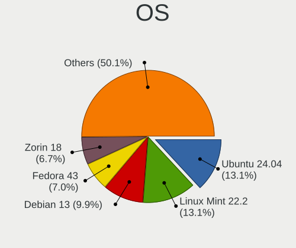

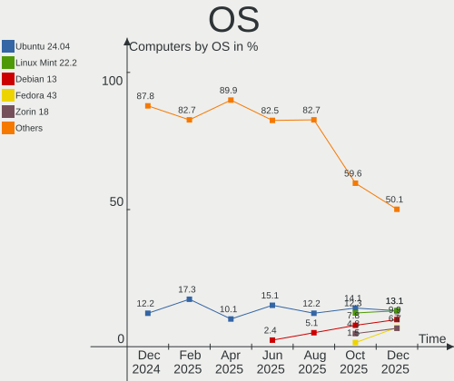

| Name                         | Computers | Percent |
|------------------------------|-----------|---------|
| Ubuntu 24.04                 | 45        | 13.12%  |
| Linux Mint 22.2              | 45        | 13.12%  |
| Debian 13                    | 34        | 9.91%   |
| Fedora 43                    | 24        | 7%      |
| Zorin 18                     | 23        | 6.71%   |
| Bazzite 43                   | 13        | 3.79%   |
| OpenMandriva 6.0             | 12        | 3.5%    |
| Arch Rolling                 | 11        | 3.21%   |
| OpenMandriva 25.90           | 9         | 2.62%   |
| Ubuntu 25.10                 | 6         | 1.75%   |
| Pop!_OS 24.04                | 6         | 1.75%   |
| OpenMandriva 25.11           | 6         | 1.75%   |
| Xubuntu 24.04                | 5         | 1.46%   |
| Ubuntu 20.04                 | 5         | 1.46%   |
| Pop!_OS 22.04                | 5         | 1.46%   |
| Linux Mint 22.1              | 5         | 1.46%   |
| Linux Mint 21.3              | 4         | 1.17%   |
| KDE neon 24.04               | 4         | 1.17%   |
| Debian 12                    | 4         | 1.17%   |
| Xubuntu 25.10                | 3         | 0.87%   |
| openSUSE Tumbleweed-XXXXXXXX | 3         | 0.87%   |
| OpenMandriva 24.07           | 3         | 0.87%   |
| Debian                       | 3         | 0.87%   |
| Zorin 16                     | 2         | 0.58%   |
| Ubuntu 22.04                 | 2         | 0.58%   |
| Solus 4.8                    | 2         | 0.58%   |
| Manjaro                      | 2         | 0.58%   |
| LMDE 7                       | 2         | 0.58%   |
| Kubuntu 25.10                | 2         | 0.58%   |
| Kubuntu 25.04                | 2         | 0.58%   |
| Elementary 8                 | 2         | 0.58%   |
| Elementary 7.1               | 2         | 0.58%   |
| CachyOS Rolling              | 2         | 0.58%   |
| CachyOS                      | 2         | 0.58%   |
| Bazzite 42                   | 2         | 0.58%   |
| Anduinos 1.4.1               | 2         | 0.58%   |
| Zorin 17                     | 1         | 0.29%   |
| Xubuntu 18.04                | 1         | 0.29%   |
| Vanilla 2.0                  | 1         | 0.29%   |
| Ubuntu Unity 24.04           | 1         | 0.29%   |

OS Family
---------

OS without a version

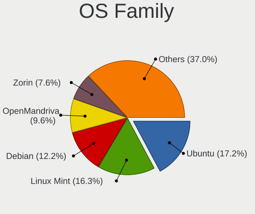

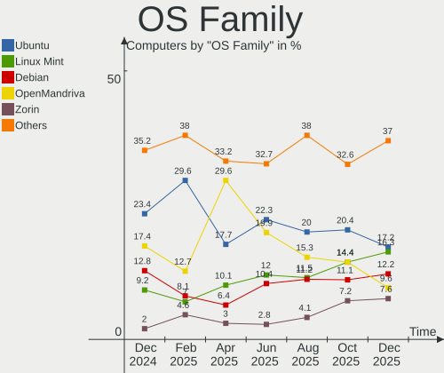

| Name             | Computers | Percent |
|------------------|-----------|---------|
| Ubuntu           | 59        | 17.2%   |
| Linux Mint       | 56        | 16.33%  |
| Debian           | 42        | 12.24%  |
| OpenMandriva     | 33        | 9.62%   |
| Zorin            | 26        | 7.58%   |
| Fedora           | 25        | 7.29%   |
| Bazzite          | 15        | 4.37%   |
| Pop!_OS          | 11        | 3.21%   |
| Arch             | 11        | 3.21%   |
| Xubuntu          | 9         | 2.62%   |
| Kubuntu          | 6         | 1.75%   |
| KDE neon         | 4         | 1.17%   |
| Elementary       | 4         | 1.17%   |
| CachyOS          | 4         | 1.17%   |
| openSUSE         | 3         | 0.87%   |
| Manjaro          | 3         | 0.87%   |
| Lubuntu          | 3         | 0.87%   |
| Ubuntu MATE      | 2         | 0.58%   |
| SteamOS          | 2         | 0.58%   |
| Solus            | 2         | 0.58%   |
| NixOS            | 2         | 0.58%   |
| MX               | 2         | 0.58%   |
| LMDE             | 2         | 0.58%   |
| Anduinos         | 2         | 0.58%   |
| Vanilla          | 1         | 0.29%   |
| Ubuntu Unity     | 1         | 0.29%   |
| Ubuntu Budgie    | 1         | 0.29%   |
| Trisquel         | 1         | 0.29%   |
| SystemRescue     | 1         | 0.29%   |
| PostmarketOS     | 1         | 0.29%   |
| org.kde.Platform | 1         | 0.29%   |
| Mageia           | 1         | 0.29%   |
| Glfos            | 1         | 0.29%   |
| EndeavourOS      | 1         | 0.29%   |
| Dts-distro       | 1         | 0.29%   |
| Devuan           | 1         | 0.29%   |
| ChimeraOS        | 1         | 0.29%   |
| Artix            | 1         | 0.29%   |
| Alpine           | 1         | 0.29%   |

Kernel
------

Version of the Linux kernel

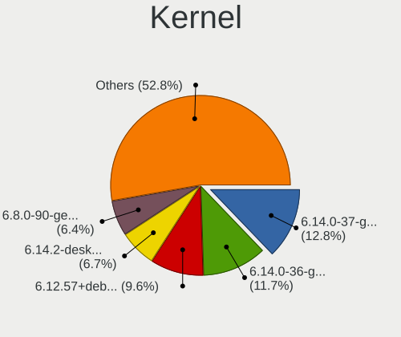

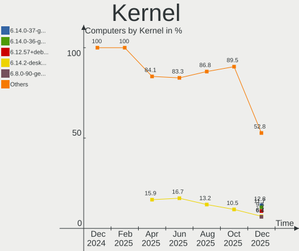

| Version                        | Computers | Percent |
|--------------------------------|-----------|---------|
| 6.14.0-37-generic              | 44        | 12.83%  |
| 6.14.0-36-generic              | 40        | 11.66%  |
| 6.12.57+deb13-amd64            | 33        | 9.62%   |
| 6.14.2-desktop-3omv2590        | 23        | 6.71%   |
| 6.8.0-90-generic               | 22        | 6.41%   |
| 6.8.0-88-generic               | 12        | 3.5%    |
| 6.17.12-300.fc43.x86_64        | 10        | 2.92%   |
| 6.17.0-8-generic               | 8         | 2.33%   |
| 6.17.7-ba20.fc43.x86_64        | 7         | 2.04%   |
| 6.17.9-76061709-generic        | 6         | 1.75%   |
| 6.17.10-300.fc43.x86_64        | 6         | 1.75%   |
| 6.17.0-7-generic               | 6         | 1.75%   |
| 6.14.0-29-generic              | 5         | 1.46%   |
| 6.17.7-ba19.fc43.x86_64        | 4         | 1.17%   |
| 5.15.0-139-generic             | 4         | 1.17%   |
| 6.8.0-87-generic               | 3         | 0.87%   |
| 6.18.0-desktop-1omv2590        | 3         | 0.87%   |
| 6.17.9-zen1-1-zen              | 3         | 0.87%   |
| 6.17.4-76061704-generic        | 3         | 0.87%   |
| 6.17.1-300.fc43.x86_64         | 3         | 0.87%   |
| 6.14.0-33-generic              | 3         | 0.87%   |
| 6.10.0-desktop-1omv2490        | 3         | 0.87%   |
| 6.18.1-arch1-2                 | 2         | 0.58%   |
| 6.18.1-2-cachyos               | 2         | 0.58%   |
| 6.18.0-1-default               | 2         | 0.58%   |
| 6.17.9-arch1-1                 | 2         | 0.58%   |
| 6.17.8-324.current             | 2         | 0.58%   |
| 6.17.7-desktop-1omv2590        | 2         | 0.58%   |
| 6.17.11-300.fc43.x86_64        | 2         | 0.58%   |
| 6.16.4-116.bazzite.fc42.x86_64 | 2         | 0.58%   |
| 6.14.0-35-generic              | 2         | 0.58%   |
| 6.12.48+deb13-amd64            | 2         | 0.58%   |
| 6.1.0-40-amd64                 | 2         | 0.58%   |
| 4.15.0-213-generic             | 2         | 0.58%   |
| 6.8.12-17-pve                  | 1         | 0.29%   |
| 6.8.12-16-pve                  | 1         | 0.29%   |
| 6.8.12-13-pve                  | 1         | 0.29%   |
| 6.8.0-85-generic               | 1         | 0.29%   |
| 6.8.0-78-generic               | 1         | 0.29%   |
| 6.8.0-71-generic               | 1         | 0.29%   |

Kernel Family
-------------

Linux kernel without a distro release

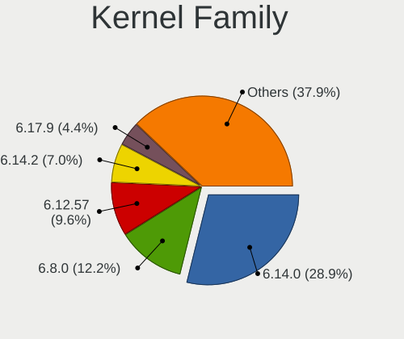

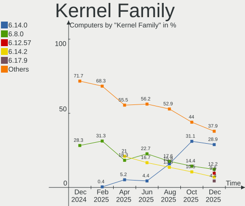

| Version | Computers | Percent |
|---------|-----------|---------|
| 6.14.0  | 99        | 28.86%  |
| 6.8.0   | 42        | 12.24%  |
| 6.12.57 | 33        | 9.62%   |
| 6.14.2  | 24        | 7%      |
| 6.17.9  | 15        | 4.37%   |
| 6.17.7  | 15        | 4.37%   |
| 6.17.0  | 15        | 4.37%   |
| 6.17.12 | 11        | 3.21%   |
| 5.15.0  | 11        | 3.21%   |
| 6.18.0  | 8         | 2.33%   |
| 6.17.10 | 8         | 2.33%   |
| 6.18.1  | 7         | 2.04%   |
| 6.17.8  | 5         | 1.46%   |
| 6.18.2  | 4         | 1.17%   |
| 6.8.12  | 3         | 0.87%   |
| 6.17.4  | 3         | 0.87%   |
| 6.17.1  | 3         | 0.87%   |
| 6.10.0  | 3         | 0.87%   |
| 6.1.0   | 3         | 0.87%   |
| 6.17.13 | 2         | 0.58%   |
| 6.17.11 | 2         | 0.58%   |
| 6.16.4  | 2         | 0.58%   |
| 6.12.62 | 2         | 0.58%   |
| 6.12.61 | 2         | 0.58%   |
| 6.12.48 | 2         | 0.58%   |
| 4.15.0  | 2         | 0.58%   |
| 6.6.21  | 1         | 0.29%   |
| 6.5.0   | 1         | 0.29%   |
| 6.17.6  | 1         | 0.29%   |
| 6.17.2  | 1         | 0.29%   |
| 6.16.12 | 1         | 0.29%   |
| 6.14.7  | 1         | 0.29%   |
| 6.14.5  | 1         | 0.29%   |
| 6.12.60 | 1         | 0.29%   |
| 6.12.38 | 1         | 0.29%   |
| 6.12.1  | 1         | 0.29%   |
| 6.11.4  | 1         | 0.29%   |
| 6.11.11 | 1         | 0.29%   |
| 6.11.0  | 1         | 0.29%   |
| 6.10.9  | 1         | 0.29%   |

Kernel Major Ver.
-----------------

Linux kernel major version

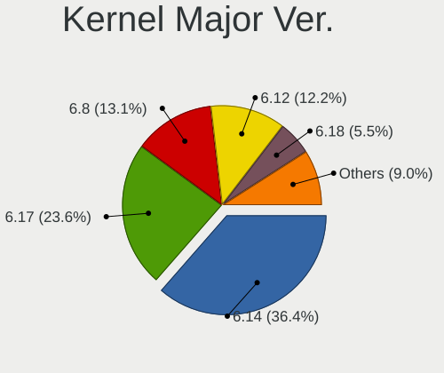

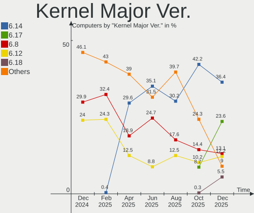

| Version | Computers | Percent |
|---------|-----------|---------|
| 6.14    | 125       | 36.44%  |
| 6.17    | 81        | 23.62%  |
| 6.8     | 45        | 13.12%  |
| 6.12    | 42        | 12.24%  |
| 6.18    | 19        | 5.54%   |
| 5.15    | 12        | 3.5%    |
| 6.10    | 4         | 1.17%   |
| 6.16    | 3         | 0.87%   |
| 6.11    | 3         | 0.87%   |
| 6.1     | 3         | 0.87%   |
| 4.15    | 2         | 0.58%   |
| 6.6     | 1         | 0.29%   |
| 6.5     | 1         | 0.29%   |
| 6.0     | 1         | 0.29%   |
| 4.19    | 1         | 0.29%   |

Arch
----

OS architecture (x86_64, i586, etc.)

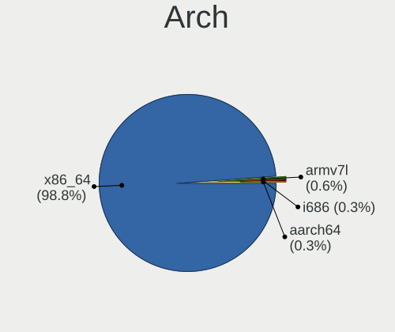

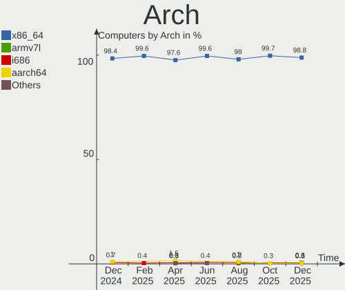

| Name    | Computers | Percent |
|---------|-----------|---------|
| x86_64  | 339       | 98.83%  |
| armv7l  | 2         | 0.58%   |
| i686    | 1         | 0.29%   |
| aarch64 | 1         | 0.29%   |

DE
--

Desktop Environment

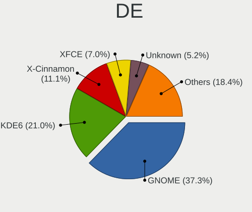

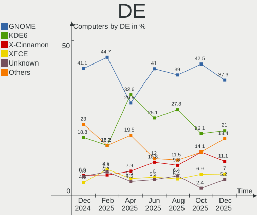

| Name            | Computers | Percent |
|-----------------|-----------|---------|
| GNOME           | 128       | 37.32%  |
| KDE6            | 72        | 20.99%  |
| X-Cinnamon      | 38        | 11.08%  |
| XFCE            | 24        | 7%      |
| Unknown         | 18        | 5.25%   |
| MATE            | 13        | 3.79%   |
| LXQt            | 7         | 2.04%   |
| KDE5            | 7         | 2.04%   |
| KDE             | 6         | 1.75%   |
| Hyprland        | 5         | 1.46%   |
| COSMIC          | 5         | 1.46%   |
| Pantheon        | 4         | 1.17%   |
| Cinnamon        | 4         | 1.17%   |
| niri            | 3         | 0.87%   |
| i3              | 2         | 0.58%   |
| wlroots         | 1         | 0.29%   |
| Unity           | 1         | 0.29%   |
| sway            | 1         | 0.29%   |
| Openbox         | 1         | 0.29%   |
| LXDE            | 1         | 0.29%   |
| GNOME Flashback | 1         | 0.29%   |
| Budgie          | 1         | 0.29%   |

Display Server
--------------

X11 or Wayland

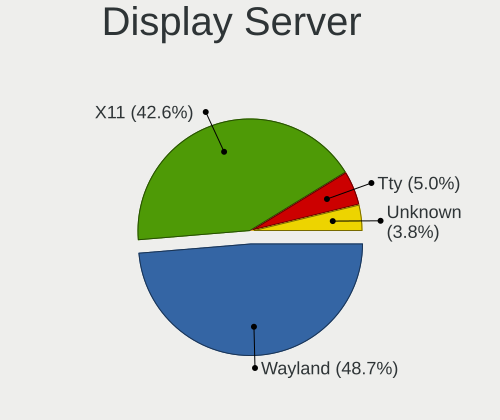

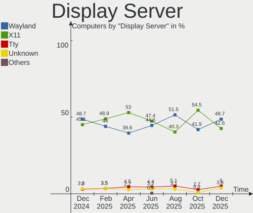

| Name    | Computers | Percent |
|---------|-----------|---------|
| Wayland | 167       | 48.69%  |
| X11     | 146       | 42.57%  |
| Tty     | 17        | 4.96%   |
| Unknown | 13        | 3.79%   |

Display Manager
---------------

SDDM, LightDM, etc.

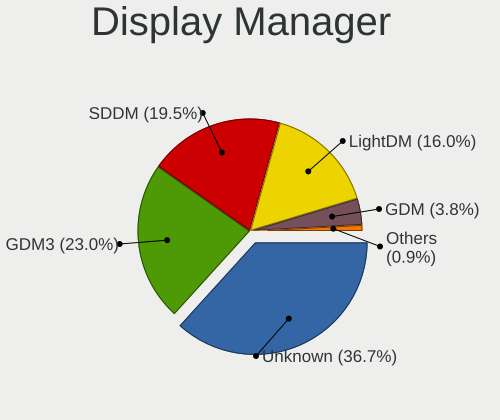

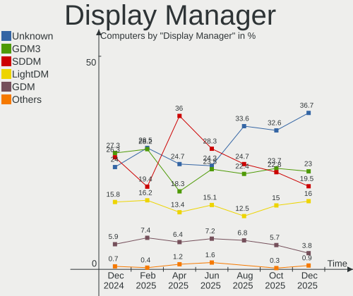

| Name           | Computers | Percent |
|----------------|-----------|---------|
| Unknown        | 126       | 36.73%  |
| GDM3           | 79        | 23.03%  |
| SDDM           | 67        | 19.53%  |
| LightDM        | 55        | 16.03%  |
| GDM            | 13        | 3.79%   |
| COSMIC-GREETER | 2         | 0.58%   |
| LY-DM          | 1         | 0.29%   |

OS Lang
-------

Language

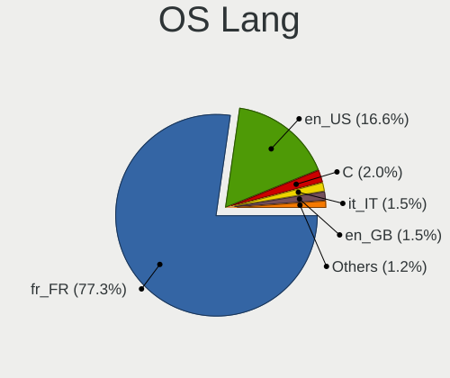

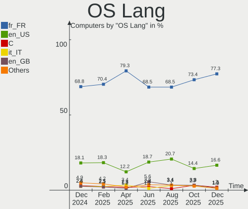

| Lang    | Computers | Percent |
|---------|-----------|---------|
| fr_FR   | 265       | 77.26%  |
| en_US   | 57        | 16.62%  |
| C       | 7         | 2.04%   |
| it_IT   | 5         | 1.46%   |
| en_GB   | 5         | 1.46%   |
| Unknown | 2         | 0.58%   |
| fr_CH   | 1         | 0.29%   |
| es_ES   | 1         | 0.29%   |

Boot Mode
---------

EFI or BIOS

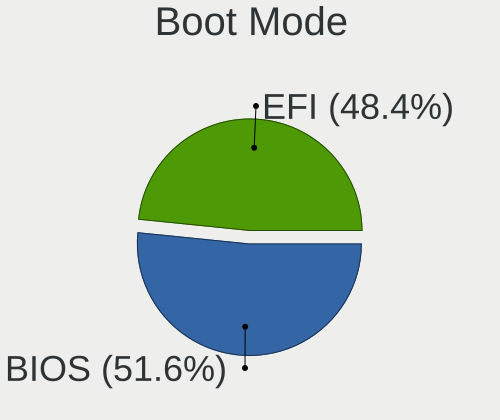

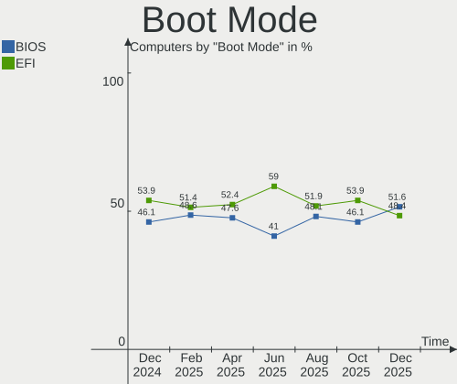

| Mode | Computers | Percent |
|------|-----------|---------|
| BIOS | 177       | 51.6%   |
| EFI  | 166       | 48.4%   |

Filesystem
----------

Type of filesystem

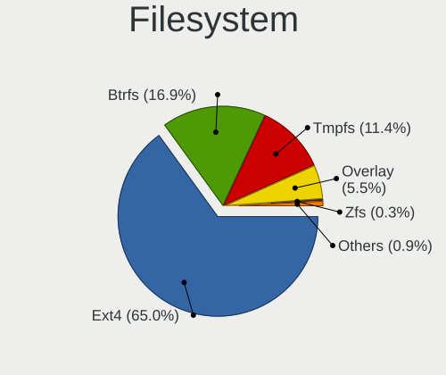

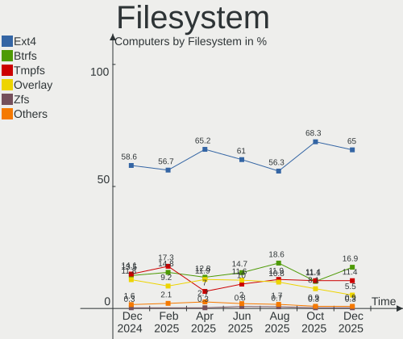

| Type    | Computers | Percent |
|---------|-----------|---------|
| Ext4    | 223       | 65.01%  |
| Btrfs   | 58        | 16.91%  |
| Tmpfs   | 39        | 11.37%  |
| Overlay | 19        | 5.54%   |
| Zfs     | 1         | 0.29%   |
| Xfs     | 1         | 0.29%   |
| Rootfs  | 1         | 0.29%   |
| F2fs    | 1         | 0.29%   |

Part. scheme
------------

Scheme of partitioning

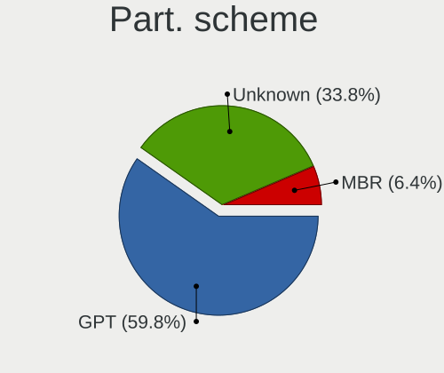

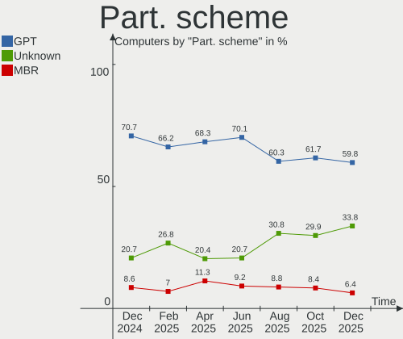

| Type    | Computers | Percent |
|---------|-----------|---------|
| GPT     | 205       | 59.77%  |
| Unknown | 116       | 33.82%  |
| MBR     | 22        | 6.41%   |

Dual Boot with Linux/BSD
------------------------

Hosting more than one Linux/BSD

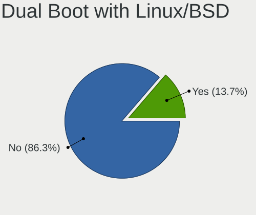

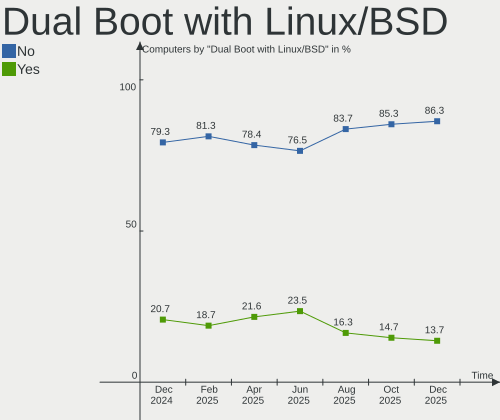

| Dual boot | Computers | Percent |
|-----------|-----------|---------|
| No        | 296       | 86.3%   |
| Yes       | 47        | 13.7%   |

Dual Boot (Win)
---------------

Hosting Linux and Windows

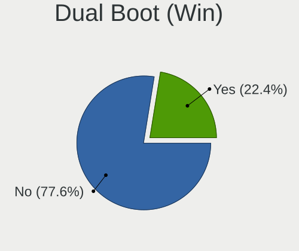

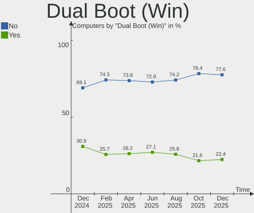

| Dual boot | Computers | Percent |
|-----------|-----------|---------|
| No        | 266       | 77.55%  |
| Yes       | 77        | 22.45%  |

Board
-----

Vendor
------

Motherboard manufacturer

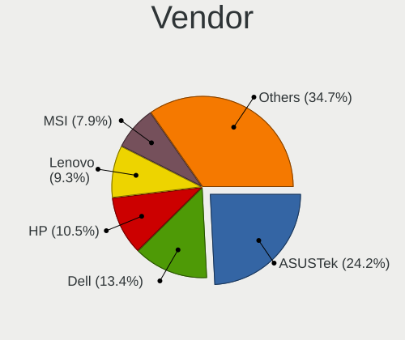

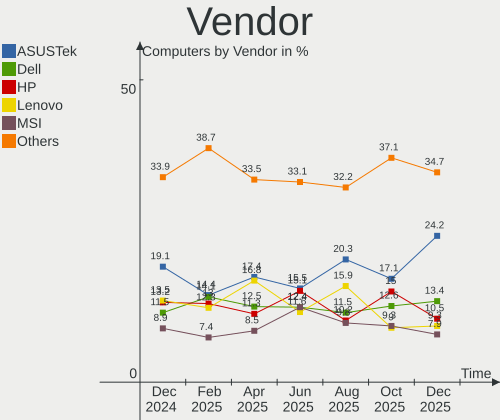

| Name                                 | Computers | Percent |
|--------------------------------------|-----------|---------|
| ASUSTek Computer                     | 83        | 24.2%   |
| Dell                                 | 46        | 13.41%  |
| Hewlett-Packard                      | 36        | 10.5%   |
| Lenovo                               | 32        | 9.33%   |
| MSI                                  | 27        | 7.87%   |
| Gigabyte Technology                  | 24        | 7%      |
| Acer                                 | 17        | 4.96%   |
| Toshiba                              | 11        | 3.21%   |
| Apple                                | 9         | 2.62%   |
| ASRock                               | 8         | 2.33%   |
| Intel                                | 6         | 1.75%   |
| Framework                            | 4         | 1.17%   |
| Unknown                              | 3         | 0.87%   |
| TUXEDO                               | 2         | 0.58%   |
| Shenzhen Meigao Electronic Equipment | 2         | 0.58%   |
| Pegatron                             | 2         | 0.58%   |
| Hardkernel                           | 2         | 0.58%   |
| Fujitsu                              | 2         | 0.58%   |
| Biostar                              | 2         | 0.58%   |
| AZW                                  | 2         | 0.58%   |
| Win Element                          | 1         | 0.29%   |
| UNIQCELL                             | 1         | 0.29%   |
| TongFang                             | 1         | 0.29%   |
| Teclast                              | 1         | 0.29%   |
| Sony                                 | 1         | 0.29%   |
| SLIMBOOK                             | 1         | 0.29%   |
| Schenker                             | 1         | 0.29%   |
| Red Hat                              | 1         | 0.29%   |
| Raspberry Pi Foundation              | 1         | 0.29%   |
| PC Specialist                        | 1         | 0.29%   |
| Packard Bell                         | 1         | 0.29%   |
| Notebook                             | 1         | 0.29%   |
| Microsoft                            | 1         | 0.29%   |
| Medion                               | 1         | 0.29%   |
| Hampoo                               | 1         | 0.29%   |
| Google                               | 1         | 0.29%   |
| GMKtec                               | 1         | 0.29%   |
| GEEKOM                               | 1         | 0.29%   |
| Foxconn                              | 1         | 0.29%   |
| Corsair                              | 1         | 0.29%   |

Model
-----

Motherboard model

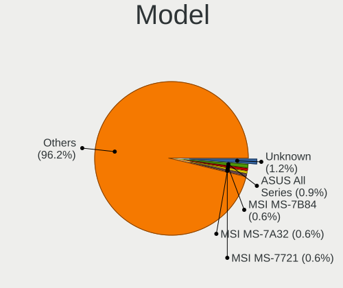

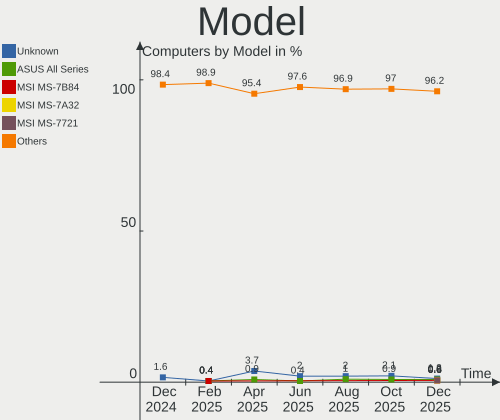

| Name                             | Computers | Percent |
|----------------------------------|-----------|---------|
| Unknown                          | 4         | 1.17%   |
| ASUS All Series                  | 3         | 0.87%   |
| MSI MS-7B84                      | 2         | 0.58%   |
| MSI MS-7A32                      | 2         | 0.58%   |
| MSI MS-7721                      | 2         | 0.58%   |
| Lenovo IdeaPad 1 15ALC7 82R4     | 2         | 0.58%   |
| Lenovo G50-45 80E3               | 2         | 0.58%   |
| Intel D54250WYK H13922-303       | 2         | 0.58%   |
| HP Pavilion dv7                  | 2         | 0.58%   |
| HP Pavilion 17                   | 2         | 0.58%   |
| HP Notebook                      | 2         | 0.58%   |
| Gigabyte B450 AORUS ELITE        | 2         | 0.58%   |
| Gigabyte 970A-DS3P               | 2         | 0.58%   |
| Dell Precision T1650             | 2         | 0.58%   |
| Dell OptiPlex 3020M              | 2         | 0.58%   |
| Dell Latitude E6230              | 2         | 0.58%   |
| Dell Latitude 7490               | 2         | 0.58%   |
| Dell Latitude 5480               | 2         | 0.58%   |
| ASUS PRIME Z270-P                | 2         | 0.58%   |
| ASRock B650 Pro RS               | 2         | 0.58%   |
| Apple iMac13,2                   | 2         | 0.58%   |
| Win Element M6                   | 1         | 0.29%   |
| UNIQCELL Q15.6                   | 1         | 0.29%   |
| TUXEDO InfinityBook S 15/17 Gen7 | 1         | 0.29%   |
| TUXEDO InfinityBook Pro AMD Gen9 | 1         | 0.29%   |
| Toshiba TECRA Z50-A              | 1         | 0.29%   |
| Toshiba Satellite Pro L870-14G   | 1         | 0.29%   |
| Toshiba Satellite Pro L500       | 1         | 0.29%   |
| Toshiba Satellite P200           | 1         | 0.29%   |
| Toshiba Satellite L300           | 1         | 0.29%   |
| Toshiba Satellite C70-B          | 1         | 0.29%   |
| Toshiba Satellite C55D-A-14U     | 1         | 0.29%   |
| Toshiba QOSMIO X70-A             | 1         | 0.29%   |
| Toshiba PORTEGE R930             | 1         | 0.29%   |
| Toshiba PORTEGE M780             | 1         | 0.29%   |
| Toshiba NB520                    | 1         | 0.29%   |
| TongFang GX5HRXL                 | 1         | 0.29%   |
| Teclast Cherry Trail CR          | 1         | 0.29%   |
| Sony VPCF11C5E                   | 1         | 0.29%   |
| SLIMBOOK Executive               | 1         | 0.29%   |

Model Family
------------

Motherboard model prefix

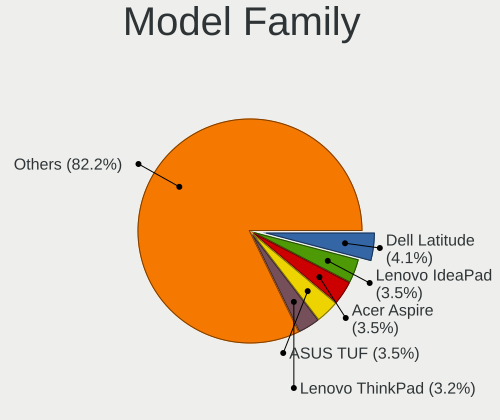

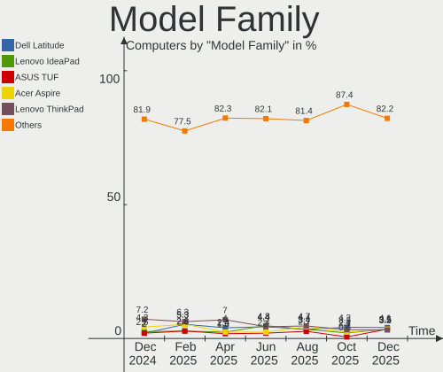

| Name                | Computers | Percent |
|---------------------|-----------|---------|
| Dell Latitude       | 14        | 4.08%   |
| Lenovo IdeaPad      | 12        | 3.5%    |
| ASUS TUF            | 12        | 3.5%    |
| Acer Aspire         | 12        | 3.5%    |
| Lenovo ThinkPad     | 11        | 3.21%   |
| ASUS ROG            | 10        | 2.92%   |
| ASUS VivoBook       | 9         | 2.62%   |
| Dell OptiPlex       | 8         | 2.33%   |
| ASUS PRIME          | 8         | 2.33%   |
| HP ProBook          | 7         | 2.04%   |
| Dell Precision      | 7         | 2.04%   |
| ASUS ASUS           | 7         | 2.04%   |
| Toshiba Satellite   | 6         | 1.75%   |
| HP Pavilion         | 5         | 1.46%   |
| Dell Inspiron       | 5         | 1.46%   |
| Gigabyte B450       | 4         | 1.17%   |
| Dell XPS            | 4         | 1.17%   |
| Unknown             | 4         | 1.17%   |
| Lenovo G50-45       | 3         | 0.87%   |
| HP OMEN             | 3         | 0.87%   |
| HP Laptop           | 3         | 0.87%   |
| HP ENVY             | 3         | 0.87%   |
| Gigabyte X570       | 3         | 0.87%   |
| Framework Laptop    | 3         | 0.87%   |
| ASUS Zenbook        | 3         | 0.87%   |
| ASUS All            | 3         | 0.87%   |
| TUXEDO InfinityBook | 2         | 0.58%   |
| Toshiba PORTEGE     | 2         | 0.58%   |
| MSI MS-7B84         | 2         | 0.58%   |
| MSI MS-7A32         | 2         | 0.58%   |
| MSI MS-7721         | 2         | 0.58%   |
| Lenovo Legion       | 2         | 0.58%   |
| Intel D54250WYK     | 2         | 0.58%   |
| HP ZBook            | 2         | 0.58%   |
| HP Spectre          | 2         | 0.58%   |
| HP Notebook         | 2         | 0.58%   |
| HP EliteBook        | 2         | 0.58%   |
| HP Compaq           | 2         | 0.58%   |
| Gigabyte Z690       | 2         | 0.58%   |
| Gigabyte X570S      | 2         | 0.58%   |

MFG Year
--------

Motherboard manufacture year

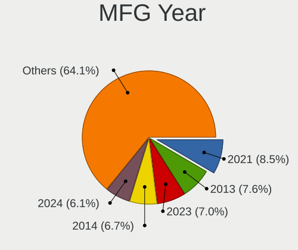

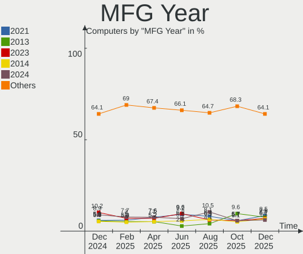

| Year    | Computers | Percent |
|---------|-----------|---------|
| 2021    | 29        | 8.45%   |
| 2013    | 26        | 7.58%   |
| 2023    | 24        | 7%      |
| 2014    | 23        | 6.71%   |
| 2024    | 21        | 6.12%   |
| 2022    | 21        | 6.12%   |
| 2012    | 21        | 6.12%   |
| 2020    | 20        | 5.83%   |
| 2017    | 20        | 5.83%   |
| 2015    | 20        | 5.83%   |
| 2025    | 19        | 5.54%   |
| 2018    | 19        | 5.54%   |
| 2016    | 16        | 4.66%   |
| 2019    | 14        | 4.08%   |
| 2011    | 14        | 4.08%   |
| 2010    | 13        | 3.79%   |
| 2008    | 9         | 2.62%   |
| 2009    | 8         | 2.33%   |
| Unknown | 3         | 0.87%   |
| 2007    | 2         | 0.58%   |
| 2003    | 1         | 0.29%   |

Form Factor
-----------

Physical design of the computer

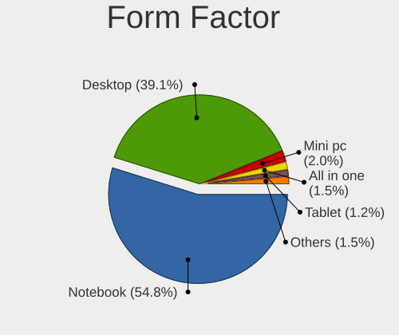

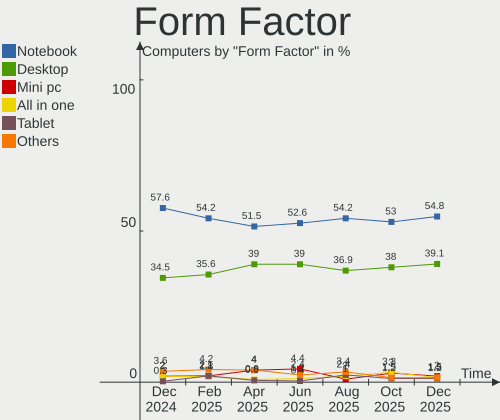

| Name           | Computers | Percent |
|----------------|-----------|---------|
| Notebook       | 188       | 54.81%  |
| Desktop        | 134       | 39.07%  |
| Mini pc        | 7         | 2.04%   |
| All in one     | 5         | 1.46%   |
| Tablet         | 4         | 1.17%   |
| System on chip | 3         | 0.87%   |
| Convertible    | 1         | 0.29%   |
| Server         | 1         | 0.29%   |

Secure Boot
-----------

Enabled or disabled

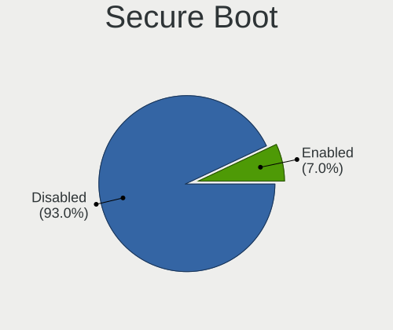

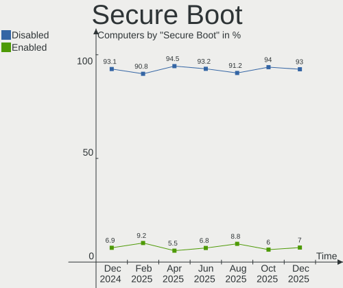

| State    | Computers | Percent |
|----------|-----------|---------|
| Disabled | 319       | 93%     |
| Enabled  | 24        | 7%      |

Coreboot
--------

Have coreboot on board

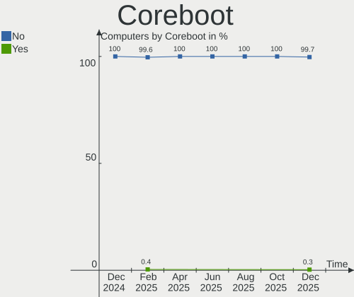

| Used | Computers | Percent |
|------|-----------|---------|
| No   | 342       | 99.71%  |
| Yes  | 1         | 0.29%   |

RAM Size
--------

Total RAM memory

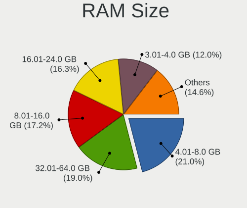

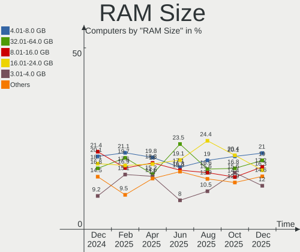

| Size in GB      | Computers | Percent |
|-----------------|-----------|---------|
| 4.01-8.0        | 72        | 20.99%  |
| 32.01-64.0      | 65        | 18.95%  |
| 8.01-16.0       | 59        | 17.2%   |
| 16.01-24.0      | 56        | 16.33%  |
| 3.01-4.0        | 41        | 11.95%  |
| 64.01-256.0     | 21        | 6.12%   |
| 24.01-32.0      | 18        | 5.25%   |
| 2.01-3.0        | 6         | 1.75%   |
| 1.01-2.0        | 2         | 0.58%   |
| 0.51-1.0        | 2         | 0.58%   |
| More than 256.0 | 1         | 0.29%   |

RAM Used
--------

Used RAM memory

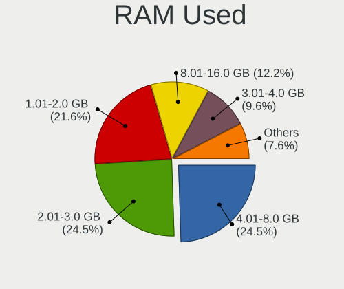

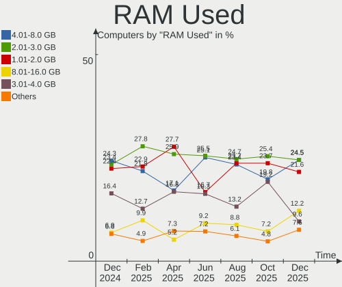

| Used GB     | Computers | Percent |
|-------------|-----------|---------|
| 4.01-8.0    | 84        | 24.49%  |
| 2.01-3.0    | 84        | 24.49%  |
| 1.01-2.0    | 74        | 21.57%  |
| 8.01-16.0   | 42        | 12.24%  |
| 3.01-4.0    | 33        | 9.62%   |
| 0.51-1.0    | 10        | 2.92%   |
| 16.01-24.0  | 5         | 1.46%   |
| 0.01-0.5    | 4         | 1.17%   |
| 64.01-256.0 | 3         | 0.87%   |
| 32.01-64.0  | 2         | 0.58%   |
| 24.01-32.0  | 2         | 0.58%   |

Total Drives
------------

Number of drives on board

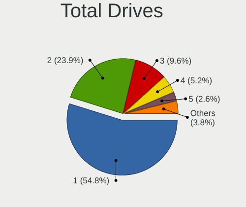

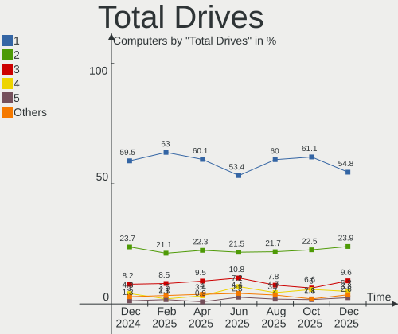

| Drives | Computers | Percent |
|--------|-----------|---------|
| 1      | 188       | 54.81%  |
| 2      | 82        | 23.91%  |
| 3      | 33        | 9.62%   |
| 4      | 18        | 5.25%   |
| 5      | 9         | 2.62%   |
| 6      | 7         | 2.04%   |
| 0      | 2         | 0.58%   |
| 14     | 1         | 0.29%   |
| 10     | 1         | 0.29%   |
| 8      | 1         | 0.29%   |
| 7      | 1         | 0.29%   |

Has CD-ROM
----------

Has CD-ROM on board

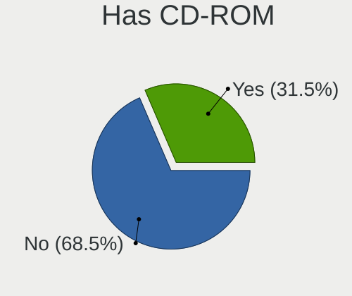

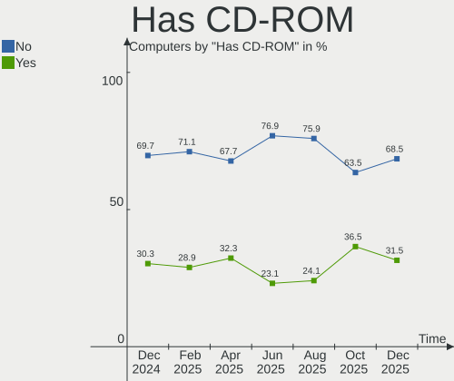

| Presented | Computers | Percent |
|-----------|-----------|---------|
| No        | 235       | 68.51%  |
| Yes       | 108       | 31.49%  |

Has Ethernet
------------

Has Ethernet on board

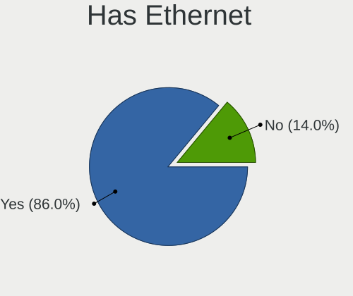

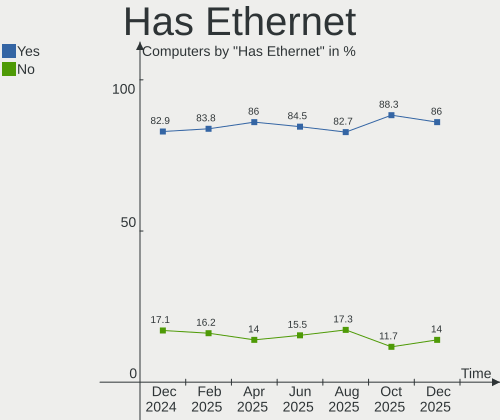

| Presented | Computers | Percent |
|-----------|-----------|---------|
| Yes       | 295       | 86.01%  |
| No        | 48        | 13.99%  |

Has WiFi
--------

Has WiFi module

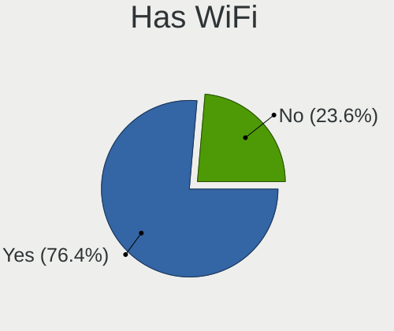

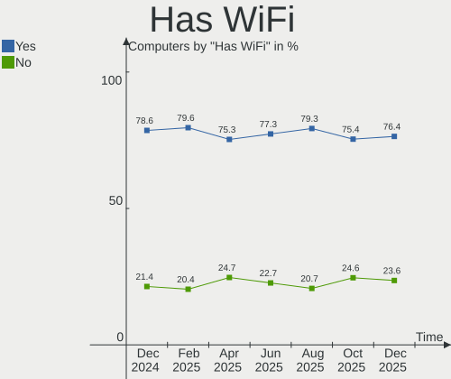

| Presented | Computers | Percent |
|-----------|-----------|---------|
| Yes       | 262       | 76.38%  |
| No        | 81        | 23.62%  |

Has Bluetooth
-------------

Has Bluetooth module

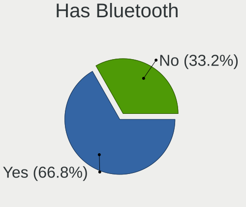

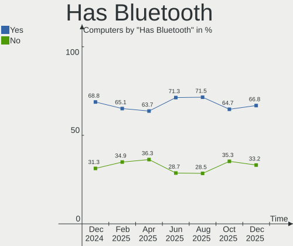

| Presented | Computers | Percent |
|-----------|-----------|---------|
| Yes       | 229       | 66.76%  |
| No        | 114       | 33.24%  |

Location
--------

Country
-------

Geographic location (country)

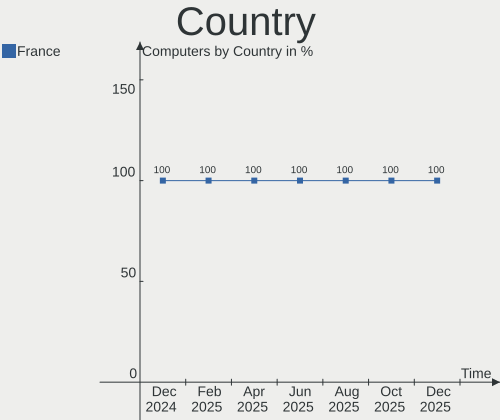

| Country | Computers | Percent |
|---------|-----------|---------|
| France  | 343       | 100%    |

City
----

Geographic location (city)

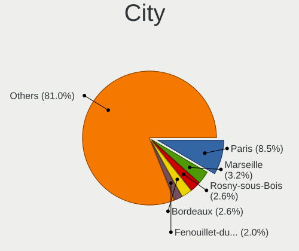

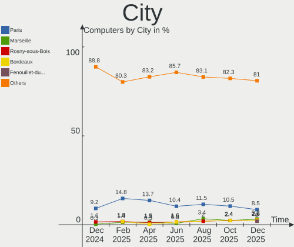

| City                | Computers | Percent |
|---------------------|-----------|---------|
| Paris               | 29        | 8.45%   |
| Marseille           | 11        | 3.21%   |
| Rosny-sous-Bois     | 9         | 2.62%   |
| Bordeaux            | 9         | 2.62%   |
| Fenouillet-du-Razes | 7         | 2.04%   |
| Toulouse            | 6         | 1.75%   |
| Toulon              | 6         | 1.75%   |
| Lyon                | 5         | 1.46%   |
| Rennes              | 4         | 1.17%   |
| Montpellier         | 4         | 1.17%   |
| Lille               | 4         | 1.17%   |
| Verton              | 3         | 0.87%   |
| Tournefeuille       | 3         | 0.87%   |
| Strasbourg          | 3         | 0.87%   |
| Les Hogues          | 3         | 0.87%   |
| Guyancourt          | 3         | 0.87%   |
| Grenoble            | 3         | 0.87%   |
| Évry               | 3         | 0.87%   |
| Cergy               | 3         | 0.87%   |
| Bayonne             | 3         | 0.87%   |
| Vitrolles           | 2         | 0.58%   |
| Talence             | 2         | 0.58%   |
| Pessac              | 2         | 0.58%   |
| Palaiseau           | 2         | 0.58%   |
| Noisy-le-Sec        | 2         | 0.58%   |
| Nevers              | 2         | 0.58%   |
| Nantes              | 2         | 0.58%   |
| Nanterre            | 2         | 0.58%   |
| Marcq-en-Baroeul    | 2         | 0.58%   |
| Maisons-Laffitte    | 2         | 0.58%   |
| Limoges             | 2         | 0.58%   |
| Le Mans             | 2         | 0.58%   |
| Évreux             | 2         | 0.58%   |
| Épinay-sur-Seine   | 2         | 0.58%   |
| Courbevoie          | 2         | 0.58%   |
| Clichy-sous-Bois    | 2         | 0.58%   |
| Burgnac             | 2         | 0.58%   |
| Azay-sur-Cher       | 2         | 0.58%   |
| Aurillac            | 2         | 0.58%   |
| Argenteuil          | 2         | 0.58%   |

Drives
------

Drive Vendor
------------

Hard drive vendors

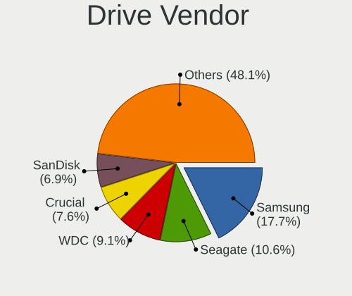

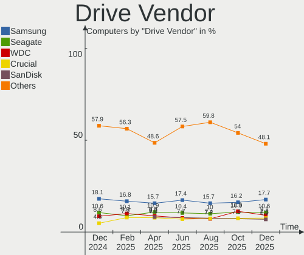

| Vendor                      | Computers | Drives | Percent |
|-----------------------------|-----------|--------|---------|
| Samsung Electronics         | 95        | 128    | 17.66%  |
| Seagate                     | 57        | 87     | 10.59%  |
| WDC                         | 49        | 58     | 9.11%   |
| Crucial                     | 41        | 45     | 7.62%   |
| SanDisk                     | 37        | 39     | 6.88%   |
| Kingston                    | 37        | 42     | 6.88%   |
| Toshiba                     | 21        | 26     | 3.9%    |
| Micron Technology           | 20        | 20     | 3.72%   |
| Unknown                     | 17        | 20     | 3.16%   |
| Hitachi                     | 13        | 14     | 2.42%   |
| SK hynix                    | 12        | 12     | 2.23%   |
| PNY                         | 12        | 14     | 2.23%   |
| Micron/Crucial Technology   | 12        | 16     | 2.23%   |
| HGST                        | 10        | 11     | 1.86%   |
| Phison Electronics          | 8         | 9      | 1.49%   |
| KIOXIA                      | 8         | 8      | 1.49%   |
| Intel                       | 8         | 9      | 1.49%   |
| Kingston Technology Company | 6         | 6      | 1.12%   |
| Transcend                   | 5         | 5      | 0.93%   |
| SPCC                        | 5         | 6      | 0.93%   |
| China                       | 5         | 5      | 0.93%   |
| Apple                       | 4         | 4      | 0.74%   |
| MAXIO Technology (Hangzhou) | 3         | 3      | 0.56%   |
| KingSpec                    | 3         | 3      | 0.56%   |
| Integral                    | 3         | 3      | 0.56%   |
| Emtec                       | 3         | 3      | 0.56%   |
| Silicon Motion              | 2         | 2      | 0.37%   |
| Phison                      | 2         | 3      | 0.37%   |
| Maxtor                      | 2         | 2      | 0.37%   |
| LITEON                      | 2         | 2      | 0.37%   |
| JMicron Technology          | 2         | 2      | 0.37%   |
| Intenso                     | 2         | 2      | 0.37%   |
| Gigabyte Technology         | 2         | 2      | 0.37%   |
| GALAX                       | 2         | 2      | 0.37%   |
| Fanxiang                    | 2         | 3      | 0.37%   |
| ASMT                        | 2         | 4      | 0.37%   |
| A-DATA Technology           | 2         | 2      | 0.37%   |
| TEXTORM                     | 1         | 1      | 0.19%   |
| Seagate Technology          | 1         | 1      | 0.19%   |
| SD                          | 1         | 1      | 0.19%   |

Drive Model
-----------

Hard drive models

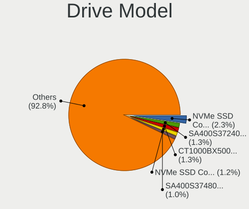

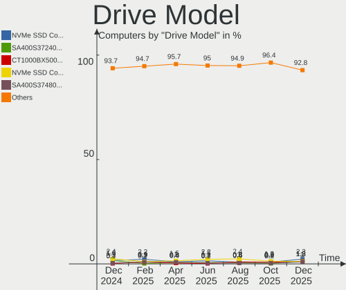

| Model                                              | Computers | Percent |
|----------------------------------------------------|-----------|---------|
| Samsung NVMe SSD Controller PM9A1/PM9A3/980PRO 1TB | 14        | 2.33%   |
| Kingston SA400S37240G 240GB SSD                    | 8         | 1.33%   |
| Crucial CT1000BX500SSD1 1TB                        | 8         | 1.33%   |
| Samsung NVMe SSD Controller SM981/PM981/PM983 1TB  | 7         | 1.16%   |
| Kingston SA400S37480G 480GB SSD                    | 6         | 1%      |
| HGST HTS721010A9E630 1TB                           | 6         | 1%      |
| Crucial CT500MX500SSD1 500GB                       | 6         | 1%      |
| Crucial CT1000MX500SSD1 1TB                        | 6         | 1%      |
| Samsung SSD 860 QVO 1TB                            | 5         | 0.83%   |
| Micron/Crucial P2 NVMe PCIe SSD 2TB                | 5         | 0.83%   |
| Crucial CT480BX500SSD1 480GB                       | 5         | 0.83%   |
| Toshiba MQ01ABD100 1TB                             | 4         | 0.67%   |
| Toshiba DT01ACA100 1TB                             | 4         | 0.67%   |
| Seagate ST1000DM010-2EP102 1TB                     | 4         | 0.67%   |
| Samsung SSD 980 1TB                                | 4         | 0.67%   |
| Samsung SSD 870 QVO 1TB                            | 4         | 0.67%   |
| Samsung SSD 860 EVO 500GB                          | 4         | 0.67%   |
| Samsung SSD 860 EVO 250GB                          | 4         | 0.67%   |
| Samsung SSD 850 EVO 250GB                          | 4         | 0.67%   |
| Samsung NVMe SSD Controller 980 (DRAM-less) 256GB  | 4         | 0.67%   |
| Kingston SA400S37960G 960GB SSD                    | 4         | 0.67%   |
| Crucial CT240BX500SSD1 240GB                       | 4         | 0.67%   |
| Seagate ST2000DM008-2FR102 2TB                     | 3         | 0.5%    |
| Seagate ST1000LM024 HN-M101MBB 1TB                 | 3         | 0.5%    |
| Seagate ST1000DM003-1SB102 1TB                     | 3         | 0.5%    |
| Samsung SSD 990 PRO 2TB                            | 3         | 0.5%    |
| Samsung SSD 990 PRO 1TB                            | 3         | 0.5%    |
| Samsung SSD 870 EVO 1TB                            | 3         | 0.5%    |
| Samsung SSD 860 EVO 1TB                            | 3         | 0.5%    |
| Samsung SSD 850 EVO 500GB                          | 3         | 0.5%    |
| Phison PS5013 E13 NVMe Controller 500GB            | 3         | 0.5%    |
| WDC WD5000AAKX-75U6AA0 500GB                       | 2         | 0.33%   |
| WDC WD20EZRZ-00Z5HB0 2TB                           | 2         | 0.33%   |
| WDC WD20EARS-00MVWB0 2TB                           | 2         | 0.33%   |
| WDC WD10JPCX-24UE4T0 1TB                           | 2         | 0.33%   |
| WDC WD Blue SA510 2.5 500GB                        | 2         | 0.33%   |
| Unknown SD/MMC/MS PRO 2GB                          | 2         | 0.33%   |
| Unknown MMC Card  64GB                             | 2         | 0.33%   |
| Transcend TS512GMTS430S 512GB SSD                  | 2         | 0.33%   |
| SPCC Solid State Disk 256GB                        | 2         | 0.33%   |

HDD Vendor
----------

Hard disk drive vendors

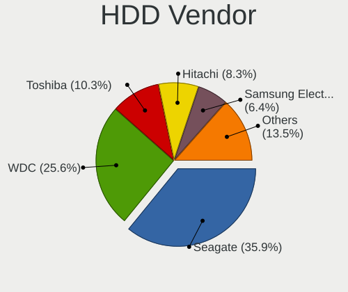

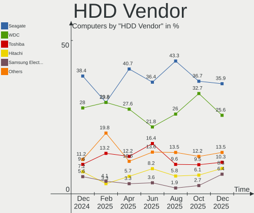

| Vendor              | Computers | Drives | Percent |
|---------------------|-----------|--------|---------|
| Seagate             | 56        | 86     | 35.9%   |
| WDC                 | 40        | 48     | 25.64%  |
| Toshiba             | 16        | 21     | 10.26%  |
| Hitachi             | 13        | 14     | 8.33%   |
| Samsung Electronics | 10        | 11     | 6.41%   |
| HGST                | 10        | 11     | 6.41%   |
| Unknown             | 2         | 2      | 1.28%   |
| Maxtor              | 2         | 2      | 1.28%   |
| JMicron Technology  | 2         | 2      | 1.28%   |
| Apple               | 2         | 2      | 1.28%   |
| Maxone              | 1         | 1      | 0.64%   |
| HGST HUH            | 1         | 1      | 0.64%   |
| ASMT                | 1         | 1      | 0.64%   |

SSD Vendor
----------

Solid state drive vendors

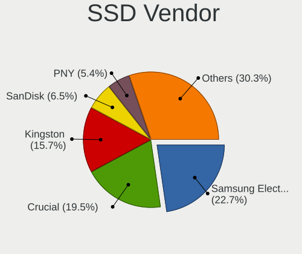

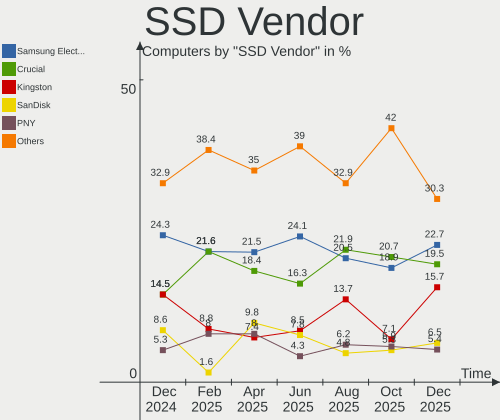

| Vendor              | Computers | Drives | Percent |
|---------------------|-----------|--------|---------|
| Samsung Electronics | 42        | 50     | 22.7%   |
| Crucial             | 36        | 39     | 19.46%  |
| Kingston            | 29        | 34     | 15.68%  |
| SanDisk             | 12        | 13     | 6.49%   |
| PNY                 | 10        | 10     | 5.41%   |
| WDC                 | 5         | 5      | 2.7%    |
| Transcend           | 5         | 5      | 2.7%    |
| SPCC                | 5         | 6      | 2.7%    |
| China               | 5         | 5      | 2.7%    |
| SK hynix            | 4         | 4      | 2.16%   |
| Toshiba             | 3         | 3      | 1.62%   |
| Emtec               | 3         | 3      | 1.62%   |
| Micron Technology   | 2         | 2      | 1.08%   |
| LITEON              | 2         | 2      | 1.08%   |
| KingSpec            | 2         | 2      | 1.08%   |
| Intenso             | 2         | 2      | 1.08%   |
| Integral            | 2         | 2      | 1.08%   |
| GALAX               | 2         | 2      | 1.08%   |
| Apple               | 2         | 2      | 1.08%   |
| TEXTORM             | 1         | 1      | 0.54%   |
| SD                  | 1         | 1      | 0.54%   |
| SABRENT             | 1         | 1      | 0.54%   |
| Plextor             | 1         | 1      | 0.54%   |
| OCZ                 | 1         | 1      | 0.54%   |
| LITEONIT            | 1         | 2      | 0.54%   |
| Lexar               | 1         | 1      | 0.54%   |
| Intel               | 1         | 1      | 0.54%   |
| EDILOCA             | 1         | 1      | 0.54%   |
| BAITITON            | 1         | 1      | 0.54%   |
| ASMT                | 1         | 3      | 0.54%   |
| A-DATA Technology   | 1         | 1      | 0.54%   |

Drive Kind
----------

HDD or SSD

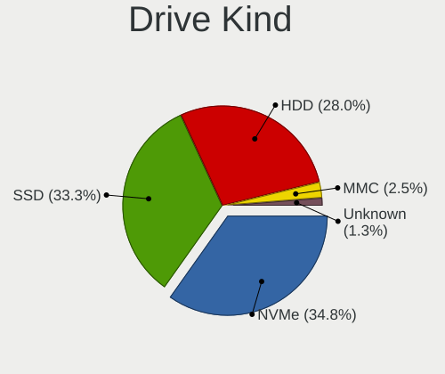

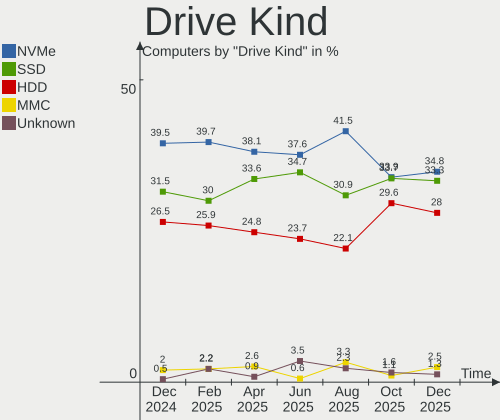

| Kind    | Computers | Drives | Percent |
|---------|-----------|--------|---------|
| NVMe    | 164       | 216    | 34.82%  |
| SSD     | 157       | 206    | 33.33%  |
| HDD     | 132       | 202    | 28.03%  |
| MMC     | 12        | 13     | 2.55%   |
| Unknown | 6         | 7      | 1.27%   |

Drive Connector
---------------

SATA, SAS, NVMe, etc.

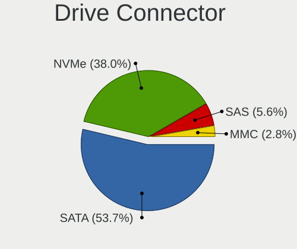

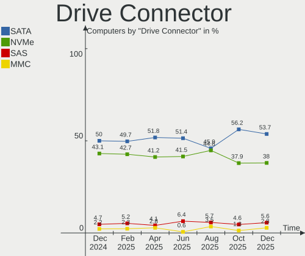

| Type | Computers | Drives | Percent |
|------|-----------|--------|---------|
| SATA | 232       | 384    | 53.7%   |
| NVMe | 164       | 215    | 37.96%  |
| SAS  | 24        | 32     | 5.56%   |
| MMC  | 12        | 13     | 2.78%   |

Drive Size
----------

Size of hard drive

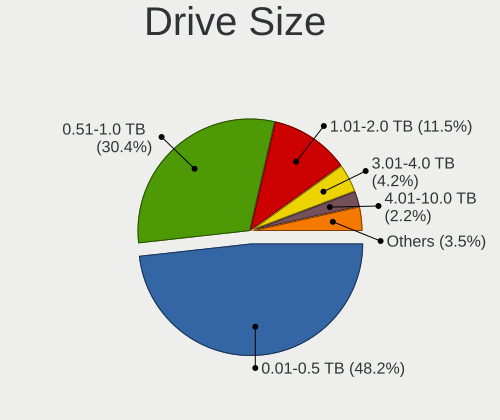

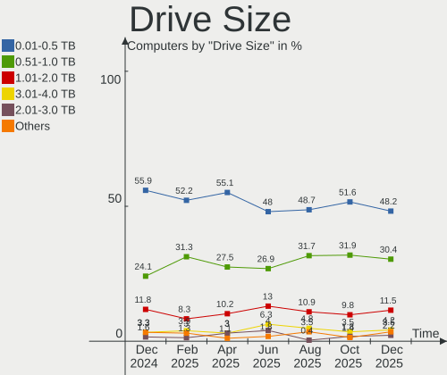

| Size in TB | Computers | Drives | Percent |
|------------|-----------|--------|---------|
| 0.01-0.5   | 151       | 192    | 48.24%  |
| 0.51-1.0   | 95        | 119    | 30.35%  |
| 1.01-2.0   | 36        | 44     | 11.5%   |
| 3.01-4.0   | 13        | 19     | 4.15%   |
| 2.01-3.0   | 7         | 9      | 2.24%   |
| 4.01-10.0  | 7         | 15     | 2.24%   |
| 10.01-20.0 | 4         | 10     | 1.28%   |

Space Total
-----------

Amount of disk space available on the file system

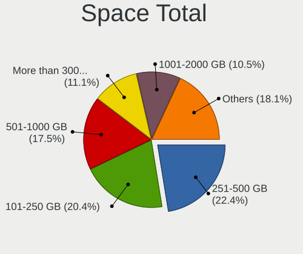

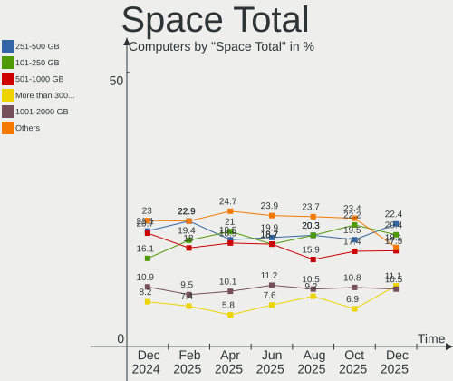

| Size in GB     | Computers | Percent |
|----------------|-----------|---------|
| 251-500        | 77        | 22.45%  |
| 101-250        | 70        | 20.41%  |
| 501-1000       | 60        | 17.49%  |
| More than 3000 | 38        | 11.08%  |
| 1001-2000      | 36        | 10.5%   |
| 2001-3000      | 20        | 5.83%   |
| 1-20           | 13        | 3.79%   |
| Unknown        | 13        | 3.79%   |
| 51-100         | 12        | 3.5%    |
| 21-50          | 4         | 1.17%   |

Space Used
----------

Amount of used disk space

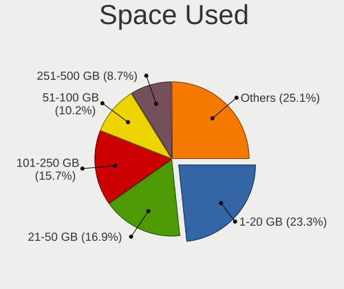

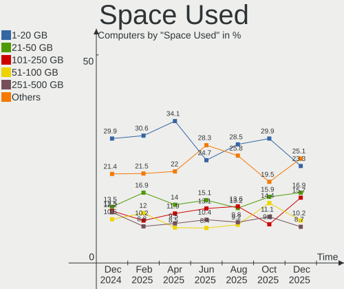

| Used GB        | Computers | Percent |
|----------------|-----------|---------|
| 1-20           | 80        | 23.32%  |
| 21-50          | 58        | 16.91%  |
| 101-250        | 54        | 15.74%  |
| 51-100         | 35        | 10.2%   |
| 251-500        | 30        | 8.75%   |
| 501-1000       | 29        | 8.45%   |
| 1001-2000      | 22        | 6.41%   |
| Unknown        | 13        | 3.79%   |
| More than 3000 | 11        | 3.21%   |
| 2001-3000      | 9         | 2.62%   |
| 0              | 2         | 0.58%   |

Malfunc. Drives
---------------

Drive models with a malfunction

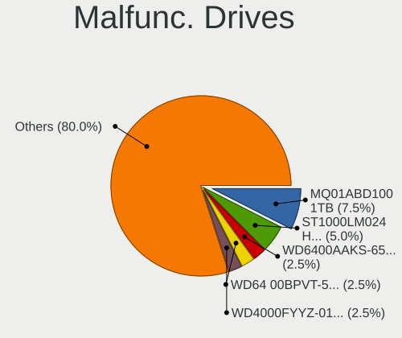

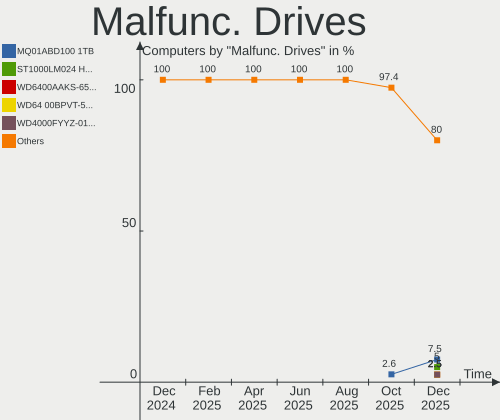

| Model                                   | Computers | Drives | Percent |
|-----------------------------------------|-----------|--------|---------|
| Toshiba MQ01ABD100 1TB                  | 3         | 3      | 7.5%    |
| Seagate ST1000LM024 HN-M101MBB 1TB      | 2         | 2      | 5%      |
| WDC WD6400AAKS-65A7B0 640GB             | 1         | 1      | 2.5%    |
| WDC WD64 00BPVT-55HXZT2 640GB           | 1         | 1      | 2.5%    |
| WDC WD4000FYYZ-01UL1B3 4TB              | 1         | 1      | 2.5%    |
| WDC WD3200BEVT-26A23T0 320GB            | 1         | 1      | 2.5%    |
| WDC WD20EZRX-22D8PB0 2TB                | 1         | 1      | 2.5%    |
| WDC WD20EARX-00PASB0 2TB                | 1         | 1      | 2.5%    |
| WDC WD20EARS-00MVWB0 2TB                | 1         | 1      | 2.5%    |
| WDC WD10EZEX-22BN5A0 1TB                | 1         | 1      | 2.5%    |
| WDC WD10EAVS-00D7B1 1TB                 | 1         | 1      | 2.5%    |
| Transcend TS512GMTS800 512GB SSD        | 1         | 1      | 2.5%    |
| Toshiba MQ01ACF050 500GB                | 1         | 1      | 2.5%    |
| Toshiba KSG60ZMV512G M.2 2280 512GB SSD | 1         | 1      | 2.5%    |
| Toshiba DT01ACA100 1TB                  | 1         | 1      | 2.5%    |
| SK hynix HFS128G39TND-N210A 128GB SSD   | 1         | 1      | 2.5%    |
| Seagate ST95005620AS 500GB              | 1         | 1      | 2.5%    |
| Seagate ST500LM021-1KJ152 500GB         | 1         | 1      | 2.5%    |
| Seagate ST4000VN008-2DR166 4TB          | 1         | 1      | 2.5%    |
| SanDisk SDSSDHP064G 64GB                | 1         | 1      | 2.5%    |
| Samsung Electronics SSD 870 EVO 1TB     | 1         | 1      | 2.5%    |
| Samsung Electronics HD160JJ 160GB       | 1         | 1      | 2.5%    |
| Samsung Electronics HD103SI 1TB         | 1         | 1      | 2.5%    |
| Maxtor STM3250310AS 250GB               | 1         | 1      | 2.5%    |
| LITEONIT CMT-128L3M 128GB SSD           | 1         | 2      | 2.5%    |
| Kingston SV300S37A240G 240GB SSD        | 1         | 1      | 2.5%    |
| Kingston SHPM2280P2H 240G SSD           | 1         | 1      | 2.5%    |
| Intel SSDSC2BW240A4 240GB               | 1         | 1      | 2.5%    |
| Hitachi HTS723225A7A364 250GB           | 1         | 1      | 2.5%    |
| Hitachi HTS545032B9A300 320GB           | 1         | 1      | 2.5%    |
| Hitachi HTS542516K9SA00 160GB           | 1         | 1      | 2.5%    |
| Hitachi HTS542512K9SA00 120GB           | 1         | 1      | 2.5%    |
| Hitachi HDS721050CLA360 500GB           | 1         | 1      | 2.5%    |
| HGST HTS725050A7E630 500GB              | 1         | 1      | 2.5%    |
| HGST HTS721010A9E630 1TB                | 1         | 1      | 2.5%    |
| China SSD 256GB                         | 1         | 1      | 2.5%    |
| Apple HDD WDC WD10EALX-408EA0 1TB       | 1         | 1      | 2.5%    |

Malfunc. Drive Vendor
---------------------

Vendors of faulty drives

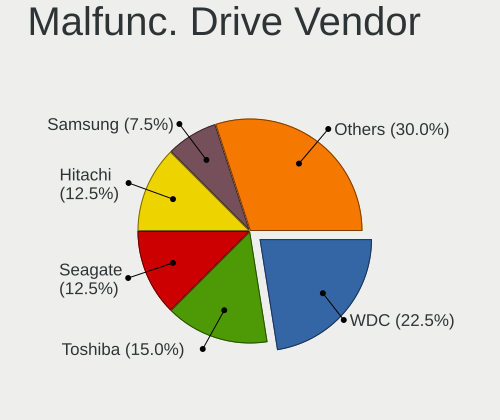

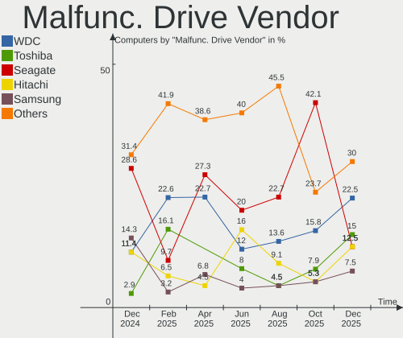

| Vendor              | Computers | Drives | Percent |
|---------------------|-----------|--------|---------|
| WDC                 | 9         | 9      | 22.5%   |
| Toshiba             | 6         | 6      | 15%     |
| Seagate             | 5         | 5      | 12.5%   |
| Hitachi             | 5         | 5      | 12.5%   |
| Samsung Electronics | 3         | 3      | 7.5%    |
| Kingston            | 2         | 2      | 5%      |
| HGST                | 2         | 2      | 5%      |
| Transcend           | 1         | 1      | 2.5%    |
| SK hynix            | 1         | 1      | 2.5%    |
| SanDisk             | 1         | 1      | 2.5%    |
| Maxtor              | 1         | 1      | 2.5%    |
| LITEONIT            | 1         | 2      | 2.5%    |
| Intel               | 1         | 1      | 2.5%    |
| China               | 1         | 1      | 2.5%    |
| Apple               | 1         | 1      | 2.5%    |

Malfunc. HDD Vendor
-------------------

Vendors of faulty HDD drives

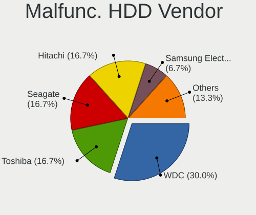

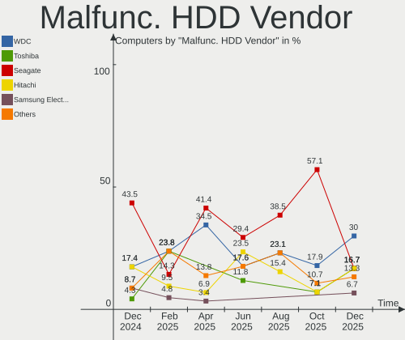

| Vendor              | Computers | Drives | Percent |
|---------------------|-----------|--------|---------|
| WDC                 | 9         | 9      | 30%     |
| Toshiba             | 5         | 5      | 16.67%  |
| Seagate             | 5         | 5      | 16.67%  |
| Hitachi             | 5         | 5      | 16.67%  |
| Samsung Electronics | 2         | 2      | 6.67%   |
| HGST                | 2         | 2      | 6.67%   |
| Maxtor              | 1         | 1      | 3.33%   |
| Apple               | 1         | 1      | 3.33%   |

Malfunc. Drive Kind
-------------------

Kinds of faulty drives

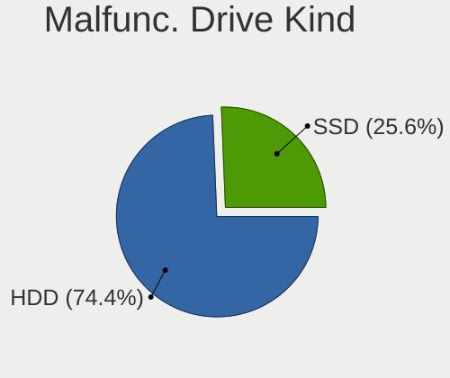

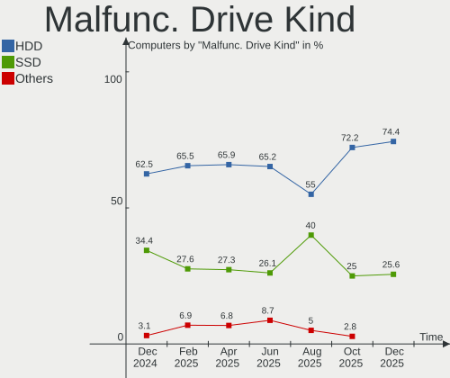

| Kind | Computers | Drives | Percent |
|------|-----------|--------|---------|
| HDD  | 29        | 30     | 74.36%  |
| SSD  | 10        | 11     | 25.64%  |

Failed Drives
-------------

Failed drive models

Zero info for selected period =(

Failed Drive Vendor
-------------------

Failed drive vendors

Zero info for selected period =(

Drive Status
------------

Number of failed and malfunc. drives

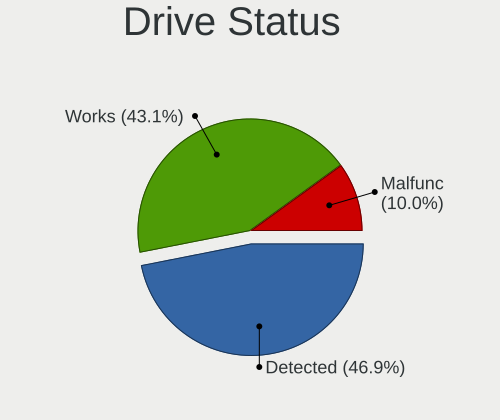

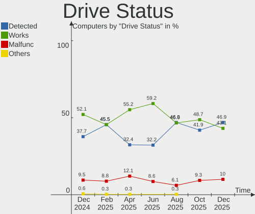

| Status   | Computers | Drives | Percent |
|----------|-----------|--------|---------|
| Detected | 174       | 302    | 46.9%   |
| Works    | 160       | 301    | 43.13%  |
| Malfunc  | 37        | 41     | 9.97%   |

Storage controller
------------------

Storage Vendor
--------------

Storage controller vendors

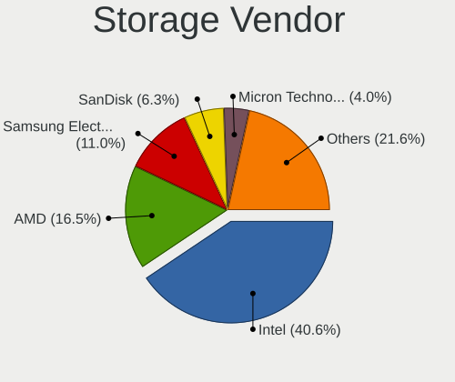

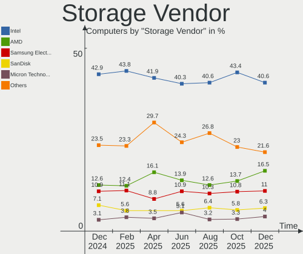

| Vendor                       | Computers | Percent |
|------------------------------|-----------|---------|
| Intel                        | 192       | 40.59%  |
| AMD                          | 78        | 16.49%  |
| Samsung Electronics          | 52        | 10.99%  |
| SanDisk                      | 30        | 6.34%   |
| Micron Technology            | 19        | 4.02%   |
| Micron/Crucial Technology    | 17        | 3.59%   |
| Phison Electronics           | 15        | 3.17%   |
| Kingston Technology Company  | 15        | 3.17%   |
| SK hynix                     | 8         | 1.69%   |
| MAXIO Technology (Hangzhou)  | 8         | 1.69%   |
| KIOXIA                       | 8         | 1.69%   |
| Nvidia                       | 5         | 1.06%   |
| ASMedia Technology           | 5         | 1.06%   |
| JMicron Technology           | 4         | 0.85%   |
| Silicon Motion               | 3         | 0.63%   |
| Toshiba America Info Systems | 2         | 0.42%   |
| Seagate Technology           | 2         | 0.42%   |
| LSI Logic / Symbios Logic    | 2         | 0.42%   |
| Broadcom / LSI               | 2         | 0.42%   |
| TenaFe                       | 1         | 0.21%   |
| Shenzhen Longsys Electronics | 1         | 0.21%   |
| Realtek Semiconductor        | 1         | 0.21%   |
| Marvell Technology Group     | 1         | 0.21%   |
| INNOGRIT                     | 1         | 0.21%   |
| Biwin Storage Technology     | 1         | 0.21%   |

Storage Model
-------------

Storage controller models

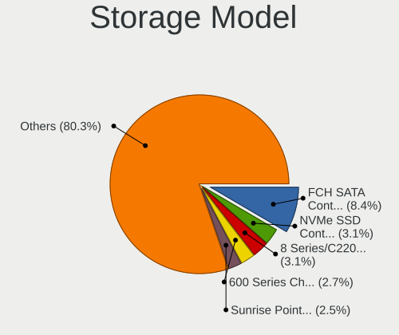

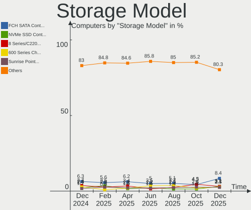

| Model                                                                          | Computers | Percent |
|--------------------------------------------------------------------------------|-----------|---------|
| AMD FCH SATA Controller [AHCI mode]                                            | 44        | 8.43%   |
| Samsung NVMe SSD Controller PM9A1/PM9A3/980PRO                                 | 16        | 3.07%   |
| Intel 8 Series/C220 Series Chipset Family 6-port SATA Controller 1 [AHCI mode] | 16        | 3.07%   |
| AMD 600 Series Chipset SATA Controller                                         | 14        | 2.68%   |
| Intel Sunrise Point-LP SATA Controller [AHCI mode]                             | 13        | 2.49%   |
| Intel 82801 Mobile SATA Controller [RAID mode]                                 | 12        | 2.3%    |
| Intel Volume Management Device NVMe RAID Controller                            | 11        | 2.11%   |
| Intel 7 Series Chipset Family 6-port SATA Controller [AHCI mode]               | 11        | 2.11%   |
| Samsung NVMe SSD Controller S4LV008[Pascal]                                    | 10        | 1.92%   |
| Samsung NVMe SSD Controller SM981/PM981/PM983                                  | 9         | 1.72%   |
| Samsung NVMe SSD Controller 980 (DRAM-less)                                    | 9         | 1.72%   |
| Micron/Crucial P2 [Nick P2] / P3 / P3 Plus NVMe PCIe SSD (DRAM-less)           | 9         | 1.72%   |
| AMD 500 Series Chipset SATA Controller                                         | 9         | 1.72%   |
| Intel SATA Controller [RAID mode]                                              | 8         | 1.53%   |
| Intel 8 Series SATA Controller 1 [AHCI mode]                                   | 8         | 1.53%   |
| AMD 400 Series Chipset SATA Controller                                         | 8         | 1.53%   |
| Sandisk WD Black SN850X NVMe SSD                                               | 7         | 1.34%   |
| Intel Alder Lake-S PCH SATA Controller [AHCI Mode]                             | 7         | 1.34%   |
| Samsung NVMe SSD Controller PM9C1a (DRAM-less)                                 | 6         | 1.15%   |
| Intel Q170/Q150/B150/H170/H110/Z170/CM236 Chipset SATA Controller [AHCI Mode]  | 6         | 1.15%   |
| Intel 82801IBM/IEM (ICH9M/ICH9M-E) 4 port SATA Controller [AHCI mode]          | 6         | 1.15%   |
| Intel 200 Series PCH SATA controller [AHCI mode]                               | 6         | 1.15%   |
| MAXIO (Hangzhou) NVMe SSD Controller MAP1202 (DRAM-less)                       | 5         | 0.96%   |
| KIOXIA NVMe SSD Controller BG4 (DRAM-less)                                     | 5         | 0.96%   |
| Kingston Company OM8PGP4 NVMe PCIe SSD (DRAM-less)                             | 5         | 0.96%   |
| Intel RST Volume Management Device Controller                                  | 5         | 0.96%   |
| Intel Raptor Lake SATA AHCI Controller                                         | 5         | 0.96%   |
| Intel HM170/QM170 Chipset SATA Controller [AHCI Mode]                          | 5         | 0.96%   |
| Intel 6 Series/C200 Series Chipset Family 6 port Mobile SATA AHCI Controller   | 5         | 0.96%   |
| Intel 6 Series/C200 Series Chipset Family 6 port Desktop SATA AHCI Controller  | 5         | 0.96%   |
| SanDisk WD SN560/SN740/SN770/SN5000 NVMe SSD                                   | 4         | 0.77%   |
| Sandisk WD PC SN5000S M.2 2280 NVMe SSD (DRAM-less)                            | 4         | 0.77%   |
| Samsung NVMe SSD Controller SM961/PM961/SM963                                  | 4         | 0.77%   |
| Phison E12 NVMe Controller                                                     | 4         | 0.77%   |
| Micron 2550 NVMe SSD (DRAM-less)                                               | 4         | 0.77%   |
| Intel Wildcat Point-LP SATA Controller [AHCI Mode]                             | 4         | 0.77%   |
| Intel Tiger Lake-LP SATA Controller                                            | 4         | 0.77%   |
| Intel Celeron N3350/Pentium N4200/Atom E3900 Series SATA AHCI Controller       | 4         | 0.77%   |
| Intel Cannon Lake PCH SATA AHCI Controller                                     | 4         | 0.77%   |
| Intel 5 Series/3400 Series Chipset 4 port SATA IDE Controller                  | 4         | 0.77%   |

Storage Kind
------------

Kind of storage controller (IDE, SATA, NVMe, SAS, ...)

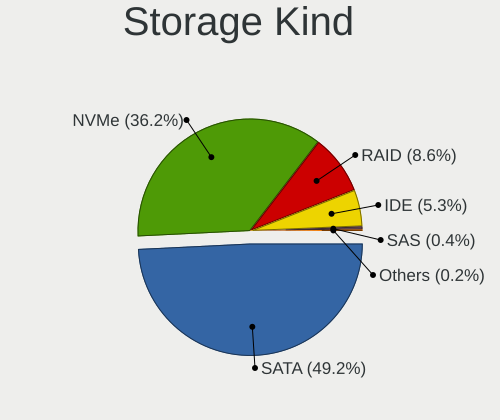

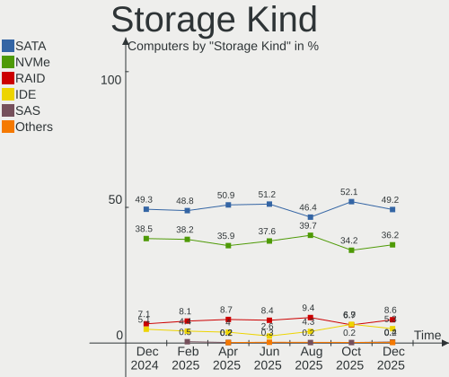

| Kind | Computers | Percent |
|------|-----------|---------|
| SATA | 223       | 49.23%  |
| NVMe | 164       | 36.2%   |
| RAID | 39        | 8.61%   |
| IDE  | 24        | 5.3%    |
| SAS  | 2         | 0.44%   |
| SCSI | 1         | 0.22%   |

Processor
---------

CPU Vendor
----------

Processor vendors

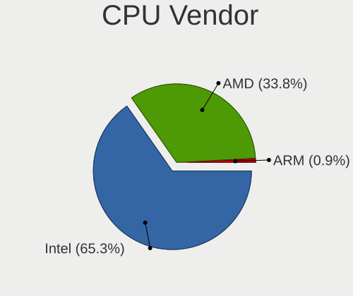

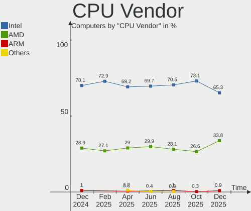

| Vendor | Computers | Percent |
|--------|-----------|---------|
| Intel  | 224       | 65.31%  |
| AMD    | 116       | 33.82%  |
| ARM    | 3         | 0.87%   |

CPU Model
---------

Processor models

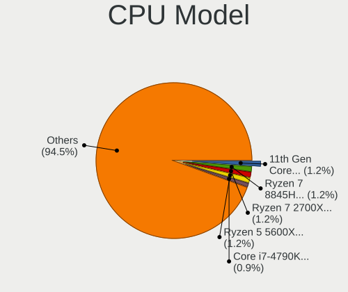

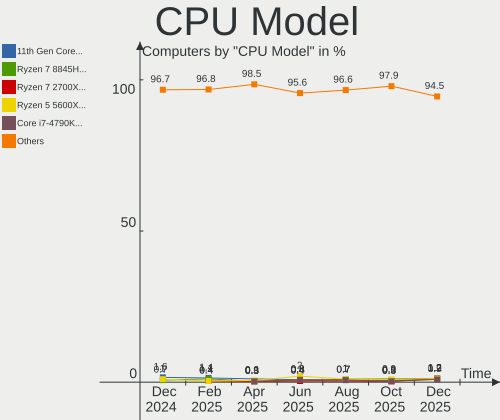

| Model                                       | Computers | Percent |
|---------------------------------------------|-----------|---------|
| Intel 11th Gen Core i7-1165G7 @ 2.80GHz     | 4         | 1.17%   |
| AMD Ryzen 7 8845HS w/ Radeon 780M Graphics  | 4         | 1.17%   |
| AMD Ryzen 7 2700X Eight-Core Processor      | 4         | 1.17%   |
| AMD Ryzen 5 5600X 6-Core Processor          | 4         | 1.17%   |
| Intel Core i7-4790K CPU @ 4.00GHz           | 3         | 0.87%   |
| Intel Core i5-7300HQ CPU @ 2.50GHz          | 3         | 0.87%   |
| Intel Core i5-6500 CPU @ 3.20GHz            | 3         | 0.87%   |
| Intel Core i5-6200U CPU @ 2.30GHz           | 3         | 0.87%   |
| Intel Core i5-3210M CPU @ 2.50GHz           | 3         | 0.87%   |
| Intel Core i5-2400 CPU @ 3.10GHz            | 3         | 0.87%   |
| Intel Core i3-7020U CPU @ 2.30GHz           | 3         | 0.87%   |
| Intel 12th Gen Core i7-1260P                | 3         | 0.87%   |
| Intel 11th Gen Core i7-11800H @ 2.30GHz     | 3         | 0.87%   |
| Intel 11th Gen Core i5-1135G7 @ 2.40GHz     | 3         | 0.87%   |
| AMD Ryzen AI 9 HX 370 w/ Radeon 890M        | 3         | 0.87%   |
| AMD Ryzen 7 9800X3D 8-Core Processor        | 3         | 0.87%   |
| AMD Ryzen 7 260 w/ Radeon 780M Graphics     | 3         | 0.87%   |
| AMD Ryzen 5 5600H with Radeon Graphics      | 3         | 0.87%   |
| Intel Pentium Dual-Core CPU T4200 @ 2.00GHz | 2         | 0.58%   |
| Intel Pentium CPU N3540 @ 2.16GHz           | 2         | 0.58%   |
| Intel Core i7-8650U CPU @ 1.90GHz           | 2         | 0.58%   |
| Intel Core i7-8550U CPU @ 1.80GHz           | 2         | 0.58%   |
| Intel Core i7-7700K CPU @ 4.20GHz           | 2         | 0.58%   |
| Intel Core i7-7600U CPU @ 2.80GHz           | 2         | 0.58%   |
| Intel Core i7-7500U CPU @ 2.70GHz           | 2         | 0.58%   |
| Intel Core i7-4770K CPU @ 3.50GHz           | 2         | 0.58%   |
| Intel Core i7-2670QM CPU @ 2.20GHz          | 2         | 0.58%   |
| Intel Core i5-9400 CPU @ 2.90GHz            | 2         | 0.58%   |
| Intel Core i5-8250U CPU @ 1.60GHz           | 2         | 0.58%   |
| Intel Core i5-7300U CPU @ 2.60GHz           | 2         | 0.58%   |
| Intel Core i5-6300HQ CPU @ 2.30GHz          | 2         | 0.58%   |
| Intel Core i5-4570 CPU @ 3.20GHz            | 2         | 0.58%   |
| Intel Core i5-4250U CPU @ 1.30GHz           | 2         | 0.58%   |
| Intel Core i5-3470 CPU @ 3.20GHz            | 2         | 0.58%   |
| Intel Core i5-3320M CPU @ 2.60GHz           | 2         | 0.58%   |
| Intel Core i5 CPU M 520 @ 2.40GHz           | 2         | 0.58%   |
| Intel Core i5 CPU 760 @ 2.80GHz             | 2         | 0.58%   |
| Intel Core i3-6006U CPU @ 2.00GHz           | 2         | 0.58%   |
| Intel Core i3-4150 CPU @ 3.50GHz            | 2         | 0.58%   |
| Intel Core i3-3110M CPU @ 2.40GHz           | 2         | 0.58%   |

CPU Model Family
----------------

Processor model prefix

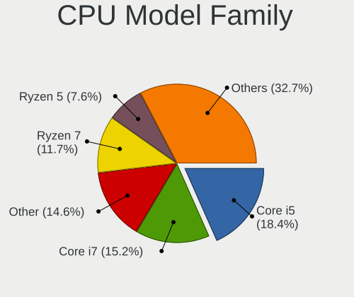

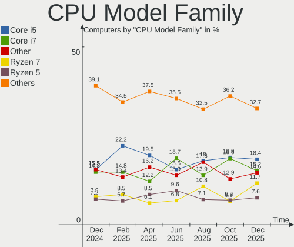

| Model                   | Computers | Percent |
|-------------------------|-----------|---------|
| Intel Core i5           | 63        | 18.37%  |
| Intel Core i7           | 52        | 15.16%  |
| Other                   | 50        | 14.58%  |
| AMD Ryzen 7             | 40        | 11.66%  |
| AMD Ryzen 5             | 26        | 7.58%   |
| Intel Core i3           | 22        | 6.41%   |
| Intel Core              | 10        | 2.92%   |
| Intel Celeron           | 10        | 2.92%   |
| AMD Ryzen 9             | 10        | 2.92%   |
| Intel Core 2 Duo        | 7         | 2.04%   |
| Intel Pentium           | 6         | 1.75%   |
| AMD E1                  | 5         | 1.46%   |
| Intel Xeon              | 4         | 1.17%   |
| AMD A6                  | 4         | 1.17%   |
| Intel Pentium Dual-Core | 3         | 0.87%   |
| AMD Ryzen 3             | 3         | 0.87%   |
| Intel Atom              | 2         | 0.58%   |
| AMD Sempron             | 2         | 0.58%   |
| AMD Phenom II           | 2         | 0.58%   |
| AMD FX                  | 2         | 0.58%   |
| AMD E2                  | 2         | 0.58%   |
| AMD Athlon Dual Core    | 2         | 0.58%   |
| AMD A4                  | 2         | 0.58%   |
| Intel Xeon Silver       | 1         | 0.29%   |
| Intel Pentium 4         | 1         | 0.29%   |
| Intel Genuine           | 1         | 0.29%   |
| Intel Core i9           | 1         | 0.29%   |
| Intel Core 2 Quad       | 1         | 0.29%   |
| ARM BCM                 | 1         | 0.29%   |
| AMD Ryzen Threadripper  | 1         | 0.29%   |
| AMD Ryzen 7 PRO         | 1         | 0.29%   |
| AMD QC                  | 1         | 0.29%   |
| AMD Phenom II X6        | 1         | 0.29%   |
| AMD Athlon II X4        | 1         | 0.29%   |
| AMD Athlon II X2        | 1         | 0.29%   |
| AMD Athlon              | 1         | 0.29%   |
| AMD A8                  | 1         | 0.29%   |

CPU Cores
---------

Number of processor cores

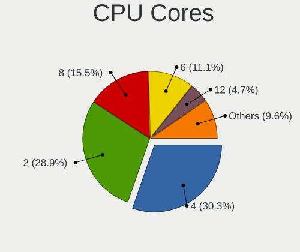

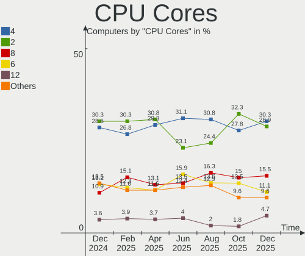

| Number | Computers | Percent |
|--------|-----------|---------|
| 4      | 104       | 30.32%  |
| 2      | 99        | 28.86%  |
| 8      | 53        | 15.45%  |
| 6      | 38        | 11.08%  |
| 12     | 16        | 4.66%   |
| 16     | 10        | 2.92%   |
| 10     | 9         | 2.62%   |
| 14     | 8         | 2.33%   |
| 20     | 3         | 0.87%   |
| 1      | 3         | 0.87%   |

CPU Sockets
-----------

Number of sockets

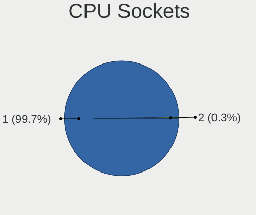

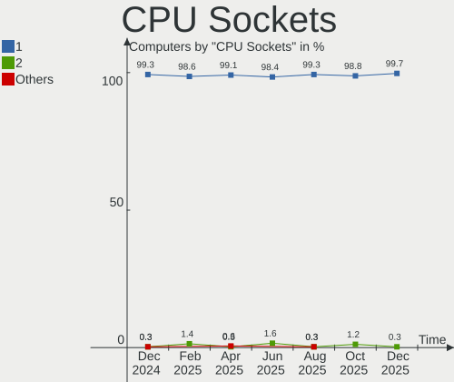

| Number | Computers | Percent |
|--------|-----------|---------|
| 1      | 342       | 99.71%  |
| 2      | 1         | 0.29%   |

CPU Threads
-----------

Threads per core (Hyper-Threading)

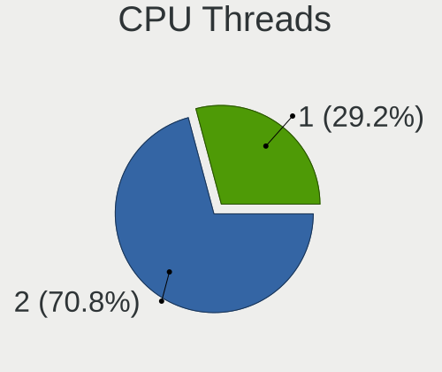

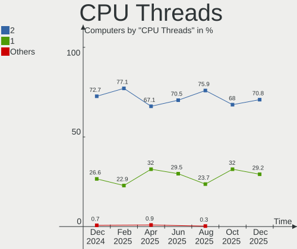

| Number | Computers | Percent |
|--------|-----------|---------|
| 2      | 243       | 70.85%  |
| 1      | 100       | 29.15%  |

CPU Op-Modes
------------

CPU Operation Modes (32-bit, 64-bit)

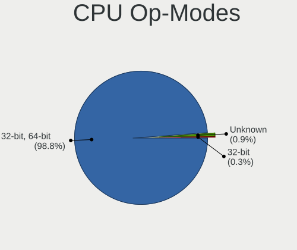

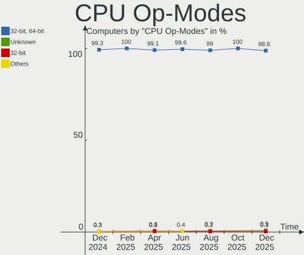

| Op mode        | Computers | Percent |
|----------------|-----------|---------|
| 32-bit, 64-bit | 339       | 98.83%  |
| Unknown        | 3         | 0.87%   |
| 32-bit         | 1         | 0.29%   |

CPU Microcode
-------------

Microcode number

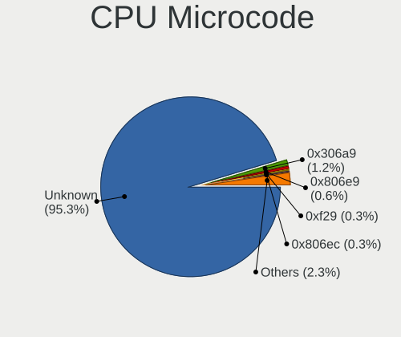

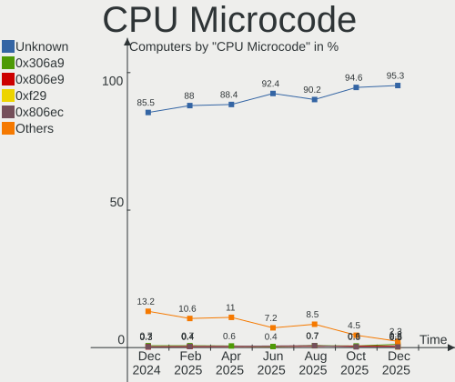

| Number     | Computers | Percent |
|------------|-----------|---------|
| Unknown    | 327       | 95.34%  |
| 0x306a9    | 4         | 1.17%   |
| 0x806e9    | 2         | 0.58%   |
| 0xf29      | 1         | 0.29%   |
| 0x806ec    | 1         | 0.29%   |
| 0x6fb      | 1         | 0.29%   |
| 0x506e3    | 1         | 0.29%   |
| 0x40651    | 1         | 0.29%   |
| 0x306c3    | 1         | 0.29%   |
| 0x1067a    | 1         | 0.29%   |
| 0x0b600037 | 1         | 0.29%   |
| 0x0a60120c | 1         | 0.29%   |
| 0x06001119 | 1         | 0.29%   |

CPU Microarch
-------------

Microarchitecture

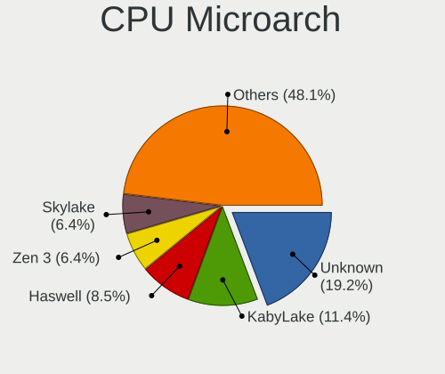

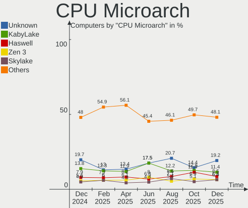

| Name              | Computers | Percent |
|-------------------|-----------|---------|
| Unknown           | 66        | 19.24%  |
| KabyLake          | 39        | 11.37%  |
| Haswell           | 29        | 8.45%   |
| Zen 3             | 22        | 6.41%   |
| Skylake           | 22        | 6.41%   |
| IvyBridge         | 18        | 5.25%   |
| Alderlake Hybrid  | 17        | 4.96%   |
| SandyBridge       | 12        | 3.5%    |
| Zen+              | 11        | 3.21%   |
| Zen 2             | 11        | 3.21%   |
| Penryn            | 10        | 2.92%   |
| TigerLake         | 9         | 2.62%   |
| Westmere          | 8         | 2.33%   |
| Silvermont        | 6         | 1.75%   |
| K10               | 6         | 1.75%   |
| Jaguar            | 5         | 1.46%   |
| Icelake           | 5         | 1.46%   |
| CometLake         | 5         | 1.46%   |
| Puma              | 4         | 1.17%   |
| Piledriver        | 4         | 1.17%   |
| Nehalem           | 4         | 1.17%   |
| Goldmont          | 4         | 1.17%   |
| Broadwell         | 4         | 1.17%   |
| Zen               | 3         | 0.87%   |
| Goldmont plus     | 3         | 0.87%   |
| Core              | 3         | 0.87%   |
| Bobcat            | 3         | 0.87%   |
| K8 Hammer         | 2         | 0.58%   |
| Steamroller       | 1         | 0.29%   |
| Sapphire Rapids   | 1         | 0.29%   |
| NetBurst          | 1         | 0.29%   |
| Meteorlake Hybrid | 1         | 0.29%   |
| Lunarlake Hybrid  | 1         | 0.29%   |
| Gracemont         | 1         | 0.29%   |
| Bulldozer         | 1         | 0.29%   |
| Bonnell           | 1         | 0.29%   |

Graphics
--------

GPU Vendor
----------

Vendors of graphics cards

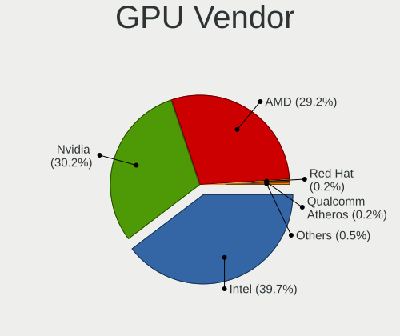

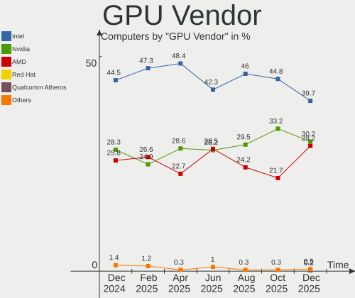

| Vendor                     | Computers | Percent |
|----------------------------|-----------|---------|
| Intel                      | 163       | 39.66%  |
| Nvidia                     | 124       | 30.17%  |
| AMD                        | 120       | 29.2%   |
| Red Hat                    | 1         | 0.24%   |
| Qualcomm Atheros           | 1         | 0.24%   |
| Matrox Electronics Systems | 1         | 0.24%   |
| ASPEED Technology          | 1         | 0.24%   |

GPU Model
---------

Graphics card models

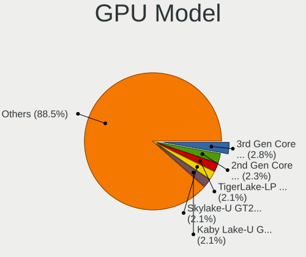

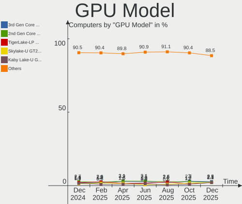

| Model                                                                                    | Computers | Percent |
|------------------------------------------------------------------------------------------|-----------|---------|
| Intel 3rd Gen Core processor Graphics Controller                                         | 12        | 2.82%   |
| Intel 2nd Generation Core Processor Family Integrated Graphics Controller                | 10        | 2.35%   |
| Intel TigerLake-LP GT2 [Iris Xe Graphics]                                                | 9         | 2.11%   |
| Intel Skylake-U GT2 [HD Graphics 520]                                                    | 9         | 2.11%   |
| Intel Kaby Lake-U GT2 [HD Graphics 620]                                                  | 9         | 2.11%   |
| Intel Haswell-ULT Integrated Graphics Controller                                         | 9         | 2.11%   |
| AMD HawkPoint1                                                                           | 8         | 1.88%   |
| AMD Cezanne [Radeon Vega Series / Radeon Vega Mobile Series]                             | 8         | 1.88%   |
| Intel Raptor Lake-P [Iris Xe Graphics]                                                   | 7         | 1.64%   |
| Intel Mobile 4 Series Chipset Integrated Graphics Controller                             | 7         | 1.64%   |
| AMD Picasso/Raven 2 [Radeon Vega Series / Radeon Vega Mobile Series]                     | 7         | 1.64%   |
| AMD Phoenix1                                                                             | 7         | 1.64%   |
| Nvidia GK208B [GeForce GT 710]                                                           | 6         | 1.41%   |
| Intel Kaby Lake-R GT2 [UHD Graphics 620]                                                 | 6         | 1.41%   |
| Intel TigerLake-H GT1 [UHD Graphics]                                                     | 5         | 1.17%   |
| Intel Core Processor Integrated Graphics Controller                                      | 5         | 1.17%   |
| Intel 4th Gen Core Processor Integrated Graphics Controller                              | 5         | 1.17%   |
| AMD Granite Ridge [Radeon Graphics]                                                      | 5         | 1.17%   |
| Nvidia TU117M [GeForce GTX 1650 Mobile / Max-Q]                                          | 4         | 0.94%   |
| Nvidia GP108 [GeForce GT 1030]                                                           | 4         | 0.94%   |
| Nvidia GP107M [GeForce GTX 1050 Mobile]                                                  | 4         | 0.94%   |
| Nvidia GA107M [GeForce RTX 3050 Mobile]                                                  | 4         | 0.94%   |
| Intel Kaby Lake-H GT2 [HD Graphics 630]                                                  | 4         | 0.94%   |
| Intel Alder Lake-P GT2 [Iris Xe Graphics]                                                | 4         | 0.94%   |
| AMD Renoir [Radeon Vega Series / Radeon Vega Mobile Series]                              | 4         | 0.94%   |
| AMD Raphael                                                                              | 4         | 0.94%   |
| AMD Navi 48 [Radeon RX 9070/9070 XT/9070 GRE]                                            | 4         | 0.94%   |
| Nvidia TU116 [GeForce GTX 1660 SUPER]                                                    | 3         | 0.7%    |
| Nvidia GP106 [GeForce GTX 1060 6GB]                                                      | 3         | 0.7%    |
| Intel Xeon E3-1200 v3/4th Gen Core Processor Integrated Graphics Controller              | 3         | 0.7%    |
| Intel Skylake-H GT2 [HD Graphics 530]                                                    | 3         | 0.7%    |
| Intel GeminiLake [UHD Graphics 600]                                                      | 3         | 0.7%    |
| Intel CoffeeLake-H GT2 [UHD Graphics 630]                                                | 3         | 0.7%    |
| Intel Broadwell-U GT2 [HD Graphics 5500]                                                 | 3         | 0.7%    |
| Intel Atom/Celeron/Pentium Processor x5-E8000/J3xxx/N3xxx Integrated Graphics Controller | 3         | 0.7%    |
| Intel Atom Processor Z36xxx/Z37xxx Series Graphics & Display                             | 3         | 0.7%    |
| Intel Apollo Lake GT1 [HD Graphics 500]                                                  | 3         | 0.7%    |
| Intel 4th Generation Core Processor Family Integrated Graphics Controller                | 3         | 0.7%    |
| AMD Strix [Radeon 880M / 890M]                                                           | 3         | 0.7%    |
| AMD Rembrandt [Radeon 680M]                                                              | 3         | 0.7%    |

GPU Combo
---------

Combinations of graphics cards

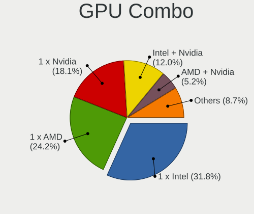

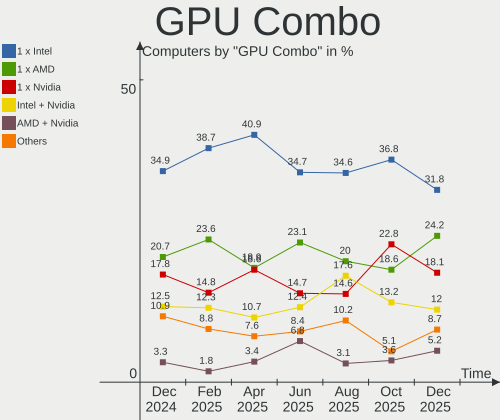

| Name             | Computers | Percent |
|------------------|-----------|---------|
| 1 x Intel        | 109       | 31.78%  |
| 1 x AMD          | 83        | 24.2%   |
| 1 x Nvidia       | 62        | 18.08%  |
| Intel + Nvidia   | 41        | 11.95%  |
| AMD + Nvidia     | 18        | 5.25%   |
| 2 x AMD          | 9         | 2.62%   |
| Intel + AMD      | 7         | 2.04%   |
| Other            | 4         | 1.17%   |
| 2 x Intel        | 4         | 1.17%   |
| 2 x Nvidia       | 2         | 0.58%   |
| 1 x Red Hat      | 1         | 0.29%   |
| 1 x Matrox       | 1         | 0.29%   |
| AMD + 2 x Nvidia | 1         | 0.29%   |
| AMD + ASPEED     | 1         | 0.29%   |

GPU Driver
----------

Free vs proprietary

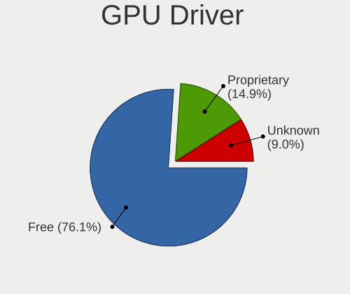

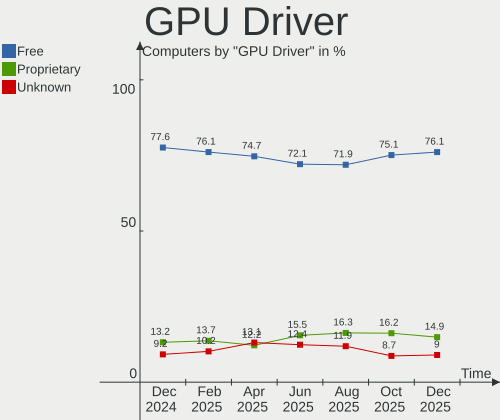

| Driver      | Computers | Percent |
|-------------|-----------|---------|
| Free        | 261       | 76.09%  |
| Proprietary | 51        | 14.87%  |
| Unknown     | 31        | 9.04%   |

GPU Memory
----------

Total video memory

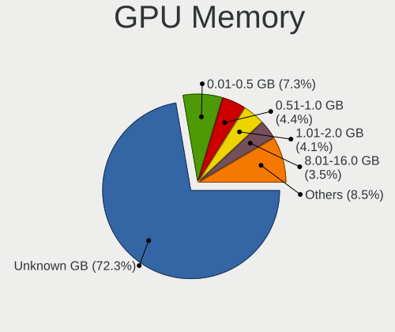

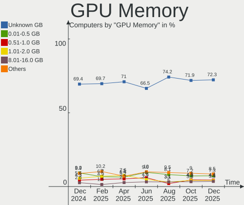

| Size in GB | Computers | Percent |
|------------|-----------|---------|
| Unknown    | 248       | 72.3%   |
| 0.01-0.5   | 25        | 7.29%   |
| 0.51-1.0   | 15        | 4.37%   |
| 1.01-2.0   | 14        | 4.08%   |
| 8.01-16.0  | 12        | 3.5%    |
| 7.01-8.0   | 11        | 3.21%   |
| 3.01-4.0   | 9         | 2.62%   |
| 5.01-6.0   | 4         | 1.17%   |
| 2.01-3.0   | 3         | 0.87%   |
| 16.01-24.0 | 2         | 0.58%   |

Monitor
-------

Monitor Vendor
--------------

Monitor vendors

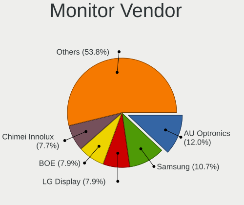

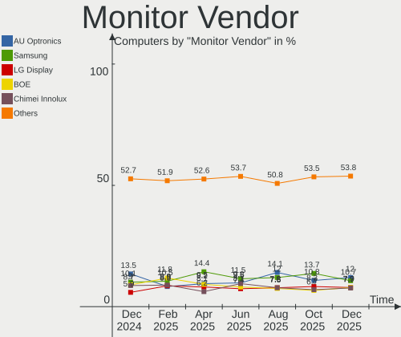

| Vendor                  | Computers | Percent |
|-------------------------|-----------|---------|
| AU Optronics            | 47        | 11.99%  |
| Samsung Electronics     | 42        | 10.71%  |
| LG Display              | 31        | 7.91%   |
| BOE                     | 31        | 7.91%   |
| Chimei Innolux          | 30        | 7.65%   |
| Dell                    | 21        | 5.36%   |
| Iiyama                  | 20        | 5.1%    |
| Goldstar                | 18        | 4.59%   |
| Acer                    | 16        | 4.08%   |
| Philips                 | 12        | 3.06%   |
| AOC                     | 12        | 3.06%   |
| Ancor Communications    | 11        | 2.81%   |
| Lenovo                  | 9         | 2.3%    |
| Hewlett-Packard         | 9         | 2.3%    |
| ASUSTek Computer        | 8         | 2.04%   |
| Apple                   | 8         | 2.04%   |
| MSI                     | 7         | 1.79%   |
| BenQ                    | 6         | 1.53%   |
| ViewSonic               | 5         | 1.28%   |
| Chi Mei Optoelectronics | 4         | 1.02%   |
| Sharp                   | 3         | 0.77%   |
| CSW                     | 3         | 0.77%   |
| Unknown (XXX)           | 2         | 0.51%   |
| Unknown                 | 2         | 0.51%   |
| Sony                    | 2         | 0.51%   |
| Mi                      | 2         | 0.51%   |
| InfoVision              | 2         | 0.51%   |
| HKC                     | 2         | 0.51%   |
| HannStar                | 2         | 0.51%   |
| Gigabyte Technology     | 2         | 0.51%   |
| Fujitsu Siemens         | 2         | 0.51%   |
| Denver                  | 2         | 0.51%   |
| ___                     | 1         | 0.26%   |
| Wacom                   | 1         | 0.26%   |
| Valve                   | 1         | 0.26%   |
| TMX                     | 1         | 0.26%   |
| TCL                     | 1         | 0.26%   |
| RHT                     | 1         | 0.26%   |
| PANDA                   | 1         | 0.26%   |
| MiTAC                   | 1         | 0.26%   |

Monitor Model
-------------

Monitor models

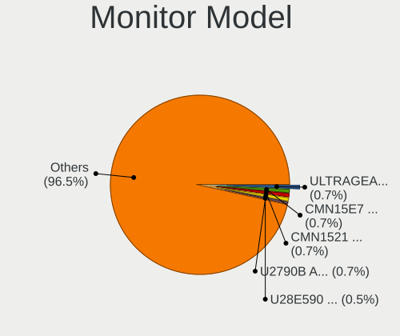

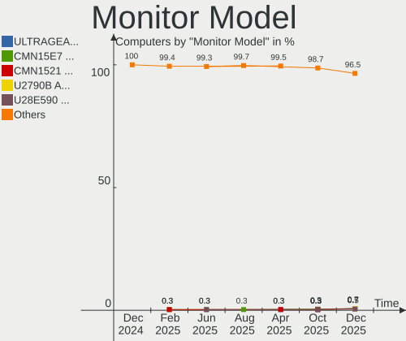

| Model                                                                | Computers | Percent |
|----------------------------------------------------------------------|-----------|---------|
| Goldstar ULTRAGEAR GSM5BD3 2560x1440 697x392mm 31.5-inch             | 3         | 0.75%   |
| Chimei Innolux LCD Monitor CMN15E7 1920x1080 344x193mm 15.5-inch     | 3         | 0.75%   |
| Chimei Innolux LCD Monitor CMN1521 1920x1080 344x193mm 15.5-inch     | 3         | 0.75%   |
| AOC U2790B AOC2790 3840x2160 597x336mm 27.0-inch                     | 3         | 0.75%   |
| Samsung Electronics U28E590 SAM0C4D 3840x2160 607x345mm 27.5-inch    | 2         | 0.5%    |
| Samsung Electronics LCD Monitor SEC3051 1366x768 344x194mm 15.5-inch | 2         | 0.5%    |
| Samsung Electronics LCD Monitor SDC4852 1366x768 344x194mm 15.5-inch | 2         | 0.5%    |
| Mi Monitor XMI23C3 1920x1080 527x293mm 23.7-inch                     | 2         | 0.5%    |
| LG Display LCD Monitor LGD05FE 1920x1080 344x194mm 15.5-inch         | 2         | 0.5%    |
| LG Display LCD Monitor LGD036C 1366x768 277x156mm 12.5-inch          | 2         | 0.5%    |
| Iiyama PLX2783H IVM6611 1920x1080 598x336mm 27.0-inch                | 2         | 0.5%    |
| Dell U2412M DELA07B 1920x1200 518x324mm 24.1-inch                    | 2         | 0.5%    |
| Chimei Innolux LCD Monitor CMN1745 1600x900 382x214mm 17.2-inch      | 2         | 0.5%    |
| Chimei Innolux LCD Monitor CMN15DC 1366x768 344x193mm 15.5-inch      | 2         | 0.5%    |
| Chimei Innolux LCD Monitor CMN14C3 1366x768 309x173mm 13.9-inch      | 2         | 0.5%    |
| AU Optronics LCD Monitor AUOD291 1920x1200 301x188mm 14.0-inch       | 2         | 0.5%    |
| AU Optronics LCD Monitor AUO219E 1600x900 382x214mm 17.2-inch        | 2         | 0.5%    |
| AU Optronics LCD Monitor AUO106C 1366x768 276x155mm 12.5-inch        | 2         | 0.5%    |
| AOC Q3279WG5B AOC3279 2560x1440 725x428mm 33.1-inch                  | 2         | 0.5%    |
| AOC 27G2G4 AOC2702 1920x1080 598x336mm 27.0-inch                     | 2         | 0.5%    |
| Acer X193HQ ACR0069 1366x768 410x230mm 18.5-inch                     | 2         | 0.5%    |
| ___ LCD TV ___9000 1360x768                                          | 1         | 0.25%   |
| Wacom One 13 WAC1070 1920x1080 294x166mm 13.3-inch                   | 1         | 0.25%   |
| ViewSonic VX2703 SERIES VSCF62B 1920x1080 597x336mm 27.0-inch        | 1         | 0.25%   |
| ViewSonic VX2458 Series VSC36AF 1920x1080 521x293mm 23.5-inch        | 1         | 0.25%   |
| ViewSonic VX1937 SERIES VSC2D24 1440x900 410x260mm 19.1-inch         | 1         | 0.25%   |
| ViewSonic VP2785 SERIES VSC7F34 3840x2160 597x336mm 27.0-inch        | 1         | 0.25%   |
| ViewSonic VA916 Series VSC7C20 1280x1024 376x301mm 19.0-inch         | 1         | 0.25%   |
| ViewSonic LCD Monitor VX1937 SERIES 1440x900                         | 1         | 0.25%   |
| Valve Index HMD VLV91A8                                              | 1         | 0.25%   |
| Unknown LCD TV 9000 1360x768 1600x900mm 72.3-inch                    | 1         | 0.25%   |
| Unknown LCD Monitor FFFF 2288x1287 2550x2550mm 142.0-inch            | 1         | 0.25%   |
| Unknown (XXX) Beyond TV XXX2851 3840x2160 1209x680mm 54.6-inch       | 1         | 0.25%   |
| Unknown (XXX) Beyo TV XXX9615 3840x2160 1210x680mm 54.6-inch         | 1         | 0.25%   |
| TMX TL070FVXS01-0 TMX0002 1920x1080 160x100mm 7.4-inch               | 1         | 0.25%   |
| TCL 34R83Q TCL3401 3440x1440 797x333mm 34.0-inch                     | 1         | 0.25%   |
| Sony TV SNYEE01 1920x1080                                            | 1         | 0.25%   |
| Sony TV *30 SNYD405 3840x2160 1660x934mm 75.0-inch                   | 1         | 0.25%   |
| Sharp LQ156M1JW17 SHP14FC 1920x1080 344x194mm 15.5-inch              | 1         | 0.25%   |
| Sharp LCD Monitor SHP14BA 1920x1080 344x194mm 15.5-inch              | 1         | 0.25%   |

Monitor Resolution
------------------

Monitor screen resolution

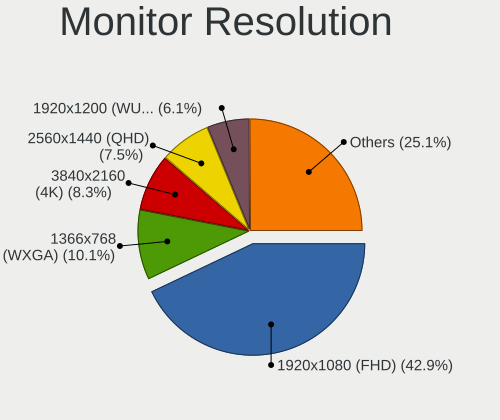

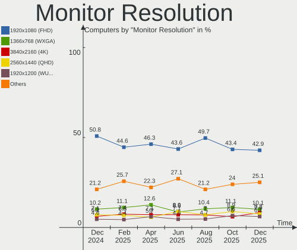

| Resolution         | Computers | Percent |
|--------------------|-----------|---------|
| 1920x1080 (FHD)    | 161       | 42.93%  |
| 1366x768 (WXGA)    | 38        | 10.13%  |
| 3840x2160 (4K)     | 31        | 8.27%   |
| 2560x1440 (QHD)    | 28        | 7.47%   |
| 1920x1200 (WUXGA)  | 23        | 6.13%   |
| 1600x900 (HD+)     | 21        | 5.6%    |
| 3440x1440          | 13        | 3.47%   |
| 2880x1800          | 8         | 2.13%   |
| 2560x1600          | 8         | 2.13%   |
| 1440x900 (WXGA+)   | 8         | 2.13%   |
| 1280x1024 (SXGA)   | 6         | 1.6%    |
| 1680x1050 (WSXGA+) | 4         | 1.07%   |
| 3840x1080          | 3         | 0.8%    |
| 2560x1080          | 3         | 0.8%    |
| 1280x800 (WXGA)    | 3         | 0.8%    |
| 2880x1920          | 2         | 0.53%   |
| Unknown            | 2         | 0.53%   |
| 3840x1100          | 1         | 0.27%   |
| 3072x1920          | 1         | 0.27%   |
| 2880x1620          | 1         | 0.27%   |
| 2560x1397          | 1         | 0.27%   |
| 2288x1287          | 1         | 0.27%   |
| 2256x1504          | 1         | 0.27%   |
| 2048x1152          | 1         | 0.27%   |
| 1920x1280          | 1         | 0.27%   |
| 1600x1200          | 1         | 0.27%   |
| 1360x768           | 1         | 0.27%   |
| 1080x1920          | 1         | 0.27%   |
| 1024x768 (XGA)     | 1         | 0.27%   |
| 1024x600           | 1         | 0.27%   |

Monitor Diagonal
----------------

Diagonal size in inches

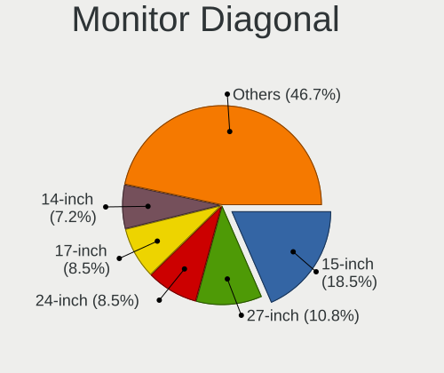

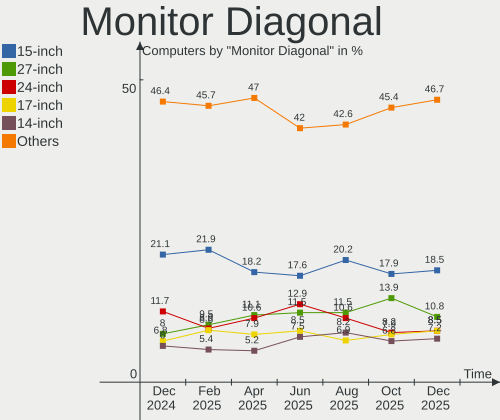

| Inches  | Computers | Percent |
|---------|-----------|---------|
| 15      | 72        | 18.46%  |
| 27      | 42        | 10.77%  |
| 24      | 33        | 8.46%   |
| 17      | 33        | 8.46%   |
| 14      | 28        | 7.18%   |
| 13      | 27        | 6.92%   |
| 23      | 25        | 6.41%   |
| 21      | 20        | 5.13%   |
| 16      | 14        | 3.59%   |
| 34      | 13        | 3.33%   |
| 31      | 12        | 3.08%   |
| 18      | 10        | 2.56%   |
| 19      | 9         | 2.31%   |
| Unknown | 8         | 2.05%   |
| 26      | 5         | 1.28%   |
| 12      | 5         | 1.28%   |
| 48      | 3         | 0.77%   |
| 25      | 3         | 0.77%   |
| 22      | 3         | 0.77%   |
| 20      | 3         | 0.77%   |
| 84      | 2         | 0.51%   |
| 72      | 2         | 0.51%   |
| 40      | 2         | 0.51%   |
| 33      | 2         | 0.51%   |
| 32      | 2         | 0.51%   |
| 29      | 2         | 0.51%   |
| 142     | 1         | 0.26%   |
| 85      | 1         | 0.26%   |
| 64      | 1         | 0.26%   |
| 63      | 1         | 0.26%   |
| 54      | 1         | 0.26%   |
| 49      | 1         | 0.26%   |
| 42      | 1         | 0.26%   |
| 28      | 1         | 0.26%   |
| 10      | 1         | 0.26%   |
| 7       | 1         | 0.26%   |

Monitor Width
-------------

Physical width

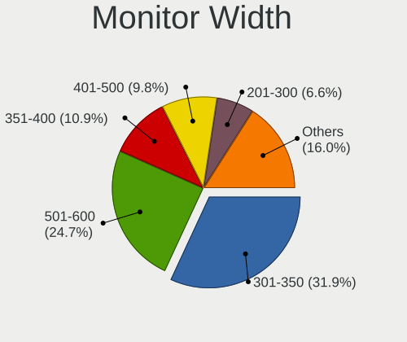

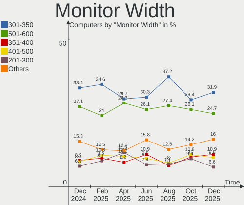

| Width in mm    | Computers | Percent |
|----------------|-----------|---------|
| 301-350        | 120       | 31.91%  |
| 501-600        | 93        | 24.73%  |
| 351-400        | 41        | 10.9%   |
| 401-500        | 37        | 9.84%   |
| 201-300        | 25        | 6.65%   |
| 601-700        | 18        | 4.79%   |
| 701-800        | 17        | 4.52%   |
| Unknown        | 8         | 2.13%   |
| 1001-1500      | 7         | 1.86%   |
| 1501-2000      | 5         | 1.33%   |
| 801-900        | 2         | 0.53%   |
| More than 2000 | 1         | 0.27%   |
| 101-200        | 1         | 0.27%   |
| 901-1000       | 1         | 0.27%   |

Aspect Ratio
------------

Proportional relationship between the width and the height

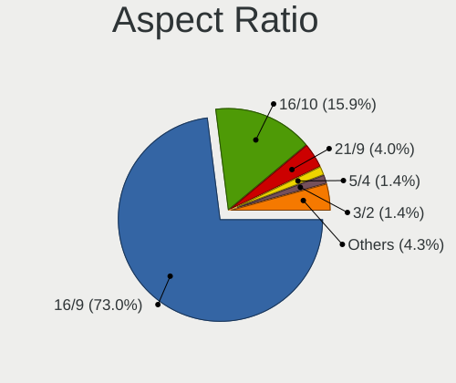

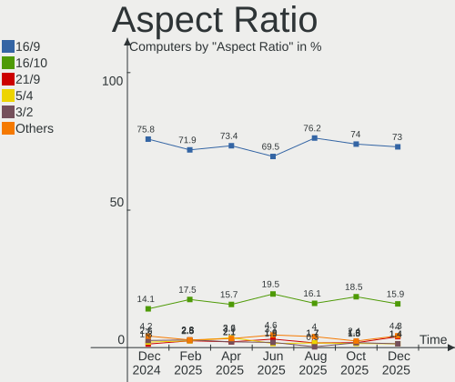

| Ratio   | Computers | Percent |
|---------|-----------|---------|
| 16/9    | 257       | 73.01%  |
| 16/10   | 56        | 15.91%  |
| 21/9    | 14        | 3.98%   |
| 5/4     | 5         | 1.42%   |
| 3/2     | 5         | 1.42%   |
| Unknown | 5         | 1.42%   |
| 32/9    | 4         | 1.14%   |
| 4/3     | 2         | 0.57%   |
| 6/5     | 1         | 0.28%   |
| 3.40    | 1         | 0.28%   |
| 1.00    | 1         | 0.28%   |
| 0.56    | 1         | 0.28%   |

Monitor Area
------------

Area in inch²

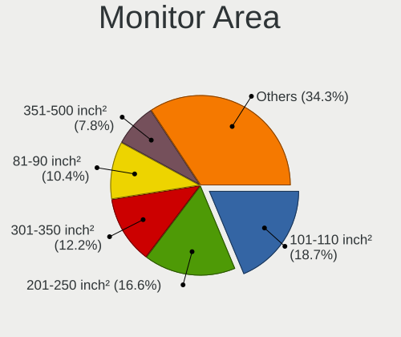

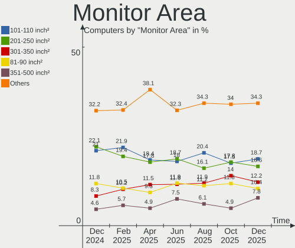

| Area in inch² | Computers | Percent |
|----------------|-----------|---------|
| 101-110        | 72        | 18.7%   |
| 201-250        | 64        | 16.62%  |
| 301-350        | 47        | 12.21%  |
| 81-90          | 40        | 10.39%  |
| 351-500        | 30        | 7.79%   |
| 121-130        | 27        | 7.01%   |
| 151-200        | 16        | 4.16%   |
| 71-80          | 14        | 3.64%   |
| 251-300        | 14        | 3.64%   |
| 111-120        | 13        | 3.38%   |
| 141-150        | 10        | 2.6%    |
| More than 1000 | 9         | 2.34%   |
| Unknown        | 8         | 2.08%   |
| 501-1000       | 7         | 1.82%   |
| 131-140        | 6         | 1.56%   |
| 61-70          | 5         | 1.3%    |
| 51-60          | 1         | 0.26%   |
| 41-50          | 1         | 0.26%   |
| 1-40           | 1         | 0.26%   |

Pixel Density
-------------

Pixels per inch

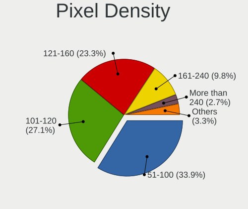

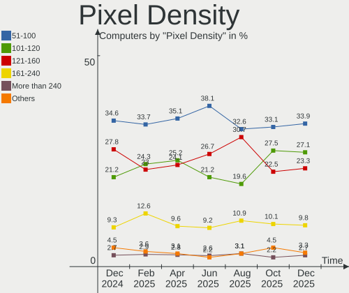

| Density       | Computers | Percent |
|---------------|-----------|---------|
| 51-100        | 125       | 33.88%  |
| 101-120       | 100       | 27.1%   |
| 121-160       | 86        | 23.31%  |
| 161-240       | 36        | 9.76%   |
| More than 240 | 10        | 2.71%   |
| Unknown       | 8         | 2.17%   |
| 1-50          | 4         | 1.08%   |

Multiple Monitors
-----------------

Total monitors connected

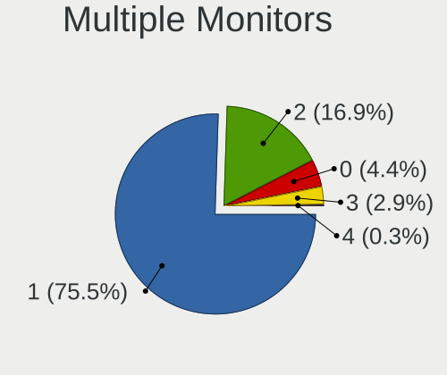

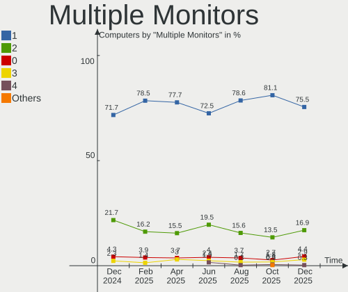

| Total | Computers | Percent |
|-------|-----------|---------|
| 1     | 259       | 75.51%  |
| 2     | 58        | 16.91%  |
| 0     | 15        | 4.37%   |
| 3     | 10        | 2.92%   |
| 4     | 1         | 0.29%   |

Network
-------

Net Controller Vendor
---------------------

Controller vendors

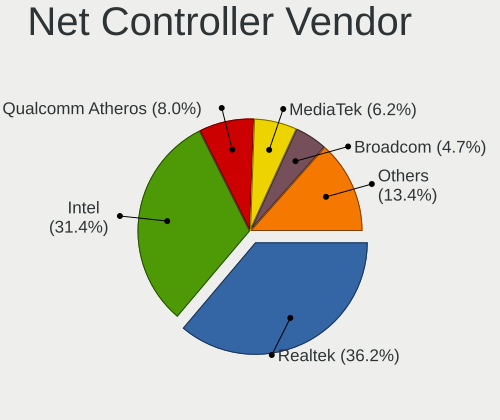

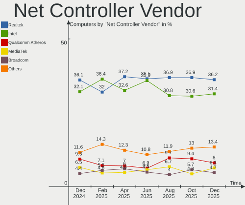

| Vendor                                 | Computers | Percent |
|----------------------------------------|-----------|---------|
| Realtek Semiconductor                  | 191       | 36.17%  |
| Intel                                  | 166       | 31.44%  |
| Qualcomm Atheros                       | 42        | 7.95%   |
| MediaTek                               | 33        | 6.25%   |
| Broadcom                               | 25        | 4.73%   |
| Broadcom Limited                       | 7         | 1.33%   |
| ASIX Electronics                       | 6         | 1.14%   |
| Nvidia                                 | 5         | 0.95%   |
| TP-Link                                | 4         | 0.76%   |
| Samsung Electronics                    | 4         | 0.76%   |
| Ralink                                 | 4         | 0.76%   |
| Suzhou Motorcomm Electronic Technology | 3         | 0.57%   |
| Ralink Technology                      | 3         | 0.57%   |
| NetGear                                | 3         | 0.57%   |
| Marvell Technology Group               | 3         | 0.57%   |
| Qualcomm Technologies                  | 2         | 0.38%   |
| Qualcomm Atheros Communications        | 2         | 0.38%   |
| Qualcomm                               | 2         | 0.38%   |
| QinHeng Electronics                    | 2         | 0.38%   |
| Google                                 | 2         | 0.38%   |
| D-Link System                          | 2         | 0.38%   |
| Aquantia                               | 2         | 0.38%   |
| VIA Technologies                       | 1         | 0.19%   |
| Toshiba                                | 1         | 0.19%   |
| Sierra Wireless                        | 1         | 0.19%   |
| Shenzhen Goodix Technology             | 1         | 0.19%   |
| Realtek                                | 1         | 0.19%   |
| Microsoft                              | 1         | 0.19%   |
| Microchip Technology                   | 1         | 0.19%   |
| Mellanox Technologies                  | 1         | 0.19%   |
| JMicron Technology                     | 1         | 0.19%   |
| DisplayLink                            | 1         | 0.19%   |
| Dell                                   | 1         | 0.19%   |
| D-Link                                 | 1         | 0.19%   |
| Cypress Semiconductor                  | 1         | 0.19%   |
| Compex                                 | 1         | 0.19%   |
| ASUSTek Computer                       | 1         | 0.19%   |

Net Controller Model
--------------------

Controller models

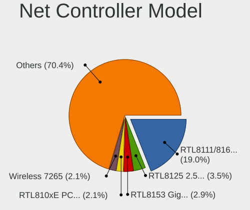

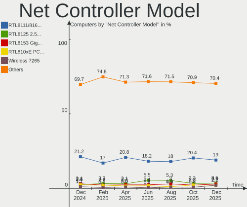

| Model                                                                           | Computers | Percent |
|---------------------------------------------------------------------------------|-----------|---------|
| Realtek RTL8111/8168/8211/8411 PCI Express Gigabit Ethernet Controller          | 118       | 19%     |
| Realtek RTL8125 2.5GbE Controller                                               | 22        | 3.54%   |
| Realtek RTL8153 Gigabit Ethernet Adapter                                        | 18        | 2.9%    |
| Realtek RTL810xE PCI Express Fast Ethernet controller                           | 13        | 2.09%   |
| Intel Wireless 7265                                                             | 13        | 2.09%   |
| Intel Wi-Fi 6E(802.11ax) AX210/AX1675* 2x2 [Typhoon Peak]                       | 12        | 1.93%   |
| Intel Wi-Fi 6 AX200                                                             | 12        | 1.93%   |
| Intel Wireless 8265 / 8275                                                      | 11        | 1.77%   |
| Qualcomm Atheros QCA9565 / AR9565 Wireless Network Adapter                      | 10        | 1.61%   |
| MediaTek MT7921 802.11ax PCIe Wireless Network Adapter [Filogic 330]            | 10        | 1.61%   |
| Realtek RTL8821CE 802.11ac PCIe Wireless Network Adapter                        | 9         | 1.45%   |
| Intel I211 Gigabit Network Connection                                           | 9         | 1.45%   |
| Intel Ethernet Connection (4) I219-LM                                           | 9         | 1.45%   |
| Intel 82579LM Gigabit Network Connection (Lewisville)                           | 9         | 1.45%   |
| MediaTek MT7922 802.11ax PCI Express Wireless Network Adapter                   | 8         | 1.29%   |
| Intel Wi-Fi 6 AX201                                                             | 7         | 1.13%   |
| Intel Ethernet Controller I225-V                                                | 7         | 1.13%   |
| Intel Ethernet Controller I226-V                                                | 6         | 0.97%   |
| Broadcom BCM4313 802.11bgn Wireless Network Adapter                             | 6         | 0.97%   |
| ASIX AX88179 Gigabit Ethernet                                                   | 6         | 0.97%   |
| MediaTek MT7902 802.11ax PCIe Wireless Network Adapter [Filogic 310]            | 5         | 0.81%   |
| Intel Wireless 3165                                                             | 5         | 0.81%   |
| Intel Tiger Lake PCH CNVi WiFi                                                  | 5         | 0.81%   |
| Intel Raptor Lake PCH CNVi WiFi                                                 | 5         | 0.81%   |
| Intel Alder Lake-P PCH CNVi WiFi                                                | 5         | 0.81%   |
| Samsung Galaxy series, misc. (tethering mode)                                   | 4         | 0.64%   |
| Realtek RTL8852BE PCIe 802.11ax Wireless Network Controller                     | 4         | 0.64%   |
| Realtek RTL8822CE 802.11ac PCIe Wireless Network Adapter                        | 4         | 0.64%   |
| Realtek RTL8126 5GbE Controller                                                 | 4         | 0.64%   |
| Qualcomm Atheros QCA9377 802.11ac Wireless Network Adapter                      | 4         | 0.64%   |
| Qualcomm Atheros AR9462 Wireless Network Adapter                                | 4         | 0.64%   |
| Qualcomm Atheros AR9285 Wireless Network Adapter (PCI-Express)                  | 4         | 0.64%   |
| MediaTek MT7925 802.11be 160MHz 2x2 PCIe Wireless Network Adapter [Filogic 360] | 4         | 0.64%   |
| Intel Wireless 8260                                                             | 4         | 0.64%   |
| Intel Wireless 7260                                                             | 4         | 0.64%   |
| Intel Wi-Fi 7(802.11be) AX1775*/AX1790*/BE20*/BE401/BE1750* 2x2                 | 4         | 0.64%   |
| Intel Comet Lake PCH CNVi WiFi                                                  | 4         | 0.64%   |
| Intel Centrino Wireless-N 1000 [Condor Peak]                                    | 4         | 0.64%   |
| Intel Centrino Advanced-N 6235                                                  | 4         | 0.64%   |
| Intel 82579V Gigabit Network Connection                                         | 4         | 0.64%   |

Wireless Vendor
---------------

Wireless vendors

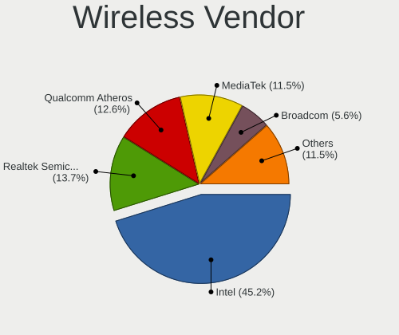

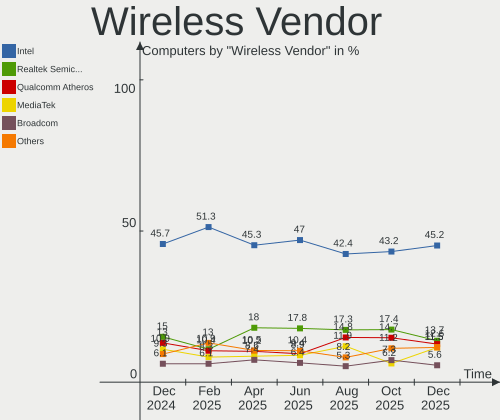

| Vendor                          | Computers | Percent |
|---------------------------------|-----------|---------|
| Intel                           | 122       | 45.19%  |
| Realtek Semiconductor           | 37        | 13.7%   |
| Qualcomm Atheros                | 34        | 12.59%  |
| MediaTek                        | 31        | 11.48%  |
| Broadcom                        | 15        | 5.56%   |
| Broadcom Limited                | 5         | 1.85%   |
| TP-Link                         | 4         | 1.48%   |
| Ralink                          | 4         | 1.48%   |
| Ralink Technology               | 3         | 1.11%   |
| NetGear                         | 3         | 1.11%   |
| Qualcomm Atheros Communications | 2         | 0.74%   |
| Marvell Technology Group        | 2         | 0.74%   |
| Sierra Wireless                 | 1         | 0.37%   |
| Realtek                         | 1         | 0.37%   |
| Qualcomm Technologies           | 1         | 0.37%   |
| Qualcomm                        | 1         | 0.37%   |
| Dell                            | 1         | 0.37%   |
| D-Link System                   | 1         | 0.37%   |
| D-Link                          | 1         | 0.37%   |
| ASUSTek Computer                | 1         | 0.37%   |

Wireless Model
--------------

Wireless models

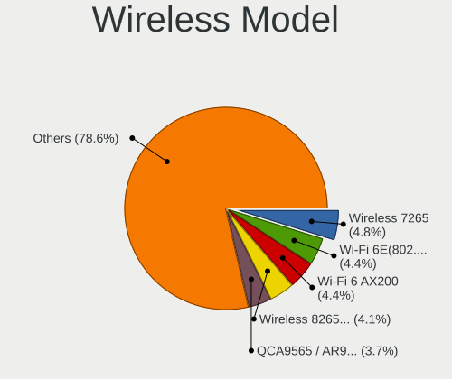

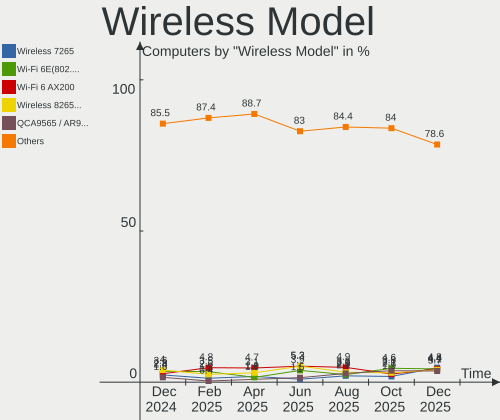

| Model                                                                           | Computers | Percent |
|---------------------------------------------------------------------------------|-----------|---------|
| Intel Wireless 7265                                                             | 13        | 4.8%    |
| Intel Wi-Fi 6E(802.11ax) AX210/AX1675* 2x2 [Typhoon Peak]                       | 12        | 4.43%   |
| Intel Wi-Fi 6 AX200                                                             | 12        | 4.43%   |
| Intel Wireless 8265 / 8275                                                      | 11        | 4.06%   |
| Qualcomm Atheros QCA9565 / AR9565 Wireless Network Adapter                      | 10        | 3.69%   |
| MediaTek MT7921 802.11ax PCIe Wireless Network Adapter [Filogic 330]            | 10        | 3.69%   |
| Realtek RTL8821CE 802.11ac PCIe Wireless Network Adapter                        | 9         | 3.32%   |
| MediaTek MT7922 802.11ax PCI Express Wireless Network Adapter                   | 7         | 2.58%   |
| Intel Wi-Fi 6 AX201                                                             | 7         | 2.58%   |
| Broadcom BCM4313 802.11bgn Wireless Network Adapter                             | 6         | 2.21%   |
| MediaTek MT7902 802.11ax PCIe Wireless Network Adapter [Filogic 310]            | 5         | 1.85%   |
| Intel Wireless 3165                                                             | 5         | 1.85%   |
| Intel Tiger Lake PCH CNVi WiFi                                                  | 5         | 1.85%   |
| Intel Raptor Lake PCH CNVi WiFi                                                 | 5         | 1.85%   |
| Realtek RTL8822CE 802.11ac PCIe Wireless Network Adapter                        | 4         | 1.48%   |
| Qualcomm Atheros QCA9377 802.11ac Wireless Network Adapter                      | 4         | 1.48%   |
| Qualcomm Atheros AR9462 Wireless Network Adapter                                | 4         | 1.48%   |
| Qualcomm Atheros AR9285 Wireless Network Adapter (PCI-Express)                  | 4         | 1.48%   |
| Intel Wireless 8260                                                             | 4         | 1.48%   |
| Intel Wireless 7260                                                             | 4         | 1.48%   |
| Intel Comet Lake PCH CNVi WiFi                                                  | 4         | 1.48%   |
| Intel Centrino Wireless-N 1000 [Condor Peak]                                    | 4         | 1.48%   |
| Intel Centrino Advanced-N 6235                                                  | 4         | 1.48%   |
| Realtek RTL8852BE PCIe 802.11ax Wireless Network Controller                     | 3         | 1.11%   |
| Realtek RTL8723BE PCIe Wireless Network Adapter                                 | 3         | 1.11%   |
| Realtek RTL8188EUS 802.11n Wireless Network Adapter                             | 3         | 1.11%   |
| Ralink MT7601U Wireless Adapter                                                 | 3         | 1.11%   |
| Ralink RT5390 Wireless 802.11n 1T/1R PCIe                                       | 3         | 1.11%   |
| Qualcomm Atheros QCA6174 802.11ac Wireless Network Adapter                      | 3         | 1.11%   |
| Qualcomm Atheros AR928X Wireless Network Adapter (PCI-Express)                  | 3         | 1.11%   |
| MediaTek MT7925 802.11be 160MHz 2x2 PCIe Wireless Network Adapter [Filogic 360] | 3         | 1.11%   |
| Intel Wi-Fi 7(802.11be) AX1775*/AX1790*/BE20*/BE401/BE1750* 2x2                 | 3         | 1.11%   |
| Intel Wi-Fi 5(802.11ac) Wireless-AC 9x6x [Thunder Peak]                         | 3         | 1.11%   |
| Intel Cannon Lake PCH CNVi WiFi                                                 | 3         | 1.11%   |
| Intel Alder Lake-P PCH CNVi WiFi                                                | 3         | 1.11%   |
| Broadcom Limited BCM4331 802.11a/b/g/n                                          | 3         | 1.11%   |
| Broadcom BCM4352 802.11ac Dual Band Wireless Network Adapter                    | 3         | 1.11%   |
| TP-Link Archer T3U [Realtek RTL8812BU]                                          | 2         | 0.74%   |
| Realtek RTL8852CE PCIe 802.11ax Wireless Network Controller                     | 2         | 0.74%   |
| Realtek RTL8821AE 802.11ac PCIe Wireless Network Adapter                        | 2         | 0.74%   |

Ethernet Vendor
---------------

Ethernet vendors

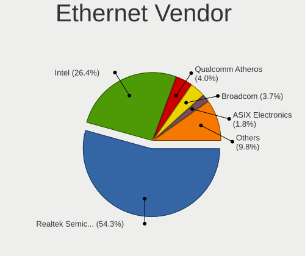

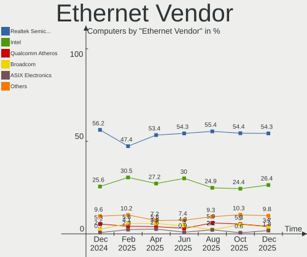

| Vendor                                 | Computers | Percent |
|----------------------------------------|-----------|---------|
| Realtek Semiconductor                  | 177       | 54.29%  |
| Intel                                  | 86        | 26.38%  |
| Qualcomm Atheros                       | 13        | 3.99%   |
| Broadcom                               | 12        | 3.68%   |
| ASIX Electronics                       | 6         | 1.84%   |
| Nvidia                                 | 5         | 1.53%   |
| Samsung Electronics                    | 4         | 1.23%   |
| Suzhou Motorcomm Electronic Technology | 3         | 0.92%   |
| MediaTek                               | 2         | 0.61%   |
| Google                                 | 2         | 0.61%   |
| Broadcom Limited                       | 2         | 0.61%   |
| Aquantia                               | 2         | 0.61%   |
| VIA Technologies                       | 1         | 0.31%   |
| Qualcomm Technologies                  | 1         | 0.31%   |
| Qualcomm                               | 1         | 0.31%   |
| QinHeng Electronics                    | 1         | 0.31%   |
| Microchip Technology                   | 1         | 0.31%   |
| Mellanox Technologies                  | 1         | 0.31%   |
| Marvell Technology Group               | 1         | 0.31%   |
| JMicron Technology                     | 1         | 0.31%   |
| DisplayLink                            | 1         | 0.31%   |
| D-Link System                          | 1         | 0.31%   |
| Cypress Semiconductor                  | 1         | 0.31%   |
| Compex                                 | 1         | 0.31%   |

Ethernet Model
--------------

Ethernet models

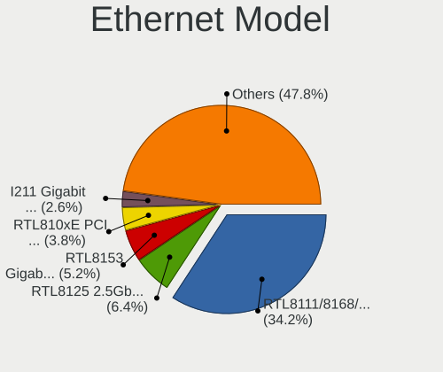

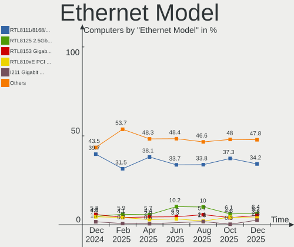

| Model                                                                         | Computers | Percent |
|-------------------------------------------------------------------------------|-----------|---------|
| Realtek RTL8111/8168/8211/8411 PCI Express Gigabit Ethernet Controller        | 118       | 34.2%   |
| Realtek RTL8125 2.5GbE Controller                                             | 22        | 6.38%   |
| Realtek RTL8153 Gigabit Ethernet Adapter                                      | 18        | 5.22%   |
| Realtek RTL810xE PCI Express Fast Ethernet controller                         | 13        | 3.77%   |
| Intel I211 Gigabit Network Connection                                         | 9         | 2.61%   |
| Intel Ethernet Connection (4) I219-LM                                         | 9         | 2.61%   |
| Intel 82579LM Gigabit Network Connection (Lewisville)                         | 9         | 2.61%   |
| Intel Ethernet Controller I225-V                                              | 7         | 2.03%   |
| Intel Ethernet Controller I226-V                                              | 6         | 1.74%   |
| ASIX AX88179 Gigabit Ethernet                                                 | 6         | 1.74%   |
| Samsung Galaxy series, misc. (tethering mode)                                 | 4         | 1.16%   |
| Realtek RTL8126 5GbE Controller                                               | 4         | 1.16%   |
| Intel 82579V Gigabit Network Connection                                       | 4         | 1.16%   |
| Suzhou Motorcomm Electronic YT6801 Gigabit Ethernet Controller                | 3         | 0.87%   |
| Qualcomm Atheros Killer E220x Gigabit Ethernet Controller                     | 3         | 0.87%   |
| Intel Ethernet Connection I217-V                                              | 3         | 0.87%   |
| Intel Ethernet Connection (7) I219-V                                          | 3         | 0.87%   |
| Intel Ethernet Connection (2) I219-V                                          | 3         | 0.87%   |
| Broadcom NetXtreme BCM57765 Gigabit Ethernet PCIe                             | 3         | 0.87%   |
| Realtek USB 10/100/1G/2.5G/5G LAN                                             | 2         | 0.58%   |
| Realtek RTL8152 Fast Ethernet Adapter                                         | 2         | 0.58%   |
| Realtek Killer E2600 GbE Controller                                           | 2         | 0.58%   |
| Qualcomm Atheros Killer E2400 Gigabit Ethernet Controller                     | 2         | 0.58%   |
| Nvidia MCP77 Ethernet                                                         | 2         | 0.58%   |
| Nvidia MCP61 Ethernet                                                         | 2         | 0.58%   |
| Intel Ethernet Connection I218-V                                              | 2         | 0.58%   |
| Intel Ethernet Connection (24) I219-LM                                        | 2         | 0.58%   |
| Intel Ethernet Connection (2) I219-LM                                         | 2         | 0.58%   |
| Intel Ethernet Connection (17) I219-LM                                        | 2         | 0.58%   |
| Intel Ethernet Connection (13) I219-LM                                        | 2         | 0.58%   |
| Intel Arrow Lake CNVi WiFi                                                    | 2         | 0.58%   |
| Intel Alder Lake-P PCH CNVi WiFi                                              | 2         | 0.58%   |
| Intel 82578DM Gigabit Network Connection                                      | 2         | 0.58%   |
| Intel 82574L Gigabit Network Connection                                       | 2         | 0.58%   |
| Google Pixel 9a                                                               | 2         | 0.58%   |
| Broadcom NetXtreme BCM57766 Gigabit Ethernet PCIe                             | 2         | 0.58%   |
| Broadcom NetLink BCM57780 Gigabit Ethernet PCIe                               | 2         | 0.58%   |
| Aquantia AQtion AQC113 NBase-T/IEEE 802.3an Ethernet Controller [Antigua 10G] | 2         | 0.58%   |
| VIA VT86C100A [Rhine]                                                         | 1         | 0.29%   |
| VIA VT6102/VT6103 [Rhine-II]                                                  | 1         | 0.29%   |

Net Controller Kind
-------------------

Ethernet, WiFi or modem

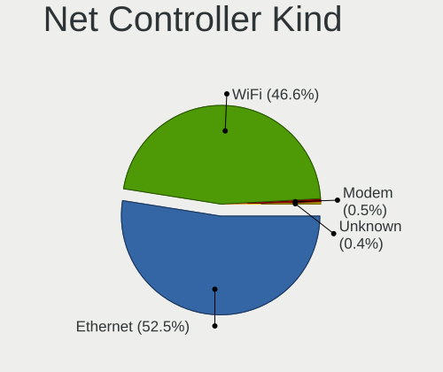

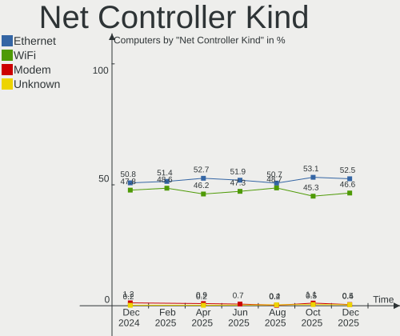

| Kind     | Computers | Percent |
|----------|-----------|---------|
| Ethernet | 295       | 52.49%  |
| WiFi     | 262       | 46.62%  |
| Modem    | 3         | 0.53%   |
| Unknown  | 2         | 0.36%   |

Used Controller
---------------

Currently used network controller

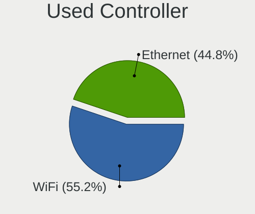

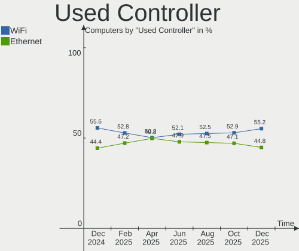

| Kind     | Computers | Percent |
|----------|-----------|---------|
| WiFi     | 192       | 55.17%  |
| Ethernet | 156       | 44.83%  |

NICs
----

Total network controllers on board

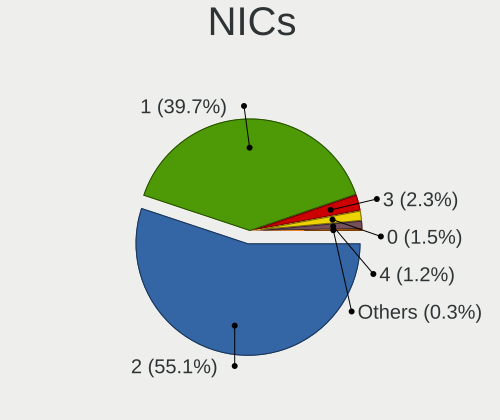

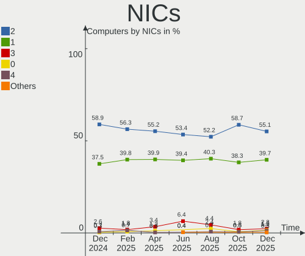

| Total | Computers | Percent |
|-------|-----------|---------|
| 2     | 189       | 55.1%   |
| 1     | 136       | 39.65%  |
| 3     | 8         | 2.33%   |
| 0     | 5         | 1.46%   |
| 4     | 4         | 1.17%   |
| 10    | 1         | 0.29%   |

IPv6
----

IPv6 vs IPv4

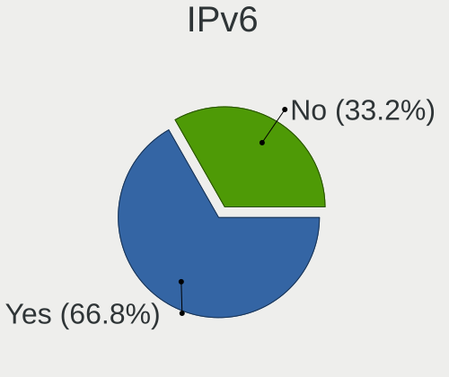

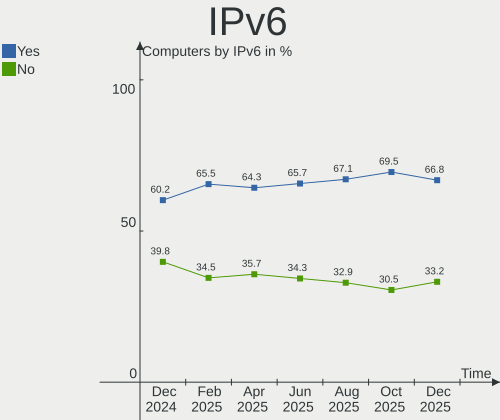

| Used | Computers | Percent |
|------|-----------|---------|
| Yes  | 229       | 66.76%  |
| No   | 114       | 33.24%  |

Bluetooth
---------

Bluetooth Vendor
----------------

Controller vendors

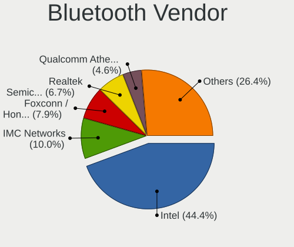

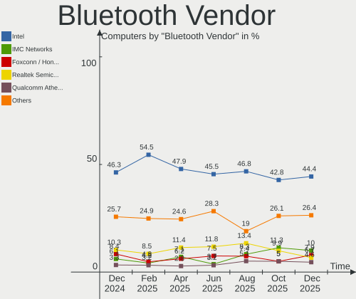

| Vendor                          | Computers | Percent |
|---------------------------------|-----------|---------|
| Intel                           | 106       | 44.35%  |
| IMC Networks                    | 24        | 10.04%  |
| Foxconn / Hon Hai               | 19        | 7.95%   |
| Realtek Semiconductor           | 16        | 6.69%   |
| Qualcomm Atheros Communications | 11        | 4.6%    |
| MediaTek                        | 8         | 3.35%   |
| Cambridge Silicon Radio         | 8         | 3.35%   |
| ASUSTek Computer                | 8         | 3.35%   |
| Apple                           | 8         | 3.35%   |
| Lite-On Technology              | 6         | 2.51%   |
| Broadcom                        | 5         | 2.09%   |
| TP-Link                         | 4         | 1.67%   |
| Toshiba                         | 3         | 1.26%   |
| Realtek                         | 3         | 1.26%   |
| USI                             | 1         | 0.42%   |
| Ralink                          | 1         | 0.42%   |
| Mercucys                        | 1         | 0.42%   |
| Marvell Semiconductor           | 1         | 0.42%   |
| Integrated System Solution      | 1         | 0.42%   |
| Hewlett-Packard                 | 1         | 0.42%   |
| Edimax Technology               | 1         | 0.42%   |
| Dell                            | 1         | 0.42%   |
| Chicony Electronics             | 1         | 0.42%   |
| Unknown                         | 1         | 0.42%   |

Bluetooth Model
---------------

Controller models

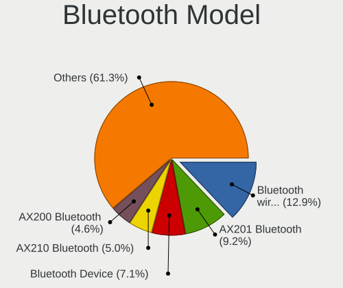

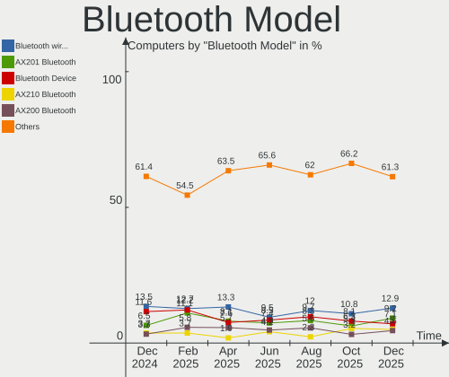

| Model                                               | Computers | Percent |
|-----------------------------------------------------|-----------|---------|
| Intel Bluetooth wireless interface                  | 31        | 12.92%  |
| Intel AX201 Bluetooth                               | 22        | 9.17%   |
| Intel Bluetooth Device                              | 17        | 7.08%   |
| Intel AX210 Bluetooth                               | 12        | 5%      |
| Intel AX200 Bluetooth                               | 11        | 4.58%   |
| Realtek Bluetooth Radio                             | 10        | 4.17%   |
| IMC Networks Bluetooth Radio                        | 10        | 4.17%   |
| IMC Networks Wireless_Device                        | 9         | 3.75%   |
| MediaTek Wireless_Device                            | 8         | 3.33%   |
| Cambridge Silicon Radio Bluetooth Dongle (HCI mode) | 8         | 3.33%   |
| Foxconn / Hon Hai Wireless_Device                   | 7         | 2.92%   |
| Foxconn / Hon Hai MediaTek Bluetooth Adapter        | 6         | 2.5%    |
| Qualcomm Atheros  Bluetooth Device                  | 5         | 2.08%   |
| Intel Centrino Bluetooth Wireless Transceiver       | 5         | 2.08%   |
| TP-Link TP-T@- UB500 Adapter                        | 4         | 1.67%   |
| Qualcomm Atheros AR3012 Bluetooth 4.0               | 4         | 1.67%   |
| Intel Bluetooth 9460/9560 Jefferson Peak (JfP)      | 4         | 1.67%   |
| Foxconn / Hon Hai Bluetooth Device                  | 4         | 1.67%   |
| ASUS ASUS USB-BT500                                 | 4         | 1.67%   |
| Realtek Bluetooth Radio                             | 3         | 1.25%   |
| Intel Wireless-AC 9260 Bluetooth Adapter            | 3         | 1.25%   |
| Apple Bluetooth USB Host Controller                 | 3         | 1.25%   |
| Apple Bluetooth Host Controller                     | 3         | 1.25%   |
| Realtek  Bluetooth 4.2 Adapter                      | 2         | 0.83%   |
| Realtek Bluetooth 5.4 Radio                         | 2         | 0.83%   |
| Lite-On Qualcomm Atheros QCA9377 Bluetooth          | 2         | 0.83%   |
| IMC Networks Bluetooth Device                       | 2         | 0.83%   |
| IMC Networks BCM20702A0                             | 2         | 0.83%   |
| Broadcom BCM2070 Bluetooth 2.1 + EDR                | 2         | 0.83%   |
| ASUS Broadcom BCM20702A0 Bluetooth                  | 2         | 0.83%   |
| Apple Built-in Bluetooth 2.0+EDR HCI                | 2         | 0.83%   |
| USI Bluetooth Device                                | 1         | 0.42%   |
| Toshiba Integrated Bluetooth HCI                    | 1         | 0.42%   |
| Toshiba Bluetooth USB Host Controller               | 1         | 0.42%   |
| Toshiba Bluetooth Device                            | 1         | 0.42%   |
| Realtek RTL8821A Bluetooth                          | 1         | 0.42%   |
| Realtek RTL8723B Bluetooth                          | 1         | 0.42%   |
| Ralink RT3290 Bluetooth                             | 1         | 0.42%   |
| Qualcomm Atheros QCA61x4 Bluetooth 4.0              | 1         | 0.42%   |
| Qualcomm Atheros AR3011 Bluetooth                   | 1         | 0.42%   |

Sound
-----

Sound Vendor
------------

Sound card vendors

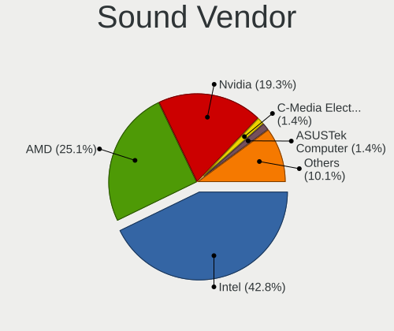

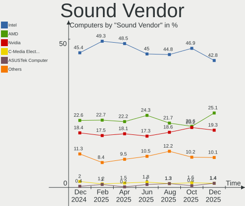

| Vendor                                       | Computers | Percent |
|----------------------------------------------|-----------|---------|
| Intel                                        | 220       | 42.8%   |
| AMD                                          | 129       | 25.1%   |
| Nvidia                                       | 99        | 19.26%  |
| C-Media Electronics                          | 7         | 1.36%   |
| ASUSTek Computer                             | 7         | 1.36%   |
| Logitech                                     | 4         | 0.78%   |
| Kingston Technology                          | 4         | 0.78%   |
| Realtek Semiconductor                        | 3         | 0.58%   |
| GN Netcom                                    | 3         | 0.58%   |
| DSEA A/S                                     | 3         | 0.58%   |
| Creative Labs                                | 3         | 0.58%   |
| Texas Instruments                            | 2         | 0.39%   |
| SteelSeries ApS                              | 2         | 0.39%   |
| Sony                                         | 2         | 0.39%   |
| Hewlett-Packard                              | 2         | 0.39%   |
| Generalplus Technology                       | 2         | 0.39%   |
| Corsair                                      | 2         | 0.39%   |
| Zoran Co. Personal Media Division (Nogatech) | 1         | 0.19%   |
| Yamaha                                       | 1         | 0.19%   |
| Valve Software                               | 1         | 0.19%   |
| Turtle Beach                                 | 1         | 0.19%   |
| Trust                                        | 1         | 0.19%   |
| Razer USA                                    | 1         | 0.19%   |
| Native Instruments                           | 1         | 0.19%   |
| Midiplus                                     | 1         | 0.19%   |
| M-Audio                                      | 1         | 0.19%   |
| Linux Foundation                             | 1         | 0.19%   |
| Lenovo                                       | 1         | 0.19%   |
| KTMICRO                                      | 1         | 0.19%   |
| GYROCOM C&C                                  | 1         | 0.19%   |
| Giga-Byte Technology                         | 1         | 0.19%   |
| Focusrite-Novation                           | 1         | 0.19%   |
| Elgato Systems                               | 1         | 0.19%   |
| Creative Technology                          | 1         | 0.19%   |
| Cambridge Silicon Radio                      | 1         | 0.19%   |
| Blue Microphones                             | 1         | 0.19%   |
| AceZone                                      | 1         | 0.19%   |

Sound Model
-----------

Sound card models

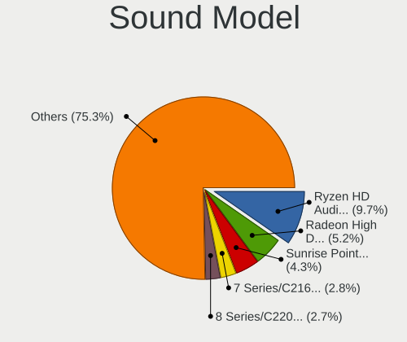

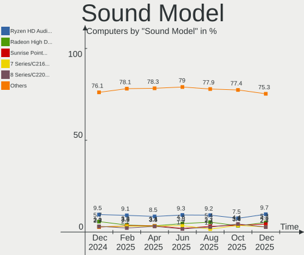

| Model                                                                      | Computers | Percent |
|----------------------------------------------------------------------------|-----------|---------|
| AMD Ryzen HD Audio Controller                                              | 61        | 9.65%   |
| AMD Radeon High Definition Audio Controller                                | 33        | 5.22%   |
| Intel Sunrise Point-LP HD Audio                                            | 27        | 4.27%   |
| Intel 7 Series/C216 Chipset Family High Definition Audio Controller        | 18        | 2.85%   |
| Intel 8 Series/C220 Series Chipset High Definition Audio Controller        | 17        | 2.69%   |
| AMD Starship/Matisse HD Audio Controller                                   | 17        | 2.69%   |
| AMD Renoir/Cezanne HDMI/DP Audio Controller                                | 16        | 2.53%   |
| AMD FCH Azalia Controller                                                  | 16        | 2.53%   |
| Intel 6 Series/C200 Series Chipset Family High Definition Audio Controller | 13        | 2.06%   |
| AMD Navi 21/23 HDMI/DP Audio Controller                                    | 11        | 1.74%   |
| Intel Xeon E3-1200 v3/4th Gen Core Processor HD Audio Controller           | 10        | 1.58%   |
| Intel Raptor Lake-P/U/H cAVS                                               | 10        | 1.58%   |
| Intel 5 Series/3400 Series Chipset High Definition Audio                   | 10        | 1.58%   |
| Intel 100 Series/C230 Series Chipset Family HD Audio Controller            | 10        | 1.58%   |
| Intel Tiger Lake-LP Smart Sound Technology Audio Controller                | 9         | 1.42%   |
| Intel Haswell-ULT HD Audio Controller                                      | 9         | 1.42%   |
| Intel Cannon Lake PCH cAVS                                                 | 9         | 1.42%   |
| Intel 8 Series HD Audio Controller                                         | 9         | 1.42%   |
| AMD Kabini HDMI/DP Audio                                                   | 9         | 1.42%   |
| Nvidia GK208 HDMI/DP Audio Controller                                      | 8         | 1.27%   |
| Intel Alder Lake-S HD Audio Controller                                     | 8         | 1.27%   |
| Intel 82801I (ICH9 Family) HD Audio Controller                             | 8         | 1.27%   |
| Nvidia GA104 High Definition Audio Controller                              | 7         | 1.11%   |
| Intel Alder Lake PCH-P High Definition Audio Controller                    | 7         | 1.11%   |
| Intel 200 Series PCH HD Audio                                              | 7         | 1.11%   |
| Nvidia GP107GL High Definition Audio Controller                            | 6         | 0.95%   |
| Nvidia GA106 High Definition Audio Controller                              | 6         | 0.95%   |
| Intel Tiger Lake-H HD Audio Controller                                     | 6         | 0.95%   |
| AMD SBx00 Azalia (Intel HDA)                                               | 6         | 0.95%   |
| AMD Raven/Raven2/Fenghuang HDMI/DP Audio Controller                        | 6         | 0.95%   |
| AMD Navi 48 HDMI/DP Audio Controller                                       | 6         | 0.95%   |
| AMD Family 17h (Models 00h-0fh) HD Audio Controller                        | 6         | 0.95%   |
| Nvidia TU116 High Definition Audio Controller                              | 5         | 0.79%   |
| Nvidia GK107 HDMI Audio Controller                                         | 5         | 0.79%   |
| Intel Raptor Lake High Definition Audio Controller                         | 5         | 0.79%   |
| ASUSTek Computer USB Audio                                                 | 5         | 0.79%   |
| AMD Navi 31 HDMI/DP Audio                                                  | 5         | 0.79%   |
| Nvidia TU106 High Definition Audio Controller                              | 4         | 0.63%   |
| Nvidia GP108 High Definition Audio Controller                              | 4         | 0.63%   |
| Nvidia GB206 High Definition Audio Controller                              | 4         | 0.63%   |

Memory
------

Memory Vendor
-------------

Memory module vendors

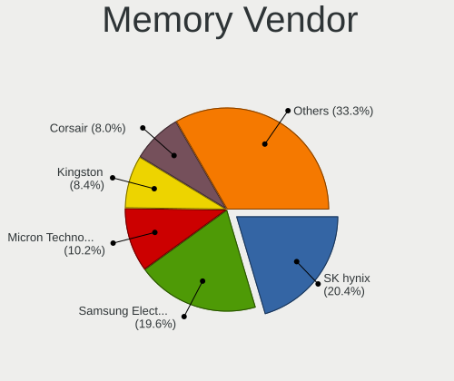

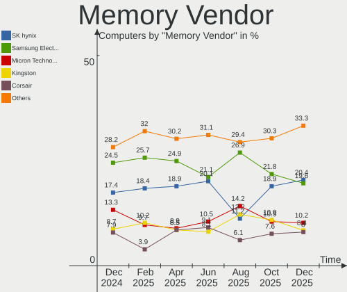

| Vendor                       | Computers | Percent |
|------------------------------|-----------|---------|
| SK hynix                     | 46        | 20.44%  |
| Samsung Electronics          | 44        | 19.56%  |
| Micron Technology            | 23        | 10.22%  |
| Kingston                     | 19        | 8.44%   |
| Corsair                      | 18        | 8%      |
| Crucial                      | 16        | 7.11%   |
| Unknown                      | 14        | 6.22%   |
| G.Skill                      | 13        | 5.78%   |
| Elpida                       | 5         | 2.22%   |
| A-DATA Technology            | 5         | 2.22%   |
| Unknown                      | 4         | 1.78%   |
| Unknown (ABCD)               | 3         | 1.33%   |
| Transcend                    | 3         | 1.33%   |
| Ramaxel Technology           | 3         | 1.33%   |
| Nanya Technology             | 2         | 0.89%   |
| Unknown (FFFF000080AD)       | 1         | 0.44%   |
| Team                         | 1         | 0.44%   |
| Red Hat                      | 1         | 0.44%   |
| Patriot Memory (PDP Systems) | 1         | 0.44%   |
| Netac                        | 1         | 0.44%   |
| KingFast                     | 1         | 0.44%   |
| EDB536160000                 | 1         | 0.44%   |

Memory Model
------------

Memory module models

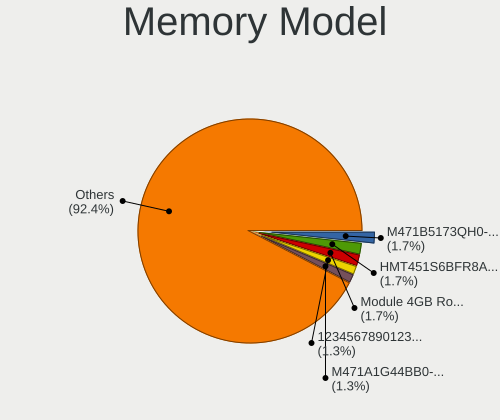

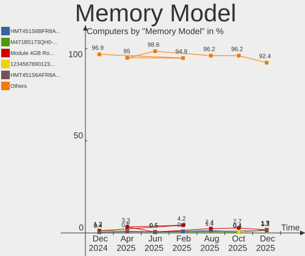

| Model                                                          | Computers | Percent |
|----------------------------------------------------------------|-----------|---------|
| SK hynix RAM HMT451S6BFR8A-PB 4GB SODIMM DDR3 1600MT/s         | 4         | 1.69%   |
| Samsung RAM M471B5173QH0-YK0 4GB SODIMM DDR3 1600MT/s          | 4         | 1.69%   |
| Unknown                                                        | 4         | 1.69%   |
| Unknown (ABCD) RAM 123456789012345678 2GB DIMM LPDDR4 2133MT/s | 3         | 1.27%   |
| SK hynix RAM HMT451S6AFR8A-PB 4GB SODIMM DDR3 1600MT/s         | 3         | 1.27%   |
| SK hynix RAM HMT351S6BFR8C-H9 4GB SODIMM 1334MT/s              | 3         | 1.27%   |
| Samsung RAM M471A1G44BB0-CWE 8GB SODIMM DDR4 3200MT/s          | 3         | 1.27%   |
| Samsung RAM M471A1G44AB0-CWE 8GiB SODIMM DDR4 3200MT/s         | 3         | 1.27%   |
| Unknown RAM Module 2GB SODIMM 800MT/s                          | 2         | 0.84%   |
| Unknown RAM Module 2GB DIMM DDR2 800MT/s                       | 2         | 0.84%   |
| SK hynix RAM HMA81GS6DJR8N-XN 8GB SODIMM DDR4 3200MT/s         | 2         | 0.84%   |
| SK hynix RAM HMA81GS6AFR8N-UH 8GB SODIMM DDR4 2667MT/s         | 2         | 0.84%   |
| Samsung RAM M471A5244CB0-CRC 4GB SODIMM DDR4 2667MT/s          | 2         | 0.84%   |
| Samsung RAM M471A2K43CB1-CRC 16GB SODIMM DDR4 2667MT/s         | 2         | 0.84%   |
| G.Skill RAM F3-2400C11-8GAB 8GB DIMM DDR3 2400MT/s             | 2         | 0.84%   |
| Elpida RAM Module 4GB SODIMM DDR3 1600MT/s                     | 2         | 0.84%   |
| Crucial RAM BL8G32C16U4B.8FE 8GB DIMM DDR4 3666MT/s            | 2         | 0.84%   |
| Corsair RAM CMSX32GX4M2A3200C22 16GB SODIMM DDR4 3200MT/s      | 2         | 0.84%   |
| Corsair RAM CMK96GX5M2E6000Z36 48GB DIMM DDR5 6000MT/s         | 2         | 0.84%   |
| Unknown RAM Module 8GB SODIMM DDR4 2400MT/s                    | 1         | 0.42%   |
| Unknown RAM Module 4GB SODIMM DDR3 1600MT/s                    | 1         | 0.42%   |
| Unknown RAM Module 4GB SODIMM DDR3 1333MT/s                    | 1         | 0.42%   |
| Unknown RAM Module 4GB SODIMM 667MT/s                          | 1         | 0.42%   |
| Unknown RAM Module 4GB DIMM DDR 1333MT/s                       | 1         | 0.42%   |
| Unknown RAM Module 4GB DIMM 1333MT/s                           | 1         | 0.42%   |
| Unknown RAM Module 2GB SODIMM DDR3                             | 1         | 0.42%   |
| Unknown RAM Module 2GB SODIMM DDR2 667MT/s                     | 1         | 0.42%   |
| Unknown RAM Module 2GB SODIMM 667MT/s                          | 1         | 0.42%   |
| Unknown RAM Module 2GB DIMM DDR 1333MT/s                       | 1         | 0.42%   |
| Unknown RAM Module 1GB SODIMM 800MT/s                          | 1         | 0.42%   |
| Unknown RAM Module 1GB DIMM DDR2 667MT/s                       | 1         | 0.42%   |
| Unknown (FFFF000080AD) RAM Module 16GB SODIMM DDR4 2667MT/s    | 1         | 0.42%   |
| Transcend RAM JM800QLU-2G 2GB DIMM DDR2 2048MT/s               | 1         | 0.42%   |
| Transcend RAM JM4800ASE-16G 16GB SODIMM DDR5 4800MT/s          | 1         | 0.42%   |
| Transcend RAM JM1600KLH-4G 4GB DIMM DDR3 1600MT/s              | 1         | 0.42%   |
| Team RAM SD5-5600 16GB SODIMM DDR5 5600MT/s                    | 1         | 0.42%   |
| SK hynix RAM Module 8GB SODIMM DDR4 3200MT/s                   | 1         | 0.42%   |
| SK hynix RAM Module 8GB SODIMM DDR3 1333MT/s                   | 1         | 0.42%   |
| SK hynix RAM Module 4GB SODIMM DDR3 1600MT/s                   | 1         | 0.42%   |
| SK hynix RAM Module 4GB Row Of Chips LPDDR5 6400MT/s           | 1         | 0.42%   |

Memory Kind
-----------

Memory module kinds

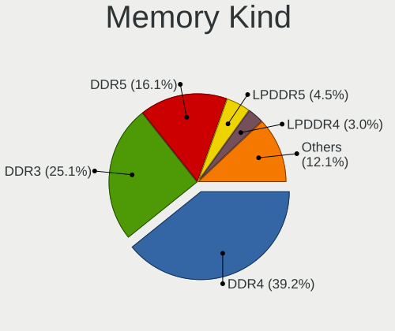

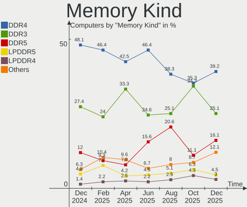

| Kind    | Computers | Percent |
|---------|-----------|---------|
| DDR4    | 78        | 39.2%   |
| DDR3    | 50        | 25.13%  |
| DDR5    | 32        | 16.08%  |
| LPDDR5  | 9         | 4.52%   |
| LPDDR4  | 6         | 3.02%   |
| DDR2    | 6         | 3.02%   |
| SDRAM   | 5         | 2.51%   |
| LPDDR3  | 5         | 2.51%   |
| Unknown | 5         | 2.51%   |
| DDR     | 2         | 1.01%   |
| RAM     | 1         | 0.5%    |

Memory Form Factor
------------------

Physical design of the memory module

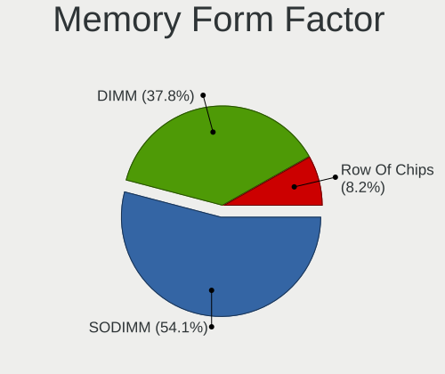

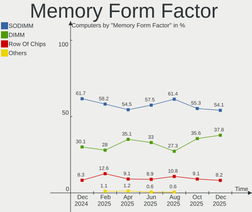

| Name         | Computers | Percent |
|--------------|-----------|---------|
| SODIMM       | 106       | 54.08%  |
| DIMM         | 74        | 37.76%  |
| Row Of Chips | 16        | 8.16%   |

Memory Size
-----------

Memory module size

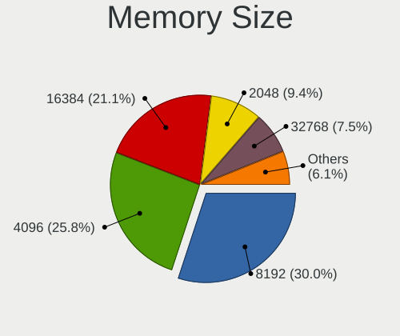

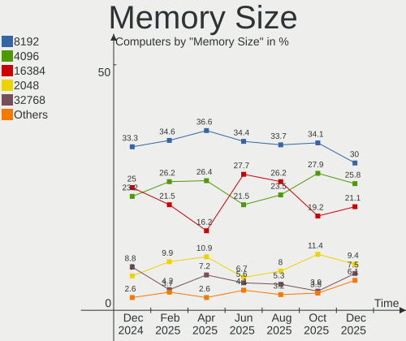

| Size  | Computers | Percent |
|-------|-----------|---------|
| 8192  | 64        | 30.05%  |
| 4096  | 55        | 25.82%  |
| 16384 | 45        | 21.13%  |
| 2048  | 20        | 9.39%   |
| 32768 | 16        | 7.51%   |
| 1024  | 7         | 3.29%   |
| 49152 | 4         | 1.88%   |
| 65536 | 1         | 0.47%   |
| 3072  | 1         | 0.47%   |

Memory Speed
------------

Memory module speed

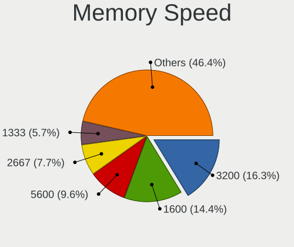

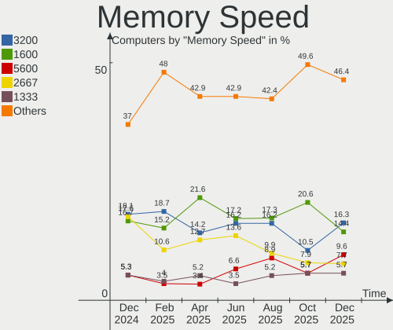

| Speed   | Computers | Percent |
|---------|-----------|---------|
| 3200    | 34        | 16.27%  |
| 1600    | 30        | 14.35%  |
| 5600    | 20        | 9.57%   |
| 2667    | 16        | 7.66%   |
| 1333    | 12        | 5.74%   |
| 2400    | 11        | 5.26%   |
| 3600    | 9         | 4.31%   |
| 2133    | 9         | 4.31%   |
| 6400    | 6         | 2.87%   |
| 6000    | 5         | 2.39%   |
| 4800    | 5         | 2.39%   |
| 1334    | 5         | 2.39%   |
| 800     | 5         | 2.39%   |
| 667     | 5         | 2.39%   |
| 1867    | 4         | 1.91%   |
| 2666    | 3         | 1.44%   |
| 8533    | 2         | 0.96%   |
| 4267    | 2         | 0.96%   |
| 3733    | 2         | 0.96%   |
| 3666    | 2         | 0.96%   |
| Unknown | 2         | 0.96%   |
| 8400    | 1         | 0.48%   |
| 8000    | 1         | 0.48%   |
| 7467    | 1         | 0.48%   |
| 6200    | 1         | 0.48%   |
| 5800    | 1         | 0.48%   |
| 5200    | 1         | 0.48%   |
| 4333    | 1         | 0.48%   |
| 4199    | 1         | 0.48%   |
| 3933    | 1         | 0.48%   |
| 3800    | 1         | 0.48%   |
| 3266    | 1         | 0.48%   |
| 3134    | 1         | 0.48%   |
| 3001    | 1         | 0.48%   |
| 3000    | 1         | 0.48%   |
| 2800    | 1         | 0.48%   |
| 2048    | 1         | 0.48%   |
| 1866    | 1         | 0.48%   |
| 1800    | 1         | 0.48%   |
| 1639    | 1         | 0.48%   |

Printers & scanners
-------------------

Printer Vendor
--------------

Printer device vendors

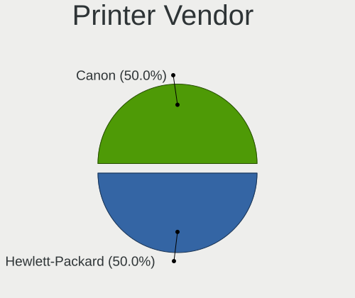

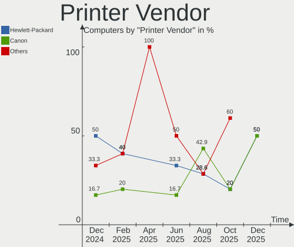

| Vendor          | Computers | Percent |
|-----------------|-----------|---------|
| Hewlett-Packard | 2         | 50%     |
| Canon           | 2         | 50%     |

Printer Model
-------------

Printer device models

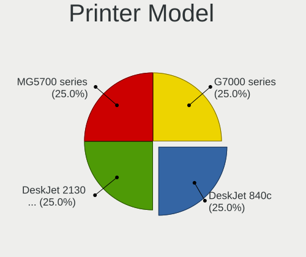

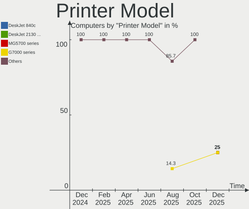

| Model                  | Computers | Percent |
|------------------------|-----------|---------|
| HP DeskJet 840c        | 1         | 25%     |
| HP DeskJet 2130 series | 1         | 25%     |
| Canon MG5700 series    | 1         | 25%     |
| Canon G7000 series     | 1         | 25%     |

Scanner Vendor
--------------

Scanner device vendors

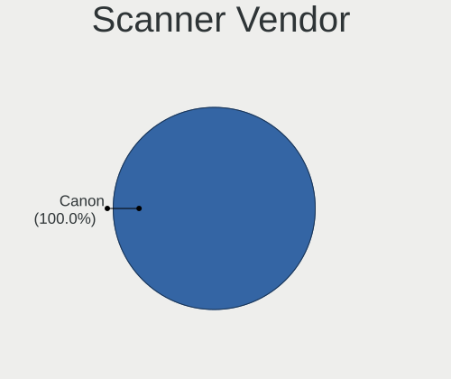

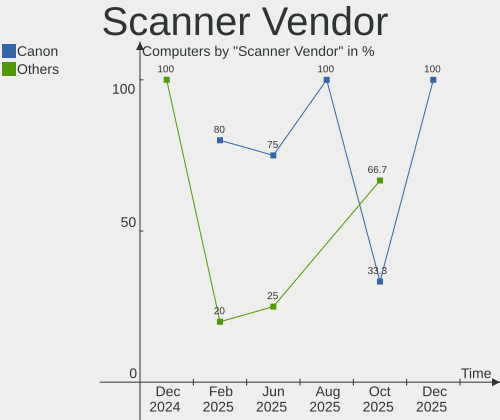

| Vendor | Computers | Percent |
|--------|-----------|---------|
| Canon  | 3         | 100%    |

Scanner Model
-------------

Scanner device models

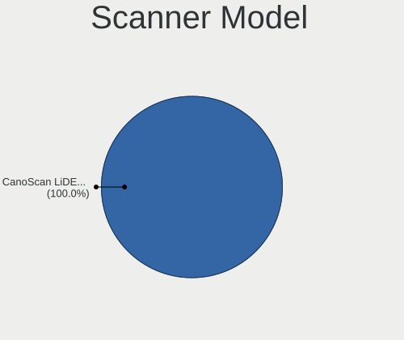

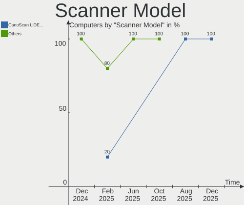

| Model                   | Computers | Percent |
|-------------------------|-----------|---------|
| Canon CanoScan LiDE 110 | 3         | 100%    |

Camera
------

Camera Vendor
-------------

Camera device vendors

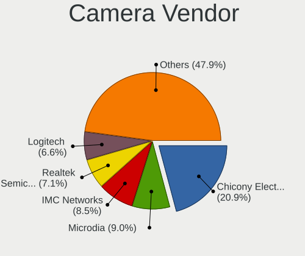

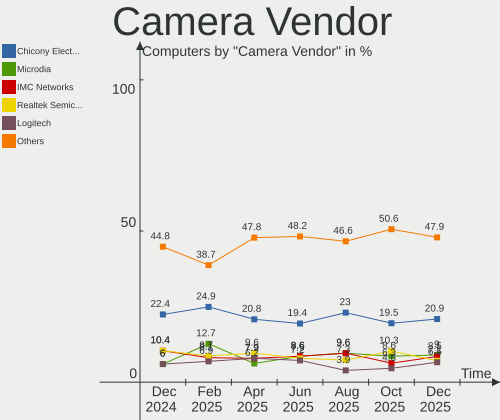

| Vendor                                 | Computers | Percent |
|----------------------------------------|-----------|---------|
| Chicony Electronics                    | 44        | 20.85%  |
| Microdia                               | 19        | 9%      |
| IMC Networks                           | 18        | 8.53%   |
| Realtek Semiconductor                  | 15        | 7.11%   |
| Logitech                               | 14        | 6.64%   |
| Bison Electronics                      | 12        | 5.69%   |
| Luxvisions Innotech Limited            | 9         | 4.27%   |
| Apple                                  | 9         | 4.27%   |
| Sunplus Innovation Technology          | 8         | 3.79%   |
| Shinetech                              | 6         | 2.84%   |
| Syntek                                 | 5         | 2.37%   |
| Quanta                                 | 5         | 2.37%   |
| Lite-On Technology                     | 5         | 2.37%   |
| Cheng Uei Precision Industry (Foxlink) | 5         | 2.37%   |
| Suyin                                  | 4         | 1.9%    |
| kingcome                               | 3         | 1.42%   |
| Sonix Technology                       | 2         | 0.95%   |
| Generalplus Technology                 | 2         | 0.95%   |
| AVerMedia Technologies                 | 2         | 0.95%   |
| Z-Star Microelectronics                | 1         | 0.47%   |
| WaveRider Communications               | 1         | 0.47%   |
| Valve Software                         | 1         | 0.47%   |
| USB CAMERA                             | 1         | 0.47%   |
| SunplusIT                              | 1         | 0.47%   |
| Sunplus Technology                     | 1         | 0.47%   |
| Shine-optics                           | 1         | 0.47%   |
| Samsung Electronics                    | 1         | 0.47%   |
| Ricoh                                  | 1         | 0.47%   |
| Primax Electronics                     | 1         | 0.47%   |
| OmniVision Technologies                | 1         | 0.47%   |
| Microsoft                              | 1         | 0.47%   |
| Jieli Technology                       | 1         | 0.47%   |
| Guillemot                              | 1         | 0.47%   |
| Google                                 | 1         | 0.47%   |
| GEMBIRD                                | 1         | 0.47%   |
| Framework                              | 1         | 0.47%   |
| eMeet                                  | 1         | 0.47%   |
| Elgato Systems                         | 1         | 0.47%   |
| ASUSTek Computer                       | 1         | 0.47%   |
| ARC International                      | 1         | 0.47%   |

Camera Model
------------

Camera device models

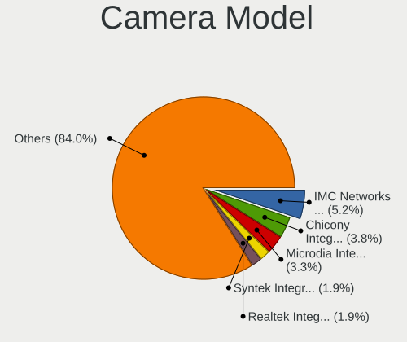

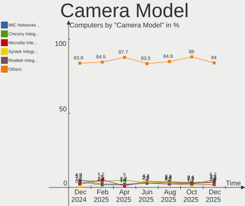

| Model                                         | Computers | Percent |
|-----------------------------------------------|-----------|---------|
| IMC Networks USB2.0 HD UVC WebCam             | 11        | 5.19%   |
| Chicony Integrated Camera                     | 8         | 3.77%   |
| Microdia Integrated_Webcam_HD                 | 7         | 3.3%    |
| Syntek Integrated Camera                      | 4         | 1.89%   |
| Realtek Integrated_Webcam_HD                  | 4         | 1.89%   |
| Chicony HD WebCam                             | 4         | 1.89%   |
| Bison Integrated Camera                       | 4         | 1.89%   |
| Apple FaceTime HD Camera (Built-in)           | 4         | 1.89%   |
| Sunplus Integrated_Webcam_HD                  | 3         | 1.42%   |
| Shinetech ASUS FHD webcam                     | 3         | 1.42%   |
| Luxvisions Innotech Limited Integrated Camera | 3         | 1.42%   |
| Logitech Webcam C270                          | 3         | 1.42%   |
| Lite-On HP HD Webcam                          | 3         | 1.42%   |
| kingcome FHD WebCam                           | 3         | 1.42%   |
| Chicony Chicony USB2.0 Camera                 | 3         | 1.42%   |
| ShineTech USB2.0 HD UVC WebCam                | 2         | 0.94%   |
| Realtek USB2.0 HD UVC WebCam                  | 2         | 0.94%   |
| Realtek Integrated_Webcam_FHD                 | 2         | 0.94%   |
| Quanta HD Webcam                              | 2         | 0.94%   |
| Quanta ACER HD User Facing                    | 2         | 0.94%   |
| Microdia Webcam Vitade AF                     | 2         | 0.94%   |
| Microdia Integrated Webcam                    | 2         | 0.94%   |
| Luxvisions Innotech Limited HP HD Camera      | 2         | 0.94%   |
| Logitech Webcam C210                          | 2         | 0.94%   |
| IMC Networks USB2.0 VGA UVC WebCam            | 2         | 0.94%   |
| IMC Networks USB2.0 UVC HD Webcam             | 2         | 0.94%   |
| IMC Networks Integrated Webcam                | 2         | 0.94%   |
| Chicony TOSHIBA Web Camera - HD               | 2         | 0.94%   |
| Chicony HP Wide Vision HD                     | 2         | 0.94%   |
| Chicony HP Truevision HD                      | 2         | 0.94%   |
| Bison Lenovo EasyCamera                       | 2         | 0.94%   |
| AVerMedia Live Streamer CAM 313               | 2         | 0.94%   |
| Apple iPhone 5/5C/5S/6/SE/7/8/X               | 2         | 0.94%   |
| Apple FaceTime HD Camera                      | 2         | 0.94%   |
| Z-Star Lenovo USB2.0 UVC Camera               | 1         | 0.47%   |
| WaveRider USB 2.0 Camera                      | 1         | 0.47%   |
| Valve Software 3D Camera                      | 1         | 0.47%   |
| USB CAMERA USB CAMERA                         | 1         | 0.47%   |
| Syntek Lenovo EasyCamera                      | 1         | 0.47%   |
| Suyin Sony Visual Communication Camera        | 1         | 0.47%   |

Security
--------

Fingerprint Vendor
------------------

Fingerprint sensor vendors

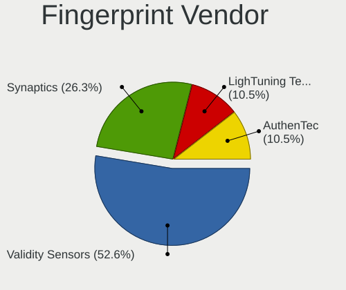

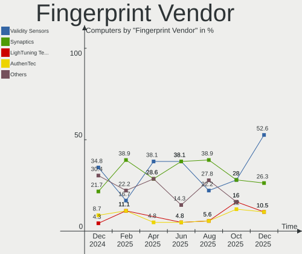

| Vendor                | Computers | Percent |
|-----------------------|-----------|---------|
| Validity Sensors      | 10        | 52.63%  |
| Synaptics             | 5         | 26.32%  |
| LighTuning Technology | 2         | 10.53%  |
| AuthenTec             | 2         | 10.53%  |

Fingerprint Model
-----------------

Fingerprint sensor models

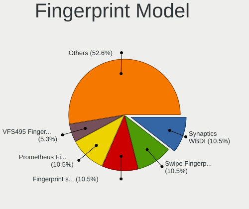

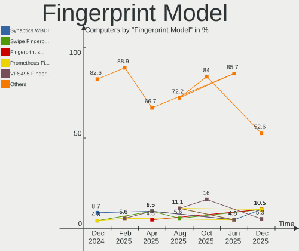

| Model                                                     | Computers | Percent |
|-----------------------------------------------------------|-----------|---------|
| Validity Sensors Synaptics WBDI                           | 2         | 10.53%  |
| Validity Sensors Swipe Fingerprint Sensor                 | 2         | 10.53%  |
| Validity Sensors Fingerprint scanner                      | 2         | 10.53%  |
| Synaptics Prometheus Fingerprint Reader                   | 2         | 10.53%  |
| Validity Sensors VFS495 Fingerprint Reader                | 1         | 5.26%   |
| Validity Sensors VFS491                                   | 1         | 5.26%   |
| Validity Sensors VFS471 Fingerprint Reader                | 1         | 5.26%   |
| Validity Sensors VFS Fingerprint sensor                   | 1         | 5.26%   |
| Synaptics  FS7604 Touch Fingerprint Sensor with PurePrint | 1         | 5.26%   |
| Synaptics Prometheus MIS Touch Fingerprint Reader         | 1         | 5.26%   |
| Synaptics FS7604 Touch Fingerprint Sensor with PurePrint  | 1         | 5.26%   |
| LighTuning Fingerprint Sensor                             | 1         | 5.26%   |
| LighTuning EgisTec Touch Fingerprint Sensor               | 1         | 5.26%   |
| AuthenTec Fingerprint Sensor                              | 1         | 5.26%   |
| AuthenTec AES1600                                         | 1         | 5.26%   |

Chipcard Vendor
---------------

Chipcard module vendors

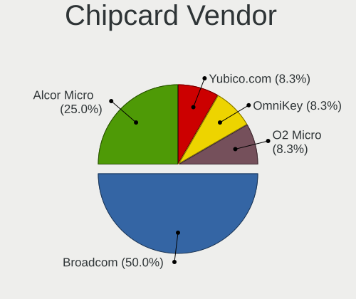

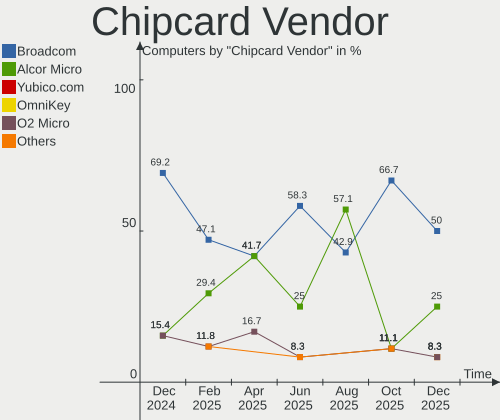

| Vendor      | Computers | Percent |
|-------------|-----------|---------|
| Broadcom    | 6         | 50%     |
| Alcor Micro | 3         | 25%     |
| Yubico.com  | 1         | 8.33%   |
| OmniKey     | 1         | 8.33%   |
| O2 Micro    | 1         | 8.33%   |

Chipcard Model
--------------

Chipcard module models

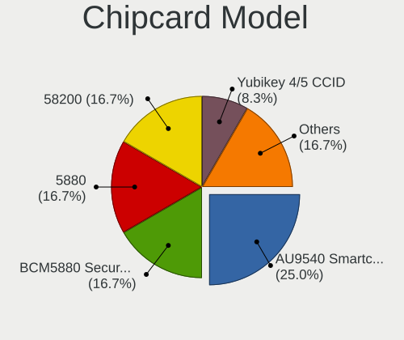

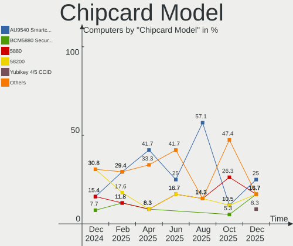

| Model                                          | Computers | Percent |
|------------------------------------------------|-----------|---------|
| Alcor Micro AU9540 Smartcard Reader            | 3         | 25%     |
| Broadcom BCM5880 Secure Applications Processor | 2         | 16.67%  |
| Broadcom 5880                                  | 2         | 16.67%  |
| Broadcom 58200                                 | 2         | 16.67%  |
| Yubico.com Yubikey 4/5 CCID                    | 1         | 8.33%   |
| OmniKey CardMan 3021 / 3121                    | 1         | 8.33%   |
| O2 Micro OZ776 CCID Smartcard Reader           | 1         | 8.33%   |

Unsupported
-----------

Unsupported Devices
-------------------

Total unsupported devices on board

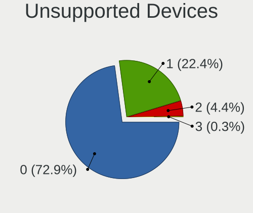

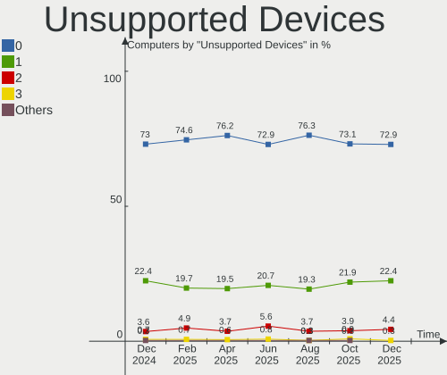

| Total | Computers | Percent |
|-------|-----------|---------|
| 0     | 250       | 72.89%  |
| 1     | 77        | 22.45%  |
| 2     | 15        | 4.37%   |
| 3     | 1         | 0.29%   |

Unsupported Device Types
------------------------

Types of unsupported devices

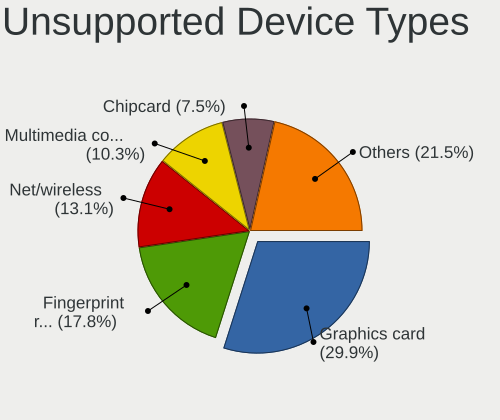

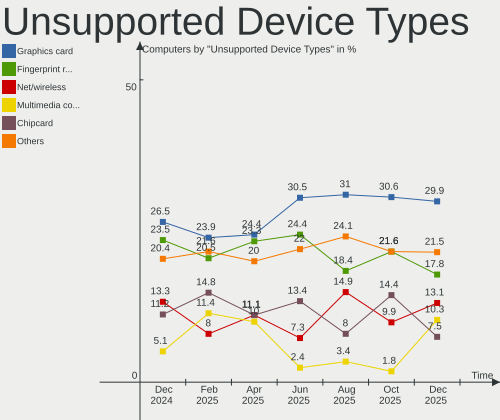

| Type                     | Computers | Percent |
|--------------------------|-----------|---------|
| Graphics card            | 32        | 29.91%  |
| Fingerprint reader       | 19        | 17.76%  |
| Net/wireless             | 14        | 13.08%  |
| Multimedia controller    | 11        | 10.28%  |
| Chipcard                 | 8         | 7.48%   |
| Bluetooth                | 6         | 5.61%   |
| Net/ethernet             | 4         | 3.74%   |
| Communication controller | 4         | 3.74%   |
| Camera                   | 4         | 3.74%   |
| Network                  | 2         | 1.87%   |
| Unassigned class         | 1         | 0.93%   |
| Sound                    | 1         | 0.93%   |
| Card reader              | 1         | 0.93%   |

