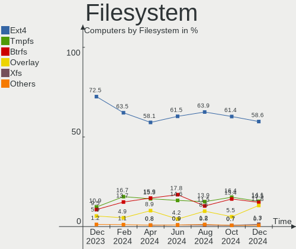
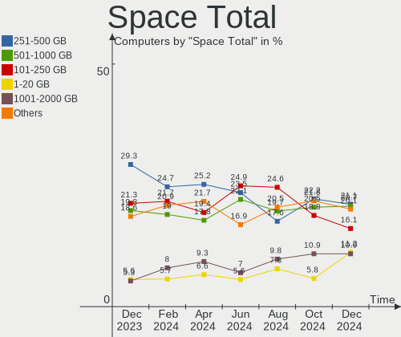
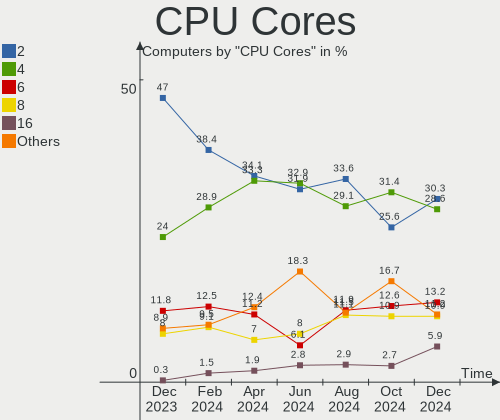
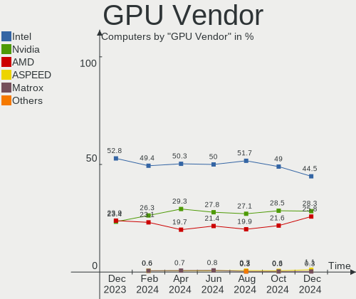
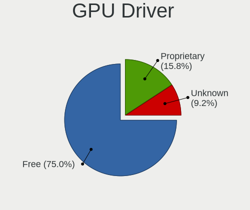
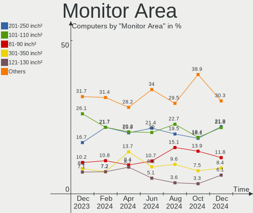
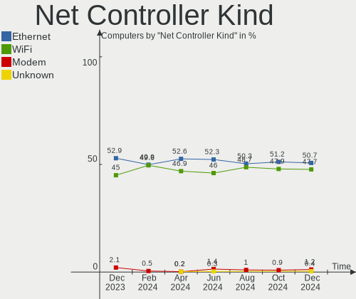
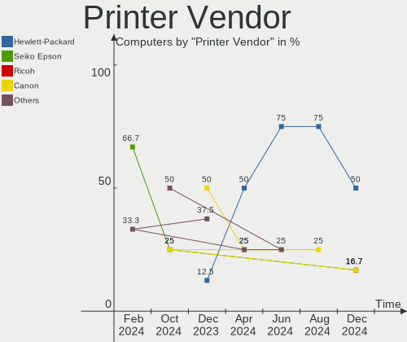

Linux in France - Hardware Trends
---------------------------------

A project to identify most popular hardware characteristics and track their change
over time based on data collected by Linux users at https://Linux-Hardware.org.

Anyone can contribute to this report by the [hw-probe](https://github.com/linuxhw/hw-probe) tool:

    sudo -E hw-probe -all -upload

This is a report for all computer types. See also reports for [desktops](/Location/France/Desktop/README.md) and [notebooks](/Location/France/Notebook/README.md).

Period: May, 2023.

Contents
--------

* [ System ](#system)
  - [ OS                       ](#os)
  - [ OS Family                ](#os-family)
  - [ Kernel                   ](#kernel)
  - [ Kernel Family            ](#kernel-family)
  - [ Kernel Major Ver.        ](#kernel-major-ver)
  - [ Arch                     ](#arch)
  - [ DE                       ](#de)
  - [ Display Server           ](#display-server)
  - [ Display Manager          ](#display-manager)
  - [ OS Lang                  ](#os-lang)
  - [ Boot Mode                ](#boot-mode)
  - [ Filesystem               ](#filesystem)
  - [ Part. scheme             ](#part-scheme)
  - [ Dual Boot with Linux/BSD ](#dual-boot-with-linuxbsd)
  - [ Dual Boot (Win)          ](#dual-boot-win)

* [ Board ](#board)
  - [ Vendor                   ](#vendor)
  - [ Model                    ](#model)
  - [ Model Family             ](#model-family)
  - [ MFG Year                 ](#mfg-year)
  - [ Form Factor              ](#form-factor)
  - [ Secure Boot              ](#secure-boot)
  - [ Coreboot                 ](#coreboot)
  - [ RAM Size                 ](#ram-size)
  - [ RAM Used                 ](#ram-used)
  - [ Total Drives             ](#total-drives)
  - [ Has CD-ROM               ](#has-cd-rom)
  - [ Has Ethernet             ](#has-ethernet)
  - [ Has WiFi                 ](#has-wifi)
  - [ Has Bluetooth            ](#has-bluetooth)

* [ Location ](#location)
  - [ Country                  ](#country)
  - [ City                     ](#city)

* [ Drives ](#drives)
  - [ Drive Vendor             ](#drive-vendor)
  - [ Drive Model              ](#drive-model)
  - [ HDD Vendor               ](#hdd-vendor)
  - [ SSD Vendor               ](#ssd-vendor)
  - [ Drive Kind               ](#drive-kind)
  - [ Drive Connector          ](#drive-connector)
  - [ Drive Size               ](#drive-size)
  - [ Space Total              ](#space-total)
  - [ Space Used               ](#space-used)
  - [ Malfunc. Drives          ](#malfunc-drives)
  - [ Malfunc. Drive Vendor    ](#malfunc-drive-vendor)
  - [ Malfunc. HDD Vendor      ](#malfunc-hdd-vendor)
  - [ Malfunc. Drive Kind      ](#malfunc-drive-kind)
  - [ Failed Drives            ](#failed-drives)
  - [ Failed Drive Vendor      ](#failed-drive-vendor)
  - [ Drive Status             ](#drive-status)

* [ Storage controller ](#storage-controller)
  - [ Storage Vendor           ](#storage-vendor)
  - [ Storage Model            ](#storage-model)
  - [ Storage Kind             ](#storage-kind)

* [ Processor ](#processor)
  - [ CPU Vendor               ](#cpu-vendor)
  - [ CPU Model                ](#cpu-model)
  - [ CPU Model Family         ](#cpu-model-family)
  - [ CPU Cores                ](#cpu-cores)
  - [ CPU Sockets              ](#cpu-sockets)
  - [ CPU Threads              ](#cpu-threads)
  - [ CPU Op-Modes             ](#cpu-op-modes)
  - [ CPU Microcode            ](#cpu-microcode)
  - [ CPU Microarch            ](#cpu-microarch)

* [ Graphics ](#graphics)
  - [ GPU Vendor               ](#gpu-vendor)
  - [ GPU Model                ](#gpu-model)
  - [ GPU Combo                ](#gpu-combo)
  - [ GPU Driver               ](#gpu-driver)
  - [ GPU Memory               ](#gpu-memory)

* [ Monitor ](#monitor)
  - [ Monitor Vendor           ](#monitor-vendor)
  - [ Monitor Model            ](#monitor-model)
  - [ Monitor Resolution       ](#monitor-resolution)
  - [ Monitor Diagonal         ](#monitor-diagonal)
  - [ Monitor Width            ](#monitor-width)
  - [ Aspect Ratio             ](#aspect-ratio)
  - [ Monitor Area             ](#monitor-area)
  - [ Pixel Density            ](#pixel-density)
  - [ Multiple Monitors        ](#multiple-monitors)

* [ Network ](#network)
  - [ Net Controller Vendor    ](#net-controller-vendor)
  - [ Net Controller Model     ](#net-controller-model)
  - [ Wireless Vendor          ](#wireless-vendor)
  - [ Wireless Model           ](#wireless-model)
  - [ Ethernet Vendor          ](#ethernet-vendor)
  - [ Ethernet Model           ](#ethernet-model)
  - [ Net Controller Kind      ](#net-controller-kind)
  - [ Used Controller          ](#used-controller)
  - [ NICs                     ](#nics)
  - [ IPv6                     ](#ipv6)

* [ Bluetooth ](#bluetooth)
  - [ Bluetooth Vendor         ](#bluetooth-vendor)
  - [ Bluetooth Model          ](#bluetooth-model)

* [ Sound ](#sound)
  - [ Sound Vendor             ](#sound-vendor)
  - [ Sound Model              ](#sound-model)

* [ Memory ](#memory)
  - [ Memory Vendor            ](#memory-vendor)
  - [ Memory Model             ](#memory-model)
  - [ Memory Kind              ](#memory-kind)
  - [ Memory Form Factor       ](#memory-form-factor)
  - [ Memory Size              ](#memory-size)
  - [ Memory Speed             ](#memory-speed)

* [ Printers & scanners ](#printers--scanners)
  - [ Printer Vendor           ](#printer-vendor)
  - [ Printer Model            ](#printer-model)
  - [ Scanner Vendor           ](#scanner-vendor)
  - [ Scanner Model            ](#scanner-model)

* [ Camera ](#camera)
  - [ Camera Vendor            ](#camera-vendor)
  - [ Camera Model             ](#camera-model)

* [ Security ](#security)
  - [ Fingerprint Vendor       ](#fingerprint-vendor)
  - [ Fingerprint Model        ](#fingerprint-model)
  - [ Chipcard Vendor          ](#chipcard-vendor)
  - [ Chipcard Model           ](#chipcard-model)

* [ Unsupported ](#unsupported)
  - [ Unsupported Devices      ](#unsupported-devices)
  - [ Unsupported Device Types ](#unsupported-device-types)

System
------

OS
--

Installed operating systems

| Name                         | Computers | Percent |
|------------------------------|-----------|---------|
| Ubuntu 22.04                 | 56        | 19.51%  |
| Debian 11                    | 30        | 10.45%  |
| Linux Mint 21.1              | 23        | 8.01%   |
| Fedora 38                    | 19        | 6.62%   |
| OpenMandriva 23.03           | 14        | 4.88%   |
| Ubuntu 23.04                 | 13        | 4.53%   |
| Ubuntu 20.04                 | 13        | 4.53%   |
| Arch Rolling                 | 12        | 4.18%   |
| Zorin 16                     | 9         | 3.14%   |
| Debian 12                    | 8         | 2.79%   |
| Xubuntu 22.04                | 6         | 2.09%   |
| Pop!_OS 22.04                | 5         | 1.74%   |
| OpenMandriva 4.3             | 4         | 1.39%   |
| Linux Mint 20.3              | 4         | 1.39%   |
| KDE neon 22.04               | 4         | 1.39%   |
| ArcoLinux Rolling            | 4         | 1.39%   |
| BlackPanther 18.1            | 3         | 1.05%   |
| Xubuntu 20.04                | 2         | 0.7%    |
| Xubuntu 18.04                | 2         | 0.7%    |
| Ubuntu MATE 20.04            | 2         | 0.7%    |
| Ubuntu 22.10                 | 2         | 0.7%    |
| openSUSE Tumbleweed-XXXXXXXX | 2         | 0.7%    |
| OpenMandriva 4.2             | 2         | 0.7%    |
| Manjaro 22.1.3               | 2         | 0.7%    |
| Manjaro 22.1.1               | 2         | 0.7%    |
| LMDE 5                       | 2         | 0.7%    |
| Linux Mint 20.2              | 2         | 0.7%    |
| Kubuntu 22.04                | 2         | 0.7%    |
| Kali 2023.2                  | 2         | 0.7%    |
| Zorin 15                     | 1         | 0.35%   |
| Ubuntu Unity 16.04           | 1         | 0.35%   |
| Ubuntu MATE 22.10            | 1         | 0.35%   |
| Ubuntu MATE 22.04            | 1         | 0.35%   |
| Ubuntu Core 22               | 1         | 0.35%   |
| Ubuntu Budgie 22.04          | 1         | 0.35%   |
| SteamOS 3.4.6                | 1         | 0.35%   |
| Raspbian 11                  | 1         | 0.35%   |
| Raspbian 10                  | 1         | 0.35%   |
| Parrot 5.3                   | 1         | 0.35%   |
| openSUSE Leap-15.3           | 1         | 0.35%   |

OS Family
---------

OS without a version

| Name          | Computers | Percent |
|---------------|-----------|---------|
| Ubuntu        | 85        | 29.62%  |
| Debian        | 38        | 13.24%  |
| Linux Mint    | 31        | 10.8%   |
| OpenMandriva  | 24        | 8.36%   |
| Fedora        | 21        | 7.32%   |
| Arch          | 12        | 4.18%   |
| Zorin         | 10        | 3.48%   |
| Xubuntu       | 10        | 3.48%   |
| Pop!_OS       | 5         | 1.74%   |
| Manjaro       | 5         | 1.74%   |
| Ubuntu MATE   | 4         | 1.39%   |
| KDE neon      | 4         | 1.39%   |
| ArcoLinux     | 4         | 1.39%   |
| openSUSE      | 3         | 1.05%   |
| Kubuntu       | 3         | 1.05%   |
| Kali          | 3         | 1.05%   |
| BlackPanther  | 3         | 1.05%   |
| Raspbian      | 2         | 0.7%    |
| Lubuntu       | 2         | 0.7%    |
| LMDE          | 2         | 0.7%    |
| Ubuntu Unity  | 1         | 0.35%   |
| Ubuntu Budgie | 1         | 0.35%   |
| SteamOS       | 1         | 0.35%   |
| Parrot        | 1         | 0.35%   |
| NuTyX         | 1         | 0.35%   |
| Nobara        | 1         | 0.35%   |
| NixOS         | 1         | 0.35%   |
| MX            | 1         | 0.35%   |
| Mageia        | 1         | 0.35%   |
| Linux Lite    | 1         | 0.35%   |
| Endless       | 1         | 0.35%   |
| EndeavourOS   | 1         | 0.35%   |
| Elementary    | 1         | 0.35%   |
| Devuan        | 1         | 0.35%   |
| BunsenLabs    | 1         | 0.35%   |
| Artix         | 1         | 0.35%   |

Kernel
------

Version of the Linux kernel

| Version                   | Computers | Percent |
|---------------------------|-----------|---------|
| 5.19.0-41-generic         | 42        | 14.63%  |
| 5.15.0-71-generic         | 28        | 9.76%   |
| 5.15.0-72-generic         | 19        | 6.62%   |
| 6.2.6-desktop-1omv2390    | 14        | 4.88%   |
| 6.2.0-20-generic          | 13        | 4.53%   |
| 5.19.0-42-generic         | 10        | 3.48%   |
| 5.10.0-23-amd64           | 9         | 3.14%   |
| 6.2.15-300.fc38.x86_64    | 8         | 2.79%   |
| 6.2.14-300.fc38.x86_64    | 7         | 2.44%   |
| 5.4.0-148-generic         | 7         | 2.44%   |
| 5.10.0-22-amd64           | 7         | 2.44%   |
| 5.10.0-21-amd64           | 5         | 1.74%   |
| 6.1.0-9-amd64             | 4         | 1.39%   |
| 5.19.0-32-generic         | 4         | 1.39%   |
| 5.15.107-1-pve            | 4         | 1.39%   |
| 6.3.1-arch1-1             | 3         | 1.05%   |
| 6.2.6-76060206-generic    | 3         | 1.05%   |
| 4.18.16-desktop-1bP       | 3         | 1.05%   |
| 6.3.4-arch1-1             | 2         | 0.7%    |
| 6.3.3-arch1-1             | 2         | 0.7%    |
| 6.3.2-arch1-1             | 2         | 0.7%    |
| 6.3.2-060302-generic      | 2         | 0.7%    |
| 6.2.13-300.fc38.x86_64    | 2         | 0.7%    |
| 6.1.29-1-MANJARO          | 2         | 0.7%    |
| 6.1.0-kali9-amd64         | 2         | 0.7%    |
| 5.19.0-38-generic         | 2         | 0.7%    |
| 5.16.7-desktop-1omv4003   | 2         | 0.7%    |
| 5.15.107-2-pve            | 2         | 0.7%    |
| 5.15.0-56-generic         | 2         | 0.7%    |
| 5.10.14-desktop-1omv4002  | 2         | 0.7%    |
| 6.3.5-zen1-1-zen          | 1         | 0.35%   |
| 6.3.4-dell-latitude-e5510 | 1         | 0.35%   |
| 6.3.4-asus-amd            | 1         | 0.35%   |
| 6.3.2-zen1-1-zen          | 1         | 0.35%   |
| 6.3.1-artix1-1            | 1         | 0.35%   |
| 6.3.1-arch2-1             | 1         | 0.35%   |
| 6.3.1-2-default           | 1         | 0.35%   |
| 6.3.1-1-default           | 1         | 0.35%   |
| 6.3.1-060301-generic      | 1         | 0.35%   |
| 6.3.0-desktop-2omv2390    | 1         | 0.35%   |

Kernel Family
-------------

Linux kernel without a distro release

| Version  | Computers | Percent |
|----------|-----------|---------|
| 5.19.0   | 60        | 20.91%  |
| 5.15.0   | 57        | 19.86%  |
| 5.10.0   | 23        | 8.01%   |
| 6.2.6    | 18        | 6.27%   |
| 6.1.0    | 15        | 5.23%   |
| 6.2.0    | 13        | 4.53%   |
| 5.4.0    | 13        | 4.53%   |
| 6.2.15   | 9         | 3.14%   |
| 6.2.14   | 9         | 3.14%   |
| 6.3.1    | 8         | 2.79%   |
| 5.15.107 | 6         | 2.09%   |
| 6.3.2    | 5         | 1.74%   |
| 6.3.4    | 4         | 1.39%   |
| 6.3.0    | 3         | 1.05%   |
| 6.2.13   | 3         | 1.05%   |
| 4.18.16  | 3         | 1.05%   |
| 6.3.3    | 2         | 0.7%    |
| 6.2.11   | 2         | 0.7%    |
| 6.1.30   | 2         | 0.7%    |
| 6.1.29   | 2         | 0.7%    |
| 6.1.27   | 2         | 0.7%    |
| 5.18.0   | 2         | 0.7%    |
| 5.16.7   | 2         | 0.7%    |
| 5.10.14  | 2         | 0.7%    |
| 4.15.0   | 2         | 0.7%    |
| 6.3.5    | 1         | 0.35%   |
| 6.2.10   | 1         | 0.35%   |
| 6.1.28   | 1         | 0.35%   |
| 6.1.26   | 1         | 0.35%   |
| 6.1.25   | 1         | 0.35%   |
| 6.1.21   | 1         | 0.35%   |
| 6.1.14   | 1         | 0.35%   |
| 6.1.1    | 1         | 0.35%   |
| 6.0.8    | 1         | 0.35%   |
| 5.3.18   | 1         | 0.35%   |
| 5.19.12  | 1         | 0.35%   |
| 5.16.5   | 1         | 0.35%   |
| 5.16.13  | 1         | 0.35%   |
| 5.15.102 | 1         | 0.35%   |
| 5.14.10  | 1         | 0.35%   |

Kernel Major Ver.
-----------------

Linux kernel major version

| Version | Computers | Percent |
|---------|-----------|---------|
| 5.15    | 64        | 22.3%   |
| 5.19    | 61        | 21.25%  |
| 6.2     | 55        | 19.16%  |
| 6.1     | 27        | 9.41%   |
| 5.10    | 27        | 9.41%   |
| 6.3     | 23        | 8.01%   |
| 5.4     | 13        | 4.53%   |
| 5.16    | 4         | 1.39%   |
| 4.18    | 3         | 1.05%   |
| 5.18    | 2         | 0.7%    |
| 4.4     | 2         | 0.7%    |
| 4.15    | 2         | 0.7%    |
| 6.0     | 1         | 0.35%   |
| 5.3     | 1         | 0.35%   |
| 5.14    | 1         | 0.35%   |
| 5.13    | 1         | 0.35%   |

Arch
----

OS architecture (x86_64, i586, etc.)

| Name    | Computers | Percent |
|---------|-----------|---------|
| x86_64  | 280       | 97.56%  |
| i686    | 3         | 1.05%   |
| aarch64 | 2         | 0.7%    |
| armv7l  | 1         | 0.35%   |
| armv6l  | 1         | 0.35%   |

DE
--

Desktop Environment

| Name            | Computers | Percent |
|-----------------|-----------|---------|
| GNOME           | 128       | 44.6%   |
| KDE5            | 55        | 19.16%  |
| XFCE            | 31        | 10.8%   |
| X-Cinnamon      | 28        | 9.76%   |
| Unknown         | 15        | 5.23%   |
| MATE            | 8         | 2.79%   |
| LXQt            | 5         | 1.74%   |
| LXDE            | 4         | 1.39%   |
| Cinnamon        | 3         | 1.05%   |
| sway            | 2         | 0.7%    |
| Pantheon        | 2         | 0.7%    |
| GNOME Flashback | 2         | 0.7%    |
| Unity           | 1         | 0.35%   |
| INPT            | 1         | 0.35%   |
| i3              | 1         | 0.35%   |
| Budgie          | 1         | 0.35%   |

Display Server
--------------

X11 or Wayland

| Name    | Computers | Percent |
|---------|-----------|---------|
| X11     | 191       | 66.55%  |
| Wayland | 71        | 24.74%  |
| Tty     | 20        | 6.97%   |
| Unknown | 4         | 1.39%   |
| Xcb     | 1         | 0.35%   |

Display Manager
---------------

SDDM, LightDM, etc.

| Name    | Computers | Percent |
|---------|-----------|---------|
| GDM3    | 73        | 25.44%  |
| Unknown | 71        | 24.74%  |
| LightDM | 60        | 20.91%  |
| SDDM    | 51        | 17.77%  |
| GDM     | 30        | 10.45%  |
| SLiM    | 1         | 0.35%   |
| LXDM    | 1         | 0.35%   |

OS Lang
-------

Language

| Lang        | Computers | Percent |
|-------------|-----------|---------|
| fr_FR       | 219       | 76.31%  |
| en_US       | 46        | 16.03%  |
| en_GB       | 5         | 1.74%   |
| Unknown     | 5         | 1.74%   |
| C           | 4         | 1.39%   |
| it_IT       | 1         | 0.35%   |
| fr_FR.utf-8 | 1         | 0.35%   |
| fr_CH       | 1         | 0.35%   |
| en_IN       | 1         | 0.35%   |
| en_IE       | 1         | 0.35%   |
| en_DK       | 1         | 0.35%   |
| en_AG       | 1         | 0.35%   |
| de_DE       | 1         | 0.35%   |

Boot Mode
---------

EFI or BIOS

| Mode | Computers | Percent |
|------|-----------|---------|
| EFI  | 147       | 51.22%  |
| BIOS | 140       | 48.78%  |

Filesystem
----------

Type of filesystem

| Type    | Computers | Percent |
|---------|-----------|---------|
| Ext4    | 210       | 73.17%  |
| Btrfs   | 29        | 10.1%   |
| Tmpfs   | 24        | 8.36%   |
| Overlay | 17        | 5.92%   |
| Xfs     | 4         | 1.39%   |
| Zfs     | 2         | 0.7%    |
| Unknown | 1         | 0.35%   |

Part. scheme
------------

Scheme of partitioning

| Type    | Computers | Percent |
|---------|-----------|---------|
| GPT     | 177       | 61.67%  |
| Unknown | 59        | 20.56%  |
| MBR     | 51        | 17.77%  |

Dual Boot with Linux/BSD
------------------------

Hosting more than one Linux/BSD

| Dual boot | Computers | Percent |
|-----------|-----------|---------|
| No        | 236       | 82.23%  |
| Yes       | 51        | 17.77%  |

Dual Boot (Win)
---------------

Hosting Linux and Windows

| Dual boot | Computers | Percent |
|-----------|-----------|---------|
| No        | 201       | 70.03%  |
| Yes       | 86        | 29.97%  |

Board
-----

Vendor
------

Motherboard manufacturer

| Name                    | Computers | Percent |
|-------------------------|-----------|---------|
| ASUSTek Computer        | 55        | 19.16%  |
| Dell                    | 41        | 14.29%  |
| Hewlett-Packard         | 38        | 13.24%  |
| Lenovo                  | 31        | 10.8%   |
| MSI                     | 20        | 6.97%   |
| Gigabyte Technology     | 17        | 5.92%   |
| Acer                    | 15        | 5.23%   |
| ASRock                  | 10        | 3.48%   |
| Toshiba                 | 7         | 2.44%   |
| Sony                    | 5         | 1.74%   |
| HUAWEI                  | 5         | 1.74%   |
| Notebook                | 3         | 1.05%   |
| Apple                   | 3         | 1.05%   |
| Unknown                 | 3         | 1.05%   |
| Shuttle                 | 2         | 0.7%    |
| Samsung Electronics     | 2         | 0.7%    |
| Raspberry Pi Foundation | 2         | 0.7%    |
| Pegatron                | 2         | 0.7%    |
| Packard Bell            | 2         | 0.7%    |
| Intel                   | 2         | 0.7%    |
| Fujitsu Siemens         | 2         | 0.7%    |
| Fujitsu                 | 2         | 0.7%    |
| Foxconn                 | 2         | 0.7%    |
| Valve                   | 1         | 0.35%   |
| UNOWHY                  | 1         | 0.35%   |
| Timi                    | 1         | 0.35%   |
| Thomson                 | 1         | 0.35%   |
| SLIMBOOK                | 1         | 0.35%   |
| Rockchip                | 1         | 0.35%   |
| Nvidia                  | 1         | 0.35%   |
| Medion                  | 1         | 0.35%   |
| Jumper                  | 1         | 0.35%   |
| HPE                     | 1         | 0.35%   |
| Gateway                 | 1         | 0.35%   |
| eMachines               | 1         | 0.35%   |
| Cincoze                 | 1         | 0.35%   |
| ASRockRack              | 1         | 0.35%   |
| AMI                     | 1         | 0.35%   |
| Alienware               | 1         | 0.35%   |

Model
-----

Motherboard model

| Name                                    | Computers | Percent |
|-----------------------------------------|-----------|---------|
| Unknown                                 | 5         | 1.74%   |
| MSI MS-7C95                             | 2         | 0.7%    |
| MSI MS-7816                             | 2         | 0.7%    |
| Lenovo Legion 5 15ACH6H 82JU            | 2         | 0.7%    |
| HP Z420 Workstation                     | 2         | 0.7%    |
| HP Victus by Laptop 16-e0xxx            | 2         | 0.7%    |
| HP EliteBook 640 14 inch G9 Notebook PC | 2         | 0.7%    |
| Foxconn Pro 3500 Series                 | 2         | 0.7%    |
| Dell Precision 5520                     | 2         | 0.7%    |
| Dell Precision 5470                     | 2         | 0.7%    |
| Dell OptiPlex 9020                      | 2         | 0.7%    |
| Dell Latitude 7490                      | 2         | 0.7%    |
| ASUS K73SJ                              | 2         | 0.7%    |
| ASUS K55VJ                              | 2         | 0.7%    |
| Valve Jupiter                           | 1         | 0.35%   |
| UNOWHY Y13G011S4EI                      | 1         | 0.35%   |
| Toshiba Satellite Pro C660              | 1         | 0.35%   |
| Toshiba Satellite P300                  | 1         | 0.35%   |
| Toshiba Satellite L655                  | 1         | 0.35%   |
| Toshiba Satellite L300                  | 1         | 0.35%   |
| Toshiba Satellite C855-22N              | 1         | 0.35%   |
| Toshiba Satellite C660D                 | 1         | 0.35%   |
| Toshiba PORTEGE Z830                    | 1         | 0.35%   |
| Timi Xiaomi Book Pro 16 2022            | 1         | 0.35%   |
| Thomson N14C64WF                        | 1         | 0.35%   |
| Sony VPCZ12C5E                          | 1         | 0.35%   |
| Sony VPCF11M1E                          | 1         | 0.35%   |
| Sony VGN-FW51MF_H                       | 1         | 0.35%   |
| Sony VGN-AW11M_H                        | 1         | 0.35%   |
| Sony SVE1713K1EB                        | 1         | 0.35%   |
| SLIMBOOK Executive                      | 1         | 0.35%   |
| Shuttle X50V5                           | 1         | 0.35%   |
| Shuttle SZ77                            | 1         | 0.35%   |
| Samsung R610                            | 1         | 0.35%   |
| Samsung N150/N210/N220                  | 1         | 0.35%   |
| RPi Raspberry Pi Model B Rev 2          | 1         | 0.35%   |
| RPi Raspberry Pi 2 Model B Rev 1.1      | 1         | 0.35%   |
| Pegatron KT600AA-ABF a6443.fr           | 1         | 0.35%   |
| Pegatron FZ132AA-ABF m9456fr            | 1         | 0.35%   |
| Packard Bell IMEDIA J9640               | 1         | 0.35%   |

Model Family
------------

Motherboard model prefix

| Name               | Computers | Percent |
|--------------------|-----------|---------|
| Lenovo ThinkPad    | 18        | 6.27%   |
| Dell Precision     | 14        | 4.88%   |
| Acer Aspire        | 11        | 3.83%   |
| Dell Latitude      | 10        | 3.48%   |
| HP EliteBook       | 8         | 2.79%   |
| ASUS VivoBook      | 7         | 2.44%   |
| Toshiba Satellite  | 6         | 2.09%   |
| HP Pavilion        | 6         | 2.09%   |
| Lenovo IdeaPad     | 5         | 1.74%   |
| Dell OptiPlex      | 5         | 1.74%   |
| Dell Inspiron      | 5         | 1.74%   |
| ASUS TUF           | 5         | 1.74%   |
| ASUS PRIME         | 5         | 1.74%   |
| Unknown            | 5         | 1.74%   |
| HP Compaq          | 4         | 1.39%   |
| ASUS ROG           | 4         | 1.39%   |
| ASUS ASUS          | 4         | 1.39%   |
| Lenovo ThinkCentre | 3         | 1.05%   |
| Lenovo Legion      | 3         | 1.05%   |
| HP ProBook         | 3         | 1.05%   |
| Gigabyte B550      | 3         | 1.05%   |
| Dell XPS           | 3         | 1.05%   |
| RPi Raspberry      | 2         | 0.7%    |
| MSI MS-7C95        | 2         | 0.7%    |
| MSI MS-7816        | 2         | 0.7%    |
| MSI Katana         | 2         | 0.7%    |
| Lenovo Yoga        | 2         | 0.7%    |
| HP Z420            | 2         | 0.7%    |
| HP Victus          | 2         | 0.7%    |
| HP Presario        | 2         | 0.7%    |
| HP Laptop          | 2         | 0.7%    |
| Gigabyte B450M     | 2         | 0.7%    |
| Foxconn Pro        | 2         | 0.7%    |
| ASUS P8Z77-V       | 2         | 0.7%    |
| ASUS K73SJ         | 2         | 0.7%    |
| ASUS K55VJ         | 2         | 0.7%    |
| ASRock X570        | 2         | 0.7%    |
| Valve Jupiter      | 1         | 0.35%   |
| UNOWHY Y13G011S4EI | 1         | 0.35%   |
| Toshiba PORTEGE    | 1         | 0.35%   |

MFG Year
--------

Motherboard manufacture year

| Year    | Computers | Percent |
|---------|-----------|---------|
| 2020    | 30        | 10.45%  |
| 2021    | 27        | 9.41%   |
| 2022    | 25        | 8.71%   |
| 2019    | 23        | 8.01%   |
| 2018    | 21        | 7.32%   |
| 2011    | 20        | 6.97%   |
| 2012    | 18        | 6.27%   |
| 2010    | 18        | 6.27%   |
| 2013    | 17        | 5.92%   |
| 2008    | 16        | 5.57%   |
| 2015    | 14        | 4.88%   |
| 2014    | 13        | 4.53%   |
| 2009    | 11        | 3.83%   |
| 2023    | 7         | 2.44%   |
| 2017    | 7         | 2.44%   |
| 2016    | 6         | 2.09%   |
| 2007    | 5         | 1.74%   |
| Unknown | 4         | 1.39%   |
| 2006    | 3         | 1.05%   |
| 2005    | 1         | 0.35%   |
| 2003    | 1         | 0.35%   |

Form Factor
-----------

Physical design of the computer

| Name           | Computers | Percent |
|----------------|-----------|---------|
| Notebook       | 169       | 58.89%  |
| Desktop        | 107       | 37.28%  |
| System on chip | 4         | 1.39%   |
| Convertible    | 4         | 1.39%   |
| Server         | 2         | 0.7%    |
| All in one     | 1         | 0.35%   |

Secure Boot
-----------

Enabled or disabled

| State    | Computers | Percent |
|----------|-----------|---------|
| Disabled | 261       | 90.94%  |
| Enabled  | 26        | 9.06%   |

Coreboot
--------

Have coreboot on board

| Used | Computers | Percent |
|------|-----------|---------|
| No   | 287       | 100%    |

RAM Size
--------

Total RAM memory

| Size in GB  | Computers | Percent |
|-------------|-----------|---------|
| 4.01-8.0    | 67        | 23.34%  |
| 16.01-24.0  | 52        | 18.12%  |
| 3.01-4.0    | 47        | 16.38%  |
| 8.01-16.0   | 43        | 14.98%  |
| 32.01-64.0  | 40        | 13.94%  |
| 1.01-2.0    | 12        | 4.18%   |
| 64.01-256.0 | 10        | 3.48%   |
| 24.01-32.0  | 9         | 3.14%   |
| 0.51-1.0    | 4         | 1.39%   |
| 2.01-3.0    | 2         | 0.7%    |
| 0.01-0.5    | 1         | 0.35%   |

RAM Used
--------

Used RAM memory

| Used GB    | Computers | Percent |
|------------|-----------|---------|
| 1.01-2.0   | 72        | 25.09%  |
| 2.01-3.0   | 69        | 24.04%  |
| 4.01-8.0   | 56        | 19.51%  |
| 3.01-4.0   | 43        | 14.98%  |
| 0.51-1.0   | 16        | 5.57%   |
| 8.01-16.0  | 15        | 5.23%   |
| 0.01-0.5   | 10        | 3.48%   |
| 16.01-24.0 | 5         | 1.74%   |
| 24.01-32.0 | 1         | 0.35%   |

Total Drives
------------

Number of drives on board

| Drives | Computers | Percent |
|--------|-----------|---------|
| 1      | 171       | 59.58%  |
| 2      | 70        | 24.39%  |
| 3      | 21        | 7.32%   |
| 4      | 10        | 3.48%   |
| 6      | 5         | 1.74%   |
| 5      | 4         | 1.39%   |
| 9      | 2         | 0.7%    |
| 7      | 2         | 0.7%    |
| 0      | 2         | 0.7%    |

Has CD-ROM
----------

Has CD-ROM on board

| Presented | Computers | Percent |
|-----------|-----------|---------|
| No        | 169       | 58.89%  |
| Yes       | 118       | 41.11%  |

Has Ethernet
------------

Has Ethernet on board

| Presented | Computers | Percent |
|-----------|-----------|---------|
| Yes       | 243       | 84.67%  |
| No        | 44        | 15.33%  |

Has WiFi
--------

Has WiFi module

| Presented | Computers | Percent |
|-----------|-----------|---------|
| Yes       | 217       | 75.61%  |
| No        | 70        | 24.39%  |

Has Bluetooth
-------------

Has Bluetooth module

| Presented | Computers | Percent |
|-----------|-----------|---------|
| Yes       | 170       | 59.23%  |
| No        | 117       | 40.77%  |

Location
--------

Country
-------

Geographic location (country)

| Country | Computers | Percent |
|---------|-----------|---------|
| France  | 287       | 100%    |

City
----

Geographic location (city)

| City                    | Computers | Percent |
|-------------------------|-----------|---------|
| Paris                   | 30        | 10.45%  |
| Marseille               | 9         | 3.14%   |
| Toulouse                | 8         | 2.79%   |
| Nantes                  | 6         | 2.09%   |
| Nancy                   | 5         | 1.74%   |
| Caen                    | 5         | 1.74%   |
| Rennes                  | 4         | 1.39%   |
| Poitiers                | 4         | 1.39%   |
| Montpellier             | 4         | 1.39%   |
| Lyon                    | 4         | 1.39%   |
| Lherm                   | 4         | 1.39%   |
| Évry                   | 4         | 1.39%   |
| Tiranges                | 3         | 1.05%   |
| Bordeaux                | 3         | 1.05%   |
| Bezancourt              | 3         | 1.05%   |
| Villeurbanne            | 2         | 0.7%    |
| Villefranche-sur-Saône | 2         | 0.7%    |
| Versailles              | 2         | 0.7%    |
| Vanves                  | 2         | 0.7%    |
| Vannes                  | 2         | 0.7%    |
| Strasbourg              | 2         | 0.7%    |
| Saint-Etienne           | 2         | 0.7%    |
| Orsay                   | 2         | 0.7%    |
| Orléans                | 2         | 0.7%    |
| Nice                    | 2         | 0.7%    |
| Lille                   | 2         | 0.7%    |
| La Rochelle             | 2         | 0.7%    |
| La Roche-de-Glun        | 2         | 0.7%    |
| Gravelines              | 2         | 0.7%    |
| Châtenay-Malabry       | 2         | 0.7%    |
| Bouvigny-Boyeffles      | 2         | 0.7%    |
| Asnieres-sur-Seine      | 2         | 0.7%    |
| Argenteuil              | 2         | 0.7%    |
| Yzeure                  | 1         | 0.35%   |
| Vouille                 | 1         | 0.35%   |
| Vitry-le-François      | 1         | 0.35%   |
| Villemomble             | 1         | 0.35%   |
| Villebon-sur-Yvette     | 1         | 0.35%   |
| Vigneux-sur-Seine       | 1         | 0.35%   |
| Vaureal                 | 1         | 0.35%   |

Drives
------

Drive Vendor
------------

Hard drive vendors

| Vendor                       | Computers | Drives | Percent |
|------------------------------|-----------|--------|---------|
| Samsung Electronics          | 77        | 91     | 17.95%  |
| WDC                          | 61        | 73     | 14.22%  |
| Seagate                      | 56        | 66     | 13.05%  |
| Crucial                      | 31        | 32     | 7.23%   |
| Toshiba                      | 30        | 31     | 6.99%   |
| Kingston                     | 17        | 18     | 3.96%   |
| SanDisk                      | 16        | 20     | 3.73%   |
| Unknown                      | 15        | 18     | 3.5%    |
| SK hynix                     | 13        | 13     | 3.03%   |
| HGST                         | 12        | 15     | 2.8%    |
| Intel                        | 9         | 11     | 2.1%    |
| Hitachi                      | 9         | 10     | 2.1%    |
| Micron Technology            | 6         | 6      | 1.4%    |
| KIOXIA                       | 6         | 6      | 1.4%    |
| Transcend                    | 5         | 5      | 1.17%   |
| Micron/Crucial Technology    | 5         | 7      | 1.17%   |
| SPCC                         | 4         | 4      | 0.93%   |
| PNY                          | 4         | 4      | 0.93%   |
| Kingston Technology Company  | 4         | 4      | 0.93%   |
| Fanxiang                     | 4         | 4      | 0.93%   |
| China                        | 4         | 4      | 0.93%   |
| Unknown                      | 4         | 4      | 0.93%   |
| Phison Electronics           | 3         | 3      | 0.7%    |
| LITEONIT                     | 3         | 3      | 0.7%    |
| Gigabyte Technology          | 3         | 3      | 0.7%    |
| Silicon Motion               | 2         | 2      | 0.47%   |
| Emtec                        | 2         | 2      | 0.47%   |
| XPG                          | 1         | 1      | 0.23%   |
| WALRAM                       | 1         | 1      | 0.23%   |
| Verbatim                     | 1         | 1      | 0.23%   |
| Teclast                      | 1         | 1      | 0.23%   |
| TCSUNBOW                     | 1         | 1      | 0.23%   |
| Space ke                     | 1         | 1      | 0.23%   |
| Solid State Storage          | 1         | 1      | 0.23%   |
| Shenzhen Longsys Electronics | 1         | 1      | 0.23%   |
| Realtek Semiconductor        | 1         | 1      | 0.23%   |
| Plextor                      | 1         | 1      | 0.23%   |
| NGFF                         | 1         | 1      | 0.23%   |
| LITEON                       | 1         | 1      | 0.23%   |
| Lite-On Technology           | 1         | 1      | 0.23%   |

Drive Model
-----------

Hard drive models

| Model                                               | Computers | Percent |
|-----------------------------------------------------|-----------|---------|
| Samsung NVMe SSD Controller SM981/PM981/PM983 256GB | 8         | 1.71%   |
| Samsung SSD 860 EVO 500GB                           | 6         | 1.28%   |
| Seagate ST2000DM008-2FR102 2TB                      | 5         | 1.07%   |
| Crucial CT240BX500SSD1 240GB                        | 5         | 1.07%   |
| Seagate ST1000LM035-1RK172 1TB                      | 4         | 0.86%   |
| Unknown                                             | 4         | 0.86%   |
| Unknown MMC Card  32GB                              | 3         | 0.64%   |
| Toshiba MQ01ABF050 500GB                            | 3         | 0.64%   |
| Toshiba MQ01ABD100 1TB                              | 3         | 0.64%   |
| SPCC Solid State Disk 128GB                         | 3         | 0.64%   |
| Seagate ST1000DM010-2EP102 1TB                      | 3         | 0.64%   |
| Samsung SSD 980 1TB                                 | 3         | 0.64%   |
| Samsung NVMe SSD Controller PM9A1/PM9A3/980PRO 1TB  | 3         | 0.64%   |
| Micron/Crucial P2 NVMe PCIe SSD 1TB                 | 3         | 0.64%   |
| HGST HUS726T4TALA6L4 4TB                            | 3         | 0.64%   |
| HGST HTS725050A7E630 500GB                          | 3         | 0.64%   |
| Crucial CT500MX500SSD1 500GB                        | 3         | 0.64%   |
| Crucial CT1000BX500SSD1 1TB                         | 3         | 0.64%   |
| WDC WDS100T2B0A-00SM50 1TB SSD                      | 2         | 0.43%   |
| WDC WD5000AAKX-603CA0 500GB                         | 2         | 0.43%   |
| WDC WD5000AAKX-22ERMA0 500GB                        | 2         | 0.43%   |
| WDC WD5000AAKS-00V1A0 500GB                         | 2         | 0.43%   |
| WDC WD30EFRX-68EUZN0 3TB                            | 2         | 0.43%   |
| WDC WD2500BEVS-22UST0 250GB                         | 2         | 0.43%   |
| WDC WD20EZRX-00D8PB0 2TB                            | 2         | 0.43%   |
| WDC WD10EZEX-60M2NA0 1TB                            | 2         | 0.43%   |
| WDC WD10EZEX-08M2NA0 1TB                            | 2         | 0.43%   |
| Unknown SD/MMC 2GB                                  | 2         | 0.43%   |
| Unknown M.S./M.S.Pro/HG 16GB                        | 2         | 0.43%   |
| Transcend TS480GSSD220S 480GB                       | 2         | 0.43%   |
| Toshiba MQ04ABF100 1TB                              | 2         | 0.43%   |
| Toshiba HDWQ140 4TB                                 | 2         | 0.43%   |
| Toshiba DT01ACA100 1TB                              | 2         | 0.43%   |
| SK hynix PC801 NVMe 1TB                             | 2         | 0.43%   |
| SK hynix HFM512GD3JX013N 512GB                      | 2         | 0.43%   |
| Seagate ST9500325AS 500GB                           | 2         | 0.43%   |
| Seagate ST4000NM000A-2HZ100 4TB                     | 2         | 0.43%   |
| Seagate ST4000DM004-2CV104 4TB                      | 2         | 0.43%   |
| Seagate ST3500413AS 500GB                           | 2         | 0.43%   |
| Seagate ST3250310AS 250GB                           | 2         | 0.43%   |

HDD Vendor
----------

Hard disk drive vendors

| Vendor              | Computers | Drives | Percent |
|---------------------|-----------|--------|---------|
| Seagate             | 53        | 62     | 35.33%  |
| WDC                 | 44        | 55     | 29.33%  |
| Toshiba             | 20        | 21     | 13.33%  |
| HGST                | 12        | 15     | 8%      |
| Hitachi             | 9         | 10     | 6%      |
| Samsung Electronics | 7         | 8      | 4.67%   |
| Unknown             | 1         | 1      | 0.67%   |
| LaCie               | 1         | 1      | 0.67%   |
| Inateck             | 1         | 1      | 0.67%   |
| HPE                 | 1         | 4      | 0.67%   |
| ASMT                | 1         | 2      | 0.67%   |

SSD Vendor
----------

Solid state drive vendors

| Vendor              | Computers | Drives | Percent |
|---------------------|-----------|--------|---------|
| Samsung Electronics | 36        | 40     | 26.47%  |
| Crucial             | 23        | 23     | 16.91%  |
| SanDisk             | 12        | 12     | 8.82%   |
| Kingston            | 11        | 12     | 8.09%   |
| WDC                 | 6         | 6      | 4.41%   |
| Transcend           | 5         | 5      | 3.68%   |
| Toshiba             | 4         | 4      | 2.94%   |
| SPCC                | 4         | 4      | 2.94%   |
| PNY                 | 4         | 4      | 2.94%   |
| China               | 4         | 4      | 2.94%   |
| LITEONIT            | 3         | 3      | 2.21%   |
| Intel               | 3         | 4      | 2.21%   |
| Gigabyte Technology | 3         | 3      | 2.21%   |
| Fanxiang            | 3         | 3      | 2.21%   |
| Emtec               | 2         | 2      | 1.47%   |
| Verbatim            | 1         | 1      | 0.74%   |
| Teclast             | 1         | 1      | 0.74%   |
| TCSUNBOW            | 1         | 1      | 0.74%   |
| SK hynix            | 1         | 1      | 0.74%   |
| Plextor             | 1         | 1      | 0.74%   |
| NGFF                | 1         | 1      | 0.74%   |
| LITEON              | 1         | 1      | 0.74%   |
| Lexar               | 1         | 1      | 0.74%   |
| LDLC                | 1         | 1      | 0.74%   |
| Hewlett-Packard     | 1         | 1      | 0.74%   |
| CT2000MX            | 1         | 1      | 0.74%   |
| Apple               | 1         | 1      | 0.74%   |
| 2.5"                | 1         | 1      | 0.74%   |

Drive Kind
----------

HDD or SSD

| Kind    | Computers | Drives | Percent |
|---------|-----------|--------|---------|
| HDD     | 120       | 180    | 32%     |
| NVMe    | 119       | 142    | 31.73%  |
| SSD     | 116       | 142    | 30.93%  |
| MMC     | 16        | 16     | 4.27%   |
| Unknown | 4         | 7      | 1.07%   |

Drive Connector
---------------

SATA, SAS, NVMe, etc.

| Type | Computers | Drives | Percent |
|------|-----------|--------|---------|
| SATA | 192       | 311    | 56.47%  |
| NVMe | 119       | 142    | 35%     |
| MMC  | 16        | 16     | 4.71%   |
| SAS  | 13        | 18     | 3.82%   |

Drive Size
----------

Size of hard drive

| Size in TB | Computers | Drives | Percent |
|------------|-----------|--------|---------|
| 0.01-0.5   | 145       | 184    | 57.77%  |
| 0.51-1.0   | 68        | 80     | 27.09%  |
| 1.01-2.0   | 22        | 28     | 8.76%   |
| 3.01-4.0   | 13        | 24     | 5.18%   |
| 2.01-3.0   | 3         | 6      | 1.2%    |

Space Total
-----------

Amount of disk space available on the file system

| Size in GB     | Computers | Percent |
|----------------|-----------|---------|
| 251-500        | 75        | 26.13%  |
| 101-250        | 69        | 24.04%  |
| 501-1000       | 45        | 15.68%  |
| 1001-2000      | 30        | 10.45%  |
| 51-100         | 18        | 6.27%   |
| Unknown        | 14        | 4.88%   |
| More than 3000 | 13        | 4.53%   |
| 1-20           | 9         | 3.14%   |
| 21-50          | 7         | 2.44%   |
| 2001-3000      | 7         | 2.44%   |

Space Used
----------

Amount of used disk space

| Used GB        | Computers | Percent |
|----------------|-----------|---------|
| 1-20           | 89        | 31.01%  |
| 21-50          | 46        | 16.03%  |
| 251-500        | 32        | 11.15%  |
| 101-250        | 31        | 10.8%   |
| 51-100         | 30        | 10.45%  |
| 501-1000       | 21        | 7.32%   |
| 1001-2000      | 15        | 5.23%   |
| Unknown        | 14        | 4.88%   |
| More than 3000 | 6         | 2.09%   |
| 2001-3000      | 3         | 1.05%   |

Malfunc. Drives
---------------

Drive models with a malfunction

| Model                                            | Computers | Drives | Percent |
|--------------------------------------------------|-----------|--------|---------|
| WDC WD5000HHTZ-04N21V0 500GB                     | 1         | 1      | 3.23%   |
| WDC WD5000BPVT-22A1YT0 500GB                     | 1         | 1      | 3.23%   |
| WDC WD5000AAKX-603CA0 500GB                      | 1         | 1      | 3.23%   |
| WDC WD5000AAKX-22ERMA0 500GB                     | 1         | 1      | 3.23%   |
| WDC WD30EFRX-68EUZN0 3TB                         | 1         | 1      | 3.23%   |
| WDC WD2500BEVS-22UST0 250GB                      | 1         | 1      | 3.23%   |
| WDC WD20EZRX-00D8PB0 2TB                         | 1         | 1      | 3.23%   |
| WDC WD10EFRX-68JCSN0 1TB                         | 1         | 1      | 3.23%   |
| WDC WD10EARS-00Y5B1 1TB                          | 1         | 1      | 3.23%   |
| Toshiba MQ01ACF032 320GB                         | 1         | 1      | 3.23%   |
| Toshiba MQ01ABF050 500GB                         | 1         | 1      | 3.23%   |
| Toshiba MK6476GSX 640GB                          | 1         | 1      | 3.23%   |
| Toshiba MK6459GSXP 640GB                         | 1         | 1      | 3.23%   |
| Seagate ST9500325AS 500GB                        | 1         | 1      | 3.23%   |
| Seagate ST9160827AS 160GB                        | 1         | 1      | 3.23%   |
| Seagate ST500LX012-SSHD-8GB                      | 1         | 1      | 3.23%   |
| Seagate ST3300822AS 304GB                        | 1         | 1      | 3.23%   |
| Seagate ST3250310AS 250GB                        | 1         | 1      | 3.23%   |
| Seagate ST320LT007-9ZV142 320GB                  | 1         | 1      | 3.23%   |
| Seagate ST31000528AS 1TB                         | 1         | 1      | 3.23%   |
| Seagate ST250DM000-1BD141 250GB                  | 1         | 1      | 3.23%   |
| Seagate ST2000LX001-1RG174 2TB                   | 1         | 1      | 3.23%   |
| Seagate ST2000DM001-1CH164 2TB                   | 1         | 1      | 3.23%   |
| Seagate ST2000DL004 HD204UI 2TB                  | 1         | 1      | 3.23%   |
| Seagate ST1000LX015-1U7172 1TB                   | 1         | 1      | 3.23%   |
| Samsung Electronics SSD PM810 FDE 2.5 128GB      | 1         | 1      | 3.23%   |
| Samsung Electronics SSD 840 PRO Series 128GB     | 1         | 1      | 3.23%   |
| Samsung Electronics SP2504C 250GB                | 1         | 1      | 3.23%   |
| Samsung Electronics MZ7LN256HMJP-000H1 256GB SSD | 1         | 1      | 3.23%   |
| Hitachi HTS543232L9SA00 320GB                    | 1         | 1      | 3.23%   |
| HGST HTS545050A7E380 500GB                       | 1         | 1      | 3.23%   |

Malfunc. Drive Vendor
---------------------

Vendors of faulty drives

| Vendor              | Computers | Drives | Percent |
|---------------------|-----------|--------|---------|
| Seagate             | 12        | 12     | 40%     |
| WDC                 | 8         | 9      | 26.67%  |
| Toshiba             | 4         | 4      | 13.33%  |
| Samsung Electronics | 4         | 4      | 13.33%  |
| Hitachi             | 1         | 1      | 3.33%   |
| HGST                | 1         | 1      | 3.33%   |

Malfunc. HDD Vendor
-------------------

Vendors of faulty HDD drives

| Vendor              | Computers | Drives | Percent |
|---------------------|-----------|--------|---------|
| Seagate             | 12        | 12     | 44.44%  |
| WDC                 | 8         | 9      | 29.63%  |
| Toshiba             | 4         | 4      | 14.81%  |
| Samsung Electronics | 1         | 1      | 3.7%    |
| Hitachi             | 1         | 1      | 3.7%    |
| HGST                | 1         | 1      | 3.7%    |

Malfunc. Drive Kind
-------------------

Kinds of faulty drives

| Kind | Computers | Drives | Percent |
|------|-----------|--------|---------|
| HDD  | 25        | 28     | 89.29%  |
| SSD  | 3         | 3      | 10.71%  |

Failed Drives
-------------

Failed drive models

| Model                                       | Computers | Drives | Percent |
|---------------------------------------------|-----------|--------|---------|
| Toshiba MQ04ABF100 1TB                      | 1         | 1      | 33.33%  |
| Samsung Electronics SSD PM871 2.5 7mm 128GB | 1         | 1      | 33.33%  |
| Intel SSDSC2KW256G8 256GB                   | 1         | 1      | 33.33%  |

Failed Drive Vendor
-------------------

Failed drive vendors

| Vendor              | Computers | Drives | Percent |
|---------------------|-----------|--------|---------|
| Toshiba             | 1         | 1      | 33.33%  |
| Samsung Electronics | 1         | 1      | 33.33%  |
| Intel               | 1         | 1      | 33.33%  |

Drive Status
------------

Number of failed and malfunc. drives

| Status   | Computers | Drives | Percent |
|----------|-----------|--------|---------|
| Works    | 168       | 276    | 53.33%  |
| Detected | 116       | 177    | 36.83%  |
| Malfunc  | 28        | 31     | 8.89%   |
| Failed   | 3         | 3      | 0.95%   |

Storage controller
------------------

Storage Vendor
--------------

Storage controller vendors

| Vendor                           | Computers | Percent |
|----------------------------------|-----------|---------|
| Intel                            | 186       | 47.81%  |
| AMD                              | 47        | 12.08%  |
| Samsung Electronics              | 41        | 10.54%  |
| SanDisk                          | 16        | 4.11%   |
| Micron/Crucial Technology        | 14        | 3.6%    |
| SK hynix                         | 12        | 3.08%   |
| Kingston Technology Company      | 10        | 2.57%   |
| ASMedia Technology               | 10        | 2.57%   |
| Toshiba America Info Systems     | 7         | 1.8%    |
| JMicron Technology               | 7         | 1.8%    |
| Micron Technology                | 6         | 1.54%   |
| KIOXIA                           | 5         | 1.29%   |
| Phison Electronics               | 4         | 1.03%   |
| Marvell Technology Group         | 4         | 1.03%   |
| Seagate Technology               | 3         | 0.77%   |
| Nvidia                           | 3         | 0.77%   |
| VIA Technologies                 | 2         | 0.51%   |
| Silicon Motion                   | 2         | 0.51%   |
| Silicon Integrated Systems [SiS] | 2         | 0.51%   |
| Solid State Storage Technology   | 1         | 0.26%   |
| Shenzhen Longsys Electronics     | 1         | 0.26%   |
| Realtek Semiconductor            | 1         | 0.26%   |
| MAXIO Technology (Hangzhou)      | 1         | 0.26%   |
| Lite-On Technology               | 1         | 0.26%   |
| Integrated Technology Express    | 1         | 0.26%   |
| Broadcom / LSI                   | 1         | 0.26%   |
| ADATA Technology                 | 1         | 0.26%   |

Storage Model
-------------

Storage controller models

| Model                                                                          | Computers | Percent |
|--------------------------------------------------------------------------------|-----------|---------|
| AMD FCH SATA Controller [AHCI mode]                                            | 26        | 5.94%   |
| Samsung NVMe SSD Controller SM981/PM981/PM983                                  | 22        | 5.02%   |
| Intel 8 Series/C220 Series Chipset Family 6-port SATA Controller 1 [AHCI mode] | 13        | 2.97%   |
| Intel 6 Series/C200 Series Chipset Family 6 port Mobile SATA AHCI Controller   | 13        | 2.97%   |
| Intel Volume Management Device NVMe RAID Controller                            | 10        | 2.28%   |
| Intel 82801IBM/IEM (ICH9M/ICH9M-E) 4 port SATA Controller [AHCI mode]          | 10        | 2.28%   |
| Micron/Crucial P2 NVMe PCIe SSD                                                | 9         | 2.05%   |
| Intel Sunrise Point-LP SATA Controller [AHCI mode]                             | 9         | 2.05%   |
| ASMedia ASM1062 Serial ATA Controller                                          | 9         | 2.05%   |
| Intel Wildcat Point-LP SATA Controller [AHCI Mode]                             | 8         | 1.83%   |
| Intel Celeron/Pentium Silver Processor SATA Controller                         | 8         | 1.83%   |
| Intel 82801 Mobile SATA Controller [RAID mode]                                 | 8         | 1.83%   |
| AMD 500 Series Chipset SATA Controller                                         | 8         | 1.83%   |
| Samsung NVMe SSD Controller PM9A1/PM9A3/980PRO                                 | 7         | 1.6%    |
| Samsung NVMe SSD Controller 980                                                | 7         | 1.6%    |
| Intel SATA Controller [RAID mode]                                              | 7         | 1.6%    |
| Intel Q170/Q150/B150/H170/H110/Z170/CM236 Chipset SATA Controller [AHCI Mode]  | 7         | 1.6%    |
| Intel 7 Series/C210 Series Chipset Family 6-port SATA Controller [AHCI mode]   | 7         | 1.6%    |
| Intel 7 Series Chipset Family 6-port SATA Controller [AHCI mode]               | 7         | 1.6%    |
| Intel 5 Series/3400 Series Chipset 4 port SATA AHCI Controller                 | 7         | 1.6%    |
| AMD 400 Series Chipset SATA Controller                                         | 7         | 1.6%    |
| SanDisk WD Blue SN550 NVMe SSD                                                 | 6         | 1.37%   |
| AMD SB7x0/SB8x0/SB9x0 SATA Controller [AHCI mode]                              | 6         | 1.37%   |
| AMD SB7x0/SB8x0/SB9x0 IDE Controller                                           | 6         | 1.37%   |
| SK hynix Gold P31/PC711 NVMe Solid State Drive                                 | 5         | 1.14%   |
| Micron NVMe Storage Controller                                                 | 5         | 1.14%   |
| Intel 6 Series/C200 Series Chipset Family 6 port Desktop SATA AHCI Controller  | 5         | 1.14%   |
| Intel 5 Series/3400 Series Chipset 6 port SATA AHCI Controller                 | 5         | 1.14%   |
| Toshiba America Info Systems XG6 NVMe SSD Controller                           | 4         | 0.91%   |
| KIOXIA Non-Volatile memory controller                                          | 4         | 0.91%   |
| JMicron JMB363 SATA/IDE Controller                                             | 4         | 0.91%   |
| Intel SSD 660P Series                                                          | 4         | 0.91%   |
| Intel NM10/ICH7 Family SATA Controller [IDE mode]                              | 4         | 0.91%   |
| Intel Comet Lake SATA AHCI Controller                                          | 4         | 0.91%   |
| Intel Cannon Lake Mobile PCH SATA AHCI Controller                              | 4         | 0.91%   |
| Intel 82801G (ICH7 Family) IDE Controller                                      | 4         | 0.91%   |
| Intel 200 Series PCH SATA controller [AHCI mode]                               | 4         | 0.91%   |
| Toshiba America Info Systems XG5 NVMe SSD Controller                           | 3         | 0.68%   |
| Seagate FireCuda 530 SSD                                                       | 3         | 0.68%   |
| Phison E12 NVMe Controller                                                     | 3         | 0.68%   |

Storage Kind
------------

Kind of storage controller (IDE, SATA, NVMe, SAS, ...)

| Kind | Computers | Percent |
|------|-----------|---------|
| SATA | 195       | 51.32%  |
| NVMe | 118       | 31.05%  |
| IDE  | 34        | 8.95%   |
| RAID | 31        | 8.16%   |
| SAS  | 2         | 0.53%   |

Processor
---------

CPU Vendor
----------

Processor vendors

| Vendor | Computers | Percent |
|--------|-----------|---------|
| Intel  | 220       | 76.66%  |
| AMD    | 63        | 21.95%  |
| ARM    | 4         | 1.39%   |

CPU Model
---------

Processor models

| Model                                       | Computers | Percent |
|---------------------------------------------|-----------|---------|
| Intel Core i7-8565U CPU @ 1.80GHz           | 4         | 1.39%   |
| Intel Core i5-4460 CPU @ 3.20GHz            | 4         | 1.39%   |
| AMD Ryzen 5 5600H with Radeon Graphics      | 4         | 1.39%   |
| Intel Pentium Dual-Core CPU E5300 @ 2.60GHz | 3         | 1.05%   |
| Intel Core i7-5500U CPU @ 2.40GHz           | 3         | 1.05%   |
| Intel Core i5-8250U CPU @ 1.60GHz           | 3         | 1.05%   |
| Intel Core i5-4300U CPU @ 1.90GHz           | 3         | 1.05%   |
| Intel Core i5-3470 CPU @ 3.20GHz            | 3         | 1.05%   |
| Intel Celeron N4120 CPU @ 1.10GHz           | 3         | 1.05%   |
| Intel 12th Gen Core i7-12700H               | 3         | 1.05%   |
| Intel 12th Gen Core i5-1240P                | 3         | 1.05%   |
| Intel 11th Gen Core i7-1165G7 @ 2.80GHz     | 3         | 1.05%   |
| AMD Ryzen 7 5800X 8-Core Processor          | 3         | 1.05%   |
| AMD Ryzen 5 5600X 6-Core Processor          | 3         | 1.05%   |
| AMD Ryzen 5 3600 6-Core Processor           | 3         | 1.05%   |
| Intel Core i9-10885H CPU @ 2.40GHz          | 2         | 0.7%    |
| Intel Core i7-9750H CPU @ 2.60GHz           | 2         | 0.7%    |
| Intel Core i7-8700K CPU @ 3.70GHz           | 2         | 0.7%    |
| Intel Core i7-8700 CPU @ 3.20GHz            | 2         | 0.7%    |
| Intel Core i7-8650U CPU @ 1.90GHz           | 2         | 0.7%    |
| Intel Core i7-6700HQ CPU @ 2.60GHz          | 2         | 0.7%    |
| Intel Core i7-4702MQ CPU @ 2.20GHz          | 2         | 0.7%    |
| Intel Core i7-3630QM CPU @ 2.40GHz          | 2         | 0.7%    |
| Intel Core i7-10510U CPU @ 1.80GHz          | 2         | 0.7%    |
| Intel Core i7 CPU M 640 @ 2.80GHz           | 2         | 0.7%    |
| Intel Core i7 CPU M 620 @ 2.67GHz           | 2         | 0.7%    |
| Intel Core i5-8265U CPU @ 1.60GHz           | 2         | 0.7%    |
| Intel Core i5-3230M CPU @ 2.60GHz           | 2         | 0.7%    |
| Intel Core i5-1035G1 CPU @ 1.00GHz          | 2         | 0.7%    |
| Intel Core i5-10210U CPU @ 1.60GHz          | 2         | 0.7%    |
| Intel Core i3-6100U CPU @ 2.30GHz           | 2         | 0.7%    |
| Intel Core i3-2120 CPU @ 3.30GHz            | 2         | 0.7%    |
| Intel Core i3 CPU M 330 @ 2.13GHz           | 2         | 0.7%    |
| Intel Core i3 CPU 530 @ 2.93GHz             | 2         | 0.7%    |
| Intel Core 2 Quad CPU Q6600 @ 2.40GHz       | 2         | 0.7%    |
| Intel Core 2 Duo CPU T6400 @ 2.00GHz        | 2         | 0.7%    |
| Intel Core 2 Duo CPU E4500 @ 2.20GHz        | 2         | 0.7%    |
| Intel Celeron J4125 CPU @ 2.00GHz           | 2         | 0.7%    |
| Intel 12th Gen Core i7-12800H               | 2         | 0.7%    |
| Intel 12th Gen Core i7-1265U                | 2         | 0.7%    |

CPU Model Family
----------------

Processor model prefix

| Model                   | Computers | Percent |
|-------------------------|-----------|---------|
| Intel Core i5           | 52        | 18.12%  |
| Intel Core i7           | 51        | 17.77%  |
| Other                   | 32        | 11.15%  |
| AMD Ryzen 5             | 22        | 7.67%   |
| Intel Core i3           | 21        | 7.32%   |
| Intel Core 2 Duo        | 18        | 6.27%   |
| Intel Celeron           | 18        | 6.27%   |
| AMD Ryzen 7             | 13        | 4.53%   |
| Intel Xeon              | 8         | 2.79%   |
| AMD Ryzen 9             | 6         | 2.09%   |
| Intel Pentium Dual-Core | 4         | 1.39%   |
| Intel Core i9           | 4         | 1.39%   |
| Intel Core 2 Quad       | 4         | 1.39%   |
| Intel Atom              | 4         | 1.39%   |
| AMD Ryzen 5 PRO         | 4         | 1.39%   |
| AMD E                   | 3         | 1.05%   |
| Intel Pentium           | 2         | 0.7%    |
| ARM BCM                 | 2         | 0.7%    |
| AMD FX                  | 2         | 0.7%    |
| Intel Xeon Silver       | 1         | 0.35%   |
| Intel Xeon Gold         | 1         | 0.35%   |
| Intel Pentium Silver    | 1         | 0.35%   |
| Intel Pentium Dual      | 1         | 0.35%   |
| Intel Genuine           | 1         | 0.35%   |
| Intel Core 2            | 1         | 0.35%   |
| AMD V120                | 1         | 0.35%   |
| AMD Sempron X2          | 1         | 0.35%   |
| AMD Ryzen 7 PRO         | 1         | 0.35%   |
| AMD Ryzen 3 PRO         | 1         | 0.35%   |
| AMD PRO A10             | 1         | 0.35%   |
| AMD Phenom II X4        | 1         | 0.35%   |
| AMD Mobile Sempron      | 1         | 0.35%   |
| AMD Athlon X4           | 1         | 0.35%   |
| AMD Athlon X2           | 1         | 0.35%   |
| AMD Athlon II X4        | 1         | 0.35%   |
| AMD Athlon              | 1         | 0.35%   |

CPU Cores
---------

Number of processor cores

| Number | Computers | Percent |
|--------|-----------|---------|
| 2      | 99        | 34.49%  |
| 4      | 98        | 34.15%  |
| 6      | 36        | 12.54%  |
| 8      | 22        | 7.67%   |
| 14     | 7         | 2.44%   |
| 12     | 7         | 2.44%   |
| 1      | 7         | 2.44%   |
| 10     | 5         | 1.74%   |
| 16     | 3         | 1.05%   |
| 24     | 2         | 0.7%    |
| 3      | 1         | 0.35%   |

CPU Sockets
-----------

Number of sockets

| Number | Computers | Percent |
|--------|-----------|---------|
| 1      | 281       | 97.91%  |
| 2      | 5         | 1.74%   |
| 0      | 1         | 0.35%   |

CPU Threads
-----------

Threads per core (Hyper-Threading)

| Number | Computers | Percent |
|--------|-----------|---------|
| 2      | 201       | 70.03%  |
| 1      | 86        | 29.97%  |

CPU Op-Modes
------------

CPU Operation Modes (32-bit, 64-bit)

| Op mode        | Computers | Percent |
|----------------|-----------|---------|
| 32-bit, 64-bit | 283       | 98.61%  |
| 32-bit         | 2         | 0.7%    |
| Unknown        | 2         | 0.7%    |

CPU Microcode
-------------

Microcode number

| Number     | Computers | Percent |
|------------|-----------|---------|
| Unknown    | 105       | 36.59%  |
| 0x306a9    | 12        | 4.18%   |
| 0x206a7    | 12        | 4.18%   |
| 0x1067a    | 12        | 4.18%   |
| 0x306c3    | 10        | 3.48%   |
| 0x906ea    | 9         | 3.14%   |
| 0x806ec    | 5         | 1.74%   |
| 0x706a8    | 5         | 1.74%   |
| 0x6fd      | 5         | 1.74%   |
| 0x506e3    | 5         | 1.74%   |
| 0x08701021 | 5         | 1.74%   |
| 0x806c1    | 4         | 1.39%   |
| 0x306d4    | 4         | 1.39%   |
| 0x0a20120a | 4         | 1.39%   |
| 0x906a3    | 3         | 1.05%   |
| 0x806eb    | 3         | 1.05%   |
| 0x806ea    | 3         | 1.05%   |
| 0x706e5    | 3         | 1.05%   |
| 0x406e3    | 3         | 1.05%   |
| 0x0a50000d | 3         | 1.05%   |
| 0x0a50000c | 3         | 1.05%   |
| 0x05000119 | 3         | 1.05%   |
| 0x010000c8 | 3         | 1.05%   |
| 0xa0652    | 2         | 0.7%    |
| 0x906a4    | 2         | 0.7%    |
| 0x806e9    | 2         | 0.7%    |
| 0x6fb      | 2         | 0.7%    |
| 0x40651    | 2         | 0.7%    |
| 0x20655    | 2         | 0.7%    |
| 0x20652    | 2         | 0.7%    |
| 0x0a601203 | 2         | 0.7%    |
| 0x0a404102 | 2         | 0.7%    |
| 0x08108109 | 2         | 0.7%    |
| 0x08108102 | 2         | 0.7%    |
| 0x0810100b | 2         | 0.7%    |
| 0xf13      | 1         | 0.35%   |
| 0xb0671    | 1         | 0.35%   |
| 0xa0671    | 1         | 0.35%   |
| 0xa0653    | 1         | 0.35%   |
| 0x906c0    | 1         | 0.35%   |

CPU Microarch
-------------

Microarchitecture

| Name             | Computers | Percent |
|------------------|-----------|---------|
| KabyLake         | 36        | 12.54%  |
| Unknown          | 21        | 7.32%   |
| SandyBridge      | 20        | 6.97%   |
| Penryn           | 19        | 6.62%   |
| Haswell          | 19        | 6.62%   |
| Zen 3            | 18        | 6.27%   |
| IvyBridge        | 18        | 6.27%   |
| Westmere         | 15        | 5.23%   |
| Zen 2            | 12        | 4.18%   |
| Skylake          | 12        | 4.18%   |
| Core             | 11        | 3.83%   |
| Broadwell        | 10        | 3.48%   |
| CometLake        | 9         | 3.14%   |
| Alderlake Hybrid | 9         | 3.14%   |
| TigerLake        | 8         | 2.79%   |
| Goldmont plus    | 8         | 2.79%   |
| Zen+             | 7         | 2.44%   |
| IceLake          | 6         | 2.09%   |
| Zen              | 4         | 1.39%   |
| Silvermont       | 4         | 1.39%   |
| K10              | 4         | 1.39%   |
| Excavator        | 3         | 1.05%   |
| Bobcat           | 3         | 1.05%   |
| Piledriver       | 2         | 0.7%    |
| Nehalem          | 2         | 0.7%    |
| Bonnell          | 2         | 0.7%    |
| Tremont          | 1         | 0.35%   |
| NetBurst         | 1         | 0.35%   |
| K8 Hammer        | 1         | 0.35%   |
| K8 & K10 hybrid  | 1         | 0.35%   |
| Goldmont         | 1         | 0.35%   |

Graphics
--------

GPU Vendor
----------

Vendors of graphics cards

| Vendor                           | Computers | Percent |
|----------------------------------|-----------|---------|
| Intel                            | 154       | 44.9%   |
| Nvidia                           | 113       | 32.94%  |
| AMD                              | 72        | 20.99%  |
| Silicon Integrated Systems [SiS] | 2         | 0.58%   |
| Matrox Electronics Systems       | 1         | 0.29%   |
| ASPEED Technology                | 1         | 0.29%   |

GPU Model
---------

Graphics card models

| Model                                                                       | Computers | Percent |
|-----------------------------------------------------------------------------|-----------|---------|
| Intel 2nd Generation Core Processor Family Integrated Graphics Controller   | 14        | 4.03%   |
| Intel Alder Lake-P Integrated Graphics Controller                           | 9         | 2.59%   |
| AMD Cezanne [Radeon Vega Series / Radeon Vega Mobile Series]                | 9         | 2.59%   |
| Intel WhiskeyLake-U GT2 [UHD Graphics 620]                                  | 8         | 2.31%   |
| Intel HD Graphics 5500                                                      | 8         | 2.31%   |
| Intel TigerLake-LP GT2 [Iris Xe Graphics]                                   | 7         | 2.02%   |
| Intel GeminiLake [UHD Graphics 600]                                         | 7         | 2.02%   |
| Intel Core Processor Integrated Graphics Controller                         | 7         | 2.02%   |
| Intel 3rd Gen Core processor Graphics Controller                            | 7         | 2.02%   |
| Intel UHD Graphics 620                                                      | 6         | 1.73%   |
| Intel Xeon E3-1200 v3/4th Gen Core Processor Integrated Graphics Controller | 5         | 1.44%   |
| Intel Mobile 4 Series Chipset Integrated Graphics Controller                | 5         | 1.44%   |
| Intel CoffeeLake-H GT2 [UHD Graphics 630]                                   | 5         | 1.44%   |
| AMD Renoir                                                                  | 5         | 1.44%   |
| Nvidia GA106M [GeForce RTX 3060 Mobile / Max-Q]                             | 4         | 1.15%   |
| Intel CometLake-U GT2 [UHD Graphics]                                        | 4         | 1.15%   |
| Intel CometLake-H GT2 [UHD Graphics]                                        | 4         | 1.15%   |
| Intel 4th Gen Core Processor Integrated Graphics Controller                 | 4         | 1.15%   |
| AMD Raven Ridge [Radeon Vega Series / Radeon Vega Mobile Series]            | 4         | 1.15%   |
| AMD Picasso/Raven 2 [Radeon Vega Series / Radeon Vega Mobile Series]        | 4         | 1.15%   |
| AMD Park [Mobility Radeon HD 5430/5450/5470]                                | 4         | 1.15%   |
| AMD Cedar [Radeon HD 5000/6000/7350/8350 Series]                            | 4         | 1.15%   |
| Nvidia GT216M [GeForce GT 330M]                                             | 3         | 0.86%   |
| Nvidia GM204 [GeForce GTX 970]                                              | 3         | 0.86%   |
| Nvidia GK208B [GeForce GT 710]                                              | 3         | 0.86%   |
| Nvidia GA107M [GeForce RTX 3050 Mobile]                                     | 3         | 0.86%   |
| Intel Xeon E3-1200 v2/3rd Gen Core processor Graphics Controller            | 3         | 0.86%   |
| Intel HD Graphics 620                                                       | 3         | 0.86%   |
| Intel HD Graphics 530                                                       | 3         | 0.86%   |
| Intel Haswell-ULT Integrated Graphics Controller                            | 3         | 0.86%   |
| Intel Atom Processor Z36xxx/Z37xxx Series Graphics & Display                | 3         | 0.86%   |
| Intel 4 Series Chipset Integrated Graphics Controller                       | 3         | 0.86%   |
| AMD Wrestler [Radeon HD 6310]                                               | 3         | 0.86%   |
| AMD Rembrandt [Radeon 680M]                                                 | 3         | 0.86%   |
| AMD Navi 21 [Radeon RX 6800/6800 XT / 6900 XT]                              | 3         | 0.86%   |
| Nvidia TU116 [GeForce GTX 1660 SUPER]                                       | 2         | 0.58%   |
| Nvidia GP108M [GeForce MX250]                                               | 2         | 0.58%   |
| Nvidia GP108M [GeForce MX150]                                               | 2         | 0.58%   |
| Nvidia GP108 [GeForce GT 1030]                                              | 2         | 0.58%   |
| Nvidia GP107M [GeForce GTX 1050 Mobile]                                     | 2         | 0.58%   |

GPU Combo
---------

Combinations of graphics cards

| Name           | Computers | Percent |
|----------------|-----------|---------|
| 1 x Intel      | 100       | 34.84%  |
| 1 x AMD        | 58        | 20.21%  |
| 1 x Nvidia     | 57        | 19.86%  |
| Intel + Nvidia | 49        | 17.07%  |
| AMD + Nvidia   | 7         | 2.44%   |
| Other          | 4         | 1.39%   |
| 2 x AMD        | 4         | 1.39%   |
| Intel + AMD    | 3         | 1.05%   |
| 1 x SiS        | 2         | 0.7%    |
| 2 x Intel      | 1         | 0.35%   |
| 1 x Matrox     | 1         | 0.35%   |
| 1 x ASPEED     | 1         | 0.35%   |

GPU Driver
----------

Free vs proprietary

| Driver      | Computers | Percent |
|-------------|-----------|---------|
| Free        | 218       | 75.96%  |
| Proprietary | 53        | 18.47%  |
| Unknown     | 16        | 5.57%   |

GPU Memory
----------

Total video memory

| Size in GB | Computers | Percent |
|------------|-----------|---------|
| Unknown    | 163       | 56.79%  |
| 1.01-2.0   | 30        | 10.45%  |
| 0.01-0.5   | 26        | 9.06%   |
| 0.51-1.0   | 22        | 7.67%   |
| 3.01-4.0   | 21        | 7.32%   |
| 8.01-16.0  | 10        | 3.48%   |
| 7.01-8.0   | 7         | 2.44%   |
| 5.01-6.0   | 3         | 1.05%   |
| 2.01-3.0   | 2         | 0.7%    |
| 16.01-24.0 | 2         | 0.7%    |
| 24.01-32.0 | 1         | 0.35%   |

Monitor
-------

Monitor Vendor
--------------

Monitor vendors

| Vendor                  | Computers | Percent |
|-------------------------|-----------|---------|
| Samsung Electronics     | 34        | 10.93%  |
| BOE                     | 32        | 10.29%  |
| Chimei Innolux          | 31        | 9.97%   |
| AU Optronics            | 24        | 7.72%   |
| Hewlett-Packard         | 20        | 6.43%   |
| LG Display              | 19        | 6.11%   |
| Iiyama                  | 16        | 5.14%   |
| Dell                    | 15        | 4.82%   |
| Sharp                   | 12        | 3.86%   |
| Acer                    | 12        | 3.86%   |
| Goldstar                | 11        | 3.54%   |
| Ancor Communications    | 11        | 3.54%   |
| LG Philips              | 6         | 1.93%   |
| BenQ                    | 6         | 1.93%   |
| ASUSTek Computer        | 6         | 1.93%   |
| AOC                     | 5         | 1.61%   |
| Philips                 | 4         | 1.29%   |
| Chi Mei Optoelectronics | 4         | 1.29%   |
| Sony                    | 3         | 0.96%   |
| Lenovo                  | 3         | 0.96%   |
| Apple                   | 3         | 0.96%   |
| PANDA                   | 2         | 0.64%   |
| NEC Computers           | 2         | 0.64%   |
| MSI                     | 2         | 0.64%   |
| InfoVision              | 2         | 0.64%   |
| HannStar Display        | 2         | 0.64%   |
| Denver                  | 2         | 0.64%   |
| CSO                     | 2         | 0.64%   |
| ViewSonic               | 1         | 0.32%   |
| Vestel Elektronik       | 1         | 0.32%   |
| Valve                   | 1         | 0.32%   |
| Toshiba                 | 1         | 0.32%   |
| RTK                     | 1         | 0.32%   |
| Plain Tree Systems      | 1         | 0.32%   |
| Packard Bell            | 1         | 0.32%   |
| Optoma                  | 1         | 0.32%   |
| NCS                     | 1         | 0.32%   |
| MStar                   | 1         | 0.32%   |
| LG Electronics          | 1         | 0.32%   |
| InnoLux Display         | 1         | 0.32%   |

Monitor Model
-------------

Monitor models

| Model                                                                 | Computers | Percent |
|-----------------------------------------------------------------------|-----------|---------|
| Sharp LCD Monitor SHP1453 1920x1080 346x194mm 15.6-inch               | 3         | 0.95%   |
| LG Philips LCD Monitor LPLA101 1440x900 367x230mm 17.1-inch           | 3         | 0.95%   |
| Chimei Innolux LCD Monitor CMN1735 1920x1080 382x215mm 17.3-inch      | 3         | 0.95%   |
| Sony Nvidia Defaul t Flat Panel MS_0025 1920x1080 360x200mm 16.2-inch | 2         | 0.63%   |
| Samsung Electronics SyncMaster SAM027C 1680x1050 433x271mm 20.1-inch  | 2         | 0.63%   |
| Samsung Electronics LCD Monitor SEC3150 1366x768 344x193mm 15.5-inch  | 2         | 0.63%   |
| Samsung Electronics LCD Monitor SDC4161 1920x1080 344x194mm 15.5-inch | 2         | 0.63%   |
| NEC Computers LCD1770NX NEC6664 1280x1024 338x270mm 17.0-inch         | 2         | 0.63%   |
| Iiyama PLE2483H IVM6113 1920x1080 531x299mm 24.0-inch                 | 2         | 0.63%   |
| Iiyama PL2530H IVM6133 1920x1080 544x303mm 24.5-inch                  | 2         | 0.63%   |
| Iiyama PL2492H IVM612F 1920x1080 530x300mm 24.0-inch                  | 2         | 0.63%   |
| Iiyama PL2474H IVM6146 1920x1080 521x293mm 23.5-inch                  | 2         | 0.63%   |
| Hewlett-Packard LE2201w HWP2843 1680x1050 473x296mm 22.0-inch         | 2         | 0.63%   |
| Goldstar ULTRAWIDE GSM7770 2560x1080 798x334mm 34.1-inch              | 2         | 0.63%   |
| Chimei Innolux LCD Monitor CMN1604 1920x1080 355x199mm 16.0-inch      | 2         | 0.63%   |
| Chimei Innolux LCD Monitor CMN15E8 1920x1080 344x193mm 15.5-inch      | 2         | 0.63%   |
| Chimei Innolux LCD Monitor CMN1490 1366x768 309x173mm 13.9-inch       | 2         | 0.63%   |
| BOE LCD Monitor BOE08F6 1920x1080 355x200mm 16.0-inch                 | 2         | 0.63%   |
| AU Optronics LCD Monitor AUO4F9B 2560x1600 301x188mm 14.0-inch        | 2         | 0.63%   |
| AU Optronics LCD Monitor AUO403D 1920x1080 309x173mm 13.9-inch        | 2         | 0.63%   |
| Acer X193W ACR0036 1440x900 410x265mm 19.2-inch                       | 2         | 0.63%   |
| ViewSonic VX2457 VSCB931 1920x1080 521x293mm 23.5-inch                | 1         | 0.32%   |
| Vestel Elektronik 43UHD_LCD_TV VES3700 3840x2160 950x540mm 43.0-inch  | 1         | 0.32%   |
| Valve ANX7530 U VLV3001 800x1280 100x150mm 7.1-inch                   | 1         | 0.32%   |
| Toshiba ScreenXpert TSB8888 1080x2160                                 | 1         | 0.32%   |
| Sony TV SNY8701 1440x900                                              | 1         | 0.32%   |
| Sharp LQ156M1JW25 SHP152C 1920x1080 344x194mm 15.5-inch               | 1         | 0.32%   |
| Sharp LQ133T1JW14 SHP1406 2560x1440 294x165mm 13.3-inch               | 1         | 0.32%   |
| Sharp LCD Monitor SHP1548 1920x1200 288x180mm 13.4-inch               | 1         | 0.32%   |
| Sharp LCD Monitor SHP14D6 3840x2400 370x230mm 17.2-inch               | 1         | 0.32%   |
| Sharp LCD Monitor SHP14D1 1920x1200 336x210mm 15.6-inch               | 1         | 0.32%   |
| Sharp LCD Monitor SHP14A2 1920x1080 309x174mm 14.0-inch               | 1         | 0.32%   |
| Sharp LCD Monitor SHP149A 1920x1080 344x194mm 15.5-inch               | 1         | 0.32%   |
| Sharp LCD Monitor SHP1476 3840x2160 346x194mm 15.6-inch               | 1         | 0.32%   |
| Sharp LCD Monitor SHP13C1 1920x1200 366x229mm 17.0-inch               | 1         | 0.32%   |
| Samsung Electronics SyncMaster SAM05C4 1920x1080 510x290mm 23.1-inch  | 1         | 0.32%   |
| Samsung Electronics SyncMaster SAM0304 1680x1050 494x320mm 23.2-inch  | 1         | 0.32%   |
| Samsung Electronics SyncMaster SAM02AD 1440x900 410x257mm 19.1-inch   | 1         | 0.32%   |
| Samsung Electronics SMBX2335 SAM0702 1920x1080 510x287mm 23.0-inch    | 1         | 0.32%   |
| Samsung Electronics S32F351 SAM0D24 1920x1080 698x393mm 31.5-inch     | 1         | 0.32%   |

Monitor Resolution
------------------

Monitor screen resolution

| Resolution         | Computers | Percent |
|--------------------|-----------|---------|
| 1920x1080 (FHD)    | 152       | 50.33%  |
| 1366x768 (WXGA)    | 35        | 11.59%  |
| 2560x1440 (QHD)    | 16        | 5.3%    |
| 1440x900 (WXGA+)   | 15        | 4.97%   |
| 3840x2160 (4K)     | 12        | 3.97%   |
| 1920x1200 (WUXGA)  | 11        | 3.64%   |
| 1680x1050 (WSXGA+) | 11        | 3.64%   |
| 1600x900 (HD+)     | 11        | 3.64%   |
| 1280x1024 (SXGA)   | 9         | 2.98%   |
| 2560x1080          | 5         | 1.66%   |
| 2560x1600          | 4         | 1.32%   |
| 3840x2400          | 3         | 0.99%   |
| 3440x1440          | 3         | 0.99%   |
| 1280x800 (WXGA)    | 3         | 0.99%   |
| 3840x1080          | 2         | 0.66%   |
| 1360x768           | 2         | 0.66%   |
| 800x1280           | 1         | 0.33%   |
| 3360x1050          | 1         | 0.33%   |
| 3072x1920          | 1         | 0.33%   |
| 3000x2000          | 1         | 0.33%   |
| 2880x1800          | 1         | 0.33%   |
| 1920x1280          | 1         | 0.33%   |
| 1024x600           | 1         | 0.33%   |
| Unknown            | 1         | 0.33%   |

Monitor Diagonal
----------------

Diagonal size in inches

| Inches  | Computers | Percent |
|---------|-----------|---------|
| 15      | 70        | 22.44%  |
| 24      | 29        | 9.29%   |
| 17      | 27        | 8.65%   |
| 23      | 25        | 8.01%   |
| 13      | 23        | 7.37%   |
| 27      | 22        | 7.05%   |
| 14      | 22        | 7.05%   |
| 21      | 12        | 3.85%   |
| 31      | 9         | 2.88%   |
| 16      | 9         | 2.88%   |
| 34      | 7         | 2.24%   |
| 20      | 7         | 2.24%   |
| 19      | 7         | 2.24%   |
| 22      | 6         | 1.92%   |
| Unknown | 6         | 1.92%   |
| 18      | 4         | 1.28%   |
| 12      | 4         | 1.28%   |
| 11      | 3         | 0.96%   |
| 52      | 2         | 0.64%   |
| 48      | 2         | 0.64%   |
| 26      | 2         | 0.64%   |
| 25      | 2         | 0.64%   |
| 84      | 1         | 0.32%   |
| 72      | 1         | 0.32%   |
| 65      | 1         | 0.32%   |
| 63      | 1         | 0.32%   |
| 54      | 1         | 0.32%   |
| 46      | 1         | 0.32%   |
| 40      | 1         | 0.32%   |
| 33      | 1         | 0.32%   |
| 32      | 1         | 0.32%   |
| 29      | 1         | 0.32%   |
| 10      | 1         | 0.32%   |
| 7       | 1         | 0.32%   |

Monitor Width
-------------

Physical width

| Width in mm | Computers | Percent |
|-------------|-----------|---------|
| 301-350     | 111       | 35.92%  |
| 501-600     | 75        | 24.27%  |
| 401-500     | 34        | 11%     |
| 351-400     | 31        | 10.03%  |
| 201-300     | 20        | 6.47%   |
| 601-700     | 11        | 3.56%   |
| 701-800     | 9         | 2.91%   |
| 1001-1500   | 8         | 2.59%   |
| Unknown     | 6         | 1.94%   |
| 1501-2000   | 2         | 0.65%   |
| 801-900     | 1         | 0.32%   |
| 1-100       | 1         | 0.32%   |

Aspect Ratio
------------

Proportional relationship between the width and the height

| Ratio   | Computers | Percent |
|---------|-----------|---------|
| 16/9    | 215       | 74.39%  |
| 16/10   | 43        | 14.88%  |
| 5/4     | 8         | 2.77%   |
| 21/9    | 8         | 2.77%   |
| 3/2     | 6         | 2.08%   |
| Unknown | 4         | 1.38%   |
| 4/3     | 2         | 0.69%   |
| 32/9    | 2         | 0.69%   |
| 0.67    | 1         | 0.35%   |

Monitor Area
------------

Area in inch²

| Area in inch² | Computers | Percent |
|----------------|-----------|---------|
| 101-110        | 72        | 23.23%  |
| 201-250        | 57        | 18.39%  |
| 81-90          | 37        | 11.94%  |
| 301-350        | 25        | 8.06%   |
| 151-200        | 21        | 6.77%   |
| 351-500        | 18        | 5.81%   |
| 121-130        | 17        | 5.48%   |
| 71-80          | 9         | 2.9%    |
| 251-300        | 9         | 2.9%    |
| More than 1000 | 7         | 2.26%   |
| 141-150        | 7         | 2.26%   |
| 131-140        | 6         | 1.94%   |
| 111-120        | 6         | 1.94%   |
| Unknown        | 6         | 1.94%   |
| 501-1000       | 4         | 1.29%   |
| 61-70          | 3         | 0.97%   |
| 51-60          | 3         | 0.97%   |
| 41-50          | 1         | 0.32%   |
| 1-40           | 1         | 0.32%   |
| 91-100         | 1         | 0.32%   |

Pixel Density
-------------

Pixels per inch

| Density       | Computers | Percent |
|---------------|-----------|---------|
| 51-100        | 109       | 36.82%  |
| 121-160       | 93        | 31.42%  |
| 101-120       | 59        | 19.93%  |
| 161-240       | 17        | 5.74%   |
| More than 240 | 6         | 2.03%   |
| 1-50          | 6         | 2.03%   |
| Unknown       | 6         | 2.03%   |

Multiple Monitors
-----------------

Total monitors connected

| Total | Computers | Percent |
|-------|-----------|---------|
| 1     | 220       | 76.66%  |
| 2     | 49        | 17.07%  |
| 0     | 15        | 5.23%   |
| 3     | 3         | 1.05%   |

Network
-------

Net Controller Vendor
---------------------

Controller vendors

| Vendor                            | Computers | Percent |
|-----------------------------------|-----------|---------|
| Realtek Semiconductor             | 150       | 33.48%  |
| Intel                             | 150       | 33.48%  |
| Qualcomm Atheros                  | 43        | 9.6%    |
| Broadcom                          | 22        | 4.91%   |
| MediaTek                          | 10        | 2.23%   |
| Marvell Technology Group          | 9         | 2.01%   |
| Broadcom Limited                  | 8         | 1.79%   |
| Xiaomi                            | 6         | 1.34%   |
| ASIX Electronics                  | 5         | 1.12%   |
| Ralink Technology                 | 3         | 0.67%   |
| NetGear                           | 3         | 0.67%   |
| Guillemot                         | 3         | 0.67%   |
| DisplayLink                       | 3         | 0.67%   |
| Aquantia                          | 3         | 0.67%   |
| TP-Link                           | 2         | 0.45%   |
| Samsung Electronics               | 2         | 0.45%   |
| Ralink                            | 2         | 0.45%   |
| Qualcomm                          | 2         | 0.45%   |
| OPPO Electronics                  | 2         | 0.45%   |
| Microchip Technology              | 2         | 0.45%   |
| Ericsson Business Mobile Networks | 2         | 0.45%   |
| Yoctopuce Sarl                    | 1         | 0.22%   |
| Wacom                             | 1         | 0.22%   |
| Silicon Integrated Systems [SiS]  | 1         | 0.22%   |
| Shenzhen Goodix Technology        | 1         | 0.22%   |
| Nvidia                            | 1         | 0.22%   |
| Motorola PCS                      | 1         | 0.22%   |
| Microsoft                         | 1         | 0.22%   |
| MCS                               | 1         | 0.22%   |
| Lenovo                            | 1         | 0.22%   |
| JMicron Technology                | 1         | 0.22%   |
| Hisense                           | 1         | 0.22%   |
| Hewlett-Packard                   | 1         | 0.22%   |
| Google                            | 1         | 0.22%   |
| D-Link System                     | 1         | 0.22%   |
| Belkin Components                 | 1         | 0.22%   |
| ASUSTek Computer                  | 1         | 0.22%   |

Net Controller Model
--------------------

Controller models

| Model                                                                   | Computers | Percent |
|-------------------------------------------------------------------------|-----------|---------|
| Realtek RTL8111/8168/8411 PCI Express Gigabit Ethernet Controller       | 101       | 19.46%  |
| Realtek RTL810xE PCI Express Fast Ethernet controller                   | 13        | 2.5%    |
| Intel Alder Lake-P PCH CNVi WiFi                                        | 13        | 2.5%    |
| Intel Wi-Fi 6 AX200                                                     | 12        | 2.31%   |
| Intel 82579LM Gigabit Network Connection (Lewisville)                   | 10        | 1.93%   |
| Intel Wireless 7265                                                     | 8         | 1.54%   |
| Intel Wi-Fi 6 AX201                                                     | 8         | 1.54%   |
| Realtek RTL8153 Gigabit Ethernet Adapter                                | 7         | 1.35%   |
| Qualcomm Atheros AR9285 Wireless Network Adapter (PCI-Express)          | 7         | 1.35%   |
| Intel Wireless 8265 / 8275                                              | 7         | 1.35%   |
| Realtek RTL8821CE 802.11ac PCIe Wireless Network Adapter                | 6         | 1.16%   |
| Realtek RTL8125 2.5GbE Controller                                       | 6         | 1.16%   |
| Qualcomm Atheros AR9485 Wireless Network Adapter                        | 6         | 1.16%   |
| Qualcomm Atheros AR8151 v2.0 Gigabit Ethernet                           | 6         | 1.16%   |
| Intel Cannon Point-LP CNVi [Wireless-AC]                                | 6         | 1.16%   |
| Xiaomi Mi/Redmi series (RNDIS)                                          | 5         | 0.96%   |
| Qualcomm Atheros QCA6174 802.11ac Wireless Network Adapter              | 5         | 0.96%   |
| MediaTek MT7921 802.11ax PCI Express Wireless Network Adapter           | 5         | 0.96%   |
| Intel Ethernet Controller I225-V                                        | 5         | 0.96%   |
| Intel Comet Lake PCH CNVi WiFi                                          | 5         | 0.96%   |
| ASIX AX88179 Gigabit Ethernet                                           | 5         | 0.96%   |
| Realtek RTL8852AE 802.11ax PCIe Wireless Network Adapter                | 4         | 0.77%   |
| Realtek RTL8822CE 802.11ac PCIe Wireless Network Adapter                | 4         | 0.77%   |
| Realtek RTL8822BE 802.11a/b/g/n/ac WiFi adapter                         | 4         | 0.77%   |
| Realtek RTL-8100/8101L/8139 PCI Fast Ethernet Adapter                   | 4         | 0.77%   |
| Qualcomm Atheros QCA9377 802.11ac Wireless Network Adapter              | 4         | 0.77%   |
| Qualcomm Atheros Killer E220x Gigabit Ethernet Controller               | 4         | 0.77%   |
| Marvell Group 88E8055 PCI-E Gigabit Ethernet Controller                 | 4         | 0.77%   |
| Intel Wireless 7260                                                     | 4         | 0.77%   |
| Intel Wireless 3165                                                     | 4         | 0.77%   |
| Intel WiFi Link 5100                                                    | 4         | 0.77%   |
| Intel Wi-Fi 6 AX210/AX211/AX411 160MHz                                  | 4         | 0.77%   |
| Intel I211 Gigabit Network Connection                                   | 4         | 0.77%   |
| Intel Ethernet Connection I217-LM                                       | 4         | 0.77%   |
| Intel Dual Band Wireless-AC 3168NGW [Stone Peak]                        | 4         | 0.77%   |
| Intel Centrino Advanced-N 6205 [Taylor Peak]                            | 4         | 0.77%   |
| Intel Centrino Advanced-N 6200                                          | 4         | 0.77%   |
| Broadcom NetXtreme BCM5764M Gigabit Ethernet PCIe                       | 4         | 0.77%   |
| Realtek RTL8188EUS 802.11n Wireless Network Adapter                     | 3         | 0.58%   |
| Qualcomm Atheros AR242x / AR542x Wireless Network Adapter (PCI-Express) | 3         | 0.58%   |

Wireless Vendor
---------------

Wireless vendors

| Vendor                | Computers | Percent |
|-----------------------|-----------|---------|
| Intel                 | 112       | 49.34%  |
| Realtek Semiconductor | 39        | 17.18%  |
| Qualcomm Atheros      | 33        | 14.54%  |
| Broadcom              | 12        | 5.29%   |
| MediaTek              | 9         | 3.96%   |
| Ralink Technology     | 3         | 1.32%   |
| NetGear               | 3         | 1.32%   |
| Guillemot             | 3         | 1.32%   |
| Ralink                | 2         | 0.88%   |
| Qualcomm              | 2         | 0.88%   |
| Broadcom Limited      | 2         | 0.88%   |
| Yoctopuce Sarl        | 1         | 0.44%   |
| Wacom                 | 1         | 0.44%   |
| TP-Link               | 1         | 0.44%   |
| Microsoft             | 1         | 0.44%   |
| D-Link System         | 1         | 0.44%   |
| Belkin Components     | 1         | 0.44%   |
| ASUSTek Computer      | 1         | 0.44%   |

Wireless Model
--------------

Wireless models

| Model                                                                   | Computers | Percent |
|-------------------------------------------------------------------------|-----------|---------|
| Intel Alder Lake-P PCH CNVi WiFi                                        | 13        | 5.7%    |
| Intel Wi-Fi 6 AX200                                                     | 12        | 5.26%   |
| Intel Wireless 7265                                                     | 8         | 3.51%   |
| Intel Wi-Fi 6 AX201                                                     | 8         | 3.51%   |
| Qualcomm Atheros AR9285 Wireless Network Adapter (PCI-Express)          | 7         | 3.07%   |
| Intel Wireless 8265 / 8275                                              | 7         | 3.07%   |
| Realtek RTL8821CE 802.11ac PCIe Wireless Network Adapter                | 6         | 2.63%   |
| Qualcomm Atheros AR9485 Wireless Network Adapter                        | 6         | 2.63%   |
| Intel Cannon Point-LP CNVi [Wireless-AC]                                | 6         | 2.63%   |
| Qualcomm Atheros QCA6174 802.11ac Wireless Network Adapter              | 5         | 2.19%   |
| MediaTek MT7921 802.11ax PCI Express Wireless Network Adapter           | 5         | 2.19%   |
| Intel Comet Lake PCH CNVi WiFi                                          | 5         | 2.19%   |
| Realtek RTL8852AE 802.11ax PCIe Wireless Network Adapter                | 4         | 1.75%   |
| Realtek RTL8822CE 802.11ac PCIe Wireless Network Adapter                | 4         | 1.75%   |
| Realtek RTL8822BE 802.11a/b/g/n/ac WiFi adapter                         | 4         | 1.75%   |
| Qualcomm Atheros QCA9377 802.11ac Wireless Network Adapter              | 4         | 1.75%   |
| Intel Wireless 7260                                                     | 4         | 1.75%   |
| Intel Wireless 3165                                                     | 4         | 1.75%   |
| Intel WiFi Link 5100                                                    | 4         | 1.75%   |
| Intel Wi-Fi 6 AX210/AX211/AX411 160MHz                                  | 4         | 1.75%   |
| Intel Dual Band Wireless-AC 3168NGW [Stone Peak]                        | 4         | 1.75%   |
| Intel Centrino Advanced-N 6205 [Taylor Peak]                            | 4         | 1.75%   |
| Intel Centrino Advanced-N 6200                                          | 4         | 1.75%   |
| Realtek RTL8188EUS 802.11n Wireless Network Adapter                     | 3         | 1.32%   |
| Qualcomm Atheros AR242x / AR542x Wireless Network Adapter (PCI-Express) | 3         | 1.32%   |
| Intel Comet Lake PCH-LP CNVi WiFi                                       | 3         | 1.32%   |
| Intel Cannon Lake PCH CNVi WiFi                                         | 3         | 1.32%   |
| Broadcom BCM4313 802.11bgn Wireless Network Adapter                     | 3         | 1.32%   |
| Realtek RTL8852BE PCIe 802.11ax Wireless Network Controller             | 2         | 0.88%   |
| Realtek RTL8188EE Wireless Network Adapter                              | 2         | 0.88%   |
| Realtek RTL8188CUS 802.11n WLAN Adapter                                 | 2         | 0.88%   |
| Realtek RTL8188CE 802.11b/g/n WiFi Adapter                              | 2         | 0.88%   |
| Ralink MT7601U Wireless Adapter                                         | 2         | 0.88%   |
| Qualcomm Atheros QCA9565 / AR9565 Wireless Network Adapter              | 2         | 0.88%   |
| NetGear WNA3100M(v1) Wireless-N 300 [Realtek RTL8192CU]                 | 2         | 0.88%   |
| MediaTek MT7922 802.11ax PCI Express Wireless Network Adapter           | 2         | 0.88%   |
| MediaTek MT7921K (RZ608) Wi-Fi 6E 80MHz                                 | 2         | 0.88%   |
| Intel Wireless-AC 9260                                                  | 2         | 0.88%   |
| Intel PRO/Wireless 4965 AG or AGN [Kedron] Network Connection           | 2         | 0.88%   |
| Intel Gemini Lake PCH CNVi WiFi                                         | 2         | 0.88%   |

Ethernet Vendor
---------------

Ethernet vendors

| Vendor                           | Computers | Percent |
|----------------------------------|-----------|---------|
| Realtek Semiconductor            | 132       | 48.18%  |
| Intel                            | 68        | 24.82%  |
| Qualcomm Atheros                 | 14        | 5.11%   |
| Broadcom                         | 13        | 4.74%   |
| Marvell Technology Group         | 9         | 3.28%   |
| Xiaomi                           | 6         | 2.19%   |
| Broadcom Limited                 | 6         | 2.19%   |
| ASIX Electronics                 | 5         | 1.82%   |
| DisplayLink                      | 3         | 1.09%   |
| Aquantia                         | 3         | 1.09%   |
| Samsung Electronics              | 2         | 0.73%   |
| OPPO Electronics                 | 2         | 0.73%   |
| Microchip Technology             | 2         | 0.73%   |
| TP-Link                          | 1         | 0.36%   |
| Silicon Integrated Systems [SiS] | 1         | 0.36%   |
| Nvidia                           | 1         | 0.36%   |
| Motorola PCS                     | 1         | 0.36%   |
| MediaTek                         | 1         | 0.36%   |
| Lenovo                           | 1         | 0.36%   |
| JMicron Technology               | 1         | 0.36%   |
| Hisense                          | 1         | 0.36%   |
| Google                           | 1         | 0.36%   |

Ethernet Model
--------------

Ethernet models

| Model                                                                         | Computers | Percent |
|-------------------------------------------------------------------------------|-----------|---------|
| Realtek RTL8111/8168/8411 PCI Express Gigabit Ethernet Controller             | 101       | 35.44%  |
| Realtek RTL810xE PCI Express Fast Ethernet controller                         | 13        | 4.56%   |
| Intel 82579LM Gigabit Network Connection (Lewisville)                         | 10        | 3.51%   |
| Realtek RTL8153 Gigabit Ethernet Adapter                                      | 7         | 2.46%   |
| Realtek RTL8125 2.5GbE Controller                                             | 6         | 2.11%   |
| Qualcomm Atheros AR8151 v2.0 Gigabit Ethernet                                 | 6         | 2.11%   |
| Xiaomi Mi/Redmi series (RNDIS)                                                | 5         | 1.75%   |
| Intel Ethernet Controller I225-V                                              | 5         | 1.75%   |
| ASIX AX88179 Gigabit Ethernet                                                 | 5         | 1.75%   |
| Realtek RTL-8100/8101L/8139 PCI Fast Ethernet Adapter                         | 4         | 1.4%    |
| Qualcomm Atheros Killer E220x Gigabit Ethernet Controller                     | 4         | 1.4%    |
| Marvell Group 88E8055 PCI-E Gigabit Ethernet Controller                       | 4         | 1.4%    |
| Intel I211 Gigabit Network Connection                                         | 4         | 1.4%    |
| Intel Ethernet Connection I217-LM                                             | 4         | 1.4%    |
| Broadcom NetXtreme BCM5764M Gigabit Ethernet PCIe                             | 4         | 1.4%    |
| Intel I350 Gigabit Network Connection                                         | 3         | 1.05%   |
| Intel Ethernet Connection I218-LM                                             | 3         | 1.05%   |
| Intel Ethernet Connection (4) I219-LM                                         | 3         | 1.05%   |
| Intel Ethernet Connection (2) I219-V                                          | 3         | 1.05%   |
| Intel 82579V Gigabit Network Connection                                       | 3         | 1.05%   |
| Intel 82571EB/82571GB Gigabit Ethernet Controller D0/D1 (copper applications) | 3         | 1.05%   |
| Broadcom Limited NetLink BCM57780 Gigabit Ethernet PCIe                       | 3         | 1.05%   |
| Samsung Galaxy series, misc. (tethering mode)                                 | 2         | 0.7%    |
| Realtek PCIe GbE Family Controller                                            | 2         | 0.7%    |
| Microchip SMSC9512/9514 Fast Ethernet Adapter                                 | 2         | 0.7%    |
| Intel I210 Gigabit Network Connection                                         | 2         | 0.7%    |
| Intel Ethernet Connection (7) I219-V                                          | 2         | 0.7%    |
| Intel Ethernet Connection (3) I218-LM                                         | 2         | 0.7%    |
| Intel Ethernet Connection (16) I219-V                                         | 2         | 0.7%    |
| Intel 82577LM Gigabit Network Connection                                      | 2         | 0.7%    |
| Broadcom NetLink BCM57780 Gigabit Ethernet PCIe                               | 2         | 0.7%    |
| Aquantia AQC100 10G Ethernet MAC controller [AQtion]                          | 2         | 0.7%    |
| Xiaomi Mi/Redmi series (RNDIS + ADB)                                          | 1         | 0.35%   |
| TP-Link UE300 10/100/1000 LAN (ethernet mode) [Realtek RTL8153]               | 1         | 0.35%   |
| Silicon Integrated Systems [SiS] SiS900 PCI Fast Ethernet                     | 1         | 0.35%   |
| Realtek RTL8152 Fast Ethernet Adapter                                         | 1         | 0.35%   |
| Realtek Killer E2500 Gigabit Ethernet Controller                              | 1         | 0.35%   |
| Qualcomm Atheros QCA8171 Gigabit Ethernet                                     | 1         | 0.35%   |
| Qualcomm Atheros AR8161 Gigabit Ethernet                                      | 1         | 0.35%   |
| Qualcomm Atheros AR8152 v2.0 Fast Ethernet                                    | 1         | 0.35%   |

Net Controller Kind
-------------------

Ethernet, WiFi or modem

| Kind     | Computers | Percent |
|----------|-----------|---------|
| Ethernet | 243       | 52.15%  |
| WiFi     | 217       | 46.57%  |
| Modem    | 5         | 1.07%   |
| Unknown  | 1         | 0.21%   |

Used Controller
---------------

Currently used network controller

| Kind     | Computers | Percent |
|----------|-----------|---------|
| WiFi     | 148       | 51.21%  |
| Ethernet | 141       | 48.79%  |

NICs
----

Total network controllers on board

| Total | Computers | Percent |
|-------|-----------|---------|
| 2     | 147       | 51.22%  |
| 1     | 120       | 41.81%  |
| 3     | 7         | 2.44%   |
| 0     | 5         | 1.74%   |
| 7     | 3         | 1.05%   |
| 4     | 3         | 1.05%   |
| 9     | 1         | 0.35%   |
| 5     | 1         | 0.35%   |

IPv6
----

IPv6 vs IPv4

| Used | Computers | Percent |
|------|-----------|---------|
| Yes  | 155       | 54.01%  |
| No   | 132       | 45.99%  |

Bluetooth
---------

Bluetooth Vendor
----------------

Controller vendors

| Vendor                          | Computers | Percent |
|---------------------------------|-----------|---------|
| Intel                           | 87        | 50.58%  |
| Realtek Semiconductor           | 16        | 9.3%    |
| IMC Networks                    | 12        | 6.98%   |
| Qualcomm Atheros Communications | 11        | 6.4%    |
| Cambridge Silicon Radio         | 11        | 6.4%    |
| Foxconn / Hon Hai               | 8         | 4.65%   |
| ASUSTek Computer                | 5         | 2.91%   |
| Dell                            | 4         | 2.33%   |
| Broadcom                        | 4         | 2.33%   |
| Apple                           | 3         | 1.74%   |
| Hewlett-Packard                 | 2         | 1.16%   |
| Belkin Components               | 2         | 1.16%   |
| USI                             | 1         | 0.58%   |
| TP-Link                         | 1         | 0.58%   |
| Toshiba                         | 1         | 0.58%   |
| Realtek                         | 1         | 0.58%   |
| MediaTek                        | 1         | 0.58%   |
| Lite-On Technology              | 1         | 0.58%   |
| Alps Electric                   | 1         | 0.58%   |

Bluetooth Model
---------------

Controller models

| Model                                                                               | Computers | Percent |
|-------------------------------------------------------------------------------------|-----------|---------|
| Intel Bluetooth wireless interface                                                  | 23        | 13.37%  |
| Intel AX201 Bluetooth                                                               | 16        | 9.3%    |
| Intel Bluetooth Device                                                              | 13        | 7.56%   |
| Intel Bluetooth 9460/9560 Jefferson Peak (JfP)                                      | 13        | 7.56%   |
| Realtek Bluetooth Radio                                                             | 11        | 6.4%    |
| Intel AX200 Bluetooth                                                               | 11        | 6.4%    |
| Cambridge Silicon Radio Bluetooth Dongle (HCI mode)                                 | 11        | 6.4%    |
| Qualcomm Atheros  Bluetooth Device                                                  | 5         | 2.91%   |
| Qualcomm Atheros AR3011 Bluetooth                                                   | 5         | 2.91%   |
| IMC Networks Bluetooth Radio                                                        | 5         | 2.91%   |
| Realtek  Bluetooth 4.2 Adapter                                                      | 4         | 2.33%   |
| Intel Wireless-AC 3168 Bluetooth                                                    | 4         | 2.33%   |
| Intel AX210 Bluetooth                                                               | 3         | 1.74%   |
| IMC Networks Atheros AR3012 Bluetooth 4.0 Adapter                                   | 3         | 1.74%   |
| Foxconn / Hon Hai MediaTek Bluetooth Adapter                                        | 3         | 1.74%   |
| Intel Wireless-AC 9260 Bluetooth Adapter                                            | 2         | 1.16%   |
| Intel Centrino Bluetooth Wireless Transceiver                                       | 2         | 1.16%   |
| IMC Networks Wireless_Device                                                        | 2         | 1.16%   |
| IMC Networks Bluetooth Device                                                       | 2         | 1.16%   |
| HP Broadcom 2070 Bluetooth Combo                                                    | 2         | 1.16%   |
| Foxconn / Hon Hai Wireless_Device                                                   | 2         | 1.16%   |
| Dell DW375 Bluetooth Module                                                         | 2         | 1.16%   |
| Apple Bluetooth Host Controller                                                     | 2         | 1.16%   |
| USI Bluetooth Device                                                                | 1         | 0.58%   |
| TP-Link UB500 Adapter                                                               | 1         | 0.58%   |
| Toshiba RT Bluetooth Radio                                                          | 1         | 0.58%   |
| Realtek RTL8822BE Bluetooth 4.2 Adapter                                             | 1         | 0.58%   |
| Realtek Bluetooth Radio                                                             | 1         | 0.58%   |
| Qualcomm Atheros QCA61x4 Bluetooth 4.0                                              | 1         | 0.58%   |
| MediaTek Wireless_Device                                                            | 1         | 0.58%   |
| Lite-On Atheros AR3012 Bluetooth                                                    | 1         | 0.58%   |
| Foxconn / Hon Hai Foxconn T77H114 BCM2070 [Single-Chip Bluetooth 2.1 + EDR Adapter] | 1         | 0.58%   |
| Foxconn / Hon Hai Bluetooth Device                                                  | 1         | 0.58%   |
| Foxconn / Hon Hai Acer Module                                                       | 1         | 0.58%   |
| Dell Wireless 365 Bluetooth                                                         | 1         | 0.58%   |
| Dell Wireless 355 Bluetooth                                                         | 1         | 0.58%   |
| Broadcom HP Portable Valentine                                                      | 1         | 0.58%   |
| Broadcom BCM92046DG-CL1ROM Bluetooth 2.1 Adapter                                    | 1         | 0.58%   |
| Broadcom BCM43142A0 Bluetooth 4.0                                                   | 1         | 0.58%   |
| Broadcom BCM2045B (BDC-2.1) [Bluetooth Controller]                                  | 1         | 0.58%   |

Sound
-----

Sound Vendor
------------

Sound card vendors

| Vendor                                       | Computers | Percent |
|----------------------------------------------|-----------|---------|
| Intel                                        | 212       | 52.22%  |
| AMD                                          | 83        | 20.44%  |
| Nvidia                                       | 78        | 19.21%  |
| Logitech                                     | 5         | 1.23%   |
| Kingston Technology                          | 4         | 0.99%   |
| C-Media Electronics                          | 4         | 0.99%   |
| Silicon Integrated Systems [SiS]             | 2         | 0.49%   |
| Focusrite-Novation                           | 2         | 0.49%   |
| Zoran Co. Personal Media Division (Nogatech) | 1         | 0.25%   |
| VIA Technologies                             | 1         | 0.25%   |
| Turtle Beach                                 | 1         | 0.25%   |
| Texas Instruments                            | 1         | 0.25%   |
| SteelSeries ApS                              | 1         | 0.25%   |
| Shure                                        | 1         | 0.25%   |
| Realtek Semiconductor                        | 1         | 0.25%   |
| Razer USA                                    | 1         | 0.25%   |
| OPPO Electronics                             | 1         | 0.25%   |
| Hewlett-Packard                              | 1         | 0.25%   |
| Generalplus Technology                       | 1         | 0.25%   |
| EDFIER                                       | 1         | 0.25%   |
| DSEA A/S                                     | 1         | 0.25%   |
| Creative Labs                                | 1         | 0.25%   |
| ASUSTek Computer                             | 1         | 0.25%   |
| Apogee Electronics                           | 1         | 0.25%   |

Sound Model
-----------

Sound card models

| Model                                                                      | Computers | Percent |
|----------------------------------------------------------------------------|-----------|---------|
| AMD Family 17h/19h HD Audio Controller                                     | 28        | 5.92%   |
| Intel 6 Series/C200 Series Chipset Family High Definition Audio Controller | 20        | 4.23%   |
| Intel 82801I (ICH9 Family) HD Audio Controller                             | 15        | 3.17%   |
| Intel 8 Series/C220 Series Chipset High Definition Audio Controller        | 15        | 3.17%   |
| Intel 7 Series/C216 Chipset Family High Definition Audio Controller        | 15        | 3.17%   |
| Intel 5 Series/3400 Series Chipset High Definition Audio                   | 15        | 3.17%   |
| AMD Starship/Matisse HD Audio Controller                                   | 15        | 3.17%   |
| Intel Sunrise Point-LP HD Audio                                            | 14        | 2.96%   |
| AMD Renoir Radeon High Definition Audio Controller                         | 14        | 2.96%   |
| Intel Alder Lake PCH-P High Definition Audio Controller                    | 13        | 2.75%   |
| Intel Xeon E3-1200 v3/4th Gen Core Processor HD Audio Controller           | 9         | 1.9%    |
| Intel Wildcat Point-LP High Definition Audio Controller                    | 9         | 1.9%    |
| Intel Broadwell-U Audio Controller                                         | 9         | 1.9%    |
| AMD SBx00 Azalia (Intel HDA)                                               | 9         | 1.9%    |
| Intel Tiger Lake-LP Smart Sound Technology Audio Controller                | 8         | 1.69%   |
| Intel Celeron/Pentium Silver Processor High Definition Audio               | 8         | 1.69%   |
| Intel Cannon Point-LP High Definition Audio Controller                     | 8         | 1.69%   |
| Intel Cannon Lake PCH cAVS                                                 | 8         | 1.69%   |
| AMD Raven/Raven2/Fenghuang HDMI/DP Audio Controller                        | 8         | 1.69%   |
| AMD Navi 21/23 HDMI/DP Audio Controller                                    | 8         | 1.69%   |
| AMD Cedar HDMI Audio [Radeon HD 5400/6300/7300 Series]                     | 8         | 1.69%   |
| Nvidia GK208 HDMI/DP Audio Controller                                      | 7         | 1.48%   |
| Intel Comet Lake PCH cAVS                                                  | 7         | 1.48%   |
| AMD Rembrandt Radeon High Definition Audio Controller                      | 7         | 1.48%   |
| Nvidia GF108 High Definition Audio Controller                              | 6         | 1.27%   |
| Nvidia GA106 High Definition Audio Controller                              | 6         | 1.27%   |
| Intel NM10/ICH7 Family High Definition Audio Controller                    | 6         | 1.27%   |
| Intel 100 Series/C230 Series Chipset Family HD Audio Controller            | 6         | 1.27%   |
| Nvidia TU116 High Definition Audio Controller                              | 5         | 1.06%   |
| Nvidia GM204 High Definition Audio Controller                              | 5         | 1.06%   |
| AMD Oland/Hainan/Cape Verde/Pitcairn HDMI Audio [Radeon HD 7000 Series]    | 5         | 1.06%   |
| Nvidia TU107 GeForce GTX 1650 High Definition Audio Controller             | 4         | 0.85%   |
| Nvidia TU106 High Definition Audio Controller                              | 4         | 0.85%   |
| Nvidia GT216 HDMI Audio Controller                                         | 4         | 0.85%   |
| Nvidia GP107GL High Definition Audio Controller                            | 4         | 0.85%   |
| Nvidia GP104 High Definition Audio Controller                              | 4         | 0.85%   |
| Nvidia GA104 High Definition Audio Controller                              | 4         | 0.85%   |
| Nvidia Audio device                                                        | 4         | 0.85%   |
| Intel Comet Lake PCH-LP cAVS                                               | 4         | 0.85%   |
| Intel 82801JI (ICH10 Family) HD Audio Controller                           | 4         | 0.85%   |

Memory
------

Memory Vendor
-------------

Memory module vendors

| Vendor              | Computers | Percent |
|---------------------|-----------|---------|
| Samsung Electronics | 49        | 22.58%  |
| SK hynix            | 47        | 21.66%  |
| Kingston            | 23        | 10.6%   |
| Micron Technology   | 20        | 9.22%   |
| Unknown             | 19        | 8.76%   |
| Crucial             | 17        | 7.83%   |
| Corsair             | 13        | 5.99%   |
| G.Skill             | 10        | 4.61%   |
| Unknown             | 4         | 1.84%   |
| Unknown (ABCD)      | 3         | 1.38%   |
| Elpida              | 3         | 1.38%   |
| Nanya Technology    | 2         | 0.92%   |
| Lexar               | 2         | 0.92%   |
| Wilk                | 1         | 0.46%   |
| Unknown (0x5846)    | 1         | 0.46%   |
| Ramaxel Technology  | 1         | 0.46%   |
| PNY                 | 1         | 0.46%   |
| A-DATA Technology   | 1         | 0.46%   |

Memory Model
------------

Memory module models

| Model                                                            | Computers | Percent |
|------------------------------------------------------------------|-----------|---------|
| SK hynix RAM HMA81GS6DJR8N-XN 8GB SODIMM DDR4 3200MT/s           | 4         | 1.72%   |
| Samsung RAM M471A1K43CB1-CTD 8GB SODIMM DDR4 2667MT/s            | 4         | 1.72%   |
| Unknown                                                          | 4         | 1.72%   |
| Unknown (ABCD) RAM 123456789012345678 2GB SODIMM LPDDR4 2400MT/s | 3         | 1.29%   |
| SK hynix RAM HMT351S6CFR8C-H9 4096MB SODIMM DDR3 1333MT/s        | 3         | 1.29%   |
| Samsung RAM M471A5244CB0-CTD 4GB SODIMM DDR4 3266MT/s            | 3         | 1.29%   |
| Corsair RAM CMK16GX4M2B3200C16 8GB DIMM DDR4 3600MT/s            | 3         | 1.29%   |
| Unknown RAM Module 2GB SODIMM DDR2 667MT/s                       | 2         | 0.86%   |
| Unknown RAM Module 2GB SODIMM DDR2                               | 2         | 0.86%   |
| Unknown RAM Module 2GB DIMM DDR2 800MT/s                         | 2         | 0.86%   |
| SK hynix RAM Module 16GB SODIMM DDR4 3200MT/s                    | 2         | 0.86%   |
| SK hynix RAM HMT451S6BFR8A-PB 4GB SODIMM DDR3 1600MT/s           | 2         | 0.86%   |
| SK hynix RAM HMT351S6CFR8C-PB 4GB SODIMM DDR3 1600MT/s           | 2         | 0.86%   |
| SK hynix RAM HMAB2GS6AMR6N-XN 16GB SODIMM DDR4 3200MT/s          | 2         | 0.86%   |
| SK hynix RAM HMA82GS6AFR8N-UH 16GB SODIMM DDR4 2667MT/s          | 2         | 0.86%   |
| Samsung RAM M471B5273DH0-CH9 4GB SODIMM DDR3 1334MT/s            | 2         | 0.86%   |
| Samsung RAM M471B5273CH0-CK0 4GB SODIMM DDR3 1600MT/s            | 2         | 0.86%   |
| Samsung RAM M471B5273CH0-CH9 4GB SODIMM DDR3 1334MT/s            | 2         | 0.86%   |
| Samsung RAM M471B5173DB0-YK0 4GB SODIMM DDR3 1600MT/s            | 2         | 0.86%   |
| Samsung RAM M471B1G73QH0-YK0 8GB SODIMM DDR3 1867MT/s            | 2         | 0.86%   |
| Samsung RAM M471A2G43AB2-CWE 16GB SODIMM DDR4 3200MT/s           | 2         | 0.86%   |
| Samsung RAM M471A1K43EB1-CWE 8GB SODIMM DDR4 3200MT/s            | 2         | 0.86%   |
| Micron RAM 8JTF51264AZ-1G6E1 4GB DIMM DDR3 1600MT/s              | 2         | 0.86%   |
| Crucial RAM CT51264BF160BJ.C8F 4GB SODIMM DDR3 1600MT/s          | 2         | 0.86%   |
| Wilk RAM GR3200S464L22/32G 32GB SODIMM DDR4 3200MT/s             | 1         | 0.43%   |
| Unknown RAM Module 8GB SODIMM DDR4 3200MT/s                      | 1         | 0.43%   |
| Unknown RAM Module 8192MB SODIMM DDR3 1333MT/s                   | 1         | 0.43%   |
| Unknown RAM Module 8192MB DIMM 1600MT/s                          | 1         | 0.43%   |
| Unknown RAM Module 512MB DIMM DRAM                               | 1         | 0.43%   |
| Unknown RAM Module 4GB SODIMM DDR2                               | 1         | 0.43%   |
| Unknown RAM Module 4GB DIMM 1600MT/s                             | 1         | 0.43%   |
| Unknown RAM Module 4096MB DIMM 1066MT/s                          | 1         | 0.43%   |
| Unknown RAM Module 2GB SODIMM 800MT/s                            | 1         | 0.43%   |
| Unknown RAM Module 2GB DIMM SDRAM                                | 1         | 0.43%   |
| Unknown RAM Module 2GB DIMM 1066MT/s                             | 1         | 0.43%   |
| Unknown RAM Module 2048MB DIMM 1333MT/s                          | 1         | 0.43%   |
| Unknown RAM Module 1024MB SODIMM DDR2 667MT/s                    | 1         | 0.43%   |
| Unknown RAM Module 1024MB DIMM DDR2 800MT/s                      | 1         | 0.43%   |
| Unknown RAM DDR3 1600 8G 8192MB DIMM DDR3 1600MT/s               | 1         | 0.43%   |
| Unknown (0x5846) RAM DDR4 NB 8G 2666 8GB SODIMM DDR4 2667MT/s    | 1         | 0.43%   |

Memory Kind
-----------

Memory module kinds

| Kind    | Computers | Percent |
|---------|-----------|---------|
| DDR4    | 90        | 46.15%  |
| DDR3    | 61        | 31.28%  |
| DDR2    | 13        | 6.67%   |
| SDRAM   | 7         | 3.59%   |
| LPDDR5  | 7         | 3.59%   |
| LPDDR4  | 6         | 3.08%   |
| Unknown | 6         | 3.08%   |
| DDR5    | 3         | 1.54%   |
| LPDDR3  | 1         | 0.51%   |
| DRAM    | 1         | 0.51%   |

Memory Form Factor
------------------

Physical design of the memory module

| Name         | Computers | Percent |
|--------------|-----------|---------|
| SODIMM       | 103       | 53.09%  |
| DIMM         | 78        | 40.21%  |
| Row Of Chips | 11        | 5.67%   |
| Chip         | 1         | 0.52%   |
| Unknown      | 1         | 0.52%   |

Memory Size
-----------

Memory module size

| Size  | Computers | Percent |
|-------|-----------|---------|
| 4096  | 70        | 33.18%  |
| 8192  | 67        | 31.75%  |
| 16384 | 33        | 15.64%  |
| 2048  | 27        | 12.8%   |
| 32768 | 7         | 3.32%   |
| 1024  | 6         | 2.84%   |
| 512   | 1         | 0.47%   |

Memory Speed
------------

Memory module speed

| Speed   | Computers | Percent |
|---------|-----------|---------|
| 3200    | 35        | 16.59%  |
| 1600    | 35        | 16.59%  |
| 2667    | 26        | 12.32%  |
| 1333    | 16        | 7.58%   |
| 2400    | 12        | 5.69%   |
| 3600    | 8         | 3.79%   |
| 6400    | 7         | 3.32%   |
| 800     | 7         | 3.32%   |
| 1334    | 6         | 2.84%   |
| 1066    | 5         | 2.37%   |
| 2133    | 4         | 1.9%    |
| 1067    | 4         | 1.9%    |
| Unknown | 4         | 1.9%    |
| 4800    | 3         | 1.42%   |
| 4267    | 3         | 1.42%   |
| 3266    | 3         | 1.42%   |
| 1867    | 3         | 1.42%   |
| 667     | 3         | 1.42%   |
| 4199    | 2         | 0.95%   |
| 3000    | 2         | 0.95%   |
| 2800    | 2         | 0.95%   |
| 2666    | 2         | 0.95%   |
| 2048    | 2         | 0.95%   |
| 1866    | 2         | 0.95%   |
| 8400    | 1         | 0.47%   |
| 4000    | 1         | 0.47%   |
| 3800    | 1         | 0.47%   |
| 3666    | 1         | 0.47%   |
| 3534    | 1         | 0.47%   |
| 3334    | 1         | 0.47%   |
| 3100    | 1         | 0.47%   |
| 2933    | 1         | 0.47%   |
| 2733    | 1         | 0.47%   |
| 2176    | 1         | 0.47%   |
| 2000    | 1         | 0.47%   |
| 1800    | 1         | 0.47%   |
| 1648    | 1         | 0.47%   |
| 1639    | 1         | 0.47%   |
| 975     | 1         | 0.47%   |

Printers & scanners
-------------------

Printer Vendor
--------------

Printer device vendors

| Vendor              | Computers | Percent |
|---------------------|-----------|---------|
| Hewlett-Packard     | 3         | 50%     |
| Samsung Electronics | 1         | 16.67%  |
| Canon               | 1         | 16.67%  |
| Brother Industries  | 1         | 16.67%  |

Printer Model
-------------

Printer device models

| Model                   | Computers | Percent |
|-------------------------|-----------|---------|
| HP DeskJet 2700 series  | 2         | 33.33%  |
| Samsung CLX-3170 Series | 1         | 16.67%  |
| HP LaserJet 1200        | 1         | 16.67%  |
| Canon MF8200C Series    | 1         | 16.67%  |
| Brother DCP-J152W       | 1         | 16.67%  |

Scanner Vendor
--------------

Scanner device vendors

| Vendor      | Computers | Percent |
|-------------|-----------|---------|
| Canon       | 2         | 66.67%  |
| Seiko Epson | 1         | 33.33%  |

Scanner Model
-------------

Scanner device models

| Model                                  | Computers | Percent |
|----------------------------------------|-----------|---------|
| Seiko Epson GT-F700 [Perfection V350]  | 1         | 33.33%  |
| Canon CanoScan LiDE 50/LiDE 35/LiDE 40 | 1         | 33.33%  |
| Canon CanoScan LiDE 100                | 1         | 33.33%  |

Camera
------

Camera Vendor
-------------

Camera device vendors

| Vendor                                 | Computers | Percent |
|----------------------------------------|-----------|---------|
| Chicony Electronics                    | 34        | 20.24%  |
| IMC Networks                           | 20        | 11.9%   |
| Microdia                               | 17        | 10.12%  |
| Sunplus Innovation Technology          | 16        | 9.52%   |
| Quanta                                 | 10        | 5.95%   |
| Suyin                                  | 7         | 4.17%   |
| Realtek Semiconductor                  | 7         | 4.17%   |
| Cheng Uei Precision Industry (Foxlink) | 7         | 4.17%   |
| Logitech                               | 6         | 3.57%   |
| Bison Electronics                      | 6         | 3.57%   |
| Lite-On Technology                     | 5         | 2.98%   |
| Z-Star Microelectronics                | 3         | 1.79%   |
| Ricoh                                  | 3         | 1.79%   |
| ARC International                      | 3         | 1.79%   |
| Alcor Micro                            | 3         | 1.79%   |
| Acer                                   | 3         | 1.79%   |
| Y Media                                | 2         | 1.19%   |
| Sonix Technology                       | 2         | 1.19%   |
| Microsoft                              | 2         | 1.19%   |
| Luxvisions Innotech Limited            | 2         | 1.19%   |
| icSpring                               | 2         | 1.19%   |
| Apple                                  | 2         | 1.19%   |
| Trust                                  | 1         | 0.6%    |
| Samsung Electronics                    | 1         | 0.6%    |
| Primax Electronics                     | 1         | 0.6%    |
| Lenovo                                 | 1         | 0.6%    |
| KYE Systems (Mouse Systems)            | 1         | 0.6%    |
| Importek                               | 1         | 0.6%    |

Camera Model
------------

Camera device models

| Model                                            | Computers | Percent |
|--------------------------------------------------|-----------|---------|
| Microdia Integrated_Webcam_HD                    | 12        | 7.14%   |
| Chicony Integrated Camera                        | 8         | 4.76%   |
| IMC Networks USB2.0 HD UVC WebCam                | 7         | 4.17%   |
| IMC Networks Integrated Camera                   | 5         | 2.98%   |
| Sunplus HD WebCam                                | 4         | 2.38%   |
| Realtek Integrated_Webcam_HD                     | 4         | 2.38%   |
| Chicony USB2.0 Camera                            | 4         | 2.38%   |
| Quanta HP HD Camera                              | 3         | 1.79%   |
| Lite-On Integrated Camera                        | 3         | 1.79%   |
| Chicony HP HD Camera                             | 3         | 1.79%   |
| Bison Integrated Camera                          | 3         | 1.79%   |
| ARC International Camera                         | 3         | 1.79%   |
| Acer HD Webcam                                   | 3         | 1.79%   |
| Y Media USB Camera                               | 2         | 1.19%   |
| Suyin Acer/HP Integrated Webcam [CN0314]         | 2         | 1.19%   |
| Sunplus Integrated_Webcam_HD                     | 2         | 1.19%   |
| Sonix USB2.0 HD UVC WebCam                       | 2         | 1.19%   |
| Quanta HP Wide Vision HD Camera                  | 2         | 1.19%   |
| Microdia Integrated_Webcam_FHD                   | 2         | 1.19%   |
| Logitech Webcam C270                             | 2         | 1.19%   |
| IMC Networks UVC VGA Webcam                      | 2         | 1.19%   |
| IMC Networks USB2.0 VGA UVC WebCam               | 2         | 1.19%   |
| IMC Networks ov9734_azurewave_camera             | 2         | 1.19%   |
| icSpring camera                                  | 2         | 1.19%   |
| Chicony USB2.0 HD UVC WebCam                     | 2         | 1.19%   |
| Chicony HP Truevision HD                         | 2         | 1.19%   |
| Chicony HD WebCam                                | 2         | 1.19%   |
| Cheng Uei Precision Industry (Foxlink) HD Camera | 2         | 1.19%   |
| Alcor Micro Asus Integrated Webcam               | 2         | 1.19%   |
| Z-Star Webcam                                    | 1         | 0.6%    |
| Z-Star Vega USB 2.0 Camera                       | 1         | 0.6%    |
| Z-Star Laptop_Integrated_Webcam_2M               | 1         | 0.6%    |
| Trust USB Camera                                 | 1         | 0.6%    |
| Suyin UVC HD Webcam                              | 1         | 0.6%    |
| Suyin UVC 1.3MPixel WebCam                       | 1         | 0.6%    |
| Suyin Sony Visual Communication Camera           | 1         | 0.6%    |
| Suyin HP TrueVision HD Integrated Webcam         | 1         | 0.6%    |
| Suyin Acer CrystalEye Webcam                     | 1         | 0.6%    |
| Sunplus XiaoMi WebCam                            | 1         | 0.6%    |
| Sunplus TOSHIBA Web Camera - HD                  | 1         | 0.6%    |

Security
--------

Fingerprint Vendor
------------------

Fingerprint sensor vendors

| Vendor                     | Computers | Percent |
|----------------------------|-----------|---------|
| Shenzhen Goodix Technology | 7         | 30.43%  |
| Synaptics                  | 6         | 26.09%  |
| Upek                       | 4         | 17.39%  |
| Validity Sensors           | 2         | 8.7%    |
| Elan Microelectronics      | 2         | 8.7%    |
| LighTuning Technology      | 1         | 4.35%   |
| AuthenTec                  | 1         | 4.35%   |

Fingerprint Model
-----------------

Fingerprint sensor models

| Model                                                                      | Computers | Percent |
|----------------------------------------------------------------------------|-----------|---------|
| Shenzhen Goodix Fingerprint Reader                                         | 4         | 17.39%  |
| Upek Biometric Touchchip/Touchstrip Fingerprint Sensor                     | 3         | 13.04%  |
| Synaptics Metallica MIS Touch Fingerprint Reader                           | 2         | 8.7%    |
| Shenzhen Goodix FingerPrint                                                | 2         | 8.7%    |
| Validity Sensors VFS 5011 fingerprint sensor                               | 1         | 4.35%   |
| Validity Sensors Synaptics VFS7552 Touch Fingerprint Sensor with PurePrint | 1         | 4.35%   |
| Upek TCS5B Fingerprint sensor                                              | 1         | 4.35%   |
| Synaptics WBDI Fingerprint Reader USB 086                                  | 1         | 4.35%   |
| Synaptics WBDI                                                             | 1         | 4.35%   |
| Synaptics  WBDI                                                            | 1         | 4.35%   |
| Shenzhen Goodix  Fingerprint Device                                        | 1         | 4.35%   |
| LighTuning EgisTec Touch Fingerprint Sensor                                | 1         | 4.35%   |
| Elan fingerprint sensor [FeinTech FPS00200]                                | 1         | 4.35%   |
| Elan ELAN:ARM-M4                                                           | 1         | 4.35%   |
| AuthenTec Fingerprint Sensor                                               | 1         | 4.35%   |
| Unknown                                                                    | 1         | 4.35%   |

Chipcard Vendor
---------------

Chipcard module vendors

| Vendor      | Computers | Percent |
|-------------|-----------|---------|
| Broadcom    | 5         | 50%     |
| Alcor Micro | 4         | 40%     |
| O2 Micro    | 1         | 10%     |

Chipcard Model
--------------

Chipcard module models

| Model                                                                        | Computers | Percent |
|------------------------------------------------------------------------------|-----------|---------|
| Alcor Micro AU9540 Smartcard Reader                                          | 4         | 40%     |
| Broadcom 58200                                                               | 2         | 20%     |
| O2 Micro Oz776 SmartCard Reader                                              | 1         | 10%     |
| Broadcom BCM5880 Secure Applications Processor with fingerprint swipe sensor | 1         | 10%     |
| Broadcom BCM5880 Secure Applications Processor                               | 1         | 10%     |
| Broadcom 5880                                                                | 1         | 10%     |

Unsupported
-----------

Unsupported Devices
-------------------

Total unsupported devices on board

| Total | Computers | Percent |
|-------|-----------|---------|
| 0     | 210       | 73.17%  |
| 1     | 63        | 21.95%  |
| 2     | 12        | 4.18%   |
| 3     | 2         | 0.7%    |

Unsupported Device Types
------------------------

Types of unsupported devices

| Type                     | Computers | Percent |
|--------------------------|-----------|---------|
| Graphics card            | 29        | 32.58%  |
| Fingerprint reader       | 23        | 25.84%  |
| Net/wireless             | 8         | 8.99%   |
| Chipcard                 | 8         | 8.99%   |
| Multimedia controller    | 6         | 6.74%   |
| Unassigned class         | 3         | 3.37%   |
| Camera                   | 3         | 3.37%   |
| Communication controller | 2         | 2.25%   |
| Card reader              | 2         | 2.25%   |
| Wireless                 | 1         | 1.12%   |
| Storage                  | 1         | 1.12%   |
| Network                  | 1         | 1.12%   |
| Net/ethernet             | 1         | 1.12%   |
| Modem                    | 1         | 1.12%   |

