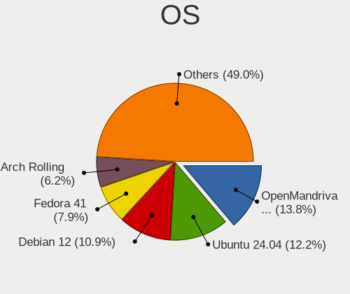
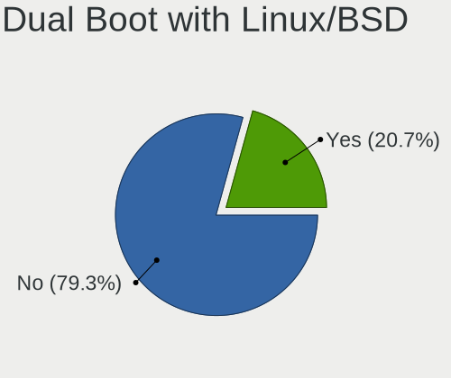
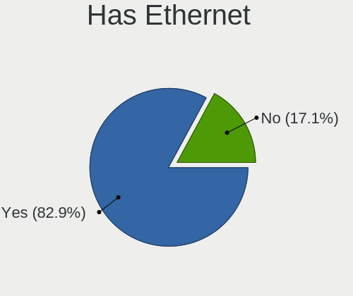
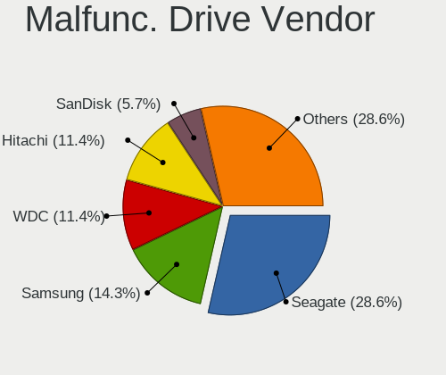
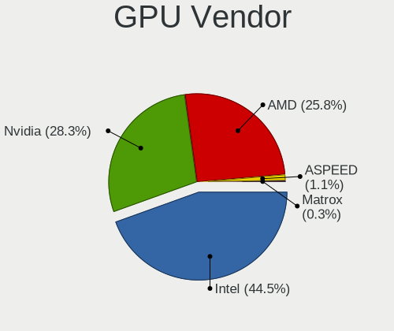
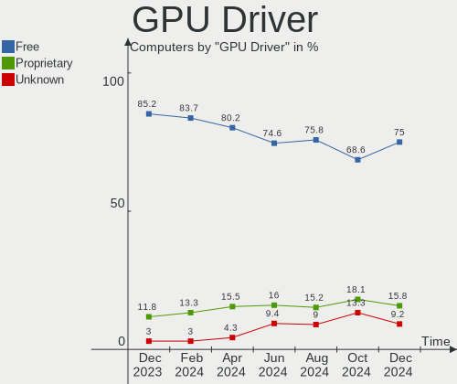
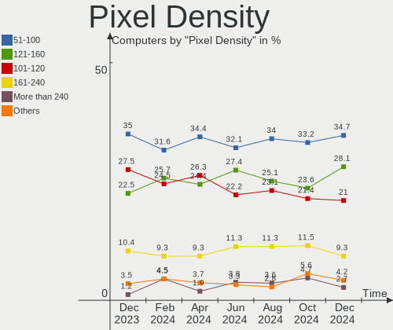
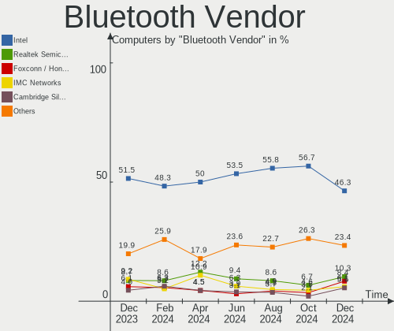
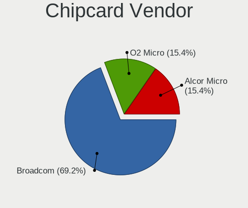
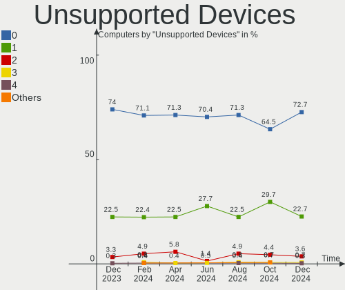

Linux in France - Hardware Trends
---------------------------------

A project to identify most popular hardware characteristics and track their change
over time based on data collected by Linux users at https://Linux-Hardware.org.

Anyone can contribute to this report by the [hw-probe](https://github.com/linuxhw/hw-probe) tool:

    sudo -E hw-probe -all -upload

This is a report for all computer types. See also reports for [desktops](/Location/France/Desktop/README.md) and [notebooks](/Location/France/Notebook/README.md).

Period: Jun, 2022.

Contents
--------

* [ System ](#system)
  - [ OS                       ](#os)
  - [ OS Family                ](#os-family)
  - [ Kernel                   ](#kernel)
  - [ Kernel Family            ](#kernel-family)
  - [ Kernel Major Ver.        ](#kernel-major-ver)
  - [ Arch                     ](#arch)
  - [ DE                       ](#de)
  - [ Display Server           ](#display-server)
  - [ Display Manager          ](#display-manager)
  - [ OS Lang                  ](#os-lang)
  - [ Boot Mode                ](#boot-mode)
  - [ Filesystem               ](#filesystem)
  - [ Part. scheme             ](#part-scheme)
  - [ Dual Boot with Linux/BSD ](#dual-boot-with-linuxbsd)
  - [ Dual Boot (Win)          ](#dual-boot-win)

* [ Board ](#board)
  - [ Vendor                   ](#vendor)
  - [ Model                    ](#model)
  - [ Model Family             ](#model-family)
  - [ MFG Year                 ](#mfg-year)
  - [ Form Factor              ](#form-factor)
  - [ Secure Boot              ](#secure-boot)
  - [ Coreboot                 ](#coreboot)
  - [ RAM Size                 ](#ram-size)
  - [ RAM Used                 ](#ram-used)
  - [ Total Drives             ](#total-drives)
  - [ Has CD-ROM               ](#has-cd-rom)
  - [ Has Ethernet             ](#has-ethernet)
  - [ Has WiFi                 ](#has-wifi)
  - [ Has Bluetooth            ](#has-bluetooth)

* [ Location ](#location)
  - [ Country                  ](#country)
  - [ City                     ](#city)

* [ Drives ](#drives)
  - [ Drive Vendor             ](#drive-vendor)
  - [ Drive Model              ](#drive-model)
  - [ HDD Vendor               ](#hdd-vendor)
  - [ SSD Vendor               ](#ssd-vendor)
  - [ Drive Kind               ](#drive-kind)
  - [ Drive Connector          ](#drive-connector)
  - [ Drive Size               ](#drive-size)
  - [ Space Total              ](#space-total)
  - [ Space Used               ](#space-used)
  - [ Malfunc. Drives          ](#malfunc-drives)
  - [ Malfunc. Drive Vendor    ](#malfunc-drive-vendor)
  - [ Malfunc. HDD Vendor      ](#malfunc-hdd-vendor)
  - [ Malfunc. Drive Kind      ](#malfunc-drive-kind)
  - [ Failed Drives            ](#failed-drives)
  - [ Failed Drive Vendor      ](#failed-drive-vendor)
  - [ Drive Status             ](#drive-status)

* [ Storage controller ](#storage-controller)
  - [ Storage Vendor           ](#storage-vendor)
  - [ Storage Model            ](#storage-model)
  - [ Storage Kind             ](#storage-kind)

* [ Processor ](#processor)
  - [ CPU Vendor               ](#cpu-vendor)
  - [ CPU Model                ](#cpu-model)
  - [ CPU Model Family         ](#cpu-model-family)
  - [ CPU Cores                ](#cpu-cores)
  - [ CPU Sockets              ](#cpu-sockets)
  - [ CPU Threads              ](#cpu-threads)
  - [ CPU Op-Modes             ](#cpu-op-modes)
  - [ CPU Microcode            ](#cpu-microcode)
  - [ CPU Microarch            ](#cpu-microarch)

* [ Graphics ](#graphics)
  - [ GPU Vendor               ](#gpu-vendor)
  - [ GPU Model                ](#gpu-model)
  - [ GPU Combo                ](#gpu-combo)
  - [ GPU Driver               ](#gpu-driver)
  - [ GPU Memory               ](#gpu-memory)

* [ Monitor ](#monitor)
  - [ Monitor Vendor           ](#monitor-vendor)
  - [ Monitor Model            ](#monitor-model)
  - [ Monitor Resolution       ](#monitor-resolution)
  - [ Monitor Diagonal         ](#monitor-diagonal)
  - [ Monitor Width            ](#monitor-width)
  - [ Aspect Ratio             ](#aspect-ratio)
  - [ Monitor Area             ](#monitor-area)
  - [ Pixel Density            ](#pixel-density)
  - [ Multiple Monitors        ](#multiple-monitors)

* [ Network ](#network)
  - [ Net Controller Vendor    ](#net-controller-vendor)
  - [ Net Controller Model     ](#net-controller-model)
  - [ Wireless Vendor          ](#wireless-vendor)
  - [ Wireless Model           ](#wireless-model)
  - [ Ethernet Vendor          ](#ethernet-vendor)
  - [ Ethernet Model           ](#ethernet-model)
  - [ Net Controller Kind      ](#net-controller-kind)
  - [ Used Controller          ](#used-controller)
  - [ NICs                     ](#nics)
  - [ IPv6                     ](#ipv6)

* [ Bluetooth ](#bluetooth)
  - [ Bluetooth Vendor         ](#bluetooth-vendor)
  - [ Bluetooth Model          ](#bluetooth-model)

* [ Sound ](#sound)
  - [ Sound Vendor             ](#sound-vendor)
  - [ Sound Model              ](#sound-model)

* [ Memory ](#memory)
  - [ Memory Vendor            ](#memory-vendor)
  - [ Memory Model             ](#memory-model)
  - [ Memory Kind              ](#memory-kind)
  - [ Memory Form Factor       ](#memory-form-factor)
  - [ Memory Size              ](#memory-size)
  - [ Memory Speed             ](#memory-speed)

* [ Printers & scanners ](#printers--scanners)
  - [ Printer Vendor           ](#printer-vendor)
  - [ Printer Model            ](#printer-model)
  - [ Scanner Vendor           ](#scanner-vendor)
  - [ Scanner Model            ](#scanner-model)

* [ Camera ](#camera)
  - [ Camera Vendor            ](#camera-vendor)
  - [ Camera Model             ](#camera-model)

* [ Security ](#security)
  - [ Fingerprint Vendor       ](#fingerprint-vendor)
  - [ Fingerprint Model        ](#fingerprint-model)
  - [ Chipcard Vendor          ](#chipcard-vendor)
  - [ Chipcard Model           ](#chipcard-model)

* [ Unsupported ](#unsupported)
  - [ Unsupported Devices      ](#unsupported-devices)
  - [ Unsupported Device Types ](#unsupported-device-types)

System
------

OS
--

Installed operating systems

| Name                         | Computers | Percent |
|------------------------------|-----------|---------|
| Ubuntu 22.04                 | 37        | 15.88%  |
| Ubuntu 20.04                 | 36        | 15.45%  |
| OpenMandriva 4.3             | 23        | 9.87%   |
| Linux Mint 20.3              | 18        | 7.73%   |
| Debian 11                    | 11        | 4.72%   |
| Fedora 36                    | 10        | 4.29%   |
| Arch                         | 10        | 4.29%   |
| Xubuntu 20.04                | 7         | 3%      |
| Pop!_OS 22.04                | 6         | 2.58%   |
| Lubuntu 22.04                | 5         | 2.15%   |
| Kubuntu 22.04                | 5         | 2.15%   |
| Arch Rolling                 | 5         | 2.15%   |
| Zorin 16                     | 4         | 1.72%   |
| Ubuntu MATE 20.04            | 4         | 1.72%   |
| Manjaro 21.3.0               | 4         | 1.72%   |
| Manjaro 21.2.6               | 4         | 1.72%   |
| Ubuntu 18.04                 | 3         | 1.29%   |
| OpenMandriva 4.2             | 3         | 1.29%   |
| Manjaro 21.3.1               | 3         | 1.29%   |
| Debian 10                    | 3         | 1.29%   |
| Xubuntu 22.04                | 2         | 0.86%   |
| Ubuntu 21.10                 | 2         | 0.86%   |
| Linux Mint 19.3              | 2         | 0.86%   |
| Kubuntu 11                   | 2         | 0.86%   |
| ArcoLinux Rolling            | 2         | 0.86%   |
| Xero Rolling                 | 1         | 0.43%   |
| Ubuntu Budgie 22.04          | 1         | 0.43%   |
| Ubuntu 22.10                 | 1         | 0.43%   |
| Ubuntu 21.12                 | 1         | 0.43%   |
| Ubuntu 16.04                 | 1         | 0.43%   |
| SteamOS 3.2 (steamdeck-main) | 1         | 0.43%   |
| SteamOS 3.2                  | 1         | 0.43%   |
| ROSA 12.2                    | 1         | 0.43%   |
| openSUSE Tumbleweed-XXXXXXXX | 1         | 0.43%   |
| Manjaro                      | 1         | 0.43%   |
| Lubuntu 21.10                | 1         | 0.43%   |
| Linux Mint 20                | 1         | 0.43%   |
| Linux Lite 5.8               | 1         | 0.43%   |
| Kubuntu 20.04                | 1         | 0.43%   |
| KDE neon 20.04               | 1         | 0.43%   |
| Kali 2022.2                  | 1         | 0.43%   |
| Gentoo 2.8                   | 1         | 0.43%   |
| Gentoo 2.6                   | 1         | 0.43%   |
| EndeavourOS Rolling          | 1         | 0.43%   |
| Elementary 6.1               | 1         | 0.43%   |
| Elementary 5.1.7             | 1         | 0.43%   |
| Debian Testing               | 1         | 0.43%   |

OS Family
---------

OS without a version

| Name          | Computers | Percent |
|---------------|-----------|---------|
| Ubuntu        | 81        | 34.76%  |
| OpenMandriva  | 26        | 11.16%  |
| Linux Mint    | 21        | 9.01%   |
| Debian        | 15        | 6.44%   |
| Arch          | 15        | 6.44%   |
| Manjaro       | 12        | 5.15%   |
| Fedora        | 10        | 4.29%   |
| Xubuntu       | 9         | 3.86%   |
| Kubuntu       | 8         | 3.43%   |
| Pop!_OS       | 6         | 2.58%   |
| Lubuntu       | 6         | 2.58%   |
| Zorin         | 4         | 1.72%   |
| Ubuntu MATE   | 4         | 1.72%   |
| SteamOS       | 2         | 0.86%   |
| Gentoo        | 2         | 0.86%   |
| Elementary    | 2         | 0.86%   |
| ArcoLinux     | 2         | 0.86%   |
| Xero          | 1         | 0.43%   |
| Ubuntu Budgie | 1         | 0.43%   |
| ROSA          | 1         | 0.43%   |
| openSUSE      | 1         | 0.43%   |
| Linux Lite    | 1         | 0.43%   |
| KDE neon      | 1         | 0.43%   |
| Kali          | 1         | 0.43%   |
| EndeavourOS   | 1         | 0.43%   |

Kernel
------

Version of the Linux kernel

| Version                                            | Computers | Percent |
|----------------------------------------------------|-----------|---------|
| 5.16.7-desktop-1omv4003                            | 23        | 9.87%   |
| 5.13.0-51-generic                                  | 16        | 6.87%   |
| 5.13.0-44-generic                                  | 13        | 5.58%   |
| 5.4.0-117-generic                                  | 11        | 4.72%   |
| 5.4.0-113-generic                                  | 11        | 4.72%   |
| 5.15.0-39-generic                                  | 11        | 4.72%   |
| 5.15.0-37-generic                                  | 10        | 4.29%   |
| 5.4.0-120-generic                                  | 9         | 3.86%   |
| 5.15.0-40-generic                                  | 8         | 3.43%   |
| 5.15.0-35-generic                                  | 8         | 3.43%   |
| 5.15.0-33-generic                                  | 7         | 3%      |
| 5.15.0-25-generic                                  | 6         | 2.58%   |
| 5.13.0-48-generic                                  | 6         | 2.58%   |
| 5.18.5-200.fc36.x86_64                             | 5         | 2.15%   |
| 5.4.0-121-generic                                  | 4         | 1.72%   |
| 5.18.3-arch1-1                                     | 4         | 1.72%   |
| 5.18.1-arch1-1                                     | 4         | 1.72%   |
| 5.17.5-76051705-generic                            | 4         | 1.72%   |
| 5.15.49-1-MANJARO                                  | 4         | 1.72%   |
| 5.18.2-arch1-1                                     | 3         | 1.29%   |
| 5.17.12-300.fc36.x86_64                            | 3         | 1.29%   |
| 5.10.0-15-amd64                                    | 3         | 1.29%   |
| 5.4.0-110-generic                                  | 2         | 0.86%   |
| 5.18.6-xanmod1                                     | 2         | 0.86%   |
| 5.18.5-arch1-1                                     | 2         | 0.86%   |
| 5.18.5-1-MANJARO                                   | 2         | 0.86%   |
| 5.17.15-76051715-generic                           | 2         | 0.86%   |
| 5.16.0-0.bpo.4-amd64                               | 2         | 0.86%   |
| 5.15.48-1-lts                                      | 2         | 0.86%   |
| 5.15.41-1-MANJARO                                  | 2         | 0.86%   |
| 5.10.14-desktop-1omv4002                           | 2         | 0.86%   |
| 5.10.0-14-amd64                                    | 2         | 0.86%   |
| 5.8.0-43-generic                                   | 1         | 0.43%   |
| 5.4.0-91-generic                                   | 1         | 0.43%   |
| 5.4.0-81-generic                                   | 1         | 0.43%   |
| 5.4.0-113-lowlatency                               | 1         | 0.43%   |
| 5.18.7-arch1-1                                     | 1         | 0.43%   |
| 5.18.6-arch1-1                                     | 1         | 0.43%   |
| 5.18.6-200.fc36.x86_64                             | 1         | 0.43%   |
| 5.18.3-261-tkg-bmq                                 | 1         | 0.43%   |
| 5.18.3-1-MANJARO                                   | 1         | 0.43%   |
| 5.18.2-1-default                                   | 1         | 0.43%   |
| 5.18.1-gentoo-r2                                   | 1         | 0.43%   |
| 5.18.0-1-MANJARO                                   | 1         | 0.43%   |
| 5.17.9-1-MANJARO                                   | 1         | 0.43%   |
| 5.17.6-arch1-1                                     | 1         | 0.43%   |
| 5.17.13-300.fc36.x86_64                            | 1         | 0.43%   |
| 5.17.0-1-amd64                                     | 1         | 0.43%   |
| 5.16.0-kali7-amd64                                 | 1         | 0.43%   |
| 5.15.48-1-MANJARO                                  | 1         | 0.43%   |
| 5.15.35-1-pve                                      | 1         | 0.43%   |
| 5.15.32-v8+                                        | 1         | 0.43%   |
| 5.15.32-gentoo-r1                                  | 1         | 0.43%   |
| 5.15.0-30-generic                                  | 1         | 0.43%   |
| 5.14.0-1038-oem                                    | 1         | 0.43%   |
| 5.13.0-valve15-1-neptune-02197-gf6ec7ad3762a       | 1         | 0.43%   |
| 5.13.0-valve10.1-2-neptune-dri-02144-g7fffaf925dfb | 1         | 0.43%   |
| 5.13.0-52-generic                                  | 1         | 0.43%   |
| 5.13.0-40-generic                                  | 1         | 0.43%   |
| 5.13.0-35-generic                                  | 1         | 0.43%   |

Kernel Family
-------------

Linux kernel without a distro release

| Version | Computers | Percent |
|---------|-----------|---------|
| 5.15.0  | 51        | 21.89%  |
| 5.4.0   | 40        | 17.17%  |
| 5.13.0  | 40        | 17.17%  |
| 5.16.7  | 23        | 9.87%   |
| 5.18.5  | 9         | 3.86%   |
| 5.10.0  | 9         | 3.86%   |
| 5.18.3  | 6         | 2.58%   |
| 5.18.1  | 5         | 2.15%   |
| 5.18.6  | 4         | 1.72%   |
| 5.18.2  | 4         | 1.72%   |
| 5.17.5  | 4         | 1.72%   |
| 5.15.49 | 4         | 1.72%   |
| 5.17.12 | 3         | 1.29%   |
| 5.16.0  | 3         | 1.29%   |
| 5.15.48 | 3         | 1.29%   |
| 5.17.15 | 2         | 0.86%   |
| 5.15.41 | 2         | 0.86%   |
| 5.15.32 | 2         | 0.86%   |
| 5.11.0  | 2         | 0.86%   |
| 5.10.14 | 2         | 0.86%   |
| 4.15.0  | 2         | 0.86%   |
| 5.8.0   | 1         | 0.43%   |
| 5.18.7  | 1         | 0.43%   |
| 5.18.0  | 1         | 0.43%   |
| 5.17.9  | 1         | 0.43%   |
| 5.17.6  | 1         | 0.43%   |
| 5.17.13 | 1         | 0.43%   |
| 5.17.0  | 1         | 0.43%   |
| 5.15.35 | 1         | 0.43%   |
| 5.14.0  | 1         | 0.43%   |
| 5.11.12 | 1         | 0.43%   |
| 5.10.74 | 1         | 0.43%   |
| 4.9.140 | 1         | 0.43%   |
| 4.4.0   | 1         | 0.43%   |

Kernel Major Ver.
-----------------

Linux kernel major version

| Version | Computers | Percent |
|---------|-----------|---------|
| 5.15    | 63        | 27.04%  |
| 5.4     | 40        | 17.17%  |
| 5.13    | 40        | 17.17%  |
| 5.18    | 30        | 12.88%  |
| 5.16    | 26        | 11.16%  |
| 5.17    | 13        | 5.58%   |
| 5.10    | 12        | 5.15%   |
| 5.11    | 3         | 1.29%   |
| 4.15    | 2         | 0.86%   |
| 5.8     | 1         | 0.43%   |
| 5.14    | 1         | 0.43%   |
| 4.9     | 1         | 0.43%   |
| 4.4     | 1         | 0.43%   |

Arch
----

OS architecture (x86_64, i586, etc.)

| Name    | Computers | Percent |
|---------|-----------|---------|
| x86_64  | 229       | 98.28%  |
| i686    | 2         | 0.86%   |
| aarch64 | 2         | 0.86%   |

DE
--

Desktop Environment

| Name          | Computers | Percent |
|---------------|-----------|---------|
| GNOME         | 106       | 45.49%  |
| KDE5          | 55        | 23.61%  |
| XFCE          | 18        | 7.73%   |
| X-Cinnamon    | 15        | 6.44%   |
| MATE          | 12        | 5.15%   |
| LXQt          | 7         | 3%      |
| Unknown       | 7         | 3%      |
| i3            | 3         | 1.29%   |
| sway          | 2         | 0.86%   |
| Pantheon      | 2         | 0.86%   |
| Budgie        | 2         | 0.86%   |
| Unity         | 1         | 0.43%   |
| LXDE          | 1         | 0.43%   |
| GNOME Classic | 1         | 0.43%   |
| Cinnamon      | 1         | 0.43%   |

Display Server
--------------

X11 or Wayland

| Name    | Computers | Percent |
|---------|-----------|---------|
| X11     | 178       | 76.39%  |
| Wayland | 45        | 19.31%  |
| Unknown | 6         | 2.58%   |
| Tty     | 4         | 1.72%   |

Display Manager
---------------

SDDM, LightDM, etc.

| Name    | Computers | Percent |
|---------|-----------|---------|
| SDDM    | 54        | 23.18%  |
| GDM3    | 52        | 22.32%  |
| LightDM | 44        | 18.88%  |
| GDM     | 40        | 17.17%  |
| Unknown | 40        | 17.17%  |
| WDM     | 1         | 0.43%   |
| NODM    | 1         | 0.43%   |
| Ly      | 1         | 0.43%   |

OS Lang
-------

Language

| Lang  | Computers | Percent |
|-------|-----------|---------|
| fr_FR | 175       | 75.11%  |
| en_US | 48        | 20.6%   |
| C     | 3         | 1.29%   |
| es_ES | 2         | 0.86%   |
| POSIX | 1         | 0.43%   |
| nl_NL | 1         | 0.43%   |
| fr_BE | 1         | 0.43%   |
| en_AG | 1         | 0.43%   |
| de_DE | 1         | 0.43%   |

Boot Mode
---------

EFI or BIOS

| Mode | Computers | Percent |
|------|-----------|---------|
| EFI  | 126       | 54.08%  |
| BIOS | 107       | 45.92%  |

Filesystem
----------

Type of filesystem

| Type    | Computers | Percent |
|---------|-----------|---------|
| Ext4    | 186       | 79.83%  |
| Overlay | 25        | 10.73%  |
| Btrfs   | 20        | 8.58%   |
| Xfs     | 1         | 0.43%   |
| F2fs    | 1         | 0.43%   |

Part. scheme
------------

Scheme of partitioning

| Type    | Computers | Percent |
|---------|-----------|---------|
| GPT     | 121       | 51.93%  |
| Unknown | 79        | 33.91%  |
| MBR     | 33        | 14.16%  |

Dual Boot with Linux/BSD
------------------------

Hosting more than one Linux/BSD

| Dual boot | Computers | Percent |
|-----------|-----------|---------|
| No        | 185       | 79.4%   |
| Yes       | 48        | 20.6%   |

Dual Boot (Win)
---------------

Hosting Linux and Windows

| Dual boot | Computers | Percent |
|-----------|-----------|---------|
| No        | 157       | 67.38%  |
| Yes       | 76        | 32.62%  |

Board
-----

Vendor
------

Motherboard manufacturer

| Name                    | Computers | Percent |
|-------------------------|-----------|---------|
| ASUSTek Computer        | 45        | 19.31%  |
| Dell                    | 32        | 13.73%  |
| MSI                     | 30        | 12.88%  |
| Lenovo                  | 30        | 12.88%  |
| Hewlett-Packard         | 30        | 12.88%  |
| Gigabyte Technology     | 10        | 4.29%   |
| Acer                    | 7         | 3%      |
| Toshiba                 | 5         | 2.15%   |
| Packard Bell            | 5         | 2.15%   |
| ASRock                  | 4         | 1.72%   |
| TUXEDO                  | 3         | 1.29%   |
| Notebook                | 3         | 1.29%   |
| Intel                   | 3         | 1.29%   |
| Unknown                 | 3         | 1.29%   |
| Sony                    | 2         | 0.86%   |
| Samsung Electronics     | 2         | 0.86%   |
| Fujitsu                 | 2         | 0.86%   |
| Valve                   | 1         | 0.43%   |
| Thomson                 | 1         | 0.43%   |
| Shuttle                 | 1         | 0.43%   |
| Raspberry Pi Foundation | 1         | 0.43%   |
| Pegatron                | 1         | 0.43%   |
| Nvidia                  | 1         | 0.43%   |
| Minix                   | 1         | 0.43%   |
| Microsoft               | 1         | 0.43%   |
| Medion                  | 1         | 0.43%   |
| Maxtang                 | 1         | 0.43%   |
| MACHINIST               | 1         | 0.43%   |
| Intel Client Systems    | 1         | 0.43%   |
| HUAWEI                  | 1         | 0.43%   |
| Fujitsu Siemens         | 1         | 0.43%   |
| BESSTAR Tech            | 1         | 0.43%   |
| AZW                     | 1         | 0.43%   |
| Apple                   | 1         | 0.43%   |

Model
-----

Motherboard model

| Name                                        | Computers | Percent |
|---------------------------------------------|-----------|---------|
| ASUS All Series                             | 3         | 1.29%   |
| Unknown                                     | 3         | 1.29%   |
| MSI MS-7B84                                 | 2         | 0.86%   |
| MSI MS-7740                                 | 2         | 0.86%   |
| MSI MS-7360                                 | 2         | 0.86%   |
| Lenovo ThinkPad X230 23259T0                | 2         | 0.86%   |
| Lenovo ThinkCentre M73 10AXS1UY00           | 2         | 0.86%   |
| Dell XPS 13 9360                            | 2         | 0.86%   |
| Dell OptiPlex 9020                          | 2         | 0.86%   |
| ASUS Zenbook UX3402ZA_UX3402ZA              | 2         | 0.86%   |
| Valve Jupiter                               | 1         | 0.43%   |
| TUXEDO Pulse 15 Gen1                        | 1         | 0.43%   |
| TUXEDO InfinityBook S 15 Gen6               | 1         | 0.43%   |
| TUXEDO Aura 15 Gen1                         | 1         | 0.43%   |
| Toshiba Satellite Pro L500                  | 1         | 0.43%   |
| Toshiba Satellite Click 10 LX5W-C-108       | 1         | 0.43%   |
| Toshiba Satellite C855-2CF                  | 1         | 0.43%   |
| Toshiba Satellite C850D-115                 | 1         | 0.43%   |
| Toshiba Satellite C660                      | 1         | 0.43%   |
| Thomson N17V3C8WH512                        | 1         | 0.43%   |
| Sony VGN-SZ71WN_C                           | 1         | 0.43%   |
| Sony SVS1312J3EW                            | 1         | 0.43%   |
| Shuttle DL10J                               | 1         | 0.43%   |
| Samsung RV411/RV511/E3511/S3511/RV711/E3411 | 1         | 0.43%   |
| Samsung 300E5EV/300E4EV/270E5EV/270E4EV     | 1         | 0.43%   |
| RPi Raspberry Pi 400 Rev 1.1                | 1         | 0.43%   |
| Pegatron FZ084AA-ABF a6645fr                | 1         | 0.43%   |
| Packard Bell IMEDIA D4001 FR                | 1         | 0.43%   |
| Packard Bell H17HV                          | 1         | 0.43%   |
| Packard Bell EasyNote TS44HR                | 1         | 0.43%   |
| Packard Bell EasyNote TK11BZ                | 1         | 0.43%   |
| Packard Bell EasyNote LS11HR                | 1         | 0.43%   |
| Nvidia Tegra                                | 1         | 0.43%   |
| Notebook P7xxDM3(-G)                        | 1         | 0.43%   |
| Notebook NS50MU                             | 1         | 0.43%   |
| Notebook NL40_50CU                          | 1         | 0.43%   |
| MSI Z390 Prestige P100 (MS-B929)            | 1         | 0.43%   |
| MSI VR630                                   | 1         | 0.43%   |
| MSI Stealth GS66 12UHS                      | 1         | 0.43%   |
| MSI Raider GE76 12UH                        | 1         | 0.43%   |
| MSI Raider GE66 12UGS                       | 1         | 0.43%   |
| MSI Pulse GL66 12UEK                        | 1         | 0.43%   |
| MSI MS-7C51                                 | 1         | 0.43%   |
| MSI MS-7C37                                 | 1         | 0.43%   |
| MSI MS-7C09                                 | 1         | 0.43%   |
| MSI MS-7C02                                 | 1         | 0.43%   |
| MSI MS-7A38                                 | 1         | 0.43%   |
| MSI MS-7A31                                 | 1         | 0.43%   |
| MSI MS-7994                                 | 1         | 0.43%   |
| MSI MS-7918                                 | 1         | 0.43%   |
| MSI MS-7917                                 | 1         | 0.43%   |
| MSI MS-7786                                 | 1         | 0.43%   |
| MSI MS-7758                                 | 1         | 0.43%   |
| MSI MS-7641                                 | 1         | 0.43%   |
| MSI GP76 Leopard 11UH                       | 1         | 0.43%   |
| MSI GL62 6QF                                | 1         | 0.43%   |
| MSI GE75 Raider 10SF                        | 1         | 0.43%   |
| MSI Creator Z16 A11UET                      | 1         | 0.43%   |
| MSI CR70 2M/CX70 2OC/CX70 2OD               | 1         | 0.43%   |
| MSI Bravo 15 A4DDR                          | 1         | 0.43%   |

Model Family
------------

Motherboard model prefix

| Name                  | Computers | Percent |
|-----------------------|-----------|---------|
| Lenovo ThinkPad       | 14        | 6.01%   |
| Dell OptiPlex         | 10        | 4.29%   |
| HP Pavilion           | 9         | 3.86%   |
| Dell Latitude         | 8         | 3.43%   |
| ASUS ROG              | 8         | 3.43%   |
| ASUS TUF              | 6         | 2.58%   |
| Acer Aspire           | 6         | 2.58%   |
| Toshiba Satellite     | 5         | 2.15%   |
| Lenovo ThinkCentre    | 5         | 2.15%   |
| HP ProBook            | 5         | 2.15%   |
| ASUS PRIME            | 5         | 2.15%   |
| Dell XPS              | 4         | 1.72%   |
| Packard Bell EasyNote | 3         | 1.29%   |
| Lenovo IdeaPad        | 3         | 1.29%   |
| HP EliteBook          | 3         | 1.29%   |
| Dell Precision        | 3         | 1.29%   |
| ASUS P8Z68-V          | 3         | 1.29%   |
| ASUS All              | 3         | 1.29%   |
| Unknown               | 3         | 1.29%   |
| MSI Raider            | 2         | 0.86%   |
| MSI MS-7B84           | 2         | 0.86%   |
| MSI MS-7740           | 2         | 0.86%   |
| MSI MS-7360           | 2         | 0.86%   |
| HP ENVY               | 2         | 0.86%   |
| Dell Inspiron         | 2         | 0.86%   |
| ASUS Zenbook          | 2         | 0.86%   |
| ASUS VivoBook         | 2         | 0.86%   |
| ASUS ASUS             | 2         | 0.86%   |
| Valve Jupiter         | 1         | 0.43%   |
| TUXEDO Pulse          | 1         | 0.43%   |
| TUXEDO InfinityBook   | 1         | 0.43%   |
| TUXEDO Aura           | 1         | 0.43%   |
| Thomson N17V3C8WH512  | 1         | 0.43%   |
| Sony VGN-SZ71WN       | 1         | 0.43%   |
| Sony SVS1312J3EW      | 1         | 0.43%   |
| Shuttle DL10J         | 1         | 0.43%   |
| Samsung RV411         | 1         | 0.43%   |
| Samsung 300E5EV       | 1         | 0.43%   |
| RPi Raspberry         | 1         | 0.43%   |
| Pegatron FZ084AA-ABF  | 1         | 0.43%   |
| Packard Bell IMEDIA   | 1         | 0.43%   |
| Packard Bell H17HV    | 1         | 0.43%   |
| Nvidia Tegra          | 1         | 0.43%   |
| Notebook P7xxDM3(-G)  | 1         | 0.43%   |
| Notebook NS50MU       | 1         | 0.43%   |
| Notebook NL40         | 1         | 0.43%   |
| MSI Z390              | 1         | 0.43%   |
| MSI VR630             | 1         | 0.43%   |
| MSI Stealth           | 1         | 0.43%   |
| MSI Pulse             | 1         | 0.43%   |
| MSI MS-7C51           | 1         | 0.43%   |
| MSI MS-7C37           | 1         | 0.43%   |
| MSI MS-7C09           | 1         | 0.43%   |
| MSI MS-7C02           | 1         | 0.43%   |
| MSI MS-7A38           | 1         | 0.43%   |
| MSI MS-7A31           | 1         | 0.43%   |
| MSI MS-7994           | 1         | 0.43%   |
| MSI MS-7918           | 1         | 0.43%   |
| MSI MS-7917           | 1         | 0.43%   |
| MSI MS-7786           | 1         | 0.43%   |

MFG Year
--------

Motherboard manufacture year

| Year    | Computers | Percent |
|---------|-----------|---------|
| 2020    | 26        | 11.16%  |
| 2021    | 25        | 10.73%  |
| 2019    | 24        | 10.3%   |
| 2018    | 19        | 8.15%   |
| 2013    | 17        | 7.3%    |
| 2017    | 16        | 6.87%   |
| 2012    | 16        | 6.87%   |
| 2014    | 14        | 6.01%   |
| 2011    | 14        | 6.01%   |
| 2016    | 13        | 5.58%   |
| 2022    | 9         | 3.86%   |
| 2015    | 9         | 3.86%   |
| 2010    | 8         | 3.43%   |
| 2009    | 8         | 3.43%   |
| 2008    | 7         | 3%      |
| 2007    | 5         | 2.15%   |
| Unknown | 2         | 0.86%   |
| 2004    | 1         | 0.43%   |

Form Factor
-----------

Physical design of the computer

| Name           | Computers | Percent |
|----------------|-----------|---------|
| Notebook       | 119       | 51.07%  |
| Desktop        | 98        | 42.06%  |
| Convertible    | 4         | 1.72%   |
| All in one     | 4         | 1.72%   |
| System on chip | 2         | 0.86%   |
| Tablet         | 2         | 0.86%   |
| Mini pc        | 2         | 0.86%   |
| Server         | 2         | 0.86%   |

Secure Boot
-----------

Enabled or disabled

| State    | Computers | Percent |
|----------|-----------|---------|
| Disabled | 216       | 92.7%   |
| Enabled  | 17        | 7.3%    |

Coreboot
--------

Have coreboot on board

| Used | Computers | Percent |
|------|-----------|---------|
| No   | 233       | 100%    |

RAM Size
--------

Total RAM memory

| Size in GB  | Computers | Percent |
|-------------|-----------|---------|
| 16.01-24.0  | 56        | 24.03%  |
| 4.01-8.0    | 50        | 21.46%  |
| 8.01-16.0   | 44        | 18.88%  |
| 3.01-4.0    | 41        | 17.6%   |
| 32.01-64.0  | 23        | 9.87%   |
| 1.01-2.0    | 7         | 3%      |
| 24.01-32.0  | 4         | 1.72%   |
| 64.01-256.0 | 4         | 1.72%   |
| 2.01-3.0    | 3         | 1.29%   |
| 0.51-1.0    | 1         | 0.43%   |

RAM Used
--------

Used RAM memory

| Used GB   | Computers | Percent |
|-----------|-----------|---------|
| 1.01-2.0  | 81        | 34.76%  |
| 2.01-3.0  | 47        | 20.17%  |
| 4.01-8.0  | 45        | 19.31%  |
| 3.01-4.0  | 28        | 12.02%  |
| 0.51-1.0  | 18        | 7.73%   |
| 8.01-16.0 | 11        | 4.72%   |
| 0.01-0.5  | 3         | 1.29%   |

Total Drives
------------

Number of drives on board

| Drives | Computers | Percent |
|--------|-----------|---------|
| 1      | 141       | 60.52%  |
| 2      | 59        | 25.32%  |
| 3      | 20        | 8.58%   |
| 4      | 4         | 1.72%   |
| 5      | 3         | 1.29%   |
| 7      | 2         | 0.86%   |
| 0      | 2         | 0.86%   |
| 8      | 1         | 0.43%   |
| 6      | 1         | 0.43%   |

Has CD-ROM
----------

Has CD-ROM on board

| Presented | Computers | Percent |
|-----------|-----------|---------|
| No        | 148       | 63.52%  |
| Yes       | 85        | 36.48%  |

Has Ethernet
------------

Has Ethernet on board

| Presented | Computers | Percent |
|-----------|-----------|---------|
| Yes       | 213       | 91.42%  |
| No        | 20        | 8.58%   |

Has WiFi
--------

Has WiFi module

| Presented | Computers | Percent |
|-----------|-----------|---------|
| Yes       | 169       | 72.53%  |
| No        | 64        | 27.47%  |

Has Bluetooth
-------------

Has Bluetooth module

| Presented | Computers | Percent |
|-----------|-----------|---------|
| Yes       | 137       | 58.8%   |
| No        | 96        | 41.2%   |

Location
--------

Country
-------

Geographic location (country)

| Country | Computers | Percent |
|---------|-----------|---------|
| France  | 233       | 100%    |

City
----

Geographic location (city)

| City                     | Computers | Percent |
|--------------------------|-----------|---------|
| Paris                    | 39        | 16.74%  |
| Nantes                   | 6         | 2.58%   |
| Toulouse                 | 4         | 1.72%   |
| Lille                    | 4         | 1.72%   |
| Marseille                | 3         | 1.29%   |
| Grenoble                 | 3         | 1.29%   |
| Brest                    | 3         | 1.29%   |
| Vannes                   | 2         | 0.86%   |
| Tourcoing                | 2         | 0.86%   |
| Saumur                   | 2         | 0.86%   |
| Roubaix                  | 2         | 0.86%   |
| Rennes                   | 2         | 0.86%   |
| Nîmes                   | 2         | 0.86%   |
| Montevrain               | 2         | 0.86%   |
| Mieuxce                  | 2         | 0.86%   |
| Mâcon                   | 2         | 0.86%   |
| Ivry-sur-Seine           | 2         | 0.86%   |
| Greoux-les-Bains         | 2         | 0.86%   |
| Frouzins                 | 2         | 0.86%   |
| Franconville             | 2         | 0.86%   |
| Évreux                  | 2         | 0.86%   |
| Combs-la-Ville           | 2         | 0.86%   |
| Cherbourg-Octeville      | 2         | 0.86%   |
| Chenove                  | 2         | 0.86%   |
| Aulnay-sous-Bois         | 2         | 0.86%   |
| Asnieres-sur-Seine       | 2         | 0.86%   |
| Angers                   | 2         | 0.86%   |
| Villeurbanne             | 1         | 0.43%   |
| Villeneuve-de-Riviere    | 1         | 0.43%   |
| Vigneux-sur-Seine        | 1         | 0.43%   |
| Vertou                   | 1         | 0.43%   |
| Vendome                  | 1         | 0.43%   |
| Valentigney              | 1         | 0.43%   |
| Valence                  | 1         | 0.43%   |
| Tours                    | 1         | 0.43%   |
| Touget                   | 1         | 0.43%   |
| Thenon                   | 1         | 0.43%   |
| Tassin-la-Demi-Lune      | 1         | 0.43%   |
| Surzur                   | 1         | 0.43%   |
| Strasbourg               | 1         | 0.43%   |
| St-Malo                  | 1         | 0.43%   |
| Sète                    | 1         | 0.43%   |
| Sene                     | 1         | 0.43%   |
| Sceaux                   | 1         | 0.43%   |
| Saujon                   | 1         | 0.43%   |
| Sartrouville             | 1         | 0.43%   |
| Sarcelles                | 1         | 0.43%   |
| Salon-de-Provence        | 1         | 0.43%   |
| Saint-Vaast-en-Cambresis | 1         | 0.43%   |
| Saint-Martin-d'Hères    | 1         | 0.43%   |
| Saint-Leu-la-Foret       | 1         | 0.43%   |
| Saint-Herblain           | 1         | 0.43%   |
| Saint-Germain-en-Laye    | 1         | 0.43%   |
| Saint-Gely-du-Fesc       | 1         | 0.43%   |
| Saint-Denis              | 1         | 0.43%   |
| Saint-Brice-sous-Foret   | 1         | 0.43%   |
| Saint-Benoit             | 1         | 0.43%   |
| Rouvray-Saint-Denis      | 1         | 0.43%   |
| Rouen                    | 1         | 0.43%   |
| Rosny-sous-Bois          | 1         | 0.43%   |

Drives
------

Drive Vendor
------------

Hard drive vendors

| Vendor                    | Computers | Drives | Percent |
|---------------------------|-----------|--------|---------|
| Samsung Electronics       | 58        | 66     | 17.26%  |
| WDC                       | 54        | 63     | 16.07%  |
| Seagate                   | 41        | 49     | 12.2%   |
| Crucial                   | 27        | 31     | 8.04%   |
| Toshiba                   | 23        | 24     | 6.85%   |
| SanDisk                   | 21        | 23     | 6.25%   |
| Kingston                  | 13        | 13     | 3.87%   |
| Unknown                   | 9         | 9      | 2.68%   |
| SK hynix                  | 9         | 9      | 2.68%   |
| Hitachi                   | 7         | 8      | 2.08%   |
| Micron Technology         | 5         | 5      | 1.49%   |
| Intel                     | 5         | 5      | 1.49%   |
| Phison                    | 4         | 4      | 1.19%   |
| Maxtor                    | 4         | 4      | 1.19%   |
| KIOXIA                    | 4         | 4      | 1.19%   |
| HGST                      | 4         | 5      | 1.19%   |
| Transcend                 | 3         | 3      | 0.89%   |
| OCZ                       | 3         | 3      | 0.89%   |
| Micron/Crucial Technology | 3         | 4      | 0.89%   |
| LITEON                    | 3         | 3      | 0.89%   |
| LDLC                      | 3         | 3      | 0.89%   |
| Gigabyte Technology       | 3         | 3      | 0.89%   |
| A-DATA Technology         | 3         | 3      | 0.89%   |
| Unknown                   | 3         | 3      | 0.89%   |
| XPG                       | 2         | 3      | 0.6%    |
| Union Memory              | 1         | 1      | 0.3%    |
| UMIS                      | 1         | 1      | 0.3%    |
| Silicon Motion            | 1         | 1      | 0.3%    |
| Sagemcom                  | 1         | 1      | 0.3%    |
| SABRENT                   | 1         | 1      | 0.3%    |
| PNY                       | 1         | 1      | 0.3%    |
| Magnetic Data             | 1         | 1      | 0.3%    |
| LITEONIT                  | 1         | 1      | 0.3%    |
| Lite-On                   | 1         | 1      | 0.3%    |
| Lenovo                    | 1         | 1      | 0.3%    |
| LaCie                     | 1         | 1      | 0.3%    |
| KingSpec                  | 1         | 1      | 0.3%    |
| JMicron Technology        | 1         | 1      | 0.3%    |
| Inateck                   | 1         | 1      | 0.3%    |
| H/W                       | 1         | 3      | 0.3%    |
| Fujitsu                   | 1         | 1      | 0.3%    |
| EMTEC                     | 1         | 1      | 0.3%    |
| Dogfish                   | 1         | 1      | 0.3%    |
| Dahua                     | 1         | 1      | 0.3%    |
| China                     | 1         | 1      | 0.3%    |
| BHT                       | 1         | 1      | 0.3%    |
| Apacer                    | 1         | 1      | 0.3%    |

Drive Model
-----------

Hard drive models

| Model                                  | Computers | Percent |
|----------------------------------------|-----------|---------|
| Crucial CT500MX500SSD1 500GB           | 6         | 1.63%   |
| Seagate ST500DM002-1BD142 500GB        | 5         | 1.36%   |
| Samsung SSD 870 QVO 1TB                | 4         | 1.09%   |
| Crucial CT240BX500SSD1 240GB           | 4         | 1.09%   |
| WDC WD10JPVX-22JC3T0 1TB               | 3         | 0.82%   |
| Seagate ST2000LM015-2E8174 2TB         | 3         | 0.82%   |
| Seagate ST2000DM008-2FR102 2TB         | 3         | 0.82%   |
| Seagate ST1000LM024 HN-M101MBB 1TB     | 3         | 0.82%   |
| SanDisk SSD PLUS 240GB                 | 3         | 0.82%   |
| SanDisk NVMe SSD Drive 1TB             | 3         | 0.82%   |
| Samsung SSD 970 EVO Plus 500GB         | 3         | 0.82%   |
| Samsung SSD 860 QVO 1TB                | 3         | 0.82%   |
| Samsung SSD 860 EVO 500GB              | 3         | 0.82%   |
| Samsung SM963 2.5" NVMe PCIe SSD 500GB | 3         | 0.82%   |
| Unknown                                | 3         | 0.82%   |
| WDC WD40EFRX-68N32N0 4TB               | 2         | 0.54%   |
| WDC WD10SPZX-24Z10T0 1TB               | 2         | 0.54%   |
| WDC WD10EZEX-08WN4A0 1TB               | 2         | 0.54%   |
| Unknown SD/MMC/MS PRO 128GB            | 2         | 0.54%   |
| Toshiba MQ04ABF100 1TB                 | 2         | 0.54%   |
| Toshiba MQ01ABD075 752GB               | 2         | 0.54%   |
| Toshiba MK6465GSX 640GB                | 2         | 0.54%   |
| Toshiba HDWD110 1TB                    | 2         | 0.54%   |
| SK hynix PC801 NVMe 1TB                | 2         | 0.54%   |
| SK hynix NVMe SSD Drive 512GB          | 2         | 0.54%   |
| Seagate ST500LT012-1DG142 500GB        | 2         | 0.54%   |
| Seagate ST2000DM001-1ER164 2TB         | 2         | 0.54%   |
| Seagate ST1000LM049-2GH172 1TB         | 2         | 0.54%   |
| Seagate ST1000DM003-1ER162 1TB         | 2         | 0.54%   |
| Seagate Expansion 1TB                  | 2         | 0.54%   |
| Samsung SSD 980 500GB                  | 2         | 0.54%   |
| Samsung SSD 960 EVO 250GB              | 2         | 0.54%   |
| Samsung SSD 860 EVO M.2 250GB          | 2         | 0.54%   |
| Samsung SSD 860 EVO 1TB                | 2         | 0.54%   |
| Samsung SSD 850 EVO 250GB              | 2         | 0.54%   |
| Samsung NVMe SSD Drive 512GB           | 2         | 0.54%   |
| Samsung NVMe SSD Drive 256GB           | 2         | 0.54%   |
| Samsung NVMe SSD Drive 250GB           | 2         | 0.54%   |
| Samsung MZVL2512HCJQ-00B00 512GB       | 2         | 0.54%   |
| Phison NVMe SSD Drive 480GB            | 2         | 0.54%   |
| OCZ VERTEX4 128GB SSD                  | 2         | 0.54%   |
| Micron/Crucial NVMe SSD Drive 1TB      | 2         | 0.54%   |
| Micron 3400_MTFDKBA1T0TFH 1TB          | 2         | 0.54%   |
| LDLC SSD 120GB                         | 2         | 0.54%   |
| KIOXIA KBG40ZNS256G NVMe 256GB         | 2         | 0.54%   |
| Kingston SV300S37A 60G SSD             | 2         | 0.54%   |
| Intel SSDPEKNW512G8 512GB              | 2         | 0.54%   |
| Hitachi HTS545050A7E380 500GB          | 2         | 0.54%   |
| Crucial CT480BX500SSD1 480GB           | 2         | 0.54%   |
| Crucial CT275MX300SSD1 275GB           | 2         | 0.54%   |
| Crucial CT240M500SSD1 240GB            | 2         | 0.54%   |
| Crucial CT2000MX500SSD1 2TB            | 2         | 0.54%   |
| XPG NVMe SSD Drive 512GB               | 1         | 0.27%   |
| XPG NVMe SSD Drive 256GB               | 1         | 0.27%   |
| XPG NVMe SSD Drive 1024GB              | 1         | 0.27%   |
| WDC WDS250G2B0A 250GB SSD              | 1         | 0.27%   |
| WDC WDS240G2G0A-00JH30 240GB SSD       | 1         | 0.27%   |
| WDC WDS100T2B0B-00YS70 1TB SSD         | 1         | 0.27%   |
| WDC WDS100T1X0E-00AFY0 1TB             | 1         | 0.27%   |
| WDC WD7500BPVT-80HXZT3 752GB           | 1         | 0.27%   |

HDD Vendor
----------

Hard disk drive vendors

| Vendor              | Computers | Drives | Percent |
|---------------------|-----------|--------|---------|
| WDC                 | 45        | 51     | 35.16%  |
| Seagate             | 40        | 48     | 31.25%  |
| Toshiba             | 17        | 17     | 13.28%  |
| Hitachi             | 7         | 8      | 5.47%   |
| Samsung Electronics | 5         | 5      | 3.91%   |
| Maxtor              | 4         | 4      | 3.13%   |
| HGST                | 4         | 5      | 3.13%   |
| Unknown             | 2         | 2      | 1.56%   |
| Magnetic Data       | 1         | 1      | 0.78%   |
| JMicron Technology  | 1         | 1      | 0.78%   |
| Inateck             | 1         | 1      | 0.78%   |
| Fujitsu             | 1         | 1      | 0.78%   |

SSD Vendor
----------

Solid state drive vendors

| Vendor              | Computers | Drives | Percent |
|---------------------|-----------|--------|---------|
| Samsung Electronics | 30        | 30     | 27.03%  |
| Crucial             | 25        | 28     | 22.52%  |
| SanDisk             | 13        | 13     | 11.71%  |
| Kingston            | 9         | 9      | 8.11%   |
| WDC                 | 3         | 3      | 2.7%    |
| Transcend           | 3         | 3      | 2.7%    |
| Toshiba             | 3         | 3      | 2.7%    |
| OCZ                 | 3         | 3      | 2.7%    |
| LDLC                | 3         | 3      | 2.7%    |
| Unknown             | 3         | 3      | 2.7%    |
| A-DATA Technology   | 2         | 2      | 1.8%    |
| Union Memory        | 1         | 1      | 0.9%    |
| PNY                 | 1         | 1      | 0.9%    |
| Micron Technology   | 1         | 1      | 0.9%    |
| LITEONIT            | 1         | 1      | 0.9%    |
| LITEON              | 1         | 1      | 0.9%    |
| Lenovo              | 1         | 1      | 0.9%    |
| KingSpec            | 1         | 1      | 0.9%    |
| Gigabyte Technology | 1         | 1      | 0.9%    |
| EMTEC               | 1         | 1      | 0.9%    |
| Dogfish             | 1         | 1      | 0.9%    |
| Dahua               | 1         | 1      | 0.9%    |
| China               | 1         | 1      | 0.9%    |
| BHT                 | 1         | 1      | 0.9%    |
| Apacer              | 1         | 1      | 0.9%    |

Drive Kind
----------

HDD or SSD

| Kind    | Computers | Drives | Percent |
|---------|-----------|--------|---------|
| HDD     | 107       | 144    | 36.03%  |
| SSD     | 91        | 114    | 30.64%  |
| NVMe    | 87        | 101    | 29.29%  |
| MMC     | 8         | 9      | 2.69%   |
| Unknown | 4         | 6      | 1.35%   |

Drive Connector
---------------

SATA, SAS, NVMe, etc.

| Type | Computers | Drives | Percent |
|------|-----------|--------|---------|
| SATA | 160       | 252    | 59.93%  |
| NVMe | 86        | 100    | 32.21%  |
| SAS  | 13        | 13     | 4.87%   |
| MMC  | 8         | 9      | 3%      |

Drive Size
----------

Size of hard drive

| Size in TB | Computers | Drives | Percent |
|------------|-----------|--------|---------|
| 0.01-0.5   | 112       | 140    | 54.11%  |
| 0.51-1.0   | 66        | 83     | 31.88%  |
| 1.01-2.0   | 21        | 25     | 10.14%  |
| 3.01-4.0   | 6         | 8      | 2.9%    |
| 2.01-3.0   | 1         | 1      | 0.48%   |
| 4.01-10.0  | 1         | 1      | 0.48%   |

Space Total
-----------

Amount of disk space available on the file system

| Size in GB     | Computers | Percent |
|----------------|-----------|---------|
| 251-500        | 51        | 21.89%  |
| 101-250        | 50        | 21.46%  |
| 501-1000       | 44        | 18.88%  |
| 1-20           | 19        | 8.15%   |
| 1001-2000      | 15        | 6.44%   |
| More than 3000 | 12        | 5.15%   |
| 51-100         | 12        | 5.15%   |
| 21-50          | 11        | 4.72%   |
| 2001-3000      | 11        | 4.72%   |
| Unknown        | 8         | 3.43%   |

Space Used
----------

Amount of used disk space

| Used GB        | Computers | Percent |
|----------------|-----------|---------|
| 1-20           | 77        | 33.05%  |
| 21-50          | 35        | 15.02%  |
| 101-250        | 33        | 14.16%  |
| 251-500        | 23        | 9.87%   |
| 51-100         | 23        | 9.87%   |
| 501-1000       | 17        | 7.3%    |
| 1001-2000      | 12        | 5.15%   |
| Unknown        | 8         | 3.43%   |
| More than 3000 | 4         | 1.72%   |
| 2001-3000      | 1         | 0.43%   |

Malfunc. Drives
---------------

Drive models with a malfunction

| Model                                            | Computers | Drives | Percent |
|--------------------------------------------------|-----------|--------|---------|
| Toshiba MK6465GSX 640GB                          | 2         | 2      | 7.41%   |
| OCZ VERTEX4 128GB SSD                            | 2         | 2      | 7.41%   |
| WDC WD10SPZX-24Z10T0 1TB                         | 1         | 1      | 3.7%    |
| WDC WD10EZEX-00RKKA0 1TB                         | 1         | 1      | 3.7%    |
| Toshiba MQ01ABD050 500GB                         | 1         | 1      | 3.7%    |
| Toshiba MK5059GSXP 500GB                         | 1         | 1      | 3.7%    |
| Seagate ST500DM002-1BD142 500GB                  | 1         | 1      | 3.7%    |
| Seagate ST2000DM001-1ER164 2TB                   | 1         | 1      | 3.7%    |
| Seagate ST1000LM024 HN-M101MBB 1TB               | 1         | 1      | 3.7%    |
| Seagate ST1000LM014-SSHD-8GB                     | 1         | 1      | 3.7%    |
| Seagate ST1000DM003-9YN162 1TB                   | 1         | 1      | 3.7%    |
| Samsung Electronics SSD 870 EVO 1TB              | 1         | 1      | 3.7%    |
| Samsung Electronics MZ7TE128HMGR-000H1 128GB SSD | 1         | 1      | 3.7%    |
| Maxtor STM3320613AS 320GB                        | 1         | 1      | 3.7%    |
| Maxtor STM3160211AS 160GB                        | 1         | 1      | 3.7%    |
| LITEONIT LCT-128M3S 128GB SSD                    | 1         | 1      | 3.7%    |
| LDLC SSD 120GB                                   | 1         | 1      | 3.7%    |
| Kingston RBU-SNS8350DES3128GP 128GB SSD          | 1         | 1      | 3.7%    |
| Hitachi HTS727575A9E364 752GB                    | 1         | 1      | 3.7%    |
| Hitachi HTS547564A9E384 640GB                    | 1         | 1      | 3.7%    |
| Hitachi HTS545050A7E380 500GB                    | 1         | 1      | 3.7%    |
| Crucial CT275MX300SSD1 275GB                     | 1         | 1      | 3.7%    |
| China SSD 180GB                                  | 1         | 1      | 3.7%    |
| Apacer 16GB SATA Flash Drive SSD                 | 1         | 1      | 3.7%    |
| A-DATA Technology SX8200PNP 1TB                  | 1         | 1      | 3.7%    |

Malfunc. Drive Vendor
---------------------

Vendors of faulty drives

| Vendor              | Computers | Drives | Percent |
|---------------------|-----------|--------|---------|
| Seagate             | 5         | 5      | 18.52%  |
| Toshiba             | 4         | 4      | 14.81%  |
| Hitachi             | 3         | 3      | 11.11%  |
| WDC                 | 2         | 2      | 7.41%   |
| Samsung Electronics | 2         | 2      | 7.41%   |
| OCZ                 | 2         | 2      | 7.41%   |
| Maxtor              | 2         | 2      | 7.41%   |
| LITEONIT            | 1         | 1      | 3.7%    |
| LDLC                | 1         | 1      | 3.7%    |
| Kingston            | 1         | 1      | 3.7%    |
| Crucial             | 1         | 1      | 3.7%    |
| China               | 1         | 1      | 3.7%    |
| Apacer              | 1         | 1      | 3.7%    |
| A-DATA Technology   | 1         | 1      | 3.7%    |

Malfunc. HDD Vendor
-------------------

Vendors of faulty HDD drives

| Vendor  | Computers | Drives | Percent |
|---------|-----------|--------|---------|
| Seagate | 5         | 5      | 31.25%  |
| Toshiba | 4         | 4      | 25%     |
| Hitachi | 3         | 3      | 18.75%  |
| WDC     | 2         | 2      | 12.5%   |
| Maxtor  | 2         | 2      | 12.5%   |

Malfunc. Drive Kind
-------------------

Kinds of faulty drives

| Kind | Computers | Drives | Percent |
|------|-----------|--------|---------|
| HDD  | 15        | 16     | 57.69%  |
| SSD  | 10        | 10     | 38.46%  |
| NVMe | 1         | 1      | 3.85%   |

Failed Drives
-------------

Failed drive models

Zero info for selected period =(

Failed Drive Vendor
-------------------

Failed drive vendors

Zero info for selected period =(

Drive Status
------------

Number of failed and malfunc. drives

| Status   | Computers | Drives | Percent |
|----------|-----------|--------|---------|
| Works    | 128       | 179    | 51.2%   |
| Detected | 98        | 168    | 39.2%   |
| Malfunc  | 24        | 27     | 9.6%    |

Storage controller
------------------

Storage Vendor
--------------

Storage controller vendors

| Vendor                           | Computers | Percent |
|----------------------------------|-----------|---------|
| Intel                            | 149       | 49.67%  |
| AMD                              | 46        | 15.33%  |
| Samsung Electronics              | 27        | 9%      |
| SanDisk                          | 15        | 5%      |
| SK hynix                         | 9         | 3%      |
| Phison Electronics               | 6         | 2%      |
| Marvell Technology Group         | 5         | 1.67%   |
| ASMedia Technology               | 5         | 1.67%   |
| Toshiba America Info Systems     | 4         | 1.33%   |
| Micron/Crucial Technology        | 4         | 1.33%   |
| Micron Technology                | 4         | 1.33%   |
| KIOXIA                           | 4         | 1.33%   |
| Kingston Technology Company      | 4         | 1.33%   |
| Nvidia                           | 3         | 1%      |
| Lite-On Technology               | 3         | 1%      |
| ADATA Technology                 | 3         | 1%      |
| JMicron Technology               | 2         | 0.67%   |
| Union Memory (Shenzhen)          | 1         | 0.33%   |
| Silicon Motion                   | 1         | 0.33%   |
| Silicon Integrated Systems [SiS] | 1         | 0.33%   |
| MAXIO Technology (Hangzhou)      | 1         | 0.33%   |
| LSI Logic / Symbios Logic        | 1         | 0.33%   |
| Hewlett-Packard                  | 1         | 0.33%   |
| Dell                             | 1         | 0.33%   |

Storage Model
-------------

Storage controller models

| Model                                                                                   | Computers | Percent |
|-----------------------------------------------------------------------------------------|-----------|---------|
| AMD FCH SATA Controller [AHCI mode]                                                     | 34        | 10.18%  |
| Intel 8 Series/C220 Series Chipset Family 6-port SATA Controller 1 [AHCI mode]          | 18        | 5.39%   |
| Intel 7 Series Chipset Family 6-port SATA Controller [AHCI mode]                        | 11        | 3.29%   |
| AMD 400 Series Chipset SATA Controller                                                  | 10        | 2.99%   |
| Samsung NVMe SSD Controller SM981/PM981/PM983                                           | 9         | 2.69%   |
| Intel Sunrise Point-LP SATA Controller [AHCI mode]                                      | 9         | 2.69%   |
| Samsung NVMe SSD Controller 980                                                         | 8         | 2.4%    |
| Intel Volume Management Device NVMe RAID Controller                                     | 8         | 2.4%    |
| Samsung NVMe SSD Controller SM961/PM961/SM963                                           | 7         | 2.1%    |
| Intel Q170/Q150/B150/H170/H110/Z170/CM236 Chipset SATA Controller [AHCI Mode]           | 7         | 2.1%    |
| Intel Cannon Lake PCH SATA AHCI Controller                                              | 7         | 2.1%    |
| Intel SATA Controller [RAID mode]                                                       | 6         | 1.8%    |
| Intel 6 Series/C200 Series Chipset Family 6 port Desktop SATA AHCI Controller           | 6         | 1.8%    |
| SanDisk WD Black SN750 / PC SN730 NVMe SSD                                              | 5         | 1.5%    |
| Intel 82801 Mobile SATA Controller [RAID mode]                                          | 5         | 1.5%    |
| SanDisk Non-Volatile memory controller                                                  | 4         | 1.2%    |
| Samsung NVMe SSD Controller PM9A1/PM9A3/980PRO                                          | 4         | 1.2%    |
| Micron Non-Volatile memory controller                                                   | 4         | 1.2%    |
| KIOXIA Non-Volatile memory controller                                                   | 4         | 1.2%    |
| Intel 9 Series Chipset Family SATA Controller [AHCI Mode]                               | 4         | 1.2%    |
| AMD SB7x0/SB8x0/SB9x0 SATA Controller [AHCI mode]                                       | 4         | 1.2%    |
| SK hynix Gold P31 SSD                                                                   | 3         | 0.9%    |
| SK hynix BC501 NVMe Solid State Drive                                                   | 3         | 0.9%    |
| SanDisk WD Blue SN550 NVMe SSD                                                          | 3         | 0.9%    |
| Phison E16 PCIe4 NVMe Controller                                                        | 3         | 0.9%    |
| Phison E12 NVMe Controller                                                              | 3         | 0.9%    |
| Intel Wildcat Point-LP SATA Controller [AHCI Mode]                                      | 3         | 0.9%    |
| Intel Non-Volatile memory controller                                                    | 3         | 0.9%    |
| Intel Celeron/Pentium Silver Processor SATA Controller                                  | 3         | 0.9%    |
| Intel Celeron N3350/Pentium N4200/Atom E3900 Series SATA AHCI Controller                | 3         | 0.9%    |
| Intel Cannon Point-LP SATA Controller [AHCI Mode]                                       | 3         | 0.9%    |
| Intel 82801IBM/IEM (ICH9M/ICH9M-E) 4 port SATA Controller [AHCI mode]                   | 3         | 0.9%    |
| Intel 8 Series SATA Controller 1 [AHCI mode]                                            | 3         | 0.9%    |
| Intel 7 Series/C210 Series Chipset Family 6-port SATA Controller [AHCI mode]            | 3         | 0.9%    |
| Intel 6 Series/C200 Series Chipset Family 6 port Mobile SATA AHCI Controller            | 3         | 0.9%    |
| Intel 5 Series/3400 Series Chipset 4 port SATA IDE Controller                           | 3         | 0.9%    |
| Intel 5 Series/3400 Series Chipset 2 port SATA IDE Controller                           | 3         | 0.9%    |
| Intel 400 Series Chipset Family SATA AHCI Controller                                    | 3         | 0.9%    |
| Intel 200 Series PCH SATA controller [AHCI mode]                                        | 3         | 0.9%    |
| ASMedia ASM1062 Serial ATA Controller                                                   | 3         | 0.9%    |
| AMD 500 Series Chipset SATA Controller                                                  | 3         | 0.9%    |
| ADATA XPG SX8200 Pro PCIe Gen3x4 M.2 2280 Solid State Drive                             | 3         | 0.9%    |
| SK hynix Non-Volatile memory controller                                                 | 2         | 0.6%    |
| SanDisk WD PC SN810 / Black SN850 NVMe SSD                                              | 2         | 0.6%    |
| Micron/Crucial P2 NVMe PCIe SSD                                                         | 2         | 0.6%    |
| Marvell Group 88SE6111/6121 SATA II / PATA Controller                                   | 2         | 0.6%    |
| JMicron JMB362 SATA Controller                                                          | 2         | 0.6%    |
| Intel SSD 660P Series                                                                   | 2         | 0.6%    |
| Intel Comet Lake SATA AHCI Controller                                                   | 2         | 0.6%    |
| Intel Cannon Lake Mobile PCH SATA AHCI Controller                                       | 2         | 0.6%    |
| Intel 82801JI (ICH10 Family) 2 port SATA IDE Controller #2                              | 2         | 0.6%    |
| Intel 82801JD/DO (ICH10 Family) SATA AHCI Controller                                    | 2         | 0.6%    |
| Intel 82801IB (ICH9) 2 port SATA Controller [IDE mode]                                  | 2         | 0.6%    |
| Intel 82801I (ICH9 Family) 2 port SATA Controller [IDE mode]                            | 2         | 0.6%    |
| Intel 82801HM/HEM (ICH8M/ICH8M-E) SATA Controller [IDE mode]                            | 2         | 0.6%    |
| Intel 82801HM/HEM (ICH8M/ICH8M-E) IDE Controller                                        | 2         | 0.6%    |
| Intel 6 Series/C200 Series Chipset Family Desktop SATA Controller (IDE mode, ports 4-5) | 2         | 0.6%    |
| Intel 6 Series/C200 Series Chipset Family Desktop SATA Controller (IDE mode, ports 0-3) | 2         | 0.6%    |
| Intel 500 Series Chipset Family SATA AHCI Controller                                    | 2         | 0.6%    |
| Intel 5 Series/3400 Series Chipset 6 port SATA AHCI Controller                          | 2         | 0.6%    |

Storage Kind
------------

Kind of storage controller (IDE, SATA, NVMe, SAS, ...)

| Kind | Computers | Percent |
|------|-----------|---------|
| SATA | 160       | 54.98%  |
| NVMe | 86        | 29.55%  |
| IDE  | 23        | 7.9%    |
| RAID | 21        | 7.22%   |
| SCSI | 1         | 0.34%   |

Processor
---------

CPU Vendor
----------

Processor vendors

| Vendor | Computers | Percent |
|--------|-----------|---------|
| Intel  | 172       | 73.82%  |
| AMD    | 59        | 25.32%  |
| ARM    | 2         | 0.86%   |

CPU Model
---------

Processor models

| Model                                         | Computers | Percent |
|-----------------------------------------------|-----------|---------|
| Intel Core i5-4460 CPU @ 3.20GHz              | 4         | 1.72%   |
| Intel 12th Gen Core i7-12700H                 | 4         | 1.72%   |
| Intel 11th Gen Core i7-1165G7 @ 2.80GHz       | 4         | 1.72%   |
| Intel 11th Gen Core i7-11800H @ 2.30GHz       | 3         | 1.29%   |
| AMD Ryzen 7 3700U with Radeon Vega Mobile Gfx | 3         | 1.29%   |
| AMD Ryzen 5 3600 6-Core Processor             | 3         | 1.29%   |
| AMD Ryzen 5 3550H with Radeon Vega Mobile Gfx | 3         | 1.29%   |
| Intel Core i7-7700K CPU @ 4.20GHz             | 2         | 0.86%   |
| Intel Core i7-6600U CPU @ 2.60GHz             | 2         | 0.86%   |
| Intel Core i7-10750H CPU @ 2.60GHz            | 2         | 0.86%   |
| Intel Core i5-9400F CPU @ 2.90GHz             | 2         | 0.86%   |
| Intel Core i5-8265U CPU @ 1.60GHz             | 2         | 0.86%   |
| Intel Core i5-8250U CPU @ 1.60GHz             | 2         | 0.86%   |
| Intel Core i5-7200U CPU @ 2.50GHz             | 2         | 0.86%   |
| Intel Core i5-6500 CPU @ 3.20GHz              | 2         | 0.86%   |
| Intel Core i5-4570T CPU @ 2.90GHz             | 2         | 0.86%   |
| Intel Core i5-4570 CPU @ 3.20GHz              | 2         | 0.86%   |
| Intel Core i5-4210U CPU @ 1.70GHz             | 2         | 0.86%   |
| Intel Core i5-3320M CPU @ 2.60GHz             | 2         | 0.86%   |
| Intel Core i5-2410M CPU @ 2.30GHz             | 2         | 0.86%   |
| Intel Core i5-1035G1 CPU @ 1.00GHz            | 2         | 0.86%   |
| Intel Core i3-8100 CPU @ 3.60GHz              | 2         | 0.86%   |
| Intel Core i3-7100U CPU @ 2.40GHz             | 2         | 0.86%   |
| Intel Core i3 CPU M 380 @ 2.53GHz             | 2         | 0.86%   |
| Intel Core 2 Quad CPU Q6600 @ 2.40GHz         | 2         | 0.86%   |
| Intel Celeron J4125 CPU @ 2.00GHz             | 2         | 0.86%   |
| Intel Celeron CPU N3350 @ 1.10GHz             | 2         | 0.86%   |
| Intel Celeron CPU N3060 @ 1.60GHz             | 2         | 0.86%   |
| Intel Celeron CPU G530 @ 2.40GHz              | 2         | 0.86%   |
| Intel Atom x5-Z8350 CPU @ 1.44GHz             | 2         | 0.86%   |
| Intel 11th Gen Core i5-1135G7 @ 2.40GHz       | 2         | 0.86%   |
| ARM Processor                                 | 2         | 0.86%   |
| AMD Ryzen 7 5800X 8-Core Processor            | 2         | 0.86%   |
| AMD Ryzen 5 1600 Six-Core Processor           | 2         | 0.86%   |
| Intel Xeon W-2223 CPU @ 3.60GHz               | 1         | 0.43%   |
| Intel Xeon E-2388G CPU @ 3.20GHz              | 1         | 0.43%   |
| Intel Xeon CPU W3570 @ 3.20GHz                | 1         | 0.43%   |
| Intel Xeon CPU E5606 @ 2.13GHz                | 1         | 0.43%   |
| Intel Xeon CPU E5-2620 v3 @ 2.40GHz           | 1         | 0.43%   |
| Intel Xeon CPU E3-1225 V2 @ 3.20GHz           | 1         | 0.43%   |
| Intel Xeon CPU 5110 @ 1.60GHz                 | 1         | 0.43%   |
| Intel Pentium Gold G5400 CPU @ 3.70GHz        | 1         | 0.43%   |
| Intel Pentium Dual CPU E2220 @ 2.40GHz        | 1         | 0.43%   |
| Intel Pentium CPU P6200 @ 2.13GHz             | 1         | 0.43%   |
| Intel Pentium CPU G3420 @ 3.20GHz             | 1         | 0.43%   |
| Intel Pentium CPU G3250 @ 3.20GHz             | 1         | 0.43%   |
| Intel Pentium CPU B960 @ 2.20GHz              | 1         | 0.43%   |
| Intel Pentium CPU 987 @ 1.50GHz               | 1         | 0.43%   |
| Intel Pentium CPU 967 @ 1.30GHz               | 1         | 0.43%   |
| Intel Pentium 4 CPU 3.00GHz                   | 1         | 0.43%   |
| Intel Core i7-9750H CPU @ 2.60GHz             | 1         | 0.43%   |
| Intel Core i7-9700KF CPU @ 3.60GHz            | 1         | 0.43%   |
| Intel Core i7-8750H CPU @ 2.20GHz             | 1         | 0.43%   |
| Intel Core i7-8700K CPU @ 3.70GHz             | 1         | 0.43%   |
| Intel Core i7-8565U CPU @ 1.80GHz             | 1         | 0.43%   |
| Intel Core i7-8550U CPU @ 1.80GHz             | 1         | 0.43%   |
| Intel Core i7-7700T CPU @ 2.90GHz             | 1         | 0.43%   |
| Intel Core i7-7600U CPU @ 2.80GHz             | 1         | 0.43%   |
| Intel Core i7-7560U CPU @ 2.40GHz             | 1         | 0.43%   |
| Intel Core i7-6700 CPU @ 3.40GHz              | 1         | 0.43%   |

CPU Model Family
----------------

Processor model prefix

| Model                                | Computers | Percent |
|--------------------------------------|-----------|---------|
| Intel Core i5                        | 58        | 24.89%  |
| Intel Core i7                        | 32        | 13.73%  |
| Other                                | 23        | 9.87%   |
| Intel Celeron                        | 15        | 6.44%   |
| AMD Ryzen 5                          | 15        | 6.44%   |
| Intel Core i3                        | 13        | 5.58%   |
| AMD Ryzen 7                          | 12        | 5.15%   |
| Intel Xeon                           | 7         | 3%      |
| Intel Core 2 Duo                     | 7         | 3%      |
| Intel Pentium                        | 6         | 2.58%   |
| AMD Ryzen 9                          | 6         | 2.58%   |
| Intel Atom                           | 5         | 2.15%   |
| Intel Core 2 Quad                    | 4         | 1.72%   |
| AMD Ryzen 7 PRO                      | 3         | 1.29%   |
| AMD Ryzen 3                          | 3         | 1.29%   |
| AMD E1                               | 3         | 1.29%   |
| AMD A6                               | 3         | 1.29%   |
| AMD FX                               | 2         | 0.86%   |
| AMD E2                               | 2         | 0.86%   |
| Intel Pentium Gold                   | 1         | 0.43%   |
| Intel Pentium Dual                   | 1         | 0.43%   |
| Intel Pentium 4                      | 1         | 0.43%   |
| Intel Core 2 Extreme                 | 1         | 0.43%   |
| Intel Core 2                         | 1         | 0.43%   |
| AMD Turion X2 Ultra Dual-Core Mobile | 1         | 0.43%   |
| AMD Ryzen Threadripper               | 1         | 0.43%   |
| AMD Ryzen Embedded                   | 1         | 0.43%   |
| AMD Phenom II X2                     | 1         | 0.43%   |
| AMD E                                | 1         | 0.43%   |
| AMD Athlon X2                        | 1         | 0.43%   |
| AMD Athlon                           | 1         | 0.43%   |
| AMD A8                               | 1         | 0.43%   |
| AMD A4                               | 1         | 0.43%   |

CPU Cores
---------

Number of processor cores

| Number | Computers | Percent |
|--------|-----------|---------|
| 4      | 87        | 37.34%  |
| 2      | 81        | 34.76%  |
| 6      | 26        | 11.16%  |
| 8      | 23        | 9.87%   |
| 12     | 5         | 2.15%   |
| 14     | 4         | 1.72%   |
| 1      | 4         | 1.72%   |
| 3      | 2         | 0.86%   |
| 16     | 1         | 0.43%   |

CPU Sockets
-----------

Number of sockets

| Number | Computers | Percent |
|--------|-----------|---------|
| 1      | 232       | 99.57%  |
| 2      | 1         | 0.43%   |

CPU Threads
-----------

Threads per core (Hyper-Threading)

| Number | Computers | Percent |
|--------|-----------|---------|
| 2      | 145       | 62.23%  |
| 1      | 88        | 37.77%  |

CPU Op-Modes
------------

CPU Operation Modes (32-bit, 64-bit)

| Op mode        | Computers | Percent |
|----------------|-----------|---------|
| 32-bit, 64-bit | 231       | 99.14%  |
| 32-bit         | 1         | 0.43%   |
| Unknown        | 1         | 0.43%   |

CPU Microcode
-------------

Microcode number

| Number     | Computers | Percent |
|------------|-----------|---------|
| Unknown    | 55        | 23.61%  |
| 0x306c3    | 19        | 8.15%   |
| 0x306a9    | 12        | 5.15%   |
| 0x206a7    | 12        | 5.15%   |
| 0x906ea    | 7         | 3%      |
| 0x806e9    | 7         | 3%      |
| 0x906a3    | 6         | 2.58%   |
| 0x806ec    | 5         | 2.15%   |
| 0x806d1    | 5         | 2.15%   |
| 0x806c1    | 5         | 2.15%   |
| 0x20655    | 5         | 2.15%   |
| 0x0a50000c | 5         | 2.15%   |
| 0x08108102 | 5         | 2.15%   |
| 0x406c4    | 4         | 1.72%   |
| 0x08108109 | 4         | 1.72%   |
| 0xa0652    | 3         | 1.29%   |
| 0x506e3    | 3         | 1.29%   |
| 0x506c9    | 3         | 1.29%   |
| 0x40651    | 3         | 1.29%   |
| 0x1067a    | 3         | 1.29%   |
| 0x08600106 | 3         | 1.29%   |
| 0x07030105 | 3         | 1.29%   |
| 0x806eb    | 2         | 0.86%   |
| 0x806ea    | 2         | 0.86%   |
| 0x706e5    | 2         | 0.86%   |
| 0x706a8    | 2         | 0.86%   |
| 0x6fb      | 2         | 0.86%   |
| 0x6f6      | 2         | 0.86%   |
| 0x406e3    | 2         | 0.86%   |
| 0x306f2    | 2         | 0.86%   |
| 0x106a5    | 2         | 0.86%   |
| 0x10677    | 2         | 0.86%   |
| 0x0a201016 | 2         | 0.86%   |
| 0x08600104 | 2         | 0.86%   |
| 0x0800820d | 2         | 0.86%   |
| 0x08001137 | 2         | 0.86%   |
| 0xf41      | 1         | 0.43%   |
| 0xa0671    | 1         | 0.43%   |
| 0x906ed    | 1         | 0.43%   |
| 0x906eb    | 1         | 0.43%   |
| 0x906e9    | 1         | 0.43%   |
| 0x706a1    | 1         | 0.43%   |
| 0x6fd      | 1         | 0.43%   |
| 0x6fa      | 1         | 0.43%   |
| 0x406c3    | 1         | 0.43%   |
| 0x306d4    | 1         | 0.43%   |
| 0x30678    | 1         | 0.43%   |
| 0x106e5    | 1         | 0.43%   |
| 0x10676    | 1         | 0.43%   |
| 0x0a50000b | 1         | 0.43%   |
| 0x0a20120a | 1         | 0.43%   |
| 0x0a201204 | 1         | 0.43%   |
| 0x0a201009 | 1         | 0.43%   |
| 0x08608103 | 1         | 0.43%   |
| 0x08600103 | 1         | 0.43%   |
| 0x0810100b | 1         | 0.43%   |
| 0x0700010f | 1         | 0.43%   |
| 0x06001119 | 1         | 0.43%   |
| 0x06000852 | 1         | 0.43%   |
| 0x06000822 | 1         | 0.43%   |

CPU Microarch
-------------

Microarchitecture

| Name             | Computers | Percent |
|------------------|-----------|---------|
| KabyLake         | 35        | 15.02%  |
| Haswell          | 28        | 12.02%  |
| SandyBridge      | 15        | 6.44%   |
| Zen 3            | 13        | 5.58%   |
| IvyBridge        | 13        | 5.58%   |
| Zen+             | 12        | 5.15%   |
| Zen 2            | 12        | 5.15%   |
| Skylake          | 10        | 4.29%   |
| Core             | 8         | 3.43%   |
| Unknown          | 8         | 3.43%   |
| Westmere         | 7         | 3%      |
| TigerLake        | 7         | 3%      |
| Silvermont       | 7         | 3%      |
| Penryn           | 7         | 3%      |
| IceLake          | 7         | 3%      |
| CometLake        | 5         | 2.15%   |
| Alderlake Hybrid | 5         | 2.15%   |
| Zen              | 4         | 1.72%   |
| Puma             | 4         | 1.72%   |
| Piledriver       | 3         | 1.29%   |
| Nehalem          | 3         | 1.29%   |
| Goldmont plus    | 3         | 1.29%   |
| Goldmont         | 3         | 1.29%   |
| Broadwell        | 3         | 1.29%   |
| K8 & K10 hybrid  | 2         | 0.86%   |
| K10 Llano        | 2         | 0.86%   |
| Bobcat           | 2         | 0.86%   |
| NetBurst         | 1         | 0.43%   |
| K10              | 1         | 0.43%   |
| Jaguar           | 1         | 0.43%   |
| Excavator        | 1         | 0.43%   |
| Bonnell          | 1         | 0.43%   |

Graphics
--------

GPU Vendor
----------

Vendors of graphics cards

| Vendor                           | Computers | Percent |
|----------------------------------|-----------|---------|
| Intel                            | 126       | 47.55%  |
| Nvidia                           | 82        | 30.94%  |
| AMD                              | 54        | 20.38%  |
| Silicon Integrated Systems [SiS] | 1         | 0.38%   |
| Matrox Electronics Systems       | 1         | 0.38%   |
| ASPEED Technology                | 1         | 0.38%   |

GPU Model
---------

Graphics card models

| Model                                                                                    | Computers | Percent |
|------------------------------------------------------------------------------------------|-----------|---------|
| Intel Xeon E3-1200 v3/4th Gen Core Processor Integrated Graphics Controller              | 13        | 4.81%   |
| Intel 2nd Generation Core Processor Family Integrated Graphics Controller                | 12        | 4.44%   |
| AMD Picasso/Raven 2 [Radeon Vega Series / Radeon Vega Mobile Series]                     | 9         | 3.33%   |
| Intel 3rd Gen Core processor Graphics Controller                                         | 8         | 2.96%   |
| Intel TigerLake-LP GT2 [Iris Xe Graphics]                                                | 6         | 2.22%   |
| Intel HD Graphics 620                                                                    | 6         | 2.22%   |
| Intel Alder Lake-P Integrated Graphics Controller                                        | 6         | 2.22%   |
| AMD Renoir                                                                               | 6         | 2.22%   |
| AMD Cezanne                                                                              | 6         | 2.22%   |
| Nvidia GA106M [GeForce RTX 3060 Mobile / Max-Q]                                          | 5         | 1.85%   |
| Intel WhiskeyLake-U GT2 [UHD Graphics 620]                                               | 5         | 1.85%   |
| Intel TigerLake-H GT1 [UHD Graphics]                                                     | 5         | 1.85%   |
| Intel Atom/Celeron/Pentium Processor x5-E8000/J3xxx/N3xxx Integrated Graphics Controller | 5         | 1.85%   |
| Intel HD Graphics 530                                                                    | 4         | 1.48%   |
| Intel CometLake-H GT2 [UHD Graphics]                                                     | 4         | 1.48%   |
| Intel CoffeeLake-S GT2 [UHD Graphics 630]                                                | 4         | 1.48%   |
| Intel 4th Gen Core Processor Integrated Graphics Controller                              | 4         | 1.48%   |
| Nvidia GP107 [GeForce GTX 1050 Ti]                                                       | 3         | 1.11%   |
| Nvidia GK208B [GeForce GT 710]                                                           | 3         | 1.11%   |
| Intel UHD Graphics 620                                                                   | 3         | 1.11%   |
| Intel Skylake GT2 [HD Graphics 520]                                                      | 3         | 1.11%   |
| Intel HD Graphics 500                                                                    | 3         | 1.11%   |
| Intel Haswell-ULT Integrated Graphics Controller                                         | 3         | 1.11%   |
| Intel GeminiLake [UHD Graphics 600]                                                      | 3         | 1.11%   |
| Intel Core Processor Integrated Graphics Controller                                      | 3         | 1.11%   |
| Intel CometLake-U GT2 [UHD Graphics]                                                     | 3         | 1.11%   |
| Intel 4 Series Chipset Integrated Graphics Controller                                    | 3         | 1.11%   |
| AMD Ellesmere [Radeon RX 470/480/570/570X/580/580X/590]                                  | 3         | 1.11%   |
| Nvidia TU117 [GeForce GTX 1650]                                                          | 2         | 0.74%   |
| Nvidia TU106 [GeForce RTX 2060 Rev. A]                                                   | 2         | 0.74%   |
| Nvidia TU104 [GeForce RTX 2080 SUPER]                                                    | 2         | 0.74%   |
| Nvidia GT218 [GeForce 210]                                                               | 2         | 0.74%   |
| Nvidia GP106 [GeForce GTX 1060 6GB]                                                      | 2         | 0.74%   |
| Nvidia GP104 [GeForce GTX 1070]                                                          | 2         | 0.74%   |
| Nvidia GM206 [GeForce GTX 960]                                                           | 2         | 0.74%   |
| Nvidia GM108M [GeForce 840M]                                                             | 2         | 0.74%   |
| Nvidia GK107M [GeForce GT 650M]                                                          | 2         | 0.74%   |
| Nvidia GF119 [GeForce GT 610]                                                            | 2         | 0.74%   |
| Nvidia GA104M [GeForce RTX 3080 Mobile / Max-Q 8GB/16GB]                                 | 2         | 0.74%   |
| Nvidia GA104M [GeForce RTX 3070 Mobile / Max-Q]                                          | 2         | 0.74%   |
| Intel Mobile GM965/GL960 Integrated Graphics Controller (secondary)                      | 2         | 0.74%   |
| Intel Mobile GM965/GL960 Integrated Graphics Controller (primary)                        | 2         | 0.74%   |
| Intel Mobile 4 Series Chipset Integrated Graphics Controller                             | 2         | 0.74%   |
| Intel Iris Plus Graphics G1 (Ice Lake)                                                   | 2         | 0.74%   |
| Intel Iris Plus Graphics 640                                                             | 2         | 0.74%   |
| Intel HD Graphics 5500                                                                   | 2         | 0.74%   |
| Intel CoffeeLake-H GT2 [UHD Graphics 630]                                                | 2         | 0.74%   |
| Intel Atom Processor Z36xxx/Z37xxx Series Graphics & Display                             | 2         | 0.74%   |
| AMD Mullins [Radeon R4/R5 Graphics]                                                      | 2         | 0.74%   |
| AMD Mullins [Radeon R2 Graphics]                                                         | 2         | 0.74%   |
| AMD ES1000                                                                               | 2         | 0.74%   |
| Silicon Integrated Systems [SiS] 771/671 PCIE VGA Display Adapter                        | 1         | 0.37%   |
| Nvidia TU117M [GeForce GTX 1650 Mobile / Max-Q]                                          | 1         | 0.37%   |
| Nvidia TU117M                                                                            | 1         | 0.37%   |
| Nvidia TU116 [GeForce GTX 1660]                                                          | 1         | 0.37%   |
| Nvidia TU116 [GeForce GTX 1650]                                                          | 1         | 0.37%   |
| Nvidia TU106M [GeForce RTX 2070 Mobile / Max-Q Refresh]                                  | 1         | 0.37%   |
| Nvidia TU106M [GeForce RTX 2060 Mobile]                                                  | 1         | 0.37%   |
| Nvidia TU106 [GeForce RTX 2070 Rev. A]                                                   | 1         | 0.37%   |
| Nvidia TU104 [GeForce RTX 2070 SUPER]                                                    | 1         | 0.37%   |

GPU Combo
---------

Combinations of graphics cards

| Name               | Computers | Percent |
|--------------------|-----------|---------|
| 1 x Intel          | 96        | 41.2%   |
| 1 x Nvidia         | 52        | 22.32%  |
| 1 x AMD            | 45        | 19.31%  |
| Intel + Nvidia     | 25        | 10.73%  |
| AMD + Nvidia       | 4         | 1.72%   |
| Intel + AMD        | 3         | 1.29%   |
| Other              | 2         | 0.86%   |
| 2 x AMD            | 2         | 0.86%   |
| 1 x SiS            | 1         | 0.43%   |
| 1 x Matrox         | 1         | 0.43%   |
| Intel + 2 x Nvidia | 1         | 0.43%   |
| 1 x ASPEED         | 1         | 0.43%   |

GPU Driver
----------

Free vs proprietary

| Driver      | Computers | Percent |
|-------------|-----------|---------|
| Free        | 174       | 74.68%  |
| Proprietary | 50        | 21.46%  |
| Unknown     | 9         | 3.86%   |

GPU Memory
----------

Total video memory

| Size in GB | Computers | Percent |
|------------|-----------|---------|
| Unknown    | 139       | 59.66%  |
| 0.01-0.5   | 23        | 9.87%   |
| 1.01-2.0   | 21        | 9.01%   |
| 0.51-1.0   | 19        | 8.15%   |
| 7.01-8.0   | 10        | 4.29%   |
| 3.01-4.0   | 10        | 4.29%   |
| 5.01-6.0   | 7         | 3%      |
| 8.01-16.0  | 3         | 1.29%   |
| 2.01-3.0   | 1         | 0.43%   |

Monitor
-------

Monitor Vendor
--------------

Monitor vendors

| Vendor                  | Computers | Percent |
|-------------------------|-----------|---------|
| Samsung Electronics     | 40        | 15.5%   |
| Chimei Innolux          | 25        | 9.69%   |
| LG Display              | 22        | 8.53%   |
| BOE                     | 21        | 8.14%   |
| Iiyama                  | 17        | 6.59%   |
| Dell                    | 17        | 6.59%   |
| AU Optronics            | 17        | 6.59%   |
| Philips                 | 12        | 4.65%   |
| Hewlett-Packard         | 8         | 3.1%    |
| Acer                    | 8         | 3.1%    |
| Sharp                   | 7         | 2.71%   |
| BenQ                    | 7         | 2.71%   |
| Goldstar                | 6         | 2.33%   |
| AOC                     | 6         | 2.33%   |
| ViewSonic               | 5         | 1.94%   |
| Lenovo                  | 5         | 1.94%   |
| PANDA                   | 4         | 1.55%   |
| Ancor Communications    | 3         | 1.16%   |
| Unknown                 | 3         | 1.16%   |
| Medion                  | 2         | 0.78%   |
| ___                     | 1         | 0.39%   |
| Vestel Elektronik       | 1         | 0.39%   |
| Valve                   | 1         | 0.39%   |
| Unknown                 | 1         | 0.39%   |
| TMX                     | 1         | 0.39%   |
| TCL                     | 1         | 0.39%   |
| RS                      | 1         | 0.39%   |
| Panasonic               | 1         | 0.39%   |
| NEC Computers           | 1         | 0.39%   |
| MSI                     | 1         | 0.39%   |
| MiTAC                   | 1         | 0.39%   |
| Microsoft               | 1         | 0.39%   |
| Lenovo Group Limited    | 1         | 0.39%   |
| Idek Iiyama             | 1         | 0.39%   |
| HKC                     | 1         | 0.39%   |
| Haier                   | 1         | 0.39%   |
| Fujitsu Siemens         | 1         | 0.39%   |
| Daewoo                  | 1         | 0.39%   |
| CPT                     | 1         | 0.39%   |
| Chi Mei Optoelectronics | 1         | 0.39%   |
| CHD                     | 1         | 0.39%   |
| Apple                   | 1         | 0.39%   |
| ANX                     | 1         | 0.39%   |

Monitor Model
-------------

Monitor models

| Model                                                                 | Computers | Percent |
|-----------------------------------------------------------------------|-----------|---------|
| Unknown                                                               | 3         | 1.12%   |
| Sharp LQ156T1JW04 SHP153C 2560x1440 344x194mm 15.5-inch               | 2         | 0.75%   |
| Sharp LCD Monitor SHP1449 1920x1080 294x165mm 13.3-inch               | 2         | 0.75%   |
| Samsung Electronics LCD Monitor SDC4171 2880x1800 302x189mm 14.0-inch | 2         | 0.75%   |
| Samsung Electronics C24F390 SAM0D2C 1920x1080 521x293mm 23.5-inch     | 2         | 0.75%   |
| Philips PHL 243V7 PHLC155 1920x1080 527x296mm 23.8-inch               | 2         | 0.75%   |
| Philips PHL 233V5 PHLC0D0 1920x1080 509x286mm 23.0-inch               | 2         | 0.75%   |
| LG Display LCD Monitor LGD03A3 1366x768 277x156mm 12.5-inch           | 2         | 0.75%   |
| LG Display LCD Monitor LGD0323 1920x1080 345x194mm 15.6-inch          | 2         | 0.75%   |
| Iiyama PL2791Q IVM6646 2560x1440 597x336mm 27.0-inch                  | 2         | 0.75%   |
| Iiyama PL2493H IVM6148 1920x1080 527x296mm 23.8-inch                  | 2         | 0.75%   |
| Dell P2419H DELD0DA 1920x1080 530x300mm 24.0-inch                     | 2         | 0.75%   |
| Chimei Innolux LCD Monitor CMN15F5 1920x1080 344x193mm 15.5-inch      | 2         | 0.75%   |
| Chimei Innolux LCD Monitor CMN14D4 1920x1080 309x173mm 13.9-inch      | 2         | 0.75%   |
| BOE LCD Monitor BOE06DF 1920x1080 309x173mm 13.9-inch                 | 2         | 0.75%   |
| AU Optronics LCD Monitor AUO2D3C 1366x768 309x173mm 13.9-inch         | 2         | 0.75%   |
| AU Optronics LCD Monitor AUO26EC 1366x768 344x193mm 15.5-inch         | 2         | 0.75%   |
| AU Optronics LCD Monitor AUO23ED 1920x1080 344x193mm 15.5-inch        | 2         | 0.75%   |
| Ancor Communications ASUS VP228 ACI22C3 1920x1080 476x268mm 21.5-inch | 2         | 0.75%   |
| ___ LCD TV ___0101 1360x768                                           | 1         | 0.37%   |
| ViewSonic XG2405 VSC0D39 1920x1080 530x300mm 24.0-inch                | 1         | 0.37%   |
| ViewSonic VX2757 VSCF931 1920x1080 598x336mm 27.0-inch                | 1         | 0.37%   |
| ViewSonic VX2457 VSCB931 1920x1080 521x293mm 23.5-inch                | 1         | 0.37%   |
| ViewSonic VX2263 Series VSC692F 1920x1080 476x268mm 21.5-inch         | 1         | 0.37%   |
| ViewSonic LCD Monitor VX3276-FHD 3840x1080                            | 1         | 0.37%   |
| ViewSonic LCD Monitor VX3276-FHD                                      | 1         | 0.37%   |
| Vestel Elektronik 28W_LCD_TV VES3700 1920x540                         | 1         | 0.37%   |
| Valve Index HMD VLV91A8                                               | 1         | 0.37%   |
| Unknown LCD TV 0101 1920x1080 1600x900mm 72.3-inch                    | 1         | 0.37%   |
| TMX TL156MDMP01-1 TMX1560 3200x2000 336x210mm 15.6-inch               | 1         | 0.37%   |
| TCL SMART TV TCL6586 3840x2160 1209x680mm 54.6-inch                   | 1         | 0.37%   |
| Sharp LQ173M1JW08 SHP1544 1920x1080 382x215mm 17.3-inch               | 1         | 0.37%   |
| Sharp LQ156M1JW01 SHP14C3 1920x1080 344x194mm 15.5-inch               | 1         | 0.37%   |
| Sharp LQ134N1JW52 SHP151E 1920x1200 288x180mm 13.4-inch               | 1         | 0.37%   |
| Samsung Electronics U28E590 SAM0C4E 3840x2160 608x345mm 27.5-inch     | 1         | 0.37%   |
| Samsung Electronics SyncMaster SAM0609 1920x1080 510x290mm 23.1-inch  | 1         | 0.37%   |
| Samsung Electronics SyncMaster SAM05CC 1920x1080 530x300mm 24.0-inch  | 1         | 0.37%   |
| Samsung Electronics SyncMaster SAM0522 1600x900 443x249mm 20.0-inch   | 1         | 0.37%   |
| Samsung Electronics SyncMaster SAM0473 2048x1152 510x287mm 23.0-inch  | 1         | 0.37%   |
| Samsung Electronics SyncMaster SAM0304 1680x1050 494x320mm 23.2-inch  | 1         | 0.37%   |
| Samsung Electronics SMB2330H SAM064B 1920x1080                        | 1         | 0.37%   |
| Samsung Electronics SE790C SAM0BFD 3440x1440 797x333mm 34.0-inch      | 1         | 0.37%   |
| Samsung Electronics S32F351 SAM0D24 1920x1080 698x393mm 31.5-inch     | 1         | 0.37%   |
| Samsung Electronics S27F350 SAM0D22 1920x1080 600x340mm 27.2-inch     | 1         | 0.37%   |
| Samsung Electronics S27D390 SAM0B67 1920x1080 600x340mm 27.2-inch     | 1         | 0.37%   |
| Samsung Electronics S27B350 SAM08DC 1920x1080 598x336mm 27.0-inch     | 1         | 0.37%   |
| Samsung Electronics S24F350 SAM0D20 1920x1080 521x293mm 23.5-inch     | 1         | 0.37%   |
| Samsung Electronics S22B300 SAM08C8 1920x1080 477x268mm 21.5-inch     | 1         | 0.37%   |
| Samsung Electronics S22B300 SAM08AB 1920x1080 477x268mm 21.5-inch     | 1         | 0.37%   |
| Samsung Electronics LCD Monitor SEC5441 1366x768 344x194mm 15.5-inch  | 1         | 0.37%   |
| Samsung Electronics LCD Monitor SEC4C47 1680x1050 367x229mm 17.0-inch | 1         | 0.37%   |
| Samsung Electronics LCD Monitor SEC4351 1366x768 344x194mm 15.5-inch  | 1         | 0.37%   |
| Samsung Electronics LCD Monitor SEC3651 1366x768 344x194mm 15.5-inch  | 1         | 0.37%   |
| Samsung Electronics LCD Monitor SEC3542 2160x1440 254x169mm 12.0-inch | 1         | 0.37%   |
| Samsung Electronics LCD Monitor SEC3454 1600x900 382x215mm 17.3-inch  | 1         | 0.37%   |
| Samsung Electronics LCD Monitor SEC3157 1280x800 261x163mm 12.1-inch  | 1         | 0.37%   |
| Samsung Electronics LCD Monitor SEC3130 1024x600 220x130mm 10.1-inch  | 1         | 0.37%   |
| Samsung Electronics LCD Monitor SEC304C 1366x768 353x198mm 15.9-inch  | 1         | 0.37%   |
| Samsung Electronics LCD Monitor SDC4752 1366x768 344x194mm 15.5-inch  | 1         | 0.37%   |
| Samsung Electronics LCD Monitor SDC3654 1600x900 382x215mm 17.3-inch  | 1         | 0.37%   |

Monitor Resolution
------------------

Monitor screen resolution

| Resolution         | Computers | Percent |
|--------------------|-----------|---------|
| 1920x1080 (FHD)    | 121       | 50.42%  |
| 1366x768 (WXGA)    | 27        | 11.25%  |
| 2560x1440 (QHD)    | 19        | 7.92%   |
| 1600x900 (HD+)     | 14        | 5.83%   |
| 3840x2160 (4K)     | 11        | 4.58%   |
| 1680x1050 (WSXGA+) | 6         | 2.5%    |
| Unknown            | 6         | 2.5%    |
| 1920x1200 (WUXGA)  | 5         | 2.08%   |
| 1440x900 (WXGA+)   | 5         | 2.08%   |
| 1280x1024 (SXGA)   | 4         | 1.67%   |
| 3440x1440          | 3         | 1.25%   |
| 2880x1800          | 2         | 0.83%   |
| 2160x1440          | 2         | 0.83%   |
| 2048x1152          | 2         | 0.83%   |
| 1600x1200          | 2         | 0.83%   |
| 800x1280           | 1         | 0.42%   |
| 720x480            | 1         | 0.42%   |
| 5760x1080          | 1         | 0.42%   |
| 4480x1600          | 1         | 0.42%   |
| 3840x1080          | 1         | 0.42%   |
| 3200x2000          | 1         | 0.42%   |
| 2560x1600          | 1         | 0.42%   |
| 2560x1080          | 1         | 0.42%   |
| 1920x540           | 1         | 0.42%   |
| 1360x768           | 1         | 0.42%   |
| 1024x600           | 1         | 0.42%   |

Monitor Diagonal
----------------

Diagonal size in inches

| Inches  | Computers | Percent |
|---------|-----------|---------|
| 15      | 57        | 22.27%  |
| 27      | 26        | 10.16%  |
| 24      | 26        | 10.16%  |
| 23      | 26        | 10.16%  |
| 13      | 21        | 8.2%    |
| 17      | 17        | 6.64%   |
| 21      | 13        | 5.08%   |
| 14      | 10        | 3.91%   |
| Unknown | 10        | 3.91%   |
| 19      | 7         | 2.73%   |
| 31      | 5         | 1.95%   |
| 22      | 5         | 1.95%   |
| 84      | 4         | 1.56%   |
| 54      | 4         | 1.56%   |
| 20      | 4         | 1.56%   |
| 12      | 4         | 1.56%   |
| 72      | 3         | 1.17%   |
| 34      | 3         | 1.17%   |
| 32      | 2         | 0.78%   |
| 18      | 2         | 0.78%   |
| 42      | 1         | 0.39%   |
| 40      | 1         | 0.39%   |
| 39      | 1         | 0.39%   |
| 26      | 1         | 0.39%   |
| 16      | 1         | 0.39%   |
| 11      | 1         | 0.39%   |
| 10      | 1         | 0.39%   |

Monitor Width
-------------

Physical width

| Width in mm | Computers | Percent |
|-------------|-----------|---------|
| 301-350     | 79        | 31.35%  |
| 501-600     | 72        | 28.57%  |
| 401-500     | 27        | 10.71%  |
| 351-400     | 23        | 9.13%   |
| 201-300     | 14        | 5.56%   |
| Unknown     | 10        | 3.97%   |
| 601-700     | 8         | 3.17%   |
| 1501-2000   | 7         | 2.78%   |
| 701-800     | 5         | 1.98%   |
| 1001-1500   | 4         | 1.59%   |
| 801-900     | 2         | 0.79%   |
| 901-1000    | 1         | 0.4%    |

Aspect Ratio
------------

Proportional relationship between the width and the height

| Ratio   | Computers | Percent |
|---------|-----------|---------|
| 16/9    | 186       | 83.78%  |
| 16/10   | 17        | 7.66%   |
| Unknown | 7         | 3.15%   |
| 5/4     | 4         | 1.8%    |
| 21/9    | 3         | 1.35%   |
| 4/3     | 2         | 0.9%    |
| 3/2     | 2         | 0.9%    |
| 0.62    | 1         | 0.45%   |

Monitor Area
------------

Area in inch²

| Area in inch² | Computers | Percent |
|----------------|-----------|---------|
| 201-250        | 64        | 25.2%   |
| 101-110        | 57        | 22.44%  |
| 301-350        | 27        | 10.63%  |
| 81-90          | 23        | 9.06%   |
| 121-130        | 15        | 5.91%   |
| 151-200        | 12        | 4.72%   |
| More than 1000 | 11        | 4.33%   |
| 351-500        | 10        | 3.94%   |
| Unknown        | 10        | 3.94%   |
| 71-80          | 8         | 3.15%   |
| 61-70          | 4         | 1.57%   |
| 251-300        | 4         | 1.57%   |
| 501-1000       | 3         | 1.18%   |
| 131-140        | 2         | 0.79%   |
| 51-60          | 1         | 0.39%   |
| 41-50          | 1         | 0.39%   |
| 141-150        | 1         | 0.39%   |
| 111-120        | 1         | 0.39%   |

Pixel Density
-------------

Pixels per inch

| Density       | Computers | Percent |
|---------------|-----------|---------|
| 51-100        | 91        | 36.84%  |
| 101-120       | 62        | 25.1%   |
| 121-160       | 61        | 24.7%   |
| 161-240       | 13        | 5.26%   |
| Unknown       | 10        | 4.05%   |
| 1-50          | 7         | 2.83%   |
| More than 240 | 3         | 1.21%   |

Multiple Monitors
-----------------

Total monitors connected

| Total | Computers | Percent |
|-------|-----------|---------|
| 1     | 180       | 77.25%  |
| 2     | 42        | 18.03%  |
| 0     | 7         | 3%      |
| 3     | 4         | 1.72%   |

Network
-------

Net Controller Vendor
---------------------

Controller vendors

| Vendor                           | Computers | Percent |
|----------------------------------|-----------|---------|
| Realtek Semiconductor            | 137       | 38.7%   |
| Intel                            | 123       | 34.75%  |
| Qualcomm Atheros                 | 33        | 9.32%   |
| Broadcom                         | 14        | 3.95%   |
| TP-Link                          | 7         | 1.98%   |
| MediaTek                         | 5         | 1.41%   |
| Broadcom Limited                 | 4         | 1.13%   |
| Ralink Technology                | 3         | 0.85%   |
| Ralink                           | 3         | 0.85%   |
| Aquantia                         | 3         | 0.85%   |
| Nvidia                           | 2         | 0.56%   |
| Microsoft                        | 2         | 0.56%   |
| Marvell Technology Group         | 2         | 0.56%   |
| Lenovo                           | 2         | 0.56%   |
| D-Link                           | 2         | 0.56%   |
| Xiaomi                           | 1         | 0.28%   |
| Silicon Integrated Systems [SiS] | 1         | 0.28%   |
| Samsung Electronics              | 1         | 0.28%   |
| Sagem                            | 1         | 0.28%   |
| Qualcomm Atheros Communications  | 1         | 0.28%   |
| OnePlus Technology (Shenzhen)    | 1         | 0.28%   |
| NetGear                          | 1         | 0.28%   |
| Microchip Technology             | 1         | 0.28%   |
| Guillemot                        | 1         | 0.28%   |
| Dell                             | 1         | 0.28%   |
| ASIX Electronics                 | 1         | 0.28%   |
| Apple                            | 1         | 0.28%   |

Net Controller Model
--------------------

Controller models

| Model                                                                   | Computers | Percent |
|-------------------------------------------------------------------------|-----------|---------|
| Realtek RTL8111/8168/8411 PCI Express Gigabit Ethernet Controller       | 100       | 23.98%  |
| Intel Wi-Fi 6 AX200                                                     | 16        | 3.84%   |
| Realtek RTL8153 Gigabit Ethernet Adapter                                | 9         | 2.16%   |
| Realtek RTL810xE PCI Express Fast Ethernet controller                   | 9         | 2.16%   |
| Intel Wireless 8265 / 8275                                              | 7         | 1.68%   |
| Intel Alder Lake-P PCH CNVi WiFi                                        | 7         | 1.68%   |
| Qualcomm Atheros QCA9377 802.11ac Wireless Network Adapter              | 6         | 1.44%   |
| Intel Ethernet Connection I217-LM                                       | 6         | 1.44%   |
| Realtek RTL8821CE 802.11ac PCIe Wireless Network Adapter                | 5         | 1.2%    |
| Intel Wi-Fi 6 AX210/AX211/AX411 160MHz                                  | 5         | 1.2%    |
| Intel Cannon Lake PCH CNVi WiFi                                         | 5         | 1.2%    |
| Intel 82579LM Gigabit Network Connection (Lewisville)                   | 5         | 1.2%    |
| Realtek RTL8822BE 802.11a/b/g/n/ac WiFi adapter                         | 4         | 0.96%   |
| Realtek RTL8188CE 802.11b/g/n WiFi Adapter                              | 4         | 0.96%   |
| Realtek RTL8125 2.5GbE Controller                                       | 4         | 0.96%   |
| Intel Wireless-AC 9260                                                  | 4         | 0.96%   |
| Intel Wireless 8260                                                     | 4         | 0.96%   |
| Intel Wi-Fi 6 AX201                                                     | 4         | 0.96%   |
| Intel I211 Gigabit Network Connection                                   | 4         | 0.96%   |
| Intel Ethernet Controller I225-V                                        | 4         | 0.96%   |
| Intel Ethernet Connection I217-V                                        | 4         | 0.96%   |
| Intel Ethernet Connection (7) I219-V                                    | 4         | 0.96%   |
| Intel Ethernet Connection (2) I219-V                                    | 4         | 0.96%   |
| Intel Comet Lake PCH CNVi WiFi                                          | 4         | 0.96%   |
| Realtek RTL8822CE 802.11ac PCIe Wireless Network Adapter                | 3         | 0.72%   |
| Realtek RTL8723BE PCIe Wireless Network Adapter                         | 3         | 0.72%   |
| Realtek RTL8188EUS 802.11n Wireless Network Adapter                     | 3         | 0.72%   |
| Realtek Killer E3000 2.5GbE Controller                                  | 3         | 0.72%   |
| Qualcomm Atheros QCA6174 802.11ac Wireless Network Adapter              | 3         | 0.72%   |
| Qualcomm Atheros AR9485 Wireless Network Adapter                        | 3         | 0.72%   |
| Qualcomm Atheros AR8151 v2.0 Gigabit Ethernet                           | 3         | 0.72%   |
| MediaTek MT7921 802.11ax PCI Express Wireless Network Adapter           | 3         | 0.72%   |
| Intel Wireless 7265                                                     | 3         | 0.72%   |
| Intel Wireless 3165                                                     | 3         | 0.72%   |
| Intel Ethernet Connection I219-LM                                       | 3         | 0.72%   |
| Intel Ethernet Connection (7) I219-LM                                   | 3         | 0.72%   |
| Intel Ethernet Connection (4) I219-V                                    | 3         | 0.72%   |
| Intel Centrino Advanced-N 6235                                          | 3         | 0.72%   |
| Intel Centrino Advanced-N 6205 [Taylor Peak]                            | 3         | 0.72%   |
| Intel Centrino Advanced-N 6200                                          | 3         | 0.72%   |
| Intel Cannon Point-LP CNVi [Wireless-AC]                                | 3         | 0.72%   |
| Broadcom BCM4313 802.11bgn Wireless Network Adapter                     | 3         | 0.72%   |
| TP-Link TL-WN823N v2/v3 [Realtek RTL8192EU]                             | 2         | 0.48%   |
| TP-Link TL-WN722N v2/v3 [Realtek RTL8188EUS]                            | 2         | 0.48%   |
| TP-Link 802.11ac WLAN Adapter                                           | 2         | 0.48%   |
| Realtek RTL8723AE PCIe Wireless Network Adapter                         | 2         | 0.48%   |
| Realtek RTL8188EE Wireless Network Adapter                              | 2         | 0.48%   |
| Realtek 802.11ac NIC                                                    | 2         | 0.48%   |
| Qualcomm Atheros QCA9565 / AR9565 Wireless Network Adapter              | 2         | 0.48%   |
| Qualcomm Atheros Killer E2500 Gigabit Ethernet Controller               | 2         | 0.48%   |
| Qualcomm Atheros Killer E220x Gigabit Ethernet Controller               | 2         | 0.48%   |
| Qualcomm Atheros AR9462 Wireless Network Adapter                        | 2         | 0.48%   |
| Qualcomm Atheros AR8161 Gigabit Ethernet                                | 2         | 0.48%   |
| Qualcomm Atheros AR242x / AR542x Wireless Network Adapter (PCI-Express) | 2         | 0.48%   |
| Lenovo USB-C Dock Ethernet                                              | 2         | 0.48%   |
| Intel Wireless 7260                                                     | 2         | 0.48%   |
| Intel Tiger Lake PCH CNVi WiFi                                          | 2         | 0.48%   |
| Intel Ethernet Connection (4) I219-LM                                   | 2         | 0.48%   |
| Intel Ethernet Connection (2) I219-LM                                   | 2         | 0.48%   |
| Intel Ethernet Connection (2) I218-V                                    | 2         | 0.48%   |

Wireless Vendor
---------------

Wireless vendors

| Vendor                          | Computers | Percent |
|---------------------------------|-----------|---------|
| Intel                           | 88        | 48.35%  |
| Realtek Semiconductor           | 35        | 19.23%  |
| Qualcomm Atheros                | 20        | 10.99%  |
| Broadcom                        | 8         | 4.4%    |
| TP-Link                         | 7         | 3.85%   |
| MediaTek                        | 5         | 2.75%   |
| Ralink Technology               | 3         | 1.65%   |
| Ralink                          | 3         | 1.65%   |
| Broadcom Limited                | 3         | 1.65%   |
| Microsoft                       | 2         | 1.1%    |
| D-Link                          | 2         | 1.1%    |
| Sagem                           | 1         | 0.55%   |
| Qualcomm Atheros Communications | 1         | 0.55%   |
| NetGear                         | 1         | 0.55%   |
| Marvell Technology Group        | 1         | 0.55%   |
| Guillemot                       | 1         | 0.55%   |
| Dell                            | 1         | 0.55%   |

Wireless Model
--------------

Wireless models

| Model                                                                                         | Computers | Percent |
|-----------------------------------------------------------------------------------------------|-----------|---------|
| Intel Wi-Fi 6 AX200                                                                           | 16        | 8.7%    |
| Intel Wireless 8265 / 8275                                                                    | 7         | 3.8%    |
| Intel Alder Lake-P PCH CNVi WiFi                                                              | 7         | 3.8%    |
| Qualcomm Atheros QCA9377 802.11ac Wireless Network Adapter                                    | 6         | 3.26%   |
| Realtek RTL8821CE 802.11ac PCIe Wireless Network Adapter                                      | 5         | 2.72%   |
| Intel Wi-Fi 6 AX210/AX211/AX411 160MHz                                                        | 5         | 2.72%   |
| Intel Cannon Lake PCH CNVi WiFi                                                               | 5         | 2.72%   |
| Realtek RTL8822BE 802.11a/b/g/n/ac WiFi adapter                                               | 4         | 2.17%   |
| Realtek RTL8188CE 802.11b/g/n WiFi Adapter                                                    | 4         | 2.17%   |
| Intel Wireless-AC 9260                                                                        | 4         | 2.17%   |
| Intel Wireless 8260                                                                           | 4         | 2.17%   |
| Intel Wi-Fi 6 AX201                                                                           | 4         | 2.17%   |
| Intel Comet Lake PCH CNVi WiFi                                                                | 4         | 2.17%   |
| Realtek RTL8822CE 802.11ac PCIe Wireless Network Adapter                                      | 3         | 1.63%   |
| Realtek RTL8723BE PCIe Wireless Network Adapter                                               | 3         | 1.63%   |
| Realtek RTL8188EUS 802.11n Wireless Network Adapter                                           | 3         | 1.63%   |
| Qualcomm Atheros QCA6174 802.11ac Wireless Network Adapter                                    | 3         | 1.63%   |
| Qualcomm Atheros AR9485 Wireless Network Adapter                                              | 3         | 1.63%   |
| MediaTek MT7921 802.11ax PCI Express Wireless Network Adapter                                 | 3         | 1.63%   |
| Intel Wireless 7265                                                                           | 3         | 1.63%   |
| Intel Wireless 3165                                                                           | 3         | 1.63%   |
| Intel Centrino Advanced-N 6235                                                                | 3         | 1.63%   |
| Intel Centrino Advanced-N 6205 [Taylor Peak]                                                  | 3         | 1.63%   |
| Intel Centrino Advanced-N 6200                                                                | 3         | 1.63%   |
| Intel Cannon Point-LP CNVi [Wireless-AC]                                                      | 3         | 1.63%   |
| Broadcom BCM4313 802.11bgn Wireless Network Adapter                                           | 3         | 1.63%   |
| TP-Link TL-WN823N v2/v3 [Realtek RTL8192EU]                                                   | 2         | 1.09%   |
| TP-Link TL-WN722N v2/v3 [Realtek RTL8188EUS]                                                  | 2         | 1.09%   |
| TP-Link 802.11ac WLAN Adapter                                                                 | 2         | 1.09%   |
| Realtek RTL8723AE PCIe Wireless Network Adapter                                               | 2         | 1.09%   |
| Realtek RTL8188EE Wireless Network Adapter                                                    | 2         | 1.09%   |
| Realtek 802.11ac NIC                                                                          | 2         | 1.09%   |
| Qualcomm Atheros QCA9565 / AR9565 Wireless Network Adapter                                    | 2         | 1.09%   |
| Qualcomm Atheros AR9462 Wireless Network Adapter                                              | 2         | 1.09%   |
| Qualcomm Atheros AR242x / AR542x Wireless Network Adapter (PCI-Express)                       | 2         | 1.09%   |
| Intel Wireless 7260                                                                           | 2         | 1.09%   |
| Intel Tiger Lake PCH CNVi WiFi                                                                | 2         | 1.09%   |
| Intel Comet Lake PCH-LP CNVi WiFi                                                             | 2         | 1.09%   |
| Broadcom BCM43142 802.11b/g/n                                                                 | 2         | 1.09%   |
| TP-Link 802.11ac NIC                                                                          | 1         | 0.54%   |
| Sagem XG-76NA 802.11bg                                                                        | 1         | 0.54%   |
| Realtek RTL8852AE 802.11ax PCIe Wireless Network Adapter                                      | 1         | 0.54%   |
| Realtek RTL8814AU 802.11a/b/g/n/ac Wireless Adapter                                           | 1         | 0.54%   |
| Realtek RTL8812AE 802.11ac PCIe Wireless Network Adapter                                      | 1         | 0.54%   |
| Realtek RTL8723DE Wireless Network Adapter                                                    | 1         | 0.54%   |
| Realtek RTL8192EU 802.11b/g/n WLAN Adapter                                                    | 1         | 0.54%   |
| Realtek RTL8192CU 802.11n WLAN Adapter                                                        | 1         | 0.54%   |
| Realtek RTL8191SEvB Wireless LAN Controller                                                   | 1         | 0.54%   |
| Realtek Realtek 8812AU/8821AU 802.11ac WLAN Adapter [USB Wireless Dual-Band Adapter 2.4/5Ghz] | 1         | 0.54%   |
| Ralink RT3072 Wireless Adapter                                                                | 1         | 0.54%   |
| Ralink RT2501/RT2573 Wireless Adapter                                                         | 1         | 0.54%   |
| Ralink MT7610U ("Archer T2U" 2.4G+5G WLAN Adapter                                             | 1         | 0.54%   |
| Ralink RT5390 [802.11 b/g/n 1T1R G-band PCI Express Single Chip]                              | 1         | 0.54%   |
| Ralink RT3290 Wireless 802.11n 1T/1R PCIe                                                     | 1         | 0.54%   |
| Ralink RT2790 Wireless 802.11n 1T/2R PCIe                                                     | 1         | 0.54%   |
| Qualcomm Atheros UB94                                                                         | 1         | 0.54%   |
| Qualcomm Atheros AR9287 Wireless Network Adapter (PCI-Express)                                | 1         | 0.54%   |
| Qualcomm Atheros AR9285 Wireless Network Adapter (PCI-Express)                                | 1         | 0.54%   |
| NetGear WNA3100M(v1) Wireless-N 300 [Realtek RTL8192CU]                                       | 1         | 0.54%   |
| Microsoft XBOX ACC                                                                            | 1         | 0.54%   |

Ethernet Vendor
---------------

Ethernet vendors

| Vendor                           | Computers | Percent |
|----------------------------------|-----------|---------|
| Realtek Semiconductor            | 125       | 55.07%  |
| Intel                            | 64        | 28.19%  |
| Qualcomm Atheros                 | 15        | 6.61%   |
| Broadcom                         | 8         | 3.52%   |
| Aquantia                         | 3         | 1.32%   |
| Nvidia                           | 2         | 0.88%   |
| Lenovo                           | 2         | 0.88%   |
| Xiaomi                           | 1         | 0.44%   |
| Silicon Integrated Systems [SiS] | 1         | 0.44%   |
| Samsung Electronics              | 1         | 0.44%   |
| OnePlus Technology (Shenzhen)    | 1         | 0.44%   |
| Marvell Technology Group         | 1         | 0.44%   |
| Broadcom Limited                 | 1         | 0.44%   |
| ASIX Electronics                 | 1         | 0.44%   |
| Apple                            | 1         | 0.44%   |

Ethernet Model
--------------

Ethernet models

| Model                                                             | Computers | Percent |
|-------------------------------------------------------------------|-----------|---------|
| Realtek RTL8111/8168/8411 PCI Express Gigabit Ethernet Controller | 100       | 43.1%   |
| Realtek RTL8153 Gigabit Ethernet Adapter                          | 9         | 3.88%   |
| Realtek RTL810xE PCI Express Fast Ethernet controller             | 9         | 3.88%   |
| Intel Ethernet Connection I217-LM                                 | 6         | 2.59%   |
| Intel 82579LM Gigabit Network Connection (Lewisville)             | 5         | 2.16%   |
| Realtek RTL8125 2.5GbE Controller                                 | 4         | 1.72%   |
| Intel I211 Gigabit Network Connection                             | 4         | 1.72%   |
| Intel Ethernet Controller I225-V                                  | 4         | 1.72%   |
| Intel Ethernet Connection I217-V                                  | 4         | 1.72%   |
| Intel Ethernet Connection (7) I219-V                              | 4         | 1.72%   |
| Intel Ethernet Connection (2) I219-V                              | 4         | 1.72%   |
| Realtek Killer E3000 2.5GbE Controller                            | 3         | 1.29%   |
| Qualcomm Atheros AR8151 v2.0 Gigabit Ethernet                     | 3         | 1.29%   |
| Intel Ethernet Connection I219-LM                                 | 3         | 1.29%   |
| Intel Ethernet Connection (7) I219-LM                             | 3         | 1.29%   |
| Intel Ethernet Connection (4) I219-V                              | 3         | 1.29%   |
| Qualcomm Atheros Killer E2500 Gigabit Ethernet Controller         | 2         | 0.86%   |
| Qualcomm Atheros Killer E220x Gigabit Ethernet Controller         | 2         | 0.86%   |
| Qualcomm Atheros AR8161 Gigabit Ethernet                          | 2         | 0.86%   |
| Lenovo USB-C Dock Ethernet                                        | 2         | 0.86%   |
| Intel Ethernet Connection (4) I219-LM                             | 2         | 0.86%   |
| Intel Ethernet Connection (2) I219-LM                             | 2         | 0.86%   |
| Intel Ethernet Connection (2) I218-V                              | 2         | 0.86%   |
| Intel Ethernet Connection (10) I219-LM                            | 2         | 0.86%   |
| Intel 82579V Gigabit Network Connection                           | 2         | 0.86%   |
| Intel 82577LM Gigabit Network Connection                          | 2         | 0.86%   |
| Intel 82567LM-3 Gigabit Network Connection                        | 2         | 0.86%   |
| Xiaomi Mi/Redmi series (RNDIS + ADB)                              | 1         | 0.43%   |
| Silicon Integrated Systems [SiS] 191 Gigabit Ethernet Adapter     | 1         | 0.43%   |
| Samsung Galaxy series, misc. (tethering mode)                     | 1         | 0.43%   |
| Realtek RTL8152 Fast Ethernet Adapter                             | 1         | 0.43%   |
| Realtek RTL-8110SC/8169SC Gigabit Ethernet                        | 1         | 0.43%   |
| Realtek Killer E2500 Gigabit Ethernet Controller                  | 1         | 0.43%   |
| Qualcomm Atheros QCA8172 Fast Ethernet                            | 1         | 0.43%   |
| Qualcomm Atheros QCA8171 Gigabit Ethernet                         | 1         | 0.43%   |
| Qualcomm Atheros Killer E2400 Gigabit Ethernet Controller         | 1         | 0.43%   |
| Qualcomm Atheros AR8162 Fast Ethernet                             | 1         | 0.43%   |
| Qualcomm Atheros AR8132 Fast Ethernet                             | 1         | 0.43%   |
| Qualcomm Atheros AR8131 Gigabit Ethernet                          | 1         | 0.43%   |
| OnePlus (Shenzhen) SM8150-MTP _SN:63F1CF71                        | 1         | 0.43%   |
| Nvidia MCP73 Ethernet                                             | 1         | 0.43%   |
| Nvidia MCP61 Ethernet                                             | 1         | 0.43%   |
| Marvell Group 88E8055 PCI-E Gigabit Ethernet Controller           | 1         | 0.43%   |
| Intel I210 Gigabit Network Connection                             | 1         | 0.43%   |
| Intel Ethernet Controller X710 for 10GbE SFP+                     | 1         | 0.43%   |
| Intel Ethernet Controller X550                                    | 1         | 0.43%   |
| Intel Ethernet Connection (6) I219-LM                             | 1         | 0.43%   |
| Intel Ethernet Connection (5) I219-LM                             | 1         | 0.43%   |
| Intel Ethernet Connection (3) I218-LM                             | 1         | 0.43%   |
| Intel Ethernet Connection (14) I219-LM                            | 1         | 0.43%   |
| Intel Ethernet Connection (13) I219-V                             | 1         | 0.43%   |
| Intel Ethernet Connection (13) I219-LM                            | 1         | 0.43%   |
| Intel Ethernet Connection (11) I219-LM                            | 1         | 0.43%   |
| Intel 82577LC Gigabit Network Connection                          | 1         | 0.43%   |
| Intel 82567V-2 Gigabit Network Connection                         | 1         | 0.43%   |
| Broadcom NetXtreme II BCM5708 Gigabit Ethernet                    | 1         | 0.43%   |
| Broadcom NetXtreme BCM57766 Gigabit Ethernet PCIe                 | 1         | 0.43%   |
| Broadcom NetXtreme BCM5764M Gigabit Ethernet PCIe                 | 1         | 0.43%   |
| Broadcom NetXtreme BCM5761 Gigabit Ethernet PCIe                  | 1         | 0.43%   |
| Broadcom NetXtreme BCM5755M Gigabit Ethernet PCI Express          | 1         | 0.43%   |

Net Controller Kind
-------------------

Ethernet, WiFi or modem

| Kind     | Computers | Percent |
|----------|-----------|---------|
| Ethernet | 212       | 55.5%   |
| WiFi     | 169       | 44.24%  |
| Modem    | 1         | 0.26%   |

Used Controller
---------------

Currently used network controller

| Kind     | Computers | Percent |
|----------|-----------|---------|
| Ethernet | 123       | 50.2%   |
| WiFi     | 122       | 49.8%   |

NICs
----

Total network controllers on board

| Total | Computers | Percent |
|-------|-----------|---------|
| 2     | 130       | 55.79%  |
| 1     | 89        | 38.2%   |
| 3     | 9         | 3.86%   |
| 0     | 4         | 1.72%   |
| 5     | 1         | 0.43%   |

IPv6
----

IPv6 vs IPv4

| Used | Computers | Percent |
|------|-----------|---------|
| Yes  | 138       | 59.23%  |
| No   | 95        | 40.77%  |

Bluetooth
---------

Bluetooth Vendor
----------------

Controller vendors

| Vendor                          | Computers | Percent |
|---------------------------------|-----------|---------|
| Intel                           | 73        | 52.9%   |
| IMC Networks                    | 11        | 7.97%   |
| Cambridge Silicon Radio         | 10        | 7.25%   |
| Realtek Semiconductor           | 9         | 6.52%   |
| Qualcomm Atheros Communications | 8         | 5.8%    |
| Broadcom                        | 6         | 4.35%   |
| Lite-On Technology              | 5         | 3.62%   |
| ASUSTek Computer                | 4         | 2.9%    |
| TP-Link                         | 1         | 0.72%   |
| Toshiba                         | 1         | 0.72%   |
| Realtek                         | 1         | 0.72%   |
| Ralink Technology               | 1         | 0.72%   |
| Ralink                          | 1         | 0.72%   |
| MediaTek                        | 1         | 0.72%   |
| Marvell Semiconductor           | 1         | 0.72%   |
| Hewlett-Packard                 | 1         | 0.72%   |
| Foxconn / Hon Hai               | 1         | 0.72%   |
| Dell                            | 1         | 0.72%   |
| Apple                           | 1         | 0.72%   |
| Alps Electric                   | 1         | 0.72%   |

Bluetooth Model
---------------

Controller models

| Model                                               | Computers | Percent |
|-----------------------------------------------------|-----------|---------|
| Intel Bluetooth Device                              | 19        | 13.77%  |
| Intel Bluetooth wireless interface                  | 18        | 13.04%  |
| Intel AX200 Bluetooth                               | 15        | 10.87%  |
| Cambridge Silicon Radio Bluetooth Dongle (HCI mode) | 10        | 7.25%   |
| Intel Bluetooth 9460/9560 Jefferson Peak (JfP)      | 9         | 6.52%   |
| IMC Networks Bluetooth Radio                        | 5         | 3.62%   |
| Realtek Bluetooth Radio                             | 4         | 2.9%    |
| Lite-On Qualcomm Atheros QCA9377 Bluetooth          | 4         | 2.9%    |
| Intel Wireless-AC 9260 Bluetooth Adapter            | 4         | 2.9%    |
| Intel AX210 Bluetooth                               | 4         | 2.9%    |
| Realtek  Bluetooth 4.2 Adapter                      | 3         | 2.17%   |
| Qualcomm Atheros  Bluetooth Device                  | 3         | 2.17%   |
| Intel Centrino Bluetooth Wireless Transceiver       | 3         | 2.17%   |
| IMC Networks Wireless_Device                        | 3         | 2.17%   |
| Realtek RTL8723B Bluetooth                          | 2         | 1.45%   |
| Qualcomm Atheros QCA61x4 Bluetooth 4.0              | 2         | 1.45%   |
| Qualcomm Atheros AR3012 Bluetooth 4.0               | 2         | 1.45%   |
| TP-Link UB500 Adapter                               | 1         | 0.72%   |
| Toshiba RT Bluetooth Radio                          | 1         | 0.72%   |
| Realtek Bluetooth Radio                             | 1         | 0.72%   |
| Ralink CSR BS8510                                   | 1         | 0.72%   |
| Ralink RT3290 Bluetooth                             | 1         | 0.72%   |
| Qualcomm Atheros AR9462 Bluetooth                   | 1         | 0.72%   |
| MediaTek Wireless_Device                            | 1         | 0.72%   |
| Marvell Bluetooth and Wireless LAN Composite Device | 1         | 0.72%   |
| Lite-On Bluetooth Device                            | 1         | 0.72%   |
| Intel Centrino Advanced-N 6230 Bluetooth adapter    | 1         | 0.72%   |
| IMC Networks Bluetooth USB Host Controller          | 1         | 0.72%   |
| IMC Networks Bluetooth Device                       | 1         | 0.72%   |
| IMC Networks Bluetooth                              | 1         | 0.72%   |
| HP Broadcom 2070 Bluetooth Combo                    | 1         | 0.72%   |
| Foxconn / Hon Hai Broadcom BCM20702 Bluetooth       | 1         | 0.72%   |
| Dell BCM20702A0 Bluetooth Module                    | 1         | 0.72%   |
| Broadcom HP Portable Bumble Bee                     | 1         | 0.72%   |
| Broadcom BCM92046DG-CL1ROM Bluetooth 2.1 Adapter    | 1         | 0.72%   |
| Broadcom BCM43142A0 Bluetooth Device                | 1         | 0.72%   |
| Broadcom BCM2070 Bluetooth Device                   | 1         | 0.72%   |
| Broadcom BCM2070 Bluetooth 2.1 + EDR                | 1         | 0.72%   |
| Broadcom BCM2045B (BDC-2.1)                         | 1         | 0.72%   |
| ASUS Broadcom BCM20702A0 Bluetooth                  | 1         | 0.72%   |
| ASUS Bluetooth Radio                                | 1         | 0.72%   |
| ASUS Bluetooth Adapter                              | 1         | 0.72%   |
| ASUS ASUS USB-BT500                                 | 1         | 0.72%   |
| Apple Bluetooth USB Host Controller                 | 1         | 0.72%   |
| Alps Electric Bluetooth Adapter                     | 1         | 0.72%   |

Sound
-----

Sound Vendor
------------

Sound card vendors

| Vendor                                       | Computers | Percent |
|----------------------------------------------|-----------|---------|
| Intel                                        | 161       | 48.49%  |
| Nvidia                                       | 69        | 20.78%  |
| AMD                                          | 66        | 19.88%  |
| C-Media Electronics                          | 6         | 1.81%   |
| Realtek Semiconductor                        | 3         | 0.9%    |
| Logitech                                     | 3         | 0.9%    |
| Creative Labs                                | 3         | 0.9%    |
| Texas Instruments                            | 2         | 0.6%    |
| SteelSeries ApS                              | 2         | 0.6%    |
| Lenovo                                       | 2         | 0.6%    |
| Corsair                                      | 2         | 0.6%    |
| Zoran Co. Personal Media Division (Nogatech) | 1         | 0.3%    |
| TerraTec Electronic                          | 1         | 0.3%    |
| TC Electronic                                | 1         | 0.3%    |
| Silicon Integrated Systems [SiS]             | 1         | 0.3%    |
| Plantronics                                  | 1         | 0.3%    |
| OLKB                                         | 1         | 0.3%    |
| Medeli Electronics                           | 1         | 0.3%    |
| Kingston Technology                          | 1         | 0.3%    |
| GN Netcom                                    | 1         | 0.3%    |
| Focusrite-Novation                           | 1         | 0.3%    |
| Bose                                         | 1         | 0.3%    |
| BEHRINGER International                      | 1         | 0.3%    |
| AOKEO                                        | 1         | 0.3%    |

Sound Model
-----------

Sound card models

| Model                                                                                             | Computers | Percent |
|---------------------------------------------------------------------------------------------------|-----------|---------|
| AMD Family 17h/19h HD Audio Controller                                                            | 25        | 6.31%   |
| Intel 8 Series/C220 Series Chipset High Definition Audio Controller                               | 20        | 5.05%   |
| Intel Xeon E3-1200 v3/4th Gen Core Processor HD Audio Controller                                  | 18        | 4.55%   |
| Intel 7 Series/C216 Chipset Family High Definition Audio Controller                               | 17        | 4.29%   |
| Intel Sunrise Point-LP HD Audio                                                                   | 14        | 3.54%   |
| AMD Renoir Radeon High Definition Audio Controller                                                | 13        | 3.28%   |
| Intel Cannon Lake PCH cAVS                                                                        | 11        | 2.78%   |
| Intel 6 Series/C200 Series Chipset Family High Definition Audio Controller                        | 11        | 2.78%   |
| AMD Starship/Matisse HD Audio Controller                                                          | 11        | 2.78%   |
| AMD Raven/Raven2/Fenghuang HDMI/DP Audio Controller                                               | 9         | 2.27%   |
| AMD FCH Azalia Controller                                                                         | 9         | 2.27%   |
| Nvidia Audio device                                                                               | 8         | 2.02%   |
| Intel 100 Series/C230 Series Chipset Family HD Audio Controller                                   | 8         | 2.02%   |
| Intel Tiger Lake-LP Smart Sound Technology Audio Controller                                       | 7         | 1.77%   |
| Intel Alder Lake PCH-P High Definition Audio Controller                                           | 7         | 1.77%   |
| Intel 5 Series/3400 Series Chipset High Definition Audio                                          | 7         | 1.77%   |
| Nvidia GA104 High Definition Audio Controller                                                     | 6         | 1.52%   |
| Intel Tiger Lake-H HD Audio Controller                                                            | 6         | 1.52%   |
| Intel 82801I (ICH9 Family) HD Audio Controller                                                    | 6         | 1.52%   |
| AMD Kabini HDMI/DP Audio                                                                          | 6         | 1.52%   |
| AMD Family 17h (Models 00h-0fh) HD Audio Controller                                               | 6         | 1.52%   |
| Nvidia TU106 High Definition Audio Controller                                                     | 5         | 1.26%   |
| Intel Comet Lake PCH cAVS                                                                         | 5         | 1.26%   |
| Intel Cannon Point-LP High Definition Audio Controller                                            | 5         | 1.26%   |
| Nvidia TU107 GeForce GTX 1650 High Definition Audio Controller                                    | 4         | 1.01%   |
| Nvidia High Definition Audio Controller                                                           | 4         | 1.01%   |
| Nvidia GP107GL High Definition Audio Controller                                                   | 4         | 1.01%   |
| Nvidia GP106 High Definition Audio Controller                                                     | 4         | 1.01%   |
| Nvidia GK208 HDMI/DP Audio Controller                                                             | 4         | 1.01%   |
| Nvidia GK107 HDMI Audio Controller                                                                | 4         | 1.01%   |
| Nvidia GF119 HDMI Audio Controller                                                                | 4         | 1.01%   |
| Intel 9 Series Chipset Family HD Audio Controller                                                 | 4         | 1.01%   |
| Intel 200 Series PCH HD Audio                                                                     | 4         | 1.01%   |
| AMD SBx00 Azalia (Intel HDA)                                                                      | 4         | 1.01%   |
| Nvidia TU104 HD Audio Controller                                                                  | 3         | 0.76%   |
| Nvidia GP104 High Definition Audio Controller                                                     | 3         | 0.76%   |
| Nvidia GM206 High Definition Audio Controller                                                     | 3         | 0.76%   |
| Intel Wildcat Point-LP High Definition Audio Controller                                           | 3         | 0.76%   |
| Intel Haswell-ULT HD Audio Controller                                                             | 3         | 0.76%   |
| Intel Comet Lake PCH-LP cAVS                                                                      | 3         | 0.76%   |
| Intel Celeron/Pentium Silver Processor High Definition Audio                                      | 3         | 0.76%   |
| Intel Celeron N3350/Pentium N4200/Atom E3900 Series Audio Cluster                                 | 3         | 0.76%   |
| Intel Broadwell-U Audio Controller                                                                | 3         | 0.76%   |
| Intel 82801H (ICH8 Family) HD Audio Controller                                                    | 3         | 0.76%   |
| Intel 8 Series HD Audio Controller                                                                | 3         | 0.76%   |
| C-Media Electronics Audio Adapter (Unitek Y-247A)                                                 | 3         | 0.76%   |
| AMD Oland/Hainan/Cape Verde/Pitcairn HDMI Audio [Radeon HD 7000 Series]                           | 3         | 0.76%   |
| AMD Ellesmere HDMI Audio [Radeon RX 470/480 / 570/580/590]                                        | 3         | 0.76%   |
| Texas Instruments PCM2902 Audio Codec                                                             | 2         | 0.51%   |
| SteelSeries ApS SteelSeries Arctis 7                                                              | 2         | 0.51%   |
| Realtek Semiconductor USB Audio                                                                   | 2         | 0.51%   |
| Nvidia TU116 High Definition Audio Controller                                                     | 2         | 0.51%   |
| Nvidia GF108 High Definition Audio Controller                                                     | 2         | 0.51%   |
| Lenovo ThinkPad USB-C Dock Gen2 USB Audio                                                         | 2         | 0.51%   |
| Intel Ice Lake-LP Smart Sound Technology Audio Controller                                         | 2         | 0.51%   |
| Intel Atom/Celeron/Pentium Processor x5-E8000/J3xxx/N3xxx Series High Definition Audio Controller | 2         | 0.51%   |
| Intel 82801JI (ICH10 Family) HD Audio Controller                                                  | 2         | 0.51%   |
| Intel 82801JD/DO (ICH10 Family) HD Audio Controller                                               | 2         | 0.51%   |
| AMD Wrestler HDMI Audio                                                                           | 2         | 0.51%   |
| AMD Cedar HDMI Audio [Radeon HD 5400/6300/7300 Series]                                            | 2         | 0.51%   |

Memory
------

Memory Vendor
-------------

Memory module vendors

| Vendor              | Computers | Percent |
|---------------------|-----------|---------|
| Samsung Electronics | 43        | 22.05%  |
| SK hynix            | 41        | 21.03%  |
| Micron Technology   | 23        | 11.79%  |
| Unknown             | 16        | 8.21%   |
| Corsair             | 16        | 8.21%   |
| Crucial             | 13        | 6.67%   |
| Kingston            | 10        | 5.13%   |
| G.Skill             | 9         | 4.62%   |
| Unknown (ABCD)      | 3         | 1.54%   |
| Transcend           | 2         | 1.03%   |
| Team                | 2         | 1.03%   |
| PNY                 | 2         | 1.03%   |
| Nanya Technology    | 2         | 1.03%   |
| Elpida              | 2         | 1.03%   |
| A-DATA Technology   | 2         | 1.03%   |
| Unknown             | 2         | 1.03%   |
| Unifosa             | 1         | 0.51%   |
| Timetec             | 1         | 0.51%   |
| Texas_Instrument    | 1         | 0.51%   |
| Ramaxel Technology  | 1         | 0.51%   |
| Kllisre             | 1         | 0.51%   |
| HMD                 | 1         | 0.51%   |
| Axiom               | 1         | 0.51%   |

Memory Model
------------

Memory module models

| Model                                                               | Computers | Percent |
|---------------------------------------------------------------------|-----------|---------|
| SK hynix RAM HMT351S6CFR8C-PB 4GB SODIMM DDR3 1600MT/s              | 5         | 2.4%    |
| Samsung RAM M471B1G73DB0-YK0 8GB SODIMM DDR3 1600MT/s               | 4         | 1.92%   |
| Samsung RAM M471A1K43DB1-CWE 8GB SODIMM DDR4 3200MT/s               | 4         | 1.92%   |
| Corsair RAM CMK16GX4M2B3200C16 8GB DIMM DDR4 3600MT/s               | 4         | 1.92%   |
| SK hynix RAM HMAA1GS6CJR6N-XN 8192MB SODIMM DDR4 3200MT/s           | 3         | 1.44%   |
| Samsung RAM M471A1G44AB0-CWE 8192MB SODIMM DDR4 3200MT/s            | 3         | 1.44%   |
| Samsung RAM M425R2GA3BB0-CQKOD 16GB SODIMM 4800MT/s                 | 3         | 1.44%   |
| G.Skill RAM F3-12800CL9-4GBXL 4GB DIMM DDR3 1867MT/s                | 3         | 1.44%   |
| Unknown RAM Module 1GB DIMM SDRAM                                   | 2         | 0.96%   |
| Unknown (ABCD) RAM 123456789012345678 2GB DIMM LPDDR4 2400MT/s      | 2         | 0.96%   |
| SK hynix RAM HMT41GS6AFR8A-PB 8192MB SODIMM DDR3 1600MT/s           | 2         | 0.96%   |
| SK hynix RAM HMA81GS6AFR8N-UH 8GB SODIMM DDR4 2667MT/s              | 2         | 0.96%   |
| SK hynix RAM H9JCNNNCP3MLYR-N6E 2GB Row Of Chips 6400MT/s           | 2         | 0.96%   |
| Samsung RAM M471B1G73QH0-YK0 8GB SODIMM DDR3 1600MT/s               | 2         | 0.96%   |
| Samsung RAM M471B1G73EB0-YK0 8GB SODIMM DDR3 1600MT/s               | 2         | 0.96%   |
| Samsung RAM M471A2K43DB1-CWE 16GB SODIMM DDR4 3200MT/s              | 2         | 0.96%   |
| Samsung RAM M471A1K43DB1-CTD 8GB SODIMM DDR4 2667MT/s               | 2         | 0.96%   |
| Samsung RAM M378B5173DB0-CK0 4GB DIMM DDR3 1600MT/s                 | 2         | 0.96%   |
| Micron RAM 8KTF51264HZ-1G6E1 4096MB SODIMM DDR3 1600MT/s            | 2         | 0.96%   |
| Micron RAM 8JTF51264AZ-1G6E1 4GB DIMM DDR3 1600MT/s                 | 2         | 0.96%   |
| Micron RAM 8ATF1G64HZ-3G2J1 8GB SODIMM DDR4 3200MT/s                | 2         | 0.96%   |
| Corsair RAM CMK32GX4M2D3600C18 16GB DIMM DDR4 3600MT/s              | 2         | 0.96%   |
| Unknown                                                             | 2         | 0.96%   |
| Unknown RAM Module 8GB SODIMM DDR4 2667MT/s                         | 1         | 0.48%   |
| Unknown RAM Module 8GB DIMM DDR4 2667MT/s                           | 1         | 0.48%   |
| Unknown RAM Module 8192MB DIMM DDR3 1333MT/s                        | 1         | 0.48%   |
| Unknown RAM Module 8192MB DIMM 1066MT/s                             | 1         | 0.48%   |
| Unknown RAM Module 512MB DIMM SDRAM 533MT/s                         | 1         | 0.48%   |
| Unknown RAM Module 4GB SODIMM DDR3 1600MT/s                         | 1         | 0.48%   |
| Unknown RAM Module 4GB SODIMM DDR3                                  | 1         | 0.48%   |
| Unknown RAM Module 4GB DIMM DDR3 1333MT/s                           | 1         | 0.48%   |
| Unknown RAM Module 4GB DIMM 400MT/s                                 | 1         | 0.48%   |
| Unknown RAM Module 4GB Chip DDR4 2133MT/s                           | 1         | 0.48%   |
| Unknown RAM Module 4096MB DIMM DDR3 1333MT/s                        | 1         | 0.48%   |
| Unknown RAM Module 2GB SODIMM DDR3 1333MT/s                         | 1         | 0.48%   |
| Unknown RAM Module 2GB SODIMM DDR2 800MT/s                          | 1         | 0.48%   |
| Unknown RAM Module 2GB DIMM DRAM 800MT/s                            | 1         | 0.48%   |
| Unknown RAM Module 2GB DIMM DDR2 1067MT/s                           | 1         | 0.48%   |
| Unknown (ABCD) RAM 123456789012345678 2048MB SODIMM LPDDR4 2400MT/s | 1         | 0.48%   |
| Unifosa RAM HU564404EP0200 4096MB DIMM DDR3 1600MT/s                | 1         | 0.48%   |
| Transcend RAM JM2666HLB-16G 16GB DIMM DDR4 2667MT/s                 | 1         | 0.48%   |
| Transcend RAM JM1333KLN-2G 2048MB DIMM DDR3 1333MT/s                | 1         | 0.48%   |
| Timetec RAM UD4-3600 16GB DIMM DDR4 3600MT/s                        | 1         | 0.48%   |
| Texas_Instrument RAM TXS8G1M2666C19 8GB SODIMM DDR4 2400MT/s        | 1         | 0.48%   |
| Team RAM TEAMGROUP-UD4-3600 32GB DIMM DDR4 3600MT/s                 | 1         | 0.48%   |
| Team RAM TEAMGROUP-UD4-2666 16GB DIMM DDR4 3000MT/s                 | 1         | 0.48%   |
| SK hynix RAM Module 4GB SODIMM DDR3 1333MT/s                        | 1         | 0.48%   |
| SK hynix RAM Module 4GB DIMM DDR3 1600MT/s                          | 1         | 0.48%   |
| SK hynix RAM Module 2GB SODIMM DDR3 1333MT/s                        | 1         | 0.48%   |
| SK hynix RAM Module 2GB SODIMM DDR3 1066MT/s                        | 1         | 0.48%   |
| SK hynix RAM Module 2GB Row Of Chips DDR3 1600MT/s                  | 1         | 0.48%   |
| SK hynix RAM HYMP125U64CP8-S6 2GB DIMM DDR2 49926MT/s               | 1         | 0.48%   |
| SK hynix RAM HMT451U6BFR8A-PB 4GB DIMM DDR3 1600MT/s                | 1         | 0.48%   |
| SK hynix RAM HMT451S6AFR8A-PB 4GB SODIMM DDR3 1600MT/s              | 1         | 0.48%   |
| SK hynix RAM HMT425U6CFR6A-PB 2048MB DIMM DDR3 1600MT/s             | 1         | 0.48%   |
| SK hynix RAM HMT41GU6BFR8A-PB 8192MB DIMM DDR3 2000MT/s             | 1         | 0.48%   |
| SK hynix RAM HMT41GS6BFR8A-PB 8GB SODIMM DDR3 1600MT/s              | 1         | 0.48%   |
| SK hynix RAM HMT351S6EFR8C-PB 4GB SODIMM DDR3 1600MT/s              | 1         | 0.48%   |
| SK hynix RAM HMT351S6EFR8A-PB 4096MB SODIMM DDR3 1600MT/s           | 1         | 0.48%   |
| SK hynix RAM HMT351S6CFR8C-H9 4GB SODIMM DDR3 1600MT/s              | 1         | 0.48%   |

Memory Kind
-----------

Memory module kinds

| Kind    | Computers | Percent |
|---------|-----------|---------|
| DDR4    | 87        | 50.88%  |
| DDR3    | 54        | 31.58%  |
| Unknown | 10        | 5.85%   |
| SDRAM   | 7         | 4.09%   |
| DDR2    | 6         | 3.51%   |
| LPDDR4  | 3         | 1.75%   |
| LPDDR3  | 2         | 1.17%   |
| DRAM    | 1         | 0.58%   |
| DDR     | 1         | 0.58%   |

Memory Form Factor
------------------

Physical design of the memory module

| Name         | Computers | Percent |
|--------------|-----------|---------|
| SODIMM       | 89        | 52.35%  |
| DIMM         | 73        | 42.94%  |
| Row Of Chips | 6         | 3.53%   |
| FB-DIMM      | 1         | 0.59%   |
| Chip         | 1         | 0.59%   |

Memory Size
-----------

Memory module size

| Size  | Computers | Percent |
|-------|-----------|---------|
| 8192  | 78        | 43.33%  |
| 4096  | 43        | 23.89%  |
| 16384 | 29        | 16.11%  |
| 2048  | 21        | 11.67%  |
| 1024  | 4         | 2.22%   |
| 32768 | 3         | 1.67%   |
| 512   | 2         | 1.11%   |

Memory Speed
------------

Memory module speed

| Speed   | Computers | Percent |
|---------|-----------|---------|
| 3200    | 37        | 20.11%  |
| 1600    | 35        | 19.02%  |
| 2667    | 24        | 13.04%  |
| 2400    | 14        | 7.61%   |
| 1333    | 13        | 7.07%   |
| 3600    | 10        | 5.43%   |
| 2133    | 5         | 2.72%   |
| 1867    | 5         | 2.72%   |
| 800     | 5         | 2.72%   |
| 4800    | 4         | 2.17%   |
| 3000    | 4         | 2.17%   |
| Unknown | 3         | 1.63%   |
| 6400    | 2         | 1.09%   |
| 3466    | 2         | 1.09%   |
| 2048    | 2         | 1.09%   |
| 2000    | 2         | 1.09%   |
| 1639    | 2         | 1.09%   |
| 1066    | 2         | 1.09%   |
| 533     | 2         | 1.09%   |
| 49926   | 1         | 0.54%   |
| 4333    | 1         | 0.54%   |
| 3500    | 1         | 0.54%   |
| 3266    | 1         | 0.54%   |
| 3007    | 1         | 0.54%   |
| 2933    | 1         | 0.54%   |
| 2666    | 1         | 0.54%   |
| 1800    | 1         | 0.54%   |
| 1334    | 1         | 0.54%   |
| 1067    | 1         | 0.54%   |
| 400     | 1         | 0.54%   |

Printers & scanners
-------------------

Printer Vendor
--------------

Printer device vendors

| Vendor             | Computers | Percent |
|--------------------|-----------|---------|
| Hewlett-Packard    | 7         | 87.5%   |
| Brother Industries | 1         | 12.5%   |

Printer Model
-------------

Printer device models

| Model                    | Computers | Percent |
|--------------------------|-----------|---------|
| HP OfficeJet 8010 series | 1         | 12.5%   |
| HP OfficeJet 3830 series | 1         | 12.5%   |
| HP ENVY 6000 series      | 1         | 12.5%   |
| HP DeskJet 3700 series   | 1         | 12.5%   |
| HP DeskJet 3630 series   | 1         | 12.5%   |
| HP DeskJet 2700 series   | 1         | 12.5%   |
| HP Deskjet 1050 J410     | 1         | 12.5%   |
| Brother MFC-J5335DW      | 1         | 12.5%   |

Scanner Vendor
--------------

Scanner device vendors

| Vendor | Computers | Percent |
|--------|-----------|---------|
| Canon  | 1         | 100%    |

Scanner Model
-------------

Scanner device models

| Model                   | Computers | Percent |
|-------------------------|-----------|---------|
| Canon CanoScan LiDE 200 | 1         | 100%    |

Camera
------

Camera Vendor
-------------

Camera device vendors

| Vendor                                 | Computers | Percent |
|----------------------------------------|-----------|---------|
| Chicony Electronics                    | 26        | 19.55%  |
| Acer                                   | 18        | 13.53%  |
| IMC Networks                           | 15        | 11.28%  |
| Microdia                               | 13        | 9.77%   |
| Realtek Semiconductor                  | 10        | 7.52%   |
| Logitech                               | 9         | 6.77%   |
| Lite-On Technology                     | 6         | 4.51%   |
| Sunplus Innovation Technology          | 4         | 3.01%   |
| Quanta                                 | 4         | 3.01%   |
| Cheng Uei Precision Industry (Foxlink) | 4         | 3.01%   |
| Suyin                                  | 3         | 2.26%   |
| Syntek                                 | 2         | 1.5%    |
| Silicon Motion                         | 2         | 1.5%    |
| Apple                                  | 2         | 1.5%    |
| Unknown                                | 1         | 0.75%   |
| Sunplus Technology                     | 1         | 0.75%   |
| Sonix Technology                       | 1         | 0.75%   |
| Samsung Electronics                    | 1         | 0.75%   |
| Ricoh                                  | 1         | 0.75%   |
| Microsoft                              | 1         | 0.75%   |
| Luxvisions Innotech Limited            | 1         | 0.75%   |
| Lenovo                                 | 1         | 0.75%   |
| Hewlett-Packard                        | 1         | 0.75%   |
| Guillemot                              | 1         | 0.75%   |
| Generalplus Technology                 | 1         | 0.75%   |
| Denron                                 | 1         | 0.75%   |
| AVerMedia Technologies                 | 1         | 0.75%   |
| Arkmicro Technologies                  | 1         | 0.75%   |
| ARC International                      | 1         | 0.75%   |

Camera Model
------------

Camera device models

| Model                                                | Computers | Percent |
|------------------------------------------------------|-----------|---------|
| Chicony Integrated Camera                            | 6         | 4.51%   |
| Acer Integrated Camera                               | 6         | 4.51%   |
| Realtek Integrated_Webcam_HD                         | 5         | 3.76%   |
| IMC Networks USB2.0 HD UVC WebCam                    | 5         | 3.76%   |
| Microdia Integrated_Webcam_HD                        | 4         | 3.01%   |
| IMC Networks Integrated Camera                       | 4         | 3.01%   |
| Logitech Webcam C270                                 | 3         | 2.26%   |
| Acer HD Webcam                                       | 3         | 2.26%   |
| Microdia Integrated Webcam HD                        | 2         | 1.5%    |
| Microdia Camera                                      | 2         | 1.5%    |
| Lite-On HP Wide Vision HD Camera                     | 2         | 1.5%    |
| IMC Networks USB2.0 VGA UVC WebCam                   | 2         | 1.5%    |
| Chicony USB2.0 Camera                                | 2         | 1.5%    |
| Chicony HP WebCam                                    | 2         | 1.5%    |
| Chicony HD Webcam                                    | 2         | 1.5%    |
| Chicony 1.3M HD WebCam                               | 2         | 1.5%    |
| Acer Lenovo EasyCamera                               | 2         | 1.5%    |
| Acer HD Camera                                       | 2         | 1.5%    |
| Acer BisonCam,NB Pro                                 | 2         | 1.5%    |
| Unknown Integrated RGB Camera                        | 1         | 0.75%   |
| Syntek USB2.0 Camera                                 | 1         | 0.75%   |
| Syntek Integrated Camera                             | 1         | 0.75%   |
| Suyin HP Truevision HD                               | 1         | 0.75%   |
| Suyin Asus Integrated Webcam                         | 1         | 0.75%   |
| Suyin 1.3M HD WebCam                                 | 1         | 0.75%   |
| Sunplus HD Camera                                    | 1         | 0.75%   |
| Sunplus HP Truevision HD                             | 1         | 0.75%   |
| Sunplus FHD Camera Microphone                        | 1         | 0.75%   |
| Sunplus Asus Webcam                                  | 1         | 0.75%   |
| Sunplus aoni 4K webcam C98                           | 1         | 0.75%   |
| Sonix USB2.0 HD UVC WebCam                           | 1         | 0.75%   |
| Silicon Motion WebCam SCB-0385N                      | 1         | 0.75%   |
| Silicon Motion WebCam SC-10HDD12636N                 | 1         | 0.75%   |
| Samsung Galaxy series, misc. (MTP mode)              | 1         | 0.75%   |
| Ricoh Visual Communication Camera VGP-VCC7 [R5U870]  | 1         | 0.75%   |
| Realtek USB Camera                                   | 1         | 0.75%   |
| Realtek Lenovo EasyCamera                            | 1         | 0.75%   |
| Realtek Integrated Webcam HD                         | 1         | 0.75%   |
| Realtek HD Webcam - Realtek                          | 1         | 0.75%   |
| Realtek FULL HD 1080P Webcam                         | 1         | 0.75%   |
| Quanta VGA WebCam                                    | 1         | 0.75%   |
| Quanta USB2.0 HD UVC WebCam                          | 1         | 0.75%   |
| Quanta HP Webcam                                     | 1         | 0.75%   |
| Quanta HP HD Camera                                  | 1         | 0.75%   |
| Microsoft LifeCam Front                              | 1         | 0.75%   |
| Microdia USB 2.0 Camera                              | 1         | 0.75%   |
| Microdia Integrated_Webcam_FHD                       | 1         | 0.75%   |
| Microdia Integrated Webcam                           | 1         | 0.75%   |
| Microdia HP Webcam                                   | 1         | 0.75%   |
| Microdia Dell Integrated HD Webcam                   | 1         | 0.75%   |
| Luxvisions Innotech Limited HP Wide Vision HD Camera | 1         | 0.75%   |
| Logitech Webcam C170                                 | 1         | 0.75%   |
| Logitech QuickCam E 3500                             | 1         | 0.75%   |
| Logitech HD Webcam C525                              | 1         | 0.75%   |
| Logitech HD Pro Webcam C920                          | 1         | 0.75%   |
| Logitech C922 Pro Stream Webcam                      | 1         | 0.75%   |
| Logitech B525 HD Webcam                              | 1         | 0.75%   |
| Lite-On TOSHIBA Web Camera - HD                      | 1         | 0.75%   |
| Lite-On Integrated Camera                            | 1         | 0.75%   |
| Lite-On HP HD Webcam                                 | 1         | 0.75%   |

Security
--------

Fingerprint Vendor
------------------

Fingerprint sensor vendors

| Vendor                     | Computers | Percent |
|----------------------------|-----------|---------|
| Validity Sensors           | 8         | 42.11%  |
| Synaptics                  | 6         | 31.58%  |
| Shenzhen Goodix Technology | 3         | 15.79%  |
| Upek                       | 2         | 10.53%  |

Fingerprint Model
-----------------

Fingerprint sensor models

| Model                                                  | Computers | Percent |
|--------------------------------------------------------|-----------|---------|
| Validity Sensors VFS451 Fingerprint Reader             | 2         | 10.53%  |
| Validity Sensors Fingerprint scanner                   | 2         | 10.53%  |
| Upek Biometric Touchchip/Touchstrip Fingerprint Sensor | 2         | 10.53%  |
| Shenzhen Goodix Fingerprint Reader                     | 2         | 10.53%  |
| Unknown                                                | 2         | 10.53%  |
| Validity Sensors VFS7500 Touch Fingerprint Sensor      | 1         | 5.26%   |
| Validity Sensors VFS495 Fingerprint Reader             | 1         | 5.26%   |
| Validity Sensors VFS301 Fingerprint Reader             | 1         | 5.26%   |
| Validity Sensors Synaptics WBDI                        | 1         | 5.26%   |
| Synaptics WBDI Device                                  | 1         | 5.26%   |
| Synaptics Prometheus MIS Touch Fingerprint Reader      | 1         | 5.26%   |
| Synaptics Metallica MOH Touch Fingerprint Reader       | 1         | 5.26%   |
| Synaptics Metallica MIS Touch Fingerprint Reader       | 1         | 5.26%   |
| Shenzhen Goodix  FingerPrint Device                    | 1         | 5.26%   |

Chipcard Vendor
---------------

Chipcard module vendors

| Vendor                | Computers | Percent |
|-----------------------|-----------|---------|
| O2 Micro              | 2         | 25%     |
| Broadcom              | 2         | 25%     |
| Alcor Micro           | 2         | 25%     |
| Gemalto (was Gemplus) | 1         | 12.5%   |
| Clay Logic            | 1         | 12.5%   |

Chipcard Model
--------------

Chipcard module models

| Model                                             | Computers | Percent |
|---------------------------------------------------|-----------|---------|
| O2 Micro OZ776 CCID Smartcard Reader              | 2         | 25%     |
| Broadcom 5880                                     | 2         | 25%     |
| Alcor Micro AU9540 Smartcard Reader               | 2         | 25%     |
| Gemalto (was Gemplus) GemPC Twin SmartCard Reader | 1         | 12.5%   |
| Clay Logic Nitrokey Pro                           | 1         | 12.5%   |

Unsupported
-----------

Unsupported Devices
-------------------

Total unsupported devices on board

| Total | Computers | Percent |
|-------|-----------|---------|
| 0     | 180       | 77.25%  |
| 1     | 42        | 18.03%  |
| 2     | 8         | 3.43%   |
| 3     | 2         | 0.86%   |
| 4     | 1         | 0.43%   |

Unsupported Device Types
------------------------

Types of unsupported devices

| Type                     | Computers | Percent |
|--------------------------|-----------|---------|
| Fingerprint reader       | 19        | 30.65%  |
| Graphics card            | 16        | 25.81%  |
| Chipcard                 | 7         | 11.29%  |
| Net/wireless             | 6         | 9.68%   |
| Camera                   | 4         | 6.45%   |
| Multimedia controller    | 3         | 4.84%   |
| Communication controller | 3         | 4.84%   |
| Unassigned class         | 1         | 1.61%   |
| Sound                    | 1         | 1.61%   |
| Card reader              | 1         | 1.61%   |
| Bluetooth                | 1         | 1.61%   |

