Linux in France - Hardware Trends
---------------------------------

A project to identify most popular hardware characteristics and track their change
over time based on data collected by Linux users at https://Linux-Hardware.org.

Anyone can contribute to this report by the [hw-probe](https://github.com/linuxhw/hw-probe) tool:

    sudo -E hw-probe -all -upload

This is a report for all computer types. See also reports for [desktops](/Location/France/Desktop/README.md) and [notebooks](/Location/France/Notebook/README.md).

Period: Jul, 2022.

Contents
--------

* [ System ](#system)
  - [ OS                       ](#os)
  - [ OS Family                ](#os-family)
  - [ Kernel                   ](#kernel)
  - [ Kernel Family            ](#kernel-family)
  - [ Kernel Major Ver.        ](#kernel-major-ver)
  - [ Arch                     ](#arch)
  - [ DE                       ](#de)
  - [ Display Server           ](#display-server)
  - [ Display Manager          ](#display-manager)
  - [ OS Lang                  ](#os-lang)
  - [ Boot Mode                ](#boot-mode)
  - [ Filesystem               ](#filesystem)
  - [ Part. scheme             ](#part-scheme)
  - [ Dual Boot with Linux/BSD ](#dual-boot-with-linuxbsd)
  - [ Dual Boot (Win)          ](#dual-boot-win)

* [ Board ](#board)
  - [ Vendor                   ](#vendor)
  - [ Model                    ](#model)
  - [ Model Family             ](#model-family)
  - [ MFG Year                 ](#mfg-year)
  - [ Form Factor              ](#form-factor)
  - [ Secure Boot              ](#secure-boot)
  - [ Coreboot                 ](#coreboot)
  - [ RAM Size                 ](#ram-size)
  - [ RAM Used                 ](#ram-used)
  - [ Total Drives             ](#total-drives)
  - [ Has CD-ROM               ](#has-cd-rom)
  - [ Has Ethernet             ](#has-ethernet)
  - [ Has WiFi                 ](#has-wifi)
  - [ Has Bluetooth            ](#has-bluetooth)

* [ Location ](#location)
  - [ Country                  ](#country)
  - [ City                     ](#city)

* [ Drives ](#drives)
  - [ Drive Vendor             ](#drive-vendor)
  - [ Drive Model              ](#drive-model)
  - [ HDD Vendor               ](#hdd-vendor)
  - [ SSD Vendor               ](#ssd-vendor)
  - [ Drive Kind               ](#drive-kind)
  - [ Drive Connector          ](#drive-connector)
  - [ Drive Size               ](#drive-size)
  - [ Space Total              ](#space-total)
  - [ Space Used               ](#space-used)
  - [ Malfunc. Drives          ](#malfunc-drives)
  - [ Malfunc. Drive Vendor    ](#malfunc-drive-vendor)
  - [ Malfunc. HDD Vendor      ](#malfunc-hdd-vendor)
  - [ Malfunc. Drive Kind      ](#malfunc-drive-kind)
  - [ Failed Drives            ](#failed-drives)
  - [ Failed Drive Vendor      ](#failed-drive-vendor)
  - [ Drive Status             ](#drive-status)

* [ Storage controller ](#storage-controller)
  - [ Storage Vendor           ](#storage-vendor)
  - [ Storage Model            ](#storage-model)
  - [ Storage Kind             ](#storage-kind)

* [ Processor ](#processor)
  - [ CPU Vendor               ](#cpu-vendor)
  - [ CPU Model                ](#cpu-model)
  - [ CPU Model Family         ](#cpu-model-family)
  - [ CPU Cores                ](#cpu-cores)
  - [ CPU Sockets              ](#cpu-sockets)
  - [ CPU Threads              ](#cpu-threads)
  - [ CPU Op-Modes             ](#cpu-op-modes)
  - [ CPU Microcode            ](#cpu-microcode)
  - [ CPU Microarch            ](#cpu-microarch)

* [ Graphics ](#graphics)
  - [ GPU Vendor               ](#gpu-vendor)
  - [ GPU Model                ](#gpu-model)
  - [ GPU Combo                ](#gpu-combo)
  - [ GPU Driver               ](#gpu-driver)
  - [ GPU Memory               ](#gpu-memory)

* [ Monitor ](#monitor)
  - [ Monitor Vendor           ](#monitor-vendor)
  - [ Monitor Model            ](#monitor-model)
  - [ Monitor Resolution       ](#monitor-resolution)
  - [ Monitor Diagonal         ](#monitor-diagonal)
  - [ Monitor Width            ](#monitor-width)
  - [ Aspect Ratio             ](#aspect-ratio)
  - [ Monitor Area             ](#monitor-area)
  - [ Pixel Density            ](#pixel-density)
  - [ Multiple Monitors        ](#multiple-monitors)

* [ Network ](#network)
  - [ Net Controller Vendor    ](#net-controller-vendor)
  - [ Net Controller Model     ](#net-controller-model)
  - [ Wireless Vendor          ](#wireless-vendor)
  - [ Wireless Model           ](#wireless-model)
  - [ Ethernet Vendor          ](#ethernet-vendor)
  - [ Ethernet Model           ](#ethernet-model)
  - [ Net Controller Kind      ](#net-controller-kind)
  - [ Used Controller          ](#used-controller)
  - [ NICs                     ](#nics)
  - [ IPv6                     ](#ipv6)

* [ Bluetooth ](#bluetooth)
  - [ Bluetooth Vendor         ](#bluetooth-vendor)
  - [ Bluetooth Model          ](#bluetooth-model)

* [ Sound ](#sound)
  - [ Sound Vendor             ](#sound-vendor)
  - [ Sound Model              ](#sound-model)

* [ Memory ](#memory)
  - [ Memory Vendor            ](#memory-vendor)
  - [ Memory Model             ](#memory-model)
  - [ Memory Kind              ](#memory-kind)
  - [ Memory Form Factor       ](#memory-form-factor)
  - [ Memory Size              ](#memory-size)
  - [ Memory Speed             ](#memory-speed)

* [ Printers & scanners ](#printers--scanners)
  - [ Printer Vendor           ](#printer-vendor)
  - [ Printer Model            ](#printer-model)
  - [ Scanner Vendor           ](#scanner-vendor)
  - [ Scanner Model            ](#scanner-model)

* [ Camera ](#camera)
  - [ Camera Vendor            ](#camera-vendor)
  - [ Camera Model             ](#camera-model)

* [ Security ](#security)
  - [ Fingerprint Vendor       ](#fingerprint-vendor)
  - [ Fingerprint Model        ](#fingerprint-model)
  - [ Chipcard Vendor          ](#chipcard-vendor)
  - [ Chipcard Model           ](#chipcard-model)

* [ Unsupported ](#unsupported)
  - [ Unsupported Devices      ](#unsupported-devices)
  - [ Unsupported Device Types ](#unsupported-device-types)

System
------

OS
--

Installed operating systems

| Name                         | Computers | Percent |
|------------------------------|-----------|---------|
| Linux Mint 20.3              | 37        | 15.35%  |
| Ubuntu 22.04                 | 32        | 13.28%  |
| Ubuntu 20.04                 | 24        | 9.96%   |
| OpenMandriva 4.3             | 24        | 9.96%   |
| OpenMandriva 4.90            | 15        | 6.22%   |
| Debian 11                    | 13        | 5.39%   |
| Fedora 36                    | 11        | 4.56%   |
| Zorin 16                     | 8         | 3.32%   |
| Xubuntu 20.04                | 6         | 2.49%   |
| Kubuntu 20.04                | 6         | 2.49%   |
| Pop!_OS 22.04                | 4         | 1.66%   |
| Debian Unstable              | 4         | 1.66%   |
| Debian Testing               | 4         | 1.66%   |
| Arch Rolling                 | 4         | 1.66%   |
| Xubuntu 22.04                | 3         | 1.24%   |
| Linux Mint 20.2              | 3         | 1.24%   |
| Kubuntu 22.04                | 3         | 1.24%   |
| openSUSE Tumbleweed-XXXXXXXX | 2         | 0.83%   |
| LMDE 5                       | 2         | 0.83%   |
| KDE neon 20.04               | 2         | 0.83%   |
| Kali 2022.3                  | 2         | 0.83%   |
| CentOS 7                     | 2         | 0.83%   |
| Xubuntu 21.10                | 1         | 0.41%   |
| Xubuntu 20.10                | 1         | 0.41%   |
| Void Linux Rolling           | 1         | 0.41%   |
| Ubuntu Studio 22.04          | 1         | 0.41%   |
| Ubuntu Budgie 22.04          | 1         | 0.41%   |
| Ubuntu 18.04                 | 1         | 0.41%   |
| SteamOS 3.2                  | 1         | 0.41%   |
| Solus 4.3                    | 1         | 0.41%   |
| Slackware 15.0               | 1         | 0.41%   |
| Pop!_OS 21.10                | 1         | 0.41%   |
| openSUSE Leap-15.4           | 1         | 0.41%   |
| Manjaro-ARM 22.07            | 1         | 0.41%   |
| Manjaro 21.3.5               | 1         | 0.41%   |
| Manjaro 21.3.4               | 1         | 0.41%   |
| Manjaro 21.3.3               | 1         | 0.41%   |
| Manjaro                      | 1         | 0.41%   |
| Lubuntu 20.04                | 1         | 0.41%   |
| Linux Mint 21                | 1         | 0.41%   |
| Linux Mint 20.1              | 1         | 0.41%   |
| Kali 2022.2                  | 1         | 0.41%   |
| Gentoo 2.8                   | 1         | 0.41%   |
| Fedora 35                    | 1         | 0.41%   |
| Endless 4.0.7                | 1         | 0.41%   |
| Endless 3.8.1                | 1         | 0.41%   |
| EndeavourOS Rolling          | 1         | 0.41%   |
| Elementary 6.1               | 1         | 0.41%   |
| Debian 11-updates            | 1         | 0.41%   |
| Debian 10                    | 1         | 0.41%   |
| Arch                         | 1         | 0.41%   |
| AlmaLinux 9.0                | 1         | 0.41%   |

OS Family
---------

OS without a version

| Name          | Computers | Percent |
|---------------|-----------|---------|
| Ubuntu        | 57        | 23.65%  |
| Linux Mint    | 42        | 17.43%  |
| OpenMandriva  | 39        | 16.18%  |
| Debian        | 23        | 9.54%   |
| Fedora        | 12        | 4.98%   |
| Xubuntu       | 11        | 4.56%   |
| Kubuntu       | 9         | 3.73%   |
| Zorin         | 8         | 3.32%   |
| Pop!_OS       | 5         | 2.07%   |
| Arch          | 5         | 2.07%   |
| Manjaro       | 4         | 1.66%   |
| openSUSE      | 3         | 1.24%   |
| Kali          | 3         | 1.24%   |
| LMDE          | 2         | 0.83%   |
| KDE neon      | 2         | 0.83%   |
| Endless       | 2         | 0.83%   |
| CentOS        | 2         | 0.83%   |
| Void Linux    | 1         | 0.41%   |
| Ubuntu Studio | 1         | 0.41%   |
| Ubuntu Budgie | 1         | 0.41%   |
| SteamOS       | 1         | 0.41%   |
| Solus         | 1         | 0.41%   |
| Slackware     | 1         | 0.41%   |
| Manjaro-ARM   | 1         | 0.41%   |
| Lubuntu       | 1         | 0.41%   |
| Gentoo        | 1         | 0.41%   |
| EndeavourOS   | 1         | 0.41%   |
| Elementary    | 1         | 0.41%   |
| AlmaLinux     | 1         | 0.41%   |

Kernel
------

Version of the Linux kernel

| Version                                      | Computers | Percent |
|----------------------------------------------|-----------|---------|
| 5.15.0-41-generic                            | 32        | 13.28%  |
| 5.4.0-122-generic                            | 24        | 9.96%   |
| 5.16.7-desktop-1omv4003                      | 24        | 9.96%   |
| 5.15.0-40-generic                            | 16        | 6.64%   |
| 5.13.0-52-generic                            | 15        | 6.22%   |
| 5.18.12-desktop-3omv4090                     | 14        | 5.81%   |
| 5.4.0-121-generic                            | 12        | 4.98%   |
| 5.10.0-16-amd64                              | 7         | 2.9%    |
| 5.18.0-2-amd64                               | 6         | 2.49%   |
| 5.17.15-76051715-generic                     | 6         | 2.49%   |
| 5.10.0-15-amd64                              | 6         | 2.49%   |
| 5.15.0-43-generic                            | 5         | 2.07%   |
| 5.18.10-200.fc36.x86_64                      | 4         | 1.66%   |
| 5.4.0-91-generic                             | 3         | 1.24%   |
| 5.4.0-117-generic                            | 3         | 1.24%   |
| 5.18.9-arch1-1                               | 2         | 0.83%   |
| 5.18.13-200.fc36.x86_64                      | 2         | 0.83%   |
| 5.18.12-arch1-1                              | 2         | 0.83%   |
| 5.18.0-kali5-amd64                           | 2         | 0.83%   |
| 5.15.55-1-MANJARO                            | 2         | 0.83%   |
| 5.15.0-41-lowlatency                         | 2         | 0.83%   |
| 5.14.0-1045-oem                              | 2         | 0.83%   |
| 5.13.0-51-generic                            | 2         | 0.83%   |
| 5.13.0-44-generic                            | 2         | 0.83%   |
| 5.8.0-63-generic                             | 1         | 0.41%   |
| 5.4.0-70-generic                             | 1         | 0.41%   |
| 5.4.0-42-generic                             | 1         | 0.41%   |
| 5.4.0-19-generic                             | 1         | 0.41%   |
| 5.4.0-109-generic                            | 1         | 0.41%   |
| 5.4.0-104-generic                            | 1         | 0.41%   |
| 5.19.0-rc2-p+                                | 1         | 0.41%   |
| 5.18.9-200.fc36.x86_64                       | 1         | 0.41%   |
| 5.18.8-200.fsync.fc36.x86_64                 | 1         | 0.41%   |
| 5.18.7-200.fc36.x86_64                       | 1         | 0.41%   |
| 5.18.7-100.fc35.x86_64                       | 1         | 0.41%   |
| 5.18.6-1-default                             | 1         | 0.41%   |
| 5.18.14-arch1-1                              | 1         | 0.41%   |
| 5.18.11-desktop-3omv4090                     | 1         | 0.41%   |
| 5.18.11-200.fc36.x86_64                      | 1         | 0.41%   |
| 5.18.11-1-MANJARO-ARM                        | 1         | 0.41%   |
| 5.18.10-arch1-1-surface                      | 1         | 0.41%   |
| 5.18.0-kali4-amd64                           | 1         | 0.41%   |
| 5.18.0-3-amd64                               | 1         | 0.41%   |
| 5.18.0-2-rt-amd64                            | 1         | 0.41%   |
| 5.17.9-1-default                             | 1         | 0.41%   |
| 5.17.15-1-MANJARO                            | 1         | 0.41%   |
| 5.17.13-300.fc36.x86_64                      | 1         | 0.41%   |
| 5.17.0-1012-oem                              | 1         | 0.41%   |
| 5.16.0-3-amd64                               | 1         | 0.41%   |
| 5.15.53-1-MANJARO                            | 1         | 0.41%   |
| 5.15.50_1                                    | 1         | 0.41%   |
| 5.15.50-216.current                          | 1         | 0.41%   |
| 5.15.30-2-pve                                | 1         | 0.41%   |
| 5.15.19                                      | 1         | 0.41%   |
| 5.15.0-33-generic                            | 1         | 0.41%   |
| 5.15.0-25-generic                            | 1         | 0.41%   |
| 5.14.21-150400.22-default                    | 1         | 0.41%   |
| 5.14.0-70.17.1.el9_0.x86_64                  | 1         | 0.41%   |
| 5.14.0-1042-oem                              | 1         | 0.41%   |
| 5.13.0-valve15-1-neptune-02197-gf6ec7ad3762a | 1         | 0.41%   |

Kernel Family
-------------

Linux kernel without a distro release

| Version | Computers | Percent |
|---------|-----------|---------|
| 5.15.0  | 57        | 23.65%  |
| 5.4.0   | 47        | 19.5%   |
| 5.16.7  | 24        | 9.96%   |
| 5.13.0  | 24        | 9.96%   |
| 5.18.12 | 16        | 6.64%   |
| 5.10.0  | 14        | 5.81%   |
| 5.18.0  | 11        | 4.56%   |
| 5.17.15 | 7         | 2.9%    |
| 5.18.10 | 5         | 2.07%   |
| 5.14.0  | 4         | 1.66%   |
| 5.18.9  | 3         | 1.24%   |
| 5.18.11 | 3         | 1.24%   |
| 5.18.7  | 2         | 0.83%   |
| 5.18.13 | 2         | 0.83%   |
| 5.15.55 | 2         | 0.83%   |
| 5.15.50 | 2         | 0.83%   |
| 3.10.0  | 2         | 0.83%   |
| 5.8.0   | 1         | 0.41%   |
| 5.19.0  | 1         | 0.41%   |
| 5.18.8  | 1         | 0.41%   |
| 5.18.6  | 1         | 0.41%   |
| 5.18.14 | 1         | 0.41%   |
| 5.17.9  | 1         | 0.41%   |
| 5.17.13 | 1         | 0.41%   |
| 5.17.0  | 1         | 0.41%   |
| 5.16.0  | 1         | 0.41%   |
| 5.15.53 | 1         | 0.41%   |
| 5.15.30 | 1         | 0.41%   |
| 5.15.19 | 1         | 0.41%   |
| 5.14.21 | 1         | 0.41%   |
| 5.11.0  | 1         | 0.41%   |
| 4.4.0   | 1         | 0.41%   |
| 4.19.0  | 1         | 0.41%   |

Kernel Major Ver.
-----------------

Linux kernel major version

| Version | Computers | Percent |
|---------|-----------|---------|
| 5.15    | 64        | 26.56%  |
| 5.4     | 47        | 19.5%   |
| 5.18    | 45        | 18.67%  |
| 5.16    | 25        | 10.37%  |
| 5.13    | 24        | 9.96%   |
| 5.10    | 14        | 5.81%   |
| 5.17    | 10        | 4.15%   |
| 5.14    | 5         | 2.07%   |
| 3.10    | 2         | 0.83%   |
| 5.8     | 1         | 0.41%   |
| 5.19    | 1         | 0.41%   |
| 5.11    | 1         | 0.41%   |
| 4.4     | 1         | 0.41%   |
| 4.19    | 1         | 0.41%   |

Arch
----

OS architecture (x86_64, i586, etc.)

| Name    | Computers | Percent |
|---------|-----------|---------|
| x86_64  | 240       | 99.59%  |
| aarch64 | 1         | 0.41%   |

DE
--

Desktop Environment

| Name            | Computers | Percent |
|-----------------|-----------|---------|
| GNOME           | 87        | 36.1%   |
| KDE5            | 65        | 26.97%  |
| X-Cinnamon      | 28        | 11.62%  |
| XFCE            | 24        | 9.96%   |
| MATE            | 10        | 4.15%   |
| Unknown         | 9         | 3.73%   |
| Cinnamon        | 7         | 2.9%    |
| Unity           | 2         | 0.83%   |
| LXQt            | 2         | 0.83%   |
| KDE             | 2         | 0.83%   |
| Pantheon        | 1         | 0.41%   |
| LXDE            | 1         | 0.41%   |
| KDE4            | 1         | 0.41%   |
| GNOME Flashback | 1         | 0.41%   |
| Budgie          | 1         | 0.41%   |

Display Server
--------------

X11 or Wayland

| Name    | Computers | Percent |
|---------|-----------|---------|
| X11     | 191       | 79.25%  |
| Wayland | 37        | 15.35%  |
| Tty     | 10        | 4.15%   |
| Unknown | 3         | 1.24%   |

Display Manager
---------------

SDDM, LightDM, etc.

| Name    | Computers | Percent |
|---------|-----------|---------|
| SDDM    | 63        | 26.14%  |
| LightDM | 62        | 25.73%  |
| Unknown | 47        | 19.5%   |
| GDM3    | 40        | 16.6%   |
| GDM     | 29        | 12.03%  |

OS Lang
-------

Language

| Lang  | Computers | Percent |
|-------|-----------|---------|
| fr_FR | 180       | 74.69%  |
| en_US | 48        | 19.92%  |
| C     | 3         | 1.24%   |
| pl_PL | 2         | 0.83%   |
| es_ES | 2         | 0.83%   |
| en_GB | 2         | 0.83%   |
| de_DE | 2         | 0.83%   |
| ru_RU | 1         | 0.41%   |
| nl_NL | 1         | 0.41%   |

Boot Mode
---------

EFI or BIOS

| Mode | Computers | Percent |
|------|-----------|---------|
| EFI  | 147       | 61%     |
| BIOS | 94        | 39%     |

Filesystem
----------

Type of filesystem

| Type    | Computers | Percent |
|---------|-----------|---------|
| Ext4    | 173       | 71.78%  |
| Overlay | 38        | 15.77%  |
| Btrfs   | 25        | 10.37%  |
| Xfs     | 4         | 1.66%   |
| Zfs     | 1         | 0.41%   |

Part. scheme
------------

Scheme of partitioning

| Type    | Computers | Percent |
|---------|-----------|---------|
| GPT     | 137       | 56.85%  |
| Unknown | 59        | 24.48%  |
| MBR     | 45        | 18.67%  |

Dual Boot with Linux/BSD
------------------------

Hosting more than one Linux/BSD

| Dual boot | Computers | Percent |
|-----------|-----------|---------|
| No        | 183       | 75.93%  |
| Yes       | 58        | 24.07%  |

Dual Boot (Win)
---------------

Hosting Linux and Windows

| Dual boot | Computers | Percent |
|-----------|-----------|---------|
| No        | 160       | 66.39%  |
| Yes       | 81        | 33.61%  |

Board
-----

Vendor
------

Motherboard manufacturer

| Name                | Computers | Percent |
|---------------------|-----------|---------|
| Hewlett-Packard     | 47        | 19.5%   |
| ASUSTek Computer    | 41        | 17.01%  |
| Dell                | 28        | 11.62%  |
| Lenovo              | 27        | 11.2%   |
| Gigabyte Technology | 23        | 9.54%   |
| MSI                 | 19        | 7.88%   |
| Acer                | 11        | 4.56%   |
| Toshiba             | 7         | 2.9%    |
| Intel               | 6         | 2.49%   |
| Notebook            | 5         | 2.07%   |
| ASRock              | 4         | 1.66%   |
| Thomson             | 2         | 0.83%   |
| Supermicro          | 2         | 0.83%   |
| Packard Bell        | 2         | 0.83%   |
| Chuwi               | 2         | 0.83%   |
| Apple               | 2         | 0.83%   |
| Valve               | 1         | 0.41%   |
| Sony                | 1         | 0.41%   |
| Samsung Electronics | 1         | 0.41%   |
| Pegatron            | 1         | 0.41%   |
| Microsoft           | 1         | 0.41%   |
| Jumper              | 1         | 0.41%   |
| HUAWEI              | 1         | 0.41%   |
| Google              | 1         | 0.41%   |
| Framework           | 1         | 0.41%   |
| BESSTAR Tech        | 1         | 0.41%   |
| AZW                 | 1         | 0.41%   |
| Alienware           | 1         | 0.41%   |
| Unknown             | 1         | 0.41%   |

Model
-----

Motherboard model

| Name                                        | Computers | Percent |
|---------------------------------------------|-----------|---------|
| ASUS All Series                             | 3         | 1.24%   |
| MSI MS-7D43                                 | 2         | 0.83%   |
| MSI MS-7C92                                 | 2         | 0.83%   |
| HP ProBook 6570b                            | 2         | 0.83%   |
| HP Pavilion Notebook                        | 2         | 0.83%   |
| HP Notebook                                 | 2         | 0.83%   |
| HP Laptop 17-cp0xxx                         | 2         | 0.83%   |
| HP Laptop 17-ca1xxx                         | 2         | 0.83%   |
| Dell Latitude 5420                          | 2         | 0.83%   |
| ASUS TUF Gaming X570-PLUS                   | 2         | 0.83%   |
| ASUS CUSTOM                                 | 2         | 0.83%   |
| Valve Jupiter                               | 1         | 0.41%   |
| Toshiba TECRA S11                           | 1         | 0.41%   |
| Toshiba Satellite Pro R50-C                 | 1         | 0.41%   |
| Toshiba Satellite Pro L500                  | 1         | 0.41%   |
| Toshiba Satellite Pro C660                  | 1         | 0.41%   |
| Toshiba Satellite L655                      | 1         | 0.41%   |
| Toshiba Satellite C850D-11K                 | 1         | 0.41%   |
| Toshiba PORTEGE R930                        | 1         | 0.41%   |
| Thomson N17V3C8WH512                        | 1         | 0.41%   |
| Thomson N17CSL512                           | 1         | 0.41%   |
| Supermicro X9DRD-7LN4F(-JBOD)/X9DRD-EF      | 1         | 0.41%   |
| Supermicro SYS-5039MS-H12TRF-OS012          | 1         | 0.41%   |
| Sony SVE1511Y1ESI                           | 1         | 0.41%   |
| Samsung RV411/RV511/E3511/S3511/RV711/E3411 | 1         | 0.41%   |
| Pegatron Pro 3010 Microtower PC             | 1         | 0.41%   |
| Packard Bell H17HV                          | 1         | 0.41%   |
| Packard Bell EasyNote TS44HR                | 1         | 0.41%   |
| Notebook P7xxDM(-G)                         | 1         | 0.41%   |
| Notebook NLx0MU                             | 1         | 0.41%   |
| Notebook NL4x_NL5xLU                        | 1         | 0.41%   |
| Notebook NL40_50GU                          | 1         | 0.41%   |
| Notebook N150ZU                             | 1         | 0.41%   |
| MSI MS-7D54                                 | 1         | 0.41%   |
| MSI MS-7D53                                 | 1         | 0.41%   |
| MSI MS-7D09                                 | 1         | 0.41%   |
| MSI MS-7C75                                 | 1         | 0.41%   |
| MSI MS-7B84                                 | 1         | 0.41%   |
| MSI MS-7A70                                 | 1         | 0.41%   |
| MSI MS-7A33                                 | 1         | 0.41%   |
| MSI MS-7995                                 | 1         | 0.41%   |
| MSI MS-7977                                 | 1         | 0.41%   |
| MSI MS-7924                                 | 1         | 0.41%   |
| MSI MS-7798                                 | 1         | 0.41%   |
| MSI MS-7721                                 | 1         | 0.41%   |
| MSI MS-7592                                 | 1         | 0.41%   |
| MSI Modern 14 B10MW                         | 1         | 0.41%   |
| MSI GE72 6QL                                | 1         | 0.41%   |
| Microsoft Surface Pro 4                     | 1         | 0.41%   |
| Lenovo Yoga Slim 7 15ITL05 82AC             | 1         | 0.41%   |
| Lenovo Yoga 500-15IBD 80N6                  | 1         | 0.41%   |
| Lenovo V15-ADA 82C7                         | 1         | 0.41%   |
| Lenovo V145-15AST 81MT                      | 1         | 0.41%   |
| Lenovo ThinkPad X1 Carbon Gen 8 20U90006FR  | 1         | 0.41%   |
| Lenovo ThinkPad T420 4236C92                | 1         | 0.41%   |
| Lenovo ThinkPad S5 Yoga 15 20DRS02000       | 1         | 0.41%   |
| Lenovo ThinkPad P15 Gen 2i 20YQ0014FR       | 1         | 0.41%   |
| Lenovo ThinkPad Edge E320 1298AAG           | 1         | 0.41%   |
| Lenovo ThinkPad Edge 0328A11                | 1         | 0.41%   |
| Lenovo ThinkPad E570 20H5006TFR             | 1         | 0.41%   |

Model Family
------------

Motherboard model prefix

| Name                               | Computers | Percent |
|------------------------------------|-----------|---------|
| HP Pavilion                        | 11        | 4.56%   |
| Dell Latitude                      | 10        | 4.15%   |
| Lenovo IdeaPad                     | 8         | 3.32%   |
| Acer Aspire                        | 8         | 3.32%   |
| Lenovo ThinkPad                    | 7         | 2.9%    |
| HP ProBook                         | 7         | 2.9%    |
| HP EliteBook                       | 6         | 2.49%   |
| Toshiba Satellite                  | 5         | 2.07%   |
| HP Laptop                          | 4         | 1.66%   |
| HP Compaq                          | 4         | 1.66%   |
| Dell OptiPlex                      | 4         | 1.66%   |
| Dell Inspiron                      | 4         | 1.66%   |
| ASUS TUF                           | 4         | 1.66%   |
| Dell Precision                     | 3         | 1.24%   |
| ASUS VivoBook                      | 3         | 1.24%   |
| ASUS All                           | 3         | 1.24%   |
| MSI MS-7D43                        | 2         | 0.83%   |
| MSI MS-7C92                        | 2         | 0.83%   |
| Lenovo Yoga                        | 2         | 0.83%   |
| Lenovo Legion                      | 2         | 0.83%   |
| HP Notebook                        | 2         | 0.83%   |
| Dell XPS                           | 2         | 0.83%   |
| Dell Vostro                        | 2         | 0.83%   |
| ASUS ROG                           | 2         | 0.83%   |
| ASUS CUSTOM                        | 2         | 0.83%   |
| Valve Jupiter                      | 1         | 0.41%   |
| Toshiba TECRA                      | 1         | 0.41%   |
| Toshiba PORTEGE                    | 1         | 0.41%   |
| Thomson N17V3C8WH512               | 1         | 0.41%   |
| Thomson N17CSL512                  | 1         | 0.41%   |
| Supermicro X9DRD-7LN4F(-JBOD)      | 1         | 0.41%   |
| Supermicro SYS-5039MS-H12TRF-OS012 | 1         | 0.41%   |
| Sony SVE1511Y1ESI                  | 1         | 0.41%   |
| Samsung RV411                      | 1         | 0.41%   |
| Pegatron Pro                       | 1         | 0.41%   |
| Packard Bell H17HV                 | 1         | 0.41%   |
| Packard Bell EasyNote              | 1         | 0.41%   |
| Notebook P7xxDM(-G)                | 1         | 0.41%   |
| Notebook NLx0MU                    | 1         | 0.41%   |
| Notebook NL4x                      | 1         | 0.41%   |
| Notebook NL40                      | 1         | 0.41%   |
| Notebook N150ZU                    | 1         | 0.41%   |
| MSI MS-7D54                        | 1         | 0.41%   |
| MSI MS-7D53                        | 1         | 0.41%   |
| MSI MS-7D09                        | 1         | 0.41%   |
| MSI MS-7C75                        | 1         | 0.41%   |
| MSI MS-7B84                        | 1         | 0.41%   |
| MSI MS-7A70                        | 1         | 0.41%   |
| MSI MS-7A33                        | 1         | 0.41%   |
| MSI MS-7995                        | 1         | 0.41%   |
| MSI MS-7977                        | 1         | 0.41%   |
| MSI MS-7924                        | 1         | 0.41%   |
| MSI MS-7798                        | 1         | 0.41%   |
| MSI MS-7721                        | 1         | 0.41%   |
| MSI MS-7592                        | 1         | 0.41%   |
| MSI Modern                         | 1         | 0.41%   |
| MSI GE72                           | 1         | 0.41%   |
| Microsoft Surface                  | 1         | 0.41%   |
| Lenovo V15-ADA                     | 1         | 0.41%   |
| Lenovo V145-15AST                  | 1         | 0.41%   |

MFG Year
--------

Motherboard manufacture year

| Year    | Computers | Percent |
|---------|-----------|---------|
| 2021    | 35        | 14.52%  |
| 2020    | 28        | 11.62%  |
| 2012    | 20        | 8.3%    |
| 2011    | 19        | 7.88%   |
| 2019    | 17        | 7.05%   |
| 2015    | 17        | 7.05%   |
| 2017    | 15        | 6.22%   |
| 2009    | 15        | 6.22%   |
| 2018    | 13        | 5.39%   |
| 2013    | 13        | 5.39%   |
| 2010    | 12        | 4.98%   |
| 2016    | 11        | 4.56%   |
| 2014    | 11        | 4.56%   |
| 2022    | 8         | 3.32%   |
| 2008    | 3         | 1.24%   |
| 2007    | 2         | 0.83%   |
| 2006    | 1         | 0.41%   |
| Unknown | 1         | 0.41%   |

Form Factor
-----------

Physical design of the computer

| Name           | Computers | Percent |
|----------------|-----------|---------|
| Notebook       | 134       | 55.6%   |
| Desktop        | 90        | 37.34%  |
| Mini pc        | 7         | 2.9%    |
| All in one     | 4         | 1.66%   |
| Convertible    | 2         | 0.83%   |
| Server         | 2         | 0.83%   |
| System on chip | 1         | 0.41%   |
| Tablet         | 1         | 0.41%   |

Secure Boot
-----------

Enabled or disabled

| State    | Computers | Percent |
|----------|-----------|---------|
| Disabled | 217       | 90.04%  |
| Enabled  | 24        | 9.96%   |

Coreboot
--------

Have coreboot on board

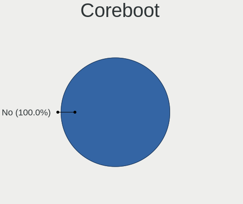

| Used | Computers | Percent |
|------|-----------|---------|
| No   | 240       | 99.59%  |
| Yes  | 1         | 0.41%   |

RAM Size
--------

Total RAM memory

| Size in GB  | Computers | Percent |
|-------------|-----------|---------|
| 4.01-8.0    | 66        | 27.39%  |
| 16.01-24.0  | 48        | 19.92%  |
| 8.01-16.0   | 48        | 19.92%  |
| 3.01-4.0    | 37        | 15.35%  |
| 32.01-64.0  | 20        | 8.3%    |
| 64.01-256.0 | 8         | 3.32%   |
| 1.01-2.0    | 6         | 2.49%   |
| 24.01-32.0  | 4         | 1.66%   |
| 2.01-3.0    | 4         | 1.66%   |

RAM Used
--------

Used RAM memory

| Used GB    | Computers | Percent |
|------------|-----------|---------|
| 1.01-2.0   | 97        | 40.25%  |
| 2.01-3.0   | 62        | 25.73%  |
| 3.01-4.0   | 33        | 13.69%  |
| 4.01-8.0   | 32        | 13.28%  |
| 8.01-16.0  | 10        | 4.15%   |
| 0.51-1.0   | 5         | 2.07%   |
| 16.01-24.0 | 1         | 0.41%   |
| 0.01-0.5   | 1         | 0.41%   |

Total Drives
------------

Number of drives on board

| Drives | Computers | Percent |
|--------|-----------|---------|
| 1      | 135       | 56.02%  |
| 2      | 65        | 26.97%  |
| 3      | 18        | 7.47%   |
| 4      | 11        | 4.56%   |
| 5      | 4         | 1.66%   |
| 6      | 2         | 0.83%   |
| 0      | 2         | 0.83%   |
| 14     | 1         | 0.41%   |
| 9      | 1         | 0.41%   |
| 8      | 1         | 0.41%   |
| 7      | 1         | 0.41%   |

Has CD-ROM
----------

Has CD-ROM on board

| Presented | Computers | Percent |
|-----------|-----------|---------|
| No        | 136       | 56.43%  |
| Yes       | 105       | 43.57%  |

Has Ethernet
------------

Has Ethernet on board

| Presented | Computers | Percent |
|-----------|-----------|---------|
| Yes       | 208       | 86.31%  |
| No        | 33        | 13.69%  |

Has WiFi
--------

Has WiFi module

| Presented | Computers | Percent |
|-----------|-----------|---------|
| Yes       | 174       | 72.2%   |
| No        | 67        | 27.8%   |

Has Bluetooth
-------------

Has Bluetooth module

| Presented | Computers | Percent |
|-----------|-----------|---------|
| Yes       | 144       | 59.75%  |
| No        | 97        | 40.25%  |

Location
--------

Country
-------

Geographic location (country)

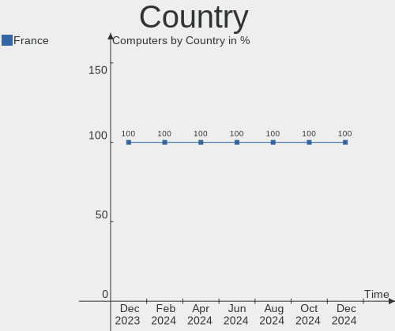

| Country | Computers | Percent |
|---------|-----------|---------|
| France  | 241       | 100%    |

City
----

Geographic location (city)

| City                       | Computers | Percent |
|----------------------------|-----------|---------|
| Paris                      | 27        | 11.2%   |
| Marseille                  | 5         | 2.07%   |
| Lyon                       | 5         | 2.07%   |
| Toulouse                   | 3         | 1.24%   |
| Roubaix                    | 3         | 1.24%   |
| Grenoble                   | 3         | 1.24%   |
| Chambéry                  | 3         | 1.24%   |
| Vitry-sur-Seine            | 2         | 0.83%   |
| Villeneuve-d'Ascq          | 2         | 0.83%   |
| Trets                      | 2         | 0.83%   |
| Tours                      | 2         | 0.83%   |
| Toulon                     | 2         | 0.83%   |
| Rouvray-Saint-Denis        | 2         | 0.83%   |
| Rouen                      | 2         | 0.83%   |
| Perassay                   | 2         | 0.83%   |
| Orsay                      | 2         | 0.83%   |
| Nîmes                     | 2         | 0.83%   |
| Montpellier                | 2         | 0.83%   |
| Mieuxce                    | 2         | 0.83%   |
| Lille                      | 2         | 0.83%   |
| La Rochelle                | 2         | 0.83%   |
| Guilherand-Granges         | 2         | 0.83%   |
| Clichy-sous-Bois           | 2         | 0.83%   |
| Clermont-Ferrand           | 2         | 0.83%   |
| Chenove                    | 2         | 0.83%   |
| Champs-sur-Marne           | 2         | 0.83%   |
| Bougival                   | 2         | 0.83%   |
| Blanzy-la-Salonnaise       | 2         | 0.83%   |
| Baraqueville               | 2         | 0.83%   |
| Avignon                    | 2         | 0.83%   |
| Aulnay-sous-Bois           | 2         | 0.83%   |
| Arnage                     | 2         | 0.83%   |
| Vitré                     | 1         | 0.41%   |
| Villars                    | 1         | 0.41%   |
| Versailles                 | 1         | 0.41%   |
| Verfeil                    | 1         | 0.41%   |
| Vence                      | 1         | 0.41%   |
| Vélizy-Villacoublay       | 1         | 0.41%   |
| Vallauris                  | 1         | 0.41%   |
| Valenciennes               | 1         | 0.41%   |
| Ugine                      | 1         | 0.41%   |
| Toul                       | 1         | 0.41%   |
| Tavaux                     | 1         | 0.41%   |
| Tarbes                     | 1         | 0.41%   |
| Sury-le-Comtal             | 1         | 0.41%   |
| Strasbourg                 | 1         | 0.41%   |
| Stains                     | 1         | 0.41%   |
| Souchez                    | 1         | 0.41%   |
| Sisteron                   | 1         | 0.41%   |
| Sevran                     | 1         | 0.41%   |
| Serris                     | 1         | 0.41%   |
| Septemes-les-Vallons       | 1         | 0.41%   |
| Seclin                     | 1         | 0.41%   |
| Sautron                    | 1         | 0.41%   |
| Saujon                     | 1         | 0.41%   |
| Sartrouville               | 1         | 0.41%   |
| Sarre-Union                | 1         | 0.41%   |
| Saint-Savin                | 1         | 0.41%   |
| Saint-Saturnin-les-Avignon | 1         | 0.41%   |
| Saint-Raphaël             | 1         | 0.41%   |

Drives
------

Drive Vendor
------------

Hard drive vendors

| Vendor              | Computers | Drives | Percent |
|---------------------|-----------|--------|---------|
| Samsung Electronics | 67        | 85     | 18.66%  |
| WDC                 | 58        | 69     | 16.16%  |
| Seagate             | 48        | 73     | 13.37%  |
| Crucial             | 32        | 35     | 8.91%   |
| Toshiba             | 22        | 30     | 6.13%   |
| Kingston            | 20        | 20     | 5.57%   |
| SanDisk             | 14        | 14     | 3.9%    |
| SK hynix            | 9         | 9      | 2.51%   |
| HGST                | 9         | 9      | 2.51%   |
| PNY                 | 8         | 8      | 2.23%   |
| Unknown             | 7         | 8      | 1.95%   |
| Hitachi             | 7         | 7      | 1.95%   |
| Micron Technology   | 5         | 5      | 1.39%   |
| KIOXIA              | 5         | 5      | 1.39%   |
| TEXTORM             | 4         | 4      | 1.11%   |
| Intel               | 4         | 4      | 1.11%   |
| Unknown             | 4         | 4      | 1.11%   |
| OCZ                 | 3         | 3      | 0.84%   |
| LDLC                | 3         | 4      | 0.84%   |
| UMIS                | 2         | 2      | 0.56%   |
| Phison              | 2         | 2      | 0.56%   |
| Maxtor              | 2         | 2      | 0.56%   |
| LITEON              | 2         | 2      | 0.56%   |
| China               | 2         | 2      | 0.56%   |
| Apple               | 2         | 2      | 0.56%   |
| XPG                 | 1         | 1      | 0.28%   |
| Transcend           | 1         | 1      | 0.28%   |
| SSD 32GB            | 1         | 1      | 0.28%   |
| SPCC                | 1         | 1      | 0.28%   |
| RSH-319             | 1         | 1      | 0.28%   |
| Plextor             | 1         | 1      | 0.28%   |
| N600                | 1         | 1      | 0.28%   |
| minisforum          | 1         | 1      | 0.28%   |
| JMicron Technology  | 1         | 1      | 0.28%   |
| Intenso             | 1         | 1      | 0.28%   |
| Inateck             | 1         | 1      | 0.28%   |
| Hewlett-Packard     | 1         | 1      | 0.28%   |
| GALAX               | 1         | 1      | 0.28%   |
| Dogfish             | 1         | 1      | 0.28%   |
| Dell                | 1         | 2      | 0.28%   |
| Corsair             | 1         | 1      | 0.28%   |
| ASMedia             | 1         | 1      | 0.28%   |
| A-DATA Technology   | 1         | 1      | 0.28%   |

Drive Model
-----------

Hard drive models

| Model                              | Computers | Percent |
|------------------------------------|-----------|---------|
| Crucial CT500MX500SSD1 500GB       | 7         | 1.75%   |
| Seagate ST1000LM035-1RK172 1TB     | 6         | 1.5%    |
| Seagate ST1000LM024 HN-M101MBB 1TB | 5         | 1.25%   |
| PNY CS900 240GB SSD                | 4         | 1%      |
| Crucial CT240BX500SSD1 240GB       | 4         | 1%      |
| Crucial CT1000MX500SSD1 1TB        | 4         | 1%      |
| Unknown                            | 4         | 1%      |
| Toshiba MQ01ABD100 1TB             | 3         | 0.75%   |
| Toshiba HDWD130 3TB                | 3         | 0.75%   |
| TEXTORM BM5 240GB SSD              | 3         | 0.75%   |
| Seagate ST3500418AS 500GB          | 3         | 0.75%   |
| Seagate ST1000DM003-1SB10C 1TB     | 3         | 0.75%   |
| Seagate ST1000DM003-1SB102 1TB     | 3         | 0.75%   |
| Samsung SSD 870 QVO 1TB            | 3         | 0.75%   |
| Samsung SSD 860 EVO 500GB          | 3         | 0.75%   |
| Samsung SSD 850 EVO 250GB          | 3         | 0.75%   |
| Samsung HD103UJ 1TB                | 3         | 0.75%   |
| Samsung HD103SI 1TB                | 3         | 0.75%   |
| Kingston SV300S37A60G 64GB SSD     | 3         | 0.75%   |
| Kingston SV300S37A120G 120GB SSD   | 3         | 0.75%   |
| Kingston SA400S37480G 480GB SSD    | 3         | 0.75%   |
| HGST HTS721010A9E630 1TB           | 3         | 0.75%   |
| Crucial CT275MX300SSD1 275GB       | 3         | 0.75%   |
| Crucial CT120BX500SSD1 120GB       | 3         | 0.75%   |
| WDC WD5000AADS-00S9B0 500GB        | 2         | 0.5%    |
| WDC WD20EZRZ-00Z5HB0 2TB           | 2         | 0.5%    |
| WDC WD10EZEX-08WN4A0 1TB           | 2         | 0.5%    |
| WDC WD10EZEX-08M2NA0 1TB           | 2         | 0.5%    |
| WDC WD10EZEX-00BBHA0 1TB           | 2         | 0.5%    |
| Toshiba MQ04ABF100 1TB             | 2         | 0.5%    |
| Toshiba MQ01ABF050 500GB           | 2         | 0.5%    |
| Toshiba DT01ACA100 1TB             | 2         | 0.5%    |
| SK hynix BC711 NVMe 512GB          | 2         | 0.5%    |
| Seagate ST9640320AS 640GB          | 2         | 0.5%    |
| Seagate ST8000VN0022-2EL112 8TB    | 2         | 0.5%    |
| Seagate ST2000DM008-2FR102 2TB     | 2         | 0.5%    |
| Seagate ST2000DM001-1CH164 2TB     | 2         | 0.5%    |
| Seagate ST1000LM049-2GH172 1TB     | 2         | 0.5%    |
| Seagate ST1000LM048-2E7172 1TB     | 2         | 0.5%    |
| Samsung SSD 980 PRO 500GB          | 2         | 0.5%    |
| Samsung SSD 980 PRO 1TB            | 2         | 0.5%    |
| Samsung SSD 980 250GB              | 2         | 0.5%    |
| Samsung SSD 980 1TB                | 2         | 0.5%    |
| Samsung SSD 970 EVO Plus 500GB     | 2         | 0.5%    |
| Samsung SSD 970 EVO Plus 2TB       | 2         | 0.5%    |
| Samsung SSD 970 EVO Plus 1TB       | 2         | 0.5%    |
| Samsung SSD 860 EVO 250GB          | 2         | 0.5%    |
| Samsung SSD 860 EVO 1TB            | 2         | 0.5%    |
| Samsung SSD 850 PRO 512GB          | 2         | 0.5%    |
| Samsung SSD 840 PRO Series 128GB   | 2         | 0.5%    |
| Samsung MZVLQ512HALU-000H1 512GB   | 2         | 0.5%    |
| Samsung MZVLB1T0HBLR-000L2 1TB     | 2         | 0.5%    |
| Micron 3400_MTFDKBA1T0TFH 1TB      | 2         | 0.5%    |
| Kingston SA400S37240G 240GB SSD    | 2         | 0.5%    |
| Kingston SA400S37120G 120GB SSD    | 2         | 0.5%    |
| HGST HTS541010A9E680 1TB           | 2         | 0.5%    |
| Crucial CT480BX500SSD1 480GB       | 2         | 0.5%    |
| XPG NVMe SSD Drive 1024GB          | 1         | 0.25%   |
| WDC WDS240G2G0A-00JH30 240GB SSD   | 1         | 0.25%   |
| WDC WDS200T2B0B-00YS70 2TB SSD     | 1         | 0.25%   |

HDD Vendor
----------

Hard disk drive vendors

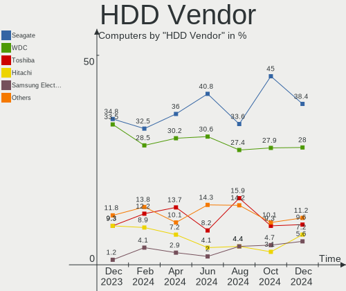

| Vendor              | Computers | Drives | Percent |
|---------------------|-----------|--------|---------|
| WDC                 | 50        | 60     | 33.56%  |
| Seagate             | 47        | 71     | 31.54%  |
| Toshiba             | 18        | 26     | 12.08%  |
| Samsung Electronics | 11        | 13     | 7.38%   |
| HGST                | 9         | 9      | 6.04%   |
| Hitachi             | 7         | 7      | 4.7%    |
| Maxtor              | 2         | 2      | 1.34%   |
| Apple               | 2         | 2      | 1.34%   |
| Unknown             | 1         | 1      | 0.67%   |
| RSH-319             | 1         | 1      | 0.67%   |
| ASMedia             | 1         | 1      | 0.67%   |

SSD Vendor
----------

Solid state drive vendors

| Vendor              | Computers | Drives | Percent |
|---------------------|-----------|--------|---------|
| Crucial             | 29        | 32     | 22.48%  |
| Samsung Electronics | 26        | 31     | 20.16%  |
| Kingston            | 20        | 20     | 15.5%   |
| SanDisk             | 12        | 12     | 9.3%    |
| PNY                 | 6         | 6      | 4.65%   |
| TEXTORM             | 4         | 4      | 3.1%    |
| WDC                 | 3         | 3      | 2.33%   |
| OCZ                 | 3         | 3      | 2.33%   |
| LDLC                | 3         | 4      | 2.33%   |
| Unknown             | 3         | 3      | 2.33%   |
| Toshiba             | 2         | 2      | 1.55%   |
| SK hynix            | 2         | 2      | 1.55%   |
| Micron Technology   | 2         | 2      | 1.55%   |
| China               | 2         | 2      | 1.55%   |
| Transcend           | 1         | 1      | 0.78%   |
| SPCC                | 1         | 1      | 0.78%   |
| Plextor             | 1         | 1      | 0.78%   |
| N600                | 1         | 1      | 0.78%   |
| minisforum          | 1         | 1      | 0.78%   |
| LITEON              | 1         | 1      | 0.78%   |
| JMicron Technology  | 1         | 1      | 0.78%   |
| Intenso             | 1         | 1      | 0.78%   |
| Inateck             | 1         | 1      | 0.78%   |
| Hewlett-Packard     | 1         | 1      | 0.78%   |
| Dogfish             | 1         | 1      | 0.78%   |
| Corsair             | 1         | 1      | 0.78%   |

Drive Kind
----------

HDD or SSD

| Kind    | Computers | Drives | Percent |
|---------|-----------|--------|---------|
| HDD     | 118       | 193    | 37.22%  |
| SSD     | 115       | 138    | 36.28%  |
| NVMe    | 73        | 83     | 23.03%  |
| MMC     | 8         | 10     | 2.52%   |
| Unknown | 3         | 3      | 0.95%   |

Drive Connector
---------------

SATA, SAS, NVMe, etc.

| Type | Computers | Drives | Percent |
|------|-----------|--------|---------|
| SATA | 186       | 327    | 67.88%  |
| NVMe | 73        | 83     | 26.64%  |
| MMC  | 8         | 10     | 2.92%   |
| SAS  | 7         | 7      | 2.55%   |

Drive Size
----------

Size of hard drive

| Size in TB | Computers | Drives | Percent |
|------------|-----------|--------|---------|
| 0.01-0.5   | 123       | 160    | 47.67%  |
| 0.51-1.0   | 91        | 102    | 35.27%  |
| 1.01-2.0   | 21        | 25     | 8.14%   |
| 4.01-10.0  | 9         | 18     | 3.49%   |
| 2.01-3.0   | 8         | 14     | 3.1%    |
| 3.01-4.0   | 5         | 11     | 1.94%   |
| 10.01-20.0 | 1         | 1      | 0.39%   |

Space Total
-----------

Amount of disk space available on the file system

| Size in GB     | Computers | Percent |
|----------------|-----------|---------|
| 101-250        | 51        | 21.16%  |
| 251-500        | 46        | 19.09%  |
| 501-1000       | 41        | 17.01%  |
| 1-20           | 32        | 13.28%  |
| 1001-2000      | 26        | 10.79%  |
| More than 3000 | 17        | 7.05%   |
| 21-50          | 10        | 4.15%   |
| 2001-3000      | 10        | 4.15%   |
| 51-100         | 4         | 1.66%   |
| Unknown        | 4         | 1.66%   |

Space Used
----------

Amount of used disk space

| Used GB        | Computers | Percent |
|----------------|-----------|---------|
| 1-20           | 81        | 33.61%  |
| 21-50          | 32        | 13.28%  |
| 101-250        | 32        | 13.28%  |
| 251-500        | 28        | 11.62%  |
| 501-1000       | 22        | 9.13%   |
| 51-100         | 20        | 8.3%    |
| More than 3000 | 9         | 3.73%   |
| 1001-2000      | 7         | 2.9%    |
| 2001-3000      | 6         | 2.49%   |
| Unknown        | 4         | 1.66%   |

Malfunc. Drives
---------------

Drive models with a malfunction

| Model                                            | Computers | Drives | Percent |
|--------------------------------------------------|-----------|--------|---------|
| Samsung Electronics HD103SI 1TB                  | 2         | 2      | 5.41%   |
| HGST HTS721010A9E630 1TB                         | 2         | 2      | 5.41%   |
| WDC WD5000LPVT-22G33T0 500GB                     | 1         | 1      | 2.7%    |
| WDC WD5000LPCX-00VHAT0 500GB                     | 1         | 1      | 2.7%    |
| WDC WD5000AAKX-22ERMA0 500GB                     | 1         | 1      | 2.7%    |
| WDC WD5000AADS-00S9B0 500GB                      | 1         | 1      | 2.7%    |
| WDC WD10EZEX-08M2NA0 1TB                         | 1         | 1      | 2.7%    |
| WDC WD10EARX-00N0YB0 1TB                         | 1         | 1      | 2.7%    |
| Toshiba HDWE140 4TB                              | 1         | 1      | 2.7%    |
| Toshiba HDWD130 3TB                              | 1         | 6      | 2.7%    |
| TEXTORM B5 120GB SSD                             | 1         | 1      | 2.7%    |
| SK hynix HFS256G39TND-N210A 256GB SSD            | 1         | 1      | 2.7%    |
| Seagate ST9250410AS 250GB                        | 1         | 1      | 2.7%    |
| Seagate ST4000VX000-2AG166 4TB                   | 1         | 2      | 2.7%    |
| Seagate ST3250410AS 250GB                        | 1         | 1      | 2.7%    |
| Seagate ST320LT007-9ZV142 320GB                  | 1         | 1      | 2.7%    |
| Seagate ST2000LM015-2E8174 2TB                   | 1         | 2      | 2.7%    |
| Seagate ST2000DM001-1CH164 2TB                   | 1         | 1      | 2.7%    |
| Seagate ST1000LM024 HN-M101MBB 1TB               | 1         | 1      | 2.7%    |
| SanDisk SDSSDXPS240G 240GB                       | 1         | 1      | 2.7%    |
| Samsung Electronics SSD 850 PRO 512GB            | 1         | 1      | 2.7%    |
| Samsung Electronics MZNLH128HBHQ-000H1 128GB SSD | 1         | 1      | 2.7%    |
| Samsung Electronics HD040GJ/ 40GB                | 1         | 1      | 2.7%    |
| OCZ VERTEX4 256GB SSD                            | 1         | 1      | 2.7%    |
| Maxtor 6Y160P0 164GB                             | 1         | 1      | 2.7%    |
| LITEON CV8-8E128-HP 128GB SSD                    | 1         | 1      | 2.7%    |
| Kingston SV300S37A60G 64GB SSD                   | 1         | 1      | 2.7%    |
| Kingston SV300S37A120G 120GB SSD                 | 1         | 1      | 2.7%    |
| Hitachi HTS545050B9A300 500GB                    | 1         | 1      | 2.7%    |
| Hitachi HDS728080PLA380 40Y9028LEN 80GB          | 1         | 1      | 2.7%    |
| HGST HTS545050A7E680 500GB                       | 1         | 1      | 2.7%    |
| HGST HTS541075A9E680 752GB                       | 1         | 1      | 2.7%    |
| HGST HTS541010A9E680 1TB                         | 1         | 1      | 2.7%    |
| HGST HCC545050A7E380 500GB                       | 1         | 1      | 2.7%    |
| Dogfish SSD 250GB                                | 1         | 1      | 2.7%    |

Malfunc. Drive Vendor
---------------------

Vendors of faulty drives

| Vendor              | Computers | Drives | Percent |
|---------------------|-----------|--------|---------|
| Seagate             | 7         | 9      | 18.92%  |
| WDC                 | 6         | 6      | 16.22%  |
| HGST                | 6         | 6      | 16.22%  |
| Samsung Electronics | 5         | 5      | 13.51%  |
| Toshiba             | 2         | 7      | 5.41%   |
| Kingston            | 2         | 2      | 5.41%   |
| Hitachi             | 2         | 2      | 5.41%   |
| TEXTORM             | 1         | 1      | 2.7%    |
| SK hynix            | 1         | 1      | 2.7%    |
| SanDisk             | 1         | 1      | 2.7%    |
| OCZ                 | 1         | 1      | 2.7%    |
| Maxtor              | 1         | 1      | 2.7%    |
| LITEON              | 1         | 1      | 2.7%    |
| Dogfish             | 1         | 1      | 2.7%    |

Malfunc. HDD Vendor
-------------------

Vendors of faulty HDD drives

| Vendor              | Computers | Drives | Percent |
|---------------------|-----------|--------|---------|
| Seagate             | 7         | 9      | 25.93%  |
| WDC                 | 6         | 6      | 22.22%  |
| HGST                | 6         | 6      | 22.22%  |
| Samsung Electronics | 3         | 3      | 11.11%  |
| Toshiba             | 2         | 7      | 7.41%   |
| Hitachi             | 2         | 2      | 7.41%   |
| Maxtor              | 1         | 1      | 3.7%    |

Malfunc. Drive Kind
-------------------

Kinds of faulty drives

| Kind | Computers | Drives | Percent |
|------|-----------|--------|---------|
| HDD  | 24        | 34     | 70.59%  |
| SSD  | 10        | 10     | 29.41%  |

Failed Drives
-------------

Failed drive models

| Model                       | Computers | Drives | Percent |
|-----------------------------|-----------|--------|---------|
| WDC WD3200BEVT-11ZCT0 320GB | 1         | 1      | 100%    |

Failed Drive Vendor
-------------------

Failed drive vendors

| Vendor | Computers | Drives | Percent |
|--------|-----------|--------|---------|
| WDC    | 1         | 1      | 100%    |

Drive Status
------------

Number of failed and malfunc. drives

| Status   | Computers | Drives | Percent |
|----------|-----------|--------|---------|
| Works    | 159       | 276    | 60.23%  |
| Detected | 72        | 106    | 27.27%  |
| Malfunc  | 32        | 44     | 12.12%  |
| Failed   | 1         | 1      | 0.38%   |

Storage controller
------------------

Storage Vendor
--------------

Storage controller vendors

| Vendor                       | Computers | Percent |
|------------------------------|-----------|---------|
| Intel                        | 170       | 55.92%  |
| AMD                          | 49        | 16.12%  |
| Samsung Electronics          | 37        | 12.17%  |
| SanDisk                      | 8         | 2.63%   |
| SK hynix                     | 5         | 1.64%   |
| JMicron Technology           | 5         | 1.64%   |
| Phison Electronics           | 4         | 1.32%   |
| KIOXIA                       | 4         | 1.32%   |
| Toshiba America Info Systems | 3         | 0.99%   |
| Micron/Crucial Technology    | 3         | 0.99%   |
| Micron Technology            | 3         | 0.99%   |
| ASMedia Technology           | 3         | 0.99%   |
| Union Memory (Shenzhen)      | 2         | 0.66%   |
| ADATA Technology             | 2         | 0.66%   |
| Silicon Image                | 1         | 0.33%   |
| Seagate Technology           | 1         | 0.33%   |
| Nvidia                       | 1         | 0.33%   |
| Marvell Technology Group     | 1         | 0.33%   |
| Lite-On Technology           | 1         | 0.33%   |
| Adaptec                      | 1         | 0.33%   |

Storage Model
-------------

Storage controller models

| Model                                                                          | Computers | Percent |
|--------------------------------------------------------------------------------|-----------|---------|
| AMD FCH SATA Controller [AHCI mode]                                            | 37        | 10.95%  |
| Samsung NVMe SSD Controller SM981/PM981/PM983                                  | 12        | 3.55%   |
| Samsung NVMe SSD Controller 980                                                | 12        | 3.55%   |
| Intel Volume Management Device NVMe RAID Controller                            | 11        | 3.25%   |
| Intel 7 Series Chipset Family 6-port SATA Controller [AHCI mode]               | 10        | 2.96%   |
| Intel Q170/Q150/B150/H170/H110/Z170/CM236 Chipset SATA Controller [AHCI Mode]  | 9         | 2.66%   |
| Intel 6 Series/C200 Series Chipset Family 6 port Mobile SATA AHCI Controller   | 9         | 2.66%   |
| Intel 6 Series/C200 Series Chipset Family 6 port Desktop SATA AHCI Controller  | 9         | 2.66%   |
| Samsung NVMe SSD Controller PM9A1/PM9A3/980PRO                                 | 8         | 2.37%   |
| Intel Wildcat Point-LP SATA Controller [AHCI Mode]                             | 8         | 2.37%   |
| Intel Sunrise Point-LP SATA Controller [AHCI mode]                             | 8         | 2.37%   |
| Intel 82801 Mobile SATA Controller [RAID mode]                                 | 7         | 2.07%   |
| Intel 8 Series/C220 Series Chipset Family 6-port SATA Controller 1 [AHCI mode] | 7         | 2.07%   |
| AMD 500 Series Chipset SATA Controller                                         | 7         | 2.07%   |
| Intel SATA Controller [RAID mode]                                              | 6         | 1.78%   |
| Intel 8 Series SATA Controller 1 [AHCI mode]                                   | 6         | 1.78%   |
| Intel Comet Lake SATA AHCI Controller                                          | 5         | 1.48%   |
| Intel Celeron/Pentium Silver Processor SATA Controller                         | 5         | 1.48%   |
| Intel 82801IBM/IEM (ICH9M/ICH9M-E) 4 port SATA Controller [AHCI mode]          | 5         | 1.48%   |
| Intel 500 Series Chipset Family SATA AHCI Controller                           | 5         | 1.48%   |
| Intel 5 Series/3400 Series Chipset 4 port SATA IDE Controller                  | 5         | 1.48%   |
| Intel 5 Series/3400 Series Chipset 4 port SATA AHCI Controller                 | 5         | 1.48%   |
| Intel 5 Series/3400 Series Chipset 2 port SATA IDE Controller                  | 5         | 1.48%   |
| Samsung NVMe SSD Controller SM961/PM961/SM963                                  | 4         | 1.18%   |
| KIOXIA NVMe SSD Controller BG4                                                 | 4         | 1.18%   |
| Intel Tiger Lake-LP SATA Controller                                            | 4         | 1.18%   |
| Intel SSD 660P Series                                                          | 4         | 1.18%   |
| Intel HM170/QM170 Chipset SATA Controller [AHCI Mode]                          | 4         | 1.18%   |
| Intel 7 Series/C210 Series Chipset Family 6-port SATA Controller [AHCI mode]   | 4         | 1.18%   |
| AMD SB7x0/SB8x0/SB9x0 SATA Controller [AHCI mode]                              | 4         | 1.18%   |
| SK hynix Gold P31 SSD                                                          | 3         | 0.89%   |
| SanDisk WD Blue SN550 NVMe SSD                                                 | 3         | 0.89%   |
| SanDisk Non-Volatile memory controller                                         | 3         | 0.89%   |
| Phison E12 NVMe Controller                                                     | 3         | 0.89%   |
| Micron/Crucial P2 NVMe PCIe SSD                                                | 3         | 0.89%   |
| Micron Non-Volatile memory controller                                          | 3         | 0.89%   |
| Intel NM10/ICH7 Family SATA Controller [IDE mode]                              | 3         | 0.89%   |
| Intel Celeron N3350/Pentium N4200/Atom E3900 Series SATA AHCI Controller       | 3         | 0.89%   |
| Intel Alder Lake-S PCH SATA Controller [AHCI Mode]                             | 3         | 0.89%   |
| Intel 9 Series Chipset Family SATA Controller [AHCI Mode]                      | 3         | 0.89%   |
| Intel 5 Series/3400 Series Chipset 6 port SATA AHCI Controller                 | 3         | 0.89%   |
| AMD 400 Series Chipset SATA Controller                                         | 3         | 0.89%   |
| Union Memory (Shenzhen) Non-Volatile memory controller                         | 2         | 0.59%   |
| Toshiba America Info Systems XG6 NVMe SSD Controller                           | 2         | 0.59%   |
| SK hynix BC501 NVMe Solid State Drive                                          | 2         | 0.59%   |
| JMicron JMB363 SATA/IDE Controller                                             | 2         | 0.59%   |
| Intel NM10/ICH7 Family SATA Controller [AHCI mode]                             | 2         | 0.59%   |
| Intel Cannon Point-LP SATA Controller [AHCI Mode]                              | 2         | 0.59%   |
| Intel Cannon Lake PCH SATA AHCI Controller                                     | 2         | 0.59%   |
| Intel C600/X79 series chipset SATA RAID Controller                             | 2         | 0.59%   |
| Intel Atom Processor E3800 Series SATA AHCI Controller                         | 2         | 0.59%   |
| Intel 82801JI (ICH10 Family) 4 port SATA IDE Controller #1                     | 2         | 0.59%   |
| Intel 82801JI (ICH10 Family) 2 port SATA IDE Controller #2                     | 2         | 0.59%   |
| Intel 82801G (ICH7 Family) IDE Controller                                      | 2         | 0.59%   |
| Intel 400 Series Chipset Family SATA AHCI Controller                           | 2         | 0.59%   |
| Intel 200 Series PCH SATA controller [AHCI mode]                               | 2         | 0.59%   |
| ASMedia SATA controller                                                        | 2         | 0.59%   |
| AMD SB7x0/SB8x0/SB9x0 IDE Controller                                           | 2         | 0.59%   |
| ADATA XPG SX8200 Pro PCIe Gen3x4 M.2 2280 Solid State Drive                    | 2         | 0.59%   |
| Toshiba America Info Systems XG4 NVMe SSD Controller                           | 1         | 0.3%    |

Storage Kind
------------

Kind of storage controller (IDE, SATA, NVMe, SAS, ...)

| Kind | Computers | Percent |
|------|-----------|---------|
| SATA | 185       | 60.26%  |
| NVMe | 73        | 23.78%  |
| RAID | 29        | 9.45%   |
| IDE  | 20        | 6.51%   |

Processor
---------

CPU Vendor
----------

Processor vendors

| Vendor | Computers | Percent |
|--------|-----------|---------|
| Intel  | 182       | 75.52%  |
| AMD    | 58        | 24.07%  |
| ARM    | 1         | 0.41%   |

CPU Model
---------

Processor models

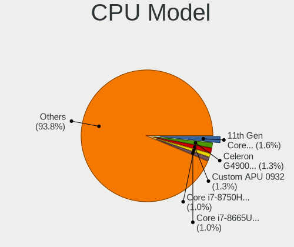

| Model                                         | Computers | Percent |
|-----------------------------------------------|-----------|---------|
| Intel 11th Gen Core i7-1165G7 @ 2.80GHz       | 5         | 2.07%   |
| Intel Core i7-7700HQ CPU @ 2.80GHz            | 3         | 1.24%   |
| Intel Core i7-6700K CPU @ 4.00GHz             | 3         | 1.24%   |
| Intel Core i7-10510U CPU @ 1.80GHz            | 3         | 1.24%   |
| Intel Core i5-7200U CPU @ 2.50GHz             | 3         | 1.24%   |
| Intel Core i5-6500 CPU @ 3.20GHz              | 3         | 1.24%   |
| Intel Core i5-5200U CPU @ 2.20GHz             | 3         | 1.24%   |
| Intel 11th Gen Core i5-1135G7 @ 2.40GHz       | 3         | 1.24%   |
| AMD Ryzen 7 5700U with Radeon Graphics        | 3         | 1.24%   |
| AMD Ryzen 5 5600X 6-Core Processor            | 3         | 1.24%   |
| Intel Core i7-8550U CPU @ 1.80GHz             | 2         | 0.83%   |
| Intel Core i7-10700 CPU @ 2.90GHz             | 2         | 0.83%   |
| Intel Core i5-6300HQ CPU @ 2.30GHz            | 2         | 0.83%   |
| Intel Core i5-4690 CPU @ 3.50GHz              | 2         | 0.83%   |
| Intel Core i5-4460 CPU @ 3.20GHz              | 2         | 0.83%   |
| Intel Core i5-4310M CPU @ 2.70GHz             | 2         | 0.83%   |
| Intel Core i5-3570 CPU @ 3.40GHz              | 2         | 0.83%   |
| Intel Core i5-3320M CPU @ 2.60GHz             | 2         | 0.83%   |
| Intel Core i5-3210M CPU @ 2.50GHz             | 2         | 0.83%   |
| Intel Core i5-2520M CPU @ 2.50GHz             | 2         | 0.83%   |
| Intel Core i5-2430M CPU @ 2.40GHz             | 2         | 0.83%   |
| Intel Core i5-2410M CPU @ 2.30GHz             | 2         | 0.83%   |
| Intel Core i5-2400 CPU @ 3.10GHz              | 2         | 0.83%   |
| Intel Core i5-10210U CPU @ 1.60GHz            | 2         | 0.83%   |
| Intel Core i5 CPU M 520 @ 2.40GHz             | 2         | 0.83%   |
| Intel Core i3-6100 CPU @ 3.70GHz              | 2         | 0.83%   |
| Intel Core i3-6006U CPU @ 2.00GHz             | 2         | 0.83%   |
| Intel Core i3-5005U CPU @ 2.00GHz             | 2         | 0.83%   |
| Intel Core i3-2350M CPU @ 2.30GHz             | 2         | 0.83%   |
| Intel Core i3 CPU M 380 @ 2.53GHz             | 2         | 0.83%   |
| Intel Core 2 Quad CPU Q6600 @ 2.40GHz         | 2         | 0.83%   |
| Intel Core 2 Duo CPU E8400 @ 3.00GHz          | 2         | 0.83%   |
| Intel Celeron N4120 CPU @ 1.10GHz             | 2         | 0.83%   |
| Intel 12th Gen Core i9-12900H                 | 2         | 0.83%   |
| Intel 12th Gen Core i7-12700                  | 2         | 0.83%   |
| Intel 11th Gen Core i7-11800H @ 2.30GHz       | 2         | 0.83%   |
| Intel 11th Gen Core i5-1145G7 @ 2.60GHz       | 2         | 0.83%   |
| AMD Ryzen 7 5800X 8-Core Processor            | 2         | 0.83%   |
| AMD Ryzen 7 5700G with Radeon Graphics        | 2         | 0.83%   |
| AMD Ryzen 7 3700U with Radeon Vega Mobile Gfx | 2         | 0.83%   |
| AMD Ryzen 5 4600H with Radeon Graphics        | 2         | 0.83%   |
| AMD Ryzen 5 3600 6-Core Processor             | 2         | 0.83%   |
| AMD E1-1200 APU with Radeon HD Graphics       | 2         | 0.83%   |
| AMD Athlon Silver 3050U with Radeon Graphics  | 2         | 0.83%   |
| Intel Xeon CPU W3680 @ 3.33GHz                | 1         | 0.41%   |
| Intel Xeon CPU W3530 @ 2.80GHz                | 1         | 0.41%   |
| Intel Xeon CPU E5-2620 v4 @ 2.10GHz           | 1         | 0.41%   |
| Intel Xeon CPU E5-2620 0 @ 2.00GHz            | 1         | 0.41%   |
| Intel Xeon CPU E5-1620 v3 @ 3.50GHz           | 1         | 0.41%   |
| Intel Xeon CPU E31225 @ 3.10GHz               | 1         | 0.41%   |
| Intel Xeon CPU E3-1245 v5 @ 3.50GHz           | 1         | 0.41%   |
| Intel Pentium Silver N5030 CPU @ 1.10GHz      | 1         | 0.41%   |
| Intel Pentium Gold G6400 CPU @ 4.00GHz        | 1         | 0.41%   |
| Intel Pentium Dual-Core CPU E5300 @ 2.60GHz   | 1         | 0.41%   |
| Intel Pentium CPU N4200 @ 1.10GHz             | 1         | 0.41%   |
| Intel Pentium CPU N3710 @ 1.60GHz             | 1         | 0.41%   |
| Intel Pentium CPU N3540 @ 2.16GHz             | 1         | 0.41%   |
| Intel Pentium CPU B960 @ 2.20GHz              | 1         | 0.41%   |
| Intel Pentium CPU 4405U @ 2.10GHz             | 1         | 0.41%   |
| Intel Pentium CPU 3825U @ 1.90GHz             | 1         | 0.41%   |

CPU Model Family
----------------

Processor model prefix

| Model                   | Computers | Percent |
|-------------------------|-----------|---------|
| Intel Core i5           | 63        | 26.14%  |
| Intel Core i7           | 30        | 12.45%  |
| Other                   | 27        | 11.2%   |
| Intel Core i3           | 21        | 8.71%   |
| AMD Ryzen 7             | 16        | 6.64%   |
| AMD Ryzen 5             | 14        | 5.81%   |
| Intel Celeron           | 13        | 5.39%   |
| Intel Core 2 Duo        | 8         | 3.32%   |
| Intel Xeon              | 7         | 2.9%    |
| Intel Pentium           | 6         | 2.49%   |
| Intel Atom              | 4         | 1.66%   |
| AMD Ryzen 9             | 4         | 1.66%   |
| AMD E1                  | 3         | 1.24%   |
| AMD A8                  | 3         | 1.24%   |
| Intel Core 2 Quad       | 2         | 0.83%   |
| AMD Ryzen 3             | 2         | 0.83%   |
| AMD Athlon II X2        | 2         | 0.83%   |
| AMD Athlon              | 2         | 0.83%   |
| AMD A4                  | 2         | 0.83%   |
| Intel Pentium Silver    | 1         | 0.41%   |
| Intel Pentium Gold      | 1         | 0.41%   |
| Intel Pentium Dual-Core | 1         | 0.41%   |
| Intel Core 2            | 1         | 0.41%   |
| Intel Celeron Dual-Core | 1         | 0.41%   |
| AMD Turion II Neo       | 1         | 0.41%   |
| AMD EPYC                | 1         | 0.41%   |
| AMD Athlon X2           | 1         | 0.41%   |
| AMD Athlon Neo X2       | 1         | 0.41%   |
| AMD Athlon 64           | 1         | 0.41%   |
| AMD A6                  | 1         | 0.41%   |
| AMD A12                 | 1         | 0.41%   |

CPU Cores
---------

Number of processor cores

| Number  | Computers | Percent |
|---------|-----------|---------|
| 2       | 92        | 38.17%  |
| 4       | 90        | 37.34%  |
| 6       | 23        | 9.54%   |
| 8       | 20        | 8.3%    |
| 12      | 5         | 2.07%   |
| 1       | 4         | 1.66%   |
| 14      | 3         | 1.24%   |
| 16      | 2         | 0.83%   |
| 48      | 1         | 0.41%   |
| Unknown | 1         | 0.41%   |

CPU Sockets
-----------

Number of sockets

| Number  | Computers | Percent |
|---------|-----------|---------|
| 1       | 237       | 98.34%  |
| 2       | 3         | 1.24%   |
| Unknown | 1         | 0.41%   |

CPU Threads
-----------

Threads per core (Hyper-Threading)

| Number  | Computers | Percent |
|---------|-----------|---------|
| 2       | 160       | 66.39%  |
| 1       | 80        | 33.2%   |
| Unknown | 1         | 0.41%   |

CPU Op-Modes
------------

CPU Operation Modes (32-bit, 64-bit)

| Op mode        | Computers | Percent |
|----------------|-----------|---------|
| 32-bit, 64-bit | 241       | 100%    |

CPU Microcode
-------------

Microcode number

| Number     | Computers | Percent |
|------------|-----------|---------|
| Unknown    | 35        | 14.52%  |
| 0x206a7    | 16        | 6.64%   |
| 0x306a9    | 15        | 6.22%   |
| 0x506e3    | 12        | 4.98%   |
| 0x806c1    | 9         | 3.73%   |
| 0x306c3    | 9         | 3.73%   |
| 0x306d4    | 8         | 3.32%   |
| 0x1067a    | 8         | 3.32%   |
| 0x40651    | 6         | 2.49%   |
| 0x20655    | 6         | 2.49%   |
| 0x806ec    | 5         | 2.07%   |
| 0x0a50000c | 5         | 2.07%   |
| 0x08600106 | 5         | 2.07%   |
| 0x08108109 | 5         | 2.07%   |
| 0x906e9    | 4         | 1.66%   |
| 0x806ea    | 4         | 1.66%   |
| 0x806e9    | 4         | 1.66%   |
| 0x706a8    | 4         | 1.66%   |
| 0x406e3    | 4         | 1.66%   |
| 0x08701021 | 4         | 1.66%   |
| 0x08608103 | 4         | 1.66%   |
| 0xa0671    | 3         | 1.24%   |
| 0xa0653    | 3         | 1.24%   |
| 0x906ea    | 3         | 1.24%   |
| 0x906a3    | 3         | 1.24%   |
| 0x506c9    | 3         | 1.24%   |
| 0x30678    | 3         | 1.24%   |
| 0x20652    | 3         | 1.24%   |
| 0x0a201204 | 3         | 1.24%   |
| 0x0a201016 | 3         | 1.24%   |
| 0xa0655    | 2         | 0.83%   |
| 0x90672    | 2         | 0.83%   |
| 0x406c3    | 2         | 0.83%   |
| 0x10676    | 2         | 0.83%   |
| 0x0800820d | 2         | 0.83%   |
| 0x0600611a | 2         | 0.83%   |
| 0xa0652    | 1         | 0.41%   |
| 0x90675    | 1         | 0.41%   |
| 0x806d1    | 1         | 0.41%   |
| 0x706e5    | 1         | 0.41%   |
| 0x6fd      | 1         | 0.41%   |
| 0x6fb      | 1         | 0.41%   |
| 0x6f6      | 1         | 0.41%   |
| 0x406f1    | 1         | 0.41%   |
| 0x406c4    | 1         | 0.41%   |
| 0x306f2    | 1         | 0.41%   |
| 0x206d7    | 1         | 0.41%   |
| 0x206c2    | 1         | 0.41%   |
| 0x106e5    | 1         | 0.41%   |
| 0x106a5    | 1         | 0.41%   |
| 0x0a50000d | 1         | 0.41%   |
| 0x08301052 | 1         | 0.41%   |
| 0x08200103 | 1         | 0.41%   |
| 0x08108102 | 1         | 0.41%   |
| 0x08001126 | 1         | 0.41%   |
| 0x07030105 | 1         | 0.41%   |
| 0x07030104 | 1         | 0.41%   |
| 0x0700010f | 1         | 0.41%   |
| 0x06006704 | 1         | 0.41%   |
| 0x06001119 | 1         | 0.41%   |

CPU Microarch
-------------

Microarchitecture

| Name             | Computers | Percent |
|------------------|-----------|---------|
| KabyLake         | 24        | 9.96%   |
| SandyBridge      | 21        | 8.71%   |
| Skylake          | 18        | 7.47%   |
| Haswell          | 18        | 7.47%   |
| IvyBridge        | 16        | 6.64%   |
| Zen 3            | 13        | 5.39%   |
| Zen 2            | 11        | 4.56%   |
| Westmere         | 11        | 4.56%   |
| TigerLake        | 11        | 4.56%   |
| Penryn           | 10        | 4.15%   |
| Zen+             | 9         | 3.73%   |
| Broadwell        | 9         | 3.73%   |
| Unknown          | 9         | 3.73%   |
| CometLake        | 7         | 2.9%    |
| Silvermont       | 6         | 2.49%   |
| Alderlake Hybrid | 6         | 2.49%   |
| Goldmont plus    | 5         | 2.07%   |
| Core             | 5         | 2.07%   |
| Icelake          | 4         | 1.66%   |
| Goldmont         | 4         | 1.66%   |
| Excavator        | 4         | 1.66%   |
| Zen              | 3         | 1.24%   |
| Nehalem          | 3         | 1.24%   |
| K10              | 3         | 1.24%   |
| Puma             | 2         | 0.83%   |
| K8 Hammer        | 2         | 0.83%   |
| Bobcat           | 2         | 0.83%   |
| Piledriver       | 1         | 0.41%   |
| K8 & K10 hybrid  | 1         | 0.41%   |
| K10 Llano        | 1         | 0.41%   |
| Jaguar           | 1         | 0.41%   |
| Bonnell          | 1         | 0.41%   |

Graphics
--------

GPU Vendor
----------

Vendors of graphics cards

| Vendor                     | Computers | Percent |
|----------------------------|-----------|---------|
| Intel                      | 139       | 49.29%  |
| Nvidia                     | 77        | 27.3%   |
| AMD                        | 63        | 22.34%  |
| Matrox Electronics Systems | 2         | 0.71%   |
| ASPEED Technology          | 1         | 0.35%   |

GPU Model
---------

Graphics card models

| Model                                                                                    | Computers | Percent |
|------------------------------------------------------------------------------------------|-----------|---------|
| Intel 2nd Generation Core Processor Family Integrated Graphics Controller                | 14        | 4.95%   |
| Intel TigerLake-LP GT2 [Iris Xe Graphics]                                                | 11        | 3.89%   |
| Intel HD Graphics 530                                                                    | 8         | 2.83%   |
| Intel 3rd Gen Core processor Graphics Controller                                         | 8         | 2.83%   |
| AMD Picasso/Raven 2 [Radeon Vega Series / Radeon Vega Mobile Series]                     | 8         | 2.83%   |
| Intel HD Graphics 5500                                                                   | 6         | 2.12%   |
| Intel Haswell-ULT Integrated Graphics Controller                                         | 6         | 2.12%   |
| Intel Xeon E3-1200 v3/4th Gen Core Processor Integrated Graphics Controller              | 5         | 1.77%   |
| Intel Mobile 4 Series Chipset Integrated Graphics Controller                             | 5         | 1.77%   |
| Intel HD Graphics 620                                                                    | 5         | 1.77%   |
| Intel CometLake-U GT2 [UHD Graphics]                                                     | 5         | 1.77%   |
| Intel 4 Series Chipset Integrated Graphics Controller                                    | 5         | 1.77%   |
| AMD Renoir                                                                               | 5         | 1.77%   |
| AMD Cezanne                                                                              | 5         | 1.77%   |
| Intel GeminiLake [UHD Graphics 600]                                                      | 4         | 1.41%   |
| Intel Core Processor Integrated Graphics Controller                                      | 4         | 1.41%   |
| Intel CometLake-S GT2 [UHD Graphics 630]                                                 | 4         | 1.41%   |
| AMD Lucienne                                                                             | 4         | 1.41%   |
| Nvidia GP107 [GeForce GTX 1050 Ti]                                                       | 3         | 1.06%   |
| Nvidia GP104 [GeForce GTX 1070 Ti]                                                       | 3         | 1.06%   |
| Nvidia GM206 [GeForce GTX 960]                                                           | 3         | 1.06%   |
| Nvidia GM108M [GeForce 940M]                                                             | 3         | 1.06%   |
| Nvidia GF117M [GeForce 610M/710M/810M/820M / GT 620M/625M/630M/720M]                     | 3         | 1.06%   |
| Intel UHD Graphics 620                                                                   | 3         | 1.06%   |
| Intel Skylake GT2 [HD Graphics 520]                                                      | 3         | 1.06%   |
| Intel HD Graphics 630                                                                    | 3         | 1.06%   |
| Intel HD Graphics 500                                                                    | 3         | 1.06%   |
| Intel Atom/Celeron/Pentium Processor x5-E8000/J3xxx/N3xxx Integrated Graphics Controller | 3         | 1.06%   |
| Intel Atom Processor Z36xxx/Z37xxx Series Graphics & Display                             | 3         | 1.06%   |
| Intel Alder Lake-P Integrated Graphics Controller                                        | 3         | 1.06%   |
| AMD Ellesmere [Radeon RX 470/480/570/570X/580/580X/590]                                  | 3         | 1.06%   |
| Nvidia GT218M [GeForce 315M]                                                             | 2         | 0.71%   |
| Nvidia GT218 [GeForce 210]                                                               | 2         | 0.71%   |
| Nvidia GT216 [GeForce GT 220]                                                            | 2         | 0.71%   |
| Nvidia GP107M [GeForce GTX 1050 Mobile]                                                  | 2         | 0.71%   |
| Nvidia GP106M [GeForce GTX 1060 Mobile]                                                  | 2         | 0.71%   |
| Nvidia GM204 [GeForce GTX 970]                                                           | 2         | 0.71%   |
| Nvidia GM107M [GeForce GTX 950M]                                                         | 2         | 0.71%   |
| Nvidia GM107 [GeForce GTX 750 Ti]                                                        | 2         | 0.71%   |
| Nvidia GK208B [GeForce GT 710]                                                           | 2         | 0.71%   |
| Nvidia GF108M [GeForce GT 540M]                                                          | 2         | 0.71%   |
| Nvidia GA107M [GeForce RTX 3050 Ti Mobile]                                               | 2         | 0.71%   |
| Intel WhiskeyLake-U GT2 [UHD Graphics 620]                                               | 2         | 0.71%   |
| Intel TigerLake-H GT1 [UHD Graphics]                                                     | 2         | 0.71%   |
| Intel RocketLake-S GT1 [UHD Graphics 750]                                                | 2         | 0.71%   |
| Intel AlderLake-S GT1                                                                    | 2         | 0.71%   |
| Intel 4th Gen Core Processor Integrated Graphics Controller                              | 2         | 0.71%   |
| AMD Wrestler [Radeon HD 7310]                                                            | 2         | 0.71%   |
| AMD Wani [Radeon R5/R6/R7 Graphics]                                                      | 2         | 0.71%   |
| AMD Topaz XT [Radeon R7 M260/M265 / M340/M360 / M440/M445 / 530/535 / 620/625 Mobile]    | 2         | 0.71%   |
| AMD Stoney [Radeon R2/R3/R4/R5 Graphics]                                                 | 2         | 0.71%   |
| AMD Robson CE [Radeon HD 6370M/7370M]                                                    | 2         | 0.71%   |
| AMD Mullins [Radeon R4/R5 Graphics]                                                      | 2         | 0.71%   |
| Nvidia TU117M [GeForce GTX 1650 Mobile / Max-Q]                                          | 1         | 0.35%   |
| Nvidia TU117M                                                                            | 1         | 0.35%   |
| Nvidia TU117GLM [T1200 Laptop GPU]                                                       | 1         | 0.35%   |
| Nvidia TU117GLM [Quadro T1000 Mobile]                                                    | 1         | 0.35%   |
| Nvidia TU117 [GeForce GTX 1650]                                                          | 1         | 0.35%   |
| Nvidia TU116 [GeForce GTX 1660]                                                          | 1         | 0.35%   |
| Nvidia TU116 [GeForce GTX 1650 SUPER]                                                    | 1         | 0.35%   |

GPU Combo
---------

Combinations of graphics cards

| Name           | Computers | Percent |
|----------------|-----------|---------|
| 1 x Intel      | 98        | 40.66%  |
| 1 x AMD        | 53        | 21.99%  |
| 1 x Nvidia     | 48        | 19.92%  |
| Intel + Nvidia | 26        | 10.79%  |
| Intel + AMD    | 6         | 2.49%   |
| AMD + Nvidia   | 3         | 1.24%   |
| 2 x Intel      | 2         | 0.83%   |
| 1 x Matrox     | 2         | 0.83%   |
| Other          | 1         | 0.41%   |
| 2 x AMD        | 1         | 0.41%   |
| 1 x ASPEED     | 1         | 0.41%   |

GPU Driver
----------

Free vs proprietary

| Driver      | Computers | Percent |
|-------------|-----------|---------|
| Free        | 194       | 80.5%   |
| Proprietary | 37        | 15.35%  |
| Unknown     | 10        | 4.15%   |

GPU Memory
----------

Total video memory

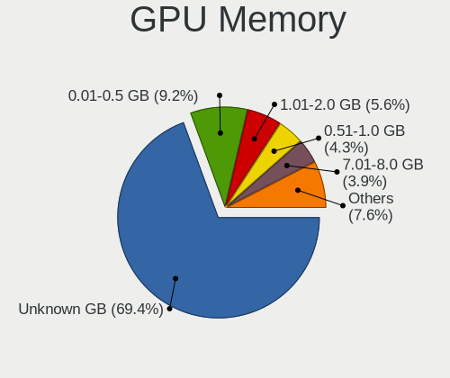

| Size in GB | Computers | Percent |
|------------|-----------|---------|
| Unknown    | 134       | 55.6%   |
| 0.01-0.5   | 33        | 13.69%  |
| 1.01-2.0   | 23        | 9.54%   |
| 0.51-1.0   | 19        | 7.88%   |
| 3.01-4.0   | 13        | 5.39%   |
| 7.01-8.0   | 11        | 4.56%   |
| 8.01-16.0  | 4         | 1.66%   |
| 5.01-6.0   | 3         | 1.24%   |
| 2.01-3.0   | 1         | 0.41%   |

Monitor
-------

Monitor Vendor
--------------

Monitor vendors

| Vendor                  | Computers | Percent |
|-------------------------|-----------|---------|
| Samsung Electronics     | 32        | 12.85%  |
| AU Optronics            | 29        | 11.65%  |
| BOE                     | 28        | 11.24%  |
| Chimei Innolux          | 26        | 10.44%  |
| LG Display              | 20        | 8.03%   |
| Dell                    | 16        | 6.43%   |
| Iiyama                  | 12        | 4.82%   |
| Hewlett-Packard         | 10        | 4.02%   |
| Acer                    | 10        | 4.02%   |
| Philips                 | 9         | 3.61%   |
| Goldstar                | 8         | 3.21%   |
| AOC                     | 8         | 3.21%   |
| Lenovo                  | 4         | 1.61%   |
| Ancor Communications    | 4         | 1.61%   |
| ViewSonic               | 3         | 1.2%    |
| Chi Mei Optoelectronics | 3         | 1.2%    |
| BenQ                    | 3         | 1.2%    |
| Toshiba                 | 2         | 0.8%    |
| Sony                    | 2         | 0.8%    |
| Sharp                   | 2         | 0.8%    |
| PANDA                   | 2         | 0.8%    |
| ASUSTek Computer        | 2         | 0.8%    |
| Apple                   | 2         | 0.8%    |
| Unknown                 | 1         | 0.4%    |
| UGD                     | 1         | 0.4%    |
| Sun                     | 1         | 0.4%    |
| SNC                     | 1         | 0.4%    |
| Panasonic               | 1         | 0.4%    |
| NEC Computers           | 1         | 0.4%    |
| Mi                      | 1         | 0.4%    |
| LGD                     | 1         | 0.4%    |
| Hitachi                 | 1         | 0.4%    |
| CSO                     | 1         | 0.4%    |
| CPT                     | 1         | 0.4%    |
| ANX                     | 1         | 0.4%    |

Monitor Model
-------------

Monitor models

| Model                                                                    | Computers | Percent |
|--------------------------------------------------------------------------|-----------|---------|
| BOE LCD Monitor BOE0687 1920x1080 344x193mm 15.5-inch                    | 3         | 1.19%   |
| Toshiba TV TSB0108 1920x1080 1594x900mm 72.1-inch                        | 2         | 0.79%   |
| Samsung Electronics LCD Monitor SEC5441 1366x768 344x194mm 15.5-inch     | 2         | 0.79%   |
| Samsung Electronics LCD Monitor SDC4852 1366x768 344x194mm 15.5-inch     | 2         | 0.79%   |
| Samsung Electronics LCD Monitor SDC3654 1600x900 382x215mm 17.3-inch     | 2         | 0.79%   |
| Iiyama PL2595W IVM6144 1920x1200 540x340mm 25.1-inch                     | 2         | 0.79%   |
| Iiyama PL2474H IVM6137 1920x1080 520x290mm 23.4-inch                     | 2         | 0.79%   |
| Hewlett-Packard 2309 HWP2821 1920x1080 510x287mm 23.0-inch               | 2         | 0.79%   |
| Dell U2412M DELA07A 1920x1200 518x324mm 24.1-inch                        | 2         | 0.79%   |
| Chimei Innolux LCD Monitor CMN175E 1920x1080 381x214mm 17.2-inch         | 2         | 0.79%   |
| Chimei Innolux LCD Monitor CMN1728 1600x900 382x215mm 17.3-inch          | 2         | 0.79%   |
| Chimei Innolux LCD Monitor CMN15F5 1920x1080 344x193mm 15.5-inch         | 2         | 0.79%   |
| Chimei Innolux LCD Monitor CMN15DB 1366x768 344x193mm 15.5-inch          | 2         | 0.79%   |
| Chimei Innolux LCD Monitor CMN14FF 1920x1080 309x173mm 13.9-inch         | 2         | 0.79%   |
| Chi Mei Optoelectronics LCD Monitor CMO1592 1366x768 344x193mm 15.5-inch | 2         | 0.79%   |
| BOE LCD Monitor BOE08E4 1600x900 382x215mm 17.3-inch                     | 2         | 0.79%   |
| BOE LCD Monitor BOE069B 1600x900 382x215mm 17.3-inch                     | 2         | 0.79%   |
| AU Optronics LCD Monitor AUO61ED 1920x1080 344x193mm 15.5-inch           | 2         | 0.79%   |
| Ancor Communications ASUS VS228 ACI22FD 1920x1080 476x268mm 21.5-inch    | 2         | 0.79%   |
| ViewSonic VX3218-PC-mhd VSCEB3A 1920x1080 609x348mm 27.6-inch            | 1         | 0.4%    |
| ViewSonic LCD Monitor VSC692F 1920x1080 480x270mm 21.7-inch              | 1         | 0.4%    |
| ViewSonic LCD Monitor VA2261 Series 1920x1080                            | 1         | 0.4%    |
| Unknown LCD Monitor FFFF 2288x1287 2550x2550mm 142.0-inch                | 1         | 0.4%    |
| UGD Artist 12 pro UGD1102 1920x1080 256x144mm 11.6-inch                  | 1         | 0.4%    |
| Sun SUNPLUS SUN0038 1440x900 410x257mm 19.1-inch                         | 1         | 0.4%    |
| Sony TV XV SNY5C01 1920x1080                                             | 1         | 0.4%    |
| Sony TV SNYB800 1280x768 690x390mm 31.2-inch                             | 1         | 0.4%    |
| SNC SKP_E20-32 SNC3200 1920x1080 854x480mm 38.6-inch                     | 1         | 0.4%    |
| Sharp LQ134N1JW52 SHP151E 1920x1200 288x180mm 13.4-inch                  | 1         | 0.4%    |
| Sharp LCD Monitor SHP148B 3840x2160 294x165mm 13.3-inch                  | 1         | 0.4%    |
| Samsung Electronics SyncMaster SAM0529 1920x1080 510x287mm 23.0-inch     | 1         | 0.4%    |
| Samsung Electronics SyncMaster SAM0521 1600x900 443x249mm 20.0-inch      | 1         | 0.4%    |
| Samsung Electronics SyncMaster SAM0422 1920x1200 518x324mm 24.1-inch     | 1         | 0.4%    |
| Samsung Electronics SyncMaster SAM03E5 1680x1050 470x300mm 22.0-inch     | 1         | 0.4%    |
| Samsung Electronics SyncMaster SAM0304 1680x1050 494x320mm 23.2-inch     | 1         | 0.4%    |
| Samsung Electronics SyncMaster SAM0255 1680x1050 474x296mm 22.0-inch     | 1         | 0.4%    |
| Samsung Electronics SyncMaster SAM0021 1280x1024 340x270mm 17.1-inch     | 1         | 0.4%    |
| Samsung Electronics SMS19A200 SAM0830 1440x900 408x255mm 18.9-inch       | 1         | 0.4%    |
| Samsung Electronics SME1920N SAM06A3 1366x768 410x230mm 18.5-inch        | 1         | 0.4%    |
| Samsung Electronics S34J55x SAM0F70 3440x1440 800x330mm 34.1-inch        | 1         | 0.4%    |
| Samsung Electronics S27E332 SAM0F60 1920x1080 600x340mm 27.2-inch        | 1         | 0.4%    |
| Samsung Electronics S27C450 SAM09D1 1920x1080 598x336mm 27.0-inch        | 1         | 0.4%    |
| Samsung Electronics S24F350 SAM0D20 1920x1080 521x293mm 23.5-inch        | 1         | 0.4%    |
| Samsung Electronics S24D332 SAM0F5E 1920x1080 531x299mm 24.0-inch        | 1         | 0.4%    |
| Samsung Electronics S24C650 SAM0B13 1920x1200 518x324mm 24.1-inch        | 1         | 0.4%    |
| Samsung Electronics S24C550 SAM0A4C 1920x1080 521x293mm 23.5-inch        | 1         | 0.4%    |
| Samsung Electronics Q80A SAM713C 3840x2160 1872x1053mm 84.6-inch         | 1         | 0.4%    |
| Samsung Electronics LCD Monitor SyncMaster 1440x900                      | 1         | 0.4%    |
| Samsung Electronics LCD Monitor SEC544B 1600x900 310x174mm 14.0-inch     | 1         | 0.4%    |
| Samsung Electronics LCD Monitor SEC3551 1366x768 344x194mm 15.5-inch     | 1         | 0.4%    |
| Samsung Electronics LCD Monitor SDC544B 1600x900 309x174mm 14.0-inch     | 1         | 0.4%    |
| Samsung Electronics LCD Monitor SDC4161 1920x1080 344x194mm 15.5-inch    | 1         | 0.4%    |
| Samsung Electronics LCD Monitor SAM0DF6 3840x2160 1020x570mm 46.0-inch   | 1         | 0.4%    |
| Samsung Electronics LCD Monitor SAM0902 1920x1080 890x500mm 40.2-inch    | 1         | 0.4%    |
| Samsung Electronics LCD Monitor SAM03D4 1360x768                         | 1         | 0.4%    |
| Samsung Electronics C27F390 SAM0D32 1920x1080 598x336mm 27.0-inch        | 1         | 0.4%    |
| Philips PHL 276E7 PHLC108 1920x1080 598x336mm 27.0-inch                  | 1         | 0.4%    |
| Philips PHL 273V7 PHLC156 1920x1080 598x336mm 27.0-inch                  | 1         | 0.4%    |
| Philips PHL 243V7 PHLC155 1920x1080 527x296mm 23.8-inch                  | 1         | 0.4%    |
| Philips PHL 240V5A PHLC10C 1920x1080 527x296mm 23.8-inch                 | 1         | 0.4%    |

Monitor Resolution
------------------

Monitor screen resolution

| Resolution         | Computers | Percent |
|--------------------|-----------|---------|
| 1920x1080 (FHD)    | 105       | 43.75%  |
| 1366x768 (WXGA)    | 37        | 15.42%  |
| 1600x900 (HD+)     | 24        | 10%     |
| 3840x2160 (4K)     | 13        | 5.42%   |
| 1920x1200 (WUXGA)  | 13        | 5.42%   |
| 2560x1440 (QHD)    | 8         | 3.33%   |
| 1280x1024 (SXGA)   | 8         | 3.33%   |
| 1680x1050 (WSXGA+) | 6         | 2.5%    |
| 1440x900 (WXGA+)   | 5         | 2.08%   |
| 2560x1600          | 3         | 1.25%   |
| 3440x1440          | 2         | 0.83%   |
| 2560x1080          | 2         | 0.83%   |
| 1920x540           | 2         | 0.83%   |
| 1600x1200          | 2         | 0.83%   |
| 1024x768 (XGA)     | 2         | 0.83%   |
| 800x1280           | 1         | 0.42%   |
| 3286x1080          | 1         | 0.42%   |
| 2736x1824          | 1         | 0.42%   |
| 2288x1287          | 1         | 0.42%   |
| 2256x1504          | 1         | 0.42%   |
| 1360x768           | 1         | 0.42%   |
| 1280x800 (WXGA)    | 1         | 0.42%   |
| 1280x768           | 1         | 0.42%   |

Monitor Diagonal
----------------

Diagonal size in inches

| Inches  | Computers | Percent |
|---------|-----------|---------|
| 15      | 62        | 25%     |
| 17      | 32        | 12.9%   |
| 24      | 24        | 9.68%   |
| 23      | 19        | 7.66%   |
| 27      | 17        | 6.85%   |
| 13      | 16        | 6.45%   |
| 14      | 11        | 4.44%   |
| 21      | 8         | 3.23%   |
| Unknown | 7         | 2.82%   |
| 22      | 6         | 2.42%   |
| 19      | 6         | 2.42%   |
| 20      | 5         | 2.02%   |
| 34      | 4         | 1.61%   |
| 16      | 4         | 1.61%   |
| 72      | 3         | 1.21%   |
| 31      | 3         | 1.21%   |
| 25      | 3         | 1.21%   |
| 18      | 3         | 1.21%   |
| 12      | 3         | 1.21%   |
| 11      | 3         | 1.21%   |
| 84      | 2         | 0.81%   |
| 32      | 2         | 0.81%   |
| 142     | 1         | 0.4%    |
| 54      | 1         | 0.4%    |
| 39      | 1         | 0.4%    |
| 38      | 1         | 0.4%    |
| 26      | 1         | 0.4%    |

Monitor Width
-------------

Physical width

| Width in mm    | Computers | Percent |
|----------------|-----------|---------|
| 301-350        | 85        | 34.84%  |
| 501-600        | 57        | 23.36%  |
| 351-400        | 37        | 15.16%  |
| 401-500        | 24        | 9.84%   |
| 201-300        | 14        | 5.74%   |
| Unknown        | 7         | 2.87%   |
| 701-800        | 5         | 2.05%   |
| 601-700        | 5         | 2.05%   |
| 1501-2000      | 5         | 2.05%   |
| 801-900        | 3         | 1.23%   |
| More than 2000 | 1         | 0.41%   |
| 1001-1500      | 1         | 0.41%   |

Aspect Ratio
------------

Proportional relationship between the width and the height

| Ratio   | Computers | Percent |
|---------|-----------|---------|
| 16/9    | 176       | 76.86%  |
| 16/10   | 27        | 11.79%  |
| 5/4     | 8         | 3.49%   |
| Unknown | 5         | 2.18%   |
| 4/3     | 4         | 1.75%   |
| 21/9    | 4         | 1.75%   |
| 3/2     | 3         | 1.31%   |
| 1.00    | 1         | 0.44%   |
| 0.62    | 1         | 0.44%   |

Monitor Area
------------

Area in inch²

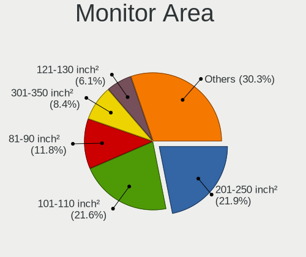

| Area in inch² | Computers | Percent |
|----------------|-----------|---------|
| 101-110        | 62        | 25.2%   |
| 201-250        | 44        | 17.89%  |
| 121-130        | 26        | 10.57%  |
| 81-90          | 20        | 8.13%   |
| 301-350        | 18        | 7.32%   |
| 151-200        | 14        | 5.69%   |
| 251-300        | 12        | 4.88%   |
| 351-500        | 9         | 3.66%   |
| 71-80          | 8         | 3.25%   |
| More than 1000 | 7         | 2.85%   |
| Unknown        | 7         | 2.85%   |
| 141-150        | 5         | 2.03%   |
| 111-120        | 4         | 1.63%   |
| 51-60          | 3         | 1.22%   |
| 131-140        | 3         | 1.22%   |
| 61-70          | 2         | 0.81%   |
| 501-1000       | 2         | 0.81%   |

Pixel Density
-------------

Pixels per inch

| Density       | Computers | Percent |
|---------------|-----------|---------|
| 51-100        | 89        | 37.24%  |
| 101-120       | 62        | 25.94%  |
| 121-160       | 61        | 25.52%  |
| 161-240       | 10        | 4.18%   |
| Unknown       | 7         | 2.93%   |
| 1-50          | 6         | 2.51%   |
| More than 240 | 4         | 1.67%   |

Multiple Monitors
-----------------

Total monitors connected

| Total | Computers | Percent |
|-------|-----------|---------|
| 1     | 197       | 81.74%  |
| 2     | 32        | 13.28%  |
| 0     | 11        | 4.56%   |
| 3     | 1         | 0.41%   |

Network
-------

Net Controller Vendor
---------------------

Controller vendors

| Vendor                     | Computers | Percent |
|----------------------------|-----------|---------|
| Realtek Semiconductor      | 131       | 38.42%  |
| Intel                      | 111       | 32.55%  |
| Qualcomm Atheros           | 43        | 12.61%  |
| Broadcom                   | 26        | 7.62%   |
| Ralink Technology          | 4         | 1.17%   |
| Marvell Technology Group   | 4         | 1.17%   |
| Ralink                     | 3         | 0.88%   |
| MediaTek                   | 3         | 0.88%   |
| Broadcom Limited           | 3         | 0.88%   |
| Hewlett-Packard            | 2         | 0.59%   |
| DisplayLink                | 2         | 0.59%   |
| TP-Link                    | 1         | 0.29%   |
| Toshiba                    | 1         | 0.29%   |
| Shenzhen Goodix Technology | 1         | 0.29%   |
| Samsung Electronics        | 1         | 0.29%   |
| OPPO Electronics           | 1         | 0.29%   |
| Nvidia                     | 1         | 0.29%   |
| NetGear                    | 1         | 0.29%   |
| D-Link                     | 1         | 0.29%   |
| ASIX Electronics           | 1         | 0.29%   |

Net Controller Model
--------------------

Controller models

| Model                                                             | Computers | Percent |
|-------------------------------------------------------------------|-----------|---------|
| Realtek RTL8111/8168/8411 PCI Express Gigabit Ethernet Controller | 92        | 22.83%  |
| Intel Wi-Fi 6 AX200                                               | 14        | 3.47%   |
| Realtek RTL8125 2.5GbE Controller                                 | 13        | 3.23%   |
| Realtek RTL810xE PCI Express Fast Ethernet controller             | 11        | 2.73%   |
| Qualcomm Atheros QCA9377 802.11ac Wireless Network Adapter        | 11        | 2.73%   |
| Intel 82579LM Gigabit Network Connection (Lewisville)             | 11        | 2.73%   |
| Realtek RTL8821CE 802.11ac PCIe Wireless Network Adapter          | 10        | 2.48%   |
| Intel Wi-Fi 6 AX201                                               | 7         | 1.74%   |
| Realtek RTL8822CE 802.11ac PCIe Wireless Network Adapter          | 6         | 1.49%   |
| Intel Wireless 7265                                               | 6         | 1.49%   |
| Intel Wireless 8260                                               | 5         | 1.24%   |
| Realtek RTL8723BE PCIe Wireless Network Adapter                   | 4         | 0.99%   |
| Qualcomm Atheros AR9485 Wireless Network Adapter                  | 4         | 0.99%   |
| Qualcomm Atheros AR9285 Wireless Network Adapter (PCI-Express)    | 4         | 0.99%   |
| Qualcomm Atheros AR8151 v2.0 Gigabit Ethernet                     | 4         | 0.99%   |
| Intel Wireless 8265 / 8275                                        | 4         | 0.99%   |
| Intel Wi-Fi 6 AX210/AX211/AX411 160MHz                            | 4         | 0.99%   |
| Intel I211 Gigabit Network Connection                             | 4         | 0.99%   |
| Intel Comet Lake PCH-LP CNVi WiFi                                 | 4         | 0.99%   |
| Intel Centrino Advanced-N 6205 [Taylor Peak]                      | 4         | 0.99%   |
| Broadcom BCM4313 802.11bgn Wireless Network Adapter               | 4         | 0.99%   |
| Realtek RTL8153 Gigabit Ethernet Adapter                          | 3         | 0.74%   |
| Qualcomm Atheros Killer E2400 Gigabit Ethernet Controller         | 3         | 0.74%   |
| Intel Wireless-AC 9260                                            | 3         | 0.74%   |
| Intel Ethernet Controller I225-V                                  | 3         | 0.74%   |
| Intel Ethernet Connection (2) I219-V                              | 3         | 0.74%   |
| Intel Alder Lake-P PCH CNVi WiFi                                  | 3         | 0.74%   |
| Intel 82579V Gigabit Network Connection                           | 3         | 0.74%   |
| Broadcom NetLink BCM57785 Gigabit Ethernet PCIe                   | 3         | 0.74%   |
| Broadcom NetLink BCM57780 Gigabit Ethernet PCIe                   | 3         | 0.74%   |
| Broadcom BCM43224 802.11a/b/g/n                                   | 3         | 0.74%   |
| Realtek RTL8723DE Wireless Network Adapter                        | 2         | 0.5%    |
| Realtek RTL8192EU 802.11b/g/n WLAN Adapter                        | 2         | 0.5%    |
| Realtek RTL8192EE PCIe Wireless Network Adapter                   | 2         | 0.5%    |
| Realtek RTL8191SEvB Wireless LAN Controller                       | 2         | 0.5%    |
| Realtek RTL8152 Fast Ethernet Adapter                             | 2         | 0.5%    |
| Realtek Killer E3000 2.5GbE Controller                            | 2         | 0.5%    |
| Realtek 802.11ac NIC                                              | 2         | 0.5%    |
| Ralink MT7601U Wireless Adapter                                   | 2         | 0.5%    |
| Qualcomm Atheros QCA9565 / AR9565 Wireless Network Adapter        | 2         | 0.5%    |
| Qualcomm Atheros QCA6174 802.11ac Wireless Network Adapter        | 2         | 0.5%    |
| Qualcomm Atheros AR9462 Wireless Network Adapter                  | 2         | 0.5%    |
| Qualcomm Atheros AR9287 Wireless Network Adapter (PCI-Express)    | 2         | 0.5%    |
| Qualcomm Atheros AR8161 Gigabit Ethernet                          | 2         | 0.5%    |
| Qualcomm Atheros AR8121/AR8113/AR8114 Gigabit or Fast Ethernet    | 2         | 0.5%    |
| Qualcomm Atheros AR5212/5213/2414 Wireless Network Adapter        | 2         | 0.5%    |
| Intel Wireless 7260                                               | 2         | 0.5%    |
| Intel Wireless 3165                                               | 2         | 0.5%    |
| Intel Tiger Lake PCH CNVi WiFi                                    | 2         | 0.5%    |
| Intel I350 Gigabit Network Connection                             | 2         | 0.5%    |
| Intel Gemini Lake PCH CNVi WiFi                                   | 2         | 0.5%    |
| Intel Ethernet Connection I217-V                                  | 2         | 0.5%    |
| Intel Ethernet Connection I217-LM                                 | 2         | 0.5%    |
| Intel Ethernet Connection (2) I219-LM                             | 2         | 0.5%    |
| Intel Ethernet Connection (14) I219-V                             | 2         | 0.5%    |
| Intel Ethernet Connection (13) I219-LM                            | 2         | 0.5%    |
| Intel Ethernet Connection (11) I219-LM                            | 2         | 0.5%    |
| Intel Ethernet Connection (10) I219-V                             | 2         | 0.5%    |
| Intel Dual Band Wireless-AC 3165 Plus Bluetooth                   | 2         | 0.5%    |
| Intel Centrino Advanced-N 6235                                    | 2         | 0.5%    |

Wireless Vendor
---------------

Wireless vendors

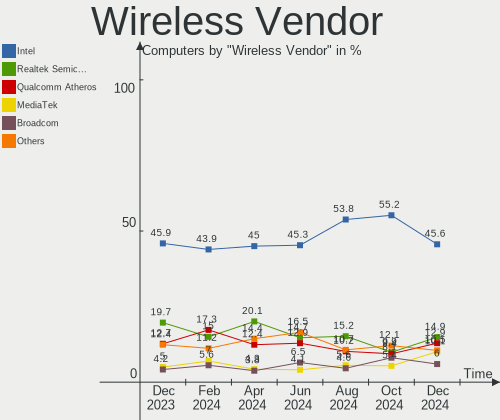

| Vendor                   | Computers | Percent |
|--------------------------|-----------|---------|
| Intel                    | 76        | 42.46%  |
| Realtek Semiconductor    | 38        | 21.23%  |
| Qualcomm Atheros         | 33        | 18.44%  |
| Broadcom                 | 15        | 8.38%   |
| Ralink Technology        | 4         | 2.23%   |
| Ralink                   | 3         | 1.68%   |
| MediaTek                 | 3         | 1.68%   |
| Broadcom Limited         | 3         | 1.68%   |
| NetGear                  | 1         | 0.56%   |
| Marvell Technology Group | 1         | 0.56%   |
| Hewlett-Packard          | 1         | 0.56%   |
| D-Link                   | 1         | 0.56%   |

Wireless Model
--------------

Wireless models

| Model                                                                   | Computers | Percent |
|-------------------------------------------------------------------------|-----------|---------|
| Intel Wi-Fi 6 AX200                                                     | 14        | 7.82%   |
| Qualcomm Atheros QCA9377 802.11ac Wireless Network Adapter              | 11        | 6.15%   |
| Realtek RTL8821CE 802.11ac PCIe Wireless Network Adapter                | 10        | 5.59%   |
| Intel Wi-Fi 6 AX201                                                     | 7         | 3.91%   |
| Realtek RTL8822CE 802.11ac PCIe Wireless Network Adapter                | 6         | 3.35%   |
| Intel Wireless 7265                                                     | 6         | 3.35%   |
| Intel Wireless 8260                                                     | 5         | 2.79%   |
| Realtek RTL8723BE PCIe Wireless Network Adapter                         | 4         | 2.23%   |
| Qualcomm Atheros AR9485 Wireless Network Adapter                        | 4         | 2.23%   |
| Qualcomm Atheros AR9285 Wireless Network Adapter (PCI-Express)          | 4         | 2.23%   |
| Intel Wireless 8265 / 8275                                              | 4         | 2.23%   |
| Intel Wi-Fi 6 AX210/AX211/AX411 160MHz                                  | 4         | 2.23%   |
| Intel Comet Lake PCH-LP CNVi WiFi                                       | 4         | 2.23%   |
| Intel Centrino Advanced-N 6205 [Taylor Peak]                            | 4         | 2.23%   |
| Broadcom BCM4313 802.11bgn Wireless Network Adapter                     | 4         | 2.23%   |
| Intel Wireless-AC 9260                                                  | 3         | 1.68%   |
| Intel Alder Lake-P PCH CNVi WiFi                                        | 3         | 1.68%   |
| Broadcom BCM43224 802.11a/b/g/n                                         | 3         | 1.68%   |
| Realtek RTL8723DE Wireless Network Adapter                              | 2         | 1.12%   |
| Realtek RTL8192EU 802.11b/g/n WLAN Adapter                              | 2         | 1.12%   |
| Realtek RTL8192EE PCIe Wireless Network Adapter                         | 2         | 1.12%   |
| Realtek RTL8191SEvB Wireless LAN Controller                             | 2         | 1.12%   |
| Realtek 802.11ac NIC                                                    | 2         | 1.12%   |
| Ralink MT7601U Wireless Adapter                                         | 2         | 1.12%   |
| Qualcomm Atheros QCA9565 / AR9565 Wireless Network Adapter              | 2         | 1.12%   |
| Qualcomm Atheros QCA6174 802.11ac Wireless Network Adapter              | 2         | 1.12%   |
| Qualcomm Atheros AR9462 Wireless Network Adapter                        | 2         | 1.12%   |
| Qualcomm Atheros AR9287 Wireless Network Adapter (PCI-Express)          | 2         | 1.12%   |
| Qualcomm Atheros AR5212/5213/2414 Wireless Network Adapter              | 2         | 1.12%   |
| Intel Wireless 7260                                                     | 2         | 1.12%   |
| Intel Wireless 3165                                                     | 2         | 1.12%   |
| Intel Tiger Lake PCH CNVi WiFi                                          | 2         | 1.12%   |
| Intel Gemini Lake PCH CNVi WiFi                                         | 2         | 1.12%   |
| Intel Dual Band Wireless-AC 3165 Plus Bluetooth                         | 2         | 1.12%   |
| Intel Centrino Advanced-N 6235                                          | 2         | 1.12%   |
| Intel Cannon Point-LP CNVi [Wireless-AC]                                | 2         | 1.12%   |
| Broadcom Limited BCM4312 802.11b/g LP-PHY                               | 2         | 1.12%   |
| Broadcom BCM43142 802.11b/g/n                                           | 2         | 1.12%   |
| Realtek RTL88x2bu [AC1200 Techkey]                                      | 1         | 0.56%   |
| Realtek RTL8811AU 802.11a/b/g/n/ac WLAN Adapter                         | 1         | 0.56%   |
| Realtek RTL8191SU 802.11n WLAN Adapter                                  | 1         | 0.56%   |
| Realtek RTL8188EUS 802.11n Wireless Network Adapter                     | 1         | 0.56%   |
| Realtek RTL8188EE Wireless Network Adapter                              | 1         | 0.56%   |
| Realtek RTL8188CE 802.11b/g/n WiFi Adapter                              | 1         | 0.56%   |
| Realtek Realtek Network controller                                      | 1         | 0.56%   |
| Realtek 802.11n WLAN Adapter                                            | 1         | 0.56%   |
| Ralink RT2501/RT2573 Wireless Adapter                                   | 1         | 0.56%   |
| Ralink MT7610U ("Archer T2U" 2.4G+5G WLAN Adapter                       | 1         | 0.56%   |
| Ralink RT5390 [802.11 b/g/n 1T1R G-band PCI Express Single Chip]        | 1         | 0.56%   |
| Ralink RT5390 Wireless 802.11n 1T/1R PCIe                               | 1         | 0.56%   |
| Ralink RT3290 Wireless 802.11n 1T/1R PCIe                               | 1         | 0.56%   |
| Qualcomm Atheros AR93xx Wireless Network Adapter                        | 1         | 0.56%   |
| Qualcomm Atheros AR928X Wireless Network Adapter (PCI-Express)          | 1         | 0.56%   |
| Qualcomm Atheros AR9227 Wireless Network Adapter                        | 1         | 0.56%   |
| Qualcomm Atheros AR242x / AR542x Wireless Network Adapter (PCI-Express) | 1         | 0.56%   |
| NetGear A6100 AC600 DB Wireless Adapter [Realtek RTL8811AU]             | 1         | 0.56%   |
| MediaTek MT7921K (RZ608) Wi-Fi 6E 80MHz                                 | 1         | 0.56%   |
| MediaTek MT7921 802.11ax PCI Express Wireless Network Adapter           | 1         | 0.56%   |
| MediaTek MT7630e 802.11bgn Wireless Network Adapter                     | 1         | 0.56%   |
| Marvell Group 88W8897 [AVASTAR] 802.11ac Wireless                       | 1         | 0.56%   |

Ethernet Vendor
---------------

Ethernet vendors

| Vendor                   | Computers | Percent |
|--------------------------|-----------|---------|
| Realtek Semiconductor    | 121       | 55.76%  |
| Intel                    | 60        | 27.65%  |
| Qualcomm Atheros         | 13        | 5.99%   |
| Broadcom                 | 13        | 5.99%   |
| Marvell Technology Group | 3         | 1.38%   |
| DisplayLink              | 2         | 0.92%   |
| TP-Link                  | 1         | 0.46%   |
| Samsung Electronics      | 1         | 0.46%   |
| OPPO Electronics         | 1         | 0.46%   |
| Nvidia                   | 1         | 0.46%   |
| ASIX Electronics         | 1         | 0.46%   |

Ethernet Model
--------------

Ethernet models

| Model                                                             | Computers | Percent |
|-------------------------------------------------------------------|-----------|---------|
| Realtek RTL8111/8168/8411 PCI Express Gigabit Ethernet Controller | 92        | 41.63%  |
| Realtek RTL8125 2.5GbE Controller                                 | 13        | 5.88%   |
| Realtek RTL810xE PCI Express Fast Ethernet controller             | 11        | 4.98%   |
| Intel 82579LM Gigabit Network Connection (Lewisville)             | 11        | 4.98%   |
| Qualcomm Atheros AR8151 v2.0 Gigabit Ethernet                     | 4         | 1.81%   |
| Intel I211 Gigabit Network Connection                             | 4         | 1.81%   |
| Realtek RTL8153 Gigabit Ethernet Adapter                          | 3         | 1.36%   |
| Qualcomm Atheros Killer E2400 Gigabit Ethernet Controller         | 3         | 1.36%   |
| Intel Ethernet Controller I225-V                                  | 3         | 1.36%   |
| Intel Ethernet Connection (2) I219-V                              | 3         | 1.36%   |
| Intel 82579V Gigabit Network Connection                           | 3         | 1.36%   |
| Broadcom NetLink BCM57785 Gigabit Ethernet PCIe                   | 3         | 1.36%   |
| Broadcom NetLink BCM57780 Gigabit Ethernet PCIe                   | 3         | 1.36%   |
| Realtek RTL8152 Fast Ethernet Adapter                             | 2         | 0.9%    |
| Realtek Killer E3000 2.5GbE Controller                            | 2         | 0.9%    |
| Qualcomm Atheros AR8161 Gigabit Ethernet                          | 2         | 0.9%    |
| Qualcomm Atheros AR8121/AR8113/AR8114 Gigabit or Fast Ethernet    | 2         | 0.9%    |
| Intel I350 Gigabit Network Connection                             | 2         | 0.9%    |
| Intel Ethernet Connection I217-V                                  | 2         | 0.9%    |
| Intel Ethernet Connection I217-LM                                 | 2         | 0.9%    |
| Intel Ethernet Connection (2) I219-LM                             | 2         | 0.9%    |
| Intel Ethernet Connection (14) I219-V                             | 2         | 0.9%    |
| Intel Ethernet Connection (13) I219-LM                            | 2         | 0.9%    |
| Intel Ethernet Connection (11) I219-LM                            | 2         | 0.9%    |
| Intel Ethernet Connection (10) I219-V                             | 2         | 0.9%    |
| Intel 82578DC Gigabit Network Connection                          | 2         | 0.9%    |
| Intel 82577LM Gigabit Network Connection                          | 2         | 0.9%    |
| Intel 82567LM-3 Gigabit Network Connection                        | 2         | 0.9%    |
| Broadcom NetXtreme BCM57765 Gigabit Ethernet PCIe                 | 2         | 0.9%    |
| TP-Link UE300 10/100/1000 LAN (ethernet mode) [Realtek RTL8153]   | 1         | 0.45%   |
| Samsung Galaxy series, misc. (tethering mode)                     | 1         | 0.45%   |
| Realtek Killer E2600 Gigabit Ethernet Controller                  | 1         | 0.45%   |
| Qualcomm Atheros AR8152 v1.1 Fast Ethernet                        | 1         | 0.45%   |
| Qualcomm Atheros AR8131 Gigabit Ethernet                          | 1         | 0.45%   |
| OPPO SDM720G-IDP _SN:B922E265                                     | 1         | 0.45%   |
| Nvidia MCP61 Ethernet                                             | 1         | 0.45%   |
| Marvell Group 88E8072 PCI-E Gigabit Ethernet Controller           | 1         | 0.45%   |
| Marvell Group 88E8071 PCI-E Gigabit Ethernet Controller           | 1         | 0.45%   |
| Marvell Group 88E8056 PCI-E Gigabit Ethernet Controller           | 1         | 0.45%   |
| Intel I210 Gigabit Network Connection                             | 1         | 0.45%   |
| Intel Ethernet Controller E810-C for SFP                          | 1         | 0.45%   |
| Intel Ethernet Connection I219-V                                  | 1         | 0.45%   |
| Intel Ethernet Connection I218-LM                                 | 1         | 0.45%   |
| Intel Ethernet Connection (7) I219-V                              | 1         | 0.45%   |
| Intel Ethernet Connection (7) I219-LM                             | 1         | 0.45%   |
| Intel Ethernet Connection (6) I219-V                              | 1         | 0.45%   |
| Intel Ethernet Connection (6) I219-LM                             | 1         | 0.45%   |
| Intel Ethernet Connection (4) I219-V                              | 1         | 0.45%   |
| Intel Ethernet Connection (4) I219-LM                             | 1         | 0.45%   |
| Intel Ethernet Connection (3) I218-LM                             | 1         | 0.45%   |
| Intel Ethernet Connection (2) I218-LM                             | 1         | 0.45%   |
| Intel Ethernet Connection (13) I219-V                             | 1         | 0.45%   |
| Intel Ethernet Connection (11) I219-V                             | 1         | 0.45%   |
| Intel 82574L Gigabit Network Connection                           | 1         | 0.45%   |
| DisplayLink USB3.0 Dual Video Dock                                | 1         | 0.45%   |
| DisplayLink ThinkPad USB 3.0 Pro Dock                             | 1         | 0.45%   |
| Broadcom NetXtreme BCM5764M Gigabit Ethernet PCIe                 | 1         | 0.45%   |
| Broadcom NetXtreme BCM5761e Gigabit Ethernet PCIe                 | 1         | 0.45%   |
| Broadcom NetXtreme BCM5761 Gigabit Ethernet PCIe                  | 1         | 0.45%   |
| Broadcom NetXtreme BCM5755 Gigabit Ethernet PCI Express           | 1         | 0.45%   |

Net Controller Kind
-------------------

Ethernet, WiFi or modem

| Kind     | Computers | Percent |
|----------|-----------|---------|
| Ethernet | 208       | 54.03%  |
| WiFi     | 174       | 45.19%  |
| Modem    | 2         | 0.52%   |
| Unknown  | 1         | 0.26%   |

Used Controller
---------------

Currently used network controller

| Kind     | Computers | Percent |
|----------|-----------|---------|
| WiFi     | 128       | 51.61%  |
| Ethernet | 120       | 48.39%  |

NICs
----

Total network controllers on board

| Total | Computers | Percent |
|-------|-----------|---------|
| 2     | 138       | 57.26%  |
| 1     | 95        | 39.42%  |
| 0     | 5         | 2.07%   |
| 3     | 2         | 0.83%   |
| 4     | 1         | 0.41%   |

IPv6
----

IPv6 vs IPv4

| Used | Computers | Percent |
|------|-----------|---------|
| Yes  | 145       | 60.17%  |
| No   | 96        | 39.83%  |

Bluetooth
---------

Bluetooth Vendor
----------------

Controller vendors

| Vendor                          | Computers | Percent |
|---------------------------------|-----------|---------|
| Intel                           | 67        | 46.21%  |
| Realtek Semiconductor           | 18        | 12.41%  |
| IMC Networks                    | 10        | 6.9%    |
| Cambridge Silicon Radio         | 10        | 6.9%    |
| Qualcomm Atheros Communications | 9         | 6.21%   |
| Broadcom                        | 7         | 4.83%   |
| Foxconn / Hon Hai               | 6         | 4.14%   |
| Lite-On Technology              | 3         | 2.07%   |
| TP-Link                         | 2         | 1.38%   |
| Hewlett-Packard                 | 2         | 1.38%   |
| ASUSTek Computer                | 2         | 1.38%   |
| Apple                           | 2         | 1.38%   |
| Toshiba                         | 1         | 0.69%   |
| Ralink Technology               | 1         | 0.69%   |
| Ralink                          | 1         | 0.69%   |
| MediaTek                        | 1         | 0.69%   |
| Marvell Semiconductor           | 1         | 0.69%   |
| Fujitsu                         | 1         | 0.69%   |
| Dell                            | 1         | 0.69%   |

Bluetooth Model
---------------

Controller models

| Model                                               | Computers | Percent |
|-----------------------------------------------------|-----------|---------|
| Intel Bluetooth wireless interface                  | 22        | 15.17%  |
| Realtek Bluetooth Radio                             | 14        | 9.66%   |
| Intel AX200 Bluetooth                               | 13        | 8.97%   |
| Intel AX201 Bluetooth                               | 12        | 8.28%   |
| Cambridge Silicon Radio Bluetooth Dongle (HCI mode) | 10        | 6.9%    |
| Qualcomm Atheros  Bluetooth Device                  | 6         | 4.14%   |
| Intel Bluetooth Device                              | 6         | 4.14%   |
| Intel Bluetooth 9460/9560 Jefferson Peak (JfP)      | 6         | 4.14%   |
| IMC Networks Bluetooth Radio                        | 5         | 3.45%   |
| Intel AX210 Bluetooth                               | 4         | 2.76%   |
| IMC Networks Bluetooth Device                       | 4         | 2.76%   |
| Realtek  Bluetooth 4.2 Adapter                      | 3         | 2.07%   |
| Lite-On Qualcomm Atheros QCA9377 Bluetooth          | 3         | 2.07%   |
| Intel Centrino Bluetooth Wireless Transceiver       | 3         | 2.07%   |
| TP-Link TP-hink UB500 Adapter                       | 2         | 1.38%   |
| Qualcomm Atheros AR3011 Bluetooth                   | 2         | 1.38%   |
| HP Broadcom 2070 Bluetooth Combo                    | 2         | 1.38%   |
| Foxconn / Hon Hai Bluetooth Device                  | 2         | 1.38%   |
| Broadcom BCM43142A0 Bluetooth 4.0                   | 2         | 1.38%   |
| Broadcom BCM2045B (BDC-2.1)                         | 2         | 1.38%   |
| Toshiba Integrated Bluetooth HCI                    | 1         | 0.69%   |
| Realtek RTL8723B Bluetooth                          | 1         | 0.69%   |
| Ralink CSR BS8510                                   | 1         | 0.69%   |
| Ralink RT3290 Bluetooth                             | 1         | 0.69%   |
| Qualcomm Atheros AR3012 Bluetooth 4.0               | 1         | 0.69%   |
| MediaTek Wireless_Device                            | 1         | 0.69%   |
| Marvell Bluetooth and Wireless LAN Composite        | 1         | 0.69%   |
| Intel Wireless-AC 3168 Bluetooth                    | 1         | 0.69%   |
| IMC Networks Atheros AR3012 Bluetooth 4.0 Adapter   | 1         | 0.69%   |
| Fujitsu Bluetooth Device                            | 1         | 0.69%   |
| Foxconn / Hon Hai Wireless_Device                   | 1         | 0.69%   |
| Foxconn / Hon Hai BT                                | 1         | 0.69%   |
| Foxconn / Hon Hai Bluetooth USB Host Controller     | 1         | 0.69%   |
| Foxconn / Hon Hai BCM2045A0                         | 1         | 0.69%   |
| Dell Wireless 365 Bluetooth                         | 1         | 0.69%   |
| Broadcom HP Portable SoftSailing                    | 1         | 0.69%   |
| Broadcom BCM20702A0 Bluetooth 4.0                   | 1         | 0.69%   |
| Broadcom BCM2070 Bluetooth 2.1 + EDR                | 1         | 0.69%   |
| ASUS Broadcom BCM20702A0 Bluetooth                  | 1         | 0.69%   |
| ASUS ASUS USB-BT500                                 | 1         | 0.69%   |
| Apple Built-in Bluetooth 2.0+EDR HCI                | 1         | 0.69%   |
| Apple Bluetooth USB Host Controller                 | 1         | 0.69%   |

Sound
-----

Sound Vendor
------------

Sound card vendors

| Vendor                             | Computers | Percent |
|------------------------------------|-----------|---------|
| Intel                              | 174       | 51.79%  |
| AMD                                | 69        | 20.54%  |
| Nvidia                             | 62        | 18.45%  |
| Logitech                           | 4         | 1.19%   |
| C-Media Electronics                | 3         | 0.89%   |
| Micro Star International           | 2         | 0.6%    |
| Creative Technology                | 2         | 0.6%    |
| Creative Labs                      | 2         | 0.6%    |
| VIA Technologies                   | 1         | 0.3%    |
| Realtek Semiconductor              | 1         | 0.3%    |
| Razer USA                          | 1         | 0.3%    |
| Orbbec 3D Technology International | 1         | 0.3%    |
| OLKB                               | 1         | 0.3%    |
| Native Instruments                 | 1         | 0.3%    |
| Medeli Electronics                 | 1         | 0.3%    |
| M-Audio                            | 1         | 0.3%    |
| Linux Foundation                   | 1         | 0.3%    |
| KORG                               | 1         | 0.3%    |
| JMTek                              | 1         | 0.3%    |
| GYROCOM C&C                        | 1         | 0.3%    |
| GN Netcom                          | 1         | 0.3%    |
| Generalplus Technology             | 1         | 0.3%    |
| DSEA A/S                           | 1         | 0.3%    |
| Conexant Systems                   | 1         | 0.3%    |
| Barco Display Systems              | 1         | 0.3%    |
| Audio-Technica                     | 1         | 0.3%    |

Sound Model
-----------

Sound card models

| Model                                                                      | Computers | Percent |
|----------------------------------------------------------------------------|-----------|---------|
| AMD Family 17h/19h HD Audio Controller                                     | 24        | 6.05%   |
| Intel 6 Series/C200 Series Chipset Family High Definition Audio Controller | 18        | 4.53%   |
| Intel 7 Series/C216 Chipset Family High Definition Audio Controller        | 17        | 4.28%   |
| AMD Renoir Radeon High Definition Audio Controller                         | 14        | 3.53%   |
| Intel Sunrise Point-LP HD Audio                                            | 12        | 3.02%   |
| Intel 5 Series/3400 Series Chipset High Definition Audio                   | 12        | 3.02%   |
| Intel Tiger Lake-LP Smart Sound Technology Audio Controller                | 11        | 2.77%   |
| Intel 100 Series/C230 Series Chipset Family HD Audio Controller            | 11        | 2.77%   |
| AMD Starship/Matisse HD Audio Controller                                   | 11        | 2.77%   |
| Intel Xeon E3-1200 v3/4th Gen Core Processor HD Audio Controller           | 8         | 2.02%   |
| Intel Wildcat Point-LP High Definition Audio Controller                    | 8         | 2.02%   |
| Intel Broadwell-U Audio Controller                                         | 8         | 2.02%   |
| AMD FCH Azalia Controller                                                  | 8         | 2.02%   |
| Intel Haswell-ULT HD Audio Controller                                      | 7         | 1.76%   |
| Intel 8 Series/C220 Series Chipset High Definition Audio Controller        | 7         | 1.76%   |
| Intel 8 Series HD Audio Controller                                         | 7         | 1.76%   |
| AMD Raven/Raven2/Fenghuang HDMI/DP Audio Controller                        | 7         | 1.76%   |
| Nvidia High Definition Audio Controller                                    | 6         | 1.51%   |
| Nvidia GF108 High Definition Audio Controller                              | 6         | 1.51%   |
| Intel Tiger Lake-H HD Audio Controller                                     | 6         | 1.51%   |
| Intel 82801I (ICH9 Family) HD Audio Controller                             | 6         | 1.51%   |
| Nvidia TU107 GeForce GTX 1650 High Definition Audio Controller             | 5         | 1.26%   |
| Nvidia GA104 High Definition Audio Controller                              | 5         | 1.26%   |
| Intel Comet Lake PCH-LP cAVS                                               | 5         | 1.26%   |
| Intel Comet Lake PCH cAVS                                                  | 5         | 1.26%   |
| Intel Celeron/Pentium Silver Processor High Definition Audio               | 5         | 1.26%   |
| Intel 82801JI (ICH10 Family) HD Audio Controller                           | 5         | 1.26%   |
| AMD Kabini HDMI/DP Audio                                                   | 5         | 1.26%   |
| Nvidia GP107GL High Definition Audio Controller                            | 4         | 1.01%   |
| Nvidia GM107 High Definition Audio Controller [GeForce 940MX]              | 4         | 1.01%   |
| Nvidia GF119 HDMI Audio Controller                                         | 4         | 1.01%   |
| Intel NM10/ICH7 Family High Definition Audio Controller                    | 4         | 1.01%   |
| Intel CM238 HD Audio Controller                                            | 4         | 1.01%   |
| Intel Celeron N3350/Pentium N4200/Atom E3900 Series Audio Cluster          | 4         | 1.01%   |
| AMD SBx00 Azalia (Intel HDA)                                               | 4         | 1.01%   |
| AMD Family 17h (Models 00h-0fh) HD Audio Controller                        | 4         | 1.01%   |
| AMD Cedar HDMI Audio [Radeon HD 5400/6300/7300 Series]                     | 4         | 1.01%   |
| Nvidia GP104 High Definition Audio Controller                              | 3         | 0.76%   |
| Nvidia GM206 High Definition Audio Controller                              | 3         | 0.76%   |
| Nvidia GM204 High Definition Audio Controller                              | 3         | 0.76%   |
| Nvidia GK208 HDMI/DP Audio Controller                                      | 3         | 0.76%   |
| Nvidia GA106 High Definition Audio Controller                              | 3         | 0.76%   |
| Intel Cannon Point-LP High Definition Audio Controller                     | 3         | 0.76%   |
| Intel Cannon Lake PCH cAVS                                                 | 3         | 0.76%   |
| Intel Alder Lake PCH-P High Definition Audio Controller                    | 3         | 0.76%   |
| Intel 9 Series Chipset Family HD Audio Controller                          | 3         | 0.76%   |
| Intel 200 Series PCH HD Audio                                              | 3         | 0.76%   |
| AMD RV710/730 HDMI Audio [Radeon HD 4000 series]                           | 3         | 0.76%   |
| AMD Family 15h (Models 60h-6fh) Audio Controller                           | 3         | 0.76%   |
| AMD Ellesmere HDMI Audio [Radeon RX 470/480 / 570/580/590]                 | 3         | 0.76%   |
| Nvidia TU116 High Definition Audio Controller                              | 2         | 0.5%    |
| Nvidia GT216 HDMI Audio Controller                                         | 2         | 0.5%    |
| Nvidia GP106 High Definition Audio Controller                              | 2         | 0.5%    |
| Micro Star International USB Audio                                         | 2         | 0.5%    |
| Intel C610/X99 series chipset HD Audio Controller                          | 2         | 0.5%    |
| Intel Atom Processor Z36xxx/Z37xxx Series High Definition Audio Controller | 2         | 0.5%    |
| Intel Alder Lake-S HD Audio Controller                                     | 2         | 0.5%    |
| Intel 82801JD/DO (ICH10 Family) HD Audio Controller                        | 2         | 0.5%    |
| AMD Wrestler HDMI Audio                                                    | 2         | 0.5%    |
| AMD Turks HDMI Audio [Radeon HD 6500/6600 / 6700M Series]                  | 2         | 0.5%    |

Memory
------

Memory Vendor
-------------

Memory module vendors

| Vendor              | Computers | Percent |
|---------------------|-----------|---------|
| SK hynix            | 45        | 21.03%  |
| Samsung Electronics | 44        | 20.56%  |
| Kingston            | 29        | 13.55%  |
| Unknown             | 18        | 8.41%   |
| Crucial             | 18        | 8.41%   |
| Micron Technology   | 16        | 7.48%   |
| Corsair             | 14        | 6.54%   |
| G.Skill             | 12        | 5.61%   |
| Unknown (ABCD)      | 4         | 1.87%   |
| Nanya Technology    | 2         | 0.93%   |
| Elpida              | 2         | 0.93%   |
| A-DATA Technology   | 2         | 0.93%   |
| Unknown (0x0C97)    | 1         | 0.47%   |
| Transcend           | 1         | 0.47%   |
| Team                | 1         | 0.47%   |
| Ramaxel Technology  | 1         | 0.47%   |
| Patriot             | 1         | 0.47%   |
| Kllisre             | 1         | 0.47%   |
| Exceleram           | 1         | 0.47%   |
| Essencore           | 1         | 0.47%   |

Memory Model
------------

Memory module models

| Model                                                            | Computers | Percent |
|------------------------------------------------------------------|-----------|---------|
| SK hynix RAM HMA81GS6DJR8N-XN 8GB SODIMM DDR4 3200MT/s           | 5         | 2.2%    |
| Unknown RAM Module 2GB DIMM 800MT/s                              | 3         | 1.32%   |
| Unknown (ABCD) RAM 123456789012345678 4GB SODIMM LPDDR4 2400MT/s | 3         | 1.32%   |
| SK hynix RAM HMT451S6BFR8A-PB 4GB SODIMM DDR3 1600MT/s           | 3         | 1.32%   |
| SK hynix RAM HMA81GS6AFR8N-UH 8GB SODIMM DDR4 2667MT/s           | 3         | 1.32%   |
| Samsung RAM M471B5273DH0-CH9 4GB SODIMM DDR3 1334MT/s            | 3         | 1.32%   |
| Samsung RAM M471A1K43CB1-CRC 8GB SODIMM DDR4 2667MT/s            | 3         | 1.32%   |
| Unknown RAM Module 1GB DIMM 800MT/s                              | 2         | 0.88%   |
| SK hynix RAM HMT425S6CFR6A-PB 2GB SODIMM DDR3 1600MT/s           | 2         | 0.88%   |
| SK hynix RAM HMT41GS6BFR8A-PB 8GB SODIMM DDR3 1600MT/s           | 2         | 0.88%   |
| SK hynix RAM HMAA2GS6CJR8N-XN 16GB SODIMM DDR4 3200MT/s          | 2         | 0.88%   |
| SK hynix RAM HMA81GU6AFR8N-UH 8GB DIMM DDR4 2400MT/s             | 2         | 0.88%   |
| Samsung RAM M471B5773DH0-CH9 2GB SODIMM DDR3 1600MT/s            | 2         | 0.88%   |
| Samsung RAM M471B5173DB0-YK0 4GB SODIMM DDR3 1600MT/s            | 2         | 0.88%   |
| Samsung RAM M471A1K43DB1-CTD 8192MB SODIMM DDR4 2667MT/s         | 2         | 0.88%   |
| Samsung RAM M471A1K43CB1-CTD 8GB SODIMM DDR4 2667MT/s            | 2         | 0.88%   |
| Samsung RAM M471A1G44AB0-CWE 8192MB SODIMM DDR4 3200MT/s         | 2         | 0.88%   |
| Micron RAM 4ATF51264HZ-3G2J1 4GB SODIMM DDR4 3200MT/s            | 2         | 0.88%   |
| Kingston RAM 9905713-026.A00G 4GB DIMM DDR4 2667MT/s             | 2         | 0.88%   |
| Crucial RAM CT51264BF160B.C16F 4GB SODIMM DDR3 1600MT/s          | 2         | 0.88%   |
| Corsair RAM CMK32GX4M2Z3600C18 16GB DIMM DDR4 3800MT/s           | 2         | 0.88%   |
| Corsair RAM CMK16GX4M2B3000C15 8GB DIMM DDR4 3000MT/s            | 2         | 0.88%   |
| Unknown RAM Module 4GB SODIMM DDR4 2400MT/s                      | 1         | 0.44%   |
| Unknown RAM Module 4GB SODIMM DDR3 800MT/s                       | 1         | 0.44%   |
| Unknown RAM Module 4GB DIMM SDRAM 1066MT/s                       | 1         | 0.44%   |
| Unknown RAM Module 4GB DIMM DDR3 1333MT/s                        | 1         | 0.44%   |
| Unknown RAM Module 4GB DIMM DDR3 1066MT/s                        | 1         | 0.44%   |
| Unknown RAM Module 4GB DIMM 1333MT/s                             | 1         | 0.44%   |
| Unknown RAM Module 4096MB SODIMM DDR3                            | 1         | 0.44%   |
| Unknown RAM Module 2GB SODIMM DDR3 1600MT/s                      | 1         | 0.44%   |
| Unknown RAM Module 2GB DIMM SDRAM 1066MT/s                       | 1         | 0.44%   |
| Unknown RAM Module 2GB DIMM DDR 1066MT/s                         | 1         | 0.44%   |
| Unknown RAM Module 2GB DIMM 1333MT/s                             | 1         | 0.44%   |
| Unknown RAM Module 2048MB SODIMM DDR3 1600MT/s                   | 1         | 0.44%   |
| Unknown RAM Module 2048MB SODIMM DDR3                            | 1         | 0.44%   |
| Unknown RAM Module 2048MB DIMM 1066MT/s                          | 1         | 0.44%   |
| Unknown RAM Module 1GB DIMM DDR2 800MT/s                         | 1         | 0.44%   |
| Unknown RAM Module 1GB DIMM DDR2 333MT/s                         | 1         | 0.44%   |
| Unknown RAM Module 1024MB SODIMM DDR3 1066MT/s                   | 1         | 0.44%   |
| Unknown (ABCD) RAM 123456789012345678 4GB DIMM LPDDR4 2400MT/s   | 1         | 0.44%   |
| Unknown (0x0C97) RAM TXU8G1M3200C16X 8192MB DIMM DDR4 2133MT/s   | 1         | 0.44%   |
| Transcend RAM TS256MLQ72V6U 2GB DIMM DDR2 667MT/s                | 1         | 0.44%   |
| Team RAM TEAMGROUP-SD4-2666 8GB SODIMM DDR4 2667MT/s             | 1         | 0.44%   |
| SK hynix RAM Module 4GB Row Of Chips LPDDR4 4267MT/s             | 1         | 0.44%   |
| SK hynix RAM Module 4GB DIMM DDR3 1333MT/s                       | 1         | 0.44%   |
| SK hynix RAM Module 4096MB SODIMM DDR3 1600MT/s                  | 1         | 0.44%   |
| SK hynix RAM Module 2048MB SODIMM DDR3 1600MT/s                  | 1         | 0.44%   |
| SK hynix RAM HYMP125S64CP8-S6 2GB SODIMM DDR 800MT/s             | 1         | 0.44%   |
| SK hynix RAM HMT451U7AFR8C-RD 4GB DIMM DDR3 1866MT/s             | 1         | 0.44%   |
| SK hynix RAM HMT451S6AFR8A-PB 4GB SODIMM DDR3 1600MT/s           | 1         | 0.44%   |
| SK hynix RAM HMT425S6AFR6A-PB 2GB SODIMM DDR3 1600MT/s           | 1         | 0.44%   |
| SK hynix RAM HMT41GS6DFR8A-PB 8GB SODIMM DDR3 1600MT/s           | 1         | 0.44%   |
| SK hynix RAM HMT41GS6AFR8A-PB 8GB SODIMM DDR3 1600MT/s           | 1         | 0.44%   |
| SK hynix RAM HMT351S6CFR8C-PB 4GB SODIMM DDR3 1600MT/s           | 1         | 0.44%   |
| SK hynix RAM HMT351S6CFR8C-H9 4096MB SODIMM DDR3 1334MT/s        | 1         | 0.44%   |
| SK hynix RAM HMT351S6CFR8A-PB 4GB SODIMM DDR3 1600MT/s           | 1         | 0.44%   |
| SK hynix RAM HMT351S6BFR8C-H9 4096MB SODIMM DDR3 1333MT/s        | 1         | 0.44%   |
| SK hynix RAM HMT325U6BFR8C-H9 2GB DIMM DDR3 1333MT/s             | 1         | 0.44%   |
| SK hynix RAM HMCG88MEBSA095N 32GB SODIMM 4800MT/s                | 1         | 0.44%   |
| SK hynix RAM HMAA1GS6CJR6N-XN 8GB SODIMM DDR4 3200MT/s           | 1         | 0.44%   |

Memory Kind
-----------

Memory module kinds

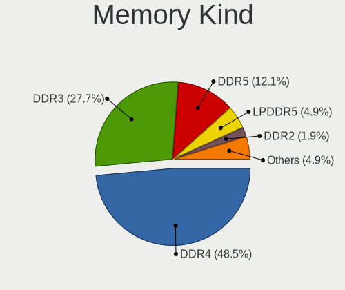

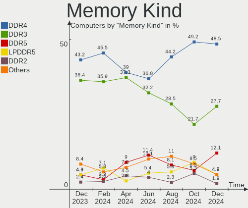

| Kind    | Computers | Percent |
|---------|-----------|---------|
| DDR4    | 92        | 50.83%  |
| DDR3    | 58        | 32.04%  |
| Unknown | 8         | 4.42%   |
| SDRAM   | 7         | 3.87%   |
| LPDDR4  | 7         | 3.87%   |
| DDR2    | 4         | 2.21%   |
| LPDDR3  | 3         | 1.66%   |
| DDR5    | 1         | 0.55%   |
| DDR     | 1         | 0.55%   |

Memory Form Factor
------------------

Physical design of the memory module

| Name         | Computers | Percent |
|--------------|-----------|---------|
| SODIMM       | 96        | 53.04%  |
| DIMM         | 73        | 40.33%  |
| Row Of Chips | 11        | 6.08%   |
| RIMM         | 1         | 0.55%   |

Memory Size
-----------

Memory module size

| Size  | Computers | Percent |
|-------|-----------|---------|
| 8192  | 76        | 37.81%  |
| 4096  | 63        | 31.34%  |
| 2048  | 27        | 13.43%  |
| 16384 | 26        | 12.94%  |
| 1024  | 6         | 2.99%   |
| 32768 | 3         | 1.49%   |

Memory Speed
------------

Memory module speed

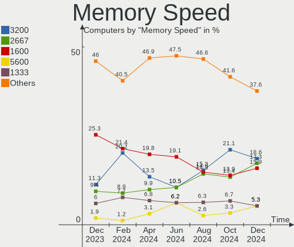

| Speed   | Computers | Percent |
|---------|-----------|---------|
| 1600    | 36        | 18.46%  |
| 3200    | 34        | 17.44%  |
| 2667    | 25        | 12.82%  |
| 2400    | 20        | 10.26%  |
| 1333    | 17        | 8.72%   |
| 2133    | 8         | 4.1%    |
| 3600    | 6         | 3.08%   |
| 1334    | 5         | 2.56%   |
| 1066    | 5         | 2.56%   |
| 800     | 5         | 2.56%   |
| 1867    | 4         | 2.05%   |
| 3466    | 3         | 1.54%   |
| 3000    | 3         | 1.54%   |
| 1067    | 3         | 1.54%   |
| 4800    | 2         | 1.03%   |
| 4267    | 2         | 1.03%   |
| 4199    | 2         | 1.03%   |
| 3800    | 2         | 1.03%   |
| 2933    | 2         | 1.03%   |
| 667     | 2         | 1.03%   |
| 6400    | 1         | 0.51%   |
| 3266    | 1         | 0.51%   |
| 2800    | 1         | 0.51%   |
| 2000    | 1         | 0.51%   |
| 1866    | 1         | 0.51%   |
| 1639    | 1         | 0.51%   |
| 975     | 1         | 0.51%   |
| 333     | 1         | 0.51%   |
| Unknown | 1         | 0.51%   |

Printers & scanners
-------------------

Printer Vendor
--------------

Printer device vendors

| Vendor             | Computers | Percent |
|--------------------|-----------|---------|
| Brother Industries | 2         | 50%     |
| Hewlett-Packard    | 1         | 25%     |
| Canon              | 1         | 25%     |

Printer Model
-------------

Printer device models

| Model                      | Computers | Percent |
|----------------------------|-----------|---------|
| HP LaserJet 400 M401dne    | 1         | 25%     |
| Canon PIXMA MX530 Series   | 1         | 25%     |
| Brother MFC-L2710DW series | 1         | 25%     |
| Brother HL-5250DN Printer  | 1         | 25%     |

Scanner Vendor
--------------

Scanner device vendors

| Vendor      | Computers | Percent |
|-------------|-----------|---------|
| Canon       | 3         | 75%     |
| Seiko Epson | 1         | 25%     |

Scanner Model
-------------

Scanner device models

| Model                                 | Computers | Percent |
|---------------------------------------|-----------|---------|
| Seiko Epson GT-X770 [Perfection V500] | 1         | 25%     |
| Canon CanoScan N1240U/LiDE 30         | 1         | 25%     |
| Canon CanoScan LiDE 60                | 1         | 25%     |
| Canon CanoScan LIDE 25                | 1         | 25%     |

Camera
------

Camera Vendor
-------------

Camera device vendors

| Vendor                                 | Computers | Percent |
|----------------------------------------|-----------|---------|
| Chicony Electronics                    | 27        | 18.12%  |
| Cheng Uei Precision Industry (Foxlink) | 13        | 8.72%   |
| Realtek Semiconductor                  | 12        | 8.05%   |
| Logitech                               | 12        | 8.05%   |
| Microdia                               | 11        | 7.38%   |
| IMC Networks                           | 11        | 7.38%   |
| Acer                                   | 11        | 7.38%   |
| Quanta                                 | 9         | 6.04%   |
| Syntek                                 | 7         | 4.7%    |
| Sunplus Innovation Technology          | 7         | 4.7%    |
| Suyin                                  | 4         | 2.68%   |
| Microsoft                              | 3         | 2.01%   |
| Ricoh                                  | 2         | 1.34%   |
| Importek                               | 2         | 1.34%   |
| Creative Technology                    | 2         | 1.34%   |
| Apple                                  | 2         | 1.34%   |
| Y Media                                | 1         | 0.67%   |
| WCM_USB                                | 1         | 0.67%   |
| Sonix Technology                       | 1         | 0.67%   |
| Silicon Motion                         | 1         | 0.67%   |
| Samsung Electronics                    | 1         | 0.67%   |
| Primax Electronics                     | 1         | 0.67%   |
| Novatel Wireless                       | 1         | 0.67%   |
| Nebraska Furniture Mart                | 1         | 0.67%   |
| Luxvisions Innotech Limited            | 1         | 0.67%   |
| Lite-On Technology                     | 1         | 0.67%   |
| Hewlett-Packard                        | 1         | 0.67%   |
| Denron                                 | 1         | 0.67%   |
| ARC International                      | 1         | 0.67%   |
| Alcor Micro                            | 1         | 0.67%   |

Camera Model
------------

Camera device models

| Model                                                                      | Computers | Percent |
|----------------------------------------------------------------------------|-----------|---------|
| Microdia Integrated_Webcam_HD                                              | 5         | 3.36%   |
| Logitech Webcam C270                                                       | 5         | 3.36%   |
| Syntek Integrated Camera                                                   | 4         | 2.68%   |
| Realtek USB2.0 HD UVC WebCam                                               | 3         | 2.01%   |
| IMC Networks USB2.0 VGA UVC WebCam                                         | 3         | 2.01%   |
| IMC Networks USB2.0 HD UVC WebCam                                          | 3         | 2.01%   |
| IMC Networks Integrated Camera                                             | 3         | 2.01%   |
| Chicony TOSHIBA Web Camera - HD                                            | 3         | 2.01%   |
| Acer Integrated Camera                                                     | 3         | 2.01%   |
| Acer BisonCam,NB Pro                                                       | 3         | 2.01%   |
| Syntek EasyCamera                                                          | 2         | 1.34%   |
| Suyin HP TrueVision HD                                                     | 2         | 1.34%   |
| Suyin 1.3M HD WebCam                                                       | 2         | 1.34%   |
| Sunplus ASUS USB2.0 Webcam                                                 | 2         | 1.34%   |
| Realtek USB Camera                                                         | 2         | 1.34%   |
| Realtek Integrated_Webcam_HD                                               | 2         | 1.34%   |
| Quanta USB2.0 HD UVC WebCam                                                | 2         | 1.34%   |
| Quanta HP HD Camera                                                        | 2         | 1.34%   |
| Logitech HD Webcam C525                                                    | 2         | 1.34%   |
| Chicony USB2.0 HD UVC WebCam                                               | 2         | 1.34%   |
| Chicony Integrated Camera                                                  | 2         | 1.34%   |
| Chicony HP Truevision HD                                                   | 2         | 1.34%   |
| Chicony HP HD Webcam                                                       | 2         | 1.34%   |
| Chicony HD WebCam                                                          | 2         | 1.34%   |
| Cheng Uei Precision Industry (Foxlink) HP Wide Vision HD Integrated Webcam | 2         | 1.34%   |
| Cheng Uei Precision Industry (Foxlink) HP Webcam                           | 2         | 1.34%   |
| Cheng Uei Precision Industry (Foxlink) HP Truevision HD                    | 2         | 1.34%   |
| Cheng Uei Precision Industry (Foxlink) HP True Vision HD Camera            | 2         | 1.34%   |
| Y Media USB Camera                                                         | 1         | 0.67%   |
| WCM_USB WEB CAM                                                            | 1         | 0.67%   |
| Syntek Lenovo EasyCamera                                                   | 1         | 0.67%   |
| Sunplus Laptop_Integrated_Webcam_FHD                                       | 1         | 0.67%   |
| Sunplus Integrated Camera                                                  | 1         | 0.67%   |
| Sunplus HP TrueVision HD Camera                                            | 1         | 0.67%   |
| Sunplus HP HD Webcam [Fixed]                                               | 1         | 0.67%   |
| Sunplus HD Webcam                                                          | 1         | 0.67%   |
| Sonix USB Camera                                                           | 1         | 0.67%   |
| Silicon Motion WebCam SCB-0385N                                            | 1         | 0.67%   |
| Samsung Galaxy A5 (MTP)                                                    | 1         | 0.67%   |
| Ricoh USB2.0 Camera                                                        | 1         | 0.67%   |
| Ricoh HD Webcam                                                            | 1         | 0.67%   |
| Realtek USB2.0 VGA UVC WebCam                                              | 1         | 0.67%   |
| Realtek MTD Camera                                                         | 1         | 0.67%   |
| Realtek Lenovo EasyCamera                                                  | 1         | 0.67%   |
| Realtek HP Truevision HD                                                   | 1         | 0.67%   |
| Realtek Dell_Monitor_IR_Webcam                                             | 1         | 0.67%   |
| Quanta HP Webcam                                                           | 1         | 0.67%   |
| Quanta HP TrueVision HD Camera                                             | 1         | 0.67%   |
| Quanta HP Integrated Webcam                                                | 1         | 0.67%   |
| Quanta HD User Facing                                                      | 1         | 0.67%   |
| Quanta Acer FHD User Facing                                                | 1         | 0.67%   |
| Primax HP HD Webcam [Fixed]                                                | 1         | 0.67%   |
| Novatel Wireless Merlin U740 (non-Vodafone)                                | 1         | 0.67%   |
| Nebraska Furniture Mart USB 2.0 PC cam                                     | 1         | 0.67%   |
| Microsoft LifeCam VX-500 [1357]                                            | 1         | 0.67%   |
| Microsoft LifeCam HD-3000                                                  | 1         | 0.67%   |
| Microsoft LifeCam Cinema                                                   | 1         | 0.67%   |
| Microdia Lenovo EasyCamera                                                 | 1         | 0.67%   |
| Microdia Laptop_Integrated_Webcam_HD                                       | 1         | 0.67%   |
| Microdia Laptop_Integrated_Webcam_2M                                       | 1         | 0.67%   |

Security
--------

Fingerprint Vendor
------------------

Fingerprint sensor vendors

| Vendor                     | Computers | Percent |
|----------------------------|-----------|---------|
| Validity Sensors           | 9         | 52.94%  |
| Synaptics                  | 3         | 17.65%  |
| AuthenTec                  | 2         | 11.76%  |
| Shenzhen Goodix Technology | 1         | 5.88%   |
| LighTuning Technology      | 1         | 5.88%   |
| Elan Microelectronics      | 1         | 5.88%   |

Fingerprint Model
-----------------

Fingerprint sensor models

| Model                                                                      | Computers | Percent |
|----------------------------------------------------------------------------|-----------|---------|
| Validity Sensors VFS495 Fingerprint Reader                                 | 3         | 17.65%  |
| Validity Sensors VFS5011 Fingerprint Reader                                | 2         | 11.76%  |
| Synaptics Prometheus MIS Touch Fingerprint Reader                          | 2         | 11.76%  |
| AuthenTec Fingerprint Sensor                                               | 2         | 11.76%  |
| Validity Sensors VFS491                                                    | 1         | 5.88%   |
| Validity Sensors VFS301 Fingerprint Reader                                 | 1         | 5.88%   |
| Validity Sensors Synaptics VFS7552 Touch Fingerprint Sensor with PurePrint | 1         | 5.88%   |
| Validity Sensors Fingerprint scanner                                       | 1         | 5.88%   |
| Synaptics  FS7604 Touch Fingerprint Sensor with PurePrint                  | 1         | 5.88%   |
| Shenzhen Goodix  FingerPrint Device                                        | 1         | 5.88%   |
| LighTuning ES603 Swipe Fingerprint Sensor                                  | 1         | 5.88%   |
| Elan ELAN:ARM-M4                                                           | 1         | 5.88%   |

Chipcard Vendor
---------------

Chipcard module vendors

| Vendor      | Computers | Percent |
|-------------|-----------|---------|
| Broadcom    | 5         | 55.56%  |
| O2 Micro    | 2         | 22.22%  |
| Yubico.com  | 1         | 11.11%  |
| Alcor Micro | 1         | 11.11%  |

Chipcard Model
--------------

Chipcard module models

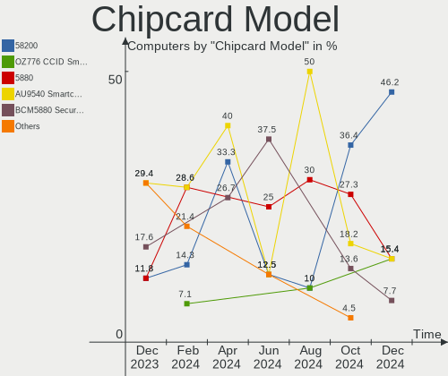

| Model                                                                        | Computers | Percent |
|------------------------------------------------------------------------------|-----------|---------|
| O2 Micro OZ776 CCID Smartcard Reader                                         | 2         | 22.22%  |
| Broadcom 58200                                                               | 2         | 22.22%  |
| Yubico.com Yubikey 4/5 U2F+CCID                                              | 1         | 11.11%  |
| Broadcom BCM5880 Secure Applications Processor with fingerprint swipe sensor | 1         | 11.11%  |
| Broadcom BCM5880 Secure Applications Processor                               | 1         | 11.11%  |
| Broadcom 5880                                                                | 1         | 11.11%  |
| Alcor Micro AU9540 Smartcard Reader                                          | 1         | 11.11%  |

Unsupported
-----------

Unsupported Devices
-------------------

Total unsupported devices on board

| Total | Computers | Percent |
|-------|-----------|---------|
| 0     | 178       | 73.86%  |
| 1     | 50        | 20.75%  |
| 2     | 12        | 4.98%   |
| 6     | 1         | 0.41%   |

Unsupported Device Types
------------------------

Types of unsupported devices

| Type                     | Computers | Percent |
|--------------------------|-----------|---------|
| Graphics card            | 23        | 29.49%  |
| Fingerprint reader       | 17        | 21.79%  |
| Net/wireless             | 9         | 11.54%  |
| Multimedia controller    | 8         | 10.26%  |
| Chipcard                 | 8         | 10.26%  |
| Bluetooth                | 4         | 5.13%   |
| Communication controller | 3         | 3.85%   |
| Unassigned class         | 2         | 2.56%   |
| Wireless                 | 1         | 1.28%   |
| Sound                    | 1         | 1.28%   |
| Network                  | 1         | 1.28%   |
| Camera                   | 1         | 1.28%   |

