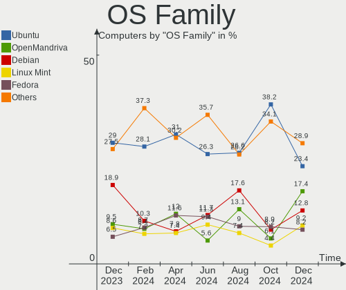
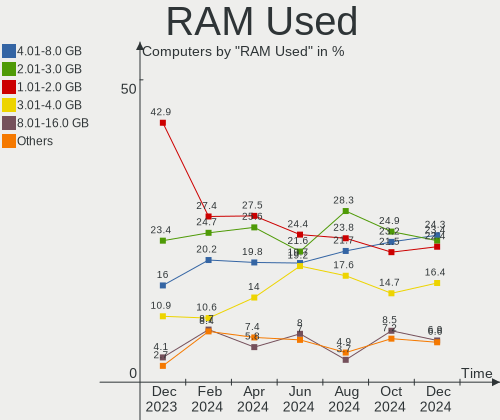
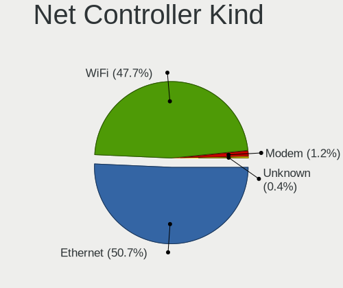
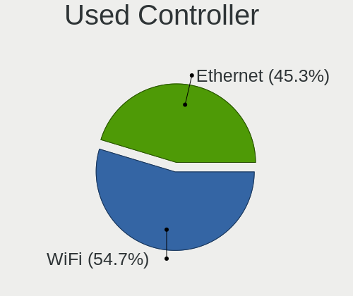
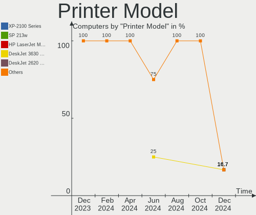
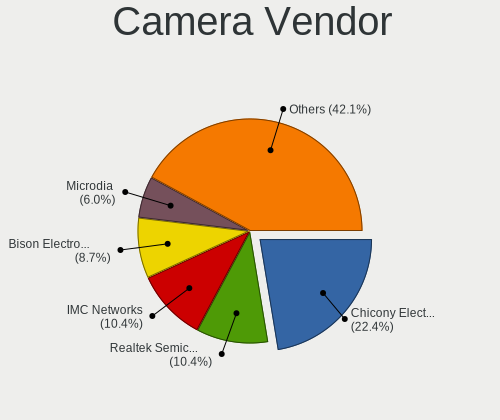

Linux in France - Hardware Trends
---------------------------------

A project to identify most popular hardware characteristics and track their change
over time based on data collected by Linux users at https://Linux-Hardware.org.

Anyone can contribute to this report by the [hw-probe](https://github.com/linuxhw/hw-probe) tool:

    sudo -E hw-probe -all -upload

This is a report for all computer types. See also reports for [desktops](/Location/France/Desktop/README.md) and [notebooks](/Location/France/Notebook/README.md).

Period: Aug, 2023.

Contents
--------

* [ System ](#system)
  - [ OS                       ](#os)
  - [ OS Family                ](#os-family)
  - [ Kernel                   ](#kernel)
  - [ Kernel Family            ](#kernel-family)
  - [ Kernel Major Ver.        ](#kernel-major-ver)
  - [ Arch                     ](#arch)
  - [ DE                       ](#de)
  - [ Display Server           ](#display-server)
  - [ Display Manager          ](#display-manager)
  - [ OS Lang                  ](#os-lang)
  - [ Boot Mode                ](#boot-mode)
  - [ Filesystem               ](#filesystem)
  - [ Part. scheme             ](#part-scheme)
  - [ Dual Boot with Linux/BSD ](#dual-boot-with-linuxbsd)
  - [ Dual Boot (Win)          ](#dual-boot-win)

* [ Board ](#board)
  - [ Vendor                   ](#vendor)
  - [ Model                    ](#model)
  - [ Model Family             ](#model-family)
  - [ MFG Year                 ](#mfg-year)
  - [ Form Factor              ](#form-factor)
  - [ Secure Boot              ](#secure-boot)
  - [ Coreboot                 ](#coreboot)
  - [ RAM Size                 ](#ram-size)
  - [ RAM Used                 ](#ram-used)
  - [ Total Drives             ](#total-drives)
  - [ Has CD-ROM               ](#has-cd-rom)
  - [ Has Ethernet             ](#has-ethernet)
  - [ Has WiFi                 ](#has-wifi)
  - [ Has Bluetooth            ](#has-bluetooth)

* [ Location ](#location)
  - [ Country                  ](#country)
  - [ City                     ](#city)

* [ Drives ](#drives)
  - [ Drive Vendor             ](#drive-vendor)
  - [ Drive Model              ](#drive-model)
  - [ HDD Vendor               ](#hdd-vendor)
  - [ SSD Vendor               ](#ssd-vendor)
  - [ Drive Kind               ](#drive-kind)
  - [ Drive Connector          ](#drive-connector)
  - [ Drive Size               ](#drive-size)
  - [ Space Total              ](#space-total)
  - [ Space Used               ](#space-used)
  - [ Malfunc. Drives          ](#malfunc-drives)
  - [ Malfunc. Drive Vendor    ](#malfunc-drive-vendor)
  - [ Malfunc. HDD Vendor      ](#malfunc-hdd-vendor)
  - [ Malfunc. Drive Kind      ](#malfunc-drive-kind)
  - [ Failed Drives            ](#failed-drives)
  - [ Failed Drive Vendor      ](#failed-drive-vendor)
  - [ Drive Status             ](#drive-status)

* [ Storage controller ](#storage-controller)
  - [ Storage Vendor           ](#storage-vendor)
  - [ Storage Model            ](#storage-model)
  - [ Storage Kind             ](#storage-kind)

* [ Processor ](#processor)
  - [ CPU Vendor               ](#cpu-vendor)
  - [ CPU Model                ](#cpu-model)
  - [ CPU Model Family         ](#cpu-model-family)
  - [ CPU Cores                ](#cpu-cores)
  - [ CPU Sockets              ](#cpu-sockets)
  - [ CPU Threads              ](#cpu-threads)
  - [ CPU Op-Modes             ](#cpu-op-modes)
  - [ CPU Microcode            ](#cpu-microcode)
  - [ CPU Microarch            ](#cpu-microarch)

* [ Graphics ](#graphics)
  - [ GPU Vendor               ](#gpu-vendor)
  - [ GPU Model                ](#gpu-model)
  - [ GPU Combo                ](#gpu-combo)
  - [ GPU Driver               ](#gpu-driver)
  - [ GPU Memory               ](#gpu-memory)

* [ Monitor ](#monitor)
  - [ Monitor Vendor           ](#monitor-vendor)
  - [ Monitor Model            ](#monitor-model)
  - [ Monitor Resolution       ](#monitor-resolution)
  - [ Monitor Diagonal         ](#monitor-diagonal)
  - [ Monitor Width            ](#monitor-width)
  - [ Aspect Ratio             ](#aspect-ratio)
  - [ Monitor Area             ](#monitor-area)
  - [ Pixel Density            ](#pixel-density)
  - [ Multiple Monitors        ](#multiple-monitors)

* [ Network ](#network)
  - [ Net Controller Vendor    ](#net-controller-vendor)
  - [ Net Controller Model     ](#net-controller-model)
  - [ Wireless Vendor          ](#wireless-vendor)
  - [ Wireless Model           ](#wireless-model)
  - [ Ethernet Vendor          ](#ethernet-vendor)
  - [ Ethernet Model           ](#ethernet-model)
  - [ Net Controller Kind      ](#net-controller-kind)
  - [ Used Controller          ](#used-controller)
  - [ NICs                     ](#nics)
  - [ IPv6                     ](#ipv6)

* [ Bluetooth ](#bluetooth)
  - [ Bluetooth Vendor         ](#bluetooth-vendor)
  - [ Bluetooth Model          ](#bluetooth-model)

* [ Sound ](#sound)
  - [ Sound Vendor             ](#sound-vendor)
  - [ Sound Model              ](#sound-model)

* [ Memory ](#memory)
  - [ Memory Vendor            ](#memory-vendor)
  - [ Memory Model             ](#memory-model)
  - [ Memory Kind              ](#memory-kind)
  - [ Memory Form Factor       ](#memory-form-factor)
  - [ Memory Size              ](#memory-size)
  - [ Memory Speed             ](#memory-speed)

* [ Printers & scanners ](#printers--scanners)
  - [ Printer Vendor           ](#printer-vendor)
  - [ Printer Model            ](#printer-model)
  - [ Scanner Vendor           ](#scanner-vendor)
  - [ Scanner Model            ](#scanner-model)

* [ Camera ](#camera)
  - [ Camera Vendor            ](#camera-vendor)
  - [ Camera Model             ](#camera-model)

* [ Security ](#security)
  - [ Fingerprint Vendor       ](#fingerprint-vendor)
  - [ Fingerprint Model        ](#fingerprint-model)
  - [ Chipcard Vendor          ](#chipcard-vendor)
  - [ Chipcard Model           ](#chipcard-model)

* [ Unsupported ](#unsupported)
  - [ Unsupported Devices      ](#unsupported-devices)
  - [ Unsupported Device Types ](#unsupported-device-types)

System
------

OS
--

Installed operating systems

| Name                | Computers | Percent |
|---------------------|-----------|---------|
| Ubuntu 22.04        | 58        | 20.28%  |
| OpenMandriva 23.08  | 29        | 10.14%  |
| Ubuntu 23.04        | 18        | 6.29%   |
| Fedora 38           | 17        | 5.94%   |
| Ubuntu 20.04        | 16        | 5.59%   |
| Linux Mint 21.2     | 14        | 4.9%    |
| OpenMandriva 23.03  | 12        | 4.2%    |
| Arch Rolling        | 10        | 3.5%    |
| Pop!_OS 22.04       | 7         | 2.45%   |
| OpenMandriva 4.3    | 7         | 2.45%   |
| ArcoLinux Rolling   | 7         | 2.45%   |
| Ubuntu 18.04        | 5         | 1.75%   |
| Lubuntu 22.04       | 5         | 1.75%   |
| Debian 12           | 5         | 1.75%   |
| Zorin 16            | 4         | 1.4%    |
| Xubuntu 22.04       | 4         | 1.4%    |
| Manjaro 23.0.0      | 4         | 1.4%    |
| Linux Mint 21.1     | 4         | 1.4%    |
| Debian 11           | 4         | 1.4%    |
| Xubuntu 23.04       | 3         | 1.05%   |
| OpenMandriva 23.07  | 3         | 1.05%   |
| Nobara 38           | 3         | 1.05%   |
| Kubuntu 23.04       | 3         | 1.05%   |
| Kali 2023.3         | 3         | 1.05%   |
| Ubuntu Budgie 22.04 | 2         | 0.7%    |
| OpenMandriva 23.90  | 2         | 0.7%    |
| Lubuntu 20.04       | 2         | 0.7%    |
| KDE neon 22.04      | 2         | 0.7%    |
| Gentoo 2.14         | 2         | 0.7%    |
| Elementary 7        | 2         | 0.7%    |
| Zorin 15            | 1         | 0.35%   |
| Xubuntu 20.04       | 1         | 0.35%   |
| Xero Rolling        | 1         | 0.35%   |
| Ubuntu Unity 22.04  | 1         | 0.35%   |
| Ubuntu Unity 16.04  | 1         | 0.35%   |
| Ubuntu Studio 22.04 | 1         | 0.35%   |
| Ubuntu MATE 22.04   | 1         | 0.35%   |
| Ubuntu 16.04        | 1         | 0.35%   |
| risiOS 38           | 1         | 0.35%   |
| RHEL 7              | 1         | 0.35%   |

OS Family
---------

OS without a version

| Name          | Computers | Percent |
|---------------|-----------|---------|
| Ubuntu        | 98        | 34.27%  |
| OpenMandriva  | 54        | 18.88%  |
| Linux Mint    | 21        | 7.34%   |
| Fedora        | 18        | 6.29%   |
| Debian        | 10        | 3.5%    |
| Arch          | 10        | 3.5%    |
| Xubuntu       | 8         | 2.8%    |
| Pop!_OS       | 7         | 2.45%   |
| Lubuntu       | 7         | 2.45%   |
| ArcoLinux     | 7         | 2.45%   |
| Zorin         | 5         | 1.75%   |
| Manjaro       | 5         | 1.75%   |
| Kubuntu       | 4         | 1.4%    |
| Nobara        | 3         | 1.05%   |
| Kali          | 3         | 1.05%   |
| Gentoo        | 3         | 1.05%   |
| Elementary    | 3         | 1.05%   |
| Ubuntu Unity  | 2         | 0.7%    |
| Ubuntu Budgie | 2         | 0.7%    |
| KDE neon      | 2         | 0.7%    |
| Devuan        | 2         | 0.7%    |
| Xero          | 1         | 0.35%   |
| Ubuntu Studio | 1         | 0.35%   |
| Ubuntu MATE   | 1         | 0.35%   |
| risiOS        | 1         | 0.35%   |
| RHEL          | 1         | 0.35%   |
| Pikaos        | 1         | 0.35%   |
| openSUSE      | 1         | 0.35%   |
| LMDE          | 1         | 0.35%   |
| Endless       | 1         | 0.35%   |
| EndeavourOS   | 1         | 0.35%   |
| Clear Linux   | 1         | 0.35%   |
| CentOS        | 1         | 0.35%   |

Kernel
------

Version of the Linux kernel

| Version                      | Computers | Percent |
|------------------------------|-----------|---------|
| 6.2.0-26-generic             | 48        | 16.78%  |
| 5.15.0-79-generic            | 20        | 6.99%   |
| 5.15.0-78-generic            | 18        | 6.29%   |
| 6.4.8-desktop-2omv2390       | 16        | 5.59%   |
| 6.4.11-desktop-1omv2390      | 15        | 5.24%   |
| 6.2.6-desktop-1omv2390       | 12        | 4.2%    |
| 6.2.0-27-generic             | 8         | 2.8%    |
| 5.19.0-50-generic            | 7         | 2.45%   |
| 6.2.0-31-generic             | 6         | 2.1%    |
| 5.16.7-desktop-1omv4003      | 6         | 2.1%    |
| 6.4.6-76060406-generic       | 5         | 1.75%   |
| 6.4.12-arch1-1               | 5         | 1.75%   |
| 6.4.6-200.fc38.x86_64        | 4         | 1.4%    |
| 6.4.11-200.fc38.x86_64       | 4         | 1.4%    |
| 6.4.10-200.fc38.x86_64       | 4         | 1.4%    |
| 6.1.0-11-amd64               | 4         | 1.4%    |
| 6.4.9-200.fc38.x86_64        | 3         | 1.05%   |
| 6.4.10-arch1-1               | 3         | 1.05%   |
| 6.3.0-kali1-amd64            | 3         | 1.05%   |
| 5.4.0-156-generic            | 3         | 1.05%   |
| 5.4.0-150-generic            | 3         | 1.05%   |
| 5.15.0-82-generic            | 3         | 1.05%   |
| 6.4.9-arch1-1                | 2         | 0.7%    |
| 6.4.7-arch1-2                | 2         | 0.7%    |
| 6.4.6-1-MANJARO              | 2         | 0.7%    |
| 6.3.5-desktop-3omv2390       | 2         | 0.7%    |
| 6.3.12-205.fsync.fc38.x86_64 | 2         | 0.7%    |
| 6.2.6-76060206-generic       | 2         | 0.7%    |
| 6.2.0-25-generic             | 2         | 0.7%    |
| 6.0.0-1017-oem               | 2         | 0.7%    |
| 5.15.0-75-generic            | 2         | 0.7%    |
| 5.15.0-58-generic            | 2         | 0.7%    |
| 5.15.0-47-generic            | 2         | 0.7%    |
| 5.10.0-25-amd64              | 2         | 0.7%    |
| 5.10.0-24-amd64              | 2         | 0.7%    |
| 5.10.0-23-amd64              | 2         | 0.7%    |
| 6.5.0-rc5-pikaos             | 1         | 0.35%   |
| 6.4.9-1-MANJARO              | 1         | 0.35%   |
| 6.4.8-gentoo-dist            | 1         | 0.35%   |
| 6.4.8-arch1-1                | 1         | 0.35%   |

Kernel Family
-------------

Linux kernel without a distro release

| Version | Computers | Percent |
|---------|-----------|---------|
| 6.2.0   | 66        | 23.08%  |
| 5.15.0  | 52        | 18.18%  |
| 6.4.11  | 20        | 6.99%   |
| 6.4.8   | 18        | 6.29%   |
| 6.2.6   | 14        | 4.9%    |
| 6.4.6   | 12        | 4.2%    |
| 5.4.0   | 11        | 3.85%   |
| 5.19.0  | 10        | 3.5%    |
| 6.4.12  | 8         | 2.8%    |
| 6.4.10  | 8         | 2.8%    |
| 5.10.0  | 7         | 2.45%   |
| 6.4.9   | 6         | 2.1%    |
| 5.16.7  | 6         | 2.1%    |
| 6.1.0   | 5         | 1.75%   |
| 6.4.7   | 4         | 1.4%    |
| 4.15.0  | 4         | 1.4%    |
| 6.3.12  | 3         | 1.05%   |
| 6.3.0   | 3         | 1.05%   |
| 6.0.0   | 3         | 1.05%   |
| 6.3.5   | 2         | 0.7%    |
| 5.8.0   | 2         | 0.7%    |
| 6.5.0   | 1         | 0.35%   |
| 6.4.5   | 1         | 0.35%   |
| 6.4.0   | 1         | 0.35%   |
| 6.2.15  | 1         | 0.35%   |
| 6.2.1   | 1         | 0.35%   |
| 6.1.46  | 1         | 0.35%   |
| 6.1.45  | 1         | 0.35%   |
| 6.1.44  | 1         | 0.35%   |
| 6.1.39  | 1         | 0.35%   |
| 6.1.27  | 1         | 0.35%   |
| 6.0.12  | 1         | 0.35%   |
| 5.4.225 | 1         | 0.35%   |
| 5.17.0  | 1         | 0.35%   |
| 5.16.5  | 1         | 0.35%   |
| 5.16.13 | 1         | 0.35%   |
| 5.15.75 | 1         | 0.35%   |
| 5.14.21 | 1         | 0.35%   |
| 5.13.0  | 1         | 0.35%   |
| 5.11.0  | 1         | 0.35%   |

Kernel Major Ver.
-----------------

Linux kernel major version

| Version | Computers | Percent |
|---------|-----------|---------|
| 6.2     | 82        | 28.67%  |
| 6.4     | 78        | 27.27%  |
| 5.15    | 53        | 18.53%  |
| 5.4     | 12        | 4.2%    |
| 6.1     | 10        | 3.5%    |
| 5.19    | 10        | 3.5%    |
| 6.3     | 8         | 2.8%    |
| 5.16    | 8         | 2.8%    |
| 5.10    | 8         | 2.8%    |
| 6.0     | 4         | 1.4%    |
| 4.15    | 4         | 1.4%    |
| 5.8     | 2         | 0.7%    |
| 6.5     | 1         | 0.35%   |
| 5.17    | 1         | 0.35%   |
| 5.14    | 1         | 0.35%   |
| 5.13    | 1         | 0.35%   |
| 5.11    | 1         | 0.35%   |
| 4.4     | 1         | 0.35%   |
| 3.10    | 1         | 0.35%   |

Arch
----

OS architecture (x86_64, i586, etc.)

| Name   | Computers | Percent |
|--------|-----------|---------|
| x86_64 | 285       | 99.65%  |
| i686   | 1         | 0.35%   |

DE
--

Desktop Environment

| Name              | Computers | Percent |
|-------------------|-----------|---------|
| GNOME             | 130       | 45.45%  |
| KDE5              | 65        | 22.73%  |
| Unknown           | 23        | 8.04%   |
| X-Cinnamon        | 19        | 6.64%   |
| XFCE              | 18        | 6.29%   |
| LXQt              | 9         | 3.15%   |
| MATE              | 5         | 1.75%   |
| Pantheon          | 3         | 1.05%   |
| Unity             | 2         | 0.7%    |
| i3                | 2         | 0.7%    |
| Budgie            | 2         | 0.7%    |
| ubuntu:pika:GNOME | 1         | 0.35%   |
| KDE4              | 1         | 0.35%   |
| KDE               | 1         | 0.35%   |
| Hyprland          | 1         | 0.35%   |
| Hypr              | 1         | 0.35%   |
| GNOME Classic     | 1         | 0.35%   |
| Deepin            | 1         | 0.35%   |
| Cinnamon          | 1         | 0.35%   |

Display Server
--------------

X11 or Wayland

| Name    | Computers | Percent |
|---------|-----------|---------|
| X11     | 153       | 53.5%   |
| Wayland | 118       | 41.26%  |
| Unknown | 12        | 4.2%    |
| Tty     | 3         | 1.05%   |

Display Manager
---------------

SDDM, LightDM, etc.

| Name    | Computers | Percent |
|---------|-----------|---------|
| GDM3    | 88        | 30.77%  |
| SDDM    | 77        | 26.92%  |
| Unknown | 57        | 19.93%  |
| LightDM | 40        | 13.99%  |
| GDM     | 24        | 8.39%   |

OS Lang
-------

Language

| Lang    | Computers | Percent |
|---------|-----------|---------|
| fr_FR   | 221       | 77.27%  |
| en_US   | 46        | 16.08%  |
| en_GB   | 7         | 2.45%   |
| Unknown | 4         | 1.4%    |
| en_IE   | 2         | 0.7%    |
| C       | 2         | 0.7%    |
| sr_RS   | 1         | 0.35%   |
| fr_LU   | 1         | 0.35%   |
| es_ES   | 1         | 0.35%   |
| de_DE   | 1         | 0.35%   |

Boot Mode
---------

EFI or BIOS

| Mode | Computers | Percent |
|------|-----------|---------|
| EFI  | 158       | 55.24%  |
| BIOS | 128       | 44.76%  |

Filesystem
----------

Type of filesystem

| Type    | Computers | Percent |
|---------|-----------|---------|
| Ext4    | 178       | 62.24%  |
| Tmpfs   | 44        | 15.38%  |
| Btrfs   | 32        | 11.19%  |
| Overlay | 26        | 9.09%   |
| Xfs     | 2         | 0.7%    |
| Zfs     | 1         | 0.35%   |
| F2fs    | 1         | 0.35%   |
| Ext3    | 1         | 0.35%   |
| Unknown | 1         | 0.35%   |

Part. scheme
------------

Scheme of partitioning

| Type    | Computers | Percent |
|---------|-----------|---------|
| GPT     | 188       | 65.73%  |
| Unknown | 61        | 21.33%  |
| MBR     | 37        | 12.94%  |

Dual Boot with Linux/BSD
------------------------

Hosting more than one Linux/BSD

| Dual boot | Computers | Percent |
|-----------|-----------|---------|
| No        | 224       | 78.32%  |
| Yes       | 62        | 21.68%  |

Dual Boot (Win)
---------------

Hosting Linux and Windows

| Dual boot | Computers | Percent |
|-----------|-----------|---------|
| No        | 190       | 66.43%  |
| Yes       | 96        | 33.57%  |

Board
-----

Vendor
------

Motherboard manufacturer

| Name                                 | Computers | Percent |
|--------------------------------------|-----------|---------|
| ASUSTek Computer                     | 50        | 17.48%  |
| Lenovo                               | 42        | 14.69%  |
| Dell                                 | 41        | 14.34%  |
| Hewlett-Packard                      | 40        | 13.99%  |
| MSI                                  | 26        | 9.09%   |
| Gigabyte Technology                  | 21        | 7.34%   |
| Acer                                 | 12        | 4.2%    |
| Toshiba                              | 6         | 2.1%    |
| Notebook                             | 5         | 1.75%   |
| Intel                                | 5         | 1.75%   |
| Apple                                | 4         | 1.4%    |
| Sony                                 | 3         | 1.05%   |
| Packard Bell                         | 3         | 1.05%   |
| HUAWEI                               | 2         | 0.7%    |
| Fujitsu                              | 2         | 0.7%    |
| Unknown                              | 2         | 0.7%    |
| ZOTAC                                | 1         | 0.35%   |
| TUXEDO                               | 1         | 0.35%   |
| Thomson                              | 1         | 0.35%   |
| Tactus                               | 1         | 0.35%   |
| Supermicro                           | 1         | 0.35%   |
| Shuttle                              | 1         | 0.35%   |
| Shenzhen Meigao Electronic Equipment | 1         | 0.35%   |
| Samsung Electronics                  | 1         | 0.35%   |
| Pegatron                             | 1         | 0.35%   |
| Microsoft                            | 1         | 0.35%   |
| Micro Computer (HK) Tech Limited     | 1         | 0.35%   |
| LG Electronics                       | 1         | 0.35%   |
| LDLC                                 | 1         | 0.35%   |
| Google                               | 1         | 0.35%   |
| Framework                            | 1         | 0.35%   |
| Foxconn                              | 1         | 0.35%   |
| Danew                                | 1         | 0.35%   |
| Corsair                              | 1         | 0.35%   |
| BESSTAR Tech                         | 1         | 0.35%   |
| ASRock                               | 1         | 0.35%   |
| Alienware                            | 1         | 0.35%   |
| AK3V                                 | 1         | 0.35%   |

Model
-----

Motherboard model

| Name                                       | Computers | Percent |
|--------------------------------------------|-----------|---------|
| Lenovo ThinkPad L13 Gen 3 21BAS0X700       | 6         | 2.1%    |
| ASUS All Series                            | 5         | 1.75%   |
| HP EliteBook 840 G3                        | 3         | 1.05%   |
| Dell Latitude 7310                         | 3         | 1.05%   |
| MSI MS-7B93                                | 2         | 0.7%    |
| MSI MS-7B86                                | 2         | 0.7%    |
| HP ZBook 14 G2                             | 2         | 0.7%    |
| HP Pavilion 17                             | 2         | 0.7%    |
| HP Notebook                                | 2         | 0.7%    |
| HP Laptop 17-cp0xxx                        | 2         | 0.7%    |
| HP Laptop 15-db0xxx                        | 2         | 0.7%    |
| HP Dragonfly 13.5 inch G4 Notebook PC      | 2         | 0.7%    |
| Gigabyte B550 GAMING X V2                  | 2         | 0.7%    |
| Dell XPS 13 9310                           | 2         | 0.7%    |
| Dell Precision Tower 7910                  | 2         | 0.7%    |
| Dell OptiPlex 3020                         | 2         | 0.7%    |
| Dell Latitude 5400                         | 2         | 0.7%    |
| ASUS X75VD                                 | 2         | 0.7%    |
| ASUS VivoBook_ASUSLaptop X515EA_X515EA     | 2         | 0.7%    |
| ASUS M5A99X EVO R2.0                       | 2         | 0.7%    |
| Acer Aspire ES1-431                        | 2         | 0.7%    |
| Unknown                                    | 2         | 0.7%    |
| ZOTAC ZBOX-CI329NANO                       | 1         | 0.35%   |
| TUXEDO Book XA15 / XA17 Gen10              | 1         | 0.35%   |
| Toshiba Satellite Pro C850-10N             | 1         | 0.35%   |
| Toshiba Satellite P500                     | 1         | 0.35%   |
| Toshiba Satellite P50-B-113                | 1         | 0.35%   |
| Toshiba Satellite L670                     | 1         | 0.35%   |
| Toshiba Satellite C70-B                    | 1         | 0.35%   |
| Toshiba PORTEGE Z930                       | 1         | 0.35%   |
| Thomson X6-4.32GR                          | 1         | 0.35%   |
| Tactus GeoBook 110                         | 1         | 0.35%   |
| Supermicro Super Server                    | 1         | 0.35%   |
| Sony VGN-NS38E_S                           | 1         | 0.35%   |
| Sony SVE1513I4E                            | 1         | 0.35%   |
| Sony SVE1112M1EW                           | 1         | 0.35%   |
| Shuttle XS35V3                             | 1         | 0.35%   |
| Shenzhen Meigao Electronic Equipment UM560 | 1         | 0.35%   |
| Samsung 350V5C/351V5C/3540VC/3440VC        | 1         | 0.35%   |
| Pegatron KT600AA-ABF a6443.fr              | 1         | 0.35%   |

Model Family
------------

Motherboard model prefix

| Name                  | Computers | Percent |
|-----------------------|-----------|---------|
| Lenovo ThinkPad       | 26        | 9.09%   |
| Dell Latitude         | 15        | 5.24%   |
| Acer Aspire           | 10        | 3.5%    |
| Dell Precision        | 8         | 2.8%    |
| Dell OptiPlex         | 8         | 2.8%    |
| HP EliteBook          | 6         | 2.1%    |
| Toshiba Satellite     | 5         | 1.75%   |
| HP Pavilion           | 5         | 1.75%   |
| HP Laptop             | 5         | 1.75%   |
| Dell Inspiron         | 5         | 1.75%   |
| ASUS VivoBook         | 5         | 1.75%   |
| ASUS PRIME            | 5         | 1.75%   |
| ASUS All              | 5         | 1.75%   |
| Lenovo IdeaPad        | 4         | 1.4%    |
| HP ZBook              | 4         | 1.4%    |
| HP ProDesk            | 4         | 1.4%    |
| Gigabyte B550         | 4         | 1.4%    |
| Dell XPS              | 4         | 1.4%    |
| ASUS ZenBook          | 4         | 1.4%    |
| Packard Bell EasyNote | 3         | 1.05%   |
| ASUS ROG              | 3         | 1.05%   |
| MSI MS-7B93           | 2         | 0.7%    |
| MSI MS-7B86           | 2         | 0.7%    |
| Lenovo Yoga           | 2         | 0.7%    |
| Lenovo ThinkCentre    | 2         | 0.7%    |
| Lenovo Legion         | 2         | 0.7%    |
| HP ProBook            | 2         | 0.7%    |
| HP Notebook           | 2         | 0.7%    |
| HP EliteDesk          | 2         | 0.7%    |
| HP Dragonfly          | 2         | 0.7%    |
| HP Compaq             | 2         | 0.7%    |
| Fujitsu ESPRIMO       | 2         | 0.7%    |
| ASUS X75VD            | 2         | 0.7%    |
| ASUS TUF              | 2         | 0.7%    |
| ASUS P8Z68-V          | 2         | 0.7%    |
| ASUS M5A99X           | 2         | 0.7%    |
| ASUS ASUS             | 2         | 0.7%    |
| Unknown               | 2         | 0.7%    |
| ZOTAC ZBOX-CI329NANO  | 1         | 0.35%   |
| TUXEDO Book           | 1         | 0.35%   |

MFG Year
--------

Motherboard manufacture year

| Year | Computers | Percent |
|------|-----------|---------|
| 2021 | 27        | 9.44%   |
| 2012 | 27        | 9.44%   |
| 2022 | 25        | 8.74%   |
| 2018 | 25        | 8.74%   |
| 2020 | 22        | 7.69%   |
| 2019 | 19        | 6.64%   |
| 2017 | 19        | 6.64%   |
| 2016 | 18        | 6.29%   |
| 2011 | 17        | 5.94%   |
| 2013 | 16        | 5.59%   |
| 2015 | 15        | 5.24%   |
| 2014 | 15        | 5.24%   |
| 2023 | 14        | 4.9%    |
| 2009 | 7         | 2.45%   |
| 2010 | 6         | 2.1%    |
| 2008 | 6         | 2.1%    |
| 2007 | 4         | 1.4%    |
| 2006 | 4         | 1.4%    |

Form Factor
-----------

Physical design of the computer

| Name        | Computers | Percent |
|-------------|-----------|---------|
| Notebook    | 156       | 54.55%  |
| Desktop     | 116       | 40.56%  |
| Convertible | 5         | 1.75%   |
| Mini pc     | 4         | 1.4%    |
| Tablet      | 3         | 1.05%   |
| All in one  | 1         | 0.35%   |
| Server      | 1         | 0.35%   |

Secure Boot
-----------

Enabled or disabled

| State    | Computers | Percent |
|----------|-----------|---------|
| Disabled | 270       | 94.41%  |
| Enabled  | 16        | 5.59%   |

Coreboot
--------

Have coreboot on board

| Used | Computers | Percent |
|------|-----------|---------|
| No   | 285       | 99.65%  |
| Yes  | 1         | 0.35%   |

RAM Size
--------

Total RAM memory

| Size in GB  | Computers | Percent |
|-------------|-----------|---------|
| 4.01-8.0    | 63        | 22.03%  |
| 16.01-24.0  | 58        | 20.28%  |
| 8.01-16.0   | 57        | 19.93%  |
| 3.01-4.0    | 43        | 15.03%  |
| 32.01-64.0  | 40        | 13.99%  |
| 24.01-32.0  | 11        | 3.85%   |
| 64.01-256.0 | 9         | 3.15%   |
| 1.01-2.0    | 3         | 1.05%   |
| 2.01-3.0    | 2         | 0.7%    |

RAM Used
--------

Used RAM memory

| Used GB    | Computers | Percent |
|------------|-----------|---------|
| 1.01-2.0   | 86        | 30.07%  |
| 2.01-3.0   | 69        | 24.13%  |
| 4.01-8.0   | 51        | 17.83%  |
| 3.01-4.0   | 39        | 13.64%  |
| 8.01-16.0  | 24        | 8.39%   |
| 0.51-1.0   | 14        | 4.9%    |
| 16.01-24.0 | 2         | 0.7%    |
| 32.01-64.0 | 1         | 0.35%   |

Total Drives
------------

Number of drives on board

| Drives | Computers | Percent |
|--------|-----------|---------|
| 1      | 162       | 56.64%  |
| 2      | 70        | 24.48%  |
| 3      | 24        | 8.39%   |
| 4      | 14        | 4.9%    |
| 5      | 5         | 1.75%   |
| 6      | 3         | 1.05%   |
| 0      | 3         | 1.05%   |
| 7      | 2         | 0.7%    |
| 11     | 1         | 0.35%   |
| 9      | 1         | 0.35%   |
| 8      | 1         | 0.35%   |

Has CD-ROM
----------

Has CD-ROM on board

| Presented | Computers | Percent |
|-----------|-----------|---------|
| No        | 184       | 64.34%  |
| Yes       | 102       | 35.66%  |

Has Ethernet
------------

Has Ethernet on board

| Presented | Computers | Percent |
|-----------|-----------|---------|
| Yes       | 253       | 88.46%  |
| No        | 33        | 11.54%  |

Has WiFi
--------

Has WiFi module

| Presented | Computers | Percent |
|-----------|-----------|---------|
| Yes       | 221       | 77.27%  |
| No        | 65        | 22.73%  |

Has Bluetooth
-------------

Has Bluetooth module

| Presented | Computers | Percent |
|-----------|-----------|---------|
| Yes       | 172       | 60.14%  |
| No        | 114       | 39.86%  |

Location
--------

Country
-------

Geographic location (country)

| Country | Computers | Percent |
|---------|-----------|---------|
| France  | 286       | 100%    |

City
----

Geographic location (city)

| City                   | Computers | Percent |
|------------------------|-----------|---------|
| Paris                  | 31        | 10.84%  |
| Champs-sur-Marne       | 13        | 4.55%   |
| Toulouse               | 6         | 2.1%    |
| Rouen                  | 6         | 2.1%    |
| Nantes                 | 5         | 1.75%   |
| Marseille              | 5         | 1.75%   |
| Villeurbanne           | 4         | 1.4%    |
| Rosny-sous-Bois        | 4         | 1.4%    |
| La Baule-Escoublac     | 4         | 1.4%    |
| Grenoble               | 4         | 1.4%    |
| Valenciennes           | 3         | 1.05%   |
| Roubaix                | 3         | 1.05%   |
| Rennes                 | 3         | 1.05%   |
| Nice                   | 3         | 1.05%   |
| Lyon                   | 3         | 1.05%   |
| Wattignies-la-Victoire | 2         | 0.7%    |
| Vallenay               | 2         | 0.7%    |
| Urcel                  | 2         | 0.7%    |
| Trappes                | 2         | 0.7%    |
| Tourcoing              | 2         | 0.7%    |
| Strasbourg             | 2         | 0.7%    |
| Schiltigheim           | 2         | 0.7%    |
| Saint-Nazaire          | 2         | 0.7%    |
| Pau                    | 2         | 0.7%    |
| Orléans               | 2         | 0.7%    |
| Melun                  | 2         | 0.7%    |
| Massy                  | 2         | 0.7%    |
| Lille                  | 2         | 0.7%    |
| Le Plessis-Robinson    | 2         | 0.7%    |
| La Roche-sur-Yon       | 2         | 0.7%    |
| Denain                 | 2         | 0.7%    |
| Cormeilles-en-Parisis  | 2         | 0.7%    |
| Castelnaudary          | 2         | 0.7%    |
| Brest                  | 2         | 0.7%    |
| Bordeaux               | 2         | 0.7%    |
| Begles                 | 2         | 0.7%    |
| Asnieres-sur-Seine     | 2         | 0.7%    |
| Amiens                 | 2         | 0.7%    |
| Weckolsheim            | 1         | 0.35%   |
| Villejuif              | 1         | 0.35%   |

Drives
------

Drive Vendor
------------

Hard drive vendors

| Vendor                       | Computers | Drives | Percent |
|------------------------------|-----------|--------|---------|
| Samsung Electronics          | 80        | 97     | 18.91%  |
| WDC                          | 51        | 80     | 12.06%  |
| Seagate                      | 51        | 61     | 12.06%  |
| Crucial                      | 30        | 35     | 7.09%   |
| SanDisk                      | 26        | 29     | 6.15%   |
| Toshiba                      | 23        | 23     | 5.44%   |
| SK hynix                     | 17        | 17     | 4.02%   |
| Unknown                      | 14        | 19     | 3.31%   |
| Kingston                     | 14        | 15     | 3.31%   |
| Micron Technology            | 13        | 13     | 3.07%   |
| Intel                        | 11        | 11     | 2.6%    |
| Micron/Crucial Technology    | 6         | 7      | 1.42%   |
| Hitachi                      | 6         | 6      | 1.42%   |
| Emtec                        | 6         | 7      | 1.42%   |
| SPCC                         | 5         | 5      | 1.18%   |
| Phison Electronics           | 5         | 5      | 1.18%   |
| China                        | 5         | 5      | 1.18%   |
| PNY                          | 4         | 4      | 0.95%   |
| Maxtor                       | 3         | 4      | 0.71%   |
| LDLC                         | 3         | 3      | 0.71%   |
| KIOXIA                       | 3         | 3      | 0.71%   |
| HGST                         | 3         | 6      | 0.71%   |
| Apple                        | 3         | 4      | 0.71%   |
| SSK                          | 2         | 2      | 0.47%   |
| SABRENT                      | 2         | 2      | 0.47%   |
| OCZ                          | 2         | 2      | 0.47%   |
| Kingston Technology Company  | 2         | 2      | 0.47%   |
| Intenso                      | 2         | 2      | 0.47%   |
| Corsair                      | 2         | 3      | 0.47%   |
| Unknown                      | 2         | 2      | 0.47%   |
| Transcend                    | 1         | 1      | 0.24%   |
| TEXTORM                      | 1         | 1      | 0.24%   |
| SSSTC                        | 1         | 1      | 0.24%   |
| sobetter                     | 1         | 1      | 0.24%   |
| Silicon Motion               | 1         | 1      | 0.24%   |
| Shenzhen Longsys Electronics | 1         | 1      | 0.24%   |
| Realtek                      | 1         | 1      | 0.24%   |
| Plextor                      | 1         | 1      | 0.24%   |
| Phison                       | 1         | 1      | 0.24%   |
| Patriot                      | 1         | 1      | 0.24%   |

Drive Model
-----------

Hard drive models

| Model                                                 | Computers | Percent |
|-------------------------------------------------------|-----------|---------|
| Samsung SSD 860 EVO 500GB                             | 7         | 1.46%   |
| Unknown MMC Card  64GB                                | 5         | 1.04%   |
| Seagate ST2000DM008-2FR102 2TB                        | 5         | 1.04%   |
| Samsung SSD 970 EVO Plus 2TB                          | 5         | 1.04%   |
| Micron/Crucial P2 NVMe PCIe SSD 1TB                   | 5         | 1.04%   |
| Crucial CT500MX500SSD1 500GB                          | 5         | 1.04%   |
| Crucial CT1000MX500SSD1 1TB                           | 5         | 1.04%   |
| Samsung NVMe SSD Controller SM981/PM981/PM983 500GB   | 4         | 0.83%   |
| Samsung NVMe SSD Controller PM9A1/PM9A3/980PRO 1024GB | 4         | 0.83%   |
| Phison E12 NVMe Controller 256GB                      | 4         | 0.83%   |
| Intel SSDPEKNU512GZ 512GB                             | 4         | 0.83%   |
| WDC WD30EFRX-68EUZN0 3TB                              | 3         | 0.63%   |
| Unknown SD/MMC/MS PRO 1GB                             | 3         | 0.63%   |
| Seagate ST1000DM010-2EP102 1TB                        | 3         | 0.63%   |
| Seagate ST1000DM003-1SB102 1TB                        | 3         | 0.63%   |
| Seagate ST1000DM003-1ER162 1TB                        | 3         | 0.63%   |
| Samsung SSD 980 PRO 1TB                               | 3         | 0.63%   |
| Samsung SSD 980 1TB                                   | 3         | 0.63%   |
| Samsung SSD 970 EVO Plus 2TB S6P1NS0W312579L          | 3         | 0.63%   |
| Samsung SSD 870 QVO 2TB                               | 3         | 0.63%   |
| Samsung SSD 870 QVO 1TB                               | 3         | 0.63%   |
| Samsung SSD 860 EVO 1TB                               | 3         | 0.63%   |
| Samsung SSD 850 EVO 500GB                             | 3         | 0.63%   |
| Kingston SA400S37480G 480GB SSD                       | 3         | 0.63%   |
| Kingston SA400S37240G 240GB SSD                       | 3         | 0.63%   |
| Crucial CT120BX500SSD1 120GB                          | 3         | 0.63%   |
| Crucial CT1000BX500SSD1 1TB                           | 3         | 0.63%   |
| WDC WD5000AAKX-001CA0 500GB                           | 2         | 0.42%   |
| WDC WD5000AAKS-00V1A0 500GB                           | 2         | 0.42%   |
| WDC WD20EARS-00MVWB0 2TB                              | 2         | 0.42%   |
| WDC WD10SPZX-24Z10T0 1TB                              | 2         | 0.42%   |
| WDC WD10EZEX-22BN5A0 1TB                              | 2         | 0.42%   |
| Unknown SD/MMC 2GB                                    | 2         | 0.42%   |
| Unknown M.S./M.S.Pro/HG 16GB                          | 2         | 0.42%   |
| Toshiba XG6 NVMe SSD Controller 1024GB                | 2         | 0.42%   |
| Toshiba MQ04ABF100 1TB                                | 2         | 0.42%   |
| Toshiba HDWD120 2TB                                   | 2         | 0.42%   |
| SSK Tech 256GB                                        | 2         | 0.42%   |
| SK hynix PC611 NVMe 1TB                               | 2         | 0.42%   |
| SK hynix HFM512GD3JX013N 512GB                        | 2         | 0.42%   |

HDD Vendor
----------

Hard disk drive vendors

| Vendor              | Computers | Drives | Percent |
|---------------------|-----------|--------|---------|
| Seagate             | 51        | 61     | 36.69%  |
| WDC                 | 45        | 70     | 32.37%  |
| Toshiba             | 16        | 16     | 11.51%  |
| Hitachi             | 6         | 6      | 4.32%   |
| Samsung Electronics | 5         | 5      | 3.6%    |
| Unknown             | 3         | 3      | 2.16%   |
| Maxtor              | 3         | 4      | 2.16%   |
| HGST                | 3         | 6      | 2.16%   |
| SABRENT             | 2         | 2      | 1.44%   |
| IB-AC703            | 1         | 1      | 0.72%   |
| HGST HTS            | 1         | 1      | 0.72%   |
| H/W                 | 1         | 3      | 0.72%   |
| Fujitsu             | 1         | 2      | 0.72%   |
| Apple               | 1         | 1      | 0.72%   |

SSD Vendor
----------

Solid state drive vendors

| Vendor              | Computers | Drives | Percent |
|---------------------|-----------|--------|---------|
| Samsung Electronics | 39        | 49     | 26.17%  |
| Crucial             | 26        | 30     | 17.45%  |
| SanDisk             | 18        | 20     | 12.08%  |
| Kingston            | 12        | 12     | 8.05%   |
| Emtec               | 6         | 7      | 4.03%   |
| China               | 5         | 5      | 3.36%   |
| WDC                 | 4         | 6      | 2.68%   |
| SPCC                | 4         | 4      | 2.68%   |
| SK hynix            | 4         | 4      | 2.68%   |
| Micron Technology   | 4         | 4      | 2.68%   |
| Intel               | 3         | 3      | 2.01%   |
| PNY                 | 2         | 2      | 1.34%   |
| OCZ                 | 2         | 2      | 1.34%   |
| Intenso             | 2         | 2      | 1.34%   |
| Transcend           | 1         | 1      | 0.67%   |
| Toshiba             | 1         | 1      | 0.67%   |
| TEXTORM             | 1         | 1      | 0.67%   |
| Plextor             | 1         | 1      | 0.67%   |
| Patriot             | 1         | 1      | 0.67%   |
| minisforum          | 1         | 1      | 0.67%   |
| LDLC                | 1         | 1      | 0.67%   |
| KIOXIA-EXCERIA      | 1         | 1      | 0.67%   |
| KingSpec            | 1         | 1      | 0.67%   |
| Integral            | 1         | 1      | 0.67%   |
| INNOVATION IT       | 1         | 1      | 0.67%   |
| Fanxiang            | 1         | 1      | 0.67%   |
| DUEX                | 1         | 1      | 0.67%   |
| Corsair             | 1         | 1      | 0.67%   |
| Apple               | 1         | 1      | 0.67%   |
| A-DATA Technology   | 1         | 1      | 0.67%   |
| 2.5"                | 1         | 2      | 0.67%   |
| Unknown             | 1         | 1      | 0.67%   |

Drive Kind
----------

HDD or SSD

| Kind    | Computers | Drives | Percent |
|---------|-----------|--------|---------|
| SSD     | 128       | 169    | 33.68%  |
| HDD     | 118       | 181    | 31.05%  |
| NVMe    | 112       | 128    | 29.47%  |
| MMC     | 12        | 14     | 3.16%   |
| Unknown | 10        | 13     | 2.63%   |

Drive Connector
---------------

SATA, SAS, NVMe, etc.

| Type | Computers | Drives | Percent |
|------|-----------|--------|---------|
| SATA | 192       | 336    | 57.31%  |
| NVMe | 112       | 127    | 33.43%  |
| SAS  | 19        | 28     | 5.67%   |
| MMC  | 12        | 14     | 3.58%   |

Drive Size
----------

Size of hard drive

| Size in TB | Computers | Drives | Percent |
|------------|-----------|--------|---------|
| 0.01-0.5   | 128       | 176    | 48.12%  |
| 0.51-1.0   | 86        | 105    | 32.33%  |
| 1.01-2.0   | 32        | 41     | 12.03%  |
| 3.01-4.0   | 11        | 13     | 4.14%   |
| 2.01-3.0   | 6         | 12     | 2.26%   |
| 4.01-10.0  | 3         | 3      | 1.13%   |

Space Total
-----------

Amount of disk space available on the file system

| Size in GB     | Computers | Percent |
|----------------|-----------|---------|
| 101-250        | 68        | 23.78%  |
| 501-1000       | 60        | 20.98%  |
| 251-500        | 54        | 18.88%  |
| 1-20           | 23        | 8.04%   |
| 1001-2000      | 20        | 6.99%   |
| More than 3000 | 18        | 6.29%   |
| 2001-3000      | 13        | 4.55%   |
| 51-100         | 11        | 3.85%   |
| 21-50          | 10        | 3.5%    |
| Unknown        | 9         | 3.15%   |

Space Used
----------

Amount of used disk space

| Used GB        | Computers | Percent |
|----------------|-----------|---------|
| 1-20           | 88        | 30.77%  |
| 21-50          | 48        | 16.78%  |
| 251-500        | 40        | 13.99%  |
| 101-250        | 36        | 12.59%  |
| 51-100         | 25        | 8.74%   |
| 501-1000       | 18        | 6.29%   |
| More than 3000 | 10        | 3.5%    |
| 1001-2000      | 9         | 3.15%   |
| Unknown        | 9         | 3.15%   |
| 2001-3000      | 3         | 1.05%   |

Malfunc. Drives
---------------

Drive models with a malfunction

| Model                                   | Computers | Drives | Percent |
|-----------------------------------------|-----------|--------|---------|
| WDC WDS240G2G0A-00JH30 240GB SSD        | 1         | 1      | 2.63%   |
| WDC WD6400AAKS-22A7B2 640GB             | 1         | 1      | 2.63%   |
| WDC WD6003FZBX-00K5WB0 6TB              | 1         | 1      | 2.63%   |
| WDC WD5000BEVT-00A0RT0 500GB            | 1         | 1      | 2.63%   |
| WDC WD5000AAKS-00V1A0 500GB             | 1         | 1      | 2.63%   |
| WDC WD40EFRX-68N32N0 4TB                | 1         | 1      | 2.63%   |
| WDC WD30EFRX-68EUZN0 3TB                | 1         | 2      | 2.63%   |
| WDC WD2500BUDT-63DPZY0 250GB            | 1         | 1      | 2.63%   |
| WDC WD10EFRX-68FYTN0 1TB                | 1         | 1      | 2.63%   |
| WDC WD10EARS-22Y5B1 1TB                 | 1         | 1      | 2.63%   |
| WDC WD1002FAEX-00Z3A0 1TB               | 1         | 1      | 2.63%   |
| Toshiba MQ01ACF032 320GB                | 1         | 1      | 2.63%   |
| Toshiba MQ01ABD100 1TB                  | 1         | 1      | 2.63%   |
| Toshiba MQ01ABD050 500GB                | 1         | 1      | 2.63%   |
| SK hynix SC308 SATA 256GB SSD           | 1         | 1      | 2.63%   |
| SK hynix HFS128G39TND-N210A 128GB SSD   | 1         | 1      | 2.63%   |
| Seagate ST9160301AS 160GB               | 1         | 1      | 2.63%   |
| Seagate ST500DM002-1BD142 500GB         | 1         | 1      | 2.63%   |
| Seagate ST3500418AS 500GB               | 1         | 1      | 2.63%   |
| Seagate ST3250318AS 250GB               | 1         | 1      | 2.63%   |
| Seagate ST3200826AS 200GB               | 1         | 1      | 2.63%   |
| Seagate ST3160815A 160GB                | 1         | 1      | 2.63%   |
| Seagate ST31500341AS 1TB                | 1         | 1      | 2.63%   |
| Seagate ST2000DM001-1ER164 2TB          | 1         | 1      | 2.63%   |
| SanDisk SD8TN8U-256G-1006 256GB SSD     | 1         | 1      | 2.63%   |
| SanDisk SD8SN8U-512G-1006 512GB SSD     | 1         | 1      | 2.63%   |
| SanDisk SD7SB2Q-512G-1006 512GB SSD     | 1         | 1      | 2.63%   |
| SABRENT Disk 1TB                        | 1         | 1      | 2.63%   |
| Maxtor STM3250310AS 250GB               | 1         | 1      | 2.63%   |
| Maxtor 6G160E0 160GB                    | 1         | 1      | 2.63%   |
| Kingston RBU-SNS8350DES3128GP 128GB SSD | 1         | 1      | 2.63%   |
| Hitachi HDS721050CLA662 500GB           | 1         | 1      | 2.63%   |
| Hitachi HDS721010CLA332 1TB             | 1         | 1      | 2.63%   |
| HGST HUS726020ALA610 2TB                | 1         | 4      | 2.63%   |
| HGST HTS541010A7E630 1TB                | 1         | 1      | 2.63%   |
| Crucial CT1050MX300SSD1 1TB             | 1         | 1      | 2.63%   |
| China SH00R240GB SSD                    | 1         | 1      | 2.63%   |
| 2.5" SATA SSD 3TG6-P 2TB                | 1         | 2      | 2.63%   |

Malfunc. Drive Vendor
---------------------

Vendors of faulty drives

| Vendor   | Computers | Drives | Percent |
|----------|-----------|--------|---------|
| WDC      | 9         | 12     | 25.71%  |
| Seagate  | 7         | 8      | 20%     |
| Toshiba  | 3         | 3      | 8.57%   |
| SanDisk  | 3         | 3      | 8.57%   |
| SK hynix | 2         | 2      | 5.71%   |
| Maxtor   | 2         | 2      | 5.71%   |
| Hitachi  | 2         | 2      | 5.71%   |
| HGST     | 2         | 5      | 5.71%   |
| SABRENT  | 1         | 1      | 2.86%   |
| Kingston | 1         | 1      | 2.86%   |
| Crucial  | 1         | 1      | 2.86%   |
| China    | 1         | 1      | 2.86%   |
| 2.5"     | 1         | 2      | 2.86%   |

Malfunc. HDD Vendor
-------------------

Vendors of faulty HDD drives

| Vendor  | Computers | Drives | Percent |
|---------|-----------|--------|---------|
| WDC     | 8         | 11     | 32%     |
| Seagate | 7         | 8      | 28%     |
| Toshiba | 3         | 3      | 12%     |
| Maxtor  | 2         | 2      | 8%      |
| Hitachi | 2         | 2      | 8%      |
| HGST    | 2         | 5      | 8%      |
| SABRENT | 1         | 1      | 4%      |

Malfunc. Drive Kind
-------------------

Kinds of faulty drives

| Kind | Computers | Drives | Percent |
|------|-----------|--------|---------|
| HDD  | 22        | 32     | 68.75%  |
| SSD  | 10        | 11     | 31.25%  |

Failed Drives
-------------

Failed drive models

Zero info for selected period =(

Failed Drive Vendor
-------------------

Failed drive vendors

Zero info for selected period =(

Drive Status
------------

Number of failed and malfunc. drives

| Status   | Computers | Drives | Percent |
|----------|-----------|--------|---------|
| Works    | 178       | 282    | 56.69%  |
| Detected | 106       | 180    | 33.76%  |
| Malfunc  | 30        | 43     | 9.55%   |

Storage controller
------------------

Storage Vendor
--------------

Storage controller vendors

| Vendor                         | Computers | Percent |
|--------------------------------|-----------|---------|
| Intel                          | 191       | 50.66%  |
| AMD                            | 48        | 12.73%  |
| Samsung Electronics            | 40        | 10.61%  |
| SanDisk                        | 12        | 3.18%   |
| SK hynix                       | 11        | 2.92%   |
| Micron/Crucial Technology      | 10        | 2.65%   |
| Micron Technology              | 10        | 2.65%   |
| ASMedia Technology             | 10        | 2.65%   |
| Phison Electronics             | 9         | 2.39%   |
| Toshiba America Info Systems   | 7         | 1.86%   |
| Nvidia                         | 5         | 1.33%   |
| Marvell Technology Group       | 5         | 1.33%   |
| Kingston Technology Company    | 4         | 1.06%   |
| Silicon Motion                 | 2         | 0.53%   |
| KIOXIA                         | 2         | 0.53%   |
| JMicron Technology             | 2         | 0.53%   |
| Broadcom / LSI                 | 2         | 0.53%   |
| Solidigm                       | 1         | 0.27%   |
| Solid State Storage Technology | 1         | 0.27%   |
| Silicon Image                  | 1         | 0.27%   |
| Shenzhen Longsys Electronics   | 1         | 0.27%   |
| LSI Logic / Symbios Logic      | 1         | 0.27%   |
| INNOGRIT                       | 1         | 0.27%   |
| Apple                          | 1         | 0.27%   |

Storage Model
-------------

Storage controller models

| Model                                                                          | Computers | Percent |
|--------------------------------------------------------------------------------|-----------|---------|
| AMD FCH SATA Controller [AHCI mode]                                            | 31        | 7.45%   |
| Samsung NVMe SSD Controller SM981/PM981/PM983                                  | 18        | 4.33%   |
| Intel 7 Series Chipset Family 6-port SATA Controller [AHCI mode]               | 17        | 4.09%   |
| Intel Sunrise Point-LP SATA Controller [AHCI mode]                             | 14        | 3.37%   |
| Intel Volume Management Device NVMe RAID Controller                            | 12        | 2.88%   |
| Intel Q170/Q150/B150/H170/H110/Z170/CM236 Chipset SATA Controller [AHCI Mode]  | 12        | 2.88%   |
| Samsung NVMe SSD Controller PM9A1/PM9A3/980PRO                                 | 11        | 2.64%   |
| Intel 8 Series/C220 Series Chipset Family 6-port SATA Controller 1 [AHCI mode] | 10        | 2.4%    |
| ASMedia ASM1062 Serial ATA Controller                                          | 10        | 2.4%    |
| Micron/Crucial P2 [Nick P2] / P3 / P3 Plus NVMe PCIe SSD (DRAM-less)           | 9         | 2.16%   |
| AMD 400 Series Chipset SATA Controller                                         | 9         | 2.16%   |
| Samsung NVMe SSD Controller 980                                                | 8         | 1.92%   |
| Intel SATA Controller [RAID mode]                                              | 8         | 1.92%   |
| Intel 6 Series/C200 Series Chipset Family 6 port Desktop SATA AHCI Controller  | 8         | 1.92%   |
| Phison E12 NVMe Controller                                                     | 7         | 1.68%   |
| AMD 500 Series Chipset SATA Controller                                         | 7         | 1.68%   |
| Intel SSD 670p Series [Keystone Harbor]                                        | 6         | 1.44%   |
| Intel Cannon Lake PCH SATA AHCI Controller                                     | 6         | 1.44%   |
| Intel 9 Series Chipset Family SATA Controller [AHCI Mode]                      | 6         | 1.44%   |
| Intel 7 Series/C210 Series Chipset Family 6-port SATA Controller [AHCI mode]   | 6         | 1.44%   |
| Intel 6 Series/C200 Series Chipset Family 6 port Mobile SATA AHCI Controller   | 6         | 1.44%   |
| Intel Wildcat Point-LP SATA Controller [AHCI Mode]                             | 5         | 1.2%    |
| Intel Tiger Lake-LP SATA Controller                                            | 5         | 1.2%    |
| Intel Cannon Lake Mobile PCH SATA AHCI Controller                              | 5         | 1.2%    |
| Intel 82801 Mobile SATA Controller [RAID mode]                                 | 5         | 1.2%    |
| Intel 500 Series Chipset Family SATA AHCI Controller                           | 5         | 1.2%    |
| Intel 5 Series/3400 Series Chipset 4 port SATA AHCI Controller                 | 5         | 1.2%    |
| Intel 200 Series PCH SATA controller [AHCI mode]                               | 5         | 1.2%    |
| Toshiba America Info Systems XG6 NVMe SSD Controller                           | 4         | 0.96%   |
| SK hynix Gold P31/BC711/PC711 NVMe Solid State Drive                           | 4         | 0.96%   |
| Intel Volume Management Device NVMe RAID Controller Intel Corporation          | 4         | 0.96%   |
| Intel HM170/QM170 Chipset SATA Controller [AHCI Mode]                          | 4         | 0.96%   |
| Intel Celeron N3350/Pentium N4200/Atom E3900 Series SATA AHCI Controller       | 4         | 0.96%   |
| Intel 82801IBM/IEM (ICH9M/ICH9M-E) 4 port SATA Controller [AHCI mode]          | 4         | 0.96%   |
| AMD SB7x0/SB8x0/SB9x0 SATA Controller [AHCI mode]                              | 4         | 0.96%   |
| SK hynix PC611 NVMe Solid State Drive                                          | 3         | 0.72%   |
| SanDisk WD PC SN810 / Black SN850 NVMe SSD                                     | 3         | 0.72%   |
| SanDisk WD Blue SN550 NVMe SSD                                                 | 3         | 0.72%   |
| Micron 3400 NVMe SSD [Hendrix]                                                 | 3         | 0.72%   |
| Micron 2300 NVMe SSD [Santana]                                                 | 3         | 0.72%   |

Storage Kind
------------

Kind of storage controller (IDE, SATA, NVMe, SAS, ...)

| Kind | Computers | Percent |
|------|-----------|---------|
| SATA | 198       | 53.8%   |
| NVMe | 112       | 30.43%  |
| RAID | 32        | 8.7%    |
| IDE  | 24        | 6.52%   |
| SAS  | 2         | 0.54%   |

Processor
---------

CPU Vendor
----------

Processor vendors

| Vendor | Computers | Percent |
|--------|-----------|---------|
| Intel  | 217       | 75.87%  |
| AMD    | 69        | 24.13%  |

CPU Model
---------

Processor models

| Model                                       | Computers | Percent |
|---------------------------------------------|-----------|---------|
| AMD Ryzen 5 PRO 5675U with Radeon Graphics  | 6         | 2.1%    |
| Intel 12th Gen Core i7-12700H               | 5         | 1.75%   |
| Intel Core i7-6820HQ CPU @ 2.70GHz          | 4         | 1.4%    |
| Intel Core i5-6200U CPU @ 2.30GHz           | 4         | 1.4%    |
| Intel Core i7-6600U CPU @ 2.60GHz           | 3         | 1.05%   |
| Intel Core i7-4790K CPU @ 4.00GHz           | 3         | 1.05%   |
| Intel Core i7-10610U CPU @ 1.80GHz          | 3         | 1.05%   |
| Intel Core i5-9400F CPU @ 2.90GHz           | 3         | 1.05%   |
| Intel Core i5-3230M CPU @ 2.60GHz           | 3         | 1.05%   |
| Intel Core i5-2500K CPU @ 3.30GHz           | 3         | 1.05%   |
| Intel Core i3-3217U CPU @ 1.80GHz           | 3         | 1.05%   |
| Intel Core i3-2350M CPU @ 2.30GHz           | 3         | 1.05%   |
| Intel 11th Gen Core i7-1185G7 @ 3.00GHz     | 3         | 1.05%   |
| Intel 11th Gen Core i7-11800H @ 2.30GHz     | 3         | 1.05%   |
| Intel 11th Gen Core i7-1165G7 @ 2.80GHz     | 3         | 1.05%   |
| Intel 11th Gen Core i5-1135G7 @ 2.40GHz     | 3         | 1.05%   |
| AMD Ryzen 7 5800X 8-Core Processor          | 3         | 1.05%   |
| AMD Ryzen 7 5800H with Radeon Graphics      | 3         | 1.05%   |
| AMD Ryzen 7 5700U with Radeon Graphics      | 3         | 1.05%   |
| AMD Ryzen 7 5700G with Radeon Graphics      | 3         | 1.05%   |
| Intel Pentium Dual-Core CPU T4200 @ 2.00GHz | 2         | 0.7%    |
| Intel Pentium CPU N4200 @ 1.10GHz           | 2         | 0.7%    |
| Intel Core i7-9750H CPU @ 2.60GHz           | 2         | 0.7%    |
| Intel Core i7-8550U CPU @ 1.80GHz           | 2         | 0.7%    |
| Intel Core i7-7700K CPU @ 4.20GHz           | 2         | 0.7%    |
| Intel Core i7-6500U CPU @ 2.50GHz           | 2         | 0.7%    |
| Intel Core i7-5500U CPU @ 2.40GHz           | 2         | 0.7%    |
| Intel Core i7-4790 CPU @ 3.60GHz            | 2         | 0.7%    |
| Intel Core i7-2600 CPU @ 3.40GHz            | 2         | 0.7%    |
| Intel Core i5-8365U CPU @ 1.60GHz           | 2         | 0.7%    |
| Intel Core i5-8265U CPU @ 1.60GHz           | 2         | 0.7%    |
| Intel Core i5-7400 CPU @ 3.00GHz            | 2         | 0.7%    |
| Intel Core i5-7300HQ CPU @ 2.50GHz          | 2         | 0.7%    |
| Intel Core i5-6500 CPU @ 3.20GHz            | 2         | 0.7%    |
| Intel Core i5-6300U CPU @ 2.40GHz           | 2         | 0.7%    |
| Intel Core i5-5200U CPU @ 2.20GHz           | 2         | 0.7%    |
| Intel Core i5-4460 CPU @ 3.20GHz            | 2         | 0.7%    |
| Intel Core i5-3320M CPU @ 2.60GHz           | 2         | 0.7%    |
| Intel Core i5-2430M CPU @ 2.40GHz           | 2         | 0.7%    |
| Intel Celeron N4020 CPU @ 1.10GHz           | 2         | 0.7%    |

CPU Model Family
----------------

Processor model prefix

| Model                   | Computers | Percent |
|-------------------------|-----------|---------|
| Intel Core i5           | 66        | 23.08%  |
| Intel Core i7           | 46        | 16.08%  |
| Other                   | 41        | 14.34%  |
| AMD Ryzen 7             | 20        | 6.99%   |
| Intel Core i3           | 18        | 6.29%   |
| AMD Ryzen 5             | 15        | 5.24%   |
| Intel Celeron           | 13        | 4.55%   |
| AMD Ryzen 5 PRO         | 9         | 3.15%   |
| Intel Xeon              | 8         | 2.8%    |
| Intel Pentium           | 7         | 2.45%   |
| Intel Core 2 Duo        | 6         | 2.1%    |
| Intel Pentium Dual-Core | 4         | 1.4%    |
| Intel Atom              | 3         | 1.05%   |
| AMD Ryzen 9             | 3         | 1.05%   |
| AMD FX                  | 3         | 1.05%   |
| AMD Athlon 64 X2        | 3         | 1.05%   |
| Intel Pentium Gold      | 2         | 0.7%    |
| Intel Core 2 Quad       | 2         | 0.7%    |
| AMD Ryzen 3             | 2         | 0.7%    |
| AMD E1                  | 2         | 0.7%    |
| AMD A8                  | 2         | 0.7%    |
| AMD A4                  | 2         | 0.7%    |
| AMD A10                 | 2         | 0.7%    |
| Intel Pentium D         | 1         | 0.35%   |
| Intel Core 2 Extreme    | 1         | 0.35%   |
| AMD Phenom II X4        | 1         | 0.35%   |
| AMD E2                  | 1         | 0.35%   |
| AMD Athlon II X2        | 1         | 0.35%   |
| AMD Athlon              | 1         | 0.35%   |
| AMD A6                  | 1         | 0.35%   |

CPU Cores
---------

Number of processor cores

| Number | Computers | Percent |
|--------|-----------|---------|
| 4      | 102       | 35.66%  |
| 2      | 95        | 33.22%  |
| 6      | 36        | 12.59%  |
| 8      | 29        | 10.14%  |
| 14     | 9         | 3.15%   |
| 12     | 5         | 1.75%   |
| 10     | 4         | 1.4%    |
| 20     | 2         | 0.7%    |
| 1      | 2         | 0.7%    |
| 24     | 1         | 0.35%   |
| 3      | 1         | 0.35%   |

CPU Sockets
-----------

Number of sockets

| Number | Computers | Percent |
|--------|-----------|---------|
| 1      | 281       | 98.25%  |
| 2      | 5         | 1.75%   |

CPU Threads
-----------

Threads per core (Hyper-Threading)

| Number | Computers | Percent |
|--------|-----------|---------|
| 2      | 196       | 68.53%  |
| 1      | 90        | 31.47%  |

CPU Op-Modes
------------

CPU Operation Modes (32-bit, 64-bit)

| Op mode        | Computers | Percent |
|----------------|-----------|---------|
| 32-bit, 64-bit | 286       | 100%    |

CPU Microcode
-------------

Microcode number

| Number     | Computers | Percent |
|------------|-----------|---------|
| Unknown    | 147       | 51.4%   |
| 0x0a50000d | 12        | 4.2%    |
| 0x306a9    | 11        | 3.85%   |
| 0x306c3    | 9         | 3.15%   |
| 0x206a7    | 8         | 2.8%    |
| 0x406e3    | 5         | 1.75%   |
| 0x08108109 | 5         | 1.75%   |
| 0x906e9    | 4         | 1.4%    |
| 0x806c1    | 4         | 1.4%    |
| 0x506e3    | 4         | 1.4%    |
| 0x1067a    | 4         | 1.4%    |
| 0x0a50000c | 4         | 1.4%    |
| 0x0a404102 | 4         | 1.4%    |
| 0x08608103 | 4         | 1.4%    |
| 0xb06a2    | 3         | 1.05%   |
| 0x906ea    | 3         | 1.05%   |
| 0x20655    | 3         | 1.05%   |
| 0x06006705 | 3         | 1.05%   |
| 0x506c9    | 2         | 0.7%    |
| 0x406f1    | 2         | 0.7%    |
| 0x306d4    | 2         | 0.7%    |
| 0x0a20120a | 2         | 0.7%    |
| 0x0a201204 | 2         | 0.7%    |
| 0x08701030 | 2         | 0.7%    |
| 0x08600109 | 2         | 0.7%    |
| 0x0810100b | 2         | 0.7%    |
| 0x0800820d | 2         | 0.7%    |
| 0x07030105 | 2         | 0.7%    |
| 0x06000822 | 2         | 0.7%    |
| 0xa0671    | 1         | 0.35%   |
| 0xa0653    | 1         | 0.35%   |
| 0x906ed    | 1         | 0.35%   |
| 0x906a4    | 1         | 0.35%   |
| 0x90672    | 1         | 0.35%   |
| 0x806ec    | 1         | 0.35%   |
| 0x706e5    | 1         | 0.35%   |
| 0x706a8    | 1         | 0.35%   |
| 0x50663    | 1         | 0.35%   |
| 0x406c4    | 1         | 0.35%   |
| 0x40651    | 1         | 0.35%   |

CPU Microarch
-------------

Microarchitecture

| Name             | Computers | Percent |
|------------------|-----------|---------|
| KabyLake         | 36        | 12.59%  |
| Skylake          | 26        | 9.09%   |
| Haswell          | 24        | 8.39%   |
| Zen 3            | 23        | 8.04%   |
| SandyBridge      | 21        | 7.34%   |
| IvyBridge        | 21        | 7.34%   |
| Unknown          | 17        | 5.94%   |
| Alderlake Hybrid | 13        | 4.55%   |
| TigerLake        | 12        | 4.2%    |
| Penryn           | 10        | 3.5%    |
| Broadwell        | 9         | 3.15%   |
| Zen+             | 8         | 2.8%    |
| Icelake          | 7         | 2.45%   |
| Zen 2            | 6         | 2.1%    |
| Westmere         | 6         | 2.1%    |
| Piledriver       | 5         | 1.75%   |
| Goldmont         | 5         | 1.75%   |
| Silvermont       | 4         | 1.4%    |
| Core             | 4         | 1.4%    |
| CometLake        | 4         | 1.4%    |
| Zen              | 3         | 1.05%   |
| Puma             | 3         | 1.05%   |
| K8 Hammer        | 3         | 1.05%   |
| Goldmont plus    | 3         | 1.05%   |
| Excavator        | 3         | 1.05%   |
| Nehalem          | 2         | 0.7%    |
| K10              | 2         | 0.7%    |
| Steamroller      | 1         | 0.35%   |
| NetBurst         | 1         | 0.35%   |
| Jaguar           | 1         | 0.35%   |
| Gracemont        | 1         | 0.35%   |
| Bonnell          | 1         | 0.35%   |
| Bobcat           | 1         | 0.35%   |

Graphics
--------

GPU Vendor
----------

Vendors of graphics cards

| Vendor            | Computers | Percent |
|-------------------|-----------|---------|
| Intel             | 156       | 45.61%  |
| Nvidia            | 97        | 28.36%  |
| AMD               | 88        | 25.73%  |
| ASPEED Technology | 1         | 0.29%   |

GPU Model
---------

Graphics card models

| Model                                                                                    | Computers | Percent |
|------------------------------------------------------------------------------------------|-----------|---------|
| Intel 3rd Gen Core processor Graphics Controller                                         | 13        | 3.76%   |
| Intel 2nd Generation Core Processor Family Integrated Graphics Controller                | 13        | 3.76%   |
| Intel Skylake GT2 [HD Graphics 520]                                                      | 12        | 3.47%   |
| Intel TigerLake-LP GT2 [Iris Xe Graphics]                                                | 10        | 2.89%   |
| AMD Cezanne [Radeon Vega Series / Radeon Vega Mobile Series]                             | 9         | 2.6%    |
| AMD Barcelo                                                                              | 9         | 2.6%    |
| Intel Raptor Lake-P [Iris Xe Graphics]                                                   | 8         | 2.31%   |
| Intel HD Graphics 530                                                                    | 8         | 2.31%   |
| Intel Xeon E3-1200 v3/4th Gen Core Processor Integrated Graphics Controller              | 6         | 1.73%   |
| Intel HD Graphics 630                                                                    | 6         | 1.73%   |
| Intel Alder Lake-P Integrated Graphics Controller                                        | 6         | 1.73%   |
| AMD Picasso/Raven 2 [Radeon Vega Series / Radeon Vega Mobile Series]                     | 6         | 1.73%   |
| Nvidia GA107M [GeForce RTX 3050 Mobile]                                                  | 5         | 1.45%   |
| Intel WhiskeyLake-U GT2 [UHD Graphics 620]                                               | 5         | 1.45%   |
| Intel HD Graphics 5500                                                                   | 5         | 1.45%   |
| AMD Sun XT [Radeon HD 8670A/8670M/8690M / R5 M330 / M430 / Radeon 520 Mobile]            | 5         | 1.45%   |
| AMD Rembrandt [Radeon 680M]                                                              | 5         | 1.45%   |
| Intel Core Processor Integrated Graphics Controller                                      | 4         | 1.16%   |
| Intel CometLake-U GT2 [UHD Graphics]                                                     | 4         | 1.16%   |
| Intel CoffeeLake-S GT2 [UHD Graphics 630]                                                | 4         | 1.16%   |
| Intel CoffeeLake-H GT2 [UHD Graphics 630]                                                | 4         | 1.16%   |
| Intel Atom/Celeron/Pentium Processor x5-E8000/J3xxx/N3xxx Integrated Graphics Controller | 4         | 1.16%   |
| AMD Navi 22 [Radeon RX 6700/6700 XT/6750 XT / 6800M/6850M XT]                            | 4         | 1.16%   |
| AMD Lucienne                                                                             | 4         | 1.16%   |
| Nvidia GP107 [GeForce GTX 1050 Ti]                                                       | 3         | 0.87%   |
| Nvidia GP106 [GeForce GTX 1060 6GB]                                                      | 3         | 0.87%   |
| Nvidia GK208B [GeForce GT 710]                                                           | 3         | 0.87%   |
| Nvidia GF119M [GeForce 610M]                                                             | 3         | 0.87%   |
| Nvidia GF119 [GeForce GT 610]                                                            | 3         | 0.87%   |
| Nvidia GA107M [GeForce RTX 3050 Ti Mobile]                                               | 3         | 0.87%   |
| Intel UHD Graphics 620                                                                   | 3         | 0.87%   |
| Intel TigerLake-H GT1 [UHD Graphics]                                                     | 3         | 0.87%   |
| Intel Mobile 4 Series Chipset Integrated Graphics Controller                             | 3         | 0.87%   |
| Intel HD Graphics 500                                                                    | 3         | 0.87%   |
| Intel Haswell-ULT Integrated Graphics Controller                                         | 3         | 0.87%   |
| Intel GeminiLake [UHD Graphics 600]                                                      | 3         | 0.87%   |
| Intel 4th Generation Core Processor Family Integrated Graphics Controller                | 3         | 0.87%   |
| AMD Stoney [Radeon R2/R3/R4/R5 Graphics]                                                 | 3         | 0.87%   |
| AMD Raven Ridge [Radeon Vega Series / Radeon Vega Mobile Series]                         | 3         | 0.87%   |
| Nvidia TU117 [GeForce GTX 1650]                                                          | 2         | 0.58%   |

GPU Combo
---------

Combinations of graphics cards

| Name           | Computers | Percent |
|----------------|-----------|---------|
| 1 x Intel      | 109       | 38.11%  |
| 1 x AMD        | 64        | 22.38%  |
| 1 x Nvidia     | 54        | 18.88%  |
| Intel + Nvidia | 33        | 11.54%  |
| Intel + AMD    | 12        | 4.2%    |
| AMD + Nvidia   | 9         | 3.15%   |
| 2 x AMD        | 3         | 1.05%   |
| 2 x Nvidia     | 1         | 0.35%   |
| 1 x ASPEED     | 1         | 0.35%   |

GPU Driver
----------

Free vs proprietary

| Driver      | Computers | Percent |
|-------------|-----------|---------|
| Free        | 230       | 80.42%  |
| Proprietary | 46        | 16.08%  |
| Unknown     | 10        | 3.5%    |

GPU Memory
----------

Total video memory

| Size in GB | Computers | Percent |
|------------|-----------|---------|
| Unknown    | 173       | 60.49%  |
| 0.51-1.0   | 27        | 9.44%   |
| 1.01-2.0   | 24        | 8.39%   |
| 0.01-0.5   | 21        | 7.34%   |
| 3.01-4.0   | 15        | 5.24%   |
| 7.01-8.0   | 13        | 4.55%   |
| 5.01-6.0   | 7         | 2.45%   |
| 8.01-16.0  | 6         | 2.1%    |

Monitor
-------

Monitor Vendor
--------------

Monitor vendors

| Vendor                  | Computers | Percent |
|-------------------------|-----------|---------|
| Samsung Electronics     | 36        | 10.75%  |
| AU Optronics            | 36        | 10.75%  |
| BOE                     | 35        | 10.45%  |
| LG Display              | 26        | 7.76%   |
| Iiyama                  | 24        | 7.16%   |
| Chimei Innolux          | 20        | 5.97%   |
| Dell                    | 19        | 5.67%   |
| Hewlett-Packard         | 18        | 5.37%   |
| Philips                 | 10        | 2.99%   |
| Goldstar                | 10        | 2.99%   |
| Acer                    | 9         | 2.69%   |
| BenQ                    | 8         | 2.39%   |
| ViewSonic               | 7         | 2.09%   |
| Sharp                   | 6         | 1.79%   |
| Lenovo                  | 6         | 1.79%   |
| ASUSTek Computer        | 6         | 1.79%   |
| AOC                     | 6         | 1.79%   |
| InfoVision              | 5         | 1.49%   |
| HKC                     | 5         | 1.49%   |
| Chi Mei Optoelectronics | 5         | 1.49%   |
| Ancor Communications    | 5         | 1.49%   |
| CHI                     | 4         | 1.19%   |
| PANDA                   | 3         | 0.9%    |
| Packard Bell            | 3         | 0.9%    |
| NEC Computers           | 2         | 0.6%    |
| GRD                     | 2         | 0.6%    |
| Apple                   | 2         | 0.6%    |
| XUE                     | 1         | 0.3%    |
| Unknown                 | 1         | 0.3%    |
| Toshiba                 | 1         | 0.3%    |
| Sony                    | 1         | 0.3%    |
| SNC                     | 1         | 0.3%    |
| RS                      | 1         | 0.3%    |
| Panasonic               | 1         | 0.3%    |
| NUL                     | 1         | 0.3%    |
| MSI                     | 1         | 0.3%    |
| LaCie                   | 1         | 0.3%    |
| HIC                     | 1         | 0.3%    |
| GJX                     | 1         | 0.3%    |
| Fujitsu Siemens         | 1         | 0.3%    |

Monitor Model
-------------

Monitor models

| Model                                                                | Computers | Percent |
|----------------------------------------------------------------------|-----------|---------|
| BOE LCD Monitor BOE0A84 1920x1200 286x179mm 13.3-inch                | 6         | 1.75%   |
| CHI VGA DISPLAY CHIBD1B 1920x1080 880x500mm 39.8-inch                | 4         | 1.17%   |
| Iiyama PLE2483H IVM6113 1920x1080 531x299mm 24.0-inch                | 3         | 0.88%   |
| Chimei Innolux LCD Monitor CMN15E7 1920x1080 344x193mm 15.5-inch     | 3         | 0.88%   |
| ViewSonic E70-3 VSC2301 1280x1024 300x225mm 14.8-inch                | 2         | 0.58%   |
| Sharp LCD Monitor SHP14F9 1920x1200 288x180mm 13.4-inch              | 2         | 0.58%   |
| Sharp LCD Monitor SHP14AB 1920x1080 294x165mm 13.3-inch              | 2         | 0.58%   |
| Samsung Electronics SyncMaster SAM0194 1280x1024 376x301mm 19.0-inch | 2         | 0.58%   |
| Samsung Electronics S24D330 SAM0D92 1920x1080 531x299mm 24.0-inch    | 2         | 0.58%   |
| LG Display LCD Monitor LGD02D1 1600x900 382x215mm 17.3-inch          | 2         | 0.58%   |
| Iiyama PLX2483H IVM6114 1920x1080 531x299mm 24.0-inch                | 2         | 0.58%   |
| Iiyama PL2409HD IVM560C 1920x1080 521x293mm 23.5-inch                | 2         | 0.58%   |
| HKC F2145M HKC2251 1920x1080 480x260mm 21.5-inch                     | 2         | 0.58%   |
| HKC '' HKC2160 1920x1080 360x270mm 17.7-inch                         | 2         | 0.58%   |
| GRD GML-2010E GRD952D 1920x1080 443x249mm 20.0-inch                  | 2         | 0.58%   |
| Goldstar HDR 4K GSM7706 3840x2160 600x340mm 27.2-inch                | 2         | 0.58%   |
| Dell U2412M DELA07B 1920x1200 518x324mm 24.1-inch                    | 2         | 0.58%   |
| Chimei Innolux LCD Monitor CMN15DB 1366x768 344x193mm 15.5-inch      | 2         | 0.58%   |
| BOE LCD Monitor BOE08D7 1920x1080 309x174mm 14.0-inch                | 2         | 0.58%   |
| BOE LCD Monitor BOE0700 1920x1080 344x194mm 15.5-inch                | 2         | 0.58%   |
| BOE LCD Monitor BOE06A4 1366x768 344x194mm 15.5-inch                 | 2         | 0.58%   |
| AU Optronics LCD Monitor AUOF992 1920x1080 382x215mm 17.3-inch       | 2         | 0.58%   |
| AU Optronics LCD Monitor AUO70EC 1366x768 344x193mm 15.5-inch        | 2         | 0.58%   |
| AU Optronics LCD Monitor AUO4B9D 1920x1080 382x215mm 17.3-inch       | 2         | 0.58%   |
| AU Optronics LCD Monitor AUO403D 1920x1080 309x173mm 13.9-inch       | 2         | 0.58%   |
| AU Optronics LCD Monitor AUO38ED 1920x1080 344x193mm 15.5-inch       | 2         | 0.58%   |
| AU Optronics LCD Monitor AUO26EC 1366x768 344x193mm 15.5-inch        | 2         | 0.58%   |
| AU Optronics LCD Monitor AUO133D 1920x1080 309x173mm 13.9-inch       | 2         | 0.58%   |
| ASUSTek Computer VZ249 AUS24CC 1920x1080 527x296mm 23.8-inch         | 2         | 0.58%   |
| AOC 24G2W1G4 AOC2402 1920x1080 527x296mm 23.8-inch                   | 2         | 0.58%   |
| Acer AL1716 ACRAD46 1280x1024 338x270mm 17.0-inch                    | 2         | 0.58%   |
| XUE HDMI XUE1600 1920x1200 360x190mm 16.0-inch                       | 1         | 0.29%   |
| ViewSonic VX3276-QHD VSCE635 2560x1440 698x393mm 31.5-inch           | 1         | 0.29%   |
| ViewSonic VX2457 VSCB931 1920x1080 521x293mm 23.5-inch               | 1         | 0.29%   |
| ViewSonic VP2765 SERIES VSC9F28 1920x1080 598x336mm 27.0-inch        | 1         | 0.29%   |
| ViewSonic VG2719-2K VSC1935 2560x1440 597x336mm 27.0-inch            | 1         | 0.29%   |
| ViewSonic VA2419 Series VSC7B32 1920x1080 527x296mm 23.8-inch        | 1         | 0.29%   |
| Unknown LCD Monitor FFFF 2288x1287 2550x2550mm 142.0-inch            | 1         | 0.29%   |
| Toshiba PI-KVM Video TSB8888 1920x1080                               | 1         | 0.29%   |
| Sony SDM-HS74P SNY3070 1280x1024 338x270mm 17.0-inch                 | 1         | 0.29%   |

Monitor Resolution
------------------

Monitor screen resolution

| Resolution         | Computers | Percent |
|--------------------|-----------|---------|
| 1920x1080 (FHD)    | 139       | 44.69%  |
| 1366x768 (WXGA)    | 40        | 12.86%  |
| 2560x1440 (QHD)    | 23        | 7.4%    |
| 1920x1200 (WUXGA)  | 21        | 6.75%   |
| 3840x2160 (4K)     | 16        | 5.14%   |
| 1600x900 (HD+)     | 14        | 4.5%    |
| 1280x1024 (SXGA)   | 14        | 4.5%    |
| 1680x1050 (WSXGA+) | 11        | 3.54%   |
| 1440x900 (WXGA+)   | 6         | 1.93%   |
| 2560x1600          | 5         | 1.61%   |
| 2880x1800          | 4         | 1.29%   |
| 1920x1280          | 2         | 0.64%   |
| 1360x768           | 2         | 0.64%   |
| 1280x800 (WXGA)    | 2         | 0.64%   |
| 1152x864           | 2         | 0.64%   |
| 3440x1440          | 1         | 0.32%   |
| 2880x1620          | 1         | 0.32%   |
| 2560x1080          | 1         | 0.32%   |
| 2520x1680          | 1         | 0.32%   |
| 2288x1287          | 1         | 0.32%   |
| 2256x1504          | 1         | 0.32%   |
| 2240x1400          | 1         | 0.32%   |
| 1680x945           | 1         | 0.32%   |
| 1600x1200          | 1         | 0.32%   |
| 1128x1504          | 1         | 0.32%   |

Monitor Diagonal
----------------

Diagonal size in inches

| Inches  | Computers | Percent |
|---------|-----------|---------|
| 15      | 66        | 19.76%  |
| 27      | 38        | 11.38%  |
| 24      | 37        | 11.08%  |
| 13      | 33        | 9.88%   |
| 17      | 30        | 8.98%   |
| 23      | 23        | 6.89%   |
| 14      | 22        | 6.59%   |
| 21      | 19        | 5.69%   |
| 19      | 12        | 3.59%   |
| 22      | 9         | 2.69%   |
| 16      | 8         | 2.4%    |
| 31      | 6         | 1.8%    |
| 20      | 6         | 1.8%    |
| 39      | 4         | 1.2%    |
| 11      | 4         | 1.2%    |
| 12      | 3         | 0.9%    |
| 34      | 2         | 0.6%    |
| 26      | 2         | 0.6%    |
| 18      | 2         | 0.6%    |
| Unknown | 2         | 0.6%    |
| 142     | 1         | 0.3%    |
| 65      | 1         | 0.3%    |
| 40      | 1         | 0.3%    |
| 32      | 1         | 0.3%    |
| 25      | 1         | 0.3%    |
| 10      | 1         | 0.3%    |

Monitor Width
-------------

Physical width

| Width in mm    | Computers | Percent |
|----------------|-----------|---------|
| 301-350        | 108       | 33.44%  |
| 501-600        | 92        | 28.48%  |
| 401-500        | 41        | 12.69%  |
| 351-400        | 32        | 9.91%   |
| 201-300        | 29        | 8.98%   |
| 601-700        | 9         | 2.79%   |
| 801-900        | 5         | 1.55%   |
| 701-800        | 3         | 0.93%   |
| Unknown        | 2         | 0.62%   |
| More than 2000 | 1         | 0.31%   |
| 1001-1500      | 1         | 0.31%   |

Aspect Ratio
------------

Proportional relationship between the width and the height

| Ratio   | Computers | Percent |
|---------|-----------|---------|
| 16/9    | 217       | 72.82%  |
| 16/10   | 51        | 17.11%  |
| 5/4     | 13        | 4.36%   |
| 4/3     | 7         | 2.35%   |
| 3/2     | 6         | 2.01%   |
| 21/9    | 2         | 0.67%   |
| 1.00    | 1         | 0.34%   |
| Unknown | 1         | 0.34%   |

Monitor Area
------------

Area in inch²

| Area in inch² | Computers | Percent |
|----------------|-----------|---------|
| 101-110        | 69        | 21.1%   |
| 201-250        | 66        | 20.18%  |
| 301-350        | 40        | 12.23%  |
| 81-90          | 36        | 11.01%  |
| 151-200        | 21        | 6.42%   |
| 121-130        | 19        | 5.81%   |
| 71-80          | 17        | 5.2%    |
| 251-300        | 16        | 4.89%   |
| 141-150        | 10        | 3.06%   |
| 351-500        | 8         | 2.45%   |
| 111-120        | 7         | 2.14%   |
| 501-1000       | 5         | 1.53%   |
| 51-60          | 4         | 1.22%   |
| More than 1000 | 2         | 0.61%   |
| 61-70          | 2         | 0.61%   |
| Unknown        | 2         | 0.61%   |
| 41-50          | 1         | 0.31%   |
| 131-140        | 1         | 0.31%   |
| 91-100         | 1         | 0.31%   |

Pixel Density
-------------

Pixels per inch

| Density       | Computers | Percent |
|---------------|-----------|---------|
| 51-100        | 123       | 38.44%  |
| 121-160       | 78        | 24.38%  |
| 101-120       | 73        | 22.81%  |
| 161-240       | 36        | 11.25%  |
| More than 240 | 6         | 1.88%   |
| 1-50          | 2         | 0.63%   |
| Unknown       | 2         | 0.63%   |

Multiple Monitors
-----------------

Total monitors connected

| Total | Computers | Percent |
|-------|-----------|---------|
| 1     | 210       | 73.43%  |
| 2     | 54        | 18.88%  |
| 3     | 11        | 3.85%   |
| 0     | 11        | 3.85%   |

Network
-------

Net Controller Vendor
---------------------

Controller vendors

| Vendor                          | Computers | Percent |
|---------------------------------|-----------|---------|
| Intel                           | 151       | 35.61%  |
| Realtek Semiconductor           | 144       | 33.96%  |
| Qualcomm Atheros                | 43        | 10.14%  |
| Broadcom                        | 20        | 4.72%   |
| MediaTek                        | 15        | 3.54%   |
| ASIX Electronics                | 9         | 2.12%   |
| Marvell Technology Group        | 4         | 0.94%   |
| NetGear                         | 3         | 0.71%   |
| TP-Link                         | 2         | 0.47%   |
| Ralink Technology               | 2         | 0.47%   |
| Qualcomm                        | 2         | 0.47%   |
| OPPO Electronics                | 2         | 0.47%   |
| Nvidia                          | 2         | 0.47%   |
| Microsoft                       | 2         | 0.47%   |
| Guillemot                       | 2         | 0.47%   |
| Broadcom Limited                | 2         | 0.47%   |
| ASUSTek Computer                | 2         | 0.47%   |
| Toshiba                         | 1         | 0.24%   |
| Tenda                           | 1         | 0.24%   |
| Sierra Wireless                 | 1         | 0.24%   |
| Samsung Electronics             | 1         | 0.24%   |
| Ralink                          | 1         | 0.24%   |
| Qualcomm Atheros Communications | 1         | 0.24%   |
| LG Electronics                  | 1         | 0.24%   |
| JMicron Technology              | 1         | 0.24%   |
| ICS Advent                      | 1         | 0.24%   |
| Huawei Technologies             | 1         | 0.24%   |
| Hewlett-Packard                 | 1         | 0.24%   |
| Google                          | 1         | 0.24%   |
| Fibocom                         | 1         | 0.24%   |
| Dell                            | 1         | 0.24%   |
| D-Link System                   | 1         | 0.24%   |
| Belkin Components               | 1         | 0.24%   |
| Aquantia                        | 1         | 0.24%   |

Net Controller Model
--------------------

Controller models

| Model                                                             | Computers | Percent |
|-------------------------------------------------------------------|-----------|---------|
| Realtek RTL8111/8168/8411 PCI Express Gigabit Ethernet Controller | 92        | 17.97%  |
| Realtek RTL8153 Gigabit Ethernet Adapter                          | 23        | 4.49%   |
| Intel Wireless 8260                                               | 13        | 2.54%   |
| Intel Wi-Fi 6 AX200                                               | 13        | 2.54%   |
| MediaTek MT7922 802.11ax PCI Express Wireless Network Adapter     | 11        | 2.15%   |
| Intel 82579LM Gigabit Network Connection (Lewisville)             | 11        | 2.15%   |
| Realtek RTL810xE PCI Express Fast Ethernet controller             | 10        | 1.95%   |
| Intel Wi-Fi 6 AX201                                               | 9         | 1.76%   |
| ASIX AX88179 Gigabit Ethernet                                     | 9         | 1.76%   |
| Qualcomm Atheros AR9485 Wireless Network Adapter                  | 8         | 1.56%   |
| Realtek RTL8821CE 802.11ac PCIe Wireless Network Adapter          | 7         | 1.37%   |
| Realtek RTL8125 2.5GbE Controller                                 | 7         | 1.37%   |
| Intel Wi-Fi 6 AX210/AX211/AX411 160MHz                            | 7         | 1.37%   |
| Intel Raptor Lake PCH CNVi WiFi                                   | 7         | 1.37%   |
| Intel Ethernet Connection (2) I219-LM                             | 7         | 1.37%   |
| Intel Wireless 8265 / 8275                                        | 6         | 1.17%   |
| Intel Wireless 7265                                               | 6         | 1.17%   |
| Intel Ethernet Connection I217-LM                                 | 6         | 1.17%   |
| Intel Centrino Advanced-N 6205 [Taylor Peak]                      | 6         | 1.17%   |
| Intel Alder Lake-P PCH CNVi WiFi                                  | 6         | 1.17%   |
| Qualcomm Atheros QCA9565 / AR9565 Wireless Network Adapter        | 5         | 0.98%   |
| Qualcomm Atheros Killer E220x Gigabit Ethernet Controller         | 5         | 0.98%   |
| Intel Ethernet Controller I225-V                                  | 5         | 0.98%   |
| Intel Wireless 3165                                               | 4         | 0.78%   |
| Intel I211 Gigabit Network Connection                             | 4         | 0.78%   |
| Intel Ethernet Connection I219-LM                                 | 4         | 0.78%   |
| Intel Ethernet Connection (2) I219-V                              | 4         | 0.78%   |
| Intel Comet Lake PCH-LP CNVi WiFi                                 | 4         | 0.78%   |
| Intel Cannon Point-LP CNVi [Wireless-AC]                          | 4         | 0.78%   |
| Intel Cannon Lake PCH CNVi WiFi                                   | 4         | 0.78%   |
| Intel 82579V Gigabit Network Connection                           | 4         | 0.78%   |
| Realtek RTL8822CE 802.11ac PCIe Wireless Network Adapter          | 3         | 0.59%   |
| Realtek RTL8723DE Wireless Network Adapter                        | 3         | 0.59%   |
| Realtek RTL8723BE PCIe Wireless Network Adapter                   | 3         | 0.59%   |
| Realtek RTL8192CE PCIe Wireless Network Adapter                   | 3         | 0.59%   |
| Realtek RTL8188EE Wireless Network Adapter                        | 3         | 0.59%   |
| Qualcomm Atheros QCA9377 802.11ac Wireless Network Adapter        | 3         | 0.59%   |
| Qualcomm Atheros AR8161 Gigabit Ethernet                          | 3         | 0.59%   |
| Qualcomm Atheros AR8151 v2.0 Gigabit Ethernet                     | 3         | 0.59%   |
| Marvell Group 88E8056 PCI-E Gigabit Ethernet Controller           | 3         | 0.59%   |

Wireless Vendor
---------------

Wireless vendors

| Vendor                          | Computers | Percent |
|---------------------------------|-----------|---------|
| Intel                           | 112       | 48.91%  |
| Realtek Semiconductor           | 42        | 18.34%  |
| Qualcomm Atheros                | 28        | 12.23%  |
| MediaTek                        | 14        | 6.11%   |
| Broadcom                        | 9         | 3.93%   |
| NetGear                         | 3         | 1.31%   |
| TP-Link                         | 2         | 0.87%   |
| Ralink Technology               | 2         | 0.87%   |
| Qualcomm                        | 2         | 0.87%   |
| Microsoft                       | 2         | 0.87%   |
| Guillemot                       | 2         | 0.87%   |
| ASUSTek Computer                | 2         | 0.87%   |
| Tenda                           | 1         | 0.44%   |
| Sierra Wireless                 | 1         | 0.44%   |
| Ralink                          | 1         | 0.44%   |
| Qualcomm Atheros Communications | 1         | 0.44%   |
| Marvell Technology Group        | 1         | 0.44%   |
| Fibocom                         | 1         | 0.44%   |
| Dell                            | 1         | 0.44%   |
| Broadcom Limited                | 1         | 0.44%   |
| Belkin Components               | 1         | 0.44%   |

Wireless Model
--------------

Wireless models

| Model                                                          | Computers | Percent |
|----------------------------------------------------------------|-----------|---------|
| Intel Wireless 8260                                            | 13        | 5.63%   |
| Intel Wi-Fi 6 AX200                                            | 13        | 5.63%   |
| MediaTek MT7922 802.11ax PCI Express Wireless Network Adapter  | 11        | 4.76%   |
| Intel Wi-Fi 6 AX201                                            | 9         | 3.9%    |
| Qualcomm Atheros AR9485 Wireless Network Adapter               | 8         | 3.46%   |
| Realtek RTL8821CE 802.11ac PCIe Wireless Network Adapter       | 7         | 3.03%   |
| Intel Wi-Fi 6 AX210/AX211/AX411 160MHz                         | 7         | 3.03%   |
| Intel Raptor Lake PCH CNVi WiFi                                | 7         | 3.03%   |
| Intel Wireless 8265 / 8275                                     | 6         | 2.6%    |
| Intel Wireless 7265                                            | 6         | 2.6%    |
| Intel Centrino Advanced-N 6205 [Taylor Peak]                   | 6         | 2.6%    |
| Intel Alder Lake-P PCH CNVi WiFi                               | 6         | 2.6%    |
| Qualcomm Atheros QCA9565 / AR9565 Wireless Network Adapter     | 5         | 2.16%   |
| Intel Wireless 3165                                            | 4         | 1.73%   |
| Intel Comet Lake PCH-LP CNVi WiFi                              | 4         | 1.73%   |
| Intel Cannon Point-LP CNVi [Wireless-AC]                       | 4         | 1.73%   |
| Intel Cannon Lake PCH CNVi WiFi                                | 4         | 1.73%   |
| Realtek RTL8822CE 802.11ac PCIe Wireless Network Adapter       | 3         | 1.3%    |
| Realtek RTL8723DE Wireless Network Adapter                     | 3         | 1.3%    |
| Realtek RTL8723BE PCIe Wireless Network Adapter                | 3         | 1.3%    |
| Realtek RTL8192CE PCIe Wireless Network Adapter                | 3         | 1.3%    |
| Realtek RTL8188EE Wireless Network Adapter                     | 3         | 1.3%    |
| Qualcomm Atheros QCA9377 802.11ac Wireless Network Adapter     | 3         | 1.3%    |
| Intel Wireless 7260                                            | 3         | 1.3%    |
| Intel Dual Band Wireless-AC 3168NGW [Stone Peak]               | 3         | 1.3%    |
| TP-Link TL-WN823N v2/v3 [Realtek RTL8192EU]                    | 2         | 0.87%   |
| Realtek RTL8821AE 802.11ac PCIe Wireless Network Adapter       | 2         | 0.87%   |
| Realtek RTL8191SEvB Wireless LAN Controller                    | 2         | 0.87%   |
| Realtek RTL8188EUS 802.11n Wireless Network Adapter            | 2         | 0.87%   |
| Realtek RTL8188CE 802.11b/g/n WiFi Adapter                     | 2         | 0.87%   |
| Realtek 802.11ac NIC                                           | 2         | 0.87%   |
| Qualcomm QCNFA765 Wireless Network Adapter                     | 2         | 0.87%   |
| Qualcomm Atheros QCA6174 802.11ac Wireless Network Adapter     | 2         | 0.87%   |
| Qualcomm Atheros AR93xx Wireless Network Adapter               | 2         | 0.87%   |
| Qualcomm Atheros AR928X Wireless Network Adapter (PCI-Express) | 2         | 0.87%   |
| Qualcomm Atheros AR9285 Wireless Network Adapter (PCI-Express) | 2         | 0.87%   |
| NetGear WNA3100M(v1) Wireless-N 300 [Realtek RTL8192CU]        | 2         | 0.87%   |
| MediaTek MT7921 802.11ax PCI Express Wireless Network Adapter  | 2         | 0.87%   |
| Intel Gemini Lake PCH CNVi WiFi                                | 2         | 0.87%   |
| Intel Dual Band Wireless-AC 3165 Plus Bluetooth                | 2         | 0.87%   |

Ethernet Vendor
---------------

Ethernet vendors

| Vendor                   | Computers | Percent |
|--------------------------|-----------|---------|
| Realtek Semiconductor    | 133       | 49.08%  |
| Intel                    | 84        | 31%     |
| Qualcomm Atheros         | 16        | 5.9%    |
| Broadcom                 | 12        | 4.43%   |
| ASIX Electronics         | 9         | 3.32%   |
| Marvell Technology Group | 3         | 1.11%   |
| OPPO Electronics         | 2         | 0.74%   |
| Nvidia                   | 2         | 0.74%   |
| Samsung Electronics      | 1         | 0.37%   |
| MediaTek                 | 1         | 0.37%   |
| LG Electronics           | 1         | 0.37%   |
| JMicron Technology       | 1         | 0.37%   |
| ICS Advent               | 1         | 0.37%   |
| Huawei Technologies      | 1         | 0.37%   |
| Google                   | 1         | 0.37%   |
| D-Link System            | 1         | 0.37%   |
| Broadcom Limited         | 1         | 0.37%   |
| Aquantia                 | 1         | 0.37%   |

Ethernet Model
--------------

Ethernet models

| Model                                                             | Computers | Percent |
|-------------------------------------------------------------------|-----------|---------|
| Realtek RTL8111/8168/8411 PCI Express Gigabit Ethernet Controller | 92        | 32.97%  |
| Realtek RTL8153 Gigabit Ethernet Adapter                          | 23        | 8.24%   |
| Intel 82579LM Gigabit Network Connection (Lewisville)             | 11        | 3.94%   |
| Realtek RTL810xE PCI Express Fast Ethernet controller             | 10        | 3.58%   |
| ASIX AX88179 Gigabit Ethernet                                     | 9         | 3.23%   |
| Realtek RTL8125 2.5GbE Controller                                 | 7         | 2.51%   |
| Intel Ethernet Connection (2) I219-LM                             | 7         | 2.51%   |
| Intel Ethernet Connection I217-LM                                 | 6         | 2.15%   |
| Qualcomm Atheros Killer E220x Gigabit Ethernet Controller         | 5         | 1.79%   |
| Intel Ethernet Controller I225-V                                  | 5         | 1.79%   |
| Intel I211 Gigabit Network Connection                             | 4         | 1.43%   |
| Intel Ethernet Connection I219-LM                                 | 4         | 1.43%   |
| Intel Ethernet Connection (2) I219-V                              | 4         | 1.43%   |
| Intel 82579V Gigabit Network Connection                           | 4         | 1.43%   |
| Qualcomm Atheros AR8161 Gigabit Ethernet                          | 3         | 1.08%   |
| Qualcomm Atheros AR8151 v2.0 Gigabit Ethernet                     | 3         | 1.08%   |
| Marvell Group 88E8056 PCI-E Gigabit Ethernet Controller           | 3         | 1.08%   |
| Intel I210 Gigabit Network Connection                             | 3         | 1.08%   |
| Intel Ethernet Connection I219-V                                  | 3         | 1.08%   |
| Intel Ethernet Connection I217-V                                  | 3         | 1.08%   |
| Intel Ethernet Connection (7) I219-LM                             | 3         | 1.08%   |
| Intel Ethernet Connection (5) I219-LM                             | 3         | 1.08%   |
| Intel Ethernet Connection (2) I218-V                              | 3         | 1.08%   |
| Realtek Killer E3000 2.5GbE Controller                            | 2         | 0.72%   |
| Qualcomm Atheros Killer E2400 Gigabit Ethernet Controller         | 2         | 0.72%   |
| OPPO OnePlus Nord                                                 | 2         | 0.72%   |
| Intel Ethernet Connection (6) I219-LM                             | 2         | 0.72%   |
| Intel Ethernet Connection (4) I219-V                              | 2         | 0.72%   |
| Intel Ethernet Connection (3) I218-LM                             | 2         | 0.72%   |
| Intel Ethernet Connection (13) I219-V                             | 2         | 0.72%   |
| Intel 82574L Gigabit Network Connection                           | 2         | 0.72%   |
| Broadcom NetXtreme BCM5761 Gigabit Ethernet PCIe                  | 2         | 0.72%   |
| Broadcom NetLink BCM5784M Gigabit Ethernet PCIe                   | 2         | 0.72%   |
| Broadcom NetLink BCM57785 Gigabit Ethernet PCIe                   | 2         | 0.72%   |
| Broadcom NetLink BCM57780 Gigabit Ethernet PCIe                   | 2         | 0.72%   |
| Samsung Galaxy series, misc. (tethering mode)                     | 1         | 0.36%   |
| Realtek USB 10/100/1G/2.5G LAN                                    | 1         | 0.36%   |
| Realtek RTL-8100/8101L/8139 PCI Fast Ethernet Adapter             | 1         | 0.36%   |
| Qualcomm Atheros QCA8171 Gigabit Ethernet                         | 1         | 0.36%   |
| Qualcomm Atheros AR8131 Gigabit Ethernet                          | 1         | 0.36%   |

Net Controller Kind
-------------------

Ethernet, WiFi or modem

| Kind     | Computers | Percent |
|----------|-----------|---------|
| Ethernet | 253       | 53.15%  |
| WiFi     | 221       | 46.43%  |
| Modem    | 2         | 0.42%   |

Used Controller
---------------

Currently used network controller

| Kind     | Computers | Percent |
|----------|-----------|---------|
| WiFi     | 157       | 51.48%  |
| Ethernet | 148       | 48.52%  |

NICs
----

Total network controllers on board

| Total | Computers | Percent |
|-------|-----------|---------|
| 2     | 148       | 51.75%  |
| 1     | 130       | 45.45%  |
| 3     | 7         | 2.45%   |
| 0     | 1         | 0.35%   |

IPv6
----

IPv6 vs IPv4

| Used | Computers | Percent |
|------|-----------|---------|
| Yes  | 162       | 56.64%  |
| No   | 124       | 43.36%  |

Bluetooth
---------

Bluetooth Vendor
----------------

Controller vendors

| Vendor                          | Computers | Percent |
|---------------------------------|-----------|---------|
| Intel                           | 93        | 53.45%  |
| Realtek Semiconductor           | 18        | 10.34%  |
| Cambridge Silicon Radio         | 14        | 8.05%   |
| Foxconn / Hon Hai               | 12        | 6.9%    |
| IMC Networks                    | 9         | 5.17%   |
| Broadcom                        | 6         | 3.45%   |
| ASUSTek Computer                | 4         | 2.3%    |
| Lite-On Technology              | 3         | 1.72%   |
| Apple                           | 3         | 1.72%   |
| Qualcomm Atheros Communications | 2         | 1.15%   |
| MediaTek                        | 2         | 1.15%   |
| USI                             | 1         | 0.57%   |
| TP-Link                         | 1         | 0.57%   |
| Toshiba                         | 1         | 0.57%   |
| Roper                           | 1         | 0.57%   |
| Realtek                         | 1         | 0.57%   |
| Marvell Semiconductor           | 1         | 0.57%   |
| Dell                            | 1         | 0.57%   |
| Belkin Components               | 1         | 0.57%   |

Bluetooth Model
---------------

Controller models

| Model                                               | Computers | Percent |
|-----------------------------------------------------|-----------|---------|
| Intel Bluetooth wireless interface                  | 29        | 16.67%  |
| Intel Bluetooth Device                              | 15        | 8.62%   |
| Intel AX201 Bluetooth                               | 14        | 8.05%   |
| Cambridge Silicon Radio Bluetooth Dongle (HCI mode) | 14        | 8.05%   |
| Intel Bluetooth 9460/9560 Jefferson Peak (JfP)      | 13        | 7.47%   |
| Intel AX200 Bluetooth                               | 13        | 7.47%   |
| Realtek Bluetooth Radio                             | 12        | 6.9%    |
| Foxconn / Hon Hai Wireless_Device                   | 9         | 5.17%   |
| Intel AX210 Bluetooth                               | 7         | 4.02%   |
| Realtek  Bluetooth 4.2 Adapter                      | 4         | 2.3%    |
| IMC Networks Wireless_Device                        | 3         | 1.72%   |
| IMC Networks Bluetooth Device                       | 3         | 1.72%   |
| Realtek RTL8821A Bluetooth                          | 2         | 1.15%   |
| Qualcomm Atheros AR3012 Bluetooth 4.0               | 2         | 1.15%   |
| MediaTek Wireless_Device                            | 2         | 1.15%   |
| Lite-On Atheros AR3012 Bluetooth                    | 2         | 1.15%   |
| IMC Networks Bluetooth Radio                        | 2         | 1.15%   |
| Foxconn / Hon Hai Bluetooth Device                  | 2         | 1.15%   |
| ASUS Qualcomm Bluetooth 4.1                         | 2         | 1.15%   |
| Apple Built-in Bluetooth 2.0+EDR HCI                | 2         | 1.15%   |
| USI Bluetooth Device                                | 1         | 0.57%   |
| TP-Link UB5A Adapter                                | 1         | 0.57%   |
| Toshiba RT Bluetooth Radio                          | 1         | 0.57%   |
| Roper Class 1 Bluetooth Dongle                      | 1         | 0.57%   |
| Realtek 802.11ac WLAN Adapter                       | 1         | 0.57%   |
| Marvell Bluetooth and Wireless LAN Composite        | 1         | 0.57%   |
| Lite-On Qualcomm Atheros Bluetooth                  | 1         | 0.57%   |
| Intel Wireless-AC 9260 Bluetooth Adapter            | 1         | 0.57%   |
| Intel Centrino Bluetooth Wireless Transceiver       | 1         | 0.57%   |
| IMC Networks Atheros AR3012 Bluetooth               | 1         | 0.57%   |
| Foxconn / Hon Hai Bluetooth USB Host Controller     | 1         | 0.57%   |
| Dell BCM20702A0 Bluetooth Module                    | 1         | 0.57%   |
| Broadcom HP Portable SoftSailing                    | 1         | 0.57%   |
| Broadcom Bluetooth dongle                           | 1         | 0.57%   |
| Broadcom BCM43142A0 Bluetooth Device                | 1         | 0.57%   |
| Broadcom BCM2045B (BDC-2.1) [Bluetooth Controller]  | 1         | 0.57%   |
| Broadcom BCM2045B (BDC-2.1)                         | 1         | 0.57%   |
| Broadcom BCM2045 Bluetooth                          | 1         | 0.57%   |
| Belkin Components Bluetooth Mini Dongle             | 1         | 0.57%   |
| ASUS Broadcom BCM20702A0 Bluetooth                  | 1         | 0.57%   |

Sound
-----

Sound Vendor
------------

Sound card vendors

| Vendor                                       | Computers | Percent |
|----------------------------------------------|-----------|---------|
| Intel                                        | 211       | 50%     |
| AMD                                          | 87        | 20.62%  |
| Nvidia                                       | 71        | 16.82%  |
| Realtek Semiconductor                        | 8         | 1.9%    |
| C-Media Electronics                          | 7         | 1.66%   |
| Logitech                                     | 5         | 1.18%   |
| Texas Instruments                            | 4         | 0.95%   |
| Creative Labs                                | 4         | 0.95%   |
| ASUSTek Computer                             | 4         | 0.95%   |
| GN Netcom                                    | 3         | 0.71%   |
| Kingston Technology                          | 2         | 0.47%   |
| Creative Technology                          | 2         | 0.47%   |
| Zoran Co. Personal Media Division (Nogatech) | 1         | 0.24%   |
| Yamaha                                       | 1         | 0.24%   |
| XMOS                                         | 1         | 0.24%   |
| Xilinx                                       | 1         | 0.24%   |
| Sony                                         | 1         | 0.24%   |
| ROCCAT                                       | 1         | 0.24%   |
| Native Instruments                           | 1         | 0.24%   |
| NanosIC                                      | 1         | 0.24%   |
| Micro Star International                     | 1         | 0.24%   |
| Hewlett-Packard                              | 1         | 0.24%   |
| Focusrite-Novation                           | 1         | 0.24%   |
| DASAN ELECTRON                               | 1         | 0.24%   |
| Arturia                                      | 1         | 0.24%   |
| AKAI Professional M.I.                       | 1         | 0.24%   |

Sound Model
-----------

Sound card models

| Model                                                                      | Computers | Percent |
|----------------------------------------------------------------------------|-----------|---------|
| AMD Family 17h/19h HD Audio Controller                                     | 38        | 7.65%   |
| Intel 7 Series/C216 Chipset Family High Definition Audio Controller        | 25        | 5.03%   |
| AMD Renoir Radeon High Definition Audio Controller                         | 23        | 4.63%   |
| Intel Sunrise Point-LP HD Audio                                            | 17        | 3.42%   |
| Intel 6 Series/C200 Series Chipset Family High Definition Audio Controller | 16        | 3.22%   |
| Intel 100 Series/C230 Series Chipset Family HD Audio Controller            | 14        | 2.82%   |
| Intel 8 Series/C220 Series Chipset High Definition Audio Controller        | 13        | 2.62%   |
| Intel Tiger Lake-LP Smart Sound Technology Audio Controller                | 12        | 2.41%   |
| Intel Cannon Lake PCH cAVS                                                 | 12        | 2.41%   |
| Intel Xeon E3-1200 v3/4th Gen Core Processor HD Audio Controller           | 10        | 2.01%   |
| Intel Raptor Lake-P/U/H cAVS                                               | 9         | 1.81%   |
| AMD Starship/Matisse HD Audio Controller                                   | 9         | 1.81%   |
| AMD Raven/Raven2/Fenghuang HDMI/DP Audio Controller                        | 9         | 1.81%   |
| Realtek Semiconductor USB Audio                                            | 8         | 1.61%   |
| Intel Tiger Lake-H HD Audio Controller                                     | 8         | 1.61%   |
| AMD Navi 21/23 HDMI/DP Audio Controller                                    | 8         | 1.61%   |
| AMD FCH Azalia Controller                                                  | 8         | 1.61%   |
| Intel Alder Lake PCH-P High Definition Audio Controller                    | 7         | 1.41%   |
| Intel 9 Series Chipset Family HD Audio Controller                          | 7         | 1.41%   |
| Intel 82801I (ICH9 Family) HD Audio Controller                             | 7         | 1.41%   |
| Intel 5 Series/3400 Series Chipset High Definition Audio                   | 7         | 1.41%   |
| Nvidia Audio device                                                        | 6         | 1.21%   |
| Nvidia GP104 High Definition Audio Controller                              | 5         | 1.01%   |
| Nvidia GM107 High Definition Audio Controller [GeForce 940MX]              | 5         | 1.01%   |
| Nvidia GA104 High Definition Audio Controller                              | 5         | 1.01%   |
| Intel Wildcat Point-LP High Definition Audio Controller                    | 5         | 1.01%   |
| Intel CM238 HD Audio Controller                                            | 5         | 1.01%   |
| Intel Celeron N3350/Pentium N4200/Atom E3900 Series Audio Cluster          | 5         | 1.01%   |
| Intel Cannon Point-LP High Definition Audio Controller                     | 5         | 1.01%   |
| Intel Broadwell-U Audio Controller                                         | 5         | 1.01%   |
| Intel 200 Series PCH HD Audio                                              | 5         | 1.01%   |
| AMD SBx00 Azalia (Intel HDA)                                               | 5         | 1.01%   |
| AMD Rembrandt Radeon High Definition Audio Controller                      | 5         | 1.01%   |
| Nvidia GP107GL High Definition Audio Controller                            | 4         | 0.8%    |
| Nvidia GP106 High Definition Audio Controller                              | 4         | 0.8%    |
| Nvidia GF119 HDMI Audio Controller                                         | 4         | 0.8%    |
| Nvidia GF108 High Definition Audio Controller                              | 4         | 0.8%    |
| Intel Comet Lake PCH-LP cAVS                                               | 4         | 0.8%    |
| Intel C610/X99 series chipset HD Audio Controller                          | 4         | 0.8%    |
| AMD Kabini HDMI/DP Audio                                                   | 4         | 0.8%    |

Memory
------

Memory Vendor
-------------

Memory module vendors

| Vendor              | Computers | Percent |
|---------------------|-----------|---------|
| Samsung Electronics | 53        | 22.36%  |
| SK hynix            | 52        | 21.94%  |
| Corsair             | 25        | 10.55%  |
| Crucial             | 19        | 8.02%   |
| Micron Technology   | 18        | 7.59%   |
| Kingston            | 16        | 6.75%   |
| Unknown             | 13        | 5.49%   |
| G.Skill             | 11        | 4.64%   |
| Ramaxel Technology  | 5         | 2.11%   |
| Elpida              | 4         | 1.69%   |
| Unknown             | 4         | 1.69%   |
| Unknown (ABCD)      | 3         | 1.27%   |
| Timetec             | 3         | 1.27%   |
| Nanya Technology    | 3         | 1.27%   |
| A-DATA Technology   | 2         | 0.84%   |
| Unknown (AB)        | 1         | 0.42%   |
| Unknown (0x0C97)    | 1         | 0.42%   |
| Unknown (0x0C26)    | 1         | 0.42%   |
| PNY                 | 1         | 0.42%   |
| Patriot             | 1         | 0.42%   |
| ASint Technology    | 1         | 0.42%   |

Memory Model
------------

Memory module models

| Model                                                            | Computers | Percent |
|------------------------------------------------------------------|-----------|---------|
| Samsung RAM M471A1G44BB0-CWE 8GB SODIMM DDR4 3200MT/s            | 6         | 2.39%   |
| Micron RAM 4ATF1G64HZ-3G2E1 8GB SODIMM DDR4 3200MT/s             | 4         | 1.59%   |
| Unknown                                                          | 4         | 1.59%   |
| Timetec RAM S8G-1600 8GB SODIMM DDR3 1600MT/s                    | 3         | 1.2%    |
| SK hynix RAM HMT451S6BFR8A-PB 4GB SODIMM DDR3 1600MT/s           | 3         | 1.2%    |
| Samsung RAM M471A5244CB0-CTD 4GB SODIMM DDR4 3266MT/s            | 3         | 1.2%    |
| Samsung RAM M471A1K43DB1-CWE 8GB SODIMM DDR4 3200MT/s            | 3         | 1.2%    |
| Micron RAM 8ATF1G64HZ-2G6E1 8GB SODIMM DDR4 2667MT/s             | 3         | 1.2%    |
| Corsair RAM CMK16GX4M2E3200C16 8GB DIMM DDR4 3200MT/s            | 3         | 1.2%    |
| Unknown (ABCD) RAM 123456789012345678 4GB SODIMM LPDDR4 2400MT/s | 2         | 0.8%    |
| SK hynix RAM Module 4GB Row Of Chips LPDDR5 6400MT/s             | 2         | 0.8%    |
| SK hynix RAM HMT351S6CFR8C-PB 4GB SODIMM DDR3 1600MT/s           | 2         | 0.8%    |
| SK hynix RAM HMCG66MEBSA095N 8GB SODIMM DDR5 4800MT/s            | 2         | 0.8%    |
| SK hynix RAM HMAA1GS6CMR8N-VK 8192MB Row Of Chips DDR4 2667MT/s  | 2         | 0.8%    |
| SK hynix RAM HMAA1GS6CJR6N-XN 8GB SODIMM DDR4 3200MT/s           | 2         | 0.8%    |
| SK hynix RAM HMA81GS6JJR8N-VK 8GB SODIMM DDR4 2667MT/s           | 2         | 0.8%    |
| SK hynix RAM HMA81GS6DJR8N-XN 8GB SODIMM DDR4 3200MT/s           | 2         | 0.8%    |
| SK hynix RAM HMA81GS6AFR8N-UH 8GB SODIMM DDR4 2667MT/s           | 2         | 0.8%    |
| Samsung RAM M471B5773CHS-CH9 2048MB SODIMM DDR3 4199MT/s         | 2         | 0.8%    |
| Samsung RAM M471B5673FH0-CF8 2GB SODIMM DDR3 1067MT/s            | 2         | 0.8%    |
| Samsung RAM M471B5273DH0-CH9 4GB SODIMM DDR3 1334MT/s            | 2         | 0.8%    |
| Samsung RAM M471B1G73EB0-YK0 8GB SODIMM DDR3 1600MT/s            | 2         | 0.8%    |
| Samsung RAM M471A4G43AB1-CWE 32GB SODIMM DDR4 3200MT/s           | 2         | 0.8%    |
| Samsung RAM M471A1G44AB0-CWE 8GB SODIMM DDR4 3200MT/s            | 2         | 0.8%    |
| Ramaxel RAM RMSA3270ME86H9F-2666 4GB SODIMM DDR4 2667MT/s        | 2         | 0.8%    |
| G.Skill RAM F4-2133C15-8GRS 8GB SODIMM DDR4 2667MT/s             | 2         | 0.8%    |
| G.Skill RAM F3-12800CL9-4GBXL 4GB DIMM DDR3 1867MT/s             | 2         | 0.8%    |
| Corsair RAM CMK32GX4M2E3200C16 16GB DIMM DDR4 3534MT/s           | 2         | 0.8%    |
| Corsair RAM CMK16GX4M2B3200C16 8GB DIMM DDR4 3600MT/s            | 2         | 0.8%    |
| Unknown RAM Module 8GB SODIMM DDR4 2133MT/s                      | 1         | 0.4%    |
| Unknown RAM Module 8GB SODIMM DDR3                               | 1         | 0.4%    |
| Unknown RAM Module 8GB DIMM DDR3 1600MT/s                        | 1         | 0.4%    |
| Unknown RAM Module 4GB SODIMM DDR3                               | 1         | 0.4%    |
| Unknown RAM Module 4096MB DIMM 1066MT/s                          | 1         | 0.4%    |
| Unknown RAM Module 32GB DIMM DDR4 2400MT/s                       | 1         | 0.4%    |
| Unknown RAM Module 2GB Row Of Chips LPDDR4 4267MT/s              | 1         | 0.4%    |
| Unknown RAM Module 2GB DIMM DDR2 800MT/s                         | 1         | 0.4%    |
| Unknown RAM Module 2GB DIMM DDR 1333MT/s                         | 1         | 0.4%    |
| Unknown RAM Module 2GB DIMM 800MT/s                              | 1         | 0.4%    |
| Unknown RAM Module 2GB DIMM                                      | 1         | 0.4%    |

Memory Kind
-----------

Memory module kinds

| Kind    | Computers | Percent |
|---------|-----------|---------|
| DDR4    | 104       | 49.29%  |
| DDR3    | 71        | 33.65%  |
| DDR5    | 9         | 4.27%   |
| LPDDR5  | 7         | 3.32%   |
| LPDDR4  | 6         | 2.84%   |
| Unknown | 6         | 2.84%   |
| SDRAM   | 2         | 0.95%   |
| LPDDR3  | 2         | 0.95%   |
| DDR2    | 2         | 0.95%   |
| DRAM    | 1         | 0.47%   |
| DDR     | 1         | 0.47%   |

Memory Form Factor
------------------

Physical design of the memory module

| Name         | Computers | Percent |
|--------------|-----------|---------|
| SODIMM       | 116       | 55.5%   |
| DIMM         | 74        | 35.41%  |
| Row Of Chips | 15        | 7.18%   |
| RIMM         | 3         | 1.44%   |
| Unknown      | 1         | 0.48%   |

Memory Size
-----------

Memory module size

| Size  | Computers | Percent |
|-------|-----------|---------|
| 8192  | 104       | 46.85%  |
| 4096  | 54        | 24.32%  |
| 16384 | 32        | 14.41%  |
| 2048  | 22        | 9.91%   |
| 32768 | 7         | 3.15%   |
| 1024  | 3         | 1.35%   |

Memory Speed
------------

Memory module speed

| Speed   | Computers | Percent |
|---------|-----------|---------|
| 3200    | 41        | 18.22%  |
| 1600    | 39        | 17.33%  |
| 2667    | 31        | 13.78%  |
| 2133    | 15        | 6.67%   |
| 2400    | 12        | 5.33%   |
| 1333    | 11        | 4.89%   |
| 6400    | 8         | 3.56%   |
| 4800    | 8         | 3.56%   |
| 1867    | 7         | 3.11%   |
| 3600    | 5         | 2.22%   |
| 1334    | 5         | 2.22%   |
| 1067    | 4         | 1.78%   |
| 3266    | 3         | 1.33%   |
| 1866    | 3         | 1.33%   |
| 1800    | 3         | 1.33%   |
| 800     | 3         | 1.33%   |
| Unknown | 3         | 1.33%   |
| 4267    | 2         | 0.89%   |
| 4199    | 2         | 0.89%   |
| 3534    | 2         | 0.89%   |
| 3400    | 2         | 0.89%   |
| 3000    | 2         | 0.89%   |
| 2933    | 2         | 0.89%   |
| 1066    | 2         | 0.89%   |
| 49926   | 1         | 0.44%   |
| 5600    | 1         | 0.44%   |
| 3800    | 1         | 0.44%   |
| 3500    | 1         | 0.44%   |
| 3334    | 1         | 0.44%   |
| 2934    | 1         | 0.44%   |
| 2200    | 1         | 0.44%   |
| 2000    | 1         | 0.44%   |
| 1648    | 1         | 0.44%   |
| 667     | 1         | 0.44%   |

Printers & scanners
-------------------

Printer Vendor
--------------

Printer device vendors

| Vendor             | Computers | Percent |
|--------------------|-----------|---------|
| Brother Industries | 3         | 33.33%  |
| Seiko Epson        | 2         | 22.22%  |
| Hewlett-Packard    | 2         | 22.22%  |
| Canon              | 2         | 22.22%  |

Printer Model
-------------

Printer device models

| Model                        | Computers | Percent |
|------------------------------|-----------|---------|
| Seiko Epson XP-7100 Series   | 1         | 11.11%  |
| Seiko Epson ET-8550 Series   | 1         | 11.11%  |
| HP DeskJet F4200 series      | 1         | 11.11%  |
| HP Color LaserJet Pro M453-4 | 1         | 11.11%  |
| Canon PIXMA MG3600 Series    | 1         | 11.11%  |
| Canon LiDE 400               | 1         | 11.11%  |
| Brother MFC-9340CDW          | 1         | 11.11%  |
| Brother MFC-8520DN           | 1         | 11.11%  |
| Brother DCP-1610W            | 1         | 11.11%  |

Scanner Vendor
--------------

Scanner device vendors

| Vendor      | Computers | Percent |
|-------------|-----------|---------|
| Canon       | 2         | 66.67%  |
| Seiko Epson | 1         | 33.33%  |

Scanner Model
-------------

Scanner device models

| Model                                  | Computers | Percent |
|----------------------------------------|-----------|---------|
| Seiko Epson GT-X770 [Perfection V500]  | 1         | 33.33%  |
| Canon CanoScan LiDE 50/LiDE 35/LiDE 40 | 1         | 33.33%  |
| Canon CanoScan LIDE 25                 | 1         | 33.33%  |

Camera
------

Camera Vendor
-------------

Camera device vendors

| Vendor                                 | Computers | Percent |
|----------------------------------------|-----------|---------|
| Chicony Electronics                    | 42        | 25%     |
| Realtek Semiconductor                  | 17        | 10.12%  |
| IMC Networks                           | 15        | 8.93%   |
| Logitech                               | 14        | 8.33%   |
| Bison Electronics                      | 13        | 7.74%   |
| Microdia                               | 12        | 7.14%   |
| Sunplus Innovation Technology          | 9         | 5.36%   |
| Lite-On Technology                     | 7         | 4.17%   |
| Suyin                                  | 6         | 3.57%   |
| Quanta                                 | 4         | 2.38%   |
| Luxvisions Innotech Limited            | 4         | 2.38%   |
| Apple                                  | 4         | 2.38%   |
| Acer                                   | 4         | 2.38%   |
| Sonix Technology                       | 3         | 1.79%   |
| Samsung Electronics                    | 3         | 1.79%   |
| Shinetech                              | 2         | 1.19%   |
| Primax Electronics                     | 2         | 1.19%   |
| SunplusIT                              | 1         | 0.6%    |
| Silicon Motion                         | 1         | 0.6%    |
| Ricoh                                  | 1         | 0.6%    |
| Netchip Technology                     | 1         | 0.6%    |
| Importek                               | 1         | 0.6%    |
| Cheng Uei Precision Industry (Foxlink) | 1         | 0.6%    |
| Alcor Micro                            | 1         | 0.6%    |

Camera Model
------------

Camera device models

| Model                                    | Computers | Percent |
|------------------------------------------|-----------|---------|
| Chicony Integrated Camera                | 14        | 8.33%   |
| Realtek Integrated_Webcam_HD             | 9         | 5.36%   |
| Microdia Integrated_Webcam_HD            | 6         | 3.57%   |
| Chicony HP TrueVision HD Camera          | 5         | 2.98%   |
| Microdia Integrated_Webcam_FHD           | 4         | 2.38%   |
| Logitech Webcam C270                     | 4         | 2.38%   |
| Lite-On HP HD Webcam                     | 4         | 2.38%   |
| IMC Networks USB2.0 HD UVC WebCam        | 4         | 2.38%   |
| IMC Networks Integrated Camera           | 4         | 2.38%   |
| Bison Integrated Camera                  | 4         | 2.38%   |
| Samsung Galaxy series, misc. (MTP mode)  | 3         | 1.79%   |
| IMC Networks USB2.0 VGA UVC WebCam       | 3         | 1.79%   |
| Bison BisonCam,NB Pro                    | 3         | 1.79%   |
| Apple iPhone 5/5C/5S/6/SE/7/8/X          | 3         | 1.79%   |
| Suyin HD WebCam                          | 2         | 1.19%   |
| Sunplus Integrated_Webcam_HD             | 2         | 1.19%   |
| Sunplus Asus Webcam                      | 2         | 1.19%   |
| Sonix USB2.0 HD UVC WebCam               | 2         | 1.19%   |
| Shinetech USB2.0 FHD UVC WebCam          | 2         | 1.19%   |
| Realtek Acer 640 x 480 laptop camera     | 2         | 1.19%   |
| Quanta USB2.0 HD UVC WebCam              | 2         | 1.19%   |
| Luxvisions Innotech Limited HP HD Camera | 2         | 1.19%   |
| Logitech QuickCam Pro 5000               | 2         | 1.19%   |
| Logitech HD Pro Webcam C920              | 2         | 1.19%   |
| Logitech C505e HD Webcam                 | 2         | 1.19%   |
| Chicony USB2.0 Camera                    | 2         | 1.19%   |
| Chicony thinkpad t430s camera            | 2         | 1.19%   |
| Chicony Integrated Camera (1280x720@30)  | 2         | 1.19%   |
| Chicony HP Truevision HD                 | 2         | 1.19%   |
| Chicony HP HD Camera                     | 2         | 1.19%   |
| Chicony EasyCamera                       | 2         | 1.19%   |
| Bison EasyCamera                         | 2         | 1.19%   |
| Acer ThinkPad P50 Integrated Camera      | 2         | 1.19%   |
| Suyin UVC HD Webcam                      | 1         | 0.6%    |
| Suyin HP TrueVision HD                   | 1         | 0.6%    |
| Suyin Acer/HP Integrated Webcam [CN0314] | 1         | 0.6%    |
| Suyin 1.3M Front                         | 1         | 0.6%    |
| SunplusIT USB camera                     | 1         | 0.6%    |
| Sunplus Laptop_Integrated_Webcam_FHD     | 1         | 0.6%    |
| Sunplus HD WebCam                        | 1         | 0.6%    |

Security
--------

Fingerprint Vendor
------------------

Fingerprint sensor vendors

| Vendor                     | Computers | Percent |
|----------------------------|-----------|---------|
| Validity Sensors           | 12        | 42.86%  |
| Synaptics                  | 7         | 25%     |
| Shenzhen Goodix Technology | 5         | 17.86%  |
| Upek                       | 2         | 7.14%   |
| LighTuning Technology      | 1         | 3.57%   |
| AuthenTec                  | 1         | 3.57%   |

Fingerprint Model
-----------------

Fingerprint sensor models

| Model                                                    | Computers | Percent |
|----------------------------------------------------------|-----------|---------|
| Validity Sensors VFS495 Fingerprint Reader               | 6         | 21.43%  |
| Shenzhen Goodix FingerPrint                              | 3         | 10.71%  |
| Validity Sensors VFS7500 Touch Fingerprint Sensor        | 2         | 7.14%   |
| Upek Biometric Touchchip/Touchstrip Fingerprint Sensor   | 2         | 7.14%   |
| Synaptics Prometheus MIS Touch Fingerprint Reader        | 2         | 7.14%   |
| Synaptics FS7604 Touch Fingerprint Sensor with PurePrint | 2         | 7.14%   |
| Shenzhen Goodix  Fingerprint Device                      | 2         | 7.14%   |
| Validity Sensors VFS491                                  | 1         | 3.57%   |
| Validity Sensors VFS471 Fingerprint Reader               | 1         | 3.57%   |
| Validity Sensors VFS 5011 fingerprint sensor             | 1         | 3.57%   |
| Validity Sensors Synaptics WBDI                          | 1         | 3.57%   |
| Synaptics Metallica MIS Touch Fingerprint Reader         | 1         | 3.57%   |
| Synaptics Fingerprint reader [HP G6]                     | 1         | 3.57%   |
| LighTuning EgisTec Touch Fingerprint Sensor              | 1         | 3.57%   |
| AuthenTec Fingerprint Sensor                             | 1         | 3.57%   |
| Unknown                                                  | 1         | 3.57%   |

Chipcard Vendor
---------------

Chipcard module vendors

| Vendor      | Computers | Percent |
|-------------|-----------|---------|
| Broadcom    | 8         | 53.33%  |
| Alcor Micro | 4         | 26.67%  |
| O2 Micro    | 2         | 13.33%  |
| Lenovo      | 1         | 6.67%   |

Chipcard Model
--------------

Chipcard module models

| Model                                          | Computers | Percent |
|------------------------------------------------|-----------|---------|
| Broadcom 5880                                  | 4         | 26.67%  |
| Alcor Micro AU9540 Smartcard Reader            | 4         | 26.67%  |
| Broadcom 58200                                 | 3         | 20%     |
| O2 Micro OZ776 CCID Smartcard Reader           | 2         | 13.33%  |
| Lenovo Integrated Smart Card Reader            | 1         | 6.67%   |
| Broadcom BCM5880 Secure Applications Processor | 1         | 6.67%   |

Unsupported
-----------

Unsupported Devices
-------------------

Total unsupported devices on board

| Total | Computers | Percent |
|-------|-----------|---------|
| 0     | 205       | 71.68%  |
| 1     | 67        | 23.43%  |
| 2     | 12        | 4.2%    |
| 3     | 2         | 0.7%    |

Unsupported Device Types
------------------------

Types of unsupported devices

| Type                     | Computers | Percent |
|--------------------------|-----------|---------|
| Fingerprint reader       | 28        | 30.43%  |
| Graphics card            | 20        | 21.74%  |
| Chipcard                 | 14        | 15.22%  |
| Multimedia controller    | 7         | 7.61%   |
| Camera                   | 5         | 5.43%   |
| Unassigned class         | 4         | 4.35%   |
| Communication controller | 4         | 4.35%   |
| Net/wireless             | 3         | 3.26%   |
| Storage                  | 2         | 2.17%   |
| Network                  | 2         | 2.17%   |
| Net/ethernet             | 2         | 2.17%   |
| Sound                    | 1         | 1.09%   |

