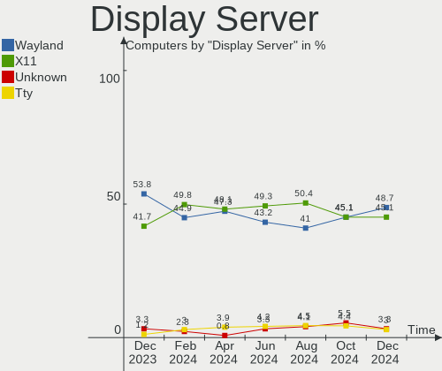
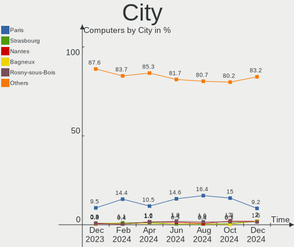
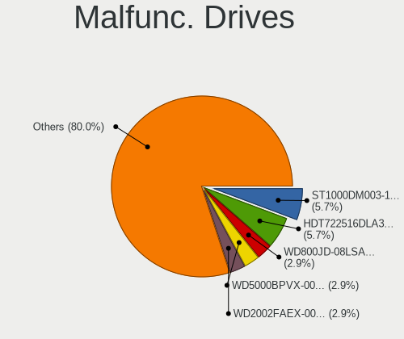
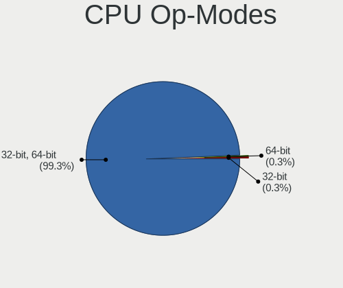

Linux in France - Hardware Trends
---------------------------------

A project to identify most popular hardware characteristics and track their change
over time based on data collected by Linux users at https://Linux-Hardware.org.

Anyone can contribute to this report by the [hw-probe](https://github.com/linuxhw/hw-probe) tool:

    sudo -E hw-probe -all -upload

This is a report for all computer types. See also reports for [desktops](/Location/France/Desktop/README.md) and [notebooks](/Location/France/Notebook/README.md).

Period: Nov, 2022.

Contents
--------

* [ System ](#system)
  - [ OS                       ](#os)
  - [ OS Family                ](#os-family)
  - [ Kernel                   ](#kernel)
  - [ Kernel Family            ](#kernel-family)
  - [ Kernel Major Ver.        ](#kernel-major-ver)
  - [ Arch                     ](#arch)
  - [ DE                       ](#de)
  - [ Display Server           ](#display-server)
  - [ Display Manager          ](#display-manager)
  - [ OS Lang                  ](#os-lang)
  - [ Boot Mode                ](#boot-mode)
  - [ Filesystem               ](#filesystem)
  - [ Part. scheme             ](#part-scheme)
  - [ Dual Boot with Linux/BSD ](#dual-boot-with-linuxbsd)
  - [ Dual Boot (Win)          ](#dual-boot-win)

* [ Board ](#board)
  - [ Vendor                   ](#vendor)
  - [ Model                    ](#model)
  - [ Model Family             ](#model-family)
  - [ MFG Year                 ](#mfg-year)
  - [ Form Factor              ](#form-factor)
  - [ Secure Boot              ](#secure-boot)
  - [ Coreboot                 ](#coreboot)
  - [ RAM Size                 ](#ram-size)
  - [ RAM Used                 ](#ram-used)
  - [ Total Drives             ](#total-drives)
  - [ Has CD-ROM               ](#has-cd-rom)
  - [ Has Ethernet             ](#has-ethernet)
  - [ Has WiFi                 ](#has-wifi)
  - [ Has Bluetooth            ](#has-bluetooth)

* [ Location ](#location)
  - [ Country                  ](#country)
  - [ City                     ](#city)

* [ Drives ](#drives)
  - [ Drive Vendor             ](#drive-vendor)
  - [ Drive Model              ](#drive-model)
  - [ HDD Vendor               ](#hdd-vendor)
  - [ SSD Vendor               ](#ssd-vendor)
  - [ Drive Kind               ](#drive-kind)
  - [ Drive Connector          ](#drive-connector)
  - [ Drive Size               ](#drive-size)
  - [ Space Total              ](#space-total)
  - [ Space Used               ](#space-used)
  - [ Malfunc. Drives          ](#malfunc-drives)
  - [ Malfunc. Drive Vendor    ](#malfunc-drive-vendor)
  - [ Malfunc. HDD Vendor      ](#malfunc-hdd-vendor)
  - [ Malfunc. Drive Kind      ](#malfunc-drive-kind)
  - [ Failed Drives            ](#failed-drives)
  - [ Failed Drive Vendor      ](#failed-drive-vendor)
  - [ Drive Status             ](#drive-status)

* [ Storage controller ](#storage-controller)
  - [ Storage Vendor           ](#storage-vendor)
  - [ Storage Model            ](#storage-model)
  - [ Storage Kind             ](#storage-kind)

* [ Processor ](#processor)
  - [ CPU Vendor               ](#cpu-vendor)
  - [ CPU Model                ](#cpu-model)
  - [ CPU Model Family         ](#cpu-model-family)
  - [ CPU Cores                ](#cpu-cores)
  - [ CPU Sockets              ](#cpu-sockets)
  - [ CPU Threads              ](#cpu-threads)
  - [ CPU Op-Modes             ](#cpu-op-modes)
  - [ CPU Microcode            ](#cpu-microcode)
  - [ CPU Microarch            ](#cpu-microarch)

* [ Graphics ](#graphics)
  - [ GPU Vendor               ](#gpu-vendor)
  - [ GPU Model                ](#gpu-model)
  - [ GPU Combo                ](#gpu-combo)
  - [ GPU Driver               ](#gpu-driver)
  - [ GPU Memory               ](#gpu-memory)

* [ Monitor ](#monitor)
  - [ Monitor Vendor           ](#monitor-vendor)
  - [ Monitor Model            ](#monitor-model)
  - [ Monitor Resolution       ](#monitor-resolution)
  - [ Monitor Diagonal         ](#monitor-diagonal)
  - [ Monitor Width            ](#monitor-width)
  - [ Aspect Ratio             ](#aspect-ratio)
  - [ Monitor Area             ](#monitor-area)
  - [ Pixel Density            ](#pixel-density)
  - [ Multiple Monitors        ](#multiple-monitors)

* [ Network ](#network)
  - [ Net Controller Vendor    ](#net-controller-vendor)
  - [ Net Controller Model     ](#net-controller-model)
  - [ Wireless Vendor          ](#wireless-vendor)
  - [ Wireless Model           ](#wireless-model)
  - [ Ethernet Vendor          ](#ethernet-vendor)
  - [ Ethernet Model           ](#ethernet-model)
  - [ Net Controller Kind      ](#net-controller-kind)
  - [ Used Controller          ](#used-controller)
  - [ NICs                     ](#nics)
  - [ IPv6                     ](#ipv6)

* [ Bluetooth ](#bluetooth)
  - [ Bluetooth Vendor         ](#bluetooth-vendor)
  - [ Bluetooth Model          ](#bluetooth-model)

* [ Sound ](#sound)
  - [ Sound Vendor             ](#sound-vendor)
  - [ Sound Model              ](#sound-model)

* [ Memory ](#memory)
  - [ Memory Vendor            ](#memory-vendor)
  - [ Memory Model             ](#memory-model)
  - [ Memory Kind              ](#memory-kind)
  - [ Memory Form Factor       ](#memory-form-factor)
  - [ Memory Size              ](#memory-size)
  - [ Memory Speed             ](#memory-speed)

* [ Printers & scanners ](#printers--scanners)
  - [ Printer Vendor           ](#printer-vendor)
  - [ Printer Model            ](#printer-model)
  - [ Scanner Vendor           ](#scanner-vendor)
  - [ Scanner Model            ](#scanner-model)

* [ Camera ](#camera)
  - [ Camera Vendor            ](#camera-vendor)
  - [ Camera Model             ](#camera-model)

* [ Security ](#security)
  - [ Fingerprint Vendor       ](#fingerprint-vendor)
  - [ Fingerprint Model        ](#fingerprint-model)
  - [ Chipcard Vendor          ](#chipcard-vendor)
  - [ Chipcard Model           ](#chipcard-model)

* [ Unsupported ](#unsupported)
  - [ Unsupported Devices      ](#unsupported-devices)
  - [ Unsupported Device Types ](#unsupported-device-types)

System
------

OS
--

Installed operating systems

| Name                         | Computers | Percent |
|------------------------------|-----------|---------|
| Ubuntu 22.04                 | 59        | 21.93%  |
| Ubuntu 20.04                 | 27        | 10.04%  |
| Debian 11                    | 19        | 7.06%   |
| Linux Mint 21                | 13        | 4.83%   |
| OpenMandriva 4.3             | 12        | 4.46%   |
| Ubuntu 22.10                 | 9         | 3.35%   |
| OpenMandriva 4.50            | 9         | 3.35%   |
| Fedora 37                    | 8         | 2.97%   |
| Xubuntu 22.04                | 7         | 2.6%    |
| Pop!_OS 22.04                | 6         | 2.23%   |
| KDE neon 22.04               | 6         | 2.23%   |
| Zorin 16                     | 5         | 1.86%   |
| Xubuntu 20.04                | 5         | 1.86%   |
| Linux Mint 20.3              | 5         | 1.86%   |
| Manjaro                      | 4         | 1.49%   |
| LMDE 5                       | 4         | 1.49%   |
| Linux Mint 20.2              | 4         | 1.49%   |
| Kubuntu 22.10                | 4         | 1.49%   |
| Kubuntu 22.04                | 4         | 1.49%   |
| Fedora 36                    | 4         | 1.49%   |
| Ubuntu 18.04                 | 3         | 1.12%   |
| ROSA 12.3                    | 3         | 1.12%   |
| Lubuntu 22.04                | 3         | 1.12%   |
| Fedora 35                    | 3         | 1.12%   |
| Arch Rolling                 | 3         | 1.12%   |
| Ubuntu MATE 22.04            | 2         | 0.74%   |
| openSUSE Tumbleweed-XXXXXXXX | 2         | 0.74%   |
| OpenMandriva 4.2             | 2         | 0.74%   |
| NixOS 22.11                  | 2         | 0.74%   |
| Manjaro 22.0.0               | 2         | 0.74%   |
| Lubuntu 20.04                | 2         | 0.74%   |
| Gentoo 2.8                   | 2         | 0.74%   |
| Elementary 6.1               | 2         | 0.74%   |
| Debian                       | 2         | 0.74%   |
| Xubuntu 18.04                | 1         | 0.37%   |
| Ubuntu Unity 23.04           | 1         | 0.37%   |
| Ubuntu Unity 16.04           | 1         | 0.37%   |
| Ubuntu Studio 20.04          | 1         | 0.37%   |
| Ubuntu MATE 18.04            | 1         | 0.37%   |
| Ubuntu Budgie 22.10          | 1         | 0.37%   |

OS Family
---------

OS without a version

| Name          | Computers | Percent |
|---------------|-----------|---------|
| Ubuntu        | 98        | 36.43%  |
| OpenMandriva  | 24        | 8.92%   |
| Linux Mint    | 22        | 8.18%   |
| Debian        | 22        | 8.18%   |
| Fedora        | 16        | 5.95%   |
| Xubuntu       | 13        | 4.83%   |
| Kubuntu       | 8         | 2.97%   |
| Pop!_OS       | 6         | 2.23%   |
| Manjaro       | 6         | 2.23%   |
| Lubuntu       | 6         | 2.23%   |
| KDE neon      | 6         | 2.23%   |
| Zorin         | 5         | 1.86%   |
| LMDE          | 4         | 1.49%   |
| Ubuntu MATE   | 3         | 1.12%   |
| ROSA          | 3         | 1.12%   |
| NixOS         | 3         | 1.12%   |
| Gentoo        | 3         | 1.12%   |
| Elementary    | 3         | 1.12%   |
| Arch          | 3         | 1.12%   |
| Ubuntu Unity  | 2         | 0.74%   |
| Ubuntu Budgie | 2         | 0.74%   |
| openSUSE      | 2         | 0.74%   |
| Ubuntu Studio | 1         | 0.37%   |
| SteamOS       | 1         | 0.37%   |
| Sparky        | 1         | 0.37%   |
| PureOS        | 1         | 0.37%   |
| Parrot        | 1         | 0.37%   |
| Kali          | 1         | 0.37%   |
| EndeavourOS   | 1         | 0.37%   |
| Clear Linux   | 1         | 0.37%   |
| ArcoLinux     | 1         | 0.37%   |

Kernel
------

Version of the Linux kernel

| Version                     | Computers | Percent |
|-----------------------------|-----------|---------|
| 5.15.0-52-generic           | 60        | 22.3%   |
| 5.15.0-53-generic           | 34        | 12.64%  |
| 5.10.0-19-amd64             | 19        | 7.06%   |
| 5.19.0-23-generic           | 12        | 4.46%   |
| 5.16.7-desktop-1omv4003     | 12        | 4.46%   |
| 5.4.0-131-generic           | 11        | 4.09%   |
| 6.0.6-76060006-generic      | 6         | 2.23%   |
| 5.4.0-132-generic           | 6         | 2.23%   |
| 5.19.12-desktop-2omv4090    | 6         | 2.23%   |
| 5.15.0-25-generic           | 5         | 1.86%   |
| 5.15.0-43-generic           | 4         | 1.49%   |
| 5.15.0-41-generic           | 4         | 1.49%   |
| 5.19.16-301.fc37.x86_64     | 3         | 1.12%   |
| 6.0.9-arch1-1               | 2         | 0.74%   |
| 6.0.9-300.fc37.x86_64       | 2         | 0.74%   |
| 6.0.9-060009-generic        | 2         | 0.74%   |
| 6.0.8-1-default             | 2         | 0.74%   |
| 6.0.5-200.fc36.x86_64       | 2         | 0.74%   |
| 5.19.7-300.fc37.x86_64      | 2         | 0.74%   |
| 5.19.5-desktop-1omv4090     | 2         | 0.74%   |
| 5.15.0-54-generic           | 2         | 0.74%   |
| 5.13.0-30-generic           | 2         | 0.74%   |
| 5.10.14-desktop-1omv4002    | 2         | 0.74%   |
| 5.10.0-18-amd64             | 2         | 0.74%   |
| 6.0.9-tereszkiewicz         | 1         | 0.37%   |
| 6.0.9-desktop-1omv22090     | 1         | 0.37%   |
| 6.0.9-602.inttf.fc36.x86_64 | 1         | 0.37%   |
| 6.0.9-200.fc36.x86_64       | 1         | 0.37%   |
| 6.0.8-zen1-1-zen            | 1         | 0.37%   |
| 6.0.8-100.fc35.x86_64       | 1         | 0.37%   |
| 6.0.8-1-MANJARO             | 1         | 0.37%   |
| 6.0.7-301.fc37.x86_64       | 1         | 0.37%   |
| 6.0.7-060007-generic        | 1         | 0.37%   |
| 6.0.6-gentoo-x86_64         | 1         | 0.37%   |
| 6.0.5-arch1-1-15khz         | 1         | 0.37%   |
| 6.0.2-2-MANJARO             | 1         | 0.37%   |
| 6.0.10-zen2-1-zen           | 1         | 0.37%   |
| 6.0.0-kali3-amd64           | 1         | 0.37%   |
| 6.0.0-5-amd64               | 1         | 0.37%   |
| 6.0.0-2parrot1-amd64        | 1         | 0.37%   |

Kernel Family
-------------

Linux kernel without a distro release

| Version | Computers | Percent |
|---------|-----------|---------|
| 5.15.0  | 112       | 41.64%  |
| 5.4.0   | 24        | 8.92%   |
| 5.10.0  | 22        | 8.18%   |
| 5.19.0  | 14        | 5.2%    |
| 5.16.7  | 12        | 4.46%   |
| 6.0.9   | 10        | 3.72%   |
| 6.0.6   | 7         | 2.6%    |
| 5.19.12 | 6         | 2.23%   |
| 6.0.8   | 5         | 1.86%   |
| 6.0.0   | 4         | 1.49%   |
| 5.19.16 | 4         | 1.49%   |
| 5.13.0  | 4         | 1.49%   |
| 4.15.0  | 4         | 1.49%   |
| 6.0.5   | 3         | 1.12%   |
| 5.11.0  | 3         | 1.12%   |
| 6.0.7   | 2         | 0.74%   |
| 5.8.0   | 2         | 0.74%   |
| 5.19.7  | 2         | 0.74%   |
| 5.19.5  | 2         | 0.74%   |
| 5.17.0  | 2         | 0.74%   |
| 5.16.13 | 2         | 0.74%   |
| 5.10.14 | 2         | 0.74%   |
| 6.0.2   | 1         | 0.37%   |
| 6.0.10  | 1         | 0.37%   |
| 5.9.1   | 1         | 0.37%   |
| 5.19.2  | 1         | 0.37%   |
| 5.19.17 | 1         | 0.37%   |
| 5.18.0  | 1         | 0.37%   |
| 5.17.4  | 1         | 0.37%   |
| 5.17.15 | 1         | 0.37%   |
| 5.17.12 | 1         | 0.37%   |
| 5.15.78 | 1         | 0.37%   |
| 5.15.77 | 1         | 0.37%   |
| 5.15.76 | 1         | 0.37%   |
| 5.15.75 | 1         | 0.37%   |
| 5.15.74 | 1         | 0.37%   |
| 5.15.72 | 1         | 0.37%   |
| 5.15.64 | 1         | 0.37%   |
| 5.15.52 | 1         | 0.37%   |
| 5.15.39 | 1         | 0.37%   |

Kernel Major Ver.
-----------------

Linux kernel major version

| Version | Computers | Percent |
|---------|-----------|---------|
| 5.15    | 121       | 44.98%  |
| 6.0     | 33        | 12.27%  |
| 5.19    | 30        | 11.15%  |
| 5.10    | 26        | 9.67%   |
| 5.4     | 24        | 8.92%   |
| 5.16    | 14        | 5.2%    |
| 5.17    | 5         | 1.86%   |
| 5.13    | 4         | 1.49%   |
| 4.15    | 4         | 1.49%   |
| 5.11    | 3         | 1.12%   |
| 5.8     | 2         | 0.74%   |
| 5.9     | 1         | 0.37%   |
| 5.18    | 1         | 0.37%   |
| 5.14    | 1         | 0.37%   |

Arch
----

OS architecture (x86_64, i586, etc.)

| Name   | Computers | Percent |
|--------|-----------|---------|
| x86_64 | 268       | 99.63%  |
| i686   | 1         | 0.37%   |

DE
--

Desktop Environment

| Name            | Computers | Percent |
|-----------------|-----------|---------|
| GNOME           | 111       | 41.26%  |
| KDE5            | 52        | 19.33%  |
| Unknown         | 24        | 8.92%   |
| XFCE            | 23        | 8.55%   |
| X-Cinnamon      | 20        | 7.43%   |
| MATE            | 12        | 4.46%   |
| LXQt            | 6         | 2.23%   |
| Cinnamon        | 6         | 2.23%   |
| Pantheon        | 3         | 1.12%   |
| LXDE            | 3         | 1.12%   |
| GNOME Flashback | 3         | 1.12%   |
| Unity           | 2         | 0.74%   |
| Budgie          | 2         | 0.74%   |
| KDE             | 1         | 0.37%   |
| i3              | 1         | 0.37%   |

Display Server
--------------

X11 or Wayland

| Name    | Computers | Percent |
|---------|-----------|---------|
| X11     | 182       | 67.66%  |
| Wayland | 63        | 23.42%  |
| Tty     | 14        | 5.2%    |
| Unknown | 10        | 3.72%   |

Display Manager
---------------

SDDM, LightDM, etc.

| Name    | Computers | Percent |
|---------|-----------|---------|
| GDM3    | 75        | 27.88%  |
| Unknown | 59        | 21.93%  |
| LightDM | 54        | 20.07%  |
| SDDM    | 49        | 18.22%  |
| GDM     | 31        | 11.52%  |
| LXDM    | 1         | 0.37%   |

OS Lang
-------

Language

| Lang    | Computers | Percent |
|---------|-----------|---------|
| fr_FR   | 203       | 75.46%  |
| en_US   | 52        | 19.33%  |
| es_ES   | 2         | 0.74%   |
| en_GB   | 2         | 0.74%   |
| de_DE   | 2         | 0.74%   |
| Unknown | 2         | 0.74%   |
| ru_UA   | 1         | 0.37%   |
| fr_CA   | 1         | 0.37%   |
| fi_FI   | 1         | 0.37%   |
| en_AU   | 1         | 0.37%   |
| en_AG   | 1         | 0.37%   |
| C       | 1         | 0.37%   |

Boot Mode
---------

EFI or BIOS

| Mode | Computers | Percent |
|------|-----------|---------|
| EFI  | 149       | 55.39%  |
| BIOS | 120       | 44.61%  |

Filesystem
----------

Type of filesystem

| Type    | Computers | Percent |
|---------|-----------|---------|
| Ext4    | 221       | 82.16%  |
| Overlay | 22        | 8.18%   |
| Btrfs   | 20        | 7.43%   |
| Zfs     | 3         | 1.12%   |
| Xfs     | 3         | 1.12%   |

Part. scheme
------------

Scheme of partitioning

| Type    | Computers | Percent |
|---------|-----------|---------|
| GPT     | 171       | 63.57%  |
| Unknown | 55        | 20.45%  |
| MBR     | 43        | 15.99%  |

Dual Boot with Linux/BSD
------------------------

Hosting more than one Linux/BSD

| Dual boot | Computers | Percent |
|-----------|-----------|---------|
| No        | 215       | 79.93%  |
| Yes       | 54        | 20.07%  |

Dual Boot (Win)
---------------

Hosting Linux and Windows

| Dual boot | Computers | Percent |
|-----------|-----------|---------|
| No        | 178       | 66.17%  |
| Yes       | 91        | 33.83%  |

Board
-----

Vendor
------

Motherboard manufacturer

| Name                        | Computers | Percent |
|-----------------------------|-----------|---------|
| Dell                        | 47        | 17.47%  |
| ASUSTek Computer            | 45        | 16.73%  |
| Hewlett-Packard             | 42        | 15.61%  |
| Lenovo                      | 26        | 9.67%   |
| MSI                         | 22        | 8.18%   |
| Gigabyte Technology         | 19        | 7.06%   |
| Acer                        | 15        | 5.58%   |
| Apple                       | 6         | 2.23%   |
| Intel                       | 5         | 1.86%   |
| HUAWEI                      | 4         | 1.49%   |
| Unknown                     | 4         | 1.49%   |
| TUXEDO                      | 3         | 1.12%   |
| Thomson                     | 3         | 1.12%   |
| Foxconn                     | 3         | 1.12%   |
| UNOWHY                      | 2         | 0.74%   |
| Toshiba                     | 2         | 0.74%   |
| Timi                        | 2         | 0.74%   |
| BESSTAR Tech                | 2         | 0.74%   |
| ASRock                      | 2         | 0.74%   |
| Valve                       | 1         | 0.37%   |
| SHENZHEN YOUDISI E-COMMERCE | 1         | 0.37%   |
| Samsung Electronics         | 1         | 0.37%   |
| Razer                       | 1         | 0.37%   |
| Panasonic                   | 1         | 0.37%   |
| Packard Bell                | 1         | 0.37%   |
| Notebook                    | 1         | 0.37%   |
| LDLC                        | 1         | 0.37%   |
| Jumper                      | 1         | 0.37%   |
| Google                      | 1         | 0.37%   |
| Fujitsu Siemens             | 1         | 0.37%   |
| Dynabook Europe             | 1         | 0.37%   |
| Dynabook                    | 1         | 0.37%   |
| Biostar                     | 1         | 0.37%   |
| Alienware                   | 1         | 0.37%   |

Model
-----

Motherboard model

| Name                                  | Computers | Percent |
|---------------------------------------|-----------|---------|
| Unknown                               | 5         | 1.86%   |
| HP Pavilion 17                        | 3         | 1.12%   |
| Gigabyte H97-HD3                      | 3         | 1.12%   |
| Gigabyte 970A-DS3P                    | 3         | 1.12%   |
| Dell Latitude 7310                    | 3         | 1.12%   |
| ASUS All Series                       | 3         | 1.12%   |
| Thomson N17V3C8WH512                  | 2         | 0.74%   |
| MSI MS-7D46                           | 2         | 0.74%   |
| MSI MS-7758                           | 2         | 0.74%   |
| MSI MS-7693                           | 2         | 0.74%   |
| Lenovo ThinkPad P14s Gen 1 20Y1CTO1WW | 2         | 0.74%   |
| HP EliteBook 840 G3                   | 2         | 0.74%   |
| HP EliteBook 840 G2                   | 2         | 0.74%   |
| Dell OptiPlex 7010                    | 2         | 0.74%   |
| Dell Latitude E6520                   | 2         | 0.74%   |
| Dell Latitude 7300                    | 2         | 0.74%   |
| Dell Latitude 5420                    | 2         | 0.74%   |
| ASUS UX303UA                          | 2         | 0.74%   |
| Valve Jupiter                         | 1         | 0.37%   |
| UNOWHY Y13G012S4EI                    | 1         | 0.37%   |
| UNOWHY Y13G011S4EI                    | 1         | 0.37%   |
| TUXEDO Pulse 15 Gen2                  | 1         | 0.37%   |
| TUXEDO Pulse 15 Gen1                  | 1         | 0.37%   |
| TUXEDO InfinityBook Pro 14 Gen6       | 1         | 0.37%   |
| Toshiba Satellite C70D-B              | 1         | 0.37%   |
| Toshiba Satellite C70D-A              | 1         | 0.37%   |
| Timi Xiaomi Book Pro 16 2022          | 1         | 0.37%   |
| Timi TM1612                           | 1         | 0.37%   |
| Thomson NEO14A-4SL128                 | 1         | 0.37%   |
| SHENZHEN YOUDISI E-COMMERCE A8S PRO   | 1         | 0.37%   |
| Samsung 350V5C/351V5C/3540VC/3440VC   | 1         | 0.37%   |
| Razer Blade Stealth                   | 1         | 0.37%   |
| Panasonic CF-19AHN3BFF                | 1         | 0.37%   |
| Packard Bell EasyNote TE69CXP         | 1         | 0.37%   |
| Notebook NL40_50GU                    | 1         | 0.37%   |
| MSI Prestige 14 A12SC                 | 1         | 0.37%   |
| MSI MS-7D17                           | 1         | 0.37%   |
| MSI MS-7C91                           | 1         | 0.37%   |
| MSI MS-7B93                           | 1         | 0.37%   |
| MSI MS-7B61                           | 1         | 0.37%   |

Model Family
------------

Motherboard model prefix

| Name                 | Computers | Percent |
|----------------------|-----------|---------|
| Dell Latitude        | 21        | 7.81%   |
| Lenovo ThinkPad      | 12        | 4.46%   |
| HP Pavilion          | 10        | 3.72%   |
| HP EliteBook         | 10        | 3.72%   |
| Dell OptiPlex        | 9         | 3.35%   |
| Acer Aspire          | 9         | 3.35%   |
| Dell Inspiron        | 7         | 2.6%    |
| Lenovo IdeaPad       | 5         | 1.86%   |
| Unknown              | 5         | 1.86%   |
| Lenovo ThinkCentre   | 4         | 1.49%   |
| Dell Precision       | 4         | 1.49%   |
| ASUS ZenBook         | 4         | 1.49%   |
| HP ProBook           | 3         | 1.12%   |
| HP ENVY              | 3         | 1.12%   |
| HP Compaq            | 3         | 1.12%   |
| Gigabyte H97-HD3     | 3         | 1.12%   |
| Gigabyte 970A-DS3P   | 3         | 1.12%   |
| ASUS VivoBook        | 3         | 1.12%   |
| ASUS ASUS            | 3         | 1.12%   |
| ASUS All             | 3         | 1.12%   |
| Acer Veriton         | 3         | 1.12%   |
| TUXEDO Pulse         | 2         | 0.74%   |
| Toshiba Satellite    | 2         | 0.74%   |
| Thomson N17V3C8WH512 | 2         | 0.74%   |
| MSI MS-7D46          | 2         | 0.74%   |
| MSI MS-7758          | 2         | 0.74%   |
| MSI MS-7693          | 2         | 0.74%   |
| Lenovo ThinkBook     | 2         | 0.74%   |
| HP ZBook             | 2         | 0.74%   |
| HP Laptop            | 2         | 0.74%   |
| ASUS UX303UA         | 2         | 0.74%   |
| ASUS ROG             | 2         | 0.74%   |
| ASUS P8Z77-V         | 2         | 0.74%   |
| Acer Swift           | 2         | 0.74%   |
| Valve Jupiter        | 1         | 0.37%   |
| UNOWHY Y13G012S4EI   | 1         | 0.37%   |
| UNOWHY Y13G011S4EI   | 1         | 0.37%   |
| TUXEDO InfinityBook  | 1         | 0.37%   |
| Timi Xiaomi          | 1         | 0.37%   |
| Timi TM1612          | 1         | 0.37%   |

MFG Year
--------

Motherboard manufacture year

| Year | Computers | Percent |
|------|-----------|---------|
| 2020 | 32        | 11.9%   |
| 2021 | 27        | 10.04%  |
| 2022 | 25        | 9.29%   |
| 2012 | 24        | 8.92%   |
| 2015 | 23        | 8.55%   |
| 2019 | 21        | 7.81%   |
| 2014 | 18        | 6.69%   |
| 2013 | 18        | 6.69%   |
| 2016 | 15        | 5.58%   |
| 2018 | 14        | 5.2%    |
| 2017 | 14        | 5.2%    |
| 2011 | 10        | 3.72%   |
| 2009 | 10        | 3.72%   |
| 2010 | 7         | 2.6%    |
| 2008 | 7         | 2.6%    |
| 2007 | 2         | 0.74%   |
| 2006 | 1         | 0.37%   |
| 2005 | 1         | 0.37%   |

Form Factor
-----------

Physical design of the computer

| Name        | Computers | Percent |
|-------------|-----------|---------|
| Notebook    | 156       | 57.99%  |
| Desktop     | 94        | 34.94%  |
| Convertible | 6         | 2.23%   |
| Mini pc     | 6         | 2.23%   |
| All in one  | 6         | 2.23%   |
| Server      | 1         | 0.37%   |

Secure Boot
-----------

Enabled or disabled

| State    | Computers | Percent |
|----------|-----------|---------|
| Disabled | 250       | 92.94%  |
| Enabled  | 19        | 7.06%   |

Coreboot
--------

Have coreboot on board

| Used | Computers | Percent |
|------|-----------|---------|
| No   | 268       | 99.63%  |
| Yes  | 1         | 0.37%   |

RAM Size
--------

Total RAM memory

| Size in GB  | Computers | Percent |
|-------------|-----------|---------|
| 4.01-8.0    | 73        | 27.14%  |
| 3.01-4.0    | 59        | 21.93%  |
| 16.01-24.0  | 50        | 18.59%  |
| 8.01-16.0   | 47        | 17.47%  |
| 32.01-64.0  | 30        | 11.15%  |
| 24.01-32.0  | 4         | 1.49%   |
| 1.01-2.0    | 3         | 1.12%   |
| 64.01-256.0 | 2         | 0.74%   |
| 2.01-3.0    | 1         | 0.37%   |

RAM Used
--------

Used RAM memory

| Used GB    | Computers | Percent |
|------------|-----------|---------|
| 1.01-2.0   | 88        | 32.71%  |
| 2.01-3.0   | 67        | 24.91%  |
| 4.01-8.0   | 39        | 14.5%   |
| 3.01-4.0   | 38        | 14.13%  |
| 8.01-16.0  | 25        | 9.29%   |
| 0.51-1.0   | 8         | 2.97%   |
| 16.01-24.0 | 2         | 0.74%   |
| 24.01-32.0 | 1         | 0.37%   |
| 0.01-0.5   | 1         | 0.37%   |

Total Drives
------------

Number of drives on board

| Drives | Computers | Percent |
|--------|-----------|---------|
| 1      | 177       | 65.8%   |
| 2      | 59        | 21.93%  |
| 3      | 17        | 6.32%   |
| 5      | 8         | 2.97%   |
| 6      | 4         | 1.49%   |
| 4      | 4         | 1.49%   |

Has CD-ROM
----------

Has CD-ROM on board

| Presented | Computers | Percent |
|-----------|-----------|---------|
| No        | 173       | 64.31%  |
| Yes       | 96        | 35.69%  |

Has Ethernet
------------

Has Ethernet on board

| Presented | Computers | Percent |
|-----------|-----------|---------|
| Yes       | 231       | 85.87%  |
| No        | 38        | 14.13%  |

Has WiFi
--------

Has WiFi module

| Presented | Computers | Percent |
|-----------|-----------|---------|
| Yes       | 208       | 77.32%  |
| No        | 61        | 22.68%  |

Has Bluetooth
-------------

Has Bluetooth module

| Presented | Computers | Percent |
|-----------|-----------|---------|
| Yes       | 171       | 63.57%  |
| No        | 98        | 36.43%  |

Location
--------

Country
-------

Geographic location (country)

| Country | Computers | Percent |
|---------|-----------|---------|
| France  | 269       | 100%    |

City
----

Geographic location (city)

| City              | Computers | Percent |
|-------------------|-----------|---------|
| Paris             | 34        | 12.64%  |
| Champs-sur-Marne  | 9         | 3.35%   |
| Lyon              | 6         | 2.23%   |
| Valenciennes      | 5         | 1.86%   |
| Pau               | 4         | 1.49%   |
| Montpellier       | 4         | 1.49%   |
| Toulon            | 3         | 1.12%   |
| Souillac          | 3         | 1.12%   |
| Roubaix           | 3         | 1.12%   |
| Rennes            | 3         | 1.12%   |
| Cenon             | 3         | 1.12%   |
| Bordeaux          | 3         | 1.12%   |
| Aubervilliers     | 3         | 1.12%   |
| Versailles        | 2         | 0.74%   |
| Vence             | 2         | 0.74%   |
| Vannes            | 2         | 0.74%   |
| Valence           | 2         | 0.74%   |
| Seynod            | 2         | 0.74%   |
| Sartrouville      | 2         | 0.74%   |
| Pouydraguin       | 2         | 0.74%   |
| Poitiers          | 2         | 0.74%   |
| Nîmes            | 2         | 0.74%   |
| Montauban         | 2         | 0.74%   |
| Meudon            | 2         | 0.74%   |
| Mérignac         | 2         | 0.74%   |
| Longjumeau        | 2         | 0.74%   |
| Gex               | 2         | 0.74%   |
| Évreux           | 2         | 0.74%   |
| Dijon             | 2         | 0.74%   |
| Courbevoie        | 2         | 0.74%   |
| Comines           | 2         | 0.74%   |
| Clamart           | 2         | 0.74%   |
| Châtenay-Malabry | 2         | 0.74%   |
| Caluire-et-Cuire  | 2         | 0.74%   |
| Brest             | 2         | 0.74%   |
| Baraqueville      | 2         | 0.74%   |
| Yutz              | 1         | 0.37%   |
| Winkel            | 1         | 0.37%   |
| Villeurbanne      | 1         | 0.37%   |
| Villeneuve-d'Ascq | 1         | 0.37%   |

Drives
------

Drive Vendor
------------

Hard drive vendors

| Vendor                      | Computers | Drives | Percent |
|-----------------------------|-----------|--------|---------|
| Samsung Electronics         | 75        | 85     | 19.63%  |
| WDC                         | 47        | 64     | 12.3%   |
| Seagate                     | 47        | 56     | 12.3%   |
| SanDisk                     | 24        | 25     | 6.28%   |
| Crucial                     | 23        | 24     | 6.02%   |
| Toshiba                     | 20        | 20     | 5.24%   |
| SK hynix                    | 20        | 20     | 5.24%   |
| Unknown                     | 17        | 18     | 4.45%   |
| Hitachi                     | 12        | 12     | 3.14%   |
| Kingston                    | 11        | 11     | 2.88%   |
| Intel                       | 9         | 10     | 2.36%   |
| HGST                        | 7         | 7      | 1.83%   |
| Micron Technology           | 6         | 6      | 1.57%   |
| PNY                         | 5         | 5      | 1.31%   |
| KIOXIA                      | 5         | 5      | 1.31%   |
| China                       | 5         | 5      | 1.31%   |
| Apple                       | 4         | 5      | 1.05%   |
| Unknown                     | 4         | 4      | 1.05%   |
| Phison Electronics          | 3         | 3      | 0.79%   |
| Phison                      | 3         | 3      | 0.79%   |
| Micron/Crucial Technology   | 3         | 3      | 0.79%   |
| Maxtor                      | 3         | 3      | 0.79%   |
| Kingston Technology Company | 3         | 3      | 0.79%   |
| SPCC                        | 2         | 2      | 0.52%   |
| LITEON                      | 2         | 2      | 0.52%   |
| LDLC                        | 2         | 2      | 0.52%   |
| JMicron Technology          | 2         | 2      | 0.52%   |
| ASMT                        | 2         | 2      | 0.52%   |
| USB                         | 1         | 1      | 0.26%   |
| UMIS                        | 1         | 1      | 0.26%   |
| SSSTC                       | 1         | 1      | 0.26%   |
| OCZ                         | 1         | 1      | 0.26%   |
| Netac                       | 1         | 1      | 0.26%   |
| LITEONIT                    | 1         | 1      | 0.26%   |
| Lexar                       | 1         | 1      | 0.26%   |
| KingSpec                    | 1         | 1      | 0.26%   |
| Jumper                      | 1         | 1      | 0.26%   |
| Intenso                     | 1         | 1      | 0.26%   |
| Hoodisk                     | 1         | 1      | 0.26%   |
| Freecom                     | 1         | 1      | 0.26%   |

Drive Model
-----------

Hard drive models

| Model                                             | Computers | Percent |
|---------------------------------------------------|-----------|---------|
| Samsung SSD 850 EVO 500GB                         | 8         | 1.93%   |
| Samsung SSD 870 QVO 1TB                           | 5         | 1.2%    |
| Toshiba MQ01ABD100 1TB                            | 4         | 0.96%   |
| Seagate ST1000DM003-1ER162 1TB                    | 4         | 0.96%   |
| Samsung SSD 870 EVO 500GB                         | 4         | 0.96%   |
| HGST HTS721010A9E630 1TB                          | 4         | 0.96%   |
| Crucial CT500MX500SSD1 500GB                      | 4         | 0.96%   |
| Unknown                                           | 4         | 0.96%   |
| Unknown MMC Card  64GB                            | 3         | 0.72%   |
| Unknown MMC Card  128GB                           | 3         | 0.72%   |
| Toshiba MQ01ABF050 500GB                          | 3         | 0.72%   |
| SK hynix BC711 NVMe 512GB                         | 3         | 0.72%   |
| Seagate ST500DM002-1BD142 500GB                   | 3         | 0.72%   |
| Seagate ST1000LM024 HN-M101MBB 1TB                | 3         | 0.72%   |
| Seagate ST1000DM010-2EP102 1TB                    | 3         | 0.72%   |
| Seagate ST1000DM003-1CH162 1TB                    | 3         | 0.72%   |
| Sandisk WD Blue SN500 / PC SN520 NVMe SSD 512GB   | 3         | 0.72%   |
| Sandisk WD Black SN750 / PC SN730 NVMe SSD 1024GB | 3         | 0.72%   |
| Samsung SSD 860 EVO 500GB                         | 3         | 0.72%   |
| Samsung SSD 860 EVO 1TB                           | 3         | 0.72%   |
| Samsung SSD 850 PRO 256GB                         | 3         | 0.72%   |
| Samsung NVMe SSD Controller SM981/PM981/PM983 1TB | 3         | 0.72%   |
| PNY CS900 480GB SSD                               | 3         | 0.72%   |
| Micron MTFDHBA256TCK-1AS1AABHA 256GB              | 3         | 0.72%   |
| Crucial CT240BX500SSD1 240GB                      | 3         | 0.72%   |
| Crucial CT1000MX500SSD1 1TB                       | 3         | 0.72%   |
| WDC WDS500G2B0B-00YS70 500GB SSD                  | 2         | 0.48%   |
| WDC WDS240G2G0B-00EPW0 240GB SSD                  | 2         | 0.48%   |
| WDC WD2500JS-41SGB0 250GB                         | 2         | 0.48%   |
| Unknown MMC Card  32GB                            | 2         | 0.48%   |
| Toshiba HDWD130 3TB                               | 2         | 0.48%   |
| Toshiba HDWD110 1TB                               | 2         | 0.48%   |
| SK hynix PC611 NVMe 1TB                           | 2         | 0.48%   |
| SK hynix BC501 NVMe Solid State Drive 512GB       | 2         | 0.48%   |
| Seagate ST3360320AS 360GB                         | 2         | 0.48%   |
| Seagate ST31000528AS 1TB                          | 2         | 0.48%   |
| Seagate ST1000LM049-2GH172 1TB                    | 2         | 0.48%   |
| SanDisk SDSSDP128G 128GB                          | 2         | 0.48%   |
| Samsung SSD 850 PRO 512GB                         | 2         | 0.48%   |
| Samsung SSD 850 EVO 250GB                         | 2         | 0.48%   |

HDD Vendor
----------

Hard disk drive vendors

| Vendor              | Computers | Drives | Percent |
|---------------------|-----------|--------|---------|
| Seagate             | 46        | 55     | 33.58%  |
| WDC                 | 39        | 55     | 28.47%  |
| Toshiba             | 17        | 17     | 12.41%  |
| Hitachi             | 12        | 12     | 8.76%   |
| Samsung Electronics | 7         | 7      | 5.11%   |
| HGST                | 7         | 7      | 5.11%   |
| Maxtor              | 3         | 3      | 2.19%   |
| Apple               | 3         | 3      | 2.19%   |
| USB                 | 1         | 1      | 0.73%   |
| Unknown             | 1         | 1      | 0.73%   |
| ASMedia             | 1         | 1      | 0.73%   |

SSD Vendor
----------

Solid state drive vendors

| Vendor              | Computers | Drives | Percent |
|---------------------|-----------|--------|---------|
| Samsung Electronics | 46        | 51     | 33.33%  |
| Crucial             | 20        | 21     | 14.49%  |
| SanDisk             | 13        | 14     | 9.42%   |
| Kingston            | 9         | 9      | 6.52%   |
| WDC                 | 6         | 6      | 4.35%   |
| PNY                 | 5         | 5      | 3.62%   |
| SK hynix            | 4         | 4      | 2.9%    |
| Intel               | 4         | 5      | 2.9%    |
| China               | 4         | 4      | 2.9%    |
| Unknown             | 3         | 3      | 2.17%   |
| SPCC                | 2         | 2      | 1.45%   |
| LITEON              | 2         | 2      | 1.45%   |
| LDLC                | 2         | 2      | 1.45%   |
| JMicron Technology  | 2         | 2      | 1.45%   |
| ASMT                | 2         | 2      | 1.45%   |
| Apple               | 2         | 2      | 1.45%   |
| OCZ                 | 1         | 1      | 0.72%   |
| Netac               | 1         | 1      | 0.72%   |
| Micron Technology   | 1         | 1      | 0.72%   |
| LITEONIT            | 1         | 1      | 0.72%   |
| Lexar               | 1         | 1      | 0.72%   |
| KingSpec            | 1         | 1      | 0.72%   |
| Jumper              | 1         | 1      | 0.72%   |
| Intenso             | 1         | 1      | 0.72%   |
| Hoodisk             | 1         | 1      | 0.72%   |
| Freecom             | 1         | 1      | 0.72%   |
| FORESEE             | 1         | 1      | 0.72%   |
| BHT                 | 1         | 1      | 0.72%   |

Drive Kind
----------

HDD or SSD

| Kind    | Computers | Drives | Percent |
|---------|-----------|--------|---------|
| SSD     | 128       | 146    | 37.21%  |
| HDD     | 107       | 162    | 31.1%   |
| NVMe    | 89        | 94     | 25.87%  |
| MMC     | 17        | 18     | 4.94%   |
| Unknown | 3         | 3      | 0.87%   |

Drive Connector
---------------

SATA, SAS, NVMe, etc.

| Type | Computers | Drives | Percent |
|------|-----------|--------|---------|
| SATA | 193       | 296    | 61.86%  |
| NVMe | 89        | 94     | 28.53%  |
| MMC  | 17        | 18     | 5.45%   |
| SAS  | 13        | 15     | 4.17%   |

Drive Size
----------

Size of hard drive

| Size in TB | Computers | Drives | Percent |
|------------|-----------|--------|---------|
| 0.01-0.5   | 129       | 163    | 52.02%  |
| 0.51-1.0   | 89        | 107    | 35.89%  |
| 1.01-2.0   | 13        | 18     | 5.24%   |
| 3.01-4.0   | 7         | 10     | 2.82%   |
| 2.01-3.0   | 5         | 5      | 2.02%   |
| 4.01-10.0  | 4         | 4      | 1.61%   |
| 10.01-20.0 | 1         | 1      | 0.4%    |

Space Total
-----------

Amount of disk space available on the file system

| Size in GB     | Computers | Percent |
|----------------|-----------|---------|
| 251-500        | 63        | 23.42%  |
| 101-250        | 61        | 22.68%  |
| 501-1000       | 50        | 18.59%  |
| 1001-2000      | 20        | 7.43%   |
| 1-20           | 20        | 7.43%   |
| 51-100         | 19        | 7.06%   |
| More than 3000 | 11        | 4.09%   |
| Unknown        | 10        | 3.72%   |
| 21-50          | 9         | 3.35%   |
| 2001-3000      | 6         | 2.23%   |

Space Used
----------

Amount of used disk space

| Used GB        | Computers | Percent |
|----------------|-----------|---------|
| 1-20           | 76        | 28.25%  |
| 21-50          | 55        | 20.45%  |
| 101-250        | 38        | 14.13%  |
| 251-500        | 32        | 11.9%   |
| 51-100         | 28        | 10.41%  |
| 501-1000       | 17        | 6.32%   |
| Unknown        | 10        | 3.72%   |
| 1001-2000      | 7         | 2.6%    |
| More than 3000 | 4         | 1.49%   |
| 2001-3000      | 2         | 0.74%   |

Malfunc. Drives
---------------

Drive models with a malfunction

| Model                                            | Computers | Drives | Percent |
|--------------------------------------------------|-----------|--------|---------|
| WDC WD6400BEVT-22A0RT0 640GB                     | 1         | 1      | 2.63%   |
| WDC WD40EFRX-68WT0N0 4TB                         | 1         | 1      | 2.63%   |
| WDC WD3200AAKS-00L9A0 320GB                      | 1         | 1      | 2.63%   |
| WDC WD20EARS-00J2GB0 2TB                         | 1         | 1      | 2.63%   |
| WDC WD2000FYYZ-01UL1B0 2TB                       | 1         | 1      | 2.63%   |
| WDC WD1003FBYX-01Y7B1 1TB                        | 1         | 1      | 2.63%   |
| Toshiba MQ01ABD100 1TB                           | 1         | 1      | 2.63%   |
| Toshiba MQ01ABD075 752GB                         | 1         | 1      | 2.63%   |
| Toshiba MK2552GSX 250GB                          | 1         | 1      | 2.63%   |
| SK hynix HFS256G32MND-2200A 256GB SSD            | 1         | 1      | 2.63%   |
| Seagate ST9320325AS 320GB                        | 1         | 1      | 2.63%   |
| Seagate ST9160314AS 160GB                        | 1         | 1      | 2.63%   |
| Seagate ST500LM021-1KJ152 500GB                  | 1         | 1      | 2.63%   |
| Seagate ST3360320AS 360GB                        | 1         | 1      | 2.63%   |
| Seagate ST3160812AS 160GB                        | 1         | 1      | 2.63%   |
| Seagate ST31000528AS 1TB                         | 1         | 1      | 2.63%   |
| Seagate ST2000DX001-1CM164 2TB                   | 1         | 1      | 2.63%   |
| Seagate ST2000DM006-2DM164 2TB                   | 1         | 1      | 2.63%   |
| Seagate ST1000LM024 HN-M101MBB 1TB               | 1         | 1      | 2.63%   |
| Seagate ST1000LM014-1EJ164 1TB                   | 1         | 1      | 2.63%   |
| SanDisk SD8TN8U-256G-1006 256GB SSD              | 1         | 1      | 2.63%   |
| SanDisk SD8SN8U-512G-1006 512GB SSD              | 1         | 1      | 2.63%   |
| Samsung Electronics SSD 850 PRO 256GB            | 1         | 1      | 2.63%   |
| Samsung Electronics SSD 850 EVO 500GB            | 1         | 1      | 2.63%   |
| Samsung Electronics SP2504C 250GB                | 1         | 1      | 2.63%   |
| Samsung Electronics MZNLH128HBHQ-000H1 128GB SSD | 1         | 1      | 2.63%   |
| Samsung Electronics HD501LJ 500GB                | 1         | 1      | 2.63%   |
| Maxtor STM3500320AS 500GB                        | 1         | 1      | 2.63%   |
| Kingston SA400S37240G 240GB SSD                  | 1         | 1      | 2.63%   |
| Intel SSDSCKKF256G8H 256GB                       | 1         | 1      | 2.63%   |
| Intel SSDSC2CW120A3 120GB                        | 1         | 1      | 2.63%   |
| Hitachi HDS721010DLE630 1TB                      | 1         | 1      | 2.63%   |
| Hitachi HDS721010CLA630 1TB                      | 1         | 1      | 2.63%   |
| Hitachi HDP725025GLA380 250GB                    | 1         | 1      | 2.63%   |
| HGST HTS541010A7E630 1TB                         | 1         | 1      | 2.63%   |
| Crucial CT525MX300SSD1 528GB                     | 1         | 1      | 2.63%   |
| Crucial CT240M500SSD1 240GB                      | 1         | 1      | 2.63%   |
| Apple HDD HUA722010CLA330 1TB                    | 1         | 1      | 2.63%   |

Malfunc. Drive Vendor
---------------------

Vendors of faulty drives

| Vendor              | Computers | Drives | Percent |
|---------------------|-----------|--------|---------|
| Seagate             | 10        | 10     | 27.03%  |
| WDC                 | 5         | 6      | 13.51%  |
| Samsung Electronics | 5         | 5      | 13.51%  |
| Toshiba             | 3         | 3      | 8.11%   |
| Hitachi             | 3         | 3      | 8.11%   |
| SanDisk             | 2         | 2      | 5.41%   |
| Intel               | 2         | 2      | 5.41%   |
| Crucial             | 2         | 2      | 5.41%   |
| SK hynix            | 1         | 1      | 2.7%    |
| Maxtor              | 1         | 1      | 2.7%    |
| Kingston            | 1         | 1      | 2.7%    |
| HGST                | 1         | 1      | 2.7%    |
| Apple               | 1         | 1      | 2.7%    |

Malfunc. HDD Vendor
-------------------

Vendors of faulty HDD drives

| Vendor              | Computers | Drives | Percent |
|---------------------|-----------|--------|---------|
| Seagate             | 10        | 10     | 38.46%  |
| WDC                 | 5         | 6      | 19.23%  |
| Toshiba             | 3         | 3      | 11.54%  |
| Hitachi             | 3         | 3      | 11.54%  |
| Samsung Electronics | 2         | 2      | 7.69%   |
| Maxtor              | 1         | 1      | 3.85%   |
| HGST                | 1         | 1      | 3.85%   |
| Apple               | 1         | 1      | 3.85%   |

Malfunc. Drive Kind
-------------------

Kinds of faulty drives

| Kind | Computers | Drives | Percent |
|------|-----------|--------|---------|
| HDD  | 26        | 27     | 70.27%  |
| SSD  | 11        | 11     | 29.73%  |

Failed Drives
-------------

Failed drive models

| Model                    | Computers | Drives | Percent |
|--------------------------|-----------|--------|---------|
| HGST HTS721010A9E630 1TB | 1         | 1      | 100%    |

Failed Drive Vendor
-------------------

Failed drive vendors

| Vendor | Computers | Drives | Percent |
|--------|-----------|--------|---------|
| HGST   | 1         | 1      | 100%    |

Drive Status
------------

Number of failed and malfunc. drives

| Status   | Computers | Drives | Percent |
|----------|-----------|--------|---------|
| Works    | 155       | 227    | 51.67%  |
| Detected | 109       | 157    | 36.33%  |
| Malfunc  | 35        | 38     | 11.67%  |
| Failed   | 1         | 1      | 0.33%   |

Storage controller
------------------

Storage Vendor
--------------

Storage controller vendors

| Vendor                         | Computers | Percent |
|--------------------------------|-----------|---------|
| Intel                          | 178       | 53.78%  |
| AMD                            | 47        | 14.2%   |
| Samsung Electronics            | 28        | 8.46%   |
| SK hynix                       | 16        | 4.83%   |
| SanDisk                        | 14        | 4.23%   |
| ASMedia Technology             | 7         | 2.11%   |
| Phison Electronics             | 5         | 1.51%   |
| Nvidia                         | 5         | 1.51%   |
| Micron/Crucial Technology      | 5         | 1.51%   |
| Micron Technology              | 5         | 1.51%   |
| Kingston Technology Company    | 5         | 1.51%   |
| Toshiba America Info Systems   | 4         | 1.21%   |
| KIOXIA                         | 4         | 1.21%   |
| Marvell Technology Group       | 3         | 0.91%   |
| Broadcom / LSI                 | 2         | 0.6%    |
| Union Memory (Shenzhen)        | 1         | 0.3%    |
| Solid State Storage Technology | 1         | 0.3%    |
| JMicron Technology             | 1         | 0.3%    |

Storage Model
-------------

Storage controller models

| Model                                                                          | Computers | Percent |
|--------------------------------------------------------------------------------|-----------|---------|
| AMD FCH SATA Controller [AHCI mode]                                            | 30        | 8.22%   |
| Intel Sunrise Point-LP SATA Controller [AHCI mode]                             | 17        | 4.66%   |
| Intel Volume Management Device NVMe RAID Controller                            | 13        | 3.56%   |
| Samsung NVMe SSD Controller 980                                                | 12        | 3.29%   |
| Intel 82801 Mobile SATA Controller [RAID mode]                                 | 12        | 3.29%   |
| Intel Celeron/Pentium Silver Processor SATA Controller                         | 11        | 3.01%   |
| Intel 7 Series/C210 Series Chipset Family 6-port SATA Controller [AHCI mode]   | 11        | 3.01%   |
| Samsung NVMe SSD Controller SM981/PM981/PM983                                  | 10        | 2.74%   |
| SK hynix Gold P31/PC711 NVMe Solid State Drive                                 | 9         | 2.47%   |
| Intel 7 Series Chipset Family 6-port SATA Controller [AHCI mode]               | 9         | 2.47%   |
| Intel Wildcat Point-LP SATA Controller [AHCI Mode]                             | 8         | 2.19%   |
| Intel Q170/Q150/B150/H170/H110/Z170/CM236 Chipset SATA Controller [AHCI Mode]  | 8         | 2.19%   |
| Intel 8 Series/C220 Series Chipset Family 6-port SATA Controller 1 [AHCI mode] | 8         | 2.19%   |
| AMD SB7x0/SB8x0/SB9x0 SATA Controller [AHCI mode]                              | 8         | 2.19%   |
| AMD SB7x0/SB8x0/SB9x0 IDE Controller                                           | 7         | 1.92%   |
| ASMedia ASM1062 Serial ATA Controller                                          | 6         | 1.64%   |
| SK hynix Non-Volatile memory controller                                        | 5         | 1.37%   |
| Micron Non-Volatile memory controller                                          | 5         | 1.37%   |
| Intel SATA Controller [RAID mode]                                              | 5         | 1.37%   |
| Intel Celeron N3350/Pentium N4200/Atom E3900 Series SATA AHCI Controller       | 5         | 1.37%   |
| Intel 9 Series Chipset Family SATA Controller [AHCI Mode]                      | 5         | 1.37%   |
| Intel 8 Series SATA Controller 1 [AHCI mode]                                   | 5         | 1.37%   |
| Intel 6 Series/C200 Series Chipset Family 6 port Mobile SATA AHCI Controller   | 5         | 1.37%   |
| Intel 6 Series/C200 Series Chipset Family 6 port Desktop SATA AHCI Controller  | 5         | 1.37%   |
| Intel 500 Series Chipset Family SATA AHCI Controller                           | 5         | 1.37%   |
| SanDisk WD Black SN750 / PC SN730 NVMe SSD                                     | 4         | 1.1%    |
| Intel Tiger Lake-LP SATA Controller                                            | 4         | 1.1%    |
| Intel 5 Series/3400 Series Chipset 6 port SATA AHCI Controller                 | 4         | 1.1%    |
| SanDisk WD Blue SN500 / PC SN520 NVMe SSD                                      | 3         | 0.82%   |
| SanDisk Non-Volatile memory controller                                         | 3         | 0.82%   |
| Samsung NVMe SSD Controller PM9A1/PM9A3/980PRO                                 | 3         | 0.82%   |
| Nvidia MCP79 AHCI Controller                                                   | 3         | 0.82%   |
| Micron/Crucial P2 NVMe PCIe SSD                                                | 3         | 0.82%   |
| KIOXIA NVMe SSD Controller BG4                                                 | 3         | 0.82%   |
| Intel HM170/QM170 Chipset SATA Controller [AHCI Mode]                          | 3         | 0.82%   |
| Intel Cannon Lake PCH SATA AHCI Controller                                     | 3         | 0.82%   |
| Intel Cannon Lake Mobile PCH SATA AHCI Controller                              | 3         | 0.82%   |
| Intel Alder Lake-S PCH SATA Controller [AHCI Mode]                             | 3         | 0.82%   |
| Intel 400 Series Chipset Family SATA AHCI Controller                           | 3         | 0.82%   |
| AMD 500 Series Chipset SATA Controller                                         | 3         | 0.82%   |

Storage Kind
------------

Kind of storage controller (IDE, SATA, NVMe, SAS, ...)

| Kind | Computers | Percent |
|------|-----------|---------|
| SATA | 191       | 56.01%  |
| NVMe | 88        | 25.81%  |
| RAID | 32        | 9.38%   |
| IDE  | 28        | 8.21%   |
| SAS  | 1         | 0.29%   |
| SCSI | 1         | 0.29%   |

Processor
---------

CPU Vendor
----------

Processor vendors

| Vendor | Computers | Percent |
|--------|-----------|---------|
| Intel  | 210       | 78.07%  |
| AMD    | 59        | 21.93%  |

CPU Model
---------

Processor models

| Model                                   | Computers | Percent |
|-----------------------------------------|-----------|---------|
| Intel 11th Gen Core i7-1165G7 @ 2.80GHz | 6         | 2.23%   |
| Intel Core i5-7200U CPU @ 2.50GHz       | 4         | 1.49%   |
| Intel Core i5-6300U CPU @ 2.40GHz       | 4         | 1.49%   |
| Intel Core i7-8665U CPU @ 1.90GHz       | 3         | 1.12%   |
| Intel Core i7-8565U CPU @ 1.80GHz       | 3         | 1.12%   |
| Intel Core i7-6600U CPU @ 2.60GHz       | 3         | 1.12%   |
| Intel Core i7-10610U CPU @ 1.80GHz      | 3         | 1.12%   |
| Intel Core i5-5200U CPU @ 2.20GHz       | 3         | 1.12%   |
| Intel Celeron J4125 CPU @ 2.00GHz       | 3         | 1.12%   |
| Intel 11th Gen Core i7-11800H @ 2.30GHz | 3         | 1.12%   |
| AMD Ryzen 7 4800H with Radeon Graphics  | 3         | 1.12%   |
| Intel Pentium CPU N3710 @ 1.60GHz       | 2         | 0.74%   |
| Intel Core i7-8700 CPU @ 3.20GHz        | 2         | 0.74%   |
| Intel Core i7-7500U CPU @ 2.70GHz       | 2         | 0.74%   |
| Intel Core i7-5500U CPU @ 2.40GHz       | 2         | 0.74%   |
| Intel Core i7-4600U CPU @ 2.10GHz       | 2         | 0.74%   |
| Intel Core i7-3770K CPU @ 3.50GHz       | 2         | 0.74%   |
| Intel Core i7-3630QM CPU @ 2.40GHz      | 2         | 0.74%   |
| Intel Core i7-3610QM CPU @ 2.30GHz      | 2         | 0.74%   |
| Intel Core i5-8250U CPU @ 1.60GHz       | 2         | 0.74%   |
| Intel Core i5-6500 CPU @ 3.20GHz        | 2         | 0.74%   |
| Intel Core i5-6200U CPU @ 2.30GHz       | 2         | 0.74%   |
| Intel Core i5-4440 CPU @ 3.10GHz        | 2         | 0.74%   |
| Intel Core i5-3570 CPU @ 3.40GHz        | 2         | 0.74%   |
| Intel Core i5-3320M CPU @ 2.60GHz       | 2         | 0.74%   |
| Intel Core i5-10400F CPU @ 2.90GHz      | 2         | 0.74%   |
| Intel Core i5 CPU 760 @ 2.80GHz         | 2         | 0.74%   |
| Intel Core i3-5005U CPU @ 2.00GHz       | 2         | 0.74%   |
| Intel Core i3-3217U CPU @ 1.80GHz       | 2         | 0.74%   |
| Intel Core i3-2310M CPU @ 2.10GHz       | 2         | 0.74%   |
| Intel Core i3-2120 CPU @ 3.30GHz        | 2         | 0.74%   |
| Intel Celeron N4120 CPU @ 1.10GHz       | 2         | 0.74%   |
| Intel Celeron N4100 CPU @ 1.10GHz       | 2         | 0.74%   |
| Intel Celeron CPU N3350 @ 1.10GHz       | 2         | 0.74%   |
| Intel Celeron CPU J3455 @ 1.50GHz       | 2         | 0.74%   |
| Intel 12th Gen Core i7-1260P            | 2         | 0.74%   |
| Intel 12th Gen Core i5-1235U            | 2         | 0.74%   |
| Intel 12th Gen Core i3-12100            | 2         | 0.74%   |
| Intel 11th Gen Core i5-1145G7 @ 2.60GHz | 2         | 0.74%   |
| Intel 11th Gen Core i5-1135G7 @ 2.40GHz | 2         | 0.74%   |

CPU Model Family
----------------

Processor model prefix

| Model                                | Computers | Percent |
|--------------------------------------|-----------|---------|
| Intel Core i5                        | 56        | 20.82%  |
| Intel Core i7                        | 50        | 18.59%  |
| Other                                | 35        | 13.01%  |
| Intel Core i3                        | 21        | 7.81%   |
| Intel Celeron                        | 19        | 7.06%   |
| AMD Ryzen 7                          | 12        | 4.46%   |
| AMD Ryzen 5                          | 7         | 2.6%    |
| Intel Xeon                           | 6         | 2.23%   |
| Intel Pentium                        | 6         | 2.23%   |
| Intel Core 2 Duo                     | 6         | 2.23%   |
| AMD FX                               | 5         | 1.86%   |
| AMD A6                               | 5         | 1.86%   |
| Intel Atom                           | 4         | 1.49%   |
| AMD E1                               | 4         | 1.49%   |
| Intel Core 2 Quad                    | 3         | 1.12%   |
| AMD Ryzen 9                          | 3         | 1.12%   |
| AMD A8                               | 3         | 1.12%   |
| Intel Core m3                        | 2         | 0.74%   |
| Intel Core 2                         | 2         | 0.74%   |
| AMD Ryzen 7 PRO                      | 2         | 0.74%   |
| AMD Ryzen 3 PRO                      | 2         | 0.74%   |
| AMD Athlon                           | 2         | 0.74%   |
| AMD A4                               | 2         | 0.74%   |
| Intel Pentium Silver                 | 1         | 0.37%   |
| Intel Pentium Dual-Core              | 1         | 0.37%   |
| Intel Pentium Dual                   | 1         | 0.37%   |
| AMD Turion X2 Ultra Dual-Core Mobile | 1         | 0.37%   |
| AMD Ryzen 5 PRO                      | 1         | 0.37%   |
| AMD Ryzen 3                          | 1         | 0.37%   |
| AMD Phenom II X4                     | 1         | 0.37%   |
| AMD E2                               | 1         | 0.37%   |
| AMD Athlon II X4                     | 1         | 0.37%   |
| AMD Athlon II X3                     | 1         | 0.37%   |
| AMD Athlon II X2                     | 1         | 0.37%   |
| AMD Athlon 64 X2                     | 1         | 0.37%   |

CPU Cores
---------

Number of processor cores

| Number | Computers | Percent |
|--------|-----------|---------|
| 4      | 110       | 40.89%  |
| 2      | 99        | 36.8%   |
| 8      | 21        | 7.81%   |
| 6      | 20        | 7.43%   |
| 3      | 4         | 1.49%   |
| 16     | 3         | 1.12%   |
| 12     | 3         | 1.12%   |
| 10     | 3         | 1.12%   |
| 1      | 3         | 1.12%   |
| 24     | 1         | 0.37%   |
| 20     | 1         | 0.37%   |
| 14     | 1         | 0.37%   |

CPU Sockets
-----------

Number of sockets

| Number | Computers | Percent |
|--------|-----------|---------|
| 1      | 266       | 98.88%  |
| 2      | 3         | 1.12%   |

CPU Threads
-----------

Threads per core (Hyper-Threading)

| Number | Computers | Percent |
|--------|-----------|---------|
| 2      | 178       | 66.17%  |
| 1      | 91        | 33.83%  |

CPU Op-Modes
------------

CPU Operation Modes (32-bit, 64-bit)

| Op mode        | Computers | Percent |
|----------------|-----------|---------|
| 32-bit, 64-bit | 268       | 99.63%  |
| 32-bit         | 1         | 0.37%   |

CPU Microcode
-------------

Microcode number

| Number     | Computers | Percent |
|------------|-----------|---------|
| Unknown    | 68        | 25.28%  |
| 0x306a9    | 18        | 6.69%   |
| 0x806c1    | 12        | 4.46%   |
| 0x206a7    | 12        | 4.46%   |
| 0x406e3    | 9         | 3.35%   |
| 0x306c3    | 9         | 3.35%   |
| 0x506e3    | 8         | 2.97%   |
| 0x1067a    | 8         | 2.97%   |
| 0x806e9    | 6         | 2.23%   |
| 0x40651    | 6         | 2.23%   |
| 0x906ea    | 5         | 1.86%   |
| 0x706a8    | 5         | 1.86%   |
| 0x08600106 | 5         | 1.86%   |
| 0x906a3    | 4         | 1.49%   |
| 0x806ec    | 4         | 1.49%   |
| 0x806d1    | 4         | 1.49%   |
| 0x506c9    | 4         | 1.49%   |
| 0x306d4    | 4         | 1.49%   |
| 0x07030105 | 4         | 1.49%   |
| 0x010000c8 | 4         | 1.49%   |
| 0x906ed    | 3         | 1.12%   |
| 0x906a4    | 3         | 1.12%   |
| 0x806ea    | 3         | 1.12%   |
| 0x0700010f | 3         | 1.12%   |
| 0x6f6      | 2         | 0.74%   |
| 0x406c4    | 2         | 0.74%   |
| 0x106e5    | 2         | 0.74%   |
| 0x0a601203 | 2         | 0.74%   |
| 0x0a50000c | 2         | 0.74%   |
| 0x0a20120a | 2         | 0.74%   |
| 0x08108109 | 2         | 0.74%   |
| 0x08101016 | 2         | 0.74%   |
| 0x06006705 | 2         | 0.74%   |
| 0x06001119 | 2         | 0.74%   |
| 0x06000852 | 2         | 0.74%   |
| 0xb0671    | 1         | 0.37%   |
| 0xa0655    | 1         | 0.37%   |
| 0xa0653    | 1         | 0.37%   |
| 0xa0652    | 1         | 0.37%   |
| 0x906e9    | 1         | 0.37%   |

CPU Microarch
-------------

Microarchitecture

| Name             | Computers | Percent |
|------------------|-----------|---------|
| KabyLake         | 38        | 14.13%  |
| IvyBridge        | 23        | 8.55%   |
| Skylake          | 22        | 8.18%   |
| Haswell          | 20        | 7.43%   |
| TigerLake        | 17        | 6.32%   |
| SandyBridge      | 14        | 5.2%    |
| Zen 2            | 11        | 4.09%   |
| Goldmont plus    | 11        | 4.09%   |
| Broadwell        | 10        | 3.72%   |
| Penryn           | 9         | 3.35%   |
| Unknown          | 9         | 3.35%   |
| Alderlake Hybrid | 8         | 2.97%   |
| Zen 3            | 7         | 2.6%    |
| Piledriver       | 7         | 2.6%    |
| Puma             | 6         | 2.23%   |
| CometLake        | 6         | 2.23%   |
| Silvermont       | 5         | 1.86%   |
| K10              | 5         | 1.86%   |
| Icelake          | 5         | 1.86%   |
| Goldmont         | 5         | 1.86%   |
| Core             | 5         | 1.86%   |
| Zen              | 4         | 1.49%   |
| Nehalem          | 4         | 1.49%   |
| Excavator        | 4         | 1.49%   |
| Westmere         | 3         | 1.12%   |
| Jaguar           | 3         | 1.12%   |
| Zen+             | 2         | 0.74%   |
| K8 & K10 hybrid  | 2         | 0.74%   |
| Bonnell          | 2         | 0.74%   |
| K8 Hammer        | 1         | 0.37%   |
| K10 Llano        | 1         | 0.37%   |

Graphics
--------

GPU Vendor
----------

Vendors of graphics cards

| Vendor | Computers | Percent |
|--------|-----------|---------|
| Intel  | 169       | 53.82%  |
| Nvidia | 78        | 24.84%  |
| AMD    | 67        | 21.34%  |

GPU Model
---------

Graphics card models

| Model                                                                                    | Computers | Percent |
|------------------------------------------------------------------------------------------|-----------|---------|
| Intel TigerLake-LP GT2 [Iris Xe Graphics]                                                | 14        | 4.38%   |
| Intel 3rd Gen Core processor Graphics Controller                                         | 11        | 3.44%   |
| Intel Skylake GT2 [HD Graphics 520]                                                      | 10        | 3.13%   |
| Intel GeminiLake [UHD Graphics 600]                                                      | 10        | 3.13%   |
| Intel HD Graphics 620                                                                    | 9         | 2.81%   |
| Intel 2nd Generation Core Processor Family Integrated Graphics Controller                | 9         | 2.81%   |
| Intel HD Graphics 5500                                                                   | 8         | 2.5%    |
| AMD Renoir                                                                               | 8         | 2.5%    |
| Intel WhiskeyLake-U GT2 [UHD Graphics 620]                                               | 6         | 1.88%   |
| Intel Haswell-ULT Integrated Graphics Controller                                         | 6         | 1.88%   |
| Nvidia GT218 [GeForce 210]                                                               | 5         | 1.56%   |
| Intel Xeon E3-1200 v3/4th Gen Core Processor Integrated Graphics Controller              | 5         | 1.56%   |
| Intel Xeon E3-1200 v2/3rd Gen Core processor Graphics Controller                         | 5         | 1.56%   |
| Intel CometLake-U GT2 [UHD Graphics]                                                     | 5         | 1.56%   |
| Nvidia GA107M [GeForce RTX 3050 Mobile]                                                  | 4         | 1.25%   |
| Intel UHD Graphics 620                                                                   | 4         | 1.25%   |
| Intel TigerLake-H GT1 [UHD Graphics]                                                     | 4         | 1.25%   |
| Intel HD Graphics 500                                                                    | 4         | 1.25%   |
| Intel CoffeeLake-S GT2 [UHD Graphics 630]                                                | 4         | 1.25%   |
| Intel CoffeeLake-H GT2 [UHD Graphics 630]                                                | 4         | 1.25%   |
| Intel Alder Lake-P Integrated Graphics Controller                                        | 4         | 1.25%   |
| Nvidia GP107M [GeForce GTX 1050 Mobile]                                                  | 3         | 0.94%   |
| Nvidia GK208B [GeForce GT 730]                                                           | 3         | 0.94%   |
| Nvidia GK208B [GeForce GT 710]                                                           | 3         | 0.94%   |
| Nvidia GK106 [GeForce GTX 660]                                                           | 3         | 0.94%   |
| Intel Tiger Lake-LP GT2 [UHD Graphics G4]                                                | 3         | 0.94%   |
| Intel Mobile 4 Series Chipset Integrated Graphics Controller                             | 3         | 0.94%   |
| Intel HD Graphics 530                                                                    | 3         | 0.94%   |
| Intel HD Graphics 510                                                                    | 3         | 0.94%   |
| Intel Atom/Celeron/Pentium Processor x5-E8000/J3xxx/N3xxx Integrated Graphics Controller | 3         | 0.94%   |
| Intel Alder Lake-UP3 GT2 [Iris Xe Graphics]                                              | 3         | 0.94%   |
| Intel 4th Generation Core Processor Family Integrated Graphics Controller                | 3         | 0.94%   |
| AMD Stoney [Radeon R2/R3/R4/R5 Graphics]                                                 | 3         | 0.94%   |
| AMD Raven Ridge [Radeon Vega Series / Radeon Vega Mobile Series]                         | 3         | 0.94%   |
| AMD Navi 23 [Radeon RX 6600/6600 XT/6600M]                                               | 3         | 0.94%   |
| AMD Mullins [Radeon R2 Graphics]                                                         | 3         | 0.94%   |
| Nvidia TU117M                                                                            | 2         | 0.63%   |
| Nvidia TU106M [GeForce RTX 2060 Mobile]                                                  | 2         | 0.63%   |
| Nvidia GP108M [GeForce MX150]                                                            | 2         | 0.63%   |
| Nvidia GP107 [GeForce GTX 1050]                                                          | 2         | 0.63%   |

GPU Combo
---------

Combinations of graphics cards

| Name            | Computers | Percent |
|-----------------|-----------|---------|
| 1 x Intel       | 127       | 47.21%  |
| 1 x AMD         | 55        | 20.45%  |
| 1 x Nvidia      | 40        | 14.87%  |
| Intel + Nvidia  | 32        | 11.9%   |
| Intel + AMD     | 5         | 1.86%   |
| AMD + Nvidia    | 3         | 1.12%   |
| 2 x Intel       | 2         | 0.74%   |
| 2 x AMD         | 2         | 0.74%   |
| 3 x AMD         | 1         | 0.37%   |
| 2 x Nvidia      | 1         | 0.37%   |
| Intel + 2 x AMD | 1         | 0.37%   |

GPU Driver
----------

Free vs proprietary

| Driver      | Computers | Percent |
|-------------|-----------|---------|
| Free        | 224       | 83.27%  |
| Proprietary | 34        | 12.64%  |
| Unknown     | 11        | 4.09%   |

GPU Memory
----------

Total video memory

| Size in GB | Computers | Percent |
|------------|-----------|---------|
| Unknown    | 174       | 64.68%  |
| 0.01-0.5   | 32        | 11.9%   |
| 1.01-2.0   | 25        | 9.29%   |
| 0.51-1.0   | 21        | 7.81%   |
| 3.01-4.0   | 10        | 3.72%   |
| 7.01-8.0   | 2         | 0.74%   |
| 2.01-3.0   | 2         | 0.74%   |
| 8.01-16.0  | 2         | 0.74%   |
| 5.01-6.0   | 1         | 0.37%   |

Monitor
-------

Monitor Vendor
--------------

Monitor vendors

| Vendor                  | Computers | Percent |
|-------------------------|-----------|---------|
| AU Optronics            | 40        | 12.94%  |
| Samsung Electronics     | 32        | 10.36%  |
| BOE                     | 32        | 10.36%  |
| Chimei Innolux          | 30        | 9.71%   |
| LG Display              | 21        | 6.8%    |
| Dell                    | 21        | 6.8%    |
| Iiyama                  | 19        | 6.15%   |
| Acer                    | 13        | 4.21%   |
| Goldstar                | 11        | 3.56%   |
| ViewSonic               | 9         | 2.91%   |
| Philips                 | 9         | 2.91%   |
| Sharp                   | 8         | 2.59%   |
| Hewlett-Packard         | 8         | 2.59%   |
| Ancor Communications    | 8         | 2.59%   |
| BenQ                    | 4         | 1.29%   |
| ASUSTek Computer        | 4         | 1.29%   |
| Apple                   | 4         | 1.29%   |
| AOC                     | 4         | 1.29%   |
| Unknown                 | 3         | 0.97%   |
| InfoVision              | 3         | 0.97%   |
| Plain Tree Systems      | 2         | 0.65%   |
| Medion                  | 2         | 0.65%   |
| Lenovo                  | 2         | 0.65%   |
| CSO                     | 2         | 0.65%   |
| TR_                     | 1         | 0.32%   |
| SAC                     | 1         | 0.32%   |
| PANDA                   | 1         | 0.32%   |
| NEC Computers           | 1         | 0.32%   |
| MSI                     | 1         | 0.32%   |
| LG Philips              | 1         | 0.32%   |
| Idek Iiyama             | 1         | 0.32%   |
| Hyundai ImageQuest      | 1         | 0.32%   |
| HKC                     | 1         | 0.32%   |
| HannStar                | 1         | 0.32%   |
| Gigabyte Technology     | 1         | 0.32%   |
| Fujitsu Siemens         | 1         | 0.32%   |
| Eizo                    | 1         | 0.32%   |
| Daewoo                  | 1         | 0.32%   |
| Chi Mei Optoelectronics | 1         | 0.32%   |
| Belinea                 | 1         | 0.32%   |

Monitor Model
-------------

Monitor models

| Model                                                                 | Computers | Percent |
|-----------------------------------------------------------------------|-----------|---------|
| ViewSonic VX2457 VSCB931 1920x1080 521x293mm 23.5-inch                | 4         | 1.25%   |
| Dell U2412M DELA07B 1920x1200 518x324mm 24.1-inch                     | 4         | 1.25%   |
| Iiyama PLE2483H IVM6113 1920x1080 531x299mm 24.0-inch                 | 3         | 0.94%   |
| Dell U2412M DELA07A 1920x1200 518x324mm 24.1-inch                     | 3         | 0.94%   |
| Chimei Innolux LCD Monitor CMN14D4 1920x1080 309x173mm 13.9-inch      | 3         | 0.94%   |
| Sharp LQ156M1JW01 SHP14C3 1920x1080 344x194mm 15.5-inch               | 2         | 0.63%   |
| Sharp LCD Monitor SHP14AB 1920x1080 294x165mm 13.3-inch               | 2         | 0.63%   |
| Samsung Electronics S24F350 SAM0D20 1920x1080 521x293mm 23.5-inch     | 2         | 0.63%   |
| Samsung Electronics S24D330 SAM0D92 1920x1080 531x299mm 24.0-inch     | 2         | 0.63%   |
| Samsung Electronics LCD Monitor SDC3654 1600x900 382x215mm 17.3-inch  | 2         | 0.63%   |
| Philips PHL 277E6 PHLC0E6 1920x1080 598x336mm 27.0-inch               | 2         | 0.63%   |
| Philips PHL 241B7Q PHL0909 1920x1080 527x296mm 23.8-inch              | 2         | 0.63%   |
| Iiyama PL2779Q IVM6615 2560x1440 597x336mm 27.0-inch                  | 2         | 0.63%   |
| Iiyama PL2409HD IVM560C 1920x1080 520x290mm 23.4-inch                 | 2         | 0.63%   |
| Dell U2419H DEL4148 1920x1080 527x296mm 23.8-inch                     | 2         | 0.63%   |
| Chimei Innolux LCD Monitor CMN1734 1600x900 382x214mm 17.2-inch       | 2         | 0.63%   |
| Chimei Innolux LCD Monitor CMN1361 1920x1080 293x165mm 13.2-inch      | 2         | 0.63%   |
| BOE LCD Monitor BOE069B 1600x900 382x215mm 17.3-inch                  | 2         | 0.63%   |
| AU Optronics LCD Monitor AUO573D 1920x1080 309x174mm 14.0-inch        | 2         | 0.63%   |
| AU Optronics LCD Monitor AUO403D 1920x1080 309x173mm 13.9-inch        | 2         | 0.63%   |
| AU Optronics LCD Monitor AUO38ED 1920x1080 344x193mm 15.5-inch        | 2         | 0.63%   |
| AU Optronics LCD Monitor AUO313C 1366x768 309x173mm 13.9-inch         | 2         | 0.63%   |
| AU Optronics LCD Monitor AUO149E 1600x900 382x214mm 17.2-inch         | 2         | 0.63%   |
| AU Optronics LCD Monitor AUO119E 1600x900 382x214mm 17.2-inch         | 2         | 0.63%   |
| AU Optronics LCD Monitor AUO109E 1600x900 382x214mm 17.2-inch         | 2         | 0.63%   |
| ASUSTek Computer VG34V AUS3435 3440x1440 797x334mm 34.0-inch          | 2         | 0.63%   |
| Ancor Communications ASUS VS228 ACI22FD 1920x1080 476x268mm 21.5-inch | 2         | 0.63%   |
| Acer V193 ACR00F7 1280x1024 380x310mm 19.3-inch                       | 2         | 0.63%   |
| Acer G246HL ACR02FF 1920x1080 531x299mm 24.0-inch                     | 2         | 0.63%   |
| ViewSonic VX3276-QHD VSCE636 2560x1440 698x393mm 31.5-inch            | 1         | 0.31%   |
| ViewSonic VX2739 Series VSC3F24 1920x1080 598x336mm 27.0-inch         | 1         | 0.31%   |
| ViewSonic VX2703 SERIES VSCF62B 1920x1080 597x336mm 27.0-inch         | 1         | 0.31%   |
| ViewSonic VP2765 SERIES VSC9F28 1920x1080 598x336mm 27.0-inch         | 1         | 0.31%   |
| ViewSonic VP2468 Series VSCB032 1920x1080 527x296mm 23.8-inch         | 1         | 0.31%   |
| Unknown SMART TV 0563 1920x1080 1209x680mm 54.6-inch                  | 1         | 0.31%   |
| Unknown LCD Monitor SAMSUNG 1920x1080                                 | 1         | 0.31%   |
| Unknown LCD Monitor FFFF 2288x1287 2550x2550mm 142.0-inch             | 1         | 0.31%   |
| TR_ LCD Monitor TR_5511 1366x768 518x333mm 24.2-inch                  | 1         | 0.31%   |
| Sharp LQ173M1JW05 SHP14EC 1920x1080 382x215mm 17.3-inch               | 1         | 0.31%   |
| Sharp LQ125T1JW02 SHP142F 2560x1440 277x155mm 12.5-inch               | 1         | 0.31%   |

Monitor Resolution
------------------

Monitor screen resolution

| Resolution         | Computers | Percent |
|--------------------|-----------|---------|
| 1920x1080 (FHD)    | 139       | 48.43%  |
| 1366x768 (WXGA)    | 36        | 12.54%  |
| 1600x900 (HD+)     | 23        | 8.01%   |
| 2560x1440 (QHD)    | 17        | 5.92%   |
| 3840x2160 (4K)     | 13        | 4.53%   |
| 1920x1200 (WUXGA)  | 11        | 3.83%   |
| 1280x1024 (SXGA)   | 9         | 3.14%   |
| 1680x1050 (WSXGA+) | 8         | 2.79%   |
| 1440x900 (WXGA+)   | 7         | 2.44%   |
| 3440x1440          | 3         | 1.05%   |
| 1360x768           | 3         | 1.05%   |
| 2880x1800          | 2         | 0.7%    |
| 2560x1080          | 2         | 0.7%    |
| 1280x800 (WXGA)    | 2         | 0.7%    |
| 800x1280           | 1         | 0.35%   |
| 3840x2400          | 1         | 0.35%   |
| 3840x1080          | 1         | 0.35%   |
| 3600x1080          | 1         | 0.35%   |
| 3000x2000          | 1         | 0.35%   |
| 2288x1287          | 1         | 0.35%   |
| 2160x1440          | 1         | 0.35%   |
| 2160x1350          | 1         | 0.35%   |
| 2048x1152          | 1         | 0.35%   |
| 1920x540           | 1         | 0.35%   |
| 1024x600           | 1         | 0.35%   |
| Unknown            | 1         | 0.35%   |

Monitor Diagonal
----------------

Diagonal size in inches

| Inches  | Computers | Percent |
|---------|-----------|---------|
| 15      | 47        | 15.16%  |
| 13      | 39        | 12.58%  |
| 27      | 35        | 11.29%  |
| 14      | 30        | 9.68%   |
| 24      | 29        | 9.35%   |
| 23      | 25        | 8.06%   |
| 17      | 25        | 8.06%   |
| 21      | 15        | 4.84%   |
| 19      | 13        | 4.19%   |
| Unknown | 9         | 2.9%    |
| 22      | 7         | 2.26%   |
| 12      | 5         | 1.61%   |
| 34      | 3         | 0.97%   |
| 25      | 3         | 0.97%   |
| 20      | 3         | 0.97%   |
| 18      | 3         | 0.97%   |
| 16      | 3         | 0.97%   |
| 54      | 2         | 0.65%   |
| 31      | 2         | 0.65%   |
| 26      | 2         | 0.65%   |
| 11      | 2         | 0.65%   |
| 142     | 1         | 0.32%   |
| 84      | 1         | 0.32%   |
| 49      | 1         | 0.32%   |
| 48      | 1         | 0.32%   |
| 40      | 1         | 0.32%   |
| 32      | 1         | 0.32%   |
| 29      | 1         | 0.32%   |
| 10      | 1         | 0.32%   |

Monitor Width
-------------

Physical width

| Width in mm    | Computers | Percent |
|----------------|-----------|---------|
| 301-350        | 98        | 32.56%  |
| 501-600        | 84        | 27.91%  |
| 401-500        | 34        | 11.3%   |
| 351-400        | 32        | 10.63%  |
| 201-300        | 28        | 9.3%    |
| Unknown        | 9         | 2.99%   |
| 601-700        | 5         | 1.66%   |
| 701-800        | 4         | 1.33%   |
| 1001-1500      | 4         | 1.33%   |
| More than 2000 | 1         | 0.33%   |
| 801-900        | 1         | 0.33%   |
| 1501-2000      | 1         | 0.33%   |

Aspect Ratio
------------

Proportional relationship between the width and the height

| Ratio   | Computers | Percent |
|---------|-----------|---------|
| 16/9    | 207       | 77.53%  |
| 16/10   | 37        | 13.86%  |
| 5/4     | 6         | 2.25%   |
| Unknown | 5         | 1.87%   |
| 21/9    | 4         | 1.5%    |
| 6/5     | 2         | 0.75%   |
| 32/9    | 2         | 0.75%   |
| 3/2     | 2         | 0.75%   |
| 1.00    | 1         | 0.37%   |
| 0.62    | 1         | 0.37%   |

Monitor Area
------------

Area in inch²

| Area in inch² | Computers | Percent |
|----------------|-----------|---------|
| 201-250        | 55        | 17.97%  |
| 81-90          | 52        | 16.99%  |
| 101-110        | 48        | 15.69%  |
| 301-350        | 38        | 12.42%  |
| 121-130        | 23        | 7.52%   |
| 151-200        | 22        | 7.19%   |
| 71-80          | 18        | 5.88%   |
| 251-300        | 14        | 4.58%   |
| Unknown        | 9         | 2.94%   |
| 351-500        | 6         | 1.96%   |
| More than 1000 | 5         | 1.63%   |
| 61-70          | 4         | 1.31%   |
| 141-150        | 4         | 1.31%   |
| 51-60          | 2         | 0.65%   |
| 111-120        | 2         | 0.65%   |
| 501-1000       | 2         | 0.65%   |
| 41-50          | 1         | 0.33%   |
| 131-140        | 1         | 0.33%   |

Pixel Density
-------------

Pixels per inch

| Density       | Computers | Percent |
|---------------|-----------|---------|
| 51-100        | 100       | 33.78%  |
| 101-120       | 79        | 26.69%  |
| 121-160       | 70        | 23.65%  |
| 161-240       | 28        | 9.46%   |
| Unknown       | 9         | 3.04%   |
| More than 240 | 6         | 2.03%   |
| 1-50          | 4         | 1.35%   |

Multiple Monitors
-----------------

Total monitors connected

| Total | Computers | Percent |
|-------|-----------|---------|
| 1     | 197       | 73.23%  |
| 2     | 49        | 18.22%  |
| 0     | 12        | 4.46%   |
| 3     | 11        | 4.09%   |

Network
-------

Net Controller Vendor
---------------------

Controller vendors

| Vendor                            | Computers | Percent |
|-----------------------------------|-----------|---------|
| Realtek Semiconductor             | 154       | 38.12%  |
| Intel                             | 141       | 34.9%   |
| Qualcomm Atheros                  | 36        | 8.91%   |
| Broadcom                          | 17        | 4.21%   |
| MediaTek                          | 11        | 2.72%   |
| Ralink                            | 4         | 0.99%   |
| Nvidia                            | 4         | 0.99%   |
| Lenovo                            | 4         | 0.99%   |
| TP-Link                           | 3         | 0.74%   |
| OPPO Electronics                  | 3         | 0.74%   |
| Broadcom Limited                  | 3         | 0.74%   |
| ASIX Electronics                  | 3         | 0.74%   |
| Xiaomi                            | 2         | 0.5%    |
| Samsung Electronics               | 2         | 0.5%    |
| Ralink Technology                 | 2         | 0.5%    |
| NetGear                           | 2         | 0.5%    |
| DisplayLink                       | 2         | 0.5%    |
| Dell                              | 2         | 0.5%    |
| Motorola PCS                      | 1         | 0.25%   |
| Manta                             | 1         | 0.25%   |
| Hewlett-Packard                   | 1         | 0.25%   |
| Ericsson Business Mobile Networks | 1         | 0.25%   |
| Edimax Technology                 | 1         | 0.25%   |
| D-Link System                     | 1         | 0.25%   |
| D-Link                            | 1         | 0.25%   |
| Conexant Systems                  | 1         | 0.25%   |
| Belkin Components                 | 1         | 0.25%   |

Net Controller Model
--------------------

Controller models

| Model                                                             | Computers | Percent |
|-------------------------------------------------------------------|-----------|---------|
| Realtek RTL8111/8168/8411 PCI Express Gigabit Ethernet Controller | 98        | 20.59%  |
| Realtek RTL8153 Gigabit Ethernet Adapter                          | 16        | 3.36%   |
| Intel Wi-Fi 6 AX201                                               | 14        | 2.94%   |
| Realtek RTL810xE PCI Express Fast Ethernet controller             | 13        | 2.73%   |
| Intel Wireless 7265                                               | 11        | 2.31%   |
| Intel 82579LM Gigabit Network Connection (Lewisville)             | 11        | 2.31%   |
| Qualcomm Atheros QCA9377 802.11ac Wireless Network Adapter        | 10        | 2.1%    |
| Intel Wireless 8260                                               | 8         | 1.68%   |
| Realtek RTL8822CE 802.11ac PCIe Wireless Network Adapter          | 7         | 1.47%   |
| Realtek RTL8125 2.5GbE Controller                                 | 7         | 1.47%   |
| Intel Wireless 8265 / 8275                                        | 7         | 1.47%   |
| Intel Wi-Fi 6 AX200                                               | 7         | 1.47%   |
| Intel Ethernet Connection I219-LM                                 | 7         | 1.47%   |
| MediaTek MT7921 802.11ax PCI Express Wireless Network Adapter     | 6         | 1.26%   |
| Intel Cannon Point-LP CNVi [Wireless-AC]                          | 6         | 1.26%   |
| Intel Alder Lake-P PCH CNVi WiFi                                  | 6         | 1.26%   |
| Intel 82579V Gigabit Network Connection                           | 6         | 1.26%   |
| Realtek RTL8821CE 802.11ac PCIe Wireless Network Adapter          | 5         | 1.05%   |
| Realtek RTL8188EE Wireless Network Adapter                        | 5         | 1.05%   |
| Realtek RTL8152 Fast Ethernet Adapter                             | 5         | 1.05%   |
| Qualcomm Atheros QCA9565 / AR9565 Wireless Network Adapter        | 5         | 1.05%   |
| Intel Wireless 7260                                               | 5         | 1.05%   |
| Intel Comet Lake PCH-LP CNVi WiFi                                 | 5         | 1.05%   |
| Realtek 802.11ac NIC                                              | 4         | 0.84%   |
| Qualcomm Atheros AR9285 Wireless Network Adapter (PCI-Express)    | 4         | 0.84%   |
| Intel Ethernet Connection (7) I219-LM                             | 4         | 0.84%   |
| Intel Ethernet Connection (3) I218-LM                             | 4         | 0.84%   |
| Intel Ethernet Connection (2) I219-V                              | 4         | 0.84%   |
| Intel Centrino Advanced-N 6205 [Taylor Peak]                      | 4         | 0.84%   |
| Intel Cannon Lake PCH CNVi WiFi                                   | 4         | 0.84%   |
| Realtek RTL88x2bu [AC1200 Techkey]                                | 3         | 0.63%   |
| Qualcomm Atheros Killer E220x Gigabit Ethernet Controller         | 3         | 0.63%   |
| Qualcomm Atheros AR928X Wireless Network Adapter (PCI-Express)    | 3         | 0.63%   |
| OPPO SDM665-IDP _SN:18689828                                      | 3         | 0.63%   |
| Lenovo ThinkPad Lan                                               | 3         | 0.63%   |
| Intel Wireless-AC 9260                                            | 3         | 0.63%   |
| Intel Wireless 3165                                               | 3         | 0.63%   |
| Intel Tiger Lake PCH CNVi WiFi                                    | 3         | 0.63%   |
| Intel I211 Gigabit Network Connection                             | 3         | 0.63%   |
| Intel Gemini Lake PCH CNVi WiFi                                   | 3         | 0.63%   |

Wireless Vendor
---------------

Wireless vendors

| Vendor                | Computers | Percent |
|-----------------------|-----------|---------|
| Intel                 | 108       | 49.77%  |
| Realtek Semiconductor | 37        | 17.05%  |
| Qualcomm Atheros      | 30        | 13.82%  |
| MediaTek              | 11        | 5.07%   |
| Broadcom              | 11        | 5.07%   |
| Ralink                | 4         | 1.84%   |
| TP-Link               | 3         | 1.38%   |
| Ralink Technology     | 2         | 0.92%   |
| NetGear               | 2         | 0.92%   |
| Dell                  | 2         | 0.92%   |
| Broadcom Limited      | 2         | 0.92%   |
| Hewlett-Packard       | 1         | 0.46%   |
| Edimax Technology     | 1         | 0.46%   |
| D-Link System         | 1         | 0.46%   |
| D-Link                | 1         | 0.46%   |
| Belkin Components     | 1         | 0.46%   |

Wireless Model
--------------

Wireless models

| Model                                                                   | Computers | Percent |
|-------------------------------------------------------------------------|-----------|---------|
| Intel Wi-Fi 6 AX201                                                     | 14        | 6.39%   |
| Intel Wireless 7265                                                     | 11        | 5.02%   |
| Qualcomm Atheros QCA9377 802.11ac Wireless Network Adapter              | 10        | 4.57%   |
| Intel Wireless 8260                                                     | 8         | 3.65%   |
| Realtek RTL8822CE 802.11ac PCIe Wireless Network Adapter                | 7         | 3.2%    |
| Intel Wireless 8265 / 8275                                              | 7         | 3.2%    |
| Intel Wi-Fi 6 AX200                                                     | 7         | 3.2%    |
| MediaTek MT7921 802.11ax PCI Express Wireless Network Adapter           | 6         | 2.74%   |
| Intel Cannon Point-LP CNVi [Wireless-AC]                                | 6         | 2.74%   |
| Intel Alder Lake-P PCH CNVi WiFi                                        | 6         | 2.74%   |
| Realtek RTL8821CE 802.11ac PCIe Wireless Network Adapter                | 5         | 2.28%   |
| Realtek RTL8188EE Wireless Network Adapter                              | 5         | 2.28%   |
| Qualcomm Atheros QCA9565 / AR9565 Wireless Network Adapter              | 5         | 2.28%   |
| Intel Wireless 7260                                                     | 5         | 2.28%   |
| Intel Comet Lake PCH-LP CNVi WiFi                                       | 5         | 2.28%   |
| Realtek 802.11ac NIC                                                    | 4         | 1.83%   |
| Qualcomm Atheros AR9285 Wireless Network Adapter (PCI-Express)          | 4         | 1.83%   |
| Intel Centrino Advanced-N 6205 [Taylor Peak]                            | 4         | 1.83%   |
| Intel Cannon Lake PCH CNVi WiFi                                         | 4         | 1.83%   |
| Realtek RTL88x2bu [AC1200 Techkey]                                      | 3         | 1.37%   |
| Qualcomm Atheros AR928X Wireless Network Adapter (PCI-Express)          | 3         | 1.37%   |
| Intel Wireless-AC 9260                                                  | 3         | 1.37%   |
| Intel Wireless 3165                                                     | 3         | 1.37%   |
| Intel Tiger Lake PCH CNVi WiFi                                          | 3         | 1.37%   |
| Intel Gemini Lake PCH CNVi WiFi                                         | 3         | 1.37%   |
| Intel Dual Band Wireless-AC 3168NGW [Stone Peak]                        | 3         | 1.37%   |
| Intel Centrino Wireless-N 2230                                          | 3         | 1.37%   |
| Broadcom BCM43142 802.11b/g/n                                           | 3         | 1.37%   |
| Realtek RTL8821AE 802.11ac PCIe Wireless Network Adapter                | 2         | 0.91%   |
| Realtek RTL8723DE Wireless Network Adapter                              | 2         | 0.91%   |
| Realtek RTL8188EUS 802.11n Wireless Network Adapter                     | 2         | 0.91%   |
| Qualcomm Atheros QCA6174 802.11ac Wireless Network Adapter              | 2         | 0.91%   |
| Qualcomm Atheros AR9485 Wireless Network Adapter                        | 2         | 0.91%   |
| Qualcomm Atheros AR242x / AR542x Wireless Network Adapter (PCI-Express) | 2         | 0.91%   |
| MediaTek MT7922 802.11ax PCI Express Wireless Network Adapter           | 2         | 0.91%   |
| MediaTek MT7921K (RZ608) Wi-Fi 6E 80MHz                                 | 2         | 0.91%   |
| Intel Wireless 3160                                                     | 2         | 0.91%   |
| Intel PRO/Wireless 3945ABG [Golan] Network Connection                   | 2         | 0.91%   |
| Intel Dual Band Wireless-AC 3165 Plus Bluetooth                         | 2         | 0.91%   |
| Intel Comet Lake PCH CNVi WiFi                                          | 2         | 0.91%   |

Ethernet Vendor
---------------

Ethernet vendors

| Vendor                | Computers | Percent |
|-----------------------|-----------|---------|
| Realtek Semiconductor | 137       | 55.47%  |
| Intel                 | 71        | 28.74%  |
| Qualcomm Atheros      | 9         | 3.64%   |
| Broadcom              | 8         | 3.24%   |
| Nvidia                | 4         | 1.62%   |
| Lenovo                | 4         | 1.62%   |
| OPPO Electronics      | 3         | 1.21%   |
| ASIX Electronics      | 3         | 1.21%   |
| Xiaomi                | 2         | 0.81%   |
| Samsung Electronics   | 2         | 0.81%   |
| DisplayLink           | 2         | 0.81%   |
| Motorola PCS          | 1         | 0.4%    |
| Broadcom Limited      | 1         | 0.4%    |

Ethernet Model
--------------

Ethernet models

| Model                                                             | Computers | Percent |
|-------------------------------------------------------------------|-----------|---------|
| Realtek RTL8111/8168/8411 PCI Express Gigabit Ethernet Controller | 98        | 38.58%  |
| Realtek RTL8153 Gigabit Ethernet Adapter                          | 16        | 6.3%    |
| Realtek RTL810xE PCI Express Fast Ethernet controller             | 13        | 5.12%   |
| Intel 82579LM Gigabit Network Connection (Lewisville)             | 11        | 4.33%   |
| Realtek RTL8125 2.5GbE Controller                                 | 7         | 2.76%   |
| Intel Ethernet Connection I219-LM                                 | 7         | 2.76%   |
| Intel 82579V Gigabit Network Connection                           | 6         | 2.36%   |
| Realtek RTL8152 Fast Ethernet Adapter                             | 5         | 1.97%   |
| Intel Ethernet Connection (7) I219-LM                             | 4         | 1.57%   |
| Intel Ethernet Connection (3) I218-LM                             | 4         | 1.57%   |
| Intel Ethernet Connection (2) I219-V                              | 4         | 1.57%   |
| Qualcomm Atheros Killer E220x Gigabit Ethernet Controller         | 3         | 1.18%   |
| OPPO SDM665-IDP _SN:18689828                                      | 3         | 1.18%   |
| Lenovo ThinkPad Lan                                               | 3         | 1.18%   |
| Intel I211 Gigabit Network Connection                             | 3         | 1.18%   |
| Intel Ethernet Controller I225-V                                  | 3         | 1.18%   |
| Intel Ethernet Connection I218-LM                                 | 3         | 1.18%   |
| Intel Ethernet Connection (4) I219-LM                             | 3         | 1.18%   |
| Intel Ethernet Connection (13) I219-LM                            | 3         | 1.18%   |
| ASIX AX88179 Gigabit Ethernet                                     | 3         | 1.18%   |
| Xiaomi Mi/Redmi series (RNDIS)                                    | 2         | 0.79%   |
| Samsung Galaxy series, misc. (tethering mode)                     | 2         | 0.79%   |
| Qualcomm Atheros QCA8171 Gigabit Ethernet                         | 2         | 0.79%   |
| Qualcomm Atheros AR8121/AR8113/AR8114 Gigabit or Fast Ethernet    | 2         | 0.79%   |
| Nvidia MCP79 Ethernet                                             | 2         | 0.79%   |
| Intel Ethernet Connection (4) I219-V                              | 2         | 0.79%   |
| Intel Ethernet Connection (2) I218-V                              | 2         | 0.79%   |
| Intel Ethernet Connection (17) I219-V                             | 2         | 0.79%   |
| Intel Ethernet Connection (13) I219-V                             | 2         | 0.79%   |
| Broadcom NetXtreme BCM57766 Gigabit Ethernet PCIe                 | 2         | 0.79%   |
| Broadcom NetXtreme BCM5764M Gigabit Ethernet PCIe                 | 2         | 0.79%   |
| Realtek RTL-8100/8101L/8139 PCI Fast Ethernet Adapter             | 1         | 0.39%   |
| Realtek Realtek Ethernet controller                               | 1         | 0.39%   |
| Qualcomm Atheros AR8162 Fast Ethernet                             | 1         | 0.39%   |
| Qualcomm Atheros AR8151 v2.0 Gigabit Ethernet                     | 1         | 0.39%   |
| Nvidia MCP77 Ethernet                                             | 1         | 0.39%   |
| Nvidia MCP51 Ethernet Controller                                  | 1         | 0.39%   |
| Motorola PCS motorola one                                         | 1         | 0.39%   |
| Lenovo Powered Hub                                                | 1         | 0.39%   |
| Intel I210 Gigabit Network Connection                             | 1         | 0.39%   |

Net Controller Kind
-------------------

Ethernet, WiFi or modem

| Kind     | Computers | Percent |
|----------|-----------|---------|
| Ethernet | 231       | 52.26%  |
| WiFi     | 208       | 47.06%  |
| Unknown  | 2         | 0.45%   |
| Modem    | 1         | 0.23%   |

Used Controller
---------------

Currently used network controller

| Kind     | Computers | Percent |
|----------|-----------|---------|
| WiFi     | 153       | 53.13%  |
| Ethernet | 135       | 46.88%  |

NICs
----

Total network controllers on board

| Total | Computers | Percent |
|-------|-----------|---------|
| 2     | 135       | 50.19%  |
| 1     | 122       | 45.35%  |
| 3     | 8         | 2.97%   |
| 0     | 4         | 1.49%   |

IPv6
----

IPv6 vs IPv4

| Used | Computers | Percent |
|------|-----------|---------|
| Yes  | 140       | 52.04%  |
| No   | 129       | 47.96%  |

Bluetooth
---------

Bluetooth Vendor
----------------

Controller vendors

| Vendor                          | Computers | Percent |
|---------------------------------|-----------|---------|
| Intel                           | 92        | 53.49%  |
| Cambridge Silicon Radio         | 14        | 8.14%   |
| Realtek Semiconductor           | 12        | 6.98%   |
| IMC Networks                    | 11        | 6.4%    |
| Qualcomm Atheros Communications | 7         | 4.07%   |
| Apple                           | 6         | 3.49%   |
| Lite-On Technology              | 5         | 2.91%   |
| Foxconn / Hon Hai               | 5         | 2.91%   |
| Realtek                         | 3         | 1.74%   |
| MediaTek                        | 3         | 1.74%   |
| Dell                            | 3         | 1.74%   |
| Broadcom                        | 3         | 1.74%   |
| ASUSTek Computer                | 3         | 1.74%   |
| Toshiba                         | 2         | 1.16%   |
| Ralink                          | 1         | 0.58%   |
| Hewlett-Packard                 | 1         | 0.58%   |
| Alps Electric                   | 1         | 0.58%   |

Bluetooth Model
---------------

Controller models

| Model                                               | Computers | Percent |
|-----------------------------------------------------|-----------|---------|
| Intel Bluetooth wireless interface                  | 34        | 19.77%  |
| Intel AX201 Bluetooth                               | 25        | 14.53%  |
| Intel Bluetooth 9460/9560 Jefferson Peak (JfP)      | 14        | 8.14%   |
| Cambridge Silicon Radio Bluetooth Dongle (HCI mode) | 14        | 8.14%   |
| Realtek Bluetooth Radio                             | 9         | 5.23%   |
| Intel Bluetooth Device                              | 5         | 2.91%   |
| Intel AX200 Bluetooth                               | 5         | 2.91%   |
| Qualcomm Atheros  Bluetooth Device                  | 4         | 2.33%   |
| IMC Networks Wireless_Device                        | 4         | 2.33%   |
| IMC Networks Bluetooth Device                       | 4         | 2.33%   |
| Realtek Bluetooth Radio                             | 3         | 1.74%   |
| MediaTek Wireless_Device                            | 3         | 1.74%   |
| Lite-On Qualcomm Atheros QCA9377 Bluetooth          | 3         | 1.74%   |
| Intel Wireless-AC 9260 Bluetooth Adapter            | 3         | 1.74%   |
| Intel Wireless-AC 3168 Bluetooth                    | 3         | 1.74%   |
| IMC Networks Bluetooth Radio                        | 3         | 1.74%   |
| Foxconn / Hon Hai Wireless_Device                   | 3         | 1.74%   |
| Apple Built-in Bluetooth 2.0+EDR HCI                | 3         | 1.74%   |
| Apple Bluetooth USB Host Controller                 | 3         | 1.74%   |
| Foxconn / Hon Hai Bluetooth Device                  | 2         | 1.16%   |
| Dell DW375 Bluetooth Module                         | 2         | 1.16%   |
| Toshiba Bluetooth Device                            | 1         | 0.58%   |
| Toshiba BCM43142A0                                  | 1         | 0.58%   |
| Realtek RTL8821A Bluetooth                          | 1         | 0.58%   |
| Realtek  Bluetooth 4.2 Adapter                      | 1         | 0.58%   |
| Realtek 802.11n WLAN Adapter                        | 1         | 0.58%   |
| Ralink RT3290 Bluetooth                             | 1         | 0.58%   |
| Qualcomm Atheros QCA61x4 Bluetooth 4.0              | 1         | 0.58%   |
| Qualcomm Atheros AR3012 Bluetooth 4.0               | 1         | 0.58%   |
| Qualcomm Atheros AR3012 Bluetooth                   | 1         | 0.58%   |
| Lite-On Wireless_Device                             | 1         | 0.58%   |
| Lite-On Bluetooth Device                            | 1         | 0.58%   |
| Intel Centrino Bluetooth Wireless Transceiver       | 1         | 0.58%   |
| Intel Centrino Advanced-N 6230 Bluetooth adapter    | 1         | 0.58%   |
| Intel AX210 Bluetooth                               | 1         | 0.58%   |
| HP Broadcom 2070 Bluetooth Combo                    | 1         | 0.58%   |
| Dell BCM20702A0 Bluetooth Module                    | 1         | 0.58%   |
| Broadcom HP Portable SoftSailing                    | 1         | 0.58%   |
| Broadcom BCM43142A0 Bluetooth Device                | 1         | 0.58%   |
| Broadcom BCM43142 Bluetooth 4.0                     | 1         | 0.58%   |

Sound
-----

Sound Vendor
------------

Sound card vendors

| Vendor                | Computers | Percent |
|-----------------------|-----------|---------|
| Intel                 | 201       | 54.92%  |
| AMD                   | 69        | 18.85%  |
| Nvidia                | 60        | 16.39%  |
| Realtek Semiconductor | 7         | 1.91%   |
| C-Media Electronics   | 4         | 1.09%   |
| Texas Instruments     | 3         | 0.82%   |
| Logitech              | 3         | 0.82%   |
| Plantronics           | 2         | 0.55%   |
| JMTek                 | 2         | 0.55%   |
| Yamaha                | 1         | 0.27%   |
| VIA Technologies      | 1         | 0.27%   |
| TerraTec Electronic   | 1         | 0.27%   |
| Sonuus Limited        | 1         | 0.27%   |
| Samson Technologies   | 1         | 0.27%   |
| Razer USA             | 1         | 0.27%   |
| MIDITECH              | 1         | 0.27%   |
| Lenovo                | 1         | 0.27%   |
| Hewlett-Packard       | 1         | 0.27%   |
| GYROCOM C&C           | 1         | 0.27%   |
| GN Netcom             | 1         | 0.27%   |
| Focusrite-Novation    | 1         | 0.27%   |
| Ensoniq               | 1         | 0.27%   |
| Corsair               | 1         | 0.27%   |
| ASUSTek Computer      | 1         | 0.27%   |

Sound Model
-----------

Sound card models

| Model                                                                      | Computers | Percent |
|----------------------------------------------------------------------------|-----------|---------|
| Intel Sunrise Point-LP HD Audio                                            | 26        | 5.99%   |
| Intel 7 Series/C216 Chipset Family High Definition Audio Controller        | 24        | 5.53%   |
| AMD Family 17h/19h HD Audio Controller                                     | 22        | 5.07%   |
| Intel Tiger Lake-LP Smart Sound Technology Audio Controller                | 17        | 3.92%   |
| Intel 6 Series/C200 Series Chipset Family High Definition Audio Controller | 13        | 3%      |
| AMD Renoir Radeon High Definition Audio Controller                         | 13        | 3%      |
| AMD FCH Azalia Controller                                                  | 12        | 2.76%   |
| Intel Celeron/Pentium Silver Processor High Definition Audio               | 11        | 2.53%   |
| AMD SBx00 Azalia (Intel HDA)                                               | 11        | 2.53%   |
| AMD Kabini HDMI/DP Audio                                                   | 10        | 2.3%    |
| Nvidia GP107GL High Definition Audio Controller                            | 9         | 2.07%   |
| Intel Xeon E3-1200 v3/4th Gen Core Processor HD Audio Controller           | 9         | 2.07%   |
| Intel Wildcat Point-LP High Definition Audio Controller                    | 9         | 2.07%   |
| Intel Cannon Lake PCH cAVS                                                 | 9         | 2.07%   |
| Intel Broadwell-U Audio Controller                                         | 9         | 2.07%   |
| Intel 8 Series/C220 Series Chipset High Definition Audio Controller        | 8         | 1.84%   |
| Intel 100 Series/C230 Series Chipset Family HD Audio Controller            | 8         | 1.84%   |
| Realtek Semiconductor USB Audio                                            | 7         | 1.61%   |
| Nvidia High Definition Audio Controller                                    | 7         | 1.61%   |
| Nvidia GK208 HDMI/DP Audio Controller                                      | 7         | 1.61%   |
| Intel Alder Lake PCH-P High Definition Audio Controller                    | 7         | 1.61%   |
| Intel Haswell-ULT HD Audio Controller                                      | 6         | 1.38%   |
| Intel Cannon Point-LP High Definition Audio Controller                     | 6         | 1.38%   |
| Intel 8 Series HD Audio Controller                                         | 6         | 1.38%   |
| Intel 5 Series/3400 Series Chipset High Definition Audio                   | 6         | 1.38%   |
| Intel NM10/ICH7 Family High Definition Audio Controller                    | 5         | 1.15%   |
| Intel Comet Lake PCH-LP cAVS                                               | 5         | 1.15%   |
| Intel Celeron N3350/Pentium N4200/Atom E3900 Series Audio Cluster          | 5         | 1.15%   |
| Intel 82801I (ICH9 Family) HD Audio Controller                             | 5         | 1.15%   |
| AMD Starship/Matisse HD Audio Controller                                   | 5         | 1.15%   |
| AMD Raven/Raven2/Fenghuang HDMI/DP Audio Controller                        | 5         | 1.15%   |
| Nvidia TU106 High Definition Audio Controller                              | 4         | 0.92%   |
| Nvidia GF108 High Definition Audio Controller                              | 4         | 0.92%   |
| Intel Tiger Lake-H HD Audio Controller                                     | 4         | 0.92%   |
| Intel Audio device                                                         | 4         | 0.92%   |
| Intel 9 Series Chipset Family HD Audio Controller                          | 4         | 0.92%   |
| AMD Rembrandt Radeon High Definition Audio Controller                      | 4         | 0.92%   |
| AMD Navi 21/23 HDMI/DP Audio Controller                                    | 4         | 0.92%   |
| Nvidia MCP79 High Definition Audio                                         | 3         | 0.69%   |
| Nvidia GK107 HDMI Audio Controller                                         | 3         | 0.69%   |

Memory
------

Memory Vendor
-------------

Memory module vendors

| Vendor              | Computers | Percent |
|---------------------|-----------|---------|
| Samsung Electronics | 51        | 23.29%  |
| SK hynix            | 40        | 18.26%  |
| Kingston            | 28        | 12.79%  |
| Micron Technology   | 25        | 11.42%  |
| Unknown             | 16        | 7.31%   |
| Corsair             | 14        | 6.39%   |
| Crucial             | 11        | 5.02%   |
| Unknown (ABCD)      | 6         | 2.74%   |
| Ramaxel Technology  | 5         | 2.28%   |
| G.Skill             | 4         | 1.83%   |
| Timetec             | 3         | 1.37%   |
| Nanya Technology    | 3         | 1.37%   |
| Elpida              | 3         | 1.37%   |
| Unknown             | 3         | 1.37%   |
| Transcend           | 1         | 0.46%   |
| TEXTORM             | 1         | 0.46%   |
| Team                | 1         | 0.46%   |
| PNY                 | 1         | 0.46%   |
| Patriot             | 1         | 0.46%   |
| ChangXin Memory     | 1         | 0.46%   |
| A-DATA Technology   | 1         | 0.46%   |

Memory Model
------------

Memory module models

| Model                                                            | Computers | Percent |
|------------------------------------------------------------------|-----------|---------|
| Unknown (ABCD) RAM 123456789012345678 2GB SODIMM LPDDR4 2400MT/s | 4         | 1.76%   |
| Samsung RAM M471B5173QH0-YK0 4GB SODIMM DDR3 1600MT/s            | 3         | 1.32%   |
| Samsung RAM M471B5173EB0-YK0 4GB SODIMM DDR3 1600MT/s            | 3         | 1.32%   |
| Samsung RAM M471B5173DB0-YK0 4096MB SODIMM DDR3 1600MT/s         | 3         | 1.32%   |
| Samsung RAM M471B1G73EB0-YK0 8GB SODIMM DDR3 1600MT/s            | 3         | 1.32%   |
| Kingston RAM KHX1600C9D3/4GX 4GB DIMM DDR3 2400MT/s              | 3         | 1.32%   |
| Unknown                                                          | 3         | 1.32%   |
| Unknown RAM Module 2GB SODIMM DDR2 667MT/s                       | 2         | 0.88%   |
| Unknown (ABCD) RAM 123456789012345678 4GB DIMM DDR4 2400MT/s     | 2         | 0.88%   |
| Timetec RAM SD3-1600 8192MB SODIMM DDR3                          | 2         | 0.88%   |
| SK hynix RAM HMT451S6AFR8A-PB 4GB SODIMM DDR3 1600MT/s           | 2         | 0.88%   |
| SK hynix RAM HMAA2GS6AJR8N-XN 16GB SODIMM DDR4 3200MT/s          | 2         | 0.88%   |
| SK hynix RAM HMAA1GS6CMR8N-VK 8192MB Row Of Chips DDR4 2667MT/s  | 2         | 0.88%   |
| SK hynix RAM HMA82GS6CJR8N-VK 16GB SODIMM DDR4 2667MT/s          | 2         | 0.88%   |
| Samsung RAM M471A5244CB0-CRC 4GB SODIMM DDR4 2667MT/s            | 2         | 0.88%   |
| Samsung RAM M471A2K43DB1-CWE 16GB SODIMM DDR4 3200MT/s           | 2         | 0.88%   |
| Samsung RAM M471A2G44AM0-CWE 16GB SODIMM DDR4 3200MT/s           | 2         | 0.88%   |
| Samsung RAM M471A1K43DB1-CTD 8GB SODIMM DDR4 2667MT/s            | 2         | 0.88%   |
| Samsung RAM M471A1K43BB1-CTD 8192MB Row Of Chips DDR4 2667MT/s   | 2         | 0.88%   |
| Micron RAM 8KTF51264HZ-1G6E1 4GB SODIMM DDR3 1600MT/s            | 2         | 0.88%   |
| Micron RAM 4ATF1G64HZ-3G2E2 8GB SODIMM DDR4 3200MT/s             | 2         | 0.88%   |
| Corsair RAM CML8GX3M2A1600C9 4GB DIMM DDR3 1867MT/s              | 2         | 0.88%   |
| Unknown RAM Module 8GB Row Of Chips LPDDR4 4267MT/s              | 1         | 0.44%   |
| Unknown RAM Module 8GB DIMM DDR3 1600MT/s                        | 1         | 0.44%   |
| Unknown RAM Module 8192MB DIMM DDR3 1600MT/s                     | 1         | 0.44%   |
| Unknown RAM Module 4GB SODIMM DDR4 2400MT/s                      | 1         | 0.44%   |
| Unknown RAM Module 4GB SODIMM DDR3 1333MT/s                      | 1         | 0.44%   |
| Unknown RAM Module 4GB SODIMM DDR2 800MT/s                       | 1         | 0.44%   |
| Unknown RAM Module 2GB SODIMM DRAM 667MT/s                       | 1         | 0.44%   |
| Unknown RAM Module 2GB SODIMM DDR3 1600MT/s                      | 1         | 0.44%   |
| Unknown RAM Module 2GB SODIMM DDR3 1333MT/s                      | 1         | 0.44%   |
| Unknown RAM Module 2GB DIMM DDR2 800MT/s                         | 1         | 0.44%   |
| Unknown RAM Module 2GB DIMM 1333MT/s                             | 1         | 0.44%   |
| Unknown RAM Module 2048MB DIMM SDRAM 1066MT/s                    | 1         | 0.44%   |
| Unknown RAM Module 1GB SODIMM DDR3 1066MT/s                      | 1         | 0.44%   |
| Unknown RAM Module 1024MB DIMM DDR2 533MT/s                      | 1         | 0.44%   |
| Unknown RAM DDR3 1600 8G 8GB SODIMM DDR3 1333MT/s                | 1         | 0.44%   |
| Transcend RAM JM1600KLH-8G 8GB DIMM DDR3 1600MT/s                | 1         | 0.44%   |
| Timetec RAM Module 4GB SODIMM DDR3 1067MT/s                      | 1         | 0.44%   |
| TEXTORM RAM TXU16G2M3200C16X 16GB DIMM DDR4 2667MT/s             | 1         | 0.44%   |

Memory Kind
-----------

Memory module kinds

| Kind    | Computers | Percent |
|---------|-----------|---------|
| DDR4    | 77        | 40.1%   |
| DDR3    | 76        | 39.58%  |
| LPDDR4  | 15        | 7.81%   |
| DDR2    | 10        | 5.21%   |
| SDRAM   | 5         | 2.6%    |
| LPDDR5  | 3         | 1.56%   |
| DDR5    | 3         | 1.56%   |
| LPDDR3  | 1         | 0.52%   |
| DRAM    | 1         | 0.52%   |
| Unknown | 1         | 0.52%   |

Memory Form Factor
------------------

Physical design of the memory module

| Name         | Computers | Percent |
|--------------|-----------|---------|
| SODIMM       | 112       | 58.33%  |
| DIMM         | 59        | 30.73%  |
| Row Of Chips | 19        | 9.9%    |
| RIMM         | 1         | 0.52%   |
| FB-DIMM      | 1         | 0.52%   |

Memory Size
-----------

Memory module size

| Size  | Computers | Percent |
|-------|-----------|---------|
| 4096  | 72        | 35.64%  |
| 8192  | 63        | 31.19%  |
| 16384 | 32        | 15.84%  |
| 2048  | 29        | 14.36%  |
| 32768 | 3         | 1.49%   |
| 1024  | 3         | 1.49%   |

Memory Speed
------------

Memory module speed

| Speed | Computers | Percent |
|-------|-----------|---------|
| 1600  | 56        | 27.72%  |
| 3200  | 33        | 16.34%  |
| 2667  | 22        | 10.89%  |
| 2400  | 17        | 8.42%   |
| 1333  | 9         | 4.46%   |
| 667   | 9         | 4.46%   |
| 2133  | 6         | 2.97%   |
| 4267  | 5         | 2.48%   |
| 1867  | 4         | 1.98%   |
| 1334  | 4         | 1.98%   |
| 800   | 4         | 1.98%   |
| 6400  | 3         | 1.49%   |
| 2666  | 3         | 1.49%   |
| 1866  | 3         | 1.49%   |
| 1066  | 3         | 1.49%   |
| 3733  | 2         | 0.99%   |
| 2048  | 2         | 0.99%   |
| 1800  | 2         | 0.99%   |
| 1067  | 2         | 0.99%   |
| 6000  | 1         | 0.5%    |
| 5200  | 1         | 0.5%    |
| 4266  | 1         | 0.5%    |
| 4000  | 1         | 0.5%    |
| 3333  | 1         | 0.5%    |
| 3266  | 1         | 0.5%    |
| 3000  | 1         | 0.5%    |
| 2933  | 1         | 0.5%    |
| 2465  | 1         | 0.5%    |
| 2187  | 1         | 0.5%    |
| 2176  | 1         | 0.5%    |
| 2134  | 1         | 0.5%    |
| 533   | 1         | 0.5%    |

Printers & scanners
-------------------

Printer Vendor
--------------

Printer device vendors

| Vendor              | Computers | Percent |
|---------------------|-----------|---------|
| Samsung Electronics | 2         | 40%     |
| Hewlett-Packard     | 1         | 20%     |
| Brother Industries  | 1         | 20%     |
| Apple               | 1         | 20%     |

Printer Model
-------------

Printer device models

| Model                       | Computers | Percent |
|-----------------------------|-----------|---------|
| Samsung M2070 Series        | 2         | 40%     |
| HP ENVY Photo 6200 series   | 1         | 20%     |
| Brother MFC-L8690CDW series | 1         | 20%     |
| Apple Gamesir-G3s 2.15      | 1         | 20%     |

Scanner Vendor
--------------

Scanner device vendors

| Vendor      | Computers | Percent |
|-------------|-----------|---------|
| Seiko Epson | 1         | 100%    |

Scanner Model
-------------

Scanner device models

| Model                                  | Computers | Percent |
|----------------------------------------|-----------|---------|
| Seiko Epson GT-9800F [Perfection 3200] | 1         | 100%    |

Camera
------

Camera Vendor
-------------

Camera device vendors

| Vendor                                 | Computers | Percent |
|----------------------------------------|-----------|---------|
| Chicony Electronics                    | 36        | 21.3%   |
| Realtek Semiconductor                  | 20        | 11.83%  |
| Sunplus Innovation Technology          | 14        | 8.28%   |
| Microdia                               | 14        | 8.28%   |
| Quanta                                 | 11        | 6.51%   |
| Logitech                               | 10        | 5.92%   |
| IMC Networks                           | 10        | 5.92%   |
| Suyin                                  | 7         | 4.14%   |
| Cheng Uei Precision Industry (Foxlink) | 7         | 4.14%   |
| Acer                                   | 7         | 4.14%   |
| Lite-On Technology                     | 4         | 2.37%   |
| Apple                                  | 4         | 2.37%   |
| Syntek                                 | 3         | 1.78%   |
| Sonix Technology                       | 3         | 1.78%   |
| USB Camera                             | 2         | 1.18%   |
| Ricoh                                  | 2         | 1.18%   |
| Luxvisions Innotech Limited            | 2         | 1.18%   |
| Denron                                 | 2         | 1.18%   |
| Y Media                                | 1         | 0.59%   |
| ViewSonic                              | 1         | 0.59%   |
| S1F0009330LB620L4100030N               | 1         | 0.59%   |
| Primax Electronics                     | 1         | 0.59%   |
| Novatek Microelectronics               | 1         | 0.59%   |
| Microsoft                              | 1         | 0.59%   |
| Hewlett-Packard                        | 1         | 0.59%   |
| Guillemot                              | 1         | 0.59%   |
| Creative Technology                    | 1         | 0.59%   |
| Alcor Micro                            | 1         | 0.59%   |
| Unknown                                | 1         | 0.59%   |

Camera Model
------------

Camera device models

| Model                                                                    | Computers | Percent |
|--------------------------------------------------------------------------|-----------|---------|
| Realtek Integrated_Webcam_HD                                             | 8         | 4.71%   |
| Chicony HD WebCam                                                        | 7         | 4.12%   |
| Sunplus Integrated_Webcam_HD                                             | 6         | 3.53%   |
| Chicony Integrated Camera                                                | 6         | 3.53%   |
| Microdia Integrated_Webcam_HD                                            | 5         | 2.94%   |
| IMC Networks USB2.0 HD UVC WebCam                                        | 4         | 2.35%   |
| Chicony HP HD Camera                                                     | 4         | 2.35%   |
| Realtek USB Camera                                                       | 3         | 1.76%   |
| Chicony USB2.0 VGA UVC WebCam                                            | 3         | 1.76%   |
| Apple Built-in iSight                                                    | 3         | 1.76%   |
| USB Camera USB Camera                                                    | 2         | 1.18%   |
| Suyin HP Truevision HD                                                   | 2         | 1.18%   |
| Sunplus Laptop_Integrated_Webcam_FHD                                     | 2         | 1.18%   |
| Sonix USB2.0 HD UVC WebCam                                               | 2         | 1.18%   |
| Quanta ov9734_techfront_camera                                           | 2         | 1.18%   |
| Quanta HP Webcam                                                         | 2         | 1.18%   |
| Microdia Integrated Webcam                                               | 2         | 1.18%   |
| Luxvisions Innotech Limited HP TrueVision HD Camera                      | 2         | 1.18%   |
| Logitech Webcam C270                                                     | 2         | 1.18%   |
| Logitech Webcam C250                                                     | 2         | 1.18%   |
| Logitech HD Webcam C525                                                  | 2         | 1.18%   |
| Logitech C505e HD Webcam                                                 | 2         | 1.18%   |
| IMC Networks USB2.0 VGA UVC WebCam                                       | 2         | 1.18%   |
| IMC Networks USB2.0 HD IR UVC WebCam                                     | 2         | 1.18%   |
| Denron USB 2.0 Camera                                                    | 2         | 1.18%   |
| Chicony VGA Webcam                                                       | 2         | 1.18%   |
| Chicony HP HD Webcam                                                     | 2         | 1.18%   |
| Chicony 2.0M UVC Webcam / CNF7129                                        | 2         | 1.18%   |
| Cheng Uei Precision Industry (Foxlink) HP EliteBook integrated HD Webcam | 2         | 1.18%   |
| Y Media USB Camera                                                       | 1         | 0.59%   |
| ViewSonic PC Camera                                                      | 1         | 0.59%   |
| Syntek Lenovo EasyCamera                                                 | 1         | 0.59%   |
| Syntek Integrated Camera                                                 | 1         | 0.59%   |
| Syntek EasyCamera                                                        | 1         | 0.59%   |
| Suyin UVC 1.3MPixel WebCam                                               | 1         | 0.59%   |
| Suyin Laptop_Integrated_Webcam_FHD                                       | 1         | 0.59%   |
| Suyin HP Webcam                                                          | 1         | 0.59%   |
| Suyin Asus Integrated Webcam                                             | 1         | 0.59%   |
| Suyin Acer/HP Integrated Webcam [CN0314]                                 | 1         | 0.59%   |
| Sunplus XiaoMi WebCam                                                    | 1         | 0.59%   |

Security
--------

Fingerprint Vendor
------------------

Fingerprint sensor vendors

| Vendor                     | Computers | Percent |
|----------------------------|-----------|---------|
| Validity Sensors           | 14        | 45.16%  |
| Shenzhen Goodix Technology | 8         | 25.81%  |
| Synaptics                  | 6         | 19.35%  |
| LighTuning Technology      | 1         | 3.23%   |
| Elan Microelectronics      | 1         | 3.23%   |
| AuthenTec                  | 1         | 3.23%   |

Fingerprint Model
-----------------

Fingerprint sensor models

| Model                                                                      | Computers | Percent |
|----------------------------------------------------------------------------|-----------|---------|
| Shenzhen Goodix  Fingerprint Device                                        | 6         | 19.35%  |
| Validity Sensors VFS495 Fingerprint Reader                                 | 5         | 16.13%  |
| Synaptics Prometheus MIS Touch Fingerprint Reader                          | 3         | 9.68%   |
| Validity Sensors VFS5011 Fingerprint Reader                                | 2         | 6.45%   |
| Validity Sensors Synaptics VFS7552 Touch Fingerprint Sensor with PurePrint | 2         | 6.45%   |
| Shenzhen Goodix Fingerprint Reader                                         | 2         | 6.45%   |
| Validity Sensors VFS7500 Touch Fingerprint Sensor                          | 1         | 3.23%   |
| Validity Sensors VFS471 Fingerprint Reader                                 | 1         | 3.23%   |
| Validity Sensors VFS 5011 fingerprint sensor                               | 1         | 3.23%   |
| Validity Sensors Synaptics WBDI                                            | 1         | 3.23%   |
| Validity Sensors Fingerprint scanner                                       | 1         | 3.23%   |
| Synaptics  VFS7552 Touch Fingerprint Sensor with PurePrint                 | 1         | 3.23%   |
| Synaptics  FS7604 Touch Fingerprint Sensor with PurePrint                  | 1         | 3.23%   |
| LighTuning EgisTec Touch Fingerprint Sensor                                | 1         | 3.23%   |
| Elan ELAN:Fingerprint                                                      | 1         | 3.23%   |
| AuthenTec AES2501 Fingerprint Sensor                                       | 1         | 3.23%   |
| Unknown                                                                    | 1         | 3.23%   |

Chipcard Vendor
---------------

Chipcard module vendors

| Vendor      | Computers | Percent |
|-------------|-----------|---------|
| Broadcom    | 9         | 64.29%  |
| Alcor Micro | 5         | 35.71%  |

Chipcard Model
--------------

Chipcard module models

| Model                                                                        | Computers | Percent |
|------------------------------------------------------------------------------|-----------|---------|
| Alcor Micro AU9540 Smartcard Reader                                          | 5         | 35.71%  |
| Broadcom 58200                                                               | 4         | 28.57%  |
| Broadcom BCM5880 Secure Applications Processor with fingerprint swipe sensor | 2         | 14.29%  |
| Broadcom 5880                                                                | 2         | 14.29%  |
| Broadcom BCM5880 Secure Applications Processor                               | 1         | 7.14%   |

Unsupported
-----------

Unsupported Devices
-------------------

Total unsupported devices on board

| Total | Computers | Percent |
|-------|-----------|---------|
| 0     | 188       | 69.89%  |
| 1     | 61        | 22.68%  |
| 2     | 16        | 5.95%   |
| 3     | 3         | 1.12%   |
| 4     | 1         | 0.37%   |

Unsupported Device Types
------------------------

Types of unsupported devices

| Type                     | Computers | Percent |
|--------------------------|-----------|---------|
| Fingerprint reader       | 31        | 29.81%  |
| Graphics card            | 25        | 24.04%  |
| Chipcard                 | 12        | 11.54%  |
| Net/wireless             | 10        | 9.62%   |
| Multimedia controller    | 4         | 3.85%   |
| Communication controller | 4         | 3.85%   |
| Card reader              | 4         | 3.85%   |
| Camera                   | 4         | 3.85%   |
| Bluetooth                | 3         | 2.88%   |
| Unassigned class         | 2         | 1.92%   |
| Storage                  | 2         | 1.92%   |
| Sound                    | 1         | 0.96%   |
| Network                  | 1         | 0.96%   |
| Modem                    | 1         | 0.96%   |

