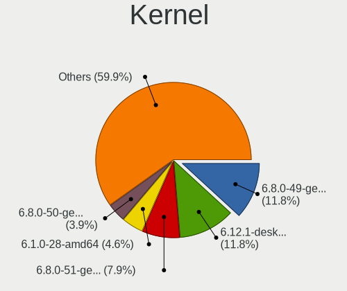
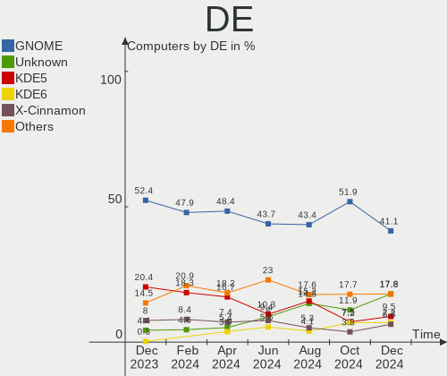
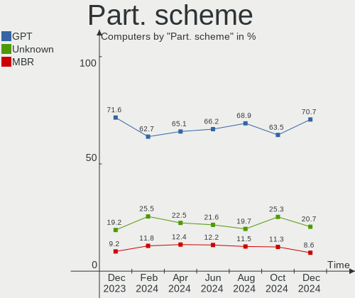
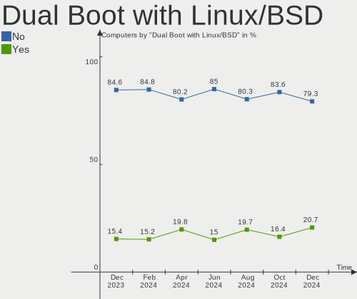
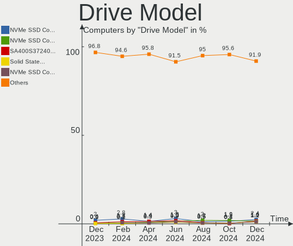
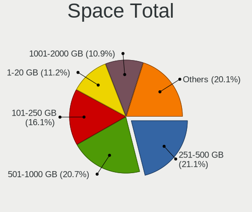
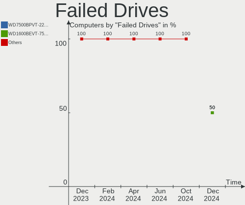
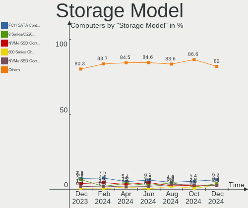
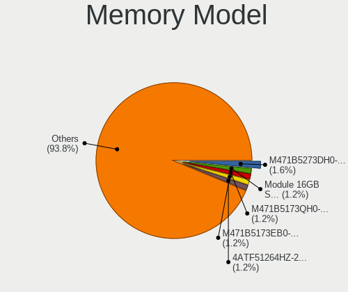
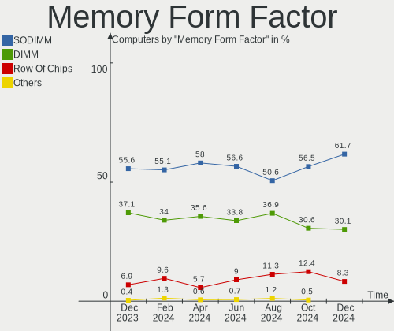

Linux in France - Hardware Trends
---------------------------------

A project to identify most popular hardware characteristics and track their change
over time based on data collected by Linux users at https://Linux-Hardware.org.

Anyone can contribute to this report by the [hw-probe](https://github.com/linuxhw/hw-probe) tool:

    sudo -E hw-probe -all -upload

This is a report for all computer types. See also reports for [desktops](/Location/France/Desktop/README.md) and [notebooks](/Location/France/Notebook/README.md).

Period: Jun, 2023.

Contents
--------

* [ System ](#system)
  - [ OS                       ](#os)
  - [ OS Family                ](#os-family)
  - [ Kernel                   ](#kernel)
  - [ Kernel Family            ](#kernel-family)
  - [ Kernel Major Ver.        ](#kernel-major-ver)
  - [ Arch                     ](#arch)
  - [ DE                       ](#de)
  - [ Display Server           ](#display-server)
  - [ Display Manager          ](#display-manager)
  - [ OS Lang                  ](#os-lang)
  - [ Boot Mode                ](#boot-mode)
  - [ Filesystem               ](#filesystem)
  - [ Part. scheme             ](#part-scheme)
  - [ Dual Boot with Linux/BSD ](#dual-boot-with-linuxbsd)
  - [ Dual Boot (Win)          ](#dual-boot-win)

* [ Board ](#board)
  - [ Vendor                   ](#vendor)
  - [ Model                    ](#model)
  - [ Model Family             ](#model-family)
  - [ MFG Year                 ](#mfg-year)
  - [ Form Factor              ](#form-factor)
  - [ Secure Boot              ](#secure-boot)
  - [ Coreboot                 ](#coreboot)
  - [ RAM Size                 ](#ram-size)
  - [ RAM Used                 ](#ram-used)
  - [ Total Drives             ](#total-drives)
  - [ Has CD-ROM               ](#has-cd-rom)
  - [ Has Ethernet             ](#has-ethernet)
  - [ Has WiFi                 ](#has-wifi)
  - [ Has Bluetooth            ](#has-bluetooth)

* [ Location ](#location)
  - [ Country                  ](#country)
  - [ City                     ](#city)

* [ Drives ](#drives)
  - [ Drive Vendor             ](#drive-vendor)
  - [ Drive Model              ](#drive-model)
  - [ HDD Vendor               ](#hdd-vendor)
  - [ SSD Vendor               ](#ssd-vendor)
  - [ Drive Kind               ](#drive-kind)
  - [ Drive Connector          ](#drive-connector)
  - [ Drive Size               ](#drive-size)
  - [ Space Total              ](#space-total)
  - [ Space Used               ](#space-used)
  - [ Malfunc. Drives          ](#malfunc-drives)
  - [ Malfunc. Drive Vendor    ](#malfunc-drive-vendor)
  - [ Malfunc. HDD Vendor      ](#malfunc-hdd-vendor)
  - [ Malfunc. Drive Kind      ](#malfunc-drive-kind)
  - [ Failed Drives            ](#failed-drives)
  - [ Failed Drive Vendor      ](#failed-drive-vendor)
  - [ Drive Status             ](#drive-status)

* [ Storage controller ](#storage-controller)
  - [ Storage Vendor           ](#storage-vendor)
  - [ Storage Model            ](#storage-model)
  - [ Storage Kind             ](#storage-kind)

* [ Processor ](#processor)
  - [ CPU Vendor               ](#cpu-vendor)
  - [ CPU Model                ](#cpu-model)
  - [ CPU Model Family         ](#cpu-model-family)
  - [ CPU Cores                ](#cpu-cores)
  - [ CPU Sockets              ](#cpu-sockets)
  - [ CPU Threads              ](#cpu-threads)
  - [ CPU Op-Modes             ](#cpu-op-modes)
  - [ CPU Microcode            ](#cpu-microcode)
  - [ CPU Microarch            ](#cpu-microarch)

* [ Graphics ](#graphics)
  - [ GPU Vendor               ](#gpu-vendor)
  - [ GPU Model                ](#gpu-model)
  - [ GPU Combo                ](#gpu-combo)
  - [ GPU Driver               ](#gpu-driver)
  - [ GPU Memory               ](#gpu-memory)

* [ Monitor ](#monitor)
  - [ Monitor Vendor           ](#monitor-vendor)
  - [ Monitor Model            ](#monitor-model)
  - [ Monitor Resolution       ](#monitor-resolution)
  - [ Monitor Diagonal         ](#monitor-diagonal)
  - [ Monitor Width            ](#monitor-width)
  - [ Aspect Ratio             ](#aspect-ratio)
  - [ Monitor Area             ](#monitor-area)
  - [ Pixel Density            ](#pixel-density)
  - [ Multiple Monitors        ](#multiple-monitors)

* [ Network ](#network)
  - [ Net Controller Vendor    ](#net-controller-vendor)
  - [ Net Controller Model     ](#net-controller-model)
  - [ Wireless Vendor          ](#wireless-vendor)
  - [ Wireless Model           ](#wireless-model)
  - [ Ethernet Vendor          ](#ethernet-vendor)
  - [ Ethernet Model           ](#ethernet-model)
  - [ Net Controller Kind      ](#net-controller-kind)
  - [ Used Controller          ](#used-controller)
  - [ NICs                     ](#nics)
  - [ IPv6                     ](#ipv6)

* [ Bluetooth ](#bluetooth)
  - [ Bluetooth Vendor         ](#bluetooth-vendor)
  - [ Bluetooth Model          ](#bluetooth-model)

* [ Sound ](#sound)
  - [ Sound Vendor             ](#sound-vendor)
  - [ Sound Model              ](#sound-model)

* [ Memory ](#memory)
  - [ Memory Vendor            ](#memory-vendor)
  - [ Memory Model             ](#memory-model)
  - [ Memory Kind              ](#memory-kind)
  - [ Memory Form Factor       ](#memory-form-factor)
  - [ Memory Size              ](#memory-size)
  - [ Memory Speed             ](#memory-speed)

* [ Printers & scanners ](#printers--scanners)
  - [ Printer Vendor           ](#printer-vendor)
  - [ Printer Model            ](#printer-model)
  - [ Scanner Vendor           ](#scanner-vendor)
  - [ Scanner Model            ](#scanner-model)

* [ Camera ](#camera)
  - [ Camera Vendor            ](#camera-vendor)
  - [ Camera Model             ](#camera-model)

* [ Security ](#security)
  - [ Fingerprint Vendor       ](#fingerprint-vendor)
  - [ Fingerprint Model        ](#fingerprint-model)
  - [ Chipcard Vendor          ](#chipcard-vendor)
  - [ Chipcard Model           ](#chipcard-model)

* [ Unsupported ](#unsupported)
  - [ Unsupported Devices      ](#unsupported-devices)
  - [ Unsupported Device Types ](#unsupported-device-types)

System
------

OS
--

Installed operating systems

| Name                         | Computers | Percent |
|------------------------------|-----------|---------|
| Ubuntu 22.04                 | 59        | 23.89%  |
| Ubuntu 23.04                 | 17        | 6.88%   |
| Linux Mint 21.1              | 16        | 6.48%   |
| Fedora 38                    | 13        | 5.26%   |
| Arch Rolling                 | 11        | 4.45%   |
| Debian 11                    | 10        | 4.05%   |
| Debian 12                    | 7         | 2.83%   |
| Ubuntu 20.04                 | 6         | 2.43%   |
| OpenMandriva 23.03           | 6         | 2.43%   |
| Zorin 16                     | 5         | 2.02%   |
| OpenMandriva 4.3             | 5         | 2.02%   |
| Xubuntu 22.04                | 4         | 1.62%   |
| Ubuntu 22.10                 | 4         | 1.62%   |
| openSUSE Tumbleweed-XXXXXXXX | 4         | 1.62%   |
| OpenMandriva 23.06           | 4         | 1.62%   |
| Gentoo 2.13                  | 4         | 1.62%   |
| Ubuntu 18.04                 | 3         | 1.21%   |
| OpenMandriva 4.2             | 3         | 1.21%   |
| Manjaro                      | 3         | 1.21%   |
| Kubuntu 23.04                | 3         | 1.21%   |
| EndeavourOS Rolling          | 3         | 1.21%   |
| ArcoLinux Rolling            | 3         | 1.21%   |
| Ubuntu MATE 22.04            | 2         | 0.81%   |
| Pop!_OS 22.04                | 2         | 0.81%   |
| openSUSE Leap-15.5           | 2         | 0.81%   |
| Manjaro 23.0.0               | 2         | 0.81%   |
| Linux Mint 21.2              | 2         | 0.81%   |
| Linux Mint 21                | 2         | 0.81%   |
| Linux Mint 20.3              | 2         | 0.81%   |
| KDE neon 22.04               | 2         | 0.81%   |
| Devuan 4                     | 2         | 0.81%   |
| Xubuntu 23.04                | 1         | 0.4%    |
| Ubuntu Unity 23.04           | 1         | 0.4%    |
| Ubuntu Unity 16.04           | 1         | 0.4%    |
| Ubuntu MATE 23.04            | 1         | 0.4%    |
| Ubuntu Core 22               | 1         | 0.4%    |
| Ubuntu Budgie 23.04          | 1         | 0.4%    |
| Ubuntu Budgie 22.04          | 1         | 0.4%    |
| TUXEDO OS 22.04              | 1         | 0.4%    |
| SteamOS 3.4.8                | 1         | 0.4%    |

OS Family
---------

OS without a version

| Name          | Computers | Percent |
|---------------|-----------|---------|
| Ubuntu        | 90        | 36.44%  |
| Linux Mint    | 24        | 9.72%   |
| OpenMandriva  | 20        | 8.1%    |
| Debian        | 18        | 7.29%   |
| Fedora        | 13        | 5.26%   |
| Arch          | 11        | 4.45%   |
| openSUSE      | 6         | 2.43%   |
| Zorin         | 5         | 2.02%   |
| Xubuntu       | 5         | 2.02%   |
| Manjaro       | 5         | 2.02%   |
| Kubuntu       | 5         | 2.02%   |
| Gentoo        | 4         | 1.62%   |
| Ubuntu MATE   | 3         | 1.21%   |
| Pop!_OS       | 3         | 1.21%   |
| EndeavourOS   | 3         | 1.21%   |
| ArcoLinux     | 3         | 1.21%   |
| Ubuntu Unity  | 2         | 0.81%   |
| Ubuntu Budgie | 2         | 0.81%   |
| Lubuntu       | 2         | 0.81%   |
| KDE neon      | 2         | 0.81%   |
| Devuan        | 2         | 0.81%   |
| TUXEDO OS     | 1         | 0.4%    |
| SteamOS       | 1         | 0.4%    |
| ROSA          | 1         | 0.4%    |
| Rocky Linux   | 1         | 0.4%    |
| Raspbian      | 1         | 0.4%    |
| Pikaos        | 1         | 0.4%    |
| Nobara        | 1         | 0.4%    |
| Nitrux        | 1         | 0.4%    |
| MX            | 1         | 0.4%    |
| Mabox         | 1         | 0.4%    |
| LMDE          | 1         | 0.4%    |
| Linux Lite    | 1         | 0.4%    |
| Kali          | 1         | 0.4%    |
| Garuda Linux  | 1         | 0.4%    |
| Elementary    | 1         | 0.4%    |
| Drauger OS    | 1         | 0.4%    |
| CentOS        | 1         | 0.4%    |
| CachyOS       | 1         | 0.4%    |
| BlackPanther  | 1         | 0.4%    |

Kernel
------

Version of the Linux kernel

| Version                       | Computers | Percent |
|-------------------------------|-----------|---------|
| 5.19.0-43-generic             | 35        | 14.17%  |
| 5.15.0-75-generic             | 18        | 7.29%   |
| 5.15.0-73-generic             | 16        | 6.48%   |
| 6.2.0-20-generic              | 14        | 5.67%   |
| 5.19.0-45-generic             | 14        | 5.67%   |
| 6.2.0-23-generic              | 7         | 2.83%   |
| 5.10.0-23-amd64               | 7         | 2.83%   |
| 6.2.6-desktop-1omv2390        | 6         | 2.43%   |
| 6.1.0-9-amd64                 | 5         | 2.02%   |
| 5.19.0-42-generic             | 5         | 2.02%   |
| 6.3.5-desktop-3omv2390        | 4         | 1.62%   |
| 6.1.31-2-MANJARO              | 4         | 1.62%   |
| 6.3.7-arch1-1                 | 3         | 1.21%   |
| 6.3.4-1-default               | 3         | 1.21%   |
| 5.4.0-152-generic             | 3         | 1.21%   |
| 5.19.0-32-generic             | 3         | 1.21%   |
| 5.16.13-desktop-1omv4003      | 3         | 1.21%   |
| 5.15.0-72-generic             | 3         | 1.21%   |
| 5.10.14-desktop-1omv4002      | 3         | 1.21%   |
| 6.3.9-arch1-1                 | 2         | 0.81%   |
| 6.3.8-gentoo-dist             | 2         | 0.81%   |
| 6.3.8-arch1-1                 | 2         | 0.81%   |
| 6.3.8-200.fc38.x86_64         | 2         | 0.81%   |
| 6.3.7-200.fc38.x86_64         | 2         | 0.81%   |
| 6.3.6-200.fc38.x86_64         | 2         | 0.81%   |
| 6.3.5-arch1-1                 | 2         | 0.81%   |
| 6.3.4-201.fc38.x86_64         | 2         | 0.81%   |
| 6.2.6-76060206-generic        | 2         | 0.81%   |
| 6.2.15-300.fc38.x86_64        | 2         | 0.81%   |
| 5.4.0-150-generic             | 2         | 0.81%   |
| 5.19.0-46-generic             | 2         | 0.81%   |
| 5.16.7-desktop-1omv4003       | 2         | 0.81%   |
| 5.14.21-150500.53-default     | 2         | 0.81%   |
| 5.11.0-27-generic             | 2         | 0.81%   |
| 5.10.0-22-amd64               | 2         | 0.81%   |
| 6.4.0-rc7-1-mainline-r7-5875u | 1         | 0.4%    |
| 6.4.0-pikaos                  | 1         | 0.4%    |
| 6.3.9-1-default               | 1         | 0.4%    |
| 6.3.8-1-cachyos               | 1         | 0.4%    |
| 6.3.7-200.fsync.fc37.x86_64   | 1         | 0.4%    |

Kernel Family
-------------

Linux kernel without a distro release

| Version  | Computers | Percent |
|----------|-----------|---------|
| 5.19.0   | 63        | 25.51%  |
| 5.15.0   | 41        | 16.6%   |
| 6.2.0    | 23        | 9.31%   |
| 5.10.0   | 10        | 4.05%   |
| 6.3.5    | 8         | 3.24%   |
| 6.2.6    | 8         | 3.24%   |
| 6.1.0    | 8         | 3.24%   |
| 6.3.8    | 7         | 2.83%   |
| 6.3.7    | 7         | 2.83%   |
| 6.1.31   | 7         | 2.83%   |
| 6.3.4    | 6         | 2.43%   |
| 5.4.0    | 6         | 2.43%   |
| 6.3.6    | 5         | 2.02%   |
| 6.3.9    | 3         | 1.21%   |
| 6.2.15   | 3         | 1.21%   |
| 6.2.13   | 3         | 1.21%   |
| 5.16.13  | 3         | 1.21%   |
| 5.14.0   | 3         | 1.21%   |
| 5.11.0   | 3         | 1.21%   |
| 5.10.14  | 3         | 1.21%   |
| 6.4.0    | 2         | 0.81%   |
| 6.3.3    | 2         | 0.81%   |
| 5.16.7   | 2         | 0.81%   |
| 5.14.21  | 2         | 0.81%   |
| 4.15.0   | 2         | 0.81%   |
| 6.3.0    | 1         | 0.4%    |
| 6.2.8    | 1         | 0.4%    |
| 6.2.16   | 1         | 0.4%    |
| 6.1.34   | 1         | 0.4%    |
| 6.1.26   | 1         | 0.4%    |
| 6.1.21   | 1         | 0.4%    |
| 6.1.20   | 1         | 0.4%    |
| 6.1.19   | 1         | 0.4%    |
| 6.1.1    | 1         | 0.4%    |
| 5.19.7   | 1         | 0.4%    |
| 5.19.12  | 1         | 0.4%    |
| 5.17.0   | 1         | 0.4%    |
| 5.15.107 | 1         | 0.4%    |
| 5.13.0   | 1         | 0.4%    |
| 4.19.0   | 1         | 0.4%    |

Kernel Major Ver.
-----------------

Linux kernel major version

| Version | Computers | Percent |
|---------|-----------|---------|
| 5.19    | 65        | 26.32%  |
| 5.15    | 42        | 17%     |
| 6.3     | 39        | 15.79%  |
| 6.2     | 39        | 15.79%  |
| 6.1     | 21        | 8.5%    |
| 5.10    | 13        | 5.26%   |
| 5.4     | 6         | 2.43%   |
| 5.16    | 5         | 2.02%   |
| 5.14    | 5         | 2.02%   |
| 5.11    | 3         | 1.21%   |
| 6.4     | 2         | 0.81%   |
| 4.15    | 2         | 0.81%   |
| 5.17    | 1         | 0.4%    |
| 5.13    | 1         | 0.4%    |
| 4.19    | 1         | 0.4%    |
| 4.18    | 1         | 0.4%    |
| 3.10    | 1         | 0.4%    |

Arch
----

OS architecture (x86_64, i586, etc.)

| Name    | Computers | Percent |
|---------|-----------|---------|
| x86_64  | 243       | 98.38%  |
| aarch64 | 2         | 0.81%   |
| i686    | 1         | 0.4%    |
| armv7l  | 1         | 0.4%    |

DE
--

Desktop Environment

| Name              | Computers | Percent |
|-------------------|-----------|---------|
| GNOME             | 121       | 48.99%  |
| KDE5              | 50        | 20.24%  |
| X-Cinnamon        | 20        | 8.1%    |
| XFCE              | 16        | 6.48%   |
| MATE              | 12        | 4.86%   |
| Unknown           | 10        | 4.05%   |
| LXQt              | 3         | 1.21%   |
| Budgie            | 3         | 1.21%   |
| Unity             | 2         | 0.81%   |
| i3                | 2         | 0.81%   |
| ubuntu:pika:GNOME | 1         | 0.4%    |
| sway              | 1         | 0.4%    |
| Pantheon          | 1         | 0.4%    |
| LXDE              | 1         | 0.4%    |
| lightdm-xsession  | 1         | 0.4%    |
| KDE4              | 1         | 0.4%    |
| KDE               | 1         | 0.4%    |
| GNOME Flashback   | 1         | 0.4%    |

Display Server
--------------

X11 or Wayland

| Name    | Computers | Percent |
|---------|-----------|---------|
| X11     | 151       | 61.13%  |
| Wayland | 82        | 33.2%   |
| Tty     | 10        | 4.05%   |
| Unknown | 4         | 1.62%   |

Display Manager
---------------

SDDM, LightDM, etc.

| Name    | Computers | Percent |
|---------|-----------|---------|
| GDM3    | 82        | 33.2%   |
| Unknown | 59        | 23.89%  |
| LightDM | 44        | 17.81%  |
| SDDM    | 42        | 17%     |
| GDM     | 17        | 6.88%   |
| SLiM    | 2         | 0.81%   |
| GREETD  | 1         | 0.4%    |

OS Lang
-------

Language

| Lang       | Computers | Percent |
|------------|-----------|---------|
| fr_FR      | 176       | 71.26%  |
| en_US      | 51        | 20.65%  |
| C          | 7         | 2.83%   |
| Unknown    | 4         | 1.62%   |
| en_GB      | 3         | 1.21%   |
| ru_RU      | 1         | 0.4%    |
| fr_FR@euro | 1         | 0.4%    |
| es_ES      | 1         | 0.4%    |
| en_DK      | 1         | 0.4%    |
| de_DE      | 1         | 0.4%    |
| C.UTF8     | 1         | 0.4%    |

Boot Mode
---------

EFI or BIOS

| Mode | Computers | Percent |
|------|-----------|---------|
| EFI  | 146       | 59.11%  |
| BIOS | 101       | 40.89%  |

Filesystem
----------

Type of filesystem

| Type    | Computers | Percent |
|---------|-----------|---------|
| Ext4    | 160       | 64.78%  |
| Tmpfs   | 37        | 14.98%  |
| Btrfs   | 22        | 8.91%   |
| Overlay | 17        | 6.88%   |
| Xfs     | 6         | 2.43%   |
| Zfs     | 2         | 0.81%   |
| F2fs    | 1         | 0.4%    |
| Ext3    | 1         | 0.4%    |
| Ext2    | 1         | 0.4%    |

Part. scheme
------------

Scheme of partitioning

| Type    | Computers | Percent |
|---------|-----------|---------|
| GPT     | 170       | 68.83%  |
| Unknown | 48        | 19.43%  |
| MBR     | 29        | 11.74%  |

Dual Boot with Linux/BSD
------------------------

Hosting more than one Linux/BSD

| Dual boot | Computers | Percent |
|-----------|-----------|---------|
| No        | 212       | 85.83%  |
| Yes       | 35        | 14.17%  |

Dual Boot (Win)
---------------

Hosting Linux and Windows

| Dual boot | Computers | Percent |
|-----------|-----------|---------|
| No        | 185       | 74.9%   |
| Yes       | 62        | 25.1%   |

Board
-----

Vendor
------

Motherboard manufacturer

| Name                    | Computers | Percent |
|-------------------------|-----------|---------|
| ASUSTek Computer        | 40        | 16.19%  |
| Dell                    | 35        | 14.17%  |
| Lenovo                  | 32        | 12.96%  |
| Hewlett-Packard         | 29        | 11.74%  |
| Gigabyte Technology     | 18        | 7.29%   |
| MSI                     | 15        | 6.07%   |
| Acer                    | 10        | 4.05%   |
| Toshiba                 | 7         | 2.83%   |
| ASRock                  | 5         | 2.02%   |
| Samsung Electronics     | 4         | 1.62%   |
| Intel                   | 4         | 1.62%   |
| UNOWHY                  | 3         | 1.21%   |
| Notebook                | 3         | 1.21%   |
| HUAWEI                  | 3         | 1.21%   |
| AZW                     | 3         | 1.21%   |
| Apple                   | 3         | 1.21%   |
| Unknown                 | 3         | 1.21%   |
| Timi                    | 2         | 0.81%   |
| Supermicro              | 2         | 0.81%   |
| Sony                    | 2         | 0.81%   |
| Raspberry Pi Foundation | 2         | 0.81%   |
| Alienware               | 2         | 0.81%   |
| ZOTAC                   | 1         | 0.4%    |
| Xunlong                 | 1         | 0.4%    |
| Valve                   | 1         | 0.4%    |
| Techvision              | 1         | 0.4%    |
| Schenker                | 1         | 0.4%    |
| Pegatron                | 1         | 0.4%    |
| Packard Bell            | 1         | 0.4%    |
| Otazak                  | 1         | 0.4%    |
| Neousys Technology      | 1         | 0.4%    |
| NEC Computers           | 1         | 0.4%    |
| Microsoft               | 1         | 0.4%    |
| LG Electronics          | 1         | 0.4%    |
| Jumper                  | 1         | 0.4%    |
| IP3 Tech                | 1         | 0.4%    |
| HONOR                   | 1         | 0.4%    |
| Fujitsu                 | 1         | 0.4%    |
| eMachines               | 1         | 0.4%    |
| ECS                     | 1         | 0.4%    |

Model
-----

Motherboard model

| Name                                       | Computers | Percent |
|--------------------------------------------|-----------|---------|
| Unknown                                    | 3         | 1.21%   |
| UNOWHY Y13G002S4EI                         | 2         | 0.81%   |
| Toshiba Satellite Pro L500                 | 2         | 0.81%   |
| MSI MS-7D22                                | 2         | 0.81%   |
| Lenovo Legion 5 15ACH6H 82JU               | 2         | 0.81%   |
| Lenovo IdeaPad 3 15ABA7 82RN               | 2         | 0.81%   |
| HP Pavilion 17                             | 2         | 0.81%   |
| Dell Precision 5570                        | 2         | 0.81%   |
| Dell OptiPlex 790                          | 2         | 0.81%   |
| Dell Latitude 5530                         | 2         | 0.81%   |
| AZW SER                                    | 2         | 0.81%   |
| ASUS All Series                            | 2         | 0.81%   |
| ZOTAC ZBOX-EN760                           | 1         | 0.4%    |
| Xunlong Orange Pi Lite                     | 1         | 0.4%    |
| Valve Jupiter                              | 1         | 0.4%    |
| UNOWHY Y13G010S4EI                         | 1         | 0.4%    |
| Toshiba Satellite Pro L300                 | 1         | 0.4%    |
| Toshiba Satellite P200                     | 1         | 0.4%    |
| Toshiba Satellite L655                     | 1         | 0.4%    |
| Toshiba Satellite L300                     | 1         | 0.4%    |
| Toshiba Satellite C870-199                 | 1         | 0.4%    |
| Timi TM1613                                | 1         | 0.4%    |
| Timi RedmiBook Pro 14S                     | 1         | 0.4%    |
| Techvision TVI7309X                        | 1         | 0.4%    |
| Supermicro X9DAi                           | 1         | 0.4%    |
| Supermicro SYS-530MT-H8TNR                 | 1         | 0.4%    |
| Sony VGN-NS38E_S                           | 1         | 0.4%    |
| Sony SVS1312J3EW                           | 1         | 0.4%    |
| Schenker XMG FOCUS (M22)                   | 1         | 0.4%    |
| Samsung R540/R538/SA41/E452                | 1         | 0.4%    |
| Samsung 950XED                             | 1         | 0.4%    |
| Samsung 350V5C/351V5C/3540VC/3440VC        | 1         | 0.4%    |
| Samsung 300E4A/300E5A/300E7A/3430EA/3530EA | 1         | 0.4%    |
| RPi Raspberry Pi 4 Model B Rev 1.2         | 1         | 0.4%    |
| RPi Raspberry Pi                           | 1         | 0.4%    |
| Pegatron KT600AA-ABF a6443.fr              | 1         | 0.4%    |
| Packard Bell EN Butterfly m                | 1         | 0.4%    |
| Otazak iPC45                               | 1         | 0.4%    |
| Notebook W54_55SU1,SUW                     | 1         | 0.4%    |
| Notebook PCX0DX                            | 1         | 0.4%    |

Model Family
------------

Motherboard model prefix

| Name                       | Computers | Percent |
|----------------------------|-----------|---------|
| Lenovo ThinkPad            | 16        | 6.48%   |
| Dell Precision             | 10        | 4.05%   |
| Dell Latitude              | 10        | 4.05%   |
| Acer Aspire                | 8         | 3.24%   |
| Toshiba Satellite          | 7         | 2.83%   |
| HP EliteBook               | 6         | 2.43%   |
| Dell XPS                   | 6         | 2.43%   |
| ASUS PRIME                 | 6         | 2.43%   |
| Lenovo ThinkCentre         | 4         | 1.62%   |
| Lenovo IdeaPad             | 4         | 1.62%   |
| HP Pavilion                | 4         | 1.62%   |
| HP Compaq                  | 4         | 1.62%   |
| Dell OptiPlex              | 4         | 1.62%   |
| ASUS ROG                   | 4         | 1.62%   |
| Lenovo Legion              | 3         | 1.21%   |
| HP ProBook                 | 3         | 1.21%   |
| HP Laptop                  | 3         | 1.21%   |
| HP ENVY                    | 3         | 1.21%   |
| ASUS VivoBook              | 3         | 1.21%   |
| Unknown                    | 3         | 1.21%   |
| UNOWHY Y13G002S4EI         | 2         | 0.81%   |
| RPi Raspberry              | 2         | 0.81%   |
| MSI MS-7D22                | 2         | 0.81%   |
| HP EliteDesk               | 2         | 0.81%   |
| Gigabyte B550M             | 2         | 0.81%   |
| Dell Vostro                | 2         | 0.81%   |
| Dell Inspiron              | 2         | 0.81%   |
| AZW SER                    | 2         | 0.81%   |
| ASUS All                   | 2         | 0.81%   |
| ZOTAC ZBOX-EN760           | 1         | 0.4%    |
| Xunlong Orange             | 1         | 0.4%    |
| Valve Jupiter              | 1         | 0.4%    |
| UNOWHY Y13G010S4EI         | 1         | 0.4%    |
| Timi TM1613                | 1         | 0.4%    |
| Timi RedmiBook             | 1         | 0.4%    |
| Techvision TVI7309X        | 1         | 0.4%    |
| Supermicro X9DAi           | 1         | 0.4%    |
| Supermicro SYS-530MT-H8TNR | 1         | 0.4%    |
| Sony VGN-NS38E             | 1         | 0.4%    |
| Sony SVS1312J3EW           | 1         | 0.4%    |

MFG Year
--------

Motherboard manufacture year

| Year    | Computers | Percent |
|---------|-----------|---------|
| 2022    | 31        | 12.55%  |
| 2021    | 28        | 11.34%  |
| 2014    | 20        | 8.1%    |
| 2020    | 19        | 7.69%   |
| 2013    | 18        | 7.29%   |
| 2019    | 17        | 6.88%   |
| 2011    | 17        | 6.88%   |
| 2012    | 14        | 5.67%   |
| 2016    | 13        | 5.26%   |
| 2018    | 12        | 4.86%   |
| 2015    | 11        | 4.45%   |
| 2010    | 11        | 4.45%   |
| 2008    | 11        | 4.45%   |
| 2017    | 7         | 2.83%   |
| 2023    | 6         | 2.43%   |
| 2009    | 6         | 2.43%   |
| 2007    | 3         | 1.21%   |
| Unknown | 3         | 1.21%   |

Form Factor
-----------

Physical design of the computer

| Name           | Computers | Percent |
|----------------|-----------|---------|
| Notebook       | 138       | 55.87%  |
| Desktop        | 92        | 37.25%  |
| Convertible    | 6         | 2.43%   |
| Mini pc        | 4         | 1.62%   |
| System on chip | 3         | 1.21%   |
| Tablet         | 2         | 0.81%   |
| All in one     | 1         | 0.4%    |
| Server         | 1         | 0.4%    |

Secure Boot
-----------

Enabled or disabled

| State    | Computers | Percent |
|----------|-----------|---------|
| Disabled | 229       | 92.71%  |
| Enabled  | 18        | 7.29%   |

Coreboot
--------

Have coreboot on board

| Used | Computers | Percent |
|------|-----------|---------|
| No   | 247       | 100%    |

RAM Size
--------

Total RAM memory

| Size in GB  | Computers | Percent |
|-------------|-----------|---------|
| 8.01-16.0   | 51        | 20.65%  |
| 16.01-24.0  | 50        | 20.24%  |
| 4.01-8.0    | 47        | 19.03%  |
| 3.01-4.0    | 42        | 17%     |
| 32.01-64.0  | 35        | 14.17%  |
| 2.01-3.0    | 8         | 3.24%   |
| 24.01-32.0  | 5         | 2.02%   |
| 64.01-256.0 | 5         | 2.02%   |
| 1.01-2.0    | 3         | 1.21%   |
| 0.01-0.5    | 1         | 0.4%    |

RAM Used
--------

Used RAM memory

| Used GB    | Computers | Percent |
|------------|-----------|---------|
| 1.01-2.0   | 68        | 27.53%  |
| 4.01-8.0   | 65        | 26.32%  |
| 2.01-3.0   | 55        | 22.27%  |
| 3.01-4.0   | 37        | 14.98%  |
| 8.01-16.0  | 9         | 3.64%   |
| 0.51-1.0   | 9         | 3.64%   |
| 0.01-0.5   | 2         | 0.81%   |
| 24.01-32.0 | 1         | 0.4%    |
| 16.01-24.0 | 1         | 0.4%    |

Total Drives
------------

Number of drives on board

| Drives | Computers | Percent |
|--------|-----------|---------|
| 1      | 157       | 63.56%  |
| 2      | 56        | 22.67%  |
| 3      | 15        | 6.07%   |
| 4      | 9         | 3.64%   |
| 5      | 6         | 2.43%   |
| 11     | 1         | 0.4%    |
| 9      | 1         | 0.4%    |
| 8      | 1         | 0.4%    |
| 6      | 1         | 0.4%    |

Has CD-ROM
----------

Has CD-ROM on board

| Presented | Computers | Percent |
|-----------|-----------|---------|
| No        | 159       | 64.37%  |
| Yes       | 88        | 35.63%  |

Has Ethernet
------------

Has Ethernet on board

| Presented | Computers | Percent |
|-----------|-----------|---------|
| Yes       | 205       | 83%     |
| No        | 42        | 17%     |

Has WiFi
--------

Has WiFi module

| Presented | Computers | Percent |
|-----------|-----------|---------|
| Yes       | 185       | 74.9%   |
| No        | 62        | 25.1%   |

Has Bluetooth
-------------

Has Bluetooth module

| Presented | Computers | Percent |
|-----------|-----------|---------|
| Yes       | 148       | 59.92%  |
| No        | 99        | 40.08%  |

Location
--------

Country
-------

Geographic location (country)

| Country | Computers | Percent |
|---------|-----------|---------|
| France  | 247       | 100%    |

City
----

Geographic location (city)

| City               | Computers | Percent |
|--------------------|-----------|---------|
| Paris              | 32        | 12.96%  |
| Rennes             | 6         | 2.43%   |
| Marseille          | 5         | 2.02%   |
| Lyon               | 5         | 2.02%   |
| Toulouse           | 4         | 1.62%   |
| Strasbourg         | 3         | 1.21%   |
| Rosny-sous-Bois    | 3         | 1.21%   |
| Montpellier        | 3         | 1.21%   |
| La Fleche          | 3         | 1.21%   |
| Étampes           | 3         | 1.21%   |
| Colmar             | 3         | 1.21%   |
| Bordeaux           | 3         | 1.21%   |
| Valence            | 2         | 0.81%   |
| Tourcoing          | 2         | 0.81%   |
| Saint-Nazaire      | 2         | 0.81%   |
| Saint-Etienne      | 2         | 0.81%   |
| Roubaix            | 2         | 0.81%   |
| Rezé              | 2         | 0.81%   |
| Quimper            | 2         | 0.81%   |
| Poitiers           | 2         | 0.81%   |
| Périgueux         | 2         | 0.81%   |
| Nancy              | 2         | 0.81%   |
| Maule              | 2         | 0.81%   |
| Lille              | 2         | 0.81%   |
| Ivry-sur-Seine     | 2         | 0.81%   |
| Guidel             | 2         | 0.81%   |
| Gravelines         | 2         | 0.81%   |
| Évry              | 2         | 0.81%   |
| Dijon              | 2         | 0.81%   |
| Compiègne         | 2         | 0.81%   |
| Caen               | 2         | 0.81%   |
| Brest              | 2         | 0.81%   |
| Bayonne            | 2         | 0.81%   |
| Asnieres-sur-Seine | 2         | 0.81%   |
| Antibes            | 2         | 0.81%   |
| Agen               | 2         | 0.81%   |
| Vouille            | 1         | 0.4%    |
| Vitrolles          | 1         | 0.4%    |
| Villeurbanne       | 1         | 0.4%    |
| Villeneuve-Loubet  | 1         | 0.4%    |

Drives
------

Drive Vendor
------------

Hard drive vendors

| Vendor                       | Computers | Drives | Percent |
|------------------------------|-----------|--------|---------|
| Samsung Electronics          | 62        | 74     | 16.71%  |
| WDC                          | 46        | 55     | 12.4%   |
| Seagate                      | 45        | 63     | 12.13%  |
| Crucial                      | 27        | 35     | 7.28%   |
| SanDisk                      | 23        | 24     | 6.2%    |
| SK hynix                     | 20        | 20     | 5.39%   |
| Kingston                     | 18        | 18     | 4.85%   |
| Unknown                      | 17        | 17     | 4.58%   |
| Hitachi                      | 11        | 11     | 2.96%   |
| Intel                        | 9         | 9      | 2.43%   |
| Toshiba                      | 8         | 9      | 2.16%   |
| KIOXIA                       | 8         | 8      | 2.16%   |
| PNY                          | 6         | 7      | 1.62%   |
| HGST                         | 6         | 6      | 1.62%   |
| Micron Technology            | 5         | 5      | 1.35%   |
| Micron/Crucial Technology    | 4         | 4      | 1.08%   |
| Maxtor                       | 3         | 3      | 0.81%   |
| China                        | 3         | 3      | 0.81%   |
| Unknown                      | 3         | 3      | 0.81%   |
| Transcend                    | 2         | 2      | 0.54%   |
| Silicon Motion               | 2         | 2      | 0.54%   |
| Realtek                      | 2         | 2      | 0.54%   |
| Phison Electronics           | 2         | 2      | 0.54%   |
| Phison                       | 2         | 2      | 0.54%   |
| OCZ                          | 2         | 2      | 0.54%   |
| MAXIO Technology (Hangzhou)  | 2         | 2      | 0.54%   |
| Kingston Technology Company  | 2         | 2      | 0.54%   |
| Intenso                      | 2         | 2      | 0.54%   |
| Hewlett-Packard              | 2         | 7      | 0.54%   |
| Gigabyte Technology          | 2         | 2      | 0.54%   |
| Emtec                        | 2         | 2      | 0.54%   |
| A-DATA Technology            | 2         | 2      | 0.54%   |
| 2.5"                         | 2         | 3      | 0.54%   |
| Verbatim                     | 1         | 1      | 0.27%   |
| TYPEC 1T                     | 1         | 1      | 0.27%   |
| TEXTORM                      | 1         | 1      | 0.27%   |
| SPCC                         | 1         | 1      | 0.27%   |
| sobetter                     | 1         | 1      | 0.27%   |
| Shenzhen Longsys Electronics | 1         | 1      | 0.27%   |
| SABRENT                      | 1         | 1      | 0.27%   |

Drive Model
-----------

Hard drive models

| Model                                                 | Computers | Percent |
|-------------------------------------------------------|-----------|---------|
| Samsung NVMe SSD Controller SM981/PM981/PM983 250GB   | 7         | 1.69%   |
| Crucial CT1000MX500SSD1 1TB                           | 7         | 1.69%   |
| Crucial CT500MX500SSD1 500GB                          | 6         | 1.45%   |
| Samsung SSD 980 1TB                                   | 5         | 1.2%    |
| Samsung NVMe SSD Controller PM9A1/PM9A3/980PRO 2TB    | 5         | 1.2%    |
| Unknown MMC Card  64GB                                | 4         | 0.96%   |
| Seagate ST2000DM001-1ER164 2TB                        | 4         | 0.96%   |
| Seagate ST1000DM003-1CH162 1TB                        | 4         | 0.96%   |
| Samsung SSD 870 QVO 1TB                               | 4         | 0.96%   |
| Kingston SA400S37240G 240GB SSD                       | 4         | 0.96%   |
| WDC WD10EADS-00M2B0 1TB                               | 3         | 0.72%   |
| SK hynix PC801 NVMe 1TB                               | 3         | 0.72%   |
| Seagate ST500DM002-1BD142 500GB                       | 3         | 0.72%   |
| Seagate ST4000DM004-2CV104 4TB                        | 3         | 0.72%   |
| Seagate ST3500418AS 500GB                             | 3         | 0.72%   |
| Seagate ST2000DM001-1CH164 2TB                        | 3         | 0.72%   |
| Seagate ST1000LM035-1RK172 1TB                        | 3         | 0.72%   |
| Sandisk WD Black SN750 / PC SN730 NVMe SSD 500GB      | 3         | 0.72%   |
| Micron/Crucial P2 NVMe PCIe SSD 4TB                   | 3         | 0.72%   |
| Hitachi HTS547564A9E384 640GB                         | 3         | 0.72%   |
| Crucial CT480BX500SSD1 480GB                          | 3         | 0.72%   |
| Unknown                                               | 3         | 0.72%   |
| WDC WD7500BPKT-75PK4T0 752GB                          | 2         | 0.48%   |
| WDC WD20EZRZ-00Z5HB0 2TB                              | 2         | 0.48%   |
| WDC WD20EZRX-22D8PB0 2TB                              | 2         | 0.48%   |
| WDC WD10JPVX-60JC3T0 1TB                              | 2         | 0.48%   |
| WDC WD10JPVX-22JC3T0 1TB                              | 2         | 0.48%   |
| WDC WD10EZEX-00WN4A0 1TB                              | 2         | 0.48%   |
| Unknown SD/MMC/MS PRO 250GB                           | 2         | 0.48%   |
| Unknown MMC Card  32GB                                | 2         | 0.48%   |
| Unknown MMC Card  128GB                               | 2         | 0.48%   |
| Toshiba MQ01ABD100 1TB                                | 2         | 0.48%   |
| SK hynix SKHynix_HFM512GD3HX015N 512GB                | 2         | 0.48%   |
| SK hynix PC711 NVMe 1TB                               | 2         | 0.48%   |
| Silicon Motion SM2263EN/SM2263XT SSD Controller 256GB | 2         | 0.48%   |
| Seagate ST500LM021-1KJ152 500GB                       | 2         | 0.48%   |
| Seagate ST2000DL003-9VT166 2TB                        | 2         | 0.48%   |
| Seagate ST1000DM003-9YN162 1TB                        | 2         | 0.48%   |
| Seagate ST1000DM003-1ER162 1TB                        | 2         | 0.48%   |
| SanDisk SSD PLUS 480GB                                | 2         | 0.48%   |

HDD Vendor
----------

Hard disk drive vendors

| Vendor              | Computers | Drives | Percent |
|---------------------|-----------|--------|---------|
| Seagate             | 43        | 61     | 34.96%  |
| WDC                 | 40        | 47     | 32.52%  |
| Hitachi             | 11        | 11     | 8.94%   |
| Samsung Electronics | 7         | 7      | 5.69%   |
| Toshiba             | 6         | 7      | 4.88%   |
| HGST                | 6         | 6      | 4.88%   |
| Maxtor              | 3         | 3      | 2.44%   |
| Unknown             | 2         | 2      | 1.63%   |
| LaCie               | 1         | 1      | 0.81%   |
| JMicron Technology  | 1         | 2      | 0.81%   |
| Hewlett-Packard     | 1         | 5      | 0.81%   |
| Fujitsu             | 1         | 1      | 0.81%   |
| ASMT                | 1         | 1      | 0.81%   |

SSD Vendor
----------

Solid state drive vendors

| Vendor              | Computers | Drives | Percent |
|---------------------|-----------|--------|---------|
| Samsung Electronics | 27        | 29     | 24.11%  |
| Crucial             | 23        | 28     | 20.54%  |
| Kingston            | 15        | 15     | 13.39%  |
| SanDisk             | 10        | 10     | 8.93%   |
| PNY                 | 5         | 6      | 4.46%   |
| China               | 3         | 3      | 2.68%   |
| WDC                 | 2         | 2      | 1.79%   |
| Transcend           | 2         | 2      | 1.79%   |
| SK hynix            | 2         | 2      | 1.79%   |
| OCZ                 | 2         | 2      | 1.79%   |
| Emtec               | 2         | 2      | 1.79%   |
| 2.5"                | 2         | 3      | 1.79%   |
| Verbatim            | 1         | 1      | 0.89%   |
| TYPEC 1T            | 1         | 1      | 0.89%   |
| TEXTORM             | 1         | 1      | 0.89%   |
| SPCC                | 1         | 1      | 0.89%   |
| Micron Technology   | 1         | 1      | 0.89%   |
| LITEONIT            | 1         | 1      | 0.89%   |
| LDLC                | 1         | 2      | 0.89%   |
| KingSpec            | 1         | 1      | 0.89%   |
| Intenso             | 1         | 1      | 0.89%   |
| Intel               | 1         | 1      | 0.89%   |
| Hewlett-Packard     | 1         | 2      | 0.89%   |
| Gost                | 1         | 1      | 0.89%   |
| Gigabyte Technology | 1         | 1      | 0.89%   |
| FORESEE             | 1         | 1      | 0.89%   |
| External            | 1         | 1      | 0.89%   |
| Apple               | 1         | 1      | 0.89%   |
| A-DATA Technology   | 1         | 1      | 0.89%   |

Drive Kind
----------

HDD or SSD

| Kind    | Computers | Drives | Percent |
|---------|-----------|--------|---------|
| NVMe    | 109       | 127    | 33.96%  |
| SSD     | 95        | 123    | 29.6%   |
| HDD     | 94        | 154    | 29.28%  |
| MMC     | 18        | 20     | 5.61%   |
| Unknown | 5         | 5      | 1.56%   |

Drive Connector
---------------

SATA, SAS, NVMe, etc.

| Type | Computers | Drives | Percent |
|------|-----------|--------|---------|
| SATA | 152       | 252    | 51.01%  |
| NVMe | 109       | 125    | 36.58%  |
| SAS  | 19        | 32     | 6.38%   |
| MMC  | 18        | 20     | 6.04%   |

Drive Size
----------

Size of hard drive

| Size in TB | Computers | Drives | Percent |
|------------|-----------|--------|---------|
| 0.01-0.5   | 108       | 147    | 52.17%  |
| 0.51-1.0   | 66        | 84     | 31.88%  |
| 1.01-2.0   | 22        | 28     | 10.63%  |
| 3.01-4.0   | 5         | 5      | 2.42%   |
| 2.01-3.0   | 3         | 10     | 1.45%   |
| 4.01-10.0  | 3         | 3      | 1.45%   |

Space Total
-----------

Amount of disk space available on the file system

| Size in GB     | Computers | Percent |
|----------------|-----------|---------|
| 251-500        | 62        | 25.1%   |
| 101-250        | 48        | 19.43%  |
| 501-1000       | 48        | 19.43%  |
| More than 3000 | 21        | 8.5%    |
| 51-100         | 16        | 6.48%   |
| 2001-3000      | 15        | 6.07%   |
| 1001-2000      | 13        | 5.26%   |
| 1-20           | 12        | 4.86%   |
| 21-50          | 7         | 2.83%   |
| Unknown        | 5         | 2.02%   |

Space Used
----------

Amount of used disk space

| Used GB        | Computers | Percent |
|----------------|-----------|---------|
| 1-20           | 61        | 24.7%   |
| 21-50          | 55        | 22.27%  |
| 101-250        | 39        | 15.79%  |
| 51-100         | 30        | 12.15%  |
| 251-500        | 26        | 10.53%  |
| 1001-2000      | 12        | 4.86%   |
| 501-1000       | 10        | 4.05%   |
| More than 3000 | 9         | 3.64%   |
| Unknown        | 5         | 2.02%   |

Malfunc. Drives
---------------

Drive models with a malfunction

| Model                                            | Computers | Drives | Percent |
|--------------------------------------------------|-----------|--------|---------|
| Maxtor 6V160E0 160GB                             | 2         | 2      | 4.65%   |
| Hitachi HTS723232A7A364 320GB                    | 2         | 2      | 4.65%   |
| HGST HTS541010A9E680 1TB                         | 2         | 2      | 4.65%   |
| 2.5" SATA SSD 3TG6-P 2TB                         | 2         | 3      | 4.65%   |
| WDC WDS200T2B0B 2TB SSD                          | 1         | 1      | 2.33%   |
| WDC WD5000LPLX-66ZNTT1 500GB                     | 1         | 1      | 2.33%   |
| WDC WD5000AAKS-75A7B2 500GB                      | 1         | 1      | 2.33%   |
| WDC WD10EZEX-21M2NA0 1TB                         | 1         | 1      | 2.33%   |
| WDC WD10EZEX-00WN4A0 1TB                         | 1         | 1      | 2.33%   |
| WDC WD10EARS-22Y5B1 1TB                          | 1         | 1      | 2.33%   |
| WDC WD10EADS-00M2B0 1TB                          | 1         | 1      | 2.33%   |
| Transcend TS120GSSD220S 120GB                    | 1         | 1      | 2.33%   |
| SK hynix PC711 HFS512GDE9X073N 512GB             | 1         | 1      | 2.33%   |
| SK hynix HFS128G32TND-N210A 128GB SSD            | 1         | 1      | 2.33%   |
| Seagate ST9320320AS 320GB                        | 1         | 1      | 2.33%   |
| Seagate ST9250311CS 250GB                        | 1         | 1      | 2.33%   |
| Seagate ST500LM021-1KJ152 500GB                  | 1         | 1      | 2.33%   |
| Seagate ST500DM002-1BD142 500GB                  | 1         | 1      | 2.33%   |
| Seagate ST3320820AS 320GB                        | 1         | 1      | 2.33%   |
| Seagate ST2000LX001-1RG174 2TB                   | 1         | 1      | 2.33%   |
| Seagate ST2000DM001-1ER164 2TB                   | 1         | 1      | 2.33%   |
| Seagate ST1000LM035-1RK172 1TB                   | 1         | 1      | 2.33%   |
| Seagate ST1000LM024 HN-M101MBB 1TB               | 1         | 1      | 2.33%   |
| Seagate ST1000LM 024 HN-M101MBB 1TB              | 1         | 1      | 2.33%   |
| Seagate ST1000DM003-9YN162 1TB                   | 1         | 1      | 2.33%   |
| SanDisk SSD PLUS 480GB                           | 1         | 1      | 2.33%   |
| SanDisk SD7SB3Q128G1001 128GB SSD                | 1         | 1      | 2.33%   |
| Samsung Electronics SSD 970 EVO 2TB              | 1         | 1      | 2.33%   |
| Samsung Electronics MZ7LN256HMJP-000H1 256GB SSD | 1         | 1      | 2.33%   |
| Samsung Electronics HD103UJ 1TB                  | 1         | 1      | 2.33%   |
| Kingston RBU-SNS8350DES3128GP 128GB SSD          | 1         | 1      | 2.33%   |
| Kingston OM8S1S3128K-AH 128GB SSD                | 1         | 1      | 2.33%   |
| Hitachi HTS725032A9A364 320GB                    | 1         | 1      | 2.33%   |
| Hitachi HDS721616PLA380 160GB                    | 1         | 1      | 2.33%   |
| Fujitsu MHY2160BH 160GB                          | 1         | 1      | 2.33%   |
| Crucial CT275MX300SSD1 275GB                     | 1         | 1      | 2.33%   |
| Crucial CT256M550SSD1 256GB                      | 1         | 1      | 2.33%   |
| China SH00R120GB SSD                             | 1         | 1      | 2.33%   |
| ASMT 2235 128GB                                  | 1         | 1      | 2.33%   |

Malfunc. Drive Vendor
---------------------

Vendors of faulty drives

| Vendor              | Computers | Drives | Percent |
|---------------------|-----------|--------|---------|
| Seagate             | 9         | 11     | 22.5%   |
| WDC                 | 7         | 7      | 17.5%   |
| Hitachi             | 4         | 4      | 10%     |
| Samsung Electronics | 3         | 3      | 7.5%    |
| SK hynix            | 2         | 2      | 5%      |
| SanDisk             | 2         | 2      | 5%      |
| Maxtor              | 2         | 2      | 5%      |
| Kingston            | 2         | 2      | 5%      |
| HGST                | 2         | 2      | 5%      |
| 2.5"                | 2         | 3      | 5%      |
| Transcend           | 1         | 1      | 2.5%    |
| Fujitsu             | 1         | 1      | 2.5%    |
| Crucial             | 1         | 2      | 2.5%    |
| China               | 1         | 1      | 2.5%    |
| ASMT                | 1         | 1      | 2.5%    |

Malfunc. HDD Vendor
-------------------

Vendors of faulty HDD drives

| Vendor              | Computers | Drives | Percent |
|---------------------|-----------|--------|---------|
| Seagate             | 9         | 11     | 34.62%  |
| WDC                 | 6         | 6      | 23.08%  |
| Hitachi             | 4         | 4      | 15.38%  |
| Maxtor              | 2         | 2      | 7.69%   |
| HGST                | 2         | 2      | 7.69%   |
| Samsung Electronics | 1         | 1      | 3.85%   |
| Fujitsu             | 1         | 1      | 3.85%   |
| ASMT                | 1         | 1      | 3.85%   |

Malfunc. Drive Kind
-------------------

Kinds of faulty drives

| Kind | Computers | Drives | Percent |
|------|-----------|--------|---------|
| HDD  | 24        | 28     | 63.16%  |
| SSD  | 12        | 14     | 31.58%  |
| NVMe | 2         | 2      | 5.26%   |

Failed Drives
-------------

Failed drive models

| Model                   | Computers | Drives | Percent |
|-------------------------|-----------|--------|---------|
| WDC WD800BB-00FJA0 80GB | 1         | 1      | 100%    |

Failed Drive Vendor
-------------------

Failed drive vendors

| Vendor | Computers | Drives | Percent |
|--------|-----------|--------|---------|
| WDC    | 1         | 1      | 100%    |

Drive Status
------------

Number of failed and malfunc. drives

| Status   | Computers | Drives | Percent |
|----------|-----------|--------|---------|
| Works    | 128       | 190    | 46.21%  |
| Detected | 114       | 194    | 41.16%  |
| Malfunc  | 34        | 44     | 12.27%  |
| Failed   | 1         | 1      | 0.36%   |

Storage controller
------------------

Storage Vendor
--------------

Storage controller vendors

| Vendor                       | Computers | Percent |
|------------------------------|-----------|---------|
| Intel                        | 163       | 49.39%  |
| AMD                          | 41        | 12.42%  |
| Samsung Electronics          | 33        | 10%     |
| SK hynix                     | 18        | 5.45%   |
| SanDisk                      | 18        | 5.45%   |
| Micron/Crucial Technology    | 9         | 2.73%   |
| KIOXIA                       | 8         | 2.42%   |
| Phison Electronics           | 5         | 1.52%   |
| Kingston Technology Company  | 5         | 1.52%   |
| Micron Technology            | 4         | 1.21%   |
| Marvell Technology Group     | 4         | 1.21%   |
| ASMedia Technology           | 3         | 0.91%   |
| VIA Technologies             | 2         | 0.61%   |
| Toshiba America Info Systems | 2         | 0.61%   |
| Silicon Motion               | 2         | 0.61%   |
| Nvidia                       | 2         | 0.61%   |
| MAXIO Technology (Hangzhou)  | 2         | 0.61%   |
| LSI Logic / Symbios Logic    | 2         | 0.61%   |
| Broadcom / LSI               | 2         | 0.61%   |
| Silicon Image                | 1         | 0.3%    |
| Shenzhen Longsys Electronics | 1         | 0.3%    |
| Seagate Technology           | 1         | 0.3%    |
| JMicron Technology           | 1         | 0.3%    |
| ADATA Technology             | 1         | 0.3%    |

Storage Model
-------------

Storage controller models

| Model                                                                          | Computers | Percent |
|--------------------------------------------------------------------------------|-----------|---------|
| AMD FCH SATA Controller [AHCI mode]                                            | 27        | 7.36%   |
| Intel 8 Series/C220 Series Chipset Family 6-port SATA Controller 1 [AHCI mode] | 15        | 4.09%   |
| Samsung NVMe SSD Controller 980                                                | 14        | 3.81%   |
| Samsung NVMe SSD Controller SM981/PM981/PM983                                  | 13        | 3.54%   |
| Intel Volume Management Device NVMe RAID Controller                            | 13        | 3.54%   |
| SK hynix Gold P31/BC711/PC711 NVMe Solid State Drive                           | 11        | 3%      |
| Intel Sunrise Point-LP SATA Controller [AHCI mode]                             | 11        | 3%      |
| Intel 7 Series Chipset Family 6-port SATA Controller [AHCI mode]               | 8         | 2.18%   |
| Intel 82801IBM/IEM (ICH9M/ICH9M-E) 4 port SATA Controller [AHCI mode]          | 7         | 1.91%   |
| Intel 6 Series/C200 Series Chipset Family 6 port Mobile SATA AHCI Controller   | 7         | 1.91%   |
| Intel 6 Series/C200 Series Chipset Family 6 port Desktop SATA AHCI Controller  | 7         | 1.91%   |
| AMD 400 Series Chipset SATA Controller                                         | 7         | 1.91%   |
| Micron/Crucial P2 NVMe PCIe SSD                                                | 6         | 1.63%   |
| Intel Q170/Q150/B150/H170/H110/Z170/CM236 Chipset SATA Controller [AHCI Mode]  | 6         | 1.63%   |
| Intel 8 Series SATA Controller 1 [AHCI mode]                                   | 6         | 1.63%   |
| Samsung NVMe SSD Controller PM9A1/PM9A3/980PRO                                 | 5         | 1.36%   |
| Intel SSD 660P Series                                                          | 5         | 1.36%   |
| Intel SATA Controller [RAID mode]                                              | 5         | 1.36%   |
| Intel Celeron/Pentium Silver Processor SATA Controller                         | 5         | 1.36%   |
| Intel 82801 Mobile SATA Controller [RAID mode]                                 | 5         | 1.36%   |
| Intel 7 Series/C210 Series Chipset Family 6-port SATA Controller [AHCI mode]   | 5         | 1.36%   |
| Intel 5 Series/3400 Series Chipset 4 port SATA AHCI Controller                 | 5         | 1.36%   |
| AMD 500 Series Chipset SATA Controller                                         | 5         | 1.36%   |
| SK hynix Platinum P41/PC801 NVMe Solid State Drive                             | 4         | 1.09%   |
| KIOXIA NVMe SSD Controller BG4                                                 | 4         | 1.09%   |
| KIOXIA Non-Volatile memory controller                                          | 4         | 1.09%   |
| Intel Atom Processor E3800 Series SATA AHCI Controller                         | 4         | 1.09%   |
| AMD SB7x0/SB8x0/SB9x0 SATA Controller [AHCI mode]                              | 4         | 1.09%   |
| SanDisk WD Black SN750 / PC SN730 NVMe SSD                                     | 3         | 0.82%   |
| Sandisk Non-Volatile memory controller                                         | 3         | 0.82%   |
| Phison Electronics Non-Volatile memory controller                              | 3         | 0.82%   |
| Marvell Group 88SE6111/6121 SATA II / PATA Controller                          | 3         | 0.82%   |
| Intel Wildcat Point-LP SATA Controller [AHCI Mode]                             | 3         | 0.82%   |
| Intel Tiger Lake-LP SATA Controller                                            | 3         | 0.82%   |
| Intel Non-Volatile memory controller                                           | 3         | 0.82%   |
| Intel Celeron N3350/Pentium N4200/Atom E3900 Series SATA AHCI Controller       | 3         | 0.82%   |
| Intel Cannon Lake Mobile PCH SATA AHCI Controller                              | 3         | 0.82%   |
| Intel 82801JI (ICH10 Family) SATA AHCI Controller                              | 3         | 0.82%   |
| Intel 82801JI (ICH10 Family) 4 port SATA IDE Controller #1                     | 3         | 0.82%   |
| Intel 82801JI (ICH10 Family) 2 port SATA IDE Controller #2                     | 3         | 0.82%   |

Storage Kind
------------

Kind of storage controller (IDE, SATA, NVMe, SAS, ...)

| Kind | Computers | Percent |
|------|-----------|---------|
| SATA | 171       | 51.82%  |
| NVMe | 109       | 33.03%  |
| RAID | 28        | 8.48%   |
| IDE  | 20        | 6.06%   |
| SAS  | 1         | 0.3%    |
| SCSI | 1         | 0.3%    |

Processor
---------

CPU Vendor
----------

Processor vendors

| Vendor | Computers | Percent |
|--------|-----------|---------|
| Intel  | 191       | 77.33%  |
| AMD    | 53        | 21.46%  |
| ARM    | 3         | 1.21%   |

CPU Model
---------

Processor models

| Model                                   | Computers | Percent |
|-----------------------------------------|-----------|---------|
| Intel Core i5-6200U CPU @ 2.30GHz       | 5         | 2.02%   |
| Intel 12th Gen Core i7-12700H           | 4         | 1.62%   |
| AMD Ryzen 5 5500U with Radeon Graphics  | 4         | 1.62%   |
| Intel Core i7-10750H CPU @ 2.60GHz      | 3         | 1.21%   |
| Intel Core i5-3210M CPU @ 2.50GHz       | 3         | 1.21%   |
| Intel Core i3-2350M CPU @ 2.30GHz       | 3         | 1.21%   |
| Intel Celeron CPU N3450 @ 1.10GHz       | 3         | 1.21%   |
| Intel 11th Gen Core i7-1185G7 @ 3.00GHz | 3         | 1.21%   |
| AMD Ryzen 5 5600H with Radeon Graphics  | 3         | 1.21%   |
| Intel Genuine CPU T1600 @ 1.66GHz       | 2         | 0.81%   |
| Intel Core i7-8700 CPU @ 3.20GHz        | 2         | 0.81%   |
| Intel Core i7-8650U CPU @ 1.90GHz       | 2         | 0.81%   |
| Intel Core i7-6820HQ CPU @ 2.70GHz      | 2         | 0.81%   |
| Intel Core i7-4790 CPU @ 3.60GHz        | 2         | 0.81%   |
| Intel Core i7-10850H CPU @ 2.70GHz      | 2         | 0.81%   |
| Intel Core i5-9300H CPU @ 2.40GHz       | 2         | 0.81%   |
| Intel Core i5-6300U CPU @ 2.40GHz       | 2         | 0.81%   |
| Intel Core i5-4590 CPU @ 3.30GHz        | 2         | 0.81%   |
| Intel Core i5-4460 CPU @ 3.20GHz        | 2         | 0.81%   |
| Intel Core i5-4210U CPU @ 1.70GHz       | 2         | 0.81%   |
| Intel Core i5-4200U CPU @ 1.60GHz       | 2         | 0.81%   |
| Intel Core i5-3337U CPU @ 1.80GHz       | 2         | 0.81%   |
| Intel Core i5-2400S CPU @ 2.50GHz       | 2         | 0.81%   |
| Intel Core i5-10210U CPU @ 1.60GHz      | 2         | 0.81%   |
| Intel Core i3-6006U CPU @ 2.00GHz       | 2         | 0.81%   |
| Intel Core i3-2100 CPU @ 3.10GHz        | 2         | 0.81%   |
| Intel Core 2 Duo CPU E8400 @ 3.00GHz    | 2         | 0.81%   |
| Intel Atom x5-Z8350 CPU @ 1.44GHz       | 2         | 0.81%   |
| Intel 13th Gen Core i7-1360P            | 2         | 0.81%   |
| Intel 12th Gen Core i7-1265U            | 2         | 0.81%   |
| Intel 11th Gen Core i7-1165G7 @ 2.80GHz | 2         | 0.81%   |
| Intel 11th Gen Core i5-1135G7 @ 2.40GHz | 2         | 0.81%   |
| AMD Ryzen 7 5825U with Radeon Graphics  | 2         | 0.81%   |
| AMD Ryzen 7 5700U with Radeon Graphics  | 2         | 0.81%   |
| AMD Ryzen 5 5500                        | 2         | 0.81%   |
| AMD Ryzen 5 3600X 6-Core Processor      | 2         | 0.81%   |
| Intel Xeon E-2388G CPU @ 3.20GHz        | 1         | 0.4%    |
| Intel Xeon CPU W3690 @ 3.47GHz          | 1         | 0.4%    |
| Intel Xeon CPU E5-2650 0 @ 2.00GHz      | 1         | 0.4%    |
| Intel Xeon CPU E5-2630 0 @ 2.30GHz      | 1         | 0.4%    |

CPU Model Family
----------------

Processor model prefix

| Model                   | Computers | Percent |
|-------------------------|-----------|---------|
| Intel Core i5           | 54        | 21.86%  |
| Intel Core i7           | 40        | 16.19%  |
| Other                   | 38        | 15.38%  |
| Intel Core i3           | 18        | 7.29%   |
| AMD Ryzen 5             | 18        | 7.29%   |
| AMD Ryzen 7             | 14        | 5.67%   |
| Intel Celeron           | 12        | 4.86%   |
| Intel Core 2 Duo        | 7         | 2.83%   |
| Intel Xeon              | 4         | 1.62%   |
| Intel Atom              | 4         | 1.62%   |
| Intel Genuine           | 3         | 1.21%   |
| AMD Ryzen 5 PRO         | 3         | 1.21%   |
| Intel Pentium Dual-Core | 2         | 0.81%   |
| Intel Pentium Dual      | 2         | 0.81%   |
| Intel Pentium           | 2         | 0.81%   |
| Intel Core 2 Quad       | 2         | 0.81%   |
| AMD Ryzen 9             | 2         | 0.81%   |
| AMD Ryzen 7 PRO         | 2         | 0.81%   |
| AMD FX                  | 2         | 0.81%   |
| AMD A6                  | 2         | 0.81%   |
| Intel Pentium Silver    | 1         | 0.4%    |
| Intel Pentium Gold      | 1         | 0.4%    |
| Intel Core m7           | 1         | 0.4%    |
| Intel Core i9           | 1         | 0.4%    |
| Intel Celeron Dual-Core | 1         | 0.4%    |
| ARM BCM                 | 1         | 0.4%    |
| ARM Allwinner           | 1         | 0.4%    |
| AMD Ryzen 3             | 1         | 0.4%    |
| AMD Phenom II           | 1         | 0.4%    |
| AMD E1                  | 1         | 0.4%    |
| AMD Athlon II X4        | 1         | 0.4%    |
| AMD Athlon II           | 1         | 0.4%    |
| AMD Athlon 64 X2        | 1         | 0.4%    |
| AMD Athlon              | 1         | 0.4%    |
| AMD A4                  | 1         | 0.4%    |
| AMD A10                 | 1         | 0.4%    |

CPU Cores
---------

Number of processor cores

| Number  | Computers | Percent |
|---------|-----------|---------|
| 4       | 85        | 34.41%  |
| 2       | 79        | 31.98%  |
| 6       | 32        | 12.96%  |
| 8       | 21        | 8.5%    |
| 12      | 8         | 3.24%   |
| 14      | 6         | 2.43%   |
| 16      | 5         | 2.02%   |
| 10      | 5         | 2.02%   |
| 1       | 3         | 1.21%   |
| 3       | 2         | 0.81%   |
| Unknown | 1         | 0.4%    |

CPU Sockets
-----------

Number of sockets

| Number  | Computers | Percent |
|---------|-----------|---------|
| 1       | 244       | 98.79%  |
| 2       | 2         | 0.81%   |
| Unknown | 1         | 0.4%    |

CPU Threads
-----------

Threads per core (Hyper-Threading)

| Number  | Computers | Percent |
|---------|-----------|---------|
| 2       | 174       | 70.45%  |
| 1       | 72        | 29.15%  |
| Unknown | 1         | 0.4%    |

CPU Op-Modes
------------

CPU Operation Modes (32-bit, 64-bit)

| Op mode        | Computers | Percent |
|----------------|-----------|---------|
| 32-bit, 64-bit | 245       | 99.19%  |
| Unknown        | 2         | 0.81%   |

CPU Microcode
-------------

Microcode number

| Number     | Computers | Percent |
|------------|-----------|---------|
| Unknown    | 112       | 45.34%  |
| 0x306c3    | 9         | 3.64%   |
| 0x906ea    | 7         | 2.83%   |
| 0x206a7    | 7         | 2.83%   |
| 0x1067a    | 7         | 2.83%   |
| 0x406e3    | 6         | 2.43%   |
| 0x40651    | 5         | 2.02%   |
| 0x0a50000c | 5         | 2.02%   |
| 0x906e9    | 4         | 1.62%   |
| 0x906a3    | 4         | 1.62%   |
| 0x30678    | 4         | 1.62%   |
| 0x08608103 | 4         | 1.62%   |
| 0x906a4    | 3         | 1.21%   |
| 0x806c1    | 3         | 1.21%   |
| 0x706a1    | 3         | 1.21%   |
| 0x6fd      | 3         | 1.21%   |
| 0x306a9    | 3         | 1.21%   |
| 0x0a404102 | 3         | 1.21%   |
| 0x08108109 | 3         | 1.21%   |
| 0xa0671    | 2         | 0.81%   |
| 0x806ec    | 2         | 0.81%   |
| 0x506e3    | 2         | 0.81%   |
| 0x406c4    | 2         | 0.81%   |
| 0x206d7    | 2         | 0.81%   |
| 0x20655    | 2         | 0.81%   |
| 0x20652    | 2         | 0.81%   |
| 0x0a50000d | 2         | 0.81%   |
| 0x0a20120a | 2         | 0.81%   |
| 0x08701021 | 2         | 0.81%   |
| 0x08701013 | 2         | 0.81%   |
| 0x08600106 | 2         | 0.81%   |
| 0x0810100b | 2         | 0.81%   |
| 0x06001119 | 2         | 0.81%   |
| 0xb06a2    | 1         | 0.4%    |
| 0xb0671    | 1         | 0.4%    |
| 0xa0655    | 1         | 0.4%    |
| 0xa0653    | 1         | 0.4%    |
| 0xa0652    | 1         | 0.4%    |
| 0x906c0    | 1         | 0.4%    |
| 0x90672    | 1         | 0.4%    |

CPU Microarch
-------------

Microarchitecture

| Name             | Computers | Percent |
|------------------|-----------|---------|
| KabyLake         | 25        | 10.12%  |
| Haswell          | 25        | 10.12%  |
| Unknown          | 22        | 8.91%   |
| Skylake          | 17        | 6.88%   |
| SandyBridge      | 17        | 6.88%   |
| Alderlake Hybrid | 16        | 6.48%   |
| IvyBridge        | 14        | 5.67%   |
| Zen 3            | 12        | 4.86%   |
| Penryn           | 12        | 4.86%   |
| TigerLake        | 11        | 4.45%   |
| Zen 2            | 9         | 3.64%   |
| CometLake        | 8         | 3.24%   |
| Westmere         | 7         | 2.83%   |
| Silvermont       | 7         | 2.83%   |
| Core             | 6         | 2.43%   |
| Zen              | 5         | 2.02%   |
| Piledriver       | 5         | 2.02%   |
| Goldmont plus    | 5         | 2.02%   |
| Zen+             | 4         | 1.62%   |
| Broadwell        | 4         | 1.62%   |
| Nehalem          | 3         | 1.21%   |
| K10              | 3         | 1.21%   |
| Icelake          | 3         | 1.21%   |
| Goldmont         | 3         | 1.21%   |
| Tremont          | 1         | 0.4%    |
| K8 Hammer        | 1         | 0.4%    |
| K10 Llano        | 1         | 0.4%    |
| Jaguar           | 1         | 0.4%    |

Graphics
--------

GPU Vendor
----------

Vendors of graphics cards

| Vendor            | Computers | Percent |
|-------------------|-----------|---------|
| Intel             | 149       | 49.34%  |
| Nvidia            | 86        | 28.48%  |
| AMD               | 64        | 21.19%  |
| ASPEED Technology | 2         | 0.66%   |
| ATI Technologies  | 1         | 0.33%   |

GPU Model
---------

Graphics card models

| Model                                                                       | Computers | Percent |
|-----------------------------------------------------------------------------|-----------|---------|
| Intel 2nd Generation Core Processor Family Integrated Graphics Controller   | 14        | 4.55%   |
| Intel Skylake GT2 [HD Graphics 520]                                         | 10        | 3.25%   |
| Intel TigerLake-LP GT2 [Iris Xe Graphics]                                   | 8         | 2.6%    |
| Intel Xeon E3-1200 v3/4th Gen Core Processor Integrated Graphics Controller | 7         | 2.27%   |
| Intel Mobile 4 Series Chipset Integrated Graphics Controller                | 7         | 2.27%   |
| Intel Alder Lake-P Integrated Graphics Controller                           | 7         | 2.27%   |
| Intel Haswell-ULT Integrated Graphics Controller                            | 6         | 1.95%   |
| Intel 3rd Gen Core processor Graphics Controller                            | 6         | 1.95%   |
| AMD Lucienne                                                                | 6         | 1.95%   |
| Nvidia GA106M [GeForce RTX 3060 Mobile / Max-Q]                             | 5         | 1.62%   |
| Intel HD Graphics 530                                                       | 5         | 1.62%   |
| Intel CometLake-H GT2 [UHD Graphics]                                        | 5         | 1.62%   |
| Intel Atom Processor Z36xxx/Z37xxx Series Graphics & Display                | 5         | 1.62%   |
| Intel 4th Gen Core Processor Integrated Graphics Controller                 | 5         | 1.62%   |
| Intel GeminiLake [UHD Graphics 600]                                         | 4         | 1.3%    |
| Intel Alder Lake-UP3 GT2 [UHD Graphics]                                     | 4         | 1.3%    |
| AMD Rembrandt [Radeon 680M]                                                 | 4         | 1.3%    |
| AMD Ellesmere [Radeon RX 470/480/570/570X/580/580X/590]                     | 4         | 1.3%    |
| Intel UHD Graphics 620                                                      | 3         | 0.97%   |
| Intel TigerLake-H GT1 [UHD Graphics]                                        | 3         | 0.97%   |
| Intel Raptor Lake-P [Iris Xe Graphics]                                      | 3         | 0.97%   |
| Intel HD Graphics 630                                                       | 3         | 0.97%   |
| Intel HD Graphics 5500                                                      | 3         | 0.97%   |
| Intel HD Graphics 500                                                       | 3         | 0.97%   |
| Intel Core Processor Integrated Graphics Controller                         | 3         | 0.97%   |
| Intel CometLake-U GT2 [UHD Graphics]                                        | 3         | 0.97%   |
| Intel CoffeeLake-H GT2 [UHD Graphics 630]                                   | 3         | 0.97%   |
| AMD Raven Ridge [Radeon Vega Series / Radeon Vega Mobile Series]            | 3         | 0.97%   |
| AMD Park [Mobility Radeon HD 5430/5450/5470]                                | 3         | 0.97%   |
| AMD Navi 22 [Radeon RX 6700/6700 XT/6750 XT / 6800M/6850M XT]               | 3         | 0.97%   |
| AMD Cezanne [Radeon Vega Series / Radeon Vega Mobile Series]                | 3         | 0.97%   |
| AMD Barcelo                                                                 | 3         | 0.97%   |
| Nvidia TU117M [GeForce GTX 1650 Mobile / Max-Q]                             | 2         | 0.65%   |
| Nvidia TU117GLM [Quadro T500 Mobile]                                        | 2         | 0.65%   |
| Nvidia GT218 [GeForce 210]                                                  | 2         | 0.65%   |
| Nvidia GP108 [GeForce GT 1030]                                              | 2         | 0.65%   |
| Nvidia GP106 [GeForce GTX 1060 6GB]                                         | 2         | 0.65%   |
| Nvidia GM108M [GeForce 940MX]                                               | 2         | 0.65%   |
| Nvidia GM107M [GeForce GTX 860M]                                            | 2         | 0.65%   |
| Nvidia GM107GLM [Quadro M1000M]                                             | 2         | 0.65%   |

GPU Combo
---------

Combinations of graphics cards

| Name           | Computers | Percent |
|----------------|-----------|---------|
| 1 x Intel      | 94        | 38.06%  |
| 1 x AMD        | 49        | 19.84%  |
| Intel + Nvidia | 42        | 17%     |
| 1 x Nvidia     | 40        | 16.19%  |
| Intel + AMD    | 9         | 3.64%   |
| 2 x AMD        | 4         | 1.62%   |
| Other          | 3         | 1.21%   |
| AMD + Nvidia   | 3         | 1.21%   |
| 1 x ASPEED     | 2         | 0.81%   |
| 2 x Intel      | 1         | 0.4%    |

GPU Driver
----------

Free vs proprietary

| Driver      | Computers | Percent |
|-------------|-----------|---------|
| Free        | 192       | 77.73%  |
| Proprietary | 43        | 17.41%  |
| Unknown     | 12        | 4.86%   |

GPU Memory
----------

Total video memory

| Size in GB | Computers | Percent |
|------------|-----------|---------|
| Unknown    | 164       | 66.4%   |
| 1.01-2.0   | 19        | 7.69%   |
| 0.51-1.0   | 15        | 6.07%   |
| 0.01-0.5   | 14        | 5.67%   |
| 3.01-4.0   | 13        | 5.26%   |
| 7.01-8.0   | 8         | 3.24%   |
| 5.01-6.0   | 5         | 2.02%   |
| 8.01-16.0  | 5         | 2.02%   |
| 2.01-3.0   | 3         | 1.21%   |
| 16.01-24.0 | 1         | 0.4%    |

Monitor
-------

Monitor Vendor
--------------

Monitor vendors

| Vendor                  | Computers | Percent |
|-------------------------|-----------|---------|
| AU Optronics            | 33        | 11.87%  |
| Samsung Electronics     | 29        | 10.43%  |
| Chimei Innolux          | 24        | 8.63%   |
| BOE                     | 21        | 7.55%   |
| LG Display              | 18        | 6.47%   |
| Iiyama                  | 18        | 6.47%   |
| Dell                    | 13        | 4.68%   |
| Goldstar                | 12        | 4.32%   |
| AOC                     | 11        | 3.96%   |
| Sharp                   | 10        | 3.6%    |
| Hewlett-Packard         | 10        | 3.6%    |
| Philips                 | 8         | 2.88%   |
| Ancor Communications    | 7         | 2.52%   |
| Acer                    | 7         | 2.52%   |
| Chi Mei Optoelectronics | 5         | 1.8%    |
| InfoVision              | 4         | 1.44%   |
| Vestel Elektronik       | 3         | 1.08%   |
| PANDA                   | 3         | 1.08%   |
| BenQ                    | 3         | 1.08%   |
| Apple                   | 3         | 1.08%   |
| ViewSonic               | 2         | 0.72%   |
| Valve                   | 2         | 0.72%   |
| Unknown                 | 2         | 0.72%   |
| Sony                    | 2         | 0.72%   |
| RTK                     | 2         | 0.72%   |
| Panasonic               | 2         | 0.72%   |
| MSI                     | 2         | 0.72%   |
| GreenWood               | 2         | 0.72%   |
| Gigabyte Technology     | 2         | 0.72%   |
| CSO                     | 2         | 0.72%   |
| Unknown (XXX)           | 1         | 0.36%   |
| TMX                     | 1         | 0.36%   |
| TCL                     | 1         | 0.36%   |
| Targa Visionary         | 1         | 0.36%   |
| Olevia                  | 1         | 0.36%   |
| Lenovo                  | 1         | 0.36%   |
| HYO                     | 1         | 0.36%   |
| HUAWEI                  | 1         | 0.36%   |
| HKC                     | 1         | 0.36%   |
| GDH                     | 1         | 0.36%   |

Monitor Model
-------------

Monitor models

| Model                                                                | Computers | Percent |
|----------------------------------------------------------------------|-----------|---------|
| Vestel Elektronik 32FHD_LCD_TV VES3700 1920x1080 700x400mm 31.7-inch | 3         | 1.06%   |
| LG Display LCD Monitor LGD06B3 1920x1200 336x210mm 15.6-inch         | 3         | 1.06%   |
| Iiyama PLX2783H IVM6648 1920x1080 598x336mm 27.0-inch                | 3         | 1.06%   |
| BOE LCD Monitor BOE0A85 1920x1080 344x194mm 15.5-inch                | 3         | 1.06%   |
| AU Optronics LCD Monitor AUO61ED 1920x1080 344x194mm 15.5-inch       | 3         | 1.06%   |
| Sharp LQ133M1JW08 SHP1425 1920x1080 294x165mm 13.3-inch              | 2         | 0.7%    |
| Samsung Electronics LCD Monitor SEC544B 1600x900 382x215mm 17.3-inch | 2         | 0.7%    |
| Samsung Electronics LCD Monitor SEC5441 1366x768 293x165mm 13.2-inch | 2         | 0.7%    |
| Samsung Electronics LCD Monitor SEC3245 1366x768 344x194mm 15.5-inch | 2         | 0.7%    |
| Iiyama X2483/2481 IVM6128 1920x1080 527x296mm 23.8-inch              | 2         | 0.7%    |
| Hewlett-Packard 27xq HPN3583 2560x1440 597x336mm 27.0-inch           | 2         | 0.7%    |
| GreenWood ARZOPA GWD1580 1920x1080 350x200mm 15.9-inch               | 2         | 0.7%    |
| Gigabyte Technology G27Q GBT2709 2560x1440 600x330mm 27.0-inch       | 2         | 0.7%    |
| AU Optronics LCD Monitor AUOD1ED 1920x1080 344x193mm 15.5-inch       | 2         | 0.7%    |
| AU Optronics LCD Monitor AUO408D 1920x1080 310x170mm 13.9-inch       | 2         | 0.7%    |
| AOC 27G2G4 AOC2702 1920x1080 598x336mm 27.0-inch                     | 2         | 0.7%    |
| Ancor Communications MX279 ACI27C3 1920x1080 598x336mm 27.0-inch     | 2         | 0.7%    |
| ViewSonic VX2476 Series VSC9939 1920x1080 527x296mm 23.8-inch        | 1         | 0.35%   |
| ViewSonic VA2719 Series VSCC132 1920x1080 598x336mm 27.0-inch        | 1         | 0.35%   |
| Valve Index HMD VLV91A8 2880x1600                                    | 1         | 0.35%   |
| Valve ANX7530 U VLV3001 800x1280 100x150mm 7.1-inch                  | 1         | 0.35%   |
| Unknown LCD Monitor SAMSUNG 1920x1080                                | 1         | 0.35%   |
| Unknown LCD Monitor FFFF 2288x1287 2550x2550mm 142.0-inch            | 1         | 0.35%   |
| Unknown (XXX) SMART TV XXX6586 3840x2160 708x398mm 32.0-inch         | 1         | 0.35%   |
| TMX TL142GDXP02-0 TMX1420 2520x1680 300x200mm 14.2-inch              | 1         | 0.35%   |
| TCL SMART TV TCL6586 3840x2160 1209x680mm 54.6-inch                  | 1         | 0.35%   |
| Targa Visionary LCD 24-1 Wide TARA240 1920x1080 521x293mm 23.5-inch  | 1         | 0.35%   |
| Sony TV SNY6804 1600x900                                             | 1         | 0.35%   |
| Sony SDM-HS74P SNY3070 1280x1024 338x270mm 17.0-inch                 | 1         | 0.35%   |
| Sharp LQ156M1JW26 SHP1532 1920x1080 344x194mm 15.5-inch              | 1         | 0.35%   |
| Sharp LQ144P1JX01 SHP1509 2400x1600 303x202mm 14.3-inch              | 1         | 0.35%   |
| Sharp LCD Monitor SHP14D1 1920x1200 336x210mm 15.6-inch              | 1         | 0.35%   |
| Sharp LCD Monitor SHP148D 3840x2160 344x194mm 15.5-inch              | 1         | 0.35%   |
| Sharp LCD Monitor SHP1484 1920x1080 294x165mm 13.3-inch              | 1         | 0.35%   |
| Sharp LCD Monitor SHP1461 3200x1800 294x165mm 13.3-inch              | 1         | 0.35%   |
| Sharp LCD Monitor SHP1453 1920x1080 346x194mm 15.6-inch              | 1         | 0.35%   |
| Sharp LCD Monitor SHP1447 1920x1080 294x165mm 13.3-inch              | 1         | 0.35%   |
| Samsung Electronics U28E590 SAM0C4E 3840x2160 608x345mm 27.5-inch    | 1         | 0.35%   |
| Samsung Electronics U28E570 SAM0D70 3840x2160 610x350mm 27.7-inch    | 1         | 0.35%   |
| Samsung Electronics SyncMaster SAM060A 1920x1080                     | 1         | 0.35%   |

Monitor Resolution
------------------

Monitor screen resolution

| Resolution         | Computers | Percent |
|--------------------|-----------|---------|
| 1920x1080 (FHD)    | 133       | 51.15%  |
| 1366x768 (WXGA)    | 24        | 9.23%   |
| 3840x2160 (4K)     | 18        | 6.92%   |
| 1600x900 (HD+)     | 18        | 6.92%   |
| 2560x1440 (QHD)    | 16        | 6.15%   |
| 1920x1200 (WUXGA)  | 10        | 3.85%   |
| 1440x900 (WXGA+)   | 7         | 2.69%   |
| 1280x1024 (SXGA)   | 7         | 2.69%   |
| 3440x1440          | 5         | 1.92%   |
| 2560x1600          | 3         | 1.15%   |
| 2560x1080          | 3         | 1.15%   |
| 2520x1680          | 2         | 0.77%   |
| 1680x1050 (WSXGA+) | 2         | 0.77%   |
| 800x1280           | 1         | 0.38%   |
| 3456x2160          | 1         | 0.38%   |
| 3200x1800 (QHD+)   | 1         | 0.38%   |
| 3000x2000          | 1         | 0.38%   |
| 2400x1600          | 1         | 0.38%   |
| 2288x1287          | 1         | 0.38%   |
| 2048x1152          | 1         | 0.38%   |
| 1920x540           | 1         | 0.38%   |
| 1600x1200          | 1         | 0.38%   |
| 1360x768           | 1         | 0.38%   |
| 1128x1504          | 1         | 0.38%   |
| Unknown            | 1         | 0.38%   |

Monitor Diagonal
----------------

Diagonal size in inches

| Inches  | Computers | Percent |
|---------|-----------|---------|
| 15      | 59        | 21.22%  |
| 27      | 36        | 12.95%  |
| 17      | 36        | 12.95%  |
| 24      | 25        | 8.99%   |
| 23      | 24        | 8.63%   |
| 13      | 24        | 8.63%   |
| 14      | 16        | 5.76%   |
| 21      | 11        | 3.96%   |
| Unknown | 8         | 2.88%   |
| 34      | 7         | 2.52%   |
| 19      | 5         | 1.8%    |
| 18      | 4         | 1.44%   |
| 84      | 3         | 1.08%   |
| 16      | 3         | 1.08%   |
| 22      | 2         | 0.72%   |
| 20      | 2         | 0.72%   |
| 12      | 2         | 0.72%   |
| 142     | 1         | 0.36%   |
| 72      | 1         | 0.36%   |
| 64      | 1         | 0.36%   |
| 54      | 1         | 0.36%   |
| 52      | 1         | 0.36%   |
| 32      | 1         | 0.36%   |
| 31      | 1         | 0.36%   |
| 29      | 1         | 0.36%   |
| 26      | 1         | 0.36%   |
| 11      | 1         | 0.36%   |
| 7       | 1         | 0.36%   |

Monitor Width
-------------

Physical width

| Width in mm    | Computers | Percent |
|----------------|-----------|---------|
| 301-350        | 82        | 30.48%  |
| 501-600        | 78        | 29%     |
| 351-400        | 37        | 13.75%  |
| 201-300        | 23        | 8.55%   |
| 401-500        | 20        | 7.43%   |
| 701-800        | 8         | 2.97%   |
| Unknown        | 8         | 2.97%   |
| 601-700        | 4         | 1.49%   |
| 1501-2000      | 4         | 1.49%   |
| 1001-1500      | 3         | 1.12%   |
| More than 2000 | 1         | 0.37%   |
| 1-100          | 1         | 0.37%   |

Aspect Ratio
------------

Proportional relationship between the width and the height

| Ratio   | Computers | Percent |
|---------|-----------|---------|
| 16/9    | 186       | 76.86%  |
| 16/10   | 27        | 11.16%  |
| 5/4     | 8         | 3.31%   |
| 21/9    | 8         | 3.31%   |
| 3/2     | 5         | 2.07%   |
| Unknown | 4         | 1.65%   |
| 4/3     | 2         | 0.83%   |
| 1.00    | 1         | 0.41%   |
| 0.67    | 1         | 0.41%   |

Monitor Area
------------

Area in inch²

| Area in inch² | Computers | Percent |
|----------------|-----------|---------|
| 101-110        | 59        | 21.3%   |
| 201-250        | 54        | 19.49%  |
| 301-350        | 38        | 13.72%  |
| 121-130        | 26        | 9.39%   |
| 81-90          | 23        | 8.3%    |
| 71-80          | 15        | 5.42%   |
| 351-500        | 9         | 3.25%   |
| More than 1000 | 8         | 2.89%   |
| 251-300        | 8         | 2.89%   |
| 151-200        | 8         | 2.89%   |
| 141-150        | 8         | 2.89%   |
| Unknown        | 8         | 2.89%   |
| 131-140        | 4         | 1.44%   |
| 111-120        | 3         | 1.08%   |
| 61-70          | 2         | 0.72%   |
| 91-100         | 2         | 0.72%   |
| 51-60          | 1         | 0.36%   |
| 1-40           | 1         | 0.36%   |

Pixel Density
-------------

Pixels per inch

| Density       | Computers | Percent |
|---------------|-----------|---------|
| 51-100        | 90        | 33.96%  |
| 121-160       | 72        | 27.17%  |
| 101-120       | 63        | 23.77%  |
| 161-240       | 22        | 8.3%    |
| Unknown       | 8         | 3.02%   |
| More than 240 | 6         | 2.26%   |
| 1-50          | 4         | 1.51%   |

Multiple Monitors
-----------------

Total monitors connected

| Total | Computers | Percent |
|-------|-----------|---------|
| 1     | 184       | 74.49%  |
| 2     | 44        | 17.81%  |
| 0     | 13        | 5.26%   |
| 4     | 3         | 1.21%   |
| 3     | 3         | 1.21%   |

Network
-------

Net Controller Vendor
---------------------

Controller vendors

| Vendor                            | Computers | Percent |
|-----------------------------------|-----------|---------|
| Intel                             | 131       | 36.39%  |
| Realtek Semiconductor             | 128       | 35.56%  |
| Qualcomm Atheros                  | 35        | 9.72%   |
| Broadcom                          | 14        | 3.89%   |
| MediaTek                          | 7         | 1.94%   |
| Broadcom Limited                  | 5         | 1.39%   |
| Xiaomi                            | 3         | 0.83%   |
| Ralink                            | 3         | 0.83%   |
| Qualcomm                          | 3         | 0.83%   |
| Marvell Technology Group          | 3         | 0.83%   |
| Ralink Technology                 | 2         | 0.56%   |
| Nvidia                            | 2         | 0.56%   |
| D-Link System                     | 2         | 0.56%   |
| ZyXEL Communications              | 1         | 0.28%   |
| ZyDAS                             | 1         | 0.28%   |
| Sierra Wireless                   | 1         | 0.28%   |
| Samsung Electronics               | 1         | 0.28%   |
| OPPO Electronics                  | 1         | 0.28%   |
| OpenMoko                          | 1         | 0.28%   |
| Oculus VR                         | 1         | 0.28%   |
| NetGear                           | 1         | 0.28%   |
| MYRICOM                           | 1         | 0.28%   |
| Microsoft                         | 1         | 0.28%   |
| Microchip Technology              | 1         | 0.28%   |
| JMicron Technology                | 1         | 0.28%   |
| Insyde Software                   | 1         | 0.28%   |
| Guillemot                         | 1         | 0.28%   |
| Google                            | 1         | 0.28%   |
| Ericsson Business Mobile Networks | 1         | 0.28%   |
| DisplayLink                       | 1         | 0.28%   |
| Dell                              | 1         | 0.28%   |
| D-Link                            | 1         | 0.28%   |
| ASUSTek Computer                  | 1         | 0.28%   |
| ASIX Electronics                  | 1         | 0.28%   |
| Aquantia                          | 1         | 0.28%   |

Net Controller Model
--------------------

Controller models

| Model                                                             | Computers | Percent |
|-------------------------------------------------------------------|-----------|---------|
| Realtek RTL8111/8168/8411 PCI Express Gigabit Ethernet Controller | 77        | 17.99%  |
| Realtek RTL8153 Gigabit Ethernet Adapter                          | 15        | 3.5%    |
| Intel Wi-Fi 6 AX210/AX211/AX411 160MHz                            | 13        | 3.04%   |
| Realtek RTL810xE PCI Express Fast Ethernet controller             | 12        | 2.8%    |
| Intel Alder Lake-P PCH CNVi WiFi                                  | 12        | 2.8%    |
| Intel 82579LM Gigabit Network Connection (Lewisville)             | 9         | 2.1%    |
| Intel Wireless 3165                                               | 8         | 1.87%   |
| Intel Wi-Fi 6 AX200                                               | 8         | 1.87%   |
| Intel I211 Gigabit Network Connection                             | 7         | 1.64%   |
| Realtek RTL8821CE 802.11ac PCIe Wireless Network Adapter          | 6         | 1.4%    |
| Realtek RTL8125 2.5GbE Controller                                 | 6         | 1.4%    |
| Qualcomm Atheros QCA9565 / AR9565 Wireless Network Adapter        | 5         | 1.17%   |
| Qualcomm Atheros AR9285 Wireless Network Adapter (PCI-Express)    | 5         | 1.17%   |
| Qualcomm Atheros AR8151 v2.0 Gigabit Ethernet                     | 5         | 1.17%   |
| MediaTek MT7921 802.11ax PCI Express Wireless Network Adapter     | 5         | 1.17%   |
| Intel Wireless 8260                                               | 5         | 1.17%   |
| Realtek RTL8822CE 802.11ac PCIe Wireless Network Adapter          | 4         | 0.93%   |
| Qualcomm Atheros QCA9377 802.11ac Wireless Network Adapter        | 4         | 0.93%   |
| Qualcomm Atheros QCA6174 802.11ac Wireless Network Adapter        | 4         | 0.93%   |
| Intel Wireless 8265 / 8275                                        | 4         | 0.93%   |
| Intel Wireless 7265                                               | 4         | 0.93%   |
| Intel Wireless 7260                                               | 4         | 0.93%   |
| Intel Wi-Fi 6 AX201                                               | 4         | 0.93%   |
| Intel Ethernet Connection (2) I219-LM                             | 4         | 0.93%   |
| Intel Comet Lake PCH CNVi WiFi                                    | 4         | 0.93%   |
| Intel Cannon Lake PCH CNVi WiFi                                   | 4         | 0.93%   |
| Realtek RTL88x2bu [AC1200 Techkey]                                | 3         | 0.7%    |
| Realtek RTL8191SEvB Wireless LAN Controller                       | 3         | 0.7%    |
| Qualcomm Atheros Killer E220x Gigabit Ethernet Controller         | 3         | 0.7%    |
| Qualcomm Atheros AR9485 Wireless Network Adapter                  | 3         | 0.7%    |
| Intel Ethernet Connection I217-V                                  | 3         | 0.7%    |
| Intel Ethernet Connection I217-LM                                 | 3         | 0.7%    |
| Intel Ethernet Connection (4) I219-LM                             | 3         | 0.7%    |
| Intel Ethernet Connection (16) I219-V                             | 3         | 0.7%    |
| Intel Ethernet Connection (16) I219-LM                            | 3         | 0.7%    |
| Intel Ethernet Connection (13) I219-LM                            | 3         | 0.7%    |
| Intel Comet Lake PCH-LP CNVi WiFi                                 | 3         | 0.7%    |
| Intel Alder Lake-U CNVi: Wireless-AC                              | 3         | 0.7%    |
| Broadcom BCM4313 802.11bgn Wireless Network Adapter               | 3         | 0.7%    |
| Xiaomi Mi/Redmi series (RNDIS + ADB)                              | 2         | 0.47%   |

Wireless Vendor
---------------

Wireless vendors

| Vendor                | Computers | Percent |
|-----------------------|-----------|---------|
| Intel                 | 95        | 48.97%  |
| Realtek Semiconductor | 36        | 18.56%  |
| Qualcomm Atheros      | 27        | 13.92%  |
| Broadcom              | 10        | 5.15%   |
| MediaTek              | 7         | 3.61%   |
| Ralink                | 3         | 1.55%   |
| Broadcom Limited      | 3         | 1.55%   |
| Ralink Technology     | 2         | 1.03%   |
| Qualcomm              | 2         | 1.03%   |
| ZyXEL Communications  | 1         | 0.52%   |
| ZyDAS                 | 1         | 0.52%   |
| Sierra Wireless       | 1         | 0.52%   |
| NetGear               | 1         | 0.52%   |
| Microsoft             | 1         | 0.52%   |
| Guillemot             | 1         | 0.52%   |
| Dell                  | 1         | 0.52%   |
| D-Link System         | 1         | 0.52%   |
| ASUSTek Computer      | 1         | 0.52%   |

Wireless Model
--------------

Wireless models

| Model                                                          | Computers | Percent |
|----------------------------------------------------------------|-----------|---------|
| Intel Wi-Fi 6 AX210/AX211/AX411 160MHz                         | 13        | 6.67%   |
| Intel Alder Lake-P PCH CNVi WiFi                               | 12        | 6.15%   |
| Intel Wireless 3165                                            | 8         | 4.1%    |
| Intel Wi-Fi 6 AX200                                            | 8         | 4.1%    |
| Realtek RTL8821CE 802.11ac PCIe Wireless Network Adapter       | 6         | 3.08%   |
| Qualcomm Atheros QCA9565 / AR9565 Wireless Network Adapter     | 5         | 2.56%   |
| Qualcomm Atheros AR9285 Wireless Network Adapter (PCI-Express) | 5         | 2.56%   |
| MediaTek MT7921 802.11ax PCI Express Wireless Network Adapter  | 5         | 2.56%   |
| Intel Wireless 8260                                            | 5         | 2.56%   |
| Realtek RTL8822CE 802.11ac PCIe Wireless Network Adapter       | 4         | 2.05%   |
| Qualcomm Atheros QCA9377 802.11ac Wireless Network Adapter     | 4         | 2.05%   |
| Qualcomm Atheros QCA6174 802.11ac Wireless Network Adapter     | 4         | 2.05%   |
| Intel Wireless 8265 / 8275                                     | 4         | 2.05%   |
| Intel Wireless 7265                                            | 4         | 2.05%   |
| Intel Wireless 7260                                            | 4         | 2.05%   |
| Intel Wi-Fi 6 AX201                                            | 4         | 2.05%   |
| Intel Comet Lake PCH CNVi WiFi                                 | 4         | 2.05%   |
| Intel Cannon Lake PCH CNVi WiFi                                | 4         | 2.05%   |
| Realtek RTL88x2bu [AC1200 Techkey]                             | 3         | 1.54%   |
| Realtek RTL8191SEvB Wireless LAN Controller                    | 3         | 1.54%   |
| Qualcomm Atheros AR9485 Wireless Network Adapter               | 3         | 1.54%   |
| Intel Comet Lake PCH-LP CNVi WiFi                              | 3         | 1.54%   |
| Intel Alder Lake-U CNVi: Wireless-AC                           | 3         | 1.54%   |
| Broadcom BCM4313 802.11bgn Wireless Network Adapter            | 3         | 1.54%   |
| Realtek RTL8852BE PCIe 802.11ax Wireless Network Controller    | 2         | 1.03%   |
| Realtek RTL8852AE 802.11ax PCIe Wireless Network Adapter       | 2         | 1.03%   |
| Realtek RTL8723BE PCIe Wireless Network Adapter                | 2         | 1.03%   |
| Realtek RTL8188EUS 802.11n Wireless Network Adapter            | 2         | 1.03%   |
| Realtek RTL8188CUS 802.11n WLAN Adapter                        | 2         | 1.03%   |
| Realtek RTL8187B Wireless Adapter                              | 2         | 1.03%   |
| Qualcomm QCNFA765 Wireless Network Adapter                     | 2         | 1.03%   |
| Qualcomm Atheros AR93xx Wireless Network Adapter               | 2         | 1.03%   |
| MediaTek MT7922 802.11ax PCI Express Wireless Network Adapter  | 2         | 1.03%   |
| Intel Wireless-AC 9260                                         | 2         | 1.03%   |
| Intel Wireless 3160                                            | 2         | 1.03%   |
| Intel Tiger Lake PCH CNVi WiFi                                 | 2         | 1.03%   |
| Intel Centrino Advanced-N 6205 [Taylor Peak]                   | 2         | 1.03%   |
| Broadcom Limited BCM4312 802.11b/g LP-PHY                      | 2         | 1.03%   |
| Broadcom BCM4352 802.11ac Wireless Network Adapter             | 2         | 1.03%   |
| Broadcom BCM43142 802.11b/g/n                                  | 2         | 1.03%   |

Ethernet Vendor
---------------

Ethernet vendors

| Vendor                   | Computers | Percent |
|--------------------------|-----------|---------|
| Realtek Semiconductor    | 114       | 51.58%  |
| Intel                    | 68        | 30.77%  |
| Qualcomm Atheros         | 14        | 6.33%   |
| Broadcom                 | 4         | 1.81%   |
| Xiaomi                   | 3         | 1.36%   |
| Marvell Technology Group | 3         | 1.36%   |
| Nvidia                   | 2         | 0.9%    |
| Broadcom Limited         | 2         | 0.9%    |
| Qualcomm                 | 1         | 0.45%   |
| OPPO Electronics         | 1         | 0.45%   |
| MYRICOM                  | 1         | 0.45%   |
| JMicron Technology       | 1         | 0.45%   |
| Insyde Software          | 1         | 0.45%   |
| Google                   | 1         | 0.45%   |
| DisplayLink              | 1         | 0.45%   |
| D-Link System            | 1         | 0.45%   |
| D-Link                   | 1         | 0.45%   |
| ASIX Electronics         | 1         | 0.45%   |
| Aquantia                 | 1         | 0.45%   |

Ethernet Model
--------------

Ethernet models

| Model                                                             | Computers | Percent |
|-------------------------------------------------------------------|-----------|---------|
| Realtek RTL8111/8168/8411 PCI Express Gigabit Ethernet Controller | 77        | 33.77%  |
| Realtek RTL8153 Gigabit Ethernet Adapter                          | 15        | 6.58%   |
| Realtek RTL810xE PCI Express Fast Ethernet controller             | 12        | 5.26%   |
| Intel 82579LM Gigabit Network Connection (Lewisville)             | 9         | 3.95%   |
| Intel I211 Gigabit Network Connection                             | 7         | 3.07%   |
| Realtek RTL8125 2.5GbE Controller                                 | 6         | 2.63%   |
| Qualcomm Atheros AR8151 v2.0 Gigabit Ethernet                     | 5         | 2.19%   |
| Intel Ethernet Connection (2) I219-LM                             | 4         | 1.75%   |
| Qualcomm Atheros Killer E220x Gigabit Ethernet Controller         | 3         | 1.32%   |
| Intel Ethernet Connection I217-V                                  | 3         | 1.32%   |
| Intel Ethernet Connection I217-LM                                 | 3         | 1.32%   |
| Intel Ethernet Connection (4) I219-LM                             | 3         | 1.32%   |
| Intel Ethernet Connection (16) I219-V                             | 3         | 1.32%   |
| Intel Ethernet Connection (16) I219-LM                            | 3         | 1.32%   |
| Intel Ethernet Connection (13) I219-LM                            | 3         | 1.32%   |
| Xiaomi Mi/Redmi series (RNDIS + ADB)                              | 2         | 0.88%   |
| Realtek Killer E3000 2.5GbE Controller                            | 2         | 0.88%   |
| Marvell Group 88E8056 PCI-E Gigabit Ethernet Controller           | 2         | 0.88%   |
| Intel I350 Gigabit Network Connection                             | 2         | 0.88%   |
| Intel Ethernet Controller I225-V                                  | 2         | 0.88%   |
| Intel Ethernet Connection I219-V                                  | 2         | 0.88%   |
| Intel Ethernet Connection I219-LM                                 | 2         | 0.88%   |
| Intel Ethernet Connection I218-LM                                 | 2         | 0.88%   |
| Intel Ethernet Connection (7) I219-V                              | 2         | 0.88%   |
| Intel Ethernet Connection (2) I219-V                              | 2         | 0.88%   |
| Intel Ethernet Connection (11) I219-LM                            | 2         | 0.88%   |
| Intel Ethernet Connection (10) I219-V                             | 2         | 0.88%   |
| Intel 82574L Gigabit Network Connection                           | 2         | 0.88%   |
| Broadcom NetXtreme BCM5761 Gigabit Ethernet PCIe                  | 2         | 0.88%   |
| Xiaomi Mi/Redmi series (RNDIS)                                    | 1         | 0.44%   |
| Realtek RTL8152 Fast Ethernet Adapter                             | 1         | 0.44%   |
| Realtek RTL-8110SC/8169SC Gigabit Ethernet                        | 1         | 0.44%   |
| Realtek Killer E2600 Gigabit Ethernet Controller                  | 1         | 0.44%   |
| Qualcomm Atheros QCA8171 Gigabit Ethernet                         | 1         | 0.44%   |
| Qualcomm Atheros Killer E2400 Gigabit Ethernet Controller         | 1         | 0.44%   |
| Qualcomm Atheros AR8152 v1.1 Fast Ethernet                        | 1         | 0.44%   |
| Qualcomm Atheros AR8151 v1.0 Gigabit Ethernet                     | 1         | 0.44%   |
| Qualcomm Atheros AR8131 Gigabit Ethernet                          | 1         | 0.44%   |
| Qualcomm Atheros AR8121/AR8113/AR8114 Gigabit or Fast Ethernet    | 1         | 0.44%   |
| Qualcomm Android                                                  | 1         | 0.44%   |

Net Controller Kind
-------------------

Ethernet, WiFi or modem

| Kind     | Computers | Percent |
|----------|-----------|---------|
| Ethernet | 205       | 51.77%  |
| WiFi     | 186       | 46.97%  |
| Modem    | 5         | 1.26%   |

Used Controller
---------------

Currently used network controller

| Kind     | Computers | Percent |
|----------|-----------|---------|
| WiFi     | 135       | 53.57%  |
| Ethernet | 117       | 46.43%  |

NICs
----

Total network controllers on board

| Total | Computers | Percent |
|-------|-----------|---------|
| 2     | 121       | 48.99%  |
| 1     | 110       | 44.53%  |
| 3     | 7         | 2.83%   |
| 0     | 6         | 2.43%   |
| 4     | 2         | 0.81%   |
| 6     | 1         | 0.4%    |

IPv6
----

IPv6 vs IPv4

| Used | Computers | Percent |
|------|-----------|---------|
| Yes  | 149       | 60.32%  |
| No   | 98        | 39.68%  |

Bluetooth
---------

Bluetooth Vendor
----------------

Controller vendors

| Vendor                          | Computers | Percent |
|---------------------------------|-----------|---------|
| Intel                           | 86        | 57.72%  |
| Realtek Semiconductor           | 15        | 10.07%  |
| IMC Networks                    | 8         | 5.37%   |
| Cambridge Silicon Radio         | 7         | 4.7%    |
| Foxconn / Hon Hai               | 6         | 4.03%   |
| Qualcomm Atheros Communications | 5         | 3.36%   |
| Lite-On Technology              | 4         | 2.68%   |
| Broadcom                        | 4         | 2.68%   |
| TP-Link                         | 3         | 2.01%   |
| Apple                           | 3         | 2.01%   |
| Ralink Technology               | 2         | 1.34%   |
| Dell                            | 2         | 1.34%   |
| USI                             | 1         | 0.67%   |
| Ralink                          | 1         | 0.67%   |
| Belkin Components               | 1         | 0.67%   |
| ASUSTek Computer                | 1         | 0.67%   |

Bluetooth Model
---------------

Controller models

| Model                                               | Computers | Percent |
|-----------------------------------------------------|-----------|---------|
| Intel Bluetooth wireless interface                  | 26        | 17.45%  |
| Intel Bluetooth Device                              | 14        | 9.4%    |
| Intel AX201 Bluetooth                               | 13        | 8.72%   |
| Realtek Bluetooth Radio                             | 12        | 8.05%   |
| Intel AX210 Bluetooth                               | 11        | 7.38%   |
| Intel Bluetooth 9460/9560 Jefferson Peak (JfP)      | 8         | 5.37%   |
| Intel AX200 Bluetooth                               | 7         | 4.7%    |
| Cambridge Silicon Radio Bluetooth Dongle (HCI mode) | 7         | 4.7%    |
| TP-Link UB500 Adapter                               | 3         | 2.01%   |
| Realtek  Bluetooth 4.2 Adapter                      | 3         | 2.01%   |
| Intel Wireless-AC 9260 Bluetooth Adapter            | 3         | 2.01%   |
| IMC Networks Bluetooth Device                       | 3         | 2.01%   |
| Qualcomm Atheros  Bluetooth Device                  | 2         | 1.34%   |
| Lite-On Atheros AR3012 Bluetooth                    | 2         | 1.34%   |
| Intel Centrino Bluetooth Wireless Transceiver       | 2         | 1.34%   |
| Intel Centrino Advanced-N 6230 Bluetooth adapter    | 2         | 1.34%   |
| IMC Networks Wireless_Device                        | 2         | 1.34%   |
| IMC Networks Bluetooth Radio                        | 2         | 1.34%   |
| Foxconn / Hon Hai Wireless_Device                   | 2         | 1.34%   |
| Foxconn / Hon Hai MediaTek Bluetooth Adapter        | 2         | 1.34%   |
| Foxconn / Hon Hai Bluetooth Device                  | 2         | 1.34%   |
| USI Bluetooth Device                                | 1         | 0.67%   |
| Ralink Motorola BC4 Bluetooth 3.0+HS Adapter        | 1         | 0.67%   |
| Ralink CSR BS8510                                   | 1         | 0.67%   |
| Ralink RT3290 Bluetooth                             | 1         | 0.67%   |
| Qualcomm Atheros AR9462 Bluetooth                   | 1         | 0.67%   |
| Qualcomm Atheros AR3012 Bluetooth 4.0               | 1         | 0.67%   |
| Qualcomm Atheros AR3011 Bluetooth                   | 1         | 0.67%   |
| Lite-On Wireless_Device                             | 1         | 0.67%   |
| Lite-On Qualcomm Atheros QCA9377 Bluetooth          | 1         | 0.67%   |
| IMC Networks BCM20702A0                             | 1         | 0.67%   |
| Dell Wireless 355 Bluetooth                         | 1         | 0.67%   |
| Dell DW375 Bluetooth Module                         | 1         | 0.67%   |
| Broadcom HP Portable Bumble Bee                     | 1         | 0.67%   |
| Broadcom BCM43142A0 Bluetooth Device                | 1         | 0.67%   |
| Broadcom BCM43142A0 Bluetooth 4.0                   | 1         | 0.67%   |
| Broadcom BCM2070 Bluetooth 2.1 + EDR                | 1         | 0.67%   |
| Belkin Components Bluetooth Mini Dongle             | 1         | 0.67%   |
| ASUS Qualcomm Bluetooth 4.1                         | 1         | 0.67%   |
| Apple Built-in Bluetooth 2.0+EDR HCI                | 1         | 0.67%   |

Sound
-----

Sound Vendor
------------

Sound card vendors

| Vendor                      | Computers | Percent |
|-----------------------------|-----------|---------|
| Intel                       | 186       | 53.6%   |
| AMD                         | 63        | 18.16%  |
| Nvidia                      | 60        | 17.29%  |
| C-Media Electronics         | 10        | 2.88%   |
| Logitech                    | 3         | 0.86%   |
| Plantronics                 | 2         | 0.58%   |
| Creative Labs               | 2         | 0.58%   |
| XMOS                        | 1         | 0.29%   |
| VIA Technologies            | 1         | 0.29%   |
| Texas Instruments           | 1         | 0.29%   |
| Tenx Technology             | 1         | 0.29%   |
| Scarlett                    | 1         | 0.29%   |
| SAVITECH                    | 1         | 0.29%   |
| Realtek Semiconductor       | 1         | 0.29%   |
| Ploopy                      | 1         | 0.29%   |
| M-Audio                     | 1         | 0.29%   |
| Lenovo                      | 1         | 0.29%   |
| KTMicro                     | 1         | 0.29%   |
| iCreate Technologies        | 1         | 0.29%   |
| Generalplus Technology      | 1         | 0.29%   |
| Fujitsu                     | 1         | 0.29%   |
| FiiO Electronics Technology | 1         | 0.29%   |
| EDFIER                      | 1         | 0.29%   |
| Earth Computer Technologies | 1         | 0.29%   |
| Creative Technology         | 1         | 0.29%   |
| Corsair                     | 1         | 0.29%   |
| ARCAM                       | 1         | 0.29%   |
| Unknown                     | 1         | 0.29%   |

Sound Model
-----------

Sound card models

| Model                                                                      | Computers | Percent |
|----------------------------------------------------------------------------|-----------|---------|
| AMD Family 17h/19h HD Audio Controller                                     | 27        | 6.52%   |
| Intel Sunrise Point-LP HD Audio                                            | 16        | 3.86%   |
| Intel 8 Series/C220 Series Chipset High Definition Audio Controller        | 16        | 3.86%   |
| Intel 7 Series/C216 Chipset Family High Definition Audio Controller        | 15        | 3.62%   |
| AMD Renoir Radeon High Definition Audio Controller                         | 15        | 3.62%   |
| Intel 6 Series/C200 Series Chipset Family High Definition Audio Controller | 14        | 3.38%   |
| Intel Xeon E3-1200 v3/4th Gen Core Processor HD Audio Controller           | 13        | 3.14%   |
| Intel Alder Lake PCH-P High Definition Audio Controller                    | 13        | 3.14%   |
| Intel Tiger Lake-LP Smart Sound Technology Audio Controller                | 11        | 2.66%   |
| Intel 82801I (ICH9 Family) HD Audio Controller                             | 11        | 2.66%   |
| AMD Starship/Matisse HD Audio Controller                                   | 9         | 2.17%   |
| Intel 5 Series/3400 Series Chipset High Definition Audio                   | 8         | 1.93%   |
| Intel Comet Lake PCH cAVS                                                  | 7         | 1.69%   |
| Intel Cannon Lake PCH cAVS                                                 | 7         | 1.69%   |
| Intel 8 Series HD Audio Controller                                         | 7         | 1.69%   |
| Intel 100 Series/C230 Series Chipset Family HD Audio Controller            | 7         | 1.69%   |
| AMD Navi 21/23 HDMI/DP Audio Controller                                    | 7         | 1.69%   |
| Nvidia GA104 High Definition Audio Controller                              | 6         | 1.45%   |
| Intel Haswell-ULT HD Audio Controller                                      | 6         | 1.45%   |
| Intel 82801JI (ICH10 Family) HD Audio Controller                           | 6         | 1.45%   |
| Nvidia GK208 HDMI/DP Audio Controller                                      | 5         | 1.21%   |
| Nvidia GA106 High Definition Audio Controller                              | 5         | 1.21%   |
| Intel Celeron/Pentium Silver Processor High Definition Audio               | 5         | 1.21%   |
| AMD Rembrandt Radeon High Definition Audio Controller                      | 5         | 1.21%   |
| AMD Raven/Raven2/Fenghuang HDMI/DP Audio Controller                        | 5         | 1.21%   |
| AMD FCH Azalia Controller                                                  | 5         | 1.21%   |
| Nvidia GF108 High Definition Audio Controller                              | 4         | 0.97%   |
| Nvidia Audio device                                                        | 4         | 0.97%   |
| Intel Wildcat Point-LP High Definition Audio Controller                    | 4         | 0.97%   |
| Intel Tiger Lake-H HD Audio Controller                                     | 4         | 0.97%   |
| Intel Broadwell-U Audio Controller                                         | 4         | 0.97%   |
| Intel Atom Processor Z36xxx/Z37xxx Series High Definition Audio Controller | 4         | 0.97%   |
| Intel 200 Series PCH HD Audio                                              | 4         | 0.97%   |
| AMD SBx00 Azalia (Intel HDA)                                               | 4         | 0.97%   |
| AMD Ellesmere HDMI Audio [Radeon RX 470/480 / 570/580/590]                 | 4         | 0.97%   |
| AMD Cedar HDMI Audio [Radeon HD 5400/6300/7300 Series]                     | 4         | 0.97%   |
| Nvidia TU107 GeForce GTX 1650 High Definition Audio Controller             | 3         | 0.72%   |
| Nvidia TU106 High Definition Audio Controller                              | 3         | 0.72%   |
| Nvidia GP106 High Definition Audio Controller                              | 3         | 0.72%   |
| Nvidia GP104 High Definition Audio Controller                              | 3         | 0.72%   |

Memory
------

Memory Vendor
-------------

Memory module vendors

| Vendor              | Computers | Percent |
|---------------------|-----------|---------|
| Samsung Electronics | 39        | 20.86%  |
| SK hynix            | 37        | 19.79%  |
| Micron Technology   | 24        | 12.83%  |
| Corsair             | 19        | 10.16%  |
| Unknown             | 15        | 8.02%   |
| Crucial             | 14        | 7.49%   |
| Kingston            | 13        | 6.95%   |
| Nanya Technology    | 5         | 2.67%   |
| G.Skill             | 5         | 2.67%   |
| Ramaxel Technology  | 4         | 2.14%   |
| Elpida              | 2         | 1.07%   |
| A-DATA Technology   | 2         | 1.07%   |
| Unknown             | 2         | 1.07%   |
| Unknown (ABCD)      | 1         | 0.53%   |
| Toshiba             | 1         | 0.53%   |
| Timetec             | 1         | 0.53%   |
| Team                | 1         | 0.53%   |
| TakeMS              | 1         | 0.53%   |
| A Force             | 1         | 0.53%   |

Memory Model
------------

Memory module models

| Model                                                            | Computers | Percent |
|------------------------------------------------------------------|-----------|---------|
| SK hynix RAM HMAA2GS6CJR8N-XN 16GB SODIMM DDR4 3200MT/s          | 4         | 2.05%   |
| SK hynix RAM HMT451S6BFR8A-PB 4GB SODIMM DDR3 1600MT/s           | 3         | 1.54%   |
| Samsung RAM M471B5273DH0-CH9 4GB SODIMM DDR3 1334MT/s            | 3         | 1.54%   |
| Corsair RAM CMK16GX4M2B3200C16 8192MB DIMM DDR4 3600MT/s         | 3         | 1.54%   |
| SK hynix RAM Module 16GB SODIMM DDR4 3200MT/s                    | 2         | 1.03%   |
| SK hynix RAM HMT351S6CFR8C-PB 4GB SODIMM DDR3 1600MT/s           | 2         | 1.03%   |
| SK hynix RAM HMAA1GS6CJR6N-XN 8GB SODIMM DDR4 3200MT/s           | 2         | 1.03%   |
| SK hynix RAM HMA81GS6DJR8N-XN 8GB SODIMM DDR4 3200MT/s           | 2         | 1.03%   |
| Samsung RAM Module 4GB SODIMM DDR3 1600MT/s                      | 2         | 1.03%   |
| Samsung RAM M471B5674EB0-YK0 2GB SODIMM DDR3 1600MT/s            | 2         | 1.03%   |
| Samsung RAM M471A4G43AB1-CWE 32GB SODIMM DDR4 3200MT/s           | 2         | 1.03%   |
| Samsung RAM M425R4GA3BB0-CQKOL 32GB SODIMM 4800MT/s              | 2         | 1.03%   |
| Samsung RAM M425R1GB4BB0-CQKOL 8GB SODIMM DDR5 4800MT/s          | 2         | 1.03%   |
| Nanya RAM NT2GC64B88B0NS-CG 2GB SODIMM DDR3 1334MT/s             | 2         | 1.03%   |
| Micron RAM MTC4C10163S1SC48BA1 8GB SODIMM DDR5 4800MT/s          | 2         | 1.03%   |
| Micron RAM MT62F2G32D8DR-031 WT 8GB SODIMM LPDDR5 6400MT/s       | 2         | 1.03%   |
| Micron RAM MT40A1G16RC-062E:B 8GB Row Of Chips DDR4 3200MT/s     | 2         | 1.03%   |
| Micron RAM 8ATF1G64AZ-2G6E1 8GB DIMM DDR4 2667MT/s               | 2         | 1.03%   |
| Corsair RAM CMV8GX3M1A1600C11 8GB DIMM DDR3 1600MT/s             | 2         | 1.03%   |
| Unknown                                                          | 2         | 1.03%   |
| Unknown RAM Module 8GB DIMM 667MT/s                              | 1         | 0.51%   |
| Unknown RAM Module 4GB SODIMM DDR3                               | 1         | 0.51%   |
| Unknown RAM Module 4GB DIMM DDR3 1600MT/s                        | 1         | 0.51%   |
| Unknown RAM Module 4GB DIMM 400MT/s                              | 1         | 0.51%   |
| Unknown RAM Module 2GB SODIMM LPDDR4 2400MT/s                    | 1         | 0.51%   |
| Unknown RAM Module 2GB SODIMM DDR3 1600MT/s                      | 1         | 0.51%   |
| Unknown RAM Module 2GB SODIMM DDR2 667MT/s                       | 1         | 0.51%   |
| Unknown RAM Module 2GB DIMM SDRAM                                | 1         | 0.51%   |
| Unknown RAM Module 2GB DIMM DDR3 1600MT/s                        | 1         | 0.51%   |
| Unknown RAM Module 2GB DIMM DDR2 800MT/s                         | 1         | 0.51%   |
| Unknown RAM Module 2GB DIMM DDR 667MT/s                          | 1         | 0.51%   |
| Unknown RAM Module 2048MB DIMM DDR2 52028MT/s                    | 1         | 0.51%   |
| Unknown RAM Module 1GB SODIMM DDR2 667MT/s                       | 1         | 0.51%   |
| Unknown RAM Module 1GB DIMM DDR2 800MT/s                         | 1         | 0.51%   |
| Unknown RAM Module 1GB DIMM DDR 667MT/s                          | 1         | 0.51%   |
| Unknown RAM Module 1024MB SODIMM DDR2 533MT/s                    | 1         | 0.51%   |
| Unknown RAM DDR3 1600 8G 8192MB DIMM DDR3 1600MT/s               | 1         | 0.51%   |
| Unknown (ABCD) RAM 123456789012345678 3GB SODIMM LPDDR4 2400MT/s | 1         | 0.51%   |
| Toshiba RAM 8HTF12864HDY-800G1 2GB SODIMM 1066MT/s               | 1         | 0.51%   |
| Toshiba RAM 64T128020EDL2.5C2 1GB SODIMM 1066MT/s                | 1         | 0.51%   |

Memory Kind
-----------

Memory module kinds

| Kind    | Computers | Percent |
|---------|-----------|---------|
| DDR4    | 75        | 45.18%  |
| DDR3    | 57        | 34.34%  |
| DDR2    | 9         | 5.42%   |
| DDR5    | 8         | 4.82%   |
| SDRAM   | 5         | 3.01%   |
| LPDDR5  | 5         | 3.01%   |
| LPDDR4  | 4         | 2.41%   |
| Unknown | 2         | 1.2%    |
| DDR     | 1         | 0.6%    |

Memory Form Factor
------------------

Physical design of the memory module

| Name         | Computers | Percent |
|--------------|-----------|---------|
| SODIMM       | 99        | 59.64%  |
| DIMM         | 54        | 32.53%  |
| Row Of Chips | 12        | 7.23%   |
| Chip         | 1         | 0.6%    |

Memory Size
-----------

Memory module size

| Size  | Computers | Percent |
|-------|-----------|---------|
| 8192  | 70        | 39.55%  |
| 4096  | 40        | 22.6%   |
| 16384 | 30        | 16.95%  |
| 2048  | 26        | 14.69%  |
| 32768 | 6         | 3.39%   |
| 1024  | 5         | 2.82%   |

Memory Speed
------------

Memory module speed

| Speed   | Computers | Percent |
|---------|-----------|---------|
| 1600    | 36        | 21.05%  |
| 3200    | 35        | 20.47%  |
| 2667    | 14        | 8.19%   |
| 2400    | 9         | 5.26%   |
| 4800    | 8         | 4.68%   |
| 1334    | 8         | 4.68%   |
| 1333    | 8         | 4.68%   |
| 3600    | 6         | 3.51%   |
| 2133    | 6         | 3.51%   |
| 6400    | 5         | 2.92%   |
| 667     | 5         | 2.92%   |
| 4267    | 2         | 1.17%   |
| 3000    | 2         | 1.17%   |
| 2666    | 2         | 1.17%   |
| 2048    | 2         | 1.17%   |
| 1800    | 2         | 1.17%   |
| 1067    | 2         | 1.17%   |
| 800     | 2         | 1.17%   |
| Unknown | 2         | 1.17%   |
| 52028   | 1         | 0.58%   |
| 8400    | 1         | 0.58%   |
| 4199    | 1         | 0.58%   |
| 3866    | 1         | 0.58%   |
| 3534    | 1         | 0.58%   |
| 3533    | 1         | 0.58%   |
| 3400    | 1         | 0.58%   |
| 3334    | 1         | 0.58%   |
| 3333    | 1         | 0.58%   |
| 2800    | 1         | 0.58%   |
| 1867    | 1         | 0.58%   |
| 1066    | 1         | 0.58%   |
| 975     | 1         | 0.58%   |
| 533     | 1         | 0.58%   |
| 400     | 1         | 0.58%   |

Printers & scanners
-------------------

Printer Vendor
--------------

Printer device vendors

| Vendor             | Computers | Percent |
|--------------------|-----------|---------|
| Hewlett-Packard    | 3         | 42.86%  |
| Brother Industries | 3         | 42.86%  |
| Canon              | 1         | 14.29%  |

Printer Model
-------------

Printer device models

| Model                            | Computers | Percent |
|----------------------------------|-----------|---------|
| HP OfficeJet 3830 series         | 2         | 28.57%  |
| HP DeskJet F4200 series          | 1         | 14.29%  |
| Canon TS3100 series              | 1         | 14.29%  |
| Brother HL-L2375DW series        | 1         | 14.29%  |
| Brother HL-1210W series          | 1         | 14.29%  |
| Brother DCP-7055 scanner/printer | 1         | 14.29%  |

Scanner Vendor
--------------

Scanner device vendors

| Vendor      | Computers | Percent |
|-------------|-----------|---------|
| Canon       | 2         | 66.67%  |
| Seiko Epson | 1         | 33.33%  |

Scanner Model
-------------

Scanner device models

| Model                                                   | Computers | Percent |
|---------------------------------------------------------|-----------|---------|
| Seiko Epson GT-F720 [GT-S620/Perfection V30/V300 Photo] | 1         | 33.33%  |
| Canon CanoScan LiDE 60                                  | 1         | 33.33%  |
| Canon CanoScan LiDE 120                                 | 1         | 33.33%  |

Camera
------

Camera Vendor
-------------

Camera device vendors

| Vendor                                 | Computers | Percent |
|----------------------------------------|-----------|---------|
| Chicony Electronics                    | 30        | 20.27%  |
| IMC Networks                           | 14        | 9.46%   |
| Microdia                               | 13        | 8.78%   |
| Realtek Semiconductor                  | 10        | 6.76%   |
| Logitech                               | 10        | 6.76%   |
| Sunplus Innovation Technology          | 8         | 5.41%   |
| Suyin                                  | 7         | 4.73%   |
| Quanta                                 | 6         | 4.05%   |
| Bison Electronics                      | 6         | 4.05%   |
| Acer                                   | 6         | 4.05%   |
| Cheng Uei Precision Industry (Foxlink) | 5         | 3.38%   |
| Luxvisions Innotech Limited            | 4         | 2.7%    |
| Lite-On Technology                     | 4         | 2.7%    |
| Syntek                                 | 3         | 2.03%   |
| Alcor Micro                            | 3         | 2.03%   |
| Sonix Technology                       | 2         | 1.35%   |
| Silicon Motion                         | 2         | 1.35%   |
| Ricoh                                  | 2         | 1.35%   |
| Microsoft                              | 2         | 1.35%   |
| Y Media                                | 1         | 0.68%   |
| SunplusIT                              | 1         | 0.68%   |
| ShineTech                              | 1         | 0.68%   |
| Samsung Electronics                    | 1         | 0.68%   |
| Importek                               | 1         | 0.68%   |
| Generalplus Technology                 | 1         | 0.68%   |
| Foxconn / Hon Hai                      | 1         | 0.68%   |
| DigiTech                               | 1         | 0.68%   |
| ARC International                      | 1         | 0.68%   |
| Apple                                  | 1         | 0.68%   |
| Anchor Chips                           | 1         | 0.68%   |

Camera Model
------------

Camera device models

| Model                                                       | Computers | Percent |
|-------------------------------------------------------------|-----------|---------|
| Chicony Integrated Camera                                   | 8         | 5.37%   |
| Realtek Integrated_Webcam_HD                                | 7         | 4.7%    |
| Microdia Integrated_Webcam_HD                               | 7         | 4.7%    |
| Logitech Webcam C270                                        | 5         | 3.36%   |
| Logitech HD Pro Webcam C920                                 | 4         | 2.68%   |
| IMC Networks USB2.0 HD UVC WebCam                           | 4         | 2.68%   |
| Chicony HP HD Camera                                        | 4         | 2.68%   |
| Syntek Integrated Camera                                    | 3         | 2.01%   |
| Microdia Integrated_Webcam_FHD                              | 3         | 2.01%   |
| Lite-On Integrated Camera                                   | 3         | 2.01%   |
| IMC Networks Integrated Camera                              | 3         | 2.01%   |
| Bison BisonCam,NB Pro                                       | 3         | 2.01%   |
| Alcor Micro USB 2.0 Camera                                  | 3         | 2.01%   |
| Suyin UVC HD Webcam                                         | 2         | 1.34%   |
| Sunplus FHD Camera Microphone                               | 2         | 1.34%   |
| Sonix USB2.0 HD UVC WebCam                                  | 2         | 1.34%   |
| Realtek USB Camera                                          | 2         | 1.34%   |
| Quanta HP HD Camera                                         | 2         | 1.34%   |
| Quanta HD User Facing                                       | 2         | 1.34%   |
| Microdia Integrated Webcam                                  | 2         | 1.34%   |
| IMC Networks USB2.0 VGA UVC WebCam                          | 2         | 1.34%   |
| Chicony HP Wide Vision HD Camera                            | 2         | 1.34%   |
| Chicony HP Truevision HD camera                             | 2         | 1.34%   |
| Acer Integrated Camera                                      | 2         | 1.34%   |
| Acer HD Webcam                                              | 2         | 1.34%   |
| Y Media USB Camera                                          | 1         | 0.67%   |
| Suyin USB 2.0 Camera                                        | 1         | 0.67%   |
| Suyin Laptop_Integrated_Webcam_HD                           | 1         | 0.67%   |
| Suyin HP Truevision HD                                      | 1         | 0.67%   |
| Suyin Acer/HP Integrated Webcam [CN0314]                    | 1         | 0.67%   |
| Suyin 1.3M WebCam (notebook emachines E730, Acer sub-brand) | 1         | 0.67%   |
| SunplusIT 1080p FHD Camera                                  | 1         | 0.67%   |
| Sunplus XiaoMi USB 2.0 Webcam                               | 1         | 0.67%   |
| Sunplus Laptop_Integrated_Webcam_FHD                        | 1         | 0.67%   |
| Sunplus HP Universal Camera                                 | 1         | 0.67%   |
| Sunplus HD WebCam                                           | 1         | 0.67%   |
| Sunplus Full HD webcam                                      | 1         | 0.67%   |
| Sunplus Dell E5570 integrated webcam                        | 1         | 0.67%   |
| Silicon Motion WebCam SC-13HDL11939N                        | 1         | 0.67%   |
| Silicon Motion WebCam SC-0311139N                           | 1         | 0.67%   |

Security
--------

Fingerprint Vendor
------------------

Fingerprint sensor vendors

| Vendor                     | Computers | Percent |
|----------------------------|-----------|---------|
| Validity Sensors           | 8         | 47.06%  |
| Synaptics                  | 5         | 29.41%  |
| Shenzhen Goodix Technology | 3         | 17.65%  |
| Upek                       | 1         | 5.88%   |

Fingerprint Model
-----------------

Fingerprint sensor models

| Model                                                                      | Computers | Percent |
|----------------------------------------------------------------------------|-----------|---------|
| Validity Sensors VFS495 Fingerprint Reader                                 | 3         | 17.65%  |
| Validity Sensors Swipe Fingerprint Sensor                                  | 2         | 11.76%  |
| Synaptics UWP WBDI                                                         | 2         | 11.76%  |
| Shenzhen Goodix  FingerPrint Device                                        | 2         | 11.76%  |
| Validity Sensors VFS7500 Touch Fingerprint Sensor                          | 1         | 5.88%   |
| Validity Sensors VFS471 Fingerprint Reader                                 | 1         | 5.88%   |
| Validity Sensors Synaptics VFS7552 Touch Fingerprint Sensor with PurePrint | 1         | 5.88%   |
| Upek Biometric Touchchip/Touchstrip Fingerprint Sensor                     | 1         | 5.88%   |
| Synaptics WBDI                                                             | 1         | 5.88%   |
| Synaptics Prometheus MIS Touch Fingerprint Reader                          | 1         | 5.88%   |
| Synaptics Metallica MIS Touch Fingerprint Reader                           | 1         | 5.88%   |
| Shenzhen Goodix FingerPrint                                                | 1         | 5.88%   |

Chipcard Vendor
---------------

Chipcard module vendors

| Vendor      | Computers | Percent |
|-------------|-----------|---------|
| Broadcom    | 10        | 90.91%  |
| Alcor Micro | 1         | 9.09%   |

Chipcard Model
--------------

Chipcard module models

| Model                                                                        | Computers | Percent |
|------------------------------------------------------------------------------|-----------|---------|
| Broadcom 58200                                                               | 6         | 54.55%  |
| Broadcom 5880                                                                | 2         | 18.18%  |
| Broadcom BCM5880 Secure Applications Processor with fingerprint swipe sensor | 1         | 9.09%   |
| Broadcom BCM5880 Secure Applications Processor                               | 1         | 9.09%   |
| Alcor Micro AU9540 Smartcard Reader                                          | 1         | 9.09%   |

Unsupported
-----------

Unsupported Devices
-------------------

Total unsupported devices on board

| Total | Computers | Percent |
|-------|-----------|---------|
| 0     | 179       | 72.47%  |
| 1     | 51        | 20.65%  |
| 2     | 15        | 6.07%   |
| 3     | 2         | 0.81%   |

Unsupported Device Types
------------------------

Types of unsupported devices

| Type                     | Computers | Percent |
|--------------------------|-----------|---------|
| Graphics card            | 18        | 21.43%  |
| Fingerprint reader       | 17        | 20.24%  |
| Multimedia controller    | 11        | 13.1%   |
| Chipcard                 | 10        | 11.9%   |
| Camera                   | 7         | 8.33%   |
| Net/wireless             | 6         | 7.14%   |
| Sound                    | 3         | 3.57%   |
| Communication controller | 3         | 3.57%   |
| Bluetooth                | 3         | 3.57%   |
| Net/ethernet             | 2         | 2.38%   |
| Card reader              | 2         | 2.38%   |
| Storage                  | 1         | 1.19%   |
| Network                  | 1         | 1.19%   |

