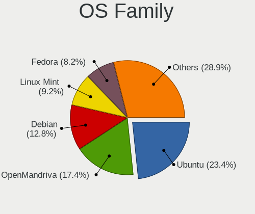
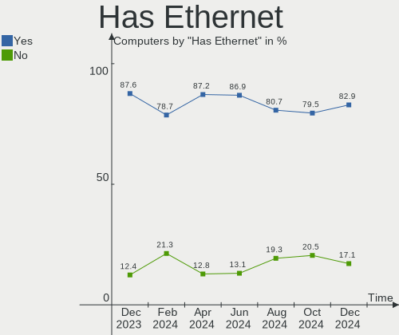
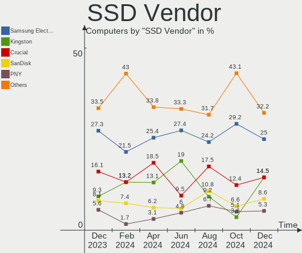
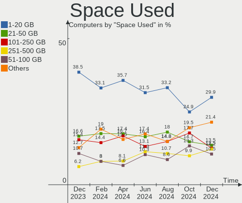
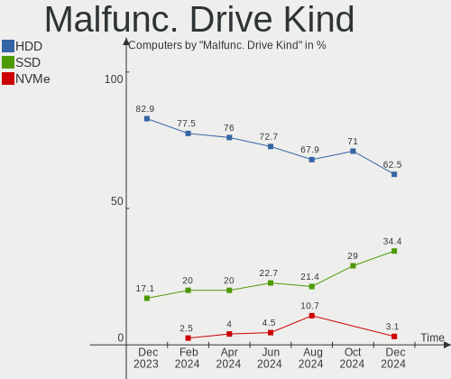
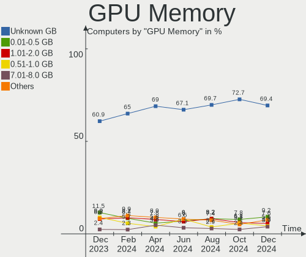
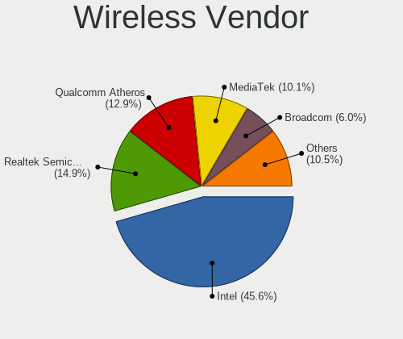
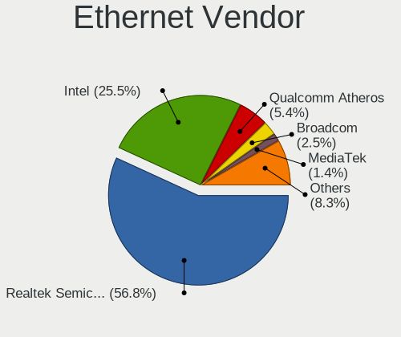
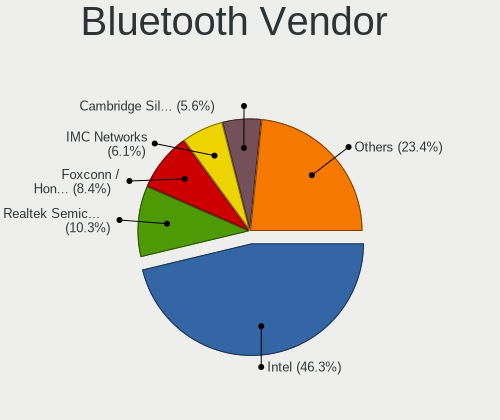
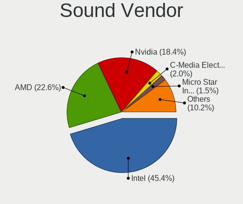

Linux in France - Hardware Trends
---------------------------------

A project to identify most popular hardware characteristics and track their change
over time based on data collected by Linux users at https://Linux-Hardware.org.

Anyone can contribute to this report by the [hw-probe](https://github.com/linuxhw/hw-probe) tool:

    sudo -E hw-probe -all -upload

This is a report for all computer types. See also reports for [desktops](/Location/France/Desktop/README.md) and [notebooks](/Location/France/Notebook/README.md).

Contents
--------

* [ System ](#system)
  - [ OS                       ](#os)
  - [ OS Family                ](#os-family)
  - [ Kernel                   ](#kernel)
  - [ Kernel Family            ](#kernel-family)
  - [ Kernel Major Ver.        ](#kernel-major-ver)
  - [ Arch                     ](#arch)
  - [ DE                       ](#de)
  - [ Display Server           ](#display-server)
  - [ Display Manager          ](#display-manager)
  - [ OS Lang                  ](#os-lang)
  - [ Boot Mode                ](#boot-mode)
  - [ Filesystem               ](#filesystem)
  - [ Part. scheme             ](#part-scheme)
  - [ Dual Boot with Linux/BSD ](#dual-boot-with-linuxbsd)
  - [ Dual Boot (Win)          ](#dual-boot-win)

* [ Board ](#board)
  - [ Vendor                   ](#vendor)
  - [ Model                    ](#model)
  - [ Model Family             ](#model-family)
  - [ MFG Year                 ](#mfg-year)
  - [ Form Factor              ](#form-factor)
  - [ Secure Boot              ](#secure-boot)
  - [ Coreboot                 ](#coreboot)
  - [ RAM Size                 ](#ram-size)
  - [ RAM Used                 ](#ram-used)
  - [ Total Drives             ](#total-drives)
  - [ Has CD-ROM               ](#has-cd-rom)
  - [ Has Ethernet             ](#has-ethernet)
  - [ Has WiFi                 ](#has-wifi)
  - [ Has Bluetooth            ](#has-bluetooth)

* [ Location ](#location)
  - [ Country                  ](#country)
  - [ City                     ](#city)

* [ Drives ](#drives)
  - [ Drive Vendor             ](#drive-vendor)
  - [ Drive Model              ](#drive-model)
  - [ HDD Vendor               ](#hdd-vendor)
  - [ SSD Vendor               ](#ssd-vendor)
  - [ Drive Kind               ](#drive-kind)
  - [ Drive Connector          ](#drive-connector)
  - [ Drive Size               ](#drive-size)
  - [ Space Total              ](#space-total)
  - [ Space Used               ](#space-used)
  - [ Malfunc. Drives          ](#malfunc-drives)
  - [ Malfunc. Drive Vendor    ](#malfunc-drive-vendor)
  - [ Malfunc. HDD Vendor      ](#malfunc-hdd-vendor)
  - [ Malfunc. Drive Kind      ](#malfunc-drive-kind)
  - [ Failed Drives            ](#failed-drives)
  - [ Failed Drive Vendor      ](#failed-drive-vendor)
  - [ Drive Status             ](#drive-status)

* [ Storage controller ](#storage-controller)
  - [ Storage Vendor           ](#storage-vendor)
  - [ Storage Model            ](#storage-model)
  - [ Storage Kind             ](#storage-kind)

* [ Processor ](#processor)
  - [ CPU Vendor               ](#cpu-vendor)
  - [ CPU Model                ](#cpu-model)
  - [ CPU Model Family         ](#cpu-model-family)
  - [ CPU Cores                ](#cpu-cores)
  - [ CPU Sockets              ](#cpu-sockets)
  - [ CPU Threads              ](#cpu-threads)
  - [ CPU Op-Modes             ](#cpu-op-modes)
  - [ CPU Microcode            ](#cpu-microcode)
  - [ CPU Microarch            ](#cpu-microarch)

* [ Graphics ](#graphics)
  - [ GPU Vendor               ](#gpu-vendor)
  - [ GPU Model                ](#gpu-model)
  - [ GPU Combo                ](#gpu-combo)
  - [ GPU Driver               ](#gpu-driver)
  - [ GPU Memory               ](#gpu-memory)

* [ Monitor ](#monitor)
  - [ Monitor Vendor           ](#monitor-vendor)
  - [ Monitor Model            ](#monitor-model)
  - [ Monitor Resolution       ](#monitor-resolution)
  - [ Monitor Diagonal         ](#monitor-diagonal)
  - [ Monitor Width            ](#monitor-width)
  - [ Aspect Ratio             ](#aspect-ratio)
  - [ Monitor Area             ](#monitor-area)
  - [ Pixel Density            ](#pixel-density)
  - [ Multiple Monitors        ](#multiple-monitors)

* [ Network ](#network)
  - [ Net Controller Vendor    ](#net-controller-vendor)
  - [ Net Controller Model     ](#net-controller-model)
  - [ Wireless Vendor          ](#wireless-vendor)
  - [ Wireless Model           ](#wireless-model)
  - [ Ethernet Vendor          ](#ethernet-vendor)
  - [ Ethernet Model           ](#ethernet-model)
  - [ Net Controller Kind      ](#net-controller-kind)
  - [ Used Controller          ](#used-controller)
  - [ NICs                     ](#nics)
  - [ IPv6                     ](#ipv6)

* [ Bluetooth ](#bluetooth)
  - [ Bluetooth Vendor         ](#bluetooth-vendor)
  - [ Bluetooth Model          ](#bluetooth-model)

* [ Sound ](#sound)
  - [ Sound Vendor             ](#sound-vendor)
  - [ Sound Model              ](#sound-model)

* [ Memory ](#memory)
  - [ Memory Vendor            ](#memory-vendor)
  - [ Memory Model             ](#memory-model)
  - [ Memory Kind              ](#memory-kind)
  - [ Memory Form Factor       ](#memory-form-factor)
  - [ Memory Size              ](#memory-size)
  - [ Memory Speed             ](#memory-speed)

* [ Printers & scanners ](#printers--scanners)
  - [ Printer Vendor           ](#printer-vendor)
  - [ Printer Model            ](#printer-model)
  - [ Scanner Vendor           ](#scanner-vendor)
  - [ Scanner Model            ](#scanner-model)

* [ Camera ](#camera)
  - [ Camera Vendor            ](#camera-vendor)
  - [ Camera Model             ](#camera-model)

* [ Security ](#security)
  - [ Fingerprint Vendor       ](#fingerprint-vendor)
  - [ Fingerprint Model        ](#fingerprint-model)
  - [ Chipcard Vendor          ](#chipcard-vendor)
  - [ Chipcard Model           ](#chipcard-model)

* [ Unsupported ](#unsupported)
  - [ Unsupported Devices      ](#unsupported-devices)
  - [ Unsupported Device Types ](#unsupported-device-types)

System
------

OS
--

Installed operating systems

| Name                         | Computers | Percent |
|------------------------------|-----------|---------|
| Ubuntu 20.04                 | 53        | 20.95%  |
| Debian 11                    | 21        | 8.3%    |
| Linux Mint 20.3              | 20        | 7.91%   |
| Ubuntu 21.10                 | 17        | 6.72%   |
| Fedora 35                    | 16        | 6.32%   |
| Ubuntu 22.04                 | 14        | 5.53%   |
| OpenMandriva 4.3             | 11        | 4.35%   |
| Arch                         | 8         | 3.16%   |
| Manjaro                      | 7         | 2.77%   |
| OpenMandriva 4.2             | 5         | 1.98%   |
| Ubuntu 18.04                 | 4         | 1.58%   |
| Kubuntu 22.04                | 4         | 1.58%   |
| Zorin 16                     | 3         | 1.19%   |
| Xubuntu 20.04                | 3         | 1.19%   |
| Pop!_OS 21.10                | 3         | 1.19%   |
| Manjaro 21.2.5               | 3         | 1.19%   |
| LMDE 5                       | 3         | 1.19%   |
| Kubuntu 21.10                | 3         | 1.19%   |
| Gentoo 2.7                   | 3         | 1.19%   |
| Fedora 36                    | 3         | 1.19%   |
| Elementary 6.1               | 3         | 1.19%   |
| Arch Rolling                 | 3         | 1.19%   |
| Ubuntu Studio 20.04          | 2         | 0.79%   |
| Manjaro 21.2.6               | 2         | 0.79%   |
| Linux Mint 20.2              | 2         | 0.79%   |
| Linux Mint 19.3              | 2         | 0.79%   |
| Kubuntu 20.04                | 2         | 0.79%   |
| Gentoo 2.6                   | 2         | 0.79%   |
| Debian Unstable              | 2         | 0.79%   |
| Debian 10                    | 2         | 0.79%   |
| Xubuntu 21.10                | 1         | 0.4%    |
| Ubuntu MATE 20.04            | 1         | 0.4%    |
| Ubuntu Budgie 21.10          | 1         | 0.4%    |
| Ubuntu Budgie 20.04          | 1         | 0.4%    |
| Ubuntu 21.04                 | 1         | 0.4%    |
| Ubuntu 19.10                 | 1         | 0.4%    |
| SteamOS Snapshot             | 1         | 0.4%    |
| Sparky 6                     | 1         | 0.4%    |
| Slackware 15.0               | 1         | 0.4%    |
| ROSA R11.1                   | 1         | 0.4%    |
| Raspbian 10                  | 1         | 0.4%    |
| Pop!_OS 22.04                | 1         | 0.4%    |
| Pop!_OS 21.04                | 1         | 0.4%    |
| Parrot 4.11                  | 1         | 0.4%    |
| openSUSE Tumbleweed-20220427 | 1         | 0.4%    |
| openSUSE 20220410            | 1         | 0.4%    |
| openSUSE 20220324            | 1         | 0.4%    |
| Lubuntu 20.04                | 1         | 0.4%    |
| KDE neon 20.04               | 1         | 0.4%    |
| Kaisen 2.0                   | 1         | 0.4%    |
| Gentoo 2.8                   | 1         | 0.4%    |
| Fedora 37                    | 1         | 0.4%    |
| Fedora 34                    | 1         | 0.4%    |
| EndeavourOS Rolling          | 1         | 0.4%    |
| Debian 11-updates            | 1         | 0.4%    |
| Clear Linux 36150            | 1         | 0.4%    |
| Artix Rolling                | 1         | 0.4%    |

OS Family
---------

OS without a version

| Name          | Computers | Percent |
|---------------|-----------|---------|
| Ubuntu        | 90        | 35.57%  |
| Debian        | 26        | 10.28%  |
| Linux Mint    | 24        | 9.49%   |
| Fedora        | 21        | 8.3%    |
| OpenMandriva  | 16        | 6.32%   |
| Manjaro       | 12        | 4.74%   |
| Arch          | 11        | 4.35%   |
| Kubuntu       | 9         | 3.56%   |
| Gentoo        | 6         | 2.37%   |
| Pop!_OS       | 5         | 1.98%   |
| Xubuntu       | 4         | 1.58%   |
| Zorin         | 3         | 1.19%   |
| openSUSE      | 3         | 1.19%   |
| LMDE          | 3         | 1.19%   |
| Elementary    | 3         | 1.19%   |
| Ubuntu Studio | 2         | 0.79%   |
| Ubuntu Budgie | 2         | 0.79%   |
| Ubuntu MATE   | 1         | 0.4%    |
| SteamOS       | 1         | 0.4%    |
| Sparky        | 1         | 0.4%    |
| Slackware     | 1         | 0.4%    |
| ROSA          | 1         | 0.4%    |
| Raspbian      | 1         | 0.4%    |
| Parrot        | 1         | 0.4%    |
| Lubuntu       | 1         | 0.4%    |
| KDE neon      | 1         | 0.4%    |
| Kaisen        | 1         | 0.4%    |
| EndeavourOS   | 1         | 0.4%    |
| Clear Linux   | 1         | 0.4%    |
| Artix         | 1         | 0.4%    |

Kernel
------

Version of the Linux kernel

| Version                     | Computers | Percent |
|-----------------------------|-----------|---------|
| 5.13.0-39-generic           | 46        | 18.18%  |
| 5.13.0-40-generic           | 22        | 8.7%    |
| 5.4.0-107-generic           | 16        | 6.32%   |
| 5.10.0-13-amd64             | 12        | 4.74%   |
| 5.16.7-desktop-1omv4003     | 11        | 4.35%   |
| 5.4.0-109-generic           | 10        | 3.95%   |
| 5.15.0-27-generic           | 9         | 3.56%   |
| 5.15.0-25-generic           | 8         | 3.16%   |
| 5.16.18-200.fc35.x86_64     | 6         | 2.37%   |
| 5.10.14-desktop-1omv4002    | 5         | 1.98%   |
| 5.17.1-arch1-1              | 4         | 1.58%   |
| 5.15.28-1-MANJARO           | 4         | 1.58%   |
| 5.16.20-200.fc35.x86_64     | 3         | 1.19%   |
| 5.16.16-200.fc35.x86_64     | 3         | 1.19%   |
| 5.10.0-11-amd64             | 3         | 1.19%   |
| 5.4.0-91-generic            | 2         | 0.79%   |
| 5.4.0-100-generic           | 2         | 0.79%   |
| 5.17.5-arch1-1              | 2         | 0.79%   |
| 5.17.1-300.fc36.x86_64      | 2         | 0.79%   |
| 5.16.19-200.fc35.x86_64     | 2         | 0.79%   |
| 5.16.15-76051615-generic    | 2         | 0.79%   |
| 5.16.14-1-MANJARO           | 2         | 0.79%   |
| 5.16.0-6-amd64              | 2         | 0.79%   |
| 5.16.0-0.bpo.4-amd64        | 2         | 0.79%   |
| 5.13.0-37-generic           | 2         | 0.79%   |
| 5.10.0-12-amd64             | 2         | 0.79%   |
| 5.4.83-generic-2rosa-x86_64 | 1         | 0.4%    |
| 5.4.0-97-generic            | 1         | 0.4%    |
| 5.4.0-73-generic            | 1         | 0.4%    |
| 5.4.0-48-generic            | 1         | 0.4%    |
| 5.4.0-26-generic            | 1         | 0.4%    |
| 5.4.0-107-lowlatency        | 1         | 0.4%    |
| 5.4.0-105-generic           | 1         | 0.4%    |
| 5.4.0-104-generic           | 1         | 0.4%    |
| 5.3.0-62-generic            | 1         | 0.4%    |
| 5.3.0-51-generic            | 1         | 0.4%    |
| 5.18.0-0.rc3.27.fc37.x86_64 | 1         | 0.4%    |
| 5.17.4-arch1-1              | 1         | 0.4%    |
| 5.17.4-200.fc35.x86_64      | 1         | 0.4%    |
| 5.17.4-100.fc34.x86_64      | 1         | 0.4%    |
| 5.17.4-1-default            | 1         | 0.4%    |
| 5.17.3-zen1-1-zen           | 1         | 0.4%    |
| 5.17.3-arch1-1              | 1         | 0.4%    |
| 5.17.2-gentoo-yoshi-hp      | 1         | 0.4%    |
| 5.17.2-300.fc36.x86_64      | 1         | 0.4%    |
| 5.17.1-zen1-1-zen           | 1         | 0.4%    |
| 5.17.1-xanmod1              | 1         | 0.4%    |
| 5.17.1-gentoo-r1            | 1         | 0.4%    |
| 5.17.1-3-MANJARO            | 1         | 0.4%    |
| 5.17.1-1-rt16-MANJARO       | 1         | 0.4%    |
| 5.17.1-1-default            | 1         | 0.4%    |
| 5.17.1                      | 1         | 0.4%    |
| 5.17.0-4.1-liquorix-amd64   | 1         | 0.4%    |
| 5.17.0-1-MANJARO            | 1         | 0.4%    |
| 5.17.0-1-amd64              | 1         | 0.4%    |
| 5.16.4-1119.native          | 1         | 0.4%    |
| 5.16.20-tkg-pds             | 1         | 0.4%    |
| 5.16.19-76051619-generic    | 1         | 0.4%    |
| 5.16.17-surface             | 1         | 0.4%    |
| 5.16.15-arch1-1             | 1         | 0.4%    |

Kernel Family
-------------

Linux kernel without a distro release

| Version  | Computers | Percent |
|----------|-----------|---------|
| 5.13.0   | 76        | 30.04%  |
| 5.4.0    | 37        | 14.62%  |
| 5.15.0   | 19        | 7.51%   |
| 5.10.0   | 19        | 7.51%   |
| 5.17.1   | 13        | 5.14%   |
| 5.16.7   | 11        | 4.35%   |
| 5.16.18  | 6         | 2.37%   |
| 5.16.0   | 5         | 1.98%   |
| 5.10.14  | 5         | 1.98%   |
| 5.17.4   | 4         | 1.58%   |
| 5.16.20  | 4         | 1.58%   |
| 5.16.15  | 4         | 1.58%   |
| 5.15.28  | 4         | 1.58%   |
| 5.17.0   | 3         | 1.19%   |
| 5.16.19  | 3         | 1.19%   |
| 5.16.16  | 3         | 1.19%   |
| 5.15.32  | 3         | 1.19%   |
| 5.13.19  | 3         | 1.19%   |
| 5.11.0   | 3         | 1.19%   |
| 5.3.0    | 2         | 0.79%   |
| 5.17.5   | 2         | 0.79%   |
| 5.17.3   | 2         | 0.79%   |
| 5.17.2   | 2         | 0.79%   |
| 5.16.14  | 2         | 0.79%   |
| 5.14.0   | 2         | 0.79%   |
| 5.10.52  | 2         | 0.79%   |
| 4.19.0   | 2         | 0.79%   |
| 5.4.83   | 1         | 0.4%    |
| 5.18.0   | 1         | 0.4%    |
| 5.16.4   | 1         | 0.4%    |
| 5.16.17  | 1         | 0.4%    |
| 5.15.8   | 1         | 0.4%    |
| 5.15.33  | 1         | 0.4%    |
| 5.15.27  | 1         | 0.4%    |
| 5.15.13  | 1         | 0.4%    |
| 5.14.10  | 1         | 0.4%    |
| 5.12.19  | 1         | 0.4%    |
| 5.10.105 | 1         | 0.4%    |
| 4.15.0   | 1         | 0.4%    |

Kernel Major Ver.
-----------------

Linux kernel major version

| Version | Computers | Percent |
|---------|-----------|---------|
| 5.13    | 79        | 31.23%  |
| 5.16    | 40        | 15.81%  |
| 5.4     | 38        | 15.02%  |
| 5.15    | 30        | 11.86%  |
| 5.10    | 27        | 10.67%  |
| 5.17    | 26        | 10.28%  |
| 5.14    | 3         | 1.19%   |
| 5.11    | 3         | 1.19%   |
| 5.3     | 2         | 0.79%   |
| 4.19    | 2         | 0.79%   |
| 5.18    | 1         | 0.4%    |
| 5.12    | 1         | 0.4%    |
| 4.15    | 1         | 0.4%    |

Arch
----

OS architecture (x86_64, i586, etc.)

| Name   | Computers | Percent |
|--------|-----------|---------|
| x86_64 | 250       | 98.81%  |
| i686   | 2         | 0.79%   |
| armv7l | 1         | 0.4%    |

DE
--

Desktop Environment

| Name            | Computers | Percent |
|-----------------|-----------|---------|
| GNOME           | 131       | 51.78%  |
| KDE5            | 39        | 15.42%  |
| Unknown         | 20        | 7.91%   |
| XFCE            | 17        | 6.72%   |
| X-Cinnamon      | 12        | 4.74%   |
| MATE            | 12        | 4.74%   |
| Cinnamon        | 7         | 2.77%   |
| i3              | 4         | 1.58%   |
| Pantheon        | 3         | 1.19%   |
| Budgie          | 2         | 0.79%   |
| Unity           | 1         | 0.4%    |
| openbox         | 1         | 0.4%    |
| LXQt            | 1         | 0.4%    |
| LXDE            | 1         | 0.4%    |
| GNOME Flashback | 1         | 0.4%    |
| GNOME Classic   | 1         | 0.4%    |

Display Server
--------------

X11 or Wayland

| Name    | Computers | Percent |
|---------|-----------|---------|
| X11     | 188       | 74.31%  |
| Wayland | 44        | 17.39%  |
| Tty     | 15        | 5.93%   |
| Unknown | 6         | 2.37%   |

Display Manager
---------------

SDDM, LightDM, etc.

| Name    | Computers | Percent |
|---------|-----------|---------|
| GDM     | 73        | 28.85%  |
| Unknown | 61        | 24.11%  |
| LightDM | 48        | 18.97%  |
| GDM3    | 35        | 13.83%  |
| SDDM    | 33        | 13.04%  |
| XDM     | 1         | 0.4%    |
| Ly      | 1         | 0.4%    |
| LXDM    | 1         | 0.4%    |

OS Lang
-------

Language

| Lang       | Computers | Percent |
|------------|-----------|---------|
| fr_FR      | 187       | 73.91%  |
| en_US      | 50        | 19.76%  |
| Unknown    | 7         | 2.77%   |
| C          | 3         | 1.19%   |
| sr_RS      | 1         | 0.4%    |
| ru_RU      | 1         | 0.4%    |
| nl_NL      | 1         | 0.4%    |
| it_IT      | 1         | 0.4%    |
| fr_FR.UTF8 | 1         | 0.4%    |
| es_UY      | 1         | 0.4%    |

Boot Mode
---------

EFI or BIOS

| Mode | Computers | Percent |
|------|-----------|---------|
| EFI  | 151       | 59.68%  |
| BIOS | 102       | 40.32%  |

Filesystem
----------

Type of filesystem

| Type    | Computers | Percent |
|---------|-----------|---------|
| Ext4    | 206       | 81.42%  |
| Btrfs   | 24        | 9.49%   |
| Overlay | 16        | 6.32%   |
| Zfs     | 5         | 1.98%   |
| Xfs     | 1         | 0.4%    |
| Tmpfs   | 1         | 0.4%    |

Part. scheme
------------

Scheme of partitioning

| Type    | Computers | Percent |
|---------|-----------|---------|
| GPT     | 142       | 56.13%  |
| Unknown | 75        | 29.64%  |
| MBR     | 36        | 14.23%  |

Dual Boot with Linux/BSD
------------------------

Hosting more than one Linux/BSD

| Dual boot | Computers | Percent |
|-----------|-----------|---------|
| No        | 216       | 85.38%  |
| Yes       | 37        | 14.62%  |

Dual Boot (Win)
---------------

Hosting Linux and Windows

| Dual boot | Computers | Percent |
|-----------|-----------|---------|
| No        | 174       | 68.77%  |
| Yes       | 79        | 31.23%  |

Board
-----

Vendor
------

Motherboard manufacturer

| Name                    | Computers | Percent |
|-------------------------|-----------|---------|
| Dell                    | 49        | 19.37%  |
| ASUSTek Computer        | 43        | 17%     |
| Hewlett-Packard         | 33        | 13.04%  |
| Lenovo                  | 28        | 11.07%  |
| MSI                     | 24        | 9.49%   |
| Gigabyte Technology     | 15        | 5.93%   |
| Acer                    | 10        | 3.95%   |
| Pegatron                | 4         | 1.58%   |
| ASRock                  | 4         | 1.58%   |
| TUXEDO                  | 3         | 1.19%   |
| Supermicro              | 3         | 1.19%   |
| Sony                    | 3         | 1.19%   |
| Samsung Electronics     | 3         | 1.19%   |
| Packard Bell            | 3         | 1.19%   |
| Toshiba                 | 2         | 0.79%   |
| Intel                   | 2         | 0.79%   |
| HUAWEI                  | 2         | 0.79%   |
| Fujitsu                 | 2         | 0.79%   |
| eMachines               | 2         | 0.79%   |
| Valve                   | 1         | 0.4%    |
| Timi                    | 1         | 0.4%    |
| System76                | 1         | 0.4%    |
| Star Labs               | 1         | 0.4%    |
| Raspberry Pi Foundation | 1         | 0.4%    |
| PC Specialist           | 1         | 0.4%    |
| Notebook                | 1         | 0.4%    |
| Microsoft               | 1         | 0.4%    |
| LincPlus                | 1         | 0.4%    |
| Jetway                  | 1         | 0.4%    |
| Google                  | 1         | 0.4%    |
| Foxconn                 | 1         | 0.4%    |
| Clevo                   | 1         | 0.4%    |
| BESSTAR Tech            | 1         | 0.4%    |
| Apple                   | 1         | 0.4%    |
| AMI                     | 1         | 0.4%    |
| Alienware               | 1         | 0.4%    |
| Unknown                 | 1         | 0.4%    |

Model
-----

Motherboard model

| Name                                        | Computers | Percent |
|---------------------------------------------|-----------|---------|
| ASUS All Series                             | 4         | 1.58%   |
| TUXEDO InfinityBook Pro 14 Gen6             | 2         | 0.79%   |
| MSI MS-7C94                                 | 2         | 0.79%   |
| HP Pavilion dv7                             | 2         | 0.79%   |
| HP OMEN by Laptop                           | 2         | 0.79%   |
| eMachines eM350                             | 2         | 0.79%   |
| Dell Precision 3561                         | 2         | 0.79%   |
| Dell Latitude 5310                          | 2         | 0.79%   |
| Dell G5 5590                                | 2         | 0.79%   |
| ASUS S551LN                                 | 2         | 0.79%   |
| Valve Jupiter                               | 1         | 0.4%    |
| TUXEDO Pulse 15 Gen1                        | 1         | 0.4%    |
| Toshiba Satellite Pro C660                  | 1         | 0.4%    |
| Toshiba Satellite C50t-B                    | 1         | 0.4%    |
| Timi RedmiBook 14-APCS                      | 1         | 0.4%    |
| System76 Gazelle                            | 1         | 0.4%    |
| Supermicro X9SRH-7F/7TF                     | 1         | 0.4%    |
| Supermicro X9SRE/X9SRE-3F/X9SRi/X9SRi-3F    | 1         | 0.4%    |
| Supermicro Super Server                     | 1         | 0.4%    |
| Star Labs Lite                              | 1         | 0.4%    |
| Sony VGN-NS38E_S                            | 1         | 0.4%    |
| Sony VGN-FZ31M                              | 1         | 0.4%    |
| Sony SVE1713V1EB                            | 1         | 0.4%    |
| Samsung RV411/RV511/E3511/S3511/RV711/E3411 | 1         | 0.4%    |
| Samsung 350V5C/351V5C/3540VC/3440VC         | 1         | 0.4%    |
| Samsung 305U1A                              | 1         | 0.4%    |
| RPi Raspberry Pi                            | 1         | 0.4%    |
| Pegatron VG267AA-ABF p6244fr                | 1         | 0.4%    |
| Pegatron IPPPV-D3G                          | 1         | 0.4%    |
| Pegatron Elite 7500 Series MT               | 1         | 0.4%    |
| Pegatron Compaq dx2400 Microtower PC        | 1         | 0.4%    |
| PC Specialist Standard                      | 1         | 0.4%    |
| Packard Bell IMEDIA S2110                   | 1         | 0.4%    |
| Packard Bell IMEDIA MC 9604                 | 1         | 0.4%    |
| Packard Bell EasyNote MH45                  | 1         | 0.4%    |
| Notebook NH5x_NH7x_HHx_HJx_HKx              | 1         | 0.4%    |
| MSI Pulse GL76 11UEK                        | 1         | 0.4%    |
| MSI PS42 Modern 8RA                         | 1         | 0.4%    |
| MSI Prestige 14Evo A11M                     | 1         | 0.4%    |
| MSI MS-7D22                                 | 1         | 0.4%    |
| MSI MS-7D13                                 | 1         | 0.4%    |
| MSI MS-7C92                                 | 1         | 0.4%    |
| MSI MS-7C91                                 | 1         | 0.4%    |
| MSI MS-7C56                                 | 1         | 0.4%    |
| MSI MS-7C35                                 | 1         | 0.4%    |
| MSI MS-7B98                                 | 1         | 0.4%    |
| MSI MS-7B79                                 | 1         | 0.4%    |
| MSI MS-7B48                                 | 1         | 0.4%    |
| MSI MS-7A31                                 | 1         | 0.4%    |
| MSI MS-7A15                                 | 1         | 0.4%    |
| MSI MS-7981                                 | 1         | 0.4%    |
| MSI MS-7758                                 | 1         | 0.4%    |
| MSI MS-7751                                 | 1         | 0.4%    |
| MSI MS-7681                                 | 1         | 0.4%    |
| MSI MS-7519                                 | 1         | 0.4%    |
| MSI Modern 14 B10MW                         | 1         | 0.4%    |
| MSI GS70 6QE                                | 1         | 0.4%    |
| MSI GF65 Thin 10UE                          | 1         | 0.4%    |
| Microsoft Surface Pro                       | 1         | 0.4%    |
| LincPlus LINNCPLUS P1                       | 1         | 0.4%    |

Model Family
------------

Motherboard model prefix

| Name                   | Computers | Percent |
|------------------------|-----------|---------|
| Lenovo ThinkPad        | 14        | 5.53%   |
| Dell Latitude          | 12        | 4.74%   |
| HP Pavilion            | 10        | 3.95%   |
| Dell Precision         | 9         | 3.56%   |
| HP EliteBook           | 7         | 2.77%   |
| Dell OptiPlex          | 7         | 2.77%   |
| Lenovo IdeaPad         | 6         | 2.37%   |
| Dell Inspiron          | 6         | 2.37%   |
| Acer Aspire            | 6         | 2.37%   |
| Dell XPS               | 5         | 1.98%   |
| ASUS ROG               | 5         | 1.98%   |
| ASUS VivoBook          | 4         | 1.58%   |
| ASUS TUF               | 4         | 1.58%   |
| ASUS All               | 4         | 1.58%   |
| HP ProBook             | 3         | 1.19%   |
| HP Compaq              | 3         | 1.19%   |
| Dell Vostro            | 3         | 1.19%   |
| ASUS PRIME             | 3         | 1.19%   |
| TUXEDO InfinityBook    | 2         | 0.79%   |
| Toshiba Satellite      | 2         | 0.79%   |
| Packard Bell IMEDIA    | 2         | 0.79%   |
| MSI MS-7C94            | 2         | 0.79%   |
| Lenovo ThinkBook       | 2         | 0.79%   |
| Lenovo Legion          | 2         | 0.79%   |
| HP OMEN                | 2         | 0.79%   |
| HP EliteDesk           | 2         | 0.79%   |
| Gigabyte X570          | 2         | 0.79%   |
| eMachines eM350        | 2         | 0.79%   |
| Dell PowerEdge         | 2         | 0.79%   |
| Dell G5                | 2         | 0.79%   |
| ASUS S551LN            | 2         | 0.79%   |
| Acer Nitro             | 2         | 0.79%   |
| Valve Jupiter          | 1         | 0.4%    |
| TUXEDO Pulse           | 1         | 0.4%    |
| Timi RedmiBook         | 1         | 0.4%    |
| System76 Gazelle       | 1         | 0.4%    |
| Supermicro X9SRH-7F    | 1         | 0.4%    |
| Supermicro X9SRE       | 1         | 0.4%    |
| Supermicro Super       | 1         | 0.4%    |
| Star Labs Lite         | 1         | 0.4%    |
| Sony VGN-NS38E         | 1         | 0.4%    |
| Sony VGN-FZ31M         | 1         | 0.4%    |
| Sony SVE1713V1EB       | 1         | 0.4%    |
| Samsung RV411          | 1         | 0.4%    |
| Samsung 350V5C         | 1         | 0.4%    |
| Samsung 305U1A         | 1         | 0.4%    |
| RPi Raspberry          | 1         | 0.4%    |
| Pegatron VG267AA-ABF   | 1         | 0.4%    |
| Pegatron IPPPV-D3G     | 1         | 0.4%    |
| Pegatron Elite         | 1         | 0.4%    |
| Pegatron Compaq        | 1         | 0.4%    |
| PC Specialist Standard | 1         | 0.4%    |
| Packard Bell EasyNote  | 1         | 0.4%    |
| Notebook NH5x          | 1         | 0.4%    |
| MSI Pulse              | 1         | 0.4%    |
| MSI PS42               | 1         | 0.4%    |
| MSI Prestige           | 1         | 0.4%    |
| MSI MS-7D22            | 1         | 0.4%    |
| MSI MS-7D13            | 1         | 0.4%    |
| MSI MS-7C92            | 1         | 0.4%    |

MFG Year
--------

Motherboard manufacture year

| Year    | Computers | Percent |
|---------|-----------|---------|
| 2020    | 38        | 15.02%  |
| 2021    | 36        | 14.23%  |
| 2019    | 25        | 9.88%   |
| 2018    | 22        | 8.7%    |
| 2015    | 17        | 6.72%   |
| 2013    | 16        | 6.32%   |
| 2014    | 14        | 5.53%   |
| 2011    | 13        | 5.14%   |
| 2010    | 13        | 5.14%   |
| 2008    | 12        | 4.74%   |
| 2017    | 10        | 3.95%   |
| 2016    | 10        | 3.95%   |
| 2012    | 10        | 3.95%   |
| 2009    | 6         | 2.37%   |
| 2007    | 5         | 1.98%   |
| 2005    | 2         | 0.79%   |
| Unknown | 2         | 0.79%   |
| 2022    | 1         | 0.4%    |
| 2006    | 1         | 0.4%    |

Form Factor
-----------

Physical design of the computer

| Name           | Computers | Percent |
|----------------|-----------|---------|
| Notebook       | 144       | 56.92%  |
| Desktop        | 93        | 36.76%  |
| Server         | 5         | 1.98%   |
| Convertible    | 4         | 1.58%   |
| Tablet         | 2         | 0.79%   |
| Mini pc        | 2         | 0.79%   |
| All in one     | 2         | 0.79%   |
| System on chip | 1         | 0.4%    |

Secure Boot
-----------

Enabled or disabled

| State    | Computers | Percent |
|----------|-----------|---------|
| Disabled | 229       | 90.51%  |
| Enabled  | 24        | 9.49%   |

Coreboot
--------

Have coreboot on board

| Used | Computers | Percent |
|------|-----------|---------|
| No   | 251       | 99.21%  |
| Yes  | 2         | 0.79%   |

RAM Size
--------

Total RAM memory

| Size in GB  | Computers | Percent |
|-------------|-----------|---------|
| 16.01-24.0  | 72        | 28.46%  |
| 4.01-8.0    | 50        | 19.76%  |
| 3.01-4.0    | 46        | 18.18%  |
| 32.01-64.0  | 31        | 12.25%  |
| 8.01-16.0   | 31        | 12.25%  |
| 64.01-256.0 | 10        | 3.95%   |
| 24.01-32.0  | 5         | 1.98%   |
| 1.01-2.0    | 5         | 1.98%   |
| 2.01-3.0    | 2         | 0.79%   |
| 0.51-1.0    | 1         | 0.4%    |

RAM Used
--------

Used RAM memory

| Used GB    | Computers | Percent |
|------------|-----------|---------|
| 4.01-8.0   | 61        | 24.11%  |
| 1.01-2.0   | 59        | 23.32%  |
| 2.01-3.0   | 52        | 20.55%  |
| 3.01-4.0   | 38        | 15.02%  |
| 8.01-16.0  | 18        | 7.11%   |
| 0.51-1.0   | 12        | 4.74%   |
| 0.01-0.5   | 8         | 3.16%   |
| 24.01-32.0 | 3         | 1.19%   |
| 32.01-64.0 | 1         | 0.4%    |
| 16.01-24.0 | 1         | 0.4%    |

Total Drives
------------

Number of drives on board

| Drives | Computers | Percent |
|--------|-----------|---------|
| 1      | 141       | 55.73%  |
| 2      | 79        | 31.23%  |
| 4      | 12        | 4.74%   |
| 3      | 12        | 4.74%   |
| 6      | 3         | 1.19%   |
| 5      | 3         | 1.19%   |
| 7      | 2         | 0.79%   |
| 10     | 1         | 0.4%    |

Has CD-ROM
----------

Has CD-ROM on board

| Presented | Computers | Percent |
|-----------|-----------|---------|
| No        | 160       | 63.24%  |
| Yes       | 93        | 36.76%  |

Has Ethernet
------------

Has Ethernet on board

| Presented | Computers | Percent |
|-----------|-----------|---------|
| Yes       | 221       | 87.35%  |
| No        | 32        | 12.65%  |

Has WiFi
--------

Has WiFi module

| Presented | Computers | Percent |
|-----------|-----------|---------|
| Yes       | 197       | 77.87%  |
| No        | 56        | 22.13%  |

Has Bluetooth
-------------

Has Bluetooth module

| Presented | Computers | Percent |
|-----------|-----------|---------|
| Yes       | 156       | 61.66%  |
| No        | 97        | 38.34%  |

Location
--------

Country
-------

Geographic location (country)

| Country | Computers | Percent |
|---------|-----------|---------|
| France  | 253       | 100%    |

City
----

Geographic location (city)

| City                      | Computers | Percent |
|---------------------------|-----------|---------|
| Paris                     | 29        | 11.46%  |
| Toulouse                  | 8         | 3.16%   |
| Marseille                 | 8         | 3.16%   |
| Lyon                      | 7         | 2.77%   |
| Saint-Denis               | 3         | 1.19%   |
| Lille                     | 3         | 1.19%   |
| Brest                     | 3         | 1.19%   |
| Bougival                  | 3         | 1.19%   |
| Aulnay-sous-Bois          | 3         | 1.19%   |
| Villeurbanne              | 2         | 0.79%   |
| Villeneuve-d'Ascq         | 2         | 0.79%   |
| Villejuif                 | 2         | 0.79%   |
| Vannes                    | 2         | 0.79%   |
| Vandoeuvre-les-Nancy      | 2         | 0.79%   |
| Toulon                    | 2         | 0.79%   |
| Roubaix                   | 2         | 0.79%   |
| Rennes                    | 2         | 0.79%   |
| Pau                       | 2         | 0.79%   |
| Palaiseau                 | 2         | 0.79%   |
| Nîmes                    | 2         | 0.79%   |
| Nice                      | 2         | 0.79%   |
| Nantes                    | 2         | 0.79%   |
| Mieuxcé                  | 2         | 0.79%   |
| Guerville                 | 2         | 0.79%   |
| Grenoble                  | 2         | 0.79%   |
| Clermont-Ferrand          | 2         | 0.79%   |
| Chenove                   | 2         | 0.79%   |
| Besançon                 | 2         | 0.79%   |
| Bergerac                  | 2         | 0.79%   |
| Annecy                    | 2         | 0.79%   |
| Vizille                   | 1         | 0.4%    |
| Vitry-le-François        | 1         | 0.4%    |
| Vitré                    | 1         | 0.4%    |
| Vincennes                 | 1         | 0.4%    |
| Vieux-Boucau-les-Bains    | 1         | 0.4%    |
| Veretz                    | 1         | 0.4%    |
| Valros                    | 1         | 0.4%    |
| Valence                   | 1         | 0.4%    |
| Valbonne                  | 1         | 0.4%    |
| Triel-sur-Seine           | 1         | 0.4%    |
| Tours                     | 1         | 0.4%    |
| Tourcoing                 | 1         | 0.4%    |
| Thorens-Glieres           | 1         | 0.4%    |
| Strasbourg                | 1         | 0.4%    |
| Sotteville-lès-Rouen     | 1         | 0.4%    |
| Senonches                 | 1         | 0.4%    |
| Sautron                   | 1         | 0.4%    |
| Sarreguemines             | 1         | 0.4%    |
| Sarrebourg                | 1         | 0.4%    |
| Sainte-Foy-les-Lyon       | 1         | 0.4%    |
| Saint-Mandrier-sur-Mer    | 1         | 0.4%    |
| Saint-Julien-en-Genevois  | 1         | 0.4%    |
| Saint-Julien-de-Concelles | 1         | 0.4%    |
| Saint-Gratien             | 1         | 0.4%    |
| Saint-Fargeau-Ponthierry  | 1         | 0.4%    |
| Saint-Dizier              | 1         | 0.4%    |
| Rezé                     | 1         | 0.4%    |
| Reignier-Esery            | 1         | 0.4%    |
| Puygouzon                 | 1         | 0.4%    |
| Puteaux                   | 1         | 0.4%    |

Drives
------

Drive Vendor
------------

Hard drive vendors

| Vendor                    | Computers | Drives | Percent |
|---------------------------|-----------|--------|---------|
| Samsung Electronics       | 63        | 77     | 17.26%  |
| Seagate                   | 59        | 85     | 16.16%  |
| WDC                       | 44        | 57     | 12.05%  |
| Crucial                   | 32        | 37     | 8.77%   |
| Toshiba                   | 19        | 20     | 5.21%   |
| Kingston                  | 19        | 20     | 5.21%   |
| SK Hynix                  | 15        | 16     | 4.11%   |
| Unknown                   | 14        | 15     | 3.84%   |
| SanDisk                   | 14        | 14     | 3.84%   |
| Micron Technology         | 13        | 13     | 3.56%   |
| HGST                      | 12        | 16     | 3.29%   |
| Intel                     | 9         | 10     | 2.47%   |
| PNY                       | 5         | 5      | 1.37%   |
| LDLC                      | 5         | 6      | 1.37%   |
| KIOXIA                    | 5         | 5      | 1.37%   |
| Hitachi                   | 5         | 5      | 1.37%   |
| China                     | 5         | 5      | 1.37%   |
| A-DATA Technology         | 3         | 3      | 0.82%   |
| Silicon Motion            | 2         | 2      | 0.55%   |
| JMicron                   | 2         | 2      | 0.55%   |
| YMTC                      | 1         | 1      | 0.27%   |
| Transcend                 | 1         | 2      | 0.27%   |
| TEXTORM                   | 1         | 1      | 0.27%   |
| Teclast                   | 1         | 1      | 0.27%   |
| SABRENT                   | 1         | 1      | 0.27%   |
| ORTIAL                    | 1         | 1      | 0.27%   |
| OCZ                       | 1         | 1      | 0.27%   |
| Micron/Crucial Technology | 1         | 1      | 0.27%   |
| LITEON                    | 1         | 1      | 0.27%   |
| LaCie                     | 1         | 1      | 0.27%   |
| Intenso                   | 1         | 1      | 0.27%   |
| Fujitsu                   | 1         | 1      | 0.27%   |
| Dogfish                   | 1         | 1      | 0.27%   |
| DELLBOSS                  | 1         | 1      | 0.27%   |
| Dell                      | 1         | 1      | 0.27%   |
| Corsair                   | 1         | 2      | 0.27%   |
| BHT                       | 1         | 1      | 0.27%   |
| ASENNO                    | 1         | 1      | 0.27%   |
| APPLE HD                  | 1         | 1      | 0.27%   |
| Unknown                   | 1         | 1      | 0.27%   |

Drive Model
-----------

Hard drive models

| Model                              | Computers | Percent |
|------------------------------------|-----------|---------|
| Samsung SSD 860 EVO 500GB          | 7         | 1.75%   |
| Samsung SSD 850 EVO 250GB          | 7         | 1.75%   |
| Seagate ST2000DM008-2FR102 2TB     | 6         | 1.5%    |
| Seagate ST1000LM035-1RK172 1TB     | 6         | 1.5%    |
| Crucial CT240BX500SSD1 240GB       | 6         | 1.5%    |
| Seagate ST2000DM001-1ER164 2TB     | 4         | 1%      |
| Seagate ST1000DM003-1ER162 1TB     | 4         | 1%      |
| Samsung SSD 980 PRO 500GB          | 4         | 1%      |
| Crucial CT500MX500SSD1 500GB       | 4         | 1%      |
| Toshiba NVMe SSD Drive 512GB       | 3         | 0.75%   |
| Toshiba MQ04ABF100 1TB             | 3         | 0.75%   |
| Seagate ST1000LM024 HN-M101MBB 1TB | 3         | 0.75%   |
| Seagate ST1000DM010-2EP102 1TB     | 3         | 0.75%   |
| Samsung SSD 860 EVO 250GB          | 3         | 0.75%   |
| Samsung NVMe SSD Drive 500GB       | 3         | 0.75%   |
| KIOXIA KBG40ZNS512G NVMe 512GB     | 3         | 0.75%   |
| Kingston SA400S37480G 480GB SSD    | 3         | 0.75%   |
| Kingston SA400S37240G 240GB SSD    | 3         | 0.75%   |
| HGST HTS721010A9E630 1TB           | 3         | 0.75%   |
| Crucial CT2000MX500SSD1 2TB        | 3         | 0.75%   |
| WDC WD2500KS-00MJB0 250GB          | 2         | 0.5%    |
| Unknown MMC Card  32GB             | 2         | 0.5%    |
| Toshiba MQ01ABD100 1TB             | 2         | 0.5%    |
| Toshiba DT01ACA100 1TB             | 2         | 0.5%    |
| SK Hynix PC711 NVMe 1TB            | 2         | 0.5%    |
| SK Hynix BC711 NVMe 512GB          | 2         | 0.5%    |
| Seagate ST9500420AS 500GB          | 2         | 0.5%    |
| Seagate ST31000524AS 1TB           | 2         | 0.5%    |
| Seagate ST2000DX002-2DV164 2TB     | 2         | 0.5%    |
| Seagate ST1000DM003-1CH162 1TB     | 2         | 0.5%    |
| SanDisk Ultra II 960GB SSD         | 2         | 0.5%    |
| SanDisk SDSSDA-2T00 2TB            | 2         | 0.5%    |
| Samsung SSD 980 1TB                | 2         | 0.5%    |
| Samsung SSD 970 EVO Plus 2TB       | 2         | 0.5%    |
| Samsung SSD 970 EVO Plus 1TB       | 2         | 0.5%    |
| Samsung SSD 860 EVO 1TB            | 2         | 0.5%    |
| Samsung SSD 850 EVO 500GB          | 2         | 0.5%    |
| Samsung NVMe SSD Drive 256GB       | 2         | 0.5%    |
| Samsung NVMe SSD Drive 250GB       | 2         | 0.5%    |
| Samsung NVMe SSD Drive 1TB         | 2         | 0.5%    |
| PNY CS900 240GB SSD                | 2         | 0.5%    |
| PNY CS900 120GB SSD                | 2         | 0.5%    |
| Kingston SA400S37120G 120GB SSD    | 2         | 0.5%    |
| Intel NVMe SSD Drive 512GB         | 2         | 0.5%    |
| Hitachi HTS547564A9E384 640GB      | 2         | 0.5%    |
| HGST HUS726T4TALA6L1 4TB           | 2         | 0.5%    |
| Crucial CT500P5SSD8 500GB          | 2         | 0.5%    |
| Crucial CT480BX500SSD1 480GB       | 2         | 0.5%    |
| Crucial CT1000P5SSD8 1TB           | 2         | 0.5%    |
| Crucial CT1000P2SSD8 1TB           | 2         | 0.5%    |
| Crucial CT1000MX500SSD1 1TB        | 2         | 0.5%    |
| China SSD 1TB                      | 2         | 0.5%    |
| A-DATA SP550 240GB SSD             | 2         | 0.5%    |
| YMTC PC005 512GB                   | 1         | 0.25%   |
| WDC WDS500G2B0C-00PXH0 500GB       | 1         | 0.25%   |
| WDC WDS500G2B0B 500GB SSD          | 1         | 0.25%   |
| WDC WDS240G2G0A-00JH30 240GB SSD   | 1         | 0.25%   |
| WDC WDS100T3X0C-00SJG0 1TB         | 1         | 0.25%   |
| WDC WDS100T2B0C-00PXH0 1TB         | 1         | 0.25%   |
| WDC WD80EFBX-68AZZN0 8TB           | 1         | 0.25%   |

HDD Vendor
----------

Hard disk drive vendors

| Vendor              | Computers | Drives | Percent |
|---------------------|-----------|--------|---------|
| Seagate             | 59        | 85     | 45.38%  |
| WDC                 | 35        | 45     | 26.92%  |
| HGST                | 12        | 16     | 9.23%   |
| Toshiba             | 11        | 11     | 8.46%   |
| Hitachi             | 5         | 5      | 3.85%   |
| Unknown             | 2         | 2      | 1.54%   |
| Samsung Electronics | 2         | 3      | 1.54%   |
| SABRENT             | 1         | 1      | 0.77%   |
| Fujitsu             | 1         | 1      | 0.77%   |
| DELLBOSS            | 1         | 1      | 0.77%   |
| APPLE HD            | 1         | 1      | 0.77%   |

SSD Vendor
----------

Solid state drive vendors

| Vendor              | Computers | Drives | Percent |
|---------------------|-----------|--------|---------|
| Samsung Electronics | 31        | 32     | 25.62%  |
| Crucial             | 26        | 29     | 21.49%  |
| SanDisk             | 13        | 13     | 10.74%  |
| Kingston            | 13        | 14     | 10.74%  |
| PNY                 | 5         | 5      | 4.13%   |
| Micron Technology   | 5         | 5      | 4.13%   |
| China               | 5         | 5      | 4.13%   |
| SK Hynix            | 3         | 3      | 2.48%   |
| WDC                 | 2         | 2      | 1.65%   |
| LDLC                | 2         | 2      | 1.65%   |
| Intel               | 2         | 2      | 1.65%   |
| A-DATA Technology   | 2         | 2      | 1.65%   |
| Transcend           | 1         | 2      | 0.83%   |
| Toshiba             | 1         | 1      | 0.83%   |
| TEXTORM             | 1         | 1      | 0.83%   |
| Teclast             | 1         | 1      | 0.83%   |
| ORTIAL              | 1         | 1      | 0.83%   |
| OCZ                 | 1         | 1      | 0.83%   |
| LITEON              | 1         | 1      | 0.83%   |
| JMicron             | 1         | 1      | 0.83%   |
| Intenso             | 1         | 1      | 0.83%   |
| Dogfish             | 1         | 1      | 0.83%   |
| BHT                 | 1         | 1      | 0.83%   |
| ASENNO              | 1         | 1      | 0.83%   |

Drive Kind
----------

HDD or SSD

| Kind    | Computers | Drives | Percent |
|---------|-----------|--------|---------|
| HDD     | 116       | 171    | 33.82%  |
| SSD     | 108       | 127    | 31.49%  |
| NVMe    | 102       | 118    | 29.74%  |
| MMC     | 11        | 12     | 3.21%   |
| Unknown | 6         | 7      | 1.75%   |

Drive Connector
---------------

SATA, SAS, NVMe, etc.

| Type | Computers | Drives | Percent |
|------|-----------|--------|---------|
| SATA | 180       | 293    | 59.6%   |
| NVMe | 102       | 118    | 33.77%  |
| MMC  | 11        | 12     | 3.64%   |
| SAS  | 9         | 12     | 2.98%   |

Drive Size
----------

Size of hard drive

| Size in TB | Computers | Drives | Percent |
|------------|-----------|--------|---------|
| 0.01-0.5   | 115       | 143    | 48.52%  |
| 0.51-1.0   | 73        | 85     | 30.8%   |
| 1.01-2.0   | 32        | 45     | 13.5%   |
| 3.01-4.0   | 8         | 13     | 3.38%   |
| 2.01-3.0   | 4         | 5      | 1.69%   |
| 4.01-10.0  | 4         | 6      | 1.69%   |
| 10.01-20.0 | 1         | 1      | 0.42%   |

Space Total
-----------

Amount of disk space available on the file system

| Size in GB     | Computers | Percent |
|----------------|-----------|---------|
| 251-500        | 57        | 22.53%  |
| 101-250        | 55        | 21.74%  |
| 501-1000       | 55        | 21.74%  |
| 1001-2000      | 23        | 9.09%   |
| More than 3000 | 18        | 7.11%   |
| 1-20           | 12        | 4.74%   |
| Unknown        | 12        | 4.74%   |
| 2001-3000      | 11        | 4.35%   |
| 21-50          | 5         | 1.98%   |
| 51-100         | 5         | 1.98%   |

Space Used
----------

Amount of used disk space

| Used GB        | Computers | Percent |
|----------------|-----------|---------|
| 1-20           | 62        | 24.51%  |
| 251-500        | 44        | 17.39%  |
| 101-250        | 31        | 12.25%  |
| 51-100         | 31        | 12.25%  |
| 21-50          | 29        | 11.46%  |
| 501-1000       | 24        | 9.49%   |
| 1001-2000      | 12        | 4.74%   |
| Unknown        | 12        | 4.74%   |
| More than 3000 | 4         | 1.58%   |
| 2001-3000      | 4         | 1.58%   |

Malfunc. Drives
---------------

Drive models with a malfunction

| Model                               | Computers | Drives | Percent |
|-------------------------------------|-----------|--------|---------|
| Seagate ST9500420AS 500GB           | 2         | 2      | 7.41%   |
| WDC WD5000BEKT-75KA9T0 500GB        | 1         | 1      | 3.7%    |
| WDC WD2500KS-00MJB0 250GB           | 1         | 1      | 3.7%    |
| WDC WD1600BEVS-60RST0 160GB         | 1         | 1      | 3.7%    |
| WDC WD1500ADFS-00SLR5 150GB         | 1         | 1      | 3.7%    |
| WDC WD10EZEX-60ZF5A0 1TB            | 1         | 1      | 3.7%    |
| WDC WD10EZEX-60M2NA0 1TB            | 1         | 1      | 3.7%    |
| WDC WD10EARS-00Y5B1 1TB             | 1         | 1      | 3.7%    |
| WDC WD10EADS-65L5B1 1TB             | 1         | 1      | 3.7%    |
| WDC WD10EADS-22M2B0 1TB             | 1         | 1      | 3.7%    |
| Unknown MS 500GB                    | 1         | 1      | 3.7%    |
| Toshiba MQ01ABD100 1TB              | 1         | 1      | 3.7%    |
| Toshiba MK7575GSX 752GB             | 1         | 1      | 3.7%    |
| Seagate ST3160815AS 160GB           | 1         | 1      | 3.7%    |
| Seagate ST31000528AS 1TB            | 1         | 1      | 3.7%    |
| Seagate ST2000DM 008-2FR102 2TB     | 1         | 1      | 3.7%    |
| Samsung Electronics SSD 850 PRO 2TB | 1         | 1      | 3.7%    |
| Samsung Electronics HD103UJ 1TB     | 1         | 2      | 3.7%    |
| LDLC SSD 256GB                      | 1         | 1      | 3.7%    |
| Intel SSDSCKKF256G8 SATA 256GB      | 1         | 1      | 3.7%    |
| Intel SSDSC2BF180A4L 180GB          | 1         | 1      | 3.7%    |
| HGST HTS721010A9E630 1TB            | 1         | 1      | 3.7%    |
| HGST HTS541075A7E630 752GB          | 1         | 1      | 3.7%    |
| Crucial CT2000MX500SSD1 2TB         | 1         | 1      | 3.7%    |
| ASENNO AS25 1TB SSD                 | 1         | 1      | 3.7%    |
| A-DATA Technology SP550 240GB SSD   | 1         | 1      | 3.7%    |

Malfunc. Drive Vendor
---------------------

Vendors of faulty drives

| Vendor              | Computers | Drives | Percent |
|---------------------|-----------|--------|---------|
| WDC                 | 8         | 9      | 30.77%  |
| Seagate             | 5         | 5      | 19.23%  |
| Toshiba             | 2         | 2      | 7.69%   |
| Samsung Electronics | 2         | 3      | 7.69%   |
| Intel               | 2         | 2      | 7.69%   |
| HGST                | 2         | 2      | 7.69%   |
| Unknown             | 1         | 1      | 3.85%   |
| LDLC                | 1         | 1      | 3.85%   |
| Crucial             | 1         | 1      | 3.85%   |
| ASENNO              | 1         | 1      | 3.85%   |
| A-DATA Technology   | 1         | 1      | 3.85%   |

Malfunc. HDD Vendor
-------------------

Vendors of faulty HDD drives

| Vendor              | Computers | Drives | Percent |
|---------------------|-----------|--------|---------|
| WDC                 | 8         | 9      | 42.11%  |
| Seagate             | 5         | 5      | 26.32%  |
| Toshiba             | 2         | 2      | 10.53%  |
| HGST                | 2         | 2      | 10.53%  |
| Unknown             | 1         | 1      | 5.26%   |
| Samsung Electronics | 1         | 2      | 5.26%   |

Malfunc. Drive Kind
-------------------

Kinds of faulty drives

| Kind | Computers | Drives | Percent |
|------|-----------|--------|---------|
| HDD  | 19        | 21     | 73.08%  |
| SSD  | 7         | 7      | 26.92%  |

Failed Drives
-------------

Failed drive models

| Model                       | Computers | Drives | Percent |
|-----------------------------|-----------|--------|---------|
| WDC WD3200BEVT-11ZCT0 320GB | 1         | 1      | 100%    |

Failed Drive Vendor
-------------------

Failed drive vendors

| Vendor | Computers | Drives | Percent |
|--------|-----------|--------|---------|
| WDC    | 1         | 1      | 100%    |

Drive Status
------------

Number of failed and malfunc. drives

| Status   | Computers | Drives | Percent |
|----------|-----------|--------|---------|
| Works    | 153       | 237    | 56.25%  |
| Detected | 92        | 169    | 33.82%  |
| Malfunc  | 26        | 28     | 9.56%   |
| Failed   | 1         | 1      | 0.37%   |

Storage controller
------------------

Storage Vendor
--------------

Storage controller vendors

| Vendor                       | Computers | Percent |
|------------------------------|-----------|---------|
| Intel                        | 181       | 53.39%  |
| Samsung Electronics          | 37        | 10.91%  |
| AMD                          | 36        | 10.62%  |
| SK Hynix                     | 12        | 3.54%   |
| Toshiba America Info Systems | 10        | 2.95%   |
| Sandisk                      | 10        | 2.95%   |
| Micron Technology            | 10        | 2.95%   |
| Marvell Technology Group     | 8         | 2.36%   |
| Micron/Crucial Technology    | 7         | 2.06%   |
| Kingston Technology Company  | 6         | 1.77%   |
| VIA Technologies             | 3         | 0.88%   |
| Nvidia                       | 3         | 0.88%   |
| KIOXIA                       | 3         | 0.88%   |
| Silicon Motion               | 2         | 0.59%   |
| JMicron Technology           | 2         | 0.59%   |
| Broadcom / LSI               | 2         | 0.59%   |
| ASMedia Technology           | 2         | 0.59%   |
| Yangtze Memory Technologies  | 1         | 0.29%   |
| Unknown                      | 1         | 0.29%   |
| Silicon Image                | 1         | 0.29%   |
| Phison Electronics           | 1         | 0.29%   |
| ADATA Technology             | 1         | 0.29%   |

Storage Model
-------------

Storage controller models

| Model                                                                                   | Computers | Percent |
|-----------------------------------------------------------------------------------------|-----------|---------|
| AMD FCH SATA Controller [AHCI mode]                                                     | 25        | 6.49%   |
| Samsung NVMe SSD Controller SM981/PM981/PM983                                           | 17        | 4.42%   |
| Intel 8 Series/C220 Series Chipset Family 6-port SATA Controller 1 [AHCI mode]          | 15        | 3.9%    |
| Intel 500 Series Chipset Family SATA AHCI Controller                                    | 14        | 3.64%   |
| Intel Volume Management Device NVMe RAID Controller                                     | 13        | 3.38%   |
| Intel Cannon Lake Mobile PCH SATA AHCI Controller                                       | 11        | 2.86%   |
| Samsung NVMe SSD Controller 980                                                         | 10        | 2.6%    |
| Micron Non-Volatile memory controller                                                   | 10        | 2.6%    |
| Intel Wildcat Point-LP SATA Controller [AHCI Mode]                                      | 9         | 2.34%   |
| Intel 82801 Mobile SATA Controller [RAID mode]                                          | 9         | 2.34%   |
| Intel Sunrise Point-LP SATA Controller [AHCI mode]                                      | 8         | 2.08%   |
| SK Hynix Gold P31 SSD                                                                   | 7         | 1.82%   |
| Intel Q170/Q150/B150/H170/H110/Z170/CM236 Chipset SATA Controller [AHCI Mode]           | 7         | 1.82%   |
| Intel NM10/ICH7 Family SATA Controller [IDE mode]                                       | 7         | 1.82%   |
| AMD 500 Series Chipset SATA Controller                                                  | 7         | 1.82%   |
| Samsung NVMe SSD Controller PM9A1/PM9A3/980PRO                                          | 6         | 1.56%   |
| Intel 82801G (ICH7 Family) IDE Controller                                               | 6         | 1.56%   |
| Toshiba America Info Systems XG6 NVMe SSD Controller                                    | 5         | 1.3%    |
| Intel SATA Controller [RAID mode]                                                       | 5         | 1.3%    |
| Intel 6 Series/C200 Series Chipset Family 6 port Desktop SATA AHCI Controller           | 5         | 1.3%    |
| Intel 5 Series/3400 Series Chipset 6 port SATA AHCI Controller                          | 5         | 1.3%    |
| AMD 400 Series Chipset SATA Controller                                                  | 5         | 1.3%    |
| Toshiba America Info Systems Toshiba America Info Non-Volatile memory controller        | 4         | 1.04%   |
| Sandisk WD Blue SN550 NVMe SSD                                                          | 4         | 1.04%   |
| Intel Non-Volatile memory controller                                                    | 4         | 1.04%   |
| Intel HM170/QM170 Chipset SATA Controller [AHCI Mode]                                   | 4         | 1.04%   |
| Intel Cannon Lake PCH SATA AHCI Controller                                              | 4         | 1.04%   |
| Intel 9 Series Chipset Family SATA Controller [AHCI Mode]                               | 4         | 1.04%   |
| Intel 7 Series/C210 Series Chipset Family 6-port SATA Controller [AHCI mode]            | 4         | 1.04%   |
| Intel 7 Series Chipset Family 6-port SATA Controller [AHCI mode]                        | 4         | 1.04%   |
| Intel 6 Series/C200 Series Chipset Family Desktop SATA Controller (IDE mode, ports 4-5) | 4         | 1.04%   |
| Intel 6 Series/C200 Series Chipset Family Desktop SATA Controller (IDE mode, ports 0-3) | 4         | 1.04%   |
| Intel 200 Series PCH SATA controller [AHCI mode]                                        | 4         | 1.04%   |
| AMD SB7x0/SB8x0/SB9x0 SATA Controller [AHCI mode]                                       | 4         | 1.04%   |
| Micron/Crucial P2 NVMe PCIe SSD                                                         | 3         | 0.78%   |
| Micron/Crucial Non-Volatile memory controller                                           | 3         | 0.78%   |
| KIOXIA Non-Volatile memory controller                                                   | 3         | 0.78%   |
| Intel SSD 660P Series                                                                   | 3         | 0.78%   |
| Intel Celeron/Pentium Silver Processor SATA Controller                                  | 3         | 0.78%   |
| Intel C600/X79 series chipset 6-Port SATA AHCI Controller                               | 3         | 0.78%   |
| Intel Atom Processor E3800 Series SATA AHCI Controller                                  | 3         | 0.78%   |
| Intel 8 Series SATA Controller 1 [AHCI mode]                                            | 3         | 0.78%   |
| Intel 6 Series/C200 Series Chipset Family 6 port Mobile SATA AHCI Controller            | 3         | 0.78%   |
| Intel 4 Series Chipset PT IDER Controller                                               | 3         | 0.78%   |
| SK Hynix Non-Volatile memory controller                                                 | 2         | 0.52%   |
| SK Hynix BC501 NVMe Solid State Drive                                                   | 2         | 0.52%   |
| Sandisk WD Blue SN500 / PC SN520 NVMe SSD                                               | 2         | 0.52%   |
| Sandisk WD Black SN750 / PC SN730 NVMe SSD                                              | 2         | 0.52%   |
| Samsung NVMe SSD Controller SM961/PM961/SM963                                           | 2         | 0.52%   |
| Marvell Group 88SE9172 SATA 6Gb/s Controller                                            | 2         | 0.52%   |
| Marvell Group 88SE6111/6121 SATA II / PATA Controller                                   | 2         | 0.52%   |
| Kingston Company Company Non-Volatile memory controller                                 | 2         | 0.52%   |
| Intel Celeron N3350/Pentium N4200/Atom E3900 Series SATA AHCI Controller                | 2         | 0.52%   |
| Intel Cannon Point-LP SATA Controller [AHCI Mode]                                       | 2         | 0.52%   |
| Intel 82801JI (ICH10 Family) 4 port SATA IDE Controller #1                              | 2         | 0.52%   |
| Intel 82801JI (ICH10 Family) 2 port SATA IDE Controller #2                              | 2         | 0.52%   |
| Intel 82801IBM/IEM (ICH9M/ICH9M-E) 4 port SATA Controller [AHCI mode]                   | 2         | 0.52%   |
| Intel 82801I (ICH9 Family) 2 port SATA Controller [IDE mode]                            | 2         | 0.52%   |
| Intel 82801HM/HEM (ICH8M/ICH8M-E) SATA Controller [AHCI mode]                           | 2         | 0.52%   |
| Intel 82801HM/HEM (ICH8M/ICH8M-E) IDE Controller                                        | 2         | 0.52%   |

Storage Kind
------------

Kind of storage controller (IDE, SATA, NVMe, SAS, ...)

| Kind | Computers | Percent |
|------|-----------|---------|
| SATA | 169       | 49.85%  |
| NVMe | 102       | 30.09%  |
| IDE  | 36        | 10.62%  |
| RAID | 32        | 9.44%   |

Processor
---------

CPU Vendor
----------

Processor vendors

| Vendor | Computers | Percent |
|--------|-----------|---------|
| Intel  | 209       | 82.61%  |
| AMD    | 43        | 17%     |
| ARM    | 1         | 0.4%    |

CPU Model
---------

Processor models

| Model                                         | Computers | Percent |
|-----------------------------------------------|-----------|---------|
| Intel 11th Gen Core i7-1165G7 @ 2.80GHz       | 8         | 3.16%   |
| Intel 11th Gen Core i7-11800H @ 2.30GHz       | 6         | 2.37%   |
| Intel Core i7-9750H CPU @ 2.60GHz             | 5         | 1.98%   |
| AMD Ryzen 5 3500U with Radeon Vega Mobile Gfx | 4         | 1.58%   |
| Intel Core i7-8750H CPU @ 2.20GHz             | 3         | 1.19%   |
| Intel Core i7-8665U CPU @ 1.90GHz             | 3         | 1.19%   |
| Intel Core i7-5600U CPU @ 2.60GHz             | 3         | 1.19%   |
| Intel Core i7-1065G7 CPU @ 1.30GHz            | 3         | 1.19%   |
| Intel Core i5-8400 CPU @ 2.80GHz              | 3         | 1.19%   |
| Intel Core i5-7400 CPU @ 3.00GHz              | 3         | 1.19%   |
| Intel Core i5-7200U CPU @ 2.50GHz             | 3         | 1.19%   |
| Intel Core i5-6200U CPU @ 2.30GHz             | 3         | 1.19%   |
| Intel Core 2 Duo CPU E7500 @ 2.93GHz          | 3         | 1.19%   |
| Intel 11th Gen Core i5-1135G7 @ 2.40GHz       | 3         | 1.19%   |
| Intel Pentium Dual-Core CPU T4200 @ 2.00GHz   | 2         | 0.79%   |
| Intel Pentium Dual-Core CPU E5800 @ 3.20GHz   | 2         | 0.79%   |
| Intel Pentium CPU P6100 @ 2.00GHz             | 2         | 0.79%   |
| Intel Core i7-8850H CPU @ 2.60GHz             | 2         | 0.79%   |
| Intel Core i7-7700HQ CPU @ 2.80GHz            | 2         | 0.79%   |
| Intel Core i7-6700HQ CPU @ 2.60GHz            | 2         | 0.79%   |
| Intel Core i7-6600U CPU @ 2.60GHz             | 2         | 0.79%   |
| Intel Core i7-4790 CPU @ 3.60GHz              | 2         | 0.79%   |
| Intel Core i7-3770K CPU @ 3.50GHz             | 2         | 0.79%   |
| Intel Core i5-6500 CPU @ 3.20GHz              | 2         | 0.79%   |
| Intel Core i5-4590 CPU @ 3.30GHz              | 2         | 0.79%   |
| Intel Core i5-4430 CPU @ 3.00GHz              | 2         | 0.79%   |
| Intel Core i5-3230M CPU @ 2.60GHz             | 2         | 0.79%   |
| Intel Core i5-2500K CPU @ 3.30GHz             | 2         | 0.79%   |
| Intel Core i5-2410M CPU @ 2.30GHz             | 2         | 0.79%   |
| Intel Core i3-5005U CPU @ 2.00GHz             | 2         | 0.79%   |
| Intel Core i3-10105 CPU @ 3.70GHz             | 2         | 0.79%   |
| Intel Core i3 CPU M 380 @ 2.53GHz             | 2         | 0.79%   |
| Intel Core 2 Quad CPU Q8200 @ 2.33GHz         | 2         | 0.79%   |
| Intel Core 2 CPU 6300 @ 1.86GHz               | 2         | 0.79%   |
| Intel Atom CPU N450 @ 1.66GHz                 | 2         | 0.79%   |
| Intel 11th Gen Core i7-1185G7 @ 3.00GHz       | 2         | 0.79%   |
| Intel 11th Gen Core i7-11850H @ 2.50GHz       | 2         | 0.79%   |
| Intel 11th Gen Core i5-11400H @ 2.70GHz       | 2         | 0.79%   |
| AMD Ryzen 9 5900X 12-Core Processor           | 2         | 0.79%   |
| AMD Ryzen 9 3900XT 12-Core Processor          | 2         | 0.79%   |
| AMD Ryzen 7 3700X 8-Core Processor            | 2         | 0.79%   |
| AMD Ryzen 7 1800X Eight-Core Processor        | 2         | 0.79%   |
| AMD Ryzen 5 5600G with Radeon Graphics        | 2         | 0.79%   |
| AMD Ryzen 5 4600H with Radeon Graphics        | 2         | 0.79%   |
| Intel Xeon W-2265 CPU @ 3.50GHz               | 1         | 0.4%    |
| Intel Xeon CPU E5-2650 v2 @ 2.60GHz           | 1         | 0.4%    |
| Intel Xeon CPU E5-2420 v2 @ 2.20GHz           | 1         | 0.4%    |
| Intel Xeon CPU E5-1650 v2 @ 3.50GHz           | 1         | 0.4%    |
| Intel Xeon CPU D-1541 @ 2.10GHz               | 1         | 0.4%    |
| Intel Pentium Dual-Core CPU E6600 @ 3.06GHz   | 1         | 0.4%    |
| Intel Pentium Dual-Core CPU E5300 @ 2.60GHz   | 1         | 0.4%    |
| Intel Pentium Dual CPU T3200 @ 2.00GHz        | 1         | 0.4%    |
| Intel Pentium CPU N4200 @ 1.10GHz             | 1         | 0.4%    |
| Intel Pentium CPU N3540 @ 2.16GHz             | 1         | 0.4%    |
| Intel Pentium CPU G3240 @ 3.10GHz             | 1         | 0.4%    |
| Intel Pentium CPU G3220T @ 2.60GHz            | 1         | 0.4%    |
| Intel Pentium CPU G2130 @ 3.20GHz             | 1         | 0.4%    |
| Intel Pentium CPU B970 @ 2.30GHz              | 1         | 0.4%    |
| Intel Pentium CPU 3825U @ 1.90GHz             | 1         | 0.4%    |
| Intel Pentium CPU 2117U @ 1.80GHz             | 1         | 0.4%    |

CPU Model Family
----------------

Processor model prefix

| Model                   | Computers | Percent |
|-------------------------|-----------|---------|
| Intel Core i5           | 54        | 21.34%  |
| Intel Core i7           | 50        | 19.76%  |
| Other                   | 33        | 13.04%  |
| Intel Core i3           | 17        | 6.72%   |
| AMD Ryzen 7             | 12        | 4.74%   |
| AMD Ryzen 5             | 12        | 4.74%   |
| Intel Pentium           | 10        | 3.95%   |
| Intel Core 2 Duo        | 8         | 3.16%   |
| Intel Celeron           | 8         | 3.16%   |
| Intel Pentium Dual-Core | 6         | 2.37%   |
| Intel Xeon              | 5         | 1.98%   |
| Intel Core 2 Quad       | 5         | 1.98%   |
| Intel Atom              | 5         | 1.98%   |
| AMD Ryzen 9             | 5         | 1.98%   |
| Intel Core i9           | 4         | 1.58%   |
| Intel Core 2            | 4         | 1.58%   |
| AMD Ryzen 5 PRO         | 2         | 0.79%   |
| AMD FX                  | 2         | 0.79%   |
| AMD E1                  | 2         | 0.79%   |
| Intel Pentium Dual      | 1         | 0.4%    |
| Intel Genuine           | 1         | 0.4%    |
| ARM BCM                 | 1         | 0.4%    |
| AMD Ryzen 7 PRO         | 1         | 0.4%    |
| AMD EPYC                | 1         | 0.4%    |
| AMD E2                  | 1         | 0.4%    |
| AMD E                   | 1         | 0.4%    |
| AMD Dual Core Opteron   | 1         | 0.4%    |
| AMD A10                 | 1         | 0.4%    |

CPU Cores
---------

Number of processor cores

| Number | Computers | Percent |
|--------|-----------|---------|
| 4      | 96        | 37.94%  |
| 2      | 86        | 33.99%  |
| 6      | 32        | 12.65%  |
| 8      | 28        | 11.07%  |
| 12     | 6         | 2.37%   |
| 1      | 2         | 0.79%   |
| 32     | 1         | 0.4%    |
| 10     | 1         | 0.4%    |
| 3      | 1         | 0.4%    |

CPU Sockets
-----------

Number of sockets

| Number | Computers | Percent |
|--------|-----------|---------|
| 1      | 252       | 99.6%   |
| 2      | 1         | 0.4%    |

CPU Threads
-----------

Threads per core (Hyper-Threading)

| Number | Computers | Percent |
|--------|-----------|---------|
| 2      | 173       | 68.38%  |
| 1      | 80        | 31.62%  |

CPU Op-Modes
------------

CPU Operation Modes (32-bit, 64-bit)

| Op mode        | Computers | Percent |
|----------------|-----------|---------|
| 32-bit, 64-bit | 251       | 99.21%  |
| 32-bit         | 1         | 0.4%    |
| Unknown        | 1         | 0.4%    |

CPU Microcode
-------------

Microcode number

| Number     | Computers | Percent |
|------------|-----------|---------|
| Unknown    | 53        | 20.95%  |
| 0x306c3    | 16        | 6.32%   |
| 0x806c1    | 14        | 5.53%   |
| 0x206a7    | 12        | 4.74%   |
| 0x1067a    | 11        | 4.35%   |
| 0x906ea    | 10        | 3.95%   |
| 0x806d1    | 9         | 3.56%   |
| 0x306d4    | 8         | 3.16%   |
| 0x906e9    | 6         | 2.37%   |
| 0x306a9    | 6         | 2.37%   |
| 0x806e9    | 5         | 1.98%   |
| 0x406e3    | 5         | 1.98%   |
| 0x08701021 | 5         | 1.98%   |
| 0x806ec    | 4         | 1.58%   |
| 0x6fd      | 4         | 1.58%   |
| 0x506e3    | 4         | 1.58%   |
| 0x20655    | 4         | 1.58%   |
| 0x08600106 | 4         | 1.58%   |
| 0x08108109 | 4         | 1.58%   |
| 0x806ea    | 3         | 1.19%   |
| 0x706e5    | 3         | 1.19%   |
| 0x306e4    | 3         | 1.19%   |
| 0x30678    | 3         | 1.19%   |
| 0x106ca    | 3         | 1.19%   |
| 0xa0653    | 2         | 0.79%   |
| 0xa0652    | 2         | 0.79%   |
| 0x806eb    | 2         | 0.79%   |
| 0x6f2      | 2         | 0.79%   |
| 0x506c9    | 2         | 0.79%   |
| 0x406c3    | 2         | 0.79%   |
| 0x40651    | 2         | 0.79%   |
| 0x106e5    | 2         | 0.79%   |
| 0x0a50000c | 2         | 0.79%   |
| 0x0a201016 | 2         | 0.79%   |
| 0x08608103 | 2         | 0.79%   |
| 0x0800820d | 2         | 0.79%   |
| 0x07030104 | 2         | 0.79%   |
| 0x05000119 | 2         | 0.79%   |
| 0xa0671    | 1         | 0.4%    |
| 0xa0660    | 1         | 0.4%    |
| 0xa0655    | 1         | 0.4%    |
| 0x906ed    | 1         | 0.4%    |
| 0x806c2    | 1         | 0.4%    |
| 0x706a8    | 1         | 0.4%    |
| 0x706a1    | 1         | 0.4%    |
| 0x6f7      | 1         | 0.4%    |
| 0x6f6      | 1         | 0.4%    |
| 0x6e8      | 1         | 0.4%    |
| 0x50663    | 1         | 0.4%    |
| 0x50657    | 1         | 0.4%    |
| 0x406c4    | 1         | 0.4%    |
| 0x40661    | 1         | 0.4%    |
| 0x106a4    | 1         | 0.4%    |
| 0x10677    | 1         | 0.4%    |
| 0x0a50000b | 1         | 0.4%    |
| 0x0a201204 | 1         | 0.4%    |
| 0x0a201009 | 1         | 0.4%    |
| 0x08600103 | 1         | 0.4%    |
| 0x0830104d | 1         | 0.4%    |
| 0x08101016 | 1         | 0.4%    |

CPU Microarch
-------------

Microarchitecture

| Name          | Computers | Percent |
|---------------|-----------|---------|
| KabyLake      | 41        | 16.21%  |
| Haswell       | 23        | 9.09%   |
| TigerLake     | 18        | 7.11%   |
| Skylake       | 15        | 5.93%   |
| Penryn        | 15        | 5.93%   |
| IceLake       | 15        | 5.93%   |
| Zen 2         | 14        | 5.53%   |
| SandyBridge   | 14        | 5.53%   |
| IvyBridge     | 13        | 5.14%   |
| Broadwell     | 10        | 3.95%   |
| Core          | 9         | 3.56%   |
| CometLake     | 9         | 3.56%   |
| Zen+          | 7         | 2.77%   |
| Zen 3         | 7         | 2.77%   |
| Silvermont    | 7         | 2.77%   |
| Westmere      | 6         | 2.37%   |
| Unknown       | 6         | 2.37%   |
| Zen           | 3         | 1.19%   |
| Nehalem       | 3         | 1.19%   |
| Goldmont plus | 3         | 1.19%   |
| Bonnell       | 3         | 1.19%   |
| Puma          | 2         | 0.79%   |
| Piledriver    | 2         | 0.79%   |
| Goldmont      | 2         | 0.79%   |
| Bobcat        | 2         | 0.79%   |
| Steamroller   | 1         | 0.4%    |
| P6            | 1         | 0.4%    |
| K8 Hammer     | 1         | 0.4%    |
| Excavator     | 1         | 0.4%    |

Graphics
--------

GPU Vendor
----------

Vendors of graphics cards

| Vendor                     | Computers | Percent |
|----------------------------|-----------|---------|
| Intel                      | 148       | 48.21%  |
| Nvidia                     | 104       | 33.88%  |
| AMD                        | 50        | 16.29%  |
| Matrox Electronics Systems | 4         | 1.3%    |
| ASPEED Technology          | 1         | 0.33%   |

GPU Model
---------

Graphics card models

| Model                                                                                    | Computers | Percent |
|------------------------------------------------------------------------------------------|-----------|---------|
| Intel TigerLake-LP GT2 [Iris Xe Graphics]                                                | 17        | 5.45%   |
| Intel CoffeeLake-H GT2 [UHD Graphics 630]                                                | 11        | 3.53%   |
| Intel TigerLake-H GT1 [UHD Graphics]                                                     | 9         | 2.88%   |
| Intel 2nd Generation Core Processor Family Integrated Graphics Controller                | 9         | 2.88%   |
| Intel Xeon E3-1200 v3/4th Gen Core Processor Integrated Graphics Controller              | 8         | 2.56%   |
| Intel HD Graphics 5500                                                                   | 8         | 2.56%   |
| AMD Renoir                                                                               | 7         | 2.24%   |
| Intel Skylake GT2 [HD Graphics 520]                                                      | 6         | 1.92%   |
| Nvidia GA106M [GeForce RTX 3060 Mobile / Max-Q]                                          | 5         | 1.6%    |
| Intel WhiskeyLake-U GT2 [UHD Graphics 620]                                               | 5         | 1.6%    |
| Intel HD Graphics 630                                                                    | 5         | 1.6%    |
| Intel HD Graphics 620                                                                    | 5         | 1.6%    |
| AMD Picasso/Raven 2 [Radeon Vega Series / Radeon Vega Mobile Series]                     | 5         | 1.6%    |
| Nvidia GP107 [GeForce GTX 1050 Ti]                                                       | 4         | 1.28%   |
| Intel HD Graphics 530                                                                    | 4         | 1.28%   |
| Intel CometLake-H GT2 [UHD Graphics]                                                     | 4         | 1.28%   |
| Intel Atom Processor Z36xxx/Z37xxx Series Graphics & Display                             | 4         | 1.28%   |
| Nvidia TU117M [GeForce GTX 1650 Mobile / Max-Q]                                          | 3         | 0.96%   |
| Nvidia TU106M [GeForce RTX 2060 Mobile]                                                  | 3         | 0.96%   |
| Nvidia GT218 [GeForce 210]                                                               | 3         | 0.96%   |
| Nvidia GP106 [GeForce GTX 1060 6GB]                                                      | 3         | 0.96%   |
| Nvidia GM204 [GeForce GTX 970]                                                           | 3         | 0.96%   |
| Nvidia GK208B [GeForce GT 710]                                                           | 3         | 0.96%   |
| Intel UHD Graphics 620                                                                   | 3         | 0.96%   |
| Intel Mobile 4 Series Chipset Integrated Graphics Controller                             | 3         | 0.96%   |
| Intel Iris Plus Graphics G7                                                              | 3         | 0.96%   |
| Intel Haswell-ULT Integrated Graphics Controller                                         | 3         | 0.96%   |
| Intel GeminiLake [UHD Graphics 600]                                                      | 3         | 0.96%   |
| Intel Core Processor Integrated Graphics Controller                                      | 3         | 0.96%   |
| Intel Atom/Celeron/Pentium Processor x5-E8000/J3xxx/N3xxx Integrated Graphics Controller | 3         | 0.96%   |
| Intel 4th Gen Core Processor Integrated Graphics Controller                              | 3         | 0.96%   |
| Intel 3rd Gen Core processor Graphics Controller                                         | 3         | 0.96%   |
| AMD Ellesmere [Radeon RX 470/480/570/570X/580/580X/590]                                  | 3         | 0.96%   |
| AMD Cezanne                                                                              | 3         | 0.96%   |
| Nvidia TU117M [GeForce GTX 1650 Ti Mobile]                                               | 2         | 0.64%   |
| Nvidia TU117M                                                                            | 2         | 0.64%   |
| Nvidia TU102 [GeForce RTX 2080 Ti Rev. A]                                                | 2         | 0.64%   |
| Nvidia GT218M [GeForce 315M]                                                             | 2         | 0.64%   |
| Nvidia GP108 [GeForce GT 1030]                                                           | 2         | 0.64%   |
| Nvidia GP107M [GeForce GTX 1050 Mobile]                                                  | 2         | 0.64%   |
| Nvidia GP107GLM [Quadro P1000 Mobile]                                                    | 2         | 0.64%   |
| Nvidia GP106M [GeForce GTX 1060 Mobile]                                                  | 2         | 0.64%   |
| Nvidia GP106 [GeForce GTX 1060 3GB]                                                      | 2         | 0.64%   |
| Nvidia GM204M [GeForce GTX 980M]                                                         | 2         | 0.64%   |
| Nvidia GM108M [GeForce 940MX]                                                            | 2         | 0.64%   |
| Nvidia GM108M [GeForce 840M]                                                             | 2         | 0.64%   |
| Nvidia GK208BM [GeForce 920M]                                                            | 2         | 0.64%   |
| Nvidia GK104 [GeForce GTX 760]                                                           | 2         | 0.64%   |
| Nvidia GA107M [GeForce RTX 3050 Mobile]                                                  | 2         | 0.64%   |
| Nvidia GA106 [GeForce RTX 3060 Lite Hash Rate]                                           | 2         | 0.64%   |
| Nvidia GA102 [GeForce RTX 3080]                                                          | 2         | 0.64%   |
| Matrox Electronics Systems MGA G200eW WPCM450                                            | 2         | 0.64%   |
| Intel IvyBridge GT2 [HD Graphics 4000]                                                   | 2         | 0.64%   |
| Intel CometLake-U GT2 [UHD Graphics]                                                     | 2         | 0.64%   |
| Intel CometLake-S GT2 [UHD Graphics 630]                                                 | 2         | 0.64%   |
| Intel CoffeeLake-S GT2 [UHD Graphics 630]                                                | 2         | 0.64%   |
| Intel Atom Processor D4xx/D5xx/N4xx/N5xx Integrated Graphics Controller                  | 2         | 0.64%   |
| Intel 4th Generation Core Processor Family Integrated Graphics Controller                | 2         | 0.64%   |
| Intel 4 Series Chipset Integrated Graphics Controller                                    | 2         | 0.64%   |
| AMD Seymour [Radeon HD 6400M/7400M Series]                                               | 2         | 0.64%   |

GPU Combo
---------

Combinations of graphics cards

| Name            | Computers | Percent |
|-----------------|-----------|---------|
| 1 x Intel       | 98        | 38.74%  |
| 1 x Nvidia      | 53        | 20.95%  |
| Intel + Nvidia  | 44        | 17.39%  |
| 1 x AMD         | 41        | 16.21%  |
| Intel + AMD     | 4         | 1.58%   |
| 1 x Matrox      | 3         | 1.19%   |
| AMD + Nvidia    | 3         | 1.19%   |
| 2 x Nvidia      | 2         | 0.79%   |
| 2 x AMD         | 2         | 0.79%   |
| Other           | 1         | 0.4%    |
| Nvidia + Matrox | 1         | 0.4%    |
| 1 x ASPEED      | 1         | 0.4%    |

GPU Driver
----------

Free vs proprietary

| Driver      | Computers | Percent |
|-------------|-----------|---------|
| Free        | 179       | 70.75%  |
| Proprietary | 64        | 25.3%   |
| Unknown     | 10        | 3.95%   |

GPU Memory
----------

Total video memory

| Size in GB | Computers | Percent |
|------------|-----------|---------|
| Unknown    | 156       | 61.66%  |
| 1.01-2.0   | 25        | 9.88%   |
| 0.51-1.0   | 21        | 8.3%    |
| 0.01-0.5   | 17        | 6.72%   |
| 3.01-4.0   | 16        | 6.32%   |
| 7.01-8.0   | 7         | 2.77%   |
| 5.01-6.0   | 5         | 1.98%   |
| 8.01-16.0  | 4         | 1.58%   |
| 2.01-3.0   | 1         | 0.4%    |
| 16.01-24.0 | 1         | 0.4%    |

Monitor
-------

Monitor Vendor
--------------

Monitor vendors

| Vendor                  | Computers | Percent |
|-------------------------|-----------|---------|
| AU Optronics            | 31        | 10.44%  |
| Samsung Electronics     | 30        | 10.1%   |
| LG Display              | 27        | 9.09%   |
| BOE                     | 27        | 9.09%   |
| Dell                    | 21        | 7.07%   |
| Chimei Innolux          | 21        | 7.07%   |
| Iiyama                  | 20        | 6.73%   |
| Hewlett-Packard         | 13        | 4.38%   |
| Goldstar                | 9         | 3.03%   |
| Ancor Communications    | 9         | 3.03%   |
| Acer                    | 9         | 3.03%   |
| ASUSTek Computer        | 7         | 2.36%   |
| Philips                 | 6         | 2.02%   |
| PANDA                   | 6         | 2.02%   |
| ViewSonic               | 5         | 1.68%   |
| Sharp                   | 5         | 1.68%   |
| AOC                     | 5         | 1.68%   |
| BenQ                    | 4         | 1.35%   |
| Lenovo                  | 3         | 1.01%   |
| InfoVision              | 3         | 1.01%   |
| Vestel Elektronik       | 2         | 0.67%   |
| LG Philips              | 2         | 0.67%   |
| CSO                     | 2         | 0.67%   |
| Apple                   | 2         | 0.67%   |
| WEB                     | 1         | 0.34%   |
| Unknown (XXX)           | 1         | 0.34%   |
| Unknown                 | 1         | 0.34%   |
| Toshiba                 | 1         | 0.34%   |
| Sony                    | 1         | 0.34%   |
| Sangyo                  | 1         | 0.34%   |
| RTK                     | 1         | 0.34%   |
| RS                      | 1         | 0.34%   |
| RRR                     | 1         | 0.34%   |
| RIS                     | 1         | 0.34%   |
| Panasonic               | 1         | 0.34%   |
| OEM                     | 1         | 0.34%   |
| NEC Computers           | 1         | 0.34%   |
| LPL                     | 1         | 0.34%   |
| LKM                     | 1         | 0.34%   |
| LG Electronics          | 1         | 0.34%   |
| Idek Iiyama             | 1         | 0.34%   |
| HKC                     | 1         | 0.34%   |
| GDH                     | 1         | 0.34%   |
| Eizo                    | 1         | 0.34%   |
| Denver                  | 1         | 0.34%   |
| DENON                   | 1         | 0.34%   |
| CPT                     | 1         | 0.34%   |
| CHR                     | 1         | 0.34%   |
| Chi Mei Optoelectronics | 1         | 0.34%   |
| CHD                     | 1         | 0.34%   |
| ANX                     | 1         | 0.34%   |
| AGO                     | 1         | 0.34%   |

Monitor Model
-------------

Monitor models

| Model                                                                 | Computers | Percent |
|-----------------------------------------------------------------------|-----------|---------|
| Iiyama PLE2483H IVM6113 1920x1080 531x299mm 24.0-inch                 | 4         | 1.31%   |
| AU Optronics LCD Monitor AUO133D 1920x1080 309x173mm 13.9-inch        | 3         | 0.98%   |
| Vestel Elektronik 32FHD_LCD_TV VES3700 1920x1080 700x390mm 31.5-inch  | 2         | 0.65%   |
| Samsung Electronics LCD Monitor SAM0B60 1920x1080 887x500mm 40.1-inch | 2         | 0.65%   |
| LG Display LCD Monitor LGD021D 1600x900 382x215mm 17.3-inch           | 2         | 0.65%   |
| Iiyama PL2283H IVM562E 1920x1080 496x292mm 22.7-inch                  | 2         | 0.65%   |
| Goldstar LG ULTRAWIDE GSM59F1 2560x1080 800x340mm 34.2-inch           | 2         | 0.65%   |
| CSO LCD Monitor CSO1402 2880x1800 302x188mm 14.0-inch                 | 2         | 0.65%   |
| Chimei Innolux LCD Monitor CMN15F5 1920x1080 344x193mm 15.5-inch      | 2         | 0.65%   |
| Chimei Innolux LCD Monitor CMN14D5 1920x1080 309x173mm 13.9-inch      | 2         | 0.65%   |
| Chimei Innolux LCD Monitor CMN1482 1600x900 309x174mm 14.0-inch       | 2         | 0.65%   |
| BOE LCD Monitor BOE0900 1920x1080 344x194mm 15.5-inch                 | 2         | 0.65%   |
| BOE LCD Monitor BOE06A5 1366x768 344x194mm 15.5-inch                  | 2         | 0.65%   |
| BOE LCD Monitor BOE061D 1366x768 309x173mm 13.9-inch                  | 2         | 0.65%   |
| BenQ GL2780 BNQ78EC 1920x1080 600x340mm 27.2-inch                     | 2         | 0.65%   |
| AU Optronics LCD Monitor AUO61ED 1920x1080 344x194mm 15.5-inch        | 2         | 0.65%   |
| AU Optronics LCD Monitor AUO562D 1920x1080 293x165mm 13.2-inch        | 2         | 0.65%   |
| AU Optronics LCD Monitor AUO403D 1920x1080 309x173mm 13.9-inch        | 2         | 0.65%   |
| AU Optronics LCD Monitor AUO38ED 1920x1080 344x193mm 15.5-inch        | 2         | 0.65%   |
| ASUSTek Computer PB278QV AUS278A 2560x1440 597x336mm 27.0-inch        | 2         | 0.65%   |
| AOC 2460G5 AOC246A 1920x1080 531x299mm 24.0-inch                      | 2         | 0.65%   |
| Ancor Communications ASUS VS247 ACI249A 1920x1080 521x293mm 23.5-inch | 2         | 0.65%   |
| WEB LCD Monitor WEB1701 1280x1024 340x270mm 17.1-inch                 | 1         | 0.33%   |
| ViewSonic XG2402 SERIES VSC1B35 1920x1080 531x299mm 24.0-inch         | 1         | 0.33%   |
| ViewSonic VX2457 VSCB931 1920x1080 521x293mm 23.5-inch                | 1         | 0.33%   |
| ViewSonic PJ VSC9831 1920x1080                                        | 1         | 0.33%   |
| ViewSonic LCD Monitor VX2757                                          | 1         | 0.33%   |
| ViewSonic LCD Monitor VSC6C2E 1920x1080 520x290mm 23.4-inch           | 1         | 0.33%   |
| Unknown LCD Monitor Bit 3 LE2262 1680x1050                            | 1         | 0.33%   |
| Unknown (XXX) L9WA4 XXX076E 1440x900 410x260mm 19.1-inch              | 1         | 0.33%   |
| Toshiba LCD Monitor LCD2207 1280x800 287x180mm 13.3-inch              | 1         | 0.33%   |
| Sony TV SNYC901 1920x1080                                             | 1         | 0.33%   |
| Sharp LCD Monitor SHP14FA 3840x2400 288x180mm 13.4-inch               | 1         | 0.33%   |
| Sharp LCD Monitor SHP14CC 3840x2400 288x180mm 13.4-inch               | 1         | 0.33%   |
| Sharp LCD Monitor SHP14AE 1920x1080 294x165mm 13.3-inch               | 1         | 0.33%   |
| Sharp LCD Monitor SHP149A 1920x1080 344x194mm 15.5-inch               | 1         | 0.33%   |
| Sharp LCD Monitor SHP148B 3840x2160 294x165mm 13.3-inch               | 1         | 0.33%   |
| Sangyo LCD Monitor 2560x1440                                          | 1         | 0.33%   |
| Samsung Electronics U32R59x SAM0F94 3840x2160 700x390mm 31.5-inch     | 1         | 0.33%   |
| Samsung Electronics U28E590 SAM0C4E 3840x2160 608x345mm 27.5-inch     | 1         | 0.33%   |
| Samsung Electronics T24D390 SAM0B6E 1920x1080 520x290mm 23.4-inch     | 1         | 0.33%   |
| Samsung Electronics SyncMaster SAM044B 1680x1050 474x296mm 22.0-inch  | 1         | 0.33%   |
| Samsung Electronics SyncMaster SAM03E8 1920x1080                      | 1         | 0.33%   |
| Samsung Electronics SyncMaster SAM0366 1280x1024 338x270mm 17.0-inch  | 1         | 0.33%   |
| Samsung Electronics SyncMaster SAM027F 1680x1050 474x296mm 22.0-inch  | 1         | 0.33%   |
| Samsung Electronics SyncMaster SAM0094 1280x1024 338x270mm 17.0-inch  | 1         | 0.33%   |
| Samsung Electronics SyncMaster SAM0017 1024x768 304x228mm 15.0-inch   | 1         | 0.33%   |
| Samsung Electronics S24F350 SAM0D20 1920x1080 520x290mm 23.4-inch     | 1         | 0.33%   |
| Samsung Electronics S24D330 SAM0D92 1920x1080 531x299mm 24.0-inch     | 1         | 0.33%   |
| Samsung Electronics S22D300 SAM0B3F 1920x1080 477x268mm 21.5-inch     | 1         | 0.33%   |
| Samsung Electronics Q85A SAM713C 3840x2160 1872x1053mm 84.6-inch      | 1         | 0.33%   |
| Samsung Electronics LCD Monitor SEC544B 1600x900 382x215mm 17.3-inch  | 1         | 0.33%   |
| Samsung Electronics LCD Monitor SEC5441 1366x768 309x174mm 14.0-inch  | 1         | 0.33%   |
| Samsung Electronics LCD Monitor SEC3354 1600x900 382x215mm 17.3-inch  | 1         | 0.33%   |
| Samsung Electronics LCD Monitor SEC3155 1920x1200 331x207mm 15.4-inch | 1         | 0.33%   |
| Samsung Electronics LCD Monitor SDCA029 3840x2160 344x194mm 15.5-inch | 1         | 0.33%   |
| Samsung Electronics LCD Monitor SDC8648 1920x1080 276x155mm 12.5-inch | 1         | 0.33%   |
| Samsung Electronics LCD Monitor SDC4171 2880x1800 302x189mm 14.0-inch | 1         | 0.33%   |
| Samsung Electronics LCD Monitor SDC4161 1920x1080 344x194mm 15.5-inch | 1         | 0.33%   |
| Samsung Electronics LCD Monitor SDC4146 1366x768 344x194mm 15.5-inch  | 1         | 0.33%   |

Monitor Resolution
------------------

Monitor screen resolution

| Resolution         | Computers | Percent |
|--------------------|-----------|---------|
| 1920x1080 (FHD)    | 143       | 51.25%  |
| 1366x768 (WXGA)    | 26        | 9.32%   |
| 3840x2160 (4K)     | 16        | 5.73%   |
| 1600x900 (HD+)     | 15        | 5.38%   |
| 2560x1440 (QHD)    | 13        | 4.66%   |
| 1680x1050 (WSXGA+) | 13        | 4.66%   |
| 1920x1200 (WUXGA)  | 8         | 2.87%   |
| 1440x900 (WXGA+)   | 8         | 2.87%   |
| 2560x1080          | 7         | 2.51%   |
| 1280x1024 (SXGA)   | 5         | 1.79%   |
| 3840x1080          | 3         | 1.08%   |
| 2880x1800          | 3         | 1.08%   |
| 1280x800 (WXGA)    | 3         | 1.08%   |
| 3840x2400          | 2         | 0.72%   |
| 1360x768           | 2         | 0.72%   |
| 1024x600           | 2         | 0.72%   |
| Unknown            | 2         | 0.72%   |
| 800x1280           | 1         | 0.36%   |
| 5760x1200          | 1         | 0.36%   |
| 3440x1440          | 1         | 0.36%   |
| 3200x1080          | 1         | 0.36%   |
| 2736x1824          | 1         | 0.36%   |
| 1920x540           | 1         | 0.36%   |
| 1600x1200          | 1         | 0.36%   |
| 1024x768 (XGA)     | 1         | 0.36%   |

Monitor Diagonal
----------------

Diagonal size in inches

| Inches  | Computers | Percent |
|---------|-----------|---------|
| 15      | 62        | 20.88%  |
| 24      | 30        | 10.1%   |
| 17      | 27        | 9.09%   |
| 13      | 26        | 8.75%   |
| 23      | 22        | 7.41%   |
| 27      | 20        | 6.73%   |
| 14      | 20        | 6.73%   |
| Unknown | 14        | 4.71%   |
| 22      | 12        | 4.04%   |
| 21      | 11        | 3.7%    |
| 19      | 8         | 2.69%   |
| 34      | 6         | 2.02%   |
| 12      | 6         | 2.02%   |
| 84      | 5         | 1.68%   |
| 31      | 4         | 1.35%   |
| 25      | 3         | 1.01%   |
| 11      | 3         | 1.01%   |
| 72      | 2         | 0.67%   |
| 54      | 2         | 0.67%   |
| 32      | 2         | 0.67%   |
| 20      | 2         | 0.67%   |
| 10      | 2         | 0.67%   |
| 65      | 1         | 0.34%   |
| 49      | 1         | 0.34%   |
| 48      | 1         | 0.34%   |
| 33      | 1         | 0.34%   |
| 29      | 1         | 0.34%   |
| 28      | 1         | 0.34%   |
| 18      | 1         | 0.34%   |
| 16      | 1         | 0.34%   |

Monitor Width
-------------

Physical width

| Width in mm | Computers | Percent |
|-------------|-----------|---------|
| 301-350     | 99        | 34.62%  |
| 501-600     | 66        | 23.08%  |
| 401-500     | 31        | 10.84%  |
| 351-400     | 26        | 9.09%   |
| 201-300     | 22        | 7.69%   |
| Unknown     | 14        | 4.9%    |
| 701-800     | 9         | 3.15%   |
| 601-700     | 7         | 2.45%   |
| 1501-2000   | 7         | 2.45%   |
| 1001-1500   | 5         | 1.75%   |

Aspect Ratio
------------

Proportional relationship between the width and the height

| Ratio   | Computers | Percent |
|---------|-----------|---------|
| 16/9    | 196       | 75.1%   |
| 16/10   | 36        | 13.79%  |
| Unknown | 9         | 3.45%   |
| 21/9    | 8         | 3.07%   |
| 5/4     | 5         | 1.92%   |
| 4/3     | 2         | 0.77%   |
| 32/9    | 2         | 0.77%   |
| 6/5     | 1         | 0.38%   |
| 3/2     | 1         | 0.38%   |
| 0.62    | 1         | 0.38%   |

Monitor Area
------------

Area in inch²

| Area in inch² | Computers | Percent |
|----------------|-----------|---------|
| 101-110        | 61        | 20.82%  |
| 201-250        | 59        | 20.14%  |
| 81-90          | 36        | 12.29%  |
| 301-350        | 21        | 7.17%   |
| 121-130        | 20        | 6.83%   |
| 251-300        | 14        | 4.78%   |
| Unknown        | 14        | 4.78%   |
| 351-500        | 13        | 4.44%   |
| 151-200        | 13        | 4.44%   |
| 71-80          | 12        | 4.1%    |
| More than 1000 | 10        | 3.41%   |
| 61-70          | 4         | 1.37%   |
| 141-150        | 4         | 1.37%   |
| 131-140        | 4         | 1.37%   |
| 51-60          | 3         | 1.02%   |
| 41-50          | 2         | 0.68%   |
| 501-1000       | 2         | 0.68%   |
| 91-100         | 1         | 0.34%   |

Pixel Density
-------------

Pixels per inch

| Density       | Computers | Percent |
|---------------|-----------|---------|
| 51-100        | 99        | 35.48%  |
| 121-160       | 90        | 32.26%  |
| 101-120       | 50        | 17.92%  |
| Unknown       | 14        | 5.02%   |
| 161-240       | 12        | 4.3%    |
| More than 240 | 8         | 2.87%   |
| 1-50          | 6         | 2.15%   |

Multiple Monitors
-----------------

Total monitors connected

| Total | Computers | Percent |
|-------|-----------|---------|
| 1     | 181       | 71.54%  |
| 2     | 55        | 21.74%  |
| 0     | 10        | 3.95%   |
| 3     | 6         | 2.37%   |
| 4     | 1         | 0.4%    |

Network
-------

Net Controller Vendor
---------------------

Controller vendors

| Vendor                   | Computers | Percent |
|--------------------------|-----------|---------|
| Intel                    | 142       | 36.6%   |
| Realtek Semiconductor    | 141       | 36.34%  |
| Qualcomm Atheros         | 40        | 10.31%  |
| Broadcom                 | 19        | 4.9%    |
| ASIX Electronics         | 5         | 1.29%   |
| Ralink Technology        | 4         | 1.03%   |
| MEDIATEK                 | 4         | 1.03%   |
| Nvidia                   | 3         | 0.77%   |
| Marvell Technology Group | 3         | 0.77%   |
| Broadcom Limited         | 3         | 0.77%   |
| Xiaomi                   | 2         | 0.52%   |
| TRENDnet                 | 2         | 0.52%   |
| Ralink                   | 2         | 0.52%   |
| NetGear                  | 2         | 0.52%   |
| Microsoft                | 2         | 0.52%   |
| Dell                     | 2         | 0.52%   |
| TP-Link                  | 1         | 0.26%   |
| Tenda                    | 1         | 0.26%   |
| Sierra Wireless          | 1         | 0.26%   |
| RetroFreak PCB           | 1         | 0.26%   |
| Linksys                  | 1         | 0.26%   |
| Lenovo                   | 1         | 0.26%   |
| Hewlett-Packard          | 1         | 0.26%   |
| Google                   | 1         | 0.26%   |
| D-Link System            | 1         | 0.26%   |
| D-Link                   | 1         | 0.26%   |
| Cypress Semiconductor    | 1         | 0.26%   |
| Apple                    | 1         | 0.26%   |

Net Controller Model
--------------------

Controller models

| Model                                                                             | Computers | Percent |
|-----------------------------------------------------------------------------------|-----------|---------|
| Realtek RTL8111/8168/8411 PCI Express Gigabit Ethernet Controller                 | 90        | 19.48%  |
| Intel Wi-Fi 6 AX200                                                               | 18        | 3.9%    |
| Intel Wi-Fi 6 AX201                                                               | 16        | 3.46%   |
| Realtek RTL8153 Gigabit Ethernet Adapter                                          | 14        | 3.03%   |
| Realtek RTL810xE PCI Express Fast Ethernet controller                             | 14        | 3.03%   |
| Realtek RTL8125 2.5GbE Controller                                                 | 9         | 1.95%   |
| Qualcomm Atheros QCA6174 802.11ac Wireless Network Adapter                        | 8         | 1.73%   |
| Intel Wireless 8260                                                               | 8         | 1.73%   |
| Intel Tiger Lake PCH CNVi WiFi                                                    | 8         | 1.73%   |
| Intel Wireless 7265                                                               | 7         | 1.52%   |
| Intel Cannon Lake PCH CNVi WiFi                                                   | 7         | 1.52%   |
| Qualcomm Atheros QCA9565 / AR9565 Wireless Network Adapter                        | 6         | 1.3%    |
| Intel Wireless-AC 9260                                                            | 6         | 1.3%    |
| Intel Wireless 8265 / 8275                                                        | 6         | 1.3%    |
| Intel I211 Gigabit Network Connection                                             | 6         | 1.3%    |
| Broadcom BCM4313 802.11bgn Wireless Network Adapter                               | 6         | 1.3%    |
| Realtek RTL88x2bu [AC1200 Techkey]                                                | 5         | 1.08%   |
| Intel Comet Lake PCH CNVi WiFi                                                    | 5         | 1.08%   |
| Realtek RTL8822CE 802.11ac PCIe Wireless Network Adapter                          | 4         | 0.87%   |
| Realtek RTL8821CE 802.11ac PCIe Wireless Network Adapter                          | 4         | 0.87%   |
| Realtek RTL8723BE PCIe Wireless Network Adapter                                   | 4         | 0.87%   |
| Qualcomm Atheros QCA9377 802.11ac Wireless Network Adapter                        | 4         | 0.87%   |
| Qualcomm Atheros AR9485 Wireless Network Adapter                                  | 4         | 0.87%   |
| Qualcomm Atheros AR9285 Wireless Network Adapter (PCI-Express)                    | 4         | 0.87%   |
| Intel Ethernet Connection I217-V                                                  | 4         | 0.87%   |
| Intel Ethernet Connection I217-LM                                                 | 4         | 0.87%   |
| Intel Ethernet Connection (7) I219-V                                              | 4         | 0.87%   |
| Intel Ethernet Connection (3) I218-LM                                             | 4         | 0.87%   |
| ASIX AX88179 Gigabit Ethernet                                                     | 4         | 0.87%   |
| Realtek Killer E2500 Gigabit Ethernet Controller                                  | 3         | 0.65%   |
| Intel Wireless 7260                                                               | 3         | 0.65%   |
| Intel Wi-Fi 6 AX210/AX211/AX411 160MHz                                            | 3         | 0.65%   |
| Intel PRO/Wireless 3945ABG [Golan] Network Connection                             | 3         | 0.65%   |
| Intel Ice Lake-LP PCH CNVi WiFi                                                   | 3         | 0.65%   |
| Intel Ethernet Connection I219-V                                                  | 3         | 0.65%   |
| Intel Ethernet Connection (7) I219-LM                                             | 3         | 0.65%   |
| Intel Ethernet Connection (6) I219-LM                                             | 3         | 0.65%   |
| Intel Ethernet Connection (5) I219-LM                                             | 3         | 0.65%   |
| Intel Ethernet Connection (14) I219-LM                                            | 3         | 0.65%   |
| Intel Comet Lake PCH-LP CNVi WiFi                                                 | 3         | 0.65%   |
| Intel 82579V Gigabit Network Connection                                           | 3         | 0.65%   |
| Intel 82579LM Gigabit Network Connection (Lewisville)                             | 3         | 0.65%   |
| Intel 82567LM-3 Gigabit Network Connection                                        | 3         | 0.65%   |
| Xiaomi Mi/Redmi series (RNDIS)                                                    | 2         | 0.43%   |
| TRENDnet TEW-648UBM 802.11n 150Mbps Micro Wireless N Adapter [Realtek RTL8188CUS] | 2         | 0.43%   |
| Realtek RTL8192EE PCIe Wireless Network Adapter                                   | 2         | 0.43%   |
| Realtek RTL8188FTV 802.11b/g/n 1T1R 2.4G WLAN Adapter                             | 2         | 0.43%   |
| Realtek RTL8188EUS 802.11n Wireless Network Adapter                               | 2         | 0.43%   |
| Realtek RTL8188EE Wireless Network Adapter                                        | 2         | 0.43%   |
| Realtek 802.11ac NIC                                                              | 2         | 0.43%   |
| Qualcomm Atheros Killer E220x Gigabit Ethernet Controller                         | 2         | 0.43%   |
| Qualcomm Atheros AR928X Wireless Network Adapter (PCI-Express)                    | 2         | 0.43%   |
| Qualcomm Atheros AR9287 Wireless Network Adapter (PCI-Express)                    | 2         | 0.43%   |
| Qualcomm Atheros AR9227 Wireless Network Adapter                                  | 2         | 0.43%   |
| Qualcomm Atheros AR8132 Fast Ethernet                                             | 2         | 0.43%   |
| Qualcomm Atheros AR8121/AR8113/AR8114 Gigabit or Fast Ethernet                    | 2         | 0.43%   |
| MEDIATEK MT7630e 802.11bgn Wireless Network Adapter                               | 2         | 0.43%   |
| Intel Wireless 3165                                                               | 2         | 0.43%   |
| Intel I350 Gigabit Network Connection                                             | 2         | 0.43%   |
| Intel Ethernet Controller I225-V                                                  | 2         | 0.43%   |

Wireless Vendor
---------------

Wireless vendors

| Vendor                   | Computers | Percent |
|--------------------------|-----------|---------|
| Intel                    | 108       | 51.67%  |
| Qualcomm Atheros         | 34        | 16.27%  |
| Realtek Semiconductor    | 32        | 15.31%  |
| Broadcom                 | 12        | 5.74%   |
| Ralink Technology        | 4         | 1.91%   |
| MEDIATEK                 | 3         | 1.44%   |
| TRENDnet                 | 2         | 0.96%   |
| Ralink                   | 2         | 0.96%   |
| Microsoft                | 2         | 0.96%   |
| Broadcom Limited         | 2         | 0.96%   |
| TP-Link                  | 1         | 0.48%   |
| Tenda                    | 1         | 0.48%   |
| Sierra Wireless          | 1         | 0.48%   |
| NetGear                  | 1         | 0.48%   |
| Marvell Technology Group | 1         | 0.48%   |
| Hewlett-Packard          | 1         | 0.48%   |
| Dell                     | 1         | 0.48%   |
| D-Link                   | 1         | 0.48%   |

Wireless Model
--------------

Wireless models

| Model                                                                             | Computers | Percent |
|-----------------------------------------------------------------------------------|-----------|---------|
| Intel Wi-Fi 6 AX200                                                               | 18        | 8.53%   |
| Intel Wi-Fi 6 AX201                                                               | 16        | 7.58%   |
| Qualcomm Atheros QCA6174 802.11ac Wireless Network Adapter                        | 8         | 3.79%   |
| Intel Wireless 8260                                                               | 8         | 3.79%   |
| Intel Tiger Lake PCH CNVi WiFi                                                    | 8         | 3.79%   |
| Intel Wireless 7265                                                               | 7         | 3.32%   |
| Intel Cannon Lake PCH CNVi WiFi                                                   | 7         | 3.32%   |
| Qualcomm Atheros QCA9565 / AR9565 Wireless Network Adapter                        | 6         | 2.84%   |
| Intel Wireless-AC 9260                                                            | 6         | 2.84%   |
| Intel Wireless 8265 / 8275                                                        | 6         | 2.84%   |
| Broadcom BCM4313 802.11bgn Wireless Network Adapter                               | 6         | 2.84%   |
| Realtek RTL88x2bu [AC1200 Techkey]                                                | 5         | 2.37%   |
| Intel Comet Lake PCH CNVi WiFi                                                    | 5         | 2.37%   |
| Realtek RTL8822CE 802.11ac PCIe Wireless Network Adapter                          | 4         | 1.9%    |
| Realtek RTL8821CE 802.11ac PCIe Wireless Network Adapter                          | 4         | 1.9%    |
| Realtek RTL8723BE PCIe Wireless Network Adapter                                   | 4         | 1.9%    |
| Qualcomm Atheros QCA9377 802.11ac Wireless Network Adapter                        | 4         | 1.9%    |
| Qualcomm Atheros AR9485 Wireless Network Adapter                                  | 4         | 1.9%    |
| Qualcomm Atheros AR9285 Wireless Network Adapter (PCI-Express)                    | 4         | 1.9%    |
| Intel Wireless 7260                                                               | 3         | 1.42%   |
| Intel Wi-Fi 6 AX210/AX211/AX411 160MHz                                            | 3         | 1.42%   |
| Intel PRO/Wireless 3945ABG [Golan] Network Connection                             | 3         | 1.42%   |
| Intel Ice Lake-LP PCH CNVi WiFi                                                   | 3         | 1.42%   |
| Intel Comet Lake PCH-LP CNVi WiFi                                                 | 3         | 1.42%   |
| TRENDnet TEW-648UBM 802.11n 150Mbps Micro Wireless N Adapter [Realtek RTL8188CUS] | 2         | 0.95%   |
| Realtek RTL8192EE PCIe Wireless Network Adapter                                   | 2         | 0.95%   |
| Realtek RTL8188FTV 802.11b/g/n 1T1R 2.4G WLAN Adapter                             | 2         | 0.95%   |
| Realtek RTL8188EUS 802.11n Wireless Network Adapter                               | 2         | 0.95%   |
| Realtek RTL8188EE Wireless Network Adapter                                        | 2         | 0.95%   |
| Realtek 802.11ac NIC                                                              | 2         | 0.95%   |
| Qualcomm Atheros AR928X Wireless Network Adapter (PCI-Express)                    | 2         | 0.95%   |
| Qualcomm Atheros AR9287 Wireless Network Adapter (PCI-Express)                    | 2         | 0.95%   |
| Qualcomm Atheros AR9227 Wireless Network Adapter                                  | 2         | 0.95%   |
| MEDIATEK MT7630e 802.11bgn Wireless Network Adapter                               | 2         | 0.95%   |
| Intel Wireless 3165                                                               | 2         | 0.95%   |
| Intel Dual Band Wireless-AC 3168NGW [Stone Peak]                                  | 2         | 0.95%   |
| Intel Centrino Wireless-N 1030 [Rainbow Peak]                                     | 2         | 0.95%   |
| Intel Centrino Advanced-N 6205 [Taylor Peak]                                      | 2         | 0.95%   |
| Intel Cannon Point-LP CNVi [Wireless-AC]                                          | 2         | 0.95%   |
| Broadcom Limited BCM4312 802.11b/g LP-PHY                                         | 2         | 0.95%   |
| Broadcom BCM4352 802.11ac Wireless Network Adapter                                | 2         | 0.95%   |
| Broadcom BCM43142 802.11b/g/n                                                     | 2         | 0.95%   |
| TP-Link TL-WN823N v2/v3 [Realtek RTL8192EU]                                       | 1         | 0.47%   |
| Tenda U12                                                                         | 1         | 0.47%   |
| Sierra Wireless EM7355                                                            | 1         | 0.47%   |
| Realtek RTL8822BE 802.11a/b/g/n/ac WiFi adapter                                   | 1         | 0.47%   |
| Realtek RTL8821AE 802.11ac PCIe Wireless Network Adapter                          | 1         | 0.47%   |
| Realtek RTL8812AE 802.11ac PCIe Wireless Network Adapter                          | 1         | 0.47%   |
| Realtek RTL8191SU 802.11n WLAN Adapter                                            | 1         | 0.47%   |
| Realtek RTL8187B Wireless 802.11g 54Mbps Network Adapter                          | 1         | 0.47%   |
| Realtek 802.11n WLAN Adapter                                                      | 1         | 0.47%   |
| Ralink RT5370 Wireless Adapter                                                    | 1         | 0.47%   |
| Ralink RT2870/RT3070 Wireless Adapter                                             | 1         | 0.47%   |
| Ralink MT7610U ("Archer T2U" 2.4G+5G WLAN Adapter                                 | 1         | 0.47%   |
| Ralink MT7601U Wireless Adapter                                                   | 1         | 0.47%   |
| Ralink RT5390 [802.11 b/g/n 1T1R G-band PCI Express Single Chip]                  | 1         | 0.47%   |
| Ralink RT2790 Wireless 802.11n 1T/2R PCIe                                         | 1         | 0.47%   |
| Qualcomm Atheros AR9462 Wireless Network Adapter                                  | 1         | 0.47%   |
| Qualcomm Atheros AR5212/5213/2414 Wireless Network Adapter                        | 1         | 0.47%   |
| NetGear A6210                                                                     | 1         | 0.47%   |

Ethernet Vendor
---------------

Ethernet vendors

| Vendor                   | Computers | Percent |
|--------------------------|-----------|---------|
| Realtek Semiconductor    | 128       | 52.89%  |
| Intel                    | 74        | 30.58%  |
| Qualcomm Atheros         | 11        | 4.55%   |
| Broadcom                 | 8         | 3.31%   |
| ASIX Electronics         | 5         | 2.07%   |
| Nvidia                   | 3         | 1.24%   |
| Xiaomi                   | 2         | 0.83%   |
| Marvell Technology Group | 2         | 0.83%   |
| NetGear                  | 1         | 0.41%   |
| MediaTek                 | 1         | 0.41%   |
| Linksys                  | 1         | 0.41%   |
| Lenovo                   | 1         | 0.41%   |
| Google                   | 1         | 0.41%   |
| D-Link System            | 1         | 0.41%   |
| Cypress Semiconductor    | 1         | 0.41%   |
| Broadcom Limited         | 1         | 0.41%   |
| Apple                    | 1         | 0.41%   |

Ethernet Model
--------------

Ethernet models

| Model                                                                         | Computers | Percent |
|-------------------------------------------------------------------------------|-----------|---------|
| Realtek RTL8111/8168/8411 PCI Express Gigabit Ethernet Controller             | 90        | 36.14%  |
| Realtek RTL8153 Gigabit Ethernet Adapter                                      | 14        | 5.62%   |
| Realtek RTL810xE PCI Express Fast Ethernet controller                         | 14        | 5.62%   |
| Realtek RTL8125 2.5GbE Controller                                             | 9         | 3.61%   |
| Intel I211 Gigabit Network Connection                                         | 6         | 2.41%   |
| Intel Ethernet Connection I217-V                                              | 4         | 1.61%   |
| Intel Ethernet Connection I217-LM                                             | 4         | 1.61%   |
| Intel Ethernet Connection (7) I219-V                                          | 4         | 1.61%   |
| Intel Ethernet Connection (3) I218-LM                                         | 4         | 1.61%   |
| ASIX AX88179 Gigabit Ethernet                                                 | 4         | 1.61%   |
| Realtek Killer E2500 Gigabit Ethernet Controller                              | 3         | 1.2%    |
| Intel Ethernet Connection I219-V                                              | 3         | 1.2%    |
| Intel Ethernet Connection (7) I219-LM                                         | 3         | 1.2%    |
| Intel Ethernet Connection (6) I219-LM                                         | 3         | 1.2%    |
| Intel Ethernet Connection (5) I219-LM                                         | 3         | 1.2%    |
| Intel Ethernet Connection (14) I219-LM                                        | 3         | 1.2%    |
| Intel 82579V Gigabit Network Connection                                       | 3         | 1.2%    |
| Intel 82579LM Gigabit Network Connection (Lewisville)                         | 3         | 1.2%    |
| Intel 82567LM-3 Gigabit Network Connection                                    | 3         | 1.2%    |
| Xiaomi Mi/Redmi series (RNDIS)                                                | 2         | 0.8%    |
| Qualcomm Atheros Killer E220x Gigabit Ethernet Controller                     | 2         | 0.8%    |
| Qualcomm Atheros AR8132 Fast Ethernet                                         | 2         | 0.8%    |
| Qualcomm Atheros AR8121/AR8113/AR8114 Gigabit or Fast Ethernet                | 2         | 0.8%    |
| Intel I350 Gigabit Network Connection                                         | 2         | 0.8%    |
| Intel Ethernet Controller I225-V                                              | 2         | 0.8%    |
| Intel Ethernet Connection I219-LM                                             | 2         | 0.8%    |
| Intel Ethernet Connection (4) I219-LM                                         | 2         | 0.8%    |
| Intel Ethernet Connection (2) I219-V                                          | 2         | 0.8%    |
| Intel Ethernet Connection (13) I219-V                                         | 2         | 0.8%    |
| Intel Ethernet Connection (11) I219-V                                         | 2         | 0.8%    |
| Intel Ethernet Connection (10) I219-V                                         | 2         | 0.8%    |
| Intel 82599ES 10-Gigabit SFI/SFP+ Network Connection                          | 2         | 0.8%    |
| Intel 82566DM-2 Gigabit Network Connection                                    | 2         | 0.8%    |
| Broadcom NetXtreme BCM5720 Gigabit Ethernet PCIe                              | 2         | 0.8%    |
| Realtek Killer E2600 Gigabit Ethernet Controller                              | 1         | 0.4%    |
| Qualcomm Atheros QCA8171 Gigabit Ethernet                                     | 1         | 0.4%    |
| Qualcomm Atheros Killer E2400 Gigabit Ethernet Controller                     | 1         | 0.4%    |
| Qualcomm Atheros AR8161 Gigabit Ethernet                                      | 1         | 0.4%    |
| Qualcomm Atheros AR8152 v1.1 Fast Ethernet                                    | 1         | 0.4%    |
| Qualcomm Atheros AR8151 v2.0 Gigabit Ethernet                                 | 1         | 0.4%    |
| Nvidia MCP73 Ethernet                                                         | 1         | 0.4%    |
| Nvidia MCP55 Ethernet                                                         | 1         | 0.4%    |
| Nvidia MCP51 Ethernet Controller                                              | 1         | 0.4%    |
| NetGear AirCard 790S                                                          | 1         | 0.4%    |
| MediaTek NOA N2                                                               | 1         | 0.4%    |
| Marvell Group 88E8056 PCI-E Gigabit Ethernet Controller                       | 1         | 0.4%    |
| Marvell Group 88E8036 PCI-E Fast Ethernet Controller                          | 1         | 0.4%    |
| Linksys Gigabit Ethernet Adapter                                              | 1         | 0.4%    |
| Lenovo USB-C Dock Ethernet                                                    | 1         | 0.4%    |
| Intel NM10/ICH7 Family LAN Controller                                         | 1         | 0.4%    |
| Intel I210 Gigabit Fiber Network Connection                                   | 1         | 0.4%    |
| Intel Ethernet Controller X710 for 10GbE SFP+                                 | 1         | 0.4%    |
| Intel Ethernet Controller 10-Gigabit X540-AT2                                 | 1         | 0.4%    |
| Intel Ethernet Connection X552/X557-AT 10GBASE-T                              | 1         | 0.4%    |
| Intel Ethernet Connection I218-LM                                             | 1         | 0.4%    |
| Intel Ethernet Connection (2) I218-V                                          | 1         | 0.4%    |
| Intel Ethernet Connection (14) I219-V                                         | 1         | 0.4%    |
| Intel Ethernet Connection (10) I219-LM                                        | 1         | 0.4%    |
| Intel 82577LM Gigabit Network Connection                                      | 1         | 0.4%    |
| Intel 82571EB/82571GB Gigabit Ethernet Controller D0/D1 (copper applications) | 1         | 0.4%    |

Net Controller Kind
-------------------

Ethernet, WiFi or modem

| Kind     | Computers | Percent |
|----------|-----------|---------|
| Ethernet | 221       | 52.62%  |
| WiFi     | 197       | 46.9%   |
| Modem    | 1         | 0.24%   |
| Unknown  | 1         | 0.24%   |

Used Controller
---------------

Currently used network controller

| Kind     | Computers | Percent |
|----------|-----------|---------|
| WiFi     | 154       | 57.46%  |
| Ethernet | 114       | 42.54%  |

NICs
----

Total network controllers on board

| Total | Computers | Percent |
|-------|-----------|---------|
| 2     | 144       | 56.92%  |
| 1     | 99        | 39.13%  |
| 3     | 6         | 2.37%   |
| 4     | 2         | 0.79%   |
| 0     | 2         | 0.79%   |

IPv6
----

IPv6 vs IPv4

| Used | Computers | Percent |
|------|-----------|---------|
| Yes  | 128       | 50.59%  |
| No   | 125       | 49.41%  |

Bluetooth
---------

Bluetooth Vendor
----------------

Controller vendors

| Vendor                          | Computers | Percent |
|---------------------------------|-----------|---------|
| Intel                           | 93        | 57.76%  |
| Realtek Semiconductor           | 12        | 7.45%   |
| Cambridge Silicon Radio         | 11        | 6.83%   |
| Qualcomm Atheros Communications | 10        | 6.21%   |
| IMC Networks                    | 7         | 4.35%   |
| Broadcom                        | 6         | 3.73%   |
| Lite-On Technology              | 5         | 3.11%   |
| Foxconn / Hon Hai               | 4         | 2.48%   |
| ASUSTek Computer                | 4         | 2.48%   |
| TP-Link                         | 2         | 1.24%   |
| Dell                            | 2         | 1.24%   |
| Toshiba                         | 1         | 0.62%   |
| Ralink Technology               | 1         | 0.62%   |
| MediaTek                        | 1         | 0.62%   |
| Marvell Semiconductor           | 1         | 0.62%   |
| Apple                           | 1         | 0.62%   |

Bluetooth Model
---------------

Controller models

| Model                                               | Computers | Percent |
|-----------------------------------------------------|-----------|---------|
| Intel AX201 Bluetooth                               | 30        | 18.63%  |
| Intel Bluetooth wireless interface                  | 22        | 13.66%  |
| Intel AX200 Bluetooth                               | 15        | 9.32%   |
| Intel Bluetooth 9460/9560 Jefferson Peak (JfP)      | 13        | 8.07%   |
| Cambridge Silicon Radio Bluetooth Dongle (HCI mode) | 11        | 6.83%   |
| Realtek Bluetooth Radio                             | 10        | 6.21%   |
| Intel Wireless-AC 9260 Bluetooth Adapter            | 6         | 3.73%   |
| Qualcomm Atheros  Bluetooth Device                  | 5         | 3.11%   |
| Qualcomm Atheros AR3012 Bluetooth 4.0               | 4         | 2.48%   |
| Lite-On Bluetooth Device                            | 3         | 1.86%   |
| Intel AX210 Bluetooth                               | 3         | 1.86%   |
| IMC Networks Bluetooth Radio                        | 3         | 1.86%   |
| ASUS Broadcom BCM20702A0 Bluetooth                  | 3         | 1.86%   |
| TP-Link TP-TR- UB500 Adapter                       | 2         | 1.24%   |
| Intel Wireless-AC 3168 Bluetooth                    | 2         | 1.24%   |
| Intel Bluetooth Device                              | 2         | 1.24%   |
| IMC Networks Bluetooth Device                       | 2         | 1.24%   |
| Foxconn / Hon Hai Bluetooth Device                  | 2         | 1.24%   |
| Dell Wireless 365 Bluetooth                         | 2         | 1.24%   |
| Broadcom BCM43142A0 Bluetooth Device                | 2         | 1.24%   |
| Broadcom BCM2070 Bluetooth Device                   | 2         | 1.24%   |
| Toshiba Bluetooth Device                            | 1         | 0.62%   |
| Realtek RTL8723B Bluetooth                          | 1         | 0.62%   |
| Realtek  Bluetooth 4.2 Adapter                      | 1         | 0.62%   |
| Ralink CSR BS8510                                   | 1         | 0.62%   |
| Qualcomm Atheros QCA61x4 Bluetooth 4.0              | 1         | 0.62%   |
| MediaTek BT                                         | 1         | 0.62%   |
| Marvell Bluetooth and Wireless LAN Composite        | 1         | 0.62%   |
| Lite-On Qualcomm Atheros QCA9377 Bluetooth          | 1         | 0.62%   |
| Lite-On Atheros AR3012 Bluetooth                    | 1         | 0.62%   |
| IMC Networks Wireless_Device                        | 1         | 0.62%   |
| IMC Networks BCM20702A0                             | 1         | 0.62%   |
| Foxconn / Hon Hai BT                                | 1         | 0.62%   |
| Foxconn / Hon Hai Bluetooth USB Host Controller     | 1         | 0.62%   |
| Broadcom BCM20702 Bluetooth 4.0 [ThinkPad]          | 1         | 0.62%   |
| Broadcom BCM2045 Bluetooth                          | 1         | 0.62%   |
| ASUS ASUS USB-BT500                                 | 1         | 0.62%   |
| Apple Bluetooth Host Controller                     | 1         | 0.62%   |

Sound
-----

Sound Vendor
------------

Sound card vendors

| Vendor                    | Computers | Percent |
|---------------------------|-----------|---------|
| Intel                     | 198       | 51.7%   |
| Nvidia                    | 78        | 20.37%  |
| AMD                       | 54        | 14.1%   |
| Realtek Semiconductor     | 7         | 1.83%   |
| GN Netcom                 | 7         | 1.83%   |
| C-Media Electronics       | 6         | 1.57%   |
| Logitech                  | 4         | 1.04%   |
| Generalplus Technology    | 4         | 1.04%   |
| Sennheiser Communications | 3         | 0.78%   |
| Focusrite-Novation        | 3         | 0.78%   |
| Texas Instruments         | 2         | 0.52%   |
| Kingston Technology       | 2         | 0.52%   |
| ZOOM                      | 1         | 0.26%   |
| XMOS                      | 1         | 0.26%   |
| VIA Technologies          | 1         | 0.26%   |
| SteelSeries ApS           | 1         | 0.26%   |
| Plantronics               | 1         | 0.26%   |
| M-Audio                   | 1         | 0.26%   |
| Lenovo                    | 1         | 0.26%   |
| Hewlett-Packard           | 1         | 0.26%   |
| Elite Silicon             | 1         | 0.26%   |
| Dell                      | 1         | 0.26%   |
| Creative Labs             | 1         | 0.26%   |
| Corsair                   | 1         | 0.26%   |
| Cooler Master             | 1         | 0.26%   |
| BEHRINGER International   | 1         | 0.26%   |
| AKAI                      | 1         | 0.26%   |

Sound Model
-----------

Sound card models

| Model                                                                      | Computers | Percent |
|----------------------------------------------------------------------------|-----------|---------|
| Intel Tiger Lake-LP Smart Sound Technology Audio Controller                | 18        | 4.09%   |
| Intel Cannon Lake PCH cAVS                                                 | 17        | 3.86%   |
| AMD Family 17h/19h HD Audio Controller                                     | 16        | 3.64%   |
| Intel 8 Series/C220 Series Chipset High Definition Audio Controller        | 15        | 3.41%   |
| Intel Sunrise Point-LP HD Audio                                            | 14        | 3.18%   |
| Intel 6 Series/C200 Series Chipset Family High Definition Audio Controller | 14        | 3.18%   |
| Intel Tiger Lake-H HD Audio Controller                                     | 13        | 2.95%   |
| Intel Xeon E3-1200 v3/4th Gen Core Processor HD Audio Controller           | 12        | 2.73%   |
| Nvidia Audio device                                                        | 11        | 2.5%    |
| Intel NM10/ICH7 Family High Definition Audio Controller                    | 11        | 2.5%    |
| AMD Renoir Radeon High Definition Audio Controller                         | 11        | 2.5%    |
| Nvidia GP107GL High Definition Audio Controller                            | 9         | 2.05%   |
| Intel Wildcat Point-LP High Definition Audio Controller                    | 9         | 2.05%   |
| Intel Broadwell-U Audio Controller                                         | 9         | 2.05%   |
| Intel 7 Series/C216 Chipset Family High Definition Audio Controller        | 9         | 2.05%   |
| AMD Starship/Matisse HD Audio Controller                                   | 9         | 2.05%   |
| Intel 5 Series/3400 Series Chipset High Definition Audio                   | 8         | 1.82%   |
| Intel 100 Series/C230 Series Chipset Family HD Audio Controller            | 8         | 1.82%   |
| Realtek Semiconductor USB Audio                                            | 7         | 1.59%   |
| Nvidia High Definition Audio Controller                                    | 7         | 1.59%   |
| Nvidia GP106 High Definition Audio Controller                              | 7         | 1.59%   |
| Nvidia GK208 HDMI/DP Audio Controller                                      | 7         | 1.59%   |
| Intel 82801I (ICH9 Family) HD Audio Controller                             | 7         | 1.59%   |
| Nvidia TU107 GeForce GTX 1650 High Definition Audio Controller             | 6         | 1.36%   |
| Intel 200 Series PCH HD Audio                                              | 6         | 1.36%   |
| AMD Raven/Raven2/Fenghuang HDMI/DP Audio Controller                        | 6         | 1.36%   |
| Nvidia TU106 High Definition Audio Controller                              | 5         | 1.14%   |
| Intel Comet Lake PCH cAVS                                                  | 5         | 1.14%   |
| Intel Cannon Point-LP High Definition Audio Controller                     | 5         | 1.14%   |
| Intel 9 Series Chipset Family HD Audio Controller                          | 5         | 1.14%   |
| Nvidia GA102 High Definition Audio Controller                              | 4         | 0.91%   |
| Intel Ice Lake-LP Smart Sound Technology Audio Controller                  | 4         | 0.91%   |
| Intel CM238 HD Audio Controller                                            | 4         | 0.91%   |
| Intel Atom Processor Z36xxx/Z37xxx Series High Definition Audio Controller | 4         | 0.91%   |
| AMD SBx00 Azalia (Intel HDA)                                               | 4         | 0.91%   |
| AMD Family 17h (Models 00h-0fh) HD Audio Controller                        | 4         | 0.91%   |
| Nvidia GM204 High Definition Audio Controller                              | 3         | 0.68%   |
| Nvidia GF108 High Definition Audio Controller                              | 3         | 0.68%   |
| Intel Haswell-ULT HD Audio Controller                                      | 3         | 0.68%   |
| Intel Comet Lake PCH-LP cAVS                                               | 3         | 0.68%   |
| Intel Celeron/Pentium Silver Processor High Definition Audio               | 3         | 0.68%   |
| Intel Audio device                                                         | 3         | 0.68%   |
| Intel 82801JD/DO (ICH10 Family) HD Audio Controller                        | 3         | 0.68%   |
| Intel 8 Series HD Audio Controller                                         | 3         | 0.68%   |
| Generalplus Technology Usb Audio Device                                    | 3         | 0.68%   |
| C-Media Electronics Audio Adapter (Unitek Y-247A)                          | 3         | 0.68%   |
| AMD FCH Azalia Controller                                                  | 3         | 0.68%   |
| AMD Ellesmere HDMI Audio [Radeon RX 470/480 / 570/580/590]                 | 3         | 0.68%   |
| AMD Cedar HDMI Audio [Radeon HD 5400/6300/7300 Series]                     | 3         | 0.68%   |
| Nvidia TU104 HD Audio Controller                                           | 2         | 0.45%   |
| Nvidia TU102 High Definition Audio Controller                              | 2         | 0.45%   |
| Nvidia GT216 HDMI Audio Controller                                         | 2         | 0.45%   |
| Nvidia GP108 High Definition Audio Controller                              | 2         | 0.45%   |
| Nvidia GM107 High Definition Audio Controller [GeForce 940MX]              | 2         | 0.45%   |
| Nvidia GK104 HDMI Audio Controller                                         | 2         | 0.45%   |
| Intel Celeron N3350/Pentium N4200/Atom E3900 Series Audio Cluster          | 2         | 0.45%   |
| Intel 82801JI (ICH10 Family) HD Audio Controller                           | 2         | 0.45%   |
| Intel 82801H (ICH8 Family) HD Audio Controller                             | 2         | 0.45%   |
| GN Netcom Jabra Link 370                                                   | 2         | 0.45%   |
| C-Media Electronics Redragon Gaming Headset                                | 2         | 0.45%   |

Memory
------

Memory Vendor
-------------

Memory module vendors

| Vendor              | Computers | Percent |
|---------------------|-----------|---------|
| SK Hynix            | 48        | 22.02%  |
| Samsung Electronics | 48        | 22.02%  |
| Micron Technology   | 23        | 10.55%  |
| Kingston            | 20        | 9.17%   |
| Corsair             | 20        | 9.17%   |
| Unknown             | 15        | 6.88%   |
| Crucial             | 12        | 5.5%    |
| G.Skill             | 10        | 4.59%   |
| Elpida              | 4         | 1.83%   |
| Unknown (ABCD)      | 3         | 1.38%   |
| Nanya Technology    | 2         | 0.92%   |
| A-DATA Technology   | 2         | 0.92%   |
| Unknown (0x7301)    | 1         | 0.46%   |
| Unknown (0x0C97)    | 1         | 0.46%   |
| Unifosa             | 1         | 0.46%   |
| Transcend           | 1         | 0.46%   |
| TIMETEC             | 1         | 0.46%   |
| Team                | 1         | 0.46%   |
| Qimonda             | 1         | 0.46%   |
| PKI                 | 1         | 0.46%   |
| Patriot             | 1         | 0.46%   |
| Neo Forza           | 1         | 0.46%   |
| A Force             | 1         | 0.46%   |

Memory Model
------------

Memory module models

| Model                                                               | Computers | Percent |
|---------------------------------------------------------------------|-----------|---------|
| SK Hynix RAM HMA81GS6DJR8N-XN 8GB SODIMM DDR4 3200MT/s              | 5         | 2.2%    |
| Samsung RAM M471A5244CB0-CTD 4GB SODIMM DDR4 3266MT/s               | 4         | 1.76%   |
| Samsung RAM M471A1G44AB0-CWE 8GB SODIMM DDR4 3200MT/s               | 4         | 1.76%   |
| SK Hynix RAM HMAA2GS6CJR8N-XN 16GB SODIMM DDR4 3200MT/s             | 3         | 1.32%   |
| SK Hynix RAM HMA81GS6AFR8N-UH 8GB SODIMM DDR4 2667MT/s              | 3         | 1.32%   |
| Samsung RAM M471A4G43AB1-CWE 32GB SODIMM DDR4 3200MT/s              | 3         | 1.32%   |
| Micron RAM 16KTF51264HZ-1G6M1 4096MB SODIMM DDR3 1600MT/s           | 3         | 1.32%   |
| Unknown (ABCD) RAM 123456789012345678 2048MB SODIMM LPDDR4 2400MT/s | 2         | 0.88%   |
| SK Hynix RAM HMT425S6AFR6A-PB 2GB SODIMM DDR3 1600MT/s              | 2         | 0.88%   |
| SK Hynix RAM HMAA4GS6AJR8N-XN 32GB SODIMM DDR4 3200MT/s             | 2         | 0.88%   |
| Samsung RAM M471B5273DH0-CH9 4GB SODIMM DDR3 1334MT/s               | 2         | 0.88%   |
| Samsung RAM M471B5173EB0-YK0 4GB SODIMM DDR3 1600MT/s               | 2         | 0.88%   |
| Samsung RAM M471B5173DB0-YK0 4096MB SODIMM DDR3 1600MT/s            | 2         | 0.88%   |
| Samsung RAM M471B1G73DB0-YK0 8GB SODIMM DDR3 1600MT/s               | 2         | 0.88%   |
| Samsung RAM M471A1K43DB1-CTD 8GB SODIMM DDR4 2667MT/s               | 2         | 0.88%   |
| Samsung RAM M471A1K43CB1-CRC 8GB SODIMM DDR4 2667MT/s               | 2         | 0.88%   |
| Samsung RAM M393B2G70DB0-YK0 16GB DIMM DDR3 1600MT/s                | 2         | 0.88%   |
| Micron RAM Module 4GB SODIMM DDR3 1600MT/s                          | 2         | 0.88%   |
| Micron RAM 4ATF51264HZ-2G6E1 4096MB SODIMM DDR4 2667MT/s            | 2         | 0.88%   |
| G.Skill RAM F3-12800CL9-4GBXL 4GB DIMM DDR3 1867MT/s                | 2         | 0.88%   |
| Corsair RAM CMK32GX4M2Z3600C18 16GB DIMM DDR4 3800MT/s              | 2         | 0.88%   |
| Corsair RAM CMK16GX4M2A2666C16 8GB DIMM DDR4 3200MT/s               | 2         | 0.88%   |
| Unknown RAM Module 8GB SODIMM DDR3 1600MT/s                         | 1         | 0.44%   |
| Unknown RAM Module 8192MB SODIMM DDR4 2133MT/s                      | 1         | 0.44%   |
| Unknown RAM Module 8192MB Row Of Chips LPDDR4 4267MT/s              | 1         | 0.44%   |
| Unknown RAM Module 4096MB DIMM DDR3 800MT/s                         | 1         | 0.44%   |
| Unknown RAM Module 2GB Row Of Chips LPDDR4 4267MT/s                 | 1         | 0.44%   |
| Unknown RAM Module 2GB DIMM DDR2 800MT/s                            | 1         | 0.44%   |
| Unknown RAM Module 2GB DIMM DDR2 1333MT/s                           | 1         | 0.44%   |
| Unknown RAM Module 2GB DIMM 1066MT/s                                | 1         | 0.44%   |
| Unknown RAM Module 2048MB SODIMM 667MT/s                            | 1         | 0.44%   |
| Unknown RAM Module 2048MB Row Of Chips LPDDR4 4267MT/s              | 1         | 0.44%   |
| Unknown RAM Module 1GB SODIMM DDR2 667MT/s                          | 1         | 0.44%   |
| Unknown RAM Module 1GB SODIMM DDR2                                  | 1         | 0.44%   |
| Unknown RAM Module 1GB DIMM SDRAM                                   | 1         | 0.44%   |
| Unknown RAM Module 1GB DIMM DDR 333MT/s                             | 1         | 0.44%   |
| Unknown RAM Module 1024MB DIMM DDR2                                 | 1         | 0.44%   |
| Unknown (ABCD) RAM 123456789012345678 8GB DIMM DDR4 2400MT/s        | 1         | 0.44%   |
| Unknown (0x7301) RAM G2TT-4AFW00 16GB SODIMM DDR4 3200MT/s          | 1         | 0.44%   |
| Unknown (0x0C97) RAM TXU8G1M2666C19 8GB DIMM DDR4 2667MT/s          | 1         | 0.44%   |
| Unifosa RAM GU342G0ALEPR692C6F 2GB DIMM DDR2 800MT/s                | 1         | 0.44%   |
| Transcend RAM JM800QLU-2G 2048MB DIMM DDR2 2048MT/s                 | 1         | 0.44%   |
| TIMETEC RAM UD3-1333 4096MB DIMM DDR3 1333MT/s                      | 1         | 0.44%   |
| Team RAM TEAMGROUP-UD4-3600 8GB DIMM DDR4 3600MT/s                  | 1         | 0.44%   |
| SK Hynix RAM Module 8192MB SODIMM DDR3 1066MT/s                     | 1         | 0.44%   |
| SK Hynix RAM Module 4GB DIMM DDR3 1066MT/s                          | 1         | 0.44%   |
| SK Hynix RAM Module 4096MB SODIMM DDR4 2400MT/s                     | 1         | 0.44%   |
| SK Hynix RAM Module 4096MB DIMM DDR3 1333MT/s                       | 1         | 0.44%   |
| SK Hynix RAM Module 2GB DIMM DDR3 1066MT/s                          | 1         | 0.44%   |
| SK Hynix RAM Module 16GB SODIMM DDR4 3200MT/s                       | 1         | 0.44%   |
| SK Hynix RAM HYMP512U64CP8-Y5 1GB DIMM DDR 667MT/s                  | 1         | 0.44%   |
| SK Hynix RAM HYMP112U64CP8-Y5 1GB DIMM DDR2 1639MT/s                | 1         | 0.44%   |
| SK Hynix RAM HMT851S6AMR6R-PB 4096MB SODIMM DDR3 1600MT/s           | 1         | 0.44%   |
| SK Hynix RAM HMT451S6MFR8A-PB 4GB SODIMM DDR3 1600MT/s              | 1         | 0.44%   |
| SK Hynix RAM HMT451S6DFR8A-PB 4GB SODIMM DDR3 1600MT/s              | 1         | 0.44%   |
| SK Hynix RAM HMT451S6BFR8A-PB 4GB SODIMM DDR3 1600MT/s              | 1         | 0.44%   |
| SK Hynix RAM HMT41GS6BFR8A-PB 8GB SODIMM DDR3 1600MT/s              | 1         | 0.44%   |
| SK Hynix RAM HMT351U6CFR8C-PB 4GB DIMM DDR3 1800MT/s                | 1         | 0.44%   |
| SK Hynix RAM HMT351S6EFR8A-PB 4GB SODIMM DDR3 1600MT/s              | 1         | 0.44%   |
| SK Hynix RAM HMT351S6CFR8C-H9 4GB SODIMM DDR3 1334MT/s              | 1         | 0.44%   |

Memory Kind
-----------

Memory module kinds

| Kind    | Computers | Percent |
|---------|-----------|---------|
| DDR4    | 100       | 52.63%  |
| DDR3    | 62        | 32.63%  |
| LPDDR4  | 9         | 4.74%   |
| DDR2    | 8         | 4.21%   |
| SDRAM   | 5         | 2.63%   |
| DDR     | 3         | 1.58%   |
| Unknown | 2         | 1.05%   |
| LPDDR3  | 1         | 0.53%   |

Memory Form Factor
------------------

Physical design of the memory module

| Name         | Computers | Percent |
|--------------|-----------|---------|
| SODIMM       | 112       | 58.95%  |
| DIMM         | 67        | 35.26%  |
| Row Of Chips | 11        | 5.79%   |

Memory Size
-----------

Memory module size

| Size  | Computers | Percent |
|-------|-----------|---------|
| 8192  | 71        | 34.98%  |
| 4096  | 54        | 26.6%   |
| 16384 | 38        | 18.72%  |
| 2048  | 23        | 11.33%  |
| 1024  | 9         | 4.43%   |
| 32768 | 8         | 3.94%   |

Memory Speed
------------

Memory module speed

| Speed   | Computers | Percent |
|---------|-----------|---------|
| 3200    | 45        | 22.73%  |
| 1600    | 33        | 16.67%  |
| 2667    | 29        | 14.65%  |
| 1333    | 15        | 7.58%   |
| 2400    | 13        | 6.57%   |
| 4267    | 6         | 3.03%   |
| 667     | 6         | 3.03%   |
| 3600    | 5         | 2.53%   |
| 1334    | 5         | 2.53%   |
| 1066    | 5         | 2.53%   |
| 800     | 5         | 2.53%   |
| 3266    | 4         | 2.02%   |
| 2133    | 4         | 2.02%   |
| 1867    | 4         | 2.02%   |
| Unknown | 3         | 1.52%   |
| 3800    | 2         | 1.01%   |
| 2666    | 2         | 1.01%   |
| 1067    | 2         | 1.01%   |
| 4199    | 1         | 0.51%   |
| 3466    | 1         | 0.51%   |
| 3000    | 1         | 0.51%   |
| 2933    | 1         | 0.51%   |
| 2800    | 1         | 0.51%   |
| 2048    | 1         | 0.51%   |
| 1800    | 1         | 0.51%   |
| 1777    | 1         | 0.51%   |
| 1639    | 1         | 0.51%   |
| 333     | 1         | 0.51%   |

Printers & scanners
-------------------

Printer Vendor
--------------

Printer device vendors

| Vendor      | Computers | Percent |
|-------------|-----------|---------|
| Xiaomi      | 1         | 25%     |
| Seiko Epson | 1         | 25%     |
| Ricoh       | 1         | 25%     |
| Canon       | 1         | 25%     |

Printer Model
-------------

Printer device models

| Model                      | Computers | Percent |
|----------------------------|-----------|---------|
| Xiaomi MiMouse 2           | 1         | 25%     |
| Seiko Epson XP-2150 Series | 1         | 25%     |
| Ricoh SP 112               | 1         | 25%     |
| Canon PIXMA MG3600 Series  | 1         | 25%     |

Scanner Vendor
--------------

Scanner device vendors

Zero info for selected period =(

Scanner Model
-------------

Scanner device models

Zero info for selected period =(

Camera
------

Camera Vendor
-------------

Camera device vendors

| Vendor                                 | Computers | Percent |
|----------------------------------------|-----------|---------|
| Chicony Electronics                    | 27        | 17.76%  |
| Microdia                               | 25        | 16.45%  |
| Realtek Semiconductor                  | 14        | 9.21%   |
| Acer                                   | 14        | 9.21%   |
| IMC Networks                           | 13        | 8.55%   |
| Logitech                               | 11        | 7.24%   |
| Sunplus Innovation Technology          | 9         | 5.92%   |
| Cheng Uei Precision Industry (Foxlink) | 6         | 3.95%   |
| Lite-On Technology                     | 5         | 3.29%   |
| Luxvisions Innotech Limited            | 4         | 2.63%   |
| Syntek                                 | 3         | 1.97%   |
| Silicon Motion                         | 3         | 1.97%   |
| Quanta                                 | 3         | 1.97%   |
| Apple                                  | 3         | 1.97%   |
| webcam                                 | 2         | 1.32%   |
| Sonix Technology                       | 2         | 1.32%   |
| Ricoh                                  | 2         | 1.32%   |
| Suyin                                  | 1         | 0.66%   |
| Microsoft                              | 1         | 0.66%   |
| Linux Foundation                       | 1         | 0.66%   |
| Generalplus Technology                 | 1         | 0.66%   |
| DJJHFA1BIF5CB0                         | 1         | 0.66%   |
| Alcor Micro                            | 1         | 0.66%   |

Camera Model
------------

Camera device models

| Model                                                                      | Computers | Percent |
|----------------------------------------------------------------------------|-----------|---------|
| Microdia Integrated_Webcam_HD                                              | 15        | 9.8%    |
| Realtek Integrated_Webcam_HD                                               | 7         | 4.58%   |
| Chicony Integrated Camera                                                  | 7         | 4.58%   |
| Chicony HD Webcam                                                          | 6         | 3.92%   |
| IMC Networks USB2.0 HD UVC WebCam                                          | 4         | 2.61%   |
| IMC Networks Integrated Camera                                             | 4         | 2.61%   |
| Sunplus Integrated_Webcam_HD                                               | 3         | 1.96%   |
| Luxvisions Innotech Limited HP HD Camera                                   | 3         | 1.96%   |
| Logitech Webcam C270                                                       | 3         | 1.96%   |
| Acer Integrated Camera                                                     | 3         | 1.96%   |
| webcam webcam                                                              | 2         | 1.31%   |
| Syntek Integrated Camera                                                   | 2         | 1.31%   |
| Sunplus Full HD webcam                                                     | 2         | 1.31%   |
| Realtek USB2.0 VGA UVC WebCam                                              | 2         | 1.31%   |
| Microdia Sonix USB 2.0 Camera                                              | 2         | 1.31%   |
| Microdia Lenovo EasyCamera                                                 | 2         | 1.31%   |
| Microdia Laptop_Integrated_Webcam_2M                                       | 2         | 1.31%   |
| Lite-On HP Wide Vision HD Camera                                           | 2         | 1.31%   |
| IMC Networks USB2.0 UVC HD Webcam                                          | 2         | 1.31%   |
| Chicony HP HD Webcam                                                       | 2         | 1.31%   |
| Cheng Uei Precision Industry (Foxlink) Webcam                              | 2         | 1.31%   |
| Cheng Uei Precision Industry (Foxlink) HP Wide Vision HD integrated webcam | 2         | 1.31%   |
| Apple iPhone 5/5C/5S/6/SE                                                  | 2         | 1.31%   |
| Acer SunplusIT INC. Integrated Camera                                      | 2         | 1.31%   |
| Acer HD Webcam                                                             | 2         | 1.31%   |
| Syntek EasyCamera                                                          | 1         | 0.65%   |
| Suyin Laptop_Integrated_Webcam_HD                                          | 1         | 0.65%   |
| Sunplus Laptop_Integrated_Webcam_FHD                                       | 1         | 0.65%   |
| Sunplus Integrated_Webcam_FHD                                              | 1         | 0.65%   |
| Sunplus HP Wide Vision HD                                                  | 1         | 0.65%   |
| Sunplus Aukey-PC-LM1E Camera                                               | 1         | 0.65%   |
| Sonix USB2.0 HD UVC WebCam                                                 | 1         | 0.65%   |
| Sonix USB Camera                                                           | 1         | 0.65%   |
| Silicon Motion WebCam SCB-1100N                                            | 1         | 0.65%   |
| Silicon Motion WebCam SCB-0385N                                            | 1         | 0.65%   |
| Silicon Motion WebCam SC-13HDL11939N                                       | 1         | 0.65%   |
| Ricoh Visual Communication Camera VGP-VCC8 [R5U870]                        | 1         | 0.65%   |
| Ricoh Dell Laptop Integrated Webcam                                        | 1         | 0.65%   |
| Realtek VGA WebCam                                                         | 1         | 0.65%   |
| Realtek USB2.0 HD UVC WebCam                                               | 1         | 0.65%   |
| Realtek USB2.0 camera                                                      | 1         | 0.65%   |
| Realtek USB Camera                                                         | 1         | 0.65%   |
| Realtek Integrated Webcam HD                                               | 1         | 0.65%   |
| Realtek FULL HD 1080P Webcam                                               | 1         | 0.65%   |
| Quanta USB2.0 HD UVC WebCam                                                | 1         | 0.65%   |
| Quanta HP HD Camera                                                        | 1         | 0.65%   |
| Quanta HD User Facing                                                      | 1         | 0.65%   |
| Microsoft LifeCam HD-3000                                                  | 1         | 0.65%   |
| Microdia USB 2.0 Camera                                                    | 1         | 0.65%   |
| Microdia Sonix 1.3 MP Laptop Integrated Webcam                             | 1         | 0.65%   |
| Microdia Laptop_Integrated_Webcam_HD                                       | 1         | 0.65%   |
| Microdia Integrated_Webcam_2M                                              | 1         | 0.65%   |
| Luxvisions Innotech Limited HP TrueVision HD Camera                        | 1         | 0.65%   |
| Logitech Webcam C930e                                                      | 1         | 0.65%   |
| Logitech Webcam C170                                                       | 1         | 0.65%   |
| Logitech Logitech Webcam C160                                              | 1         | 0.65%   |
| Logitech C922 Pro Stream Webcam                                            | 1         | 0.65%   |
| Logitech C920 PRO HD Webcam                                                | 1         | 0.65%   |
| Logitech C505e HD Webcam                                                   | 1         | 0.65%   |
| Logitech BRIO Ultra HD Webcam                                              | 1         | 0.65%   |

Security
--------

Fingerprint Vendor
------------------

Fingerprint sensor vendors

| Vendor                     | Computers | Percent |
|----------------------------|-----------|---------|
| Validity Sensors           | 10        | 34.48%  |
| Synaptics                  | 9         | 31.03%  |
| Shenzhen Goodix Technology | 8         | 27.59%  |
| LighTuning Technology      | 1         | 3.45%   |
| Elan Microelectronics      | 1         | 3.45%   |

Fingerprint Model
-----------------

Fingerprint sensor models

| Model                                                                      | Computers | Percent |
|----------------------------------------------------------------------------|-----------|---------|
| Synaptics Prometheus MIS Touch Fingerprint Reader                          | 5         | 17.24%  |
| Shenzhen Goodix Fingerprint Reader                                         | 4         | 13.79%  |
| Shenzhen Goodix  Fingerprint Device                                        | 3         | 10.34%  |
| Unknown                                                                    | 3         | 10.34%  |
| Validity Sensors VFS495 Fingerprint Reader                                 | 2         | 6.9%    |
| Validity Sensors Swipe Fingerprint Sensor                                  | 2         | 6.9%    |
| Validity Sensors Fingerprint scanner                                       | 2         | 6.9%    |
| Validity Sensors VFS7500 Touch Fingerprint Sensor                          | 1         | 3.45%   |
| Validity Sensors VFS5011 Fingerprint Reader                                | 1         | 3.45%   |
| Validity Sensors VFS 5011 fingerprint sensor                               | 1         | 3.45%   |
| Validity Sensors Synaptics VFS7552 Touch Fingerprint Sensor with PurePrint | 1         | 3.45%   |
| Synaptics  VFS7552 Touch Fingerprint Sensor with PurePrint                 | 1         | 3.45%   |
| Shenzhen Goodix FingerPrint                                                | 1         | 3.45%   |
| LighTuning EgisTec Touch Fingerprint Sensor                                | 1         | 3.45%   |
| Elan ELAN:ARM-M4                                                           | 1         | 3.45%   |

Chipcard Vendor
---------------

Chipcard module vendors

| Vendor          | Computers | Percent |
|-----------------|-----------|---------|
| Broadcom        | 7         | 53.85%  |
| Alcor Micro     | 4         | 30.77%  |
| O2 Micro        | 1         | 7.69%   |
| Hewlett-Packard | 1         | 7.69%   |

Chipcard Model
--------------

Chipcard module models

| Model                                          | Computers | Percent |
|------------------------------------------------|-----------|---------|
| Broadcom 5880                                  | 4         | 30.77%  |
| Alcor Micro AU9540 Smartcard Reader            | 4         | 30.77%  |
| Broadcom BCM5880 Secure Applications Processor | 3         | 23.08%  |
| O2 Micro Oz776 SmartCard Reader                | 1         | 7.69%   |
| Hewlett-Packard SC Keyboard - Apollo (Liteon)  | 1         | 7.69%   |

Unsupported
-----------

Unsupported Devices
-------------------

Total unsupported devices on board

| Total | Computers | Percent |
|-------|-----------|---------|
| 0     | 182       | 71.94%  |
| 1     | 56        | 22.13%  |
| 2     | 12        | 4.74%   |
| 3     | 2         | 0.79%   |
| 4     | 1         | 0.4%    |

Unsupported Device Types
------------------------

Types of unsupported devices

| Type                     | Computers | Percent |
|--------------------------|-----------|---------|
| Fingerprint reader       | 28        | 31.82%  |
| Graphics card            | 17        | 19.32%  |
| Chipcard                 | 12        | 13.64%  |
| Net/wireless             | 10        | 11.36%  |
| Communication controller | 6         | 6.82%   |
| Multimedia controller    | 4         | 4.55%   |
| Storage                  | 2         | 2.27%   |
| Net/ethernet             | 2         | 2.27%   |
| Card reader              | 2         | 2.27%   |
| Camera                   | 2         | 2.27%   |
| Bluetooth                | 2         | 2.27%   |
| Modem                    | 1         | 1.14%   |

