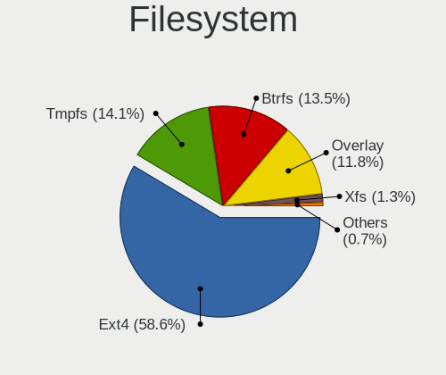
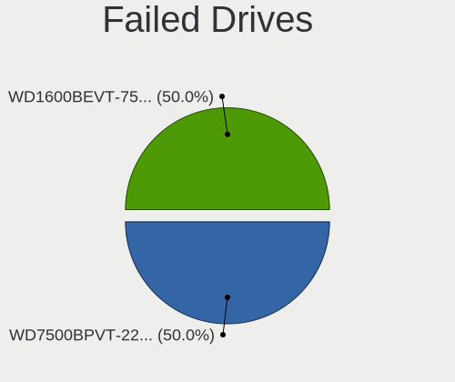
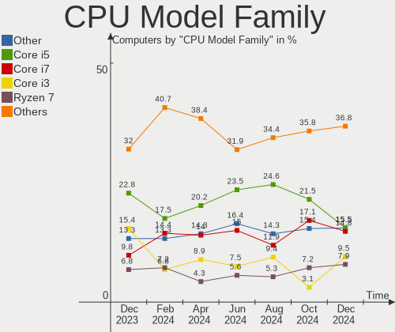
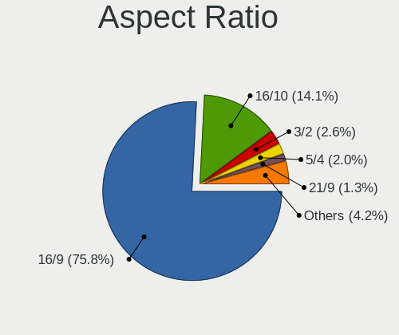
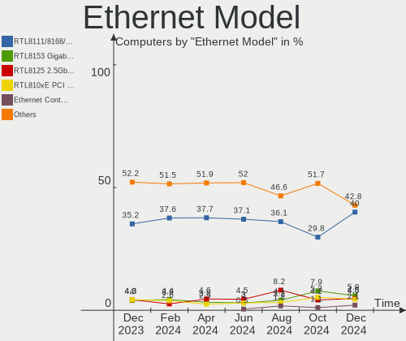
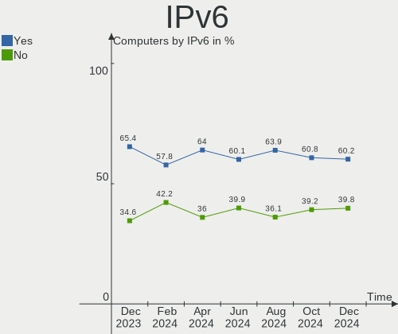
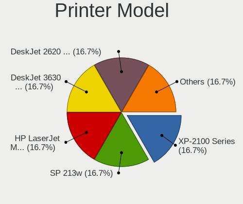
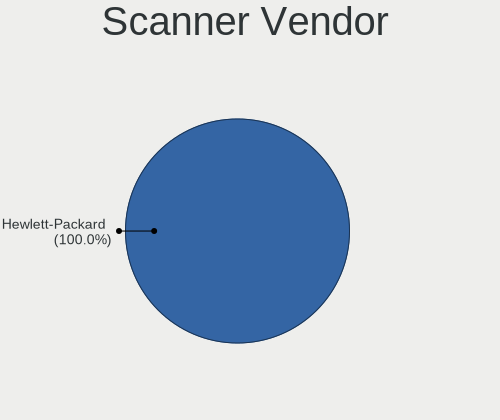
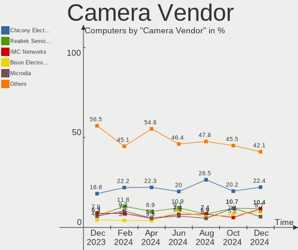

Linux in France - Hardware Trends
---------------------------------

A project to identify most popular hardware characteristics and track their change
over time based on data collected by Linux users at https://Linux-Hardware.org.

Anyone can contribute to this report by the [hw-probe](https://github.com/linuxhw/hw-probe) tool:

    sudo -E hw-probe -all -upload

This is a report for all computer types. See also reports for [desktops](/Location/France/Desktop/README.md) and [notebooks](/Location/France/Notebook/README.md).

Period: Feb, 2023.

Contents
--------

* [ System ](#system)
  - [ OS                       ](#os)
  - [ OS Family                ](#os-family)
  - [ Kernel                   ](#kernel)
  - [ Kernel Family            ](#kernel-family)
  - [ Kernel Major Ver.        ](#kernel-major-ver)
  - [ Arch                     ](#arch)
  - [ DE                       ](#de)
  - [ Display Server           ](#display-server)
  - [ Display Manager          ](#display-manager)
  - [ OS Lang                  ](#os-lang)
  - [ Boot Mode                ](#boot-mode)
  - [ Filesystem               ](#filesystem)
  - [ Part. scheme             ](#part-scheme)
  - [ Dual Boot with Linux/BSD ](#dual-boot-with-linuxbsd)
  - [ Dual Boot (Win)          ](#dual-boot-win)

* [ Board ](#board)
  - [ Vendor                   ](#vendor)
  - [ Model                    ](#model)
  - [ Model Family             ](#model-family)
  - [ MFG Year                 ](#mfg-year)
  - [ Form Factor              ](#form-factor)
  - [ Secure Boot              ](#secure-boot)
  - [ Coreboot                 ](#coreboot)
  - [ RAM Size                 ](#ram-size)
  - [ RAM Used                 ](#ram-used)
  - [ Total Drives             ](#total-drives)
  - [ Has CD-ROM               ](#has-cd-rom)
  - [ Has Ethernet             ](#has-ethernet)
  - [ Has WiFi                 ](#has-wifi)
  - [ Has Bluetooth            ](#has-bluetooth)

* [ Location ](#location)
  - [ Country                  ](#country)
  - [ City                     ](#city)

* [ Drives ](#drives)
  - [ Drive Vendor             ](#drive-vendor)
  - [ Drive Model              ](#drive-model)
  - [ HDD Vendor               ](#hdd-vendor)
  - [ SSD Vendor               ](#ssd-vendor)
  - [ Drive Kind               ](#drive-kind)
  - [ Drive Connector          ](#drive-connector)
  - [ Drive Size               ](#drive-size)
  - [ Space Total              ](#space-total)
  - [ Space Used               ](#space-used)
  - [ Malfunc. Drives          ](#malfunc-drives)
  - [ Malfunc. Drive Vendor    ](#malfunc-drive-vendor)
  - [ Malfunc. HDD Vendor      ](#malfunc-hdd-vendor)
  - [ Malfunc. Drive Kind      ](#malfunc-drive-kind)
  - [ Failed Drives            ](#failed-drives)
  - [ Failed Drive Vendor      ](#failed-drive-vendor)
  - [ Drive Status             ](#drive-status)

* [ Storage controller ](#storage-controller)
  - [ Storage Vendor           ](#storage-vendor)
  - [ Storage Model            ](#storage-model)
  - [ Storage Kind             ](#storage-kind)

* [ Processor ](#processor)
  - [ CPU Vendor               ](#cpu-vendor)
  - [ CPU Model                ](#cpu-model)
  - [ CPU Model Family         ](#cpu-model-family)
  - [ CPU Cores                ](#cpu-cores)
  - [ CPU Sockets              ](#cpu-sockets)
  - [ CPU Threads              ](#cpu-threads)
  - [ CPU Op-Modes             ](#cpu-op-modes)
  - [ CPU Microcode            ](#cpu-microcode)
  - [ CPU Microarch            ](#cpu-microarch)

* [ Graphics ](#graphics)
  - [ GPU Vendor               ](#gpu-vendor)
  - [ GPU Model                ](#gpu-model)
  - [ GPU Combo                ](#gpu-combo)
  - [ GPU Driver               ](#gpu-driver)
  - [ GPU Memory               ](#gpu-memory)

* [ Monitor ](#monitor)
  - [ Monitor Vendor           ](#monitor-vendor)
  - [ Monitor Model            ](#monitor-model)
  - [ Monitor Resolution       ](#monitor-resolution)
  - [ Monitor Diagonal         ](#monitor-diagonal)
  - [ Monitor Width            ](#monitor-width)
  - [ Aspect Ratio             ](#aspect-ratio)
  - [ Monitor Area             ](#monitor-area)
  - [ Pixel Density            ](#pixel-density)
  - [ Multiple Monitors        ](#multiple-monitors)

* [ Network ](#network)
  - [ Net Controller Vendor    ](#net-controller-vendor)
  - [ Net Controller Model     ](#net-controller-model)
  - [ Wireless Vendor          ](#wireless-vendor)
  - [ Wireless Model           ](#wireless-model)
  - [ Ethernet Vendor          ](#ethernet-vendor)
  - [ Ethernet Model           ](#ethernet-model)
  - [ Net Controller Kind      ](#net-controller-kind)
  - [ Used Controller          ](#used-controller)
  - [ NICs                     ](#nics)
  - [ IPv6                     ](#ipv6)

* [ Bluetooth ](#bluetooth)
  - [ Bluetooth Vendor         ](#bluetooth-vendor)
  - [ Bluetooth Model          ](#bluetooth-model)

* [ Sound ](#sound)
  - [ Sound Vendor             ](#sound-vendor)
  - [ Sound Model              ](#sound-model)

* [ Memory ](#memory)
  - [ Memory Vendor            ](#memory-vendor)
  - [ Memory Model             ](#memory-model)
  - [ Memory Kind              ](#memory-kind)
  - [ Memory Form Factor       ](#memory-form-factor)
  - [ Memory Size              ](#memory-size)
  - [ Memory Speed             ](#memory-speed)

* [ Printers & scanners ](#printers--scanners)
  - [ Printer Vendor           ](#printer-vendor)
  - [ Printer Model            ](#printer-model)
  - [ Scanner Vendor           ](#scanner-vendor)
  - [ Scanner Model            ](#scanner-model)

* [ Camera ](#camera)
  - [ Camera Vendor            ](#camera-vendor)
  - [ Camera Model             ](#camera-model)

* [ Security ](#security)
  - [ Fingerprint Vendor       ](#fingerprint-vendor)
  - [ Fingerprint Model        ](#fingerprint-model)
  - [ Chipcard Vendor          ](#chipcard-vendor)
  - [ Chipcard Model           ](#chipcard-model)

* [ Unsupported ](#unsupported)
  - [ Unsupported Devices      ](#unsupported-devices)
  - [ Unsupported Device Types ](#unsupported-device-types)

System
------

OS
--

Installed operating systems

| Name                | Computers | Percent |
|---------------------|-----------|---------|
| Ubuntu 22.04        | 52        | 17.39%  |
| OpenMandriva 23.01  | 34        | 11.37%  |
| Debian 11           | 21        | 7.02%   |
| Linux Mint 21.1     | 17        | 5.69%   |
| OpenMandriva 4.3    | 16        | 5.35%   |
| Ubuntu 20.04        | 14        | 4.68%   |
| Fedora 37           | 12        | 4.01%   |
| Ubuntu 22.10        | 10        | 3.34%   |
| Arch Rolling        | 10        | 3.34%   |
| Debian              | 7         | 2.34%   |
| Pop!_OS 22.04       | 6         | 2.01%   |
| OpenMandriva 4.2    | 6         | 2.01%   |
| Xubuntu 22.04       | 5         | 1.67%   |
| Lubuntu 22.04       | 5         | 1.67%   |
| KDE neon 22.04      | 5         | 1.67%   |
| Elementary 7        | 5         | 1.67%   |
| Zorin 16            | 4         | 1.34%   |
| Ubuntu 23.04        | 4         | 1.34%   |
| Linux Mint 21       | 4         | 1.34%   |
| Kubuntu 22.04       | 4         | 1.34%   |
| Xubuntu 18.04       | 3         | 1%      |
| Ubuntu MATE 22.04   | 3         | 1%      |
| Linux Mint 20.3     | 3         | 1%      |
| Kubuntu 22.10       | 3         | 1%      |
| Ubuntu Unity 22.04  | 2         | 0.67%   |
| ROSA 12.2           | 2         | 0.67%   |
| Manjaro 22.0.2      | 2         | 0.67%   |
| Gentoo 2.9          | 2         | 0.67%   |
| Gentoo 2.13         | 2         | 0.67%   |
| Fedora 35           | 2         | 0.67%   |
| CentOS 7            | 2         | 0.67%   |
| ArcoLinux Rolling   | 2         | 0.67%   |
| Xubuntu 22.10       | 1         | 0.33%   |
| Xubuntu 20.04       | 1         | 0.33%   |
| Void Linux Rolling  | 1         | 0.33%   |
| Ubuntu MATE 20.04   | 1         | 0.33%   |
| Ubuntu MATE 18.04   | 1         | 0.33%   |
| Ubuntu Budgie 22.10 | 1         | 0.33%   |
| Ubuntu Budgie 22.04 | 1         | 0.33%   |
| Ubuntu Budgie 20.04 | 1         | 0.33%   |

OS Family
---------

OS without a version

| Name          | Computers | Percent |
|---------------|-----------|---------|
| Ubuntu        | 83        | 27.76%  |
| OpenMandriva  | 57        | 19.06%  |
| Debian        | 28        | 9.36%   |
| Linux Mint    | 26        | 8.7%    |
| Fedora        | 15        | 5.02%   |
| Xubuntu       | 10        | 3.34%   |
| Arch          | 10        | 3.34%   |
| Kubuntu       | 8         | 2.68%   |
| Pop!_OS       | 6         | 2.01%   |
| Lubuntu       | 6         | 2.01%   |
| Ubuntu MATE   | 5         | 1.67%   |
| KDE neon      | 5         | 1.67%   |
| Gentoo        | 5         | 1.67%   |
| Elementary    | 5         | 1.67%   |
| Zorin         | 4         | 1.34%   |
| Manjaro       | 4         | 1.34%   |
| Ubuntu Budgie | 3         | 1%      |
| ROSA          | 3         | 1%      |
| Ubuntu Unity  | 2         | 0.67%   |
| CentOS        | 2         | 0.67%   |
| ArcoLinux     | 2         | 0.67%   |
| Void Linux    | 1         | 0.33%   |
| SteamOS       | 1         | 0.33%   |
| Rocky Linux   | 1         | 0.33%   |
| Raspbian      | 1         | 0.33%   |
| openSUSE      | 1         | 0.33%   |
| MX            | 1         | 0.33%   |
| Manjaro-ARM   | 1         | 0.33%   |
| LMDE          | 1         | 0.33%   |
| Kali          | 1         | 0.33%   |
| Athena        | 1         | 0.33%   |

Kernel
------

Version of the Linux kernel

| Version                            | Computers | Percent |
|------------------------------------|-----------|---------|
| 5.15.0-60-generic                  | 38        | 12.71%  |
| 5.15.0-58-generic                  | 37        | 12.37%  |
| 5.19.0-32-generic                  | 25        | 8.36%   |
| 6.1.1-desktop-1omv2290             | 24        | 8.03%   |
| 5.16.13-desktop-1omv4003           | 10        | 3.34%   |
| 5.10.0-21-amd64                    | 10        | 3.34%   |
| 6.1.4-desktop-1omv2301             | 8         | 2.68%   |
| 5.4.0-137-generic                  | 8         | 2.68%   |
| 5.19.0-31-generic                  | 7         | 2.34%   |
| 5.19.0-29-generic                  | 6         | 2.01%   |
| 5.16.7-desktop-1omv4003            | 6         | 2.01%   |
| 5.15.0-43-generic                  | 6         | 2.01%   |
| 6.1.0-3-amd64                      | 5         | 1.67%   |
| 5.10.14-desktop-1omv4002           | 5         | 1.67%   |
| 6.1.12-zen1-1-zen                  | 4         | 1.34%   |
| 6.0.12-76060006-generic            | 4         | 1.34%   |
| 5.4.0-139-generic                  | 4         | 1.34%   |
| 6.1.8-200.fc37.x86_64              | 3         | 1%      |
| 6.1.11-200.fc37.x86_64             | 3         | 1%      |
| 6.0.7-301.fc37.x86_64              | 3         | 1%      |
| 6.2.1-060201-generic               | 2         | 0.67%   |
| 6.1.9-gentoo-dist                  | 2         | 0.67%   |
| 6.1.9-200.fc37.x86_64              | 2         | 0.67%   |
| 6.1.9-1-MANJARO                    | 2         | 0.67%   |
| 6.1.12-arch1-1                     | 2         | 0.67%   |
| 6.1.11-76060111-generic            | 2         | 0.67%   |
| 6.0.12-100.fc35.x86_64             | 2         | 0.67%   |
| 5.19.0-21-generic                  | 2         | 0.67%   |
| 5.15.0-60-lowlatency               | 2         | 0.67%   |
| 5.15.0-56-generic                  | 2         | 0.67%   |
| 5.15.0-53-generic                  | 2         | 0.67%   |
| 5.13.0-52-generic                  | 2         | 0.67%   |
| 5.11.12-desktop-1omv4002           | 2         | 0.67%   |
| 5.10.74-generic-2rosa2021.1-x86_64 | 2         | 0.67%   |
| 5.10.0-20-amd64                    | 2         | 0.67%   |
| 5.10.0-19-amd64                    | 2         | 0.67%   |
| 6.2.1-gentoo-y                     | 1         | 0.33%   |
| 6.2.1-desktop-1omv2390             | 1         | 0.33%   |
| 6.1.9-arch1-1                      | 1         | 0.33%   |
| 6.1.9-273-tkg-cfs                  | 1         | 0.33%   |

Kernel Family
-------------

Linux kernel without a distro release

| Version | Computers | Percent |
|---------|-----------|---------|
| 5.15.0  | 90        | 30.1%   |
| 5.19.0  | 41        | 13.71%  |
| 6.1.1   | 24        | 8.03%   |
| 5.10.0  | 16        | 5.35%   |
| 5.4.0   | 12        | 4.01%   |
| 5.16.13 | 10        | 3.34%   |
| 6.1.9   | 9         | 3.01%   |
| 6.1.11  | 9         | 3.01%   |
| 6.1.4   | 8         | 2.68%   |
| 6.1.12  | 7         | 2.34%   |
| 6.1.0   | 7         | 2.34%   |
| 6.0.12  | 6         | 2.01%   |
| 5.16.7  | 6         | 2.01%   |
| 6.1.8   | 5         | 1.67%   |
| 5.10.14 | 5         | 1.67%   |
| 6.2.1   | 4         | 1.34%   |
| 6.0.0   | 4         | 1.34%   |
| 5.13.0  | 4         | 1.34%   |
| 6.1.10  | 3         | 1%      |
| 6.0.7   | 3         | 1%      |
| 6.1.7   | 2         | 0.67%   |
| 5.15.94 | 2         | 0.67%   |
| 5.14.0  | 2         | 0.67%   |
| 5.11.12 | 2         | 0.67%   |
| 5.10.74 | 2         | 0.67%   |
| 4.15.0  | 2         | 0.67%   |
| 3.10.0  | 2         | 0.67%   |
| 5.8.0   | 1         | 0.33%   |
| 5.19.5  | 1         | 0.33%   |
| 5.17.5  | 1         | 0.33%   |
| 5.17.0  | 1         | 0.33%   |
| 5.15.93 | 1         | 0.33%   |
| 5.15.89 | 1         | 0.33%   |
| 5.15.88 | 1         | 0.33%   |
| 5.15.84 | 1         | 0.33%   |
| 5.15.76 | 1         | 0.33%   |
| 5.11.0  | 1         | 0.33%   |
| 5.10.43 | 1         | 0.33%   |
| 4.9.155 | 1         | 0.33%   |

Kernel Major Ver.
-----------------

Linux kernel major version

| Version | Computers | Percent |
|---------|-----------|---------|
| 5.15    | 97        | 32.44%  |
| 6.1     | 74        | 24.75%  |
| 5.19    | 42        | 14.05%  |
| 5.10    | 24        | 8.03%   |
| 5.16    | 16        | 5.35%   |
| 6.0     | 13        | 4.35%   |
| 5.4     | 12        | 4.01%   |
| 6.2     | 4         | 1.34%   |
| 5.13    | 4         | 1.34%   |
| 5.11    | 3         | 1%      |
| 5.17    | 2         | 0.67%   |
| 5.14    | 2         | 0.67%   |
| 4.15    | 2         | 0.67%   |
| 3.10    | 2         | 0.67%   |
| 5.8     | 1         | 0.33%   |
| 4.9     | 1         | 0.33%   |

Arch
----

OS architecture (x86_64, i586, etc.)

| Name    | Computers | Percent |
|---------|-----------|---------|
| x86_64  | 292       | 97.66%  |
| i686    | 3         | 1%      |
| aarch64 | 3         | 1%      |
| armv7l  | 1         | 0.33%   |

DE
--

Desktop Environment

| Name       | Computers | Percent |
|------------|-----------|---------|
| GNOME      | 127       | 42.47%  |
| KDE5       | 83        | 27.76%  |
| XFCE       | 21        | 7.02%   |
| X-Cinnamon | 19        | 6.35%   |
| MATE       | 12        | 4.01%   |
| LXQt       | 10        | 3.34%   |
| Unknown    | 8         | 2.68%   |
| Pantheon   | 5         | 1.67%   |
| Budgie     | 4         | 1.34%   |
| Unity      | 2         | 0.67%   |
| LXDE       | 2         | 0.67%   |
| KDE4       | 2         | 0.67%   |
| Cinnamon   | 2         | 0.67%   |
| sway       | 1         | 0.33%   |
| Hyprland   | 1         | 0.33%   |

Display Server
--------------

X11 or Wayland

| Name    | Computers | Percent |
|---------|-----------|---------|
| X11     | 202       | 67.56%  |
| Wayland | 82        | 27.42%  |
| Tty     | 11        | 3.68%   |
| Unknown | 4         | 1.34%   |

Display Manager
---------------

SDDM, LightDM, etc.

| Name    | Computers | Percent |
|---------|-----------|---------|
| SDDM    | 87        | 29.1%   |
| GDM3    | 75        | 25.08%  |
| Unknown | 57        | 19.06%  |
| LightDM | 42        | 14.05%  |
| GDM     | 35        | 11.71%  |
| Ly      | 1         | 0.33%   |
| LXDM    | 1         | 0.33%   |
| KDM     | 1         | 0.33%   |

OS Lang
-------

Language

| Lang    | Computers | Percent |
|---------|-----------|---------|
| fr_FR   | 231       | 77.26%  |
| en_US   | 50        | 16.72%  |
| en_GB   | 8         | 2.68%   |
| C       | 5         | 1.67%   |
| pl_PL   | 1         | 0.33%   |
| fr_CH   | 1         | 0.33%   |
| es_ES   | 1         | 0.33%   |
| de_DE   | 1         | 0.33%   |
| Default | 1         | 0.33%   |

Boot Mode
---------

EFI or BIOS

| Mode | Computers | Percent |
|------|-----------|---------|
| EFI  | 181       | 60.54%  |
| BIOS | 118       | 39.46%  |

Filesystem
----------

Type of filesystem

| Type    | Computers | Percent |
|---------|-----------|---------|
| Ext4    | 245       | 81.94%  |
| Overlay | 25        | 8.36%   |
| Btrfs   | 22        | 7.36%   |
| Xfs     | 3         | 1%      |
| Zfs     | 2         | 0.67%   |
| Tmpfs   | 1         | 0.33%   |
| Jfs     | 1         | 0.33%   |

Part. scheme
------------

Scheme of partitioning

| Type    | Computers | Percent |
|---------|-----------|---------|
| GPT     | 199       | 66.56%  |
| MBR     | 50        | 16.72%  |
| Unknown | 50        | 16.72%  |

Dual Boot with Linux/BSD
------------------------

Hosting more than one Linux/BSD

| Dual boot | Computers | Percent |
|-----------|-----------|---------|
| No        | 243       | 81.27%  |
| Yes       | 56        | 18.73%  |

Dual Boot (Win)
---------------

Hosting Linux and Windows

| Dual boot | Computers | Percent |
|-----------|-----------|---------|
| No        | 208       | 69.57%  |
| Yes       | 91        | 30.43%  |

Board
-----

Vendor
------

Motherboard manufacturer

| Name                        | Computers | Percent |
|-----------------------------|-----------|---------|
| ASUSTek Computer            | 58        | 19.4%   |
| Lenovo                      | 42        | 14.05%  |
| Dell                        | 41        | 13.71%  |
| Hewlett-Packard             | 33        | 11.04%  |
| MSI                         | 26        | 8.7%    |
| Gigabyte Technology         | 15        | 5.02%   |
| Acer                        | 13        | 4.35%   |
| ASRock                      | 9         | 3.01%   |
| Apple                       | 7         | 2.34%   |
| Toshiba                     | 6         | 2.01%   |
| Sony                        | 6         | 2.01%   |
| Notebook                    | 4         | 1.34%   |
| Raspberry Pi Foundation     | 3         | 1%      |
| Intel                       | 3         | 1%      |
| HUAWEI                      | 3         | 1%      |
| TUXEDO                      | 2         | 0.67%   |
| Supermicro                  | 2         | 0.67%   |
| Pegatron                    | 2         | 0.67%   |
| Packard Bell                | 2         | 0.67%   |
| Google                      | 2         | 0.67%   |
| Foxconn                     | 2         | 0.67%   |
| Valve                       | 1         | 0.33%   |
| Timi                        | 1         | 0.33%   |
| Thomson                     | 1         | 0.33%   |
| T-bao                       | 1         | 0.33%   |
| Shenzhen Wangang Technology | 1         | 0.33%   |
| Pine Microsystems           | 1         | 0.33%   |
| IP3 Tech                    | 1         | 0.33%   |
| HONOR                       | 1         | 0.33%   |
| Fujitsu Siemens             | 1         | 0.33%   |
| Fujitsu                     | 1         | 0.33%   |
| Fanless Mini PC             | 1         | 0.33%   |
| EXTRA Computer              | 1         | 0.33%   |
| eMachines                   | 1         | 0.33%   |
| Chuwi                       | 1         | 0.33%   |
| AZW                         | 1         | 0.33%   |
| ASRockRack                  | 1         | 0.33%   |
| Alienware                   | 1         | 0.33%   |
| Unknown                     | 1         | 0.33%   |

Model
-----

Motherboard model

| Name                                    | Computers | Percent |
|-----------------------------------------|-----------|---------|
| Dell Precision 5570                     | 6         | 2.01%   |
| ASUS All Series                         | 5         | 1.67%   |
| MSI MS-7B84                             | 3         | 1%      |
| RPi Raspberry Pi 4 Model B Rev 1.2      | 2         | 0.67%   |
| Lenovo G50-80 80E5                      | 2         | 0.67%   |
| HP Victus by Laptop 16-e0xxx            | 2         | 0.67%   |
| HP Pavilion 17                          | 2         | 0.67%   |
| Dell Latitude 5400                      | 2         | 0.67%   |
| ASUS ZenBook UX562FD_UX562FD            | 2         | 0.67%   |
| ASUS TUF Gaming B550-PLUS               | 2         | 0.67%   |
| ASUS S551LN                             | 2         | 0.67%   |
| Valve Jupiter                           | 1         | 0.33%   |
| TUXEDO Pulse 15 Gen1                    | 1         | 0.33%   |
| TUXEDO InfinityBook S 14 Gen6           | 1         | 0.33%   |
| Toshiba TECRA R850                      | 1         | 0.33%   |
| Toshiba Satellite Pro R50-B             | 1         | 0.33%   |
| Toshiba Satellite L655                  | 1         | 0.33%   |
| Toshiba Satellite C870-196              | 1         | 0.33%   |
| Toshiba Satellite C70-C-18E             | 1         | 0.33%   |
| Toshiba Satellite C660                  | 1         | 0.33%   |
| Timi TM1701                             | 1         | 0.33%   |
| Thomson N17V3C4WH128                    | 1         | 0.33%   |
| T-bao MINI PC                           | 1         | 0.33%   |
| Supermicro X9DAi                        | 1         | 0.33%   |
| Supermicro X7DCL                        | 1         | 0.33%   |
| Sony VPCEH1E1E                          | 1         | 0.33%   |
| Sony VGN-Z31MN_B                        | 1         | 0.33%   |
| Sony VGN-NW21MF_W                       | 1         | 0.33%   |
| Sony VGN-NS38E_S                        | 1         | 0.33%   |
| Sony SVE1513U1ESI                       | 1         | 0.33%   |
| Sony SVE1513B1EW                        | 1         | 0.33%   |
| Shenzhen Wangang AERO 3                 | 1         | 0.33%   |
| RPi Raspberry Pi 3 Model A Plus Rev 1.0 | 1         | 0.33%   |
| Pine Microsystems Pine64 PinePhonePro   | 1         | 0.33%   |
| Pegatron h8-1350ef                      | 1         | 0.33%   |
| Pegatron Compaq dx2400 Microtower PC    | 1         | 0.33%   |
| Packard Bell ONETWO L5700               | 1         | 0.33%   |
| Packard Bell IMEDIA S3840               | 1         | 0.33%   |
| Notebook NLx0MU                         | 1         | 0.33%   |
| Notebook NL5xNU                         | 1         | 0.33%   |

Model Family
------------

Motherboard model prefix

| Name                | Computers | Percent |
|---------------------|-----------|---------|
| Lenovo ThinkPad     | 19        | 6.35%   |
| Dell Precision      | 13        | 4.35%   |
| Dell Latitude       | 8         | 2.68%   |
| Lenovo ThinkCentre  | 6         | 2.01%   |
| HP Pavilion         | 6         | 2.01%   |
| Acer Aspire         | 6         | 2.01%   |
| Toshiba Satellite   | 5         | 1.67%   |
| Lenovo Yoga         | 5         | 1.67%   |
| HP Laptop           | 5         | 1.67%   |
| Dell OptiPlex       | 5         | 1.67%   |
| Dell Inspiron       | 5         | 1.67%   |
| ASUS VivoBook       | 5         | 1.67%   |
| ASUS PRIME          | 5         | 1.67%   |
| ASUS All            | 5         | 1.67%   |
| Lenovo IdeaPad      | 4         | 1.34%   |
| HP EliteBook        | 4         | 1.34%   |
| HP Compaq           | 4         | 1.34%   |
| Dell XPS            | 4         | 1.34%   |
| RPi Raspberry       | 3         | 1%      |
| MSI MS-7B84         | 3         | 1%      |
| Lenovo G50-80       | 3         | 1%      |
| ASUS ZenBook        | 3         | 1%      |
| ASUS ROG            | 3         | 1%      |
| Acer Nitro          | 3         | 1%      |
| Lenovo Legion       | 2         | 0.67%   |
| HP Victus           | 2         | 0.67%   |
| HP Spectre          | 2         | 0.67%   |
| HP ProDesk          | 2         | 0.67%   |
| HP ENVY             | 2         | 0.67%   |
| Dell Vostro         | 2         | 0.67%   |
| Dell PowerEdge      | 2         | 0.67%   |
| ASUS TUF            | 2         | 0.67%   |
| ASUS S551LN         | 2         | 0.67%   |
| ASUS ASUS           | 2         | 0.67%   |
| Apple MacBookPro9   | 2         | 0.67%   |
| Valve Jupiter       | 1         | 0.33%   |
| TUXEDO Pulse        | 1         | 0.33%   |
| TUXEDO InfinityBook | 1         | 0.33%   |
| Toshiba TECRA       | 1         | 0.33%   |
| Timi TM1701         | 1         | 0.33%   |

MFG Year
--------

Motherboard manufacture year

| Year    | Computers | Percent |
|---------|-----------|---------|
| 2022    | 31        | 10.37%  |
| 2021    | 30        | 10.03%  |
| 2012    | 28        | 9.36%   |
| 2020    | 25        | 8.36%   |
| 2019    | 22        | 7.36%   |
| 2018    | 22        | 7.36%   |
| 2017    | 19        | 6.35%   |
| 2014    | 19        | 6.35%   |
| 2015    | 18        | 6.02%   |
| 2016    | 17        | 5.69%   |
| 2013    | 15        | 5.02%   |
| 2011    | 15        | 5.02%   |
| 2010    | 11        | 3.68%   |
| 2009    | 7         | 2.34%   |
| 2008    | 7         | 2.34%   |
| 2006    | 5         | 1.67%   |
| Unknown | 4         | 1.34%   |
| 2007    | 3         | 1%      |
| 2023    | 1         | 0.33%   |

Form Factor
-----------

Physical design of the computer

| Name           | Computers | Percent |
|----------------|-----------|---------|
| Notebook       | 156       | 52.17%  |
| Desktop        | 115       | 38.46%  |
| Convertible    | 12        | 4.01%   |
| Mini pc        | 6         | 2.01%   |
| All in one     | 4         | 1.34%   |
| System on chip | 3         | 1%      |
| Server         | 2         | 0.67%   |
| Phone          | 1         | 0.33%   |

Secure Boot
-----------

Enabled or disabled

| State    | Computers | Percent |
|----------|-----------|---------|
| Disabled | 273       | 91.3%   |
| Enabled  | 26        | 8.7%    |

Coreboot
--------

Have coreboot on board

| Used | Computers | Percent |
|------|-----------|---------|
| No   | 297       | 99.33%  |
| Yes  | 2         | 0.67%   |

RAM Size
--------

Total RAM memory

| Size in GB      | Computers | Percent |
|-----------------|-----------|---------|
| 16.01-24.0      | 70        | 23.41%  |
| 4.01-8.0        | 62        | 20.74%  |
| 8.01-16.0       | 60        | 20.07%  |
| 3.01-4.0        | 50        | 16.72%  |
| 32.01-64.0      | 23        | 7.69%   |
| 64.01-256.0     | 13        | 4.35%   |
| 1.01-2.0        | 9         | 3.01%   |
| 24.01-32.0      | 8         | 2.68%   |
| More than 256.0 | 1         | 0.33%   |
| 2.01-3.0        | 1         | 0.33%   |
| 0.51-1.0        | 1         | 0.33%   |
| 0.01-0.5        | 1         | 0.33%   |

RAM Used
--------

Used RAM memory

| Used GB    | Computers | Percent |
|------------|-----------|---------|
| 1.01-2.0   | 99        | 33.11%  |
| 2.01-3.0   | 80        | 26.76%  |
| 3.01-4.0   | 47        | 15.72%  |
| 4.01-8.0   | 39        | 13.04%  |
| 0.51-1.0   | 14        | 4.68%   |
| 8.01-16.0  | 13        | 4.35%   |
| 0.01-0.5   | 4         | 1.34%   |
| 16.01-24.0 | 3         | 1%      |

Total Drives
------------

Number of drives on board

| Drives | Computers | Percent |
|--------|-----------|---------|
| 1      | 181       | 60.54%  |
| 2      | 73        | 24.41%  |
| 3      | 22        | 7.36%   |
| 4      | 10        | 3.34%   |
| 5      | 4         | 1.34%   |
| 0      | 3         | 1%      |
| 8      | 2         | 0.67%   |
| 6      | 2         | 0.67%   |
| 21     | 1         | 0.33%   |
| 7      | 1         | 0.33%   |

Has CD-ROM
----------

Has CD-ROM on board

| Presented | Computers | Percent |
|-----------|-----------|---------|
| No        | 170       | 56.86%  |
| Yes       | 129       | 43.14%  |

Has Ethernet
------------

Has Ethernet on board

| Presented | Computers | Percent |
|-----------|-----------|---------|
| Yes       | 247       | 82.61%  |
| No        | 52        | 17.39%  |

Has WiFi
--------

Has WiFi module

| Presented | Computers | Percent |
|-----------|-----------|---------|
| Yes       | 217       | 72.58%  |
| No        | 82        | 27.42%  |

Has Bluetooth
-------------

Has Bluetooth module

| Presented | Computers | Percent |
|-----------|-----------|---------|
| Yes       | 176       | 58.86%  |
| No        | 123       | 41.14%  |

Location
--------

Country
-------

Geographic location (country)

| Country | Computers | Percent |
|---------|-----------|---------|
| France  | 299       | 100%    |

City
----

Geographic location (city)

| City               | Computers | Percent |
|--------------------|-----------|---------|
| Paris              | 42        | 14.05%  |
| Marseille          | 6         | 2.01%   |
| Toulouse           | 5         | 1.67%   |
| Lyon               | 5         | 1.67%   |
| Grenoble           | 5         | 1.67%   |
| Roubaix            | 4         | 1.34%   |
| Houilles           | 4         | 1.34%   |
| Versailles         | 3         | 1%      |
| Tours              | 3         | 1%      |
| Rennes             | 3         | 1%      |
| Nice               | 3         | 1%      |
| Narbonne           | 3         | 1%      |
| Brest              | 3         | 1%      |
| Antibes            | 3         | 1%      |
| Villeneuve-d'Ascq  | 2         | 0.67%   |
| Villefontaine      | 2         | 0.67%   |
| Vesoul             | 2         | 0.67%   |
| Tremblay-en-France | 2         | 0.67%   |
| Sartrouville       | 2         | 0.67%   |
| Saint-Nazaire      | 2         | 0.67%   |
| Nanterre           | 2         | 0.67%   |
| Montpellier        | 2         | 0.67%   |
| Mont-de-Marsan     | 2         | 0.67%   |
| Melun              | 2         | 0.67%   |
| Maizieres-les-Metz | 2         | 0.67%   |
| Luce               | 2         | 0.67%   |
| Langon             | 2         | 0.67%   |
| Lahontan           | 2         | 0.67%   |
| Forges-les-Eaux    | 2         | 0.67%   |
| Corbere            | 2         | 0.67%   |
| Cognac             | 2         | 0.67%   |
| Châtenay-Malabry  | 2         | 0.67%   |
| Cenon-sur-Vienne   | 2         | 0.67%   |
| Bordeaux           | 2         | 0.67%   |
| Aubagne            | 2         | 0.67%   |
| Argenteuil         | 2         | 0.67%   |
| Angers             | 2         | 0.67%   |
| Wasquehal          | 1         | 0.33%   |
| Villeurbanne       | 1         | 0.33%   |
| Villemur-sur-Tarn  | 1         | 0.33%   |

Drives
------

Drive Vendor
------------

Hard drive vendors

| Vendor                       | Computers | Drives | Percent |
|------------------------------|-----------|--------|---------|
| Samsung Electronics          | 72        | 78     | 16.36%  |
| Seagate                      | 63        | 76     | 14.32%  |
| WDC                          | 55        | 80     | 12.5%   |
| Crucial                      | 36        | 39     | 8.18%   |
| Sandisk                      | 23        | 25     | 5.23%   |
| Toshiba                      | 22        | 26     | 5%      |
| Kingston                     | 20        | 21     | 4.55%   |
| Unknown                      | 15        | 16     | 3.41%   |
| SK hynix                     | 15        | 15     | 3.41%   |
| Micron Technology            | 13        | 13     | 2.95%   |
| Intel                        | 12        | 13     | 2.73%   |
| Hitachi                      | 11        | 11     | 2.5%    |
| PNY                          | 8         | 8      | 1.82%   |
| HGST                         | 6         | 7      | 1.36%   |
| LDLC                         | 5         | 6      | 1.14%   |
| China                        | 5         | 5      | 1.14%   |
| SPCC                         | 4         | 4      | 0.91%   |
| Kingston Technology Company  | 4         | 4      | 0.91%   |
| JMicron Technology           | 4         | 4      | 0.91%   |
| Phison Electronics           | 3         | 3      | 0.68%   |
| Maxtor                       | 3         | 3      | 0.68%   |
| LITEONIT                     | 3         | 3      | 0.68%   |
| KIOXIA                       | 3         | 3      | 0.68%   |
| Corsair                      | 3         | 3      | 0.68%   |
| Apple                        | 3         | 3      | 0.68%   |
| Transcend                    | 2         | 2      | 0.45%   |
| Silicon Motion               | 2         | 2      | 0.45%   |
| Plextor                      | 2         | 2      | 0.45%   |
| Micron/Crucial Technology    | 2         | 2      | 0.45%   |
| LITEON                       | 2         | 2      | 0.45%   |
| Hewlett-Packard              | 2         | 2      | 0.45%   |
| SSSTC                        | 1         | 1      | 0.23%   |
| Shenzhen Longsys Electronics | 1         | 2      | 0.23%   |
| SFAS                         | 1         | 1      | 0.23%   |
| Phison                       | 1         | 1      | 0.23%   |
| OCZ-VERTEX3                  | 1         | 1      | 0.23%   |
| NT-2TB                       | 1         | 1      | 0.23%   |
| Lite-On Technology           | 1         | 1      | 0.23%   |
| Integral                     | 1         | 1      | 0.23%   |
| Hikvision                    | 1         | 1      | 0.23%   |

Drive Model
-----------

Hard drive models

| Model                                               | Computers | Percent |
|-----------------------------------------------------|-----------|---------|
| Crucial CT240BX500SSD1 240GB                        | 11        | 2.32%   |
| Seagate ST500DM002-1BD142 500GB                     | 5         | 1.05%   |
| Sandisk WD Black SN750 / PC SN730 NVMe SSD 512GB    | 5         | 1.05%   |
| Samsung SSD 980 1TB                                 | 5         | 1.05%   |
| Samsung NVMe SSD Controller SM981/PM981/PM983 250GB | 5         | 1.05%   |
| Unknown MMC Card  128GB                             | 4         | 0.84%   |
| Samsung SSD 850 EVO 500GB                           | 4         | 0.84%   |
| Samsung SSD 850 EVO 250GB                           | 4         | 0.84%   |
| Samsung PM9A1 NVMe 1024GB                           | 4         | 0.84%   |
| Kingston SA400S37240G 240GB SSD                     | 4         | 0.84%   |
| Unknown MMC Card  32GB                              | 3         | 0.63%   |
| SPCC Solid State Disk 512GB                         | 3         | 0.63%   |
| Seagate ST2000LM015-2E8174 2TB                      | 3         | 0.63%   |
| Seagate ST2000LM007-1R8174 2TB                      | 3         | 0.63%   |
| Seagate ST2000DM008-2FR102 2TB                      | 3         | 0.63%   |
| Seagate ST1000LM035-1RK172 1TB                      | 3         | 0.63%   |
| Seagate ST1000LM024 HN-M101MBB 1TB                  | 3         | 0.63%   |
| Seagate ST1000DM003-1ER162 1TB                      | 3         | 0.63%   |
| Samsung SSD 860 EVO 250GB                           | 3         | 0.63%   |
| HGST HTS721010A9E630 1TB                            | 3         | 0.63%   |
| Crucial CT2000MX500SSD1 2TB                         | 3         | 0.63%   |
| Crucial CT1000P2SSD8 1TB                            | 3         | 0.63%   |
| WDC WD6400AAKS-65A7B2 640GB                         | 2         | 0.42%   |
| WDC WD10JPCX-24UE4T0 1TB                            | 2         | 0.42%   |
| WDC WD10EZEX-60WN4A0 1TB                            | 2         | 0.42%   |
| Unknown SD/MMC/MS PRO 16GB                          | 2         | 0.42%   |
| Toshiba MQ04ABF100 1TB                              | 2         | 0.42%   |
| Toshiba DT01ACA100 1TB                              | 2         | 0.42%   |
| Toshiba DT01ACA050 500GB                            | 2         | 0.42%   |
| SK hynix PC711 HFS512GDE9X073N 512GB                | 2         | 0.42%   |
| Seagate ST9320423AS 320GB                           | 2         | 0.42%   |
| Seagate ST500LM012 HN-M500MBB 500GB                 | 2         | 0.42%   |
| Seagate ST4000DM004-2U9104 4TB                      | 2         | 0.42%   |
| Seagate ST4000DM004-2CV104 4TB                      | 2         | 0.42%   |
| Seagate ST3250410AS 250GB                           | 2         | 0.42%   |
| Seagate ST3250310AS 250GB                           | 2         | 0.42%   |
| Seagate ST31000528AS 1TB                            | 2         | 0.42%   |
| Seagate ST1000DM003-9YN162 1TB                      | 2         | 0.42%   |
| Seagate Expansion 1TB                               | 2         | 0.42%   |
| SanDisk NVMe SSD Drive 1TB                          | 2         | 0.42%   |

HDD Vendor
----------

Hard disk drive vendors

| Vendor              | Computers | Drives | Percent |
|---------------------|-----------|--------|---------|
| Seagate             | 61        | 74     | 40.4%   |
| WDC                 | 43        | 66     | 28.48%  |
| Toshiba             | 18        | 22     | 11.92%  |
| Hitachi             | 11        | 11     | 7.28%   |
| Samsung Electronics | 6         | 6      | 3.97%   |
| HGST                | 5         | 5      | 3.31%   |
| Maxtor              | 3         | 3      | 1.99%   |
| Unknown             | 2         | 2      | 1.32%   |
| Hewlett-Packard     | 1         | 1      | 0.66%   |
| Apple               | 1         | 1      | 0.66%   |

SSD Vendor
----------

Solid state drive vendors

| Vendor              | Computers | Drives | Percent |
|---------------------|-----------|--------|---------|
| Samsung Electronics | 36        | 36     | 23.84%  |
| Crucial             | 30        | 33     | 19.87%  |
| Kingston            | 17        | 18     | 11.26%  |
| SanDisk             | 9         | 9      | 5.96%   |
| PNY                 | 7         | 7      | 4.64%   |
| Micron Technology   | 5         | 5      | 3.31%   |
| China               | 5         | 5      | 3.31%   |
| WDC                 | 4         | 4      | 2.65%   |
| LDLC                | 4         | 4      | 2.65%   |
| Intel               | 4         | 4      | 2.65%   |
| SPCC                | 3         | 3      | 1.99%   |
| SK hynix            | 3         | 3      | 1.99%   |
| LITEONIT            | 3         | 3      | 1.99%   |
| Transcend           | 2         | 2      | 1.32%   |
| Plextor             | 2         | 2      | 1.32%   |
| LITEON              | 2         | 2      | 1.32%   |
| JMicron Technology  | 2         | 2      | 1.32%   |
| Toshiba             | 1         | 1      | 0.66%   |
| SFAS                | 1         | 1      | 0.66%   |
| OCZ-VERTEX3         | 1         | 1      | 0.66%   |
| NT-2TB              | 1         | 1      | 0.66%   |
| Integral            | 1         | 1      | 0.66%   |
| Hewlett-Packard     | 1         | 1      | 0.66%   |
| G521N               | 1         | 1      | 0.66%   |
| Emtec               | 1         | 1      | 0.66%   |
| CT1000P2            | 1         | 1      | 0.66%   |
| Corsair             | 1         | 1      | 0.66%   |
| ASMT                | 1         | 1      | 0.66%   |
| Apple               | 1         | 1      | 0.66%   |
| A-DATA Technology   | 1         | 1      | 0.66%   |

Drive Kind
----------

HDD or SSD

| Kind    | Computers | Drives | Percent |
|---------|-----------|--------|---------|
| HDD     | 128       | 191    | 33.6%   |
| SSD     | 125       | 155    | 32.81%  |
| NVMe    | 110       | 132    | 28.87%  |
| MMC     | 14        | 15     | 3.67%   |
| Unknown | 4         | 6      | 1.05%   |

Drive Connector
---------------

SATA, SAS, NVMe, etc.

| Type | Computers | Drives | Percent |
|------|-----------|--------|---------|
| SATA | 206       | 338    | 60.06%  |
| NVMe | 110       | 131    | 32.07%  |
| MMC  | 14        | 15     | 4.08%   |
| SAS  | 13        | 15     | 3.79%   |

Drive Size
----------

Size of hard drive

| Size in TB | Computers | Drives | Percent |
|------------|-----------|--------|---------|
| 0.01-0.5   | 148       | 185    | 54.41%  |
| 0.51-1.0   | 78        | 96     | 28.68%  |
| 1.01-2.0   | 29        | 32     | 10.66%  |
| 3.01-4.0   | 8         | 9      | 2.94%   |
| 4.01-10.0  | 4         | 13     | 1.47%   |
| 2.01-3.0   | 3         | 4      | 1.1%    |
| 10.01-20.0 | 2         | 7      | 0.74%   |

Space Total
-----------

Amount of disk space available on the file system

| Size in GB     | Computers | Percent |
|----------------|-----------|---------|
| 251-500        | 75        | 25.08%  |
| 101-250        | 70        | 23.41%  |
| 501-1000       | 49        | 16.39%  |
| 1-20           | 28        | 9.36%   |
| 1001-2000      | 26        | 8.7%    |
| More than 3000 | 20        | 6.69%   |
| 51-100         | 11        | 3.68%   |
| 21-50          | 9         | 3.01%   |
| 2001-3000      | 8         | 2.68%   |
| Unknown        | 3         | 1%      |

Space Used
----------

Amount of used disk space

| Used GB        | Computers | Percent |
|----------------|-----------|---------|
| 1-20           | 110       | 36.79%  |
| 101-250        | 53        | 17.73%  |
| 21-50          | 42        | 14.05%  |
| 51-100         | 27        | 9.03%   |
| 501-1000       | 25        | 8.36%   |
| 251-500        | 16        | 5.35%   |
| 2001-3000      | 11        | 3.68%   |
| 1001-2000      | 8         | 2.68%   |
| More than 3000 | 3         | 1%      |
| Unknown        | 3         | 1%      |
| 0              | 1         | 0.33%   |

Malfunc. Drives
---------------

Drive models with a malfunction

| Model                                        | Computers | Drives | Percent |
|----------------------------------------------|-----------|--------|---------|
| WDC WD6400AAKS-65A7B2 640GB                  | 2         | 2      | 3.51%   |
| SK hynix PC711 HFS512GDE9X073N 512GB         | 2         | 2      | 3.51%   |
| Seagate ST1000DM003-9YN162 1TB               | 2         | 2      | 3.51%   |
| WDC WDS240G2G0B-00EPW0 240GB SSD             | 1         | 1      | 1.75%   |
| WDC WD7500BPVT-55HXZT4 752GB                 | 1         | 1      | 1.75%   |
| WDC WD5000AAKX-22ERMA0 500GB                 | 1         | 1      | 1.75%   |
| WDC WD5000AAKX-08ANVA0 500GB                 | 1         | 1      | 1.75%   |
| WDC WD5000AAKS-00UU3A0 500GB                 | 1         | 1      | 1.75%   |
| WDC WD4000FYYZ-01UL1B2 4TB                   | 1         | 1      | 1.75%   |
| WDC WD2500BEKT-60PVMT0 250GB                 | 1         | 1      | 1.75%   |
| WDC WD20EARX-00PASB0 2TB                     | 1         | 1      | 1.75%   |
| WDC WD20EARS-22MVWB0 2TB                     | 1         | 1      | 1.75%   |
| WDC WD20EARS-00MVWB0 2TB                     | 1         | 1      | 1.75%   |
| WDC WD2000JD-22HBB0 200GB                    | 1         | 1      | 1.75%   |
| WDC WD1600BEVS-60RST0 160GB                  | 1         | 1      | 1.75%   |
| WDC WD10JPVX-22JC3T0 1TB                     | 1         | 1      | 1.75%   |
| WDC WD10EARS-00Y5B1 1TB                      | 1         | 1      | 1.75%   |
| WDC WD10EADS-22M2B0 1TB                      | 1         | 1      | 1.75%   |
| WDC WD1002FAEX-00Z3A0 1TB                    | 1         | 1      | 1.75%   |
| WDC WD1001FAES-75W7A0 1TB                    | 1         | 1      | 1.75%   |
| Toshiba MQ01ACF050 500GB                     | 1         | 1      | 1.75%   |
| Toshiba MK7575GSX 752GB                      | 1         | 1      | 1.75%   |
| Toshiba DT01ACA050 500GB                     | 1         | 1      | 1.75%   |
| Seagate ST9500325AS 500GB                    | 1         | 1      | 1.75%   |
| Seagate ST9320423AS 320GB                    | 1         | 1      | 1.75%   |
| Seagate ST500DM002-1BD142 500GB              | 1         | 1      | 1.75%   |
| Seagate ST3250410AS 250GB                    | 1         | 1      | 1.75%   |
| Seagate ST3250310AS 250GB                    | 1         | 1      | 1.75%   |
| Seagate ST320LT007-9ZV142 320GB              | 1         | 1      | 1.75%   |
| Seagate ST31000528AS 1TB                     | 1         | 1      | 1.75%   |
| Seagate ST31000524AS 1TB                     | 1         | 1      | 1.75%   |
| Seagate ST2000LM007-1R8174 2TB               | 1         | 1      | 1.75%   |
| Seagate ST2000DM001-9YN164 2TB               | 1         | 1      | 1.75%   |
| Seagate ST1000LM035-1RK172 1TB               | 1         | 1      | 1.75%   |
| Seagate ST1000LM024 HN-M101MBB 1TB           | 1         | 1      | 1.75%   |
| Samsung Electronics SSD SM871 2.5 7mm 256GB  | 1         | 1      | 1.75%   |
| Samsung Electronics SSD 980 1TB              | 1         | 1      | 1.75%   |
| Samsung Electronics SSD 850 EVO 1TB          | 1         | 1      | 1.75%   |
| Samsung Electronics SSD 840 PRO Series 256GB | 1         | 1      | 1.75%   |
| Samsung Electronics HD322GJ 320GB            | 1         | 1      | 1.75%   |

Malfunc. Drive Vendor
---------------------

Vendors of faulty drives

| Vendor              | Computers | Drives | Percent |
|---------------------|-----------|--------|---------|
| WDC                 | 17        | 19     | 30.91%  |
| Seagate             | 14        | 14     | 25.45%  |
| Samsung Electronics | 7         | 7      | 12.73%  |
| Toshiba             | 3         | 3      | 5.45%   |
| Kingston            | 3         | 3      | 5.45%   |
| HGST                | 3         | 3      | 5.45%   |
| SK hynix            | 2         | 2      | 3.64%   |
| Maxtor              | 2         | 2      | 3.64%   |
| Hitachi             | 2         | 2      | 3.64%   |
| Hewlett-Packard     | 1         | 1      | 1.82%   |
| Corsair             | 1         | 1      | 1.82%   |

Malfunc. HDD Vendor
-------------------

Vendors of faulty HDD drives

| Vendor              | Computers | Drives | Percent |
|---------------------|-----------|--------|---------|
| WDC                 | 16        | 18     | 36.36%  |
| Seagate             | 14        | 14     | 31.82%  |
| Toshiba             | 3         | 3      | 6.82%   |
| Samsung Electronics | 3         | 3      | 6.82%   |
| HGST                | 3         | 3      | 6.82%   |
| Maxtor              | 2         | 2      | 4.55%   |
| Hitachi             | 2         | 2      | 4.55%   |
| Hewlett-Packard     | 1         | 1      | 2.27%   |

Malfunc. Drive Kind
-------------------

Kinds of faulty drives

| Kind | Computers | Drives | Percent |
|------|-----------|--------|---------|
| HDD  | 39        | 46     | 78%     |
| SSD  | 8         | 8      | 16%     |
| NVMe | 3         | 3      | 6%      |

Failed Drives
-------------

Failed drive models

| Model                     | Computers | Drives | Percent |
|---------------------------|-----------|--------|---------|
| Toshiba MK3259GSXP 320GB  | 1         | 1      | 50%     |
| Seagate ST3300657SS 304GB | 1         | 2      | 50%     |

Failed Drive Vendor
-------------------

Failed drive vendors

| Vendor  | Computers | Drives | Percent |
|---------|-----------|--------|---------|
| Toshiba | 1         | 1      | 50%     |
| Seagate | 1         | 2      | 50%     |

Drive Status
------------

Number of failed and malfunc. drives

| Status   | Computers | Drives | Percent |
|----------|-----------|--------|---------|
| Works    | 168       | 258    | 50.91%  |
| Detected | 111       | 181    | 33.64%  |
| Malfunc  | 49        | 57     | 14.85%  |
| Failed   | 2         | 3      | 0.61%   |

Storage controller
------------------

Storage Vendor
--------------

Storage controller vendors

| Vendor                           | Computers | Percent |
|----------------------------------|-----------|---------|
| Intel                            | 201       | 50.89%  |
| AMD                              | 56        | 14.18%  |
| Samsung Electronics              | 33        | 8.35%   |
| SanDisk                          | 23        | 5.82%   |
| SK hynix                         | 12        | 3.04%   |
| Phison Electronics               | 8         | 2.03%   |
| Micron/Crucial Technology        | 8         | 2.03%   |
| Micron Technology                | 8         | 2.03%   |
| ASMedia Technology               | 8         | 2.03%   |
| Kingston Technology Company      | 6         | 1.52%   |
| Nvidia                           | 4         | 1.01%   |
| KIOXIA                           | 4         | 1.01%   |
| Broadcom / LSI                   | 4         | 1.01%   |
| Silicon Motion                   | 3         | 0.76%   |
| Toshiba America Info Systems     | 2         | 0.51%   |
| JMicron Technology               | 2         | 0.51%   |
| VIA Technologies                 | 1         | 0.25%   |
| Solid State Storage Technology   | 1         | 0.25%   |
| Silicon Integrated Systems [SiS] | 1         | 0.25%   |
| Silicon Image                    | 1         | 0.25%   |
| Shenzhen Longsys Electronics     | 1         | 0.25%   |
| Seagate Technology               | 1         | 0.25%   |
| Realtek Semiconductor            | 1         | 0.25%   |
| MAXIO Technology (Hangzhou)      | 1         | 0.25%   |
| Marvell Technology Group         | 1         | 0.25%   |
| Lite-On Technology               | 1         | 0.25%   |
| Integrated Technology Express    | 1         | 0.25%   |
| Areca Technology                 | 1         | 0.25%   |
| Adaptec                          | 1         | 0.25%   |

Storage Model
-------------

Storage controller models

| Model                                                                          | Computers | Percent |
|--------------------------------------------------------------------------------|-----------|---------|
| AMD FCH SATA Controller [AHCI mode]                                            | 41        | 9.15%   |
| Intel Volume Management Device NVMe RAID Controller                            | 19        | 4.24%   |
| Intel 8 Series/C220 Series Chipset Family 6-port SATA Controller 1 [AHCI mode] | 17        | 3.79%   |
| Intel Sunrise Point-LP SATA Controller [AHCI mode]                             | 13        | 2.9%    |
| Intel 7 Series Chipset Family 6-port SATA Controller [AHCI mode]               | 13        | 2.9%    |
| Samsung NVMe SSD Controller 980                                                | 12        | 2.68%   |
| Samsung NVMe SSD Controller SM981/PM981/PM983                                  | 11        | 2.46%   |
| Intel Wildcat Point-LP SATA Controller [AHCI Mode]                             | 11        | 2.46%   |
| Intel Q170/Q150/B150/H170/H110/Z170/CM236 Chipset SATA Controller [AHCI Mode]  | 11        | 2.46%   |
| SanDisk WD Black SN750 / PC SN730 NVMe SSD                                     | 9         | 2.01%   |
| Intel 8 Series SATA Controller 1 [AHCI mode]                                   | 9         | 2.01%   |
| SK hynix Gold P31/PC711 NVMe Solid State Drive                                 | 8         | 1.79%   |
| Samsung NVMe SSD Controller PM9A1/PM9A3/980PRO                                 | 8         | 1.79%   |
| Micron Non-Volatile memory controller                                          | 8         | 1.79%   |
| ASMedia ASM1062 Serial ATA Controller                                          | 8         | 1.79%   |
| Intel 82801IBM/IEM (ICH9M/ICH9M-E) 4 port SATA Controller [AHCI mode]          | 7         | 1.56%   |
| AMD 500 Series Chipset SATA Controller                                         | 7         | 1.56%   |
| SanDisk Non-Volatile memory controller                                         | 6         | 1.34%   |
| Micron/Crucial P2 NVMe PCIe SSD                                                | 6         | 1.34%   |
| Intel 82801 Mobile SATA Controller [RAID mode]                                 | 6         | 1.34%   |
| Intel 6 Series/C200 Series Chipset Family 6 port Mobile SATA AHCI Controller   | 6         | 1.34%   |
| Intel SATA Controller [RAID mode]                                              | 5         | 1.12%   |
| Intel Comet Lake SATA AHCI Controller                                          | 5         | 1.12%   |
| Intel Cannon Point-LP SATA Controller [AHCI Mode]                              | 5         | 1.12%   |
| Intel 7 Series/C210 Series Chipset Family 6-port SATA Controller [AHCI mode]   | 5         | 1.12%   |
| Intel 6 Series/C200 Series Chipset Family 6 port Desktop SATA AHCI Controller  | 5         | 1.12%   |
| Intel 200 Series PCH SATA controller [AHCI mode]                               | 5         | 1.12%   |
| AMD 400 Series Chipset SATA Controller                                         | 5         | 1.12%   |
| Intel C610/X99 series chipset 6-Port SATA Controller [AHCI mode]               | 4         | 0.89%   |
| Intel 5 Series/3400 Series Chipset 4 port SATA AHCI Controller                 | 4         | 0.89%   |
| Intel 400 Series Chipset Family SATA AHCI Controller                           | 4         | 0.89%   |
| AMD SB7x0/SB8x0/SB9x0 SATA Controller [IDE mode]                               | 4         | 0.89%   |
| AMD FCH SATA Controller D                                                      | 4         | 0.89%   |
| Silicon Motion SM2263EN/SM2263XT SSD Controller                                | 3         | 0.67%   |
| Phison PS5013 E13 NVMe Controller                                              | 3         | 0.67%   |
| Phison E12 NVMe Controller                                                     | 3         | 0.67%   |
| KIOXIA Non-Volatile memory controller                                          | 3         | 0.67%   |
| Kingston Company Company Non-Volatile memory controller                        | 3         | 0.67%   |
| Intel SSD Pro 7600p/760p/E 6100p Series                                        | 3         | 0.67%   |
| Intel NM10/ICH7 Family SATA Controller [IDE mode]                              | 3         | 0.67%   |

Storage Kind
------------

Kind of storage controller (IDE, SATA, NVMe, SAS, ...)

| Kind | Computers | Percent |
|------|-----------|---------|
| SATA | 214       | 54.73%  |
| NVMe | 111       | 28.39%  |
| RAID | 37        | 9.46%   |
| IDE  | 26        | 6.65%   |
| SAS  | 3         | 0.77%   |

Processor
---------

CPU Vendor
----------

Processor vendors

| Vendor | Computers | Percent |
|--------|-----------|---------|
| Intel  | 220       | 73.58%  |
| AMD    | 75        | 25.08%  |
| ARM    | 4         | 1.34%   |

CPU Model
---------

Processor models

| Model                                   | Computers | Percent |
|-----------------------------------------|-----------|---------|
| Intel Core i5-8250U CPU @ 1.60GHz       | 6         | 2.01%   |
| Intel Core i5-6500 CPU @ 3.20GHz        | 4         | 1.34%   |
| Intel Core i5-2320 CPU @ 3.00GHz        | 4         | 1.34%   |
| Intel 12th Gen Core i7-12700H           | 4         | 1.34%   |
| AMD Ryzen 7 5800H with Radeon Graphics  | 4         | 1.34%   |
| Intel Core i7-10510U CPU @ 1.80GHz      | 3         | 1%      |
| Intel Core i5-7200U CPU @ 2.50GHz       | 3         | 1%      |
| Intel Core i5-5200U CPU @ 2.20GHz       | 3         | 1%      |
| Intel Core i5-3210M CPU @ 2.50GHz       | 3         | 1%      |
| Intel Core i5-10300H CPU @ 2.50GHz      | 3         | 1%      |
| Intel Core i3-6100 CPU @ 3.70GHz        | 3         | 1%      |
| Intel Core i3-4130 CPU @ 3.40GHz        | 3         | 1%      |
| Intel Core i3 CPU M 380 @ 2.53GHz       | 3         | 1%      |
| Intel Core 2 CPU 6300 @ 1.86GHz         | 3         | 1%      |
| Intel 12th Gen Core i5-1235U            | 3         | 1%      |
| Intel 11th Gen Core i7-1165G7 @ 2.80GHz | 3         | 1%      |
| Intel 11th Gen Core i5-1135G7 @ 2.40GHz | 3         | 1%      |
| ARM Processor                           | 3         | 1%      |
| AMD Ryzen 7 2700 Eight-Core Processor   | 3         | 1%      |
| AMD Ryzen 5 5600X 6-Core Processor      | 3         | 1%      |
| AMD Ryzen 5 5600H with Radeon Graphics  | 3         | 1%      |
| Intel Pentium Dual CPU T3400 @ 2.16GHz  | 2         | 0.67%   |
| Intel Pentium CPU 2020M @ 2.40GHz       | 2         | 0.67%   |
| Intel Core i7-9750H CPU @ 2.60GHz       | 2         | 0.67%   |
| Intel Core i7-8565U CPU @ 1.80GHz       | 2         | 0.67%   |
| Intel Core i7-8550U CPU @ 1.80GHz       | 2         | 0.67%   |
| Intel Core i7-6500U CPU @ 2.50GHz       | 2         | 0.67%   |
| Intel Core i7-4790 CPU @ 3.60GHz        | 2         | 0.67%   |
| Intel Core i7-4770 CPU @ 3.40GHz        | 2         | 0.67%   |
| Intel Core i5-5300U CPU @ 2.30GHz       | 2         | 0.67%   |
| Intel Core i5-4570 CPU @ 3.20GHz        | 2         | 0.67%   |
| Intel Core i5-4210U CPU @ 1.70GHz       | 2         | 0.67%   |
| Intel Core i5-3230M CPU @ 2.60GHz       | 2         | 0.67%   |
| Intel Core i5-2520M CPU @ 2.50GHz       | 2         | 0.67%   |
| Intel Core i3-6006U CPU @ 2.00GHz       | 2         | 0.67%   |
| Intel Core i3-5005U CPU @ 2.00GHz       | 2         | 0.67%   |
| Intel Core i3-4160 CPU @ 3.60GHz        | 2         | 0.67%   |
| Intel Core i3-4030U CPU @ 1.90GHz       | 2         | 0.67%   |
| Intel Core i3-4005U CPU @ 1.70GHz       | 2         | 0.67%   |
| Intel Core i3-3217U CPU @ 1.80GHz       | 2         | 0.67%   |

CPU Model Family
----------------

Processor model prefix

| Model                   | Computers | Percent |
|-------------------------|-----------|---------|
| Intel Core i5           | 67        | 22.41%  |
| Intel Core i7           | 43        | 14.38%  |
| Other                   | 33        | 11.04%  |
| Intel Core i3           | 30        | 10.03%  |
| AMD Ryzen 7             | 22        | 7.36%   |
| AMD Ryzen 5             | 22        | 7.36%   |
| Intel Celeron           | 13        | 4.35%   |
| Intel Xeon              | 9         | 3.01%   |
| Intel Core 2 Duo        | 8         | 2.68%   |
| Intel Pentium           | 5         | 1.67%   |
| AMD Ryzen 9             | 5         | 1.67%   |
| Intel Pentium Dual-Core | 3         | 1%      |
| Intel Pentium Dual      | 3         | 1%      |
| Intel Core 2            | 3         | 1%      |
| Intel Atom              | 3         | 1%      |
| AMD Ryzen 7 PRO         | 3         | 1%      |
| AMD Ryzen 3             | 2         | 0.67%   |
| AMD FX                  | 2         | 0.67%   |
| AMD E                   | 2         | 0.67%   |
| AMD Athlon              | 2         | 0.67%   |
| AMD A6                  | 2         | 0.67%   |
| Intel Xeon Bronze       | 1         | 0.33%   |
| Intel Pentium Gold      | 1         | 0.33%   |
| Intel Pentium D         | 1         | 0.33%   |
| Intel Core i9           | 1         | 0.33%   |
| ARM BCM                 | 1         | 0.33%   |
| AMD Turion 64 X2 Mobile | 1         | 0.33%   |
| AMD Ryzen Threadripper  | 1         | 0.33%   |
| AMD Ryzen 5 PRO         | 1         | 0.33%   |
| AMD E2                  | 1         | 0.33%   |
| AMD E1                  | 1         | 0.33%   |
| AMD Dual Core Opteron   | 1         | 0.33%   |
| AMD Athlon X4           | 1         | 0.33%   |
| AMD Athlon II X4        | 1         | 0.33%   |
| AMD Athlon II X2        | 1         | 0.33%   |
| AMD Athlon 64 X2        | 1         | 0.33%   |
| AMD A8                  | 1         | 0.33%   |
| AMD A4                  | 1         | 0.33%   |

CPU Cores
---------

Number of processor cores

| Number | Computers | Percent |
|--------|-----------|---------|
| 2      | 110       | 36.79%  |
| 4      | 101       | 33.78%  |
| 8      | 32        | 10.7%   |
| 6      | 31        | 10.37%  |
| 12     | 6         | 2.01%   |
| 14     | 5         | 1.67%   |
| 10     | 5         | 1.67%   |
| 16     | 4         | 1.34%   |
| 1      | 2         | 0.67%   |
| 40     | 1         | 0.33%   |
| 32     | 1         | 0.33%   |
| 3      | 1         | 0.33%   |

CPU Sockets
-----------

Number of sockets

| Number | Computers | Percent |
|--------|-----------|---------|
| 1      | 292       | 97.66%  |
| 2      | 7         | 2.34%   |

CPU Threads
-----------

Threads per core (Hyper-Threading)

| Number | Computers | Percent |
|--------|-----------|---------|
| 2      | 209       | 69.9%   |
| 1      | 90        | 30.1%   |

CPU Op-Modes
------------

CPU Operation Modes (32-bit, 64-bit)

| Op mode        | Computers | Percent |
|----------------|-----------|---------|
| 32-bit, 64-bit | 298       | 99.67%  |
| Unknown        | 1         | 0.33%   |

CPU Microcode
-------------

Microcode number

| Number     | Computers | Percent |
|------------|-----------|---------|
| Unknown    | 80        | 26.76%  |
| 0x306a9    | 18        | 6.02%   |
| 0x306c3    | 15        | 5.02%   |
| 0x206a7    | 13        | 4.35%   |
| 0x506e3    | 10        | 3.34%   |
| 0x806c1    | 9         | 3.01%   |
| 0x806ea    | 8         | 2.68%   |
| 0x306d4    | 7         | 2.34%   |
| 0x906ea    | 6         | 2.01%   |
| 0x906a3    | 6         | 2.01%   |
| 0x806ec    | 6         | 2.01%   |
| 0x40651    | 6         | 2.01%   |
| 0x1067a    | 6         | 2.01%   |
| 0x0a50000c | 5         | 1.67%   |
| 0x08108109 | 5         | 1.67%   |
| 0xa0652    | 4         | 1.34%   |
| 0x906a4    | 4         | 1.34%   |
| 0x406e3    | 4         | 1.34%   |
| 0x08600106 | 4         | 1.34%   |
| 0x906ed    | 3         | 1%      |
| 0x806e9    | 3         | 1%      |
| 0x6f6      | 3         | 1%      |
| 0x30678    | 3         | 1%      |
| 0x10676    | 3         | 1%      |
| 0x0a50000d | 3         | 1%      |
| 0x0a404102 | 3         | 1%      |
| 0x906e9    | 2         | 0.67%   |
| 0x906c0    | 2         | 0.67%   |
| 0x806eb    | 2         | 0.67%   |
| 0x806d1    | 2         | 0.67%   |
| 0x6fd      | 2         | 0.67%   |
| 0x506c9    | 2         | 0.67%   |
| 0x406f1    | 2         | 0.67%   |
| 0x20655    | 2         | 0.67%   |
| 0x106e5    | 2         | 0.67%   |
| 0x0a20120a | 2         | 0.67%   |
| 0x08701021 | 2         | 0.67%   |
| 0x08608103 | 2         | 0.67%   |
| 0x08101016 | 2         | 0.67%   |
| 0x0800820d | 2         | 0.67%   |

CPU Microarch
-------------

Microarchitecture

| Name             | Computers | Percent |
|------------------|-----------|---------|
| KabyLake         | 37        | 12.37%  |
| Haswell          | 31        | 10.37%  |
| Skylake          | 22        | 7.36%   |
| IvyBridge        | 22        | 7.36%   |
| Zen 3            | 21        | 7.02%   |
| SandyBridge      | 17        | 5.69%   |
| Unknown          | 17        | 5.69%   |
| Broadwell        | 14        | 4.68%   |
| Zen+             | 11        | 3.68%   |
| Zen 2            | 11        | 3.68%   |
| TigerLake        | 11        | 3.68%   |
| Penryn           | 11        | 3.68%   |
| Alderlake Hybrid | 11        | 3.68%   |
| Zen              | 8         | 2.68%   |
| Core             | 7         | 2.34%   |
| CometLake        | 7         | 2.34%   |
| Westmere         | 6         | 2.01%   |
| Silvermont       | 5         | 1.67%   |
| Tremont          | 3         | 1%      |
| Piledriver       | 3         | 1%      |
| Nehalem          | 3         | 1%      |
| K8 Hammer        | 3         | 1%      |
| Goldmont         | 3         | 1%      |
| K10              | 2         | 0.67%   |
| Jaguar           | 2         | 0.67%   |
| Icelake          | 2         | 0.67%   |
| Excavator        | 2         | 0.67%   |
| Bobcat           | 2         | 0.67%   |
| Steamroller      | 1         | 0.33%   |
| Puma             | 1         | 0.33%   |
| NetBurst         | 1         | 0.33%   |
| Goldmont plus    | 1         | 0.33%   |
| Bonnell          | 1         | 0.33%   |

Graphics
--------

GPU Vendor
----------

Vendors of graphics cards

| Vendor                                       | Computers | Percent |
|----------------------------------------------|-----------|---------|
| Intel                                        | 157       | 44.35%  |
| Nvidia                                       | 111       | 31.36%  |
| AMD                                          | 80        | 22.6%   |
| Matrox Electronics Systems                   | 2         | 0.56%   |
| ASPEED Technology                            | 2         | 0.56%   |
| XGI Technology (eXtreme Graphics Innovation) | 1         | 0.28%   |
| Silicon Integrated Systems [SiS]             | 1         | 0.28%   |

GPU Model
---------

Graphics card models

| Model                                                                       | Computers | Percent |
|-----------------------------------------------------------------------------|-----------|---------|
| Intel 3rd Gen Core processor Graphics Controller                            | 13        | 3.62%   |
| Intel HD Graphics 5500                                                      | 11        | 3.06%   |
| AMD Cezanne [Radeon Vega Series / Radeon Vega Mobile Series]                | 11        | 3.06%   |
| Intel TigerLake-LP GT2 [Iris Xe Graphics]                                   | 9         | 2.51%   |
| Intel UHD Graphics 620                                                      | 8         | 2.23%   |
| Intel Haswell-ULT Integrated Graphics Controller                            | 8         | 2.23%   |
| Intel Alder Lake-P Integrated Graphics Controller                           | 8         | 2.23%   |
| Intel 2nd Generation Core Processor Family Integrated Graphics Controller   | 8         | 2.23%   |
| Intel Skylake GT2 [HD Graphics 520]                                         | 7         | 1.95%   |
| Intel HD Graphics 530                                                       | 7         | 1.95%   |
| AMD Picasso/Raven 2 [Radeon Vega Series / Radeon Vega Mobile Series]        | 7         | 1.95%   |
| Intel Mobile 4 Series Chipset Integrated Graphics Controller                | 6         | 1.67%   |
| Intel CometLake-U GT2 [UHD Graphics]                                        | 6         | 1.67%   |
| Nvidia GP107 [GeForce GTX 1050 Ti]                                          | 5         | 1.39%   |
| Nvidia GK208B [GeForce GT 710]                                              | 5         | 1.39%   |
| Nvidia GA107GLM [RTX A1000 Laptop GPU]                                      | 5         | 1.39%   |
| Intel CometLake-H GT2 [UHD Graphics]                                        | 5         | 1.39%   |
| Intel CoffeeLake-H GT2 [UHD Graphics 630]                                   | 5         | 1.39%   |
| AMD Renoir                                                                  | 5         | 1.39%   |
| AMD Rembrandt [Radeon 680M]                                                 | 5         | 1.39%   |
| Nvidia GP107M [GeForce GTX 1050 Mobile]                                     | 4         | 1.11%   |
| Nvidia GK208B [GeForce GT 730]                                              | 4         | 1.11%   |
| Intel Xeon E3-1200 v3/4th Gen Core Processor Integrated Graphics Controller | 4         | 1.11%   |
| Intel WhiskeyLake-U GT2 [UHD Graphics 620]                                  | 4         | 1.11%   |
| Intel HD Graphics 620                                                       | 4         | 1.11%   |
| Intel Core Processor Integrated Graphics Controller                         | 4         | 1.11%   |
| Intel 4th Generation Core Processor Family Integrated Graphics Controller   | 4         | 1.11%   |
| AMD Navi 22 [Radeon RX 6700/6700 XT/6750 XT / 6800M/6850M XT]               | 4         | 1.11%   |
| Nvidia TU117M                                                               | 3         | 0.84%   |
| Nvidia GM206 [GeForce GTX 960]                                              | 3         | 0.84%   |
| Nvidia GM108M [GeForce 840M]                                                | 3         | 0.84%   |
| Nvidia GM107 [GeForce GTX 750 Ti]                                           | 3         | 0.84%   |
| Nvidia GF119 [GeForce GT 610]                                               | 3         | 0.84%   |
| Nvidia GA107M [GeForce RTX 3050 Ti Mobile]                                  | 3         | 0.84%   |
| Nvidia GA104M [GeForce RTX 3070 Mobile / Max-Q]                             | 3         | 0.84%   |
| Intel JasperLake [UHD Graphics]                                             | 3         | 0.84%   |
| Intel HD Graphics 500                                                       | 3         | 0.84%   |
| Intel Atom Processor Z36xxx/Z37xxx Series Graphics & Display                | 3         | 0.84%   |
| AMD Raven Ridge [Radeon Vega Series / Radeon Vega Mobile Series]            | 3         | 0.84%   |
| AMD Navi 23 [Radeon RX 6600/6600 XT/6600M]                                  | 3         | 0.84%   |

GPU Combo
---------

Combinations of graphics cards

| Name           | Computers | Percent |
|----------------|-----------|---------|
| 1 x Intel      | 106       | 35.45%  |
| 1 x AMD        | 63        | 21.07%  |
| 1 x Nvidia     | 59        | 19.73%  |
| Intel + Nvidia | 42        | 14.05%  |
| AMD + Nvidia   | 9         | 3.01%   |
| Other          | 5         | 1.67%   |
| 2 x AMD        | 4         | 1.34%   |
| Intel + AMD    | 3         | 1%      |
| 1 x Matrox     | 2         | 0.67%   |
| 2 x Nvidia     | 1         | 0.33%   |
| 2 x Intel      | 1         | 0.33%   |
| 1 x XGI        | 1         | 0.33%   |
| 1 x SiS        | 1         | 0.33%   |
| 1 x ASPEED     | 1         | 0.33%   |
| AMD + ASPEED   | 1         | 0.33%   |

GPU Driver
----------

Free vs proprietary

| Driver      | Computers | Percent |
|-------------|-----------|---------|
| Free        | 242       | 80.94%  |
| Proprietary | 39        | 13.04%  |
| Unknown     | 18        | 6.02%   |

GPU Memory
----------

Total video memory

| Size in GB | Computers | Percent |
|------------|-----------|---------|
| Unknown    | 179       | 59.87%  |
| 1.01-2.0   | 35        | 11.71%  |
| 0.51-1.0   | 25        | 8.36%   |
| 0.01-0.5   | 22        | 7.36%   |
| 3.01-4.0   | 17        | 5.69%   |
| 7.01-8.0   | 11        | 3.68%   |
| 8.01-16.0  | 6         | 2.01%   |
| 5.01-6.0   | 3         | 1%      |
| 2.01-3.0   | 1         | 0.33%   |

Monitor
-------

Monitor Vendor
--------------

Monitor vendors

| Vendor               | Computers | Percent |
|----------------------|-----------|---------|
| AU Optronics         | 37        | 11.9%   |
| Samsung Electronics  | 35        | 11.25%  |
| BOE                  | 31        | 9.97%   |
| Chimei Innolux       | 23        | 7.4%    |
| LG Display           | 22        | 7.07%   |
| Dell                 | 22        | 7.07%   |
| Iiyama               | 16        | 5.14%   |
| Hewlett-Packard      | 13        | 4.18%   |
| Ancor Communications | 11        | 3.54%   |
| Philips              | 10        | 3.22%   |
| Acer                 | 9         | 2.89%   |
| Sharp                | 8         | 2.57%   |
| BenQ                 | 8         | 2.57%   |
| Apple                | 8         | 2.57%   |
| AOC                  | 8         | 2.57%   |
| Goldstar             | 7         | 2.25%   |
| ASUSTek Computer     | 4         | 1.29%   |
| LG Philips           | 3         | 0.96%   |
| Lenovo               | 3         | 0.96%   |
| InfoVision           | 3         | 0.96%   |
| Idek Iiyama          | 3         | 0.96%   |
| HKC                  | 3         | 0.96%   |
| ViewSonic            | 2         | 0.64%   |
| LG Electronics       | 2         | 0.64%   |
| Eizo                 | 2         | 0.64%   |
| Xiaomi               | 1         | 0.32%   |
| Vestel Elektronik    | 1         | 0.32%   |
| Valve                | 1         | 0.32%   |
| Toshiba              | 1         | 0.32%   |
| Sony                 | 1         | 0.32%   |
| SNC                  | 1         | 0.32%   |
| Quanta Display       | 1         | 0.32%   |
| PANDA                | 1         | 0.32%   |
| Packard Bell         | 1         | 0.32%   |
| NECCI                | 1         | 0.32%   |
| MSI                  | 1         | 0.32%   |
| LGD                  | 1         | 0.32%   |
| LaCie                | 1         | 0.32%   |
| IBM                  | 1         | 0.32%   |
| HannStar             | 1         | 0.32%   |

Monitor Model
-------------

Monitor models

| Model                                                                 | Computers | Percent |
|-----------------------------------------------------------------------|-----------|---------|
| AU Optronics LCD Monitor AUO219D 1920x1080 381x214mm 17.2-inch        | 3         | 0.95%   |
| Sharp LCD Monitor SHP1516 3840x2400 336x210mm 15.6-inch               | 2         | 0.63%   |
| Sharp LCD Monitor SHP1515 1920x1200 336x210mm 15.6-inch               | 2         | 0.63%   |
| Samsung Electronics C34H89x SAM0E26 3440x1440 797x333mm 34.0-inch     | 2         | 0.63%   |
| Samsung Electronics C24F390 SAM0D2C 1920x1080 521x293mm 23.5-inch     | 2         | 0.63%   |
| Philips PHL 246V5 PHLC0C5 1920x1080 531x299mm 24.0-inch               | 2         | 0.63%   |
| LG Display LCD Monitor LGD0468 1366x768 344x194mm 15.5-inch           | 2         | 0.63%   |
| LG Display LCD Monitor LGD03CD 1366x768 277x156mm 12.5-inch           | 2         | 0.63%   |
| Iiyama PLE2483H IVM6113 1920x1080 531x299mm 24.0-inch                 | 2         | 0.63%   |
| Iiyama PL2730H IVM663A 1920x1080 598x336mm 27.0-inch                  | 2         | 0.63%   |
| Iiyama PL2283H IVM562E 1920x1080 496x292mm 22.7-inch                  | 2         | 0.63%   |
| HKC LCD Monitor HKC2160 1920x1080 360x270mm 17.7-inch                 | 2         | 0.63%   |
| Chimei Innolux LCD Monitor CMN15CA 1366x768 344x193mm 15.5-inch       | 2         | 0.63%   |
| BOE LCD Monitor BOE07D9 3840x2160 344x194mm 15.5-inch                 | 2         | 0.63%   |
| BOE LCD Monitor BOE0700 1920x1080 344x194mm 15.5-inch                 | 2         | 0.63%   |
| BenQ EX2510S BNQ7FA3 1920x1080 544x303mm 24.5-inch                    | 2         | 0.63%   |
| AU Optronics LCD Monitor AUO36ED 1920x1080 344x193mm 15.5-inch        | 2         | 0.63%   |
| ASUSTek Computer VG245 AUS24A1 1920x1080 531x299mm 24.0-inch          | 2         | 0.63%   |
| Apple Color LCD APP9CC7 1280x800 286x179mm 13.3-inch                  | 2         | 0.63%   |
| Ancor Communications ASUS VE278 ACI27F6 1920x1080 598x336mm 27.0-inch | 2         | 0.63%   |
| Xiaomi Mi TV XMD00E1 3840x2160 708x398mm 32.0-inch                    | 1         | 0.32%   |
| ViewSonic VX2457 VSCB931 1920x1080 521x293mm 23.5-inch                | 1         | 0.32%   |
| ViewSonic VX2025wm VSCE51D 1680x1050 433x271mm 20.1-inch              | 1         | 0.32%   |
| Vestel Elektronik 42 FHD_LCD-TV VES3700 1920x540                      | 1         | 0.32%   |
| Valve ANX7530 U VLV3001 800x1280 100x150mm 7.1-inch                   | 1         | 0.32%   |
| Toshiba Internal LCD TOS5092 1600x900 344x193mm 15.5-inch             | 1         | 0.32%   |
| Sony TV SNYD301 1360x768                                              | 1         | 0.32%   |
| SNC PHOTO 190V SNC1850 1366x768 409x230mm 18.5-inch                   | 1         | 0.32%   |
| Sharp LQ156M1JW01 SHP14C3 1920x1080 344x194mm 15.5-inch               | 1         | 0.32%   |
| Sharp LCD Monitor SHP1548 1920x1200 288x180mm 13.4-inch               | 1         | 0.32%   |
| Sharp LCD Monitor SHP14D6 3840x2400 366x229mm 17.0-inch               | 1         | 0.32%   |
| Sharp LCD Monitor SHP1484 1920x1080 294x165mm 13.3-inch               | 1         | 0.32%   |
| Samsung Electronics U28E590 SAM0C4E 3840x2160 608x345mm 27.5-inch     | 1         | 0.32%   |
| Samsung Electronics U28E570 SAM0D6F 3840x2160 607x345mm 27.5-inch     | 1         | 0.32%   |
| Samsung Electronics SyncMaster SAM0610 1920x1080                      | 1         | 0.32%   |
| Samsung Electronics SyncMaster SAM059A 1920x1080 477x268mm 21.5-inch  | 1         | 0.32%   |
| Samsung Electronics SyncMaster SAM0304 1680x1050 494x320mm 23.2-inch  | 1         | 0.32%   |
| Samsung Electronics SyncMaster SAM0301 1680x1050 459x296mm 21.5-inch  | 1         | 0.32%   |
| Samsung Electronics SyncMaster SAM01E1 1280x1024 376x301mm 19.0-inch  | 1         | 0.32%   |
| Samsung Electronics SyncMaster SAM011F 1280x1024 376x301mm 19.0-inch  | 1         | 0.32%   |

Monitor Resolution
------------------

Monitor screen resolution

| Resolution         | Computers | Percent |
|--------------------|-----------|---------|
| 1920x1080 (FHD)    | 141       | 46.84%  |
| 1366x768 (WXGA)    | 34        | 11.3%   |
| 3840x2160 (4K)     | 17        | 5.65%   |
| 1920x1200 (WUXGA)  | 15        | 4.98%   |
| 1600x900 (HD+)     | 14        | 4.65%   |
| 2560x1440 (QHD)    | 12        | 3.99%   |
| 1440x900 (WXGA+)   | 11        | 3.65%   |
| 1280x1024 (SXGA)   | 11        | 3.65%   |
| 1680x1050 (WSXGA+) | 8         | 2.66%   |
| 3440x1440          | 7         | 2.33%   |
| 1280x800 (WXGA)    | 6         | 1.99%   |
| 3840x2400          | 4         | 1.33%   |
| 3840x1080          | 3         | 1%      |
| 1360x768           | 3         | 1%      |
| Unknown            | 3         | 1%      |
| 2880x1800          | 2         | 0.66%   |
| 2560x1600          | 2         | 0.66%   |
| 2560x1080          | 2         | 0.66%   |
| 800x1280           | 1         | 0.33%   |
| 3840x1600          | 1         | 0.33%   |
| 3120x1050          | 1         | 0.33%   |
| 2520x1680          | 1         | 0.33%   |
| 2160x1440          | 1         | 0.33%   |
| 1600x1200          | 1         | 0.33%   |

Monitor Diagonal
----------------

Diagonal size in inches

| Inches  | Computers | Percent |
|---------|-----------|---------|
| 15      | 67        | 21.75%  |
| 17      | 35        | 11.36%  |
| 24      | 25        | 8.12%   |
| 13      | 25        | 8.12%   |
| 27      | 24        | 7.79%   |
| 21      | 23        | 7.47%   |
| 23      | 22        | 7.14%   |
| 14      | 18        | 5.84%   |
| 19      | 11        | 3.57%   |
| Unknown | 11        | 3.57%   |
| 16      | 7         | 2.27%   |
| 34      | 6         | 1.95%   |
| 12      | 6         | 1.95%   |
| 22      | 5         | 1.62%   |
| 18      | 4         | 1.3%    |
| 31      | 3         | 0.97%   |
| 20      | 3         | 0.97%   |
| 84      | 2         | 0.65%   |
| 28      | 2         | 0.65%   |
| 72      | 1         | 0.32%   |
| 48      | 1         | 0.32%   |
| 43      | 1         | 0.32%   |
| 40      | 1         | 0.32%   |
| 35      | 1         | 0.32%   |
| 32      | 1         | 0.32%   |
| 25      | 1         | 0.32%   |
| 11      | 1         | 0.32%   |
| 7       | 1         | 0.32%   |

Monitor Width
-------------

Physical width

| Width in mm | Computers | Percent |
|-------------|-----------|---------|
| 301-350     | 106       | 34.75%  |
| 501-600     | 64        | 20.98%  |
| 401-500     | 41        | 13.44%  |
| 351-400     | 38        | 12.46%  |
| 201-300     | 21        | 6.89%   |
| Unknown     | 11        | 3.61%   |
| 601-700     | 9         | 2.95%   |
| 701-800     | 7         | 2.3%    |
| 1501-2000   | 3         | 0.98%   |
| 801-900     | 2         | 0.66%   |
| 1001-1500   | 1         | 0.33%   |
| 901-1000    | 1         | 0.33%   |
| 1-100       | 1         | 0.33%   |

Aspect Ratio
------------

Proportional relationship between the width and the height

| Ratio   | Computers | Percent |
|---------|-----------|---------|
| 16/9    | 204       | 70.34%  |
| 16/10   | 46        | 15.86%  |
| 5/4     | 10        | 3.45%   |
| Unknown | 10        | 3.45%   |
| 21/9    | 9         | 3.1%    |
| 3/2     | 5         | 1.72%   |
| 4/3     | 3         | 1.03%   |
| 6/5     | 1         | 0.34%   |
| 32/9    | 1         | 0.34%   |
| 0.67    | 1         | 0.34%   |

Monitor Area
------------

Area in inch²

| Area in inch² | Computers | Percent |
|----------------|-----------|---------|
| 101-110        | 65        | 21.45%  |
| 201-250        | 59        | 19.47%  |
| 81-90          | 32        | 10.56%  |
| 301-350        | 24        | 7.92%   |
| 121-130        | 24        | 7.92%   |
| 151-200        | 20        | 6.6%    |
| 71-80          | 11        | 3.63%   |
| 351-500        | 11        | 3.63%   |
| 251-300        | 11        | 3.63%   |
| Unknown        | 11        | 3.63%   |
| 111-120        | 9         | 2.97%   |
| 141-150        | 8         | 2.64%   |
| 61-70          | 6         | 1.98%   |
| 131-140        | 4         | 1.32%   |
| More than 1000 | 3         | 0.99%   |
| 501-1000       | 3         | 0.99%   |
| 51-60          | 1         | 0.33%   |
| 1-40           | 1         | 0.33%   |

Pixel Density
-------------

Pixels per inch

| Density       | Computers | Percent |
|---------------|-----------|---------|
| 51-100        | 106       | 35.22%  |
| 121-160       | 78        | 25.91%  |
| 101-120       | 68        | 22.59%  |
| 161-240       | 26        | 8.64%   |
| Unknown       | 11        | 3.65%   |
| More than 240 | 10        | 3.32%   |
| 1-50          | 2         | 0.66%   |

Multiple Monitors
-----------------

Total monitors connected

| Total | Computers | Percent |
|-------|-----------|---------|
| 1     | 240       | 80.27%  |
| 2     | 41        | 13.71%  |
| 0     | 16        | 5.35%   |
| 3     | 2         | 0.67%   |

Network
-------

Net Controller Vendor
---------------------

Controller vendors

| Vendor                            | Computers | Percent |
|-----------------------------------|-----------|---------|
| Realtek Semiconductor             | 161       | 36.51%  |
| Intel                             | 149       | 33.79%  |
| Qualcomm Atheros                  | 33        | 7.48%   |
| Broadcom                          | 25        | 5.67%   |
| MediaTek                          | 13        | 2.95%   |
| Ralink                            | 7         | 1.59%   |
| ASIX Electronics                  | 7         | 1.59%   |
| Qualcomm                          | 4         | 0.91%   |
| TP-Link                           | 3         | 0.68%   |
| Broadcom Limited                  | 3         | 0.68%   |
| Sierra Wireless                   | 2         | 0.45%   |
| Samsung Electronics               | 2         | 0.45%   |
| Ralink Technology                 | 2         | 0.45%   |
| Qualcomm Atheros Communications   | 2         | 0.45%   |
| NetGear                           | 2         | 0.45%   |
| D-Link                            | 2         | 0.45%   |
| Aquantia                          | 2         | 0.45%   |
| Z-Com                             | 1         | 0.23%   |
| VIA Technologies                  | 1         | 0.23%   |
| Toshiba                           | 1         | 0.23%   |
| Texas Instruments                 | 1         | 0.23%   |
| T & A Mobile Phones               | 1         | 0.23%   |
| Nvidia                            | 1         | 0.23%   |
| MYRICOM                           | 1         | 0.23%   |
| Marvell Technology Group          | 1         | 0.23%   |
| Lenovo                            | 1         | 0.23%   |
| JMicron Technology                | 1         | 0.23%   |
| Huawei Technologies               | 1         | 0.23%   |
| Hewlett-Packard                   | 1         | 0.23%   |
| Google                            | 1         | 0.23%   |
| Ericsson Business Mobile Networks | 1         | 0.23%   |
| Edimax Technology                 | 1         | 0.23%   |
| Dresden Elektronik                | 1         | 0.23%   |
| DisplayLink                       | 1         | 0.23%   |
| D-Link System                     | 1         | 0.23%   |
| Belkin Components                 | 1         | 0.23%   |
| Arduino SA                        | 1         | 0.23%   |
| Accton Technology                 | 1         | 0.23%   |
| 3Com                              | 1         | 0.23%   |

Net Controller Model
--------------------

Controller models

| Model                                                             | Computers | Percent |
|-------------------------------------------------------------------|-----------|---------|
| Realtek RTL8111/8168/8411 PCI Express Gigabit Ethernet Controller | 112       | 22%     |
| Realtek RTL810xE PCI Express Fast Ethernet controller             | 11        | 2.16%   |
| Intel Alder Lake-P PCH CNVi WiFi                                  | 11        | 2.16%   |
| Realtek RTL8125 2.5GbE Controller                                 | 10        | 1.96%   |
| Intel Wi-Fi 6 AX200                                               | 10        | 1.96%   |
| Intel Wireless 7265                                               | 9         | 1.77%   |
| Realtek RTL8153 Gigabit Ethernet Adapter                          | 8         | 1.57%   |
| MediaTek MT7921 802.11ax PCI Express Wireless Network Adapter     | 8         | 1.57%   |
| Intel 82579LM Gigabit Network Connection (Lewisville)             | 8         | 1.57%   |
| Intel Wireless 8260                                               | 7         | 1.38%   |
| Intel Wireless 7260                                               | 7         | 1.38%   |
| Intel Wi-Fi 6 AX201                                               | 7         | 1.38%   |
| Intel Ethernet Connection (2) I219-V                              | 7         | 1.38%   |
| ASIX AX88179 Gigabit Ethernet                                     | 6         | 1.18%   |
| Realtek RTL88x2bu [AC1200 Techkey]                                | 5         | 0.98%   |
| Realtek RTL8822CE 802.11ac PCIe Wireless Network Adapter          | 5         | 0.98%   |
| Realtek RTL8821CE 802.11ac PCIe Wireless Network Adapter          | 5         | 0.98%   |
| Intel I211 Gigabit Network Connection                             | 5         | 0.98%   |
| Intel Comet Lake PCH-LP CNVi WiFi                                 | 5         | 0.98%   |
| Intel Cannon Lake PCH CNVi WiFi                                   | 5         | 0.98%   |
| Qualcomm Atheros QCA6174 802.11ac Wireless Network Adapter        | 4         | 0.79%   |
| Qualcomm Atheros AR9485 Wireless Network Adapter                  | 4         | 0.79%   |
| Qualcomm Atheros AR9285 Wireless Network Adapter (PCI-Express)    | 4         | 0.79%   |
| Qualcomm Atheros AR8161 Gigabit Ethernet                          | 4         | 0.79%   |
| Intel Wireless 3160                                               | 4         | 0.79%   |
| Intel Ethernet Connection I217-LM                                 | 4         | 0.79%   |
| Intel Ethernet Connection (3) I218-LM                             | 4         | 0.79%   |
| Intel Ethernet Connection (2) I219-LM                             | 4         | 0.79%   |
| Intel Dual Band Wireless-AC 3168NGW [Stone Peak]                  | 4         | 0.79%   |
| Intel Comet Lake PCH CNVi WiFi                                    | 4         | 0.79%   |
| Intel Cannon Point-LP CNVi [Wireless-AC]                          | 4         | 0.79%   |
| Intel 82579V Gigabit Network Connection                           | 4         | 0.79%   |
| Broadcom NetXtreme BCM57765 Gigabit Ethernet PCIe                 | 4         | 0.79%   |
| Broadcom NetXtreme BCM5761 Gigabit Ethernet PCIe                  | 4         | 0.79%   |
| Realtek RTL8723BE PCIe Wireless Network Adapter                   | 3         | 0.59%   |
| Realtek RTL8188EE Wireless Network Adapter                        | 3         | 0.59%   |
| Realtek RTL8188CE 802.11b/g/n WiFi Adapter                        | 3         | 0.59%   |
| Realtek 802.11ac NIC                                              | 3         | 0.59%   |
| Ralink RT5390 Wireless 802.11n 1T/1R PCIe                         | 3         | 0.59%   |
| Qualcomm QCNFA765 Wireless Network Adapter                        | 3         | 0.59%   |

Wireless Vendor
---------------

Wireless vendors

| Vendor                          | Computers | Percent |
|---------------------------------|-----------|---------|
| Intel                           | 106       | 46.09%  |
| Realtek Semiconductor           | 43        | 18.7%   |
| Qualcomm Atheros                | 25        | 10.87%  |
| Broadcom                        | 15        | 6.52%   |
| MediaTek                        | 12        | 5.22%   |
| Ralink                          | 7         | 3.04%   |
| TP-Link                         | 3         | 1.3%    |
| Qualcomm                        | 3         | 1.3%    |
| Sierra Wireless                 | 2         | 0.87%   |
| Ralink Technology               | 2         | 0.87%   |
| Qualcomm Atheros Communications | 2         | 0.87%   |
| NetGear                         | 2         | 0.87%   |
| D-Link                          | 2         | 0.87%   |
| Z-Com                           | 1         | 0.43%   |
| Hewlett-Packard                 | 1         | 0.43%   |
| Edimax Technology               | 1         | 0.43%   |
| D-Link System                   | 1         | 0.43%   |
| Broadcom Limited                | 1         | 0.43%   |
| Belkin Components               | 1         | 0.43%   |

Wireless Model
--------------

Wireless models

| Model                                                          | Computers | Percent |
|----------------------------------------------------------------|-----------|---------|
| Intel Alder Lake-P PCH CNVi WiFi                               | 11        | 4.76%   |
| Intel Wi-Fi 6 AX200                                            | 10        | 4.33%   |
| Intel Wireless 7265                                            | 9         | 3.9%    |
| MediaTek MT7921 802.11ax PCI Express Wireless Network Adapter  | 7         | 3.03%   |
| Intel Wireless 8260                                            | 7         | 3.03%   |
| Intel Wireless 7260                                            | 7         | 3.03%   |
| Intel Wi-Fi 6 AX201                                            | 7         | 3.03%   |
| Realtek RTL88x2bu [AC1200 Techkey]                             | 5         | 2.16%   |
| Realtek RTL8822CE 802.11ac PCIe Wireless Network Adapter       | 5         | 2.16%   |
| Realtek RTL8821CE 802.11ac PCIe Wireless Network Adapter       | 5         | 2.16%   |
| Intel Comet Lake PCH-LP CNVi WiFi                              | 5         | 2.16%   |
| Intel Cannon Lake PCH CNVi WiFi                                | 5         | 2.16%   |
| Qualcomm Atheros QCA6174 802.11ac Wireless Network Adapter     | 4         | 1.73%   |
| Qualcomm Atheros AR9485 Wireless Network Adapter               | 4         | 1.73%   |
| Qualcomm Atheros AR9285 Wireless Network Adapter (PCI-Express) | 4         | 1.73%   |
| Intel Wireless 3160                                            | 4         | 1.73%   |
| Intel Dual Band Wireless-AC 3168NGW [Stone Peak]               | 4         | 1.73%   |
| Intel Comet Lake PCH CNVi WiFi                                 | 4         | 1.73%   |
| Intel Cannon Point-LP CNVi [Wireless-AC]                       | 4         | 1.73%   |
| Realtek RTL8723BE PCIe Wireless Network Adapter                | 3         | 1.3%    |
| Realtek RTL8188EE Wireless Network Adapter                     | 3         | 1.3%    |
| Realtek RTL8188CE 802.11b/g/n WiFi Adapter                     | 3         | 1.3%    |
| Realtek 802.11ac NIC                                           | 3         | 1.3%    |
| Ralink RT5390 Wireless 802.11n 1T/1R PCIe                      | 3         | 1.3%    |
| Qualcomm QCNFA765 Wireless Network Adapter                     | 3         | 1.3%    |
| Qualcomm Atheros QCA9377 802.11ac Wireless Network Adapter     | 3         | 1.3%    |
| Qualcomm Atheros AR9287 Wireless Network Adapter (PCI-Express) | 3         | 1.3%    |
| Intel Wireless 8265 / 8275                                     | 3         | 1.3%    |
| Intel WiFi Link 5100                                           | 3         | 1.3%    |
| Intel Tiger Lake PCH CNVi WiFi                                 | 3         | 1.3%    |
| Intel Centrino Advanced-N 6205 [Taylor Peak]                   | 3         | 1.3%    |
| Broadcom BCM4331 802.11a/b/g/n                                 | 3         | 1.3%    |
| Broadcom BCM43142 802.11b/g/n                                  | 3         | 1.3%    |
| TP-Link Archer T2U PLUS [RTL8821AU]                            | 2         | 0.87%   |
| Realtek RTL8852AE 802.11ax PCIe Wireless Network Adapter       | 2         | 0.87%   |
| Realtek RTL8821AE 802.11ac PCIe Wireless Network Adapter       | 2         | 0.87%   |
| Realtek RTL8192EE PCIe Wireless Network Adapter                | 2         | 0.87%   |
| Realtek RTL8191SEvB Wireless LAN Controller                    | 2         | 0.87%   |
| Realtek RTL8188EUS 802.11n Wireless Network Adapter            | 2         | 0.87%   |
| Ralink RT3090 Wireless 802.11n 1T/1R PCIe                      | 2         | 0.87%   |

Ethernet Vendor
---------------

Ethernet vendors

| Vendor                   | Computers | Percent |
|--------------------------|-----------|---------|
| Realtek Semiconductor    | 143       | 53.16%  |
| Intel                    | 71        | 26.39%  |
| Broadcom                 | 16        | 5.95%   |
| Qualcomm Atheros         | 12        | 4.46%   |
| ASIX Electronics         | 7         | 2.6%    |
| Samsung Electronics      | 2         | 0.74%   |
| Broadcom Limited         | 2         | 0.74%   |
| Aquantia                 | 2         | 0.74%   |
| VIA Technologies         | 1         | 0.37%   |
| T & A Mobile Phones      | 1         | 0.37%   |
| Qualcomm                 | 1         | 0.37%   |
| Nvidia                   | 1         | 0.37%   |
| MYRICOM                  | 1         | 0.37%   |
| MediaTek                 | 1         | 0.37%   |
| Marvell Technology Group | 1         | 0.37%   |
| Lenovo                   | 1         | 0.37%   |
| JMicron Technology       | 1         | 0.37%   |
| Huawei Technologies      | 1         | 0.37%   |
| Google                   | 1         | 0.37%   |
| DisplayLink              | 1         | 0.37%   |
| Accton Technology        | 1         | 0.37%   |
| 3Com                     | 1         | 0.37%   |

Ethernet Model
--------------

Ethernet models

| Model                                                             | Computers | Percent |
|-------------------------------------------------------------------|-----------|---------|
| Realtek RTL8111/8168/8411 PCI Express Gigabit Ethernet Controller | 112       | 41.03%  |
| Realtek RTL810xE PCI Express Fast Ethernet controller             | 11        | 4.03%   |
| Realtek RTL8125 2.5GbE Controller                                 | 10        | 3.66%   |
| Realtek RTL8153 Gigabit Ethernet Adapter                          | 8         | 2.93%   |
| Intel 82579LM Gigabit Network Connection (Lewisville)             | 8         | 2.93%   |
| Intel Ethernet Connection (2) I219-V                              | 7         | 2.56%   |
| ASIX AX88179 Gigabit Ethernet                                     | 6         | 2.2%    |
| Intel I211 Gigabit Network Connection                             | 5         | 1.83%   |
| Qualcomm Atheros AR8161 Gigabit Ethernet                          | 4         | 1.47%   |
| Intel Ethernet Connection I217-LM                                 | 4         | 1.47%   |
| Intel Ethernet Connection (3) I218-LM                             | 4         | 1.47%   |
| Intel Ethernet Connection (2) I219-LM                             | 4         | 1.47%   |
| Intel 82579V Gigabit Network Connection                           | 4         | 1.47%   |
| Broadcom NetXtreme BCM57765 Gigabit Ethernet PCIe                 | 4         | 1.47%   |
| Broadcom NetXtreme BCM5761 Gigabit Ethernet PCIe                  | 4         | 1.47%   |
| Intel Ethernet Connection I219-LM                                 | 3         | 1.1%    |
| Intel Ethernet Connection (2) I218-V                              | 3         | 1.1%    |
| Samsung Galaxy series, misc. (tethering mode)                     | 2         | 0.73%   |
| Realtek Killer E2600 Gigabit Ethernet Controller                  | 2         | 0.73%   |
| Qualcomm Atheros QCA8171 Gigabit Ethernet                         | 2         | 0.73%   |
| Qualcomm Atheros Killer E220x Gigabit Ethernet Controller         | 2         | 0.73%   |
| Intel I210 Gigabit Network Connection                             | 2         | 0.73%   |
| Intel Ethernet Connection I218-LM                                 | 2         | 0.73%   |
| Intel Ethernet Connection I217-V                                  | 2         | 0.73%   |
| Intel Ethernet Connection (7) I219-LM                             | 2         | 0.73%   |
| Intel Ethernet Connection (13) I219-LM                            | 2         | 0.73%   |
| VIA VT6102/VT6103 [Rhine-II]                                      | 1         | 0.37%   |
| T & A Mobile Phones A509DL                                        | 1         | 0.37%   |
| Realtek RTL8152 Fast Ethernet Adapter                             | 1         | 0.37%   |
| Realtek RTL-8100/8101L/8139 PCI Fast Ethernet Adapter             | 1         | 0.37%   |
| Qualcomm Redmi 9T                                                 | 1         | 0.37%   |
| Qualcomm Atheros AR8152 v2.0 Fast Ethernet                        | 1         | 0.37%   |
| Qualcomm Atheros AR8152 v1.1 Fast Ethernet                        | 1         | 0.37%   |
| Qualcomm Atheros AR8151 v2.0 Gigabit Ethernet                     | 1         | 0.37%   |
| Qualcomm Atheros AR8131 Gigabit Ethernet                          | 1         | 0.37%   |
| Nvidia MCP51 Ethernet Controller                                  | 1         | 0.37%   |
| MYRICOM Myri-10G Dual-Protocol NIC                                | 1         | 0.37%   |
| MediaTek MT7921 802.11ax PCI Express Wireless Network Adapter     | 1         | 0.37%   |
| Marvell Group 88E8057 PCI-E Gigabit Ethernet Controller           | 1         | 0.37%   |
| Lenovo Powered Hub                                                | 1         | 0.37%   |

Net Controller Kind
-------------------

Ethernet, WiFi or modem

| Kind     | Computers | Percent |
|----------|-----------|---------|
| Ethernet | 246       | 52.68%  |
| WiFi     | 216       | 46.25%  |
| Modem    | 5         | 1.07%   |

Used Controller
---------------

Currently used network controller

| Kind     | Computers | Percent |
|----------|-----------|---------|
| Ethernet | 154       | 50.66%  |
| WiFi     | 150       | 49.34%  |

NICs
----

Total network controllers on board

| Total | Computers | Percent |
|-------|-----------|---------|
| 2     | 150       | 50.17%  |
| 1     | 136       | 45.48%  |
| 3     | 6         | 2.01%   |
| 0     | 6         | 2.01%   |
| 4     | 1         | 0.33%   |

IPv6
----

IPv6 vs IPv4

| Used | Computers | Percent |
|------|-----------|---------|
| Yes  | 182       | 60.87%  |
| No   | 117       | 39.13%  |

Bluetooth
---------

Bluetooth Vendor
----------------

Controller vendors

| Vendor                          | Computers | Percent |
|---------------------------------|-----------|---------|
| Intel                           | 91        | 51.41%  |
| Realtek Semiconductor           | 16        | 9.04%   |
| IMC Networks                    | 13        | 7.34%   |
| Broadcom                        | 11        | 6.21%   |
| Foxconn / Hon Hai               | 8         | 4.52%   |
| Cambridge Silicon Radio         | 7         | 3.95%   |
| Apple                           | 6         | 3.39%   |
| Qualcomm Atheros Communications | 5         | 2.82%   |
| Lite-On Technology              | 5         | 2.82%   |
| ASUSTek Computer                | 4         | 2.26%   |
| USI                             | 3         | 1.69%   |
| Realtek                         | 2         | 1.13%   |
| Dell                            | 2         | 1.13%   |
| TP-Link                         | 1         | 0.56%   |
| Toshiba                         | 1         | 0.56%   |
| Ralink                          | 1         | 0.56%   |
| MediaTek                        | 1         | 0.56%   |

Bluetooth Model
---------------

Controller models

| Model                                               | Computers | Percent |
|-----------------------------------------------------|-----------|---------|
| Intel Bluetooth wireless interface                  | 32        | 18.08%  |
| Intel AX201 Bluetooth                               | 18        | 10.17%  |
| Realtek Bluetooth Radio                             | 13        | 7.34%   |
| Intel Bluetooth 9460/9560 Jefferson Peak (JfP)      | 12        | 6.78%   |
| Intel Bluetooth Device                              | 10        | 5.65%   |
| Intel AX200 Bluetooth                               | 10        | 5.65%   |
| Cambridge Silicon Radio Bluetooth Dongle (HCI mode) | 7         | 3.95%   |
| IMC Networks Wireless_Device                        | 6         | 3.39%   |
| Intel Wireless-AC 3168 Bluetooth                    | 4         | 2.26%   |
| Apple Bluetooth USB Host Controller                 | 4         | 2.26%   |
| USI Bluetooth Device                                | 3         | 1.69%   |
| Realtek  Bluetooth 4.2 Adapter                      | 3         | 1.69%   |
| Lite-On Wireless_Device                             | 3         | 1.69%   |
| IMC Networks Bluetooth Radio                        | 3         | 1.69%   |
| Broadcom BCM43142A0 Bluetooth Device                | 3         | 1.69%   |
| Realtek 802.11ac WLAN Adapter                       | 2         | 1.13%   |
| Qualcomm Atheros  Bluetooth Device                  | 2         | 1.13%   |
| Qualcomm Atheros AR3011 Bluetooth                   | 2         | 1.13%   |
| Intel Wireless-AC 9260 Bluetooth Adapter            | 2         | 1.13%   |
| IMC Networks Bluetooth Device                       | 2         | 1.13%   |
| IMC Networks Atheros AR3012 Bluetooth 4.0 Adapter   | 2         | 1.13%   |
| Foxconn / Hon Hai Wireless_Device                   | 2         | 1.13%   |
| Foxconn / Hon Hai Bluetooth USB Host Controller     | 2         | 1.13%   |
| Foxconn / Hon Hai Bluetooth Device                  | 2         | 1.13%   |
| Foxconn / Hon Hai BCM2045A0                         | 2         | 1.13%   |
| Broadcom BCM2045B (BDC-2.1)                         | 2         | 1.13%   |
| ASUS Broadcom BCM20702A0 Bluetooth                  | 2         | 1.13%   |
| TP-Link TPuLink UB500 Adapter                       | 1         | 0.56%   |
| Toshiba Bluetooth Radio                             | 1         | 0.56%   |
| Ralink RT3290 Bluetooth                             | 1         | 0.56%   |
| Qualcomm Atheros QCA61x4 Bluetooth 4.0              | 1         | 0.56%   |
| MediaTek Wireless_Device                            | 1         | 0.56%   |
| Lite-On Qualcomm Atheros Bluetooth                  | 1         | 0.56%   |
| Lite-On Atheros AR3012 Bluetooth                    | 1         | 0.56%   |
| Intel Centrino Bluetooth Wireless Transceiver       | 1         | 0.56%   |
| Intel Centrino Advanced-N 6230 Bluetooth adapter    | 1         | 0.56%   |
| Intel AX210 Bluetooth                               | 1         | 0.56%   |
| Dell DW375 Bluetooth Module                         | 1         | 0.56%   |
| Dell BCM20702A0 Bluetooth Module                    | 1         | 0.56%   |
| Broadcom HP Portable Valentine                      | 1         | 0.56%   |

Sound
-----

Sound Vendor
------------

Sound card vendors

| Vendor                                          | Computers | Percent |
|-------------------------------------------------|-----------|---------|
| Intel                                           | 210       | 50.12%  |
| AMD                                             | 92        | 21.96%  |
| Nvidia                                          | 75        | 17.9%   |
| Texas Instruments                               | 3         | 0.72%   |
| GN Netcom                                       | 3         | 0.72%   |
| Focusrite-Novation                              | 3         | 0.72%   |
| Tenx Technology                                 | 2         | 0.48%   |
| SteelSeries ApS                                 | 2         | 0.48%   |
| Logitech                                        | 2         | 0.48%   |
| Generalplus Technology                          | 2         | 0.48%   |
| C-Media Electronics                             | 2         | 0.48%   |
| XMOS                                            | 1         | 0.24%   |
| VIA Technologies                                | 1         | 0.24%   |
| Silicon Integrated Systems [SiS]                | 1         | 0.24%   |
| Samsung Electronics                             | 1         | 0.24%   |
| Saitek                                          | 1         | 0.24%   |
| RODE Microphones                                | 1         | 0.24%   |
| Realtek Semiconductor                           | 1         | 0.24%   |
| PreSonus Audio Electronics                      | 1         | 0.24%   |
| Plantronics                                     | 1         | 0.24%   |
| No brand                                        | 1         | 0.24%   |
| Micro Star International                        | 1         | 0.24%   |
| M-Audio                                         | 1         | 0.24%   |
| Licensed by Sony Computer Entertainment America | 1         | 0.24%   |
| KTMicro                                         | 1         | 0.24%   |
| Jieli Technology                                | 1         | 0.24%   |
| Guillemot                                       | 1         | 0.24%   |
| DSEA A/S                                        | 1         | 0.24%   |
| DigiTech                                        | 1         | 0.24%   |
| Creative Labs                                   | 1         | 0.24%   |
| Corsair                                         | 1         | 0.24%   |
| Apple                                           | 1         | 0.24%   |
| Anlya.cn                                        | 1         | 0.24%   |
| Alesis                                          | 1         | 0.24%   |

Sound Model
-----------

Sound card models

| Model                                                                      | Computers | Percent |
|----------------------------------------------------------------------------|-----------|---------|
| AMD Family 17h/19h HD Audio Controller                                     | 38        | 7.52%   |
| Intel 7 Series/C216 Chipset Family High Definition Audio Controller        | 23        | 4.55%   |
| AMD Renoir Radeon High Definition Audio Controller                         | 20        | 3.96%   |
| Intel Sunrise Point-LP HD Audio                                            | 19        | 3.76%   |
| Intel 8 Series/C220 Series Chipset High Definition Audio Controller        | 17        | 3.37%   |
| Intel 6 Series/C200 Series Chipset Family High Definition Audio Controller | 14        | 2.77%   |
| Intel 100 Series/C230 Series Chipset Family HD Audio Controller            | 12        | 2.38%   |
| Intel Wildcat Point-LP High Definition Audio Controller                    | 11        | 2.18%   |
| Intel Tiger Lake-LP Smart Sound Technology Audio Controller                | 11        | 2.18%   |
| Intel Broadwell-U Audio Controller                                         | 11        | 2.18%   |
| Intel Alder Lake PCH-P High Definition Audio Controller                    | 11        | 2.18%   |
| Nvidia GP107GL High Definition Audio Controller                            | 10        | 1.98%   |
| Intel Xeon E3-1200 v3/4th Gen Core Processor HD Audio Controller           | 10        | 1.98%   |
| Intel Cannon Lake PCH cAVS                                                 | 10        | 1.98%   |
| AMD Raven/Raven2/Fenghuang HDMI/DP Audio Controller                        | 10        | 1.98%   |
| Nvidia GK208 HDMI/DP Audio Controller                                      | 9         | 1.78%   |
| Intel Haswell-ULT HD Audio Controller                                      | 9         | 1.78%   |
| Intel 8 Series HD Audio Controller                                         | 9         | 1.78%   |
| AMD Starship/Matisse HD Audio Controller                                   | 9         | 1.78%   |
| AMD Family 17h (Models 00h-0fh) HD Audio Controller                        | 9         | 1.78%   |
| Intel 82801I (ICH9 Family) HD Audio Controller                             | 8         | 1.58%   |
| Intel 5 Series/3400 Series Chipset High Definition Audio                   | 8         | 1.58%   |
| AMD Navi 21/23 HDMI/DP Audio Controller                                    | 8         | 1.58%   |
| Nvidia GF119 HDMI Audio Controller                                         | 7         | 1.39%   |
| AMD SBx00 Azalia (Intel HDA)                                               | 7         | 1.39%   |
| Intel Comet Lake PCH-LP cAVS                                               | 6         | 1.19%   |
| Intel Comet Lake PCH cAVS                                                  | 6         | 1.19%   |
| Intel 200 Series PCH HD Audio                                              | 6         | 1.19%   |
| AMD FCH Azalia Controller                                                  | 6         | 1.19%   |
| Nvidia TU106 High Definition Audio Controller                              | 5         | 0.99%   |
| Intel Cannon Point-LP High Definition Audio Controller                     | 5         | 0.99%   |
| Intel C610/X99 series chipset HD Audio Controller                          | 5         | 0.99%   |
| AMD Turks HDMI Audio [Radeon HD 6500/6600 / 6700M Series]                  | 5         | 0.99%   |
| Nvidia TU107 GeForce GTX 1650 High Definition Audio Controller             | 4         | 0.79%   |
| Nvidia GM206 High Definition Audio Controller                              | 4         | 0.79%   |
| Nvidia GK104 HDMI Audio Controller                                         | 4         | 0.79%   |
| Nvidia GA104 High Definition Audio Controller                              | 4         | 0.79%   |
| AMD Rembrandt Radeon High Definition Audio Controller                      | 4         | 0.79%   |
| AMD Oland/Hainan/Cape Verde/Pitcairn HDMI Audio [Radeon HD 7000 Series]    | 4         | 0.79%   |
| Nvidia GP106 High Definition Audio Controller                              | 3         | 0.59%   |

Memory
------

Memory Vendor
-------------

Memory module vendors

| Vendor                 | Computers | Percent |
|------------------------|-----------|---------|
| Samsung Electronics    | 53        | 21.03%  |
| SK hynix               | 48        | 19.05%  |
| Kingston               | 31        | 12.3%   |
| Micron Technology      | 29        | 11.51%  |
| G.Skill                | 20        | 7.94%   |
| Unknown                | 16        | 6.35%   |
| Crucial                | 14        | 5.56%   |
| Corsair                | 11        | 4.37%   |
| Ramaxel Technology     | 8         | 3.17%   |
| A-DATA Technology      | 5         | 1.98%   |
| Nanya Technology       | 3         | 1.19%   |
| Unifosa                | 2         | 0.79%   |
| Transcend              | 2         | 0.79%   |
| ASint Technology       | 2         | 0.79%   |
| Unknown (ABCD)         | 1         | 0.4%    |
| Unknown (000000008A91) | 1         | 0.4%    |
| Teikon                 | 1         | 0.4%    |
| PNY                    | 1         | 0.4%    |
| MAXSUN                 | 1         | 0.4%    |
| fef5                   | 1         | 0.4%    |
| Elpida                 | 1         | 0.4%    |
| Unknown                | 1         | 0.4%    |

Memory Model
------------

Memory module models

| Model                                                      | Computers | Percent |
|------------------------------------------------------------|-----------|---------|
| Samsung RAM M471A1G44AB0-CWE 8GB SODIMM DDR4 3200MT/s      | 5         | 1.86%   |
| SK hynix RAM HMA851S6DJR6N-XN 4GB SODIMM DDR4 3200MT/s     | 4         | 1.49%   |
| Samsung RAM M471B5273CH0-CH9 4GB SODIMM DDR3 1334MT/s      | 4         | 1.49%   |
| Samsung RAM M471B5173QH0-YK0 4GB SODIMM DDR3 1600MT/s      | 4         | 1.49%   |
| Samsung RAM M471B1G73DB0-YK0 8192MB SODIMM DDR3 1600MT/s   | 4         | 1.49%   |
| G.Skill RAM F3-12800CL9-4GBXL 4GB DIMM DDR3 1867MT/s       | 4         | 1.49%   |
| Unknown RAM Module 4GB SODIMM DDR3                         | 3         | 1.12%   |
| SK hynix RAM HMCG88MEBSA092N 32GB SODIMM DDR5 4800MT/s     | 3         | 1.12%   |
| Micron RAM 4ATF51264HZ-2G6E1 4GB SODIMM DDR4 2667MT/s      | 3         | 1.12%   |
| Unknown RAM DDR4 NB 8G 2666 8GB SODIMM DDR4 2667MT/s       | 2         | 0.74%   |
| SK hynix RAM Module 4GB DIMM DDR3 1333MT/s                 | 2         | 0.74%   |
| SK hynix RAM HYMP125S64CP8-S6 2GB SODIMM DDR2 800MT/s      | 2         | 0.74%   |
| SK hynix RAM HMT425S6AFR6A-PB 2GB SODIMM DDR3 3200MT/s     | 2         | 0.74%   |
| SK hynix RAM HMT41GS6MFR8C-PB 8GB SODIMM DDR3 1600MT/s     | 2         | 0.74%   |
| SK hynix RAM HMA81GS6JJR8N-VK 8GB SODIMM DDR4 2667MT/s     | 2         | 0.74%   |
| SK hynix RAM HMA81GS6DJR8N-XN 8GB SODIMM DDR4 3200MT/s     | 2         | 0.74%   |
| Samsung RAM M471A5244CB0-CTD 4GB SODIMM DDR4 3266MT/s      | 2         | 0.74%   |
| Samsung RAM M471A5244CB0-CRC 4GB SODIMM DDR4 2667MT/s      | 2         | 0.74%   |
| Samsung RAM M471A1K44BM0-CRC 8GB SODIMM DDR4 2400MT/s      | 2         | 0.74%   |
| Samsung RAM M471A1G44BB0-CWE 8GB SODIMM DDR4 3200MT/s      | 2         | 0.74%   |
| Samsung RAM M378A1K43CB2-CRC 8GB DIMM DDR4 3500MT/s        | 2         | 0.74%   |
| Ramaxel RAM RMT3170MN68F9F1600 4GB SODIMM DDR3 1600MT/s    | 2         | 0.74%   |
| Micron RAM MT62F2G32D8DR-031 WT 8GB SODIMM LPDDR5 6400MT/s | 2         | 0.74%   |
| Micron RAM Module 4GB SODIMM DDR3 1600MT/s                 | 2         | 0.74%   |
| Kingston RAM KF3200C16D4/8GX 8GB DIMM DDR4 3600MT/s        | 2         | 0.74%   |
| Kingston RAM 99U5428-018.A00LF 8GB SODIMM DDR3 1600MT/s    | 2         | 0.74%   |
| Corsair RAM CMK16GX4M2B3200C16 8GB DIMM DDR4 3600MT/s      | 2         | 0.74%   |
| Unknown RAM Module 8GB SODIMM DDR3 1333MT/s                | 1         | 0.37%   |
| Unknown RAM Module 4GB DIMM DDR3 1600MT/s                  | 1         | 0.37%   |
| Unknown RAM Module 2GB SODIMM DDR3 1333MT/s                | 1         | 0.37%   |
| Unknown RAM Module 2GB SODIMM DDR3                         | 1         | 0.37%   |
| Unknown RAM Module 2GB SODIMM DDR2 667MT/s                 | 1         | 0.37%   |
| Unknown RAM Module 2GB DIMM DDR2 667MT/s                   | 1         | 0.37%   |
| Unknown RAM Module 2048MB DIMM DDR2 533MT/s                | 1         | 0.37%   |
| Unknown RAM Module 1GB SODIMM DDR2 667MT/s                 | 1         | 0.37%   |
| Unknown RAM Module 1GB DIMM DDR 400MT/s                    | 1         | 0.37%   |
| Unknown RAM Module 1GB DIMM 667MT/s                        | 1         | 0.37%   |
| Unknown RAM Module 16GB DIMM DDR4 2400MT/s                 | 1         | 0.37%   |
| Unknown RAM Module 1024MB DIMM SDRAM                       | 1         | 0.37%   |
| Unknown RAM Module 1024MB DIMM DDR2 533MT/s                | 1         | 0.37%   |

Memory Kind
-----------

Memory module kinds

| Kind    | Computers | Percent |
|---------|-----------|---------|
| DDR4    | 102       | 47.44%  |
| DDR3    | 77        | 35.81%  |
| DDR2    | 8         | 3.72%   |
| LPDDR4  | 6         | 2.79%   |
| SDRAM   | 5         | 2.33%   |
| LPDDR5  | 4         | 1.86%   |
| LPDDR3  | 4         | 1.86%   |
| DDR5    | 4         | 1.86%   |
| Unknown | 3         | 1.4%    |
| DRAM    | 1         | 0.47%   |
| DDR     | 1         | 0.47%   |

Memory Form Factor
------------------

Physical design of the memory module

| Name         | Computers | Percent |
|--------------|-----------|---------|
| SODIMM       | 115       | 53.74%  |
| DIMM         | 82        | 38.32%  |
| Row Of Chips | 11        | 5.14%   |
| Chip         | 3         | 1.4%    |
| Unknown      | 2         | 0.93%   |
| RIMM         | 1         | 0.47%   |

Memory Size
-----------

Memory module size

| Size  | Computers | Percent |
|-------|-----------|---------|
| 8192  | 94        | 39%     |
| 4096  | 82        | 34.02%  |
| 2048  | 28        | 11.62%  |
| 16384 | 21        | 8.71%   |
| 32768 | 8         | 3.32%   |
| 1024  | 8         | 3.32%   |

Memory Speed
------------

Memory module speed

| Speed   | Computers | Percent |
|---------|-----------|---------|
| 1600    | 48        | 20.69%  |
| 3200    | 39        | 16.81%  |
| 2667    | 28        | 12.07%  |
| 2400    | 20        | 8.62%   |
| 1333    | 15        | 6.47%   |
| 3600    | 8         | 3.45%   |
| 1867    | 8         | 3.45%   |
| 1334    | 8         | 3.45%   |
| 2133    | 7         | 3.02%   |
| 4800    | 5         | 2.16%   |
| 667     | 5         | 2.16%   |
| 6400    | 4         | 1.72%   |
| 3400    | 4         | 1.72%   |
| Unknown | 4         | 1.72%   |
| 4267    | 3         | 1.29%   |
| 3500    | 2         | 0.86%   |
| 3266    | 2         | 0.86%   |
| 2933    | 2         | 0.86%   |
| 975     | 2         | 0.86%   |
| 49926   | 1         | 0.43%   |
| 4333    | 1         | 0.43%   |
| 3866    | 1         | 0.43%   |
| 3666    | 1         | 0.43%   |
| 3466    | 1         | 0.43%   |
| 3151    | 1         | 0.43%   |
| 3001    | 1         | 0.43%   |
| 3000    | 1         | 0.43%   |
| 2800    | 1         | 0.43%   |
| 2733    | 1         | 0.43%   |
| 2666    | 1         | 0.43%   |
| 2465    | 1         | 0.43%   |
| 2048    | 1         | 0.43%   |
| 1866    | 1         | 0.43%   |
| 1331    | 1         | 0.43%   |
| 800     | 1         | 0.43%   |
| 533     | 1         | 0.43%   |
| 400     | 1         | 0.43%   |

Printers & scanners
-------------------

Printer Vendor
--------------

Printer device vendors

| Vendor          | Computers | Percent |
|-----------------|-----------|---------|
| Hewlett-Packard | 1         | 100%    |

Printer Model
-------------

Printer device models

| Model                              | Computers | Percent |
|------------------------------------|-----------|---------|
| HP DeskJet 2620 All-in-One Printer | 1         | 100%    |

Scanner Vendor
--------------

Scanner device vendors

| Vendor      | Computers | Percent |
|-------------|-----------|---------|
| Seiko Epson | 3         | 60%     |
| Canon       | 2         | 40%     |

Scanner Model
-------------

Scanner device models

| Model                                              | Computers | Percent |
|----------------------------------------------------|-----------|---------|
| Seiko Epson GT-9800F [Perfection 3200]             | 1         | 20%     |
| Seiko Epson GT-8400UF [Perfection 1670/1670 PHOTO] | 1         | 20%     |
| Seiko Epson GT-6600U [Perfection 610]              | 1         | 20%     |
| Canon CanoScan LiDE 70                             | 1         | 20%     |
| Canon CanoScan LiDE 110                            | 1         | 20%     |

Camera
------

Camera Vendor
-------------

Camera device vendors

| Vendor                                 | Computers | Percent |
|----------------------------------------|-----------|---------|
| Chicony Electronics                    | 35        | 19.23%  |
| IMC Networks                           | 19        | 10.44%  |
| Realtek Semiconductor                  | 18        | 9.89%   |
| Microdia                               | 18        | 9.89%   |
| Logitech                               | 18        | 9.89%   |
| Acer                                   | 14        | 7.69%   |
| Apple                                  | 11        | 6.04%   |
| Quanta                                 | 8         | 4.4%    |
| Sunplus Innovation Technology          | 7         | 3.85%   |
| Cheng Uei Precision Industry (Foxlink) | 6         | 3.3%    |
| Suyin                                  | 4         | 2.2%    |
| Luxvisions Innotech Limited            | 4         | 2.2%    |
| Sonix Technology                       | 3         | 1.65%   |
| Ricoh                                  | 3         | 1.65%   |
| Syntek                                 | 2         | 1.1%    |
| Tobii AB                               | 1         | 0.55%   |
| ShineTech                              | 1         | 0.55%   |
| Samsung Electronics                    | 1         | 0.55%   |
| Microsoft                              | 1         | 0.55%   |
| Lite-On Technology                     | 1         | 0.55%   |
| Lenovo                                 | 1         | 0.55%   |
| Jieli Technology                       | 1         | 0.55%   |
| Importek                               | 1         | 0.55%   |
| icSpring                               | 1         | 0.55%   |
| Generalplus Technology                 | 1         | 0.55%   |
| Bison Electronics                      | 1         | 0.55%   |
| Alcor Micro                            | 1         | 0.55%   |

Camera Model
------------

Camera device models

| Model                                            | Computers | Percent |
|--------------------------------------------------|-----------|---------|
| Realtek Integrated_Webcam_HD                     | 8         | 4.35%   |
| Microdia Integrated_Webcam_HD                    | 8         | 4.35%   |
| Chicony Integrated Camera                        | 8         | 4.35%   |
| Logitech Webcam C270                             | 6         | 3.26%   |
| IMC Networks Integrated Camera                   | 5         | 2.72%   |
| IMC Networks USB2.0 HD UVC WebCam                | 4         | 2.17%   |
| Realtek USB Camera                               | 3         | 1.63%   |
| Logitech C922 Pro Stream Webcam                  | 3         | 1.63%   |
| IMC Networks USB2.0 VGA UVC WebCam               | 3         | 1.63%   |
| Chicony HD Webcam                                | 3         | 1.63%   |
| Apple iPhone 5/5C/5S/6/SE                        | 3         | 1.63%   |
| Apple FaceTime HD Camera                         | 3         | 1.63%   |
| Acer Integrated Camera                           | 3         | 1.63%   |
| Acer BisonCam,NB Pro                             | 3         | 1.63%   |
| Syntek Integrated Camera                         | 2         | 1.09%   |
| Sunplus Asus Webcam                              | 2         | 1.09%   |
| Sonix USB2.0 HD UVC WebCam                       | 2         | 1.09%   |
| Realtek HD WebCam                                | 2         | 1.09%   |
| Microdia Sonix USB 2.0 Camera                    | 2         | 1.09%   |
| Microdia Integrated_Webcam_FHD                   | 2         | 1.09%   |
| Logitech HD Webcam C525                          | 2         | 1.09%   |
| Logitech C920 PRO HD Webcam                      | 2         | 1.09%   |
| IMC Networks USB2.0 HD IR UVC WebCam             | 2         | 1.09%   |
| IMC Networks HD Camera                           | 2         | 1.09%   |
| Chicony TOSHIBA Web Camera - HD                  | 2         | 1.09%   |
| Chicony HP Truevision HD camera                  | 2         | 1.09%   |
| Chicony HP HD Camera                             | 2         | 1.09%   |
| Chicony HD User Facing                           | 2         | 1.09%   |
| Cheng Uei Precision Industry (Foxlink) HP Webcam | 2         | 1.09%   |
| Apple FaceTime HD Camera (Built-in)              | 2         | 1.09%   |
| Acer Lenovo EasyCamera                           | 2         | 1.09%   |
| Acer BisonCam, NB Pro                            | 2         | 1.09%   |
| Tobii AB EyeChip                                 | 1         | 0.54%   |
| Suyin WebCam                                     | 1         | 0.54%   |
| Suyin UVC HD Webcam                              | 1         | 0.54%   |
| Suyin UVC 1.3MPixel WebCam                       | 1         | 0.54%   |
| Suyin HD WebCam                                  | 1         | 0.54%   |
| Sunplus Laptop Integrated Webcam HD              | 1         | 0.54%   |
| Sunplus Integrated_Webcam_HD                     | 1         | 0.54%   |
| Sunplus Hy HD Camera                             | 1         | 0.54%   |

Security
--------

Fingerprint Vendor
------------------

Fingerprint sensor vendors

| Vendor                     | Computers | Percent |
|----------------------------|-----------|---------|
| Validity Sensors           | 8         | 29.63%  |
| Synaptics                  | 8         | 29.63%  |
| Shenzhen Goodix Technology | 4         | 14.81%  |
| AuthenTec                  | 3         | 11.11%  |
| LighTuning Technology      | 2         | 7.41%   |
| Upek                       | 1         | 3.7%    |
| Elan Microelectronics      | 1         | 3.7%    |

Fingerprint Model
-----------------

Fingerprint sensor models

| Model                                                     | Computers | Percent |
|-----------------------------------------------------------|-----------|---------|
| Unknown                                                   | 4         | 14.81%  |
| Validity Sensors VFS7500 Touch Fingerprint Sensor         | 2         | 7.41%   |
| Shenzhen Goodix  Fingerprint Device                       | 2         | 7.41%   |
| Validity Sensors VFS495 Fingerprint Reader                | 1         | 3.7%    |
| Validity Sensors VFS451 Fingerprint Reader                | 1         | 3.7%    |
| Validity Sensors VFS Fingerprint sensor                   | 1         | 3.7%    |
| Validity Sensors VFS 5011 fingerprint sensor              | 1         | 3.7%    |
| Validity Sensors Swipe Fingerprint Sensor                 | 1         | 3.7%    |
| Validity Sensors Fingerprint scanner                      | 1         | 3.7%    |
| Upek Biometric Touchchip/Touchstrip Fingerprint Sensor    | 1         | 3.7%    |
| Synaptics  WBDI                                           | 1         | 3.7%    |
| Synaptics  FS7604 Touch Fingerprint Sensor with PurePrint | 1         | 3.7%    |
| Synaptics Prometheus MIS Touch Fingerprint Reader         | 1         | 3.7%    |
| Synaptics Metallica MIS Touch Fingerprint Reader          | 1         | 3.7%    |
| Shenzhen Goodix Fingerprint Reader                        | 1         | 3.7%    |
| Shenzhen Goodix FingerPrint                               | 1         | 3.7%    |
| LighTuning ES603 Swipe Fingerprint Sensor                 | 1         | 3.7%    |
| LighTuning EgisTec Touch Fingerprint Sensor               | 1         | 3.7%    |
| Elan ELAN:Fingerprint                                     | 1         | 3.7%    |
| AuthenTec Fingerprint Sensor                              | 1         | 3.7%    |
| AuthenTec AES2810                                         | 1         | 3.7%    |
| AuthenTec AES1600                                         | 1         | 3.7%    |

Chipcard Vendor
---------------

Chipcard module vendors

| Vendor                    | Computers | Percent |
|---------------------------|-----------|---------|
| Broadcom                  | 6         | 46.15%  |
| Alcor Micro               | 4         | 30.77%  |
| Upek                      | 1         | 7.69%   |
| Lenovo                    | 1         | 7.69%   |
| Aladdin Knowledge Systems | 1         | 7.69%   |

Chipcard Model
--------------

Chipcard module models

| Model                                                      | Computers | Percent |
|------------------------------------------------------------|-----------|---------|
| Alcor Micro AU9540 Smartcard Reader                        | 4         | 30.77%  |
| Broadcom BCM5880 Secure Applications Processor             | 3         | 23.08%  |
| Broadcom 58200                                             | 3         | 23.08%  |
| Upek TouchChip Fingerprint Coprocessor (WBF advanced mode) | 1         | 7.69%   |
| Lenovo Integrated Smart Card Reader                        | 1         | 7.69%   |
| Aladdin Knowledge Systems Token JC                         | 1         | 7.69%   |

Unsupported
-----------

Unsupported Devices
-------------------

Total unsupported devices on board

| Total | Computers | Percent |
|-------|-----------|---------|
| 0     | 206       | 68.9%   |
| 1     | 77        | 25.75%  |
| 2     | 11        | 3.68%   |
| 3     | 4         | 1.34%   |
| 4     | 1         | 0.33%   |

Unsupported Device Types
------------------------

Types of unsupported devices

| Type                     | Computers | Percent |
|--------------------------|-----------|---------|
| Graphics card            | 30        | 27.03%  |
| Fingerprint reader       | 27        | 24.32%  |
| Net/wireless             | 14        | 12.61%  |
| Chipcard                 | 12        | 10.81%  |
| Unassigned class         | 9         | 8.11%   |
| Communication controller | 3         | 2.7%    |
| Bluetooth                | 3         | 2.7%    |
| Sound                    | 2         | 1.8%    |
| Multimedia controller    | 2         | 1.8%    |
| Camera                   | 2         | 1.8%    |
| Storage/ide              | 1         | 0.9%    |
| Storage                  | 1         | 0.9%    |
| Network                  | 1         | 0.9%    |
| Net/ethernet             | 1         | 0.9%    |
| Firewire controller      | 1         | 0.9%    |
| Dvb card                 | 1         | 0.9%    |
| Card reader              | 1         | 0.9%    |

