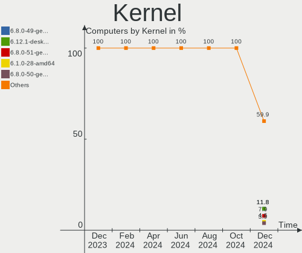
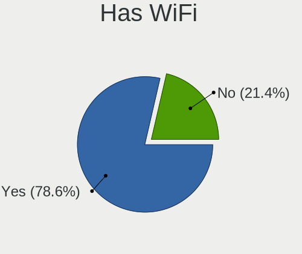
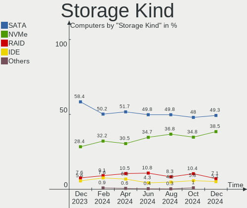
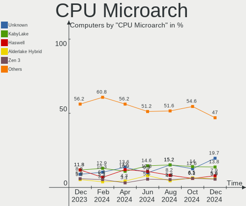
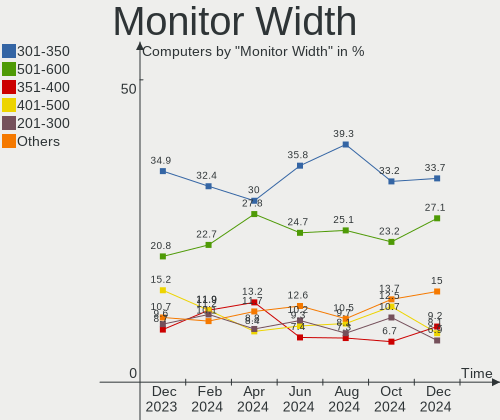
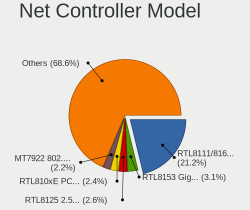

Linux in France - Hardware Trends
---------------------------------

A project to identify most popular hardware characteristics and track their change
over time based on data collected by Linux users at https://Linux-Hardware.org.

Anyone can contribute to this report by the [hw-probe](https://github.com/linuxhw/hw-probe) tool:

    sudo -E hw-probe -all -upload

This is a report for all computer types. See also reports for [desktops](/Location/France/Desktop/README.md) and [notebooks](/Location/France/Notebook/README.md).

Period: Jan, 2023.

Contents
--------

* [ System ](#system)
  - [ OS                       ](#os)
  - [ OS Family                ](#os-family)
  - [ Kernel                   ](#kernel)
  - [ Kernel Family            ](#kernel-family)
  - [ Kernel Major Ver.        ](#kernel-major-ver)
  - [ Arch                     ](#arch)
  - [ DE                       ](#de)
  - [ Display Server           ](#display-server)
  - [ Display Manager          ](#display-manager)
  - [ OS Lang                  ](#os-lang)
  - [ Boot Mode                ](#boot-mode)
  - [ Filesystem               ](#filesystem)
  - [ Part. scheme             ](#part-scheme)
  - [ Dual Boot with Linux/BSD ](#dual-boot-with-linuxbsd)
  - [ Dual Boot (Win)          ](#dual-boot-win)

* [ Board ](#board)
  - [ Vendor                   ](#vendor)
  - [ Model                    ](#model)
  - [ Model Family             ](#model-family)
  - [ MFG Year                 ](#mfg-year)
  - [ Form Factor              ](#form-factor)
  - [ Secure Boot              ](#secure-boot)
  - [ Coreboot                 ](#coreboot)
  - [ RAM Size                 ](#ram-size)
  - [ RAM Used                 ](#ram-used)
  - [ Total Drives             ](#total-drives)
  - [ Has CD-ROM               ](#has-cd-rom)
  - [ Has Ethernet             ](#has-ethernet)
  - [ Has WiFi                 ](#has-wifi)
  - [ Has Bluetooth            ](#has-bluetooth)

* [ Location ](#location)
  - [ Country                  ](#country)
  - [ City                     ](#city)

* [ Drives ](#drives)
  - [ Drive Vendor             ](#drive-vendor)
  - [ Drive Model              ](#drive-model)
  - [ HDD Vendor               ](#hdd-vendor)
  - [ SSD Vendor               ](#ssd-vendor)
  - [ Drive Kind               ](#drive-kind)
  - [ Drive Connector          ](#drive-connector)
  - [ Drive Size               ](#drive-size)
  - [ Space Total              ](#space-total)
  - [ Space Used               ](#space-used)
  - [ Malfunc. Drives          ](#malfunc-drives)
  - [ Malfunc. Drive Vendor    ](#malfunc-drive-vendor)
  - [ Malfunc. HDD Vendor      ](#malfunc-hdd-vendor)
  - [ Malfunc. Drive Kind      ](#malfunc-drive-kind)
  - [ Failed Drives            ](#failed-drives)
  - [ Failed Drive Vendor      ](#failed-drive-vendor)
  - [ Drive Status             ](#drive-status)

* [ Storage controller ](#storage-controller)
  - [ Storage Vendor           ](#storage-vendor)
  - [ Storage Model            ](#storage-model)
  - [ Storage Kind             ](#storage-kind)

* [ Processor ](#processor)
  - [ CPU Vendor               ](#cpu-vendor)
  - [ CPU Model                ](#cpu-model)
  - [ CPU Model Family         ](#cpu-model-family)
  - [ CPU Cores                ](#cpu-cores)
  - [ CPU Sockets              ](#cpu-sockets)
  - [ CPU Threads              ](#cpu-threads)
  - [ CPU Op-Modes             ](#cpu-op-modes)
  - [ CPU Microcode            ](#cpu-microcode)
  - [ CPU Microarch            ](#cpu-microarch)

* [ Graphics ](#graphics)
  - [ GPU Vendor               ](#gpu-vendor)
  - [ GPU Model                ](#gpu-model)
  - [ GPU Combo                ](#gpu-combo)
  - [ GPU Driver               ](#gpu-driver)
  - [ GPU Memory               ](#gpu-memory)

* [ Monitor ](#monitor)
  - [ Monitor Vendor           ](#monitor-vendor)
  - [ Monitor Model            ](#monitor-model)
  - [ Monitor Resolution       ](#monitor-resolution)
  - [ Monitor Diagonal         ](#monitor-diagonal)
  - [ Monitor Width            ](#monitor-width)
  - [ Aspect Ratio             ](#aspect-ratio)
  - [ Monitor Area             ](#monitor-area)
  - [ Pixel Density            ](#pixel-density)
  - [ Multiple Monitors        ](#multiple-monitors)

* [ Network ](#network)
  - [ Net Controller Vendor    ](#net-controller-vendor)
  - [ Net Controller Model     ](#net-controller-model)
  - [ Wireless Vendor          ](#wireless-vendor)
  - [ Wireless Model           ](#wireless-model)
  - [ Ethernet Vendor          ](#ethernet-vendor)
  - [ Ethernet Model           ](#ethernet-model)
  - [ Net Controller Kind      ](#net-controller-kind)
  - [ Used Controller          ](#used-controller)
  - [ NICs                     ](#nics)
  - [ IPv6                     ](#ipv6)

* [ Bluetooth ](#bluetooth)
  - [ Bluetooth Vendor         ](#bluetooth-vendor)
  - [ Bluetooth Model          ](#bluetooth-model)

* [ Sound ](#sound)
  - [ Sound Vendor             ](#sound-vendor)
  - [ Sound Model              ](#sound-model)

* [ Memory ](#memory)
  - [ Memory Vendor            ](#memory-vendor)
  - [ Memory Model             ](#memory-model)
  - [ Memory Kind              ](#memory-kind)
  - [ Memory Form Factor       ](#memory-form-factor)
  - [ Memory Size              ](#memory-size)
  - [ Memory Speed             ](#memory-speed)

* [ Printers & scanners ](#printers--scanners)
  - [ Printer Vendor           ](#printer-vendor)
  - [ Printer Model            ](#printer-model)
  - [ Scanner Vendor           ](#scanner-vendor)
  - [ Scanner Model            ](#scanner-model)

* [ Camera ](#camera)
  - [ Camera Vendor            ](#camera-vendor)
  - [ Camera Model             ](#camera-model)

* [ Security ](#security)
  - [ Fingerprint Vendor       ](#fingerprint-vendor)
  - [ Fingerprint Model        ](#fingerprint-model)
  - [ Chipcard Vendor          ](#chipcard-vendor)
  - [ Chipcard Model           ](#chipcard-model)

* [ Unsupported ](#unsupported)
  - [ Unsupported Devices      ](#unsupported-devices)
  - [ Unsupported Device Types ](#unsupported-device-types)

System
------

OS
--

Installed operating systems

| Name                | Computers | Percent |
|---------------------|-----------|---------|
| OpenMandriva 23.01  | 92        | 24.34%  |
| Ubuntu 22.04        | 64        | 16.93%  |
| Debian 11           | 24        | 6.35%   |
| Linux Mint 21.1     | 20        | 5.29%   |
| Ubuntu 20.04        | 15        | 3.97%   |
| Ubuntu 22.10        | 13        | 3.44%   |
| Fedora 37           | 13        | 3.44%   |
| OpenMandriva 4.3    | 10        | 2.65%   |
| Arch Rolling        | 7         | 1.85%   |
| Zorin 16            | 6         | 1.59%   |
| Manjaro 22.0.0      | 6         | 1.59%   |
| Linux Mint 20.3     | 6         | 1.59%   |
| Kubuntu 22.04       | 6         | 1.59%   |
| Pop!_OS 22.04       | 5         | 1.32%   |
| Lubuntu 22.04       | 5         | 1.32%   |
| Linux Mint 21       | 5         | 1.32%   |
| Xubuntu 20.04       | 4         | 1.06%   |
| Ubuntu MATE 22.04   | 4         | 1.06%   |
| Ubuntu 18.04        | 4         | 1.06%   |
| Manjaro             | 4         | 1.06%   |
| Xubuntu 22.04       | 3         | 0.79%   |
| Ubuntu MATE 20.04   | 3         | 0.79%   |
| KDE neon 22.04      | 3         | 0.79%   |
| Fedora 36           | 3         | 0.79%   |
| SteamOS 3.4.4       | 2         | 0.53%   |
| OpenMandriva 4.2    | 2         | 0.53%   |
| Nobara 37           | 2         | 0.53%   |
| Nobara 36           | 2         | 0.53%   |
| Manjaro 22.0.1      | 2         | 0.53%   |
| Linux Mint 20.1     | 2         | 0.53%   |
| Gentoo 2.9          | 2         | 0.53%   |
| EndeavourOS Rolling | 2         | 0.53%   |
| Elementary 6.1      | 2         | 0.53%   |
| Debian              | 2         | 0.53%   |
| Zorin 15            | 1         | 0.26%   |
| Xubuntu 22.10       | 1         | 0.26%   |
| Xubuntu 18.04       | 1         | 0.26%   |
| Ubuntu Unity 16.04  | 1         | 0.26%   |
| Ubuntu MATE 22.10   | 1         | 0.26%   |
| Ubuntu Budgie 22.10 | 1         | 0.26%   |

OS Family
---------

OS without a version

| Name          | Computers | Percent |
|---------------|-----------|---------|
| OpenMandriva  | 106       | 28.04%  |
| Ubuntu        | 97        | 25.66%  |
| Linux Mint    | 36        | 9.52%   |
| Debian        | 26        | 6.88%   |
| Fedora        | 17        | 4.5%    |
| Manjaro       | 13        | 3.44%   |
| Xubuntu       | 9         | 2.38%   |
| Ubuntu MATE   | 8         | 2.12%   |
| Zorin         | 7         | 1.85%   |
| Lubuntu       | 7         | 1.85%   |
| Kubuntu       | 7         | 1.85%   |
| Arch          | 7         | 1.85%   |
| Pop!_OS       | 5         | 1.32%   |
| Nobara        | 4         | 1.06%   |
| openSUSE      | 3         | 0.79%   |
| KDE neon      | 3         | 0.79%   |
| Ubuntu Budgie | 2         | 0.53%   |
| SteamOS       | 2         | 0.53%   |
| Gentoo        | 2         | 0.53%   |
| Endless       | 2         | 0.53%   |
| EndeavourOS   | 2         | 0.53%   |
| Elementary    | 2         | 0.53%   |
| CentOS        | 2         | 0.53%   |
| Ubuntu Unity  | 1         | 0.26%   |
| TUXEDO OS     | 1         | 0.26%   |
| Peppermint    | 1         | 0.26%   |
| Parrot        | 1         | 0.26%   |
| Manjaro-ARM   | 1         | 0.26%   |
| LMDE          | 1         | 0.26%   |
| Kali          | 1         | 0.26%   |
| Calculate     | 1         | 0.26%   |
| ArcoLinux     | 1         | 0.26%   |

Kernel
------

Version of the Linux kernel

| Version                     | Computers | Percent |
|-----------------------------|-----------|---------|
| 6.1.1-desktop-1omv2290      | 87        | 23.02%  |
| 5.15.0-58-generic           | 61        | 16.14%  |
| 5.15.0-56-generic           | 32        | 8.47%   |
| 5.15.0-57-generic           | 22        | 5.82%   |
| 5.10.0-20-amd64             | 16        | 4.23%   |
| 5.4.0-137-generic           | 13        | 3.44%   |
| 5.16.7-desktop-1omv4003     | 10        | 2.65%   |
| 6.1.1-1-MANJARO             | 7         | 1.85%   |
| 6.0.12-76060006-generic     | 5         | 1.32%   |
| 5.4.0-136-generic           | 5         | 1.32%   |
| 5.19.0-26-generic           | 5         | 1.32%   |
| 6.0.15-300.fc37.x86_64      | 4         | 1.06%   |
| 5.19.0-29-generic           | 4         | 1.06%   |
| 5.19.0-28-generic           | 4         | 1.06%   |
| 5.15.0-43-generic           | 4         | 1.06%   |
| 5.10.0-21-amd64             | 4         | 1.06%   |
| 6.1.2-desktop-1omv2301      | 3         | 0.79%   |
| 6.1.8-arch1-1               | 2         | 0.53%   |
| 6.1.7-100.fc36.x86_64       | 2         | 0.53%   |
| 6.1.6-200.fc37.x86_64       | 2         | 0.53%   |
| 6.1.4-desktop-1omv2301      | 2         | 0.53%   |
| 6.1.3-arch1-1               | 2         | 0.53%   |
| 6.0.16-300.fc37.x86_64      | 2         | 0.53%   |
| 6.0.0-6-amd64               | 2         | 0.53%   |
| 5.4.0-126-generic           | 2         | 0.53%   |
| 5.19.0-31-generic           | 2         | 0.53%   |
| 5.15.0-57-lowlatency        | 2         | 0.53%   |
| 5.13.0-valve36-1-neptune    | 2         | 0.53%   |
| 5.11.0-35-generic           | 2         | 0.53%   |
| 5.10.14-desktop-1omv4002    | 2         | 0.53%   |
| 5.10.0-19-amd64             | 2         | 0.53%   |
| 6.1.8-200.fc37.x86_64       | 1         | 0.26%   |
| 6.1.7-arch1-1               | 1         | 0.26%   |
| 6.1.7-1-MANJARO             | 1         | 0.26%   |
| 6.1.6-zen1-1-zen            | 1         | 0.26%   |
| 6.1.6-203.fsync.fc37.x86_64 | 1         | 0.26%   |
| 6.1.6-060106-generic        | 1         | 0.26%   |
| 6.1.5-zen2-1-zen            | 1         | 0.26%   |
| 6.1.5-200.fc37.x86_64       | 1         | 0.26%   |
| 6.1.3-gentoo-dist           | 1         | 0.26%   |

Kernel Family
-------------

Linux kernel without a distro release

| Version | Computers | Percent |
|---------|-----------|---------|
| 5.15.0  | 124       | 32.8%   |
| 6.1.1   | 95        | 25.13%  |
| 5.4.0   | 26        | 6.88%   |
| 5.10.0  | 22        | 5.82%   |
| 5.19.0  | 18        | 4.76%   |
| 5.16.7  | 10        | 2.65%   |
| 6.0.15  | 7         | 1.85%   |
| 6.0.0   | 6         | 1.59%   |
| 6.1.6   | 5         | 1.32%   |
| 6.0.12  | 5         | 1.32%   |
| 6.1.7   | 4         | 1.06%   |
| 6.1.2   | 4         | 1.06%   |
| 4.15.0  | 4         | 1.06%   |
| 6.1.8   | 3         | 0.79%   |
| 6.1.3   | 3         | 0.79%   |
| 5.14.0  | 3         | 0.79%   |
| 5.11.0  | 3         | 0.79%   |
| 6.1.5   | 2         | 0.53%   |
| 6.1.4   | 2         | 0.53%   |
| 6.1.0   | 2         | 0.53%   |
| 6.0.16  | 2         | 0.53%   |
| 6.0.10  | 2         | 0.53%   |
| 5.14.21 | 2         | 0.53%   |
| 5.13.0  | 2         | 0.53%   |
| 5.10.14 | 2         | 0.53%   |
| 4.4.0   | 2         | 0.53%   |
| 6.0.5   | 1         | 0.26%   |
| 6.0.19  | 1         | 0.26%   |
| 6.0.18  | 1         | 0.26%   |
| 6.0.17  | 1         | 0.26%   |
| 6.0.14  | 1         | 0.26%   |
| 6.0.13  | 1         | 0.26%   |
| 5.8.0   | 1         | 0.26%   |
| 5.4.225 | 1         | 0.26%   |
| 5.3.18  | 1         | 0.26%   |
| 5.19.5  | 1         | 0.26%   |
| 5.18.12 | 1         | 0.26%   |
| 5.17.0  | 1         | 0.26%   |
| 5.15.90 | 1         | 0.26%   |
| 5.15.83 | 1         | 0.26%   |

Kernel Major Ver.
-----------------

Linux kernel major version

| Version | Computers | Percent |
|---------|-----------|---------|
| 5.15    | 128       | 33.86%  |
| 6.1     | 120       | 31.75%  |
| 6.0     | 28        | 7.41%   |
| 5.4     | 27        | 7.14%   |
| 5.10    | 25        | 6.61%   |
| 5.19    | 19        | 5.03%   |
| 5.16    | 10        | 2.65%   |
| 5.14    | 6         | 1.59%   |
| 4.15    | 4         | 1.06%   |
| 5.11    | 3         | 0.79%   |
| 5.13    | 2         | 0.53%   |
| 4.4     | 2         | 0.53%   |
| 5.8     | 1         | 0.26%   |
| 5.3     | 1         | 0.26%   |
| 5.18    | 1         | 0.26%   |
| 5.17    | 1         | 0.26%   |

Arch
----

OS architecture (x86_64, i586, etc.)

| Name    | Computers | Percent |
|---------|-----------|---------|
| x86_64  | 374       | 98.94%  |
| i686    | 3         | 0.79%   |
| aarch64 | 1         | 0.26%   |

DE
--

Desktop Environment

| Name            | Computers | Percent |
|-----------------|-----------|---------|
| GNOME           | 148       | 39.15%  |
| KDE5            | 129       | 34.13%  |
| X-Cinnamon      | 30        | 7.94%   |
| XFCE            | 23        | 6.08%   |
| MATE            | 16        | 4.23%   |
| Unknown         | 12        | 3.17%   |
| LXQt            | 7         | 1.85%   |
| Cinnamon        | 5         | 1.32%   |
| Pantheon        | 3         | 0.79%   |
| Budgie          | 2         | 0.53%   |
| Unity           | 1         | 0.26%   |
| i3              | 1         | 0.26%   |
| GNOME Flashback | 1         | 0.26%   |

Display Server
--------------

X11 or Wayland

| Name    | Computers | Percent |
|---------|-----------|---------|
| X11     | 268       | 70.9%   |
| Wayland | 93        | 24.6%   |
| Tty     | 13        | 3.44%   |
| Unknown | 4         | 1.06%   |

Display Manager
---------------

SDDM, LightDM, etc.

| Name    | Computers | Percent |
|---------|-----------|---------|
| SDDM    | 120       | 31.75%  |
| GDM3    | 85        | 22.49%  |
| Unknown | 71        | 18.78%  |
| LightDM | 60        | 15.87%  |
| GDM     | 40        | 10.58%  |
| NODM    | 1         | 0.26%   |
| Ly      | 1         | 0.26%   |

OS Lang
-------

Language

| Lang    | Computers | Percent |
|---------|-----------|---------|
| fr_FR   | 273       | 72.22%  |
| en_US   | 84        | 22.22%  |
| en_GB   | 7         | 1.85%   |
| Unknown | 4         | 1.06%   |
| ru_RU   | 3         | 0.79%   |
| C       | 3         | 0.79%   |
| de_DE   | 2         | 0.53%   |
| ru_UA   | 1         | 0.26%   |
| es_ES   | 1         | 0.26%   |

Boot Mode
---------

EFI or BIOS

| Mode | Computers | Percent |
|------|-----------|---------|
| EFI  | 216       | 57.14%  |
| BIOS | 162       | 42.86%  |

Filesystem
----------

Type of filesystem

| Type    | Computers | Percent |
|---------|-----------|---------|
| Ext4    | 260       | 68.78%  |
| Overlay | 84        | 22.22%  |
| Btrfs   | 31        | 8.2%    |
| Xfs     | 1         | 0.26%   |
| F2fs    | 1         | 0.26%   |
| Ext3    | 1         | 0.26%   |

Part. scheme
------------

Scheme of partitioning

| Type    | Computers | Percent |
|---------|-----------|---------|
| GPT     | 246       | 65.08%  |
| MBR     | 66        | 17.46%  |
| Unknown | 66        | 17.46%  |

Dual Boot with Linux/BSD
------------------------

Hosting more than one Linux/BSD

| Dual boot | Computers | Percent |
|-----------|-----------|---------|
| No        | 292       | 77.25%  |
| Yes       | 86        | 22.75%  |

Dual Boot (Win)
---------------

Hosting Linux and Windows

| Dual boot | Computers | Percent |
|-----------|-----------|---------|
| No        | 264       | 69.84%  |
| Yes       | 114       | 30.16%  |

Board
-----

Vendor
------

Motherboard manufacturer

| Name                                 | Computers | Percent |
|--------------------------------------|-----------|---------|
| ASUSTek Computer                     | 75        | 19.84%  |
| Dell                                 | 58        | 15.34%  |
| Lenovo                               | 56        | 14.81%  |
| Hewlett-Packard                      | 47        | 12.43%  |
| MSI                                  | 33        | 8.73%   |
| Gigabyte Technology                  | 27        | 7.14%   |
| Acer                                 | 20        | 5.29%   |
| ASRock                               | 8         | 2.12%   |
| Toshiba                              | 7         | 1.85%   |
| Intel                                | 7         | 1.85%   |
| Samsung Electronics                  | 4         | 1.06%   |
| Apple                                | 4         | 1.06%   |
| TUXEDO                               | 3         | 0.79%   |
| Packard Bell                         | 3         | 0.79%   |
| AZW                                  | 3         | 0.79%   |
| Valve                                | 2         | 0.53%   |
| Sony                                 | 2         | 0.53%   |
| HUAWEI                               | 2         | 0.53%   |
| Fujitsu                              | 2         | 0.53%   |
| UNOWHY                               | 1         | 0.26%   |
| TrekStor                             | 1         | 0.26%   |
| Thomson                              | 1         | 0.26%   |
| Teclast                              | 1         | 0.26%   |
| Shenzhen Meigao Electronic Equipment | 1         | 0.26%   |
| Schenker                             | 1         | 0.26%   |
| Pine Microsystems                    | 1         | 0.26%   |
| Pegatron                             | 1         | 0.26%   |
| Notebook                             | 1         | 0.26%   |
| Medion                               | 1         | 0.26%   |
| HC                                   | 1         | 0.26%   |
| Google                               | 1         | 0.26%   |
| Framework                            | 1         | 0.26%   |
| Foxconn                              | 1         | 0.26%   |
| Danew                                | 1         | 0.26%   |

Model
-----

Motherboard model

| Name                                       | Computers | Percent |
|--------------------------------------------|-----------|---------|
| HP Notebook                                | 4         | 1.06%   |
| ASUS All Series                            | 4         | 1.06%   |
| AZW SER                                    | 3         | 0.79%   |
| Valve Jupiter                              | 2         | 0.53%   |
| MSI MS-7B17                                | 2         | 0.53%   |
| Lenovo Y520-15IKBN 80WK                    | 2         | 0.53%   |
| Lenovo IdeaPad Gaming 3 15ACH6 82K2        | 2         | 0.53%   |
| Lenovo G505 20240                          | 2         | 0.53%   |
| HP EliteBook 820 G3                        | 2         | 0.53%   |
| Gigabyte Z77-D3H                           | 2         | 0.53%   |
| Gigabyte B550M DS3H                        | 2         | 0.53%   |
| Dell XPS 15 9500                           | 2         | 0.53%   |
| Dell Precision WorkStation T3400           | 2         | 0.53%   |
| Dell OptiPlex 390                          | 2         | 0.53%   |
| Dell Latitude E6420                        | 2         | 0.53%   |
| Dell Latitude 7410                         | 2         | 0.53%   |
| Dell G3 3500                               | 2         | 0.53%   |
| ASUS T100TA                                | 2         | 0.53%   |
| ASUS PRIME Z390M-PLUS                      | 2         | 0.53%   |
| ASUS P8Z68-V LX                            | 2         | 0.53%   |
| Acer Aspire E5-575G                        | 2         | 0.53%   |
| UNOWHY Y13G011S4EI                         | 1         | 0.26%   |
| TUXEDO InfinityBook S 15 Gen6              | 1         | 0.26%   |
| TUXEDO InfinityBook Pro Gen7 (MK1)         | 1         | 0.26%   |
| TUXEDO Book XA15 / XA17 Gen10              | 1         | 0.26%   |
| TrekStor Surfbook A13B                     | 1         | 0.26%   |
| Toshiba TECRA A11                          | 1         | 0.26%   |
| Toshiba Satellite Pro R50-B                | 1         | 0.26%   |
| Toshiba Satellite Pro C850-10N             | 1         | 0.26%   |
| Toshiba Satellite L655D                    | 1         | 0.26%   |
| Toshiba Satellite C70-A                    | 1         | 0.26%   |
| Toshiba Satellite A200                     | 1         | 0.26%   |
| Toshiba PORTEGE Z30-B                      | 1         | 0.26%   |
| Thomson N14C4WH64                          | 1         | 0.26%   |
| Teclast F6 Plus                            | 1         | 0.26%   |
| Sony VGN-NW21MF_W                          | 1         | 0.26%   |
| Sony SVE1513U1ESI                          | 1         | 0.26%   |
| Shenzhen Meigao Electronic Equipment UM560 | 1         | 0.26%   |
| Schenker XMG FUSION 15 (XFU15L19)          | 1         | 0.26%   |
| Samsung RV410/RV510/S3510/E3510            | 1         | 0.26%   |

Model Family
------------

Motherboard model prefix

| Name                  | Computers | Percent |
|-----------------------|-----------|---------|
| Lenovo ThinkPad       | 23        | 6.08%   |
| Acer Aspire           | 15        | 3.97%   |
| Dell Latitude         | 14        | 3.7%    |
| HP EliteBook          | 13        | 3.44%   |
| ASUS PRIME            | 12        | 3.17%   |
| Dell OptiPlex         | 11        | 2.91%   |
| Dell Inspiron         | 11        | 2.91%   |
| Lenovo IdeaPad        | 10        | 2.65%   |
| Dell Precision        | 9         | 2.38%   |
| ASUS ROG              | 7         | 1.85%   |
| HP Compaq             | 6         | 1.59%   |
| ASUS TUF              | 6         | 1.59%   |
| Toshiba Satellite     | 5         | 1.32%   |
| HP ProBook            | 5         | 1.32%   |
| Lenovo ThinkCentre    | 4         | 1.06%   |
| HP Notebook           | 4         | 1.06%   |
| Gigabyte B550M        | 4         | 1.06%   |
| Dell XPS              | 4         | 1.06%   |
| ASUS All              | 4         | 1.06%   |
| Lenovo ThinkStation   | 3         | 0.79%   |
| Lenovo Legion         | 3         | 0.79%   |
| HP ZBook              | 3         | 0.79%   |
| AZW SER               | 3         | 0.79%   |
| ASUS VivoBook         | 3         | 0.79%   |
| Valve Jupiter         | 2         | 0.53%   |
| TUXEDO InfinityBook   | 2         | 0.53%   |
| Packard Bell EasyNote | 2         | 0.53%   |
| MSI MS-7B17           | 2         | 0.53%   |
| Lenovo Y520-15IKBN    | 2         | 0.53%   |
| Lenovo IdeaCentre     | 2         | 0.53%   |
| Lenovo G505           | 2         | 0.53%   |
| HP Pavilion           | 2         | 0.53%   |
| HP Laptop             | 2         | 0.53%   |
| HP EliteDesk          | 2         | 0.53%   |
| Gigabyte Z77-D3H      | 2         | 0.53%   |
| Gigabyte B550         | 2         | 0.53%   |
| Gigabyte B450         | 2         | 0.53%   |
| Fujitsu ESPRIMO       | 2         | 0.53%   |
| Dell System           | 2         | 0.53%   |
| Dell G3               | 2         | 0.53%   |

MFG Year
--------

Motherboard manufacture year

| Year    | Computers | Percent |
|---------|-----------|---------|
| 2020    | 42        | 11.11%  |
| 2021    | 38        | 10.05%  |
| 2018    | 37        | 9.79%   |
| 2019    | 28        | 7.41%   |
| 2012    | 28        | 7.41%   |
| 2013    | 26        | 6.88%   |
| 2011    | 25        | 6.61%   |
| 2015    | 24        | 6.35%   |
| 2017    | 22        | 5.82%   |
| 2022    | 20        | 5.29%   |
| 2014    | 20        | 5.29%   |
| 2016    | 19        | 5.03%   |
| 2009    | 14        | 3.7%    |
| 2008    | 12        | 3.17%   |
| 2010    | 11        | 2.91%   |
| 2007    | 7         | 1.85%   |
| 2005    | 2         | 0.53%   |
| 2006    | 1         | 0.26%   |
| 2001    | 1         | 0.26%   |
| Unknown | 1         | 0.26%   |

Form Factor
-----------

Physical design of the computer

| Name        | Computers | Percent |
|-------------|-----------|---------|
| Notebook    | 215       | 56.88%  |
| Desktop     | 145       | 38.36%  |
| Mini pc     | 6         | 1.59%   |
| All in one  | 5         | 1.32%   |
| Convertible | 4         | 1.06%   |
| Phone       | 1         | 0.26%   |
| Tablet      | 1         | 0.26%   |
| Server      | 1         | 0.26%   |

Secure Boot
-----------

Enabled or disabled

| State    | Computers | Percent |
|----------|-----------|---------|
| Disabled | 348       | 92.06%  |
| Enabled  | 30        | 7.94%   |

Coreboot
--------

Have coreboot on board

| Used | Computers | Percent |
|------|-----------|---------|
| No   | 377       | 99.74%  |
| Yes  | 1         | 0.26%   |

RAM Size
--------

Total RAM memory

| Size in GB  | Computers | Percent |
|-------------|-----------|---------|
| 16.01-24.0  | 91        | 24.07%  |
| 3.01-4.0    | 78        | 20.63%  |
| 4.01-8.0    | 75        | 19.84%  |
| 8.01-16.0   | 55        | 14.55%  |
| 32.01-64.0  | 49        | 12.96%  |
| 1.01-2.0    | 10        | 2.65%   |
| 24.01-32.0  | 9         | 2.38%   |
| 2.01-3.0    | 5         | 1.32%   |
| 64.01-256.0 | 5         | 1.32%   |
| 0.51-1.0    | 1         | 0.26%   |

RAM Used
--------

Used RAM memory

| Used GB    | Computers | Percent |
|------------|-----------|---------|
| 1.01-2.0   | 153       | 40.48%  |
| 2.01-3.0   | 93        | 24.6%   |
| 4.01-8.0   | 57        | 15.08%  |
| 3.01-4.0   | 40        | 10.58%  |
| 8.01-16.0  | 16        | 4.23%   |
| 0.51-1.0   | 15        | 3.97%   |
| 16.01-24.0 | 2         | 0.53%   |
| 0.01-0.5   | 2         | 0.53%   |

Total Drives
------------

Number of drives on board

| Drives | Computers | Percent |
|--------|-----------|---------|
| 1      | 205       | 54.23%  |
| 2      | 113       | 29.89%  |
| 3      | 32        | 8.47%   |
| 4      | 14        | 3.7%    |
| 7      | 5         | 1.32%   |
| 5      | 3         | 0.79%   |
| 6      | 2         | 0.53%   |
| 0      | 2         | 0.53%   |
| 17     | 1         | 0.26%   |
| 8      | 1         | 0.26%   |

Has CD-ROM
----------

Has CD-ROM on board

| Presented | Computers | Percent |
|-----------|-----------|---------|
| No        | 224       | 59.26%  |
| Yes       | 154       | 40.74%  |

Has Ethernet
------------

Has Ethernet on board

| Presented | Computers | Percent |
|-----------|-----------|---------|
| Yes       | 335       | 88.62%  |
| No        | 43        | 11.38%  |

Has WiFi
--------

Has WiFi module

| Presented | Computers | Percent |
|-----------|-----------|---------|
| Yes       | 283       | 74.87%  |
| No        | 95        | 25.13%  |

Has Bluetooth
-------------

Has Bluetooth module

| Presented | Computers | Percent |
|-----------|-----------|---------|
| Yes       | 217       | 57.41%  |
| No        | 161       | 42.59%  |

Location
--------

Country
-------

Geographic location (country)

| Country | Computers | Percent |
|---------|-----------|---------|
| France  | 378       | 100%    |

City
----

Geographic location (city)

| City                  | Computers | Percent |
|-----------------------|-----------|---------|
| Paris                 | 38        | 10.05%  |
| Marseille             | 9         | 2.38%   |
| Toulouse              | 6         | 1.59%   |
| Limoges               | 5         | 1.32%   |
| Montpellier           | 4         | 1.06%   |
| Lorient               | 4         | 1.06%   |
| Chambéry             | 4         | 1.06%   |
| Bordeaux              | 4         | 1.06%   |
| Strasbourg            | 3         | 0.79%   |
| Rouen                 | 3         | 0.79%   |
| Roubaix               | 3         | 0.79%   |
| Nice                  | 3         | 0.79%   |
| Nanterre              | 3         | 0.79%   |
| Montauban             | 3         | 0.79%   |
| Lyon                  | 3         | 0.79%   |
| Forges-les-Eaux       | 3         | 0.79%   |
| Chatres               | 3         | 0.79%   |
| Argenteuil            | 3         | 0.79%   |
| Villeurbanne          | 2         | 0.53%   |
| Villeneuve-d'Ascq     | 2         | 0.53%   |
| Vélizy-Villacoublay  | 2         | 0.53%   |
| Vaudoy-en-Brie        | 2         | 0.53%   |
| Sélestat             | 2         | 0.53%   |
| Sartrouville          | 2         | 0.53%   |
| Saint-Germain-en-Laye | 2         | 0.53%   |
| Rennes                | 2         | 0.53%   |
| Peumerit              | 2         | 0.53%   |
| Perpignan             | 2         | 0.53%   |
| Palaiseau             | 2         | 0.53%   |
| Narbonne              | 2         | 0.53%   |
| Nantes                | 2         | 0.53%   |
| Mantes-la-Jolie       | 2         | 0.53%   |
| La Rochelle           | 2         | 0.53%   |
| L'Isle-Adam           | 2         | 0.53%   |
| Houilles              | 2         | 0.53%   |
| Guise                 | 2         | 0.53%   |
| Colomiers             | 2         | 0.53%   |
| Champigny-sur-Marne   | 2         | 0.53%   |
| Chalon-sur-Saône     | 2         | 0.53%   |
| Cenon-sur-Vienne      | 2         | 0.53%   |

Drives
------

Drive Vendor
------------

Hard drive vendors

| Vendor                      | Computers | Drives | Percent |
|-----------------------------|-----------|--------|---------|
| Samsung Electronics         | 88        | 104    | 15.28%  |
| Seagate                     | 80        | 114    | 13.89%  |
| WDC                         | 68        | 84     | 11.81%  |
| Crucial                     | 43        | 47     | 7.47%   |
| SanDisk                     | 33        | 39     | 5.73%   |
| Kingston                    | 29        | 30     | 5.03%   |
| Toshiba                     | 28        | 33     | 4.86%   |
| Unknown                     | 23        | 24     | 3.99%   |
| Hitachi                     | 18        | 18     | 3.13%   |
| Micron Technology           | 17        | 17     | 2.95%   |
| HGST                        | 16        | 19     | 2.78%   |
| SK hynix                    | 15        | 15     | 2.6%    |
| PNY                         | 14        | 16     | 2.43%   |
| Intel                       | 11        | 12     | 1.91%   |
| China                       | 10        | 11     | 1.74%   |
| KIOXIA                      | 9         | 9      | 1.56%   |
| Maxtor                      | 5         | 5      | 0.87%   |
| SPCC                        | 4         | 4      | 0.69%   |
| Phison Electronics          | 4         | 4      | 0.69%   |
| LDLC                        | 4         | 4      | 0.69%   |
| Corsair                     | 4         | 4      | 0.69%   |
| Unknown                     | 4         | 4      | 0.69%   |
| Phison                      | 3         | 3      | 0.52%   |
| Kingston Technology Company | 3         | 3      | 0.52%   |
| JMicron Technology          | 3         | 3      | 0.52%   |
| Transcend                   | 2         | 2      | 0.35%   |
| LITEONIT                    | 2         | 2      | 0.35%   |
| LITEON                      | 2         | 2      | 0.35%   |
| KingDian                    | 2         | 3      | 0.35%   |
| GOODRAM                     | 2         | 2      | 0.35%   |
| Fujitsu                     | 2         | 2      | 0.35%   |
| Emtec                       | 2         | 2      | 0.35%   |
| XrayDisk                    | 1         | 1      | 0.17%   |
| USB3.0                      | 1         | 1      | 0.17%   |
| TEXTORM                     | 1         | 1      | 0.17%   |
| Teclast                     | 1         | 1      | 0.17%   |
| SSSTC                       | 1         | 2      | 0.17%   |
| SP                          | 1         | 1      | 0.17%   |
| Silicon Motion              | 1         | 1      | 0.17%   |
| ShanDianZhe                 | 1         | 1      | 0.17%   |

Drive Model
-----------

Hard drive models

| Model                                                 | Computers | Percent |
|-------------------------------------------------------|-----------|---------|
| Crucial CT240BX500SSD1 240GB                          | 10        | 1.58%   |
| Seagate ST2000DM008-2FR102 2TB                        | 7         | 1.11%   |
| Samsung NVMe SSD Controller SM981/PM981/PM983 500GB   | 7         | 1.11%   |
| Kingston SA400S37240G 240GB SSD                       | 7         | 1.11%   |
| Seagate ST1000LM024 HN-M101MBB 1TB                    | 6         | 0.95%   |
| Samsung SSD 860 EVO 500GB                             | 6         | 0.95%   |
| Toshiba MQ01ABD100 1TB                                | 5         | 0.79%   |
| Seagate ST9500325AS 500GB                             | 5         | 0.79%   |
| Seagate ST4000DM004-2CV104 4TB                        | 5         | 0.79%   |
| Crucial CT500MX500SSD1 500GB                          | 5         | 0.79%   |
| Crucial CT1000MX500SSD1 1TB                           | 5         | 0.79%   |
| Seagate ST500LT012-1DG142 500GB                       | 4         | 0.63%   |
| Seagate ST2000DM001-1ER164 2TB                        | 4         | 0.63%   |
| Seagate ST1000LM048-2E7172 1TB                        | 4         | 0.63%   |
| Seagate ST1000DM010-2EP102 1TB                        | 4         | 0.63%   |
| Samsung SSD 970 EVO Plus 500GB                        | 4         | 0.63%   |
| PNY CS900 120GB SSD                                   | 4         | 0.63%   |
| KIOXIA KBG40ZNS512G NVMe 512GB                        | 4         | 0.63%   |
| Kingston SA400S37480G 480GB SSD                       | 4         | 0.63%   |
| HGST HTS721010A9E630 1TB                              | 4         | 0.63%   |
| Crucial CT1000BX500SSD1 1TB                           | 4         | 0.63%   |
| Unknown                                               | 4         | 0.63%   |
| Unknown SD/MMC/MS PRO 2GB                             | 3         | 0.47%   |
| Toshiba MQ04ABF100 1TB                                | 3         | 0.47%   |
| Seagate ST1000DM003-1SB102 1TB                        | 3         | 0.47%   |
| Seagate ST1000DM003-1CH162 1TB                        | 3         | 0.47%   |
| Sandisk WD Blue SN550 NVMe SSD 1TB                    | 3         | 0.47%   |
| Sandisk WD Black 2018/SN750 / PC SN720 NVMe SSD 512GB | 3         | 0.47%   |
| Samsung SSD 980 1TB                                   | 3         | 0.47%   |
| Samsung SSD 870 QVO 2TB                               | 3         | 0.47%   |
| Samsung SSD 870 QVO 1TB                               | 3         | 0.47%   |
| Samsung SSD 860 EVO 1TB                               | 3         | 0.47%   |
| Samsung SSD 850 EVO 500GB                             | 3         | 0.47%   |
| Kingston SA400S37120G 120GB SSD                       | 3         | 0.47%   |
| HGST HTS541010A9E680 1TB                              | 3         | 0.47%   |
| Crucial CT120BX500SSD1 120GB                          | 3         | 0.47%   |
| WDC WDS240G2G0A-00JH30 240GB SSD                      | 2         | 0.32%   |
| WDC WDS100T2B0A-00SM50 1TB SSD                        | 2         | 0.32%   |
| WDC WD4003FZEX-00Z4SA0 4TB                            | 2         | 0.32%   |
| WDC WD20EZRX-00D8PB0 2TB                              | 2         | 0.32%   |

HDD Vendor
----------

Hard disk drive vendors

| Vendor              | Computers | Drives | Percent |
|---------------------|-----------|--------|---------|
| Seagate             | 79        | 112    | 37.26%  |
| WDC                 | 52        | 63     | 24.53%  |
| Toshiba             | 22        | 27     | 10.38%  |
| Hitachi             | 18        | 18     | 8.49%   |
| HGST                | 16        | 19     | 7.55%   |
| Samsung Electronics | 11        | 12     | 5.19%   |
| Maxtor              | 5         | 5      | 2.36%   |
| Unknown             | 4         | 4      | 1.89%   |
| Fujitsu             | 2         | 2      | 0.94%   |
| USB3.0              | 1         | 1      | 0.47%   |
| HGST HTS            | 1         | 1      | 0.47%   |
| ExcelStor           | 1         | 1      | 0.47%   |

SSD Vendor
----------

Solid state drive vendors

| Vendor              | Computers | Drives | Percent |
|---------------------|-----------|--------|---------|
| Samsung Electronics | 41        | 43     | 20.92%  |
| Crucial             | 36        | 40     | 18.37%  |
| Kingston            | 23        | 23     | 11.73%  |
| SanDisk             | 20        | 21     | 10.2%   |
| PNY                 | 13        | 15     | 6.63%   |
| WDC                 | 10        | 10     | 5.1%    |
| China               | 10        | 11     | 5.1%    |
| Micron Technology   | 7         | 7      | 3.57%   |
| SK hynix            | 5         | 5      | 2.55%   |
| SPCC                | 3         | 3      | 1.53%   |
| Intel               | 3         | 3      | 1.53%   |
| Transcend           | 2         | 2      | 1.02%   |
| Toshiba             | 2         | 2      | 1.02%   |
| LITEONIT            | 2         | 2      | 1.02%   |
| KingDian            | 2         | 3      | 1.02%   |
| GOODRAM             | 2         | 2      | 1.02%   |
| Unknown             | 2         | 2      | 1.02%   |
| XrayDisk            | 1         | 1      | 0.51%   |
| TEXTORM             | 1         | 1      | 0.51%   |
| Teclast             | 1         | 1      | 0.51%   |
| OCZ                 | 1         | 1      | 0.51%   |
| LITEON              | 1         | 1      | 0.51%   |
| LDLC                | 1         | 1      | 0.51%   |
| KingSpec            | 1         | 1      | 0.51%   |
| JMicron Technology  | 1         | 1      | 0.51%   |
| Initio              | 1         | 1      | 0.51%   |
| HS-SSD-E100         | 1         | 1      | 0.51%   |
| Emtec               | 1         | 1      | 0.51%   |
| CT1000MX            | 1         | 1      | 0.51%   |
| BHT                 | 1         | 1      | 0.51%   |

Drive Kind
----------

HDD or SSD

| Kind    | Computers | Drives | Percent |
|---------|-----------|--------|---------|
| HDD     | 178       | 265    | 34.77%  |
| SSD     | 165       | 207    | 32.23%  |
| NVMe    | 137       | 161    | 26.76%  |
| MMC     | 20        | 22     | 3.91%   |
| Unknown | 12        | 13     | 2.34%   |

Drive Connector
---------------

SATA, SAS, NVMe, etc.

| Type | Computers | Drives | Percent |
|------|-----------|--------|---------|
| SATA | 283       | 464    | 61.52%  |
| NVMe | 137       | 161    | 29.78%  |
| SAS  | 20        | 21     | 4.35%   |
| MMC  | 20        | 22     | 4.35%   |

Drive Size
----------

Size of hard drive

| Size in TB | Computers | Drives | Percent |
|------------|-----------|--------|---------|
| 0.01-0.5   | 199       | 255    | 55.12%  |
| 0.51-1.0   | 106       | 140    | 29.36%  |
| 1.01-2.0   | 33        | 41     | 9.14%   |
| 3.01-4.0   | 13        | 17     | 3.6%    |
| 2.01-3.0   | 5         | 8      | 1.39%   |
| 4.01-10.0  | 4         | 5      | 1.11%   |
| 10.01-20.0 | 1         | 6      | 0.28%   |

Space Total
-----------

Amount of disk space available on the file system

| Size in GB     | Computers | Percent |
|----------------|-----------|---------|
| 101-250        | 93        | 24.6%   |
| 251-500        | 91        | 24.07%  |
| 1-20           | 53        | 14.02%  |
| 501-1000       | 49        | 12.96%  |
| 1001-2000      | 35        | 9.26%   |
| Unknown        | 15        | 3.97%   |
| 51-100         | 14        | 3.7%    |
| More than 3000 | 11        | 2.91%   |
| 2001-3000      | 9         | 2.38%   |
| 21-50          | 8         | 2.12%   |

Space Used
----------

Amount of used disk space

| Used GB        | Computers | Percent |
|----------------|-----------|---------|
| 1-20           | 151       | 39.95%  |
| 101-250        | 50        | 13.23%  |
| 21-50          | 47        | 12.43%  |
| 51-100         | 40        | 10.58%  |
| 251-500        | 32        | 8.47%   |
| 501-1000       | 30        | 7.94%   |
| Unknown        | 15        | 3.97%   |
| 1001-2000      | 7         | 1.85%   |
| More than 3000 | 4         | 1.06%   |
| 2001-3000      | 2         | 0.53%   |

Malfunc. Drives
---------------

Drive models with a malfunction

| Model                              | Computers | Drives | Percent |
|------------------------------------|-----------|--------|---------|
| Seagate ST500LT012-1DG142 500GB    | 3         | 3      | 4.84%   |
| Seagate ST1000LM024 HN-M101MBB 1TB | 3         | 3      | 4.84%   |
| WDC WD10EADS-65L5B1 1TB            | 2         | 2      | 3.23%   |
| WDC WD1002FAEX-00Y9A0 1TB          | 2         | 2      | 3.23%   |
| Toshiba MQ04ABF100 1TB             | 2         | 2      | 3.23%   |
| HGST HTS545050A7E680 500GB         | 2         | 2      | 3.23%   |
| WDC WD6400AAKS-22A7B2 640GB        | 1         | 1      | 1.61%   |
| WDC WD6400AAKS-00H2B0 640GB        | 1         | 1      | 1.61%   |
| WDC WD3200AAJS-00L7A0 320GB        | 1         | 1      | 1.61%   |
| WDC WD2500BEKT-75PVMT1 250GB       | 1         | 1      | 1.61%   |
| WDC WD20EZRX-00D8PB0 2TB           | 1         | 1      | 1.61%   |
| WDC WD20EFRX-68EUZN0 2TB           | 1         | 1      | 1.61%   |
| WDC WD15EADS-65R2B0 1TB            | 1         | 1      | 1.61%   |
| WDC WD10JPVX-60JC3T1 1TB           | 1         | 1      | 1.61%   |
| WDC WD10EARS-22Y5B1 1TB            | 1         | 1      | 1.61%   |
| WDC WD10EARS-00MVWB0 1TB           | 1         | 1      | 1.61%   |
| WDC WD10EADS-00L5B1 1TB            | 1         | 1      | 1.61%   |
| WDC WD Green M.2 2280 240GB SSD    | 1         | 1      | 1.61%   |
| Toshiba MQ01ABF050 500GB           | 1         | 1      | 1.61%   |
| Toshiba MQ01ABD100 1TB             | 1         | 1      | 1.61%   |
| Toshiba MK5061GSY 500GB            | 1         | 1      | 1.61%   |
| Seagate ST9500325AS 500GB          | 1         | 1      | 1.61%   |
| Seagate ST500LM021-1KJ152 500GB    | 1         | 1      | 1.61%   |
| Seagate ST500DM002-1BD142 500GB    | 1         | 1      | 1.61%   |
| Seagate ST4000VX007-2DT166 4TB     | 1         | 1      | 1.61%   |
| Seagate ST4000VN008-2DR166 4TB     | 1         | 2      | 1.61%   |
| Seagate ST3750528AS 752GB          | 1         | 1      | 1.61%   |
| Seagate ST3500630AS 500GB          | 1         | 1      | 1.61%   |
| Seagate ST3250820AS 250GB          | 1         | 1      | 1.61%   |
| Seagate ST320LT007-9ZV142 320GB    | 1         | 1      | 1.61%   |
| Seagate ST3000DM008-2DM166 3TB     | 1         | 2      | 1.61%   |
| Seagate ST250DM000-1BD141 250GB    | 1         | 1      | 1.61%   |
| Seagate ST2000DM001-1ER164 2TB     | 1         | 1      | 1.61%   |
| Seagate ST2000DM001-1CH164 2TB     | 1         | 1      | 1.61%   |
| Samsung Electronics HD642JJ 640GB  | 1         | 1      | 1.61%   |
| Samsung Electronics HD501LJ 500GB  | 1         | 1      | 1.61%   |
| Samsung Electronics HD103UJ 1TB    | 1         | 1      | 1.61%   |
| Samsung Electronics HD103SJ 1TB    | 1         | 1      | 1.61%   |
| OCZ VERTEX 64GB SSD                | 1         | 1      | 1.61%   |
| Netac NVMe SSD 2TB                 | 1         | 1      | 1.61%   |

Malfunc. Drive Vendor
---------------------

Vendors of faulty drives

| Vendor              | Computers | Drives | Percent |
|---------------------|-----------|--------|---------|
| Seagate             | 17        | 21     | 29.82%  |
| WDC                 | 14        | 16     | 24.56%  |
| Toshiba             | 5         | 5      | 8.77%   |
| Hitachi             | 5         | 5      | 8.77%   |
| HGST                | 4         | 4      | 7.02%   |
| Samsung Electronics | 3         | 4      | 5.26%   |
| Maxtor              | 3         | 3      | 5.26%   |
| OCZ                 | 1         | 1      | 1.75%   |
| Netac               | 1         | 1      | 1.75%   |
| LDLC                | 1         | 1      | 1.75%   |
| Intel               | 1         | 1      | 1.75%   |
| Crucial             | 1         | 1      | 1.75%   |
| China               | 1         | 1      | 1.75%   |

Malfunc. HDD Vendor
-------------------

Vendors of faulty HDD drives

| Vendor              | Computers | Drives | Percent |
|---------------------|-----------|--------|---------|
| Seagate             | 17        | 21     | 34%     |
| WDC                 | 13        | 15     | 26%     |
| Toshiba             | 5         | 5      | 10%     |
| Hitachi             | 5         | 5      | 10%     |
| HGST                | 4         | 4      | 8%      |
| Samsung Electronics | 3         | 4      | 6%      |
| Maxtor              | 3         | 3      | 6%      |

Malfunc. Drive Kind
-------------------

Kinds of faulty drives

| Kind | Computers | Drives | Percent |
|------|-----------|--------|---------|
| HDD  | 44        | 57     | 86.27%  |
| SSD  | 6         | 6      | 11.76%  |
| NVMe | 1         | 1      | 1.96%   |

Failed Drives
-------------

Failed drive models

Zero info for selected period =(

Failed Drive Vendor
-------------------

Failed drive vendors

Zero info for selected period =(

Drive Status
------------

Number of failed and malfunc. drives

| Status   | Computers | Drives | Percent |
|----------|-----------|--------|---------|
| Works    | 226       | 367    | 53.18%  |
| Detected | 148       | 237    | 34.82%  |
| Malfunc  | 51        | 64     | 12%     |

Storage controller
------------------

Storage Vendor
--------------

Storage controller vendors

| Vendor                           | Computers | Percent |
|----------------------------------|-----------|---------|
| Intel                            | 257       | 52.13%  |
| AMD                              | 74        | 15.01%  |
| Samsung Electronics              | 43        | 8.72%   |
| SanDisk                          | 23        | 4.67%   |
| Phison Electronics               | 12        | 2.43%   |
| Micron Technology                | 11        | 2.23%   |
| Kingston Technology Company      | 10        | 2.03%   |
| SK hynix                         | 9         | 1.83%   |
| KIOXIA                           | 8         | 1.62%   |
| Micron/Crucial Technology        | 7         | 1.42%   |
| Toshiba America Info Systems     | 5         | 1.01%   |
| Marvell Technology Group         | 5         | 1.01%   |
| JMicron Technology               | 5         | 1.01%   |
| Nvidia                           | 4         | 0.81%   |
| ASMedia Technology               | 4         | 0.81%   |
| Silicon Motion                   | 3         | 0.61%   |
| Silicon Integrated Systems [SiS] | 2         | 0.41%   |
| Lite-On Technology               | 2         | 0.41%   |
| Broadcom / LSI                   | 2         | 0.41%   |
| VIA Technologies                 | 1         | 0.2%    |
| Solid State Storage Technology   | 1         | 0.2%    |
| Shenzhen Longsys Electronics     | 1         | 0.2%    |
| O2 Micro                         | 1         | 0.2%    |
| Netac Technology                 | 1         | 0.2%    |
| Lenovo                           | 1         | 0.2%    |
| Adaptec                          | 1         | 0.2%    |

Storage Model
-------------

Storage controller models

| Model                                                                          | Computers | Percent |
|--------------------------------------------------------------------------------|-----------|---------|
| AMD FCH SATA Controller [AHCI mode]                                            | 44        | 7.97%   |
| Samsung NVMe SSD Controller SM981/PM981/PM983                                  | 20        | 3.62%   |
| Intel Sunrise Point-LP SATA Controller [AHCI mode]                             | 17        | 3.08%   |
| Intel Q170/Q150/B150/H170/H110/Z170/CM236 Chipset SATA Controller [AHCI Mode]  | 17        | 3.08%   |
| Intel Volume Management Device NVMe RAID Controller                            | 16        | 2.9%    |
| Intel 7 Series Chipset Family 6-port SATA Controller [AHCI mode]               | 16        | 2.9%    |
| Intel 8 Series/C220 Series Chipset Family 6-port SATA Controller 1 [AHCI mode] | 14        | 2.54%   |
| Samsung NVMe SSD Controller 980                                                | 13        | 2.36%   |
| AMD 500 Series Chipset SATA Controller                                         | 12        | 2.17%   |
| Micron Non-Volatile memory controller                                          | 11        | 1.99%   |
| Intel Cannon Lake PCH SATA AHCI Controller                                     | 11        | 1.99%   |
| Intel Wildcat Point-LP SATA Controller [AHCI Mode]                             | 10        | 1.81%   |
| Intel 8 Series SATA Controller 1 [AHCI mode]                                   | 10        | 1.81%   |
| AMD SB7x0/SB8x0/SB9x0 SATA Controller [AHCI mode]                              | 10        | 1.81%   |
| Intel 82801 Mobile SATA Controller [RAID mode]                                 | 9         | 1.63%   |
| Intel 6 Series/C200 Series Chipset Family 6 port Mobile SATA AHCI Controller   | 9         | 1.63%   |
| Intel 200 Series PCH SATA controller [AHCI mode]                               | 9         | 1.63%   |
| AMD 400 Series Chipset SATA Controller                                         | 9         | 1.63%   |
| Intel 82801IBM/IEM (ICH9M/ICH9M-E) 4 port SATA Controller [AHCI mode]          | 8         | 1.45%   |
| Intel 7 Series/C210 Series Chipset Family 6-port SATA Controller [AHCI mode]   | 8         | 1.45%   |
| Intel 6 Series/C200 Series Chipset Family 6 port Desktop SATA AHCI Controller  | 8         | 1.45%   |
| Intel SATA Controller [RAID mode]                                              | 7         | 1.27%   |
| Intel 500 Series Chipset Family SATA AHCI Controller                           | 7         | 1.27%   |
| SanDisk WD Blue SN550 NVMe SSD                                                 | 6         | 1.09%   |
| Samsung NVMe SSD Controller SM961/PM961/SM963                                  | 6         | 1.09%   |
| KIOXIA NVMe SSD Controller BG4                                                 | 6         | 1.09%   |
| Intel 82801HM/HEM (ICH8M/ICH8M-E) SATA Controller [AHCI mode]                  | 6         | 1.09%   |
| Intel 400 Series Chipset Family SATA AHCI Controller                           | 6         | 1.09%   |
| SanDisk Non-Volatile memory controller                                         | 5         | 0.91%   |
| Phison E12 NVMe Controller                                                     | 5         | 0.91%   |
| Micron/Crucial P2 NVMe PCIe SSD                                                | 5         | 0.91%   |
| Intel Comet Lake SATA AHCI Controller                                          | 5         | 0.91%   |
| Intel 82801HM/HEM (ICH8M/ICH8M-E) IDE Controller                               | 5         | 0.91%   |
| SanDisk WD Black SN750 / PC SN730 NVMe SSD                                     | 4         | 0.72%   |
| SanDisk WD Black 2018/SN750 / PC SN720 NVMe SSD                                | 4         | 0.72%   |
| Samsung NVMe SSD Controller PM9A1/PM9A3/980PRO                                 | 4         | 0.72%   |
| Kingston Company A2000 NVMe SSD                                                | 4         | 0.72%   |
| Intel Celeron/Pentium Silver Processor SATA Controller                         | 4         | 0.72%   |
| Intel Celeron N3350/Pentium N4200/Atom E3900 Series SATA AHCI Controller       | 4         | 0.72%   |
| Intel Cannon Lake Mobile PCH SATA AHCI Controller                              | 4         | 0.72%   |

Storage Kind
------------

Kind of storage controller (IDE, SATA, NVMe, SAS, ...)

| Kind | Computers | Percent |
|------|-----------|---------|
| SATA | 289       | 57.34%  |
| NVMe | 137       | 27.18%  |
| IDE  | 41        | 8.13%   |
| RAID | 34        | 6.75%   |
| SAS  | 2         | 0.4%    |
| SCSI | 1         | 0.2%    |

Processor
---------

CPU Vendor
----------

Processor vendors

| Vendor | Computers | Percent |
|--------|-----------|---------|
| Intel  | 295       | 78.04%  |
| AMD    | 82        | 21.69%  |
| ARM    | 1         | 0.26%   |

CPU Model
---------

Processor models

| Model                                   | Computers | Percent |
|-----------------------------------------|-----------|---------|
| Intel 11th Gen Core i7-1165G7 @ 2.80GHz | 10        | 2.65%   |
| Intel Core i5-8250U CPU @ 1.60GHz       | 5         | 1.32%   |
| Intel Core i5-6300U CPU @ 2.40GHz       | 5         | 1.32%   |
| AMD Ryzen 5 5600H with Radeon Graphics  | 5         | 1.32%   |
| Intel Core i5-10210U CPU @ 1.60GHz      | 4         | 1.06%   |
| Intel Core i3-3220 CPU @ 3.30GHz        | 4         | 1.06%   |
| Intel 12th Gen Core i7-12700H           | 4         | 1.06%   |
| AMD Ryzen 5 5600X 6-Core Processor      | 4         | 1.06%   |
| AMD Ryzen 5 3600 6-Core Processor       | 4         | 1.06%   |
| Intel Core i7-9750H CPU @ 2.60GHz       | 3         | 0.79%   |
| Intel Core i7-8550U CPU @ 1.80GHz       | 3         | 0.79%   |
| Intel Core i7-7700K CPU @ 4.20GHz       | 3         | 0.79%   |
| Intel Core i7-4700HQ CPU @ 2.40GHz      | 3         | 0.79%   |
| Intel Core i7-3770 CPU @ 3.40GHz        | 3         | 0.79%   |
| Intel Core i5-9600K CPU @ 3.70GHz       | 3         | 0.79%   |
| Intel Core i5-7200U CPU @ 2.50GHz       | 3         | 0.79%   |
| Intel Core i5-6600 CPU @ 3.30GHz        | 3         | 0.79%   |
| Intel Core i5-5200U CPU @ 2.20GHz       | 3         | 0.79%   |
| Intel Core i5-4310U CPU @ 2.00GHz       | 3         | 0.79%   |
| Intel Core i5-2540M CPU @ 2.60GHz       | 3         | 0.79%   |
| Intel Core i5-2520M CPU @ 2.50GHz       | 3         | 0.79%   |
| Intel Core i5-10300H CPU @ 2.50GHz      | 3         | 0.79%   |
| Intel Core i3-7020U CPU @ 2.30GHz       | 3         | 0.79%   |
| Intel Core i3-5005U CPU @ 2.00GHz       | 3         | 0.79%   |
| Intel 11th Gen Core i5-1135G7 @ 2.40GHz | 3         | 0.79%   |
| AMD Ryzen 7 5800X 8-Core Processor      | 3         | 0.79%   |
| AMD Ryzen 5 4600H with Radeon Graphics  | 3         | 0.79%   |
| AMD Ryzen 5 1600 Six-Core Processor     | 3         | 0.79%   |
| AMD FX-8350 Eight-Core Processor        | 3         | 0.79%   |
| Intel Pentium CPU G4400 @ 3.30GHz       | 2         | 0.53%   |
| Intel Pentium CPU B970 @ 2.30GHz        | 2         | 0.53%   |
| Intel Core i7-8700K CPU @ 3.70GHz       | 2         | 0.53%   |
| Intel Core i7-8565U CPU @ 1.80GHz       | 2         | 0.53%   |
| Intel Core i7-6700HQ CPU @ 2.60GHz      | 2         | 0.53%   |
| Intel Core i7-5500U CPU @ 2.40GHz       | 2         | 0.53%   |
| Intel Core i7-4790K CPU @ 4.00GHz       | 2         | 0.53%   |
| Intel Core i7-10750H CPU @ 2.60GHz      | 2         | 0.53%   |
| Intel Core i7-10610U CPU @ 1.80GHz      | 2         | 0.53%   |
| Intel Core i7-10510U CPU @ 1.80GHz      | 2         | 0.53%   |
| Intel Core i5-9400 CPU @ 2.90GHz        | 2         | 0.53%   |

CPU Model Family
----------------

Processor model prefix

| Model                   | Computers | Percent |
|-------------------------|-----------|---------|
| Intel Core i5           | 95        | 25.13%  |
| Intel Core i7           | 57        | 15.08%  |
| Other                   | 43        | 11.38%  |
| Intel Core i3           | 31        | 8.2%    |
| AMD Ryzen 5             | 29        | 7.67%   |
| Intel Core 2 Duo        | 21        | 5.56%   |
| Intel Celeron           | 19        | 5.03%   |
| AMD Ryzen 7             | 17        | 4.5%    |
| Intel Xeon              | 10        | 2.65%   |
| Intel Pentium           | 9         | 2.38%   |
| Intel Atom              | 7         | 1.85%   |
| AMD FX                  | 5         | 1.32%   |
| AMD E1                  | 4         | 1.06%   |
| Intel Core 2 Quad       | 3         | 0.79%   |
| AMD Ryzen 9             | 3         | 0.79%   |
| AMD E2                  | 3         | 0.79%   |
| AMD E                   | 3         | 0.79%   |
| AMD Athlon II           | 2         | 0.53%   |
| AMD A8                  | 2         | 0.53%   |
| AMD A6                  | 2         | 0.53%   |
| Intel Pentium M         | 1         | 0.26%   |
| Intel Pentium Dual-Core | 1         | 0.26%   |
| Intel Pentium Dual      | 1         | 0.26%   |
| Intel Pentium D         | 1         | 0.26%   |
| Intel Core M            | 1         | 0.26%   |
| Intel Core i9           | 1         | 0.26%   |
| Intel Celeron Dual-Core | 1         | 0.26%   |
| AMD Turion 64 X2 Mobile | 1         | 0.26%   |
| AMD Sempron             | 1         | 0.26%   |
| AMD Ryzen 5 PRO         | 1         | 0.26%   |
| AMD Phenom II           | 1         | 0.26%   |
| AMD GX                  | 1         | 0.26%   |
| AMD Athlon 64 X2        | 1         | 0.26%   |

CPU Cores
---------

Number of processor cores

| Number | Computers | Percent |
|--------|-----------|---------|
| 2      | 143       | 37.83%  |
| 4      | 129       | 34.13%  |
| 6      | 56        | 14.81%  |
| 8      | 26        | 6.88%   |
| 1      | 9         | 2.38%   |
| 14     | 4         | 1.06%   |
| 12     | 4         | 1.06%   |
| 10     | 3         | 0.79%   |
| 3      | 2         | 0.53%   |
| 20     | 1         | 0.26%   |
| 16     | 1         | 0.26%   |

CPU Sockets
-----------

Number of sockets

| Number | Computers | Percent |
|--------|-----------|---------|
| 1      | 376       | 99.47%  |
| 2      | 2         | 0.53%   |

CPU Threads
-----------

Threads per core (Hyper-Threading)

| Number | Computers | Percent |
|--------|-----------|---------|
| 2      | 248       | 65.61%  |
| 1      | 128       | 33.86%  |
| 4      | 2         | 0.53%   |

CPU Op-Modes
------------

CPU Operation Modes (32-bit, 64-bit)

| Op mode        | Computers | Percent |
|----------------|-----------|---------|
| 32-bit, 64-bit | 377       | 99.74%  |
| 32-bit         | 1         | 0.26%   |

CPU Microcode
-------------

Microcode number

| Number     | Computers | Percent |
|------------|-----------|---------|
| Unknown    | 86        | 22.75%  |
| 0x206a7    | 18        | 4.76%   |
| 0x306a9    | 17        | 4.5%    |
| 0x1067a    | 15        | 3.97%   |
| 0x806c1    | 14        | 3.7%    |
| 0x506e3    | 14        | 3.7%    |
| 0x906ea    | 12        | 3.17%   |
| 0x806ea    | 11        | 2.91%   |
| 0x306c3    | 11        | 2.91%   |
| 0x806ec    | 10        | 2.65%   |
| 0x906e9    | 9         | 2.38%   |
| 0x40651    | 9         | 2.38%   |
| 0x306d4    | 9         | 2.38%   |
| 0x08701021 | 9         | 2.38%   |
| 0xa0652    | 8         | 2.12%   |
| 0x0a50000c | 6         | 1.59%   |
| 0x906a3    | 5         | 1.32%   |
| 0x806e9    | 5         | 1.32%   |
| 0x6fb      | 4         | 1.06%   |
| 0x30678    | 4         | 1.06%   |
| 0x20655    | 4         | 1.06%   |
| 0x0a50000d | 4         | 1.06%   |
| 0xa0671    | 3         | 0.79%   |
| 0xa0655    | 3         | 0.79%   |
| 0x906ed    | 3         | 0.79%   |
| 0x906ec    | 3         | 0.79%   |
| 0x806d1    | 3         | 0.79%   |
| 0x0a201016 | 3         | 0.79%   |
| 0x906a4    | 2         | 0.53%   |
| 0x90675    | 2         | 0.53%   |
| 0x90672    | 2         | 0.53%   |
| 0x706a8    | 2         | 0.53%   |
| 0x706a1    | 2         | 0.53%   |
| 0x6fa      | 2         | 0.53%   |
| 0x406e3    | 2         | 0.53%   |
| 0x406c3    | 2         | 0.53%   |
| 0x306f2    | 2         | 0.53%   |
| 0x10676    | 2         | 0.53%   |
| 0x10661    | 2         | 0.53%   |
| 0x08600104 | 2         | 0.53%   |

CPU Microarch
-------------

Microarchitecture

| Name             | Computers | Percent |
|------------------|-----------|---------|
| KabyLake         | 67        | 17.72%  |
| Haswell          | 32        | 8.47%   |
| IvyBridge        | 26        | 6.88%   |
| Skylake          | 24        | 6.35%   |
| SandyBridge      | 24        | 6.35%   |
| Zen 3            | 20        | 5.29%   |
| Penryn           | 20        | 5.29%   |
| Zen 2            | 17        | 4.5%    |
| TigerLake        | 17        | 4.5%    |
| CometLake        | 13        | 3.44%   |
| Broadwell        | 11        | 2.91%   |
| Core             | 10        | 2.65%   |
| Alderlake Hybrid | 10        | 2.65%   |
| Silvermont       | 8         | 2.12%   |
| Unknown          | 8         | 2.12%   |
| Westmere         | 7         | 1.85%   |
| Icelake          | 7         | 1.85%   |
| Zen+             | 6         | 1.59%   |
| Zen              | 6         | 1.59%   |
| Piledriver       | 6         | 1.59%   |
| Puma             | 5         | 1.32%   |
| K8 Hammer        | 4         | 1.06%   |
| K10              | 4         | 1.06%   |
| Jaguar           | 4         | 1.06%   |
| Goldmont plus    | 4         | 1.06%   |
| Goldmont         | 4         | 1.06%   |
| Bobcat           | 4         | 1.06%   |
| Bonnell          | 3         | 0.79%   |
| Excavator        | 2         | 0.53%   |
| Tremont          | 1         | 0.26%   |
| Steamroller      | 1         | 0.26%   |
| P6               | 1         | 0.26%   |
| NetBurst         | 1         | 0.26%   |
| Nehalem          | 1         | 0.26%   |

Graphics
--------

GPU Vendor
----------

Vendors of graphics cards

| Vendor                           | Computers | Percent |
|----------------------------------|-----------|---------|
| Intel                            | 228       | 49.57%  |
| Nvidia                           | 137       | 29.78%  |
| AMD                              | 93        | 20.22%  |
| Silicon Integrated Systems [SiS] | 1         | 0.22%   |
| Matrox Electronics Systems       | 1         | 0.22%   |

GPU Model
---------

Graphics card models

| Model                                                                       | Computers | Percent |
|-----------------------------------------------------------------------------|-----------|---------|
| Intel 2nd Generation Core Processor Family Integrated Graphics Controller   | 22        | 4.67%   |
| Intel TigerLake-LP GT2 [Iris Xe Graphics]                                   | 17        | 3.61%   |
| Intel HD Graphics 530                                                       | 13        | 2.76%   |
| Intel UHD Graphics 620                                                      | 12        | 2.55%   |
| Intel Haswell-ULT Integrated Graphics Controller                            | 11        | 2.34%   |
| Intel CoffeeLake-S GT2 [UHD Graphics 630]                                   | 11        | 2.34%   |
| Intel HD Graphics 620                                                       | 9         | 1.91%   |
| Intel 3rd Gen Core processor Graphics Controller                            | 9         | 1.91%   |
| Intel HD Graphics 5500                                                      | 8         | 1.7%    |
| Intel CometLake-U GT2 [UHD Graphics]                                        | 8         | 1.7%    |
| Intel CometLake-H GT2 [UHD Graphics]                                        | 8         | 1.7%    |
| Intel Xeon E3-1200 v2/3rd Gen Core processor Graphics Controller            | 7         | 1.49%   |
| AMD Cezanne [Radeon Vega Series / Radeon Vega Mobile Series]                | 7         | 1.49%   |
| Intel Xeon E3-1200 v3/4th Gen Core Processor Integrated Graphics Controller | 6         | 1.27%   |
| Intel Skylake GT2 [HD Graphics 520]                                         | 6         | 1.27%   |
| Intel Mobile 4 Series Chipset Integrated Graphics Controller                | 6         | 1.27%   |
| Intel HD Graphics 630                                                       | 6         | 1.27%   |
| Intel Atom Processor Z36xxx/Z37xxx Series Graphics & Display                | 6         | 1.27%   |
| Nvidia TU117M                                                               | 5         | 1.06%   |
| Nvidia TU117 [GeForce GTX 1650]                                             | 5         | 1.06%   |
| Nvidia GK208B [GeForce GT 710]                                              | 5         | 1.06%   |
| Intel WhiskeyLake-U GT2 [UHD Graphics 620]                                  | 5         | 1.06%   |
| Intel Alder Lake-P Integrated Graphics Controller                           | 5         | 1.06%   |
| Intel 4th Gen Core Processor Integrated Graphics Controller                 | 5         | 1.06%   |
| AMD Ellesmere [Radeon RX 470/480/570/570X/580/580X/590]                     | 5         | 1.06%   |
| Nvidia GM206 [GeForce GTX 960]                                              | 4         | 0.85%   |
| Nvidia GK208B [GeForce GT 730]                                              | 4         | 0.85%   |
| Nvidia GA106M [GeForce RTX 3060 Mobile / Max-Q]                             | 4         | 0.85%   |
| Intel TigerLake-H GT1 [UHD Graphics]                                        | 4         | 0.85%   |
| Intel Mobile GM965/GL960 Integrated Graphics Controller (secondary)         | 4         | 0.85%   |
| Intel Mobile GM965/GL960 Integrated Graphics Controller (primary)           | 4         | 0.85%   |
| Intel HD Graphics 500                                                       | 4         | 0.85%   |
| Intel GeminiLake [UHD Graphics 600]                                         | 4         | 0.85%   |
| Intel Core Processor Integrated Graphics Controller                         | 4         | 0.85%   |
| AMD Renoir                                                                  | 4         | 0.85%   |
| Nvidia TU116M [GeForce GTX 1660 Ti Mobile]                                  | 3         | 0.64%   |
| Nvidia TU116 [GeForce GTX 1660 SUPER]                                       | 3         | 0.64%   |
| Nvidia GP108M [GeForce MX150]                                               | 3         | 0.64%   |
| Nvidia GP107M [GeForce GTX 1050 Mobile]                                     | 3         | 0.64%   |
| Nvidia GP107 [GeForce GTX 1050 Ti]                                          | 3         | 0.64%   |

GPU Combo
---------

Combinations of graphics cards

| Name           | Computers | Percent |
|----------------|-----------|---------|
| 1 x Intel      | 149       | 39.42%  |
| 1 x AMD        | 69        | 18.25%  |
| 1 x Nvidia     | 67        | 17.72%  |
| Intel + Nvidia | 60        | 15.87%  |
| Intel + AMD    | 10        | 2.65%   |
| AMD + Nvidia   | 8         | 2.12%   |
| 2 x AMD        | 6         | 1.59%   |
| 2 x Intel      | 5         | 1.32%   |
| Other          | 1         | 0.26%   |
| 2 x Nvidia     | 1         | 0.26%   |
| 1 x SiS        | 1         | 0.26%   |
| 1 x Matrox     | 1         | 0.26%   |

GPU Driver
----------

Free vs proprietary

| Driver      | Computers | Percent |
|-------------|-----------|---------|
| Free        | 321       | 84.92%  |
| Proprietary | 46        | 12.17%  |
| Unknown     | 11        | 2.91%   |

GPU Memory
----------

Total video memory

| Size in GB | Computers | Percent |
|------------|-----------|---------|
| Unknown    | 219       | 57.94%  |
| 1.01-2.0   | 38        | 10.05%  |
| 0.01-0.5   | 35        | 9.26%   |
| 0.51-1.0   | 29        | 7.67%   |
| 3.01-4.0   | 22        | 5.82%   |
| 7.01-8.0   | 15        | 3.97%   |
| 5.01-6.0   | 9         | 2.38%   |
| 8.01-16.0  | 5         | 1.32%   |
| 2.01-3.0   | 4         | 1.06%   |
| 4.01-5.0   | 1         | 0.26%   |
| 16.01-24.0 | 1         | 0.26%   |

Monitor
-------

Monitor Vendor
--------------

Monitor vendors

| Vendor                  | Computers | Percent |
|-------------------------|-----------|---------|
| AU Optronics            | 52        | 12.62%  |
| Samsung Electronics     | 49        | 11.89%  |
| LG Display              | 36        | 8.74%   |
| Chimei Innolux          | 30        | 7.28%   |
| BOE                     | 30        | 7.28%   |
| Dell                    | 23        | 5.58%   |
| Iiyama                  | 18        | 4.37%   |
| Hewlett-Packard         | 18        | 4.37%   |
| Acer                    | 18        | 4.37%   |
| Philips                 | 13        | 3.16%   |
| Goldstar                | 13        | 3.16%   |
| Lenovo                  | 12        | 2.91%   |
| AOC                     | 11        | 2.67%   |
| Chi Mei Optoelectronics | 7         | 1.7%    |
| Ancor Communications    | 7         | 1.7%    |
| PANDA                   | 6         | 1.46%   |
| BenQ                    | 6         | 1.46%   |
| ASUSTek Computer        | 6         | 1.46%   |
| Sharp                   | 5         | 1.21%   |
| Apple                   | 5         | 1.21%   |
| Sony                    | 4         | 0.97%   |
| InfoVision              | 4         | 0.97%   |
| Packard Bell            | 3         | 0.73%   |
| CSO                     | 3         | 0.73%   |
| ViewSonic               | 2         | 0.49%   |
| Valve                   | 2         | 0.49%   |
| Toshiba                 | 2         | 0.49%   |
| NECCI                   | 2         | 0.49%   |
| LG Philips              | 2         | 0.49%   |
| Denver                  | 2         | 0.49%   |
| Vita                    | 1         | 0.24%   |
| Unknown                 | 1         | 0.24%   |
| SNC                     | 1         | 0.24%   |
| Seiko/Epson             | 1         | 0.24%   |
| Quanta Display          | 1         | 0.24%   |
| Plain Tree Systems      | 1         | 0.24%   |
| NUL                     | 1         | 0.24%   |
| MSI                     | 1         | 0.24%   |
| KON                     | 1         | 0.24%   |
| JDZ                     | 1         | 0.24%   |

Monitor Model
-------------

Monitor models

| Model                                                                    | Computers | Percent |
|--------------------------------------------------------------------------|-----------|---------|
| Samsung Electronics C24F390 SAM0D2C 1920x1080 521x293mm 23.5-inch        | 3         | 0.71%   |
| Philips PHL 276E8V PHLC18F 3840x2160 597x336mm 27.0-inch                 | 3         | 0.71%   |
| LG Display LCD Monitor LGD0590 1920x1080 344x194mm 15.5-inch             | 3         | 0.71%   |
| Chimei Innolux LCD Monitor CMN14D5 1920x1080 309x173mm 13.9-inch         | 3         | 0.71%   |
| AU Optronics LCD Monitor AUO219E 1600x900 382x214mm 17.2-inch            | 3         | 0.71%   |
| AOC 27G2G4 AOC2702 1920x1080 598x336mm 27.0-inch                         | 3         | 0.71%   |
| Valve ANX7530 U VLV3001 800x1280 100x150mm 7.1-inch                      | 2         | 0.47%   |
| Sharp LCD Monitor SHP14D1 1920x1200 336x210mm 15.6-inch                  | 2         | 0.47%   |
| Samsung Electronics S27F350 SAM0D22 1920x1080 600x340mm 27.2-inch        | 2         | 0.47%   |
| Samsung Electronics S24F350 SAM0D20 1920x1080 521x293mm 23.5-inch        | 2         | 0.47%   |
| Samsung Electronics S24D330 SAM0D92 1920x1080 531x299mm 24.0-inch        | 2         | 0.47%   |
| Samsung Electronics LCD Monitor SEC544B 1600x900 310x174mm 14.0-inch     | 2         | 0.47%   |
| Samsung Electronics LCD Monitor SEC5441 1366x768 344x194mm 15.5-inch     | 2         | 0.47%   |
| Samsung Electronics LCD Monitor SDC4752 1366x768 344x194mm 15.5-inch     | 2         | 0.47%   |
| Samsung Electronics C27F390 SAM0D32 1920x1080 598x336mm 27.0-inch        | 2         | 0.47%   |
| PANDA LCD Monitor NCP004D 1920x1080 344x194mm 15.5-inch                  | 2         | 0.47%   |
| NECCI MAE190W NCI5050 1440x900 410x256mm 19.0-inch                       | 2         | 0.47%   |
| LG Display LCD Monitor LGD06B3 1920x1200 336x210mm 15.6-inch             | 2         | 0.47%   |
| LG Display LCD Monitor LGD0258 1600x900 345x194mm 15.6-inch              | 2         | 0.47%   |
| Lenovo LCD Monitor LEN4010 1280x800 261x163mm 12.1-inch                  | 2         | 0.47%   |
| Goldstar ULTRAWIDE GSM59F2 2560x1080 798x334mm 34.1-inch                 | 2         | 0.47%   |
| Dell S2721DGF DEL41D9 2560x1440 597x336mm 27.0-inch                      | 2         | 0.47%   |
| Chimei Innolux LCD Monitor CMN15E7 1920x1080 344x193mm 15.5-inch         | 2         | 0.47%   |
| Chimei Innolux LCD Monitor CMN15DC 1366x768 344x193mm 15.5-inch          | 2         | 0.47%   |
| Chimei Innolux LCD Monitor CMN1522 1920x1080 344x193mm 15.5-inch         | 2         | 0.47%   |
| Chimei Innolux LCD Monitor CMN14D4 1920x1080 309x173mm 13.9-inch         | 2         | 0.47%   |
| Chi Mei Optoelectronics LCD Monitor CMO1721 1600x900 382x215mm 17.3-inch | 2         | 0.47%   |
| BOE LCD Monitor BOE0691 1920x1080 280x165mm 12.8-inch                    | 2         | 0.47%   |
| BenQ GW2480 BNQ78E7 1920x1080 530x300mm 24.0-inch                        | 2         | 0.47%   |
| AU Optronics LCD Monitor AUOD1ED 1920x1080 344x193mm 15.5-inch           | 2         | 0.47%   |
| AU Optronics LCD Monitor AUO423D 1920x1080 309x173mm 13.9-inch           | 2         | 0.47%   |
| AU Optronics LCD Monitor AUO38ED 1920x1080 344x193mm 15.5-inch           | 2         | 0.47%   |
| AU Optronics LCD Monitor AUO23EC 1366x768 344x193mm 15.5-inch            | 2         | 0.47%   |
| AU Optronics LCD Monitor AUO149E 1600x900 382x214mm 17.2-inch            | 2         | 0.47%   |
| AU Optronics LCD Monitor AUO139E 1600x900 380x210mm 17.1-inch            | 2         | 0.47%   |
| AU Optronics LCD Monitor AUO119E 1600x900 382x214mm 17.2-inch            | 2         | 0.47%   |
| AU Optronics LCD Monitor AUO103D 1920x1080 309x173mm 13.9-inch           | 2         | 0.47%   |
| ASUSTek Computer VG27A AUS2723 2560x1440 597x336mm 27.0-inch             | 2         | 0.47%   |
| ASUSTek Computer VG245 AUS24A1 1920x1080 531x299mm 24.0-inch             | 2         | 0.47%   |
| AOC 24G2W1G4 AOC2402 1920x1080 527x296mm 23.8-inch                       | 2         | 0.47%   |

Monitor Resolution
------------------

Monitor screen resolution

| Resolution         | Computers | Percent |
|--------------------|-----------|---------|
| 1920x1080 (FHD)    | 195       | 49.62%  |
| 1366x768 (WXGA)    | 46        | 11.7%   |
| 1600x900 (HD+)     | 28        | 7.12%   |
| 2560x1440 (QHD)    | 24        | 6.11%   |
| 3840x2160 (4K)     | 17        | 4.33%   |
| 1280x1024 (SXGA)   | 16        | 4.07%   |
| 1280x800 (WXGA)    | 11        | 2.8%    |
| 1440x900 (WXGA+)   | 10        | 2.54%   |
| 1920x1200 (WUXGA)  | 8         | 2.04%   |
| 3440x1440          | 5         | 1.27%   |
| 2560x1600          | 5         | 1.27%   |
| 1680x1050 (WSXGA+) | 5         | 1.27%   |
| 2560x1080          | 4         | 1.02%   |
| 1360x768           | 4         | 1.02%   |
| 800x1280           | 2         | 0.51%   |
| 3000x2000          | 2         | 0.51%   |
| 5760x1080          | 1         | 0.25%   |
| 3840x1600          | 1         | 0.25%   |
| 2880x1800          | 1         | 0.25%   |
| 2288x1287          | 1         | 0.25%   |
| 2256x1504          | 1         | 0.25%   |
| 2160x1440          | 1         | 0.25%   |
| 1920x550           | 1         | 0.25%   |
| 1280x720 (HD)      | 1         | 0.25%   |
| 1024x768 (XGA)     | 1         | 0.25%   |
| 1024x600           | 1         | 0.25%   |
| Unknown            | 1         | 0.25%   |

Monitor Diagonal
----------------

Diagonal size in inches

| Inches  | Computers | Percent |
|---------|-----------|---------|
| 15      | 91        | 22.09%  |
| 13      | 43        | 10.44%  |
| 23      | 38        | 9.22%   |
| 17      | 37        | 8.98%   |
| 27      | 35        | 8.5%    |
| 24      | 33        | 8.01%   |
| 21      | 22        | 5.34%   |
| 14      | 22        | 5.34%   |
| 19      | 15        | 3.64%   |
| 12      | 12        | 2.91%   |
| 34      | 8         | 1.94%   |
| 31      | 8         | 1.94%   |
| 18      | 7         | 1.7%    |
| Unknown | 5         | 1.21%   |
| 40      | 4         | 0.97%   |
| 25      | 4         | 0.97%   |
| 84      | 3         | 0.73%   |
| 72      | 2         | 0.49%   |
| 54      | 2         | 0.49%   |
| 39      | 2         | 0.49%   |
| 22      | 2         | 0.49%   |
| 20      | 2         | 0.49%   |
| 16      | 2         | 0.49%   |
| 7       | 2         | 0.49%   |
| 142     | 1         | 0.24%   |
| 52      | 1         | 0.24%   |
| 38      | 1         | 0.24%   |
| 37      | 1         | 0.24%   |
| 36      | 1         | 0.24%   |
| 32      | 1         | 0.24%   |
| 29      | 1         | 0.24%   |
| 28      | 1         | 0.24%   |
| 26      | 1         | 0.24%   |
| 11      | 1         | 0.24%   |
| 10      | 1         | 0.24%   |

Monitor Width
-------------

Physical width

| Width in mm    | Computers | Percent |
|----------------|-----------|---------|
| 301-350        | 140       | 34.74%  |
| 501-600        | 101       | 25.06%  |
| 401-500        | 40        | 9.93%   |
| 351-400        | 38        | 9.43%   |
| 201-300        | 37        | 9.18%   |
| 601-700        | 13        | 3.23%   |
| 701-800        | 10        | 2.48%   |
| 801-900        | 8         | 1.99%   |
| 1501-2000      | 5         | 1.24%   |
| Unknown        | 5         | 1.24%   |
| 1001-1500      | 3         | 0.74%   |
| 1-100          | 2         | 0.5%    |
| More than 2000 | 1         | 0.25%   |

Aspect Ratio
------------

Proportional relationship between the width and the height

| Ratio   | Computers | Percent |
|---------|-----------|---------|
| 16/9    | 292       | 77.45%  |
| 16/10   | 46        | 12.2%   |
| 5/4     | 10        | 2.65%   |
| 21/9    | 10        | 2.65%   |
| 3/2     | 5         | 1.33%   |
| 6/5     | 4         | 1.06%   |
| 4/3     | 3         | 0.8%    |
| Unknown | 3         | 0.8%    |
| 0.67    | 2         | 0.53%   |
| 32/9    | 1         | 0.27%   |
| 1.00    | 1         | 0.27%   |

Monitor Area
------------

Area in inch²

| Area in inch² | Computers | Percent |
|----------------|-----------|---------|
| 101-110        | 90        | 22.17%  |
| 201-250        | 78        | 19.21%  |
| 81-90          | 45        | 11.08%  |
| 301-350        | 36        | 8.87%   |
| 121-130        | 28        | 6.9%    |
| 71-80          | 22        | 5.42%   |
| 151-200        | 22        | 5.42%   |
| 351-500        | 18        | 4.43%   |
| 251-300        | 13        | 3.2%    |
| 141-150        | 12        | 2.96%   |
| More than 1000 | 9         | 2.22%   |
| 61-70          | 9         | 2.22%   |
| 501-1000       | 9         | 2.22%   |
| Unknown        | 5         | 1.23%   |
| 111-120        | 3         | 0.74%   |
| 1-40           | 2         | 0.49%   |
| 131-140        | 2         | 0.49%   |
| 51-60          | 1         | 0.25%   |
| 41-50          | 1         | 0.25%   |
| 91-100         | 1         | 0.25%   |

Pixel Density
-------------

Pixels per inch

| Density       | Computers | Percent |
|---------------|-----------|---------|
| 51-100        | 142       | 35.41%  |
| 121-160       | 107       | 26.68%  |
| 101-120       | 106       | 26.43%  |
| 161-240       | 30        | 7.48%   |
| 1-50          | 8         | 2%      |
| Unknown       | 5         | 1.25%   |
| More than 240 | 3         | 0.75%   |

Multiple Monitors
-----------------

Total monitors connected

| Total | Computers | Percent |
|-------|-----------|---------|
| 1     | 300       | 79.37%  |
| 2     | 58        | 15.34%  |
| 0     | 13        | 3.44%   |
| 3     | 6         | 1.59%   |
| 4     | 1         | 0.26%   |

Network
-------

Net Controller Vendor
---------------------

Controller vendors

| Vendor                            | Computers | Percent |
|-----------------------------------|-----------|---------|
| Realtek Semiconductor             | 200       | 36.63%  |
| Intel                             | 197       | 36.08%  |
| Qualcomm Atheros                  | 59        | 10.81%  |
| Broadcom                          | 30        | 5.49%   |
| MediaTek                          | 11        | 2.01%   |
| Marvell Technology Group          | 5         | 0.92%   |
| Ralink                            | 4         | 0.73%   |
| Nvidia                            | 4         | 0.73%   |
| Broadcom Limited                  | 4         | 0.73%   |
| Ralink Technology                 | 3         | 0.55%   |
| Xiaomi                            | 2         | 0.37%   |
| TP-Link                           | 2         | 0.37%   |
| NetGear                           | 2         | 0.37%   |
| Microsoft                         | 2         | 0.37%   |
| Dell                              | 2         | 0.37%   |
| VIA Technologies                  | 1         | 0.18%   |
| Sierra Wireless                   | 1         | 0.18%   |
| Samsung Electronics               | 1         | 0.18%   |
| Qualcomm                          | 1         | 0.18%   |
| QinHeng Electronics               | 1         | 0.18%   |
| Oculus VR                         | 1         | 0.18%   |
| Linksys                           | 1         | 0.18%   |
| Lenovo                            | 1         | 0.18%   |
| HTC (High Tech Computer)          | 1         | 0.18%   |
| Google                            | 1         | 0.18%   |
| Gemtek                            | 1         | 0.18%   |
| Fibocom                           | 1         | 0.18%   |
| Ericsson Business Mobile Networks | 1         | 0.18%   |
| DisplayLink                       | 1         | 0.18%   |
| D-Link System                     | 1         | 0.18%   |
| Belkin Components                 | 1         | 0.18%   |
| ASUSTek Computer                  | 1         | 0.18%   |
| ASIX Electronics                  | 1         | 0.18%   |
| Apple                             | 1         | 0.18%   |

Net Controller Model
--------------------

Controller models

| Model                                                             | Computers | Percent |
|-------------------------------------------------------------------|-----------|---------|
| Realtek RTL8111/8168/8411 PCI Express Gigabit Ethernet Controller | 120       | 18.21%  |
| Realtek RTL810xE PCI Express Fast Ethernet controller             | 19        | 2.88%   |
| Intel Wi-Fi 6 AX200                                               | 19        | 2.88%   |
| Realtek RTL8153 Gigabit Ethernet Adapter                          | 18        | 2.73%   |
| Intel Wi-Fi 6 AX201                                               | 14        | 2.12%   |
| Intel 82579LM Gigabit Network Connection (Lewisville)             | 14        | 2.12%   |
| Realtek RTL8125 2.5GbE Controller                                 | 12        | 1.82%   |
| Intel Wireless 8265 / 8275                                        | 12        | 1.82%   |
| Qualcomm Atheros AR9485 Wireless Network Adapter                  | 11        | 1.67%   |
| Intel Wireless 7260                                               | 10        | 1.52%   |
| Intel Wireless 8260                                               | 9         | 1.37%   |
| Intel Ethernet Connection (7) I219-V                              | 9         | 1.37%   |
| Intel Ethernet Connection (2) I219-LM                             | 9         | 1.37%   |
| Qualcomm Atheros QCA9565 / AR9565 Wireless Network Adapter        | 8         | 1.21%   |
| Intel Wireless 3165                                               | 8         | 1.21%   |
| Intel Comet Lake PCH-LP CNVi WiFi                                 | 8         | 1.21%   |
| Intel Cannon Lake PCH CNVi WiFi                                   | 8         | 1.21%   |
| Realtek RTL8821CE 802.11ac PCIe Wireless Network Adapter          | 7         | 1.06%   |
| MediaTek MT7921 802.11ax PCI Express Wireless Network Adapter     | 7         | 1.06%   |
| Intel Ethernet Connection I219-LM                                 | 7         | 1.06%   |
| Intel Ethernet Connection (2) I219-V                              | 7         | 1.06%   |
| Intel Comet Lake PCH CNVi WiFi                                    | 7         | 1.06%   |
| Qualcomm Atheros QCA9377 802.11ac Wireless Network Adapter        | 6         | 0.91%   |
| Qualcomm Atheros AR9285 Wireless Network Adapter (PCI-Express)    | 6         | 0.91%   |
| Intel Alder Lake-P PCH CNVi WiFi                                  | 6         | 0.91%   |
| Qualcomm Atheros QCA8171 Gigabit Ethernet                         | 5         | 0.76%   |
| Qualcomm Atheros AR8161 Gigabit Ethernet                          | 5         | 0.76%   |
| Intel Wireless 7265                                               | 5         | 0.76%   |
| Intel Ethernet Controller I225-V                                  | 5         | 0.76%   |
| Intel Ethernet Connection I217-LM                                 | 5         | 0.76%   |
| Intel Centrino Advanced-N 6205 [Taylor Peak]                      | 5         | 0.76%   |
| Broadcom NetLink BCM57780 Gigabit Ethernet PCIe                   | 5         | 0.76%   |
| Broadcom BCM43142 802.11b/g/n                                     | 5         | 0.76%   |
| Realtek RTL8822CE 802.11ac PCIe Wireless Network Adapter          | 4         | 0.61%   |
| Realtek RTL8821AE 802.11ac PCIe Wireless Network Adapter          | 4         | 0.61%   |
| Realtek RTL8152 Fast Ethernet Adapter                             | 4         | 0.61%   |
| Intel Tiger Lake PCH CNVi WiFi                                    | 4         | 0.61%   |
| Intel Ethernet Connection (7) I219-LM                             | 4         | 0.61%   |
| Intel Ethernet Connection (5) I219-LM                             | 4         | 0.61%   |
| Intel Ethernet Connection (4) I219-LM                             | 4         | 0.61%   |

Wireless Vendor
---------------

Wireless vendors

| Vendor                | Computers | Percent |
|-----------------------|-----------|---------|
| Intel                 | 146       | 49.83%  |
| Realtek Semiconductor | 54        | 18.43%  |
| Qualcomm Atheros      | 43        | 14.68%  |
| Broadcom              | 18        | 6.14%   |
| MediaTek              | 11        | 3.75%   |
| Ralink                | 4         | 1.37%   |
| Ralink Technology     | 3         | 1.02%   |
| TP-Link               | 2         | 0.68%   |
| NetGear               | 2         | 0.68%   |
| Microsoft             | 2         | 0.68%   |
| Broadcom Limited      | 2         | 0.68%   |
| Sierra Wireless       | 1         | 0.34%   |
| Qualcomm              | 1         | 0.34%   |
| Gemtek                | 1         | 0.34%   |
| Fibocom               | 1         | 0.34%   |
| Belkin Components     | 1         | 0.34%   |
| ASUSTek Computer      | 1         | 0.34%   |

Wireless Model
--------------

Wireless models

| Model                                                          | Computers | Percent |
|----------------------------------------------------------------|-----------|---------|
| Intel Wi-Fi 6 AX200                                            | 19        | 6.44%   |
| Intel Wi-Fi 6 AX201                                            | 14        | 4.75%   |
| Intel Wireless 8265 / 8275                                     | 12        | 4.07%   |
| Qualcomm Atheros AR9485 Wireless Network Adapter               | 11        | 3.73%   |
| Intel Wireless 7260                                            | 10        | 3.39%   |
| Intel Wireless 8260                                            | 9         | 3.05%   |
| Qualcomm Atheros QCA9565 / AR9565 Wireless Network Adapter     | 8         | 2.71%   |
| Intel Wireless 3165                                            | 8         | 2.71%   |
| Intel Comet Lake PCH-LP CNVi WiFi                              | 8         | 2.71%   |
| Intel Cannon Lake PCH CNVi WiFi                                | 8         | 2.71%   |
| Realtek RTL8821CE 802.11ac PCIe Wireless Network Adapter       | 7         | 2.37%   |
| MediaTek MT7921 802.11ax PCI Express Wireless Network Adapter  | 7         | 2.37%   |
| Intel Comet Lake PCH CNVi WiFi                                 | 7         | 2.37%   |
| Qualcomm Atheros QCA9377 802.11ac Wireless Network Adapter     | 6         | 2.03%   |
| Qualcomm Atheros AR9285 Wireless Network Adapter (PCI-Express) | 6         | 2.03%   |
| Intel Alder Lake-P PCH CNVi WiFi                               | 6         | 2.03%   |
| Intel Wireless 7265                                            | 5         | 1.69%   |
| Intel Centrino Advanced-N 6205 [Taylor Peak]                   | 5         | 1.69%   |
| Broadcom BCM43142 802.11b/g/n                                  | 5         | 1.69%   |
| Realtek RTL8822CE 802.11ac PCIe Wireless Network Adapter       | 4         | 1.36%   |
| Realtek RTL8821AE 802.11ac PCIe Wireless Network Adapter       | 4         | 1.36%   |
| Intel Tiger Lake PCH CNVi WiFi                                 | 4         | 1.36%   |
| Broadcom BCM43228 802.11a/b/g/n                                | 4         | 1.36%   |
| Realtek RTL88x2bu [AC1200 Techkey]                             | 3         | 1.02%   |
| Realtek RTL8191SEvB Wireless LAN Controller                    | 3         | 1.02%   |
| Realtek RTL8188EE Wireless Network Adapter                     | 3         | 1.02%   |
| Realtek RTL8188CUS 802.11n WLAN Adapter                        | 3         | 1.02%   |
| Realtek RTL8188CE 802.11b/g/n WiFi Adapter                     | 3         | 1.02%   |
| Qualcomm Atheros QCA6174 802.11ac Wireless Network Adapter     | 3         | 1.02%   |
| Qualcomm Atheros AR928X Wireless Network Adapter (PCI-Express) | 3         | 1.02%   |
| MediaTek MT7921K (RZ608) Wi-Fi 6E 80MHz                        | 3         | 1.02%   |
| Intel PRO/Wireless 3945ABG [Golan] Network Connection          | 3         | 1.02%   |
| Intel Centrino Advanced-N 6200                                 | 3         | 1.02%   |
| Intel Cannon Point-LP CNVi [Wireless-AC]                       | 3         | 1.02%   |
| Realtek RTL8822BE 802.11a/b/g/n/ac WiFi adapter                | 2         | 0.68%   |
| Realtek RTL8811AU 802.11a/b/g/n/ac WLAN Adapter                | 2         | 0.68%   |
| Realtek RTL8723BE PCIe Wireless Network Adapter                | 2         | 0.68%   |
| Realtek RTL8723AE PCIe Wireless Network Adapter                | 2         | 0.68%   |
| Realtek RTL8191SU 802.11n WLAN Adapter                         | 2         | 0.68%   |
| Realtek RTL8188EUS 802.11n Wireless Network Adapter            | 2         | 0.68%   |

Ethernet Vendor
---------------

Ethernet vendors

| Vendor                   | Computers | Percent |
|--------------------------|-----------|---------|
| Realtek Semiconductor    | 175       | 49.58%  |
| Intel                    | 115       | 32.58%  |
| Qualcomm Atheros         | 24        | 6.8%    |
| Broadcom                 | 16        | 4.53%   |
| Marvell Technology Group | 5         | 1.42%   |
| Nvidia                   | 4         | 1.13%   |
| Xiaomi                   | 2         | 0.57%   |
| Broadcom Limited         | 2         | 0.57%   |
| VIA Technologies         | 1         | 0.28%   |
| Samsung Electronics      | 1         | 0.28%   |
| Linksys                  | 1         | 0.28%   |
| Lenovo                   | 1         | 0.28%   |
| HTC (High Tech Computer) | 1         | 0.28%   |
| Google                   | 1         | 0.28%   |
| DisplayLink              | 1         | 0.28%   |
| D-Link System            | 1         | 0.28%   |
| ASIX Electronics         | 1         | 0.28%   |
| Apple                    | 1         | 0.28%   |

Ethernet Model
--------------

Ethernet models

| Model                                                             | Computers | Percent |
|-------------------------------------------------------------------|-----------|---------|
| Realtek RTL8111/8168/8411 PCI Express Gigabit Ethernet Controller | 120       | 33.43%  |
| Realtek RTL810xE PCI Express Fast Ethernet controller             | 19        | 5.29%   |
| Realtek RTL8153 Gigabit Ethernet Adapter                          | 18        | 5.01%   |
| Intel 82579LM Gigabit Network Connection (Lewisville)             | 14        | 3.9%    |
| Realtek RTL8125 2.5GbE Controller                                 | 12        | 3.34%   |
| Intel Ethernet Connection (7) I219-V                              | 9         | 2.51%   |
| Intel Ethernet Connection (2) I219-LM                             | 9         | 2.51%   |
| Intel Ethernet Connection I219-LM                                 | 7         | 1.95%   |
| Intel Ethernet Connection (2) I219-V                              | 7         | 1.95%   |
| Qualcomm Atheros QCA8171 Gigabit Ethernet                         | 5         | 1.39%   |
| Qualcomm Atheros AR8161 Gigabit Ethernet                          | 5         | 1.39%   |
| Intel Ethernet Controller I225-V                                  | 5         | 1.39%   |
| Intel Ethernet Connection I217-LM                                 | 5         | 1.39%   |
| Broadcom NetLink BCM57780 Gigabit Ethernet PCIe                   | 5         | 1.39%   |
| Realtek RTL8152 Fast Ethernet Adapter                             | 4         | 1.11%   |
| Intel Ethernet Connection (7) I219-LM                             | 4         | 1.11%   |
| Intel Ethernet Connection (5) I219-LM                             | 4         | 1.11%   |
| Intel Ethernet Connection (4) I219-LM                             | 4         | 1.11%   |
| Intel Ethernet Connection (10) I219-V                             | 4         | 1.11%   |
| Qualcomm Atheros QCA8172 Fast Ethernet                            | 3         | 0.84%   |
| Intel I211 Gigabit Network Connection                             | 3         | 0.84%   |
| Intel Ethernet Connection I218-LM                                 | 3         | 0.84%   |
| Intel Ethernet Connection I217-V                                  | 3         | 0.84%   |
| Intel Ethernet Connection (4) I219-V                              | 3         | 0.84%   |
| Intel Ethernet Connection (2) I218-V                              | 3         | 0.84%   |
| Intel 82577LM Gigabit Network Connection                          | 3         | 0.84%   |
| Intel 82566MM Gigabit Network Connection                          | 3         | 0.84%   |
| Xiaomi Mi/Redmi series (RNDIS)                                    | 2         | 0.56%   |
| Realtek Killer E2600 Gigabit Ethernet Controller                  | 2         | 0.56%   |
| Qualcomm Atheros Killer E220x Gigabit Ethernet Controller         | 2         | 0.56%   |
| Qualcomm Atheros AR8152 v2.0 Fast Ethernet                        | 2         | 0.56%   |
| Qualcomm Atheros AR8151 v2.0 Gigabit Ethernet                     | 2         | 0.56%   |
| Nvidia MCP79 Ethernet                                             | 2         | 0.56%   |
| Marvell Group 88E8040 PCI-E Fast Ethernet Controller              | 2         | 0.56%   |
| Intel Ethernet Connection (6) I219-LM                             | 2         | 0.56%   |
| Intel Ethernet Connection (3) I218-LM                             | 2         | 0.56%   |
| Intel 82567LM Gigabit Network Connection                          | 2         | 0.56%   |
| Broadcom NetXtreme BCM57765 Gigabit Ethernet PCIe                 | 2         | 0.56%   |
| Broadcom NetXtreme BCM5754 Gigabit Ethernet PCI Express           | 2         | 0.56%   |
| VIA VT6102/VT6103 [Rhine-II]                                      | 1         | 0.28%   |

Net Controller Kind
-------------------

Ethernet, WiFi or modem

| Kind     | Computers | Percent |
|----------|-----------|---------|
| Ethernet | 335       | 53.95%  |
| WiFi     | 281       | 45.25%  |
| Modem    | 5         | 0.81%   |

Used Controller
---------------

Currently used network controller

| Kind     | Computers | Percent |
|----------|-----------|---------|
| Ethernet | 198       | 51.16%  |
| WiFi     | 189       | 48.84%  |

NICs
----

Total network controllers on board

| Total | Computers | Percent |
|-------|-----------|---------|
| 2     | 216       | 57.14%  |
| 1     | 149       | 39.42%  |
| 0     | 9         | 2.38%   |
| 3     | 4         | 1.06%   |

IPv6
----

IPv6 vs IPv4

| Used | Computers | Percent |
|------|-----------|---------|
| Yes  | 231       | 61.11%  |
| No   | 147       | 38.89%  |

Bluetooth
---------

Bluetooth Vendor
----------------

Controller vendors

| Vendor                          | Computers | Percent |
|---------------------------------|-----------|---------|
| Intel                           | 114       | 52.05%  |
| IMC Networks                    | 16        | 7.31%   |
| Realtek Semiconductor           | 15        | 6.85%   |
| Broadcom                        | 15        | 6.85%   |
| Cambridge Silicon Radio         | 14        | 6.39%   |
| Qualcomm Atheros Communications | 12        | 5.48%   |
| Lite-On Technology              | 8         | 3.65%   |
| Foxconn / Hon Hai               | 7         | 3.2%    |
| Apple                           | 4         | 1.83%   |
| MediaTek                        | 3         | 1.37%   |
| Toshiba                         | 2         | 0.91%   |
| Dell                            | 2         | 0.91%   |
| ASUSTek Computer                | 2         | 0.91%   |
| TP-Link                         | 1         | 0.46%   |
| Ralink                          | 1         | 0.46%   |
| Hewlett-Packard                 | 1         | 0.46%   |
| Foxconn International           | 1         | 0.46%   |
| Belkin Components               | 1         | 0.46%   |

Bluetooth Model
---------------

Controller models

| Model                                               | Computers | Percent |
|-----------------------------------------------------|-----------|---------|
| Intel Bluetooth wireless interface                  | 42        | 19.18%  |
| Intel Bluetooth Device                              | 37        | 16.89%  |
| Intel AX200 Bluetooth                               | 15        | 6.85%   |
| Cambridge Silicon Radio Bluetooth Dongle (HCI mode) | 14        | 6.39%   |
| Intel Bluetooth 9460/9560 Jefferson Peak (JfP)      | 13        | 5.94%   |
| Realtek Bluetooth Radio                             | 10        | 4.57%   |
| IMC Networks Bluetooth Radio                        | 7         | 3.2%    |
| Lite-On Bluetooth Device                            | 5         | 2.28%   |
| Qualcomm Atheros  Bluetooth Device                  | 4         | 1.83%   |
| Realtek RTL8821A Bluetooth                          | 3         | 1.37%   |
| Qualcomm Atheros AR3012 Bluetooth 4.0               | 3         | 1.37%   |
| MediaTek Wireless_Device                            | 3         | 1.37%   |
| IMC Networks Wireless_Device                        | 3         | 1.37%   |
| Foxconn / Hon Hai Wireless_Device                   | 3         | 1.37%   |
| Broadcom BCM43142A0 Bluetooth 4.0                   | 3         | 1.37%   |
| Realtek  Bluetooth 4.2 Adapter                      | 2         | 0.91%   |
| Lite-On Atheros AR3012 Bluetooth                    | 2         | 0.91%   |
| Intel Centrino Bluetooth Wireless Transceiver       | 2         | 0.91%   |
| Intel AX210 Bluetooth                               | 2         | 0.91%   |
| IMC Networks Bluetooth Device                       | 2         | 0.91%   |
| IMC Networks BCM20702A0                             | 2         | 0.91%   |
| Dell DW375 Bluetooth Module                         | 2         | 0.91%   |
| Broadcom BCM2045B (BDC-2.1) [Bluetooth Controller]  | 2         | 0.91%   |
| Apple Bluetooth Host Controller                     | 2         | 0.91%   |
| TP-Link TPuLink UB500 Adapter                       | 1         | 0.46%   |
| Toshiba RT Bluetooth Radio                          | 1         | 0.46%   |
| Toshiba Bluetooth Device                            | 1         | 0.46%   |
| Ralink RT3290 Bluetooth                             | 1         | 0.46%   |
| Qualcomm Atheros QCA61x4 Bluetooth 4.0              | 1         | 0.46%   |
| Qualcomm Atheros Bluetooth USB Host Controller      | 1         | 0.46%   |
| Qualcomm Atheros Bluetooth                          | 1         | 0.46%   |
| Qualcomm Atheros AR9462 Bluetooth                   | 1         | 0.46%   |
| Qualcomm Atheros AR3011 Bluetooth                   | 1         | 0.46%   |
| Lite-On Wireless_Device                             | 1         | 0.46%   |
| Intel Wireless-AC 9260 Bluetooth Adapter            | 1         | 0.46%   |
| Intel Wireless-AC 3168 Bluetooth                    | 1         | 0.46%   |
| Intel Centrino Advanced-N 6230 Bluetooth adapter    | 1         | 0.46%   |
| IMC Networks Bluetooth                              | 1         | 0.46%   |
| IMC Networks Atheros AR3012 Bluetooth 4.0 Adapter   | 1         | 0.46%   |
| HP Broadcom 2070 Bluetooth Combo                    | 1         | 0.46%   |

Sound
-----

Sound Vendor
------------

Sound card vendors

| Vendor                            | Computers | Percent |
|-----------------------------------|-----------|---------|
| Intel                             | 283       | 52.8%   |
| Nvidia                            | 100       | 18.66%  |
| AMD                               | 100       | 18.66%  |
| Logitech                          | 6         | 1.12%   |
| C-Media Electronics               | 5         | 0.93%   |
| Creative Labs                     | 4         | 0.75%   |
| ASUSTek Computer                  | 3         | 0.56%   |
| Razer USA                         | 2         | 0.37%   |
| Kingston Technology               | 2         | 0.37%   |
| JMTek                             | 2         | 0.37%   |
| Hewlett-Packard                   | 2         | 0.37%   |
| GN Netcom                         | 2         | 0.37%   |
| VIA Technologies                  | 1         | 0.19%   |
| Trust                             | 1         | 0.19%   |
| Silicon Integrated Systems [SiS]  | 1         | 0.19%   |
| RODE Microphones                  | 1         | 0.19%   |
| QinHeng Electronics               | 1         | 0.19%   |
| Polycom                           | 1         | 0.19%   |
| Plantronics                       | 1         | 0.19%   |
| Philips (or NXP)                  | 1         | 0.19%   |
| Microsoft                         | 1         | 0.19%   |
| M2Tech                            | 1         | 0.19%   |
| Lenovo                            | 1         | 0.19%   |
| KORG                              | 1         | 0.19%   |
| Generalplus Technology            | 1         | 0.19%   |
| Focusrite-Novation                | 1         | 0.19%   |
| Elitegroup Computer Systems (ECS) | 1         | 0.19%   |
| EGO SYStems                       | 1         | 0.19%   |
| DSEA A/S                          | 1         | 0.19%   |
| Dell                              | 1         | 0.19%   |
| Corsair                           | 1         | 0.19%   |
| Corsair Components               | 1         | 0.19%   |
| BEHRINGER International           | 1         | 0.19%   |
| Behringer                         | 1         | 0.19%   |
| Apogee Electronics                | 1         | 0.19%   |
| AlfaPlus Semiconductor            | 1         | 0.19%   |
| Alesis                            | 1         | 0.19%   |

Sound Model
-----------

Sound card models

| Model                                                                      | Computers | Percent |
|----------------------------------------------------------------------------|-----------|---------|
| Intel Sunrise Point-LP HD Audio                                            | 27        | 4.33%   |
| Intel 7 Series/C216 Chipset Family High Definition Audio Controller        | 27        | 4.33%   |
| AMD Family 17h/19h HD Audio Controller                                     | 23        | 3.69%   |
| Intel 6 Series/C200 Series Chipset Family High Definition Audio Controller | 22        | 3.53%   |
| Intel 100 Series/C230 Series Chipset Family HD Audio Controller            | 19        | 3.04%   |
| AMD Starship/Matisse HD Audio Controller                                   | 19        | 3.04%   |
| Intel Cannon Lake PCH cAVS                                                 | 18        | 2.88%   |
| Intel Tiger Lake-LP Smart Sound Technology Audio Controller                | 17        | 2.72%   |
| AMD SBx00 Azalia (Intel HDA)                                               | 15        | 2.4%    |
| Intel 8 Series/C220 Series Chipset High Definition Audio Controller        | 14        | 2.24%   |
| AMD Renoir Radeon High Definition Audio Controller                         | 14        | 2.24%   |
| Nvidia GK208 HDMI/DP Audio Controller                                      | 13        | 2.08%   |
| Intel Xeon E3-1200 v3/4th Gen Core Processor HD Audio Controller           | 13        | 2.08%   |
| Intel 82801I (ICH9 Family) HD Audio Controller                             | 13        | 2.08%   |
| Nvidia TU107 GeForce GTX 1650 High Definition Audio Controller             | 11        | 1.76%   |
| Intel Haswell-ULT HD Audio Controller                                      | 11        | 1.76%   |
| Intel 8 Series HD Audio Controller                                         | 11        | 1.76%   |
| Intel Wildcat Point-LP High Definition Audio Controller                    | 10        | 1.6%    |
| Intel Comet Lake PCH cAVS                                                  | 10        | 1.6%    |
| Intel Broadwell-U Audio Controller                                         | 10        | 1.6%    |
| Intel 200 Series PCH HD Audio                                              | 10        | 1.6%    |
| AMD FCH Azalia Controller                                                  | 10        | 1.6%    |
| AMD Kabini HDMI/DP Audio                                                   | 9         | 1.44%   |
| Intel Tiger Lake-H HD Audio Controller                                     | 8         | 1.28%   |
| Intel Comet Lake PCH-LP cAVS                                               | 8         | 1.28%   |
| Intel 82801H (ICH8 Family) HD Audio Controller                             | 8         | 1.28%   |
| Intel 5 Series/3400 Series Chipset High Definition Audio                   | 8         | 1.28%   |
| Nvidia TU116 High Definition Audio Controller                              | 7         | 1.12%   |
| Nvidia GM206 High Definition Audio Controller                              | 7         | 1.12%   |
| Nvidia GA104 High Definition Audio Controller                              | 7         | 1.12%   |
| Intel Alder Lake PCH-P High Definition Audio Controller                    | 7         | 1.12%   |
| AMD Family 17h (Models 00h-0fh) HD Audio Controller                        | 7         | 1.12%   |
| Nvidia GP107GL High Definition Audio Controller                            | 6         | 0.96%   |
| Nvidia GF108 High Definition Audio Controller                              | 6         | 0.96%   |
| Nvidia GA106 High Definition Audio Controller                              | 6         | 0.96%   |
| AMD Navi 21/23 HDMI/DP Audio Controller                                    | 6         | 0.96%   |
| Intel Cannon Point-LP High Definition Audio Controller                     | 5         | 0.8%    |
| Intel 9 Series Chipset Family HD Audio Controller                          | 5         | 0.8%    |
| AMD Ellesmere HDMI Audio [Radeon RX 470/480 / 570/580/590]                 | 5         | 0.8%    |
| Nvidia TU106 High Definition Audio Controller                              | 4         | 0.64%   |

Memory
------

Memory Vendor
-------------

Memory module vendors

| Vendor              | Computers | Percent |
|---------------------|-----------|---------|
| Samsung Electronics | 67        | 21.27%  |
| SK hynix            | 54        | 17.14%  |
| Kingston            | 38        | 12.06%  |
| Micron Technology   | 30        | 9.52%   |
| Crucial             | 27        | 8.57%   |
| Unknown             | 23        | 7.3%    |
| Corsair             | 18        | 5.71%   |
| G.Skill             | 16        | 5.08%   |
| Ramaxel Technology  | 12        | 3.81%   |
| Nanya Technology    | 10        | 3.17%   |
| Unknown (ABCD)      | 4         | 1.27%   |
| A-DATA Technology   | 3         | 0.95%   |
| Unknown             | 3         | 0.95%   |
| Unknown (0x0C97)    | 2         | 0.63%   |
| Elpida              | 2         | 0.63%   |
| Unifosa             | 1         | 0.32%   |
| Transcend           | 1         | 0.32%   |
| Timetec             | 1         | 0.32%   |
| TEXTORM             | 1         | 0.32%   |
| Team                | 1         | 0.32%   |
| 48spaces            | 1         | 0.32%   |

Memory Model
------------

Memory module models

| Model                                                            | Computers | Percent |
|------------------------------------------------------------------|-----------|---------|
| Unknown (ABCD) RAM 123456789012345678 2GB SODIMM LPDDR4 2400MT/s | 4         | 1.19%   |
| SK hynix RAM HMT451S6BFR8A-PB 4096MB SODIMM DDR3 1600MT/s        | 4         | 1.19%   |
| Samsung RAM M471A1K43DB1-CWE 8GB SODIMM DDR4 3200MT/s            | 4         | 1.19%   |
| Ramaxel RAM RMT3170EB68F9W1600 4GB SODIMM DDR3 1600MT/s          | 4         | 1.19%   |
| SK hynix RAM HMA851S6DJR6N-XN 4GB SODIMM DDR4 3200MT/s           | 3         | 0.89%   |
| SK hynix RAM HMA81GS6AFR8N-UH 8192MB SODIMM DDR4 2667MT/s        | 3         | 0.89%   |
| Samsung RAM Module 8GB SODIMM DDR4 2133MT/s                      | 3         | 0.89%   |
| Micron RAM 4ATF51264HZ-2G6E1 4GB SODIMM DDR4 2667MT/s            | 3         | 0.89%   |
| Kingston RAM KHX2400C15/8G 8GB DIMM DDR4 3400MT/s                | 3         | 0.89%   |
| Kingston RAM KHX1866C10D3/8G 8192MB DIMM DDR3 2133MT/s           | 3         | 0.89%   |
| Kingston RAM KHX1600C9D3/4GX 4GB DIMM DDR3 2400MT/s              | 3         | 0.89%   |
| Corsair RAM CMK16GX4M2B3200C16 8GB DIMM DDR4 3600MT/s            | 3         | 0.89%   |
| Unknown                                                          | 3         | 0.89%   |
| Unknown RAM Module 2GB SODIMM DDR2 667MT/s                       | 2         | 0.59%   |
| Unknown RAM Module 1GB SODIMM DDR3 1066MT/s                      | 2         | 0.59%   |
| Unknown (0x0C97) RAM TXU8G1M3200C16X 8GB DIMM DDR4 2667MT/s      | 2         | 0.59%   |
| SK hynix RAM Module 8GB SODIMM DDR4 2133MT/s                     | 2         | 0.59%   |
| SK hynix RAM HMT41GS6BFR8A-PB 8GB SODIMM DDR3 1600MT/s           | 2         | 0.59%   |
| SK hynix RAM HMT351S6BFR8C-H9 4096MB SODIMM DDR3 1334MT/s        | 2         | 0.59%   |
| SK hynix RAM HMA41GS6AFR8N-TF 8GB SODIMM DDR4 2667MT/s           | 2         | 0.59%   |
| Samsung RAM M471B5773CHS-CH9 2GB SODIMM DDR3 4199MT/s            | 2         | 0.59%   |
| Samsung RAM M471B5273DH0-CH9 4GB SODIMM DDR3 1334MT/s            | 2         | 0.59%   |
| Samsung RAM M471B5173QH0-YK0 4GB SODIMM DDR3 1600MT/s            | 2         | 0.59%   |
| Samsung RAM M471B1G73QH0-YK0 8GB SODIMM DDR3 1867MT/s            | 2         | 0.59%   |
| Samsung RAM M471B1G73EB0-YK0 8GB SODIMM DDR3 1600MT/s            | 2         | 0.59%   |
| Samsung RAM M471A5244CB0-CTD 4GB SODIMM DDR4 3266MT/s            | 2         | 0.59%   |
| Samsung RAM M471A4G43AB1-CWE 32GB SODIMM DDR4 3200MT/s           | 2         | 0.59%   |
| Samsung RAM M471A2G43AB2-CWE 16GB SODIMM DDR4 3200MT/s           | 2         | 0.59%   |
| Samsung RAM M471A1K43EB1-CWE 8GB SODIMM DDR4 3200MT/s            | 2         | 0.59%   |
| Samsung RAM M471A1K43CB1-CRC 8GB SODIMM DDR4 2667MT/s            | 2         | 0.59%   |
| Samsung RAM M471A1K43BB1-CRC 8GB SODIMM DDR4 2667MT/s            | 2         | 0.59%   |
| Samsung RAM M378B5173EB0-YK0 4GB DIMM DDR3 1600MT/s              | 2         | 0.59%   |
| Nanya RAM NT4GC64B8HG0NS-DI 4GB SODIMM DDR3 1600MT/s             | 2         | 0.59%   |
| Nanya RAM NT2GT64U8HD0BY-AD 2GB DIMM DDR2 2048MT/s               | 2         | 0.59%   |
| Micron RAM 8ATF1G64HZ-2G3B1 8GB SODIMM DDR4 2400MT/s             | 2         | 0.59%   |
| Micron RAM 16ATF2G64HZ-3G2J1 16GB SODIMM DDR4 3200MT/s           | 2         | 0.59%   |
| Crucial RAM CT51264BF160BJ.M8F 4GB SODIMM DDR3 1600MT/s          | 2         | 0.59%   |
| Crucial RAM CT16G4SFS832A.C8FF 16GB SODIMM DDR4 3200MT/s         | 2         | 0.59%   |
| Corsair RAM CMSX8GX4M1A2400C16 8GB SODIMM DDR4 2400MT/s          | 2         | 0.59%   |
| Corsair RAM CMK16GX4M2E3200C16 8GB DIMM DDR4 3200MT/s            | 2         | 0.59%   |

Memory Kind
-----------

Memory module kinds

| Kind    | Computers | Percent |
|---------|-----------|---------|
| DDR4    | 142       | 51.82%  |
| DDR3    | 84        | 30.66%  |
| DDR2    | 14        | 5.11%   |
| SDRAM   | 11        | 4.01%   |
| LPDDR4  | 7         | 2.55%   |
| LPDDR3  | 5         | 1.82%   |
| Unknown | 5         | 1.82%   |
| DDR5    | 4         | 1.46%   |
| DDR     | 2         | 0.73%   |

Memory Form Factor
------------------

Physical design of the memory module

| Name         | Computers | Percent |
|--------------|-----------|---------|
| SODIMM       | 160       | 59.48%  |
| DIMM         | 93        | 34.57%  |
| Row Of Chips | 11        | 4.09%   |
| RIMM         | 3         | 1.12%   |
| FB-DIMM      | 1         | 0.37%   |
| Unknown      | 1         | 0.37%   |

Memory Size
-----------

Memory module size

| Size  | Computers | Percent |
|-------|-----------|---------|
| 8192  | 113       | 38.18%  |
| 4096  | 79        | 26.69%  |
| 16384 | 46        | 15.54%  |
| 2048  | 41        | 13.85%  |
| 1024  | 12        | 4.05%   |
| 32768 | 4         | 1.35%   |
| 512   | 1         | 0.34%   |

Memory Speed
------------

Memory module speed

| Speed   | Computers | Percent |
|---------|-----------|---------|
| 1600    | 51        | 17.17%  |
| 3200    | 48        | 16.16%  |
| 2667    | 40        | 13.47%  |
| 2400    | 25        | 8.42%   |
| 2133    | 22        | 7.41%   |
| 1333    | 15        | 5.05%   |
| 3600    | 10        | 3.37%   |
| 1334    | 9         | 3.03%   |
| 667     | 9         | 3.03%   |
| 1067    | 6         | 2.02%   |
| 4199    | 5         | 1.68%   |
| 3000    | 5         | 1.68%   |
| 1066    | 5         | 1.68%   |
| 800     | 5         | 1.68%   |
| 4800    | 4         | 1.35%   |
| 3400    | 4         | 1.35%   |
| 2933    | 3         | 1.01%   |
| 2666    | 3         | 1.01%   |
| 2048    | 3         | 1.01%   |
| 4267    | 2         | 0.67%   |
| 3466    | 2         | 0.67%   |
| 3266    | 2         | 0.67%   |
| 1867    | 2         | 0.67%   |
| 1639    | 2         | 0.67%   |
| 533     | 2         | 0.67%   |
| Unknown | 2         | 0.67%   |
| 3866    | 1         | 0.34%   |
| 3733    | 1         | 0.34%   |
| 3666    | 1         | 0.34%   |
| 2800    | 1         | 0.34%   |
| 2747    | 1         | 0.34%   |
| 1866    | 1         | 0.34%   |
| 1800    | 1         | 0.34%   |
| 1400    | 1         | 0.34%   |
| 975     | 1         | 0.34%   |
| 400     | 1         | 0.34%   |
| 333     | 1         | 0.34%   |

Printers & scanners
-------------------

Printer Vendor
--------------

Printer device vendors

| Vendor                | Computers | Percent |
|-----------------------|-----------|---------|
| Canon                 | 3         | 33.33%  |
| Samsung Electronics   | 2         | 22.22%  |
| Hewlett-Packard       | 2         | 22.22%  |
| Lexmark International | 1         | 11.11%  |
| Brother Industries    | 1         | 11.11%  |

Printer Model
-------------

Printer device models

| Model                                | Computers | Percent |
|--------------------------------------|-----------|---------|
| Samsung ML-1640 Series Laser Printer | 1         | 11.11%  |
| Samsung M2070 Series                 | 1         | 11.11%  |
| Lexmark International E260dn         | 1         | 11.11%  |
| HP Smart Tank 7300 series            | 1         | 11.11%  |
| HP ENVY 5000 series                  | 1         | 11.11%  |
| Canon PIXMA MP250                    | 1         | 11.11%  |
| Canon PIXMA MG2500 Series            | 1         | 11.11%  |
| Canon iP5200                         | 1         | 11.11%  |
| Brother DCP-L5500DN series           | 1         | 11.11%  |

Scanner Vendor
--------------

Scanner device vendors

| Vendor          | Computers | Percent |
|-----------------|-----------|---------|
| Canon           | 2         | 50%     |
| Seiko Epson     | 1         | 25%     |
| AGFA-Gevaert NV | 1         | 25%     |

Scanner Model
-------------

Scanner device models

| Model                                 | Computers | Percent |
|---------------------------------------|-----------|---------|
| Seiko Epson GT-F700 [Perfection V350] | 1         | 25%     |
| Canon CanoScan LiDE 200               | 1         | 25%     |
| Canon CanoScan LiDE 110               | 1         | 25%     |
| AGFA-Gevaert NV SnapScan e20          | 1         | 25%     |

Camera
------

Camera Vendor
-------------

Camera device vendors

| Vendor                                 | Computers | Percent |
|----------------------------------------|-----------|---------|
| Chicony Electronics                    | 49        | 21.97%  |
| Realtek Semiconductor                  | 25        | 11.21%  |
| IMC Networks                           | 20        | 8.97%   |
| Microdia                               | 18        | 8.07%   |
| Sunplus Innovation Technology          | 15        | 6.73%   |
| Logitech                               | 14        | 6.28%   |
| Syntek                                 | 12        | 5.38%   |
| Acer                                   | 12        | 5.38%   |
| Cheng Uei Precision Industry (Foxlink) | 9         | 4.04%   |
| Suyin                                  | 5         | 2.24%   |
| Quanta                                 | 4         | 1.79%   |
| Luxvisions Innotech Limited            | 4         | 1.79%   |
| Lite-On Technology                     | 4         | 1.79%   |
| Apple                                  | 4         | 1.79%   |
| Guillemot                              | 3         | 1.35%   |
| Alcor Micro                            | 3         | 1.35%   |
| Sunplus IT                             | 2         | 0.9%    |
| Sonix Technology                       | 2         | 0.9%    |
| Silicon Motion                         | 2         | 0.9%    |
| Samsung Electronics                    | 2         | 0.9%    |
| Primax Electronics                     | 2         | 0.9%    |
| Z-Star Microelectronics                | 1         | 0.45%   |
| Y Media                                | 1         | 0.45%   |
| Xiaomi                                 | 1         | 0.45%   |
| Trust                                  | 1         | 0.45%   |
| Mustek Systems                         | 1         | 0.45%   |
| Microsoft                              | 1         | 0.45%   |
| Importek                               | 1         | 0.45%   |
| Hewlett-Packard                        | 1         | 0.45%   |
| HD USB Camera                          | 1         | 0.45%   |
| GEMBIRD                                | 1         | 0.45%   |
| DigiTech                               | 1         | 0.45%   |
| ARC International                      | 1         | 0.45%   |

Camera Model
------------

Camera device models

| Model                                                                    | Computers | Percent |
|--------------------------------------------------------------------------|-----------|---------|
| Realtek Integrated_Webcam_HD                                             | 13        | 5.78%   |
| Chicony Integrated Camera                                                | 9         | 4%      |
| Microdia Integrated_Webcam_HD                                            | 8         | 3.56%   |
| Sunplus Integrated_Webcam_HD                                             | 6         | 2.67%   |
| Chicony HD WebCam                                                        | 6         | 2.67%   |
| Syntek Integrated Camera                                                 | 5         | 2.22%   |
| Syntek EasyCamera                                                        | 4         | 1.78%   |
| Syntek Lenovo EasyCamera                                                 | 3         | 1.33%   |
| Sunplus HD WebCam                                                        | 3         | 1.33%   |
| Realtek USB Camera                                                       | 3         | 1.33%   |
| Logitech Webcam C270                                                     | 3         | 1.33%   |
| IMC Networks USB2.0 VGA UVC WebCam                                       | 3         | 1.33%   |
| IMC Networks USB2.0 HD UVC WebCam                                        | 3         | 1.33%   |
| Chicony USB2.0 Camera                                                    | 3         | 1.33%   |
| Chicony USB 2.0 Camera                                                   | 3         | 1.33%   |
| Cheng Uei Precision Industry (Foxlink) HP HD Camera                      | 3         | 1.33%   |
| Suyin HD Video WebCam                                                    | 2         | 0.89%   |
| Sunplus IT AUKEY PC-LM1 USB Camera                                       | 2         | 0.89%   |
| Sunplus Laptop_Integrated_Webcam_FHD                                     | 2         | 0.89%   |
| Sonix USB2.0 HD UVC WebCam                                               | 2         | 0.89%   |
| Samsung Galaxy A5 (MTP)                                                  | 2         | 0.89%   |
| Realtek USB2.0 HD UVC WebCam                                             | 2         | 0.89%   |
| Realtek Integrated_Webcam_FHD                                            | 2         | 0.89%   |
| Microdia Sonix USB 2.0 Camera                                            | 2         | 0.89%   |
| Microdia Integrated Webcam                                               | 2         | 0.89%   |
| Luxvisions Innotech Limited HP Wide Vision HD Camera                     | 2         | 0.89%   |
| Luxvisions Innotech Limited HP HD Camera                                 | 2         | 0.89%   |
| Logitech Webcam C250                                                     | 2         | 0.89%   |
| Logitech HD Pro Webcam C920                                              | 2         | 0.89%   |
| Logitech C920 PRO HD Webcam                                              | 2         | 0.89%   |
| Lite-On HP HD Webcam                                                     | 2         | 0.89%   |
| Lite-On HP HD Camera                                                     | 2         | 0.89%   |
| IMC Networks VGA UVC WebCam                                              | 2         | 0.89%   |
| IMC Networks USB2.0 UVC HD Webcam                                        | 2         | 0.89%   |
| Chicony Integrated HP HD Webcam                                          | 2         | 0.89%   |
| Chicony HP Webcam                                                        | 2         | 0.89%   |
| Chicony HP Truevision HD camera                                          | 2         | 0.89%   |
| Chicony HP HD Camera                                                     | 2         | 0.89%   |
| Cheng Uei Precision Industry (Foxlink) HP TrueVision HD                  | 2         | 0.89%   |
| Cheng Uei Precision Industry (Foxlink) HP EliteBook integrated HD Webcam | 2         | 0.89%   |

Security
--------

Fingerprint Vendor
------------------

Fingerprint sensor vendors

| Vendor                     | Computers | Percent |
|----------------------------|-----------|---------|
| Validity Sensors           | 19        | 48.72%  |
| Synaptics                  | 6         | 15.38%  |
| Shenzhen Goodix Technology | 3         | 7.69%   |
| LighTuning Technology      | 3         | 7.69%   |
| AuthenTec                  | 3         | 7.69%   |
| Upek                       | 2         | 5.13%   |
| STMicroelectronics         | 2         | 5.13%   |
| Elan Microelectronics      | 1         | 2.56%   |

Fingerprint Model
-----------------

Fingerprint sensor models

| Model                                                                      | Computers | Percent |
|----------------------------------------------------------------------------|-----------|---------|
| Validity Sensors VFS495 Fingerprint Reader                                 | 5         | 12.82%  |
| Validity Sensors VFS491                                                    | 4         | 10.26%  |
| Validity Sensors VFS471 Fingerprint Reader                                 | 3         | 7.69%   |
| Unknown                                                                    | 3         | 7.69%   |
| Validity Sensors VFS7500 Touch Fingerprint Sensor                          | 2         | 5.13%   |
| Validity Sensors Synaptics WBDI                                            | 2         | 5.13%   |
| Upek Biometric Touchchip/Touchstrip Fingerprint Sensor                     | 2         | 5.13%   |
| STMicroelectronics Fingerprint Reader                                      | 2         | 5.13%   |
| Shenzhen Goodix FingerPrint                                                | 2         | 5.13%   |
| LighTuning EgisTec Touch Fingerprint Sensor                                | 2         | 5.13%   |
| Validity Sensors VFS5011 Fingerprint Reader                                | 1         | 2.56%   |
| Validity Sensors VFS Fingerprint sensor                                    | 1         | 2.56%   |
| Validity Sensors Synaptics VFS7552 Touch Fingerprint Sensor with PurePrint | 1         | 2.56%   |
| Synaptics  WBDI                                                            | 1         | 2.56%   |
| Synaptics  VFS7552 Touch Fingerprint Sensor with PurePrint                 | 1         | 2.56%   |
| Synaptics Metallica MIS Touch Fingerprint Reader                           | 1         | 2.56%   |
| Shenzhen Goodix  FingerPrint Device                                        | 1         | 2.56%   |
| LighTuning Fingerprint Reader                                              | 1         | 2.56%   |
| Elan ELAN:ARM-M4                                                           | 1         | 2.56%   |
| AuthenTec Fingerprint Sensor                                               | 1         | 2.56%   |
| AuthenTec AES2810                                                          | 1         | 2.56%   |
| AuthenTec AES2501 Fingerprint Sensor                                       | 1         | 2.56%   |

Chipcard Vendor
---------------

Chipcard module vendors

| Vendor      | Computers | Percent |
|-------------|-----------|---------|
| Broadcom    | 13        | 59.09%  |
| Lenovo      | 3         | 13.64%  |
| Alcor Micro | 3         | 13.64%  |
| O2 Micro    | 2         | 9.09%   |
| Upek        | 1         | 4.55%   |

Chipcard Model
--------------

Chipcard module models

| Model                                                                        | Computers | Percent |
|------------------------------------------------------------------------------|-----------|---------|
| Broadcom 58200                                                               | 6         | 27.27%  |
| Lenovo Integrated Smart Card Reader                                          | 3         | 13.64%  |
| Broadcom BCM5880 Secure Applications Processor                               | 3         | 13.64%  |
| Broadcom 5880                                                                | 3         | 13.64%  |
| Alcor Micro AU9540 Smartcard Reader                                          | 3         | 13.64%  |
| O2 Micro OZ776 CCID Smartcard Reader                                         | 2         | 9.09%   |
| Upek TouchChip Fingerprint Coprocessor (WBF advanced mode)                   | 1         | 4.55%   |
| Broadcom BCM5880 Secure Applications Processor with fingerprint swipe sensor | 1         | 4.55%   |

Unsupported
-----------

Unsupported Devices
-------------------

Total unsupported devices on board

| Total | Computers | Percent |
|-------|-----------|---------|
| 0     | 269       | 71.16%  |
| 1     | 90        | 23.81%  |
| 2     | 15        | 3.97%   |
| 4     | 2         | 0.53%   |
| 3     | 2         | 0.53%   |

Unsupported Device Types
------------------------

Types of unsupported devices

| Type                     | Computers | Percent |
|--------------------------|-----------|---------|
| Graphics card            | 38        | 28.36%  |
| Fingerprint reader       | 38        | 28.36%  |
| Chipcard                 | 20        | 14.93%  |
| Net/wireless             | 16        | 11.94%  |
| Storage                  | 4         | 2.99%   |
| Multimedia controller    | 4         | 2.99%   |
| Unassigned class         | 3         | 2.24%   |
| Communication controller | 3         | 2.24%   |
| Camera                   | 3         | 2.24%   |
| Bluetooth                | 3         | 2.24%   |
| Sound                    | 2         | 1.49%   |

