Linux in Germany - Hardware Trends
----------------------------------

A project to identify most popular hardware characteristics and track their change
over time based on data collected by Linux users at https://Linux-Hardware.org.

Anyone can contribute to this report by the [hw-probe](https://github.com/linuxhw/hw-probe) tool:

    sudo -E hw-probe -all -upload

This is a report for all computer types. See also reports for [desktops](/Location/Germany/Desktop/README.md) and [notebooks](/Location/Germany/Notebook/README.md).

Period: Dec, 2025.

Contents
--------

* [ System ](#system)
  - [ OS                       ](#os)
  - [ OS Family                ](#os-family)
  - [ Kernel                   ](#kernel)
  - [ Kernel Family            ](#kernel-family)
  - [ Kernel Major Ver.        ](#kernel-major-ver)
  - [ Arch                     ](#arch)
  - [ DE                       ](#de)
  - [ Display Server           ](#display-server)
  - [ Display Manager          ](#display-manager)
  - [ OS Lang                  ](#os-lang)
  - [ Boot Mode                ](#boot-mode)
  - [ Filesystem               ](#filesystem)
  - [ Part. scheme             ](#part-scheme)
  - [ Dual Boot with Linux/BSD ](#dual-boot-with-linuxbsd)
  - [ Dual Boot (Win)          ](#dual-boot-win)

* [ Board ](#board)
  - [ Vendor                   ](#vendor)
  - [ Model                    ](#model)
  - [ Model Family             ](#model-family)
  - [ MFG Year                 ](#mfg-year)
  - [ Form Factor              ](#form-factor)
  - [ Secure Boot              ](#secure-boot)
  - [ Coreboot                 ](#coreboot)
  - [ RAM Size                 ](#ram-size)
  - [ RAM Used                 ](#ram-used)
  - [ Total Drives             ](#total-drives)
  - [ Has CD-ROM               ](#has-cd-rom)
  - [ Has Ethernet             ](#has-ethernet)
  - [ Has WiFi                 ](#has-wifi)
  - [ Has Bluetooth            ](#has-bluetooth)

* [ Location ](#location)
  - [ Country                  ](#country)
  - [ City                     ](#city)

* [ Drives ](#drives)
  - [ Drive Vendor             ](#drive-vendor)
  - [ Drive Model              ](#drive-model)
  - [ HDD Vendor               ](#hdd-vendor)
  - [ SSD Vendor               ](#ssd-vendor)
  - [ Drive Kind               ](#drive-kind)
  - [ Drive Connector          ](#drive-connector)
  - [ Drive Size               ](#drive-size)
  - [ Space Total              ](#space-total)
  - [ Space Used               ](#space-used)
  - [ Malfunc. Drives          ](#malfunc-drives)
  - [ Malfunc. Drive Vendor    ](#malfunc-drive-vendor)
  - [ Malfunc. HDD Vendor      ](#malfunc-hdd-vendor)
  - [ Malfunc. Drive Kind      ](#malfunc-drive-kind)
  - [ Failed Drives            ](#failed-drives)
  - [ Failed Drive Vendor      ](#failed-drive-vendor)
  - [ Drive Status             ](#drive-status)

* [ Storage controller ](#storage-controller)
  - [ Storage Vendor           ](#storage-vendor)
  - [ Storage Model            ](#storage-model)
  - [ Storage Kind             ](#storage-kind)

* [ Processor ](#processor)
  - [ CPU Vendor               ](#cpu-vendor)
  - [ CPU Model                ](#cpu-model)
  - [ CPU Model Family         ](#cpu-model-family)
  - [ CPU Cores                ](#cpu-cores)
  - [ CPU Sockets              ](#cpu-sockets)
  - [ CPU Threads              ](#cpu-threads)
  - [ CPU Op-Modes             ](#cpu-op-modes)
  - [ CPU Microcode            ](#cpu-microcode)
  - [ CPU Microarch            ](#cpu-microarch)

* [ Graphics ](#graphics)
  - [ GPU Vendor               ](#gpu-vendor)
  - [ GPU Model                ](#gpu-model)
  - [ GPU Combo                ](#gpu-combo)
  - [ GPU Driver               ](#gpu-driver)
  - [ GPU Memory               ](#gpu-memory)

* [ Monitor ](#monitor)
  - [ Monitor Vendor           ](#monitor-vendor)
  - [ Monitor Model            ](#monitor-model)
  - [ Monitor Resolution       ](#monitor-resolution)
  - [ Monitor Diagonal         ](#monitor-diagonal)
  - [ Monitor Width            ](#monitor-width)
  - [ Aspect Ratio             ](#aspect-ratio)
  - [ Monitor Area             ](#monitor-area)
  - [ Pixel Density            ](#pixel-density)
  - [ Multiple Monitors        ](#multiple-monitors)

* [ Network ](#network)
  - [ Net Controller Vendor    ](#net-controller-vendor)
  - [ Net Controller Model     ](#net-controller-model)
  - [ Wireless Vendor          ](#wireless-vendor)
  - [ Wireless Model           ](#wireless-model)
  - [ Ethernet Vendor          ](#ethernet-vendor)
  - [ Ethernet Model           ](#ethernet-model)
  - [ Net Controller Kind      ](#net-controller-kind)
  - [ Used Controller          ](#used-controller)
  - [ NICs                     ](#nics)
  - [ IPv6                     ](#ipv6)

* [ Bluetooth ](#bluetooth)
  - [ Bluetooth Vendor         ](#bluetooth-vendor)
  - [ Bluetooth Model          ](#bluetooth-model)

* [ Sound ](#sound)
  - [ Sound Vendor             ](#sound-vendor)
  - [ Sound Model              ](#sound-model)

* [ Memory ](#memory)
  - [ Memory Vendor            ](#memory-vendor)
  - [ Memory Model             ](#memory-model)
  - [ Memory Kind              ](#memory-kind)
  - [ Memory Form Factor       ](#memory-form-factor)
  - [ Memory Size              ](#memory-size)
  - [ Memory Speed             ](#memory-speed)

* [ Printers & scanners ](#printers--scanners)
  - [ Printer Vendor           ](#printer-vendor)
  - [ Printer Model            ](#printer-model)
  - [ Scanner Vendor           ](#scanner-vendor)
  - [ Scanner Model            ](#scanner-model)

* [ Camera ](#camera)
  - [ Camera Vendor            ](#camera-vendor)
  - [ Camera Model             ](#camera-model)

* [ Security ](#security)
  - [ Fingerprint Vendor       ](#fingerprint-vendor)
  - [ Fingerprint Model        ](#fingerprint-model)
  - [ Chipcard Vendor          ](#chipcard-vendor)
  - [ Chipcard Model           ](#chipcard-model)

* [ Unsupported ](#unsupported)
  - [ Unsupported Devices      ](#unsupported-devices)
  - [ Unsupported Device Types ](#unsupported-device-types)

System
------

OS
--

Installed operating systems

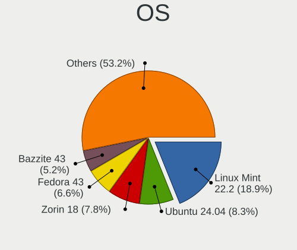

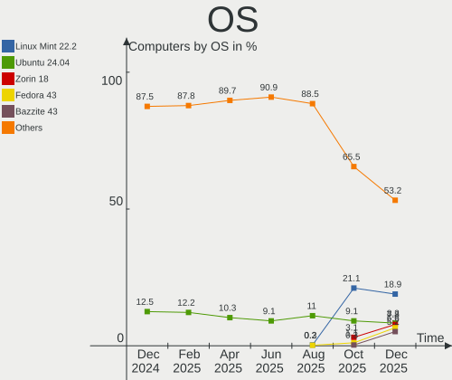

| Name                         | Computers | Percent |
|------------------------------|-----------|---------|
| Linux Mint 22.2              | 157       | 18.89%  |
| Ubuntu 24.04                 | 69        | 8.3%    |
| Zorin 18                     | 65        | 7.82%   |
| Fedora 43                    | 55        | 6.62%   |
| Bazzite 43                   | 43        | 5.17%   |
| Debian 13                    | 34        | 4.09%   |
| Arch Rolling                 | 26        | 3.13%   |
| LMDE 7                       | 24        | 2.89%   |
| Ubuntu 25.10                 | 18        | 2.17%   |
| OpenMandriva 6.0             | 18        | 2.17%   |
| OpenMandriva 25.90           | 16        | 1.93%   |
| Bazzite 42                   | 16        | 1.93%   |
| CachyOS Rolling              | 14        | 1.68%   |
| Linux Mint 21.3              | 13        | 1.56%   |
| Debian 12                    | 13        | 1.56%   |
| Zorin 17                     | 12        | 1.44%   |
| Pop!_OS 24.04                | 12        | 1.44%   |
| Ubuntu 22.04                 | 10        | 1.2%    |
| Debian                       | 10        | 1.2%    |
| Kubuntu 25.10                | 9         | 1.08%   |
| Pop!_OS 22.04                | 8         | 0.96%   |
| OpenMandriva 24.12           | 8         | 0.96%   |
| Manjaro                      | 8         | 0.96%   |
| Linux Mint 22.1              | 8         | 0.96%   |
| EndeavourOS Rolling          | 8         | 0.96%   |
| CachyOS                      | 8         | 0.96%   |
| Kubuntu 24.04                | 7         | 0.84%   |
| TUXEDO OS 24.04              | 6         | 0.72%   |
| openSUSE Tumbleweed-XXXXXXXX | 6         | 0.72%   |
| Fedora 42                    | 6         | 0.72%   |
| openSUSE Leap-16.0           | 5         | 0.6%    |
| NixOS 25.11                  | 5         | 0.6%    |
| Manjaro 25.1.0               | 5         | 0.6%    |
| Linux Mint 22                | 5         | 0.6%    |
| KDE neon 24.04               | 5         | 0.6%    |
| SteamOS 3.7.17               | 4         | 0.48%   |
| OpenMandriva 25.11           | 4         | 0.48%   |
| MX 25                        | 4         | 0.48%   |
| Xubuntu 24.04                | 3         | 0.36%   |
| Ubuntu 20.04                 | 3         | 0.36%   |

OS Family
---------

OS without a version

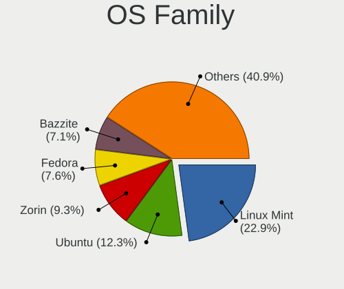

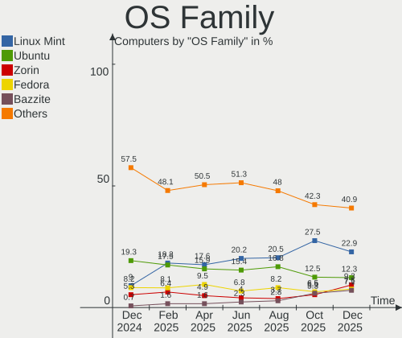

| Name             | Computers | Percent |
|------------------|-----------|---------|
| Linux Mint       | 190       | 22.86%  |
| Ubuntu           | 102       | 12.27%  |
| Zorin            | 77        | 9.27%   |
| Fedora           | 63        | 7.58%   |
| Bazzite          | 59        | 7.1%    |
| Debian           | 58        | 6.98%   |
| OpenMandriva     | 54        | 6.5%    |
| Arch             | 26        | 3.13%   |
| LMDE             | 25        | 3.01%   |
| CachyOS          | 22        | 2.65%   |
| Pop!_OS          | 20        | 2.41%   |
| Kubuntu          | 18        | 2.17%   |
| Manjaro          | 16        | 1.93%   |
| openSUSE         | 15        | 1.81%   |
| NixOS            | 9         | 1.08%   |
| EndeavourOS      | 8         | 0.96%   |
| TUXEDO OS        | 6         | 0.72%   |
| MX               | 6         | 0.72%   |
| SteamOS          | 5         | 0.6%    |
| KDE neon         | 5         | 0.6%    |
| Xubuntu          | 4         | 0.48%   |
| Nobara           | 3         | 0.36%   |
| Kalpa-desktop    | 3         | 0.36%   |
| Gentoo           | 3         | 0.36%   |
| Elementary       | 3         | 0.36%   |
| Q4OS             | 2         | 0.24%   |
| Pikaos           | 2         | 0.24%   |
| Kali             | 2         | 0.24%   |
| Dts-distro       | 2         | 0.24%   |
| Aurora           | 2         | 0.24%   |
| Void Linux       | 1         | 0.12%   |
| Siduction        | 1         | 0.12%   |
| ROSA             | 1         | 0.12%   |
| RHEL             | 1         | 0.12%   |
| org.kde.Platform | 1         | 0.12%   |
| Liya             | 1         | 0.12%   |
| Kde              | 1         | 0.12%   |
| Guix             | 1         | 0.12%   |
| Garuda Linux     | 1         | 0.12%   |
| Feren OS         | 1         | 0.12%   |

Kernel
------

Version of the Linux kernel

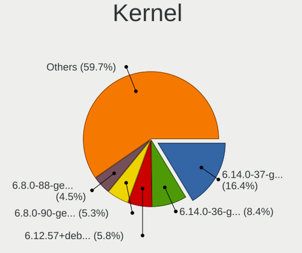

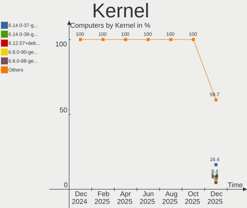

| Version                                     | Computers | Percent |
|---------------------------------------------|-----------|---------|
| 6.14.0-37-generic                           | 136       | 16.37%  |
| 6.14.0-36-generic                           | 70        | 8.42%   |
| 6.12.57+deb13-amd64                         | 48        | 5.78%   |
| 6.8.0-90-generic                            | 44        | 5.29%   |
| 6.8.0-88-generic                            | 37        | 4.45%   |
| 6.14.2-desktop-3omv2590                     | 35        | 4.21%   |
| 6.17.7-ba20.fc43.x86_64                     | 32        | 3.85%   |
| 6.17.9-arch1-1                              | 23        | 2.77%   |
| 6.17.9-300.fc43.x86_64                      | 17        | 2.05%   |
| 6.17.12-300.fc43.x86_64                     | 15        | 1.81%   |
| 6.16.4-116.bazzite.fc42.x86_64              | 15        | 1.81%   |
| 6.8.0-87-generic                            | 12        | 1.44%   |
| 6.17.9-76061709-generic                     | 10        | 1.2%    |
| 6.17.0-8-generic                            | 10        | 1.2%    |
| 6.17.7-ba19.fc43.x86_64                     | 9         | 1.08%   |
| 6.14.0-29-generic                           | 9         | 1.08%   |
| 6.17.4-76061704-generic                     | 8         | 0.96%   |
| 6.17.11-300.fc43.x86_64                     | 8         | 0.96%   |
| 6.17.0-7-generic                            | 8         | 0.96%   |
| 6.12.1-desktop-1omv2490                     | 8         | 0.96%   |
| 6.17.9-2-cachyos                            | 7         | 0.84%   |
| 6.14.0-33-generic                           | 7         | 0.84%   |
| 6.17.0-5-generic                            | 6         | 0.72%   |
| 6.12.48+deb13-amd64                         | 6         | 0.72%   |
| 6.1.0-41-amd64                              | 6         | 0.72%   |
| 5.15.0-164-generic                          | 6         | 0.72%   |
| 6.17.10-300.fc43.x86_64                     | 4         | 0.48%   |
| 6.14.0-27-generic                           | 4         | 0.48%   |
| 6.11.11-valve24-2-neptune-611-gfd0dd251480d | 4         | 0.48%   |
| 6.8.0-79-generic                            | 3         | 0.36%   |
| 6.4.11-desktop-1omv2390                     | 3         | 0.36%   |
| 6.18.2-arch2-1                              | 3         | 0.36%   |
| 6.18.0-1-MANJARO                            | 3         | 0.36%   |
| 6.18.0-1-default                            | 3         | 0.36%   |
| 6.17.9+deb14-amd64                          | 3         | 0.36%   |
| 6.17.9                                      | 3         | 0.36%   |
| 6.17.8-arch1-1                              | 3         | 0.36%   |
| 6.17.8-300.fc43.x86_64                      | 3         | 0.36%   |
| 6.17.7-desktop-1omv2590                     | 3         | 0.36%   |
| 6.17.7-300.fc43.x86_64                      | 3         | 0.36%   |

Kernel Family
-------------

Linux kernel without a distro release

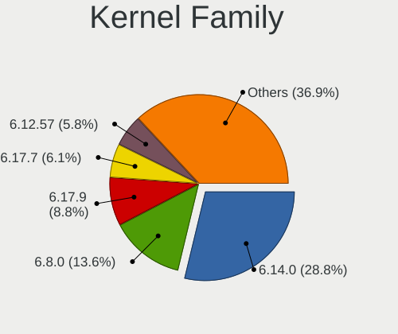

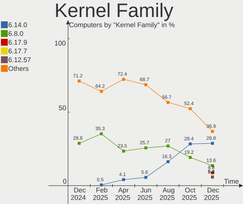

| Version | Computers | Percent |
|---------|-----------|---------|
| 6.14.0  | 239       | 28.76%  |
| 6.8.0   | 113       | 13.6%   |
| 6.17.9  | 73        | 8.78%   |
| 6.17.7  | 51        | 6.14%   |
| 6.12.57 | 48        | 5.78%   |
| 6.14.2  | 35        | 4.21%   |
| 6.17.0  | 27        | 3.25%   |
| 6.17.12 | 20        | 2.41%   |
| 6.18.2  | 19        | 2.29%   |
| 6.18.0  | 18        | 2.17%   |
| 5.15.0  | 17        | 2.05%   |
| 6.16.4  | 16        | 1.93%   |
| 6.17.8  | 12        | 1.44%   |
| 6.17.11 | 10        | 1.2%    |
| 6.17.4  | 9         | 1.08%   |
| 6.17.10 | 9         | 1.08%   |
| 6.12.48 | 8         | 0.96%   |
| 6.12.1  | 8         | 0.96%   |
| 6.1.0   | 8         | 0.96%   |
| 6.18.1  | 7         | 0.84%   |
| 6.12.0  | 7         | 0.84%   |
| 6.17.1  | 6         | 0.72%   |
| 6.11.11 | 5         | 0.6%    |
| 6.4.0   | 4         | 0.48%   |
| 6.16.12 | 4         | 0.48%   |
| 6.12.63 | 4         | 0.48%   |
| 6.12.61 | 4         | 0.48%   |
| 6.4.11  | 3         | 0.36%   |
| 6.17.2  | 3         | 0.36%   |
| 6.17.13 | 3         | 0.36%   |
| 5.4.0   | 3         | 0.36%   |
| 6.8.12  | 2         | 0.24%   |
| 6.6.21  | 2         | 0.24%   |
| 6.17.5  | 2         | 0.24%   |
| 6.16.8  | 2         | 0.24%   |
| 6.16.3  | 2         | 0.24%   |
| 6.12.62 | 2         | 0.24%   |
| 6.12.60 | 2         | 0.24%   |
| 6.12.47 | 2         | 0.24%   |
| 6.12.34 | 2         | 0.24%   |

Kernel Major Ver.
-----------------

Linux kernel major version

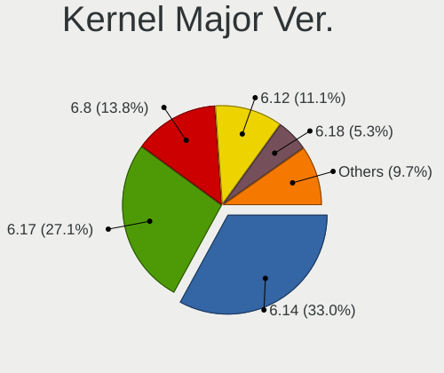

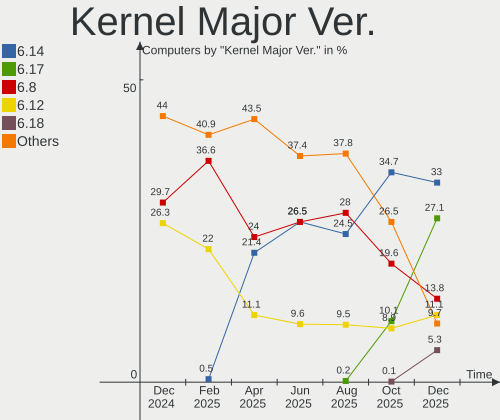

| Version | Computers | Percent |
|---------|-----------|---------|
| 6.14    | 274       | 32.97%  |
| 6.17    | 225       | 27.08%  |
| 6.8     | 115       | 13.84%  |
| 6.12    | 92        | 11.07%  |
| 6.18    | 44        | 5.29%   |
| 6.16    | 24        | 2.89%   |
| 5.15    | 19        | 2.29%   |
| 6.1     | 9         | 1.08%   |
| 6.4     | 8         | 0.96%   |
| 6.11    | 8         | 0.96%   |
| 6.6     | 3         | 0.36%   |
| 5.4     | 3         | 0.36%   |
| 6.7     | 1         | 0.12%   |
| 6.5     | 1         | 0.12%   |
| 6.2     | 1         | 0.12%   |
| 6.13    | 1         | 0.12%   |
| 5.19    | 1         | 0.12%   |
| 5.14    | 1         | 0.12%   |
| 5.10    | 1         | 0.12%   |

Arch
----

OS architecture (x86_64, i586, etc.)

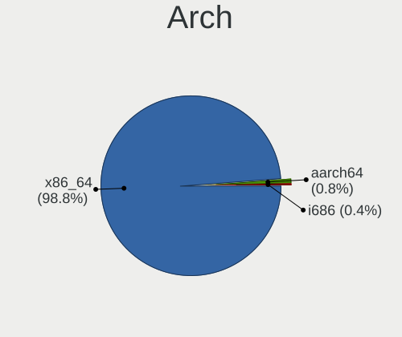

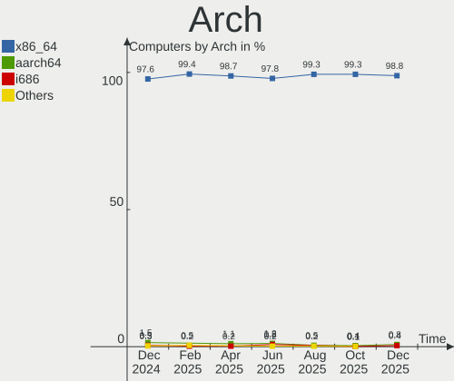

| Name    | Computers | Percent |
|---------|-----------|---------|
| x86_64  | 821       | 98.8%   |
| aarch64 | 7         | 0.84%   |
| i686    | 3         | 0.36%   |

DE
--

Desktop Environment

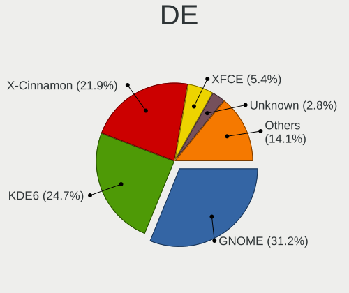

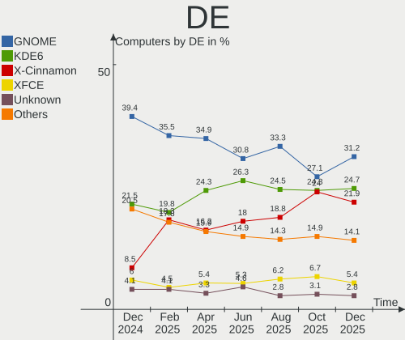

| Name            | Computers | Percent |
|-----------------|-----------|---------|
| GNOME           | 259       | 31.17%  |
| KDE6            | 205       | 24.67%  |
| X-Cinnamon      | 182       | 21.9%   |
| XFCE            | 45        | 5.42%   |
| Unknown         | 23        | 2.77%   |
| KDE5            | 22        | 2.65%   |
| MATE            | 18        | 2.17%   |
| KDE             | 18        | 2.17%   |
| COSMIC          | 14        | 1.68%   |
| Cinnamon        | 9         | 1.08%   |
| Hyprland        | 5         | 0.6%    |
| sway            | 4         | 0.48%   |
| LXDE            | 4         | 0.48%   |
| Pantheon        | 3         | 0.36%   |
| niri            | 3         | 0.36%   |
| LXQt            | 3         | 0.36%   |
| KDE4            | 3         | 0.36%   |
| GNOME Classic   | 2         | 0.24%   |
| Budgie          | 2         | 0.24%   |
| TDE:            | 1         | 0.12%   |
| sway:wlroots    | 1         | 0.12%   |
| labwc:wlroots   | 1         | 0.12%   |
| icewm           | 1         | 0.12%   |
| GNOME Flashback | 1         | 0.12%   |
| Enlightenment   | 1         | 0.12%   |
| Endless:GNOME   | 1         | 0.12%   |

Display Server
--------------

X11 or Wayland

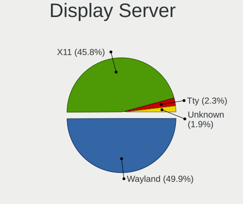

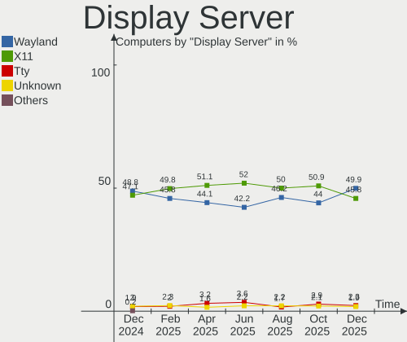

| Name    | Computers | Percent |
|---------|-----------|---------|
| Wayland | 415       | 49.94%  |
| X11     | 381       | 45.85%  |
| Tty     | 19        | 2.29%   |
| Unknown | 16        | 1.93%   |

Display Manager
---------------

SDDM, LightDM, etc.

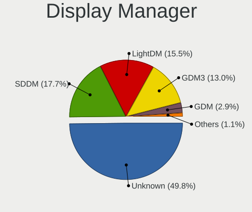

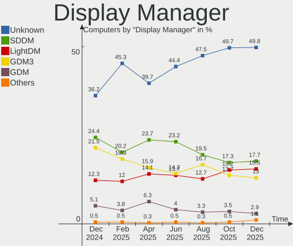

| Name                  | Computers | Percent |
|-----------------------|-----------|---------|
| Unknown               | 414       | 49.82%  |
| SDDM                  | 147       | 17.69%  |
| LightDM               | 129       | 15.52%  |
| GDM3                  | 108       | 13%     |
| GDM                   | 24        | 2.89%   |
| GREETD                | 3         | 0.36%   |
| COSMIC-GREETER        | 3         | 0.36%   |
| TDM                   | 1         | 0.12%   |
| SLIMSKI               | 1         | 0.12%   |
| DISPLAY-MANAGER-START | 1         | 0.12%   |

OS Lang
-------

Language

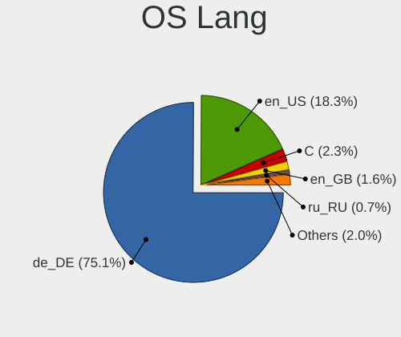

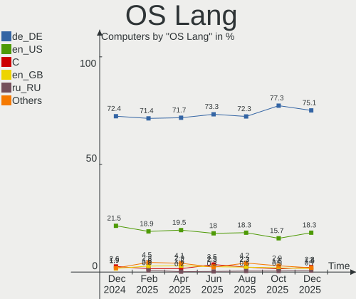

| Lang    | Computers | Percent |
|---------|-----------|---------|
| de_DE   | 624       | 75.09%  |
| en_US   | 152       | 18.29%  |
| C       | 19        | 2.29%   |
| en_GB   | 13        | 1.56%   |
| ru_RU   | 6         | 0.72%   |
| Unknown | 6         | 0.72%   |
| de_AT   | 2         | 0.24%   |
| POSIX   | 1         | 0.12%   |
| pl_PL   | 1         | 0.12%   |
| it_IT   | 1         | 0.12%   |
| fr_FR   | 1         | 0.12%   |
| es_ES   | 1         | 0.12%   |
| en_SG   | 1         | 0.12%   |
| en_DK   | 1         | 0.12%   |
| en_CA   | 1         | 0.12%   |
| C.UTF8  | 1         | 0.12%   |

Boot Mode
---------

EFI or BIOS

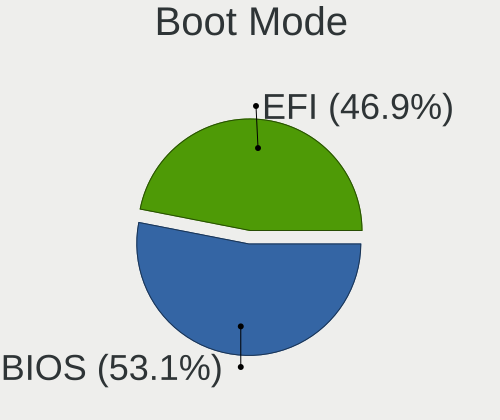

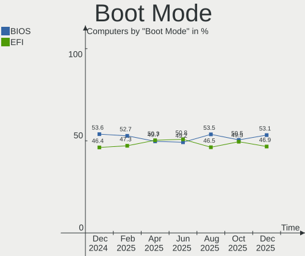

| Mode | Computers | Percent |
|------|-----------|---------|
| BIOS | 441       | 53.07%  |
| EFI  | 390       | 46.93%  |

Filesystem
----------

Type of filesystem

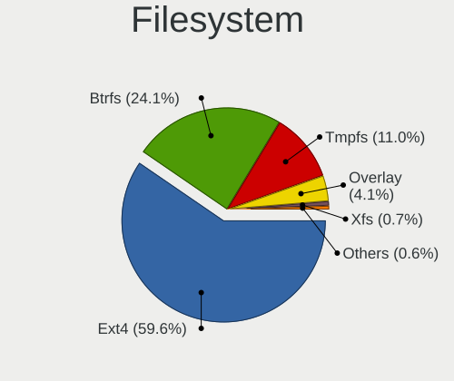

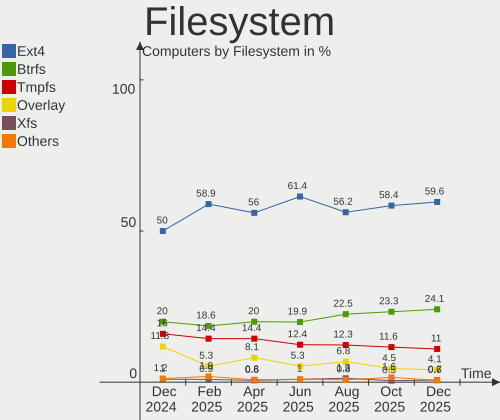

| Type     | Computers | Percent |
|----------|-----------|---------|
| Ext4     | 495       | 59.57%  |
| Btrfs    | 200       | 24.07%  |
| Tmpfs    | 91        | 10.95%  |
| Overlay  | 34        | 4.09%   |
| Xfs      | 6         | 0.72%   |
| F2fs     | 2         | 0.24%   |
| Zfs      | 1         | 0.12%   |
| XXX4     | 1         | 0.12%   |
| Bcachefs | 1         | 0.12%   |

Part. scheme
------------

Scheme of partitioning

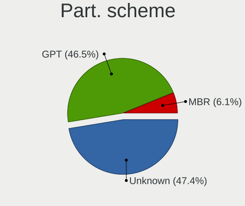

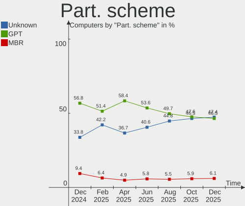

| Type    | Computers | Percent |
|---------|-----------|---------|
| Unknown | 394       | 47.41%  |
| GPT     | 386       | 46.45%  |
| MBR     | 51        | 6.14%   |

Dual Boot with Linux/BSD
------------------------

Hosting more than one Linux/BSD

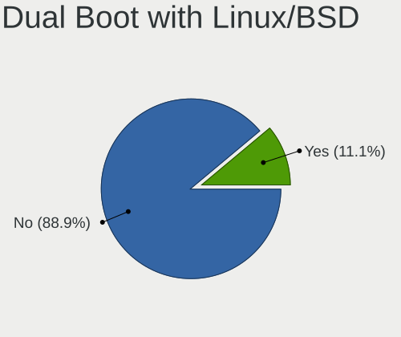

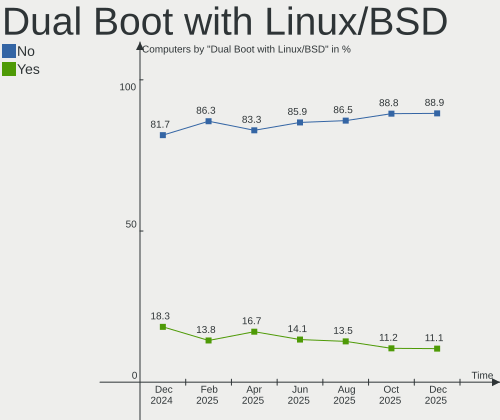

| Dual boot | Computers | Percent |
|-----------|-----------|---------|
| No        | 739       | 88.93%  |
| Yes       | 92        | 11.07%  |

Dual Boot (Win)
---------------

Hosting Linux and Windows

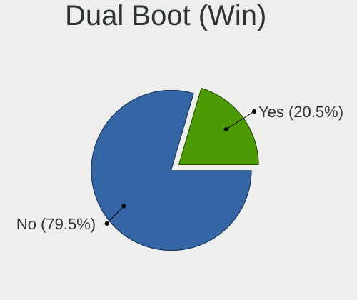

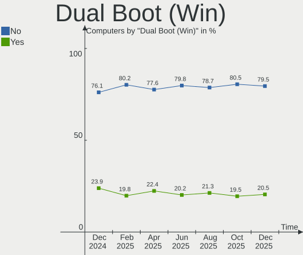

| Dual boot | Computers | Percent |
|-----------|-----------|---------|
| No        | 661       | 79.54%  |
| Yes       | 170       | 20.46%  |

Board
-----

Vendor
------

Motherboard manufacturer

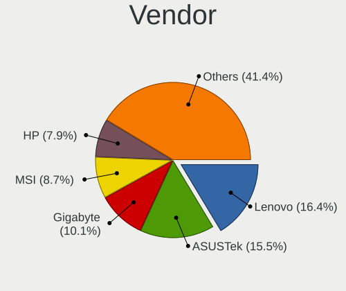

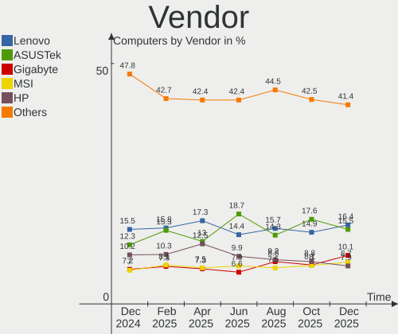

| Name                                 | Computers | Percent |
|--------------------------------------|-----------|---------|
| Lenovo                               | 136       | 16.37%  |
| ASUSTek Computer                     | 129       | 15.52%  |
| Gigabyte Technology                  | 84        | 10.11%  |
| MSI                                  | 72        | 8.66%   |
| Hewlett-Packard                      | 66        | 7.94%   |
| Dell                                 | 57        | 6.86%   |
| ASRock                               | 34        | 4.09%   |
| Acer                                 | 33        | 3.97%   |
| Apple                                | 30        | 3.61%   |
| Medion                               | 27        | 3.25%   |
| Fujitsu                              | 27        | 3.25%   |
| Unknown                              | 14        | 1.68%   |
| Intel                                | 9         | 1.08%   |
| TUXEDO                               | 8         | 0.96%   |
| Toshiba                              | 6         | 0.72%   |
| Raspberry Pi Foundation              | 6         | 0.72%   |
| Shenzhen Meigao Electronic Equipment | 5         | 0.6%    |
| Notebook                             | 5         | 0.6%    |
| Microsoft                            | 5         | 0.6%    |
| Samsung Electronics                  | 4         | 0.48%   |
| HUAWEI                               | 4         | 0.48%   |
| GMKtec                               | 4         | 0.48%   |
| Fujitsu Siemens                      | 4         | 0.48%   |
| Wortmann AG                          | 3         | 0.36%   |
| Supermicro                           | 3         | 0.36%   |
| Sony                                 | 3         | 0.36%   |
| LG Electronics                       | 3         | 0.36%   |
| GEEKOM                               | 3         | 0.36%   |
| Biostar                              | 3         | 0.36%   |
| Valve                                | 2         | 0.24%   |
| Razer                                | 2         | 0.24%   |
| Packard Bell                         | 2         | 0.24%   |
| Huanan                               | 2         | 0.24%   |
| HC Technology.                       | 2         | 0.24%   |
| Google                               | 2         | 0.24%   |
| Framework                            | 2         | 0.24%   |
| Foxconn                              | 2         | 0.24%   |
| ECS                                  | 2         | 0.24%   |
| AZW                                  | 2         | 0.24%   |
| TYAN Computer                        | 1         | 0.12%   |

Model
-----

Motherboard model

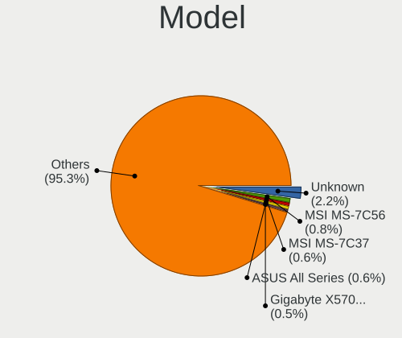

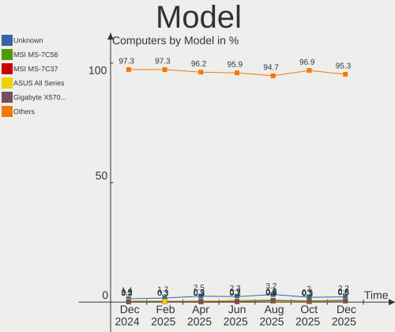

| Name                                                  | Computers | Percent |
|-------------------------------------------------------|-----------|---------|
| Unknown                                               | 18        | 2.17%   |
| MSI MS-7C56                                           | 7         | 0.84%   |
| MSI MS-7C37                                           | 5         | 0.6%    |
| ASUS All Series                                       | 5         | 0.6%    |
| Gigabyte X570 AORUS ELITE                             | 4         | 0.48%   |
| Dell OptiPlex 7050                                    | 4         | 0.48%   |
| ASUS VivoBook_ASUSLaptop M1605YA_M1605YA              | 4         | 0.48%   |
| Shenzhen Meigao Electronic Equipment EliteMini Series | 3         | 0.36%   |
| RPi Raspberry Pi 5 Model B Rev 1.0                    | 3         | 0.36%   |
| MSI MS-7D75                                           | 3         | 0.36%   |
| Gigabyte B550 GAMING X V2                             | 3         | 0.36%   |
| Gigabyte B550 AORUS ELITE V2                          | 3         | 0.36%   |
| Gigabyte 1009707_2120234                              | 3         | 0.36%   |
| ASUS A0000001                                         | 3         | 0.36%   |
| Apple MacBookAir7,2                                   | 3         | 0.36%   |
| TUXEDO InfinityBook Pro AMD Gen10                     | 2         | 0.24%   |
| Notebook V54x_6x_TU                                   | 2         | 0.24%   |
| MSI MS-7E56                                           | 2         | 0.24%   |
| MSI MS-7E26                                           | 2         | 0.24%   |
| MSI MS-7D70                                           | 2         | 0.24%   |
| MSI MS-7D32                                           | 2         | 0.24%   |
| MSI MS-7D25                                           | 2         | 0.24%   |
| MSI MS-7C91                                           | 2         | 0.24%   |
| MSI MS-7C89                                           | 2         | 0.24%   |
| MSI MS-7C75                                           | 2         | 0.24%   |
| MSI MS-7A38                                           | 2         | 0.24%   |
| MSI MS-7A33                                           | 2         | 0.24%   |
| Medion S23003                                         | 2         | 0.24%   |
| Lenovo Yoga Pro 7 14APH8 82Y8                         | 2         | 0.24%   |
| Lenovo ThinkPad E15 Gen 2 20T8000TGE                  | 2         | 0.24%   |
| Lenovo Legion 5 15IRX10 83LY                          | 2         | 0.24%   |
| Lenovo IdeaPad 5 15ARE05 81YQ                         | 2         | 0.24%   |
| HUAWEI HKD-WXX                                        | 2         | 0.24%   |
| Huanan X99-F8D PLUS V1.32                             | 2         | 0.24%   |
| HP Z420 Workstation                                   | 2         | 0.24%   |
| HP EliteBook 8570p                                    | 2         | 0.24%   |
| HP EliteBook 8460p                                    | 2         | 0.24%   |
| HP 350 G1                                             | 2         | 0.24%   |
| HP 255 15.6 inch G10                                  | 2         | 0.24%   |
| HC Technology. HCAR5000-MI                            | 2         | 0.24%   |

Model Family
------------

Motherboard model prefix

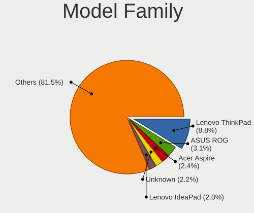

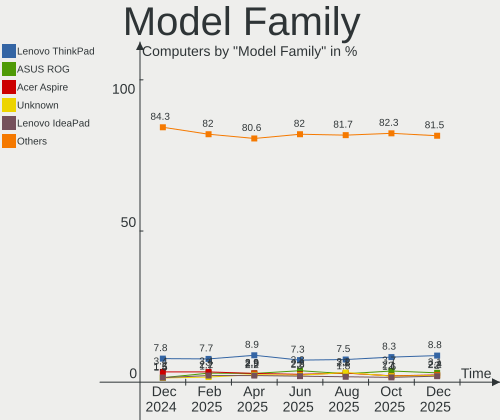

| Name                                           | Computers | Percent |
|------------------------------------------------|-----------|---------|
| Lenovo ThinkPad                                | 73        | 8.78%   |
| ASUS ROG                                       | 26        | 3.13%   |
| Acer Aspire                                    | 20        | 2.41%   |
| Unknown                                        | 18        | 2.17%   |
| Lenovo IdeaPad                                 | 17        | 2.05%   |
| ASUS PRIME                                     | 16        | 1.93%   |
| Dell OptiPlex                                  | 15        | 1.81%   |
| Fujitsu ESPRIMO                                | 13        | 1.56%   |
| Dell XPS                                       | 13        | 1.56%   |
| ASUS TUF                                       | 13        | 1.56%   |
| HP EliteBook                                   | 12        | 1.44%   |
| Dell Latitude                                  | 12        | 1.44%   |
| Lenovo ThinkCentre                             | 10        | 1.2%    |
| Fujitsu LIFEBOOK                               | 10        | 1.2%    |
| ASUS VivoBook                                  | 10        | 1.2%    |
| Gigabyte B550                                  | 8         | 0.96%   |
| Dell Inspiron                                  | 8         | 0.96%   |
| MSI MS-7C56                                    | 7         | 0.84%   |
| Lenovo Legion                                  | 7         | 0.84%   |
| HP ProBook                                     | 7         | 0.84%   |
| Gigabyte X570                                  | 7         | 0.84%   |
| Toshiba Satellite                              | 6         | 0.72%   |
| RPi Raspberry                                  | 6         | 0.72%   |
| Lenovo Yoga                                    | 6         | 0.72%   |
| HP EliteDesk                                   | 6         | 0.72%   |
| MSI MS-7C37                                    | 5         | 0.6%    |
| Microsoft Surface                              | 5         | 0.6%    |
| HP Pavilion                                    | 5         | 0.6%    |
| HP Compaq                                      | 5         | 0.6%    |
| Dell Precision                                 | 5         | 0.6%    |
| ASUS All                                       | 5         | 0.6%    |
| TUXEDO InfinityBook                            | 4         | 0.48%   |
| Medion Akoya                                   | 4         | 0.48%   |
| HP Laptop                                      | 4         | 0.48%   |
| Apple MacBookPro9                              | 4         | 0.48%   |
| Shenzhen Meigao Electronic Equipment EliteMini | 3         | 0.36%   |
| MSI MS-7D75                                    | 3         | 0.36%   |
| Lenovo V15                                     | 3         | 0.36%   |
| Lenovo ThinkBook                               | 3         | 0.36%   |
| HP OmniBook                                    | 3         | 0.36%   |

MFG Year
--------

Motherboard manufacture year

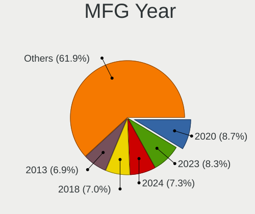

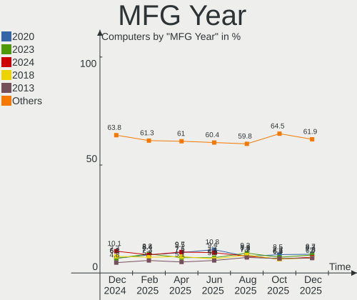

| Year    | Computers | Percent |
|---------|-----------|---------|
| 2020    | 72        | 8.66%   |
| 2023    | 69        | 8.3%    |
| 2024    | 61        | 7.34%   |
| 2018    | 58        | 6.98%   |
| 2013    | 57        | 6.86%   |
| 2021    | 56        | 6.74%   |
| 2019    | 56        | 6.74%   |
| 2025    | 52        | 6.26%   |
| 2022    | 49        | 5.9%    |
| 2012    | 47        | 5.66%   |
| 2017    | 44        | 5.29%   |
| 2014    | 42        | 5.05%   |
| 2011    | 37        | 4.45%   |
| 2016    | 32        | 3.85%   |
| 2015    | 26        | 3.13%   |
| 2010    | 19        | 2.29%   |
| 2008    | 17        | 2.05%   |
| 2009    | 15        | 1.81%   |
| 2007    | 8         | 0.96%   |
| 2006    | 7         | 0.84%   |
| Unknown | 7         | 0.84%   |

Form Factor
-----------

Physical design of the computer

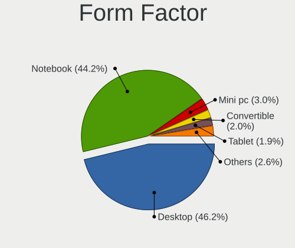

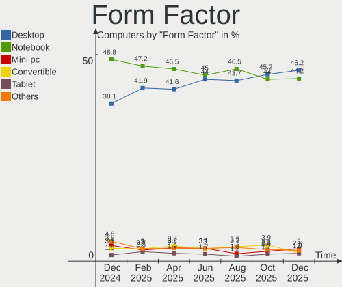

| Name           | Computers | Percent |
|----------------|-----------|---------|
| Desktop        | 384       | 46.21%  |
| Notebook       | 367       | 44.16%  |
| Mini pc        | 25        | 3.01%   |
| Convertible    | 17        | 2.05%   |
| Tablet         | 16        | 1.93%   |
| All in one     | 9         | 1.08%   |
| System on chip | 7         | 0.84%   |
| Server         | 6         | 0.72%   |

Secure Boot
-----------

Enabled or disabled

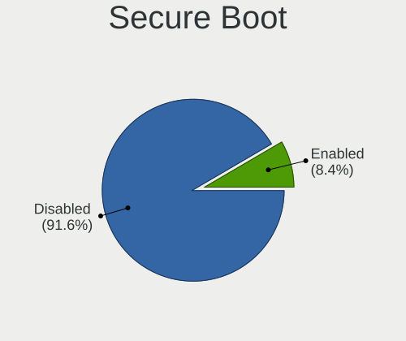

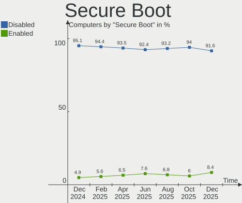

| State    | Computers | Percent |
|----------|-----------|---------|
| Disabled | 761       | 91.58%  |
| Enabled  | 70        | 8.42%   |

Coreboot
--------

Have coreboot on board

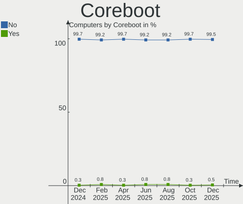

| Used | Computers | Percent |
|------|-----------|---------|
| No   | 827       | 99.52%  |
| Yes  | 4         | 0.48%   |

RAM Size
--------

Total RAM memory

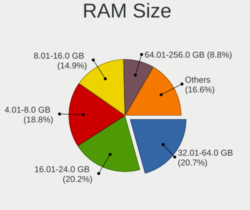

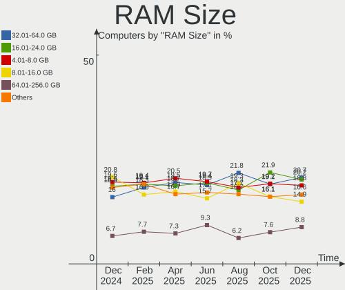

| Size in GB  | Computers | Percent |
|-------------|-----------|---------|
| 32.01-64.0  | 172       | 20.7%   |
| 16.01-24.0  | 168       | 20.22%  |
| 4.01-8.0    | 156       | 18.77%  |
| 8.01-16.0   | 124       | 14.92%  |
| 64.01-256.0 | 73        | 8.78%   |
| 24.01-32.0  | 67        | 8.06%   |
| 3.01-4.0    | 59        | 7.1%    |
| 2.01-3.0    | 6         | 0.72%   |
| 1.01-2.0    | 6         | 0.72%   |

RAM Used
--------

Used RAM memory

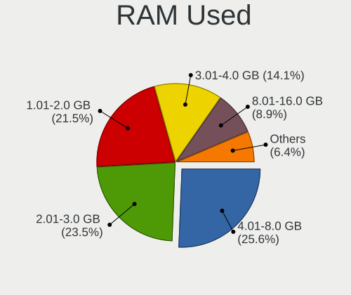

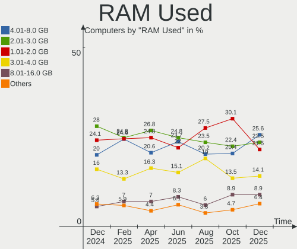

| Used GB    | Computers | Percent |
|------------|-----------|---------|
| 4.01-8.0   | 213       | 25.63%  |
| 2.01-3.0   | 195       | 23.47%  |
| 1.01-2.0   | 179       | 21.54%  |
| 3.01-4.0   | 117       | 14.08%  |
| 8.01-16.0  | 74        | 8.9%    |
| 0.51-1.0   | 27        | 3.25%   |
| 16.01-24.0 | 12        | 1.44%   |
| 32.01-64.0 | 7         | 0.84%   |
| 24.01-32.0 | 4         | 0.48%   |
| 0.01-0.5   | 3         | 0.36%   |

Total Drives
------------

Number of drives on board

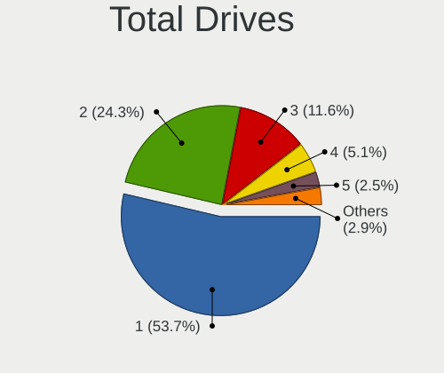

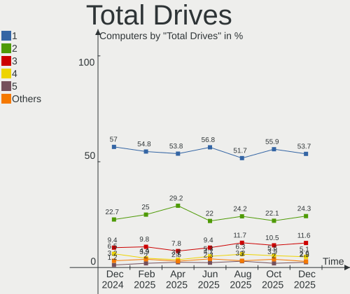

| Drives | Computers | Percent |
|--------|-----------|---------|
| 1      | 446       | 53.67%  |
| 2      | 202       | 24.31%  |
| 3      | 96        | 11.55%  |
| 4      | 42        | 5.05%   |
| 5      | 21        | 2.53%   |
| 6      | 12        | 1.44%   |
| 0      | 5         | 0.6%    |
| 7      | 3         | 0.36%   |
| 8      | 2         | 0.24%   |
| 12     | 1         | 0.12%   |
| 9      | 1         | 0.12%   |

Has CD-ROM
----------

Has CD-ROM on board

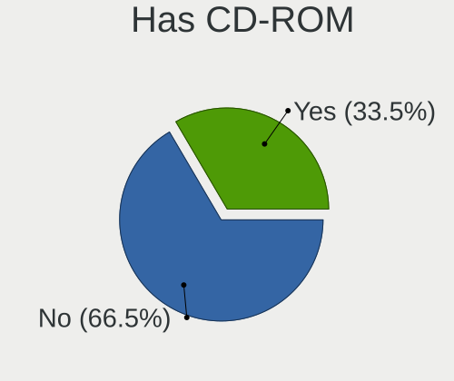

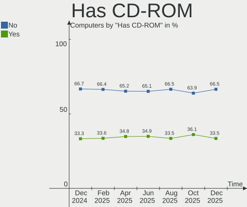

| Presented | Computers | Percent |
|-----------|-----------|---------|
| No        | 553       | 66.55%  |
| Yes       | 278       | 33.45%  |

Has Ethernet
------------

Has Ethernet on board

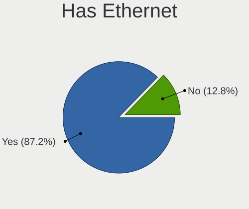

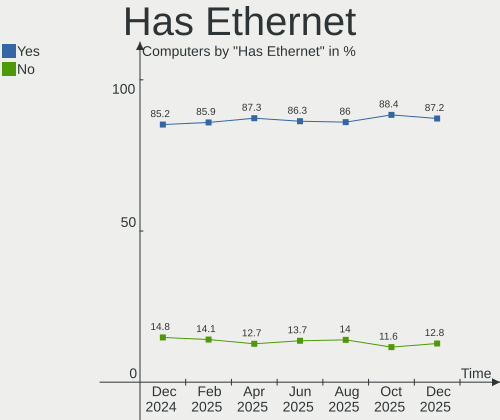

| Presented | Computers | Percent |
|-----------|-----------|---------|
| Yes       | 725       | 87.24%  |
| No        | 106       | 12.76%  |

Has WiFi
--------

Has WiFi module

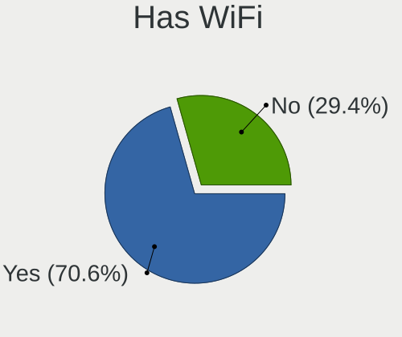

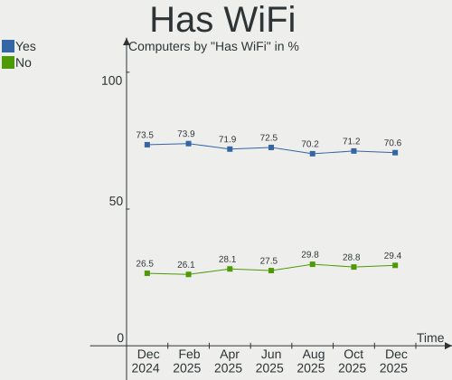

| Presented | Computers | Percent |
|-----------|-----------|---------|
| Yes       | 587       | 70.64%  |
| No        | 244       | 29.36%  |

Has Bluetooth
-------------

Has Bluetooth module

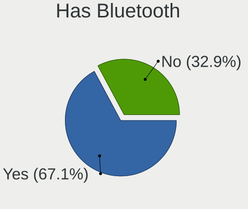

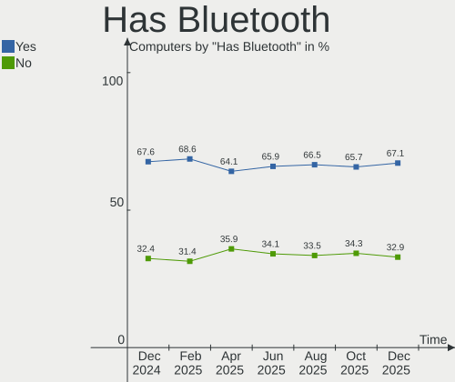

| Presented | Computers | Percent |
|-----------|-----------|---------|
| Yes       | 558       | 67.15%  |
| No        | 273       | 32.85%  |

Location
--------

Country
-------

Geographic location (country)

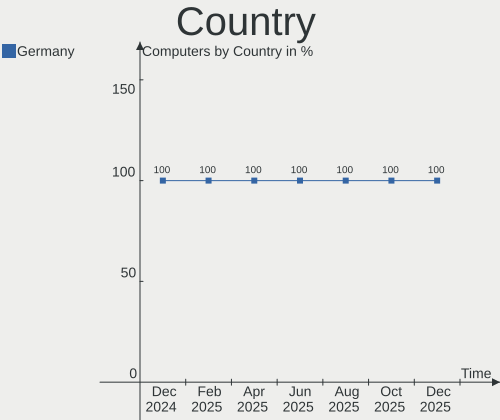

| Country | Computers | Percent |
|---------|-----------|---------|
| Germany | 831       | 100%    |

City
----

Geographic location (city)

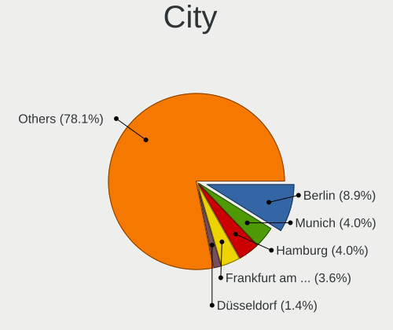

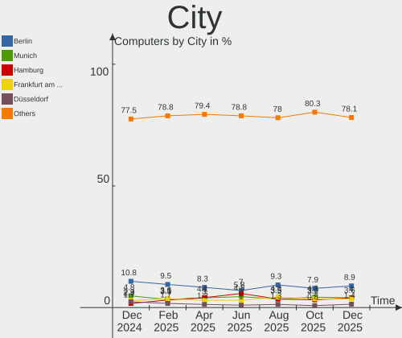

| City                  | Computers | Percent |
|-----------------------|-----------|---------|
| Berlin                | 74        | 8.9%    |
| Munich                | 33        | 3.97%   |
| Hamburg               | 33        | 3.97%   |
| Frankfurt am Main     | 30        | 3.61%   |
| Düsseldorf           | 12        | 1.44%   |
| Dortmund              | 12        | 1.44%   |
| Stuttgart             | 11        | 1.32%   |
| Leipzig               | 10        | 1.2%    |
| Essen                 | 10        | 1.2%    |
| Traunstein            | 9         | 1.08%   |
| Mannheim              | 9         | 1.08%   |
| Hanover               | 9         | 1.08%   |
| Nuremberg             | 7         | 0.84%   |
| Bremen                | 7         | 0.84%   |
| Hamminkeln            | 6         | 0.72%   |
| Dresden               | 6         | 0.72%   |
| Cologne               | 6         | 0.72%   |
| Ludwigshafen am Rhein | 5         | 0.6%    |
| Esslingen am Neckar   | 5         | 0.6%    |
| Bonn                  | 5         | 0.6%    |
| Wuppertal             | 4         | 0.48%   |
| Siegen                | 4         | 0.48%   |
| Schorndorf            | 4         | 0.48%   |
| Reutlingen            | 4         | 0.48%   |
| Pforzheim             | 4         | 0.48%   |
| Offenbach             | 4         | 0.48%   |
| Mönchengladbach      | 4         | 0.48%   |
| Lübeck               | 4         | 0.48%   |
| Kiel                  | 4         | 0.48%   |
| Kassel                | 4         | 0.48%   |
| Jena                  | 4         | 0.48%   |
| Hof                   | 4         | 0.48%   |
| Hanau                 | 4         | 0.48%   |
| Erlangen              | 4         | 0.48%   |
| Duisburg              | 4         | 0.48%   |
| Burg bei Magdeburg    | 4         | 0.48%   |
| Bochum                | 4         | 0.48%   |
| Augsburg              | 4         | 0.48%   |
| Weingarten            | 3         | 0.36%   |
| Trier                 | 3         | 0.36%   |

Drives
------

Drive Vendor
------------

Hard drive vendors

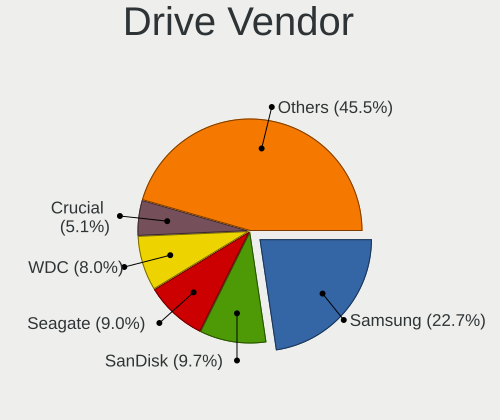

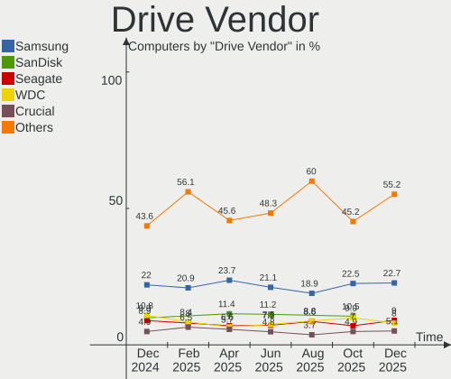

| Vendor                       | Computers | Drives | Percent |
|------------------------------|-----------|--------|---------|
| Samsung Electronics          | 295       | 424    | 22.66%  |
| SanDisk                      | 126       | 151    | 9.68%   |
| Seagate                      | 117       | 134    | 8.99%   |
| WDC                          | 104       | 125    | 7.99%   |
| Crucial                      | 67        | 74     | 5.15%   |
| Toshiba                      | 51        | 54     | 3.92%   |
| Micron/Crucial Technology    | 45        | 52     | 3.46%   |
| Intenso                      | 42        | 47     | 3.23%   |
| Kingston                     | 35        | 41     | 2.69%   |
| Unknown                      | 32        | 38     | 2.46%   |
| SK hynix                     | 30        | 31     | 2.3%    |
| Micron Technology            | 26        | 26     | 2%      |
| Intel                        | 23        | 24     | 1.77%   |
| Kingston Technology Company  | 22        | 24     | 1.69%   |
| Phison Electronics           | 18        | 19     | 1.38%   |
| Hitachi                      | 18        | 19     | 1.38%   |
| KIOXIA                       | 16        | 17     | 1.23%   |
| Apple                        | 13        | 14     | 1%      |
| HGST                         | 12        | 12     | 0.92%   |
| Shenzhen Longsys Electronics | 10        | 12     | 0.77%   |
| Silicon Motion               | 9         | 9      | 0.69%   |
| MAXIO Technology (Hangzhou)  | 8         | 8      | 0.61%   |
| China                        | 8         | 8      | 0.61%   |
| ADATA Technology             | 8         | 9      | 0.61%   |
| Transcend                    | 7         | 8      | 0.54%   |
| Netac                        | 7         | 7      | 0.54%   |
| Verbatim                     | 6         | 7      | 0.46%   |
| KIOXIA-EXCERIA               | 6         | 6      | 0.46%   |
| ASMT                         | 6         | 6      | 0.46%   |
| A-DATA Technology            | 6         | 6      | 0.46%   |
| Realtek Semiconductor        | 5         | 5      | 0.38%   |
| Realtek                      | 5         | 6      | 0.38%   |
| PNY                          | 5         | 5      | 0.38%   |
| Phison                       | 5         | 5      | 0.38%   |
| JMicron Technology           | 5         | 5      | 0.38%   |
| INNOVATION IT                | 5         | 5      | 0.38%   |
| Corsair                      | 5         | 5      | 0.38%   |
| Lexar                        | 4         | 4      | 0.31%   |
| Fujitsu                      | 4         | 4      | 0.31%   |
| Unknown                      | 4         | 4      | 0.31%   |

Drive Model
-----------

Hard drive models

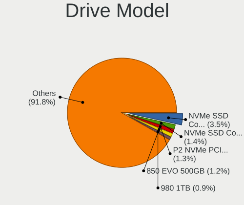

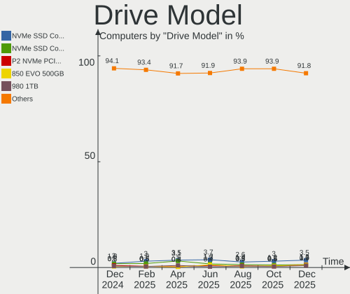

| Model                                                | Computers | Percent |
|------------------------------------------------------|-----------|---------|
| Samsung NVMe SSD Controller SM981/PM981/PM983 1TB    | 51        | 3.46%   |
| Samsung NVMe SSD Controller PM9A1/PM9A3/980PRO 1TB   | 21        | 1.42%   |
| Micron/Crucial P2 NVMe PCIe SSD 2TB                  | 19        | 1.29%   |
| Samsung SSD 850 EVO 500GB                            | 17        | 1.15%   |
| Samsung SSD 980 1TB                                  | 13        | 0.88%   |
| Samsung SSD 870 EVO 1TB                              | 11        | 0.75%   |
| Samsung SSD 860 EVO 1TB                              | 11        | 0.75%   |
| Samsung NVMe SSD Controller SM961/PM961/SM963 1024GB | 11        | 0.75%   |
| Crucial CT500MX500SSD1 500GB                         | 11        | 0.75%   |
| Crucial CT1000MX500SSD1 1TB                          | 11        | 0.75%   |
| Samsung SSD 870 EVO 500GB                            | 9         | 0.61%   |
| Samsung SSD 860 EVO 500GB                            | 9         | 0.61%   |
| Samsung SSD 850 EVO 250GB                            | 9         | 0.61%   |
| SanDisk SSD PLUS 1000GB                              | 8         | 0.54%   |
| Samsung SSD 990 PRO 4TB                              | 8         | 0.54%   |
| Samsung SSD 860 EVO 250GB                            | 8         | 0.54%   |
| Samsung SSD 840 EVO 250GB                            | 8         | 0.54%   |
| Sandisk WD_BLACK SN850X 2000GB                       | 7         | 0.47%   |
| Samsung SSD 870 QVO 1TB                              | 7         | 0.47%   |
| Seagate ST1000LM024 HN-M101MBB 1TB                   | 6         | 0.41%   |
| SanDisk NVMe SSD Drive 1TB                           | 6         | 0.41%   |
| Samsung SSD 990 PRO 2TB                              | 6         | 0.41%   |
| Samsung SSD 990 EVO Plus 1TB                         | 6         | 0.41%   |
| Intenso SSD 1024GB                                   | 6         | 0.41%   |
| Crucial CT240BX500SSD1 240GB                         | 6         | 0.41%   |
| WDC WDS500G2B0A-00SM50 500GB                         | 5         | 0.34%   |
| Unknown MMC Card  64GB                               | 5         | 0.34%   |
| Unknown MMC Card  128GB                              | 5         | 0.34%   |
| Seagate ST2000DM008-2UB102 2TB                       | 5         | 0.34%   |
| Sandisk WD Black SN750 / PC SN730 NVMe SSD 500GB     | 5         | 0.34%   |
| SanDisk SDSSDH3 1T00 1TB                             | 5         | 0.34%   |
| Samsung SSD 990 PRO 1TB                              | 5         | 0.34%   |
| Samsung SSD 990 EVO Plus 2TB                         | 5         | 0.34%   |
| Samsung SSD 980 PRO 1TB                              | 5         | 0.34%   |
| Micron/Crucial CT2000P3PSSD8 2TB                     | 5         | 0.34%   |
| Crucial CT2000MX500SSD1 2TB                          | 5         | 0.34%   |
| Crucial CT1000BX500SSD1 1TB                          | 5         | 0.34%   |
| WDC WD40EZRZ-00GXCB0 4TB                             | 4         | 0.27%   |
| WDC WD10EZEX-08WN4A0 1TB                             | 4         | 0.27%   |
| Verbatim Vi550 S3 1024GB                             | 4         | 0.27%   |

HDD Vendor
----------

Hard disk drive vendors

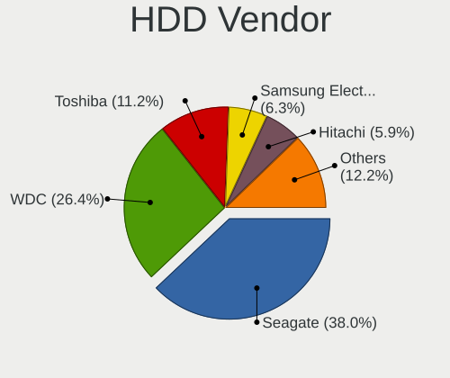

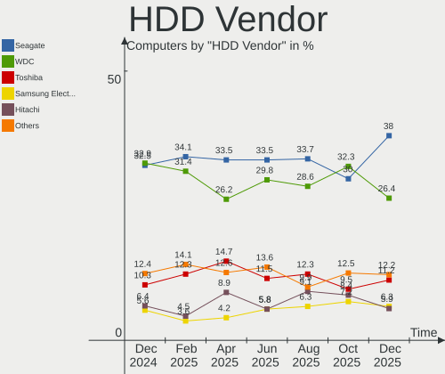

| Vendor              | Computers | Drives | Percent |
|---------------------|-----------|--------|---------|
| Seagate             | 115       | 132    | 37.95%  |
| WDC                 | 80        | 95     | 26.4%   |
| Toshiba             | 34        | 37     | 11.22%  |
| Samsung Electronics | 19        | 21     | 6.27%   |
| Hitachi             | 18        | 19     | 5.94%   |
| HGST                | 12        | 12     | 3.96%   |
| Intenso             | 5         | 5      | 1.65%   |
| Fujitsu             | 4         | 4      | 1.32%   |
| ASMT                | 4         | 4      | 1.32%   |
| Apple               | 3         | 3      | 0.99%   |
| TO Exter            | 2         | 2      | 0.66%   |
| JMicron Technology  | 2         | 2      | 0.66%   |
| USB3.0              | 1         | 1      | 0.33%   |
| Unknown             | 1         | 1      | 0.33%   |
| Maxtor              | 1         | 1      | 0.33%   |
| KIOXIA              | 1         | 1      | 0.33%   |
| ExcelStor           | 1         | 1      | 0.33%   |

SSD Vendor
----------

Solid state drive vendors

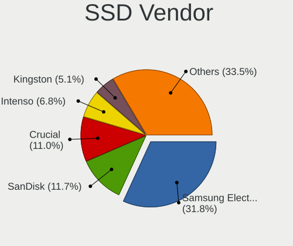

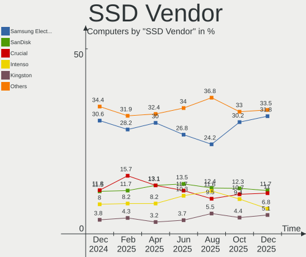

| Vendor              | Computers | Drives | Percent |
|---------------------|-----------|--------|---------|
| Samsung Electronics | 150       | 184    | 31.85%  |
| SanDisk             | 55        | 63     | 11.68%  |
| Crucial             | 52        | 58     | 11.04%  |
| Intenso             | 32        | 36     | 6.79%   |
| Kingston            | 24        | 28     | 5.1%    |
| WDC                 | 20        | 20     | 4.25%   |
| Intel               | 10        | 10     | 2.12%   |
| China               | 8         | 8      | 1.7%    |
| Apple               | 7         | 7      | 1.49%   |
| Transcend           | 6         | 7      | 1.27%   |
| Toshiba             | 6         | 6      | 1.27%   |
| Netac               | 6         | 6      | 1.27%   |
| Micron Technology   | 6         | 6      | 1.27%   |
| KIOXIA-EXCERIA      | 6         | 6      | 1.27%   |
| Verbatim            | 5         | 6      | 1.06%   |
| SK hynix            | 5         | 5      | 1.06%   |
| PNY                 | 5         | 5      | 1.06%   |
| A-DATA Technology   | 5         | 5      | 1.06%   |
| Corsair             | 4         | 4      | 0.85%   |
| SPCC                | 3         | 4      | 0.64%   |
| SD                  | 3         | 3      | 0.64%   |
| Phison              | 3         | 3      | 0.64%   |
| LITEON              | 3         | 3      | 0.64%   |
| INNOVATION IT       | 3         | 3      | 0.64%   |
| Hewlett-Packard     | 3         | 3      | 0.64%   |
| Unknown             | 3         | 3      | 0.64%   |
| Plextor             | 2         | 2      | 0.42%   |
| Patriot             | 2         | 2      | 0.42%   |
| Lexar               | 2         | 2      | 0.42%   |
| Leven               | 2         | 2      | 0.42%   |
| KingSpec            | 2         | 2      | 0.42%   |
| Gigabyte Technology | 2         | 2      | 0.42%   |
| Fanxiang            | 2         | 2      | 0.42%   |
| Emtec               | 2         | 2      | 0.42%   |
| ASMT                | 2         | 2      | 0.42%   |
| Wicgtyp             | 1         | 1      | 0.21%   |
| Vi550               | 1         | 1      | 0.21%   |
| VERICO              | 1         | 1      | 0.21%   |
| ValueTech           | 1         | 1      | 0.21%   |
| Unknown             | 1         | 1      | 0.21%   |

Drive Kind
----------

HDD or SSD

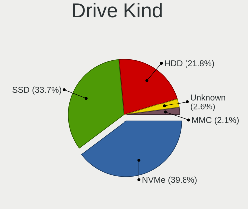

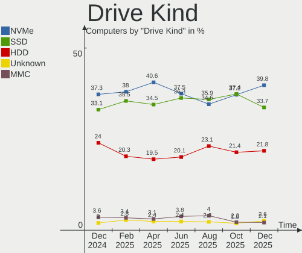

| Kind    | Computers | Drives | Percent |
|---------|-----------|--------|---------|
| NVMe    | 468       | 612    | 39.76%  |
| SSD     | 397       | 530    | 33.73%  |
| HDD     | 256       | 341    | 21.75%  |
| Unknown | 31        | 37     | 2.63%   |
| MMC     | 25        | 25     | 2.12%   |

Drive Connector
---------------

SATA, SAS, NVMe, etc.

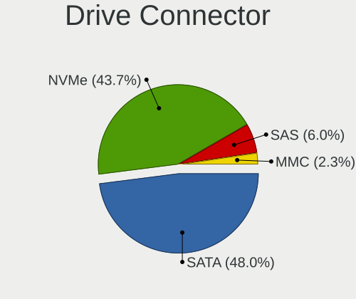

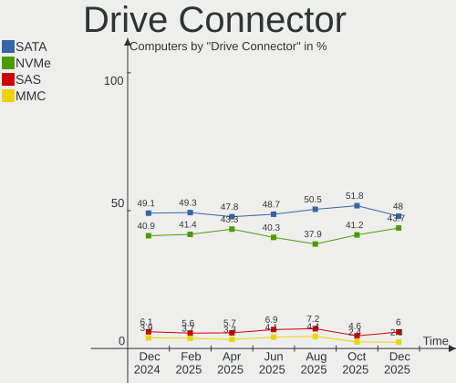

| Type | Computers | Drives | Percent |
|------|-----------|--------|---------|
| SATA | 512       | 837    | 47.99%  |
| NVMe | 466       | 603    | 43.67%  |
| SAS  | 64        | 80     | 6%      |
| MMC  | 25        | 25     | 2.34%   |

Drive Size
----------

Size of hard drive

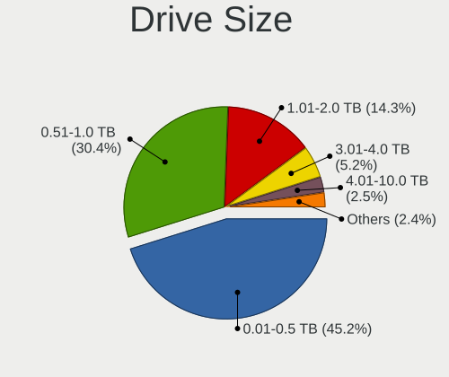

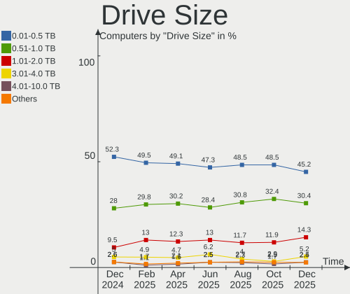

| Size in TB | Computers | Drives | Percent |
|------------|-----------|--------|---------|
| 0.01-0.5   | 322       | 400    | 45.16%  |
| 0.51-1.0   | 217       | 267    | 30.43%  |
| 1.01-2.0   | 102       | 111    | 14.31%  |
| 3.01-4.0   | 37        | 43     | 5.19%   |
| 4.01-10.0  | 18        | 29     | 2.52%   |
| 2.01-3.0   | 12        | 14     | 1.68%   |
| 10.01-20.0 | 4         | 6      | 0.56%   |
| 20.01-50.0 | 1         | 1      | 0.14%   |

Space Total
-----------

Amount of disk space available on the file system

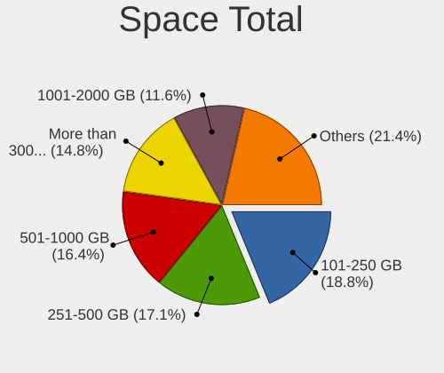

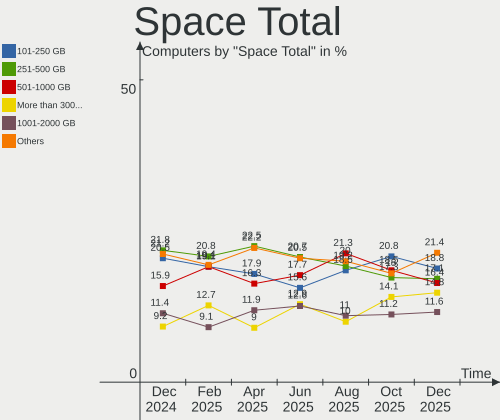

| Size in GB     | Computers | Percent |
|----------------|-----------|---------|
| 101-250        | 156       | 18.77%  |
| 251-500        | 142       | 17.09%  |
| 501-1000       | 136       | 16.37%  |
| More than 3000 | 123       | 14.8%   |
| 1001-2000      | 96        | 11.55%  |
| 2001-3000      | 54        | 6.5%    |
| 1-20           | 47        | 5.66%   |
| 51-100         | 34        | 4.09%   |
| Unknown        | 30        | 3.61%   |
| 21-50          | 13        | 1.56%   |

Space Used
----------

Amount of used disk space

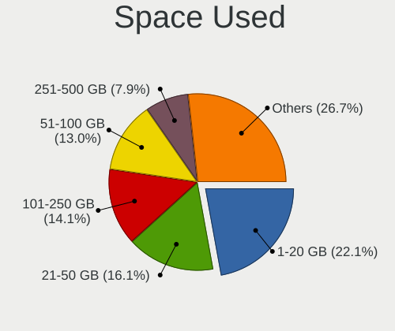

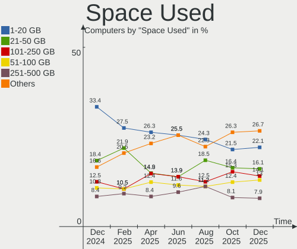

| Used GB        | Computers | Percent |
|----------------|-----------|---------|
| 1-20           | 184       | 22.14%  |
| 21-50          | 134       | 16.13%  |
| 101-250        | 117       | 14.08%  |
| 51-100         | 108       | 13%     |
| 251-500        | 66        | 7.94%   |
| 501-1000       | 65        | 7.82%   |
| 1001-2000      | 61        | 7.34%   |
| More than 3000 | 37        | 4.45%   |
| Unknown        | 30        | 3.61%   |
| 2001-3000      | 25        | 3.01%   |
| 0              | 4         | 0.48%   |

Malfunc. Drives
---------------

Drive models with a malfunction

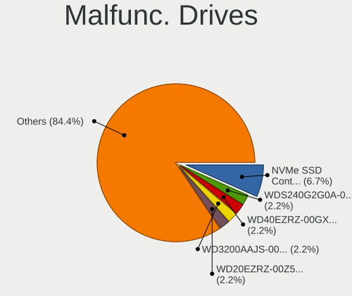

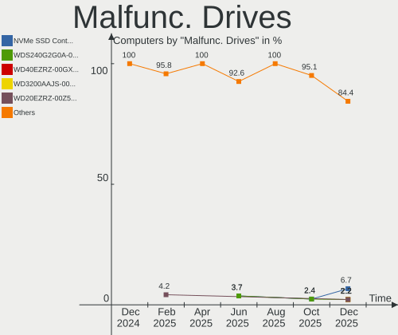

| Model                                                          | Computers | Drives | Percent |
|----------------------------------------------------------------|-----------|--------|---------|
| Samsung Electronics NVMe SSD Controller SM981/PM981/PM983 1TB  | 3         | 3      | 6.67%   |
| WDC WDS240G2G0A-00JH30 240GB SSD                               | 1         | 1      | 2.22%   |
| WDC WD40EZRZ-00GXCB0 4TB                                       | 1         | 1      | 2.22%   |
| WDC WD3200AAJS-00L7A0 320GB                                    | 1         | 1      | 2.22%   |
| WDC WD20EZRZ-00Z5HB0 2TB                                       | 1         | 1      | 2.22%   |
| WDC WD20EZRX-00D8PB0 2TB                                       | 1         | 1      | 2.22%   |
| WDC WD20EFRX-68EUZN0 2TB                                       | 1         | 1      | 2.22%   |
| WDC WD10JPVX-60JC3T0 1TB                                       | 1         | 1      | 2.22%   |
| WDC WD10EZEX-21M2NA0 1TB                                       | 1         | 1      | 2.22%   |
| WDC WD10EFRX-68FYTN0 1TB                                       | 1         | 1      | 2.22%   |
| ValueTech SSD 512GB                                            | 1         | 1      | 2.22%   |
| Transcend TS4TSSD230S 4TB                                      | 1         | 2      | 2.22%   |
| SK hynix HFS128G3AMNB-2200A 128GB SSD                          | 1         | 1      | 2.22%   |
| Seagate ST9750420AS 752GB                                      | 1         | 1      | 2.22%   |
| Seagate ST9160821AS 160GB                                      | 1         | 1      | 2.22%   |
| Seagate ST9160310AS 160GB                                      | 1         | 1      | 2.22%   |
| Seagate ST8000DM004-2CX188 8TB                                 | 1         | 1      | 2.22%   |
| Seagate ST500LM000-SSHD-8GB                                    | 1         | 1      | 2.22%   |
| Seagate ST500LM000-1EJ162 500GB                                | 1         | 1      | 2.22%   |
| Seagate ST380815AS 80GB                                        | 1         | 1      | 2.22%   |
| Seagate ST3500413AS 500GB                                      | 1         | 1      | 2.22%   |
| Seagate ST320LT007-9ZV142 320GB                                | 1         | 1      | 2.22%   |
| Seagate ST31000524AS 1TB                                       | 1         | 1      | 2.22%   |
| Seagate ST3000DM001-1CH166 3TB                                 | 1         | 1      | 2.22%   |
| Seagate ST1000LM024 HN-M101MBB 1TB                             | 1         | 1      | 2.22%   |
| Seagate ST1000DM003-1CH162 1TB                                 | 1         | 1      | 2.22%   |
| SanDisk SSD PLUS 480GB                                         | 1         | 1      | 2.22%   |
| SanDisk SSD PLUS 1000GB                                        | 1         | 1      | 2.22%   |
| Samsung Electronics SSD 980 1TB                                | 1         | 1      | 2.22%   |
| Samsung Electronics NVMe SSD Controller PM9A1/PM9A3/980PRO 1TB | 1         | 1      | 2.22%   |
| Samsung Electronics MZVKW512HMJP-00000 512GB                   | 1         | 1      | 2.22%   |
| Samsung Electronics HM250HI 250GB                              | 1         | 1      | 2.22%   |
| Samsung Electronics HD501LJ 500GB                              | 1         | 1      | 2.22%   |
| Micron Technology 1100_MTFDDAK256TBN 256GB SSD                 | 1         | 1      | 2.22%   |
| Intenso SSD Sata III 256GB                                     | 1         | 1      | 2.22%   |
| Intel SSDSCKKW240H6 240GB                                      | 1         | 1      | 2.22%   |
| INNOVATION IT IT 240GB                                         | 1         | 1      | 2.22%   |
| Hitachi HDS723020BLA642 2TB                                    | 1         | 1      | 2.22%   |
| HGST HTS545050A7E680 500GB                                     | 1         | 1      | 2.22%   |
| HGST HDN726040ALE614 4TB                                       | 1         | 1      | 2.22%   |

Malfunc. Drive Vendor
---------------------

Vendors of faulty drives

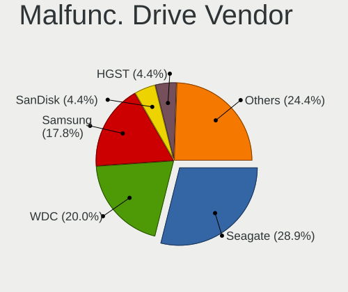

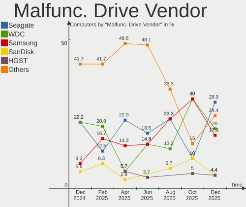

| Vendor              | Computers | Drives | Percent |
|---------------------|-----------|--------|---------|
| Seagate             | 13        | 13     | 28.89%  |
| WDC                 | 9         | 9      | 20%     |
| Samsung Electronics | 8         | 8      | 17.78%  |
| SanDisk             | 2         | 2      | 4.44%   |
| HGST                | 2         | 2      | 4.44%   |
| Crucial             | 2         | 2      | 4.44%   |
| ValueTech           | 1         | 1      | 2.22%   |
| Transcend           | 1         | 2      | 2.22%   |
| SK hynix            | 1         | 1      | 2.22%   |
| Micron Technology   | 1         | 1      | 2.22%   |
| Intenso             | 1         | 1      | 2.22%   |
| Intel               | 1         | 1      | 2.22%   |
| INNOVATION IT       | 1         | 1      | 2.22%   |
| Hitachi             | 1         | 1      | 2.22%   |
| Fujitsu             | 1         | 1      | 2.22%   |

Malfunc. HDD Vendor
-------------------

Vendors of faulty HDD drives

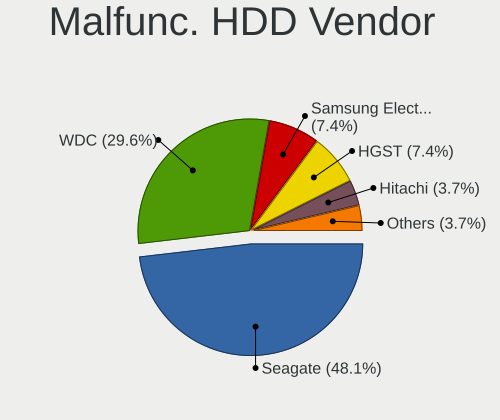

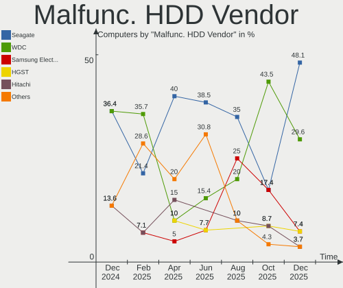

| Vendor              | Computers | Drives | Percent |
|---------------------|-----------|--------|---------|
| Seagate             | 13        | 13     | 48.15%  |
| WDC                 | 8         | 8      | 29.63%  |
| Samsung Electronics | 2         | 2      | 7.41%   |
| HGST                | 2         | 2      | 7.41%   |
| Hitachi             | 1         | 1      | 3.7%    |
| Fujitsu             | 1         | 1      | 3.7%    |

Malfunc. Drive Kind
-------------------

Kinds of faulty drives

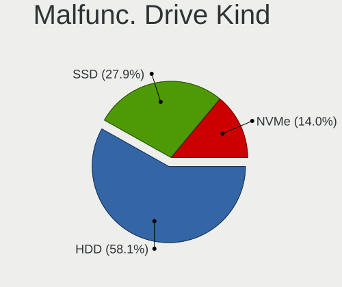

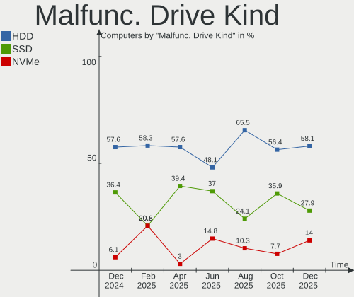

| Kind | Computers | Drives | Percent |
|------|-----------|--------|---------|
| HDD  | 25        | 27     | 58.14%  |
| SSD  | 12        | 13     | 27.91%  |
| NVMe | 6         | 6      | 13.95%  |

Failed Drives
-------------

Failed drive models

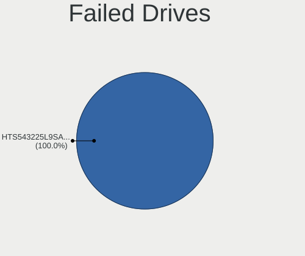

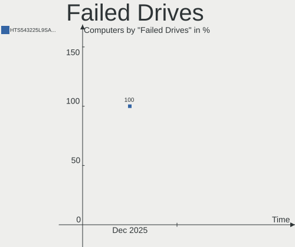

| Model                         | Computers | Drives | Percent |
|-------------------------------|-----------|--------|---------|
| Hitachi HTS543225L9SA02 250GB | 1         | 1      | 100%    |

Failed Drive Vendor
-------------------

Failed drive vendors

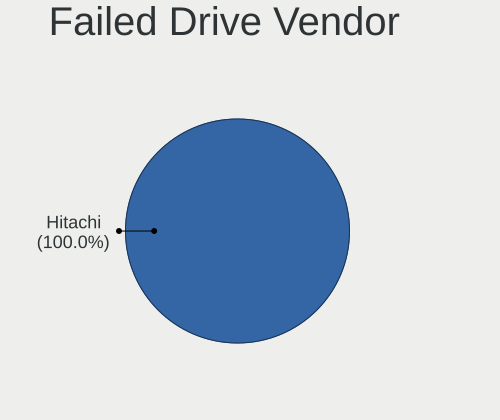

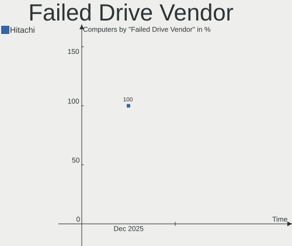

| Vendor  | Computers | Drives | Percent |
|---------|-----------|--------|---------|
| Hitachi | 1         | 1      | 100%    |

Drive Status
------------

Number of failed and malfunc. drives

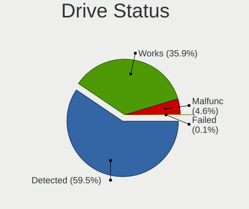

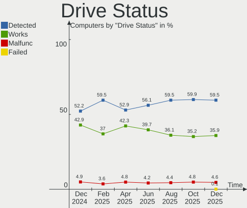

| Status   | Computers | Drives | Percent |
|----------|-----------|--------|---------|
| Detected | 522       | 952    | 59.45%  |
| Works    | 315       | 546    | 35.88%  |
| Malfunc  | 40        | 46     | 4.56%   |
| Failed   | 1         | 1      | 0.11%   |

Storage controller
------------------

Storage Vendor
--------------

Storage controller vendors

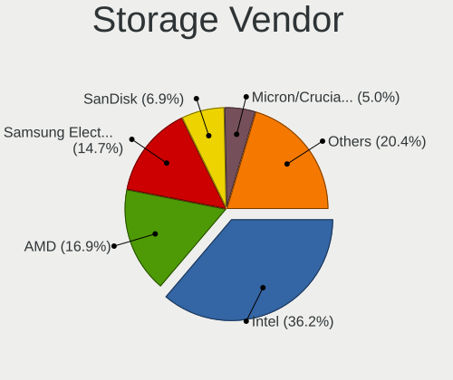

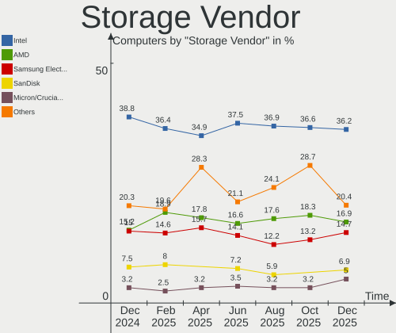

| Vendor                                  | Computers | Percent |
|-----------------------------------------|-----------|---------|
| Intel                                   | 446       | 36.2%   |
| AMD                                     | 208       | 16.88%  |
| Samsung Electronics                     | 181       | 14.69%  |
| SanDisk                                 | 85        | 6.9%    |
| Micron/Crucial Technology               | 61        | 4.95%   |
| Kingston Technology Company             | 33        | 2.68%   |
| ASMedia Technology                      | 26        | 2.11%   |
| SK hynix                                | 25        | 2.03%   |
| Phison Electronics                      | 22        | 1.79%   |
| Micron Technology                       | 20        | 1.62%   |
| KIOXIA                                  | 17        | 1.38%   |
| Shenzhen Longsys Electronics            | 12        | 0.97%   |
| MAXIO Technology (Hangzhou)             | 11        | 0.89%   |
| Silicon Motion                          | 10        | 0.81%   |
| Toshiba America Info Systems            | 9         | 0.73%   |
| Marvell Technology Group                | 9         | 0.73%   |
| ADATA Technology                        | 9         | 0.73%   |
| Nvidia                                  | 8         | 0.65%   |
| Realtek Semiconductor                   | 5         | 0.41%   |
| JMicron Technology                      | 5         | 0.41%   |
| Broadcom / LSI                          | 4         | 0.32%   |
| Solidigm                                | 3         | 0.24%   |
| Solid State Storage Technology          | 3         | 0.24%   |
| Apple                                   | 3         | 0.24%   |
| VIA Technologies                        | 2         | 0.16%   |
| Silicon Image                           | 2         | 0.16%   |
| INNOGRIT                                | 2         | 0.16%   |
| Biwin Storage Technology                | 2         | 0.16%   |
| Union Memory (Shenzhen)                 | 1         | 0.08%   |
| Transcend                               | 1         | 0.08%   |
| TenaFe                                  | 1         | 0.08%   |
| Shenzhen Wodposit Electronics           | 1         | 0.08%   |
| Shenzhen Unionmemory Information System | 1         | 0.08%   |
| Seagate Technology                      | 1         | 0.08%   |
| O2 Micro                                | 1         | 0.08%   |
| Hosin Global Electronics                | 1         | 0.08%   |
| Adaptec                                 | 1         | 0.08%   |

Storage Model
-------------

Storage controller models

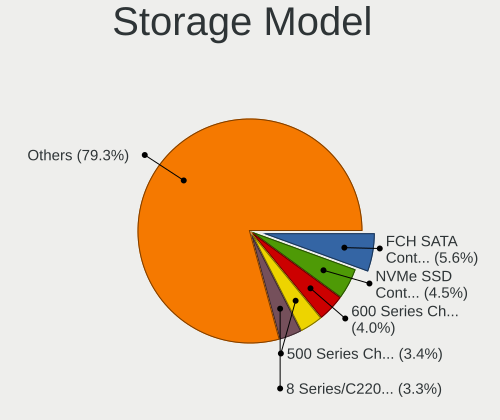

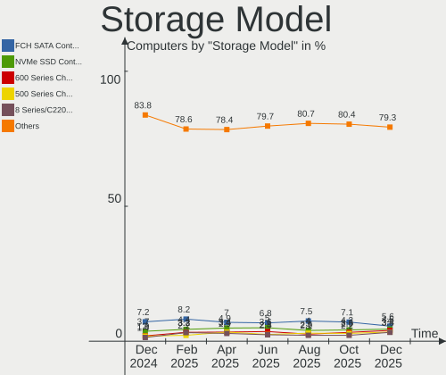

| Model                                                                          | Computers | Percent |
|--------------------------------------------------------------------------------|-----------|---------|
| AMD FCH SATA Controller [AHCI mode]                                            | 75        | 5.56%   |
| Samsung NVMe SSD Controller SM981/PM981/PM983                                  | 61        | 4.52%   |
| AMD 600 Series Chipset SATA Controller                                         | 54        | 4%      |
| AMD 500 Series Chipset SATA Controller                                         | 46        | 3.41%   |
| Intel 8 Series/C220 Series Chipset Family 6-port SATA Controller 1 [AHCI mode] | 44        | 3.26%   |
| Intel 7 Series Chipset Family 6-port SATA Controller [AHCI mode]               | 31        | 2.3%    |
| Intel 200 Series PCH SATA controller [AHCI mode]                               | 31        | 2.3%    |
| Samsung NVMe SSD Controller PM9A1/PM9A3/980PRO                                 | 30        | 2.22%   |
| Samsung NVMe SSD Controller 980 (DRAM-less)                                    | 28        | 2.07%   |
| Samsung NVMe SSD Controller S4LV008[Pascal]                                    | 24        | 1.78%   |
| Micron/Crucial P2 [Nick P2] / P3 / P3 Plus NVMe PCIe SSD (DRAM-less)           | 24        | 1.78%   |
| Intel Sunrise Point-LP SATA Controller [AHCI mode]                             | 24        | 1.78%   |
| Intel Q170/Q150/B150/H170/H110/Z170/CM236 Chipset SATA Controller [AHCI Mode]  | 24        | 1.78%   |
| ASMedia ASM1061/ASM1062 Serial ATA Controller                                  | 24        | 1.78%   |
| Samsung NVMe SSD Controller PM9C1a (DRAM-less)                                 | 22        | 1.63%   |
| Intel 6 Series/C200 Series Chipset Family 6 port Mobile SATA AHCI Controller   | 22        | 1.63%   |
| Intel Volume Management Device NVMe RAID Controller                            | 19        | 1.41%   |
| SanDisk WD SN560/SN740/SN770/SN5000 NVMe SSD                                   | 17        | 1.26%   |
| Intel 8 Series SATA Controller 1 [AHCI mode]                                   | 16        | 1.19%   |
| AMD 400 Series Chipset SATA Controller                                         | 16        | 1.19%   |
| Sandisk WD Black SN850X NVMe SSD                                               | 15        | 1.11%   |
| Samsung NVMe SSD Controller SM961/PM961/SM963                                  | 15        | 1.11%   |
| Intel Raptor Lake SATA AHCI Controller                                         | 14        | 1.04%   |
| Intel Cannon Lake PCH SATA AHCI Controller                                     | 14        | 1.04%   |
| Intel Alder Lake-S PCH SATA Controller [AHCI Mode]                             | 13        | 0.96%   |
| Intel Alder Lake-P SATA AHCI Controller                                        | 13        | 0.96%   |
| Micron/Crucial P310 NVMe PCIe SSD (DRAM-less)                                  | 12        | 0.89%   |
| AMD SB7x0/SB8x0/SB9x0 SATA Controller [AHCI mode]                              | 12        | 0.89%   |
| Intel Celeron/Pentium Silver Processor SATA Controller                         | 11        | 0.81%   |
| AMD SB7x0/SB8x0/SB9x0 IDE Controller                                           | 11        | 0.81%   |
| Intel Wildcat Point-LP SATA Controller [AHCI Mode]                             | 10        | 0.74%   |
| Intel 82801 Mobile SATA Controller [RAID mode]                                 | 10        | 0.74%   |
| Intel Alder Lake-N SATA AHCI Controller                                        | 9         | 0.67%   |
| Intel 5 Series/3400 Series Chipset 4 port SATA AHCI Controller                 | 9         | 0.67%   |
| SK hynix Gold P31/BC711/PC711 NVMe Solid State Drive                           | 8         | 0.59%   |
| SanDisk Ultra 3D / WD Blue SN570 NVMe SSD (DRAM-less)                          | 8         | 0.59%   |
| SanDisk Extreme Pro / WD Black SN750 / PC SN730 / Red SN700 NVMe SSD           | 8         | 0.59%   |
| Micron/Crucial P5 Plus NVMe PCIe SSD                                           | 8         | 0.59%   |
| Micron/Crucial P3 Plus NVMe PCIe SSD (DRAM-less)                               | 8         | 0.59%   |
| Intel SATA Controller [RAID mode]                                              | 8         | 0.59%   |

Storage Kind
------------

Kind of storage controller (IDE, SATA, NVMe, SAS, ...)

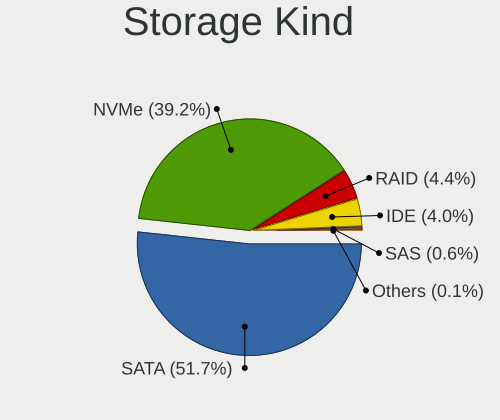

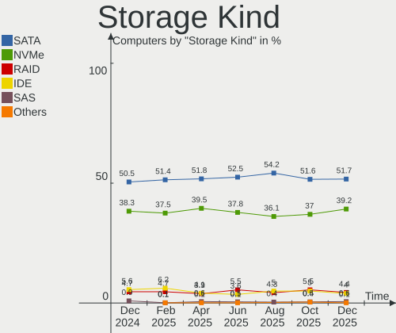

| Kind | Computers | Percent |
|------|-----------|---------|
| SATA | 616       | 51.72%  |
| NVMe | 467       | 39.21%  |
| RAID | 52        | 4.37%   |
| IDE  | 48        | 4.03%   |
| SAS  | 7         | 0.59%   |
| SCSI | 1         | 0.08%   |

Processor
---------

CPU Vendor
----------

Processor vendors

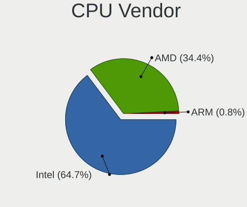

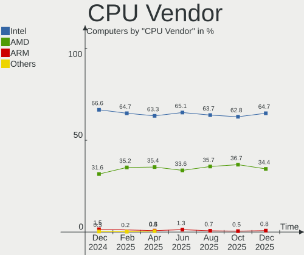

| Vendor | Computers | Percent |
|--------|-----------|---------|
| Intel  | 538       | 64.74%  |
| AMD    | 286       | 34.42%  |
| ARM    | 7         | 0.84%   |

CPU Model
---------

Processor models

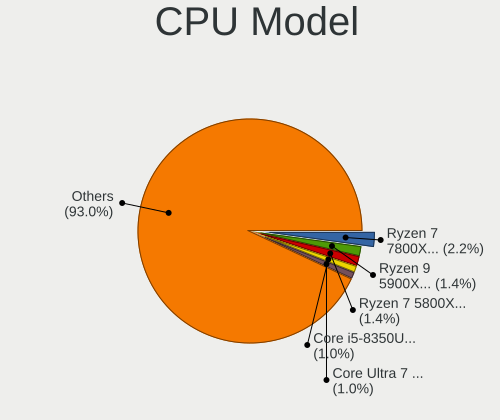

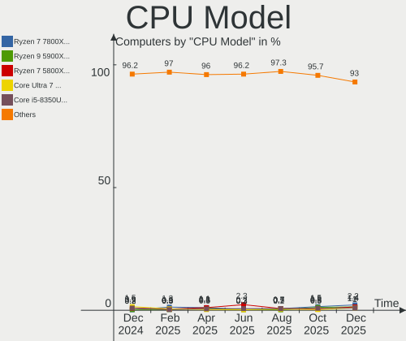

| Model                                   | Computers | Percent |
|-----------------------------------------|-----------|---------|
| AMD Ryzen 7 7800X3D 8-Core Processor    | 18        | 2.17%   |
| AMD Ryzen 9 5900X 12-Core Processor     | 12        | 1.44%   |
| AMD Ryzen 7 5800X 8-Core Processor      | 12        | 1.44%   |
| Intel Core Ultra 7 155H                 | 8         | 0.96%   |
| Intel Core i5-8350U CPU @ 1.70GHz       | 8         | 0.96%   |
| AMD Ryzen 7 7730U with Radeon Graphics  | 8         | 0.96%   |
| Intel Core i5-8250U CPU @ 1.60GHz       | 7         | 0.84%   |
| Intel Core i5-3320M CPU @ 2.60GHz       | 7         | 0.84%   |
| ARM Processor                           | 7         | 0.84%   |
| AMD Ryzen 7 9800X3D 8-Core Processor    | 7         | 0.84%   |
| Intel Core i7-6700 CPU @ 3.40GHz        | 6         | 0.72%   |
| AMD Ryzen 7 5700X 8-Core Processor      | 6         | 0.72%   |
| Intel Xeon CPU E5-2680 v4 @ 2.40GHz     | 5         | 0.6%    |
| Intel Core i5-8400 CPU @ 2.80GHz        | 5         | 0.6%    |
| Intel Core i5-7300U CPU @ 2.60GHz       | 5         | 0.6%    |
| Intel Core i5-4590 CPU @ 3.30GHz        | 5         | 0.6%    |
| Intel Core i5-4200U CPU @ 1.60GHz       | 5         | 0.6%    |
| Intel Core i5-2520M CPU @ 2.50GHz       | 5         | 0.6%    |
| AMD Ryzen 9 3900X 12-Core Processor     | 5         | 0.6%    |
| AMD Ryzen 7 9700X 8-Core Processor      | 5         | 0.6%    |
| AMD Ryzen 7 5800X3D 8-Core Processor    | 5         | 0.6%    |
| AMD Ryzen 7 5700G with Radeon Graphics  | 5         | 0.6%    |
| AMD Ryzen 7 4700U with Radeon Graphics  | 5         | 0.6%    |
| AMD Ryzen 5 5600X 6-Core Processor      | 5         | 0.6%    |
| AMD Ryzen 5 3600 6-Core Processor       | 5         | 0.6%    |
| Intel N150                              | 4         | 0.48%   |
| Intel N100                              | 4         | 0.48%   |
| Intel Core i9-14900HX                   | 4         | 0.48%   |
| Intel Core i7-9750H CPU @ 2.60GHz       | 4         | 0.48%   |
| Intel Core i7-8700 CPU @ 3.20GHz        | 4         | 0.48%   |
| Intel Core i7-2630QM CPU @ 2.00GHz      | 4         | 0.48%   |
| Intel Core i5-6500 CPU @ 3.20GHz        | 4         | 0.48%   |
| Intel Core i5-6300U CPU @ 2.40GHz       | 4         | 0.48%   |
| Intel Core i5-6200U CPU @ 2.30GHz       | 4         | 0.48%   |
| Intel Core i5 CPU M 560 @ 2.67GHz       | 4         | 0.48%   |
| Intel 11th Gen Core i7-11370H @ 3.30GHz | 4         | 0.48%   |
| Intel 11th Gen Core i5-1135G7 @ 2.40GHz | 4         | 0.48%   |
| AMD Ryzen AI 7 350 w/ Radeon 860M       | 4         | 0.48%   |
| AMD Ryzen 7 5800H with Radeon Graphics  | 4         | 0.48%   |
| AMD Ryzen 5 7600X 6-Core Processor      | 4         | 0.48%   |

CPU Model Family
----------------

Processor model prefix

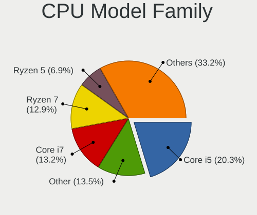

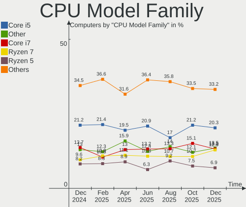

| Model                   | Computers | Percent |
|-------------------------|-----------|---------|
| Intel Core i5           | 169       | 20.34%  |
| Other                   | 112       | 13.48%  |
| Intel Core i7           | 110       | 13.24%  |
| AMD Ryzen 7             | 107       | 12.88%  |
| AMD Ryzen 5             | 57        | 6.86%   |
| Intel Core i3           | 47        | 5.66%   |
| AMD Ryzen 9             | 37        | 4.45%   |
| Intel Xeon              | 27        | 3.25%   |
| Intel Celeron           | 19        | 2.29%   |
| Intel Core i9           | 15        | 1.81%   |
| Intel Core              | 15        | 1.81%   |
| Intel Core 2 Duo        | 14        | 1.68%   |
| Intel Pentium           | 10        | 1.2%    |
| AMD Ryzen 7 PRO         | 10        | 1.2%    |
| AMD Ryzen 3             | 10        | 1.2%    |
| AMD FX                  | 10        | 1.2%    |
| Intel Pentium Silver    | 7         | 0.84%   |
| AMD A10                 | 6         | 0.72%   |
| Intel Pentium Dual      | 4         | 0.48%   |
| Intel Atom              | 4         | 0.48%   |
| AMD GX                  | 4         | 0.48%   |
| AMD Athlon              | 3         | 0.36%   |
| AMD A8                  | 3         | 0.36%   |
| AMD A4                  | 3         | 0.36%   |
| Intel Pentium Dual-Core | 2         | 0.24%   |
| Intel Core M            | 2         | 0.24%   |
| Intel Core 2 Quad       | 2         | 0.24%   |
| AMD Ryzen 5 PRO         | 2         | 0.24%   |
| AMD Phenom II X4        | 2         | 0.24%   |
| AMD Phenom II X2        | 2         | 0.24%   |
| AMD Phenom              | 2         | 0.24%   |
| AMD Athlon II X2        | 2         | 0.24%   |
| AMD A6                  | 2         | 0.24%   |
| Intel Pentium M         | 1         | 0.12%   |
| Intel Core m5           | 1         | 0.12%   |
| AMD Turion 64 X2 Mobile | 1         | 0.12%   |
| AMD Sempron             | 1         | 0.12%   |
| AMD Ryzen Threadripper  | 1         | 0.12%   |
| AMD Ryzen 3 PRO         | 1         | 0.12%   |
| AMD PRO A10             | 1         | 0.12%   |

CPU Cores
---------

Number of processor cores

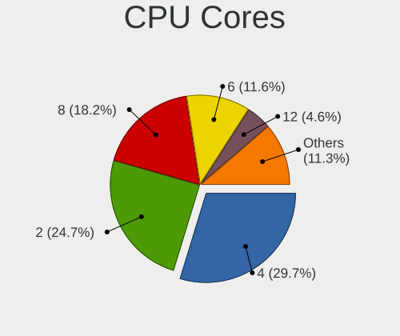

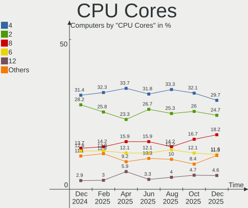

| Number  | Computers | Percent |
|---------|-----------|---------|
| 4       | 247       | 29.72%  |
| 2       | 205       | 24.67%  |
| 8       | 151       | 18.17%  |
| 6       | 96        | 11.55%  |
| 12      | 38        | 4.57%   |
| 16      | 29        | 3.49%   |
| 14      | 20        | 2.41%   |
| 10      | 16        | 1.93%   |
| 24      | 10        | 1.2%    |
| Unknown | 6         | 0.72%   |
| 20      | 4         | 0.48%   |
| 1       | 3         | 0.36%   |
| 28      | 2         | 0.24%   |
| 3       | 2         | 0.24%   |
| 18      | 1         | 0.12%   |
| 5       | 1         | 0.12%   |

CPU Sockets
-----------

Number of sockets

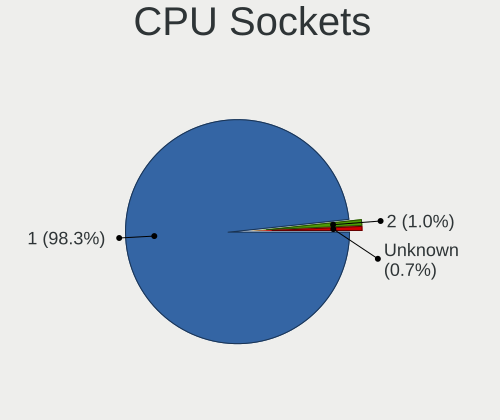

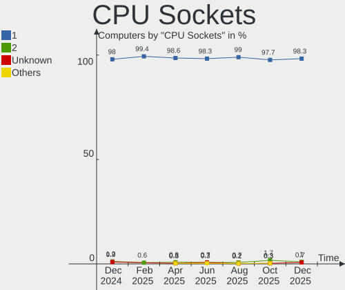

| Number  | Computers | Percent |
|---------|-----------|---------|
| 1       | 817       | 98.32%  |
| 2       | 8         | 0.96%   |
| Unknown | 6         | 0.72%   |

CPU Threads
-----------

Threads per core (Hyper-Threading)

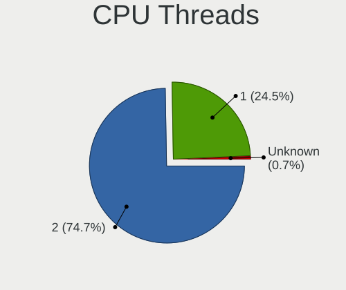

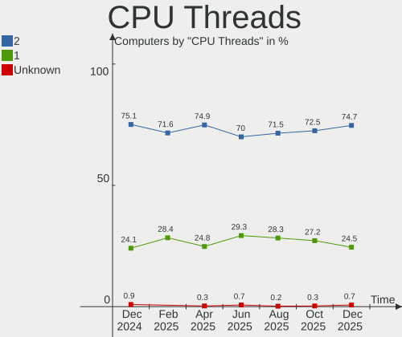

| Number  | Computers | Percent |
|---------|-----------|---------|
| 2       | 621       | 74.73%  |
| 1       | 204       | 24.55%  |
| Unknown | 6         | 0.72%   |

CPU Op-Modes
------------

CPU Operation Modes (32-bit, 64-bit)

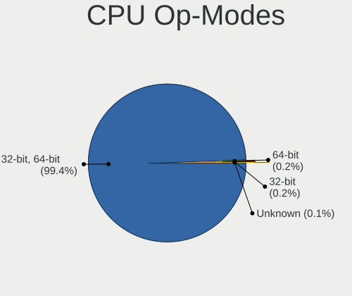

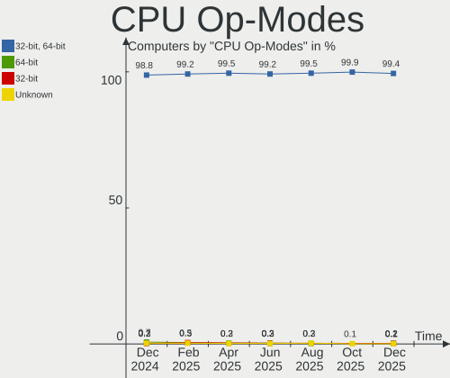

| Op mode        | Computers | Percent |
|----------------|-----------|---------|
| 32-bit, 64-bit | 826       | 99.4%   |
| 64-bit         | 2         | 0.24%   |
| 32-bit         | 2         | 0.24%   |
| Unknown        | 1         | 0.12%   |

CPU Microcode
-------------

Microcode number

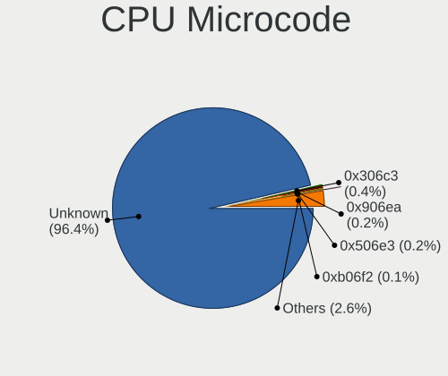

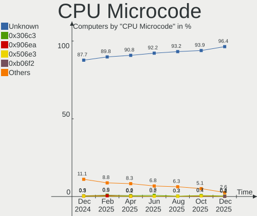

| Number     | Computers | Percent |
|------------|-----------|---------|
| Unknown    | 801       | 96.39%  |
| 0x306c3    | 3         | 0.36%   |
| 0x906ea    | 2         | 0.24%   |
| 0x506e3    | 2         | 0.24%   |
| 0xb06f2    | 1         | 0.12%   |
| 0xb06a2    | 1         | 0.12%   |
| 0x906ec    | 1         | 0.12%   |
| 0x906c0    | 1         | 0.12%   |
| 0x6fd      | 1         | 0.12%   |
| 0x50654    | 1         | 0.12%   |
| 0x406e3    | 1         | 0.12%   |
| 0x40651    | 1         | 0.12%   |
| 0x306a9    | 1         | 0.12%   |
| 0x206a7    | 1         | 0.12%   |
| 0x20655    | 1         | 0.12%   |
| 0x106c2    | 1         | 0.12%   |
| 0x106a5    | 1         | 0.12%   |
| 0x0b600037 | 1         | 0.12%   |
| 0x0b404035 | 1         | 0.12%   |
| 0x0b204037 | 1         | 0.12%   |
| 0x0a50000f | 1         | 0.12%   |
| 0x0a50000b | 1         | 0.12%   |
| 0x08608103 | 1         | 0.12%   |
| 0x08600109 | 1         | 0.12%   |
| 0x07030105 | 1         | 0.12%   |
| 0x010000dc | 1         | 0.12%   |
| 0x010000db | 1         | 0.12%   |

CPU Microarch
-------------

Microarchitecture

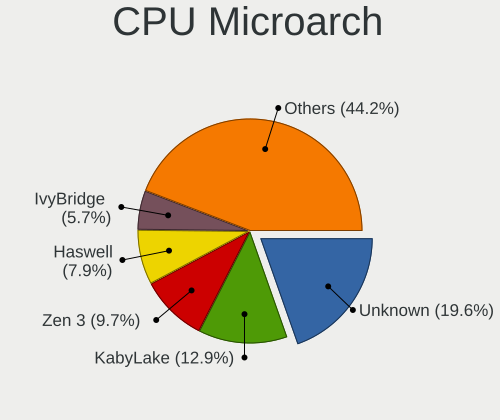

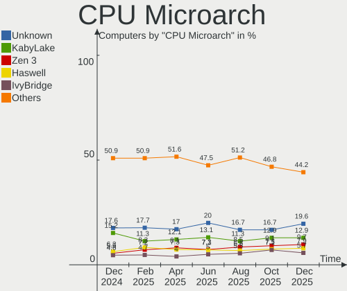

| Name              | Computers | Percent |
|-------------------|-----------|---------|
| Unknown           | 163       | 19.61%  |
| KabyLake          | 107       | 12.88%  |
| Zen 3             | 81        | 9.75%   |
| Haswell           | 66        | 7.94%   |
| IvyBridge         | 47        | 5.66%   |
| Skylake           | 46        | 5.54%   |
| SandyBridge       | 35        | 4.21%   |
| Alderlake Hybrid  | 34        | 4.09%   |
| Zen 2             | 32        | 3.85%   |
| Broadwell         | 22        | 2.65%   |
| Zen+              | 20        | 2.41%   |
| Westmere          | 19        | 2.29%   |
| TigerLake         | 19        | 2.29%   |
| Penryn            | 13        | 1.56%   |
| Piledriver        | 11        | 1.32%   |
| Goldmont plus     | 11        | 1.32%   |
| Core              | 10        | 1.2%    |
| CometLake         | 10        | 1.2%    |
| K10               | 9         | 1.08%   |
| Meteorlake Hybrid | 8         | 0.96%   |
| Silvermont        | 7         | 0.84%   |
| Nehalem           | 7         | 0.84%   |
| Gracemont         | 7         | 0.84%   |
| Goldmont          | 7         | 0.84%   |
| Zen               | 6         | 0.72%   |
| IceLake           | 6         | 0.72%   |
| Puma              | 5         | 0.6%    |
| Bulldozer         | 5         | 0.6%    |
| Steamroller       | 4         | 0.48%   |
| Tremont           | 3         | 0.36%   |
| K8 Hammer         | 2         | 0.24%   |
| Jaguar            | 2         | 0.24%   |
| Bonnell           | 2         | 0.24%   |
| P6                | 1         | 0.12%   |
| K8 & K10 hybrid   | 1         | 0.12%   |
| K10 Llano         | 1         | 0.12%   |
| Excavator         | 1         | 0.12%   |
| Bobcat            | 1         | 0.12%   |

Graphics
--------

GPU Vendor
----------

Vendors of graphics cards

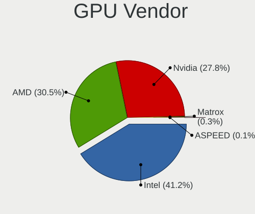

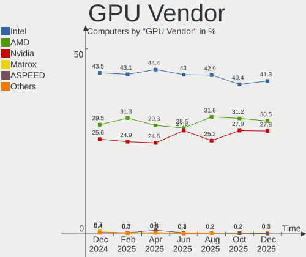

| Vendor                     | Computers | Percent |
|----------------------------|-----------|---------|
| Intel                      | 396       | 41.25%  |
| AMD                        | 293       | 30.52%  |
| Nvidia                     | 267       | 27.81%  |
| Matrox Electronics Systems | 3         | 0.31%   |
| ASPEED Technology          | 1         | 0.1%    |

GPU Model
---------

Graphics card models

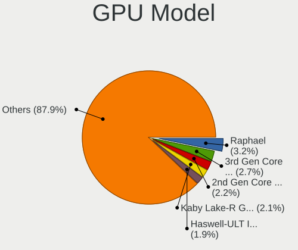

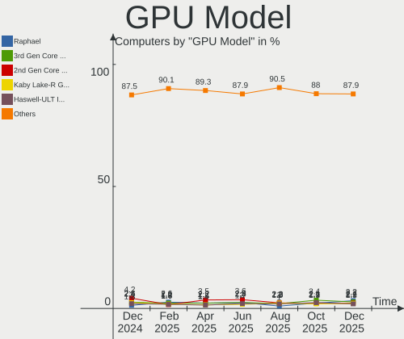

| Model                                                                       | Computers | Percent |
|-----------------------------------------------------------------------------|-----------|---------|
| AMD Raphael                                                                 | 32        | 3.2%    |
| Intel 3rd Gen Core processor Graphics Controller                            | 27        | 2.7%    |
| Intel 2nd Generation Core Processor Family Integrated Graphics Controller   | 22        | 2.2%    |
| Intel Kaby Lake-R GT2 [UHD Graphics 620]                                    | 21        | 2.1%    |
| Intel Haswell-ULT Integrated Graphics Controller                            | 19        | 1.9%    |
| AMD Navi 31 [Radeon RX 7900 XT/7900 XTX/7900 GRE/7900M]                     | 18        | 1.8%    |
| AMD Picasso/Raven 2 [Radeon Vega Series / Radeon Vega Mobile Series]        | 17        | 1.7%    |
| AMD Ellesmere [Radeon RX 470/480/570/570X/580/580X/590]                     | 16        | 1.6%    |
| Intel TigerLake-LP GT2 [Iris Xe Graphics]                                   | 15        | 1.5%    |
| Intel Skylake-S GT2 [HD Graphics 530]                                       | 15        | 1.5%    |
| AMD Navi 48 [Radeon RX 9070/9070 XT/9070 GRE]                               | 15        | 1.5%    |
| AMD Cezanne [Radeon Vega Series / Radeon Vega Mobile Series]                | 15        | 1.5%    |
| Intel Xeon E3-1200 v3/4th Gen Core Processor Integrated Graphics Controller | 14        | 1.4%    |
| AMD Granite Ridge [Radeon Graphics]                                         | 14        | 1.4%    |
| AMD Barcelo                                                                 | 14        | 1.4%    |
| Intel Skylake-U GT2 [HD Graphics 520]                                       | 13        | 1.3%    |
| Intel Kaby Lake-U GT2 [HD Graphics 620]                                     | 12        | 1.2%    |
| AMD Renoir [Radeon Vega Series / Radeon Vega Mobile Series]                 | 12        | 1.2%    |
| Intel CoffeeLake-H GT2 [UHD Graphics 630]                                   | 11        | 1.1%    |
| Intel 4th Gen Core Processor Integrated Graphics Controller                 | 11        | 1.1%    |
| Intel CoffeeLake-S GT2 [UHD Graphics 630]                                   | 10        | 1%      |
| Intel Broadwell-U GT2 [HD Graphics 5500]                                    | 10        | 1%      |
| AMD Phoenix1                                                                | 10        | 1%      |
| Intel Raptor Lake-S UHD Graphics                                            | 9         | 0.9%    |
| Intel Core Processor Integrated Graphics Controller                         | 9         | 0.9%    |
| AMD Navi 44 [Radeon RX 9060 XT]                                             | 9         | 0.9%    |
| Nvidia AD107M [GeForce RTX 4060 Max-Q / Mobile]                             | 8         | 0.8%    |
| Intel Kaby Lake-S GT2 [HD Graphics 630]                                     | 8         | 0.8%    |
| Intel Alder Lake-N [UHD Graphics]                                           | 8         | 0.8%    |
| Nvidia GP106 [GeForce GTX 1060 6GB]                                         | 7         | 0.7%    |
| Nvidia GA106 [GeForce RTX 3060 Lite Hash Rate]                              | 7         | 0.7%    |
| Nvidia AD104 [GeForce RTX 4070]                                             | 7         | 0.7%    |
| Intel Alder Lake-P GT2 [Iris Xe Graphics]                                   | 7         | 0.7%    |
| AMD HawkPoint1                                                              | 7         | 0.7%    |
| Nvidia GP108 [GeForce GT 1030]                                              | 6         | 0.6%    |
| Nvidia AD102 [GeForce RTX 4090]                                             | 6         | 0.6%    |
| Intel WhiskeyLake-U GT2 [UHD Graphics 620]                                  | 6         | 0.6%    |
| Intel Raptor Lake-P [Iris Xe Graphics]                                      | 6         | 0.6%    |
| Intel Meteor Lake-P [Intel Arc Graphics]                                    | 6         | 0.6%    |
| Intel GeminiLake [UHD Graphics 600]                                         | 6         | 0.6%    |

GPU Combo
---------

Combinations of graphics cards

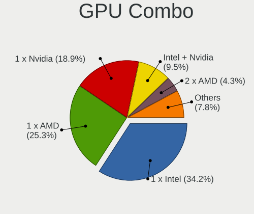

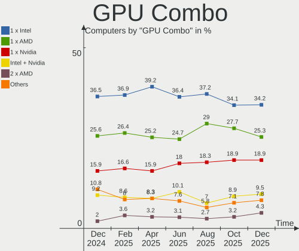

| Name           | Computers | Percent |
|----------------|-----------|---------|
| 1 x Intel      | 284       | 34.18%  |
| 1 x AMD        | 210       | 25.27%  |
| 1 x Nvidia     | 157       | 18.89%  |
| Intel + Nvidia | 79        | 9.51%   |
| 2 x AMD        | 36        | 4.33%   |
| AMD + Nvidia   | 27        | 3.25%   |
| Intel + AMD    | 17        | 2.05%   |
| Other          | 8         | 0.96%   |
| 2 x Intel      | 8         | 0.96%   |
| 1 x Matrox     | 2         | 0.24%   |
| 2 x Nvidia     | 1         | 0.12%   |
| Intel + Matrox | 1         | 0.12%   |
| AMD + ASPEED   | 1         | 0.12%   |

GPU Driver
----------

Free vs proprietary

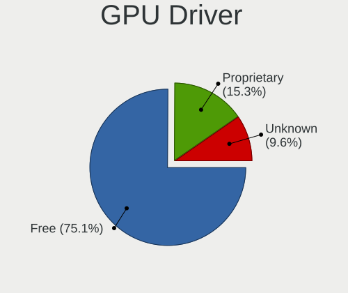

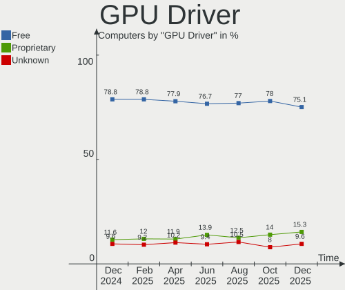

| Driver      | Computers | Percent |
|-------------|-----------|---------|
| Free        | 624       | 75.09%  |
| Proprietary | 127       | 15.28%  |
| Unknown     | 80        | 9.63%   |

GPU Memory
----------

Total video memory

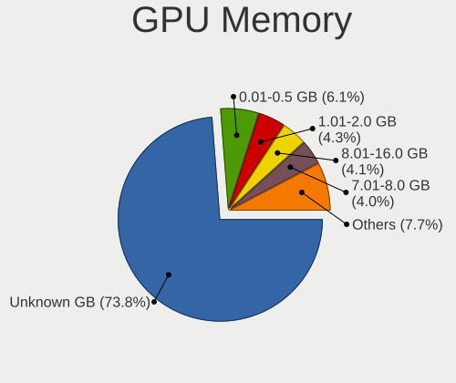

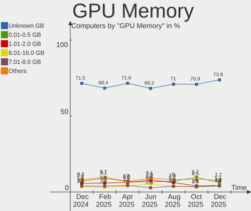

| Size in GB | Computers | Percent |
|------------|-----------|---------|
| Unknown    | 613       | 73.77%  |
| 0.01-0.5   | 51        | 6.14%   |
| 1.01-2.0   | 36        | 4.33%   |
| 8.01-16.0  | 34        | 4.09%   |
| 7.01-8.0   | 33        | 3.97%   |
| 0.51-1.0   | 23        | 2.77%   |
| 3.01-4.0   | 22        | 2.65%   |
| 5.01-6.0   | 9         | 1.08%   |
| 16.01-24.0 | 8         | 0.96%   |
| 24.01-32.0 | 1         | 0.12%   |
| 2.01-3.0   | 1         | 0.12%   |

Monitor
-------

Monitor Vendor
--------------

Monitor vendors

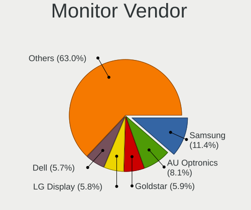

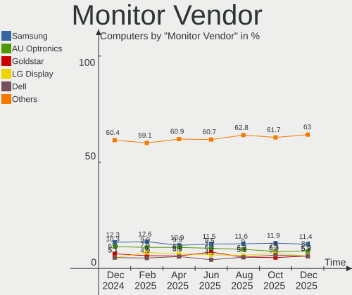

| Vendor                  | Computers | Percent |
|-------------------------|-----------|---------|
| Samsung Electronics     | 108       | 11.42%  |
| AU Optronics            | 77        | 8.14%   |
| Goldstar                | 56        | 5.92%   |
| LG Display              | 55        | 5.81%   |
| Dell                    | 54        | 5.71%   |
| Chimei Innolux          | 53        | 5.6%    |
| BOE                     | 48        | 5.07%   |
| Acer                    | 46        | 4.86%   |
| Lenovo                  | 43        | 4.55%   |
| Philips                 | 28        | 2.96%   |
| BenQ                    | 27        | 2.85%   |
| Apple                   | 26        | 2.75%   |
| AOC                     | 24        | 2.54%   |
| ASUSTek Computer        | 21        | 2.22%   |
| Iiyama                  | 19        | 2.01%   |
| Hewlett-Packard         | 18        | 1.9%    |
| Sharp                   | 17        | 1.8%    |
| Ancor Communications    | 16        | 1.69%   |
| Eizo                    | 14        | 1.48%   |
| MSI                     | 12        | 1.27%   |
| Fujitsu Siemens         | 12        | 1.27%   |
| ViewSonic               | 11        | 1.16%   |
| Gigabyte Technology     | 10        | 1.06%   |
| Medion                  | 9         | 0.95%   |
| SKG                     | 8         | 0.85%   |
| Panasonic               | 8         | 0.85%   |
| LG Philips              | 7         | 0.74%   |
| InfoVision              | 7         | 0.74%   |
| HKC                     | 7         | 0.74%   |
| RTK                     | 5         | 0.53%   |
| HUAWEI                  | 5         | 0.53%   |
| HannStar                | 5         | 0.53%   |
| CSOT                    | 5         | 0.53%   |
| Chi Mei Optoelectronics | 5         | 0.53%   |
| TMX                     | 4         | 0.42%   |
| Mi                      | 4         | 0.42%   |
| CHO                     | 4         | 0.42%   |
| CHD                     | 4         | 0.42%   |
| Valve                   | 3         | 0.32%   |
| Sony                    | 3         | 0.32%   |

Monitor Model
-------------

Monitor models

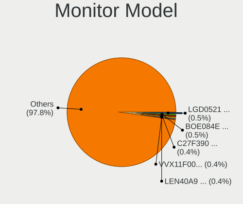

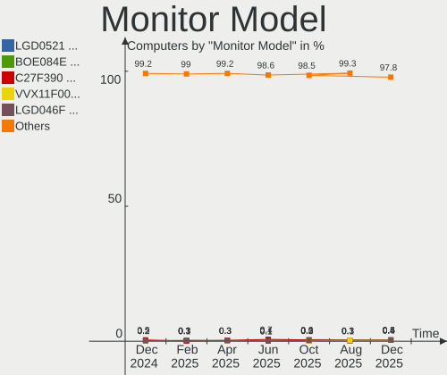

| Model                                                                 | Computers | Percent |
|-----------------------------------------------------------------------|-----------|---------|
| LG Display LCD Monitor LGD0521 1920x1080 309x174mm 14.0-inch          | 5         | 0.51%   |
| BOE LCD Monitor BOE084E 1920x1080 382x215mm 17.3-inch                 | 5         | 0.51%   |
| Samsung Electronics C27F390 SAM0D32 1920x1080 598x336mm 27.0-inch     | 4         | 0.41%   |
| Panasonic VVX11F009G00 MEI96A2 1920x1080 344x193mm 15.5-inch          | 4         | 0.41%   |
| LG Display LCD Monitor LGD046F 1920x1080 344x194mm 15.5-inch          | 4         | 0.41%   |
| Lenovo LCD Monitor LEN40A9 1920x1080 309x173mm 13.9-inch              | 4         | 0.41%   |
| Goldstar 27GL850 GSM5B7F 2560x1440 597x336mm 27.0-inch                | 4         | 0.41%   |
| Fujitsu Siemens B24W-7 LED FUS0853 1920x1200 518x324mm 24.1-inch      | 4         | 0.41%   |
| CHO Smart TV CHO0030 1920x1080 1390x780mm 62.8-inch                   | 4         | 0.41%   |
| Chimei Innolux LCD Monitor CMN1618 1920x1200 344x215mm 16.0-inch      | 4         | 0.41%   |
| Chimei Innolux LCD Monitor CMN15E7 1920x1080 344x193mm 15.5-inch      | 4         | 0.41%   |
| AU Optronics LCD Monitor AUO61ED 1920x1080 344x194mm 15.5-inch        | 4         | 0.41%   |
| AU Optronics LCD Monitor AUO106C 1366x768 276x155mm 12.5-inch         | 4         | 0.41%   |
| AOC 24G2W1G3 AOC2402 1920x1080 527x296mm 23.8-inch                    | 4         | 0.41%   |
| Acer S242HL ACR0216 1920x1080 531x299mm 24.0-inch                     | 4         | 0.41%   |
| ViewSonic VG2448 VSC3B35 1920x1080 527x296mm 23.8-inch                | 3         | 0.31%   |
| Samsung Electronics LCD Monitor SDC4A51 1366x768 344x194mm 15.5-inch  | 3         | 0.31%   |
| Philips PHL 243V7 PHLC155 1920x1080 527x296mm 23.8-inch               | 3         | 0.31%   |
| Panasonic TV MEIA296 1920x1080 698x392mm 31.5-inch                    | 3         | 0.31%   |
| MSI Optix MAG27CQ MSI1462 2560x1440 597x336mm 27.0-inch               | 3         | 0.31%   |
| Lenovo Y32p-30 LEN66F9 3840x2160 697x392mm 31.5-inch                  | 3         | 0.31%   |
| Lenovo LCD Monitor LEN41B5 1920x1200 344x215mm 16.0-inch              | 3         | 0.31%   |
| Lenovo B140UAN02.7 LEN403A 1920x1200 302x188mm 14.0-inch              | 3         | 0.31%   |
| HUAWEI ZQE-CBA HWV6A25 3440x1440 797x334mm 34.0-inch                  | 3         | 0.31%   |
| Goldstar HDR 4K GSM7707 3840x2160 600x340mm 27.2-inch                 | 3         | 0.31%   |
| Goldstar 24MB56 GSM5A98 1920x1080 510x290mm 23.1-inch                 | 3         | 0.31%   |
| Dell U2412M DELA07B 1920x1200 518x324mm 24.1-inch                     | 3         | 0.31%   |
| Dell P2214H DELA097 1920x1080 477x268mm 21.5-inch                     | 3         | 0.31%   |
| Chimei Innolux LCD Monitor CMN15F5 1920x1080 344x193mm 15.5-inch      | 3         | 0.31%   |
| Chimei Innolux LCD Monitor CMN151E 1920x1080 344x193mm 15.5-inch      | 3         | 0.31%   |
| Apple Color LCD APPA01B 1440x900 286x179mm 13.3-inch                  | 3         | 0.31%   |
| Ancor Communications ASUS VS228 ACI22FD 1920x1080 476x268mm 21.5-inch | 3         | 0.31%   |
| ViewSonic VA2465 SERIES VSCB730 1920x1080 521x293mm 23.5-inch         | 2         | 0.2%    |
| Unknown LCD Monitor FFFF 2288x1287 2550x2550mm 142.0-inch             | 2         | 0.2%    |
| TMX TL142GDXP02-0 TMX1420 2520x1680 300x200mm 14.2-inch               | 2         | 0.2%    |
| SKG Q3212RUC SKG3212 2560x1440 530x280mm 23.6-inch                    | 2         | 0.2%    |
| Samsung Electronics S24D330 SAM0D92 1920x1080 531x299mm 24.0-inch     | 2         | 0.2%    |
| Samsung Electronics LCD Monitor SEC544B 1600x900 382x214mm 17.2-inch  | 2         | 0.2%    |
| Samsung Electronics LCD Monitor SEC4256 1600x900 382x215mm 17.3-inch  | 2         | 0.2%    |
| Samsung Electronics LCD Monitor SDC3150 1920x1080 344x194mm 15.5-inch | 2         | 0.2%    |

Monitor Resolution
------------------

Monitor screen resolution

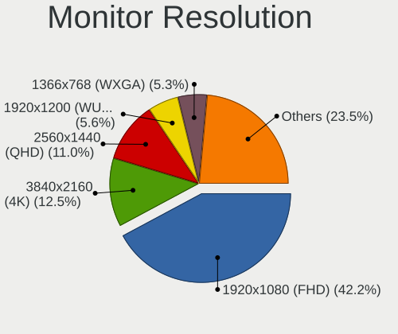

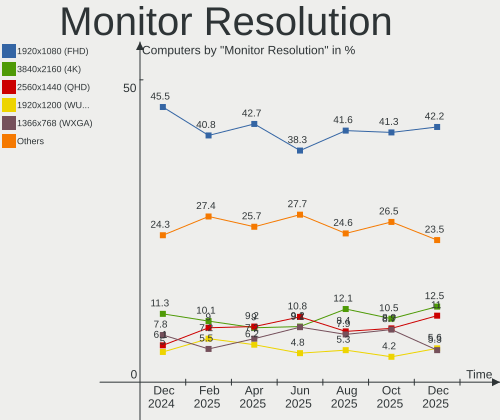

| Resolution         | Computers | Percent |
|--------------------|-----------|---------|
| 1920x1080 (FHD)    | 385       | 42.17%  |
| 3840x2160 (4K)     | 114       | 12.49%  |
| 2560x1440 (QHD)    | 100       | 10.95%  |
| 1920x1200 (WUXGA)  | 51        | 5.59%   |
| 1366x768 (WXGA)    | 48        | 5.26%   |
| 1600x900 (HD+)     | 39        | 4.27%   |
| 3440x1440          | 27        | 2.96%   |
| 2560x1600          | 21        | 2.3%    |
| 1680x1050 (WSXGA+) | 19        | 2.08%   |
| 1440x900 (WXGA+)   | 18        | 1.97%   |
| 1280x1024 (SXGA)   | 14        | 1.53%   |
| 2880x1800          | 12        | 1.31%   |
| 1280x800 (WXGA)    | 11        | 1.2%    |
| Unknown            | 9         | 0.99%   |
| 3840x1080          | 5         | 0.55%   |
| 1920x540           | 4         | 0.44%   |
| 3840x1600          | 3         | 0.33%   |
| 2880x1920          | 3         | 0.33%   |
| 2560x1080          | 3         | 0.33%   |
| 1600x1200          | 3         | 0.33%   |
| 800x1280           | 2         | 0.22%   |
| 3840x2400          | 2         | 0.22%   |
| 3200x1800 (QHD+)   | 2         | 0.22%   |
| 2520x1680          | 2         | 0.22%   |
| 2288x1287          | 2         | 0.22%   |
| 2240x1400          | 2         | 0.22%   |
| 1920x1280          | 2         | 0.22%   |
| 3456x2160          | 1         | 0.11%   |
| 3000x2000          | 1         | 0.11%   |
| 2944x1840          | 1         | 0.11%   |
| 2880x1600          | 1         | 0.11%   |
| 2736x1824          | 1         | 0.11%   |
| 2160x1440          | 1         | 0.11%   |
| 2048x1280          | 1         | 0.11%   |
| 1920x720           | 1         | 0.11%   |
| 1280x720 (HD)      | 1         | 0.11%   |
| 1024x600           | 1         | 0.11%   |

Monitor Diagonal
----------------

Diagonal size in inches

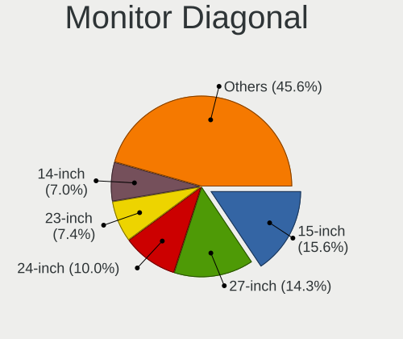

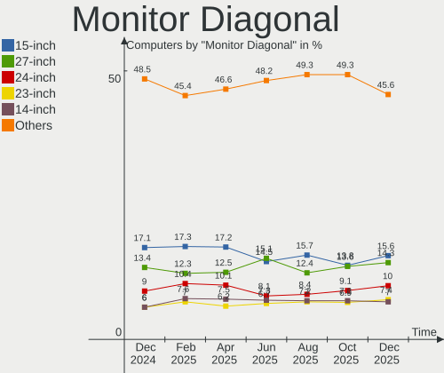

| Inches  | Computers | Percent |
|---------|-----------|---------|
| 15      | 147       | 15.61%  |
| 27      | 135       | 14.33%  |
| 24      | 94        | 9.98%   |
| 23      | 70        | 7.43%   |
| 14      | 66        | 7.01%   |
| 17      | 60        | 6.37%   |
| 31      | 58        | 6.16%   |
| 13      | 50        | 5.31%   |
| 21      | 39        | 4.14%   |
| 34      | 29        | 3.08%   |
| 16      | 23        | 2.44%   |
| Unknown | 19        | 2.02%   |
| 19      | 17        | 1.8%    |
| 22      | 15        | 1.59%   |
| 12      | 14        | 1.49%   |
| 84      | 12        | 1.27%   |
| 26      | 9         | 0.96%   |
| 18      | 6         | 0.64%   |
| 11      | 6         | 0.64%   |
| 63      | 5         | 0.53%   |
| 54      | 5         | 0.53%   |
| 28      | 5         | 0.53%   |
| 25      | 5         | 0.53%   |
| 20      | 5         | 0.53%   |
| 72      | 4         | 0.42%   |
| 48      | 4         | 0.42%   |
| 40      | 4         | 0.42%   |
| 32      | 4         | 0.42%   |
| 37      | 3         | 0.32%   |
| 142     | 2         | 0.21%   |
| 64      | 2         | 0.21%   |
| 57      | 2         | 0.21%   |
| 49      | 2         | 0.21%   |
| 43      | 2         | 0.21%   |
| 42      | 2         | 0.21%   |
| 29      | 2         | 0.21%   |
| 10      | 2         | 0.21%   |
| 7       | 2         | 0.21%   |
| 129     | 1         | 0.11%   |
| 74      | 1         | 0.11%   |

Monitor Width
-------------

Physical width

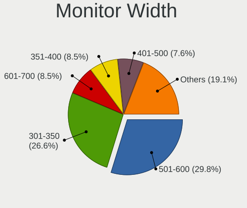

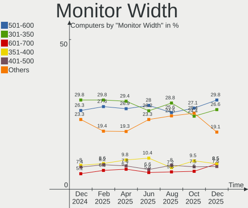

| Width in mm    | Computers | Percent |
|----------------|-----------|---------|
| 501-600        | 271       | 29.78%  |
| 301-350        | 242       | 26.59%  |
| 601-700        | 77        | 8.46%   |
| 351-400        | 77        | 8.46%   |
| 401-500        | 69        | 7.58%   |
| 201-300        | 61        | 6.7%    |
| 701-800        | 34        | 3.74%   |
| 1001-1500      | 24        | 2.64%   |
| Unknown        | 19        | 2.09%   |
| 1501-2000      | 17        | 1.87%   |
| 801-900        | 8         | 0.88%   |
| 901-1000       | 5         | 0.55%   |
| More than 2000 | 3         | 0.33%   |
| 1-100          | 2         | 0.22%   |
| 101-200        | 1         | 0.11%   |

Aspect Ratio
------------

Proportional relationship between the width and the height

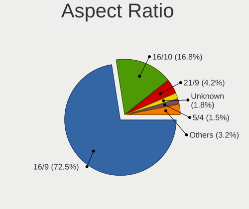

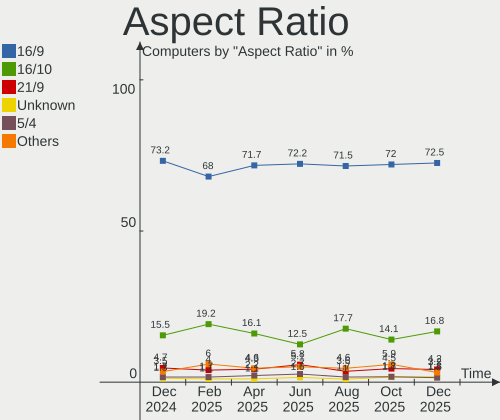

| Ratio   | Computers | Percent |
|---------|-----------|---------|
| 16/9    | 618       | 72.54%  |
| 16/10   | 143       | 16.78%  |
| 21/9    | 36        | 4.23%   |
| Unknown | 15        | 1.76%   |
| 5/4     | 13        | 1.53%   |
| 3/2     | 12        | 1.41%   |
| 32/9    | 6         | 0.7%    |
| 4/3     | 3         | 0.35%   |
| 1.00    | 2         | 0.23%   |
| 6/5     | 1         | 0.12%   |
| 2.67    | 1         | 0.12%   |
| 0.67    | 1         | 0.12%   |
| 0.62    | 1         | 0.12%   |

Monitor Area
------------

Area in inch²

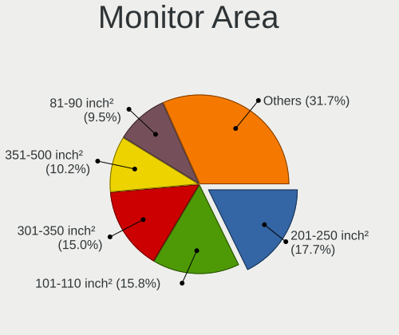

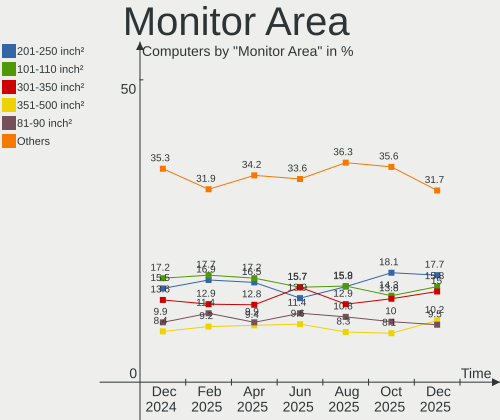

| Area in inch² | Computers | Percent |
|----------------|-----------|---------|
| 201-250        | 164       | 17.75%  |
| 101-110        | 146       | 15.8%   |
| 301-350        | 139       | 15.04%  |
| 351-500        | 94        | 10.17%  |
| 81-90          | 88        | 9.52%   |
| 121-130        | 52        | 5.63%   |
| 251-300        | 44        | 4.76%   |
| More than 1000 | 39        | 4.22%   |
| 151-200        | 33        | 3.57%   |
| 71-80          | 23        | 2.49%   |
| 111-120        | 23        | 2.49%   |
| Unknown        | 19        | 2.06%   |
| 501-1000       | 17        | 1.84%   |
| 61-70          | 14        | 1.52%   |
| 141-150        | 7         | 0.76%   |
| 51-60          | 6         | 0.65%   |
| 131-140        | 6         | 0.65%   |
| 91-100         | 5         | 0.54%   |
| 1-40           | 3         | 0.32%   |
| 41-50          | 2         | 0.22%   |

Pixel Density
-------------

Pixels per inch

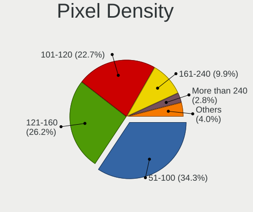

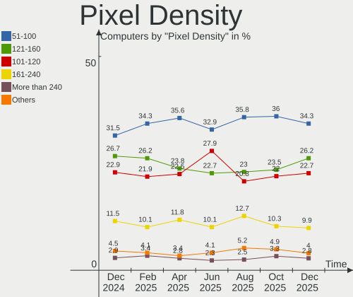

| Density       | Computers | Percent |
|---------------|-----------|---------|
| 51-100        | 305       | 34.31%  |
| 121-160       | 233       | 26.21%  |
| 101-120       | 202       | 22.72%  |
| 161-240       | 88        | 9.9%    |
| More than 240 | 25        | 2.81%   |
| Unknown       | 19        | 2.14%   |
| 1-50          | 17        | 1.91%   |

Multiple Monitors
-----------------

Total monitors connected

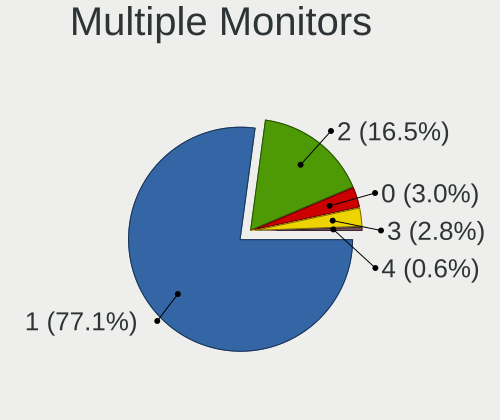

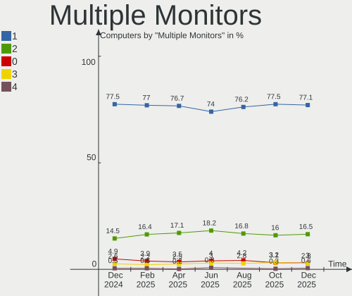

| Total | Computers | Percent |
|-------|-----------|---------|
| 1     | 641       | 77.14%  |
| 2     | 137       | 16.49%  |
| 0     | 25        | 3.01%   |
| 3     | 23        | 2.77%   |
| 4     | 5         | 0.6%    |

Network
-------

Net Controller Vendor
---------------------

Controller vendors

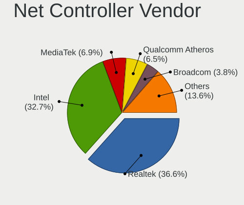

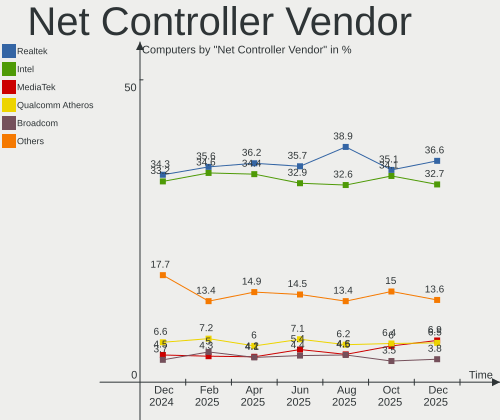

| Vendor                                 | Computers | Percent |
|----------------------------------------|-----------|---------|
| Realtek Semiconductor                  | 448       | 36.6%   |
| Intel                                  | 400       | 32.68%  |
| MediaTek                               | 85        | 6.94%   |
| Qualcomm Atheros                       | 79        | 6.45%   |
| Broadcom                               | 46        | 3.76%   |
| TP-Link                                | 13        | 1.06%   |
| Sierra Wireless                        | 12        | 0.98%   |
| Broadcom Limited                       | 10        | 0.82%   |
| ASIX Electronics                       | 10        | 0.82%   |
| Marvell Technology Group               | 9         | 0.74%   |
| Qualcomm                               | 8         | 0.65%   |
| Ralink Technology                      | 7         | 0.57%   |
| Nvidia                                 | 7         | 0.57%   |
| Lenovo                                 | 7         | 0.57%   |
| Ericsson Business Mobile Networks      | 7         | 0.57%   |
| Ralink                                 | 5         | 0.41%   |
| Qualcomm Technologies                  | 5         | 0.41%   |
| D-Link                                 | 5         | 0.41%   |
| AVM                                    | 5         | 0.41%   |
| Aquantia                               | 5         | 0.41%   |
| Raspberry Pi                           | 4         | 0.33%   |
| Xiaomi                                 | 3         | 0.25%   |
| Suzhou Motorcomm Electronic Technology | 3         | 0.25%   |
| Shenzhen Goodix Technology             | 3         | 0.25%   |
| Motorcomm Microelectronics.            | 3         | 0.25%   |
| Microsoft                              | 3         | 0.25%   |
| IMC Networks                           | 3         | 0.25%   |
| DisplayLink                            | 3         | 0.25%   |
| ZyXEL Communications                   | 2         | 0.16%   |
| Qualcomm Atheros Communications        | 2         | 0.16%   |
| Hewlett-Packard                        | 2         | 0.16%   |
| Edimax Technology                      | 2         | 0.16%   |
| Dell                                   | 2         | 0.16%   |
| Arduino SA                             | 2         | 0.16%   |
| Apple                                  | 2         | 0.16%   |
| U-Blox                                 | 1         | 0.08%   |
| Sigma Designs                          | 1         | 0.08%   |
| Samsung Electronics                    | 1         | 0.08%   |
| Realtek                                | 1         | 0.08%   |
| NetGear                                | 1         | 0.08%   |

Net Controller Model
--------------------

Controller models

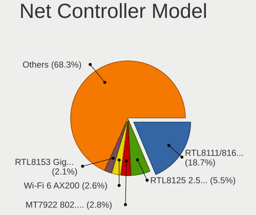

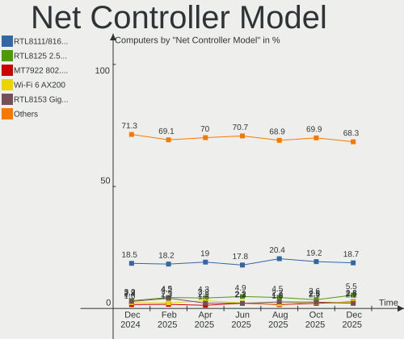

| Model                                                                           | Computers | Percent |
|---------------------------------------------------------------------------------|-----------|---------|
| Realtek RTL8111/8168/8211/8411 PCI Express Gigabit Ethernet Controller          | 276       | 18.66%  |
| Realtek RTL8125 2.5GbE Controller                                               | 82        | 5.54%   |
| MediaTek MT7922 802.11ax PCI Express Wireless Network Adapter                   | 42        | 2.84%   |
| Intel Wi-Fi 6 AX200                                                             | 38        | 2.57%   |
| Realtek RTL8153 Gigabit Ethernet Adapter                                        | 31        | 2.1%    |
| Intel Wireless 8265 / 8275                                                      | 30        | 2.03%   |
| Intel 82579LM Gigabit Network Connection (Lewisville)                           | 27        | 1.83%   |
| Realtek RTL8821CE 802.11ac PCIe Wireless Network Adapter                        | 23        | 1.56%   |
| Intel Ethernet Controller I225-V                                                | 22        | 1.49%   |
| Intel Ethernet Controller I226-V                                                | 21        | 1.42%   |
| Intel Ethernet Connection (2) I219-V                                            | 20        | 1.35%   |
| Intel Wi-Fi 6E(802.11ax) AX210/AX1675* 2x2 [Typhoon Peak]                       | 19        | 1.28%   |
| Intel I211 Gigabit Network Connection                                           | 18        | 1.22%   |
| Realtek RTL810xE PCI Express Fast Ethernet controller                           | 16        | 1.08%   |
| Intel Wi-Fi 6 AX201                                                             | 16        | 1.08%   |
| MediaTek MT7925 802.11be 160MHz 2x2 PCIe Wireless Network Adapter [Filogic 360] | 15        | 1.01%   |
| Intel Wireless 7265                                                             | 15        | 1.01%   |
| Intel Ethernet Connection (4) I219-LM                                           | 15        | 1.01%   |
| Intel Ethernet Connection I217-LM                                               | 14        | 0.95%   |
| Intel Centrino Advanced-N 6205 [Taylor Peak]                                    | 13        | 0.88%   |
| Realtek 802.11ac NIC                                                            | 12        | 0.81%   |
| Qualcomm Atheros QCA6174 802.11ac Wireless Network Adapter                      | 12        | 0.81%   |
| Intel Wireless 8260                                                             | 12        | 0.81%   |
| Intel Wireless 7260                                                             | 12        | 0.81%   |
| Realtek RTL8852BE PCIe 802.11ax Wireless Network Controller                     | 11        | 0.74%   |
| Intel Alder Lake-P PCH CNVi WiFi                                                | 11        | 0.74%   |
| Qualcomm Atheros AR9285 Wireless Network Adapter (PCI-Express)                  | 10        | 0.68%   |
| MediaTek MT7902 802.11ax PCIe Wireless Network Adapter [Filogic 310]            | 10        | 0.68%   |
| Intel Wireless 3165                                                             | 9         | 0.61%   |
| Intel Ethernet Connection I217-V                                                | 9         | 0.61%   |
| Intel 700 Series Chipset CNVi WiFi                                              | 9         | 0.61%   |
| ASIX AX88179 Gigabit Ethernet                                                   | 9         | 0.61%   |
| Realtek RTL88x2bu [AC1200 Techkey]                                              | 8         | 0.54%   |
| Realtek RTL8723BE PCIe Wireless Network Adapter                                 | 8         | 0.54%   |
| Realtek RTL8126 5GbE Controller                                                 | 8         | 0.54%   |
| Intel Meteor Lake PCH CNVi WiFi                                                 | 8         | 0.54%   |
| Intel Ethernet Connection (2) I219-LM                                           | 8         | 0.54%   |
| Intel 82574L Gigabit Network Connection                                         | 8         | 0.54%   |
| Realtek RTL8822CE 802.11ac PCIe Wireless Network Adapter                        | 7         | 0.47%   |
| Qualcomm Atheros AR8151 v2.0 Gigabit Ethernet                                   | 7         | 0.47%   |

Wireless Vendor
---------------

Wireless vendors

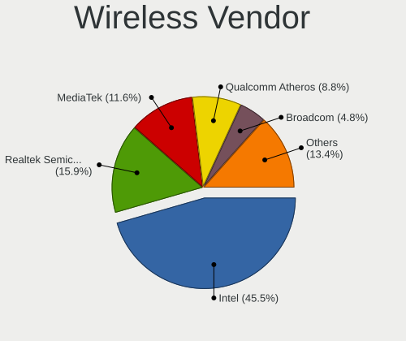

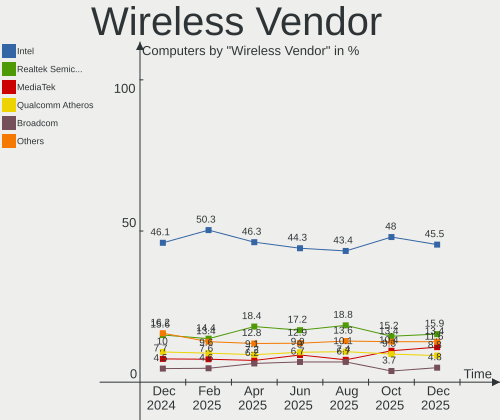

| Vendor                          | Computers | Percent |
|---------------------------------|-----------|---------|
| Intel                           | 286       | 45.54%  |
| Realtek Semiconductor           | 100       | 15.92%  |
| MediaTek                        | 73        | 11.62%  |
| Qualcomm Atheros                | 55        | 8.76%   |
| Broadcom                        | 30        | 4.78%   |
| TP-Link                         | 13        | 2.07%   |
| Sierra Wireless                 | 12        | 1.91%   |
| Broadcom Limited                | 8         | 1.27%   |
| Ralink Technology               | 7         | 1.11%   |
| Qualcomm                        | 7         | 1.11%   |
| Ralink                          | 5         | 0.8%    |
| D-Link                          | 5         | 0.8%    |
| AVM                             | 5         | 0.8%    |
| Microsoft                       | 3         | 0.48%   |
| Marvell Technology Group        | 3         | 0.48%   |
| IMC Networks                    | 3         | 0.48%   |
| ZyXEL Communications            | 2         | 0.32%   |
| Qualcomm Atheros Communications | 2         | 0.32%   |
| Edimax Technology               | 2         | 0.32%   |
| Realtek                         | 1         | 0.16%   |
| Qualcomm Technologies           | 1         | 0.16%   |
| NetGear                         | 1         | 0.16%   |
| Hewlett-Packard                 | 1         | 0.16%   |
| Dell                            | 1         | 0.16%   |
| Cypress Semiconductor           | 1         | 0.16%   |
| ASUSTek Computer                | 1         | 0.16%   |

Wireless Model
--------------

Wireless models

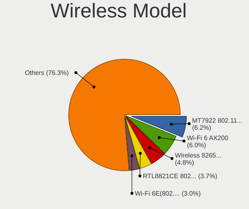

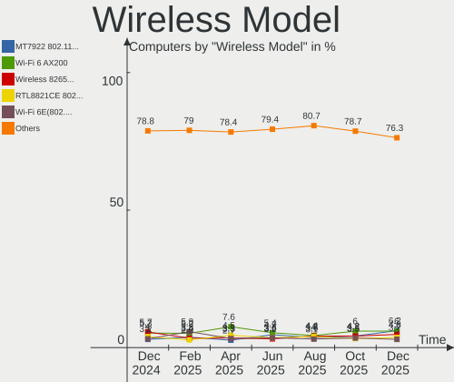

| Model                                                                           | Computers | Percent |
|---------------------------------------------------------------------------------|-----------|---------|
| MediaTek MT7922 802.11ax PCI Express Wireless Network Adapter                   | 39        | 6.19%   |
| Intel Wi-Fi 6 AX200                                                             | 38        | 6.03%   |
| Intel Wireless 8265 / 8275                                                      | 30        | 4.76%   |
| Realtek RTL8821CE 802.11ac PCIe Wireless Network Adapter                        | 23        | 3.65%   |
| Intel Wi-Fi 6E(802.11ax) AX210/AX1675* 2x2 [Typhoon Peak]                       | 19        | 3.02%   |
| Intel Wi-Fi 6 AX201                                                             | 16        | 2.54%   |
| Intel Wireless 7265                                                             | 15        | 2.38%   |
| Intel Centrino Advanced-N 6205 [Taylor Peak]                                    | 13        | 2.06%   |
| Realtek 802.11ac NIC                                                            | 12        | 1.9%    |
| Qualcomm Atheros QCA6174 802.11ac Wireless Network Adapter                      | 12        | 1.9%    |
| Intel Wireless 8260                                                             | 12        | 1.9%    |
| Intel Wireless 7260                                                             | 12        | 1.9%    |
| Qualcomm Atheros AR9285 Wireless Network Adapter (PCI-Express)                  | 10        | 1.59%   |
| MediaTek MT7902 802.11ax PCIe Wireless Network Adapter [Filogic 310]            | 10        | 1.59%   |
| MediaTek MT7925 802.11be 160MHz 2x2 PCIe Wireless Network Adapter [Filogic 360] | 9         | 1.43%   |
| Intel Wireless 3165                                                             | 9         | 1.43%   |
| Intel Alder Lake-P PCH CNVi WiFi                                                | 9         | 1.43%   |
| Intel 700 Series Chipset CNVi WiFi                                              | 9         | 1.43%   |
| Realtek RTL88x2bu [AC1200 Techkey]                                              | 8         | 1.27%   |
| Realtek RTL8723BE PCIe Wireless Network Adapter                                 | 8         | 1.27%   |
| Intel Meteor Lake PCH CNVi WiFi                                                 | 8         | 1.27%   |
| Realtek RTL8822CE 802.11ac PCIe Wireless Network Adapter                        | 7         | 1.11%   |
| MediaTek MT7921 802.11ax PCIe Wireless Network Adapter [Filogic 330]            | 7         | 1.11%   |
| Intel Wi-Fi 5(802.11ac) Wireless-AC 9x6x [Thunder Peak]                         | 7         | 1.11%   |
| Intel Comet Lake PCH-LP CNVi WiFi                                               | 7         | 1.11%   |
| Broadcom BCM43142 802.11b/g/n                                                   | 7         | 1.11%   |
| Qualcomm QCNFA765 Wireless Network Adapter                                      | 6         | 0.95%   |
| Qualcomm Atheros QCA9565 / AR9565 Wireless Network Adapter                      | 6         | 0.95%   |
| Qualcomm Atheros QCA9377 802.11ac Wireless Network Adapter                      | 6         | 0.95%   |
| Intel Centrino Advanced-N 6235                                                  | 6         | 0.95%   |
| Intel Centrino Advanced-N 6200                                                  | 6         | 0.95%   |
| Intel Alder Lake-S PCH CNVi WiFi                                                | 6         | 0.95%   |
| Broadcom Limited BCM4360 802.11ac Dual Band Wireless Network Adapter            | 6         | 0.95%   |
| Broadcom BCM4331 802.11a/b/g/n                                                  | 6         | 0.95%   |
| TP-Link 802.11ac NIC                                                            | 5         | 0.79%   |
| Sierra Wireless EM7305 Modem                                                    | 5         | 0.79%   |
| Realtek RTL8852BE PCIe 802.11ax Wireless Network Controller                     | 5         | 0.79%   |
| Ralink RT5370 Wireless Adapter                                                  | 5         | 0.79%   |
| Qualcomm Atheros AR9485 Wireless Network Adapter                                | 5         | 0.79%   |
| Qualcomm Atheros AR928X Wireless Network Adapter (PCI-Express)                  | 5         | 0.79%   |

Ethernet Vendor
---------------

Ethernet vendors

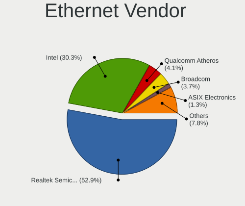

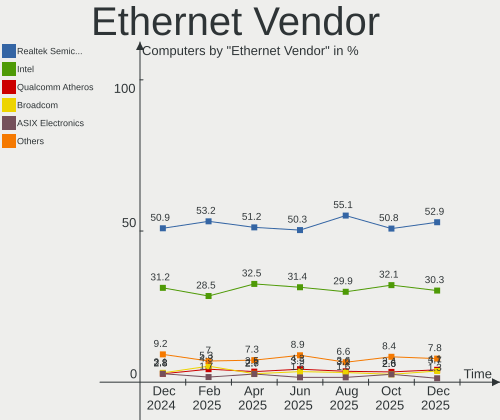

| Vendor                                 | Computers | Percent |
|----------------------------------------|-----------|---------|
| Realtek Semiconductor                  | 418       | 52.91%  |
| Intel                                  | 239       | 30.25%  |
| Qualcomm Atheros                       | 32        | 4.05%   |
| Broadcom                               | 29        | 3.67%   |
| ASIX Electronics                       | 10        | 1.27%   |
| MediaTek                               | 9         | 1.14%   |
| Nvidia                                 | 7         | 0.89%   |
| Marvell Technology Group               | 6         | 0.76%   |
| Lenovo                                 | 6         | 0.76%   |
| Aquantia                               | 5         | 0.63%   |
| Raspberry Pi                           | 4         | 0.51%   |
| Qualcomm Technologies                  | 4         | 0.51%   |
| Xiaomi                                 | 3         | 0.38%   |
| Suzhou Motorcomm Electronic Technology | 3         | 0.38%   |
| Motorcomm Microelectronics.            | 3         | 0.38%   |
| DisplayLink                            | 3         | 0.38%   |
| Broadcom Limited                       | 2         | 0.25%   |
| Apple                                  | 2         | 0.25%   |
| Samsung Electronics                    | 1         | 0.13%   |
| Qualcomm                               | 1         | 0.13%   |
| Netchip Technology                     | 1         | 0.13%   |
| Google                                 | 1         | 0.13%   |
| 3Com                                   | 1         | 0.13%   |

Ethernet Model
--------------

Ethernet models

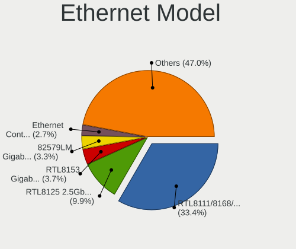

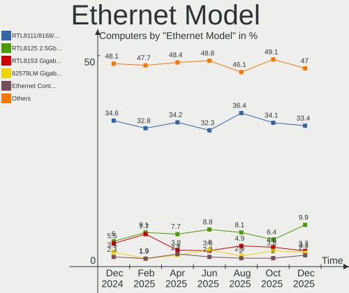

| Model                                                                           | Computers | Percent |
|---------------------------------------------------------------------------------|-----------|---------|
| Realtek RTL8111/8168/8211/8411 PCI Express Gigabit Ethernet Controller          | 276       | 33.37%  |
| Realtek RTL8125 2.5GbE Controller                                               | 82        | 9.92%   |
| Realtek RTL8153 Gigabit Ethernet Adapter                                        | 31        | 3.75%   |
| Intel 82579LM Gigabit Network Connection (Lewisville)                           | 27        | 3.26%   |
| Intel Ethernet Controller I225-V                                                | 22        | 2.66%   |
| Intel Ethernet Controller I226-V                                                | 21        | 2.54%   |
| Intel Ethernet Connection (2) I219-V                                            | 20        | 2.42%   |
| Intel I211 Gigabit Network Connection                                           | 18        | 2.18%   |
| Realtek RTL810xE PCI Express Fast Ethernet controller                           | 16        | 1.93%   |
| Intel Ethernet Connection (4) I219-LM                                           | 15        | 1.81%   |
| Intel Ethernet Connection I217-LM                                               | 14        | 1.69%   |
| Intel Ethernet Connection I217-V                                                | 9         | 1.09%   |
| ASIX AX88179 Gigabit Ethernet                                                   | 9         | 1.09%   |
| Realtek RTL8126 5GbE Controller                                                 | 8         | 0.97%   |
| Intel Ethernet Connection (2) I219-LM                                           | 8         | 0.97%   |
| Intel 82574L Gigabit Network Connection                                         | 8         | 0.97%   |
| Qualcomm Atheros AR8151 v2.0 Gigabit Ethernet                                   | 7         | 0.85%   |
| Broadcom NetXtreme BCM57765 Gigabit Ethernet PCIe                               | 7         | 0.85%   |
| Realtek RTL8852BE PCIe 802.11ax Wireless Network Controller                     | 6         | 0.73%   |
| Qualcomm Atheros Killer E2500 Gigabit Ethernet Controller                       | 6         | 0.73%   |
| MediaTek MT7925 802.11be 160MHz 2x2 PCIe Wireless Network Adapter [Filogic 360] | 6         | 0.73%   |
| Intel Ethernet Connection (7) I219-LM                                           | 6         | 0.73%   |
| Intel Ethernet Connection (5) I219-LM                                           | 6         | 0.73%   |
| Intel 82577LM Gigabit Network Connection                                        | 6         | 0.73%   |
| Realtek USB 10/100/1G/2.5 LAN                                                   | 5         | 0.6%    |
| Intel Ethernet Connection I219-LM                                               | 5         | 0.6%    |
| Broadcom NetXtreme BCM57766 Gigabit Ethernet PCIe                               | 5         | 0.6%    |
| Realtek RTL8922AE 802.11be PCIe Wireless Network Adapter                        | 4         | 0.48%   |
| Realtek RTL8169 PCI Gigabit Ethernet Controller                                 | 4         | 0.48%   |
| Raspberry Pi RP1 PCIe 2.0 South Bridge                                          | 4         | 0.48%   |
| Qualcomm WCN785x Wi-Fi 7(802.11be) 320MHz 2x2 [FastConnect 7800]                | 4         | 0.48%   |
| Qualcomm Atheros AR8161 Gigabit Ethernet                                        | 4         | 0.48%   |
| Qualcomm Atheros AR8131 Gigabit Ethernet                                        | 4         | 0.48%   |
| Nvidia MCP79 Ethernet                                                           | 4         | 0.48%   |
| Intel Ethernet Connection (4) I219-V                                            | 4         | 0.48%   |
| Intel Ethernet Connection (3) I218-LM                                           | 4         | 0.48%   |
| Intel Ethernet Connection (16) I219-V                                           | 4         | 0.48%   |
| Intel 82579V Gigabit Network Connection                                         | 4         | 0.48%   |
| Suzhou Motorcomm Electronic YT6801 Gigabit Ethernet Controller                  | 3         | 0.36%   |
| Realtek RTL8152 Fast Ethernet Adapter                                           | 3         | 0.36%   |

Net Controller Kind
-------------------

Ethernet, WiFi or modem

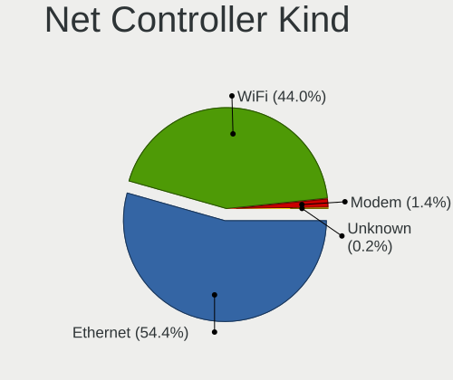

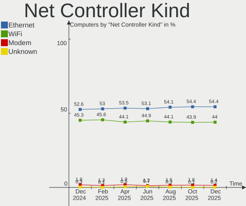

| Kind     | Computers | Percent |
|----------|-----------|---------|
| Ethernet | 724       | 54.4%   |
| WiFi     | 585       | 43.95%  |
| Modem    | 19        | 1.43%   |
| Unknown  | 3         | 0.23%   |

Used Controller
---------------

Currently used network controller

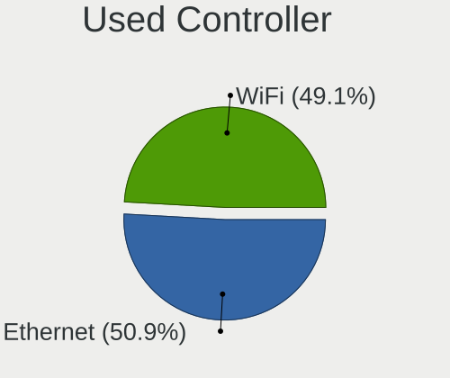

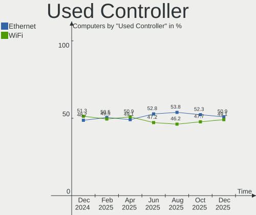

| Kind     | Computers | Percent |
|----------|-----------|---------|
| Ethernet | 433       | 50.88%  |
| WiFi     | 418       | 49.12%  |

NICs
----

Total network controllers on board

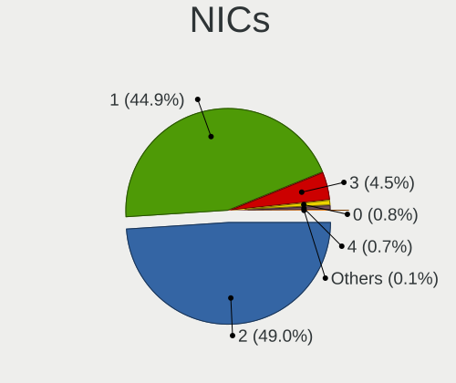

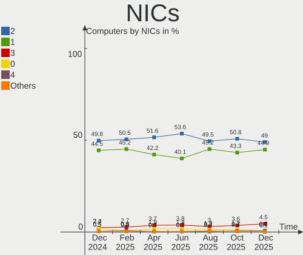

| Total | Computers | Percent |
|-------|-----------|---------|
| 2     | 407       | 48.98%  |
| 1     | 373       | 44.89%  |
| 3     | 37        | 4.45%   |
| 0     | 7         | 0.84%   |
| 4     | 6         | 0.72%   |
| 5     | 1         | 0.12%   |

IPv6
----

IPv6 vs IPv4

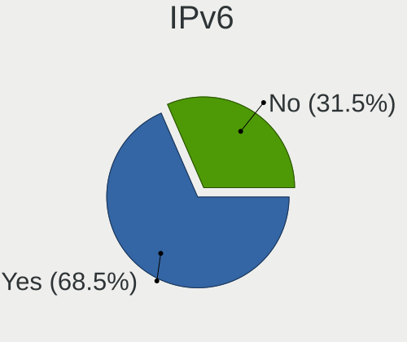

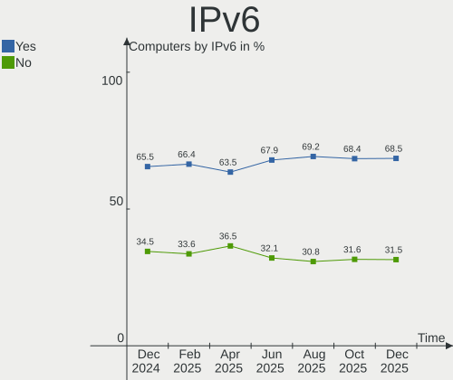

| Used | Computers | Percent |
|------|-----------|---------|
| Yes  | 569       | 68.47%  |
| No   | 262       | 31.53%  |

Bluetooth
---------

Bluetooth Vendor
----------------

Controller vendors

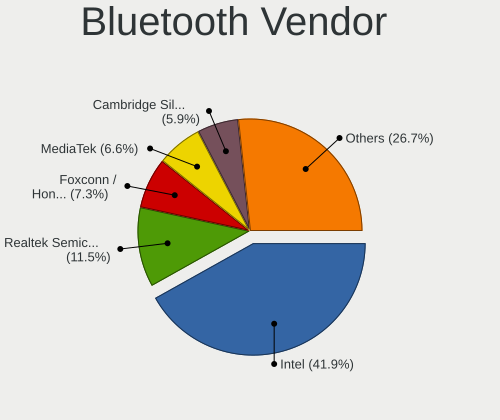

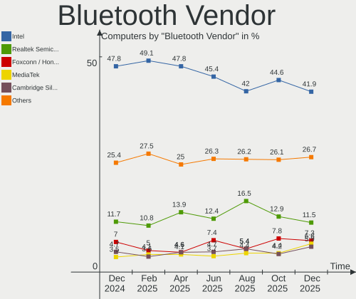

| Vendor                          | Computers | Percent |
|---------------------------------|-----------|---------|
| Intel                           | 240       | 41.88%  |
| Realtek Semiconductor           | 66        | 11.52%  |
| Foxconn / Hon Hai               | 42        | 7.33%   |
| MediaTek                        | 38        | 6.63%   |
| Cambridge Silicon Radio         | 34        | 5.93%   |
| IMC Networks                    | 26        | 4.54%   |
| Apple                           | 25        | 4.36%   |
| Broadcom                        | 22        | 3.84%   |
| Qualcomm Atheros Communications | 20        | 3.49%   |
| ASUSTek Computer                | 11        | 1.92%   |
| TP-Link                         | 9         | 1.57%   |
| Lite-On Technology              | 9         | 1.57%   |
| Unknown                         | 6         | 1.05%   |
| Marvell Semiconductor           | 4         | 0.7%    |
| Hewlett-Packard                 | 4         | 0.7%    |
| USI                             | 3         | 0.52%   |
| Toshiba                         | 3         | 0.52%   |
| Foxconn International           | 3         | 0.52%   |
| Ralink                          | 2         | 0.35%   |
| Dell                            | 2         | 0.35%   |
| Actions                         | 2         | 0.35%   |
| Edimax Technology               | 1         | 0.17%   |
| Askey Computer                  | 1         | 0.17%   |

Bluetooth Model
---------------

Controller models

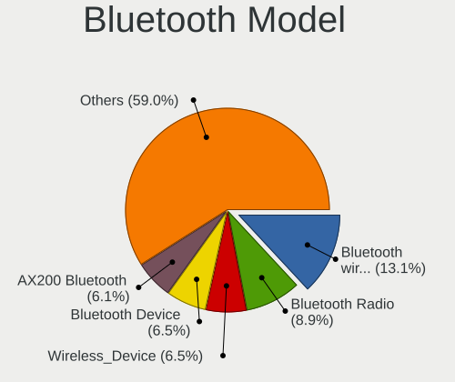

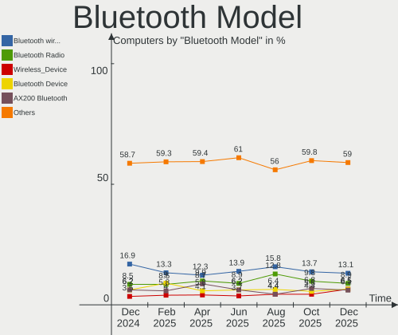

| Model                                               | Computers | Percent |
|-----------------------------------------------------|-----------|---------|
| Intel Bluetooth wireless interface                  | 75        | 13.09%  |
| Realtek Bluetooth Radio                             | 51        | 8.9%    |
| MediaTek Wireless_Device                            | 37        | 6.46%   |
| Intel Bluetooth Device                              | 37        | 6.46%   |
| Intel AX200 Bluetooth                               | 35        | 6.11%   |
| Intel AX201 Bluetooth                               | 34        | 5.93%   |
| Cambridge Silicon Radio Bluetooth Dongle (HCI mode) | 34        | 5.93%   |
| Foxconn / Hon Hai Wireless_Device                   | 24        | 4.19%   |
| Intel AX210 Bluetooth                               | 19        | 3.32%   |
| Intel Bluetooth 9460/9560 Jefferson Peak (JfP)      | 18        | 3.14%   |
| IMC Networks Wireless_Device                        | 15        | 2.62%   |
| Apple Bluetooth USB Host Controller                 | 11        | 1.92%   |
| Intel Centrino Bluetooth Wireless Transceiver       | 10        | 1.75%   |
| Apple Bluetooth Host Controller                     | 10        | 1.75%   |
| TP-Link TP-T@- UB500 Adapter                        | 9         | 1.57%   |
| IMC Networks Bluetooth Radio                        | 9         | 1.57%   |
| Foxconn / Hon Hai Bluetooth Device                  | 9         | 1.57%   |
| Qualcomm Atheros QCA61x4 Bluetooth 4.0              | 8         | 1.4%    |
| Qualcomm Atheros AR3011 Bluetooth                   | 6         | 1.05%   |
| Intel Wireless-AC 9260 Bluetooth Adapter            | 6         | 1.05%   |
| Foxconn / Hon Hai MediaTek Bluetooth Adapter        | 6         | 1.05%   |
| Broadcom BCM20702 Bluetooth 4.0 [ThinkPad]          | 6         | 1.05%   |
| Broadcom BCM2045B (BDC-2.1)                         | 6         | 1.05%   |
| Unknown                                             | 6         | 1.05%   |
| Realtek  Bluetooth 4.2 Adapter                      | 5         | 0.87%   |
| Realtek Bluetooth 5.3 Radio                         | 5         | 0.87%   |
| Intel Wireless-AC 3168 Bluetooth                    | 5         | 0.87%   |
| ASUS ASUS USB-BT500                                 | 4         | 0.7%    |
| Apple Built-in Bluetooth 2.0+EDR HCI                | 4         | 0.7%    |
| USI Bluetooth Device                                | 3         | 0.52%   |
| Qualcomm Atheros  Bluetooth Device                  | 3         | 0.52%   |
| Marvell Bluetooth and Wireless LAN Composite        | 3         | 0.52%   |
| Lite-On Qualcomm Atheros QCA9377 Bluetooth          | 3         | 0.52%   |
| Lite-On Bluetooth Device                            | 3         | 0.52%   |
| HP Broadcom 2070 Bluetooth Combo                    | 3         | 0.52%   |
| Foxconn International BCM43142A0 Bluetooth module   | 3         | 0.52%   |
| Realtek RTL8723B Bluetooth                          | 2         | 0.35%   |
| Realtek Bluetooth 5.4 Radio                         | 2         | 0.35%   |
| Ralink RT3290 Bluetooth                             | 2         | 0.35%   |
| Qualcomm Atheros AR3012 Bluetooth 4.0               | 2         | 0.35%   |

Sound
-----

Sound Vendor
------------

Sound card vendors

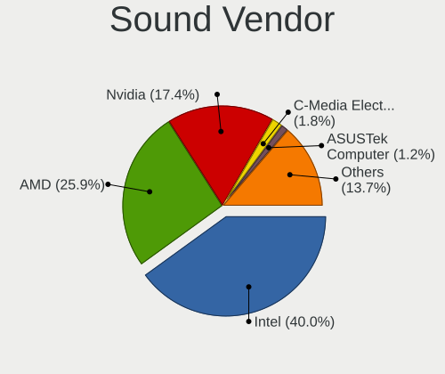

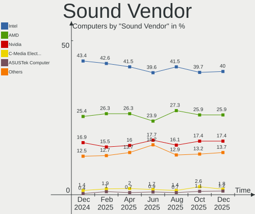

| Vendor                                       | Computers | Percent |
|----------------------------------------------|-----------|---------|
| Intel                                        | 520       | 40.03%  |
| AMD                                          | 337       | 25.94%  |
| Nvidia                                       | 226       | 17.4%   |
| C-Media Electronics                          | 23        | 1.77%   |
| ASUSTek Computer                             | 15        | 1.15%   |
| Micro Star International                     | 12        | 0.92%   |
| Logitech                                     | 12        | 0.92%   |
| Creative Labs                                | 12        | 0.92%   |
| Razer USA                                    | 9         | 0.69%   |
| Texas Instruments                            | 8         | 0.62%   |
| SteelSeries ApS                              | 8         | 0.62%   |
| Zoran Co. Personal Media Division (Nogatech) | 7         | 0.54%   |
| Yamaha                                       | 7         | 0.54%   |
| Creative Technology                          | 7         | 0.54%   |
| Sony                                         | 6         | 0.46%   |
| RODE Microphones                             | 5         | 0.38%   |
| Lenovo                                       | 5         | 0.38%   |
| Jieli Technology                             | 5         | 0.38%   |
| Hewlett-Packard                              | 5         | 0.38%   |
| GN Netcom                                    | 5         | 0.38%   |
| Kingston Technology                          | 4         | 0.31%   |
| Focusrite-Novation                           | 4         | 0.31%   |
| Samson Technologies                          | 3         | 0.23%   |
| Plantronics                                  | 3         | 0.23%   |
| JMTek                                        | 3         | 0.23%   |
| Apple                                        | 3         | 0.23%   |
| XMOS                                         | 2         | 0.15%   |
| Valve Software                               | 2         | 0.15%   |
| Thesycon Systemsoftware & Consulting         | 2         | 0.15%   |
| Samsung Electronics                          | 2         | 0.15%   |
| NZXT                                         | 2         | 0.15%   |
| GYROCOM C&C                                  | 2         | 0.15%   |
| Generalplus Technology                       | 2         | 0.15%   |
| Dell                                         | 2         | 0.15%   |
| USB MICROPHONE                               | 1         | 0.08%   |
| Trust                                        | 1         | 0.08%   |
| TerraTec Electronic                          | 1         | 0.08%   |
| Tenx Technology                              | 1         | 0.08%   |
| Tdlasunnic                                   | 1         | 0.08%   |
| Shure                                        | 1         | 0.08%   |

Sound Model
-----------

Sound card models

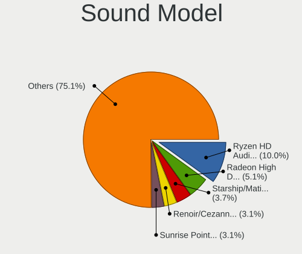

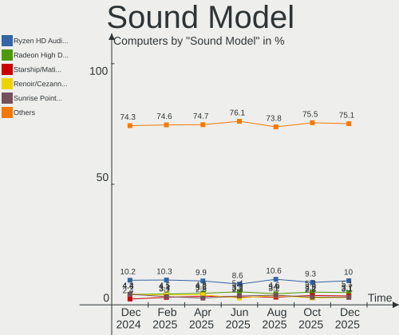

| Model                                                                      | Computers | Percent |
|----------------------------------------------------------------------------|-----------|---------|
| AMD Ryzen HD Audio Controller                                              | 160       | 9.96%   |
| AMD Radeon High Definition Audio Controller                                | 82        | 5.11%   |
| AMD Starship/Matisse HD Audio Controller                                   | 59        | 3.67%   |
| AMD Renoir/Cezanne HDMI/DP Audio Controller                                | 50        | 3.11%   |
| Intel Sunrise Point-LP HD Audio                                            | 49        | 3.05%   |
| Intel 8 Series/C220 Series Chipset High Definition Audio Controller        | 43        | 2.68%   |
| Intel 7 Series/C216 Chipset Family High Definition Audio Controller        | 42        | 2.62%   |
| Intel 6 Series/C200 Series Chipset Family High Definition Audio Controller | 32        | 1.99%   |
| Intel 200 Series PCH HD Audio                                              | 30        | 1.87%   |
| AMD Navi 31 HDMI/DP Audio                                                  | 30        | 1.87%   |
| Intel Xeon E3-1200 v3/4th Gen Core Processor HD Audio Controller           | 29        | 1.81%   |
| Intel Cannon Lake PCH cAVS                                                 | 25        | 1.56%   |
| Intel 100 Series/C230 Series Chipset Family HD Audio Controller            | 25        | 1.56%   |
| AMD Navi 48 HDMI/DP Audio Controller                                       | 24        | 1.49%   |
| Intel Raptor Lake High Definition Audio Controller                         | 23        | 1.43%   |
| Intel 5 Series/3400 Series Chipset High Definition Audio                   | 20        | 1.25%   |
| AMD Navi 21/23 HDMI/DP Audio Controller                                    | 20        | 1.25%   |
| Intel Tiger Lake-LP Smart Sound Technology Audio Controller                | 19        | 1.18%   |
| Intel Haswell-ULT HD Audio Controller                                      | 19        | 1.18%   |
| Intel 8 Series HD Audio Controller                                         | 19        | 1.18%   |
| AMD Raven/Raven2/Fenghuang HDMI/DP Audio Controller                        | 19        | 1.18%   |
| Intel Alder Lake PCH-P High Definition Audio Controller                    | 18        | 1.12%   |
| AMD SBx00 Azalia (Intel HDA)                                               | 18        | 1.12%   |
| Intel Broadwell-U Audio Controller                                         | 16        | 1%      |
| AMD FCH Azalia Controller                                                  | 16        | 1%      |
| AMD Ellesmere HDMI Audio [Radeon RX 470/480 / 570/580/590]                 | 16        | 1%      |
| Intel Wildcat Point-LP High Definition Audio Controller                    | 15        | 0.93%   |
| Intel Alder Lake-N PCH High Definition Audio Controller                    | 13        | 0.81%   |
| Nvidia GA106 High Definition Audio Controller                              | 12        | 0.75%   |
| Micro Star International USB Audio                                         | 12        | 0.75%   |
| Intel Alder Lake-S HD Audio Controller                                     | 12        | 0.75%   |
| ASUSTek Computer USB Audio                                                 | 12        | 0.75%   |
| Nvidia AD107 High Definition Audio Controller                              | 11        | 0.68%   |
| Intel Celeron/Pentium Silver Processor High Definition Audio               | 11        | 0.68%   |
| Nvidia GP104 High Definition Audio Controller                              | 10        | 0.62%   |
| Nvidia GA102 High Definition Audio Controller                              | 10        | 0.62%   |
| Nvidia AD104 High Definition Audio Controller                              | 10        | 0.62%   |
| Intel 82801I (ICH9 Family) HD Audio Controller                             | 10        | 0.62%   |
| Nvidia TU104 HD Audio Controller                                           | 9         | 0.56%   |
| Nvidia GF108 High Definition Audio Controller                              | 9         | 0.56%   |

Memory
------

Memory Vendor
-------------

Memory module vendors

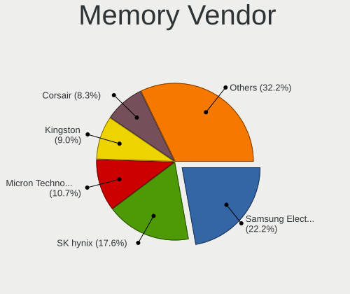

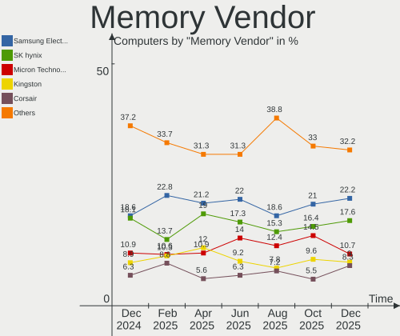

| Vendor                       | Computers | Percent |
|------------------------------|-----------|---------|
| Samsung Electronics          | 91        | 22.2%   |
| SK hynix                     | 72        | 17.56%  |
| Micron Technology            | 44        | 10.73%  |
| Kingston                     | 37        | 9.02%   |
| Corsair                      | 34        | 8.29%   |
| G.Skill                      | 33        | 8.05%   |
| Crucial                      | 29        | 7.07%   |
| Unknown                      | 20        | 4.88%   |
| Ramaxel Technology           | 8         | 1.95%   |
| Unknown                      | 7         | 1.71%   |
| Nanya Technology             | 5         | 1.22%   |
| A-DATA Technology            | 4         | 0.98%   |
| Unknown (ABCD)               | 3         | 0.73%   |
| TeamGroup                    | 3         | 0.73%   |
| Timetec                      | 2         | 0.49%   |
| Team                         | 2         | 0.49%   |
| Patriot Memory (PDP Systems) | 2         | 0.49%   |
| Patriot                      | 2         | 0.49%   |
| ChangXin Memory              | 2         | 0.49%   |
| Wodposit                     | 1         | 0.24%   |
| Unknown (0x0FE9)             | 1         | 0.24%   |
| Unknown (0x0BF7)             | 1         | 0.24%   |
| Unknown (0x0B45)             | 1         | 0.24%   |
| Kllisre                      | 1         | 0.24%   |
| GIGA-BYTE                    | 1         | 0.24%   |
| Exceleram                    | 1         | 0.24%   |
| Avant                        | 1         | 0.24%   |
| Apacer                       | 1         | 0.24%   |
| A-DA                         | 1         | 0.24%   |

Memory Model
------------

Memory module models

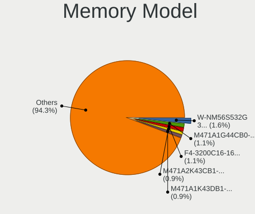

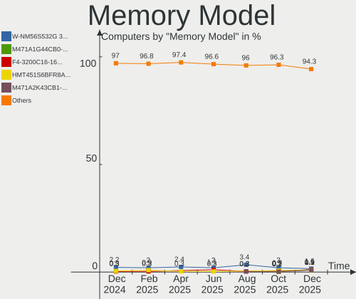

| Model                                                            | Computers | Percent |
|------------------------------------------------------------------|-----------|---------|
| Unknown                                                          | 7         | 1.61%   |
| Samsung RAM M471A1G44CB0-CWE 8GB SODIMM DDR4 3200MT/s            | 5         | 1.15%   |
| G.Skill RAM F4-3200C16-16GVK 16GB DIMM DDR4 3600MT/s             | 5         | 1.15%   |
| SK hynix RAM HMT451S6BFR8A-PB 4GB SODIMM DDR3 1600MT/s           | 4         | 0.92%   |
| Samsung RAM M471A2K43CB1-CRC 16GB SODIMM DDR4 2667MT/s           | 4         | 0.92%   |
| Samsung RAM M471A1K43DB1-CWE 8GB SODIMM DDR4 3200MT/s            | 4         | 0.92%   |
| Samsung RAM M471A1K43CB1-CRC 8GB SODIMM DDR4 8400MT/s            | 4         | 0.92%   |
| Corsair RAM CMK16GX4M2B3200C16 8GB DIMM DDR4 3600MT/s            | 4         | 0.92%   |
| SK hynix RAM HMA82GS6JJR8N-VK 16GB SODIMM DDR4 2667MT/s          | 3         | 0.69%   |
| SK hynix RAM HMA81GS6AFR8N-UH 8GB SODIMM DDR4 2667MT/s           | 3         | 0.69%   |
| Samsung RAM M471B5273DH0-CH9 4GB SODIMM DDR3 1600MT/s            | 3         | 0.69%   |
| Samsung RAM M471B5273CH0-CH9 4GB SODIMM DDR3 1334MT/s            | 3         | 0.69%   |
| Samsung RAM M471A5244CB0-CWE 4GB SODIMM DDR4 3200MT/s            | 3         | 0.69%   |
| Samsung RAM M425R2GA3EB0-CWMOL 16GB SODIMM DDR5 5600MT/s         | 3         | 0.69%   |
| Kingston RAM KF560C36-32 32GB DIMM DDR5 6200MT/s                 | 3         | 0.69%   |
| Crucial RAM BLS8G3D1609DS1S00. 8GB DIMM DDR3 1800MT/s            | 3         | 0.69%   |
| Corsair RAM CMW32GX4M2Z3600C18 16GB DIMM DDR4 3733MT/s           | 3         | 0.69%   |
| Unknown RAM Module 4GB SODIMM DDR3                               | 2         | 0.46%   |
| Unknown (ABCD) RAM 123456789012345678 2GB SODIMM LPDDR4 2400MT/s | 2         | 0.46%   |
| TeamGroup RAM UD5-6000 16GB DIMM DDR5 6000MT/s                   | 2         | 0.46%   |
| SK hynix RAM Module 4GB SODIMM DDR3 1600MT/s                     | 2         | 0.46%   |
| SK hynix RAM HYMP125S64CP8-S6 2GB SODIMM DDR2 975MT/s            | 2         | 0.46%   |
| SK hynix RAM HMT41GS6BFR8A-PB 8GB SODIMM DDR3 1600MT/s           | 2         | 0.46%   |
| SK hynix RAM HMT351S6BFR8C-H9 4GB SODIMM 1334MT/s                | 2         | 0.46%   |
| SK hynix RAM HMAA2GS6CJR8N-XN 16GB SODIMM DDR4 3200MT/s          | 2         | 0.46%   |
| SK hynix RAM HMAA1GS6CMR6N-XN 8GB SODIMM DDR4 3200MT/s           | 2         | 0.46%   |
| SK hynix RAM HMA81GU6DJR8N-XN 8GB DIMM DDR4 3200MT/s             | 2         | 0.46%   |
| SK hynix RAM HMA81GS6JJR8N-VK 8GB SODIMM DDR4 2667MT/s           | 2         | 0.46%   |
| SK hynix RAM HMA81GS6CJR8N-VK 8GB SODIMM DDR4 2667MT/s           | 2         | 0.46%   |
| Samsung RAM Module 8GB Row Of Chips LPDDR3 1867MT/s              | 2         | 0.46%   |
| Samsung RAM Module 4GB SODIMM DDR3 1067MT/s                      | 2         | 0.46%   |
| Samsung RAM M471B1G73QH0-YK0 8GB SODIMM DDR3 1600MT/s            | 2         | 0.46%   |
| Samsung RAM M471A5244CB0-CTD 4GB SODIMM DDR4 3266MT/s            | 2         | 0.46%   |
| Samsung RAM M471A4G43MB1-CTD 32GB SODIMM DDR4 2667MT/s           | 2         | 0.46%   |
| Samsung RAM M471A2K43CB1-CTD 16GB SODIMM DDR4 8400MT/s           | 2         | 0.46%   |
| Samsung RAM M471A2G44AM0-CWE 16GB SODIMM DDR4 3200MT/s           | 2         | 0.46%   |
| Samsung RAM M471A1K43EB1-CWE 8GB SODIMM DDR4 3200MT/s            | 2         | 0.46%   |
| Samsung RAM M471A1G44AB0-CWE 8GiB SODIMM DDR4 3200MT/s           | 2         | 0.46%   |
| Samsung RAM M425R2GA3EB0-CWMOD 16GB SODIMM DDR5 5600MT/s         | 2         | 0.46%   |
| Samsung RAM M425R1GB4PB0-CWMOD 8GiB SODIMM DDR5 5600MT/s         | 2         | 0.46%   |

Memory Kind
-----------

Memory module kinds

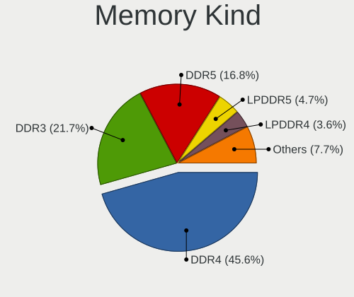

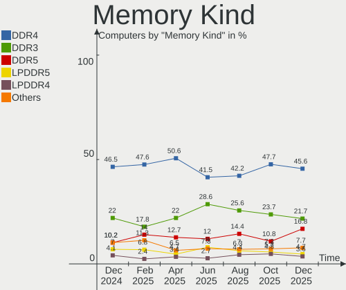

| Kind    | Computers | Percent |
|---------|-----------|---------|
| DDR4    | 166       | 45.6%   |
| DDR3    | 79        | 21.7%   |
| DDR5    | 61        | 16.76%  |
| LPDDR5  | 17        | 4.67%   |
| LPDDR4  | 13        | 3.57%   |
| SDRAM   | 12        | 3.3%    |
| LPDDR3  | 10        | 2.75%   |
| DDR2    | 4         | 1.1%    |
| Unknown | 2         | 0.55%   |

Memory Form Factor
------------------

Physical design of the memory module

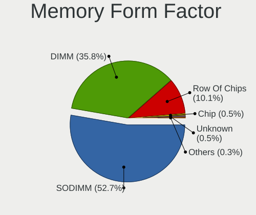

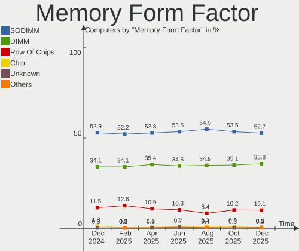

| Name         | Computers | Percent |
|--------------|-----------|---------|
| SODIMM       | 193       | 52.73%  |
| DIMM         | 131       | 35.79%  |
| Row Of Chips | 37        | 10.11%  |
| Chip         | 2         | 0.55%   |
| Unknown      | 2         | 0.55%   |
| RIMM         | 1         | 0.27%   |

Memory Size
-----------

Memory module size

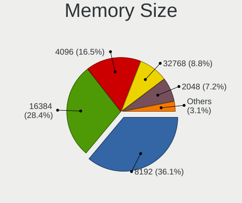

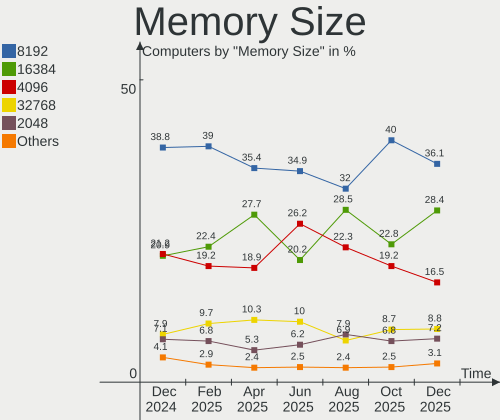

| Size  | Computers | Percent |
|-------|-----------|---------|
| 8192  | 140       | 36.08%  |
| 16384 | 110       | 28.35%  |
| 4096  | 64        | 16.49%  |
| 32768 | 34        | 8.76%   |
| 2048  | 28        | 7.22%   |
| 49152 | 5         | 1.29%   |
| 1024  | 3         | 0.77%   |
| 65536 | 2         | 0.52%   |
| 24576 | 2         | 0.52%   |

Memory Speed
------------

Memory module speed

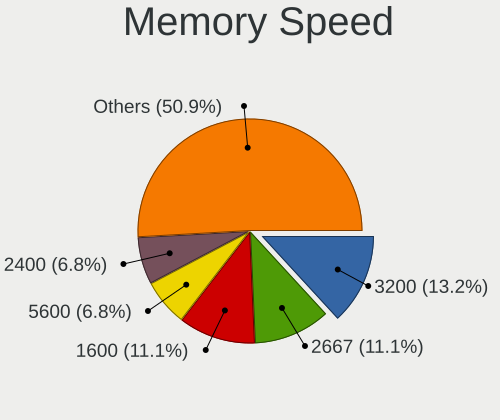

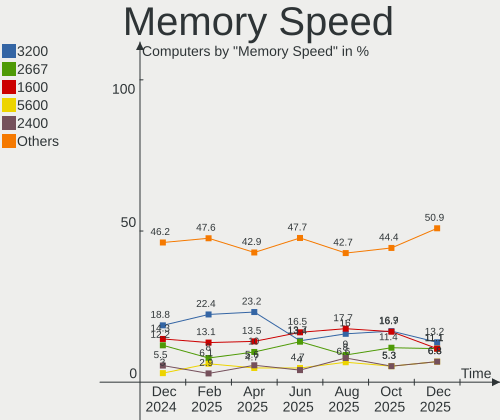

| Speed   | Computers | Percent |
|---------|-----------|---------|
| 3200    | 52        | 13.16%  |
| 2667    | 44        | 11.14%  |
| 1600    | 44        | 11.14%  |
| 5600    | 27        | 6.84%   |
| 2400    | 27        | 6.84%   |
| 3600    | 20        | 5.06%   |
| 2133    | 15        | 3.8%    |
| 6000    | 14        | 3.54%   |
| 1333    | 11        | 2.78%   |
| 7500    | 10        | 2.53%   |
| 3733    | 10        | 2.53%   |
| 1867    | 10        | 2.53%   |
| 6400    | 9         | 2.28%   |
| 4800    | 9         | 2.28%   |
| 3800    | 8         | 2.03%   |
| 1334    | 8         | 2.03%   |
| 8400    | 6         | 1.52%   |
| 4267    | 6         | 1.52%   |
| Unknown | 6         | 1.52%   |
| 1800    | 5         | 1.27%   |
| 6200    | 4         | 1.01%   |
| 2666    | 4         | 1.01%   |
| 2048    | 4         | 1.01%   |
| 1067    | 4         | 1.01%   |
| 800     | 4         | 1.01%   |
| 3266    | 3         | 0.76%   |
| 1866    | 3         | 0.76%   |
| 1066    | 3         | 0.76%   |
| 12800   | 2         | 0.51%   |
| 4000    | 2         | 0.51%   |
| 3866    | 2         | 0.51%   |
| 2933    | 2         | 0.51%   |
| 975     | 2         | 0.51%   |
| 8600    | 1         | 0.25%   |
| 8533    | 1         | 0.25%   |
| 7000    | 1         | 0.25%   |
| 5200    | 1         | 0.25%   |
| 4266    | 1         | 0.25%   |
| 4199    | 1         | 0.25%   |
| 3933    | 1         | 0.25%   |

Printers & scanners
-------------------

Printer Vendor
--------------

Printer device vendors

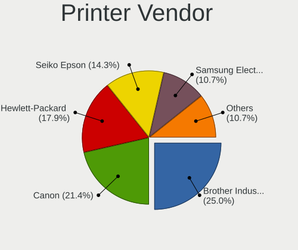

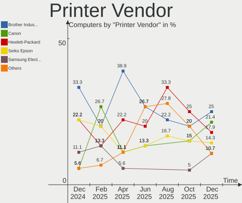

| Vendor              | Computers | Percent |
|---------------------|-----------|---------|
| Brother Industries  | 7         | 25%     |
| Canon               | 6         | 21.43%  |
| Hewlett-Packard     | 5         | 17.86%  |
| Seiko Epson         | 4         | 14.29%  |
| Samsung Electronics | 3         | 10.71%  |
| Prolific Technology | 1         | 3.57%   |
| PM                  | 1         | 3.57%   |
| Dymo-CoStar         | 1         | 3.57%   |

Printer Model
-------------

Printer device models

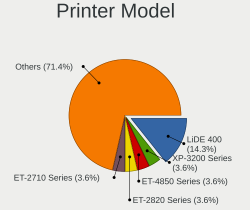

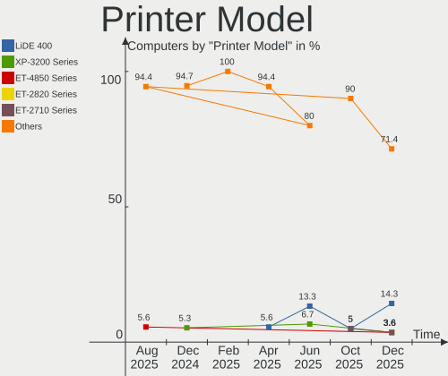

| Model                                  | Computers | Percent |
|----------------------------------------|-----------|---------|
| Canon LiDE 400                         | 4         | 14.29%  |
| Seiko Epson XP-3200 Series             | 1         | 3.57%   |
| Seiko Epson ET-4850 Series             | 1         | 3.57%   |
| Seiko Epson ET-2820 Series             | 1         | 3.57%   |
| Seiko Epson ET-2710 Series             | 1         | 3.57%   |
| Samsung SCX-4600 Series                | 1         | 3.57%   |
| Samsung SCX-3200 Series                | 1         | 3.57%   |
| Samsung ML-3470 Series                 | 1         | 3.57%   |
| Prolific PL2305 Parallel Port          | 1         | 3.57%   |
| PM PM241-BT                            | 1         | 3.57%   |
| HP Smart Tank 5100 series              | 1         | 3.57%   |
| HP Officejet Pro 8000 Enterprise A811a | 1         | 3.57%   |
| HP LaserJet Pro M148-M149              | 1         | 3.57%   |
| HP LaserJet M402dn                     | 1         | 3.57%   |
| HP DeskJet 4100 series                 | 1         | 3.57%   |
| Dymo-CoStar LabelWriter 450            | 1         | 3.57%   |
| Canon TS700 series                     | 1         | 3.57%   |
| Canon PIXMA MP270 All-In-One Printer   | 1         | 3.57%   |
| Brother MFC-L3770CDW                   | 1         | 3.57%   |
| Brother MFC-L2860DWE                   | 1         | 3.57%   |
| Brother MFC-J5345DW                    | 1         | 3.57%   |
| Brother MFC-J4335DW                    | 1         | 3.57%   |
| Brother MFC-J245                       | 1         | 3.57%   |
| Brother MFC-8440                       | 1         | 3.57%   |
| Brother HL-L2400DWE                    | 1         | 3.57%   |

Scanner Vendor
--------------

Scanner device vendors

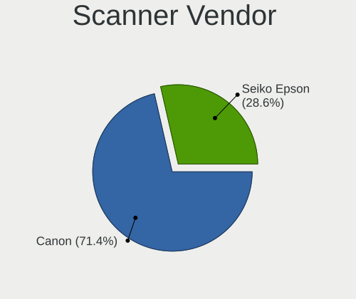

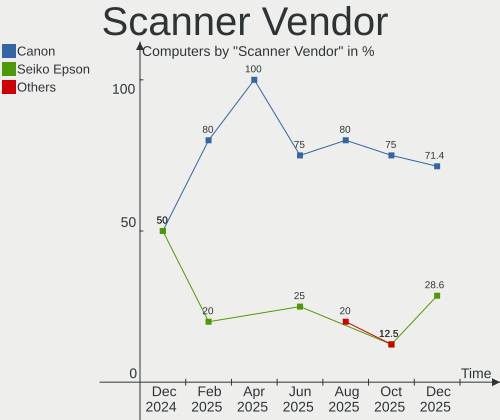

| Vendor      | Computers | Percent |
|-------------|-----------|---------|
| Canon       | 5         | 71.43%  |
| Seiko Epson | 2         | 28.57%  |

Scanner Model
-------------

Scanner device models

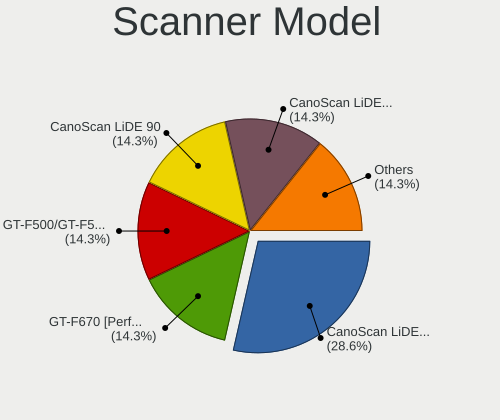

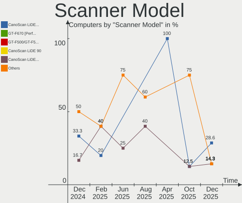

| Model                                                    | Computers | Percent |
|----------------------------------------------------------|-----------|---------|
| Canon CanoScan LiDE 220                                  | 2         | 28.57%  |
| Seiko Epson GT-F670 [Perfection V200 Photo]              | 1         | 14.29%  |
| Seiko Epson GT-F500/GT-F550 [Perfection 2480/2580 PHOTO] | 1         | 14.29%  |
| Canon CanoScan LiDE 90                                   | 1         | 14.29%  |
| Canon CanoScan LiDE 210                                  | 1         | 14.29%  |
| Canon CanoScan LiDE 120                                  | 1         | 14.29%  |

Camera
------

Camera Vendor
-------------

Camera device vendors

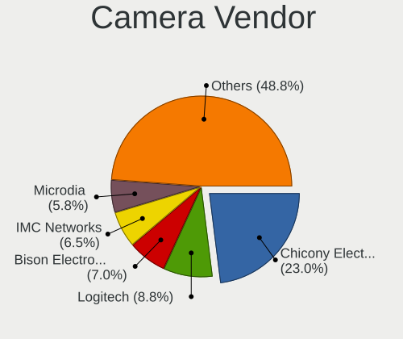

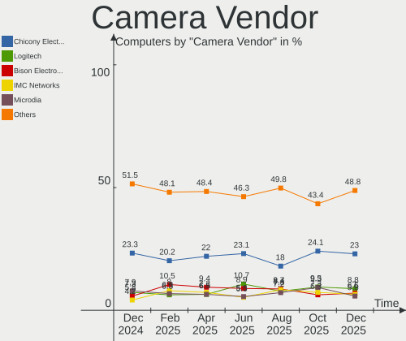

| Vendor                                 | Computers | Percent |
|----------------------------------------|-----------|---------|
| Chicony Electronics                    | 99        | 23.02%  |
| Logitech                               | 38        | 8.84%   |
| Bison Electronics                      | 30        | 6.98%   |
| IMC Networks                           | 28        | 6.51%   |
| Microdia                               | 25        | 5.81%   |
| Realtek Semiconductor                  | 23        | 5.35%   |
| Quanta                                 | 21        | 4.88%   |
| Luxvisions Innotech Limited            | 20        | 4.65%   |
| Apple                                  | 20        | 4.65%   |
| Sunplus Innovation Technology          | 16        | 3.72%   |
| Syntek                                 | 14        | 3.26%   |
| Suyin                                  | 11        | 2.56%   |
| Cheng Uei Precision Industry (Foxlink) | 10        | 2.33%   |
| Lite-On Technology                     | 7         | 1.63%   |
| kingcome                               | 5         | 1.16%   |
| Lenovo                                 | 4         | 0.93%   |
| Sonix Technology                       | 3         | 0.7%    |
| Shinetech                              | 3         | 0.7%    |
| Ricoh                                  | 3         | 0.7%    |
| Razer USA                              | 3         | 0.7%    |
| Microsoft                              | 3         | 0.7%    |
| MacroSilicon                           | 3         | 0.7%    |
| Alcor Micro                            | 3         | 0.7%    |
| Valve Software                         | 2         | 0.47%   |
| Unknown (3730304231393831325530)       | 2         | 0.47%   |
| Sunplus Technology                     | 2         | 0.47%   |
| Silicon Motion                         | 2         | 0.47%   |
| SHENZHEN EMEET TECHNOLOGY              | 2         | 0.47%   |
| Samsung Electronics                    | 2         | 0.47%   |
| Generalplus Technology                 | 2         | 0.47%   |
| Framework                              | 2         | 0.47%   |
| Elgato Systems                         | 2         | 0.47%   |
| Anker PowerConf C200                   | 2         | 0.47%   |
| Acer                                   | 2         | 0.47%   |
| Z-Star Microelectronics                | 1         | 0.23%   |
| Trust                                  | 1         | 0.23%   |
| Remo Tech                              | 1         | 0.23%   |
| OYT Tech                               | 1         | 0.23%   |
| JOURIST-DC80                           | 1         | 0.23%   |
| HYGD-XH--241023                        | 1         | 0.23%   |

Camera Model
------------

Camera device models

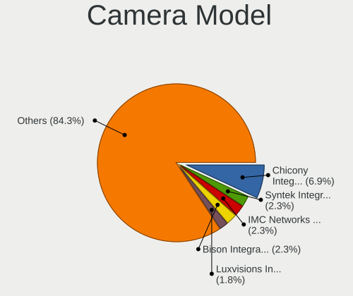

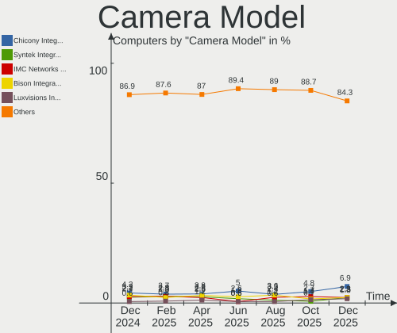

| Model                                               | Computers | Percent |
|-----------------------------------------------------|-----------|---------|
| Chicony Integrated Camera                           | 30        | 6.93%   |
| Syntek Integrated Camera                            | 10        | 2.31%   |
| IMC Networks Integrated Camera                      | 10        | 2.31%   |
| Bison Integrated Camera                             | 10        | 2.31%   |
| Luxvisions Innotech Limited Integrated Camera       | 8         | 1.85%   |
| IMC Networks USB2.0 HD UVC WebCam                   | 8         | 1.85%   |
| Apple FaceTime HD Camera (Built-in)                 | 8         | 1.85%   |
| Microdia Integrated_Webcam_HD                       | 7         | 1.62%   |
| Logitech HD Pro Webcam C920                         | 7         | 1.62%   |
| Chicony HD Webcam                                   | 7         | 1.62%   |
| Chicony FJ Camera                                   | 7         | 1.62%   |
| Realtek Integrated_Webcam_HD                        | 6         | 1.39%   |
| Bison Integrated RGB Camera                         | 6         | 1.39%   |
| Apple FaceTime HD Camera                            | 6         | 1.39%   |
| Quanta HP HD Camera                                 | 5         | 1.15%   |
| Logitech Webcam C270                                | 5         | 1.15%   |
| Logitech C922 Pro Stream Webcam                     | 5         | 1.15%   |
| kingcome FHD WebCam                                 | 5         | 1.15%   |
| Apple Built-in iSight                               | 5         | 1.15%   |
| Sunplus Integrated_Webcam_HD                        | 4         | 0.92%   |
| Sunplus Integrated Camera                           | 4         | 0.92%   |
| Luxvisions Innotech Limited Integrated RGB Camera   | 4         | 0.92%   |
| Luxvisions Innotech Limited HP TrueVision HD Camera | 4         | 0.92%   |
| Logitech BRIO Ultra HD Webcam                       | 4         | 0.92%   |
| Lite-On Integrated Camera                           | 4         | 0.92%   |
| Chicony USB2.0 HD UVC WebCam                        | 4         | 0.92%   |
| Bison SunplusIT Integrated Camera                   | 4         | 0.92%   |
| Quanta ACER FHD User Facing                         | 3         | 0.69%   |
| Microdia Webcam Vitade AF                           | 3         | 0.69%   |
| Logitech HD Webcam C525                             | 3         | 0.69%   |
| Logitech C920 PRO HD Webcam                         | 3         | 0.69%   |
| IMC Networks 2M Integrated Webcam                   | 3         | 0.69%   |
| Chicony Integrated IR Camera                        | 3         | 0.69%   |
| Chicony Integrated Camera [ThinkPad]                | 3         | 0.69%   |
| Chicony Integrated Camera (1280x720@30)             | 3         | 0.69%   |
| Chicony Chicony USB2.0 Camera                       | 3         | 0.69%   |
| Chicony ACER HD User Facing                         | 3         | 0.69%   |
| Bison BisonCam,NB Pro                               | 3         | 0.69%   |
| Valve Software 3D Camera                            | 2         | 0.46%   |
| Unknown (3730304231393831325530) USB Camera         | 2         | 0.46%   |

Security
--------

Fingerprint Vendor
------------------

Fingerprint sensor vendors

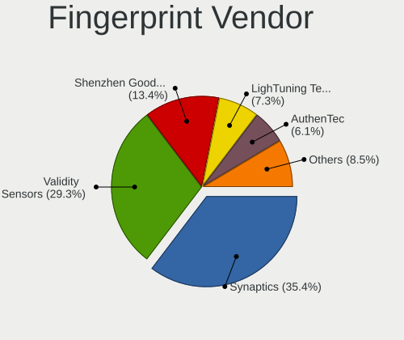

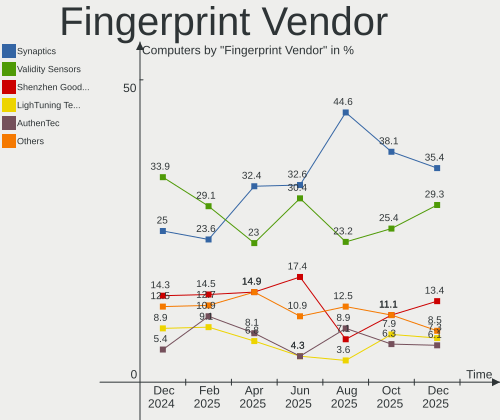

| Vendor                     | Computers | Percent |
|----------------------------|-----------|---------|
| Synaptics                  | 29        | 35.37%  |
| Validity Sensors           | 24        | 29.27%  |
| Shenzhen Goodix Technology | 11        | 13.41%  |
| LighTuning Technology      | 6         | 7.32%   |
| AuthenTec                  | 5         | 6.1%    |
| Upek                       | 4         | 4.88%   |
| HOLTEK                     | 1         | 1.22%   |
| Elan Microelectronics      | 1         | 1.22%   |
| DigitalPersona             | 1         | 1.22%   |

Fingerprint Model
-----------------

Fingerprint sensor models

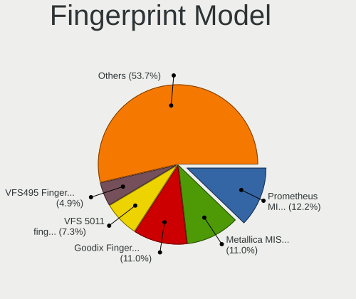

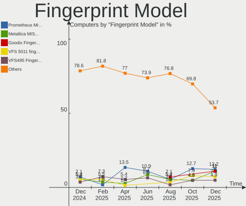

| Model                                                                      | Computers | Percent |
|----------------------------------------------------------------------------|-----------|---------|
| Synaptics Prometheus MIS Touch Fingerprint Reader                          | 10        | 12.2%   |
| Synaptics Metallica MIS Touch Fingerprint Reader                           | 9         | 10.98%  |
| Shenzhen Goodix  FingerPrint Device                                        | 9         | 10.98%  |
| Validity Sensors VFS 5011 fingerprint sensor                               | 6         | 7.32%   |
| Validity Sensors VFS495 Fingerprint Reader                                 | 4         | 4.88%   |
| Upek Biometric Touchchip/Touchstrip Fingerprint Sensor                     | 4         | 4.88%   |
| Validity Sensors VFS5011 Fingerprint Reader                                | 3         | 3.66%   |
| Synaptics UWP WBDI Device                                                  | 3         | 3.66%   |
| LighTuning Fingerprint Reader                                              | 3         | 3.66%   |
| Validity Sensors Synaptics WBDI                                            | 2         | 2.44%   |
| Validity Sensors Synaptics VFS7552 Touch Fingerprint Sensor with PurePrint | 2         | 2.44%   |
| Validity Sensors Swipe Fingerprint Sensor                                  | 2         | 2.44%   |
| Synaptics  FS7604 Touch Fingerprint Sensor with PurePrint                  | 2         | 2.44%   |
| AuthenTec AES2810                                                          | 2         | 2.44%   |
| AuthenTec AES2501 Fingerprint Sensor                                       | 2         | 2.44%   |
| Validity Sensors VFS7552 Touch Fingerprint Sensor                          | 1         | 1.22%   |
| Validity Sensors VFS7500 Touch Fingerprint Sensor                          | 1         | 1.22%   |
| Validity Sensors VFS471 Fingerprint Reader                                 | 1         | 1.22%   |
| Validity Sensors VFS Fingerprint sensor                                    | 1         | 1.22%   |
| Validity Sensors Synaptics VFS7552 Touch Fingerprint Sensor                | 1         | 1.22%   |
| Synaptics WBDI                                                             | 1         | 1.22%   |
| Synaptics TouchPad                                                         | 1         | 1.22%   |
| Synaptics Prometheus Fingerprint Reader                                    | 1         | 1.22%   |
| Synaptics FS7604 Touch Fingerprint Sensor with PurePrint                   | 1         | 1.22%   |
| Synaptics Fingerprint reader [HP G6]                                       | 1         | 1.22%   |
| Shenzhen Goodix Fingerprint Reader                                         | 1         | 1.22%   |
| Shenzhen Goodix FingerPrint                                                | 1         | 1.22%   |
| LighTuning Fingerprint Sensor                                              | 1         | 1.22%   |
| LighTuning ES603 Swipe Fingerprint Sensor                                  | 1         | 1.22%   |
| LighTuning EgisTec Touch Fingerprint Sensor                                | 1         | 1.22%   |
| HOLTEK FocalTech Fingerprint Device                                        | 1         | 1.22%   |
| Elan ELAN:Fingerprint                                                      | 1         | 1.22%   |
| DigitalPersona Fingerprint Reader                                          | 1         | 1.22%   |
| AuthenTec AES1600                                                          | 1         | 1.22%   |

Chipcard Vendor
---------------

Chipcard module vendors

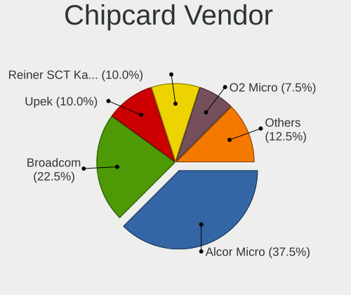

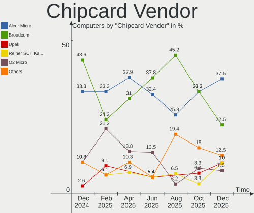

| Vendor                   | Computers | Percent |
|--------------------------|-----------|---------|
| Alcor Micro              | 15        | 37.5%   |
| Broadcom                 | 9         | 22.5%   |
| Upek                     | 4         | 10%     |
| Reiner SCT Kartensysteme | 4         | 10%     |
| O2 Micro                 | 3         | 7.5%    |
| Lenovo                   | 3         | 7.5%    |
| NXP Semiconductors       | 1         | 2.5%    |
| Cherry                   | 1         | 2.5%    |

Chipcard Model
--------------

Chipcard module models

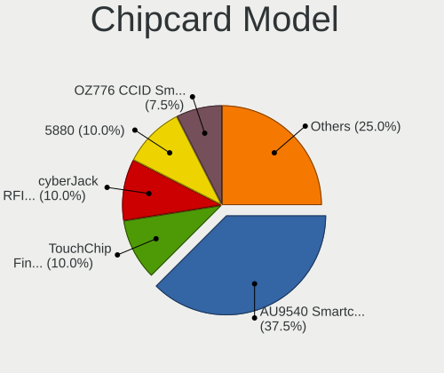

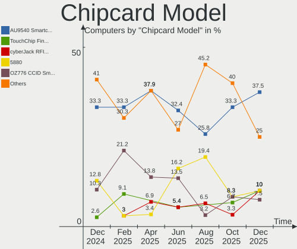

| Model                                                                       | Computers | Percent |
|-----------------------------------------------------------------------------|-----------|---------|
| Alcor Micro AU9540 Smartcard Reader                                         | 15        | 37.5%   |
| Upek TouchChip Fingerprint Coprocessor (WBF advanced mode)                  | 4         | 10%     |
| Reiner SCT Kartensysteme cyberJack RFID basis contactless smartcard reader  | 4         | 10%     |
| Broadcom 5880                                                               | 4         | 10%     |
| O2 Micro OZ776 CCID Smartcard Reader                                        | 3         | 7.5%    |
| Lenovo Integrated Smart Card Reader                                         | 3         | 7.5%    |
| Broadcom BCM5880 Secure Applications Processor                              | 3         | 7.5%    |
| Broadcom BCM58200 ControlVault 3 (FingerPrint sensor + Contacted SmartCard) | 2         | 5%      |
| NXP Semiconductors PR533                                                    | 1         | 2.5%    |
| Cherry SmartTerminal ST-2xxx                                                | 1         | 2.5%    |

Unsupported
-----------

Unsupported Devices
-------------------

Total unsupported devices on board

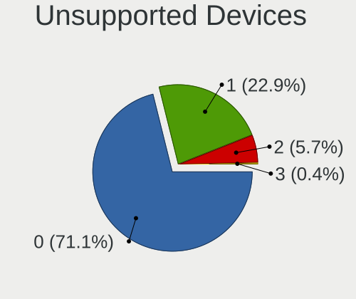

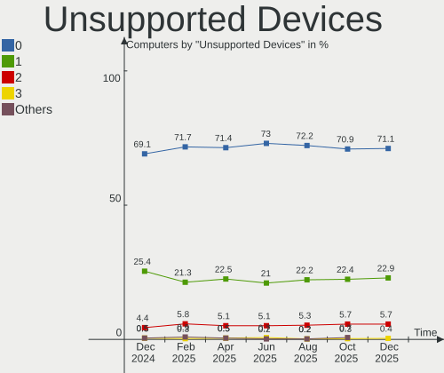

| Total | Computers | Percent |
|-------|-----------|---------|
| 0     | 591       | 71.12%  |
| 1     | 190       | 22.86%  |
| 2     | 47        | 5.66%   |
| 3     | 3         | 0.36%   |

Unsupported Device Types
------------------------

Types of unsupported devices

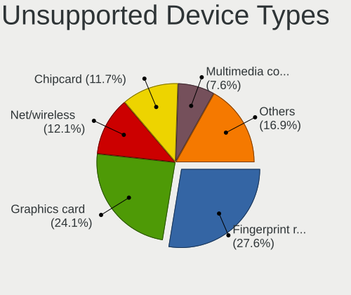

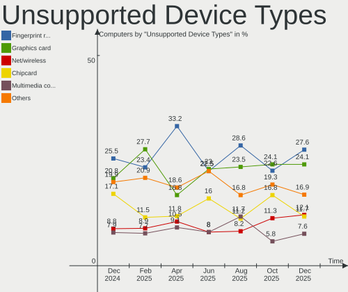

| Type                     | Computers | Percent |
|--------------------------|-----------|---------|
| Fingerprint reader       | 80        | 27.59%  |
| Graphics card            | 70        | 24.14%  |
| Net/wireless             | 35        | 12.07%  |
| Chipcard                 | 34        | 11.72%  |
| Multimedia controller    | 22        | 7.59%   |
| Unassigned class         | 8         | 2.76%   |
| Communication controller | 8         | 2.76%   |
| Card reader              | 7         | 2.41%   |
| Bluetooth                | 6         | 2.07%   |
| Network                  | 5         | 1.72%   |
| Net/ethernet             | 5         | 1.72%   |
| Camera                   | 3         | 1.03%   |
| Storage                  | 2         | 0.69%   |
| Sound                    | 2         | 0.69%   |
| Storage/raid             | 1         | 0.34%   |
| Storage/nvme             | 1         | 0.34%   |
| Dvb card                 | 1         | 0.34%   |

