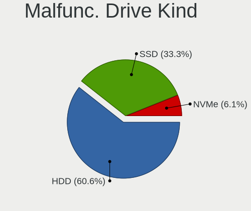
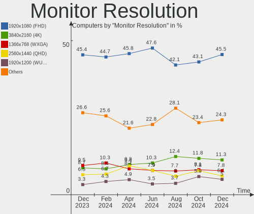
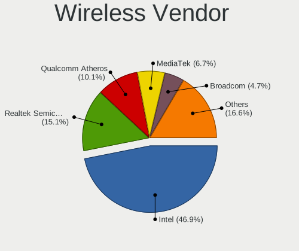
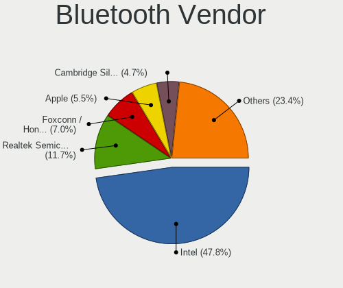
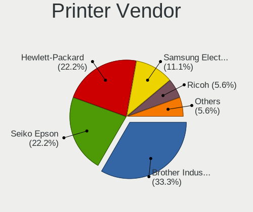
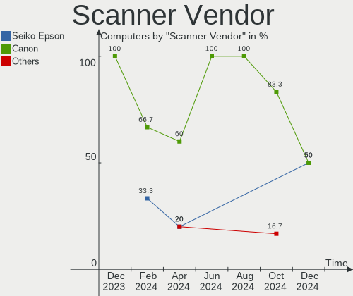

Linux in Germany - Hardware Trends
----------------------------------

A project to identify most popular hardware characteristics and track their change
over time based on data collected by Linux users at https://Linux-Hardware.org.

Anyone can contribute to this report by the [hw-probe](https://github.com/linuxhw/hw-probe) tool:

    sudo -E hw-probe -all -upload

This is a report for all computer types. See also reports for [desktops](/Location/Germany/Desktop/README.md) and [notebooks](/Location/Germany/Notebook/README.md).

Period: Jun, 2023.

Contents
--------

* [ System ](#system)
  - [ OS                       ](#os)
  - [ OS Family                ](#os-family)
  - [ Kernel                   ](#kernel)
  - [ Kernel Family            ](#kernel-family)
  - [ Kernel Major Ver.        ](#kernel-major-ver)
  - [ Arch                     ](#arch)
  - [ DE                       ](#de)
  - [ Display Server           ](#display-server)
  - [ Display Manager          ](#display-manager)
  - [ OS Lang                  ](#os-lang)
  - [ Boot Mode                ](#boot-mode)
  - [ Filesystem               ](#filesystem)
  - [ Part. scheme             ](#part-scheme)
  - [ Dual Boot with Linux/BSD ](#dual-boot-with-linuxbsd)
  - [ Dual Boot (Win)          ](#dual-boot-win)

* [ Board ](#board)
  - [ Vendor                   ](#vendor)
  - [ Model                    ](#model)
  - [ Model Family             ](#model-family)
  - [ MFG Year                 ](#mfg-year)
  - [ Form Factor              ](#form-factor)
  - [ Secure Boot              ](#secure-boot)
  - [ Coreboot                 ](#coreboot)
  - [ RAM Size                 ](#ram-size)
  - [ RAM Used                 ](#ram-used)
  - [ Total Drives             ](#total-drives)
  - [ Has CD-ROM               ](#has-cd-rom)
  - [ Has Ethernet             ](#has-ethernet)
  - [ Has WiFi                 ](#has-wifi)
  - [ Has Bluetooth            ](#has-bluetooth)

* [ Location ](#location)
  - [ Country                  ](#country)
  - [ City                     ](#city)

* [ Drives ](#drives)
  - [ Drive Vendor             ](#drive-vendor)
  - [ Drive Model              ](#drive-model)
  - [ HDD Vendor               ](#hdd-vendor)
  - [ SSD Vendor               ](#ssd-vendor)
  - [ Drive Kind               ](#drive-kind)
  - [ Drive Connector          ](#drive-connector)
  - [ Drive Size               ](#drive-size)
  - [ Space Total              ](#space-total)
  - [ Space Used               ](#space-used)
  - [ Malfunc. Drives          ](#malfunc-drives)
  - [ Malfunc. Drive Vendor    ](#malfunc-drive-vendor)
  - [ Malfunc. HDD Vendor      ](#malfunc-hdd-vendor)
  - [ Malfunc. Drive Kind      ](#malfunc-drive-kind)
  - [ Failed Drives            ](#failed-drives)
  - [ Failed Drive Vendor      ](#failed-drive-vendor)
  - [ Drive Status             ](#drive-status)

* [ Storage controller ](#storage-controller)
  - [ Storage Vendor           ](#storage-vendor)
  - [ Storage Model            ](#storage-model)
  - [ Storage Kind             ](#storage-kind)

* [ Processor ](#processor)
  - [ CPU Vendor               ](#cpu-vendor)
  - [ CPU Model                ](#cpu-model)
  - [ CPU Model Family         ](#cpu-model-family)
  - [ CPU Cores                ](#cpu-cores)
  - [ CPU Sockets              ](#cpu-sockets)
  - [ CPU Threads              ](#cpu-threads)
  - [ CPU Op-Modes             ](#cpu-op-modes)
  - [ CPU Microcode            ](#cpu-microcode)
  - [ CPU Microarch            ](#cpu-microarch)

* [ Graphics ](#graphics)
  - [ GPU Vendor               ](#gpu-vendor)
  - [ GPU Model                ](#gpu-model)
  - [ GPU Combo                ](#gpu-combo)
  - [ GPU Driver               ](#gpu-driver)
  - [ GPU Memory               ](#gpu-memory)

* [ Monitor ](#monitor)
  - [ Monitor Vendor           ](#monitor-vendor)
  - [ Monitor Model            ](#monitor-model)
  - [ Monitor Resolution       ](#monitor-resolution)
  - [ Monitor Diagonal         ](#monitor-diagonal)
  - [ Monitor Width            ](#monitor-width)
  - [ Aspect Ratio             ](#aspect-ratio)
  - [ Monitor Area             ](#monitor-area)
  - [ Pixel Density            ](#pixel-density)
  - [ Multiple Monitors        ](#multiple-monitors)

* [ Network ](#network)
  - [ Net Controller Vendor    ](#net-controller-vendor)
  - [ Net Controller Model     ](#net-controller-model)
  - [ Wireless Vendor          ](#wireless-vendor)
  - [ Wireless Model           ](#wireless-model)
  - [ Ethernet Vendor          ](#ethernet-vendor)
  - [ Ethernet Model           ](#ethernet-model)
  - [ Net Controller Kind      ](#net-controller-kind)
  - [ Used Controller          ](#used-controller)
  - [ NICs                     ](#nics)
  - [ IPv6                     ](#ipv6)

* [ Bluetooth ](#bluetooth)
  - [ Bluetooth Vendor         ](#bluetooth-vendor)
  - [ Bluetooth Model          ](#bluetooth-model)

* [ Sound ](#sound)
  - [ Sound Vendor             ](#sound-vendor)
  - [ Sound Model              ](#sound-model)

* [ Memory ](#memory)
  - [ Memory Vendor            ](#memory-vendor)
  - [ Memory Model             ](#memory-model)
  - [ Memory Kind              ](#memory-kind)
  - [ Memory Form Factor       ](#memory-form-factor)
  - [ Memory Size              ](#memory-size)
  - [ Memory Speed             ](#memory-speed)

* [ Printers & scanners ](#printers--scanners)
  - [ Printer Vendor           ](#printer-vendor)
  - [ Printer Model            ](#printer-model)
  - [ Scanner Vendor           ](#scanner-vendor)
  - [ Scanner Model            ](#scanner-model)

* [ Camera ](#camera)
  - [ Camera Vendor            ](#camera-vendor)
  - [ Camera Model             ](#camera-model)

* [ Security ](#security)
  - [ Fingerprint Vendor       ](#fingerprint-vendor)
  - [ Fingerprint Model        ](#fingerprint-model)
  - [ Chipcard Vendor          ](#chipcard-vendor)
  - [ Chipcard Model           ](#chipcard-model)

* [ Unsupported ](#unsupported)
  - [ Unsupported Devices      ](#unsupported-devices)
  - [ Unsupported Device Types ](#unsupported-device-types)

System
------

OS
--

Installed operating systems

| Name                         | Computers | Percent |
|------------------------------|-----------|---------|
| Linux Mint 21.1              | 72        | 14.15%  |
| Ubuntu 22.04                 | 70        | 13.75%  |
| Debian 11                    | 29        | 5.7%    |
| Fedora 38                    | 28        | 5.5%    |
| Arch Rolling                 | 26        | 5.11%   |
| Ubuntu 23.04                 | 24        | 4.72%   |
| Debian 12                    | 23        | 4.52%   |
| Pop!_OS 22.04                | 15        | 2.95%   |
| Linux Mint 20.3              | 12        | 2.36%   |
| Ubuntu 20.04                 | 10        | 1.96%   |
| Zorin 16                     | 8         | 1.57%   |
| OpenMandriva 23.03           | 8         | 1.57%   |
| Manjaro                      | 8         | 1.57%   |
| Elementary 7                 | 8         | 1.57%   |
| Manjaro 23.0.0               | 7         | 1.38%   |
| Kubuntu 22.04                | 7         | 1.38%   |
| Xubuntu 22.04                | 6         | 1.18%   |
| TUXEDO OS 22.04              | 6         | 1.18%   |
| openSUSE Tumbleweed-XXXXXXXX | 6         | 1.18%   |
| openSUSE Leap-15.5           | 6         | 1.18%   |
| OpenMandriva 4.3             | 6         | 1.18%   |
| LMDE 5                       | 6         | 1.18%   |
| ArcoLinux Rolling            | 6         | 1.18%   |
| Ubuntu MATE 22.04            | 5         | 0.98%   |
| SteamOS 3.4.8                | 5         | 0.98%   |
| ROSA 12.4                    | 5         | 0.98%   |
| OpenMandriva 23.06           | 5         | 0.98%   |
| Linux Mint 21                | 5         | 0.98%   |
| BlackPanther 18.1            | 5         | 0.98%   |
| Xero Rolling                 | 4         | 0.79%   |
| Ubuntu 22.10                 | 4         | 0.79%   |
| openSUSE Leap-15.4           | 4         | 0.79%   |
| Kubuntu 23.04                | 4         | 0.79%   |
| KDE neon 22.04               | 4         | 0.79%   |
| Kali 2023.2                  | 4         | 0.79%   |
| OpenMandriva 4.2             | 3         | 0.59%   |
| MX 21                        | 3         | 0.59%   |
| Lubuntu 22.04                | 3         | 0.59%   |
| Fedora 37                    | 3         | 0.59%   |
| Alpine 3.18.0                | 3         | 0.59%   |

OS Family
---------

OS without a version

| Name         | Computers | Percent |
|--------------|-----------|---------|
| Ubuntu       | 109       | 21.41%  |
| Linux Mint   | 93        | 18.27%  |
| Debian       | 54        | 10.61%  |
| Fedora       | 31        | 6.09%   |
| Arch         | 26        | 5.11%   |
| OpenMandriva | 22        | 4.32%   |
| openSUSE     | 17        | 3.34%   |
| Manjaro      | 17        | 3.34%   |
| Pop!_OS      | 15        | 2.95%   |
| Kubuntu      | 12        | 2.36%   |
| Zorin        | 9         | 1.77%   |
| Xubuntu      | 9         | 1.77%   |
| Elementary   | 8         | 1.57%   |
| TUXEDO OS    | 6         | 1.18%   |
| SteamOS      | 6         | 1.18%   |
| LMDE         | 6         | 1.18%   |
| ArcoLinux    | 6         | 1.18%   |
| Ubuntu MATE  | 5         | 0.98%   |
| ROSA         | 5         | 0.98%   |
| Lubuntu      | 5         | 0.98%   |
| BlackPanther | 5         | 0.98%   |
| Xero         | 4         | 0.79%   |
| KDE neon     | 4         | 0.79%   |
| Kali         | 4         | 0.79%   |
| MX           | 3         | 0.59%   |
| Alpine       | 3         | 0.59%   |
| Parrot       | 2         | 0.39%   |
| Nobara       | 2         | 0.39%   |
| NixOS        | 2         | 0.39%   |
| Lilidog      | 2         | 0.39%   |
| Gentoo       | 2         | 0.39%   |
| Rocky Linux  | 1         | 0.2%    |
| risiOS       | 1         | 0.2%    |
| Reborn OS    | 1         | 0.2%    |
| Makulu-beta1 | 1         | 0.2%    |
| Linux Lite   | 1         | 0.2%    |
| Garuda Linux | 1         | 0.2%    |
| EndeavourOS  | 1         | 0.2%    |
| Devuan       | 1         | 0.2%    |
| Deepin       | 1         | 0.2%    |

Kernel
------

Version of the Linux kernel

| Version                           | Computers | Percent |
|-----------------------------------|-----------|---------|
| 5.15.0-73-generic                 | 50        | 9.82%   |
| 5.19.0-43-generic                 | 43        | 8.45%   |
| 5.15.0-75-generic                 | 32        | 6.29%   |
| 5.19.0-45-generic                 | 27        | 5.3%    |
| 6.1.0-9-amd64                     | 24        | 4.72%   |
| 5.10.0-23-amd64                   | 21        | 4.13%   |
| 6.2.0-20-generic                  | 19        | 3.73%   |
| 6.2.6-76060206-generic            | 14        | 2.75%   |
| 6.3.8-200.fc38.x86_64             | 9         | 1.77%   |
| 6.2.6-desktop-1omv2390            | 9         | 1.77%   |
| 6.2.0-23-generic                  | 9         | 1.77%   |
| 6.3.9-arch1-1                     | 7         | 1.38%   |
| 6.1.31-2-MANJARO                  | 7         | 1.38%   |
| 6.3.8-arch1-1                     | 6         | 1.18%   |
| 5.4.0-150-generic                 | 6         | 1.18%   |
| 5.15.0-76-generic                 | 6         | 1.18%   |
| 5.14.21-150500.53-default         | 6         | 1.18%   |
| 6.3.7-200.fc38.x86_64             | 5         | 0.98%   |
| 6.3.5-200.fc38.x86_64             | 5         | 0.98%   |
| 6.1.20-generic-2rosa2021.1-x86_64 | 5         | 0.98%   |
| 5.4.0-152-generic                 | 5         | 0.98%   |
| 5.15.0-56-generic                 | 5         | 0.98%   |
| 5.13.0-valve36-1-neptune          | 5         | 0.98%   |
| 6.3.6-arch1-1                     | 4         | 0.79%   |
| 6.3.6-200.fc38.x86_64             | 4         | 0.79%   |
| 6.3.5-arch1-1                     | 4         | 0.79%   |
| 6.1.0-kali9-amd64                 | 4         | 0.79%   |
| 5.19.0-46-generic                 | 4         | 0.79%   |
| 5.16.7-desktop-1omv4003           | 4         | 0.79%   |
| 5.15.0-71-generic                 | 4         | 0.79%   |
| 5.14.21-150400.24.63-default      | 4         | 0.79%   |
| 6.3.9-zen1-1-zen                  | 3         | 0.59%   |
| 6.3.5-desktop-3omv2390            | 3         | 0.59%   |
| 6.2.0-10010-tuxedo                | 3         | 0.59%   |
| 6.2.0-10007-tuxedo                | 3         | 0.59%   |
| 5.19.0-42-generic                 | 3         | 0.59%   |
| 5.19.0-41-generic                 | 3         | 0.59%   |
| 5.19.0-32-generic                 | 3         | 0.59%   |
| 5.15.0-69-generic                 | 3         | 0.59%   |
| 5.15.0-43-generic                 | 3         | 0.59%   |

Kernel Family
-------------

Linux kernel without a distro release

| Version  | Computers | Percent |
|----------|-----------|---------|
| 5.15.0   | 111       | 21.81%  |
| 5.19.0   | 89        | 17.49%  |
| 6.2.0    | 39        | 7.66%   |
| 6.1.0    | 33        | 6.48%   |
| 5.10.0   | 33        | 6.48%   |
| 6.2.6    | 23        | 4.52%   |
| 5.4.0    | 17        | 3.34%   |
| 6.3.8    | 16        | 3.14%   |
| 6.3.5    | 15        | 2.95%   |
| 6.3.7    | 14        | 2.75%   |
| 6.3.6    | 12        | 2.36%   |
| 6.1.31   | 11        | 2.16%   |
| 6.3.9    | 10        | 1.96%   |
| 5.14.21  | 10        | 1.96%   |
| 5.13.0   | 7         | 1.38%   |
| 6.3.4    | 5         | 0.98%   |
| 6.1.20   | 5         | 0.98%   |
| 5.16.7   | 4         | 0.79%   |
| 6.1.32   | 3         | 0.59%   |
| 6.0.0    | 3         | 0.59%   |
| 5.14.0   | 3         | 0.59%   |
| 6.3.3    | 2         | 0.39%   |
| 6.3.1    | 2         | 0.39%   |
| 6.2.9    | 2         | 0.39%   |
| 6.2.15   | 2         | 0.39%   |
| 6.1.35   | 2         | 0.39%   |
| 6.1.34   | 2         | 0.39%   |
| 6.1.33   | 2         | 0.39%   |
| 6.1.21   | 2         | 0.39%   |
| 5.6.14   | 2         | 0.39%   |
| 5.16.13  | 2         | 0.39%   |
| 5.15.114 | 2         | 0.39%   |
| 5.10.14  | 2         | 0.39%   |
| 4.18.16  | 2         | 0.39%   |
| 6.4.0    | 1         | 0.2%    |
| 6.3.2    | 1         | 0.2%    |
| 6.3.0    | 1         | 0.2%    |
| 6.2.7    | 1         | 0.2%    |
| 6.1.30   | 1         | 0.2%    |
| 6.1.28   | 1         | 0.2%    |

Kernel Major Ver.
-----------------

Linux kernel major version

| Version | Computers | Percent |
|---------|-----------|---------|
| 5.15    | 117       | 22.99%  |
| 5.19    | 89        | 17.49%  |
| 6.3     | 78        | 15.32%  |
| 6.2     | 67        | 13.16%  |
| 6.1     | 66        | 12.97%  |
| 5.10    | 36        | 7.07%   |
| 5.4     | 17        | 3.34%   |
| 5.14    | 13        | 2.55%   |
| 5.16    | 7         | 1.38%   |
| 5.13    | 7         | 1.38%   |
| 6.0     | 3         | 0.59%   |
| 5.6     | 2         | 0.39%   |
| 5.11    | 2         | 0.39%   |
| 4.18    | 2         | 0.39%   |
| 6.4     | 1         | 0.2%    |
| 5.9     | 1         | 0.2%    |
| 4.15    | 1         | 0.2%    |

Arch
----

OS architecture (x86_64, i586, etc.)

| Name    | Computers | Percent |
|---------|-----------|---------|
| x86_64  | 500       | 98.23%  |
| aarch64 | 6         | 1.18%   |
| i686    | 3         | 0.59%   |

DE
--

Desktop Environment

| Name             | Computers | Percent |
|------------------|-----------|---------|
| GNOME            | 200       | 39.29%  |
| KDE5             | 109       | 21.41%  |
| X-Cinnamon       | 86        | 16.9%   |
| XFCE             | 44        | 8.64%   |
| Unknown          | 17        | 3.34%   |
| MATE             | 16        | 3.14%   |
| Pantheon         | 8         | 1.57%   |
| Cinnamon         | 8         | 1.57%   |
| LXQt             | 6         | 1.18%   |
| LXDE             | 4         | 0.79%   |
| openbox          | 2         | 0.39%   |
| lightdm-xsession | 2         | 0.39%   |
| KDE              | 2         | 0.39%   |
| sway             | 1         | 0.2%    |
| GNOME Classic    | 1         | 0.2%    |
| DDE              | 1         | 0.2%    |
| chadwm           | 1         | 0.2%    |
| awesome          | 1         | 0.2%    |

Display Server
--------------

X11 or Wayland

| Name    | Computers | Percent |
|---------|-----------|---------|
| X11     | 355       | 69.74%  |
| Wayland | 126       | 24.75%  |
| Unknown | 15        | 2.95%   |
| Tty     | 13        | 2.55%   |

Display Manager
---------------

SDDM, LightDM, etc.

| Name    | Computers | Percent |
|---------|-----------|---------|
| Unknown | 191       | 37.52%  |
| GDM3    | 110       | 21.61%  |
| LightDM | 97        | 19.06%  |
| SDDM    | 79        | 15.52%  |
| GDM     | 27        | 5.3%    |
| LXDM    | 3         | 0.59%   |
| SLiM    | 2         | 0.39%   |

OS Lang
-------

Language

| Lang       | Computers | Percent |
|------------|-----------|---------|
| de_DE      | 351       | 68.96%  |
| en_US      | 101       | 19.84%  |
| Unknown    | 14        | 2.75%   |
| C          | 12        | 2.36%   |
| en_GB      | 10        | 1.96%   |
| ru_RU      | 5         | 0.98%   |
| en_DE      | 3         | 0.59%   |
| tr_TR      | 2         | 0.39%   |
| POSIX      | 2         | 0.39%   |
| sl_SI      | 1         | 0.2%    |
| sk_SK      | 1         | 0.2%    |
| nl_NL      | 1         | 0.2%    |
| fr_FR      | 1         | 0.2%    |
| en_IE      | 1         | 0.2%    |
| en_DK      | 1         | 0.2%    |
| en_CA      | 1         | 0.2%    |
| de_DE@euro | 1         | 0.2%    |
| de_BE      | 1         | 0.2%    |

Boot Mode
---------

EFI or BIOS

| Mode | Computers | Percent |
|------|-----------|---------|
| EFI  | 256       | 50.29%  |
| BIOS | 253       | 49.71%  |

Filesystem
----------

Type of filesystem

| Type    | Computers | Percent |
|---------|-----------|---------|
| Ext4    | 324       | 63.65%  |
| Tmpfs   | 83        | 16.31%  |
| Btrfs   | 72        | 14.15%  |
| Overlay | 19        | 3.73%   |
| Xfs     | 6         | 1.18%   |
| Ext2    | 2         | 0.39%   |
| Zfs     | 1         | 0.2%    |
| Ext3    | 1         | 0.2%    |
| Unknown | 1         | 0.2%    |

Part. scheme
------------

Scheme of partitioning

| Type    | Computers | Percent |
|---------|-----------|---------|
| GPT     | 269       | 52.85%  |
| Unknown | 177       | 34.77%  |
| MBR     | 63        | 12.38%  |

Dual Boot with Linux/BSD
------------------------

Hosting more than one Linux/BSD

| Dual boot | Computers | Percent |
|-----------|-----------|---------|
| No        | 430       | 84.48%  |
| Yes       | 79        | 15.52%  |

Dual Boot (Win)
---------------

Hosting Linux and Windows

| Dual boot | Computers | Percent |
|-----------|-----------|---------|
| No        | 390       | 76.62%  |
| Yes       | 119       | 23.38%  |

Board
-----

Vendor
------

Motherboard manufacturer

| Name                                 | Computers | Percent |
|--------------------------------------|-----------|---------|
| Lenovo                               | 76        | 14.93%  |
| Hewlett-Packard                      | 75        | 14.73%  |
| ASUSTek Computer                     | 64        | 12.57%  |
| Dell                                 | 39        | 7.66%   |
| Gigabyte Technology                  | 38        | 7.47%   |
| MSI                                  | 37        | 7.27%   |
| Acer                                 | 32        | 6.29%   |
| ASRock                               | 23        | 4.52%   |
| Fujitsu                              | 13        | 2.55%   |
| TUXEDO                               | 12        | 2.36%   |
| Medion                               | 11        | 2.16%   |
| Apple                                | 10        | 1.96%   |
| Intel                                | 9         | 1.77%   |
| Unknown                              | 6         | 1.18%   |
| Valve                                | 5         | 0.98%   |
| Sony                                 | 4         | 0.79%   |
| ZOTAC                                | 3         | 0.59%   |
| Toshiba                              | 3         | 0.59%   |
| Pegatron                             | 3         | 0.59%   |
| Packard Bell                         | 3         | 0.59%   |
| Shuttle                              | 2         | 0.39%   |
| Shenzhen Meigao Electronic Equipment | 2         | 0.39%   |
| Schenker                             | 2         | 0.39%   |
| Samsung Electronics                  | 2         | 0.39%   |
| Raspberry Pi Foundation              | 2         | 0.39%   |
| Microsoft                            | 2         | 0.39%   |
| Inventec                             | 2         | 0.39%   |
| HUAWEI                               | 2         | 0.39%   |
| HONOR                                | 2         | 0.39%   |
| Fujitsu Siemens                      | 2         | 0.39%   |
| Biostar                              | 2         | 0.39%   |
| AZW                                  | 2         | 0.39%   |
| AMI                                  | 2         | 0.39%   |
| Zebra Technologies                   | 1         | 0.2%    |
| Wortmann AG                          | 1         | 0.2%    |
| VALE                                 | 1         | 0.2%    |
| Seco                                 | 1         | 0.2%    |
| Pine Microsystems                    | 1         | 0.2%    |
| Pencents                             | 1         | 0.2%    |
| LincPlus                             | 1         | 0.2%    |

Model
-----

Motherboard model

| Name                                               | Computers | Percent |
|----------------------------------------------------|-----------|---------|
| Unknown                                            | 8         | 1.57%   |
| Valve Jupiter                                      | 5         | 0.98%   |
| HP Notebook                                        | 3         | 0.59%   |
| Dell Dell Thin Client Desktop 3030 LT              | 3         | 0.59%   |
| ASUS PRIME B350-PLUS                               | 3         | 0.59%   |
| TUXEDO Pulse 15 Gen1                               | 2         | 0.39%   |
| Pegatron Spring Peak                               | 2         | 0.39%   |
| MSI MS-7C56                                        | 2         | 0.39%   |
| MSI MS-7C02                                        | 2         | 0.39%   |
| MSI MS-7B79                                        | 2         | 0.39%   |
| Medion E6214                                       | 2         | 0.39%   |
| HP Pavilion Notebook                               | 2         | 0.39%   |
| HP Laptop 15s-eq2xxx                               | 2         | 0.39%   |
| HP Laptop 15-db0xxx                                | 2         | 0.39%   |
| HP ENVY x360 Convertible 13-ay0xxx                 | 2         | 0.39%   |
| HP EliteBook 840 G3                                | 2         | 0.39%   |
| HP EliteBook 1040 G4                               | 2         | 0.39%   |
| HP 255 15.6 inch G9 Notebook PC                    | 2         | 0.39%   |
| Gigabyte Z390 UD                                   | 2         | 0.39%   |
| Gigabyte B550M DS3H                                | 2         | 0.39%   |
| Gigabyte B450 AORUS ELITE                          | 2         | 0.39%   |
| Fujitsu LIFEBOOK S751                              | 2         | 0.39%   |
| AZW SER                                            | 2         | 0.39%   |
| ASUS F2A55-M LK                                    | 2         | 0.39%   |
| ASUS All Series                                    | 2         | 0.39%   |
| Acer Aspire 5738                                   | 2         | 0.39%   |
| ZOTAC ZBOX-QCM7T3000/EN072080S/EN072070S/EN052060C | 1         | 0.2%    |
| ZOTAC ZBOX-MI531                                   | 1         | 0.2%    |
| ZOTAC ZBOX-CI622/CI642/CI662NANO                   | 1         | 0.2%    |
| Zebra ET85B                                        | 1         | 0.2%    |
| Wortmann AG NA92                                   | 1         | 0.2%    |
| VALE Notebook Classic C140                         | 1         | 0.2%    |
| TUXEDO Stellaris Intel Gen4                        | 1         | 0.2%    |
| TUXEDO Pulse 15 Gen2                               | 1         | 0.2%    |
| TUXEDO P95xER                                      | 1         | 0.2%    |
| TUXEDO P65xRP                                      | 1         | 0.2%    |
| TUXEDO P64_HJ,HK1                                  | 1         | 0.2%    |
| TUXEDO N8xEJEK                                     | 1         | 0.2%    |
| TUXEDO InfinityBook S 15/17 Gen7                   | 1         | 0.2%    |
| TUXEDO InfinityBook Pro 15 v5                      | 1         | 0.2%    |

Model Family
------------

Motherboard model prefix

| Name                  | Computers | Percent |
|-----------------------|-----------|---------|
| Lenovo ThinkPad       | 44        | 8.64%   |
| Acer Aspire           | 21        | 4.13%   |
| HP EliteBook          | 16        | 3.14%   |
| Dell Latitude         | 12        | 2.36%   |
| Lenovo IdeaPad        | 10        | 1.96%   |
| HP Pavilion           | 10        | 1.96%   |
| HP Laptop             | 10        | 1.96%   |
| ASUS ROG              | 10        | 1.96%   |
| Fujitsu LIFEBOOK      | 8         | 1.57%   |
| Unknown               | 8         | 1.57%   |
| HP ENVY               | 7         | 1.38%   |
| HP Compaq             | 7         | 1.38%   |
| Dell Precision        | 7         | 1.38%   |
| ASUS PRIME            | 7         | 1.38%   |
| Lenovo ThinkCentre    | 6         | 1.18%   |
| Dell XPS              | 6         | 1.18%   |
| Valve Jupiter         | 5         | 0.98%   |
| Acer Swift            | 5         | 0.98%   |
| Medion Akoya          | 4         | 0.79%   |
| Gigabyte B450         | 4         | 0.79%   |
| Dell OptiPlex         | 4         | 0.79%   |
| Dell Inspiron         | 4         | 0.79%   |
| ASUS VivoBook         | 4         | 0.79%   |
| TUXEDO Pulse          | 3         | 0.59%   |
| Packard Bell EasyNote | 3         | 0.59%   |
| Lenovo Yoga           | 3         | 0.59%   |
| Lenovo V15            | 3         | 0.59%   |
| Lenovo Legion         | 3         | 0.59%   |
| HP ProBook            | 3         | 0.59%   |
| HP OMEN               | 3         | 0.59%   |
| HP Notebook           | 3         | 0.59%   |
| HP 255                | 3         | 0.59%   |
| Dell Dell             | 3         | 0.59%   |
| ASUS TUF              | 3         | 0.59%   |
| TUXEDO InfinityBook   | 2         | 0.39%   |
| Toshiba Satellite     | 2         | 0.39%   |
| RPi Raspberry         | 2         | 0.39%   |
| Pegatron Spring       | 2         | 0.39%   |
| MSI MS-7C56           | 2         | 0.39%   |
| MSI MS-7C02           | 2         | 0.39%   |

MFG Year
--------

Motherboard manufacture year

| Year    | Computers | Percent |
|---------|-----------|---------|
| 2021    | 56        | 11%     |
| 2018    | 49        | 9.63%   |
| 2022    | 48        | 9.43%   |
| 2020    | 47        | 9.23%   |
| 2017    | 35        | 6.88%   |
| 2015    | 34        | 6.68%   |
| 2019    | 32        | 6.29%   |
| 2016    | 32        | 6.29%   |
| 2011    | 28        | 5.5%    |
| 2010    | 28        | 5.5%    |
| 2013    | 25        | 4.91%   |
| 2012    | 25        | 4.91%   |
| 2014    | 21        | 4.13%   |
| 2008    | 15        | 2.95%   |
| 2009    | 13        | 2.55%   |
| 2023    | 12        | 2.36%   |
| Unknown | 7         | 1.38%   |
| 2006    | 2         | 0.39%   |

Form Factor
-----------

Physical design of the computer

| Name           | Computers | Percent |
|----------------|-----------|---------|
| Notebook       | 270       | 53.05%  |
| Desktop        | 184       | 36.15%  |
| Convertible    | 18        | 3.54%   |
| Mini pc        | 18        | 3.54%   |
| Tablet         | 7         | 1.38%   |
| System on chip | 5         | 0.98%   |
| All in one     | 4         | 0.79%   |
| Phone          | 1         | 0.2%    |
| Stick pc       | 1         | 0.2%    |
| Server         | 1         | 0.2%    |

Secure Boot
-----------

Enabled or disabled

| State    | Computers | Percent |
|----------|-----------|---------|
| Disabled | 482       | 94.7%   |
| Enabled  | 27        | 5.3%    |

Coreboot
--------

Have coreboot on board

| Used | Computers | Percent |
|------|-----------|---------|
| No   | 508       | 99.8%   |
| Yes  | 1         | 0.2%    |

RAM Size
--------

Total RAM memory

| Size in GB      | Computers | Percent |
|-----------------|-----------|---------|
| 4.01-8.0        | 136       | 26.72%  |
| 16.01-24.0      | 100       | 19.65%  |
| 8.01-16.0       | 85        | 16.7%   |
| 32.01-64.0      | 71        | 13.95%  |
| 3.01-4.0        | 66        | 12.97%  |
| 64.01-256.0     | 19        | 3.73%   |
| 24.01-32.0      | 15        | 2.95%   |
| 1.01-2.0        | 11        | 2.16%   |
| 2.01-3.0        | 4         | 0.79%   |
| More than 256.0 | 1         | 0.2%    |
| 0.51-1.0        | 1         | 0.2%    |

RAM Used
--------

Used RAM memory

| Used GB    | Computers | Percent |
|------------|-----------|---------|
| 1.01-2.0   | 153       | 30.06%  |
| 2.01-3.0   | 133       | 26.13%  |
| 4.01-8.0   | 99        | 19.45%  |
| 3.01-4.0   | 69        | 13.56%  |
| 8.01-16.0  | 21        | 4.13%   |
| 0.51-1.0   | 21        | 4.13%   |
| 16.01-24.0 | 6         | 1.18%   |
| 0.01-0.5   | 6         | 1.18%   |
| 32.01-64.0 | 1         | 0.2%    |

Total Drives
------------

Number of drives on board

| Drives | Computers | Percent |
|--------|-----------|---------|
| 1      | 295       | 57.96%  |
| 2      | 123       | 24.17%  |
| 3      | 49        | 9.63%   |
| 4      | 15        | 2.95%   |
| 6      | 10        | 1.96%   |
| 5      | 10        | 1.96%   |
| 8      | 3         | 0.59%   |
| 0      | 2         | 0.39%   |
| 9      | 1         | 0.2%    |
| 7      | 1         | 0.2%    |

Has CD-ROM
----------

Has CD-ROM on board

| Presented | Computers | Percent |
|-----------|-----------|---------|
| No        | 326       | 64.05%  |
| Yes       | 183       | 35.95%  |

Has Ethernet
------------

Has Ethernet on board

| Presented | Computers | Percent |
|-----------|-----------|---------|
| Yes       | 434       | 85.27%  |
| No        | 75        | 14.73%  |

Has WiFi
--------

Has WiFi module

| Presented | Computers | Percent |
|-----------|-----------|---------|
| Yes       | 378       | 74.26%  |
| No        | 131       | 25.74%  |

Has Bluetooth
-------------

Has Bluetooth module

| Presented | Computers | Percent |
|-----------|-----------|---------|
| Yes       | 321       | 63.06%  |
| No        | 188       | 36.94%  |

Location
--------

Country
-------

Geographic location (country)

| Country | Computers | Percent |
|---------|-----------|---------|
| Germany | 509       | 100%    |

City
----

Geographic location (city)

| City              | Computers | Percent |
|-------------------|-----------|---------|
| Berlin            | 38        | 7.47%   |
| Munich            | 22        | 4.32%   |
| Hamburg           | 19        | 3.73%   |
| Cologne           | 12        | 2.36%   |
| Nuremberg         | 9         | 1.77%   |
| Karlsruhe         | 9         | 1.77%   |
| Hanover           | 9         | 1.77%   |
| Frankfurt am Main | 9         | 1.77%   |
| Bonn              | 9         | 1.77%   |
| Leipzig           | 8         | 1.57%   |
| Stuttgart         | 7         | 1.38%   |
| Düsseldorf       | 6         | 1.18%   |
| Dresden           | 6         | 1.18%   |
| Augsburg          | 6         | 1.18%   |
| Siegsdorf         | 5         | 0.98%   |
| Münster          | 5         | 0.98%   |
| Bremen            | 5         | 0.98%   |
| Wuppertal         | 4         | 0.79%   |
| Oldenburg         | 4         | 0.79%   |
| Ludwigsburg       | 4         | 0.79%   |
| Lübeck           | 4         | 0.79%   |
| Hofheim am Taunus | 4         | 0.79%   |
| Heilbronn         | 4         | 0.79%   |
| Essen             | 4         | 0.79%   |
| Dortmund          | 4         | 0.79%   |
| Delligsen         | 4         | 0.79%   |
| Chemnitz          | 4         | 0.79%   |
| Aachen            | 4         | 0.79%   |
| Reutlingen        | 3         | 0.59%   |
| Offenbach         | 3         | 0.59%   |
| Mönchengladbach  | 3         | 0.59%   |
| Mannheim          | 3         | 0.59%   |
| Göppingen        | 3         | 0.59%   |
| Duisburg          | 3         | 0.59%   |
| Wittingen         | 2         | 0.39%   |
| Wiesbaden         | 2         | 0.39%   |
| Waghausel         | 2         | 0.39%   |
| Ulm               | 2         | 0.39%   |
| Tuttlingen        | 2         | 0.39%   |
| Tübingen         | 2         | 0.39%   |

Drives
------

Drive Vendor
------------

Hard drive vendors

| Vendor                         | Computers | Drives | Percent |
|--------------------------------|-----------|--------|---------|
| Samsung Electronics            | 160       | 202    | 20.49%  |
| WDC                            | 76        | 96     | 9.73%   |
| Seagate                        | 71        | 83     | 9.09%   |
| SanDisk                        | 71        | 78     | 9.09%   |
| Crucial                        | 42        | 44     | 5.38%   |
| Unknown                        | 40        | 46     | 5.12%   |
| Toshiba                        | 36        | 39     | 4.61%   |
| Intenso                        | 30        | 33     | 3.84%   |
| Kingston                       | 24        | 26     | 3.07%   |
| Micron Technology              | 22        | 22     | 2.82%   |
| SK hynix                       | 20        | 20     | 2.56%   |
| Intel                          | 20        | 21     | 2.56%   |
| Phison Electronics             | 13        | 17     | 1.66%   |
| Hitachi                        | 13        | 13     | 1.66%   |
| HGST                           | 13        | 13     | 1.66%   |
| Micron/Crucial Technology      | 10        | 11     | 1.28%   |
| KIOXIA                         | 10        | 10     | 1.28%   |
| SPCC                           | 6         | 6      | 0.77%   |
| Kingston Technology Company    | 6         | 6      | 0.77%   |
| China                          | 6         | 6      | 0.77%   |
| A-DATA Technology              | 6         | 6      | 0.77%   |
| Patriot                        | 5         | 5      | 0.64%   |
| ASMT                           | 5         | 5      | 0.64%   |
| Apple                          | 5         | 5      | 0.64%   |
| Silicon Motion                 | 4         | 4      | 0.51%   |
| Phison                         | 4         | 4      | 0.51%   |
| Transcend                      | 3         | 3      | 0.38%   |
| LITEON                         | 3         | 3      | 0.38%   |
| JMicron Technology             | 3         | 3      | 0.38%   |
| Union Memory (Shenzhen)        | 2         | 2      | 0.26%   |
| Solid State Storage Technology | 2         | 2      | 0.26%   |
| SABRENT                        | 2         | 2      | 0.26%   |
| PNY                            | 2         | 3      | 0.26%   |
| OCZ                            | 2         | 2      | 0.26%   |
| Netac                          | 2         | 2      | 0.26%   |
| MAXIO Technology (Hangzhou)    | 2         | 2      | 0.26%   |
| LITEONIT                       | 2         | 2      | 0.26%   |
| Leven                          | 2         | 2      | 0.26%   |
| INNOVATION IT                  | 2         | 2      | 0.26%   |
| Unknown                        | 2         | 2      | 0.26%   |

Drive Model
-----------

Hard drive models

| Model                                               | Computers | Percent |
|-----------------------------------------------------|-----------|---------|
| Samsung NVMe SSD Controller SM981/PM981/PM983 250GB | 29        | 3.4%    |
| Samsung NVMe SSD Controller PM9A1/PM9A3/980PRO 2TB  | 12        | 1.41%   |
| Sandisk WD Black SN750 / PC SN730 NVMe SSD 500GB    | 8         | 0.94%   |
| Unknown MMC Card  32GB                              | 7         | 0.82%   |
| Samsung SSD 850 EVO 250GB                           | 7         | 0.82%   |
| Micron/Crucial P2 NVMe PCIe SSD 4TB                 | 7         | 0.82%   |
| Unknown MMC Card  64GB                              | 6         | 0.7%    |
| Unknown MMC Card  128GB                             | 6         | 0.7%    |
| Samsung SSD 980 1TB                                 | 6         | 0.7%    |
| Samsung SSD 970 EVO Plus 1TB                        | 6         | 0.7%    |
| Crucial CT1000MX500SSD1 1TB                         | 6         | 0.7%    |
| Crucial CT1000BX500SSD1 1TB                         | 6         | 0.7%    |
| Toshiba MQ01ABD100 1TB                              | 5         | 0.59%   |
| SanDisk SSD PLUS 240GB                              | 5         | 0.59%   |
| Samsung SSD 860 EVO 500GB                           | 5         | 0.59%   |
| Samsung SSD 860 EVO 1TB                             | 5         | 0.59%   |
| Samsung SSD 850 EVO 500GB                           | 5         | 0.59%   |
| Samsung SSD 840 EVO 250GB                           | 5         | 0.59%   |
| Samsung NVMe SSD Controller SM961/PM961/SM963 256GB | 5         | 0.59%   |
| Phison E16 PCIe4 NVMe Controller 1TB                | 5         | 0.59%   |
| Kingston SA400S37120G 120GB SSD                     | 5         | 0.59%   |
| Intenso SSD SATAIII 512GB                           | 5         | 0.59%   |
| Intel SSD 660P Series 512GB                         | 5         | 0.59%   |
| Crucial CT500MX500SSD1 500GB                        | 5         | 0.59%   |
| SPCC Solid State Disk 1024GB                        | 4         | 0.47%   |
| SanDisk SSD PLUS 1000GB                             | 4         | 0.47%   |
| Samsung SSD 870 QVO 1TB                             | 4         | 0.47%   |
| Phison PS5013 E13 NVMe Controller 512GB             | 4         | 0.47%   |
| Intenso SSD 120GB                                   | 4         | 0.47%   |
| WDC WDS100T2B0A-00SM50 1TB SSD                      | 3         | 0.35%   |
| WDC WD40EFRX-68N32N0 4TB                            | 3         | 0.35%   |
| WDC WD10JPVX-22JC3T0 1TB                            | 3         | 0.35%   |
| WDC WD10EZEX-00BN5A0 1TB                            | 3         | 0.35%   |
| Unknown SD/MMC/MS PRO 250GB                         | 3         | 0.35%   |
| Unknown MMC Card  4GB                               | 3         | 0.35%   |
| Unknown MMC Card  256GB                             | 3         | 0.35%   |
| Toshiba HDWD110 1TB                                 | 3         | 0.35%   |
| Toshiba DT01ACA100 1TB                              | 3         | 0.35%   |
| Seagate ST4000DM004-2CV104 4TB                      | 3         | 0.35%   |
| Seagate ST2000DM008-2FR102 2TB                      | 3         | 0.35%   |

HDD Vendor
----------

Hard disk drive vendors

| Vendor              | Computers | Drives | Percent |
|---------------------|-----------|--------|---------|
| Seagate             | 69        | 80     | 33.99%  |
| WDC                 | 64        | 81     | 31.53%  |
| Toshiba             | 26        | 28     | 12.81%  |
| Hitachi             | 13        | 13     | 6.4%    |
| HGST                | 13        | 13     | 6.4%    |
| Samsung Electronics | 9         | 12     | 4.43%   |
| Unknown             | 3         | 3      | 1.48%   |
| Intenso             | 2         | 2      | 0.99%   |
| Maxone              | 1         | 1      | 0.49%   |
| Fujitsu             | 1         | 1      | 0.49%   |
| ASMT                | 1         | 1      | 0.49%   |
| Apple               | 1         | 1      | 0.49%   |

SSD Vendor
----------

Solid state drive vendors

| Vendor              | Computers | Drives | Percent |
|---------------------|-----------|--------|---------|
| Samsung Electronics | 72        | 84     | 24.16%  |
| SanDisk             | 48        | 48     | 16.11%  |
| Crucial             | 35        | 37     | 11.74%  |
| Intenso             | 25        | 27     | 8.39%   |
| Kingston            | 20        | 22     | 6.71%   |
| WDC                 | 10        | 10     | 3.36%   |
| Micron Technology   | 9         | 9      | 3.02%   |
| Intel               | 8         | 8      | 2.68%   |
| SPCC                | 6         | 6      | 2.01%   |
| China               | 6         | 6      | 2.01%   |
| A-DATA Technology   | 6         | 6      | 2.01%   |
| Toshiba             | 4         | 4      | 1.34%   |
| Apple               | 4         | 4      | 1.34%   |
| SK hynix            | 3         | 3      | 1.01%   |
| Phison              | 3         | 3      | 1.01%   |
| Patriot             | 3         | 3      | 1.01%   |
| ASMT                | 3         | 3      | 1.01%   |
| Transcend           | 2         | 2      | 0.67%   |
| OCZ                 | 2         | 2      | 0.67%   |
| Netac               | 2         | 2      | 0.67%   |
| LITEONIT            | 2         | 2      | 0.67%   |
| LITEON              | 2         | 2      | 0.67%   |
| Leven               | 2         | 2      | 0.67%   |
| INNOVATION IT       | 2         | 2      | 0.67%   |
| Verbatim            | 1         | 1      | 0.34%   |
| V7                  | 1         | 1      | 0.34%   |
| Team                | 1         | 1      | 0.34%   |
| T-FORCE             | 1         | 1      | 0.34%   |
| Seagate             | 1         | 1      | 0.34%   |
| PNY                 | 1         | 1      | 0.34%   |
| MicroFrom           | 1         | 1      | 0.34%   |
| Lexar               | 1         | 1      | 0.34%   |
| KOWIN               | 1         | 1      | 0.34%   |
| KingDian            | 1         | 1      | 0.34%   |
| Hewlett-Packard     | 1         | 1      | 0.34%   |
| GOFATOO             | 1         | 1      | 0.34%   |
| GLOWAY              | 1         | 1      | 0.34%   |
| Emtec               | 1         | 1      | 0.34%   |
| DeLOCK              | 1         | 1      | 0.34%   |
| CT250MX5            | 1         | 1      | 0.34%   |

Drive Kind
----------

HDD or SSD

| Kind    | Computers | Drives | Percent |
|---------|-----------|--------|---------|
| SSD     | 250       | 316    | 36.08%  |
| NVMe    | 225       | 274    | 32.47%  |
| HDD     | 168       | 236    | 24.24%  |
| MMC     | 35        | 40     | 5.05%   |
| Unknown | 15        | 19     | 2.16%   |

Drive Connector
---------------

SATA, SAS, NVMe, etc.

| Type | Computers | Drives | Percent |
|------|-----------|--------|---------|
| SATA | 330       | 526    | 52.72%  |
| NVMe | 221       | 269    | 35.3%   |
| SAS  | 40        | 50     | 6.39%   |
| MMC  | 35        | 40     | 5.59%   |

Drive Size
----------

Size of hard drive

| Size in TB | Computers | Drives | Percent |
|------------|-----------|--------|---------|
| 0.01-0.5   | 233       | 293    | 52.6%   |
| 0.51-1.0   | 138       | 164    | 31.15%  |
| 1.01-2.0   | 36        | 44     | 8.13%   |
| 3.01-4.0   | 19        | 26     | 4.29%   |
| 4.01-10.0  | 11        | 16     | 2.48%   |
| 2.01-3.0   | 5         | 8      | 1.13%   |
| 10.01-20.0 | 1         | 1      | 0.23%   |

Space Total
-----------

Amount of disk space available on the file system

| Size in GB     | Computers | Percent |
|----------------|-----------|---------|
| 101-250        | 123       | 24.17%  |
| 251-500        | 103       | 20.24%  |
| 501-1000       | 95        | 18.66%  |
| 1001-2000      | 49        | 9.63%   |
| More than 3000 | 42        | 8.25%   |
| 1-20           | 30        | 5.89%   |
| 51-100         | 21        | 4.13%   |
| 2001-3000      | 20        | 3.93%   |
| Unknown        | 14        | 2.75%   |
| 21-50          | 12        | 2.36%   |

Space Used
----------

Amount of used disk space

| Used GB        | Computers | Percent |
|----------------|-----------|---------|
| 1-20           | 149       | 29.27%  |
| 21-50          | 88        | 17.29%  |
| 101-250        | 73        | 14.34%  |
| 251-500        | 58        | 11.39%  |
| 51-100         | 49        | 9.63%   |
| 501-1000       | 29        | 5.7%    |
| 1001-2000      | 27        | 5.3%    |
| More than 3000 | 17        | 3.34%   |
| Unknown        | 14        | 2.75%   |
| 2001-3000      | 5         | 0.98%   |

Malfunc. Drives
---------------

Drive models with a malfunction

| Model                                          | Computers | Drives | Percent |
|------------------------------------------------|-----------|--------|---------|
| WDC WD5000AAKS-007AA0 500GB                    | 2         | 2      | 5.41%   |
| WDC WD7500BPVT-22HXZT3 752GB                   | 1         | 1      | 2.7%    |
| WDC WD5000LPVX-80V0TT0 500GB                   | 1         | 1      | 2.7%    |
| WDC WD5000AADS-00S9B0 500GB                    | 1         | 1      | 2.7%    |
| WDC WD3000FYYZ-01UL1B0 3TB                     | 1         | 2      | 2.7%    |
| WDC WD10EALX-759BA1 1TB                        | 1         | 1      | 2.7%    |
| Toshiba MQ01ABD100 1TB                         | 1         | 1      | 2.7%    |
| SK hynix HFS128G3BTND-N210A 128GB SSD          | 1         | 1      | 2.7%    |
| Seagate ST9320325AS 320GB                      | 1         | 1      | 2.7%    |
| Seagate ST9160412AS 160GB                      | 1         | 1      | 2.7%    |
| Seagate ST500DM002-1BD142 500GB                | 1         | 1      | 2.7%    |
| Seagate ST3500418AS 500GB                      | 1         | 1      | 2.7%    |
| Seagate ST3500413AS 500GB                      | 1         | 1      | 2.7%    |
| Seagate ST3250310NS 250GB                      | 1         | 1      | 2.7%    |
| Seagate ST1000LM024 HN-M101MBB 1TB             | 1         | 1      | 2.7%    |
| Seagate ST1000DM010-2EP102 1TB                 | 1         | 1      | 2.7%    |
| Seagate ST1000DM003-9YN162 1TB                 | 1         | 1      | 2.7%    |
| SanDisk SSD PLUS 120 GB                        | 1         | 1      | 2.7%    |
| Samsung Electronics SSD 980 500GB              | 1         | 1      | 2.7%    |
| Samsung Electronics SSD 970 EVO 1TB            | 1         | 1      | 2.7%    |
| Samsung Electronics SSD 850 EVO 1TB            | 1         | 1      | 2.7%    |
| Samsung Electronics HD501LJ 500GB              | 1         | 1      | 2.7%    |
| Samsung Electronics HD154UI 1TB                | 1         | 1      | 2.7%    |
| PNY CS3030 1TB SSD                             | 1         | 2      | 2.7%    |
| OCZ VERTEX2 64GB SSD                           | 1         | 1      | 2.7%    |
| OCZ AGILITY3 120GB SSD                         | 1         | 1      | 2.7%    |
| Micron Technology 5100_MTFDDAK960TCB 960GB SSD | 1         | 1      | 2.7%    |
| Micron Technology 1100_MTFDDAK256TBN 256GB SSD | 1         | 1      | 2.7%    |
| LITEON CA3-8D256 256GB                         | 1         | 1      | 2.7%    |
| Intenso SSD Sata III 512GB                     | 1         | 1      | 2.7%    |
| Hitachi HTS541010G9SA00 100GB                  | 1         | 1      | 2.7%    |
| HGST HTS541010A9E680 1TB                       | 1         | 1      | 2.7%    |
| Crucial CT525MX300SSD1 528GB                   | 1         | 1      | 2.7%    |
| Crucial CT120M500SSD1 120GB                    | 1         | 1      | 2.7%    |
| Crucial CT1000P1SSD8 1TB                       | 1         | 1      | 2.7%    |
| A-DATA Technology SU800NS38 128GB SSD          | 1         | 1      | 2.7%    |

Malfunc. Drive Vendor
---------------------

Vendors of faulty drives

| Vendor              | Computers | Drives | Percent |
|---------------------|-----------|--------|---------|
| Seagate             | 9         | 9      | 24.32%  |
| WDC                 | 7         | 8      | 18.92%  |
| Samsung Electronics | 5         | 5      | 13.51%  |
| Crucial             | 3         | 3      | 8.11%   |
| OCZ                 | 2         | 2      | 5.41%   |
| Micron Technology   | 2         | 2      | 5.41%   |
| Toshiba             | 1         | 1      | 2.7%    |
| SK hynix            | 1         | 1      | 2.7%    |
| SanDisk             | 1         | 1      | 2.7%    |
| PNY                 | 1         | 2      | 2.7%    |
| LITEON              | 1         | 1      | 2.7%    |
| Intenso             | 1         | 1      | 2.7%    |
| Hitachi             | 1         | 1      | 2.7%    |
| HGST                | 1         | 1      | 2.7%    |
| A-DATA Technology   | 1         | 1      | 2.7%    |

Malfunc. HDD Vendor
-------------------

Vendors of faulty HDD drives

| Vendor              | Computers | Drives | Percent |
|---------------------|-----------|--------|---------|
| Seagate             | 9         | 9      | 42.86%  |
| WDC                 | 7         | 8      | 33.33%  |
| Samsung Electronics | 2         | 2      | 9.52%   |
| Toshiba             | 1         | 1      | 4.76%   |
| Hitachi             | 1         | 1      | 4.76%   |
| HGST                | 1         | 1      | 4.76%   |

Malfunc. Drive Kind
-------------------

Kinds of faulty drives

| Kind | Computers | Drives | Percent |
|------|-----------|--------|---------|
| HDD  | 19        | 22     | 54.29%  |
| SSD  | 11        | 11     | 31.43%  |
| NVMe | 5         | 6      | 14.29%  |

Failed Drives
-------------

Failed drive models

Zero info for selected period =(

Failed Drive Vendor
-------------------

Failed drive vendors

Zero info for selected period =(

Drive Status
------------

Number of failed and malfunc. drives

| Status   | Computers | Drives | Percent |
|----------|-----------|--------|---------|
| Detected | 304       | 510    | 56.19%  |
| Works    | 205       | 336    | 37.89%  |
| Malfunc  | 32        | 39     | 5.91%   |

Storage controller
------------------

Storage Vendor
--------------

Storage controller vendors

| Vendor                                  | Computers | Percent |
|-----------------------------------------|-----------|---------|
| Intel                                   | 298       | 44.81%  |
| AMD                                     | 105       | 15.79%  |
| Samsung Electronics                     | 95        | 14.29%  |
| SanDisk                                 | 30        | 4.51%   |
| SK hynix                                | 17        | 2.56%   |
| Micron/Crucial Technology               | 17        | 2.56%   |
| Phison Electronics                      | 16        | 2.41%   |
| Micron Technology                       | 13        | 1.95%   |
| ASMedia Technology                      | 12        | 1.8%    |
| KIOXIA                                  | 10        | 1.5%    |
| Kingston Technology Company             | 9         | 1.35%   |
| Toshiba America Info Systems            | 6         | 0.9%    |
| Nvidia                                  | 5         | 0.75%   |
| Marvell Technology Group                | 5         | 0.75%   |
| Silicon Motion                          | 4         | 0.6%    |
| MAXIO Technology (Hangzhou)             | 3         | 0.45%   |
| Union Memory (Shenzhen)                 | 2         | 0.3%    |
| Solid State Storage Technology          | 2         | 0.3%    |
| LSI Logic / Symbios Logic               | 2         | 0.3%    |
| ADATA Technology                        | 2         | 0.3%    |
| Adaptec                                 | 2         | 0.3%    |
| VIA Technologies                        | 1         | 0.15%   |
| Transcend                               | 1         | 0.15%   |
| Silicon Integrated Systems [SiS]        | 1         | 0.15%   |
| Shenzhen Unionmemory Information System | 1         | 0.15%   |
| Seagate Technology                      | 1         | 0.15%   |
| O2 Micro                                | 1         | 0.15%   |
| Lite-On Technology                      | 1         | 0.15%   |
| Lenovo                                  | 1         | 0.15%   |
| JMicron Technology                      | 1         | 0.15%   |
| Integrated Technology Express           | 1         | 0.15%   |

Storage Model
-------------

Storage controller models

| Model                                                                            | Computers | Percent |
|----------------------------------------------------------------------------------|-----------|---------|
| AMD FCH SATA Controller [AHCI mode]                                              | 67        | 8.8%    |
| Samsung NVMe SSD Controller SM981/PM981/PM983                                    | 48        | 6.31%   |
| Intel Sunrise Point-LP SATA Controller [AHCI mode]                               | 29        | 3.81%   |
| Samsung NVMe SSD Controller PM9A1/PM9A3/980PRO                                   | 19        | 2.5%    |
| Intel 8 Series/C220 Series Chipset Family 6-port SATA Controller 1 [AHCI mode]   | 18        | 2.37%   |
| AMD 400 Series Chipset SATA Controller                                           | 18        | 2.37%   |
| Intel Volume Management Device NVMe RAID Controller                              | 17        | 2.23%   |
| Samsung NVMe SSD Controller 980                                                  | 15        | 1.97%   |
| Intel Q170/Q150/B150/H170/H110/Z170/CM236 Chipset SATA Controller [AHCI Mode]    | 14        | 1.84%   |
| Intel 6 Series/C200 Series Chipset Family 6 port Mobile SATA AHCI Controller     | 14        | 1.84%   |
| Intel 8 Series SATA Controller 1 [AHCI mode]                                     | 13        | 1.71%   |
| Intel 5 Series/3400 Series Chipset 4 port SATA AHCI Controller                   | 12        | 1.58%   |
| AMD 500 Series Chipset SATA Controller                                           | 12        | 1.58%   |
| Intel 5 Series/3400 Series Chipset 6 port SATA AHCI Controller                   | 11        | 1.45%   |
| Intel 200 Series PCH SATA controller [AHCI mode]                                 | 11        | 1.45%   |
| AMD SB7x0/SB8x0/SB9x0 SATA Controller [AHCI mode]                                | 11        | 1.45%   |
| SanDisk WD Black SN750 / PC SN730 NVMe SSD                                       | 10        | 1.31%   |
| Micron/Crucial P2 NVMe PCIe SSD                                                  | 10        | 1.31%   |
| Intel Wildcat Point-LP SATA Controller [AHCI Mode]                               | 10        | 1.31%   |
| ASMedia ASM1062 Serial ATA Controller                                            | 10        | 1.31%   |
| Intel Tiger Lake-LP SATA Controller                                              | 9         | 1.18%   |
| Intel Celeron/Pentium Silver Processor SATA Controller                           | 9         | 1.18%   |
| Intel 7 Series Chipset Family 6-port SATA Controller [AHCI mode]                 | 9         | 1.18%   |
| KIOXIA NVMe SSD Controller BG4                                                   | 8         | 1.05%   |
| Intel Atom/Celeron/Pentium Processor x5-E8000/J3xxx/N3xxx Series SATA Controller | 8         | 1.05%   |
| Intel 82801 Mobile SATA Controller [RAID mode]                                   | 8         | 1.05%   |
| Intel 6 Series/C200 Series Chipset Family 6 port Desktop SATA AHCI Controller    | 8         | 1.05%   |
| AMD SB7x0/SB8x0/SB9x0 IDE Controller                                             | 8         | 1.05%   |
| SK hynix Gold P31/BC711/PC711 NVMe Solid State Drive                             | 7         | 0.92%   |
| Intel SSD 660P Series                                                            | 7         | 0.92%   |
| Intel Comet Lake SATA AHCI Controller                                            | 7         | 0.92%   |
| Intel Cannon Lake PCH SATA AHCI Controller                                       | 7         | 0.92%   |
| Intel Cannon Lake Mobile PCH SATA AHCI Controller                                | 7         | 0.92%   |
| Samsung NVMe SSD Controller SM961/PM961/SM963                                    | 6         | 0.79%   |
| Phison PS5013 E13 NVMe Controller                                                | 6         | 0.79%   |
| Intel HM170/QM170 Chipset SATA Controller [AHCI Mode]                            | 6         | 0.79%   |
| Intel 7 Series/C210 Series Chipset Family 6-port SATA Controller [AHCI mode]     | 6         | 0.79%   |
| AMD 300 Series Chipset SATA Controller                                           | 6         | 0.79%   |
| SanDisk WD Blue SN570 NVMe SSD 1TB                                               | 5         | 0.66%   |
| Phison E16 PCIe4 NVMe Controller                                                 | 5         | 0.66%   |

Storage Kind
------------

Kind of storage controller (IDE, SATA, NVMe, SAS, ...)

| Kind | Computers | Percent |
|------|-----------|---------|
| SATA | 366       | 54.95%  |
| NVMe | 221       | 33.18%  |
| IDE  | 41        | 6.16%   |
| RAID | 36        | 5.41%   |
| SCSI | 2         | 0.3%    |

Processor
---------

CPU Vendor
----------

Processor vendors

| Vendor | Computers | Percent |
|--------|-----------|---------|
| Intel  | 361       | 70.92%  |
| AMD    | 142       | 27.9%   |
| ARM    | 6         | 1.18%   |

CPU Model
---------

Processor models

| Model                                    | Computers | Percent |
|------------------------------------------|-----------|---------|
| AMD Ryzen 5 5500U with Radeon Graphics   | 7         | 1.38%   |
| Intel Core i5-7200U CPU @ 2.50GHz        | 6         | 1.18%   |
| Intel 12th Gen Core i7-1260P             | 6         | 1.18%   |
| Intel 11th Gen Core i5-1135G7 @ 2.40GHz  | 6         | 1.18%   |
| ARM Processor                            | 6         | 1.18%   |
| Intel Core i7-8750H CPU @ 2.20GHz        | 5         | 0.98%   |
| Intel Core i5-7300U CPU @ 2.60GHz        | 5         | 0.98%   |
| Intel Core i5-6300U CPU @ 2.40GHz        | 5         | 0.98%   |
| Intel Core i5-6200U CPU @ 2.30GHz        | 5         | 0.98%   |
| Intel Core i5-4570 CPU @ 3.20GHz         | 5         | 0.98%   |
| AMD Ryzen 9 5900X 12-Core Processor      | 5         | 0.98%   |
| AMD Ryzen 5 3600 6-Core Processor        | 5         | 0.98%   |
| AMD Custom APU 0405                      | 5         | 0.98%   |
| Intel Core i7-7700HQ CPU @ 2.80GHz       | 4         | 0.79%   |
| Intel Core i7-6700HQ CPU @ 2.60GHz       | 4         | 0.79%   |
| Intel Core i5-8350U CPU @ 1.70GHz        | 4         | 0.79%   |
| Intel Core i5-8265U CPU @ 1.60GHz        | 4         | 0.79%   |
| Intel Core i5-5300U CPU @ 2.30GHz        | 4         | 0.79%   |
| Intel Core i5-10210U CPU @ 1.60GHz       | 4         | 0.79%   |
| Intel Core i3-2120 CPU @ 3.30GHz         | 4         | 0.79%   |
| Intel Celeron J4125 CPU @ 2.00GHz        | 4         | 0.79%   |
| Intel 12th Gen Core i9-12900H            | 4         | 0.79%   |
| AMD Ryzen 7 4800H with Radeon Graphics   | 4         | 0.79%   |
| AMD Ryzen 7 1700X Eight-Core Processor   | 4         | 0.79%   |
| AMD Ryzen 5 5600G with Radeon Graphics   | 4         | 0.79%   |
| AMD Ryzen 5 2600 Six-Core Processor      | 4         | 0.79%   |
| AMD A8-6600K APU with Radeon HD Graphics | 4         | 0.79%   |
| Intel Pentium CPU 4415U @ 2.30GHz        | 3         | 0.59%   |
| Intel Core i7-9750H CPU @ 2.60GHz        | 3         | 0.59%   |
| Intel Core i7-2670QM CPU @ 2.20GHz       | 3         | 0.59%   |
| Intel Core i5-9400 CPU @ 2.90GHz         | 3         | 0.59%   |
| Intel Core i5-8250U CPU @ 1.60GHz        | 3         | 0.59%   |
| Intel Core i5-2520M CPU @ 2.50GHz        | 3         | 0.59%   |
| Intel Core i5-2500 CPU @ 3.30GHz         | 3         | 0.59%   |
| Intel Core i5-10310U CPU @ 1.70GHz       | 3         | 0.59%   |
| Intel Core i5 CPU M 560 @ 2.67GHz        | 3         | 0.59%   |
| Intel Core i5 CPU M 460 @ 2.53GHz        | 3         | 0.59%   |
| Intel Core i3-6100 CPU @ 3.70GHz         | 3         | 0.59%   |
| Intel Celeron N5105 @ 2.00GHz            | 3         | 0.59%   |
| Intel Celeron CPU N2807 @ 1.58GHz        | 3         | 0.59%   |

CPU Model Family
----------------

Processor model prefix

| Model                          | Computers | Percent |
|--------------------------------|-----------|---------|
| Intel Core i5                  | 124       | 24.36%  |
| Intel Core i7                  | 70        | 13.75%  |
| Other                          | 66        | 12.97%  |
| AMD Ryzen 5                    | 38        | 7.47%   |
| AMD Ryzen 7                    | 35        | 6.88%   |
| Intel Core i3                  | 33        | 6.48%   |
| Intel Celeron                  | 25        | 4.91%   |
| Intel Pentium                  | 16        | 3.14%   |
| Intel Core 2 Duo               | 13        | 2.55%   |
| AMD Ryzen 9                    | 10        | 1.96%   |
| AMD Ryzen 7 PRO                | 5         | 0.98%   |
| AMD Ryzen 3                    | 5         | 0.98%   |
| AMD A6                         | 5         | 0.98%   |
| Intel Xeon                     | 4         | 0.79%   |
| Intel Pentium Silver           | 4         | 0.79%   |
| AMD FX                         | 4         | 0.79%   |
| AMD A8                         | 4         | 0.79%   |
| AMD A10                        | 4         | 0.79%   |
| Intel Core i9                  | 3         | 0.59%   |
| Intel Core 2 Quad              | 3         | 0.59%   |
| Intel Atom                     | 3         | 0.59%   |
| AMD Ryzen Threadripper         | 3         | 0.59%   |
| Intel Pentium Gold             | 2         | 0.39%   |
| Intel Pentium Dual-Core        | 2         | 0.39%   |
| Intel Genuine                  | 2         | 0.39%   |
| AMD Ryzen 5 PRO                | 2         | 0.39%   |
| AMD Phenom II X4               | 2         | 0.39%   |
| AMD G                          | 2         | 0.39%   |
| AMD E2                         | 2         | 0.39%   |
| AMD E                          | 2         | 0.39%   |
| AMD Athlon II X4               | 2         | 0.39%   |
| AMD Athlon                     | 2         | 0.39%   |
| AMD A4                         | 2         | 0.39%   |
| Intel Xeon Silver              | 1         | 0.2%    |
| Intel Pentium Dual             | 1         | 0.2%    |
| Intel Core 2                   | 1         | 0.2%    |
| AMD Turion X2 Dual-Core Mobile | 1         | 0.2%    |
| AMD Ryzen Embedded             | 1         | 0.2%    |
| AMD Phenom II X6               | 1         | 0.2%    |
| AMD E1                         | 1         | 0.2%    |

CPU Cores
---------

Number of processor cores

| Number  | Computers | Percent |
|---------|-----------|---------|
| 2       | 180       | 35.36%  |
| 4       | 171       | 33.6%   |
| 6       | 57        | 11.2%   |
| 8       | 54        | 10.61%  |
| 12      | 18        | 3.54%   |
| 14      | 9         | 1.77%   |
| 10      | 7         | 1.38%   |
| 16      | 3         | 0.59%   |
| Unknown | 3         | 0.59%   |
| 24      | 2         | 0.39%   |
| 3       | 2         | 0.39%   |
| 1       | 2         | 0.39%   |
| 5       | 1         | 0.2%    |

CPU Sockets
-----------

Number of sockets

| Number  | Computers | Percent |
|---------|-----------|---------|
| 1       | 504       | 99.02%  |
| Unknown | 3         | 0.59%   |
| 2       | 2         | 0.39%   |

CPU Threads
-----------

Threads per core (Hyper-Threading)

| Number  | Computers | Percent |
|---------|-----------|---------|
| 2       | 366       | 71.91%  |
| 1       | 140       | 27.5%   |
| Unknown | 3         | 0.59%   |

CPU Op-Modes
------------

CPU Operation Modes (32-bit, 64-bit)

| Op mode        | Computers | Percent |
|----------------|-----------|---------|
| 32-bit, 64-bit | 505       | 99.21%  |
| 64-bit         | 2         | 0.39%   |
| 32-bit         | 1         | 0.2%    |
| Unknown        | 1         | 0.2%    |

CPU Microcode
-------------

Microcode number

| Number     | Computers | Percent |
|------------|-----------|---------|
| Unknown    | 227       | 44.6%   |
| 0x306c3    | 13        | 2.55%   |
| 0x206a7    | 13        | 2.55%   |
| 0x306a9    | 12        | 2.36%   |
| 0x806c1    | 11        | 2.16%   |
| 0x806e9    | 10        | 1.96%   |
| 0x20655    | 10        | 1.96%   |
| 0x40651    | 9         | 1.77%   |
| 0x0a50000c | 9         | 1.77%   |
| 0x08608103 | 9         | 1.77%   |
| 0x906ea    | 8         | 1.57%   |
| 0x506e3    | 7         | 1.38%   |
| 0x406e3    | 7         | 1.38%   |
| 0x306d4    | 7         | 1.38%   |
| 0x906a3    | 6         | 1.18%   |
| 0x806ec    | 6         | 1.18%   |
| 0x0a50000d | 6         | 1.18%   |
| 0x08108109 | 6         | 1.18%   |
| 0x906e9    | 5         | 0.98%   |
| 0x806ea    | 5         | 0.98%   |
| 0x706a8    | 5         | 0.98%   |
| 0x1067a    | 5         | 0.98%   |
| 0x0a20120a | 5         | 0.98%   |
| 0x08600106 | 5         | 0.98%   |
| 0x406c4    | 4         | 0.79%   |
| 0x406c3    | 4         | 0.79%   |
| 0x0a201016 | 4         | 0.79%   |
| 0x08001137 | 4         | 0.79%   |
| 0xa0655    | 3         | 0.59%   |
| 0x906c0    | 3         | 0.59%   |
| 0x706e5    | 3         | 0.59%   |
| 0x20652    | 3         | 0.59%   |
| 0x08701030 | 3         | 0.59%   |
| 0x0800820d | 3         | 0.59%   |
| 0x08001138 | 3         | 0.59%   |
| 0x010000c8 | 3         | 0.59%   |
| 0xb0671    | 2         | 0.39%   |
| 0x906a4    | 2         | 0.39%   |
| 0x90672    | 2         | 0.39%   |
| 0x806eb    | 2         | 0.39%   |

CPU Microarch
-------------

Microarchitecture

| Name             | Computers | Percent |
|------------------|-----------|---------|
| KabyLake         | 73        | 14.34%  |
| Unknown          | 43        | 8.45%   |
| Haswell          | 40        | 7.86%   |
| Zen 3            | 36        | 7.07%   |
| Skylake          | 35        | 6.88%   |
| SandyBridge      | 31        | 6.09%   |
| Westmere         | 25        | 4.91%   |
| TigerLake        | 21        | 4.13%   |
| Zen 2            | 20        | 3.93%   |
| Alderlake Hybrid | 20        | 3.93%   |
| IvyBridge        | 17        | 3.34%   |
| Silvermont       | 16        | 3.14%   |
| Penryn           | 15        | 2.95%   |
| Zen+             | 14        | 2.75%   |
| Zen              | 14        | 2.75%   |
| CometLake        | 11        | 2.16%   |
| Broadwell        | 11        | 2.16%   |
| Piledriver       | 10        | 1.96%   |
| Goldmont plus    | 9         | 1.77%   |
| Excavator        | 8         | 1.57%   |
| K10              | 7         | 1.38%   |
| IceLake          | 6         | 1.18%   |
| Core             | 6         | 1.18%   |
| Tremont          | 5         | 0.98%   |
| Bobcat           | 4         | 0.79%   |
| Nehalem          | 3         | 0.59%   |
| K10 Llano        | 3         | 0.59%   |
| Jaguar           | 2         | 0.39%   |
| Goldmont         | 2         | 0.39%   |
| P6               | 1         | 0.2%    |
| K8 & K10 hybrid  | 1         | 0.2%    |

Graphics
--------

GPU Vendor
----------

Vendors of graphics cards

| Vendor            | Computers | Percent |
|-------------------|-----------|---------|
| Intel             | 284       | 49.05%  |
| AMD               | 148       | 25.56%  |
| Nvidia            | 146       | 25.22%  |
| ASPEED Technology | 1         | 0.17%   |

GPU Model
---------

Graphics card models

| Model                                                                                    | Computers | Percent |
|------------------------------------------------------------------------------------------|-----------|---------|
| Intel 2nd Generation Core Processor Family Integrated Graphics Controller                | 22        | 3.72%   |
| Intel Core Processor Integrated Graphics Controller                                      | 19        | 3.21%   |
| Intel TigerLake-LP GT2 [Iris Xe Graphics]                                                | 16        | 2.71%   |
| Intel Alder Lake-P Integrated Graphics Controller                                        | 16        | 2.71%   |
| AMD Cezanne [Radeon Vega Series / Radeon Vega Mobile Series]                             | 15        | 2.54%   |
| Intel HD Graphics 620                                                                    | 14        | 2.37%   |
| Intel Haswell-ULT Integrated Graphics Controller                                         | 14        | 2.37%   |
| Intel Skylake GT2 [HD Graphics 520]                                                      | 13        | 2.2%    |
| Intel Atom/Celeron/Pentium Processor x5-E8000/J3xxx/N3xxx Integrated Graphics Controller | 11        | 1.86%   |
| Intel HD Graphics 5500                                                                   | 10        | 1.69%   |
| AMD Renoir                                                                               | 10        | 1.69%   |
| AMD Lucienne                                                                             | 10        | 1.69%   |
| Intel UHD Graphics 620                                                                   | 9         | 1.52%   |
| Intel HD Graphics 530                                                                    | 9         | 1.52%   |
| Intel 3rd Gen Core processor Graphics Controller                                         | 9         | 1.52%   |
| Intel Xeon E3-1200 v3/4th Gen Core Processor Integrated Graphics Controller              | 8         | 1.35%   |
| Intel HD Graphics 630                                                                    | 8         | 1.35%   |
| Intel GeminiLake [UHD Graphics 600]                                                      | 8         | 1.35%   |
| Intel WhiskeyLake-U GT2 [UHD Graphics 620]                                               | 7         | 1.18%   |
| Intel CometLake-U GT2 [UHD Graphics]                                                     | 7         | 1.18%   |
| Intel CoffeeLake-H GT2 [UHD Graphics 630]                                                | 7         | 1.18%   |
| AMD Picasso/Raven 2 [Radeon Vega Series / Radeon Vega Mobile Series]                     | 7         | 1.18%   |
| Nvidia GK208B [GeForce GT 730]                                                           | 6         | 1.02%   |
| Intel JasperLake [UHD Graphics]                                                          | 6         | 1.02%   |
| AMD Ellesmere [Radeon RX 470/480/570/570X/580/580X/590]                                  | 6         | 1.02%   |
| AMD Barcelo                                                                              | 6         | 1.02%   |
| Nvidia GM206 [GeForce GTX 960]                                                           | 5         | 0.85%   |
| Nvidia GA106 [GeForce RTX 3060 Lite Hash Rate]                                           | 5         | 0.85%   |
| Intel Atom Processor Z36xxx/Z37xxx Series Graphics & Display                             | 5         | 0.85%   |
| Intel 4th Gen Core Processor Integrated Graphics Controller                              | 5         | 0.85%   |
| AMD VanGogh [AMD Custom GPU 0405]                                                        | 5         | 0.85%   |
| AMD Navi 10 [Radeon RX 5600 OEM/5600 XT / 5700/5700 XT]                                  | 5         | 0.85%   |
| Nvidia GT218 [GeForce 210]                                                               | 4         | 0.68%   |
| Nvidia GP107M [GeForce GTX 1050 Ti Mobile]                                               | 4         | 0.68%   |
| Nvidia GM107 [GeForce GTX 750 Ti]                                                        | 4         | 0.68%   |
| Intel Xeon E3-1200 v2/3rd Gen Core processor Graphics Controller                         | 4         | 0.68%   |
| Intel Tiger Lake-LP GT2 [UHD Graphics G4]                                                | 4         | 0.68%   |
| Intel Alder Lake-UP3 GT2 [Iris Xe Graphics]                                              | 4         | 0.68%   |
| AMD Wani [Radeon R5/R6/R7 Graphics]                                                      | 4         | 0.68%   |
| AMD Stoney [Radeon R2/R3/R4/R5 Graphics]                                                 | 4         | 0.68%   |

GPU Combo
---------

Combinations of graphics cards

| Name           | Computers | Percent |
|----------------|-----------|---------|
| 1 x Intel      | 211       | 41.45%  |
| 1 x AMD        | 124       | 24.36%  |
| 1 x Nvidia     | 81        | 15.91%  |
| Intel + Nvidia | 59        | 11.59%  |
| Intel + AMD    | 11        | 2.16%   |
| 2 x AMD        | 8         | 1.57%   |
| Other          | 7         | 1.38%   |
| AMD + Nvidia   | 5         | 0.98%   |
| 2 x Nvidia     | 1         | 0.2%    |
| 2 x Intel      | 1         | 0.2%    |
| 1 x ASPEED     | 1         | 0.2%    |

GPU Driver
----------

Free vs proprietary

| Driver      | Computers | Percent |
|-------------|-----------|---------|
| Free        | 405       | 79.57%  |
| Proprietary | 84        | 16.5%   |
| Unknown     | 20        | 3.93%   |

GPU Memory
----------

Total video memory

| Size in GB | Computers | Percent |
|------------|-----------|---------|
| Unknown    | 343       | 67.39%  |
| 1.01-2.0   | 37        | 7.27%   |
| 0.01-0.5   | 36        | 7.07%   |
| 3.01-4.0   | 26        | 5.11%   |
| 0.51-1.0   | 25        | 4.91%   |
| 7.01-8.0   | 20        | 3.93%   |
| 8.01-16.0  | 12        | 2.36%   |
| 5.01-6.0   | 6         | 1.18%   |
| 2.01-3.0   | 2         | 0.39%   |
| 4.01-5.0   | 1         | 0.2%    |
| 16.01-24.0 | 1         | 0.2%    |

Monitor
-------

Monitor Vendor
--------------

Monitor vendors

| Vendor                  | Computers | Percent |
|-------------------------|-----------|---------|
| AU Optronics            | 69        | 12.45%  |
| Samsung Electronics     | 66        | 11.91%  |
| LG Display              | 58        | 10.47%  |
| BOE                     | 48        | 8.66%   |
| Chimei Innolux          | 44        | 7.94%   |
| Goldstar                | 26        | 4.69%   |
| Dell                    | 23        | 4.15%   |
| BenQ                    | 20        | 3.61%   |
| Acer                    | 20        | 3.61%   |
| Hewlett-Packard         | 12        | 2.17%   |
| Ancor Communications    | 12        | 2.17%   |
| ViewSonic               | 10        | 1.81%   |
| Sharp                   | 10        | 1.81%   |
| Eizo                    | 10        | 1.81%   |
| Iiyama                  | 9         | 1.62%   |
| Apple                   | 9         | 1.62%   |
| AOC                     | 9         | 1.62%   |
| Lenovo                  | 7         | 1.26%   |
| Panasonic               | 6         | 1.08%   |
| Fujitsu Siemens         | 6         | 1.08%   |
| Valve                   | 5         | 0.9%    |
| Philips                 | 5         | 0.9%    |
| Chi Mei Optoelectronics | 5         | 0.9%    |
| PANDA                   | 4         | 0.72%   |
| Sony                    | 3         | 0.54%   |
| Jean                    | 3         | 0.54%   |
| InfoVision              | 3         | 0.54%   |
| ASUSTek Computer        | 3         | 0.54%   |
| Vestel Elektronik       | 2         | 0.36%   |
| TMX                     | 2         | 0.36%   |
| MSI                     | 2         | 0.36%   |
| Mi                      | 2         | 0.36%   |
| Medion                  | 2         | 0.36%   |
| LG Electronics          | 2         | 0.36%   |
| Idek Iiyama             | 2         | 0.36%   |
| HUAWEI                  | 2         | 0.36%   |
| HKC                     | 2         | 0.36%   |
| HannStar                | 2         | 0.36%   |
| Grundig                 | 2         | 0.36%   |
| Gigabyte Technology     | 2         | 0.36%   |

Monitor Model
-------------

Monitor models

| Model                                                                     | Computers | Percent |
|---------------------------------------------------------------------------|-----------|---------|
| Valve ANX7530 U VLV3001 800x1280 100x150mm 7.1-inch                       | 5         | 0.88%   |
| Goldstar HDR 4K GSM7750 3840x2160 697x392mm 31.5-inch                     | 5         | 0.88%   |
| LG Display LCD Monitor LGD046D 1920x1080 309x174mm 14.0-inch              | 3         | 0.53%   |
| LG Display LCD Monitor LGD02DC 1366x768 344x194mm 15.5-inch               | 3         | 0.53%   |
| Jean JT229x6-4 JEN51C6 1680x1050 474x297mm 22.0-inch                      | 3         | 0.53%   |
| Goldstar LG IPS FULLHD GSM5AB8 1920x1080 480x270mm 21.7-inch              | 3         | 0.53%   |
| Chimei Innolux LCD Monitor CMN1728 1600x900 382x215mm 17.3-inch           | 3         | 0.53%   |
| BOE LCD Monitor BOE08D5 1920x1080 344x194mm 15.5-inch                     | 3         | 0.53%   |
| BOE LCD Monitor BOE07DB 1920x1080 309x174mm 14.0-inch                     | 3         | 0.53%   |
| AU Optronics LCD Monitor AUO41EC 1366x768 344x193mm 15.5-inch             | 3         | 0.53%   |
| AU Optronics LCD Monitor AUO32EC 1366x768 344x193mm 15.5-inch             | 3         | 0.53%   |
| AU Optronics LCD Monitor AUO133D 1920x1080 309x173mm 13.9-inch            | 3         | 0.53%   |
| Vestel Elektronik 32FHD_LCD_TV VES3700 1920x1080 700x400mm 31.7-inch      | 2         | 0.35%   |
| Sony TV SNYEE01 1920x1080                                                 | 2         | 0.35%   |
| Sharp LCD Monitor SHP1517 3840x2400 366x229mm 17.0-inch                   | 2         | 0.35%   |
| Samsung Electronics SyncMaster SAM0587 1920x1200 520x320mm 24.0-inch      | 2         | 0.35%   |
| Samsung Electronics S24F350 SAM0D20 1920x1080 521x293mm 23.5-inch         | 2         | 0.35%   |
| Samsung Electronics LU28R55 SAM1017 3840x2160 632x360mm 28.6-inch         | 2         | 0.35%   |
| Samsung Electronics LS27AG30x SAM717A 1920x1080 597x336mm 27.0-inch       | 2         | 0.35%   |
| Samsung Electronics LF24T35 SAM707D 1920x1080 530x300mm 24.0-inch         | 2         | 0.35%   |
| Samsung Electronics LCD Monitor SDC4141 3840x2160 344x194mm 15.5-inch     | 2         | 0.35%   |
| Samsung Electronics C27FG7x SAM0E41 1920x1080 598x337mm 27.0-inch         | 2         | 0.35%   |
| Mi Monitor XMI23C3 1920x1080 527x293mm 23.7-inch                          | 2         | 0.35%   |
| LG Display LCD Monitor LGD046F 1920x1080 350x190mm 15.7-inch              | 2         | 0.35%   |
| LG Display LCD Monitor LGD02AD 1366x768 344x194mm 15.5-inch               | 2         | 0.35%   |
| Lenovo LEN T24i-20 LEN61F7 1920x1080 527x296mm 23.8-inch                  | 2         | 0.35%   |
| InfoVision LCD Monitor IVO854A 1920x1200 286x179mm 13.3-inch              | 2         | 0.35%   |
| Grundig WUXGA GRU4448 1920x1080                                           | 2         | 0.35%   |
| Goldstar W2443 GSM571C 1920x1080 510x290mm 23.1-inch                      | 2         | 0.35%   |
| Goldstar HDR 4K GSM7707 3840x2160 600x340mm 27.2-inch                     | 2         | 0.35%   |
| Dell U2412M DELA07A 1920x1200 518x324mm 24.1-inch                         | 2         | 0.35%   |
| Dell S2721HSX DEL4202 1920x1080 598x336mm 27.0-inch                       | 2         | 0.35%   |
| Chimei Innolux LCD Monitor CMN176F 1920x1080 381x214mm 17.2-inch          | 2         | 0.35%   |
| Chimei Innolux LCD Monitor CMN15F5 1920x1080 344x193mm 15.5-inch          | 2         | 0.35%   |
| Chimei Innolux LCD Monitor CMN15E8 1920x1080 344x193mm 15.5-inch          | 2         | 0.35%   |
| Chimei Innolux LCD Monitor CMN15DB 1366x768 344x193mm 15.5-inch           | 2         | 0.35%   |
| Chimei Innolux LCD Monitor CMN15D5 1920x1080 344x193mm 15.5-inch          | 2         | 0.35%   |
| Chimei Innolux LCD Monitor CMN1521 1920x1080 344x193mm 15.5-inch          | 2         | 0.35%   |
| Chi Mei Optoelectronics LCD Monitor CMO1720 1920x1080 382x215mm 17.3-inch | 2         | 0.35%   |
| BOE LCD Monitor BOE0900 1920x1080 344x194mm 15.5-inch                     | 2         | 0.35%   |

Monitor Resolution
------------------

Monitor screen resolution

| Resolution         | Computers | Percent |
|--------------------|-----------|---------|
| 1920x1080 (FHD)    | 257       | 48.77%  |
| 1366x768 (WXGA)    | 62        | 11.76%  |
| 3840x2160 (4K)     | 44        | 8.35%   |
| 1600x900 (HD+)     | 24        | 4.55%   |
| 1280x1024 (SXGA)   | 21        | 3.98%   |
| 1920x1200 (WUXGA)  | 19        | 3.61%   |
| 1680x1050 (WSXGA+) | 18        | 3.42%   |
| 2560x1440 (QHD)    | 16        | 3.04%   |
| 1280x800 (WXGA)    | 8         | 1.52%   |
| 3440x1440          | 7         | 1.33%   |
| Unknown            | 6         | 1.14%   |
| 800x1280           | 5         | 0.95%   |
| 2560x1600          | 5         | 0.95%   |
| 1440x900 (WXGA+)   | 5         | 0.95%   |
| 3840x2400          | 3         | 0.57%   |
| 2880x1800          | 3         | 0.57%   |
| 3840x1080          | 2         | 0.38%   |
| 2256x1504          | 2         | 0.38%   |
| 2160x1440          | 2         | 0.38%   |
| 1920x1280          | 2         | 0.38%   |
| 1600x1200          | 2         | 0.38%   |
| 5760x1080          | 1         | 0.19%   |
| 4800x1080          | 1         | 0.19%   |
| 3840x2560          | 1         | 0.19%   |
| 3840x1600          | 1         | 0.19%   |
| 3840x1200          | 1         | 0.19%   |
| 3840x1100          | 1         | 0.19%   |
| 3000x2000          | 1         | 0.19%   |
| 2736x1824          | 1         | 0.19%   |
| 2520x1680          | 1         | 0.19%   |
| 2240x1400          | 1         | 0.19%   |
| 2160x1350          | 1         | 0.19%   |
| 1920x540           | 1         | 0.19%   |
| 1360x768           | 1         | 0.19%   |
| 1280x720 (HD)      | 1         | 0.19%   |

Monitor Diagonal
----------------

Diagonal size in inches

| Inches  | Computers | Percent |
|---------|-----------|---------|
| 15      | 128       | 23.02%  |
| 24      | 55        | 9.89%   |
| 17      | 49        | 8.81%   |
| 13      | 48        | 8.63%   |
| 27      | 45        | 8.09%   |
| 14      | 35        | 6.29%   |
| 23      | 33        | 5.94%   |
| 31      | 19        | 3.42%   |
| 21      | 19        | 3.42%   |
| Unknown | 19        | 3.42%   |
| 19      | 16        | 2.88%   |
| 22      | 13        | 2.34%   |
| 12      | 13        | 2.34%   |
| 16      | 7         | 1.26%   |
| 84      | 6         | 1.08%   |
| 34      | 6         | 1.08%   |
| 7       | 6         | 1.08%   |
| 11      | 5         | 0.9%    |
| 72      | 4         | 0.72%   |
| 28      | 4         | 0.72%   |
| 18      | 4         | 0.72%   |
| 54      | 3         | 0.54%   |
| 20      | 3         | 0.54%   |
| 52      | 2         | 0.36%   |
| 42      | 2         | 0.36%   |
| 26      | 2         | 0.36%   |
| 86      | 1         | 0.18%   |
| 65      | 1         | 0.18%   |
| 48      | 1         | 0.18%   |
| 47      | 1         | 0.18%   |
| 43      | 1         | 0.18%   |
| 40      | 1         | 0.18%   |
| 37      | 1         | 0.18%   |
| 36      | 1         | 0.18%   |
| 33      | 1         | 0.18%   |
| 25      | 1         | 0.18%   |

Monitor Width
-------------

Physical width

| Width in mm | Computers | Percent |
|-------------|-----------|---------|
| 301-350     | 190       | 34.55%  |
| 501-600     | 129       | 23.45%  |
| 351-400     | 61        | 11.09%  |
| 201-300     | 48        | 8.73%   |
| 401-500     | 40        | 7.27%   |
| 601-700     | 25        | 4.55%   |
| Unknown     | 19        | 3.45%   |
| 1501-2000   | 11        | 2%      |
| 1001-1500   | 8         | 1.45%   |
| 701-800     | 7         | 1.27%   |
| 1-100       | 5         | 0.91%   |
| 801-900     | 3         | 0.55%   |
| 901-1000    | 3         | 0.55%   |
| 101-200     | 1         | 0.18%   |

Aspect Ratio
------------

Proportional relationship between the width and the height

| Ratio   | Computers | Percent |
|---------|-----------|---------|
| 16/9    | 374       | 74.06%  |
| 16/10   | 65        | 12.87%  |
| 5/4     | 19        | 3.76%   |
| Unknown | 16        | 3.17%   |
| 3/2     | 11        | 2.18%   |
| 21/9    | 8         | 1.58%   |
| 0.67    | 5         | 0.99%   |
| 4/3     | 3         | 0.59%   |
| 32/9    | 2         | 0.4%    |
| 6/5     | 1         | 0.2%    |
| 3.40    | 1         | 0.2%    |

Monitor Area
------------

Area in inch²

| Area in inch² | Computers | Percent |
|----------------|-----------|---------|
| 101-110        | 130       | 23.59%  |
| 201-250        | 96        | 17.42%  |
| 81-90          | 56        | 10.16%  |
| 301-350        | 45        | 8.17%   |
| 121-130        | 38        | 6.9%    |
| 351-500        | 30        | 5.44%   |
| 71-80          | 26        | 4.72%   |
| 151-200        | 24        | 4.36%   |
| 251-300        | 19        | 3.45%   |
| Unknown        | 19        | 3.45%   |
| More than 1000 | 17        | 3.09%   |
| 61-70          | 12        | 2.18%   |
| 141-150        | 8         | 1.45%   |
| 501-1000       | 8         | 1.45%   |
| 51-60          | 6         | 1.09%   |
| 1-40           | 6         | 1.09%   |
| 131-140        | 5         | 0.91%   |
| 111-120        | 5         | 0.91%   |
| 91-100         | 1         | 0.18%   |

Pixel Density
-------------

Pixels per inch

| Density       | Computers | Percent |
|---------------|-----------|---------|
| 51-100        | 169       | 31.65%  |
| 121-160       | 159       | 29.78%  |
| 101-120       | 109       | 20.41%  |
| 161-240       | 53        | 9.93%   |
| Unknown       | 19        | 3.56%   |
| More than 240 | 15        | 2.81%   |
| 1-50          | 10        | 1.87%   |

Multiple Monitors
-----------------

Total monitors connected

| Total | Computers | Percent |
|-------|-----------|---------|
| 1     | 398       | 78.19%  |
| 2     | 78        | 15.32%  |
| 0     | 23        | 4.52%   |
| 3     | 8         | 1.57%   |
| 4     | 2         | 0.39%   |

Network
-------

Net Controller Vendor
---------------------

Controller vendors

| Vendor                            | Computers | Percent |
|-----------------------------------|-----------|---------|
| Realtek Semiconductor             | 275       | 36.57%  |
| Intel                             | 260       | 34.57%  |
| Qualcomm Atheros                  | 70        | 9.31%   |
| Broadcom                          | 34        | 4.52%   |
| MediaTek                          | 15        | 1.99%   |
| TP-Link                           | 11        | 1.46%   |
| Ralink Technology                 | 9         | 1.2%    |
| Sierra Wireless                   | 8         | 1.06%   |
| ASIX Electronics                  | 8         | 1.06%   |
| Huawei Technologies               | 6         | 0.8%    |
| Nvidia                            | 5         | 0.66%   |
| Marvell Technology Group          | 5         | 0.66%   |
| Broadcom Limited                  | 5         | 0.66%   |
| Dell                              | 4         | 0.53%   |
| NetGear                           | 3         | 0.4%    |
| Lenovo                            | 3         | 0.4%    |
| Hewlett-Packard                   | 3         | 0.4%    |
| Edimax Technology                 | 3         | 0.4%    |
| D-Link System                     | 3         | 0.4%    |
| ZyXEL Communications              | 2         | 0.27%   |
| Google                            | 2         | 0.27%   |
| ZTE WCDMA Technologies MSM        | 1         | 0.13%   |
| Xiaomi                            | 1         | 0.13%   |
| Wacom                             | 1         | 0.13%   |
| VIA Technologies                  | 1         | 0.13%   |
| Silicon Integrated Systems [SiS]  | 1         | 0.13%   |
| Samsung Electronics               | 1         | 0.13%   |
| ROCCAT                            | 1         | 0.13%   |
| Realtek                           | 1         | 0.13%   |
| JMicron Technology                | 1         | 0.13%   |
| Fitbit                            | 1         | 0.13%   |
| Fibocom                           | 1         | 0.13%   |
| Ericsson Business Mobile Networks | 1         | 0.13%   |
| Emulex                            | 1         | 0.13%   |
| Dresden Elektronik                | 1         | 0.13%   |
| DisplayLink                       | 1         | 0.13%   |
| AVM                               | 1         | 0.13%   |
| ASUSTek Computer                  | 1         | 0.13%   |
| Aquantia                          | 1         | 0.13%   |

Net Controller Model
--------------------

Controller models

| Model                                                             | Computers | Percent |
|-------------------------------------------------------------------|-----------|---------|
| Realtek RTL8111/8168/8411 PCI Express Gigabit Ethernet Controller | 188       | 21.27%  |
| Intel Wi-Fi 6 AX200                                               | 25        | 2.83%   |
| Realtek RTL8125 2.5GbE Controller                                 | 22        | 2.49%   |
| Intel Wireless 8265 / 8275                                        | 19        | 2.15%   |
| Realtek RTL8821CE 802.11ac PCIe Wireless Network Adapter          | 17        | 1.92%   |
| Realtek RTL8153 Gigabit Ethernet Adapter                          | 17        | 1.92%   |
| Realtek RTL810xE PCI Express Fast Ethernet controller             | 17        | 1.92%   |
| Intel I211 Gigabit Network Connection                             | 16        | 1.81%   |
| Intel Alder Lake-P PCH CNVi WiFi                                  | 16        | 1.81%   |
| Intel 82579LM Gigabit Network Connection (Lewisville)             | 16        | 1.81%   |
| Realtek RTL8822CE 802.11ac PCIe Wireless Network Adapter          | 15        | 1.7%    |
| Intel Wi-Fi 6 AX201                                               | 14        | 1.58%   |
| Intel Wireless 8260                                               | 13        | 1.47%   |
| Intel Wireless 7265                                               | 12        | 1.36%   |
| Intel Ethernet Controller I225-V                                  | 12        | 1.36%   |
| Qualcomm Atheros QCA9377 802.11ac Wireless Network Adapter        | 11        | 1.24%   |
| Qualcomm Atheros AR9485 Wireless Network Adapter                  | 11        | 1.24%   |
| MediaTek MT7921 802.11ax PCI Express Wireless Network Adapter     | 9         | 1.02%   |
| Intel Wireless-AC 9260                                            | 9         | 1.02%   |
| Intel Wireless 7260                                               | 9         | 1.02%   |
| Intel Ethernet Connection I217-LM                                 | 9         | 1.02%   |
| Intel Dual Band Wireless-AC 3168NGW [Stone Peak]                  | 9         | 1.02%   |
| Qualcomm Atheros AR8151 v2.0 Gigabit Ethernet                     | 8         | 0.9%    |
| Intel 82577LM Gigabit Network Connection                          | 8         | 0.9%    |
| Broadcom BCM4313 802.11bgn Wireless Network Adapter               | 8         | 0.9%    |
| ASIX AX88179 Gigabit Ethernet                                     | 8         | 0.9%    |
| Intel Wireless 3165                                               | 7         | 0.79%   |
| Intel Ethernet Connection (4) I219-LM                             | 7         | 0.79%   |
| Intel Centrino Advanced-N 6205 [Taylor Peak]                      | 7         | 0.79%   |
| Intel Wi-Fi 6 AX210/AX211/AX411 160MHz                            | 6         | 0.68%   |
| Intel Ethernet Connection I219-LM                                 | 6         | 0.68%   |
| Intel Ethernet Connection (3) I218-LM                             | 6         | 0.68%   |
| Intel Comet Lake PCH-LP CNVi WiFi                                 | 6         | 0.68%   |
| Sierra Wireless EM7455                                            | 5         | 0.57%   |
| Realtek RTL8852AE 802.11ax PCIe Wireless Network Adapter          | 5         | 0.57%   |
| Qualcomm Atheros AR9462 Wireless Network Adapter                  | 5         | 0.57%   |
| Qualcomm Atheros AR9285 Wireless Network Adapter (PCI-Express)    | 5         | 0.57%   |
| Intel Wireless 3160                                               | 5         | 0.57%   |
| Intel I210 Gigabit Network Connection                             | 5         | 0.57%   |
| Intel Ethernet Connection I219-V                                  | 5         | 0.57%   |

Wireless Vendor
---------------

Wireless vendors

| Vendor                   | Computers | Percent |
|--------------------------|-----------|---------|
| Intel                    | 198       | 48.65%  |
| Realtek Semiconductor    | 69        | 16.95%  |
| Qualcomm Atheros         | 48        | 11.79%  |
| Broadcom                 | 26        | 6.39%   |
| MediaTek                 | 15        | 3.69%   |
| TP-Link                  | 11        | 2.7%    |
| Ralink Technology        | 9         | 2.21%   |
| Sierra Wireless          | 8         | 1.97%   |
| Broadcom Limited         | 4         | 0.98%   |
| Edimax Technology        | 3         | 0.74%   |
| D-Link System            | 3         | 0.74%   |
| ZyXEL Communications     | 2         | 0.49%   |
| NetGear                  | 2         | 0.49%   |
| Marvell Technology Group | 2         | 0.49%   |
| Dell                     | 2         | 0.49%   |
| Wacom                    | 1         | 0.25%   |
| Hewlett-Packard          | 1         | 0.25%   |
| Fibocom                  | 1         | 0.25%   |
| AVM                      | 1         | 0.25%   |
| ASUSTek Computer         | 1         | 0.25%   |

Wireless Model
--------------

Wireless models

| Model                                                          | Computers | Percent |
|----------------------------------------------------------------|-----------|---------|
| Intel Wi-Fi 6 AX200                                            | 25        | 6.13%   |
| Intel Wireless 8265 / 8275                                     | 19        | 4.66%   |
| Realtek RTL8821CE 802.11ac PCIe Wireless Network Adapter       | 17        | 4.17%   |
| Intel Alder Lake-P PCH CNVi WiFi                               | 16        | 3.92%   |
| Realtek RTL8822CE 802.11ac PCIe Wireless Network Adapter       | 15        | 3.68%   |
| Intel Wi-Fi 6 AX201                                            | 14        | 3.43%   |
| Intel Wireless 8260                                            | 13        | 3.19%   |
| Intel Wireless 7265                                            | 12        | 2.94%   |
| Qualcomm Atheros QCA9377 802.11ac Wireless Network Adapter     | 11        | 2.7%    |
| Qualcomm Atheros AR9485 Wireless Network Adapter               | 11        | 2.7%    |
| MediaTek MT7921 802.11ax PCI Express Wireless Network Adapter  | 9         | 2.21%   |
| Intel Wireless-AC 9260                                         | 9         | 2.21%   |
| Intel Wireless 7260                                            | 9         | 2.21%   |
| Intel Dual Band Wireless-AC 3168NGW [Stone Peak]               | 9         | 2.21%   |
| Broadcom BCM4313 802.11bgn Wireless Network Adapter            | 8         | 1.96%   |
| Intel Wireless 3165                                            | 7         | 1.72%   |
| Intel Centrino Advanced-N 6205 [Taylor Peak]                   | 7         | 1.72%   |
| Intel Wi-Fi 6 AX210/AX211/AX411 160MHz                         | 6         | 1.47%   |
| Intel Comet Lake PCH-LP CNVi WiFi                              | 6         | 1.47%   |
| Sierra Wireless EM7455                                         | 5         | 1.23%   |
| Realtek RTL8852AE 802.11ax PCIe Wireless Network Adapter       | 5         | 1.23%   |
| Qualcomm Atheros AR9462 Wireless Network Adapter               | 5         | 1.23%   |
| Qualcomm Atheros AR9285 Wireless Network Adapter (PCI-Express) | 5         | 1.23%   |
| Intel Wireless 3160                                            | 5         | 1.23%   |
| Broadcom BCM43142 802.11b/g/n                                  | 5         | 1.23%   |
| Realtek RTL8852BE PCIe 802.11ax Wireless Network Controller    | 4         | 0.98%   |
| Qualcomm Atheros QCA6174 802.11ac Wireless Network Adapter     | 4         | 0.98%   |
| Qualcomm Atheros AR9287 Wireless Network Adapter (PCI-Express) | 4         | 0.98%   |
| Realtek RTL8821AE 802.11ac PCIe Wireless Network Adapter       | 3         | 0.74%   |
| Qualcomm Atheros AR928X Wireless Network Adapter (PCI-Express) | 3         | 0.74%   |
| MediaTek MT7922 802.11ax PCI Express Wireless Network Adapter  | 3         | 0.74%   |
| MediaTek MT7921K (RZ608) Wi-Fi 6E 80MHz                        | 3         | 0.74%   |
| Intel WiFi Link 5100                                           | 3         | 0.74%   |
| Intel Comet Lake PCH CNVi WiFi                                 | 3         | 0.74%   |
| Intel Centrino Wireless-N 1000 [Condor Peak]                   | 3         | 0.74%   |
| Intel Centrino Ultimate-N 6300                                 | 3         | 0.74%   |
| Intel Centrino Advanced-N 6200                                 | 3         | 0.74%   |
| Intel Cannon Lake PCH CNVi WiFi                                | 3         | 0.74%   |
| Intel Alder Lake-U CNVi: Wireless-AC                           | 3         | 0.74%   |
| Broadcom Limited BCM4360 802.11ac Wireless Network Adapter     | 3         | 0.74%   |

Ethernet Vendor
---------------

Ethernet vendors

| Vendor                           | Computers | Percent |
|----------------------------------|-----------|---------|
| Realtek Semiconductor            | 241       | 53.2%   |
| Intel                            | 137       | 30.24%  |
| Qualcomm Atheros                 | 29        | 6.4%    |
| Broadcom                         | 11        | 2.43%   |
| ASIX Electronics                 | 8         | 1.77%   |
| Nvidia                           | 5         | 1.1%    |
| Marvell Technology Group         | 3         | 0.66%   |
| Lenovo                           | 3         | 0.66%   |
| Google                           | 2         | 0.44%   |
| ZTE WCDMA Technologies MSM       | 1         | 0.22%   |
| Xiaomi                           | 1         | 0.22%   |
| VIA Technologies                 | 1         | 0.22%   |
| Silicon Integrated Systems [SiS] | 1         | 0.22%   |
| Samsung Electronics              | 1         | 0.22%   |
| Realtek                          | 1         | 0.22%   |
| NetGear                          | 1         | 0.22%   |
| JMicron Technology               | 1         | 0.22%   |
| Huawei Technologies              | 1         | 0.22%   |
| Hewlett-Packard                  | 1         | 0.22%   |
| Emulex                           | 1         | 0.22%   |
| DisplayLink                      | 1         | 0.22%   |
| Broadcom Limited                 | 1         | 0.22%   |
| Aquantia                         | 1         | 0.22%   |

Ethernet Model
--------------

Ethernet models

| Model                                                             | Computers | Percent |
|-------------------------------------------------------------------|-----------|---------|
| Realtek RTL8111/8168/8411 PCI Express Gigabit Ethernet Controller | 188       | 40.52%  |
| Realtek RTL8125 2.5GbE Controller                                 | 22        | 4.74%   |
| Realtek RTL8153 Gigabit Ethernet Adapter                          | 17        | 3.66%   |
| Realtek RTL810xE PCI Express Fast Ethernet controller             | 17        | 3.66%   |
| Intel I211 Gigabit Network Connection                             | 16        | 3.45%   |
| Intel 82579LM Gigabit Network Connection (Lewisville)             | 16        | 3.45%   |
| Intel Ethernet Controller I225-V                                  | 12        | 2.59%   |
| Intel Ethernet Connection I217-LM                                 | 9         | 1.94%   |
| Qualcomm Atheros AR8151 v2.0 Gigabit Ethernet                     | 8         | 1.72%   |
| Intel 82577LM Gigabit Network Connection                          | 8         | 1.72%   |
| ASIX AX88179 Gigabit Ethernet                                     | 8         | 1.72%   |
| Intel Ethernet Connection (4) I219-LM                             | 7         | 1.51%   |
| Intel Ethernet Connection I219-LM                                 | 6         | 1.29%   |
| Intel Ethernet Connection (3) I218-LM                             | 6         | 1.29%   |
| Intel I210 Gigabit Network Connection                             | 5         | 1.08%   |
| Intel Ethernet Connection I219-V                                  | 5         | 1.08%   |
| Intel Ethernet Connection (2) I219-V                              | 5         | 1.08%   |
| Qualcomm Atheros AR8131 Gigabit Ethernet                          | 4         | 0.86%   |
| Qualcomm Atheros AR8121/AR8113/AR8114 Gigabit or Fast Ethernet    | 4         | 0.86%   |
| Intel Ethernet Connection (7) I219-V                              | 4         | 0.86%   |
| Intel Ethernet Connection (4) I219-V                              | 4         | 0.86%   |
| Qualcomm Atheros Killer E2500 Gigabit Ethernet Controller         | 3         | 0.65%   |
| Qualcomm Atheros AR8161 Gigabit Ethernet                          | 3         | 0.65%   |
| Nvidia MCP79 Ethernet                                             | 3         | 0.65%   |
| Intel Ethernet Connection I218-LM                                 | 3         | 0.65%   |
| Qualcomm Atheros QCA8171 Gigabit Ethernet                         | 2         | 0.43%   |
| Qualcomm Atheros AR8151 v1.0 Gigabit Ethernet                     | 2         | 0.43%   |
| Marvell Group 88E8058 PCI-E Gigabit Ethernet Controller           | 2         | 0.43%   |
| Intel Ethernet Connection (7) I219-LM                             | 2         | 0.43%   |
| Intel Ethernet Connection (5) I219-LM                             | 2         | 0.43%   |
| Intel Ethernet Connection (2) I219-LM                             | 2         | 0.43%   |
| Intel Ethernet Connection (2) I218-V                              | 2         | 0.43%   |
| Intel Ethernet Connection (13) I219-LM                            | 2         | 0.43%   |
| Intel Ethernet Connection (10) I219-LM                            | 2         | 0.43%   |
| Intel 82567LM Gigabit Network Connection                          | 2         | 0.43%   |
| Google Pixel 7 Pro                                                | 2         | 0.43%   |
| Broadcom NetLink BCM5784M Gigabit Ethernet PCIe                   | 2         | 0.43%   |
| ZTE WCDMA MSM Android                                             | 1         | 0.22%   |
| Xiaomi Mi/Redmi series (RNDIS)                                    | 1         | 0.22%   |
| VIA VT6102/VT6103 [Rhine-II]                                      | 1         | 0.22%   |

Net Controller Kind
-------------------

Ethernet, WiFi or modem

| Kind     | Computers | Percent |
|----------|-----------|---------|
| Ethernet | 434       | 52.73%  |
| WiFi     | 377       | 45.81%  |
| Modem    | 11        | 1.34%   |
| Unknown  | 1         | 0.12%   |

Used Controller
---------------

Currently used network controller

| Kind     | Computers | Percent |
|----------|-----------|---------|
| WiFi     | 270       | 51.63%  |
| Ethernet | 253       | 48.37%  |

NICs
----

Total network controllers on board

| Total | Computers | Percent |
|-------|-----------|---------|
| 2     | 261       | 51.28%  |
| 1     | 222       | 43.61%  |
| 3     | 12        | 2.36%   |
| 0     | 9         | 1.77%   |
| 4     | 4         | 0.79%   |
| 8     | 1         | 0.2%    |

IPv6
----

IPv6 vs IPv4

| Used | Computers | Percent |
|------|-----------|---------|
| Yes  | 298       | 58.55%  |
| No   | 211       | 41.45%  |

Bluetooth
---------

Bluetooth Vendor
----------------

Controller vendors

| Vendor                          | Computers | Percent |
|---------------------------------|-----------|---------|
| Intel                           | 168       | 51.69%  |
| Realtek Semiconductor           | 45        | 13.85%  |
| Cambridge Silicon Radio         | 20        | 6.15%   |
| IMC Networks                    | 17        | 5.23%   |
| Foxconn / Hon Hai               | 11        | 3.38%   |
| Lite-On Technology              | 10        | 3.08%   |
| Apple                           | 10        | 3.08%   |
| Broadcom                        | 8         | 2.46%   |
| Qualcomm Atheros Communications | 7         | 2.15%   |
| MediaTek                        | 4         | 1.23%   |
| Hewlett-Packard                 | 4         | 1.23%   |
| Dell                            | 4         | 1.23%   |
| TP-Link                         | 3         | 0.92%   |
| Realtek                         | 2         | 0.62%   |
| Marvell Semiconductor           | 2         | 0.62%   |
| Edimax Technology               | 2         | 0.62%   |
| ISSC                            | 1         | 0.31%   |
| HTC (High Tech Computer)        | 1         | 0.31%   |
| Fujitsu                         | 1         | 0.31%   |
| ASUSTek Computer                | 1         | 0.31%   |
| Askey Computer                  | 1         | 0.31%   |
| Alps Electric                   | 1         | 0.31%   |
| Actions                         | 1         | 0.31%   |
| Unknown                         | 1         | 0.31%   |

Bluetooth Model
---------------

Controller models

| Model                                               | Computers | Percent |
|-----------------------------------------------------|-----------|---------|
| Intel Bluetooth wireless interface                  | 62        | 19.08%  |
| Realtek Bluetooth Radio                             | 33        | 10.15%  |
| Intel AX201 Bluetooth                               | 28        | 8.62%   |
| Intel AX200 Bluetooth                               | 25        | 7.69%   |
| Cambridge Silicon Radio Bluetooth Dongle (HCI mode) | 20        | 6.15%   |
| Intel Bluetooth Device                              | 17        | 5.23%   |
| Realtek  Bluetooth 4.2 Adapter                      | 9         | 2.77%   |
| Intel Wireless-AC 9260 Bluetooth Adapter            | 9         | 2.77%   |
| Intel Wireless-AC 3168 Bluetooth                    | 9         | 2.77%   |
| Intel Bluetooth 9460/9560 Jefferson Peak (JfP)      | 8         | 2.46%   |
| Apple Bluetooth Host Controller                     | 7         | 2.15%   |
| Intel AX210 Bluetooth                               | 6         | 1.85%   |
| IMC Networks Bluetooth Radio                        | 6         | 1.85%   |
| IMC Networks Bluetooth Device                       | 5         | 1.54%   |
| MediaTek Wireless_Device                            | 4         | 1.23%   |
| Lite-On Qualcomm Atheros QCA9377 Bluetooth          | 4         | 1.23%   |
| HP Broadcom 2070 Bluetooth Combo                    | 4         | 1.23%   |
| TP-Link UB500 Adapter                               | 3         | 0.92%   |
| Lite-On Wireless_Device                             | 3         | 0.92%   |
| Intel Centrino Bluetooth Wireless Transceiver       | 3         | 0.92%   |
| IMC Networks Wireless_Device                        | 3         | 0.92%   |
| Foxconn / Hon Hai MediaTek Bluetooth Adapter        | 3         | 0.92%   |
| Foxconn / Hon Hai Bluetooth Device                  | 3         | 0.92%   |
| Broadcom BCM43142A0 Bluetooth 4.0                   | 3         | 0.92%   |
| Realtek RTL8821A Bluetooth                          | 2         | 0.62%   |
| Realtek Bluetooth Radio                             | 2         | 0.62%   |
| Qualcomm Atheros  Bluetooth Device                  | 2         | 0.62%   |
| Qualcomm Atheros QCA61x4 Bluetooth 4.0              | 2         | 0.62%   |
| Qualcomm Atheros AR3012 Bluetooth 4.0               | 2         | 0.62%   |
| Marvell Bluetooth and Wireless LAN Composite        | 2         | 0.62%   |
| Lite-On Atheros AR3012 Bluetooth                    | 2         | 0.62%   |
| IMC Networks Broadcom Bluetooth 2.1                 | 2         | 0.62%   |
| Foxconn / Hon Hai Wireless_Device                   | 2         | 0.62%   |
| Edimax Bluetooth Adapter                            | 2         | 0.62%   |
| Dell DW375 Bluetooth Module                         | 2         | 0.62%   |
| Broadcom BCM2045B (BDC-2.1)                         | 2         | 0.62%   |
| Apple Bluetooth HCI                                 | 2         | 0.62%   |
| Realtek RTL8822BE Bluetooth 4.2 Adapter             | 1         | 0.31%   |
| Qualcomm Atheros AR3011 Bluetooth                   | 1         | 0.31%   |
| Lite-On Bluetooth Device                            | 1         | 0.31%   |

Sound
-----

Sound Vendor
------------

Sound card vendors

| Vendor                                       | Computers | Percent |
|----------------------------------------------|-----------|---------|
| Intel                                        | 347       | 48.26%  |
| AMD                                          | 159       | 22.11%  |
| Nvidia                                       | 110       | 15.3%   |
| C-Media Electronics                          | 18        | 2.5%    |
| Logitech                                     | 14        | 1.95%   |
| GN Netcom                                    | 7         | 0.97%   |
| Creative Labs                                | 7         | 0.97%   |
| Texas Instruments                            | 4         | 0.56%   |
| Lenovo                                       | 4         | 0.56%   |
| VIA Technologies                             | 3         | 0.42%   |
| Razer USA                                    | 3         | 0.42%   |
| Plantronics                                  | 3         | 0.42%   |
| Micro Star International                     | 3         | 0.42%   |
| JMTek                                        | 3         | 0.42%   |
| RODE Microphones                             | 2         | 0.28%   |
| ROCCAT                                       | 2         | 0.28%   |
| Focusrite-Novation                           | 2         | 0.28%   |
| Creative Technology                          | 2         | 0.28%   |
| Zoran Co. Personal Media Division (Nogatech) | 1         | 0.14%   |
| Zeroplus                                     | 1         | 0.14%   |
| Valve Software                               | 1         | 0.14%   |
| Textech International                        | 1         | 0.14%   |
| TerraTec Electronic                          | 1         | 0.14%   |
| SteelSeries ApS                              | 1         | 0.14%   |
| Silicon Integrated Systems [SiS]             | 1         | 0.14%   |
| Scarlett                                     | 1         | 0.14%   |
| Realtek Semiconductor                        | 1         | 0.14%   |
| QinHeng Electronics                          | 1         | 0.14%   |
| Pioneer DJ                                   | 1         | 0.14%   |
| Mackie Designs                               | 1         | 0.14%   |
| M-Audio                                      | 1         | 0.14%   |
| Lautsprecher Teufel                          | 1         | 0.14%   |
| iCreate Technologies                         | 1         | 0.14%   |
| Huawei Technologies                          | 1         | 0.14%   |
| HTC (High Tech Computer)                     | 1         | 0.14%   |
| Hewlett-Packard                              | 1         | 0.14%   |
| Giga-Byte Technology                         | 1         | 0.14%   |
| Fujitsu                                      | 1         | 0.14%   |
| Ensoniq                                      | 1         | 0.14%   |
| Elite Silicon                                | 1         | 0.14%   |

Sound Model
-----------

Sound card models

| Model                                                                                             | Computers | Percent |
|---------------------------------------------------------------------------------------------------|-----------|---------|
| AMD Family 17h/19h HD Audio Controller                                                            | 62        | 7.11%   |
| Intel Sunrise Point-LP HD Audio                                                                   | 42        | 4.82%   |
| AMD Renoir Radeon High Definition Audio Controller                                                | 39        | 4.47%   |
| Intel 6 Series/C200 Series Chipset Family High Definition Audio Controller                        | 27        | 3.1%    |
| Intel 5 Series/3400 Series Chipset High Definition Audio                                          | 27        | 3.1%    |
| Intel Tiger Lake-LP Smart Sound Technology Audio Controller                                       | 21        | 2.41%   |
| Intel 8 Series/C220 Series Chipset High Definition Audio Controller                               | 21        | 2.41%   |
| Intel Alder Lake PCH-P High Definition Audio Controller                                           | 20        | 2.29%   |
| Intel 7 Series/C216 Chipset Family High Definition Audio Controller                               | 20        | 2.29%   |
| AMD Starship/Matisse HD Audio Controller                                                          | 20        | 2.29%   |
| Intel 100 Series/C230 Series Chipset Family HD Audio Controller                                   | 18        | 2.06%   |
| AMD Family 17h (Models 00h-0fh) HD Audio Controller                                               | 16        | 1.83%   |
| Intel Haswell-ULT HD Audio Controller                                                             | 15        | 1.72%   |
| Intel Cannon Lake PCH cAVS                                                                        | 15        | 1.72%   |
| Intel 8 Series HD Audio Controller                                                                | 15        | 1.72%   |
| Intel Xeon E3-1200 v3/4th Gen Core Processor HD Audio Controller                                  | 14        | 1.61%   |
| AMD SBx00 Azalia (Intel HDA)                                                                      | 14        | 1.61%   |
| AMD Rembrandt Radeon High Definition Audio Controller                                             | 13        | 1.49%   |
| AMD Navi 21/23 HDMI/DP Audio Controller                                                           | 12        | 1.38%   |
| Nvidia GK208 HDMI/DP Audio Controller                                                             | 11        | 1.26%   |
| Intel Broadwell-U Audio Controller                                                                | 11        | 1.26%   |
| AMD FCH Azalia Controller                                                                         | 11        | 1.26%   |
| Intel Wildcat Point-LP High Definition Audio Controller                                           | 10        | 1.15%   |
| AMD Raven/Raven2/Fenghuang HDMI/DP Audio Controller                                               | 10        | 1.15%   |
| Intel Comet Lake PCH-LP cAVS                                                                      | 9         | 1.03%   |
| Intel Celeron/Pentium Silver Processor High Definition Audio                                      | 9         | 1.03%   |
| Intel 200 Series PCH HD Audio                                                                     | 9         | 1.03%   |
| AMD Oland/Hainan/Cape Verde/Pitcairn HDMI Audio [Radeon HD 7000 Series]                           | 9         | 1.03%   |
| Nvidia High Definition Audio Controller                                                           | 8         | 0.92%   |
| Nvidia GP107GL High Definition Audio Controller                                                   | 8         | 0.92%   |
| Intel Cannon Point-LP High Definition Audio Controller                                            | 8         | 0.92%   |
| Intel Atom/Celeron/Pentium Processor x5-E8000/J3xxx/N3xxx Series High Definition Audio Controller | 8         | 0.92%   |
| AMD Family 15h (Models 60h-6fh) Audio Controller                                                  | 8         | 0.92%   |
| Nvidia GP104 High Definition Audio Controller                                                     | 7         | 0.8%    |
| Nvidia GM107 High Definition Audio Controller [GeForce 940MX]                                     | 7         | 0.8%    |
| Nvidia GA106 High Definition Audio Controller                                                     | 7         | 0.8%    |
| Nvidia GA104 High Definition Audio Controller                                                     | 7         | 0.8%    |
| Nvidia GM206 High Definition Audio Controller                                                     | 6         | 0.69%   |
| Nvidia GF108 High Definition Audio Controller                                                     | 6         | 0.69%   |
| Intel Jasper Lake HD Audio                                                                        | 6         | 0.69%   |

Memory
------

Memory Vendor
-------------

Memory module vendors

| Vendor              | Computers | Percent |
|---------------------|-----------|---------|
| Samsung Electronics | 66        | 23.74%  |
| SK hynix            | 59        | 21.22%  |
| Crucial             | 27        | 9.71%   |
| Kingston            | 23        | 8.27%   |
| Micron Technology   | 22        | 7.91%   |
| Unknown             | 18        | 6.47%   |
| Corsair             | 15        | 5.4%    |
| G.Skill             | 14        | 5.04%   |
| Unknown (ABCD)      | 7         | 2.52%   |
| Ramaxel Technology  | 4         | 1.44%   |
| A-DATA Technology   | 4         | 1.44%   |
| Nanya Technology    | 3         | 1.08%   |
| Elpida              | 3         | 1.08%   |
| Unknown             | 3         | 1.08%   |
| GIGA-BYTE           | 2         | 0.72%   |
| Unknown (3D7F)      | 1         | 0.36%   |
| Unknown (0x0E9D)    | 1         | 0.36%   |
| Transcend           | 1         | 0.36%   |
| Team                | 1         | 0.36%   |
| PNY                 | 1         | 0.36%   |
| Mushkin             | 1         | 0.36%   |
| GOODRAM             | 1         | 0.36%   |
| Exceleram           | 1         | 0.36%   |

Memory Model
------------

Memory module models

| Model                                                            | Computers | Percent |
|------------------------------------------------------------------|-----------|---------|
| Micron RAM 4ATF1G64HZ-3G2E1 8GB Row Of Chips DDR4 3200MT/s       | 5         | 1.67%   |
| Unknown (ABCD) RAM 123456789012345678 2GB DIMM LPDDR4 2400MT/s   | 4         | 1.33%   |
| SK hynix RAM HMT451S6BFR8A-PB 4GB SODIMM DDR3 1600MT/s           | 4         | 1.33%   |
| SK hynix RAM HMAA1GS6CJR6N-XN 8GB SODIMM DDR4 3200MT/s           | 4         | 1.33%   |
| Unknown (ABCD) RAM 123456789012345678 3GB SODIMM LPDDR4 2400MT/s | 3         | 1%      |
| SK hynix RAM H9JCNNNFA5MLYR-N6E 4GB Row Of Chips LPDDR5 6400MT/s | 3         | 1%      |
| Samsung RAM M471A1G44BB0-CWE 8GB SODIMM DDR4 3200MT/s            | 3         | 1%      |
| Samsung RAM M378A1K43CB2-CTD 8GB DIMM DDR4 3266MT/s              | 3         | 1%      |
| Corsair RAM CMK32GX4M2D3600C18 16GB DIMM DDR4 3800MT/s           | 3         | 1%      |
| Corsair RAM CMK16GX4M2B3200C16 8192MB DIMM DDR4 3600MT/s         | 3         | 1%      |
| Unknown                                                          | 3         | 1%      |
| Unknown RAM Module 4GB SODIMM DDR3 1333MT/s                      | 2         | 0.67%   |
| Unknown RAM Module 2GB SODIMM DDR3 1066MT/s                      | 2         | 0.67%   |
| SK hynix RAM Module 4GB SODIMM DDR3 1600MT/s                     | 2         | 0.67%   |
| SK hynix RAM HMT41GS6BFR8A-PB 8GB SODIMM DDR3 1600MT/s           | 2         | 0.67%   |
| SK hynix RAM HMT351S6BFR8C-H9 4GB SODIMM DDR3 1334MT/s           | 2         | 0.67%   |
| SK hynix RAM HMAB2GS6AMR6N-XN 16GB SODIMM DDR4 3200MT/s          | 2         | 0.67%   |
| SK hynix RAM HMA81GS6DJR8N-XN 8GB SODIMM DDR4 3200MT/s           | 2         | 0.67%   |
| SK hynix RAM HMA81GS6AFR8N-UH 8GB SODIMM DDR4 2667MT/s           | 2         | 0.67%   |
| Samsung RAM M471B5673FH0-CF8 2GB SODIMM DDR3 1067MT/s            | 2         | 0.67%   |
| Samsung RAM M471B1G73QH0-YK0 8GB SODIMM DDR3 1867MT/s            | 2         | 0.67%   |
| Samsung RAM M471A5244CB0-CRC 4GB SODIMM DDR4 2667MT/s            | 2         | 0.67%   |
| Samsung RAM M471A2K43EB1-CWE 16GB SODIMM DDR4 3200MT/s           | 2         | 0.67%   |
| Samsung RAM M471A2K43CB1-CTD 16GB SODIMM DDR4 8400MT/s           | 2         | 0.67%   |
| Samsung RAM M471A1K43EB1-CWE 8GB SODIMM DDR4 3200MT/s            | 2         | 0.67%   |
| Samsung RAM M471A1K43BB1-CRC 8GB SODIMM DDR4 2667MT/s            | 2         | 0.67%   |
| Samsung RAM M471A1G44AB0-CWE 8GB SODIMM DDR4 3200MT/s            | 2         | 0.67%   |
| Micron RAM Module 8GB SODIMM DDR4 2133MT/s                       | 2         | 0.67%   |
| Kingston RAM M378A1K43BB2-CRC 4096MB DIMM DDR4 2400MT/s          | 2         | 0.67%   |
| G.Skill RAM F4-3200C16-16GIS 16GB DIMM DDR4 3600MT/s             | 2         | 0.67%   |
| Crucial RAM CT8G4SFS832A.M8FR 8GB SODIMM DDR4 3200MT/s           | 2         | 0.67%   |
| Crucial RAM CT16G4SFRA32A.C8FE 16GB SODIMM DDR4 3200MT/s         | 2         | 0.67%   |
| Crucial RAM BLS4G4D240FSB.8FBD2 4096MB DIMM DDR4 2400MT/s        | 2         | 0.67%   |
| Unknown RAM Module 8GB DIMM DDR3 1600MT/s                        | 1         | 0.33%   |
| Unknown RAM Module 8192MB DIMM DDR3 1333MT/s                     | 1         | 0.33%   |
| Unknown RAM Module 512MB DIMM DDR2                               | 1         | 0.33%   |
| Unknown RAM Module 4GB SODIMM DDR4 2133MT/s                      | 1         | 0.33%   |
| Unknown RAM Module 4GB SODIMM DDR3                               | 1         | 0.33%   |
| Unknown RAM Module 4GB DIMM DDR3 800MT/s                         | 1         | 0.33%   |
| Unknown RAM Module 4GB DIMM DDR3 1333MT/s                        | 1         | 0.33%   |

Memory Kind
-----------

Memory module kinds

| Kind    | Computers | Percent |
|---------|-----------|---------|
| DDR4    | 129       | 51.6%   |
| DDR3    | 69        | 27.6%   |
| LPDDR4  | 14        | 5.6%    |
| LPDDR5  | 10        | 4%      |
| LPDDR3  | 9         | 3.6%    |
| DDR5    | 7         | 2.8%    |
| SDRAM   | 5         | 2%      |
| DDR2    | 3         | 1.2%    |
| Unknown | 2         | 0.8%    |
| DRAM    | 1         | 0.4%    |
| DDR     | 1         | 0.4%    |

Memory Form Factor
------------------

Physical design of the memory module

| Name         | Computers | Percent |
|--------------|-----------|---------|
| SODIMM       | 127       | 50.8%   |
| DIMM         | 87        | 34.8%   |
| Row Of Chips | 31        | 12.4%   |
| Chip         | 4         | 1.6%    |
| Unknown      | 1         | 0.4%    |

Memory Size
-----------

Memory module size

| Size  | Computers | Percent |
|-------|-----------|---------|
| 8192  | 103       | 38.58%  |
| 4096  | 67        | 25.09%  |
| 16384 | 53        | 19.85%  |
| 2048  | 28        | 10.49%  |
| 32768 | 13        | 4.87%   |
| 512   | 2         | 0.75%   |
| 1024  | 1         | 0.37%   |

Memory Speed
------------

Memory module speed

| Speed   | Computers | Percent |
|---------|-----------|---------|
| 3200    | 48        | 18.11%  |
| 1600    | 42        | 15.85%  |
| 2667    | 35        | 13.21%  |
| 2400    | 21        | 7.92%   |
| 1333    | 18        | 6.79%   |
| 2133    | 16        | 6.04%   |
| 6400    | 9         | 3.4%    |
| 3600    | 8         | 3.02%   |
| 4267    | 6         | 2.26%   |
| 1867    | 5         | 1.89%   |
| 1067    | 5         | 1.89%   |
| 4800    | 4         | 1.51%   |
| 3800    | 4         | 1.51%   |
| 3266    | 4         | 1.51%   |
| 3333    | 3         | 1.13%   |
| 2933    | 3         | 1.13%   |
| 1866    | 3         | 1.13%   |
| 1334    | 3         | 1.13%   |
| 1066    | 3         | 1.13%   |
| 800     | 3         | 1.13%   |
| Unknown | 3         | 1.13%   |
| 8400    | 2         | 0.75%   |
| 6000    | 2         | 0.75%   |
| 3000    | 2         | 0.75%   |
| 5600    | 1         | 0.38%   |
| 5500    | 1         | 0.38%   |
| 4333    | 1         | 0.38%   |
| 4199    | 1         | 0.38%   |
| 3733    | 1         | 0.38%   |
| 3500    | 1         | 0.38%   |
| 3100    | 1         | 0.38%   |
| 3066    | 1         | 0.38%   |
| 2666    | 1         | 0.38%   |
| 2048    | 1         | 0.38%   |
| 1800    | 1         | 0.38%   |
| 975     | 1         | 0.38%   |
| 667     | 1         | 0.38%   |

Printers & scanners
-------------------

Printer Vendor
--------------

Printer device vendors

| Vendor              | Computers | Percent |
|---------------------|-----------|---------|
| Canon               | 4         | 40%     |
| Hewlett-Packard     | 2         | 20%     |
| Brother Industries  | 2         | 20%     |
| Samsung Electronics | 1         | 10%     |
| Kyocera             | 1         | 10%     |

Printer Model
-------------

Printer device models

| Model                          | Computers | Percent |
|--------------------------------|-----------|---------|
| Samsung M337x 387x 407x Series | 1         | 10%     |
| Kyocera PA2001                 | 1         | 10%     |
| HP OfficeJet 5600 (USBHUB)     | 1         | 10%     |
| HP DeskJet 3700 series         | 1         | 10%     |
| Canon S200 Printer             | 1         | 10%     |
| Canon PIXMA MX490 Series       | 1         | 10%     |
| Canon LiDE 400                 | 1         | 10%     |
| Canon CanoScan LiDE 300        | 1         | 10%     |
| Brother QL-560 Label Printer   | 1         | 10%     |
| Brother MFC-J497DW             | 1         | 10%     |

Scanner Vendor
--------------

Scanner device vendors

| Vendor | Computers | Percent |
|--------|-----------|---------|
| Canon  | 2         | 100%    |

Scanner Model
-------------

Scanner device models

| Model                   | Computers | Percent |
|-------------------------|-----------|---------|
| Canon CanoScan LIDE 25  | 1         | 50%     |
| Canon CanoScan LiDE 220 | 1         | 50%     |

Camera
------

Camera Vendor
-------------

Camera device vendors

| Vendor                                 | Computers | Percent |
|----------------------------------------|-----------|---------|
| Chicony Electronics                    | 64        | 21.99%  |
| Realtek Semiconductor                  | 28        | 9.62%   |
| IMC Networks                           | 27        | 9.28%   |
| Quanta                                 | 21        | 7.22%   |
| Microdia                               | 19        | 6.53%   |
| Bison Electronics                      | 16        | 5.5%    |
| Sunplus Innovation Technology          | 15        | 5.15%   |
| Logitech                               | 11        | 3.78%   |
| Suyin                                  | 10        | 3.44%   |
| Lite-On Technology                     | 10        | 3.44%   |
| Cheng Uei Precision Industry (Foxlink) | 8         | 2.75%   |
| Apple                                  | 7         | 2.41%   |
| Syntek                                 | 6         | 2.06%   |
| Luxvisions Innotech Limited            | 5         | 1.72%   |
| Acer                                   | 5         | 1.72%   |
| Microsoft                              | 4         | 1.37%   |
| Generalplus Technology                 | 4         | 1.37%   |
| Samsung Electronics                    | 3         | 1.03%   |
| Ricoh                                  | 3         | 1.03%   |
| ALi                                    | 3         | 1.03%   |
| Sonix Technology                       | 2         | 0.69%   |
| Alcor Micro                            | 2         | 0.69%   |
| Valve Software                         | 1         | 0.34%   |
| USB Camera                             | 1         | 0.34%   |
| Unknown                                | 1         | 0.34%   |
| Trust                                  | 1         | 0.34%   |
| SunplusIT                              | 1         | 0.34%   |
| Sunplus Technology                     | 1         | 0.34%   |
| Shenzhen Kingcome Optoelectronic       | 1         | 0.34%   |
| OmniVision Technologies                | 1         | 0.34%   |
| Oculus VR                              | 1         | 0.34%   |
| Lenovo                                 | 1         | 0.34%   |
| Importek                               | 1         | 0.34%   |
| HTC (High Tech Computer)               | 1         | 0.34%   |
| Google                                 | 1         | 0.34%   |
| Creative Technology                    | 1         | 0.34%   |
| BKX-210918                             | 1         | 0.34%   |
| Alpha Imaging Technology               | 1         | 0.34%   |
| AlcorMicroCorp                         | 1         | 0.34%   |
| 2M UVC CAMERA                          | 1         | 0.34%   |

Camera Model
------------

Camera device models

| Model                                | Computers | Percent |
|--------------------------------------|-----------|---------|
| IMC Networks Integrated Camera       | 12        | 4.11%   |
| Chicony Integrated Camera            | 10        | 3.42%   |
| Quanta HD User Facing                | 6         | 2.05%   |
| Chicony FJ Camera                    | 6         | 2.05%   |
| Syntek Integrated Camera             | 5         | 1.71%   |
| Microdia Integrated_Webcam_HD        | 5         | 1.71%   |
| Lite-On Integrated Camera            | 5         | 1.71%   |
| Bison Integrated Camera              | 5         | 1.71%   |
| Quanta HP TrueVision HD Camera       | 4         | 1.37%   |
| Chicony USB2.0 HD UVC WebCam         | 4         | 1.37%   |
| Chicony HP HD Camera                 | 4         | 1.37%   |
| Apple Built-in iSight                | 4         | 1.37%   |
| Suyin HP TrueVision HD               | 3         | 1.03%   |
| Sunplus HD WebCam                    | 3         | 1.03%   |
| Realtek Integrated_Webcam_HD         | 3         | 1.03%   |
| Microsoft LifeCam HD-3000            | 3         | 1.03%   |
| Microdia Sonix USB 2.0 Camera        | 3         | 1.03%   |
| Logitech HD Pro Webcam C920          | 3         | 1.03%   |
| IMC Networks USB2.0 HD UVC WebCam    | 3         | 1.03%   |
| Chicony HD Webcam                    | 3         | 1.03%   |
| Suyin USB 2.0 UVC 1.3M WebCam        | 2         | 0.68%   |
| Sunplus Integrated_Webcam_HD         | 2         | 0.68%   |
| Sunplus FHD Camera Microphone        | 2         | 0.68%   |
| Sonix USB2.0 FHD UVC WebCam          | 2         | 0.68%   |
| Samsung Galaxy A5 (MTP)              | 2         | 0.68%   |
| Realtek USB2.0 VGA UVC WebCam        | 2         | 0.68%   |
| Realtek USB2.0 HD UVC WebCam         | 2         | 0.68%   |
| Realtek USB Camera                   | 2         | 0.68%   |
| Realtek Integrated_Webcam_FHD        | 2         | 0.68%   |
| Realtek Acer 640 x 480 laptop camera | 2         | 0.68%   |
| Realtek 2SF022                       | 2         | 0.68%   |
| Quanta VGA WebCam                    | 2         | 0.68%   |
| Quanta HP HD Camera                  | 2         | 0.68%   |
| Quanta HD Camera                     | 2         | 0.68%   |
| Quanta ACER HD User Facing           | 2         | 0.68%   |
| Microdia Integrated Webcam           | 2         | 0.68%   |
| Microdia Camera                      | 2         | 0.68%   |
| Logitech Webcam C270                 | 2         | 0.68%   |
| Lite-On HP Webcam                    | 2         | 0.68%   |
| IMC Networks USB2.0 VGA UVC WebCam   | 2         | 0.68%   |

Security
--------

Fingerprint Vendor
------------------

Fingerprint sensor vendors

| Vendor                             | Computers | Percent |
|------------------------------------|-----------|---------|
| Validity Sensors                   | 28        | 35.9%   |
| Synaptics                          | 26        | 33.33%  |
| Shenzhen Goodix Technology         | 8         | 10.26%  |
| Elan Microelectronics              | 4         | 5.13%   |
| Upek                               | 3         | 3.85%   |
| AuthenTec                          | 3         | 3.85%   |
| LighTuning Technology              | 2         | 2.56%   |
| STMicroelectronics                 | 1         | 1.28%   |
| Samsung Electronics                | 1         | 1.28%   |
| Realtek USB2.0 Finger Print Bridge | 1         | 1.28%   |
| HOLTEK                             | 1         | 1.28%   |

Fingerprint Model
-----------------

Fingerprint sensor models

| Model                                                                      | Computers | Percent |
|----------------------------------------------------------------------------|-----------|---------|
| Synaptics Prometheus MIS Touch Fingerprint Reader                          | 8         | 10.26%  |
| Validity Sensors VFS495 Fingerprint Reader                                 | 6         | 7.69%   |
| Validity Sensors Synaptics WBDI                                            | 6         | 7.69%   |
| Shenzhen Goodix  FingerPrint Device                                        | 6         | 7.69%   |
| Validity Sensors VFS 5011 fingerprint sensor                               | 4         | 5.13%   |
| Synaptics Metallica MIS Touch Fingerprint Reader                           | 4         | 5.13%   |
| Validity Sensors Synaptics VFS7552 Touch Fingerprint Sensor                | 3         | 3.85%   |
| Upek Biometric Touchchip/Touchstrip Fingerprint Sensor                     | 3         | 3.85%   |
| Synaptics UWP WBDI                                                         | 3         | 3.85%   |
| Validity Sensors VFS7500 Touch Fingerprint Sensor                          | 2         | 2.56%   |
| Validity Sensors Fingerprint scanner                                       | 2         | 2.56%   |
| Synaptics WBDI                                                             | 2         | 2.56%   |
| Synaptics Metallica MOH Touch Fingerprint Reader                           | 2         | 2.56%   |
| Shenzhen Goodix Fingerprint Reader                                         | 2         | 2.56%   |
| LighTuning ES603 Swipe Fingerprint Sensor                                  | 2         | 2.56%   |
| Elan ELAN:ARM-M4                                                           | 2         | 2.56%   |
| Validity Sensors VFS491                                                    | 1         | 1.28%   |
| Validity Sensors VFS471 Fingerprint Reader                                 | 1         | 1.28%   |
| Validity Sensors VFS451 Fingerprint Reader                                 | 1         | 1.28%   |
| Validity Sensors VFS Fingerprint sensor                                    | 1         | 1.28%   |
| Validity Sensors Synaptics VFS7552 Touch Fingerprint Sensor with PurePrint | 1         | 1.28%   |
| Synaptics WBDI Device                                                      | 1         | 1.28%   |
| Synaptics UWP WBDI Device                                                  | 1         | 1.28%   |
| Synaptics  WBDI                                                            | 1         | 1.28%   |
| Synaptics  VFS7552 Touch Fingerprint Sensor with PurePrint                 | 1         | 1.28%   |
| Synaptics  FS7604 Touch Fingerprint Sensor with PurePrint                  | 1         | 1.28%   |
| Synaptics FS7604 Touch Fingerprint Sensor with PurePrint                   | 1         | 1.28%   |
| STMicroelectronics Fingerprint Reader                                      | 1         | 1.28%   |
| Samsung Fingerprint Sensor Device - 730B                                   | 1         | 1.28%   |
| Realtek USB2.0 Finger Print Bridge FocalTech Fingerprint Device            | 1         | 1.28%   |
| HOLTEK FocalTech Fingerprint Device                                        | 1         | 1.28%   |
| Elan fingerprint sensor [FeinTech FPS00200]                                | 1         | 1.28%   |
| Elan ELAN:Fingerprint                                                      | 1         | 1.28%   |
| AuthenTec Fingerprint Sensor                                               | 1         | 1.28%   |
| AuthenTec AES2810                                                          | 1         | 1.28%   |
| AuthenTec AES2550 Fingerprint Sensor                                       | 1         | 1.28%   |
| Unknown                                                                    | 1         | 1.28%   |

Chipcard Vendor
---------------

Chipcard module vendors

| Vendor      | Computers | Percent |
|-------------|-----------|---------|
| Alcor Micro | 15        | 45.45%  |
| Broadcom    | 12        | 36.36%  |
| O2 Micro    | 4         | 12.12%  |
| Yubico.com  | 1         | 3.03%   |
| Upek        | 1         | 3.03%   |

Chipcard Model
--------------

Chipcard module models

| Model                                                                        | Computers | Percent |
|------------------------------------------------------------------------------|-----------|---------|
| Alcor Micro AU9540 Smartcard Reader                                          | 15        | 45.45%  |
| Broadcom BCM5880 Secure Applications Processor                               | 5         | 15.15%  |
| Broadcom 58200                                                               | 4         | 12.12%  |
| O2 Micro OZ776 CCID Smartcard Reader                                         | 3         | 9.09%   |
| Broadcom BCM5880 Secure Applications Processor with fingerprint swipe sensor | 2         | 6.06%   |
| Yubico.com Yubikey NEO(-N) OTP+CCID                                          | 1         | 3.03%   |
| Upek TouchChip Fingerprint Coprocessor (WBF advanced mode)                   | 1         | 3.03%   |
| O2 Micro Oz776 SmartCard Reader                                              | 1         | 3.03%   |
| Broadcom 5880                                                                | 1         | 3.03%   |

Unsupported
-----------

Unsupported Devices
-------------------

Total unsupported devices on board

| Total | Computers | Percent |
|-------|-----------|---------|
| 0     | 352       | 69.16%  |
| 1     | 127       | 24.95%  |
| 2     | 27        | 5.3%    |
| 3     | 2         | 0.39%   |
| 4     | 1         | 0.2%    |

Unsupported Device Types
------------------------

Types of unsupported devices

| Type                     | Computers | Percent |
|--------------------------|-----------|---------|
| Fingerprint reader       | 78        | 41.49%  |
| Graphics card            | 35        | 18.62%  |
| Chipcard                 | 28        | 14.89%  |
| Net/wireless             | 17        | 9.04%   |
| Multimedia controller    | 11        | 5.85%   |
| Camera                   | 6         | 3.19%   |
| Card reader              | 5         | 2.66%   |
| Storage                  | 2         | 1.06%   |
| Unassigned class         | 1         | 0.53%   |
| Storage/ide              | 1         | 0.53%   |
| Modem                    | 1         | 0.53%   |
| Flash memory             | 1         | 0.53%   |
| Communication controller | 1         | 0.53%   |
| Bluetooth                | 1         | 0.53%   |

