Linux in Germany - Hardware Trends
----------------------------------

A project to identify most popular hardware characteristics and track their change
over time based on data collected by Linux users at https://Linux-Hardware.org.

Anyone can contribute to this report by the [hw-probe](https://github.com/linuxhw/hw-probe) tool:

    sudo -E hw-probe -all -upload

This is a report for all computer types. See also reports for [desktops](/Location/Germany/Desktop/README.md) and [notebooks](/Location/Germany/Notebook/README.md).

Period: Mar, 2023.

Contents
--------

* [ System ](#system)
  - [ OS                       ](#os)
  - [ OS Family                ](#os-family)
  - [ Kernel                   ](#kernel)
  - [ Kernel Family            ](#kernel-family)
  - [ Kernel Major Ver.        ](#kernel-major-ver)
  - [ Arch                     ](#arch)
  - [ DE                       ](#de)
  - [ Display Server           ](#display-server)
  - [ Display Manager          ](#display-manager)
  - [ OS Lang                  ](#os-lang)
  - [ Boot Mode                ](#boot-mode)
  - [ Filesystem               ](#filesystem)
  - [ Part. scheme             ](#part-scheme)
  - [ Dual Boot with Linux/BSD ](#dual-boot-with-linuxbsd)
  - [ Dual Boot (Win)          ](#dual-boot-win)

* [ Board ](#board)
  - [ Vendor                   ](#vendor)
  - [ Model                    ](#model)
  - [ Model Family             ](#model-family)
  - [ MFG Year                 ](#mfg-year)
  - [ Form Factor              ](#form-factor)
  - [ Secure Boot              ](#secure-boot)
  - [ Coreboot                 ](#coreboot)
  - [ RAM Size                 ](#ram-size)
  - [ RAM Used                 ](#ram-used)
  - [ Total Drives             ](#total-drives)
  - [ Has CD-ROM               ](#has-cd-rom)
  - [ Has Ethernet             ](#has-ethernet)
  - [ Has WiFi                 ](#has-wifi)
  - [ Has Bluetooth            ](#has-bluetooth)

* [ Location ](#location)
  - [ Country                  ](#country)
  - [ City                     ](#city)

* [ Drives ](#drives)
  - [ Drive Vendor             ](#drive-vendor)
  - [ Drive Model              ](#drive-model)
  - [ HDD Vendor               ](#hdd-vendor)
  - [ SSD Vendor               ](#ssd-vendor)
  - [ Drive Kind               ](#drive-kind)
  - [ Drive Connector          ](#drive-connector)
  - [ Drive Size               ](#drive-size)
  - [ Space Total              ](#space-total)
  - [ Space Used               ](#space-used)
  - [ Malfunc. Drives          ](#malfunc-drives)
  - [ Malfunc. Drive Vendor    ](#malfunc-drive-vendor)
  - [ Malfunc. HDD Vendor      ](#malfunc-hdd-vendor)
  - [ Malfunc. Drive Kind      ](#malfunc-drive-kind)
  - [ Failed Drives            ](#failed-drives)
  - [ Failed Drive Vendor      ](#failed-drive-vendor)
  - [ Drive Status             ](#drive-status)

* [ Storage controller ](#storage-controller)
  - [ Storage Vendor           ](#storage-vendor)
  - [ Storage Model            ](#storage-model)
  - [ Storage Kind             ](#storage-kind)

* [ Processor ](#processor)
  - [ CPU Vendor               ](#cpu-vendor)
  - [ CPU Model                ](#cpu-model)
  - [ CPU Model Family         ](#cpu-model-family)
  - [ CPU Cores                ](#cpu-cores)
  - [ CPU Sockets              ](#cpu-sockets)
  - [ CPU Threads              ](#cpu-threads)
  - [ CPU Op-Modes             ](#cpu-op-modes)
  - [ CPU Microcode            ](#cpu-microcode)
  - [ CPU Microarch            ](#cpu-microarch)

* [ Graphics ](#graphics)
  - [ GPU Vendor               ](#gpu-vendor)
  - [ GPU Model                ](#gpu-model)
  - [ GPU Combo                ](#gpu-combo)
  - [ GPU Driver               ](#gpu-driver)
  - [ GPU Memory               ](#gpu-memory)

* [ Monitor ](#monitor)
  - [ Monitor Vendor           ](#monitor-vendor)
  - [ Monitor Model            ](#monitor-model)
  - [ Monitor Resolution       ](#monitor-resolution)
  - [ Monitor Diagonal         ](#monitor-diagonal)
  - [ Monitor Width            ](#monitor-width)
  - [ Aspect Ratio             ](#aspect-ratio)
  - [ Monitor Area             ](#monitor-area)
  - [ Pixel Density            ](#pixel-density)
  - [ Multiple Monitors        ](#multiple-monitors)

* [ Network ](#network)
  - [ Net Controller Vendor    ](#net-controller-vendor)
  - [ Net Controller Model     ](#net-controller-model)
  - [ Wireless Vendor          ](#wireless-vendor)
  - [ Wireless Model           ](#wireless-model)
  - [ Ethernet Vendor          ](#ethernet-vendor)
  - [ Ethernet Model           ](#ethernet-model)
  - [ Net Controller Kind      ](#net-controller-kind)
  - [ Used Controller          ](#used-controller)
  - [ NICs                     ](#nics)
  - [ IPv6                     ](#ipv6)

* [ Bluetooth ](#bluetooth)
  - [ Bluetooth Vendor         ](#bluetooth-vendor)
  - [ Bluetooth Model          ](#bluetooth-model)

* [ Sound ](#sound)
  - [ Sound Vendor             ](#sound-vendor)
  - [ Sound Model              ](#sound-model)

* [ Memory ](#memory)
  - [ Memory Vendor            ](#memory-vendor)
  - [ Memory Model             ](#memory-model)
  - [ Memory Kind              ](#memory-kind)
  - [ Memory Form Factor       ](#memory-form-factor)
  - [ Memory Size              ](#memory-size)
  - [ Memory Speed             ](#memory-speed)

* [ Printers & scanners ](#printers--scanners)
  - [ Printer Vendor           ](#printer-vendor)
  - [ Printer Model            ](#printer-model)
  - [ Scanner Vendor           ](#scanner-vendor)
  - [ Scanner Model            ](#scanner-model)

* [ Camera ](#camera)
  - [ Camera Vendor            ](#camera-vendor)
  - [ Camera Model             ](#camera-model)

* [ Security ](#security)
  - [ Fingerprint Vendor       ](#fingerprint-vendor)
  - [ Fingerprint Model        ](#fingerprint-model)
  - [ Chipcard Vendor          ](#chipcard-vendor)
  - [ Chipcard Model           ](#chipcard-model)

* [ Unsupported ](#unsupported)
  - [ Unsupported Devices      ](#unsupported-devices)
  - [ Unsupported Device Types ](#unsupported-device-types)

System
------

OS
--

Installed operating systems

| Name                         | Computers | Percent |
|------------------------------|-----------|---------|
| Ubuntu 22.04                 | 129       | 15.81%  |
| Linux Mint 21.1              | 92        | 11.27%  |
| OpenMandriva 23.03           | 56        | 6.86%   |
| Debian 11                    | 55        | 6.74%   |
| Ubuntu 22.10                 | 46        | 5.64%   |
| Fedora 37                    | 35        | 4.29%   |
| OpenMandriva 23.01           | 24        | 2.94%   |
| Pop!_OS 22.04                | 23        | 2.82%   |
| Ubuntu 20.04                 | 20        | 2.45%   |
| Arch Rolling                 | 20        | 2.45%   |
| Linux Mint 20.3              | 19        | 2.33%   |
| OpenMandriva 4.3             | 18        | 2.21%   |
| Zorin 16                     | 15        | 1.84%   |
| openSUSE Tumbleweed-XXXXXXXX | 14        | 1.72%   |
| Kubuntu 22.04                | 12        | 1.47%   |
| Manjaro                      | 11        | 1.35%   |
| Debian                       | 11        | 1.35%   |
| Gentoo 2.13                  | 10        | 1.23%   |
| TUXEDO OS 22.04              | 9         | 1.1%    |
| KDE neon 22.04               | 9         | 1.1%    |
| Manjaro 22.0.5               | 8         | 0.98%   |
| LMDE 5                       | 8         | 0.98%   |
| Kali 2023.1                  | 8         | 0.98%   |
| EndeavourOS Rolling          | 8         | 0.98%   |
| ArcoLinux Rolling            | 8         | 0.98%   |
| SteamOS 3.4.6                | 7         | 0.86%   |
| Linux Mint 21                | 7         | 0.86%   |
| Debian 12                    | 7         | 0.86%   |
| Manjaro 22.0.4               | 6         | 0.74%   |
| Elementary 7                 | 6         | 0.74%   |
| Xubuntu 22.04                | 5         | 0.61%   |
| Raspbian 11                  | 5         | 0.61%   |
| openSUSE Leap-15.4           | 5         | 0.61%   |
| Ubuntu MATE 22.04            | 4         | 0.49%   |
| Ubuntu 18.04                 | 4         | 0.49%   |
| ROSA 12.3                    | 4         | 0.49%   |
| OpenMandriva 4.2             | 4         | 0.49%   |
| Nobara 37                    | 4         | 0.49%   |
| MX 21                        | 4         | 0.49%   |
| Kubuntu 22.10                | 4         | 0.49%   |

OS Family
---------

OS without a version

| Name          | Computers | Percent |
|---------------|-----------|---------|
| Ubuntu        | 202       | 24.75%  |
| Linux Mint    | 123       | 15.07%  |
| OpenMandriva  | 105       | 12.87%  |
| Debian        | 75        | 9.19%   |
| Fedora        | 41        | 5.02%   |
| Manjaro       | 25        | 3.06%   |
| Pop!_OS       | 23        | 2.82%   |
| openSUSE      | 22        | 2.7%    |
| Kubuntu       | 20        | 2.45%   |
| Arch          | 20        | 2.45%   |
| Zorin         | 16        | 1.96%   |
| Gentoo        | 10        | 1.23%   |
| Xubuntu       | 9         | 1.1%    |
| TUXEDO OS     | 9         | 1.1%    |
| KDE neon      | 9         | 1.1%    |
| Kali          | 9         | 1.1%    |
| LMDE          | 8         | 0.98%   |
| EndeavourOS   | 8         | 0.98%   |
| Elementary    | 8         | 0.98%   |
| ArcoLinux     | 8         | 0.98%   |
| SteamOS       | 7         | 0.86%   |
| Ubuntu MATE   | 6         | 0.74%   |
| ROSA          | 5         | 0.61%   |
| Raspbian      | 5         | 0.61%   |
| Nobara        | 5         | 0.61%   |
| Siduction     | 4         | 0.49%   |
| MX            | 4         | 0.49%   |
| Lubuntu       | 4         | 0.49%   |
| Garuda Linux  | 3         | 0.37%   |
| BlackPanther  | 3         | 0.37%   |
| Ubuntu Studio | 2         | 0.25%   |
| Sparky        | 2         | 0.25%   |
| Xero          | 1         | 0.12%   |
| Void Linux    | 1         | 0.12%   |
| Ubuntu Unity  | 1         | 0.12%   |
| Ubuntu Budgie | 1         | 0.12%   |
| Solus         | 1         | 0.12%   |
| Slackware     | 1         | 0.12%   |
| RHEL          | 1         | 0.12%   |
| Neptune OS    | 1         | 0.12%   |

Kernel
------

Version of the Linux kernel

| Version                      | Computers | Percent |
|------------------------------|-----------|---------|
| 5.19.0-35-generic            | 133       | 16.3%   |
| 5.15.0-67-generic            | 106       | 12.99%  |
| 6.2.6-desktop-1omv2390       | 51        | 6.25%   |
| 5.10.0-21-amd64              | 32        | 3.92%   |
| 6.1.1-desktop-1omv2290       | 25        | 3.06%   |
| 5.19.0-32-generic            | 24        | 2.94%   |
| 5.15.0-60-generic            | 19        | 2.33%   |
| 5.4.0-144-generic            | 18        | 2.21%   |
| 5.19.0-38-generic            | 18        | 2.21%   |
| 6.1.14-200.fc37.x86_64       | 14        | 1.72%   |
| 5.15.0-69-generic            | 13        | 1.59%   |
| 6.1.12-1-MANJARO             | 10        | 1.23%   |
| 6.1.0-1009-tuxedo            | 10        | 1.23%   |
| 5.16.7-desktop-1omv4003      | 10        | 1.23%   |
| 6.1.0-6-amd64                | 9         | 1.1%    |
| 6.2.2-arch1-1                | 8         | 0.98%   |
| 6.0.0-0.deb11.6-amd64        | 8         | 0.98%   |
| 5.19.0-21-generic            | 8         | 0.98%   |
| 5.16.13-desktop-1omv4003     | 8         | 0.98%   |
| 6.2.0-76060200-generic       | 7         | 0.86%   |
| 6.1.11-76060111-generic      | 7         | 0.86%   |
| 6.1.0-kali5-amd64            | 7         | 0.86%   |
| 5.13.0-valve36-1-neptune     | 7         | 0.86%   |
| 6.1.19-1-MANJARO             | 6         | 0.74%   |
| 6.1.0-5-amd64                | 6         | 0.74%   |
| 5.19.0-31-generic            | 6         | 0.74%   |
| 5.15.83-1-pve                | 6         | 0.74%   |
| 5.15.0-56-generic            | 6         | 0.74%   |
| 6.1.18-200.fc37.x86_64       | 5         | 0.61%   |
| 6.0.12-76060006-generic      | 5         | 0.61%   |
| 5.4.0-139-generic            | 5         | 0.61%   |
| 5.14.21-150400.24.46-default | 5         | 0.61%   |
| 6.2.7-arch1-1                | 4         | 0.49%   |
| 6.2.6-76060206-generic       | 4         | 0.49%   |
| 6.2.5-arch1-1                | 4         | 0.49%   |
| 6.2.2-1-default              | 4         | 0.49%   |
| 6.1.15-200.fc37.x86_64       | 4         | 0.49%   |
| 5.15.85-1-pve                | 4         | 0.49%   |
| 5.10.0-20-amd64              | 4         | 0.49%   |
| 6.2.8-arch1-1                | 3         | 0.37%   |

Kernel Family
-------------

Linux kernel without a distro release

| Version  | Computers | Percent |
|----------|-----------|---------|
| 5.19.0   | 193       | 23.65%  |
| 5.15.0   | 154       | 18.87%  |
| 6.2.6    | 69        | 8.46%   |
| 6.1.0    | 41        | 5.02%   |
| 5.10.0   | 41        | 5.02%   |
| 5.4.0    | 32        | 3.92%   |
| 6.1.1    | 25        | 3.06%   |
| 6.2.2    | 20        | 2.45%   |
| 6.1.14   | 19        | 2.33%   |
| 6.1.12   | 16        | 1.96%   |
| 6.0.0    | 16        | 1.96%   |
| 6.2.8    | 15        | 1.84%   |
| 6.2.7    | 10        | 1.23%   |
| 6.2.0    | 10        | 1.23%   |
| 5.16.7   | 10        | 1.23%   |
| 6.1.11   | 9         | 1.1%    |
| 5.16.13  | 8         | 0.98%   |
| 5.13.0   | 8         | 0.98%   |
| 6.2.1    | 7         | 0.86%   |
| 6.1.19   | 7         | 0.86%   |
| 6.2.5    | 6         | 0.74%   |
| 6.1.15   | 6         | 0.74%   |
| 6.0.12   | 6         | 0.74%   |
| 5.15.84  | 6         | 0.74%   |
| 5.15.83  | 6         | 0.74%   |
| 5.14.21  | 6         | 0.74%   |
| 6.1.18   | 5         | 0.61%   |
| 6.2.4    | 4         | 0.49%   |
| 5.15.85  | 4         | 0.49%   |
| 4.15.0   | 4         | 0.49%   |
| 5.15.102 | 3         | 0.37%   |
| 5.10.14  | 3         | 0.37%   |
| 6.2.3    | 2         | 0.25%   |
| 6.1.8    | 2         | 0.25%   |
| 6.1.4    | 2         | 0.25%   |
| 6.1.21   | 2         | 0.25%   |
| 6.1.20   | 2         | 0.25%   |
| 5.15.75  | 2         | 0.25%   |
| 5.15.60  | 2         | 0.25%   |
| 4.18.16  | 2         | 0.25%   |

Kernel Major Ver.
-----------------

Linux kernel major version

| Version | Computers | Percent |
|---------|-----------|---------|
| 5.19    | 194       | 23.77%  |
| 5.15    | 184       | 22.55%  |
| 6.2     | 144       | 17.65%  |
| 6.1     | 141       | 17.28%  |
| 5.10    | 47        | 5.76%   |
| 5.4     | 32        | 3.92%   |
| 6.0     | 25        | 3.06%   |
| 5.16    | 19        | 2.33%   |
| 5.13    | 8         | 0.98%   |
| 5.14    | 7         | 0.86%   |
| 4.15    | 4         | 0.49%   |
| 4.18    | 3         | 0.37%   |
| 5.18    | 2         | 0.25%   |
| 5.11    | 2         | 0.25%   |
| 6.3     | 1         | 0.12%   |
| 5.9     | 1         | 0.12%   |
| 5.6     | 1         | 0.12%   |
| 4.9     | 1         | 0.12%   |

Arch
----

OS architecture (x86_64, i586, etc.)

| Name    | Computers | Percent |
|---------|-----------|---------|
| x86_64  | 800       | 98.04%  |
| i686    | 7         | 0.86%   |
| aarch64 | 4         | 0.49%   |
| armv7l  | 3         | 0.37%   |
| riscv64 | 1         | 0.12%   |
| armv6l  | 1         | 0.12%   |

DE
--

Desktop Environment

| Name              | Computers | Percent |
|-------------------|-----------|---------|
| GNOME             | 314       | 38.48%  |
| KDE5              | 204       | 25%     |
| X-Cinnamon        | 112       | 13.73%  |
| XFCE              | 63        | 7.72%   |
| Unknown           | 40        | 4.9%    |
| MATE              | 19        | 2.33%   |
| Cinnamon          | 14        | 1.72%   |
| LXDE              | 9         | 1.1%    |
| Pantheon          | 8         | 0.98%   |
| LXQt              | 7         | 0.86%   |
| KDE               | 5         | 0.61%   |
| Budgie            | 4         | 0.49%   |
| i3                | 3         | 0.37%   |
| ICEWM             | 2         | 0.25%   |
| Hyprland          | 2         | 0.25%   |
| bspwm             | 2         | 0.25%   |
| Yaru:ubuntu:GNOME | 1         | 0.12%   |
| x-session-manager | 1         | 0.12%   |
| Unity             | 1         | 0.12%   |
| openbox           | 1         | 0.12%   |
| GNOME Flashback   | 1         | 0.12%   |
| GNOME Classic     | 1         | 0.12%   |
| Deepin            | 1         | 0.12%   |
| awesome           | 1         | 0.12%   |

Display Server
--------------

X11 or Wayland

| Name    | Computers | Percent |
|---------|-----------|---------|
| X11     | 554       | 67.89%  |
| Wayland | 215       | 26.35%  |
| Tty     | 32        | 3.92%   |
| Unknown | 15        | 1.84%   |

Display Manager
---------------

SDDM, LightDM, etc.

| Name    | Computers | Percent |
|---------|-----------|---------|
| Unknown | 239       | 29.29%  |
| GDM3    | 185       | 22.67%  |
| SDDM    | 173       | 21.2%   |
| LightDM | 155       | 19%     |
| GDM     | 58        | 7.11%   |
| XDM     | 2         | 0.25%   |
| SLiM    | 1         | 0.12%   |
| LXDM    | 1         | 0.12%   |
| KDM     | 1         | 0.12%   |
| GREETD  | 1         | 0.12%   |

OS Lang
-------

Language

| Lang        | Computers | Percent |
|-------------|-----------|---------|
| de_DE       | 598       | 73.28%  |
| en_US       | 159       | 19.49%  |
| en_GB       | 21        | 2.57%   |
| Unknown     | 10        | 1.23%   |
| C           | 6         | 0.74%   |
| C.UTF8      | 3         | 0.37%   |
| ru_RU       | 2         | 0.25%   |
| POSIX       | 2         | 0.25%   |
| en_IN       | 2         | 0.25%   |
| en_DE       | 2         | 0.25%   |
| de_AT       | 2         | 0.25%   |
| pt_PT       | 1         | 0.12%   |
| pt_BR       | 1         | 0.12%   |
| pl_PL       | 1         | 0.12%   |
| nl_NL       | 1         | 0.12%   |
| it_IT       | 1         | 0.12%   |
| en_US.UFS-8 | 1         | 0.12%   |
| en_IE       | 1         | 0.12%   |
| en_AG       | 1         | 0.12%   |
| de_DE.UTF8  | 1         | 0.12%   |

Boot Mode
---------

EFI or BIOS

| Mode | Computers | Percent |
|------|-----------|---------|
| EFI  | 414       | 50.74%  |
| BIOS | 402       | 49.26%  |

Filesystem
----------

Type of filesystem

| Type    | Computers | Percent |
|---------|-----------|---------|
| Ext4    | 619       | 75.86%  |
| Btrfs   | 108       | 13.24%  |
| Overlay | 59        | 7.23%   |
| Zfs     | 14        | 1.72%   |
| Xfs     | 8         | 0.98%   |
| F2fs    | 4         | 0.49%   |
| Unknown | 2         | 0.25%   |
| Tmpfs   | 1         | 0.12%   |
| Rootfs  | 1         | 0.12%   |

Part. scheme
------------

Scheme of partitioning

| Type    | Computers | Percent |
|---------|-----------|---------|
| GPT     | 498       | 61.03%  |
| Unknown | 206       | 25.25%  |
| MBR     | 112       | 13.73%  |

Dual Boot with Linux/BSD
------------------------

Hosting more than one Linux/BSD

| Dual boot | Computers | Percent |
|-----------|-----------|---------|
| No        | 656       | 80.39%  |
| Yes       | 160       | 19.61%  |

Dual Boot (Win)
---------------

Hosting Linux and Windows

| Dual boot | Computers | Percent |
|-----------|-----------|---------|
| No        | 602       | 73.77%  |
| Yes       | 214       | 26.23%  |

Board
-----

Vendor
------

Motherboard manufacturer

| Name                                 | Computers | Percent |
|--------------------------------------|-----------|---------|
| Lenovo                               | 147       | 18.01%  |
| ASUSTek Computer                     | 98        | 12.01%  |
| Hewlett-Packard                      | 83        | 10.17%  |
| Dell                                 | 60        | 7.35%   |
| Acer                                 | 59        | 7.23%   |
| Gigabyte Technology                  | 54        | 6.62%   |
| MSI                                  | 47        | 5.76%   |
| ASRock                               | 40        | 4.9%    |
| Fujitsu                              | 37        | 4.53%   |
| Medion                               | 23        | 2.82%   |
| Apple                                | 22        | 2.7%    |
| TUXEDO                               | 19        | 2.33%   |
| Intel                                | 13        | 1.59%   |
| Unknown                              | 10        | 1.23%   |
| Supermicro                           | 9         | 1.1%    |
| Raspberry Pi Foundation              | 8         | 0.98%   |
| Valve                                | 7         | 0.86%   |
| Toshiba                              | 7         | 0.86%   |
| Samsung Electronics                  | 7         | 0.86%   |
| Sony                                 | 5         | 0.61%   |
| Packard Bell                         | 5         | 0.61%   |
| HUAWEI                               | 5         | 0.61%   |
| Fujitsu Siemens                      | 5         | 0.61%   |
| Schenker                             | 4         | 0.49%   |
| ASRockRack                           | 4         | 0.49%   |
| Notebook                             | 3         | 0.37%   |
| ZOTAC                                | 2         | 0.25%   |
| Shuttle                              | 2         | 0.25%   |
| Pegatron                             | 2         | 0.25%   |
| LG Electronics                       | 2         | 0.25%   |
| Foxconn                              | 2         | 0.25%   |
| ECS                                  | 2         | 0.25%   |
| Chuwi                                | 2         | 0.25%   |
| Biostar                              | 2         | 0.25%   |
| Wortmann AG                          | 1         | 0.12%   |
| VALE                                 | 1         | 0.12%   |
| Teclast                              | 1         | 0.12%   |
| Star Labs                            | 1         | 0.12%   |
| Shenzhen Meigao Electronic Equipment | 1         | 0.12%   |
| ReachingTech                         | 1         | 0.12%   |

Model
-----

Motherboard model

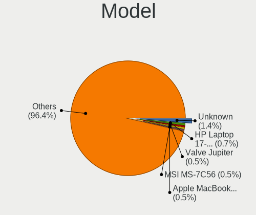

| Name                                  | Computers | Percent |
|---------------------------------------|-----------|---------|
| Unknown                               | 11        | 1.35%   |
| Valve Jupiter                         | 7         | 0.86%   |
| ASUS All Series                       | 7         | 0.86%   |
| MSI MS-7C56                           | 5         | 0.61%   |
| TUXEDO InfinityBook Pro Gen7 (MK1)    | 4         | 0.49%   |
| Apple MacBookPro9,2                   | 4         | 0.49%   |
| Supermicro X11DPi-N(T)                | 3         | 0.37%   |
| RPi Raspberry Pi 3 Model B Rev 1.2    | 3         | 0.37%   |
| Lenovo IdeaPad 3 15ALC6 82KU          | 3         | 0.37%   |
| Fujitsu ESPRIMO P710                  | 3         | 0.37%   |
| Dell XPS 13 7390                      | 3         | 0.37%   |
| ASUS PRIME A320M-K                    | 3         | 0.37%   |
| ASRock B450M Pro4                     | 3         | 0.37%   |
| TUXEDO Pulse 15 Gen1                  | 2         | 0.25%   |
| TUXEDO InfinityBook S 15/17 Gen7      | 2         | 0.25%   |
| TUXEDO InfinityBook Pro 14 v4         | 2         | 0.25%   |
| TUXEDO InfinityBook Pro 14 Gen6       | 2         | 0.25%   |
| Supermicro X9DR3-F                    | 2         | 0.25%   |
| Supermicro egino BTO Konfig Server    | 2         | 0.25%   |
| RPi Raspberry Pi 4 Model B Rev 1.4    | 2         | 0.25%   |
| Notebook N8xxEP6                      | 2         | 0.25%   |
| MSI MS-7D17                           | 2         | 0.25%   |
| MSI MS-7B89                           | 2         | 0.25%   |
| MSI MS-7B86                           | 2         | 0.25%   |
| MSI MS-7A38                           | 2         | 0.25%   |
| MSI MS-7A33                           | 2         | 0.25%   |
| MSI MS-7721                           | 2         | 0.25%   |
| Medion MS-7707                        | 2         | 0.25%   |
| Lenovo Yoga Slim 7 Pro 14ACH5 OD 82NK | 2         | 0.25%   |
| Lenovo ThinkPad T14s Gen 3 21CQCTO1WW | 2         | 0.25%   |
| HUAWEI KPL-W0X                        | 2         | 0.25%   |
| Gigabyte Z590 GAMING X                | 2         | 0.25%   |
| Gigabyte X58A-UD7                     | 2         | 0.25%   |
| Gigabyte X470 AORUS ULTRA GAMING      | 2         | 0.25%   |
| Gigabyte B550 AORUS ELITE             | 2         | 0.25%   |
| Gigabyte B450M S2H                    | 2         | 0.25%   |
| Gigabyte A7 K1                        | 2         | 0.25%   |
| Fujitsu LIFEBOOK S760                 | 2         | 0.25%   |
| Fujitsu LIFEBOOK E556                 | 2         | 0.25%   |
| Fujitsu ESPRIMO Q920                  | 2         | 0.25%   |

Model Family
------------

Motherboard model prefix

| Name                   | Computers | Percent |
|------------------------|-----------|---------|
| Lenovo ThinkPad        | 81        | 9.93%   |
| Acer Aspire            | 42        | 5.15%   |
| Fujitsu ESPRIMO        | 21        | 2.57%   |
| ASUS PRIME             | 20        | 2.45%   |
| Lenovo IdeaPad         | 17        | 2.08%   |
| Dell Latitude          | 16        | 1.96%   |
| HP Pavilion            | 14        | 1.72%   |
| Lenovo ThinkCentre     | 11        | 1.35%   |
| Fujitsu LIFEBOOK       | 11        | 1.35%   |
| Dell OptiPlex          | 11        | 1.35%   |
| Unknown                | 11        | 1.35%   |
| TUXEDO InfinityBook    | 10        | 1.23%   |
| Dell Inspiron          | 10        | 1.23%   |
| ASUS ROG               | 10        | 1.23%   |
| HP Compaq              | 9         | 1.1%    |
| Dell Precision         | 9         | 1.1%    |
| RPi Raspberry          | 8         | 0.98%   |
| HP EliteBook           | 8         | 0.98%   |
| Dell XPS               | 8         | 0.98%   |
| Valve Jupiter          | 7         | 0.86%   |
| Lenovo Yoga            | 7         | 0.86%   |
| HP ProBook             | 7         | 0.86%   |
| HP Laptop              | 7         | 0.86%   |
| HP ENVY                | 7         | 0.86%   |
| ASUS TUF               | 7         | 0.86%   |
| ASUS All               | 7         | 0.86%   |
| Lenovo Legion          | 6         | 0.74%   |
| ASUS VivoBook          | 6         | 0.74%   |
| MSI MS-7C56            | 5         | 0.61%   |
| Dell Vostro            | 5         | 0.61%   |
| Apple MacBookPro9      | 5         | 0.61%   |
| TUXEDO Pulse           | 4         | 0.49%   |
| Toshiba Satellite      | 4         | 0.49%   |
| Medion Akoya           | 4         | 0.49%   |
| Lenovo ThinkStation    | 4         | 0.49%   |
| Lenovo IdeaCentre      | 4         | 0.49%   |
| Acer Swift             | 4         | 0.49%   |
| Supermicro X11DPi-N(T) | 3         | 0.37%   |
| HP ZBook               | 3         | 0.37%   |
| HP ProLiant            | 3         | 0.37%   |

MFG Year
--------

Motherboard manufacture year

| Year    | Computers | Percent |
|---------|-----------|---------|
| 2020    | 91        | 11.15%  |
| 2021    | 88        | 10.78%  |
| 2022    | 76        | 9.31%   |
| 2018    | 74        | 9.07%   |
| 2012    | 70        | 8.58%   |
| 2019    | 53        | 6.5%    |
| 2013    | 51        | 6.25%   |
| 2017    | 43        | 5.27%   |
| 2011    | 43        | 5.27%   |
| 2010    | 39        | 4.78%   |
| 2016    | 37        | 4.53%   |
| 2014    | 37        | 4.53%   |
| 2015    | 32        | 3.92%   |
| 2009    | 30        | 3.68%   |
| 2008    | 16        | 1.96%   |
| Unknown | 10        | 1.23%   |
| 2006    | 8         | 0.98%   |
| 2023    | 7         | 0.86%   |
| 2007    | 7         | 0.86%   |
| 2004    | 2         | 0.25%   |
| 2005    | 1         | 0.12%   |
| 2003    | 1         | 0.12%   |

Form Factor
-----------

Physical design of the computer

| Name           | Computers | Percent |
|----------------|-----------|---------|
| Notebook       | 400       | 49.02%  |
| Desktop        | 337       | 41.3%   |
| Mini pc        | 23        | 2.82%   |
| Convertible    | 22        | 2.7%    |
| All in one     | 11        | 1.35%   |
| System on chip | 9         | 1.1%    |
| Server         | 8         | 0.98%   |
| Tablet         | 6         | 0.74%   |

Secure Boot
-----------

Enabled or disabled

| State    | Computers | Percent |
|----------|-----------|---------|
| Disabled | 755       | 92.52%  |
| Enabled  | 61        | 7.48%   |

Coreboot
--------

Have coreboot on board

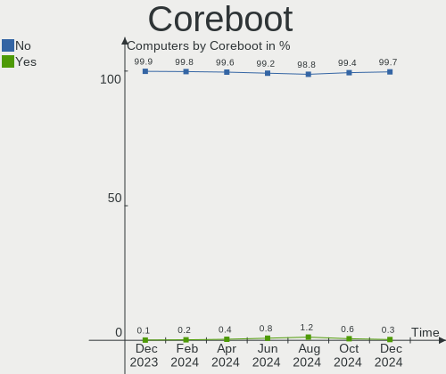

| Used | Computers | Percent |
|------|-----------|---------|
| No   | 814       | 99.75%  |
| Yes  | 2         | 0.25%   |

RAM Size
--------

Total RAM memory

| Size in GB      | Computers | Percent |
|-----------------|-----------|---------|
| 4.01-8.0        | 184       | 22.55%  |
| 16.01-24.0      | 172       | 21.08%  |
| 8.01-16.0       | 154       | 18.87%  |
| 3.01-4.0        | 111       | 13.6%   |
| 32.01-64.0      | 107       | 13.11%  |
| 64.01-256.0     | 37        | 4.53%   |
| 24.01-32.0      | 19        | 2.33%   |
| 1.01-2.0        | 15        | 1.84%   |
| 2.01-3.0        | 10        | 1.23%   |
| 0.51-1.0        | 4         | 0.49%   |
| 0.01-0.5        | 2         | 0.25%   |
| More than 256.0 | 1         | 0.12%   |

RAM Used
--------

Used RAM memory

| Used GB     | Computers | Percent |
|-------------|-----------|---------|
| 1.01-2.0    | 257       | 31.5%   |
| 2.01-3.0    | 200       | 24.51%  |
| 4.01-8.0    | 154       | 18.87%  |
| 3.01-4.0    | 99        | 12.13%  |
| 8.01-16.0   | 42        | 5.15%   |
| 0.51-1.0    | 31        | 3.8%    |
| 16.01-24.0  | 11        | 1.35%   |
| 0.01-0.5    | 11        | 1.35%   |
| 32.01-64.0  | 4         | 0.49%   |
| 64.01-256.0 | 4         | 0.49%   |
| 24.01-32.0  | 2         | 0.25%   |
| 0           | 1         | 0.12%   |

Total Drives
------------

Number of drives on board

| Drives | Computers | Percent |
|--------|-----------|---------|
| 1      | 458       | 56.13%  |
| 2      | 207       | 25.37%  |
| 3      | 71        | 8.7%    |
| 4      | 36        | 4.41%   |
| 5      | 13        | 1.59%   |
| 6      | 10        | 1.23%   |
| 7      | 6         | 0.74%   |
| 0      | 5         | 0.61%   |
| 13     | 3         | 0.37%   |
| 9      | 2         | 0.25%   |
| 8      | 2         | 0.25%   |
| 29     | 1         | 0.12%   |
| 17     | 1         | 0.12%   |
| 10     | 1         | 0.12%   |

Has CD-ROM
----------

Has CD-ROM on board

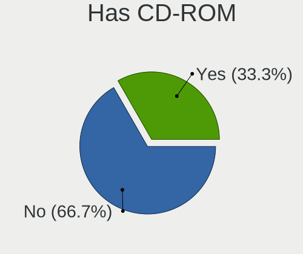

| Presented | Computers | Percent |
|-----------|-----------|---------|
| No        | 481       | 58.95%  |
| Yes       | 335       | 41.05%  |

Has Ethernet
------------

Has Ethernet on board

| Presented | Computers | Percent |
|-----------|-----------|---------|
| Yes       | 720       | 88.24%  |
| No        | 96        | 11.76%  |

Has WiFi
--------

Has WiFi module

| Presented | Computers | Percent |
|-----------|-----------|---------|
| Yes       | 578       | 70.83%  |
| No        | 238       | 29.17%  |

Has Bluetooth
-------------

Has Bluetooth module

| Presented | Computers | Percent |
|-----------|-----------|---------|
| Yes       | 500       | 61.27%  |
| No        | 316       | 38.73%  |

Location
--------

Country
-------

Geographic location (country)

| Country | Computers | Percent |
|---------|-----------|---------|
| Germany | 816       | 100%    |

City
----

Geographic location (city)

| City              | Computers | Percent |
|-------------------|-----------|---------|
| Berlin            | 68        | 8.33%   |
| Munich            | 35        | 4.29%   |
| Frankfurt am Main | 31        | 3.8%    |
| Hamburg           | 29        | 3.55%   |
| Stuttgart         | 22        | 2.7%    |
| Cologne           | 18        | 2.21%   |
| Leipzig           | 11        | 1.35%   |
| Hanover           | 10        | 1.23%   |
| Chemnitz          | 9         | 1.1%    |
| Bonn              | 9         | 1.1%    |
| Bielefeld         | 9         | 1.1%    |
| Bochum            | 8         | 0.98%   |
| Nuremberg         | 7         | 0.86%   |
| Dresden           | 7         | 0.86%   |
| Ulm               | 6         | 0.74%   |
| Traunstein        | 6         | 0.74%   |
| Kiel              | 6         | 0.74%   |
| Karlsruhe         | 6         | 0.74%   |
| Dortmund          | 6         | 0.74%   |
| Lüneburg         | 5         | 0.61%   |
| Jena              | 5         | 0.61%   |
| Fürth            | 5         | 0.61%   |
| Duisburg          | 5         | 0.61%   |
| Darmstadt         | 5         | 0.61%   |
| Augsburg          | 5         | 0.61%   |
| Rostock           | 4         | 0.49%   |
| Regensburg        | 4         | 0.49%   |
| Oldenburg         | 4         | 0.49%   |
| Münster          | 4         | 0.49%   |
| Mönchengladbach  | 4         | 0.49%   |
| Ludwigsburg       | 4         | 0.49%   |
| Konstanz          | 4         | 0.49%   |
| Herne             | 4         | 0.49%   |
| Gera              | 4         | 0.49%   |
| Falkenstein       | 4         | 0.49%   |
| Essen             | 4         | 0.49%   |
| Ueckermuende      | 3         | 0.37%   |
| Schwerin          | 3         | 0.37%   |
| Reutlingen        | 3         | 0.37%   |
| Raesfeld          | 3         | 0.37%   |

Drives
------

Drive Vendor
------------

Hard drive vendors

| Vendor                         | Computers | Drives | Percent |
|--------------------------------|-----------|--------|---------|
| Samsung Electronics            | 265       | 348    | 21.37%  |
| WDC                            | 150       | 195    | 12.1%   |
| Seagate                        | 118       | 147    | 9.52%   |
| SanDisk                        | 106       | 119    | 8.55%   |
| Crucial                        | 77        | 84     | 6.21%   |
| Toshiba                        | 68        | 80     | 5.48%   |
| Intenso                        | 42        | 45     | 3.39%   |
| Kingston                       | 39        | 43     | 3.15%   |
| Unknown                        | 34        | 39     | 2.74%   |
| SK hynix                       | 30        | 30     | 2.42%   |
| Micron Technology              | 28        | 44     | 2.26%   |
| Intel                          | 26        | 41     | 2.1%    |
| Hitachi                        | 24        | 25     | 1.94%   |
| HGST                           | 17        | 17     | 1.37%   |
| Phison Electronics             | 13        | 14     | 1.05%   |
| China                          | 12        | 12     | 0.97%   |
| Unknown                        | 11        | 12     | 0.89%   |
| Transcend                      | 10        | 11     | 0.81%   |
| Micron/Crucial Technology      | 10        | 11     | 0.81%   |
| Kingston Technology Company    | 9         | 9      | 0.73%   |
| A-DATA Technology              | 9         | 9      | 0.73%   |
| Phison                         | 8         | 8      | 0.65%   |
| KIOXIA                         | 8         | 8      | 0.65%   |
| JMicron Technology             | 8         | 8      | 0.65%   |
| Fanxiang                       | 8         | 8      | 0.65%   |
| SPCC                           | 5         | 5      | 0.4%    |
| PNY                            | 5         | 7      | 0.4%    |
| Patriot                        | 5         | 5      | 0.4%    |
| Netac                          | 5         | 5      | 0.4%    |
| Leven                          | 5         | 5      | 0.4%    |
| INNOVATION IT                  | 5         | 5      | 0.4%    |
| Apple                          | 5         | 5      | 0.4%    |
| OCZ                            | 4         | 4      | 0.32%   |
| Silicon Motion                 | 3         | 3      | 0.24%   |
| SABRENT                        | 3         | 3      | 0.24%   |
| Fujitsu                        | 3         | 3      | 0.24%   |
| ASMT                           | 3         | 3      | 0.24%   |
| ADATA Technology               | 3         | 3      | 0.24%   |
| Verbatim                       | 2         | 2      | 0.16%   |
| Solid State Storage Technology | 2         | 2      | 0.16%   |

Drive Model
-----------

Hard drive models

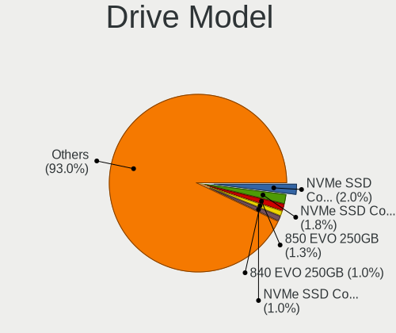

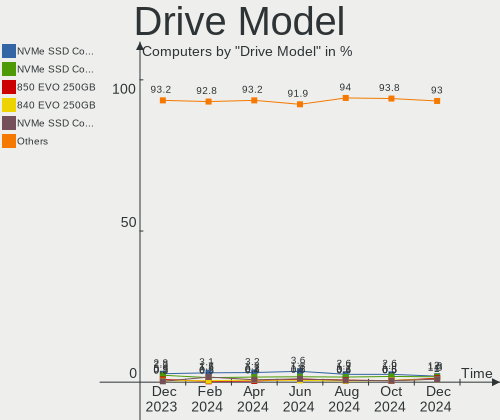

| Model                                               | Computers | Percent |
|-----------------------------------------------------|-----------|---------|
| Samsung NVMe SSD Controller SM981/PM981/PM983 250GB | 36        | 2.58%   |
| Samsung SSD 860 EVO 500GB                           | 18        | 1.29%   |
| Samsung SSD 850 EVO 250GB                           | 16        | 1.15%   |
| Crucial CT1000MX500SSD1 1TB                         | 16        | 1.15%   |
| Samsung NVMe SSD Controller PM9A1/PM9A3/980PRO 1TB  | 15        | 1.08%   |
| SanDisk SSD PLUS 480GB                              | 13        | 0.93%   |
| Samsung SSD 850 EVO 500GB                           | 12        | 0.86%   |
| Unknown                                             | 11        | 0.79%   |
| Samsung SSD 980 1TB                                 | 10        | 0.72%   |
| Crucial CT500MX500SSD1 500GB                        | 10        | 0.72%   |
| SanDisk SSD PLUS 1000GB                             | 9         | 0.65%   |
| Seagate ST500DM002-1BD142 500GB                     | 8         | 0.57%   |
| Seagate ST1000LM024 HN-M101MBB 1TB                  | 8         | 0.57%   |
| Samsung SSD 840 EVO 250GB                           | 8         | 0.57%   |
| Samsung SSD 980 500GB                               | 7         | 0.5%    |
| Micron/Crucial P2 NVMe PCIe SSD 1TB                 | 7         | 0.5%    |
| Kingston SA400S37120G 120GB SSD                     | 7         | 0.5%    |
| WDC WDS500G2B0A-00SM50 500GB SSD                    | 6         | 0.43%   |
| Toshiba MQ01ABD100 1TB                              | 6         | 0.43%   |
| Sandisk WD Black SN850 1TB                          | 6         | 0.43%   |
| SanDisk NVMe SSD Drive 1TB                          | 6         | 0.43%   |
| Samsung SSD 970 EVO Plus 1TB                        | 6         | 0.43%   |
| Samsung SSD 860 EVO 250GB                           | 6         | 0.43%   |
| Samsung SSD 860 EVO 1TB                             | 6         | 0.43%   |
| Samsung SSD 850 EVO 1TB                             | 6         | 0.43%   |
| Samsung SSD 840 EVO 120GB                           | 6         | 0.43%   |
| JMicron Generic 500GB                               | 6         | 0.43%   |
| Intenso SSD 120GB                                   | 6         | 0.43%   |
| Crucial CT240BX500SSD1 240GB                        | 6         | 0.43%   |
| Crucial CT1000BX500SSD1 1TB                         | 6         | 0.43%   |
| WDC WD10EZEX-08WN4A0 1TB                            | 5         | 0.36%   |
| Unknown SD/MMC/MS PRO 64GB                          | 5         | 0.36%   |
| Toshiba DT01ACA100 1TB                              | 5         | 0.36%   |
| Seagate ST31000524AS 1TB                            | 5         | 0.36%   |
| Samsung SSD 980 PRO 1TB                             | 5         | 0.36%   |
| Samsung SSD 970 EVO Plus 500GB                      | 5         | 0.36%   |
| Samsung SSD 970 EVO 500GB                           | 5         | 0.36%   |
| Samsung SSD 860 QVO 1TB                             | 5         | 0.36%   |
| Samsung MZVLB1T0HBLR-000L2 1TB                      | 5         | 0.36%   |
| Phison E12 NVMe Controller 256GB                    | 5         | 0.36%   |

HDD Vendor
----------

Hard disk drive vendors

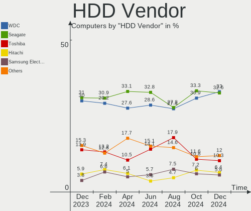

| Vendor              | Computers | Drives | Percent |
|---------------------|-----------|--------|---------|
| WDC                 | 116       | 154    | 32.49%  |
| Seagate             | 115       | 144    | 32.21%  |
| Toshiba             | 45        | 51     | 12.61%  |
| Hitachi             | 24        | 25     | 6.72%   |
| Samsung Electronics | 21        | 24     | 5.88%   |
| HGST                | 17        | 17     | 4.76%   |
| Unknown             | 5         | 5      | 1.4%    |
| SABRENT             | 3         | 3      | 0.84%   |
| Fujitsu             | 3         | 3      | 0.84%   |
| Intenso             | 2         | 2      | 0.56%   |
| ASMT                | 2         | 2      | 0.56%   |
| USB                 | 1         | 1      | 0.28%   |
| Maxtor              | 1         | 1      | 0.28%   |
| Hewlett-Packard     | 1         | 12     | 0.28%   |
| ASMedia             | 1         | 1      | 0.28%   |

SSD Vendor
----------

Solid state drive vendors

| Vendor              | Computers | Drives | Percent |
|---------------------|-----------|--------|---------|
| Samsung Electronics | 141       | 171    | 27.65%  |
| Crucial             | 72        | 77     | 14.12%  |
| SanDisk             | 69        | 79     | 13.53%  |
| Intenso             | 35        | 38     | 6.86%   |
| Kingston            | 26        | 29     | 5.1%    |
| WDC                 | 21        | 23     | 4.12%   |
| Toshiba             | 12        | 14     | 2.35%   |
| China               | 12        | 12     | 2.35%   |
| Micron Technology   | 10        | 26     | 1.96%   |
| Transcend           | 9         | 10     | 1.76%   |
| Intel               | 9         | 24     | 1.76%   |
| A-DATA Technology   | 8         | 8      | 1.57%   |
| Fanxiang            | 7         | 7      | 1.37%   |
| JMicron Technology  | 6         | 6      | 1.18%   |
| Leven               | 5         | 5      | 0.98%   |
| INNOVATION IT       | 5         | 5      | 0.98%   |
| SK hynix            | 4         | 4      | 0.78%   |
| Phison              | 4         | 4      | 0.78%   |
| Patriot             | 4         | 4      | 0.78%   |
| OCZ                 | 4         | 4      | 0.78%   |
| Apple               | 4         | 4      | 0.78%   |
| Unknown             | 4         | 5      | 0.78%   |
| SPCC                | 3         | 3      | 0.59%   |
| Netac               | 3         | 3      | 0.59%   |
| Verbatim            | 2         | 2      | 0.39%   |
| Seagate             | 2         | 2      | 0.39%   |
| PNY                 | 2         | 2      | 0.39%   |
| Emtec               | 2         | 2      | 0.39%   |
| Corsair             | 2         | 2      | 0.39%   |
| Wdstars             | 1         | 1      | 0.2%    |
| Vaseky              | 1         | 1      | 0.2%    |
| Unknown             | 1         | 1      | 0.2%    |
| Teclast             | 1         | 1      | 0.2%    |
| Team                | 1         | 1      | 0.2%    |
| Supersonic          | 1         | 1      | 0.2%    |
| StoreJet            | 1         | 3      | 0.2%    |
| Radeon              | 1         | 1      | 0.2%    |
| QUMOX               | 1         | 1      | 0.2%    |
| Plextor             | 1         | 1      | 0.2%    |
| Mushkin             | 1         | 1      | 0.2%    |

Drive Kind
----------

HDD or SSD

| Kind    | Computers | Drives | Percent |
|---------|-----------|--------|---------|
| SSD     | 414       | 600    | 38.09%  |
| NVMe    | 332       | 389    | 30.54%  |
| HDD     | 290       | 445    | 26.68%  |
| MMC     | 34        | 36     | 3.13%   |
| Unknown | 17        | 22     | 1.56%   |

Drive Connector
---------------

SATA, SAS, NVMe, etc.

| Type | Computers | Drives | Percent |
|------|-----------|--------|---------|
| SATA | 570       | 989    | 57.06%  |
| NVMe | 330       | 384    | 33.03%  |
| SAS  | 65        | 83     | 6.51%   |
| MMC  | 34        | 36     | 3.4%    |

Drive Size
----------

Size of hard drive

| Size in TB | Computers | Drives | Percent |
|------------|-----------|--------|---------|
| 0.01-0.5   | 407       | 539    | 52.65%  |
| 0.51-1.0   | 216       | 273    | 27.94%  |
| 1.01-2.0   | 79        | 106    | 10.22%  |
| 3.01-4.0   | 35        | 51     | 4.53%   |
| 4.01-10.0  | 22        | 54     | 2.85%   |
| 2.01-3.0   | 13        | 21     | 1.68%   |
| 10.01-20.0 | 1         | 1      | 0.13%   |

Space Total
-----------

Amount of disk space available on the file system

| Size in GB     | Computers | Percent |
|----------------|-----------|---------|
| 251-500        | 180       | 22.06%  |
| 101-250        | 176       | 21.57%  |
| 501-1000       | 146       | 17.89%  |
| 1-20           | 70        | 8.58%   |
| 1001-2000      | 68        | 8.33%   |
| More than 3000 | 51        | 6.25%   |
| 51-100         | 44        | 5.39%   |
| 2001-3000      | 31        | 3.8%    |
| Unknown        | 29        | 3.55%   |
| 21-50          | 21        | 2.57%   |

Space Used
----------

Amount of used disk space

| Used GB        | Computers | Percent |
|----------------|-----------|---------|
| 1-20           | 254       | 31.13%  |
| 21-50          | 145       | 17.77%  |
| 101-250        | 109       | 13.36%  |
| 251-500        | 79        | 9.68%   |
| 51-100         | 78        | 9.56%   |
| 501-1000       | 54        | 6.62%   |
| 1001-2000      | 31        | 3.8%    |
| Unknown        | 29        | 3.55%   |
| More than 3000 | 22        | 2.7%    |
| 2001-3000      | 15        | 1.84%   |

Malfunc. Drives
---------------

Drive models with a malfunction

| Model                                    | Computers | Drives | Percent |
|------------------------------------------|-----------|--------|---------|
| Seagate ST500DM002-1BD142 500GB          | 4         | 4      | 6.06%   |
| SanDisk SSD PLUS 480GB                   | 4         | 4      | 6.06%   |
| WDC WD5000AVDS-63U7B1 500GB              | 1         | 1      | 1.52%   |
| WDC WD5000AAKS-007AA0 500GB              | 1         | 1      | 1.52%   |
| WDC WD5000AADS-00S9B0 500GB              | 1         | 1      | 1.52%   |
| WDC WD4001FFSX-68JNUN0 4TB               | 1         | 1      | 1.52%   |
| WDC WD3200AAJS-00B4A0 320GB              | 1         | 1      | 1.52%   |
| WDC WD20EARX-00PASB0 2TB                 | 1         | 1      | 1.52%   |
| WDC WD20EARS-60MVWB0 2TB                 | 1         | 1      | 1.52%   |
| WDC WD15EADS-00P8B0 1TB                  | 1         | 1      | 1.52%   |
| WDC WD10EURX-63FH1Y0 1TB                 | 1         | 1      | 1.52%   |
| WDC WD10EFRX-68FYTN0 1TB                 | 1         | 1      | 1.52%   |
| WDC WD10EARS-00Y5B1 1TB                  | 1         | 1      | 1.52%   |
| WDC WD10EALS-00Z8A0 1TB                  | 1         | 1      | 1.52%   |
| WDC WD10EADS-22M2B0 1TB                  | 1         | 1      | 1.52%   |
| WDC PC SN730 SDBPNTY-512G-1101 512GB     | 1         | 1      | 1.52%   |
| Toshiba MQ04ABF100 1TB                   | 1         | 1      | 1.52%   |
| Toshiba MQ01ABF032 320GB                 | 1         | 1      | 1.52%   |
| Toshiba MK1633GSG 160GB                  | 1         | 1      | 1.52%   |
| Seagate STT_FTM56GX25H 256GB SSD         | 1         | 1      | 1.52%   |
| Seagate ST980813AS 80GB                  | 1         | 1      | 1.52%   |
| Seagate ST500LM000-1EJ162 500GB          | 1         | 1      | 1.52%   |
| Seagate ST4000NM0245-1Z2107 4TB          | 1         | 1      | 1.52%   |
| Seagate ST4000DM004-2CV104 4TB           | 1         | 1      | 1.52%   |
| Seagate ST3750640NS 752GB                | 1         | 1      | 1.52%   |
| Seagate ST3640623AS 640GB                | 1         | 1      | 1.52%   |
| Seagate ST3500412AS 500GB                | 1         | 1      | 1.52%   |
| Seagate ST3320820AS 320GB                | 1         | 1      | 1.52%   |
| Seagate ST3250310AS 250GB                | 1         | 1      | 1.52%   |
| Seagate ST320LT007-9ZV142 320GB          | 1         | 1      | 1.52%   |
| Seagate ST320LM001 HN-M320MBB 320GB      | 1         | 1      | 1.52%   |
| Seagate ST2000DX001-1NS164 2TB           | 1         | 1      | 1.52%   |
| Seagate ST1000LM049-2GH172 1TB           | 1         | 1      | 1.52%   |
| Seagate ST1000LM035-1RK172 1TB           | 1         | 1      | 1.52%   |
| Seagate ST1000DM003-9YN162 1TB           | 1         | 1      | 1.52%   |
| SanDisk SSD PLUS 1000GB                  | 1         | 1      | 1.52%   |
| Samsung Electronics SSD 970 EVO 500GB    | 1         | 1      | 1.52%   |
| Samsung Electronics SSD 970 EVO 1TB      | 1         | 1      | 1.52%   |
| Samsung Electronics SSD 840 Series 250GB | 1         | 1      | 1.52%   |
| Samsung Electronics SSD 840 EVO 1TB      | 1         | 1      | 1.52%   |

Malfunc. Drive Vendor
---------------------

Vendors of faulty drives

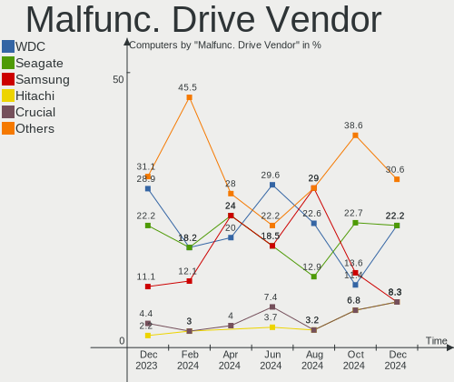

| Vendor              | Computers | Drives | Percent |
|---------------------|-----------|--------|---------|
| Seagate             | 20        | 20     | 31.75%  |
| WDC                 | 13        | 14     | 20.63%  |
| Samsung Electronics | 8         | 8      | 12.7%   |
| SanDisk             | 5         | 5      | 7.94%   |
| Toshiba             | 3         | 3      | 4.76%   |
| HGST                | 3         | 3      | 4.76%   |
| Crucial             | 3         | 4      | 4.76%   |
| Kingston            | 2         | 2      | 3.17%   |
| Micron Technology   | 1         | 6      | 1.59%   |
| Maxtor              | 1         | 1      | 1.59%   |
| Intenso             | 1         | 1      | 1.59%   |
| Intel               | 1         | 1      | 1.59%   |
| China               | 1         | 1      | 1.59%   |
| A-DATA Technology   | 1         | 1      | 1.59%   |

Malfunc. HDD Vendor
-------------------

Vendors of faulty HDD drives

| Vendor              | Computers | Drives | Percent |
|---------------------|-----------|--------|---------|
| Seagate             | 19        | 19     | 46.34%  |
| WDC                 | 12        | 13     | 29.27%  |
| Toshiba             | 3         | 3      | 7.32%   |
| Samsung Electronics | 3         | 3      | 7.32%   |
| HGST                | 3         | 3      | 7.32%   |
| Maxtor              | 1         | 1      | 2.44%   |

Malfunc. Drive Kind
-------------------

Kinds of faulty drives

| Kind | Computers | Drives | Percent |
|------|-----------|--------|---------|
| HDD  | 40        | 42     | 64.52%  |
| SSD  | 16        | 22     | 25.81%  |
| NVMe | 6         | 6      | 9.68%   |

Failed Drives
-------------

Failed drive models

| Model                                            | Computers | Drives | Percent |
|--------------------------------------------------|-----------|--------|---------|
| Samsung Electronics MZNTY128HDHP-00000 128GB SSD | 1         | 1      | 50%     |
| Samsung Electronics HD103UJ 1TB                  | 1         | 1      | 50%     |

Failed Drive Vendor
-------------------

Failed drive vendors

| Vendor              | Computers | Drives | Percent |
|---------------------|-----------|--------|---------|
| Samsung Electronics | 2         | 2      | 100%    |

Drive Status
------------

Number of failed and malfunc. drives

| Status   | Computers | Drives | Percent |
|----------|-----------|--------|---------|
| Works    | 434       | 737    | 47.74%  |
| Detected | 411       | 683    | 45.21%  |
| Malfunc  | 62        | 70     | 6.82%   |
| Failed   | 2         | 2      | 0.22%   |

Storage controller
------------------

Storage Vendor
--------------

Storage controller vendors

| Vendor                           | Computers | Percent |
|----------------------------------|-----------|---------|
| Intel                            | 500       | 45.7%   |
| AMD                              | 184       | 16.82%  |
| Samsung Electronics              | 138       | 12.61%  |
| SanDisk                          | 54        | 4.94%   |
| SK hynix                         | 24        | 2.19%   |
| Phison Electronics               | 24        | 2.19%   |
| Kingston Technology Company      | 22        | 2.01%   |
| Micron Technology                | 18        | 1.65%   |
| Micron/Crucial Technology        | 17        | 1.55%   |
| Marvell Technology Group         | 13        | 1.19%   |
| ASMedia Technology               | 13        | 1.19%   |
| JMicron Technology               | 12        | 1.1%    |
| Nvidia                           | 11        | 1.01%   |
| Toshiba America Info Systems     | 10        | 0.91%   |
| KIOXIA                           | 8         | 0.73%   |
| Silicon Motion                   | 7         | 0.64%   |
| Broadcom / LSI                   | 5         | 0.46%   |
| Solid State Storage Technology   | 3         | 0.27%   |
| Silicon Image                    | 3         | 0.27%   |
| Realtek Semiconductor            | 3         | 0.27%   |
| MAXIO Technology (Hangzhou)      | 3         | 0.27%   |
| ADATA Technology                 | 3         | 0.27%   |
| Adaptec                          | 3         | 0.27%   |
| VIA Technologies                 | 2         | 0.18%   |
| Silicon Integrated Systems [SiS] | 2         | 0.18%   |
| Seagate Technology               | 2         | 0.18%   |
| Hewlett-Packard                  | 2         | 0.18%   |
| Union Memory (Shenzhen)          | 1         | 0.09%   |
| OCZ Technology Group             | 1         | 0.09%   |
| O2 Micro                         | 1         | 0.09%   |
| Netac Technology                 | 1         | 0.09%   |
| LSI Logic / Symbios Logic        | 1         | 0.09%   |
| Future Domain                    | 1         | 0.09%   |
| Biwin Storage Technology         | 1         | 0.09%   |
| Apple                            | 1         | 0.09%   |

Storage Model
-------------

Storage controller models

| Model                                                                          | Computers | Percent |
|--------------------------------------------------------------------------------|-----------|---------|
| AMD FCH SATA Controller [AHCI mode]                                            | 122       | 9.91%   |
| Samsung NVMe SSD Controller SM981/PM981/PM983                                  | 73        | 5.93%   |
| Intel 7 Series Chipset Family 6-port SATA Controller [AHCI mode]               | 38        | 3.09%   |
| AMD 400 Series Chipset SATA Controller                                         | 33        | 2.68%   |
| Samsung NVMe SSD Controller 980                                                | 32        | 2.6%    |
| Intel Sunrise Point-LP SATA Controller [AHCI mode]                             | 32        | 2.6%    |
| Intel 8 Series/C220 Series Chipset Family 6-port SATA Controller 1 [AHCI mode] | 31        | 2.52%   |
| Intel Q170/Q150/B150/H170/H110/Z170/CM236 Chipset SATA Controller [AHCI Mode]  | 27        | 2.19%   |
| AMD 500 Series Chipset SATA Controller                                         | 26        | 2.11%   |
| Samsung NVMe SSD Controller PM9A1/PM9A3/980PRO                                 | 25        | 2.03%   |
| Intel 6 Series/C200 Series Chipset Family 6 port Desktop SATA AHCI Controller  | 20        | 1.62%   |
| Intel 6 Series/C200 Series Chipset Family 6 port Mobile SATA AHCI Controller   | 18        | 1.46%   |
| Micron NVMe Storage Controller                                                 | 17        | 1.38%   |
| Intel Volume Management Device NVMe RAID Controller                            | 17        | 1.38%   |
| Intel 200 Series PCH SATA controller [AHCI mode]                               | 17        | 1.38%   |
| Intel 7 Series/C210 Series Chipset Family 6-port SATA Controller [AHCI mode]   | 15        | 1.22%   |
| Intel 5 Series/3400 Series Chipset 6 port SATA AHCI Controller                 | 15        | 1.22%   |
| Intel Cannon Lake PCH SATA AHCI Controller                                     | 14        | 1.14%   |
| Intel 82801IBM/IEM (ICH9M/ICH9M-E) 4 port SATA Controller [AHCI mode]          | 14        | 1.14%   |
| Intel 82801 Mobile SATA Controller [RAID mode]                                 | 14        | 1.14%   |
| Intel 500 Series Chipset Family SATA AHCI Controller                           | 14        | 1.14%   |
| SK hynix Gold P31/PC711 NVMe Solid State Drive                                 | 13        | 1.06%   |
| Intel Celeron/Pentium Silver Processor SATA Controller                         | 13        | 1.06%   |
| Intel 8 Series SATA Controller 1 [AHCI mode]                                   | 13        | 1.06%   |
| Intel 5 Series/3400 Series Chipset 4 port SATA AHCI Controller                 | 13        | 1.06%   |
| SanDisk WD Black SN750 / PC SN730 NVMe SSD                                     | 12        | 0.97%   |
| Intel Wildcat Point-LP SATA Controller [AHCI Mode]                             | 12        | 0.97%   |
| Intel Cannon Lake Mobile PCH SATA AHCI Controller                              | 12        | 0.97%   |
| Intel 82801G (ICH7 Family) IDE Controller                                      | 12        | 0.97%   |
| ASMedia ASM1062 Serial ATA Controller                                          | 12        | 0.97%   |
| AMD SB7x0/SB8x0/SB9x0 SATA Controller [AHCI mode]                              | 12        | 0.97%   |
| AMD SB7x0/SB8x0/SB9x0 IDE Controller                                           | 12        | 0.97%   |
| Intel NM10/ICH7 Family SATA Controller [IDE mode]                              | 11        | 0.89%   |
| Phison E12 NVMe Controller                                                     | 10        | 0.81%   |
| Micron/Crucial P2 NVMe PCIe SSD                                                | 10        | 0.81%   |
| Intel SATA Controller [RAID mode]                                              | 10        | 0.81%   |
| SanDisk NVMe Controller                                                        | 9         | 0.73%   |
| JMicron JMB363 SATA/IDE Controller                                             | 9         | 0.73%   |
| Intel SSD 660P Series                                                          | 9         | 0.73%   |
| SanDisk WD PC SN810 / Black SN850 NVMe SSD                                     | 8         | 0.65%   |

Storage Kind
------------

Kind of storage controller (IDE, SATA, NVMe, SAS, ...)

| Kind | Computers | Percent |
|------|-----------|---------|
| SATA | 613       | 56.45%  |
| NVMe | 331       | 30.48%  |
| IDE  | 76        | 7%      |
| RAID | 57        | 5.25%   |
| SAS  | 7         | 0.64%   |
| SCSI | 2         | 0.18%   |

Processor
---------

CPU Vendor
----------

Processor vendors

| Vendor     | Computers | Percent |
|------------|-----------|---------|
| Intel      | 570       | 69.85%  |
| AMD        | 237       | 29.04%  |
| ARM        | 8         | 0.98%   |
| thead,c906 | 1         | 0.12%   |

CPU Model
---------

Processor models

| Model                                         | Computers | Percent |
|-----------------------------------------------|-----------|---------|
| AMD Ryzen 5 3600 6-Core Processor             | 13        | 1.59%   |
| Intel 11th Gen Core i7-1165G7 @ 2.80GHz       | 11        | 1.35%   |
| AMD Ryzen 7 5800H with Radeon Graphics        | 10        | 1.23%   |
| Intel Core i7-10510U CPU @ 1.80GHz            | 9         | 1.1%    |
| Intel 12th Gen Core i7-12700H                 | 9         | 1.1%    |
| AMD Ryzen 5 5500U with Radeon Graphics        | 9         | 1.1%    |
| Intel 11th Gen Core i5-1135G7 @ 2.40GHz       | 8         | 0.98%   |
| Intel Core i5-3320M CPU @ 2.60GHz             | 7         | 0.86%   |
| Intel Core i5-2520M CPU @ 2.50GHz             | 7         | 0.86%   |
| AMD Ryzen 7 5700U with Radeon Graphics        | 7         | 0.86%   |
| AMD Ryzen 7 3700X 8-Core Processor            | 7         | 0.86%   |
| AMD Custom APU 0405                           | 7         | 0.86%   |
| Intel Core i5-8265U CPU @ 1.60GHz             | 6         | 0.74%   |
| Intel Core i5-8250U CPU @ 1.60GHz             | 6         | 0.74%   |
| Intel Core i5-3210M CPU @ 2.50GHz             | 6         | 0.74%   |
| Intel Core i5 CPU M 520 @ 2.40GHz             | 6         | 0.74%   |
| Intel 12th Gen Core i7-1260P                  | 6         | 0.74%   |
| AMD Ryzen 5 3500U with Radeon Vega Mobile Gfx | 6         | 0.74%   |
| Intel Core i7-9750H CPU @ 2.60GHz             | 5         | 0.61%   |
| Intel Core i7-8750H CPU @ 2.20GHz             | 5         | 0.61%   |
| Intel Core i7-8550U CPU @ 1.80GHz             | 5         | 0.61%   |
| Intel Core i7-3770 CPU @ 3.40GHz              | 5         | 0.61%   |
| Intel Core i5-6300U CPU @ 2.40GHz             | 5         | 0.61%   |
| Intel Core 2 Duo CPU E8400 @ 3.00GHz          | 5         | 0.61%   |
| ARM BCM2835 Processor                         | 5         | 0.61%   |
| AMD Ryzen 7 2700X Eight-Core Processor        | 5         | 0.61%   |
| AMD Ryzen 3 5300U with Radeon Graphics        | 5         | 0.61%   |
| Intel Core i7-6820HQ CPU @ 2.70GHz            | 4         | 0.49%   |
| Intel Core i7-6500U CPU @ 2.50GHz             | 4         | 0.49%   |
| Intel Core i5-8400 CPU @ 2.80GHz              | 4         | 0.49%   |
| Intel Core i5-6500T CPU @ 2.50GHz             | 4         | 0.49%   |
| Intel Core i5-6500 CPU @ 3.20GHz              | 4         | 0.49%   |
| Intel Core i5-4200U CPU @ 1.60GHz             | 4         | 0.49%   |
| Intel Core i5-3230M CPU @ 2.60GHz             | 4         | 0.49%   |
| Intel Core i5-10210U CPU @ 1.60GHz            | 4         | 0.49%   |
| Intel Core i5 CPU M 430 @ 2.27GHz             | 4         | 0.49%   |
| Intel Core i3-6006U CPU @ 2.00GHz             | 4         | 0.49%   |
| Intel 12th Gen Core i5-1235U                  | 4         | 0.49%   |
| AMD Ryzen 7 4700U with Radeon Graphics        | 4         | 0.49%   |
| AMD Ryzen 5 PRO 4650G with Radeon Graphics    | 4         | 0.49%   |

CPU Model Family
----------------

Processor model prefix

| Model                   | Computers | Percent |
|-------------------------|-----------|---------|
| Intel Core i5           | 177       | 21.69%  |
| Intel Core i7           | 125       | 15.32%  |
| Other                   | 82        | 10.05%  |
| AMD Ryzen 5             | 71        | 8.7%    |
| AMD Ryzen 7             | 62        | 7.6%    |
| Intel Core i3           | 47        | 5.76%   |
| Intel Core 2 Duo        | 29        | 3.55%   |
| Intel Celeron           | 29        | 3.55%   |
| Intel Pentium           | 22        | 2.7%    |
| Intel Xeon              | 20        | 2.45%   |
| AMD Ryzen 3             | 12        | 1.47%   |
| Intel Atom              | 11        | 1.35%   |
| AMD FX                  | 11        | 1.35%   |
| AMD Ryzen 9             | 10        | 1.23%   |
| AMD Ryzen 5 PRO         | 10        | 1.23%   |
| AMD Ryzen 7 PRO         | 8         | 0.98%   |
| Intel Core 2 Quad       | 7         | 0.86%   |
| AMD A8                  | 7         | 0.86%   |
| Intel Pentium Silver    | 6         | 0.74%   |
| Intel Genuine           | 5         | 0.61%   |
| ARM BCM                 | 5         | 0.61%   |
| Intel Core i9           | 4         | 0.49%   |
| AMD Ryzen Threadripper  | 4         | 0.49%   |
| Intel Xeon Gold         | 3         | 0.37%   |
| Intel Pentium Dual-Core | 3         | 0.37%   |
| Intel Core 2            | 3         | 0.37%   |
| AMD Phenom II X4        | 3         | 0.37%   |
| AMD A10                 | 3         | 0.37%   |
| Intel Xeon Silver       | 2         | 0.25%   |
| Intel Pentium 4         | 2         | 0.25%   |
| AMD Ryzen 3 PRO         | 2         | 0.25%   |
| AMD Phenom II X6        | 2         | 0.25%   |
| AMD GX                  | 2         | 0.25%   |
| AMD E2                  | 2         | 0.25%   |
| AMD Athlon II X2        | 2         | 0.25%   |
| AMD A6                  | 2         | 0.25%   |
| AMD A4                  | 2         | 0.25%   |
| Intel Pentium Gold      | 1         | 0.12%   |
| Intel Pentium Dual      | 1         | 0.12%   |
| Intel Pentium D         | 1         | 0.12%   |

CPU Cores
---------

Number of processor cores

| Number  | Computers | Percent |
|---------|-----------|---------|
| 4       | 306       | 37.5%   |
| 2       | 250       | 30.64%  |
| 6       | 101       | 12.38%  |
| 8       | 92        | 11.27%  |
| 12      | 22        | 2.7%    |
| 14      | 11        | 1.35%   |
| 1       | 10        | 1.23%   |
| 10      | 8         | 0.98%   |
| 16      | 6         | 0.74%   |
| 3       | 4         | 0.49%   |
| 24      | 3         | 0.37%   |
| 32      | 1         | 0.12%   |
| 20      | 1         | 0.12%   |
| Unknown | 1         | 0.12%   |

CPU Sockets
-----------

Number of sockets

| Number  | Computers | Percent |
|---------|-----------|---------|
| 1       | 804       | 98.53%  |
| 2       | 11        | 1.35%   |
| Unknown | 1         | 0.12%   |

CPU Threads
-----------

Threads per core (Hyper-Threading)

| Number  | Computers | Percent |
|---------|-----------|---------|
| 2       | 575       | 70.47%  |
| 1       | 240       | 29.41%  |
| Unknown | 1         | 0.12%   |

CPU Op-Modes
------------

CPU Operation Modes (32-bit, 64-bit)

| Op mode        | Computers | Percent |
|----------------|-----------|---------|
| 32-bit, 64-bit | 801       | 98.16%  |
| Unknown        | 8         | 0.98%   |
| 32-bit         | 7         | 0.86%   |

CPU Microcode
-------------

Microcode number

| Number     | Computers | Percent |
|------------|-----------|---------|
| Unknown    | 331       | 40.56%  |
| 0x306a9    | 33        | 4.04%   |
| 0x206a7    | 26        | 3.19%   |
| 0x306c3    | 21        | 2.57%   |
| 0x0a50000c | 19        | 2.33%   |
| 0x806ec    | 18        | 2.21%   |
| 0x806c1    | 16        | 1.96%   |
| 0x506e3    | 15        | 1.84%   |
| 0x08608103 | 15        | 1.84%   |
| 0x08600106 | 15        | 1.84%   |
| 0x806ea    | 12        | 1.47%   |
| 0x1067a    | 12        | 1.47%   |
| 0x08701021 | 12        | 1.47%   |
| 0x406e3    | 11        | 1.35%   |
| 0x906ea    | 9         | 1.1%    |
| 0x20655    | 9         | 1.1%    |
| 0x0a50000d | 9         | 1.1%    |
| 0x906e9    | 8         | 0.98%   |
| 0x906a3    | 8         | 0.98%   |
| 0x08108102 | 8         | 0.98%   |
| 0x0800820d | 8         | 0.98%   |
| 0x806e9    | 7         | 0.86%   |
| 0x40651    | 7         | 0.86%   |
| 0x306d4    | 7         | 0.86%   |
| 0x906ed    | 6         | 0.74%   |
| 0x706a8    | 6         | 0.74%   |
| 0x0a20120a | 6         | 0.74%   |
| 0x08108109 | 6         | 0.74%   |
| 0x20652    | 5         | 0.61%   |
| 0x08600103 | 5         | 0.61%   |
| 0x08001137 | 5         | 0.61%   |
| 0x906eb    | 4         | 0.49%   |
| 0x906a4    | 4         | 0.49%   |
| 0x806eb    | 4         | 0.49%   |
| 0x706e5    | 4         | 0.49%   |
| 0x706a1    | 4         | 0.49%   |
| 0x106ca    | 4         | 0.49%   |
| 0x06003106 | 4         | 0.49%   |
| 0x06001119 | 4         | 0.49%   |
| 0x010000c8 | 4         | 0.49%   |

CPU Microarch
-------------

Microarchitecture

| Name             | Computers | Percent |
|------------------|-----------|---------|
| KabyLake         | 108       | 13.24%  |
| Unknown          | 66        | 8.09%   |
| IvyBridge        | 60        | 7.35%   |
| Haswell          | 59        | 7.23%   |
| Zen 2            | 55        | 6.74%   |
| Skylake          | 51        | 6.25%   |
| SandyBridge      | 50        | 6.13%   |
| Zen 3            | 45        | 5.51%   |
| Penryn           | 35        | 4.29%   |
| Zen+             | 29        | 3.55%   |
| Westmere         | 27        | 3.31%   |
| TigerLake        | 25        | 3.06%   |
| Zen              | 21        | 2.57%   |
| Alderlake Hybrid | 21        | 2.57%   |
| Silvermont       | 19        | 2.33%   |
| Goldmont plus    | 15        | 1.84%   |
| Piledriver       | 14        | 1.72%   |
| Broadwell        | 14        | 1.72%   |
| CometLake        | 13        | 1.59%   |
| Core             | 12        | 1.47%   |
| K10              | 11        | 1.35%   |
| Icelake          | 11        | 1.35%   |
| Nehalem          | 8         | 0.98%   |
| Bonnell          | 7         | 0.86%   |
| Puma             | 6         | 0.74%   |
| Tremont          | 4         | 0.49%   |
| Steamroller      | 4         | 0.49%   |
| P6               | 4         | 0.49%   |
| Goldmont         | 4         | 0.49%   |
| Bobcat           | 4         | 0.49%   |
| NetBurst         | 3         | 0.37%   |
| Excavator        | 3         | 0.37%   |
| K8 Hammer        | 2         | 0.25%   |
| Bulldozer        | 2         | 0.25%   |
| K8 & K10 hybrid  | 1         | 0.12%   |
| K6               | 1         | 0.12%   |
| K10 Llano        | 1         | 0.12%   |
| Jaguar           | 1         | 0.12%   |

Graphics
--------

GPU Vendor
----------

Vendors of graphics cards

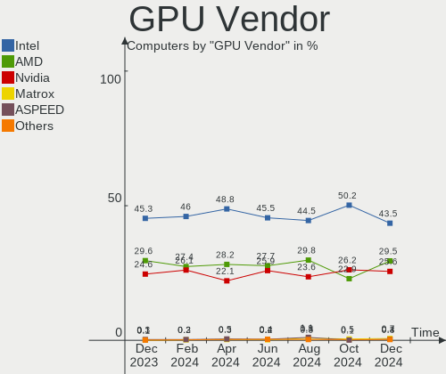

| Vendor                           | Computers | Percent |
|----------------------------------|-----------|---------|
| Intel                            | 424       | 46.24%  |
| AMD                              | 246       | 26.83%  |
| Nvidia                           | 230       | 25.08%  |
| ASPEED Technology                | 8         | 0.87%   |
| Matrox Electronics Systems       | 7         | 0.76%   |
| Silicon Integrated Systems [SiS] | 1         | 0.11%   |
| ATI Technologies                 | 1         | 0.11%   |

GPU Model
---------

Graphics card models

| Model                                                                                    | Computers | Percent |
|------------------------------------------------------------------------------------------|-----------|---------|
| Intel 3rd Gen Core processor Graphics Controller                                         | 35        | 3.77%   |
| Intel 2nd Generation Core Processor Family Integrated Graphics Controller                | 35        | 3.77%   |
| AMD Renoir                                                                               | 25        | 2.69%   |
| AMD Cezanne [Radeon Vega Series / Radeon Vega Mobile Series]                             | 25        | 2.69%   |
| Intel TigerLake-LP GT2 [Iris Xe Graphics]                                                | 22        | 2.37%   |
| AMD Lucienne                                                                             | 21        | 2.26%   |
| Intel HD Graphics 530                                                                    | 20        | 2.15%   |
| AMD Picasso/Raven 2 [Radeon Vega Series / Radeon Vega Mobile Series]                     | 19        | 2.05%   |
| Intel CometLake-U GT2 [UHD Graphics]                                                     | 18        | 1.94%   |
| Intel Alder Lake-P Integrated Graphics Controller                                        | 18        | 1.94%   |
| Intel Skylake GT2 [HD Graphics 520]                                                      | 16        | 1.72%   |
| Intel Xeon E3-1200 v3/4th Gen Core Processor Integrated Graphics Controller              | 14        | 1.51%   |
| Intel Haswell-ULT Integrated Graphics Controller                                         | 14        | 1.51%   |
| Intel Core Processor Integrated Graphics Controller                                      | 14        | 1.51%   |
| AMD Ellesmere [Radeon RX 470/480/570/570X/580/580X/590]                                  | 14        | 1.51%   |
| Intel WhiskeyLake-U GT2 [UHD Graphics 620]                                               | 13        | 1.4%    |
| Nvidia GP108 [GeForce GT 1030]                                                           | 12        | 1.29%   |
| Intel UHD Graphics 620                                                                   | 12        | 1.29%   |
| Intel HD Graphics 620                                                                    | 12        | 1.29%   |
| Intel HD Graphics 5500                                                                   | 11        | 1.18%   |
| Intel Mobile 4 Series Chipset Integrated Graphics Controller                             | 10        | 1.08%   |
| Intel GeminiLake [UHD Graphics 600]                                                      | 10        | 1.08%   |
| Intel CoffeeLake-S GT2 [UHD Graphics 630]                                                | 10        | 1.08%   |
| Intel CoffeeLake-H GT2 [UHD Graphics 630]                                                | 10        | 1.08%   |
| Intel Atom/Celeron/Pentium Processor x5-E8000/J3xxx/N3xxx Integrated Graphics Controller | 10        | 1.08%   |
| Intel 4th Gen Core Processor Integrated Graphics Controller                              | 10        | 1.08%   |
| Nvidia GP106 [GeForce GTX 1060 6GB]                                                      | 9         | 0.97%   |
| Nvidia GA106M [GeForce RTX 3060 Mobile / Max-Q]                                          | 9         | 0.97%   |
| Intel HD Graphics 630                                                                    | 9         | 0.97%   |
| Intel Atom Processor Z36xxx/Z37xxx Series Graphics & Display                             | 9         | 0.97%   |
| Nvidia GP107 [GeForce GTX 1050 Ti]                                                       | 8         | 0.86%   |
| Nvidia GK208B [GeForce GT 710]                                                           | 8         | 0.86%   |
| Intel Xeon E3-1200 v2/3rd Gen Core processor Graphics Controller                         | 8         | 0.86%   |
| Intel 4 Series Chipset Integrated Graphics Controller                                    | 8         | 0.86%   |
| ASPEED Technology ASPEED Graphics Family                                                 | 8         | 0.86%   |
| AMD Lexa PRO [Radeon 540/540X/550/550X / RX 540X/550/550X]                               | 8         | 0.86%   |
| AMD VanGogh [AMD Custom GPU 0405]                                                        | 7         | 0.75%   |
| AMD Raven Ridge [Radeon Vega Series / Radeon Vega Mobile Series]                         | 7         | 0.75%   |
| AMD Barcelo                                                                              | 6         | 0.65%   |
| Nvidia GP108M [GeForce MX150]                                                            | 5         | 0.54%   |

GPU Combo
---------

Combinations of graphics cards

| Name           | Computers | Percent |
|----------------|-----------|---------|
| 1 x Intel      | 330       | 40.44%  |
| 1 x AMD        | 204       | 25%     |
| 1 x Nvidia     | 140       | 17.16%  |
| Intel + Nvidia | 69        | 8.46%   |
| AMD + Nvidia   | 19        | 2.33%   |
| Intel + AMD    | 15        | 1.84%   |
| Other          | 10        | 1.23%   |
| 2 x AMD        | 8         | 0.98%   |
| 1 x ASPEED     | 8         | 0.98%   |
| 1 x Matrox     | 7         | 0.86%   |
| 2 x Intel      | 3         | 0.37%   |
| 2 x Nvidia     | 2         | 0.25%   |
| 1 x SiS        | 1         | 0.12%   |

GPU Driver
----------

Free vs proprietary

| Driver      | Computers | Percent |
|-------------|-----------|---------|
| Free        | 668       | 81.86%  |
| Proprietary | 113       | 13.85%  |
| Unknown     | 35        | 4.29%   |

GPU Memory
----------

Total video memory

| Size in GB | Computers | Percent |
|------------|-----------|---------|
| Unknown    | 512       | 62.75%  |
| 1.01-2.0   | 83        | 10.17%  |
| 0.01-0.5   | 78        | 9.56%   |
| 0.51-1.0   | 48        | 5.88%   |
| 3.01-4.0   | 38        | 4.66%   |
| 7.01-8.0   | 24        | 2.94%   |
| 5.01-6.0   | 14        | 1.72%   |
| 8.01-16.0  | 14        | 1.72%   |
| 16.01-24.0 | 4         | 0.49%   |
| 4.01-5.0   | 1         | 0.12%   |

Monitor
-------

Monitor Vendor
--------------

Monitor vendors

| Vendor                  | Computers | Percent |
|-------------------------|-----------|---------|
| AU Optronics            | 95        | 10.89%  |
| Samsung Electronics     | 90        | 10.32%  |
| LG Display              | 70        | 8.03%   |
| Chimei Innolux          | 67        | 7.68%   |
| BOE                     | 59        | 6.77%   |
| Goldstar                | 42        | 4.82%   |
| Dell                    | 40        | 4.59%   |
| BenQ                    | 34        | 3.9%    |
| Acer                    | 27        | 3.1%    |
| Iiyama                  | 23        | 2.64%   |
| AOC                     | 23        | 2.64%   |
| Apple                   | 19        | 2.18%   |
| Ancor Communications    | 19        | 2.18%   |
| Lenovo                  | 18        | 2.06%   |
| Hewlett-Packard         | 18        | 2.06%   |
| Philips                 | 16        | 1.83%   |
| ASUSTek Computer        | 16        | 1.83%   |
| Sharp                   | 15        | 1.72%   |
| Fujitsu Siemens         | 13        | 1.49%   |
| Eizo                    | 13        | 1.49%   |
| Chi Mei Optoelectronics | 12        | 1.38%   |
| ViewSonic               | 11        | 1.26%   |
| Sony                    | 9         | 1.03%   |
| Medion                  | 8         | 0.92%   |
| Valve                   | 7         | 0.8%    |
| PANDA                   | 7         | 0.8%    |
| CSO                     | 7         | 0.8%    |
| LG Electronics          | 5         | 0.57%   |
| NEC Computers           | 4         | 0.46%   |
| Hitachi                 | 4         | 0.46%   |
| Gigabyte Technology     | 4         | 0.46%   |
| Compal                  | 4         | 0.46%   |
| Toshiba                 | 3         | 0.34%   |
| InfoVision              | 3         | 0.34%   |
| Idek Iiyama             | 3         | 0.34%   |
| HUAWEI                  | 3         | 0.34%   |
| Grundig                 | 3         | 0.34%   |
| Panasonic               | 2         | 0.23%   |
| Mi                      | 2         | 0.23%   |
| Jean                    | 2         | 0.23%   |

Monitor Model
-------------

Monitor models

| Model                                                                 | Computers | Percent |
|-----------------------------------------------------------------------|-----------|---------|
| Valve ANX7530 U VLV3001 800x1280 100x150mm 7.1-inch                   | 7         | 0.79%   |
| Goldstar HDR 4K GSM7706 3840x2160 600x340mm 27.2-inch                 | 6         | 0.68%   |
| LG Display LCD Monitor LGD02D8 1366x768 277x156mm 12.5-inch           | 5         | 0.56%   |
| AU Optronics LCD Monitor AUO23EC 1366x768 344x193mm 15.5-inch         | 5         | 0.56%   |
| Sharp LQ156M1JW01 SHP14C3 1920x1080 344x194mm 15.5-inch               | 4         | 0.45%   |
| LG Display LCD Monitor LGD04A7 1920x1080 344x194mm 15.5-inch          | 4         | 0.45%   |
| Chimei Innolux LCD Monitor CMN15F5 1920x1080 344x193mm 15.5-inch      | 4         | 0.45%   |
| Chimei Innolux LCD Monitor CMN15DB 1366x768 344x193mm 15.5-inch       | 4         | 0.45%   |
| Chimei Innolux LCD Monitor CMN14D4 1920x1080 309x173mm 13.9-inch      | 4         | 0.45%   |
| AU Optronics LCD Monitor AUOE48D 1920x1080 344x194mm 15.5-inch        | 4         | 0.45%   |
| AU Optronics LCD Monitor AUO403D 1920x1080 309x173mm 13.9-inch        | 4         | 0.45%   |
| LG Display LCD Monitor LGD033A 1366x768 344x194mm 15.5-inch           | 3         | 0.34%   |
| Hewlett-Packard w2216 HWP280C 1680x1050 465x291mm 21.6-inch           | 3         | 0.34%   |
| Grundig WUXGA GRU4448 1920x1080                                       | 3         | 0.34%   |
| Goldstar HDR 4K GSM7707 3840x2160 600x340mm 27.2-inch                 | 3         | 0.34%   |
| CSO LCD Monitor CSO1402 2880x1800 302x188mm 14.0-inch                 | 3         | 0.34%   |
| Chimei Innolux LCD Monitor CMN1738 1920x1080 381x214mm 17.2-inch      | 3         | 0.34%   |
| Chimei Innolux LCD Monitor CMN15E7 1920x1080 344x193mm 15.5-inch      | 3         | 0.34%   |
| Chimei Innolux LCD Monitor CMN151E 1920x1080 344x193mm 15.5-inch      | 3         | 0.34%   |
| Chimei Innolux LCD Monitor CMN14D5 1920x1080 309x173mm 13.9-inch      | 3         | 0.34%   |
| BOE LCD Monitor BOE0ACA 2560x1600 344x215mm 16.0-inch                 | 3         | 0.34%   |
| BOE LCD Monitor BOE08A8 1920x1080 344x194mm 15.5-inch                 | 3         | 0.34%   |
| BOE LCD Monitor BOE06BA 1920x1080 344x193mm 15.5-inch                 | 3         | 0.34%   |
| BenQ GW2780 BNQ78E6 1920x1080 598x336mm 27.0-inch                     | 3         | 0.34%   |
| BenQ GL2760 BNQ78D5 1920x1080 598x336mm 27.0-inch                     | 3         | 0.34%   |
| BenQ EL2870U BNQ7949 3840x2160 621x341mm 27.9-inch                    | 3         | 0.34%   |
| AU Optronics LCD Monitor AUO47EC 1366x768 344x193mm 15.5-inch         | 3         | 0.34%   |
| AU Optronics LCD Monitor AUO26EC 1366x768 344x193mm 15.5-inch         | 3         | 0.34%   |
| AU Optronics LCD Monitor AUO21ED 1920x1080 344x194mm 15.5-inch        | 3         | 0.34%   |
| ViewSonic VX3276-UHD VSC5138 3840x2160 697x392mm 31.5-inch            | 2         | 0.23%   |
| Samsung Electronics S24F350 SAM0D20 1920x1080 521x293mm 23.5-inch     | 2         | 0.23%   |
| Samsung Electronics S24D330 SAM0D92 1920x1080 531x299mm 24.0-inch     | 2         | 0.23%   |
| Samsung Electronics S24C200 SAM09BD 1920x1080 521x293mm 23.5-inch     | 2         | 0.23%   |
| Samsung Electronics LCD Monitor SEC544B 1600x900 310x174mm 14.0-inch  | 2         | 0.23%   |
| Samsung Electronics LCD Monitor SEC324A 1366x768 344x194mm 15.5-inch  | 2         | 0.23%   |
| Samsung Electronics LCD Monitor SEC3152 1366x768 344x194mm 15.5-inch  | 2         | 0.23%   |
| Samsung Electronics LCD Monitor SDC416D 2880x1800 312x195mm 14.5-inch | 2         | 0.23%   |
| Samsung Electronics LCD Monitor SDC4152 2880x1800 302x189mm 14.0-inch | 2         | 0.23%   |
| Samsung Electronics LCD Monitor SAM090B 1920x1080 890x500mm 40.2-inch | 2         | 0.23%   |
| Samsung Electronics LCD Monitor SAM03BB 1920x1080 886x498mm 40.0-inch | 2         | 0.23%   |

Monitor Resolution
------------------

Monitor screen resolution

| Resolution         | Computers | Percent |
|--------------------|-----------|---------|
| 1920x1080 (FHD)    | 368       | 44.44%  |
| 1366x768 (WXGA)    | 90        | 10.87%  |
| 3840x2160 (4K)     | 87        | 10.51%  |
| 2560x1440 (QHD)    | 50        | 6.04%   |
| 1680x1050 (WSXGA+) | 35        | 4.23%   |
| 1600x900 (HD+)     | 34        | 4.11%   |
| 1920x1200 (WUXGA)  | 31        | 3.74%   |
| 3440x1440          | 16        | 1.93%   |
| 1280x1024 (SXGA)   | 13        | 1.57%   |
| 1280x800 (WXGA)    | 12        | 1.45%   |
| Unknown            | 12        | 1.45%   |
| 2880x1800          | 11        | 1.33%   |
| 1440x900 (WXGA+)   | 11        | 1.33%   |
| 2560x1600          | 10        | 1.21%   |
| 3840x1080          | 8         | 0.97%   |
| 800x1280           | 7         | 0.85%   |
| 1920x540           | 3         | 0.36%   |
| 1600x1200          | 3         | 0.36%   |
| 3840x2400          | 2         | 0.24%   |
| 2736x1824          | 2         | 0.24%   |
| 2560x1080          | 2         | 0.24%   |
| 1280x720 (HD)      | 2         | 0.24%   |
| 6160x1440          | 1         | 0.12%   |
| 5760x2160          | 1         | 0.12%   |
| 5120x1440          | 1         | 0.12%   |
| 4480x1440          | 1         | 0.12%   |
| 3840x2560          | 1         | 0.12%   |
| 3840x1440          | 1         | 0.12%   |
| 3840x1200          | 1         | 0.12%   |
| 3600x1080          | 1         | 0.12%   |
| 3200x1080          | 1         | 0.12%   |
| 3072x1920          | 1         | 0.12%   |
| 3000x2000          | 1         | 0.12%   |
| 2880x1920          | 1         | 0.12%   |
| 2520x1680          | 1         | 0.12%   |
| 2288x1287          | 1         | 0.12%   |
| 2048x1152          | 1         | 0.12%   |
| 1920x1280          | 1         | 0.12%   |
| 1360x768           | 1         | 0.12%   |
| 1080x1920          | 1         | 0.12%   |

Monitor Diagonal
----------------

Diagonal size in inches

| Inches  | Computers | Percent |
|---------|-----------|---------|
| 15      | 175       | 20.49%  |
| 27      | 102       | 11.94%  |
| 13      | 75        | 8.78%   |
| 24      | 66        | 7.73%   |
| 17      | 66        | 7.73%   |
| 23      | 60        | 7.03%   |
| 14      | 50        | 5.85%   |
| Unknown | 37        | 4.33%   |
| 21      | 33        | 3.86%   |
| 22      | 25        | 2.93%   |
| 31      | 23        | 2.69%   |
| 12      | 17        | 1.99%   |
| 19      | 13        | 1.52%   |
| 16      | 12        | 1.41%   |
| 34      | 11        | 1.29%   |
| 72      | 9         | 1.05%   |
| 84      | 8         | 0.94%   |
| 7       | 8         | 0.94%   |
| 54      | 7         | 0.82%   |
| 26      | 7         | 0.82%   |
| 40      | 5         | 0.59%   |
| 20      | 5         | 0.59%   |
| 18      | 5         | 0.59%   |
| 32      | 4         | 0.47%   |
| 48      | 3         | 0.35%   |
| 36      | 3         | 0.35%   |
| 35      | 3         | 0.35%   |
| 28      | 3         | 0.35%   |
| 25      | 3         | 0.35%   |
| 11      | 3         | 0.35%   |
| 52      | 2         | 0.23%   |
| 49      | 2         | 0.23%   |
| 47      | 2         | 0.23%   |
| 42      | 2         | 0.23%   |
| 43      | 1         | 0.12%   |
| 41      | 1         | 0.12%   |
| 33      | 1         | 0.12%   |
| 29      | 1         | 0.12%   |
| 10      | 1         | 0.12%   |

Monitor Width
-------------

Physical width

| Width in mm | Computers | Percent |
|-------------|-----------|---------|
| 301-350     | 271       | 32.07%  |
| 501-600     | 218       | 25.8%   |
| 351-400     | 75        | 8.88%   |
| 401-500     | 74        | 8.76%   |
| 201-300     | 64        | 7.57%   |
| Unknown     | 37        | 4.38%   |
| 601-700     | 34        | 4.02%   |
| 701-800     | 19        | 2.25%   |
| 1501-2000   | 17        | 2.01%   |
| 1001-1500   | 16        | 1.89%   |
| 801-900     | 8         | 0.95%   |
| 1-100       | 7         | 0.83%   |
| 901-1000    | 4         | 0.47%   |
| 101-200     | 1         | 0.12%   |

Aspect Ratio
------------

Proportional relationship between the width and the height

| Ratio   | Computers | Percent |
|---------|-----------|---------|
| 16/9    | 579       | 73.48%  |
| 16/10   | 116       | 14.72%  |
| Unknown | 31        | 3.93%   |
| 5/4     | 15        | 1.9%    |
| 21/9    | 15        | 1.9%    |
| 3/2     | 12        | 1.52%   |
| 32/9    | 7         | 0.89%   |
| 0.67    | 7         | 0.89%   |
| 4/3     | 5         | 0.63%   |
| 0.56    | 1         | 0.13%   |

Monitor Area
------------

Area in inch²

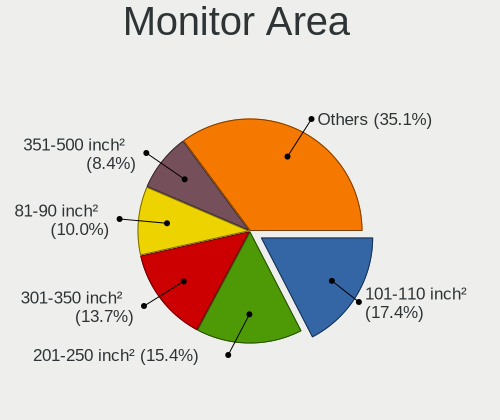

| Area in inch² | Computers | Percent |
|----------------|-----------|---------|
| 101-110        | 176       | 20.73%  |
| 201-250        | 137       | 16.14%  |
| 301-350        | 110       | 12.96%  |
| 81-90          | 88        | 10.37%  |
| 121-130        | 52        | 6.12%   |
| 351-500        | 45        | 5.3%    |
| Unknown        | 37        | 4.36%   |
| 71-80          | 36        | 4.24%   |
| 251-300        | 33        | 3.89%   |
| 151-200        | 30        | 3.53%   |
| More than 1000 | 26        | 3.06%   |
| 501-1000       | 19        | 2.24%   |
| 61-70          | 17        | 2%      |
| 141-150        | 10        | 1.18%   |
| 111-120        | 10        | 1.18%   |
| 131-140        | 9         | 1.06%   |
| 1-40           | 8         | 0.94%   |
| 51-60          | 3         | 0.35%   |
| 91-100         | 2         | 0.24%   |
| 41-50          | 1         | 0.12%   |

Pixel Density
-------------

Pixels per inch

| Density       | Computers | Percent |
|---------------|-----------|---------|
| 51-100        | 272       | 32.46%  |
| 121-160       | 224       | 26.73%  |
| 101-120       | 193       | 23.03%  |
| 161-240       | 75        | 8.95%   |
| Unknown       | 37        | 4.42%   |
| More than 240 | 23        | 2.74%   |
| 1-50          | 14        | 1.67%   |

Multiple Monitors
-----------------

Total monitors connected

| Total | Computers | Percent |
|-------|-----------|---------|
| 1     | 632       | 77.45%  |
| 2     | 121       | 14.83%  |
| 0     | 49        | 6%      |
| 3     | 14        | 1.72%   |

Network
-------

Net Controller Vendor
---------------------

Controller vendors

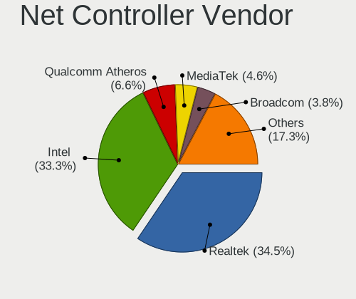

| Vendor                            | Computers | Percent |
|-----------------------------------|-----------|---------|
| Intel                             | 438       | 36.32%  |
| Realtek Semiconductor             | 424       | 35.16%  |
| Qualcomm Atheros                  | 97        | 8.04%   |
| Broadcom                          | 56        | 4.64%   |
| MediaTek                          | 26        | 2.16%   |
| Broadcom Limited                  | 13        | 1.08%   |
| Ralink Technology                 | 12        | 1%      |
| ASIX Electronics                  | 10        | 0.83%   |
| TP-Link                           | 9         | 0.75%   |
| Nvidia                            | 9         | 0.75%   |
| Marvell Technology Group          | 8         | 0.66%   |
| Sierra Wireless                   | 7         | 0.58%   |
| Ralink                            | 7         | 0.58%   |
| Lenovo                            | 6         | 0.5%    |
| Microsoft                         | 5         | 0.41%   |
| Microchip Technology              | 5         | 0.41%   |
| Ericsson Business Mobile Networks | 5         | 0.41%   |
| D-Link System                     | 5         | 0.41%   |
| D-Link                            | 5         | 0.41%   |
| Qualcomm                          | 4         | 0.33%   |
| Mellanox Technologies             | 4         | 0.33%   |
| Huawei Technologies               | 4         | 0.33%   |
| Dell                              | 4         | 0.33%   |
| AVM                               | 4         | 0.33%   |
| Samsung Electronics               | 3         | 0.25%   |
| Qualcomm Atheros Communications   | 3         | 0.25%   |
| JMicron Technology                | 3         | 0.25%   |
| Hewlett-Packard                   | 3         | 0.25%   |
| Edimax Technology                 | 3         | 0.25%   |
| DisplayLink                       | 3         | 0.25%   |
| ASUSTek Computer                  | 3         | 0.25%   |
| Silicon Integrated Systems [SiS]  | 2         | 0.17%   |
| Aquantia                          | 2         | 0.17%   |
| ZyDAS                             | 1         | 0.08%   |
| ZTE WCDMA Technologies MSM        | 1         | 0.08%   |
| Xiaomi                            | 1         | 0.08%   |
| VIA Technologies                  | 1         | 0.08%   |
| Sitecom Europe                    | 1         | 0.08%   |
| ROCCAT                            | 1         | 0.08%   |
| Motorola PCS                      | 1         | 0.08%   |

Net Controller Model
--------------------

Controller models

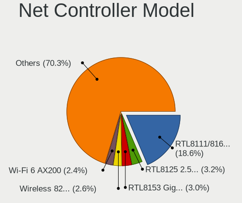

| Model                                                             | Computers | Percent |
|-------------------------------------------------------------------|-----------|---------|
| Realtek RTL8111/8168/8411 PCI Express Gigabit Ethernet Controller | 294       | 20.66%  |
| Intel Wi-Fi 6 AX200                                               | 41        | 2.88%   |
| Intel 82579LM Gigabit Network Connection (Lewisville)             | 37        | 2.6%    |
| Realtek RTL8125 2.5GbE Controller                                 | 36        | 2.53%   |
| Realtek RTL8153 Gigabit Ethernet Adapter                          | 35        | 2.46%   |
| Intel I211 Gigabit Network Connection                             | 25        | 1.76%   |
| Intel Wireless 8265 / 8275                                        | 24        | 1.69%   |
| Realtek RTL810xE PCI Express Fast Ethernet controller             | 23        | 1.62%   |
| Intel Wi-Fi 6 AX201                                               | 22        | 1.55%   |
| Intel Alder Lake-P PCH CNVi WiFi                                  | 22        | 1.55%   |
| Realtek RTL8822CE 802.11ac PCIe Wireless Network Adapter          | 20        | 1.41%   |
| Qualcomm Atheros AR9485 Wireless Network Adapter                  | 17        | 1.19%   |
| MediaTek MT7921 802.11ax PCI Express Wireless Network Adapter     | 16        | 1.12%   |
| Intel Wireless 7265                                               | 16        | 1.12%   |
| Intel Centrino Advanced-N 6205 [Taylor Peak]                      | 16        | 1.12%   |
| Intel Wireless 8260                                               | 15        | 1.05%   |
| Qualcomm Atheros QCA9565 / AR9565 Wireless Network Adapter        | 14        | 0.98%   |
| Intel Wireless 7260                                               | 13        | 0.91%   |
| Intel Wireless 3165                                               | 13        | 0.91%   |
| Intel Ethernet Controller I225-V                                  | 13        | 0.91%   |
| Intel Ethernet Connection (2) I219-LM                             | 13        | 0.91%   |
| Intel Dual Band Wireless-AC 3168NGW [Stone Peak]                  | 13        | 0.91%   |
| Realtek RTL8852AE 802.11ax PCIe Wireless Network Adapter          | 12        | 0.84%   |
| Realtek RTL8821CE 802.11ac PCIe Wireless Network Adapter          | 12        | 0.84%   |
| Intel Wi-Fi 6 AX210/AX211/AX411 160MHz                            | 11        | 0.77%   |
| Intel Comet Lake PCH-LP CNVi WiFi                                 | 11        | 0.77%   |
| Qualcomm Atheros QCA9377 802.11ac Wireless Network Adapter        | 10        | 0.7%    |
| Intel Ethernet Connection (2) I219-V                              | 10        | 0.7%    |
| ASIX AX88179 Gigabit Ethernet                                     | 10        | 0.7%    |
| Intel Ethernet Connection I217-LM                                 | 9         | 0.63%   |
| Intel Dual Band Wireless-AC 3165 Plus Bluetooth                   | 9         | 0.63%   |
| Intel 82579V Gigabit Network Connection                           | 9         | 0.63%   |
| Realtek RTL8169 PCI Gigabit Ethernet Controller                   | 8         | 0.56%   |
| Qualcomm Atheros AR9462 Wireless Network Adapter                  | 8         | 0.56%   |
| Intel WiFi Link 5100                                              | 8         | 0.56%   |
| Intel I210 Gigabit Network Connection                             | 8         | 0.56%   |
| Intel Cannon Lake PCH CNVi WiFi                                   | 8         | 0.56%   |
| Broadcom NetXtreme BCM57765 Gigabit Ethernet PCIe                 | 8         | 0.56%   |
| Qualcomm Atheros AR9287 Wireless Network Adapter (PCI-Express)    | 7         | 0.49%   |
| Qualcomm Atheros AR9285 Wireless Network Adapter (PCI-Express)    | 7         | 0.49%   |

Wireless Vendor
---------------

Wireless vendors

| Vendor                          | Computers | Percent |
|---------------------------------|-----------|---------|
| Intel                           | 309       | 51.16%  |
| Realtek Semiconductor           | 88        | 14.57%  |
| Qualcomm Atheros                | 76        | 12.58%  |
| Broadcom                        | 31        | 5.13%   |
| MediaTek                        | 26        | 4.3%    |
| Ralink Technology               | 12        | 1.99%   |
| TP-Link                         | 9         | 1.49%   |
| Sierra Wireless                 | 7         | 1.16%   |
| Ralink                          | 7         | 1.16%   |
| Microsoft                       | 5         | 0.83%   |
| Qualcomm                        | 4         | 0.66%   |
| D-Link System                   | 4         | 0.66%   |
| D-Link                          | 4         | 0.66%   |
| AVM                             | 4         | 0.66%   |
| Qualcomm Atheros Communications | 3         | 0.5%    |
| Edimax Technology               | 3         | 0.5%    |
| Broadcom Limited                | 3         | 0.5%    |
| ASUSTek Computer                | 3         | 0.5%    |
| Dell                            | 2         | 0.33%   |
| ZyDAS                           | 1         | 0.17%   |
| IMC Networks                    | 1         | 0.17%   |
| Fibocom                         | 1         | 0.17%   |
| Belkin Components               | 1         | 0.17%   |

Wireless Model
--------------

Wireless models

| Model                                                          | Computers | Percent |
|----------------------------------------------------------------|-----------|---------|
| Intel Wi-Fi 6 AX200                                            | 41        | 6.74%   |
| Intel Wireless 8265 / 8275                                     | 24        | 3.95%   |
| Intel Wi-Fi 6 AX201                                            | 22        | 3.62%   |
| Intel Alder Lake-P PCH CNVi WiFi                               | 22        | 3.62%   |
| Realtek RTL8822CE 802.11ac PCIe Wireless Network Adapter       | 20        | 3.29%   |
| Qualcomm Atheros AR9485 Wireless Network Adapter               | 17        | 2.8%    |
| MediaTek MT7921 802.11ax PCI Express Wireless Network Adapter  | 16        | 2.63%   |
| Intel Wireless 7265                                            | 16        | 2.63%   |
| Intel Centrino Advanced-N 6205 [Taylor Peak]                   | 16        | 2.63%   |
| Intel Wireless 8260                                            | 15        | 2.47%   |
| Qualcomm Atheros QCA9565 / AR9565 Wireless Network Adapter     | 14        | 2.3%    |
| Intel Wireless 7260                                            | 13        | 2.14%   |
| Intel Wireless 3165                                            | 13        | 2.14%   |
| Intel Dual Band Wireless-AC 3168NGW [Stone Peak]               | 13        | 2.14%   |
| Realtek RTL8852AE 802.11ax PCIe Wireless Network Adapter       | 12        | 1.97%   |
| Realtek RTL8821CE 802.11ac PCIe Wireless Network Adapter       | 12        | 1.97%   |
| Intel Wi-Fi 6 AX210/AX211/AX411 160MHz                         | 11        | 1.81%   |
| Intel Comet Lake PCH-LP CNVi WiFi                              | 11        | 1.81%   |
| Qualcomm Atheros QCA9377 802.11ac Wireless Network Adapter     | 10        | 1.64%   |
| Intel Dual Band Wireless-AC 3165 Plus Bluetooth                | 9         | 1.48%   |
| Qualcomm Atheros AR9462 Wireless Network Adapter               | 8         | 1.32%   |
| Intel WiFi Link 5100                                           | 8         | 1.32%   |
| Intel Cannon Lake PCH CNVi WiFi                                | 8         | 1.32%   |
| Qualcomm Atheros AR9287 Wireless Network Adapter (PCI-Express) | 7         | 1.15%   |
| Qualcomm Atheros AR9285 Wireless Network Adapter (PCI-Express) | 7         | 1.15%   |
| Intel Cannon Point-LP CNVi [Wireless-AC]                       | 7         | 1.15%   |
| Broadcom BCM4331 802.11a/b/g/n                                 | 7         | 1.15%   |
| Intel Wireless-AC 9260                                         | 6         | 0.99%   |
| Intel Gemini Lake PCH CNVi WiFi                                | 6         | 0.99%   |
| Intel Centrino Ultimate-N 6300                                 | 6         | 0.99%   |
| Broadcom BCM4322 802.11a/b/g/n Wireless LAN Controller         | 6         | 0.99%   |
| Realtek RTL88x2bu [AC1200 Techkey]                             | 5         | 0.82%   |
| Realtek RTL8822BE 802.11a/b/g/n/ac WiFi adapter                | 5         | 0.82%   |
| MediaTek MT7921K (RZ608) Wi-Fi 6E 80MHz                        | 5         | 0.82%   |
| Intel Wireless 3160                                            | 5         | 0.82%   |
| Intel Tiger Lake PCH CNVi WiFi                                 | 5         | 0.82%   |
| Sierra Wireless EM7455                                         | 4         | 0.66%   |
| Realtek RTL8852BE PCIe 802.11ax Wireless Network Controller    | 4         | 0.66%   |
| Qualcomm Atheros QCA6174 802.11ac Wireless Network Adapter     | 4         | 0.66%   |
| Intel Ice Lake-LP PCH CNVi WiFi                                | 4         | 0.66%   |

Ethernet Vendor
---------------

Ethernet vendors

| Vendor                           | Computers | Percent |
|----------------------------------|-----------|---------|
| Realtek Semiconductor            | 384       | 49.68%  |
| Intel                            | 243       | 31.44%  |
| Broadcom                         | 35        | 4.53%   |
| Qualcomm Atheros                 | 33        | 4.27%   |
| Broadcom Limited                 | 10        | 1.29%   |
| ASIX Electronics                 | 10        | 1.29%   |
| Nvidia                           | 9         | 1.16%   |
| Marvell Technology Group         | 8         | 1.03%   |
| Lenovo                           | 6         | 0.78%   |
| Microchip Technology             | 5         | 0.65%   |
| Mellanox Technologies            | 4         | 0.52%   |
| Samsung Electronics              | 3         | 0.39%   |
| JMicron Technology               | 3         | 0.39%   |
| DisplayLink                      | 3         | 0.39%   |
| Silicon Integrated Systems [SiS] | 2         | 0.26%   |
| Huawei Technologies              | 2         | 0.26%   |
| Hewlett-Packard                  | 2         | 0.26%   |
| Aquantia                         | 2         | 0.26%   |
| ZTE WCDMA Technologies MSM       | 1         | 0.13%   |
| Xiaomi                           | 1         | 0.13%   |
| VIA Technologies                 | 1         | 0.13%   |
| Sitecom Europe                   | 1         | 0.13%   |
| Motorola PCS                     | 1         | 0.13%   |
| D-Link System                    | 1         | 0.13%   |
| D-Link                           | 1         | 0.13%   |
| Apple                            | 1         | 0.13%   |
| American Megatrends              | 1         | 0.13%   |

Ethernet Model
--------------

Ethernet models

| Model                                                             | Computers | Percent |
|-------------------------------------------------------------------|-----------|---------|
| Realtek RTL8111/8168/8411 PCI Express Gigabit Ethernet Controller | 294       | 36.7%   |
| Intel 82579LM Gigabit Network Connection (Lewisville)             | 37        | 4.62%   |
| Realtek RTL8125 2.5GbE Controller                                 | 36        | 4.49%   |
| Realtek RTL8153 Gigabit Ethernet Adapter                          | 35        | 4.37%   |
| Intel I211 Gigabit Network Connection                             | 25        | 3.12%   |
| Realtek RTL810xE PCI Express Fast Ethernet controller             | 23        | 2.87%   |
| Intel Ethernet Controller I225-V                                  | 13        | 1.62%   |
| Intel Ethernet Connection (2) I219-LM                             | 13        | 1.62%   |
| Intel Ethernet Connection (2) I219-V                              | 10        | 1.25%   |
| ASIX AX88179 Gigabit Ethernet                                     | 10        | 1.25%   |
| Intel Ethernet Connection I217-LM                                 | 9         | 1.12%   |
| Intel 82579V Gigabit Network Connection                           | 9         | 1.12%   |
| Realtek RTL8169 PCI Gigabit Ethernet Controller                   | 8         | 1%      |
| Intel I210 Gigabit Network Connection                             | 8         | 1%      |
| Broadcom NetXtreme BCM57765 Gigabit Ethernet PCIe                 | 8         | 1%      |
| Intel Ethernet Connection (7) I219-V                              | 7         | 0.87%   |
| Intel 82577LM Gigabit Network Connection                          | 7         | 0.87%   |
| Intel 82567LM-3 Gigabit Network Connection                        | 7         | 0.87%   |
| Intel I350 Gigabit Network Connection                             | 6         | 0.75%   |
| Intel Ethernet Connection I219-LM                                 | 6         | 0.75%   |
| Intel Ethernet Connection (3) I218-LM                             | 6         | 0.75%   |
| Qualcomm Atheros AR8151 v2.0 Gigabit Ethernet                     | 5         | 0.62%   |
| Qualcomm Atheros AR8121/AR8113/AR8114 Gigabit or Fast Ethernet    | 5         | 0.62%   |
| Microchip SMSC9512/9514 Fast Ethernet Adapter                     | 5         | 0.62%   |
| Intel Ethernet Connection X722 for 10GBASE-T                      | 5         | 0.62%   |
| Intel Ethernet Connection (6) I219-LM                             | 5         | 0.62%   |
| Intel Ethernet Connection (4) I219-V                              | 5         | 0.62%   |
| Intel Ethernet Connection (4) I219-LM                             | 5         | 0.62%   |
| Intel Ethernet Connection (16) I219-V                             | 5         | 0.62%   |
| Broadcom Limited NetLink BCM57780 Gigabit Ethernet PCIe           | 5         | 0.62%   |
| Broadcom BCM57412 NetXtreme-E 10Gb RDMA Ethernet Controller       | 5         | 0.62%   |
| Nvidia MCP79 Ethernet                                             | 4         | 0.5%    |
| Intel Ethernet Connection I217-V                                  | 4         | 0.5%    |
| Intel Ethernet Connection (7) I219-LM                             | 4         | 0.5%    |
| Intel Ethernet Connection (2) I218-LM                             | 4         | 0.5%    |
| Intel Ethernet Connection (10) I219-V                             | 4         | 0.5%    |
| Intel 82574L Gigabit Network Connection                           | 4         | 0.5%    |
| Broadcom NetXtreme BCM5764M Gigabit Ethernet PCIe                 | 4         | 0.5%    |
| Samsung Galaxy series, misc. (tethering mode)                     | 3         | 0.37%   |
| Qualcomm Atheros QCA8172 Fast Ethernet                            | 3         | 0.37%   |

Net Controller Kind
-------------------

Ethernet, WiFi or modem

| Kind     | Computers | Percent |
|----------|-----------|---------|
| Ethernet | 720       | 54.92%  |
| WiFi     | 577       | 44.01%  |
| Modem    | 12        | 0.92%   |
| Unknown  | 2         | 0.15%   |

Used Controller
---------------

Currently used network controller

| Kind     | Computers | Percent |
|----------|-----------|---------|
| Ethernet | 435       | 52.16%  |
| WiFi     | 399       | 47.84%  |

NICs
----

Total network controllers on board

| Total | Computers | Percent |
|-------|-----------|---------|
| 2     | 417       | 51.1%   |
| 1     | 349       | 42.77%  |
| 3     | 20        | 2.45%   |
| 0     | 16        | 1.96%   |
| 4     | 10        | 1.23%   |
| 5     | 3         | 0.37%   |
| 6     | 1         | 0.12%   |

IPv6
----

IPv6 vs IPv4

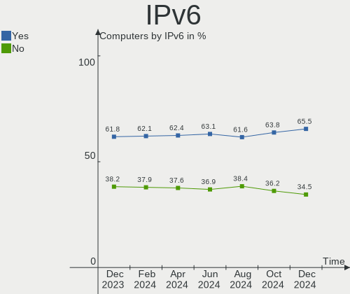

| Used | Computers | Percent |
|------|-----------|---------|
| Yes  | 460       | 56.37%  |
| No   | 356       | 43.63%  |

Bluetooth
---------

Bluetooth Vendor
----------------

Controller vendors

| Vendor                          | Computers | Percent |
|---------------------------------|-----------|---------|
| Intel                           | 259       | 51.29%  |
| Realtek Semiconductor           | 56        | 11.09%  |
| Cambridge Silicon Radio         | 29        | 5.74%   |
| Foxconn / Hon Hai               | 24        | 4.75%   |
| IMC Networks                    | 20        | 3.96%   |
| Apple                           | 20        | 3.96%   |
| Qualcomm Atheros Communications | 18        | 3.56%   |
| Broadcom                        | 18        | 3.56%   |
| Lite-On Technology              | 15        | 2.97%   |
| ASUSTek Computer                | 11        | 2.18%   |
| MediaTek                        | 6         | 1.19%   |
| Dell                            | 5         | 0.99%   |
| Toshiba                         | 4         | 0.79%   |
| USI                             | 3         | 0.59%   |
| Hewlett-Packard                 | 3         | 0.59%   |
| TP-Link                         | 2         | 0.4%    |
| Realtek                         | 2         | 0.4%    |
| Edimax Technology               | 2         | 0.4%    |
| Roper                           | 1         | 0.2%    |
| Ralink Technology               | 1         | 0.2%    |
| Motorola PCS                    | 1         | 0.2%    |
| Integrated System Solution      | 1         | 0.2%    |
| Fujitsu                         | 1         | 0.2%    |
| Foxconn International           | 1         | 0.2%    |
| Askey Computer                  | 1         | 0.2%    |
| Alps Electric                   | 1         | 0.2%    |

Bluetooth Model
---------------

Controller models

| Model                                               | Computers | Percent |
|-----------------------------------------------------|-----------|---------|
| Intel Bluetooth wireless interface                  | 86        | 17%     |
| Intel AX201 Bluetooth                               | 50        | 9.88%   |
| Realtek Bluetooth Radio                             | 42        | 8.3%    |
| Intel AX200 Bluetooth                               | 41        | 8.1%    |
| Intel Bluetooth 9460/9560 Jefferson Peak (JfP)      | 29        | 5.73%   |
| Cambridge Silicon Radio Bluetooth Dongle (HCI mode) | 29        | 5.73%   |
| Intel Bluetooth Device                              | 14        | 2.77%   |
| Intel Wireless-AC 3168 Bluetooth                    | 13        | 2.57%   |
| IMC Networks Bluetooth Radio                        | 12        | 2.37%   |
| Qualcomm Atheros  Bluetooth Device                  | 10        | 1.98%   |
| Intel AX210 Bluetooth                               | 10        | 1.98%   |
| Foxconn / Hon Hai Wireless_Device                   | 10        | 1.98%   |
| Apple Bluetooth Host Controller                     | 9         | 1.78%   |
| Intel Centrino Bluetooth Wireless Transceiver       | 8         | 1.58%   |
| Realtek  Bluetooth 4.2 Adapter                      | 7         | 1.38%   |
| Foxconn / Hon Hai Bluetooth Device                  | 7         | 1.38%   |
| Broadcom BCM2045B (BDC-2.1)                         | 7         | 1.38%   |
| MediaTek Wireless_Device                            | 6         | 1.19%   |
| ASUS ASUS USB-BT500                                 | 6         | 1.19%   |
| Lite-On Atheros AR3012 Bluetooth                    | 5         | 0.99%   |
| Intel Wireless-AC 9260 Bluetooth Adapter            | 5         | 0.99%   |
| IMC Networks Wireless_Device                        | 5         | 0.99%   |
| Apple Bluetooth USB Host Controller                 | 5         | 0.99%   |
| Realtek RTL8822BE Bluetooth 4.2 Adapter             | 4         | 0.79%   |
| Lite-On Bluetooth Device                            | 4         | 0.79%   |
| Broadcom BCM20702 Bluetooth 4.0 [ThinkPad]          | 4         | 0.79%   |
| Apple Built-in Bluetooth 2.0+EDR HCI                | 4         | 0.79%   |
| USI Bluetooth Device                                | 3         | 0.59%   |
| Qualcomm Atheros AR3012 Bluetooth 4.0               | 3         | 0.59%   |
| Lite-On Wireless_Device                             | 3         | 0.59%   |
| Intel Centrino Advanced-N 6230 Bluetooth adapter    | 3         | 0.59%   |
| Dell BCM20702A0 Bluetooth Module                    | 3         | 0.59%   |
| ASUS Broadcom BCM20702A0 Bluetooth                  | 3         | 0.59%   |
| TP-Link UB500 Adapter                               | 2         | 0.4%    |
| Toshiba Bluetooth Device                            | 2         | 0.4%    |
| Realtek Bluetooth Radio                             | 2         | 0.4%    |
| Qualcomm Atheros AR3011 Bluetooth                   | 2         | 0.4%    |
| Lite-On Qualcomm Atheros QCA9377 Bluetooth          | 2         | 0.4%    |
| HP Broadcom 2070 Bluetooth Combo                    | 2         | 0.4%    |
| Foxconn / Hon Hai Bluetooth USB Host Controller     | 2         | 0.4%    |

Sound
-----

Sound Vendor
------------

Sound card vendors

| Vendor                           | Computers | Percent |
|----------------------------------|-----------|---------|
| Intel                            | 536       | 47.39%  |
| AMD                              | 269       | 23.78%  |
| Nvidia                           | 181       | 16%     |
| C-Media Electronics              | 20        | 1.77%   |
| Lenovo                           | 8         | 0.71%   |
| Creative Labs                    | 8         | 0.71%   |
| Plantronics                      | 7         | 0.62%   |
| Texas Instruments                | 6         | 0.53%   |
| Razer USA                        | 6         | 0.53%   |
| JMTek                            | 6         | 0.53%   |
| Realtek Semiconductor            | 5         | 0.44%   |
| Logitech                         | 5         | 0.44%   |
| GN Netcom                        | 5         | 0.44%   |
| ASUSTek Computer                 | 5         | 0.44%   |
| Kingston Technology              | 4         | 0.35%   |
| Generalplus Technology           | 4         | 0.35%   |
| Creative Technology              | 4         | 0.35%   |
| RODE Microphones                 | 3         | 0.27%   |
| Micro Star International         | 3         | 0.27%   |
| BEHRINGER International          | 3         | 0.27%   |
| Yamaha                           | 2         | 0.18%   |
| TEAC                             | 2         | 0.18%   |
| Silicon Integrated Systems [SiS] | 2         | 0.18%   |
| Sennheiser Communications        | 2         | 0.18%   |
| Huawei Technologies              | 2         | 0.18%   |
| Hewlett-Packard                  | 2         | 0.18%   |
| Harman International             | 2         | 0.18%   |
| Focusrite-Novation               | 2         | 0.18%   |
| Corsair                          | 2         | 0.18%   |
| Cambridge Silicon Radio          | 2         | 0.18%   |
| Xilinx                           | 1         | 0.09%   |
| VIA Technologies                 | 1         | 0.09%   |
| USB MICROPHONE                   | 1         | 0.09%   |
| Trust                            | 1         | 0.09%   |
| TerraTec Electronic              | 1         | 0.09%   |
| SteelSeries ApS                  | 1         | 0.09%   |
| Sony                             | 1         | 0.09%   |
| Phoenix Audio Technologies       | 1         | 0.09%   |
| NZXT                             | 1         | 0.09%   |
| Medeli Electronics               | 1         | 0.09%   |

Sound Model
-----------

Sound card models

| Model                                                                      | Computers | Percent |
|----------------------------------------------------------------------------|-----------|---------|
| AMD Family 17h/19h HD Audio Controller                                     | 116       | 8.57%   |
| AMD Renoir Radeon High Definition Audio Controller                         | 75        | 5.54%   |
| Intel 7 Series/C216 Chipset Family High Definition Audio Controller        | 56        | 4.14%   |
| Intel Sunrise Point-LP HD Audio                                            | 42        | 3.1%    |
| Intel 6 Series/C200 Series Chipset Family High Definition Audio Controller | 42        | 3.1%    |
| AMD Starship/Matisse HD Audio Controller                                   | 38        | 2.81%   |
| Intel 8 Series/C220 Series Chipset High Definition Audio Controller        | 34        | 2.51%   |
| Intel 5 Series/3400 Series Chipset High Definition Audio                   | 29        | 2.14%   |
| Intel Cannon Lake PCH cAVS                                                 | 27        | 1.99%   |
| Intel 100 Series/C230 Series Chipset Family HD Audio Controller            | 27        | 1.99%   |
| Intel Alder Lake PCH-P High Definition Audio Controller                    | 26        | 1.92%   |
| Intel Tiger Lake-LP Smart Sound Technology Audio Controller                | 25        | 1.85%   |
| AMD Raven/Raven2/Fenghuang HDMI/DP Audio Controller                        | 24        | 1.77%   |
| Intel Xeon E3-1200 v3/4th Gen Core Processor HD Audio Controller           | 23        | 1.7%    |
| AMD Family 17h (Models 00h-0fh) HD Audio Controller                        | 22        | 1.62%   |
| Intel 82801I (ICH9 Family) HD Audio Controller                             | 21        | 1.55%   |
| AMD FCH Azalia Controller                                                  | 21        | 1.55%   |
| AMD SBx00 Azalia (Intel HDA)                                               | 20        | 1.48%   |
| Intel Comet Lake PCH-LP cAVS                                               | 18        | 1.33%   |
| Intel NM10/ICH7 Family High Definition Audio Controller                    | 17        | 1.26%   |
| Intel 200 Series PCH HD Audio                                              | 17        | 1.26%   |
| Nvidia GM107 High Definition Audio Controller [GeForce 940MX]              | 16        | 1.18%   |
| Nvidia GP106 High Definition Audio Controller                              | 15        | 1.11%   |
| Intel Celeron/Pentium Silver Processor High Definition Audio               | 15        | 1.11%   |
| Intel Cannon Point-LP High Definition Audio Controller                     | 15        | 1.11%   |
| Intel Haswell-ULT HD Audio Controller                                      | 14        | 1.03%   |
| Intel 8 Series HD Audio Controller                                         | 14        | 1.03%   |
| Nvidia GP107GL High Definition Audio Controller                            | 13        | 0.96%   |
| AMD Rembrandt Radeon High Definition Audio Controller                      | 13        | 0.96%   |
| AMD Ellesmere HDMI Audio [Radeon RX 470/480 / 570/580/590]                 | 13        | 0.96%   |
| AMD Baffin HDMI/DP Audio [Radeon RX 550 640SP / RX 560/560X]               | 13        | 0.96%   |
| Nvidia High Definition Audio Controller                                    | 12        | 0.89%   |
| Nvidia GP108 High Definition Audio Controller                              | 12        | 0.89%   |
| Nvidia GK208 HDMI/DP Audio Controller                                      | 12        | 0.89%   |
| Intel Wildcat Point-LP High Definition Audio Controller                    | 12        | 0.89%   |
| Intel Tiger Lake-H HD Audio Controller                                     | 12        | 0.89%   |
| Intel Broadwell-U Audio Controller                                         | 12        | 0.89%   |
| AMD Navi 21/23 HDMI/DP Audio Controller                                    | 11        | 0.81%   |
| Nvidia GA106 High Definition Audio Controller                              | 10        | 0.74%   |
| Nvidia GA102 High Definition Audio Controller                              | 9         | 0.66%   |

Memory
------

Memory Vendor
-------------

Memory module vendors

| Vendor              | Computers | Percent |
|---------------------|-----------|---------|
| Samsung Electronics | 137       | 24.04%  |
| SK hynix            | 97        | 17.02%  |
| Kingston            | 56        | 9.82%   |
| Crucial             | 52        | 9.12%   |
| Micron Technology   | 51        | 8.95%   |
| Unknown             | 48        | 8.42%   |
| Corsair             | 35        | 6.14%   |
| G.Skill             | 24        | 4.21%   |
| Ramaxel Technology  | 13        | 2.28%   |
| A-DATA Technology   | 10        | 1.75%   |
| Elpida              | 9         | 1.58%   |
| Unknown (ABCD)      | 7         | 1.23%   |
| Nanya Technology    | 4         | 0.7%    |
| Patriot             | 3         | 0.53%   |
| Team                | 2         | 0.35%   |
| Hewlett-Packard     | 2         | 0.35%   |
| Unknown             | 2         | 0.35%   |
| Unknown (0x9801)    | 1         | 0.18%   |
| Transcend           | 1         | 0.18%   |
| SK_Hynix            | 1         | 0.18%   |
| Silicon Power       | 1         | 0.18%   |
| SHARETRONIC         | 1         | 0.18%   |
| Netac               | 1         | 0.18%   |
| Neo Forza           | 1         | 0.18%   |
| Micron/Elpida       | 1         | 0.18%   |
| HPE                 | 1         | 0.18%   |
| GSkill              | 1         | 0.18%   |
| GOODRAM             | 1         | 0.18%   |
| Goldkey             | 1         | 0.18%   |
| GeIL                | 1         | 0.18%   |
| ff                  | 1         | 0.18%   |
| BANK 2              | 1         | 0.18%   |
| BANK 0              | 1         | 0.18%   |
| ASint Technology    | 1         | 0.18%   |
| 4ea5                | 1         | 0.18%   |

Memory Model
------------

Memory module models

| Model                                                            | Computers | Percent |
|------------------------------------------------------------------|-----------|---------|
| SK hynix RAM HMT451S6BFR8A-PB 4GB SODIMM DDR3 1600MT/s           | 9         | 1.46%   |
| SK hynix RAM HMAA1GS6CJR6N-XN 8GB SODIMM DDR4 3200MT/s           | 7         | 1.14%   |
| Samsung RAM M471A1G44BB0-CWE 8GB SODIMM DDR4 3200MT/s            | 7         | 1.14%   |
| Samsung RAM M471A2K43DB1-CWE 16GB SODIMM DDR4 3200MT/s           | 6         | 0.97%   |
| SK hynix RAM HMA81GS6AFR8N-UH 8GB SODIMM DDR4 2667MT/s           | 5         | 0.81%   |
| Samsung RAM M471B5273DH0-CH9 4GB SODIMM DDR3 1334MT/s            | 5         | 0.81%   |
| Samsung RAM M471B5273CH0-CH9 4GB SODIMM DDR3 1334MT/s            | 5         | 0.81%   |
| Samsung RAM M471A1K43DB1-CWE 8GB SODIMM DDR4 3200MT/s            | 5         | 0.81%   |
| Samsung RAM M471A1G43DB0-CPB 8GB SODIMM DDR4 2400MT/s            | 5         | 0.81%   |
| Elpida RAM EBJ40UG8BBU0-GN-F 4GB SODIMM DDR3 1600MT/s            | 5         | 0.81%   |
| Unknown (ABCD) RAM 123456789012345678 2GB SODIMM LPDDR4 2400MT/s | 4         | 0.65%   |
| SK hynix RAM HMT41GS6BFR8A-PB 8GB SODIMM DDR3 1600MT/s           | 4         | 0.65%   |
| Samsung RAM M471A2K43EB1-CWE 16GB SODIMM DDR4 3200MT/s           | 4         | 0.65%   |
| Samsung RAM M471A2G44AM0-CWE 16GB SODIMM DDR4 3200MT/s           | 4         | 0.65%   |
| Samsung RAM M471A1K43EB1-CWE 8GB SODIMM DDR4 3200MT/s            | 4         | 0.65%   |
| Unknown RAM Module 4GB DIMM 1333MT/s                             | 3         | 0.49%   |
| Unknown (ABCD) RAM 123456789012345678 1GB DIMM DDR3 2400MT/s     | 3         | 0.49%   |
| SK hynix RAM HMA851S6JJR6N-VK 4GB SODIMM DDR4 2667MT/s           | 3         | 0.49%   |
| SK hynix RAM HMA851S6DJR6N-XN 4GB Row Of Chips DDR4 3200MT/s     | 3         | 0.49%   |
| SK hynix RAM H9CCNNNCLGALAR-NVD 8GB Row Of Chips LPDDR3 2133MT/s | 3         | 0.49%   |
| Samsung RAM M471B5173QH0-YK0 4GB SODIMM DDR3 1600MT/s            | 3         | 0.49%   |
| Samsung RAM M471A5244CB0-CWE 4GB SODIMM DDR4 3200MT/s            | 3         | 0.49%   |
| Samsung RAM M471A5244CB0-CTD 4GB SODIMM DDR4 3266MT/s            | 3         | 0.49%   |
| Samsung RAM M471A1K43DB1-CTD 8GB SODIMM DDR4 2667MT/s            | 3         | 0.49%   |
| Samsung RAM M471A1K43CB1-CTD 8GB SODIMM DDR4 2667MT/s            | 3         | 0.49%   |
| Samsung RAM M471A1G44AB0-CWE 8GB Row Of Chips DDR4 3200MT/s      | 3         | 0.49%   |
| Samsung RAM M378A1K43CB2-CTD 8GB DIMM DDR4 3266MT/s              | 3         | 0.49%   |
| Samsung RAM K4E6E304EC-EGCG 4GB Row Of Chips LPDDR3 2133MT/s     | 3         | 0.49%   |
| Ramaxel RAM RMSA3310MJ86H9F-3200 4096MB SODIMM DDR4 3200MT/s     | 3         | 0.49%   |
| Micron RAM 8ATF1G64HZ-3G2R1 8GB SODIMM DDR4 3200MT/s             | 3         | 0.49%   |
| Micron RAM 4ATF51264HZ-3G2J1 4GB SODIMM DDR4 3200MT/s            | 3         | 0.49%   |
| Micron RAM 18ASF2G72PZ-2G9E1 16GB DIMM DDR4 2933MT/s             | 3         | 0.49%   |
| Kingston RAM KHX3200C16D4/8GX 8GB DIMM DDR4 3600MT/s             | 3         | 0.49%   |
| Kingston RAM KHX3200C16D4/16GX 16GB DIMM DDR4 3600MT/s           | 3         | 0.49%   |
| G.Skill RAM F4-3200C16-8GVKB 8GB DIMM DDR4 3866MT/s              | 3         | 0.49%   |
| G.Skill RAM F4-3200C16-16GIS 16GB DIMM DDR4 3600MT/s             | 3         | 0.49%   |
| Crucial RAM BLS8G3D1609DS1S00. 8GB DIMM DDR3 1600MT/s            | 3         | 0.49%   |
| Corsair RAM CMK16GX4M2B3200C16 8GB DIMM DDR4 3600MT/s            | 3         | 0.49%   |
| Unknown RAM Module 4GB SODIMM DDR3                               | 2         | 0.32%   |
| Unknown RAM Module 4GB SODIMM DDR2 800MT/s                       | 2         | 0.32%   |

Memory Kind
-----------

Memory module kinds

| Kind    | Computers | Percent |
|---------|-----------|---------|
| DDR4    | 265       | 53%     |
| DDR3    | 147       | 29.4%   |
| LPDDR4  | 25        | 5%      |
| DDR2    | 15        | 3%      |
| Unknown | 14        | 2.8%    |
| LPDDR3  | 12        | 2.4%    |
| SDRAM   | 8         | 1.6%    |
| DDR5    | 5         | 1%      |
| LPDDR5  | 4         | 0.8%    |
| DDR     | 3         | 0.6%    |
| DRAM    | 2         | 0.4%    |

Memory Form Factor
------------------

Physical design of the memory module

| Name         | Computers | Percent |
|--------------|-----------|---------|
| SODIMM       | 279       | 55.25%  |
| DIMM         | 185       | 36.63%  |
| Row Of Chips | 37        | 7.33%   |
| Chip         | 3         | 0.59%   |
| Unknown      | 1         | 0.2%    |

Memory Size
-----------

Memory module size

| Size  | Computers | Percent |
|-------|-----------|---------|
| 8192  | 210       | 38.96%  |
| 4096  | 136       | 25.23%  |
| 16384 | 98        | 18.18%  |
| 2048  | 58        | 10.76%  |
| 32768 | 24        | 4.45%   |
| 1024  | 12        | 2.23%   |
| 512   | 1         | 0.19%   |

Memory Speed
------------

Memory module speed

| Speed   | Computers | Percent |
|---------|-----------|---------|
| 3200    | 106       | 19.63%  |
| 1600    | 100       | 18.52%  |
| 2667    | 56        | 10.37%  |
| 2400    | 46        | 8.52%   |
| 1333    | 37        | 6.85%   |
| 2133    | 31        | 5.74%   |
| 3600    | 18        | 3.33%   |
| 1334    | 15        | 2.78%   |
| 800     | 12        | 2.22%   |
| 4267    | 11        | 2.04%   |
| Unknown | 9         | 1.67%   |
| 3266    | 8         | 1.48%   |
| 1067    | 7         | 1.3%    |
| 4800    | 6         | 1.11%   |
| 2933    | 6         | 1.11%   |
| 667     | 6         | 1.11%   |
| 1867    | 5         | 0.93%   |
| 1866    | 5         | 0.93%   |
| 6400    | 4         | 0.74%   |
| 4266    | 3         | 0.56%   |
| 3866    | 3         | 0.56%   |
| 3800    | 3         | 0.56%   |
| 3400    | 3         | 0.56%   |
| 3000    | 3         | 0.56%   |
| 2666    | 3         | 0.56%   |
| 1800    | 3         | 0.56%   |
| 400     | 3         | 0.56%   |
| 3733    | 2         | 0.37%   |
| 3666    | 2         | 0.37%   |
| 3500    | 2         | 0.37%   |
| 3466    | 2         | 0.37%   |
| 3100    | 2         | 0.37%   |
| 3066    | 2         | 0.37%   |
| 2465    | 2         | 0.37%   |
| 2000    | 2         | 0.37%   |
| 1066    | 2         | 0.37%   |
| 975     | 2         | 0.37%   |
| 8400    | 1         | 0.19%   |
| 4400    | 1         | 0.19%   |
| 4199    | 1         | 0.19%   |

Printers & scanners
-------------------

Printer Vendor
--------------

Printer device vendors

| Vendor                | Computers | Percent |
|-----------------------|-----------|---------|
| Hewlett-Packard       | 12        | 37.5%   |
| Brother Industries    | 6         | 18.75%  |
| Canon                 | 5         | 15.63%  |
| Seiko Epson           | 3         | 9.38%   |
| Samsung Electronics   | 2         | 6.25%   |
| Lexmark International | 2         | 6.25%   |
| Dymo-CoStar           | 2         | 6.25%   |

Printer Model
-------------

Printer device models

| Model                                                      | Computers | Percent |
|------------------------------------------------------------|-----------|---------|
| Seiko Epson XP-2100 Series                                 | 1         | 3.13%   |
| Seiko Epson Stylus NX230/SX235W Series                     | 1         | 3.13%   |
| Seiko Epson ET-4750 [WorkForce ET-4750 EcoTank All-in-One] | 1         | 3.13%   |
| Samsung ML-2510 Series                                     | 1         | 3.13%   |
| Samsung M267x 287x Series                                  | 1         | 3.13%   |
| Lexmark International E360d                                | 1         | 3.13%   |
| Lexmark International E120(n)                              | 1         | 3.13%   |
| HP Smart Tank Plus 570 series                              | 1         | 3.13%   |
| HP Photosmart B010 series                                  | 1         | 3.13%   |
| HP OfficeJet 4650 series                                   | 1         | 3.13%   |
| HP LaserJet M402dn                                         | 1         | 3.13%   |
| HP LaserJet 1012                                           | 1         | 3.13%   |
| HP LaserJet 1000                                           | 1         | 3.13%   |
| HP ENVY Inspire 7900 series                                | 1         | 3.13%   |
| HP ENVY 5000 series                                        | 1         | 3.13%   |
| HP Deskjet 3520 series                                     | 1         | 3.13%   |
| HP DeskJet 2700 series                                     | 1         | 3.13%   |
| HP Deskjet 2050 J510                                       | 1         | 3.13%   |
| HP DeskJet 1110 series                                     | 1         | 3.13%   |
| Dymo-CoStar LabelWriter 450                                | 1         | 3.13%   |
| Dymo-CoStar LabelWriter 400                                | 1         | 3.13%   |
| Canon TS8000 series                                        | 1         | 3.13%   |
| Canon TR8500 series                                        | 1         | 3.13%   |
| Canon PIXMA MX920 Series                                   | 1         | 3.13%   |
| Canon PIXMA MG3600 Series                                  | 1         | 3.13%   |
| Canon G3000 series                                         | 1         | 3.13%   |
| Brother MFC-L2710DW series                                 | 1         | 3.13%   |
| Brother MFC-J6530DW                                        | 1         | 3.13%   |
| Brother MFC-7420                                           | 1         | 3.13%   |
| Brother HL-1250 Laser Printer                              | 1         | 3.13%   |
| Brother DCP-7010                                           | 1         | 3.13%   |
| Brother DCP-1510                                           | 1         | 3.13%   |

Scanner Vendor
--------------

Scanner device vendors

| Vendor          | Computers | Percent |
|-----------------|-----------|---------|
| Canon           | 4         | 66.67%  |
| Seiko Epson     | 1         | 16.67%  |
| Hewlett-Packard | 1         | 16.67%  |

Scanner Model
-------------

Scanner device models

| Model                                 | Computers | Percent |
|---------------------------------------|-----------|---------|
| Canon CanoScan LiDE 210               | 2         | 33.33%  |
| Canon CanoScan LiDE 100               | 2         | 33.33%  |
| Seiko Epson GT-6600U [Perfection 610] | 1         | 16.67%  |
| HP Scanjet 300                        | 1         | 16.67%  |

Camera
------

Camera Vendor
-------------

Camera device vendors

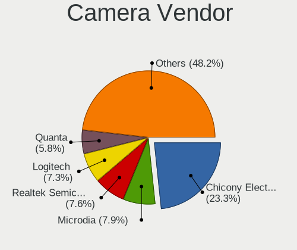

| Vendor                                 | Computers | Percent |
|----------------------------------------|-----------|---------|
| Chicony Electronics                    | 124       | 27.43%  |
| Logitech                               | 36        | 7.96%   |
| Acer                                   | 36        | 7.96%   |
| IMC Networks                           | 30        | 6.64%   |
| Microdia                               | 25        | 5.53%   |
| Sunplus Innovation Technology          | 23        | 5.09%   |
| Realtek Semiconductor                  | 23        | 5.09%   |
| Quanta                                 | 22        | 4.87%   |
| Apple                                  | 18        | 3.98%   |
| Syntek                                 | 15        | 3.32%   |
| Suyin                                  | 14        | 3.1%    |
| Cheng Uei Precision Industry (Foxlink) | 9         | 1.99%   |
| Bison Electronics                      | 8         | 1.77%   |
| Luxvisions Innotech Limited            | 6         | 1.33%   |
| Samsung Electronics                    | 5         | 1.11%   |
| Ricoh                                  | 5         | 1.11%   |
| Lite-On Technology                     | 5         | 1.11%   |
| Alcor Micro                            | 5         | 1.11%   |
| Microsoft                              | 4         | 0.88%   |
| Lenovo                                 | 4         | 0.88%   |
| SunplusIT                              | 3         | 0.66%   |
| MacroSilicon                           | 3         | 0.66%   |
| ALi                                    | 3         | 0.66%   |
| Z-Star Microelectronics                | 2         | 0.44%   |
| USB Camera                             | 2         | 0.44%   |
| Silicon Motion                         | 2         | 0.44%   |
| Philips (or NXP)                       | 2         | 0.44%   |
| Intel                                  | 2         | 0.44%   |
| Creative Technology                    | 2         | 0.44%   |
| Y Media                                | 1         | 0.22%   |
| Sunplus Technology                     | 1         | 0.22%   |
| Sony Ericsson Mobile Communications AB | 1         | 0.22%   |
| Sonix Technology                       | 1         | 0.22%   |
| KYE Systems (Mouse Systems)            | 1         | 0.22%   |
| Jieli Technology                       | 1         | 0.22%   |
| GenesysLogic Technology                | 1         | 0.22%   |
| Genesys Logic                          | 1         | 0.22%   |
| Generalplus Technology                 | 1         | 0.22%   |
| eMPIA Technology                       | 1         | 0.22%   |
| eMeet-200611                           | 1         | 0.22%   |

Camera Model
------------

Camera device models

| Model                                    | Computers | Percent |
|------------------------------------------|-----------|---------|
| Chicony Integrated Camera                | 32        | 7.03%   |
| IMC Networks Integrated Camera           | 16        | 3.52%   |
| Chicony HD WebCam                        | 16        | 3.52%   |
| Microdia Integrated_Webcam_HD            | 12        | 2.64%   |
| Syntek Integrated Camera                 | 11        | 2.42%   |
| Chicony USB2.0 Camera                    | 9         | 1.98%   |
| Chicony HP HD Camera                     | 8         | 1.76%   |
| Acer Integrated Camera                   | 7         | 1.54%   |
| Realtek Integrated_Webcam_HD             | 6         | 1.32%   |
| Chicony FJ Camera                        | 6         | 1.32%   |
| Apple FaceTime HD Camera                 | 6         | 1.32%   |
| Apple Built-in iSight                    | 6         | 1.32%   |
| Sunplus HD WebCam                        | 5         | 1.1%    |
| Samsung Galaxy A5 (MTP)                  | 5         | 1.1%    |
| Logitech Webcam C270                     | 5         | 1.1%    |
| Logitech C920 PRO HD Webcam              | 5         | 1.1%    |
| IMC Networks USB2.0 HD UVC WebCam        | 5         | 1.1%    |
| Chicony Lenovo Integrated Camera (0.3MP) | 5         | 1.1%    |
| Chicony Integrated IR Camera             | 5         | 1.1%    |
| Realtek USB Camera                       | 4         | 0.88%   |
| Chicony HD User Facing                   | 4         | 0.88%   |
| Bison Integrated Camera                  | 4         | 0.88%   |
| Acer Lenovo Integrated Webcam            | 4         | 0.88%   |
| Acer HD Webcam                           | 4         | 0.88%   |
| Acer BisonCam, NB Pro                    | 4         | 0.88%   |
| Suyin Acer/HP Integrated Webcam [CN0314] | 3         | 0.66%   |
| Sunplus WEMISS CM-A1                     | 3         | 0.66%   |
| Sunplus Integrated_Webcam_HD             | 3         | 0.66%   |
| Ricoh USB2.0 Camera                      | 3         | 0.66%   |
| Quanta USB2.0 HD UVC WebCam              | 3         | 0.66%   |
| Quanta HD Webcam                         | 3         | 0.66%   |
| Quanta HD User Facing                    | 3         | 0.66%   |
| Microdia USB 2.0 Camera                  | 3         | 0.66%   |
| Microdia Integrated Webcam               | 3         | 0.66%   |
| MacroSilicon USB Video                   | 3         | 0.66%   |
| Logitech Webcam C310                     | 3         | 0.66%   |
| Logitech HD Webcam C525                  | 3         | 0.66%   |
| Logitech C922 Pro Stream Webcam          | 3         | 0.66%   |
| Lite-On Integrated Camera                | 3         | 0.66%   |
| Chicony HP Wide Vision HD Camera         | 3         | 0.66%   |

Security
--------

Fingerprint Vendor
------------------

Fingerprint sensor vendors

| Vendor                             | Computers | Percent |
|------------------------------------|-----------|---------|
| Synaptics                          | 33        | 35.11%  |
| Validity Sensors                   | 27        | 28.72%  |
| Shenzhen Goodix Technology         | 11        | 11.7%   |
| Upek                               | 6         | 6.38%   |
| AuthenTec                          | 6         | 6.38%   |
| LighTuning Technology              | 4         | 4.26%   |
| Realtek USB2.0 Finger Print Bridge | 3         | 3.19%   |
| Elan Microelectronics              | 2         | 2.13%   |
| STMicroelectronics                 | 1         | 1.06%   |
| HOLTEK                             | 1         | 1.06%   |

Fingerprint Model
-----------------

Fingerprint sensor models

| Model                                                           | Computers | Percent |
|-----------------------------------------------------------------|-----------|---------|
| Synaptics Prometheus MIS Touch Fingerprint Reader               | 16        | 17.02%  |
| Validity Sensors VFS495 Fingerprint Reader                      | 6         | 6.38%   |
| Upek Biometric Touchchip/Touchstrip Fingerprint Sensor          | 6         | 6.38%   |
| Shenzhen Goodix  FingerPrint Device                             | 5         | 5.32%   |
| Validity Sensors VFS 5011 fingerprint sensor                    | 4         | 4.26%   |
| Validity Sensors VFS7500 Touch Fingerprint Sensor               | 3         | 3.19%   |
| Validity Sensors VFS5011 Fingerprint Reader                     | 3         | 3.19%   |
| Synaptics WBDI                                                  | 3         | 3.19%   |
| Synaptics UWP WBDI                                              | 3         | 3.19%   |
| Synaptics  VFS7552 Touch Fingerprint Sensor with PurePrint      | 3         | 3.19%   |
| Synaptics Metallica MIS Touch Fingerprint Reader                | 3         | 3.19%   |
| Shenzhen Goodix Fingerprint Reader                              | 3         | 3.19%   |
| Shenzhen Goodix FingerPrint                                     | 3         | 3.19%   |
| Realtek USB2.0 Finger Print Bridge FocalTech Fingerprint Device | 3         | 3.19%   |
| Validity Sensors VFS101 Fingerprint Reader                      | 2         | 2.13%   |
| Validity Sensors VFS Fingerprint sensor                         | 2         | 2.13%   |
| Validity Sensors Synaptics WBDI                                 | 2         | 2.13%   |
| Validity Sensors Synaptics VFS7552 Touch Fingerprint Sensor     | 2         | 2.13%   |
| LighTuning EgisTec Touch Fingerprint Sensor                     | 2         | 2.13%   |
| AuthenTec AES1660 Fingerprint Sensor                            | 2         | 2.13%   |
| AuthenTec AES1600                                               | 2         | 2.13%   |
| Validity Sensors VFS471 Fingerprint Reader                      | 1         | 1.06%   |
| Validity Sensors VFS451 Fingerprint Reader                      | 1         | 1.06%   |
| Validity Sensors Swipe Fingerprint Sensor                       | 1         | 1.06%   |
| Synaptics WBDI Fingerprint Reader USB 086                       | 1         | 1.06%   |
| Synaptics UWP WBDI Device                                       | 1         | 1.06%   |
| Synaptics  WBDI                                                 | 1         | 1.06%   |
| Synaptics Metallica MOH Touch Fingerprint Reader                | 1         | 1.06%   |
| STMicroelectronics Fingerprint Reader                           | 1         | 1.06%   |
| LighTuning Fingerprint Sensor                                   | 1         | 1.06%   |
| LighTuning Fingerprint Reader                                   | 1         | 1.06%   |
| HOLTEK FocalTech Fingerprint Device                             | 1         | 1.06%   |
| Elan fingerprint sensor [FeinTech FPS00200]                     | 1         | 1.06%   |
| Elan ELAN:ARM-M4                                                | 1         | 1.06%   |
| AuthenTec Fingerprint Sensor                                    | 1         | 1.06%   |
| AuthenTec AES2810                                               | 1         | 1.06%   |
| Unknown                                                         | 1         | 1.06%   |

Chipcard Vendor
---------------

Chipcard module vendors

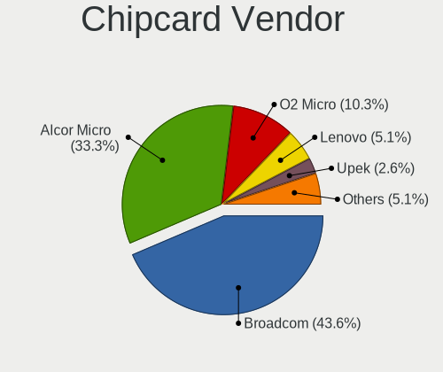

| Vendor                   | Computers | Percent |
|--------------------------|-----------|---------|
| Alcor Micro              | 18        | 40%     |
| Broadcom                 | 10        | 22.22%  |
| O2 Micro                 | 6         | 13.33%  |
| Upek                     | 4         | 8.89%   |
| Lenovo                   | 2         | 4.44%   |
| Reiner SCT Kartensysteme | 1         | 2.22%   |
| OmniKey                  | 1         | 2.22%   |
| Gemalto (was Gemplus)    | 1         | 2.22%   |
| Clay Logic               | 1         | 2.22%   |
| Cherry                   | 1         | 2.22%   |

Chipcard Model
--------------

Chipcard module models

| Model                                                                      | Computers | Percent |
|----------------------------------------------------------------------------|-----------|---------|
| Alcor Micro AU9540 Smartcard Reader                                        | 18        | 40%     |
| O2 Micro OZ776 CCID Smartcard Reader                                       | 6         | 13.33%  |
| Broadcom BCM5880 Secure Applications Processor                             | 5         | 11.11%  |
| Broadcom 5880                                                              | 5         | 11.11%  |
| Upek TouchChip Fingerprint Coprocessor (WBF advanced mode)                 | 4         | 8.89%   |
| Lenovo Integrated Smart Card Reader                                        | 2         | 4.44%   |
| Reiner SCT Kartensysteme cyberJack RFID basis contactless smartcard reader | 1         | 2.22%   |
| OmniKey CardMan 3121 (HID Technologies)                                    | 1         | 2.22%   |
| Gemalto (was Gemplus) GemPC Twin SmartCard Reader                          | 1         | 2.22%   |
| Clay Logic Nitrokey Pro                                                    | 1         | 2.22%   |
| Cherry SmartCard Reader Keyboard KC 1000 SC                                | 1         | 2.22%   |

Unsupported
-----------

Unsupported Devices
-------------------

Total unsupported devices on board

| Total | Computers | Percent |
|-------|-----------|---------|
| 0     | 579       | 70.96%  |
| 1     | 184       | 22.55%  |
| 2     | 36        | 4.41%   |
| 3     | 10        | 1.23%   |
| 4     | 6         | 0.74%   |
| 8     | 1         | 0.12%   |

Unsupported Device Types
------------------------

Types of unsupported devices

| Type                     | Computers | Percent |
|--------------------------|-----------|---------|
| Fingerprint reader       | 94        | 31.44%  |
| Graphics card            | 58        | 19.4%   |
| Chipcard                 | 35        | 11.71%  |
| Net/wireless             | 31        | 10.37%  |
| Multimedia controller    | 17        | 5.69%   |
| Communication controller | 17        | 5.69%   |
| Unassigned class         | 12        | 4.01%   |
| Camera                   | 9         | 3.01%   |
| Sound                    | 6         | 2.01%   |
| Card reader              | 4         | 1.34%   |
| Storage                  | 3         | 1%      |
| Net/ethernet             | 3         | 1%      |
| Bluetooth                | 3         | 1%      |
| Network                  | 2         | 0.67%   |
| Storage/raid             | 1         | 0.33%   |
| Storage/nvme             | 1         | 0.33%   |
| Storage/ide              | 1         | 0.33%   |
| Storage/ata              | 1         | 0.33%   |
| Modem                    | 1         | 0.33%   |

