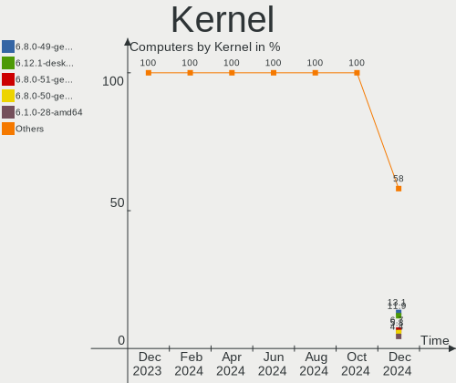
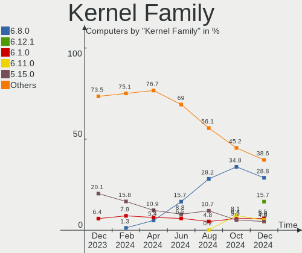
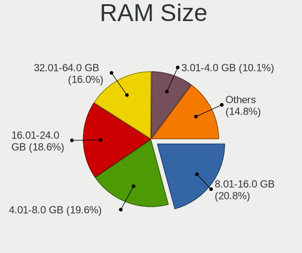
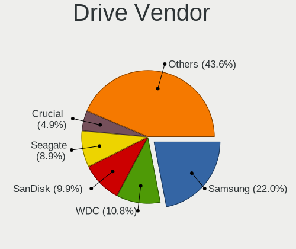
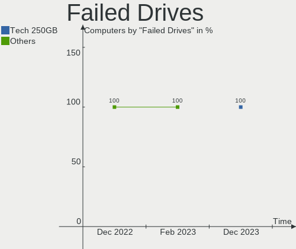
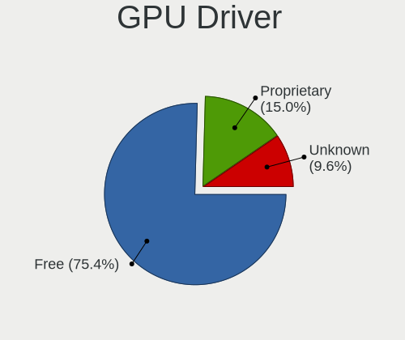
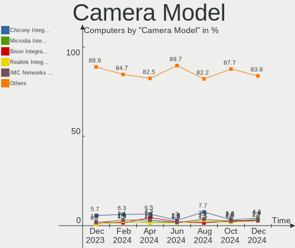

Linux in Germany - Hardware Trends
----------------------------------

A project to identify most popular hardware characteristics and track their change
over time based on data collected by Linux users at https://Linux-Hardware.org.

Anyone can contribute to this report by the [hw-probe](https://github.com/linuxhw/hw-probe) tool:

    sudo -E hw-probe -all -upload

This is a report for all computer types. See also reports for [desktops](/Location/Germany/Desktop/README.md) and [notebooks](/Location/Germany/Notebook/README.md).

Period: Jul, 2022.

Contents
--------

* [ System ](#system)
  - [ OS                       ](#os)
  - [ OS Family                ](#os-family)
  - [ Kernel                   ](#kernel)
  - [ Kernel Family            ](#kernel-family)
  - [ Kernel Major Ver.        ](#kernel-major-ver)
  - [ Arch                     ](#arch)
  - [ DE                       ](#de)
  - [ Display Server           ](#display-server)
  - [ Display Manager          ](#display-manager)
  - [ OS Lang                  ](#os-lang)
  - [ Boot Mode                ](#boot-mode)
  - [ Filesystem               ](#filesystem)
  - [ Part. scheme             ](#part-scheme)
  - [ Dual Boot with Linux/BSD ](#dual-boot-with-linuxbsd)
  - [ Dual Boot (Win)          ](#dual-boot-win)

* [ Board ](#board)
  - [ Vendor                   ](#vendor)
  - [ Model                    ](#model)
  - [ Model Family             ](#model-family)
  - [ MFG Year                 ](#mfg-year)
  - [ Form Factor              ](#form-factor)
  - [ Secure Boot              ](#secure-boot)
  - [ Coreboot                 ](#coreboot)
  - [ RAM Size                 ](#ram-size)
  - [ RAM Used                 ](#ram-used)
  - [ Total Drives             ](#total-drives)
  - [ Has CD-ROM               ](#has-cd-rom)
  - [ Has Ethernet             ](#has-ethernet)
  - [ Has WiFi                 ](#has-wifi)
  - [ Has Bluetooth            ](#has-bluetooth)

* [ Location ](#location)
  - [ Country                  ](#country)
  - [ City                     ](#city)

* [ Drives ](#drives)
  - [ Drive Vendor             ](#drive-vendor)
  - [ Drive Model              ](#drive-model)
  - [ HDD Vendor               ](#hdd-vendor)
  - [ SSD Vendor               ](#ssd-vendor)
  - [ Drive Kind               ](#drive-kind)
  - [ Drive Connector          ](#drive-connector)
  - [ Drive Size               ](#drive-size)
  - [ Space Total              ](#space-total)
  - [ Space Used               ](#space-used)
  - [ Malfunc. Drives          ](#malfunc-drives)
  - [ Malfunc. Drive Vendor    ](#malfunc-drive-vendor)
  - [ Malfunc. HDD Vendor      ](#malfunc-hdd-vendor)
  - [ Malfunc. Drive Kind      ](#malfunc-drive-kind)
  - [ Failed Drives            ](#failed-drives)
  - [ Failed Drive Vendor      ](#failed-drive-vendor)
  - [ Drive Status             ](#drive-status)

* [ Storage controller ](#storage-controller)
  - [ Storage Vendor           ](#storage-vendor)
  - [ Storage Model            ](#storage-model)
  - [ Storage Kind             ](#storage-kind)

* [ Processor ](#processor)
  - [ CPU Vendor               ](#cpu-vendor)
  - [ CPU Model                ](#cpu-model)
  - [ CPU Model Family         ](#cpu-model-family)
  - [ CPU Cores                ](#cpu-cores)
  - [ CPU Sockets              ](#cpu-sockets)
  - [ CPU Threads              ](#cpu-threads)
  - [ CPU Op-Modes             ](#cpu-op-modes)
  - [ CPU Microcode            ](#cpu-microcode)
  - [ CPU Microarch            ](#cpu-microarch)

* [ Graphics ](#graphics)
  - [ GPU Vendor               ](#gpu-vendor)
  - [ GPU Model                ](#gpu-model)
  - [ GPU Combo                ](#gpu-combo)
  - [ GPU Driver               ](#gpu-driver)
  - [ GPU Memory               ](#gpu-memory)

* [ Monitor ](#monitor)
  - [ Monitor Vendor           ](#monitor-vendor)
  - [ Monitor Model            ](#monitor-model)
  - [ Monitor Resolution       ](#monitor-resolution)
  - [ Monitor Diagonal         ](#monitor-diagonal)
  - [ Monitor Width            ](#monitor-width)
  - [ Aspect Ratio             ](#aspect-ratio)
  - [ Monitor Area             ](#monitor-area)
  - [ Pixel Density            ](#pixel-density)
  - [ Multiple Monitors        ](#multiple-monitors)

* [ Network ](#network)
  - [ Net Controller Vendor    ](#net-controller-vendor)
  - [ Net Controller Model     ](#net-controller-model)
  - [ Wireless Vendor          ](#wireless-vendor)
  - [ Wireless Model           ](#wireless-model)
  - [ Ethernet Vendor          ](#ethernet-vendor)
  - [ Ethernet Model           ](#ethernet-model)
  - [ Net Controller Kind      ](#net-controller-kind)
  - [ Used Controller          ](#used-controller)
  - [ NICs                     ](#nics)
  - [ IPv6                     ](#ipv6)

* [ Bluetooth ](#bluetooth)
  - [ Bluetooth Vendor         ](#bluetooth-vendor)
  - [ Bluetooth Model          ](#bluetooth-model)

* [ Sound ](#sound)
  - [ Sound Vendor             ](#sound-vendor)
  - [ Sound Model              ](#sound-model)

* [ Memory ](#memory)
  - [ Memory Vendor            ](#memory-vendor)
  - [ Memory Model             ](#memory-model)
  - [ Memory Kind              ](#memory-kind)
  - [ Memory Form Factor       ](#memory-form-factor)
  - [ Memory Size              ](#memory-size)
  - [ Memory Speed             ](#memory-speed)

* [ Printers & scanners ](#printers--scanners)
  - [ Printer Vendor           ](#printer-vendor)
  - [ Printer Model            ](#printer-model)
  - [ Scanner Vendor           ](#scanner-vendor)
  - [ Scanner Model            ](#scanner-model)

* [ Camera ](#camera)
  - [ Camera Vendor            ](#camera-vendor)
  - [ Camera Model             ](#camera-model)

* [ Security ](#security)
  - [ Fingerprint Vendor       ](#fingerprint-vendor)
  - [ Fingerprint Model        ](#fingerprint-model)
  - [ Chipcard Vendor          ](#chipcard-vendor)
  - [ Chipcard Model           ](#chipcard-model)

* [ Unsupported ](#unsupported)
  - [ Unsupported Devices      ](#unsupported-devices)
  - [ Unsupported Device Types ](#unsupported-device-types)

System
------

OS
--

Installed operating systems

| Name                         | Computers | Percent |
|------------------------------|-----------|---------|
| Linux Mint 20.3              | 65        | 14.51%  |
| Ubuntu 22.04                 | 56        | 12.5%   |
| Debian 11                    | 28        | 6.25%   |
| Ubuntu 20.04                 | 27        | 6.03%   |
| OpenMandriva 4.3             | 27        | 6.03%   |
| Fedora 36                    | 19        | 4.24%   |
| Pop!_OS 22.04                | 18        | 4.02%   |
| OpenMandriva 4.90            | 16        | 3.57%   |
| Zorin 16                     | 15        | 3.35%   |
| Manjaro                      | 14        | 3.13%   |
| Gentoo 2.8                   | 11        | 2.46%   |
| KDE neon 20.04               | 7         | 1.56%   |
| Arch Rolling                 | 7         | 1.56%   |
| Xubuntu 20.04                | 6         | 1.34%   |
| Ubuntu 18.04                 | 6         | 1.34%   |
| Elementary 6.1               | 6         | 1.34%   |
| Arch                         | 6         | 1.34%   |
| Ubuntu 21.10                 | 5         | 1.12%   |
| Linux Mint 20.2              | 5         | 1.12%   |
| Linux Mint 19.3              | 5         | 1.12%   |
| Kubuntu 22.04                | 5         | 1.12%   |
| SteamOS 3.2                  | 4         | 0.89%   |
| openSUSE Tumbleweed-XXXXXXXX | 4         | 0.89%   |
| Manjaro 21.3.5               | 4         | 0.89%   |
| Linux Mint 20.1              | 4         | 0.89%   |
| Xubuntu 22.04                | 3         | 0.67%   |
| OpenMandriva 4.2             | 3         | 0.67%   |
| MX 21                        | 3         | 0.67%   |
| Lubuntu 20.04                | 3         | 0.67%   |
| Lubuntu 18.04                | 3         | 0.67%   |
| LMDE 5                       | 3         | 0.67%   |
| Kubuntu 20.04                | 3         | 0.67%   |
| Kubuntu 11.1                 | 3         | 0.67%   |
| Debian Testing               | 3         | 0.67%   |
| Ubuntu MATE 22.04            | 2         | 0.45%   |
| Ubuntu Budgie 20.04          | 2         | 0.45%   |
| Ubuntu 22.10                 | 2         | 0.45%   |
| Raspbian 11                  | 2         | 0.45%   |
| openSUSE Leap-15.3           | 2         | 0.45%   |
| Manjaro 21.3.6               | 2         | 0.45%   |
| Manjaro 21.3.4               | 2         | 0.45%   |
| Manjaro 21.3.1               | 2         | 0.45%   |
| EndeavourOS Rolling          | 2         | 0.45%   |
| EndeavourOS                  | 2         | 0.45%   |
| Zorin 15                     | 1         | 0.22%   |
| Xubuntu 18.04                | 1         | 0.22%   |
| Xubuntu 16.04                | 1         | 0.22%   |
| Ubuntu MATE 22.10            | 1         | 0.22%   |
| Ubuntu MATE 20.10            | 1         | 0.22%   |
| Ubuntu MATE 20.04            | 1         | 0.22%   |
| Ubuntu Budgie 22.04          | 1         | 0.22%   |
| Ubuntu 19.04                 | 1         | 0.22%   |
| SteamOS 3.3                  | 1         | 0.22%   |
| Sparky 7                     | 1         | 0.22%   |
| ROSA R11.1                   | 1         | 0.22%   |
| ROSA 12.2                    | 1         | 0.22%   |
| Rocky Linux 8.6              | 1         | 0.22%   |
| Pop!_OS 21.10                | 1         | 0.22%   |
| Pop!_OS 20.04                | 1         | 0.22%   |
| openSUSE Microos-XXXXXXXX    | 1         | 0.22%   |

OS Family
---------

OS without a version

| Name          | Computers | Percent |
|---------------|-----------|---------|
| Ubuntu        | 97        | 21.65%  |
| Linux Mint    | 82        | 18.3%   |
| OpenMandriva  | 46        | 10.27%  |
| Debian        | 32        | 7.14%   |
| Manjaro       | 25        | 5.58%   |
| Pop!_OS       | 20        | 4.46%   |
| Fedora        | 19        | 4.24%   |
| Zorin         | 16        | 3.57%   |
| Arch          | 13        | 2.9%    |
| Xubuntu       | 11        | 2.46%   |
| Kubuntu       | 11        | 2.46%   |
| Gentoo        | 11        | 2.46%   |
| openSUSE      | 7         | 1.56%   |
| Lubuntu       | 7         | 1.56%   |
| KDE neon      | 7         | 1.56%   |
| Elementary    | 6         | 1.34%   |
| Ubuntu MATE   | 5         | 1.12%   |
| SteamOS       | 5         | 1.12%   |
| EndeavourOS   | 4         | 0.89%   |
| Ubuntu Budgie | 3         | 0.67%   |
| MX            | 3         | 0.67%   |
| LMDE          | 3         | 0.67%   |
| ROSA          | 2         | 0.45%   |
| Raspbian      | 2         | 0.45%   |
| Garuda Linux  | 2         | 0.45%   |
| Sparky        | 1         | 0.22%   |
| Rocky Linux   | 1         | 0.22%   |
| Lilidog       | 1         | 0.22%   |
| Devuan        | 1         | 0.22%   |
| Clear Linux   | 1         | 0.22%   |
| CentOS        | 1         | 0.22%   |
| ArcoLinux     | 1         | 0.22%   |
| Archcraft     | 1         | 0.22%   |
| Alpine        | 1         | 0.22%   |

Kernel
------

Version of the Linux kernel

| Version                                      | Computers | Percent |
|----------------------------------------------|-----------|---------|
| 5.15.0-41-generic                            | 60        | 13.39%  |
| 5.4.0-122-generic                            | 44        | 9.82%   |
| 5.13.0-52-generic                            | 35        | 7.81%   |
| 5.4.0-121-generic                            | 29        | 6.47%   |
| 5.16.7-desktop-1omv4003                      | 24        | 5.36%   |
| 5.15.0-40-generic                            | 24        | 5.36%   |
| 5.18.12-desktop-3omv4090                     | 15        | 3.35%   |
| 5.10.0-16-amd64                              | 15        | 3.35%   |
| 5.18.10-76051810-generic                     | 10        | 2.23%   |
| 5.18.0-2-amd64                               | 8         | 1.79%   |
| 5.10.0-15-amd64                              | 8         | 1.79%   |
| 5.17.15-76051715-generic                     | 7         | 1.56%   |
| 5.4.0-120-generic                            | 4         | 0.89%   |
| 5.18.9-200.fc36.x86_64                       | 4         | 0.89%   |
| 5.18.13-200.fc36.x86_64                      | 4         | 0.89%   |
| 5.18.12-arch1-1                              | 4         | 0.89%   |
| 5.18.10-200.fc36.x86_64                      | 4         | 0.89%   |
| 5.18.0-0.bpo.1-amd64                         | 4         | 0.89%   |
| 5.15.49-1-MANJARO                            | 4         | 0.89%   |
| 5.13.0-valve15-1-neptune-02197-gf6ec7ad3762a | 4         | 0.89%   |
| 5.18.9-zen1-1-zen                            | 3         | 0.67%   |
| 5.18.14-arch1-1                              | 3         | 0.67%   |
| 5.18.12-3-MANJARO                            | 3         | 0.67%   |
| 5.18.11-200.fc36.x86_64                      | 3         | 0.67%   |
| 5.18.11-1-default                            | 3         | 0.67%   |
| 5.17.0-1013-oem                              | 3         | 0.67%   |
| 5.15.39-1-pve                                | 3         | 0.67%   |
| 5.15.0-25-generic                            | 3         | 0.67%   |
| 4.15.0-189-generic                           | 3         | 0.67%   |
| 4.15.0-188-generic                           | 3         | 0.67%   |
| 5.4.0-91-generic                             | 2         | 0.45%   |
| 5.4.0-90-generic                             | 2         | 0.45%   |
| 5.4.0-74-generic                             | 2         | 0.45%   |
| 5.4.0-58-generic                             | 2         | 0.45%   |
| 5.3.18-150300.59.49-default                  | 2         | 0.45%   |
| 5.18.7-1-MANJARO                             | 2         | 0.45%   |
| 5.18.6-1-MANJARO                             | 2         | 0.45%   |
| 5.18.10-arch1-1                              | 2         | 0.45%   |
| 5.17.5-76051705-generic                      | 2         | 0.45%   |
| 5.16.20-2-MANJARO                            | 2         | 0.45%   |
| 5.15.57-2-MANJARO                            | 2         | 0.45%   |
| 5.15.55-1-MANJARO                            | 2         | 0.45%   |
| 5.15.52-gentoo-x86_64                        | 2         | 0.45%   |
| 5.15.52-gentoo                               | 2         | 0.45%   |
| 5.15.41-gentoo-x86_64                        | 2         | 0.45%   |
| 5.15.32-v7+                                  | 2         | 0.45%   |
| 5.15.0-43-generic                            | 2         | 0.45%   |
| 5.15.0-35-generic                            | 2         | 0.45%   |
| 5.15.0-1012-raspi                            | 2         | 0.45%   |
| 5.13.0-51-generic                            | 2         | 0.45%   |
| 5.10.14-desktop-1omv4002                     | 2         | 0.45%   |
| 5.8.0-63-generic                             | 1         | 0.22%   |
| 5.8.0-44-generic                             | 1         | 0.22%   |
| 5.4.83-generic-2rosa-x86_64                  | 1         | 0.22%   |
| 5.4.0-56-generic                             | 1         | 0.22%   |
| 5.4.0-110-generic                            | 1         | 0.22%   |
| 5.4.0-107-generic                            | 1         | 0.22%   |
| 5.19.0-rc1+                                  | 1         | 0.22%   |
| 5.19.0-1-MANJARO                             | 1         | 0.22%   |
| 5.18.9-surface                               | 1         | 0.22%   |

Kernel Family
-------------

Linux kernel without a distro release

| Version  | Computers | Percent |
|----------|-----------|---------|
| 5.15.0   | 97        | 21.65%  |
| 5.4.0    | 88        | 19.64%  |
| 5.13.0   | 46        | 10.27%  |
| 5.16.7   | 24        | 5.36%   |
| 5.10.0   | 24        | 5.36%   |
| 5.18.12  | 23        | 5.13%   |
| 5.18.10  | 19        | 4.24%   |
| 5.18.0   | 14        | 3.13%   |
| 5.18.9   | 11        | 2.46%   |
| 5.17.15  | 7         | 1.56%   |
| 4.15.0   | 7         | 1.56%   |
| 5.18.13  | 6         | 1.34%   |
| 5.18.11  | 6         | 1.34%   |
| 5.15.52  | 6         | 1.34%   |
| 5.18.14  | 5         | 1.12%   |
| 5.18.7   | 4         | 0.89%   |
| 5.15.49  | 4         | 0.89%   |
| 5.18.8   | 3         | 0.67%   |
| 5.17.5   | 3         | 0.67%   |
| 5.17.0   | 3         | 0.67%   |
| 5.15.55  | 3         | 0.67%   |
| 5.15.39  | 3         | 0.67%   |
| 5.15.32  | 3         | 0.67%   |
| 5.8.0    | 2         | 0.45%   |
| 5.3.18   | 2         | 0.45%   |
| 5.19.0   | 2         | 0.45%   |
| 5.18.6   | 2         | 0.45%   |
| 5.17.1   | 2         | 0.45%   |
| 5.16.20  | 2         | 0.45%   |
| 5.15.57  | 2         | 0.45%   |
| 5.15.41  | 2         | 0.45%   |
| 5.14.0   | 2         | 0.45%   |
| 5.10.14  | 2         | 0.45%   |
| 4.18.0   | 2         | 0.45%   |
| 5.4.83   | 1         | 0.22%   |
| 5.18.5   | 1         | 0.22%   |
| 5.18.15  | 1         | 0.22%   |
| 5.17.7   | 1         | 0.22%   |
| 5.16.5   | 1         | 0.22%   |
| 5.16.13  | 1         | 0.22%   |
| 5.16.0   | 1         | 0.22%   |
| 5.15.53  | 1         | 0.22%   |
| 5.15.14  | 1         | 0.22%   |
| 5.13.19  | 1         | 0.22%   |
| 5.11.12  | 1         | 0.22%   |
| 5.10.131 | 1         | 0.22%   |
| 5.10.124 | 1         | 0.22%   |
| 5.10.118 | 1         | 0.22%   |
| 5.0.0    | 1         | 0.22%   |
| 4.4.0    | 1         | 0.22%   |
| 4.14.280 | 1         | 0.22%   |

Kernel Major Ver.
-----------------

Linux kernel major version

| Version | Computers | Percent |
|---------|-----------|---------|
| 5.15    | 122       | 27.23%  |
| 5.18    | 95        | 21.21%  |
| 5.4     | 89        | 19.87%  |
| 5.13    | 47        | 10.49%  |
| 5.16    | 29        | 6.47%   |
| 5.10    | 29        | 6.47%   |
| 5.17    | 16        | 3.57%   |
| 4.15    | 7         | 1.56%   |
| 5.8     | 2         | 0.45%   |
| 5.3     | 2         | 0.45%   |
| 5.19    | 2         | 0.45%   |
| 5.14    | 2         | 0.45%   |
| 4.18    | 2         | 0.45%   |
| 5.11    | 1         | 0.22%   |
| 5.0     | 1         | 0.22%   |
| 4.4     | 1         | 0.22%   |
| 4.14    | 1         | 0.22%   |

Arch
----

OS architecture (x86_64, i586, etc.)

| Name     | Computers | Percent |
|----------|-----------|---------|
| x86_64   | 434       | 96.88%  |
| i686     | 6         | 1.34%   |
| aarch64  | 5         | 1.12%   |
| armv7l   | 2         | 0.45%   |
| armv5tel | 1         | 0.22%   |

DE
--

Desktop Environment

| Name             | Computers | Percent |
|------------------|-----------|---------|
| GNOME            | 168       | 37.5%   |
| KDE5             | 110       | 24.55%  |
| X-Cinnamon       | 63        | 14.06%  |
| XFCE             | 37        | 8.26%   |
| MATE             | 20        | 4.46%   |
| Unknown          | 20        | 4.46%   |
| Pantheon         | 6         | 1.34%   |
| Budgie           | 5         | 1.12%   |
| LXQt             | 4         | 0.89%   |
| LXDE             | 4         | 0.89%   |
| Cinnamon         | 4         | 0.89%   |
| GNOME Classic    | 2         | 0.45%   |
| trinity          | 1         | 0.22%   |
| sway             | 1         | 0.22%   |
| lightdm-xsession | 1         | 0.22%   |
| KDE4             | 1         | 0.22%   |
| i3               | 1         | 0.22%   |

Display Server
--------------

X11 or Wayland

| Name    | Computers | Percent |
|---------|-----------|---------|
| X11     | 345       | 77.01%  |
| Wayland | 82        | 18.3%   |
| Unknown | 11        | 2.46%   |
| Tty     | 10        | 2.23%   |

Display Manager
---------------

SDDM, LightDM, etc.

| Name    | Computers | Percent |
|---------|-----------|---------|
| Unknown | 170       | 37.95%  |
| GDM3    | 100       | 22.32%  |
| SDDM    | 78        | 17.41%  |
| LightDM | 65        | 14.51%  |
| GDM     | 31        | 6.92%   |
| LXDM    | 3         | 0.67%   |
| KDM     | 1         | 0.22%   |

OS Lang
-------

Language

| Lang    | Computers | Percent |
|---------|-----------|---------|
| de_DE   | 310       | 69.2%   |
| en_US   | 96        | 21.43%  |
| en_GB   | 8         | 1.79%   |
| Unknown | 6         | 1.34%   |
| C       | 5         | 1.12%   |
| en_DE   | 3         | 0.67%   |
| ru_RU   | 2         | 0.45%   |
| POSIX   | 2         | 0.45%   |
| hu_HU   | 2         | 0.45%   |
| fr_FR   | 2         | 0.45%   |
| en_DK   | 2         | 0.45%   |
| C.UTF8  | 2         | 0.45%   |
| ru_UA   | 1         | 0.22%   |
| pl_PL   | 1         | 0.22%   |
| it_IT   | 1         | 0.22%   |
| es_ES   | 1         | 0.22%   |
| en_IN   | 1         | 0.22%   |
| en_IE   | 1         | 0.22%   |
| en_AU   | 1         | 0.22%   |
| cs_CZ   | 1         | 0.22%   |

Boot Mode
---------

EFI or BIOS

| Mode | Computers | Percent |
|------|-----------|---------|
| BIOS | 232       | 51.79%  |
| EFI  | 216       | 48.21%  |

Filesystem
----------

Type of filesystem

| Type    | Computers | Percent |
|---------|-----------|---------|
| Ext4    | 355       | 79.24%  |
| Btrfs   | 47        | 10.49%  |
| Overlay | 41        | 9.15%   |
| Zfs     | 1         | 0.22%   |
| XXXXXXX | 1         | 0.22%   |
| Xfs     | 1         | 0.22%   |
| F2fs    | 1         | 0.22%   |
| Ext2    | 1         | 0.22%   |

Part. scheme
------------

Scheme of partitioning

| Type    | Computers | Percent |
|---------|-----------|---------|
| Unknown | 253       | 56.47%  |
| GPT     | 156       | 34.82%  |
| MBR     | 39        | 8.71%   |

Dual Boot with Linux/BSD
------------------------

Hosting more than one Linux/BSD

| Dual boot | Computers | Percent |
|-----------|-----------|---------|
| No        | 375       | 83.71%  |
| Yes       | 73        | 16.29%  |

Dual Boot (Win)
---------------

Hosting Linux and Windows

| Dual boot | Computers | Percent |
|-----------|-----------|---------|
| No        | 340       | 75.89%  |
| Yes       | 108       | 24.11%  |

Board
-----

Vendor
------

Motherboard manufacturer

| Name                    | Computers | Percent |
|-------------------------|-----------|---------|
| Lenovo                  | 82        | 18.3%   |
| ASUSTek Computer        | 64        | 14.29%  |
| Hewlett-Packard         | 49        | 10.94%  |
| Dell                    | 46        | 10.27%  |
| Gigabyte Technology     | 32        | 7.14%   |
| MSI                     | 28        | 6.25%   |
| Acer                    | 26        | 5.8%    |
| ASRock                  | 19        | 4.24%   |
| Medion                  | 8         | 1.79%   |
| Apple                   | 8         | 1.79%   |
| Fujitsu                 | 7         | 1.56%   |
| Raspberry Pi Foundation | 6         | 1.34%   |
| Biostar                 | 6         | 1.34%   |
| Valve                   | 5         | 1.12%   |
| Toshiba                 | 5         | 1.12%   |
| HUAWEI                  | 5         | 1.12%   |
| TUXEDO                  | 4         | 0.89%   |
| Samsung Electronics     | 4         | 0.89%   |
| Intel                   | 4         | 0.89%   |
| Unknown                 | 4         | 0.89%   |
| Schenker                | 3         | 0.67%   |
| Microsoft               | 3         | 0.67%   |
| Packard Bell            | 2         | 0.45%   |
| Notebook                | 2         | 0.45%   |
| Fujitsu Siemens         | 2         | 0.45%   |
| Foxconn                 | 2         | 0.45%   |
| BESSTAR Tech            | 2         | 0.45%   |
| ASRockRack              | 2         | 0.45%   |
| ZOTAC                   | 1         | 0.22%   |
| Wortmann AG             | 1         | 0.22%   |
| VALE                    | 1         | 0.22%   |
| TrekStor                | 1         | 0.22%   |
| Timi                    | 1         | 0.22%   |
| Sony                    | 1         | 0.22%   |
| Razer                   | 1         | 0.22%   |
| Pegatron                | 1         | 0.22%   |
| Nokia                   | 1         | 0.22%   |
| Intel Client Systems    | 1         | 0.22%   |
| Huanan                  | 1         | 0.22%   |
| Framework               | 1         | 0.22%   |
| eMachines               | 1         | 0.22%   |
| ECS                     | 1         | 0.22%   |
| Chuwi                   | 1         | 0.22%   |
| BenQ                    | 1         | 0.22%   |
| AXDIA International     | 1         | 0.22%   |
| AMI                     | 1         | 0.22%   |

Model
-----

Motherboard model

| Name                                       | Computers | Percent |
|--------------------------------------------|-----------|---------|
| Valve Jupiter                              | 5         | 1.12%   |
| RPi Raspberry Pi                           | 5         | 1.12%   |
| Unknown                                    | 4         | 0.89%   |
| TUXEDO Pulse 15 Gen1                       | 3         | 0.67%   |
| MSI MS-7B89                                | 3         | 0.67%   |
| Dell OptiPlex 7010                         | 3         | 0.67%   |
| Toshiba Satellite L350                     | 2         | 0.45%   |
| MSI MS-7C94                                | 2         | 0.45%   |
| MSI MS-7C91                                | 2         | 0.45%   |
| MSI MS-7C56                                | 2         | 0.45%   |
| MSI MS-7A38                                | 2         | 0.45%   |
| Lenovo V14-ADA 82C6                        | 2         | 0.45%   |
| Lenovo ThinkPad T460p 20FXS05500           | 2         | 0.45%   |
| Lenovo ThinkPad E14 Gen 3 20YDS00G00       | 2         | 0.45%   |
| Lenovo IdeaPad U430 Touch 20270            | 2         | 0.45%   |
| Lenovo IdeaPad Slim 1-14AST-05 81VS        | 2         | 0.45%   |
| Lenovo IdeaPad 5 14ALC05 82LM              | 2         | 0.45%   |
| Lenovo G550 2958                           | 2         | 0.45%   |
| HUAWEI NBLK-WAX9X                          | 2         | 0.45%   |
| HP Laptop 17-cn0xxx                        | 2         | 0.45%   |
| HP EliteBook x360 830 G6                   | 2         | 0.45%   |
| HP 250 G5 Notebook PC                      | 2         | 0.45%   |
| Gigabyte X570 AORUS MASTER                 | 2         | 0.45%   |
| Gigabyte GA-78LMT-USB3 6.0                 | 2         | 0.45%   |
| Gigabyte 970A-DS3P                         | 2         | 0.45%   |
| Dell OptiPlex 780                          | 2         | 0.45%   |
| Dell Latitude E6320                        | 2         | 0.45%   |
| BESSTAR Tech HM90                          | 2         | 0.45%   |
| ASUS TUF Gaming B550-PLUS                  | 2         | 0.45%   |
| ASUS PRIME Z690M-HZ                        | 2         | 0.45%   |
| ASUS PRIME B450M-A                         | 2         | 0.45%   |
| ASUS PRIME B350-PLUS                       | 2         | 0.45%   |
| ASUS P8B75-M LX                            | 2         | 0.45%   |
| ASUS All Series                            | 2         | 0.45%   |
| ASRockRack B565D4-V1L                      | 2         | 0.45%   |
| ASRock X300M-STX                           | 2         | 0.45%   |
| Apple MacBookPro12,1                       | 2         | 0.45%   |
| ZOTAC ZBOXNANO-AQ02                        | 1         | 0.22%   |
| Wortmann AG TERRA_MOBILE_1528P/1748P       | 1         | 0.22%   |
| VALE Notebook Classic C140                 | 1         | 0.22%   |
| TUXEDO InfinityBook_Pro13_14_v4            | 1         | 0.22%   |
| TrekStor Primebook P14                     | 1         | 0.22%   |
| Toshiba TECRA S11                          | 1         | 0.22%   |
| Toshiba Satellite U920T                    | 1         | 0.22%   |
| Toshiba Satellite C50-A                    | 1         | 0.22%   |
| Timi TM1703                                | 1         | 0.22%   |
| Sony VPCEB1S1E                             | 1         | 0.22%   |
| Schenker XMG CORE 17(M20, GTX 1650xx)      | 1         | 0.22%   |
| Schenker WORK (Early 2021)                 | 1         | 0.22%   |
| Schenker VISION 15 (SVS15E21)              | 1         | 0.22%   |
| Samsung R59P/R60P/R61P                     | 1         | 0.22%   |
| Samsung R505                               | 1         | 0.22%   |
| Samsung N130                               | 1         | 0.22%   |
| Samsung 300E4A/300E5A/300E7A/3430EA/3530EA | 1         | 0.22%   |
| Razer Blade 15 Studio Edition - Late 2019  | 1         | 0.22%   |
| RPi Raspberry Pi 2 Model B Rev 1.1         | 1         | 0.22%   |
| Pegatron NQ840AA-ABD p6029de               | 1         | 0.22%   |
| Packard Bell IMEDIA S3800                  | 1         | 0.22%   |
| Packard Bell EasyNote_MX52-B-122GE         | 1         | 0.22%   |
| Notebook V15x_V17xPNKPNJPNH                | 1         | 0.22%   |

Model Family
------------

Motherboard model prefix

| Name                   | Computers | Percent |
|------------------------|-----------|---------|
| Lenovo ThinkPad        | 40        | 8.93%   |
| Dell Latitude          | 21        | 4.69%   |
| ASUS PRIME             | 14        | 3.13%   |
| Lenovo IdeaPad         | 12        | 2.68%   |
| Acer Aspire            | 12        | 2.68%   |
| Dell OptiPlex          | 9         | 2.01%   |
| HP Laptop              | 8         | 1.79%   |
| HP EliteBook           | 7         | 1.56%   |
| RPi Raspberry          | 6         | 1.34%   |
| Lenovo ThinkCentre     | 6         | 1.34%   |
| ASUS VivoBook          | 6         | 1.34%   |
| ASUS TUF               | 6         | 1.34%   |
| Valve Jupiter          | 5         | 1.12%   |
| HP ProBook             | 5         | 1.12%   |
| HP Pavilion            | 5         | 1.12%   |
| Dell XPS               | 5         | 1.12%   |
| ASUS ROG               | 5         | 1.12%   |
| Toshiba Satellite      | 4         | 0.89%   |
| HP 250                 | 4         | 0.89%   |
| Dell Inspiron          | 4         | 0.89%   |
| Acer Swift             | 4         | 0.89%   |
| Unknown                | 4         | 0.89%   |
| TUXEDO Pulse           | 3         | 0.67%   |
| MSI MS-7B89            | 3         | 0.67%   |
| Microsoft Surface      | 3         | 0.67%   |
| HP Compaq              | 3         | 0.67%   |
| Gigabyte GA-78LMT-USB3 | 3         | 0.67%   |
| Fujitsu ESPRIMO        | 3         | 0.67%   |
| Dell PowerEdge         | 3         | 0.67%   |
| ASUS P8B75-M           | 3         | 0.67%   |
| Acer Veriton           | 3         | 0.67%   |
| MSI MS-7C94            | 2         | 0.45%   |
| MSI MS-7C91            | 2         | 0.45%   |
| MSI MS-7C56            | 2         | 0.45%   |
| MSI MS-7A38            | 2         | 0.45%   |
| Lenovo Yoga            | 2         | 0.45%   |
| Lenovo V14-ADA         | 2         | 0.45%   |
| Lenovo ThinkStation    | 2         | 0.45%   |
| Lenovo G550            | 2         | 0.45%   |
| HUAWEI NBLK-WAX9X      | 2         | 0.45%   |
| HP ENVY                | 2         | 0.45%   |
| HP EliteDesk           | 2         | 0.45%   |
| Gigabyte Z590          | 2         | 0.45%   |
| Gigabyte X570          | 2         | 0.45%   |
| Gigabyte B550          | 2         | 0.45%   |
| Gigabyte 970A-DS3P     | 2         | 0.45%   |
| Fujitsu LIFEBOOK       | 2         | 0.45%   |
| Dell Precision         | 2         | 0.45%   |
| BESSTAR Tech HM90      | 2         | 0.45%   |
| ASUS STRIX             | 2         | 0.45%   |
| ASUS P9X79             | 2         | 0.45%   |
| ASUS ASUS              | 2         | 0.45%   |
| ASUS All               | 2         | 0.45%   |
| ASRockRack B565D4-V1L  | 2         | 0.45%   |
| ASRock X300M-STX       | 2         | 0.45%   |
| ASRock B450            | 2         | 0.45%   |
| Apple MacBookPro12     | 2         | 0.45%   |
| Acer Spin              | 2         | 0.45%   |
| ZOTAC ZBOXNANO-AQ02    | 1         | 0.22%   |
| Wortmann AG TERRA      | 1         | 0.22%   |

MFG Year
--------

Motherboard manufacture year

| Year    | Computers | Percent |
|---------|-----------|---------|
| 2021    | 62        | 13.84%  |
| 2020    | 49        | 10.94%  |
| 2019    | 40        | 8.93%   |
| 2018    | 33        | 7.37%   |
| 2013    | 30        | 6.7%    |
| 2017    | 27        | 6.03%   |
| 2012    | 26        | 5.8%    |
| 2014    | 23        | 5.13%   |
| 2015    | 22        | 4.91%   |
| 2011    | 21        | 4.69%   |
| 2010    | 21        | 4.69%   |
| 2022    | 20        | 4.46%   |
| 2016    | 17        | 3.79%   |
| 2009    | 17        | 3.79%   |
| 2008    | 17        | 3.79%   |
| 2007    | 9         | 2.01%   |
| Unknown | 9         | 2.01%   |
| 2006    | 3         | 0.67%   |
| 2005    | 2         | 0.45%   |

Form Factor
-----------

Physical design of the computer

| Name           | Computers | Percent |
|----------------|-----------|---------|
| Notebook       | 218       | 48.66%  |
| Desktop        | 187       | 41.74%  |
| Convertible    | 17        | 3.79%   |
| Mini pc        | 8         | 1.79%   |
| Tablet         | 7         | 1.56%   |
| System on chip | 6         | 1.34%   |
| All in one     | 3         | 0.67%   |
| Server         | 2         | 0.45%   |

Secure Boot
-----------

Enabled or disabled

| State    | Computers | Percent |
|----------|-----------|---------|
| Disabled | 420       | 93.75%  |
| Enabled  | 28        | 6.25%   |

Coreboot
--------

Have coreboot on board

| Used | Computers | Percent |
|------|-----------|---------|
| No   | 448       | 100%    |

RAM Size
--------

Total RAM memory

| Size in GB  | Computers | Percent |
|-------------|-----------|---------|
| 8.01-16.0   | 98        | 21.88%  |
| 4.01-8.0    | 97        | 21.65%  |
| 16.01-24.0  | 83        | 18.53%  |
| 3.01-4.0    | 68        | 15.18%  |
| 32.01-64.0  | 49        | 10.94%  |
| 64.01-256.0 | 23        | 5.13%   |
| 1.01-2.0    | 10        | 2.23%   |
| 24.01-32.0  | 9         | 2.01%   |
| 0.51-1.0    | 7         | 1.56%   |
| 2.01-3.0    | 4         | 0.89%   |

RAM Used
--------

Used RAM memory

| Used GB    | Computers | Percent |
|------------|-----------|---------|
| 1.01-2.0   | 188       | 41.96%  |
| 2.01-3.0   | 94        | 20.98%  |
| 3.01-4.0   | 57        | 12.72%  |
| 4.01-8.0   | 47        | 10.49%  |
| 8.01-16.0  | 24        | 5.36%   |
| 0.51-1.0   | 23        | 5.13%   |
| 32.01-64.0 | 6         | 1.34%   |
| 0.01-0.5   | 5         | 1.12%   |
| 16.01-24.0 | 3         | 0.67%   |
| 0          | 1         | 0.22%   |

Total Drives
------------

Number of drives on board

| Drives | Computers | Percent |
|--------|-----------|---------|
| 1      | 254       | 56.7%   |
| 2      | 108       | 24.11%  |
| 3      | 40        | 8.93%   |
| 4      | 23        | 5.13%   |
| 5      | 13        | 2.9%    |
| 0      | 5         | 1.12%   |
| 6      | 3         | 0.67%   |
| 17     | 1         | 0.22%   |
| 7      | 1         | 0.22%   |

Has CD-ROM
----------

Has CD-ROM on board

| Presented | Computers | Percent |
|-----------|-----------|---------|
| No        | 274       | 61.16%  |
| Yes       | 174       | 38.84%  |

Has Ethernet
------------

Has Ethernet on board

| Presented | Computers | Percent |
|-----------|-----------|---------|
| Yes       | 379       | 84.6%   |
| No        | 69        | 15.4%   |

Has WiFi
--------

Has WiFi module

| Presented | Computers | Percent |
|-----------|-----------|---------|
| Yes       | 320       | 71.43%  |
| No        | 128       | 28.57%  |

Has Bluetooth
-------------

Has Bluetooth module

| Presented | Computers | Percent |
|-----------|-----------|---------|
| Yes       | 245       | 54.69%  |
| No        | 203       | 45.31%  |

Location
--------

Country
-------

Geographic location (country)

| Country | Computers | Percent |
|---------|-----------|---------|
| Germany | 448       | 100%    |

City
----

Geographic location (city)

| City               | Computers | Percent |
|--------------------|-----------|---------|
| Berlin             | 38        | 8.48%   |
| Hamburg            | 19        | 4.24%   |
| Munich             | 17        | 3.79%   |
| Frankfurt am Main  | 14        | 3.13%   |
| Cologne            | 10        | 2.23%   |
| Stuttgart          | 7         | 1.56%   |
| Leipzig            | 7         | 1.56%   |
| Dresden            | 7         | 1.56%   |
| Wuppertal          | 6         | 1.34%   |
| Kiel               | 5         | 1.12%   |
| Hanover            | 5         | 1.12%   |
| Giessen            | 5         | 1.12%   |
| Falkenstein        | 5         | 1.12%   |
| Troisdorf          | 4         | 0.89%   |
| Nuremberg          | 4         | 0.89%   |
| Mannheim           | 4         | 0.89%   |
| Karlsruhe          | 4         | 0.89%   |
| Halle              | 4         | 0.89%   |
| Bielefeld          | 4         | 0.89%   |
| Solingen           | 3         | 0.67%   |
| Rinteln            | 3         | 0.67%   |
| Plauen             | 3         | 0.67%   |
| Krefeld            | 3         | 0.67%   |
| Heilbronn          | 3         | 0.67%   |
| Düsseldorf        | 3         | 0.67%   |
| Chemnitz           | 3         | 0.67%   |
| Würzburg          | 2         | 0.45%   |
| Witten             | 2         | 0.45%   |
| Wettringen         | 2         | 0.45%   |
| Weimar             | 2         | 0.45%   |
| Uetze              | 2         | 0.45%   |
| Rostock            | 2         | 0.45%   |
| Rositz             | 2         | 0.45%   |
| Roesrath           | 2         | 0.45%   |
| Rendsburg          | 2         | 0.45%   |
| Regensburg         | 2         | 0.45%   |
| Recklinghausen     | 2         | 0.45%   |
| Potsdam            | 2         | 0.45%   |
| Münster           | 2         | 0.45%   |
| Merseburg          | 2         | 0.45%   |
| Markneukirchen     | 2         | 0.45%   |
| Magdeburg          | 2         | 0.45%   |
| Lübeck            | 2         | 0.45%   |
| Kaufbeuren         | 2         | 0.45%   |
| Kassel             | 2         | 0.45%   |
| Ilvesheim          | 2         | 0.45%   |
| Hamm               | 2         | 0.45%   |
| Gera               | 2         | 0.45%   |
| Georgsmarienhuette | 2         | 0.45%   |
| Eppelheim          | 2         | 0.45%   |
| Duisburg           | 2         | 0.45%   |
| Delmenhorst        | 2         | 0.45%   |
| Darmstadt          | 2         | 0.45%   |
| Braunschweig       | 2         | 0.45%   |
| Bonn               | 2         | 0.45%   |
| Bochum             | 2         | 0.45%   |
| Zeuthen            | 1         | 0.22%   |
| Wolfsburg          | 1         | 0.22%   |
| Wolfhagen          | 1         | 0.22%   |
| Winterberg         | 1         | 0.22%   |

Drives
------

Drive Vendor
------------

Hard drive vendors

| Vendor                    | Computers | Drives | Percent |
|---------------------------|-----------|--------|---------|
| Samsung Electronics       | 143       | 187    | 21.63%  |
| WDC                       | 80        | 103    | 12.1%   |
| Seagate                   | 60        | 73     | 9.08%   |
| SanDisk                   | 59        | 69     | 8.93%   |
| Toshiba                   | 39        | 41     | 5.9%    |
| Unknown                   | 36        | 40     | 5.45%   |
| Crucial                   | 34        | 49     | 5.14%   |
| Kingston                  | 26        | 30     | 3.93%   |
| Intenso                   | 20        | 21     | 3.03%   |
| SK hynix                  | 19        | 20     | 2.87%   |
| Hitachi                   | 15        | 17     | 2.27%   |
| Micron Technology         | 12        | 12     | 1.82%   |
| Phison                    | 11        | 11     | 1.66%   |
| Intel                     | 9         | 10     | 1.36%   |
| HGST                      | 7         | 7      | 1.06%   |
| Apple                     | 7         | 10     | 1.06%   |
| Micron/Crucial Technology | 6         | 6      | 0.91%   |
| Patriot                   | 4         | 6      | 0.61%   |
| Leven                     | 4         | 4      | 0.61%   |
| ASMT                      | 4         | 4      | 0.61%   |
| Unknown                   | 4         | 4      | 0.61%   |
| Transcend                 | 3         | 3      | 0.45%   |
| SPCC                      | 3         | 5      | 0.45%   |
| KIOXIA                    | 3         | 3      | 0.45%   |
| A-DATA Technology         | 3         | 3      | 0.45%   |
| UMIS                      | 2         | 2      | 0.3%    |
| SSSTC                     | 2         | 2      | 0.3%    |
| Realtek                   | 2         | 2      | 0.3%    |
| OCZ                       | 2         | 2      | 0.3%    |
| LaCie                     | 2         | 2      | 0.3%    |
| JetFlash                  | 2         | 2      | 0.3%    |
| Corsair                   | 2         | 2      | 0.3%    |
| Apacer                    | 2         | 2      | 0.3%    |
| XPG                       | 1         | 1      | 0.15%   |
| VERICO                    | 1         | 1      | 0.15%   |
| Vaseky                    | 1         | 1      | 0.15%   |
| Union Memory (Shenzhen)   | 1         | 1      | 0.15%   |
| TrekStor                  | 1         | 1      | 0.15%   |
| Team                      | 1         | 1      | 0.15%   |
| SSK                       | 1         | 1      | 0.15%   |
| SSD PHIS                  | 1         | 1      | 0.15%   |
| Silicon Motion            | 1         | 1      | 0.15%   |
| Realtek Semiconductor     | 1         | 2      | 0.15%   |
| PNY                       | 1         | 1      | 0.15%   |
| Netac                     | 1         | 1      | 0.15%   |
| Maxtor                    | 1         | 1      | 0.15%   |
| Magnetic Data             | 1         | 1      | 0.15%   |
| LITEONIT                  | 1         | 1      | 0.15%   |
| LITEON                    | 1         | 1      | 0.15%   |
| Lite-On                   | 1         | 1      | 0.15%   |
| KIOXIA-EXCERIA            | 1         | 1      | 0.15%   |
| KingDian                  | 1         | 1      | 0.15%   |
| JMicron Technology        | 1         | 1      | 0.15%   |
| INNOVATION IT             | 1         | 1      | 0.15%   |
| Inateck                   | 1         | 1      | 0.15%   |
| ICY BOX                   | 1         | 1      | 0.15%   |
| HipDisk                   | 1         | 1      | 0.15%   |
| Hewlett-Packard           | 1         | 1      | 0.15%   |
| GOODRAM                   | 1         | 1      | 0.15%   |
| GLOWAY                    | 1         | 1      | 0.15%   |

Drive Model
-----------

Hard drive models

| Model                             | Computers | Percent |
|-----------------------------------|-----------|---------|
| Samsung NVMe SSD Drive 1TB        | 10        | 1.35%   |
| Samsung SSD 850 EVO 250GB         | 9         | 1.22%   |
| Samsung SSD 850 EVO 500GB         | 8         | 1.08%   |
| SanDisk SSD PLUS 480GB            | 7         | 0.95%   |
| Samsung SSD 860 EVO 500GB         | 7         | 0.95%   |
| Kingston NVMe SSD Drive 512GB     | 7         | 0.95%   |
| Crucial CT1000MX500SSD1 1TB       | 7         | 0.95%   |
| Unknown MMC Card  64GB            | 6         | 0.81%   |
| SanDisk NVMe SSD Drive 1TB        | 6         | 0.81%   |
| Samsung NVMe SSD Drive 1024GB     | 6         | 0.81%   |
| WDC WD10EZEX-00BN5A0 1TB          | 5         | 0.68%   |
| Toshiba MQ01ABD100 1TB            | 5         | 0.68%   |
| SanDisk NVMe SSD Drive 256GB      | 5         | 0.68%   |
| Samsung SSD 870 QVO 1TB           | 5         | 0.68%   |
| Kingston SA400S37120G 120GB SSD   | 5         | 0.68%   |
| Unknown SD/MMC/MS PRO 64GB        | 4         | 0.54%   |
| Unknown MMC Card  32GB            | 4         | 0.54%   |
| SK hynix NVMe SSD Drive 512GB     | 4         | 0.54%   |
| Seagate ST2000DM008-2FR102 2TB    | 4         | 0.54%   |
| SanDisk SDSSDH3 500G              | 4         | 0.54%   |
| SanDisk NVMe SSD Drive 512GB      | 4         | 0.54%   |
| Samsung SSD 970 EVO 500GB         | 4         | 0.54%   |
| Samsung SSD 860 EVO 250GB         | 4         | 0.54%   |
| Samsung SSD 840 EVO 250GB         | 4         | 0.54%   |
| Samsung NVMe SSD Drive 500GB      | 4         | 0.54%   |
| Micron/Crucial NVMe SSD Drive 1TB | 4         | 0.54%   |
| Intenso External USB 3.0 1TB      | 4         | 0.54%   |
| Crucial CT500MX500SSD1 500GB      | 4         | 0.54%   |
| Unknown                           | 4         | 0.54%   |
| WDC WD40EZRZ-00GXCB0 4TB          | 3         | 0.41%   |
| Unknown MMC Card  128GB           | 3         | 0.41%   |
| Toshiba MQ04ABF100 1TB            | 3         | 0.41%   |
| Toshiba KXG6AZNV512G 512GB        | 3         | 0.41%   |
| Toshiba DT01ACA100 1TB            | 3         | 0.41%   |
| Toshiba DT01ACA050 500GB          | 3         | 0.41%   |
| SK hynix NVMe SSD Drive 1024GB    | 3         | 0.41%   |
| Seagate ST9500420AS 500GB         | 3         | 0.41%   |
| Seagate ST500DM002-1BD142 500GB   | 3         | 0.41%   |
| Seagate ST2000DM001-9YN164 2TB    | 3         | 0.41%   |
| Seagate ST2000DM001-1ER164 2TB    | 3         | 0.41%   |
| Seagate Expansion 1TB             | 3         | 0.41%   |
| SanDisk SSD PLUS 240GB            | 3         | 0.41%   |
| SanDisk SSD PLUS 120GB            | 3         | 0.41%   |
| SanDisk SDSSDA120G 120GB          | 3         | 0.41%   |
| SanDisk NVMe SSD Drive 1024GB     | 3         | 0.41%   |
| Samsung SSD 980 PRO 1TB           | 3         | 0.41%   |
| Samsung SSD 970 EVO Plus 1TB      | 3         | 0.41%   |
| Samsung SSD 860 QVO 1TB           | 3         | 0.41%   |
| Samsung SSD 850 EVO 120GB         | 3         | 0.41%   |
| Samsung SSD 840 EVO 500GB         | 3         | 0.41%   |
| Samsung SP2504C 250GB             | 3         | 0.41%   |
| Samsung MZVLB512HBJQ-000L7 512GB  | 3         | 0.41%   |
| Leven JAJS300M240C 240GB          | 3         | 0.41%   |
| Kingston NVMe SSD Drive 500GB     | 3         | 0.41%   |
| Intenso SSD SATAIII 512GB         | 3         | 0.41%   |
| Intenso SSD 128GB                 | 3         | 0.41%   |
| HGST HTS721010A9E630 1TB          | 3         | 0.41%   |
| Crucial CT480BX500SSD1 480GB      | 3         | 0.41%   |
| Crucial CT240BX500SSD1 240GB      | 3         | 0.41%   |
| WDC WDS500G2B0A-00SM50 500GB SSD  | 2         | 0.27%   |

HDD Vendor
----------

Hard disk drive vendors

| Vendor              | Computers | Drives | Percent |
|---------------------|-----------|--------|---------|
| WDC                 | 64        | 83     | 31.68%  |
| Seagate             | 57        | 69     | 28.22%  |
| Toshiba             | 29        | 30     | 14.36%  |
| Samsung Electronics | 15        | 20     | 7.43%   |
| Hitachi             | 15        | 17     | 7.43%   |
| HGST                | 7         | 7      | 3.47%   |
| Unknown             | 4         | 4      | 1.98%   |
| Intenso             | 4         | 4      | 1.98%   |
| ASMT                | 3         | 3      | 1.49%   |
| Maxtor              | 1         | 1      | 0.5%    |
| Magnetic Data       | 1         | 1      | 0.5%    |
| Fujitsu             | 1         | 1      | 0.5%    |
| Apple               | 1         | 2      | 0.5%    |

SSD Vendor
----------

Solid state drive vendors

| Vendor              | Computers | Drives | Percent |
|---------------------|-----------|--------|---------|
| Samsung Electronics | 79        | 90     | 32.38%  |
| SanDisk             | 42        | 49     | 17.21%  |
| Crucial             | 31        | 45     | 12.7%   |
| Intenso             | 14        | 15     | 5.74%   |
| Kingston            | 10        | 13     | 4.1%    |
| WDC                 | 9         | 9      | 3.69%   |
| Apple               | 5         | 5      | 2.05%   |
| SK hynix            | 4         | 5      | 1.64%   |
| Micron Technology   | 4         | 4      | 1.64%   |
| Leven               | 4         | 4      | 1.64%   |
| Transcend           | 3         | 3      | 1.23%   |
| Patriot             | 3         | 5      | 1.23%   |
| A-DATA Technology   | 3         | 3      | 1.23%   |
| Toshiba             | 2         | 2      | 0.82%   |
| SPCC                | 2         | 4      | 0.82%   |
| OCZ                 | 2         | 2      | 0.82%   |
| Apacer              | 2         | 2      | 0.82%   |
| VERICO              | 1         | 1      | 0.41%   |
| Vaseky              | 1         | 1      | 0.41%   |
| TrekStor            | 1         | 1      | 0.41%   |
| Team                | 1         | 1      | 0.41%   |
| SSD PHIS            | 1         | 1      | 0.41%   |
| Seagate             | 1         | 1      | 0.41%   |
| PNY                 | 1         | 1      | 0.41%   |
| Phison              | 1         | 1      | 0.41%   |
| Netac               | 1         | 1      | 0.41%   |
| LITEONIT            | 1         | 1      | 0.41%   |
| LITEON              | 1         | 1      | 0.41%   |
| KIOXIA-EXCERIA      | 1         | 1      | 0.41%   |
| KingDian            | 1         | 1      | 0.41%   |
| Intel               | 1         | 1      | 0.41%   |
| INNOVATION IT       | 1         | 1      | 0.41%   |
| Inateck             | 1         | 1      | 0.41%   |
| Hewlett-Packard     | 1         | 1      | 0.41%   |
| GOODRAM             | 1         | 1      | 0.41%   |
| GLOWAY              | 1         | 1      | 0.41%   |
| Emtec               | 1         | 1      | 0.41%   |
| Dogfish             | 1         | 1      | 0.41%   |
| Corsair             | 1         | 1      | 0.41%   |
| China               | 1         | 1      | 0.41%   |
| Argon               | 1         | 1      | 0.41%   |
| Unknown             | 1         | 1      | 0.41%   |

Drive Kind
----------

HDD or SSD

| Kind    | Computers | Drives | Percent |
|---------|-----------|--------|---------|
| SSD     | 211       | 285    | 35.4%   |
| NVMe    | 177       | 212    | 29.7%   |
| HDD     | 163       | 242    | 27.35%  |
| MMC     | 31        | 34     | 5.2%    |
| Unknown | 14        | 16     | 2.35%   |

Drive Connector
---------------

SATA, SAS, NVMe, etc.

| Type | Computers | Drives | Percent |
|------|-----------|--------|---------|
| SATA | 304       | 502    | 55.37%  |
| NVMe | 176       | 209    | 32.06%  |
| SAS  | 38        | 44     | 6.92%   |
| MMC  | 31        | 34     | 5.65%   |

Drive Size
----------

Size of hard drive

| Size in TB | Computers | Drives | Percent |
|------------|-----------|--------|---------|
| 0.01-0.5   | 221       | 289    | 54.98%  |
| 0.51-1.0   | 112       | 150    | 27.86%  |
| 1.01-2.0   | 37        | 50     | 9.2%    |
| 3.01-4.0   | 17        | 20     | 4.23%   |
| 2.01-3.0   | 8         | 10     | 1.99%   |
| 4.01-10.0  | 5         | 5      | 1.24%   |
| 10.01-20.0 | 2         | 3      | 0.5%    |

Space Total
-----------

Amount of disk space available on the file system

| Size in GB     | Computers | Percent |
|----------------|-----------|---------|
| 101-250        | 119       | 26.56%  |
| 251-500        | 100       | 22.32%  |
| 501-1000       | 69        | 15.4%   |
| 1-20           | 38        | 8.48%   |
| 1001-2000      | 30        | 6.7%    |
| More than 3000 | 26        | 5.8%    |
| 51-100         | 20        | 4.46%   |
| 21-50          | 18        | 4.02%   |
| 2001-3000      | 15        | 3.35%   |
| Unknown        | 13        | 2.9%    |

Space Used
----------

Amount of used disk space

| Used GB        | Computers | Percent |
|----------------|-----------|---------|
| 1-20           | 151       | 33.71%  |
| 21-50          | 76        | 16.96%  |
| 101-250        | 65        | 14.51%  |
| 51-100         | 52        | 11.61%  |
| 251-500        | 40        | 8.93%   |
| 501-1000       | 22        | 4.91%   |
| 1001-2000      | 15        | 3.35%   |
| Unknown        | 13        | 2.9%    |
| More than 3000 | 7         | 1.56%   |
| 2001-3000      | 7         | 1.56%   |

Malfunc. Drives
---------------

Drive models with a malfunction

| Model                                    | Computers | Drives | Percent |
|------------------------------------------|-----------|--------|---------|
| SanDisk SSD PLUS 480GB                   | 2         | 2      | 5.41%   |
| XPG GAMMIX S11 480GB                     | 1         | 1      | 2.7%    |
| WDC WD60EFRX-68L0BN1 6TB                 | 1         | 1      | 2.7%    |
| WDC WD5003ABYZ-011FA0 500GB              | 1         | 1      | 2.7%    |
| WDC WD3200AAKX-073CA0 320GB              | 1         | 1      | 2.7%    |
| WDC WD20EFRX-68EUZN0 2TB                 | 1         | 3      | 2.7%    |
| WDC WD20EFRX-68AX9N0 2TB                 | 1         | 1      | 2.7%    |
| WDC WD20EARS-00J2GB0 2TB                 | 1         | 1      | 2.7%    |
| WDC WD10JPVX-22JC3T0 1TB                 | 1         | 1      | 2.7%    |
| WDC WD10JPCX-24UE4T0 1TB                 | 1         | 1      | 2.7%    |
| WDC WD10EZEX-21M2NA0 1TB                 | 1         | 1      | 2.7%    |
| WDC WD10EZEX-00BN5A0 1TB                 | 1         | 1      | 2.7%    |
| WDC WD10EADS-98M2B0 1TB                  | 1         | 1      | 2.7%    |
| WDC PC SA530 SDATN8Y-256G-1006 256GB SSD | 1         | 1      | 2.7%    |
| Toshiba MQ01ABF032 320GB                 | 1         | 1      | 2.7%    |
| Seagate ST9320325AS 320GB                | 1         | 1      | 2.7%    |
| Seagate ST500LT012-9WS142 500GB          | 1         | 1      | 2.7%    |
| Seagate ST500DM002-1BD142 500GB          | 1         | 1      | 2.7%    |
| Seagate ST360012A 64GB                   | 1         | 1      | 2.7%    |
| Seagate ST1000LM014-SSHD-8GB             | 1         | 1      | 2.7%    |
| Seagate ST1000DX001-1CM162 1TB           | 1         | 1      | 2.7%    |
| Seagate ST1000DM003-1ER162 1TB           | 1         | 1      | 2.7%    |
| SanDisk SSD PLUS 120GB                   | 1         | 1      | 2.7%    |
| SanDisk SDSSDA-2T00 2TB                  | 1         | 1      | 2.7%    |
| SanDisk SD9TB8W-256G-1006 256GB SSD      | 1         | 1      | 2.7%    |
| SanDisk SD9SN8W-256G-1006 256GB SSD      | 1         | 1      | 2.7%    |
| Samsung Electronics SSD 970 EVO 500GB    | 1         | 1      | 2.7%    |
| Samsung Electronics SSD 840 Series 250GB | 1         | 1      | 2.7%    |
| Samsung Electronics HD753LJ 752GB        | 1         | 1      | 2.7%    |
| Samsung Electronics HD502IJ 500GB        | 1         | 1      | 2.7%    |
| Hitachi HTS541680J9SA00 80GB             | 1         | 1      | 2.7%    |
| Hitachi HDS721050CLA660 500GB            | 1         | 1      | 2.7%    |
| Hitachi HDE721010SLA330 1TB              | 1         | 1      | 2.7%    |
| Crucial M4-CT256M4SSD3 256GB             | 1         | 1      | 2.7%    |
| Crucial CT525MX300SSD4 528GB             | 1         | 1      | 2.7%    |
| Apple HDD HTS541010A9E662 1TB            | 1         | 2      | 2.7%    |

Malfunc. Drive Vendor
---------------------

Vendors of faulty drives

| Vendor              | Computers | Drives | Percent |
|---------------------|-----------|--------|---------|
| WDC                 | 11        | 14     | 30.56%  |
| Seagate             | 7         | 7      | 19.44%  |
| SanDisk             | 6         | 6      | 16.67%  |
| Samsung Electronics | 4         | 4      | 11.11%  |
| Hitachi             | 3         | 3      | 8.33%   |
| Crucial             | 2         | 2      | 5.56%   |
| XPG                 | 1         | 1      | 2.78%   |
| Toshiba             | 1         | 1      | 2.78%   |
| Apple               | 1         | 2      | 2.78%   |

Malfunc. HDD Vendor
-------------------

Vendors of faulty HDD drives

| Vendor              | Computers | Drives | Percent |
|---------------------|-----------|--------|---------|
| WDC                 | 10        | 13     | 41.67%  |
| Seagate             | 7         | 7      | 29.17%  |
| Hitachi             | 3         | 3      | 12.5%   |
| Samsung Electronics | 2         | 2      | 8.33%   |
| Toshiba             | 1         | 1      | 4.17%   |
| Apple               | 1         | 2      | 4.17%   |

Malfunc. Drive Kind
-------------------

Kinds of faulty drives

| Kind | Computers | Drives | Percent |
|------|-----------|--------|---------|
| HDD  | 23        | 28     | 65.71%  |
| SSD  | 10        | 10     | 28.57%  |
| NVMe | 2         | 2      | 5.71%   |

Failed Drives
-------------

Failed drive models

| Model                     | Computers | Drives | Percent |
|---------------------------|-----------|--------|---------|
| Intel SSDSA2BW160G3 160GB | 1         | 1      | 100%    |

Failed Drive Vendor
-------------------

Failed drive vendors

| Vendor | Computers | Drives | Percent |
|--------|-----------|--------|---------|
| Intel  | 1         | 1      | 100%    |

Drive Status
------------

Number of failed and malfunc. drives

| Status   | Computers | Drives | Percent |
|----------|-----------|--------|---------|
| Detected | 276       | 489    | 57.74%  |
| Works    | 169       | 259    | 35.36%  |
| Malfunc  | 32        | 40     | 6.69%   |
| Failed   | 1         | 1      | 0.21%   |

Storage controller
------------------

Storage Vendor
--------------

Storage controller vendors

| Vendor                         | Computers | Percent |
|--------------------------------|-----------|---------|
| Intel                          | 249       | 43.08%  |
| AMD                            | 109       | 18.86%  |
| Samsung Electronics            | 65        | 11.25%  |
| SanDisk                        | 30        | 5.19%   |
| Kingston Technology Company    | 16        | 2.77%   |
| SK hynix                       | 15        | 2.6%    |
| Phison Electronics             | 13        | 2.25%   |
| ASMedia Technology             | 11        | 1.9%    |
| Micron/Crucial Technology      | 10        | 1.73%   |
| Nvidia                         | 9         | 1.56%   |
| Toshiba America Info Systems   | 8         | 1.38%   |
| Micron Technology              | 8         | 1.38%   |
| Marvell Technology Group       | 6         | 1.04%   |
| LSI Logic / Symbios Logic      | 5         | 0.87%   |
| KIOXIA                         | 5         | 0.87%   |
| JMicron Technology             | 4         | 0.69%   |
| Union Memory (Shenzhen)        | 3         | 0.52%   |
| Silicon Motion                 | 3         | 0.52%   |
| Solid State Storage Technology | 2         | 0.35%   |
| Seagate Technology             | 2         | 0.35%   |
| VIA Technologies               | 1         | 0.17%   |
| Silicon Image                  | 1         | 0.17%   |
| Realtek Semiconductor          | 1         | 0.17%   |
| Lite-On Technology             | 1         | 0.17%   |
| Broadcom / LSI                 | 1         | 0.17%   |

Storage Model
-------------

Storage controller models

| Model                                                                                   | Computers | Percent |
|-----------------------------------------------------------------------------------------|-----------|---------|
| AMD FCH SATA Controller [AHCI mode]                                                     | 63        | 9.47%   |
| Samsung NVMe SSD Controller SM981/PM981/PM983                                           | 30        | 4.51%   |
| Intel Sunrise Point-LP SATA Controller [AHCI mode]                                      | 18        | 2.71%   |
| Intel 7 Series Chipset Family 6-port SATA Controller [AHCI mode]                        | 18        | 2.71%   |
| AMD SB7x0/SB8x0/SB9x0 SATA Controller [AHCI mode]                                       | 18        | 2.71%   |
| Intel Volume Management Device NVMe RAID Controller                                     | 17        | 2.56%   |
| Intel 8 Series/C220 Series Chipset Family 6-port SATA Controller 1 [AHCI mode]          | 16        | 2.41%   |
| AMD 400 Series Chipset SATA Controller                                                  | 16        | 2.41%   |
| Samsung NVMe SSD Controller PM9A1/PM9A3/980PRO                                          | 15        | 2.26%   |
| AMD 500 Series Chipset SATA Controller                                                  | 15        | 2.26%   |
| Samsung NVMe SSD Controller 980                                                         | 14        | 2.11%   |
| Intel 7 Series/C210 Series Chipset Family 6-port SATA Controller [AHCI mode]            | 13        | 1.95%   |
| AMD SB7x0/SB8x0/SB9x0 IDE Controller                                                    | 13        | 1.95%   |
| SanDisk WD Black SN750 / PC SN730 NVMe SSD                                              | 11        | 1.65%   |
| SK hynix Gold P31 SSD                                                                   | 10        | 1.5%    |
| Intel Q170/Q150/B150/H170/H110/Z170/CM236 Chipset SATA Controller [AHCI Mode]           | 10        | 1.5%    |
| SanDisk WD Blue SN550 NVMe SSD                                                          | 9         | 1.35%   |
| Intel 82801IBM/IEM (ICH9M/ICH9M-E) 4 port SATA Controller [AHCI mode]                   | 9         | 1.35%   |
| Intel 82801 Mobile SATA Controller [RAID mode]                                          | 9         | 1.35%   |
| Intel 500 Series Chipset Family SATA AHCI Controller                                    | 9         | 1.35%   |
| Intel 200 Series PCH SATA controller [AHCI mode]                                        | 9         | 1.35%   |
| ASMedia ASM1062 Serial ATA Controller                                                   | 9         | 1.35%   |
| Micron Non-Volatile memory controller                                                   | 8         | 1.2%    |
| Intel 8 Series SATA Controller 1 [AHCI mode]                                            | 8         | 1.2%    |
| Intel Wildcat Point-LP SATA Controller [AHCI Mode]                                      | 7         | 1.05%   |
| Intel Tiger Lake-LP SATA Controller                                                     | 7         | 1.05%   |
| Intel SATA Controller [RAID mode]                                                       | 7         | 1.05%   |
| Intel 6 Series/C200 Series Chipset Family 6 port Mobile SATA AHCI Controller            | 7         | 1.05%   |
| Intel 5 Series/3400 Series Chipset 6 port SATA AHCI Controller                          | 7         | 1.05%   |
| Kingston Company Company Non-Volatile memory controller                                 | 6         | 0.9%    |
| Kingston Company OM3PDP3 NVMe SSD                                                       | 6         | 0.9%    |
| Intel SSD 660P Series                                                                   | 6         | 0.9%    |
| Intel NM10/ICH7 Family SATA Controller [IDE mode]                                       | 6         | 0.9%    |
| Intel HM170/QM170 Chipset SATA Controller [AHCI Mode]                                   | 6         | 0.9%    |
| Intel Celeron/Pentium Silver Processor SATA Controller                                  | 6         | 0.9%    |
| Intel 6 Series/C200 Series Chipset Family 6 port Desktop SATA AHCI Controller           | 6         | 0.9%    |
| Phison PS5013 E13 NVMe Controller                                                       | 5         | 0.75%   |
| KIOXIA NVMe SSD Controller BG4                                                          | 5         | 0.75%   |
| Intel Cannon Lake PCH SATA AHCI Controller                                              | 5         | 0.75%   |
| Intel Alder Lake-S PCH SATA Controller [AHCI Mode]                                      | 5         | 0.75%   |
| Intel 82801G (ICH7 Family) IDE Controller                                               | 5         | 0.75%   |
| AMD SB7x0/SB8x0/SB9x0 SATA Controller [IDE mode]                                        | 5         | 0.75%   |
| Toshiba America Info Systems XG6 NVMe SSD Controller                                    | 4         | 0.6%    |
| Phison E12 NVMe Controller                                                              | 4         | 0.6%    |
| Micron/Crucial P1 NVMe PCIe SSD                                                         | 4         | 0.6%    |
| JMicron JMB363 SATA/IDE Controller                                                      | 4         | 0.6%    |
| Intel Celeron N3350/Pentium N4200/Atom E3900 Series SATA AHCI Controller                | 4         | 0.6%    |
| Intel 82801HM/HEM (ICH8M/ICH8M-E) SATA Controller [AHCI mode]                           | 4         | 0.6%    |
| Intel 82801HM/HEM (ICH8M/ICH8M-E) IDE Controller                                        | 4         | 0.6%    |
| Intel 4 Series Chipset PT IDER Controller                                               | 4         | 0.6%    |
| Toshiba America Info Systems Toshiba America Info Non-Volatile memory controller        | 3         | 0.45%   |
| SK hynix BC501 NVMe Solid State Drive                                                   | 3         | 0.45%   |
| SanDisk Non-Volatile memory controller                                                  | 3         | 0.45%   |
| Samsung NVMe SSD Controller SM961/PM961/SM963                                           | 3         | 0.45%   |
| Samsung NVMe SSD Controller SM951/PM951                                                 | 3         | 0.45%   |
| Nvidia MCP79 AHCI Controller                                                            | 3         | 0.45%   |
| Intel Cannon Point-LP SATA Controller [AHCI Mode]                                       | 3         | 0.45%   |
| Intel Atom Processor E3800 Series SATA AHCI Controller                                  | 3         | 0.45%   |
| Intel 9 Series Chipset Family SATA Controller [AHCI Mode]                               | 3         | 0.45%   |
| Intel 6 Series/C200 Series Chipset Family Desktop SATA Controller (IDE mode, ports 4-5) | 3         | 0.45%   |

Storage Kind
------------

Kind of storage controller (IDE, SATA, NVMe, SAS, ...)

| Kind | Computers | Percent |
|------|-----------|---------|
| SATA | 320       | 53.69%  |
| NVMe | 176       | 29.53%  |
| IDE  | 58        | 9.73%   |
| RAID | 37        | 6.21%   |
| SCSI | 3         | 0.5%    |
| SAS  | 2         | 0.34%   |

Processor
---------

CPU Vendor
----------

Processor vendors

| Vendor                | Computers | Percent |
|-----------------------|-----------|---------|
| Intel                 | 297       | 66.29%  |
| AMD                   | 143       | 31.92%  |
| ARM                   | 6         | 1.34%   |
| Marvell Semiconductor | 1         | 0.22%   |
| Unknown               | 1         | 0.22%   |

CPU Model
---------

Processor models

| Model                                         | Computers | Percent |
|-----------------------------------------------|-----------|---------|
| AMD Ryzen 5 3600 6-Core Processor             | 7         | 1.56%   |
| AMD Ryzen 5 3500U with Radeon Vega Mobile Gfx | 7         | 1.56%   |
| Intel Core i5-3470 CPU @ 3.20GHz              | 6         | 1.34%   |
| Intel 11th Gen Core i7-11800H @ 2.30GHz       | 6         | 1.34%   |
| Intel 11th Gen Core i7-1165G7 @ 2.80GHz       | 6         | 1.34%   |
| AMD Ryzen 7 5700G with Radeon Graphics        | 6         | 1.34%   |
| Intel Core i7-6700HQ CPU @ 2.60GHz            | 5         | 1.12%   |
| Intel Core i5-3320M CPU @ 2.60GHz             | 5         | 1.12%   |
| AMD Ryzen 7 5700U with Radeon Graphics        | 5         | 1.12%   |
| AMD Ryzen 7 3700X 8-Core Processor            | 5         | 1.12%   |
| AMD FX-8350 Eight-Core Processor              | 5         | 1.12%   |
| AMD Custom APU 0405                           | 5         | 1.12%   |
| Intel Core i7-7700K CPU @ 4.20GHz             | 4         | 0.89%   |
| Intel Core i5-6200U CPU @ 2.30GHz             | 4         | 0.89%   |
| Intel Core i5-4210U CPU @ 1.70GHz             | 4         | 0.89%   |
| Intel 12th Gen Core i9-12900K                 | 4         | 0.89%   |
| ARM Processor                                 | 4         | 0.89%   |
| AMD Ryzen 7 5800X 8-Core Processor            | 4         | 0.89%   |
| AMD Ryzen 7 4800H with Radeon Graphics        | 4         | 0.89%   |
| AMD Ryzen 5 5500U with Radeon Graphics        | 4         | 0.89%   |
| Intel Core i7-8550U CPU @ 1.80GHz             | 3         | 0.67%   |
| Intel Core i7-10510U CPU @ 1.80GHz            | 3         | 0.67%   |
| Intel Core i5-8350U CPU @ 1.70GHz             | 3         | 0.67%   |
| Intel Core i5-8265U CPU @ 1.60GHz             | 3         | 0.67%   |
| Intel Core i5-8250U CPU @ 1.60GHz             | 3         | 0.67%   |
| Intel Core i5-7500 CPU @ 3.40GHz              | 3         | 0.67%   |
| Intel Core i5-7200U CPU @ 2.50GHz             | 3         | 0.67%   |
| Intel Core i5-5200U CPU @ 2.20GHz             | 3         | 0.67%   |
| Intel Core i5-10210U CPU @ 1.60GHz            | 3         | 0.67%   |
| Intel Core i3-3220 CPU @ 3.30GHz              | 3         | 0.67%   |
| Intel Core 2 Duo CPU E8400 @ 3.00GHz          | 3         | 0.67%   |
| Intel 11th Gen Core i5-1135G7 @ 2.40GHz       | 3         | 0.67%   |
| AMD Ryzen 7 PRO 5850U with Radeon Graphics    | 3         | 0.67%   |
| AMD Ryzen 5 1600X Six-Core Processor          | 3         | 0.67%   |
| AMD Athlon II X4 640 Processor                | 3         | 0.67%   |
| Intel Xeon CPU E3-1231 v3 @ 3.40GHz           | 2         | 0.45%   |
| Intel Pentium Dual CPU T2390 @ 1.86GHz        | 2         | 0.45%   |
| Intel Core i9-9900K CPU @ 3.60GHz             | 2         | 0.45%   |
| Intel Core i7-6820HQ CPU @ 2.70GHz            | 2         | 0.45%   |
| Intel Core i7-4790K CPU @ 4.00GHz             | 2         | 0.45%   |
| Intel Core i7-4500U CPU @ 1.80GHz             | 2         | 0.45%   |
| Intel Core i7-3770 CPU @ 3.40GHz              | 2         | 0.45%   |
| Intel Core i7-3632QM CPU @ 2.20GHz            | 2         | 0.45%   |
| Intel Core i7-10750H CPU @ 2.60GHz            | 2         | 0.45%   |
| Intel Core i7-1065G7 CPU @ 1.30GHz            | 2         | 0.45%   |
| Intel Core i5-9400F CPU @ 2.90GHz             | 2         | 0.45%   |
| Intel Core i5-8365U CPU @ 1.60GHz             | 2         | 0.45%   |
| Intel Core i5-7300U CPU @ 2.60GHz             | 2         | 0.45%   |
| Intel Core i5-6500 CPU @ 3.20GHz              | 2         | 0.45%   |
| Intel Core i5-6300U CPU @ 2.40GHz             | 2         | 0.45%   |
| Intel Core i5-4310U CPU @ 2.00GHz             | 2         | 0.45%   |
| Intel Core i5-3350P CPU @ 3.10GHz             | 2         | 0.45%   |
| Intel Core i5-2520M CPU @ 2.50GHz             | 2         | 0.45%   |
| Intel Core i5-2320 CPU @ 3.00GHz              | 2         | 0.45%   |
| Intel Core i5-1035G1 CPU @ 1.00GHz            | 2         | 0.45%   |
| Intel Core i5 CPU M 430 @ 2.27GHz             | 2         | 0.45%   |
| Intel Core i3-4130 CPU @ 3.40GHz              | 2         | 0.45%   |
| Intel Core i3-3110M CPU @ 2.40GHz             | 2         | 0.45%   |
| Intel Core i3-2350M CPU @ 2.30GHz             | 2         | 0.45%   |
| Intel Core i3 CPU 540 @ 3.07GHz               | 2         | 0.45%   |

CPU Model Family
----------------

Processor model prefix

| Model                          | Computers | Percent |
|--------------------------------|-----------|---------|
| Intel Core i5                  | 91        | 20.31%  |
| Other                          | 53        | 11.83%  |
| Intel Core i7                  | 51        | 11.38%  |
| AMD Ryzen 5                    | 36        | 8.04%   |
| AMD Ryzen 7                    | 33        | 7.37%   |
| Intel Core i3                  | 24        | 5.36%   |
| Intel Core 2 Duo               | 18        | 4.02%   |
| Intel Celeron                  | 18        | 4.02%   |
| Intel Xeon                     | 15        | 3.35%   |
| AMD FX                         | 12        | 2.68%   |
| AMD Ryzen 9                    | 9         | 2.01%   |
| Intel Pentium                  | 8         | 1.79%   |
| Intel Atom                     | 8         | 1.79%   |
| Intel Pentium Dual-Core        | 6         | 1.34%   |
| AMD Ryzen 7 PRO                | 6         | 1.34%   |
| Intel Pentium Dual             | 4         | 0.89%   |
| Intel Core i9                  | 4         | 0.89%   |
| AMD Athlon II X4               | 4         | 0.89%   |
| AMD A4                         | 4         | 0.89%   |
| Intel Pentium Silver           | 3         | 0.67%   |
| AMD Ryzen Threadripper         | 3         | 0.67%   |
| AMD Ryzen 3                    | 3         | 0.67%   |
| Intel Genuine                  | 2         | 0.45%   |
| Intel Core 2 Quad              | 2         | 0.45%   |
| Intel Celeron M                | 2         | 0.45%   |
| ARM BCM                        | 2         | 0.45%   |
| AMD Ryzen 5 PRO                | 2         | 0.45%   |
| AMD Phenom II X6               | 2         | 0.45%   |
| AMD Phenom II X4               | 2         | 0.45%   |
| AMD Athlon II X2               | 2         | 0.45%   |
| AMD Athlon 64 X2               | 2         | 0.45%   |
| AMD A8                         | 2         | 0.45%   |
| AMD A6                         | 2         | 0.45%   |
| AMD A10                        | 2         | 0.45%   |
| Intel Pentium Gold             | 1         | 0.22%   |
| Intel Core M                   | 1         | 0.22%   |
| Intel Core 2                   | 1         | 0.22%   |
| AMD Turion X2 Dual-Core Mobile | 1         | 0.22%   |
| AMD Turion 64 X2 Mobile        | 1         | 0.22%   |
| AMD Phenom II X2               | 1         | 0.22%   |
| AMD Mobile Sempron             | 1         | 0.22%   |
| AMD GX                         | 1         | 0.22%   |
| AMD EPYC                       | 1         | 0.22%   |
| AMD E                          | 1         | 0.22%   |
| AMD Athlon II X3               | 1         | 0.22%   |

CPU Cores
---------

Number of processor cores

| Number | Computers | Percent |
|--------|-----------|---------|
| 4      | 161       | 35.94%  |
| 2      | 152       | 33.93%  |
| 8      | 56        | 12.5%   |
| 6      | 44        | 9.82%   |
| 1      | 12        | 2.68%   |
| 16     | 10        | 2.23%   |
| 12     | 6         | 1.34%   |
| 10     | 3         | 0.67%   |
| 3      | 2         | 0.45%   |
| 32     | 1         | 0.22%   |
| 20     | 1         | 0.22%   |

CPU Sockets
-----------

Number of sockets

| Number | Computers | Percent |
|--------|-----------|---------|
| 1      | 445       | 99.33%  |
| 2      | 3         | 0.67%   |

CPU Threads
-----------

Threads per core (Hyper-Threading)

| Number | Computers | Percent |
|--------|-----------|---------|
| 2      | 299       | 66.74%  |
| 1      | 148       | 33.04%  |
| 4      | 1         | 0.22%   |

CPU Op-Modes
------------

CPU Operation Modes (32-bit, 64-bit)

| Op mode        | Computers | Percent |
|----------------|-----------|---------|
| 32-bit, 64-bit | 435       | 97.1%   |
| Unknown        | 7         | 1.56%   |
| 32-bit         | 5         | 1.12%   |
| 64-bit         | 1         | 0.22%   |

CPU Microcode
-------------

Microcode number

| Number     | Computers | Percent |
|------------|-----------|---------|
| Unknown    | 133       | 29.69%  |
| 0x306a9    | 25        | 5.58%   |
| 0x1067a    | 16        | 3.57%   |
| 0x806c1    | 14        | 3.13%   |
| 0x306c3    | 14        | 3.13%   |
| 0x806ea    | 11        | 2.46%   |
| 0x506e3    | 11        | 2.46%   |
| 0x206a7    | 11        | 2.46%   |
| 0x0a50000c | 11        | 2.46%   |
| 0x806ec    | 9         | 2.01%   |
| 0x40651    | 8         | 1.79%   |
| 0xa0671    | 7         | 1.56%   |
| 0x06000852 | 7         | 1.56%   |
| 0x406e3    | 6         | 1.34%   |
| 0x306d4    | 6         | 1.34%   |
| 0x08701021 | 6         | 1.34%   |
| 0x906ea    | 5         | 1.12%   |
| 0x906e9    | 5         | 1.12%   |
| 0x806e9    | 5         | 1.12%   |
| 0x6fd      | 5         | 1.12%   |
| 0x20652    | 5         | 1.12%   |
| 0x106c2    | 5         | 1.12%   |
| 0x08608103 | 5         | 1.12%   |
| 0x08600106 | 5         | 1.12%   |
| 0x010000c8 | 5         | 1.12%   |
| 0x506c9    | 4         | 0.89%   |
| 0x406c4    | 4         | 0.89%   |
| 0x10676    | 4         | 0.89%   |
| 0x0a50000d | 4         | 0.89%   |
| 0x0a201016 | 4         | 0.89%   |
| 0x08108109 | 4         | 0.89%   |
| 0x0800820d | 4         | 0.89%   |
| 0x06006705 | 4         | 0.89%   |
| 0x06001119 | 4         | 0.89%   |
| 0x90672    | 3         | 0.67%   |
| 0x806d1    | 3         | 0.67%   |
| 0x706e5    | 3         | 0.67%   |
| 0x706a1    | 3         | 0.67%   |
| 0x20655    | 3         | 0.67%   |
| 0x08701013 | 3         | 0.67%   |
| 0x08600104 | 3         | 0.67%   |
| 0x08108102 | 3         | 0.67%   |
| 0xa0655    | 2         | 0.45%   |
| 0x906c0    | 2         | 0.45%   |
| 0x706a8    | 2         | 0.45%   |
| 0x106a5    | 2         | 0.45%   |
| 0x08200103 | 2         | 0.45%   |
| 0x010000dc | 2         | 0.45%   |
| 0xf4a      | 1         | 0.22%   |
| 0xa0652    | 1         | 0.22%   |
| 0x906ed    | 1         | 0.22%   |
| 0x906eb    | 1         | 0.22%   |
| 0x906a4    | 1         | 0.22%   |
| 0x906a3    | 1         | 0.22%   |
| 0x806eb    | 1         | 0.22%   |
| 0x806c2    | 1         | 0.22%   |
| 0x6fb      | 1         | 0.22%   |
| 0x6fa      | 1         | 0.22%   |
| 0x6f6      | 1         | 0.22%   |
| 0x6e8      | 1         | 0.22%   |

CPU Microarch
-------------

Microarchitecture

| Name             | Computers | Percent |
|------------------|-----------|---------|
| KabyLake         | 54        | 12.05%  |
| Zen 2            | 34        | 7.59%   |
| IvyBridge        | 34        | 7.59%   |
| Unknown          | 33        | 7.37%   |
| Haswell          | 32        | 7.14%   |
| Zen 3            | 26        | 5.8%    |
| Penryn           | 26        | 5.8%    |
| Skylake          | 22        | 4.91%   |
| TigerLake        | 19        | 4.24%   |
| SandyBridge      | 18        | 4.02%   |
| Zen+             | 17        | 3.79%   |
| Piledriver       | 17        | 3.79%   |
| K10              | 12        | 2.68%   |
| IceLake          | 12        | 2.68%   |
| Westmere         | 10        | 2.23%   |
| Broadwell        | 10        | 2.23%   |
| Zen              | 9         | 2.01%   |
| Core             | 9         | 2.01%   |
| Silvermont       | 8         | 1.79%   |
| Goldmont plus    | 7         | 1.56%   |
| Excavator        | 5         | 1.12%   |
| CometLake        | 5         | 1.12%   |
| Bonnell          | 5         | 1.12%   |
| K8 Hammer        | 4         | 0.89%   |
| Goldmont         | 4         | 0.89%   |
| Alderlake Hybrid | 4         | 0.89%   |
| Nehalem          | 3         | 0.67%   |
| Puma             | 2         | 0.45%   |
| P6               | 2         | 0.45%   |
| Tremont          | 1         | 0.22%   |
| NetBurst         | 1         | 0.22%   |
| K8 & K10 hybrid  | 1         | 0.22%   |
| Jaguar           | 1         | 0.22%   |
| Bobcat           | 1         | 0.22%   |

Graphics
--------

GPU Vendor
----------

Vendors of graphics cards

| Vendor                     | Computers | Percent |
|----------------------------|-----------|---------|
| Intel                      | 218       | 44.86%  |
| AMD                        | 141       | 29.01%  |
| Nvidia                     | 121       | 24.9%   |
| Matrox Electronics Systems | 3         | 0.62%   |
| ASPEED Technology          | 2         | 0.41%   |
| VIA Technologies           | 1         | 0.21%   |

GPU Model
---------

Graphics card models

| Model                                                                                    | Computers | Percent |
|------------------------------------------------------------------------------------------|-----------|---------|
| Intel 3rd Gen Core processor Graphics Controller                                         | 17        | 3.43%   |
| AMD Cezanne                                                                              | 16        | 3.23%   |
| Intel TigerLake-LP GT2 [Iris Xe Graphics]                                                | 14        | 2.83%   |
| AMD Renoir                                                                               | 13        | 2.63%   |
| Intel 2nd Generation Core Processor Family Integrated Graphics Controller                | 12        | 2.42%   |
| Intel UHD Graphics 620                                                                   | 11        | 2.22%   |
| Intel Haswell-ULT Integrated Graphics Controller                                         | 11        | 2.22%   |
| AMD Picasso/Raven 2 [Radeon Vega Series / Radeon Vega Mobile Series]                     | 11        | 2.22%   |
| AMD Ellesmere [Radeon RX 470/480/570/570X/580/580X/590]                                  | 11        | 2.22%   |
| Intel HD Graphics 530                                                                    | 10        | 2.02%   |
| Intel Mobile 4 Series Chipset Integrated Graphics Controller                             | 9         | 1.82%   |
| AMD Lucienne                                                                             | 9         | 1.82%   |
| Intel Skylake GT2 [HD Graphics 520]                                                      | 8         | 1.62%   |
| Intel Xeon E3-1200 v2/3rd Gen Core processor Graphics Controller                         | 7         | 1.41%   |
| Intel HD Graphics 620                                                                    | 7         | 1.41%   |
| Nvidia GP107 [GeForce GTX 1050 Ti]                                                       | 6         | 1.21%   |
| Intel WhiskeyLake-U GT2 [UHD Graphics 620]                                               | 6         | 1.21%   |
| Intel TigerLake-H GT1 [UHD Graphics]                                                     | 6         | 1.21%   |
| Intel HD Graphics 5500                                                                   | 6         | 1.21%   |
| Intel CometLake-U GT2 [UHD Graphics]                                                     | 6         | 1.21%   |
| Intel 4th Gen Core Processor Integrated Graphics Controller                              | 6         | 1.21%   |
| Intel 4 Series Chipset Integrated Graphics Controller                                    | 6         | 1.21%   |
| Nvidia GK208B [GeForce GT 710]                                                           | 5         | 1.01%   |
| Intel HD Graphics 630                                                                    | 5         | 1.01%   |
| Intel GeminiLake [UHD Graphics 600]                                                      | 5         | 1.01%   |
| Intel Atom/Celeron/Pentium Processor x5-E8000/J3xxx/N3xxx Integrated Graphics Controller | 5         | 1.01%   |
| AMD VanGogh [AMD Custom GPU 0405]                                                        | 5         | 1.01%   |
| Intel Xeon E3-1200 v3/4th Gen Core Processor Integrated Graphics Controller              | 4         | 0.81%   |
| Intel Tiger Lake UHD Graphics                                                            | 4         | 0.81%   |
| Intel Mobile GM965/GL960 Integrated Graphics Controller (secondary)                      | 4         | 0.81%   |
| Intel Mobile GM965/GL960 Integrated Graphics Controller (primary)                        | 4         | 0.81%   |
| Intel HD Graphics 500                                                                    | 4         | 0.81%   |
| AMD Stoney [Radeon R2/R3/R4/R5 Graphics]                                                 | 4         | 0.81%   |
| AMD RS780L [Radeon 3000]                                                                 | 4         | 0.81%   |
| AMD Caicos [Radeon HD 6450/7450/8450 / R5 230 OEM]                                       | 4         | 0.81%   |
| Nvidia TU104 [GeForce RTX 2070 SUPER]                                                    | 3         | 0.61%   |
| Nvidia GP106 [GeForce GTX 1060 6GB]                                                      | 3         | 0.61%   |
| Nvidia GP104 [GeForce GTX 1070]                                                          | 3         | 0.61%   |
| Nvidia GM204 [GeForce GTX 970]                                                           | 3         | 0.61%   |
| Nvidia GK107 [GeForce GTX 650]                                                           | 3         | 0.61%   |
| Nvidia GF119 [GeForce GT 610]                                                            | 3         | 0.61%   |
| Nvidia GF117M [GeForce 610M/710M/810M/820M / GT 620M/625M/630M/720M]                     | 3         | 0.61%   |
| Nvidia GA107M [GeForce RTX 3050 Ti Mobile]                                               | 3         | 0.61%   |
| Nvidia GA106 [GeForce RTX 3060]                                                          | 3         | 0.61%   |
| Nvidia GA104M [GeForce RTX 3070 Mobile / Max-Q]                                          | 3         | 0.61%   |
| Intel CometLake-H GT2 [UHD Graphics]                                                     | 3         | 0.61%   |
| Intel Atom Processor Z36xxx/Z37xxx Series Graphics & Display                             | 3         | 0.61%   |
| AMD Navi 10 [Radeon RX 5600 OEM/5600 XT / 5700/5700 XT]                                  | 3         | 0.61%   |
| AMD Cedar [Radeon HD 5000/6000/7350/8350 Series]                                         | 3         | 0.61%   |
| Nvidia TU117M [GeForce GTX 1650 Ti Mobile]                                               | 2         | 0.4%    |
| Nvidia TU104 [GeForce RTX 2080 Rev. A]                                                   | 2         | 0.4%    |
| Nvidia GT218 [GeForce 210]                                                               | 2         | 0.4%    |
| Nvidia GP108 [GeForce GT 1030]                                                           | 2         | 0.4%    |
| Nvidia GP107 [GeForce GTX 1050]                                                          | 2         | 0.4%    |
| Nvidia GP102 [GeForce GTX 1080 Ti]                                                       | 2         | 0.4%    |
| Nvidia GM108M [GeForce 940MX]                                                            | 2         | 0.4%    |
| Nvidia GM107M [GeForce GTX 960M]                                                         | 2         | 0.4%    |
| Nvidia GM107GLM [Quadro M2000M]                                                          | 2         | 0.4%    |
| Nvidia GK208M [GeForce GT 730M]                                                          | 2         | 0.4%    |
| Nvidia GK208B [GeForce GT 730]                                                           | 2         | 0.4%    |

GPU Combo
---------

Combinations of graphics cards

| Name           | Computers | Percent |
|----------------|-----------|---------|
| 1 x Intel      | 175       | 39.06%  |
| 1 x AMD        | 131       | 29.24%  |
| 1 x Nvidia     | 79        | 17.63%  |
| Intel + Nvidia | 38        | 8.48%   |
| Other          | 8         | 1.79%   |
| 2 x AMD        | 4         | 0.89%   |
| AMD + Nvidia   | 4         | 0.89%   |
| 1 x Matrox     | 3         | 0.67%   |
| Intel + AMD    | 2         | 0.45%   |
| 1 x ASPEED     | 2         | 0.45%   |
| 2 x Intel      | 1         | 0.22%   |
| 1 x VIA        | 1         | 0.22%   |

GPU Driver
----------

Free vs proprietary

| Driver      | Computers | Percent |
|-------------|-----------|---------|
| Free        | 342       | 76.34%  |
| Proprietary | 72        | 16.07%  |
| Unknown     | 34        | 7.59%   |

GPU Memory
----------

Total video memory

| Size in GB | Computers | Percent |
|------------|-----------|---------|
| Unknown    | 276       | 61.61%  |
| 0.01-0.5   | 50        | 11.16%  |
| 1.01-2.0   | 34        | 7.59%   |
| 0.51-1.0   | 29        | 6.47%   |
| 3.01-4.0   | 24        | 5.36%   |
| 7.01-8.0   | 19        | 4.24%   |
| 8.01-16.0  | 8         | 1.79%   |
| 5.01-6.0   | 6         | 1.34%   |
| 2.01-3.0   | 1         | 0.22%   |
| 16.01-24.0 | 1         | 0.22%   |

Monitor
-------

Monitor Vendor
--------------

Monitor vendors

| Vendor                  | Computers | Percent |
|-------------------------|-----------|---------|
| Samsung Electronics     | 60        | 12.24%  |
| AU Optronics            | 56        | 11.43%  |
| Chimei Innolux          | 38        | 7.76%   |
| BOE                     | 33        | 6.73%   |
| Dell                    | 31        | 6.33%   |
| LG Display              | 30        | 6.12%   |
| Goldstar                | 23        | 4.69%   |
| BenQ                    | 17        | 3.47%   |
| Acer                    | 17        | 3.47%   |
| Ancor Communications    | 14        | 2.86%   |
| Hewlett-Packard         | 13        | 2.65%   |
| Philips                 | 12        | 2.45%   |
| Sharp                   | 9         | 1.84%   |
| Lenovo                  | 9         | 1.84%   |
| Eizo                    | 9         | 1.84%   |
| AOC                     | 9         | 1.84%   |
| Iiyama                  | 8         | 1.63%   |
| Fujitsu Siemens         | 8         | 1.63%   |
| Apple                   | 7         | 1.43%   |
| Panasonic               | 5         | 1.02%   |
| ANX                     | 5         | 1.02%   |
| PANDA                   | 4         | 0.82%   |
| Medion                  | 4         | 0.82%   |
| InfoVision              | 4         | 0.82%   |
| CSO                     | 4         | 0.82%   |
| Chi Mei Optoelectronics | 4         | 0.82%   |
| ViewSonic               | 3         | 0.61%   |
| Vestel Elektronik       | 3         | 0.61%   |
| MSI                     | 3         | 0.61%   |
| Mi                      | 3         | 0.61%   |
| LG Electronics          | 3         | 0.61%   |
| HannStar                | 3         | 0.61%   |
| CPT                     | 3         | 0.61%   |
| Unknown                 | 2         | 0.41%   |
| Toshiba                 | 2         | 0.41%   |
| Sony                    | 2         | 0.41%   |
| OEM                     | 2         | 0.41%   |
| Compal                  | 2         | 0.41%   |
| ASUSTek Computer        | 2         | 0.41%   |
| Arnos Instruments       | 2         | 0.41%   |
| Unknown                 | 2         | 0.41%   |
| Vestel                  | 1         | 0.2%    |
| Unknown (XXX)           | 1         | 0.2%    |
| Unknown (ADA)           | 1         | 0.2%    |
| TMX                     | 1         | 0.2%    |
| Quanta Display          | 1         | 0.2%    |
| ODL                     | 1         | 0.2%    |
| NEC Computers           | 1         | 0.2%    |
| LG Philips              | 1         | 0.2%    |
| Lenovo Group Limited    | 1         | 0.2%    |
| ITE                     | 1         | 0.2%    |
| Idek Iiyama             | 1         | 0.2%    |
| IBM                     | 1         | 0.2%    |
| HannStar Display        | 1         | 0.2%    |
| Hannspree               | 1         | 0.2%    |
| Grundig                 | 1         | 0.2%    |
| FUS                     | 1         | 0.2%    |
| eMachines               | 1         | 0.2%    |
| CHD                     | 1         | 0.2%    |
| Belinea                 | 1         | 0.2%    |

Monitor Model
-------------

Monitor models

| Model                                                                 | Computers | Percent |
|-----------------------------------------------------------------------|-----------|---------|
| Chimei Innolux LCD Monitor CMN14D4 1920x1080 309x173mm 13.9-inch      | 5         | 0.99%   |
| ANX ANX7530 U ANX7539 800x1280                                        | 5         | 0.99%   |
| Samsung Electronics C27F390 SAM0D32 1920x1080 598x336mm 27.0-inch     | 4         | 0.79%   |
| Vestel Elektronik 39FHD_LCD_TV VES3700 1920x1080 1280x720mm 57.8-inch | 3         | 0.59%   |
| Samsung Electronics LCD Monitor SEC5441 1366x768 344x194mm 15.5-inch  | 3         | 0.59%   |
| Dell U2412M DELA07B 1920x1200 518x324mm 24.1-inch                     | 3         | 0.59%   |
| Chimei Innolux LCD Monitor CMN140A 1920x1080 309x173mm 13.9-inch      | 3         | 0.59%   |
| Chimei Innolux LCD Monitor CMN1404 1920x1080 309x173mm 13.9-inch      | 3         | 0.59%   |
| BOE LCD Monitor BOE08D7 1920x1080 309x174mm 14.0-inch                 | 3         | 0.59%   |
| BenQ GW2480 BNQ78E7 1920x1080 527x296mm 23.8-inch                     | 3         | 0.59%   |
| AU Optronics LCD Monitor AUO23EC 1366x768 344x193mm 15.5-inch         | 3         | 0.59%   |
| AU Optronics LCD Monitor AUO203D 1920x1080 309x174mm 14.0-inch        | 3         | 0.59%   |
| ViewSonic VX3211 SERIES VSCF534 1920x1080 698x392mm 31.5-inch         | 2         | 0.39%   |
| Samsung Electronics S24F350 SAM0D20 1920x1080 521x293mm 23.5-inch     | 2         | 0.39%   |
| Samsung Electronics LCD Monitor SEC4256 1600x900 382x215mm 17.3-inch  | 2         | 0.39%   |
| Samsung Electronics LCD Monitor SEC3245 1280x800 331x207mm 15.4-inch  | 2         | 0.39%   |
| Panasonic TDM13O56 MEI96A2 3000x2000 285x190mm 13.5-inch              | 2         | 0.39%   |
| OEM 32W_LCD_TV OEM3700 1920x540                                       | 2         | 0.39%   |
| Mi Monitor XMI3444 3440x1440 797x334mm 34.0-inch                      | 2         | 0.39%   |
| LG Display LP156WH2-TLAA LGD0230 1366x768 344x194mm 15.5-inch         | 2         | 0.39%   |
| LG Display LCD Monitor LGD02DC 1366x768 344x194mm 15.5-inch           | 2         | 0.39%   |
| Lenovo LCD Monitor LEN40BA 1920x1080 344x194mm 15.5-inch              | 2         | 0.39%   |
| Lenovo LCD Monitor LEN40B0 1366x768 344x194mm 15.5-inch               | 2         | 0.39%   |
| InfoVision LCD Monitor IVO857D 1920x1080 294x165mm 13.3-inch          | 2         | 0.39%   |
| Iiyama PL2483H IVM6138 1920x1080 531x299mm 24.0-inch                  | 2         | 0.39%   |
| Goldstar HDR 4K GSM7706 3840x2160 600x340mm 27.2-inch                 | 2         | 0.39%   |
| Goldstar FULL HD GSM5B55 1920x1080 480x270mm 21.7-inch                | 2         | 0.39%   |
| Goldstar 24MB35 GSM5A49 1920x1080 510x290mm 23.1-inch                 | 2         | 0.39%   |
| Eizo CS2731 ENC3069 2560x1440 597x336mm 27.0-inch                     | 2         | 0.39%   |
| Dell 2007FP DELA020 1600x1200 367x275mm 18.1-inch                     | 2         | 0.39%   |
| CSO LCD Monitor CSO1500 3840x2160 344x194mm 15.5-inch                 | 2         | 0.39%   |
| CSO LCD Monitor CSO1407 3840x2160 309x174mm 14.0-inch                 | 2         | 0.39%   |
| Chimei Innolux LCD Monitor CMN15E3 1920x1080 344x193mm 15.5-inch      | 2         | 0.39%   |
| Chimei Innolux LCD Monitor CMN15DB 1366x768 344x193mm 15.5-inch       | 2         | 0.39%   |
| Chimei Innolux LCD Monitor CMN14C9 1920x1080 309x173mm 13.9-inch      | 2         | 0.39%   |
| BOE LCD Monitor BOE095F 2256x1504 285x190mm 13.5-inch                 | 2         | 0.39%   |
| BOE LCD Monitor BOE0900 1920x1080 344x194mm 15.5-inch                 | 2         | 0.39%   |
| AU Optronics LCD Monitor AUO81EC 1366x768 344x193mm 15.5-inch         | 2         | 0.39%   |
| AU Optronics LCD Monitor AUO8174 1280x800 331x207mm 15.4-inch         | 2         | 0.39%   |
| AU Optronics LCD Monitor AUO6287 1440x900 367x229mm 17.0-inch         | 2         | 0.39%   |
| AU Optronics LCD Monitor AUO61ED 1920x1080 344x193mm 15.5-inch        | 2         | 0.39%   |
| AU Optronics LCD Monitor AUO573D 1920x1080 309x174mm 14.0-inch        | 2         | 0.39%   |
| AU Optronics LCD Monitor AUO303E 1600x900 309x174mm 14.0-inch         | 2         | 0.39%   |
| AU Optronics LCD Monitor AUO123D 1920x1080 309x173mm 13.9-inch        | 2         | 0.39%   |
| Apple Color LCD APPA02A 2560x1600 286x179mm 13.3-inch                 | 2         | 0.39%   |
| Apple Color LCD APP9CF0 1440x900 290x180mm 13.4-inch                  | 2         | 0.39%   |
| Ancor Communications VE248 ACI2494 1920x1080 531x299mm 24.0-inch      | 2         | 0.39%   |
| Ancor Communications ASUS VS247 ACI249A 1920x1080 520x290mm 23.4-inch | 2         | 0.39%   |
| Ancor Communications ASUS PB278 ACI27A3 2560x1440 597x336mm 27.0-inch | 2         | 0.39%   |
| Acer X243HQ ACR00AC 1920x1080 521x293mm 23.5-inch                     | 2         | 0.39%   |
| Unknown                                                               | 2         | 0.39%   |
| ViewSonic VX3276-FHD VSCE735 1920x1080 698x393mm 31.5-inch            | 1         | 0.2%    |
| Vestel LCD Monitor 24W_LCD_TV 1920x1080                               | 1         | 0.2%    |
| Unknown LCD Monitor XXX Union TV 1920x1080                            | 1         | 0.2%    |
| Unknown LCD Monitor WOR TERRA 2750W 1920x1080                         | 1         | 0.2%    |
| Unknown (XXX) Union TV XXX2841 1920x1080 1210x680mm 54.6-inch         | 1         | 0.2%    |
| Unknown (ADA) MPI4008 ADA0004 480x800 150x100mm 7.1-inch              | 1         | 0.2%    |
| Toshiba LCD Monitor LCD2207 1280x800 287x180mm 13.3-inch              | 1         | 0.2%    |
| Toshiba 32W_LCD_TV TSB3700 1920x1080 710x400mm 32.1-inch              | 1         | 0.2%    |
| TMX TL140BDXP01-0 TMX1400 2560x1440 310x174mm 14.0-inch               | 1         | 0.2%    |

Monitor Resolution
------------------

Monitor screen resolution

| Resolution         | Computers | Percent |
|--------------------|-----------|---------|
| 1920x1080 (FHD)    | 220       | 46.71%  |
| 1366x768 (WXGA)    | 45        | 9.55%   |
| 3840x2160 (4K)     | 36        | 7.64%   |
| 2560x1440 (QHD)    | 35        | 7.43%   |
| 1680x1050 (WSXGA+) | 17        | 3.61%   |
| 1600x900 (HD+)     | 16        | 3.4%    |
| 1280x1024 (SXGA)   | 13        | 2.76%   |
| 1920x1200 (WUXGA)  | 11        | 2.34%   |
| 1440x900 (WXGA+)   | 11        | 2.34%   |
| 3440x1440          | 9         | 1.91%   |
| 1280x800 (WXGA)    | 8         | 1.7%    |
| 2560x1600          | 6         | 1.27%   |
| 800x1280           | 5         | 1.06%   |
| 3840x1080          | 5         | 1.06%   |
| Unknown            | 4         | 0.85%   |
| 3840x2400          | 3         | 0.64%   |
| 1920x1280          | 3         | 0.64%   |
| 1600x1200          | 3         | 0.64%   |
| 3840x1600          | 2         | 0.42%   |
| 2736x1824          | 2         | 0.42%   |
| 2256x1504          | 2         | 0.42%   |
| 1920x540           | 2         | 0.42%   |
| 1280x720 (HD)      | 2         | 0.42%   |
| 1024x600           | 2         | 0.42%   |
| 5760x1080          | 1         | 0.21%   |
| 3456x2160          | 1         | 0.21%   |
| 3360x1080          | 1         | 0.21%   |
| 3200x1800 (QHD+)   | 1         | 0.21%   |
| 2560x1080          | 1         | 0.21%   |
| 2520x1680          | 1         | 0.21%   |
| 1400x1050          | 1         | 0.21%   |
| 1360x768           | 1         | 0.21%   |
| 1280x768           | 1         | 0.21%   |

Monitor Diagonal
----------------

Diagonal size in inches

| Inches  | Computers | Percent |
|---------|-----------|---------|
| 15      | 87        | 17.9%   |
| 13      | 54        | 11.11%  |
| 27      | 50        | 10.29%  |
| 24      | 44        | 9.05%   |
| 23      | 37        | 7.61%   |
| 14      | 33        | 6.79%   |
| 21      | 28        | 5.76%   |
| 17      | 28        | 5.76%   |
| Unknown | 28        | 5.76%   |
| 19      | 13        | 2.67%   |
| 31      | 12        | 2.47%   |
| 12      | 10        | 2.06%   |
| 22      | 9         | 1.85%   |
| 34      | 8         | 1.65%   |
| 20      | 6         | 1.23%   |
| 84      | 5         | 1.03%   |
| 11      | 5         | 1.03%   |
| 16      | 4         | 0.82%   |
| 37      | 3         | 0.62%   |
| 25      | 3         | 0.62%   |
| 18      | 3         | 0.62%   |
| 10      | 3         | 0.62%   |
| 72      | 2         | 0.41%   |
| 54      | 2         | 0.41%   |
| 49      | 2         | 0.41%   |
| 48      | 2         | 0.41%   |
| 28      | 2         | 0.41%   |
| 65      | 1         | 0.21%   |
| 57      | 1         | 0.21%   |
| 7       | 1         | 0.21%   |

Monitor Width
-------------

Physical width

| Width in mm | Computers | Percent |
|-------------|-----------|---------|
| 301-350     | 146       | 30.54%  |
| 501-600     | 122       | 25.52%  |
| 401-500     | 49        | 10.25%  |
| 201-300     | 46        | 9.62%   |
| 351-400     | 42        | 8.79%   |
| Unknown     | 28        | 5.86%   |
| 601-700     | 18        | 3.77%   |
| 701-800     | 8         | 1.67%   |
| 1001-1500   | 8         | 1.67%   |
| 1501-2000   | 7         | 1.46%   |
| 801-900     | 3         | 0.63%   |
| 101-200     | 1         | 0.21%   |

Aspect Ratio
------------

Proportional relationship between the width and the height

| Ratio   | Computers | Percent |
|---------|-----------|---------|
| 16/9    | 321       | 72.46%  |
| 16/10   | 52        | 11.74%  |
| Unknown | 23        | 5.19%   |
| 5/4     | 12        | 2.71%   |
| 21/9    | 11        | 2.48%   |
| 3/2     | 10        | 2.26%   |
| 4/3     | 5         | 1.13%   |
| 0.62    | 5         | 1.13%   |
| 32/9    | 3         | 0.68%   |
| 6/5     | 1         | 0.23%   |

Monitor Area
------------

Area in inch²

| Area in inch² | Computers | Percent |
|----------------|-----------|---------|
| 201-250        | 90        | 18.71%  |
| 101-110        | 88        | 18.3%   |
| 81-90          | 67        | 13.93%  |
| 301-350        | 50        | 10.4%   |
| Unknown        | 28        | 5.82%   |
| 151-200        | 27        | 5.61%   |
| 351-500        | 22        | 4.57%   |
| 121-130        | 21        | 4.37%   |
| 71-80          | 20        | 4.16%   |
| 251-300        | 18        | 3.74%   |
| More than 1000 | 12        | 2.49%   |
| 61-70          | 9         | 1.87%   |
| 131-140        | 6         | 1.25%   |
| 51-60          | 5         | 1.04%   |
| 141-150        | 5         | 1.04%   |
| 501-1000       | 5         | 1.04%   |
| 41-50          | 3         | 0.62%   |
| 91-100         | 3         | 0.62%   |
| 1-40           | 1         | 0.21%   |
| 111-120        | 1         | 0.21%   |

Pixel Density
-------------

Pixels per inch

| Density       | Computers | Percent |
|---------------|-----------|---------|
| 51-100        | 149       | 31.7%   |
| 121-160       | 125       | 26.6%   |
| 101-120       | 112       | 23.83%  |
| 161-240       | 34        | 7.23%   |
| Unknown       | 28        | 5.96%   |
| More than 240 | 16        | 3.4%    |
| 1-50          | 6         | 1.28%   |

Multiple Monitors
-----------------

Total monitors connected

| Total | Computers | Percent |
|-------|-----------|---------|
| 1     | 336       | 75%     |
| 2     | 72        | 16.07%  |
| 0     | 29        | 6.47%   |
| 3     | 9         | 2.01%   |
| 4     | 2         | 0.45%   |

Network
-------

Net Controller Vendor
---------------------

Controller vendors

| Vendor                            | Computers | Percent |
|-----------------------------------|-----------|---------|
| Realtek Semiconductor             | 236       | 37.11%  |
| Intel                             | 215       | 33.81%  |
| Qualcomm Atheros                  | 44        | 6.92%   |
| Broadcom                          | 39        | 6.13%   |
| MediaTek                          | 9         | 1.42%   |
| Broadcom Limited                  | 8         | 1.26%   |
| Ralink Technology                 | 7         | 1.1%    |
| Ralink                            | 7         | 1.1%    |
| Nvidia                            | 6         | 0.94%   |
| Marvell Technology Group          | 6         | 0.94%   |
| Lenovo                            | 4         | 0.63%   |
| IMC Networks                      | 4         | 0.63%   |
| AVM                               | 4         | 0.63%   |
| TP-Link                           | 3         | 0.47%   |
| Sierra Wireless                   | 3         | 0.47%   |
| Microsoft                         | 3         | 0.47%   |
| Dell                              | 3         | 0.47%   |
| D-Link System                     | 3         | 0.47%   |
| Aquantia                          | 3         | 0.47%   |
| Xiaomi                            | 2         | 0.31%   |
| Samsung Electronics               | 2         | 0.31%   |
| Qualcomm Atheros Communications   | 2         | 0.31%   |
| Microchip Technology              | 2         | 0.31%   |
| Fibocom                           | 2         | 0.31%   |
| Ericsson Business Mobile Networks | 2         | 0.31%   |
| Edimax Technology                 | 2         | 0.31%   |
| DisplayLink                       | 2         | 0.31%   |
| ASIX Electronics                  | 2         | 0.31%   |
| VIA Technologies                  | 1         | 0.16%   |
| Raspberry Pi                      | 1         | 0.16%   |
| Quectel Wireless Solutions        | 1         | 0.16%   |
| Qualcomm                          | 1         | 0.16%   |
| Philips (or NXP)                  | 1         | 0.16%   |
| NetGear                           | 1         | 0.16%   |
| ICS Advent                        | 1         | 0.16%   |
| Hewlett-Packard                   | 1         | 0.16%   |
| Belkin Components                 | 1         | 0.16%   |
| ASUSTek Computer                  | 1         | 0.16%   |
| Adnaco Technology                 | 1         | 0.16%   |

Net Controller Model
--------------------

Controller models

| Model                                                                   | Computers | Percent |
|-------------------------------------------------------------------------|-----------|---------|
| Realtek RTL8111/8168/8411 PCI Express Gigabit Ethernet Controller       | 165       | 21.46%  |
| Intel Wi-Fi 6 AX200                                                     | 26        | 3.38%   |
| Realtek RTL8153 Gigabit Ethernet Adapter                                | 25        | 3.25%   |
| Realtek RTL810xE PCI Express Fast Ethernet controller                   | 16        | 2.08%   |
| Intel 82579LM Gigabit Network Connection (Lewisville)                   | 16        | 2.08%   |
| Realtek RTL8125 2.5GbE Controller                                       | 15        | 1.95%   |
| Intel Wireless 8265 / 8275                                              | 15        | 1.95%   |
| Realtek RTL8822CE 802.11ac PCIe Wireless Network Adapter                | 12        | 1.56%   |
| Realtek RTL8821CE 802.11ac PCIe Wireless Network Adapter                | 12        | 1.56%   |
| Intel Wi-Fi 6 AX201                                                     | 11        | 1.43%   |
| Intel Wireless 7260                                                     | 10        | 1.3%    |
| Intel I211 Gigabit Network Connection                                   | 10        | 1.3%    |
| Intel Ethernet Controller I225-V                                        | 9         | 1.17%   |
| Intel Ethernet Connection (2) I219-LM                                   | 9         | 1.17%   |
| Qualcomm Atheros QCA9377 802.11ac Wireless Network Adapter              | 8         | 1.04%   |
| Intel Wireless 8260                                                     | 8         | 1.04%   |
| Intel Wireless 3165                                                     | 7         | 0.91%   |
| Intel Wi-Fi 6 AX210/AX211/AX411 160MHz                                  | 7         | 0.91%   |
| Intel Tiger Lake PCH CNVi WiFi                                          | 7         | 0.91%   |
| Broadcom BCM4313 802.11bgn Wireless Network Adapter                     | 7         | 0.91%   |
| Realtek RTL88x2bu [AC1200 Techkey]                                      | 6         | 0.78%   |
| Realtek RTL8852AE 802.11ax PCIe Wireless Network Adapter                | 6         | 0.78%   |
| Qualcomm Atheros AR9285 Wireless Network Adapter (PCI-Express)          | 6         | 0.78%   |
| Qualcomm Atheros AR242x / AR542x Wireless Network Adapter (PCI-Express) | 6         | 0.78%   |
| MediaTek MT7921 802.11ax PCI Express Wireless Network Adapter           | 6         | 0.78%   |
| Intel Wireless 7265                                                     | 6         | 0.78%   |
| Intel I210 Gigabit Network Connection                                   | 6         | 0.78%   |
| Intel Centrino Advanced-N 6205 [Taylor Peak]                            | 6         | 0.78%   |
| Realtek RTL8723BE PCIe Wireless Network Adapter                         | 5         | 0.65%   |
| Qualcomm Atheros QCA6174 802.11ac Wireless Network Adapter              | 5         | 0.65%   |
| Intel Ethernet Connection I217-V                                        | 5         | 0.65%   |
| Intel Ethernet Connection (4) I219-LM                                   | 5         | 0.65%   |
| Intel Ethernet Connection (2) I219-V                                    | 5         | 0.65%   |
| Intel Comet Lake PCH-LP CNVi WiFi                                       | 5         | 0.65%   |
| Intel Cannon Point-LP CNVi [Wireless-AC]                                | 5         | 0.65%   |
| Broadcom BCM43142 802.11b/g/n                                           | 5         | 0.65%   |
| Realtek RTL8822BE 802.11a/b/g/n/ac WiFi adapter                         | 4         | 0.52%   |
| Realtek 802.11ac NIC                                                    | 4         | 0.52%   |
| Ralink MT7610U ("Archer T2U" 2.4G+5G WLAN Adapter                       | 4         | 0.52%   |
| Intel Ethernet Connection I218-LM                                       | 4         | 0.52%   |
| Intel Ethernet Connection I217-LM                                       | 4         | 0.52%   |
| Intel Ethernet Connection (7) I219-V                                    | 4         | 0.52%   |
| Intel Ethernet Connection (10) I219-V                                   | 4         | 0.52%   |
| Intel Centrino Wireless-N 2230                                          | 4         | 0.52%   |
| Intel 82567LM-3 Gigabit Network Connection                              | 4         | 0.52%   |
| IMC Networks Mediao 802.11n WLAN [Realtek RTL8191SU]                    | 4         | 0.52%   |
| Realtek RTL8192CU 802.11n WLAN Adapter                                  | 3         | 0.39%   |
| Realtek RTL8188CUS 802.11n WLAN Adapter                                 | 3         | 0.39%   |
| Qualcomm Atheros AR8121/AR8113/AR8114 Gigabit or Fast Ethernet          | 3         | 0.39%   |
| Marvell Group 88W8897 [AVASTAR] 802.11ac Wireless                       | 3         | 0.39%   |
| Lenovo USB-C Dock Ethernet                                              | 3         | 0.39%   |
| Intel Wireless-AC 9260                                                  | 3         | 0.39%   |
| Intel PRO/Wireless 3945ABG [Golan] Network Connection                   | 3         | 0.39%   |
| Intel Gemini Lake PCH CNVi WiFi                                         | 3         | 0.39%   |
| Intel Ethernet Connection I219-LM                                       | 3         | 0.39%   |
| Intel Dual Band Wireless-AC 3168NGW [Stone Peak]                        | 3         | 0.39%   |
| Intel Comet Lake PCH CNVi WiFi                                          | 3         | 0.39%   |
| Intel Centrino Ultimate-N 6300                                          | 3         | 0.39%   |
| Intel 82579V Gigabit Network Connection                                 | 3         | 0.39%   |
| Broadcom NetXtreme BCM5761 Gigabit Ethernet PCIe                        | 3         | 0.39%   |

Wireless Vendor
---------------

Wireless vendors

| Vendor                          | Computers | Percent |
|---------------------------------|-----------|---------|
| Intel                           | 153       | 44.87%  |
| Realtek Semiconductor           | 67        | 19.65%  |
| Qualcomm Atheros                | 33        | 9.68%   |
| Broadcom                        | 25        | 7.33%   |
| MediaTek                        | 8         | 2.35%   |
| Ralink Technology               | 7         | 2.05%   |
| Ralink                          | 7         | 2.05%   |
| Broadcom Limited                | 7         | 2.05%   |
| IMC Networks                    | 4         | 1.17%   |
| AVM                             | 4         | 1.17%   |
| TP-Link                         | 3         | 0.88%   |
| Sierra Wireless                 | 3         | 0.88%   |
| Marvell Technology Group        | 3         | 0.88%   |
| D-Link System                   | 3         | 0.88%   |
| Qualcomm Atheros Communications | 2         | 0.59%   |
| Microsoft                       | 2         | 0.59%   |
| Edimax Technology               | 2         | 0.59%   |
| Quectel Wireless Solutions      | 1         | 0.29%   |
| Philips (or NXP)                | 1         | 0.29%   |
| NetGear                         | 1         | 0.29%   |
| Hewlett-Packard                 | 1         | 0.29%   |
| Fibocom                         | 1         | 0.29%   |
| Dell                            | 1         | 0.29%   |
| Belkin Components               | 1         | 0.29%   |
| ASUSTek Computer                | 1         | 0.29%   |

Wireless Model
--------------

Wireless models

| Model                                                                      | Computers | Percent |
|----------------------------------------------------------------------------|-----------|---------|
| Intel Wi-Fi 6 AX200                                                        | 26        | 7.58%   |
| Intel Wireless 8265 / 8275                                                 | 15        | 4.37%   |
| Realtek RTL8822CE 802.11ac PCIe Wireless Network Adapter                   | 12        | 3.5%    |
| Realtek RTL8821CE 802.11ac PCIe Wireless Network Adapter                   | 12        | 3.5%    |
| Intel Wi-Fi 6 AX201                                                        | 11        | 3.21%   |
| Intel Wireless 7260                                                        | 10        | 2.92%   |
| Qualcomm Atheros QCA9377 802.11ac Wireless Network Adapter                 | 8         | 2.33%   |
| Intel Wireless 8260                                                        | 8         | 2.33%   |
| Intel Wireless 3165                                                        | 7         | 2.04%   |
| Intel Wi-Fi 6 AX210/AX211/AX411 160MHz                                     | 7         | 2.04%   |
| Intel Tiger Lake PCH CNVi WiFi                                             | 7         | 2.04%   |
| Broadcom BCM4313 802.11bgn Wireless Network Adapter                        | 7         | 2.04%   |
| Realtek RTL88x2bu [AC1200 Techkey]                                         | 6         | 1.75%   |
| Realtek RTL8852AE 802.11ax PCIe Wireless Network Adapter                   | 6         | 1.75%   |
| Qualcomm Atheros AR9285 Wireless Network Adapter (PCI-Express)             | 6         | 1.75%   |
| Qualcomm Atheros AR242x / AR542x Wireless Network Adapter (PCI-Express)    | 6         | 1.75%   |
| MediaTek MT7921 802.11ax PCI Express Wireless Network Adapter              | 6         | 1.75%   |
| Intel Wireless 7265                                                        | 6         | 1.75%   |
| Intel Centrino Advanced-N 6205 [Taylor Peak]                               | 6         | 1.75%   |
| Realtek RTL8723BE PCIe Wireless Network Adapter                            | 5         | 1.46%   |
| Qualcomm Atheros QCA6174 802.11ac Wireless Network Adapter                 | 5         | 1.46%   |
| Intel Comet Lake PCH-LP CNVi WiFi                                          | 5         | 1.46%   |
| Intel Cannon Point-LP CNVi [Wireless-AC]                                   | 5         | 1.46%   |
| Broadcom BCM43142 802.11b/g/n                                              | 5         | 1.46%   |
| Realtek RTL8822BE 802.11a/b/g/n/ac WiFi adapter                            | 4         | 1.17%   |
| Realtek 802.11ac NIC                                                       | 4         | 1.17%   |
| Ralink MT7610U ("Archer T2U" 2.4G+5G WLAN Adapter                          | 4         | 1.17%   |
| Intel Centrino Wireless-N 2230                                             | 4         | 1.17%   |
| IMC Networks Mediao 802.11n WLAN [Realtek RTL8191SU]                       | 4         | 1.17%   |
| Realtek RTL8192CU 802.11n WLAN Adapter                                     | 3         | 0.87%   |
| Realtek RTL8188CUS 802.11n WLAN Adapter                                    | 3         | 0.87%   |
| Marvell Group 88W8897 [AVASTAR] 802.11ac Wireless                          | 3         | 0.87%   |
| Intel Wireless-AC 9260                                                     | 3         | 0.87%   |
| Intel PRO/Wireless 3945ABG [Golan] Network Connection                      | 3         | 0.87%   |
| Intel Gemini Lake PCH CNVi WiFi                                            | 3         | 0.87%   |
| Intel Dual Band Wireless-AC 3168NGW [Stone Peak]                           | 3         | 0.87%   |
| Intel Comet Lake PCH CNVi WiFi                                             | 3         | 0.87%   |
| Intel Centrino Ultimate-N 6300                                             | 3         | 0.87%   |
| Broadcom Limited BCM4360 802.11ac Wireless Network Adapter                 | 3         | 0.87%   |
| Sierra Wireless EM7345 4G LTE                                              | 2         | 0.58%   |
| Realtek RTL8188EUS 802.11n Wireless Network Adapter                        | 2         | 0.58%   |
| Realtek Realtek Network controller                                         | 2         | 0.58%   |
| Ralink RT3090 Wireless 802.11n 1T/1R PCIe                                  | 2         | 0.58%   |
| Qualcomm Atheros QCA9565 / AR9565 Wireless Network Adapter                 | 2         | 0.58%   |
| Qualcomm Atheros AR9271 802.11n                                            | 2         | 0.58%   |
| Qualcomm Atheros AR9462 Wireless Network Adapter                           | 2         | 0.58%   |
| Qualcomm Atheros AR928X Wireless Network Adapter (PCI-Express)             | 2         | 0.58%   |
| MediaTek MT7921K (RZ608) Wi-Fi 6E 80MHz                                    | 2         | 0.58%   |
| Intel Wireless 3160                                                        | 2         | 0.58%   |
| Intel PRO/Wireless 4965 AG or AGN [Kedron] Network Connection              | 2         | 0.58%   |
| Intel Ice Lake-LP PCH CNVi WiFi                                            | 2         | 0.58%   |
| Intel Dual Band Wireless-AC 3165 Plus Bluetooth                            | 2         | 0.58%   |
| Intel Alder Lake-P PCH CNVi WiFi                                           | 2         | 0.58%   |
| D-Link System AirPlus G DWL-G122 Wireless Adapter(rev.C1) [Ralink RT2571W] | 2         | 0.58%   |
| Broadcom BCM43602 802.11ac Wireless LAN SoC                                | 2         | 0.58%   |
| Broadcom BCM43228 802.11a/b/g/n                                            | 2         | 0.58%   |
| Broadcom BCM43224 802.11a/b/g/n                                            | 2         | 0.58%   |
| Broadcom BCM4312 802.11b/g LP-PHY                                          | 2         | 0.58%   |
| AVM Fritz!WLAN N v2 [Atheros AR9271]                                       | 2         | 0.58%   |
| AVM FRITZ!WLAN AC 860                                                      | 2         | 0.58%   |

Ethernet Vendor
---------------

Ethernet vendors

| Vendor                   | Computers | Percent |
|--------------------------|-----------|---------|
| Realtek Semiconductor    | 213       | 52.85%  |
| Intel                    | 122       | 30.27%  |
| Broadcom                 | 21        | 5.21%   |
| Qualcomm Atheros         | 13        | 3.23%   |
| Nvidia                   | 6         | 1.49%   |
| Lenovo                   | 4         | 0.99%   |
| Marvell Technology Group | 3         | 0.74%   |
| Aquantia                 | 3         | 0.74%   |
| Xiaomi                   | 2         | 0.5%    |
| Samsung Electronics      | 2         | 0.5%    |
| Microchip Technology     | 2         | 0.5%    |
| DisplayLink              | 2         | 0.5%    |
| ASIX Electronics         | 2         | 0.5%    |
| VIA Technologies         | 1         | 0.25%   |
| Qualcomm                 | 1         | 0.25%   |
| Microsoft                | 1         | 0.25%   |
| MediaTek                 | 1         | 0.25%   |
| ICS Advent               | 1         | 0.25%   |
| Fibocom                  | 1         | 0.25%   |
| Broadcom Limited         | 1         | 0.25%   |
| Adnaco Technology        | 1         | 0.25%   |

Ethernet Model
--------------

Ethernet models

| Model                                                                          | Computers | Percent |
|--------------------------------------------------------------------------------|-----------|---------|
| Realtek RTL8111/8168/8411 PCI Express Gigabit Ethernet Controller              | 165       | 39.38%  |
| Realtek RTL8153 Gigabit Ethernet Adapter                                       | 25        | 5.97%   |
| Realtek RTL810xE PCI Express Fast Ethernet controller                          | 16        | 3.82%   |
| Intel 82579LM Gigabit Network Connection (Lewisville)                          | 16        | 3.82%   |
| Realtek RTL8125 2.5GbE Controller                                              | 15        | 3.58%   |
| Intel I211 Gigabit Network Connection                                          | 10        | 2.39%   |
| Intel Ethernet Controller I225-V                                               | 9         | 2.15%   |
| Intel Ethernet Connection (2) I219-LM                                          | 9         | 2.15%   |
| Intel I210 Gigabit Network Connection                                          | 6         | 1.43%   |
| Intel Ethernet Connection I217-V                                               | 5         | 1.19%   |
| Intel Ethernet Connection (4) I219-LM                                          | 5         | 1.19%   |
| Intel Ethernet Connection (2) I219-V                                           | 5         | 1.19%   |
| Intel Ethernet Connection I218-LM                                              | 4         | 0.95%   |
| Intel Ethernet Connection I217-LM                                              | 4         | 0.95%   |
| Intel Ethernet Connection (7) I219-V                                           | 4         | 0.95%   |
| Intel Ethernet Connection (10) I219-V                                          | 4         | 0.95%   |
| Intel 82567LM-3 Gigabit Network Connection                                     | 4         | 0.95%   |
| Qualcomm Atheros AR8121/AR8113/AR8114 Gigabit or Fast Ethernet                 | 3         | 0.72%   |
| Lenovo USB-C Dock Ethernet                                                     | 3         | 0.72%   |
| Intel Ethernet Connection I219-LM                                              | 3         | 0.72%   |
| Intel 82579V Gigabit Network Connection                                        | 3         | 0.72%   |
| Broadcom NetXtreme BCM5761 Gigabit Ethernet PCIe                               | 3         | 0.72%   |
| Broadcom NetLink BCM5784M Gigabit Ethernet PCIe                                | 3         | 0.72%   |
| Broadcom NetLink BCM57785 Gigabit Ethernet PCIe                                | 3         | 0.72%   |
| Aquantia AQC107 NBase-T/IEEE 802.3bz Ethernet Controller [AQtion]              | 3         | 0.72%   |
| Xiaomi Mi/Redmi series (RNDIS)                                                 | 2         | 0.48%   |
| Samsung Galaxy series, misc. (tethering mode)                                  | 2         | 0.48%   |
| Qualcomm Atheros QCA8172 Fast Ethernet                                         | 2         | 0.48%   |
| Qualcomm Atheros Killer E2400 Gigabit Ethernet Controller                      | 2         | 0.48%   |
| Qualcomm Atheros Killer E220x Gigabit Ethernet Controller                      | 2         | 0.48%   |
| Nvidia MCP61 Ethernet                                                          | 2         | 0.48%   |
| Microchip SMSC9512/9514 Fast Ethernet Adapter                                  | 2         | 0.48%   |
| Intel Ethernet Connection (6) I219-V                                           | 2         | 0.48%   |
| Intel Ethernet Connection (6) I219-LM                                          | 2         | 0.48%   |
| Intel Ethernet Connection (4) I219-V                                           | 2         | 0.48%   |
| Intel Ethernet Connection (3) I218-LM                                          | 2         | 0.48%   |
| Intel Ethernet Connection (17) I219-V                                          | 2         | 0.48%   |
| Intel 82578DC Gigabit Network Connection                                       | 2         | 0.48%   |
| Intel 82577LM Gigabit Network Connection                                       | 2         | 0.48%   |
| Intel 82566MM Gigabit Network Connection                                       | 2         | 0.48%   |
| Broadcom NetXtreme BCM5764M Gigabit Ethernet PCIe                              | 2         | 0.48%   |
| Broadcom NetXtreme BCM5720 Gigabit Ethernet PCIe                               | 2         | 0.48%   |
| Broadcom NetLink BCM5906M Fast Ethernet PCI Express                            | 2         | 0.48%   |
| ASIX AX88179 Gigabit Ethernet                                                  | 2         | 0.48%   |
| VIA VT6102/VT6103 [Rhine-II]                                                   | 1         | 0.24%   |
| Realtek RTL8169 PCI Gigabit Ethernet Controller                                | 1         | 0.24%   |
| Realtek RTL8152 Fast Ethernet Adapter                                          | 1         | 0.24%   |
| Realtek RTL-8100/8101L/8139 PCI Fast Ethernet Adapter                          | 1         | 0.24%   |
| Qualcomm BENGAL-QRD _SN:C5464635                                               | 1         | 0.24%   |
| Qualcomm Atheros Killer E2500 Gigabit Ethernet Controller                      | 1         | 0.24%   |
| Qualcomm Atheros AR8161 Gigabit Ethernet                                       | 1         | 0.24%   |
| Qualcomm Atheros AR8151 v2.0 Gigabit Ethernet                                  | 1         | 0.24%   |
| Qualcomm Atheros AR8131 Gigabit Ethernet                                       | 1         | 0.24%   |
| Nvidia MCP79 Ethernet                                                          | 1         | 0.24%   |
| Nvidia MCP67 Ethernet                                                          | 1         | 0.24%   |
| Nvidia MCP55 Ethernet                                                          | 1         | 0.24%   |
| Nvidia MCP51 Ethernet Controller                                               | 1         | 0.24%   |
| Microsoft RTL8153 GigE [Surface Ethernet Adapter]                              | 1         | 0.24%   |
| MediaTek moto e(6) plus                                                        | 1         | 0.24%   |
| Marvell Group Yukon Optima 88E8059 [PCIe Gigabit Ethernet Controller with AVB] | 1         | 0.24%   |

Net Controller Kind
-------------------

Ethernet, WiFi or modem

| Kind     | Computers | Percent |
|----------|-----------|---------|
| Ethernet | 376       | 53.56%  |
| WiFi     | 319       | 45.44%  |
| Modem    | 6         | 0.85%   |
| Unknown  | 1         | 0.14%   |

Used Controller
---------------

Currently used network controller

| Kind     | Computers | Percent |
|----------|-----------|---------|
| WiFi     | 232       | 50.77%  |
| Ethernet | 225       | 49.23%  |

NICs
----

Total network controllers on board

| Total | Computers | Percent |
|-------|-----------|---------|
| 1     | 226       | 50.45%  |
| 2     | 194       | 43.3%   |
| 3     | 14        | 3.13%   |
| 0     | 10        | 2.23%   |
| 7     | 1         | 0.22%   |
| 6     | 1         | 0.22%   |
| 5     | 1         | 0.22%   |
| 4     | 1         | 0.22%   |

IPv6
----

IPv6 vs IPv4

| Used | Computers | Percent |
|------|-----------|---------|
| Yes  | 243       | 54.24%  |
| No   | 205       | 45.76%  |

Bluetooth
---------

Bluetooth Vendor
----------------

Controller vendors

| Vendor                          | Computers | Percent |
|---------------------------------|-----------|---------|
| Intel                           | 121       | 49.19%  |
| Realtek Semiconductor           | 35        | 14.23%  |
| Cambridge Silicon Radio         | 17        | 6.91%   |
| IMC Networks                    | 10        | 4.07%   |
| Lite-On Technology              | 9         | 3.66%   |
| Apple                           | 8         | 3.25%   |
| Qualcomm Atheros Communications | 7         | 2.85%   |
| Broadcom                        | 7         | 2.85%   |
| Dell                            | 6         | 2.44%   |
| Foxconn / Hon Hai               | 5         | 2.03%   |
| ASUSTek Computer                | 5         | 2.03%   |
| Realtek                         | 3         | 1.22%   |
| Marvell Semiconductor           | 3         | 1.22%   |
| Integrated System Solution      | 2         | 0.81%   |
| Foxconn International           | 2         | 0.81%   |
| Ralink Technology               | 1         | 0.41%   |
| Motorola PCS                    | 1         | 0.41%   |
| MediaTek                        | 1         | 0.41%   |
| Logitech                        | 1         | 0.41%   |
| Hewlett-Packard                 | 1         | 0.41%   |
| Edimax Technology               | 1         | 0.41%   |

Bluetooth Model
---------------

Controller models

| Model                                                 | Computers | Percent |
|-------------------------------------------------------|-----------|---------|
| Intel Bluetooth wireless interface                    | 44        | 17.89%  |
| Intel AX201 Bluetooth                                 | 25        | 10.16%  |
| Intel AX200 Bluetooth                                 | 23        | 9.35%   |
| Realtek Bluetooth Radio                               | 22        | 8.94%   |
| Cambridge Silicon Radio Bluetooth Dongle (HCI mode)   | 17        | 6.91%   |
| Intel Bluetooth 9460/9560 Jefferson Peak (JfP)        | 12        | 4.88%   |
| IMC Networks Bluetooth Radio                          | 8         | 3.25%   |
| Qualcomm Atheros  Bluetooth Device                    | 7         | 2.85%   |
| Intel AX210 Bluetooth                                 | 7         | 2.85%   |
| Realtek  Bluetooth 4.2 Adapter                        | 6         | 2.44%   |
| Realtek RTL8723B Bluetooth                            | 5         | 2.03%   |
| Intel Bluetooth Device                                | 5         | 2.03%   |
| Apple Bluetooth USB Host Controller                   | 4         | 1.63%   |
| Realtek Bluetooth Radio                               | 3         | 1.22%   |
| Marvell Bluetooth and Wireless LAN Composite          | 3         | 1.22%   |
| Intel Wireless-AC 3168 Bluetooth                      | 3         | 1.22%   |
| Foxconn / Hon Hai Wireless_Device                     | 3         | 1.22%   |
| Apple Bluetooth Host Controller                       | 3         | 1.22%   |
| Lite-On Wireless_Device                               | 2         | 0.81%   |
| Lite-On Qualcomm Atheros QCA9377 Bluetooth            | 2         | 0.81%   |
| Lite-On Bluetooth Device                              | 2         | 0.81%   |
| Intel Centrino Bluetooth Wireless Transceiver         | 2         | 0.81%   |
| Integrated System Solution KY-BT100 Bluetooth Adapter | 2         | 0.81%   |
| Foxconn International BCM43142A0 Bluetooth module     | 2         | 0.81%   |
| Dell Wireless 360 Bluetooth                           | 2         | 0.81%   |
| Dell BCM20702A0 Bluetooth Module                      | 2         | 0.81%   |
| Broadcom BCM43142A0 Bluetooth Device                  | 2         | 0.81%   |
| ASUS Broadcom BCM20702A0 Bluetooth                    | 2         | 0.81%   |
| Realtek RTL8822BE Bluetooth 4.2 Adapter               | 1         | 0.41%   |
| Realtek Bluetooth 5.1 Radio                           | 1         | 0.41%   |
| Ralink Motorola BC4 Bluetooth 3.0+HS Adapter          | 1         | 0.41%   |
| Motorola PCS Bluetooth Device                         | 1         | 0.41%   |
| MediaTek Wireless_Device                              | 1         | 0.41%   |
| Logitech BT Mini-Receiver (HCI mode)                  | 1         | 0.41%   |
| Lite-On Broadcom BCM43142A0 Bluetooth Device          | 1         | 0.41%   |
| Lite-On Atheros Bluetooth                             | 1         | 0.41%   |
| Lite-On Atheros AR3012 Bluetooth                      | 1         | 0.41%   |
| IMC Networks Wireless_Device                          | 1         | 0.41%   |
| IMC Networks Bluetooth Device                         | 1         | 0.41%   |
| HP Bluetooth 2.0 Interface [Broadcom BCM2045]         | 1         | 0.41%   |
| Foxconn / Hon Hai Bluetooth Device                    | 1         | 0.41%   |
| Foxconn / Hon Hai BCM20702A0                          | 1         | 0.41%   |
| Edimax Wi-Fi N150 Bluetooth4.0 USB Adapter            | 1         | 0.41%   |
| Dell Wireless 370 Bluetooth Mini-card                 | 1         | 0.41%   |
| Dell DW375 Bluetooth Module                           | 1         | 0.41%   |
| Broadcom HP Portable SoftSailing                      | 1         | 0.41%   |
| Broadcom HP Portable Bumble Bee                       | 1         | 0.41%   |
| Broadcom BCM2045B (BDC-2.1)                           | 1         | 0.41%   |
| Broadcom BCM2045B (BDC-2) [Bluetooth Controller]      | 1         | 0.41%   |
| Broadcom BCM2045 Bluetooth                            | 1         | 0.41%   |
| ASUS Qualcomm Bluetooth 4.1                           | 1         | 0.41%   |
| ASUS Bluetooth Device                                 | 1         | 0.41%   |
| ASUS Bluetooth Adapter                                | 1         | 0.41%   |
| Apple Built-in Bluetooth 2.0+EDR HCI                  | 1         | 0.41%   |

Sound
-----

Sound Vendor
------------

Sound card vendors

| Vendor                               | Computers | Percent |
|--------------------------------------|-----------|---------|
| Intel                                | 279       | 44.64%  |
| AMD                                  | 159       | 25.44%  |
| Nvidia                               | 95        | 15.2%   |
| C-Media Electronics                  | 13        | 2.08%   |
| Logitech                             | 7         | 1.12%   |
| Lenovo                               | 7         | 1.12%   |
| Creative Labs                        | 7         | 1.12%   |
| GN Netcom                            | 4         | 0.64%   |
| Texas Instruments                    | 3         | 0.48%   |
| RODE Microphones                     | 3         | 0.48%   |
| Realtek Semiconductor                | 3         | 0.48%   |
| Razer USA                            | 3         | 0.48%   |
| Hewlett-Packard                      | 3         | 0.48%   |
| VIA Technologies                     | 2         | 0.32%   |
| USB MICROPHONE                       | 2         | 0.32%   |
| ROCCAT                               | 2         | 0.32%   |
| Plantronics                          | 2         | 0.32%   |
| JMTek                                | 2         | 0.32%   |
| Generalplus Technology               | 2         | 0.32%   |
| Elgato Systems                       | 2         | 0.32%   |
| Creative Technology                  | 2         | 0.32%   |
| Yamaha                               | 1         | 0.16%   |
| Unknown                              | 1         | 0.16%   |
| Thomann                              | 1         | 0.16%   |
| Thesycon Systemsoftware & Consulting | 1         | 0.16%   |
| TerraTec Electronic                  | 1         | 0.16%   |
| Tenx Technology                      | 1         | 0.16%   |
| SteelSeries ApS                      | 1         | 0.16%   |
| Solid State System                   | 1         | 0.16%   |
| Sennheiser Communications            | 1         | 0.16%   |
| Samsung Electronics                  | 1         | 0.16%   |
| Native Instruments                   | 1         | 0.16%   |
| Micro Star International             | 1         | 0.16%   |
| KORG                                 | 1         | 0.16%   |
| JBL                                  | 1         | 0.16%   |
| Huawei Technologies                  | 1         | 0.16%   |
| GYROCOM C&C                          | 1         | 0.16%   |
| Focusrite-Novation                   | 1         | 0.16%   |
| eMeet                                | 1         | 0.16%   |
| Dell                                 | 1         | 0.16%   |
| Cambridge Silicon Radio              | 1         | 0.16%   |
| Blue Microphones                     | 1         | 0.16%   |
| Audient                              | 1         | 0.16%   |
| Alesis                               | 1         | 0.16%   |

Sound Model
-----------

Sound card models

| Model                                                                             | Computers | Percent |
|-----------------------------------------------------------------------------------|-----------|---------|
| AMD Family 17h/19h HD Audio Controller                                            | 54        | 7.15%   |
| AMD Renoir Radeon High Definition Audio Controller                                | 39        | 5.17%   |
| Intel 7 Series/C216 Chipset Family High Definition Audio Controller               | 33        | 4.37%   |
| Intel Sunrise Point-LP HD Audio                                                   | 28        | 3.71%   |
| AMD SBx00 Azalia (Intel HDA)                                                      | 24        | 3.18%   |
| AMD Starship/Matisse HD Audio Controller                                          | 22        | 2.91%   |
| Intel Tiger Lake-LP Smart Sound Technology Audio Controller                       | 19        | 2.52%   |
| Intel 8 Series/C220 Series Chipset High Definition Audio Controller               | 16        | 2.12%   |
| Intel 6 Series/C200 Series Chipset Family High Definition Audio Controller        | 16        | 2.12%   |
| Intel 100 Series/C230 Series Chipset Family HD Audio Controller                   | 16        | 2.12%   |
| AMD Raven/Raven2/Fenghuang HDMI/DP Audio Controller                               | 13        | 1.72%   |
| Intel Tiger Lake-H HD Audio Controller                                            | 12        | 1.59%   |
| Intel 82801I (ICH9 Family) HD Audio Controller                                    | 12        | 1.59%   |
| Intel Xeon E3-1200 v3/4th Gen Core Processor HD Audio Controller                  | 11        | 1.46%   |
| Intel Haswell-ULT HD Audio Controller                                             | 11        | 1.46%   |
| Intel 8 Series HD Audio Controller                                                | 11        | 1.46%   |
| Intel 5 Series/3400 Series Chipset High Definition Audio                          | 11        | 1.46%   |
| AMD Ellesmere HDMI Audio [Radeon RX 470/480 / 570/580/590]                        | 11        | 1.46%   |
| Intel Wildcat Point-LP High Definition Audio Controller                           | 10        | 1.32%   |
| Intel NM10/ICH7 Family High Definition Audio Controller                           | 10        | 1.32%   |
| Intel Broadwell-U Audio Controller                                                | 10        | 1.32%   |
| AMD Family 17h (Models 00h-0fh) HD Audio Controller                               | 10        | 1.32%   |
| Intel 200 Series PCH HD Audio                                                     | 9         | 1.19%   |
| AMD FCH Azalia Controller                                                         | 9         | 1.19%   |
| Nvidia GP107GL High Definition Audio Controller                                   | 8         | 1.06%   |
| Intel Cannon Point-LP High Definition Audio Controller                            | 8         | 1.06%   |
| Intel Cannon Lake PCH cAVS                                                        | 8         | 1.06%   |
| Nvidia TU104 HD Audio Controller                                                  | 7         | 0.93%   |
| Nvidia GK208 HDMI/DP Audio Controller                                             | 7         | 0.93%   |
| Intel Celeron/Pentium Silver Processor High Definition Audio                      | 7         | 0.93%   |
| Nvidia High Definition Audio Controller                                           | 6         | 0.79%   |
| Nvidia GF108 High Definition Audio Controller                                     | 6         | 0.79%   |
| Intel Comet Lake PCH-LP cAVS                                                      | 6         | 0.79%   |
| C-Media Electronics Audio Adapter (Unitek Y-247A)                                 | 6         | 0.79%   |
| AMD Navi 21/23 HDMI/DP Audio Controller                                           | 6         | 0.79%   |
| AMD Caicos HDMI Audio [Radeon HD 6450 / 7450/8450/8490 OEM / R5 230/235/235X OEM] | 6         | 0.79%   |
| Nvidia GM204 High Definition Audio Controller                                     | 5         | 0.66%   |
| Nvidia GA104 High Definition Audio Controller                                     | 5         | 0.66%   |
| Intel Ice Lake-LP Smart Sound Technology Audio Controller                         | 5         | 0.66%   |
| Intel 82801H (ICH8 Family) HD Audio Controller                                    | 5         | 0.66%   |
| Creative Labs Sound Core3D [Sound Blaster Recon3D / Z-Series]                     | 5         | 0.66%   |
| AMD Trinity HDMI Audio Controller                                                 | 5         | 0.66%   |
| AMD Rembrandt Radeon High Definition Audio Controller                             | 5         | 0.66%   |
| AMD Family 15h (Models 60h-6fh) Audio Controller                                  | 5         | 0.66%   |
| AMD Cedar HDMI Audio [Radeon HD 5400/6300/7300 Series]                            | 5         | 0.66%   |
| Nvidia GM107 High Definition Audio Controller [GeForce 940MX]                     | 4         | 0.53%   |
| Nvidia GK107 HDMI Audio Controller                                                | 4         | 0.53%   |
| Nvidia GA106 High Definition Audio Controller                                     | 4         | 0.53%   |
| Intel Comet Lake PCH cAVS                                                         | 4         | 0.53%   |
| Intel Celeron N3350/Pentium N4200/Atom E3900 Series Audio Cluster                 | 4         | 0.53%   |
| Intel 82801JI (ICH10 Family) HD Audio Controller                                  | 4         | 0.53%   |
| Intel 82801JD/DO (ICH10 Family) HD Audio Controller                               | 4         | 0.53%   |
| AMD Navi 10 HDMI Audio                                                            | 4         | 0.53%   |
| AMD Kabini HDMI/DP Audio                                                          | 4         | 0.53%   |
| AMD High Definition Audio Controller                                              | 4         | 0.53%   |
| Texas Instruments PCM2902 Audio Codec                                             | 3         | 0.4%    |
| Realtek Semiconductor USB Audio                                                   | 3         | 0.4%    |
| Nvidia TU116 High Definition Audio Controller                                     | 3         | 0.4%    |
| Nvidia TU106 High Definition Audio Controller                                     | 3         | 0.4%    |
| Nvidia MCP79 High Definition Audio                                                | 3         | 0.4%    |

Memory
------

Memory Vendor
-------------

Memory module vendors

| Vendor              | Computers | Percent |
|---------------------|-----------|---------|
| Samsung Electronics | 67        | 27.46%  |
| SK hynix            | 34        | 13.93%  |
| Micron Technology   | 26        | 10.66%  |
| Unknown             | 20        | 8.2%    |
| Crucial             | 19        | 7.79%   |
| G.Skill             | 18        | 7.38%   |
| Kingston            | 17        | 6.97%   |
| Corsair             | 15        | 6.15%   |
| A-DATA Technology   | 6         | 2.46%   |
| Ramaxel Technology  | 5         | 2.05%   |
| Unknown (ABCD)      | 3         | 1.23%   |
| Nanya Technology    | 3         | 1.23%   |
| Elpida              | 2         | 0.82%   |
| Unknown (0B38)      | 1         | 0.41%   |
| Transcend           | 1         | 0.41%   |
| SHARETRONIC         | 1         | 0.41%   |
| Qimonda             | 1         | 0.41%   |
| PNY                 | 1         | 0.41%   |
| Netlist             | 1         | 0.41%   |
| Mircon              | 1         | 0.41%   |
| Avant               | 1         | 0.41%   |
| Unknown             | 1         | 0.41%   |

Memory Model
------------

Memory module models

| Model                                                            | Computers | Percent |
|------------------------------------------------------------------|-----------|---------|
| Micron RAM 4ATF1G64HZ-3G2E1 8GB Row Of Chips DDR4 3200MT/s       | 5         | 1.96%   |
| Unknown (ABCD) RAM 123456789012345678 4GB SODIMM LPDDR4 2400MT/s | 3         | 1.18%   |
| SK hynix RAM HMA81GS6AFR8N-UH 8GB SODIMM DDR4 2667MT/s           | 3         | 1.18%   |
| Samsung RAM M471B5173QH0-YK0 4GB SODIMM DDR3 1600MT/s            | 3         | 1.18%   |
| Samsung RAM M471A5244CB0-CRC 4GB SODIMM DDR4 2667MT/s            | 3         | 1.18%   |
| Samsung RAM M471A1G44AB0-CWE 8192MB SODIMM DDR4 3200MT/s         | 3         | 1.18%   |
| Micron RAM Module 16GB SODIMM DDR4 3200MT/s                      | 3         | 1.18%   |
| G.Skill RAM F4-3200C16-8GVKB 8GB DIMM DDR4 3200MT/s              | 3         | 1.18%   |
| Unknown RAM Module 2GB DIMM DDR3 1333MT/s                        | 2         | 0.78%   |
| SK hynix RAM HMA851S6CJR6N-VK 4GB Row Of Chips DDR4 1866MT/s     | 2         | 0.78%   |
| SK hynix RAM HMA81GS6DJR8N-XN 8GB SODIMM DDR4 3200MT/s           | 2         | 0.78%   |
| SK hynix RAM HCNNNCPMMLXR-NEE 2GB Row Of Chips LPDDR4 4267MT/s   | 2         | 0.78%   |
| Samsung RAM M471B5173EB0-YK0 4GB SODIMM DDR3 1600MT/s            | 2         | 0.78%   |
| Samsung RAM M471B1G73QH0-YK0 8GB SODIMM DDR3 1600MT/s            | 2         | 0.78%   |
| Samsung RAM M471A2K43DB1-CWE 16GB SODIMM DDR4 3200MT/s           | 2         | 0.78%   |
| Samsung RAM M471A2G43AB2-CWE 16GB SODIMM DDR4 3200MT/s           | 2         | 0.78%   |
| Samsung RAM M471A1K43BB1-CTD 8192MB SODIMM DDR4 2667MT/s         | 2         | 0.78%   |
| Samsung RAM M471A1K43BB1-CRC 8GB SODIMM DDR4 2667MT/s            | 2         | 0.78%   |
| Samsung RAM M378B5673EH1-CH9 2GB DIMM 1333MT/s                   | 2         | 0.78%   |
| Micron RAM Module 8GB SODIMM DDR4 2400MT/s                       | 2         | 0.78%   |
| Micron RAM 4ATF1G64HZ-3G2E1 8GB SODIMM DDR4 3200MT/s             | 2         | 0.78%   |
| G.Skill RAM F4-3000C16-8GISB 8GB DIMM DDR4 3200MT/s              | 2         | 0.78%   |
| G.Skill RAM F4-2400C15-16GIS 16GB DIMM DDR4 2400MT/s             | 2         | 0.78%   |
| G.Skill RAM F3-10666CL9-4GBNT 4GB DIMM DDR3 1400MT/s             | 2         | 0.78%   |
| Corsair RAM CMSO8GX4M1A2133C15 8GB SODIMM DDR4 2133MT/s          | 2         | 0.78%   |
| Corsair RAM CMK32GX4M2E3200C16 16GB DIMM DDR4 3200MT/s           | 2         | 0.78%   |
| Corsair RAM CM2X1024-6400 1024MB DIMM DDR2 800MT/s               | 2         | 0.78%   |
| Unknown RAM Module 8GB SODIMM LPDDR4 4266MT/s                    | 1         | 0.39%   |
| Unknown RAM Module 8GB SODIMM DDR4 3200MT/s                      | 1         | 0.39%   |
| Unknown RAM Module 8192MB DIMM 667MT/s                           | 1         | 0.39%   |
| Unknown RAM Module 4GB SODIMM DDR3 1066MT/s                      | 1         | 0.39%   |
| Unknown RAM Module 4GB Row Of Chips LPDDR3 1867MT/s              | 1         | 0.39%   |
| Unknown RAM Module 4GB DIMM 1066MT/s                             | 1         | 0.39%   |
| Unknown RAM Module 4096MB DIMM DDR3 1600MT/s                     | 1         | 0.39%   |
| Unknown RAM Module 4096MB DIMM 400MT/s                           | 1         | 0.39%   |
| Unknown RAM Module 4096MB DIMM 1600MT/s                          | 1         | 0.39%   |
| Unknown RAM Module 4096MB DIMM 1333MT/s                          | 1         | 0.39%   |
| Unknown RAM Module 2GB SODIMM DDR2 667MT/s                       | 1         | 0.39%   |
| Unknown RAM Module 2GB SODIMM DDR2                               | 1         | 0.39%   |
| Unknown RAM Module 2GB DIMM DDR2                                 | 1         | 0.39%   |
| Unknown RAM Module 2048MB DIMM DDR2 800MT/s                      | 1         | 0.39%   |
| Unknown RAM Module 1GB SODIMM DDR2 667MT/s                       | 1         | 0.39%   |
| Unknown RAM Module 1GB SODIMM DDR2 533MT/s                       | 1         | 0.39%   |
| Unknown RAM Module 1GB SODIMM DDR2                               | 1         | 0.39%   |
| Unknown RAM 3600 C20 Series 32GB DIMM DDR4 3666MT/s              | 1         | 0.39%   |
| Unknown (0B38) RAM GHA8G04SCL196P-26 8GB SODIMM DDR4 2667MT/s    | 1         | 0.39%   |
| Transcend RAM JM800QLU-2G 2GB DIMM DDR2 2048MT/s                 | 1         | 0.39%   |
| SK hynix RAM Module 8GB SODIMM DDR3 1600MT/s                     | 1         | 0.39%   |
| SK hynix RAM HMT451U6AFR8C-PB 4GB DIMM DDR3 1600MT/s             | 1         | 0.39%   |
| SK hynix RAM HMT451S6AFR8A-PB 4GB SODIMM DDR3 1600MT/s           | 1         | 0.39%   |
| SK hynix RAM HMT41GU6AFR8A-PB 8192MB DIMM DDR3 1600MT/s          | 1         | 0.39%   |
| SK hynix RAM HMT351S6EFR8C-PB 4096MB SODIMM DDR3 1600MT/s        | 1         | 0.39%   |
| SK hynix RAM HMT351S6EFR8A-PB 4GB SODIMM DDR3 1600MT/s           | 1         | 0.39%   |
| SK hynix RAM HMT351S6CFR8C-H9 4GB SODIMM DDR3 1333MT/s           | 1         | 0.39%   |
| SK hynix RAM HMT325S6BFR8C-H9 2GB SODIMM DDR3 1600MT/s           | 1         | 0.39%   |
| SK hynix RAM HMT112S6AFP6C-G7 1024MB SODIMM 800MT/s              | 1         | 0.39%   |
| SK hynix RAM HMAB2GS6CMR6N-XN 16GB SODIMM DDR4 3200MT/s          | 1         | 0.39%   |
| SK hynix RAM HMAA2GS6CJR8N-XN 16GB SODIMM DDR4 3200MT/s          | 1         | 0.39%   |
| SK hynix RAM HMAA1GS6CJR6N-XN 8GB SODIMM DDR4 3200MT/s           | 1         | 0.39%   |
| SK hynix RAM HMA851S6JJR6N-VK 4GB SODIMM DDR4 2667MT/s           | 1         | 0.39%   |

Memory Kind
-----------

Memory module kinds

| Kind    | Computers | Percent |
|---------|-----------|---------|
| DDR4    | 111       | 53.37%  |
| DDR3    | 52        | 25%     |
| LPDDR4  | 15        | 7.21%   |
| DDR2    | 12        | 5.77%   |
| LPDDR3  | 6         | 2.88%   |
| Unknown | 6         | 2.88%   |
| SDRAM   | 5         | 2.4%    |
| DDR     | 1         | 0.48%   |

Memory Form Factor
------------------

Physical design of the memory module

| Name         | Computers | Percent |
|--------------|-----------|---------|
| SODIMM       | 106       | 51.46%  |
| DIMM         | 75        | 36.41%  |
| Row Of Chips | 23        | 11.17%  |
| Chip         | 2         | 0.97%   |

Memory Size
-----------

Memory module size

| Size  | Computers | Percent |
|-------|-----------|---------|
| 8192  | 88        | 39.64%  |
| 4096  | 50        | 22.52%  |
| 16384 | 32        | 14.41%  |
| 2048  | 26        | 11.71%  |
| 32768 | 14        | 6.31%   |
| 1024  | 12        | 5.41%   |

Memory Speed
------------

Memory module speed

| Speed   | Computers | Percent |
|---------|-----------|---------|
| 3200    | 52        | 23.32%  |
| 2667    | 31        | 13.9%   |
| 1600    | 29        | 13%     |
| 2400    | 16        | 7.17%   |
| 2133    | 14        | 6.28%   |
| 1333    | 11        | 4.93%   |
| 4267    | 8         | 3.59%   |
| 1867    | 7         | 3.14%   |
| 800     | 6         | 2.69%   |
| 667     | 6         | 2.69%   |
| 3600    | 5         | 2.24%   |
| 1067    | 5         | 2.24%   |
| 3466    | 4         | 1.79%   |
| 1334    | 4         | 1.79%   |
| Unknown | 3         | 1.35%   |
| 4266    | 2         | 0.9%    |
| 3733    | 2         | 0.9%    |
| 3266    | 2         | 0.9%    |
| 2666    | 2         | 0.9%    |
| 1866    | 2         | 0.9%    |
| 1400    | 2         | 0.9%    |
| 1066    | 2         | 0.9%    |
| 533     | 2         | 0.9%    |
| 4199    | 1         | 0.45%   |
| 3666    | 1         | 0.45%   |
| 2733    | 1         | 0.45%   |
| 2048    | 1         | 0.45%   |
| 975     | 1         | 0.45%   |
| 400     | 1         | 0.45%   |

Printers & scanners
-------------------

Printer Vendor
--------------

Printer device vendors

| Vendor                | Computers | Percent |
|-----------------------|-----------|---------|
| Brother Industries    | 5         | 27.78%  |
| Canon                 | 4         | 22.22%  |
| Hewlett-Packard       | 3         | 16.67%  |
| Dymo-CoStar           | 3         | 16.67%  |
| Samsung Electronics   | 1         | 5.56%   |
| Prolific Technology   | 1         | 5.56%   |
| Lexmark International | 1         | 5.56%   |

Printer Model
-------------

Printer device models

| Model                                  | Computers | Percent |
|----------------------------------------|-----------|---------|
| Canon LiDE 400                         | 2         | 11.11%  |
| Samsung ML-2950 Series                 | 1         | 5.56%   |
| Prolific PL2305 Parallel Port          | 1         | 5.56%   |
| Lexmark International E360d            | 1         | 5.56%   |
| HP OfficeJet 5200 series               | 1         | 5.56%   |
| HP ENVY 5540 series                    | 1         | 5.56%   |
| HP DeskJet 2130 series                 | 1         | 5.56%   |
| Dymo-CoStar LabelWriter 400            | 1         | 5.56%   |
| Dymo-CoStar LabelWriter 310            | 1         | 5.56%   |
| Dymo-CoStar DYMO LabelWriter 450 Turbo | 1         | 5.56%   |
| Canon TS700 series                     | 1         | 5.56%   |
| Canon PIXMA iP3000x Printer            | 1         | 5.56%   |
| Brother MFC-J5335DW                    | 1         | 5.56%   |
| Brother HL-3152CDW series              | 1         | 5.56%   |
| Brother HL-2150N series                | 1         | 5.56%   |
| Brother HL-2030 Laser Printer          | 1         | 5.56%   |
| Brother DCP-7055W                      | 1         | 5.56%   |

Scanner Vendor
--------------

Scanner device vendors

| Vendor          | Computers | Percent |
|-----------------|-----------|---------|
| Canon           | 7         | 70%     |
| Seiko Epson     | 1         | 10%     |
| Hewlett-Packard | 1         | 10%     |
| AGFA-Gevaert NV | 1         | 10%     |

Scanner Model
-------------

Scanner device models

| Model                                               | Computers | Percent |
|-----------------------------------------------------|-----------|---------|
| Seiko Epson GT-F520/GT-F570 [Perfection 3590 PHOTO] | 1         | 10%     |
| HP scanjet 8270                                     | 1         | 10%     |
| Canon CanoScan N670U/N676U/LiDE 20                  | 1         | 10%     |
| Canon CanoScan LiDE 120                             | 1         | 10%     |
| Canon CanoScan LiDE 100                             | 1         | 10%     |
| Canon CanoScan D660U                                | 1         | 10%     |
| Canon CanoScan 9000F Mark II                        | 1         | 10%     |
| Canon CanoScan 5600F                                | 1         | 10%     |
| Canon CanoScan 1220U                                | 1         | 10%     |
| AGFA-Gevaert NV SnapScan 1212U (?)                  | 1         | 10%     |

Camera
------

Camera Vendor
-------------

Camera device vendors

| Vendor                                 | Computers | Percent |
|----------------------------------------|-----------|---------|
| Chicony Electronics                    | 58        | 24.47%  |
| IMC Networks                           | 28        | 11.81%  |
| Acer                                   | 19        | 8.02%   |
| Microdia                               | 17        | 7.17%   |
| Realtek Semiconductor                  | 15        | 6.33%   |
| Logitech                               | 14        | 5.91%   |
| Sunplus Innovation Technology          | 13        | 5.49%   |
| Quanta                                 | 13        | 5.49%   |
| Syntek                                 | 6         | 2.53%   |
| Suyin                                  | 6         | 2.53%   |
| Lite-On Technology                     | 5         | 2.11%   |
| Cheng Uei Precision Industry (Foxlink) | 5         | 2.11%   |
| Luxvisions Innotech Limited            | 4         | 1.69%   |
| Apple                                  | 4         | 1.69%   |
| Alcor Micro                            | 4         | 1.69%   |
| Microsoft                              | 3         | 1.27%   |
| Z-Star Microelectronics                | 2         | 0.84%   |
| Silicon Motion                         | 2         | 0.84%   |
| Linux Foundation                       | 2         | 0.84%   |
| Creative Technology                    | 2         | 0.84%   |
| Xiaomi                                 | 1         | 0.42%   |
| Sunplus Technology                     | 1         | 0.42%   |
| ShineTech                              | 1         | 0.42%   |
| Samsung Electronics                    | 1         | 0.42%   |
| Ricoh                                  | 1         | 0.42%   |
| MacroSilicon                           | 1         | 0.42%   |
| Lenovo                                 | 1         | 0.42%   |
| KYE Systems (Mouse Systems)            | 1         | 0.42%   |
| Importek                               | 1         | 0.42%   |
| Generalplus Technology                 | 1         | 0.42%   |
| GEMBIRD                                | 1         | 0.42%   |
| Foxconn / Hon Hai                      | 1         | 0.42%   |
| BKX-210918                             | 1         | 0.42%   |
| ARC International                      | 1         | 0.42%   |
| ALi                                    | 1         | 0.42%   |

Camera Model
------------

Camera device models

| Model                                                | Computers | Percent |
|------------------------------------------------------|-----------|---------|
| Chicony Integrated Camera                            | 17        | 7.14%   |
| IMC Networks Integrated Camera                       | 11        | 4.62%   |
| Chicony HD WebCam                                    | 9         | 3.78%   |
| IMC Networks USB2.0 HD UVC WebCam                    | 7         | 2.94%   |
| Sunplus Integrated_Webcam_HD                         | 6         | 2.52%   |
| Acer Integrated Camera                               | 6         | 2.52%   |
| Microdia Integrated_Webcam_HD                        | 5         | 2.1%    |
| Chicony HP TrueVision HD Camera                      | 5         | 2.1%    |
| Acer Lenovo EasyCamera                               | 5         | 2.1%    |
| Syntek Integrated Camera                             | 4         | 1.68%   |
| Quanta HD User Facing                                | 4         | 1.68%   |
| Realtek Lenovo EasyCamera                            | 3         | 1.26%   |
| Realtek EasyCamera                                   | 3         | 1.26%   |
| Quanta HP TrueVision HD Camera                       | 3         | 1.26%   |
| Microdia HDP Webcam USB                              | 3         | 1.26%   |
| Logitech Webcam C270                                 | 3         | 1.26%   |
| Lite-On Integrated Camera                            | 3         | 1.26%   |
| Chicony HP HD Camera                                 | 3         | 1.26%   |
| Sunplus Aukey-PC-LM1E Camera                         | 2         | 0.84%   |
| Realtek Integrated_Webcam_HD                         | 2         | 0.84%   |
| Realtek Integrated Webcam HD                         | 2         | 0.84%   |
| Quanta VGA WebCam                                    | 2         | 0.84%   |
| Quanta HP Webcam                                     | 2         | 0.84%   |
| Microdia Webcam                                      | 2         | 0.84%   |
| Luxvisions Innotech Limited HP Wide Vision HD Camera | 2         | 0.84%   |
| Logitech HD Webcam C525                              | 2         | 0.84%   |
| Logitech HD Pro Webcam C920                          | 2         | 0.84%   |
| Logitech C920 PRO HD Webcam                          | 2         | 0.84%   |
| Logitech BRIO Ultra HD Webcam                        | 2         | 0.84%   |
| Lite-On HP HD Camera                                 | 2         | 0.84%   |
| Linux Foundation EEM Gadget                          | 2         | 0.84%   |
| IMC Networks ov9734_azurewave_camera                 | 2         | 0.84%   |
| Chicony USB2.0 Camera                                | 2         | 0.84%   |
| Chicony Integrated Camera (1280x720@30)              | 2         | 0.84%   |
| Chicony HD User Facing                               | 2         | 0.84%   |
| Chicony FJ Camera                                    | 2         | 0.84%   |
| Apple iPhone 5/5C/5S/6/SE                            | 2         | 0.84%   |
| Alcor Micro USB 2.0 Camera                           | 2         | 0.84%   |
| Acer Lenovo Integrated Webcam                        | 2         | 0.84%   |
| Z-Star Webcam                                        | 1         | 0.42%   |
| Z-Star Vega USB 2.0 Camera                           | 1         | 0.42%   |
| Xiaomi Redmi Note 10 Pro                             | 1         | 0.42%   |
| Syntek Lenovo EasyCamera                             | 1         | 0.42%   |
| Syntek EasyCamera                                    | 1         | 0.42%   |
| Suyin Integrated Webcam                              | 1         | 0.42%   |
| Suyin HP Truevision HD                               | 1         | 0.42%   |
| Suyin HD WebCam                                      | 1         | 0.42%   |
| Suyin Acer/HP Integrated Webcam [CN0314]             | 1         | 0.42%   |
| Suyin Acer CrystalEye Webcam                         | 1         | 0.42%   |
| Suyin 1.3M HD WebCam                                 | 1         | 0.42%   |
| Sunplus General Image Device                         | 1         | 0.42%   |
| Sunplus papalook FHD Camera                          | 1         | 0.42%   |
| Sunplus Lenovo EasyCamera                            | 1         | 0.42%   |
| Sunplus Laptop_Integrated_Webcam_HD                  | 1         | 0.42%   |
| Sunplus Laptop Integrated Webcam HD                  | 1         | 0.42%   |
| Sunplus Integrated_Webcam_FHD                        | 1         | 0.42%   |
| Silicon Motion WebCam SC-03FFL11939N                 | 1         | 0.42%   |
| Silicon Motion Lenovo EasyCamera                     | 1         | 0.42%   |
| ShineTech HD Camera                                  | 1         | 0.42%   |
| Samsung Galaxy A5 (MTP)                              | 1         | 0.42%   |

Security
--------

Fingerprint Vendor
------------------

Fingerprint sensor vendors

| Vendor                     | Computers | Percent |
|----------------------------|-----------|---------|
| Validity Sensors           | 17        | 32.08%  |
| Synaptics                  | 17        | 32.08%  |
| Shenzhen Goodix Technology | 9         | 16.98%  |
| STMicroelectronics         | 2         | 3.77%   |
| LighTuning Technology      | 2         | 3.77%   |
| Elan Microelectronics      | 2         | 3.77%   |
| AuthenTec                  | 2         | 3.77%   |
| Upek                       | 1         | 1.89%   |
| DigitalPersona             | 1         | 1.89%   |

Fingerprint Model
-----------------

Fingerprint sensor models

| Model                                                                      | Computers | Percent |
|----------------------------------------------------------------------------|-----------|---------|
| Synaptics Prometheus MIS Touch Fingerprint Reader                          | 11        | 20.75%  |
| Validity Sensors VFS495 Fingerprint Reader                                 | 7         | 13.21%  |
| Shenzhen Goodix  FingerPrint Device                                        | 7         | 13.21%  |
| Validity Sensors VFS7500 Touch Fingerprint Sensor                          | 6         | 11.32%  |
| Synaptics  VFS7552 Touch Fingerprint Sensor with PurePrint                 | 2         | 3.77%   |
| Synaptics Metallica MIS Touch Fingerprint Reader                           | 2         | 3.77%   |
| STMicroelectronics Fingerprint Reader                                      | 2         | 3.77%   |
| Unknown                                                                    | 2         | 3.77%   |
| Validity Sensors VFS 5011 fingerprint sensor                               | 1         | 1.89%   |
| Validity Sensors Synaptics WBDI                                            | 1         | 1.89%   |
| Validity Sensors Synaptics VFS7552 Touch Fingerprint Sensor with PurePrint | 1         | 1.89%   |
| Validity Sensors Swipe Fingerprint Sensor                                  | 1         | 1.89%   |
| Upek Biometric Touchchip/Touchstrip Fingerprint Sensor                     | 1         | 1.89%   |
| Shenzhen Goodix Fingerprint Reader                                         | 1         | 1.89%   |
| Shenzhen Goodix FingerPrint                                                | 1         | 1.89%   |
| LighTuning Fingerprint Reader                                              | 1         | 1.89%   |
| LighTuning EgisTec Touch Fingerprint Sensor                                | 1         | 1.89%   |
| Elan ELAN:Fingerprint                                                      | 1         | 1.89%   |
| Elan ELAN:ARM-M4                                                           | 1         | 1.89%   |
| DigitalPersona Fingerprint Reader                                          | 1         | 1.89%   |
| AuthenTec Fingerprint Sensor                                               | 1         | 1.89%   |
| AuthenTec AES2501 Fingerprint Sensor                                       | 1         | 1.89%   |

Chipcard Vendor
---------------

Chipcard module vendors

| Vendor                   | Computers | Percent |
|--------------------------|-----------|---------|
| Alcor Micro              | 19        | 52.78%  |
| Broadcom                 | 11        | 30.56%  |
| O2 Micro                 | 2         | 5.56%   |
| Clay Logic               | 2         | 5.56%   |
| Reiner SCT Kartensysteme | 1         | 2.78%   |
| Gemalto (was Gemplus)    | 1         | 2.78%   |

Chipcard Model
--------------

Chipcard module models

| Model                                                                        | Computers | Percent |
|------------------------------------------------------------------------------|-----------|---------|
| Alcor Micro AU9540 Smartcard Reader                                          | 19        | 52.78%  |
| Broadcom BCM5880 Secure Applications Processor                               | 3         | 8.33%   |
| Broadcom 58200                                                               | 3         | 8.33%   |
| O2 Micro OZ776 CCID Smartcard Reader                                         | 2         | 5.56%   |
| Clay Logic Nitrokey Pro                                                      | 2         | 5.56%   |
| Broadcom BCM5880 Secure Applications Processor with fingerprint swipe sensor | 2         | 5.56%   |
| Broadcom 5880                                                                | 2         | 5.56%   |
| Reiner SCT Kartensysteme cyberJack RFID basis contactless smartcard reader   | 1         | 2.78%   |
| Gemalto (was Gemplus) Compact Smart Card Reader Writer                       | 1         | 2.78%   |
| Broadcom BCM5880 Secure Applications Processor with fingerprint touch sensor | 1         | 2.78%   |

Unsupported
-----------

Unsupported Devices
-------------------

Total unsupported devices on board

| Total | Computers | Percent |
|-------|-----------|---------|
| 0     | 284       | 63.39%  |
| 1     | 120       | 26.79%  |
| 2     | 31        | 6.92%   |
| 3     | 10        | 2.23%   |
| 6     | 2         | 0.45%   |
| 5     | 1         | 0.22%   |

Unsupported Device Types
------------------------

Types of unsupported devices

| Type                     | Computers | Percent |
|--------------------------|-----------|---------|
| Fingerprint reader       | 52        | 23.42%  |
| Graphics card            | 41        | 18.47%  |
| Net/wireless             | 33        | 14.86%  |
| Chipcard                 | 30        | 13.51%  |
| Multimedia controller    | 17        | 7.66%   |
| Communication controller | 14        | 6.31%   |
| Sound                    | 6         | 2.7%    |
| Camera                   | 6         | 2.7%    |
| Card reader              | 5         | 2.25%   |
| Bluetooth                | 4         | 1.8%    |
| Network                  | 3         | 1.35%   |
| Net/ethernet             | 3         | 1.35%   |
| Unassigned class         | 2         | 0.9%    |
| Storage/ide              | 2         | 0.9%    |
| Storage                  | 2         | 0.9%    |
| Video                    | 1         | 0.45%   |
| Dvb card                 | 1         | 0.45%   |

