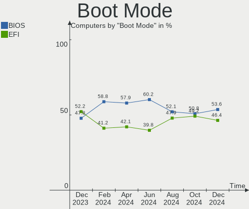
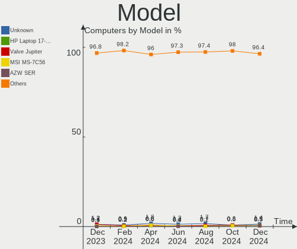
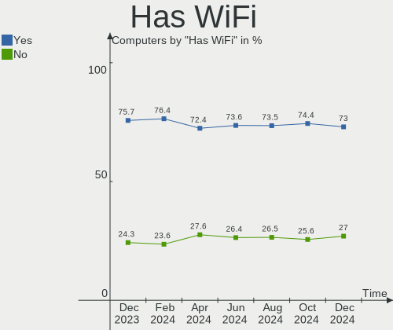
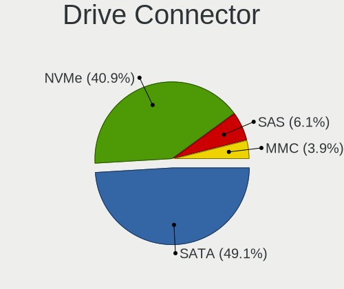

Linux in Germany - Hardware Trends
----------------------------------

A project to identify most popular hardware characteristics and track their change
over time based on data collected by Linux users at https://Linux-Hardware.org.

Anyone can contribute to this report by the [hw-probe](https://github.com/linuxhw/hw-probe) tool:

    sudo -E hw-probe -all -upload

This is a report for all computer types. See also reports for [desktops](/Location/Germany/Desktop/README.md) and [notebooks](/Location/Germany/Notebook/README.md).

Period: Nov, 2022.

Contents
--------

* [ System ](#system)
  - [ OS                       ](#os)
  - [ OS Family                ](#os-family)
  - [ Kernel                   ](#kernel)
  - [ Kernel Family            ](#kernel-family)
  - [ Kernel Major Ver.        ](#kernel-major-ver)
  - [ Arch                     ](#arch)
  - [ DE                       ](#de)
  - [ Display Server           ](#display-server)
  - [ Display Manager          ](#display-manager)
  - [ OS Lang                  ](#os-lang)
  - [ Boot Mode                ](#boot-mode)
  - [ Filesystem               ](#filesystem)
  - [ Part. scheme             ](#part-scheme)
  - [ Dual Boot with Linux/BSD ](#dual-boot-with-linuxbsd)
  - [ Dual Boot (Win)          ](#dual-boot-win)

* [ Board ](#board)
  - [ Vendor                   ](#vendor)
  - [ Model                    ](#model)
  - [ Model Family             ](#model-family)
  - [ MFG Year                 ](#mfg-year)
  - [ Form Factor              ](#form-factor)
  - [ Secure Boot              ](#secure-boot)
  - [ Coreboot                 ](#coreboot)
  - [ RAM Size                 ](#ram-size)
  - [ RAM Used                 ](#ram-used)
  - [ Total Drives             ](#total-drives)
  - [ Has CD-ROM               ](#has-cd-rom)
  - [ Has Ethernet             ](#has-ethernet)
  - [ Has WiFi                 ](#has-wifi)
  - [ Has Bluetooth            ](#has-bluetooth)

* [ Location ](#location)
  - [ Country                  ](#country)
  - [ City                     ](#city)

* [ Drives ](#drives)
  - [ Drive Vendor             ](#drive-vendor)
  - [ Drive Model              ](#drive-model)
  - [ HDD Vendor               ](#hdd-vendor)
  - [ SSD Vendor               ](#ssd-vendor)
  - [ Drive Kind               ](#drive-kind)
  - [ Drive Connector          ](#drive-connector)
  - [ Drive Size               ](#drive-size)
  - [ Space Total              ](#space-total)
  - [ Space Used               ](#space-used)
  - [ Malfunc. Drives          ](#malfunc-drives)
  - [ Malfunc. Drive Vendor    ](#malfunc-drive-vendor)
  - [ Malfunc. HDD Vendor      ](#malfunc-hdd-vendor)
  - [ Malfunc. Drive Kind      ](#malfunc-drive-kind)
  - [ Failed Drives            ](#failed-drives)
  - [ Failed Drive Vendor      ](#failed-drive-vendor)
  - [ Drive Status             ](#drive-status)

* [ Storage controller ](#storage-controller)
  - [ Storage Vendor           ](#storage-vendor)
  - [ Storage Model            ](#storage-model)
  - [ Storage Kind             ](#storage-kind)

* [ Processor ](#processor)
  - [ CPU Vendor               ](#cpu-vendor)
  - [ CPU Model                ](#cpu-model)
  - [ CPU Model Family         ](#cpu-model-family)
  - [ CPU Cores                ](#cpu-cores)
  - [ CPU Sockets              ](#cpu-sockets)
  - [ CPU Threads              ](#cpu-threads)
  - [ CPU Op-Modes             ](#cpu-op-modes)
  - [ CPU Microcode            ](#cpu-microcode)
  - [ CPU Microarch            ](#cpu-microarch)

* [ Graphics ](#graphics)
  - [ GPU Vendor               ](#gpu-vendor)
  - [ GPU Model                ](#gpu-model)
  - [ GPU Combo                ](#gpu-combo)
  - [ GPU Driver               ](#gpu-driver)
  - [ GPU Memory               ](#gpu-memory)

* [ Monitor ](#monitor)
  - [ Monitor Vendor           ](#monitor-vendor)
  - [ Monitor Model            ](#monitor-model)
  - [ Monitor Resolution       ](#monitor-resolution)
  - [ Monitor Diagonal         ](#monitor-diagonal)
  - [ Monitor Width            ](#monitor-width)
  - [ Aspect Ratio             ](#aspect-ratio)
  - [ Monitor Area             ](#monitor-area)
  - [ Pixel Density            ](#pixel-density)
  - [ Multiple Monitors        ](#multiple-monitors)

* [ Network ](#network)
  - [ Net Controller Vendor    ](#net-controller-vendor)
  - [ Net Controller Model     ](#net-controller-model)
  - [ Wireless Vendor          ](#wireless-vendor)
  - [ Wireless Model           ](#wireless-model)
  - [ Ethernet Vendor          ](#ethernet-vendor)
  - [ Ethernet Model           ](#ethernet-model)
  - [ Net Controller Kind      ](#net-controller-kind)
  - [ Used Controller          ](#used-controller)
  - [ NICs                     ](#nics)
  - [ IPv6                     ](#ipv6)

* [ Bluetooth ](#bluetooth)
  - [ Bluetooth Vendor         ](#bluetooth-vendor)
  - [ Bluetooth Model          ](#bluetooth-model)

* [ Sound ](#sound)
  - [ Sound Vendor             ](#sound-vendor)
  - [ Sound Model              ](#sound-model)

* [ Memory ](#memory)
  - [ Memory Vendor            ](#memory-vendor)
  - [ Memory Model             ](#memory-model)
  - [ Memory Kind              ](#memory-kind)
  - [ Memory Form Factor       ](#memory-form-factor)
  - [ Memory Size              ](#memory-size)
  - [ Memory Speed             ](#memory-speed)

* [ Printers & scanners ](#printers--scanners)
  - [ Printer Vendor           ](#printer-vendor)
  - [ Printer Model            ](#printer-model)
  - [ Scanner Vendor           ](#scanner-vendor)
  - [ Scanner Model            ](#scanner-model)

* [ Camera ](#camera)
  - [ Camera Vendor            ](#camera-vendor)
  - [ Camera Model             ](#camera-model)

* [ Security ](#security)
  - [ Fingerprint Vendor       ](#fingerprint-vendor)
  - [ Fingerprint Model        ](#fingerprint-model)
  - [ Chipcard Vendor          ](#chipcard-vendor)
  - [ Chipcard Model           ](#chipcard-model)

* [ Unsupported ](#unsupported)
  - [ Unsupported Devices      ](#unsupported-devices)
  - [ Unsupported Device Types ](#unsupported-device-types)

System
------

OS
--

Installed operating systems

| Name                         | Computers | Percent |
|------------------------------|-----------|---------|
| Ubuntu 22.04                 | 90        | 17.31%  |
| Linux Mint 21                | 36        | 6.92%   |
| Ubuntu 20.04                 | 26        | 5%      |
| Ubuntu 22.10                 | 22        | 4.23%   |
| Debian 11                    | 21        | 4.04%   |
| Linux Mint 20.3              | 20        | 3.85%   |
| Fedora 37                    | 19        | 3.65%   |
| OpenMandriva 4.3             | 16        | 3.08%   |
| Fedora 36                    | 16        | 3.08%   |
| Pop!_OS 22.04                | 15        | 2.88%   |
| Zorin 16                     | 14        | 2.69%   |
| Arch Rolling                 | 13        | 2.5%    |
| Manjaro                      | 12        | 2.31%   |
| OpenMandriva 4.50            | 10        | 1.92%   |
| KDE neon 22.04               | 10        | 1.92%   |
| Ubuntu 18.04                 | 9         | 1.73%   |
| Manjaro 22.0.0               | 9         | 1.73%   |
| LMDE 5                       | 8         | 1.54%   |
| Kubuntu 22.04                | 8         | 1.54%   |
| openSUSE Tumbleweed-XXXXXXXX | 7         | 1.35%   |
| Elementary 6.1               | 7         | 1.35%   |
| Debian                       | 7         | 1.35%   |
| Xubuntu 22.04                | 6         | 1.15%   |
| ArcoLinux Rolling            | 6         | 1.15%   |
| Kubuntu 22.10                | 5         | 0.96%   |
| Xubuntu 22.10                | 4         | 0.77%   |
| SteamOS 3.3.2                | 4         | 0.77%   |
| ROSA 12.3                    | 4         | 0.77%   |
| Lubuntu 22.04                | 4         | 0.77%   |
| Xubuntu 20.04                | 3         | 0.58%   |
| Nobara 36                    | 3         | 0.58%   |
| Linux Mint 20.2              | 3         | 0.58%   |
| Kubuntu 20.04                | 3         | 0.58%   |
| Gentoo 2.9                   | 3         | 0.58%   |
| EndeavourOS Rolling          | 3         | 0.58%   |
| Xero Rolling                 | 2         | 0.38%   |
| Ubuntu MATE 22.04            | 2         | 0.38%   |
| Ubuntu 21.10                 | 2         | 0.38%   |
| TUXEDO OS 22.04              | 2         | 0.38%   |
| ROSA R11.1                   | 2         | 0.38%   |

OS Family
---------

OS without a version

| Name          | Computers | Percent |
|---------------|-----------|---------|
| Ubuntu        | 149       | 28.65%  |
| Linux Mint    | 63        | 12.12%  |
| Fedora        | 37        | 7.12%   |
| Debian        | 30        | 5.77%   |
| OpenMandriva  | 26        | 5%      |
| Manjaro       | 21        | 4.04%   |
| Kubuntu       | 18        | 3.46%   |
| Pop!_OS       | 16        | 3.08%   |
| Zorin         | 15        | 2.88%   |
| Xubuntu       | 14        | 2.69%   |
| Arch          | 13        | 2.5%    |
| openSUSE      | 12        | 2.31%   |
| KDE neon      | 11        | 2.12%   |
| LMDE          | 8         | 1.54%   |
| Elementary    | 8         | 1.54%   |
| Lubuntu       | 7         | 1.35%   |
| ROSA          | 6         | 1.15%   |
| ArcoLinux     | 6         | 1.15%   |
| SteamOS       | 5         | 0.96%   |
| Gentoo        | 5         | 0.96%   |
| Ubuntu MATE   | 4         | 0.77%   |
| Nobara        | 3         | 0.58%   |
| Kali          | 3         | 0.58%   |
| EndeavourOS   | 3         | 0.58%   |
| Xero          | 2         | 0.38%   |
| TUXEDO OS     | 2         | 0.38%   |
| Raspbian      | 2         | 0.38%   |
| MX            | 2         | 0.38%   |
| LinuxFX       | 2         | 0.38%   |
| Endless       | 2         | 0.38%   |
| Crystal Linux | 2         | 0.38%   |
| CentOS        | 2         | 0.38%   |
| Void Linux    | 1         | 0.19%   |
| UbuntuDDE     | 1         | 0.19%   |
| Ubuntu Studio | 1         | 0.19%   |
| Ubuntu Budgie | 1         | 0.19%   |
| Sparky        | 1         | 0.19%   |
| Solus         | 1         | 0.19%   |
| RHEL          | 1         | 0.19%   |
| Reborn OS     | 1         | 0.19%   |

Kernel
------

Version of the Linux kernel

| Version                    | Computers | Percent |
|----------------------------|-----------|---------|
| 5.15.0-53-generic          | 93        | 17.88%  |
| 5.15.0-52-generic          | 86        | 16.54%  |
| 5.19.0-23-generic          | 25        | 4.81%   |
| 5.16.7-desktop-1omv4003    | 15        | 2.88%   |
| 5.4.0-131-generic          | 14        | 2.69%   |
| 5.4.0-132-generic          | 13        | 2.5%    |
| 5.10.0-19-amd64            | 13        | 2.5%    |
| 6.0.5-200.fc36.x86_64      | 12        | 2.31%   |
| 6.0.8-300.fc37.x86_64      | 7         | 1.35%   |
| 5.19.5-desktop-1omv4090    | 7         | 1.35%   |
| 6.0.9-arch1-1              | 6         | 1.15%   |
| 6.0.9-300.fc37.x86_64      | 6         | 1.15%   |
| 6.0.7-arch1-1              | 6         | 1.15%   |
| 5.10.0-18-amd64            | 6         | 1.15%   |
| 6.0.6-76060006-generic     | 5         | 0.96%   |
| 6.0.2-76060002-generic     | 5         | 0.96%   |
| 6.0.0-4-amd64              | 5         | 0.96%   |
| 5.19.0-21-generic          | 5         | 0.96%   |
| 6.0.8-arch1-1              | 4         | 0.77%   |
| 6.0.3-76060003-generic     | 4         | 0.77%   |
| 6.0.10-arch2-1             | 4         | 0.77%   |
| 5.19.16-301.fc37.x86_64    | 4         | 0.77%   |
| 5.15.76-1-MANJARO          | 4         | 0.77%   |
| 5.15.0-50-generic          | 4         | 0.77%   |
| 5.13.0-valve21.3-1-neptune | 4         | 0.77%   |
| 4.15.0-197-generic         | 4         | 0.77%   |
| 6.0.8-1-MANJARO            | 3         | 0.58%   |
| 6.0.6-1-default            | 3         | 0.58%   |
| 5.19.12-desktop-2omv4090   | 3         | 0.58%   |
| 5.19.0-0.deb11.2-amd64     | 3         | 0.58%   |
| 5.15.79-1-lts              | 3         | 0.58%   |
| 5.15.0-48-generic          | 3         | 0.58%   |
| 5.15.0-43-generic          | 3         | 0.58%   |
| 5.15.0-41-generic          | 3         | 0.58%   |
| 5.15.0-10052-tuxedo        | 3         | 0.58%   |
| 6.0.9-200.fc36.x86_64      | 2         | 0.38%   |
| 6.0.8-1-default            | 2         | 0.38%   |
| 6.0.7-zen1-1-zen           | 2         | 0.38%   |
| 6.0.7-301.fc37.x86_64      | 2         | 0.38%   |
| 6.0.2-2-MANJARO            | 2         | 0.38%   |

Kernel Family
-------------

Linux kernel without a distro release

| Version | Computers | Percent |
|---------|-----------|---------|
| 5.15.0  | 203       | 39.04%  |
| 5.4.0   | 41        | 7.88%   |
| 5.19.0  | 34        | 6.54%   |
| 5.10.0  | 24        | 4.62%   |
| 6.0.8   | 18        | 3.46%   |
| 6.0.7   | 18        | 3.46%   |
| 6.0.9   | 17        | 3.27%   |
| 5.16.7  | 15        | 2.88%   |
| 6.0.0   | 14        | 2.69%   |
| 6.0.5   | 13        | 2.5%    |
| 6.0.6   | 11        | 2.12%   |
| 6.0.2   | 9         | 1.73%   |
| 5.19.5  | 7         | 1.35%   |
| 5.13.0  | 7         | 1.35%   |
| 4.15.0  | 7         | 1.35%   |
| 6.0.10  | 6         | 1.15%   |
| 5.15.76 | 6         | 1.15%   |
| 6.0.3   | 5         | 0.96%   |
| 5.14.0  | 5         | 0.96%   |
| 5.19.16 | 4         | 0.77%   |
| 5.15.75 | 4         | 0.77%   |
| 5.19.12 | 3         | 0.58%   |
| 5.15.79 | 3         | 0.58%   |
| 5.15.77 | 3         | 0.58%   |
| 5.15.74 | 3         | 0.58%   |
| 5.15.60 | 3         | 0.58%   |
| 4.18.0  | 3         | 0.58%   |
| 6.1.0   | 2         | 0.38%   |
| 5.3.18  | 2         | 0.38%   |
| 5.19.17 | 2         | 0.38%   |
| 5.19.14 | 2         | 0.38%   |
| 5.16.13 | 2         | 0.38%   |
| 5.15.78 | 2         | 0.38%   |
| 5.11.0  | 2         | 0.38%   |
| 5.10.60 | 2         | 0.38%   |
| 4.19.0  | 2         | 0.38%   |
| 5.9.16  | 1         | 0.19%   |
| 5.4.83  | 1         | 0.19%   |
| 5.3.0   | 1         | 0.19%   |
| 5.19.8  | 1         | 0.19%   |

Kernel Major Ver.
-----------------

Linux kernel major version

| Version | Computers | Percent |
|---------|-----------|---------|
| 5.15    | 230       | 44.23%  |
| 6.0     | 111       | 21.35%  |
| 5.19    | 53        | 10.19%  |
| 5.4     | 42        | 8.08%   |
| 5.10    | 29        | 5.58%   |
| 5.16    | 17        | 3.27%   |
| 5.13    | 7         | 1.35%   |
| 4.15    | 7         | 1.35%   |
| 5.14    | 6         | 1.15%   |
| 4.18    | 4         | 0.77%   |
| 5.3     | 3         | 0.58%   |
| 6.1     | 2         | 0.38%   |
| 5.11    | 2         | 0.38%   |
| 4.19    | 2         | 0.38%   |
| 5.9     | 1         | 0.19%   |
| 5.18    | 1         | 0.19%   |
| 5.17    | 1         | 0.19%   |
| 4.9     | 1         | 0.19%   |
| 4.12    | 1         | 0.19%   |

Arch
----

OS architecture (x86_64, i586, etc.)

| Name     | Computers | Percent |
|----------|-----------|---------|
| x86_64   | 510       | 98.08%  |
| i686     | 5         | 0.96%   |
| aarch64  | 2         | 0.38%   |
| armv7l   | 1         | 0.19%   |
| armv6l   | 1         | 0.19%   |
| armv5tel | 1         | 0.19%   |

DE
--

Desktop Environment

| Name            | Computers | Percent |
|-----------------|-----------|---------|
| GNOME           | 232       | 44.62%  |
| KDE5            | 108       | 20.77%  |
| X-Cinnamon      | 65        | 12.5%   |
| XFCE            | 36        | 6.92%   |
| Unknown         | 23        | 4.42%   |
| MATE            | 12        | 2.31%   |
| Pantheon        | 8         | 1.54%   |
| LXQt            | 7         | 1.35%   |
| KDE             | 5         | 0.96%   |
| Cinnamon        | 4         | 0.77%   |
| LXDE            | 3         | 0.58%   |
| trinity         | 2         | 0.38%   |
| sway            | 2         | 0.38%   |
| KDE4            | 2         | 0.38%   |
| i3              | 2         | 0.38%   |
| Budgie          | 2         | 0.38%   |
| awesome         | 2         | 0.38%   |
| none+awesome    | 1         | 0.19%   |
| GNOME Flashback | 1         | 0.19%   |
| Enlightenment   | 1         | 0.19%   |
| Deepin          | 1         | 0.19%   |
| chadwm          | 1         | 0.19%   |

Display Server
--------------

X11 or Wayland

| Name    | Computers | Percent |
|---------|-----------|---------|
| X11     | 359       | 69.04%  |
| Wayland | 135       | 25.96%  |
| Tty     | 16        | 3.08%   |
| Unknown | 10        | 1.92%   |

Display Manager
---------------

SDDM, LightDM, etc.

| Name    | Computers | Percent |
|---------|-----------|---------|
| Unknown | 186       | 35.77%  |
| GDM3    | 140       | 26.92%  |
| LightDM | 81        | 15.58%  |
| SDDM    | 75        | 14.42%  |
| GDM     | 35        | 6.73%   |
| KDM     | 2         | 0.38%   |
| LXDM    | 1         | 0.19%   |

OS Lang
-------

Language

| Lang    | Computers | Percent |
|---------|-----------|---------|
| de_DE   | 356       | 68.46%  |
| en_US   | 118       | 22.69%  |
| en_GB   | 7         | 1.35%   |
| Unknown | 7         | 1.35%   |
| ru_RU   | 4         | 0.77%   |
| it_IT   | 4         | 0.77%   |
| es_ES   | 3         | 0.58%   |
| en_DE   | 3         | 0.58%   |
| C       | 3         | 0.58%   |
| POSIX   | 2         | 0.38%   |
| en_AG   | 2         | 0.38%   |
| tr_TR   | 1         | 0.19%   |
| ru_UA   | 1         | 0.19%   |
| ro_RO   | 1         | 0.19%   |
| pl_PL   | 1         | 0.19%   |
| nl_NL   | 1         | 0.19%   |
| hu_HU   | 1         | 0.19%   |
| fr_FR   | 1         | 0.19%   |
| en_CA   | 1         | 0.19%   |
| en_AU   | 1         | 0.19%   |
| el_GR   | 1         | 0.19%   |
| de_AT   | 1         | 0.19%   |

Boot Mode
---------

EFI or BIOS

| Mode | Computers | Percent |
|------|-----------|---------|
| BIOS | 269       | 51.73%  |
| EFI  | 251       | 48.27%  |

Filesystem
----------

Type of filesystem

| Type          | Computers | Percent |
|---------------|-----------|---------|
| Ext4          | 409       | 78.65%  |
| Btrfs         | 64        | 12.31%  |
| Overlay       | 29        | 5.58%   |
| Xfs           | 8         | 1.54%   |
| Zfs           | 7         | 1.35%   |
| Reiserfs      | 1         | 0.19%   |
| Fuse.snapfuse | 1         | 0.19%   |
| F2fs          | 1         | 0.19%   |

Part. scheme
------------

Scheme of partitioning

| Type    | Computers | Percent |
|---------|-----------|---------|
| GPT     | 274       | 52.69%  |
| Unknown | 166       | 31.92%  |
| MBR     | 80        | 15.38%  |

Dual Boot with Linux/BSD
------------------------

Hosting more than one Linux/BSD

| Dual boot | Computers | Percent |
|-----------|-----------|---------|
| No        | 447       | 85.96%  |
| Yes       | 73        | 14.04%  |

Dual Boot (Win)
---------------

Hosting Linux and Windows

| Dual boot | Computers | Percent |
|-----------|-----------|---------|
| No        | 392       | 75.38%  |
| Yes       | 128       | 24.62%  |

Board
-----

Vendor
------

Motherboard manufacturer

| Name                    | Computers | Percent |
|-------------------------|-----------|---------|
| Lenovo                  | 88        | 16.92%  |
| Hewlett-Packard         | 63        | 12.12%  |
| ASUSTek Computer        | 63        | 12.12%  |
| Dell                    | 55        | 10.58%  |
| MSI                     | 36        | 6.92%   |
| Gigabyte Technology     | 33        | 6.35%   |
| Acer                    | 30        | 5.77%   |
| Fujitsu                 | 19        | 3.65%   |
| ASRock                  | 16        | 3.08%   |
| Medion                  | 15        | 2.88%   |
| Apple                   | 13        | 2.5%    |
| Unknown                 | 8         | 1.54%   |
| TUXEDO                  | 7         | 1.35%   |
| Samsung Electronics     | 7         | 1.35%   |
| Intel                   | 7         | 1.35%   |
| Valve                   | 5         | 0.96%   |
| HUAWEI                  | 5         | 0.96%   |
| Packard Bell            | 4         | 0.77%   |
| Chuwi                   | 4         | 0.77%   |
| Sony                    | 3         | 0.58%   |
| Raspberry Pi Foundation | 3         | 0.58%   |
| Notebook                | 3         | 0.58%   |
| Google                  | 3         | 0.58%   |
| Fujitsu Siemens         | 3         | 0.58%   |
| Wortmann AG             | 2         | 0.38%   |
| Toshiba                 | 2         | 0.38%   |
| Tactus                  | 2         | 0.38%   |
| Schenker                | 2         | 0.38%   |
| Pegatron                | 2         | 0.38%   |
| AXDIA International     | 2         | 0.38%   |
| VA_IP3                  | 1         | 0.19%   |
| VALE                    | 1         | 0.19%   |
| Timi                    | 1         | 0.19%   |
| Thomson                 | 1         | 0.19%   |
| T-bao                   | 1         | 0.19%   |
| Shuttle                 | 1         | 0.19%   |
| Radxa                   | 1         | 0.19%   |
| Quanta                  | 1         | 0.19%   |
| MPMAN                   | 1         | 0.19%   |
| Microsoft               | 1         | 0.19%   |

Model
-----

Motherboard model

| Name                                 | Computers | Percent |
|--------------------------------------|-----------|---------|
| Unknown                              | 10        | 1.92%   |
| Valve Jupiter                        | 5         | 0.96%   |
| MSI MS-7C37                          | 5         | 0.96%   |
| Lenovo ThinkPad E15 Gen 4 21EES00100 | 4         | 0.77%   |
| HP EliteBook 850 G8 Notebook PC      | 3         | 0.58%   |
| ASUS PRIME A320M-K                   | 3         | 0.58%   |
| TUXEDO Pulse 15 Gen1                 | 2         | 0.38%   |
| Tactus GeoBook 140                   | 2         | 0.38%   |
| MSI MS-7C35                          | 2         | 0.38%   |
| MSI MS-7B86                          | 2         | 0.38%   |
| MSI MS-7758                          | 2         | 0.38%   |
| Lenovo ThinkPad E14 Gen 4 21ECS00000 | 2         | 0.38%   |
| HP Laptop 17-cp0xxx                  | 2         | 0.38%   |
| HP EliteBook 8560w                   | 2         | 0.38%   |
| HP Compaq Pro 6300 SFF               | 2         | 0.38%   |
| HP 255 G7 Notebook PC                | 2         | 0.38%   |
| Gigabyte Z170-HD3P-CF                | 2         | 0.38%   |
| Gigabyte B550 AORUS ELITE V2         | 2         | 0.38%   |
| Fujitsu LIFEBOOK A3510               | 2         | 0.38%   |
| Dell XPS 15 9510                     | 2         | 0.38%   |
| Dell Latitude E6320                  | 2         | 0.38%   |
| Dell Latitude 3320                   | 2         | 0.38%   |
| ASUS TUF Gaming X570-PLUS            | 2         | 0.38%   |
| ASUS PRO B460M-C                     | 2         | 0.38%   |
| ASUS M5A78L-M LE/USB3                | 2         | 0.38%   |
| ASRock Q1900M                        | 2         | 0.38%   |
| ASRock Q1900B-ITX                    | 2         | 0.38%   |
| Apple MacBookPro9,2                  | 2         | 0.38%   |
| Apple MacBookPro12,1                 | 2         | 0.38%   |
| Acer Aspire A315-51                  | 2         | 0.38%   |
| Wortmann AG TERRA_MOBILE_1542        | 1         | 0.19%   |
| Wortmann AG 1220624_1470150          | 1         | 0.19%   |
| VA_IP3 PEAQ Mini PC M100             | 1         | 0.19%   |
| VALE Notebook Slim S132              | 1         | 0.19%   |
| TUXEDO XMG FUSION 15 (XFU15L19)      | 1         | 0.19%   |
| TUXEDO Stellaris Intel Gen4          | 1         | 0.19%   |
| TUXEDO InfinityBook S 15 Gen6        | 1         | 0.19%   |
| TUXEDO Aura 15 Gen1                  | 1         | 0.19%   |
| Toshiba Satellite P50-B-10Q          | 1         | 0.19%   |
| Toshiba Satellite C670D-126          | 1         | 0.19%   |

Model Family
------------

Motherboard model prefix

| Name                  | Computers | Percent |
|-----------------------|-----------|---------|
| Lenovo ThinkPad       | 47        | 9.04%   |
| Acer Aspire           | 22        | 4.23%   |
| HP EliteBook          | 14        | 2.69%   |
| Dell Latitude         | 12        | 2.31%   |
| Dell XPS              | 11        | 2.12%   |
| ASUS PRIME            | 11        | 2.12%   |
| Unknown               | 10        | 1.92%   |
| Dell OptiPlex         | 9         | 1.73%   |
| Lenovo ThinkCentre    | 8         | 1.54%   |
| Lenovo IdeaPad        | 8         | 1.54%   |
| Fujitsu LIFEBOOK      | 8         | 1.54%   |
| Fujitsu ESPRIMO       | 8         | 1.54%   |
| Dell Inspiron         | 8         | 1.54%   |
| ASUS ROG              | 8         | 1.54%   |
| Dell Precision        | 7         | 1.35%   |
| HP Compaq             | 6         | 1.15%   |
| ASUS M5A78L-M         | 6         | 1.15%   |
| Valve Jupiter         | 5         | 0.96%   |
| MSI MS-7C37           | 5         | 0.96%   |
| HP Pavilion           | 5         | 0.96%   |
| HP Laptop             | 5         | 0.96%   |
| HP EliteDesk          | 5         | 0.96%   |
| Packard Bell EasyNote | 4         | 0.77%   |
| Lenovo Yoga           | 4         | 0.77%   |
| HP ZBook              | 4         | 0.77%   |
| HP ProBook            | 4         | 0.77%   |
| HP ENVY               | 4         | 0.77%   |
| HP 255                | 4         | 0.77%   |
| ASUS VivoBook         | 4         | 0.77%   |
| RPi Raspberry         | 3         | 0.58%   |
| Lenovo Legion         | 3         | 0.58%   |
| HP Spectre            | 3         | 0.58%   |
| ASUS PRO              | 3         | 0.58%   |
| TUXEDO Pulse          | 2         | 0.38%   |
| Toshiba Satellite     | 2         | 0.38%   |
| Tactus GeoBook        | 2         | 0.38%   |
| MSI MS-7C35           | 2         | 0.38%   |
| MSI MS-7B86           | 2         | 0.38%   |
| MSI MS-7758           | 2         | 0.38%   |
| Lenovo ThinkBook      | 2         | 0.38%   |

MFG Year
--------

Motherboard manufacture year

| Year    | Computers | Percent |
|---------|-----------|---------|
| 2021    | 58        | 11.15%  |
| 2019    | 57        | 10.96%  |
| 2020    | 48        | 9.23%   |
| 2012    | 42        | 8.08%   |
| 2022    | 41        | 7.88%   |
| 2018    | 35        | 6.73%   |
| 2011    | 34        | 6.54%   |
| 2015    | 29        | 5.58%   |
| 2014    | 28        | 5.38%   |
| 2013    | 27        | 5.19%   |
| 2017    | 26        | 5%      |
| 2010    | 24        | 4.62%   |
| 2016    | 23        | 4.42%   |
| 2009    | 15        | 2.88%   |
| 2008    | 14        | 2.69%   |
| 2007    | 9         | 1.73%   |
| Unknown | 7         | 1.35%   |
| 2006    | 2         | 0.38%   |
| 2005    | 1         | 0.19%   |

Form Factor
-----------

Physical design of the computer

| Name           | Computers | Percent |
|----------------|-----------|---------|
| Notebook       | 289       | 55.58%  |
| Desktop        | 187       | 35.96%  |
| Convertible    | 23        | 4.42%   |
| Mini pc        | 11        | 2.12%   |
| System on chip | 4         | 0.77%   |
| All in one     | 3         | 0.58%   |
| Server         | 2         | 0.38%   |
| Tablet         | 1         | 0.19%   |

Secure Boot
-----------

Enabled or disabled

| State    | Computers | Percent |
|----------|-----------|---------|
| Disabled | 475       | 91.35%  |
| Enabled  | 45        | 8.65%   |

Coreboot
--------

Have coreboot on board

| Used | Computers | Percent |
|------|-----------|---------|
| No   | 517       | 99.42%  |
| Yes  | 3         | 0.58%   |

RAM Size
--------

Total RAM memory

| Size in GB  | Computers | Percent |
|-------------|-----------|---------|
| 4.01-8.0    | 117       | 22.5%   |
| 8.01-16.0   | 112       | 21.54%  |
| 16.01-24.0  | 105       | 20.19%  |
| 3.01-4.0    | 71        | 13.65%  |
| 32.01-64.0  | 67        | 12.88%  |
| 64.01-256.0 | 17        | 3.27%   |
| 24.01-32.0  | 12        | 2.31%   |
| 2.01-3.0    | 6         | 1.15%   |
| 1.01-2.0    | 6         | 1.15%   |
| 0.51-1.0    | 6         | 1.15%   |
| 0.01-0.5    | 1         | 0.19%   |

RAM Used
--------

Used RAM memory

| Used GB    | Computers | Percent |
|------------|-----------|---------|
| 1.01-2.0   | 176       | 33.85%  |
| 2.01-3.0   | 127       | 24.42%  |
| 4.01-8.0   | 83        | 15.96%  |
| 3.01-4.0   | 73        | 14.04%  |
| 8.01-16.0  | 26        | 5%      |
| 0.51-1.0   | 20        | 3.85%   |
| 0.01-0.5   | 8         | 1.54%   |
| 16.01-24.0 | 4         | 0.77%   |
| 32.01-64.0 | 2         | 0.38%   |
| 24.01-32.0 | 1         | 0.19%   |

Total Drives
------------

Number of drives on board

| Drives | Computers | Percent |
|--------|-----------|---------|
| 1      | 301       | 57.88%  |
| 2      | 139       | 26.73%  |
| 3      | 44        | 8.46%   |
| 4      | 18        | 3.46%   |
| 6      | 5         | 0.96%   |
| 5      | 5         | 0.96%   |
| 0      | 3         | 0.58%   |
| 7      | 2         | 0.38%   |
| 12     | 1         | 0.19%   |
| 9      | 1         | 0.19%   |
| 8      | 1         | 0.19%   |

Has CD-ROM
----------

Has CD-ROM on board

| Presented | Computers | Percent |
|-----------|-----------|---------|
| No        | 311       | 59.81%  |
| Yes       | 209       | 40.19%  |

Has Ethernet
------------

Has Ethernet on board

| Presented | Computers | Percent |
|-----------|-----------|---------|
| Yes       | 440       | 84.62%  |
| No        | 80        | 15.38%  |

Has WiFi
--------

Has WiFi module

| Presented | Computers | Percent |
|-----------|-----------|---------|
| Yes       | 385       | 74.04%  |
| No        | 135       | 25.96%  |

Has Bluetooth
-------------

Has Bluetooth module

| Presented | Computers | Percent |
|-----------|-----------|---------|
| Yes       | 314       | 60.38%  |
| No        | 206       | 39.62%  |

Location
--------

Country
-------

Geographic location (country)

| Country | Computers | Percent |
|---------|-----------|---------|
| Germany | 520       | 100%    |

City
----

Geographic location (city)

| City                 | Computers | Percent |
|----------------------|-----------|---------|
| Berlin               | 49        | 9.42%   |
| Frankfurt am Main    | 20        | 3.85%   |
| Munich               | 19        | 3.65%   |
| Hamburg              | 13        | 2.5%    |
| Cologne              | 11        | 2.12%   |
| Stuttgart            | 9         | 1.73%   |
| Nuremberg            | 9         | 1.73%   |
| Leipzig              | 7         | 1.35%   |
| Wiesbaden            | 5         | 0.96%   |
| Gelsenkirchen        | 5         | 0.96%   |
| Dortmund             | 5         | 0.96%   |
| Wuppertal            | 4         | 0.77%   |
| Mannheim             | 4         | 0.77%   |
| Ludwigsburg          | 4         | 0.77%   |
| Karlsruhe            | 4         | 0.77%   |
| Hanover              | 4         | 0.77%   |
| Dresden              | 4         | 0.77%   |
| Bremen               | 4         | 0.77%   |
| Braunschweig         | 4         | 0.77%   |
| Bonn                 | 4         | 0.77%   |
| Stadtilm             | 3         | 0.58%   |
| Salzgitter           | 3         | 0.58%   |
| Münster             | 3         | 0.58%   |
| Mainz                | 3         | 0.58%   |
| Kassel               | 3         | 0.58%   |
| Heidelberg           | 3         | 0.58%   |
| Freiburg im Breisgau | 3         | 0.58%   |
| Essen                | 3         | 0.58%   |
| Erfurt               | 3         | 0.58%   |
| Darmstadt            | 3         | 0.58%   |
| Bocholt              | 3         | 0.58%   |
| Wettringen           | 2         | 0.38%   |
| Weisswasser          | 2         | 0.38%   |
| Weissenfels          | 2         | 0.38%   |
| Weimar               | 2         | 0.38%   |
| Wangen               | 2         | 0.38%   |
| Ulm                  | 2         | 0.38%   |
| Tübingen            | 2         | 0.38%   |
| Sindelfingen         | 2         | 0.38%   |
| Seedorf              | 2         | 0.38%   |

Drives
------

Drive Vendor
------------

Hard drive vendors

| Vendor                      | Computers | Drives | Percent |
|-----------------------------|-----------|--------|---------|
| Samsung Electronics         | 153       | 186    | 19.95%  |
| WDC                         | 92        | 101    | 11.99%  |
| Seagate                     | 79        | 91     | 10.3%   |
| SanDisk                     | 61        | 62     | 7.95%   |
| Crucial                     | 43        | 48     | 5.61%   |
| Toshiba                     | 39        | 43     | 5.08%   |
| Unknown                     | 32        | 38     | 4.17%   |
| Kingston                    | 24        | 28     | 3.13%   |
| Intenso                     | 24        | 27     | 3.13%   |
| SK hynix                    | 20        | 20     | 2.61%   |
| Intel                       | 20        | 25     | 2.61%   |
| Micron Technology           | 17        | 17     | 2.22%   |
| Hitachi                     | 16        | 20     | 2.09%   |
| Phison Electronics          | 13        | 14     | 1.69%   |
| KIOXIA                      | 11        | 11     | 1.43%   |
| Kingston Technology Company | 7         | 7      | 0.91%   |
| Apple                       | 7         | 7      | 0.91%   |
| Micron/Crucial Technology   | 6         | 6      | 0.78%   |
| Unknown                     | 6         | 7      | 0.78%   |
| SPCC                        | 5         | 7      | 0.65%   |
| Patriot                     | 5         | 5      | 0.65%   |
| HGST                        | 5         | 7      | 0.65%   |
| China                       | 5         | 5      | 0.65%   |
| Transcend                   | 4         | 4      | 0.52%   |
| Silicon Motion              | 4         | 4      | 0.52%   |
| Netac                       | 4         | 4      | 0.52%   |
| Union Memory (Shenzhen)     | 3         | 3      | 0.39%   |
| UMIS                        | 3         | 3      | 0.39%   |
| OCZ                         | 3         | 3      | 0.39%   |
| JMicron Technology          | 3         | 3      | 0.39%   |
| ASMT                        | 3         | 3      | 0.39%   |
| A-DATA Technology           | 3         | 3      | 0.39%   |
| Verbatim                    | 2         | 2      | 0.26%   |
| USB2.0                      | 2         | 2      | 0.26%   |
| Phison                      | 2         | 2      | 0.26%   |
| O2 Micro                    | 2         | 2      | 0.26%   |
| Maxtor                      | 2         | 2      | 0.26%   |
| LITEON                      | 2         | 2      | 0.26%   |
| Leven                       | 2         | 2      | 0.26%   |
| KIOXIA-EXCERIA              | 2         | 3      | 0.26%   |

Drive Model
-----------

Hard drive models

| Model                                                | Computers | Percent |
|------------------------------------------------------|-----------|---------|
| Samsung NVMe SSD Controller SM981/PM981/PM983 1TB    | 21        | 2.55%   |
| Samsung NVMe SSD Controller PM9A1/PM9A3/980PRO 250GB | 10        | 1.21%   |
| Crucial CT1000MX500SSD1 1TB                          | 8         | 0.97%   |
| Unknown MMC Card  128GB                              | 7         | 0.85%   |
| Samsung SSD 860 EVO 1TB                              | 7         | 0.85%   |
| Seagate ST500DM002-1BD142 500GB                      | 6         | 0.73%   |
| Samsung SSD 850 EVO 500GB                            | 6         | 0.73%   |
| Phison E12 NVMe Controller 2TB                       | 6         | 0.73%   |
| Unknown                                              | 6         | 0.73%   |
| Unknown MMC Card  64GB                               | 5         | 0.61%   |
| Samsung SSD 970 EVO Plus 1TB                         | 5         | 0.61%   |
| Samsung SSD 870 QVO 1TB                              | 5         | 0.61%   |
| Samsung SSD 850 EVO 250GB                            | 5         | 0.61%   |
| Kingston Company A2000 NVMe SSD 500GB                | 5         | 0.61%   |
| Crucial CT240BX500SSD1 240GB                         | 5         | 0.61%   |
| WDC WDS500G2B0B-00YS70 500GB SSD                     | 4         | 0.48%   |
| Unknown SD/MMC/MS PRO 8GB                            | 4         | 0.48%   |
| Toshiba XG6 NVMe SSD Controller 256GB                | 4         | 0.48%   |
| Toshiba MQ01ABD100 1TB                               | 4         | 0.48%   |
| Toshiba HDWD110 1TB                                  | 4         | 0.48%   |
| SK hynix BC711 HFM512GD3JX013N 512GB                 | 4         | 0.48%   |
| Seagate ST9500325AS 500GB                            | 4         | 0.48%   |
| SanDisk SSD PLUS 1000GB                              | 4         | 0.48%   |
| Samsung SSD 980 1TB                                  | 4         | 0.48%   |
| Samsung SSD 860 EVO 500GB                            | 4         | 0.48%   |
| Samsung SSD 850 PRO 512GB                            | 4         | 0.48%   |
| Kingston SA400S37120G 120GB SSD                      | 4         | 0.48%   |
| Crucial CT500MX500SSD1 500GB                         | 4         | 0.48%   |
| Crucial CT480BX500SSD1 480GB                         | 4         | 0.48%   |
| Crucial CT1000BX500SSD1 1TB                          | 4         | 0.48%   |
| WDC WDS500G2B0A-00SM50 500GB SSD                     | 3         | 0.36%   |
| WDC WD5000BEVT-22ZAT0 500GB                          | 3         | 0.36%   |
| WDC WD5000AAKX-60U6AA0 500GB                         | 3         | 0.36%   |
| Union Memory (Shenzhen) UMIS RPJTJ512MGE1QDQ 512GB   | 3         | 0.36%   |
| UMIS RPJTJ512MGE1QDQ 512GB                           | 3         | 0.36%   |
| Toshiba MQ04ABF100 1TB                               | 3         | 0.36%   |
| SK hynix BC501 NVMe Solid State Drive 512GB          | 3         | 0.36%   |
| Seagate ST1000LM024 HN-M101MBB 1TB                   | 3         | 0.36%   |
| Sandisk WD Blue SN550 NVMe SSD 1TB                   | 3         | 0.36%   |
| Sandisk WD Black SN750 / PC SN730 NVMe SSD 1024GB    | 3         | 0.36%   |

HDD Vendor
----------

Hard disk drive vendors

| Vendor              | Computers | Drives | Percent |
|---------------------|-----------|--------|---------|
| Seagate             | 77        | 89     | 34.84%  |
| WDC                 | 68        | 77     | 30.77%  |
| Toshiba             | 23        | 25     | 10.41%  |
| Samsung Electronics | 17        | 20     | 7.69%   |
| Hitachi             | 16        | 20     | 7.24%   |
| HGST                | 5         | 7      | 2.26%   |
| Unknown             | 4         | 4      | 1.81%   |
| Intenso             | 3         | 3      | 1.36%   |
| Fujitsu             | 2         | 2      | 0.9%    |
| ASMT                | 2         | 2      | 0.9%    |
| USB3.0              | 1         | 1      | 0.45%   |
| Maxtor              | 1         | 1      | 0.45%   |
| Hewlett-Packard     | 1         | 8      | 0.45%   |
| ASMedia             | 1         | 1      | 0.45%   |

SSD Vendor
----------

Solid state drive vendors

| Vendor              | Computers | Drives | Percent |
|---------------------|-----------|--------|---------|
| Samsung Electronics | 77        | 88     | 27.6%   |
| SanDisk             | 42        | 43     | 15.05%  |
| Crucial             | 39        | 41     | 13.98%  |
| Kingston            | 17        | 19     | 6.09%   |
| Intenso             | 16        | 18     | 5.73%   |
| WDC                 | 12        | 12     | 4.3%    |
| Intel               | 6         | 8      | 2.15%   |
| Apple               | 6         | 6      | 2.15%   |
| Toshiba             | 5         | 7      | 1.79%   |
| Patriot             | 5         | 5      | 1.79%   |
| Micron Technology   | 5         | 5      | 1.79%   |
| China               | 5         | 5      | 1.79%   |
| SPCC                | 4         | 6      | 1.43%   |
| Netac               | 4         | 4      | 1.43%   |
| Transcend           | 3         | 3      | 1.08%   |
| OCZ                 | 3         | 3      | 1.08%   |
| Unknown             | 3         | 3      | 1.08%   |
| Verbatim            | 2         | 2      | 0.72%   |
| Phison              | 2         | 2      | 0.72%   |
| LITEON              | 2         | 2      | 0.72%   |
| JMicron Technology  | 2         | 2      | 0.72%   |
| A-DATA Technology   | 2         | 2      | 0.72%   |
| WDC WDS1            | 1         | 1      | 0.36%   |
| Vaseky              | 1         | 1      | 0.36%   |
| USB30               | 1         | 1      | 0.36%   |
| Team                | 1         | 1      | 0.36%   |
| Seagate             | 1         | 1      | 0.36%   |
| Mushkin             | 1         | 1      | 0.36%   |
| Maxtor              | 1         | 1      | 0.36%   |
| Lexar               | 1         | 1      | 0.36%   |
| Leven               | 1         | 1      | 0.36%   |
| KIOXIA-EXCERIA      | 1         | 1      | 0.36%   |
| KingDian            | 1         | 1      | 0.36%   |
| INNOVATION IT       | 1         | 1      | 0.36%   |
| Hoodisk             | 1         | 1      | 0.36%   |
| GLOBAL              | 1         | 1      | 0.36%   |
| Emtec               | 1         | 1      | 0.36%   |
| Colorful            | 1         | 1      | 0.36%   |
| ASMT                | 1         | 1      | 0.36%   |

Drive Kind
----------

HDD or SSD

| Kind    | Computers | Drives | Percent |
|---------|-----------|--------|---------|
| SSD     | 246       | 303    | 35.81%  |
| NVMe    | 213       | 248    | 31%     |
| HDD     | 180       | 260    | 26.2%   |
| MMC     | 32        | 36     | 4.66%   |
| Unknown | 16        | 20     | 2.33%   |

Drive Connector
---------------

SATA, SAS, NVMe, etc.

| Type | Computers | Drives | Percent |
|------|-----------|--------|---------|
| SATA | 346       | 528    | 54.23%  |
| NVMe | 213       | 245    | 33.39%  |
| SAS  | 47        | 58     | 7.37%   |
| MMC  | 32        | 36     | 5.02%   |

Drive Size
----------

Size of hard drive

| Size in TB | Computers | Drives | Percent |
|------------|-----------|--------|---------|
| 0.01-0.5   | 244       | 317    | 55.45%  |
| 0.51-1.0   | 121       | 152    | 27.5%   |
| 1.01-2.0   | 48        | 55     | 10.91%  |
| 3.01-4.0   | 10        | 14     | 2.27%   |
| 2.01-3.0   | 8         | 11     | 1.82%   |
| 4.01-10.0  | 7         | 11     | 1.59%   |
| 10.01-20.0 | 2         | 3      | 0.45%   |

Space Total
-----------

Amount of disk space available on the file system

| Size in GB     | Computers | Percent |
|----------------|-----------|---------|
| 101-250        | 133       | 25.58%  |
| 251-500        | 118       | 22.69%  |
| 501-1000       | 86        | 16.54%  |
| 1001-2000      | 44        | 8.46%   |
| More than 3000 | 34        | 6.54%   |
| 1-20           | 32        | 6.15%   |
| 51-100         | 23        | 4.42%   |
| 2001-3000      | 22        | 4.23%   |
| Unknown        | 18        | 3.46%   |
| 21-50          | 10        | 1.92%   |

Space Used
----------

Amount of used disk space

| Used GB        | Computers | Percent |
|----------------|-----------|---------|
| 1-20           | 162       | 31.15%  |
| 21-50          | 91        | 17.5%   |
| 51-100         | 69        | 13.27%  |
| 101-250        | 63        | 12.12%  |
| 251-500        | 40        | 7.69%   |
| 501-1000       | 33        | 6.35%   |
| 1001-2000      | 26        | 5%      |
| Unknown        | 18        | 3.46%   |
| More than 3000 | 10        | 1.92%   |
| 2001-3000      | 8         | 1.54%   |

Malfunc. Drives
---------------

Drive models with a malfunction

| Model                                                         | Computers | Drives | Percent |
|---------------------------------------------------------------|-----------|--------|---------|
| Seagate ST500DM002-1BD142 500GB                               | 2         | 2      | 7.14%   |
| WDC WD800JD-75HKA1 80GB                                       | 1         | 1      | 3.57%   |
| WDC WD60EFAX-68SHWN0 6TB                                      | 1         | 1      | 3.57%   |
| WDC WD5000BEKT-60KA9T0 500GB                                  | 1         | 1      | 3.57%   |
| WDC WD5000AAKS-007AA0 500GB                                   | 1         | 1      | 3.57%   |
| WDC WD30EFRX-68AX9N0 3TB                                      | 1         | 1      | 3.57%   |
| WDC WD10EADS-00L5B1 1TB                                       | 1         | 1      | 3.57%   |
| Transcend TS1TSSD230S 1024GB                                  | 1         | 1      | 3.57%   |
| SK hynix BC711 HFM512GD3JX013N 512GB                          | 1         | 1      | 3.57%   |
| Seagate ST3200822AS 200GB                                     | 1         | 1      | 3.57%   |
| Seagate ST31000524AS 1TB                                      | 1         | 1      | 3.57%   |
| Seagate ST2000LX001-1RG174 2TB                                | 1         | 1      | 3.57%   |
| Seagate ST2000LM003 HN-M201RAD 2TB                            | 1         | 1      | 3.57%   |
| Seagate ST2000DX001-1CM164 2TB                                | 1         | 1      | 3.57%   |
| SanDisk SSD PLUS 240GB                                        | 1         | 1      | 3.57%   |
| SanDisk SSD PLUS 120 GB                                       | 1         | 1      | 3.57%   |
| Samsung Electronics NVMe SSD Controller SM981/PM981/PM983 1TB | 1         | 1      | 3.57%   |
| Samsung Electronics HD502HJ 500GB                             | 1         | 1      | 3.57%   |
| Samsung Electronics HD400LD 400GB                             | 1         | 1      | 3.57%   |
| Samsung Electronics HD322HJ 320GB                             | 1         | 1      | 3.57%   |
| Micron Technology MTFDHBA1T0TDV-1AZ15ABFA 1TB                 | 1         | 1      | 3.57%   |
| Maxtor STM3160215A 160GB                                      | 1         | 1      | 3.57%   |
| Intenso SSD Sata III 120GB                                    | 1         | 1      | 3.57%   |
| Intel SSDSCKKF240H6L 240GB                                    | 1         | 1      | 3.57%   |
| Intel SSDSC2BF240A5L 240GB                                    | 1         | 1      | 3.57%   |
| Intel SSDSA1M160G2LE 160GB                                    | 1         | 1      | 3.57%   |
| Hitachi HTS54323 320GB                                        | 1         | 1      | 3.57%   |

Malfunc. Drive Vendor
---------------------

Vendors of faulty drives

| Vendor              | Computers | Drives | Percent |
|---------------------|-----------|--------|---------|
| Seagate             | 7         | 7      | 25.93%  |
| WDC                 | 5         | 6      | 18.52%  |
| Samsung Electronics | 4         | 4      | 14.81%  |
| Intel               | 3         | 3      | 11.11%  |
| SanDisk             | 2         | 2      | 7.41%   |
| Transcend           | 1         | 1      | 3.7%    |
| SK hynix            | 1         | 1      | 3.7%    |
| Micron Technology   | 1         | 1      | 3.7%    |
| Maxtor              | 1         | 1      | 3.7%    |
| Intenso             | 1         | 1      | 3.7%    |
| Hitachi             | 1         | 1      | 3.7%    |

Malfunc. HDD Vendor
-------------------

Vendors of faulty HDD drives

| Vendor              | Computers | Drives | Percent |
|---------------------|-----------|--------|---------|
| Seagate             | 7         | 7      | 41.18%  |
| WDC                 | 5         | 6      | 29.41%  |
| Samsung Electronics | 3         | 3      | 17.65%  |
| Maxtor              | 1         | 1      | 5.88%   |
| Hitachi             | 1         | 1      | 5.88%   |

Malfunc. Drive Kind
-------------------

Kinds of faulty drives

| Kind | Computers | Drives | Percent |
|------|-----------|--------|---------|
| HDD  | 15        | 18     | 62.5%   |
| SSD  | 6         | 7      | 25%     |
| NVMe | 3         | 3      | 12.5%   |

Failed Drives
-------------

Failed drive models

Zero info for selected period =(

Failed Drive Vendor
-------------------

Failed drive vendors

Zero info for selected period =(

Drive Status
------------

Number of failed and malfunc. drives

| Status   | Computers | Drives | Percent |
|----------|-----------|--------|---------|
| Detected | 322       | 515    | 58.12%  |
| Works    | 208       | 324    | 37.55%  |
| Malfunc  | 24        | 28     | 4.33%   |

Storage controller
------------------

Storage Vendor
--------------

Storage controller vendors

| Vendor                           | Computers | Percent |
|----------------------------------|-----------|---------|
| Intel                            | 313       | 46.17%  |
| AMD                              | 108       | 15.93%  |
| Samsung Electronics              | 75        | 11.06%  |
| SanDisk                          | 28        | 4.13%   |
| SK hynix                         | 19        | 2.8%    |
| Phison Electronics               | 15        | 2.21%   |
| Kingston Technology Company      | 14        | 2.06%   |
| ASMedia Technology               | 13        | 1.92%   |
| Toshiba America Info Systems     | 12        | 1.77%   |
| Micron/Crucial Technology        | 12        | 1.77%   |
| Micron Technology                | 12        | 1.77%   |
| KIOXIA                           | 11        | 1.62%   |
| JMicron Technology               | 9         | 1.33%   |
| Marvell Technology Group         | 7         | 1.03%   |
| Union Memory (Shenzhen)          | 6         | 0.88%   |
| Nvidia                           | 6         | 0.88%   |
| Silicon Motion                   | 5         | 0.74%   |
| ADATA Technology                 | 3         | 0.44%   |
| Silicon Integrated Systems [SiS] | 2         | 0.29%   |
| O2 Micro                         | 2         | 0.29%   |
| Solid State Storage Technology   | 1         | 0.15%   |
| Silicon Image                    | 1         | 0.15%   |
| Seagate Technology               | 1         | 0.15%   |
| Realtek Semiconductor            | 1         | 0.15%   |
| Hewlett-Packard                  | 1         | 0.15%   |
| Adaptec                          | 1         | 0.15%   |

Storage Model
-------------

Storage controller models

| Model                                                                          | Computers | Percent |
|--------------------------------------------------------------------------------|-----------|---------|
| AMD FCH SATA Controller [AHCI mode]                                            | 70        | 9.22%   |
| Samsung NVMe SSD Controller SM981/PM981/PM983                                  | 34        | 4.48%   |
| Intel 8 Series/C220 Series Chipset Family 6-port SATA Controller 1 [AHCI mode] | 23        | 3.03%   |
| Intel Sunrise Point-LP SATA Controller [AHCI mode]                             | 20        | 2.64%   |
| Intel Celeron/Pentium Silver Processor SATA Controller                         | 20        | 2.64%   |
| Intel Q170/Q150/B150/H170/H110/Z170/CM236 Chipset SATA Controller [AHCI Mode]  | 17        | 2.24%   |
| Samsung NVMe SSD Controller 980                                                | 16        | 2.11%   |
| Intel 7 Series/C210 Series Chipset Family 6-port SATA Controller [AHCI mode]   | 16        | 2.11%   |
| Intel 7 Series Chipset Family 6-port SATA Controller [AHCI mode]               | 16        | 2.11%   |
| Samsung NVMe SSD Controller PM9A1/PM9A3/980PRO                                 | 15        | 1.98%   |
| Intel Volume Management Device NVMe RAID Controller                            | 15        | 1.98%   |
| Intel 6 Series/C200 Series Chipset Family 6 port Mobile SATA AHCI Controller   | 15        | 1.98%   |
| AMD SB7x0/SB8x0/SB9x0 IDE Controller                                           | 15        | 1.98%   |
| AMD 400 Series Chipset SATA Controller                                         | 13        | 1.71%   |
| Micron Non-Volatile memory controller                                          | 12        | 1.58%   |
| ASMedia ASM1062 Serial ATA Controller                                          | 12        | 1.58%   |
| Intel 82801 Mobile SATA Controller [RAID mode]                                 | 11        | 1.45%   |
| AMD SB7x0/SB8x0/SB9x0 SATA Controller [IDE mode]                               | 11        | 1.45%   |
| AMD SB7x0/SB8x0/SB9x0 SATA Controller [AHCI mode]                              | 9         | 1.19%   |
| AMD 500 Series Chipset SATA Controller                                         | 9         | 1.19%   |
| KIOXIA NVMe SSD Controller BG4                                                 | 8         | 1.05%   |
| Intel Atom Processor E3800 Series SATA AHCI Controller                         | 8         | 1.05%   |
| Intel 8 Series SATA Controller 1 [AHCI mode]                                   | 8         | 1.05%   |
| Intel 6 Series/C200 Series Chipset Family 6 port Desktop SATA AHCI Controller  | 8         | 1.05%   |
| Intel 5 Series/3400 Series Chipset 4 port SATA AHCI Controller                 | 8         | 1.05%   |
| SK hynix Gold P31/PC711 NVMe Solid State Drive                                 | 7         | 0.92%   |
| Samsung NVMe SSD Controller SM961/PM961/SM963                                  | 7         | 0.92%   |
| JMicron JMB363 SATA/IDE Controller                                             | 7         | 0.92%   |
| Intel Wildcat Point-LP SATA Controller [AHCI Mode]                             | 7         | 0.92%   |
| Intel Comet Lake SATA AHCI Controller                                          | 7         | 0.92%   |
| Intel Cannon Lake Mobile PCH SATA AHCI Controller                              | 7         | 0.92%   |
| Intel 82801IBM/IEM (ICH9M/ICH9M-E) 4 port SATA Controller [AHCI mode]          | 7         | 0.92%   |
| Intel 5 Series/3400 Series Chipset 6 port SATA AHCI Controller                 | 7         | 0.92%   |
| Intel 200 Series PCH SATA controller [AHCI mode]                               | 7         | 0.92%   |
| Union Memory (Shenzhen) AM630 PCIe 4.0 x4 NVMe SSD Controller                  | 6         | 0.79%   |
| Toshiba America Info Systems XG6 NVMe SSD Controller                           | 6         | 0.79%   |
| SanDisk WD Blue SN550 NVMe SSD                                                 | 6         | 0.79%   |
| SanDisk WD Black SN750 / PC SN730 NVMe SSD                                     | 6         | 0.79%   |
| Phison E12 NVMe Controller                                                     | 6         | 0.79%   |
| Kingston Company Company Non-Volatile memory controller                        | 6         | 0.79%   |

Storage Kind
------------

Kind of storage controller (IDE, SATA, NVMe, SAS, ...)

| Kind | Computers | Percent |
|------|-----------|---------|
| SATA | 375       | 55.07%  |
| NVMe | 213       | 31.28%  |
| IDE  | 59        | 8.66%   |
| RAID | 34        | 4.99%   |

Processor
---------

CPU Vendor
----------

Processor vendors

| Vendor                | Computers | Percent |
|-----------------------|-----------|---------|
| Intel                 | 369       | 70.96%  |
| AMD                   | 146       | 28.08%  |
| ARM                   | 4         | 0.77%   |
| Marvell Semiconductor | 1         | 0.19%   |

CPU Model
---------

Processor models

| Model                                         | Computers | Percent |
|-----------------------------------------------|-----------|---------|
| Intel 11th Gen Core i5-1135G7 @ 2.40GHz       | 9         | 1.73%   |
| Intel Core i5-6300U CPU @ 2.40GHz             | 8         | 1.54%   |
| Intel 11th Gen Core i7-1165G7 @ 2.80GHz       | 8         | 1.54%   |
| Intel Core i7-8550U CPU @ 1.80GHz             | 6         | 1.15%   |
| Intel Core i5-3470 CPU @ 3.20GHz              | 6         | 1.15%   |
| Intel Core i5-2520M CPU @ 2.50GHz             | 5         | 0.96%   |
| Intel Celeron N4020 CPU @ 1.10GHz             | 5         | 0.96%   |
| Intel Celeron CPU J1900 @ 1.99GHz             | 5         | 0.96%   |
| AMD Ryzen 7 5825U with Radeon Graphics        | 5         | 0.96%   |
| AMD Ryzen 7 5700U with Radeon Graphics        | 5         | 0.96%   |
| AMD Ryzen 5 5500U with Radeon Graphics        | 5         | 0.96%   |
| AMD Ryzen 5 3500U with Radeon Vega Mobile Gfx | 5         | 0.96%   |
| AMD Custom APU 0405                           | 5         | 0.96%   |
| Intel Core i7-9750H CPU @ 2.60GHz             | 4         | 0.77%   |
| Intel Core i7-6700HQ CPU @ 2.60GHz            | 4         | 0.77%   |
| Intel Core i5-8265U CPU @ 1.60GHz             | 4         | 0.77%   |
| Intel Core i5-3320M CPU @ 2.60GHz             | 4         | 0.77%   |
| Intel Core i5-10210U CPU @ 1.60GHz            | 4         | 0.77%   |
| Intel Celeron J4125 CPU @ 2.00GHz             | 4         | 0.77%   |
| AMD Ryzen 7 5800X 8-Core Processor            | 4         | 0.77%   |
| AMD Ryzen 5 5600G with Radeon Graphics        | 4         | 0.77%   |
| AMD FX-8350 Eight-Core Processor              | 4         | 0.77%   |
| Intel Pentium Silver N5000 CPU @ 1.10GHz      | 3         | 0.58%   |
| Intel Core i7-8565U CPU @ 1.80GHz             | 3         | 0.58%   |
| Intel Core i7-7700K CPU @ 4.20GHz             | 3         | 0.58%   |
| Intel Core i7-4810MQ CPU @ 2.80GHz            | 3         | 0.58%   |
| Intel Core i7-3770 CPU @ 3.40GHz              | 3         | 0.58%   |
| Intel Core i7-10510U CPU @ 1.80GHz            | 3         | 0.58%   |
| Intel Core i5-8350U CPU @ 1.70GHz             | 3         | 0.58%   |
| Intel Core i5-7400 CPU @ 3.00GHz              | 3         | 0.58%   |
| Intel Core i5-6600 CPU @ 3.30GHz              | 3         | 0.58%   |
| Intel Core i5-6500 CPU @ 3.20GHz              | 3         | 0.58%   |
| Intel Core i5-5300U CPU @ 2.30GHz             | 3         | 0.58%   |
| Intel Core i5-4210U CPU @ 1.70GHz             | 3         | 0.58%   |
| Intel Core i5-1035G1 CPU @ 1.00GHz            | 3         | 0.58%   |
| Intel Core i5 CPU M 460 @ 2.53GHz             | 3         | 0.58%   |
| Intel Core i5 CPU 750 @ 2.67GHz               | 3         | 0.58%   |
| Intel Core i3-2120 CPU @ 3.30GHz              | 3         | 0.58%   |
| Intel Celeron CPU N3450 @ 1.10GHz             | 3         | 0.58%   |
| Intel Celeron CPU N2940 @ 1.83GHz             | 3         | 0.58%   |

CPU Model Family
----------------

Processor model prefix

| Model                   | Computers | Percent |
|-------------------------|-----------|---------|
| Intel Core i5           | 115       | 22.12%  |
| Intel Core i7           | 84        | 16.15%  |
| Other                   | 52        | 10%     |
| AMD Ryzen 5             | 41        | 7.88%   |
| AMD Ryzen 7             | 33        | 6.35%   |
| Intel Celeron           | 30        | 5.77%   |
| Intel Core i3           | 29        | 5.58%   |
| Intel Core 2 Duo        | 18        | 3.46%   |
| AMD Ryzen 9             | 12        | 2.31%   |
| AMD FX                  | 12        | 2.31%   |
| Intel Pentium           | 9         | 1.73%   |
| Intel Pentium Silver    | 6         | 1.15%   |
| Intel Atom              | 6         | 1.15%   |
| AMD Ryzen 3             | 6         | 1.15%   |
| AMD A8                  | 6         | 1.15%   |
| Intel Pentium Dual-Core | 5         | 0.96%   |
| Intel Core i9           | 5         | 0.96%   |
| AMD Ryzen 7 PRO         | 5         | 0.96%   |
| Intel Pentium Dual      | 3         | 0.58%   |
| Intel Core 2 Quad       | 3         | 0.58%   |
| AMD Ryzen 5 PRO         | 3         | 0.58%   |
| AMD Athlon II X2        | 3         | 0.58%   |
| AMD A4                  | 3         | 0.58%   |
| AMD A10                 | 3         | 0.58%   |
| Intel Xeon              | 2         | 0.38%   |
| Intel Pentium Gold      | 2         | 0.38%   |
| Intel Genuine           | 2         | 0.38%   |
| Intel Core 2            | 2         | 0.38%   |
| ARM BCM                 | 2         | 0.38%   |
| AMD E                   | 2         | 0.38%   |
| AMD A6                  | 2         | 0.38%   |
| Intel Xeon Gold         | 1         | 0.19%   |
| Intel Pentium M         | 1         | 0.19%   |
| Intel Core m5           | 1         | 0.19%   |
| Intel Core Duo          | 1         | 0.19%   |
| Intel Core 2 Extreme    | 1         | 0.19%   |
| AMD V140                | 1         | 0.19%   |
| AMD Turion 64 X2 Mobile | 1         | 0.19%   |
| AMD Phenom II X6        | 1         | 0.19%   |
| AMD Phenom II X4        | 1         | 0.19%   |

CPU Cores
---------

Number of processor cores

| Number | Computers | Percent |
|--------|-----------|---------|
| 4      | 218       | 41.92%  |
| 2      | 167       | 32.12%  |
| 6      | 53        | 10.19%  |
| 8      | 49        | 9.42%   |
| 12     | 10        | 1.92%   |
| 1      | 7         | 1.35%   |
| 10     | 5         | 0.96%   |
| 14     | 4         | 0.77%   |
| 3      | 4         | 0.77%   |
| 16     | 3         | 0.58%   |

CPU Sockets
-----------

Number of sockets

| Number | Computers | Percent |
|--------|-----------|---------|
| 1      | 517       | 99.42%  |
| 2      | 2         | 0.38%   |
| 3      | 1         | 0.19%   |

CPU Threads
-----------

Threads per core (Hyper-Threading)

| Number | Computers | Percent |
|--------|-----------|---------|
| 2      | 348       | 66.92%  |
| 1      | 172       | 33.08%  |

CPU Op-Modes
------------

CPU Operation Modes (32-bit, 64-bit)

| Op mode        | Computers | Percent |
|----------------|-----------|---------|
| 32-bit, 64-bit | 511       | 98.27%  |
| 32-bit         | 5         | 0.96%   |
| Unknown        | 4         | 0.77%   |

CPU Microcode
-------------

Microcode number

| Number     | Computers | Percent |
|------------|-----------|---------|
| Unknown    | 170       | 32.69%  |
| 0x306a9    | 20        | 3.85%   |
| 0x206a7    | 18        | 3.46%   |
| 0x806c1    | 17        | 3.27%   |
| 0x306c3    | 16        | 3.08%   |
| 0x0a50000c | 14        | 2.69%   |
| 0x706a8    | 13        | 2.5%    |
| 0x506e3    | 13        | 2.5%    |
| 0x806ec    | 10        | 1.92%   |
| 0x806ea    | 10        | 1.92%   |
| 0x406e3    | 10        | 1.92%   |
| 0x906e9    | 8         | 1.54%   |
| 0x1067a    | 8         | 1.54%   |
| 0x08701021 | 8         | 1.54%   |
| 0x906a3    | 7         | 1.35%   |
| 0x706a1    | 7         | 1.35%   |
| 0x306d4    | 7         | 1.35%   |
| 0x10676    | 7         | 1.35%   |
| 0x08108109 | 7         | 1.35%   |
| 0x706e5    | 6         | 1.15%   |
| 0x08608103 | 6         | 1.15%   |
| 0x906ed    | 5         | 0.96%   |
| 0x906ea    | 5         | 0.96%   |
| 0x30678    | 5         | 0.96%   |
| 0xa0652    | 4         | 0.77%   |
| 0x806e9    | 4         | 0.77%   |
| 0x20655    | 4         | 0.77%   |
| 0x106e5    | 4         | 0.77%   |
| 0x0a201016 | 4         | 0.77%   |
| 0x08600106 | 4         | 0.77%   |
| 0x08101016 | 4         | 0.77%   |
| 0x06000852 | 4         | 0.77%   |
| 0x906a4    | 3         | 0.58%   |
| 0x806eb    | 3         | 0.58%   |
| 0x806d1    | 3         | 0.58%   |
| 0x6fd      | 3         | 0.58%   |
| 0x6fb      | 3         | 0.58%   |
| 0x40651    | 3         | 0.58%   |
| 0x20652    | 3         | 0.58%   |
| 0x0a50000d | 3         | 0.58%   |

CPU Microarch
-------------

Microarchitecture

| Name             | Computers | Percent |
|------------------|-----------|---------|
| KabyLake         | 63        | 12.12%  |
| Haswell          | 37        | 7.12%   |
| IvyBridge        | 35        | 6.73%   |
| Zen 3            | 34        | 6.54%   |
| Skylake          | 33        | 6.35%   |
| SandyBridge      | 31        | 5.96%   |
| Unknown          | 30        | 5.77%   |
| TigerLake        | 25        | 4.81%   |
| Penryn           | 23        | 4.42%   |
| Zen 2            | 22        | 4.23%   |
| Goldmont plus    | 20        | 3.85%   |
| Zen+             | 19        | 3.65%   |
| Silvermont       | 15        | 2.88%   |
| Westmere         | 13        | 2.5%    |
| Piledriver       | 11        | 2.12%   |
| IceLake          | 11        | 2.12%   |
| Alderlake Hybrid | 11        | 2.12%   |
| Zen              | 10        | 1.92%   |
| Broadwell        | 10        | 1.92%   |
| Core             | 9         | 1.73%   |
| CometLake        | 9         | 1.73%   |
| K10              | 8         | 1.54%   |
| Nehalem          | 7         | 1.35%   |
| K10 Llano        | 5         | 0.96%   |
| P6               | 4         | 0.77%   |
| Goldmont         | 4         | 0.77%   |
| Excavator        | 4         | 0.77%   |
| Bulldozer        | 4         | 0.77%   |
| Bobcat           | 3         | 0.58%   |
| Tremont          | 2         | 0.38%   |
| Steamroller      | 2         | 0.38%   |
| K8 Hammer        | 2         | 0.38%   |
| Bonnell          | 2         | 0.38%   |
| Puma             | 1         | 0.19%   |
| Jaguar           | 1         | 0.19%   |

Graphics
--------

GPU Vendor
----------

Vendors of graphics cards

| Vendor                           | Computers | Percent |
|----------------------------------|-----------|---------|
| Intel                            | 297       | 50.34%  |
| AMD                              | 146       | 24.75%  |
| Nvidia                           | 145       | 24.58%  |
| Silicon Integrated Systems [SiS] | 1         | 0.17%   |
| Matrox Electronics Systems       | 1         | 0.17%   |

GPU Model
---------

Graphics card models

| Model                                                                       | Computers | Percent |
|-----------------------------------------------------------------------------|-----------|---------|
| Intel 2nd Generation Core Processor Family Integrated Graphics Controller   | 25        | 4.14%   |
| Intel TigerLake-LP GT2 [Iris Xe Graphics]                                   | 23        | 3.81%   |
| Intel 3rd Gen Core processor Graphics Controller                            | 16        | 2.65%   |
| Intel GeminiLake [UHD Graphics 600]                                         | 15        | 2.48%   |
| AMD Picasso/Raven 2 [Radeon Vega Series / Radeon Vega Mobile Series]        | 14        | 2.32%   |
| AMD Cezanne [Radeon Vega Series / Radeon Vega Mobile Series]                | 14        | 2.32%   |
| Intel Skylake GT2 [HD Graphics 520]                                         | 13        | 2.15%   |
| Intel Xeon E3-1200 v3/4th Gen Core Processor Integrated Graphics Controller | 11        | 1.82%   |
| Intel HD Graphics 530                                                       | 11        | 1.82%   |
| Intel Atom Processor Z36xxx/Z37xxx Series Graphics & Display                | 11        | 1.82%   |
| AMD Renoir                                                                  | 11        | 1.82%   |
| AMD Lucienne                                                                | 11        | 1.82%   |
| Intel WhiskeyLake-U GT2 [UHD Graphics 620]                                  | 10        | 1.66%   |
| Intel UHD Graphics 620                                                      | 10        | 1.66%   |
| Intel 4th Gen Core Processor Integrated Graphics Controller                 | 10        | 1.66%   |
| Intel CometLake-U GT2 [UHD Graphics]                                        | 9         | 1.49%   |
| Nvidia GK208B [GeForce GT 710]                                              | 8         | 1.32%   |
| Intel CoffeeLake-H GT2 [UHD Graphics 630]                                   | 8         | 1.32%   |
| Intel HD Graphics 5500                                                      | 7         | 1.16%   |
| Intel Haswell-ULT Integrated Graphics Controller                            | 7         | 1.16%   |
| Intel Core Processor Integrated Graphics Controller                         | 7         | 1.16%   |
| AMD Raven Ridge [Radeon Vega Series / Radeon Vega Mobile Series]            | 7         | 1.16%   |
| AMD Ellesmere [Radeon RX 470/480/570/570X/580/580X/590]                     | 7         | 1.16%   |
| AMD Barcelo                                                                 | 7         | 1.16%   |
| Intel Xeon E3-1200 v2/3rd Gen Core processor Graphics Controller            | 6         | 0.99%   |
| Intel HD Graphics 630                                                       | 6         | 0.99%   |
| Intel HD Graphics 620                                                       | 6         | 0.99%   |
| Intel Alder Lake-P Integrated Graphics Controller                           | 6         | 0.99%   |
| Nvidia GT218 [GeForce 210]                                                  | 5         | 0.83%   |
| Intel Iris Plus Graphics G1 (Ice Lake)                                      | 5         | 0.83%   |
| Intel GeminiLake [UHD Graphics 605]                                         | 5         | 0.83%   |
| Intel CometLake-S GT2 [UHD Graphics 630]                                    | 5         | 0.83%   |
| AMD VanGogh [AMD Custom GPU 0405]                                           | 5         | 0.83%   |
| Nvidia GP108M [GeForce MX150]                                               | 4         | 0.66%   |
| Nvidia GP107 [GeForce GTX 1050 Ti]                                          | 4         | 0.66%   |
| Intel TigerLake-H GT1 [UHD Graphics]                                        | 4         | 0.66%   |
| Intel Mobile GM965/GL960 Integrated Graphics Controller (secondary)         | 4         | 0.66%   |
| Intel Mobile GM965/GL960 Integrated Graphics Controller (primary)           | 4         | 0.66%   |
| Intel Mobile 4 Series Chipset Integrated Graphics Controller                | 4         | 0.66%   |
| Intel HD Graphics 500                                                       | 4         | 0.66%   |

GPU Combo
---------

Combinations of graphics cards

| Name               | Computers | Percent |
|--------------------|-----------|---------|
| 1 x Intel          | 230       | 44.23%  |
| 1 x AMD            | 124       | 23.85%  |
| 1 x Nvidia         | 78        | 15%     |
| Intel + Nvidia     | 56        | 10.77%  |
| AMD + Nvidia       | 10        | 1.92%   |
| Other              | 6         | 1.15%   |
| 2 x AMD            | 6         | 1.15%   |
| Intel + AMD        | 6         | 1.15%   |
| 2 x Intel          | 1         | 0.19%   |
| 1 x SiS            | 1         | 0.19%   |
| 1 x Matrox         | 1         | 0.19%   |
| Intel + 2 x Nvidia | 1         | 0.19%   |

GPU Driver
----------

Free vs proprietary

| Driver      | Computers | Percent |
|-------------|-----------|---------|
| Free        | 421       | 80.96%  |
| Proprietary | 74        | 14.23%  |
| Unknown     | 25        | 4.81%   |

GPU Memory
----------

Total video memory

| Size in GB     | Computers | Percent |
|----------------|-----------|---------|
| Unknown        | 348       | 66.92%  |
| 1.01-2.0       | 51        | 9.81%   |
| 0.01-0.5       | 41        | 7.88%   |
| 0.51-1.0       | 29        | 5.58%   |
| 3.01-4.0       | 19        | 3.65%   |
| 7.01-8.0       | 16        | 3.08%   |
| 5.01-6.0       | 7         | 1.35%   |
| 8.01-16.0      | 5         | 0.96%   |
| 2.01-3.0       | 2         | 0.38%   |
| More than 64.0 | 1         | 0.19%   |
| 16.01-24.0     | 1         | 0.19%   |

Monitor
-------

Monitor Vendor
--------------

Monitor vendors

| Vendor                  | Computers | Percent |
|-------------------------|-----------|---------|
| Samsung Electronics     | 67        | 11.9%   |
| AU Optronics            | 63        | 11.19%  |
| Chimei Innolux          | 56        | 9.95%   |
| BOE                     | 53        | 9.41%   |
| LG Display              | 48        | 8.53%   |
| Acer                    | 25        | 4.44%   |
| Dell                    | 24        | 4.26%   |
| Goldstar                | 19        | 3.37%   |
| BenQ                    | 19        | 3.37%   |
| Hewlett-Packard         | 14        | 2.49%   |
| Sharp                   | 13        | 2.31%   |
| Apple                   | 13        | 2.31%   |
| Fujitsu Siemens         | 10        | 1.78%   |
| Ancor Communications    | 10        | 1.78%   |
| Philips                 | 9         | 1.6%    |
| Iiyama                  | 9         | 1.6%    |
| Chi Mei Optoelectronics | 9         | 1.6%    |
| Eizo                    | 8         | 1.42%   |
| AOC                     | 6         | 1.07%   |
| ViewSonic               | 5         | 0.89%   |
| Medion                  | 5         | 0.89%   |
| Lenovo                  | 5         | 0.89%   |
| ASUSTek Computer        | 5         | 0.89%   |
| Unknown                 | 4         | 0.71%   |
| HannStar                | 4         | 0.71%   |
| Analogix                | 4         | 0.71%   |
| Toshiba                 | 3         | 0.53%   |
| Sony                    | 3         | 0.53%   |
| NEC Computers           | 3         | 0.53%   |
| LG Philips              | 3         | 0.53%   |
| LG Electronics          | 3         | 0.53%   |
| InfoVision              | 3         | 0.53%   |
| HUAWEI                  | 3         | 0.53%   |
| Gigabyte Technology     | 3         | 0.53%   |
| CSO                     | 3         | 0.53%   |
| ___                     | 2         | 0.36%   |
| Xiaomi                  | 2         | 0.36%   |
| Panasonic               | 2         | 0.36%   |
| Compal                  | 2         | 0.36%   |
| Belinea                 | 2         | 0.36%   |

Monitor Model
-------------

Monitor models

| Model                                                                | Computers | Percent |
|----------------------------------------------------------------------|-----------|---------|
| Chimei Innolux LCD Monitor CMN14C9 1920x1080 309x173mm 13.9-inch     | 6         | 1.04%   |
| Samsung Electronics S24F350 SAM0D20 1920x1080 521x293mm 23.5-inch    | 4         | 0.69%   |
| Ancor Communications VS278 ACI27A1 1920x1080 598x336mm 27.0-inch     | 4         | 0.69%   |
| Analogix ANX7530 U ANX7539 800x1280                                  | 4         | 0.69%   |
| Samsung Electronics LCD Monitor SEC5441 1366x768 344x194mm 15.5-inch | 3         | 0.52%   |
| LG Display LCD Monitor LGD0521 1920x1080 309x174mm 14.0-inch         | 3         | 0.52%   |
| LG Display LCD Monitor LGD0259 1920x1080 345x194mm 15.6-inch         | 3         | 0.52%   |
| Chimei Innolux LCD Monitor CMN1728 1600x900 382x215mm 17.3-inch      | 3         | 0.52%   |
| Chimei Innolux LCD Monitor CMN15E7 1920x1080 344x193mm 15.5-inch     | 3         | 0.52%   |
| BOE LCD Monitor BOE08E2 1920x1080 344x194mm 15.5-inch                | 3         | 0.52%   |
| BenQ GL2450H BNQ78A7 1920x1080 531x298mm 24.0-inch                   | 3         | 0.52%   |
| AU Optronics LCD Monitor AUO5B2D 1920x1080 293x162mm 13.2-inch       | 3         | 0.52%   |
| ___ LCD TV ___9000 1360x768                                          | 2         | 0.35%   |
| Xiaomi Mi TV XMD00E2 3840x2160 800x450mm 36.1-inch                   | 2         | 0.35%   |
| Unknown LCD TV 9000 1360x768 1600x900mm 72.3-inch                    | 2         | 0.35%   |
| Samsung Electronics U28E590 SAM0C4D 3840x2160 610x350mm 27.7-inch    | 2         | 0.35%   |
| Samsung Electronics SyncMaster SAM05C5 1920x1080                     | 2         | 0.35%   |
| Samsung Electronics S24F350 SAM0D21 1920x1080 521x293mm 23.5-inch    | 2         | 0.35%   |
| Samsung Electronics LCD Monitor SEC3245 1366x768 344x194mm 15.5-inch | 2         | 0.35%   |
| Samsung Electronics C49RG9x SAM0F9C 2560x1440 1193x336mm 48.8-inch   | 2         | 0.35%   |
| Samsung Electronics C49RG9x SAM0F9B 2560x1440 1193x336mm 48.8-inch   | 2         | 0.35%   |
| LG Display LCD Monitor LGD06B3 1920x1200 336x210mm 15.6-inch         | 2         | 0.35%   |
| LG Display LCD Monitor LGD05EA 1920x1080 294x165mm 13.3-inch         | 2         | 0.35%   |
| LG Display LCD Monitor LGD05E5 1920x1080 344x194mm 15.5-inch         | 2         | 0.35%   |
| LG Display LCD Monitor LGD046F 1920x1080 345x194mm 15.6-inch         | 2         | 0.35%   |
| LG Display LCD Monitor LGD0353 1366x768 345x194mm 15.6-inch          | 2         | 0.35%   |
| Iiyama PLE2483H IVM6113 1920x1080 531x299mm 24.0-inch                | 2         | 0.35%   |
| Iiyama PL2492H IVM612F 1920x1080 530x300mm 24.0-inch                 | 2         | 0.35%   |
| HUAWEI ZQE-CBA HWV6A25 3440x1440 797x334mm 34.0-inch                 | 2         | 0.35%   |
| HannStar HA224DPB HSD4B6F 1680x1050 473x296mm 22.0-inch              | 2         | 0.35%   |
| Goldstar W2443 GSM571C 1920x1080 510x290mm 23.1-inch                 | 2         | 0.35%   |
| Fujitsu Siemens B24W-5 ECO FUS07D4 1920x1200 518x324mm 24.1-inch     | 2         | 0.35%   |
| Chimei Innolux LCD Monitor CMN1735 1920x1080 382x215mm 17.3-inch     | 2         | 0.35%   |
| Chimei Innolux LCD Monitor CMN15E8 1920x1080 344x193mm 15.5-inch     | 2         | 0.35%   |
| Chimei Innolux LCD Monitor CMN15DB 1366x768 344x193mm 15.5-inch      | 2         | 0.35%   |
| Chimei Innolux LCD Monitor CMN15C3 1920x1080 344x193mm 15.5-inch     | 2         | 0.35%   |
| Chimei Innolux LCD Monitor CMN15BA 1920x1080 344x194mm 15.5-inch     | 2         | 0.35%   |
| Chimei Innolux LCD Monitor CMN14F2 1920x1080 309x173mm 13.9-inch     | 2         | 0.35%   |
| Chimei Innolux LCD Monitor CMN14D4 1920x1080 309x173mm 13.9-inch     | 2         | 0.35%   |
| Chimei Innolux LCD Monitor CMN1482 1600x900 309x174mm 14.0-inch      | 2         | 0.35%   |

Monitor Resolution
------------------

Monitor screen resolution

| Resolution         | Computers | Percent |
|--------------------|-----------|---------|
| 1920x1080 (FHD)    | 257       | 47.33%  |
| 1366x768 (WXGA)    | 53        | 9.76%   |
| 3840x2160 (4K)     | 41        | 7.55%   |
| 2560x1440 (QHD)    | 30        | 5.52%   |
| 1600x900 (HD+)     | 25        | 4.6%    |
| 1920x1200 (WUXGA)  | 23        | 4.24%   |
| 1280x1024 (SXGA)   | 21        | 3.87%   |
| 1680x1050 (WSXGA+) | 11        | 2.03%   |
| 3440x1440          | 10        | 1.84%   |
| 1440x900 (WXGA+)   | 10        | 1.84%   |
| 1280x800 (WXGA)    | 10        | 1.84%   |
| 3840x1080          | 7         | 1.29%   |
| 800x1280           | 5         | 0.92%   |
| Unknown            | 5         | 0.92%   |
| 2880x1800          | 4         | 0.74%   |
| 1360x768           | 4         | 0.74%   |
| 2560x1600          | 3         | 0.55%   |
| 1400x1050          | 3         | 0.55%   |
| 3840x2400          | 2         | 0.37%   |
| 3000x2000          | 2         | 0.37%   |
| 2560x1080          | 2         | 0.37%   |
| 1920x540           | 2         | 0.37%   |
| 4480x1440          | 1         | 0.18%   |
| 3840x1600          | 1         | 0.18%   |
| 3456x2160          | 1         | 0.18%   |
| 3200x1080          | 1         | 0.18%   |
| 3072x1920          | 1         | 0.18%   |
| 2880x1920          | 1         | 0.18%   |
| 2520x1680          | 1         | 0.18%   |
| 2288x1287          | 1         | 0.18%   |
| 2160x1440          | 1         | 0.18%   |
| 2160x1350          | 1         | 0.18%   |
| 1920x1280          | 1         | 0.18%   |
| 1024x768 (XGA)     | 1         | 0.18%   |
| 1024x600           | 1         | 0.18%   |

Monitor Diagonal
----------------

Diagonal size in inches

| Inches  | Computers | Percent |
|---------|-----------|---------|
| 15      | 129       | 23.12%  |
| 13      | 63        | 11.29%  |
| 24      | 50        | 8.96%   |
| 17      | 47        | 8.42%   |
| 27      | 45        | 8.06%   |
| 14      | 42        | 7.53%   |
| 23      | 31        | 5.56%   |
| Unknown | 28        | 5.02%   |
| 19      | 15        | 2.69%   |
| 21      | 13        | 2.33%   |
| 31      | 11        | 1.97%   |
| 22      | 10        | 1.79%   |
| 34      | 9         | 1.61%   |
| 72      | 7         | 1.25%   |
| 16      | 7         | 1.25%   |
| 11      | 6         | 1.08%   |
| 84      | 5         | 0.9%    |
| 12      | 5         | 0.9%    |
| 48      | 4         | 0.72%   |
| 25      | 4         | 0.72%   |
| 26      | 3         | 0.54%   |
| 20      | 3         | 0.54%   |
| 42      | 2         | 0.36%   |
| 36      | 2         | 0.36%   |
| 33      | 2         | 0.36%   |
| 18      | 2         | 0.36%   |
| 142     | 1         | 0.18%   |
| 55      | 1         | 0.18%   |
| 54      | 1         | 0.18%   |
| 52      | 1         | 0.18%   |
| 50      | 1         | 0.18%   |
| 49      | 1         | 0.18%   |
| 40      | 1         | 0.18%   |
| 37      | 1         | 0.18%   |
| 35      | 1         | 0.18%   |
| 32      | 1         | 0.18%   |
| 28      | 1         | 0.18%   |
| 10      | 1         | 0.18%   |
| 7       | 1         | 0.18%   |

Monitor Width
-------------

Physical width

| Width in mm    | Computers | Percent |
|----------------|-----------|---------|
| 301-350        | 200       | 36.23%  |
| 501-600        | 121       | 21.92%  |
| 351-400        | 59        | 10.69%  |
| 201-300        | 54        | 9.78%   |
| 401-500        | 29        | 5.25%   |
| Unknown        | 28        | 5.07%   |
| 601-700        | 19        | 3.44%   |
| 701-800        | 14        | 2.54%   |
| 1501-2000      | 12        | 2.17%   |
| 1001-1500      | 9         | 1.63%   |
| 801-900        | 3         | 0.54%   |
| 901-1000       | 2         | 0.36%   |
| More than 2000 | 1         | 0.18%   |
| 1-100          | 1         | 0.18%   |

Aspect Ratio
------------

Proportional relationship between the width and the height

| Ratio   | Computers | Percent |
|---------|-----------|---------|
| 16/9    | 371       | 72.75%  |
| 16/10   | 68        | 13.33%  |
| 5/4     | 20        | 3.92%   |
| Unknown | 15        | 2.94%   |
| 21/9    | 12        | 2.35%   |
| 3/2     | 6         | 1.18%   |
| 4/3     | 5         | 0.98%   |
| 32/9    | 5         | 0.98%   |
| 0.62    | 4         | 0.78%   |
| 6/5     | 2         | 0.39%   |
| 1.00    | 1         | 0.2%    |
| 0.67    | 1         | 0.2%    |

Monitor Area
------------

Area in inch²

| Area in inch² | Computers | Percent |
|----------------|-----------|---------|
| 101-110        | 128       | 22.98%  |
| 201-250        | 86        | 15.44%  |
| 81-90          | 72        | 12.93%  |
| 301-350        | 47        | 8.44%   |
| 71-80          | 31        | 5.57%   |
| 121-130        | 31        | 5.57%   |
| Unknown        | 28        | 5.03%   |
| 351-500        | 25        | 4.49%   |
| 251-300        | 22        | 3.95%   |
| 151-200        | 20        | 3.59%   |
| More than 1000 | 18        | 3.23%   |
| 131-140        | 11        | 1.97%   |
| 141-150        | 10        | 1.8%    |
| 501-1000       | 8         | 1.44%   |
| 51-60          | 6         | 1.08%   |
| 61-70          | 5         | 0.9%    |
| 111-120        | 4         | 0.72%   |
| 91-100         | 3         | 0.54%   |
| 41-50          | 1         | 0.18%   |
| 1-40           | 1         | 0.18%   |

Pixel Density
-------------

Pixels per inch

| Density       | Computers | Percent |
|---------------|-----------|---------|
| 121-160       | 165       | 30.44%  |
| 51-100        | 163       | 30.07%  |
| 101-120       | 112       | 20.66%  |
| 161-240       | 45        | 8.3%    |
| Unknown       | 28        | 5.17%   |
| More than 240 | 17        | 3.14%   |
| 1-50          | 12        | 2.21%   |

Multiple Monitors
-----------------

Total monitors connected

| Total | Computers | Percent |
|-------|-----------|---------|
| 1     | 407       | 78.27%  |
| 2     | 71        | 13.65%  |
| 0     | 28        | 5.38%   |
| 3     | 14        | 2.69%   |

Network
-------

Net Controller Vendor
---------------------

Controller vendors

| Vendor                            | Computers | Percent |
|-----------------------------------|-----------|---------|
| Intel                             | 279       | 36.47%  |
| Realtek Semiconductor             | 268       | 35.03%  |
| Qualcomm Atheros                  | 64        | 8.37%   |
| Broadcom                          | 35        | 4.58%   |
| MediaTek                          | 14        | 1.83%   |
| Broadcom Limited                  | 11        | 1.44%   |
| TP-Link                           | 10        | 1.31%   |
| Ralink Technology                 | 8         | 1.05%   |
| Sierra Wireless                   | 7         | 0.92%   |
| Marvell Technology Group          | 7         | 0.92%   |
| ASIX Electronics                  | 7         | 0.92%   |
| AVM                               | 5         | 0.65%   |
| Nvidia                            | 4         | 0.52%   |
| Ericsson Business Mobile Networks | 4         | 0.52%   |
| Dell                              | 4         | 0.52%   |
| Samsung Electronics               | 3         | 0.39%   |
| IMC Networks                      | 3         | 0.39%   |
| Hewlett-Packard                   | 3         | 0.39%   |
| Xiaomi                            | 2         | 0.26%   |
| Silicon Integrated Systems [SiS]  | 2         | 0.26%   |
| MosChip Semiconductor             | 2         | 0.26%   |
| Microsoft                         | 2         | 0.26%   |
| Lenovo                            | 2         | 0.26%   |
| Huawei Technologies               | 2         | 0.26%   |
| DisplayLink                       | 2         | 0.26%   |
| ZyDAS                             | 1         | 0.13%   |
| U-Blox                            | 1         | 0.13%   |
| Ralink                            | 1         | 0.13%   |
| Quectel Wireless Solutions        | 1         | 0.13%   |
| Philips (or NXP)                  | 1         | 0.13%   |
| OnePlus Technology (Shenzhen)     | 1         | 0.13%   |
| Microchip Technology              | 1         | 0.13%   |
| Google                            | 1         | 0.13%   |
| Fibocom                           | 1         | 0.13%   |
| Edimax Technology                 | 1         | 0.13%   |
| D-Link System                     | 1         | 0.13%   |
| Atmel                             | 1         | 0.13%   |
| ASUSTek Computer                  | 1         | 0.13%   |
| Aquantia                          | 1         | 0.13%   |
| AMD                               | 1         | 0.13%   |

Net Controller Model
--------------------

Controller models

| Model                                                             | Computers | Percent |
|-------------------------------------------------------------------|-----------|---------|
| Realtek RTL8111/8168/8411 PCI Express Gigabit Ethernet Controller | 184       | 20.44%  |
| Intel Wi-Fi 6 AX200                                               | 26        | 2.89%   |
| Realtek RTL8153 Gigabit Ethernet Adapter                          | 22        | 2.44%   |
| Intel 82579LM Gigabit Network Connection (Lewisville)             | 22        | 2.44%   |
| Realtek RTL8821CE 802.11ac PCIe Wireless Network Adapter          | 18        | 2%      |
| Intel Wi-Fi 6 AX201                                               | 18        | 2%      |
| Realtek RTL810xE PCI Express Fast Ethernet controller             | 16        | 1.78%   |
| Intel Wireless 8260                                               | 16        | 1.78%   |
| Realtek RTL8822CE 802.11ac PCIe Wireless Network Adapter          | 13        | 1.44%   |
| Intel Wireless 8265 / 8275                                        | 13        | 1.44%   |
| Intel Wireless-AC 9260                                            | 12        | 1.33%   |
| Intel Ethernet Connection I217-LM                                 | 12        | 1.33%   |
| Intel Centrino Advanced-N 6205 [Taylor Peak]                      | 12        | 1.33%   |
| Realtek RTL8125 2.5GbE Controller                                 | 11        | 1.22%   |
| Qualcomm Atheros QCA9377 802.11ac Wireless Network Adapter        | 11        | 1.22%   |
| MediaTek MT7921 802.11ax PCI Express Wireless Network Adapter     | 9         | 1%      |
| Intel I211 Gigabit Network Connection                             | 9         | 1%      |
| Intel Ethernet Controller I225-V                                  | 9         | 1%      |
| Intel Ethernet Connection I219-LM                                 | 9         | 1%      |
| Intel Ethernet Connection (2) I219-V                              | 9         | 1%      |
| Intel Alder Lake-P PCH CNVi WiFi                                  | 9         | 1%      |
| Intel 82579V Gigabit Network Connection                           | 9         | 1%      |
| Realtek Realtek Network controller                                | 8         | 0.89%   |
| Intel Wireless 7260                                               | 8         | 0.89%   |
| Intel Gemini Lake PCH CNVi WiFi                                   | 8         | 0.89%   |
| Qualcomm Atheros QCA6174 802.11ac Wireless Network Adapter        | 7         | 0.78%   |
| Intel Wireless 7265                                               | 7         | 0.78%   |
| Intel Ethernet Connection (2) I219-LM                             | 7         | 0.78%   |
| Intel Comet Lake PCH-LP CNVi WiFi                                 | 7         | 0.78%   |
| Intel Comet Lake PCH CNVi WiFi                                    | 6         | 0.67%   |
| ASIX AX88179 Gigabit Ethernet                                     | 6         | 0.67%   |
| Realtek RTL88x2bu [AC1200 Techkey]                                | 5         | 0.56%   |
| Realtek RTL8852AE 802.11ax PCIe Wireless Network Adapter          | 5         | 0.56%   |
| Qualcomm Atheros QCA9565 / AR9565 Wireless Network Adapter        | 5         | 0.56%   |
| Qualcomm Atheros AR9485 Wireless Network Adapter                  | 5         | 0.56%   |
| Qualcomm Atheros AR8151 v2.0 Gigabit Ethernet                     | 5         | 0.56%   |
| Intel Ice Lake-LP PCH CNVi WiFi                                   | 5         | 0.56%   |
| Intel Ethernet Connection (3) I218-LM                             | 5         | 0.56%   |
| Intel Dual Band Wireless-AC 3168NGW [Stone Peak]                  | 5         | 0.56%   |
| Intel Cannon Point-LP CNVi [Wireless-AC]                          | 5         | 0.56%   |

Wireless Vendor
---------------

Wireless vendors

| Vendor                     | Computers | Percent |
|----------------------------|-----------|---------|
| Intel                      | 206       | 50%     |
| Realtek Semiconductor      | 74        | 17.96%  |
| Qualcomm Atheros           | 45        | 10.92%  |
| Broadcom                   | 23        | 5.58%   |
| MediaTek                   | 14        | 3.4%    |
| TP-Link                    | 8         | 1.94%   |
| Ralink Technology          | 8         | 1.94%   |
| Sierra Wireless            | 7         | 1.7%    |
| AVM                        | 5         | 1.21%   |
| Dell                       | 4         | 0.97%   |
| IMC Networks               | 3         | 0.73%   |
| Hewlett-Packard            | 3         | 0.73%   |
| Microsoft                  | 2         | 0.49%   |
| Broadcom Limited           | 2         | 0.49%   |
| ZyDAS                      | 1         | 0.24%   |
| Ralink                     | 1         | 0.24%   |
| Quectel Wireless Solutions | 1         | 0.24%   |
| Philips (or NXP)           | 1         | 0.24%   |
| Fibocom                    | 1         | 0.24%   |
| Edimax Technology          | 1         | 0.24%   |
| D-Link System              | 1         | 0.24%   |
| ASUSTek Computer           | 1         | 0.24%   |

Wireless Model
--------------

Wireless models

| Model                                                                   | Computers | Percent |
|-------------------------------------------------------------------------|-----------|---------|
| Intel Wi-Fi 6 AX200                                                     | 26        | 6.3%    |
| Realtek RTL8821CE 802.11ac PCIe Wireless Network Adapter                | 18        | 4.36%   |
| Intel Wi-Fi 6 AX201                                                     | 18        | 4.36%   |
| Intel Wireless 8260                                                     | 16        | 3.87%   |
| Realtek RTL8822CE 802.11ac PCIe Wireless Network Adapter                | 13        | 3.15%   |
| Intel Wireless 8265 / 8275                                              | 13        | 3.15%   |
| Intel Wireless-AC 9260                                                  | 12        | 2.91%   |
| Intel Centrino Advanced-N 6205 [Taylor Peak]                            | 12        | 2.91%   |
| Qualcomm Atheros QCA9377 802.11ac Wireless Network Adapter              | 11        | 2.66%   |
| MediaTek MT7921 802.11ax PCI Express Wireless Network Adapter           | 9         | 2.18%   |
| Intel Alder Lake-P PCH CNVi WiFi                                        | 9         | 2.18%   |
| Realtek Realtek Network controller                                      | 8         | 1.94%   |
| Intel Wireless 7260                                                     | 8         | 1.94%   |
| Intel Gemini Lake PCH CNVi WiFi                                         | 8         | 1.94%   |
| Qualcomm Atheros QCA6174 802.11ac Wireless Network Adapter              | 7         | 1.69%   |
| Intel Wireless 7265                                                     | 7         | 1.69%   |
| Intel Comet Lake PCH-LP CNVi WiFi                                       | 7         | 1.69%   |
| Intel Comet Lake PCH CNVi WiFi                                          | 6         | 1.45%   |
| Realtek RTL88x2bu [AC1200 Techkey]                                      | 5         | 1.21%   |
| Realtek RTL8852AE 802.11ax PCIe Wireless Network Adapter                | 5         | 1.21%   |
| Qualcomm Atheros QCA9565 / AR9565 Wireless Network Adapter              | 5         | 1.21%   |
| Qualcomm Atheros AR9485 Wireless Network Adapter                        | 5         | 1.21%   |
| Intel Ice Lake-LP PCH CNVi WiFi                                         | 5         | 1.21%   |
| Intel Dual Band Wireless-AC 3168NGW [Stone Peak]                        | 5         | 1.21%   |
| Intel Cannon Point-LP CNVi [Wireless-AC]                                | 5         | 1.21%   |
| Realtek RTL8822BE 802.11a/b/g/n/ac WiFi adapter                         | 4         | 0.97%   |
| Qualcomm Atheros AR242x / AR542x Wireless Network Adapter (PCI-Express) | 4         | 0.97%   |
| Intel Wireless 3165                                                     | 4         | 0.97%   |
| Broadcom BCM43602 802.11ac Wireless LAN SoC                             | 4         | 0.97%   |
| Sierra Wireless EM7345 4G LTE                                           | 3         | 0.73%   |
| Realtek RTL8723BE PCIe Wireless Network Adapter                         | 3         | 0.73%   |
| Realtek RTL8188EUS 802.11n Wireless Network Adapter                     | 3         | 0.73%   |
| Realtek RTL8188EE Wireless Network Adapter                              | 3         | 0.73%   |
| Qualcomm Atheros AR9462 Wireless Network Adapter                        | 3         | 0.73%   |
| Qualcomm Atheros AR928X Wireless Network Adapter (PCI-Express)          | 3         | 0.73%   |
| Qualcomm Atheros AR9285 Wireless Network Adapter (PCI-Express)          | 3         | 0.73%   |
| Intel Wireless 3160                                                     | 3         | 0.73%   |
| Intel WiFi Link 5100                                                    | 3         | 0.73%   |
| Intel Wi-Fi 6 AX210/AX211/AX411 160MHz                                  | 3         | 0.73%   |
| Intel Tiger Lake PCH CNVi WiFi                                          | 3         | 0.73%   |

Ethernet Vendor
---------------

Ethernet vendors

| Vendor                           | Computers | Percent |
|----------------------------------|-----------|---------|
| Realtek Semiconductor            | 235       | 50.11%  |
| Intel                            | 146       | 31.13%  |
| Qualcomm Atheros                 | 21        | 4.48%   |
| Broadcom                         | 20        | 4.26%   |
| Broadcom Limited                 | 9         | 1.92%   |
| Marvell Technology Group         | 7         | 1.49%   |
| ASIX Electronics                 | 7         | 1.49%   |
| Nvidia                           | 4         | 0.85%   |
| Samsung Electronics              | 3         | 0.64%   |
| Xiaomi                           | 2         | 0.43%   |
| TP-Link                          | 2         | 0.43%   |
| Silicon Integrated Systems [SiS] | 2         | 0.43%   |
| MosChip Semiconductor            | 2         | 0.43%   |
| Lenovo                           | 2         | 0.43%   |
| DisplayLink                      | 2         | 0.43%   |
| Microchip Technology             | 1         | 0.21%   |
| Huawei Technologies              | 1         | 0.21%   |
| Google                           | 1         | 0.21%   |
| Aquantia                         | 1         | 0.21%   |
| AMD                              | 1         | 0.21%   |

Ethernet Model
--------------

Ethernet models

| Model                                                             | Computers | Percent |
|-------------------------------------------------------------------|-----------|---------|
| Realtek RTL8111/8168/8411 PCI Express Gigabit Ethernet Controller | 184       | 38.41%  |
| Realtek RTL8153 Gigabit Ethernet Adapter                          | 22        | 4.59%   |
| Intel 82579LM Gigabit Network Connection (Lewisville)             | 22        | 4.59%   |
| Realtek RTL810xE PCI Express Fast Ethernet controller             | 16        | 3.34%   |
| Intel Ethernet Connection I217-LM                                 | 12        | 2.51%   |
| Realtek RTL8125 2.5GbE Controller                                 | 11        | 2.3%    |
| Intel I211 Gigabit Network Connection                             | 9         | 1.88%   |
| Intel Ethernet Controller I225-V                                  | 9         | 1.88%   |
| Intel Ethernet Connection I219-LM                                 | 9         | 1.88%   |
| Intel Ethernet Connection (2) I219-V                              | 9         | 1.88%   |
| Intel 82579V Gigabit Network Connection                           | 9         | 1.88%   |
| Intel Ethernet Connection (2) I219-LM                             | 7         | 1.46%   |
| ASIX AX88179 Gigabit Ethernet                                     | 6         | 1.25%   |
| Qualcomm Atheros AR8151 v2.0 Gigabit Ethernet                     | 5         | 1.04%   |
| Intel Ethernet Connection (3) I218-LM                             | 5         | 1.04%   |
| Qualcomm Atheros Killer E220x Gigabit Ethernet Controller         | 4         | 0.84%   |
| Intel Ethernet Connection (4) I219-LM                             | 4         | 0.84%   |
| Intel 82578DM Gigabit Network Connection                          | 4         | 0.84%   |
| Intel 82567LM-3 Gigabit Network Connection                        | 4         | 0.84%   |
| Qualcomm Atheros QCA8172 Fast Ethernet                            | 3         | 0.63%   |
| Intel Ethernet Connection (2) I218-V                              | 3         | 0.63%   |
| Intel Ethernet Connection (13) I219-V                             | 3         | 0.63%   |
| Broadcom NetLink BCM57780 Gigabit Ethernet PCIe                   | 3         | 0.63%   |
| Silicon Integrated Systems [SiS] 191 Gigabit Ethernet Adapter     | 2         | 0.42%   |
| Realtek RTL8152 Fast Ethernet Adapter                             | 2         | 0.42%   |
| Realtek RTL-8110SC/8169SC Gigabit Ethernet                        | 2         | 0.42%   |
| Qualcomm Atheros Attansic L1 Gigabit Ethernet                     | 2         | 0.42%   |
| Nvidia MCP61 Ethernet                                             | 2         | 0.42%   |
| MosChip MCS7830 10/100 Mbps Ethernet adapter                      | 2         | 0.42%   |
| Marvell Group 88E8058 PCI-E Gigabit Ethernet Controller           | 2         | 0.42%   |
| Marvell Group 88E8056 PCI-E Gigabit Ethernet Controller           | 2         | 0.42%   |
| Intel I210 Gigabit Network Connection                             | 2         | 0.42%   |
| Intel Ethernet Connection I219-V                                  | 2         | 0.42%   |
| Intel Ethernet Connection I217-V                                  | 2         | 0.42%   |
| Intel Ethernet Connection (6) I219-V                              | 2         | 0.42%   |
| Intel Ethernet Connection (6) I219-LM                             | 2         | 0.42%   |
| Intel Ethernet Connection (5) I219-LM                             | 2         | 0.42%   |
| Intel Ethernet Connection (4) I219-V                              | 2         | 0.42%   |
| Intel Ethernet Connection (3) I218-V                              | 2         | 0.42%   |
| Intel Ethernet Connection (12) I219-V                             | 2         | 0.42%   |

Net Controller Kind
-------------------

Ethernet, WiFi or modem

| Kind     | Computers | Percent |
|----------|-----------|---------|
| Ethernet | 440       | 52.82%  |
| WiFi     | 385       | 46.22%  |
| Modem    | 7         | 0.84%   |
| Unknown  | 1         | 0.12%   |

Used Controller
---------------

Currently used network controller

| Kind     | Computers | Percent |
|----------|-----------|---------|
| WiFi     | 298       | 56.33%  |
| Ethernet | 231       | 43.67%  |

NICs
----

Total network controllers on board

| Total | Computers | Percent |
|-------|-----------|---------|
| 2     | 255       | 49.04%  |
| 1     | 235       | 45.19%  |
| 0     | 13        | 2.5%    |
| 3     | 12        | 2.31%   |
| 5     | 3         | 0.58%   |
| 4     | 2         | 0.38%   |

IPv6
----

IPv6 vs IPv4

| Used | Computers | Percent |
|------|-----------|---------|
| Yes  | 262       | 50.38%  |
| No   | 258       | 49.62%  |

Bluetooth
---------

Bluetooth Vendor
----------------

Controller vendors

| Vendor                          | Computers | Percent |
|---------------------------------|-----------|---------|
| Intel                           | 162       | 50.78%  |
| Realtek Semiconductor           | 44        | 13.79%  |
| Cambridge Silicon Radio         | 19        | 5.96%   |
| Lite-On Technology              | 14        | 4.39%   |
| Qualcomm Atheros Communications | 13        | 4.08%   |
| Foxconn / Hon Hai               | 13        | 4.08%   |
| IMC Networks                    | 12        | 3.76%   |
| Broadcom                        | 12        | 3.76%   |
| Apple                           | 12        | 3.76%   |
| Realtek                         | 3         | 0.94%   |
| Dell                            | 3         | 0.94%   |
| MediaTek                        | 2         | 0.63%   |
| Foxconn International           | 2         | 0.63%   |
| ASUSTek Computer                | 2         | 0.63%   |
| SINO WEALTH                     | 1         | 0.31%   |
| Qcom                            | 1         | 0.31%   |
| Motorola PCS                    | 1         | 0.31%   |
| Hewlett-Packard                 | 1         | 0.31%   |
| Edimax Technology               | 1         | 0.31%   |
| Conwise Technology              | 1         | 0.31%   |

Bluetooth Model
---------------

Controller models

| Model                                               | Computers | Percent |
|-----------------------------------------------------|-----------|---------|
| Intel Bluetooth wireless interface                  | 49        | 15.36%  |
| Intel AX201 Bluetooth                               | 37        | 11.6%   |
| Realtek Bluetooth Radio                             | 36        | 11.29%  |
| Intel AX200 Bluetooth                               | 22        | 6.9%    |
| Intel Bluetooth 9460/9560 Jefferson Peak (JfP)      | 21        | 6.58%   |
| Cambridge Silicon Radio Bluetooth Dongle (HCI mode) | 19        | 5.96%   |
| Intel Wireless-AC 9260 Bluetooth Adapter            | 12        | 3.76%   |
| IMC Networks Bluetooth Radio                        | 8         | 2.51%   |
| Intel Bluetooth Device                              | 7         | 2.19%   |
| Qualcomm Atheros  Bluetooth Device                  | 6         | 1.88%   |
| Foxconn / Hon Hai Wireless_Device                   | 6         | 1.88%   |
| Realtek  Bluetooth 4.2 Adapter                      | 5         | 1.57%   |
| Lite-On Qualcomm Atheros QCA9377 Bluetooth          | 5         | 1.57%   |
| Intel Wireless-AC 3168 Bluetooth                    | 5         | 1.57%   |
| Apple Bluetooth Host Controller                     | 5         | 1.57%   |
| Qualcomm Atheros AR3012 Bluetooth 4.0               | 4         | 1.25%   |
| Lite-On Wireless_Device                             | 4         | 1.25%   |
| Lite-On Bluetooth Device                            | 4         | 1.25%   |
| Intel Centrino Bluetooth Wireless Transceiver       | 4         | 1.25%   |
| Apple Bluetooth USB Host Controller                 | 4         | 1.25%   |
| Realtek Bluetooth Radio                             | 3         | 0.94%   |
| Intel AX210 Bluetooth                               | 3         | 0.94%   |
| IMC Networks Bluetooth Device                       | 3         | 0.94%   |
| Broadcom BCM20702A0 Bluetooth 4.0                   | 3         | 0.94%   |
| Broadcom BCM20702 Bluetooth 4.0 [ThinkPad]          | 3         | 0.94%   |
| Broadcom BCM2045B (BDC-2.1) [Bluetooth Controller]  | 3         | 0.94%   |
| Apple Bluetooth HCI                                 | 3         | 0.94%   |
| Realtek RTL8723B Bluetooth                          | 2         | 0.63%   |
| MediaTek Wireless_Device                            | 2         | 0.63%   |
| Intel Centrino Advanced-N 6230 Bluetooth adapter    | 2         | 0.63%   |
| Foxconn International BCM43142A0 Bluetooth module   | 2         | 0.63%   |
| Foxconn / Hon Hai Bluetooth Device                  | 2         | 0.63%   |
| Foxconn / Hon Hai BCM20702A0                        | 2         | 0.63%   |
| Broadcom BCM2045 Bluetooth                          | 2         | 0.63%   |
| SINO WEALTH RK Bluetooth Keyboar                    | 1         | 0.31%   |
| Realtek Bluetooth 5.1 Radio                         | 1         | 0.31%   |
| Qualcomm Atheros QCA61x4 Bluetooth 4.0              | 1         | 0.31%   |
| Qualcomm Atheros AR9462 Bluetooth                   | 1         | 0.31%   |
| Qualcomm Atheros AR3011 Bluetooth                   | 1         | 0.31%   |
| Qcom Broadcom Bluetooth USB                         | 1         | 0.31%   |

Sound
-----

Sound Vendor
------------

Sound card vendors

| Vendor                           | Computers | Percent |
|----------------------------------|-----------|---------|
| Intel                            | 353       | 51.38%  |
| AMD                              | 162       | 23.58%  |
| Nvidia                           | 102       | 14.85%  |
| C-Media Electronics              | 9         | 1.31%   |
| Realtek Semiconductor            | 4         | 0.58%   |
| Logitech                         | 4         | 0.58%   |
| Razer USA                        | 3         | 0.44%   |
| Kingston Technology              | 3         | 0.44%   |
| GN Netcom                        | 3         | 0.44%   |
| Focusrite-Novation               | 3         | 0.44%   |
| SteelSeries ApS                  | 2         | 0.29%   |
| Silicon Integrated Systems [SiS] | 2         | 0.29%   |
| JMTek                            | 2         | 0.29%   |
| FiiO Electronics Technology      | 2         | 0.29%   |
| Creative Labs                    | 2         | 0.29%   |
| Blue Microphones                 | 2         | 0.29%   |
| USB MICROPHONE                   | 1         | 0.15%   |
| Texas Instruments                | 1         | 0.15%   |
| Syntek                           | 1         | 0.15%   |
| Swissonic                        | 1         | 0.15%   |
| Sennheiser Communications        | 1         | 0.15%   |
| SAVITECH                         | 1         | 0.15%   |
| Samsung Electronics              | 1         | 0.15%   |
| Samson Technologies              | 1         | 0.15%   |
| RODE Microphones                 | 1         | 0.15%   |
| PreSonus Audio Electronics       | 1         | 0.15%   |
| Plantronics                      | 1         | 0.15%   |
| Native Instruments               | 1         | 0.15%   |
| Micro Star International         | 1         | 0.15%   |
| Mackie Designs                   | 1         | 0.15%   |
| LINE TECH INDUSTRIAL             | 1         | 0.15%   |
| Lenovo                           | 1         | 0.15%   |
| JBL                              | 1         | 0.15%   |
| Huawei Technologies              | 1         | 0.15%   |
| Hewlett-Packard                  | 1         | 0.15%   |
| DSEA A/S                         | 1         | 0.15%   |
| Digidesign                       | 1         | 0.15%   |
| DEXP BK-20                       | 1         | 0.15%   |
| Dell                             | 1         | 0.15%   |
| Creative Technology              | 1         | 0.15%   |

Sound Model
-----------

Sound card models

| Model                                                                      | Computers | Percent |
|----------------------------------------------------------------------------|-----------|---------|
| AMD Family 17h/19h HD Audio Controller                                     | 69        | 8.23%   |
| AMD Renoir Radeon High Definition Audio Controller                         | 44        | 5.25%   |
| Intel 7 Series/C216 Chipset Family High Definition Audio Controller        | 36        | 4.3%    |
| Intel Sunrise Point-LP HD Audio                                            | 32        | 3.82%   |
| Intel 6 Series/C200 Series Chipset Family High Definition Audio Controller | 26        | 3.1%    |
| Intel Tiger Lake-LP Smart Sound Technology Audio Controller                | 25        | 2.98%   |
| Intel 8 Series/C220 Series Chipset High Definition Audio Controller        | 25        | 2.98%   |
| Intel Xeon E3-1200 v3/4th Gen Core Processor HD Audio Controller           | 22        | 2.63%   |
| AMD Starship/Matisse HD Audio Controller                                   | 22        | 2.63%   |
| AMD SBx00 Azalia (Intel HDA)                                               | 21        | 2.51%   |
| AMD Raven/Raven2/Fenghuang HDMI/DP Audio Controller                        | 21        | 2.51%   |
| Intel Celeron/Pentium Silver Processor High Definition Audio               | 20        | 2.39%   |
| Intel 100 Series/C230 Series Chipset Family HD Audio Controller            | 18        | 2.15%   |
| Intel 5 Series/3400 Series Chipset High Definition Audio                   | 17        | 2.03%   |
| Intel Cannon Lake PCH cAVS                                                 | 13        | 1.55%   |
| Intel 82801I (ICH9 Family) HD Audio Controller                             | 13        | 1.55%   |
| AMD FCH Azalia Controller                                                  | 13        | 1.55%   |
| Nvidia GK208 HDMI/DP Audio Controller                                      | 10        | 1.19%   |
| Intel Wildcat Point-LP High Definition Audio Controller                    | 10        | 1.19%   |
| Intel Cannon Point-LP High Definition Audio Controller                     | 10        | 1.19%   |
| Intel Broadwell-U Audio Controller                                         | 10        | 1.19%   |
| Intel Comet Lake PCH-LP cAVS                                               | 9         | 1.07%   |
| Intel Atom Processor Z36xxx/Z37xxx Series High Definition Audio Controller | 9         | 1.07%   |
| Intel Alder Lake PCH-P High Definition Audio Controller                    | 9         | 1.07%   |
| Nvidia GP107GL High Definition Audio Controller                            | 8         | 0.95%   |
| Nvidia GF108 High Definition Audio Controller                              | 8         | 0.95%   |
| Intel Tiger Lake-H HD Audio Controller                                     | 8         | 0.95%   |
| Intel Haswell-ULT HD Audio Controller                                      | 8         | 0.95%   |
| Intel 8 Series HD Audio Controller                                         | 8         | 0.95%   |
| AMD Rembrandt Radeon High Definition Audio Controller                      | 8         | 0.95%   |
| AMD Family 17h (Models 00h-0fh) HD Audio Controller                        | 8         | 0.95%   |
| Nvidia High Definition Audio Controller                                    | 7         | 0.84%   |
| Nvidia GA104 High Definition Audio Controller                              | 7         | 0.84%   |
| Intel NM10/ICH7 Family High Definition Audio Controller                    | 7         | 0.84%   |
| Intel Ice Lake-LP Smart Sound Technology Audio Controller                  | 7         | 0.84%   |
| Intel Comet Lake PCH cAVS                                                  | 7         | 0.84%   |
| AMD Ellesmere HDMI Audio [Radeon RX 470/480 / 570/580/590]                 | 7         | 0.84%   |
| Nvidia TU106 High Definition Audio Controller                              | 6         | 0.72%   |
| Intel 82801H (ICH8 Family) HD Audio Controller                             | 6         | 0.72%   |
| Intel 200 Series PCH HD Audio                                              | 6         | 0.72%   |

Memory
------

Memory Vendor
-------------

Memory module vendors

| Vendor                     | Computers | Percent |
|----------------------------|-----------|---------|
| Samsung Electronics        | 74        | 25.69%  |
| SK hynix                   | 44        | 15.28%  |
| Micron Technology          | 24        | 8.33%   |
| Unknown                    | 23        | 7.99%   |
| Kingston                   | 21        | 7.29%   |
| Crucial                    | 21        | 7.29%   |
| Unknown (ABCD)             | 13        | 4.51%   |
| Corsair                    | 13        | 4.51%   |
| G.Skill                    | 10        | 3.47%   |
| Ramaxel Technology         | 7         | 2.43%   |
| Unknown                    | 7         | 2.43%   |
| Transcend                  | 5         | 1.74%   |
| Elpida                     | 4         | 1.39%   |
| Nanya Technology           | 3         | 1.04%   |
| A-DATA Technology          | 3         | 1.04%   |
| GOODRAM                    | 2         | 0.69%   |
| Unknown (8ECE)             | 1         | 0.35%   |
| Unknown (7F7F7F7F7F7F7F25) | 1         | 0.35%   |
| Timetec                    | 1         | 0.35%   |
| Team                       | 1         | 0.35%   |
| Qimonda                    | 1         | 0.35%   |
| PNY                        | 1         | 0.35%   |
| Patriot                    | 1         | 0.35%   |
| Melco                      | 1         | 0.35%   |
| Lexar                      | 1         | 0.35%   |
| Hewlett-Packard            | 1         | 0.35%   |
| Exceleram                  | 1         | 0.35%   |
| Avant                      | 1         | 0.35%   |
| ASint Technology           | 1         | 0.35%   |
| AMD                        | 1         | 0.35%   |

Memory Model
------------

Memory module models

| Model                                                            | Computers | Percent |
|------------------------------------------------------------------|-----------|---------|
| Unknown (ABCD) RAM 123456789012345678 2GB SODIMM LPDDR4 2400MT/s | 9         | 2.98%   |
| SK hynix RAM HMAA1GS6CJR6N-XN 8GB SODIMM DDR4 3200MT/s           | 7         | 2.32%   |
| Unknown                                                          | 7         | 2.32%   |
| Samsung RAM M471A1G44BB0-CWE 8GB SODIMM DDR4 3200MT/s            | 6         | 1.99%   |
| Samsung RAM M471A1G44AB0-CWE 8GB SODIMM DDR4 3200MT/s            | 5         | 1.66%   |
| Unknown (ABCD) RAM 123456789012345678 4GB DIMM DDR4 2400MT/s     | 4         | 1.32%   |
| Samsung RAM M471A1K43CB1-CTD 8GB SODIMM DDR4 2667MT/s            | 4         | 1.32%   |
| Unknown RAM Module 4GB DIMM 1333MT/s                             | 3         | 0.99%   |
| Samsung RAM Module 8GB SODIMM DDR4 2133MT/s                      | 3         | 0.99%   |
| Samsung RAM M471B1G73QH0-YK0 8GB SODIMM DDR3 1600MT/s            | 3         | 0.99%   |
| Samsung RAM M471A5244CB0-CTD 4GB Row Of Chips DDR4 2667MT/s      | 3         | 0.99%   |
| Samsung RAM M471A2K43DB1-CWE 16GB SODIMM DDR4 3200MT/s           | 3         | 0.99%   |
| Micron RAM 8ATF1G64HZ-3G2R1 8GB SODIMM DDR4 3200MT/s             | 3         | 0.99%   |
| Unknown RAM Module 8192MB SODIMM DDR3 1600MT/s                   | 2         | 0.66%   |
| Unknown RAM Module 4GB Row Of Chips LPDDR4 4267MT/s              | 2         | 0.66%   |
| SK hynix RAM Module 8GB SODIMM DDR4 2133MT/s                     | 2         | 0.66%   |
| SK hynix RAM Module 16GB SODIMM DDR4 3200MT/s                    | 2         | 0.66%   |
| SK hynix RAM HMT41GS6BFR8A-PB 8GB SODIMM DDR3 1600MT/s           | 2         | 0.66%   |
| SK hynix RAM HMT351U6CFR8C-PB 4096MB DIMM DDR3 1800MT/s          | 2         | 0.66%   |
| SK hynix RAM HMA851S6CJR6N-XN 4GB SODIMM DDR4 3200MT/s           | 2         | 0.66%   |
| SK hynix RAM HMA81GS6JJR8N-VK 8GB SODIMM DDR4 2667MT/s           | 2         | 0.66%   |
| SK hynix RAM HMA81GS6DJR8N-XN 8GB SODIMM DDR4 3200MT/s           | 2         | 0.66%   |
| Samsung RAM M471B5173QH0-YK0 4GB SODIMM DDR3 1600MT/s            | 2         | 0.66%   |
| Samsung RAM M471B5173DB0-YK0 4096MB SODIMM DDR3 1600MT/s         | 2         | 0.66%   |
| Samsung RAM M471B1G73DB0-YK0 8GB SODIMM DDR3 1600MT/s            | 2         | 0.66%   |
| Samsung RAM M471A5244CB0-CWE 4096MB SODIMM DDR4 3200MT/s         | 2         | 0.66%   |
| Samsung RAM M471A1K43DB1-CWE 8192MB SODIMM DDR4 3200MT/s         | 2         | 0.66%   |
| Samsung RAM M378B5273CH0-CK0 4GB DIMM DDR3 2000MT/s              | 2         | 0.66%   |
| Samsung RAM M378A4G43MB1-CTD 32GB DIMM DDR4 3466MT/s             | 2         | 0.66%   |
| Samsung RAM K4E6E304EE-EGCF 4GB SODIMM LPDDR3 1867MT/s           | 2         | 0.66%   |
| Samsung RAM K4E6E304EE-EGCF 4GB Chip LPDDR3 1867MT/s             | 2         | 0.66%   |
| Ramaxel RAM RMSA3260ME78HAF-2666 8GB SODIMM DDR4 2667MT/s        | 2         | 0.66%   |
| Micron RAM 4ATF51264HZ-3G2E1 4GB SODIMM DDR4 3200MT/s            | 2         | 0.66%   |
| Micron RAM 4ATF1G64HZ-3G2E1 8GB SODIMM DDR4 3200MT/s             | 2         | 0.66%   |
| Micron RAM 16JSF25664HZ-1G1F1 2GB SODIMM DDR3 1067MT/s           | 2         | 0.66%   |
| Kingston RAM 9905471-011.A00LF 4096MB DIMM DDR3 1600MT/s         | 2         | 0.66%   |
| G.Skill RAM F4-3000C16-8GISB 8GB DIMM DDR4 3200MT/s              | 2         | 0.66%   |
| Corsair RAM CMK16GX4M2B3200C16 8GB DIMM DDR4 3600MT/s            | 2         | 0.66%   |
| Unknown RAM Module 8GB SODIMM DDR3                               | 1         | 0.33%   |
| Unknown RAM Module 8GB Row Of Chips LPDDR4 4267MT/s              | 1         | 0.33%   |

Memory Kind
-----------

Memory module kinds

| Kind    | Computers | Percent |
|---------|-----------|---------|
| DDR4    | 124       | 49.4%   |
| DDR3    | 64        | 25.5%   |
| LPDDR4  | 27        | 10.76%  |
| DDR2    | 10        | 3.98%   |
| SDRAM   | 6         | 2.39%   |
| LPDDR3  | 6         | 2.39%   |
| DDR5    | 5         | 1.99%   |
| Unknown | 4         | 1.59%   |
| LPDDR5  | 3         | 1.2%    |
| DRAM    | 1         | 0.4%    |
| DDR     | 1         | 0.4%    |

Memory Form Factor
------------------

Physical design of the memory module

| Name         | Computers | Percent |
|--------------|-----------|---------|
| SODIMM       | 158       | 62.7%   |
| DIMM         | 71        | 28.17%  |
| Row Of Chips | 20        | 7.94%   |
| Chip         | 2         | 0.79%   |
| Unknown      | 1         | 0.4%    |

Memory Size
-----------

Memory module size

| Size  | Computers | Percent |
|-------|-----------|---------|
| 8192  | 113       | 43.46%  |
| 4096  | 61        | 23.46%  |
| 16384 | 46        | 17.69%  |
| 2048  | 20        | 7.69%   |
| 32768 | 12        | 4.62%   |
| 1024  | 6         | 2.31%   |
| 512   | 2         | 0.77%   |

Memory Speed
------------

Memory module speed

| Speed   | Computers | Percent |
|---------|-----------|---------|
| 3200    | 53        | 20%     |
| 2667    | 43        | 16.23%  |
| 1600    | 43        | 16.23%  |
| 2400    | 22        | 8.3%    |
| 2133    | 14        | 5.28%   |
| 1333    | 12        | 4.53%   |
| 4267    | 10        | 3.77%   |
| 3600    | 6         | 2.26%   |
| 4800    | 5         | 1.89%   |
| 1867    | 5         | 1.89%   |
| 1067    | 5         | 1.89%   |
| 667     | 5         | 1.89%   |
| Unknown | 5         | 1.89%   |
| 1334    | 4         | 1.51%   |
| 6400    | 3         | 1.13%   |
| 4266    | 3         | 1.13%   |
| 3466    | 3         | 1.13%   |
| 1066    | 3         | 1.13%   |
| 800     | 3         | 1.13%   |
| 3000    | 2         | 0.75%   |
| 2000    | 2         | 0.75%   |
| 1800    | 2         | 0.75%   |
| 8400    | 1         | 0.38%   |
| 3800    | 1         | 0.38%   |
| 3733    | 1         | 0.38%   |
| 3400    | 1         | 0.38%   |
| 3266    | 1         | 0.38%   |
| 2933    | 1         | 0.38%   |
| 2666    | 1         | 0.38%   |
| 1866    | 1         | 0.38%   |
| 1200    | 1         | 0.38%   |
| 975     | 1         | 0.38%   |
| 533     | 1         | 0.38%   |
| 400     | 1         | 0.38%   |

Printers & scanners
-------------------

Printer Vendor
--------------

Printer device vendors

| Vendor              | Computers | Percent |
|---------------------|-----------|---------|
| Hewlett-Packard     | 6         | 30%     |
| Brother Industries  | 6         | 30%     |
| Seiko Epson         | 2         | 10%     |
| Samsung Electronics | 2         | 10%     |
| Canon               | 2         | 10%     |
| Ricoh               | 1         | 5%      |
| Kyocera             | 1         | 5%      |

Printer Model
-------------

Printer device models

| Model                            | Computers | Percent |
|----------------------------------|-----------|---------|
| HP OfficeJet 3830 series         | 2         | 10%     |
| HP Laser 107a                    | 2         | 10%     |
| Seiko Epson WF-2840 Series       | 1         | 5%      |
| Seiko Epson ET-2600 Series       | 1         | 5%      |
| Samsung C48x Series              | 1         | 5%      |
| Samsung C1860 Series             | 1         | 5%      |
| Ricoh AficioSG2100N              | 1         | 5%      |
| Kyocera Mita FS-820              | 1         | 5%      |
| HP Photosmart B010 series        | 1         | 5%      |
| HP DeskJet 3630 series           | 1         | 5%      |
| Canon TS5100 series              | 1         | 5%      |
| Canon PIXMA MX920 Series         | 1         | 5%      |
| Brother MFC-J6930DW              | 1         | 5%      |
| Brother MFC-J6530DW              | 1         | 5%      |
| Brother MFC-J245                 | 1         | 5%      |
| Brother HL-5470DW series         | 1         | 5%      |
| Brother DCP-L3550CDW series      | 1         | 5%      |
| Brother DCP-7055 scanner/printer | 1         | 5%      |

Scanner Vendor
--------------

Scanner device vendors

| Vendor      | Computers | Percent |
|-------------|-----------|---------|
| Canon       | 5         | 71.43%  |
| Seiko Epson | 2         | 28.57%  |

Scanner Model
-------------

Scanner device models

| Model                                                    | Computers | Percent |
|----------------------------------------------------------|-----------|---------|
| Canon CanoScan LiDE 210                                  | 2         | 28.57%  |
| Seiko Epson GT-F500/GT-F550 [Perfection 2480/2580 PHOTO] | 1         | 14.29%  |
| Seiko Epson ES-H300 [GT-2500]                            | 1         | 14.29%  |
| Canon CanoScan N650U/N656U                               | 1         | 14.29%  |
| Canon CanoScan LiDE 90                                   | 1         | 14.29%  |
| Canon CanoScan LiDE 200                                  | 1         | 14.29%  |

Camera
------

Camera Vendor
-------------

Camera device vendors

| Vendor                                 | Computers | Percent |
|----------------------------------------|-----------|---------|
| Chicony Electronics                    | 65        | 21.67%  |
| Microdia                               | 35        | 11.67%  |
| Acer                                   | 31        | 10.33%  |
| Quanta                                 | 22        | 7.33%   |
| IMC Networks                           | 22        | 7.33%   |
| Logitech                               | 20        | 6.67%   |
| Realtek Semiconductor                  | 15        | 5%      |
| Cheng Uei Precision Industry (Foxlink) | 11        | 3.67%   |
| Sunplus Innovation Technology          | 9         | 3%      |
| Suyin                                  | 7         | 2.33%   |
| Lite-On Technology                     | 7         | 2.33%   |
| Apple                                  | 7         | 2.33%   |
| Luxvisions Innotech Limited            | 5         | 1.67%   |
| Silicon Motion                         | 4         | 1.33%   |
| Lenovo                                 | 4         | 1.33%   |
| Alcor Micro                            | 4         | 1.33%   |
| USB Camera                             | 3         | 1%      |
| Syntek                                 | 3         | 1%      |
| SunplusIT                              | 3         | 1%      |
| Ricoh                                  | 3         | 1%      |
| ALi                                    | 3         | 1%      |
| Z-Star Microelectronics                | 2         | 0.67%   |
| Samsung Electronics                    | 2         | 0.67%   |
| Microsoft                              | 2         | 0.67%   |
| Xiaomi                                 | 1         | 0.33%   |
| Sunplus Technology                     | 1         | 0.33%   |
| SJ-180517-N                            | 1         | 0.33%   |
| Philips (or NXP)                       | 1         | 0.33%   |
| OYT Tech                               | 1         | 0.33%   |
| KYE Systems (Mouse Systems)            | 1         | 0.33%   |
| Jieli Technology                       | 1         | 0.33%   |
| Genesys Logic                          | 1         | 0.33%   |
| GEMBIRD                                | 1         | 0.33%   |
| DJKANA19IDX53W                         | 1         | 0.33%   |
| Asuscom Network                        | 1         | 0.33%   |

Camera Model
------------

Camera device models

| Model                                    | Computers | Percent |
|------------------------------------------|-----------|---------|
| Chicony Integrated Camera                | 16        | 5.3%    |
| Microdia Integrated_Webcam_HD            | 14        | 4.64%   |
| IMC Networks Integrated Camera           | 13        | 4.3%    |
| Chicony HD WebCam                        | 7         | 2.32%   |
| Acer Integrated Camera                   | 7         | 2.32%   |
| Microdia USB 2.0 Camera                  | 6         | 1.99%   |
| Acer Integrated RGB Camera               | 6         | 1.99%   |
| Microdia Webcam Vitade AF                | 5         | 1.66%   |
| IMC Networks USB2.0 HD UVC WebCam        | 5         | 1.66%   |
| Chicony ThinkPad T490 Webcam             | 5         | 1.66%   |
| Sunplus Integrated_Webcam_HD             | 4         | 1.32%   |
| Realtek Integrated_Webcam_HD             | 4         | 1.32%   |
| Logitech HD Pro Webcam C920              | 4         | 1.32%   |
| Chicony USB2.0 HD UVC WebCam             | 4         | 1.32%   |
| Chicony HD User Facing                   | 4         | 1.32%   |
| Alcor Micro USB 2.0 Camera               | 4         | 1.32%   |
| USB Camera USB Camera                    | 3         | 0.99%   |
| Syntek Integrated Camera                 | 3         | 0.99%   |
| Quanta HP Wide Vision HD Camera          | 3         | 0.99%   |
| Quanta HP TrueVision HD Camera           | 3         | 0.99%   |
| Quanta HD User Facing                    | 3         | 0.99%   |
| Microdia Integrated Webcam               | 3         | 0.99%   |
| Luxvisions Innotech Limited HP HD Camera | 3         | 0.99%   |
| Logitech HD Webcam C525                  | 3         | 0.99%   |
| Logitech C922 Pro Stream Webcam          | 3         | 0.99%   |
| Logitech C920 PRO HD Webcam              | 3         | 0.99%   |
| Lite-On HP Webcam                        | 3         | 0.99%   |
| Chicony USB2.0 Camera                    | 3         | 0.99%   |
| Chicony HP HD Camera                     | 3         | 0.99%   |
| Chicony FJ Camera                        | 3         | 0.99%   |
| ALi Gateway Webcam                       | 3         | 0.99%   |
| Acer Lenovo Integrated Webcam            | 3         | 0.99%   |
| Acer EasyCamera                          | 3         | 0.99%   |
| Suyin Acer/HP Integrated Webcam [CN0314] | 2         | 0.66%   |
| Suyin 1.3M HD WebCam                     | 2         | 0.66%   |
| SunplusIT USB camera                     | 2         | 0.66%   |
| Sunplus Aukey-PC-LM1E Camera             | 2         | 0.66%   |
| Samsung Galaxy series, misc. (MTP mode)  | 2         | 0.66%   |
| Realtek USB Camera                       | 2         | 0.66%   |
| Realtek Lenovo EasyCamera                | 2         | 0.66%   |

Security
--------

Fingerprint Vendor
------------------

Fingerprint sensor vendors

| Vendor                     | Computers | Percent |
|----------------------------|-----------|---------|
| Validity Sensors           | 22        | 30.56%  |
| Synaptics                  | 22        | 30.56%  |
| Shenzhen Goodix Technology | 17        | 23.61%  |
| AuthenTec                  | 4         | 5.56%   |
| Elan Microelectronics      | 3         | 4.17%   |
| Upek                       | 2         | 2.78%   |
| STMicroelectronics         | 1         | 1.39%   |
| LighTuning Technology      | 1         | 1.39%   |

Fingerprint Model
-----------------

Fingerprint sensor models

| Model                                                                      | Computers | Percent |
|----------------------------------------------------------------------------|-----------|---------|
| Synaptics Prometheus MIS Touch Fingerprint Reader                          | 10        | 13.89%  |
| Shenzhen Goodix  Fingerprint Device                                        | 9         | 12.5%   |
| Unknown                                                                    | 8         | 11.11%  |
| Validity Sensors VFS495 Fingerprint Reader                                 | 7         | 9.72%   |
| Shenzhen Goodix Fingerprint Reader                                         | 5         | 6.94%   |
| Validity Sensors VFS5011 Fingerprint Reader                                | 3         | 4.17%   |
| Validity Sensors VFS 5011 fingerprint sensor                               | 3         | 4.17%   |
| Shenzhen Goodix FingerPrint                                                | 3         | 4.17%   |
| Validity Sensors VFS7500 Touch Fingerprint Sensor                          | 2         | 2.78%   |
| Validity Sensors VFS471 Fingerprint Reader                                 | 2         | 2.78%   |
| Upek Biometric Touchchip/Touchstrip Fingerprint Sensor                     | 2         | 2.78%   |
| Synaptics  WBDI                                                            | 2         | 2.78%   |
| Elan ELAN:Fingerprint                                                      | 2         | 2.78%   |
| AuthenTec AES2810                                                          | 2         | 2.78%   |
| Validity Sensors VFS300 Fingerprint Reader                                 | 1         | 1.39%   |
| Validity Sensors VFS Fingerprint sensor                                    | 1         | 1.39%   |
| Validity Sensors Synaptics WBDI                                            | 1         | 1.39%   |
| Validity Sensors Synaptics VFS7552 Touch Fingerprint Sensor with PurePrint | 1         | 1.39%   |
| Validity Sensors Swipe Fingerprint Sensor                                  | 1         | 1.39%   |
| Synaptics  VFS7552 Touch Fingerprint Sensor with PurePrint                 | 1         | 1.39%   |
| Synaptics Metallica MIS Touch Fingerprint Reader                           | 1         | 1.39%   |
| STMicroelectronics Fingerprint Reader                                      | 1         | 1.39%   |
| LighTuning ES603 Swipe Fingerprint Sensor                                  | 1         | 1.39%   |
| Elan ELAN:ARM-M4                                                           | 1         | 1.39%   |
| AuthenTec Fingerprint Sensor                                               | 1         | 1.39%   |
| AuthenTec AES1600                                                          | 1         | 1.39%   |

Chipcard Vendor
---------------

Chipcard module vendors

| Vendor      | Computers | Percent |
|-------------|-----------|---------|
| Alcor Micro | 24        | 61.54%  |
| Broadcom    | 8         | 20.51%  |
| O2 Micro    | 2         | 5.13%   |
| Lenovo      | 2         | 5.13%   |
| Clay Logic  | 2         | 5.13%   |
| Yubico.com  | 1         | 2.56%   |

Chipcard Model
--------------

Chipcard module models

| Model                                                                        | Computers | Percent |
|------------------------------------------------------------------------------|-----------|---------|
| Alcor Micro AU9540 Smartcard Reader                                          | 24        | 61.54%  |
| Broadcom BCM5880 Secure Applications Processor                               | 3         | 7.69%   |
| Broadcom 5880                                                                | 3         | 7.69%   |
| O2 Micro OZ776 CCID Smartcard Reader                                         | 2         | 5.13%   |
| Lenovo Integrated Smart Card Reader                                          | 2         | 5.13%   |
| Clay Logic Nitrokey Pro                                                      | 2         | 5.13%   |
| Broadcom BCM5880 Secure Applications Processor with fingerprint swipe sensor | 2         | 5.13%   |
| Yubico.com Yubikey NEO(-N) OTP+CCID                                          | 1         | 2.56%   |

Unsupported
-----------

Unsupported Devices
-------------------

Total unsupported devices on board

| Total | Computers | Percent |
|-------|-----------|---------|
| 0     | 347       | 66.73%  |
| 1     | 137       | 26.35%  |
| 2     | 28        | 5.38%   |
| 3     | 4         | 0.77%   |
| 5     | 2         | 0.38%   |
| 8     | 1         | 0.19%   |
| 6     | 1         | 0.19%   |

Unsupported Device Types
------------------------

Types of unsupported devices

| Type                     | Computers | Percent |
|--------------------------|-----------|---------|
| Fingerprint reader       | 71        | 32.42%  |
| Graphics card            | 34        | 15.53%  |
| Chipcard                 | 31        | 14.16%  |
| Net/wireless             | 26        | 11.87%  |
| Multimedia controller    | 19        | 8.68%   |
| Camera                   | 7         | 3.2%    |
| Sound                    | 6         | 2.74%   |
| Communication controller | 6         | 2.74%   |
| Net/ethernet             | 5         | 2.28%   |
| Bluetooth                | 5         | 2.28%   |
| Storage/ide              | 2         | 0.91%   |
| Storage                  | 2         | 0.91%   |
| Unassigned class         | 1         | 0.46%   |
| Tv card                  | 1         | 0.46%   |
| Storage/raid             | 1         | 0.46%   |
| Network                  | 1         | 0.46%   |
| Card reader              | 1         | 0.46%   |

