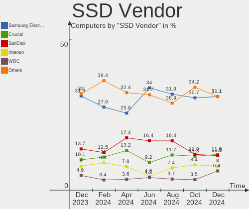
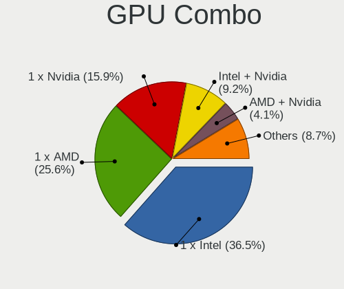
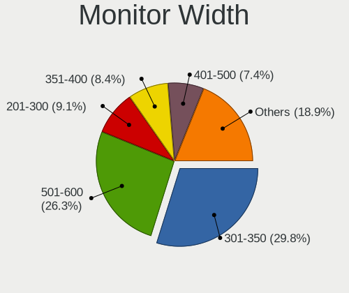
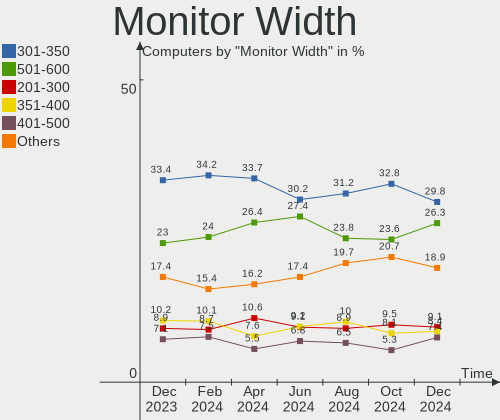
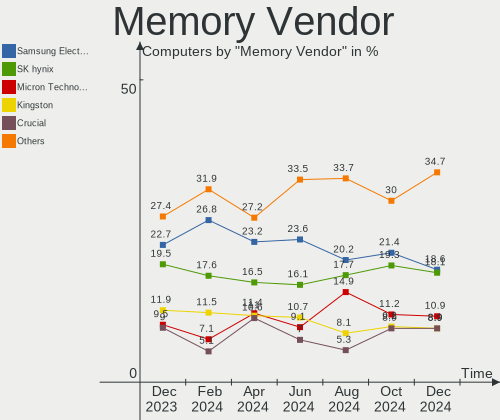

Linux in Germany - Hardware Trends
----------------------------------

A project to identify most popular hardware characteristics and track their change
over time based on data collected by Linux users at https://Linux-Hardware.org.

Anyone can contribute to this report by the [hw-probe](https://github.com/linuxhw/hw-probe) tool:

    sudo -E hw-probe -all -upload

This is a report for all computer types. See also reports for [desktops](/Location/Germany/Desktop/README.md) and [notebooks](/Location/Germany/Notebook/README.md).

Period: Apr, 2024.

Contents
--------

* [ System ](#system)
  - [ OS                       ](#os)
  - [ OS Family                ](#os-family)
  - [ Kernel                   ](#kernel)
  - [ Kernel Family            ](#kernel-family)
  - [ Kernel Major Ver.        ](#kernel-major-ver)
  - [ Arch                     ](#arch)
  - [ DE                       ](#de)
  - [ Display Server           ](#display-server)
  - [ Display Manager          ](#display-manager)
  - [ OS Lang                  ](#os-lang)
  - [ Boot Mode                ](#boot-mode)
  - [ Filesystem               ](#filesystem)
  - [ Part. scheme             ](#part-scheme)
  - [ Dual Boot with Linux/BSD ](#dual-boot-with-linuxbsd)
  - [ Dual Boot (Win)          ](#dual-boot-win)

* [ Board ](#board)
  - [ Vendor                   ](#vendor)
  - [ Model                    ](#model)
  - [ Model Family             ](#model-family)
  - [ MFG Year                 ](#mfg-year)
  - [ Form Factor              ](#form-factor)
  - [ Secure Boot              ](#secure-boot)
  - [ Coreboot                 ](#coreboot)
  - [ RAM Size                 ](#ram-size)
  - [ RAM Used                 ](#ram-used)
  - [ Total Drives             ](#total-drives)
  - [ Has CD-ROM               ](#has-cd-rom)
  - [ Has Ethernet             ](#has-ethernet)
  - [ Has WiFi                 ](#has-wifi)
  - [ Has Bluetooth            ](#has-bluetooth)

* [ Location ](#location)
  - [ Country                  ](#country)
  - [ City                     ](#city)

* [ Drives ](#drives)
  - [ Drive Vendor             ](#drive-vendor)
  - [ Drive Model              ](#drive-model)
  - [ HDD Vendor               ](#hdd-vendor)
  - [ SSD Vendor               ](#ssd-vendor)
  - [ Drive Kind               ](#drive-kind)
  - [ Drive Connector          ](#drive-connector)
  - [ Drive Size               ](#drive-size)
  - [ Space Total              ](#space-total)
  - [ Space Used               ](#space-used)
  - [ Malfunc. Drives          ](#malfunc-drives)
  - [ Malfunc. Drive Vendor    ](#malfunc-drive-vendor)
  - [ Malfunc. HDD Vendor      ](#malfunc-hdd-vendor)
  - [ Malfunc. Drive Kind      ](#malfunc-drive-kind)
  - [ Failed Drives            ](#failed-drives)
  - [ Failed Drive Vendor      ](#failed-drive-vendor)
  - [ Drive Status             ](#drive-status)

* [ Storage controller ](#storage-controller)
  - [ Storage Vendor           ](#storage-vendor)
  - [ Storage Model            ](#storage-model)
  - [ Storage Kind             ](#storage-kind)

* [ Processor ](#processor)
  - [ CPU Vendor               ](#cpu-vendor)
  - [ CPU Model                ](#cpu-model)
  - [ CPU Model Family         ](#cpu-model-family)
  - [ CPU Cores                ](#cpu-cores)
  - [ CPU Sockets              ](#cpu-sockets)
  - [ CPU Threads              ](#cpu-threads)
  - [ CPU Op-Modes             ](#cpu-op-modes)
  - [ CPU Microcode            ](#cpu-microcode)
  - [ CPU Microarch            ](#cpu-microarch)

* [ Graphics ](#graphics)
  - [ GPU Vendor               ](#gpu-vendor)
  - [ GPU Model                ](#gpu-model)
  - [ GPU Combo                ](#gpu-combo)
  - [ GPU Driver               ](#gpu-driver)
  - [ GPU Memory               ](#gpu-memory)

* [ Monitor ](#monitor)
  - [ Monitor Vendor           ](#monitor-vendor)
  - [ Monitor Model            ](#monitor-model)
  - [ Monitor Resolution       ](#monitor-resolution)
  - [ Monitor Diagonal         ](#monitor-diagonal)
  - [ Monitor Width            ](#monitor-width)
  - [ Aspect Ratio             ](#aspect-ratio)
  - [ Monitor Area             ](#monitor-area)
  - [ Pixel Density            ](#pixel-density)
  - [ Multiple Monitors        ](#multiple-monitors)

* [ Network ](#network)
  - [ Net Controller Vendor    ](#net-controller-vendor)
  - [ Net Controller Model     ](#net-controller-model)
  - [ Wireless Vendor          ](#wireless-vendor)
  - [ Wireless Model           ](#wireless-model)
  - [ Ethernet Vendor          ](#ethernet-vendor)
  - [ Ethernet Model           ](#ethernet-model)
  - [ Net Controller Kind      ](#net-controller-kind)
  - [ Used Controller          ](#used-controller)
  - [ NICs                     ](#nics)
  - [ IPv6                     ](#ipv6)

* [ Bluetooth ](#bluetooth)
  - [ Bluetooth Vendor         ](#bluetooth-vendor)
  - [ Bluetooth Model          ](#bluetooth-model)

* [ Sound ](#sound)
  - [ Sound Vendor             ](#sound-vendor)
  - [ Sound Model              ](#sound-model)

* [ Memory ](#memory)
  - [ Memory Vendor            ](#memory-vendor)
  - [ Memory Model             ](#memory-model)
  - [ Memory Kind              ](#memory-kind)
  - [ Memory Form Factor       ](#memory-form-factor)
  - [ Memory Size              ](#memory-size)
  - [ Memory Speed             ](#memory-speed)

* [ Printers & scanners ](#printers--scanners)
  - [ Printer Vendor           ](#printer-vendor)
  - [ Printer Model            ](#printer-model)
  - [ Scanner Vendor           ](#scanner-vendor)
  - [ Scanner Model            ](#scanner-model)

* [ Camera ](#camera)
  - [ Camera Vendor            ](#camera-vendor)
  - [ Camera Model             ](#camera-model)

* [ Security ](#security)
  - [ Fingerprint Vendor       ](#fingerprint-vendor)
  - [ Fingerprint Model        ](#fingerprint-model)
  - [ Chipcard Vendor          ](#chipcard-vendor)
  - [ Chipcard Model           ](#chipcard-model)

* [ Unsupported ](#unsupported)
  - [ Unsupported Devices      ](#unsupported-devices)
  - [ Unsupported Device Types ](#unsupported-device-types)

System
------

OS
--

Installed operating systems

| Name                         | Computers | Percent |
|------------------------------|-----------|---------|
| Ubuntu 22.04                 | 70        | 13.89%  |
| Fedora 39                    | 37        | 7.34%   |
| Debian 12                    | 37        | 7.34%   |
| Linux Mint 21.3              | 35        | 6.94%   |
| Zorin 17                     | 26        | 5.16%   |
| Fedora 40                    | 24        | 4.76%   |
| Ubuntu 23.10                 | 23        | 4.56%   |
| Arch Rolling                 | 19        | 3.77%   |
| Ubuntu 24.04                 | 13        | 2.58%   |
| OpenMandriva 23.08           | 13        | 2.58%   |
| Manjaro                      | 13        | 2.58%   |
| Pop!_OS 22.04                | 12        | 2.38%   |
| openSUSE Leap-15.5           | 12        | 2.38%   |
| Kubuntu 22.04                | 10        | 1.98%   |
| openSUSE Tumbleweed-XXXXXXXX | 9         | 1.79%   |
| Nobara 39                    | 9         | 1.79%   |
| EndeavourOS Rolling          | 8         | 1.59%   |
| LMDE 6                       | 7         | 1.39%   |
| KDE neon 22.04               | 7         | 1.39%   |
| Ubuntu 20.04                 | 6         | 1.19%   |
| TUXEDO OS 22.04              | 6         | 1.19%   |
| Linux Mint 21.2              | 6         | 1.19%   |
| Zorin 16                     | 5         | 0.99%   |
| Debian                       | 5         | 0.99%   |
| Ubuntu MATE 22.04            | 4         | 0.79%   |
| ROSA 12.5                    | 4         | 0.79%   |
| OpenMandriva 4.2             | 4         | 0.79%   |
| Manjaro 23.1.4               | 4         | 0.79%   |
| OpenMandriva 5.0             | 3         | 0.6%    |
| OpenMandriva 23.03           | 3         | 0.6%    |
| Linux Mint 20.3              | 3         | 0.6%    |
| BlackPanther 18.1            | 3         | 0.6%    |
| ArcoLinux Rolling            | 3         | 0.6%    |
| Xubuntu 23.10                | 2         | 0.4%    |
| Xubuntu 22.04                | 2         | 0.4%    |
| Void Linux Rolling           | 2         | 0.4%    |
| SteamOS 3.5.17               | 2         | 0.4%    |
| openSUSE Microos-XXXXXXXX    | 2         | 0.4%    |
| OpenMandriva 24.03           | 2         | 0.4%    |
| MX 23                        | 2         | 0.4%    |

OS Family
---------

OS without a version

| Name          | Computers | Percent |
|---------------|-----------|---------|
| Ubuntu        | 116       | 23.02%  |
| Fedora        | 61        | 12.1%   |
| Linux Mint    | 47        | 9.33%   |
| Debian        | 44        | 8.73%   |
| Zorin         | 31        | 6.15%   |
| OpenMandriva  | 28        | 5.56%   |
| openSUSE      | 23        | 4.56%   |
| Arch          | 19        | 3.77%   |
| Manjaro       | 17        | 3.37%   |
| Kubuntu       | 14        | 2.78%   |
| Pop!_OS       | 12        | 2.38%   |
| Nobara        | 10        | 1.98%   |
| EndeavourOS   | 8         | 1.59%   |
| LMDE          | 7         | 1.39%   |
| KDE neon      | 7         | 1.39%   |
| TUXEDO OS     | 6         | 1.19%   |
| Xubuntu       | 5         | 0.99%   |
| Ubuntu MATE   | 5         | 0.99%   |
| SteamOS       | 5         | 0.99%   |
| ROSA          | 5         | 0.99%   |
| MX            | 3         | 0.6%    |
| Garuda Linux  | 3         | 0.6%    |
| BlackPanther  | 3         | 0.6%    |
| ArcoLinux     | 3         | 0.6%    |
| Void Linux    | 2         | 0.4%    |
| NixOS         | 2         | 0.4%    |
| Kali          | 2         | 0.4%    |
| Elementary    | 2         | 0.4%    |
| Devuan        | 2         | 0.4%    |
| Xero          | 1         | 0.2%    |
| Ubuntu Unity  | 1         | 0.2%    |
| Ubuntu Studio | 1         | 0.2%    |
| Raspbian      | 1         | 0.2%    |
| OpenWrt       | 1         | 0.2%    |
| Neptune OS    | 1         | 0.2%    |
| Gentoo        | 1         | 0.2%    |
| Dts-distro    | 1         | 0.2%    |
| blendOS       | 1         | 0.2%    |
| Athena        | 1         | 0.2%    |
| Arch ARM      | 1         | 0.2%    |

Kernel
------

Version of the Linux kernel

| Version                             | Computers | Percent |
|-------------------------------------|-----------|---------|
| 6.5.0-27-generic                    | 50        | 9.92%   |
| 6.5.0-28-generic                    | 49        | 9.72%   |
| 6.5.0-26-generic                    | 33        | 6.55%   |
| 6.8.7-300.fc40.x86_64               | 18        | 3.57%   |
| 5.15.0-101-generic                  | 18        | 3.57%   |
| 6.1.0-18-amd64                      | 15        | 2.98%   |
| 5.15.0-102-generic                  | 14        | 2.78%   |
| 6.4.11-desktop-1omv2390             | 13        | 2.58%   |
| 5.15.0-105-generic                  | 13        | 2.58%   |
| 6.1.0-20-amd64                      | 12        | 2.38%   |
| 6.8.0-31-generic                    | 10        | 1.98%   |
| 5.14.21-150500.55.52-default        | 10        | 1.98%   |
| 6.8.0-76060800daily20240311-generic | 9         | 1.79%   |
| 6.8.6-200.fc39.x86_64               | 8         | 1.59%   |
| 6.8.4-200.fc39.x86_64               | 7         | 1.39%   |
| 6.7.11-200.fc39.x86_64              | 7         | 1.39%   |
| 6.8.5-201.fc39.x86_64               | 6         | 1.19%   |
| 6.8.5-arch1-1                       | 5         | 0.99%   |
| 6.8.5-201.fsync.fc39.x86_64         | 5         | 0.99%   |
| 6.8.4-arch1-1                       | 5         | 0.99%   |
| 6.8.2-arch2-1                       | 5         | 0.99%   |
| 6.8.7-arch1-1                       | 4         | 0.79%   |
| 6.6.25-1-MANJARO                    | 4         | 0.79%   |
| 6.6.2-desktop-1omv2390              | 4         | 0.79%   |
| 6.5.0-10027-tuxedo                  | 4         | 0.79%   |
| 6.1.0-17-amd64                      | 4         | 0.79%   |
| 5.10.14-desktop-1omv4002            | 4         | 0.79%   |
| 6.8.7-arch1-2                       | 3         | 0.6%    |
| 6.8.7-1-default                     | 3         | 0.6%    |
| 6.8.5-1-MANJARO                     | 3         | 0.6%    |
| 6.8.0-22-generic                    | 3         | 0.6%    |
| 6.6.26-1-MANJARO                    | 3         | 0.6%    |
| 6.6.21-generic-8rosa2021.1-x86_64   | 3         | 0.6%    |
| 6.6.15-amd64                        | 3         | 0.6%    |
| 6.6.10-76060610-generic             | 3         | 0.6%    |
| 6.2.6-desktop-1omv2390              | 3         | 0.6%    |
| 6.1.52-valve16-1-neptune-61         | 3         | 0.6%    |
| 6.8.7-desktop-1omv2490              | 2         | 0.4%    |
| 6.8.7-200.fc39.x86_64               | 2         | 0.4%    |
| 6.8.6-1-default                     | 2         | 0.4%    |

Kernel Family
-------------

Linux kernel without a distro release

| Version | Computers | Percent |
|---------|-----------|---------|
| 6.5.0   | 144       | 28.57%  |
| 5.15.0  | 55        | 10.91%  |
| 6.8.7   | 36        | 7.14%   |
| 6.1.0   | 36        | 7.14%   |
| 6.8.0   | 27        | 5.36%   |
| 6.8.5   | 21        | 4.17%   |
| 6.8.4   | 19        | 3.77%   |
| 6.8.6   | 13        | 2.58%   |
| 6.4.11  | 13        | 2.58%   |
| 5.14.21 | 12        | 2.38%   |
| 6.8.2   | 11        | 2.18%   |
| 6.7.11  | 8         | 1.59%   |
| 6.2.0   | 8         | 1.59%   |
| 6.6.25  | 5         | 0.99%   |
| 6.7.12  | 4         | 0.79%   |
| 6.6.26  | 4         | 0.79%   |
| 6.6.21  | 4         | 0.79%   |
| 6.6.2   | 4         | 0.79%   |
| 6.1.52  | 4         | 0.79%   |
| 5.4.0   | 4         | 0.79%   |
| 5.10.14 | 4         | 0.79%   |
| 6.9.0   | 3         | 0.6%    |
| 6.8.1   | 3         | 0.6%    |
| 6.7.9   | 3         | 0.6%    |
| 6.6.23  | 3         | 0.6%    |
| 6.6.15  | 3         | 0.6%    |
| 6.6.10  | 3         | 0.6%    |
| 6.2.6   | 3         | 0.6%    |
| 6.7.7   | 2         | 0.4%    |
| 6.7.6   | 2         | 0.4%    |
| 6.7.10  | 2         | 0.4%    |
| 6.6.9   | 2         | 0.4%    |
| 6.6.27  | 2         | 0.4%    |
| 6.6.13  | 2         | 0.4%    |
| 6.5.6   | 2         | 0.4%    |
| 6.5.13  | 2         | 0.4%    |
| 5.6.14  | 2         | 0.4%    |
| 5.10.0  | 2         | 0.4%    |
| 4.15.0  | 2         | 0.4%    |
| 6.8.3   | 1         | 0.2%    |

Kernel Major Ver.
-----------------

Linux kernel major version

| Version | Computers | Percent |
|---------|-----------|---------|
| 6.5     | 149       | 29.56%  |
| 6.8     | 131       | 25.99%  |
| 5.15    | 57        | 11.31%  |
| 6.1     | 43        | 8.53%   |
| 6.6     | 37        | 7.34%   |
| 6.7     | 23        | 4.56%   |
| 6.4     | 14        | 2.78%   |
| 5.14    | 13        | 2.58%   |
| 6.2     | 12        | 2.38%   |
| 5.10    | 6         | 1.19%   |
| 5.4     | 5         | 0.99%   |
| 6.9     | 3         | 0.6%    |
| 5.6     | 2         | 0.4%    |
| 4.15    | 2         | 0.4%    |
| 6.3     | 1         | 0.2%    |
| 5.8     | 1         | 0.2%    |
| 5.19    | 1         | 0.2%    |
| 5.13    | 1         | 0.2%    |
| 5.11    | 1         | 0.2%    |
| 4.9     | 1         | 0.2%    |
| 4.18    | 1         | 0.2%    |

Arch
----

OS architecture (x86_64, i586, etc.)

| Name    | Computers | Percent |
|---------|-----------|---------|
| x86_64  | 495       | 98.21%  |
| aarch64 | 4         | 0.79%   |
| i686    | 3         | 0.6%    |
| mips    | 1         | 0.2%    |
| armv6l  | 1         | 0.2%    |

DE
--

Desktop Environment

| Name            | Computers | Percent |
|-----------------|-----------|---------|
| GNOME           | 231       | 45.83%  |
| KDE5            | 88        | 17.46%  |
| X-Cinnamon      | 45        | 8.93%   |
| KDE6            | 40        | 7.94%   |
| XFCE            | 29        | 5.75%   |
| Unknown         | 18        | 3.57%   |
| MATE            | 15        | 2.98%   |
| Hyprland        | 8         | 1.59%   |
| Cinnamon        | 7         | 1.39%   |
| LXQt            | 4         | 0.79%   |
| KDE4            | 3         | 0.6%    |
| KDE             | 3         | 0.6%    |
| Pantheon        | 2         | 0.4%    |
| LXDE            | 2         | 0.4%    |
| i3              | 2         | 0.4%    |
| GNOME Classic   | 2         | 0.4%    |
| Unity           | 1         | 0.2%    |
| sway            | 1         | 0.2%    |
| LXDE-pi-wayfire | 1         | 0.2%    |
| GNOME Flashback | 1         | 0.2%    |
| Budgie          | 1         | 0.2%    |

Display Server
--------------

X11 or Wayland

| Name    | Computers | Percent |
|---------|-----------|---------|
| X11     | 239       | 47.42%  |
| Wayland | 237       | 47.02%  |
| Tty     | 15        | 2.98%   |
| Unknown | 13        | 2.58%   |

Display Manager
---------------

SDDM, LightDM, etc.

| Name    | Computers | Percent |
|---------|-----------|---------|
| Unknown | 212       | 42.06%  |
| GDM3    | 119       | 23.61%  |
| SDDM    | 80        | 15.87%  |
| LightDM | 64        | 12.7%   |
| GDM     | 22        | 4.37%   |
| SLiM    | 2         | 0.4%    |
| LY-DM   | 2         | 0.4%    |
| LXDM    | 1         | 0.2%    |
| LEMURS  | 1         | 0.2%    |
| KDM     | 1         | 0.2%    |

OS Lang
-------

Language

| Lang        | Computers | Percent |
|-------------|-----------|---------|
| de_DE       | 347       | 68.85%  |
| en_US       | 111       | 22.02%  |
| en_GB       | 9         | 1.79%   |
| C           | 8         | 1.59%   |
| Unknown     | 7         | 1.39%   |
| ru_RU       | 3         | 0.6%    |
| POSIX       | 3         | 0.6%    |
| ro_RO       | 2         | 0.4%    |
| zh_CN       | 1         | 0.2%    |
| uk_UA       | 1         | 0.2%    |
| lv_LV       | 1         | 0.2%    |
| hu_HU       | 1         | 0.2%    |
| hr_HR       | 1         | 0.2%    |
| fr_FR       | 1         | 0.2%    |
| en_IE       | 1         | 0.2%    |
| en_DK       | 1         | 0.2%    |
| en_DE       | 1         | 0.2%    |
| en_AU       | 1         | 0.2%    |
| de_de-UTF-8 | 1         | 0.2%    |
| de_CH       | 1         | 0.2%    |
| de_AT       | 1         | 0.2%    |
| bg_BG       | 1         | 0.2%    |

Boot Mode
---------

EFI or BIOS

| Mode | Computers | Percent |
|------|-----------|---------|
| BIOS | 291       | 57.74%  |
| EFI  | 213       | 42.26%  |

Filesystem
----------

Type of filesystem

| Type    | Computers | Percent |
|---------|-----------|---------|
| Ext4    | 267       | 52.98%  |
| Btrfs   | 108       | 21.43%  |
| Tmpfs   | 91        | 18.06%  |
| Overlay | 22        | 4.37%   |
| Xfs     | 7         | 1.39%   |
| Zfs     | 5         | 0.99%   |
| Ext2    | 2         | 0.4%    |
| Ext3    | 1         | 0.2%    |
| Unknown | 1         | 0.2%    |

Part. scheme
------------

Scheme of partitioning

| Type    | Computers | Percent |
|---------|-----------|---------|
| GPT     | 278       | 55.16%  |
| Unknown | 190       | 37.7%   |
| MBR     | 36        | 7.14%   |

Dual Boot with Linux/BSD
------------------------

Hosting more than one Linux/BSD

| Dual boot | Computers | Percent |
|-----------|-----------|---------|
| No        | 435       | 86.31%  |
| Yes       | 69        | 13.69%  |

Dual Boot (Win)
---------------

Hosting Linux and Windows

| Dual boot | Computers | Percent |
|-----------|-----------|---------|
| No        | 401       | 79.56%  |
| Yes       | 103       | 20.44%  |

Board
-----

Vendor
------

Motherboard manufacturer

| Name                    | Computers | Percent |
|-------------------------|-----------|---------|
| Lenovo                  | 92        | 18.25%  |
| ASUSTek Computer        | 79        | 15.67%  |
| Hewlett-Packard         | 58        | 11.51%  |
| Dell                    | 35        | 6.94%   |
| MSI                     | 32        | 6.35%   |
| Gigabyte Technology     | 32        | 6.35%   |
| Acer                    | 26        | 5.16%   |
| ASRock                  | 22        | 4.37%   |
| Apple                   | 19        | 3.77%   |
| Fujitsu                 | 12        | 2.38%   |
| Medion                  | 10        | 1.98%   |
| Toshiba                 | 7         | 1.39%   |
| Samsung Electronics     | 7         | 1.39%   |
| TUXEDO                  | 6         | 1.19%   |
| Unknown                 | 6         | 1.19%   |
| Valve                   | 4         | 0.79%   |
| Microsoft               | 4         | 0.79%   |
| Intel                   | 4         | 0.79%   |
| Raspberry Pi Foundation | 3         | 0.6%    |
| HUAWEI                  | 3         | 0.6%    |
| Framework               | 3         | 0.6%    |
| TrekStor                | 2         | 0.4%    |
| Supermicro              | 2         | 0.4%    |
| Razer                   | 2         | 0.4%    |
| Packard Bell            | 2         | 0.4%    |
| Hardkernel              | 2         | 0.4%    |
| Getac                   | 2         | 0.4%    |
| GEEKOM                  | 2         | 0.4%    |
| Foxconn                 | 2         | 0.4%    |
| Biostar                 | 2         | 0.4%    |
| ZOTAC                   | 1         | 0.2%    |
| XMG                     | 1         | 0.2%    |
| Teclast                 | 1         | 0.2%    |
| SZMZ                    | 1         | 0.2%    |
| System76                | 1         | 0.2%    |
| Sony                    | 1         | 0.2%    |
| Shuttle                 | 1         | 0.2%    |
| PELADN                  | 1         | 0.2%    |
| NZXT                    | 1         | 0.2%    |
| Notebook                | 1         | 0.2%    |

Model
-----

Motherboard model

| Name                                  | Computers | Percent |
|---------------------------------------|-----------|---------|
| Unknown                               | 9         | 1.79%   |
| Valve Jupiter                         | 4         | 0.79%   |
| MSI MS-7C56                           | 4         | 0.79%   |
| Lenovo IdeaPad Slim 1-14AST-05 81VS   | 3         | 0.6%    |
| HP Laptop 17-cp0xxx                   | 3         | 0.6%    |
| HP 255 15.6 inch G10                  | 3         | 0.6%    |
| Samsung R530/R730                     | 2         | 0.4%    |
| MSI MS-7D25                           | 2         | 0.4%    |
| MSI MS-7C37                           | 2         | 0.4%    |
| Lenovo ThinkPad P16s Gen 2 21K9CTO1WW | 2         | 0.4%    |
| Lenovo MIIX 320-10ICR 80XF            | 2         | 0.4%    |
| Lenovo Legion 5 Pro 16ACH6H 82JQ      | 2         | 0.4%    |
| Lenovo G700 20251                     | 2         | 0.4%    |
| Gigabyte Z390 UD                      | 2         | 0.4%    |
| Gigabyte B550M DS3H                   | 2         | 0.4%    |
| Getac S410                            | 2         | 0.4%    |
| Foxconn G41MX/G41MX-K 2.0 1.0         | 2         | 0.4%    |
| Dell XPS 14 9440                      | 2         | 0.4%    |
| Biostar A960D+V2                      | 2         | 0.4%    |
| ASUS ROG STRIX B450-F GAMING          | 2         | 0.4%    |
| ASUS Pro WS X570-ACE                  | 2         | 0.4%    |
| ASUS PRIME A320M-K                    | 2         | 0.4%    |
| ASUS N751JK                           | 2         | 0.4%    |
| ASUS M5A97 R2.0                       | 2         | 0.4%    |
| ASUS All Series                       | 2         | 0.4%    |
| ASUS A68HM-PLUS                       | 2         | 0.4%    |
| ASRock X570 Phantom Gaming 4          | 2         | 0.4%    |
| Apple MacBookPro9,2                   | 2         | 0.4%    |
| Apple MacBookPro8,2                   | 2         | 0.4%    |
| Acer Extensa 2540                     | 2         | 0.4%    |
| ZOTAC ZBOX-ECM73070C/7307LH/53060C    | 1         | 0.2%    |
| XMG N85_N87,HJ,HJ1,HK1                | 1         | 0.2%    |
| TUXEDO Sirius 16 Gen1                 | 1         | 0.2%    |
| TUXEDO Pulse 14 Gen3                  | 1         | 0.2%    |
| TUXEDO Polaris AMD Gen5               | 1         | 0.2%    |
| TUXEDO InfinityBook S 14 v5           | 1         | 0.2%    |
| TUXEDO InfinityBook Pro Gen8 (MK2)    | 1         | 0.2%    |
| TUXEDO InfinityBook Pro 14 Gen6       | 1         | 0.2%    |
| TrekStor SurfTab twin 11.6            | 1         | 0.2%    |
| TrekStor Surfbook A13B                | 1         | 0.2%    |

Model Family
------------

Motherboard model prefix

| Name                | Computers | Percent |
|---------------------|-----------|---------|
| Lenovo ThinkPad     | 50        | 9.92%   |
| Dell Latitude       | 19        | 3.77%   |
| ASUS PRIME          | 15        | 2.98%   |
| Acer Aspire         | 15        | 2.98%   |
| Lenovo IdeaPad      | 10        | 1.98%   |
| HP EliteBook        | 10        | 1.98%   |
| ASUS TUF            | 10        | 1.98%   |
| ASUS ROG            | 9         | 1.79%   |
| Unknown             | 9         | 1.79%   |
| Toshiba Satellite   | 7         | 1.39%   |
| Lenovo Legion       | 6         | 1.19%   |
| HP ProBook          | 6         | 1.19%   |
| HP Laptop           | 6         | 1.19%   |
| HP ENVY             | 6         | 1.19%   |
| Fujitsu LIFEBOOK    | 6         | 1.19%   |
| Dell XPS            | 6         | 1.19%   |
| HP ZBook            | 5         | 0.99%   |
| Valve Jupiter       | 4         | 0.79%   |
| MSI MS-7C56         | 4         | 0.79%   |
| Microsoft Surface   | 4         | 0.79%   |
| HP Compaq           | 4         | 0.79%   |
| HP 255              | 4         | 0.79%   |
| HP 250              | 4         | 0.79%   |
| Dell Inspiron       | 4         | 0.79%   |
| TUXEDO InfinityBook | 3         | 0.6%    |
| RPi Raspberry       | 3         | 0.6%    |
| Lenovo Yoga         | 3         | 0.6%    |
| Lenovo MIIX         | 3         | 0.6%    |
| Lenovo IdeaPadFlex  | 3         | 0.6%    |
| HP Pavilion         | 3         | 0.6%    |
| HP EliteDesk        | 3         | 0.6%    |
| Gigabyte X570       | 3         | 0.6%    |
| Gigabyte B550M      | 3         | 0.6%    |
| Framework Laptop    | 3         | 0.6%    |
| Dell Precision      | 3         | 0.6%    |
| Dell OptiPlex       | 3         | 0.6%    |
| ASUS VivoBook       | 3         | 0.6%    |
| ASUS Pro            | 3         | 0.6%    |
| Apple MacBookPro9   | 3         | 0.6%    |
| Apple MacBookPro8   | 3         | 0.6%    |

MFG Year
--------

Motherboard manufacture year

| Year    | Computers | Percent |
|---------|-----------|---------|
| 2023    | 54        | 10.71%  |
| 2020    | 44        | 8.73%   |
| 2018    | 42        | 8.33%   |
| 2022    | 41        | 8.13%   |
| 2017    | 41        | 8.13%   |
| 2021    | 40        | 7.94%   |
| 2013    | 38        | 7.54%   |
| 2019    | 35        | 6.94%   |
| 2014    | 29        | 5.75%   |
| 2012    | 27        | 5.36%   |
| 2016    | 19        | 3.77%   |
| 2015    | 19        | 3.77%   |
| 2011    | 18        | 3.57%   |
| 2009    | 18        | 3.57%   |
| 2010    | 11        | 2.18%   |
| 2024    | 10        | 1.98%   |
| 2008    | 7         | 1.39%   |
| Unknown | 6         | 1.19%   |
| 2007    | 3         | 0.6%    |
| 2006    | 1         | 0.2%    |
| 2005    | 1         | 0.2%    |

Form Factor
-----------

Physical design of the computer

| Name           | Computers | Percent |
|----------------|-----------|---------|
| Notebook       | 258       | 51.19%  |
| Desktop        | 186       | 36.9%   |
| Convertible    | 24        | 4.76%   |
| Mini pc        | 12        | 2.38%   |
| Tablet         | 11        | 2.18%   |
| System on chip | 5         | 0.99%   |
| All in one     | 4         | 0.79%   |
| Server         | 4         | 0.79%   |

Secure Boot
-----------

Enabled or disabled

| State    | Computers | Percent |
|----------|-----------|---------|
| Disabled | 465       | 92.26%  |
| Enabled  | 39        | 7.74%   |

Coreboot
--------

Have coreboot on board

| Used | Computers | Percent |
|------|-----------|---------|
| No   | 502       | 99.6%   |
| Yes  | 2         | 0.4%    |

RAM Size
--------

Total RAM memory

| Size in GB  | Computers | Percent |
|-------------|-----------|---------|
| 4.01-8.0    | 107       | 21.23%  |
| 16.01-24.0  | 105       | 20.83%  |
| 8.01-16.0   | 88        | 17.46%  |
| 32.01-64.0  | 82        | 16.27%  |
| 3.01-4.0    | 53        | 10.52%  |
| 64.01-256.0 | 38        | 7.54%   |
| 24.01-32.0  | 18        | 3.57%   |
| 1.01-2.0    | 6         | 1.19%   |
| 2.01-3.0    | 4         | 0.79%   |
| 0.01-0.5    | 2         | 0.4%    |
| 0.51-1.0    | 1         | 0.2%    |

RAM Used
--------

Used RAM memory

| Used GB     | Computers | Percent |
|-------------|-----------|---------|
| 2.01-3.0    | 137       | 27.18%  |
| 1.01-2.0    | 129       | 25.6%   |
| 4.01-8.0    | 107       | 21.23%  |
| 3.01-4.0    | 70        | 13.89%  |
| 8.01-16.0   | 29        | 5.75%   |
| 0.51-1.0    | 11        | 2.18%   |
| 16.01-24.0  | 8         | 1.59%   |
| 0.01-0.5    | 6         | 1.19%   |
| 32.01-64.0  | 2         | 0.4%    |
| 24.01-32.0  | 2         | 0.4%    |
| 64.01-256.0 | 2         | 0.4%    |
| 0           | 1         | 0.2%    |

Total Drives
------------

Number of drives on board

| Drives | Computers | Percent |
|--------|-----------|---------|
| 1      | 292       | 57.94%  |
| 2      | 128       | 25.4%   |
| 3      | 38        | 7.54%   |
| 4      | 20        | 3.97%   |
| 5      | 8         | 1.59%   |
| 7      | 7         | 1.39%   |
| 6      | 5         | 0.99%   |
| 9      | 2         | 0.4%    |
| 17     | 1         | 0.2%    |
| 14     | 1         | 0.2%    |
| 12     | 1         | 0.2%    |
| 0      | 1         | 0.2%    |

Has CD-ROM
----------

Has CD-ROM on board

| Presented | Computers | Percent |
|-----------|-----------|---------|
| No        | 341       | 67.66%  |
| Yes       | 163       | 32.34%  |

Has Ethernet
------------

Has Ethernet on board

| Presented | Computers | Percent |
|-----------|-----------|---------|
| Yes       | 426       | 84.52%  |
| No        | 78        | 15.48%  |

Has WiFi
--------

Has WiFi module

| Presented | Computers | Percent |
|-----------|-----------|---------|
| Yes       | 373       | 74.01%  |
| No        | 131       | 25.99%  |

Has Bluetooth
-------------

Has Bluetooth module

| Presented | Computers | Percent |
|-----------|-----------|---------|
| Yes       | 341       | 67.66%  |
| No        | 163       | 32.34%  |

Location
--------

Country
-------

Geographic location (country)

| Country | Computers | Percent |
|---------|-----------|---------|
| Germany | 504       | 100%    |

City
----

Geographic location (city)

| City              | Computers | Percent |
|-------------------|-----------|---------|
| Berlin            | 45        | 8.93%   |
| Hamburg           | 23        | 4.56%   |
| Munich            | 22        | 4.37%   |
| Frankfurt am Main | 19        | 3.77%   |
| Stuttgart         | 13        | 2.58%   |
| Leipzig           | 9         | 1.79%   |
| Nuremberg         | 8         | 1.59%   |
| Essen             | 7         | 1.39%   |
| Dortmund          | 7         | 1.39%   |
| Cologne           | 7         | 1.39%   |
| Darmstadt         | 5         | 0.99%   |
| Bremen            | 5         | 0.99%   |
| Bochum            | 5         | 0.99%   |
| Bielefeld         | 5         | 0.99%   |
| Oldenburg         | 4         | 0.79%   |
| Mannheim          | 4         | 0.79%   |
| Hanover           | 4         | 0.79%   |
| Duisburg          | 4         | 0.79%   |
| Dresden           | 4         | 0.79%   |
| Traunstein        | 3         | 0.6%    |
| Regensburg        | 3         | 0.6%    |
| Oberhausen        | 3         | 0.6%    |
| Munster           | 3         | 0.6%    |
| Linsengericht     | 3         | 0.6%    |
| Langen            | 3         | 0.6%    |
| Koblenz           | 3         | 0.6%    |
| Karlsruhe         | 3         | 0.6%    |
| Heilbronn         | 3         | 0.6%    |
| Heidelberg        | 3         | 0.6%    |
| Falkenstein       | 3         | 0.6%    |
| Düsseldorf       | 3         | 0.6%    |
| Delligsen         | 3         | 0.6%    |
| Deggendorf        | 3         | 0.6%    |
| Dachau            | 3         | 0.6%    |
| Bonn              | 3         | 0.6%    |
| Aurich            | 3         | 0.6%    |
| Aachen            | 3         | 0.6%    |
| Wuppertal         | 2         | 0.4%    |
| Wolfsburg         | 2         | 0.4%    |
| Winsen            | 2         | 0.4%    |

Drives
------

Drive Vendor
------------

Hard drive vendors

| Vendor                       | Computers | Drives | Percent |
|------------------------------|-----------|--------|---------|
| Samsung Electronics          | 169       | 221    | 22.59%  |
| Sandisk                      | 79        | 90     | 10.56%  |
| Seagate                      | 63        | 95     | 8.42%   |
| WDC                          | 61        | 85     | 8.16%   |
| Crucial                      | 38        | 50     | 5.08%   |
| Unknown                      | 34        | 37     | 4.55%   |
| Intenso                      | 30        | 34     | 4.01%   |
| Toshiba                      | 27        | 34     | 3.61%   |
| Micron Technology            | 26        | 26     | 3.48%   |
| Kingston                     | 24        | 26     | 3.21%   |
| SK hynix                     | 18        | 18     | 2.41%   |
| Micron/Crucial Technology    | 15        | 17     | 2.01%   |
| Intel                        | 13        | 14     | 1.74%   |
| Hitachi                      | 12        | 12     | 1.6%    |
| KIOXIA                       | 11        | 11     | 1.47%   |
| Apple                        | 11        | 14     | 1.47%   |
| Phison Electronics           | 10        | 11     | 1.34%   |
| HGST                         | 8         | 14     | 1.07%   |
| Kingston Technology Company  | 6         | 6      | 0.8%    |
| Transcend                    | 5         | 5      | 0.67%   |
| Patriot                      | 5         | 5      | 0.67%   |
| Silicon Motion               | 4         | 4      | 0.53%   |
| A-DATA Technology            | 4         | 4      | 0.53%   |
| Shenzhen Longsys Electronics | 3         | 4      | 0.4%    |
| Phison                       | 3         | 3      | 0.4%    |
| OCZ                          | 3         | 5      | 0.4%    |
| Maxtor                       | 3         | 3      | 0.4%    |
| Hewlett-Packard              | 3         | 4      | 0.4%    |
| Emtec                        | 3         | 3      | 0.4%    |
| China                        | 3         | 3      | 0.4%    |
| ASMT                         | 3         | 3      | 0.4%    |
| Verbatim                     | 2         | 5      | 0.27%   |
| MAXIO Technology (Hangzhou)  | 2         | 2      | 0.27%   |
| LITEON                       | 2         | 2      | 0.27%   |
| Lexar                        | 2         | 2      | 0.27%   |
| JMicron Technology           | 2         | 2      | 0.27%   |
| FIKWOT                       | 2         | 2      | 0.27%   |
| Fanxiang                     | 2         | 2      | 0.27%   |
| Argon                        | 2         | 2      | 0.27%   |
| ADATA Technology             | 2         | 2      | 0.27%   |

Drive Model
-----------

Hard drive models

| Model                                               | Computers | Percent |
|-----------------------------------------------------|-----------|---------|
| Samsung NVMe SSD Controller SM981/PM981/PM983 1TB   | 27        | 3.21%   |
| Samsung NVMe SSD Controller PM9A1/PM9A3/980PRO 1TB  | 14        | 1.66%   |
| Crucial CT500MX500SSD1 500GB                        | 9         | 1.07%   |
| Unknown MMC Card  32GB                              | 8         | 0.95%   |
| Samsung SSD 850 EVO 500GB                           | 8         | 0.95%   |
| Micron/Crucial P2 NVMe PCIe SSD 4TB                 | 8         | 0.95%   |
| Samsung SSD 870 EVO 500GB                           | 7         | 0.83%   |
| Samsung SSD 860 EVO 1TB                             | 7         | 0.83%   |
| Samsung NVMe SSD Controller SM961/PM961/SM963 1TB   | 7         | 0.83%   |
| SanDisk NVMe SSD Drive 1TB                          | 6         | 0.71%   |
| Samsung SSD 840 EVO 250GB                           | 6         | 0.71%   |
| Crucial CT1000MX500SSD1 1TB                         | 6         | 0.71%   |
| Unknown SD/MMC/MS PRO 128GB                         | 5         | 0.59%   |
| Unknown MMC Card  64GB                              | 5         | 0.59%   |
| Seagate ST1000LM035-1RK172 1TB                      | 5         | 0.59%   |
| Sandisk WD Black SN750 / PC SN730 NVMe SSD 512GB    | 5         | 0.59%   |
| SanDisk SSD PLUS 240GB                              | 5         | 0.59%   |
| SanDisk SSD PLUS 1000GB                             | 5         | 0.59%   |
| Samsung SSD 990 PRO 2TB                             | 5         | 0.59%   |
| Samsung SSD 980 1TB                                 | 5         | 0.59%   |
| Samsung SSD 870 EVO 2TB                             | 5         | 0.59%   |
| Samsung SSD 870 EVO 1TB                             | 5         | 0.59%   |
| Samsung SSD 860 EVO 500GB                           | 5         | 0.59%   |
| Unknown MMC Card  128GB                             | 4         | 0.48%   |
| Toshiba XG6 NVMe SSD Controller 1024GB              | 4         | 0.48%   |
| Sandisk WD PC SN740 SDDQNQD-512G-1201 512GB         | 4         | 0.48%   |
| SanDisk SSD PLUS 480GB                              | 4         | 0.48%   |
| SanDisk 3.2 Gen 1 250GB SSD                         | 4         | 0.48%   |
| Samsung SSD 990 PRO 1TB                             | 4         | 0.48%   |
| Samsung SSD 850 EVO 250GB                           | 4         | 0.48%   |
| Samsung NVMe SSD Controller SM951/PM951 256GB       | 4         | 0.48%   |
| Crucial CT480BX500SSD1 480GB                        | 4         | 0.48%   |
| Crucial CT2000MX500SSD1 2TB                         | 4         | 0.48%   |
| Crucial CT1000BX500SSD1 1TB                         | 4         | 0.48%   |
| Toshiba HDWD110 1TB                                 | 3         | 0.36%   |
| Seagate ST4000DM004-2CV104 4TB                      | 3         | 0.36%   |
| Seagate ST2000DM008-2FR102 2TB                      | 3         | 0.36%   |
| Seagate ST1000DM010-2EP102 1TB                      | 3         | 0.36%   |
| Sandisk WD Black 2018/SN750 / PC SN720 NVMe SSD 1TB | 3         | 0.36%   |
| Samsung SSD 990 PRO 4TB                             | 3         | 0.36%   |

HDD Vendor
----------

Hard disk drive vendors

| Vendor              | Computers | Drives | Percent |
|---------------------|-----------|--------|---------|
| Seagate             | 60        | 92     | 33.52%  |
| WDC                 | 50        | 72     | 27.93%  |
| Toshiba             | 19        | 25     | 10.61%  |
| Hitachi             | 12        | 12     | 6.7%    |
| Samsung Electronics | 9         | 9      | 5.03%   |
| HGST                | 8         | 14     | 4.47%   |
| Unknown             | 5         | 5      | 2.79%   |
| Maxtor              | 3         | 3      | 1.68%   |
| Apple               | 3         | 3      | 1.68%   |
| JMicron Technology  | 2         | 2      | 1.12%   |
| Intenso             | 2         | 2      | 1.12%   |
| Hewlett-Packard     | 2         | 3      | 1.12%   |
| USB3.0              | 1         | 1      | 0.56%   |
| STEC                | 1         | 1      | 0.56%   |
| SABRENT             | 1         | 1      | 0.56%   |
| MSFT                | 1         | 1      | 0.56%   |

SSD Vendor
----------

Solid state drive vendors

| Vendor              | Computers | Drives | Percent |
|---------------------|-----------|--------|---------|
| Samsung Electronics | 72        | 88     | 25.53%  |
| SanDisk             | 49        | 53     | 17.38%  |
| Crucial             | 37        | 48     | 13.12%  |
| Intenso             | 22        | 26     | 7.8%    |
| Kingston            | 17        | 18     | 6.03%   |
| WDC                 | 10        | 10     | 3.55%   |
| Micron Technology   | 10        | 10     | 3.55%   |
| Transcend           | 5         | 5      | 1.77%   |
| SK hynix            | 5         | 5      | 1.77%   |
| Patriot             | 5         | 5      | 1.77%   |
| Apple               | 5         | 5      | 1.77%   |
| Toshiba             | 4         | 4      | 1.42%   |
| Intel               | 4         | 4      | 1.42%   |
| OCZ                 | 3         | 5      | 1.06%   |
| Emtec               | 3         | 3      | 1.06%   |
| ASMT                | 3         | 3      | 1.06%   |
| A-DATA Technology   | 3         | 3      | 1.06%   |
| Verbatim            | 2         | 5      | 0.71%   |
| Phison              | 2         | 2      | 0.71%   |
| LITEON              | 2         | 2      | 0.71%   |
| China               | 2         | 2      | 0.71%   |
| Argon               | 2         | 2      | 0.71%   |
| Unknown             | 2         | 2      | 0.71%   |
| Teclast             | 1         | 1      | 0.35%   |
| SXMicro             | 1         | 1      | 0.35%   |
| PNY                 | 1         | 1      | 0.35%   |
| Netac               | 1         | 1      | 0.35%   |
| Neo Forza           | 1         | 1      | 0.35%   |
| Leven               | 1         | 1      | 0.35%   |
| LaCie               | 1         | 1      | 0.35%   |
| Hewlett-Packard     | 1         | 1      | 0.35%   |
| GOODRAM             | 1         | 1      | 0.35%   |
| Fanxiang            | 1         | 1      | 0.35%   |
| Drevo               | 1         | 1      | 0.35%   |
| ASMedia             | 1         | 1      | 0.35%   |
| Apacer              | 1         | 1      | 0.35%   |

Drive Kind
----------

HDD or SSD

| Kind    | Computers | Drives | Percent |
|---------|-----------|--------|---------|
| NVMe    | 243       | 302    | 36.49%  |
| SSD     | 239       | 323    | 35.89%  |
| HDD     | 143       | 246    | 21.47%  |
| MMC     | 26        | 29     | 3.9%    |
| Unknown | 15        | 17     | 2.25%   |

Drive Connector
---------------

SATA, SAS, NVMe, etc.

| Type | Computers | Drives | Percent |
|------|-----------|--------|---------|
| SATA | 306       | 528    | 49.68%  |
| NVMe | 243       | 301    | 39.45%  |
| SAS  | 41        | 59     | 6.66%   |
| MMC  | 26        | 29     | 4.22%   |

Drive Size
----------

Size of hard drive

| Size in TB | Computers | Drives | Percent |
|------------|-----------|--------|---------|
| 0.01-0.5   | 226       | 307    | 55.39%  |
| 0.51-1.0   | 104       | 128    | 25.49%  |
| 1.01-2.0   | 35        | 41     | 8.58%   |
| 3.01-4.0   | 15        | 25     | 3.68%   |
| 2.01-3.0   | 11        | 17     | 2.7%    |
| 4.01-10.0  | 11        | 26     | 2.7%    |
| 10.01-20.0 | 6         | 25     | 1.47%   |

Space Total
-----------

Amount of disk space available on the file system

| Size in GB     | Computers | Percent |
|----------------|-----------|---------|
| 101-250        | 122       | 24.21%  |
| 251-500        | 103       | 20.44%  |
| 501-1000       | 83        | 16.47%  |
| More than 3000 | 52        | 10.32%  |
| 1001-2000      | 45        | 8.93%   |
| 1-20           | 31        | 6.15%   |
| 51-100         | 26        | 5.16%   |
| Unknown        | 19        | 3.77%   |
| 2001-3000      | 17        | 3.37%   |
| 21-50          | 6         | 1.19%   |

Space Used
----------

Amount of used disk space

| Used GB        | Computers | Percent |
|----------------|-----------|---------|
| 1-20           | 138       | 27.38%  |
| 21-50          | 98        | 19.44%  |
| 101-250        | 81        | 16.07%  |
| 51-100         | 48        | 9.52%   |
| 251-500        | 40        | 7.94%   |
| 501-1000       | 29        | 5.75%   |
| More than 3000 | 25        | 4.96%   |
| Unknown        | 19        | 3.77%   |
| 1001-2000      | 15        | 2.98%   |
| 2001-3000      | 9         | 1.79%   |
| 0              | 2         | 0.4%    |

Malfunc. Drives
---------------

Drive models with a malfunction

| Model                                                         | Computers | Drives | Percent |
|---------------------------------------------------------------|-----------|--------|---------|
| SanDisk SSD PLUS 480GB                                        | 2         | 2      | 8%      |
| WDC WD5000AAKS-007AA0 500GB                                   | 1         | 1      | 4%      |
| WDC WD3000FYYZ-01UL1B0 3TB                                    | 1         | 2      | 4%      |
| WDC WD1600AAJS-60B4A0 160GB                                   | 1         | 1      | 4%      |
| WDC WD10EZEX-08M2NA0 1TB                                      | 1         | 1      | 4%      |
| WDC PC SA530 SDASN8Y-256G-1006 256GB SSD                      | 1         | 1      | 4%      |
| Transcend TS32GPSD330 32GB SSD                                | 1         | 1      | 4%      |
| Transcend TS240GMTS820S 240GB SSD                             | 1         | 1      | 4%      |
| Seagate ST980811AS 80GB                                       | 1         | 1      | 4%      |
| Seagate ST9320421AS 320GB                                     | 1         | 1      | 4%      |
| Seagate ST500DM002-1BD142 500GB                               | 1         | 1      | 4%      |
| Seagate ST3250310NS 250GB                                     | 1         | 1      | 4%      |
| Seagate ST2000LM015-2E8174 2TB                                | 1         | 1      | 4%      |
| Seagate ST1000DX001-1NS162 1TB                                | 1         | 1      | 4%      |
| Samsung Electronics SSD 980 PRO 500GB S5GYNX0TA36756D         | 1         | 1      | 4%      |
| Samsung Electronics SSD 870 EVO 1TB                           | 1         | 1      | 4%      |
| Samsung Electronics NVMe SSD Controller SM981/PM981/PM983 1TB | 1         | 1      | 4%      |
| Samsung Electronics MZ7PD256HCGM-000H7 256GB SSD              | 1         | 1      | 4%      |
| Samsung Electronics HD502IJ 500GB                             | 1         | 1      | 4%      |
| Samsung Electronics HD501LJ 500GB                             | 1         | 1      | 4%      |
| Kingston SV300S37A120G 120GB SSD                              | 1         | 1      | 4%      |
| Intenso SSD SATAIII 240GB                                     | 1         | 2      | 4%      |
| HGST HTS541010A9E680 1TB                                      | 1         | 1      | 4%      |
| Crucial M4-CT064M4SSD2 64GB                                   | 1         | 1      | 4%      |

Malfunc. Drive Vendor
---------------------

Vendors of faulty drives

| Vendor              | Computers | Drives | Percent |
|---------------------|-----------|--------|---------|
| Seagate             | 6         | 6      | 24%     |
| Samsung Electronics | 6         | 6      | 24%     |
| WDC                 | 5         | 6      | 20%     |
| Transcend           | 2         | 2      | 8%      |
| SanDisk             | 2         | 2      | 8%      |
| Kingston            | 1         | 1      | 4%      |
| Intenso             | 1         | 2      | 4%      |
| HGST                | 1         | 1      | 4%      |
| Crucial             | 1         | 1      | 4%      |

Malfunc. HDD Vendor
-------------------

Vendors of faulty HDD drives

| Vendor              | Computers | Drives | Percent |
|---------------------|-----------|--------|---------|
| Seagate             | 6         | 6      | 46.15%  |
| WDC                 | 4         | 5      | 30.77%  |
| Samsung Electronics | 2         | 2      | 15.38%  |
| HGST                | 1         | 1      | 7.69%   |

Malfunc. Drive Kind
-------------------

Kinds of faulty drives

| Kind | Computers | Drives | Percent |
|------|-----------|--------|---------|
| HDD  | 11        | 14     | 47.83%  |
| SSD  | 10        | 11     | 43.48%  |
| NVMe | 2         | 2      | 8.7%    |

Failed Drives
-------------

Failed drive models

Zero info for selected period =(

Failed Drive Vendor
-------------------

Failed drive vendors

Zero info for selected period =(

Drive Status
------------

Number of failed and malfunc. drives

| Status   | Computers | Drives | Percent |
|----------|-----------|--------|---------|
| Detected | 317       | 535    | 59.47%  |
| Works    | 195       | 355    | 36.59%  |
| Malfunc  | 21        | 27     | 3.94%   |

Storage controller
------------------

Storage Vendor
--------------

Storage controller vendors

| Vendor                                  | Computers | Percent |
|-----------------------------------------|-----------|---------|
| Intel                                   | 263       | 39.55%  |
| AMD                                     | 114       | 17.14%  |
| Samsung Electronics                     | 105       | 15.79%  |
| SanDisk                                 | 34        | 5.11%   |
| Micron/Crucial Technology               | 17        | 2.56%   |
| Micron Technology                       | 16        | 2.41%   |
| SK hynix                                | 13        | 1.95%   |
| Kingston Technology Company             | 13        | 1.95%   |
| ASMedia Technology                      | 13        | 1.95%   |
| Phison Electronics                      | 12        | 1.8%    |
| KIOXIA                                  | 11        | 1.65%   |
| Toshiba America Info Systems            | 6         | 0.9%    |
| Nvidia                                  | 6         | 0.9%    |
| Silicon Motion                          | 4         | 0.6%    |
| Shenzhen Longsys Electronics            | 4         | 0.6%    |
| MAXIO Technology (Hangzhou)             | 4         | 0.6%    |
| JMicron Technology                      | 4         | 0.6%    |
| Seagate Technology                      | 3         | 0.45%   |
| Apple                                   | 3         | 0.45%   |
| ADATA Technology                        | 3         | 0.45%   |
| VIA Technologies                        | 2         | 0.3%    |
| Shenzhen Unionmemory Information System | 2         | 0.3%    |
| Broadcom / LSI                          | 2         | 0.3%    |
| Union Memory (Shenzhen)                 | 1         | 0.15%   |
| Solid State Storage Technology          | 1         | 0.15%   |
| Silicon Integrated Systems [SiS]        | 1         | 0.15%   |
| Silicon Image                           | 1         | 0.15%   |
| Realtek Semiconductor                   | 1         | 0.15%   |
| OCZ Technology Group                    | 1         | 0.15%   |
| Marvell Technology Group                | 1         | 0.15%   |
| Lenovo                                  | 1         | 0.15%   |
| INNOGRIT                                | 1         | 0.15%   |
| Hewlett-Packard                         | 1         | 0.15%   |
| Unknown                                 | 1         | 0.15%   |

Storage Model
-------------

Storage controller models

| Model                                                                          | Computers | Percent |
|--------------------------------------------------------------------------------|-----------|---------|
| AMD FCH SATA Controller [AHCI mode]                                            | 66        | 8.91%   |
| Samsung NVMe SSD Controller SM981/PM981/PM983                                  | 35        | 4.72%   |
| Samsung NVMe SSD Controller PM9A1/PM9A3/980PRO                                 | 25        | 3.37%   |
| Intel Sunrise Point-LP SATA Controller [AHCI mode]                             | 23        | 3.1%    |
| Samsung NVMe SSD Controller 980 (DRAM-less)                                    | 19        | 2.56%   |
| AMD 500 Series Chipset SATA Controller                                         | 18        | 2.43%   |
| Intel 7 Series Chipset Family 6-port SATA Controller [AHCI mode]               | 17        | 2.29%   |
| Intel 8 Series/C220 Series Chipset Family 6-port SATA Controller 1 [AHCI mode] | 16        | 2.16%   |
| Intel 8 Series SATA Controller 1 [AHCI mode]                                   | 14        | 1.89%   |
| Intel 6 Series/C200 Series Chipset Family 6 port Mobile SATA AHCI Controller   | 14        | 1.89%   |
| Intel Q170/Q150/B150/H170/H110/Z170/CM236 Chipset SATA Controller [AHCI Mode]  | 13        | 1.75%   |
| AMD 400 Series Chipset SATA Controller                                         | 13        | 1.75%   |
| Intel Volume Management Device NVMe RAID Controller                            | 12        | 1.62%   |
| ASMedia ASM1061/ASM1062 Serial ATA Controller                                  | 12        | 1.62%   |
| Samsung NVMe SSD Controller S4LV008[Pascal]                                    | 11        | 1.48%   |
| AMD SB7x0/SB8x0/SB9x0 IDE Controller                                           | 11        | 1.48%   |
| AMD 600 Series Chipset SATA Controller                                         | 11        | 1.48%   |
| Intel 6 Series/C200 Series Chipset Family 6 port Desktop SATA AHCI Controller  | 10        | 1.35%   |
| SanDisk WD Black SN770 / PC SN740 256GB / PC SN560 (DRAM-less) NVMe SSD        | 9         | 1.21%   |
| Samsung NVMe SSD Controller SM961/PM961/SM963                                  | 9         | 1.21%   |
| AMD SB7x0/SB8x0/SB9x0 SATA Controller [AHCI mode]                              | 9         | 1.21%   |
| SanDisk Extreme Pro / WD Black SN750 / PC SN730 / Red SN700 NVMe SSD           | 8         | 1.08%   |
| Micron/Crucial P2 [Nick P2] / P3 / P3 Plus NVMe PCIe SSD (DRAM-less)           | 8         | 1.08%   |
| Intel Wildcat Point-LP SATA Controller [AHCI Mode]                             | 8         | 1.08%   |
| Intel Alder Lake-S PCH SATA Controller [AHCI Mode]                             | 8         | 1.08%   |
| Intel Alder Lake-P SATA AHCI Controller                                        | 8         | 1.08%   |
| Intel 200 Series PCH SATA controller [AHCI mode]                               | 8         | 1.08%   |
| Intel Volume Management Device NVMe RAID Controller Intel Corporation          | 7         | 0.94%   |
| Intel Raptor Lake SATA AHCI Controller                                         | 7         | 0.94%   |
| Intel Cannon Lake PCH SATA AHCI Controller                                     | 7         | 0.94%   |
| Intel 82801IBM/IEM (ICH9M/ICH9M-E) 4 port SATA Controller [AHCI mode]          | 7         | 0.94%   |
| Intel SATA controller                                                          | 6         | 0.81%   |
| Intel Celeron/Pentium Silver Processor SATA Controller                         | 6         | 0.81%   |
| AMD SB7x0/SB8x0/SB9x0 SATA Controller [IDE mode]                               | 6         | 0.81%   |
| Samsung NVMe SSD Controller SM951/PM951                                        | 5         | 0.67%   |
| Kingston Company NV2 NVMe SSD E21T (DRAM-less)                                 | 5         | 0.67%   |
| Intel Cannon Lake Mobile PCH SATA AHCI Controller                              | 5         | 0.67%   |
| Intel 82801G (ICH7 Family) IDE Controller                                      | 5         | 0.67%   |
| Intel 82801 Mobile SATA Controller [RAID mode]                                 | 5         | 0.67%   |
| Intel 5 Series/3400 Series Chipset 4 port SATA AHCI Controller                 | 5         | 0.67%   |

Storage Kind
------------

Kind of storage controller (IDE, SATA, NVMe, SAS, ...)

| Kind | Computers | Percent |
|------|-----------|---------|
| SATA | 344       | 52.36%  |
| NVMe | 243       | 36.99%  |
| IDE  | 35        | 5.33%   |
| RAID | 33        | 5.02%   |
| SAS  | 2         | 0.3%    |

Processor
---------

CPU Vendor
----------

Processor vendors

| Vendor | Computers | Percent |
|--------|-----------|---------|
| Intel  | 342       | 67.86%  |
| AMD    | 156       | 30.95%  |
| ARM    | 5         | 0.99%   |
| MIPS   | 1         | 0.2%    |

CPU Model
---------

Processor models

| Model                                         | Computers | Percent |
|-----------------------------------------------|-----------|---------|
| Intel Core i5-7200U CPU @ 2.50GHz             | 10        | 1.98%   |
| Intel Core i5-6300U CPU @ 2.40GHz             | 6         | 1.19%   |
| Intel 11th Gen Core i7-1165G7 @ 2.80GHz       | 6         | 1.19%   |
| Intel 11th Gen Core i5-1135G7 @ 2.40GHz       | 6         | 1.19%   |
| Intel N100                                    | 5         | 0.99%   |
| Intel Core i5-6200U CPU @ 2.30GHz             | 5         | 0.99%   |
| Intel Core i5-3470 CPU @ 3.20GHz              | 5         | 0.99%   |
| Intel Atom x5-Z8350 CPU @ 1.44GHz             | 5         | 0.99%   |
| Intel 12th Gen Core i5-1235U                  | 5         | 0.99%   |
| AMD Ryzen 9 5900X 12-Core Processor           | 5         | 0.99%   |
| AMD Ryzen 7 PRO 7840U w/ Radeon 780M Graphics | 5         | 0.99%   |
| AMD Ryzen 7 5800H with Radeon Graphics        | 5         | 0.99%   |
| AMD Ryzen 7 3700X 8-Core Processor            | 5         | 0.99%   |
| AMD Ryzen 5 5600G with Radeon Graphics        | 5         | 0.99%   |
| Intel Core i7-8750H CPU @ 2.20GHz             | 4         | 0.79%   |
| Intel Core i7-7500U CPU @ 2.70GHz             | 4         | 0.79%   |
| Intel Core i5-8365U CPU @ 1.60GHz             | 4         | 0.79%   |
| Intel Core i5-8350U CPU @ 1.70GHz             | 4         | 0.79%   |
| Intel Core i5-3210M CPU @ 2.50GHz             | 4         | 0.79%   |
| ARM Processor                                 | 4         | 0.79%   |
| AMD Ryzen 9 7950X3D 16-Core Processor         | 4         | 0.79%   |
| AMD Ryzen 7 5800X 8-Core Processor            | 4         | 0.79%   |
| AMD Ryzen 7 2700X Eight-Core Processor        | 4         | 0.79%   |
| AMD Ryzen 5 4500U with Radeon Graphics        | 4         | 0.79%   |
| AMD Ryzen 5 2600 Six-Core Processor           | 4         | 0.79%   |
| AMD Custom APU 0405                           | 4         | 0.79%   |
| AMD A9-9420e RADEON R5, 5 COMPUTE CORES 2C+3G | 4         | 0.79%   |
| Intel N95                                     | 3         | 0.6%    |
| Intel Core i7-7600U CPU @ 2.80GHz             | 3         | 0.6%    |
| Intel Core i7-4710HQ CPU @ 2.50GHz            | 3         | 0.6%    |
| Intel Core i7-4510U CPU @ 2.00GHz             | 3         | 0.6%    |
| Intel Core i7-10510U CPU @ 1.80GHz            | 3         | 0.6%    |
| Intel Core i5-9400 CPU @ 2.90GHz              | 3         | 0.6%    |
| Intel Core i5-2520M CPU @ 2.50GHz             | 3         | 0.6%    |
| Intel Core i5-2500 CPU @ 3.30GHz              | 3         | 0.6%    |
| Intel Core i3-2310M CPU @ 2.10GHz             | 3         | 0.6%    |
| Intel Core 2 Duo CPU E8400 @ 3.00GHz          | 3         | 0.6%    |
| Intel 13th Gen Core i9-13900H                 | 3         | 0.6%    |
| AMD Ryzen 7 7840HS w/ Radeon 780M Graphics    | 3         | 0.6%    |
| AMD Ryzen 7 7730U with Radeon Graphics        | 3         | 0.6%    |

CPU Model Family
----------------

Processor model prefix

| Model                   | Computers | Percent |
|-------------------------|-----------|---------|
| Intel Core i5           | 95        | 18.85%  |
| Other                   | 87        | 17.26%  |
| Intel Core i7           | 73        | 14.48%  |
| AMD Ryzen 7             | 46        | 9.13%   |
| AMD Ryzen 5             | 37        | 7.34%   |
| Intel Core i3           | 23        | 4.56%   |
| AMD Ryzen 9             | 17        | 3.37%   |
| Intel Celeron           | 15        | 2.98%   |
| Intel Pentium           | 13        | 2.58%   |
| Intel Xeon              | 10        | 1.98%   |
| Intel Atom              | 9         | 1.79%   |
| Intel Core 2 Duo        | 8         | 1.59%   |
| AMD Ryzen 7 PRO         | 8         | 1.59%   |
| AMD FX                  | 8         | 1.59%   |
| AMD A8                  | 7         | 1.39%   |
| AMD A6                  | 6         | 1.19%   |
| Intel Pentium Dual-Core | 5         | 0.99%   |
| Intel Core i9           | 5         | 0.99%   |
| Intel Pentium Silver    | 2         | 0.4%    |
| Intel Genuine           | 2         | 0.4%    |
| Intel Core              | 2         | 0.4%    |
| AMD Ryzen 5 PRO         | 2         | 0.4%    |
| AMD Ryzen 3             | 2         | 0.4%    |
| AMD Phenom II X4        | 2         | 0.4%    |
| AMD Athlon II X4        | 2         | 0.4%    |
| Intel Pentium Dual      | 1         | 0.2%    |
| Intel Pentium D         | 1         | 0.2%    |
| Intel Pentium 4         | 1         | 0.2%    |
| Intel Core 2 Quad       | 1         | 0.2%    |
| Intel Core 2 Extreme    | 1         | 0.2%    |
| Intel Core 2            | 1         | 0.2%    |
| Intel Celeron M         | 1         | 0.2%    |
| ARM BCM                 | 1         | 0.2%    |
| AMD Ryzen Threadripper  | 1         | 0.2%    |
| AMD Phenom II X6        | 1         | 0.2%    |
| AMD Opteron             | 1         | 0.2%    |
| AMD GX                  | 1         | 0.2%    |
| AMD EPYC                | 1         | 0.2%    |
| AMD E2                  | 1         | 0.2%    |
| AMD Athlon II X2        | 1         | 0.2%    |

CPU Cores
---------

Number of processor cores

| Number  | Computers | Percent |
|---------|-----------|---------|
| 2       | 154       | 30.56%  |
| 4       | 150       | 29.76%  |
| 8       | 61        | 12.1%   |
| 6       | 60        | 11.9%   |
| 12      | 18        | 3.57%   |
| 14      | 15        | 2.98%   |
| 10      | 14        | 2.78%   |
| 16      | 12        | 2.38%   |
| 1       | 10        | 1.98%   |
| 24      | 4         | 0.79%   |
| 20      | 2         | 0.4%    |
| 3       | 2         | 0.4%    |
| Unknown | 2         | 0.4%    |

CPU Sockets
-----------

Number of sockets

| Number  | Computers | Percent |
|---------|-----------|---------|
| 1       | 500       | 99.21%  |
| 2       | 2         | 0.4%    |
| Unknown | 2         | 0.4%    |

CPU Threads
-----------

Threads per core (Hyper-Threading)

| Number  | Computers | Percent |
|---------|-----------|---------|
| 2       | 379       | 75.2%   |
| 1       | 123       | 24.4%   |
| Unknown | 2         | 0.4%    |

CPU Op-Modes
------------

CPU Operation Modes (32-bit, 64-bit)

| Op mode        | Computers | Percent |
|----------------|-----------|---------|
| 32-bit, 64-bit | 497       | 98.61%  |
| 32-bit         | 3         | 0.6%    |
| 64-bit         | 2         | 0.4%    |
| Unknown        | 2         | 0.4%    |

CPU Microcode
-------------

Microcode number

| Number     | Computers | Percent |
|------------|-----------|---------|
| Unknown    | 374       | 74.21%  |
| 0x206a7    | 8         | 1.59%   |
| 0x906ea    | 6         | 1.19%   |
| 0x806e9    | 5         | 0.99%   |
| 0x306a9    | 5         | 0.99%   |
| 0xb06e0    | 4         | 0.79%   |
| 0x406e3    | 4         | 0.79%   |
| 0x40651    | 4         | 0.79%   |
| 0x306c3    | 4         | 0.79%   |
| 0x06006705 | 4         | 0.79%   |
| 0x06001119 | 4         | 0.79%   |
| 0x1067a    | 3         | 0.6%    |
| 0x0a704104 | 3         | 0.6%    |
| 0x0a50000d | 3         | 0.6%    |
| 0x0a20120e | 3         | 0.6%    |
| 0x08701021 | 3         | 0.6%    |
| 0x08600109 | 3         | 0.6%    |
| 0xb0671    | 2         | 0.4%    |
| 0x906e9    | 2         | 0.4%    |
| 0x806c1    | 2         | 0.4%    |
| 0x706a1    | 2         | 0.4%    |
| 0x406c4    | 2         | 0.4%    |
| 0x306d4    | 2         | 0.4%    |
| 0x20652    | 2         | 0.4%    |
| 0x106c2    | 2         | 0.4%    |
| 0x0a704103 | 2         | 0.4%    |
| 0x0a601206 | 2         | 0.4%    |
| 0x0a601203 | 2         | 0.4%    |
| 0x0a50000c | 2         | 0.4%    |
| 0x0a20120a | 2         | 0.4%    |
| 0x0a201009 | 2         | 0.4%    |
| 0x08608103 | 2         | 0.4%    |
| 0x08101016 | 2         | 0.4%    |
| 0x06000852 | 2         | 0.4%    |
| 0xf65      | 1         | 0.2%    |
| 0xb06f2    | 1         | 0.2%    |
| 0x906ec    | 1         | 0.2%    |
| 0x906a3    | 1         | 0.2%    |
| 0x90672    | 1         | 0.2%    |
| 0x706e5    | 1         | 0.2%    |

CPU Microarch
-------------

Microarchitecture

| Name              | Computers | Percent |
|-------------------|-----------|---------|
| Unknown           | 73        | 14.48%  |
| KabyLake          | 69        | 13.69%  |
| Zen 3             | 39        | 7.74%   |
| Haswell           | 38        | 7.54%   |
| Skylake           | 30        | 5.95%   |
| IvyBridge         | 28        | 5.56%   |
| Alderlake Hybrid  | 26        | 5.16%   |
| SandyBridge       | 25        | 4.96%   |
| Zen 2             | 21        | 4.17%   |
| TigerLake         | 18        | 3.57%   |
| Piledriver        | 16        | 3.17%   |
| Penryn            | 14        | 2.78%   |
| Broadwell         | 13        | 2.58%   |
| Zen+              | 12        | 2.38%   |
| Silvermont        | 11        | 2.18%   |
| Zen               | 10        | 1.98%   |
| Westmere          | 8         | 1.59%   |
| K10               | 6         | 1.19%   |
| Goldmont plus     | 6         | 1.19%   |
| Excavator         | 6         | 1.19%   |
| Goldmont          | 4         | 0.79%   |
| CometLake         | 4         | 0.79%   |
| Jaguar            | 3         | 0.6%    |
| Gracemont         | 3         | 0.6%    |
| Core              | 3         | 0.6%    |
| Bonnell           | 3         | 0.6%    |
| Puma              | 2         | 0.4%    |
| NetBurst          | 2         | 0.4%    |
| Nehalem           | 2         | 0.4%    |
| Meteorlake Hybrid | 2         | 0.4%    |
| IceLake           | 2         | 0.4%    |
| Tremont           | 1         | 0.2%    |
| Steamroller       | 1         | 0.2%    |
| P6                | 1         | 0.2%    |
| K8 Hammer         | 1         | 0.2%    |
| Bulldozer         | 1         | 0.2%    |

Graphics
--------

GPU Vendor
----------

Vendors of graphics cards

| Vendor                     | Computers | Percent |
|----------------------------|-----------|---------|
| Intel                      | 283       | 48.88%  |
| AMD                        | 163       | 28.15%  |
| Nvidia                     | 128       | 22.11%  |
| ASPEED Technology          | 3         | 0.52%   |
| Matrox Electronics Systems | 2         | 0.35%   |

GPU Model
---------

Graphics card models

| Model                                                                                    | Computers | Percent |
|------------------------------------------------------------------------------------------|-----------|---------|
| Intel HD Graphics 620                                                                    | 18        | 3.04%   |
| Intel 2nd Generation Core Processor Family Integrated Graphics Controller                | 17        | 2.87%   |
| Intel TigerLake-LP GT2 [Iris Xe Graphics]                                                | 16        | 2.7%    |
| Intel Haswell-ULT Integrated Graphics Controller                                         | 16        | 2.7%    |
| Intel 3rd Gen Core processor Graphics Controller                                         | 16        | 2.7%    |
| Intel Skylake GT2 [HD Graphics 520]                                                      | 12        | 2.02%   |
| AMD Phoenix1                                                                             | 12        | 2.02%   |
| AMD Cezanne [Radeon Vega Series / Radeon Vega Mobile Series]                             | 12        | 2.02%   |
| Intel CoffeeLake-S GT2 [UHD Graphics 630]                                                | 10        | 1.69%   |
| Intel 4th Gen Core Processor Integrated Graphics Controller                              | 10        | 1.69%   |
| Intel Raptor Lake-P [Iris Xe Graphics]                                                   | 9         | 1.52%   |
| Intel HD Graphics 5500                                                                   | 9         | 1.52%   |
| Intel Alder Lake-N [UHD Graphics]                                                        | 9         | 1.52%   |
| Intel Alder Lake-P GT2 [Iris Xe Graphics]                                                | 8         | 1.35%   |
| AMD Renoir [Radeon RX Vega 6 (Ryzen 4000/5000 Mobile Series)]                            | 8         | 1.35%   |
| AMD Navi 10 [Radeon RX 5600 OEM/5600 XT / 5700/5700 XT]                                  | 8         | 1.35%   |
| Intel WhiskeyLake-U GT2 [UHD Graphics 620]                                               | 7         | 1.18%   |
| Intel CometLake-U GT2 [UHD Graphics]                                                     | 7         | 1.18%   |
| Intel Atom/Celeron/Pentium Processor x5-E8000/J3xxx/N3xxx Integrated Graphics Controller | 7         | 1.18%   |
| AMD Barcelo                                                                              | 7         | 1.18%   |
| Nvidia GK208B [GeForce GT 710]                                                           | 6         | 1.01%   |
| Nvidia AD107M [GeForce RTX 4050 Max-Q / Mobile]                                          | 6         | 1.01%   |
| Intel UHD Graphics 620                                                                   | 6         | 1.01%   |
| Intel Core Processor Integrated Graphics Controller                                      | 6         | 1.01%   |
| AMD Raphael                                                                              | 6         | 1.01%   |
| AMD Lucienne                                                                             | 6         | 1.01%   |
| AMD Ellesmere [Radeon RX 470/480/570/570X/580/580X/590]                                  | 6         | 1.01%   |
| Nvidia GA106 [GeForce RTX 3060 Lite Hash Rate]                                           | 5         | 0.84%   |
| Nvidia GA104M [GeForce RTX 3070 Mobile / Max-Q]                                          | 5         | 0.84%   |
| Intel Xeon E3-1200 v2/3rd Gen Core processor Graphics Controller                         | 5         | 0.84%   |
| Intel Mobile 4 Series Chipset Integrated Graphics Controller                             | 5         | 0.84%   |
| Intel HD Graphics 630                                                                    | 5         | 0.84%   |
| Intel HD Graphics 530                                                                    | 5         | 0.84%   |
| Intel CoffeeLake-H GT2 [UHD Graphics 630]                                                | 5         | 0.84%   |
| Intel Alder Lake-UP3 GT2 [Iris Xe Graphics]                                              | 5         | 0.84%   |
| AMD Stoney [Radeon R2/R3/R4/R5 Graphics]                                                 | 5         | 0.84%   |
| AMD Picasso/Raven 2 [Radeon Vega Series / Radeon Vega Mobile Series]                     | 5         | 0.84%   |
| AMD Navi 32 [Radeon RX 7700 XT / 7800 XT]                                                | 5         | 0.84%   |
| Nvidia TU117M [GeForce GTX 1650 Mobile / Max-Q]                                          | 4         | 0.67%   |
| Nvidia GP106 [GeForce GTX 1060 6GB]                                                      | 4         | 0.67%   |

GPU Combo
---------

Combinations of graphics cards

| Name           | Computers | Percent |
|----------------|-----------|---------|
| 1 x Intel      | 213       | 42.26%  |
| 1 x AMD        | 123       | 24.4%   |
| 1 x Nvidia     | 64        | 12.7%   |
| Intel + Nvidia | 50        | 9.92%   |
| AMD + Nvidia   | 15        | 2.98%   |
| Intel + AMD    | 13        | 2.58%   |
| 2 x AMD        | 11        | 2.18%   |
| Other          | 7         | 1.39%   |
| 2 x Intel      | 3         | 0.6%    |
| 1 x Matrox     | 2         | 0.4%    |
| 1 x ASPEED     | 2         | 0.4%    |
| AMD + ASPEED   | 1         | 0.2%    |

GPU Driver
----------

Free vs proprietary

| Driver      | Computers | Percent |
|-------------|-----------|---------|
| Free        | 392       | 77.78%  |
| Proprietary | 71        | 14.09%  |
| Unknown     | 41        | 8.13%   |

GPU Memory
----------

Total video memory

| Size in GB | Computers | Percent |
|------------|-----------|---------|
| Unknown    | 377       | 74.8%   |
| 0.01-0.5   | 29        | 5.75%   |
| 7.01-8.0   | 21        | 4.17%   |
| 0.51-1.0   | 20        | 3.97%   |
| 3.01-4.0   | 19        | 3.77%   |
| 1.01-2.0   | 15        | 2.98%   |
| 8.01-16.0  | 14        | 2.78%   |
| 16.01-24.0 | 5         | 0.99%   |
| 5.01-6.0   | 4         | 0.79%   |

Monitor
-------

Monitor Vendor
--------------

Monitor vendors

| Vendor                  | Computers | Percent |
|-------------------------|-----------|---------|
| AU Optronics            | 65        | 12.17%  |
| Samsung Electronics     | 60        | 11.24%  |
| BOE                     | 48        | 8.99%   |
| LG Display              | 46        | 8.61%   |
| Chimei Innolux          | 40        | 7.49%   |
| Acer                    | 31        | 5.81%   |
| Goldstar                | 25        | 4.68%   |
| Dell                    | 24        | 4.49%   |
| Hewlett-Packard         | 16        | 3%      |
| Apple                   | 16        | 3%      |
| AOC                     | 15        | 2.81%   |
| BenQ                    | 11        | 2.06%   |
| Lenovo                  | 10        | 1.87%   |
| Ancor Communications    | 10        | 1.87%   |
| Sharp                   | 8         | 1.5%    |
| CSO                     | 8         | 1.5%    |
| Philips                 | 7         | 1.31%   |
| Iiyama                  | 7         | 1.31%   |
| Medion                  | 6         | 1.12%   |
| InfoVision              | 6         | 1.12%   |
| Fujitsu Siemens         | 6         | 1.12%   |
| ASUSTek Computer        | 6         | 1.12%   |
| ViewSonic               | 5         | 0.94%   |
| HannStar                | 5         | 0.94%   |
| Valve                   | 4         | 0.75%   |
| Eizo                    | 4         | 0.75%   |
| Vestel Elektronik       | 3         | 0.56%   |
| MSI                     | 3         | 0.56%   |
| HUAWEI                  | 3         | 0.56%   |
| Chi Mei Optoelectronics | 3         | 0.56%   |
| Toshiba                 | 2         | 0.37%   |
| TMX                     | 2         | 0.37%   |
| Panasonic               | 2         | 0.37%   |
| Denver                  | 2         | 0.37%   |
| Compal                  | 2         | 0.37%   |
| Xiaomi                  | 1         | 0.19%   |
| WST                     | 1         | 0.19%   |
| Unknown                 | 1         | 0.19%   |
| Sony                    | 1         | 0.19%   |
| Quanta Display          | 1         | 0.19%   |

Monitor Model
-------------

Monitor models

| Model                                                                     | Computers | Percent |
|---------------------------------------------------------------------------|-----------|---------|
| Valve ANX7530 U VLV3001 800x1280 100x150mm 7.1-inch                       | 4         | 0.73%   |
| Samsung Electronics LCD Monitor SEC3245 1366x768 344x194mm 15.5-inch      | 4         | 0.73%   |
| Vestel Elektronik 22W_LCD_TV VES3700 1920x540                             | 3         | 0.55%   |
| Samsung Electronics C24F390 SAM0D2C 1920x1080 521x293mm 23.5-inch         | 3         | 0.55%   |
| HUAWEI ZQE-CBA HWV6A25 3440x1440 797x334mm 34.0-inch                      | 3         | 0.55%   |
| Goldstar E2240 GSM57A4 1920x1080 477x268mm 21.5-inch                      | 3         | 0.55%   |
| Dell U2415 DELA0B9 1920x1200 518x324mm 24.1-inch                          | 3         | 0.55%   |
| AU Optronics LCD Monitor AUO203D 1920x1080 309x174mm 14.0-inch            | 3         | 0.55%   |
| AU Optronics LCD Monitor AUO10EC 1366x768 344x193mm 15.5-inch             | 3         | 0.55%   |
| Sharp HDMI SHP1022 1920x1080 700x400mm 31.7-inch                          | 2         | 0.36%   |
| Samsung Electronics U28E590 SAM0C4D 3840x2160 607x345mm 27.5-inch         | 2         | 0.36%   |
| Samsung Electronics S22E200 SAM0C6E 1920x1080 477x268mm 21.5-inch         | 2         | 0.36%   |
| Samsung Electronics LS27AG30x SAM717A 1920x1080 597x336mm 27.0-inch       | 2         | 0.36%   |
| Samsung Electronics LCD Monitor SEC5441 1366x768 344x194mm 15.5-inch      | 2         | 0.36%   |
| Samsung Electronics LCD Monitor SEC304C 1366x768 353x198mm 15.9-inch      | 2         | 0.36%   |
| LG Display LCD Monitor LGD0777 1920x1200 312x195mm 14.5-inch              | 2         | 0.36%   |
| LG Display LCD Monitor LGD05EA 1920x1080 294x165mm 13.3-inch              | 2         | 0.36%   |
| LG Display LCD Monitor LGD0521 1920x1080 309x174mm 14.0-inch              | 2         | 0.36%   |
| LG Display LCD Monitor LGD046D 1920x1080 309x174mm 14.0-inch              | 2         | 0.36%   |
| LG Display LCD Monitor LGD02DA 1920x1080 382x215mm 17.3-inch              | 2         | 0.36%   |
| InfoVision LCD Monitor IVO854A 1920x1200 286x179mm 13.3-inch              | 2         | 0.36%   |
| Hewlett-Packard 27f HPN354B 1920x1080 598x336mm 27.0-inch                 | 2         | 0.36%   |
| Goldstar ULTRAWIDE GSM7770 2560x1080 798x334mm 34.1-inch                  | 2         | 0.36%   |
| Goldstar Ultra HD GSM5B09 3840x2160 600x340mm 27.2-inch                   | 2         | 0.36%   |
| Goldstar TV SSCR2 GSMC0C8 3840x2160                                       | 2         | 0.36%   |
| Goldstar HDR 4K GSM7750 3840x2160 697x392mm 31.5-inch                     | 2         | 0.36%   |
| Dell U2415 DELA0B8 1920x1200 518x324mm 24.1-inch                          | 2         | 0.36%   |
| Dell P2719H DEL4185 1920x1080 598x336mm 27.0-inch                         | 2         | 0.36%   |
| Dell P2418D DELD0C1 2560x1440 526x296mm 23.8-inch                         | 2         | 0.36%   |
| CSO LCD Monitor CSO140C 2880x1800 302x188mm 14.0-inch                     | 2         | 0.36%   |
| CSO LCD Monitor CSO1404 1920x1200 302x189mm 14.0-inch                     | 2         | 0.36%   |
| Chimei Innolux LCD Monitor CMN1735 1920x1080 382x215mm 17.3-inch          | 2         | 0.36%   |
| Chimei Innolux LCD Monitor CMN15E7 1920x1080 344x193mm 15.5-inch          | 2         | 0.36%   |
| Chimei Innolux LCD Monitor CMN14D4 1920x1080 309x173mm 13.9-inch          | 2         | 0.36%   |
| Chi Mei Optoelectronics LCD Monitor CMO1720 1920x1080 382x215mm 17.3-inch | 2         | 0.36%   |
| BOE NE160QDM-NM4 BOE0B74 2560x1600 345x215mm 16.0-inch                    | 2         | 0.36%   |
| BOE LCD Monitor BOE08A8 1920x1080 344x194mm 15.5-inch                     | 2         | 0.36%   |
| BOE LCD Monitor BOE07BB 1920x1080 309x173mm 13.9-inch                     | 2         | 0.36%   |
| BOE LCD Monitor BOE06BA 1920x1080 344x193mm 15.5-inch                     | 2         | 0.36%   |
| BOE LCD Monitor BOE06A5 1366x768 344x194mm 15.5-inch                      | 2         | 0.36%   |

Monitor Resolution
------------------

Monitor screen resolution

| Resolution         | Computers | Percent |
|--------------------|-----------|---------|
| 1920x1080 (FHD)    | 234       | 45.79%  |
| 3840x2160 (4K)     | 48        | 9.39%   |
| 2560x1440 (QHD)    | 48        | 9.39%   |
| 1366x768 (WXGA)    | 43        | 8.41%   |
| 1920x1200 (WUXGA)  | 25        | 4.89%   |
| 1600x900 (HD+)     | 21        | 4.11%   |
| 3440x1440          | 13        | 2.54%   |
| 2880x1800          | 10        | 1.96%   |
| 2560x1600          | 9         | 1.76%   |
| 1680x1050 (WSXGA+) | 8         | 1.57%   |
| 1440x900 (WXGA+)   | 7         | 1.37%   |
| 1280x1024 (SXGA)   | 6         | 1.17%   |
| 1280x800 (WXGA)    | 5         | 0.98%   |
| 800x1280           | 4         | 0.78%   |
| 3840x1080          | 3         | 0.59%   |
| 2560x1080          | 3         | 0.59%   |
| 1920x1280          | 3         | 0.59%   |
| 3840x2400          | 2         | 0.39%   |
| 3200x2000          | 2         | 0.39%   |
| 2736x1824          | 2         | 0.39%   |
| 2256x1504          | 2         | 0.39%   |
| 1920x540           | 2         | 0.39%   |
| 1360x768           | 2         | 0.39%   |
| 1024x600           | 2         | 0.39%   |
| 3200x1800 (QHD+)   | 1         | 0.2%    |
| 2288x1287          | 1         | 0.2%    |
| 2240x1400          | 1         | 0.2%    |
| 2160x1350          | 1         | 0.2%    |
| 1800x1200          | 1         | 0.2%    |
| 1600x1200          | 1         | 0.2%    |
| 1128x1504          | 1         | 0.2%    |

Monitor Diagonal
----------------

Diagonal size in inches

| Inches  | Computers | Percent |
|---------|-----------|---------|
| 15      | 111       | 20.9%   |
| 27      | 66        | 12.43%  |
| 13      | 52        | 9.79%   |
| 24      | 44        | 8.29%   |
| 14      | 41        | 7.72%   |
| 23      | 38        | 7.16%   |
| 17      | 32        | 6.03%   |
| 16      | 18        | 3.39%   |
| 21      | 16        | 3.01%   |
| 34      | 14        | 2.64%   |
| 31      | 13        | 2.45%   |
| 12      | 12        | 2.26%   |
| 84      | 8         | 1.51%   |
| Unknown | 8         | 1.51%   |
| 19      | 7         | 1.32%   |
| 22      | 5         | 0.94%   |
| 25      | 4         | 0.75%   |
| 7       | 4         | 0.75%   |
| 40      | 3         | 0.56%   |
| 11      | 3         | 0.56%   |
| 10      | 3         | 0.56%   |
| 72      | 2         | 0.38%   |
| 65      | 2         | 0.38%   |
| 47      | 2         | 0.38%   |
| 39      | 2         | 0.38%   |
| 37      | 2         | 0.38%   |
| 36      | 2         | 0.38%   |
| 32      | 2         | 0.38%   |
| 18      | 2         | 0.38%   |
| 142     | 1         | 0.19%   |
| 95      | 1         | 0.19%   |
| 49      | 1         | 0.19%   |
| 48      | 1         | 0.19%   |
| 46      | 1         | 0.19%   |
| 43      | 1         | 0.19%   |
| 42      | 1         | 0.19%   |
| 35      | 1         | 0.19%   |
| 33      | 1         | 0.19%   |
| 28      | 1         | 0.19%   |
| 26      | 1         | 0.19%   |

Monitor Width
-------------

Physical width

| Width in mm    | Computers | Percent |
|----------------|-----------|---------|
| 301-350        | 178       | 33.78%  |
| 501-600        | 140       | 26.57%  |
| 201-300        | 56        | 10.63%  |
| 351-400        | 40        | 7.59%   |
| 401-500        | 28        | 5.31%   |
| 601-700        | 25        | 4.74%   |
| 701-800        | 18        | 3.42%   |
| 1501-2000      | 11        | 2.09%   |
| 801-900        | 8         | 1.52%   |
| 1001-1500      | 8         | 1.52%   |
| Unknown        | 8         | 1.52%   |
| 1-100          | 4         | 0.76%   |
| More than 2000 | 1         | 0.19%   |
| 101-200        | 1         | 0.19%   |
| 901-1000       | 1         | 0.19%   |

Aspect Ratio
------------

Proportional relationship between the width and the height

| Ratio   | Computers | Percent |
|---------|-----------|---------|
| 16/9    | 365       | 74.8%   |
| 16/10   | 77        | 15.78%  |
| 21/9    | 15        | 3.07%   |
| 3/2     | 9         | 1.84%   |
| 5/4     | 6         | 1.23%   |
| Unknown | 5         | 1.02%   |
| 0.67    | 4         | 0.82%   |
| 4/3     | 3         | 0.61%   |
| 32/9    | 3         | 0.61%   |
| 1.00    | 1         | 0.2%    |

Monitor Area
------------

Area in inch²

| Area in inch² | Computers | Percent |
|----------------|-----------|---------|
| 101-110        | 113       | 21.52%  |
| 201-250        | 73        | 13.9%   |
| 301-350        | 67        | 12.76%  |
| 81-90          | 63        | 12%     |
| 351-500        | 32        | 6.1%    |
| 71-80          | 30        | 5.71%   |
| 121-130        | 27        | 5.14%   |
| 251-300        | 23        | 4.38%   |
| 111-120        | 15        | 2.86%   |
| 501-1000       | 15        | 2.86%   |
| More than 1000 | 14        | 2.67%   |
| 151-200        | 14        | 2.67%   |
| 61-70          | 10        | 1.9%    |
| Unknown        | 8         | 1.52%   |
| 1-40           | 5         | 0.95%   |
| 141-150        | 5         | 0.95%   |
| 51-60          | 4         | 0.76%   |
| 91-100         | 3         | 0.57%   |
| 41-50          | 2         | 0.38%   |
| 131-140        | 2         | 0.38%   |

Pixel Density
-------------

Pixels per inch

| Density       | Computers | Percent |
|---------------|-----------|---------|
| 51-100        | 165       | 31.49%  |
| 121-160       | 156       | 29.77%  |
| 101-120       | 106       | 20.23%  |
| 161-240       | 67        | 12.79%  |
| More than 240 | 15        | 2.86%   |
| Unknown       | 8         | 1.53%   |
| 1-50          | 7         | 1.34%   |

Multiple Monitors
-----------------

Total monitors connected

| Total | Computers | Percent |
|-------|-----------|---------|
| 1     | 383       | 75.99%  |
| 2     | 78        | 15.48%  |
| 0     | 33        | 6.55%   |
| 3     | 9         | 1.79%   |
| 4     | 1         | 0.2%    |

Network
-------

Net Controller Vendor
---------------------

Controller vendors

| Vendor                            | Computers | Percent |
|-----------------------------------|-----------|---------|
| Realtek Semiconductor             | 281       | 38.49%  |
| Intel                             | 242       | 33.15%  |
| Qualcomm Atheros                  | 56        | 7.67%   |
| Broadcom                          | 34        | 4.66%   |
| MediaTek                          | 28        | 3.84%   |
| AVM                               | 7         | 0.96%   |
| ASIX Electronics                  | 7         | 0.96%   |
| TP-Link                           | 6         | 0.82%   |
| Sierra Wireless                   | 6         | 0.82%   |
| Qualcomm                          | 6         | 0.82%   |
| Nvidia                            | 5         | 0.68%   |
| Broadcom Limited                  | 5         | 0.68%   |
| Marvell Technology Group          | 4         | 0.55%   |
| Lenovo                            | 4         | 0.55%   |
| Xiaomi                            | 3         | 0.41%   |
| NetGear                           | 3         | 0.41%   |
| Hewlett-Packard                   | 3         | 0.41%   |
| FIBOCOM                           | 3         | 0.41%   |
| Samsung Electronics               | 2         | 0.27%   |
| Qualcomm Atheros Communications   | 2         | 0.27%   |
| Ericsson Business Mobile Networks | 2         | 0.27%   |
| Edimax Technology                 | 2         | 0.27%   |
| Dell                              | 2         | 0.27%   |
| Aquantia                          | 2         | 0.27%   |
| Silicon Integrated Systems [SiS]  | 1         | 0.14%   |
| Ralink Technology                 | 1         | 0.14%   |
| Ralink                            | 1         | 0.14%   |
| QinHeng Electronics               | 1         | 0.14%   |
| OPPO Electronics                  | 1         | 0.14%   |
| Microsoft                         | 1         | 0.14%   |
| Microchip Technology              | 1         | 0.14%   |
| Mellanox Technologies             | 1         | 0.14%   |
| JMicron Technology                | 1         | 0.14%   |
| Insyde Software                   | 1         | 0.14%   |
| IMC Networks                      | 1         | 0.14%   |
| DisplayLink                       | 1         | 0.14%   |
| ASUSTek Computer                  | 1         | 0.14%   |
| Apple                             | 1         | 0.14%   |
| AboCom Systems                    | 1         | 0.14%   |

Net Controller Model
--------------------

Controller models

| Model                                                                  | Computers | Percent |
|------------------------------------------------------------------------|-----------|---------|
| Realtek RTL8111/8168/8211/8411 PCI Express Gigabit Ethernet Controller | 188       | 21.68%  |
| Realtek RTL8125 2.5GbE Controller                                      | 26        | 3%      |
| Realtek RTL8153 Gigabit Ethernet Adapter                               | 25        | 2.88%   |
| Intel Wi-Fi 6 AX200                                                    | 20        | 2.31%   |
| Intel I211 Gigabit Network Connection                                  | 17        | 1.96%   |
| Intel Wireless 8265 / 8275                                             | 15        | 1.73%   |
| Intel 82579LM Gigabit Network Connection (Lewisville)                  | 14        | 1.61%   |
| Intel Wi-Fi 6 AX201                                                    | 13        | 1.5%    |
| MediaTek MT7922 802.11ax PCI Express Wireless Network Adapter          | 12        | 1.38%   |
| Intel Wireless 8260                                                    | 12        | 1.38%   |
| Intel Wireless 7265                                                    | 12        | 1.38%   |
| Intel Wireless 7260                                                    | 12        | 1.38%   |
| Intel Alder Lake-P PCH CNVi WiFi                                       | 12        | 1.38%   |
| Realtek RTL8822CE 802.11ac PCIe Wireless Network Adapter               | 11        | 1.27%   |
| Realtek RTL810xE PCI Express Fast Ethernet controller                  | 11        | 1.27%   |
| Realtek RTL8821CE 802.11ac PCIe Wireless Network Adapter               | 10        | 1.15%   |
| Qualcomm Atheros QCA9377 802.11ac Wireless Network Adapter             | 10        | 1.15%   |
| Qualcomm Atheros AR9485 Wireless Network Adapter                       | 10        | 1.15%   |
| Intel Wi-Fi 6E(802.11ax) AX210/AX1675* 2x2 [Typhoon Peak]              | 10        | 1.15%   |
| MediaTek MT7921 802.11ax PCI Express Wireless Network Adapter          | 9         | 1.04%   |
| Intel Raptor Lake PCH CNVi WiFi                                        | 9         | 1.04%   |
| Intel Ethernet Connection (4) I219-LM                                  | 8         | 0.92%   |
| Intel Dual Band Wireless-AC 3168NGW [Stone Peak]                       | 8         | 0.92%   |
| Qualcomm Atheros QCA9565 / AR9565 Wireless Network Adapter             | 7         | 0.81%   |
| Qualcomm Atheros AR9285 Wireless Network Adapter (PCI-Express)         | 7         | 0.81%   |
| Intel Wireless 3165                                                    | 7         | 0.81%   |
| Intel Ethernet Controller I225-V                                       | 7         | 0.81%   |
| Intel Ethernet Connection I217-LM                                      | 7         | 0.81%   |
| Intel Ethernet Connection (2) I219-LM                                  | 7         | 0.81%   |
| Broadcom BCM4331 802.11a/b/g/n                                         | 7         | 0.81%   |
| Realtek RTL8852BE PCIe 802.11ax Wireless Network Controller            | 6         | 0.69%   |
| Qualcomm QCNFA765 Wireless Network Adapter                             | 6         | 0.69%   |
| Intel I210 Gigabit Network Connection                                  | 6         | 0.69%   |
| Intel Ethernet Connection I219-LM                                      | 6         | 0.69%   |
| Intel Comet Lake PCH-LP CNVi WiFi                                      | 6         | 0.69%   |
| Broadcom NetXtreme BCM57765 Gigabit Ethernet PCIe                      | 6         | 0.69%   |
| ASIX AX88179 Gigabit Ethernet                                          | 6         | 0.69%   |
| Intel Raptor Lake-S PCH CNVi WiFi                                      | 5         | 0.58%   |
| Intel Ethernet Connection (6) I219-LM                                  | 5         | 0.58%   |
| Intel Ethernet Connection (3) I218-LM                                  | 5         | 0.58%   |

Wireless Vendor
---------------

Wireless vendors

| Vendor                          | Computers | Percent |
|---------------------------------|-----------|---------|
| Intel                           | 187       | 47.83%  |
| Realtek Semiconductor           | 61        | 15.6%   |
| Qualcomm Atheros                | 44        | 11.25%  |
| MediaTek                        | 27        | 6.91%   |
| Broadcom                        | 25        | 6.39%   |
| AVM                             | 7         | 1.79%   |
| Sierra Wireless                 | 6         | 1.53%   |
| Qualcomm                        | 6         | 1.53%   |
| Broadcom Limited                | 5         | 1.28%   |
| TP-Link                         | 4         | 1.02%   |
| NetGear                         | 3         | 0.77%   |
| FIBOCOM                         | 3         | 0.77%   |
| Qualcomm Atheros Communications | 2         | 0.51%   |
| Edimax Technology               | 2         | 0.51%   |
| Dell                            | 2         | 0.51%   |
| Ralink Technology               | 1         | 0.26%   |
| Ralink                          | 1         | 0.26%   |
| Microsoft                       | 1         | 0.26%   |
| Marvell Technology Group        | 1         | 0.26%   |
| IMC Networks                    | 1         | 0.26%   |
| Hewlett-Packard                 | 1         | 0.26%   |
| ASUSTek Computer                | 1         | 0.26%   |

Wireless Model
--------------

Wireless models

| Model                                                                | Computers | Percent |
|----------------------------------------------------------------------|-----------|---------|
| Intel Wi-Fi 6 AX200                                                  | 20        | 5.09%   |
| Intel Wireless 8265 / 8275                                           | 15        | 3.82%   |
| Intel Wi-Fi 6 AX201                                                  | 13        | 3.31%   |
| MediaTek MT7922 802.11ax PCI Express Wireless Network Adapter        | 12        | 3.05%   |
| Intel Wireless 8260                                                  | 12        | 3.05%   |
| Intel Wireless 7265                                                  | 12        | 3.05%   |
| Intel Wireless 7260                                                  | 12        | 3.05%   |
| Intel Alder Lake-P PCH CNVi WiFi                                     | 12        | 3.05%   |
| Realtek RTL8822CE 802.11ac PCIe Wireless Network Adapter             | 11        | 2.8%    |
| Realtek RTL8821CE 802.11ac PCIe Wireless Network Adapter             | 10        | 2.54%   |
| Qualcomm Atheros QCA9377 802.11ac Wireless Network Adapter           | 10        | 2.54%   |
| Qualcomm Atheros AR9485 Wireless Network Adapter                     | 10        | 2.54%   |
| Intel Wi-Fi 6E(802.11ax) AX210/AX1675* 2x2 [Typhoon Peak]            | 10        | 2.54%   |
| MediaTek MT7921 802.11ax PCI Express Wireless Network Adapter        | 9         | 2.29%   |
| Intel Raptor Lake PCH CNVi WiFi                                      | 9         | 2.29%   |
| Intel Dual Band Wireless-AC 3168NGW [Stone Peak]                     | 8         | 2.04%   |
| Qualcomm Atheros QCA9565 / AR9565 Wireless Network Adapter           | 7         | 1.78%   |
| Qualcomm Atheros AR9285 Wireless Network Adapter (PCI-Express)       | 7         | 1.78%   |
| Intel Wireless 3165                                                  | 7         | 1.78%   |
| Broadcom BCM4331 802.11a/b/g/n                                       | 7         | 1.78%   |
| Realtek RTL8852BE PCIe 802.11ax Wireless Network Controller          | 6         | 1.53%   |
| Qualcomm QCNFA765 Wireless Network Adapter                           | 6         | 1.53%   |
| Intel Comet Lake PCH-LP CNVi WiFi                                    | 6         | 1.53%   |
| Intel Raptor Lake-S PCH CNVi WiFi                                    | 5         | 1.27%   |
| Intel Cannon Point-LP CNVi [Wireless-AC]                             | 5         | 1.27%   |
| Broadcom BCM43142 802.11b/g/n                                        | 5         | 1.27%   |
| Qualcomm Atheros QCA6174 802.11ac Wireless Network Adapter           | 4         | 1.02%   |
| Intel Centrino Advanced-N 6205 [Taylor Peak]                         | 4         | 1.02%   |
| Intel Cannon Lake PCH CNVi WiFi                                      | 4         | 1.02%   |
| Broadcom Limited BCM4360 802.11ac Dual Band Wireless Network Adapter | 4         | 1.02%   |
| Broadcom BCM43602 802.11ac Wireless LAN SoC                          | 4         | 1.02%   |
| Sierra Wireless EM7455                                               | 3         | 0.76%   |
| Realtek RTL8852BE PCIe 802.11ax Wireless Network Controller [1T1R]   | 3         | 0.76%   |
| Realtek RTL8852AE 802.11ax PCIe Wireless Network Adapter             | 3         | 0.76%   |
| Realtek RTL8723BE PCIe Wireless Network Adapter                      | 3         | 0.76%   |
| Intel Dual Band Wireless-AC 3165 Plus Bluetooth                      | 3         | 0.76%   |
| Intel Centrino Ultimate-N 6300                                       | 3         | 0.76%   |
| Intel Centrino Advanced-N 6235                                       | 3         | 0.76%   |
| AVM FRITZ!WLAN AC 860                                                | 3         | 0.76%   |
| AVM FRITZ WLAN N v2 [RT5572/rt2870.bin]                              | 3         | 0.76%   |

Ethernet Vendor
---------------

Ethernet vendors

| Vendor                           | Computers | Percent |
|----------------------------------|-----------|---------|
| Realtek Semiconductor            | 251       | 55.16%  |
| Intel                            | 133       | 29.23%  |
| Broadcom                         | 18        | 3.96%   |
| Qualcomm Atheros                 | 14        | 3.08%   |
| ASIX Electronics                 | 7         | 1.54%   |
| Nvidia                           | 5         | 1.1%    |
| Lenovo                           | 4         | 0.88%   |
| Xiaomi                           | 3         | 0.66%   |
| Marvell Technology Group         | 3         | 0.66%   |
| TP-Link                          | 2         | 0.44%   |
| Samsung Electronics              | 2         | 0.44%   |
| Aquantia                         | 2         | 0.44%   |
| Silicon Integrated Systems [SiS] | 1         | 0.22%   |
| OPPO Electronics                 | 1         | 0.22%   |
| Microchip Technology             | 1         | 0.22%   |
| Mellanox Technologies            | 1         | 0.22%   |
| MediaTek                         | 1         | 0.22%   |
| JMicron Technology               | 1         | 0.22%   |
| Insyde Software                  | 1         | 0.22%   |
| Hewlett-Packard                  | 1         | 0.22%   |
| DisplayLink                      | 1         | 0.22%   |
| Apple                            | 1         | 0.22%   |
| AboCom Systems                   | 1         | 0.22%   |

Ethernet Model
--------------

Ethernet models

| Model                                                                  | Computers | Percent |
|------------------------------------------------------------------------|-----------|---------|
| Realtek RTL8111/8168/8211/8411 PCI Express Gigabit Ethernet Controller | 188       | 40%     |
| Realtek RTL8125 2.5GbE Controller                                      | 26        | 5.53%   |
| Realtek RTL8153 Gigabit Ethernet Adapter                               | 25        | 5.32%   |
| Intel I211 Gigabit Network Connection                                  | 17        | 3.62%   |
| Intel 82579LM Gigabit Network Connection (Lewisville)                  | 14        | 2.98%   |
| Realtek RTL810xE PCI Express Fast Ethernet controller                  | 11        | 2.34%   |
| Intel Ethernet Connection (4) I219-LM                                  | 8         | 1.7%    |
| Intel Ethernet Controller I225-V                                       | 7         | 1.49%   |
| Intel Ethernet Connection I217-LM                                      | 7         | 1.49%   |
| Intel Ethernet Connection (2) I219-LM                                  | 7         | 1.49%   |
| Intel I210 Gigabit Network Connection                                  | 6         | 1.28%   |
| Intel Ethernet Connection I219-LM                                      | 6         | 1.28%   |
| Broadcom NetXtreme BCM57765 Gigabit Ethernet PCIe                      | 6         | 1.28%   |
| ASIX AX88179 Gigabit Ethernet                                          | 6         | 1.28%   |
| Intel Ethernet Connection (6) I219-LM                                  | 5         | 1.06%   |
| Intel Ethernet Connection (3) I218-LM                                  | 5         | 1.06%   |
| Intel Ethernet Connection I218-LM                                      | 4         | 0.85%   |
| Intel Ethernet Connection (4) I219-V                                   | 4         | 0.85%   |
| Intel Ethernet Connection (10) I219-V                                  | 4         | 0.85%   |
| Realtek Killer E3000 2.5GbE Controller                                 | 3         | 0.64%   |
| Qualcomm Atheros AR8161 Gigabit Ethernet                               | 3         | 0.64%   |
| Nvidia MCP79 Ethernet                                                  | 3         | 0.64%   |
| Intel Ethernet Connection (7) I219-LM                                  | 3         | 0.64%   |
| Intel Ethernet Connection (2) I219-V                                   | 3         | 0.64%   |
| Intel Ethernet Connection (13) I219-V                                  | 3         | 0.64%   |
| Broadcom NetXtreme BCM57766 Gigabit Ethernet PCIe                      | 3         | 0.64%   |
| Xiaomi Mi/Redmi series (RNDIS)                                         | 2         | 0.43%   |
| TP-Link UE300 10/100/1000 LAN (ethernet mode) [Realtek RTL8153]        | 2         | 0.43%   |
| Realtek RTL8152 Fast Ethernet Adapter                                  | 2         | 0.43%   |
| Realtek RTL8111/8168/8411 PCI Express Gigabit Ethernet Controller      | 2         | 0.43%   |
| Qualcomm Atheros Killer E2500 Gigabit Ethernet Controller              | 2         | 0.43%   |
| Qualcomm Atheros AR8151 v2.0 Gigabit Ethernet                          | 2         | 0.43%   |
| Qualcomm Atheros AR8151 v1.0 Gigabit Ethernet                          | 2         | 0.43%   |
| Marvell Group 88E8040 PCI-E Fast Ethernet Controller                   | 2         | 0.43%   |
| Lenovo USB-C Dock Ethernet                                             | 2         | 0.43%   |
| Intel Ethernet Controller I225-LM                                      | 2         | 0.43%   |
| Intel Ethernet Connection I219-V                                       | 2         | 0.43%   |
| Intel Ethernet Connection (16) I219-LM                                 | 2         | 0.43%   |
| Intel Ethernet Connection (11) I219-LM                                 | 2         | 0.43%   |
| Intel 82579V Gigabit Network Connection                                | 2         | 0.43%   |

Net Controller Kind
-------------------

Ethernet, WiFi or modem

| Kind     | Computers | Percent |
|----------|-----------|---------|
| Ethernet | 424       | 53%     |
| WiFi     | 372       | 46.5%   |
| Modem    | 4         | 0.5%    |

Used Controller
---------------

Currently used network controller

| Kind     | Computers | Percent |
|----------|-----------|---------|
| WiFi     | 288       | 55.17%  |
| Ethernet | 234       | 44.83%  |

NICs
----

Total network controllers on board

| Total | Computers | Percent |
|-------|-----------|---------|
| 2     | 261       | 51.79%  |
| 1     | 222       | 44.05%  |
| 0     | 10        | 1.98%   |
| 3     | 7         | 1.39%   |
| 5     | 2         | 0.4%    |
| 6     | 1         | 0.2%    |
| 4     | 1         | 0.2%    |

IPv6
----

IPv6 vs IPv4

| Used | Computers | Percent |
|------|-----------|---------|
| Yes  | 314       | 62.3%   |
| No   | 190       | 37.7%   |

Bluetooth
---------

Bluetooth Vendor
----------------

Controller vendors

| Vendor                          | Computers | Percent |
|---------------------------------|-----------|---------|
| Intel                           | 167       | 48.13%  |
| Realtek Semiconductor           | 41        | 11.82%  |
| Foxconn / Hon Hai               | 18        | 5.19%   |
| Apple                           | 16        | 4.61%   |
| Qualcomm Atheros Communications | 15        | 4.32%   |
| Cambridge Silicon Radio         | 14        | 4.03%   |
| Broadcom                        | 12        | 3.46%   |
| IMC Networks                    | 11        | 3.17%   |
| MediaTek                        | 10        | 2.88%   |
| Lite-On Technology              | 10        | 2.88%   |
| ASUSTek Computer                | 8         | 2.31%   |
| USI                             | 6         | 1.73%   |
| TP-Link                         | 4         | 1.15%   |
| Toshiba                         | 2         | 0.58%   |
| Realtek                         | 2         | 0.58%   |
| Hewlett-Packard                 | 2         | 0.58%   |
| Unknown                         | 2         | 0.58%   |
| SiW                             | 1         | 0.29%   |
| Marvell Semiconductor           | 1         | 0.29%   |
| Integrated System Solution      | 1         | 0.29%   |
| Foxconn International           | 1         | 0.29%   |
| Dell                            | 1         | 0.29%   |
| Belkin Components               | 1         | 0.29%   |
| Actions                         | 1         | 0.29%   |

Bluetooth Model
---------------

Controller models

| Model                                               | Computers | Percent |
|-----------------------------------------------------|-----------|---------|
| Intel Bluetooth wireless interface                  | 36        | 10.37%  |
| Realtek Bluetooth Radio                             | 30        | 8.65%   |
| Intel AX201 Bluetooth                               | 27        | 7.78%   |
| Intel Bluetooth Device                              | 25        | 7.2%    |
| Intel AX211 Bluetooth                               | 25        | 7.2%    |
| Intel AX200 Bluetooth                               | 20        | 5.76%   |
| Cambridge Silicon Radio Bluetooth Dongle (HCI mode) | 14        | 4.03%   |
| Intel Bluetooth 9460/9560 Jefferson Peak (JfP)      | 10        | 2.88%   |
| MediaTek Wireless_Device                            | 9         | 2.59%   |
| Intel AX210 Bluetooth                               | 9         | 2.59%   |
| Intel Wireless-AC 3168 Bluetooth                    | 8         | 2.31%   |
| Apple Bluetooth Host Controller                     | 8         | 2.31%   |
| Apple Bluetooth USB Host Controller                 | 7         | 2.02%   |
| USI Bluetooth Device                                | 6         | 1.73%   |
| Qualcomm Atheros  Bluetooth Device                  | 5         | 1.44%   |
| Intel Centrino Bluetooth Wireless Transceiver       | 5         | 1.44%   |
| IMC Networks Bluetooth Radio                        | 5         | 1.44%   |
| Foxconn / Hon Hai Wireless_Device                   | 5         | 1.44%   |
| Foxconn / Hon Hai MediaTek Bluetooth Adapter        | 5         | 1.44%   |
| TP-Link UB500 Adapter                               | 4         | 1.15%   |
| Realtek  Bluetooth 4.2 Adapter                      | 4         | 1.15%   |
| Qualcomm Atheros QCA61x4 Bluetooth 4.0              | 4         | 1.15%   |
| Qualcomm Atheros AR3012 Bluetooth 4.0               | 4         | 1.15%   |
| IMC Networks Wireless_Device                        | 4         | 1.15%   |
| Broadcom BCM20702A0 Bluetooth 4.0                   | 4         | 1.15%   |
| Broadcom BCM2045B (BDC-2.1)                         | 4         | 1.15%   |
| Realtek 802.11ac WLAN Adapter                       | 3         | 0.86%   |
| Lite-On Wireless_Device                             | 3         | 0.86%   |
| Lite-On Qualcomm Atheros QCA9377 Bluetooth          | 3         | 0.86%   |
| Lite-On Atheros AR3012 Bluetooth                    | 3         | 0.86%   |
| ASUS Broadcom BCM20702A0 Bluetooth                  | 3         | 0.86%   |
| ASUS ASUS USB-BT500                                 | 3         | 0.86%   |
| Realtek Bluetooth 5.3 Radio                         | 2         | 0.58%   |
| Realtek Bluetooth Radio                             | 2         | 0.58%   |
| Intel Wireless-AC 9260 Bluetooth Adapter            | 2         | 0.58%   |
| Foxconn / Hon Hai Bluetooth Device                  | 2         | 0.58%   |
| Foxconn / Hon Hai BCM20702A0                        | 2         | 0.58%   |
| Unknown                                             | 2         | 0.58%   |
| Toshiba Bluetooth USB Host Controller               | 1         | 0.29%   |
| Toshiba Bluetooth Radio                             | 1         | 0.29%   |

Sound
-----

Sound Vendor
------------

Sound card vendors

| Vendor                                       | Computers | Percent |
|----------------------------------------------|-----------|---------|
| Intel                                        | 318       | 45.17%  |
| AMD                                          | 181       | 25.71%  |
| Nvidia                                       | 98        | 13.92%  |
| C-Media Electronics                          | 9         | 1.28%   |
| Creative Labs                                | 8         | 1.14%   |
| Lenovo                                       | 6         | 0.85%   |
| Texas Instruments                            | 5         | 0.71%   |
| Plantronics                                  | 5         | 0.71%   |
| Logitech                                     | 5         | 0.71%   |
| Creative Technology                          | 5         | 0.71%   |
| ASUSTek Computer                             | 5         | 0.71%   |
| Hewlett-Packard                              | 4         | 0.57%   |
| Zoran Co. Personal Media Division (Nogatech) | 3         | 0.43%   |
| Realtek Semiconductor                        | 3         | 0.43%   |
| Razer USA                                    | 3         | 0.43%   |
| Micro Star International                     | 3         | 0.43%   |
| JMTek                                        | 3         | 0.43%   |
| GN Netcom                                    | 3         | 0.43%   |
| Focusrite-Novation                           | 3         | 0.43%   |
| TX                                           | 2         | 0.28%   |
| RODE Microphones                             | 2         | 0.28%   |
| Kingston Technology                          | 2         | 0.28%   |
| Generalplus Technology                       | 2         | 0.28%   |
| Turtle Beach                                 | 1         | 0.14%   |
| Trust                                        | 1         | 0.14%   |
| Textech International                        | 1         | 0.14%   |
| Tenx Technology                              | 1         | 0.14%   |
| TEAC                                         | 1         | 0.14%   |
| SteelSeries ApS                              | 1         | 0.14%   |
| Solid State Logic                            | 1         | 0.14%   |
| SM950T Microphone                            | 1         | 0.14%   |
| Silicon Integrated Systems [SiS]             | 1         | 0.14%   |
| Schiit Audio                                 | 1         | 0.14%   |
| Samson Technologies                          | 1         | 0.14%   |
| ROCCAT                                       | 1         | 0.14%   |
| Medeli Electronics                           | 1         | 0.14%   |
| Lautsprecher Teufel                          | 1         | 0.14%   |
| Jieli Technology                             | 1         | 0.14%   |
| iCreate Technologies                         | 1         | 0.14%   |
| FiiO Electronics Technology                  | 1         | 0.14%   |

Sound Model
-----------

Sound card models

| Model                                                                      | Computers | Percent |
|----------------------------------------------------------------------------|-----------|---------|
| AMD Family 17h/19h HD Audio Controller                                     | 69        | 8.04%   |
| Intel Sunrise Point-LP HD Audio                                            | 45        | 5.24%   |
| AMD Renoir Radeon High Definition Audio Controller                         | 31        | 3.61%   |
| Intel 7 Series/C216 Chipset Family High Definition Audio Controller        | 25        | 2.91%   |
| Intel 6 Series/C200 Series Chipset Family High Definition Audio Controller | 25        | 2.91%   |
| AMD Starship/Matisse HD Audio Controller                                   | 25        | 2.91%   |
| AMD Rembrandt Radeon High Definition Audio Controller                      | 22        | 2.56%   |
| Intel Tiger Lake-LP Smart Sound Technology Audio Controller                | 18        | 2.1%    |
| Intel 8 Series/C220 Series Chipset High Definition Audio Controller        | 18        | 2.1%    |
| Intel Alder Lake PCH-P High Definition Audio Controller                    | 17        | 1.98%   |
| Intel Haswell-ULT HD Audio Controller                                      | 16        | 1.86%   |
| Intel 8 Series HD Audio Controller                                         | 16        | 1.86%   |
| Intel Xeon E3-1200 v3/4th Gen Core Processor HD Audio Controller           | 15        | 1.75%   |
| AMD SBx00 Azalia (Intel HDA)                                               | 14        | 1.63%   |
| AMD FCH Azalia Controller                                                  | 14        | 1.63%   |
| Nvidia Audio device                                                        | 13        | 1.52%   |
| Intel Cannon Lake PCH cAVS                                                 | 13        | 1.52%   |
| Intel Broadwell-U Audio Controller                                         | 12        | 1.4%    |
| AMD Navi 31 HDMI/DP Audio                                                  | 12        | 1.4%    |
| Nvidia GA104 High Definition Audio Controller                              | 11        | 1.28%   |
| Intel Wildcat Point-LP High Definition Audio Controller                    | 11        | 1.28%   |
| AMD Family 17h (Models 00h-0fh) HD Audio Controller                        | 11        | 1.28%   |
| Intel Raptor Lake-P/U/H cAVS                                               | 10        | 1.17%   |
| Intel 200 Series PCH HD Audio                                              | 10        | 1.17%   |
| Intel 100 Series/C230 Series Chipset Family HD Audio Controller            | 10        | 1.17%   |
| AMD Navi 10 HDMI Audio                                                     | 10        | 1.17%   |
| Intel Alder Lake-N PCH High Definition Audio Controller                    | 9         | 1.05%   |
| AMD Navi 21/23 HDMI/DP Audio Controller                                    | 9         | 1.05%   |
| Intel Raptor Lake High Definition Audio Controller                         | 8         | 0.93%   |
| Intel 5 Series/3400 Series Chipset High Definition Audio                   | 8         | 0.93%   |
| AMD Trinity HDMI Audio Controller                                          | 8         | 0.93%   |
| AMD Raven/Raven2/Fenghuang HDMI/DP Audio Controller                        | 8         | 0.93%   |
| Nvidia GP107GL High Definition Audio Controller                            | 7         | 0.82%   |
| Nvidia GK208 HDMI/DP Audio Controller                                      | 7         | 0.82%   |
| Nvidia GA106 High Definition Audio Controller                              | 7         | 0.82%   |
| Intel NM10/ICH7 Family High Definition Audio Controller                    | 7         | 0.82%   |
| Intel Comet Lake PCH-LP cAVS                                               | 7         | 0.82%   |
| Intel Cannon Point-LP High Definition Audio Controller                     | 7         | 0.82%   |
| Intel Alder Lake-S HD Audio Controller                                     | 7         | 0.82%   |
| Intel 82801I (ICH9 Family) HD Audio Controller                             | 7         | 0.82%   |

Memory
------

Memory Vendor
-------------

Memory module vendors

| Vendor                       | Computers | Percent |
|------------------------------|-----------|---------|
| Samsung Electronics          | 59        | 23.14%  |
| SK hynix                     | 43        | 16.86%  |
| Micron Technology            | 29        | 11.37%  |
| Kingston                     | 28        | 10.98%  |
| Crucial                      | 27        | 10.59%  |
| Corsair                      | 15        | 5.88%   |
| Unknown                      | 12        | 4.71%   |
| G.Skill                      | 10        | 3.92%   |
| Unknown                      | 7         | 2.75%   |
| Unknown (ABCD)               | 3         | 1.18%   |
| A-DATA Technology            | 3         | 1.18%   |
| Transcend                    | 2         | 0.78%   |
| Timetec                      | 2         | 0.78%   |
| Team                         | 2         | 0.78%   |
| Lexar Co Limited             | 2         | 0.78%   |
| Elpida                       | 2         | 0.78%   |
| Unknown (0x0E9D)             | 1         | 0.39%   |
| Unknown (0x0CC7)             | 1         | 0.39%   |
| Silicon Power                | 1         | 0.39%   |
| Ramaxel Technology           | 1         | 0.39%   |
| Patriot Memory (PDP Systems) | 1         | 0.39%   |
| Patriot Memory               | 1         | 0.39%   |
| Patriot                      | 1         | 0.39%   |
| Nanya Technology             | 1         | 0.39%   |
| Exceleram                    | 1         | 0.39%   |

Memory Model
------------

Memory module models

| Model                                                            | Computers | Percent |
|------------------------------------------------------------------|-----------|---------|
| Unknown                                                          | 7         | 2.63%   |
| SK hynix RAM HMAA1GS6CJR6N-XN 8GB SODIMM DDR4 3200MT/s           | 3         | 1.13%   |
| SK hynix RAM HMA851S6CJR6N-VK 4GB Row Of Chips DDR4 1866MT/s     | 3         | 1.13%   |
| SK hynix RAM HMA81GS6AFR8N-UH 8GB SODIMM DDR4 2667MT/s           | 3         | 1.13%   |
| Samsung RAM M471B5173QH0-YK0 4GB SODIMM DDR3 1600MT/s            | 3         | 1.13%   |
| Samsung RAM M471A1G44AB0-CWE 8192MB SODIMM DDR4 3200MT/s         | 3         | 1.13%   |
| Micron RAM MT62F2G32D4DS-026 WT 8GB SODIMM LPDDR5 7500MT/s       | 3         | 1.13%   |
| Micron RAM 8ATF1G64HZ-3G2R1 8GB SODIMM DDR4 3200MT/s             | 3         | 1.13%   |
| Unknown RAM Module 2GB DIMM SDRAM                                | 2         | 0.75%   |
| Unknown (ABCD) RAM 123456789012345678 4GB DIMM DDR4 2400MT/s     | 2         | 0.75%   |
| SK hynix RAM Module 16GB SODIMM DDR4 3200MT/s                    | 2         | 0.75%   |
| SK hynix RAM HMCG78MEBSA095N 16GB SODIMM DDR5 4800MT/s           | 2         | 0.75%   |
| SK hynix RAM HMA851S6DJR6N-XN 4GB Row Of Chips DDR4 3200MT/s     | 2         | 0.75%   |
| SK hynix RAM HMA851S6CJR6N-VK 8GB SODIMM DDR4 2667MT/s           | 2         | 0.75%   |
| SK hynix RAM H9JCNNNCP3MLYR-N6E 2GB Row Of Chips LPDDR5 6400MT/s | 2         | 0.75%   |
| Samsung RAM M471B5273DH0-CH9 4GB SODIMM DDR3 1334MT/s            | 2         | 0.75%   |
| Samsung RAM M471B1G73EB0-YK0 8GB SODIMM DDR3 1600MT/s            | 2         | 0.75%   |
| Samsung RAM M471B1G73DB0-YK0 8GB SODIMM DDR3 1600MT/s            | 2         | 0.75%   |
| Samsung RAM M471A5244BB0-CRC 4GB SODIMM DDR4 2667MT/s            | 2         | 0.75%   |
| Samsung RAM M471A2G43AB2-CWE 16GB SODIMM DDR4 3200MT/s           | 2         | 0.75%   |
| Samsung RAM M471A1G44CB0-CWE 8GB SODIMM DDR4 3200MT/s            | 2         | 0.75%   |
| Samsung RAM M471A1G44CB0-CWE 8GB Row Of Chips DDR4 3200MT/s      | 2         | 0.75%   |
| Samsung RAM M4 70T5663QZ3-CF7 2GB SODIMM DDR2 2048MT/s           | 2         | 0.75%   |
| Micron RAM 4ATS1G64HZ-2G6E1 8192MB SODIMM DDR4 2667MT/s          | 2         | 0.75%   |
| Micron RAM 4ATF51264HZ-2G3B1 4GB SODIMM DDR4 3200MT/s            | 2         | 0.75%   |
| Kingston RAM KHX2666C15S4/16G 16GB SODIMM DDR4 2667MT/s          | 2         | 0.75%   |
| Kingston RAM KHX2400C15/8G 8GB DIMM DDR4 3400MT/s                | 2         | 0.75%   |
| Kingston RAM ACR24D4S7S8MB-8 8GB SODIMM DDR4 2400MT/s            | 2         | 0.75%   |
| G.Skill RAM F4-3200C16-16GVK 16GB DIMM DDR4 3600MT/s             | 2         | 0.75%   |
| Crucial RAM CT51264BF160BJ.M8F 4GB SODIMM DDR3 1600MT/s          | 2         | 0.75%   |
| Crucial RAM CT16G4SFRA32A.M16FR 16GB SODIMM DDR4 3200MT/s        | 2         | 0.75%   |
| Crucial RAM CT16G48C40S5.M8A1 16GB SODIMM DDR5 4800MT/s          | 2         | 0.75%   |
| Crucial RAM CT102464BF160B.C16 8GB SODIMM DDR3 1600MT/s          | 2         | 0.75%   |
| Corsair RAM CMK32GX4M2A2400C16 16384MB DIMM DDR4 2400MT/s        | 2         | 0.75%   |
| Corsair RAM CMK16GX4M2B3200C16 8GB DIMM DDR4 3600MT/s            | 2         | 0.75%   |
| Unknown RAM Module 512MB DIMM SDRAM                              | 1         | 0.38%   |
| Unknown RAM Module 4GB DIMM DDR3 800MT/s                         | 1         | 0.38%   |
| Unknown RAM Module 4GB DIMM DDR3 1333MT/s                        | 1         | 0.38%   |
| Unknown RAM Module 4GB DIMM DDR 1333MT/s                         | 1         | 0.38%   |
| Unknown RAM Module 4GB DIMM 1600MT/s                             | 1         | 0.38%   |

Memory Kind
-----------

Memory module kinds

| Kind    | Computers | Percent |
|---------|-----------|---------|
| DDR4    | 118       | 51.3%   |
| DDR3    | 52        | 22.61%  |
| DDR5    | 25        | 10.87%  |
| LPDDR5  | 15        | 6.52%   |
| SDRAM   | 7         | 3.04%   |
| LPDDR4  | 5         | 2.17%   |
| LPDDR3  | 2         | 0.87%   |
| DDR2    | 2         | 0.87%   |
| Unknown | 2         | 0.87%   |
| DRAM    | 1         | 0.43%   |
| DDR     | 1         | 0.43%   |

Memory Form Factor
------------------

Physical design of the memory module

| Name         | Computers | Percent |
|--------------|-----------|---------|
| SODIMM       | 130       | 56.03%  |
| DIMM         | 79        | 34.05%  |
| Row Of Chips | 22        | 9.48%   |
| Unknown      | 1         | 0.43%   |

Memory Size
-----------

Memory module size

| Size  | Computers | Percent |
|-------|-----------|---------|
| 8192  | 104       | 42.45%  |
| 16384 | 61        | 24.9%   |
| 4096  | 47        | 19.18%  |
| 32768 | 19        | 7.76%   |
| 2048  | 11        | 4.49%   |
| 3072  | 1         | 0.41%   |
| 1024  | 1         | 0.41%   |
| 512   | 1         | 0.41%   |

Memory Speed
------------

Memory module speed

| Speed   | Computers | Percent |
|---------|-----------|---------|
| 3200    | 42        | 17.57%  |
| 1600    | 37        | 15.48%  |
| 2667    | 30        | 12.55%  |
| 2400    | 22        | 9.21%   |
| 4800    | 15        | 6.28%   |
| 3600    | 10        | 4.18%   |
| 6400    | 9         | 3.77%   |
| 2133    | 7         | 2.93%   |
| 1866    | 5         | 2.09%   |
| Unknown | 5         | 2.09%   |
| 7500    | 4         | 1.67%   |
| 5600    | 4         | 1.67%   |
| 3733    | 4         | 1.67%   |
| 3400    | 4         | 1.67%   |
| 1333    | 4         | 1.67%   |
| 1867    | 3         | 1.26%   |
| 1334    | 3         | 1.26%   |
| 800     | 3         | 1.26%   |
| 7467    | 2         | 0.84%   |
| 5200    | 2         | 0.84%   |
| 4267    | 2         | 0.84%   |
| 3666    | 2         | 0.84%   |
| 3100    | 2         | 0.84%   |
| 2048    | 2         | 0.84%   |
| 1067    | 2         | 0.84%   |
| 1066    | 2         | 0.84%   |
| 7200    | 1         | 0.42%   |
| 5500    | 1         | 0.42%   |
| 4000    | 1         | 0.42%   |
| 3866    | 1         | 0.42%   |
| 3800    | 1         | 0.42%   |
| 3500    | 1         | 0.42%   |
| 3266    | 1         | 0.42%   |
| 3000    | 1         | 0.42%   |
| 2933    | 1         | 0.42%   |
| 2866    | 1         | 0.42%   |
| 2666    | 1         | 0.42%   |
| 1800    | 1         | 0.42%   |

Printers & scanners
-------------------

Printer Vendor
--------------

Printer device vendors

| Vendor              | Computers | Percent |
|---------------------|-----------|---------|
| Brother Industries  | 4         | 26.67%  |
| Seiko Epson         | 3         | 20%     |
| Hewlett-Packard     | 3         | 20%     |
| Samsung Electronics | 2         | 13.33%  |
| Canon               | 2         | 13.33%  |
| Dymo-CoStar         | 1         | 6.67%   |

Printer Model
-------------

Printer device models

| Model                            | Computers | Percent |
|----------------------------------|-----------|---------|
| Seiko Epson XP-15000 Series      | 1         | 6.67%   |
| Seiko Epson ET-4800 Series       | 1         | 6.67%   |
| Seiko Epson ET-2710 Series       | 1         | 6.67%   |
| Samsung SCX-3200 Series          | 1         | 6.67%   |
| Samsung C43x Series              | 1         | 6.67%   |
| HP Smart Tank Plus 550 series    | 1         | 6.67%   |
| HP OfficeJet 6950                | 1         | 6.67%   |
| HP DeskJet 2700 series           | 1         | 6.67%   |
| Dymo-CoStar LabelWriter 450      | 1         | 6.67%   |
| Canon TS3400 series              | 1         | 6.67%   |
| Canon LiDE 300                   | 1         | 6.67%   |
| Brother MFC-L2710DW series       | 1         | 6.67%   |
| Brother HL-3142CW series         | 1         | 6.67%   |
| Brother DCP-L2510D series        | 1         | 6.67%   |
| Brother DCP-7055 scanner/printer | 1         | 6.67%   |

Scanner Vendor
--------------

Scanner device vendors

| Vendor          | Computers | Percent |
|-----------------|-----------|---------|
| Canon           | 3         | 60%     |
| Seiko Epson     | 1         | 20%     |
| Hewlett-Packard | 1         | 20%     |

Scanner Model
-------------

Scanner device models

| Model                                 | Computers | Percent |
|---------------------------------------|-----------|---------|
| Seiko Epson GT-6600U [Perfection 610] | 1         | 20%     |
| HP ScanJet 82x0C                      | 1         | 20%     |
| Canon CanoScan LiDE 220               | 1         | 20%     |
| Canon CanoScan LiDE 210               | 1         | 20%     |
| Canon CanoScan LiDE 120               | 1         | 20%     |

Camera
------

Camera Vendor
-------------

Camera device vendors

| Vendor                                 | Computers | Percent |
|----------------------------------------|-----------|---------|
| Chicony Electronics                    | 76        | 26.21%  |
| Microdia                               | 25        | 8.62%   |
| Bison Electronics                      | 21        | 7.24%   |
| IMC Networks                           | 19        | 6.55%   |
| Logitech                               | 17        | 5.86%   |
| Realtek Semiconductor                  | 16        | 5.52%   |
| Sunplus Innovation Technology          | 12        | 4.14%   |
| Apple                                  | 12        | 4.14%   |
| Lite-On Technology                     | 11        | 3.79%   |
| Luxvisions Innotech Limited            | 9         | 3.1%    |
| Syntek                                 | 8         | 2.76%   |
| Quanta                                 | 8         | 2.76%   |
| Suyin                                  | 5         | 1.72%   |
| Sonix Technology                       | 5         | 1.72%   |
| Microsoft                              | 5         | 1.72%   |
| Acer                                   | 5         | 1.72%   |
| Cheng Uei Precision Industry (Foxlink) | 4         | 1.38%   |
| Silicon Motion                         | 2         | 0.69%   |
| ShineTech                              | 2         | 0.69%   |
| Samsung Electronics                    | 2         | 0.69%   |
| Importek                               | 2         | 0.69%   |
| Genesys Logic                          | 2         | 0.69%   |
| eMeet                                  | 2         | 0.69%   |
| DigiTech                               | 2         | 0.69%   |
| ARC International                      | 2         | 0.69%   |
| Alcor Micro                            | 2         | 0.69%   |
| SunplusIT                              | 1         | 0.34%   |
| SHENZHEN EMEET TECHNOLOGY              | 1         | 0.34%   |
| Razer USA                              | 1         | 0.34%   |
| Philips (or NXP)                       | 1         | 0.34%   |
| OYT Tech                               | 1         | 0.34%   |
| MacroSilicon                           | 1         | 0.34%   |
| HYGD-220831-A                          | 1         | 0.34%   |
| HD USB Camera                          | 1         | 0.34%   |
| Guillemot                              | 1         | 0.34%   |
| Generalplus Technology                 | 1         | 0.34%   |
| Elecom                                 | 1         | 0.34%   |
| Dell                                   | 1         | 0.34%   |
| Creative Technology                    | 1         | 0.34%   |
| ALi                                    | 1         | 0.34%   |

Camera Model
------------

Camera device models

| Model                                                       | Computers | Percent |
|-------------------------------------------------------------|-----------|---------|
| Chicony Integrated Camera                                   | 19        | 6.53%   |
| Bison Integrated Camera                                     | 13        | 4.47%   |
| IMC Networks Integrated Camera                              | 9         | 3.09%   |
| Syntek Integrated Camera                                    | 7         | 2.41%   |
| Microdia Integrated_Webcam_HD                               | 6         | 2.06%   |
| Apple FaceTime HD Camera                                    | 6         | 2.06%   |
| Microdia USB 2.0 Camera                                     | 5         | 1.72%   |
| IMC Networks USB2.0 HD UVC WebCam                           | 5         | 1.72%   |
| Chicony HD WebCam                                           | 5         | 1.72%   |
| Sonix USB2.0 FHD UVC WebCam                                 | 4         | 1.37%   |
| Realtek Integrated_Webcam_HD                                | 4         | 1.37%   |
| Logitech C922 Pro Stream Webcam                             | 4         | 1.37%   |
| Lite-On Integrated Camera                                   | 4         | 1.37%   |
| Chicony Lenovo EasyCamera                                   | 4         | 1.37%   |
| Chicony HP HD Camera                                        | 4         | 1.37%   |
| Realtek EasyCamera                                          | 3         | 1.03%   |
| Luxvisions Innotech Limited Integrated Camera               | 3         | 1.03%   |
| Luxvisions Innotech Limited HP HD Camera                    | 3         | 1.03%   |
| Lite-On HP HD Camera                                        | 3         | 1.03%   |
| Chicony TOSHIBA Web Camera - HD                             | 3         | 1.03%   |
| Chicony FJ Camera                                           | 3         | 1.03%   |
| Bison BisonCam, NB Pro                                      | 3         | 1.03%   |
| Apple FaceTime HD Camera (Built-in)                         | 3         | 1.03%   |
| Suyin 1.3M WebCam (notebook emachines E730, Acer sub-brand) | 2         | 0.69%   |
| Sunplus PC Camera                                           | 2         | 0.69%   |
| Sunplus Laptop Integrated WebCam HD                         | 2         | 0.69%   |
| Sunplus HD WebCam                                           | 2         | 0.69%   |
| Samsung Galaxy series, misc. (MTP mode)                     | 2         | 0.69%   |
| Realtek HD WebCam                                           | 2         | 0.69%   |
| Realtek Acer 640 x 480 laptop camera                        | 2         | 0.69%   |
| Quanta HP TrueVision HD Camera                              | 2         | 0.69%   |
| Quanta ACER HD User Facing                                  | 2         | 0.69%   |
| Microsoft LifeCam HD-3000                                   | 2         | 0.69%   |
| Microdia Laptop_Integrated_Webcam_HD                        | 2         | 0.69%   |
| Microdia Integrated_Webcam_FHD                              | 2         | 0.69%   |
| Logitech Webcam C925e                                       | 2         | 0.69%   |
| Logitech Webcam C270                                        | 2         | 0.69%   |
| Logitech HD Pro Webcam C920                                 | 2         | 0.69%   |
| IMC Networks HD Camera                                      | 2         | 0.69%   |
| Genesys Logic USB 2.0 Camera                                | 2         | 0.69%   |

Security
--------

Fingerprint Vendor
------------------

Fingerprint sensor vendors

| Vendor                     | Computers | Percent |
|----------------------------|-----------|---------|
| Validity Sensors           | 20        | 37.04%  |
| Synaptics                  | 19        | 35.19%  |
| Shenzhen Goodix Technology | 8         | 14.81%  |
| LighTuning Technology      | 3         | 5.56%   |
| Elan Microelectronics      | 2         | 3.7%    |
| Upek                       | 1         | 1.85%   |
| Dell                       | 1         | 1.85%   |

Fingerprint Model
-----------------

Fingerprint sensor models

| Model                                                                      | Computers | Percent |
|----------------------------------------------------------------------------|-----------|---------|
| Synaptics Prometheus MIS Touch Fingerprint Reader                          | 8         | 14.81%  |
| Shenzhen Goodix  Fingerprint Device                                        | 5         | 9.26%   |
| Validity Sensors VFS495 Fingerprint Reader                                 | 4         | 7.41%   |
| Validity Sensors VFS 5011 fingerprint sensor                               | 4         | 7.41%   |
| Validity Sensors Synaptics WBDI                                            | 4         | 7.41%   |
| Synaptics UWP WBDI Device                                                  | 3         | 5.56%   |
| Shenzhen Goodix Fingerprint Reader                                         | 3         | 5.56%   |
| Validity Sensors VFS5011 Fingerprint Reader                                | 2         | 3.7%    |
| Validity Sensors Synaptics VFS7552 Touch Fingerprint Sensor with PurePrint | 2         | 3.7%    |
| Validity Sensors Swipe Fingerprint Sensor                                  | 2         | 3.7%    |
| Synaptics WBDI                                                             | 2         | 3.7%    |
| Synaptics Metallica MIS Touch Fingerprint Reader                           | 2         | 3.7%    |
| LighTuning ES603 Swipe Fingerprint Sensor                                  | 2         | 3.7%    |
| Elan ELAN:ARM-M4                                                           | 2         | 3.7%    |
| Validity Sensors VFS491                                                    | 1         | 1.85%   |
| Validity Sensors VFS451 Fingerprint Reader                                 | 1         | 1.85%   |
| Upek Biometric Touchchip/Touchstrip Fingerprint Sensor                     | 1         | 1.85%   |
| Synaptics  WBDI                                                            | 1         | 1.85%   |
| Synaptics  FS7604 Touch Fingerprint Sensor with PurePrint                  | 1         | 1.85%   |
| Synaptics FS7604 Touch Fingerprint Sensor with PurePrint                   | 1         | 1.85%   |
| Synaptics Fingerprint reader [HP G6]                                       | 1         | 1.85%   |
| LighTuning Fingerprint Reader                                              | 1         | 1.85%   |
| Dell MS819 Dell Wired Mouse With Fingerprint Reader                        | 1         | 1.85%   |

Chipcard Vendor
---------------

Chipcard module vendors

| Vendor      | Computers | Percent |
|-------------|-----------|---------|
| Alcor Micro | 17        | 48.57%  |
| Broadcom    | 13        | 37.14%  |
| O2 Micro    | 2         | 5.71%   |
| Upek        | 1         | 2.86%   |
| Lenovo      | 1         | 2.86%   |
| CHERRY      | 1         | 2.86%   |

Chipcard Model
--------------

Chipcard module models

| Model                                                                        | Computers | Percent |
|------------------------------------------------------------------------------|-----------|---------|
| Alcor Micro AU9540 Smartcard Reader                                          | 16        | 45.71%  |
| Broadcom 58200                                                               | 7         | 20%     |
| Broadcom BCM5880 Secure Applications Processor with fingerprint swipe sensor | 3         | 8.57%   |
| O2 Micro OZ776 CCID Smartcard Reader                                         | 2         | 5.71%   |
| Broadcom BCM5880 Secure Applications Processor                               | 2         | 5.71%   |
| Upek TouchChip Fingerprint Coprocessor (WBF advanced mode)                   | 1         | 2.86%   |
| Lenovo Integrated Smart Card Reader                                          | 1         | 2.86%   |
| CHERRY SmartCard Reader Keyboard KC 1000 SC                                  | 1         | 2.86%   |
| Broadcom 5880                                                                | 1         | 2.86%   |
| Alcor Micro Watchdata W 1981                                                 | 1         | 2.86%   |

Unsupported
-----------

Unsupported Devices
-------------------

Total unsupported devices on board

| Total | Computers | Percent |
|-------|-----------|---------|
| 0     | 343       | 68.06%  |
| 1     | 130       | 25.79%  |
| 2     | 28        | 5.56%   |
| 3     | 3         | 0.6%    |

Unsupported Device Types
------------------------

Types of unsupported devices

| Type                     | Computers | Percent |
|--------------------------|-----------|---------|
| Fingerprint reader       | 53        | 27.75%  |
| Graphics card            | 47        | 24.61%  |
| Chipcard                 | 29        | 15.18%  |
| Multimedia controller    | 22        | 11.52%  |
| Net/wireless             | 13        | 6.81%   |
| Unassigned class         | 6         | 3.14%   |
| Communication controller | 6         | 3.14%   |
| Card reader              | 5         | 2.62%   |
| Camera                   | 3         | 1.57%   |
| Bluetooth                | 3         | 1.57%   |
| Storage                  | 1         | 0.52%   |
| Sound                    | 1         | 0.52%   |
| Network                  | 1         | 0.52%   |
| Net/ethernet             | 1         | 0.52%   |

