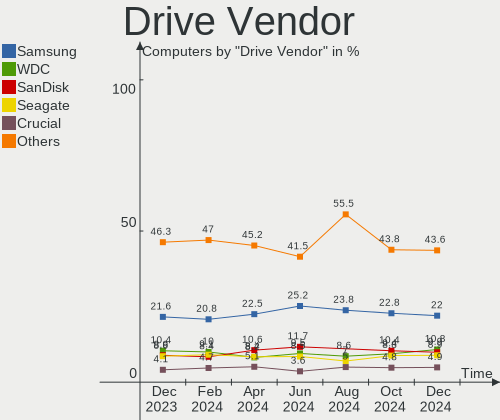
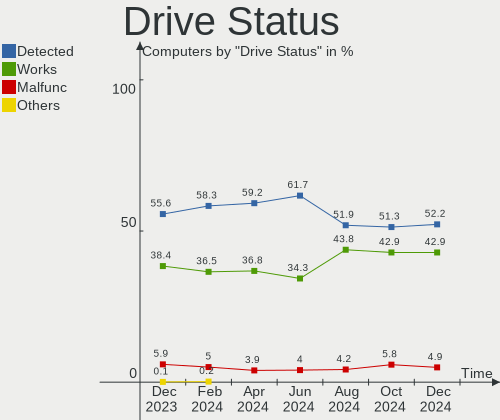
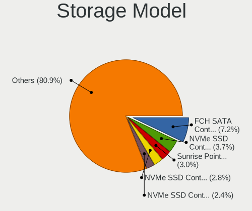
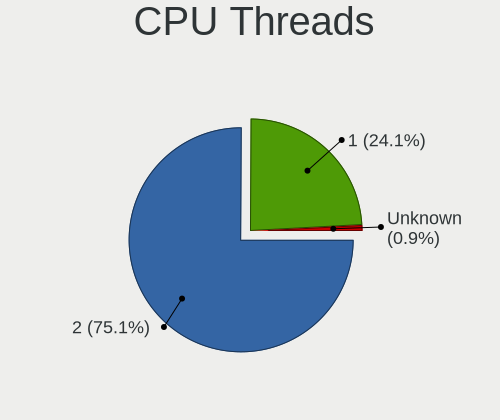
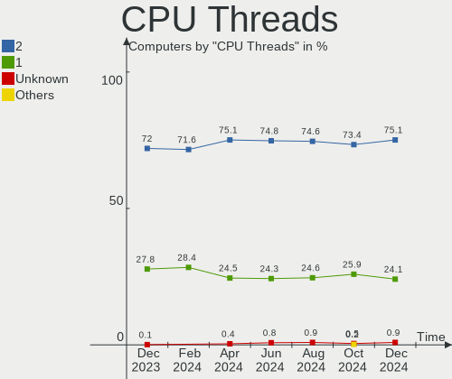
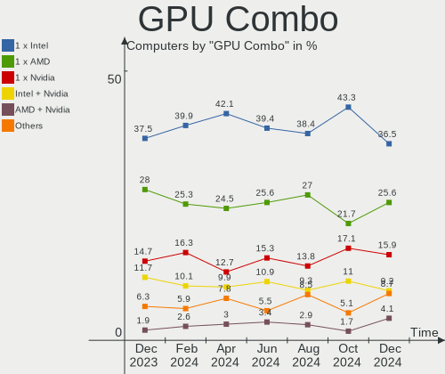
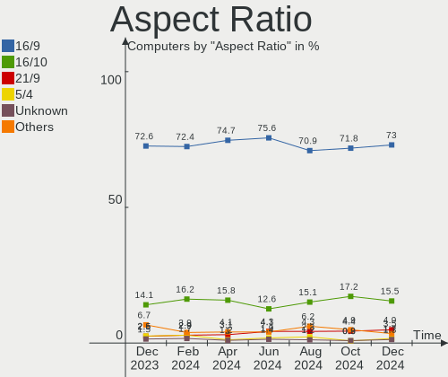
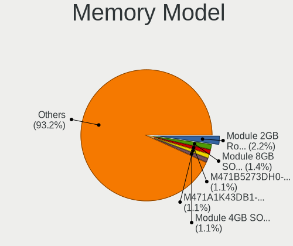
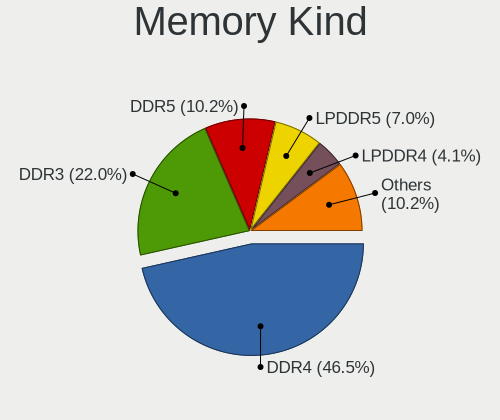

Linux in Germany - Hardware Trends
----------------------------------

A project to identify most popular hardware characteristics and track their change
over time based on data collected by Linux users at https://Linux-Hardware.org.

Anyone can contribute to this report by the [hw-probe](https://github.com/linuxhw/hw-probe) tool:

    sudo -E hw-probe -all -upload

This is a report for all computer types. See also reports for [desktops](/Location/Germany/Desktop/README.md) and [notebooks](/Location/Germany/Notebook/README.md).

Period: Jan, 2024.

Contents
--------

* [ System ](#system)
  - [ OS                       ](#os)
  - [ OS Family                ](#os-family)
  - [ Kernel                   ](#kernel)
  - [ Kernel Family            ](#kernel-family)
  - [ Kernel Major Ver.        ](#kernel-major-ver)
  - [ Arch                     ](#arch)
  - [ DE                       ](#de)
  - [ Display Server           ](#display-server)
  - [ Display Manager          ](#display-manager)
  - [ OS Lang                  ](#os-lang)
  - [ Boot Mode                ](#boot-mode)
  - [ Filesystem               ](#filesystem)
  - [ Part. scheme             ](#part-scheme)
  - [ Dual Boot with Linux/BSD ](#dual-boot-with-linuxbsd)
  - [ Dual Boot (Win)          ](#dual-boot-win)

* [ Board ](#board)
  - [ Vendor                   ](#vendor)
  - [ Model                    ](#model)
  - [ Model Family             ](#model-family)
  - [ MFG Year                 ](#mfg-year)
  - [ Form Factor              ](#form-factor)
  - [ Secure Boot              ](#secure-boot)
  - [ Coreboot                 ](#coreboot)
  - [ RAM Size                 ](#ram-size)
  - [ RAM Used                 ](#ram-used)
  - [ Total Drives             ](#total-drives)
  - [ Has CD-ROM               ](#has-cd-rom)
  - [ Has Ethernet             ](#has-ethernet)
  - [ Has WiFi                 ](#has-wifi)
  - [ Has Bluetooth            ](#has-bluetooth)

* [ Location ](#location)
  - [ Country                  ](#country)
  - [ City                     ](#city)

* [ Drives ](#drives)
  - [ Drive Vendor             ](#drive-vendor)
  - [ Drive Model              ](#drive-model)
  - [ HDD Vendor               ](#hdd-vendor)
  - [ SSD Vendor               ](#ssd-vendor)
  - [ Drive Kind               ](#drive-kind)
  - [ Drive Connector          ](#drive-connector)
  - [ Drive Size               ](#drive-size)
  - [ Space Total              ](#space-total)
  - [ Space Used               ](#space-used)
  - [ Malfunc. Drives          ](#malfunc-drives)
  - [ Malfunc. Drive Vendor    ](#malfunc-drive-vendor)
  - [ Malfunc. HDD Vendor      ](#malfunc-hdd-vendor)
  - [ Malfunc. Drive Kind      ](#malfunc-drive-kind)
  - [ Failed Drives            ](#failed-drives)
  - [ Failed Drive Vendor      ](#failed-drive-vendor)
  - [ Drive Status             ](#drive-status)

* [ Storage controller ](#storage-controller)
  - [ Storage Vendor           ](#storage-vendor)
  - [ Storage Model            ](#storage-model)
  - [ Storage Kind             ](#storage-kind)

* [ Processor ](#processor)
  - [ CPU Vendor               ](#cpu-vendor)
  - [ CPU Model                ](#cpu-model)
  - [ CPU Model Family         ](#cpu-model-family)
  - [ CPU Cores                ](#cpu-cores)
  - [ CPU Sockets              ](#cpu-sockets)
  - [ CPU Threads              ](#cpu-threads)
  - [ CPU Op-Modes             ](#cpu-op-modes)
  - [ CPU Microcode            ](#cpu-microcode)
  - [ CPU Microarch            ](#cpu-microarch)

* [ Graphics ](#graphics)
  - [ GPU Vendor               ](#gpu-vendor)
  - [ GPU Model                ](#gpu-model)
  - [ GPU Combo                ](#gpu-combo)
  - [ GPU Driver               ](#gpu-driver)
  - [ GPU Memory               ](#gpu-memory)

* [ Monitor ](#monitor)
  - [ Monitor Vendor           ](#monitor-vendor)
  - [ Monitor Model            ](#monitor-model)
  - [ Monitor Resolution       ](#monitor-resolution)
  - [ Monitor Diagonal         ](#monitor-diagonal)
  - [ Monitor Width            ](#monitor-width)
  - [ Aspect Ratio             ](#aspect-ratio)
  - [ Monitor Area             ](#monitor-area)
  - [ Pixel Density            ](#pixel-density)
  - [ Multiple Monitors        ](#multiple-monitors)

* [ Network ](#network)
  - [ Net Controller Vendor    ](#net-controller-vendor)
  - [ Net Controller Model     ](#net-controller-model)
  - [ Wireless Vendor          ](#wireless-vendor)
  - [ Wireless Model           ](#wireless-model)
  - [ Ethernet Vendor          ](#ethernet-vendor)
  - [ Ethernet Model           ](#ethernet-model)
  - [ Net Controller Kind      ](#net-controller-kind)
  - [ Used Controller          ](#used-controller)
  - [ NICs                     ](#nics)
  - [ IPv6                     ](#ipv6)

* [ Bluetooth ](#bluetooth)
  - [ Bluetooth Vendor         ](#bluetooth-vendor)
  - [ Bluetooth Model          ](#bluetooth-model)

* [ Sound ](#sound)
  - [ Sound Vendor             ](#sound-vendor)
  - [ Sound Model              ](#sound-model)

* [ Memory ](#memory)
  - [ Memory Vendor            ](#memory-vendor)
  - [ Memory Model             ](#memory-model)
  - [ Memory Kind              ](#memory-kind)
  - [ Memory Form Factor       ](#memory-form-factor)
  - [ Memory Size              ](#memory-size)
  - [ Memory Speed             ](#memory-speed)

* [ Printers & scanners ](#printers--scanners)
  - [ Printer Vendor           ](#printer-vendor)
  - [ Printer Model            ](#printer-model)
  - [ Scanner Vendor           ](#scanner-vendor)
  - [ Scanner Model            ](#scanner-model)

* [ Camera ](#camera)
  - [ Camera Vendor            ](#camera-vendor)
  - [ Camera Model             ](#camera-model)

* [ Security ](#security)
  - [ Fingerprint Vendor       ](#fingerprint-vendor)
  - [ Fingerprint Model        ](#fingerprint-model)
  - [ Chipcard Vendor          ](#chipcard-vendor)
  - [ Chipcard Model           ](#chipcard-model)

* [ Unsupported ](#unsupported)
  - [ Unsupported Devices      ](#unsupported-devices)
  - [ Unsupported Device Types ](#unsupported-device-types)

System
------

OS
--

Installed operating systems

| Name                         | Computers | Percent |
|------------------------------|-----------|---------|
| Ubuntu 22.04                 | 115       | 16.29%  |
| Fedora 39                    | 61        | 8.64%   |
| Debian 12                    | 51        | 7.22%   |
| Linux Mint 21.2              | 47        | 6.66%   |
| Linux Mint 21.3              | 34        | 4.82%   |
| Zorin 17                     | 29        | 4.11%   |
| Ubuntu 23.10                 | 29        | 4.11%   |
| Pop!_OS 22.04                | 19        | 2.69%   |
| OpenMandriva 23.08           | 16        | 2.27%   |
| Manjaro                      | 16        | 2.27%   |
| Arch Rolling                 | 16        | 2.27%   |
| Nobara 39                    | 15        | 2.12%   |
| Debian                       | 14        | 1.98%   |
| openSUSE Tumbleweed-XXXXXXXX | 12        | 1.7%    |
| OpenMandriva 5.0             | 12        | 1.7%    |
| ArcoLinux Rolling            | 12        | 1.7%    |
| Zorin 16                     | 11        | 1.56%   |
| LMDE 6                       | 10        | 1.42%   |
| openSUSE Leap-15.5           | 9         | 1.27%   |
| Kubuntu 23.10                | 8         | 1.13%   |
| Kubuntu 22.04                | 8         | 1.13%   |
| Gentoo 2.14                  | 8         | 1.13%   |
| Linux Mint 20.3              | 7         | 0.99%   |
| KDE neon 22.04               | 7         | 0.99%   |
| EndeavourOS Rolling          | 7         | 0.99%   |
| Kali 2023.4                  | 6         | 0.85%   |
| Xubuntu 22.04                | 5         | 0.71%   |
| Ubuntu 23.04                 | 5         | 0.71%   |
| Linux Mint 21.1              | 5         | 0.71%   |
| Xubuntu 20.04                | 4         | 0.57%   |
| NixOS 23.11                  | 4         | 0.57%   |
| Manjaro 23.1.3               | 4         | 0.57%   |
| Debian 11                    | 4         | 0.57%   |
| Ubuntu MATE 23.10            | 3         | 0.42%   |
| SteamOS 3.5.7                | 3         | 0.42%   |
| openSUSE Microos-XXXXXXXX    | 3         | 0.42%   |
| OpenMandriva 4.3             | 3         | 0.42%   |
| Linux Mint 20.2              | 3         | 0.42%   |
| Garuda Linux Rolling         | 3         | 0.42%   |
| Fedora 38                    | 3         | 0.42%   |

OS Family
---------

OS without a version

| Name          | Computers | Percent |
|---------------|-----------|---------|
| Ubuntu        | 154       | 21.81%  |
| Linux Mint    | 97        | 13.74%  |
| Debian        | 71        | 10.06%  |
| Fedora        | 65        | 9.21%   |
| Zorin         | 40        | 5.67%   |
| OpenMandriva  | 37        | 5.24%   |
| openSUSE      | 24        | 3.4%    |
| Manjaro       | 21        | 2.97%   |
| Pop!_OS       | 19        | 2.69%   |
| Kubuntu       | 17        | 2.41%   |
| Nobara        | 16        | 2.27%   |
| Arch          | 16        | 2.27%   |
| ArcoLinux     | 12        | 1.7%    |
| Xubuntu       | 11        | 1.56%   |
| LMDE          | 10        | 1.42%   |
| Gentoo        | 8         | 1.13%   |
| KDE neon      | 7         | 0.99%   |
| EndeavourOS   | 7         | 0.99%   |
| NixOS         | 6         | 0.85%   |
| Kali          | 6         | 0.85%   |
| SteamOS       | 5         | 0.71%   |
| Ubuntu MATE   | 4         | 0.57%   |
| MX            | 4         | 0.57%   |
| Lubuntu       | 4         | 0.57%   |
| Garuda Linux  | 4         | 0.57%   |
| AlmaLinux     | 4         | 0.57%   |
| Ubuntu Unity  | 3         | 0.42%   |
| ROSA          | 3         | 0.42%   |
| Elementary    | 3         | 0.42%   |
| Xero          | 2         | 0.28%   |
| Guix          | 2         | 0.28%   |
| BunsenLabs    | 2         | 0.28%   |
| antiX         | 2         | 0.28%   |
| Ubuntu Studio | 1         | 0.14%   |
| Ubuntu Budgie | 1         | 0.14%   |
| TUXEDO OS     | 1         | 0.14%   |
| Slackware     | 1         | 0.14%   |
| Siduction     | 1         | 0.14%   |
| Rocky Linux   | 1         | 0.14%   |
| Red OS        | 1         | 0.14%   |

Kernel
------

Version of the Linux kernel

| Version                      | Computers | Percent |
|------------------------------|-----------|---------|
| 6.5.0-14-generic             | 100       | 14.16%  |
| 5.15.0-91-generic            | 91        | 12.89%  |
| 6.2.0-39-generic             | 42        | 5.95%   |
| 6.5.0-15-generic             | 31        | 4.39%   |
| 6.1.0-17-amd64               | 26        | 3.68%   |
| 6.6.9-200.fc39.x86_64        | 20        | 2.83%   |
| 6.6.6-76060606-generic       | 15        | 2.12%   |
| 6.6.2-desktop-1omv2390       | 14        | 1.98%   |
| 6.4.11-desktop-1omv2390      | 14        | 1.98%   |
| 6.6.13-200.fc39.x86_64       | 11        | 1.56%   |
| 6.6.11-200.fc39.x86_64       | 11        | 1.56%   |
| 6.6.10-arch1-1               | 11        | 1.56%   |
| 5.15.0-92-generic            | 11        | 1.56%   |
| 5.4.0-169-generic            | 8         | 1.13%   |
| 5.14.21-150500.55.39-default | 8         | 1.13%   |
| 6.2.0-26-generic             | 7         | 0.99%   |
| 6.6.9-200.fsync.fc39.x86_64  | 6         | 0.85%   |
| 6.6.8-200.fc39.x86_64        | 6         | 0.85%   |
| 6.6.7-1-default              | 6         | 0.85%   |
| 6.6.10-1-MANJARO             | 6         | 0.85%   |
| 6.5.6-300.fc39.x86_64        | 6         | 0.85%   |
| 6.5.11-7-pve                 | 6         | 0.85%   |
| 6.1.0-16-amd64               | 6         | 0.85%   |
| 6.7.0-arch3-1                | 5         | 0.71%   |
| 6.7.0-0-MANJARO              | 5         | 0.71%   |
| 6.6.9-amd64                  | 5         | 0.71%   |
| 6.5.0-kali3-amd64            | 5         | 0.71%   |
| 6.1.0-12-amd64               | 5         | 0.71%   |
| 6.7.0-zen3-1-zen             | 4         | 0.57%   |
| 6.6.8-arch1-1                | 4         | 0.57%   |
| 6.6.12-200.fc39.x86_64       | 4         | 0.57%   |
| 6.5.13-7-MANJARO             | 4         | 0.57%   |
| 6.5.0-5-amd64                | 4         | 0.57%   |
| 5.10.0-27-amd64              | 4         | 0.57%   |
| 6.7.0-204.fsync.fc39.x86_64  | 3         | 0.42%   |
| 6.6.8-200.fsync.fc39.x86_64  | 3         | 0.42%   |
| 6.2.0-37-generic             | 3         | 0.42%   |
| 6.1.69                       | 3         | 0.42%   |
| 6.1.52-valve9-1-neptune-61   | 3         | 0.42%   |
| 6.1.0-15-amd64               | 3         | 0.42%   |

Kernel Family
-------------

Linux kernel without a distro release

| Version  | Computers | Percent |
|----------|-----------|---------|
| 6.5.0    | 152       | 21.53%  |
| 5.15.0   | 117       | 16.57%  |
| 6.2.0    | 57        | 8.07%   |
| 6.1.0    | 47        | 6.66%   |
| 6.6.9    | 38        | 5.38%   |
| 6.6.10   | 29        | 4.11%   |
| 6.7.0    | 22        | 3.12%   |
| 6.6.8    | 20        | 2.83%   |
| 6.6.11   | 18        | 2.55%   |
| 6.6.6    | 17        | 2.41%   |
| 6.6.2    | 15        | 2.12%   |
| 6.6.13   | 14        | 1.98%   |
| 6.4.11   | 14        | 1.98%   |
| 5.4.0    | 13        | 1.84%   |
| 6.6.7    | 9         | 1.27%   |
| 5.14.21  | 9         | 1.27%   |
| 5.10.0   | 8         | 1.13%   |
| 6.5.6    | 7         | 0.99%   |
| 6.5.11   | 7         | 0.99%   |
| 6.6.12   | 6         | 0.85%   |
| 6.1.69   | 6         | 0.85%   |
| 6.1.52   | 6         | 0.85%   |
| 6.7.1    | 4         | 0.57%   |
| 6.6.14   | 4         | 0.57%   |
| 6.5.13   | 4         | 0.57%   |
| 6.5.9    | 3         | 0.42%   |
| 5.13.0   | 3         | 0.42%   |
| 6.7.2    | 2         | 0.28%   |
| 6.7      | 2         | 0.28%   |
| 6.6.1    | 2         | 0.28%   |
| 6.2.6    | 2         | 0.28%   |
| 6.1.67   | 2         | 0.28%   |
| 6.1.63   | 2         | 0.28%   |
| 5.16.7   | 2         | 0.28%   |
| 5.14.0   | 2         | 0.28%   |
| 5.11.0   | 2         | 0.28%   |
| 5.10.188 | 2         | 0.28%   |
| 4.18.0   | 2         | 0.28%   |
| 4.15.0   | 2         | 0.28%   |
| 6.6.3    | 1         | 0.14%   |

Kernel Major Ver.
-----------------

Linux kernel major version

| Version | Computers | Percent |
|---------|-----------|---------|
| 6.5     | 177       | 25.07%  |
| 6.6     | 174       | 24.65%  |
| 5.15    | 118       | 16.71%  |
| 6.1     | 74        | 10.48%  |
| 6.2     | 60        | 8.5%    |
| 6.7     | 28        | 3.97%   |
| 6.4     | 17        | 2.41%   |
| 5.4     | 15        | 2.12%   |
| 5.14    | 11        | 1.56%   |
| 5.10    | 10        | 1.42%   |
| 5.16    | 3         | 0.42%   |
| 5.13    | 3         | 0.42%   |
| 6.3     | 2         | 0.28%   |
| 6.0     | 2         | 0.28%   |
| 6       | 2         | 0.28%   |
| 5.11    | 2         | 0.28%   |
| 4.18    | 2         | 0.28%   |
| 4.15    | 2         | 0.28%   |
| 5.6     | 1         | 0.14%   |
| 5.17    | 1         | 0.14%   |
| 4.19    | 1         | 0.14%   |
| 3.10    | 1         | 0.14%   |

Arch
----

OS architecture (x86_64, i586, etc.)

| Name    | Computers | Percent |
|---------|-----------|---------|
| x86_64  | 692       | 98.02%  |
| i686    | 7         | 0.99%   |
| aarch64 | 6         | 0.85%   |
| armv7l  | 1         | 0.14%   |

DE
--

Desktop Environment

| Name          | Computers | Percent |
|---------------|-----------|---------|
| GNOME         | 307       | 43.48%  |
| KDE5          | 149       | 21.1%   |
| X-Cinnamon    | 85        | 12.04%  |
| XFCE          | 59        | 8.36%   |
| Unknown       | 34        | 4.82%   |
| MATE          | 20        | 2.83%   |
| LXQt          | 8         | 1.13%   |
| Cinnamon      | 8         | 1.13%   |
| KDE           | 5         | 0.71%   |
| Unity         | 4         | 0.57%   |
| LXDE          | 4         | 0.57%   |
| Hyprland      | 4         | 0.57%   |
| Pantheon      | 3         | 0.42%   |
| sway          | 2         | 0.28%   |
| Openbox       | 2         | 0.28%   |
| KDE6          | 2         | 0.28%   |
| KDE4          | 2         | 0.28%   |
| icewm         | 2         | 0.28%   |
| i3            | 2         | 0.28%   |
| Budgie        | 2         | 0.28%   |
| Enlightenment | 1         | 0.14%   |
| Deepin        | 1         | 0.14%   |

Display Server
--------------

X11 or Wayland

| Name    | Computers | Percent |
|---------|-----------|---------|
| X11     | 381       | 53.97%  |
| Wayland | 280       | 39.66%  |
| Tty     | 26        | 3.68%   |
| Unknown | 19        | 2.69%   |

Display Manager
---------------

SDDM, LightDM, etc.

| Name    | Computers | Percent |
|---------|-----------|---------|
| Unknown | 275       | 38.95%  |
| GDM3    | 173       | 24.5%   |
| LightDM | 113       | 16.01%  |
| SDDM    | 105       | 14.87%  |
| GDM     | 30        | 4.25%   |
| XDM     | 3         | 0.42%   |
| SLIMSKI | 2         | 0.28%   |
| SLiM    | 2         | 0.28%   |
| LXDM    | 1         | 0.14%   |
| KDM     | 1         | 0.14%   |
| GREETD  | 1         | 0.14%   |

OS Lang
-------

Language

| Lang    | Computers | Percent |
|---------|-----------|---------|
| de_DE   | 484       | 68.56%  |
| en_US   | 159       | 22.52%  |
| en_GB   | 15        | 2.12%   |
| Unknown | 15        | 2.12%   |
| C       | 11        | 1.56%   |
| pl_PL   | 4         | 0.57%   |
| ru_RU   | 3         | 0.42%   |
| hu_HU   | 3         | 0.42%   |
| it_IT   | 2         | 0.28%   |
| fr_FR   | 2         | 0.28%   |
| de_LU   | 2         | 0.28%   |
| uk_UA   | 1         | 0.14%   |
| POSIX   | 1         | 0.14%   |
| es_ES   | 1         | 0.14%   |
| en_IE   | 1         | 0.14%   |
| en_DK   | 1         | 0.14%   |
| C.UTF8  | 1         | 0.14%   |

Boot Mode
---------

EFI or BIOS

| Mode | Computers | Percent |
|------|-----------|---------|
| BIOS | 361       | 51.13%  |
| EFI  | 345       | 48.87%  |

Filesystem
----------

Type of filesystem

| Type    | Computers | Percent |
|---------|-----------|---------|
| Ext4    | 394       | 55.81%  |
| Btrfs   | 131       | 18.56%  |
| Tmpfs   | 126       | 17.85%  |
| Overlay | 31        | 4.39%   |
| Xfs     | 11        | 1.56%   |
| Zfs     | 8         | 1.13%   |
| Ext2    | 2         | 0.28%   |
| Rootfs  | 1         | 0.14%   |
| F2fs    | 1         | 0.14%   |
| Ext3    | 1         | 0.14%   |

Part. scheme
------------

Scheme of partitioning

| Type    | Computers | Percent |
|---------|-----------|---------|
| GPT     | 384       | 54.39%  |
| Unknown | 238       | 33.71%  |
| MBR     | 84        | 11.9%   |

Dual Boot with Linux/BSD
------------------------

Hosting more than one Linux/BSD

| Dual boot | Computers | Percent |
|-----------|-----------|---------|
| No        | 601       | 85.13%  |
| Yes       | 105       | 14.87%  |

Dual Boot (Win)
---------------

Hosting Linux and Windows

| Dual boot | Computers | Percent |
|-----------|-----------|---------|
| No        | 551       | 78.05%  |
| Yes       | 155       | 21.95%  |

Board
-----

Vendor
------

Motherboard manufacturer

| Name                                 | Computers | Percent |
|--------------------------------------|-----------|---------|
| Lenovo                               | 113       | 16.01%  |
| ASUSTek Computer                     | 103       | 14.59%  |
| Hewlett-Packard                      | 70        | 9.92%   |
| Dell                                 | 63        | 8.92%   |
| MSI                                  | 50        | 7.08%   |
| Gigabyte Technology                  | 45        | 6.37%   |
| Acer                                 | 41        | 5.81%   |
| ASRock                               | 29        | 4.11%   |
| Fujitsu                              | 27        | 3.82%   |
| Apple                                | 27        | 3.82%   |
| Medion                               | 19        | 2.69%   |
| TUXEDO                               | 12        | 1.7%    |
| Unknown                              | 9         | 1.27%   |
| Toshiba                              | 7         | 0.99%   |
| Intel                                | 7         | 0.99%   |
| Supermicro                           | 5         | 0.71%   |
| Sony                                 | 5         | 0.71%   |
| Samsung Electronics                  | 5         | 0.71%   |
| Packard Bell                         | 5         | 0.71%   |
| Valve                                | 4         | 0.57%   |
| Shenzhen Meigao Electronic Equipment | 4         | 0.57%   |
| Microsoft                            | 4         | 0.57%   |
| Biostar                              | 4         | 0.57%   |
| Wortmann AG                          | 3         | 0.42%   |
| VALE                                 | 3         | 0.42%   |
| Raspberry Pi Foundation              | 3         | 0.42%   |
| HUAWEI                               | 3         | 0.42%   |
| Pegatron                             | 2         | 0.28%   |
| Inventec                             | 2         | 0.28%   |
| Google                               | 2         | 0.28%   |
| Framework                            | 2         | 0.28%   |
| Foxconn                              | 2         | 0.28%   |
| Teclast                              | 1         | 0.14%   |
| T-bao TianBei                        | 1         | 0.14%   |
| Schenker                             | 1         | 0.14%   |
| Rockchip                             | 1         | 0.14%   |
| Razer                                | 1         | 0.14%   |
| Phoenix                              | 1         | 0.14%   |
| Panasonic                            | 1         | 0.14%   |
| ONDA                                 | 1         | 0.14%   |

Model
-----

Motherboard model

| Name                                              | Computers | Percent |
|---------------------------------------------------|-----------|---------|
| Unknown                                           | 10        | 1.42%   |
| ASUS A0000001                                     | 5         | 0.71%   |
| Valve Jupiter                                     | 4         | 0.57%   |
| MSI MS-7C35                                       | 4         | 0.57%   |
| ASUS ROG STRIX B550-F GAMING                      | 4         | 0.57%   |
| ASUS All Series                                   | 4         | 0.57%   |
| MSI MS-7C56                                       | 3         | 0.42%   |
| Intel NUC13ANHi7                                  | 3         | 0.42%   |
| Fujitsu LIFEBOOK U7412                            | 3         | 0.42%   |
| Apple MacBookPro14,1                              | 3         | 0.42%   |
| Apple MacBookAir7,2                               | 3         | 0.42%   |
| VALE Notebook Classic C140                        | 2         | 0.28%   |
| TUXEDO Pulse 14 Gen3                              | 2         | 0.28%   |
| TUXEDO Aura 15 Gen2                               | 2         | 0.28%   |
| Supermicro X8DTT-H                                | 2         | 0.28%   |
| Supermicro Super Server                           | 2         | 0.28%   |
| Shenzhen Meigao Electronic Equipment Venus series | 2         | 0.28%   |
| MSI MS-7C37                                       | 2         | 0.28%   |
| MSI MS-7B89                                       | 2         | 0.28%   |
| MSI MS-7B86                                       | 2         | 0.28%   |
| MSI MS-7817                                       | 2         | 0.28%   |
| Microsoft Surface Pro 4                           | 2         | 0.28%   |
| Medion P15648                                     | 2         | 0.28%   |
| Medion MS-7800                                    | 2         | 0.28%   |
| HP Pavilion 17                                    | 2         | 0.28%   |
| HP Pavilion 15                                    | 2         | 0.28%   |
| HP Notebook                                       | 2         | 0.28%   |
| HP EliteBook 2570p                                | 2         | 0.28%   |
| Gigabyte B550 AORUS ELITE V2                      | 2         | 0.28%   |
| Gigabyte A320M-S2H V2                             | 2         | 0.28%   |
| Fujitsu ESPRIMO_P756                              | 2         | 0.28%   |
| Fujitsu ESPRIMO E720                              | 2         | 0.28%   |
| Framework Laptop 13 (AMD Ryzen 7040Series)        | 2         | 0.28%   |
| Dell XPS 13 9360                                  | 2         | 0.28%   |
| Dell OptiPlex 760                                 | 2         | 0.28%   |
| Dell Latitude E6410                               | 2         | 0.28%   |
| Dell Latitude 7400 2-in-1                         | 2         | 0.28%   |
| Dell Latitude 3320                                | 2         | 0.28%   |
| Dell Inspiron 15 3520                             | 2         | 0.28%   |
| ASUS TUF Gaming B550-PLUS                         | 2         | 0.28%   |

Model Family
------------

Motherboard model prefix

| Name                  | Computers | Percent |
|-----------------------|-----------|---------|
| Lenovo ThinkPad       | 65        | 9.21%   |
| Acer Aspire           | 30        | 4.25%   |
| Dell Latitude         | 25        | 3.54%   |
| ASUS ROG              | 20        | 2.83%   |
| ASUS PRIME            | 16        | 2.27%   |
| Fujitsu LIFEBOOK      | 14        | 1.98%   |
| Lenovo IdeaPad        | 11        | 1.56%   |
| Dell Inspiron         | 11        | 1.56%   |
| HP Pavilion           | 10        | 1.42%   |
| HP EliteBook          | 10        | 1.42%   |
| Fujitsu ESPRIMO       | 10        | 1.42%   |
| Dell OptiPlex         | 10        | 1.42%   |
| Unknown               | 10        | 1.42%   |
| Dell Precision        | 9         | 1.27%   |
| HP ProBook            | 8         | 1.13%   |
| ASUS TUF              | 8         | 1.13%   |
| Lenovo ThinkCentre    | 7         | 0.99%   |
| Toshiba Satellite     | 6         | 0.85%   |
| Lenovo Yoga           | 6         | 0.85%   |
| HP Compaq             | 6         | 0.85%   |
| Dell XPS              | 6         | 0.85%   |
| HP ENVY               | 5         | 0.71%   |
| ASUS A0000001         | 5         | 0.71%   |
| Apple MacBookPro11    | 5         | 0.71%   |
| Valve Jupiter         | 4         | 0.57%   |
| TUXEDO Aura           | 4         | 0.57%   |
| Packard Bell EasyNote | 4         | 0.57%   |
| MSI MS-7C35           | 4         | 0.57%   |
| Microsoft Surface     | 4         | 0.57%   |
| Lenovo ThinkBook      | 4         | 0.57%   |
| HP Laptop             | 4         | 0.57%   |
| Gigabyte B550         | 4         | 0.57%   |
| ASUS VivoBook         | 4         | 0.57%   |
| ASUS ASUS             | 4         | 0.57%   |
| ASUS All              | 4         | 0.57%   |
| Acer TravelMate       | 4         | 0.57%   |
| Acer Swift            | 4         | 0.57%   |
| VALE Notebook         | 3         | 0.42%   |
| TUXEDO Pulse          | 3         | 0.42%   |
| TUXEDO InfinityBook   | 3         | 0.42%   |

MFG Year
--------

Motherboard manufacture year

| Year    | Computers | Percent |
|---------|-----------|---------|
| 2020    | 71        | 10.06%  |
| 2023    | 67        | 9.49%   |
| 2022    | 55        | 7.79%   |
| 2018    | 54        | 7.65%   |
| 2013    | 50        | 7.08%   |
| 2021    | 48        | 6.8%    |
| 2014    | 47        | 6.66%   |
| 2019    | 46        | 6.52%   |
| 2012    | 44        | 6.23%   |
| 2010    | 37        | 5.24%   |
| 2017    | 35        | 4.96%   |
| 2016    | 34        | 4.82%   |
| 2015    | 30        | 4.25%   |
| 2011    | 29        | 4.11%   |
| 2009    | 21        | 2.97%   |
| 2008    | 13        | 1.84%   |
| 2007    | 13        | 1.84%   |
| Unknown | 6         | 0.85%   |
| 2024    | 2         | 0.28%   |
| 2006    | 2         | 0.28%   |
| 2005    | 2         | 0.28%   |

Form Factor
-----------

Physical design of the computer

| Name           | Computers | Percent |
|----------------|-----------|---------|
| Notebook       | 368       | 52.12%  |
| Desktop        | 273       | 38.67%  |
| Convertible    | 22        | 3.12%   |
| Mini pc        | 14        | 1.98%   |
| All in one     | 11        | 1.56%   |
| System on chip | 6         | 0.85%   |
| Tablet         | 6         | 0.85%   |
| Server         | 6         | 0.85%   |

Secure Boot
-----------

Enabled or disabled

| State    | Computers | Percent |
|----------|-----------|---------|
| Disabled | 651       | 92.21%  |
| Enabled  | 55        | 7.79%   |

Coreboot
--------

Have coreboot on board

| Used | Computers | Percent |
|------|-----------|---------|
| No   | 703       | 99.58%  |
| Yes  | 3         | 0.42%   |

RAM Size
--------

Total RAM memory

| Size in GB      | Computers | Percent |
|-----------------|-----------|---------|
| 4.01-8.0        | 166       | 23.51%  |
| 16.01-24.0      | 149       | 21.1%   |
| 8.01-16.0       | 110       | 15.58%  |
| 32.01-64.0      | 97        | 13.74%  |
| 3.01-4.0        | 89        | 12.61%  |
| 64.01-256.0     | 39        | 5.52%   |
| 24.01-32.0      | 27        | 3.82%   |
| 2.01-3.0        | 14        | 1.98%   |
| 1.01-2.0        | 9         | 1.27%   |
| More than 256.0 | 4         | 0.57%   |
| 0.51-1.0        | 2         | 0.28%   |

RAM Used
--------

Used RAM memory

| Used GB    | Computers | Percent |
|------------|-----------|---------|
| 2.01-3.0   | 221       | 31.3%   |
| 1.01-2.0   | 194       | 27.48%  |
| 4.01-8.0   | 121       | 17.14%  |
| 3.01-4.0   | 99        | 14.02%  |
| 8.01-16.0  | 31        | 4.39%   |
| 0.51-1.0   | 23        | 3.26%   |
| 16.01-24.0 | 10        | 1.42%   |
| 0.01-0.5   | 5         | 0.71%   |
| 32.01-64.0 | 1         | 0.14%   |
| 24.01-32.0 | 1         | 0.14%   |

Total Drives
------------

Number of drives on board

| Drives | Computers | Percent |
|--------|-----------|---------|
| 1      | 421       | 59.63%  |
| 2      | 161       | 22.8%   |
| 3      | 57        | 8.07%   |
| 4      | 27        | 3.82%   |
| 6      | 11        | 1.56%   |
| 5      | 11        | 1.56%   |
| 7      | 6         | 0.85%   |
| 0      | 4         | 0.57%   |
| 9      | 3         | 0.42%   |
| 13     | 2         | 0.28%   |
| 8      | 2         | 0.28%   |
| 11     | 1         | 0.14%   |

Has CD-ROM
----------

Has CD-ROM on board

| Presented | Computers | Percent |
|-----------|-----------|---------|
| No        | 445       | 63.03%  |
| Yes       | 261       | 36.97%  |

Has Ethernet
------------

Has Ethernet on board

| Presented | Computers | Percent |
|-----------|-----------|---------|
| Yes       | 604       | 85.55%  |
| No        | 102       | 14.45%  |

Has WiFi
--------

Has WiFi module

| Presented | Computers | Percent |
|-----------|-----------|---------|
| Yes       | 533       | 75.5%   |
| No        | 173       | 24.5%   |

Has Bluetooth
-------------

Has Bluetooth module

| Presented | Computers | Percent |
|-----------|-----------|---------|
| Yes       | 443       | 62.75%  |
| No        | 263       | 37.25%  |

Location
--------

Country
-------

Geographic location (country)

| Country | Computers | Percent |
|---------|-----------|---------|
| Germany | 706       | 100%    |

City
----

Geographic location (city)

| City                   | Computers | Percent |
|------------------------|-----------|---------|
| Berlin                 | 62        | 8.78%   |
| Hamburg                | 37        | 5.24%   |
| Munich                 | 30        | 4.25%   |
| Frankfurt am Main      | 21        | 2.97%   |
| Stuttgart              | 16        | 2.27%   |
| Leipzig                | 15        | 2.12%   |
| Dresden                | 15        | 2.12%   |
| Bremen                 | 15        | 2.12%   |
| Nuremberg              | 12        | 1.7%    |
| Cologne                | 12        | 1.7%    |
| Chemnitz               | 9         | 1.27%   |
| Bonn                   | 9         | 1.27%   |
| Traunstein             | 7         | 0.99%   |
| Mannheim               | 7         | 0.99%   |
| Wiesbaden              | 6         | 0.85%   |
| Jena                   | 6         | 0.85%   |
| Hanover                | 6         | 0.85%   |
| Düsseldorf            | 6         | 0.85%   |
| Bielefeld              | 6         | 0.85%   |
| Mainz                  | 5         | 0.71%   |
| Bochum                 | 5         | 0.71%   |
| Münster               | 4         | 0.57%   |
| Lübeck                | 4         | 0.57%   |
| Koblenz                | 4         | 0.57%   |
| Karlsruhe              | 4         | 0.57%   |
| Essen                  | 4         | 0.57%   |
| Dortmund               | 4         | 0.57%   |
| Aachen                 | 4         | 0.57%   |
| Wuppertal              | 3         | 0.42%   |
| Wittenberg             | 3         | 0.42%   |
| Villingen-Schwenningen | 3         | 0.42%   |
| Saarbrücken           | 3         | 0.42%   |
| Recklinghausen         | 3         | 0.42%   |
| Osnabrück             | 3         | 0.42%   |
| Oldenburg              | 3         | 0.42%   |
| Neumünster            | 3         | 0.42%   |
| Mönchengladbach       | 3         | 0.42%   |
| Magdeburg              | 3         | 0.42%   |
| Lilienthal             | 3         | 0.42%   |
| Langen                 | 3         | 0.42%   |

Drives
------

Drive Vendor
------------

Hard drive vendors

| Vendor                       | Computers | Drives | Percent |
|------------------------------|-----------|--------|---------|
| Samsung Electronics          | 226       | 312    | 21.42%  |
| Sandisk                      | 104       | 114    | 9.86%   |
| WDC                          | 103       | 125    | 9.76%   |
| Seagate                      | 88        | 118    | 8.34%   |
| Crucial                      | 65        | 73     | 6.16%   |
| Intenso                      | 51        | 52     | 4.83%   |
| Toshiba                      | 40        | 44     | 3.79%   |
| Unknown                      | 33        | 42     | 3.13%   |
| SK hynix                     | 33        | 33     | 3.13%   |
| Kingston                     | 33        | 38     | 3.13%   |
| Intel                        | 24        | 26     | 2.27%   |
| Micron Technology            | 19        | 21     | 1.8%    |
| Hitachi                      | 18        | 19     | 1.71%   |
| Apple                        | 18        | 24     | 1.71%   |
| Phison Electronics           | 14        | 15     | 1.33%   |
| Micron/Crucial Technology    | 14        | 16     | 1.33%   |
| Kingston Technology Company  | 14        | 14     | 1.33%   |
| HGST                         | 12        | 12     | 1.14%   |
| KIOXIA                       | 10        | 10     | 0.95%   |
| MAXIO Technology (Hangzhou)  | 9         | 11     | 0.85%   |
| OCZ                          | 7         | 7      | 0.66%   |
| Unknown                      | 7         | 7      | 0.66%   |
| Silicon Motion               | 6         | 7      | 0.57%   |
| Shenzhen Longsys Electronics | 6         | 6      | 0.57%   |
| Phison                       | 6         | 6      | 0.57%   |
| Transcend                    | 5         | 6      | 0.47%   |
| LITEONIT                     | 5         | 5      | 0.47%   |
| JMicron Technology           | 5         | 6      | 0.47%   |
| China                        | 5         | 5      | 0.47%   |
| ASMT                         | 5         | 6      | 0.47%   |
| Fanxiang                     | 4         | 4      | 0.38%   |
| A-DATA Technology            | 4         | 5      | 0.38%   |
| Verbatim                     | 3         | 4      | 0.28%   |
| SD                           | 3         | 3      | 0.28%   |
| PNY                          | 3         | 3      | 0.28%   |
| SPCC                         | 2         | 2      | 0.19%   |
| SABRENT                      | 2         | 2      | 0.19%   |
| Realtek                      | 2         | 2      | 0.19%   |
| Netac                        | 2         | 2      | 0.19%   |
| Hewlett-Packard              | 2         | 2      | 0.19%   |

Drive Model
-----------

Hard drive models

| Model                                              | Computers | Percent |
|----------------------------------------------------|-----------|---------|
| Samsung NVMe SSD Controller SM981/PM981/PM983 1TB  | 28        | 2.37%   |
| Samsung NVMe SSD Controller PM9A1/PM9A3/980PRO 2TB | 19        | 1.61%   |
| Samsung SSD 860 EVO 1TB                            | 14        | 1.19%   |
| Samsung SSD 860 EVO 500GB                          | 13        | 1.1%    |
| Crucial CT1000BX500SSD1 1TB                        | 12        | 1.02%   |
| Crucial CT500MX500SSD1 500GB                       | 10        | 0.85%   |
| Sandisk WD Blue SN550 NVMe SSD 512GB               | 9         | 0.76%   |
| Samsung SSD 980 1TB                                | 9         | 0.76%   |
| Crucial CT1000MX500SSD1 1TB                        | 9         | 0.76%   |
| Sandisk WD Black SN750 / PC SN730 NVMe SSD 512GB   | 8         | 0.68%   |
| SanDisk SSD PLUS 1000GB                            | 8         | 0.68%   |
| Samsung SSD 850 EVO 250GB                          | 8         | 0.68%   |
| Micron/Crucial P2 NVMe PCIe SSD 1TB                | 8         | 0.68%   |
| Samsung SSD 990 PRO 2TB                            | 7         | 0.59%   |
| Samsung SSD 870 QVO 1TB                            | 7         | 0.59%   |
| Samsung SSD 870 EVO 1TB                            | 7         | 0.59%   |
| Samsung SSD 850 EVO 500GB                          | 7         | 0.59%   |
| Crucial CT480BX500SSD1 480GB                       | 7         | 0.59%   |
| Unknown                                            | 7         | 0.59%   |
| Unknown SD/MMC/MS PRO 256GB                        | 6         | 0.51%   |
| Unknown MMC Card  64GB                             | 6         | 0.51%   |
| Sandisk WD Blue SN570 1TB                          | 6         | 0.51%   |
| SanDisk SSD PLUS 240GB                             | 6         | 0.51%   |
| Samsung SSD 860 EVO 250GB                          | 6         | 0.51%   |
| Samsung PSSD T7 1TB                                | 6         | 0.51%   |
| MAXIO (Hangzhou) NVMe SSD Controller MAP1202 512GB | 6         | 0.51%   |
| Intenso SSD 128GB                                  | 6         | 0.51%   |
| Unknown MMC Card  32GB                             | 5         | 0.42%   |
| Seagate ST4000DM004-2CV104 4TB                     | 5         | 0.42%   |
| SanDisk SSD PLUS 480GB                             | 5         | 0.42%   |
| SanDisk SDSSDH3 500G                               | 5         | 0.42%   |
| Samsung SSD 980 500GB                              | 5         | 0.42%   |
| Samsung SSD 870 EVO 2TB                            | 5         | 0.42%   |
| Samsung SSD 840 EVO 250GB                          | 5         | 0.42%   |
| Phison PS5013 E13 NVMe Controller 256GB            | 5         | 0.42%   |
| Intenso External USB 3.0 3TB                       | 5         | 0.42%   |
| Unknown Compact Flash 977MB                        | 4         | 0.34%   |
| Toshiba MQ01ABD100 1TB                             | 4         | 0.34%   |
| Toshiba HDWD110 1TB                                | 4         | 0.34%   |
| Seagate ST500DM002-1BD142 500GB                    | 4         | 0.34%   |

HDD Vendor
----------

Hard disk drive vendors

| Vendor              | Computers | Drives | Percent |
|---------------------|-----------|--------|---------|
| Seagate             | 85        | 115    | 33.73%  |
| WDC                 | 76        | 92     | 30.16%  |
| Toshiba             | 28        | 32     | 11.11%  |
| Hitachi             | 18        | 19     | 7.14%   |
| HGST                | 12        | 12     | 4.76%   |
| Samsung Electronics | 9         | 9      | 3.57%   |
| Unknown             | 6         | 6      | 2.38%   |
| Intenso             | 5         | 5      | 1.98%   |
| JMicron Technology  | 4         | 5      | 1.59%   |
| Apple               | 3         | 3      | 1.19%   |
| Fujitsu             | 2         | 2      | 0.79%   |
| ASMT                | 2         | 3      | 0.79%   |
| Unknown (CF)        | 1         | 1      | 0.4%    |
| Maxtor              | 1         | 1      | 0.4%    |

SSD Vendor
----------

Solid state drive vendors

| Vendor              | Computers | Drives | Percent |
|---------------------|-----------|--------|---------|
| Samsung Electronics | 135       | 157    | 30.41%  |
| Crucial             | 59        | 66     | 13.29%  |
| SanDisk             | 55        | 56     | 12.39%  |
| Intenso             | 37        | 38     | 8.33%   |
| WDC                 | 21        | 22     | 4.73%   |
| Kingston            | 18        | 21     | 4.05%   |
| Intel               | 12        | 12     | 2.7%    |
| Apple               | 9         | 9      | 2.03%   |
| SK hynix            | 8         | 8      | 1.8%    |
| OCZ                 | 7         | 7      | 1.58%   |
| Phison              | 5         | 5      | 1.13%   |
| LITEONIT            | 5         | 5      | 1.13%   |
| China               | 5         | 5      | 1.13%   |
| Transcend           | 4         | 4      | 0.9%    |
| Toshiba             | 4         | 4      | 0.9%    |
| Micron Technology   | 4         | 6      | 0.9%    |
| Verbatim            | 3         | 4      | 0.68%   |
| SD                  | 3         | 3      | 0.68%   |
| PNY                 | 3         | 3      | 0.68%   |
| Fanxiang            | 3         | 3      | 0.68%   |
| ASMT                | 3         | 3      | 0.68%   |
| A-DATA Technology   | 3         | 4      | 0.68%   |
| SPCC                | 2         | 2      | 0.45%   |
| SABRENT             | 2         | 2      | 0.45%   |
| Hewlett-Packard     | 2         | 2      | 0.45%   |
| Dogfish             | 2         | 2      | 0.45%   |
| ASMedia             | 2         | 2      | 0.45%   |
| Unknown             | 2         | 2      | 0.45%   |
| WDC WDS             | 1         | 1      | 0.23%   |
| V7                  | 1         | 1      | 0.23%   |
| TCSUNBOW            | 1         | 1      | 0.23%   |
| SXMicro             | 1         | 1      | 0.23%   |
| Supermicro          | 1         | 1      | 0.23%   |
| Patriot             | 1         | 1      | 0.23%   |
| NVMe                | 1         | 2      | 0.23%   |
| NT-512              | 1         | 1      | 0.23%   |
| Netac               | 1         | 1      | 0.23%   |
| LITEON              | 1         | 1      | 0.23%   |
| Leven               | 1         | 2      | 0.23%   |
| KIOXIA-EXCERIA      | 1         | 1      | 0.23%   |

Drive Kind
----------

HDD or SSD

| Kind    | Computers | Drives | Percent |
|---------|-----------|--------|---------|
| SSD     | 367       | 485    | 39.13%  |
| NVMe    | 316       | 409    | 33.69%  |
| HDD     | 208       | 305    | 22.17%  |
| MMC     | 26        | 28     | 2.77%   |
| Unknown | 21        | 27     | 2.24%   |

Drive Connector
---------------

SATA, SAS, NVMe, etc.

| Type | Computers | Drives | Percent |
|------|-----------|--------|---------|
| SATA | 475       | 743    | 54.29%  |
| NVMe | 314       | 400    | 35.89%  |
| SAS  | 60        | 83     | 6.86%   |
| MMC  | 26        | 28     | 2.97%   |

Drive Size
----------

Size of hard drive

| Size in TB | Computers | Drives | Percent |
|------------|-----------|--------|---------|
| 0.01-0.5   | 325       | 394    | 51.59%  |
| 0.51-1.0   | 175       | 215    | 27.78%  |
| 1.01-2.0   | 71        | 89     | 11.27%  |
| 3.01-4.0   | 29        | 44     | 4.6%    |
| 2.01-3.0   | 14        | 16     | 2.22%   |
| 4.01-10.0  | 12        | 17     | 1.9%    |
| 10.01-20.0 | 3         | 13     | 0.48%   |
| 20.01-50.0 | 1         | 2      | 0.16%   |

Space Total
-----------

Amount of disk space available on the file system

| Size in GB     | Computers | Percent |
|----------------|-----------|---------|
| 101-250        | 167       | 23.65%  |
| 251-500        | 135       | 19.12%  |
| 501-1000       | 119       | 16.86%  |
| More than 3000 | 80        | 11.33%  |
| 1001-2000      | 59        | 8.36%   |
| 2001-3000      | 35        | 4.96%   |
| Unknown        | 34        | 4.82%   |
| 1-20           | 33        | 4.67%   |
| 51-100         | 29        | 4.11%   |
| 21-50          | 15        | 2.12%   |

Space Used
----------

Amount of used disk space

| Used GB        | Computers | Percent |
|----------------|-----------|---------|
| 1-20           | 189       | 26.77%  |
| 21-50          | 122       | 17.28%  |
| 101-250        | 91        | 12.89%  |
| 51-100         | 87        | 12.32%  |
| 251-500        | 64        | 9.07%   |
| 501-1000       | 50        | 7.08%   |
| 1001-2000      | 36        | 5.1%    |
| Unknown        | 34        | 4.82%   |
| More than 3000 | 18        | 2.55%   |
| 2001-3000      | 14        | 1.98%   |
| 0              | 1         | 0.14%   |

Malfunc. Drives
---------------

Drive models with a malfunction

| Model                                          | Computers | Drives | Percent |
|------------------------------------------------|-----------|--------|---------|
| SanDisk SSD PLUS 1000GB                        | 3         | 3      | 5.08%   |
| SK hynix HFS060G32MNB-2000A 64GB SSD           | 2         | 2      | 3.39%   |
| Seagate ST500DM002-1BD142 500GB                | 2         | 2      | 3.39%   |
| WDC WDS240G2G0B-00EPW0 240GB SSD               | 1         | 1      | 1.69%   |
| WDC WDS240G2G0A-00JH30 240GB SSD               | 1         | 1      | 1.69%   |
| WDC WD7500BPVT-22HXZT3 752GB                   | 1         | 1      | 1.69%   |
| WDC WD6400AAKS-65A7B2 640GB                    | 1         | 1      | 1.69%   |
| WDC WD5000AACS-00G8B1 500GB                    | 1         | 1      | 1.69%   |
| WDC WD3200BEVT-08A23T1 320GB                   | 1         | 1      | 1.69%   |
| WDC WD30EZRZ-00Z5HB0 3TB                       | 1         | 1      | 1.69%   |
| WDC WD2502ABYS-02B7A0 256GB                    | 1         | 1      | 1.69%   |
| WDC WD10SPCX-22HWST0 1TB                       | 1         | 1      | 1.69%   |
| WDC WD10EFRX-68PJCN0 1TB                       | 1         | 1      | 1.69%   |
| WDC WD Blue SA510 2.5 1000GB SSD               | 1         | 1      | 1.69%   |
| SXMicro NF830 256GB SSD                        | 1         | 1      | 1.69%   |
| SK hynix PC711 HFS512GDE9X073N 512GB           | 1         | 1      | 1.69%   |
| Seagate ST9500325AS 500GB                      | 1         | 1      | 1.69%   |
| Seagate ST500LT012-1DG142 500GB                | 1         | 1      | 1.69%   |
| Seagate ST320LT020-9YG142 320GB                | 1         | 1      | 1.69%   |
| Seagate ST320LT007-9ZV142 320GB                | 1         | 1      | 1.69%   |
| Seagate ST31000524NS 1TB                       | 1         | 1      | 1.69%   |
| Seagate ST3000VN007-2AH16M 3TB                 | 1         | 1      | 1.69%   |
| Seagate ST250DM000-1BD141 250GB                | 1         | 2      | 1.69%   |
| Seagate ST2000DM006-2DM164 2TB                 | 1         | 1      | 1.69%   |
| Seagate ST2000DL003-9VT166 2TB                 | 1         | 1      | 1.69%   |
| Seagate ST1000LM024 HN-M101MBB 1TB             | 1         | 1      | 1.69%   |
| Seagate ST1000DX001-1CM162 1TB                 | 1         | 1      | 1.69%   |
| SanDisk SSD PLUS 120GB                         | 1         | 1      | 1.69%   |
| SanDisk SDSSDX120GG25 120GB                    | 1         | 1      | 1.69%   |
| SanDisk SDSSDHII120G 120GB                     | 1         | 1      | 1.69%   |
| Samsung Electronics SSD 970 EVO Plus 1TB       | 1         | 1      | 1.69%   |
| Samsung Electronics HD501LJ 500GB              | 1         | 1      | 1.69%   |
| Patriot P200 1TB SSD                           | 1         | 1      | 1.69%   |
| OCZ VERTEX3 120GB SSD                          | 1         | 1      | 1.69%   |
| Micron/Crucial Technology P1 NVMe PCIe SSD 1TB | 1         | 1      | 1.69%   |
| LITEONIT LSS-16L6G-HP 16GB SSD                 | 1         | 1      | 1.69%   |
| LITEONIT LMS-32L6M-HP 32GB SSD                 | 1         | 1      | 1.69%   |
| Lenovo LENSE20256GMSP34MEAT2TA 256GB           | 1         | 1      | 1.69%   |
| Kingston SKC600512G 512GB SSD                  | 1         | 1      | 1.69%   |
| Kingston OM8PDP3512B-AA1 512GB                 | 1         | 1      | 1.69%   |

Malfunc. Drive Vendor
---------------------

Vendors of faulty drives

| Vendor                    | Computers | Drives | Percent |
|---------------------------|-----------|--------|---------|
| Seagate                   | 12        | 14     | 21.05%  |
| WDC                       | 10        | 11     | 17.54%  |
| SanDisk                   | 6         | 6      | 10.53%  |
| SK hynix                  | 3         | 3      | 5.26%   |
| Crucial                   | 3         | 3      | 5.26%   |
| Samsung Electronics       | 2         | 2      | 3.51%   |
| LITEONIT                  | 2         | 2      | 3.51%   |
| Kingston                  | 2         | 2      | 3.51%   |
| Intel                     | 2         | 2      | 3.51%   |
| Hitachi                   | 2         | 2      | 3.51%   |
| HGST                      | 2         | 2      | 3.51%   |
| Apple                     | 2         | 2      | 3.51%   |
| SXMicro                   | 1         | 1      | 1.75%   |
| Patriot                   | 1         | 1      | 1.75%   |
| OCZ                       | 1         | 1      | 1.75%   |
| Micron/Crucial Technology | 1         | 1      | 1.75%   |
| Lenovo                    | 1         | 1      | 1.75%   |
| KingSpec                  | 1         | 1      | 1.75%   |
| Intenso                   | 1         | 1      | 1.75%   |
| BAITITON                  | 1         | 1      | 1.75%   |
| ASMT                      | 1         | 1      | 1.75%   |

Malfunc. HDD Vendor
-------------------

Vendors of faulty HDD drives

| Vendor              | Computers | Drives | Percent |
|---------------------|-----------|--------|---------|
| Seagate             | 12        | 14     | 46.15%  |
| WDC                 | 8         | 8      | 30.77%  |
| Hitachi             | 2         | 2      | 7.69%   |
| HGST                | 2         | 2      | 7.69%   |
| Samsung Electronics | 1         | 1      | 3.85%   |
| Apple               | 1         | 1      | 3.85%   |

Malfunc. Drive Kind
-------------------

Kinds of faulty drives

| Kind | Computers | Drives | Percent |
|------|-----------|--------|---------|
| SSD  | 26        | 26     | 45.61%  |
| HDD  | 25        | 28     | 43.86%  |
| NVMe | 6         | 6      | 10.53%  |

Failed Drives
-------------

Failed drive models

Zero info for selected period =(

Failed Drive Vendor
-------------------

Failed drive vendors

Zero info for selected period =(

Drive Status
------------

Number of failed and malfunc. drives

| Status   | Computers | Drives | Percent |
|----------|-----------|--------|---------|
| Detected | 399       | 719    | 53.06%  |
| Works    | 300       | 475    | 39.89%  |
| Malfunc  | 53        | 60     | 7.05%   |

Storage controller
------------------

Storage Vendor
--------------

Storage controller vendors

| Vendor                        | Computers | Percent |
|-------------------------------|-----------|---------|
| Intel                         | 411       | 42.81%  |
| AMD                           | 159       | 16.56%  |
| Samsung Electronics           | 119       | 12.4%   |
| Sandisk                       | 61        | 6.35%   |
| Kingston Technology Company   | 27        | 2.81%   |
| SK hynix                      | 24        | 2.5%    |
| ASMedia Technology            | 20        | 2.08%   |
| Micron/Crucial Technology     | 19        | 1.98%   |
| Micron Technology             | 16        | 1.67%   |
| Phison Electronics            | 15        | 1.56%   |
| MAXIO Technology (Hangzhou)   | 10        | 1.04%   |
| KIOXIA                        | 10        | 1.04%   |
| JMicron Technology            | 10        | 1.04%   |
| Toshiba America Info Systems  | 8         | 0.83%   |
| Marvell Technology Group      | 7         | 0.73%   |
| Silicon Motion                | 6         | 0.63%   |
| Shenzhen Longsys Electronics  | 6         | 0.63%   |
| Nvidia                        | 5         | 0.52%   |
| Apple                         | 5         | 0.52%   |
| Seagate Technology            | 4         | 0.42%   |
| Broadcom / LSI                | 3         | 0.31%   |
| VIA Technologies              | 2         | 0.21%   |
| Silicon Image                 | 2         | 0.21%   |
| Integrated Technology Express | 2         | 0.21%   |
| Union Memory (Shenzhen)       | 1         | 0.1%    |
| Transcend                     | 1         | 0.1%    |
| Solidigm                      | 1         | 0.1%    |
| Netac Technology              | 1         | 0.1%    |
| LSI Logic / Symbios Logic     | 1         | 0.1%    |
| Lenovo                        | 1         | 0.1%    |
| ADATA Technology              | 1         | 0.1%    |
| Adaptec                       | 1         | 0.1%    |
| Unknown                       | 1         | 0.1%    |

Storage Model
-------------

Storage controller models

| Model                                                                          | Computers | Percent |
|--------------------------------------------------------------------------------|-----------|---------|
| AMD FCH SATA Controller [AHCI mode]                                            | 86        | 7.97%   |
| Samsung NVMe SSD Controller SM981/PM981/PM983                                  | 49        | 4.54%   |
| Intel 8 Series/C220 Series Chipset Family 6-port SATA Controller 1 [AHCI mode] | 35        | 3.24%   |
| AMD 500 Series Chipset SATA Controller                                         | 32        | 2.97%   |
| Intel Sunrise Point-LP SATA Controller [AHCI mode]                             | 29        | 2.69%   |
| Samsung NVMe SSD Controller PM9A1/PM9A3/980PRO                                 | 25        | 2.32%   |
| Intel 7 Series Chipset Family 6-port SATA Controller [AHCI mode]               | 25        | 2.32%   |
| AMD 400 Series Chipset SATA Controller                                         | 25        | 2.32%   |
| Intel Volume Management Device NVMe RAID Controller                            | 23        | 2.13%   |
| Intel 82801 Mobile SATA Controller [RAID mode]                                 | 23        | 2.13%   |
| Intel 6 Series/C200 Series Chipset Family 6 port Mobile SATA AHCI Controller   | 23        | 2.13%   |
| Samsung NVMe SSD Controller 980 (DRAM-less)                                    | 22        | 2.04%   |
| Intel Q170/Q150/B150/H170/H110/Z170/CM236 Chipset SATA Controller [AHCI Mode]  | 19        | 1.76%   |
| ASMedia ASM1061/ASM1062 Serial ATA Controller                                  | 18        | 1.67%   |
| Intel 8 Series SATA Controller 1 [AHCI mode]                                   | 17        | 1.58%   |
| AMD SB7x0/SB8x0/SB9x0 SATA Controller [AHCI mode]                              | 17        | 1.58%   |
| Micron/Crucial P2 [Nick P2] / P3 / P3 Plus NVMe PCIe SSD (DRAM-less)           | 13        | 1.2%    |
| Intel Wildcat Point-LP SATA Controller [AHCI Mode]                             | 13        | 1.2%    |
| Intel Celeron/Pentium Silver Processor SATA Controller                         | 13        | 1.2%    |
| SanDisk Extreme Pro / WD Black SN750 / PC SN730 / Red SN700 NVMe SSD           | 11        | 1.02%   |
| Samsung NVMe SSD Controller S4LV008[Pascal]                                    | 11        | 1.02%   |
| AMD 600 Series Chipset SATA Controller                                         | 11        | 1.02%   |
| SanDisk Ultra 3D / WD Blue SN550 NVMe SSD                                      | 10        | 0.93%   |
| Intel SATA Controller [RAID mode]                                              | 10        | 0.93%   |
| Intel 82801IBM/IEM (ICH9M/ICH9M-E) 4 port SATA Controller [AHCI mode]          | 10        | 0.93%   |
| Intel 5 Series/3400 Series Chipset 6 port SATA AHCI Controller                 | 10        | 0.93%   |
| AMD FCH SATA Controller D                                                      | 10        | 0.93%   |
| SK hynix Gold P31/BC711/PC711 NVMe Solid State Drive                           | 9         | 0.83%   |
| Intel Cannon Lake PCH SATA AHCI Controller                                     | 9         | 0.83%   |
| Intel 7 Series/C210 Series Chipset Family 6-port SATA Controller [AHCI mode]   | 9         | 0.83%   |
| Intel 5 Series/3400 Series Chipset 4 port SATA AHCI Controller                 | 9         | 0.83%   |
| Intel 200 Series PCH SATA controller [AHCI mode]                               | 9         | 0.83%   |
| SanDisk Ultra 3D / WD Blue SN570 NVMe SSD (DRAM-less)                          | 8         | 0.74%   |
| Samsung NVMe SSD Controller SM961/PM961/SM963                                  | 7         | 0.65%   |
| MAXIO (Hangzhou) NVMe SSD Controller MAP1202 (DRAM-less)                       | 7         | 0.65%   |
| Kingston Company KC3000/FURY Renegade NVMe SSD E18                             | 7         | 0.65%   |
| Intel Comet Lake SATA AHCI Controller                                          | 7         | 0.65%   |
| Intel Alder Lake-S PCH SATA Controller [AHCI Mode]                             | 7         | 0.65%   |
| Intel Alder Lake-P SATA AHCI Controller                                        | 7         | 0.65%   |
| AMD SB7x0/SB8x0/SB9x0 IDE Controller                                           | 7         | 0.65%   |

Storage Kind
------------

Kind of storage controller (IDE, SATA, NVMe, SAS, ...)

| Kind | Computers | Percent |
|------|-----------|---------|
| SATA | 503       | 53.51%  |
| NVMe | 313       | 33.3%   |
| RAID | 66        | 7.02%   |
| IDE  | 54        | 5.74%   |
| SAS  | 4         | 0.43%   |

Processor
---------

CPU Vendor
----------

Processor vendors

| Vendor  | Computers | Percent |
|---------|-----------|---------|
| Intel   | 489       | 69.26%  |
| AMD     | 210       | 29.75%  |
| ARM     | 6         | 0.85%   |
| Unknown | 1         | 0.14%   |

CPU Model
---------

Processor models

| Model                                      | Computers | Percent |
|--------------------------------------------|-----------|---------|
| AMD Ryzen 5 5600G with Radeon Graphics     | 10        | 1.42%   |
| AMD Ryzen 7 3700X 8-Core Processor         | 9         | 1.27%   |
| Intel 11th Gen Core i7-1165G7 @ 2.80GHz    | 8         | 1.13%   |
| AMD Ryzen 5 3600 6-Core Processor          | 8         | 1.13%   |
| Intel Core i5-8250U CPU @ 1.60GHz          | 7         | 0.99%   |
| Intel Core i5-7200U CPU @ 2.50GHz          | 7         | 0.99%   |
| Intel Core i5-6300U CPU @ 2.40GHz          | 7         | 0.99%   |
| Intel Core i5-5300U CPU @ 2.30GHz          | 7         | 0.99%   |
| Intel Core i5-3320M CPU @ 2.60GHz          | 7         | 0.99%   |
| Intel 11th Gen Core i5-1135G7 @ 2.40GHz    | 7         | 0.99%   |
| AMD Ryzen 7 5800X 8-Core Processor         | 7         | 0.99%   |
| Intel Core i7-7500U CPU @ 2.70GHz          | 6         | 0.85%   |
| Intel Core i5-4460 CPU @ 3.20GHz           | 6         | 0.85%   |
| Intel Core i5-10210U CPU @ 1.60GHz         | 6         | 0.85%   |
| Intel Core i5-4590 CPU @ 3.30GHz           | 5         | 0.71%   |
| Intel Core i5-2410M CPU @ 2.30GHz          | 5         | 0.71%   |
| Intel 13th Gen Core i7-1360P               | 5         | 0.71%   |
| ARM Processor                              | 5         | 0.71%   |
| AMD Ryzen 7 7840HS w/ Radeon 780M Graphics | 5         | 0.71%   |
| AMD Ryzen 5 5500U with Radeon Graphics     | 5         | 0.71%   |
| Intel Pentium Silver N5030 CPU @ 1.10GHz   | 4         | 0.57%   |
| Intel Core i7-6700K CPU @ 4.00GHz          | 4         | 0.57%   |
| Intel Core i7-6700 CPU @ 3.40GHz           | 4         | 0.57%   |
| Intel Core i5-4210U CPU @ 1.70GHz          | 4         | 0.57%   |
| Intel Core i5-2520M CPU @ 2.50GHz          | 4         | 0.57%   |
| Intel Core i5 CPU 750 @ 2.67GHz            | 4         | 0.57%   |
| Intel Core 2 Duo CPU E8500 @ 3.16GHz       | 4         | 0.57%   |
| Intel 12th Gen Core i7-1255U               | 4         | 0.57%   |
| Intel 12th Gen Core i5-1235U               | 4         | 0.57%   |
| AMD Ryzen 9 5900X 12-Core Processor        | 4         | 0.57%   |
| AMD Ryzen 7 7840U w/ Radeon 780M Graphics  | 4         | 0.57%   |
| AMD Ryzen 7 7730U with Radeon Graphics     | 4         | 0.57%   |
| AMD Ryzen 7 5700U with Radeon Graphics     | 4         | 0.57%   |
| AMD Ryzen 7 5700G with Radeon Graphics     | 4         | 0.57%   |
| AMD Ryzen 5 5600X 6-Core Processor         | 4         | 0.57%   |
| AMD Ryzen 5 4600G with Radeon Graphics     | 4         | 0.57%   |
| AMD Ryzen 5 2600 Six-Core Processor        | 4         | 0.57%   |
| AMD Custom APU 0405                        | 4         | 0.57%   |
| Intel Pentium CPU N3710 @ 1.60GHz          | 3         | 0.42%   |
| Intel Core i7-8565U CPU @ 1.80GHz          | 3         | 0.42%   |

CPU Model Family
----------------

Processor model prefix

| Model                   | Computers | Percent |
|-------------------------|-----------|---------|
| Intel Core i5           | 171       | 24.22%  |
| Intel Core i7           | 93        | 13.17%  |
| Other                   | 84        | 11.9%   |
| AMD Ryzen 7             | 66        | 9.35%   |
| AMD Ryzen 5             | 58        | 8.22%   |
| Intel Core i3           | 37        | 5.24%   |
| Intel Core 2 Duo        | 25        | 3.54%   |
| Intel Pentium           | 21        | 2.97%   |
| Intel Celeron           | 21        | 2.97%   |
| AMD Ryzen 9             | 21        | 2.97%   |
| Intel Xeon              | 11        | 1.56%   |
| Intel Pentium Silver    | 7         | 0.99%   |
| AMD Ryzen 3             | 7         | 0.99%   |
| AMD A8                  | 7         | 0.99%   |
| Intel Core i9           | 6         | 0.85%   |
| Intel Pentium Dual-Core | 5         | 0.71%   |
| AMD A10                 | 5         | 0.71%   |
| Intel Core 2 Quad       | 4         | 0.57%   |
| Intel Atom              | 4         | 0.57%   |
| AMD FX                  | 4         | 0.57%   |
| AMD Ryzen Threadripper  | 3         | 0.42%   |
| AMD Ryzen 7 PRO         | 3         | 0.42%   |
| AMD Ryzen 5 PRO         | 3         | 0.42%   |
| AMD G                   | 3         | 0.42%   |
| AMD E1                  | 3         | 0.42%   |
| AMD Athlon II           | 3         | 0.42%   |
| Intel Pentium M         | 2         | 0.28%   |
| Intel Genuine           | 2         | 0.28%   |
| AMD Phenom II X4        | 2         | 0.28%   |
| AMD EPYC                | 2         | 0.28%   |
| AMD E                   | 2         | 0.28%   |
| AMD Athlon X4           | 2         | 0.28%   |
| AMD Athlon              | 2         | 0.28%   |
| Intel Xeon Gold         | 1         | 0.14%   |
| Intel Pentium Gold      | 1         | 0.14%   |
| Intel Core m5           | 1         | 0.14%   |
| Intel Core M            | 1         | 0.14%   |
| Intel Core Duo          | 1         | 0.14%   |
| Intel Core 2 Solo       | 1         | 0.14%   |
| Intel Core 2            | 1         | 0.14%   |

CPU Cores
---------

Number of processor cores

| Number  | Computers | Percent |
|---------|-----------|---------|
| 2       | 240       | 33.99%  |
| 4       | 211       | 29.89%  |
| 8       | 90        | 12.75%  |
| 6       | 81        | 11.47%  |
| 12      | 21        | 2.97%   |
| 16      | 15        | 2.12%   |
| 10      | 15        | 2.12%   |
| 14      | 12        | 1.7%    |
| 1       | 9         | 1.27%   |
| 24      | 3         | 0.42%   |
| Unknown | 3         | 0.42%   |
| 32      | 2         | 0.28%   |
| 3       | 2         | 0.28%   |
| 64      | 1         | 0.14%   |
| 18      | 1         | 0.14%   |

CPU Sockets
-----------

Number of sockets

| Number  | Computers | Percent |
|---------|-----------|---------|
| 1       | 698       | 98.87%  |
| 2       | 5         | 0.71%   |
| Unknown | 3         | 0.42%   |

CPU Threads
-----------

Threads per core (Hyper-Threading)

| Number  | Computers | Percent |
|---------|-----------|---------|
| 2       | 507       | 71.81%  |
| 1       | 196       | 27.76%  |
| Unknown | 3         | 0.42%   |

CPU Op-Modes
------------

CPU Operation Modes (32-bit, 64-bit)

| Op mode        | Computers | Percent |
|----------------|-----------|---------|
| 32-bit, 64-bit | 699       | 99.01%  |
| 32-bit         | 3         | 0.42%   |
| 64-bit         | 2         | 0.28%   |
| Unknown        | 2         | 0.28%   |

CPU Microcode
-------------

Microcode number

| Number     | Computers | Percent |
|------------|-----------|---------|
| Unknown    | 428       | 60.62%  |
| 0x306c3    | 19        | 2.69%   |
| 0x0a50000d | 16        | 2.27%   |
| 0x306a9    | 14        | 1.98%   |
| 0x08701021 | 11        | 1.56%   |
| 0x206a7    | 10        | 1.42%   |
| 0x40651    | 8         | 1.13%   |
| 0x20655    | 8         | 1.13%   |
| 0x0a704104 | 8         | 1.13%   |
| 0x0a601206 | 7         | 0.99%   |
| 0x0800820d | 7         | 0.99%   |
| 0x806e9    | 6         | 0.85%   |
| 0x906ea    | 5         | 0.71%   |
| 0x1067a    | 5         | 0.71%   |
| 0x10676    | 5         | 0.71%   |
| 0x0a601203 | 5         | 0.71%   |
| 0x0a404102 | 5         | 0.71%   |
| 0x0a20120e | 5         | 0.71%   |
| 0x08701030 | 5         | 0.71%   |
| 0x08608103 | 5         | 0.71%   |
| 0x08600109 | 5         | 0.71%   |
| 0x08600106 | 5         | 0.71%   |
| 0x806ea    | 4         | 0.57%   |
| 0x806c1    | 4         | 0.57%   |
| 0x20652    | 4         | 0.57%   |
| 0x0a704103 | 4         | 0.57%   |
| 0x010000c8 | 4         | 0.57%   |
| 0x906e9    | 3         | 0.42%   |
| 0x906a3    | 3         | 0.42%   |
| 0x506e3    | 3         | 0.42%   |
| 0x506c9    | 3         | 0.42%   |
| 0x306d4    | 3         | 0.42%   |
| 0x06001119 | 3         | 0.42%   |
| 0xb06f2    | 2         | 0.28%   |
| 0x906ed    | 2         | 0.28%   |
| 0x706a8    | 2         | 0.28%   |
| 0x706a1    | 2         | 0.28%   |
| 0x6d8      | 2         | 0.28%   |
| 0x406e3    | 2         | 0.28%   |
| 0x406c4    | 2         | 0.28%   |

CPU Microarch
-------------

Microarchitecture

| Name             | Computers | Percent |
|------------------|-----------|---------|
| KabyLake         | 87        | 12.32%  |
| Unknown          | 77        | 10.91%  |
| Haswell          | 69        | 9.77%   |
| Zen 3            | 52        | 7.37%   |
| Zen 2            | 38        | 5.38%   |
| Skylake          | 38        | 5.38%   |
| IvyBridge        | 38        | 5.38%   |
| SandyBridge      | 33        | 4.67%   |
| Penryn           | 31        | 4.39%   |
| Alderlake Hybrid | 31        | 4.39%   |
| Broadwell        | 22        | 3.12%   |
| Westmere         | 21        | 2.97%   |
| TigerLake        | 21        | 2.97%   |
| Zen+             | 17        | 2.41%   |
| Silvermont       | 16        | 2.27%   |
| Goldmont plus    | 14        | 1.98%   |
| CometLake        | 12        | 1.7%    |
| Zen              | 11        | 1.56%   |
| Nehalem          | 11        | 1.56%   |
| Piledriver       | 9         | 1.27%   |
| K10              | 8         | 1.13%   |
| Icelake          | 8         | 1.13%   |
| Bobcat           | 8         | 1.13%   |
| Core             | 7         | 0.99%   |
| Goldmont         | 5         | 0.71%   |
| Excavator        | 5         | 0.71%   |
| Puma             | 4         | 0.57%   |
| P6               | 4         | 0.57%   |
| K8 Hammer        | 2         | 0.28%   |
| K8 & K10 hybrid  | 2         | 0.28%   |
| Gracemont        | 2         | 0.28%   |
| Steamroller      | 1         | 0.14%   |
| Jaguar           | 1         | 0.14%   |
| Bonnell          | 1         | 0.14%   |

Graphics
--------

GPU Vendor
----------

Vendors of graphics cards

| Vendor                     | Computers | Percent |
|----------------------------|-----------|---------|
| Intel                      | 394       | 48.88%  |
| AMD                        | 211       | 26.18%  |
| Nvidia                     | 194       | 24.07%  |
| Matrox Electronics Systems | 3         | 0.37%   |
| ASPEED Technology          | 3         | 0.37%   |
| VIA Technologies           | 1         | 0.12%   |

GPU Model
---------

Graphics card models

| Model                                                                                    | Computers | Percent |
|------------------------------------------------------------------------------------------|-----------|---------|
| Intel 2nd Generation Core Processor Family Integrated Graphics Controller                | 26        | 3.13%   |
| Intel Xeon E3-1200 v3/4th Gen Core Processor Integrated Graphics Controller              | 23        | 2.76%   |
| Intel 3rd Gen Core processor Graphics Controller                                         | 21        | 2.52%   |
| Intel Haswell-ULT Integrated Graphics Controller                                         | 20        | 2.4%    |
| Intel HD Graphics 620                                                                    | 19        | 2.28%   |
| Intel TigerLake-LP GT2 [Iris Xe Graphics]                                                | 18        | 2.16%   |
| AMD Cezanne [Radeon Vega Series / Radeon Vega Mobile Series]                             | 18        | 2.16%   |
| AMD Phoenix1                                                                             | 15        | 1.8%    |
| Intel UHD Graphics 620                                                                   | 14        | 1.68%   |
| Intel Raptor Lake-P [Iris Xe Graphics]                                                   | 14        | 1.68%   |
| Intel HD Graphics 5500                                                                   | 14        | 1.68%   |
| Intel Core Processor Integrated Graphics Controller                                      | 14        | 1.68%   |
| Intel Skylake GT2 [HD Graphics 520]                                                      | 13        | 1.56%   |
| AMD Renoir [Radeon RX Vega 6 (Ryzen 4000/5000 Mobile Series)]                            | 13        | 1.56%   |
| AMD Ellesmere [Radeon RX 470/480/570/570X/580/580X/590]                                  | 12        | 1.44%   |
| Intel CometLake-U GT2 [UHD Graphics]                                                     | 11        | 1.32%   |
| Intel 4th Gen Core Processor Integrated Graphics Controller                              | 11        | 1.32%   |
| AMD Navi 21 [Radeon RX 6800/6800 XT / 6900 XT]                                           | 11        | 1.32%   |
| Intel WhiskeyLake-U GT2 [UHD Graphics 620]                                               | 10        | 1.2%    |
| Intel CoffeeLake-S GT2 [UHD Graphics 630]                                                | 10        | 1.2%    |
| AMD Raphael                                                                              | 10        | 1.2%    |
| AMD Lucienne                                                                             | 10        | 1.2%    |
| AMD Barcelo                                                                              | 10        | 1.2%    |
| Intel Mobile 4 Series Chipset Integrated Graphics Controller                             | 9         | 1.08%   |
| Intel HD Graphics 530                                                                    | 8         | 0.96%   |
| Intel Atom/Celeron/Pentium Processor x5-E8000/J3xxx/N3xxx Integrated Graphics Controller | 8         | 0.96%   |
| Intel Atom Processor Z36xxx/Z37xxx Series Graphics & Display                             | 8         | 0.96%   |
| Intel Alder Lake-UP3 GT2 [Iris Xe Graphics]                                              | 8         | 0.96%   |
| Intel Alder Lake-P GT2 [Iris Xe Graphics]                                                | 8         | 0.96%   |
| AMD Navi 22 [Radeon RX 6700/6700 XT/6750 XT / 6800M/6850M XT]                            | 8         | 0.96%   |
| Intel GeminiLake [UHD Graphics 605]                                                      | 7         | 0.84%   |
| Intel GeminiLake [UHD Graphics 600]                                                      | 7         | 0.84%   |
| AMD Rembrandt [Radeon 680M]                                                              | 7         | 0.84%   |
| Nvidia GK208B [GeForce GT 710]                                                           | 6         | 0.72%   |
| Intel Xeon E3-1200 v2/3rd Gen Core processor Graphics Controller                         | 6         | 0.72%   |
| Intel 4 Series Chipset Integrated Graphics Controller                                    | 6         | 0.72%   |
| AMD Picasso/Raven 2 [Radeon Vega Series / Radeon Vega Mobile Series]                     | 6         | 0.72%   |
| Nvidia GA102 [GeForce RTX 3090]                                                          | 5         | 0.6%    |
| AMD Navi 32 [Radeon RX 7700 XT / 7800 XT]                                                | 5         | 0.6%    |
| AMD Navi 23 [Radeon RX 6600/6600 XT/6600M]                                               | 5         | 0.6%    |

GPU Combo
---------

Combinations of graphics cards

| Name           | Computers | Percent |
|----------------|-----------|---------|
| 1 x Intel      | 299       | 42.35%  |
| 1 x AMD        | 157       | 22.24%  |
| 1 x Nvidia     | 111       | 15.72%  |
| Intel + Nvidia | 62        | 8.78%   |
| 2 x AMD        | 18        | 2.55%   |
| AMD + Nvidia   | 18        | 2.55%   |
| Intel + AMD    | 17        | 2.41%   |
| Other          | 7         | 0.99%   |
| 2 x Intel      | 7         | 0.99%   |
| 2 x Nvidia     | 3         | 0.42%   |
| 1 x Matrox     | 3         | 0.42%   |
| 1 x ASPEED     | 3         | 0.42%   |
| 1 x VIA        | 1         | 0.14%   |

GPU Driver
----------

Free vs proprietary

| Driver      | Computers | Percent |
|-------------|-----------|---------|
| Free        | 573       | 81.16%  |
| Proprietary | 102       | 14.45%  |
| Unknown     | 31        | 4.39%   |

GPU Memory
----------

Total video memory

| Size in GB | Computers | Percent |
|------------|-----------|---------|
| Unknown    | 461       | 65.3%   |
| 0.01-0.5   | 64        | 9.07%   |
| 1.01-2.0   | 54        | 7.65%   |
| 8.01-16.0  | 29        | 4.11%   |
| 0.51-1.0   | 29        | 4.11%   |
| 7.01-8.0   | 28        | 3.97%   |
| 3.01-4.0   | 22        | 3.12%   |
| 5.01-6.0   | 8         | 1.13%   |
| 16.01-24.0 | 6         | 0.85%   |
| 2.01-3.0   | 4         | 0.57%   |
| 4.01-5.0   | 1         | 0.14%   |

Monitor
-------

Monitor Vendor
--------------

Monitor vendors

| Vendor                  | Computers | Percent |
|-------------------------|-----------|---------|
| AU Optronics            | 100       | 13.02%  |
| Samsung Electronics     | 92        | 11.98%  |
| Chimei Innolux          | 57        | 7.42%   |
| LG Display              | 53        | 6.9%    |
| BOE                     | 43        | 5.6%    |
| Goldstar                | 39        | 5.08%   |
| BenQ                    | 34        | 4.43%   |
| Dell                    | 32        | 4.17%   |
| Apple                   | 27        | 3.52%   |
| Ancor Communications    | 26        | 3.39%   |
| Acer                    | 22        | 2.86%   |
| Lenovo                  | 21        | 2.73%   |
| Hewlett-Packard         | 21        | 2.73%   |
| AOC                     | 17        | 2.21%   |
| Iiyama                  | 16        | 2.08%   |
| Sharp                   | 11        | 1.43%   |
| Philips                 | 11        | 1.43%   |
| ASUSTek Computer        | 11        | 1.43%   |
| Eizo                    | 10        | 1.3%    |
| Chi Mei Optoelectronics | 9         | 1.17%   |
| PANDA                   | 7         | 0.91%   |
| InfoVision              | 7         | 0.91%   |
| CSO                     | 7         | 0.91%   |
| Fujitsu Siemens         | 6         | 0.78%   |
| Sony                    | 5         | 0.65%   |
| Panasonic               | 5         | 0.65%   |
| LG Electronics          | 5         | 0.65%   |
| Gigabyte Technology     | 5         | 0.65%   |
| Valve                   | 4         | 0.52%   |
| MSI                     | 4         | 0.52%   |
| HUAWEI                  | 4         | 0.52%   |
| Belinea                 | 4         | 0.52%   |
| ViewSonic               | 3         | 0.39%   |
| TMX                     | 3         | 0.39%   |
| Plain Tree Systems      | 3         | 0.39%   |
| Mi                      | 3         | 0.39%   |
| Unknown                 | 2         | 0.26%   |
| Toshiba                 | 2         | 0.26%   |
| TMA                     | 2         | 0.26%   |
| Quanta Display          | 2         | 0.26%   |

Monitor Model
-------------

Monitor models

| Model                                                                    | Computers | Percent |
|--------------------------------------------------------------------------|-----------|---------|
| Samsung Electronics LCD Monitor SEC5441 1366x768 344x194mm 15.5-inch     | 5         | 0.63%   |
| BenQ EL2870U BNQ7949 3840x2160 621x341mm 27.9-inch                       | 5         | 0.63%   |
| Valve ANX7530 U VLV3001 800x1280 100x150mm 7.1-inch                      | 4         | 0.51%   |
| Panasonic TV MEIA296 3840x2160 698x392mm 31.5-inch                       | 4         | 0.51%   |
| LG Display LCD Monitor LGD0259 1920x1080 345x194mm 15.6-inch             | 4         | 0.51%   |
| Chimei Innolux LCD Monitor CMN1734 1600x900 382x214mm 17.2-inch          | 4         | 0.51%   |
| Chimei Innolux LCD Monitor CMN14B1 1920x1080 308x173mm 13.9-inch         | 4         | 0.51%   |
| Chi Mei Optoelectronics LCD Monitor CMO1721 1600x900 382x215mm 17.3-inch | 4         | 0.51%   |
| AU Optronics LCD Monitor AUO22EC 1366x768 344x193mm 15.5-inch            | 4         | 0.51%   |
| AOC 27G2G8 AOC2702 1920x1080 598x336mm 27.0-inch                         | 4         | 0.51%   |
| Ancor Communications VS278 ACI27A1 1920x1080 598x336mm 27.0-inch         | 4         | 0.51%   |
| LG Display LCD Monitor LGD046D 1920x1080 309x174mm 14.0-inch             | 3         | 0.38%   |
| HUAWEI ZQE-CBA HWV6A25 3440x1440 797x334mm 34.0-inch                     | 3         | 0.38%   |
| Goldstar TV SSCR2 GSMC0C8 3840x2160                                      | 3         | 0.38%   |
| Chimei Innolux LCD Monitor CMN14F2 1920x1080 309x173mm 13.9-inch         | 3         | 0.38%   |
| Chimei Innolux LCD Monitor CMN14C9 1920x1080 309x173mm 13.9-inch         | 3         | 0.38%   |
| BenQ GW2780 BNQ78E6 1920x1080 598x336mm 27.0-inch                        | 3         | 0.38%   |
| AU Optronics LCD Monitor AUO978F 1920x1080 382x215mm 17.3-inch           | 3         | 0.38%   |
| AU Optronics LCD Monitor AUO34ED 1920x1080 344x193mm 15.5-inch           | 3         | 0.38%   |
| AU Optronics LCD Monitor AUO26EC 1366x768 344x193mm 15.5-inch            | 3         | 0.38%   |
| AU Optronics LCD Monitor AUO133D 1920x1080 309x173mm 13.9-inch           | 3         | 0.38%   |
| ASUSTek Computer VP28U AUS28B1 3840x2160 621x341mm 27.9-inch             | 3         | 0.38%   |
| Unknown LCD Monitor FFFF 2288x1287 2550x2550mm 142.0-inch                | 2         | 0.25%   |
| Sharp LCD Monitor SHP14A2 1920x1080 309x174mm 14.0-inch                  | 2         | 0.25%   |
| Samsung Electronics SyncMaster SAM030D 1680x1050 470x300mm 22.0-inch     | 2         | 0.25%   |
| Samsung Electronics S27F350 SAM0D22 1920x1080 598x336mm 27.0-inch        | 2         | 0.25%   |
| Samsung Electronics LCD Monitor SEC314C 1920x1080 344x194mm 15.5-inch    | 2         | 0.25%   |
| Samsung Electronics LCD Monitor SEC3047 1366x768 277x156mm 12.5-inch     | 2         | 0.25%   |
| Samsung Electronics LCD Monitor SDC417A 2880x1800 302x189mm 14.0-inch    | 2         | 0.25%   |
| Samsung Electronics LCD Monitor SDC3853 2736x1824 260x173mm 12.3-inch    | 2         | 0.25%   |
| Samsung Electronics LCD Monitor SDC3654 1600x900 382x215mm 17.3-inch     | 2         | 0.25%   |
| Samsung Electronics C27F390 SAM0D32 1920x1080 598x336mm 27.0-inch        | 2         | 0.25%   |
| Plain Tree Systems Monitor PTS06A5 1280x1024 337x270mm 17.0-inch         | 2         | 0.25%   |
| PANDA LCD Monitor NCP004A 1920x1080 309x174mm 14.0-inch                  | 2         | 0.25%   |
| Mi Monitor XMI23C3 1920x1080 527x293mm 23.7-inch                         | 2         | 0.25%   |
| LG Display LCD Monitor LGD0683 1920x1080 344x194mm 15.5-inch             | 2         | 0.25%   |
| LG Display LCD Monitor LGD05EC 1920x1080 309x174mm 14.0-inch             | 2         | 0.25%   |
| LG Display LCD Monitor LGD05E5 1920x1080 344x194mm 15.5-inch             | 2         | 0.25%   |
| Lenovo LEN T2454pA LEN60C9 1920x1080 518x324mm 24.1-inch                 | 2         | 0.25%   |
| Iiyama PL2760Q IVM663D 2560x1440 597x336mm 27.0-inch                     | 2         | 0.25%   |

Monitor Resolution
------------------

Monitor screen resolution

| Resolution         | Computers | Percent |
|--------------------|-----------|---------|
| 1920x1080 (FHD)    | 314       | 42.9%   |
| 1366x768 (WXGA)    | 79        | 10.79%  |
| 3840x2160 (4K)     | 70        | 9.56%   |
| 2560x1440 (QHD)    | 48        | 6.56%   |
| 1600x900 (HD+)     | 38        | 5.19%   |
| 1920x1200 (WUXGA)  | 29        | 3.96%   |
| 1680x1050 (WSXGA+) | 21        | 2.87%   |
| 1280x1024 (SXGA)   | 19        | 2.6%    |
| 2880x1800          | 14        | 1.91%   |
| 3440x1440          | 12        | 1.64%   |
| 1440x900 (WXGA+)   | 12        | 1.64%   |
| 1280x800 (WXGA)    | 8         | 1.09%   |
| 1024x768 (XGA)     | 7         | 0.96%   |
| 2560x1600          | 6         | 0.82%   |
| 3840x1080          | 5         | 0.68%   |
| Unknown            | 5         | 0.68%   |
| 800x1280           | 4         | 0.55%   |
| 3840x2400          | 4         | 0.55%   |
| 2560x1080          | 4         | 0.55%   |
| 2736x1824          | 3         | 0.41%   |
| 3840x1600          | 2         | 0.27%   |
| 3360x1080          | 2         | 0.27%   |
| 3200x1800 (QHD+)   | 2         | 0.27%   |
| 2288x1287          | 2         | 0.27%   |
| 2256x1504          | 2         | 0.27%   |
| 1360x768           | 2         | 0.27%   |
| 1024x600           | 2         | 0.27%   |
| 5360x1440          | 1         | 0.14%   |
| 4800x1080          | 1         | 0.14%   |
| 3200x2000          | 1         | 0.14%   |
| 3120x2080          | 1         | 0.14%   |
| 3000x2000          | 1         | 0.14%   |
| 2880x1920          | 1         | 0.14%   |
| 2880x1620          | 1         | 0.14%   |
| 2560x2880          | 1         | 0.14%   |
| 2520x1680          | 1         | 0.14%   |
| 2304x1440          | 1         | 0.14%   |
| 2160x1440          | 1         | 0.14%   |
| 1920x540           | 1         | 0.14%   |
| 1920x1280          | 1         | 0.14%   |

Monitor Diagonal
----------------

Diagonal size in inches

| Inches  | Computers | Percent |
|---------|-----------|---------|
| 15      | 133       | 17.41%  |
| 27      | 90        | 11.78%  |
| 13      | 77        | 10.08%  |
| 14      | 67        | 8.77%   |
| 24      | 63        | 8.25%   |
| 17      | 57        | 7.46%   |
| 23      | 51        | 6.68%   |
| 21      | 26        | 3.4%    |
| 31      | 22        | 2.88%   |
| 22      | 19        | 2.49%   |
| 12      | 19        | 2.49%   |
| Unknown | 19        | 2.49%   |
| 19      | 16        | 2.09%   |
| 34      | 13        | 1.7%    |
| 16      | 13        | 1.7%    |
| 84      | 9         | 1.18%   |
| 72      | 8         | 1.05%   |
| 11      | 7         | 0.92%   |
| 36      | 5         | 0.65%   |
| 20      | 5         | 0.65%   |
| 7       | 5         | 0.65%   |
| 54      | 4         | 0.52%   |
| 40      | 4         | 0.52%   |
| 32      | 4         | 0.52%   |
| 18      | 4         | 0.52%   |
| 25      | 3         | 0.39%   |
| 142     | 2         | 0.26%   |
| 65      | 2         | 0.26%   |
| 49      | 2         | 0.26%   |
| 48      | 2         | 0.26%   |
| 26      | 2         | 0.26%   |
| 10      | 2         | 0.26%   |
| 75      | 1         | 0.13%   |
| 46      | 1         | 0.13%   |
| 43      | 1         | 0.13%   |
| 42      | 1         | 0.13%   |
| 39      | 1         | 0.13%   |
| 37      | 1         | 0.13%   |
| 35      | 1         | 0.13%   |
| 29      | 1         | 0.13%   |

Monitor Width
-------------

Physical width

| Width in mm    | Computers | Percent |
|----------------|-----------|---------|
| 301-350        | 231       | 30.68%  |
| 501-600        | 189       | 25.1%   |
| 201-300        | 82        | 10.89%  |
| 351-400        | 75        | 9.96%   |
| 401-500        | 58        | 7.7%    |
| 601-700        | 33        | 4.38%   |
| 701-800        | 21        | 2.79%   |
| Unknown        | 19        | 2.52%   |
| 1501-2000      | 18        | 2.39%   |
| 1001-1500      | 11        | 1.46%   |
| 801-900        | 6         | 0.8%    |
| 1-100          | 4         | 0.53%   |
| 901-1000       | 3         | 0.4%    |
| More than 2000 | 2         | 0.27%   |
| 101-200        | 1         | 0.13%   |

Aspect Ratio
------------

Proportional relationship between the width and the height

| Ratio   | Computers | Percent |
|---------|-----------|---------|
| 16/9    | 518       | 73.89%  |
| 16/10   | 101       | 14.41%  |
| 5/4     | 18        | 2.57%   |
| 21/9    | 17        | 2.43%   |
| Unknown | 13        | 1.85%   |
| 3/2     | 12        | 1.71%   |
| 4/3     | 9         | 1.28%   |
| 32/9    | 4         | 0.57%   |
| 0.67    | 4         | 0.57%   |
| 6/5     | 2         | 0.29%   |
| 1.00    | 2         | 0.29%   |
| 0.89    | 1         | 0.14%   |

Monitor Area
------------

Area in inch²

| Area in inch² | Computers | Percent |
|----------------|-----------|---------|
| 101-110        | 134       | 17.65%  |
| 201-250        | 122       | 16.07%  |
| 81-90          | 101       | 13.31%  |
| 301-350        | 91        | 11.99%  |
| 121-130        | 51        | 6.72%   |
| 71-80          | 41        | 5.4%    |
| 351-500        | 41        | 5.4%    |
| 151-200        | 31        | 4.08%   |
| 251-300        | 28        | 3.69%   |
| More than 1000 | 26        | 3.43%   |
| Unknown        | 19        | 2.5%    |
| 501-1000       | 18        | 2.37%   |
| 61-70          | 17        | 2.24%   |
| 141-150        | 9         | 1.19%   |
| 111-120        | 9         | 1.19%   |
| 51-60          | 7         | 0.92%   |
| 1-40           | 5         | 0.66%   |
| 91-100         | 4         | 0.53%   |
| 131-140        | 3         | 0.4%    |
| 41-50          | 2         | 0.26%   |

Pixel Density
-------------

Pixels per inch

| Density       | Computers | Percent |
|---------------|-----------|---------|
| 51-100        | 248       | 33.6%   |
| 121-160       | 202       | 27.37%  |
| 101-120       | 149       | 20.19%  |
| 161-240       | 79        | 10.7%   |
| More than 240 | 27        | 3.66%   |
| Unknown       | 19        | 2.57%   |
| 1-50          | 14        | 1.9%    |

Multiple Monitors
-----------------

Total monitors connected

| Total | Computers | Percent |
|-------|-----------|---------|
| 1     | 549       | 77.76%  |
| 2     | 110       | 15.58%  |
| 0     | 34        | 4.82%   |
| 3     | 12        | 1.7%    |
| 4     | 1         | 0.14%   |

Network
-------

Net Controller Vendor
---------------------

Controller vendors

| Vendor                            | Computers | Percent |
|-----------------------------------|-----------|---------|
| Realtek Semiconductor             | 361       | 34.25%  |
| Intel                             | 355       | 33.68%  |
| Qualcomm Atheros                  | 93        | 8.82%   |
| Broadcom                          | 54        | 5.12%   |
| MediaTek                          | 38        | 3.61%   |
| Broadcom Limited                  | 20        | 1.9%    |
| Sierra Wireless                   | 11        | 1.04%   |
| Marvell Technology Group          | 11        | 1.04%   |
| ASIX Electronics                  | 11        | 1.04%   |
| TP-Link                           | 8         | 0.76%   |
| Dell                              | 7         | 0.66%   |
| AVM                               | 7         | 0.66%   |
| Ralink Technology                 | 6         | 0.57%   |
| Lenovo                            | 6         | 0.57%   |
| Ralink                            | 5         | 0.47%   |
| Fibocom                           | 5         | 0.47%   |
| Microsoft                         | 4         | 0.38%   |
| Mellanox Technologies             | 4         | 0.38%   |
| ASUSTek Computer                  | 4         | 0.38%   |
| Nvidia                            | 3         | 0.28%   |
| Hewlett-Packard                   | 3         | 0.28%   |
| Ericsson Business Mobile Networks | 3         | 0.28%   |
| Aquantia                          | 3         | 0.28%   |
| Xiaomi                            | 2         | 0.19%   |
| VIA Technologies                  | 2         | 0.19%   |
| Qualcomm Technologies             | 2         | 0.19%   |
| Insyde Software                   | 2         | 0.19%   |
| IMC Networks                      | 2         | 0.19%   |
| Google                            | 2         | 0.19%   |
| D-Link System                     | 2         | 0.19%   |
| ZyXEL Communications              | 1         | 0.09%   |
| Wilocity                          | 1         | 0.09%   |
| Standard Microsystems             | 1         | 0.09%   |
| Sigma Designs                     | 1         | 0.09%   |
| Qualcomm Atheros Communications   | 1         | 0.09%   |
| Qualcomm                          | 1         | 0.09%   |
| NetGear                           | 1         | 0.09%   |
| ICS Advent                        | 1         | 0.09%   |
| Huawei Technologies               | 1         | 0.09%   |
| Holtek Semiconductor              | 1         | 0.09%   |

Net Controller Model
--------------------

Controller models

| Model                                                                  | Computers | Percent |
|------------------------------------------------------------------------|-----------|---------|
| Realtek RTL8111/8168/8211/8411 PCI Express Gigabit Ethernet Controller | 234       | 18.69%  |
| Realtek RTL8125 2.5GbE Controller                                      | 41        | 3.27%   |
| Realtek RTL8153 Gigabit Ethernet Adapter                               | 29        | 2.32%   |
| Intel Wi-Fi 6 AX200                                                    | 29        | 2.32%   |
| Intel 82579LM Gigabit Network Connection (Lewisville)                  | 22        | 1.76%   |
| Realtek RTL810xE PCI Express Fast Ethernet controller                  | 19        | 1.52%   |
| Intel Wireless 8265 / 8275                                             | 19        | 1.52%   |
| Intel Wireless 7265                                                    | 19        | 1.52%   |
| Intel Ethernet Controller I225-V                                       | 18        | 1.44%   |
| Intel Wireless 8260                                                    | 17        | 1.36%   |
| Intel Wi-Fi 6 AX201                                                    | 16        | 1.28%   |
| Intel I211 Gigabit Network Connection                                  | 16        | 1.28%   |
| Intel Alder Lake-P PCH CNVi WiFi                                       | 16        | 1.28%   |
| Intel Wi-Fi 6E(802.11ax) AX210/AX1675* 2x2 [Typhoon Peak]              | 15        | 1.2%    |
| Intel Ethernet Connection I217-LM                                      | 15        | 1.2%    |
| MediaTek MT7922 802.11ax PCI Express Wireless Network Adapter          | 14        | 1.12%   |
| Realtek RTL8821CE 802.11ac PCIe Wireless Network Adapter               | 13        | 1.04%   |
| Intel Wireless 7260                                                    | 13        | 1.04%   |
| Qualcomm Atheros QCA9565 / AR9565 Wireless Network Adapter             | 12        | 0.96%   |
| Qualcomm Atheros QCA9377 802.11ac Wireless Network Adapter             | 12        | 0.96%   |
| MediaTek MT7921 802.11ax PCI Express Wireless Network Adapter          | 12        | 0.96%   |
| Intel Centrino Advanced-N 6205 [Taylor Peak]                           | 12        | 0.96%   |
| Intel Raptor Lake PCH CNVi WiFi                                        | 11        | 0.88%   |
| Qualcomm Atheros AR9285 Wireless Network Adapter (PCI-Express)         | 10        | 0.8%    |
| Intel Ethernet Connection (4) I219-LM                                  | 10        | 0.8%    |
| Qualcomm Atheros AR9485 Wireless Network Adapter                       | 9         | 0.72%   |
| Intel Ethernet Connection (3) I218-LM                                  | 9         | 0.72%   |
| Intel Cannon Point-LP CNVi [Wireless-AC]                               | 9         | 0.72%   |
| ASIX AX88179 Gigabit Ethernet                                          | 9         | 0.72%   |
| Realtek RTL88x2bu [AC1200 Techkey]                                     | 8         | 0.64%   |
| Realtek RTL8822CE 802.11ac PCIe Wireless Network Adapter               | 8         | 0.64%   |
| Qualcomm Atheros QCA6174 802.11ac Wireless Network Adapter             | 8         | 0.64%   |
| MediaTek MT7921K (RZ608) Wi-Fi 6E 80MHz                                | 8         | 0.64%   |
| Intel Ethernet Connection (2) I219-V                                   | 8         | 0.64%   |
| Intel Comet Lake PCH-LP CNVi WiFi                                      | 8         | 0.64%   |
| Realtek RTL8852BE PCIe 802.11ax Wireless Network Controller            | 7         | 0.56%   |
| Realtek RTL8723BE PCIe Wireless Network Adapter                        | 7         | 0.56%   |
| Realtek RTL8188CE 802.11b/g/n WiFi Adapter                             | 7         | 0.56%   |
| Realtek 802.11ac NIC                                                   | 7         | 0.56%   |
| Qualcomm Atheros AR9462 Wireless Network Adapter                       | 7         | 0.56%   |

Wireless Vendor
---------------

Wireless vendors

| Vendor                          | Computers | Percent |
|---------------------------------|-----------|---------|
| Intel                           | 259       | 44.89%  |
| Realtek Semiconductor           | 91        | 15.77%  |
| Qualcomm Atheros                | 71        | 12.31%  |
| MediaTek                        | 38        | 6.59%   |
| Broadcom                        | 37        | 6.41%   |
| Broadcom Limited                | 14        | 2.43%   |
| Sierra Wireless                 | 11        | 1.91%   |
| TP-Link                         | 7         | 1.21%   |
| AVM                             | 7         | 1.21%   |
| Ralink Technology               | 6         | 1.04%   |
| Ralink                          | 5         | 0.87%   |
| Fibocom                         | 5         | 0.87%   |
| Microsoft                       | 4         | 0.69%   |
| ASUSTek Computer                | 4         | 0.69%   |
| Dell                            | 3         | 0.52%   |
| Marvell Technology Group        | 2         | 0.35%   |
| IMC Networks                    | 2         | 0.35%   |
| D-Link System                   | 2         | 0.35%   |
| ZyXEL Communications            | 1         | 0.17%   |
| Wilocity                        | 1         | 0.17%   |
| Qualcomm Technologies           | 1         | 0.17%   |
| Qualcomm Atheros Communications | 1         | 0.17%   |
| NetGear                         | 1         | 0.17%   |
| Hewlett-Packard                 | 1         | 0.17%   |
| GlobeSpan                       | 1         | 0.17%   |
| Edimax Technology               | 1         | 0.17%   |
| D-Link                          | 1         | 0.17%   |

Wireless Model
--------------

Wireless models

| Model                                                                | Computers | Percent |
|----------------------------------------------------------------------|-----------|---------|
| Intel Wi-Fi 6 AX200                                                  | 29        | 5.01%   |
| Intel Wireless 8265 / 8275                                           | 19        | 3.28%   |
| Intel Wireless 7265                                                  | 19        | 3.28%   |
| Intel Wireless 8260                                                  | 17        | 2.94%   |
| Intel Wi-Fi 6 AX201                                                  | 16        | 2.76%   |
| Intel Alder Lake-P PCH CNVi WiFi                                     | 16        | 2.76%   |
| Intel Wi-Fi 6E(802.11ax) AX210/AX1675* 2x2 [Typhoon Peak]            | 15        | 2.59%   |
| MediaTek MT7922 802.11ax PCI Express Wireless Network Adapter        | 14        | 2.42%   |
| Realtek RTL8821CE 802.11ac PCIe Wireless Network Adapter             | 13        | 2.25%   |
| Intel Wireless 7260                                                  | 13        | 2.25%   |
| Qualcomm Atheros QCA9565 / AR9565 Wireless Network Adapter           | 12        | 2.07%   |
| Qualcomm Atheros QCA9377 802.11ac Wireless Network Adapter           | 12        | 2.07%   |
| MediaTek MT7921 802.11ax PCI Express Wireless Network Adapter        | 12        | 2.07%   |
| Intel Centrino Advanced-N 6205 [Taylor Peak]                         | 12        | 2.07%   |
| Intel Raptor Lake PCH CNVi WiFi                                      | 11        | 1.9%    |
| Qualcomm Atheros AR9285 Wireless Network Adapter (PCI-Express)       | 10        | 1.73%   |
| Qualcomm Atheros AR9485 Wireless Network Adapter                     | 9         | 1.55%   |
| Intel Cannon Point-LP CNVi [Wireless-AC]                             | 9         | 1.55%   |
| Realtek RTL88x2bu [AC1200 Techkey]                                   | 8         | 1.38%   |
| Realtek RTL8822CE 802.11ac PCIe Wireless Network Adapter             | 8         | 1.38%   |
| Qualcomm Atheros QCA6174 802.11ac Wireless Network Adapter           | 8         | 1.38%   |
| MediaTek MT7921K (RZ608) Wi-Fi 6E 80MHz                              | 8         | 1.38%   |
| Intel Comet Lake PCH-LP CNVi WiFi                                    | 8         | 1.38%   |
| Realtek RTL8852BE PCIe 802.11ax Wireless Network Controller          | 7         | 1.21%   |
| Realtek RTL8723BE PCIe Wireless Network Adapter                      | 7         | 1.21%   |
| Realtek RTL8188CE 802.11b/g/n WiFi Adapter                           | 7         | 1.21%   |
| Realtek 802.11ac NIC                                                 | 7         | 1.21%   |
| Qualcomm Atheros AR9462 Wireless Network Adapter                     | 7         | 1.21%   |
| Intel Gemini Lake PCH CNVi WiFi                                      | 7         | 1.21%   |
| Intel Centrino Ultimate-N 6300                                       | 7         | 1.21%   |
| Broadcom BCM43602 802.11ac Wireless LAN SoC                          | 7         | 1.21%   |
| Sierra Wireless EM7305 Modem                                         | 6         | 1.04%   |
| Intel Wireless 3165                                                  | 6         | 1.04%   |
| Intel Centrino Wireless-N 2230                                       | 6         | 1.04%   |
| Broadcom Limited BCM4360 802.11ac Dual Band Wireless Network Adapter | 6         | 1.04%   |
| Broadcom BCM43142 802.11b/g/n                                        | 6         | 1.04%   |
| Realtek RTL8192EE PCIe Wireless Network Adapter                      | 4         | 0.69%   |
| Microsoft Xbox Wireless Adapter for Windows                          | 4         | 0.69%   |
| Intel Wi-Fi 5(802.11ac) Wireless-AC 9x6x [Thunder Peak]              | 4         | 0.69%   |
| Intel Dual Band Wireless-AC 3168NGW [Stone Peak]                     | 4         | 0.69%   |

Ethernet Vendor
---------------

Ethernet vendors

| Vendor                   | Computers | Percent |
|--------------------------|-----------|---------|
| Realtek Semiconductor    | 325       | 50.78%  |
| Intel                    | 206       | 32.19%  |
| Qualcomm Atheros         | 30        | 4.69%   |
| Broadcom                 | 25        | 3.91%   |
| ASIX Electronics         | 11        | 1.72%   |
| Marvell Technology Group | 9         | 1.41%   |
| Broadcom Limited         | 6         | 0.94%   |
| Lenovo                   | 5         | 0.78%   |
| Nvidia                   | 3         | 0.47%   |
| Aquantia                 | 3         | 0.47%   |
| Xiaomi                   | 2         | 0.31%   |
| VIA Technologies         | 2         | 0.31%   |
| Insyde Software          | 2         | 0.31%   |
| Google                   | 2         | 0.31%   |
| TP-Link                  | 1         | 0.16%   |
| Standard Microsystems    | 1         | 0.16%   |
| Qualcomm                 | 1         | 0.16%   |
| Mellanox Technologies    | 1         | 0.16%   |
| ICS Advent               | 1         | 0.16%   |
| Hewlett-Packard          | 1         | 0.16%   |
| DisplayLink              | 1         | 0.16%   |
| ADMtek                   | 1         | 0.16%   |
| 3Com                     | 1         | 0.16%   |

Ethernet Model
--------------

Ethernet models

| Model                                                                  | Computers | Percent |
|------------------------------------------------------------------------|-----------|---------|
| Realtek RTL8111/8168/8211/8411 PCI Express Gigabit Ethernet Controller | 234       | 35.78%  |
| Realtek RTL8125 2.5GbE Controller                                      | 41        | 6.27%   |
| Realtek RTL8153 Gigabit Ethernet Adapter                               | 29        | 4.43%   |
| Intel 82579LM Gigabit Network Connection (Lewisville)                  | 22        | 3.36%   |
| Realtek RTL810xE PCI Express Fast Ethernet controller                  | 19        | 2.91%   |
| Intel Ethernet Controller I225-V                                       | 18        | 2.75%   |
| Intel I211 Gigabit Network Connection                                  | 16        | 2.45%   |
| Intel Ethernet Connection I217-LM                                      | 15        | 2.29%   |
| Intel Ethernet Connection (4) I219-LM                                  | 10        | 1.53%   |
| Intel Ethernet Connection (3) I218-LM                                  | 9         | 1.38%   |
| ASIX AX88179 Gigabit Ethernet                                          | 9         | 1.38%   |
| Intel Ethernet Connection (2) I219-V                                   | 8         | 1.22%   |
| Intel Ethernet Controller I226-V                                       | 7         | 1.07%   |
| Intel Ethernet Connection I219-LM                                      | 7         | 1.07%   |
| Intel Ethernet Connection I217-V                                       | 7         | 1.07%   |
| Intel 82574L Gigabit Network Connection                                | 7         | 1.07%   |
| Qualcomm Atheros AR8131 Gigabit Ethernet                               | 6         | 0.92%   |
| Intel 82577LM Gigabit Network Connection                               | 6         | 0.92%   |
| Intel I210 Gigabit Network Connection                                  | 5         | 0.76%   |
| Broadcom NetXtreme BCM57766 Gigabit Ethernet PCIe                      | 5         | 0.76%   |
| Qualcomm Atheros AR8151 v2.0 Gigabit Ethernet                          | 4         | 0.61%   |
| Intel Ethernet Connection (7) I219-V                                   | 4         | 0.61%   |
| Intel Ethernet Connection (6) I219-V                                   | 4         | 0.61%   |
| Intel Ethernet Connection (4) I219-V                                   | 4         | 0.61%   |
| Intel Ethernet Connection (16) I219-V                                  | 4         | 0.61%   |
| Intel Ethernet Connection (16) I219-LM                                 | 4         | 0.61%   |
| Intel 82567LM-3 Gigabit Network Connection                             | 4         | 0.61%   |
| Intel 82567LM Gigabit Network Connection                               | 4         | 0.61%   |
| Broadcom NetLink BCM57785 Gigabit Ethernet PCIe                        | 4         | 0.61%   |
| Broadcom Limited NetLink BCM57780 Gigabit Ethernet PCIe                | 4         | 0.61%   |
| Realtek RTL8169 PCI Gigabit Ethernet Controller                        | 3         | 0.46%   |
| Qualcomm Atheros Killer E2400 Gigabit Ethernet Controller              | 3         | 0.46%   |
| Qualcomm Atheros AR8152 v2.0 Fast Ethernet                             | 3         | 0.46%   |
| Intel Ethernet Connection I219-V                                       | 3         | 0.46%   |
| Intel Ethernet Connection (2) I219-LM                                  | 3         | 0.46%   |
| Intel Ethernet Connection (10) I219-LM                                 | 3         | 0.46%   |
| Xiaomi Mi/Redmi series (RNDIS)                                         | 2         | 0.31%   |
| VIA VT6102/VT6103 [Rhine-II]                                           | 2         | 0.31%   |
| Qualcomm Atheros QCA8171 Gigabit Ethernet                              | 2         | 0.31%   |
| Qualcomm Atheros Killer E2500 Gigabit Ethernet Controller              | 2         | 0.31%   |

Net Controller Kind
-------------------

Ethernet, WiFi or modem

| Kind     | Computers | Percent |
|----------|-----------|---------|
| Ethernet | 605       | 52.25%  |
| WiFi     | 534       | 46.11%  |
| Modem    | 13        | 1.12%   |
| Unknown  | 6         | 0.52%   |

Used Controller
---------------

Currently used network controller

| Kind     | Computers | Percent |
|----------|-----------|---------|
| WiFi     | 380       | 52.49%  |
| Ethernet | 343       | 47.38%  |
| Unknown  | 1         | 0.14%   |

NICs
----

Total network controllers on board

| Total | Computers | Percent |
|-------|-----------|---------|
| 2     | 371       | 52.55%  |
| 1     | 304       | 43.06%  |
| 3     | 15        | 2.12%   |
| 0     | 11        | 1.56%   |
| 4     | 4         | 0.57%   |
| 8     | 1         | 0.14%   |

IPv6
----

IPv6 vs IPv4

| Used | Computers | Percent |
|------|-----------|---------|
| Yes  | 447       | 63.31%  |
| No   | 259       | 36.69%  |

Bluetooth
---------

Bluetooth Vendor
----------------

Controller vendors

| Vendor                          | Computers | Percent |
|---------------------------------|-----------|---------|
| Intel                           | 203       | 44.71%  |
| Realtek Semiconductor           | 38        | 8.37%   |
| Foxconn / Hon Hai               | 28        | 6.17%   |
| Cambridge Silicon Radio         | 28        | 6.17%   |
| Broadcom                        | 24        | 5.29%   |
| IMC Networks                    | 23        | 5.07%   |
| Apple                           | 22        | 4.85%   |
| Qualcomm Atheros Communications | 20        | 4.41%   |
| Lite-On Technology              | 18        | 3.96%   |
| MediaTek                        | 13        | 2.86%   |
| ASUSTek Computer                | 11        | 2.42%   |
| TP-Link                         | 4         | 0.88%   |
| Dell                            | 4         | 0.88%   |
| Toshiba                         | 3         | 0.66%   |
| Taiyo Yuden                     | 2         | 0.44%   |
| Hewlett-Packard                 | 2         | 0.44%   |
| USI                             | 1         | 0.22%   |
| Realtek                         | 1         | 0.22%   |
| Ralink                          | 1         | 0.22%   |
| Marvell Semiconductor           | 1         | 0.22%   |
| Integrated System Solution      | 1         | 0.22%   |
| Fujitsu                         | 1         | 0.22%   |
| Foxconn International           | 1         | 0.22%   |
| Edimax Technology               | 1         | 0.22%   |
| Chicony Electronics             | 1         | 0.22%   |
| Belkin Components               | 1         | 0.22%   |
| Askey Computer                  | 1         | 0.22%   |

Bluetooth Model
---------------

Controller models

| Model                                                                               | Computers | Percent |
|-------------------------------------------------------------------------------------|-----------|---------|
| Intel Bluetooth wireless interface                                                  | 73        | 16.08%  |
| Intel AX201 Bluetooth                                                               | 35        | 7.71%   |
| Realtek Bluetooth Radio                                                             | 30        | 6.61%   |
| Intel AX200 Bluetooth                                                               | 28        | 6.17%   |
| Cambridge Silicon Radio Bluetooth Dongle (HCI mode)                                 | 28        | 6.17%   |
| Intel Bluetooth Device                                                              | 20        | 4.41%   |
| Intel Bluetooth 9460/9560 Jefferson Peak (JfP)                                      | 20        | 4.41%   |
| Foxconn / Hon Hai Wireless_Device                                                   | 14        | 3.08%   |
| MediaTek Wireless_Device                                                            | 13        | 2.86%   |
| Intel AX210 Bluetooth                                                               | 12        | 2.64%   |
| Apple Bluetooth USB Host Controller                                                 | 10        | 2.2%    |
| IMC Networks Bluetooth Radio                                                        | 9         | 1.98%   |
| IMC Networks Wireless_Device                                                        | 8         | 1.76%   |
| Apple Bluetooth Host Controller                                                     | 8         | 1.76%   |
| Qualcomm Atheros  Bluetooth Device                                                  | 7         | 1.54%   |
| Intel Centrino Bluetooth Wireless Transceiver                                       | 7         | 1.54%   |
| Lite-On Qualcomm Atheros QCA9377 Bluetooth                                          | 6         | 1.32%   |
| Broadcom BCM2045B (BDC-2.1)                                                         | 6         | 1.32%   |
| Qualcomm Atheros QCA61x4 Bluetooth 4.0                                              | 5         | 1.1%    |
| Foxconn / Hon Hai Bluetooth Device                                                  | 5         | 1.1%    |
| ASUS Broadcom BCM20702A0 Bluetooth                                                  | 5         | 1.1%    |
| TP-Link UB500 Adapter                                                               | 4         | 0.88%   |
| Realtek  Bluetooth 4.2 Adapter                                                      | 4         | 0.88%   |
| Lite-On Bluetooth Device                                                            | 4         | 0.88%   |
| Lite-On Atheros AR3012 Bluetooth                                                    | 4         | 0.88%   |
| Intel Wireless-AC 9260 Bluetooth Adapter                                            | 4         | 0.88%   |
| Intel Wireless-AC 3168 Bluetooth                                                    | 4         | 0.88%   |
| IMC Networks Bluetooth Device                                                       | 4         | 0.88%   |
| Qualcomm Atheros AR3011 Bluetooth                                                   | 3         | 0.66%   |
| Lite-On Wireless_Device                                                             | 3         | 0.66%   |
| Foxconn / Hon Hai BCM20702A0                                                        | 3         | 0.66%   |
| Broadcom HP Portable SoftSailing                                                    | 3         | 0.66%   |
| Broadcom BCM20702 Bluetooth 4.0 [ThinkPad]                                          | 3         | 0.66%   |
| Realtek RTL8723B Bluetooth                                                          | 2         | 0.44%   |
| Realtek Bluetooth 5.3 Radio                                                         | 2         | 0.44%   |
| Qualcomm Atheros AR3012 Bluetooth 4.0                                               | 2         | 0.44%   |
| Foxconn / Hon Hai Foxconn T77H114 BCM2070 [Single-Chip Bluetooth 2.1 + EDR Adapter] | 2         | 0.44%   |
| Foxconn / Hon Hai Broadcom Bluetooth 2.1 Device                                     | 2         | 0.44%   |
| Dell DW375 Bluetooth Module                                                         | 2         | 0.44%   |
| Broadcom BCM43142A0 Bluetooth Device                                                | 2         | 0.44%   |

Sound
-----

Sound Vendor
------------

Sound card vendors

| Vendor                               | Computers | Percent |
|--------------------------------------|-----------|---------|
| Intel                                | 474       | 47.73%  |
| AMD                                  | 229       | 23.06%  |
| Nvidia                               | 156       | 15.71%  |
| C-Media Electronics                  | 27        | 2.72%   |
| Logitech                             | 9         | 0.91%   |
| Lenovo                               | 7         | 0.7%    |
| GN Netcom                            | 6         | 0.6%    |
| Focusrite-Novation                   | 6         | 0.6%    |
| ASUSTek Computer                     | 5         | 0.5%    |
| Texas Instruments                    | 4         | 0.4%    |
| Plantronics                          | 4         | 0.4%    |
| Kingston Technology                  | 4         | 0.4%    |
| BEHRINGER International              | 4         | 0.4%    |
| VIA Technologies                     | 3         | 0.3%    |
| Creative Technology                  | 3         | 0.3%    |
| Yamaha                               | 2         | 0.2%    |
| Trust                                | 2         | 0.2%    |
| SteelSeries ApS                      | 2         | 0.2%    |
| RODE Microphones                     | 2         | 0.2%    |
| Realtek Semiconductor                | 2         | 0.2%    |
| Razer USA                            | 2         | 0.2%    |
| Micro Star International             | 2         | 0.2%    |
| JMTek                                | 2         | 0.2%    |
| Generalplus Technology               | 2         | 0.2%    |
| DSEA A/S                             | 2         | 0.2%    |
| Dell                                 | 2         | 0.2%    |
| AKAI Professional M.I.               | 2         | 0.2%    |
| USB Audio                            | 1         | 0.1%    |
| Thesycon Systemsoftware & Consulting | 1         | 0.1%    |
| TerraTec Electronic                  | 1         | 0.1%    |
| Tenx Technology                      | 1         | 0.1%    |
| Stadium USB microphone               | 1         | 0.1%    |
| Sony                                 | 1         | 0.1%    |
| Shure                                | 1         | 0.1%    |
| Setek Elektronik                     | 1         | 0.1%    |
| Sennheiser Communications            | 1         | 0.1%    |
| Samson Technologies                  | 1         | 0.1%    |
| PreSonus Audio Electronics           | 1         | 0.1%    |
| Nektar                               | 1         | 0.1%    |
| Medeli Electronics                   | 1         | 0.1%    |

Sound Model
-----------

Sound card models

| Model                                                                      | Computers | Percent |
|----------------------------------------------------------------------------|-----------|---------|
| AMD Family 17h/19h HD Audio Controller                                     | 96        | 7.74%   |
| AMD Renoir Radeon High Definition Audio Controller                         | 51        | 4.11%   |
| Intel Sunrise Point-LP HD Audio                                            | 50        | 4.03%   |
| Intel 8 Series/C220 Series Chipset High Definition Audio Controller        | 43        | 3.47%   |
| AMD Starship/Matisse HD Audio Controller                                   | 40        | 3.23%   |
| Intel 7 Series/C216 Chipset Family High Definition Audio Controller        | 39        | 3.15%   |
| Intel Xeon E3-1200 v3/4th Gen Core Processor HD Audio Controller           | 37        | 2.98%   |
| AMD Rembrandt Radeon High Definition Audio Controller                      | 35        | 2.82%   |
| Intel 6 Series/C200 Series Chipset Family High Definition Audio Controller | 30        | 2.42%   |
| AMD Navi 21/23 HDMI/DP Audio Controller                                    | 28        | 2.26%   |
| Intel 5 Series/3400 Series Chipset High Definition Audio                   | 27        | 2.18%   |
| Intel Tiger Lake-LP Smart Sound Technology Audio Controller                | 21        | 1.69%   |
| Intel Broadwell-U Audio Controller                                         | 21        | 1.69%   |
| Intel 100 Series/C230 Series Chipset Family HD Audio Controller            | 21        | 1.69%   |
| Intel Wildcat Point-LP High Definition Audio Controller                    | 20        | 1.61%   |
| Intel Haswell-ULT HD Audio Controller                                      | 20        | 1.61%   |
| Intel 8 Series HD Audio Controller                                         | 20        | 1.61%   |
| AMD SBx00 Azalia (Intel HDA)                                               | 19        | 1.53%   |
| Intel Cannon Lake PCH cAVS                                                 | 17        | 1.37%   |
| Intel Alder Lake PCH-P High Definition Audio Controller                    | 17        | 1.37%   |
| Intel 82801I (ICH9 Family) HD Audio Controller                             | 17        | 1.37%   |
| AMD Family 17h (Models 00h-0fh) HD Audio Controller                        | 16        | 1.29%   |
| Nvidia Audio device                                                        | 15        | 1.21%   |
| Intel Raptor Lake-P/U/H cAVS                                               | 15        | 1.21%   |
| Intel Celeron/Pentium Silver Processor High Definition Audio               | 14        | 1.13%   |
| Nvidia GF108 High Definition Audio Controller                              | 13        | 1.05%   |
| Intel Comet Lake PCH-LP cAVS                                               | 13        | 1.05%   |
| AMD FCH Azalia Controller                                                  | 13        | 1.05%   |
| AMD Ellesmere HDMI Audio [Radeon RX 470/480 / 570/580/590]                 | 12        | 0.97%   |
| Intel Cannon Point-LP High Definition Audio Controller                     | 11        | 0.89%   |
| AMD Navi 31 HDMI/DP Audio                                                  | 11        | 0.89%   |
| Nvidia GK208 HDMI/DP Audio Controller                                      | 10        | 0.81%   |
| AMD Raven/Raven2/Fenghuang HDMI/DP Audio Controller                        | 10        | 0.81%   |
| Nvidia High Definition Audio Controller                                    | 9         | 0.73%   |
| Nvidia GF119 HDMI Audio Controller                                         | 9         | 0.73%   |
| Intel 200 Series PCH HD Audio                                              | 9         | 0.73%   |
| Nvidia GP104 High Definition Audio Controller                              | 8         | 0.65%   |
| Nvidia GA106 High Definition Audio Controller                              | 8         | 0.65%   |
| Nvidia GA102 High Definition Audio Controller                              | 8         | 0.65%   |
| Nvidia TU106 High Definition Audio Controller                              | 7         | 0.56%   |

Memory
------

Memory Vendor
-------------

Memory module vendors

| Vendor              | Computers | Percent |
|---------------------|-----------|---------|
| Samsung Electronics | 89        | 21.65%  |
| SK hynix            | 82        | 19.95%  |
| Kingston            | 46        | 11.19%  |
| Micron Technology   | 36        | 8.76%   |
| Crucial             | 36        | 8.76%   |
| Unknown             | 33        | 8.03%   |
| Corsair             | 25        | 6.08%   |
| G.Skill             | 14        | 3.41%   |
| Unknown (ABCD)      | 7         | 1.7%    |
| Ramaxel Technology  | 6         | 1.46%   |
| Nanya Technology    | 6         | 1.46%   |
| A-DATA Technology   | 6         | 1.46%   |
| Elpida              | 5         | 1.22%   |
| Unknown             | 5         | 1.22%   |
| Team                | 4         | 0.97%   |
| Avant               | 2         | 0.49%   |
| Apacer              | 2         | 0.49%   |
| Unknown (0x8945)    | 1         | 0.24%   |
| Toshiba             | 1         | 0.24%   |
| Patriot             | 1         | 0.24%   |
| ff                  | 1         | 0.24%   |
| Exceleram           | 1         | 0.24%   |
| CSX                 | 1         | 0.24%   |
| 4ea5                | 1         | 0.24%   |

Memory Model
------------

Memory module models

| Model                                                               | Computers | Percent |
|---------------------------------------------------------------------|-----------|---------|
| Samsung RAM M471A1K43DB1-CWE 8GB SODIMM DDR4 3200MT/s               | 8         | 1.82%   |
| SK hynix RAM HMAA1GS6CJR6N-XN 8GB SODIMM DDR4 3200MT/s              | 5         | 1.14%   |
| Unknown                                                             | 5         | 1.14%   |
| Unknown (ABCD) RAM 123456789012345678 2GB DIMM LPDDR4 2400MT/s      | 4         | 0.91%   |
| SK hynix RAM Module 8GB SODIMM DDR3 1600MT/s                        | 4         | 0.91%   |
| SK hynix RAM HMA81GS6CJR8N-VK 8GB SODIMM DDR4 2667MT/s              | 4         | 0.91%   |
| Samsung RAM M471B1G73DB0-YK0 8GB SODIMM DDR3 1600MT/s               | 4         | 0.91%   |
| Samsung RAM M471A1K43CB1-CRC 8GB SODIMM DDR4 2667MT/s               | 4         | 0.91%   |
| Unknown (ABCD) RAM 123456789012345678 2048MB SODIMM LPDDR4 2400MT/s | 3         | 0.68%   |
| SK hynix RAM HMT451S6BFR8A-PB 4GB SODIMM DDR3 1600MT/s              | 3         | 0.68%   |
| SK hynix RAM HMT41GS6BFR8A-PB 8GB SODIMM DDR3 1600MT/s              | 3         | 0.68%   |
| SK hynix RAM HMT41GS6AFR8A-PB 8GB SODIMM DDR3 1600MT/s              | 3         | 0.68%   |
| SK hynix RAM HMA41GS6AFR8N-TF 8GB SODIMM DDR4 2667MT/s              | 3         | 0.68%   |
| Samsung RAM M471B5273DH0-CH9 4GB SODIMM DDR3 1334MT/s               | 3         | 0.68%   |
| Samsung RAM M471A2K43CB1-CTD 16GB SODIMM DDR4 8400MT/s              | 3         | 0.68%   |
| Samsung RAM M471A1K43EB1-CWE 8GB SODIMM DDR4 3200MT/s               | 3         | 0.68%   |
| Samsung RAM M471A1K43BB0-CPB 8GB SODIMM DDR4 2133MT/s               | 3         | 0.68%   |
| Kingston RAM KF3200C20S4/32GX 32GB SODIMM DDR4 3200MT/s             | 3         | 0.68%   |
| Unknown RAM Module 4GB SODIMM DDR3                                  | 2         | 0.46%   |
| Unknown RAM Module 4GB Row Of Chips LPDDR4 4267MT/s                 | 2         | 0.46%   |
| Unknown RAM Module 2GB SODIMM DDR3 1333MT/s                         | 2         | 0.46%   |
| Team RAM TEAMGROUP-UD4-3200 16GB DIMM DDR4 3733MT/s                 | 2         | 0.46%   |
| SK hynix RAM Module 8GB Row Of Chips LPDDR3 2133MT/s                | 2         | 0.46%   |
| SK hynix RAM Module 4GB SODIMM DDR3 1600MT/s                        | 2         | 0.46%   |
| SK hynix RAM HMT351U6CFR8C-PB 4GB DIMM DDR3 1800MT/s                | 2         | 0.46%   |
| SK hynix RAM HMCG78AGBSA092N 16GB SODIMM DDR5 5600MT/s              | 2         | 0.46%   |
| SK hynix RAM HMAA2GS6CJR8N-XN 16GB SODIMM DDR4 3200MT/s             | 2         | 0.46%   |
| SK hynix RAM HMAA1GS6CJR6N-XN 8GB Row Of Chips DDR4 3200MT/s        | 2         | 0.46%   |
| SK hynix RAM HMA81GS6AFR8N-UH 8GB SODIMM DDR4 2667MT/s              | 2         | 0.46%   |
| Samsung RAM M471B5273CH0-CH9 4GB SODIMM DDR3 1334MT/s               | 2         | 0.46%   |
| Samsung RAM M471B5173QH0-YK0 4096MB SODIMM DDR3 1600MT/s            | 2         | 0.46%   |
| Samsung RAM M471B1G73EB0-YK0 8GB SODIMM DDR3 1600MT/s               | 2         | 0.46%   |
| Samsung RAM M471A5244CB0-CWE 4GB SODIMM DDR4 3200MT/s               | 2         | 0.46%   |
| Samsung RAM M471A2K43CB1-CRC 16GB SODIMM DDR4 2667MT/s              | 2         | 0.46%   |
| Samsung RAM M471A1G44BB0-CWE 8GB SODIMM DDR4 3200MT/s               | 2         | 0.46%   |
| Samsung RAM M471A1G44AB0-CWE 8GB SODIMM DDR4 3200MT/s               | 2         | 0.46%   |
| Samsung RAM M378A1K43CB2-CRC 8GB DIMM DDR4 3500MT/s                 | 2         | 0.46%   |
| Micron RAM MT62F2G32D4DS-026 WT 8GB SODIMM LPDDR5 7500MT/s          | 2         | 0.46%   |
| Micron RAM MT62F1G32D4DR-031 WT 4GB Row Of Chips LPDDR5 6400MT/s    | 2         | 0.46%   |
| Micron RAM 8ATF1G64HZ-3G2J1 8GB SODIMM DDR4 3200MT/s                | 2         | 0.46%   |

Memory Kind
-----------

Memory module kinds

| Kind    | Computers | Percent |
|---------|-----------|---------|
| DDR4    | 163       | 44.29%  |
| DDR3    | 113       | 30.71%  |
| DDR5    | 26        | 7.07%   |
| LPDDR5  | 15        | 4.08%   |
| LPDDR4  | 14        | 3.8%    |
| DDR2    | 11        | 2.99%   |
| LPDDR3  | 10        | 2.72%   |
| Unknown | 6         | 1.63%   |
| SDRAM   | 5         | 1.36%   |
| DDR     | 3         | 0.82%   |
| LPDDR2  | 1         | 0.27%   |
| DRAM    | 1         | 0.27%   |

Memory Form Factor
------------------

Physical design of the memory module

| Name         | Computers | Percent |
|--------------|-----------|---------|
| SODIMM       | 213       | 58.2%   |
| DIMM         | 121       | 33.06%  |
| Row Of Chips | 28        | 7.65%   |
| Chip         | 2         | 0.55%   |
| RIMM         | 1         | 0.27%   |
| Unknown      | 1         | 0.27%   |

Memory Size
-----------

Memory module size

| Size  | Computers | Percent |
|-------|-----------|---------|
| 8192  | 157       | 39.85%  |
| 4096  | 87        | 22.08%  |
| 16384 | 69        | 17.51%  |
| 2048  | 36        | 9.14%   |
| 32768 | 29        | 7.36%   |
| 1024  | 12        | 3.05%   |
| 512   | 3         | 0.76%   |
| 49152 | 1         | 0.25%   |

Memory Speed
------------

Memory module speed

| Speed   | Computers | Percent |
|---------|-----------|---------|
| 3200    | 74        | 18.88%  |
| 1600    | 70        | 17.86%  |
| 2667    | 33        | 8.42%   |
| 2400    | 30        | 7.65%   |
| 2133    | 14        | 3.57%   |
| 1333    | 14        | 3.57%   |
| 1334    | 12        | 3.06%   |
| 6400    | 11        | 2.81%   |
| 5600    | 11        | 2.81%   |
| 4800    | 10        | 2.55%   |
| 3600    | 10        | 2.55%   |
| Unknown | 10        | 2.55%   |
| 1867    | 9         | 2.3%    |
| 800     | 8         | 2.04%   |
| 667     | 7         | 1.79%   |
| 3733    | 6         | 1.53%   |
| 4267    | 4         | 1.02%   |
| 2933    | 4         | 1.02%   |
| 1800    | 4         | 1.02%   |
| 1066    | 4         | 1.02%   |
| 8400    | 3         | 0.77%   |
| 6000    | 3         | 0.77%   |
| 2666    | 3         | 0.77%   |
| 1067    | 3         | 0.77%   |
| 533     | 3         | 0.77%   |
| 7500    | 2         | 0.51%   |
| 5200    | 2         | 0.51%   |
| 3800    | 2         | 0.51%   |
| 3500    | 2         | 0.51%   |
| 3400    | 2         | 0.51%   |
| 3266    | 2         | 0.51%   |
| 2132    | 2         | 0.51%   |
| 2048    | 2         | 0.51%   |
| 7467    | 1         | 0.26%   |
| 4266    | 1         | 0.26%   |
| 4199    | 1         | 0.26%   |
| 4000    | 1         | 0.26%   |
| 3866    | 1         | 0.26%   |
| 3666    | 1         | 0.26%   |
| 3534    | 1         | 0.26%   |

Printers & scanners
-------------------

Printer Vendor
--------------

Printer device vendors

| Vendor              | Computers | Percent |
|---------------------|-----------|---------|
| Brother Industries  | 6         | 30%     |
| Hewlett-Packard     | 5         | 25%     |
| Seiko Epson         | 3         | 15%     |
| Samsung Electronics | 2         | 10%     |
| STMicroelectronics  | 1         | 5%      |
| QinHeng Electronics | 1         | 5%      |
| Prolific Technology | 1         | 5%      |
| Canon               | 1         | 5%      |

Printer Model
-------------

Printer device models

| Model                                                     | Computers | Percent |
|-----------------------------------------------------------|-----------|---------|
| STMicroelectronics LED badge -- mini LED display -- 11x44 | 1         | 4.76%   |
| Seiko Epson XP-215 217 Series                             | 1         | 4.76%   |
| Seiko Epson WF-M5299 Series                               | 1         | 4.76%   |
| Seiko Epson ET-4850 Series                                | 1         | 4.76%   |
| Samsung ML-1640 Series Laser Printer                      | 1         | 4.76%   |
| Samsung M283x Series                                      | 1         | 4.76%   |
| QinHeng CH340S                                            | 1         | 4.76%   |
| Prolific PL2305 Parallel Port                             | 1         | 4.76%   |
| HP Officejet J4500 series                                 | 1         | 4.76%   |
| HP OfficeJet 4650 series                                  | 1         | 4.76%   |
| HP DeskJet 3700 series                                    | 1         | 4.76%   |
| HP DeskJet 2700 series                                    | 1         | 4.76%   |
| HP Deskjet 2540 series                                    | 1         | 4.76%   |
| HP Color LaserJet CP1215                                  | 1         | 4.76%   |
| Canon LiDE 400                                            | 1         | 4.76%   |
| Brother MFC-J5330DW                                       | 1         | 4.76%   |
| Brother HL-L3230CDW series                                | 1         | 4.76%   |
| Brother HL-L2350DW series                                 | 1         | 4.76%   |
| Brother HL-3142CW series                                  | 1         | 4.76%   |
| Brother HL-2030 Laser Printer                             | 1         | 4.76%   |
| Brother DCP-L2500D                                        | 1         | 4.76%   |

Scanner Vendor
--------------

Scanner device vendors

| Vendor      | Computers | Percent |
|-------------|-----------|---------|
| Canon       | 8         | 88.89%  |
| Seiko Epson | 1         | 11.11%  |

Scanner Model
-------------

Scanner device models

| Model                      | Computers | Percent |
|----------------------------|-----------|---------|
| Canon CanoScan LiDE 210    | 3         | 33.33%  |
| Seiko Epson Perfection 660 | 1         | 11.11%  |
| Canon CanoScan LiDE 90     | 1         | 11.11%  |
| Canon CanoScan LiDE 60     | 1         | 11.11%  |
| Canon CanoScan LiDE 220    | 1         | 11.11%  |
| Canon CanoScan LiDE 200    | 1         | 11.11%  |
| Canon CanoScan             | 1         | 11.11%  |

Camera
------

Camera Vendor
-------------

Camera device vendors

| Vendor                                 | Computers | Percent |
|----------------------------------------|-----------|---------|
| Chicony Electronics                    | 102       | 25.63%  |
| Logitech                               | 34        | 8.54%   |
| Microdia                               | 29        | 7.29%   |
| Bison Electronics                      | 26        | 6.53%   |
| Realtek Semiconductor                  | 24        | 6.03%   |
| Sunplus Innovation Technology          | 16        | 4.02%   |
| IMC Networks                           | 16        | 4.02%   |
| Suyin                                  | 15        | 3.77%   |
| Apple                                  | 14        | 3.52%   |
| Quanta                                 | 13        | 3.27%   |
| Luxvisions Innotech Limited            | 12        | 3.02%   |
| Acer                                   | 12        | 3.02%   |
| Cheng Uei Precision Industry (Foxlink) | 10        | 2.51%   |
| Syntek                                 | 6         | 1.51%   |
| Lite-On Technology                     | 6         | 1.51%   |
| Z-Star Microelectronics                | 4         | 1.01%   |
| Sonix Technology                       | 4         | 1.01%   |
| Lenovo                                 | 4         | 1.01%   |
| Generalplus Technology                 | 4         | 1.01%   |
| Silicon Motion                         | 3         | 0.75%   |
| Primax Electronics                     | 3         | 0.75%   |
| Jieli Technology                       | 3         | 0.75%   |
| USB Camera                             | 2         | 0.5%    |
| SunplusIT                              | 2         | 0.5%    |
| ShineTech                              | 2         | 0.5%    |
| Samsung Electronics                    | 2         | 0.5%    |
| Ricoh                                  | 2         | 0.5%    |
| Microsoft                              | 2         | 0.5%    |
| MacroSilicon                           | 2         | 0.5%    |
| Google                                 | 2         | 0.5%    |
| Elgato Systems                         | 2         | 0.5%    |
| BKX-210918                             | 2         | 0.5%    |
| ALi                                    | 2         | 0.5%    |
| Alcor Micro                            | 2         | 0.5%    |
| webcamvendor                           | 1         | 0.25%   |
| Unknown (3730304233333731323245)       | 1         | 0.25%   |
| Trust                                  | 1         | 0.25%   |
| Novatek Microelectronics               | 1         | 0.25%   |
| Ingenic Semiconductor                  | 1         | 0.25%   |
| Importek                               | 1         | 0.25%   |

Camera Model
------------

Camera device models

| Model                                             | Computers | Percent |
|---------------------------------------------------|-----------|---------|
| Chicony Integrated Camera                         | 24        | 6%      |
| Chicony FJ Camera                                 | 11        | 2.75%   |
| Realtek Integrated_Webcam_HD                      | 8         | 2%      |
| Microdia Integrated_Webcam_HD                     | 8         | 2%      |
| Logitech Webcam C270                              | 8         | 2%      |
| Chicony HD WebCam                                 | 8         | 2%      |
| Chicony USB2.0 HD UVC WebCam                      | 7         | 1.75%   |
| IMC Networks Integrated Camera                    | 6         | 1.5%    |
| Bison Integrated Camera                           | 6         | 1.5%    |
| Quanta HD User Facing                             | 5         | 1.25%   |
| Microdia USB 2.0 Camera                           | 5         | 1.25%   |
| Microdia Integrated_Webcam_FHD                    | 5         | 1.25%   |
| Luxvisions Innotech Limited Integrated RGB Camera | 5         | 1.25%   |
| Logitech HD Pro Webcam C920                       | 5         | 1.25%   |
| Apple FaceTime HD Camera (Built-in)               | 5         | 1.25%   |
| Apple Built-in iSight                             | 5         | 1.25%   |
| Syntek Integrated Camera                          | 4         | 1%      |
| Sunplus HD WebCam                                 | 4         | 1%      |
| Realtek USB Camera                                | 4         | 1%      |
| Chicony Lenovo EasyCamera                         | 4         | 1%      |
| Acer Integrated Camera                            | 4         | 1%      |
| Suyin HD WebCam                                   | 3         | 0.75%   |
| Sonix USB2.0 HD UVC WebCam                        | 3         | 0.75%   |
| Primax HP HD Webcam [Fixed]                       | 3         | 0.75%   |
| Microdia Sonix USB 2.0 Camera                     | 3         | 0.75%   |
| Lite-On Integrated Camera                         | 3         | 0.75%   |
| Jieli USB PHY 2.0                                 | 3         | 0.75%   |
| IMC Networks USB2.0 VGA UVC WebCam                | 3         | 0.75%   |
| Generalplus GENERAL WEBCAM                        | 3         | 0.75%   |
| Chicony USB2.0 Camera                             | 3         | 0.75%   |
| Chicony Integrated Camera (1280x720@30)           | 3         | 0.75%   |
| Chicony HP TrueVision HD                          | 3         | 0.75%   |
| Chicony HP HD Camera                              | 3         | 0.75%   |
| Bison ThinkPad P50 Integrated Camera              | 3         | 0.75%   |
| Bison Lenovo EasyCamera                           | 3         | 0.75%   |
| Bison HD Webcam                                   | 3         | 0.75%   |
| Bison BisonCam,NB Pro                             | 3         | 0.75%   |
| Acer Integrated RGB Camera                        | 3         | 0.75%   |
| USB Camera USB Camera                             | 2         | 0.5%    |
| Syntek Lenovo EasyCamera                          | 2         | 0.5%    |

Security
--------

Fingerprint Vendor
------------------

Fingerprint sensor vendors

| Vendor                             | Computers | Percent |
|------------------------------------|-----------|---------|
| Validity Sensors                   | 22        | 33.33%  |
| Synaptics                          | 19        | 28.79%  |
| Shenzhen Goodix Technology         | 8         | 12.12%  |
| Elan Microelectronics              | 5         | 7.58%   |
| AuthenTec                          | 5         | 7.58%   |
| Upek                               | 3         | 4.55%   |
| LighTuning Technology              | 2         | 3.03%   |
| Realtek USB2.0 Finger Print Bridge | 1         | 1.52%   |
| HOLTEK                             | 1         | 1.52%   |

Fingerprint Model
-----------------

Fingerprint sensor models

| Model                                                                      | Computers | Percent |
|----------------------------------------------------------------------------|-----------|---------|
| Synaptics Prometheus MIS Touch Fingerprint Reader                          | 6         | 9.09%   |
| Synaptics Metallica MIS Touch Fingerprint Reader                           | 4         | 6.06%   |
| Shenzhen Goodix  Fingerprint Device                                        | 4         | 6.06%   |
| Validity Sensors VFS5011 Fingerprint Reader                                | 3         | 4.55%   |
| Validity Sensors VFS495 Fingerprint Reader                                 | 3         | 4.55%   |
| Validity Sensors VFS491                                                    | 3         | 4.55%   |
| Validity Sensors VFS 5011 fingerprint sensor                               | 3         | 4.55%   |
| Upek Biometric Touchchip/Touchstrip Fingerprint Sensor                     | 3         | 4.55%   |
| Shenzhen Goodix Fingerprint Reader                                         | 3         | 4.55%   |
| Elan ELAN:ARM-M4                                                           | 3         | 4.55%   |
| Validity Sensors VFS471 Fingerprint Reader                                 | 2         | 3.03%   |
| Validity Sensors Synaptics WBDI                                            | 2         | 3.03%   |
| Validity Sensors Swipe Fingerprint Sensor                                  | 2         | 3.03%   |
| Synaptics UWP WBDI Device                                                  | 2         | 3.03%   |
| Synaptics UWP WBDI                                                         | 2         | 3.03%   |
| Synaptics FS7604 Touch Fingerprint Sensor with PurePrint                   | 2         | 3.03%   |
| Elan ELAN:Fingerprint                                                      | 2         | 3.03%   |
| AuthenTec AES2550 Fingerprint Sensor                                       | 2         | 3.03%   |
| Validity Sensors VFS7500 Touch Fingerprint Sensor                          | 1         | 1.52%   |
| Validity Sensors VFS451 Fingerprint Reader                                 | 1         | 1.52%   |
| Validity Sensors VFS101 Fingerprint Reader                                 | 1         | 1.52%   |
| Validity Sensors Synaptics VFS7552 Touch Fingerprint Sensor with PurePrint | 1         | 1.52%   |
| Synaptics  FS7604 Touch Fingerprint Sensor with PurePrint                  | 1         | 1.52%   |
| Synaptics Metallica MOH Touch Fingerprint Reader                           | 1         | 1.52%   |
| Synaptics Fingerprint reader [HP G6]                                       | 1         | 1.52%   |
| Shenzhen Goodix FingerPrint                                                | 1         | 1.52%   |
| Realtek USB2.0 Finger Print Bridge FocalTech Fingerprint Device            | 1         | 1.52%   |
| LighTuning Fingerprint Reader                                              | 1         | 1.52%   |
| LighTuning EgisTec Touch Fingerprint Sensor                                | 1         | 1.52%   |
| HOLTEK FocalTech Fingerprint Device                                        | 1         | 1.52%   |
| AuthenTec Fingerprint Sensor                                               | 1         | 1.52%   |
| AuthenTec AES2501 Fingerprint Sensor                                       | 1         | 1.52%   |
| AuthenTec AES1660 Fingerprint Sensor                                       | 1         | 1.52%   |

Chipcard Vendor
---------------

Chipcard module vendors

| Vendor                    | Computers | Percent |
|---------------------------|-----------|---------|
| Alcor Micro               | 23        | 44.23%  |
| Broadcom                  | 22        | 42.31%  |
| Lenovo                    | 2         | 3.85%   |
| Upek                      | 1         | 1.92%   |
| Reiner SCT Kartensysteme  | 1         | 1.92%   |
| O2 Micro                  | 1         | 1.92%   |
| Fujitsu Siemens Computers | 1         | 1.92%   |
| Cherry                    | 1         | 1.92%   |

Chipcard Model
--------------

Chipcard module models

| Model                                                                        | Computers | Percent |
|------------------------------------------------------------------------------|-----------|---------|
| Alcor Micro AU9540 Smartcard Reader                                          | 23        | 44.23%  |
| Broadcom 58200                                                               | 8         | 15.38%  |
| Broadcom BCM5880 Secure Applications Processor                               | 6         | 11.54%  |
| Broadcom BCM5880 Secure Applications Processor with fingerprint swipe sensor | 4         | 7.69%   |
| Broadcom 5880                                                                | 4         | 7.69%   |
| Lenovo Integrated Smart Card Reader                                          | 2         | 3.85%   |
| Upek TouchChip Fingerprint Coprocessor (WBF advanced mode)                   | 1         | 1.92%   |
| Reiner SCT Kartensysteme cyberJack RFID basis contactless smartcard reader   | 1         | 1.92%   |
| O2 Micro OZ776 CCID Smartcard Reader                                         | 1         | 1.92%   |
| Fujitsu Siemens Computers Keyboard KB100 SCR eSIG                            | 1         | 1.92%   |
| Cherry KC 1000 SC Z                                                          | 1         | 1.92%   |

Unsupported
-----------

Unsupported Devices
-------------------

Total unsupported devices on board

| Total | Computers | Percent |
|-------|-----------|---------|
| 0     | 493       | 69.83%  |
| 1     | 175       | 24.79%  |
| 2     | 27        | 3.82%   |
| 3     | 7         | 0.99%   |
| 4     | 3         | 0.42%   |
| 5     | 1         | 0.14%   |

Unsupported Device Types
------------------------

Types of unsupported devices

| Type                     | Computers | Percent |
|--------------------------|-----------|---------|
| Fingerprint reader       | 66        | 25.68%  |
| Graphics card            | 63        | 24.51%  |
| Chipcard                 | 40        | 15.56%  |
| Net/wireless             | 28        | 10.89%  |
| Multimedia controller    | 23        | 8.95%   |
| Card reader              | 6         | 2.33%   |
| Communication controller | 5         | 1.95%   |
| Unassigned class         | 4         | 1.56%   |
| Camera                   | 4         | 1.56%   |
| Bluetooth                | 4         | 1.56%   |
| Storage                  | 3         | 1.17%   |
| Sound                    | 3         | 1.17%   |
| Network                  | 3         | 1.17%   |
| Net/ethernet             | 2         | 0.78%   |
| Storage/nvme             | 1         | 0.39%   |
| Flash memory             | 1         | 0.39%   |
| Dvb card                 | 1         | 0.39%   |

