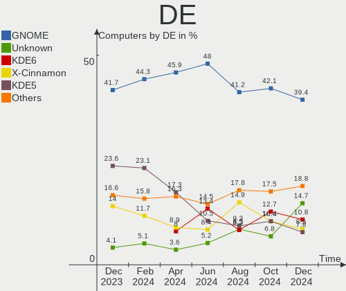
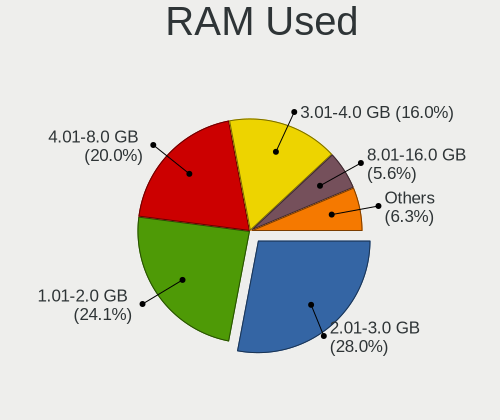
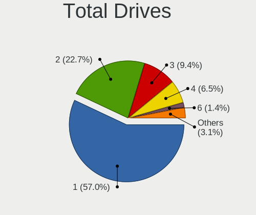
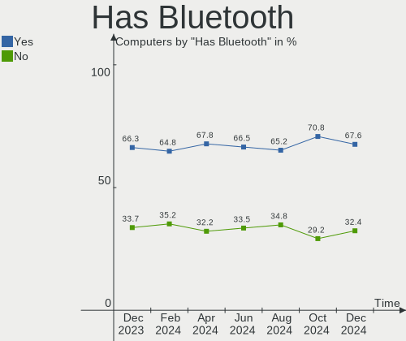
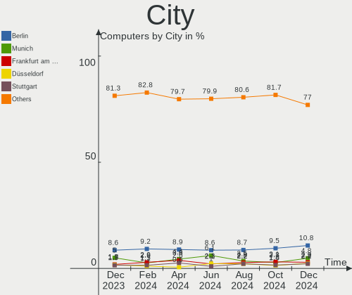
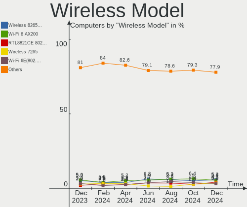
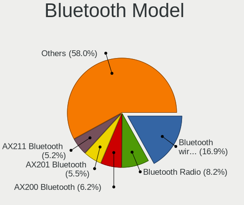
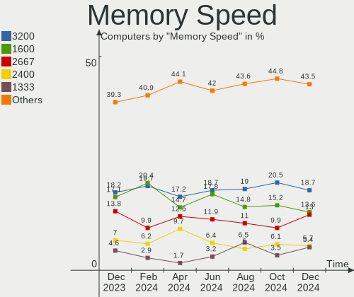
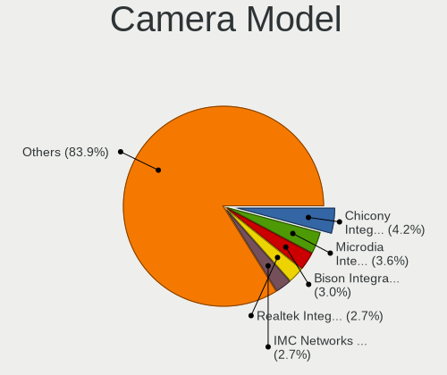
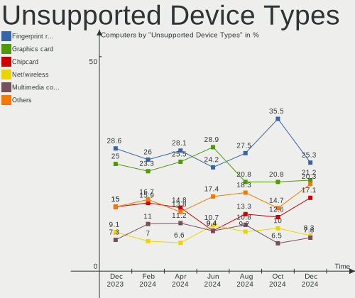

Linux in Germany - Hardware Trends
----------------------------------

A project to identify most popular hardware characteristics and track their change
over time based on data collected by Linux users at https://Linux-Hardware.org.

Anyone can contribute to this report by the [hw-probe](https://github.com/linuxhw/hw-probe) tool:

    sudo -E hw-probe -all -upload

This is a report for all computer types. See also reports for [desktops](/Location/Germany/Desktop/README.md) and [notebooks](/Location/Germany/Notebook/README.md).

Period: Oct, 2023.

Contents
--------

* [ System ](#system)
  - [ OS                       ](#os)
  - [ OS Family                ](#os-family)
  - [ Kernel                   ](#kernel)
  - [ Kernel Family            ](#kernel-family)
  - [ Kernel Major Ver.        ](#kernel-major-ver)
  - [ Arch                     ](#arch)
  - [ DE                       ](#de)
  - [ Display Server           ](#display-server)
  - [ Display Manager          ](#display-manager)
  - [ OS Lang                  ](#os-lang)
  - [ Boot Mode                ](#boot-mode)
  - [ Filesystem               ](#filesystem)
  - [ Part. scheme             ](#part-scheme)
  - [ Dual Boot with Linux/BSD ](#dual-boot-with-linuxbsd)
  - [ Dual Boot (Win)          ](#dual-boot-win)

* [ Board ](#board)
  - [ Vendor                   ](#vendor)
  - [ Model                    ](#model)
  - [ Model Family             ](#model-family)
  - [ MFG Year                 ](#mfg-year)
  - [ Form Factor              ](#form-factor)
  - [ Secure Boot              ](#secure-boot)
  - [ Coreboot                 ](#coreboot)
  - [ RAM Size                 ](#ram-size)
  - [ RAM Used                 ](#ram-used)
  - [ Total Drives             ](#total-drives)
  - [ Has CD-ROM               ](#has-cd-rom)
  - [ Has Ethernet             ](#has-ethernet)
  - [ Has WiFi                 ](#has-wifi)
  - [ Has Bluetooth            ](#has-bluetooth)

* [ Location ](#location)
  - [ Country                  ](#country)
  - [ City                     ](#city)

* [ Drives ](#drives)
  - [ Drive Vendor             ](#drive-vendor)
  - [ Drive Model              ](#drive-model)
  - [ HDD Vendor               ](#hdd-vendor)
  - [ SSD Vendor               ](#ssd-vendor)
  - [ Drive Kind               ](#drive-kind)
  - [ Drive Connector          ](#drive-connector)
  - [ Drive Size               ](#drive-size)
  - [ Space Total              ](#space-total)
  - [ Space Used               ](#space-used)
  - [ Malfunc. Drives          ](#malfunc-drives)
  - [ Malfunc. Drive Vendor    ](#malfunc-drive-vendor)
  - [ Malfunc. HDD Vendor      ](#malfunc-hdd-vendor)
  - [ Malfunc. Drive Kind      ](#malfunc-drive-kind)
  - [ Failed Drives            ](#failed-drives)
  - [ Failed Drive Vendor      ](#failed-drive-vendor)
  - [ Drive Status             ](#drive-status)

* [ Storage controller ](#storage-controller)
  - [ Storage Vendor           ](#storage-vendor)
  - [ Storage Model            ](#storage-model)
  - [ Storage Kind             ](#storage-kind)

* [ Processor ](#processor)
  - [ CPU Vendor               ](#cpu-vendor)
  - [ CPU Model                ](#cpu-model)
  - [ CPU Model Family         ](#cpu-model-family)
  - [ CPU Cores                ](#cpu-cores)
  - [ CPU Sockets              ](#cpu-sockets)
  - [ CPU Threads              ](#cpu-threads)
  - [ CPU Op-Modes             ](#cpu-op-modes)
  - [ CPU Microcode            ](#cpu-microcode)
  - [ CPU Microarch            ](#cpu-microarch)

* [ Graphics ](#graphics)
  - [ GPU Vendor               ](#gpu-vendor)
  - [ GPU Model                ](#gpu-model)
  - [ GPU Combo                ](#gpu-combo)
  - [ GPU Driver               ](#gpu-driver)
  - [ GPU Memory               ](#gpu-memory)

* [ Monitor ](#monitor)
  - [ Monitor Vendor           ](#monitor-vendor)
  - [ Monitor Model            ](#monitor-model)
  - [ Monitor Resolution       ](#monitor-resolution)
  - [ Monitor Diagonal         ](#monitor-diagonal)
  - [ Monitor Width            ](#monitor-width)
  - [ Aspect Ratio             ](#aspect-ratio)
  - [ Monitor Area             ](#monitor-area)
  - [ Pixel Density            ](#pixel-density)
  - [ Multiple Monitors        ](#multiple-monitors)

* [ Network ](#network)
  - [ Net Controller Vendor    ](#net-controller-vendor)
  - [ Net Controller Model     ](#net-controller-model)
  - [ Wireless Vendor          ](#wireless-vendor)
  - [ Wireless Model           ](#wireless-model)
  - [ Ethernet Vendor          ](#ethernet-vendor)
  - [ Ethernet Model           ](#ethernet-model)
  - [ Net Controller Kind      ](#net-controller-kind)
  - [ Used Controller          ](#used-controller)
  - [ NICs                     ](#nics)
  - [ IPv6                     ](#ipv6)

* [ Bluetooth ](#bluetooth)
  - [ Bluetooth Vendor         ](#bluetooth-vendor)
  - [ Bluetooth Model          ](#bluetooth-model)

* [ Sound ](#sound)
  - [ Sound Vendor             ](#sound-vendor)
  - [ Sound Model              ](#sound-model)

* [ Memory ](#memory)
  - [ Memory Vendor            ](#memory-vendor)
  - [ Memory Model             ](#memory-model)
  - [ Memory Kind              ](#memory-kind)
  - [ Memory Form Factor       ](#memory-form-factor)
  - [ Memory Size              ](#memory-size)
  - [ Memory Speed             ](#memory-speed)

* [ Printers & scanners ](#printers--scanners)
  - [ Printer Vendor           ](#printer-vendor)
  - [ Printer Model            ](#printer-model)
  - [ Scanner Vendor           ](#scanner-vendor)
  - [ Scanner Model            ](#scanner-model)

* [ Camera ](#camera)
  - [ Camera Vendor            ](#camera-vendor)
  - [ Camera Model             ](#camera-model)

* [ Security ](#security)
  - [ Fingerprint Vendor       ](#fingerprint-vendor)
  - [ Fingerprint Model        ](#fingerprint-model)
  - [ Chipcard Vendor          ](#chipcard-vendor)
  - [ Chipcard Model           ](#chipcard-model)

* [ Unsupported ](#unsupported)
  - [ Unsupported Devices      ](#unsupported-devices)
  - [ Unsupported Device Types ](#unsupported-device-types)

System
------

OS
--

Installed operating systems

| Name                         | Computers | Percent |
|------------------------------|-----------|---------|
| Ubuntu 22.04                 | 96        | 15.56%  |
| Linux Mint 21.2              | 86        | 13.94%  |
| Debian 12                    | 39        | 6.32%   |
| Fedora 38                    | 32        | 5.19%   |
| Ubuntu 23.04                 | 29        | 4.7%    |
| Zorin 16                     | 23        | 3.73%   |
| OpenMandriva 23.08           | 20        | 3.24%   |
| Pop!_OS 22.04                | 18        | 2.92%   |
| Ubuntu 23.10                 | 16        | 2.59%   |
| Arch Rolling                 | 16        | 2.59%   |
| openSUSE Tumbleweed-XXXXXXXX | 14        | 2.27%   |
| Kubuntu 22.04                | 13        | 2.11%   |
| Ubuntu 20.04                 | 12        | 1.94%   |
| Manjaro                      | 12        | 1.94%   |
| Linux Mint 21.1              | 11        | 1.78%   |
| LMDE 6                       | 10        | 1.62%   |
| Xero Rolling                 | 9         | 1.46%   |
| EndeavourOS Rolling          | 9         | 1.46%   |
| openSUSE Leap-15.5           | 8         | 1.3%    |
| OpenMandriva 23.10           | 8         | 1.3%    |
| Debian 11                    | 8         | 1.3%    |
| Debian                       | 7         | 1.13%   |
| Nobara 38                    | 6         | 0.97%   |
| OpenMandriva 23.03           | 5         | 0.81%   |
| Elementary 7.1               | 5         | 0.81%   |
| TUXEDO OS 22.04              | 4         | 0.65%   |
| Manjaro 23.0.4               | 4         | 0.65%   |
| Manjaro 23.0.2               | 4         | 0.65%   |
| Kubuntu 23.04                | 4         | 0.65%   |
| Fedora 39                    | 4         | 0.65%   |
| SteamOS 3.4.11               | 3         | 0.49%   |
| ROSA 12.4                    | 3         | 0.49%   |
| MX 23                        | 3         | 0.49%   |
| Linux Mint 20.1              | 3         | 0.49%   |
| KDE neon 22.04               | 3         | 0.49%   |
| Kali 2023.3                  | 3         | 0.49%   |
| BlackPanther 18.1            | 3         | 0.49%   |
| ArcoLinux Rolling            | 3         | 0.49%   |
| Xubuntu 22.04                | 2         | 0.32%   |
| Ubuntu 22.10                 | 2         | 0.32%   |

OS Family
---------

OS without a version

| Name         | Computers | Percent |
|--------------|-----------|---------|
| Ubuntu       | 156       | 25.28%  |
| Linux Mint   | 104       | 16.86%  |
| Debian       | 54        | 8.75%   |
| OpenMandriva | 39        | 6.32%   |
| Fedora       | 37        | 6%      |
| openSUSE     | 25        | 4.05%   |
| Manjaro      | 24        | 3.89%   |
| Zorin        | 23        | 3.73%   |
| Kubuntu      | 20        | 3.24%   |
| Pop!_OS      | 18        | 2.92%   |
| Arch         | 16        | 2.59%   |
| LMDE         | 10        | 1.62%   |
| Xero         | 9         | 1.46%   |
| EndeavourOS  | 9         | 1.46%   |
| SteamOS      | 7         | 1.13%   |
| Nobara       | 7         | 1.13%   |
| Elementary   | 6         | 0.97%   |
| MX           | 5         | 0.81%   |
| TUXEDO OS    | 4         | 0.65%   |
| ROSA         | 4         | 0.65%   |
| KDE neon     | 4         | 0.65%   |
| ArcoLinux    | 4         | 0.65%   |
| Kali         | 3         | 0.49%   |
| Garuda Linux | 3         | 0.49%   |
| BlackPanther | 3         | 0.49%   |
| Xubuntu      | 2         | 0.32%   |
| Ubuntu MATE  | 2         | 0.32%   |
| Devuan       | 2         | 0.32%   |
| ChimeraOS    | 2         | 0.32%   |
| Ubuntu Unity | 1         | 0.16%   |
| Siduction    | 1         | 0.16%   |
| RHEL         | 1         | 0.16%   |
| Raspbian     | 1         | 0.16%   |
| Parrot       | 1         | 0.16%   |
| Oracle Linux | 1         | 0.16%   |
| OpenWrt      | 1         | 0.16%   |
| Lubuntu      | 1         | 0.16%   |
| Gentoo       | 1         | 0.16%   |
| CachyOS      | 1         | 0.16%   |
| BunsenLabs   | 1         | 0.16%   |

Kernel
------

Version of the Linux kernel

| Version                     | Computers | Percent |
|-----------------------------|-----------|---------|
| 6.2.0-34-generic            | 64        | 10.37%  |
| 5.15.0-86-generic           | 49        | 7.94%   |
| 6.2.0-35-generic            | 48        | 7.78%   |
| 5.15.0-87-generic           | 33        | 5.35%   |
| 6.1.0-13-amd64              | 32        | 5.19%   |
| 6.2.0-33-generic            | 19        | 3.08%   |
| 5.15.0-84-generic           | 19        | 3.08%   |
| 6.4.11-desktop-1omv2390     | 17        | 2.76%   |
| 6.1.0-12-amd64              | 12        | 1.94%   |
| 6.5.0-9-generic             | 11        | 1.78%   |
| 6.5.5-200.fc38.x86_64       | 10        | 1.62%   |
| 6.5.6-200.fc38.x86_64       | 9         | 1.46%   |
| 6.5.6-76060506-generic      | 8         | 1.3%    |
| 6.5.5-arch1-1               | 8         | 1.3%    |
| 6.5.5-1-MANJARO             | 8         | 1.3%    |
| 6.5.5-desktop-1omv2390      | 7         | 1.13%   |
| 6.5.4-1-default             | 7         | 1.13%   |
| 6.5.7-arch1-1               | 6         | 0.97%   |
| 5.15.0-76-generic           | 6         | 0.97%   |
| 6.5.6-1-default             | 5         | 0.81%   |
| 6.5.0-10-generic            | 5         | 0.81%   |
| 6.2.6-desktop-1omv2390      | 5         | 0.81%   |
| 6.2.0-26-generic            | 5         | 0.81%   |
| 6.5.7-200.fc38.x86_64       | 4         | 0.65%   |
| 6.5.6-200.fsync.fc38.x86_64 | 4         | 0.65%   |
| 6.5.4-76060504-generic      | 4         | 0.65%   |
| 6.5.3-1-MANJARO             | 4         | 0.65%   |
| 6.5.0-1-amd64               | 4         | 0.65%   |
| 6.4.6-76060406-generic      | 4         | 0.65%   |
| 6.4.12-arch1-1              | 4         | 0.65%   |
| 6.2.9-300.fc38.x86_64       | 4         | 0.65%   |
| 6.2.0-36-generic            | 4         | 0.65%   |
| 6.1.55-1-MANJARO            | 4         | 0.65%   |
| 5.15.0-83-generic           | 4         | 0.65%   |
| 5.13.0-valve37-1-neptune    | 4         | 0.65%   |
| 6.6.0-1-MANJARO             | 3         | 0.49%   |
| 6.5.9-zen2-1-zen            | 3         | 0.49%   |
| 6.5.8-arch1-1               | 3         | 0.49%   |
| 6.5.8-1-default             | 3         | 0.49%   |
| 6.5.7-zen2-1-zen            | 3         | 0.49%   |

Kernel Family
-------------

Linux kernel without a distro release

| Version | Computers | Percent |
|---------|-----------|---------|
| 6.2.0   | 151       | 24.47%  |
| 5.15.0  | 132       | 21.39%  |
| 6.1.0   | 53        | 8.59%   |
| 6.5.5   | 38        | 6.16%   |
| 6.5.6   | 32        | 5.19%   |
| 6.5.0   | 29        | 4.7%    |
| 6.5.7   | 18        | 2.92%   |
| 6.4.11  | 17        | 2.76%   |
| 6.5.8   | 14        | 2.27%   |
| 6.5.4   | 12        | 1.94%   |
| 5.4.0   | 11        | 1.78%   |
| 5.14.21 | 9         | 1.46%   |
| 6.5.3   | 8         | 1.3%    |
| 6.2.6   | 6         | 0.97%   |
| 6.5.9   | 5         | 0.81%   |
| 6.4.8   | 5         | 0.81%   |
| 5.10.0  | 5         | 0.81%   |
| 6.4.6   | 4         | 0.65%   |
| 6.4.12  | 4         | 0.65%   |
| 6.2.9   | 4         | 0.65%   |
| 6.1.55  | 4         | 0.65%   |
| 5.13.0  | 4         | 0.65%   |
| 6.6.0   | 3         | 0.49%   |
| 6.2.16  | 3         | 0.49%   |
| 6.1.52  | 3         | 0.49%   |
| 6.1.21  | 3         | 0.49%   |
| 5.6.14  | 3         | 0.49%   |
| 5.19.0  | 3         | 0.49%   |
| 6.4.9   | 2         | 0.32%   |
| 6.1.57  | 2         | 0.32%   |
| 5.16.7  | 2         | 0.32%   |
| 5.10.14 | 2         | 0.32%   |
| 4.15.0  | 2         | 0.32%   |
| 6.4.4   | 1         | 0.16%   |
| 6.4.15  | 1         | 0.16%   |
| 6.4.10  | 1         | 0.16%   |
| 6.4.0   | 1         | 0.16%   |
| 6.3.8   | 1         | 0.16%   |
| 6.3.13  | 1         | 0.16%   |
| 6.1.60  | 1         | 0.16%   |

Kernel Major Ver.
-----------------

Linux kernel major version

| Version | Computers | Percent |
|---------|-----------|---------|
| 6.2     | 164       | 26.58%  |
| 6.5     | 156       | 25.28%  |
| 5.15    | 133       | 21.56%  |
| 6.1     | 75        | 12.16%  |
| 6.4     | 36        | 5.83%   |
| 5.4     | 11        | 1.78%   |
| 5.10    | 10        | 1.62%   |
| 5.14    | 9         | 1.46%   |
| 5.13    | 4         | 0.65%   |
| 6.6     | 3         | 0.49%   |
| 5.6     | 3         | 0.49%   |
| 5.19    | 3         | 0.49%   |
| 6.3     | 2         | 0.32%   |
| 5.16    | 2         | 0.32%   |
| 4.15    | 2         | 0.32%   |
| 5.8     | 1         | 0.16%   |
| 5.17    | 1         | 0.16%   |
| 4.9     | 1         | 0.16%   |
| 4.18    | 1         | 0.16%   |

Arch
----

OS architecture (x86_64, i586, etc.)

| Name    | Computers | Percent |
|---------|-----------|---------|
| x86_64  | 609       | 98.7%   |
| aarch64 | 5         | 0.81%   |
| armv7l  | 2         | 0.32%   |
| i686    | 1         | 0.16%   |

DE
--

Desktop Environment

| Name       | Computers | Percent |
|------------|-----------|---------|
| GNOME      | 257       | 41.65%  |
| KDE5       | 164       | 26.58%  |
| X-Cinnamon | 97        | 15.72%  |
| XFCE       | 34        | 5.51%   |
| Unknown    | 20        | 3.24%   |
| MATE       | 14        | 2.27%   |
| Cinnamon   | 9         | 1.46%   |
| Pantheon   | 6         | 0.97%   |
| LXQt       | 4         | 0.65%   |
| LXDE       | 3         | 0.49%   |
| i3         | 2         | 0.32%   |
| Unity      | 1         | 0.16%   |
| sway       | 1         | 0.16%   |
| openbox    | 1         | 0.16%   |
| KDE        | 1         | 0.16%   |
| ICEWM      | 1         | 0.16%   |
| GNUstep    | 1         | 0.16%   |
| awesome    | 1         | 0.16%   |

Display Server
--------------

X11 or Wayland

| Name    | Computers | Percent |
|---------|-----------|---------|
| X11     | 375       | 60.78%  |
| Wayland | 217       | 35.17%  |
| Tty     | 15        | 2.43%   |
| Unknown | 10        | 1.62%   |

Display Manager
---------------

SDDM, LightDM, etc.

| Name    | Computers | Percent |
|---------|-----------|---------|
| Unknown | 249       | 40.36%  |
| GDM3    | 149       | 24.15%  |
| SDDM    | 103       | 16.69%  |
| LightDM | 83        | 13.45%  |
| GDM     | 26        | 4.21%   |
| XDM     | 2         | 0.32%   |
| LXDM    | 2         | 0.32%   |
| TDM     | 1         | 0.16%   |
| SLiM    | 1         | 0.16%   |
| NODM    | 1         | 0.16%   |

OS Lang
-------

Language

| Lang       | Computers | Percent |
|------------|-----------|---------|
| de_DE      | 457       | 74.07%  |
| en_US      | 116       | 18.8%   |
| Unknown    | 12        | 1.94%   |
| C          | 10        | 1.62%   |
| en_GB      | 7         | 1.13%   |
| ru_RU      | 3         | 0.49%   |
| POSIX      | 2         | 0.32%   |
| pl_PL      | 2         | 0.32%   |
| de_AT      | 2         | 0.32%   |
| uk_UA      | 1         | 0.16%   |
| it_IT      | 1         | 0.16%   |
| en_DK      | 1         | 0.16%   |
| de_LI      | 1         | 0.16%   |
| de_DE.UTF8 | 1         | 0.16%   |
| de_CH      | 1         | 0.16%   |

Boot Mode
---------

EFI or BIOS

| Mode | Computers | Percent |
|------|-----------|---------|
| EFI  | 327       | 53%     |
| BIOS | 290       | 47%     |

Filesystem
----------

Type of filesystem

| Type    | Computers | Percent |
|---------|-----------|---------|
| Ext4    | 380       | 61.59%  |
| Tmpfs   | 104       | 16.86%  |
| Btrfs   | 103       | 16.69%  |
| Overlay | 20        | 3.24%   |
| Zfs     | 6         | 0.97%   |
| Xfs     | 1         | 0.16%   |
| Jfs     | 1         | 0.16%   |
| F2fs    | 1         | 0.16%   |
| Ext2    | 1         | 0.16%   |

Part. scheme
------------

Scheme of partitioning

| Type    | Computers | Percent |
|---------|-----------|---------|
| GPT     | 335       | 54.29%  |
| Unknown | 228       | 36.95%  |
| MBR     | 54        | 8.75%   |

Dual Boot with Linux/BSD
------------------------

Hosting more than one Linux/BSD

| Dual boot | Computers | Percent |
|-----------|-----------|---------|
| No        | 541       | 87.68%  |
| Yes       | 76        | 12.32%  |

Dual Boot (Win)
---------------

Hosting Linux and Windows

| Dual boot | Computers | Percent |
|-----------|-----------|---------|
| No        | 463       | 75.04%  |
| Yes       | 154       | 24.96%  |

Board
-----

Vendor
------

Motherboard manufacturer

| Name                                 | Computers | Percent |
|--------------------------------------|-----------|---------|
| Lenovo                               | 114       | 18.48%  |
| Hewlett-Packard                      | 78        | 12.64%  |
| ASUSTek Computer                     | 75        | 12.16%  |
| Gigabyte Technology                  | 49        | 7.94%   |
| Dell                                 | 47        | 7.62%   |
| MSI                                  | 38        | 6.16%   |
| Acer                                 | 35        | 5.67%   |
| ASRock                               | 25        | 4.05%   |
| Fujitsu                              | 15        | 2.43%   |
| Medion                               | 14        | 2.27%   |
| Apple                                | 14        | 2.27%   |
| Toshiba                              | 8         | 1.3%    |
| Samsung Electronics                  | 8         | 1.3%    |
| Valve                                | 7         | 1.13%   |
| Sony                                 | 6         | 0.97%   |
| HUAWEI                               | 6         | 0.97%   |
| TUXEDO                               | 5         | 0.81%   |
| Inventec                             | 5         | 0.81%   |
| Intel                                | 5         | 0.81%   |
| Schenker                             | 4         | 0.65%   |
| Unknown                              | 4         | 0.65%   |
| Raspberry Pi Foundation              | 3         | 0.49%   |
| Notebook                             | 3         | 0.49%   |
| Fujitsu Siemens                      | 3         | 0.49%   |
| Biostar                              | 3         | 0.49%   |
| AMI                                  | 3         | 0.49%   |
| VALE                                 | 2         | 0.32%   |
| TrekStor                             | 2         | 0.32%   |
| Shenzhen Meigao Electronic Equipment | 2         | 0.32%   |
| Packard Bell                         | 2         | 0.32%   |
| Google                               | 2         | 0.32%   |
| Foxconn                              | 2         | 0.32%   |
| AXDIA International                  | 2         | 0.32%   |
| Alienware                            | 2         | 0.32%   |
| ZOTAC                                | 1         | 0.16%   |
| Wortmann AG                          | 1         | 0.16%   |
| Trigkey                              | 1         | 0.16%   |
| Thomson                              | 1         | 0.16%   |
| Teclast                              | 1         | 0.16%   |
| Tactus                               | 1         | 0.16%   |

Model
-----

Motherboard model

| Name                                 | Computers | Percent |
|--------------------------------------|-----------|---------|
| Valve Jupiter                        | 7         | 1.13%   |
| Unknown                              | 7         | 1.13%   |
| Inventec D CLASS                     | 5         | 0.81%   |
| MSI MS-7D75                          | 3         | 0.49%   |
| Lenovo ThinkPad E14 Gen 4 21ECS00000 | 3         | 0.49%   |
| HP Z440 Workstation                  | 3         | 0.49%   |
| HP Laptop 17-cp0xxx                  | 3         | 0.49%   |
| Gigabyte A320M-S2H                   | 3         | 0.49%   |
| ASUS All Series                      | 3         | 0.49%   |
| Apple MacBookPro12,1                 | 3         | 0.49%   |
| Acer Aspire 7750G                    | 3         | 0.49%   |
| VALE Notebook Classic C140           | 2         | 0.32%   |
| Samsung RC530/RC730                  | 2         | 0.32%   |
| MSI MS-7C56                          | 2         | 0.32%   |
| MSI MS-7C37                          | 2         | 0.32%   |
| MSI MS-7B86                          | 2         | 0.32%   |
| MSI MS-7A33                          | 2         | 0.32%   |
| MSI MS-7817                          | 2         | 0.32%   |
| Lenovo ThinkPad L14 Gen 1 20U1002KGE | 2         | 0.32%   |
| Lenovo IdeaPadFlex 5 14ITL05 82HS    | 2         | 0.32%   |
| Lenovo G700 20251                    | 2         | 0.32%   |
| Lenovo G50-80 80E5                   | 2         | 0.32%   |
| Intel Jasper Lake Client Platform    | 2         | 0.32%   |
| HUAWEI KLVL-WXXW                     | 2         | 0.32%   |
| HP ZBook 15 G3                       | 2         | 0.32%   |
| HP Victus by Laptop 16-e0xxx         | 2         | 0.32%   |
| HP Laptop 15s-fq3xxx                 | 2         | 0.32%   |
| HP ENVY x360 2-in-1 Laptop 15-ey0xxx | 2         | 0.32%   |
| HP EliteBook 2570p                   | 2         | 0.32%   |
| Gigabyte X570S UD                    | 2         | 0.32%   |
| Gigabyte B85M-D2V                    | 2         | 0.32%   |
| Gigabyte B760 GAMING X DDR4          | 2         | 0.32%   |
| Gigabyte B450 I AORUS PRO WIFI       | 2         | 0.32%   |
| Fujitsu ESPRIMO P910                 | 2         | 0.32%   |
| Dell XPS 13 9370                     | 2         | 0.32%   |
| Dell Precision M4700                 | 2         | 0.32%   |
| Dell OptiPlex 3020                   | 2         | 0.32%   |
| Dell Latitude E6440                  | 2         | 0.32%   |
| Biostar A960D+V2                     | 2         | 0.32%   |
| ASUS ROG STRIX B550-F GAMING         | 2         | 0.32%   |

Model Family
------------

Motherboard model prefix

| Name               | Computers | Percent |
|--------------------|-----------|---------|
| Lenovo ThinkPad    | 57        | 9.24%   |
| Acer Aspire        | 25        | 4.05%   |
| ASUS ROG           | 16        | 2.59%   |
| HP Laptop          | 15        | 2.43%   |
| Dell Precision     | 13        | 2.11%   |
| Dell Latitude      | 13        | 2.11%   |
| Lenovo IdeaPad     | 12        | 1.94%   |
| Fujitsu ESPRIMO    | 11        | 1.78%   |
| ASUS PRIME         | 11        | 1.78%   |
| Lenovo ThinkCentre | 8         | 1.3%    |
| HP EliteBook       | 8         | 1.3%    |
| Valve Jupiter      | 7         | 1.13%   |
| Toshiba Satellite  | 7         | 1.13%   |
| HP Pavilion        | 7         | 1.13%   |
| Dell XPS           | 7         | 1.13%   |
| Dell OptiPlex      | 7         | 1.13%   |
| Unknown            | 7         | 1.13%   |
| HP ProBook         | 6         | 0.97%   |
| Lenovo Yoga        | 5         | 0.81%   |
| Inventec D         | 5         | 0.81%   |
| HP ENVY            | 5         | 0.81%   |
| ASUS M5A78L-M      | 5         | 0.81%   |
| Lenovo Legion      | 4         | 0.65%   |
| Lenovo IdeaPadFlex | 4         | 0.65%   |
| Gigabyte B760      | 4         | 0.65%   |
| Fujitsu LIFEBOOK   | 4         | 0.65%   |
| RPi Raspberry      | 3         | 0.49%   |
| MSI MS-7D75        | 3         | 0.49%   |
| Lenovo ThinkBook   | 3         | 0.49%   |
| HP ZBook           | 3         | 0.49%   |
| HP Z440            | 3         | 0.49%   |
| HP Victus          | 3         | 0.49%   |
| HP Compaq          | 3         | 0.49%   |
| HP 255             | 3         | 0.49%   |
| Gigabyte X570S     | 3         | 0.49%   |
| Gigabyte A320M-S2H | 3         | 0.49%   |
| ASUS Zenbook       | 3         | 0.49%   |
| ASUS All           | 3         | 0.49%   |
| Apple MacBookPro12 | 3         | 0.49%   |
| Acer TravelMate    | 3         | 0.49%   |

MFG Year
--------

Motherboard manufacture year

| Year    | Computers | Percent |
|---------|-----------|---------|
| 2022    | 65        | 10.53%  |
| 2021    | 57        | 9.24%   |
| 2013    | 53        | 8.59%   |
| 2020    | 52        | 8.43%   |
| 2018    | 51        | 8.27%   |
| 2023    | 45        | 7.29%   |
| 2012    | 39        | 6.32%   |
| 2011    | 39        | 6.32%   |
| 2019    | 37        | 6%      |
| 2017    | 33        | 5.35%   |
| 2015    | 31        | 5.02%   |
| 2016    | 28        | 4.54%   |
| 2014    | 27        | 4.38%   |
| 2010    | 22        | 3.57%   |
| 2009    | 13        | 2.11%   |
| 2008    | 10        | 1.62%   |
| 2007    | 7         | 1.13%   |
| Unknown | 6         | 0.97%   |
| 2006    | 2         | 0.32%   |

Form Factor
-----------

Physical design of the computer

| Name           | Computers | Percent |
|----------------|-----------|---------|
| Notebook       | 307       | 49.76%  |
| Desktop        | 256       | 41.49%  |
| Convertible    | 27        | 4.38%   |
| Mini pc        | 7         | 1.13%   |
| System on chip | 6         | 0.97%   |
| All in one     | 5         | 0.81%   |
| Server         | 4         | 0.65%   |
| Tablet         | 3         | 0.49%   |
| Other          | 1         | 0.16%   |
| Firewall       | 1         | 0.16%   |

Secure Boot
-----------

Enabled or disabled

| State    | Computers | Percent |
|----------|-----------|---------|
| Disabled | 573       | 92.87%  |
| Enabled  | 44        | 7.13%   |

Coreboot
--------

Have coreboot on board

| Used | Computers | Percent |
|------|-----------|---------|
| No   | 615       | 99.68%  |
| Yes  | 2         | 0.32%   |

RAM Size
--------

Total RAM memory

| Size in GB      | Computers | Percent |
|-----------------|-----------|---------|
| 4.01-8.0        | 137       | 22.2%   |
| 16.01-24.0      | 131       | 21.23%  |
| 8.01-16.0       | 108       | 17.5%   |
| 32.01-64.0      | 95        | 15.4%   |
| 3.01-4.0        | 73        | 11.83%  |
| 64.01-256.0     | 32        | 5.19%   |
| 24.01-32.0      | 20        | 3.24%   |
| 2.01-3.0        | 9         | 1.46%   |
| 1.01-2.0        | 9         | 1.46%   |
| More than 256.0 | 2         | 0.32%   |
| 0.51-1.0        | 1         | 0.16%   |

RAM Used
--------

Used RAM memory

| Used GB    | Computers | Percent |
|------------|-----------|---------|
| 1.01-2.0   | 185       | 29.98%  |
| 2.01-3.0   | 145       | 23.5%   |
| 4.01-8.0   | 111       | 17.99%  |
| 3.01-4.0   | 105       | 17.02%  |
| 8.01-16.0  | 35        | 5.67%   |
| 0.51-1.0   | 17        | 2.76%   |
| 0.01-0.5   | 11        | 1.78%   |
| 24.01-32.0 | 4         | 0.65%   |
| 16.01-24.0 | 3         | 0.49%   |
| 32.01-64.0 | 1         | 0.16%   |

Total Drives
------------

Number of drives on board

| Drives | Computers | Percent |
|--------|-----------|---------|
| 1      | 345       | 55.92%  |
| 2      | 152       | 24.64%  |
| 3      | 71        | 11.51%  |
| 4      | 27        | 4.38%   |
| 5      | 9         | 1.46%   |
| 6      | 5         | 0.81%   |
| 7      | 3         | 0.49%   |
| 9      | 2         | 0.32%   |
| 0      | 2         | 0.32%   |
| 10     | 1         | 0.16%   |

Has CD-ROM
----------

Has CD-ROM on board

| Presented | Computers | Percent |
|-----------|-----------|---------|
| No        | 386       | 62.56%  |
| Yes       | 231       | 37.44%  |

Has Ethernet
------------

Has Ethernet on board

| Presented | Computers | Percent |
|-----------|-----------|---------|
| Yes       | 523       | 84.76%  |
| No        | 94        | 15.24%  |

Has WiFi
--------

Has WiFi module

| Presented | Computers | Percent |
|-----------|-----------|---------|
| Yes       | 454       | 73.58%  |
| No        | 163       | 26.42%  |

Has Bluetooth
-------------

Has Bluetooth module

| Presented | Computers | Percent |
|-----------|-----------|---------|
| Yes       | 381       | 61.75%  |
| No        | 236       | 38.25%  |

Location
--------

Country
-------

Geographic location (country)

| Country | Computers | Percent |
|---------|-----------|---------|
| Germany | 617       | 100%    |

City
----

Geographic location (city)

| City              | Computers | Percent |
|-------------------|-----------|---------|
| Berlin            | 51        | 8.27%   |
| Munich            | 24        | 3.89%   |
| Hamburg           | 22        | 3.57%   |
| Nuremberg         | 13        | 2.11%   |
| Cologne           | 13        | 2.11%   |
| Frankfurt am Main | 11        | 1.78%   |
| Mannheim          | 10        | 1.62%   |
| Leipzig           | 10        | 1.62%   |
| Düsseldorf       | 10        | 1.62%   |
| Stuttgart         | 9         | 1.46%   |
| Hanover           | 9         | 1.46%   |
| Dresden           | 9         | 1.46%   |
| Essen             | 8         | 1.3%    |
| Karlsruhe         | 7         | 1.13%   |
| Halle             | 7         | 1.13%   |
| Saarbrücken      | 6         | 0.97%   |
| Ratingen          | 6         | 0.97%   |
| Nussdorf am Inn   | 6         | 0.97%   |
| Darmstadt         | 6         | 0.97%   |
| Braunschweig      | 6         | 0.97%   |
| Wuppertal         | 5         | 0.81%   |
| Marburg           | 5         | 0.81%   |
| Würzburg         | 4         | 0.65%   |
| Mainz             | 4         | 0.65%   |
| Bonn              | 4         | 0.65%   |
| Bochum            | 4         | 0.65%   |
| Augsburg          | 4         | 0.65%   |
| Aachen            | 4         | 0.65%   |
| Rheine            | 3         | 0.49%   |
| Paderborn         | 3         | 0.49%   |
| Norden            | 3         | 0.49%   |
| Neumünster       | 3         | 0.49%   |
| Krefeld           | 3         | 0.49%   |
| Kiel              | 3         | 0.49%   |
| Kassel            | 3         | 0.49%   |
| Jena              | 3         | 0.49%   |
| Hof               | 3         | 0.49%   |
| Grafenau          | 3         | 0.49%   |
| Dessau            | 3         | 0.49%   |
| Bremen            | 3         | 0.49%   |

Drives
------

Drive Vendor
------------

Hard drive vendors

| Vendor                      | Computers | Drives | Percent |
|-----------------------------|-----------|--------|---------|
| Samsung Electronics         | 195       | 267    | 21.17%  |
| SanDisk                     | 99        | 115    | 10.75%  |
| Seagate                     | 97        | 113    | 10.53%  |
| WDC                         | 93        | 126    | 10.1%   |
| Crucial                     | 45        | 46     | 4.89%   |
| Unknown                     | 43        | 46     | 4.67%   |
| Intenso                     | 35        | 36     | 3.8%    |
| Toshiba                     | 33        | 39     | 3.58%   |
| SK hynix                    | 23        | 23     | 2.5%    |
| Kingston                    | 23        | 25     | 2.5%    |
| Micron Technology           | 22        | 22     | 2.39%   |
| Intel                       | 17        | 19     | 1.85%   |
| Hitachi                     | 12        | 12     | 1.3%    |
| HGST                        | 12        | 12     | 1.3%    |
| Phison Electronics          | 11        | 11     | 1.19%   |
| Micron/Crucial Technology   | 11        | 11     | 1.19%   |
| KIOXIA                      | 11        | 11     | 1.19%   |
| Apple                       | 9         | 12     | 0.98%   |
| Kingston Technology Company | 8         | 8      | 0.87%   |
| China                       | 7         | 7      | 0.76%   |
| Phison                      | 6         | 6      | 0.65%   |
| Lexar                       | 6         | 6      | 0.65%   |
| Unknown                     | 6         | 7      | 0.65%   |
| Transcend                   | 5         | 5      | 0.54%   |
| A-DATA Technology           | 5         | 6      | 0.54%   |
| Silicon Motion              | 4         | 4      | 0.43%   |
| Union Memory                | 3         | 3      | 0.33%   |
| OCZ                         | 3         | 3      | 0.33%   |
| FORESEE                     | 3         | 3      | 0.33%   |
| Fanxiang                    | 3         | 3      | 0.33%   |
| ASMedia                     | 3         | 3      | 0.33%   |
| Verbatim                    | 2         | 2      | 0.22%   |
| Union Memory (Shenzhen)     | 2         | 2      | 0.22%   |
| SPCC                        | 2         | 2      | 0.22%   |
| SABRENT                     | 2         | 2      | 0.22%   |
| Realtek Semiconductor       | 2         | 2      | 0.22%   |
| PNY                         | 2         | 2      | 0.22%   |
| Patriot                     | 2         | 2      | 0.22%   |
| MAXIO Technology (Hangzhou) | 2         | 2      | 0.22%   |
| Lenovo                      | 2         | 2      | 0.22%   |

Drive Model
-----------

Hard drive models

| Model                                                 | Computers | Percent |
|-------------------------------------------------------|-----------|---------|
| Samsung NVMe SSD Controller SM981/PM981/PM983 1TB     | 35        | 3.41%   |
| Samsung NVMe SSD Controller PM9A1/PM9A3/980PRO 1TB    | 19        | 1.85%   |
| Samsung SSD 850 EVO 250GB                             | 12        | 1.17%   |
| Samsung SSD 870 EVO 1TB                               | 10        | 0.97%   |
| Samsung SSD 860 EVO 500GB                             | 10        | 0.97%   |
| Samsung SSD 860 EVO 1TB                               | 10        | 0.97%   |
| Unknown SD/MMC/MS PRO 16GB                            | 9         | 0.88%   |
| SanDisk SSD PLUS 1000GB                               | 9         | 0.88%   |
| Samsung SSD 980 1TB                                   | 9         | 0.88%   |
| Crucial CT500MX500SSD1 500GB                          | 9         | 0.88%   |
| Crucial CT1000MX500SSD1 1TB                           | 9         | 0.88%   |
| Unknown MMC Card  64GB                                | 7         | 0.68%   |
| Seagate ST2000DM008-2FR102 2TB                        | 7         | 0.68%   |
| Samsung SSD 870 QVO 1TB                               | 7         | 0.68%   |
| Micron/Crucial P2 NVMe PCIe SSD 500GB                 | 7         | 0.68%   |
| Seagate ST1000LM035-1RK172 1TB                        | 6         | 0.58%   |
| Sandisk WD Blue SN550 NVMe SSD 1TB                    | 6         | 0.58%   |
| SanDisk SDSSDH3 1T00 1TB                              | 6         | 0.58%   |
| Samsung SSD 980 500GB                                 | 6         | 0.58%   |
| Phison E12 NVMe Controller 1TB                        | 6         | 0.58%   |
| Unknown                                               | 6         | 0.58%   |
| Unknown MMC Card  32GB                                | 5         | 0.49%   |
| Toshiba MQ01ABD100 1TB                                | 5         | 0.49%   |
| Kingston Company OM3PDP3 NVMe SSD 512GB               | 5         | 0.49%   |
| Intenso SSD 120GB                                     | 5         | 0.49%   |
| Intel SSD 660P Series 1024GB                          | 5         | 0.49%   |
| Silicon Motion SM2263EN/SM2263XT SSD Controller 256GB | 4         | 0.39%   |
| Seagate ST500LM021-1KJ152 500GB                       | 4         | 0.39%   |
| Seagate ST500DM002-1BD142 500GB                       | 4         | 0.39%   |
| Seagate ST1000LM024 HN-M101MBB 1TB                    | 4         | 0.39%   |
| Sandisk WD Blue SN570 1TB                             | 4         | 0.39%   |
| Sandisk WD Black SN750 / PC SN730 NVMe SSD 1024GB     | 4         | 0.39%   |
| SanDisk SSD PLUS 240GB                                | 4         | 0.39%   |
| SanDisk SDSSDH3500G 500GB                             | 4         | 0.39%   |
| Samsung SSD 870 QVO 2TB                               | 4         | 0.39%   |
| Samsung SSD 870 EVO 500GB                             | 4         | 0.39%   |
| Samsung SSD 850 EVO 500GB                             | 4         | 0.39%   |
| WDC WDS500G2B0A-00SM50 500GB SSD                      | 3         | 0.29%   |
| WDC WD5000AAKX-60U6AA0 500GB                          | 3         | 0.29%   |
| WDC WD20EZRZ-00Z5HB0 2TB                              | 3         | 0.29%   |

HDD Vendor
----------

Hard disk drive vendors

| Vendor              | Computers | Drives | Percent |
|---------------------|-----------|--------|---------|
| Seagate             | 94        | 110    | 37.01%  |
| WDC                 | 76        | 102    | 29.92%  |
| Toshiba             | 25        | 29     | 9.84%   |
| Samsung Electronics | 15        | 18     | 5.91%   |
| Hitachi             | 12        | 12     | 4.72%   |
| HGST                | 12        | 12     | 4.72%   |
| Unknown             | 9         | 9      | 3.54%   |
| Apple               | 3         | 3      | 1.18%   |
| Intenso             | 2         | 2      | 0.79%   |
| USB3.0              | 1         | 1      | 0.39%   |
| SSK                 | 1         | 1      | 0.39%   |
| Maxtor              | 1         | 1      | 0.39%   |
| HGST HTS            | 1         | 1      | 0.39%   |
| Fujitsu             | 1         | 1      | 0.39%   |
| DELLBOSS            | 1         | 1      | 0.39%   |

SSD Vendor
----------

Solid state drive vendors

| Vendor              | Computers | Drives | Percent |
|---------------------|-----------|--------|---------|
| Samsung Electronics | 102       | 121    | 29.74%  |
| SanDisk             | 65        | 70     | 18.95%  |
| Crucial             | 37        | 38     | 10.79%  |
| Intenso             | 28        | 29     | 8.16%   |
| WDC                 | 12        | 12     | 3.5%    |
| Kingston            | 11        | 12     | 3.21%   |
| China               | 7         | 7      | 2.04%   |
| Intel               | 6         | 7      | 1.75%   |
| Transcend           | 5         | 5      | 1.46%   |
| Micron Technology   | 5         | 5      | 1.46%   |
| Apple               | 5         | 5      | 1.46%   |
| Toshiba             | 4         | 4      | 1.17%   |
| A-DATA Technology   | 4         | 4      | 1.17%   |
| SK hynix            | 3         | 3      | 0.87%   |
| OCZ                 | 3         | 3      | 0.87%   |
| FORESEE             | 3         | 3      | 0.87%   |
| Fanxiang            | 3         | 3      | 0.87%   |
| Verbatim            | 2         | 2      | 0.58%   |
| SABRENT             | 2         | 2      | 0.58%   |
| PNY                 | 2         | 2      | 0.58%   |
| Phison              | 2         | 2      | 0.58%   |
| Lexar               | 2         | 2      | 0.58%   |
| INNOVATION IT       | 2         | 2      | 0.58%   |
| GLOWAY              | 2         | 2      | 0.58%   |
| ASMedia             | 2         | 2      | 0.58%   |
| Apacer              | 2         | 2      | 0.58%   |
| VERICO              | 1         | 1      | 0.29%   |
| Unknown             | 1         | 1      | 0.29%   |
| Teclast             | 1         | 1      | 0.29%   |
| Team                | 1         | 1      | 0.29%   |
| TCSUNBOW            | 1         | 1      | 0.29%   |
| SPCC                | 1         | 1      | 0.29%   |
| SATA3 12            | 1         | 1      | 0.29%   |
| Plextor             | 1         | 1      | 0.29%   |
| Patriot             | 1         | 1      | 0.29%   |
| Netac               | 1         | 1      | 0.29%   |
| Mushkin             | 1         | 1      | 0.29%   |
| LITEONIT            | 1         | 1      | 0.29%   |
| LITEON              | 1         | 1      | 0.29%   |
| Leven               | 1         | 1      | 0.29%   |

Drive Kind
----------

HDD or SSD

| Kind    | Computers | Drives | Percent |
|---------|-----------|--------|---------|
| SSD     | 289       | 371    | 34.53%  |
| NVMe    | 282       | 348    | 33.69%  |
| HDD     | 211       | 303    | 25.21%  |
| MMC     | 37        | 40     | 4.42%   |
| Unknown | 18        | 19     | 2.15%   |

Drive Connector
---------------

SATA, SAS, NVMe, etc.

| Type | Computers | Drives | Percent |
|------|-----------|--------|---------|
| SATA | 405       | 644    | 52.6%   |
| NVMe | 282       | 347    | 36.62%  |
| SAS  | 46        | 50     | 5.97%   |
| MMC  | 37        | 40     | 4.81%   |

Drive Size
----------

Size of hard drive

| Size in TB | Computers | Drives | Percent |
|------------|-----------|--------|---------|
| 0.01-0.5   | 268       | 336    | 50%     |
| 0.51-1.0   | 174       | 217    | 32.46%  |
| 1.01-2.0   | 53        | 64     | 9.89%   |
| 3.01-4.0   | 17        | 25     | 3.17%   |
| 4.01-10.0  | 12        | 17     | 2.24%   |
| 2.01-3.0   | 9         | 11     | 1.68%   |
| 10.01-20.0 | 2         | 3      | 0.37%   |
| 20.01-50.0 | 1         | 1      | 0.19%   |

Space Total
-----------

Amount of disk space available on the file system

| Size in GB     | Computers | Percent |
|----------------|-----------|---------|
| 251-500        | 133       | 21.56%  |
| 101-250        | 128       | 20.75%  |
| 501-1000       | 110       | 17.83%  |
| 1001-2000      | 68        | 11.02%  |
| More than 3000 | 54        | 8.75%   |
| 1-20           | 34        | 5.51%   |
| 2001-3000      | 30        | 4.86%   |
| 51-100         | 24        | 3.89%   |
| Unknown        | 24        | 3.89%   |
| 21-50          | 12        | 1.94%   |

Space Used
----------

Amount of used disk space

| Used GB        | Computers | Percent |
|----------------|-----------|---------|
| 1-20           | 180       | 29.17%  |
| 21-50          | 97        | 15.72%  |
| 101-250        | 82        | 13.29%  |
| 51-100         | 82        | 13.29%  |
| 251-500        | 56        | 9.08%   |
| 1001-2000      | 39        | 6.32%   |
| 501-1000       | 32        | 5.19%   |
| Unknown        | 24        | 3.89%   |
| More than 3000 | 16        | 2.59%   |
| 2001-3000      | 9         | 1.46%   |

Malfunc. Drives
---------------

Drive models with a malfunction

| Model                                    | Computers | Drives | Percent |
|------------------------------------------|-----------|--------|---------|
| Seagate ST1000DM003-1ER162 1TB           | 2         | 2      | 6.06%   |
| SanDisk SSD PLUS 1000GB                  | 2         | 2      | 6.06%   |
| WDC WD5000AAKX-07U6AA1 500GB             | 1         | 2      | 3.03%   |
| WDC WD5000AAKS-00D2B0 500GB              | 1         | 1      | 3.03%   |
| WDC WD5000AAKS-007AA0 500GB              | 1         | 1      | 3.03%   |
| WDC WD40EFZX-68AWUN0 4TB                 | 1         | 6      | 3.03%   |
| WDC WD20EFRX-68EUZN0 2TB                 | 1         | 1      | 3.03%   |
| WDC WD20EARX-00PASB0 2TB                 | 1         | 1      | 3.03%   |
| WDC WD1600BEKT-75PVMT0 160GB             | 1         | 1      | 3.03%   |
| WDC WD1600AAJS-00V4A0 160GB              | 1         | 1      | 3.03%   |
| Toshiba MQ01ABF050 500GB                 | 1         | 1      | 3.03%   |
| Toshiba MK1255GSX H 120GB                | 1         | 1      | 3.03%   |
| Seagate ST500LT012-1DG142 500GB          | 1         | 1      | 3.03%   |
| Seagate ST500DM002-1BD142 500GB          | 1         | 1      | 3.03%   |
| Seagate ST3500418AS 500GB                | 1         | 1      | 3.03%   |
| Seagate ST31000528AS 1TB                 | 1         | 1      | 3.03%   |
| Seagate ST2000NC001-1DY164 2TB           | 1         | 1      | 3.03%   |
| Seagate ST2000DL003-9VT166 2TB           | 1         | 1      | 3.03%   |
| Seagate ST1000DX001-1NS162 1TB           | 1         | 1      | 3.03%   |
| Seagate ST1000DM010-2EP102 1TB           | 1         | 1      | 3.03%   |
| Samsung Electronics SSD 870 EVO 500GB    | 1         | 1      | 3.03%   |
| Samsung Electronics SSD 830 Series 128GB | 1         | 2      | 3.03%   |
| Samsung Electronics HD501LJ 500GB        | 1         | 1      | 3.03%   |
| Samsung Electronics HD103UI 1TB          | 1         | 1      | 3.03%   |
| Lenovo LENSE20512GMSP34MEAT2TA 512GB     | 1         | 1      | 3.03%   |
| Hitachi HTS545032B9A300 320GB            | 1         | 1      | 3.03%   |
| HGST HTS541010A9E680 1TB                 | 1         | 1      | 3.03%   |
| Crucial CT120M500SSD1 120GB              | 1         | 1      | 3.03%   |
| ASMedia ASM105x 120GB SSD                | 1         | 1      | 3.03%   |
| Apple HDD ST2000DM001 2TB                | 1         | 1      | 3.03%   |
| A-DATA Technology SSD S510 120GB         | 1         | 1      | 3.03%   |

Malfunc. Drive Vendor
---------------------

Vendors of faulty drives

| Vendor              | Computers | Drives | Percent |
|---------------------|-----------|--------|---------|
| Seagate             | 10        | 10     | 30.3%   |
| WDC                 | 8         | 14     | 24.24%  |
| Samsung Electronics | 4         | 5      | 12.12%  |
| Toshiba             | 2         | 2      | 6.06%   |
| SanDisk             | 2         | 2      | 6.06%   |
| Lenovo              | 1         | 1      | 3.03%   |
| Hitachi             | 1         | 1      | 3.03%   |
| HGST                | 1         | 1      | 3.03%   |
| Crucial             | 1         | 1      | 3.03%   |
| ASMedia             | 1         | 1      | 3.03%   |
| Apple               | 1         | 1      | 3.03%   |
| A-DATA Technology   | 1         | 1      | 3.03%   |

Malfunc. HDD Vendor
-------------------

Vendors of faulty HDD drives

| Vendor              | Computers | Drives | Percent |
|---------------------|-----------|--------|---------|
| Seagate             | 10        | 10     | 40%     |
| WDC                 | 8         | 14     | 32%     |
| Toshiba             | 2         | 2      | 8%      |
| Samsung Electronics | 2         | 2      | 8%      |
| Hitachi             | 1         | 1      | 4%      |
| HGST                | 1         | 1      | 4%      |
| Apple               | 1         | 1      | 4%      |

Malfunc. Drive Kind
-------------------

Kinds of faulty drives

| Kind | Computers | Drives | Percent |
|------|-----------|--------|---------|
| HDD  | 25        | 31     | 75.76%  |
| SSD  | 7         | 8      | 21.21%  |
| NVMe | 1         | 1      | 3.03%   |

Failed Drives
-------------

Failed drive models

Zero info for selected period =(

Failed Drive Vendor
-------------------

Failed drive vendors

Zero info for selected period =(

Drive Status
------------

Number of failed and malfunc. drives

| Status   | Computers | Drives | Percent |
|----------|-----------|--------|---------|
| Detected | 377       | 658    | 57.12%  |
| Works    | 250       | 383    | 37.88%  |
| Malfunc  | 33        | 40     | 5%      |

Storage controller
------------------

Storage Vendor
--------------

Storage controller vendors

| Vendor                         | Computers | Percent |
|--------------------------------|-----------|---------|
| Intel                          | 340       | 41.01%  |
| AMD                            | 140       | 16.89%  |
| Samsung Electronics            | 110       | 13.27%  |
| SanDisk                        | 49        | 5.91%   |
| SK hynix                       | 20        | 2.41%   |
| Kingston Technology Company    | 20        | 2.41%   |
| Micron/Crucial Technology      | 19        | 2.29%   |
| Micron Technology              | 17        | 2.05%   |
| ASMedia Technology             | 17        | 2.05%   |
| Phison Electronics             | 14        | 1.69%   |
| KIOXIA                         | 14        | 1.69%   |
| Marvell Technology Group       | 9         | 1.09%   |
| JMicron Technology             | 8         | 0.97%   |
| Nvidia                         | 7         | 0.84%   |
| Union Memory (Shenzhen)        | 6         | 0.72%   |
| MAXIO Technology (Hangzhou)    | 6         | 0.72%   |
| Toshiba America Info Systems   | 5         | 0.6%    |
| Silicon Motion                 | 5         | 0.6%    |
| ADATA Technology               | 5         | 0.6%    |
| Shenzhen Longsys Electronics   | 3         | 0.36%   |
| Seagate Technology             | 3         | 0.36%   |
| Realtek Semiconductor          | 3         | 0.36%   |
| Lenovo                         | 2         | 0.24%   |
| Broadcom / LSI                 | 2         | 0.24%   |
| Solid State Storage Technology | 1         | 0.12%   |
| Silicon Image                  | 1         | 0.12%   |
| O2 Micro                       | 1         | 0.12%   |
| Hewlett-Packard                | 1         | 0.12%   |
| Adaptec                        | 1         | 0.12%   |

Storage Model
-------------

Storage controller models

| Model                                                                                  | Computers | Percent |
|----------------------------------------------------------------------------------------|-----------|---------|
| AMD FCH SATA Controller [AHCI mode]                                                    | 80        | 8.53%   |
| Samsung NVMe SSD Controller SM981/PM981/PM983                                          | 50        | 5.33%   |
| Samsung NVMe SSD Controller PM9A1/PM9A3/980PRO                                         | 28        | 2.99%   |
| Intel 8 Series/C220 Series Chipset Family 6-port SATA Controller 1 [AHCI mode]         | 28        | 2.99%   |
| Intel 7 Series Chipset Family 6-port SATA Controller [AHCI mode]                       | 25        | 2.67%   |
| Samsung NVMe SSD Controller 980 (DRAM-less)                                            | 22        | 2.35%   |
| AMD SB7x0/SB8x0/SB9x0 IDE Controller                                                   | 22        | 2.35%   |
| Intel Q170/Q150/B150/H170/H110/Z170/CM236 Chipset SATA Controller [AHCI Mode]          | 21        | 2.24%   |
| AMD SB7x0/SB8x0/SB9x0 SATA Controller [AHCI mode]                                      | 19        | 2.03%   |
| AMD 400 Series Chipset SATA Controller                                                 | 18        | 1.92%   |
| Intel Celeron/Pentium Silver Processor SATA Controller                                 | 16        | 1.71%   |
| AMD 500 Series Chipset SATA Controller                                                 | 16        | 1.71%   |
| Intel Volume Management Device NVMe RAID Controller                                    | 15        | 1.6%    |
| Intel Sunrise Point-LP SATA Controller [AHCI mode]                                     | 15        | 1.6%    |
| Intel 6 Series/C200 Series Chipset Family 6 port Mobile SATA AHCI Controller           | 14        | 1.49%   |
| ASMedia ASM1062 Serial ATA Controller                                                  | 14        | 1.49%   |
| Intel 6 Series/C200 Series Chipset Family 6 port Desktop SATA AHCI Controller          | 13        | 1.39%   |
| AMD SB7x0/SB8x0/SB9x0 SATA Controller [IDE mode]                                       | 13        | 1.39%   |
| Micron/Crucial P2 [Nick P2] / P3 / P3 Plus NVMe PCIe SSD (DRAM-less)                   | 12        | 1.28%   |
| Intel 82801 Mobile SATA Controller [RAID mode]                                         | 11        | 1.17%   |
| Intel Wildcat Point-LP SATA Controller [AHCI Mode]                                     | 10        | 1.07%   |
| Intel Cannon Lake PCH SATA AHCI Controller                                             | 10        | 1.07%   |
| Intel 700 Series Chipset Family SATA AHCI Controller                                   | 10        | 1.07%   |
| Intel 200 Series PCH SATA controller [AHCI mode]                                       | 10        | 1.07%   |
| Intel 7 Series/C210 Series Chipset Family 6-port SATA Controller [AHCI mode]           | 9         | 0.96%   |
| SanDisk Ultra 3D / WD Blue SN550 NVMe SSD                                              | 8         | 0.85%   |
| Micron 2450 NVMe SSD [HendrixV] (DRAM-less)                                            | 8         | 0.85%   |
| KIOXIA NVMe SSD Controller BG4 (DRAM-less)                                             | 8         | 0.85%   |
| SK hynix Gold P31/BC711/PC711 NVMe Solid State Drive                                   | 7         | 0.75%   |
| SanDisk Ultra 3D / WD Blue SN570 NVMe SSD (DRAM-less)                                  | 7         | 0.75%   |
| SanDisk Extreme Pro / WD Black SN750 / PC SN730 / Red SN700 NVMe SSD                   | 7         | 0.75%   |
| Kingston Company KC3000/FURY Renegade NVMe SSD E18                                     | 7         | 0.75%   |
| Intel NM10/ICH7 Family SATA Controller [IDE mode]                                      | 7         | 0.75%   |
| Intel 6 Series/C200 Series Chipset Family Mobile SATA Controller (IDE mode, ports 4-5) | 7         | 0.75%   |
| Intel 6 Series/C200 Series Chipset Family Mobile SATA Controller (IDE mode, ports 0-3) | 7         | 0.75%   |
| Intel 5 Series/3400 Series Chipset 6 port SATA AHCI Controller                         | 7         | 0.75%   |
| Sandisk WD Black SN850X NVMe SSD                                                       | 6         | 0.64%   |
| SanDisk WD Black SN770 / PC SN740 256GB / PC SN560 (DRAM-less) NVMe SSD                | 6         | 0.64%   |
| Phison E12 NVMe Controller                                                             | 6         | 0.64%   |
| MAXIO (Hangzhou) NVMe SSD Controller MAP1202                                           | 6         | 0.64%   |

Storage Kind
------------

Kind of storage controller (IDE, SATA, NVMe, SAS, ...)

| Kind | Computers | Percent |
|------|-----------|---------|
| SATA | 424       | 51.96%  |
| NVMe | 281       | 34.44%  |
| IDE  | 67        | 8.21%   |
| RAID | 40        | 4.9%    |
| SAS  | 3         | 0.37%   |
| SCSI | 1         | 0.12%   |

Processor
---------

CPU Vendor
----------

Processor vendors

| Vendor  | Computers | Percent |
|---------|-----------|---------|
| Intel   | 414       | 67.1%   |
| AMD     | 196       | 31.77%  |
| ARM     | 6         | 0.97%   |
| Unknown | 1         | 0.16%   |

CPU Model
---------

Processor models

| Model                                         | Computers | Percent |
|-----------------------------------------------|-----------|---------|
| Intel 11th Gen Core i7-1165G7 @ 2.80GHz       | 8         | 1.3%    |
| AMD Ryzen 5 5625U with Radeon Graphics        | 8         | 1.3%    |
| AMD Custom APU 0405                           | 7         | 1.13%   |
| Intel Core i7-4790 CPU @ 3.60GHz              | 6         | 0.97%   |
| Intel Core i5-8250U CPU @ 1.60GHz             | 6         | 0.97%   |
| Intel 11th Gen Core i5-1135G7 @ 2.40GHz       | 6         | 0.97%   |
| Intel 11th Gen Core i3-1115G4 @ 3.00GHz       | 6         | 0.97%   |
| AMD Ryzen 7 5800X3D 8-Core Processor          | 6         | 0.97%   |
| AMD Ryzen 7 5800X 8-Core Processor            | 6         | 0.97%   |
| AMD Ryzen 5 3600 6-Core Processor             | 6         | 0.97%   |
| Intel Core i7-6600U CPU @ 2.60GHz             | 5         | 0.81%   |
| Intel Core i7-10510U CPU @ 1.80GHz            | 5         | 0.81%   |
| Intel Core i5-7200U CPU @ 2.50GHz             | 5         | 0.81%   |
| Intel Core i5-6300U CPU @ 2.40GHz             | 5         | 0.81%   |
| Intel Celeron CPU N3350 @ 1.10GHz             | 5         | 0.81%   |
| Intel 12th Gen Core i5-1235U                  | 5         | 0.81%   |
| AMD Ryzen 5 5500U with Radeon Graphics        | 5         | 0.81%   |
| AMD G-T48E Processor                          | 5         | 0.81%   |
| Intel Core i7-8565U CPU @ 1.80GHz             | 4         | 0.65%   |
| Intel Core i7-6820HQ CPU @ 2.70GHz            | 4         | 0.65%   |
| Intel Core i5-8365U CPU @ 1.60GHz             | 4         | 0.65%   |
| Intel Core i5-4690 CPU @ 3.50GHz              | 4         | 0.65%   |
| Intel Core i5-3470 CPU @ 3.20GHz              | 4         | 0.65%   |
| Intel Core i5-2430M CPU @ 2.40GHz             | 4         | 0.65%   |
| Intel Core i5-10210U CPU @ 1.60GHz            | 4         | 0.65%   |
| ARM Processor                                 | 4         | 0.65%   |
| AMD Ryzen 7 PRO 7840U w/ Radeon 780M Graphics | 4         | 0.65%   |
| AMD Ryzen 7 5825U with Radeon Graphics        | 4         | 0.65%   |
| AMD Ryzen 7 5700U with Radeon Graphics        | 4         | 0.65%   |
| AMD Ryzen 5 5600X 6-Core Processor            | 4         | 0.65%   |
| AMD Ryzen 5 5600G with Radeon Graphics        | 4         | 0.65%   |
| AMD FX-8350 Eight-Core Processor              | 4         | 0.65%   |
| Intel Pentium Silver N5030 CPU @ 1.10GHz      | 3         | 0.49%   |
| Intel Pentium CPU 2020M @ 2.40GHz             | 3         | 0.49%   |
| Intel Core i7-9750H CPU @ 2.60GHz             | 3         | 0.49%   |
| Intel Core i7-3770 CPU @ 3.40GHz              | 3         | 0.49%   |
| Intel Core i7-2670QM CPU @ 2.20GHz            | 3         | 0.49%   |
| Intel Core i7-2630QM CPU @ 2.00GHz            | 3         | 0.49%   |
| Intel Core i7-2600K CPU @ 3.40GHz             | 3         | 0.49%   |
| Intel Core i7-2600 CPU @ 3.40GHz              | 3         | 0.49%   |

CPU Model Family
----------------

Processor model prefix

| Model                   | Computers | Percent |
|-------------------------|-----------|---------|
| Intel Core i5           | 122       | 19.77%  |
| Intel Core i7           | 98        | 15.88%  |
| Other                   | 87        | 14.1%   |
| AMD Ryzen 5             | 52        | 8.43%   |
| AMD Ryzen 7             | 48        | 7.78%   |
| Intel Celeron           | 37        | 6%      |
| Intel Core i3           | 19        | 3.08%   |
| Intel Xeon              | 15        | 2.43%   |
| AMD Ryzen 9             | 15        | 2.43%   |
| Intel Pentium           | 14        | 2.27%   |
| AMD FX                  | 10        | 1.62%   |
| Intel Core 2 Duo        | 9         | 1.46%   |
| Intel Atom              | 8         | 1.3%    |
| AMD Ryzen 7 PRO         | 6         | 0.97%   |
| AMD A6                  | 6         | 0.97%   |
| Intel Pentium Silver    | 5         | 0.81%   |
| AMD G                   | 5         | 0.81%   |
| AMD A8                  | 5         | 0.81%   |
| AMD Phenom II X4        | 4         | 0.65%   |
| AMD E2                  | 4         | 0.65%   |
| AMD Athlon II X4        | 4         | 0.65%   |
| Intel Pentium Dual-Core | 3         | 0.49%   |
| Intel Core i9           | 3         | 0.49%   |
| Intel Core 2 Quad       | 3         | 0.49%   |
| AMD Athlon              | 3         | 0.49%   |
| AMD A4                  | 3         | 0.49%   |
| AMD A10                 | 3         | 0.49%   |
| Intel Xeon Silver       | 2         | 0.32%   |
| AMD Ryzen Threadripper  | 2         | 0.32%   |
| AMD Ryzen 3             | 2         | 0.32%   |
| AMD Phenom II X6        | 2         | 0.32%   |
| AMD Phenom II X2        | 2         | 0.32%   |
| AMD E                   | 2         | 0.32%   |
| AMD Athlon X2           | 2         | 0.32%   |
| AMD Athlon II X2        | 2         | 0.32%   |
| Intel Pentium Dual      | 1         | 0.16%   |
| Intel Pentium D         | 1         | 0.16%   |
| Intel Pentium 4         | 1         | 0.16%   |
| Intel Core m5           | 1         | 0.16%   |
| Intel Core 2            | 1         | 0.16%   |

CPU Cores
---------

Number of processor cores

| Number  | Computers | Percent |
|---------|-----------|---------|
| 4       | 227       | 36.79%  |
| 2       | 172       | 27.88%  |
| 6       | 81        | 13.13%  |
| 8       | 70        | 11.35%  |
| 10      | 16        | 2.59%   |
| 12      | 14        | 2.27%   |
| 14      | 9         | 1.46%   |
| 16      | 8         | 1.3%    |
| 3       | 7         | 1.13%   |
| 1       | 5         | 0.81%   |
| 24      | 3         | 0.49%   |
| 64      | 1         | 0.16%   |
| 36      | 1         | 0.16%   |
| 20      | 1         | 0.16%   |
| 18      | 1         | 0.16%   |
| Unknown | 1         | 0.16%   |

CPU Sockets
-----------

Number of sockets

| Number  | Computers | Percent |
|---------|-----------|---------|
| 1       | 612       | 99.19%  |
| 2       | 4         | 0.65%   |
| Unknown | 1         | 0.16%   |

CPU Threads
-----------

Threads per core (Hyper-Threading)

| Number  | Computers | Percent |
|---------|-----------|---------|
| 2       | 415       | 67.26%  |
| 1       | 201       | 32.58%  |
| Unknown | 1         | 0.16%   |

CPU Op-Modes
------------

CPU Operation Modes (32-bit, 64-bit)

| Op mode        | Computers | Percent |
|----------------|-----------|---------|
| 32-bit, 64-bit | 612       | 99.19%  |
| 64-bit         | 2         | 0.32%   |
| Unknown        | 2         | 0.32%   |
| 32-bit         | 1         | 0.16%   |

CPU Microcode
-------------

Microcode number

| Number     | Computers | Percent |
|------------|-----------|---------|
| Unknown    | 338       | 54.78%  |
| 0x306c3    | 19        | 3.08%   |
| 0x206a7    | 15        | 2.43%   |
| 0x306a9    | 13        | 2.11%   |
| 0x0a50000d | 12        | 1.94%   |
| 0x0a20120a | 10        | 1.62%   |
| 0x0a50000c | 8         | 1.3%    |
| 0x806c1    | 7         | 1.13%   |
| 0x406e3    | 7         | 1.13%   |
| 0x0a601203 | 7         | 1.13%   |
| 0x010000c8 | 7         | 1.13%   |
| 0x906ea    | 6         | 0.97%   |
| 0x706a8    | 6         | 0.97%   |
| 0x506e3    | 6         | 0.97%   |
| 0x08600106 | 6         | 0.97%   |
| 0x06000852 | 6         | 0.97%   |
| 0x08701021 | 5         | 0.81%   |
| 0x0a404102 | 4         | 0.65%   |
| 0x08608103 | 4         | 0.65%   |
| 0x05000119 | 4         | 0.65%   |
| 0x05000101 | 4         | 0.65%   |
| 0x906e9    | 3         | 0.49%   |
| 0x806ec    | 3         | 0.49%   |
| 0x806e9    | 3         | 0.49%   |
| 0x506c9    | 3         | 0.49%   |
| 0x406c4    | 3         | 0.49%   |
| 0x406c3    | 3         | 0.49%   |
| 0x40651    | 3         | 0.49%   |
| 0x20655    | 3         | 0.49%   |
| 0x0a201016 | 3         | 0.49%   |
| 0x08701030 | 3         | 0.49%   |
| 0x08608104 | 3         | 0.49%   |
| 0x08001138 | 3         | 0.49%   |
| 0x08001137 | 3         | 0.49%   |
| 0x07030105 | 3         | 0.49%   |
| 0x906a4    | 2         | 0.32%   |
| 0x806eb    | 2         | 0.32%   |
| 0x806ea    | 2         | 0.32%   |
| 0x6fd      | 2         | 0.32%   |
| 0x306d4    | 2         | 0.32%   |

CPU Microarch
-------------

Microarchitecture

| Name             | Computers | Percent |
|------------------|-----------|---------|
| KabyLake         | 68        | 11.02%  |
| Unknown          | 67        | 10.86%  |
| Zen 3            | 49        | 7.94%   |
| Haswell          | 49        | 7.94%   |
| SandyBridge      | 41        | 6.65%   |
| IvyBridge        | 40        | 6.48%   |
| Skylake          | 36        | 5.83%   |
| Alderlake Hybrid | 25        | 4.05%   |
| Zen 2            | 23        | 3.73%   |
| TigerLake        | 22        | 3.57%   |
| Goldmont plus    | 16        | 2.59%   |
| Silvermont       | 15        | 2.43%   |
| K10              | 15        | 2.43%   |
| Broadwell        | 14        | 2.27%   |
| Zen+             | 12        | 1.94%   |
| Westmere         | 12        | 1.94%   |
| Penryn           | 11        | 1.78%   |
| Zen              | 10        | 1.62%   |
| Piledriver       | 10        | 1.62%   |
| Excavator        | 10        | 1.62%   |
| Bobcat           | 8         | 1.3%    |
| IceLake          | 7         | 1.13%   |
| Goldmont         | 7         | 1.13%   |
| Core             | 7         | 1.13%   |
| Tremont          | 6         | 0.97%   |
| Puma             | 6         | 0.97%   |
| Nehalem          | 6         | 0.97%   |
| CometLake        | 6         | 0.97%   |
| Gracemont        | 3         | 0.49%   |
| Bonnell          | 3         | 0.49%   |
| Steamroller      | 2         | 0.32%   |
| NetBurst         | 2         | 0.32%   |
| K8 Hammer        | 2         | 0.32%   |
| K8 & K10 hybrid  | 2         | 0.32%   |
| K10 Llano        | 2         | 0.32%   |
| Bulldozer        | 2         | 0.32%   |
| Jaguar           | 1         | 0.16%   |

Graphics
--------

GPU Vendor
----------

Vendors of graphics cards

| Vendor                     | Computers | Percent |
|----------------------------|-----------|---------|
| Intel                      | 315       | 44.37%  |
| AMD                        | 204       | 28.73%  |
| Nvidia                     | 188       | 26.48%  |
| Matrox Electronics Systems | 3         | 0.42%   |

GPU Model
---------

Graphics card models

| Model                                                                                    | Computers | Percent |
|------------------------------------------------------------------------------------------|-----------|---------|
| Intel 2nd Generation Core Processor Family Integrated Graphics Controller                | 25        | 3.44%   |
| Intel 3rd Gen Core processor Graphics Controller                                         | 24        | 3.31%   |
| Intel Xeon E3-1200 v3/4th Gen Core Processor Integrated Graphics Controller              | 15        | 2.07%   |
| Intel TigerLake-LP GT2 [Iris Xe Graphics]                                                | 14        | 1.93%   |
| Intel HD Graphics 530                                                                    | 14        | 1.93%   |
| AMD Barcelo                                                                              | 13        | 1.79%   |
| Intel Skylake GT2 [HD Graphics 520]                                                      | 12        | 1.65%   |
| Intel GeminiLake [UHD Graphics 600]                                                      | 12        | 1.65%   |
| AMD Renoir [Radeon RX Vega 6 (Ryzen 4000/5000 Mobile Series)]                            | 12        | 1.65%   |
| Intel UHD Graphics 620                                                                   | 11        | 1.52%   |
| Intel CometLake-U GT2 [UHD Graphics]                                                     | 11        | 1.52%   |
| AMD Cezanne [Radeon Vega Series / Radeon Vega Mobile Series]                             | 11        | 1.52%   |
| Intel WhiskeyLake-U GT2 [UHD Graphics 620]                                               | 10        | 1.38%   |
| AMD Raphael                                                                              | 10        | 1.38%   |
| AMD Navi 22 [Radeon RX 6700/6700 XT/6750 XT / 6800M/6850M XT]                            | 10        | 1.38%   |
| AMD Lucienne                                                                             | 10        | 1.38%   |
| Intel Alder Lake-P GT2 [Iris Xe Graphics]                                                | 9         | 1.24%   |
| Intel Tiger Lake-LP GT2 [UHD Graphics G4]                                                | 8         | 1.1%    |
| Intel HD Graphics 5500                                                                   | 8         | 1.1%    |
| Intel Core Processor Integrated Graphics Controller                                      | 8         | 1.1%    |
| Intel Atom/Celeron/Pentium Processor x5-E8000/J3xxx/N3xxx Integrated Graphics Controller | 8         | 1.1%    |
| AMD Rembrandt [Radeon 680M]                                                              | 8         | 1.1%    |
| AMD Navi 21 [Radeon RX 6800/6800 XT / 6900 XT]                                           | 8         | 1.1%    |
| Intel HD Graphics 620                                                                    | 7         | 0.96%   |
| Intel HD Graphics 500                                                                    | 7         | 0.96%   |
| Intel CoffeeLake-S GT2 [UHD Graphics 630]                                                | 7         | 0.96%   |
| Intel Atom Processor Z36xxx/Z37xxx Series Graphics & Display                             | 7         | 0.96%   |
| AMD VanGogh [AMD Custom GPU 0405]                                                        | 7         | 0.96%   |
| AMD Stoney [Radeon R2/R3/R4/R5 Graphics]                                                 | 7         | 0.96%   |
| Intel HD Graphics 630                                                                    | 6         | 0.83%   |
| Intel CoffeeLake-H GT2 [UHD Graphics 630]                                                | 6         | 0.83%   |
| Intel Alder Lake-UP3 GT2 [Iris Xe Graphics]                                              | 6         | 0.83%   |
| Intel 4th Gen Core Processor Integrated Graphics Controller                              | 6         | 0.83%   |
| AMD Navi 23 [Radeon RX 6600/6600 XT/6600M]                                               | 6         | 0.83%   |
| AMD Ellesmere [Radeon RX 470/480/570/570X/580/580X/590]                                  | 6         | 0.83%   |
| Nvidia GP108 [GeForce GT 1030]                                                           | 5         | 0.69%   |
| Nvidia GP107 [GeForce GTX 1050 Ti]                                                       | 5         | 0.69%   |
| Nvidia GM204 [GeForce GTX 970]                                                           | 5         | 0.69%   |
| Nvidia GA106M [GeForce RTX 3060 Mobile / Max-Q]                                          | 5         | 0.69%   |
| Intel Raptor Lake-P [Iris Xe Graphics]                                                   | 5         | 0.69%   |

GPU Combo
---------

Combinations of graphics cards

| Name           | Computers | Percent |
|----------------|-----------|---------|
| 1 x Intel      | 232       | 37.6%   |
| 1 x AMD        | 157       | 25.45%  |
| 1 x Nvidia     | 109       | 17.67%  |
| Intel + Nvidia | 57        | 9.24%   |
| AMD + Nvidia   | 19        | 3.08%   |
| Intel + AMD    | 15        | 2.43%   |
| 2 x AMD        | 12        | 1.94%   |
| Other          | 7         | 1.13%   |
| 2 x Intel      | 4         | 0.65%   |
| 1 x Matrox     | 3         | 0.49%   |
| 2 x Nvidia     | 2         | 0.32%   |

GPU Driver
----------

Free vs proprietary

| Driver      | Computers | Percent |
|-------------|-----------|---------|
| Free        | 489       | 79.25%  |
| Proprietary | 101       | 16.37%  |
| Unknown     | 27        | 4.38%   |

GPU Memory
----------

Total video memory

| Size in GB | Computers | Percent |
|------------|-----------|---------|
| Unknown    | 385       | 62.4%   |
| 0.01-0.5   | 70        | 11.35%  |
| 1.01-2.0   | 35        | 5.67%   |
| 0.51-1.0   | 33        | 5.35%   |
| 7.01-8.0   | 29        | 4.7%    |
| 3.01-4.0   | 29        | 4.7%    |
| 8.01-16.0  | 24        | 3.89%   |
| 5.01-6.0   | 9         | 1.46%   |
| 16.01-24.0 | 3         | 0.49%   |

Monitor
-------

Monitor Vendor
--------------

Monitor vendors

| Vendor                  | Computers | Percent |
|-------------------------|-----------|---------|
| Samsung Electronics     | 91        | 13.42%  |
| AU Optronics            | 72        | 10.62%  |
| Chimei Innolux          | 58        | 8.55%   |
| BOE                     | 50        | 7.37%   |
| LG Display              | 49        | 7.23%   |
| Goldstar                | 33        | 4.87%   |
| BenQ                    | 30        | 4.42%   |
| Dell                    | 29        | 4.28%   |
| Acer                    | 20        | 2.95%   |
| AOC                     | 19        | 2.8%    |
| Ancor Communications    | 19        | 2.8%    |
| Lenovo                  | 14        | 2.06%   |
| Hewlett-Packard         | 14        | 2.06%   |
| Apple                   | 14        | 2.06%   |
| Eizo                    | 12        | 1.77%   |
| Fujitsu Siemens         | 10        | 1.47%   |
| CSO                     | 10        | 1.47%   |
| Iiyama                  | 9         | 1.33%   |
| Sharp                   | 8         | 1.18%   |
| Philips                 | 8         | 1.18%   |
| Chi Mei Optoelectronics | 8         | 1.18%   |
| Valve                   | 7         | 1.03%   |
| ViewSonic               | 6         | 0.88%   |
| PANDA                   | 6         | 0.88%   |
| ASUSTek Computer        | 6         | 0.88%   |
| Panasonic               | 5         | 0.74%   |
| NEC Computers           | 5         | 0.74%   |
| Unknown                 | 4         | 0.59%   |
| RTK                     | 4         | 0.59%   |
| MSI                     | 4         | 0.59%   |
| Medion                  | 4         | 0.59%   |
| Hitachi                 | 4         | 0.59%   |
| Gigabyte Technology     | 4         | 0.59%   |
| Mi                      | 3         | 0.44%   |
| InfoVision              | 3         | 0.44%   |
| HannStar                | 3         | 0.44%   |
| Unknown                 | 3         | 0.44%   |
| Packard Bell            | 2         | 0.29%   |
| HUAWEI                  | 2         | 0.29%   |
| HKC                     | 2         | 0.29%   |

Monitor Model
-------------

Monitor models

| Model                                                                     | Computers | Percent |
|---------------------------------------------------------------------------|-----------|---------|
| Valve ANX7530 U VLV3001 800x1280 100x150mm 7.1-inch                       | 7         | 1%      |
| Goldstar HDR 4K GSM7707 3840x2160 600x340mm 27.2-inch                     | 5         | 0.72%   |
| AOC Q27P2W AOC2702 2560x1440 597x336mm 27.0-inch                          | 5         | 0.72%   |
| Samsung Electronics C27F390 SAM0D32 1920x1080 598x336mm 27.0-inch         | 4         | 0.57%   |
| Chimei Innolux LCD Monitor CMN153B 1920x1080 344x193mm 15.5-inch          | 4         | 0.57%   |
| AU Optronics LCD Monitor AUO38ED 1920x1080 344x193mm 15.5-inch            | 4         | 0.57%   |
| AU Optronics LCD Monitor AUO243D 1920x1080 309x173mm 13.9-inch            | 4         | 0.57%   |
| Samsung Electronics LCD Monitor SEC3245 1366x768 344x194mm 15.5-inch      | 3         | 0.43%   |
| Samsung Electronics C24F390 SAM0D2C 1920x1080 521x293mm 23.5-inch         | 3         | 0.43%   |
| MSI MP271Q MSI30A3 2560x1440 597x336mm 27.0-inch                          | 3         | 0.43%   |
| LG Display LCD Monitor LGD056D 1920x1080 382x215mm 17.3-inch              | 3         | 0.43%   |
| LG Display LCD Monitor LGD02DC 1366x768 344x194mm 15.5-inch               | 3         | 0.43%   |
| Hitachi HISENSE HEC002F 3840x2160 1872x1053mm 84.6-inch                   | 3         | 0.43%   |
| Goldstar LG TV SSCR2 GSMC0C8 3840x2160                                    | 3         | 0.43%   |
| Goldstar HDR 4K GSM7706 3840x2160 600x340mm 27.2-inch                     | 3         | 0.43%   |
| CSO LCD Monitor CSO1404 1920x1200 302x189mm 14.0-inch                     | 3         | 0.43%   |
| Chimei Innolux LCD Monitor CMN15F5 1920x1080 344x193mm 15.5-inch          | 3         | 0.43%   |
| Chimei Innolux LCD Monitor CMN15E7 1920x1080 344x193mm 15.5-inch          | 3         | 0.43%   |
| Chimei Innolux LCD Monitor CMN15DB 1366x768 344x193mm 15.5-inch           | 3         | 0.43%   |
| Chimei Innolux LCD Monitor CMN1512 1920x1080 344x193mm 15.5-inch          | 3         | 0.43%   |
| Chi Mei Optoelectronics LCD Monitor CMO1720 1920x1080 382x215mm 17.3-inch | 3         | 0.43%   |
| BOE LCD Monitor BOE0974 2560x1440 344x194mm 15.5-inch                     | 3         | 0.43%   |
| BOE LCD Monitor BOE0893 2160x1440 296x197mm 14.0-inch                     | 3         | 0.43%   |
| BenQ GL2450H BNQ78A7 1920x1080 531x298mm 24.0-inch                        | 3         | 0.43%   |
| AU Optronics LCD Monitor AUO61ED 1920x1080 344x194mm 15.5-inch            | 3         | 0.43%   |
| Apple Color LCD APPA029 2560x1600 286x179mm 13.3-inch                     | 3         | 0.43%   |
| Unknown                                                                   | 3         | 0.43%   |
| ViewSonic VG2448 VSC3B35 1920x1080 527x296mm 23.8-inch                    | 2         | 0.29%   |
| Unknown LCD Monitor FFFF 2288x1287 2550x2550mm 142.0-inch                 | 2         | 0.29%   |
| Sharp LCD Monitor SHP1484 1920x1080 294x165mm 13.3-inch                   | 2         | 0.29%   |
| Samsung Electronics SyncMaster SAM05CC 1920x1080 530x300mm 24.0-inch      | 2         | 0.29%   |
| Samsung Electronics S24D300 SAM0B43 1920x1080 531x299mm 24.0-inch         | 2         | 0.29%   |
| Samsung Electronics LU28R55 SAM1018 3840x2160 632x360mm 28.6-inch         | 2         | 0.29%   |
| Samsung Electronics LU28R55 SAM1017 3840x2160 632x360mm 28.6-inch         | 2         | 0.29%   |
| Samsung Electronics LCD Monitor SEC544B 1600x900 382x214mm 17.2-inch      | 2         | 0.29%   |
| Samsung Electronics LCD Monitor SAM07D0 1360x768 580x320mm 26.1-inch      | 2         | 0.29%   |
| Samsung Electronics C27FG7x SAM0E41 1920x1080 598x337mm 27.0-inch         | 2         | 0.29%   |
| RTK '' RTK1920 1920x1080 344x195mm 15.6-inch                              | 2         | 0.29%   |
| Philips PHL 273V5 PHLC0D2 1920x1080 598x336mm 27.0-inch                   | 2         | 0.29%   |
| PANDA LCD Monitor NCP004A 1920x1080 309x174mm 14.0-inch                   | 2         | 0.29%   |

Monitor Resolution
------------------

Monitor screen resolution

| Resolution         | Computers | Percent |
|--------------------|-----------|---------|
| 1920x1080 (FHD)    | 286       | 44.48%  |
| 1366x768 (WXGA)    | 56        | 8.71%   |
| 3840x2160 (4K)     | 55        | 8.55%   |
| 2560x1440 (QHD)    | 52        | 8.09%   |
| 1600x900 (HD+)     | 36        | 5.6%    |
| 1920x1200 (WUXGA)  | 32        | 4.98%   |
| 1680x1050 (WSXGA+) | 27        | 4.2%    |
| 2560x1600          | 14        | 2.18%   |
| 1280x1024 (SXGA)   | 14        | 2.18%   |
| 3440x1440          | 11        | 1.71%   |
| 800x1280           | 7         | 1.09%   |
| 3840x2400          | 6         | 0.93%   |
| 2880x1800          | 5         | 0.78%   |
| 2160x1440          | 4         | 0.62%   |
| 1440x900 (WXGA+)   | 4         | 0.62%   |
| Unknown            | 4         | 0.62%   |
| 3840x1080          | 3         | 0.47%   |
| 1360x768           | 3         | 0.47%   |
| 1280x800 (WXGA)    | 3         | 0.47%   |
| 2560x1080          | 2         | 0.31%   |
| 2288x1287          | 2         | 0.31%   |
| 1920x1280          | 2         | 0.31%   |
| 1024x768 (XGA)     | 2         | 0.31%   |
| 1024x600           | 2         | 0.31%   |
| 4800x1080          | 1         | 0.16%   |
| 3840x1600          | 1         | 0.16%   |
| 3200x1800 (QHD+)   | 1         | 0.16%   |
| 3072x1920          | 1         | 0.16%   |
| 3000x2000          | 1         | 0.16%   |
| 2736x1824          | 1         | 0.16%   |
| 2256x1504          | 1         | 0.16%   |
| 2048x1152          | 1         | 0.16%   |
| 1920x540           | 1         | 0.16%   |
| 1600x1200          | 1         | 0.16%   |
| 1280x720 (HD)      | 1         | 0.16%   |

Monitor Diagonal
----------------

Diagonal size in inches

| Inches  | Computers | Percent |
|---------|-----------|---------|
| 15      | 135       | 20.24%  |
| 27      | 76        | 11.39%  |
| 24      | 66        | 9.9%    |
| 14      | 58        | 8.7%    |
| 17      | 51        | 7.65%   |
| 13      | 45        | 6.75%   |
| 23      | 33        | 4.95%   |
| 21      | 27        | 4.05%   |
| 22      | 23        | 3.45%   |
| Unknown | 22        | 3.3%    |
| 31      | 19        | 2.85%   |
| 16      | 19        | 2.85%   |
| 34      | 11        | 1.65%   |
| 84      | 10        | 1.5%    |
| 19      | 8         | 1.2%    |
| 12      | 7         | 1.05%   |
| 7       | 7         | 1.05%   |
| 72      | 5         | 0.75%   |
| 40      | 5         | 0.75%   |
| 20      | 5         | 0.75%   |
| 29      | 4         | 0.6%    |
| 28      | 4         | 0.6%    |
| 11      | 4         | 0.6%    |
| 26      | 3         | 0.45%   |
| 25      | 3         | 0.45%   |
| 10      | 3         | 0.45%   |
| 142     | 2         | 0.3%    |
| 65      | 2         | 0.3%    |
| 54      | 2         | 0.3%    |
| 32      | 2         | 0.3%    |
| 18      | 2         | 0.3%    |
| 48      | 1         | 0.15%   |
| 37      | 1         | 0.15%   |
| 35      | 1         | 0.15%   |
| 33      | 1         | 0.15%   |

Monitor Width
-------------

Physical width

| Width in mm    | Computers | Percent |
|----------------|-----------|---------|
| 301-350        | 222       | 34.15%  |
| 501-600        | 155       | 23.85%  |
| 351-400        | 62        | 9.54%   |
| 401-500        | 60        | 9.23%   |
| 201-300        | 44        | 6.77%   |
| 601-700        | 35        | 5.38%   |
| Unknown        | 22        | 3.38%   |
| 1501-2000      | 15        | 2.31%   |
| 701-800        | 14        | 2.15%   |
| 801-900        | 7         | 1.08%   |
| 1-100          | 7         | 1.08%   |
| 1001-1500      | 5         | 0.77%   |
| More than 2000 | 2         | 0.31%   |

Aspect Ratio
------------

Proportional relationship between the width and the height

| Ratio   | Computers | Percent |
|---------|-----------|---------|
| 16/9    | 444       | 72.91%  |
| 16/10   | 97        | 15.93%  |
| Unknown | 14        | 2.3%    |
| 5/4     | 13        | 2.13%   |
| 21/9    | 13        | 2.13%   |
| 3/2     | 11        | 1.81%   |
| 0.67    | 7         | 1.15%   |
| 4/3     | 5         | 0.82%   |
| 1.00    | 3         | 0.49%   |
| 32/9    | 2         | 0.33%   |

Monitor Area
------------

Area in inch²

| Area in inch² | Computers | Percent |
|----------------|-----------|---------|
| 101-110        | 141       | 21.23%  |
| 201-250        | 111       | 16.72%  |
| 81-90          | 83        | 12.5%   |
| 301-350        | 78        | 11.75%  |
| 351-500        | 43        | 6.48%   |
| 121-130        | 36        | 5.42%   |
| 251-300        | 30        | 4.52%   |
| 151-200        | 22        | 3.31%   |
| Unknown        | 22        | 3.31%   |
| More than 1000 | 21        | 3.16%   |
| 71-80          | 19        | 2.86%   |
| 111-120        | 12        | 1.81%   |
| 131-140        | 9         | 1.36%   |
| 141-150        | 8         | 1.2%    |
| 61-70          | 7         | 1.05%   |
| 1-40           | 7         | 1.05%   |
| 501-1000       | 7         | 1.05%   |
| 51-60          | 4         | 0.6%    |
| 41-50          | 3         | 0.45%   |
| 91-100         | 1         | 0.15%   |

Pixel Density
-------------

Pixels per inch

| Density       | Computers | Percent |
|---------------|-----------|---------|
| 51-100        | 211       | 32.61%  |
| 121-160       | 176       | 27.2%   |
| 101-120       | 146       | 22.57%  |
| 161-240       | 67        | 10.36%  |
| Unknown       | 22        | 3.4%    |
| More than 240 | 18        | 2.78%   |
| 1-50          | 7         | 1.08%   |

Multiple Monitors
-----------------

Total monitors connected

| Total | Computers | Percent |
|-------|-----------|---------|
| 1     | 477       | 77.31%  |
| 2     | 94        | 15.24%  |
| 0     | 28        | 4.54%   |
| 3     | 14        | 2.27%   |
| 4     | 4         | 0.65%   |

Network
-------

Net Controller Vendor
---------------------

Controller vendors

| Vendor                   | Computers | Percent |
|--------------------------|-----------|---------|
| Realtek Semiconductor    | 336       | 37.88%  |
| Intel                    | 298       | 33.6%   |
| Qualcomm Atheros         | 70        | 7.89%   |
| Broadcom                 | 49        | 5.52%   |
| MediaTek                 | 33        | 3.72%   |
| Ralink Technology        | 10        | 1.13%   |
| Sierra Wireless          | 9         | 1.01%   |
| TP-Link                  | 8         | 0.9%    |
| ASIX Electronics         | 8         | 0.9%    |
| Marvell Technology Group | 6         | 0.68%   |
| AVM                      | 6         | 0.68%   |
| Qualcomm                 | 5         | 0.56%   |
| Nvidia                   | 5         | 0.56%   |
| Microsoft                | 5         | 0.56%   |
| Hewlett-Packard          | 4         | 0.45%   |
| Broadcom Limited         | 4         | 0.45%   |
| Microchip Technology     | 3         | 0.34%   |
| IMC Networks             | 3         | 0.34%   |
| Aquantia                 | 3         | 0.34%   |
| Lenovo                   | 2         | 0.23%   |
| Huawei Technologies      | 2         | 0.23%   |
| DisplayLink              | 2         | 0.23%   |
| Dell                     | 2         | 0.23%   |
| ASUSTek Computer         | 2         | 0.23%   |
| Arduino SA               | 2         | 0.23%   |
| Wacom                    | 1         | 0.11%   |
| JMicron Technology       | 1         | 0.11%   |
| Google                   | 1         | 0.11%   |
| Fibocom                  | 1         | 0.11%   |
| Emulex                   | 1         | 0.11%   |
| Edimax Technology        | 1         | 0.11%   |
| D-Link System            | 1         | 0.11%   |
| Belkin Components        | 1         | 0.11%   |
| American Megatrends      | 1         | 0.11%   |
| Unknown                  | 1         | 0.11%   |

Net Controller Model
--------------------

Controller models

| Model                                                             | Computers | Percent |
|-------------------------------------------------------------------|-----------|---------|
| Realtek RTL8111/8168/8411 PCI Express Gigabit Ethernet Controller | 220       | 20.75%  |
| Realtek RTL8125 2.5GbE Controller                                 | 29        | 2.74%   |
| Realtek RTL8153 Gigabit Ethernet Adapter                          | 26        | 2.45%   |
| Intel Wi-Fi 6 AX200                                               | 26        | 2.45%   |
| Realtek RTL8821CE 802.11ac PCIe Wireless Network Adapter          | 20        | 1.89%   |
| Intel I211 Gigabit Network Connection                             | 19        | 1.79%   |
| Intel 82579LM Gigabit Network Connection (Lewisville)             | 19        | 1.79%   |
| Intel Wi-Fi 6 AX201                                               | 18        | 1.7%    |
| Intel Wireless 8260                                               | 17        | 1.6%    |
| Intel Wi-Fi 6 AX210/AX211/AX411 160MHz                            | 17        | 1.6%    |
| Realtek RTL810xE PCI Express Fast Ethernet controller             | 16        | 1.51%   |
| Intel Ethernet Controller I225-V                                  | 16        | 1.51%   |
| Realtek RTL8822CE 802.11ac PCIe Wireless Network Adapter          | 14        | 1.32%   |
| Intel Alder Lake-P PCH CNVi WiFi                                  | 13        | 1.23%   |
| MediaTek MT7921 802.11ax PCI Express Wireless Network Adapter     | 12        | 1.13%   |
| Intel Ethernet Connection I217-LM                                 | 12        | 1.13%   |
| Qualcomm Atheros AR9485 Wireless Network Adapter                  | 11        | 1.04%   |
| MediaTek MT7922 802.11ax PCI Express Wireless Network Adapter     | 11        | 1.04%   |
| Intel Ethernet Connection (2) I219-V                              | 11        | 1.04%   |
| Intel Dual Band Wireless-AC 3168NGW [Stone Peak]                  | 11        | 1.04%   |
| Realtek RTL8852BE PCIe 802.11ax Wireless Network Controller       | 10        | 0.94%   |
| Intel Wireless 8265 / 8275                                        | 9         | 0.85%   |
| Intel Wireless 7260                                               | 9         | 0.85%   |
| Intel Wireless 3165                                               | 9         | 0.85%   |
| Qualcomm Atheros AR9285 Wireless Network Adapter (PCI-Express)    | 8         | 0.75%   |
| Intel Wireless 7265                                               | 8         | 0.75%   |
| Intel Ethernet Connection I219-LM                                 | 8         | 0.75%   |
| Intel Comet Lake PCH-LP CNVi WiFi                                 | 8         | 0.75%   |
| Broadcom BCM43142 802.11b/g/n                                     | 8         | 0.75%   |
| Realtek RTL88x2bu [AC1200 Techkey]                                | 7         | 0.66%   |
| Qualcomm Atheros QCA9377 802.11ac Wireless Network Adapter        | 7         | 0.66%   |
| Qualcomm Atheros QCA6174 802.11ac Wireless Network Adapter        | 7         | 0.66%   |
| Intel Wireless-AC 9260                                            | 7         | 0.66%   |
| Intel Ethernet Connection (2) I219-LM                             | 7         | 0.66%   |
| Intel Centrino Advanced-N 6235                                    | 7         | 0.66%   |
| ASIX AX88179 Gigabit Ethernet                                     | 7         | 0.66%   |
| Sierra Wireless EM7455                                            | 6         | 0.57%   |
| Qualcomm Atheros QCA9565 / AR9565 Wireless Network Adapter        | 6         | 0.57%   |
| Qualcomm Atheros AR8151 v2.0 Gigabit Ethernet                     | 6         | 0.57%   |
| MediaTek MT7921K (RZ608) Wi-Fi 6E 80MHz                           | 6         | 0.57%   |

Wireless Vendor
---------------

Wireless vendors

| Vendor                | Computers | Percent |
|-----------------------|-----------|---------|
| Intel                 | 217       | 44.65%  |
| Realtek Semiconductor | 94        | 19.34%  |
| Qualcomm Atheros      | 53        | 10.91%  |
| MediaTek              | 33        | 6.79%   |
| Broadcom              | 32        | 6.58%   |
| Ralink Technology     | 10        | 2.06%   |
| Sierra Wireless       | 9         | 1.85%   |
| TP-Link               | 7         | 1.44%   |
| AVM                   | 6         | 1.23%   |
| Qualcomm              | 5         | 1.03%   |
| Microsoft             | 5         | 1.03%   |
| IMC Networks          | 3         | 0.62%   |
| Broadcom Limited      | 3         | 0.62%   |
| Wacom                 | 1         | 0.21%   |
| Hewlett-Packard       | 1         | 0.21%   |
| Fibocom               | 1         | 0.21%   |
| Edimax Technology     | 1         | 0.21%   |
| Dell                  | 1         | 0.21%   |
| D-Link System         | 1         | 0.21%   |
| Belkin Components     | 1         | 0.21%   |
| ASUSTek Computer      | 1         | 0.21%   |
| Arduino SA            | 1         | 0.21%   |

Wireless Model
--------------

Wireless models

| Model                                                          | Computers | Percent |
|----------------------------------------------------------------|-----------|---------|
| Intel Wi-Fi 6 AX200                                            | 26        | 5.32%   |
| Realtek RTL8821CE 802.11ac PCIe Wireless Network Adapter       | 20        | 4.09%   |
| Intel Wi-Fi 6 AX201                                            | 18        | 3.68%   |
| Intel Wireless 8260                                            | 17        | 3.48%   |
| Intel Wi-Fi 6 AX210/AX211/AX411 160MHz                         | 17        | 3.48%   |
| Realtek RTL8822CE 802.11ac PCIe Wireless Network Adapter       | 14        | 2.86%   |
| Intel Alder Lake-P PCH CNVi WiFi                               | 13        | 2.66%   |
| MediaTek MT7921 802.11ax PCI Express Wireless Network Adapter  | 12        | 2.45%   |
| Qualcomm Atheros AR9485 Wireless Network Adapter               | 11        | 2.25%   |
| MediaTek MT7922 802.11ax PCI Express Wireless Network Adapter  | 11        | 2.25%   |
| Intel Dual Band Wireless-AC 3168NGW [Stone Peak]               | 11        | 2.25%   |
| Realtek RTL8852BE PCIe 802.11ax Wireless Network Controller    | 10        | 2.04%   |
| Intel Wireless 8265 / 8275                                     | 9         | 1.84%   |
| Intel Wireless 7260                                            | 9         | 1.84%   |
| Intel Wireless 3165                                            | 9         | 1.84%   |
| Qualcomm Atheros AR9285 Wireless Network Adapter (PCI-Express) | 8         | 1.64%   |
| Intel Wireless 7265                                            | 8         | 1.64%   |
| Intel Comet Lake PCH-LP CNVi WiFi                              | 8         | 1.64%   |
| Broadcom BCM43142 802.11b/g/n                                  | 8         | 1.64%   |
| Realtek RTL88x2bu [AC1200 Techkey]                             | 7         | 1.43%   |
| Qualcomm Atheros QCA9377 802.11ac Wireless Network Adapter     | 7         | 1.43%   |
| Qualcomm Atheros QCA6174 802.11ac Wireless Network Adapter     | 7         | 1.43%   |
| Intel Wireless-AC 9260                                         | 7         | 1.43%   |
| Intel Centrino Advanced-N 6235                                 | 7         | 1.43%   |
| Sierra Wireless EM7455                                         | 6         | 1.23%   |
| Qualcomm Atheros QCA9565 / AR9565 Wireless Network Adapter     | 6         | 1.23%   |
| MediaTek MT7921K (RZ608) Wi-Fi 6E 80MHz                        | 6         | 1.23%   |
| Intel Raptor Lake PCH CNVi WiFi                                | 6         | 1.23%   |
| Intel Centrino Advanced-N 6205 [Taylor Peak]                   | 6         | 1.23%   |
| Intel 700 Series Chipset Family Wi-Fi                          | 6         | 1.23%   |
| Realtek RTL8852AE 802.11ax PCIe Wireless Network Adapter       | 5         | 1.02%   |
| Qualcomm QCNFA765 Wireless Network Adapter                     | 5         | 1.02%   |
| Intel Centrino Ultimate-N 6300                                 | 5         | 1.02%   |
| Intel Cannon Point-LP CNVi [Wireless-AC]                       | 5         | 1.02%   |
| Broadcom BCM43602 802.11ac Wireless LAN SoC                    | 5         | 1.02%   |
| Broadcom BCM4313 802.11bgn Wireless Network Adapter            | 5         | 1.02%   |
| Realtek RTL8723BE PCIe Wireless Network Adapter                | 4         | 0.82%   |
| Qualcomm Atheros AR9287 Wireless Network Adapter (PCI-Express) | 4         | 0.82%   |
| Intel Wireless 3160                                            | 4         | 0.82%   |
| Realtek RTL8821AE 802.11ac PCIe Wireless Network Adapter       | 3         | 0.61%   |

Ethernet Vendor
---------------

Ethernet vendors

| Vendor                   | Computers | Percent |
|--------------------------|-----------|---------|
| Realtek Semiconductor    | 291       | 52.72%  |
| Intel                    | 171       | 30.98%  |
| Qualcomm Atheros         | 28        | 5.07%   |
| Broadcom                 | 24        | 4.35%   |
| ASIX Electronics         | 8         | 1.45%   |
| Marvell Technology Group | 6         | 1.09%   |
| Nvidia                   | 5         | 0.91%   |
| Aquantia                 | 3         | 0.54%   |
| Microchip Technology     | 2         | 0.36%   |
| Lenovo                   | 2         | 0.36%   |
| Huawei Technologies      | 2         | 0.36%   |
| DisplayLink              | 2         | 0.36%   |
| TP-Link                  | 1         | 0.18%   |
| JMicron Technology       | 1         | 0.18%   |
| Hewlett-Packard          | 1         | 0.18%   |
| Google                   | 1         | 0.18%   |
| Emulex                   | 1         | 0.18%   |
| Broadcom Limited         | 1         | 0.18%   |
| ASUSTek Computer         | 1         | 0.18%   |
| American Megatrends      | 1         | 0.18%   |

Ethernet Model
--------------

Ethernet models

| Model                                                             | Computers | Percent |
|-------------------------------------------------------------------|-----------|---------|
| Realtek RTL8111/8168/8411 PCI Express Gigabit Ethernet Controller | 220       | 39.01%  |
| Realtek RTL8125 2.5GbE Controller                                 | 29        | 5.14%   |
| Realtek RTL8153 Gigabit Ethernet Adapter                          | 26        | 4.61%   |
| Intel I211 Gigabit Network Connection                             | 19        | 3.37%   |
| Intel 82579LM Gigabit Network Connection (Lewisville)             | 19        | 3.37%   |
| Realtek RTL810xE PCI Express Fast Ethernet controller             | 16        | 2.84%   |
| Intel Ethernet Controller I225-V                                  | 16        | 2.84%   |
| Intel Ethernet Connection I217-LM                                 | 12        | 2.13%   |
| Intel Ethernet Connection (2) I219-V                              | 11        | 1.95%   |
| Intel Ethernet Connection I219-LM                                 | 8         | 1.42%   |
| Intel Ethernet Connection (2) I219-LM                             | 7         | 1.24%   |
| ASIX AX88179 Gigabit Ethernet                                     | 7         | 1.24%   |
| Qualcomm Atheros AR8151 v2.0 Gigabit Ethernet                     | 6         | 1.06%   |
| Intel Ethernet Controller I226-V                                  | 6         | 1.06%   |
| Intel I210 Gigabit Network Connection                             | 5         | 0.89%   |
| Intel Ethernet Connection (4) I219-LM                             | 5         | 0.89%   |
| Qualcomm Atheros AR8162 Fast Ethernet                             | 4         | 0.71%   |
| Intel Ethernet Connection I217-V                                  | 4         | 0.71%   |
| Intel Ethernet Connection (7) I219-V                              | 4         | 0.71%   |
| Intel Ethernet Connection (7) I219-LM                             | 4         | 0.71%   |
| Intel Ethernet Connection (6) I219-LM                             | 4         | 0.71%   |
| Intel Ethernet Connection (16) I219-V                             | 4         | 0.71%   |
| Broadcom NetXtreme BCM57766 Gigabit Ethernet PCIe                 | 4         | 0.71%   |
| Qualcomm Atheros Killer E2500 Gigabit Ethernet Controller         | 3         | 0.53%   |
| Qualcomm Atheros Killer E220x Gigabit Ethernet Controller         | 3         | 0.53%   |
| Intel Ethernet Connection (4) I219-V                              | 3         | 0.53%   |
| Intel Ethernet Connection (2) I218-V                              | 3         | 0.53%   |
| Intel Ethernet Connection (2) I218-LM                             | 3         | 0.53%   |
| Intel Ethernet Connection (10) I219-V                             | 3         | 0.53%   |
| Intel 82579V Gigabit Network Connection                           | 3         | 0.53%   |
| Intel 82577LM Gigabit Network Connection                          | 3         | 0.53%   |
| Broadcom NetXtreme BCM57765 Gigabit Ethernet PCIe                 | 3         | 0.53%   |
| Broadcom NetLink BCM57785 Gigabit Ethernet PCIe                   | 3         | 0.53%   |
| Realtek RTL8152 Fast Ethernet Adapter                             | 2         | 0.35%   |
| Realtek Killer E3000 2.5GbE Controller                            | 2         | 0.35%   |
| Qualcomm Atheros QCA8172 Fast Ethernet                            | 2         | 0.35%   |
| Qualcomm Atheros AR8161 Gigabit Ethernet                          | 2         | 0.35%   |
| Qualcomm Atheros AR8132 Fast Ethernet                             | 2         | 0.35%   |
| Qualcomm Atheros AR8121/AR8113/AR8114 Gigabit or Fast Ethernet    | 2         | 0.35%   |
| Nvidia MCP79 Ethernet                                             | 2         | 0.35%   |

Net Controller Kind
-------------------

Ethernet, WiFi or modem

| Kind     | Computers | Percent |
|----------|-----------|---------|
| Ethernet | 522       | 53.1%   |
| WiFi     | 454       | 46.19%  |
| Modem    | 6         | 0.61%   |
| Unknown  | 1         | 0.1%    |

Used Controller
---------------

Currently used network controller

| Kind     | Computers | Percent |
|----------|-----------|---------|
| WiFi     | 334       | 52.6%   |
| Ethernet | 301       | 47.4%   |

NICs
----

Total network controllers on board

| Total | Computers | Percent |
|-------|-----------|---------|
| 2     | 316       | 51.22%  |
| 1     | 272       | 44.08%  |
| 0     | 14        | 2.27%   |
| 3     | 11        | 1.78%   |
| 8     | 2         | 0.32%   |
| 7     | 1         | 0.16%   |
| 6     | 1         | 0.16%   |

IPv6
----

IPv6 vs IPv4

| Used | Computers | Percent |
|------|-----------|---------|
| Yes  | 365       | 59.16%  |
| No   | 252       | 40.84%  |

Bluetooth
---------

Bluetooth Vendor
----------------

Controller vendors

| Vendor                          | Computers | Percent |
|---------------------------------|-----------|---------|
| Intel                           | 187       | 48.7%   |
| Realtek Semiconductor           | 55        | 14.32%  |
| IMC Networks                    | 24        | 6.25%   |
| Foxconn / Hon Hai               | 18        | 4.69%   |
| Cambridge Silicon Radio         | 17        | 4.43%   |
| Qualcomm Atheros Communications | 16        | 4.17%   |
| Apple                           | 13        | 3.39%   |
| MediaTek                        | 10        | 2.6%    |
| Lite-On Technology              | 10        | 2.6%    |
| Broadcom                        | 6         | 1.56%   |
| USI                             | 5         | 1.3%    |
| TP-Link                         | 5         | 1.3%    |
| Realtek                         | 4         | 1.04%   |
| Dell                            | 4         | 1.04%   |
| ASUSTek Computer                | 4         | 1.04%   |
| Toshiba                         | 2         | 0.52%   |
| Foxconn International           | 2         | 0.52%   |
| Edimax Technology               | 1         | 0.26%   |
| Alps Electric                   | 1         | 0.26%   |

Bluetooth Model
---------------

Controller models

| Model                                               | Computers | Percent |
|-----------------------------------------------------|-----------|---------|
| Intel Bluetooth wireless interface                  | 52        | 13.54%  |
| Realtek Bluetooth Radio                             | 45        | 11.72%  |
| Intel AX201 Bluetooth                               | 28        | 7.29%   |
| Intel AX200 Bluetooth                               | 24        | 6.25%   |
| Intel Bluetooth Device                              | 23        | 5.99%   |
| Intel Bluetooth 9460/9560 Jefferson Peak (JfP)      | 20        | 5.21%   |
| Cambridge Silicon Radio Bluetooth Dongle (HCI mode) | 17        | 4.43%   |
| Intel AX210 Bluetooth                               | 14        | 3.65%   |
| Intel Wireless-AC 3168 Bluetooth                    | 11        | 2.86%   |
| IMC Networks Bluetooth Radio                        | 11        | 2.86%   |
| Foxconn / Hon Hai Wireless_Device                   | 11        | 2.86%   |
| MediaTek Wireless_Device                            | 10        | 2.6%    |
| Intel Centrino Bluetooth Wireless Transceiver       | 8         | 2.08%   |
| Intel Wireless-AC 9260 Bluetooth Adapter            | 7         | 1.82%   |
| IMC Networks Wireless_Device                        | 7         | 1.82%   |
| Apple Bluetooth Host Controller                     | 7         | 1.82%   |
| Realtek  Bluetooth 4.2 Adapter                      | 6         | 1.56%   |
| Qualcomm Atheros AR3012 Bluetooth 4.0               | 6         | 1.56%   |
| USI Bluetooth Device                                | 5         | 1.3%    |
| TP-Link UB500 Adapter                               | 5         | 1.3%    |
| Realtek Bluetooth Radio                             | 4         | 1.04%   |
| Qualcomm Atheros  Bluetooth Device                  | 4         | 1.04%   |
| Qualcomm Atheros AR3011 Bluetooth                   | 4         | 1.04%   |
| Lite-On Wireless_Device                             | 4         | 1.04%   |
| IMC Networks Bluetooth Device                       | 3         | 0.78%   |
| Foxconn / Hon Hai Bluetooth Device                  | 3         | 0.78%   |
| Apple Bluetooth USB Host Controller                 | 3         | 0.78%   |
| Realtek RTL8821A Bluetooth                          | 2         | 0.52%   |
| Qualcomm Atheros QCA61x4 Bluetooth 4.0              | 2         | 0.52%   |
| Lite-On Qualcomm Atheros QCA9377 Bluetooth          | 2         | 0.52%   |
| Lite-On Bluetooth Device                            | 2         | 0.52%   |
| Foxconn International BCM43142A0 Bluetooth module   | 2         | 0.52%   |
| Dell BCM20702A0 Bluetooth Module                    | 2         | 0.52%   |
| Broadcom HP Portable SoftSailing                    | 2         | 0.52%   |
| ASUS Broadcom BCM20702A0 Bluetooth                  | 2         | 0.52%   |
| ASUS BCM20702A0                                     | 2         | 0.52%   |
| Apple Built-in Bluetooth 2.0+EDR HCI                | 2         | 0.52%   |
| Toshiba Bluetooth USB Host Controller               | 1         | 0.26%   |
| Toshiba Bluetooth Device                            | 1         | 0.26%   |
| Realtek RTL8822BE Bluetooth 4.2 Adapter             | 1         | 0.26%   |

Sound
-----

Sound Vendor
------------

Sound card vendors

| Vendor                                          | Computers | Percent |
|-------------------------------------------------|-----------|---------|
| Intel                                           | 403       | 44.43%  |
| AMD                                             | 222       | 24.48%  |
| Nvidia                                          | 155       | 17.09%  |
| C-Media Electronics                             | 23        | 2.54%   |
| JMTek                                           | 8         | 0.88%   |
| Texas Instruments                               | 7         | 0.77%   |
| GN Netcom                                       | 7         | 0.77%   |
| Logitech                                        | 6         | 0.66%   |
| Creative Labs                                   | 6         | 0.66%   |
| Razer USA                                       | 4         | 0.44%   |
| Micro Star International                        | 4         | 0.44%   |
| Lenovo                                          | 4         | 0.44%   |
| ASUSTek Computer                                | 4         | 0.44%   |
| VIA Technologies                                | 3         | 0.33%   |
| SteelSeries ApS                                 | 3         | 0.33%   |
| ROCCAT                                          | 3         | 0.33%   |
| Kingston Technology                             | 3         | 0.33%   |
| Generalplus Technology                          | 3         | 0.33%   |
| Sennheiser Communications                       | 2         | 0.22%   |
| RODE Microphones                                | 2         | 0.22%   |
| Realtek Semiconductor                           | 2         | 0.22%   |
| M-Audio                                         | 2         | 0.22%   |
| Lautsprecher Teufel                             | 2         | 0.22%   |
| Hewlett-Packard                                 | 2         | 0.22%   |
| Focusrite-Novation                              | 2         | 0.22%   |
| AKAI Professional M.I.                          | 2         | 0.22%   |
| ZOOM                                            | 1         | 0.11%   |
| Yealink Network Technology                      | 1         | 0.11%   |
| TTGK Technology                                 | 1         | 0.11%   |
| TEAC                                            | 1         | 0.11%   |
| SAVITECH                                        | 1         | 0.11%   |
| Plantronics                                     | 1         | 0.11%   |
| OS AS700 USB                                    | 1         | 0.11%   |
| Native Instruments                              | 1         | 0.11%   |
| Medeli Electronics                              | 1         | 0.11%   |
| Licensed by Sony Computer Entertainment America | 1         | 0.11%   |
| JBL                                             | 1         | 0.11%   |
| DSEA A/S                                        | 1         | 0.11%   |
| Creative Technology                             | 1         | 0.11%   |
| Corsair                                         | 1         | 0.11%   |

Sound Model
-----------

Sound card models

| Model                                                                      | Computers | Percent |
|----------------------------------------------------------------------------|-----------|---------|
| AMD Family 17h/19h HD Audio Controller                                     | 72        | 6.58%   |
| Intel 7 Series/C216 Chipset Family High Definition Audio Controller        | 42        | 3.84%   |
| AMD Renoir Radeon High Definition Audio Controller                         | 41        | 3.75%   |
| Intel 6 Series/C200 Series Chipset Family High Definition Audio Controller | 36        | 3.29%   |
| Intel 8 Series/C220 Series Chipset High Definition Audio Controller        | 35        | 3.2%    |
| AMD Starship/Matisse HD Audio Controller                                   | 33        | 3.02%   |
| AMD SBx00 Azalia (Intel HDA)                                               | 32        | 2.93%   |
| Intel Sunrise Point-LP HD Audio                                            | 31        | 2.83%   |
| AMD Rembrandt Radeon High Definition Audio Controller                      | 29        | 2.65%   |
| AMD Navi 21/23 HDMI/DP Audio Controller                                    | 24        | 2.19%   |
| Intel Tiger Lake-LP Smart Sound Technology Audio Controller                | 22        | 2.01%   |
| Intel Xeon E3-1200 v3/4th Gen Core Processor HD Audio Controller           | 21        | 1.92%   |
| Intel Alder Lake PCH-P High Definition Audio Controller                    | 19        | 1.74%   |
| Intel 100 Series/C230 Series Chipset Family HD Audio Controller            | 19        | 1.74%   |
| Intel Celeron/Pentium Silver Processor High Definition Audio               | 16        | 1.46%   |
| Intel Cannon Lake PCH cAVS                                                 | 16        | 1.46%   |
| AMD Family 17h (Models 00h-0fh) HD Audio Controller                        | 15        | 1.37%   |
| Nvidia Audio device                                                        | 14        | 1.28%   |
| Intel Wildcat Point-LP High Definition Audio Controller                    | 13        | 1.19%   |
| Intel Broadwell-U Audio Controller                                         | 13        | 1.19%   |
| Intel 5 Series/3400 Series Chipset High Definition Audio                   | 13        | 1.19%   |
| AMD FCH Azalia Controller                                                  | 13        | 1.19%   |
| Nvidia GM107 High Definition Audio Controller [GeForce 940MX]              | 12        | 1.1%    |
| Intel Comet Lake PCH-LP cAVS                                               | 11        | 1.01%   |
| Intel 700 Series Chipset Family Precise Touch and Stylus Port #1           | 11        | 1.01%   |
| Intel NM10/ICH7 Family High Definition Audio Controller                    | 10        | 0.91%   |
| Intel Cannon Point-LP High Definition Audio Controller                     | 10        | 0.91%   |
| Intel 200 Series PCH HD Audio                                              | 10        | 0.91%   |
| AMD Kabini HDMI/DP Audio                                                   | 10        | 0.91%   |
| AMD Family 15h (Models 60h-6fh) Audio Controller                           | 10        | 0.91%   |
| Nvidia TU107 GeForce GTX 1650 High Definition Audio Controller             | 9         | 0.82%   |
| Nvidia GP107GL High Definition Audio Controller                            | 9         | 0.82%   |
| Nvidia GP104 High Definition Audio Controller                              | 9         | 0.82%   |
| Nvidia GA106 High Definition Audio Controller                              | 8         | 0.73%   |
| Nvidia GA104 High Definition Audio Controller                              | 8         | 0.73%   |
| C-Media Electronics Audio Adapter (Unitek Y-247A)                          | 8         | 0.73%   |
| AMD Turks HDMI Audio [Radeon HD 6500/6600 / 6700M Series]                  | 8         | 0.73%   |
| AMD Navi 31 HDMI/DP Audio                                                  | 8         | 0.73%   |
| Nvidia GM204 High Definition Audio Controller                              | 7         | 0.64%   |
| Nvidia GK208 HDMI/DP Audio Controller                                      | 7         | 0.64%   |

Memory
------

Memory Vendor
-------------

Memory module vendors

| Vendor                                  | Computers | Percent |
|-----------------------------------------|-----------|---------|
| Samsung Electronics                     | 85        | 25.07%  |
| SK hynix                                | 50        | 14.75%  |
| Micron Technology                       | 32        | 9.44%   |
| Unknown                                 | 31        | 9.14%   |
| Kingston                                | 30        | 8.85%   |
| Crucial                                 | 29        | 8.55%   |
| Corsair                                 | 17        | 5.01%   |
| G.Skill                                 | 14        | 4.13%   |
| Unknown (ABCD)                          | 8         | 2.36%   |
| Unknown                                 | 8         | 2.36%   |
| Elpida                                  | 7         | 2.06%   |
| Ramaxel Technology                      | 6         | 1.77%   |
| Nanya Technology                        | 6         | 1.77%   |
| A-DATA Technology                       | 3         | 0.88%   |
| Wodposit                                | 1         | 0.29%   |
| Unknown (0x0E9D)                        | 1         | 0.29%   |
| Timetec                                 | 1         | 0.29%   |
| Silicon Power Computer & Communications | 1         | 0.29%   |
| SHARETRONIC                             | 1         | 0.29%   |
| Qimonda                                 | 1         | 0.29%   |
| Patriot                                 | 1         | 0.29%   |
| INNOVATION PC                           | 1         | 0.29%   |
| Hewlett-Packard                         | 1         | 0.29%   |
| Exceleram                               | 1         | 0.29%   |
| ASint Technology                        | 1         | 0.29%   |
| 8CFD000080AD                            | 1         | 0.29%   |
| 48spaces                                | 1         | 0.29%   |

Memory Model
------------

Memory module models

| Model                                                            | Computers | Percent |
|------------------------------------------------------------------|-----------|---------|
| Unknown                                                          | 8         | 2.26%   |
| Unknown (ABCD) RAM 123456789012345678 2GB SODIMM LPDDR4 2400MT/s | 6         | 1.69%   |
| Samsung RAM M471A1G44BB0-CWE 8GB SODIMM DDR4 3200MT/s            | 6         | 1.69%   |
| Unknown RAM Module 8GB SODIMM DDR3 1600MT/s                      | 5         | 1.41%   |
| SK hynix RAM HMAA1GS6CJR6N-XN 8GB SODIMM DDR4 3200MT/s           | 5         | 1.41%   |
| Samsung RAM M471B1G73EB0-YK0 8GB SODIMM DDR3 1600MT/s            | 4         | 1.13%   |
| Samsung RAM M471A5244CB0-CWE 4GB SODIMM DDR4 3200MT/s            | 4         | 1.13%   |
| Samsung RAM M471A1K43DB1-CWE 8GB SODIMM DDR4 3200MT/s            | 4         | 1.13%   |
| Corsair RAM CMK16GX4M2B3200C16 8GB DIMM DDR4 3600MT/s            | 4         | 1.13%   |
| SK hynix RAM HMT351S6CFR8C-PB 4GB SODIMM DDR3 1600MT/s           | 3         | 0.85%   |
| Samsung RAM Module 16GB SODIMM DDR4 3200MT/s                     | 3         | 0.85%   |
| Samsung RAM M471A5244CB0-CTD 4GB SODIMM DDR4 3266MT/s            | 3         | 0.85%   |
| Samsung RAM M471A5244CB0-CRC 4GB SODIMM DDR4 2667MT/s            | 3         | 0.85%   |
| Samsung RAM M471A4G43AB1-CWE 32GB SODIMM DDR4 3200MT/s           | 3         | 0.85%   |
| Samsung RAM M471A1K43EB1-CWE 8GB SODIMM DDR4 3200MT/s            | 3         | 0.85%   |
| Samsung RAM M471A1K43CB1-CRC 8GB SODIMM DDR4 2667MT/s            | 3         | 0.85%   |
| Nanya RAM NT4GC64B8HG0NS-CG 4GB SODIMM DDR3 1334MT/s             | 3         | 0.85%   |
| Unknown RAM Module 8GB DIMM DDR3 1600MT/s                        | 2         | 0.56%   |
| Unknown RAM Module 4GB DIMM DDR3 1333MT/s                        | 2         | 0.56%   |
| Unknown RAM Module 4GB DIMM 1333MT/s                             | 2         | 0.56%   |
| Unknown (ABCD) RAM 123456789012345678 2GB DIMM LPDDR4 2400MT/s   | 2         | 0.56%   |
| SK hynix RAM HMT41GS6BFR8A-PB 8192MB SODIMM DDR3 1600MT/s        | 2         | 0.56%   |
| SK hynix RAM HMT325S6CFR8C-PB 2048MB SODIMM DDR3 1600MT/s        | 2         | 0.56%   |
| SK hynix RAM HMAA1GS6CJR6N-XN 8GB Row Of Chips DDR4 3200MT/s     | 2         | 0.56%   |
| SK hynix RAM HMA81GS6DJR8N-XN 8GB SODIMM DDR4 3200MT/s           | 2         | 0.56%   |
| SK hynix RAM HMA81GS6AFR8N-UH 8GB SODIMM DDR4 2667MT/s           | 2         | 0.56%   |
| SK hynix RAM HMA41GS6AFR8N-TF 8GB SODIMM DDR4 2667MT/s           | 2         | 0.56%   |
| Samsung RAM M471B5273CH0-CK0 4GB SODIMM DDR3 1600MT/s            | 2         | 0.56%   |
| Samsung RAM M471A1K43CB1-CTD 8GB SODIMM DDR4 2667MT/s            | 2         | 0.56%   |
| Samsung RAM K4EBE304EB-EGCG 8GB Row Of Chips LPDDR3 2133MT/s     | 2         | 0.56%   |
| Samsung RAM 4D34373142353237 4GB SODIMM DDR3 1600MT/s            | 2         | 0.56%   |
| Micron RAM MT62F2G32D4DS-026 WT 8GB SODIMM LPDDR5 7500MT/s       | 2         | 0.56%   |
| Kingston RAM KHX2666C15D4/8G 8GB DIMM DDR4 3200MT/s              | 2         | 0.56%   |
| Kingston RAM KF3600C18D4/16GX 16GB DIMM DDR4 3600MT/s            | 2         | 0.56%   |
| Kingston RAM KF3200C20S4/16G 16GB SODIMM DDR4 3200MT/s           | 2         | 0.56%   |
| G.Skill RAM F4-3200C16-8GIS 8GB DIMM DDR4 3200MT/s               | 2         | 0.56%   |
| G.Skill RAM F4-3200C16-16GIS 16GB DIMM DDR4 3600MT/s             | 2         | 0.56%   |
| Elpida RAM EBJ20UF8BCS0-DJ-F 2GB SODIMM DDR3 1334MT/s            | 2         | 0.56%   |
| Crucial RAM CT32G4SFD832A.M16FF 32GB SODIMM DDR4 3200MT/s        | 2         | 0.56%   |
| Crucial RAM CT16G4SFRA32A.M16FR 16GB SODIMM DDR4 3200MT/s        | 2         | 0.56%   |

Memory Kind
-----------

Memory module kinds

| Kind    | Computers | Percent |
|---------|-----------|---------|
| DDR4    | 148       | 49.33%  |
| DDR3    | 88        | 29.33%  |
| LPDDR4  | 16        | 5.33%   |
| DDR5    | 15        | 5%      |
| LPDDR5  | 11        | 3.67%   |
| DDR2    | 7         | 2.33%   |
| Unknown | 7         | 2.33%   |
| LPDDR3  | 6         | 2%      |
| SDRAM   | 2         | 0.67%   |

Memory Form Factor
------------------

Physical design of the memory module

| Name            | Computers | Percent |
|-----------------|-----------|---------|
| SODIMM          | 174       | 57.62%  |
| DIMM            | 98        | 32.45%  |
| Row Of Chips    | 26        | 8.61%   |
| Chip            | 2         | 0.66%   |
| Proprietary Car | 1         | 0.33%   |
| Unknown         | 1         | 0.33%   |

Memory Size
-----------

Memory module size

| Size  | Computers | Percent |
|-------|-----------|---------|
| 8192  | 125       | 39.43%  |
| 4096  | 71        | 22.4%   |
| 16384 | 67        | 21.14%  |
| 2048  | 28        | 8.83%   |
| 32768 | 20        | 6.31%   |
| 1024  | 4         | 1.26%   |
| 65536 | 1         | 0.32%   |
| 512   | 1         | 0.32%   |

Memory Speed
------------

Memory module speed

| Speed   | Computers | Percent |
|---------|-----------|---------|
| 3200    | 76        | 23.9%   |
| 1600    | 53        | 16.67%  |
| 2667    | 33        | 10.38%  |
| 2400    | 24        | 7.55%   |
| 1333    | 16        | 5.03%   |
| 2133    | 14        | 4.4%    |
| 6400    | 10        | 3.14%   |
| 3600    | 10        | 3.14%   |
| 1334    | 10        | 3.14%   |
| 4800    | 6         | 1.89%   |
| 1867    | 6         | 1.89%   |
| 5600    | 5         | 1.57%   |
| 3266    | 5         | 1.57%   |
| 2666    | 5         | 1.57%   |
| 667     | 5         | 1.57%   |
| 4267    | 4         | 1.26%   |
| 800     | 4         | 1.26%   |
| Unknown | 4         | 1.26%   |
| 1800    | 3         | 0.94%   |
| 1067    | 3         | 0.94%   |
| 7500    | 2         | 0.63%   |
| 6000    | 2         | 0.63%   |
| 3733    | 2         | 0.63%   |
| 1866    | 2         | 0.63%   |
| 1066    | 2         | 0.63%   |
| 5808    | 1         | 0.31%   |
| 4133    | 1         | 0.31%   |
| 3800    | 1         | 0.31%   |
| 3666    | 1         | 0.31%   |
| 3534    | 1         | 0.31%   |
| 3000    | 1         | 0.31%   |
| 2134    | 1         | 0.31%   |
| 1648    | 1         | 0.31%   |
| 975     | 1         | 0.31%   |
| 533     | 1         | 0.31%   |
| 400     | 1         | 0.31%   |
| 333     | 1         | 0.31%   |

Printers & scanners
-------------------

Printer Vendor
--------------

Printer device vendors

| Vendor              | Computers | Percent |
|---------------------|-----------|---------|
| Seiko Epson         | 7         | 35%     |
| Brother Industries  | 5         | 25%     |
| Hewlett-Packard     | 3         | 15%     |
| Canon               | 3         | 15%     |
| Samsung Electronics | 1         | 5%      |
| GG IMAGE            | 1         | 5%      |

Printer Model
-------------

Printer device models

| Model                      | Computers | Percent |
|----------------------------|-----------|---------|
| Seiko Epson ET-2600 Series | 2         | 10%     |
| HP DeskJet 4100 series     | 2         | 10%     |
| Seiko Epson XP-4100 Series | 1         | 5%      |
| Seiko Epson XP-3100 Series | 1         | 5%      |
| Seiko Epson XP-2100 Series | 1         | 5%      |
| Seiko Epson ET-2710 Series | 1         | 5%      |
| Seiko Epson ET-1810 Series | 1         | 5%      |
| Samsung ML-2250 Series     | 1         | 5%      |
| HP PSC 1400                | 1         | 5%      |
| GG IMAGE M4100DW series    | 1         | 5%      |
| Canon TR4500 series        | 1         | 5%      |
| Canon PIXMA MX490 Series   | 1         | 5%      |
| Canon MF4010 series        | 1         | 5%      |
| Brother MFC-L2710DN series | 1         | 5%      |
| Brother MFC-L2700DW        | 1         | 5%      |
| Brother MFC-J6530DW        | 1         | 5%      |
| Brother HL-L2340D series   | 1         | 5%      |
| Brother DCP-L2530DW series | 1         | 5%      |

Scanner Vendor
--------------

Scanner device vendors

| Vendor      | Computers | Percent |
|-------------|-----------|---------|
| Canon       | 7         | 77.78%  |
| Seiko Epson | 1         | 11.11%  |
| Plustek     | 1         | 11.11%  |

Scanner Model
-------------

Scanner device models

| Model                         | Computers | Percent |
|-------------------------------|-----------|---------|
| Canon CanoScan LiDE 220       | 2         | 22.22%  |
| Canon CanoScan LiDE 210       | 2         | 22.22%  |
| Canon CanoScan LiDE 110       | 2         | 22.22%  |
| Seiko Epson ES-H300 [GT-2500] | 1         | 11.11%  |
| Plustek 1200dpi USB Scanner   | 1         | 11.11%  |
| Canon CanoScan 4400F          | 1         | 11.11%  |

Camera
------

Camera Vendor
-------------

Camera device vendors

| Vendor                                 | Computers | Percent |
|----------------------------------------|-----------|---------|
| Chicony Electronics                    | 74        | 21.51%  |
| Logitech                               | 27        | 7.85%   |
| IMC Networks                           | 26        | 7.56%   |
| Bison Electronics                      | 24        | 6.98%   |
| Microdia                               | 21        | 6.1%    |
| Realtek Semiconductor                  | 20        | 5.81%   |
| Syntek                                 | 17        | 4.94%   |
| Quanta                                 | 17        | 4.94%   |
| Luxvisions Innotech Limited            | 14        | 4.07%   |
| Apple                                  | 10        | 2.91%   |
| Acer                                   | 9         | 2.62%   |
| Lite-On Technology                     | 8         | 2.33%   |
| Cheng Uei Precision Industry (Foxlink) | 8         | 2.33%   |
| Suyin                                  | 7         | 2.03%   |
| Sunplus Innovation Technology          | 7         | 2.03%   |
| Alcor Micro                            | 5         | 1.45%   |
| Silicon Motion                         | 4         | 1.16%   |
| Microsoft                              | 3         | 0.87%   |
| Lenovo                                 | 3         | 0.87%   |
| DigiTech                               | 3         | 0.87%   |
| Z-Star Microelectronics                | 2         | 0.58%   |
| Y Media                                | 2         | 0.58%   |
| Ricoh                                  | 2         | 0.58%   |
| icSpring                               | 2         | 0.58%   |
| HD 2MP WEBCAM                          | 2         | 0.58%   |
| BKX-210918                             | 2         | 0.58%   |
| ARC International                      | 2         | 0.58%   |
| 8SSC21D67422V1SR28902JL                | 2         | 0.58%   |
| Unknown                                | 2         | 0.58%   |
| WaveRider Communications               | 1         | 0.29%   |
| Trust                                  | 1         | 0.29%   |
| Tripath Technology                     | 1         | 0.29%   |
| Sweex                                  | 1         | 0.29%   |
| SunplusIT                              | 1         | 0.29%   |
| Shinetech                              | 1         | 0.29%   |
| Shenzhen Kingcome Optoelectronic       | 1         | 0.29%   |
| Samsung Electronics                    | 1         | 0.29%   |
| OYT Tech                               | 1         | 0.29%   |
| KYE Systems (Mouse Systems)            | 1         | 0.29%   |
| Jieli Technology                       | 1         | 0.29%   |

Camera Model
------------

Camera device models

| Model                                                       | Computers | Percent |
|-------------------------------------------------------------|-----------|---------|
| Chicony Integrated Camera                                   | 17        | 4.89%   |
| Syntek Integrated Camera                                    | 12        | 3.45%   |
| IMC Networks Integrated Camera                              | 11        | 3.16%   |
| Logitech HD Pro Webcam C920                                 | 7         | 2.01%   |
| Chicony HP TrueVision HD Camera                             | 7         | 2.01%   |
| Chicony HD Webcam                                           | 7         | 2.01%   |
| Bison Integrated Camera                                     | 7         | 2.01%   |
| Realtek Integrated_Webcam_HD                                | 6         | 1.72%   |
| Logitech Webcam C270                                        | 6         | 1.72%   |
| Realtek Lenovo EasyCamera                                   | 5         | 1.44%   |
| Bison Integrated RGB Camera                                 | 5         | 1.44%   |
| Apple FaceTime HD Camera (Built-in)                         | 5         | 1.44%   |
| Acer ThinkPad P50 Integrated Camera                         | 5         | 1.44%   |
| Syntek Lenovo EasyCamera                                    | 4         | 1.15%   |
| Quanta ACER HD User Facing                                  | 4         | 1.15%   |
| Microdia Integrated_Webcam_HD                               | 4         | 1.15%   |
| Microdia Integrated Webcam                                  | 4         | 1.15%   |
| Luxvisions Innotech Limited HP Wide Vision HD Camera        | 4         | 1.15%   |
| IMC Networks USB2.0 HD UVC WebCam                           | 4         | 1.15%   |
| Microdia Webcam Vitade AF                                   | 3         | 0.86%   |
| Luxvisions Innotech Limited Integrated Camera               | 3         | 0.86%   |
| Lite-On Integrated Camera                                   | 3         | 0.86%   |
| Lite-On HP HD Camera                                        | 3         | 0.86%   |
| Chicony USB2.0 HD UVC WebCam                                | 3         | 0.86%   |
| Chicony USB2.0 Camera                                       | 3         | 0.86%   |
| Chicony TOSHIBA Web Camera - HD                             | 3         | 0.86%   |
| Chicony Lenovo EasyCamera                                   | 3         | 0.86%   |
| Chicony FJ Camera                                           | 3         | 0.86%   |
| Chicony EasyCamera                                          | 3         | 0.86%   |
| Bison BisonCam,NB Pro                                       | 3         | 0.86%   |
| Apple Built-in iSight                                       | 3         | 0.86%   |
| Acer Integrated Camera                                      | 3         | 0.86%   |
| Y Media USB Camera                                          | 2         | 0.57%   |
| Suyin 1.3M WebCam (notebook emachines E730, Acer sub-brand) | 2         | 0.57%   |
| Suyin 1.3M HD WebCam                                        | 2         | 0.57%   |
| Realtek USB Camera                                          | 2         | 0.57%   |
| Realtek Front Camera                                        | 2         | 0.57%   |
| Quanta VGA WebCam                                           | 2         | 0.57%   |
| Quanta HP Webcam                                            | 2         | 0.57%   |
| Quanta HP TrueVision HD Camera                              | 2         | 0.57%   |

Security
--------

Fingerprint Vendor
------------------

Fingerprint sensor vendors

| Vendor                     | Computers | Percent |
|----------------------------|-----------|---------|
| Synaptics                  | 22        | 36.67%  |
| Validity Sensors           | 17        | 28.33%  |
| Shenzhen Goodix Technology | 13        | 21.67%  |
| Elan Microelectronics      | 3         | 5%      |
| Upek                       | 2         | 3.33%   |
| STMicroelectronics         | 1         | 1.67%   |
| LighTuning Technology      | 1         | 1.67%   |
| AuthenTec                  | 1         | 1.67%   |

Fingerprint Model
-----------------

Fingerprint sensor models

| Model                                                                      | Computers | Percent |
|----------------------------------------------------------------------------|-----------|---------|
| Shenzhen Goodix  FingerPrint Device                                        | 8         | 13.33%  |
| Validity Sensors VFS7500 Touch Fingerprint Sensor                          | 4         | 6.67%   |
| Synaptics WBDI                                                             | 4         | 6.67%   |
| Synaptics Prometheus MIS Touch Fingerprint Reader                          | 4         | 6.67%   |
| Synaptics Metallica MIS Touch Fingerprint Reader                           | 4         | 6.67%   |
| Shenzhen Goodix Fingerprint Reader                                         | 4         | 6.67%   |
| Validity Sensors Synaptics WBDI                                            | 3         | 5%      |
| Synaptics UWP WBDI Device                                                  | 3         | 5%      |
| Validity Sensors VFS491                                                    | 2         | 3.33%   |
| Validity Sensors VFS 5011 fingerprint sensor                               | 2         | 3.33%   |
| Upek Biometric Touchchip/Touchstrip Fingerprint Sensor                     | 2         | 3.33%   |
| Synaptics TouchPad                                                         | 2         | 3.33%   |
| Synaptics Fingerprint reader [HP G6]                                       | 2         | 3.33%   |
| Elan ELAN:ARM-M4                                                           | 2         | 3.33%   |
| Validity Sensors VFS5011 Fingerprint Reader                                | 1         | 1.67%   |
| Validity Sensors VFS495 Fingerprint Reader                                 | 1         | 1.67%   |
| Validity Sensors Synaptics VFS7552 Touch Fingerprint Sensor with PurePrint | 1         | 1.67%   |
| Validity Sensors Synaptics VFS7552 Touch Fingerprint Sensor                | 1         | 1.67%   |
| Validity Sensors Swipe Fingerprint Sensor                                  | 1         | 1.67%   |
| Validity Sensors Fingerprint scanner                                       | 1         | 1.67%   |
| Synaptics WBDI Device                                                      | 1         | 1.67%   |
| Synaptics UWP WBDI                                                         | 1         | 1.67%   |
| Synaptics Metallica MOH Touch Fingerprint Reader                           | 1         | 1.67%   |
| STMicroelectronics Fingerprint Reader                                      | 1         | 1.67%   |
| Shenzhen Goodix FingerPrint                                                | 1         | 1.67%   |
| LighTuning ES603 Swipe Fingerprint Sensor                                  | 1         | 1.67%   |
| Elan fingerprint sensor [FeinTech FPS00200]                                | 1         | 1.67%   |
| AuthenTec AES2810                                                          | 1         | 1.67%   |

Chipcard Vendor
---------------

Chipcard module vendors

| Vendor      | Computers | Percent |
|-------------|-----------|---------|
| Broadcom    | 18        | 48.65%  |
| Alcor Micro | 15        | 40.54%  |
| Yubico.com  | 1         | 2.7%    |
| O2 Micro    | 1         | 2.7%    |
| Lenovo      | 1         | 2.7%    |
| Cherry      | 1         | 2.7%    |

Chipcard Model
--------------

Chipcard module models

| Model                                                                        | Computers | Percent |
|------------------------------------------------------------------------------|-----------|---------|
| Alcor Micro AU9540 Smartcard Reader                                          | 15        | 40.54%  |
| Broadcom 58200                                                               | 5         | 13.51%  |
| Broadcom BCM5880 Secure Applications Processor with fingerprint swipe sensor | 4         | 10.81%  |
| Broadcom BCM5880 Secure Applications Processor                               | 4         | 10.81%  |
| Broadcom BCM5880 Secure Applications Processor with fingerprint touch sensor | 3         | 8.11%   |
| Broadcom 5880                                                                | 2         | 5.41%   |
| Yubico.com Yubikey 4/5 U2F+CCID                                              | 1         | 2.7%    |
| O2 Micro OZ776 CCID Smartcard Reader                                         | 1         | 2.7%    |
| Lenovo Integrated Smart Card Reader                                          | 1         | 2.7%    |
| Cherry SmartCard Reader Keyboard KC 1000 SC                                  | 1         | 2.7%    |

Unsupported
-----------

Unsupported Devices
-------------------

Total unsupported devices on board

| Total | Computers | Percent |
|-------|-----------|---------|
| 0     | 443       | 71.8%   |
| 1     | 140       | 22.69%  |
| 2     | 19        | 3.08%   |
| 3     | 10        | 1.62%   |
| 4     | 4         | 0.65%   |
| 6     | 1         | 0.16%   |

Unsupported Device Types
------------------------

Types of unsupported devices

| Type                     | Computers | Percent |
|--------------------------|-----------|---------|
| Fingerprint reader       | 59        | 26.7%   |
| Graphics card            | 42        | 19%     |
| Chipcard                 | 32        | 14.48%  |
| Net/wireless             | 26        | 11.76%  |
| Multimedia controller    | 17        | 7.69%   |
| Communication controller | 9         | 4.07%   |
| Camera                   | 8         | 3.62%   |
| Unassigned class         | 7         | 3.17%   |
| Sound                    | 4         | 1.81%   |
| Net/ethernet             | 4         | 1.81%   |
| Card reader              | 4         | 1.81%   |
| Storage                  | 3         | 1.36%   |
| Network                  | 3         | 1.36%   |
| Storage/ide              | 1         | 0.45%   |
| Modem                    | 1         | 0.45%   |
| Bluetooth                | 1         | 0.45%   |

