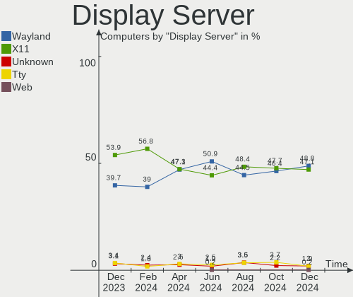
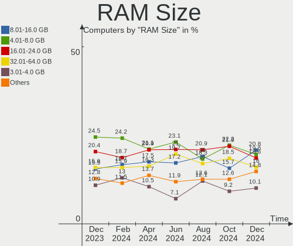
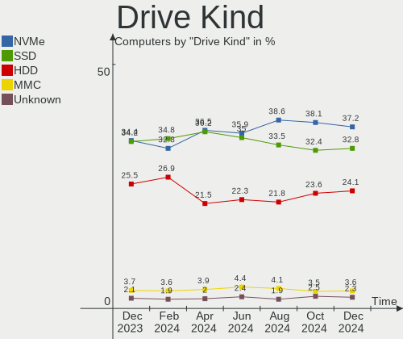
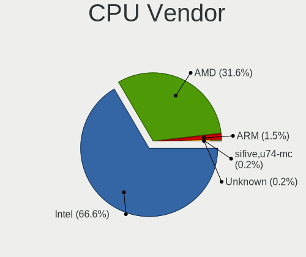
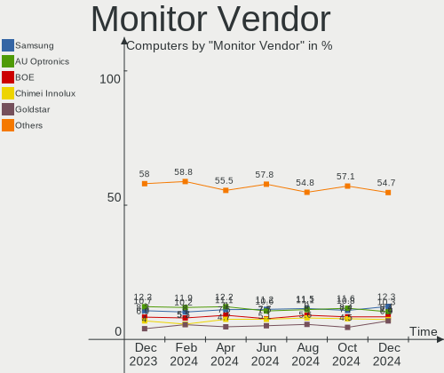
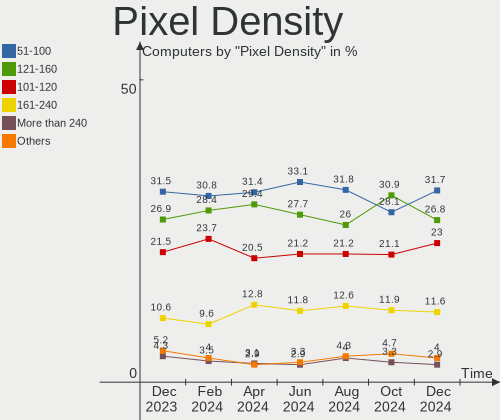
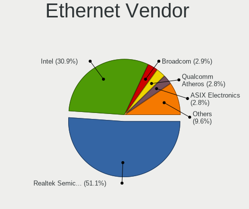
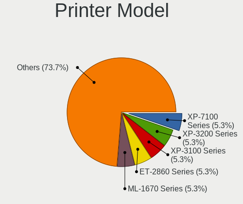
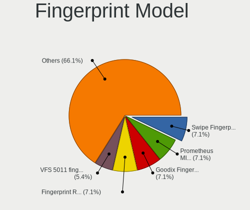

Linux in Germany - Hardware Trends
----------------------------------

A project to identify most popular hardware characteristics and track their change
over time based on data collected by Linux users at https://Linux-Hardware.org.

Anyone can contribute to this report by the [hw-probe](https://github.com/linuxhw/hw-probe) tool:

    sudo -E hw-probe -all -upload

This is a report for all computer types. See also reports for [desktops](/Location/Germany/Desktop/README.md) and [notebooks](/Location/Germany/Notebook/README.md).

Period: Oct, 2022.

Contents
--------

* [ System ](#system)
  - [ OS                       ](#os)
  - [ OS Family                ](#os-family)
  - [ Kernel                   ](#kernel)
  - [ Kernel Family            ](#kernel-family)
  - [ Kernel Major Ver.        ](#kernel-major-ver)
  - [ Arch                     ](#arch)
  - [ DE                       ](#de)
  - [ Display Server           ](#display-server)
  - [ Display Manager          ](#display-manager)
  - [ OS Lang                  ](#os-lang)
  - [ Boot Mode                ](#boot-mode)
  - [ Filesystem               ](#filesystem)
  - [ Part. scheme             ](#part-scheme)
  - [ Dual Boot with Linux/BSD ](#dual-boot-with-linuxbsd)
  - [ Dual Boot (Win)          ](#dual-boot-win)

* [ Board ](#board)
  - [ Vendor                   ](#vendor)
  - [ Model                    ](#model)
  - [ Model Family             ](#model-family)
  - [ MFG Year                 ](#mfg-year)
  - [ Form Factor              ](#form-factor)
  - [ Secure Boot              ](#secure-boot)
  - [ Coreboot                 ](#coreboot)
  - [ RAM Size                 ](#ram-size)
  - [ RAM Used                 ](#ram-used)
  - [ Total Drives             ](#total-drives)
  - [ Has CD-ROM               ](#has-cd-rom)
  - [ Has Ethernet             ](#has-ethernet)
  - [ Has WiFi                 ](#has-wifi)
  - [ Has Bluetooth            ](#has-bluetooth)

* [ Location ](#location)
  - [ Country                  ](#country)
  - [ City                     ](#city)

* [ Drives ](#drives)
  - [ Drive Vendor             ](#drive-vendor)
  - [ Drive Model              ](#drive-model)
  - [ HDD Vendor               ](#hdd-vendor)
  - [ SSD Vendor               ](#ssd-vendor)
  - [ Drive Kind               ](#drive-kind)
  - [ Drive Connector          ](#drive-connector)
  - [ Drive Size               ](#drive-size)
  - [ Space Total              ](#space-total)
  - [ Space Used               ](#space-used)
  - [ Malfunc. Drives          ](#malfunc-drives)
  - [ Malfunc. Drive Vendor    ](#malfunc-drive-vendor)
  - [ Malfunc. HDD Vendor      ](#malfunc-hdd-vendor)
  - [ Malfunc. Drive Kind      ](#malfunc-drive-kind)
  - [ Failed Drives            ](#failed-drives)
  - [ Failed Drive Vendor      ](#failed-drive-vendor)
  - [ Drive Status             ](#drive-status)

* [ Storage controller ](#storage-controller)
  - [ Storage Vendor           ](#storage-vendor)
  - [ Storage Model            ](#storage-model)
  - [ Storage Kind             ](#storage-kind)

* [ Processor ](#processor)
  - [ CPU Vendor               ](#cpu-vendor)
  - [ CPU Model                ](#cpu-model)
  - [ CPU Model Family         ](#cpu-model-family)
  - [ CPU Cores                ](#cpu-cores)
  - [ CPU Sockets              ](#cpu-sockets)
  - [ CPU Threads              ](#cpu-threads)
  - [ CPU Op-Modes             ](#cpu-op-modes)
  - [ CPU Microcode            ](#cpu-microcode)
  - [ CPU Microarch            ](#cpu-microarch)

* [ Graphics ](#graphics)
  - [ GPU Vendor               ](#gpu-vendor)
  - [ GPU Model                ](#gpu-model)
  - [ GPU Combo                ](#gpu-combo)
  - [ GPU Driver               ](#gpu-driver)
  - [ GPU Memory               ](#gpu-memory)

* [ Monitor ](#monitor)
  - [ Monitor Vendor           ](#monitor-vendor)
  - [ Monitor Model            ](#monitor-model)
  - [ Monitor Resolution       ](#monitor-resolution)
  - [ Monitor Diagonal         ](#monitor-diagonal)
  - [ Monitor Width            ](#monitor-width)
  - [ Aspect Ratio             ](#aspect-ratio)
  - [ Monitor Area             ](#monitor-area)
  - [ Pixel Density            ](#pixel-density)
  - [ Multiple Monitors        ](#multiple-monitors)

* [ Network ](#network)
  - [ Net Controller Vendor    ](#net-controller-vendor)
  - [ Net Controller Model     ](#net-controller-model)
  - [ Wireless Vendor          ](#wireless-vendor)
  - [ Wireless Model           ](#wireless-model)
  - [ Ethernet Vendor          ](#ethernet-vendor)
  - [ Ethernet Model           ](#ethernet-model)
  - [ Net Controller Kind      ](#net-controller-kind)
  - [ Used Controller          ](#used-controller)
  - [ NICs                     ](#nics)
  - [ IPv6                     ](#ipv6)

* [ Bluetooth ](#bluetooth)
  - [ Bluetooth Vendor         ](#bluetooth-vendor)
  - [ Bluetooth Model          ](#bluetooth-model)

* [ Sound ](#sound)
  - [ Sound Vendor             ](#sound-vendor)
  - [ Sound Model              ](#sound-model)

* [ Memory ](#memory)
  - [ Memory Vendor            ](#memory-vendor)
  - [ Memory Model             ](#memory-model)
  - [ Memory Kind              ](#memory-kind)
  - [ Memory Form Factor       ](#memory-form-factor)
  - [ Memory Size              ](#memory-size)
  - [ Memory Speed             ](#memory-speed)

* [ Printers & scanners ](#printers--scanners)
  - [ Printer Vendor           ](#printer-vendor)
  - [ Printer Model            ](#printer-model)
  - [ Scanner Vendor           ](#scanner-vendor)
  - [ Scanner Model            ](#scanner-model)

* [ Camera ](#camera)
  - [ Camera Vendor            ](#camera-vendor)
  - [ Camera Model             ](#camera-model)

* [ Security ](#security)
  - [ Fingerprint Vendor       ](#fingerprint-vendor)
  - [ Fingerprint Model        ](#fingerprint-model)
  - [ Chipcard Vendor          ](#chipcard-vendor)
  - [ Chipcard Model           ](#chipcard-model)

* [ Unsupported ](#unsupported)
  - [ Unsupported Devices      ](#unsupported-devices)
  - [ Unsupported Device Types ](#unsupported-device-types)

System
------

OS
--

Installed operating systems

| Name                         | Computers | Percent |
|------------------------------|-----------|---------|
| Ubuntu 22.04                 | 100       | 19.96%  |
| Debian 11                    | 37        | 7.39%   |
| Linux Mint 21                | 32        | 6.39%   |
| Ubuntu 20.04                 | 27        | 5.39%   |
| Linux Mint 20.3              | 27        | 5.39%   |
| Fedora 36                    | 21        | 4.19%   |
| OpenMandriva 4.3             | 15        | 2.99%   |
| Arch Rolling                 | 15        | 2.99%   |
| Ubuntu 22.10                 | 13        | 2.59%   |
| Zorin 16                     | 12        | 2.4%    |
| Pop!_OS 22.04                | 12        | 2.4%    |
| Manjaro 22.0.0               | 9         | 1.8%    |
| Manjaro                      | 9         | 1.8%    |
| KDE neon 20.04               | 9         | 1.8%    |
| Gentoo 2.8                   | 9         | 1.8%    |
| SteamOS 3.3.2                | 8         | 1.6%    |
| openSUSE Tumbleweed-XXXXXXXX | 8         | 1.6%    |
| OpenMandriva 4.50            | 8         | 1.6%    |
| Kubuntu 22.04                | 7         | 1.4%    |
| ArcoLinux Rolling            | 7         | 1.4%    |
| Xubuntu 22.04                | 6         | 1.2%    |
| MX 21                        | 6         | 1.2%    |
| Fedora 37                    | 6         | 1.2%    |
| Xubuntu 20.04                | 5         | 1%      |
| Ubuntu 18.04                 | 5         | 1%      |
| Nobara 36                    | 5         | 1%      |
| Kali 2022.3                  | 5         | 1%      |
| ROSA 12.2                    | 4         | 0.8%    |
| NixOS 22.05                  | 4         | 0.8%    |
| TUXEDO OS 22.04              | 3         | 0.6%    |
| openSUSE Leap-15.4           | 3         | 0.6%    |
| LMDE 5                       | 3         | 0.6%    |
| Linux Mint 20.2              | 3         | 0.6%    |
| Kubuntu 11                   | 3         | 0.6%    |
| EndeavourOS Rolling          | 3         | 0.6%    |
| Debian Testing               | 3         | 0.6%    |
| Xubuntu 18.04                | 2         | 0.4%    |
| SteamOS 3.3.1                | 2         | 0.4%    |
| OpenMandriva 4.2             | 2         | 0.4%    |
| Linux Mint 20                | 2         | 0.4%    |

OS Family
---------

OS without a version

| Name          | Computers | Percent |
|---------------|-----------|---------|
| Ubuntu        | 146       | 29.14%  |
| Linux Mint    | 65        | 12.97%  |
| Debian        | 41        | 8.18%   |
| Fedora        | 27        | 5.39%   |
| OpenMandriva  | 26        | 5.19%   |
| Manjaro       | 19        | 3.79%   |
| Arch          | 15        | 2.99%   |
| Zorin         | 13        | 2.59%   |
| Xubuntu       | 13        | 2.59%   |
| Pop!_OS       | 12        | 2.4%    |
| Kubuntu       | 12        | 2.4%    |
| openSUSE      | 11        | 2.2%    |
| Gentoo        | 11        | 2.2%    |
| SteamOS       | 10        | 2%      |
| KDE neon      | 10        | 2%      |
| ArcoLinux     | 8         | 1.6%    |
| MX            | 7         | 1.4%    |
| ROSA          | 5         | 1%      |
| Nobara        | 5         | 1%      |
| Kali          | 5         | 1%      |
| NixOS         | 4         | 0.8%    |
| Endless       | 4         | 0.8%    |
| TUXEDO OS     | 3         | 0.6%    |
| LMDE          | 3         | 0.6%    |
| EndeavourOS   | 3         | 0.6%    |
| Ubuntu Unity  | 2         | 0.4%    |
| Ubuntu MATE   | 2         | 0.4%    |
| Ubuntu Budgie | 2         | 0.4%    |
| Garuda Linux  | 2         | 0.4%    |
| Elementary    | 2         | 0.4%    |
| Ubuntu Studio | 1         | 0.2%    |
| Slackware     | 1         | 0.2%    |
| Siduction     | 1         | 0.2%    |
| Raspbian      | 1         | 0.2%    |
| Manjaro-ARM   | 1         | 0.2%    |
| Makulu        | 1         | 0.2%    |
| Lubuntu       | 1         | 0.2%    |
| Linux Lite    | 1         | 0.2%    |
| Lilidog       | 1         | 0.2%    |
| KaOS          | 1         | 0.2%    |

Kernel
------

Version of the Linux kernel

| Version                      | Computers | Percent |
|------------------------------|-----------|---------|
| 5.15.0-48-generic            | 67        | 13.37%  |
| 5.15.0-52-generic            | 53        | 10.58%  |
| 5.15.0-50-generic            | 43        | 8.58%   |
| 5.10.0-18-amd64              | 22        | 4.39%   |
| 5.4.0-131-generic            | 15        | 2.99%   |
| 5.16.7-desktop-1omv4003      | 15        | 2.99%   |
| 5.4.0-126-generic            | 10        | 2%      |
| 5.13.0-valve21.3-1-neptune   | 8         | 1.6%    |
| 6.0.2-arch1-1                | 7         | 1.4%    |
| 6.0.2-76060002-generic       | 7         | 1.4%    |
| 5.19.0-2-amd64               | 7         | 1.4%    |
| 5.19.0-23-generic            | 6         | 1.2%    |
| 5.15.0-43-generic            | 6         | 1.2%    |
| 5.10.0-19-amd64              | 6         | 1.2%    |
| 5.19.14-200.fc36.x86_64      | 5         | 1%      |
| 5.19.0-76051900-generic      | 5         | 1%      |
| 5.15.0-41-generic            | 5         | 1%      |
| 5.4.0-128-generic            | 4         | 0.8%    |
| 5.19.16-200.fc36.x86_64      | 4         | 0.8%    |
| 5.19.13-arch1-1              | 4         | 0.8%    |
| 5.19.12-arch1-1              | 4         | 0.8%    |
| 5.15.0-47-generic            | 4         | 0.8%    |
| 6.0.2-2-MANJARO              | 3         | 0.6%    |
| 5.19.5-desktop-1omv4090      | 3         | 0.6%    |
| 5.19.16-2-MANJARO            | 3         | 0.6%    |
| 5.19.13-200.fc36.x86_64      | 3         | 0.6%    |
| 5.19.0-21-generic            | 3         | 0.6%    |
| 5.19.0-15-generic            | 3         | 0.6%    |
| 5.18.0-0.deb11.4-amd64       | 3         | 0.6%    |
| 5.15.74-1-lts                | 3         | 0.6%    |
| 5.15.65-1-MANJARO            | 3         | 0.6%    |
| 5.15.0-52-lowlatency         | 3         | 0.6%    |
| 5.15.0-46-generic            | 3         | 0.6%    |
| 5.15.0-10050-tuxedo          | 3         | 0.6%    |
| 5.14.21-150400.24.21-default | 3         | 0.6%    |
| 5.13.0-39-generic            | 3         | 0.6%    |
| 5.11.0-35-generic            | 3         | 0.6%    |
| 6.0.5-arch1-1                | 2         | 0.4%    |
| 6.0.2-zen1-1-zen             | 2         | 0.4%    |
| 5.4.0-126-lowlatency         | 2         | 0.4%    |

Kernel Family
-------------

Linux kernel without a distro release

| Version  | Computers | Percent |
|----------|-----------|---------|
| 5.15.0   | 196       | 39.12%  |
| 5.4.0    | 38        | 7.58%   |
| 5.10.0   | 37        | 7.39%   |
| 5.19.0   | 27        | 5.39%   |
| 6.0.2    | 22        | 4.39%   |
| 5.13.0   | 18        | 3.59%   |
| 5.16.7   | 15        | 2.99%   |
| 5.19.12  | 13        | 2.59%   |
| 5.19.16  | 11        | 2.2%    |
| 5.19.13  | 10        | 2%      |
| 5.19.14  | 9         | 1.8%    |
| 5.15.74  | 9         | 1.8%    |
| 5.18.0   | 8         | 1.6%    |
| 5.11.0   | 7         | 1.4%    |
| 5.19.11  | 6         | 1.2%    |
| 5.14.0   | 6         | 1.2%    |
| 6.0.0    | 5         | 1%      |
| 5.19.15  | 5         | 1%      |
| 6.0.5    | 4         | 0.8%    |
| 5.19.5   | 4         | 0.8%    |
| 5.14.21  | 4         | 0.8%    |
| 4.15.0   | 4         | 0.8%    |
| 6.0.1    | 3         | 0.6%    |
| 5.19.8   | 3         | 0.6%    |
| 5.15.71  | 3         | 0.6%    |
| 5.15.65  | 3         | 0.6%    |
| 5.15.61  | 3         | 0.6%    |
| 6.0.3    | 2         | 0.4%    |
| 5.19.7   | 2         | 0.4%    |
| 5.15.72  | 2         | 0.4%    |
| 5.10.74  | 2         | 0.4%    |
| 5.10.14  | 2         | 0.4%    |
| 5.10.118 | 2         | 0.4%    |
| 6.1.0    | 1         | 0.2%    |
| 6.0.6    | 1         | 0.2%    |
| 5.4.83   | 1         | 0.2%    |
| 5.18.19  | 1         | 0.2%    |
| 5.18.12  | 1         | 0.2%    |
| 5.17.9   | 1         | 0.2%    |
| 5.17.5   | 1         | 0.2%    |

Kernel Major Ver.
-----------------

Linux kernel major version

| Version | Computers | Percent |
|---------|-----------|---------|
| 5.15    | 221       | 44.11%  |
| 5.19    | 90        | 17.96%  |
| 5.10    | 45        | 8.98%   |
| 5.4     | 39        | 7.78%   |
| 6.0     | 37        | 7.39%   |
| 5.13    | 18        | 3.59%   |
| 5.16    | 15        | 2.99%   |
| 5.18    | 10        | 2%      |
| 5.14    | 10        | 2%      |
| 5.11    | 7         | 1.4%    |
| 4.15    | 4         | 0.8%    |
| 5.17    | 2         | 0.4%    |
| 6.1     | 1         | 0.2%    |
| 4.9     | 1         | 0.2%    |
| 4.18    | 1         | 0.2%    |

Arch
----

OS architecture (x86_64, i586, etc.)

| Name    | Computers | Percent |
|---------|-----------|---------|
| x86_64  | 486       | 97.01%  |
| aarch64 | 7         | 1.4%    |
| i686    | 6         | 1.2%    |
| armv7l  | 2         | 0.4%    |

DE
--

Desktop Environment

| Name             | Computers | Percent |
|------------------|-----------|---------|
| GNOME            | 227       | 45.31%  |
| KDE5             | 100       | 19.96%  |
| X-Cinnamon       | 59        | 11.78%  |
| XFCE             | 41        | 8.18%   |
| Unknown          | 26        | 5.19%   |
| Cinnamon         | 10        | 2%      |
| MATE             | 7         | 1.4%    |
| i3               | 4         | 0.8%    |
| GNOME Flashback  | 4         | 0.8%    |
| bspwm            | 3         | 0.6%    |
| Unity            | 2         | 0.4%    |
| trinity          | 2         | 0.4%    |
| Pantheon         | 2         | 0.4%    |
| LXQt             | 2         | 0.4%    |
| LXDE             | 2         | 0.4%    |
| KDE              | 2         | 0.4%    |
| Budgie           | 2         | 0.4%    |
| sway             | 1         | 0.2%    |
| qtile            | 1         | 0.2%    |
| lightdm-xsession | 1         | 0.2%    |
| KDE4             | 1         | 0.2%    |
| enlightenment    | 1         | 0.2%    |
| awesome          | 1         | 0.2%    |

Display Server
--------------

X11 or Wayland

| Name    | Computers | Percent |
|---------|-----------|---------|
| X11     | 348       | 69.46%  |
| Wayland | 122       | 24.35%  |
| Tty     | 19        | 3.79%   |
| Unknown | 12        | 2.4%    |

Display Manager
---------------

SDDM, LightDM, etc.

| Name    | Computers | Percent |
|---------|-----------|---------|
| Unknown | 168       | 33.53%  |
| GDM3    | 143       | 28.54%  |
| LightDM | 91        | 18.16%  |
| SDDM    | 64        | 12.77%  |
| GDM     | 31        | 6.19%   |
| XDM     | 2         | 0.4%    |
| SLiM    | 1         | 0.2%    |
| KDM     | 1         | 0.2%    |

OS Lang
-------

Language

| Lang       | Computers | Percent |
|------------|-----------|---------|
| de_DE      | 339       | 67.66%  |
| en_US      | 103       | 20.56%  |
| en_GB      | 11        | 2.2%    |
| C          | 11        | 2.2%    |
| Unknown    | 5         | 1%      |
| POSIX      | 4         | 0.8%    |
| it_IT      | 4         | 0.8%    |
| en_DE      | 4         | 0.8%    |
| ru_RU      | 3         | 0.6%    |
| pl_PL      | 3         | 0.6%    |
| C.UTF8     | 3         | 0.6%    |
| en_SG      | 2         | 0.4%    |
| Default    | 2         | 0.4%    |
| uk_UA      | 1         | 0.2%    |
| ru_UA      | 1         | 0.2%    |
| hu_HU      | 1         | 0.2%    |
| de_IT      | 1         | 0.2%    |
| de_DE@euro | 1         | 0.2%    |
| bs_BA      | 1         | 0.2%    |
| be_BY      | 1         | 0.2%    |

Boot Mode
---------

EFI or BIOS

| Mode | Computers | Percent |
|------|-----------|---------|
| BIOS | 274       | 54.69%  |
| EFI  | 227       | 45.31%  |

Filesystem
----------

Type of filesystem

| Type          | Computers | Percent |
|---------------|-----------|---------|
| Ext4          | 387       | 77.25%  |
| Btrfs         | 63        | 12.57%  |
| Overlay       | 38        | 7.58%   |
| Zfs           | 5         | 1%      |
| Xfs           | 4         | 0.8%    |
| Tmpfs         | 1         | 0.2%    |
| Fuse.snapfuse | 1         | 0.2%    |
| F2fs          | 1         | 0.2%    |
| Ext2          | 1         | 0.2%    |

Part. scheme
------------

Scheme of partitioning

| Type    | Computers | Percent |
|---------|-----------|---------|
| GPT     | 274       | 54.69%  |
| Unknown | 152       | 30.34%  |
| MBR     | 75        | 14.97%  |

Dual Boot with Linux/BSD
------------------------

Hosting more than one Linux/BSD

| Dual boot | Computers | Percent |
|-----------|-----------|---------|
| No        | 423       | 84.43%  |
| Yes       | 78        | 15.57%  |

Dual Boot (Win)
---------------

Hosting Linux and Windows

| Dual boot | Computers | Percent |
|-----------|-----------|---------|
| No        | 351       | 70.06%  |
| Yes       | 150       | 29.94%  |

Board
-----

Vendor
------

Motherboard manufacturer

| Name                    | Computers | Percent |
|-------------------------|-----------|---------|
| Lenovo                  | 95        | 18.96%  |
| Hewlett-Packard         | 66        | 13.17%  |
| ASUSTek Computer        | 56        | 11.18%  |
| MSI                     | 42        | 8.38%   |
| Dell                    | 40        | 7.98%   |
| Gigabyte Technology     | 29        | 5.79%   |
| ASRock                  | 24        | 4.79%   |
| Acer                    | 24        | 4.79%   |
| Fujitsu                 | 19        | 3.79%   |
| Valve                   | 11        | 2.2%    |
| Medion                  | 8         | 1.6%    |
| Toshiba                 | 7         | 1.4%    |
| Sony                    | 6         | 1.2%    |
| TUXEDO                  | 5         | 1%      |
| HUAWEI                  | 5         | 1%      |
| Apple                   | 5         | 1%      |
| Tactus                  | 4         | 0.8%    |
| Raspberry Pi Foundation | 4         | 0.8%    |
| Unknown                 | 4         | 0.8%    |
| Schenker                | 3         | 0.6%    |
| Packard Bell            | 3         | 0.6%    |
| Notebook                | 3         | 0.6%    |
| Intel                   | 3         | 0.6%    |
| Timi                    | 2         | 0.4%    |
| Samsung Electronics     | 2         | 0.4%    |
| Radxa                   | 2         | 0.4%    |
| Hardkernel              | 2         | 0.4%    |
| Fujitsu Siemens         | 2         | 0.4%    |
| Biostar                 | 2         | 0.4%    |
| ZOTAC                   | 1         | 0.2%    |
| Wortmann AG             | 1         | 0.2%    |
| Vulcan Electronics      | 1         | 0.2%    |
| TrekStor                | 1         | 0.2%    |
| TERRA                   | 1         | 0.2%    |
| Teclast                 | 1         | 0.2%    |
| Supermicro              | 1         | 0.2%    |
| sunxi                   | 1         | 0.2%    |
| Shuttle                 | 1         | 0.2%    |
| Pine Microsystems       | 1         | 0.2%    |
| PC Specialist           | 1         | 0.2%    |

Model
-----

Motherboard model

| Name                                           | Computers | Percent |
|------------------------------------------------|-----------|---------|
| Valve Jupiter                                  | 11        | 2.2%    |
| Unknown                                        | 7         | 1.4%    |
| MSI MS-7C37                                    | 3         | 0.6%    |
| Lenovo ThinkPad E15 Gen 4 21EES00100           | 3         | 0.6%    |
| Lenovo G710 20252                              | 3         | 0.6%    |
| Toshiba Satellite L300                         | 2         | 0.4%    |
| Tactus GeoBook 140                             | 2         | 0.4%    |
| Schenker VISION 15 (SVS15E21)                  | 2         | 0.4%    |
| MSI MS-7C52                                    | 2         | 0.4%    |
| MSI MS-7C35                                    | 2         | 0.4%    |
| MSI MS-7B84                                    | 2         | 0.4%    |
| MSI MS-7A38                                    | 2         | 0.4%    |
| MSI MS-7693                                    | 2         | 0.4%    |
| Lenovo Yoga Slim 7 14ARE05 82A2                | 2         | 0.4%    |
| Lenovo ThinkPad T495 20NKS01Y00                | 2         | 0.4%    |
| Lenovo ThinkPad L14 Gen 1 20U50001GE           | 2         | 0.4%    |
| HP EliteBook 850 G2                            | 2         | 0.4%    |
| HP Compaq Elite 8300 SFF                       | 2         | 0.4%    |
| HP Compaq 8000 Elite CMT PC                    | 2         | 0.4%    |
| HP 255 G8 Notebook PC                          | 2         | 0.4%    |
| Gigabyte B450 AORUS ELITE                      | 2         | 0.4%    |
| Fujitsu ESPRIMO C720                           | 2         | 0.4%    |
| Dell Precision 7760                            | 2         | 0.4%    |
| Dell Latitude 3320                             | 2         | 0.4%    |
| ASUS ZenBook UX363EA_UX363EA                   | 2         | 0.4%    |
| ASUS X510UQ                                    | 2         | 0.4%    |
| ASUS PRIME B550M-A                             | 2         | 0.4%    |
| ASUS All Series                                | 2         | 0.4%    |
| ASRock B450 Pro4                               | 2         | 0.4%    |
| Acer Swift SF314-42                            | 2         | 0.4%    |
| ZOTAC ZBOX-EN72080V/EN72070V/EN52060V/EN51660T | 1         | 0.2%    |
| Wortmann AG 1220676_1470204                    | 1         | 0.2%    |
| Vulcan Excursion XB                            | 1         | 0.2%    |
| TUXEDO Pulse 15 Gen1                           | 1         | 0.2%    |
| TUXEDO Polaris (CML/Gen2)                      | 1         | 0.2%    |
| TUXEDO InfinityBook_Pro13_14_v4                | 1         | 0.2%    |
| TUXEDO Aura 15 Gen1                            | 1         | 0.2%    |
| TrekStor Primebook C13                         | 1         | 0.2%    |
| Toshiba Satellite P200                         | 1         | 0.2%    |
| Toshiba Satellite L755                         | 1         | 0.2%    |

Model Family
------------

Motherboard model prefix

| Name                  | Computers | Percent |
|-----------------------|-----------|---------|
| Lenovo ThinkPad       | 50        | 9.98%   |
| Acer Aspire           | 15        | 2.99%   |
| Dell Latitude         | 13        | 2.59%   |
| Valve Jupiter         | 11        | 2.2%    |
| Lenovo IdeaPad        | 11        | 2.2%    |
| HP EliteBook          | 10        | 2%      |
| HP Compaq             | 10        | 2%      |
| ASUS PRIME            | 10        | 2%      |
| HP ProBook            | 9         | 1.8%    |
| Fujitsu ESPRIMO       | 9         | 1.8%    |
| Lenovo Yoga           | 8         | 1.6%    |
| Toshiba Satellite     | 7         | 1.4%    |
| Lenovo ThinkCentre    | 7         | 1.4%    |
| Unknown               | 7         | 1.4%    |
| HP Pavilion           | 6         | 1.2%    |
| HP Laptop             | 6         | 1.2%    |
| Dell Precision        | 6         | 1.2%    |
| ASUS ROG              | 6         | 1.2%    |
| Dell XPS              | 5         | 1%      |
| Dell OptiPlex         | 5         | 1%      |
| Dell Inspiron         | 5         | 1%      |
| RPi Raspberry         | 4         | 0.8%    |
| Lenovo Legion         | 4         | 0.8%    |
| HP ENVY               | 4         | 0.8%    |
| Fujitsu LIFEBOOK      | 4         | 0.8%    |
| Tactus GeoBook        | 3         | 0.6%    |
| Packard Bell EasyNote | 3         | 0.6%    |
| MSI MS-7C37           | 3         | 0.6%    |
| Lenovo G710           | 3         | 0.6%    |
| HP ZBook              | 3         | 0.6%    |
| Gigabyte X570         | 3         | 0.6%    |
| Gigabyte B450         | 3         | 0.6%    |
| Dell Vostro           | 3         | 0.6%    |
| ASUS ZenBook          | 3         | 0.6%    |
| ASUS VivoBook         | 3         | 0.6%    |
| ASUS TUF              | 3         | 0.6%    |
| Acer Swift            | 3         | 0.6%    |
| Acer Extensa          | 3         | 0.6%    |
| Schenker VISION       | 2         | 0.4%    |
| MSI MS-7C52           | 2         | 0.4%    |

MFG Year
--------

Motherboard manufacture year

| Year    | Computers | Percent |
|---------|-----------|---------|
| 2020    | 72        | 14.37%  |
| 2022    | 42        | 8.38%   |
| 2019    | 42        | 8.38%   |
| 2021    | 40        | 7.98%   |
| 2012    | 35        | 6.99%   |
| 2017    | 34        | 6.79%   |
| 2013    | 33        | 6.59%   |
| 2011    | 32        | 6.39%   |
| 2018    | 30        | 5.99%   |
| 2016    | 25        | 4.99%   |
| 2014    | 22        | 4.39%   |
| 2015    | 19        | 3.79%   |
| 2008    | 18        | 3.59%   |
| 2009    | 17        | 3.39%   |
| 2010    | 16        | 3.19%   |
| 2007    | 10        | 2%      |
| Unknown | 9         | 1.8%    |
| 2006    | 3         | 0.6%    |
| 2005    | 1         | 0.2%    |
| 2004    | 1         | 0.2%    |

Form Factor
-----------

Physical design of the computer

| Name           | Computers | Percent |
|----------------|-----------|---------|
| Notebook       | 267       | 53.29%  |
| Desktop        | 191       | 38.12%  |
| Convertible    | 16        | 3.19%   |
| System on chip | 8         | 1.6%    |
| Mini pc        | 6         | 1.2%    |
| Tablet         | 5         | 1%      |
| All in one     | 4         | 0.8%    |
| Server         | 3         | 0.6%    |
| Phone          | 1         | 0.2%    |

Secure Boot
-----------

Enabled or disabled

| State    | Computers | Percent |
|----------|-----------|---------|
| Disabled | 466       | 93.01%  |
| Enabled  | 35        | 6.99%   |

Coreboot
--------

Have coreboot on board

| Used | Computers | Percent |
|------|-----------|---------|
| No   | 497       | 99.2%   |
| Yes  | 4         | 0.8%    |

RAM Size
--------

Total RAM memory

| Size in GB  | Computers | Percent |
|-------------|-----------|---------|
| 16.01-24.0  | 114       | 22.75%  |
| 4.01-8.0    | 95        | 18.96%  |
| 8.01-16.0   | 94        | 18.76%  |
| 3.01-4.0    | 85        | 16.97%  |
| 32.01-64.0  | 56        | 11.18%  |
| 64.01-256.0 | 22        | 4.39%   |
| 1.01-2.0    | 19        | 3.79%   |
| 24.01-32.0  | 9         | 1.8%    |
| 0.51-1.0    | 4         | 0.8%    |
| 2.01-3.0    | 3         | 0.6%    |

RAM Used
--------

Used RAM memory

| Used GB    | Computers | Percent |
|------------|-----------|---------|
| 1.01-2.0   | 170       | 33.93%  |
| 2.01-3.0   | 134       | 26.75%  |
| 4.01-8.0   | 76        | 15.17%  |
| 3.01-4.0   | 61        | 12.18%  |
| 0.51-1.0   | 23        | 4.59%   |
| 8.01-16.0  | 21        | 4.19%   |
| 0.01-0.5   | 10        | 2%      |
| 16.01-24.0 | 4         | 0.8%    |
| 32.01-64.0 | 1         | 0.2%    |
| 24.01-32.0 | 1         | 0.2%    |

Total Drives
------------

Number of drives on board

| Drives | Computers | Percent |
|--------|-----------|---------|
| 1      | 272       | 54.29%  |
| 2      | 128       | 25.55%  |
| 3      | 51        | 10.18%  |
| 4      | 16        | 3.19%   |
| 5      | 14        | 2.79%   |
| 6      | 9         | 1.8%    |
| 7      | 4         | 0.8%    |
| 0      | 3         | 0.6%    |
| 9      | 2         | 0.4%    |
| 17     | 1         | 0.2%    |
| 8      | 1         | 0.2%    |

Has CD-ROM
----------

Has CD-ROM on board

| Presented | Computers | Percent |
|-----------|-----------|---------|
| No        | 308       | 61.48%  |
| Yes       | 193       | 38.52%  |

Has Ethernet
------------

Has Ethernet on board

| Presented | Computers | Percent |
|-----------|-----------|---------|
| Yes       | 423       | 84.43%  |
| No        | 78        | 15.57%  |

Has WiFi
--------

Has WiFi module

| Presented | Computers | Percent |
|-----------|-----------|---------|
| Yes       | 364       | 72.65%  |
| No        | 137       | 27.35%  |

Has Bluetooth
-------------

Has Bluetooth module

| Presented | Computers | Percent |
|-----------|-----------|---------|
| Yes       | 298       | 59.48%  |
| No        | 203       | 40.52%  |

Location
--------

Country
-------

Geographic location (country)

| Country | Computers | Percent |
|---------|-----------|---------|
| Germany | 501       | 100%    |

City
----

Geographic location (city)

| City                  | Computers | Percent |
|-----------------------|-----------|---------|
| Berlin                | 43        | 8.58%   |
| Munich                | 23        | 4.59%   |
| Frankfurt am Main     | 20        | 3.99%   |
| Hamburg               | 15        | 2.99%   |
| Leipzig               | 11        | 2.2%    |
| Cologne               | 10        | 2%      |
| Dresden               | 9         | 1.8%    |
| Kiel                  | 7         | 1.4%    |
| Stuttgart             | 6         | 1.2%    |
| Mainz                 | 6         | 1.2%    |
| Nuremberg             | 5         | 1%      |
| Karlsruhe             | 5         | 1%      |
| Düsseldorf           | 5         | 1%      |
| Duisburg              | 5         | 1%      |
| Wuppertal             | 4         | 0.8%    |
| Mannheim              | 4         | 0.8%    |
| Ludwigshafen am Rhein | 4         | 0.8%    |
| Hanover               | 4         | 0.8%    |
| Dessau                | 4         | 0.8%    |
| Bremen                | 4         | 0.8%    |
| Augsburg              | 4         | 0.8%    |
| Aachen                | 4         | 0.8%    |
| Wiesbaden             | 3         | 0.6%    |
| Saarlouis             | 3         | 0.6%    |
| Mönchengladbach      | 3         | 0.6%    |
| Kaufbeuren            | 3         | 0.6%    |
| Hamm                  | 3         | 0.6%    |
| Gelsenkirchen         | 3         | 0.6%    |
| Freiburg im Breisgau  | 3         | 0.6%    |
| Essen                 | 3         | 0.6%    |
| Bochum                | 3         | 0.6%    |
| Zirndorf              | 2         | 0.4%    |
| Wermelskirchen        | 2         | 0.4%    |
| Weimar                | 2         | 0.4%    |
| Verden an der Aller   | 2         | 0.4%    |
| Seedorf               | 2         | 0.4%    |
| Schmalkalden          | 2         | 0.4%    |
| Salach                | 2         | 0.4%    |
| Reutlingen            | 2         | 0.4%    |
| Regensburg            | 2         | 0.4%    |

Drives
------

Drive Vendor
------------

Hard drive vendors

| Vendor                      | Computers | Drives | Percent |
|-----------------------------|-----------|--------|---------|
| Samsung Electronics         | 171       | 223    | 21.7%   |
| Seagate                     | 86        | 109    | 10.91%  |
| WDC                         | 84        | 103    | 10.66%  |
| SanDisk                     | 63        | 70     | 7.99%   |
| Crucial                     | 49        | 52     | 6.22%   |
| Toshiba                     | 45        | 52     | 5.71%   |
| Unknown                     | 42        | 47     | 5.33%   |
| Intenso                     | 31        | 31     | 3.93%   |
| Kingston                    | 29        | 32     | 3.68%   |
| SK hynix                    | 22        | 23     | 2.79%   |
| Intel                       | 17        | 20     | 2.16%   |
| Hitachi                     | 17        | 18     | 2.16%   |
| Micron Technology           | 15        | 15     | 1.9%    |
| HGST                        | 9         | 11     | 1.14%   |
| Phison Electronics          | 8         | 10     | 1.02%   |
| Silicon Motion              | 7         | 7      | 0.89%   |
| KIOXIA                      | 7         | 7      | 0.89%   |
| Kingston Technology Company | 7         | 7      | 0.89%   |
| Micron/Crucial Technology   | 6         | 6      | 0.76%   |
| UMIS                        | 5         | 5      | 0.63%   |
| OCZ                         | 4         | 4      | 0.51%   |
| Netac                       | 4         | 4      | 0.51%   |
| ASMT                        | 4         | 4      | 0.51%   |
| A-DATA Technology           | 4         | 4      | 0.51%   |
| Transcend                   | 3         | 3      | 0.38%   |
| JMicron Technology          | 3         | 3      | 0.38%   |
| Fujitsu                     | 3         | 4      | 0.38%   |
| China                       | 3         | 3      | 0.38%   |
| Unknown                     | 3         | 3      | 0.38%   |
| Maxtor                      | 2         | 2      | 0.25%   |
| LITEON                      | 2         | 2      | 0.25%   |
| Leven                       | 2         | 2      | 0.25%   |
| Dogfish                     | 2         | 2      | 0.25%   |
| VNYEZ                       | 1         | 1      | 0.13%   |
| Verbatim                    | 1         | 1      | 0.13%   |
| VENO                        | 1         | 1      | 0.13%   |
| Union Memory (Shenzhen)     | 1         | 1      | 0.13%   |
| Team                        | 1         | 1      | 0.13%   |
| SSSTC                       | 1         | 1      | 0.13%   |
| SSD0240S                    | 1         | 1      | 0.13%   |

Drive Model
-----------

Hard drive models

| Model                                                 | Computers | Percent |
|-------------------------------------------------------|-----------|---------|
| Samsung NVMe SSD Controller SM981/PM981/PM983 500GB   | 25        | 2.88%   |
| Samsung SSD 850 EVO 500GB                             | 10        | 1.15%   |
| Samsung NVMe SSD Controller PM9A1/PM9A3/980PRO 250GB  | 9         | 1.04%   |
| Samsung SSD 860 EVO 1TB                               | 8         | 0.92%   |
| Unknown SD/MMC/MS PRO 1TB                             | 7         | 0.81%   |
| Samsung SSD 980 1TB                                   | 7         | 0.81%   |
| Samsung SSD 860 EVO 500GB                             | 7         | 0.81%   |
| Crucial CT500MX500SSD1 500GB                          | 7         | 0.81%   |
| Unknown MMC Card  32GB                                | 6         | 0.69%   |
| Toshiba DT01ACA100 1TB                                | 6         | 0.69%   |
| SanDisk SSD PLUS 1000GB                               | 6         | 0.69%   |
| Samsung NVMe SSD Controller SM961/PM961/SM963 250GB   | 6         | 0.69%   |
| Intenso 128GB                                         | 6         | 0.69%   |
| WDC WD20EZRZ-00Z5HB0 2TB                              | 5         | 0.58%   |
| Sandisk WD Blue SN550 NVMe SSD 1TB                    | 5         | 0.58%   |
| Samsung SSD 850 EVO 250GB                             | 5         | 0.58%   |
| Samsung SSD 840 EVO 250GB                             | 5         | 0.58%   |
| Kingston Company OM3PDP3 NVMe SSD 512GB               | 5         | 0.58%   |
| Kingston SV300S37A120G 120GB SSD                      | 5         | 0.58%   |
| Crucial CT240BX500SSD1 240GB                          | 5         | 0.58%   |
| Crucial CT1000BX500SSD1 1TB                           | 5         | 0.58%   |
| WDC WD20EARX-00PASB0 2TB                              | 4         | 0.46%   |
| Sandisk WD Black SN750 / PC SN730 NVMe SSD 1TB        | 4         | 0.46%   |
| Samsung SSD 980 PRO 1TB                               | 4         | 0.46%   |
| Samsung SSD 870 QVO 1TB                               | 4         | 0.46%   |
| Samsung SSD 870 EVO 1TB                               | 4         | 0.46%   |
| Samsung SSD 850 PRO 512GB                             | 4         | 0.46%   |
| Phison E16 PCIe4 NVMe Controller 1TB                  | 4         | 0.46%   |
| Crucial CT480BX500SSD1 480GB                          | 4         | 0.46%   |
| Crucial CT1000MX500SSD1 1TB                           | 4         | 0.46%   |
| Unknown SC64G  64GB                                   | 3         | 0.35%   |
| Unknown MMC Card  8GB                                 | 3         | 0.35%   |
| Unknown MMC Card  256GB                               | 3         | 0.35%   |
| Unknown MMC Card  128GB                               | 3         | 0.35%   |
| UMIS RPJTJ512MGE1QDQ 512GB                            | 3         | 0.35%   |
| Toshiba XG6 NVMe SSD Controller 512GB                 | 3         | 0.35%   |
| Toshiba MQ01ABF050 500GB                              | 3         | 0.35%   |
| Toshiba MQ01ABD100 1TB                                | 3         | 0.35%   |
| Toshiba DT01ACA050 500GB                              | 3         | 0.35%   |
| Silicon Motion SM2263EN/SM2263XT SSD Controller 256GB | 3         | 0.35%   |

HDD Vendor
----------

Hard disk drive vendors

| Vendor              | Computers | Drives | Percent |
|---------------------|-----------|--------|---------|
| Seagate             | 86        | 109    | 35.98%  |
| WDC                 | 60        | 76     | 25.1%   |
| Toshiba             | 30        | 36     | 12.55%  |
| Samsung Electronics | 19        | 25     | 7.95%   |
| Hitachi             | 17        | 18     | 7.11%   |
| HGST                | 9         | 11     | 3.77%   |
| Unknown             | 7         | 7      | 2.93%   |
| Intenso             | 3         | 3      | 1.26%   |
| Fujitsu             | 3         | 4      | 1.26%   |
| Maxtor              | 2         | 2      | 0.84%   |
| LIO-ORG             | 1         | 1      | 0.42%   |
| Inateck             | 1         | 1      | 0.42%   |
| HPE                 | 1         | 6      | 0.42%   |

SSD Vendor
----------

Solid state drive vendors

| Vendor              | Computers | Drives | Percent |
|---------------------|-----------|--------|---------|
| Samsung Electronics | 83        | 102    | 28.33%  |
| Crucial             | 46        | 49     | 15.7%   |
| SanDisk             | 44        | 49     | 15.02%  |
| Kingston            | 18        | 19     | 6.14%   |
| Intenso             | 16        | 16     | 5.46%   |
| WDC                 | 11        | 12     | 3.75%   |
| Micron Technology   | 9         | 9      | 3.07%   |
| Toshiba             | 6         | 7      | 2.05%   |
| SK hynix            | 5         | 5      | 1.71%   |
| OCZ                 | 4         | 4      | 1.37%   |
| Netac               | 4         | 4      | 1.37%   |
| Intel               | 4         | 4      | 1.37%   |
| ASMT                | 4         | 4      | 1.37%   |
| A-DATA Technology   | 4         | 4      | 1.37%   |
| Transcend           | 3         | 3      | 1.02%   |
| China               | 3         | 3      | 1.02%   |
| Unknown             | 2         | 2      | 0.68%   |
| LITEON              | 2         | 2      | 0.68%   |
| Leven               | 2         | 2      | 0.68%   |
| Dogfish             | 2         | 2      | 0.68%   |
| Unknown             | 2         | 2      | 0.68%   |
| VNYEZ               | 1         | 1      | 0.34%   |
| Verbatim            | 1         | 1      | 0.34%   |
| VENO                | 1         | 1      | 0.34%   |
| Team                | 1         | 1      | 0.34%   |
| PNY                 | 1         | 2      | 0.34%   |
| LITEONIT            | 1         | 1      | 0.34%   |
| KIOXIA-EXCERIA      | 1         | 1      | 0.34%   |
| INNOVATION IT       | 1         | 1      | 0.34%   |
| Innodisk            | 1         | 1      | 0.34%   |
| Hoodisk             | 1         | 1      | 0.34%   |
| Hewlett-Packard     | 1         | 1      | 0.34%   |
| GOODRAM             | 1         | 1      | 0.34%   |
| Emtec               | 1         | 1      | 0.34%   |
| Drevo               | 1         | 1      | 0.34%   |
| CT250MX5            | 1         | 1      | 0.34%   |
| CT1000MX            | 1         | 1      | 0.34%   |
| BIWIN               | 1         | 1      | 0.34%   |
| Apple               | 1         | 1      | 0.34%   |
| Apacer              | 1         | 1      | 0.34%   |

Drive Kind
----------

HDD or SSD

| Kind    | Computers | Drives | Percent |
|---------|-----------|--------|---------|
| SSD     | 242       | 324    | 34.92%  |
| NVMe    | 209       | 243    | 30.16%  |
| HDD     | 190       | 299    | 27.42%  |
| MMC     | 34        | 37     | 4.91%   |
| Unknown | 18        | 20     | 2.6%    |

Drive Connector
---------------

SATA, SAS, NVMe, etc.

| Type | Computers | Drives | Percent |
|------|-----------|--------|---------|
| SATA | 337       | 593    | 54.27%  |
| NVMe | 207       | 240    | 33.33%  |
| SAS  | 43        | 53     | 6.92%   |
| MMC  | 34        | 37     | 5.48%   |

Drive Size
----------

Size of hard drive

| Size in TB | Computers | Drives | Percent |
|------------|-----------|--------|---------|
| 0.01-0.5   | 241       | 328    | 52.39%  |
| 0.51-1.0   | 135       | 181    | 29.35%  |
| 1.01-2.0   | 50        | 60     | 10.87%  |
| 3.01-4.0   | 13        | 17     | 2.83%   |
| 4.01-10.0  | 11        | 22     | 2.39%   |
| 2.01-3.0   | 9         | 10     | 1.96%   |
| 10.01-20.0 | 1         | 5      | 0.22%   |

Space Total
-----------

Amount of disk space available on the file system

| Size in GB     | Computers | Percent |
|----------------|-----------|---------|
| 101-250        | 117       | 23.35%  |
| 251-500        | 107       | 21.36%  |
| 501-1000       | 75        | 14.97%  |
| 1001-2000      | 42        | 8.38%   |
| More than 3000 | 41        | 8.18%   |
| 1-20           | 35        | 6.99%   |
| 51-100         | 26        | 5.19%   |
| 21-50          | 20        | 3.99%   |
| Unknown        | 20        | 3.99%   |
| 2001-3000      | 18        | 3.59%   |

Space Used
----------

Amount of used disk space

| Used GB        | Computers | Percent |
|----------------|-----------|---------|
| 1-20           | 166       | 33.13%  |
| 21-50          | 84        | 16.77%  |
| 101-250        | 63        | 12.57%  |
| 51-100         | 48        | 9.58%   |
| 251-500        | 45        | 8.98%   |
| 501-1000       | 30        | 5.99%   |
| 1001-2000      | 22        | 4.39%   |
| Unknown        | 20        | 3.99%   |
| 2001-3000      | 12        | 2.4%    |
| More than 3000 | 11        | 2.2%    |

Malfunc. Drives
---------------

Drive models with a malfunction

| Model                                          | Computers | Drives | Percent |
|------------------------------------------------|-----------|--------|---------|
| WDC WDS240G2G0A-00JH30 240GB SSD               | 2         | 2      | 7.14%   |
| Toshiba DT01ACA100 1TB                         | 2         | 2      | 7.14%   |
| WDC WD60EFRX-68L0BN1 6TB                       | 1         | 1      | 3.57%   |
| WDC WD5000AAKX-001CA0 500GB                    | 1         | 1      | 3.57%   |
| WDC WD20EFRX-68EUZN0 2TB                       | 1         | 1      | 3.57%   |
| WDC WD10EARX-00N0YB0 1TB                       | 1         | 1      | 3.57%   |
| Seagate ST8000VN004-2M2101 8TB                 | 1         | 1      | 3.57%   |
| Seagate ST3320620AS 320GB                      | 1         | 1      | 3.57%   |
| Seagate ST3250410AS 250GB                      | 1         | 1      | 3.57%   |
| Seagate ST31000528AS 1TB                       | 1         | 1      | 3.57%   |
| Seagate ST2000LM 015-2E8174 2TB                | 1         | 1      | 3.57%   |
| Seagate ST2000DM001-1CH164 2TB                 | 1         | 1      | 3.57%   |
| Seagate ST1000LM014-SSHD-8GB                   | 1         | 1      | 3.57%   |
| SanDisk SSD PLUS 240GB                         | 1         | 1      | 3.57%   |
| SanDisk SSD PLUS 1000GB                        | 1         | 1      | 3.57%   |
| Samsung Electronics SSD 870 EVO 1TB            | 1         | 1      | 3.57%   |
| Samsung Electronics SP2504C 250GB              | 1         | 1      | 3.57%   |
| Samsung Electronics HM321HI 320GB              | 1         | 1      | 3.57%   |
| Micron Technology MTFDDAK256MAM-1K12 256GB SSD | 1         | 1      | 3.57%   |
| Maxtor STM3500320AS 500GB                      | 1         | 1      | 3.57%   |
| Kingston SV300S37A120G 120GB SSD               | 1         | 1      | 3.57%   |
| Intenso SSD Sata III 120GB                     | 1         | 1      | 3.57%   |
| Hitachi HUA723030ALA640 3TB                    | 1         | 1      | 3.57%   |
| Crucial CT525MX300SSD1 528GB                   | 1         | 1      | 3.57%   |
| Crucial CT512M550SSD1 512GB                    | 1         | 1      | 3.57%   |
| China SSD 32GB                                 | 1         | 1      | 3.57%   |

Malfunc. Drive Vendor
---------------------

Vendors of faulty drives

| Vendor              | Computers | Drives | Percent |
|---------------------|-----------|--------|---------|
| WDC                 | 6         | 6      | 22.22%  |
| Seagate             | 6         | 7      | 22.22%  |
| Samsung Electronics | 3         | 3      | 11.11%  |
| Toshiba             | 2         | 2      | 7.41%   |
| SanDisk             | 2         | 2      | 7.41%   |
| Crucial             | 2         | 2      | 7.41%   |
| Micron Technology   | 1         | 1      | 3.7%    |
| Maxtor              | 1         | 1      | 3.7%    |
| Kingston            | 1         | 1      | 3.7%    |
| Intenso             | 1         | 1      | 3.7%    |
| Hitachi             | 1         | 1      | 3.7%    |
| China               | 1         | 1      | 3.7%    |

Malfunc. HDD Vendor
-------------------

Vendors of faulty HDD drives

| Vendor              | Computers | Drives | Percent |
|---------------------|-----------|--------|---------|
| Seagate             | 6         | 7      | 37.5%   |
| WDC                 | 4         | 4      | 25%     |
| Toshiba             | 2         | 2      | 12.5%   |
| Samsung Electronics | 2         | 2      | 12.5%   |
| Maxtor              | 1         | 1      | 6.25%   |
| Hitachi             | 1         | 1      | 6.25%   |

Malfunc. Drive Kind
-------------------

Kinds of faulty drives

| Kind | Computers | Drives | Percent |
|------|-----------|--------|---------|
| HDD  | 15        | 17     | 57.69%  |
| SSD  | 11        | 11     | 42.31%  |

Failed Drives
-------------

Failed drive models

Zero info for selected period =(

Failed Drive Vendor
-------------------

Failed drive vendors

Zero info for selected period =(

Drive Status
------------

Number of failed and malfunc. drives

| Status   | Computers | Drives | Percent |
|----------|-----------|--------|---------|
| Detected | 316       | 546    | 58.41%  |
| Works    | 201       | 349    | 37.15%  |
| Malfunc  | 24        | 28     | 4.44%   |

Storage controller
------------------

Storage Vendor
--------------

Storage controller vendors

| Vendor                         | Computers | Percent |
|--------------------------------|-----------|---------|
| Intel                          | 287       | 44.09%  |
| AMD                            | 113       | 17.36%  |
| Samsung Electronics            | 86        | 13.21%  |
| SanDisk                        | 33        | 5.07%   |
| Kingston Technology Company    | 18        | 2.76%   |
| SK hynix                       | 16        | 2.46%   |
| ASMedia Technology             | 14        | 2.15%   |
| Toshiba America Info Systems   | 10        | 1.54%   |
| Micron/Crucial Technology      | 9         | 1.38%   |
| Phison Electronics             | 8         | 1.23%   |
| Silicon Motion                 | 7         | 1.08%   |
| Nvidia                         | 7         | 1.08%   |
| Union Memory (Shenzhen)        | 6         | 0.92%   |
| Micron Technology              | 6         | 0.92%   |
| KIOXIA                         | 6         | 0.92%   |
| Marvell Technology Group       | 5         | 0.77%   |
| JMicron Technology             | 5         | 0.77%   |
| Silicon Image                  | 3         | 0.46%   |
| LSI Logic / Symbios Logic      | 2         | 0.31%   |
| Broadcom / LSI                 | 2         | 0.31%   |
| Adaptec                        | 2         | 0.31%   |
| VIA Technologies               | 1         | 0.15%   |
| Solid State Storage Technology | 1         | 0.15%   |
| Shenzhen Longsys Electronics   | 1         | 0.15%   |
| Seagate Technology             | 1         | 0.15%   |
| Hewlett-Packard                | 1         | 0.15%   |
| ADATA Technology               | 1         | 0.15%   |

Storage Model
-------------

Storage controller models

| Model                                                                          | Computers | Percent |
|--------------------------------------------------------------------------------|-----------|---------|
| AMD FCH SATA Controller [AHCI mode]                                            | 69        | 9.39%   |
| Samsung NVMe SSD Controller SM981/PM981/PM983                                  | 39        | 5.31%   |
| Intel 8 Series/C220 Series Chipset Family 6-port SATA Controller 1 [AHCI mode] | 26        | 3.54%   |
| Samsung NVMe SSD Controller 980                                                | 23        | 3.13%   |
| Intel Sunrise Point-LP SATA Controller [AHCI mode]                             | 19        | 2.59%   |
| Samsung NVMe SSD Controller PM9A1/PM9A3/980PRO                                 | 17        | 2.31%   |
| Intel Volume Management Device NVMe RAID Controller                            | 17        | 2.31%   |
| Intel 82801IBM/IEM (ICH9M/ICH9M-E) 4 port SATA Controller [AHCI mode]          | 14        | 1.9%    |
| Intel 82801 Mobile SATA Controller [RAID mode]                                 | 14        | 1.9%    |
| AMD 500 Series Chipset SATA Controller                                         | 14        | 1.9%    |
| Intel Q170/Q150/B150/H170/H110/Z170/CM236 Chipset SATA Controller [AHCI Mode]  | 13        | 1.77%   |
| Intel Celeron/Pentium Silver Processor SATA Controller                         | 13        | 1.77%   |
| AMD SB7x0/SB8x0/SB9x0 IDE Controller                                           | 13        | 1.77%   |
| AMD 400 Series Chipset SATA Controller                                         | 13        | 1.77%   |
| Intel 7 Series/C210 Series Chipset Family 6-port SATA Controller [AHCI mode]   | 12        | 1.63%   |
| Intel 7 Series Chipset Family 6-port SATA Controller [AHCI mode]               | 12        | 1.63%   |
| Intel 6 Series/C200 Series Chipset Family 6 port Mobile SATA AHCI Controller   | 11        | 1.5%    |
| Intel 6 Series/C200 Series Chipset Family 6 port Desktop SATA AHCI Controller  | 11        | 1.5%    |
| ASMedia ASM1062 Serial ATA Controller                                          | 11        | 1.5%    |
| SanDisk Non-Volatile memory controller                                         | 9         | 1.22%   |
| Samsung NVMe SSD Controller SM961/PM961/SM963                                  | 9         | 1.22%   |
| Intel 200 Series PCH SATA controller [AHCI mode]                               | 9         | 1.22%   |
| AMD SB7x0/SB8x0/SB9x0 SATA Controller [IDE mode]                               | 9         | 1.22%   |
| Intel 8 Series SATA Controller 1 [AHCI mode]                                   | 8         | 1.09%   |
| Intel 5 Series/3400 Series Chipset 4 port SATA AHCI Controller                 | 8         | 1.09%   |
| SanDisk WD Blue SN550 NVMe SSD                                                 | 7         | 0.95%   |
| SanDisk WD Black SN750 / PC SN730 NVMe SSD                                     | 7         | 0.95%   |
| Intel 82801HM/HEM (ICH8M/ICH8M-E) SATA Controller [AHCI mode]                  | 7         | 0.95%   |
| Intel 82801HM/HEM (ICH8M/ICH8M-E) IDE Controller                               | 7         | 0.95%   |
| AMD SB7x0/SB8x0/SB9x0 SATA Controller [AHCI mode]                              | 7         | 0.95%   |
| AMD FCH SATA Controller D                                                      | 7         | 0.95%   |
| SK hynix Non-Volatile memory controller                                        | 6         | 0.82%   |
| SK hynix Gold P31 SSD                                                          | 6         | 0.82%   |
| Micron Non-Volatile memory controller                                          | 6         | 0.82%   |
| Kingston Company OM3PDP3 NVMe SSD                                              | 6         | 0.82%   |
| Kingston Company A2000 NVMe SSD                                                | 6         | 0.82%   |
| AMD FCH SATA Controller [IDE mode]                                             | 6         | 0.82%   |
| KIOXIA NVMe SSD Controller BG4                                                 | 5         | 0.68%   |
| Intel Wildcat Point-LP SATA Controller [AHCI Mode]                             | 5         | 0.68%   |
| Intel Non-Volatile memory controller                                           | 5         | 0.68%   |

Storage Kind
------------

Kind of storage controller (IDE, SATA, NVMe, SAS, ...)

| Kind | Computers | Percent |
|------|-----------|---------|
| SATA | 346       | 52.58%  |
| NVMe | 207       | 31.46%  |
| IDE  | 58        | 8.81%   |
| RAID | 41        | 6.23%   |
| SAS  | 3         | 0.46%   |
| SCSI | 3         | 0.46%   |

Processor
---------

CPU Vendor
----------

Processor vendors

| Vendor | Computers | Percent |
|--------|-----------|---------|
| Intel  | 332       | 66.27%  |
| AMD    | 160       | 31.94%  |
| ARM    | 9         | 1.8%    |

CPU Model
---------

Processor models

| Model                                       | Computers | Percent |
|---------------------------------------------|-----------|---------|
| Intel 11th Gen Core i7-1165G7 @ 2.80GHz     | 11        | 2.2%    |
| AMD Custom APU 0405                         | 11        | 2.2%    |
| ARM Processor                               | 7         | 1.4%    |
| Intel Core i5-7200U CPU @ 2.50GHz           | 6         | 1.2%    |
| Intel 11th Gen Core i5-1135G7 @ 2.40GHz     | 6         | 1.2%    |
| AMD Ryzen 7 4700U with Radeon Graphics      | 6         | 1.2%    |
| AMD Ryzen 5 4500U with Radeon Graphics      | 6         | 1.2%    |
| AMD Ryzen 5 3600 6-Core Processor           | 6         | 1.2%    |
| Intel Core i7-8565U CPU @ 1.80GHz           | 5         | 1%      |
| Intel Core i7-7500U CPU @ 2.70GHz           | 5         | 1%      |
| Intel Core i5-6300U CPU @ 2.40GHz           | 5         | 1%      |
| Intel Core i5-6200U CPU @ 2.30GHz           | 5         | 1%      |
| Intel Core i5-4590 CPU @ 3.30GHz            | 5         | 1%      |
| Intel Core i5-10210U CPU @ 1.60GHz          | 5         | 1%      |
| Intel 11th Gen Core i7-1185G7 @ 3.00GHz     | 5         | 1%      |
| AMD Ryzen 7 PRO 4750U with Radeon Graphics  | 5         | 1%      |
| Intel Core i7-8550U CPU @ 1.80GHz           | 4         | 0.8%    |
| Intel Celeron N4020 CPU @ 1.10GHz           | 4         | 0.8%    |
| AMD Ryzen 9 5900X 12-Core Processor         | 4         | 0.8%    |
| AMD Ryzen 7 5700U with Radeon Graphics      | 4         | 0.8%    |
| AMD Ryzen 5 5500U with Radeon Graphics      | 4         | 0.8%    |
| Intel Core i7-3770 CPU @ 3.40GHz            | 3         | 0.6%    |
| Intel Core i5-6500T CPU @ 2.50GHz           | 3         | 0.6%    |
| Intel Core i5-4690K CPU @ 3.50GHz           | 3         | 0.6%    |
| Intel Core i3-2310M CPU @ 2.10GHz           | 3         | 0.6%    |
| Intel Core i3 CPU M 380 @ 2.53GHz           | 3         | 0.6%    |
| Intel Celeron CPU N2940 @ 1.83GHz           | 3         | 0.6%    |
| Intel 12th Gen Core i7-12700H               | 3         | 0.6%    |
| Intel 12th Gen Core i7-1260P                | 3         | 0.6%    |
| AMD Ryzen 7 5825U with Radeon Graphics      | 3         | 0.6%    |
| AMD Ryzen 7 3700X 8-Core Processor          | 3         | 0.6%    |
| AMD Ryzen 7 2700X Eight-Core Processor      | 3         | 0.6%    |
| AMD Ryzen 5 2600X Six-Core Processor        | 3         | 0.6%    |
| AMD Ryzen 3 5300U with Radeon Graphics      | 3         | 0.6%    |
| AMD Ryzen 3 3200G with Radeon Vega Graphics | 3         | 0.6%    |
| AMD FX-6300 Six-Core Processor              | 3         | 0.6%    |
| Intel Pentium Silver N5030 CPU @ 1.10GHz    | 2         | 0.4%    |
| Intel Pentium Dual-Core CPU E5400 @ 2.70GHz | 2         | 0.4%    |
| Intel Pentium CPU N4200 @ 1.10GHz           | 2         | 0.4%    |
| Intel Genuine CPU U7300 @ 1.30GHz           | 2         | 0.4%    |

CPU Model Family
----------------

Processor model prefix

| Model                   | Computers | Percent |
|-------------------------|-----------|---------|
| Intel Core i5           | 95        | 18.96%  |
| Intel Core i7           | 68        | 13.57%  |
| Other                   | 65        | 12.97%  |
| AMD Ryzen 5             | 37        | 7.39%   |
| AMD Ryzen 7             | 33        | 6.59%   |
| Intel Core i3           | 25        | 4.99%   |
| Intel Core 2 Duo        | 24        | 4.79%   |
| Intel Celeron           | 23        | 4.59%   |
| Intel Xeon              | 14        | 2.79%   |
| AMD Ryzen 3             | 11        | 2.2%    |
| AMD Ryzen 9             | 10        | 2%      |
| AMD FX                  | 9         | 1.8%    |
| AMD A8                  | 9         | 1.8%    |
| AMD Ryzen 7 PRO         | 8         | 1.6%    |
| Intel Pentium           | 7         | 1.4%    |
| Intel Pentium Dual-Core | 6         | 1.2%    |
| Intel Atom              | 6         | 1.2%    |
| Intel Core i9           | 5         | 1%      |
| Intel Pentium Silver    | 4         | 0.8%    |
| AMD Ryzen 5 PRO         | 4         | 0.8%    |
| AMD Phenom II X4        | 4         | 0.8%    |
| Intel Genuine           | 3         | 0.6%    |
| AMD A4                  | 3         | 0.6%    |
| Intel Pentium Dual      | 2         | 0.4%    |
| Intel Core 2            | 2         | 0.4%    |
| AMD Ryzen Threadripper  | 2         | 0.4%    |
| AMD G                   | 2         | 0.4%    |
| AMD A10                 | 2         | 0.4%    |
| Intel Pentium D         | 1         | 0.2%    |
| Intel Pentium 4         | 1         | 0.2%    |
| Intel Core 2 Quad       | 1         | 0.2%    |
| ARM BCM                 | 1         | 0.2%    |
| ARM Allwinner           | 1         | 0.2%    |
| AMD V120                | 1         | 0.2%    |
| AMD Turion 64 X2 Mobile | 1         | 0.2%    |
| AMD Ryzen 3 PRO         | 1         | 0.2%    |
| AMD Phenom II X6        | 1         | 0.2%    |
| AMD Opteron             | 1         | 0.2%    |
| AMD GX                  | 1         | 0.2%    |
| AMD E2                  | 1         | 0.2%    |

CPU Cores
---------

Number of processor cores

| Number  | Computers | Percent |
|---------|-----------|---------|
| 4       | 195       | 38.92%  |
| 2       | 169       | 33.73%  |
| 8       | 53        | 10.58%  |
| 6       | 44        | 8.78%   |
| 12      | 13        | 2.59%   |
| 1       | 6         | 1.2%    |
| 16      | 4         | 0.8%    |
| 3       | 4         | 0.8%    |
| Unknown | 4         | 0.8%    |
| 14      | 3         | 0.6%    |
| 10      | 3         | 0.6%    |
| 18      | 2         | 0.4%    |
| 32      | 1         | 0.2%    |

CPU Sockets
-----------

Number of sockets

| Number  | Computers | Percent |
|---------|-----------|---------|
| 1       | 495       | 98.8%   |
| Unknown | 4         | 0.8%    |
| 2       | 2         | 0.4%    |

CPU Threads
-----------

Threads per core (Hyper-Threading)

| Number  | Computers | Percent |
|---------|-----------|---------|
| 2       | 330       | 65.87%  |
| 1       | 167       | 33.33%  |
| Unknown | 4         | 0.8%    |

CPU Op-Modes
------------

CPU Operation Modes (32-bit, 64-bit)

| Op mode        | Computers | Percent |
|----------------|-----------|---------|
| 32-bit, 64-bit | 496       | 99%     |
| 32-bit         | 3         | 0.6%    |
| Unknown        | 2         | 0.4%    |

CPU Microcode
-------------

Microcode number

| Number     | Computers | Percent |
|------------|-----------|---------|
| Unknown    | 172       | 34.33%  |
| 0x806c1    | 23        | 4.59%   |
| 0x306a9    | 18        | 3.59%   |
| 0x306c3    | 16        | 3.19%   |
| 0x1067a    | 15        | 2.99%   |
| 0x206a7    | 14        | 2.79%   |
| 0x08600106 | 14        | 2.79%   |
| 0x806ec    | 10        | 2%      |
| 0x806e9    | 10        | 2%      |
| 0x0a50000c | 10        | 2%      |
| 0x506e3    | 8         | 1.6%    |
| 0x406e3    | 8         | 1.6%    |
| 0x08701021 | 8         | 1.6%    |
| 0x08108109 | 8         | 1.6%    |
| 0x906a3    | 7         | 1.4%    |
| 0x08608103 | 6         | 1.2%    |
| 0x0800820d | 6         | 1.2%    |
| 0x806ea    | 5         | 1%      |
| 0x706a1    | 5         | 1%      |
| 0x506c9    | 5         | 1%      |
| 0x40651    | 5         | 1%      |
| 0x0a201016 | 5         | 1%      |
| 0x906e9    | 4         | 0.8%    |
| 0x306d4    | 4         | 0.8%    |
| 0x30678    | 4         | 0.8%    |
| 0x20655    | 4         | 0.8%    |
| 0x10676    | 4         | 0.8%    |
| 0x08608102 | 4         | 0.8%    |
| 0x06000852 | 4         | 0.8%    |
| 0xa0652    | 3         | 0.6%    |
| 0x906ea    | 3         | 0.6%    |
| 0x06001119 | 3         | 0.6%    |
| 0x03000027 | 3         | 0.6%    |
| 0x906ed    | 2         | 0.4%    |
| 0x906a4    | 2         | 0.4%    |
| 0x90672    | 2         | 0.4%    |
| 0x806d1    | 2         | 0.4%    |
| 0x706a8    | 2         | 0.4%    |
| 0x6fd      | 2         | 0.4%    |
| 0x50657    | 2         | 0.4%    |

CPU Microarch
-------------

Microarchitecture

| Name             | Computers | Percent |
|------------------|-----------|---------|
| KabyLake         | 51        | 10.18%  |
| Zen 2            | 41        | 8.18%   |
| Haswell          | 41        | 8.18%   |
| Unknown          | 41        | 8.18%   |
| Skylake          | 31        | 6.19%   |
| IvyBridge        | 29        | 5.79%   |
| Penryn           | 28        | 5.59%   |
| SandyBridge      | 27        | 5.39%   |
| TigerLake        | 26        | 5.19%   |
| Zen 3            | 23        | 4.59%   |
| Zen+             | 22        | 4.39%   |
| Westmere         | 14        | 2.79%   |
| Piledriver       | 14        | 2.79%   |
| Goldmont plus    | 13        | 2.59%   |
| Silvermont       | 12        | 2.4%    |
| Core             | 10        | 2%      |
| Alderlake Hybrid | 10        | 2%      |
| Zen              | 8         | 1.6%    |
| K10              | 7         | 1.4%    |
| CometLake        | 6         | 1.2%    |
| Broadwell        | 6         | 1.2%    |
| Icelake          | 5         | 1%      |
| Goldmont         | 5         | 1%      |
| Excavator        | 5         | 1%      |
| Nehalem          | 4         | 0.8%    |
| K10 Llano        | 4         | 0.8%    |
| Jaguar           | 3         | 0.6%    |
| Bobcat           | 3         | 0.6%    |
| Steamroller      | 2         | 0.4%    |
| NetBurst         | 2         | 0.4%    |
| K8 Hammer        | 2         | 0.4%    |
| Bulldozer        | 2         | 0.4%    |
| Bonnell          | 2         | 0.4%    |
| Tremont          | 1         | 0.2%    |
| P6               | 1         | 0.2%    |

Graphics
--------

GPU Vendor
----------

Vendors of graphics cards

| Vendor                     | Computers | Percent |
|----------------------------|-----------|---------|
| Intel                      | 259       | 45.84%  |
| AMD                        | 163       | 28.85%  |
| Nvidia                     | 139       | 24.6%   |
| Matrox Electronics Systems | 3         | 0.53%   |
| S3 Graphics                | 1         | 0.18%   |

GPU Model
---------

Graphics card models

| Model                                                                                    | Computers | Percent |
|------------------------------------------------------------------------------------------|-----------|---------|
| AMD Renoir                                                                               | 25        | 4.33%   |
| Intel TigerLake-LP GT2 [Iris Xe Graphics]                                                | 23        | 3.99%   |
| Intel 2nd Generation Core Processor Family Integrated Graphics Controller                | 17        | 2.95%   |
| Intel 3rd Gen Core processor Graphics Controller                                         | 14        | 2.43%   |
| AMD Picasso/Raven 2 [Radeon Vega Series / Radeon Vega Mobile Series]                     | 14        | 2.43%   |
| Intel HD Graphics 620                                                                    | 13        | 2.25%   |
| Intel Skylake GT2 [HD Graphics 520]                                                      | 11        | 1.91%   |
| AMD VanGogh [AMD Custom GPU 0405]                                                        | 11        | 1.91%   |
| AMD Lucienne                                                                             | 11        | 1.91%   |
| Intel Xeon E3-1200 v3/4th Gen Core Processor Integrated Graphics Controller              | 10        | 1.73%   |
| Intel Mobile 4 Series Chipset Integrated Graphics Controller                             | 10        | 1.73%   |
| Intel GeminiLake [UHD Graphics 600]                                                      | 10        | 1.73%   |
| Intel Core Processor Integrated Graphics Controller                                      | 10        | 1.73%   |
| Intel 4th Gen Core Processor Integrated Graphics Controller                              | 10        | 1.73%   |
| Intel UHD Graphics 620                                                                   | 9         | 1.56%   |
| Intel HD Graphics 530                                                                    | 8         | 1.39%   |
| Intel Haswell-ULT Integrated Graphics Controller                                         | 8         | 1.39%   |
| Intel CometLake-U GT2 [UHD Graphics]                                                     | 8         | 1.39%   |
| Intel Alder Lake-P Integrated Graphics Controller                                        | 8         | 1.39%   |
| AMD Ellesmere [Radeon RX 470/480/570/570X/580/580X/590]                                  | 8         | 1.39%   |
| Nvidia GP106 [GeForce GTX 1060 6GB]                                                      | 7         | 1.21%   |
| Intel Xeon E3-1200 v2/3rd Gen Core processor Graphics Controller                         | 6         | 1.04%   |
| Intel WhiskeyLake-U GT2 [UHD Graphics 620]                                               | 6         | 1.04%   |
| Intel HD Graphics 630                                                                    | 6         | 1.04%   |
| Intel Atom/Celeron/Pentium Processor x5-E8000/J3xxx/N3xxx Integrated Graphics Controller | 6         | 1.04%   |
| Intel Atom Processor Z36xxx/Z37xxx Series Graphics & Display                             | 6         | 1.04%   |
| AMD Cezanne                                                                              | 6         | 1.04%   |
| AMD Barcelo                                                                              | 6         | 1.04%   |
| Nvidia GF117M [GeForce 610M/710M/810M/820M / GT 620M/625M/630M/720M]                     | 5         | 0.87%   |
| Nvidia GA106M [GeForce RTX 3060 Mobile / Max-Q]                                          | 5         | 0.87%   |
| Intel HD Graphics 5500                                                                   | 5         | 0.87%   |
| Nvidia GM108M [GeForce 940MX]                                                            | 4         | 0.69%   |
| Nvidia GA104 [GeForce RTX 3060 Ti Lite Hash Rate]                                        | 4         | 0.69%   |
| Intel TigerLake-H GT1 [UHD Graphics]                                                     | 4         | 0.69%   |
| Intel CometLake-H GT2 [UHD Graphics]                                                     | 4         | 0.69%   |
| Intel 4 Series Chipset Integrated Graphics Controller                                    | 4         | 0.69%   |
| AMD Raven Ridge [Radeon Vega Series / Radeon Vega Mobile Series]                         | 4         | 0.69%   |
| Nvidia TU117M [GeForce GTX 1650 Ti Mobile]                                               | 3         | 0.52%   |
| Nvidia GP107 [GeForce GTX 1050 Ti]                                                       | 3         | 0.52%   |
| Nvidia GM204 [GeForce GTX 970]                                                           | 3         | 0.52%   |

GPU Combo
---------

Combinations of graphics cards

| Name            | Computers | Percent |
|-----------------|-----------|---------|
| 1 x Intel       | 188       | 37.52%  |
| 1 x AMD         | 145       | 28.94%  |
| 1 x Nvidia      | 81        | 16.17%  |
| Intel + Nvidia  | 53        | 10.58%  |
| Other           | 10        | 2%      |
| Intel + AMD     | 10        | 2%      |
| 2 x AMD         | 6         | 1.2%    |
| 1 x Matrox      | 3         | 0.6%    |
| AMD + Nvidia    | 2         | 0.4%    |
| 2 x Nvidia      | 1         | 0.2%    |
| 2 x Intel       | 1         | 0.2%    |
| 1 x S3 Graphics | 1         | 0.2%    |

GPU Driver
----------

Free vs proprietary

| Driver      | Computers | Percent |
|-------------|-----------|---------|
| Free        | 405       | 80.84%  |
| Proprietary | 72        | 14.37%  |
| Unknown     | 24        | 4.79%   |

GPU Memory
----------

Total video memory

| Size in GB | Computers | Percent |
|------------|-----------|---------|
| Unknown    | 319       | 63.67%  |
| 1.01-2.0   | 45        | 8.98%   |
| 0.01-0.5   | 44        | 8.78%   |
| 0.51-1.0   | 37        | 7.39%   |
| 7.01-8.0   | 18        | 3.59%   |
| 3.01-4.0   | 14        | 2.79%   |
| 8.01-16.0  | 10        | 2%      |
| 5.01-6.0   | 9         | 1.8%    |
| 2.01-3.0   | 3         | 0.6%    |
| 4.01-5.0   | 1         | 0.2%    |
| 16.01-24.0 | 1         | 0.2%    |

Monitor
-------

Monitor Vendor
--------------

Monitor vendors

| Vendor                  | Computers | Percent |
|-------------------------|-----------|---------|
| Samsung Electronics     | 70        | 12.5%   |
| AU Optronics            | 68        | 12.14%  |
| BOE                     | 44        | 7.86%   |
| Chimei Innolux          | 42        | 7.5%    |
| LG Display              | 37        | 6.61%   |
| Acer                    | 31        | 5.54%   |
| Dell                    | 27        | 4.82%   |
| Goldstar                | 25        | 4.46%   |
| Ancor Communications    | 18        | 3.21%   |
| Hewlett-Packard         | 17        | 3.04%   |
| BenQ                    | 15        | 2.68%   |
| Lenovo                  | 14        | 2.5%    |
| AOC                     | 10        | 1.79%   |
| Analogix                | 10        | 1.79%   |
| Iiyama                  | 9         | 1.61%   |
| Chi Mei Optoelectronics | 9         | 1.61%   |
| Philips                 | 8         | 1.43%   |
| Medion                  | 7         | 1.25%   |
| Eizo                    | 7         | 1.25%   |
| Sharp                   | 6         | 1.07%   |
| PANDA                   | 6         | 1.07%   |
| LG Philips              | 5         | 0.89%   |
| HannStar                | 5         | 0.89%   |
| Apple                   | 5         | 0.89%   |
| NEC Computers           | 4         | 0.71%   |
| InfoVision              | 4         | 0.71%   |
| Sony                    | 3         | 0.54%   |
| Panasonic               | 3         | 0.54%   |
| Fujitsu Siemens         | 3         | 0.54%   |
| CSO                     | 3         | 0.54%   |
| Belinea                 | 3         | 0.54%   |
| Toshiba                 | 2         | 0.36%   |
| MSI                     | 2         | 0.36%   |
| Lenovo Group Limited    | 2         | 0.36%   |
| FL_                     | 2         | 0.36%   |
| Denver                  | 2         | 0.36%   |
| ASUSTek Computer        | 2         | 0.36%   |
| WYT                     | 1         | 0.18%   |
| Vita                    | 1         | 0.18%   |
| Vestel Elektronik       | 1         | 0.18%   |

Monitor Model
-------------

Monitor models

| Model                                                                     | Computers | Percent |
|---------------------------------------------------------------------------|-----------|---------|
| Analogix ANX7530 U ANX7539 800x1280                                       | 10        | 1.74%   |
| Samsung Electronics C27F390 SAM0D32 1920x1080 598x336mm 27.0-inch         | 5         | 0.87%   |
| AU Optronics LCD Monitor AUO21ED 1920x1080 344x193mm 15.5-inch            | 5         | 0.87%   |
| Samsung Electronics LCD Monitor SEC5441 1366x768 344x194mm 15.5-inch      | 3         | 0.52%   |
| Samsung Electronics LCD Monitor SEC4256 1600x900 382x215mm 17.3-inch      | 3         | 0.52%   |
| LG Display LCD Monitor LGD060F 1920x1080 309x174mm 14.0-inch              | 3         | 0.52%   |
| Dell U2415 DELA0BA 1920x1200 518x324mm 24.1-inch                          | 3         | 0.52%   |
| Dell U2414H DELA0A4 1920x1080 527x296mm 23.8-inch                         | 3         | 0.52%   |
| AU Optronics LCD Monitor AUO573D 1920x1080 309x174mm 14.0-inch            | 3         | 0.52%   |
| AU Optronics LCD Monitor AUO23EC 1366x768 344x193mm 15.5-inch             | 3         | 0.52%   |
| AOC 24V2W1G5 AOC2402 1920x1080 527x296mm 23.8-inch                        | 3         | 0.52%   |
| Ancor Communications VS278 ACI27A1 1920x1080 598x336mm 27.0-inch          | 3         | 0.52%   |
| Ancor Communications VS248 ACI2498 1920x1080 531x299mm 24.0-inch          | 3         | 0.52%   |
| Toshiba TV TSB0108 1920x540 698x393mm 31.5-inch                           | 2         | 0.35%   |
| Samsung Electronics U28E590 SAM0C4D 3840x2160 607x345mm 27.5-inch         | 2         | 0.35%   |
| Samsung Electronics LCD Monitor SyncMaster 1920x1080                      | 2         | 0.35%   |
| Philips PHL BDM4350 PHL08FA 3840x2160 953x543mm 43.2-inch                 | 2         | 0.35%   |
| LG Display LCD Monitor LGD0259 1920x1080 345x194mm 15.6-inch              | 2         | 0.35%   |
| Lenovo LCD Monitor LEN40B2 1920x1080 340x190mm 15.3-inch                  | 2         | 0.35%   |
| Lenovo LCD Monitor LEN4010 1280x800 261x163mm 12.1-inch                   | 2         | 0.35%   |
| Eizo EV2450 ENC2531 1920x1080 528x297mm 23.9-inch                         | 2         | 0.35%   |
| Dell S2721D DELA19A 2560x1440 597x336mm 27.0-inch                         | 2         | 0.35%   |
| Dell P2419H DELD0DA 1920x1080 527x296mm 23.8-inch                         | 2         | 0.35%   |
| Chimei Innolux LCD Monitor CMN176E 1920x1080 381x214mm 17.2-inch          | 2         | 0.35%   |
| Chimei Innolux LCD Monitor CMN1735 1920x1080 382x215mm 17.3-inch          | 2         | 0.35%   |
| Chimei Innolux LCD Monitor CMN1728 1600x900 382x215mm 17.3-inch           | 2         | 0.35%   |
| Chimei Innolux LCD Monitor CMN15C3 1920x1080 344x193mm 15.5-inch          | 2         | 0.35%   |
| Chimei Innolux LCD Monitor CMN151E 1920x1080 344x193mm 15.5-inch          | 2         | 0.35%   |
| Chimei Innolux LCD Monitor CMN14D2 1920x1080 309x173mm 13.9-inch          | 2         | 0.35%   |
| Chimei Innolux LCD Monitor CMN14C9 1920x1080 309x173mm 13.9-inch          | 2         | 0.35%   |
| Chimei Innolux LCD Monitor CMN1406 1920x1080 309x173mm 13.9-inch          | 2         | 0.35%   |
| Chimei Innolux LCD Monitor CMN1388 1920x1080 293x165mm 13.2-inch          | 2         | 0.35%   |
| Chimei Innolux LCD Monitor CMN1239 1920x1080 276x155mm 12.5-inch          | 2         | 0.35%   |
| Chi Mei Optoelectronics LCD Monitor CMO1720 1920x1080 382x215mm 17.3-inch | 2         | 0.35%   |
| BOE LCD Monitor BOE08F5 1920x1080 344x194mm 15.5-inch                     | 2         | 0.35%   |
| BOE LCD Monitor BOE08E2 1920x1080 344x194mm 15.5-inch                     | 2         | 0.35%   |
| BOE LCD Monitor BOE08D7 1920x1080 309x174mm 14.0-inch                     | 2         | 0.35%   |
| BOE LCD Monitor BOE08C7 1920x1080 309x174mm 14.0-inch                     | 2         | 0.35%   |
| BOE LCD Monitor BOE07F6 1920x1080 309x174mm 14.0-inch                     | 2         | 0.35%   |
| BOE LCD Monitor BOE0747 1920x1080 344x194mm 15.5-inch                     | 2         | 0.35%   |

Monitor Resolution
------------------

Monitor screen resolution

| Resolution         | Computers | Percent |
|--------------------|-----------|---------|
| 1920x1080 (FHD)    | 275       | 52.28%  |
| 1366x768 (WXGA)    | 46        | 8.75%   |
| 3840x2160 (4K)     | 25        | 4.75%   |
| 2560x1440 (QHD)    | 25        | 4.75%   |
| 1600x900 (HD+)     | 25        | 4.75%   |
| 1920x1200 (WUXGA)  | 20        | 3.8%    |
| 1280x1024 (SXGA)   | 17        | 3.23%   |
| 1680x1050 (WSXGA+) | 15        | 2.85%   |
| 1280x800 (WXGA)    | 13        | 2.47%   |
| 800x1280           | 11        | 2.09%   |
| 3440x1440          | 8         | 1.52%   |
| 1440x900 (WXGA+)   | 7         | 1.33%   |
| Unknown            | 6         | 1.14%   |
| 2560x1600          | 5         | 0.95%   |
| 3840x1080          | 4         | 0.76%   |
| 2560x1080          | 4         | 0.76%   |
| 3840x2400          | 3         | 0.57%   |
| 2880x1800          | 2         | 0.38%   |
| 1920x540           | 2         | 0.38%   |
| 800x600            | 1         | 0.19%   |
| 5760x1080          | 1         | 0.19%   |
| 5120x1440          | 1         | 0.19%   |
| 4480x1440          | 1         | 0.19%   |
| 3840x1600          | 1         | 0.19%   |
| 3200x1080          | 1         | 0.19%   |
| 2736x1824          | 1         | 0.19%   |
| 1680x945           | 1         | 0.19%   |
| 1600x1200          | 1         | 0.19%   |
| 1440x960           | 1         | 0.19%   |
| 1360x768           | 1         | 0.19%   |
| 1024x768 (XGA)     | 1         | 0.19%   |
| 1024x600           | 1         | 0.19%   |

Monitor Diagonal
----------------

Diagonal size in inches

| Inches  | Computers | Percent |
|---------|-----------|---------|
| 15      | 109       | 19.68%  |
| 27      | 60        | 10.83%  |
| 24      | 54        | 9.75%   |
| 13      | 45        | 8.12%   |
| 17      | 44        | 7.94%   |
| 14      | 40        | 7.22%   |
| Unknown | 34        | 6.14%   |
| 23      | 31        | 5.6%    |
| 21      | 27        | 4.87%   |
| 19      | 17        | 3.07%   |
| 22      | 10        | 1.81%   |
| 12      | 10        | 1.81%   |
| 31      | 9         | 1.62%   |
| 16      | 9         | 1.62%   |
| 34      | 8         | 1.44%   |
| 18      | 5         | 0.9%    |
| 84      | 4         | 0.72%   |
| 11      | 4         | 0.72%   |
| 32      | 3         | 0.54%   |
| 26      | 3         | 0.54%   |
| 25      | 3         | 0.54%   |
| 72      | 2         | 0.36%   |
| 54      | 2         | 0.36%   |
| 50      | 2         | 0.36%   |
| 48      | 2         | 0.36%   |
| 43      | 2         | 0.36%   |
| 35      | 2         | 0.36%   |
| 29      | 2         | 0.36%   |
| 20      | 2         | 0.36%   |
| 10      | 2         | 0.36%   |
| 65      | 1         | 0.18%   |
| 52      | 1         | 0.18%   |
| 46      | 1         | 0.18%   |
| 37      | 1         | 0.18%   |
| 28      | 1         | 0.18%   |
| 8       | 1         | 0.18%   |
| 7       | 1         | 0.18%   |

Monitor Width
-------------

Physical width

| Width in mm | Computers | Percent |
|-------------|-----------|---------|
| 301-350     | 176       | 32.29%  |
| 501-600     | 135       | 24.77%  |
| 351-400     | 60        | 11.01%  |
| 401-500     | 48        | 8.81%   |
| 201-300     | 40        | 7.34%   |
| Unknown     | 34        | 6.24%   |
| 601-700     | 20        | 3.67%   |
| 701-800     | 10        | 1.83%   |
| 1001-1500   | 8         | 1.47%   |
| 1501-2000   | 6         | 1.1%    |
| 801-900     | 4         | 0.73%   |
| 901-1000    | 2         | 0.37%   |
| 101-200     | 1         | 0.18%   |
| 1-100       | 1         | 0.18%   |

Aspect Ratio
------------

Proportional relationship between the width and the height

| Ratio   | Computers | Percent |
|---------|-----------|---------|
| 16/9    | 365       | 73.59%  |
| 16/10   | 63        | 12.7%   |
| Unknown | 18        | 3.63%   |
| 5/4     | 16        | 3.23%   |
| 21/9    | 13        | 2.62%   |
| 0.62    | 10        | 2.02%   |
| 4/3     | 4         | 0.81%   |
| 3/2     | 4         | 0.81%   |
| 6/5     | 1         | 0.2%    |
| 32/9    | 1         | 0.2%    |
| 0.67    | 1         | 0.2%    |

Monitor Area
------------

Area in inch²

| Area in inch² | Computers | Percent |
|----------------|-----------|---------|
| 101-110        | 110       | 20.18%  |
| 201-250        | 91        | 16.7%   |
| 81-90          | 61        | 11.19%  |
| 301-350        | 61        | 11.19%  |
| 121-130        | 36        | 6.61%   |
| Unknown        | 34        | 6.24%   |
| 151-200        | 26        | 4.77%   |
| 71-80          | 24        | 4.4%    |
| 351-500        | 23        | 4.22%   |
| 251-300        | 23        | 4.22%   |
| More than 1000 | 13        | 2.39%   |
| 61-70          | 10        | 1.83%   |
| 141-150        | 8         | 1.47%   |
| 131-140        | 6         | 1.1%    |
| 111-120        | 6         | 1.1%    |
| 51-60          | 4         | 0.73%   |
| 501-1000       | 4         | 0.73%   |
| 41-50          | 2         | 0.37%   |
| 1-40           | 2         | 0.37%   |
| 91-100         | 1         | 0.18%   |

Pixel Density
-------------

Pixels per inch

| Density       | Computers | Percent |
|---------------|-----------|---------|
| 51-100        | 181       | 34.09%  |
| 121-160       | 156       | 29.38%  |
| 101-120       | 111       | 20.9%   |
| Unknown       | 34        | 6.4%    |
| 161-240       | 32        | 6.03%   |
| 1-50          | 10        | 1.88%   |
| More than 240 | 7         | 1.32%   |

Multiple Monitors
-----------------

Total monitors connected

| Total | Computers | Percent |
|-------|-----------|---------|
| 1     | 365       | 72.85%  |
| 2     | 96        | 19.16%  |
| 0     | 29        | 5.79%   |
| 3     | 9         | 1.8%    |
| 4     | 2         | 0.4%    |

Network
-------

Net Controller Vendor
---------------------

Controller vendors

| Vendor                            | Computers | Percent |
|-----------------------------------|-----------|---------|
| Intel                             | 278       | 37.82%  |
| Realtek Semiconductor             | 257       | 34.97%  |
| Qualcomm Atheros                  | 63        | 8.57%   |
| Broadcom                          | 31        | 4.22%   |
| MediaTek                          | 8         | 1.09%   |
| Marvell Technology Group          | 8         | 1.09%   |
| Ralink Technology                 | 7         | 0.95%   |
| Nvidia                            | 7         | 0.95%   |
| Broadcom Limited                  | 7         | 0.95%   |
| ASIX Electronics                  | 7         | 0.95%   |
| TP-Link                           | 6         | 0.82%   |
| Lenovo                            | 6         | 0.82%   |
| Ericsson Business Mobile Networks | 4         | 0.54%   |
| Dell                              | 4         | 0.54%   |
| Ralink                            | 3         | 0.41%   |
| Huawei Technologies               | 3         | 0.41%   |
| D-Link                            | 3         | 0.41%   |
| Sierra Wireless                   | 2         | 0.27%   |
| Samsung Electronics               | 2         | 0.27%   |
| Microsoft                         | 2         | 0.27%   |
| IMC Networks                      | 2         | 0.27%   |
| DisplayLink                       | 2         | 0.27%   |
| D-Link System                     | 2         | 0.27%   |
| AVM                               | 2         | 0.27%   |
| Aquantia                          | 2         | 0.27%   |
| Xiaomi                            | 1         | 0.14%   |
| U.S. Robotics                     | 1         | 0.14%   |
| Sigma Sport                       | 1         | 0.14%   |
| Sigma Designs                     | 1         | 0.14%   |
| Qualcomm                          | 1         | 0.14%   |
| Philips (or NXP)                  | 1         | 0.14%   |
| NetGear                           | 1         | 0.14%   |
| Microchip Technology              | 1         | 0.14%   |
| Mellanox Technologies             | 1         | 0.14%   |
| JMicron Technology                | 1         | 0.14%   |
| ICS Advent                        | 1         | 0.14%   |
| HMD Global                        | 1         | 0.14%   |
| FIBOCOM                           | 1         | 0.14%   |
| Edimax Technology                 | 1         | 0.14%   |
| Dresden Elektronik                | 1         | 0.14%   |

Net Controller Model
--------------------

Controller models

| Model                                                                   | Computers | Percent |
|-------------------------------------------------------------------------|-----------|---------|
| Realtek RTL8111/8168/8411 PCI Express Gigabit Ethernet Controller       | 184       | 21.37%  |
| Intel Wi-Fi 6 AX200                                                     | 41        | 4.76%   |
| Intel Wi-Fi 6 AX201                                                     | 23        | 2.67%   |
| Realtek RTL8153 Gigabit Ethernet Adapter                                | 21        | 2.44%   |
| Intel 82579LM Gigabit Network Connection (Lewisville)                   | 19        | 2.21%   |
| Realtek RTL8821CE 802.11ac PCIe Wireless Network Adapter                | 18        | 2.09%   |
| Realtek RTL8822CE 802.11ac PCIe Wireless Network Adapter                | 17        | 1.97%   |
| Intel Wireless 8265 / 8275                                              | 16        | 1.86%   |
| Realtek RTL8125 2.5GbE Controller                                       | 13        | 1.51%   |
| Intel I211 Gigabit Network Connection                                   | 13        | 1.51%   |
| Intel Wireless 8260                                                     | 11        | 1.28%   |
| Intel Ethernet Connection I217-V                                        | 11        | 1.28%   |
| Realtek RTL810xE PCI Express Fast Ethernet controller                   | 10        | 1.16%   |
| Intel Wireless 7260                                                     | 10        | 1.16%   |
| Intel Alder Lake-P PCH CNVi WiFi                                        | 10        | 1.16%   |
| Intel Wireless 7265                                                     | 9         | 1.05%   |
| Qualcomm Atheros AR8151 v2.0 Gigabit Ethernet                           | 8         | 0.93%   |
| Intel Wireless 3165                                                     | 8         | 0.93%   |
| Intel Ethernet Connection (2) I219-LM                                   | 8         | 0.93%   |
| Intel Dual Band Wireless-AC 3168NGW [Stone Peak]                        | 8         | 0.93%   |
| Broadcom BCM43142 802.11b/g/n                                           | 8         | 0.93%   |
| Qualcomm Atheros QCA9377 802.11ac Wireless Network Adapter              | 7         | 0.81%   |
| Qualcomm Atheros AR242x / AR542x Wireless Network Adapter (PCI-Express) | 7         | 0.81%   |
| ASIX AX88179 Gigabit Ethernet                                           | 7         | 0.81%   |
| Qualcomm Atheros AR9485 Wireless Network Adapter                        | 6         | 0.7%    |
| MediaTek MT7921 802.11ax PCI Express Wireless Network Adapter           | 6         | 0.7%    |
| Intel Wireless-AC 9260                                                  | 6         | 0.7%    |
| Intel WiFi Link 5100                                                    | 6         | 0.7%    |
| Intel Wi-Fi 6 AX210/AX211/AX411 160MHz                                  | 6         | 0.7%    |
| Intel Ethernet Controller I225-V                                        | 6         | 0.7%    |
| Intel Ethernet Connection I219-V                                        | 6         | 0.7%    |
| Intel Ethernet Connection I217-LM                                       | 6         | 0.7%    |
| Intel Comet Lake PCH-LP CNVi WiFi                                       | 6         | 0.7%    |
| Realtek RTL8188CE 802.11b/g/n WiFi Adapter                              | 5         | 0.58%   |
| Realtek Realtek Network controller                                      | 5         | 0.58%   |
| Qualcomm Atheros QCA6174 802.11ac Wireless Network Adapter              | 5         | 0.58%   |
| Qualcomm Atheros AR9462 Wireless Network Adapter                        | 5         | 0.58%   |
| Qualcomm Atheros AR93xx Wireless Network Adapter                        | 5         | 0.58%   |
| Intel Ethernet Connection (4) I219-LM                                   | 5         | 0.58%   |
| Intel Comet Lake PCH CNVi WiFi                                          | 5         | 0.58%   |

Wireless Vendor
---------------

Wireless vendors

| Vendor                   | Computers | Percent |
|--------------------------|-----------|---------|
| Intel                    | 202       | 52.74%  |
| Realtek Semiconductor    | 71        | 18.54%  |
| Qualcomm Atheros         | 46        | 12.01%  |
| Broadcom                 | 17        | 4.44%   |
| MediaTek                 | 8         | 2.09%   |
| Ralink Technology        | 7         | 1.83%   |
| TP-Link                  | 6         | 1.57%   |
| Ralink                   | 3         | 0.78%   |
| Dell                     | 3         | 0.78%   |
| Sierra Wireless          | 2         | 0.52%   |
| Microsoft                | 2         | 0.52%   |
| IMC Networks             | 2         | 0.52%   |
| D-Link System            | 2         | 0.52%   |
| Broadcom Limited         | 2         | 0.52%   |
| AVM                      | 2         | 0.52%   |
| Qualcomm                 | 1         | 0.26%   |
| Philips (or NXP)         | 1         | 0.26%   |
| NetGear                  | 1         | 0.26%   |
| Marvell Technology Group | 1         | 0.26%   |
| FIBOCOM                  | 1         | 0.26%   |
| Edimax Technology        | 1         | 0.26%   |
| D-Link                   | 1         | 0.26%   |
| ASUSTek Computer         | 1         | 0.26%   |

Wireless Model
--------------

Wireless models

| Model                                                                   | Computers | Percent |
|-------------------------------------------------------------------------|-----------|---------|
| Intel Wi-Fi 6 AX200                                                     | 41        | 10.68%  |
| Intel Wi-Fi 6 AX201                                                     | 23        | 5.99%   |
| Realtek RTL8821CE 802.11ac PCIe Wireless Network Adapter                | 18        | 4.69%   |
| Realtek RTL8822CE 802.11ac PCIe Wireless Network Adapter                | 17        | 4.43%   |
| Intel Wireless 8265 / 8275                                              | 16        | 4.17%   |
| Intel Wireless 8260                                                     | 11        | 2.86%   |
| Intel Wireless 7260                                                     | 10        | 2.6%    |
| Intel Alder Lake-P PCH CNVi WiFi                                        | 10        | 2.6%    |
| Intel Wireless 7265                                                     | 9         | 2.34%   |
| Intel Wireless 3165                                                     | 8         | 2.08%   |
| Intel Dual Band Wireless-AC 3168NGW [Stone Peak]                        | 8         | 2.08%   |
| Broadcom BCM43142 802.11b/g/n                                           | 8         | 2.08%   |
| Qualcomm Atheros QCA9377 802.11ac Wireless Network Adapter              | 7         | 1.82%   |
| Qualcomm Atheros AR242x / AR542x Wireless Network Adapter (PCI-Express) | 7         | 1.82%   |
| Qualcomm Atheros AR9485 Wireless Network Adapter                        | 6         | 1.56%   |
| MediaTek MT7921 802.11ax PCI Express Wireless Network Adapter           | 6         | 1.56%   |
| Intel Wireless-AC 9260                                                  | 6         | 1.56%   |
| Intel WiFi Link 5100                                                    | 6         | 1.56%   |
| Intel Wi-Fi 6 AX210/AX211/AX411 160MHz                                  | 6         | 1.56%   |
| Intel Comet Lake PCH-LP CNVi WiFi                                       | 6         | 1.56%   |
| Realtek RTL8188CE 802.11b/g/n WiFi Adapter                              | 5         | 1.3%    |
| Realtek Realtek Network controller                                      | 5         | 1.3%    |
| Qualcomm Atheros QCA6174 802.11ac Wireless Network Adapter              | 5         | 1.3%    |
| Qualcomm Atheros AR9462 Wireless Network Adapter                        | 5         | 1.3%    |
| Qualcomm Atheros AR93xx Wireless Network Adapter                        | 5         | 1.3%    |
| Intel Comet Lake PCH CNVi WiFi                                          | 5         | 1.3%    |
| Intel Centrino Advanced-N 6205 [Taylor Peak]                            | 5         | 1.3%    |
| Qualcomm Atheros AR9285 Wireless Network Adapter (PCI-Express)          | 4         | 1.04%   |
| Intel Tiger Lake PCH CNVi WiFi                                          | 4         | 1.04%   |
| Intel Gemini Lake PCH CNVi WiFi                                         | 4         | 1.04%   |
| Realtek RTL88x2bu [AC1200 Techkey]                                      | 3         | 0.78%   |
| Realtek RTL8852AE 802.11ax PCIe Wireless Network Adapter                | 3         | 0.78%   |
| Ralink RT5370 Wireless Adapter                                          | 3         | 0.78%   |
| Ralink RT2870/RT3070 Wireless Adapter                                   | 3         | 0.78%   |
| Intel PRO/Wireless 4965 AG or AGN [Kedron] Network Connection           | 3         | 0.78%   |
| Intel Centrino Ultimate-N 6300                                          | 3         | 0.78%   |
| TP-Link TL-WN821N v5/v6 [RTL8192EU]                                     | 2         | 0.52%   |
| Sierra Wireless EM7455 Qualcomm Snapdragon X7 LTE-A                     | 2         | 0.52%   |
| Realtek RTL8822BE 802.11a/b/g/n/ac WiFi adapter                         | 2         | 0.52%   |
| Realtek RTL8821AE 802.11ac PCIe Wireless Network Adapter                | 2         | 0.52%   |

Ethernet Vendor
---------------

Ethernet vendors

| Vendor                   | Computers | Percent |
|--------------------------|-----------|---------|
| Realtek Semiconductor    | 223       | 49.45%  |
| Intel                    | 142       | 31.49%  |
| Qualcomm Atheros         | 25        | 5.54%   |
| Broadcom                 | 15        | 3.33%   |
| Nvidia                   | 7         | 1.55%   |
| Marvell Technology Group | 7         | 1.55%   |
| ASIX Electronics         | 7         | 1.55%   |
| Lenovo                   | 6         | 1.33%   |
| Broadcom Limited         | 5         | 1.11%   |
| DisplayLink              | 2         | 0.44%   |
| D-Link                   | 2         | 0.44%   |
| Aquantia                 | 2         | 0.44%   |
| Xiaomi                   | 1         | 0.22%   |
| Samsung Electronics      | 1         | 0.22%   |
| Microchip Technology     | 1         | 0.22%   |
| Mellanox Technologies    | 1         | 0.22%   |
| JMicron Technology       | 1         | 0.22%   |
| ICS Advent               | 1         | 0.22%   |
| Huawei Technologies      | 1         | 0.22%   |
| HMD Global               | 1         | 0.22%   |

Ethernet Model
--------------

Ethernet models

| Model                                                             | Computers | Percent |
|-------------------------------------------------------------------|-----------|---------|
| Realtek RTL8111/8168/8411 PCI Express Gigabit Ethernet Controller | 184       | 39.66%  |
| Realtek RTL8153 Gigabit Ethernet Adapter                          | 21        | 4.53%   |
| Intel 82579LM Gigabit Network Connection (Lewisville)             | 19        | 4.09%   |
| Realtek RTL8125 2.5GbE Controller                                 | 13        | 2.8%    |
| Intel I211 Gigabit Network Connection                             | 13        | 2.8%    |
| Intel Ethernet Connection I217-V                                  | 11        | 2.37%   |
| Realtek RTL810xE PCI Express Fast Ethernet controller             | 10        | 2.16%   |
| Qualcomm Atheros AR8151 v2.0 Gigabit Ethernet                     | 8         | 1.72%   |
| Intel Ethernet Connection (2) I219-LM                             | 8         | 1.72%   |
| ASIX AX88179 Gigabit Ethernet                                     | 7         | 1.51%   |
| Intel Ethernet Controller I225-V                                  | 6         | 1.29%   |
| Intel Ethernet Connection I219-V                                  | 6         | 1.29%   |
| Intel Ethernet Connection I217-LM                                 | 6         | 1.29%   |
| Intel Ethernet Connection (4) I219-LM                             | 5         | 1.08%   |
| Qualcomm Atheros QCA8172 Fast Ethernet                            | 4         | 0.86%   |
| Qualcomm Atheros AR8131 Gigabit Ethernet                          | 4         | 0.86%   |
| Intel Ethernet Connection I219-LM                                 | 4         | 0.86%   |
| Intel Ethernet Connection (2) I219-V                              | 4         | 0.86%   |
| Intel Ethernet Connection (2) I218-V                              | 4         | 0.86%   |
| Intel 82579V Gigabit Network Connection                           | 4         | 0.86%   |
| Intel 82567LM-3 Gigabit Network Connection                        | 4         | 0.86%   |
| Qualcomm Atheros Killer E220x Gigabit Ethernet Controller         | 3         | 0.65%   |
| Intel Ethernet Connection I218-LM                                 | 3         | 0.65%   |
| Intel Ethernet Connection (6) I219-V                              | 3         | 0.65%   |
| Intel Ethernet Connection (4) I219-V                              | 3         | 0.65%   |
| Intel Ethernet Connection (3) I218-LM                             | 3         | 0.65%   |
| Intel 82577LM Gigabit Network Connection                          | 3         | 0.65%   |
| Intel 82567LM Gigabit Network Connection                          | 3         | 0.65%   |
| Intel 82566DM-2 Gigabit Network Connection                        | 3         | 0.65%   |
| Broadcom NetXtreme BCM5764M Gigabit Ethernet PCIe                 | 3         | 0.65%   |
| Broadcom Limited NetLink BCM57780 Gigabit Ethernet PCIe           | 3         | 0.65%   |
| Qualcomm Atheros AR8151 v1.0 Gigabit Ethernet                     | 2         | 0.43%   |
| Nvidia MCP79 Ethernet                                             | 2         | 0.43%   |
| Nvidia MCP61 Ethernet                                             | 2         | 0.43%   |
| Lenovo USB-C Dock Ethernet                                        | 2         | 0.43%   |
| Intel I350 Gigabit Network Connection                             | 2         | 0.43%   |
| Intel Ethernet Controller X550                                    | 2         | 0.43%   |
| Intel Ethernet Connection (5) I219-LM                             | 2         | 0.43%   |
| Intel Ethernet Connection (16) I219-V                             | 2         | 0.43%   |
| Intel Ethernet Connection (14) I219-LM                            | 2         | 0.43%   |

Net Controller Kind
-------------------

Ethernet, WiFi or modem

| Kind     | Computers | Percent |
|----------|-----------|---------|
| Ethernet | 424       | 53.07%  |
| WiFi     | 363       | 45.43%  |
| Modem    | 12        | 1.5%    |

Used Controller
---------------

Currently used network controller

| Kind     | Computers | Percent |
|----------|-----------|---------|
| WiFi     | 270       | 53.15%  |
| Ethernet | 238       | 46.85%  |

NICs
----

Total network controllers on board

| Total | Computers | Percent |
|-------|-----------|---------|
| 2     | 250       | 49.9%   |
| 1     | 221       | 44.11%  |
| 0     | 13        | 2.59%   |
| 3     | 12        | 2.4%    |
| 4     | 4         | 0.8%    |
| 5     | 1         | 0.2%    |

IPv6
----

IPv6 vs IPv4

| Used | Computers | Percent |
|------|-----------|---------|
| Yes  | 278       | 55.49%  |
| No   | 223       | 44.51%  |

Bluetooth
---------

Bluetooth Vendor
----------------

Controller vendors

| Vendor                          | Computers | Percent |
|---------------------------------|-----------|---------|
| Intel                           | 166       | 54.43%  |
| Realtek Semiconductor           | 31        | 10.16%  |
| Cambridge Silicon Radio         | 20        | 6.56%   |
| IMC Networks                    | 18        | 5.9%    |
| Broadcom                        | 16        | 5.25%   |
| Qualcomm Atheros Communications | 11        | 3.61%   |
| Foxconn / Hon Hai               | 10        | 3.28%   |
| ASUSTek Computer                | 6         | 1.97%   |
| Lite-On Technology              | 5         | 1.64%   |
| Apple                           | 5         | 1.64%   |
| Foxconn International           | 4         | 1.31%   |
| Dell                            | 4         | 1.31%   |
| Realtek                         | 2         | 0.66%   |
| TP-Link                         | 1         | 0.33%   |
| Toshiba                         | 1         | 0.33%   |
| Microsoft                       | 1         | 0.33%   |
| Marvell Semiconductor           | 1         | 0.33%   |
| Hewlett-Packard                 | 1         | 0.33%   |
| Chicony Electronics             | 1         | 0.33%   |
| Belkin Components               | 1         | 0.33%   |

Bluetooth Model
---------------

Controller models

| Model                                                                               | Computers | Percent |
|-------------------------------------------------------------------------------------|-----------|---------|
| Intel Bluetooth wireless interface                                                  | 52        | 17.05%  |
| Intel AX200 Bluetooth                                                               | 39        | 12.79%  |
| Intel AX201 Bluetooth                                                               | 34        | 11.15%  |
| Realtek Bluetooth Radio                                                             | 21        | 6.89%   |
| Cambridge Silicon Radio Bluetooth Dongle (HCI mode)                                 | 20        | 6.56%   |
| IMC Networks Bluetooth Radio                                                        | 15        | 4.92%   |
| Intel Bluetooth Device                                                              | 10        | 3.28%   |
| Intel Bluetooth 9460/9560 Jefferson Peak (JfP)                                      | 9         | 2.95%   |
| Realtek  Bluetooth 4.2 Adapter                                                      | 8         | 2.62%   |
| Intel Wireless-AC 3168 Bluetooth                                                    | 8         | 2.62%   |
| Intel Wireless-AC 9260 Bluetooth Adapter                                            | 6         | 1.97%   |
| Broadcom BCM2045B (BDC-2.1)                                                         | 6         | 1.97%   |
| Qualcomm Atheros  Bluetooth Device                                                  | 5         | 1.64%   |
| Intel AX210 Bluetooth                                                               | 5         | 1.64%   |
| Foxconn / Hon Hai Wireless_Device                                                   | 5         | 1.64%   |
| Lite-On Bluetooth Device                                                            | 4         | 1.31%   |
| Foxconn International BCM43142A0 Bluetooth module                                   | 4         | 1.31%   |
| Qualcomm Atheros QCA61x4 Bluetooth 4.0                                              | 3         | 0.98%   |
| Intel Centrino Bluetooth Wireless Transceiver                                       | 3         | 0.98%   |
| ASUS Broadcom BCM20702A0 Bluetooth                                                  | 3         | 0.98%   |
| Realtek RTL8821A Bluetooth                                                          | 2         | 0.66%   |
| Realtek Bluetooth Radio                                                             | 2         | 0.66%   |
| Qualcomm Atheros AR3011 Bluetooth                                                   | 2         | 0.66%   |
| IMC Networks Wireless_Device                                                        | 2         | 0.66%   |
| Broadcom BCM2045B (BDC-2.1) [Bluetooth Controller]                                  | 2         | 0.66%   |
| Apple Built-in Bluetooth 2.0+EDR HCI                                                | 2         | 0.66%   |
| Apple Bluetooth Host Controller                                                     | 2         | 0.66%   |
| TP-Link TPuLink UB500 Adapter                                                       | 1         | 0.33%   |
| Toshiba BCM43142A0                                                                  | 1         | 0.33%   |
| Qualcomm Atheros AR3012 Bluetooth 4.0                                               | 1         | 0.33%   |
| Microsoft Wireless Transceiver for Bluetooth                                        | 1         | 0.33%   |
| Marvell Bluetooth and Wireless LAN Composite                                        | 1         | 0.33%   |
| Lite-On Qualcomm Atheros QCA9377 Bluetooth                                          | 1         | 0.33%   |
| IMC Networks Bluetooth Device                                                       | 1         | 0.33%   |
| HP Broadcom 2070 Bluetooth Combo                                                    | 1         | 0.33%   |
| Foxconn / Hon Hai Foxconn T77H114 BCM2070 [Single-Chip Bluetooth 2.1 + EDR Adapter] | 1         | 0.33%   |
| Foxconn / Hon Hai Broadcom BCM20702 Bluetooth                                       | 1         | 0.33%   |
| Foxconn / Hon Hai Bluetooth USB Host Controller                                     | 1         | 0.33%   |
| Foxconn / Hon Hai BCM43142A0                                                        | 1         | 0.33%   |
| Foxconn / Hon Hai Acer Bluetooth module                                             | 1         | 0.33%   |

Sound
-----

Sound Vendor
------------

Sound card vendors

| Vendor                                          | Computers | Percent |
|-------------------------------------------------|-----------|---------|
| Intel                                           | 314       | 44.29%  |
| AMD                                             | 186       | 26.23%  |
| Nvidia                                          | 106       | 14.95%  |
| C-Media Electronics                             | 18        | 2.54%   |
| Kingston Technology                             | 7         | 0.99%   |
| Lenovo                                          | 6         | 0.85%   |
| Logitech                                        | 5         | 0.71%   |
| Creative Labs                                   | 4         | 0.56%   |
| VIA Technologies                                | 3         | 0.42%   |
| TerraTec Electronic                             | 3         | 0.42%   |
| Realtek Semiconductor                           | 3         | 0.42%   |
| JMTek                                           | 3         | 0.42%   |
| Hewlett-Packard                                 | 3         | 0.42%   |
| Focusrite-Novation                              | 3         | 0.42%   |
| Dell                                            | 3         | 0.42%   |
| Creative Technology                             | 3         | 0.42%   |
| RODE Microphones                                | 2         | 0.28%   |
| Razer USA                                       | 2         | 0.28%   |
| KORG                                            | 2         | 0.28%   |
| GN Netcom                                       | 2         | 0.28%   |
| Conexant Systems                                | 2         | 0.28%   |
| Cambridge Silicon Radio                         | 2         | 0.28%   |
| AKAI Professional M.I.                          | 2         | 0.28%   |
| YZ Technology                                   | 1         | 0.14%   |
| Xilinx                                          | 1         | 0.14%   |
| Turtle Beach                                    | 1         | 0.14%   |
| Thomann                                         | 1         | 0.14%   |
| Thesycon Systemsoftware & Consulting            | 1         | 0.14%   |
| Texas Instruments                               | 1         | 0.14%   |
| Sennheiser Communications                       | 1         | 0.14%   |
| Samsung Electronics                             | 1         | 0.14%   |
| Reloop                                          | 1         | 0.14%   |
| PreSonus Audio Electronics                      | 1         | 0.14%   |
| Plantronics                                     | 1         | 0.14%   |
| Native Instruments                              | 1         | 0.14%   |
| Musical Fidelity                                | 1         | 0.14%   |
| Micro Star International                        | 1         | 0.14%   |
| Medeli Electronics                              | 1         | 0.14%   |
| Licensed by Sony Computer Entertainment America | 1         | 0.14%   |
| Lautsprecher Teufel                             | 1         | 0.14%   |

Sound Model
-----------

Sound card models

| Model                                                                      | Computers | Percent |
|----------------------------------------------------------------------------|-----------|---------|
| AMD Family 17h/19h HD Audio Controller                                     | 66        | 7.76%   |
| AMD Renoir Radeon High Definition Audio Controller                         | 47        | 5.53%   |
| Intel Sunrise Point-LP HD Audio                                            | 35        | 4.12%   |
| Intel 7 Series/C216 Chipset Family High Definition Audio Controller        | 29        | 3.41%   |
| Intel 8 Series/C220 Series Chipset High Definition Audio Controller        | 28        | 3.29%   |
| Intel Tiger Lake-LP Smart Sound Technology Audio Controller                | 26        | 3.06%   |
| Intel 6 Series/C200 Series Chipset Family High Definition Audio Controller | 25        | 2.94%   |
| AMD Starship/Matisse HD Audio Controller                                   | 23        | 2.71%   |
| Intel Xeon E3-1200 v3/4th Gen Core Processor HD Audio Controller           | 22        | 2.59%   |
| Intel 82801I (ICH9 Family) HD Audio Controller                             | 18        | 2.12%   |
| AMD Raven/Raven2/Fenghuang HDMI/DP Audio Controller                        | 18        | 2.12%   |
| AMD SBx00 Azalia (Intel HDA)                                               | 17        | 2%      |
| AMD FCH Azalia Controller                                                  | 15        | 1.76%   |
| Intel 5 Series/3400 Series Chipset High Definition Audio                   | 14        | 1.65%   |
| Intel Celeron/Pentium Silver Processor High Definition Audio               | 13        | 1.53%   |
| AMD Rembrandt Radeon High Definition Audio Controller                      | 13        | 1.53%   |
| Intel 100 Series/C230 Series Chipset Family HD Audio Controller            | 11        | 1.29%   |
| Intel Alder Lake PCH-P High Definition Audio Controller                    | 10        | 1.18%   |
| AMD Family 17h (Models 00h-0fh) HD Audio Controller                        | 10        | 1.18%   |
| Nvidia GP106 High Definition Audio Controller                              | 9         | 1.06%   |
| Nvidia GA106 High Definition Audio Controller                              | 9         | 1.06%   |
| Nvidia GA104 High Definition Audio Controller                              | 9         | 1.06%   |
| Intel 82801H (ICH8 Family) HD Audio Controller                             | 9         | 1.06%   |
| Intel 200 Series PCH HD Audio                                              | 9         | 1.06%   |
| Intel Haswell-ULT HD Audio Controller                                      | 8         | 0.94%   |
| Intel Comet Lake PCH-LP cAVS                                               | 8         | 0.94%   |
| Intel 8 Series HD Audio Controller                                         | 8         | 0.94%   |
| C-Media Electronics Audio Adapter (Unitek Y-247A)                          | 8         | 0.94%   |
| AMD Navi 21/23 HDMI/DP Audio Controller                                    | 8         | 0.94%   |
| AMD Ellesmere HDMI Audio [Radeon RX 470/480 / 570/580/590]                 | 8         | 0.94%   |
| Intel Tiger Lake-H HD Audio Controller                                     | 7         | 0.82%   |
| AMD Turks HDMI Audio [Radeon HD 6500/6600 / 6700M Series]                  | 7         | 0.82%   |
| AMD Oland/Hainan/Cape Verde/Pitcairn HDMI Audio [Radeon HD 7000 Series]    | 7         | 0.82%   |
| Nvidia GP107GL High Definition Audio Controller                            | 6         | 0.71%   |
| Nvidia GP104 High Definition Audio Controller                              | 6         | 0.71%   |
| Nvidia GK208 HDMI/DP Audio Controller                                      | 6         | 0.71%   |
| Intel Cannon Point-LP High Definition Audio Controller                     | 6         | 0.71%   |
| Nvidia TU106 High Definition Audio Controller                              | 5         | 0.59%   |
| Nvidia GM204 High Definition Audio Controller                              | 5         | 0.59%   |
| Nvidia GM107 High Definition Audio Controller [GeForce 940MX]              | 5         | 0.59%   |

Memory
------

Memory Vendor
-------------

Memory module vendors

| Vendor              | Computers | Percent |
|---------------------|-----------|---------|
| Samsung Electronics | 72        | 26.47%  |
| SK hynix            | 42        | 15.44%  |
| Unknown             | 30        | 11.03%  |
| Micron Technology   | 28        | 10.29%  |
| Crucial             | 19        | 6.99%   |
| Kingston            | 16        | 5.88%   |
| Corsair             | 16        | 5.88%   |
| G.Skill             | 14        | 5.15%   |
| Unknown (ABCD)      | 6         | 2.21%   |
| Ramaxel Technology  | 5         | 1.84%   |
| Nanya Technology    | 5         | 1.84%   |
| Unknown             | 4         | 1.47%   |
| Elpida              | 3         | 1.1%    |
| A-DATA Technology   | 3         | 1.1%    |
| Transcend           | 2         | 0.74%   |
| Toshiba             | 1         | 0.37%   |
| Mushkin             | 1         | 0.37%   |
| Lexar               | 1         | 0.37%   |
| Hewlett-Packard     | 1         | 0.37%   |
| ASint Technology    | 1         | 0.37%   |
| Aeneon              | 1         | 0.37%   |
| 48spaces            | 1         | 0.37%   |

Memory Model
------------

Memory module models

| Model                                                            | Computers | Percent |
|------------------------------------------------------------------|-----------|---------|
| Samsung RAM M471A1G44BB0-CWE 8GB SODIMM DDR4 3200MT/s            | 6         | 2.11%   |
| Unknown (ABCD) RAM 123456789012345678 2GB SODIMM LPDDR4 2400MT/s | 5         | 1.75%   |
| Samsung RAM M471A2K43DB1-CWE 16GB SODIMM DDR4 3200MT/s           | 5         | 1.75%   |
| SK hynix RAM HMAA1GS6CJR6N-XN 8192MB SODIMM DDR4 3200MT/s        | 4         | 1.4%    |
| Samsung RAM M471A5244CB0-CWE 4GB SODIMM DDR4 3200MT/s            | 4         | 1.4%    |
| Samsung RAM M471A1K43DB1-CWE 8GB SODIMM DDR4 3200MT/s            | 4         | 1.4%    |
| Unknown                                                          | 4         | 1.4%    |
| Unknown RAM Module 4GB Chip DDR4 2133MT/s                        | 3         | 1.05%   |
| Unknown RAM Module 1GB DIMM DDR2 667MT/s                         | 3         | 1.05%   |
| SK hynix RAM HMA81GS6DJR8N-XN 8GB SODIMM DDR4 3200MT/s           | 3         | 1.05%   |
| SK hynix RAM HMA81GS6AFR8N-UH 8GB SODIMM DDR4 2667MT/s           | 3         | 1.05%   |
| Samsung RAM Module 16GB SODIMM DDR4 2667MT/s                     | 3         | 1.05%   |
| Samsung RAM M471A1G44AB0-CWE 8GB SODIMM DDR4 3200MT/s            | 3         | 1.05%   |
| G.Skill RAM F4-3200C16-8GIS 8GB DIMM DDR4 3200MT/s               | 3         | 1.05%   |
| Corsair RAM CML16GX3M2A1600C10 8GB DIMM DDR3 1600MT/s            | 3         | 1.05%   |
| Unknown RAM Module 8GB DIMM 1333MT/s                             | 2         | 0.7%    |
| Unknown RAM Module 4GB Row Of Chips LPDDR4 4267MT/s              | 2         | 0.7%    |
| Unknown RAM Module 2GB DIMM 1333MT/s                             | 2         | 0.7%    |
| SK hynix RAM Module 8GB SODIMM DDR4 2133MT/s                     | 2         | 0.7%    |
| SK hynix RAM HCNNNCPMMLXR-NEE 2GB Row Of Chips LPDDR4 4267MT/s   | 2         | 0.7%    |
| Samsung RAM M471B5273CH0-CH9 4GB SODIMM DDR3 1334MT/s            | 2         | 0.7%    |
| Samsung RAM M471A5244CB0-CWE 4GB Row Of Chips DDR4 3200MT/s      | 2         | 0.7%    |
| Samsung RAM M471A5143EB0-CPB 4GB SODIMM DDR4 2133MT/s            | 2         | 0.7%    |
| Samsung RAM M471A2K43DB1-CTD 16GB SODIMM DDR4 2667MT/s           | 2         | 0.7%    |
| Samsung RAM M471A2G44AM0-CWE 16384MB SODIMM DDR4 3200MT/s        | 2         | 0.7%    |
| Samsung RAM M471A1K43EB1-CWE 8GB SODIMM DDR4 3200MT/s            | 2         | 0.7%    |
| Samsung RAM M471A1K43CB1-CRC 8GB SODIMM DDR4 2667MT/s            | 2         | 0.7%    |
| Samsung RAM M378B5773DH0-CH9 2GB DIMM DDR3 1333MT/s              | 2         | 0.7%    |
| Micron RAM MT53E1G32D4NQ-046WTE 8GB Row Of Chips LPDDR4 4266MT/s | 2         | 0.7%    |
| Micron RAM Module 16GB SODIMM DDR4 3200MT/s                      | 2         | 0.7%    |
| Micron RAM 53E1G32D4NQ-046 2GB Row Of Chips LPDDR4 4267MT/s      | 2         | 0.7%    |
| Micron RAM 4ATF1G64HZ-3G2E1 8GB SODIMM DDR4 3200MT/s             | 2         | 0.7%    |
| Micron RAM 4ATF1G64HZ-3G2E1 8GB Row Of Chips DDR4 3200MT/s       | 2         | 0.7%    |
| G.Skill RAM F4-3600C18-16GTZN 16384MB DIMM DDR4 3666MT/s         | 2         | 0.7%    |
| Corsair RAM CMZ16GX3M2A1600C10 8GB DIMM DDR3 1600MT/s            | 2         | 0.7%    |
| Unknown RAM Module 8GB SODIMM LPDDR4 4266MT/s                    | 1         | 0.35%   |
| Unknown RAM Module 8GB SODIMM DDR4 2400MT/s                      | 1         | 0.35%   |
| Unknown RAM Module 8GB SODIMM DDR4 2133MT/s                      | 1         | 0.35%   |
| Unknown RAM Module 8GB SODIMM DDR3 1600MT/s                      | 1         | 0.35%   |
| Unknown RAM Module 8GB SODIMM DDR3 1333MT/s                      | 1         | 0.35%   |

Memory Kind
-----------

Memory module kinds

| Kind    | Computers | Percent |
|---------|-----------|---------|
| DDR4    | 129       | 54.43%  |
| DDR3    | 52        | 21.94%  |
| LPDDR4  | 21        | 8.86%   |
| DDR2    | 15        | 6.33%   |
| LPDDR5  | 6         | 2.53%   |
| Unknown | 5         | 2.11%   |
| SDRAM   | 4         | 1.69%   |
| LPDDR3  | 2         | 0.84%   |
| DDR5    | 2         | 0.84%   |
| DDR     | 1         | 0.42%   |

Memory Form Factor
------------------

Physical design of the memory module

| Name         | Computers | Percent |
|--------------|-----------|---------|
| SODIMM       | 133       | 55.42%  |
| DIMM         | 76        | 31.67%  |
| Row Of Chips | 28        | 11.67%  |
| Chip         | 3         | 1.25%   |

Memory Size
-----------

Memory module size

| Size  | Computers | Percent |
|-------|-----------|---------|
| 8192  | 102       | 41.46%  |
| 4096  | 53        | 21.54%  |
| 16384 | 49        | 19.92%  |
| 2048  | 22        | 8.94%   |
| 1024  | 13        | 5.28%   |
| 32768 | 5         | 2.03%   |
| 512   | 1         | 0.41%   |
| 16    | 1         | 0.41%   |

Memory Speed
------------

Memory module speed

| Speed   | Computers | Percent |
|---------|-----------|---------|
| 3200    | 64        | 25.2%   |
| 1600    | 32        | 12.6%   |
| 2667    | 30        | 11.81%  |
| 2400    | 23        | 9.06%   |
| 1333    | 18        | 7.09%   |
| 2133    | 13        | 5.12%   |
| 4267    | 10        | 3.94%   |
| 667     | 9         | 3.54%   |
| 6400    | 6         | 2.36%   |
| 4266    | 5         | 1.97%   |
| 3666    | 3         | 1.18%   |
| 3600    | 3         | 1.18%   |
| 1867    | 3         | 1.18%   |
| 1334    | 3         | 1.18%   |
| 800     | 3         | 1.18%   |
| Unknown | 3         | 1.18%   |
| 4800    | 2         | 0.79%   |
| 3866    | 2         | 0.79%   |
| 3000    | 2         | 0.79%   |
| 2800    | 2         | 0.79%   |
| 1866    | 2         | 0.79%   |
| 1067    | 2         | 0.79%   |
| 1066    | 2         | 0.79%   |
| 400     | 2         | 0.79%   |
| 49926   | 1         | 0.39%   |
| 3800    | 1         | 0.39%   |
| 3733    | 1         | 0.39%   |
| 3400    | 1         | 0.39%   |
| 3266    | 1         | 0.39%   |
| 2933    | 1         | 0.39%   |
| 2666    | 1         | 0.39%   |
| 2048    | 1         | 0.39%   |
| 533     | 1         | 0.39%   |
| 333     | 1         | 0.39%   |

Printers & scanners
-------------------

Printer Vendor
--------------

Printer device vendors

| Vendor                 | Computers | Percent |
|------------------------|-----------|---------|
| Hewlett-Packard        | 5         | 21.74%  |
| Brother Industries     | 5         | 21.74%  |
| Canon                  | 4         | 17.39%  |
| Seiko Epson            | 3         | 13.04%  |
| Samsung Electronics    | 3         | 13.04%  |
| Prolific Technology    | 1         | 4.35%   |
| Panasonic (Matsushita) | 1         | 4.35%   |
| Lexmark International  | 1         | 4.35%   |

Printer Model
-------------

Printer device models

| Model                                                      | Computers | Percent |
|------------------------------------------------------------|-----------|---------|
| Seiko Epson XP-7100 Series                                 | 1         | 4.35%   |
| Seiko Epson ME Office 600F/Stylus Office BX300F/TX300F     | 1         | 4.35%   |
| Seiko Epson ET-4750 [WorkForce ET-4750 EcoTank All-in-One] | 1         | 4.35%   |
| Samsung M283x Series                                       | 1         | 4.35%   |
| Samsung M2070 Series                                       | 1         | 4.35%   |
| Samsung CLP-325 Color Laser Printer                        | 1         | 4.35%   |
| Prolific PL2305 Parallel Port                              | 1         | 4.35%   |
| Panasonic (Matsushita) KX-MB1520G                          | 1         | 4.35%   |
| Lexmark International MS431dn                              | 1         | 4.35%   |
| HP OfficeJet Pro 7720 series                               | 1         | 4.35%   |
| HP Officejet 4500 G510a-f                                  | 1         | 4.35%   |
| HP DeskJet F4200 series                                    | 1         | 4.35%   |
| HP DeskJet 930c                                            | 1         | 4.35%   |
| HP DeskJet 4100 series                                     | 1         | 4.35%   |
| Canon TS5100 series                                        | 1         | 4.35%   |
| Canon TS3100 series                                        | 1         | 4.35%   |
| Canon MF633C/635C                                          | 1         | 4.35%   |
| Canon CanoScan LiDE 300                                    | 1         | 4.35%   |
| Brother QL-500 label printer                               | 1         | 4.35%   |
| Brother MFC-J6930DW                                        | 1         | 4.35%   |
| Brother HL-L3230CDW series                                 | 1         | 4.35%   |
| Brother HL-L2350DW series                                  | 1         | 4.35%   |
| Brother FAX-2920 Printer                                   | 1         | 4.35%   |

Scanner Vendor
--------------

Scanner device vendors

| Vendor      | Computers | Percent |
|-------------|-----------|---------|
| Canon       | 6         | 85.71%  |
| Seiko Epson | 1         | 14.29%  |

Scanner Model
-------------

Scanner device models

| Model                                 | Computers | Percent |
|---------------------------------------|-----------|---------|
| Canon CanoScan LIDE 25                | 2         | 28.57%  |
| Canon CanoScan LiDE 120               | 2         | 28.57%  |
| Seiko Epson GT-F700 [Perfection V350] | 1         | 14.29%  |
| Canon CanoScan LiDE 220               | 1         | 14.29%  |
| Canon CanoScan LiDE 110               | 1         | 14.29%  |

Camera
------

Camera Vendor
-------------

Camera device vendors

| Vendor                                 | Computers | Percent |
|----------------------------------------|-----------|---------|
| Chicony Electronics                    | 69        | 24.38%  |
| Acer                                   | 33        | 11.66%  |
| Logitech                               | 22        | 7.77%   |
| Microdia                               | 20        | 7.07%   |
| Quanta                                 | 16        | 5.65%   |
| IMC Networks                           | 16        | 5.65%   |
| Realtek Semiconductor                  | 14        | 4.95%   |
| Cheng Uei Precision Industry (Foxlink) | 10        | 3.53%   |
| Sunplus Innovation Technology          | 8         | 2.83%   |
| Apple                                  | 7         | 2.47%   |
| Syntek                                 | 6         | 2.12%   |
| Suyin                                  | 6         | 2.12%   |
| Luxvisions Innotech Limited            | 6         | 2.12%   |
| Alcor Micro                            | 6         | 2.12%   |
| Z-Star Microelectronics                | 4         | 1.41%   |
| Samsung Electronics                    | 4         | 1.41%   |
| Lite-On Technology                     | 4         | 1.41%   |
| Lenovo                                 | 4         | 1.41%   |
| SunplusIT                              | 3         | 1.06%   |
| Microsoft                              | 3         | 1.06%   |
| Generalplus Technology                 | 3         | 1.06%   |
| Sunplus Technology                     | 2         | 0.71%   |
| Sonix Technology                       | 2         | 0.71%   |
| Ricoh                                  | 2         | 0.71%   |
| Primax Electronics                     | 2         | 0.71%   |
| Xiaomi                                 | 1         | 0.35%   |
| Trust                                  | 1         | 0.35%   |
| Tripath Technology                     | 1         | 0.35%   |
| MacroSilicon                           | 1         | 0.35%   |
| Huawei Technologies                    | 1         | 0.35%   |
| GenesysLogic Technology                | 1         | 0.35%   |
| Genesys Logic                          | 1         | 0.35%   |
| GEMBIRD                                | 1         | 0.35%   |
| Dell                                   | 1         | 0.35%   |
| ALi                                    | 1         | 0.35%   |
| Unknown                                | 1         | 0.35%   |

Camera Model
------------

Camera device models

| Model                                               | Computers | Percent |
|-----------------------------------------------------|-----------|---------|
| Chicony Integrated Camera                           | 21        | 7.32%   |
| Microdia Integrated_Webcam_HD                       | 10        | 3.48%   |
| Chicony HD WebCam                                   | 7         | 2.44%   |
| Acer Integrated RGB Camera                          | 7         | 2.44%   |
| Acer Integrated Camera                              | 7         | 2.44%   |
| IMC Networks Integrated Camera                      | 6         | 2.09%   |
| Acer Lenovo Integrated Webcam                       | 5         | 1.74%   |
| Syntek Integrated Camera                            | 4         | 1.39%   |
| Samsung Galaxy series, misc. (MTP mode)             | 4         | 1.39%   |
| Realtek Integrated_Webcam_HD                        | 4         | 1.39%   |
| Quanta HP HD Camera                                 | 4         | 1.39%   |
| Chicony USB2.0 Camera                               | 4         | 1.39%   |
| Chicony HP HD Camera                                | 4         | 1.39%   |
| SunplusIT USB camera                                | 3         | 1.05%   |
| Luxvisions Innotech Limited HP HD Camera            | 3         | 1.05%   |
| Logitech Webcam C270                                | 3         | 1.05%   |
| Logitech C922 Pro Stream Webcam                     | 3         | 1.05%   |
| IMC Networks USB2.0 HD UVC WebCam                   | 3         | 1.05%   |
| IMC Networks HD Camera                              | 3         | 1.05%   |
| Chicony EasyCamera                                  | 3         | 1.05%   |
| Apple iPhone 5/5C/5S/6/SE                           | 3         | 1.05%   |
| Acer BisonCam, NB Pro                               | 3         | 1.05%   |
| Syntek Lenovo EasyCamera                            | 2         | 0.7%    |
| Sunplus 1.3M HD WebCam                              | 2         | 0.7%    |
| Sunplus Integrated_Webcam_HD                        | 2         | 0.7%    |
| Realtek USB Camera                                  | 2         | 0.7%    |
| Quanta USB2.0 HD UVC WebCam                         | 2         | 0.7%    |
| Quanta HP Wide Vision HD Camera                     | 2         | 0.7%    |
| Quanta HP TrueVision HD Camera                      | 2         | 0.7%    |
| Quanta HD User Facing                               | 2         | 0.7%    |
| Microdia Integrated_Webcam_FHD                      | 2         | 0.7%    |
| Microdia Integrated Webcam                          | 2         | 0.7%    |
| Luxvisions Innotech Limited HP TrueVision HD Camera | 2         | 0.7%    |
| Logitech Webcam C250                                | 2         | 0.7%    |
| Logitech Webcam B500                                | 2         | 0.7%    |
| Logitech HD Pro Webcam C920                         | 2         | 0.7%    |
| Logitech C920 PRO HD Webcam                         | 2         | 0.7%    |
| Lite-On Integrated Camera                           | 2         | 0.7%    |
| Lenovo Integrated Webcam [R5U877]                   | 2         | 0.7%    |
| Lenovo Integrated Webcam                            | 2         | 0.7%    |

Security
--------

Fingerprint Vendor
------------------

Fingerprint sensor vendors

| Vendor                     | Computers | Percent |
|----------------------------|-----------|---------|
| Synaptics                  | 19        | 31.67%  |
| Validity Sensors           | 18        | 30%     |
| Shenzhen Goodix Technology | 13        | 21.67%  |
| Upek                       | 3         | 5%      |
| LighTuning Technology      | 3         | 5%      |
| Elan Microelectronics      | 2         | 3.33%   |
| STMicroelectronics         | 1         | 1.67%   |
| AuthenTec                  | 1         | 1.67%   |

Fingerprint Model
-----------------

Fingerprint sensor models

| Model                                                       | Computers | Percent |
|-------------------------------------------------------------|-----------|---------|
| Synaptics Prometheus MIS Touch Fingerprint Reader           | 6         | 10%     |
| Shenzhen Goodix Fingerprint Reader                          | 6         | 10%     |
| Validity Sensors VFS495 Fingerprint Reader                  | 5         | 8.33%   |
| Shenzhen Goodix  FingerPrint Device                         | 5         | 8.33%   |
| Unknown                                                     | 5         | 8.33%   |
| Validity Sensors VFS5011 Fingerprint Reader                 | 4         | 6.67%   |
| Validity Sensors Synaptics WBDI                             | 4         | 6.67%   |
| Synaptics Metallica MIS Touch Fingerprint Reader            | 3         | 5%      |
| Upek Biometric Touchchip/Touchstrip Fingerprint Sensor      | 2         | 3.33%   |
| Synaptics  VFS7552 Touch Fingerprint Sensor with PurePrint  | 2         | 3.33%   |
| Synaptics  FS7604 Touch Fingerprint Sensor with PurePrint   | 2         | 3.33%   |
| Shenzhen Goodix FingerPrint                                 | 2         | 3.33%   |
| Validity Sensors VFS7500 Touch Fingerprint Sensor           | 1         | 1.67%   |
| Validity Sensors VFS471 Fingerprint Reader                  | 1         | 1.67%   |
| Validity Sensors VFS Fingerprint sensor                     | 1         | 1.67%   |
| Validity Sensors VFS 5011 fingerprint sensor                | 1         | 1.67%   |
| Validity Sensors Synaptics VFS7552 Touch Fingerprint Sensor | 1         | 1.67%   |
| Upek TCS5B Fingerprint sensor                               | 1         | 1.67%   |
| Synaptics  WBDI                                             | 1         | 1.67%   |
| STMicroelectronics Fingerprint Reader                       | 1         | 1.67%   |
| LighTuning Fingerprint Reader                               | 1         | 1.67%   |
| LighTuning EgisTec_ES603                                    | 1         | 1.67%   |
| LighTuning EgisTec Touch Fingerprint Sensor                 | 1         | 1.67%   |
| Elan fingerprint sensor [FeinTech FPS00200]                 | 1         | 1.67%   |
| Elan ELAN:Fingerprint                                       | 1         | 1.67%   |
| AuthenTec AES2810                                           | 1         | 1.67%   |

Chipcard Vendor
---------------

Chipcard module vendors

| Vendor                   | Computers | Percent |
|--------------------------|-----------|---------|
| Alcor Micro              | 16        | 44.44%  |
| Broadcom                 | 10        | 27.78%  |
| Reiner SCT Kartensysteme | 3         | 8.33%   |
| Lenovo                   | 2         | 5.56%   |
| Clay Logic               | 2         | 5.56%   |
| SCM Microsystems         | 1         | 2.78%   |
| Gemalto (was Gemplus)    | 1         | 2.78%   |
| Advanced Card Systems    | 1         | 2.78%   |

Chipcard Model
--------------

Chipcard module models

| Model                                                                        | Computers | Percent |
|------------------------------------------------------------------------------|-----------|---------|
| Alcor Micro AU9540 Smartcard Reader                                          | 16        | 44.44%  |
| Reiner SCT Kartensysteme cyberJack RFID basis contactless smartcard reader   | 3         | 8.33%   |
| Broadcom BCM5880 Secure Applications Processor                               | 3         | 8.33%   |
| Broadcom 5880                                                                | 3         | 8.33%   |
| Broadcom 58200                                                               | 3         | 8.33%   |
| Lenovo Integrated Smart Card Reader                                          | 2         | 5.56%   |
| Clay Logic Nitrokey Pro                                                      | 2         | 5.56%   |
| SCM Microsystems SCR335 SmartCard Reader                                     | 1         | 2.78%   |
| Gemalto (was Gemplus) GemPC Twin SmartCard Reader                            | 1         | 2.78%   |
| Broadcom BCM5880 Secure Applications Processor with fingerprint touch sensor | 1         | 2.78%   |
| Advanced Card Systems ACR122U                                                | 1         | 2.78%   |

Unsupported
-----------

Unsupported Devices
-------------------

Total unsupported devices on board

| Total | Computers | Percent |
|-------|-----------|---------|
| 0     | 348       | 69.46%  |
| 1     | 105       | 20.96%  |
| 2     | 39        | 7.78%   |
| 3     | 8         | 1.6%    |
| 5     | 1         | 0.2%    |

Unsupported Device Types
------------------------

Types of unsupported devices

| Type                     | Computers | Percent |
|--------------------------|-----------|---------|
| Fingerprint reader       | 59        | 28.1%   |
| Graphics card            | 37        | 17.62%  |
| Net/wireless             | 32        | 15.24%  |
| Chipcard                 | 31        | 14.76%  |
| Multimedia controller    | 15        | 7.14%   |
| Communication controller | 10        | 4.76%   |
| Camera                   | 8         | 3.81%   |
| Sound                    | 4         | 1.9%    |
| Storage                  | 3         | 1.43%   |
| Bluetooth                | 3         | 1.43%   |
| Unassigned class         | 2         | 0.95%   |
| Card reader              | 2         | 0.95%   |
| Storage/ide              | 1         | 0.48%   |
| Network                  | 1         | 0.48%   |
| Modem                    | 1         | 0.48%   |
| Firewire controller      | 1         | 0.48%   |

