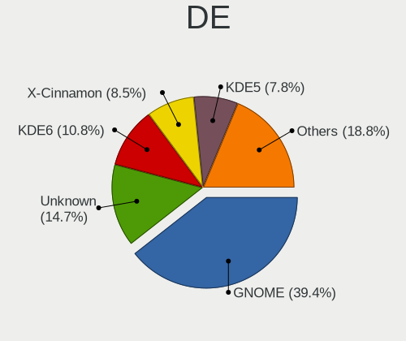
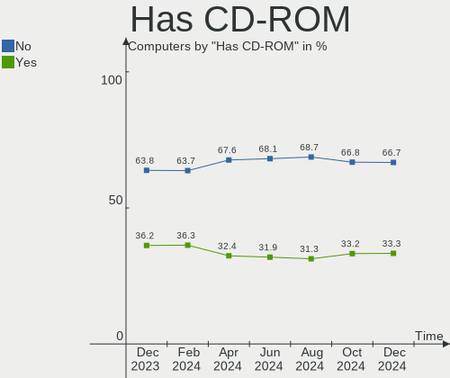
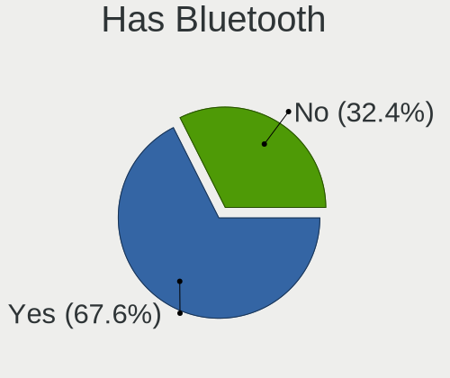
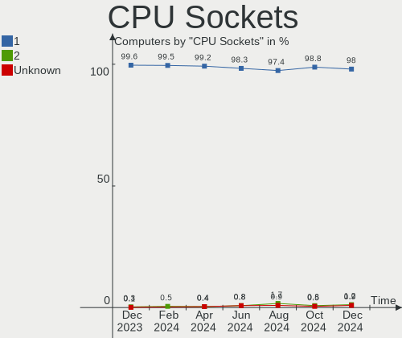
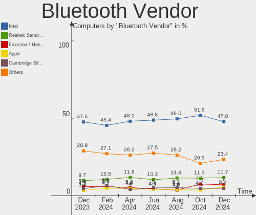
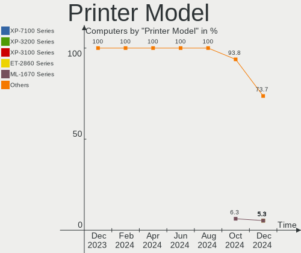

Linux in Germany - Hardware Trends
----------------------------------

A project to identify most popular hardware characteristics and track their change
over time based on data collected by Linux users at https://Linux-Hardware.org.

Anyone can contribute to this report by the [hw-probe](https://github.com/linuxhw/hw-probe) tool:

    sudo -E hw-probe -all -upload

This is a report for all computer types. See also reports for [desktops](/Location/Germany/Desktop/README.md) and [notebooks](/Location/Germany/Notebook/README.md).

Contents
--------

* [ System ](#system)
  - [ OS                       ](#os)
  - [ OS Family                ](#os-family)
  - [ Kernel                   ](#kernel)
  - [ Kernel Family            ](#kernel-family)
  - [ Kernel Major Ver.        ](#kernel-major-ver)
  - [ Arch                     ](#arch)
  - [ DE                       ](#de)
  - [ Display Server           ](#display-server)
  - [ Display Manager          ](#display-manager)
  - [ OS Lang                  ](#os-lang)
  - [ Boot Mode                ](#boot-mode)
  - [ Filesystem               ](#filesystem)
  - [ Part. scheme             ](#part-scheme)
  - [ Dual Boot with Linux/BSD ](#dual-boot-with-linuxbsd)
  - [ Dual Boot (Win)          ](#dual-boot-win)

* [ Board ](#board)
  - [ Vendor                   ](#vendor)
  - [ Model                    ](#model)
  - [ Model Family             ](#model-family)
  - [ MFG Year                 ](#mfg-year)
  - [ Form Factor              ](#form-factor)
  - [ Secure Boot              ](#secure-boot)
  - [ Coreboot                 ](#coreboot)
  - [ RAM Size                 ](#ram-size)
  - [ RAM Used                 ](#ram-used)
  - [ Total Drives             ](#total-drives)
  - [ Has CD-ROM               ](#has-cd-rom)
  - [ Has Ethernet             ](#has-ethernet)
  - [ Has WiFi                 ](#has-wifi)
  - [ Has Bluetooth            ](#has-bluetooth)

* [ Location ](#location)
  - [ Country                  ](#country)
  - [ City                     ](#city)

* [ Drives ](#drives)
  - [ Drive Vendor             ](#drive-vendor)
  - [ Drive Model              ](#drive-model)
  - [ HDD Vendor               ](#hdd-vendor)
  - [ SSD Vendor               ](#ssd-vendor)
  - [ Drive Kind               ](#drive-kind)
  - [ Drive Connector          ](#drive-connector)
  - [ Drive Size               ](#drive-size)
  - [ Space Total              ](#space-total)
  - [ Space Used               ](#space-used)
  - [ Malfunc. Drives          ](#malfunc-drives)
  - [ Malfunc. Drive Vendor    ](#malfunc-drive-vendor)
  - [ Malfunc. HDD Vendor      ](#malfunc-hdd-vendor)
  - [ Malfunc. Drive Kind      ](#malfunc-drive-kind)
  - [ Failed Drives            ](#failed-drives)
  - [ Failed Drive Vendor      ](#failed-drive-vendor)
  - [ Drive Status             ](#drive-status)

* [ Storage controller ](#storage-controller)
  - [ Storage Vendor           ](#storage-vendor)
  - [ Storage Model            ](#storage-model)
  - [ Storage Kind             ](#storage-kind)

* [ Processor ](#processor)
  - [ CPU Vendor               ](#cpu-vendor)
  - [ CPU Model                ](#cpu-model)
  - [ CPU Model Family         ](#cpu-model-family)
  - [ CPU Cores                ](#cpu-cores)
  - [ CPU Sockets              ](#cpu-sockets)
  - [ CPU Threads              ](#cpu-threads)
  - [ CPU Op-Modes             ](#cpu-op-modes)
  - [ CPU Microcode            ](#cpu-microcode)
  - [ CPU Microarch            ](#cpu-microarch)

* [ Graphics ](#graphics)
  - [ GPU Vendor               ](#gpu-vendor)
  - [ GPU Model                ](#gpu-model)
  - [ GPU Combo                ](#gpu-combo)
  - [ GPU Driver               ](#gpu-driver)
  - [ GPU Memory               ](#gpu-memory)

* [ Monitor ](#monitor)
  - [ Monitor Vendor           ](#monitor-vendor)
  - [ Monitor Model            ](#monitor-model)
  - [ Monitor Resolution       ](#monitor-resolution)
  - [ Monitor Diagonal         ](#monitor-diagonal)
  - [ Monitor Width            ](#monitor-width)
  - [ Aspect Ratio             ](#aspect-ratio)
  - [ Monitor Area             ](#monitor-area)
  - [ Pixel Density            ](#pixel-density)
  - [ Multiple Monitors        ](#multiple-monitors)

* [ Network ](#network)
  - [ Net Controller Vendor    ](#net-controller-vendor)
  - [ Net Controller Model     ](#net-controller-model)
  - [ Wireless Vendor          ](#wireless-vendor)
  - [ Wireless Model           ](#wireless-model)
  - [ Ethernet Vendor          ](#ethernet-vendor)
  - [ Ethernet Model           ](#ethernet-model)
  - [ Net Controller Kind      ](#net-controller-kind)
  - [ Used Controller          ](#used-controller)
  - [ NICs                     ](#nics)
  - [ IPv6                     ](#ipv6)

* [ Bluetooth ](#bluetooth)
  - [ Bluetooth Vendor         ](#bluetooth-vendor)
  - [ Bluetooth Model          ](#bluetooth-model)

* [ Sound ](#sound)
  - [ Sound Vendor             ](#sound-vendor)
  - [ Sound Model              ](#sound-model)

* [ Memory ](#memory)
  - [ Memory Vendor            ](#memory-vendor)
  - [ Memory Model             ](#memory-model)
  - [ Memory Kind              ](#memory-kind)
  - [ Memory Form Factor       ](#memory-form-factor)
  - [ Memory Size              ](#memory-size)
  - [ Memory Speed             ](#memory-speed)

* [ Printers & scanners ](#printers--scanners)
  - [ Printer Vendor           ](#printer-vendor)
  - [ Printer Model            ](#printer-model)
  - [ Scanner Vendor           ](#scanner-vendor)
  - [ Scanner Model            ](#scanner-model)

* [ Camera ](#camera)
  - [ Camera Vendor            ](#camera-vendor)
  - [ Camera Model             ](#camera-model)

* [ Security ](#security)
  - [ Fingerprint Vendor       ](#fingerprint-vendor)
  - [ Fingerprint Model        ](#fingerprint-model)
  - [ Chipcard Vendor          ](#chipcard-vendor)
  - [ Chipcard Model           ](#chipcard-model)

* [ Unsupported ](#unsupported)
  - [ Unsupported Devices      ](#unsupported-devices)
  - [ Unsupported Device Types ](#unsupported-device-types)

System
------

OS
--

Installed operating systems

| Name                         | Computers | Percent |
|------------------------------|-----------|---------|
| Linux Mint 20.3              | 67        | 14.32%  |
| Ubuntu 22.04                 | 64        | 13.68%  |
| Ubuntu 20.04                 | 51        | 10.9%   |
| OpenMandriva 4.3             | 26        | 5.56%   |
| Fedora 36                    | 22        | 4.7%    |
| Manjaro                      | 17        | 3.63%   |
| Pop!_OS 22.04                | 16        | 3.42%   |
| Debian 11                    | 15        | 3.21%   |
| Zorin 16                     | 14        | 2.99%   |
| Manjaro 21.2.6               | 14        | 2.99%   |
| Fedora 35                    | 11        | 2.35%   |
| openSUSE Tumbleweed-XXXXXXXX | 10        | 2.14%   |
| Arch Rolling                 | 10        | 2.14%   |
| openSUSE Leap-15.4           | 7         | 1.5%    |
| ArcoLinux Rolling            | 7         | 1.5%    |
| Xubuntu 20.04                | 6         | 1.28%   |
| KDE neon 20.04               | 6         | 1.28%   |
| Xubuntu 22.04                | 5         | 1.07%   |
| Ubuntu 21.10                 | 5         | 1.07%   |
| ROSA 12.2                    | 5         | 1.07%   |
| Kali 2022.2                  | 5         | 1.07%   |
| Arch                         | 5         | 1.07%   |
| Ubuntu Budgie 22.04          | 4         | 0.85%   |
| Pop!_OS 21.10                | 4         | 0.85%   |
| Linux Mint 20.2              | 4         | 0.85%   |
| Kubuntu 22.04                | 4         | 0.85%   |
| Kubuntu 20.04                | 3         | 0.64%   |
| Kubuntu 11                   | 3         | 0.64%   |
| Gentoo 2.7                   | 3         | 0.64%   |
| Debian Testing               | 3         | 0.64%   |
| Ubuntu MATE 22.04            | 2         | 0.43%   |
| Raspbian 11                  | 2         | 0.43%   |
| openSUSE Leap-15.3           | 2         | 0.43%   |
| OpenMandriva 4.2             | 2         | 0.43%   |
| MX 21                        | 2         | 0.43%   |
| Lubuntu 21.10                | 2         | 0.43%   |
| LinuxFX 10                   | 2         | 0.43%   |
| Linux Mint 20.1              | 2         | 0.43%   |
| Linux Mint 20                | 2         | 0.43%   |
| EndeavourOS Rolling          | 2         | 0.43%   |
| Elementary 6.1               | 2         | 0.43%   |
| Debian Unstable              | 2         | 0.43%   |
| BlackPanther 18.1            | 2         | 0.43%   |
| Zorin 15                     | 1         | 0.21%   |
| Xubuntu 21.10                | 1         | 0.21%   |
| Ubuntu MATE 20.04            | 1         | 0.21%   |
| Ubuntu Budgie 21.10          | 1         | 0.21%   |
| Ubuntu 21.04                 | 1         | 0.21%   |
| Ubuntu 18.04                 | 1         | 0.21%   |
| SteamOS 3.2                  | 1         | 0.21%   |
| Slackware 15.0               | 1         | 0.21%   |
| Siduction Unstable           | 1         | 0.21%   |
| Raspbian 10                  | 1         | 0.21%   |
| Pop!_OS 20.10                | 1         | 0.21%   |
| Lubuntu 20.04                | 1         | 0.21%   |
| LMDE 5                       | 1         | 0.21%   |
| LinuxFX 11                   | 1         | 0.21%   |
| Linux Lite 5.6               | 1         | 0.21%   |
| Lilidog 22                   | 1         | 0.21%   |
| Gentoo 2.8                   | 1         | 0.21%   |

OS Family
---------

OS without a version

| Name          | Computers | Percent |
|---------------|-----------|---------|
| Ubuntu        | 122       | 26.07%  |
| Linux Mint    | 75        | 16.03%  |
| Fedora        | 34        | 7.26%   |
| Manjaro       | 31        | 6.62%   |
| OpenMandriva  | 28        | 5.98%   |
| Debian        | 23        | 4.91%   |
| Pop!_OS       | 21        | 4.49%   |
| openSUSE      | 19        | 4.06%   |
| Zorin         | 15        | 3.21%   |
| Arch          | 15        | 3.21%   |
| Xubuntu       | 12        | 2.56%   |
| Kubuntu       | 10        | 2.14%   |
| ArcoLinux     | 7         | 1.5%    |
| KDE neon      | 6         | 1.28%   |
| Ubuntu Budgie | 5         | 1.07%   |
| ROSA          | 5         | 1.07%   |
| Kali          | 5         | 1.07%   |
| Gentoo        | 4         | 0.85%   |
| Ubuntu MATE   | 3         | 0.64%   |
| Raspbian      | 3         | 0.64%   |
| Lubuntu       | 3         | 0.64%   |
| LinuxFX       | 3         | 0.64%   |
| EndeavourOS   | 3         | 0.64%   |
| Elementary    | 3         | 0.64%   |
| MX            | 2         | 0.43%   |
| Clear Linux   | 2         | 0.43%   |
| BlackPanther  | 2         | 0.43%   |
| SteamOS       | 1         | 0.21%   |
| Slackware     | 1         | 0.21%   |
| Siduction     | 1         | 0.21%   |
| LMDE          | 1         | 0.21%   |
| Linux Lite    | 1         | 0.21%   |
| Lilidog       | 1         | 0.21%   |
| CentOS        | 1         | 0.21%   |

Kernel
------

Version of the Linux kernel

| Version                             | Computers | Percent |
|-------------------------------------|-----------|---------|
| 5.13.0-41-generic                   | 35        | 7.48%   |
| 5.4.0-110-generic                   | 29        | 6.2%    |
| 5.15.0-27-generic                   | 28        | 5.98%   |
| 5.16.7-desktop-1omv4003             | 25        | 5.34%   |
| 5.4.0-109-generic                   | 23        | 4.91%   |
| 5.13.0-40-generic                   | 23        | 4.91%   |
| 5.13.0-44-generic                   | 18        | 3.85%   |
| 5.4.0-113-generic                   | 17        | 3.63%   |
| 5.15.0-30-generic                   | 17        | 3.63%   |
| 5.15.0-33-generic                   | 13        | 2.78%   |
| 5.17.5-76051705-generic             | 12        | 2.56%   |
| 5.17.5-300.fc36.x86_64              | 8         | 1.71%   |
| 5.17.5-arch1-1                      | 7         | 1.5%    |
| 5.15.38-1-MANJARO                   | 7         | 1.5%    |
| 5.15.32-1-MANJARO                   | 7         | 1.5%    |
| 5.15.0-25-generic                   | 7         | 1.5%    |
| 5.10.0-14-amd64                     | 7         | 1.5%    |
| 5.17.4-1-default                    | 6         | 1.28%   |
| 5.16.19-76051619-generic            | 6         | 1.28%   |
| 5.17.8-300.fc36.x86_64              | 5         | 1.07%   |
| 5.17.4-200.fc35.x86_64              | 5         | 1.07%   |
| 5.17.1-3-MANJARO                    | 5         | 1.07%   |
| 5.14.21-150400.19-default           | 5         | 1.07%   |
| 5.10.74-generic-2rosa2021.1-x86_64  | 5         | 1.07%   |
| 5.16.0-kali7-amd64                  | 4         | 0.85%   |
| 5.4.0-91-generic                    | 3         | 0.64%   |
| 5.17.7-300.fc36.x86_64              | 3         | 0.64%   |
| 5.17.6-300.fc36.x86_64              | 3         | 0.64%   |
| 5.17.6-1-MANJARO                    | 3         | 0.64%   |
| 5.17.0-1-amd64                      | 3         | 0.64%   |
| 5.15.0-1006-raspi                   | 3         | 0.64%   |
| 5.4.0-74-generic                    | 2         | 0.43%   |
| 5.4.0-72-generic                    | 2         | 0.43%   |
| 5.4.0-107-generic                   | 2         | 0.43%   |
| 5.18.0-rc6-lp153.2.ged50f8f-default | 2         | 0.43%   |
| 5.17.9-zen1-1-zen                   | 2         | 0.43%   |
| 5.17.9-arch1-1                      | 2         | 0.43%   |
| 5.17.9-300.fc36.x86_64              | 2         | 0.43%   |
| 5.17.9-1-default                    | 2         | 0.43%   |
| 5.17.8-arch1-1                      | 2         | 0.43%   |
| 5.17.7-arch1-1                      | 2         | 0.43%   |
| 5.17.5-zen1-1-zen                   | 2         | 0.43%   |
| 5.17.5-200.fc35.x86_64              | 2         | 0.43%   |
| 5.17.0-2-amd64                      | 2         | 0.43%   |
| 5.16.20-2-MANJARO                   | 2         | 0.43%   |
| 5.16.18-1-MANJARO                   | 2         | 0.43%   |
| 5.16.0-0.bpo.4-amd64                | 2         | 0.43%   |
| 5.15.0-32-generic                   | 2         | 0.43%   |
| 5.15.0-28-generic                   | 2         | 0.43%   |
| 5.13.0-44-lowlatency                | 2         | 0.43%   |
| 5.13.0-19-generic                   | 2         | 0.43%   |
| 5.10.103-v7l+                       | 2         | 0.43%   |
| 5.10.0-13-amd64                     | 2         | 0.43%   |
| 5.6.14-desktop-2bP                  | 1         | 0.21%   |
| 5.6.0-050600-generic                | 1         | 0.21%   |
| 5.4.0-99-generic                    | 1         | 0.21%   |
| 5.4.0-89-generic                    | 1         | 0.21%   |
| 5.4.0-113-lowlatency                | 1         | 0.21%   |
| 5.4.0-110-lowlatency                | 1         | 0.21%   |
| 5.4.0-105-generic                   | 1         | 0.21%   |

Kernel Family
-------------

Linux kernel without a distro release

| Version  | Computers | Percent |
|----------|-----------|---------|
| 5.13.0   | 89        | 19.02%  |
| 5.4.0    | 83        | 17.74%  |
| 5.15.0   | 75        | 16.03%  |
| 5.17.5   | 33        | 7.05%   |
| 5.16.7   | 25        | 5.34%   |
| 5.10.0   | 13        | 2.78%   |
| 5.17.7   | 12        | 2.56%   |
| 5.17.4   | 11        | 2.35%   |
| 5.17.9   | 10        | 2.14%   |
| 5.17.8   | 9         | 1.92%   |
| 5.16.0   | 9         | 1.92%   |
| 5.15.32  | 9         | 1.92%   |
| 5.17.0   | 8         | 1.71%   |
| 5.17.6   | 7         | 1.5%    |
| 5.15.38  | 7         | 1.5%    |
| 5.18.0   | 6         | 1.28%   |
| 5.17.1   | 6         | 1.28%   |
| 5.16.19  | 6         | 1.28%   |
| 5.14.21  | 5         | 1.07%   |
| 5.10.74  | 5         | 1.07%   |
| 5.11.0   | 4         | 0.85%   |
| 5.15.41  | 3         | 0.64%   |
| 5.3.18   | 2         | 0.43%   |
| 5.17.11  | 2         | 0.43%   |
| 5.16.20  | 2         | 0.43%   |
| 5.16.18  | 2         | 0.43%   |
| 5.16.15  | 2         | 0.43%   |
| 5.16.13  | 2         | 0.43%   |
| 5.14.10  | 2         | 0.43%   |
| 5.14.0   | 2         | 0.43%   |
| 5.10.103 | 2         | 0.43%   |
| 5.6.14   | 1         | 0.21%   |
| 5.6.0    | 1         | 0.21%   |
| 5.16.9   | 1         | 0.21%   |
| 5.16.5   | 1         | 0.21%   |
| 5.16.12  | 1         | 0.21%   |
| 5.16.11  | 1         | 0.21%   |
| 5.15.5   | 1         | 0.21%   |
| 5.15.36  | 1         | 0.21%   |
| 5.11.12  | 1         | 0.21%   |
| 5.10.14  | 1         | 0.21%   |
| 4.19.113 | 1         | 0.21%   |
| 4.19.0   | 1         | 0.21%   |
| 4.18.16  | 1         | 0.21%   |
| 4.14.275 | 1         | 0.21%   |
| 3.10.0   | 1         | 0.21%   |

Kernel Major Ver.
-----------------

Linux kernel major version

| Version | Computers | Percent |
|---------|-----------|---------|
| 5.17    | 98        | 20.94%  |
| 5.15    | 96        | 20.51%  |
| 5.13    | 89        | 19.02%  |
| 5.4     | 83        | 17.74%  |
| 5.16    | 52        | 11.11%  |
| 5.10    | 21        | 4.49%   |
| 5.14    | 9         | 1.92%   |
| 5.18    | 6         | 1.28%   |
| 5.11    | 5         | 1.07%   |
| 5.6     | 2         | 0.43%   |
| 5.3     | 2         | 0.43%   |
| 4.19    | 2         | 0.43%   |
| 4.18    | 1         | 0.21%   |
| 4.14    | 1         | 0.21%   |
| 3.10    | 1         | 0.21%   |

Arch
----

OS architecture (x86_64, i586, etc.)

| Name    | Computers | Percent |
|---------|-----------|---------|
| x86_64  | 457       | 97.65%  |
| aarch64 | 6         | 1.28%   |
| armv7l  | 3         | 0.64%   |
| i686    | 2         | 0.43%   |

DE
--

Desktop Environment

| Name             | Computers | Percent |
|------------------|-----------|---------|
| GNOME            | 201       | 42.95%  |
| KDE5             | 97        | 20.73%  |
| X-Cinnamon       | 65        | 13.89%  |
| XFCE             | 48        | 10.26%  |
| MATE             | 12        | 2.56%   |
| Unknown          | 10        | 2.14%   |
| Budgie           | 6         | 1.28%   |
| LXQt             | 5         | 1.07%   |
| LXDE             | 4         | 0.85%   |
| Pantheon         | 3         | 0.64%   |
| Cinnamon         | 3         | 0.64%   |
| lightdm-xsession | 2         | 0.43%   |
| KDE              | 2         | 0.43%   |
| Unity            | 1         | 0.21%   |
| sway             | 1         | 0.21%   |
| qtile            | 1         | 0.21%   |
| LeftWM           | 1         | 0.21%   |
| KDE4             | 1         | 0.21%   |
| i3               | 1         | 0.21%   |
| GNOME Flashback  | 1         | 0.21%   |
| Deepin           | 1         | 0.21%   |
| cwm              | 1         | 0.21%   |
| bspwm            | 1         | 0.21%   |

Display Server
--------------

X11 or Wayland

| Name        | Computers | Percent |
|-------------|-----------|---------|
| X11         | 355       | 75.85%  |
| Wayland     | 100       | 21.37%  |
| Tty         | 9         | 1.92%   |
| Unknown     | 3         | 0.64%   |
| Unspecified | 1         | 0.21%   |

Display Manager
---------------

SDDM, LightDM, etc.

| Name    | Computers | Percent |
|---------|-----------|---------|
| Unknown | 157       | 33.55%  |
| GDM3    | 102       | 21.79%  |
| LightDM | 84        | 17.95%  |
| SDDM    | 79        | 16.88%  |
| GDM     | 42        | 8.97%   |
| SLiM    | 2         | 0.43%   |
| XDM     | 1         | 0.21%   |
| Ly      | 1         | 0.21%   |

OS Lang
-------

Language

| Lang    | Computers | Percent |
|---------|-----------|---------|
| de_DE   | 335       | 71.58%  |
| en_US   | 101       | 21.58%  |
| en_GB   | 11        | 2.35%   |
| C       | 6         | 1.28%   |
| Unknown | 5         | 1.07%   |
| ru_RU   | 2         | 0.43%   |
| it_IT   | 2         | 0.43%   |
| es_ES   | 2         | 0.43%   |
| pt_BR   | 1         | 0.21%   |
| POSIX   | 1         | 0.21%   |
| pl_PL   | 1         | 0.21%   |
| en_DK   | 1         | 0.21%   |

Boot Mode
---------

EFI or BIOS

| Mode | Computers | Percent |
|------|-----------|---------|
| EFI  | 235       | 50.21%  |
| BIOS | 233       | 49.79%  |

Filesystem
----------

Type of filesystem

| Type    | Computers | Percent |
|---------|-----------|---------|
| Ext4    | 369       | 78.85%  |
| Btrfs   | 62        | 13.25%  |
| Overlay | 28        | 5.98%   |
| Xfs     | 7         | 1.5%    |
| Zfs     | 1         | 0.21%   |
| F2fs    | 1         | 0.21%   |

Part. scheme
------------

Scheme of partitioning

| Type    | Computers | Percent |
|---------|-----------|---------|
| Unknown | 252       | 53.85%  |
| GPT     | 177       | 37.82%  |
| MBR     | 39        | 8.33%   |

Dual Boot with Linux/BSD
------------------------

Hosting more than one Linux/BSD

| Dual boot | Computers | Percent |
|-----------|-----------|---------|
| No        | 402       | 85.9%   |
| Yes       | 66        | 14.1%   |

Dual Boot (Win)
---------------

Hosting Linux and Windows

| Dual boot | Computers | Percent |
|-----------|-----------|---------|
| No        | 351       | 75%     |
| Yes       | 117       | 25%     |

Board
-----

Vendor
------

Motherboard manufacturer

| Name                    | Computers | Percent |
|-------------------------|-----------|---------|
| ASUSTek Computer        | 83        | 17.74%  |
| Lenovo                  | 71        | 15.17%  |
| Hewlett-Packard         | 41        | 8.76%   |
| Gigabyte Technology     | 39        | 8.33%   |
| MSI                     | 37        | 7.91%   |
| Dell                    | 33        | 7.05%   |
| Acer                    | 21        | 4.49%   |
| ASRock                  | 20        | 4.27%   |
| Medion                  | 19        | 4.06%   |
| Fujitsu                 | 12        | 2.56%   |
| TUXEDO                  | 8         | 1.71%   |
| Raspberry Pi Foundation | 8         | 1.71%   |
| Intel                   | 6         | 1.28%   |
| HUAWEI                  | 6         | 1.28%   |
| Apple                   | 5         | 1.07%   |
| Sony                    | 4         | 0.85%   |
| Razer                   | 4         | 0.85%   |
| Packard Bell            | 4         | 0.85%   |
| Fujitsu Siemens         | 4         | 0.85%   |
| Schenker                | 3         | 0.64%   |
| Samsung Electronics     | 3         | 0.64%   |
| Notebook                | 3         | 0.64%   |
| Foxconn                 | 3         | 0.64%   |
| Biostar                 | 3         | 0.64%   |
| Unknown                 | 3         | 0.64%   |
| Toshiba                 | 2         | 0.43%   |
| Shuttle                 | 2         | 0.43%   |
| LG Electronics          | 2         | 0.43%   |
| Google                  | 2         | 0.43%   |
| Chuwi                   | 2         | 0.43%   |
| AMI                     | 2         | 0.43%   |
| Wortmann AG             | 1         | 0.21%   |
| Valve                   | 1         | 0.21%   |
| Teclast                 | 1         | 0.21%   |
| Supermicro              | 1         | 0.21%   |
| SKIKK                   | 1         | 0.21%   |
| PC Specialist           | 1         | 0.21%   |
| Otazak                  | 1         | 0.21%   |
| Framework               | 1         | 0.21%   |
| EVGA                    | 1         | 0.21%   |
| BenQ                    | 1         | 0.21%   |
| AXDIA International     | 1         | 0.21%   |
| Avell High Performance  | 1         | 0.21%   |
| ALLDOCUBE               | 1         | 0.21%   |

Model
-----

Motherboard model

| Name                                                  | Computers | Percent |
|-------------------------------------------------------|-----------|---------|
| Unknown                                               | 7         | 1.5%    |
| RPi Raspberry Pi                                      | 5         | 1.07%   |
| MSI MS-7C37                                           | 4         | 0.85%   |
| Lenovo ThinkBook 16p Gen 2 20YM                       | 3         | 0.64%   |
| Gigabyte GA-78LMT-S2P                                 | 3         | 0.64%   |
| ASUS TUF Gaming B550-PLUS                             | 3         | 0.64%   |
| ASUS All Series                                       | 3         | 0.64%   |
| Samsung 950QDB                                        | 2         | 0.43%   |
| Razer Blade 14 - RZ09-0370                            | 2         | 0.43%   |
| MSI MS-7D46                                           | 2         | 0.43%   |
| MSI MS-7C02                                           | 2         | 0.43%   |
| MSI MS-7A38                                           | 2         | 0.43%   |
| MSI MS-7758                                           | 2         | 0.43%   |
| Lenovo ThinkPad P14s Gen 2a 21A00071GE                | 2         | 0.43%   |
| Lenovo IdeaPad S145-14IWL 81MU                        | 2         | 0.43%   |
| HUAWEI BOM-WXX9                                       | 2         | 0.43%   |
| HP Elite x2 1012 G2                                   | 2         | 0.43%   |
| HP Compaq 6200 Pro MT PC                              | 2         | 0.43%   |
| Gigabyte B550 AORUS PRO V2                            | 2         | 0.43%   |
| Gigabyte B550 AORUS PRO AC                            | 2         | 0.43%   |
| ASUS ZenBook UX325SA_UM325SA                          | 2         | 0.43%   |
| ASUS ZenBook UX325EA_UX325EA                          | 2         | 0.43%   |
| ASUS TUF Gaming B550M-E                               | 2         | 0.43%   |
| ASUS PRIME X370-PRO                                   | 2         | 0.43%   |
| ASUS M4A785TD-V EVO                                   | 2         | 0.43%   |
| ASRock X470 Taichi                                    | 2         | 0.43%   |
| Apple MacBookAir7,2                                   | 2         | 0.43%   |
| Wortmann AG TERRA_MOBILE_1450                         | 1         | 0.21%   |
| Valve Jupiter                                         | 1         | 0.21%   |
| TUXEDO Polaris 15 AMD Gen1                            | 1         | 0.21%   |
| TUXEDO N14xWU                                         | 1         | 0.21%   |
| TUXEDO InfinityBook S 15 Gen6                         | 1         | 0.21%   |
| TUXEDO InfinityBook Pro 14 Gen6                       | 1         | 0.21%   |
| Toshiba Satellite C670D-126                           | 1         | 0.21%   |
| Toshiba Satellite C50D-B                              | 1         | 0.21%   |
| Teclast X4                                            | 1         | 0.21%   |
| Supermicro X10SLL-F                                   | 1         | 0.21%   |
| Sony VPCCB3S1E                                        | 1         | 0.21%   |
| Sony VGN-FZ21M                                        | 1         | 0.21%   |
| Sony SVE1713A1EW                                      | 1         | 0.21%   |
| Sony SVE1712C1EW                                      | 1         | 0.21%   |
| SKIKK GREEN 4                                         | 1         | 0.21%   |
| Shuttle SG41                                          | 1         | 0.21%   |
| Shuttle DS20U                                         | 1         | 0.21%   |
| Schenker XMG FUSION 15 (XFU15L19)                     | 1         | 0.21%   |
| Schenker XMG CORE (TGL/M21)                           | 1         | 0.21%   |
| Schenker VISION 15 (SVS15E21)                         | 1         | 0.21%   |
| Samsung 535U3C                                        | 1         | 0.21%   |
| Razer Blade Stealth 13 Late 2019                      | 1         | 0.21%   |
| Razer Blade 15 Advanced Model (Early 2020) - RZ09-033 | 1         | 0.21%   |
| RPi Raspberry Pi 4 Model B Rev 1.2                    | 1         | 0.21%   |
| RPi Raspberry Pi 4 Model B Rev 1.1                    | 1         | 0.21%   |
| RPi Raspberry Pi 3 Model B Rev 1.2                    | 1         | 0.21%   |
| PC Specialist Recoil II                               | 1         | 0.21%   |
| Packard Bell IMEDIA S3800                             | 1         | 0.21%   |
| Packard Bell EasyNote TE69CXP                         | 1         | 0.21%   |
| Packard Bell EasyNote LM98                            | 1         | 0.21%   |
| Packard Bell DOT S                                    | 1         | 0.21%   |
| Otazak iPC45                                          | 1         | 0.21%   |
| Notebook V15x_V17xPNKPNJPNH                           | 1         | 0.21%   |

Model Family
------------

Motherboard model prefix

| Name                    | Computers | Percent |
|-------------------------|-----------|---------|
| Lenovo ThinkPad         | 41        | 8.76%   |
| Acer Aspire             | 15        | 3.21%   |
| Lenovo IdeaPad          | 11        | 2.35%   |
| ASUS PRIME              | 11        | 2.35%   |
| ASUS ROG                | 9         | 1.92%   |
| RPi Raspberry           | 8         | 1.71%   |
| Dell Latitude           | 8         | 1.71%   |
| ASUS TUF                | 8         | 1.71%   |
| HP Compaq               | 7         | 1.5%    |
| ASUS VivoBook           | 7         | 1.5%    |
| Unknown                 | 7         | 1.5%    |
| Dell XPS                | 6         | 1.28%   |
| HP ProBook              | 5         | 1.07%   |
| HP Laptop               | 5         | 1.07%   |
| Gigabyte B550           | 5         | 1.07%   |
| Dell Vostro             | 5         | 1.07%   |
| ASUS ZenBook            | 5         | 1.07%   |
| Razer Blade             | 4         | 0.85%   |
| MSI MS-7C37             | 4         | 0.85%   |
| Medion Akoya            | 4         | 0.85%   |
| Lenovo ThinkBook        | 4         | 0.85%   |
| HP EliteBook            | 4         | 0.85%   |
| Fujitsu LIFEBOOK        | 4         | 0.85%   |
| Fujitsu ESPRIMO         | 4         | 0.85%   |
| Fujitsu CELSIUS         | 4         | 0.85%   |
| Dell OptiPlex           | 4         | 0.85%   |
| Dell Inspiron           | 4         | 0.85%   |
| Lenovo ThinkCentre      | 3         | 0.64%   |
| HP ZBook                | 3         | 0.64%   |
| HP Pavilion             | 3         | 0.64%   |
| HP Elite                | 3         | 0.64%   |
| Gigabyte GA-78LMT-S2P   | 3         | 0.64%   |
| Dell Studio             | 3         | 0.64%   |
| Dell Precision          | 3         | 0.64%   |
| ASUS All                | 3         | 0.64%   |
| TUXEDO InfinityBook     | 2         | 0.43%   |
| Toshiba Satellite       | 2         | 0.43%   |
| Schenker XMG            | 2         | 0.43%   |
| Samsung 950QDB          | 2         | 0.43%   |
| Packard Bell EasyNote   | 2         | 0.43%   |
| MSI MS-7D46             | 2         | 0.43%   |
| MSI MS-7C02             | 2         | 0.43%   |
| MSI MS-7A38             | 2         | 0.43%   |
| MSI MS-7758             | 2         | 0.43%   |
| HUAWEI BOM-WXX9         | 2         | 0.43%   |
| HP 255                  | 2         | 0.43%   |
| Gigabyte X570           | 2         | 0.43%   |
| Gigabyte B550M          | 2         | 0.43%   |
| Fujitsu Siemens ESPRIMO | 2         | 0.43%   |
| ASUS SABERTOOTH         | 2         | 0.43%   |
| ASUS M4A785TD-V         | 2         | 0.43%   |
| ASUS CROSSHAIR          | 2         | 0.43%   |
| ASUS ASUS               | 2         | 0.43%   |
| ASRock X470             | 2         | 0.43%   |
| ASRock B450             | 2         | 0.43%   |
| Apple MacBookAir7       | 2         | 0.43%   |
| Wortmann AG TERRA       | 1         | 0.21%   |
| Valve Jupiter           | 1         | 0.21%   |
| TUXEDO Polaris          | 1         | 0.21%   |
| TUXEDO N14xWU           | 1         | 0.21%   |

MFG Year
--------

Motherboard manufacture year

| Year    | Computers | Percent |
|---------|-----------|---------|
| 2021    | 70        | 14.96%  |
| 2020    | 56        | 11.97%  |
| 2012    | 48        | 10.26%  |
| 2019    | 38        | 8.12%   |
| 2018    | 36        | 7.69%   |
| 2017    | 25        | 5.34%   |
| 2011    | 24        | 5.13%   |
| 2013    | 22        | 4.7%    |
| 2016    | 21        | 4.49%   |
| 2014    | 21        | 4.49%   |
| 2009    | 21        | 4.49%   |
| 2010    | 18        | 3.85%   |
| 2015    | 17        | 3.63%   |
| 2022    | 16        | 3.42%   |
| 2008    | 13        | 2.78%   |
| Unknown | 9         | 1.92%   |
| 2006    | 7         | 1.5%    |
| 2007    | 5         | 1.07%   |
| 2004    | 1         | 0.21%   |

Form Factor
-----------

Physical design of the computer

| Name           | Computers | Percent |
|----------------|-----------|---------|
| Notebook       | 219       | 46.79%  |
| Desktop        | 208       | 44.44%  |
| Convertible    | 19        | 4.06%   |
| System on chip | 9         | 1.92%   |
| Mini pc        | 6         | 1.28%   |
| Tablet         | 4         | 0.85%   |
| All in one     | 2         | 0.43%   |
| Server         | 1         | 0.21%   |

Secure Boot
-----------

Enabled or disabled

| State    | Computers | Percent |
|----------|-----------|---------|
| Disabled | 429       | 91.67%  |
| Enabled  | 39        | 8.33%   |

Coreboot
--------

Have coreboot on board

| Used | Computers | Percent |
|------|-----------|---------|
| No   | 464       | 99.15%  |
| Yes  | 4         | 0.85%   |

RAM Size
--------

Total RAM memory

| Size in GB  | Computers | Percent |
|-------------|-----------|---------|
| 16.01-24.0  | 98        | 20.94%  |
| 4.01-8.0    | 94        | 20.09%  |
| 8.01-16.0   | 84        | 17.95%  |
| 32.01-64.0  | 81        | 17.31%  |
| 3.01-4.0    | 71        | 15.17%  |
| 64.01-256.0 | 17        | 3.63%   |
| 24.01-32.0  | 9         | 1.92%   |
| 1.01-2.0    | 8         | 1.71%   |
| 2.01-3.0    | 3         | 0.64%   |
| 0.51-1.0    | 3         | 0.64%   |

RAM Used
--------

Used RAM memory

| Used GB    | Computers | Percent |
|------------|-----------|---------|
| 1.01-2.0   | 183       | 39.1%   |
| 2.01-3.0   | 114       | 24.36%  |
| 4.01-8.0   | 62        | 13.25%  |
| 3.01-4.0   | 57        | 12.18%  |
| 0.51-1.0   | 25        | 5.34%   |
| 8.01-16.0  | 18        | 3.85%   |
| 16.01-24.0 | 4         | 0.85%   |
| 0.01-0.5   | 4         | 0.85%   |
| 24.01-32.0 | 1         | 0.21%   |

Total Drives
------------

Number of drives on board

| Drives | Computers | Percent |
|--------|-----------|---------|
| 1      | 249       | 53.21%  |
| 2      | 123       | 26.28%  |
| 3      | 47        | 10.04%  |
| 4      | 24        | 5.13%   |
| 5      | 8         | 1.71%   |
| 6      | 7         | 1.5%    |
| 0      | 5         | 1.07%   |
| 8      | 2         | 0.43%   |
| 7      | 2         | 0.43%   |
| 9      | 1         | 0.21%   |

Has CD-ROM
----------

Has CD-ROM on board

| Presented | Computers | Percent |
|-----------|-----------|---------|
| No        | 283       | 60.47%  |
| Yes       | 185       | 39.53%  |

Has Ethernet
------------

Has Ethernet on board

| Presented | Computers | Percent |
|-----------|-----------|---------|
| Yes       | 396       | 84.62%  |
| No        | 72        | 15.38%  |

Has WiFi
--------

Has WiFi module

| Presented | Computers | Percent |
|-----------|-----------|---------|
| Yes       | 320       | 68.38%  |
| No        | 148       | 31.62%  |

Has Bluetooth
-------------

Has Bluetooth module

| Presented | Computers | Percent |
|-----------|-----------|---------|
| Yes       | 281       | 60.04%  |
| No        | 187       | 39.96%  |

Location
--------

Country
-------

Geographic location (country)

| Country | Computers | Percent |
|---------|-----------|---------|
| Germany | 468       | 100%    |

City
----

Geographic location (city)

| City                | Computers | Percent |
|---------------------|-----------|---------|
| Berlin              | 43        | 9.19%   |
| Munich              | 22        | 4.7%    |
| Frankfurt am Main   | 18        | 3.85%   |
| Hamburg             | 17        | 3.63%   |
| Stuttgart           | 12        | 2.56%   |
| Karlsruhe           | 8         | 1.71%   |
| Leipzig             | 7         | 1.5%    |
| Cologne             | 7         | 1.5%    |
| Bielefeld           | 7         | 1.5%    |
| Münster            | 5         | 1.07%   |
| Mannheim            | 5         | 1.07%   |
| Haßfurt            | 5         | 1.07%   |
| Dortmund            | 5         | 1.07%   |
| Bonn                | 5         | 1.07%   |
| Nuremberg           | 4         | 0.85%   |
| Kiel                | 4         | 0.85%   |
| Duisburg            | 4         | 0.85%   |
| Bremen              | 4         | 0.85%   |
| Wuppertal           | 3         | 0.64%   |
| Worms               | 3         | 0.64%   |
| Ludwigsburg         | 3         | 0.64%   |
| Leverkusen          | 3         | 0.64%   |
| Dresden             | 3         | 0.64%   |
| Braunschweig        | 3         | 0.64%   |
| Augsburg            | 3         | 0.64%   |
| Weimar              | 2         | 0.43%   |
| Vechta              | 2         | 0.43%   |
| Ulm                 | 2         | 0.43%   |
| Troisdorf           | 2         | 0.43%   |
| Schwieberdingen     | 2         | 0.43%   |
| Schrobenhausen      | 2         | 0.43%   |
| Sankt Leon-Rot      | 2         | 0.43%   |
| Saarlouis           | 2         | 0.43%   |
| Saarbrücken        | 2         | 0.43%   |
| Raunheim            | 2         | 0.43%   |
| Niederndodeleben    | 2         | 0.43%   |
| Niederkassel        | 2         | 0.43%   |
| Muelheim-Kaerlich   | 2         | 0.43%   |
| Mönchengladbach    | 2         | 0.43%   |
| Langenhagen         | 2         | 0.43%   |
| Krefeld             | 2         | 0.43%   |
| Kollow              | 2         | 0.43%   |
| Kirchgellersen      | 2         | 0.43%   |
| Kehrig              | 2         | 0.43%   |
| Ingelheim am Rhein  | 2         | 0.43%   |
| Hildesheim          | 2         | 0.43%   |
| Herne               | 2         | 0.43%   |
| Halle               | 2         | 0.43%   |
| Gross-Umstadt       | 2         | 0.43%   |
| Gersheim            | 2         | 0.43%   |
| Garching            | 2         | 0.43%   |
| Garbsen             | 2         | 0.43%   |
| Fürstenfeldbruck   | 2         | 0.43%   |
| Falkenstein         | 2         | 0.43%   |
| Esslingen am Neckar | 2         | 0.43%   |
| Essen               | 2         | 0.43%   |
| Erlangen            | 2         | 0.43%   |
| Dachau              | 2         | 0.43%   |
| Burgkunstadt        | 2         | 0.43%   |
| Bochum              | 2         | 0.43%   |

Drives
------

Drive Vendor
------------

Hard drive vendors

| Vendor                         | Computers | Drives | Percent |
|--------------------------------|-----------|--------|---------|
| Samsung Electronics            | 152       | 198    | 21.02%  |
| WDC                            | 94        | 114    | 13%     |
| Seagate                        | 91        | 115    | 12.59%  |
| SanDisk                        | 50        | 58     | 6.92%   |
| Kingston                       | 37        | 40     | 5.12%   |
| Crucial                        | 37        | 42     | 5.12%   |
| Toshiba                        | 34        | 38     | 4.7%    |
| Unknown                        | 25        | 28     | 3.46%   |
| Intel                          | 20        | 23     | 2.77%   |
| SK Hynix                       | 19        | 19     | 2.63%   |
| Micron Technology              | 19        | 22     | 2.63%   |
| Hitachi                        | 16        | 17     | 2.21%   |
| Intenso                        | 13        | 19     | 1.8%    |
| Phison                         | 11        | 11     | 1.52%   |
| HGST                           | 8         | 8      | 1.11%   |
| A-DATA Technology              | 8         | 8      | 1.11%   |
| OCZ                            | 5         | 5      | 0.69%   |
| China                          | 5         | 5      | 0.69%   |
| LITEON                         | 4         | 4      | 0.55%   |
| Leven                          | 4         | 4      | 0.55%   |
| ASMT                           | 4         | 5      | 0.55%   |
| Apple                          | 4         | 5      | 0.55%   |
| Unknown                        | 4         | 4      | 0.55%   |
| SPCC                           | 3         | 3      | 0.41%   |
| PNY                            | 3         | 3      | 0.41%   |
| KIOXIA                         | 3         | 3      | 0.41%   |
| Union Memory (Shenzhen)        | 2         | 2      | 0.28%   |
| Union Memory                   | 2         | 2      | 0.28%   |
| PLEXTOR                        | 2         | 2      | 0.28%   |
| Netac                          | 2         | 2      | 0.28%   |
| Micron/Crucial Technology      | 2         | 2      | 0.28%   |
| Hewlett-Packard                | 2         | 2      | 0.28%   |
| Fujitsu                        | 2         | 2      | 0.28%   |
| Corsair                        | 2         | 2      | 0.28%   |
| XrayDisk                       | 1         | 1      | 0.14%   |
| XPG                            | 1         | 1      | 0.14%   |
| W800S                          | 1         | 1      | 0.14%   |
| ViperTeq                       | 1         | 1      | 0.14%   |
| USB                            | 1         | 1      | 0.14%   |
| UMIS                           | 1         | 1      | 0.14%   |
| TYPEC 2T                       | 1         | 1      | 0.14%   |
| Transcend                      | 1         | 1      | 0.14%   |
| Teclast                        | 1         | 1      | 0.14%   |
| Team                           | 1         | 1      | 0.14%   |
| TCSUNBOW-X5                    | 1         | 1      | 0.14%   |
| TCSUNBOW                       | 1         | 1      | 0.14%   |
| SSK                            | 1         | 1      | 0.14%   |
| Solid State Storage Technology | 1         | 1      | 0.14%   |
| Silicon Motion                 | 1         | 1      | 0.14%   |
| SABRENT                        | 1         | 1      | 0.14%   |
| Patriot                        | 1         | 1      | 0.14%   |
| OSCOO                          | 1         | 1      | 0.14%   |
| Mass                           | 1         | 1      | 0.14%   |
| LITEONIT                       | 1         | 1      | 0.14%   |
| Lenovo                         | 1         | 1      | 0.14%   |
| KIOXIA-EXCERIA                 | 1         | 1      | 0.14%   |
| Kingston Technology Company    | 1         | 1      | 0.14%   |
| KingSpec                       | 1         | 1      | 0.14%   |
| JetFlash                       | 1         | 1      | 0.14%   |
| IB-AC703                       | 1         | 1      | 0.14%   |

Drive Model
-----------

Hard drive models

| Model                            | Computers | Percent |
|----------------------------------|-----------|---------|
| Samsung NVMe SSD Drive 1TB       | 15        | 1.84%   |
| SanDisk SSD PLUS 240GB           | 10        | 1.23%   |
| Crucial CT1000MX500SSD1 1TB      | 9         | 1.11%   |
| Samsung SSD 980 PRO 1TB          | 8         | 0.98%   |
| Samsung SSD 970 EVO Plus 1TB     | 8         | 0.98%   |
| Samsung SSD 860 EVO 500GB        | 8         | 0.98%   |
| Samsung SSD 860 EVO 1TB          | 8         | 0.98%   |
| Samsung SSD 850 EVO 500GB        | 8         | 0.98%   |
| Samsung SSD 840 EVO 120GB        | 8         | 0.98%   |
| Toshiba MQ01ABD100 1TB           | 6         | 0.74%   |
| Samsung NVMe SSD Drive 1024GB    | 6         | 0.74%   |
| Unknown MMC Card  32GB           | 5         | 0.61%   |
| SanDisk SDSSDA240G 240GB         | 5         | 0.61%   |
| Samsung SSD 970 EVO Plus 500GB   | 5         | 0.61%   |
| Samsung SSD 860 EVO 250GB        | 5         | 0.61%   |
| Samsung NVMe SSD Drive 512GB     | 5         | 0.61%   |
| Crucial CT480BX500SSD1 480GB     | 5         | 0.61%   |
| SK Hynix NVMe SSD Drive 512GB    | 4         | 0.49%   |
| Seagate ST500DM002-1BD142 500GB  | 4         | 0.49%   |
| Seagate ST31000524AS 1TB         | 4         | 0.49%   |
| Seagate ST1000LM048-2E7172 1TB   | 4         | 0.49%   |
| Seagate ST1000DM010-2EP102 1TB   | 4         | 0.49%   |
| SanDisk SSD PLUS 480GB           | 4         | 0.49%   |
| Samsung SSD 850 EVO 250GB        | 4         | 0.49%   |
| Samsung NVMe SSD Drive 2TB       | 4         | 0.49%   |
| Samsung NVMe SSD Drive 250GB     | 4         | 0.49%   |
| Micron NVMe SSD Drive 512GB      | 4         | 0.49%   |
| Kingston NVMe SSD Drive 500GB    | 4         | 0.49%   |
| Unknown                          | 4         | 0.49%   |
| WDC WD10EZEX-08WN4A0 1TB         | 3         | 0.37%   |
| WDC WD10EARS-00Y5B1 1TB          | 3         | 0.37%   |
| Unknown SD/MMC/MS PRO 999GB      | 3         | 0.37%   |
| Toshiba HDWD110 1TB              | 3         | 0.37%   |
| Toshiba DT01ACA100 1TB           | 3         | 0.37%   |
| Seagate ST2000DM008-2FR102 2TB   | 3         | 0.37%   |
| Seagate ST2000DM001-9YN164 2TB   | 3         | 0.37%   |
| Seagate ST1000DM003-1ER162 1TB   | 3         | 0.37%   |
| Seagate Expansion 4TB            | 3         | 0.37%   |
| SanDisk SDSSDH3 1T02 1024GB      | 3         | 0.37%   |
| SanDisk SDSSDA120G 120GB         | 3         | 0.37%   |
| Sandisk NVMe SSD Drive 512GB     | 3         | 0.37%   |
| Samsung SSD 860 QVO 1TB          | 3         | 0.37%   |
| Samsung SSD 860 EVO M.2 500GB    | 3         | 0.37%   |
| Samsung SSD 850 EVO mSATA 250GB  | 3         | 0.37%   |
| Samsung SSD 850 EVO 1TB          | 3         | 0.37%   |
| Samsung SSD 840 EVO 500GB        | 3         | 0.37%   |
| Samsung NVMe SSD Drive 256GB     | 3         | 0.37%   |
| Samsung HD103SI 1TB              | 3         | 0.37%   |
| Kingston SNVS500G 500GB          | 3         | 0.37%   |
| Kingston SA400S37120G 120GB SSD  | 3         | 0.37%   |
| Crucial CT500MX500SSD1 500GB     | 3         | 0.37%   |
| Crucial CT250MX500SSD1 250GB     | 3         | 0.37%   |
| Crucial CT240BX500SSD1 240GB     | 3         | 0.37%   |
| ASMT 2115 2TB                    | 3         | 0.37%   |
| WDC WDS500G2B0B-00YS70 500GB SSD | 2         | 0.25%   |
| WDC WD5000AAKX-001CA0 500GB      | 2         | 0.25%   |
| WDC WD40EZRZ-00GXCB0 4TB         | 2         | 0.25%   |
| WDC WD30EFRX-68EUZN0 3TB         | 2         | 0.25%   |
| WDC WD20EZRX-00D8PB0 2TB         | 2         | 0.25%   |
| WDC WD20EZBX-00AYRA0 2TB         | 2         | 0.25%   |

HDD Vendor
----------

Hard disk drive vendors

| Vendor              | Computers | Drives | Percent |
|---------------------|-----------|--------|---------|
| Seagate             | 88        | 112    | 35.63%  |
| WDC                 | 76        | 92     | 30.77%  |
| Toshiba             | 25        | 29     | 10.12%  |
| Samsung Electronics | 16        | 18     | 6.48%   |
| Hitachi             | 16        | 17     | 6.48%   |
| HGST                | 8         | 8      | 3.24%   |
| Unknown             | 5         | 5      | 2.02%   |
| ASMT                | 3         | 4      | 1.21%   |
| Fujitsu             | 2         | 2      | 0.81%   |
| Apple               | 2         | 2      | 0.81%   |
| USB                 | 1         | 1      | 0.4%    |
| SABRENT             | 1         | 1      | 0.4%    |
| Intenso             | 1         | 1      | 0.4%    |
| IB-AC703            | 1         | 1      | 0.4%    |
| Hewlett-Packard     | 1         | 1      | 0.4%    |
| ASUSTOR             | 1         | 2      | 0.4%    |

SSD Vendor
----------

Solid state drive vendors

| Vendor              | Computers | Drives | Percent |
|---------------------|-----------|--------|---------|
| Samsung Electronics | 77        | 89     | 29.39%  |
| SanDisk             | 40        | 47     | 15.27%  |
| Crucial             | 32        | 37     | 12.21%  |
| Kingston            | 19        | 22     | 7.25%   |
| Intel               | 10        | 10     | 3.82%   |
| WDC                 | 8         | 8      | 3.05%   |
| Micron Technology   | 8         | 9      | 3.05%   |
| Intenso             | 7         | 10     | 2.67%   |
| A-DATA Technology   | 6         | 6      | 2.29%   |
| SK Hynix            | 4         | 4      | 1.53%   |
| OCZ                 | 4         | 4      | 1.53%   |
| China               | 4         | 4      | 1.53%   |
| PNY                 | 3         | 3      | 1.15%   |
| Phison              | 3         | 3      | 1.15%   |
| LITEON              | 3         | 3      | 1.15%   |
| Leven               | 3         | 3      | 1.15%   |
| Apple               | 3         | 3      | 1.15%   |
| Union Memory        | 2         | 2      | 0.76%   |
| Toshiba             | 2         | 2      | 0.76%   |
| PLEXTOR             | 2         | 2      | 0.76%   |
| Netac               | 2         | 2      | 0.76%   |
| Unknown             | 2         | 2      | 0.76%   |
| W800S               | 1         | 1      | 0.38%   |
| ViperTeq            | 1         | 1      | 0.38%   |
| TYPEC 2T            | 1         | 1      | 0.38%   |
| Transcend           | 1         | 1      | 0.38%   |
| Teclast             | 1         | 1      | 0.38%   |
| TCSUNBOW-X5         | 1         | 1      | 0.38%   |
| Patriot             | 1         | 1      | 0.38%   |
| OSCOO               | 1         | 1      | 0.38%   |
| LITEONIT            | 1         | 1      | 0.38%   |
| KingSpec            | 1         | 1      | 0.38%   |
| HS-SSD-G100N        | 1         | 1      | 0.38%   |
| Hewlett-Packard     | 1         | 1      | 0.38%   |
| GOODRAM             | 1         | 1      | 0.38%   |
| FORESEE             | 1         | 1      | 0.38%   |
| DREVO               | 1         | 1      | 0.38%   |
| BIWIN               | 1         | 1      | 0.38%   |
| ASMedia             | 1         | 1      | 0.38%   |
| ADATA SU            | 1         | 1      | 0.38%   |

Drive Kind
----------

HDD or SSD

| Kind    | Computers | Drives | Percent |
|---------|-----------|--------|---------|
| SSD     | 225       | 293    | 34.88%  |
| HDD     | 196       | 296    | 30.39%  |
| NVMe    | 184       | 217    | 28.53%  |
| MMC     | 25        | 26     | 3.88%   |
| Unknown | 15        | 20     | 2.33%   |

Drive Connector
---------------

SATA, SAS, NVMe, etc.

| Type | Computers | Drives | Percent |
|------|-----------|--------|---------|
| SATA | 330       | 562    | 57.69%  |
| NVMe | 184       | 217    | 32.17%  |
| SAS  | 33        | 47     | 5.77%   |
| MMC  | 25        | 26     | 4.37%   |

Drive Size
----------

Size of hard drive

| Size in TB | Computers | Drives | Percent |
|------------|-----------|--------|---------|
| 0.01-0.5   | 251       | 315    | 54.33%  |
| 0.51-1.0   | 124       | 161    | 26.84%  |
| 1.01-2.0   | 46        | 56     | 9.96%   |
| 3.01-4.0   | 16        | 20     | 3.46%   |
| 4.01-10.0  | 11        | 15     | 2.38%   |
| 2.01-3.0   | 10        | 14     | 2.16%   |
| 10.01-20.0 | 4         | 8      | 0.87%   |

Space Total
-----------

Amount of disk space available on the file system

| Size in GB     | Computers | Percent |
|----------------|-----------|---------|
| 101-250        | 125       | 26.71%  |
| 251-500        | 95        | 20.3%   |
| 501-1000       | 75        | 16.03%  |
| More than 3000 | 47        | 10.04%  |
| 1001-2000      | 44        | 9.4%    |
| 1-20           | 23        | 4.91%   |
| 2001-3000      | 17        | 3.63%   |
| 21-50          | 14        | 2.99%   |
| 51-100         | 14        | 2.99%   |
| Unknown        | 14        | 2.99%   |

Space Used
----------

Amount of used disk space

| Used GB        | Computers | Percent |
|----------------|-----------|---------|
| 1-20           | 135       | 28.85%  |
| 21-50          | 88        | 18.8%   |
| 101-250        | 63        | 13.46%  |
| 51-100         | 58        | 12.39%  |
| 251-500        | 35        | 7.48%   |
| 501-1000       | 29        | 6.2%    |
| 1001-2000      | 17        | 3.63%   |
| More than 3000 | 16        | 3.42%   |
| Unknown        | 14        | 2.99%   |
| 2001-3000      | 13        | 2.78%   |

Malfunc. Drives
---------------

Drive models with a malfunction

| Model                                    | Computers | Drives | Percent |
|------------------------------------------|-----------|--------|---------|
| Samsung Electronics SSD 840 EVO 120GB    | 4         | 4      | 12.12%  |
| WDC WDS240G2G0B-00EPW0 240GB SSD         | 1         | 1      | 3.03%   |
| WDC WD6400AACS-00G8B1 640GB              | 1         | 1      | 3.03%   |
| WDC WD5003ABYZ-011FA0 500GB              | 1         | 1      | 3.03%   |
| WDC WD5000AAKX-001CA0 500GB              | 1         | 2      | 3.03%   |
| WDC WD10EARS-00Y5B1 1TB                  | 1         | 1      | 3.03%   |
| WDC WD10EADS-00L5B1 1TB                  | 1         | 1      | 3.03%   |
| Unknown MM0500EANCR 500GB                | 1         | 1      | 3.03%   |
| Transcend TS240GMTS420S 240GB SSD        | 1         | 1      | 3.03%   |
| Toshiba MQ01ABD100 1TB                   | 1         | 1      | 3.03%   |
| Toshiba MK5055GSX 500GB                  | 1         | 1      | 3.03%   |
| SPCC M.2 PCIe SSD 256GB                  | 1         | 1      | 3.03%   |
| Seagate ST500LM000-1EJ162 500GB          | 1         | 1      | 3.03%   |
| Seagate ST500DM002-1BD142 500GB          | 1         | 1      | 3.03%   |
| Seagate ST3500413AS 500GB                | 1         | 2      | 3.03%   |
| Seagate ST32000542AS 2TB                 | 1         | 1      | 3.03%   |
| Seagate ST310212A 10GB                   | 1         | 1      | 3.03%   |
| Seagate ST2000LM015-2E8174 2TB           | 1         | 1      | 3.03%   |
| Seagate ST2000DM001-9YN164 2TB           | 1         | 1      | 3.03%   |
| Seagate ST1000DX002-2DV162 1TB           | 1         | 1      | 3.03%   |
| Seagate ST1000DX001-1CM162 1TB           | 1         | 1      | 3.03%   |
| SanDisk SSD PLUS 480GB                   | 1         | 1      | 3.03%   |
| Samsung Electronics SSD 970 EVO Plus 1TB | 1         | 1      | 3.03%   |
| Samsung Electronics SP2014N 200GB        | 1         | 1      | 3.03%   |
| Samsung Electronics HM160HC 160GB        | 1         | 1      | 3.03%   |
| Samsung Electronics HD502HJ 500GB        | 1         | 1      | 3.03%   |
| Hitachi HTS545050B9A300 500GB            | 1         | 1      | 3.03%   |
| HGST HTS545050A7E380 500GB               | 1         | 1      | 3.03%   |
| Crucial CT128M550SSD3 128GB              | 1         | 1      | 3.03%   |
| A-DATA Technology SX8100NP 4TB           | 1         | 1      | 3.03%   |

Malfunc. Drive Vendor
---------------------

Vendors of faulty drives

| Vendor              | Computers | Drives | Percent |
|---------------------|-----------|--------|---------|
| Seagate             | 9         | 10     | 27.27%  |
| Samsung Electronics | 8         | 8      | 24.24%  |
| WDC                 | 6         | 7      | 18.18%  |
| Toshiba             | 2         | 2      | 6.06%   |
| Unknown             | 1         | 1      | 3.03%   |
| Transcend           | 1         | 1      | 3.03%   |
| SPCC                | 1         | 1      | 3.03%   |
| SanDisk             | 1         | 1      | 3.03%   |
| Hitachi             | 1         | 1      | 3.03%   |
| HGST                | 1         | 1      | 3.03%   |
| Crucial             | 1         | 1      | 3.03%   |
| A-DATA Technology   | 1         | 1      | 3.03%   |

Malfunc. HDD Vendor
-------------------

Vendors of faulty HDD drives

| Vendor              | Computers | Drives | Percent |
|---------------------|-----------|--------|---------|
| Seagate             | 9         | 10     | 40.91%  |
| WDC                 | 5         | 6      | 22.73%  |
| Samsung Electronics | 3         | 3      | 13.64%  |
| Toshiba             | 2         | 2      | 9.09%   |
| Unknown             | 1         | 1      | 4.55%   |
| Hitachi             | 1         | 1      | 4.55%   |
| HGST                | 1         | 1      | 4.55%   |

Malfunc. Drive Kind
-------------------

Kinds of faulty drives

| Kind | Computers | Drives | Percent |
|------|-----------|--------|---------|
| HDD  | 19        | 24     | 63.33%  |
| SSD  | 8         | 8      | 26.67%  |
| NVMe | 3         | 3      | 10%     |

Failed Drives
-------------

Failed drive models

Zero info for selected period =(

Failed Drive Vendor
-------------------

Failed drive vendors

Zero info for selected period =(

Drive Status
------------

Number of failed and malfunc. drives

| Status   | Computers | Drives | Percent |
|----------|-----------|--------|---------|
| Detected | 276       | 500    | 55.2%   |
| Works    | 194       | 317    | 38.8%   |
| Malfunc  | 30        | 35     | 6%      |

Storage controller
------------------

Storage Vendor
--------------

Storage controller vendors

| Vendor                         | Computers | Percent |
|--------------------------------|-----------|---------|
| Intel                          | 263       | 43.62%  |
| AMD                            | 111       | 18.41%  |
| Samsung Electronics            | 81        | 13.43%  |
| Sandisk                        | 19        | 3.15%   |
| Kingston Technology Company    | 19        | 3.15%   |
| SK Hynix                       | 15        | 2.49%   |
| ASMedia Technology             | 15        | 2.49%   |
| Micron Technology              | 13        | 2.16%   |
| Phison Electronics             | 12        | 1.99%   |
| Nvidia                         | 9         | 1.49%   |
| KIOXIA                         | 6         | 1%      |
| JMicron Technology             | 6         | 1%      |
| Toshiba America Info Systems   | 5         | 0.83%   |
| Micron/Crucial Technology      | 5         | 0.83%   |
| Marvell Technology Group       | 5         | 0.83%   |
| VIA Technologies               | 3         | 0.5%    |
| Union Memory (Shenzhen)        | 3         | 0.5%    |
| Seagate Technology             | 2         | 0.33%   |
| Realtek Semiconductor          | 2         | 0.33%   |
| ADATA Technology               | 2         | 0.33%   |
| Solid State Storage Technology | 1         | 0.17%   |
| Silicon Motion                 | 1         | 0.17%   |
| Silicon Image                  | 1         | 0.17%   |
| OCZ Technology Group           | 1         | 0.17%   |
| LSI Logic / Symbios Logic      | 1         | 0.17%   |
| Lite-On Technology             | 1         | 0.17%   |
| Lenovo                         | 1         | 0.17%   |

Storage Model
-------------

Storage controller models

| Model                                                                            | Computers | Percent |
|----------------------------------------------------------------------------------|-----------|---------|
| AMD FCH SATA Controller [AHCI mode]                                              | 54        | 7.67%   |
| Samsung NVMe SSD Controller SM981/PM981/PM983                                    | 49        | 6.96%   |
| Intel 7 Series Chipset Family 6-port SATA Controller [AHCI mode]                 | 23        | 3.27%   |
| AMD 500 Series Chipset SATA Controller                                           | 22        | 3.13%   |
| Intel 8 Series/C220 Series Chipset Family 6-port SATA Controller 1 [AHCI mode]   | 17        | 2.41%   |
| AMD SB7x0/SB8x0/SB9x0 IDE Controller                                             | 17        | 2.41%   |
| AMD SB7x0/SB8x0/SB9x0 SATA Controller [AHCI mode]                                | 15        | 2.13%   |
| AMD 400 Series Chipset SATA Controller                                           | 15        | 2.13%   |
| Intel Q170/Q150/B150/H170/H110/Z170/CM236 Chipset SATA Controller [AHCI Mode]    | 14        | 1.99%   |
| Micron Non-Volatile memory controller                                            | 13        | 1.85%   |
| ASMedia ASM1062 Serial ATA Controller                                            | 13        | 1.85%   |
| SK Hynix Gold P31 SSD                                                            | 12        | 1.7%    |
| Samsung NVMe SSD Controller PM9A1/PM9A3/980PRO                                   | 12        | 1.7%    |
| Samsung NVMe SSD Controller 980                                                  | 11        | 1.56%   |
| Intel Sunrise Point-LP SATA Controller [AHCI mode]                               | 11        | 1.56%   |
| Intel Celeron/Pentium Silver Processor SATA Controller                           | 11        | 1.56%   |
| Intel 7 Series/C210 Series Chipset Family 6-port SATA Controller [AHCI mode]     | 11        | 1.56%   |
| AMD SB7x0/SB8x0/SB9x0 SATA Controller [IDE mode]                                 | 11        | 1.56%   |
| Intel Volume Management Device NVMe RAID Controller                              | 10        | 1.42%   |
| Intel Cannon Lake Mobile PCH SATA AHCI Controller                                | 10        | 1.42%   |
| Intel 6 Series/C200 Series Chipset Family 6 port Mobile SATA AHCI Controller     | 10        | 1.42%   |
| Kingston Company Company Non-Volatile memory controller                          | 9         | 1.28%   |
| Intel SATA Controller [RAID mode]                                                | 9         | 1.28%   |
| Intel NM10/ICH7 Family SATA Controller [IDE mode]                                | 9         | 1.28%   |
| Intel 82801IBM/IEM (ICH9M/ICH9M-E) 4 port SATA Controller [AHCI mode]            | 9         | 1.28%   |
| Intel 82801 Mobile SATA Controller [RAID mode]                                   | 9         | 1.28%   |
| Intel 200 Series PCH SATA controller [AHCI mode]                                 | 9         | 1.28%   |
| Samsung NVMe SSD Controller SM961/PM961/SM963                                    | 8         | 1.14%   |
| Intel Alder Lake-S PCH SATA Controller [AHCI Mode]                               | 8         | 1.14%   |
| Intel 82801G (ICH7 Family) IDE Controller                                        | 8         | 1.14%   |
| Intel 6 Series/C200 Series Chipset Family 6 port Desktop SATA AHCI Controller    | 8         | 1.14%   |
| Intel Comet Lake SATA AHCI Controller                                            | 7         | 0.99%   |
| Sandisk WD Blue SN550 NVMe SSD                                                   | 6         | 0.85%   |
| Intel Cannon Point-LP SATA Controller [AHCI Mode]                                | 6         | 0.85%   |
| AMD X370 Series Chipset SATA Controller                                          | 6         | 0.85%   |
| Sandisk WD Black SN750 / PC SN730 NVMe SSD                                       | 5         | 0.71%   |
| Phison E12 NVMe Controller                                                       | 5         | 0.71%   |
| KIOXIA Non-Volatile memory controller                                            | 5         | 0.71%   |
| Kingston Company A2000 NVMe SSD                                                  | 5         | 0.71%   |
| Intel Wildcat Point-LP SATA Controller [AHCI Mode]                               | 5         | 0.71%   |
| Intel SSD 660P Series                                                            | 5         | 0.71%   |
| Intel 8 Series SATA Controller 1 [AHCI mode]                                     | 5         | 0.71%   |
| Intel 5 Series/3400 Series Chipset 6 port SATA AHCI Controller                   | 5         | 0.71%   |
| Intel 5 Series/3400 Series Chipset 4 port SATA IDE Controller                    | 5         | 0.71%   |
| Intel 5 Series/3400 Series Chipset 2 port SATA IDE Controller                    | 5         | 0.71%   |
| Toshiba America Info Systems Toshiba America Info Non-Volatile memory controller | 4         | 0.57%   |
| Samsung Electronics SATA controller                                              | 4         | 0.57%   |
| Phison PS5013 E13 NVMe Controller                                                | 4         | 0.57%   |
| Phison E16 PCIe4 NVMe Controller                                                 | 4         | 0.57%   |
| JMicron JMB363 SATA/IDE Controller                                               | 4         | 0.57%   |
| Intel Ice Lake-LP SATA Controller [AHCI mode]                                    | 4         | 0.57%   |
| Intel 9 Series Chipset Family SATA Controller [AHCI Mode]                        | 4         | 0.57%   |
| Sandisk WD PC SN810 / Black SN850 NVMe SSD                                       | 3         | 0.43%   |
| Sandisk Non-Volatile memory controller                                           | 3         | 0.43%   |
| Micron/Crucial P2 NVMe PCIe SSD                                                  | 3         | 0.43%   |
| Intel Tiger Lake-LP SATA Controller [AHCI mode]                                  | 3         | 0.43%   |
| Intel C610/X99 series chipset sSATA Controller [AHCI mode]                       | 3         | 0.43%   |
| Intel C600/X79 series chipset 6-Port SATA AHCI Controller                        | 3         | 0.43%   |
| Intel 82801HM/HEM (ICH8M/ICH8M-E) SATA Controller [AHCI mode]                    | 3         | 0.43%   |
| Intel 82801HM/HEM (ICH8M/ICH8M-E) IDE Controller                                 | 3         | 0.43%   |

Storage Kind
------------

Kind of storage controller (IDE, SATA, NVMe, SAS, ...)

| Kind | Computers | Percent |
|------|-----------|---------|
| SATA | 328       | 53.68%  |
| NVMe | 184       | 30.11%  |
| IDE  | 63        | 10.31%  |
| RAID | 33        | 5.4%    |
| SAS  | 2         | 0.33%   |
| SCSI | 1         | 0.16%   |

Processor
---------

CPU Vendor
----------

Processor vendors

| Vendor   | Computers | Percent |
|----------|-----------|---------|
| Intel    | 309       | 66.03%  |
| AMD      | 150       | 32.05%  |
| ARM      | 8         | 1.71%   |
| QUALCOMM | 1         | 0.21%   |

CPU Model
---------

Processor models

| Model                                       | Computers | Percent |
|---------------------------------------------|-----------|---------|
| Intel 11th Gen Core i7-1165G7 @ 2.80GHz     | 9         | 1.92%   |
| AMD Ryzen 5 3600 6-Core Processor           | 8         | 1.71%   |
| Intel Core i7-9750H CPU @ 2.60GHz           | 6         | 1.28%   |
| Intel Core i7-10510U CPU @ 1.80GHz          | 6         | 1.28%   |
| Intel Core i7-8750H CPU @ 2.20GHz           | 5         | 1.07%   |
| Intel Core i7-6700K CPU @ 4.00GHz           | 5         | 1.07%   |
| Intel Core i7-1065G7 CPU @ 1.30GHz          | 5         | 1.07%   |
| Intel Core i5-8265U CPU @ 1.60GHz           | 5         | 1.07%   |
| Intel 11th Gen Core i5-1135G7 @ 2.40GHz     | 5         | 1.07%   |
| ARM Processor                               | 5         | 1.07%   |
| AMD Ryzen 7 5800X 8-Core Processor          | 5         | 1.07%   |
| AMD Ryzen 7 5800H with Radeon Graphics      | 5         | 1.07%   |
| AMD Ryzen 7 2700X Eight-Core Processor      | 5         | 1.07%   |
| AMD FX-8350 Eight-Core Processor            | 5         | 1.07%   |
| Intel Core i5-7500 CPU @ 3.40GHz            | 4         | 0.85%   |
| Intel Core i5-3320M CPU @ 2.60GHz           | 4         | 0.85%   |
| Intel 11th Gen Core i7-1185G7 @ 3.00GHz     | 4         | 0.85%   |
| Intel 11th Gen Core i7-11370H @ 3.30GHz     | 4         | 0.85%   |
| AMD Ryzen 9 5900HX with Radeon Graphics     | 4         | 0.85%   |
| AMD Ryzen 7 5700G with Radeon Graphics      | 4         | 0.85%   |
| AMD Ryzen 5 2600 Six-Core Processor         | 4         | 0.85%   |
| Intel Core i5-5200U CPU @ 2.20GHz           | 3         | 0.64%   |
| Intel Core i5-3570K CPU @ 3.40GHz           | 3         | 0.64%   |
| Intel Core i5-1035G1 CPU @ 1.00GHz          | 3         | 0.64%   |
| Intel Celeron N4100 CPU @ 1.10GHz           | 3         | 0.64%   |
| Intel Celeron J4125 CPU @ 2.00GHz           | 3         | 0.64%   |
| AMD Ryzen 7 PRO 5850U with Radeon Graphics  | 3         | 0.64%   |
| AMD Ryzen 7 5700U with Radeon Graphics      | 3         | 0.64%   |
| AMD Ryzen 7 4700U with Radeon Graphics      | 3         | 0.64%   |
| AMD Ryzen 7 3700X 8-Core Processor          | 3         | 0.64%   |
| AMD Ryzen 5 5600X 6-Core Processor          | 3         | 0.64%   |
| AMD Ryzen 5 5600U with Radeon Graphics      | 3         | 0.64%   |
| AMD Ryzen 5 5600G with Radeon Graphics      | 3         | 0.64%   |
| AMD Ryzen 5 3400G with Radeon Vega Graphics | 3         | 0.64%   |
| AMD Phenom II X6 1100T Processor            | 3         | 0.64%   |
| AMD Phenom II X4 965 Processor              | 3         | 0.64%   |
| AMD Athlon II X4 640 Processor              | 3         | 0.64%   |
| Intel Xeon CPU E5540 @ 2.53GHz              | 2         | 0.43%   |
| Intel Pentium Silver N5030 CPU @ 1.10GHz    | 2         | 0.43%   |
| Intel Pentium Silver N5000 CPU @ 1.10GHz    | 2         | 0.43%   |
| Intel Pentium Dual-Core CPU T4200 @ 2.00GHz | 2         | 0.43%   |
| Intel Pentium Dual CPU E2180 @ 2.00GHz      | 2         | 0.43%   |
| Intel Core i7-8550U CPU @ 1.80GHz           | 2         | 0.43%   |
| Intel Core i7-7700K CPU @ 4.20GHz           | 2         | 0.43%   |
| Intel Core i7-7500U CPU @ 2.70GHz           | 2         | 0.43%   |
| Intel Core i7-6820HQ CPU @ 2.70GHz          | 2         | 0.43%   |
| Intel Core i7-6700HQ CPU @ 2.60GHz          | 2         | 0.43%   |
| Intel Core i7-4720HQ CPU @ 2.60GHz          | 2         | 0.43%   |
| Intel Core i7-4600U CPU @ 2.10GHz           | 2         | 0.43%   |
| Intel Core i7-3770K CPU @ 3.50GHz           | 2         | 0.43%   |
| Intel Core i7-3770 CPU @ 3.40GHz            | 2         | 0.43%   |
| Intel Core i7-3537U CPU @ 2.00GHz           | 2         | 0.43%   |
| Intel Core i7-3520M CPU @ 2.90GHz           | 2         | 0.43%   |
| Intel Core i7 CPU 870 @ 2.93GHz             | 2         | 0.43%   |
| Intel Core i5-8250U CPU @ 1.60GHz           | 2         | 0.43%   |
| Intel Core i5-7200U CPU @ 2.50GHz           | 2         | 0.43%   |
| Intel Core i5-6300U CPU @ 2.40GHz           | 2         | 0.43%   |
| Intel Core i5-6200U CPU @ 2.30GHz           | 2         | 0.43%   |
| Intel Core i5-4210H CPU @ 2.90GHz           | 2         | 0.43%   |
| Intel Core i5-3470 CPU @ 3.20GHz            | 2         | 0.43%   |

CPU Model Family
----------------

Processor model prefix

| Model                   | Computers | Percent |
|-------------------------|-----------|---------|
| Intel Core i7           | 85        | 18.16%  |
| Intel Core i5           | 81        | 17.31%  |
| Other                   | 46        | 9.83%   |
| AMD Ryzen 5             | 37        | 7.91%   |
| AMD Ryzen 7             | 36        | 7.69%   |
| Intel Core i3           | 24        | 5.13%   |
| Intel Celeron           | 19        | 4.06%   |
| Intel Core 2 Duo        | 16        | 3.42%   |
| Intel Xeon              | 12        | 2.56%   |
| AMD Ryzen 9             | 9         | 1.92%   |
| AMD FX                  | 9         | 1.92%   |
| AMD Ryzen 3             | 8         | 1.71%   |
| Intel Pentium           | 7         | 1.5%    |
| Intel Pentium Silver    | 6         | 1.28%   |
| Intel Pentium Dual-Core | 6         | 1.28%   |
| AMD Ryzen 7 PRO         | 6         | 1.28%   |
| AMD Phenom II X4        | 5         | 1.07%   |
| AMD A8                  | 5         | 1.07%   |
| Intel Pentium Dual      | 4         | 0.85%   |
| Intel Atom              | 4         | 0.85%   |
| AMD Athlon II X4        | 4         | 0.85%   |
| AMD Athlon 64 X2        | 4         | 0.85%   |
| AMD A4                  | 4         | 0.85%   |
| Intel Core 2 Quad       | 3         | 0.64%   |
| ARM BCM                 | 3         | 0.64%   |
| AMD Phenom II X6        | 3         | 0.64%   |
| Intel Core i9           | 2         | 0.43%   |
| Intel Core 2            | 2         | 0.43%   |
| AMD Ryzen 5 PRO         | 2         | 0.43%   |
| AMD E                   | 2         | 0.43%   |
| AMD Athlon II X2        | 2         | 0.43%   |
| AMD A10                 | 2         | 0.43%   |
| QUALCOMM AArch64        | 1         | 0.21%   |
| Intel Pentium M         | 1         | 0.21%   |
| AMD Turion 64 X2 Mobile | 1         | 0.21%   |
| AMD PRO A10             | 1         | 0.21%   |
| AMD Mobile Sempron      | 1         | 0.21%   |
| AMD G                   | 1         | 0.21%   |
| AMD E2                  | 1         | 0.21%   |
| AMD E1                  | 1         | 0.21%   |
| AMD Athlon X4           | 1         | 0.21%   |
| AMD A6                  | 1         | 0.21%   |

CPU Cores
---------

Number of processor cores

| Number | Computers | Percent |
|--------|-----------|---------|
| 4      | 185       | 39.53%  |
| 2      | 141       | 30.13%  |
| 6      | 63        | 13.46%  |
| 8      | 55        | 11.75%  |
| 12     | 9         | 1.92%   |
| 1      | 7         | 1.5%    |
| 10     | 4         | 0.85%   |
| 16     | 2         | 0.43%   |
| 14     | 2         | 0.43%   |

CPU Sockets
-----------

Number of sockets

| Number | Computers | Percent |
|--------|-----------|---------|
| 1      | 465       | 99.36%  |
| 2      | 3         | 0.64%   |

CPU Threads
-----------

Threads per core (Hyper-Threading)

| Number | Computers | Percent |
|--------|-----------|---------|
| 2      | 316       | 67.52%  |
| 1      | 152       | 32.48%  |

CPU Op-Modes
------------

CPU Operation Modes (32-bit, 64-bit)

| Op mode        | Computers | Percent |
|----------------|-----------|---------|
| 32-bit, 64-bit | 460       | 98.29%  |
| Unknown        | 7         | 1.5%    |
| 32-bit         | 1         | 0.21%   |

CPU Microcode
-------------

Microcode number

| Number     | Computers | Percent |
|------------|-----------|---------|
| Unknown    | 119       | 25.43%  |
| 0x306a9    | 31        | 6.62%   |
| 0x0a50000c | 21        | 4.49%   |
| 0x306c3    | 19        | 4.06%   |
| 0x806c1    | 18        | 3.85%   |
| 0x206a7    | 16        | 3.42%   |
| 0x506e3    | 12        | 2.56%   |
| 0x08701021 | 12        | 2.56%   |
| 0x1067a    | 11        | 2.35%   |
| 0x08600106 | 11        | 2.35%   |
| 0x906ea    | 8         | 1.71%   |
| 0x906e9    | 8         | 1.71%   |
| 0x806ec    | 8         | 1.71%   |
| 0x306d4    | 8         | 1.71%   |
| 0x0800820d | 8         | 1.71%   |
| 0x706e5    | 7         | 1.5%    |
| 0x90672    | 6         | 1.28%   |
| 0x806eb    | 6         | 1.28%   |
| 0x6fd      | 6         | 1.28%   |
| 0x40651    | 6         | 1.28%   |
| 0x06000852 | 6         | 1.28%   |
| 0x406e3    | 5         | 1.07%   |
| 0x20652    | 5         | 1.07%   |
| 0x10676    | 5         | 1.07%   |
| 0x010000c8 | 5         | 1.07%   |
| 0xa0653    | 4         | 0.85%   |
| 0x706a1    | 4         | 0.85%   |
| 0x106e5    | 4         | 0.85%   |
| 0x08608103 | 4         | 0.85%   |
| 0x06001119 | 4         | 0.85%   |
| 0x05000119 | 4         | 0.85%   |
| 0xa0655    | 3         | 0.64%   |
| 0x906c0    | 3         | 0.64%   |
| 0x906a3    | 3         | 0.64%   |
| 0x806ea    | 3         | 0.64%   |
| 0x806e9    | 3         | 0.64%   |
| 0x0a201016 | 3         | 0.64%   |
| 0x08108109 | 3         | 0.64%   |
| 0x06006705 | 3         | 0.64%   |
| 0x90675    | 2         | 0.43%   |
| 0x806d1    | 2         | 0.43%   |
| 0x706a8    | 2         | 0.43%   |
| 0x6fb      | 2         | 0.43%   |
| 0x506c9    | 2         | 0.43%   |
| 0x306f2    | 2         | 0.43%   |
| 0x30678    | 2         | 0.43%   |
| 0x206d7    | 2         | 0.43%   |
| 0x20655    | 2         | 0.43%   |
| 0x106ca    | 2         | 0.43%   |
| 0x106a5    | 2         | 0.43%   |
| 0x0a201205 | 2         | 0.43%   |
| 0x08101016 | 2         | 0.43%   |
| 0x07030105 | 2         | 0.43%   |
| 0x010000dc | 2         | 0.43%   |
| 0xa0671    | 1         | 0.21%   |
| 0x906ec    | 1         | 0.21%   |
| 0x6d8      | 1         | 0.21%   |
| 0x50654    | 1         | 0.21%   |
| 0x406c4    | 1         | 0.21%   |
| 0x406c3    | 1         | 0.21%   |

CPU Microarch
-------------

Microarchitecture

| Name             | Computers | Percent |
|------------------|-----------|---------|
| KabyLake         | 53        | 11.32%  |
| Zen 3            | 38        | 8.12%   |
| IvyBridge        | 37        | 7.91%   |
| Haswell          | 33        | 7.05%   |
| Zen 2            | 31        | 6.62%   |
| Unknown          | 24        | 5.13%   |
| TigerLake        | 23        | 4.91%   |
| Skylake          | 23        | 4.91%   |
| SandyBridge      | 23        | 4.91%   |
| Penryn           | 21        | 4.49%   |
| Zen+             | 16        | 3.42%   |
| Piledriver       | 14        | 2.99%   |
| K10              | 14        | 2.99%   |
| IceLake          | 13        | 2.78%   |
| Core             | 12        | 2.56%   |
| Goldmont plus    | 11        | 2.35%   |
| CometLake        | 10        | 2.14%   |
| Westmere         | 9         | 1.92%   |
| Zen              | 8         | 1.71%   |
| Broadwell        | 8         | 1.71%   |
| Nehalem          | 6         | 1.28%   |
| K8 Hammer        | 6         | 1.28%   |
| Excavator        | 6         | 1.28%   |
| Alderlake Hybrid | 6         | 1.28%   |
| Silvermont       | 5         | 1.07%   |
| Puma             | 4         | 0.85%   |
| Bobcat           | 4         | 0.85%   |
| Tremont          | 2         | 0.43%   |
| K10 Llano        | 2         | 0.43%   |
| Goldmont         | 2         | 0.43%   |
| Bonnell          | 2         | 0.43%   |
| P6               | 1         | 0.21%   |
| Jaguar           | 1         | 0.21%   |

Graphics
--------

GPU Vendor
----------

Vendors of graphics cards

| Vendor            | Computers | Percent |
|-------------------|-----------|---------|
| Intel             | 223       | 41.53%  |
| Nvidia            | 156       | 29.05%  |
| AMD               | 156       | 29.05%  |
| ASPEED Technology | 2         | 0.37%   |

GPU Model
---------

Graphics card models

| Model                                                                       | Computers | Percent |
|-----------------------------------------------------------------------------|-----------|---------|
| AMD Cezanne                                                                 | 26        | 4.73%   |
| Intel TigerLake-LP GT2 [Iris Xe Graphics]                                   | 22        | 4%      |
| Intel 3rd Gen Core processor Graphics Controller                            | 19        | 3.45%   |
| Intel 2nd Generation Core Processor Family Integrated Graphics Controller   | 14        | 2.55%   |
| AMD Renoir                                                                  | 13        | 2.36%   |
| Intel CoffeeLake-H GT2 [UHD Graphics 630]                                   | 10        | 1.82%   |
| Intel 4th Gen Core Processor Integrated Graphics Controller                 | 9         | 1.64%   |
| AMD Ellesmere [Radeon RX 470/480/570/570X/580/580X/590]                     | 9         | 1.64%   |
| Nvidia GP107 [GeForce GTX 1050 Ti]                                          | 8         | 1.45%   |
| AMD Navi 10 [Radeon RX 5600 OEM/5600 XT / 5700/5700 XT]                     | 8         | 1.45%   |
| Intel Mobile 4 Series Chipset Integrated Graphics Controller                | 7         | 1.27%   |
| Intel Haswell-ULT Integrated Graphics Controller                            | 7         | 1.27%   |
| Intel GeminiLake [UHD Graphics 600]                                         | 7         | 1.27%   |
| Intel CometLake-U GT2 [UHD Graphics]                                        | 7         | 1.27%   |
| Nvidia GP106 [GeForce GTX 1060 6GB]                                         | 6         | 1.09%   |
| Nvidia GP104 [GeForce GTX 1080]                                             | 6         | 1.09%   |
| Nvidia GA106M [GeForce RTX 3060 Mobile / Max-Q]                             | 6         | 1.09%   |
| Intel WhiskeyLake-U GT2 [UHD Graphics 620]                                  | 6         | 1.09%   |
| Intel HD Graphics 5500                                                      | 6         | 1.09%   |
| Intel HD Graphics 530                                                       | 6         | 1.09%   |
| Intel Core Processor Integrated Graphics Controller                         | 6         | 1.09%   |
| Intel 4 Series Chipset Integrated Graphics Controller                       | 6         | 1.09%   |
| AMD Cedar [Radeon HD 5000/6000/7350/8350 Series]                            | 6         | 1.09%   |
| Nvidia GK208B [GeForce GT 730]                                              | 5         | 0.91%   |
| Intel Skylake GT2 [HD Graphics 520]                                         | 5         | 0.91%   |
| Intel JasperLake [UHD Graphics]                                             | 5         | 0.91%   |
| Intel Iris Plus Graphics G7                                                 | 5         | 0.91%   |
| Intel HD Graphics 630                                                       | 5         | 0.91%   |
| Intel HD Graphics 620                                                       | 5         | 0.91%   |
| AMD Picasso/Raven 2 [Radeon Vega Series / Radeon Vega Mobile Series]        | 5         | 0.91%   |
| AMD Lucienne                                                                | 5         | 0.91%   |
| Nvidia TU106M [GeForce RTX 2070 Mobile]                                     | 4         | 0.73%   |
| Nvidia GP108 [GeForce GT 1030]                                              | 4         | 0.73%   |
| Nvidia GM107 [GeForce GTX 750 Ti]                                           | 4         | 0.73%   |
| Nvidia GK208B [GeForce GT 710]                                              | 4         | 0.73%   |
| Intel UHD Graphics 620                                                      | 4         | 0.73%   |
| Intel IvyBridge GT2 [HD Graphics 4000]                                      | 4         | 0.73%   |
| Intel Iris Plus Graphics G1 (Ice Lake)                                      | 4         | 0.73%   |
| Intel GeminiLake [UHD Graphics 605]                                         | 4         | 0.73%   |
| Intel CoffeeLake-S GT2 [UHD Graphics 630]                                   | 4         | 0.73%   |
| AMD Stoney [Radeon R2/R3/R4/R5 Graphics]                                    | 4         | 0.73%   |
| AMD Navi 22 [Radeon RX 6700/6700 XT/6750 XT / 6800M]                        | 4         | 0.73%   |
| AMD Caicos [Radeon HD 6450/7450/8450 / R5 230 OEM]                          | 4         | 0.73%   |
| Nvidia TU117M [GeForce GTX 1650 Mobile / Max-Q]                             | 3         | 0.55%   |
| Nvidia TU117 [GeForce GTX 1650]                                             | 3         | 0.55%   |
| Nvidia TU104 [GeForce RTX 2070 SUPER]                                       | 3         | 0.55%   |
| Nvidia GP108M [GeForce MX150]                                               | 3         | 0.55%   |
| Nvidia GP107M [GeForce GTX 1050 Ti Mobile]                                  | 3         | 0.55%   |
| Nvidia GP106M [GeForce GTX 1060 Mobile]                                     | 3         | 0.55%   |
| Nvidia GP104 [GeForce GTX 1070]                                             | 3         | 0.55%   |
| Nvidia GM206 [GeForce GTX 960]                                              | 3         | 0.55%   |
| Nvidia GM107GLM [Quadro M2000M]                                             | 3         | 0.55%   |
| Nvidia GF117M [GeForce 610M/710M/810M/820M / GT 620M/625M/630M/720M]        | 3         | 0.55%   |
| Nvidia GA104M [GeForce RTX 3070 Mobile / Max-Q]                             | 3         | 0.55%   |
| Intel Xeon E3-1200 v3/4th Gen Core Processor Integrated Graphics Controller | 3         | 0.55%   |
| Intel CometLake-S GT2 [UHD Graphics 630]                                    | 3         | 0.55%   |
| Intel Atom Processor Z36xxx/Z37xxx Series Graphics & Display                | 3         | 0.55%   |
| Intel AlderLake-S GT1                                                       | 3         | 0.55%   |
| Intel Alder Lake-P Integrated Graphics Controller                           | 3         | 0.55%   |
| AMD Seymour [Radeon HD 6400M/7400M Series]                                  | 3         | 0.55%   |

GPU Combo
---------

Combinations of graphics cards

| Name           | Computers | Percent |
|----------------|-----------|---------|
| 1 x Intel      | 160       | 34.19%  |
| 1 x AMD        | 123       | 26.28%  |
| 1 x Nvidia     | 85        | 18.16%  |
| Intel + Nvidia | 52        | 11.11%  |
| AMD + Nvidia   | 16        | 3.42%   |
| Other          | 10        | 2.14%   |
| 2 x AMD        | 9         | 1.92%   |
| Intel + AMD    | 8         | 1.71%   |
| 2 x Nvidia     | 3         | 0.64%   |
| 1 x ASPEED     | 2         | 0.43%   |

GPU Driver
----------

Free vs proprietary

| Driver      | Computers | Percent |
|-------------|-----------|---------|
| Free        | 344       | 73.5%   |
| Proprietary | 94        | 20.09%  |
| Unknown     | 30        | 6.41%   |

GPU Memory
----------

Total video memory

| Size in GB | Computers | Percent |
|------------|-----------|---------|
| Unknown    | 262       | 55.98%  |
| 0.01-0.5   | 64        | 13.68%  |
| 1.01-2.0   | 43        | 9.19%   |
| 7.01-8.0   | 33        | 7.05%   |
| 0.51-1.0   | 29        | 6.2%    |
| 3.01-4.0   | 23        | 4.91%   |
| 5.01-6.0   | 8         | 1.71%   |
| 8.01-16.0  | 4         | 0.85%   |
| 2.01-3.0   | 2         | 0.43%   |

Monitor
-------

Monitor Vendor
--------------

Monitor vendors

| Vendor                  | Computers | Percent |
|-------------------------|-----------|---------|
| Samsung Electronics     | 68        | 13.44%  |
| AU Optronics            | 50        | 9.88%   |
| LG Display              | 38        | 7.51%   |
| BOE                     | 38        | 7.51%   |
| Chimei Innolux          | 33        | 6.52%   |
| Goldstar                | 30        | 5.93%   |
| Dell                    | 28        | 5.53%   |
| BenQ                    | 19        | 3.75%   |
| AOC                     | 17        | 3.36%   |
| Ancor Communications    | 16        | 3.16%   |
| Acer                    | 13        | 2.57%   |
| Hewlett-Packard         | 12        | 2.37%   |
| Lenovo                  | 9         | 1.78%   |
| Sharp                   | 8         | 1.58%   |
| Fujitsu Siemens         | 8         | 1.58%   |
| Iiyama                  | 7         | 1.38%   |
| Philips                 | 6         | 1.19%   |
| Sony                    | 5         | 0.99%   |
| PANDA                   | 5         | 0.99%   |
| Medion                  | 5         | 0.99%   |
| InfoVision              | 5         | 0.99%   |
| Eizo                    | 5         | 0.99%   |
| Apple                   | 5         | 0.99%   |
| Vestel Elektronik       | 4         | 0.79%   |
| Toshiba                 | 4         | 0.79%   |
| Chi Mei Optoelectronics | 4         | 0.79%   |
| ViewSonic               | 3         | 0.59%   |
| NEC Computers           | 3         | 0.59%   |
| HannStar                | 3         | 0.59%   |
| Compal                  | 3         | 0.59%   |
| CHD                     | 3         | 0.59%   |
| Belinea                 | 3         | 0.59%   |
| ASUSTek Computer        | 3         | 0.59%   |
| Unknown                 | 3         | 0.59%   |
| Unknown                 | 2         | 0.4%    |
| MSI                     | 2         | 0.4%    |
| Idek Iiyama             | 2         | 0.4%    |
| Grundig                 | 2         | 0.4%    |
| Denver                  | 2         | 0.4%    |
| CSO                     | 2         | 0.4%    |
| WST                     | 1         | 0.2%    |
| TMX                     | 1         | 0.2%    |
| SPU                     | 1         | 0.2%    |
| RTK                     | 1         | 0.2%    |
| RS                      | 1         | 0.2%    |
| QCM                     | 1         | 0.2%    |
| Pioneer                 | 1         | 0.2%    |
| Panasonic               | 1         | 0.2%    |
| Packard Bell            | 1         | 0.2%    |
| Orion                   | 1         | 0.2%    |
| Onkyo                   | 1         | 0.2%    |
| OEM                     | 1         | 0.2%    |
| MStar                   | 1         | 0.2%    |
| MiTAC                   | 1         | 0.2%    |
| Microstep               | 1         | 0.2%    |
| Medion Akoya            | 1         | 0.2%    |
| LGD                     | 1         | 0.2%    |
| JDI                     | 1         | 0.2%    |
| IBM                     | 1         | 0.2%    |
| HUAWEI                  | 1         | 0.2%    |

Monitor Model
-------------

Monitor models

| Model                                                                     | Computers | Percent |
|---------------------------------------------------------------------------|-----------|---------|
| Fujitsu Siemens P19-2 FUS0552 1280x1024 376x301mm 19.0-inch               | 6         | 1.14%   |
| Vestel Elektronik 22W_LCD_TV VES3700 1920x540                             | 4         | 0.76%   |
| LG Display LCD Monitor LGD02D8 1366x768 277x156mm 12.5-inch               | 4         | 0.76%   |
| Samsung Electronics LCD Monitor SDC4158 1920x1080 294x165mm 13.3-inch     | 3         | 0.57%   |
| Chimei Innolux LCD Monitor CMN15E7 1920x1080 344x193mm 15.5-inch          | 3         | 0.57%   |
| Chimei Innolux LCD Monitor CMN14D4 1920x1080 309x173mm 13.9-inch          | 3         | 0.57%   |
| BenQ GW2480 BNQ78E7 1920x1080 527x296mm 23.8-inch                         | 3         | 0.57%   |
| Unknown                                                                   | 3         | 0.57%   |
| Samsung Electronics U28E590 SAM0C4D 3840x2160 607x345mm 27.5-inch         | 2         | 0.38%   |
| Samsung Electronics T24B350 SAM093E 1920x1080 531x299mm 24.0-inch         | 2         | 0.38%   |
| Samsung Electronics S24F350 SAM0D21 1920x1080 521x293mm 23.5-inch         | 2         | 0.38%   |
| Samsung Electronics LCD Monitor SEC324C 1600x900 310x174mm 14.0-inch      | 2         | 0.38%   |
| Samsung Electronics LCD Monitor SDC4159 1920x1080 344x194mm 15.5-inch     | 2         | 0.38%   |
| Samsung Electronics LCD Monitor SAM7017 3840x2160 950x540mm 43.0-inch     | 2         | 0.38%   |
| Samsung Electronics LCD Monitor SAM0B60 1920x1080 887x500mm 40.1-inch     | 2         | 0.38%   |
| Samsung Electronics C32F391 SAM0D34 1920x1080 698x393mm 31.5-inch         | 2         | 0.38%   |
| PANDA LM116LF3L02 NCP000A 1920x1080 256x144mm 11.6-inch                   | 2         | 0.38%   |
| Medion MD20581 MED369A 1920x1080 597x336mm 27.0-inch                      | 2         | 0.38%   |
| LG Display LCD Monitor LGD056F 2736x1824 260x173mm 12.3-inch              | 2         | 0.38%   |
| LG Display LCD Monitor LGD056D 1920x1080 382x215mm 17.3-inch              | 2         | 0.38%   |
| LG Display LCD Monitor LGD0563 1920x1080 344x194mm 15.5-inch              | 2         | 0.38%   |
| LG Display LCD Monitor LGD046F 1920x1080 344x194mm 15.5-inch              | 2         | 0.38%   |
| Hewlett-Packard SLT 21 PRO HWP3135 1920x1080 510x290mm 23.1-inch          | 2         | 0.38%   |
| Hewlett-Packard 24f HPN3546 1920x1080 527x296mm 23.8-inch                 | 2         | 0.38%   |
| Grundig WXGA GRU4448 1600x1200                                            | 2         | 0.38%   |
| Goldstar ULTRAGEAR GSM773B 2560x1080 798x334mm 34.1-inch                  | 2         | 0.38%   |
| Goldstar HDR 4K GSM7706 3840x2160 600x340mm 27.2-inch                     | 2         | 0.38%   |
| Dell P2419H DELD0DA 1920x1080 527x296mm 23.8-inch                         | 2         | 0.38%   |
| Dell P2210 DEL404E 1680x1050 474x296mm 22.0-inch                          | 2         | 0.38%   |
| Chimei Innolux LCD Monitor CMN1602 1920x1080 355x199mm 16.0-inch          | 2         | 0.38%   |
| Chimei Innolux LCD Monitor CMN1521 1920x1080 344x193mm 15.5-inch          | 2         | 0.38%   |
| Chimei Innolux LCD Monitor CMN14D6 1366x768 309x173mm 13.9-inch           | 2         | 0.38%   |
| Chimei Innolux LCD Monitor CMN140A 1920x1080 309x173mm 13.9-inch          | 2         | 0.38%   |
| Chi Mei Optoelectronics LCD Monitor CMO1720 1920x1080 382x215mm 17.3-inch | 2         | 0.38%   |
| BOE LCD Monitor BOE084E 1920x1080 382x215mm 17.3-inch                     | 2         | 0.38%   |
| BOE LCD Monitor BOE07B6 1920x1080 382x215mm 17.3-inch                     | 2         | 0.38%   |
| BenQ LCD BNQ801B 2560x1440 527x296mm 23.8-inch                            | 2         | 0.38%   |
| AU Optronics LCD Monitor AUOD1ED 1920x1080 344x193mm 15.5-inch            | 2         | 0.38%   |
| AU Optronics LCD Monitor AUOA08B 1920x1080 344x193mm 15.5-inch            | 2         | 0.38%   |
| AU Optronics LCD Monitor AUO573D 1920x1080 309x174mm 14.0-inch            | 2         | 0.38%   |
| AU Optronics LCD Monitor AUO45EC 1366x768 344x193mm 15.5-inch             | 2         | 0.38%   |
| AU Optronics LCD Monitor AUO38ED 1920x1080 344x193mm 15.5-inch            | 2         | 0.38%   |
| AU Optronics LCD Monitor AUO23EC 1366x768 344x193mm 15.5-inch             | 2         | 0.38%   |
| AU Optronics LCD Monitor AUO226D 1920x1080 276x155mm 12.5-inch            | 2         | 0.38%   |
| AU Optronics LCD Monitor AUO139E 1600x900 382x214mm 17.2-inch             | 2         | 0.38%   |
| AU Optronics LCD Monitor AUO1296 2560x1600 344x215mm 16.0-inch            | 2         | 0.38%   |
| AOC 27G2G4 AOC2702 1920x1080 598x336mm 27.0-inch                          | 2         | 0.38%   |
| WST LCD Monitor WST2216 2160x1440 254x169mm 12.0-inch                     | 1         | 0.19%   |
| ViewSonic XG2703-GS VSCBA32 2560x1440 598x336mm 27.0-inch                 | 1         | 0.19%   |
| ViewSonic VX3276-FHD VSCE735 1920x1080 698x393mm 31.5-inch                | 1         | 0.19%   |
| ViewSonic VX3211-2K VSCF634 2560x1440 698x392mm 31.5-inch                 | 1         | 0.19%   |
| Unknown LCD Monitor XXX Union TV 1920x1080                                | 1         | 0.19%   |
| Unknown LCD Monitor SAMSUNG                                               | 1         | 0.19%   |
| Toshiba TV TSB0108 1920x540                                               | 1         | 0.19%   |
| Toshiba LCD Monitor TV                                                    | 1         | 0.19%   |
| Toshiba LCD Monitor LCD58E1 1280x800 261x163mm 12.1-inch                  | 1         | 0.19%   |
| Toshiba 49UHD_LCD_TV TSB3700 3840x2160 1872x1053mm 84.6-inch              | 1         | 0.19%   |
| TMX TL140BDXP01-0 TMX1400 2560x1440 310x174mm 14.0-inch                   | 1         | 0.19%   |
| SPU NERO3 SPU0757 1920x1080 708x398mm 32.0-inch                           | 1         | 0.19%   |
| Sony TV SNYE903 1920x1080                                                 | 1         | 0.19%   |

Monitor Resolution
------------------

Monitor screen resolution

| Resolution         | Computers | Percent |
|--------------------|-----------|---------|
| 1920x1080 (FHD)    | 236       | 48.76%  |
| 1366x768 (WXGA)    | 46        | 9.5%    |
| 3840x2160 (4K)     | 34        | 7.02%   |
| 2560x1440 (QHD)    | 29        | 5.99%   |
| 1680x1050 (WSXGA+) | 21        | 4.34%   |
| 1600x900 (HD+)     | 20        | 4.13%   |
| 1280x1024 (SXGA)   | 16        | 3.31%   |
| 1920x1200 (WUXGA)  | 13        | 2.69%   |
| Unknown            | 8         | 1.65%   |
| 3440x1440          | 7         | 1.45%   |
| 1440x900 (WXGA+)   | 6         | 1.24%   |
| 2560x1080          | 5         | 1.03%   |
| 2560x1600          | 4         | 0.83%   |
| 1280x800 (WXGA)    | 4         | 0.83%   |
| 3840x1080          | 3         | 0.62%   |
| 2160x1440          | 3         | 0.62%   |
| 1600x1200          | 3         | 0.62%   |
| 3840x1600          | 2         | 0.41%   |
| 3000x2000          | 2         | 0.41%   |
| 2736x1824          | 2         | 0.41%   |
| 1920x540           | 2         | 0.41%   |
| 1024x600           | 2         | 0.41%   |
| 800x1280           | 1         | 0.21%   |
| 5760x1080          | 1         | 0.21%   |
| 5200x1200          | 1         | 0.21%   |
| 4480x1440          | 1         | 0.21%   |
| 4096x1152          | 1         | 0.21%   |
| 3360x1080          | 1         | 0.21%   |
| 3200x1800 (QHD+)   | 1         | 0.21%   |
| 3200x1080          | 1         | 0.21%   |
| 2880x1800          | 1         | 0.21%   |
| 2800x1752          | 1         | 0.21%   |
| 2256x1504          | 1         | 0.21%   |
| 1850x1030          | 1         | 0.21%   |
| 1680x945           | 1         | 0.21%   |
| 1360x768           | 1         | 0.21%   |
| 1280x768           | 1         | 0.21%   |
| 1280x720 (HD)      | 1         | 0.21%   |

Monitor Diagonal
----------------

Diagonal size in inches

| Inches  | Computers | Percent |
|---------|-----------|---------|
| 15      | 91        | 17.98%  |
| 27      | 51        | 10.08%  |
| 24      | 47        | 9.29%   |
| 13      | 42        | 8.3%    |
| 23      | 38        | 7.51%   |
| 17      | 28        | 5.53%   |
| 14      | 28        | 5.53%   |
| Unknown | 26        | 5.14%   |
| 21      | 18        | 3.56%   |
| 31      | 15        | 2.96%   |
| 22      | 15        | 2.96%   |
| 19      | 15        | 2.96%   |
| 12      | 14        | 2.77%   |
| 34      | 10        | 1.98%   |
| 11      | 9         | 1.78%   |
| 84      | 8         | 1.58%   |
| 16      | 7         | 1.38%   |
| 54      | 5         | 0.99%   |
| 32      | 5         | 0.99%   |
| 72      | 4         | 0.79%   |
| 40      | 4         | 0.79%   |
| 20      | 4         | 0.79%   |
| 18      | 4         | 0.79%   |
| 46      | 3         | 0.59%   |
| 65      | 2         | 0.4%    |
| 37      | 2         | 0.4%    |
| 28      | 2         | 0.4%    |
| 25      | 2         | 0.4%    |
| 10      | 2         | 0.4%    |
| 66      | 1         | 0.2%    |
| 57      | 1         | 0.2%    |
| 52      | 1         | 0.2%    |
| 49      | 1         | 0.2%    |
| 39      | 1         | 0.2%    |

Monitor Width
-------------

Physical width

| Width in mm | Computers | Percent |
|-------------|-----------|---------|
| 301-350     | 137       | 27.73%  |
| 501-600     | 123       | 24.9%   |
| 201-300     | 51        | 10.32%  |
| 351-400     | 45        | 9.11%   |
| 401-500     | 43        | 8.7%    |
| Unknown     | 26        | 5.26%   |
| 601-700     | 22        | 4.45%   |
| 701-800     | 15        | 3.04%   |
| 1001-1500   | 13        | 2.63%   |
| 1501-2000   | 12        | 2.43%   |
| 801-900     | 7         | 1.42%   |

Aspect Ratio
------------

Proportional relationship between the width and the height

| Ratio   | Computers | Percent |
|---------|-----------|---------|
| 16/9    | 334       | 74.06%  |
| 16/10   | 49        | 10.86%  |
| Unknown | 22        | 4.88%   |
| 5/4     | 15        | 3.33%   |
| 21/9    | 13        | 2.88%   |
| 3/2     | 9         | 2%      |
| 4/3     | 5         | 1.11%   |
| 6/5     | 1         | 0.22%   |
| 32/9    | 1         | 0.22%   |
| 0.62    | 1         | 0.22%   |
| 0.45    | 1         | 0.22%   |

Monitor Area
------------

Area in inch²

| Area in inch² | Computers | Percent |
|----------------|-----------|---------|
| 201-250        | 95        | 18.96%  |
| 101-110        | 94        | 18.76%  |
| 301-350        | 51        | 10.18%  |
| 81-90          | 48        | 9.58%   |
| 351-500        | 33        | 6.59%   |
| Unknown        | 26        | 5.19%   |
| 121-130        | 25        | 4.99%   |
| More than 1000 | 22        | 4.39%   |
| 71-80          | 22        | 4.39%   |
| 151-200        | 22        | 4.39%   |
| 251-300        | 19        | 3.79%   |
| 61-70          | 13        | 2.59%   |
| 51-60          | 9         | 1.8%    |
| 501-1000       | 9         | 1.8%    |
| 141-150        | 7         | 1.4%    |
| 111-120        | 3         | 0.6%    |
| 41-50          | 2         | 0.4%    |
| 131-140        | 1         | 0.2%    |

Pixel Density
-------------

Pixels per inch

| Density       | Computers | Percent |
|---------------|-----------|---------|
| 51-100        | 177       | 36.65%  |
| 121-160       | 136       | 28.16%  |
| 101-120       | 82        | 16.98%  |
| 161-240       | 40        | 8.28%   |
| Unknown       | 26        | 5.38%   |
| 1-50          | 16        | 3.31%   |
| More than 240 | 6         | 1.24%   |

Multiple Monitors
-----------------

Total monitors connected

| Total | Computers | Percent |
|-------|-----------|---------|
| 1     | 355       | 75.85%  |
| 2     | 78        | 16.67%  |
| 0     | 24        | 5.13%   |
| 3     | 10        | 2.14%   |
| 4     | 1         | 0.21%   |

Network
-------

Net Controller Vendor
---------------------

Controller vendors

| Vendor                            | Computers | Percent |
|-----------------------------------|-----------|---------|
| Intel                             | 263       | 38.17%  |
| Realtek Semiconductor             | 236       | 34.25%  |
| Qualcomm Atheros                  | 58        | 8.42%   |
| Broadcom                          | 27        | 3.92%   |
| MEDIATEK                          | 11        | 1.6%    |
| Broadcom Limited                  | 9         | 1.31%   |
| ASIX Electronics                  | 8         | 1.16%   |
| Nvidia                            | 7         | 1.02%   |
| TP-Link                           | 6         | 0.87%   |
| Sierra Wireless                   | 6         | 0.87%   |
| Marvell Technology Group          | 6         | 0.87%   |
| Lenovo                            | 6         | 0.87%   |
| Ericsson Business Mobile Networks | 6         | 0.87%   |
| Ralink Technology                 | 5         | 0.73%   |
| Ralink                            | 5         | 0.73%   |
| AVM                               | 4         | 0.58%   |
| Microsoft                         | 3         | 0.44%   |
| Hewlett-Packard                   | 2         | 0.29%   |
| Fibocom                           | 2         | 0.29%   |
| Dell                              | 2         | 0.29%   |
| Belkin Components                 | 2         | 0.29%   |
| ASUSTek Computer                  | 2         | 0.29%   |
| Xiaomi                            | 1         | 0.15%   |
| Shenzhen Goodix Technology        | 1         | 0.15%   |
| Qualcomm Atheros Communications   | 1         | 0.15%   |
| Qualcomm                          | 1         | 0.15%   |
| OPPO Electronics                  | 1         | 0.15%   |
| Microchip Technology              | 1         | 0.15%   |
| Mellanox Technologies             | 1         | 0.15%   |
| Lego Group                        | 1         | 0.15%   |
| Huawei Technologies               | 1         | 0.15%   |
| Edimax Technology                 | 1         | 0.15%   |
| Dresden Elektronik                | 1         | 0.15%   |
| DisplayLink                       | 1         | 0.15%   |
| Atmel                             | 1         | 0.15%   |

Net Controller Model
--------------------

Controller models

| Model                                                                   | Computers | Percent |
|-------------------------------------------------------------------------|-----------|---------|
| Realtek RTL8111/8168/8411 PCI Express Gigabit Ethernet Controller       | 164       | 20.81%  |
| Intel Wi-Fi 6 AX200                                                     | 31        | 3.93%   |
| Intel 82579LM Gigabit Network Connection (Lewisville)                   | 24        | 3.05%   |
| Intel I211 Gigabit Network Connection                                   | 21        | 2.66%   |
| Realtek RTL8125 2.5GbE Controller                                       | 19        | 2.41%   |
| Intel Wi-Fi 6 AX201                                                     | 19        | 2.41%   |
| Realtek RTL8153 Gigabit Ethernet Adapter                                | 14        | 1.78%   |
| Realtek RTL810xE PCI Express Fast Ethernet controller                   | 12        | 1.52%   |
| Realtek RTL8821CE 802.11ac PCIe Wireless Network Adapter                | 11        | 1.4%    |
| MEDIATEK MT7921 802.11ax PCI Express Wireless Network Adapter           | 11        | 1.4%    |
| Intel Wireless 8265 / 8275                                              | 11        | 1.4%    |
| Intel Ethernet Connection (2) I219-V                                    | 11        | 1.4%    |
| Qualcomm Atheros AR9485 Wireless Network Adapter                        | 10        | 1.27%   |
| Intel Wi-Fi 6 AX210/AX211/AX411 160MHz                                  | 10        | 1.27%   |
| Intel Ice Lake-LP PCH CNVi WiFi                                         | 10        | 1.27%   |
| Qualcomm Atheros AR8151 v2.0 Gigabit Ethernet                           | 9         | 1.14%   |
| Intel Wireless-AC 9260                                                  | 8         | 1.02%   |
| Intel Wireless 8260                                                     | 8         | 1.02%   |
| Intel Wireless 7260                                                     | 8         | 1.02%   |
| Intel Centrino Advanced-N 6205 [Taylor Peak]                            | 8         | 1.02%   |
| ASIX AX88179 Gigabit Ethernet                                           | 8         | 1.02%   |
| Qualcomm Atheros AR9462 Wireless Network Adapter                        | 7         | 0.89%   |
| Intel Wireless 3165                                                     | 7         | 0.89%   |
| Intel Wireless 3160                                                     | 7         | 0.89%   |
| Intel Gemini Lake PCH CNVi WiFi                                         | 7         | 0.89%   |
| Intel Ethernet Connection I217-LM                                       | 7         | 0.89%   |
| Realtek RTL8188EUS 802.11n Wireless Network Adapter                     | 6         | 0.76%   |
| Intel Ethernet Controller I225-V                                        | 6         | 0.76%   |
| Realtek RTL8822CE 802.11ac PCIe Wireless Network Adapter                | 5         | 0.63%   |
| Realtek RTL8822BE 802.11a/b/g/n/ac WiFi adapter                         | 5         | 0.63%   |
| Qualcomm Atheros QCA9377 802.11ac Wireless Network Adapter              | 5         | 0.63%   |
| Qualcomm Atheros QCA6174 802.11ac Wireless Network Adapter              | 5         | 0.63%   |
| Qualcomm Atheros Killer E220x Gigabit Ethernet Controller               | 5         | 0.63%   |
| Qualcomm Atheros AR9287 Wireless Network Adapter (PCI-Express)          | 5         | 0.63%   |
| Intel Wireless 7265                                                     | 5         | 0.63%   |
| Intel Centrino Wireless-N 2230                                          | 5         | 0.63%   |
| Intel 82579V Gigabit Network Connection                                 | 5         | 0.63%   |
| Qualcomm Atheros AR9285 Wireless Network Adapter (PCI-Express)          | 4         | 0.51%   |
| Intel Wi-Fi 6 AX201 160MHz                                              | 4         | 0.51%   |
| Intel Ethernet Connection I217-V                                        | 4         | 0.51%   |
| Intel Ethernet Connection (2) I219-LM                                   | 4         | 0.51%   |
| Intel Ethernet Connection (17) I219-V                                   | 4         | 0.51%   |
| Intel Dual Band Wireless-AC 3165 Plus Bluetooth                         | 4         | 0.51%   |
| Intel Comet Lake PCH-LP CNVi WiFi                                       | 4         | 0.51%   |
| Intel Cannon Point-LP CNVi [Wireless-AC]                                | 4         | 0.51%   |
| Intel Cannon Lake PCH CNVi WiFi                                         | 4         | 0.51%   |
| Ericsson Business Mobile Networks F5521gw                               | 4         | 0.51%   |
| Realtek RTL88x2bu [AC1200 Techkey]                                      | 3         | 0.38%   |
| Qualcomm Atheros AR8121/AR8113/AR8114 Gigabit or Fast Ethernet          | 3         | 0.38%   |
| Qualcomm Atheros AR242x / AR542x Wireless Network Adapter (PCI-Express) | 3         | 0.38%   |
| Lenovo USB-C Dock Ethernet                                              | 3         | 0.38%   |
| Intel Ethernet Connection I219-V                                        | 3         | 0.38%   |
| Intel Ethernet Connection I218-LM                                       | 3         | 0.38%   |
| Intel Ethernet Connection (2) I218-V                                    | 3         | 0.38%   |
| Intel Ethernet Connection (13) I219-LM                                  | 3         | 0.38%   |
| Intel Dual Band Wireless-AC 3168NGW [Stone Peak]                        | 3         | 0.38%   |
| Intel Comet Lake PCH CNVi WiFi                                          | 3         | 0.38%   |
| Intel Alder Lake-P PCH CNVi WiFi                                        | 3         | 0.38%   |
| Intel 82578DC Gigabit Network Connection                                | 3         | 0.38%   |
| Broadcom NetXtreme BCM5764M Gigabit Ethernet PCIe                       | 3         | 0.38%   |

Wireless Vendor
---------------

Wireless vendors

| Vendor                          | Computers | Percent |
|---------------------------------|-----------|---------|
| Intel                           | 190       | 56.05%  |
| Realtek Semiconductor           | 43        | 12.68%  |
| Qualcomm Atheros                | 42        | 12.39%  |
| Broadcom                        | 12        | 3.54%   |
| MEDIATEK                        | 11        | 3.24%   |
| Sierra Wireless                 | 6         | 1.77%   |
| Broadcom Limited                | 6         | 1.77%   |
| TP-Link                         | 5         | 1.47%   |
| Ralink Technology               | 5         | 1.47%   |
| Ralink                          | 5         | 1.47%   |
| AVM                             | 4         | 1.18%   |
| Microsoft                       | 3         | 0.88%   |
| Dell                            | 2         | 0.59%   |
| ASUSTek Computer                | 2         | 0.59%   |
| Qualcomm Atheros Communications | 1         | 0.29%   |
| Edimax Technology               | 1         | 0.29%   |
| Belkin Components               | 1         | 0.29%   |

Wireless Model
--------------

Wireless models

| Model                                                                   | Computers | Percent |
|-------------------------------------------------------------------------|-----------|---------|
| Intel Wi-Fi 6 AX200                                                     | 31        | 9.09%   |
| Intel Wi-Fi 6 AX201                                                     | 19        | 5.57%   |
| Realtek RTL8821CE 802.11ac PCIe Wireless Network Adapter                | 11        | 3.23%   |
| MEDIATEK MT7921 802.11ax PCI Express Wireless Network Adapter           | 11        | 3.23%   |
| Intel Wireless 8265 / 8275                                              | 11        | 3.23%   |
| Qualcomm Atheros AR9485 Wireless Network Adapter                        | 10        | 2.93%   |
| Intel Wi-Fi 6 AX210/AX211/AX411 160MHz                                  | 10        | 2.93%   |
| Intel Ice Lake-LP PCH CNVi WiFi                                         | 10        | 2.93%   |
| Intel Wireless-AC 9260                                                  | 8         | 2.35%   |
| Intel Wireless 8260                                                     | 8         | 2.35%   |
| Intel Wireless 7260                                                     | 8         | 2.35%   |
| Intel Centrino Advanced-N 6205 [Taylor Peak]                            | 8         | 2.35%   |
| Qualcomm Atheros AR9462 Wireless Network Adapter                        | 7         | 2.05%   |
| Intel Wireless 3165                                                     | 7         | 2.05%   |
| Intel Wireless 3160                                                     | 7         | 2.05%   |
| Intel Gemini Lake PCH CNVi WiFi                                         | 7         | 2.05%   |
| Realtek RTL8188EUS 802.11n Wireless Network Adapter                     | 6         | 1.76%   |
| Realtek RTL8822CE 802.11ac PCIe Wireless Network Adapter                | 5         | 1.47%   |
| Realtek RTL8822BE 802.11a/b/g/n/ac WiFi adapter                         | 5         | 1.47%   |
| Qualcomm Atheros QCA9377 802.11ac Wireless Network Adapter              | 5         | 1.47%   |
| Qualcomm Atheros QCA6174 802.11ac Wireless Network Adapter              | 5         | 1.47%   |
| Qualcomm Atheros AR9287 Wireless Network Adapter (PCI-Express)          | 5         | 1.47%   |
| Intel Wireless 7265                                                     | 5         | 1.47%   |
| Intel Centrino Wireless-N 2230                                          | 5         | 1.47%   |
| Qualcomm Atheros AR9285 Wireless Network Adapter (PCI-Express)          | 4         | 1.17%   |
| Intel Wi-Fi 6 AX201 160MHz                                              | 4         | 1.17%   |
| Intel Dual Band Wireless-AC 3165 Plus Bluetooth                         | 4         | 1.17%   |
| Intel Comet Lake PCH-LP CNVi WiFi                                       | 4         | 1.17%   |
| Intel Cannon Point-LP CNVi [Wireless-AC]                                | 4         | 1.17%   |
| Intel Cannon Lake PCH CNVi WiFi                                         | 4         | 1.17%   |
| Realtek RTL88x2bu [AC1200 Techkey]                                      | 3         | 0.88%   |
| Qualcomm Atheros AR242x / AR542x Wireless Network Adapter (PCI-Express) | 3         | 0.88%   |
| Intel Dual Band Wireless-AC 3168NGW [Stone Peak]                        | 3         | 0.88%   |
| Intel Comet Lake PCH CNVi WiFi                                          | 3         | 0.88%   |
| Intel Alder Lake-P PCH CNVi WiFi                                        | 3         | 0.88%   |
| Broadcom BCM4313 802.11bgn Wireless Network Adapter                     | 3         | 0.88%   |
| Sierra Wireless EM7455                                                  | 2         | 0.59%   |
| Realtek RTL8852AE 802.11ax PCIe Wireless Network Adapter                | 2         | 0.59%   |
| Realtek RTL8723BE PCIe Wireless Network Adapter                         | 2         | 0.59%   |
| Ralink RT5370 Wireless Adapter                                          | 2         | 0.59%   |
| Ralink RT2790 Wireless 802.11n 1T/2R PCIe                               | 2         | 0.59%   |
| Qualcomm Atheros QCA9565 / AR9565 Wireless Network Adapter              | 2         | 0.59%   |
| Intel Tiger Lake PCH CNVi WiFi                                          | 2         | 0.59%   |
| Intel PRO/Wireless 5100 AGN [Shiloh] Network Connection                 | 2         | 0.59%   |
| Intel Centrino Wireless-N 2200                                          | 2         | 0.59%   |
| Intel Centrino Ultimate-N 6300                                          | 2         | 0.59%   |
| Intel Centrino Advanced-N 6235                                          | 2         | 0.59%   |
| Broadcom Limited BCM4360 802.11ac Wireless Network Adapter              | 2         | 0.59%   |
| Broadcom Limited BCM4312 802.11b/g LP-PHY                               | 2         | 0.59%   |
| Broadcom BCM4360 802.11ac Wireless Network Adapter                      | 2         | 0.59%   |
| Broadcom BCM43228 802.11a/b/g/n                                         | 2         | 0.59%   |
| TP-Link TL-WN823N v2/v3 [Realtek RTL8192EU]                             | 1         | 0.29%   |
| TP-Link Archer T4U ver.3                                                | 1         | 0.29%   |
| TP-Link Archer T3U [Realtek RTL8812BU]                                  | 1         | 0.29%   |
| TP-Link Archer T2U PLUS [RTL8821AU]                                     | 1         | 0.29%   |
| TP-Link 802.11ac WLAN Adapter                                           | 1         | 0.29%   |
| Sierra Wireless MC8305 Modem                                            | 1         | 0.29%   |
| Sierra Wireless EM7421                                                  | 1         | 0.29%   |
| Sierra Wireless EM7345 4G LTE                                           | 1         | 0.29%   |
| Sierra Wireless EM7305 Modem                                            | 1         | 0.29%   |

Ethernet Vendor
---------------

Ethernet vendors

| Vendor                   | Computers | Percent |
|--------------------------|-----------|---------|
| Realtek Semiconductor    | 211       | 49.65%  |
| Intel                    | 130       | 30.59%  |
| Qualcomm Atheros         | 24        | 5.65%   |
| Broadcom                 | 17        | 4%      |
| ASIX Electronics         | 8         | 1.88%   |
| Nvidia                   | 7         | 1.65%   |
| Marvell Technology Group | 6         | 1.41%   |
| Lenovo                   | 6         | 1.41%   |
| Broadcom Limited         | 5         | 1.18%   |
| Hewlett-Packard          | 2         | 0.47%   |
| Fibocom                  | 2         | 0.47%   |
| Xiaomi                   | 1         | 0.24%   |
| TP-Link                  | 1         | 0.24%   |
| Qualcomm                 | 1         | 0.24%   |
| Microchip Technology     | 1         | 0.24%   |
| Mellanox Technologies    | 1         | 0.24%   |
| Huawei Technologies      | 1         | 0.24%   |
| DisplayLink              | 1         | 0.24%   |

Ethernet Model
--------------

Ethernet models

| Model                                                             | Computers | Percent |
|-------------------------------------------------------------------|-----------|---------|
| Realtek RTL8111/8168/8411 PCI Express Gigabit Ethernet Controller | 164       | 37.88%  |
| Intel 82579LM Gigabit Network Connection (Lewisville)             | 24        | 5.54%   |
| Intel I211 Gigabit Network Connection                             | 21        | 4.85%   |
| Realtek RTL8125 2.5GbE Controller                                 | 19        | 4.39%   |
| Realtek RTL8153 Gigabit Ethernet Adapter                          | 14        | 3.23%   |
| Realtek RTL810xE PCI Express Fast Ethernet controller             | 12        | 2.77%   |
| Intel Ethernet Connection (2) I219-V                              | 11        | 2.54%   |
| Qualcomm Atheros AR8151 v2.0 Gigabit Ethernet                     | 9         | 2.08%   |
| ASIX AX88179 Gigabit Ethernet                                     | 8         | 1.85%   |
| Intel Ethernet Connection I217-LM                                 | 7         | 1.62%   |
| Intel Ethernet Controller I225-V                                  | 6         | 1.39%   |
| Qualcomm Atheros Killer E220x Gigabit Ethernet Controller         | 5         | 1.15%   |
| Intel 82579V Gigabit Network Connection                           | 5         | 1.15%   |
| Intel Ethernet Connection I217-V                                  | 4         | 0.92%   |
| Intel Ethernet Connection (2) I219-LM                             | 4         | 0.92%   |
| Intel Ethernet Connection (17) I219-V                             | 4         | 0.92%   |
| Qualcomm Atheros AR8121/AR8113/AR8114 Gigabit or Fast Ethernet    | 3         | 0.69%   |
| Lenovo USB-C Dock Ethernet                                        | 3         | 0.69%   |
| Intel Ethernet Connection I219-V                                  | 3         | 0.69%   |
| Intel Ethernet Connection I218-LM                                 | 3         | 0.69%   |
| Intel Ethernet Connection (2) I218-V                              | 3         | 0.69%   |
| Intel Ethernet Connection (13) I219-LM                            | 3         | 0.69%   |
| Intel 82578DC Gigabit Network Connection                          | 3         | 0.69%   |
| Broadcom NetXtreme BCM5764M Gigabit Ethernet PCIe                 | 3         | 0.69%   |
| Broadcom NetLink BCM57780 Gigabit Ethernet PCIe                   | 3         | 0.69%   |
| Realtek RTL-8100/8101L/8139 PCI Fast Ethernet Adapter             | 2         | 0.46%   |
| Qualcomm Atheros AR8162 Fast Ethernet                             | 2         | 0.46%   |
| Nvidia MCP51 Ethernet Controller                                  | 2         | 0.46%   |
| Lenovo ThinkPad Lan                                               | 2         | 0.46%   |
| Intel I210 Gigabit Network Connection                             | 2         | 0.46%   |
| Intel Ethernet Connection (7) I219-V                              | 2         | 0.46%   |
| Intel Ethernet Connection (3) I218-V                              | 2         | 0.46%   |
| Intel Ethernet Connection (11) I219-LM                            | 2         | 0.46%   |
| Intel Ethernet Connection (10) I219-V                             | 2         | 0.46%   |
| Intel 82577LM Gigabit Network Connection                          | 2         | 0.46%   |
| Intel 82567LM-3 Gigabit Network Connection                        | 2         | 0.46%   |
| Intel 82567LM Gigabit Network Connection                          | 2         | 0.46%   |
| Intel 82567LF Gigabit Network Connection                          | 2         | 0.46%   |
| HP lt4120 Snapdragon X5 LTE                                       | 2         | 0.46%   |
| Fibocom L831-EAU-00                                               | 2         | 0.46%   |
| Xiaomi Mi/Redmi series (RNDIS + ADB)                              | 1         | 0.23%   |
| TP-Link USB 10/100/1000 LAN                                       | 1         | 0.23%   |
| Realtek RTL8169 PCI Gigabit Ethernet Controller                   | 1         | 0.23%   |
| Realtek RTL8152 Fast Ethernet Adapter                             | 1         | 0.23%   |
| Realtek Realtek Ethernet controller                               | 1         | 0.23%   |
| Realtek Killer E2600 Gigabit Ethernet Controller                  | 1         | 0.23%   |
| Qualcomm Redmi Note 9S                                            | 1         | 0.23%   |
| Qualcomm Atheros Killer E2400 Gigabit Ethernet Controller         | 1         | 0.23%   |
| Qualcomm Atheros Attansic L1 Gigabit Ethernet                     | 1         | 0.23%   |
| Qualcomm Atheros AR8161 Gigabit Ethernet                          | 1         | 0.23%   |
| Qualcomm Atheros AR8132 Fast Ethernet                             | 1         | 0.23%   |
| Qualcomm Atheros AR8131 Gigabit Ethernet                          | 1         | 0.23%   |
| Nvidia MCP77 Ethernet                                             | 1         | 0.23%   |
| Nvidia MCP73 Ethernet                                             | 1         | 0.23%   |
| Nvidia MCP61 Ethernet                                             | 1         | 0.23%   |
| Nvidia MCP55 Ethernet                                             | 1         | 0.23%   |
| Nvidia CK804 Ethernet Controller                                  | 1         | 0.23%   |
| Microchip SMSC9512/9514 Fast Ethernet Adapter                     | 1         | 0.23%   |
| Mellanox MT27500 Family [ConnectX-3]                              | 1         | 0.23%   |
| Marvell Group 88E8058 PCI-E Gigabit Ethernet Controller           | 1         | 0.23%   |

Net Controller Kind
-------------------

Ethernet, WiFi or modem

| Kind     | Computers | Percent |
|----------|-----------|---------|
| Ethernet | 396       | 54.4%   |
| WiFi     | 319       | 43.82%  |
| Modem    | 9         | 1.24%   |
| Unknown  | 4         | 0.55%   |

Used Controller
---------------

Currently used network controller

| Kind     | Computers | Percent |
|----------|-----------|---------|
| Ethernet | 256       | 53.44%  |
| WiFi     | 222       | 46.35%  |
| Unknown  | 1         | 0.21%   |

NICs
----

Total network controllers on board

| Total | Computers | Percent |
|-------|-----------|---------|
| 1     | 229       | 48.93%  |
| 2     | 214       | 45.73%  |
| 3     | 12        | 2.56%   |
| 0     | 11        | 2.35%   |
| 4     | 2         | 0.43%   |

IPv6
----

IPv6 vs IPv4

| Used | Computers | Percent |
|------|-----------|---------|
| Yes  | 270       | 57.69%  |
| No   | 198       | 42.31%  |

Bluetooth
---------

Bluetooth Vendor
----------------

Controller vendors

| Vendor                          | Computers | Percent |
|---------------------------------|-----------|---------|
| Intel                           | 161       | 56.69%  |
| Realtek Semiconductor           | 21        | 7.39%   |
| Cambridge Silicon Radio         | 21        | 7.39%   |
| Qualcomm Atheros Communications | 13        | 4.58%   |
| Broadcom                        | 12        | 4.23%   |
| IMC Networks                    | 10        | 3.52%   |
| Foxconn / Hon Hai               | 10        | 3.52%   |
| Lite-On Technology              | 8         | 2.82%   |
| ASUSTek Computer                | 8         | 2.82%   |
| Apple                           | 5         | 1.76%   |
| Dell                            | 4         | 1.41%   |
| Belkin Components               | 3         | 1.06%   |
| TP-Link                         | 2         | 0.7%    |
| Realtek                         | 2         | 0.7%    |
| Toshiba                         | 1         | 0.35%   |
| Ralink                          | 1         | 0.35%   |
| Integrated System Solution      | 1         | 0.35%   |
| Edimax Technology               | 1         | 0.35%   |

Bluetooth Model
---------------

Controller models

| Model                                                     | Computers | Percent |
|-----------------------------------------------------------|-----------|---------|
| Intel Bluetooth wireless interface                        | 47        | 16.55%  |
| Intel AX201 Bluetooth                                     | 35        | 12.32%  |
| Intel AX200 Bluetooth                                     | 29        | 10.21%  |
| Intel Bluetooth 9460/9560 Jefferson Peak (JfP)            | 21        | 7.39%   |
| Cambridge Silicon Radio Bluetooth Dongle (HCI mode)       | 20        | 7.04%   |
| Realtek Bluetooth Radio                                   | 13        | 4.58%   |
| Intel AX210 Bluetooth                                     | 10        | 3.52%   |
| Intel Wireless-AC 9260 Bluetooth Adapter                  | 7         | 2.46%   |
| Intel Centrino Bluetooth Wireless Transceiver             | 6         | 2.11%   |
| Realtek  Bluetooth 4.2 Adapter                            | 5         | 1.76%   |
| Intel Bluetooth Device                                    | 4         | 1.41%   |
| IMC Networks Wireless_Device                              | 4         | 1.41%   |
| Foxconn / Hon Hai Wireless_Device                         | 4         | 1.41%   |
| Broadcom BCM20702 Bluetooth 4.0 [ThinkPad]                | 4         | 1.41%   |
| Qualcomm Atheros  Bluetooth Device                        | 3         | 1.06%   |
| Qualcomm Atheros QCA61x4 Bluetooth 4.0                    | 3         | 1.06%   |
| Qualcomm Atheros AR3012 Bluetooth 4.0                     | 3         | 1.06%   |
| Qualcomm Atheros AR3011 Bluetooth                         | 3         | 1.06%   |
| Lite-On Wireless_Device                                   | 3         | 1.06%   |
| Lite-On Qualcomm Atheros QCA9377 Bluetooth                | 3         | 1.06%   |
| Broadcom BCM2045B (BDC-2.1) [Bluetooth Controller]        | 3         | 1.06%   |
| ASUS Broadcom BCM20702A0 Bluetooth                        | 3         | 1.06%   |
| Apple Bluetooth USB Host Controller                       | 3         | 1.06%   |
| TP-Link UB500 Adapter                                     | 2         | 0.7%    |
| Realtek 802.11ac WLAN Adapter                             | 2         | 0.7%    |
| Realtek Bluetooth Radio                                   | 2         | 0.7%    |
| Intel Wireless-AC 3168 Bluetooth                          | 2         | 0.7%    |
| IMC Networks Bluetooth Radio                              | 2         | 0.7%    |
| IMC Networks Bluetooth Device                             | 2         | 0.7%    |
| IMC Networks Atheros AR3012 Bluetooth 4.0 Adapter         | 2         | 0.7%    |
| Foxconn / Hon Hai Bluetooth USB Host Controller           | 2         | 0.7%    |
| Foxconn / Hon Hai Bluetooth Device                        | 2         | 0.7%    |
| Dell DW375 Bluetooth Module                               | 2         | 0.7%    |
| Broadcom BCM2045B (BDC-2.1)                               | 2         | 0.7%    |
| Belkin Components F8T065BF Mini Bluetooth 4.0 Adapter     | 2         | 0.7%    |
| ASUS Bluetooth Radio                                      | 2         | 0.7%    |
| Toshiba Bluetooth Device                                  | 1         | 0.35%   |
| Realtek RTL8723B Bluetooth                                | 1         | 0.35%   |
| Ralink RT3290 Bluetooth                                   | 1         | 0.35%   |
| Qualcomm Atheros Bluetooth (AR3011)                       | 1         | 0.35%   |
| Lite-On Atheros Bluetooth                                 | 1         | 0.35%   |
| Lite-On Atheros AR3012 Bluetooth                          | 1         | 0.35%   |
| Integrated System Solution KY-BT100 Bluetooth Adapter     | 1         | 0.35%   |
| Foxconn / Hon Hai Broadcom BCM20702 Bluetooth             | 1         | 0.35%   |
| Foxconn / Hon Hai BCM20702A0                              | 1         | 0.35%   |
| Edimax Wi-Fi N150 Bluetooth4.0 USB Adapter                | 1         | 0.35%   |
| Dell Wireless 365 Bluetooth                               | 1         | 0.35%   |
| Dell Wireless 355 Bluetooth                               | 1         | 0.35%   |
| Cambridge Silicon Radio USB Bluetooth Device in DFU State | 1         | 0.35%   |
| Broadcom HP Portable SoftSailing                          | 1         | 0.35%   |
| Broadcom BCM43142A0 Bluetooth 4.0                         | 1         | 0.35%   |
| Broadcom BCM20702A0 Bluetooth 4.0                         | 1         | 0.35%   |
| Belkin Components F8T013 Bluetooth Adapter                | 1         | 0.35%   |
| ASUS Qualcomm Bluetooth 4.1                               | 1         | 0.35%   |
| ASUS BCM20702A0                                           | 1         | 0.35%   |
| ASUS ASUS USB-BT500                                       | 1         | 0.35%   |
| Apple Bluetooth Host Controller                           | 1         | 0.35%   |
| Apple Bluetooth HCI                                       | 1         | 0.35%   |

Sound
-----

Sound Vendor
------------

Sound card vendors

| Vendor                    | Computers | Percent |
|---------------------------|-----------|---------|
| Intel                     | 298       | 43.5%   |
| AMD                       | 173       | 25.26%  |
| Nvidia                    | 124       | 18.1%   |
| C-Media Electronics       | 13        | 1.9%    |
| Logitech                  | 6         | 0.88%   |
| Creative Labs             | 6         | 0.88%   |
| Texas Instruments         | 4         | 0.58%   |
| Lenovo                    | 4         | 0.58%   |
| Kingston Technology       | 4         | 0.58%   |
| JMTek                     | 4         | 0.58%   |
| Sennheiser Communications | 3         | 0.44%   |
| Realtek Semiconductor     | 3         | 0.44%   |
| GN Netcom                 | 3         | 0.44%   |
| Generalplus Technology    | 3         | 0.44%   |
| ASUSTek Computer          | 3         | 0.44%   |
| SteelSeries ApS           | 2         | 0.29%   |
| ROCCAT                    | 2         | 0.29%   |
| Plantronics               | 2         | 0.29%   |
| Hewlett-Packard           | 2         | 0.29%   |
| Focusrite-Novation        | 2         | 0.29%   |
| Creative Technology       | 2         | 0.29%   |
| BEHRINGER International   | 2         | 0.29%   |
| Yamaha                    | 1         | 0.15%   |
| Tdlasunnic                | 1         | 0.15%   |
| RODE Microphones          | 1         | 0.15%   |
| Razer USA                 | 1         | 0.15%   |
| Native Instruments        | 1         | 0.15%   |
| Microsoft                 | 1         | 0.15%   |
| ESS Technology            | 1         | 0.15%   |
| Ensoniq                   | 1         | 0.15%   |
| Elgato Systems            | 1         | 0.15%   |
| Corsair                   | 1         | 0.15%   |
| Conexant Systems          | 1         | 0.15%   |
| CMX Systems               | 1         | 0.15%   |
| Cambridge Silicon Radio   | 1         | 0.15%   |
| Bose                      | 1         | 0.15%   |
| Blue Microphones          | 1         | 0.15%   |
| BigBen Interactive        | 1         | 0.15%   |
| Asahi Kasei Microsystems  | 1         | 0.15%   |
| Arturia                   | 1         | 0.15%   |
| Alesis                    | 1         | 0.15%   |
| Unknown                   | 1         | 0.15%   |

Sound Model
-----------

Sound card models

| Model                                                                             | Computers | Percent |
|-----------------------------------------------------------------------------------|-----------|---------|
| AMD Family 17h/19h HD Audio Controller                                            | 53        | 6.5%    |
| AMD Renoir Radeon High Definition Audio Controller                                | 37        | 4.54%   |
| Intel 7 Series/C216 Chipset Family High Definition Audio Controller               | 36        | 4.42%   |
| AMD SBx00 Azalia (Intel HDA)                                                      | 28        | 3.44%   |
| AMD Starship/Matisse HD Audio Controller                                          | 26        | 3.19%   |
| Intel Tiger Lake-LP Smart Sound Technology Audio Controller                       | 23        | 2.82%   |
| Intel 6 Series/C200 Series Chipset Family High Definition Audio Controller        | 20        | 2.45%   |
| Intel Sunrise Point-LP HD Audio                                                   | 18        | 2.21%   |
| Intel 8 Series/C220 Series Chipset High Definition Audio Controller               | 16        | 1.96%   |
| Intel 100 Series/C230 Series Chipset Family HD Audio Controller                   | 15        | 1.84%   |
| Intel Cannon Lake PCH cAVS                                                        | 14        | 1.72%   |
| AMD Family 17h (Models 00h-0fh) HD Audio Controller                               | 14        | 1.72%   |
| Intel Xeon E3-1200 v3/4th Gen Core Processor HD Audio Controller                  | 13        | 1.6%    |
| Intel 5 Series/3400 Series Chipset High Definition Audio                          | 13        | 1.6%    |
| Nvidia GP107GL High Definition Audio Controller                                   | 12        | 1.47%   |
| Intel 82801I (ICH9 Family) HD Audio Controller                                    | 12        | 1.47%   |
| Nvidia GP104 High Definition Audio Controller                                     | 11        | 1.35%   |
| Intel NM10/ICH7 Family High Definition Audio Controller                           | 11        | 1.35%   |
| Intel Ice Lake-LP Smart Sound Technology Audio Controller                         | 11        | 1.35%   |
| Intel Celeron/Pentium Silver Processor High Definition Audio                      | 11        | 1.35%   |
| Intel 200 Series PCH HD Audio                                                     | 11        | 1.35%   |
| AMD FCH Azalia Controller                                                         | 11        | 1.35%   |
| Nvidia GP106 High Definition Audio Controller                                     | 9         | 1.1%    |
| Nvidia GK208 HDMI/DP Audio Controller                                             | 9         | 1.1%    |
| AMD Navi 21/23 HDMI/DP Audio Controller                                           | 9         | 1.1%    |
| AMD Ellesmere HDMI Audio [Radeon RX 470/480 / 570/580/590]                        | 9         | 1.1%    |
| Nvidia TU106 High Definition Audio Controller                                     | 8         | 0.98%   |
| Nvidia Audio device                                                               | 8         | 0.98%   |
| Intel Wildcat Point-LP High Definition Audio Controller                           | 8         | 0.98%   |
| Intel Cannon Point-LP High Definition Audio Controller                            | 8         | 0.98%   |
| Intel Broadwell-U Audio Controller                                                | 8         | 0.98%   |
| AMD Raven/Raven2/Fenghuang HDMI/DP Audio Controller                               | 8         | 0.98%   |
| AMD Navi 10 HDMI Audio                                                            | 8         | 0.98%   |
| AMD Caicos HDMI Audio [Radeon HD 6450 / 7450/8450/8490 OEM / R5 230/235/235X OEM] | 8         | 0.98%   |
| Nvidia GM107 High Definition Audio Controller [GeForce 940MX]                     | 7         | 0.86%   |
| Intel Haswell-ULT HD Audio Controller                                             | 7         | 0.86%   |
| Intel Comet Lake PCH-LP cAVS                                                      | 7         | 0.86%   |
| Intel Alder Lake-S HD Audio Controller                                            | 7         | 0.86%   |
| Intel 8 Series HD Audio Controller                                                | 7         | 0.86%   |
| AMD Oland/Hainan/Cape Verde/Pitcairn HDMI Audio [Radeon HD 7000 Series]           | 7         | 0.86%   |
| Nvidia TU104 HD Audio Controller                                                  | 6         | 0.74%   |
| Nvidia GA104 High Definition Audio Controller                                     | 6         | 0.74%   |
| Intel Comet Lake PCH cAVS                                                         | 6         | 0.74%   |
| AMD Turks HDMI Audio [Radeon HD 6500/6600 / 6700M Series]                         | 6         | 0.74%   |
| AMD Family 15h (Models 60h-6fh) Audio Controller                                  | 6         | 0.74%   |
| AMD Cedar HDMI Audio [Radeon HD 5400/6300/7300 Series]                            | 6         | 0.74%   |
| Nvidia TU107 GeForce GTX 1650 High Definition Audio Controller                    | 5         | 0.61%   |
| Nvidia GK104 HDMI Audio Controller                                                | 5         | 0.61%   |
| Intel Jasper Lake HD Audio                                                        | 5         | 0.61%   |
| Intel 9 Series Chipset Family HD Audio Controller                                 | 5         | 0.61%   |
| AMD Kabini HDMI/DP Audio                                                          | 5         | 0.61%   |
| Nvidia High Definition Audio Controller                                           | 4         | 0.49%   |
| Nvidia GP108 High Definition Audio Controller                                     | 4         | 0.49%   |
| Nvidia GK107 HDMI Audio Controller                                                | 4         | 0.49%   |
| Kingston Technology HyperX 7.1 Audio                                              | 4         | 0.49%   |
| Intel 82801JI (ICH10 Family) HD Audio Controller                                  | 4         | 0.49%   |
| AMD Trinity HDMI Audio Controller                                                 | 4         | 0.49%   |
| AMD High Definition Audio Controller                                              | 4         | 0.49%   |
| Nvidia GM206 High Definition Audio Controller                                     | 3         | 0.37%   |
| Nvidia GM204 High Definition Audio Controller                                     | 3         | 0.37%   |

Memory
------

Memory Vendor
-------------

Memory module vendors

| Vendor              | Computers | Percent |
|---------------------|-----------|---------|
| Samsung Electronics | 68        | 24.46%  |
| SK Hynix            | 42        | 15.11%  |
| Kingston            | 27        | 9.71%   |
| Micron Technology   | 26        | 9.35%   |
| Unknown             | 24        | 8.63%   |
| Crucial             | 21        | 7.55%   |
| Corsair             | 20        | 7.19%   |
| G.Skill             | 16        | 5.76%   |
| Unknown (ABCD)      | 4         | 1.44%   |
| Ramaxel Technology  | 3         | 1.08%   |
| Elpida              | 3         | 1.08%   |
| A-DATA Technology   | 3         | 1.08%   |
| Unknown             | 3         | 1.08%   |
| Team                | 2         | 0.72%   |
| Nanya Technology    | 2         | 0.72%   |
| CSX                 | 2         | 0.72%   |
| ASint Technology    | 2         | 0.72%   |
| Unknown (AB)        | 1         | 0.36%   |
| Unknown (0x9801)    | 1         | 0.36%   |
| Unknown (0x2503)    | 1         | 0.36%   |
| Unknown (0x0100)    | 1         | 0.36%   |
| Transcend           | 1         | 0.36%   |
| PNY                 | 1         | 0.36%   |
| Mushkin             | 1         | 0.36%   |
| Lexar               | 1         | 0.36%   |
| fef5                | 1         | 0.36%   |
| Avant               | 1         | 0.36%   |

Memory Model
------------

Memory module models

| Model                                                          | Computers | Percent |
|----------------------------------------------------------------|-----------|---------|
| Samsung RAM M471A1G44AB0-CWE 8GB SODIMM DDR4 3200MT/s          | 5         | 1.66%   |
| Unknown (ABCD) RAM 123456789012345678 2GB SODIMM DDR4 2400MT/s | 4         | 1.33%   |
| SK Hynix RAM HMA81GS6DJR8N-XN 8GB SODIMM DDR4 3200MT/s         | 4         | 1.33%   |
| Samsung RAM M471A5244CB0-CWE 4GB SODIMM DDR4 3200MT/s          | 4         | 1.33%   |
| Samsung RAM M471A4G43MB1-CTD 32GB SODIMM DDR4 2667MT/s         | 4         | 1.33%   |
| Samsung RAM M471A1K43DB1-CWE 8GB SODIMM DDR4 3200MT/s          | 4         | 1.33%   |
| SK Hynix RAM HMT451S6BFR8A-PB 4GB SODIMM DDR3 1600MT/s         | 3         | 1%      |
| Samsung RAM M471A2G43AB2-CWE 16GB SODIMM DDR4 3200MT/s         | 3         | 1%      |
| Kingston RAM KF3200C16D4/32GX 32GB DIMM DDR4 3200MT/s          | 3         | 1%      |
| Unknown                                                        | 3         | 1%      |
| Unknown RAM Module 8192MB DIMM 1333MT/s                        | 2         | 0.66%   |
| SK Hynix RAM HMT351S6CFR8C-PB 4GB SODIMM DDR3 1600MT/s         | 2         | 0.66%   |
| SK Hynix RAM HMAB2GS6AMR6N-XN 16GB SODIMM DDR4 3200MT/s        | 2         | 0.66%   |
| SK Hynix RAM HMAA2GS6CJR8N-XN 16384MB SODIMM DDR4 3200MT/s     | 2         | 0.66%   |
| SK Hynix RAM HMA851S6DJR6N-XN 4GB SODIMM DDR4 3200MT/s         | 2         | 0.66%   |
| SK Hynix RAM HMA81GS6AFR8N-UH 8GB SODIMM DDR4 2667MT/s         | 2         | 0.66%   |
| Samsung RAM UBE3D4AA-MGCR 2GB Row Of Chips LPDDR4 4267MT/s     | 2         | 0.66%   |
| Samsung RAM U6E3S4AA-MGCR 4GB Row Of Chips LPDDR4 4267MT/s     | 2         | 0.66%   |
| Samsung RAM Module 16GB SODIMM DDR4 2133MT/s                   | 2         | 0.66%   |
| Samsung RAM M471B5273DH0-CH9 4GB SODIMM DDR3 1334MT/s          | 2         | 0.66%   |
| Samsung RAM M471B5173EB0-YK0 4GB SODIMM DDR3 1600MT/s          | 2         | 0.66%   |
| Samsung RAM M471B1G73EB0-YK0 8192MB SODIMM DDR3 1600MT/s       | 2         | 0.66%   |
| Samsung RAM M471A5244CB0-CTD 4GB SODIMM DDR4 3266MT/s          | 2         | 0.66%   |
| Samsung RAM M471A1G44AB0-CWE 8GB Row Of Chips DDR4 3200MT/s    | 2         | 0.66%   |
| Samsung RAM M378A1G44AB0-CWE 8192MB DIMM DDR4 3200MT/s         | 2         | 0.66%   |
| Ramaxel RAM RMSA3300ME78HBF-2666 16GB SODIMM DDR4 2667MT/s     | 2         | 0.66%   |
| Micron RAM Module 4GB SODIMM DDR3 1600MT/s                     | 2         | 0.66%   |
| Micron RAM 4ATF51264HZ-3G2J1 4GB SODIMM DDR4 3200MT/s          | 2         | 0.66%   |
| Micron RAM 4ATF1G64HZ-3G2E2 8GB SODIMM DDR4 3200MT/s           | 2         | 0.66%   |
| Micron RAM 4ATF1G64HZ-3G2E1 8192MB Row Of Chips DDR4 3200MT/s  | 2         | 0.66%   |
| Kingston RAM KHX2400C15/8G 8192MB DIMM DDR4 2933MT/s           | 2         | 0.66%   |
| Kingston RAM ACR16D3LS1NGG/4G 4GB SODIMM DDR3 1600MT/s         | 2         | 0.66%   |
| G.Skill RAM F4-3200C22-32GRS 32GB SODIMM DDR4 3200MT/s         | 2         | 0.66%   |
| G.Skill RAM F4-3200C16-16GTZN 16384MB DIMM DDR4 3200MT/s       | 2         | 0.66%   |
| Crucial RAM CT16G4DFRA32A.M16FR 16384MB DIMM DDR4 3200MT/s     | 2         | 0.66%   |
| Unknown RAM Module 8GB SODIMM DDR4 3200MT/s                    | 1         | 0.33%   |
| Unknown RAM Module 8GB DIMM 1333MT/s                           | 1         | 0.33%   |
| Unknown RAM Module 8192MB SODIMM DDR3 1333MT/s                 | 1         | 0.33%   |
| Unknown RAM Module 8192MB DIMM DDR3 1600MT/s                   | 1         | 0.33%   |
| Unknown RAM Module 8192MB DIMM 1600MT/s                        | 1         | 0.33%   |
| Unknown RAM Module 512MB DIMM                                  | 1         | 0.33%   |
| Unknown RAM Module 4GB SODIMM DDR3                             | 1         | 0.33%   |
| Unknown RAM Module 4GB DIMM SDRAM                              | 1         | 0.33%   |
| Unknown RAM Module 4GB DIMM 1600MT/s                           | 1         | 0.33%   |
| Unknown RAM Module 4GB DIMM 1333MT/s                           | 1         | 0.33%   |
| Unknown RAM Module 4096MB DIMM DDR3 800MT/s                    | 1         | 0.33%   |
| Unknown RAM Module 4096MB DIMM DDR3 1600MT/s                   | 1         | 0.33%   |
| Unknown RAM Module 4096MB DIMM 1600MT/s                        | 1         | 0.33%   |
| Unknown RAM Module 4096MB DIMM 1333MT/s                        | 1         | 0.33%   |
| Unknown RAM Module 2GB SODIMM DDR2 667MT/s                     | 1         | 0.33%   |
| Unknown RAM Module 2GB SODIMM DDR2 533MT/s                     | 1         | 0.33%   |
| Unknown RAM Module 2GB DIMM SDRAM                              | 1         | 0.33%   |
| Unknown RAM Module 2GB DIMM DRAM 800MT/s                       | 1         | 0.33%   |
| Unknown RAM Module 2GB DIMM DDR2 533MT/s                       | 1         | 0.33%   |
| Unknown RAM Module 2GB DIMM DDR 800MT/s                        | 1         | 0.33%   |
| Unknown RAM Module 2048MB DIMM DDR2 667MT/s                    | 1         | 0.33%   |
| Unknown RAM Module 2048MB DIMM 1333MT/s                        | 1         | 0.33%   |
| Unknown RAM Module 1GB DIMM DDR2 533MT/s                       | 1         | 0.33%   |
| Unknown RAM Module 1GB DIMM                                    | 1         | 0.33%   |
| Unknown RAM Module 1024MB DIMM DDR2 667MT/s                    | 1         | 0.33%   |

Memory Kind
-----------

Memory module kinds

| Kind    | Computers | Percent |
|---------|-----------|---------|
| DDR4    | 129       | 53.97%  |
| DDR3    | 65        | 27.2%   |
| LPDDR4  | 13        | 5.44%   |
| Unknown | 13        | 5.44%   |
| DDR2    | 7         | 2.93%   |
| SDRAM   | 5         | 2.09%   |
| LPDDR3  | 5         | 2.09%   |
| DRAM    | 1         | 0.42%   |
| DDR     | 1         | 0.42%   |

Memory Form Factor
------------------

Physical design of the memory module

| Name         | Computers | Percent |
|--------------|-----------|---------|
| SODIMM       | 121       | 50%     |
| DIMM         | 98        | 40.5%   |
| Row Of Chips | 19        | 7.85%   |
| RIMM         | 2         | 0.83%   |
| Chip         | 1         | 0.41%   |
| Unknown      | 1         | 0.41%   |

Memory Size
-----------

Memory module size

| Size  | Computers | Percent |
|-------|-----------|---------|
| 8192  | 91        | 34.87%  |
| 4096  | 76        | 29.12%  |
| 16384 | 42        | 16.09%  |
| 2048  | 24        | 9.2%    |
| 32768 | 20        | 7.66%   |
| 1024  | 6         | 2.3%    |
| 512   | 2         | 0.77%   |

Memory Speed
------------

Memory module speed

| Speed   | Computers | Percent |
|---------|-----------|---------|
| 3200    | 64        | 25.2%   |
| 1600    | 49        | 19.29%  |
| 2667    | 26        | 10.24%  |
| 2400    | 15        | 5.91%   |
| 1333    | 15        | 5.91%   |
| 2133    | 11        | 4.33%   |
| 4267    | 7         | 2.76%   |
| 3600    | 7         | 2.76%   |
| 1334    | 6         | 2.36%   |
| 800     | 5         | 1.97%   |
| 3000    | 4         | 1.57%   |
| 2933    | 4         | 1.57%   |
| 1867    | 4         | 1.57%   |
| 667     | 4         | 1.57%   |
| Unknown | 4         | 1.57%   |
| 3266    | 3         | 1.18%   |
| 1866    | 3         | 1.18%   |
| 4199    | 2         | 0.79%   |
| 3733    | 2         | 0.79%   |
| 2666    | 2         | 0.79%   |
| 533     | 2         | 0.79%   |
| 6400    | 1         | 0.39%   |
| 4800    | 1         | 0.39%   |
| 4600    | 1         | 0.39%   |
| 4266    | 1         | 0.39%   |
| 4000    | 1         | 0.39%   |
| 3533    | 1         | 0.39%   |
| 3466    | 1         | 0.39%   |
| 3400    | 1         | 0.39%   |
| 2800    | 1         | 0.39%   |
| 2200    | 1         | 0.39%   |
| 2000    | 1         | 0.39%   |
| 1800    | 1         | 0.39%   |
| 1066    | 1         | 0.39%   |
| 200     | 1         | 0.39%   |
| 133     | 1         | 0.39%   |

Printers & scanners
-------------------

Printer Vendor
--------------

Printer device vendors

| Vendor              | Computers | Percent |
|---------------------|-----------|---------|
| Hewlett-Packard     | 9         | 37.5%   |
| Canon               | 5         | 20.83%  |
| Samsung Electronics | 4         | 16.67%  |
| Seiko Epson         | 2         | 8.33%   |
| Brother Industries  | 2         | 8.33%   |
| QinHeng Electronics | 1         | 4.17%   |
| Kyocera             | 1         | 4.17%   |

Printer Model
-------------

Printer device models

| Model                                                      | Computers | Percent |
|------------------------------------------------------------|-----------|---------|
| Seiko Epson ET-4750 [WorkForce ET-4750 EcoTank All-in-One] | 1         | 4.17%   |
| Seiko Epson ET-2710 Series                                 | 1         | 4.17%   |
| Samsung SF-760 Series                                      | 1         | 4.17%   |
| Samsung ML-216x Series Laser Printer                       | 1         | 4.17%   |
| Samsung Composite Device                                   | 1         | 4.17%   |
| Samsung C48x Series Color Laser Multifunction Printer      | 1         | 4.17%   |
| QinHeng CH340S                                             | 1         | 4.17%   |
| Kyocera ECOSYS M5521cdw                                    | 1         | 4.17%   |
| HP Officejet 6600                                          | 1         | 4.17%   |
| HP Officejet 2620 series                                   | 1         | 4.17%   |
| HP LaserJet M14-M17                                        | 1         | 4.17%   |
| HP LaserJet 1022                                           | 1         | 4.17%   |
| HP LaserJet 1020                                           | 1         | 4.17%   |
| HP DeskJet D1360                                           | 1         | 4.17%   |
| HP DeskJet 980c                                            | 1         | 4.17%   |
| HP Deskjet 2540 series                                     | 1         | 4.17%   |
| HP DeskJet 1110 series                                     | 1         | 4.17%   |
| Canon PIXMA MX470 Series                                   | 1         | 4.17%   |
| Canon PIXMA iP3000x Printer                                | 1         | 4.17%   |
| Canon iP7200 series                                        | 1         | 4.17%   |
| Canon iP4700 series                                        | 1         | 4.17%   |
| Canon G6000 series                                         | 1         | 4.17%   |
| Brother MFC-L2710DW series                                 | 1         | 4.17%   |
| Brother HL-3142CW series                                   | 1         | 4.17%   |

Scanner Vendor
--------------

Scanner device vendors

| Vendor         | Computers | Percent |
|----------------|-----------|---------|
| Canon          | 6         | 85.71%  |
| Mustek Systems | 1         | 14.29%  |

Scanner Model
-------------

Scanner device models

| Model                                      | Computers | Percent |
|--------------------------------------------|-----------|---------|
| Canon CanoScan LiDE 220                    | 2         | 28.57%  |
| Canon CanoScan LiDE 100                    | 2         | 28.57%  |
| Mustek Systems ScanExpress A3 USB 1200 PRO | 1         | 14.29%  |
| Canon CanoScan LiDE 60                     | 1         | 14.29%  |
| Canon CanoScan LiDE 210                    | 1         | 14.29%  |

Camera
------

Camera Vendor
-------------

Camera device vendors

| Vendor                                 | Computers | Percent |
|----------------------------------------|-----------|---------|
| Chicony Electronics                    | 60        | 23.08%  |
| IMC Networks                           | 34        | 13.08%  |
| Logitech                               | 23        | 8.85%   |
| Acer                                   | 22        | 8.46%   |
| Microdia                               | 19        | 7.31%   |
| Realtek Semiconductor                  | 12        | 4.62%   |
| Quanta                                 | 11        | 4.23%   |
| Sunplus Innovation Technology          | 10        | 3.85%   |
| Syntek                                 | 7         | 2.69%   |
| Luxvisions Innotech Limited            | 7         | 2.69%   |
| Cheng Uei Precision Industry (Foxlink) | 5         | 1.92%   |
| Samsung Electronics                    | 4         | 1.54%   |
| Alcor Micro                            | 4         | 1.54%   |
| Suyin                                  | 3         | 1.15%   |
| Sonix Technology                       | 3         | 1.15%   |
| Microsoft                              | 3         | 1.15%   |
| Lenovo                                 | 3         | 1.15%   |
| Jieli Technology                       | 3         | 1.15%   |
| Apple                                  | 3         | 1.15%   |
| Y Media                                | 2         | 0.77%   |
| WaveRider Communications               | 2         | 0.77%   |
| Unknown                                | 2         | 0.77%   |
| Ricoh                                  | 2         | 0.77%   |
| Lite-On Technology                     | 2         | 0.77%   |
| Generalplus Technology                 | 2         | 0.77%   |
| ALi                                    | 2         | 0.77%   |
| Trust                                  | 1         | 0.38%   |
| Silicon Motion                         | 1         | 0.38%   |
| Ruision                                | 1         | 0.38%   |
| Razer USA                              | 1         | 0.38%   |
| KYE Systems (Mouse Systems)            | 1         | 0.38%   |
| Image Processor                        | 1         | 0.38%   |
| Guillemot                              | 1         | 0.38%   |
| GEMBIRD                                | 1         | 0.38%   |
| Creative Technology                    | 1         | 0.38%   |
| ARC International                      | 1         | 0.38%   |

Camera Model
------------

Camera device models

| Model                                            | Computers | Percent |
|--------------------------------------------------|-----------|---------|
| Chicony Integrated Camera                        | 15        | 5.66%   |
| IMC Networks USB2.0 HD UVC WebCam                | 13        | 4.91%   |
| IMC Networks Integrated Camera                   | 12        | 4.53%   |
| Chicony HD Webcam                                | 7         | 2.64%   |
| Syntek Integrated Camera                         | 5         | 1.89%   |
| Microdia Integrated_Webcam_HD                    | 5         | 1.89%   |
| Acer Integrated Camera                           | 5         | 1.89%   |
| Sunplus HK 1080P K20Pro                          | 4         | 1.51%   |
| Samsung Galaxy A5 (MTP)                          | 4         | 1.51%   |
| Quanta HP HD Camera                              | 4         | 1.51%   |
| Chicony USB2.0 HD UVC WebCam                     | 4         | 1.51%   |
| Chicony Integrated Camera [ThinkPad]             | 4         | 1.51%   |
| Acer Lenovo EasyCamera                           | 4         | 1.51%   |
| Quanta HD User Facing                            | 3         | 1.13%   |
| Microdia USB 2.0 Camera                          | 3         | 1.13%   |
| Luxvisions Innotech Limited Integrated Camera    | 3         | 1.13%   |
| Logitech Webcam C310                             | 3         | 1.13%   |
| Logitech Webcam C270                             | 3         | 1.13%   |
| Logitech HD Pro Webcam C920                      | 3         | 1.13%   |
| Jieli USB PHY 2.0                                | 3         | 1.13%   |
| IMC Networks HD Camera                           | 3         | 1.13%   |
| Chicony HP HD Camera                             | 3         | 1.13%   |
| Chicony FJ Camera                                | 3         | 1.13%   |
| Y Media USB Camera                               | 2         | 0.75%   |
| WaveRider USB 2.0 Camera                         | 2         | 0.75%   |
| Unknown 720p HD Camera                           | 2         | 0.75%   |
| Suyin HP Truevision HD                           | 2         | 0.75%   |
| Sunplus Integrated_Webcam_HD                     | 2         | 0.75%   |
| Sunplus HD WebCam                                | 2         | 0.75%   |
| Sonix USB2.0 HD UVC WebCam                       | 2         | 0.75%   |
| Realtek HP Webcam                                | 2         | 0.75%   |
| Realtek Front Camera                             | 2         | 0.75%   |
| Realtek Back Camera                              | 2         | 0.75%   |
| Quanta HP TrueVision HD Camera                   | 2         | 0.75%   |
| Microsoft LifeCam HD-3000                        | 2         | 0.75%   |
| Microdia Webcam Vitade AF                        | 2         | 0.75%   |
| Microdia Laptop_Integrated_Webcam_2M             | 2         | 0.75%   |
| Luxvisions Innotech Limited HP HD Camera         | 2         | 0.75%   |
| Logitech Webcam C925e                            | 2         | 0.75%   |
| Logitech HD Webcam C525                          | 2         | 0.75%   |
| Logitech HD Webcam C510                          | 2         | 0.75%   |
| Logitech C920 PRO HD Webcam                      | 2         | 0.75%   |
| Lenovo Integrated Webcam                         | 2         | 0.75%   |
| Chicony USB2.0 Camera                            | 2         | 0.75%   |
| Chicony thinkpad t430s camera                    | 2         | 0.75%   |
| Chicony LG Camera                                | 2         | 0.75%   |
| Chicony Lenovo Integrated Camera (0.3MP)         | 2         | 0.75%   |
| Chicony Integrated 5M Camera                     | 2         | 0.75%   |
| Chicony HD User Facing                           | 2         | 0.75%   |
| Chicony CNFA078                                  | 2         | 0.75%   |
| Cheng Uei Precision Industry (Foxlink) HP Webcam | 2         | 0.75%   |
| Cheng Uei Precision Industry (Foxlink) HD Camera | 2         | 0.75%   |
| Alcor Micro USB 2.0 Camera                       | 2         | 0.75%   |
| Acer BisonCam,NB Pro                             | 2         | 0.75%   |
| Acer BisonCam, NB Pro                            | 2         | 0.75%   |
| Trust USB Camera                                 | 1         | 0.38%   |
| Syntek USB2.0 Camera                             | 1         | 0.38%   |
| Syntek EasyCamera                                | 1         | 0.38%   |
| Suyin Acer/HP Integrated Webcam [CN0314]         | 1         | 0.38%   |
| Sunplus Laptop_Integrated_Webcam_FHD             | 1         | 0.38%   |

Security
--------

Fingerprint Vendor
------------------

Fingerprint sensor vendors

| Vendor                     | Computers | Percent |
|----------------------------|-----------|---------|
| Synaptics                  | 22        | 44.9%   |
| Validity Sensors           | 14        | 28.57%  |
| Shenzhen Goodix Technology | 5         | 10.2%   |
| Upek                       | 3         | 6.12%   |
| AuthenTec                  | 3         | 6.12%   |
| LighTuning Technology      | 1         | 2.04%   |
| Elan Microelectronics      | 1         | 2.04%   |

Fingerprint Model
-----------------

Fingerprint sensor models

| Model                                                       | Computers | Percent |
|-------------------------------------------------------------|-----------|---------|
| Synaptics Prometheus MIS Touch Fingerprint Reader           | 9         | 18.37%  |
| Unknown                                                     | 7         | 14.29%  |
| Validity Sensors VFS 5011 fingerprint sensor                | 3         | 6.12%   |
| Upek Biometric Touchchip/Touchstrip Fingerprint Sensor      | 3         | 6.12%   |
| Synaptics  FS7604 Touch Fingerprint Sensor with PurePrint   | 3         | 6.12%   |
| Shenzhen Goodix  Fingerprint Device                         | 3         | 6.12%   |
| Validity Sensors VFS7500 Touch Fingerprint Sensor           | 2         | 4.08%   |
| Validity Sensors VFS5011 Fingerprint Reader                 | 2         | 4.08%   |
| Validity Sensors Synaptics VFS7552 Touch Fingerprint Sensor | 2         | 4.08%   |
| Shenzhen Goodix Fingerprint Reader                          | 2         | 4.08%   |
| AuthenTec AES2810                                           | 2         | 4.08%   |
| Validity Sensors VFS7552 Touch Fingerprint Sensor           | 1         | 2.04%   |
| Validity Sensors VFS491                                     | 1         | 2.04%   |
| Validity Sensors VFS300 Fingerprint Reader                  | 1         | 2.04%   |
| Validity Sensors Synaptics WBDI                             | 1         | 2.04%   |
| Validity Sensors Swipe Fingerprint Sensor                   | 1         | 2.04%   |
| Synaptics  WBDI                                             | 1         | 2.04%   |
| Synaptics  VFS7552 Touch Fingerprint Sensor with PurePrint  | 1         | 2.04%   |
| Synaptics Metallica MOH Touch Fingerprint Reader            | 1         | 2.04%   |
| LighTuning ES603 Swipe Fingerprint Sensor                   | 1         | 2.04%   |
| Elan ELAN:ARM-M4                                            | 1         | 2.04%   |
| AuthenTec Fingerprint Sensor                                | 1         | 2.04%   |

Chipcard Vendor
---------------

Chipcard module vendors

| Vendor                   | Computers | Percent |
|--------------------------|-----------|---------|
| Alcor Micro              | 13        | 46.43%  |
| Upek                     | 4         | 14.29%  |
| O2 Micro                 | 3         | 10.71%  |
| SCM Microsystems         | 2         | 7.14%   |
| Lenovo                   | 2         | 7.14%   |
| Broadcom                 | 2         | 7.14%   |
| Reiner SCT Kartensysteme | 1         | 3.57%   |
| Clay Logic               | 1         | 3.57%   |

Chipcard Model
--------------

Chipcard module models

| Model                                                                        | Computers | Percent |
|------------------------------------------------------------------------------|-----------|---------|
| Alcor Micro AU9540 Smartcard Reader                                          | 13        | 46.43%  |
| Upek TouchChip Fingerprint Coprocessor (WBF advanced mode)                   | 4         | 14.29%  |
| O2 Micro OZ776 CCID Smartcard Reader                                         | 3         | 10.71%  |
| Lenovo Integrated Smart Card Reader                                          | 2         | 7.14%   |
| SCM Microsystems SCR3500 A Contact Reader                                    | 1         | 3.57%   |
| SCM Microsystems SCR335 SmartCard Reader                                     | 1         | 3.57%   |
| Reiner SCT Kartensysteme cyberJack one                                       | 1         | 3.57%   |
| Clay Logic Nitrokey Pro                                                      | 1         | 3.57%   |
| Broadcom BCM5880 Secure Applications Processor with fingerprint swipe sensor | 1         | 3.57%   |
| Broadcom BCM5880 Secure Applications Processor                               | 1         | 3.57%   |

Unsupported
-----------

Unsupported Devices
-------------------

Total unsupported devices on board

| Total | Computers | Percent |
|-------|-----------|---------|
| 0     | 325       | 69.44%  |
| 1     | 112       | 23.93%  |
| 2     | 24        | 5.13%   |
| 3     | 3         | 0.64%   |
| 4     | 2         | 0.43%   |
| 6     | 1         | 0.21%   |
| 5     | 1         | 0.21%   |

Unsupported Device Types
------------------------

Types of unsupported devices

| Type                     | Computers | Percent |
|--------------------------|-----------|---------|
| Fingerprint reader       | 48        | 26.52%  |
| Graphics card            | 38        | 20.99%  |
| Chipcard                 | 22        | 12.15%  |
| Net/wireless             | 20        | 11.05%  |
| Multimedia controller    | 13        | 7.18%   |
| Communication controller | 11        | 6.08%   |
| Camera                   | 7         | 3.87%   |
| Bluetooth                | 6         | 3.31%   |
| Sound                    | 4         | 2.21%   |
| Unassigned class         | 3         | 1.66%   |
| Storage                  | 3         | 1.66%   |
| Card reader              | 3         | 1.66%   |
| Network                  | 2         | 1.1%    |
| Modem                    | 1         | 0.55%   |

