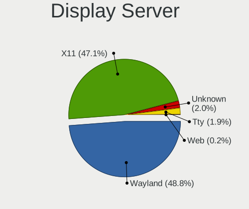
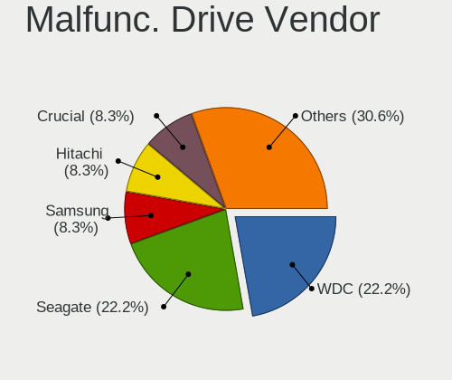
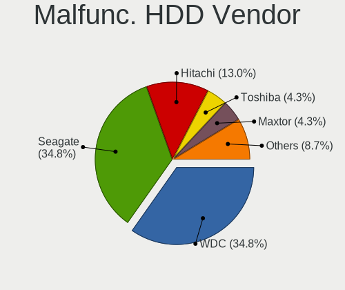
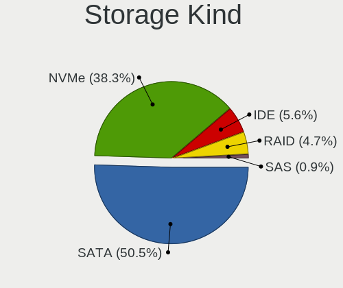
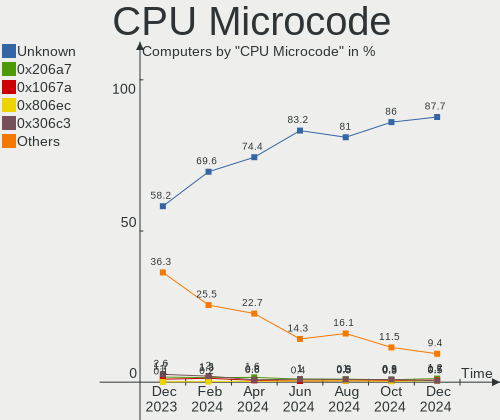
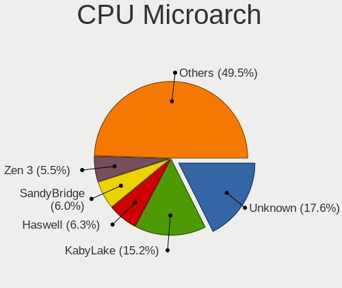

Linux in Germany - Hardware Trends
----------------------------------

A project to identify most popular hardware characteristics and track their change
over time based on data collected by Linux users at https://Linux-Hardware.org.

Anyone can contribute to this report by the [hw-probe](https://github.com/linuxhw/hw-probe) tool:

    sudo -E hw-probe -all -upload

This is a report for all computer types. See also reports for [desktops](/Location/Germany/Desktop/README.md) and [notebooks](/Location/Germany/Notebook/README.md).

Period: Dec, 2023.

Contents
--------

* [ System ](#system)
  - [ OS                       ](#os)
  - [ OS Family                ](#os-family)
  - [ Kernel                   ](#kernel)
  - [ Kernel Family            ](#kernel-family)
  - [ Kernel Major Ver.        ](#kernel-major-ver)
  - [ Arch                     ](#arch)
  - [ DE                       ](#de)
  - [ Display Server           ](#display-server)
  - [ Display Manager          ](#display-manager)
  - [ OS Lang                  ](#os-lang)
  - [ Boot Mode                ](#boot-mode)
  - [ Filesystem               ](#filesystem)
  - [ Part. scheme             ](#part-scheme)
  - [ Dual Boot with Linux/BSD ](#dual-boot-with-linuxbsd)
  - [ Dual Boot (Win)          ](#dual-boot-win)

* [ Board ](#board)
  - [ Vendor                   ](#vendor)
  - [ Model                    ](#model)
  - [ Model Family             ](#model-family)
  - [ MFG Year                 ](#mfg-year)
  - [ Form Factor              ](#form-factor)
  - [ Secure Boot              ](#secure-boot)
  - [ Coreboot                 ](#coreboot)
  - [ RAM Size                 ](#ram-size)
  - [ RAM Used                 ](#ram-used)
  - [ Total Drives             ](#total-drives)
  - [ Has CD-ROM               ](#has-cd-rom)
  - [ Has Ethernet             ](#has-ethernet)
  - [ Has WiFi                 ](#has-wifi)
  - [ Has Bluetooth            ](#has-bluetooth)

* [ Location ](#location)
  - [ Country                  ](#country)
  - [ City                     ](#city)

* [ Drives ](#drives)
  - [ Drive Vendor             ](#drive-vendor)
  - [ Drive Model              ](#drive-model)
  - [ HDD Vendor               ](#hdd-vendor)
  - [ SSD Vendor               ](#ssd-vendor)
  - [ Drive Kind               ](#drive-kind)
  - [ Drive Connector          ](#drive-connector)
  - [ Drive Size               ](#drive-size)
  - [ Space Total              ](#space-total)
  - [ Space Used               ](#space-used)
  - [ Malfunc. Drives          ](#malfunc-drives)
  - [ Malfunc. Drive Vendor    ](#malfunc-drive-vendor)
  - [ Malfunc. HDD Vendor      ](#malfunc-hdd-vendor)
  - [ Malfunc. Drive Kind      ](#malfunc-drive-kind)
  - [ Failed Drives            ](#failed-drives)
  - [ Failed Drive Vendor      ](#failed-drive-vendor)
  - [ Drive Status             ](#drive-status)

* [ Storage controller ](#storage-controller)
  - [ Storage Vendor           ](#storage-vendor)
  - [ Storage Model            ](#storage-model)
  - [ Storage Kind             ](#storage-kind)

* [ Processor ](#processor)
  - [ CPU Vendor               ](#cpu-vendor)
  - [ CPU Model                ](#cpu-model)
  - [ CPU Model Family         ](#cpu-model-family)
  - [ CPU Cores                ](#cpu-cores)
  - [ CPU Sockets              ](#cpu-sockets)
  - [ CPU Threads              ](#cpu-threads)
  - [ CPU Op-Modes             ](#cpu-op-modes)
  - [ CPU Microcode            ](#cpu-microcode)
  - [ CPU Microarch            ](#cpu-microarch)

* [ Graphics ](#graphics)
  - [ GPU Vendor               ](#gpu-vendor)
  - [ GPU Model                ](#gpu-model)
  - [ GPU Combo                ](#gpu-combo)
  - [ GPU Driver               ](#gpu-driver)
  - [ GPU Memory               ](#gpu-memory)

* [ Monitor ](#monitor)
  - [ Monitor Vendor           ](#monitor-vendor)
  - [ Monitor Model            ](#monitor-model)
  - [ Monitor Resolution       ](#monitor-resolution)
  - [ Monitor Diagonal         ](#monitor-diagonal)
  - [ Monitor Width            ](#monitor-width)
  - [ Aspect Ratio             ](#aspect-ratio)
  - [ Monitor Area             ](#monitor-area)
  - [ Pixel Density            ](#pixel-density)
  - [ Multiple Monitors        ](#multiple-monitors)

* [ Network ](#network)
  - [ Net Controller Vendor    ](#net-controller-vendor)
  - [ Net Controller Model     ](#net-controller-model)
  - [ Wireless Vendor          ](#wireless-vendor)
  - [ Wireless Model           ](#wireless-model)
  - [ Ethernet Vendor          ](#ethernet-vendor)
  - [ Ethernet Model           ](#ethernet-model)
  - [ Net Controller Kind      ](#net-controller-kind)
  - [ Used Controller          ](#used-controller)
  - [ NICs                     ](#nics)
  - [ IPv6                     ](#ipv6)

* [ Bluetooth ](#bluetooth)
  - [ Bluetooth Vendor         ](#bluetooth-vendor)
  - [ Bluetooth Model          ](#bluetooth-model)

* [ Sound ](#sound)
  - [ Sound Vendor             ](#sound-vendor)
  - [ Sound Model              ](#sound-model)

* [ Memory ](#memory)
  - [ Memory Vendor            ](#memory-vendor)
  - [ Memory Model             ](#memory-model)
  - [ Memory Kind              ](#memory-kind)
  - [ Memory Form Factor       ](#memory-form-factor)
  - [ Memory Size              ](#memory-size)
  - [ Memory Speed             ](#memory-speed)

* [ Printers & scanners ](#printers--scanners)
  - [ Printer Vendor           ](#printer-vendor)
  - [ Printer Model            ](#printer-model)
  - [ Scanner Vendor           ](#scanner-vendor)
  - [ Scanner Model            ](#scanner-model)

* [ Camera ](#camera)
  - [ Camera Vendor            ](#camera-vendor)
  - [ Camera Model             ](#camera-model)

* [ Security ](#security)
  - [ Fingerprint Vendor       ](#fingerprint-vendor)
  - [ Fingerprint Model        ](#fingerprint-model)
  - [ Chipcard Vendor          ](#chipcard-vendor)
  - [ Chipcard Model           ](#chipcard-model)

* [ Unsupported ](#unsupported)
  - [ Unsupported Devices      ](#unsupported-devices)
  - [ Unsupported Device Types ](#unsupported-device-types)

System
------

OS
--

Installed operating systems

| Name                         | Computers | Percent |
|------------------------------|-----------|---------|
| Ubuntu 22.04                 | 97        | 14.14%  |
| Linux Mint 21.2              | 88        | 12.83%  |
| Fedora 39                    | 40        | 5.83%   |
| Ubuntu 23.10                 | 37        | 5.39%   |
| Debian 12                    | 32        | 4.66%   |
| Arch Rolling                 | 24        | 3.5%    |
| Zorin 16                     | 23        | 3.35%   |
| Pop!_OS 22.04                | 21        | 3.06%   |
| OpenMandriva 23.08           | 21        | 3.06%   |
| OpenMandriva 5.0             | 18        | 2.62%   |
| Zorin 17                     | 14        | 2.04%   |
| ArcoLinux Rolling            | 14        | 2.04%   |
| OpenMandriva 23.11           | 11        | 1.6%    |
| Nobara 38                    | 11        | 1.6%    |
| LMDE 6                       | 11        | 1.6%    |
| Ubuntu 20.04                 | 10        | 1.46%   |
| Manjaro                      | 10        | 1.46%   |
| SteamOS 3.5.7                | 9         | 1.31%   |
| Linux Mint 21.1              | 8         | 1.17%   |
| Linux Mint 20.3              | 8         | 1.17%   |
| EndeavourOS Rolling          | 8         | 1.17%   |
| Debian                       | 8         | 1.17%   |
| Manjaro 23.1.0               | 7         | 1.02%   |
| Kubuntu 22.04                | 7         | 1.02%   |
| Debian 11                    | 7         | 1.02%   |
| Ubuntu 23.04                 | 6         | 0.87%   |
| ROSA 12.4                    | 6         | 0.87%   |
| Kubuntu 23.10                | 6         | 0.87%   |
| Gentoo 2.14                  | 6         | 0.87%   |
| Xubuntu 22.04                | 5         | 0.73%   |
| openSUSE Leap-15.5           | 5         | 0.73%   |
| Kali 2023.4                  | 5         | 0.73%   |
| Fedora 38                    | 5         | 0.73%   |
| openSUSE Tumbleweed-XXXXXXXX | 4         | 0.58%   |
| OpenMandriva 23.03           | 4         | 0.58%   |
| NixOS 24.05                  | 4         | 0.58%   |
| Linux Mint 21                | 4         | 0.58%   |
| BlackPanther 18.1            | 4         | 0.58%   |
| Xubuntu 23.10                | 3         | 0.44%   |
| Ubuntu 22.10                 | 3         | 0.44%   |

OS Family
---------

OS without a version

| Name             | Computers | Percent |
|------------------|-----------|---------|
| Ubuntu           | 159       | 23.18%  |
| Linux Mint       | 112       | 16.33%  |
| OpenMandriva     | 59        | 8.6%    |
| Debian           | 48        | 7%      |
| Fedora           | 47        | 6.85%   |
| Zorin            | 37        | 5.39%   |
| Arch             | 24        | 3.5%    |
| Pop!_OS          | 21        | 3.06%   |
| Manjaro          | 19        | 2.77%   |
| Nobara           | 14        | 2.04%   |
| Kubuntu          | 14        | 2.04%   |
| ArcoLinux        | 14        | 2.04%   |
| openSUSE         | 12        | 1.75%   |
| LMDE             | 12        | 1.75%   |
| SteamOS          | 10        | 1.46%   |
| Xubuntu          | 9         | 1.31%   |
| EndeavourOS      | 9         | 1.31%   |
| ROSA             | 6         | 0.87%   |
| Gentoo           | 6         | 0.87%   |
| Kali             | 5         | 0.73%   |
| NixOS            | 4         | 0.58%   |
| BlackPanther     | 4         | 0.58%   |
| Ubuntu Unity     | 3         | 0.44%   |
| TUXEDO OS        | 3         | 0.44%   |
| Raspbian         | 3         | 0.44%   |
| Lubuntu          | 3         | 0.44%   |
| Garuda Linux     | 3         | 0.44%   |
| blendOS          | 3         | 0.44%   |
| Xero             | 2         | 0.29%   |
| Ubuntu MATE      | 2         | 0.29%   |
| MX               | 2         | 0.29%   |
| Endless          | 2         | 0.29%   |
| Ubuntu Studio    | 1         | 0.15%   |
| Ubuntu Budgie    | 1         | 0.15%   |
| Siduction        | 1         | 0.15%   |
| Q4OS             | 1         | 0.15%   |
| Parrot           | 1         | 0.15%   |
| org.kde.Platform | 1         | 0.15%   |
| Oracle Linux     | 1         | 0.15%   |
| Neptune OS       | 1         | 0.15%   |

Kernel
------

Version of the Linux kernel

| Version                           | Computers | Percent |
|-----------------------------------|-----------|---------|
| 5.15.0-91-generic                 | 86        | 12.54%  |
| 6.2.0-39-generic                  | 67        | 9.77%   |
| 6.2.0-37-generic                  | 36        | 5.25%   |
| 6.5.0-14-generic                  | 35        | 5.1%    |
| 5.15.0-89-generic                 | 33        | 4.81%   |
| 6.6.2-desktop-1omv2390            | 27        | 3.94%   |
| 6.4.11-desktop-1omv2390           | 20        | 2.92%   |
| 6.1.0-16-amd64                    | 17        | 2.48%   |
| 6.5.6-76060506-generic            | 13        | 1.9%    |
| 6.6.7-arch1-1                     | 12        | 1.75%   |
| 6.1.0-13-amd64                    | 11        | 1.6%    |
| 6.6.7-200.fc39.x86_64             | 9         | 1.31%   |
| 6.5.0-13-generic                  | 9         | 1.31%   |
| 6.1.52-valve9-1-neptune-61        | 9         | 1.31%   |
| 6.6.8-arch1-1                     | 8         | 1.17%   |
| 6.6.8-200.fc39.x86_64             | 8         | 1.17%   |
| 6.6.4-200.fc39.x86_64             | 8         | 1.17%   |
| 6.6.3-arch1-1                     | 8         | 1.17%   |
| 6.2.0-26-generic                  | 8         | 1.17%   |
| 6.6.6-76060606-generic            | 7         | 1.02%   |
| 6.1.0-15-amd64                    | 7         | 1.02%   |
| 5.4.0-169-generic                 | 7         | 1.02%   |
| 6.5.0-kali3-amd64                 | 5         | 0.73%   |
| 5.15.0-88-generic                 | 5         | 0.73%   |
| 6.6.6-1-default                   | 4         | 0.58%   |
| 6.6.4-arch1-1                     | 4         | 0.58%   |
| 6.6.2-201.fc39.x86_64             | 4         | 0.58%   |
| 6.5.0-10010-tuxedo                | 4         | 0.58%   |
| 6.2.6-desktop-1omv2390            | 4         | 0.58%   |
| 6.1.20-generic-2rosa2021.1-x86_64 | 4         | 0.58%   |
| 5.15.0-76-generic                 | 4         | 0.58%   |
| 5.14.21-150500.55.39-default      | 4         | 0.58%   |
| 6.6.8-2-MANJARO                   | 3         | 0.44%   |
| 6.6.7-203.fsync.fc38.x86_64       | 3         | 0.44%   |
| 6.6.6-200.fc39.x86_64             | 3         | 0.44%   |
| 6.6.3-200.fc39.x86_64             | 3         | 0.44%   |
| 6.6.3-1-MANJARO                   | 3         | 0.44%   |
| 6.5.11-4-pve                      | 3         | 0.44%   |
| 6.5.0-9-generic                   | 3         | 0.44%   |
| 6.5.0-1009-oem                    | 3         | 0.44%   |

Kernel Family
-------------

Linux kernel without a distro release

| Version | Computers | Percent |
|---------|-----------|---------|
| 5.15.0  | 138       | 20.12%  |
| 6.2.0   | 115       | 16.76%  |
| 6.5.0   | 69        | 10.06%  |
| 6.1.0   | 44        | 6.41%   |
| 6.6.2   | 36        | 5.25%   |
| 6.6.7   | 34        | 4.96%   |
| 6.6.8   | 25        | 3.64%   |
| 6.6.6   | 21        | 3.06%   |
| 6.4.11  | 21        | 3.06%   |
| 6.6.4   | 20        | 2.92%   |
| 6.6.3   | 17        | 2.48%   |
| 6.5.6   | 15        | 2.19%   |
| 5.4.0   | 13        | 1.9%    |
| 6.1.52  | 10        | 1.46%   |
| 6.5.11  | 6         | 0.87%   |
| 6.1.21  | 5         | 0.73%   |
| 5.14.21 | 5         | 0.73%   |
| 6.5.13  | 4         | 0.58%   |
| 6.5.12  | 4         | 0.58%   |
| 6.2.6   | 4         | 0.58%   |
| 6.1.64  | 4         | 0.58%   |
| 6.1.20  | 4         | 0.58%   |
| 5.19.0  | 4         | 0.58%   |
| 6.6.5   | 3         | 0.44%   |
| 6.5.9   | 3         | 0.44%   |
| 5.10.0  | 3         | 0.44%   |
| 6.7.0   | 2         | 0.29%   |
| 6.6.1   | 2         | 0.29%   |
| 6.5.5   | 2         | 0.29%   |
| 6.4.10  | 2         | 0.29%   |
| 6.4.0   | 2         | 0.29%   |
| 6.3.9   | 2         | 0.29%   |
| 6.3.8   | 2         | 0.29%   |
| 6.1.69  | 2         | 0.29%   |
| 6.1.68  | 2         | 0.29%   |
| 6.1.66  | 2         | 0.29%   |
| 6.1.63  | 2         | 0.29%   |
| 6.1.58  | 2         | 0.29%   |
| 6.1.57  | 2         | 0.29%   |
| 6.1.1   | 2         | 0.29%   |

Kernel Major Ver.
-----------------

Linux kernel major version

| Version | Computers | Percent |
|---------|-----------|---------|
| 6.6     | 159       | 23.18%  |
| 5.15    | 141       | 20.55%  |
| 6.2     | 120       | 17.49%  |
| 6.5     | 105       | 15.31%  |
| 6.1     | 83        | 12.1%   |
| 6.4     | 27        | 3.94%   |
| 5.4     | 15        | 2.19%   |
| 6.3     | 5         | 0.73%   |
| 5.14    | 5         | 0.73%   |
| 5.10    | 5         | 0.73%   |
| 5.19    | 4         | 0.58%   |
| 5.11    | 3         | 0.44%   |
| 6.7     | 2         | 0.29%   |
| 5.8     | 2         | 0.29%   |
| 5.6     | 2         | 0.29%   |
| 5.16    | 2         | 0.29%   |
| 6.0     | 1         | 0.15%   |
| 6       | 1         | 0.15%   |
| 5.13    | 1         | 0.15%   |
| 4.19    | 1         | 0.15%   |
| 4.18    | 1         | 0.15%   |
| 4.15    | 1         | 0.15%   |

Arch
----

OS architecture (x86_64, i586, etc.)

| Name    | Computers | Percent |
|---------|-----------|---------|
| x86_64  | 675       | 98.4%   |
| aarch64 | 6         | 0.87%   |
| armv7l  | 3         | 0.44%   |
| i686    | 2         | 0.29%   |

DE
--

Desktop Environment

| Name          | Computers | Percent |
|---------------|-----------|---------|
| GNOME         | 286       | 41.69%  |
| KDE5          | 162       | 23.62%  |
| X-Cinnamon    | 96        | 13.99%  |
| XFCE          | 39        | 5.69%   |
| Unknown       | 28        | 4.08%   |
| MATE          | 18        | 2.62%   |
| Cinnamon      | 17        | 2.48%   |
| LXQt          | 8         | 1.17%   |
| i3            | 6         | 0.87%   |
| Unity         | 4         | 0.58%   |
| LXDE          | 4         | 0.58%   |
| Hyprland      | 4         | 0.58%   |
| Budgie        | 3         | 0.44%   |
| xmonad        | 1         | 0.15%   |
| wayfire       | 1         | 0.15%   |
| Trinity       | 1         | 0.15%   |
| Pantheon      | 1         | 0.15%   |
| Lubuntu       | 1         | 0.15%   |
| KDE           | 1         | 0.15%   |
| GNOME-Classic | 1         | 0.15%   |
| GNOME Classic | 1         | 0.15%   |
| fluxbox       | 1         | 0.15%   |
| Endless:GNOME | 1         | 0.15%   |
| BunsenLabs    | 1         | 0.15%   |

Display Server
--------------

X11 or Wayland

| Name    | Computers | Percent |
|---------|-----------|---------|
| X11     | 370       | 53.94%  |
| Wayland | 271       | 39.5%   |
| Tty     | 23        | 3.35%   |
| Unknown | 22        | 3.21%   |

Display Manager
---------------

SDDM, LightDM, etc.

| Name    | Computers | Percent |
|---------|-----------|---------|
| Unknown | 262       | 38.19%  |
| GDM3    | 161       | 23.47%  |
| SDDM    | 125       | 18.22%  |
| LightDM | 105       | 15.31%  |
| GDM     | 31        | 4.52%   |
| TDM     | 1         | 0.15%   |
| GREETD  | 1         | 0.15%   |

OS Lang
-------

Language

| Lang    | Computers | Percent |
|---------|-----------|---------|
| de_DE   | 473       | 68.95%  |
| en_US   | 151       | 22.01%  |
| C       | 15        | 2.19%   |
| en_GB   | 13        | 1.9%    |
| Unknown | 13        | 1.9%    |
| ru_RU   | 5         | 0.73%   |
| POSIX   | 3         | 0.44%   |
| hu_HU   | 2         | 0.29%   |
| en_DK   | 2         | 0.29%   |
| ru_UA   | 1         | 0.15%   |
| ro_RO   | 1         | 0.15%   |
| pl_PL   | 1         | 0.15%   |
| fr_FR   | 1         | 0.15%   |
| de_IT   | 1         | 0.15%   |
| de_CH   | 1         | 0.15%   |
| C.UTF8  | 1         | 0.15%   |
| bg_BG   | 1         | 0.15%   |
| aa_DJ   | 1         | 0.15%   |

Boot Mode
---------

EFI or BIOS

| Mode | Computers | Percent |
|------|-----------|---------|
| EFI  | 355       | 51.75%  |
| BIOS | 331       | 48.25%  |

Filesystem
----------

Type of filesystem

| Type    | Computers | Percent |
|---------|-----------|---------|
| Ext4    | 391       | 57%     |
| Tmpfs   | 133       | 19.39%  |
| Btrfs   | 110       | 16.03%  |
| Overlay | 34        | 4.96%   |
| Zfs     | 11        | 1.6%    |
| Xfs     | 5         | 0.73%   |
| F2fs    | 1         | 0.15%   |
| Ext3    | 1         | 0.15%   |

Part. scheme
------------

Scheme of partitioning

| Type    | Computers | Percent |
|---------|-----------|---------|
| GPT     | 379       | 55.25%  |
| Unknown | 236       | 34.4%   |
| MBR     | 71        | 10.35%  |

Dual Boot with Linux/BSD
------------------------

Hosting more than one Linux/BSD

| Dual boot | Computers | Percent |
|-----------|-----------|---------|
| No        | 575       | 83.82%  |
| Yes       | 111       | 16.18%  |

Dual Boot (Win)
---------------

Hosting Linux and Windows

| Dual boot | Computers | Percent |
|-----------|-----------|---------|
| No        | 523       | 76.24%  |
| Yes       | 163       | 23.76%  |

Board
-----

Vendor
------

Motherboard manufacturer

| Name                                 | Computers | Percent |
|--------------------------------------|-----------|---------|
| Lenovo                               | 110       | 16.03%  |
| ASUSTek Computer                     | 101       | 14.72%  |
| Hewlett-Packard                      | 78        | 11.37%  |
| MSI                                  | 56        | 8.16%   |
| Dell                                 | 45        | 6.56%   |
| Gigabyte Technology                  | 39        | 5.69%   |
| Acer                                 | 38        | 5.54%   |
| Medion                               | 21        | 3.06%   |
| Fujitsu                              | 21        | 3.06%   |
| ASRock                               | 21        | 3.06%   |
| Apple                                | 20        | 2.92%   |
| Intel                                | 12        | 1.75%   |
| Valve                                | 10        | 1.46%   |
| TUXEDO                               | 10        | 1.46%   |
| Raspberry Pi Foundation              | 7         | 1.02%   |
| HUAWEI                               | 7         | 1.02%   |
| Sony                                 | 6         | 0.87%   |
| Samsung Electronics                  | 6         | 0.87%   |
| Toshiba                              | 5         | 0.73%   |
| Microsoft                            | 5         | 0.73%   |
| Wortmann AG                          | 4         | 0.58%   |
| Shenzhen Meigao Electronic Equipment | 4         | 0.58%   |
| Razer                                | 4         | 0.58%   |
| Packard Bell                         | 4         | 0.58%   |
| Unknown                              | 4         | 0.58%   |
| LG Electronics                       | 3         | 0.44%   |
| BESSTAR Tech                         | 3         | 0.44%   |
| AZW                                  | 3         | 0.44%   |
| Alienware                            | 3         | 0.44%   |
| ZOTAC                                | 2         | 0.29%   |
| Schenker                             | 2         | 0.29%   |
| Inventec                             | 2         | 0.29%   |
| Hardkernel                           | 2         | 0.29%   |
| Fujitsu Siemens                      | 2         | 0.29%   |
| Framework                            | 2         | 0.29%   |
| Foxconn                              | 2         | 0.29%   |
| Biostar                              | 2         | 0.29%   |
| VIA Technologies                     | 1         | 0.15%   |
| VALE                                 | 1         | 0.15%   |
| Teclast                              | 1         | 0.15%   |

Model
-----

Motherboard model

| Name                                              | Computers | Percent |
|---------------------------------------------------|-----------|---------|
| Valve Jupiter                                     | 8         | 1.17%   |
| Unknown                                           | 8         | 1.17%   |
| ASUS All Series                                   | 6         | 0.87%   |
| ASUS K50AF                                        | 4         | 0.58%   |
| RPi Raspberry Pi 4 Model B Rev 1.5                | 3         | 0.44%   |
| MSI MS-7C56                                       | 3         | 0.44%   |
| Intel NUC13ANHi7                                  | 3         | 0.44%   |
| HP Laptop 15s-eq2xxx                              | 3         | 0.44%   |
| Gigabyte Z390 UD                                  | 3         | 0.44%   |
| ASUS ROG STRIX X570-E GAMING                      | 3         | 0.44%   |
| ZOTAC NM10                                        | 2         | 0.29%   |
| Valve Galileo                                     | 2         | 0.29%   |
| Shenzhen Meigao Electronic Equipment Venus series | 2         | 0.29%   |
| Razer Blade 17 (2022) - RZ09-0423                 | 2         | 0.29%   |
| MSI MS-7D75                                       | 2         | 0.29%   |
| MSI MS-7D54                                       | 2         | 0.29%   |
| MSI MS-7C84                                       | 2         | 0.29%   |
| MSI MS-7C35                                       | 2         | 0.29%   |
| MSI MS-7B79                                       | 2         | 0.29%   |
| MSI MS-7A38                                       | 2         | 0.29%   |
| MSI MS-7693                                       | 2         | 0.29%   |
| Medion E3223                                      | 2         | 0.29%   |
| Lenovo ThinkPad X1 Carbon Gen 10 21CBCTO1WW       | 2         | 0.29%   |
| Lenovo IdeaPad 1 15ALC7 82R4                      | 2         | 0.29%   |
| HUAWEI NBLK-WAX9X                                 | 2         | 0.29%   |
| HP ProDesk 600 G2 DM                              | 2         | 0.29%   |
| HP ProBook 430 G4                                 | 2         | 0.29%   |
| HP Pavilion Notebook                              | 2         | 0.29%   |
| HP Laptop 17-cp0xxx                               | 2         | 0.29%   |
| HP ENVY x360 Convertible 13-ay0xxx                | 2         | 0.29%   |
| HP EliteBook 8560p                                | 2         | 0.29%   |
| HP EliteBook 840 G5                               | 2         | 0.29%   |
| HP Compaq 6005 Pro MT PC                          | 2         | 0.29%   |
| HP 625                                            | 2         | 0.29%   |
| HP 255 15.6 inch G9 Notebook PC                   | 2         | 0.29%   |
| Gigabyte GA-78LMT-S2P                             | 2         | 0.29%   |
| Gigabyte B75M-D3V                                 | 2         | 0.29%   |
| Gigabyte B550 AORUS ELITE AX V2                   | 2         | 0.29%   |
| Fujitsu LIFEBOOK U749                             | 2         | 0.29%   |
| Fujitsu LIFEBOOK A357                             | 2         | 0.29%   |

Model Family
------------

Motherboard model prefix

| Name                  | Computers | Percent |
|-----------------------|-----------|---------|
| Lenovo ThinkPad       | 53        | 7.73%   |
| Acer Aspire           | 27        | 3.94%   |
| ASUS ROG              | 21        | 3.06%   |
| Lenovo IdeaPad        | 18        | 2.62%   |
| Fujitsu LIFEBOOK      | 15        | 2.19%   |
| Dell Latitude         | 14        | 2.04%   |
| HP Laptop             | 13        | 1.9%    |
| HP EliteBook          | 10        | 1.46%   |
| Dell Precision        | 10        | 1.46%   |
| HP Pavilion           | 9         | 1.31%   |
| Valve Jupiter         | 8         | 1.17%   |
| Lenovo ThinkCentre    | 8         | 1.17%   |
| Dell XPS              | 8         | 1.17%   |
| Dell Inspiron         | 8         | 1.17%   |
| ASUS TUF              | 8         | 1.17%   |
| ASUS PRIME            | 8         | 1.17%   |
| Unknown               | 8         | 1.17%   |
| RPi Raspberry         | 7         | 1.02%   |
| Lenovo Yoga           | 7         | 1.02%   |
| Lenovo Legion         | 7         | 1.02%   |
| HP ProBook            | 6         | 0.87%   |
| HP Compaq             | 6         | 0.87%   |
| Fujitsu ESPRIMO       | 6         | 0.87%   |
| ASUS VivoBook         | 6         | 0.87%   |
| ASUS All              | 6         | 0.87%   |
| Toshiba Satellite     | 5         | 0.73%   |
| Microsoft Surface     | 5         | 0.73%   |
| HP ENVY               | 5         | 0.73%   |
| Gigabyte B550         | 5         | 0.73%   |
| Razer Blade           | 4         | 0.58%   |
| Lenovo ThinkBook      | 4         | 0.58%   |
| HP ProDesk            | 4         | 0.58%   |
| HP 255                | 4         | 0.58%   |
| Dell OptiPlex         | 4         | 0.58%   |
| ASUS Zenbook          | 4         | 0.58%   |
| ASUS K50AF            | 4         | 0.58%   |
| ASUS ASUS             | 4         | 0.58%   |
| TUXEDO Pulse          | 3         | 0.44%   |
| TUXEDO InfinityBook   | 3         | 0.44%   |
| Packard Bell EasyNote | 3         | 0.44%   |

MFG Year
--------

Motherboard manufacture year

| Year    | Computers | Percent |
|---------|-----------|---------|
| 2023    | 70        | 10.2%   |
| 2020    | 68        | 9.91%   |
| 2018    | 63        | 9.18%   |
| 2022    | 54        | 7.87%   |
| 2021    | 51        | 7.43%   |
| 2019    | 48        | 7%      |
| 2013    | 46        | 6.71%   |
| 2012    | 43        | 6.27%   |
| 2011    | 35        | 5.1%    |
| 2017    | 34        | 4.96%   |
| 2014    | 34        | 4.96%   |
| 2016    | 33        | 4.81%   |
| 2009    | 29        | 4.23%   |
| 2015    | 24        | 3.5%    |
| 2010    | 23        | 3.35%   |
| 2008    | 10        | 1.46%   |
| Unknown | 9         | 1.31%   |
| 2007    | 8         | 1.17%   |
| 2006    | 3         | 0.44%   |
| 2005    | 1         | 0.15%   |

Form Factor
-----------

Physical design of the computer

| Name           | Computers | Percent |
|----------------|-----------|---------|
| Notebook       | 370       | 53.94%  |
| Desktop        | 249       | 36.3%   |
| Convertible    | 19        | 2.77%   |
| Mini pc        | 19        | 2.77%   |
| System on chip | 9         | 1.31%   |
| Tablet         | 9         | 1.31%   |
| All in one     | 9         | 1.31%   |
| Server         | 2         | 0.29%   |

Secure Boot
-----------

Enabled or disabled

| State    | Computers | Percent |
|----------|-----------|---------|
| Disabled | 642       | 93.59%  |
| Enabled  | 44        | 6.41%   |

Coreboot
--------

Have coreboot on board

| Used | Computers | Percent |
|------|-----------|---------|
| No   | 685       | 99.85%  |
| Yes  | 1         | 0.15%   |

RAM Size
--------

Total RAM memory

| Size in GB      | Computers | Percent |
|-----------------|-----------|---------|
| 4.01-8.0        | 168       | 24.49%  |
| 16.01-24.0      | 140       | 20.41%  |
| 32.01-64.0      | 109       | 15.89%  |
| 8.01-16.0       | 106       | 15.45%  |
| 3.01-4.0        | 75        | 10.93%  |
| 24.01-32.0      | 37        | 5.39%   |
| 64.01-256.0     | 28        | 4.08%   |
| 1.01-2.0        | 14        | 2.04%   |
| 2.01-3.0        | 6         | 0.87%   |
| 0.51-1.0        | 2         | 0.29%   |
| More than 256.0 | 1         | 0.15%   |

RAM Used
--------

Used RAM memory

| Used GB    | Computers | Percent |
|------------|-----------|---------|
| 1.01-2.0   | 202       | 29.45%  |
| 2.01-3.0   | 172       | 25.07%  |
| 4.01-8.0   | 146       | 21.28%  |
| 3.01-4.0   | 92        | 13.41%  |
| 8.01-16.0  | 28        | 4.08%   |
| 0.51-1.0   | 26        | 3.79%   |
| 0.01-0.5   | 14        | 2.04%   |
| 16.01-24.0 | 4         | 0.58%   |
| 24.01-32.0 | 2         | 0.29%   |

Total Drives
------------

Number of drives on board

| Drives | Computers | Percent |
|--------|-----------|---------|
| 1      | 392       | 57.14%  |
| 2      | 162       | 23.62%  |
| 3      | 64        | 9.33%   |
| 4      | 36        | 5.25%   |
| 5      | 14        | 2.04%   |
| 6      | 6         | 0.87%   |
| 8      | 4         | 0.58%   |
| 0      | 4         | 0.58%   |
| 9      | 2         | 0.29%   |
| 7      | 2         | 0.29%   |

Has CD-ROM
----------

Has CD-ROM on board

| Presented | Computers | Percent |
|-----------|-----------|---------|
| No        | 438       | 63.85%  |
| Yes       | 248       | 36.15%  |

Has Ethernet
------------

Has Ethernet on board

| Presented | Computers | Percent |
|-----------|-----------|---------|
| Yes       | 590       | 86.01%  |
| No        | 96        | 13.99%  |

Has WiFi
--------

Has WiFi module

| Presented | Computers | Percent |
|-----------|-----------|---------|
| Yes       | 530       | 77.26%  |
| No        | 156       | 22.74%  |

Has Bluetooth
-------------

Has Bluetooth module

| Presented | Computers | Percent |
|-----------|-----------|---------|
| Yes       | 455       | 66.33%  |
| No        | 231       | 33.67%  |

Location
--------

Country
-------

Geographic location (country)

| Country | Computers | Percent |
|---------|-----------|---------|
| Germany | 686       | 100%    |

City
----

Geographic location (city)

| City                    | Computers | Percent |
|-------------------------|-----------|---------|
| Berlin                  | 59        | 8.6%    |
| Munich                  | 34        | 4.96%   |
| Hamburg                 | 29        | 4.23%   |
| Cologne                 | 19        | 2.77%   |
| Frankfurt am Main       | 13        | 1.9%    |
| Dresden                 | 13        | 1.9%    |
| Düsseldorf             | 12        | 1.75%   |
| Stuttgart               | 11        | 1.6%    |
| Nuremberg               | 9         | 1.31%   |
| Mannheim                | 9         | 1.31%   |
| Hanover                 | 8         | 1.17%   |
| Bremen                  | 8         | 1.17%   |
| Leipzig                 | 7         | 1.02%   |
| Essen                   | 7         | 1.02%   |
| Dortmund                | 6         | 0.87%   |
| Augsburg                | 6         | 0.87%   |
| Mönchengladbach        | 5         | 0.73%   |
| Ingolstadt              | 5         | 0.73%   |
| Hanau                   | 5         | 0.73%   |
| Bonn                    | 5         | 0.73%   |
| Bielefeld               | 5         | 0.73%   |
| Trier                   | 4         | 0.58%   |
| Traunstein              | 4         | 0.58%   |
| Ravensburg              | 4         | 0.58%   |
| Pfaffenhofen an der Ilm | 4         | 0.58%   |
| Mainz                   | 4         | 0.58%   |
| Mainburg                | 4         | 0.58%   |
| Karlsruhe               | 4         | 0.58%   |
| Jena                    | 4         | 0.58%   |
| Erlangen                | 4         | 0.58%   |
| Duisburg                | 4         | 0.58%   |
| Delligsen               | 4         | 0.58%   |
| Darmstadt               | 4         | 0.58%   |
| Wiesbaden               | 3         | 0.44%   |
| Velbert                 | 3         | 0.44%   |
| Stuhr                   | 3         | 0.44%   |
| Sindelfingen            | 3         | 0.44%   |
| Peiting                 | 3         | 0.44%   |
| Osnabrück              | 3         | 0.44%   |
| Ober-Morlen             | 3         | 0.44%   |

Drives
------

Drive Vendor
------------

Hard drive vendors

| Vendor                       | Computers | Drives | Percent |
|------------------------------|-----------|--------|---------|
| Samsung Electronics          | 225       | 324    | 21.66%  |
| WDC                          | 108       | 136    | 10.39%  |
| SanDisk                      | 93        | 107    | 8.95%   |
| Seagate                      | 89        | 104    | 8.57%   |
| Toshiba                      | 54        | 60     | 5.2%    |
| Crucial                      | 43        | 48     | 4.14%   |
| Unknown                      | 38        | 39     | 3.66%   |
| Intenso                      | 38        | 38     | 3.66%   |
| SK hynix                     | 28        | 28     | 2.69%   |
| Phison Electronics           | 24        | 24     | 2.31%   |
| Kingston                     | 24        | 25     | 2.31%   |
| Intel                        | 19        | 19     | 1.83%   |
| Micron Technology            | 17        | 17     | 1.64%   |
| Hitachi                      | 17        | 18     | 1.64%   |
| Micron/Crucial Technology    | 16        | 17     | 1.54%   |
| HGST                         | 16        | 16     | 1.54%   |
| Kingston Technology Company  | 11        | 11     | 1.06%   |
| Phison                       | 10        | 11     | 0.96%   |
| MAXIO Technology (Hangzhou)  | 10        | 11     | 0.96%   |
| KIOXIA                       | 10        | 10     | 0.96%   |
| Apple                        | 10        | 12     | 0.96%   |
| A-DATA Technology            | 8         | 8      | 0.77%   |
| Verbatim                     | 7         | 8      | 0.67%   |
| SPCC                         | 7         | 7      | 0.67%   |
| Silicon Motion               | 7         | 7      | 0.67%   |
| JMicron Technology           | 7         | 8      | 0.67%   |
| China                        | 6         | 6      | 0.58%   |
| Unknown                      | 6         | 6      | 0.58%   |
| Transcend                    | 5         | 5      | 0.48%   |
| Emtec                        | 5         | 5      | 0.48%   |
| Corsair                      | 5         | 5      | 0.48%   |
| ASMT                         | 5         | 5      | 0.48%   |
| Shenzhen Longsys Electronics | 4         | 4      | 0.38%   |
| LITEON                       | 3         | 3      | 0.29%   |
| Fujitsu                      | 3         | 3      | 0.29%   |
| Fanxiang                     | 3         | 3      | 0.29%   |
| USB3.0                       | 2         | 2      | 0.19%   |
| SD                           | 2         | 2      | 0.19%   |
| Patriot                      | 2         | 2      | 0.19%   |
| Mushkin                      | 2         | 2      | 0.19%   |

Drive Model
-----------

Hard drive models

| Model                                               | Computers | Percent |
|-----------------------------------------------------|-----------|---------|
| Samsung NVMe SSD Controller SM981/PM981/PM983 512GB | 33        | 2.83%   |
| Samsung NVMe SSD Controller PM9A1/PM9A3/980PRO 2TB  | 27        | 2.32%   |
| Samsung SSD 860 EVO 500GB                           | 12        | 1.03%   |
| Samsung SSD 860 EVO 1TB                             | 11        | 0.94%   |
| Samsung SSD 980 1TB                                 | 10        | 0.86%   |
| Samsung SSD 850 EVO 250GB                           | 10        | 0.86%   |
| Phison E12 NVMe Controller 1TB                      | 10        | 0.86%   |
| Unknown MMC Card  128GB                             | 8         | 0.69%   |
| Toshiba MQ01ABD100 1TB                              | 8         | 0.69%   |
| Sandisk WD Blue SN550 NVMe SSD 1TB                  | 8         | 0.69%   |
| Samsung SSD 860 EVO 250GB                           | 8         | 0.69%   |
| Crucial CT1000MX500SSD1 1TB                         | 8         | 0.69%   |
| Seagate ST500DM002-1BD142 500GB                     | 7         | 0.6%    |
| SanDisk SSD PLUS 1000GB                             | 7         | 0.6%    |
| Samsung SSD 990 PRO 2TB                             | 7         | 0.6%    |
| Samsung SSD 980 500GB                               | 7         | 0.6%    |
| MAXIO (Hangzhou) NVMe SSD Controller MAP1202 256GB  | 7         | 0.6%    |
| Crucial CT500MX500SSD1 500GB                        | 7         | 0.6%    |
| Unknown MMC Card  64GB                              | 6         | 0.52%   |
| Seagate ST4000DM004-2CV104 4TB                      | 6         | 0.52%   |
| SanDisk SDSSDH3 1T00 1TB                            | 6         | 0.52%   |
| Samsung SSD 870 QVO 2TB                             | 6         | 0.52%   |
| Samsung SSD 870 EVO 500GB                           | 6         | 0.52%   |
| Samsung SSD 840 EVO 250GB                           | 6         | 0.52%   |
| Micron/Crucial P2 NVMe PCIe SSD 4TB                 | 6         | 0.52%   |
| Intenso Portable SSD 128GB                          | 6         | 0.52%   |
| Unknown                                             | 6         | 0.52%   |
| WDC WDS100T2B0A-00SM50 1TB SSD                      | 5         | 0.43%   |
| WDC WD40EZRZ-00GXCB0 4TB                            | 5         | 0.43%   |
| Verbatim Vi550 S3 512GB                             | 5         | 0.43%   |
| Seagate ST1000LM035-1RK172 1TB                      | 5         | 0.43%   |
| SanDisk SDSSDH3512G 512GB                           | 5         | 0.43%   |
| Samsung SSD 970 EVO Plus 1TB                        | 5         | 0.43%   |
| Samsung SSD 860 PRO 256GB                           | 5         | 0.43%   |
| Samsung SSD 850 EVO 500GB                           | 5         | 0.43%   |
| Crucial CT250MX500SSD1 250GB                        | 5         | 0.43%   |
| WDC WDS240G2G0A-00JH30 240GB SSD                    | 4         | 0.34%   |
| WDC WD10JPVX-22JC3T0 1TB                            | 4         | 0.34%   |
| Unknown SD/MMC/MS PRO 512GB                         | 4         | 0.34%   |
| Toshiba DT01ACA100 1TB                              | 4         | 0.34%   |

HDD Vendor
----------

Hard disk drive vendors

| Vendor              | Computers | Drives | Percent |
|---------------------|-----------|--------|---------|
| Seagate             | 89        | 103    | 31.67%  |
| WDC                 | 86        | 111    | 30.6%   |
| Toshiba             | 40        | 43     | 14.23%  |
| Hitachi             | 17        | 18     | 6.05%   |
| HGST                | 16        | 16     | 5.69%   |
| Samsung Electronics | 11        | 12     | 3.91%   |
| Unknown             | 4         | 4      | 1.42%   |
| Intenso             | 4         | 4      | 1.42%   |
| Fujitsu             | 3         | 3      | 1.07%   |
| USB3.0              | 2         | 2      | 0.71%   |
| Maxtor              | 2         | 2      | 0.71%   |
| Apple               | 2         | 2      | 0.71%   |
| SABRENT             | 1         | 1      | 0.36%   |
| LIO-ORG             | 1         | 4      | 0.36%   |
| JMicron Technology  | 1         | 1      | 0.36%   |
| DC-624e             | 1         | 1      | 0.36%   |
| ASMT                | 1         | 1      | 0.36%   |

SSD Vendor
----------

Solid state drive vendors

| Vendor              | Computers | Drives | Percent |
|---------------------|-----------|--------|---------|
| Samsung Electronics | 122       | 147    | 31.2%   |
| SanDisk             | 53        | 60     | 13.55%  |
| Crucial             | 39        | 43     | 9.97%   |
| Intenso             | 31        | 31     | 7.93%   |
| WDC                 | 19        | 19     | 4.86%   |
| Kingston            | 16        | 16     | 4.09%   |
| Intel               | 9         | 9      | 2.3%    |
| A-DATA Technology   | 8         | 8      | 2.05%   |
| Verbatim            | 7         | 8      | 1.79%   |
| SPCC                | 7         | 7      | 1.79%   |
| Phison              | 7         | 7      | 1.79%   |
| China               | 6         | 6      | 1.53%   |
| Transcend           | 5         | 5      | 1.28%   |
| Micron Technology   | 5         | 5      | 1.28%   |
| Emtec               | 5         | 5      | 1.28%   |
| Toshiba             | 4         | 4      | 1.02%   |
| ASMT                | 4         | 4      | 1.02%   |
| Apple               | 4         | 4      | 1.02%   |
| JMicron Technology  | 3         | 4      | 0.77%   |
| SK hynix            | 2         | 2      | 0.51%   |
| SD                  | 2         | 2      | 0.51%   |
| Patriot             | 2         | 2      | 0.51%   |
| LITEONIT            | 2         | 2      | 0.51%   |
| LITEON              | 2         | 2      | 0.51%   |
| Corsair             | 2         | 2      | 0.51%   |
| ASMedia             | 2         | 2      | 0.51%   |
| Teclast             | 1         | 1      | 0.26%   |
| Team                | 1         | 1      | 0.26%   |
| SSK Port            | 1         | 1      | 0.26%   |
| SMI                 | 1         | 1      | 0.26%   |
| PNY                 | 1         | 1      | 0.26%   |
| OCZ                 | 1         | 1      | 0.26%   |
| Netac               | 1         | 1      | 0.26%   |
| Neo Forza           | 1         | 1      | 0.26%   |
| Mushkin             | 1         | 1      | 0.26%   |
| KIOXIA-EXCERIA      | 1         | 1      | 0.26%   |
| KingDian            | 1         | 2      | 0.26%   |
| INNOVATION IT       | 1         | 1      | 0.26%   |
| Hewlett-Packard     | 1         | 1      | 0.26%   |
| GOODRAM             | 1         | 1      | 0.26%   |

Drive Kind
----------

HDD or SSD

| Kind    | Computers | Drives | Percent |
|---------|-----------|--------|---------|
| NVMe    | 323       | 403    | 34.43%  |
| SSD     | 322       | 430    | 34.33%  |
| HDD     | 236       | 328    | 25.16%  |
| MMC     | 35        | 35     | 3.73%   |
| Unknown | 22        | 24     | 2.35%   |

Drive Connector
---------------

SATA, SAS, NVMe, etc.

| Type | Computers | Drives | Percent |
|------|-----------|--------|---------|
| SATA | 449       | 715    | 52.21%  |
| NVMe | 323       | 401    | 37.56%  |
| SAS  | 53        | 69     | 6.16%   |
| MMC  | 35        | 35     | 4.07%   |

Drive Size
----------

Size of hard drive

| Size in TB | Computers | Drives | Percent |
|------------|-----------|--------|---------|
| 0.01-0.5   | 305       | 397    | 50.66%  |
| 0.51-1.0   | 184       | 219    | 30.56%  |
| 1.01-2.0   | 57        | 68     | 9.47%   |
| 3.01-4.0   | 29        | 35     | 4.82%   |
| 4.01-10.0  | 13        | 21     | 2.16%   |
| 2.01-3.0   | 11        | 15     | 1.83%   |
| 10.01-20.0 | 3         | 3      | 0.5%    |

Space Total
-----------

Amount of disk space available on the file system

| Size in GB     | Computers | Percent |
|----------------|-----------|---------|
| 101-250        | 143       | 20.85%  |
| 501-1000       | 137       | 19.97%  |
| 251-500        | 132       | 19.24%  |
| 1001-2000      | 76        | 11.08%  |
| More than 3000 | 60        | 8.75%   |
| 1-20           | 43        | 6.27%   |
| Unknown        | 34        | 4.96%   |
| 51-100         | 27        | 3.94%   |
| 2001-3000      | 22        | 3.21%   |
| 21-50          | 12        | 1.75%   |

Space Used
----------

Amount of used disk space

| Used GB        | Computers | Percent |
|----------------|-----------|---------|
| 1-20           | 185       | 26.97%  |
| 21-50          | 129       | 18.8%   |
| 101-250        | 103       | 15.01%  |
| 51-100         | 82        | 11.95%  |
| 251-500        | 63        | 9.18%   |
| 501-1000       | 39        | 5.69%   |
| Unknown        | 34        | 4.96%   |
| 1001-2000      | 24        | 3.5%    |
| More than 3000 | 20        | 2.92%   |
| 2001-3000      | 7         | 1.02%   |

Malfunc. Drives
---------------

Drive models with a malfunction

| Model                                    | Computers | Drives | Percent |
|------------------------------------------|-----------|--------|---------|
| WDC WD5000AAKS-007AA0 500GB              | 3         | 3      | 6.67%   |
| WDC WDS100T2G0A-00JH30 1TB SSD           | 1         | 1      | 2.22%   |
| WDC WD5000AAKX-001CA0 500GB              | 1         | 1      | 2.22%   |
| WDC WD5000AAKS-00TMA0 500GB              | 1         | 1      | 2.22%   |
| WDC WD5000AADS-00L4B1 500GB              | 1         | 1      | 2.22%   |
| WDC WD20EFRX-68EUZN0 2TB                 | 1         | 1      | 2.22%   |
| WDC WD10SPCX-22HWST0 1TB                 | 1         | 1      | 2.22%   |
| WDC WD10EZEX-75WN4A1 1TB                 | 1         | 1      | 2.22%   |
| WDC WD10EZEX-00BN5A0 1TB                 | 1         | 1      | 2.22%   |
| WDC WD10EALS-00Z8A0 1TB                  | 1         | 1      | 2.22%   |
| WDC WD Blue SA510 2.5 1000GB SSD         | 1         | 1      | 2.22%   |
| Toshiba MQ01ABD100 1TB                   | 1         | 1      | 2.22%   |
| Toshiba MQ01ABD075 752GB                 | 1         | 1      | 2.22%   |
| Toshiba MK3259GSXP 320GB                 | 1         | 1      | 2.22%   |
| SK hynix PC711 HFS001TDE9X073N 1024GB    | 1         | 1      | 2.22%   |
| SK hynix BC711 HFM512GD3JX013N 512GB     | 1         | 1      | 2.22%   |
| SK hynix BC711 HFM256GD3JX013N 256GB     | 1         | 1      | 2.22%   |
| Seagate ST940210AS 40GB                  | 1         | 1      | 2.22%   |
| Seagate ST9320423AS 320GB                | 1         | 1      | 2.22%   |
| Seagate ST9100821AS 100GB                | 1         | 1      | 2.22%   |
| Seagate ST500DM002-1BD142 500GB          | 1         | 1      | 2.22%   |
| Seagate ST31500341AS 1TB                 | 1         | 1      | 2.22%   |
| Seagate ST31000528AS 1TB                 | 1         | 1      | 2.22%   |
| Seagate ST31000524AS 1TB                 | 1         | 1      | 2.22%   |
| Seagate ST2000LM007-1R8174 2TB           | 1         | 1      | 2.22%   |
| Seagate ST2000LM003 HN-M201RAD 2TB       | 1         | 1      | 2.22%   |
| Seagate ST2000DM008-2FR102 2TB           | 1         | 1      | 2.22%   |
| SanDisk SSD PLUS 1000GB                  | 1         | 1      | 2.22%   |
| Samsung Electronics SSD 870 EVO 500GB    | 1         | 1      | 2.22%   |
| Samsung Electronics SSD 830 Series 256GB | 1         | 1      | 2.22%   |
| Samsung Electronics HD501LJ 500GB        | 1         | 1      | 2.22%   |
| Samsung Electronics HD204UI 2TB          | 1         | 1      | 2.22%   |
| Samsung Electronics HD103SI 1TB          | 1         | 1      | 2.22%   |
| LITEONIT LCT-256M3S 256GB SSD            | 1         | 1      | 2.22%   |
| Kingston SA400S37240G 240GB SSD          | 1         | 1      | 2.22%   |
| Hitachi HDS722512VLAT20 128GB            | 1         | 1      | 2.22%   |
| HGST HTS725050A7E630 500GB               | 1         | 1      | 2.22%   |
| Crucial CT525MX300SSD1 528GB             | 1         | 1      | 2.22%   |
| Crucial CT120M500SSD1 120GB              | 1         | 1      | 2.22%   |
| ASMT USB 3.0 Destop H 1TB                | 1         | 1      | 2.22%   |

Malfunc. Drive Vendor
---------------------

Vendors of faulty drives

| Vendor              | Computers | Drives | Percent |
|---------------------|-----------|--------|---------|
| WDC                 | 13        | 13     | 28.89%  |
| Seagate             | 10        | 10     | 22.22%  |
| Samsung Electronics | 5         | 5      | 11.11%  |
| Toshiba             | 3         | 3      | 6.67%   |
| SK hynix            | 3         | 3      | 6.67%   |
| Crucial             | 2         | 2      | 4.44%   |
| A-DATA Technology   | 2         | 2      | 4.44%   |
| SanDisk             | 1         | 1      | 2.22%   |
| LITEONIT            | 1         | 1      | 2.22%   |
| Kingston            | 1         | 1      | 2.22%   |
| Hitachi             | 1         | 1      | 2.22%   |
| HGST                | 1         | 1      | 2.22%   |
| ASMT                | 1         | 1      | 2.22%   |
| Unknown             | 1         | 1      | 2.22%   |

Malfunc. HDD Vendor
-------------------

Vendors of faulty HDD drives

| Vendor              | Computers | Drives | Percent |
|---------------------|-----------|--------|---------|
| WDC                 | 11        | 11     | 36.67%  |
| Seagate             | 10        | 10     | 33.33%  |
| Toshiba             | 3         | 3      | 10%     |
| Samsung Electronics | 3         | 3      | 10%     |
| Hitachi             | 1         | 1      | 3.33%   |
| HGST                | 1         | 1      | 3.33%   |
| ASMT                | 1         | 1      | 3.33%   |

Malfunc. Drive Kind
-------------------

Kinds of faulty drives

| Kind | Computers | Drives | Percent |
|------|-----------|--------|---------|
| HDD  | 30        | 30     | 66.67%  |
| SSD  | 12        | 12     | 26.67%  |
| NVMe | 3         | 3      | 6.67%   |

Failed Drives
-------------

Failed drive models

| Model                         | Computers | Drives | Percent |
|-------------------------------|-----------|--------|---------|
| JMicron Technology Tech 250GB | 1         | 1      | 100%    |

Failed Drive Vendor
-------------------

Failed drive vendors

| Vendor             | Computers | Drives | Percent |
|--------------------|-----------|--------|---------|
| JMicron Technology | 1         | 1      | 100%    |

Drive Status
------------

Number of failed and malfunc. drives

| Status   | Computers | Drives | Percent |
|----------|-----------|--------|---------|
| Detected | 407       | 703    | 55.53%  |
| Works    | 282       | 471    | 38.47%  |
| Malfunc  | 43        | 45     | 5.87%   |
| Failed   | 1         | 1      | 0.14%   |

Storage controller
------------------

Storage Vendor
--------------

Storage controller vendors

| Vendor                        | Computers | Percent |
|-------------------------------|-----------|---------|
| Intel                         | 374       | 40.17%  |
| AMD                           | 150       | 16.11%  |
| Samsung Electronics           | 133       | 14.29%  |
| Sandisk                       | 48        | 5.16%   |
| Phison Electronics            | 30        | 3.22%   |
| SK hynix                      | 26        | 2.79%   |
| Micron/Crucial Technology     | 21        | 2.26%   |
| ASMedia Technology            | 21        | 2.26%   |
| Kingston Technology Company   | 19        | 2.04%   |
| Nvidia                        | 12        | 1.29%   |
| Micron Technology             | 12        | 1.29%   |
| Marvell Technology Group      | 12        | 1.29%   |
| Toshiba America Info Systems  | 11        | 1.18%   |
| MAXIO Technology (Hangzhou)   | 10        | 1.07%   |
| KIOXIA                        | 10        | 1.07%   |
| Silicon Motion                | 8         | 0.86%   |
| JMicron Technology            | 8         | 0.86%   |
| Shenzhen Longsys Electronics  | 5         | 0.54%   |
| Union Memory (Shenzhen)       | 3         | 0.32%   |
| Apple                         | 3         | 0.32%   |
| VIA Technologies              | 2         | 0.21%   |
| Silicon Image                 | 2         | 0.21%   |
| ADATA Technology              | 2         | 0.21%   |
| Adaptec                       | 2         | 0.21%   |
| Transcend                     | 1         | 0.11%   |
| LSI Logic / Symbios Logic     | 1         | 0.11%   |
| Lite-On Technology            | 1         | 0.11%   |
| Integrated Technology Express | 1         | 0.11%   |
| INNOGRIT                      | 1         | 0.11%   |
| Hewlett-Packard               | 1         | 0.11%   |
| 3ware                         | 1         | 0.11%   |

Storage Model
-------------

Storage controller models

| Model                                                                          | Computers | Percent |
|--------------------------------------------------------------------------------|-----------|---------|
| AMD FCH SATA Controller [AHCI mode]                                            | 87        | 8.55%   |
| Samsung NVMe SSD Controller SM981/PM981/PM983                                  | 51        | 5.01%   |
| Samsung NVMe SSD Controller PM9A1/PM9A3/980PRO                                 | 35        | 3.44%   |
| Intel Sunrise Point-LP SATA Controller [AHCI mode]                             | 33        | 3.24%   |
| Intel 8 Series/C220 Series Chipset Family 6-port SATA Controller 1 [AHCI mode] | 30        | 2.95%   |
| Intel 7 Series Chipset Family 6-port SATA Controller [AHCI mode]               | 26        | 2.56%   |
| Samsung NVMe SSD Controller 980 (DRAM-less)                                    | 25        | 2.46%   |
| AMD SB7x0/SB8x0/SB9x0 SATA Controller [AHCI mode]                              | 25        | 2.46%   |
| Intel Volume Management Device NVMe RAID Controller                            | 19        | 1.87%   |
| ASMedia ASM1062 Serial ATA Controller                                          | 19        | 1.87%   |
| Intel 6 Series/C200 Series Chipset Family 6 port Mobile SATA AHCI Controller   | 18        | 1.77%   |
| AMD 500 Series Chipset SATA Controller                                         | 18        | 1.77%   |
| AMD 400 Series Chipset SATA Controller                                         | 17        | 1.67%   |
| Intel 82801 Mobile SATA Controller [RAID mode]                                 | 16        | 1.57%   |
| Intel Q170/Q150/B150/H170/H110/Z170/CM236 Chipset SATA Controller [AHCI Mode]  | 15        | 1.47%   |
| Intel Cannon Lake PCH SATA AHCI Controller                                     | 15        | 1.47%   |
| Phison E12 NVMe Controller                                                     | 14        | 1.38%   |
| Intel Celeron/Pentium Silver Processor SATA Controller                         | 13        | 1.28%   |
| AMD SB7x0/SB8x0/SB9x0 IDE Controller                                           | 12        | 1.18%   |
| SanDisk Ultra 3D / WD Blue SN550 NVMe SSD                                      | 11        | 1.08%   |
| Intel Wildcat Point-LP SATA Controller [AHCI Mode]                             | 11        | 1.08%   |
| Intel 8 Series SATA Controller 1 [AHCI mode]                                   | 11        | 1.08%   |
| Intel Alder Lake-P SATA AHCI Controller                                        | 10        | 0.98%   |
| Samsung NVMe SSD Controller S4LV008[Pascal]                                    | 9         | 0.88%   |
| Micron/Crucial P2 [Nick P2] / P3 / P3 Plus NVMe PCIe SSD (DRAM-less)           | 9         | 0.88%   |
| Intel 7 Series/C210 Series Chipset Family 6-port SATA Controller [AHCI mode]   | 9         | 0.88%   |
| Intel 500 Series Chipset Family SATA AHCI Controller                           | 9         | 0.88%   |
| Intel 200 Series PCH SATA controller [AHCI mode]                               | 9         | 0.88%   |
| SK hynix BC511 NVMe SSD                                                        | 8         | 0.79%   |
| Sandisk WD Black SN850X NVMe SSD                                               | 8         | 0.79%   |
| MAXIO (Hangzhou) NVMe SSD Controller MAP1202                                   | 8         | 0.79%   |
| KIOXIA NVMe SSD Controller BG4 (DRAM-less)                                     | 8         | 0.79%   |
| Intel Cannon Lake Mobile PCH SATA AHCI Controller                              | 8         | 0.79%   |
| Intel 82801IBM/IEM (ICH9M/ICH9M-E) 4 port SATA Controller [AHCI mode]          | 8         | 0.79%   |
| SK hynix Gold P31/BC711/PC711 NVMe Solid State Drive                           | 7         | 0.69%   |
| SanDisk WD Black SN770 / PC SN740 256GB / PC SN560 (DRAM-less) NVMe SSD        | 7         | 0.69%   |
| Samsung NVMe SSD Controller SM961/PM961/SM963                                  | 7         | 0.69%   |
| Samsung NVMe SSD Controller PM9B1 (DRAM-less)                                  | 7         | 0.69%   |
| Intel SATA Controller [RAID mode]                                              | 7         | 0.69%   |
| Intel 6 Series/C200 Series Chipset Family 6 port Desktop SATA AHCI Controller  | 7         | 0.69%   |

Storage Kind
------------

Kind of storage controller (IDE, SATA, NVMe, SAS, ...)

| Kind | Computers | Percent |
|------|-----------|---------|
| SATA | 474       | 52.26%  |
| NVMe | 324       | 35.72%  |
| RAID | 55        | 6.06%   |
| IDE  | 50        | 5.51%   |
| SAS  | 2         | 0.22%   |
| SCSI | 2         | 0.22%   |

Processor
---------

CPU Vendor
----------

Processor vendors

| Vendor       | Computers | Percent |
|--------------|-----------|---------|
| Intel        | 453       | 66.03%  |
| AMD          | 223       | 32.51%  |
| ARM          | 9         | 1.31%   |
| CentaurHauls | 1         | 0.15%   |

CPU Model
---------

Processor models

| Model                                         | Computers | Percent |
|-----------------------------------------------|-----------|---------|
| Intel Core i5-7200U CPU @ 2.50GHz             | 10        | 1.46%   |
| AMD Custom APU 0405                           | 10        | 1.46%   |
| Intel Core i5-8250U CPU @ 1.60GHz             | 9         | 1.31%   |
| Intel Core i5-8350U CPU @ 1.70GHz             | 8         | 1.17%   |
| Intel Core i5-10210U CPU @ 1.60GHz            | 7         | 1.02%   |
| Intel Core i7-8550U CPU @ 1.80GHz             | 6         | 0.87%   |
| Intel 12th Gen Core i7-12700H                 | 6         | 0.87%   |
| Intel Core i7-8750H CPU @ 2.20GHz             | 5         | 0.73%   |
| Intel Core i5-8265U CPU @ 1.60GHz             | 5         | 0.73%   |
| Intel Core i5-3320M CPU @ 2.60GHz             | 5         | 0.73%   |
| Intel Core i5-2520M CPU @ 2.50GHz             | 5         | 0.73%   |
| Intel 13th Gen Core i7-1360P                  | 5         | 0.73%   |
| ARM Processor                                 | 5         | 0.73%   |
| AMD Ryzen 7 7840HS w/ Radeon 780M Graphics    | 5         | 0.73%   |
| AMD Ryzen 7 5800X 8-Core Processor            | 5         | 0.73%   |
| AMD Ryzen 7 5800H with Radeon Graphics        | 5         | 0.73%   |
| AMD Ryzen 7 5700G with Radeon Graphics        | 5         | 0.73%   |
| AMD Ryzen 7 3700X 8-Core Processor            | 5         | 0.73%   |
| AMD Ryzen 5 5500U with Radeon Graphics        | 5         | 0.73%   |
| AMD Ryzen 5 3600 6-Core Processor             | 5         | 0.73%   |
| AMD Ryzen 5 3500U with Radeon Vega Mobile Gfx | 5         | 0.73%   |
| AMD Athlon II Dual-Core M320                  | 5         | 0.73%   |
| Intel Pentium Silver N5030 CPU @ 1.10GHz      | 4         | 0.58%   |
| Intel Core i7-9750H CPU @ 2.60GHz             | 4         | 0.58%   |
| Intel Core i7-7500U CPU @ 2.70GHz             | 4         | 0.58%   |
| Intel Core i7-4790K CPU @ 4.00GHz             | 4         | 0.58%   |
| Intel Core i5-9400 CPU @ 2.90GHz              | 4         | 0.58%   |
| Intel Core i5-5200U CPU @ 2.20GHz             | 4         | 0.58%   |
| Intel Core i5-2410M CPU @ 2.30GHz             | 4         | 0.58%   |
| Intel Core i3-6100U CPU @ 2.30GHz             | 4         | 0.58%   |
| Intel Core 2 Duo CPU P8700 @ 2.53GHz          | 4         | 0.58%   |
| Intel 11th Gen Core i7-1165G7 @ 2.80GHz       | 4         | 0.58%   |
| AMD Ryzen 9 3900X 12-Core Processor           | 4         | 0.58%   |
| AMD Ryzen 7 7800X3D 8-Core Processor          | 4         | 0.58%   |
| AMD Ryzen 5 5600X 6-Core Processor            | 4         | 0.58%   |
| AMD Ryzen 5 4500U with Radeon Graphics        | 4         | 0.58%   |
| Intel Pentium CPU 2020M @ 2.40GHz             | 3         | 0.44%   |
| Intel Core i7-7700HQ CPU @ 2.80GHz            | 3         | 0.44%   |
| Intel Core i7-6700HQ CPU @ 2.60GHz            | 3         | 0.44%   |
| Intel Core i7-4700MQ CPU @ 2.40GHz            | 3         | 0.44%   |

CPU Model Family
----------------

Processor model prefix

| Model                   | Computers | Percent |
|-------------------------|-----------|---------|
| Intel Core i5           | 156       | 22.74%  |
| Other                   | 89        | 12.97%  |
| Intel Core i7           | 88        | 12.83%  |
| AMD Ryzen 7             | 58        | 8.45%   |
| AMD Ryzen 5             | 49        | 7.14%   |
| Intel Core i3           | 36        | 5.25%   |
| Intel Celeron           | 20        | 2.92%   |
| Intel Core 2 Duo        | 19        | 2.77%   |
| AMD Ryzen 9             | 19        | 2.77%   |
| Intel Xeon              | 15        | 2.19%   |
| Intel Pentium           | 15        | 2.19%   |
| Intel Pentium Silver    | 9         | 1.31%   |
| AMD Ryzen 3             | 9         | 1.31%   |
| Intel Atom              | 8         | 1.17%   |
| AMD FX                  | 8         | 1.17%   |
| AMD Ryzen 7 PRO         | 7         | 1.02%   |
| AMD Athlon II X2        | 7         | 1.02%   |
| AMD Phenom II X4        | 6         | 0.87%   |
| AMD A10                 | 6         | 0.87%   |
| AMD Athlon II Dual-Core | 5         | 0.73%   |
| AMD A6                  | 5         | 0.73%   |
| AMD A4                  | 5         | 0.73%   |
| Intel Core i9           | 4         | 0.58%   |
| Intel Pentium Dual-Core | 3         | 0.44%   |
| Intel Genuine           | 3         | 0.44%   |
| ARM BCM                 | 3         | 0.44%   |
| AMD A8                  | 3         | 0.44%   |
| Intel Pentium Gold      | 2         | 0.29%   |
| Intel Core 2 Quad       | 2         | 0.29%   |
| AMD Ryzen 5 PRO         | 2         | 0.29%   |
| AMD Phenom II X6        | 2         | 0.29%   |
| AMD Phenom II X2        | 2         | 0.29%   |
| AMD GX                  | 2         | 0.29%   |
| AMD E1                  | 2         | 0.29%   |
| AMD Athlon II           | 2         | 0.29%   |
| AMD Athlon 64 X2        | 2         | 0.29%   |
| AMD Athlon              | 2         | 0.29%   |
| Intel Core m7           | 1         | 0.15%   |
| Intel Core 2 Extreme    | 1         | 0.15%   |
| CentaurHauls VIA Eden   | 1         | 0.15%   |

CPU Cores
---------

Number of processor cores

| Number  | Computers | Percent |
|---------|-----------|---------|
| 4       | 230       | 33.53%  |
| 2       | 217       | 31.63%  |
| 8       | 88        | 12.83%  |
| 6       | 80        | 11.66%  |
| 12      | 21        | 3.06%   |
| 14      | 18        | 2.62%   |
| 16      | 11        | 1.6%    |
| 10      | 11        | 1.6%    |
| 1       | 4         | 0.58%   |
| 3       | 2         | 0.29%   |
| 64      | 1         | 0.15%   |
| 20      | 1         | 0.15%   |
| 5       | 1         | 0.15%   |
| Unknown | 1         | 0.15%   |

CPU Sockets
-----------

Number of sockets

| Number  | Computers | Percent |
|---------|-----------|---------|
| 1       | 683       | 99.56%  |
| 2       | 2         | 0.29%   |
| Unknown | 1         | 0.15%   |

CPU Threads
-----------

Threads per core (Hyper-Threading)

| Number  | Computers | Percent |
|---------|-----------|---------|
| 2       | 494       | 72.01%  |
| 1       | 191       | 27.84%  |
| Unknown | 1         | 0.15%   |

CPU Op-Modes
------------

CPU Operation Modes (32-bit, 64-bit)

| Op mode        | Computers | Percent |
|----------------|-----------|---------|
| 32-bit, 64-bit | 679       | 98.98%  |
| Unknown        | 5         | 0.73%   |
| 32-bit         | 2         | 0.29%   |

CPU Microcode
-------------

Microcode number

| Number     | Computers | Percent |
|------------|-----------|---------|
| Unknown    | 399       | 58.16%  |
| 0x306c3    | 18        | 2.62%   |
| 0x0a50000d | 13        | 1.9%    |
| 0x206a7    | 12        | 1.75%   |
| 0x010000c8 | 10        | 1.46%   |
| 0x306a9    | 9         | 1.31%   |
| 0x806ea    | 8         | 1.17%   |
| 0x0a50000c | 8         | 1.17%   |
| 0x08701030 | 8         | 1.17%   |
| 0x906ea    | 7         | 1.02%   |
| 0x1067a    | 7         | 1.02%   |
| 0x08108109 | 7         | 1.02%   |
| 0x306d4    | 6         | 0.87%   |
| 0x0a601206 | 6         | 0.87%   |
| 0x08600106 | 6         | 0.87%   |
| 0x906e9    | 5         | 0.73%   |
| 0x806e9    | 5         | 0.73%   |
| 0x806c1    | 5         | 0.73%   |
| 0x506e3    | 5         | 0.73%   |
| 0x40651    | 5         | 0.73%   |
| 0x0a704103 | 5         | 0.73%   |
| 0x0a404102 | 5         | 0.73%   |
| 0x906a3    | 4         | 0.58%   |
| 0x406e3    | 4         | 0.58%   |
| 0x20655    | 4         | 0.58%   |
| 0x0a601203 | 4         | 0.58%   |
| 0x0a20120e | 4         | 0.58%   |
| 0x0a704104 | 3         | 0.44%   |
| 0x0a20120a | 3         | 0.44%   |
| 0x0a201016 | 3         | 0.44%   |
| 0x08608103 | 3         | 0.44%   |
| 0x08600109 | 3         | 0.44%   |
| 0x0800820d | 3         | 0.44%   |
| 0x0700010f | 3         | 0.44%   |
| 0x06001119 | 3         | 0.44%   |
| 0x010000db | 3         | 0.44%   |
| 0xa0652    | 2         | 0.29%   |
| 0x806d1    | 2         | 0.29%   |
| 0x6fd      | 2         | 0.29%   |
| 0x506c9    | 2         | 0.29%   |

CPU Microarch
-------------

Microarchitecture

| Name             | Computers | Percent |
|------------------|-----------|---------|
| KabyLake         | 106       | 15.45%  |
| Unknown          | 80        | 11.66%  |
| Haswell          | 57        | 8.31%   |
| Zen 3            | 43        | 6.27%   |
| Alderlake Hybrid | 39        | 5.69%   |
| IvyBridge        | 37        | 5.39%   |
| SandyBridge      | 36        | 5.25%   |
| Skylake          | 33        | 4.81%   |
| Zen 2            | 31        | 4.52%   |
| K10              | 28        | 4.08%   |
| Penryn           | 19        | 2.77%   |
| Zen+             | 17        | 2.48%   |
| TigerLake        | 16        | 2.33%   |
| CometLake        | 15        | 2.19%   |
| Westmere         | 13        | 1.9%    |
| Goldmont plus    | 13        | 1.9%    |
| Broadwell        | 12        | 1.75%   |
| Zen              | 10        | 1.46%   |
| Icelake          | 9         | 1.31%   |
| Piledriver       | 8         | 1.17%   |
| Excavator        | 8         | 1.17%   |
| Silvermont       | 7         | 1.02%   |
| Core             | 7         | 1.02%   |
| Goldmont         | 6         | 0.87%   |
| Bonnell          | 6         | 0.87%   |
| Jaguar           | 5         | 0.73%   |
| Steamroller      | 3         | 0.44%   |
| Puma             | 3         | 0.44%   |
| Nehalem          | 3         | 0.44%   |
| K8 Hammer        | 3         | 0.44%   |
| K10 Llano        | 3         | 0.44%   |
| Bulldozer        | 3         | 0.44%   |
| Tremont          | 2         | 0.29%   |
| P6               | 2         | 0.29%   |
| Bobcat           | 2         | 0.29%   |
| Gracemont        | 1         | 0.15%   |

Graphics
--------

GPU Vendor
----------

Vendors of graphics cards

| Vendor                     | Computers | Percent |
|----------------------------|-----------|---------|
| Intel                      | 358       | 45.32%  |
| AMD                        | 234       | 29.62%  |
| Nvidia                     | 194       | 24.56%  |
| ASPEED Technology          | 2         | 0.25%   |
| VIA Technologies           | 1         | 0.13%   |
| Matrox Electronics Systems | 1         | 0.13%   |

GPU Model
---------

Graphics card models

| Model                                                                       | Computers | Percent |
|-----------------------------------------------------------------------------|-----------|---------|
| Intel 2nd Generation Core Processor Family Integrated Graphics Controller   | 28        | 3.47%   |
| Intel UHD Graphics 620                                                      | 25        | 3.09%   |
| AMD Ellesmere [Radeon RX 470/480/570/570X/580/580X/590]                     | 20        | 2.48%   |
| Intel 3rd Gen Core processor Graphics Controller                            | 18        | 2.23%   |
| AMD Cezanne [Radeon Vega Series / Radeon Vega Mobile Series]                | 16        | 1.98%   |
| Intel Xeon E3-1200 v3/4th Gen Core Processor Integrated Graphics Controller | 15        | 1.86%   |
| Intel Raptor Lake-P [Iris Xe Graphics]                                      | 15        | 1.86%   |
| Intel HD Graphics 620                                                       | 15        | 1.86%   |
| Intel Skylake GT2 [HD Graphics 520]                                         | 14        | 1.73%   |
| Intel Alder Lake-P GT2 [Iris Xe Graphics]                                   | 14        | 1.73%   |
| AMD Phoenix1                                                                | 14        | 1.73%   |
| AMD Renoir [Radeon RX Vega 6 (Ryzen 4000/5000 Mobile Series)]               | 13        | 1.61%   |
| AMD Picasso/Raven 2 [Radeon Vega Series / Radeon Vega Mobile Series]        | 13        | 1.61%   |
| Intel TigerLake-LP GT2 [Iris Xe Graphics]                                   | 12        | 1.49%   |
| Intel Haswell-ULT Integrated Graphics Controller                            | 12        | 1.49%   |
| Intel 4th Gen Core Processor Integrated Graphics Controller                 | 12        | 1.49%   |
| Intel HD Graphics 530                                                       | 11        | 1.36%   |
| Intel CoffeeLake-S GT2 [UHD Graphics 630]                                   | 11        | 1.36%   |
| AMD Raphael                                                                 | 10        | 1.24%   |
| AMD Lucienne                                                                | 10        | 1.24%   |
| Intel HD Graphics 5500                                                      | 9         | 1.11%   |
| Intel CometLake-U GT2 [UHD Graphics]                                        | 9         | 1.11%   |
| AMD Rembrandt [Radeon 680M]                                                 | 9         | 1.11%   |
| AMD Barcelo                                                                 | 9         | 1.11%   |
| Nvidia GP107 [GeForce GTX 1050 Ti]                                          | 8         | 0.99%   |
| Intel WhiskeyLake-U GT2 [UHD Graphics 620]                                  | 8         | 0.99%   |
| Intel GeminiLake [UHD Graphics 605]                                         | 8         | 0.99%   |
| AMD VanGogh [AMD Custom GPU 0405]                                           | 8         | 0.99%   |
| Intel Mobile 4 Series Chipset Integrated Graphics Controller                | 7         | 0.87%   |
| Intel Core Processor Integrated Graphics Controller                         | 7         | 0.87%   |
| Intel CoffeeLake-H GT2 [UHD Graphics 630]                                   | 7         | 0.87%   |
| Nvidia GP108 [GeForce GT 1030]                                              | 6         | 0.74%   |
| Nvidia TU117M [GeForce GTX 1650 Mobile / Max-Q]                             | 5         | 0.62%   |
| Nvidia GF117M [GeForce 610M/710M/810M/820M / GT 620M/625M/630M/720M]        | 5         | 0.62%   |
| Nvidia GA106 [GeForce RTX 3060 Lite Hash Rate]                              | 5         | 0.62%   |
| Intel Xeon E3-1200 v2/3rd Gen Core processor Graphics Controller            | 5         | 0.62%   |
| Intel HD Graphics 630                                                       | 5         | 0.62%   |
| Intel HD Graphics 500                                                       | 5         | 0.62%   |
| Intel GeminiLake [UHD Graphics 600]                                         | 5         | 0.62%   |
| Intel CometLake-H GT2 [UHD Graphics]                                        | 5         | 0.62%   |

GPU Combo
---------

Combinations of graphics cards

| Name           | Computers | Percent |
|----------------|-----------|---------|
| 1 x Intel      | 257       | 37.46%  |
| 1 x AMD        | 192       | 27.99%  |
| 1 x Nvidia     | 101       | 14.72%  |
| Intel + Nvidia | 80        | 11.66%  |
| 2 x AMD        | 15        | 2.19%   |
| Intel + AMD    | 14        | 2.04%   |
| AMD + Nvidia   | 13        | 1.9%    |
| Other          | 9         | 1.31%   |
| 2 x Intel      | 1         | 0.15%   |
| 1 x VIA        | 1         | 0.15%   |
| 1 x Matrox     | 1         | 0.15%   |
| Intel + ASPEED | 1         | 0.15%   |
| 1 x ASPEED     | 1         | 0.15%   |

GPU Driver
----------

Free vs proprietary

| Driver      | Computers | Percent |
|-------------|-----------|---------|
| Free        | 555       | 80.9%   |
| Proprietary | 106       | 15.45%  |
| Unknown     | 25        | 3.64%   |

GPU Memory
----------

Total video memory

| Size in GB | Computers | Percent |
|------------|-----------|---------|
| Unknown    | 444       | 64.72%  |
| 0.01-0.5   | 70        | 10.2%   |
| 1.01-2.0   | 47        | 6.85%   |
| 3.01-4.0   | 35        | 5.1%    |
| 0.51-1.0   | 34        | 4.96%   |
| 7.01-8.0   | 25        | 3.64%   |
| 5.01-6.0   | 13        | 1.9%    |
| 8.01-16.0  | 12        | 1.75%   |
| 16.01-24.0 | 6         | 0.87%   |

Monitor
-------

Monitor Vendor
--------------

Monitor vendors

| Vendor                  | Computers | Percent |
|-------------------------|-----------|---------|
| AU Optronics            | 92        | 12.15%  |
| Samsung Electronics     | 81        | 10.7%   |
| LG Display              | 70        | 9.25%   |
| BOE                     | 63        | 8.32%   |
| Chimei Innolux          | 52        | 6.87%   |
| Dell                    | 33        | 4.36%   |
| Goldstar                | 30        | 3.96%   |
| Lenovo                  | 23        | 3.04%   |
| BenQ                    | 22        | 2.91%   |
| Acer                    | 22        | 2.91%   |
| Philips                 | 20        | 2.64%   |
| Iiyama                  | 20        | 2.64%   |
| Hewlett-Packard         | 20        | 2.64%   |
| Apple                   | 17        | 2.25%   |
| Ancor Communications    | 14        | 1.85%   |
| Sharp                   | 12        | 1.59%   |
| Valve                   | 10        | 1.32%   |
| Fujitsu Siemens         | 10        | 1.32%   |
| AOC                     | 10        | 1.32%   |
| ASUSTek Computer        | 9         | 1.19%   |
| Sony                    | 8         | 1.06%   |
| InfoVision              | 7         | 0.92%   |
| HUAWEI                  | 7         | 0.92%   |
| Chi Mei Optoelectronics | 7         | 0.92%   |
| PANDA                   | 6         | 0.79%   |
| Panasonic               | 6         | 0.79%   |
| Eizo                    | 6         | 0.79%   |
| CSO                     | 6         | 0.79%   |
| ViewSonic               | 5         | 0.66%   |
| Compal                  | 5         | 0.66%   |
| Belinea                 | 5         | 0.66%   |
| Unknown                 | 4         | 0.53%   |
| NEC Computers           | 4         | 0.53%   |
| TMX                     | 3         | 0.4%    |
| RTK                     | 3         | 0.4%    |
| Mi                      | 3         | 0.4%    |
| Medion                  | 3         | 0.4%    |
| LG Philips              | 3         | 0.4%    |
| HKC                     | 3         | 0.4%    |
| Gigabyte Technology     | 3         | 0.4%    |

Monitor Model
-------------

Monitor models

| Model                                                                 | Computers | Percent |
|-----------------------------------------------------------------------|-----------|---------|
| Valve ANX7530 U VLV3001 800x1280 100x150mm 7.1-inch                   | 8         | 1.03%   |
| AU Optronics LCD Monitor AUO21ED 1920x1080 344x193mm 15.5-inch        | 6         | 0.78%   |
| Panasonic TV MEIA296 1920x1080 698x392mm 31.5-inch                    | 5         | 0.65%   |
| LG Display LCD Monitor LGD046D 1920x1080 309x174mm 14.0-inch          | 5         | 0.65%   |
| BenQ GL2460 BNQ78CE 1920x1080 531x299mm 24.0-inch                     | 5         | 0.65%   |
| LG Display LCD Monitor LGD01E8 1366x768 344x194mm 15.5-inch           | 4         | 0.52%   |
| ASUSTek Computer VP28U AUS28B1 3840x2160 621x341mm 27.9-inch          | 4         | 0.52%   |
| Unknown LCD Monitor FFFF 2288x1287 2550x2550mm 142.0-inch             | 3         | 0.39%   |
| Samsung Electronics U28E590 SAM0C4D 3840x2160 610x350mm 27.7-inch     | 3         | 0.39%   |
| Samsung Electronics LS27AG30x SAM717A 1920x1080 597x336mm 27.0-inch   | 3         | 0.39%   |
| NEC Computers EA244WMi NEC68D6 1920x1200 519x324mm 24.1-inch          | 3         | 0.39%   |
| Lenovo LCD Monitor LEN40B1 1600x900 344x193mm 15.5-inch               | 3         | 0.39%   |
| Goldstar TV SSCR2 GSMC0C8 3840x2160                                   | 3         | 0.39%   |
| Goldstar HDR 4K GSM7707 3840x2160 600x340mm 27.2-inch                 | 3         | 0.39%   |
| Dell P2419H DELD0D9 1920x1080 527x296mm 23.8-inch                     | 3         | 0.39%   |
| Compal TERRA 2225W WOR2225 1920x1080 480x270mm 21.7-inch              | 3         | 0.39%   |
| Chimei Innolux LCD Monitor CMN15F5 1920x1080 344x193mm 15.5-inch      | 3         | 0.39%   |
| Chimei Innolux LCD Monitor CMN153B 1920x1080 344x193mm 15.5-inch      | 3         | 0.39%   |
| Chimei Innolux LCD Monitor CMN14D5 1920x1080 309x173mm 13.9-inch      | 3         | 0.39%   |
| Chimei Innolux LCD Monitor CMN14C9 1920x1080 309x173mm 13.9-inch      | 3         | 0.39%   |
| BOE LCD Monitor BOE0700 1920x1080 344x194mm 15.5-inch                 | 3         | 0.39%   |
| Belinea B101555 MAX05DF 1024x768 304x228mm 15.0-inch                  | 3         | 0.39%   |
| Valve ANX7530 U VLV3003 800x1280 100x160mm 7.4-inch                   | 2         | 0.26%   |
| Samsung Electronics S24D300 SAM0B43 1920x1080 531x299mm 24.0-inch     | 2         | 0.26%   |
| Samsung Electronics LCD Monitor SAM7016 3840x2160 950x540mm 43.0-inch | 2         | 0.26%   |
| Samsung Electronics LCD Monitor SAM0B60 1920x1080 887x500mm 40.1-inch | 2         | 0.26%   |
| Samsung Electronics C49RG9x SAM0F9C 3840x1080 1193x336mm 48.8-inch    | 2         | 0.26%   |
| Samsung Electronics C27F390 SAM0D32 1920x1080 598x336mm 27.0-inch     | 2         | 0.26%   |
| RTK HDMI RTK0001 1920x1080 518x324mm 24.1-inch                        | 2         | 0.26%   |
| PANDA LCD Monitor NCP004D 1920x1080 344x194mm 15.5-inch               | 2         | 0.26%   |
| Mi Redmi Monitor XMI23C3 1920x1080 527x293mm 23.7-inch                | 2         | 0.26%   |
| LG Display LCD Monitor LGD071E 1920x1080 344x194mm 15.5-inch          | 2         | 0.26%   |
| LG Display LCD Monitor LGD0671 1920x1080 382x215mm 17.3-inch          | 2         | 0.26%   |
| LG Display LCD Monitor LGD063F 1920x1080 382x215mm 17.3-inch          | 2         | 0.26%   |
| LG Display LCD Monitor LGD05E5 1920x1080 344x194mm 15.5-inch          | 2         | 0.26%   |
| LG Display LCD Monitor LGD056D 1920x1080 382x215mm 17.3-inch          | 2         | 0.26%   |
| LG Display LCD Monitor LGD0563 1920x1080 344x194mm 15.5-inch          | 2         | 0.26%   |
| LG Display LCD Monitor LGD052D 1920x1080 294x165mm 13.3-inch          | 2         | 0.26%   |
| LG Display LCD Monitor LGD0259 1920x1080 345x194mm 15.6-inch          | 2         | 0.26%   |
| Iiyama PLE2483H IVM6113 1920x1080 531x299mm 24.0-inch                 | 2         | 0.26%   |

Monitor Resolution
------------------

Monitor screen resolution

| Resolution         | Computers | Percent |
|--------------------|-----------|---------|
| 1920x1080 (FHD)    | 328       | 45.24%  |
| 1366x768 (WXGA)    | 69        | 9.52%   |
| 3840x2160 (4K)     | 61        | 8.41%   |
| 2560x1440 (QHD)    | 47        | 6.48%   |
| 1600x900 (HD+)     | 34        | 4.69%   |
| 1920x1200 (WUXGA)  | 24        | 3.31%   |
| 1680x1050 (WSXGA+) | 22        | 3.03%   |
| 1280x1024 (SXGA)   | 17        | 2.34%   |
| 3440x1440          | 13        | 1.79%   |
| 2880x1800          | 12        | 1.66%   |
| 2560x1600          | 11        | 1.52%   |
| 800x1280           | 10        | 1.38%   |
| 1440x900 (WXGA+)   | 9         | 1.24%   |
| 1280x800 (WXGA)    | 9         | 1.24%   |
| 3840x1080          | 6         | 0.83%   |
| 1920x540           | 4         | 0.55%   |
| 1024x768 (XGA)     | 4         | 0.55%   |
| 3840x2400          | 3         | 0.41%   |
| 3200x1800 (QHD+)   | 3         | 0.41%   |
| 2736x1824          | 3         | 0.41%   |
| 2560x1080          | 3         | 0.41%   |
| 2288x1287          | 3         | 0.41%   |
| 3072x1920          | 2         | 0.28%   |
| 2256x1504          | 2         | 0.28%   |
| 2160x1440          | 2         | 0.28%   |
| 1600x1200          | 2         | 0.28%   |
| 1360x768           | 2         | 0.28%   |
| Unknown            | 2         | 0.28%   |
| 4800x1080          | 1         | 0.14%   |
| 3840x1600          | 1         | 0.14%   |
| 3360x1080          | 1         | 0.14%   |
| 3200x2000          | 1         | 0.14%   |
| 3120x2080          | 1         | 0.14%   |
| 3000x2000          | 1         | 0.14%   |
| 2880x1920          | 1         | 0.14%   |
| 2560x2880          | 1         | 0.14%   |
| 2520x1680          | 1         | 0.14%   |
| 2160x1350          | 1         | 0.14%   |
| 2048x1152          | 1         | 0.14%   |
| 1920x515           | 1         | 0.14%   |

Monitor Diagonal
----------------

Diagonal size in inches

| Inches  | Computers | Percent |
|---------|-----------|---------|
| 15      | 159       | 21.09%  |
| 27      | 79        | 10.48%  |
| 24      | 75        | 9.95%   |
| 13      | 67        | 8.89%   |
| 17      | 61        | 8.09%   |
| 14      | 56        | 7.43%   |
| 23      | 33        | 4.38%   |
| 21      | 26        | 3.45%   |
| 22      | 17        | 2.25%   |
| Unknown | 17        | 2.25%   |
| 19      | 16        | 2.12%   |
| 84      | 13        | 1.72%   |
| 16      | 13        | 1.72%   |
| 31      | 12        | 1.59%   |
| 72      | 11        | 1.46%   |
| 34      | 11        | 1.46%   |
| 12      | 11        | 1.46%   |
| 7       | 11        | 1.46%   |
| 40      | 10        | 1.33%   |
| 48      | 6         | 0.8%    |
| 20      | 5         | 0.66%   |
| 18      | 5         | 0.66%   |
| 11      | 5         | 0.66%   |
| 35      | 4         | 0.53%   |
| 10      | 4         | 0.53%   |
| 142     | 3         | 0.4%    |
| 65      | 3         | 0.4%    |
| 32      | 3         | 0.4%    |
| 25      | 3         | 0.4%    |
| 55      | 2         | 0.27%   |
| 41      | 2         | 0.27%   |
| 28      | 2         | 0.27%   |
| 75      | 1         | 0.13%   |
| 54      | 1         | 0.13%   |
| 52      | 1         | 0.13%   |
| 50      | 1         | 0.13%   |
| 49      | 1         | 0.13%   |
| 43      | 1         | 0.13%   |
| 42      | 1         | 0.13%   |
| 37      | 1         | 0.13%   |

Monitor Width
-------------

Physical width

| Width in mm    | Computers | Percent |
|----------------|-----------|---------|
| 301-350        | 248       | 33.38%  |
| 501-600        | 171       | 23.01%  |
| 351-400        | 76        | 10.23%  |
| 201-300        | 66        | 8.88%   |
| 401-500        | 53        | 7.13%   |
| 601-700        | 26        | 3.5%    |
| 1501-2000      | 25        | 3.36%   |
| Unknown        | 17        | 2.29%   |
| 801-900        | 15        | 2.02%   |
| 1001-1500      | 15        | 2.02%   |
| 701-800        | 13        | 1.75%   |
| 1-100          | 10        | 1.35%   |
| 901-1000       | 4         | 0.54%   |
| More than 2000 | 3         | 0.4%    |
| 101-200        | 1         | 0.13%   |

Aspect Ratio
------------

Proportional relationship between the width and the height

| Ratio   | Computers | Percent |
|---------|-----------|---------|
| 16/9    | 498       | 72.59%  |
| 16/10   | 97        | 14.14%  |
| 5/4     | 18        | 2.62%   |
| 21/9    | 17        | 2.48%   |
| 3/2     | 15        | 2.19%   |
| Unknown | 10        | 1.46%   |
| 32/9    | 8         | 1.17%   |
| 0.67    | 8         | 1.17%   |
| 4/3     | 7         | 1.02%   |
| 1.00    | 3         | 0.44%   |
| 0.62    | 2         | 0.29%   |
| 3.73    | 1         | 0.15%   |
| 2.00    | 1         | 0.15%   |
| 0.89    | 1         | 0.15%   |

Monitor Area
------------

Area in inch²

| Area in inch² | Computers | Percent |
|----------------|-----------|---------|
| 101-110        | 159       | 21.37%  |
| 201-250        | 116       | 15.59%  |
| 81-90          | 88        | 11.83%  |
| 301-350        | 79        | 10.62%  |
| 121-130        | 53        | 7.12%   |
| More than 1000 | 35        | 4.7%    |
| 71-80          | 32        | 4.3%    |
| 351-500        | 32        | 4.3%    |
| 151-200        | 31        | 4.17%   |
| 251-300        | 23        | 3.09%   |
| 501-1000       | 21        | 2.82%   |
| Unknown        | 17        | 2.28%   |
| 1-40           | 11        | 1.48%   |
| 111-120        | 10        | 1.34%   |
| 61-70          | 9         | 1.21%   |
| 141-150        | 8         | 1.08%   |
| 51-60          | 6         | 0.81%   |
| 91-100         | 6         | 0.81%   |
| 131-140        | 5         | 0.67%   |
| 41-50          | 3         | 0.4%    |

Pixel Density
-------------

Pixels per inch

| Density       | Computers | Percent |
|---------------|-----------|---------|
| 51-100        | 231       | 31.86%  |
| 121-160       | 197       | 27.17%  |
| 101-120       | 154       | 21.24%  |
| 161-240       | 77        | 10.62%  |
| More than 240 | 30        | 4.14%   |
| 1-50          | 19        | 2.62%   |
| Unknown       | 17        | 2.34%   |

Multiple Monitors
-----------------

Total monitors connected

| Total | Computers | Percent |
|-------|-----------|---------|
| 1     | 527       | 76.82%  |
| 2     | 111       | 16.18%  |
| 0     | 34        | 4.96%   |
| 3     | 13        | 1.9%    |
| 4     | 1         | 0.15%   |

Network
-------

Net Controller Vendor
---------------------

Controller vendors

| Vendor                            | Computers | Percent |
|-----------------------------------|-----------|---------|
| Realtek Semiconductor             | 368       | 35.76%  |
| Intel                             | 354       | 34.4%   |
| Qualcomm Atheros                  | 100       | 9.72%   |
| Broadcom                          | 43        | 4.18%   |
| MediaTek                          | 39        | 3.79%   |
| Nvidia                            | 10        | 0.97%   |
| Broadcom Limited                  | 10        | 0.97%   |
| Marvell Technology Group          | 9         | 0.87%   |
| Lenovo                            | 9         | 0.87%   |
| TP-Link                           | 7         | 0.68%   |
| ASIX Electronics                  | 7         | 0.68%   |
| Sierra Wireless                   | 6         | 0.58%   |
| Ralink Technology                 | 6         | 0.58%   |
| Qualcomm                          | 5         | 0.49%   |
| Fibocom                           | 5         | 0.49%   |
| Samsung Electronics               | 4         | 0.39%   |
| Microsoft                         | 4         | 0.39%   |
| Ericsson Business Mobile Networks | 4         | 0.39%   |
| DisplayLink                       | 4         | 0.39%   |
| Dell                              | 3         | 0.29%   |
| D-Link System                     | 3         | 0.29%   |
| D-Link                            | 3         | 0.29%   |
| AVM                               | 3         | 0.29%   |
| Ralink                            | 2         | 0.19%   |
| Huawei Technologies               | 2         | 0.19%   |
| Hewlett-Packard                   | 2         | 0.19%   |
| Xiaomi                            | 1         | 0.1%    |
| T & A Mobile Phones               | 1         | 0.1%    |
| Standard Microsystems             | 1         | 0.1%    |
| Sitecom Europe                    | 1         | 0.1%    |
| PEAK-System Technik               | 1         | 0.1%    |
| OnePlus Technology (Shenzhen)     | 1         | 0.1%    |
| Motorola PCS                      | 1         | 0.1%    |
| MicroPython                       | 1         | 0.1%    |
| Microchip Technology              | 1         | 0.1%    |
| Mellanox Technologies             | 1         | 0.1%    |
| Linux Foundation                  | 1         | 0.1%    |
| JMicron Technology                | 1         | 0.1%    |
| Dresden Elektronik                | 1         | 0.1%    |
| Belkin Components                 | 1         | 0.1%    |

Net Controller Model
--------------------

Controller models

| Model                                                             | Computers | Percent |
|-------------------------------------------------------------------|-----------|---------|
| Realtek RTL8111/8168/8411 PCI Express Gigabit Ethernet Controller | 226       | 18.46%  |
| Realtek RTL8125 2.5GbE Controller                                 | 47        | 3.84%   |
| Realtek RTL8153 Gigabit Ethernet Adapter                          | 31        | 2.53%   |
| Intel Wi-Fi 6 AX200                                               | 31        | 2.53%   |
| Intel Wireless 8265 / 8275                                        | 29        | 2.37%   |
| Realtek RTL8822CE 802.11ac PCIe Wireless Network Adapter          | 23        | 1.88%   |
| Intel 82579LM Gigabit Network Connection (Lewisville)             | 21        | 1.72%   |
| MediaTek MT7922 802.11ax PCI Express Wireless Network Adapter     | 19        | 1.55%   |
| Intel Wi-Fi 6 AX210/AX211/AX411 160MHz                            | 18        | 1.47%   |
| Intel Alder Lake-P PCH CNVi WiFi                                  | 18        | 1.47%   |
| Realtek RTL810xE PCI Express Fast Ethernet controller             | 17        | 1.39%   |
| Qualcomm Atheros AR9485 Wireless Network Adapter                  | 17        | 1.39%   |
| Intel Wireless 7265                                               | 16        | 1.31%   |
| Intel Ethernet Controller I225-V                                  | 16        | 1.31%   |
| Qualcomm Atheros AR9285 Wireless Network Adapter (PCI-Express)    | 15        | 1.23%   |
| Intel Centrino Advanced-N 6205 [Taylor Peak]                      | 14        | 1.14%   |
| Intel I211 Gigabit Network Connection                             | 13        | 1.06%   |
| Qualcomm Atheros QCA9377 802.11ac Wireless Network Adapter        | 12        | 0.98%   |
| Intel Raptor Lake PCH CNVi WiFi                                   | 12        | 0.98%   |
| Intel Ethernet Connection I217-LM                                 | 12        | 0.98%   |
| Intel Ethernet Connection (4) I219-LM                             | 12        | 0.98%   |
| Realtek RTL8821CE 802.11ac PCIe Wireless Network Adapter          | 11        | 0.9%    |
| Qualcomm Atheros AR8151 v2.0 Gigabit Ethernet                     | 11        | 0.9%    |
| Intel Wireless 8260                                               | 11        | 0.9%    |
| Intel Ethernet Connection (2) I219-V                              | 11        | 0.9%    |
| Intel Wi-Fi 6 AX201                                               | 10        | 0.82%   |
| MediaTek MT7921K (RZ608) Wi-Fi 6E 80MHz                           | 9         | 0.74%   |
| Intel Wireless 7260                                               | 9         | 0.74%   |
| Intel Wireless 3165                                               | 9         | 0.74%   |
| Intel Ethernet Connection (7) I219-V                              | 9         | 0.74%   |
| Intel Dual Band Wireless-AC 3168NGW [Stone Peak]                  | 9         | 0.74%   |
| Qualcomm Atheros QCA9565 / AR9565 Wireless Network Adapter        | 8         | 0.65%   |
| Qualcomm Atheros QCA6174 802.11ac Wireless Network Adapter        | 8         | 0.65%   |
| Intel Comet Lake PCH-LP CNVi WiFi                                 | 8         | 0.65%   |
| Intel Comet Lake PCH CNVi WiFi                                    | 8         | 0.65%   |
| MediaTek MT7921 802.11ax PCI Express Wireless Network Adapter     | 7         | 0.57%   |
| Intel Ethernet Connection (4) I219-V                              | 7         | 0.57%   |
| Intel Ethernet Connection (2) I219-LM                             | 7         | 0.57%   |
| Intel Cannon Lake PCH CNVi WiFi                                   | 7         | 0.57%   |
| Intel 82579V Gigabit Network Connection                           | 7         | 0.57%   |

Wireless Vendor
---------------

Wireless vendors

| Vendor                            | Computers | Percent |
|-----------------------------------|-----------|---------|
| Intel                             | 275       | 48.85%  |
| Realtek Semiconductor             | 83        | 14.74%  |
| Qualcomm Atheros                  | 77        | 13.68%  |
| MediaTek                          | 37        | 6.57%   |
| Broadcom                          | 33        | 5.86%   |
| TP-Link                           | 7         | 1.24%   |
| Sierra Wireless                   | 6         | 1.07%   |
| Ralink Technology                 | 6         | 1.07%   |
| Broadcom Limited                  | 6         | 1.07%   |
| Qualcomm                          | 5         | 0.89%   |
| Fibocom                           | 5         | 0.89%   |
| Microsoft                         | 4         | 0.71%   |
| D-Link System                     | 3         | 0.53%   |
| D-Link                            | 3         | 0.53%   |
| AVM                               | 3         | 0.53%   |
| Ralink                            | 2         | 0.36%   |
| Dell                              | 2         | 0.36%   |
| Sitecom Europe                    | 1         | 0.18%   |
| Marvell Technology Group          | 1         | 0.18%   |
| Hewlett-Packard                   | 1         | 0.18%   |
| Ericsson Business Mobile Networks | 1         | 0.18%   |
| Belkin Components                 | 1         | 0.18%   |
| ASUSTek Computer                  | 1         | 0.18%   |

Wireless Model
--------------

Wireless models

| Model                                                          | Computers | Percent |
|----------------------------------------------------------------|-----------|---------|
| Intel Wi-Fi 6 AX200                                            | 31        | 5.5%    |
| Intel Wireless 8265 / 8275                                     | 29        | 5.14%   |
| Realtek RTL8822CE 802.11ac PCIe Wireless Network Adapter       | 23        | 4.08%   |
| MediaTek MT7922 802.11ax PCI Express Wireless Network Adapter  | 19        | 3.37%   |
| Intel Wi-Fi 6 AX210/AX211/AX411 160MHz                         | 18        | 3.19%   |
| Intel Alder Lake-P PCH CNVi WiFi                               | 18        | 3.19%   |
| Qualcomm Atheros AR9485 Wireless Network Adapter               | 17        | 3.01%   |
| Intel Wireless 7265                                            | 16        | 2.84%   |
| Qualcomm Atheros AR9285 Wireless Network Adapter (PCI-Express) | 15        | 2.66%   |
| Intel Centrino Advanced-N 6205 [Taylor Peak]                   | 14        | 2.48%   |
| Qualcomm Atheros QCA9377 802.11ac Wireless Network Adapter     | 12        | 2.13%   |
| Intel Raptor Lake PCH CNVi WiFi                                | 12        | 2.13%   |
| Realtek RTL8821CE 802.11ac PCIe Wireless Network Adapter       | 11        | 1.95%   |
| Intel Wireless 8260                                            | 11        | 1.95%   |
| Intel Wi-Fi 6 AX201                                            | 10        | 1.77%   |
| MediaTek MT7921K (RZ608) Wi-Fi 6E 80MHz                        | 9         | 1.6%    |
| Intel Wireless 7260                                            | 9         | 1.6%    |
| Intel Wireless 3165                                            | 9         | 1.6%    |
| Intel Dual Band Wireless-AC 3168NGW [Stone Peak]               | 9         | 1.6%    |
| Qualcomm Atheros QCA9565 / AR9565 Wireless Network Adapter     | 8         | 1.42%   |
| Qualcomm Atheros QCA6174 802.11ac Wireless Network Adapter     | 8         | 1.42%   |
| Intel Comet Lake PCH-LP CNVi WiFi                              | 8         | 1.42%   |
| Intel Comet Lake PCH CNVi WiFi                                 | 8         | 1.42%   |
| MediaTek MT7921 802.11ax PCI Express Wireless Network Adapter  | 7         | 1.24%   |
| Intel Cannon Lake PCH CNVi WiFi                                | 7         | 1.24%   |
| Realtek RTL8852BE PCIe 802.11ax Wireless Network Controller    | 6         | 1.06%   |
| Qualcomm Atheros AR9287 Wireless Network Adapter (PCI-Express) | 6         | 1.06%   |
| Intel Gemini Lake PCH CNVi WiFi                                | 6         | 1.06%   |
| Intel Centrino Ultimate-N 6300                                 | 6         | 1.06%   |
| Realtek RTL88x2bu [AC1200 Techkey]                             | 5         | 0.89%   |
| Qualcomm QCNFA765 Wireless Network Adapter                     | 5         | 0.89%   |
| Qualcomm Atheros AR9462 Wireless Network Adapter               | 5         | 0.89%   |
| Intel Dual Band Wireless-AC 3165 Plus Bluetooth                | 5         | 0.89%   |
| Intel Cannon Point-LP CNVi [Wireless-AC]                       | 5         | 0.89%   |
| Fibocom L830-EB-00 LTE WWAN Modem                              | 5         | 0.89%   |
| Realtek RTL8852AE 802.11ax PCIe Wireless Network Adapter       | 4         | 0.71%   |
| Realtek RTL8822BE 802.11a/b/g/n/ac WiFi adapter                | 4         | 0.71%   |
| Realtek RTL8723DE Wireless Network Adapter                     | 4         | 0.71%   |
| Realtek 802.11ac NIC                                           | 4         | 0.71%   |
| Intel Wireless 3160                                            | 4         | 0.71%   |

Ethernet Vendor
---------------

Ethernet vendors

| Vendor                        | Computers | Percent |
|-------------------------------|-----------|---------|
| Realtek Semiconductor         | 327       | 51.9%   |
| Intel                         | 190       | 30.16%  |
| Qualcomm Atheros              | 39        | 6.19%   |
| Broadcom                      | 19        | 3.02%   |
| Nvidia                        | 10        | 1.59%   |
| Marvell Technology Group      | 8         | 1.27%   |
| Lenovo                        | 8         | 1.27%   |
| ASIX Electronics              | 7         | 1.11%   |
| DisplayLink                   | 4         | 0.63%   |
| Broadcom Limited              | 4         | 0.63%   |
| Samsung Electronics           | 3         | 0.48%   |
| MediaTek                      | 2         | 0.32%   |
| Xiaomi                        | 1         | 0.16%   |
| Standard Microsystems         | 1         | 0.16%   |
| OnePlus Technology (Shenzhen) | 1         | 0.16%   |
| Motorola PCS                  | 1         | 0.16%   |
| Microchip Technology          | 1         | 0.16%   |
| JMicron Technology            | 1         | 0.16%   |
| Huawei Technologies           | 1         | 0.16%   |
| American Megatrends           | 1         | 0.16%   |
| 3Com                          | 1         | 0.16%   |

Ethernet Model
--------------

Ethernet models

| Model                                                             | Computers | Percent |
|-------------------------------------------------------------------|-----------|---------|
| Realtek RTL8111/8168/8411 PCI Express Gigabit Ethernet Controller | 226       | 34.98%  |
| Realtek RTL8125 2.5GbE Controller                                 | 47        | 7.28%   |
| Realtek RTL8153 Gigabit Ethernet Adapter                          | 31        | 4.8%    |
| Intel 82579LM Gigabit Network Connection (Lewisville)             | 21        | 3.25%   |
| Realtek RTL810xE PCI Express Fast Ethernet controller             | 17        | 2.63%   |
| Intel Ethernet Controller I225-V                                  | 16        | 2.48%   |
| Intel I211 Gigabit Network Connection                             | 13        | 2.01%   |
| Intel Ethernet Connection I217-LM                                 | 12        | 1.86%   |
| Intel Ethernet Connection (4) I219-LM                             | 12        | 1.86%   |
| Qualcomm Atheros AR8151 v2.0 Gigabit Ethernet                     | 11        | 1.7%    |
| Intel Ethernet Connection (2) I219-V                              | 11        | 1.7%    |
| Intel Ethernet Connection (7) I219-V                              | 9         | 1.39%   |
| Intel Ethernet Connection (4) I219-V                              | 7         | 1.08%   |
| Intel Ethernet Connection (2) I219-LM                             | 7         | 1.08%   |
| Intel 82579V Gigabit Network Connection                           | 7         | 1.08%   |
| ASIX AX88179 Gigabit Ethernet                                     | 7         | 1.08%   |
| Intel Ethernet Controller I226-V                                  | 6         | 0.93%   |
| Qualcomm Atheros Killer E220x Gigabit Ethernet Controller         | 5         | 0.77%   |
| Intel Ethernet Connection I217-V                                  | 5         | 0.77%   |
| Intel Ethernet Connection (3) I218-LM                             | 5         | 0.77%   |
| Realtek USB 10/100/1G/2.5G LAN                                    | 4         | 0.62%   |
| Qualcomm Atheros AR8161 Gigabit Ethernet                          | 4         | 0.62%   |
| Nvidia MCP79 Ethernet                                             | 4         | 0.62%   |
| Intel I210 Gigabit Network Connection                             | 4         | 0.62%   |
| Intel Ethernet Connection I219-V                                  | 4         | 0.62%   |
| Intel Ethernet Connection I218-LM                                 | 4         | 0.62%   |
| Intel Ethernet Connection (10) I219-V                             | 4         | 0.62%   |
| Intel 82577LM Gigabit Network Connection                          | 4         | 0.62%   |
| Broadcom NetXtreme BCM57766 Gigabit Ethernet PCIe                 | 4         | 0.62%   |
| Samsung Galaxy series, misc. (tethering mode)                     | 3         | 0.46%   |
| Realtek Killer E2600 Gigabit Ethernet Controller                  | 3         | 0.46%   |
| Qualcomm Atheros Killer E2500 Gigabit Ethernet Controller         | 3         | 0.46%   |
| Qualcomm Atheros AR8121/AR8113/AR8114 Gigabit or Fast Ethernet    | 3         | 0.46%   |
| Lenovo ThinkPad Lan                                               | 3         | 0.46%   |
| Intel Ethernet Connection I219-LM                                 | 3         | 0.46%   |
| Intel Ethernet Connection (7) I219-LM                             | 3         | 0.46%   |
| Intel Ethernet Connection (6) I219-LM                             | 3         | 0.46%   |
| Intel Ethernet Connection (5) I219-LM                             | 3         | 0.46%   |
| Intel Ethernet Connection (2) I218-V                              | 3         | 0.46%   |
| Intel Ethernet Connection (16) I219-LM                            | 3         | 0.46%   |

Net Controller Kind
-------------------

Ethernet, WiFi or modem

| Kind     | Computers | Percent |
|----------|-----------|---------|
| Ethernet | 590       | 52.03%  |
| WiFi     | 530       | 46.74%  |
| Modem    | 11        | 0.97%   |
| Unknown  | 3         | 0.26%   |

Used Controller
---------------

Currently used network controller

| Kind     | Computers | Percent |
|----------|-----------|---------|
| WiFi     | 392       | 55.13%  |
| Ethernet | 319       | 44.87%  |

NICs
----

Total network controllers on board

| Total | Computers | Percent |
|-------|-----------|---------|
| 2     | 379       | 55.25%  |
| 1     | 269       | 39.21%  |
| 3     | 19        | 2.77%   |
| 0     | 14        | 2.04%   |
| 7     | 2         | 0.29%   |
| 4     | 2         | 0.29%   |
| 5     | 1         | 0.15%   |

IPv6
----

IPv6 vs IPv4

| Used | Computers | Percent |
|------|-----------|---------|
| Yes  | 427       | 62.24%  |
| No   | 259       | 37.76%  |

Bluetooth
---------

Bluetooth Vendor
----------------

Controller vendors

| Vendor                          | Computers | Percent |
|---------------------------------|-----------|---------|
| Intel                           | 221       | 47.63%  |
| Realtek Semiconductor           | 45        | 9.7%    |
| Foxconn / Hon Hai               | 27        | 5.82%   |
| IMC Networks                    | 23        | 4.96%   |
| Broadcom                        | 22        | 4.74%   |
| Cambridge Silicon Radio         | 21        | 4.53%   |
| MediaTek                        | 19        | 4.09%   |
| Qualcomm Atheros Communications | 16        | 3.45%   |
| Apple                           | 16        | 3.45%   |
| ASUSTek Computer                | 11        | 2.37%   |
| Lite-On Technology              | 10        | 2.16%   |
| Dell                            | 6         | 1.29%   |
| Realtek                         | 4         | 0.86%   |
| Hewlett-Packard                 | 3         | 0.65%   |
| Askey Computer                  | 3         | 0.65%   |
| USI                             | 2         | 0.43%   |
| TP-Link                         | 2         | 0.43%   |
| Toshiba                         | 2         | 0.43%   |
| Taiyo Yuden                     | 2         | 0.43%   |
| Integrated System Solution      | 2         | 0.43%   |
| Foxconn International           | 2         | 0.43%   |
| Alps Electric                   | 2         | 0.43%   |
| Ralink                          | 1         | 0.22%   |
| Marvell Semiconductor           | 1         | 0.22%   |
| Actions                         | 1         | 0.22%   |

Bluetooth Model
---------------

Controller models

| Model                                               | Computers | Percent |
|-----------------------------------------------------|-----------|---------|
| Intel Bluetooth wireless interface                  | 73        | 15.73%  |
| Intel Bluetooth Device                              | 60        | 12.93%  |
| Realtek Bluetooth Radio                             | 36        | 7.76%   |
| Intel AX200 Bluetooth                               | 30        | 6.47%   |
| Intel Bluetooth 9460/9560 Jefferson Peak (JfP)      | 24        | 5.17%   |
| Cambridge Silicon Radio Bluetooth Dongle (HCI mode) | 21        | 4.53%   |
| MediaTek Wireless_Device                            | 19        | 4.09%   |
| Intel AX210 Bluetooth                               | 16        | 3.45%   |
| Intel Wireless-AC 3168 Bluetooth                    | 9         | 1.94%   |
| IMC Networks 802.11ac WLAN Adapter                  | 8         | 1.72%   |
| Qualcomm Atheros  Bluetooth Device                  | 7         | 1.51%   |
| Apple Bluetooth USB Host Controller                 | 7         | 1.51%   |
| Realtek  Bluetooth 4.2 Adapter                      | 6         | 1.29%   |
| Foxconn / Hon Hai Wireless_Device                   | 6         | 1.29%   |
| Foxconn / Hon Hai Bluetooth Device                  | 6         | 1.29%   |
| Qualcomm Atheros AR3012 Bluetooth 4.0               | 5         | 1.08%   |
| Intel Centrino Bluetooth Wireless Transceiver       | 5         | 1.08%   |
| IMC Networks Bluetooth Radio                        | 5         | 1.08%   |
| Apple Bluetooth Host Controller                     | 5         | 1.08%   |
| Realtek Bluetooth Radio                             | 4         | 0.86%   |
| Lite-On Bluetooth Device                            | 4         | 0.86%   |
| IMC Networks Wireless_Device                        | 4         | 0.86%   |
| Foxconn / Hon Hai Bluetooth Adapter                 | 4         | 0.86%   |
| Foxconn / Hon Hai BCM20702A0                        | 4         | 0.86%   |
| Broadcom BCM2045B (BDC-2.1)                         | 4         | 0.86%   |
| ASUS Broadcom BCM20702A0 Bluetooth                  | 4         | 0.86%   |
| ASUS Bluetooth Device                               | 4         | 0.86%   |
| Qualcomm Atheros QCA61x4 Bluetooth 4.0              | 3         | 0.65%   |
| Lite-On Wireless_Device                             | 3         | 0.65%   |
| Intel Wireless-AC 9260 Bluetooth Adapter            | 3         | 0.65%   |
| IMC Networks Bluetooth Device                       | 3         | 0.65%   |
| HP Broadcom 2070 Bluetooth Combo                    | 3         | 0.65%   |
| Broadcom BCM20702 Bluetooth 4.0 [ThinkPad]          | 3         | 0.65%   |
| Broadcom BCM2045 Bluetooth                          | 3         | 0.65%   |
| Askey Bluetooth Device                              | 3         | 0.65%   |
| USI Bluetooth Device                                | 2         | 0.43%   |
| TP-Link UB500 Adapter                               | 2         | 0.43%   |
| Realtek RTL8822BE Bluetooth 4.2 Adapter             | 2         | 0.43%   |
| Lite-On Qualcomm Atheros QCA9377 Bluetooth          | 2         | 0.43%   |
| Foxconn International BCM43142A0 Bluetooth module   | 2         | 0.43%   |

Sound
-----

Sound Vendor
------------

Sound card vendors

| Vendor                               | Computers | Percent |
|--------------------------------------|-----------|---------|
| Intel                                | 436       | 45.23%  |
| AMD                                  | 251       | 26.04%  |
| Nvidia                               | 150       | 15.56%  |
| C-Media Electronics                  | 20        | 2.07%   |
| Lenovo                               | 9         | 0.93%   |
| Micro Star International             | 6         | 0.62%   |
| Creative Labs                        | 6         | 0.62%   |
| ASUSTek Computer                     | 6         | 0.62%   |
| Plantronics                          | 5         | 0.52%   |
| Logitech                             | 5         | 0.52%   |
| Creative Technology                  | 5         | 0.52%   |
| Texas Instruments                    | 4         | 0.41%   |
| Realtek Semiconductor                | 4         | 0.41%   |
| Razer USA                            | 4         | 0.41%   |
| Kingston Technology                  | 4         | 0.41%   |
| Focusrite-Novation                   | 3         | 0.31%   |
| DSEA A/S                             | 3         | 0.31%   |
| Dell                                 | 3         | 0.31%   |
| Yamaha                               | 2         | 0.21%   |
| VIA Technologies                     | 2         | 0.21%   |
| TerraTec Electronic                  | 2         | 0.21%   |
| SteelSeries ApS                      | 2         | 0.21%   |
| JMTek                                | 2         | 0.21%   |
| Huawei Technologies                  | 2         | 0.21%   |
| GN Netcom                            | 2         | 0.21%   |
| USB Audio                            | 1         | 0.1%    |
| Thomann                              | 1         | 0.1%    |
| Thesycon Systemsoftware & Consulting | 1         | 0.1%    |
| Tenx Technology                      | 1         | 0.1%    |
| Sony                                 | 1         | 0.1%    |
| SM950T Microphone                    | 1         | 0.1%    |
| Silicon Motion                       | 1         | 0.1%    |
| Samsung Electronics                  | 1         | 0.1%    |
| RODE Microphones                     | 1         | 0.1%    |
| Reloop                               | 1         | 0.1%    |
| PreSonus Audio Electronics           | 1         | 0.1%    |
| Native Instruments                   | 1         | 0.1%    |
| Lautsprecher Teufel                  | 1         | 0.1%    |
| KORG                                 | 1         | 0.1%    |
| Hewlett-Packard                      | 1         | 0.1%    |

Sound Model
-----------

Sound card models

| Model                                                                      | Computers | Percent |
|----------------------------------------------------------------------------|-----------|---------|
| AMD Family 17h/19h HD Audio Controller                                     | 98        | 8.24%   |
| Intel Sunrise Point-LP HD Audio                                            | 63        | 5.29%   |
| AMD Renoir Radeon High Definition Audio Controller                         | 48        | 4.03%   |
| Intel 7 Series/C216 Chipset Family High Definition Audio Controller        | 41        | 3.45%   |
| AMD Rembrandt Radeon High Definition Audio Controller                      | 41        | 3.45%   |
| Intel 8 Series/C220 Series Chipset High Definition Audio Controller        | 35        | 2.94%   |
| AMD Starship/Matisse HD Audio Controller                                   | 33        | 2.77%   |
| AMD SBx00 Azalia (Intel HDA)                                               | 32        | 2.69%   |
| Intel Xeon E3-1200 v3/4th Gen Core Processor HD Audio Controller           | 28        | 2.35%   |
| Intel 6 Series/C200 Series Chipset Family High Definition Audio Controller | 28        | 2.35%   |
| Intel Cannon Lake PCH cAVS                                                 | 25        | 2.1%    |
| Intel Alder Lake PCH-P High Definition Audio Controller                    | 22        | 1.85%   |
| AMD Ellesmere HDMI Audio [Radeon RX 470/480 / 570/580/590]                 | 20        | 1.68%   |
| AMD FCH Azalia Controller                                                  | 19        | 1.6%    |
| Intel 100 Series/C230 Series Chipset Family HD Audio Controller            | 18        | 1.51%   |
| AMD Raven/Raven2/Fenghuang HDMI/DP Audio Controller                        | 17        | 1.43%   |
| Nvidia Audio device                                                        | 16        | 1.34%   |
| Intel Tiger Lake-LP Smart Sound Technology Audio Controller                | 16        | 1.34%   |
| Nvidia GP107GL High Definition Audio Controller                            | 14        | 1.18%   |
| Intel Haswell-ULT HD Audio Controller                                      | 13        | 1.09%   |
| Intel Celeron/Pentium Silver Processor High Definition Audio               | 13        | 1.09%   |
| Intel 8 Series HD Audio Controller                                         | 13        | 1.09%   |
| Intel 5 Series/3400 Series Chipset High Definition Audio                   | 13        | 1.09%   |
| AMD Kabini HDMI/DP Audio                                                   | 13        | 1.09%   |
| Intel Raptor Lake-P/U/H cAVS                                               | 12        | 1.01%   |
| Intel Broadwell-U Audio Controller                                         | 12        | 1.01%   |
| Nvidia GA104 High Definition Audio Controller                              | 11        | 0.92%   |
| Intel Wildcat Point-LP High Definition Audio Controller                    | 11        | 0.92%   |
| Intel 82801I (ICH9 Family) HD Audio Controller                             | 11        | 0.92%   |
| Nvidia GA106 High Definition Audio Controller                              | 10        | 0.84%   |
| Intel 200 Series PCH HD Audio                                              | 10        | 0.84%   |
| C-Media Electronics Audio Adapter (Unitek Y-247A)                          | 10        | 0.84%   |
| AMD Navi 21/23 HDMI/DP Audio Controller                                    | 10        | 0.84%   |
| Intel Comet Lake PCH-LP cAVS                                               | 9         | 0.76%   |
| AMD Family 17h (Models 00h-0fh) HD Audio Controller                        | 9         | 0.76%   |
| Nvidia GF108 High Definition Audio Controller                              | 8         | 0.67%   |
| Intel Comet Lake PCH cAVS                                                  | 8         | 0.67%   |
| Intel Cannon Point-LP High Definition Audio Controller                     | 8         | 0.67%   |
| AMD Oland/Hainan/Cape Verde/Pitcairn HDMI Audio [Radeon HD 7000 Series]    | 8         | 0.67%   |
| AMD Family 15h (Models 60h-6fh) Audio Controller                           | 8         | 0.67%   |

Memory
------

Memory Vendor
-------------

Memory module vendors

| Vendor                       | Computers | Percent |
|------------------------------|-----------|---------|
| Samsung Electronics          | 86        | 22.69%  |
| SK hynix                     | 74        | 19.53%  |
| Kingston                     | 45        | 11.87%  |
| Micron Technology            | 36        | 9.5%    |
| Crucial                      | 34        | 8.97%   |
| G.Skill                      | 21        | 5.54%   |
| Unknown                      | 20        | 5.28%   |
| Corsair                      | 15        | 3.96%   |
| Elpida                       | 8         | 2.11%   |
| Unknown                      | 8         | 2.11%   |
| Unknown (ABCD)               | 7         | 1.85%   |
| Ramaxel Technology           | 4         | 1.06%   |
| Nanya Technology             | 4         | 1.06%   |
| A-DATA Technology            | 4         | 1.06%   |
| Unknown (0x7C00000000000000) | 1         | 0.26%   |
| TwinMOS                      | 1         | 0.26%   |
| Team                         | 1         | 0.26%   |
| TakeMS                       | 1         | 0.26%   |
| SHARETRONIC                  | 1         | 0.26%   |
| Sesame                       | 1         | 0.26%   |
| OCZ                          | 1         | 0.26%   |
| Neo Forza                    | 1         | 0.26%   |
| Hewlett-Packard              | 1         | 0.26%   |
| Exceleram                    | 1         | 0.26%   |
| ChangXin Memory              | 1         | 0.26%   |
| Avant                        | 1         | 0.26%   |
| ASint Technology             | 1         | 0.26%   |

Memory Model
------------

Memory module models

| Model                                                            | Computers | Percent |
|------------------------------------------------------------------|-----------|---------|
| Unknown                                                          | 8         | 1.94%   |
| Samsung RAM M471A1K43EB1-CWE 8GB SODIMM DDR4 3200MT/s            | 6         | 1.46%   |
| Unknown (ABCD) RAM 123456789012345678 2GB SODIMM LPDDR4 2400MT/s | 5         | 1.21%   |
| SK hynix RAM HMA81GS6AFR8N-UH 8GB SODIMM DDR4 2667MT/s           | 5         | 1.21%   |
| SK hynix RAM HYMP125S64CP8-Y5 2GB SODIMM DDR2 667MT/s            | 4         | 0.97%   |
| Samsung RAM M471B1G73QH0-YK0 8GB SODIMM DDR3 1867MT/s            | 4         | 0.97%   |
| SK hynix RAM HMT451S6BFR8A-PB 4GB SODIMM DDR3 1600MT/s           | 3         | 0.73%   |
| SK hynix RAM HMT41GS6AFR8A-PB 8GB SODIMM DDR3 1600MT/s           | 3         | 0.73%   |
| SK hynix RAM HMA81GS6CJR8N-VK 8GB SODIMM DDR4 2667MT/s           | 3         | 0.73%   |
| Samsung RAM M471B5773CHS-CH9 2GB SODIMM DDR3 4199MT/s            | 3         | 0.73%   |
| Samsung RAM M471B5273DH0-CH9 4096MB SODIMM DDR3 1334MT/s         | 3         | 0.73%   |
| Samsung RAM M471B5273CH0-CH9 4096MB SODIMM DDR3 1334MT/s         | 3         | 0.73%   |
| Samsung RAM M471B5173DB0-YK0 4GB SODIMM DDR3 1600MT/s            | 3         | 0.73%   |
| Samsung RAM M471A5244CB0-CTD 4GB SODIMM DDR4 3266MT/s            | 3         | 0.73%   |
| Samsung RAM M471A1G44BB0-CWE 8GB Row Of Chips DDR4 3200MT/s      | 3         | 0.73%   |
| Samsung RAM M4 70T2864EH3-CE6 1GB SODIMM DDR2 800MT/s            | 3         | 0.73%   |
| Kingston RAM M378A1K43BB2-CRC 4096MB DIMM DDR4 2400MT/s          | 3         | 0.73%   |
| Kingston RAM KF3200C20S4/32GX 32GB SODIMM DDR4 3200MT/s          | 3         | 0.73%   |
| Kingston RAM 9905428-417.A00LF 8GB SODIMM DDR3 1600MT/s          | 3         | 0.73%   |
| Crucial RAM BLS4G4D240FSB.8FBD2 4096MB DIMM DDR4 2400MT/s        | 3         | 0.73%   |
| Unknown RAM Module 4GB SODIMM DDR2 667MT/s                       | 2         | 0.49%   |
| Unknown RAM Module 2GB SODIMM DDR2 800MT/s                       | 2         | 0.49%   |
| Unknown RAM Module 2GB SODIMM DDR2 667MT/s                       | 2         | 0.49%   |
| Unknown RAM Module 1GB SODIMM DDR2 667MT/s                       | 2         | 0.49%   |
| Unknown (ABCD) RAM 123456789012345678 2GB DIMM LPDDR4 2400MT/s   | 2         | 0.49%   |
| SK hynix RAM HMT41GS6BFR8A-PB 8GB SODIMM DDR3 1600MT/s           | 2         | 0.49%   |
| SK hynix RAM HMAA1GS6CJR6N-XN 8GB Row Of Chips DDR4 3200MT/s     | 2         | 0.49%   |
| SK hynix RAM HMA851S6CJR6N-VK 4GB SODIMM DDR4 2667MT/s           | 2         | 0.49%   |
| SK hynix RAM HMA851S6AFR6N-UH 4GB SODIMM DDR4 2400MT/s           | 2         | 0.49%   |
| SK hynix RAM HMA82GS6CJR8N-VK 16GB SODIMM DDR4 2667MT/s          | 2         | 0.49%   |
| SK hynix RAM HMA81GS6JJR8N-VK 8GB SODIMM DDR4 2667MT/s           | 2         | 0.49%   |
| Samsung RAM M471B5773DH0-CH9 2048MB SODIMM DDR3 1600MT/s         | 2         | 0.49%   |
| Samsung RAM M471B5673FH0-CF8 2GB SODIMM 1067MT/s                 | 2         | 0.49%   |
| Samsung RAM M471B5173QH0-YK0 4GB SODIMM DDR3 1600MT/s            | 2         | 0.49%   |
| Samsung RAM M471B5173EB0-YK0 4GB SODIMM DDR3 1600MT/s            | 2         | 0.49%   |
| Samsung RAM M471A5244CB0-CWE 4GB SODIMM DDR4 3200MT/s            | 2         | 0.49%   |
| Samsung RAM M471A2K43DB1-CWE 16GB SODIMM DDR4 3200MT/s           | 2         | 0.49%   |
| Samsung RAM M471A2K43CB1-CRC 16GB SODIMM DDR4 2667MT/s           | 2         | 0.49%   |
| Samsung RAM M471A1K43DB1-CWE 8GB SODIMM DDR4 3200MT/s            | 2         | 0.49%   |
| Samsung RAM M471A1K43DB1-CTD 8GB SODIMM DDR4 2667MT/s            | 2         | 0.49%   |

Memory Kind
-----------

Memory module kinds

| Kind    | Computers | Percent |
|---------|-----------|---------|
| DDR4    | 152       | 44.06%  |
| DDR3    | 101       | 29.28%  |
| DDR5    | 29        | 8.41%   |
| DDR2    | 15        | 4.35%   |
| LPDDR4  | 13        | 3.77%   |
| SDRAM   | 10        | 2.9%    |
| LPDDR3  | 10        | 2.9%    |
| LPDDR5  | 9         | 2.61%   |
| Unknown | 6         | 1.74%   |

Memory Form Factor
------------------

Physical design of the memory module

| Name         | Computers | Percent |
|--------------|-----------|---------|
| SODIMM       | 209       | 60.58%  |
| DIMM         | 102       | 29.57%  |
| Row Of Chips | 28        | 8.12%   |
| Chip         | 4         | 1.16%   |
| RIMM         | 1         | 0.29%   |
| Unknown      | 1         | 0.29%   |

Memory Size
-----------

Memory module size

| Size  | Computers | Percent |
|-------|-----------|---------|
| 8192  | 145       | 38.98%  |
| 4096  | 86        | 23.12%  |
| 16384 | 66        | 17.74%  |
| 2048  | 43        | 11.56%  |
| 32768 | 21        | 5.65%   |
| 1024  | 10        | 2.69%   |
| 49152 | 1         | 0.27%   |

Memory Speed
------------

Memory module speed

| Speed | Computers | Percent |
|-------|-----------|---------|
| 3200  | 67        | 18.16%  |
| 1600  | 64        | 17.34%  |
| 2667  | 49        | 13.28%  |
| 2400  | 26        | 7.05%   |
| 1333  | 18        | 4.88%   |
| 4800  | 15        | 4.07%   |
| 2133  | 15        | 4.07%   |
| 1334  | 11        | 2.98%   |
| 667   | 10        | 2.71%   |
| 5600  | 9         | 2.44%   |
| 800   | 9         | 2.44%   |
| 1067  | 8         | 2.17%   |
| 3600  | 7         | 1.9%    |
| 1867  | 7         | 1.9%    |
| 6400  | 6         | 1.63%   |
| 3733  | 6         | 1.63%   |
| 6000  | 4         | 1.08%   |
| 4267  | 4         | 1.08%   |
| 4199  | 4         | 1.08%   |
| 1066  | 4         | 1.08%   |
| 3266  | 3         | 0.81%   |
| 2666  | 3         | 0.81%   |
| 1800  | 3         | 0.81%   |
| 7500  | 2         | 0.54%   |
| 3666  | 2         | 0.54%   |
| 1866  | 2         | 0.54%   |
| 333   | 2         | 0.54%   |
| 7467  | 1         | 0.27%   |
| 5808  | 1         | 0.27%   |
| 4266  | 1         | 0.27%   |
| 3800  | 1         | 0.27%   |
| 3534  | 1         | 0.27%   |
| 3400  | 1         | 0.27%   |
| 2933  | 1         | 0.27%   |
| 2048  | 1         | 0.27%   |
| 1331  | 1         | 0.27%   |

Printers & scanners
-------------------

Printer Vendor
--------------

Printer device vendors

| Vendor              | Computers | Percent |
|---------------------|-----------|---------|
| Hewlett-Packard     | 5         | 23.81%  |
| Brother Industries  | 4         | 19.05%  |
| Seiko Epson         | 3         | 14.29%  |
| Samsung Electronics | 3         | 14.29%  |
| Dymo-CoStar         | 2         | 9.52%   |
| Canon               | 2         | 9.52%   |
| Pantum              | 1         | 4.76%   |
| Minolta             | 1         | 4.76%   |

Printer Model
-------------

Printer device models

| Model                       | Computers | Percent |
|-----------------------------|-----------|---------|
| HP LaserJet 1020            | 2         | 9.52%   |
| Seiko Epson XP-4100 Series  | 1         | 4.76%   |
| Seiko Epson XP-2100 Series  | 1         | 4.76%   |
| Seiko Epson ET-4800 Series  | 1         | 4.76%   |
| Samsung M267x 287x Series   | 1         | 4.76%   |
| Samsung M2020 Series        | 1         | 4.76%   |
| Samsung C48x Series         | 1         | 4.76%   |
| Pantum M6500NW-series       | 1         | 4.76%   |
| Minolta PagePro 1300W       | 1         | 4.76%   |
| HP OfficeJet 5200 series    | 1         | 4.76%   |
| HP Deskjet F2280 series     | 1         | 4.76%   |
| HP Deskjet D1400 series     | 1         | 4.76%   |
| Dymo-CoStar LabelWriter 450 | 1         | 4.76%   |
| Dymo-CoStar LabelWriter 400 | 1         | 4.76%   |
| Canon TR4500 series         | 1         | 4.76%   |
| Canon LiDE 400              | 1         | 4.76%   |
| Brother MFC-J5730DW         | 1         | 4.76%   |
| Brother HL-L3270CDW series  | 1         | 4.76%   |
| Brother HL-L2350DW series   | 1         | 4.76%   |
| Brother DCP-L2530DW series  | 1         | 4.76%   |

Scanner Vendor
--------------

Scanner device vendors

| Vendor | Computers | Percent |
|--------|-----------|---------|
| Canon  | 10        | 100%    |

Scanner Model
-------------

Scanner device models

| Model                                  | Computers | Percent |
|----------------------------------------|-----------|---------|
| Canon CanoScan LiDE 220                | 3         | 30%     |
| Canon CanoScan LiDE 210                | 2         | 20%     |
| Canon CanoScan N670U/N676U/LiDE 20     | 1         | 10%     |
| Canon CanoScan LiDE 90                 | 1         | 10%     |
| Canon CanoScan LiDE 50/LiDE 35/LiDE 40 | 1         | 10%     |
| Canon CanoScan LIDE 25                 | 1         | 10%     |
| Canon CanoScan LiDE 100                | 1         | 10%     |

Camera
------

Camera Vendor
-------------

Camera device vendors

| Vendor                                 | Computers | Percent |
|----------------------------------------|-----------|---------|
| Chicony Electronics                    | 109       | 27.32%  |
| IMC Networks                           | 30        | 7.52%   |
| Microdia                               | 28        | 7.02%   |
| Bison Electronics                      | 23        | 5.76%   |
| Realtek Semiconductor                  | 22        | 5.51%   |
| Logitech                               | 22        | 5.51%   |
| Sunplus Innovation Technology          | 19        | 4.76%   |
| Cheng Uei Precision Industry (Foxlink) | 12        | 3.01%   |
| Syntek                                 | 11        | 2.76%   |
| Apple                                  | 11        | 2.76%   |
| Suyin                                  | 10        | 2.51%   |
| Quanta                                 | 10        | 2.51%   |
| Luxvisions Innotech Limited            | 10        | 2.51%   |
| Lite-On Technology                     | 9         | 2.26%   |
| Acer                                   | 9         | 2.26%   |
| Microsoft                              | 7         | 1.75%   |
| Alcor Micro                            | 6         | 1.5%    |
| Sonix Technology                       | 5         | 1.25%   |
| Ricoh                                  | 5         | 1.25%   |
| Silicon Motion                         | 4         | 1%      |
| ALi                                    | 3         | 0.75%   |
| Primax Electronics                     | 2         | 0.5%    |
| Hopewin Electronic Material            | 2         | 0.5%    |
| DQYGF0A9IHU4ID                         | 2         | 0.5%    |
| ARC International                      | 2         | 0.5%    |
| Unknown                                | 2         | 0.5%    |
| Z-Star Microelectronics                | 1         | 0.25%   |
| Unknown (3730304233333731323245)       | 1         | 0.25%   |
| Tripath Technology                     | 1         | 0.25%   |
| Tenveo                                 | 1         | 0.25%   |
| SunplusIT                              | 1         | 0.25%   |
| Shinetech                              | 1         | 0.25%   |
| Shenzhen Kingcome Optoelectronic       | 1         | 0.25%   |
| SHENZHEN EMEET TECHNOLOGY              | 1         | 0.25%   |
| Netchip Technology                     | 1         | 0.25%   |
| MacroSilicon                           | 1         | 0.25%   |
| LG Innotek                             | 1         | 0.25%   |
| Lenovo                                 | 1         | 0.25%   |
| Jieli Technology                       | 1         | 0.25%   |
| Insta360                               | 1         | 0.25%   |

Camera Model
------------

Camera device models

| Model                                                           | Computers | Percent |
|-----------------------------------------------------------------|-----------|---------|
| Chicony Integrated Camera                                       | 23        | 5.68%   |
| Chicony FJ Camera                                               | 14        | 3.46%   |
| Syntek Integrated Camera                                        | 8         | 1.98%   |
| IMC Networks Integrated Camera                                  | 8         | 1.98%   |
| Sunplus HD WebCam                                               | 7         | 1.73%   |
| Chicony USB2.0 HD UVC WebCam                                    | 7         | 1.73%   |
| Bison Integrated Camera                                         | 7         | 1.73%   |
| IMC Networks USB2.0 HD UVC WebCam                               | 6         | 1.48%   |
| Chicony Integrated IR Camera                                    | 6         | 1.48%   |
| Bison SunplusIT Integrated Camera                               | 6         | 1.48%   |
| Lite-On Integrated Camera                                       | 5         | 1.23%   |
| IMC Networks Integrated Webcam                                  | 5         | 1.23%   |
| Chicony HD WebCam                                               | 5         | 1.23%   |
| Apple Built-in iSight                                           | 5         | 1.23%   |
| Sunplus Integrated_Webcam_HD                                    | 4         | 0.99%   |
| Microdia Integrated_Webcam_HD                                   | 4         | 0.99%   |
| Microdia Integrated Webcam                                      | 4         | 0.99%   |
| Logitech Webcam C270                                            | 4         | 0.99%   |
| Logitech HD Pro Webcam C920                                     | 4         | 0.99%   |
| Chicony USB2.0 Camera                                           | 4         | 0.99%   |
| Chicony Integrated Camera (1280x720@30)                         | 4         | 0.99%   |
| Chicony HP TrueVision HD Camera                                 | 4         | 0.99%   |
| Chicony HP HD Camera                                            | 4         | 0.99%   |
| Chicony EasyCamera                                              | 4         | 0.99%   |
| Alcor Micro USB 2.0 Camera                                      | 4         | 0.99%   |
| Suyin Acer/HP Integrated Webcam [CN0314]                        | 3         | 0.74%   |
| Sonix USB2.0 HD UVC WebCam                                      | 3         | 0.74%   |
| Realtek Integrated_Webcam_HD                                    | 3         | 0.74%   |
| Microdia USB Camera                                             | 3         | 0.74%   |
| Microdia Sonix USB 2.0 Camera                                   | 3         | 0.74%   |
| Microdia Integrated Webcam HD                                   | 3         | 0.74%   |
| Luxvisions Innotech Limited Integrated RGB Camera               | 3         | 0.74%   |
| Luxvisions Innotech Limited HP TrueVision HD Camera             | 3         | 0.74%   |
| Chicony USB 2.0 Camera                                          | 3         | 0.74%   |
| Chicony TOSHIBA Web Camera - HD                                 | 3         | 0.74%   |
| Chicony Lenovo Integrated Camera (0.3MP)                        | 3         | 0.74%   |
| Chicony HP Wide Vision HD Camera                                | 3         | 0.74%   |
| Chicony FHD Webcam                                              | 3         | 0.74%   |
| Cheng Uei Precision Industry (Foxlink) HP True Vision HD Camera | 3         | 0.74%   |
| Apple FaceTime HD Camera (Built-in)                             | 3         | 0.74%   |

Security
--------

Fingerprint Vendor
------------------

Fingerprint sensor vendors

| Vendor                     | Computers | Percent |
|----------------------------|-----------|---------|
| Synaptics                  | 22        | 36.67%  |
| Validity Sensors           | 16        | 26.67%  |
| Shenzhen Goodix Technology | 10        | 16.67%  |
| LighTuning Technology      | 5         | 8.33%   |
| AuthenTec                  | 5         | 8.33%   |
| Upek                       | 1         | 1.67%   |
| Samsung Electronics        | 1         | 1.67%   |

Fingerprint Model
-----------------

Fingerprint sensor models

| Model                                                                      | Computers | Percent |
|----------------------------------------------------------------------------|-----------|---------|
| Synaptics Metallica MIS Touch Fingerprint Reader                           | 9         | 14.75%  |
| Shenzhen Goodix  Fingerprint Device                                        | 7         | 11.48%  |
| Validity Sensors VFS495 Fingerprint Reader                                 | 4         | 6.56%   |
| Synaptics WBDI                                                             | 4         | 6.56%   |
| Shenzhen Goodix Fingerprint Reader                                         | 3         | 4.92%   |
| Validity Sensors VFS5011 Fingerprint Reader                                | 2         | 3.28%   |
| Validity Sensors VFS471 Fingerprint Reader                                 | 2         | 3.28%   |
| Validity Sensors VFS 5011 fingerprint sensor                               | 2         | 3.28%   |
| Validity Sensors Synaptics VFS7552 Touch Fingerprint Sensor with PurePrint | 2         | 3.28%   |
| Synaptics UWP WBDI                                                         | 2         | 3.28%   |
| Synaptics Prometheus MIS Touch Fingerprint Reader                          | 2         | 3.28%   |
| Synaptics FS7604 Touch Fingerprint Sensor with PurePrint                   | 2         | 3.28%   |
| LighTuning ES603 Swipe Fingerprint Sensor                                  | 2         | 3.28%   |
| LighTuning EgisTec Touch Fingerprint Sensor                                | 2         | 3.28%   |
| AuthenTec AES2550 Fingerprint Sensor                                       | 2         | 3.28%   |
| Validity Sensors VFS7500 Touch Fingerprint Sensor                          | 1         | 1.64%   |
| Validity Sensors VFS491                                                    | 1         | 1.64%   |
| Validity Sensors VFS101 Fingerprint Reader                                 | 1         | 1.64%   |
| Validity Sensors Synaptics VFS7552 Touch Fingerprint Sensor                | 1         | 1.64%   |
| Upek Biometric Touchchip/Touchstrip Fingerprint Sensor                     | 1         | 1.64%   |
| Synaptics UWP WBDI Device                                                  | 1         | 1.64%   |
| Synaptics  WBDI Fingerprint Reader - USB 052                               | 1         | 1.64%   |
| Synaptics  FS7604 Touch Fingerprint Sensor with PurePrint                  | 1         | 1.64%   |
| Synaptics Fingerprint reader [HP G6]                                       | 1         | 1.64%   |
| Samsung Fingerprint Sensor Device - 730B                                   | 1         | 1.64%   |
| LighTuning Fingerprint Sensor                                              | 1         | 1.64%   |
| AuthenTec Fingerprint Sensor                                               | 1         | 1.64%   |
| AuthenTec AES2501 Fingerprint Sensor                                       | 1         | 1.64%   |
| AuthenTec AES1600                                                          | 1         | 1.64%   |

Chipcard Vendor
---------------

Chipcard module vendors

| Vendor           | Computers | Percent |
|------------------|-----------|---------|
| Alcor Micro      | 18        | 43.9%   |
| Broadcom         | 12        | 29.27%  |
| Lenovo           | 6         | 14.63%  |
| O2 Micro         | 3         | 7.32%   |
| SCM Microsystems | 1         | 2.44%   |
| OmniKey          | 1         | 2.44%   |

Chipcard Model
--------------

Chipcard module models

| Model                                                                        | Computers | Percent |
|------------------------------------------------------------------------------|-----------|---------|
| Alcor Micro AU9540 Smartcard Reader                                          | 18        | 43.9%   |
| Lenovo Integrated Smart Card Reader                                          | 6         | 14.63%  |
| Broadcom BCM5880 Secure Applications Processor                               | 5         | 12.2%   |
| Broadcom 5880                                                                | 4         | 9.76%   |
| O2 Micro OZ776 CCID Smartcard Reader                                         | 3         | 7.32%   |
| Broadcom 58200                                                               | 2         | 4.88%   |
| SCM Microsystems uTrust 3700 F CL Reader                                     | 1         | 2.44%   |
| OmniKey CardMan 3021 / 3121                                                  | 1         | 2.44%   |
| Broadcom BCM5880 Secure Applications Processor with fingerprint swipe sensor | 1         | 2.44%   |

Unsupported
-----------

Unsupported Devices
-------------------

Total unsupported devices on board

| Total | Computers | Percent |
|-------|-----------|---------|
| 0     | 503       | 73.32%  |
| 1     | 153       | 22.3%   |
| 2     | 27        | 3.94%   |
| 5     | 1         | 0.15%   |
| 4     | 1         | 0.15%   |
| 3     | 1         | 0.15%   |

Unsupported Device Types
------------------------

Types of unsupported devices

| Type                     | Computers | Percent |
|--------------------------|-----------|---------|
| Fingerprint reader       | 59        | 27.7%   |
| Graphics card            | 52        | 24.41%  |
| Chipcard                 | 33        | 15.49%  |
| Net/wireless             | 20        | 9.39%   |
| Multimedia controller    | 16        | 7.51%   |
| Bluetooth                | 7         | 3.29%   |
| Camera                   | 6         | 2.82%   |
| Unassigned class         | 4         | 1.88%   |
| Storage                  | 4         | 1.88%   |
| Net/ethernet             | 3         | 1.41%   |
| Communication controller | 3         | 1.41%   |
| Card reader              | 3         | 1.41%   |
| Sound                    | 2         | 0.94%   |
| Dvb card                 | 1         | 0.47%   |

