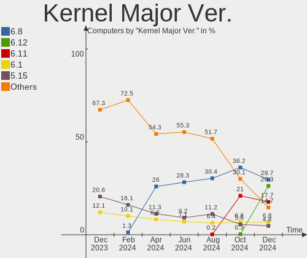
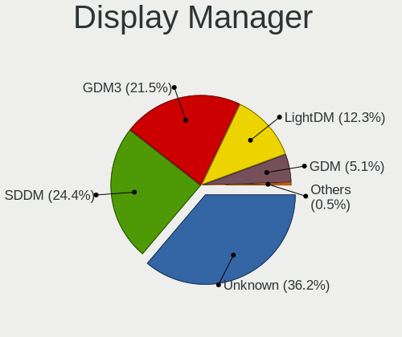
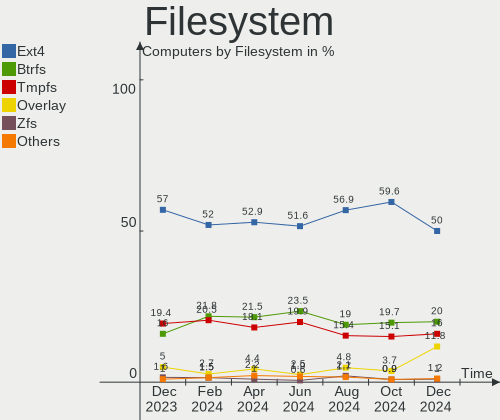
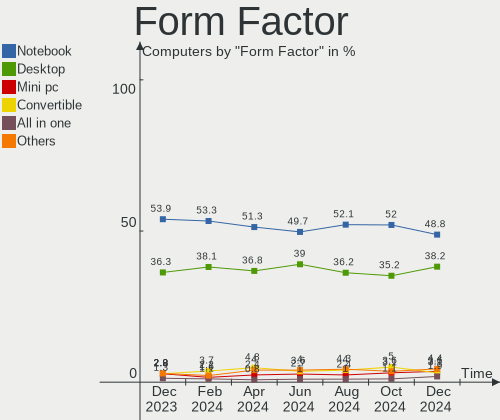
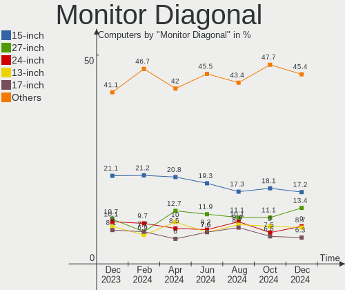
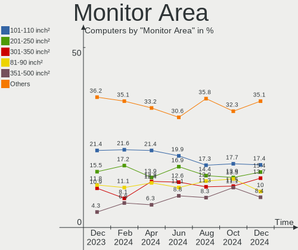
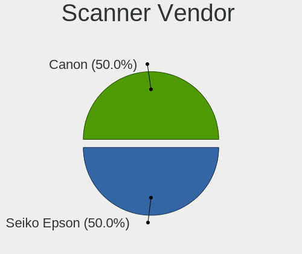

Linux in Germany - Hardware Trends
----------------------------------

A project to identify most popular hardware characteristics and track their change
over time based on data collected by Linux users at https://Linux-Hardware.org.

Anyone can contribute to this report by the [hw-probe](https://github.com/linuxhw/hw-probe) tool:

    sudo -E hw-probe -all -upload

This is a report for all computer types. See also reports for [desktops](/Location/Germany/Desktop/README.md) and [notebooks](/Location/Germany/Notebook/README.md).

Period: May, 2023.

Contents
--------

* [ System ](#system)
  - [ OS                       ](#os)
  - [ OS Family                ](#os-family)
  - [ Kernel                   ](#kernel)
  - [ Kernel Family            ](#kernel-family)
  - [ Kernel Major Ver.        ](#kernel-major-ver)
  - [ Arch                     ](#arch)
  - [ DE                       ](#de)
  - [ Display Server           ](#display-server)
  - [ Display Manager          ](#display-manager)
  - [ OS Lang                  ](#os-lang)
  - [ Boot Mode                ](#boot-mode)
  - [ Filesystem               ](#filesystem)
  - [ Part. scheme             ](#part-scheme)
  - [ Dual Boot with Linux/BSD ](#dual-boot-with-linuxbsd)
  - [ Dual Boot (Win)          ](#dual-boot-win)

* [ Board ](#board)
  - [ Vendor                   ](#vendor)
  - [ Model                    ](#model)
  - [ Model Family             ](#model-family)
  - [ MFG Year                 ](#mfg-year)
  - [ Form Factor              ](#form-factor)
  - [ Secure Boot              ](#secure-boot)
  - [ Coreboot                 ](#coreboot)
  - [ RAM Size                 ](#ram-size)
  - [ RAM Used                 ](#ram-used)
  - [ Total Drives             ](#total-drives)
  - [ Has CD-ROM               ](#has-cd-rom)
  - [ Has Ethernet             ](#has-ethernet)
  - [ Has WiFi                 ](#has-wifi)
  - [ Has Bluetooth            ](#has-bluetooth)

* [ Location ](#location)
  - [ Country                  ](#country)
  - [ City                     ](#city)

* [ Drives ](#drives)
  - [ Drive Vendor             ](#drive-vendor)
  - [ Drive Model              ](#drive-model)
  - [ HDD Vendor               ](#hdd-vendor)
  - [ SSD Vendor               ](#ssd-vendor)
  - [ Drive Kind               ](#drive-kind)
  - [ Drive Connector          ](#drive-connector)
  - [ Drive Size               ](#drive-size)
  - [ Space Total              ](#space-total)
  - [ Space Used               ](#space-used)
  - [ Malfunc. Drives          ](#malfunc-drives)
  - [ Malfunc. Drive Vendor    ](#malfunc-drive-vendor)
  - [ Malfunc. HDD Vendor      ](#malfunc-hdd-vendor)
  - [ Malfunc. Drive Kind      ](#malfunc-drive-kind)
  - [ Failed Drives            ](#failed-drives)
  - [ Failed Drive Vendor      ](#failed-drive-vendor)
  - [ Drive Status             ](#drive-status)

* [ Storage controller ](#storage-controller)
  - [ Storage Vendor           ](#storage-vendor)
  - [ Storage Model            ](#storage-model)
  - [ Storage Kind             ](#storage-kind)

* [ Processor ](#processor)
  - [ CPU Vendor               ](#cpu-vendor)
  - [ CPU Model                ](#cpu-model)
  - [ CPU Model Family         ](#cpu-model-family)
  - [ CPU Cores                ](#cpu-cores)
  - [ CPU Sockets              ](#cpu-sockets)
  - [ CPU Threads              ](#cpu-threads)
  - [ CPU Op-Modes             ](#cpu-op-modes)
  - [ CPU Microcode            ](#cpu-microcode)
  - [ CPU Microarch            ](#cpu-microarch)

* [ Graphics ](#graphics)
  - [ GPU Vendor               ](#gpu-vendor)
  - [ GPU Model                ](#gpu-model)
  - [ GPU Combo                ](#gpu-combo)
  - [ GPU Driver               ](#gpu-driver)
  - [ GPU Memory               ](#gpu-memory)

* [ Monitor ](#monitor)
  - [ Monitor Vendor           ](#monitor-vendor)
  - [ Monitor Model            ](#monitor-model)
  - [ Monitor Resolution       ](#monitor-resolution)
  - [ Monitor Diagonal         ](#monitor-diagonal)
  - [ Monitor Width            ](#monitor-width)
  - [ Aspect Ratio             ](#aspect-ratio)
  - [ Monitor Area             ](#monitor-area)
  - [ Pixel Density            ](#pixel-density)
  - [ Multiple Monitors        ](#multiple-monitors)

* [ Network ](#network)
  - [ Net Controller Vendor    ](#net-controller-vendor)
  - [ Net Controller Model     ](#net-controller-model)
  - [ Wireless Vendor          ](#wireless-vendor)
  - [ Wireless Model           ](#wireless-model)
  - [ Ethernet Vendor          ](#ethernet-vendor)
  - [ Ethernet Model           ](#ethernet-model)
  - [ Net Controller Kind      ](#net-controller-kind)
  - [ Used Controller          ](#used-controller)
  - [ NICs                     ](#nics)
  - [ IPv6                     ](#ipv6)

* [ Bluetooth ](#bluetooth)
  - [ Bluetooth Vendor         ](#bluetooth-vendor)
  - [ Bluetooth Model          ](#bluetooth-model)

* [ Sound ](#sound)
  - [ Sound Vendor             ](#sound-vendor)
  - [ Sound Model              ](#sound-model)

* [ Memory ](#memory)
  - [ Memory Vendor            ](#memory-vendor)
  - [ Memory Model             ](#memory-model)
  - [ Memory Kind              ](#memory-kind)
  - [ Memory Form Factor       ](#memory-form-factor)
  - [ Memory Size              ](#memory-size)
  - [ Memory Speed             ](#memory-speed)

* [ Printers & scanners ](#printers--scanners)
  - [ Printer Vendor           ](#printer-vendor)
  - [ Printer Model            ](#printer-model)
  - [ Scanner Vendor           ](#scanner-vendor)
  - [ Scanner Model            ](#scanner-model)

* [ Camera ](#camera)
  - [ Camera Vendor            ](#camera-vendor)
  - [ Camera Model             ](#camera-model)

* [ Security ](#security)
  - [ Fingerprint Vendor       ](#fingerprint-vendor)
  - [ Fingerprint Model        ](#fingerprint-model)
  - [ Chipcard Vendor          ](#chipcard-vendor)
  - [ Chipcard Model           ](#chipcard-model)

* [ Unsupported ](#unsupported)
  - [ Unsupported Devices      ](#unsupported-devices)
  - [ Unsupported Device Types ](#unsupported-device-types)

System
------

OS
--

Installed operating systems

| Name                         | Computers | Percent |
|------------------------------|-----------|---------|
| Linux Mint 21.1              | 72        | 12.24%  |
| Ubuntu 22.04                 | 61        | 10.37%  |
| Fedora 38                    | 39        | 6.63%   |
| Ubuntu 23.04                 | 35        | 5.95%   |
| Debian 11                    | 33        | 5.61%   |
| OpenMandriva 23.03           | 32        | 5.44%   |
| Arch Rolling                 | 21        | 3.57%   |
| Debian 12                    | 20        | 3.4%    |
| Zorin 16                     | 17        | 2.89%   |
| Ubuntu 20.04                 | 14        | 2.38%   |
| Pop!_OS 22.04                | 14        | 2.38%   |
| ArcoLinux Rolling            | 13        | 2.21%   |
| Linux Mint 20.3              | 12        | 2.04%   |
| Kubuntu 22.04                | 10        | 1.7%    |
| openSUSE Tumbleweed-XXXXXXXX | 9         | 1.53%   |
| Gentoo 2.13                  | 9         | 1.53%   |
| Linux Mint 21                | 7         | 1.19%   |
| Kubuntu 23.04                | 7         | 1.19%   |
| Ubuntu 22.10                 | 6         | 1.02%   |
| SteamOS 3.4.6                | 6         | 1.02%   |
| Manjaro                      | 6         | 1.02%   |
| Lubuntu 22.04                | 6         | 1.02%   |
| Elementary 7                 | 6         | 1.02%   |
| ROSA 12.4                    | 5         | 0.85%   |
| Manjaro 22.1.1               | 5         | 0.85%   |
| LMDE 5                       | 5         | 0.85%   |
| KDE neon 22.04               | 5         | 0.85%   |
| Xubuntu 22.04                | 4         | 0.68%   |
| TUXEDO OS 22.04              | 4         | 0.68%   |
| Nobara 37                    | 4         | 0.68%   |
| Kali 2023.1                  | 4         | 0.68%   |
| Fedora 37                    | 4         | 0.68%   |
| EndeavourOS Rolling          | 4         | 0.68%   |
| BlackPanther 18.1            | 4         | 0.68%   |
| Ubuntu MATE 22.04            | 3         | 0.51%   |
| Ubuntu Budgie 22.04          | 3         | 0.51%   |
| Siduction 12                 | 3         | 0.51%   |
| openSUSE Leap-15.4           | 3         | 0.51%   |
| Linux Mint 20.2              | 3         | 0.51%   |
| Garuda Linux Soaring         | 3         | 0.51%   |

OS Family
---------

OS without a version

| Name          | Computers | Percent |
|---------------|-----------|---------|
| Ubuntu        | 120       | 20.41%  |
| Linux Mint    | 98        | 16.67%  |
| Debian        | 53        | 9.01%   |
| Fedora        | 44        | 7.48%   |
| OpenMandriva  | 40        | 6.8%    |
| Arch          | 21        | 3.57%   |
| Kubuntu       | 19        | 3.23%   |
| Zorin         | 18        | 3.06%   |
| Manjaro       | 16        | 2.72%   |
| Pop!_OS       | 14        | 2.38%   |
| ArcoLinux     | 14        | 2.38%   |
| openSUSE      | 12        | 2.04%   |
| Gentoo        | 9         | 1.53%   |
| Xubuntu       | 7         | 1.19%   |
| SteamOS       | 7         | 1.19%   |
| ROSA          | 6         | 1.02%   |
| Lubuntu       | 6         | 1.02%   |
| Elementary    | 6         | 1.02%   |
| Ubuntu MATE   | 5         | 0.85%   |
| Nobara        | 5         | 0.85%   |
| LMDE          | 5         | 0.85%   |
| KDE neon      | 5         | 0.85%   |
| Kali          | 5         | 0.85%   |
| BlackPanther  | 5         | 0.85%   |
| Ubuntu Budgie | 4         | 0.68%   |
| TUXEDO OS     | 4         | 0.68%   |
| EndeavourOS   | 4         | 0.68%   |
| Ubuntu Unity  | 3         | 0.51%   |
| Siduction     | 3         | 0.51%   |
| NixOS         | 3         | 0.51%   |
| Garuda Linux  | 3         | 0.51%   |
| Raspbian      | 2         | 0.34%   |
| Linux Lite    | 2         | 0.34%   |
| blendOS       | 2         | 0.34%   |
| XCP-ng        | 1         | 0.17%   |
| Void Linux    | 1         | 0.17%   |
| Ubuntu Studio | 1         | 0.17%   |
| SolydXK       | 1         | 0.17%   |
| Slackware     | 1         | 0.17%   |
| Peppermint    | 1         | 0.17%   |

Kernel
------

Version of the Linux kernel

| Version                           | Computers | Percent |
|-----------------------------------|-----------|---------|
| 5.19.0-41-generic                 | 62        | 10.54%  |
| 5.15.0-71-generic                 | 53        | 9.01%   |
| 6.2.0-20-generic                  | 44        | 7.48%   |
| 5.15.0-72-generic                 | 41        | 6.97%   |
| 6.2.6-desktop-1omv2390            | 32        | 5.44%   |
| 5.19.0-42-generic                 | 19        | 3.23%   |
| 5.10.0-22-amd64                   | 17        | 2.89%   |
| 6.2.15-300.fc38.x86_64            | 16        | 2.72%   |
| 6.2.6-76060206-generic            | 13        | 2.21%   |
| 6.3.2-arch1-1                     | 11        | 1.87%   |
| 6.1.0-9-amd64                     | 11        | 1.87%   |
| 6.2.14-300.fc38.x86_64            | 9         | 1.53%   |
| 5.4.0-148-generic                 | 9         | 1.53%   |
| 5.10.0-23-amd64                   | 9         | 1.53%   |
| 6.3.1-arch2-1                     | 8         | 1.36%   |
| 5.13.0-valve36-1-neptune          | 7         | 1.19%   |
| 6.3.1-arch1-1                     | 6         | 1.02%   |
| 6.1.0-7-amd64                     | 6         | 1.02%   |
| 5.15.0-69-generic                 | 6         | 1.02%   |
| 6.3.4-arch1-1                     | 5         | 0.85%   |
| 6.2.0-10005-tuxedo                | 5         | 0.85%   |
| 6.1.26-1-MANJARO                  | 5         | 0.85%   |
| 6.2.9-300.fc38.x86_64             | 4         | 0.68%   |
| 6.1.20-generic-2rosa2021.1-x86_64 | 4         | 0.68%   |
| 5.4.0-149-generic                 | 4         | 0.68%   |
| 6.3.2-1-default                   | 3         | 0.51%   |
| 6.2.14-300.fsync.fc37.x86_64      | 3         | 0.51%   |
| 6.2.13-arch1-1                    | 3         | 0.51%   |
| 6.2.13-300.fc38.x86_64            | 3         | 0.51%   |
| 6.2.11-300.fc38.x86_64            | 3         | 0.51%   |
| 6.2.0-10007-tuxedo                | 3         | 0.51%   |
| 6.1.27-1-lts                      | 3         | 0.51%   |
| 5.15.0-67-generic                 | 3         | 0.51%   |
| 5.15.0-56-generic                 | 3         | 0.51%   |
| 6.3.3-arch1-1                     | 2         | 0.34%   |
| 6.3.3-200.fc38.x86_64             | 2         | 0.34%   |
| 6.3.3-1-MANJARO                   | 2         | 0.34%   |
| 6.3.2-zen1-1-zen                  | 2         | 0.34%   |
| 6.3.1-zen1-1-zen                  | 2         | 0.34%   |
| 6.3.1-2-default                   | 2         | 0.34%   |

Kernel Family
-------------

Linux kernel without a distro release

| Version | Computers | Percent |
|---------|-----------|---------|
| 5.15.0  | 121       | 20.58%  |
| 5.19.0  | 90        | 15.31%  |
| 6.2.0   | 54        | 9.18%   |
| 6.2.6   | 45        | 7.65%   |
| 5.10.0  | 33        | 5.61%   |
| 6.3.1   | 27        | 4.59%   |
| 6.1.0   | 27        | 4.59%   |
| 5.4.0   | 21        | 3.57%   |
| 6.2.15  | 18        | 3.06%   |
| 6.3.2   | 17        | 2.89%   |
| 6.2.14  | 14        | 2.38%   |
| 6.3.3   | 10        | 1.7%    |
| 6.2.13  | 8         | 1.36%   |
| 5.13.0  | 8         | 1.36%   |
| 6.3.4   | 7         | 1.19%   |
| 6.2.12  | 5         | 0.85%   |
| 6.2.11  | 5         | 0.85%   |
| 6.1.27  | 5         | 0.85%   |
| 6.1.26  | 5         | 0.85%   |
| 6.3.0   | 4         | 0.68%   |
| 6.2.9   | 4         | 0.68%   |
| 6.1.20  | 4         | 0.68%   |
| 6.0.0   | 4         | 0.68%   |
| 6.1.21  | 3         | 0.51%   |
| 6.1.19  | 3         | 0.51%   |
| 5.14.21 | 3         | 0.51%   |
| 4.15.0  | 3         | 0.51%   |
| 6.1.30  | 2         | 0.34%   |
| 6.1.29  | 2         | 0.34%   |
| 6.1.1   | 2         | 0.34%   |
| 5.16.13 | 2         | 0.34%   |
| 5.15.85 | 2         | 0.34%   |
| 6.3.5   | 1         | 0.17%   |
| 6.2.10  | 1         | 0.17%   |
| 6.1.8   | 1         | 0.17%   |
| 6.1.4   | 1         | 0.17%   |
| 6.1.11  | 1         | 0.17%   |
| 6.0.17  | 1         | 0.17%   |
| 6.0.14  | 1         | 0.17%   |
| 6.0.10  | 1         | 0.17%   |

Kernel Major Ver.
-----------------

Linux kernel major version

| Version | Computers | Percent |
|---------|-----------|---------|
| 6.2     | 154       | 26.19%  |
| 5.15    | 133       | 22.62%  |
| 5.19    | 90        | 15.31%  |
| 6.3     | 66        | 11.22%  |
| 6.1     | 56        | 9.52%   |
| 5.10    | 34        | 5.78%   |
| 5.4     | 21        | 3.57%   |
| 5.13    | 8         | 1.36%   |
| 6.0     | 7         | 1.19%   |
| 5.14    | 4         | 0.68%   |
| 5.18    | 3         | 0.51%   |
| 5.16    | 3         | 0.51%   |
| 4.15    | 3         | 0.51%   |
| 5.11    | 2         | 0.34%   |
| 5.6     | 1         | 0.17%   |
| 4.9     | 1         | 0.17%   |
| 4.19    | 1         | 0.17%   |
| 4.18    | 1         | 0.17%   |

Arch
----

OS architecture (x86_64, i586, etc.)

| Name    | Computers | Percent |
|---------|-----------|---------|
| x86_64  | 576       | 97.96%  |
| i686    | 5         | 0.85%   |
| aarch64 | 4         | 0.68%   |
| armv7l  | 2         | 0.34%   |
| riscv64 | 1         | 0.17%   |

DE
--

Desktop Environment

| Name           | Computers | Percent |
|----------------|-----------|---------|
| GNOME          | 226       | 38.44%  |
| KDE5           | 132       | 22.45%  |
| X-Cinnamon     | 84        | 14.29%  |
| XFCE           | 35        | 5.95%   |
| Unknown        | 30        | 5.1%    |
| MATE           | 22        | 3.74%   |
| LXQt           | 12        | 2.04%   |
| i3             | 8         | 1.36%   |
| Cinnamon       | 8         | 1.36%   |
| Pantheon       | 6         | 1.02%   |
| Budgie         | 5         | 0.85%   |
| Hyprland       | 4         | 0.68%   |
| Unity          | 3         | 0.51%   |
| KDE            | 2         | 0.34%   |
| GNOME Classic  | 2         | 0.34%   |
| Deepin         | 2         | 0.34%   |
| Trinity        | 1         | 0.17%   |
| LXDE           | 1         | 0.17%   |
| KDE4           | 1         | 0.17%   |
| i3-with-shmlog | 1         | 0.17%   |
| fluxbox        | 1         | 0.17%   |
| bspwm          | 1         | 0.17%   |
| awesome        | 1         | 0.17%   |

Display Server
--------------

X11 or Wayland

| Name    | Computers | Percent |
|---------|-----------|---------|
| X11     | 380       | 64.63%  |
| Wayland | 171       | 29.08%  |
| Tty     | 19        | 3.23%   |
| Unknown | 18        | 3.06%   |

Display Manager
---------------

SDDM, LightDM, etc.

| Name    | Computers | Percent |
|---------|-----------|---------|
| Unknown | 216       | 36.73%  |
| GDM3    | 122       | 20.75%  |
| SDDM    | 113       | 19.22%  |
| LightDM | 107       | 18.2%   |
| GDM     | 29        | 4.93%   |
| KDM     | 1         | 0.17%   |

OS Lang
-------

Language

| Lang    | Computers | Percent |
|---------|-----------|---------|
| de_DE   | 412       | 70.07%  |
| en_US   | 120       | 20.41%  |
| C       | 13        | 2.21%   |
| Unknown | 12        | 2.04%   |
| en_GB   | 10        | 1.7%    |
| ru_RU   | 5         | 0.85%   |
| en_DE   | 3         | 0.51%   |
| tr_TR   | 2         | 0.34%   |
| ru_UA   | 2         | 0.34%   |
| POSIX   | 2         | 0.34%   |
| C.UTF8  | 2         | 0.34%   |
| it_IT   | 1         | 0.17%   |
| fr_FR   | 1         | 0.17%   |
| en_IE   | 1         | 0.17%   |
| en_CA   | 1         | 0.17%   |
| de_BE   | 1         | 0.17%   |

Boot Mode
---------

EFI or BIOS

| Mode | Computers | Percent |
|------|-----------|---------|
| EFI  | 318       | 54.08%  |
| BIOS | 270       | 45.92%  |

Filesystem
----------

Type of filesystem

| Type    | Computers | Percent |
|---------|-----------|---------|
| Ext4    | 376       | 63.95%  |
| Btrfs   | 93        | 15.82%  |
| Tmpfs   | 83        | 14.12%  |
| Overlay | 21        | 3.57%   |
| Zfs     | 6         | 1.02%   |
| Xfs     | 6         | 1.02%   |
| Ext3    | 2         | 0.34%   |
| Ext2    | 1         | 0.17%   |

Part. scheme
------------

Scheme of partitioning

| Type    | Computers | Percent |
|---------|-----------|---------|
| GPT     | 335       | 56.97%  |
| Unknown | 186       | 31.63%  |
| MBR     | 67        | 11.39%  |

Dual Boot with Linux/BSD
------------------------

Hosting more than one Linux/BSD

| Dual boot | Computers | Percent |
|-----------|-----------|---------|
| No        | 499       | 84.86%  |
| Yes       | 89        | 15.14%  |

Dual Boot (Win)
---------------

Hosting Linux and Windows

| Dual boot | Computers | Percent |
|-----------|-----------|---------|
| No        | 436       | 74.15%  |
| Yes       | 152       | 25.85%  |

Board
-----

Vendor
------

Motherboard manufacturer

| Name                    | Computers | Percent |
|-------------------------|-----------|---------|
| Lenovo                  | 98        | 16.67%  |
| ASUSTek Computer        | 95        | 16.16%  |
| Hewlett-Packard         | 58        | 9.86%   |
| Dell                    | 55        | 9.35%   |
| Gigabyte Technology     | 45        | 7.65%   |
| Acer                    | 37        | 6.29%   |
| MSI                     | 29        | 4.93%   |
| ASRock                  | 26        | 4.42%   |
| Apple                   | 16        | 2.72%   |
| Fujitsu                 | 14        | 2.38%   |
| Medion                  | 11        | 1.87%   |
| TUXEDO                  | 10        | 1.7%    |
| Unknown                 | 9         | 1.53%   |
| HUAWEI                  | 8         | 1.36%   |
| Valve                   | 7         | 1.19%   |
| Toshiba                 | 6         | 1.02%   |
| Fujitsu Siemens         | 6         | 1.02%   |
| Microsoft               | 5         | 0.85%   |
| Intel                   | 4         | 0.68%   |
| ZOTAC                   | 3         | 0.51%   |
| Sony                    | 3         | 0.51%   |
| Samsung Electronics     | 3         | 0.51%   |
| Raspberry Pi Foundation | 3         | 0.51%   |
| Packard Bell            | 3         | 0.51%   |
| Wortmann AG             | 2         | 0.34%   |
| Supermicro              | 2         | 0.34%   |
| Foxconn                 | 2         | 0.34%   |
| BESSTAR Tech            | 2         | 0.34%   |
| AMI                     | 2         | 0.34%   |
| YANYU                   | 1         | 0.17%   |
| VALE                    | 1         | 0.17%   |
| TYAN Computer           | 1         | 0.17%   |
| Tactus                  | 1         | 0.17%   |
| sunxi                   | 1         | 0.17%   |
| Razer                   | 1         | 0.17%   |
| Pegatron                | 1         | 0.17%   |
| PC Specialist           | 1         | 0.17%   |
| Nvidia                  | 1         | 0.17%   |
| Notebook                | 1         | 0.17%   |
| MICROBYTE               | 1         | 0.17%   |

Model
-----

Motherboard model

| Name                                  | Computers | Percent |
|---------------------------------------|-----------|---------|
| Unknown                               | 12        | 2.04%   |
| Valve Jupiter                         | 7         | 1.19%   |
| MSI MS-7A38                           | 4         | 0.68%   |
| MSI MS-7B86                           | 3         | 0.51%   |
| HUAWEI HVY-WXX9                       | 3         | 0.51%   |
| HP Laptop 15s-eq2xxx                  | 3         | 0.51%   |
| HP EliteDesk 800 G2 DM 35W            | 3         | 0.51%   |
| Gigabyte X570 AORUS ELITE             | 3         | 0.51%   |
| ASUS PRIME B450-PLUS                  | 3         | 0.51%   |
| Acer Swift SF114-34                   | 3         | 0.51%   |
| MSI MS-7309                           | 2         | 0.34%   |
| Lenovo ThinkPad X13 Gen 2a 20XHCTO1WW | 2         | 0.34%   |
| Lenovo ThinkPad T14 Gen 3 21AHCTO1WW  | 2         | 0.34%   |
| Lenovo ThinkPad E15 Gen 4 21EES00100  | 2         | 0.34%   |
| Lenovo MIIX 310-10ICR 80SG            | 2         | 0.34%   |
| Lenovo G50-70 20351                   | 2         | 0.34%   |
| HUAWEI BOHK-WAX9X                     | 2         | 0.34%   |
| HP Pavilion dv6                       | 2         | 0.34%   |
| Gigabyte B450 AORUS M                 | 2         | 0.34%   |
| Fujitsu Siemens ESPRIMO P5730         | 2         | 0.34%   |
| Dell XPS 13 9305                      | 2         | 0.34%   |
| Dell Precision T1700                  | 2         | 0.34%   |
| Dell Latitude 7430                    | 2         | 0.34%   |
| ASUS TUF Gaming X570-PLUS             | 2         | 0.34%   |
| ASUS ROG STRIX B550-F GAMING          | 2         | 0.34%   |
| ASUS PRIME B350-PLUS                  | 2         | 0.34%   |
| ASUS K53SV                            | 2         | 0.34%   |
| ASUS K53SK                            | 2         | 0.34%   |
| ASRock B450 Gaming-ITX/ac             | 2         | 0.34%   |
| ASRock 970 Pro3 R2.0                  | 2         | 0.34%   |
| Apple MacBookPro12,1                  | 2         | 0.34%   |
| ZOTAC ZBOX-ECM73070C/7307LH/53060C    | 1         | 0.17%   |
| YANYU EPIC-N56_I522E Ver              | 1         | 0.17%   |
| Wortmann AG TERRA_MOBILE_1528P/1748P  | 1         | 0.17%   |
| Wortmann AG 1220552_1470050           | 1         | 0.17%   |
| VALE Notebook Classic C140            | 1         | 0.17%   |
| TYAN VT82C694T                        | 1         | 0.17%   |
| TUXEDO Stellaris/Polaris AMD Gen4     | 1         | 0.17%   |
| TUXEDO Pulse 15 Gen2                  | 1         | 0.17%   |
| TUXEDO Pulse 15 Gen1                  | 1         | 0.17%   |

Model Family
------------

Motherboard model prefix

| Name                    | Computers | Percent |
|-------------------------|-----------|---------|
| Lenovo ThinkPad         | 59        | 10.03%  |
| Dell Latitude           | 20        | 3.4%    |
| ASUS ROG                | 20        | 3.4%    |
| Acer Aspire             | 20        | 3.4%    |
| HP Pavilion             | 13        | 2.21%   |
| Unknown                 | 12        | 2.04%   |
| ASUS PRIME              | 11        | 1.87%   |
| Lenovo IdeaPad          | 10        | 1.7%    |
| HP Laptop               | 10        | 1.7%    |
| HP EliteBook            | 10        | 1.7%    |
| Dell Precision          | 9         | 1.53%   |
| Valve Jupiter           | 7         | 1.19%   |
| Fujitsu LIFEBOOK        | 7         | 1.19%   |
| Dell XPS                | 7         | 1.19%   |
| ASUS VivoBook           | 7         | 1.19%   |
| Dell OptiPlex           | 6         | 1.02%   |
| Toshiba Satellite       | 5         | 0.85%   |
| Microsoft Surface       | 5         | 0.85%   |
| Dell Inspiron           | 5         | 0.85%   |
| ASUS TUF                | 5         | 0.85%   |
| Acer Swift              | 5         | 0.85%   |
| MSI MS-7A38             | 4         | 0.68%   |
| Lenovo ThinkCentre      | 4         | 0.68%   |
| Lenovo ThinkBook        | 4         | 0.68%   |
| HP ProBook              | 4         | 0.68%   |
| HP ENVY                 | 4         | 0.68%   |
| HP EliteDesk            | 4         | 0.68%   |
| Gigabyte X570           | 4         | 0.68%   |
| Fujitsu ESPRIMO         | 4         | 0.68%   |
| RPi Raspberry           | 3         | 0.51%   |
| MSI MS-7B86             | 3         | 0.51%   |
| HUAWEI HVY-WXX9         | 3         | 0.51%   |
| HP Compaq               | 3         | 0.51%   |
| Gigabyte Z390           | 3         | 0.51%   |
| Gigabyte B550           | 3         | 0.51%   |
| Gigabyte B450           | 3         | 0.51%   |
| Fujitsu Siemens ESPRIMO | 3         | 0.51%   |
| Dell Vostro             | 3         | 0.51%   |
| ASUS Zenbook            | 3         | 0.51%   |
| ASUS SABERTOOTH         | 3         | 0.51%   |

MFG Year
--------

Motherboard manufacture year

| Year    | Computers | Percent |
|---------|-----------|---------|
| 2021    | 64        | 10.88%  |
| 2020    | 62        | 10.54%  |
| 2018    | 55        | 9.35%   |
| 2022    | 54        | 9.18%   |
| 2019    | 52        | 8.84%   |
| 2012    | 39        | 6.63%   |
| 2013    | 36        | 6.12%   |
| 2017    | 34        | 5.78%   |
| 2010    | 30        | 5.1%    |
| 2011    | 29        | 4.93%   |
| 2009    | 23        | 3.91%   |
| 2015    | 22        | 3.74%   |
| 2014    | 22        | 3.74%   |
| 2016    | 21        | 3.57%   |
| 2023    | 14        | 2.38%   |
| 2008    | 12        | 2.04%   |
| 2007    | 9         | 1.53%   |
| Unknown | 6         | 1.02%   |
| 2006    | 3         | 0.51%   |
| 2002    | 1         | 0.17%   |

Form Factor
-----------

Physical design of the computer

| Name           | Computers | Percent |
|----------------|-----------|---------|
| Notebook       | 301       | 51.19%  |
| Desktop        | 226       | 38.44%  |
| Convertible    | 23        | 3.91%   |
| Mini pc        | 13        | 2.21%   |
| Tablet         | 9         | 1.53%   |
| System on chip | 7         | 1.19%   |
| All in one     | 5         | 0.85%   |
| Server         | 4         | 0.68%   |

Secure Boot
-----------

Enabled or disabled

| State    | Computers | Percent |
|----------|-----------|---------|
| Disabled | 544       | 92.52%  |
| Enabled  | 44        | 7.48%   |

Coreboot
--------

Have coreboot on board

| Used | Computers | Percent |
|------|-----------|---------|
| No   | 586       | 99.66%  |
| Yes  | 2         | 0.34%   |

RAM Size
--------

Total RAM memory

| Size in GB      | Computers | Percent |
|-----------------|-----------|---------|
| 4.01-8.0        | 130       | 22.11%  |
| 16.01-24.0      | 119       | 20.24%  |
| 8.01-16.0       | 104       | 17.69%  |
| 3.01-4.0        | 98        | 16.67%  |
| 32.01-64.0      | 81        | 13.78%  |
| 64.01-256.0     | 27        | 4.59%   |
| 24.01-32.0      | 14        | 2.38%   |
| 1.01-2.0        | 8         | 1.36%   |
| 2.01-3.0        | 3         | 0.51%   |
| 0.51-1.0        | 3         | 0.51%   |
| More than 256.0 | 1         | 0.17%   |

RAM Used
--------

Used RAM memory

| Used GB    | Computers | Percent |
|------------|-----------|---------|
| 1.01-2.0   | 190       | 32.31%  |
| 2.01-3.0   | 151       | 25.68%  |
| 4.01-8.0   | 106       | 18.03%  |
| 3.01-4.0   | 77        | 13.1%   |
| 8.01-16.0  | 23        | 3.91%   |
| 0.51-1.0   | 23        | 3.91%   |
| 0.01-0.5   | 8         | 1.36%   |
| 16.01-24.0 | 6         | 1.02%   |
| 24.01-32.0 | 3         | 0.51%   |
| 32.01-64.0 | 1         | 0.17%   |

Total Drives
------------

Number of drives on board

| Drives | Computers | Percent |
|--------|-----------|---------|
| 1      | 324       | 55.1%   |
| 2      | 154       | 26.19%  |
| 3      | 52        | 8.84%   |
| 4      | 24        | 4.08%   |
| 6      | 13        | 2.21%   |
| 5      | 11        | 1.87%   |
| 7      | 4         | 0.68%   |
| 0      | 4         | 0.68%   |
| 79     | 1         | 0.17%   |
| 9      | 1         | 0.17%   |

Has CD-ROM
----------

Has CD-ROM on board

| Presented | Computers | Percent |
|-----------|-----------|---------|
| No        | 380       | 64.63%  |
| Yes       | 208       | 35.37%  |

Has Ethernet
------------

Has Ethernet on board

| Presented | Computers | Percent |
|-----------|-----------|---------|
| Yes       | 502       | 85.37%  |
| No        | 86        | 14.63%  |

Has WiFi
--------

Has WiFi module

| Presented | Computers | Percent |
|-----------|-----------|---------|
| Yes       | 455       | 77.38%  |
| No        | 133       | 22.62%  |

Has Bluetooth
-------------

Has Bluetooth module

| Presented | Computers | Percent |
|-----------|-----------|---------|
| Yes       | 369       | 62.76%  |
| No        | 219       | 37.24%  |

Location
--------

Country
-------

Geographic location (country)

| Country | Computers | Percent |
|---------|-----------|---------|
| Germany | 588       | 100%    |

City
----

Geographic location (city)

| City                   | Computers | Percent |
|------------------------|-----------|---------|
| Berlin                 | 54        | 9.18%   |
| Hamburg                | 28        | 4.76%   |
| Munich                 | 19        | 3.23%   |
| Frankfurt am Main      | 19        | 3.23%   |
| Dortmund               | 12        | 2.04%   |
| Cologne                | 12        | 2.04%   |
| Düsseldorf            | 11        | 1.87%   |
| Leipzig                | 10        | 1.7%    |
| Essen                  | 10        | 1.7%    |
| Nuremberg              | 9         | 1.53%   |
| Hanover                | 9         | 1.53%   |
| Stuttgart              | 7         | 1.19%   |
| Karlsruhe              | 7         | 1.19%   |
| Mannheim               | 6         | 1.02%   |
| Siegsdorf              | 5         | 0.85%   |
| Dresden                | 5         | 0.85%   |
| Bonn                   | 5         | 0.85%   |
| Bielefeld              | 5         | 0.85%   |
| Villingen-Schwenningen | 4         | 0.68%   |
| Singen                 | 4         | 0.68%   |
| Münster               | 4         | 0.68%   |
| Delligsen              | 4         | 0.68%   |
| Bremen                 | 4         | 0.68%   |
| Bochum                 | 4         | 0.68%   |
| Aachen                 | 4         | 0.68%   |
| Oberhausen             | 3         | 0.51%   |
| Neunkirchen            | 3         | 0.51%   |
| Ludwigshafen am Rhein  | 3         | 0.51%   |
| Landau                 | 3         | 0.51%   |
| Kiel                   | 3         | 0.51%   |
| Jena                   | 3         | 0.51%   |
| Ingolstadt             | 3         | 0.51%   |
| Hanau                  | 3         | 0.51%   |
| Hamm                   | 3         | 0.51%   |
| Gladbeck               | 3         | 0.51%   |
| Freiburg im Breisgau   | 3         | 0.51%   |
| Duisburg               | 3         | 0.51%   |
| Augsburg               | 3         | 0.51%   |
| Wuppertal              | 2         | 0.34%   |
| Wolfsburg              | 2         | 0.34%   |

Drives
------

Drive Vendor
------------

Hard drive vendors

| Vendor                      | Computers | Drives | Percent |
|-----------------------------|-----------|--------|---------|
| Samsung Electronics         | 195       | 267    | 21.93%  |
| WDC                         | 97        | 114    | 10.91%  |
| Seagate                     | 88        | 185    | 9.9%    |
| SanDisk                     | 65        | 76     | 7.31%   |
| Toshiba                     | 48        | 57     | 5.4%    |
| Crucial                     | 43        | 51     | 4.84%   |
| Unknown                     | 42        | 46     | 4.72%   |
| Intenso                     | 30        | 32     | 3.37%   |
| Kingston                    | 26        | 27     | 2.92%   |
| SK hynix                    | 23        | 24     | 2.59%   |
| Hitachi                     | 21        | 23     | 2.36%   |
| Micron Technology           | 18        | 18     | 2.02%   |
| Intel                       | 15        | 16     | 1.69%   |
| Apple                       | 12        | 16     | 1.35%   |
| HGST                        | 11        | 13     | 1.24%   |
| Micron/Crucial Technology   | 9         | 10     | 1.01%   |
| Kingston Technology Company | 9         | 9      | 1.01%   |
| Unknown                     | 8         | 8      | 0.9%    |
| Phison Electronics          | 7         | 7      | 0.79%   |
| KIOXIA                      | 7         | 7      | 0.79%   |
| Transcend                   | 6         | 6      | 0.67%   |
| Silicon Motion              | 6         | 6      | 0.67%   |
| China                       | 6         | 6      | 0.67%   |
| A-DATA Technology           | 5         | 5      | 0.56%   |
| UMIS                        | 4         | 4      | 0.45%   |
| Phison                      | 4         | 4      | 0.45%   |
| Patriot                     | 4         | 4      | 0.45%   |
| Netac                       | 4         | 4      | 0.45%   |
| LITEONIT                    | 4         | 4      | 0.45%   |
| Fujitsu                     | 4         | 4      | 0.45%   |
| WD MediaMax                 | 3         | 3      | 0.34%   |
| SPCC                        | 3         | 3      | 0.34%   |
| Lexar                       | 3         | 3      | 0.34%   |
| ADATA Technology            | 3         | 3      | 0.34%   |
| XPG                         | 2         | 2      | 0.22%   |
| Verbatim                    | 2         | 3      | 0.22%   |
| USB                         | 2         | 2      | 0.22%   |
| Union Memory (Shenzhen)     | 2         | 2      | 0.22%   |
| SSSTC                       | 2         | 2      | 0.22%   |
| SABRENT                     | 2         | 2      | 0.22%   |

Drive Model
-----------

Hard drive models

| Model                                               | Computers | Percent |
|-----------------------------------------------------|-----------|---------|
| Samsung NVMe SSD Controller SM981/PM981/PM983 256GB | 40        | 4%      |
| Samsung NVMe SSD Controller PM9A1/PM9A3/980PRO 1TB  | 20        | 2%      |
| Unknown MMC Card  64GB                              | 12        | 1.2%    |
| Samsung SSD 870 QVO 1TB                             | 10        | 1%      |
| Samsung SSD 980 1TB                                 | 8         | 0.8%    |
| Samsung SSD 970 EVO Plus 1TB                        | 8         | 0.8%    |
| Samsung SSD 850 EVO 250GB                           | 8         | 0.8%    |
| Unknown                                             | 8         | 0.8%    |
| SanDisk SSD PLUS 1000GB                             | 7         | 0.7%    |
| Samsung SSD 860 EVO 500GB                           | 7         | 0.7%    |
| Samsung SSD 850 EVO 500GB                           | 7         | 0.7%    |
| Toshiba DT01ACA100 1TB                              | 6         | 0.6%    |
| Samsung NVMe SSD Controller SM961/PM961/SM963 256GB | 6         | 0.6%    |
| Micron/Crucial P2 NVMe PCIe SSD 1TB                 | 6         | 0.6%    |
| Kingston Company SNV2S2000G 2TB                     | 6         | 0.6%    |
| Crucial CT500MX500SSD1 500GB                        | 6         | 0.6%    |
| Crucial CT1000MX500SSD1 1TB                         | 6         | 0.6%    |
| Seagate ST2000DM008-2FR102 2TB                      | 5         | 0.5%    |
| Sandisk WD Black SN750 / PC SN730 NVMe SSD 256GB    | 5         | 0.5%    |
| SanDisk SSD PLUS 480GB                              | 5         | 0.5%    |
| Samsung SSD 840 EVO 250GB                           | 5         | 0.5%    |
| Kingston SV300S37A60G 64GB SSD                      | 5         | 0.5%    |
| Crucial CT1000BX500SSD1 1TB                         | 5         | 0.5%    |
| WDC WD20EZRZ-00Z5HB0 2TB                            | 4         | 0.4%    |
| Unknown SD/MMC/MS PRO 64GB                          | 4         | 0.4%    |
| Unknown MMC Card  128GB                             | 4         | 0.4%    |
| UMIS RPJTJ512MGE1QDQ 512GB                          | 4         | 0.4%    |
| Toshiba MQ01ABD100 1TB                              | 4         | 0.4%    |
| Seagate ST4000DM004-2CV104 4TB                      | 4         | 0.4%    |
| Seagate ST2000LM007-1R8174 2TB                      | 4         | 0.4%    |
| Seagate ST1000LM024 HN-M101MBB 1TB                  | 4         | 0.4%    |
| Seagate ST1000DM003-1ER162 1TB                      | 4         | 0.4%    |
| Seagate Expansion 1TB                               | 4         | 0.4%    |
| SanDisk SSD PLUS 240GB                              | 4         | 0.4%    |
| SanDisk SSD PLUS 120GB                              | 4         | 0.4%    |
| Samsung SSD 980 500GB                               | 4         | 0.4%    |
| Samsung SSD 860 EVO 1TB                             | 4         | 0.4%    |
| Kingston SA400S37120G 120GB SSD                     | 4         | 0.4%    |
| Intenso SSD 256GB                                   | 4         | 0.4%    |
| HGST HTS541010A9E680 1TB                            | 4         | 0.4%    |

HDD Vendor
----------

Hard disk drive vendors

| Vendor              | Computers | Drives | Percent |
|---------------------|-----------|--------|---------|
| Seagate             | 83        | 180    | 30.74%  |
| WDC                 | 76        | 89     | 28.15%  |
| Toshiba             | 41        | 49     | 15.19%  |
| Hitachi             | 21        | 23     | 7.78%   |
| Samsung Electronics | 19        | 23     | 7.04%   |
| HGST                | 11        | 13     | 4.07%   |
| Unknown             | 4         | 4      | 1.48%   |
| Fujitsu             | 4         | 4      | 1.48%   |
| Apple               | 3         | 3      | 1.11%   |
| WD MediaMax         | 1         | 1      | 0.37%   |
| USB3.0              | 1         | 1      | 0.37%   |
| USB                 | 1         | 1      | 0.37%   |
| Intenso             | 1         | 1      | 0.37%   |
| FSR202              | 1         | 1      | 0.37%   |
| DELLBOSS            | 1         | 1      | 0.37%   |
| ASMT                | 1         | 1      | 0.37%   |
| ASMedia             | 1         | 1      | 0.37%   |

SSD Vendor
----------

Solid state drive vendors

| Vendor              | Computers | Drives | Percent |
|---------------------|-----------|--------|---------|
| Samsung Electronics | 82        | 103    | 25.87%  |
| SanDisk             | 47        | 55     | 14.83%  |
| Crucial             | 42        | 48     | 13.25%  |
| Intenso             | 24        | 26     | 7.57%   |
| Kingston            | 18        | 19     | 5.68%   |
| WDC                 | 17        | 18     | 5.36%   |
| China               | 6         | 6      | 1.89%   |
| Apple               | 6         | 6      | 1.89%   |
| Micron Technology   | 5         | 5      | 1.58%   |
| Intel               | 5         | 5      | 1.58%   |
| A-DATA Technology   | 5         | 5      | 1.58%   |
| Transcend           | 4         | 4      | 1.26%   |
| SK hynix            | 4         | 4      | 1.26%   |
| Netac               | 4         | 4      | 1.26%   |
| LITEONIT            | 4         | 4      | 1.26%   |
| SPCC                | 3         | 3      | 0.95%   |
| Phison              | 3         | 3      | 0.95%   |
| Patriot             | 3         | 3      | 0.95%   |
| Verbatim            | 2         | 3      | 0.63%   |
| Toshiba             | 2         | 2      | 0.63%   |
| SABRENT             | 2         | 2      | 0.63%   |
| PNY                 | 2         | 2      | 0.63%   |
| Mushkin             | 2         | 2      | 0.63%   |
| Leven               | 2         | 2      | 0.63%   |
| Fanxiang            | 2         | 2      | 0.63%   |
| Apacer              | 2         | 2      | 0.63%   |
| Unknown             | 2         | 2      | 0.63%   |
| WDC WDS2            | 1         | 1      | 0.32%   |
| V7                  | 1         | 1      | 0.32%   |
| USB                 | 1         | 1      | 0.32%   |
| TrekStor            | 1         | 1      | 0.32%   |
| TO Exter            | 1         | 1      | 0.32%   |
| Team                | 1         | 1      | 0.32%   |
| SD                  | 1         | 1      | 0.32%   |
| Plextor             | 1         | 1      | 0.32%   |
| Lexar               | 1         | 1      | 0.32%   |
| KingDian            | 1         | 1      | 0.32%   |
| JMicron Technology  | 1         | 1      | 0.32%   |
| INNOVATION IT       | 1         | 1      | 0.32%   |
| Innodisk            | 1         | 1      | 0.32%   |

Drive Kind
----------

HDD or SSD

| Kind    | Computers | Drives | Percent |
|---------|-----------|--------|---------|
| SSD     | 263       | 357    | 32.71%  |
| NVMe    | 254       | 304    | 31.59%  |
| HDD     | 227       | 396    | 28.23%  |
| MMC     | 39        | 40     | 4.85%   |
| Unknown | 21        | 25     | 2.61%   |

Drive Connector
---------------

SATA, SAS, NVMe, etc.

| Type | Computers | Drives | Percent |
|------|-----------|--------|---------|
| SATA | 390       | 727    | 53.72%  |
| NVMe | 253       | 302    | 34.85%  |
| SAS  | 44        | 53     | 6.06%   |
| MMC  | 39        | 40     | 5.37%   |

Drive Size
----------

Size of hard drive

| Size in TB | Computers | Drives | Percent |
|------------|-----------|--------|---------|
| 0.01-0.5   | 263       | 350    | 50%     |
| 0.51-1.0   | 161       | 198    | 30.61%  |
| 1.01-2.0   | 61        | 79     | 11.6%   |
| 3.01-4.0   | 23        | 79     | 4.37%   |
| 4.01-10.0  | 10        | 37     | 1.9%    |
| 2.01-3.0   | 6         | 8      | 1.14%   |
| 10.01-20.0 | 2         | 2      | 0.38%   |

Space Total
-----------

Amount of disk space available on the file system

| Size in GB     | Computers | Percent |
|----------------|-----------|---------|
| 101-250        | 142       | 24.15%  |
| 251-500        | 119       | 20.24%  |
| 501-1000       | 98        | 16.67%  |
| More than 3000 | 63        | 10.71%  |
| 1001-2000      | 53        | 9.01%   |
| 1-20           | 32        | 5.44%   |
| 51-100         | 25        | 4.25%   |
| Unknown        | 23        | 3.91%   |
| 2001-3000      | 19        | 3.23%   |
| 21-50          | 14        | 2.38%   |

Space Used
----------

Amount of used disk space

| Used GB        | Computers | Percent |
|----------------|-----------|---------|
| 1-20           | 174       | 29.59%  |
| 21-50          | 101       | 17.18%  |
| 101-250        | 84        | 14.29%  |
| 51-100         | 66        | 11.22%  |
| 251-500        | 58        | 9.86%   |
| 1001-2000      | 30        | 5.1%    |
| 501-1000       | 25        | 4.25%   |
| Unknown        | 23        | 3.91%   |
| More than 3000 | 17        | 2.89%   |
| 2001-3000      | 10        | 1.7%    |

Malfunc. Drives
---------------

Drive models with a malfunction

| Model                                                           | Computers | Drives | Percent |
|-----------------------------------------------------------------|-----------|--------|---------|
| WDC WDS480G2G0A-00JH30 480GB SSD                                | 2         | 3      | 4.17%   |
| Seagate ST1000LM035-1RK172 1TB                                  | 2         | 2      | 4.17%   |
| Seagate ST1000LM024 HN-M101MBB 1TB                              | 2         | 2      | 4.17%   |
| WDC WDS240G2G0A-00JH30 240GB SSD                                | 1         | 1      | 2.08%   |
| WDC WD5000LPVX-80V0TT0 500GB                                    | 1         | 1      | 2.08%   |
| WDC WD5000LPVX-22V0TT0 500GB                                    | 1         | 1      | 2.08%   |
| WDC WD5000BEVT-00A0RT0 500GB                                    | 1         | 1      | 2.08%   |
| WDC WD5000AAKX-75U6AA0 500GB                                    | 1         | 1      | 2.08%   |
| WDC WD5000AAKS-007AA0 500GB                                     | 1         | 1      | 2.08%   |
| WDC WD3200BUDT-63DPZY0 320GB                                    | 1         | 1      | 2.08%   |
| WDC WD20EZRZ-00Z5HB0 2TB                                        | 1         | 1      | 2.08%   |
| WDC WD20EFRX-68EUZN0 2TB                                        | 1         | 2      | 2.08%   |
| WDC WD20EARS-00MVWB0 2TB                                        | 1         | 1      | 2.08%   |
| WDC WD10EZRX-00A8LB0 1TB                                        | 1         | 1      | 2.08%   |
| WDC WD10EADS-11M2B3 1TB                                         | 1         | 1      | 2.08%   |
| WDC WD Green M.2 2280 240GB SSD                                 | 1         | 1      | 2.08%   |
| WD MediaMax WL1500GSA6472B 1TB                                  | 1         | 1      | 2.08%   |
| Toshiba MQ01ABD100 1TB                                          | 1         | 1      | 2.08%   |
| Toshiba MK6475GSX 640GB                                         | 1         | 1      | 2.08%   |
| Toshiba DT01ACA200 2TB                                          | 1         | 1      | 2.08%   |
| SK hynix SH920 mSATA 256GB SSD                                  | 1         | 1      | 2.08%   |
| SK hynix SC308 SATA 512GB SSD                                   | 1         | 1      | 2.08%   |
| Seagate ST4000NM0035-1V4107 4TB                                 | 1         | 8      | 2.08%   |
| Seagate ST4000DM005-2DP166 4TB                                  | 1         | 2      | 2.08%   |
| Seagate ST380011A 80GB                                          | 1         | 1      | 2.08%   |
| Seagate ST3250410AS 250GB                                       | 1         | 1      | 2.08%   |
| Seagate ST2000DM001-1E6164 2TB                                  | 1         | 1      | 2.08%   |
| Seagate ST1000DM003-9YN162 1TB                                  | 1         | 1      | 2.08%   |
| SanDisk SSD PLUS 480GB                                          | 1         | 1      | 2.08%   |
| SanDisk SSD PLUS 240GB                                          | 1         | 1      | 2.08%   |
| SanDisk SSD PLUS 1000GB                                         | 1         | 1      | 2.08%   |
| SanDisk SDSSDA-2T00 2TB                                         | 1         | 1      | 2.08%   |
| Samsung Electronics SSD 870 EVO 250GB                           | 1         | 1      | 2.08%   |
| Samsung Electronics NVMe SSD Controller SM981/PM981/PM983 256GB | 1         | 1      | 2.08%   |
| Samsung Electronics HM160HI 160GB                               | 1         | 1      | 2.08%   |
| Samsung Electronics HD501LJ 500GB                               | 1         | 1      | 2.08%   |
| Kingston SKC300S37A240G 240GB SSD                               | 1         | 1      | 2.08%   |
| Intenso SSD 256GB                                               | 1         | 1      | 2.08%   |
| Hitachi HTS721080G9SA00 80GB                                    | 1         | 1      | 2.08%   |
| Hitachi HTS547575A9E384 752GB                                   | 1         | 1      | 2.08%   |

Malfunc. Drive Vendor
---------------------

Vendors of faulty drives

| Vendor              | Computers | Drives | Percent |
|---------------------|-----------|--------|---------|
| WDC                 | 15        | 17     | 31.91%  |
| Seagate             | 10        | 18     | 21.28%  |
| Samsung Electronics | 4         | 4      | 8.51%   |
| Hitachi             | 4         | 4      | 8.51%   |
| Toshiba             | 3         | 3      | 6.38%   |
| SanDisk             | 3         | 4      | 6.38%   |
| SK hynix            | 2         | 2      | 4.26%   |
| WD MediaMax         | 1         | 1      | 2.13%   |
| Kingston            | 1         | 1      | 2.13%   |
| Intenso             | 1         | 1      | 2.13%   |
| HGST                | 1         | 1      | 2.13%   |
| Crucial             | 1         | 1      | 2.13%   |
| Apacer              | 1         | 1      | 2.13%   |

Malfunc. HDD Vendor
-------------------

Vendors of faulty HDD drives

| Vendor              | Computers | Drives | Percent |
|---------------------|-----------|--------|---------|
| WDC                 | 11        | 12     | 34.38%  |
| Seagate             | 10        | 18     | 31.25%  |
| Hitachi             | 4         | 4      | 12.5%   |
| Toshiba             | 3         | 3      | 9.38%   |
| Samsung Electronics | 2         | 2      | 6.25%   |
| WD MediaMax         | 1         | 1      | 3.13%   |
| HGST                | 1         | 1      | 3.13%   |

Malfunc. Drive Kind
-------------------

Kinds of faulty drives

| Kind | Computers | Drives | Percent |
|------|-----------|--------|---------|
| HDD  | 32        | 41     | 68.09%  |
| SSD  | 14        | 16     | 29.79%  |
| NVMe | 1         | 1      | 2.13%   |

Failed Drives
-------------

Failed drive models

| Model                           | Computers | Drives | Percent |
|---------------------------------|-----------|--------|---------|
| Toshiba MK3265GSX 320GB         | 1         | 1      | 50%     |
| Samsung Electronics SSD 980 1TB | 1         | 1      | 50%     |

Failed Drive Vendor
-------------------

Failed drive vendors

| Vendor              | Computers | Drives | Percent |
|---------------------|-----------|--------|---------|
| Toshiba             | 1         | 1      | 50%     |
| Samsung Electronics | 1         | 1      | 50%     |

Drive Status
------------

Number of failed and malfunc. drives

| Status   | Computers | Drives | Percent |
|----------|-----------|--------|---------|
| Detected | 332       | 589    | 52.28%  |
| Works    | 256       | 473    | 40.31%  |
| Malfunc  | 45        | 58     | 7.09%   |
| Failed   | 2         | 2      | 0.31%   |

Storage controller
------------------

Storage Vendor
--------------

Storage controller vendors

| Vendor                         | Computers | Percent |
|--------------------------------|-----------|---------|
| Intel                          | 324       | 41.65%  |
| AMD                            | 133       | 17.1%   |
| Samsung Electronics            | 123       | 15.81%  |
| SanDisk                        | 25        | 3.21%   |
| SK hynix                       | 19        | 2.44%   |
| Kingston Technology Company    | 18        | 2.31%   |
| Nvidia                         | 13        | 1.67%   |
| Micron Technology              | 13        | 1.67%   |
| Micron/Crucial Technology      | 11        | 1.41%   |
| ASMedia Technology             | 11        | 1.41%   |
| Phison Electronics             | 9         | 1.16%   |
| JMicron Technology             | 8         | 1.03%   |
| Marvell Technology Group       | 7         | 0.9%    |
| KIOXIA                         | 7         | 0.9%    |
| Union Memory (Shenzhen)        | 6         | 0.77%   |
| Toshiba America Info Systems   | 6         | 0.77%   |
| Silicon Motion                 | 6         | 0.77%   |
| Adaptec                        | 6         | 0.77%   |
| VIA Technologies               | 5         | 0.64%   |
| ADATA Technology               | 5         | 0.64%   |
| Solid State Storage Technology | 3         | 0.39%   |
| Shenzhen Longsys Electronics   | 3         | 0.39%   |
| Seagate Technology             | 3         | 0.39%   |
| LSI Logic / Symbios Logic      | 3         | 0.39%   |
| Apple                          | 3         | 0.39%   |
| Transcend                      | 2         | 0.26%   |
| Broadcom / LSI                 | 2         | 0.26%   |
| Silicon Image                  | 1         | 0.13%   |
| Realtek Semiconductor          | 1         | 0.13%   |
| O2 Micro                       | 1         | 0.13%   |
| MAXIO Technology (Hangzhou)    | 1         | 0.13%   |

Storage Model
-------------

Storage controller models

| Model                                                                          | Computers | Percent |
|--------------------------------------------------------------------------------|-----------|---------|
| AMD FCH SATA Controller [AHCI mode]                                            | 83        | 9.46%   |
| Samsung NVMe SSD Controller SM981/PM981/PM983                                  | 57        | 6.5%    |
| Samsung NVMe SSD Controller PM9A1/PM9A3/980PRO                                 | 30        | 3.42%   |
| AMD 400 Series Chipset SATA Controller                                         | 27        | 3.08%   |
| Intel 8 Series/C220 Series Chipset Family 6-port SATA Controller 1 [AHCI mode] | 26        | 2.96%   |
| Intel 7 Series Chipset Family 6-port SATA Controller [AHCI mode]               | 25        | 2.85%   |
| Samsung NVMe SSD Controller 980                                                | 22        | 2.51%   |
| AMD 500 Series Chipset SATA Controller                                         | 18        | 2.05%   |
| Intel Sunrise Point-LP SATA Controller [AHCI mode]                             | 17        | 1.94%   |
| Intel 82801 Mobile SATA Controller [RAID mode]                                 | 16        | 1.82%   |
| AMD SB7x0/SB8x0/SB9x0 SATA Controller [AHCI mode]                              | 16        | 1.82%   |
| Intel Celeron/Pentium Silver Processor SATA Controller                         | 15        | 1.71%   |
| Intel Volume Management Device NVMe RAID Controller                            | 14        | 1.6%    |
| Intel 6 Series/C200 Series Chipset Family 6 port Mobile SATA AHCI Controller   | 14        | 1.6%    |
| Intel Q170/Q150/B150/H170/H110/Z170/CM236 Chipset SATA Controller [AHCI Mode]  | 13        | 1.48%   |
| AMD SB7x0/SB8x0/SB9x0 IDE Controller                                           | 12        | 1.37%   |
| Samsung NVMe SSD Controller SM961/PM961/SM963                                  | 11        | 1.25%   |
| Micron NVMe Storage Controller                                                 | 11        | 1.25%   |
| Intel 8 Series SATA Controller 1 [AHCI mode]                                   | 11        | 1.25%   |
| Intel 5 Series/3400 Series Chipset 6 port SATA AHCI Controller                 | 11        | 1.25%   |
| ASMedia ASM1062 Serial ATA Controller                                          | 11        | 1.25%   |
| Intel 200 Series PCH SATA controller [AHCI mode]                               | 10        | 1.14%   |
| Kingston Company Company Non-Volatile memory controller                        | 9         | 1.03%   |
| Intel 6 Series/C200 Series Chipset Family 6 port Desktop SATA AHCI Controller  | 9         | 1.03%   |
| Intel 5 Series/3400 Series Chipset 4 port SATA AHCI Controller                 | 9         | 1.03%   |
| AMD 300 Series Chipset SATA Controller                                         | 9         | 1.03%   |
| SK hynix Gold P31/PC711 NVMe Solid State Drive                                 | 8         | 0.91%   |
| Micron/Crucial P2 NVMe PCIe SSD                                                | 8         | 0.91%   |
| Intel SATA Controller [RAID mode]                                              | 8         | 0.91%   |
| Intel Cannon Lake Mobile PCH SATA AHCI Controller                              | 8         | 0.91%   |
| Intel 82801IBM/IEM (ICH9M/ICH9M-E) 4 port SATA Controller [AHCI mode]          | 8         | 0.91%   |
| KIOXIA NVMe SSD Controller BG4                                                 | 7         | 0.8%    |
| SanDisk WD Black SN750 / PC SN730 NVMe SSD                                     | 6         | 0.68%   |
| Intel Tiger Lake-LP SATA Controller                                            | 6         | 0.68%   |
| Intel Atom Processor E3800 Series SATA AHCI Controller                         | 6         | 0.68%   |
| Intel 500 Series Chipset Family SATA AHCI Controller                           | 6         | 0.68%   |
| Intel 400 Series Chipset Family SATA AHCI Controller                           | 6         | 0.68%   |
| AMD SB7x0/SB8x0/SB9x0 SATA Controller [IDE mode]                               | 6         | 0.68%   |
| Union Memory (Shenzhen) AM630 PCIe 4.0 x4 NVMe SSD Controller                  | 5         | 0.57%   |
| SK hynix BC501 NVMe Solid State Drive                                          | 5         | 0.57%   |

Storage Kind
------------

Kind of storage controller (IDE, SATA, NVMe, SAS, ...)

| Kind | Computers | Percent |
|------|-----------|---------|
| SATA | 403       | 52.54%  |
| NVMe | 254       | 33.12%  |
| IDE  | 59        | 7.69%   |
| RAID | 46        | 6%      |
| SCSI | 3         | 0.39%   |
| SAS  | 2         | 0.26%   |

Processor
---------

CPU Vendor
----------

Processor vendors

| Vendor       | Computers | Percent |
|--------------|-----------|---------|
| Intel        | 391       | 66.5%   |
| AMD          | 189       | 32.14%  |
| ARM          | 6         | 1.02%   |
| thead,c906   | 1         | 0.17%   |
| CentaurHauls | 1         | 0.17%   |

CPU Model
---------

Processor models

| Model                                      | Computers | Percent |
|--------------------------------------------|-----------|---------|
| AMD Ryzen 5 2600 Six-Core Processor        | 9         | 1.53%   |
| Intel Core i5-8265U CPU @ 1.60GHz          | 7         | 1.19%   |
| AMD Custom APU 0405                        | 7         | 1.19%   |
| Intel 11th Gen Core i7-1165G7 @ 2.80GHz    | 6         | 1.02%   |
| Intel 11th Gen Core i5-1135G7 @ 2.40GHz    | 6         | 1.02%   |
| AMD Ryzen 7 3700X 8-Core Processor         | 6         | 1.02%   |
| AMD Ryzen 5 5600G with Radeon Graphics     | 6         | 1.02%   |
| Intel Core i7-6600U CPU @ 2.60GHz          | 5         | 0.85%   |
| Intel Core i5-8350U CPU @ 1.70GHz          | 5         | 0.85%   |
| Intel Core i5-6300U CPU @ 2.40GHz          | 5         | 0.85%   |
| Intel Core i5-3320M CPU @ 2.60GHz          | 5         | 0.85%   |
| Intel Celeron J4125 CPU @ 2.00GHz          | 5         | 0.85%   |
| Intel Atom x5-Z8350 CPU @ 1.44GHz          | 5         | 0.85%   |
| AMD Ryzen 7 5700U with Radeon Graphics     | 5         | 0.85%   |
| AMD Ryzen 5 5600X 6-Core Processor         | 5         | 0.85%   |
| AMD Ryzen 5 5500U with Radeon Graphics     | 5         | 0.85%   |
| AMD Ryzen 5 4600H with Radeon Graphics     | 5         | 0.85%   |
| AMD Ryzen 5 3600 6-Core Processor          | 5         | 0.85%   |
| Intel Core i5-6500T CPU @ 2.50GHz          | 4         | 0.68%   |
| Intel Celeron N4020 CPU @ 1.10GHz          | 4         | 0.68%   |
| AMD Ryzen 7 PRO 5850U with Radeon Graphics | 4         | 0.68%   |
| AMD Ryzen 7 5825U with Radeon Graphics     | 4         | 0.68%   |
| AMD Ryzen 7 5800X 8-Core Processor         | 4         | 0.68%   |
| AMD Ryzen 7 4700U with Radeon Graphics     | 4         | 0.68%   |
| Intel Pentium Silver N6000 @ 1.10GHz       | 3         | 0.51%   |
| Intel Core i7-8565U CPU @ 1.80GHz          | 3         | 0.51%   |
| Intel Core i7-8550U CPU @ 1.80GHz          | 3         | 0.51%   |
| Intel Core i7-7600U CPU @ 2.80GHz          | 3         | 0.51%   |
| Intel Core i7-6700HQ CPU @ 2.60GHz         | 3         | 0.51%   |
| Intel Core i5-5257U CPU @ 2.70GHz          | 3         | 0.51%   |
| Intel Core i5-3230M CPU @ 2.60GHz          | 3         | 0.51%   |
| Intel Core i5-2520M CPU @ 2.50GHz          | 3         | 0.51%   |
| Intel Core i5-2450M CPU @ 2.50GHz          | 3         | 0.51%   |
| Intel Core i3-6006U CPU @ 2.00GHz          | 3         | 0.51%   |
| Intel Core i3-4130T CPU @ 2.90GHz          | 3         | 0.51%   |
| Intel Core i3 CPU M 370 @ 2.40GHz          | 3         | 0.51%   |
| Intel Core 2 Duo CPU T8300 @ 2.40GHz       | 3         | 0.51%   |
| Intel Core 2 Duo CPU P8700 @ 2.53GHz       | 3         | 0.51%   |
| Intel Celeron N5100 @ 1.10GHz              | 3         | 0.51%   |
| Intel 12th Gen Core i7-12700H              | 3         | 0.51%   |

CPU Model Family
----------------

Processor model prefix

| Model                   | Computers | Percent |
|-------------------------|-----------|---------|
| Intel Core i5           | 120       | 20.41%  |
| Intel Core i7           | 77        | 13.1%   |
| Other                   | 66        | 11.22%  |
| AMD Ryzen 5             | 56        | 9.52%   |
| AMD Ryzen 7             | 43        | 7.31%   |
| Intel Core i3           | 31        | 5.27%   |
| Intel Celeron           | 29        | 4.93%   |
| AMD Ryzen 9             | 18        | 3.06%   |
| Intel Core 2 Duo        | 17        | 2.89%   |
| Intel Pentium           | 14        | 2.38%   |
| Intel Atom              | 11        | 1.87%   |
| Intel Xeon              | 9         | 1.53%   |
| AMD FX                  | 9         | 1.53%   |
| Intel Core 2 Quad       | 8         | 1.36%   |
| AMD Ryzen 3             | 6         | 1.02%   |
| Intel Pentium Silver    | 5         | 0.85%   |
| AMD Athlon II X2        | 5         | 0.85%   |
| Intel Pentium Dual-Core | 4         | 0.68%   |
| Intel Core i9           | 4         | 0.68%   |
| AMD Ryzen 7 PRO         | 4         | 0.68%   |
| AMD Ryzen 5 PRO         | 4         | 0.68%   |
| AMD Ryzen 3 PRO         | 3         | 0.51%   |
| AMD Phenom II X6        | 3         | 0.51%   |
| AMD E                   | 3         | 0.51%   |
| AMD A8                  | 3         | 0.51%   |
| AMD A10                 | 3         | 0.51%   |
| Intel Pentium Dual      | 2         | 0.34%   |
| ARM BCM                 | 2         | 0.34%   |
| AMD Turion 64 X2 Mobile | 2         | 0.34%   |
| AMD Ryzen Threadripper  | 2         | 0.34%   |
| AMD Phenom II X4        | 2         | 0.34%   |
| AMD E2                  | 2         | 0.34%   |
| AMD Athlon X4           | 2         | 0.34%   |
| Intel Xeon Silver       | 1         | 0.17%   |
| Intel Pentium III       | 1         | 0.17%   |
| Intel Pentium Gold      | 1         | 0.17%   |
| Intel Genuine           | 1         | 0.17%   |
| Intel Core m5           | 1         | 0.17%   |
| Intel Core M            | 1         | 0.17%   |
| Intel Core 2            | 1         | 0.17%   |

CPU Cores
---------

Number of processor cores

| Number  | Computers | Percent |
|---------|-----------|---------|
| 4       | 210       | 35.71%  |
| 2       | 196       | 33.33%  |
| 6       | 74        | 12.59%  |
| 8       | 58        | 9.86%   |
| 12      | 18        | 3.06%   |
| 10      | 9         | 1.53%   |
| 16      | 5         | 0.85%   |
| 14      | 5         | 0.85%   |
| 24      | 4         | 0.68%   |
| 3       | 2         | 0.34%   |
| 1       | 2         | 0.34%   |
| Unknown | 2         | 0.34%   |
| 32      | 1         | 0.17%   |
| 18      | 1         | 0.17%   |
| 5       | 1         | 0.17%   |

CPU Sockets
-----------

Number of sockets

| Number  | Computers | Percent |
|---------|-----------|---------|
| 1       | 582       | 98.98%  |
| 2       | 4         | 0.68%   |
| Unknown | 2         | 0.34%   |

CPU Threads
-----------

Threads per core (Hyper-Threading)

| Number  | Computers | Percent |
|---------|-----------|---------|
| 2       | 413       | 70.24%  |
| 1       | 172       | 29.25%  |
| Unknown | 2         | 0.34%   |
| 4       | 1         | 0.17%   |

CPU Op-Modes
------------

CPU Operation Modes (32-bit, 64-bit)

| Op mode        | Computers | Percent |
|----------------|-----------|---------|
| 32-bit, 64-bit | 581       | 98.81%  |
| Unknown        | 6         | 1.02%   |
| 32-bit         | 1         | 0.17%   |

CPU Microcode
-------------

Microcode number

| Number     | Computers | Percent |
|------------|-----------|---------|
| Unknown    | 276       | 46.94%  |
| 0x306a9    | 18        | 3.06%   |
| 0x306c3    | 13        | 2.21%   |
| 0x0a50000d | 12        | 2.04%   |
| 0x206a7    | 11        | 1.87%   |
| 0x1067a    | 10        | 1.7%    |
| 0x0a50000c | 10        | 1.7%    |
| 0x406e3    | 9         | 1.53%   |
| 0x806c1    | 8         | 1.36%   |
| 0x506e3    | 8         | 1.36%   |
| 0x0a20120a | 8         | 1.36%   |
| 0x08701021 | 8         | 1.36%   |
| 0x08608103 | 8         | 1.36%   |
| 0x08600106 | 8         | 1.36%   |
| 0x0800820d | 8         | 1.36%   |
| 0x906ea    | 7         | 1.19%   |
| 0x806ec    | 7         | 1.19%   |
| 0x706a8    | 6         | 1.02%   |
| 0x40651    | 6         | 1.02%   |
| 0x10676    | 6         | 1.02%   |
| 0x0a601203 | 6         | 1.02%   |
| 0x06000852 | 6         | 1.02%   |
| 0x010000c8 | 6         | 1.02%   |
| 0x20655    | 5         | 0.85%   |
| 0x0a201016 | 5         | 0.85%   |
| 0x08108109 | 5         | 0.85%   |
| 0x906c0    | 4         | 0.68%   |
| 0x906a4    | 4         | 0.68%   |
| 0x906a3    | 3         | 0.51%   |
| 0x806eb    | 3         | 0.51%   |
| 0x50654    | 3         | 0.51%   |
| 0x306d4    | 3         | 0.51%   |
| 0x30678    | 3         | 0.51%   |
| 0x106e5    | 3         | 0.51%   |
| 0x106ca    | 3         | 0.51%   |
| 0x0a404102 | 3         | 0.51%   |
| 0x08001138 | 3         | 0.51%   |
| 0x06006705 | 3         | 0.51%   |
| 0xa0655    | 2         | 0.34%   |
| 0xa0652    | 2         | 0.34%   |

CPU Microarch
-------------

Microarchitecture

| Name             | Computers | Percent |
|------------------|-----------|---------|
| KabyLake         | 63        | 10.71%  |
| Unknown          | 48        | 8.16%   |
| Zen 3            | 45        | 7.65%   |
| Haswell          | 45        | 7.65%   |
| Skylake          | 40        | 6.8%    |
| IvyBridge        | 35        | 5.95%   |
| Zen 2            | 34        | 5.78%   |
| SandyBridge      | 29        | 4.93%   |
| Penryn           | 23        | 3.91%   |
| TigerLake        | 22        | 3.74%   |
| Zen+             | 21        | 3.57%   |
| Westmere         | 19        | 3.23%   |
| Alderlake Hybrid | 19        | 3.23%   |
| Goldmont plus    | 15        | 2.55%   |
| Silvermont       | 14        | 2.38%   |
| Piledriver       | 13        | 2.21%   |
| K10              | 13        | 2.21%   |
| Zen              | 12        | 2.04%   |
| Core             | 10        | 1.7%    |
| CometLake        | 10        | 1.7%    |
| Icelake          | 9         | 1.53%   |
| Broadwell        | 9         | 1.53%   |
| Tremont          | 6         | 1.02%   |
| Excavator        | 6         | 1.02%   |
| Bonnell          | 5         | 0.85%   |
| Nehalem          | 4         | 0.68%   |
| Goldmont         | 4         | 0.68%   |
| Bobcat           | 4         | 0.68%   |
| K8 Hammer        | 3         | 0.51%   |
| Puma             | 2         | 0.34%   |
| Steamroller      | 1         | 0.17%   |
| P6               | 1         | 0.17%   |
| K8 & K10 hybrid  | 1         | 0.17%   |
| Jaguar           | 1         | 0.17%   |
| Gracemont        | 1         | 0.17%   |
| Bulldozer        | 1         | 0.17%   |

Graphics
--------

GPU Vendor
----------

Vendors of graphics cards

| Vendor                     | Computers | Percent |
|----------------------------|-----------|---------|
| Intel                      | 306       | 46.22%  |
| AMD                        | 185       | 27.95%  |
| Nvidia                     | 163       | 24.62%  |
| ASPEED Technology          | 5         | 0.76%   |
| VIA Technologies           | 2         | 0.3%    |
| Matrox Electronics Systems | 1         | 0.15%   |

GPU Model
---------

Graphics card models

| Model                                                                                    | Computers | Percent |
|------------------------------------------------------------------------------------------|-----------|---------|
| Intel 3rd Gen Core processor Graphics Controller                                         | 26        | 3.85%   |
| Intel 2nd Generation Core Processor Family Integrated Graphics Controller                | 23        | 3.41%   |
| Intel TigerLake-LP GT2 [Iris Xe Graphics]                                                | 19        | 2.81%   |
| AMD Cezanne [Radeon Vega Series / Radeon Vega Mobile Series]                             | 19        | 2.81%   |
| Intel HD Graphics 530                                                                    | 16        | 2.37%   |
| AMD Renoir                                                                               | 15        | 2.22%   |
| Intel Skylake GT2 [HD Graphics 520]                                                      | 13        | 1.93%   |
| Intel GeminiLake [UHD Graphics 600]                                                      | 13        | 1.93%   |
| AMD Lucienne                                                                             | 13        | 1.93%   |
| Intel Haswell-ULT Integrated Graphics Controller                                         | 12        | 1.78%   |
| Intel Core Processor Integrated Graphics Controller                                      | 12        | 1.78%   |
| Intel WhiskeyLake-U GT2 [UHD Graphics 620]                                               | 11        | 1.63%   |
| Intel UHD Graphics 620                                                                   | 11        | 1.63%   |
| AMD Ellesmere [Radeon RX 470/480/570/570X/580/580X/590]                                  | 11        | 1.63%   |
| Nvidia GP107 [GeForce GTX 1050 Ti]                                                       | 8         | 1.19%   |
| Intel HD Graphics 620                                                                    | 8         | 1.19%   |
| Intel Atom/Celeron/Pentium Processor x5-E8000/J3xxx/N3xxx Integrated Graphics Controller | 8         | 1.19%   |
| Intel Alder Lake-P Integrated Graphics Controller                                        | 8         | 1.19%   |
| Intel 4th Gen Core Processor Integrated Graphics Controller                              | 8         | 1.19%   |
| AMD Picasso/Raven 2 [Radeon Vega Series / Radeon Vega Mobile Series]                     | 8         | 1.19%   |
| Intel JasperLake [UHD Graphics]                                                          | 7         | 1.04%   |
| AMD VanGogh [AMD Custom GPU 0405]                                                        | 7         | 1.04%   |
| AMD Raphael                                                                              | 7         | 1.04%   |
| AMD Lexa PRO [Radeon 540/540X/550/550X / RX 540X/550/550X]                               | 7         | 1.04%   |
| AMD Barcelo                                                                              | 7         | 1.04%   |
| Intel Xeon E3-1200 v3/4th Gen Core Processor Integrated Graphics Controller              | 6         | 0.89%   |
| Intel Mobile 4 Series Chipset Integrated Graphics Controller                             | 6         | 0.89%   |
| Intel CometLake-U GT2 [UHD Graphics]                                                     | 6         | 0.89%   |
| Intel CoffeeLake-H GT2 [UHD Graphics 630]                                                | 6         | 0.89%   |
| Intel Atom Processor Z36xxx/Z37xxx Series Graphics & Display                             | 6         | 0.89%   |
| Intel Alder Lake-UP3 GT2 [Iris Xe Graphics]                                              | 6         | 0.89%   |
| AMD Navi 10 [Radeon RX 5600 OEM/5600 XT / 5700/5700 XT]                                  | 6         | 0.89%   |
| Nvidia GA106M [GeForce RTX 3060 Mobile / Max-Q]                                          | 5         | 0.74%   |
| ASPEED Technology ASPEED Graphics Family                                                 | 5         | 0.74%   |
| AMD Stoney [Radeon R2/R3/R4/R5 Graphics]                                                 | 5         | 0.74%   |
| AMD Navi 23 [Radeon RX 6600/6600 XT/6600M]                                               | 5         | 0.74%   |
| AMD Caicos [Radeon HD 6450/7450/8450 / R5 230 OEM]                                       | 5         | 0.74%   |
| Nvidia GP108 [GeForce GT 1030]                                                           | 4         | 0.59%   |
| Nvidia GM204 [GeForce GTX 970]                                                           | 4         | 0.59%   |
| Nvidia GK208B [GeForce GT 730]                                                           | 4         | 0.59%   |

GPU Combo
---------

Combinations of graphics cards

| Name            | Computers | Percent |
|-----------------|-----------|---------|
| 1 x Intel       | 236       | 40.14%  |
| 1 x AMD         | 155       | 26.36%  |
| 1 x Nvidia      | 92        | 15.65%  |
| Intel + Nvidia  | 56        | 9.52%   |
| Intel + AMD     | 11        | 1.87%   |
| AMD + Nvidia    | 11        | 1.87%   |
| 2 x AMD         | 8         | 1.36%   |
| Other           | 7         | 1.19%   |
| 1 x ASPEED      | 4         | 0.68%   |
| 2 x Nvidia      | 3         | 0.51%   |
| 1 x VIA         | 2         | 0.34%   |
| 2 x Intel       | 1         | 0.17%   |
| Nvidia + ASPEED | 1         | 0.17%   |
| 1 x Matrox      | 1         | 0.17%   |

GPU Driver
----------

Free vs proprietary

| Driver      | Computers | Percent |
|-------------|-----------|---------|
| Free        | 474       | 80.61%  |
| Proprietary | 87        | 14.8%   |
| Unknown     | 27        | 4.59%   |

GPU Memory
----------

Total video memory

| Size in GB | Computers | Percent |
|------------|-----------|---------|
| Unknown    | 378       | 64.29%  |
| 0.01-0.5   | 59        | 10.03%  |
| 1.01-2.0   | 45        | 7.65%   |
| 0.51-1.0   | 32        | 5.44%   |
| 7.01-8.0   | 27        | 4.59%   |
| 3.01-4.0   | 23        | 3.91%   |
| 8.01-16.0  | 11        | 1.87%   |
| 5.01-6.0   | 9         | 1.53%   |
| 16.01-24.0 | 2         | 0.34%   |
| 4.01-5.0   | 1         | 0.17%   |
| 2.01-3.0   | 1         | 0.17%   |

Monitor
-------

Monitor Vendor
--------------

Monitor vendors

| Vendor                  | Computers | Percent |
|-------------------------|-----------|---------|
| Samsung Electronics     | 82        | 12.56%  |
| AU Optronics            | 67        | 10.26%  |
| LG Display              | 61        | 9.34%   |
| BOE                     | 53        | 8.12%   |
| Chimei Innolux          | 41        | 6.28%   |
| Dell                    | 38        | 5.82%   |
| BenQ                    | 33        | 5.05%   |
| Goldstar                | 28        | 4.29%   |
| Acer                    | 25        | 3.83%   |
| Lenovo                  | 20        | 3.06%   |
| Ancor Communications    | 16        | 2.45%   |
| Apple                   | 14        | 2.14%   |
| AOC                     | 14        | 2.14%   |
| Hewlett-Packard         | 13        | 1.99%   |
| Philips                 | 11        | 1.68%   |
| Iiyama                  | 11        | 1.68%   |
| Sharp                   | 9         | 1.38%   |
| Medion                  | 9         | 1.38%   |
| Valve                   | 7         | 1.07%   |
| Fujitsu Siemens         | 7         | 1.07%   |
| PANDA                   | 6         | 0.92%   |
| Eizo                    | 6         | 0.92%   |
| ASUSTek Computer        | 6         | 0.92%   |
| CSO                     | 5         | 0.77%   |
| Sony                    | 4         | 0.61%   |
| InfoVision              | 4         | 0.61%   |
| HUAWEI                  | 4         | 0.61%   |
| Chi Mei Optoelectronics | 4         | 0.61%   |
| ViewSonic               | 3         | 0.46%   |
| Panasonic               | 3         | 0.46%   |
| MSI                     | 3         | 0.46%   |
| LG Electronics          | 3         | 0.46%   |
| Gigabyte Technology     | 3         | 0.46%   |
| Unknown                 | 3         | 0.46%   |
| TMX                     | 2         | 0.31%   |
| LG Philips              | 2         | 0.31%   |
| KDC                     | 2         | 0.31%   |
| Denver                  | 2         | 0.31%   |
| Compal                  | 2         | 0.31%   |
| ___                     | 1         | 0.15%   |

Monitor Model
-------------

Monitor models

| Model                                                              | Computers | Percent |
|--------------------------------------------------------------------|-----------|---------|
| Valve ANX7530 U VLV3001 800x1280 100x150mm 7.1-inch                | 7         | 1.03%   |
| Chimei Innolux LCD Monitor CMN14D4 1920x1080 309x173mm 13.9-inch   | 5         | 0.74%   |
| LG Display LCD Monitor LGD02DC 1366x768 344x194mm 15.5-inch        | 4         | 0.59%   |
| Lenovo LCD Monitor LEN40BA 1920x1080 344x194mm 15.5-inch           | 4         | 0.59%   |
| BOE LCD Monitor BOE0660 1600x900 382x215mm 17.3-inch               | 4         | 0.59%   |
| BenQ BL2405 BNQ8016 1920x1080 531x298mm 24.0-inch                  | 4         | 0.59%   |
| Philips FTV PHL01EA 1920x1080 1440x810mm 65.0-inch                 | 3         | 0.44%   |
| HUAWEI AD80HW HWV2402 1920x1080 527x296mm 23.8-inch                | 3         | 0.44%   |
| Goldstar W2242 GSM5677 1680x1050 474x296mm 22.0-inch               | 3         | 0.44%   |
| Chimei Innolux LCD Monitor CMN151E 1920x1080 344x193mm 15.5-inch   | 3         | 0.44%   |
| BenQ PD2700U BNQ802E 3840x2160 597x336mm 27.0-inch                 | 3         | 0.44%   |
| AU Optronics LCD Monitor AUO5B2D 1920x1080 293x162mm 13.2-inch     | 3         | 0.44%   |
| AU Optronics LCD Monitor AUO38ED 1920x1080 344x193mm 15.5-inch     | 3         | 0.44%   |
| Apple Color LCD APPA034 2880x1800 286x179mm 13.3-inch              | 3         | 0.44%   |
| Unknown                                                            | 3         | 0.44%   |
| Sony TV SNYEE01 1920x1080                                          | 2         | 0.3%    |
| Samsung Electronics U28E590 SAM0C4D 1680x1050 610x350mm 27.7-inch  | 2         | 0.3%    |
| Samsung Electronics SMBX2431 SAM0771 1920x1080 531x299mm 24.0-inch | 2         | 0.3%    |
| Samsung Electronics S24F350 SAM0D20 1920x1080 521x293mm 23.5-inch  | 2         | 0.3%    |
| Samsung Electronics LF24T35 SAM707E 1920x1080 528x297mm 23.9-inch  | 2         | 0.3%    |
| Samsung Electronics C27F398 SAM0D44 1920x1080 598x336mm 27.0-inch  | 2         | 0.3%    |
| Samsung Electronics C24F390 SAM0D2C 1920x1080 521x293mm 23.5-inch  | 2         | 0.3%    |
| LG Display LCD Monitor LGD05E5 1920x1080 344x194mm 15.5-inch       | 2         | 0.3%    |
| LG Display LCD Monitor LGD0541 1920x1080 344x194mm 15.5-inch       | 2         | 0.3%    |
| LG Display LCD Monitor LGD046D 1920x1080 309x174mm 14.0-inch       | 2         | 0.3%    |
| LG Display LCD Monitor LGD039F 1366x768 345x194mm 15.6-inch        | 2         | 0.3%    |
| LG Display LCD Monitor LGD02DF 1600x900 310x174mm 14.0-inch        | 2         | 0.3%    |
| Lenovo LCD Monitor LEN40B2 1920x1080 344x193mm 15.5-inch           | 2         | 0.3%    |
| Lenovo LCD Monitor LEN40B1 1600x900 345x194mm 15.6-inch            | 2         | 0.3%    |
| InfoVision LCD Monitor IVO0535 1920x1080 294x165mm 13.3-inch       | 2         | 0.3%    |
| Iiyama PL3270Q IVM7607 2560x1440 698x393mm 31.5-inch               | 2         | 0.3%    |
| Iiyama PL2730H IVM663B 1920x1080 598x336mm 27.0-inch               | 2         | 0.3%    |
| Iiyama PL2530H IVM6132 1920x1080 544x303mm 24.5-inch               | 2         | 0.3%    |
| Hewlett-Packard 22fw HPN3541 1920x1080 476x268mm 21.5-inch         | 2         | 0.3%    |
| Goldstar Ultra HD GSM5B09 3840x2160 600x340mm 27.2-inch            | 2         | 0.3%    |
| Goldstar LG TV SSCR2 GSMC0C8 3840x2160                             | 2         | 0.3%    |
| Gigabyte Technology M32U GBT3204 3840x2160 697x392mm 31.5-inch     | 2         | 0.3%    |
| Dell U2515H DELD06E 2560x1440 553x311mm 25.0-inch                  | 2         | 0.3%    |
| Dell U2414H DELA0A2 1920x1080 527x296mm 23.8-inch                  | 2         | 0.3%    |
| Dell U2412M DELA07B 1920x1200 518x324mm 24.1-inch                  | 2         | 0.3%    |

Monitor Resolution
------------------

Monitor screen resolution

| Resolution         | Computers | Percent |
|--------------------|-----------|---------|
| 1920x1080 (FHD)    | 286       | 46.58%  |
| 1366x768 (WXGA)    | 62        | 10.1%   |
| 3840x2160 (4K)     | 48        | 7.82%   |
| 2560x1440 (QHD)    | 44        | 7.17%   |
| 1680x1050 (WSXGA+) | 24        | 3.91%   |
| 1920x1200 (WUXGA)  | 21        | 3.42%   |
| 1600x900 (HD+)     | 21        | 3.42%   |
| 3440x1440          | 12        | 1.95%   |
| 1440x900 (WXGA+)   | 12        | 1.95%   |
| 1280x1024 (SXGA)   | 12        | 1.95%   |
| 2880x1800          | 9         | 1.47%   |
| 2560x1600          | 8         | 1.3%    |
| 800x1280           | 7         | 1.14%   |
| 1280x800 (WXGA)    | 5         | 0.81%   |
| Unknown            | 5         | 0.81%   |
| 3840x2400          | 4         | 0.65%   |
| 1920x1280          | 3         | 0.49%   |
| 3840x1600          | 2         | 0.33%   |
| 3840x1080          | 2         | 0.33%   |
| 2880x1920          | 2         | 0.33%   |
| 2560x1080          | 2         | 0.33%   |
| 2256x1504          | 2         | 0.33%   |
| 1920x540           | 2         | 0.33%   |
| 1680x945           | 2         | 0.33%   |
| 1280x720 (HD)      | 2         | 0.33%   |
| 8320x1440          | 1         | 0.16%   |
| 7280x2160          | 1         | 0.16%   |
| 480x1920           | 1         | 0.16%   |
| 4800x1080          | 1         | 0.16%   |
| 3456x2160          | 1         | 0.16%   |
| 3240x2160          | 1         | 0.16%   |
| 3200x2000          | 1         | 0.16%   |
| 3200x1800 (QHD+)   | 1         | 0.16%   |
| 3120x2080          | 1         | 0.16%   |
| 2304x1440          | 1         | 0.16%   |
| 2288x1287          | 1         | 0.16%   |
| 2160x1440          | 1         | 0.16%   |
| 1800x1200          | 1         | 0.16%   |
| 1600x1200          | 1         | 0.16%   |
| 1024x768 (XGA)     | 1         | 0.16%   |

Monitor Diagonal
----------------

Diagonal size in inches

| Inches  | Computers | Percent |
|---------|-----------|---------|
| 15      | 145       | 22.38%  |
| 27      | 73        | 11.27%  |
| 24      | 67        | 10.34%  |
| 13      | 53        | 8.18%   |
| 14      | 48        | 7.41%   |
| 17      | 42        | 6.48%   |
| 23      | 38        | 5.86%   |
| 21      | 26        | 4.01%   |
| Unknown | 23        | 3.55%   |
| 31      | 20        | 3.09%   |
| 22      | 15        | 2.31%   |
| 19      | 14        | 2.16%   |
| 34      | 11        | 1.7%    |
| 12      | 11        | 1.7%    |
| 72      | 8         | 1.23%   |
| 7       | 7         | 1.08%   |
| 16      | 6         | 0.93%   |
| 25      | 5         | 0.77%   |
| 84      | 4         | 0.62%   |
| 40      | 4         | 0.62%   |
| 65      | 3         | 0.46%   |
| 35      | 3         | 0.46%   |
| 18      | 3         | 0.46%   |
| 11      | 3         | 0.46%   |
| 10      | 3         | 0.46%   |
| 54      | 2         | 0.31%   |
| 32      | 2         | 0.31%   |
| 26      | 2         | 0.31%   |
| 20      | 2         | 0.31%   |
| 57      | 1         | 0.15%   |
| 49      | 1         | 0.15%   |
| 43      | 1         | 0.15%   |
| 37      | 1         | 0.15%   |
| 33      | 1         | 0.15%   |

Monitor Width
-------------

Physical width

| Width in mm | Computers | Percent |
|-------------|-----------|---------|
| 301-350     | 217       | 33.91%  |
| 501-600     | 163       | 25.47%  |
| 401-500     | 55        | 8.59%   |
| 201-300     | 52        | 8.13%   |
| 351-400     | 51        | 7.97%   |
| 601-700     | 30        | 4.69%   |
| Unknown     | 23        | 3.59%   |
| 701-800     | 14        | 2.19%   |
| 1501-2000   | 12        | 1.88%   |
| 801-900     | 8         | 1.25%   |
| 1001-1500   | 7         | 1.09%   |
| 1-100       | 7         | 1.09%   |
| 901-1000    | 1         | 0.16%   |

Aspect Ratio
------------

Proportional relationship between the width and the height

| Ratio   | Computers | Percent |
|---------|-----------|---------|
| 16/9    | 431       | 73.3%   |
| 16/10   | 86        | 14.63%  |
| Unknown | 16        | 2.72%   |
| 21/9    | 15        | 2.55%   |
| 3/2     | 14        | 2.38%   |
| 5/4     | 12        | 2.04%   |
| 0.67    | 7         | 1.19%   |
| 4/3     | 3         | 0.51%   |
| 32/9    | 2         | 0.34%   |
| 6/5     | 1         | 0.17%   |
| 0.25    | 1         | 0.17%   |

Monitor Area
------------

Area in inch²

| Area in inch² | Computers | Percent |
|----------------|-----------|---------|
| 101-110        | 145       | 22.66%  |
| 201-250        | 110       | 17.19%  |
| 81-90          | 74        | 11.56%  |
| 301-350        | 74        | 11.56%  |
| 351-500        | 37        | 5.78%   |
| 121-130        | 33        | 5.16%   |
| 71-80          | 27        | 4.22%   |
| 251-300        | 27        | 4.22%   |
| 151-200        | 23        | 3.59%   |
| Unknown        | 23        | 3.59%   |
| More than 1000 | 18        | 2.81%   |
| 61-70          | 10        | 1.56%   |
| 1-40           | 7         | 1.09%   |
| 501-1000       | 7         | 1.09%   |
| 141-150        | 6         | 0.94%   |
| 131-140        | 5         | 0.78%   |
| 111-120        | 5         | 0.78%   |
| 51-60          | 4         | 0.63%   |
| 91-100         | 3         | 0.47%   |
| 41-50          | 2         | 0.31%   |

Pixel Density
-------------

Pixels per inch

| Density       | Computers | Percent |
|---------------|-----------|---------|
| 51-100        | 201       | 32.06%  |
| 121-160       | 176       | 28.07%  |
| 101-120       | 130       | 20.73%  |
| 161-240       | 63        | 10.05%  |
| More than 240 | 23        | 3.67%   |
| Unknown       | 23        | 3.67%   |
| 1-50          | 11        | 1.75%   |

Multiple Monitors
-----------------

Total monitors connected

| Total | Computers | Percent |
|-------|-----------|---------|
| 1     | 436       | 74.15%  |
| 2     | 101       | 17.18%  |
| 0     | 33        | 5.61%   |
| 3     | 14        | 2.38%   |
| 4     | 3         | 0.51%   |
| 5     | 1         | 0.17%   |

Network
-------

Net Controller Vendor
---------------------

Controller vendors

| Vendor                            | Computers | Percent |
|-----------------------------------|-----------|---------|
| Realtek Semiconductor             | 320       | 36.61%  |
| Intel                             | 301       | 34.44%  |
| Qualcomm Atheros                  | 68        | 7.78%   |
| Broadcom                          | 41        | 4.69%   |
| MediaTek                          | 29        | 3.32%   |
| Broadcom Limited                  | 10        | 1.14%   |
| Sierra Wireless                   | 9         | 1.03%   |
| ASIX Electronics                  | 9         | 1.03%   |
| Nvidia                            | 8         | 0.92%   |
| Lenovo                            | 7         | 0.8%    |
| TP-Link                           | 6         | 0.69%   |
| Ralink Technology                 | 5         | 0.57%   |
| Dell                              | 5         | 0.57%   |
| D-Link                            | 5         | 0.57%   |
| Samsung Electronics               | 4         | 0.46%   |
| Edimax Technology                 | 4         | 0.46%   |
| AVM                               | 4         | 0.46%   |
| Marvell Technology Group          | 3         | 0.34%   |
| Ericsson Business Mobile Networks | 3         | 0.34%   |
| Ralink                            | 2         | 0.23%   |
| NetGear                           | 2         | 0.23%   |
| Microsoft                         | 2         | 0.23%   |
| Huawei Technologies               | 2         | 0.23%   |
| Google                            | 2         | 0.23%   |
| Fitbit                            | 2         | 0.23%   |
| Z-Com                             | 1         | 0.11%   |
| Xiaomi                            | 1         | 0.11%   |
| VIA Technologies                  | 1         | 0.11%   |
| U-Blox                            | 1         | 0.11%   |
| Sweex                             | 1         | 0.11%   |
| Standard Microsystems             | 1         | 0.11%   |
| Shenzhen Goodix Technology        | 1         | 0.11%   |
| Qualcomm                          | 1         | 0.11%   |
| OpenMoko                          | 1         | 0.11%   |
| Oculus VR                         | 1         | 0.11%   |
| Microchip Technology              | 1         | 0.11%   |
| Mellanox Technologies             | 1         | 0.11%   |
| JMicron Technology                | 1         | 0.11%   |
| Input Club                        | 1         | 0.11%   |
| Holtek Semiconductor              | 1         | 0.11%   |

Net Controller Model
--------------------

Controller models

| Model                                                             | Computers | Percent |
|-------------------------------------------------------------------|-----------|---------|
| Realtek RTL8111/8168/8411 PCI Express Gigabit Ethernet Controller | 210       | 19.91%  |
| Intel Wi-Fi 6 AX200                                               | 34        | 3.22%   |
| Realtek RTL8153 Gigabit Ethernet Adapter                          | 29        | 2.75%   |
| Realtek RTL8125 2.5GbE Controller                                 | 25        | 2.37%   |
| Intel I211 Gigabit Network Connection                             | 24        | 2.27%   |
| Intel Wireless 8265 / 8275                                        | 22        | 2.09%   |
| Realtek RTL8821CE 802.11ac PCIe Wireless Network Adapter          | 21        | 1.99%   |
| Realtek RTL8822CE 802.11ac PCIe Wireless Network Adapter          | 19        | 1.8%    |
| Intel Wi-Fi 6 AX201                                               | 14        | 1.33%   |
| Intel Ethernet Controller I225-V                                  | 14        | 1.33%   |
| Intel 82579LM Gigabit Network Connection (Lewisville)             | 14        | 1.33%   |
| Realtek RTL810xE PCI Express Fast Ethernet controller             | 13        | 1.23%   |
| Intel Alder Lake-P PCH CNVi WiFi                                  | 13        | 1.23%   |
| MediaTek MT7921 802.11ax PCI Express Wireless Network Adapter     | 12        | 1.14%   |
| Intel Wireless 8260                                               | 12        | 1.14%   |
| Intel Ethernet Connection I219-LM                                 | 11        | 1.04%   |
| Realtek RTL88x2bu [AC1200 Techkey]                                | 10        | 0.95%   |
| Qualcomm Atheros QCA9377 802.11ac Wireless Network Adapter        | 10        | 0.95%   |
| Qualcomm Atheros AR9485 Wireless Network Adapter                  | 10        | 0.95%   |
| Intel Wireless-AC 9260                                            | 10        | 0.95%   |
| Intel Ethernet Connection I217-LM                                 | 10        | 0.95%   |
| Intel Ethernet Connection (4) I219-LM                             | 10        | 0.95%   |
| Intel Centrino Advanced-N 6205 [Taylor Peak]                      | 10        | 0.95%   |
| MediaTek MT7922 802.11ax PCI Express Wireless Network Adapter     | 9         | 0.85%   |
| Intel Wi-Fi 6 AX210/AX211/AX411 160MHz                            | 9         | 0.85%   |
| Intel Dual Band Wireless-AC 3168NGW [Stone Peak]                  | 9         | 0.85%   |
| ASIX AX88179 Gigabit Ethernet                                     | 9         | 0.85%   |
| Intel 82579V Gigabit Network Connection                           | 7         | 0.66%   |
| Sierra Wireless EM7455                                            | 6         | 0.57%   |
| Realtek RTL8852BE PCIe 802.11ax Wireless Network Controller       | 6         | 0.57%   |
| Realtek 802.11ac NIC                                              | 6         | 0.57%   |
| Qualcomm Atheros AR8131 Gigabit Ethernet                          | 6         | 0.57%   |
| MediaTek MT7921K (RZ608) Wi-Fi 6E 80MHz                           | 6         | 0.57%   |
| Intel Wireless 7260                                               | 6         | 0.57%   |
| Intel Wireless 3165                                               | 6         | 0.57%   |
| Intel I210 Gigabit Network Connection                             | 6         | 0.57%   |
| Intel Ethernet Connection I217-V                                  | 6         | 0.57%   |
| Intel Ethernet Connection (2) I219-LM                             | 6         | 0.57%   |
| Intel Cannon Point-LP CNVi [Wireless-AC]                          | 6         | 0.57%   |
| Intel Cannon Lake PCH CNVi WiFi                                   | 6         | 0.57%   |

Wireless Vendor
---------------

Wireless vendors

| Vendor                    | Computers | Percent |
|---------------------------|-----------|---------|
| Intel                     | 231       | 47.34%  |
| Realtek Semiconductor     | 100       | 20.49%  |
| Qualcomm Atheros          | 48        | 9.84%   |
| MediaTek                  | 28        | 5.74%   |
| Broadcom                  | 28        | 5.74%   |
| Sierra Wireless           | 9         | 1.84%   |
| Broadcom Limited          | 6         | 1.23%   |
| TP-Link                   | 5         | 1.02%   |
| Ralink Technology         | 5         | 1.02%   |
| D-Link                    | 5         | 1.02%   |
| Edimax Technology         | 4         | 0.82%   |
| AVM                       | 4         | 0.82%   |
| Dell                      | 3         | 0.61%   |
| Ralink                    | 2         | 0.41%   |
| NetGear                   | 2         | 0.41%   |
| Z-Com                     | 1         | 0.2%    |
| Sweex                     | 1         | 0.2%    |
| Microsoft                 | 1         | 0.2%    |
| Marvell Technology Group  | 1         | 0.2%    |
| Hewlett-Packard           | 1         | 0.2%    |
| Gemtek                    | 1         | 0.2%    |
| Fujitsu Siemens Computers | 1         | 0.2%    |
| Fibocom                   | 1         | 0.2%    |

Wireless Model
--------------

Wireless models

| Model                                                          | Computers | Percent |
|----------------------------------------------------------------|-----------|---------|
| Intel Wi-Fi 6 AX200                                            | 34        | 6.94%   |
| Intel Wireless 8265 / 8275                                     | 22        | 4.49%   |
| Realtek RTL8821CE 802.11ac PCIe Wireless Network Adapter       | 21        | 4.29%   |
| Realtek RTL8822CE 802.11ac PCIe Wireless Network Adapter       | 19        | 3.88%   |
| Intel Wi-Fi 6 AX201                                            | 14        | 2.86%   |
| Intel Alder Lake-P PCH CNVi WiFi                               | 13        | 2.65%   |
| MediaTek MT7921 802.11ax PCI Express Wireless Network Adapter  | 12        | 2.45%   |
| Intel Wireless 8260                                            | 12        | 2.45%   |
| Realtek RTL88x2bu [AC1200 Techkey]                             | 10        | 2.04%   |
| Qualcomm Atheros QCA9377 802.11ac Wireless Network Adapter     | 10        | 2.04%   |
| Qualcomm Atheros AR9485 Wireless Network Adapter               | 10        | 2.04%   |
| Intel Wireless-AC 9260                                         | 10        | 2.04%   |
| Intel Centrino Advanced-N 6205 [Taylor Peak]                   | 10        | 2.04%   |
| MediaTek MT7922 802.11ax PCI Express Wireless Network Adapter  | 9         | 1.84%   |
| Intel Wi-Fi 6 AX210/AX211/AX411 160MHz                         | 9         | 1.84%   |
| Intel Dual Band Wireless-AC 3168NGW [Stone Peak]               | 9         | 1.84%   |
| Sierra Wireless EM7455                                         | 6         | 1.22%   |
| Realtek RTL8852BE PCIe 802.11ax Wireless Network Controller    | 6         | 1.22%   |
| Realtek 802.11ac NIC                                           | 6         | 1.22%   |
| MediaTek MT7921K (RZ608) Wi-Fi 6E 80MHz                        | 6         | 1.22%   |
| Intel Wireless 7260                                            | 6         | 1.22%   |
| Intel Wireless 3165                                            | 6         | 1.22%   |
| Intel Cannon Point-LP CNVi [Wireless-AC]                       | 6         | 1.22%   |
| Intel Cannon Lake PCH CNVi WiFi                                | 6         | 1.22%   |
| Realtek RTL8191SEvB Wireless LAN Controller                    | 5         | 1.02%   |
| Realtek RTL8188CE 802.11b/g/n WiFi Adapter                     | 5         | 1.02%   |
| Qualcomm Atheros QCA9565 / AR9565 Wireless Network Adapter     | 5         | 1.02%   |
| Qualcomm Atheros AR9285 Wireless Network Adapter (PCI-Express) | 5         | 1.02%   |
| Intel Wireless 7265                                            | 5         | 1.02%   |
| Intel Wireless 3160                                            | 5         | 1.02%   |
| Intel Wi-Fi 6 AX201 160MHz                                     | 5         | 1.02%   |
| Intel Centrino Ultimate-N 6300                                 | 5         | 1.02%   |
| Intel Centrino Advanced-N 6200                                 | 5         | 1.02%   |
| Broadcom BCM43142 802.11b/g/n                                  | 5         | 1.02%   |
| Realtek 802.11ac WLAN Adapter                                  | 4         | 0.82%   |
| Qualcomm Atheros QCA6174 802.11ac Wireless Network Adapter     | 4         | 0.82%   |
| Qualcomm Atheros AR9462 Wireless Network Adapter               | 4         | 0.82%   |
| Intel WiFi Link 5100                                           | 4         | 0.82%   |
| Intel Tiger Lake PCH CNVi WiFi                                 | 4         | 0.82%   |
| Intel Dual Band Wireless-AC 3165 Plus Bluetooth                | 4         | 0.82%   |

Ethernet Vendor
---------------

Ethernet vendors

| Vendor                   | Computers | Percent |
|--------------------------|-----------|---------|
| Realtek Semiconductor    | 276       | 51.59%  |
| Intel                    | 167       | 31.21%  |
| Qualcomm Atheros         | 24        | 4.49%   |
| Broadcom                 | 19        | 3.55%   |
| ASIX Electronics         | 9         | 1.68%   |
| Nvidia                   | 8         | 1.5%    |
| Lenovo                   | 7         | 1.31%   |
| Broadcom Limited         | 5         | 0.93%   |
| Samsung Electronics      | 3         | 0.56%   |
| Marvell Technology Group | 2         | 0.37%   |
| Google                   | 2         | 0.37%   |
| Xiaomi                   | 1         | 0.19%   |
| VIA Technologies         | 1         | 0.19%   |
| TP-Link                  | 1         | 0.19%   |
| Standard Microsystems    | 1         | 0.19%   |
| Qualcomm                 | 1         | 0.19%   |
| Microsoft                | 1         | 0.19%   |
| Microchip Technology     | 1         | 0.19%   |
| Mellanox Technologies    | 1         | 0.19%   |
| MediaTek                 | 1         | 0.19%   |
| JMicron Technology       | 1         | 0.19%   |
| Huawei Technologies      | 1         | 0.19%   |
| American Megatrends      | 1         | 0.19%   |
| 3Com                     | 1         | 0.19%   |

Ethernet Model
--------------

Ethernet models

| Model                                                             | Computers | Percent |
|-------------------------------------------------------------------|-----------|---------|
| Realtek RTL8111/8168/8411 PCI Express Gigabit Ethernet Controller | 210       | 38.18%  |
| Realtek RTL8153 Gigabit Ethernet Adapter                          | 29        | 5.27%   |
| Realtek RTL8125 2.5GbE Controller                                 | 25        | 4.55%   |
| Intel I211 Gigabit Network Connection                             | 24        | 4.36%   |
| Intel Ethernet Controller I225-V                                  | 14        | 2.55%   |
| Intel 82579LM Gigabit Network Connection (Lewisville)             | 14        | 2.55%   |
| Realtek RTL810xE PCI Express Fast Ethernet controller             | 13        | 2.36%   |
| Intel Ethernet Connection I219-LM                                 | 11        | 2%      |
| Intel Ethernet Connection I217-LM                                 | 10        | 1.82%   |
| Intel Ethernet Connection (4) I219-LM                             | 10        | 1.82%   |
| ASIX AX88179 Gigabit Ethernet                                     | 9         | 1.64%   |
| Intel 82579V Gigabit Network Connection                           | 7         | 1.27%   |
| Qualcomm Atheros AR8131 Gigabit Ethernet                          | 6         | 1.09%   |
| Intel I210 Gigabit Network Connection                             | 6         | 1.09%   |
| Intel Ethernet Connection I217-V                                  | 6         | 1.09%   |
| Intel Ethernet Connection (2) I219-LM                             | 6         | 1.09%   |
| Intel 82577LM Gigabit Network Connection                          | 6         | 1.09%   |
| Qualcomm Atheros AR8161 Gigabit Ethernet                          | 4         | 0.73%   |
| Intel Ethernet Connection (7) I219-V                              | 4         | 0.73%   |
| Intel Ethernet Connection (2) I219-V                              | 4         | 0.73%   |
| Broadcom NetXtreme BCM57766 Gigabit Ethernet PCIe                 | 4         | 0.73%   |
| Realtek Killer E3000 2.5GbE Controller                            | 3         | 0.55%   |
| Qualcomm Atheros Killer E2500 Gigabit Ethernet Controller         | 3         | 0.55%   |
| Qualcomm Atheros AR8121/AR8113/AR8114 Gigabit or Fast Ethernet    | 3         | 0.55%   |
| Lenovo ThinkPad Lan                                               | 3         | 0.55%   |
| Intel Ethernet Controller I226-V                                  | 3         | 0.55%   |
| Intel Ethernet Connection (5) I219-LM                             | 3         | 0.55%   |
| Intel 82567LM Gigabit Network Connection                          | 3         | 0.55%   |
| Broadcom NetXtreme BCM57765 Gigabit Ethernet PCIe                 | 3         | 0.55%   |
| Broadcom Limited NetLink BCM57780 Gigabit Ethernet PCIe           | 3         | 0.55%   |
| Samsung Galaxy series, misc. (tethering mode)                     | 2         | 0.36%   |
| Qualcomm Atheros Killer E220x Gigabit Ethernet Controller         | 2         | 0.36%   |
| Qualcomm Atheros AR8151 v2.0 Gigabit Ethernet                     | 2         | 0.36%   |
| Nvidia MCP73 Ethernet                                             | 2         | 0.36%   |
| Nvidia MCP67 Ethernet                                             | 2         | 0.36%   |
| Nvidia MCP61 Ethernet                                             | 2         | 0.36%   |
| Lenovo USB-C Dock Ethernet                                        | 2         | 0.36%   |
| Intel I350 Gigabit Network Connection                             | 2         | 0.36%   |
| Intel Ethernet Connection (7) I219-LM                             | 2         | 0.36%   |
| Intel Ethernet Connection (4) I219-V                              | 2         | 0.36%   |

Net Controller Kind
-------------------

Ethernet, WiFi or modem

| Kind     | Computers | Percent |
|----------|-----------|---------|
| Ethernet | 502       | 51.65%  |
| WiFi     | 455       | 46.81%  |
| Modem    | 13        | 1.34%   |
| Unknown  | 2         | 0.21%   |

Used Controller
---------------

Currently used network controller

| Kind     | Computers | Percent |
|----------|-----------|---------|
| WiFi     | 324       | 52.77%  |
| Ethernet | 290       | 47.23%  |

NICs
----

Total network controllers on board

| Total | Computers | Percent |
|-------|-----------|---------|
| 2     | 308       | 52.38%  |
| 1     | 245       | 41.67%  |
| 3     | 17        | 2.89%   |
| 0     | 15        | 2.55%   |
| 4     | 2         | 0.34%   |
| 5     | 1         | 0.17%   |

IPv6
----

IPv6 vs IPv4

| Used | Computers | Percent |
|------|-----------|---------|
| Yes  | 350       | 59.52%  |
| No   | 238       | 40.48%  |

Bluetooth
---------

Bluetooth Vendor
----------------

Controller vendors

| Vendor                          | Computers | Percent |
|---------------------------------|-----------|---------|
| Intel                           | 191       | 51.07%  |
| Realtek Semiconductor           | 46        | 12.3%   |
| Foxconn / Hon Hai               | 21        | 5.61%   |
| Broadcom                        | 19        | 5.08%   |
| IMC Networks                    | 17        | 4.55%   |
| Qualcomm Atheros Communications | 15        | 4.01%   |
| Cambridge Silicon Radio         | 15        | 4.01%   |
| Apple                           | 12        | 3.21%   |
| MediaTek                        | 8         | 2.14%   |
| Lite-On Technology              | 6         | 1.6%    |
| Dell                            | 5         | 1.34%   |
| Hewlett-Packard                 | 3         | 0.8%    |
| ASUSTek Computer                | 3         | 0.8%    |
| Realtek                         | 2         | 0.53%   |
| Unknown                         | 2         | 0.53%   |
| TP-Link                         | 1         | 0.27%   |
| Toshiba                         | 1         | 0.27%   |
| Taiyo Yuden                     | 1         | 0.27%   |
| Marvell Semiconductor           | 1         | 0.27%   |
| Integrated System Solution      | 1         | 0.27%   |
| Fujitsu                         | 1         | 0.27%   |
| Foxconn International           | 1         | 0.27%   |
| Askey Computer                  | 1         | 0.27%   |
| Alps Electric                   | 1         | 0.27%   |

Bluetooth Model
---------------

Controller models

| Model                                               | Computers | Percent |
|-----------------------------------------------------|-----------|---------|
| Intel Bluetooth wireless interface                  | 60        | 16.04%  |
| Realtek Bluetooth Radio                             | 35        | 9.36%   |
| Intel AX200 Bluetooth                               | 34        | 9.09%   |
| Intel AX201 Bluetooth                               | 27        | 7.22%   |
| Intel Bluetooth 9460/9560 Jefferson Peak (JfP)      | 19        | 5.08%   |
| Intel Bluetooth Device                              | 17        | 4.55%   |
| Cambridge Silicon Radio Bluetooth Dongle (HCI mode) | 15        | 4.01%   |
| Intel Wireless-AC 9260 Bluetooth Adapter            | 10        | 2.67%   |
| IMC Networks Bluetooth Radio                        | 10        | 2.67%   |
| Realtek  Bluetooth 4.2 Adapter                      | 9         | 2.41%   |
| Intel Wireless-AC 3168 Bluetooth                    | 9         | 2.41%   |
| Intel AX210 Bluetooth                               | 9         | 2.41%   |
| MediaTek Wireless_Device                            | 8         | 2.14%   |
| Foxconn / Hon Hai MediaTek Bluetooth Adapter        | 8         | 2.14%   |
| Apple Bluetooth Host Controller                     | 8         | 2.14%   |
| Intel Centrino Bluetooth Wireless Transceiver       | 6         | 1.6%    |
| Foxconn / Hon Hai Wireless_Device                   | 6         | 1.6%    |
| Qualcomm Atheros  Bluetooth Device                  | 5         | 1.34%   |
| Qualcomm Atheros AR3012 Bluetooth 4.0               | 5         | 1.34%   |
| IMC Networks Wireless_Device                        | 5         | 1.34%   |
| Broadcom BCM20702 Bluetooth 4.0 [ThinkPad]          | 4         | 1.07%   |
| Qualcomm Atheros QCA61x4 Bluetooth 4.0              | 3         | 0.8%    |
| HP Broadcom 2070 Bluetooth Combo                    | 3         | 0.8%    |
| Apple Bluetooth USB Host Controller                 | 3         | 0.8%    |
| Realtek Bluetooth Radio                             | 2         | 0.53%   |
| Qualcomm Atheros AR3011 Bluetooth                   | 2         | 0.53%   |
| Lite-On Qualcomm Atheros QCA9377 Bluetooth          | 2         | 0.53%   |
| IMC Networks Bluetooth Device                       | 2         | 0.53%   |
| Foxconn / Hon Hai BCM20702A0                        | 2         | 0.53%   |
| Dell BCM20702A0 Bluetooth Module                    | 2         | 0.53%   |
| Broadcom BCM20702A0 Bluetooth 4.0                   | 2         | 0.53%   |
| Broadcom BCM2045B (BDC-2.1)                         | 2         | 0.53%   |
| Broadcom BCM2045B (BDC-2) [Bluetooth Controller]    | 2         | 0.53%   |
| Broadcom BCM2045 Bluetooth                          | 2         | 0.53%   |
| Unknown                                             | 2         | 0.53%   |
| TP-Link UB500 Adapter                               | 1         | 0.27%   |
| Toshiba Askey for                                   | 1         | 0.27%   |
| Taiyo Yuden Bluetooth Device                        | 1         | 0.27%   |
| Realtek RTL8821A Bluetooth                          | 1         | 0.27%   |
| Realtek 802.11n WLAN Adapter                        | 1         | 0.27%   |

Sound
-----

Sound Vendor
------------

Sound card vendors

| Vendor                                          | Computers | Percent |
|-------------------------------------------------|-----------|---------|
| Intel                                           | 370       | 44.9%   |
| AMD                                             | 211       | 25.61%  |
| Nvidia                                          | 128       | 15.53%  |
| C-Media Electronics                             | 15        | 1.82%   |
| Logitech                                        | 8         | 0.97%   |
| Realtek Semiconductor                           | 7         | 0.85%   |
| Razer USA                                       | 7         | 0.85%   |
| Lenovo                                          | 7         | 0.85%   |
| GN Netcom                                       | 6         | 0.73%   |
| DSEA A/S                                        | 6         | 0.73%   |
| Creative Labs                                   | 5         | 0.61%   |
| ASUSTek Computer                                | 5         | 0.61%   |
| Texas Instruments                               | 4         | 0.49%   |
| JMTek                                           | 4         | 0.49%   |
| Focusrite-Novation                              | 4         | 0.49%   |
| Creative Technology                             | 4         | 0.49%   |
| VIA Technologies                                | 3         | 0.36%   |
| Generalplus Technology                          | 3         | 0.36%   |
| Sennheiser Communications                       | 2         | 0.24%   |
| Kingston Technology                             | 2         | 0.24%   |
| Zoran Co. Personal Media Division (Nogatech)    | 1         | 0.12%   |
| Yamaha                                          | 1         | 0.12%   |
| USB Audio                                       | 1         | 0.12%   |
| UCQ01000                                        | 1         | 0.12%   |
| Trust                                           | 1         | 0.12%   |
| Thesycon Systemsoftware & Consulting            | 1         | 0.12%   |
| TerraTec Electronic                             | 1         | 0.12%   |
| Tenx Technology                                 | 1         | 0.12%   |
| SteelSeries ApS                                 | 1         | 0.12%   |
| Sony Ericsson Mobile Communications AB          | 1         | 0.12%   |
| Sony                                            | 1         | 0.12%   |
| SAVITECH                                        | 1         | 0.12%   |
| ROCCAT                                          | 1         | 0.12%   |
| PreSonus Audio Electronics                      | 1         | 0.12%   |
| Plantronics                                     | 1         | 0.12%   |
| Microsoft                                       | 1         | 0.12%   |
| Micro Star International                        | 1         | 0.12%   |
| M-Audio                                         | 1         | 0.12%   |
| Licensed by Sony Computer Entertainment America | 1         | 0.12%   |
| KTMicro                                         | 1         | 0.12%   |

Sound Model
-----------

Sound card models

| Model                                                                             | Computers | Percent |
|-----------------------------------------------------------------------------------|-----------|---------|
| AMD Family 17h/19h HD Audio Controller                                            | 75        | 7.51%   |
| AMD Renoir Radeon High Definition Audio Controller                                | 55        | 5.51%   |
| Intel Sunrise Point-LP HD Audio                                                   | 41        | 4.1%    |
| Intel 7 Series/C216 Chipset Family High Definition Audio Controller               | 35        | 3.5%    |
| AMD Starship/Matisse HD Audio Controller                                          | 31        | 3.1%    |
| Intel 8 Series/C220 Series Chipset High Definition Audio Controller               | 29        | 2.9%    |
| Intel 6 Series/C200 Series Chipset Family High Definition Audio Controller        | 26        | 2.6%    |
| Intel 5 Series/3400 Series Chipset High Definition Audio                          | 23        | 2.3%    |
| Intel Tiger Lake-LP Smart Sound Technology Audio Controller                       | 22        | 2.2%    |
| AMD SBx00 Azalia (Intel HDA)                                                      | 21        | 2.1%    |
| AMD Family 17h (Models 00h-0fh) HD Audio Controller                               | 20        | 2%      |
| Intel Xeon E3-1200 v3/4th Gen Core Processor HD Audio Controller                  | 17        | 1.7%    |
| Intel 82801I (ICH9 Family) HD Audio Controller                                    | 16        | 1.6%    |
| Intel Cannon Lake PCH cAVS                                                        | 15        | 1.5%    |
| Intel Alder Lake PCH-P High Definition Audio Controller                           | 15        | 1.5%    |
| Intel 100 Series/C230 Series Chipset Family HD Audio Controller                   | 15        | 1.5%    |
| AMD Rembrandt Radeon High Definition Audio Controller                             | 15        | 1.5%    |
| Intel Celeron/Pentium Silver Processor High Definition Audio                      | 14        | 1.4%    |
| Nvidia GP107GL High Definition Audio Controller                                   | 13        | 1.3%    |
| Intel Haswell-ULT HD Audio Controller                                             | 12        | 1.2%    |
| Intel 8 Series HD Audio Controller                                                | 12        | 1.2%    |
| AMD Raven/Raven2/Fenghuang HDMI/DP Audio Controller                               | 12        | 1.2%    |
| AMD Navi 21/23 HDMI/DP Audio Controller                                           | 12        | 1.2%    |
| Intel Cannon Point-LP High Definition Audio Controller                            | 11        | 1.1%    |
| AMD Ellesmere HDMI Audio [Radeon RX 470/480 / 570/580/590]                        | 11        | 1.1%    |
| Nvidia GK208 HDMI/DP Audio Controller                                             | 9         | 0.9%    |
| Intel Wildcat Point-LP High Definition Audio Controller                           | 9         | 0.9%    |
| Intel Broadwell-U Audio Controller                                                | 9         | 0.9%    |
| Intel 200 Series PCH HD Audio                                                     | 9         | 0.9%    |
| AMD FCH Azalia Controller                                                         | 9         | 0.9%    |
| Nvidia GM107 High Definition Audio Controller [GeForce 940MX]                     | 8         | 0.8%    |
| Nvidia GA104 High Definition Audio Controller                                     | 8         | 0.8%    |
| Realtek Semiconductor USB Audio                                                   | 7         | 0.7%    |
| Nvidia TU116 High Definition Audio Controller                                     | 7         | 0.7%    |
| Nvidia GA106 High Definition Audio Controller                                     | 7         | 0.7%    |
| Intel Tiger Lake-H HD Audio Controller                                            | 7         | 0.7%    |
| Intel Jasper Lake HD Audio                                                        | 7         | 0.7%    |
| AMD Caicos HDMI Audio [Radeon HD 6450 / 7450/8450/8490 OEM / R5 230/235/235X OEM] | 7         | 0.7%    |
| AMD Baffin HDMI/DP Audio [Radeon RX 550 640SP / RX 560/560X]                      | 7         | 0.7%    |
| Nvidia GK107 HDMI Audio Controller                                                | 6         | 0.6%    |

Memory
------

Memory Vendor
-------------

Memory module vendors

| Vendor              | Computers | Percent |
|---------------------|-----------|---------|
| Samsung Electronics | 88        | 24.24%  |
| SK hynix            | 61        | 16.8%   |
| Micron Technology   | 36        | 9.92%   |
| Kingston            | 36        | 9.92%   |
| Unknown             | 29        | 7.99%   |
| Crucial             | 28        | 7.71%   |
| G.Skill             | 18        | 4.96%   |
| Corsair             | 15        | 4.13%   |
| Ramaxel Technology  | 10        | 2.75%   |
| Unknown (ABCD)      | 9         | 2.48%   |
| A-DATA Technology   | 8         | 2.2%    |
| Elpida              | 6         | 1.65%   |
| Unknown             | 4         | 1.1%    |
| Team                | 3         | 0.83%   |
| Unknown (0x0B45)    | 1         | 0.28%   |
| Toshiba             | 1         | 0.28%   |
| Timetec             | 1         | 0.28%   |
| Swissbit            | 1         | 0.28%   |
| PNY                 | 1         | 0.28%   |
| OCZ                 | 1         | 0.28%   |
| Nanya Technology    | 1         | 0.28%   |
| GOODRAM             | 1         | 0.28%   |
| G Skil              | 1         | 0.28%   |
| d09                 | 1         | 0.28%   |
| CSX                 | 1         | 0.28%   |
| 2B0B00000000        | 1         | 0.28%   |

Memory Model
------------

Memory module models

| Model                                                            | Computers | Percent |
|------------------------------------------------------------------|-----------|---------|
| Unknown (ABCD) RAM 123456789012345678 2GB SODIMM LPDDR4 2400MT/s | 6         | 1.53%   |
| Samsung RAM M471A1G44BB0-CWE 8GB SODIMM DDR4 3200MT/s            | 5         | 1.28%   |
| SK hynix RAM HMAA1GS6CJR6N-XN 8GB SODIMM DDR4 3200MT/s           | 4         | 1.02%   |
| Samsung RAM M471B5173EB0-YK0 4GB SODIMM DDR3 1600MT/s            | 4         | 1.02%   |
| Samsung RAM M471B5173DB0-YK0 4GB SODIMM DDR3 1600MT/s            | 4         | 1.02%   |
| Samsung RAM M471A5244CB0-CWE 4GB SODIMM DDR4 3200MT/s            | 4         | 1.02%   |
| Samsung RAM M471A1K43EB1-CWE 8GB SODIMM DDR4 3200MT/s            | 4         | 1.02%   |
| Micron RAM 4ATF1G64HZ-3G2E1 8GB Row Of Chips DDR4 3200MT/s       | 4         | 1.02%   |
| Unknown                                                          | 4         | 1.02%   |
| Unknown (ABCD) RAM 123456789012345678 2GB DIMM LPDDR4 2400MT/s   | 3         | 0.77%   |
| SK hynix RAM HMT451S6BFR8A-PB 4GB SODIMM DDR3 1600MT/s           | 3         | 0.77%   |
| SK hynix RAM HMA81GS6DJR8N-XN 8GB SODIMM DDR4 3200MT/s           | 3         | 0.77%   |
| Samsung RAM M471B5273CH0-CH9 4GB SODIMM DDR3 1334MT/s            | 3         | 0.77%   |
| Samsung RAM M471A1K43CB1-CTD 8GB SODIMM DDR4 2667MT/s            | 3         | 0.77%   |
| Corsair RAM CMK16GX4M2B3200C16 8GB DIMM DDR4 3600MT/s            | 3         | 0.77%   |
| Unknown RAM Module 8GB DIMM 1333MT/s                             | 2         | 0.51%   |
| Unknown RAM Module 4GB SODIMM DDR3 1600MT/s                      | 2         | 0.51%   |
| Unknown RAM Module 4GB DIMM 1066MT/s                             | 2         | 0.51%   |
| SK hynix RAM Module 4GB SODIMM DDR3 1867MT/s                     | 2         | 0.51%   |
| SK hynix RAM Module 4GB DIMM DDR3 1600MT/s                       | 2         | 0.51%   |
| SK hynix RAM HMT41GS6AFR8A-PB 8GB SODIMM DDR3 1600MT/s           | 2         | 0.51%   |
| SK hynix RAM HMA82GS6AFR8N-UH 16GB SODIMM DDR4 2667MT/s          | 2         | 0.51%   |
| SK hynix RAM H9HCNNNCPMMLXR-NEE 8GB SODIMM LPDDR4 4266MT/s       | 2         | 0.51%   |
| Samsung RAM M471B5673FH0-CF8 2GB SODIMM DDR3 1067MT/s            | 2         | 0.51%   |
| Samsung RAM M471B5273DH0-CK0 4GB SODIMM DDR3 1600MT/s            | 2         | 0.51%   |
| Samsung RAM M471B5273DH0-CH9 4GB SODIMM DDR3 1334MT/s            | 2         | 0.51%   |
| Samsung RAM M471B5273CH0-CK0 4GB SODIMM DDR3 1600MT/s            | 2         | 0.51%   |
| Samsung RAM M471B5173QH0-YK0 4GB SODIMM DDR3 1600MT/s            | 2         | 0.51%   |
| Samsung RAM M471A4G43AB1-CWE 32GB SODIMM DDR4 3200MT/s           | 2         | 0.51%   |
| Samsung RAM M471A2K43DB1-CTD 16GB SODIMM DDR4 2667MT/s           | 2         | 0.51%   |
| Samsung RAM M471A2G44BM0-CWE 16GB SODIMM DDR4 3200MT/s           | 2         | 0.51%   |
| Samsung RAM M471A2G43BB2-CWE 16GB SODIMM DDR4 3200MT/s           | 2         | 0.51%   |
| Samsung RAM M471A2G43AB2-CWE 16GB SODIMM DDR4 3200MT/s           | 2         | 0.51%   |
| Samsung RAM M471A1K43DB1-CTD 8GB SODIMM DDR4 2667MT/s            | 2         | 0.51%   |
| Samsung RAM M471A1G44AB0-CWE 8GB SODIMM DDR4 3200MT/s            | 2         | 0.51%   |
| Samsung RAM M425R4GA3BB0-CQKOL 32GB SODIMM DDR5 4800MT/s         | 2         | 0.51%   |
| Samsung RAM M378A5244CB0-CRC 4096MB DIMM DDR4 3066MT/s           | 2         | 0.51%   |
| Samsung RAM M378A1K43CB2-CRC 8GB DIMM DDR4 3500MT/s              | 2         | 0.51%   |
| Micron RAM 8ATF1G64HZ-3G2R1 8GB SODIMM DDR4 3200MT/s             | 2         | 0.51%   |
| Micron RAM 4ATS2G64HZ-3G2B1 16GB SODIMM DDR4 3200MT/s            | 2         | 0.51%   |

Memory Kind
-----------

Memory module kinds

| Kind    | Computers | Percent |
|---------|-----------|---------|
| DDR4    | 160       | 49.69%  |
| DDR3    | 90        | 27.95%  |
| LPDDR4  | 20        | 6.21%   |
| Unknown | 12        | 3.73%   |
| SDRAM   | 10        | 3.11%   |
| DDR5    | 10        | 3.11%   |
| LPDDR3  | 8         | 2.48%   |
| DDR2    | 6         | 1.86%   |
| LPDDR5  | 4         | 1.24%   |
| EEPROM  | 1         | 0.31%   |
| DDR     | 1         | 0.31%   |

Memory Form Factor
------------------

Physical design of the memory module

| Name         | Computers | Percent |
|--------------|-----------|---------|
| SODIMM       | 184       | 56.97%  |
| DIMM         | 109       | 33.75%  |
| Row Of Chips | 27        | 8.36%   |
| Chip         | 3         | 0.93%   |

Memory Size
-----------

Memory module size

| Size  | Computers | Percent |
|-------|-----------|---------|
| 8192  | 131       | 37.97%  |
| 4096  | 89        | 25.8%   |
| 16384 | 62        | 17.97%  |
| 2048  | 35        | 10.14%  |
| 32768 | 19        | 5.51%   |
| 1024  | 7         | 2.03%   |
| 512   | 1         | 0.29%   |
| 1     | 1         | 0.29%   |

Memory Speed
------------

Memory module speed

| Speed   | Computers | Percent |
|---------|-----------|---------|
| 3200    | 63        | 18.31%  |
| 1600    | 62        | 18.02%  |
| 2667    | 38        | 11.05%  |
| 2400    | 27        | 7.85%   |
| 1333    | 18        | 5.23%   |
| 2133    | 13        | 3.78%   |
| 1334    | 12        | 3.49%   |
| 3600    | 11        | 3.2%    |
| 4800    | 8         | 2.33%   |
| 4267    | 8         | 2.33%   |
| 1867    | 8         | 2.33%   |
| 800     | 7         | 2.03%   |
| 1067    | 6         | 1.74%   |
| 667     | 6         | 1.74%   |
| 6400    | 4         | 1.16%   |
| 2933    | 4         | 1.16%   |
| 3866    | 3         | 0.87%   |
| 3800    | 3         | 0.87%   |
| 2666    | 3         | 0.87%   |
| Unknown | 3         | 0.87%   |
| 4266    | 2         | 0.58%   |
| 4000    | 2         | 0.58%   |
| 3500    | 2         | 0.58%   |
| 3400    | 2         | 0.58%   |
| 3266    | 2         | 0.58%   |
| 3066    | 2         | 0.58%   |
| 2800    | 2         | 0.58%   |
| 2048    | 2         | 0.58%   |
| 1866    | 2         | 0.58%   |
| 1800    | 2         | 0.58%   |
| 1066    | 2         | 0.58%   |
| 8400    | 1         | 0.29%   |
| 5800    | 1         | 0.29%   |
| 5600    | 1         | 0.29%   |
| 4199    | 1         | 0.29%   |
| 3933    | 1         | 0.29%   |
| 3733    | 1         | 0.29%   |
| 3533    | 1         | 0.29%   |
| 3000    | 1         | 0.29%   |
| 2733    | 1         | 0.29%   |

Printers & scanners
-------------------

Printer Vendor
--------------

Printer device vendors

| Vendor                 | Computers | Percent |
|------------------------|-----------|---------|
| Brother Industries     | 5         | 31.25%  |
| Seiko Epson            | 4         | 25%     |
| Hewlett-Packard        | 3         | 18.75%  |
| Canon                  | 2         | 12.5%   |
| Prolific Technology    | 1         | 6.25%   |
| Agere Systems (Lucent) | 1         | 6.25%   |

Printer Model
-------------

Printer device models

| Model                                       | Computers | Percent |
|---------------------------------------------|-----------|---------|
| Canon LiDE 400                              | 2         | 12.5%   |
| Seiko Epson XP-7100 Series                  | 1         | 6.25%   |
| Seiko Epson XP-2100 Series                  | 1         | 6.25%   |
| Seiko Epson ET-2710 Series                  | 1         | 6.25%   |
| Seiko Epson AcuLaser C1700                  | 1         | 6.25%   |
| Prolific PL2305 Parallel Port               | 1         | 6.25%   |
| HP Laser 107a                               | 1         | 6.25%   |
| HP ENVY Inspire 7200 series                 | 1         | 6.25%   |
| HP DeskJet 2700 series                      | 1         | 6.25%   |
| Brother QL-570 Label Printer                | 1         | 6.25%   |
| Brother HL-L2310D series                    | 1         | 6.25%   |
| Brother HL-3142CW series                    | 1         | 6.25%   |
| Brother DCP-L2530DW series                  | 1         | 6.25%   |
| Brother DCP-7030                            | 1         | 6.25%   |
| Agere Systems (Lucent) USS720 Parallel Port | 1         | 6.25%   |

Scanner Vendor
--------------

Scanner device vendors

| Vendor      | Computers | Percent |
|-------------|-----------|---------|
| Canon       | 8         | 88.89%  |
| Seiko Epson | 1         | 11.11%  |

Scanner Model
-------------

Scanner device models

| Model                                                   | Computers | Percent |
|---------------------------------------------------------|-----------|---------|
| Canon CanoScan LiDE 110                                 | 2         | 22.22%  |
| Seiko Epson GT-F730 [GT-S630/Perfection V33/V330 Photo] | 1         | 11.11%  |
| Canon CanoScan N670U/N676U/LiDE 20                      | 1         | 11.11%  |
| Canon CanoScan LIDE 25                                  | 1         | 11.11%  |
| Canon CanoScan LiDE 220                                 | 1         | 11.11%  |
| Canon CanoScan LiDE 210                                 | 1         | 11.11%  |
| Canon CanoScan LiDE 200                                 | 1         | 11.11%  |
| Canon CanoScan LiDE 100                                 | 1         | 11.11%  |

Camera
------

Camera Vendor
-------------

Camera device vendors

| Vendor                                 | Computers | Percent |
|----------------------------------------|-----------|---------|
| Chicony Electronics                    | 73        | 21.1%   |
| IMC Networks                           | 33        | 9.54%   |
| Logitech                               | 32        | 9.25%   |
| Microdia                               | 28        | 8.09%   |
| Realtek Semiconductor                  | 22        | 6.36%   |
| Bison Electronics                      | 20        | 5.78%   |
| Quanta                                 | 19        | 5.49%   |
| Luxvisions Innotech Limited            | 12        | 3.47%   |
| Suyin                                  | 9         | 2.6%    |
| Cheng Uei Precision Industry (Foxlink) | 9         | 2.6%    |
| Acer                                   | 8         | 2.31%   |
| Microsoft                              | 7         | 2.02%   |
| Lite-On Technology                     | 7         | 2.02%   |
| Apple                                  | 7         | 2.02%   |
| Syntek                                 | 6         | 1.73%   |
| Sunplus Innovation Technology          | 6         | 1.73%   |
| Alcor Micro                            | 6         | 1.73%   |
| MacroSilicon                           | 5         | 1.45%   |
| Sonix Technology                       | 3         | 0.87%   |
| Lenovo                                 | 3         | 0.87%   |
| ALi                                    | 3         | 0.87%   |
| Z-Star Microelectronics                | 2         | 0.58%   |
| Trust                                  | 2         | 0.58%   |
| Silicon Motion                         | 2         | 0.58%   |
| Razer USA                              | 2         | 0.58%   |
| Jieli Technology                       | 2         | 0.58%   |
| Generalplus Technology                 | 2         | 0.58%   |
| webcam                                 | 1         | 0.29%   |
| USB3.0 HD Audio Capture                | 1         | 0.29%   |
| Tripath Technology                     | 1         | 0.29%   |
| Tobii Technology AB                    | 1         | 0.29%   |
| Samsung Electronics                    | 1         | 0.29%   |
| Ricoh                                  | 1         | 0.29%   |
| OYT Tech                               | 1         | 0.29%   |
| Importek                               | 1         | 0.29%   |
| GoPro                                  | 1         | 0.29%   |
| Genesys Logic                          | 1         | 0.29%   |
| Cubeternet                             | 1         | 0.29%   |
| Creative Technology                    | 1         | 0.29%   |
| BKX-Usb2.0 2MP Camera                  | 1         | 0.29%   |

Camera Model
------------

Camera device models

| Model                                             | Computers | Percent |
|---------------------------------------------------|-----------|---------|
| IMC Networks Integrated Camera                    | 17        | 4.82%   |
| Chicony Integrated Camera                         | 13        | 3.68%   |
| Microdia Integrated_Webcam_HD                     | 10        | 2.83%   |
| Realtek Integrated_Webcam_HD                      | 9         | 2.55%   |
| Logitech HD Pro Webcam C920                       | 9         | 2.55%   |
| Chicony HD WebCam                                 | 9         | 2.55%   |
| Logitech Webcam C270                              | 7         | 1.98%   |
| Chicony USB2.0 Camera                             | 7         | 1.98%   |
| IMC Networks USB2.0 HD UVC WebCam                 | 6         | 1.7%    |
| MacroSilicon usb video                            | 5         | 1.42%   |
| Chicony Integrated IR Camera                      | 5         | 1.42%   |
| Bison Integrated Camera                           | 5         | 1.42%   |
| Quanta HP Webcam                                  | 4         | 1.13%   |
| Quanta HD User Facing                             | 4         | 1.13%   |
| Microsoft LifeCam HD-3000                         | 4         | 1.13%   |
| Microdia Integrated Webcam                        | 4         | 1.13%   |
| Lite-On Integrated Camera                         | 4         | 1.13%   |
| Chicony FJ Camera                                 | 4         | 1.13%   |
| Bison SunplusIT Integrated Camera                 | 4         | 1.13%   |
| Apple FaceTime HD Camera (Built-in)               | 4         | 1.13%   |
| Acer Integrated RGB Camera                        | 4         | 1.13%   |
| Sunplus Integrated_Webcam_HD                      | 3         | 0.85%   |
| Realtek USB Camera                                | 3         | 0.85%   |
| Microdia USB 2.0 Camera                           | 3         | 0.85%   |
| Luxvisions Innotech Limited Integrated RGB Camera | 3         | 0.85%   |
| Logitech Webcam C925e                             | 3         | 0.85%   |
| Chicony Integrated Camera (1280x720@30)           | 3         | 0.85%   |
| Chicony HP HD Camera                              | 3         | 0.85%   |
| Chicony HD User Facing                            | 3         | 0.85%   |
| Cheng Uei Precision Industry (Foxlink) HD Camera  | 3         | 0.85%   |
| ALi Gateway Webcam                                | 3         | 0.85%   |
| Alcor Micro Asus Integrated Webcam                | 3         | 0.85%   |
| Syntek Lenovo EasyCamera                          | 2         | 0.57%   |
| Syntek Integrated Camera                          | 2         | 0.57%   |
| Suyin HP Truevision HD                            | 2         | 0.57%   |
| Sonix USB2.0 FHD UVC WebCam                       | 2         | 0.57%   |
| Realtek Lenovo EasyCamera                         | 2         | 0.57%   |
| Quanta VGA WebCam                                 | 2         | 0.57%   |
| Quanta HP HD Camera                               | 2         | 0.57%   |
| Microdia Laptop_Integrated_Webcam_2M              | 2         | 0.57%   |

Security
--------

Fingerprint Vendor
------------------

Fingerprint sensor vendors

| Vendor                             | Computers | Percent |
|------------------------------------|-----------|---------|
| Synaptics                          | 25        | 30.86%  |
| Validity Sensors                   | 23        | 28.4%   |
| Shenzhen Goodix Technology         | 15        | 18.52%  |
| AuthenTec                          | 5         | 6.17%   |
| Elan Microelectronics              | 4         | 4.94%   |
| Upek                               | 3         | 3.7%    |
| LighTuning Technology              | 3         | 3.7%    |
| Realtek USB2.0 Finger Print Bridge | 2         | 2.47%   |
| STMicroelectronics                 | 1         | 1.23%   |

Fingerprint Model
-----------------

Fingerprint sensor models

| Model                                                                      | Computers | Percent |
|----------------------------------------------------------------------------|-----------|---------|
| Shenzhen Goodix  FingerPrint Device                                        | 11        | 13.58%  |
| Synaptics Prometheus MIS Touch Fingerprint Reader                          | 6         | 7.41%   |
| Synaptics Metallica MIS Touch Fingerprint Reader                           | 6         | 7.41%   |
| Validity Sensors Synaptics WBDI                                            | 5         | 6.17%   |
| Validity Sensors VFS 5011 fingerprint sensor                               | 4         | 4.94%   |
| Validity Sensors VFS7500 Touch Fingerprint Sensor                          | 3         | 3.7%    |
| Upek Biometric Touchchip/Touchstrip Fingerprint Sensor                     | 3         | 3.7%    |
| Synaptics UWP WBDI Device                                                  | 3         | 3.7%    |
| Shenzhen Goodix Fingerprint Reader                                         | 3         | 3.7%    |
| Elan ELAN:ARM-M4                                                           | 3         | 3.7%    |
| Validity Sensors Synaptics VFS7552 Touch Fingerprint Sensor with PurePrint | 2         | 2.47%   |
| Validity Sensors Fingerprint scanner                                       | 2         | 2.47%   |
| Synaptics FS7604 Touch Fingerprint Sensor with PurePrint                   | 2         | 2.47%   |
| Realtek USB2.0 Finger Print Bridge FocalTech Fingerprint Device            | 2         | 2.47%   |
| LighTuning ES603 Swipe Fingerprint Sensor                                  | 2         | 2.47%   |
| AuthenTec AES2810                                                          | 2         | 2.47%   |
| AuthenTec AES2550 Fingerprint Sensor                                       | 2         | 2.47%   |
| Unknown                                                                    | 2         | 2.47%   |
| Validity Sensors VFS7552 Touch Fingerprint Sensor                          | 1         | 1.23%   |
| Validity Sensors VFS5011 Fingerprint Reader                                | 1         | 1.23%   |
| Validity Sensors VFS451 Fingerprint Reader                                 | 1         | 1.23%   |
| Validity Sensors VFS101 Fingerprint Reader                                 | 1         | 1.23%   |
| Validity Sensors VFS Fingerprint sensor                                    | 1         | 1.23%   |
| Validity Sensors Synaptics VFS7552 Touch Fingerprint Sensor                | 1         | 1.23%   |
| Validity Sensors Swipe Fingerprint Sensor                                  | 1         | 1.23%   |
| Synaptics UWP WBDI                                                         | 1         | 1.23%   |
| Synaptics  WBDI Fingerprint Reader - USB 052                               | 1         | 1.23%   |
| Synaptics  WBDI                                                            | 1         | 1.23%   |
| Synaptics  VFS7552 Touch Fingerprint Sensor with PurePrint                 | 1         | 1.23%   |
| Synaptics  FS7604 Touch Fingerprint Sensor with PurePrint                  | 1         | 1.23%   |
| Synaptics Metallica MOH Touch Fingerprint Reader                           | 1         | 1.23%   |
| STMicroelectronics Fingerprint Reader                                      | 1         | 1.23%   |
| Shenzhen Goodix FingerPrint                                                | 1         | 1.23%   |
| LighTuning EgisTec Touch Fingerprint Sensor                                | 1         | 1.23%   |
| Elan ELAN:Fingerprint                                                      | 1         | 1.23%   |
| AuthenTec Fingerprint Sensor                                               | 1         | 1.23%   |

Chipcard Vendor
---------------

Chipcard module vendors

| Vendor                   | Computers | Percent |
|--------------------------|-----------|---------|
| Alcor Micro              | 18        | 37.5%   |
| Broadcom                 | 14        | 29.17%  |
| O2 Micro                 | 6         | 12.5%   |
| Upek                     | 3         | 6.25%   |
| Lenovo                   | 3         | 6.25%   |
| Gemalto (was Gemplus)    | 2         | 4.17%   |
| Reiner SCT Kartensysteme | 1         | 2.08%   |
| Advanced Card Systems    | 1         | 2.08%   |

Chipcard Model
--------------

Chipcard module models

| Model                                                                        | Computers | Percent |
|------------------------------------------------------------------------------|-----------|---------|
| Alcor Micro AU9540 Smartcard Reader                                          | 18        | 37.5%   |
| O2 Micro OZ776 CCID Smartcard Reader                                         | 6         | 12.5%   |
| Broadcom 5880                                                                | 5         | 10.42%  |
| Broadcom 58200                                                               | 5         | 10.42%  |
| Upek TouchChip Fingerprint Coprocessor (WBF advanced mode)                   | 3         | 6.25%   |
| Lenovo Integrated Smart Card Reader                                          | 3         | 6.25%   |
| Broadcom BCM5880 Secure Applications Processor                               | 3         | 6.25%   |
| Reiner SCT Kartensysteme cyberJack RFID basis contactless smartcard reader   | 1         | 2.08%   |
| Gemalto (was Gemplus) GemPC Twin SmartCard Reader                            | 1         | 2.08%   |
| Gemalto (was Gemplus) Compact Smart Card Reader Writer                       | 1         | 2.08%   |
| Broadcom BCM5880 Secure Applications Processor with fingerprint swipe sensor | 1         | 2.08%   |
| Advanced Card Systems ACR122U                                                | 1         | 2.08%   |

Unsupported
-----------

Unsupported Devices
-------------------

Total unsupported devices on board

| Total | Computers | Percent |
|-------|-----------|---------|
| 0     | 377       | 64.12%  |
| 1     | 159       | 27.04%  |
| 2     | 43        | 7.31%   |
| 3     | 7         | 1.19%   |
| 4     | 2         | 0.34%   |

Unsupported Device Types
------------------------

Types of unsupported devices

| Type                     | Computers | Percent |
|--------------------------|-----------|---------|
| Fingerprint reader       | 78        | 29.21%  |
| Graphics card            | 47        | 17.6%   |
| Chipcard                 | 46        | 17.23%  |
| Net/wireless             | 28        | 10.49%  |
| Multimedia controller    | 25        | 9.36%   |
| Communication controller | 9         | 3.37%   |
| Card reader              | 6         | 2.25%   |
| Camera                   | 6         | 2.25%   |
| Unassigned class         | 4         | 1.5%    |
| Storage                  | 4         | 1.5%    |
| Network                  | 4         | 1.5%    |
| Net/ethernet             | 3         | 1.12%   |
| Dvb card                 | 3         | 1.12%   |
| Sound                    | 2         | 0.75%   |
| Storage/nvme             | 1         | 0.37%   |
| Bluetooth                | 1         | 0.37%   |

