Linux in Germany - Hardware Trends
----------------------------------

A project to identify most popular hardware characteristics and track their change
over time based on data collected by Linux users at https://Linux-Hardware.org.

Anyone can contribute to this report by the [hw-probe](https://github.com/linuxhw/hw-probe) tool:

    sudo -E hw-probe -all -upload

This is a report for all computer types. See also reports for [desktops](/Location/Germany/Desktop/README.md) and [notebooks](/Location/Germany/Notebook/README.md).

Period: Jan, 2023.

Contents
--------

* [ System ](#system)
  - [ OS                       ](#os)
  - [ OS Family                ](#os-family)
  - [ Kernel                   ](#kernel)
  - [ Kernel Family            ](#kernel-family)
  - [ Kernel Major Ver.        ](#kernel-major-ver)
  - [ Arch                     ](#arch)
  - [ DE                       ](#de)
  - [ Display Server           ](#display-server)
  - [ Display Manager          ](#display-manager)
  - [ OS Lang                  ](#os-lang)
  - [ Boot Mode                ](#boot-mode)
  - [ Filesystem               ](#filesystem)
  - [ Part. scheme             ](#part-scheme)
  - [ Dual Boot with Linux/BSD ](#dual-boot-with-linuxbsd)
  - [ Dual Boot (Win)          ](#dual-boot-win)

* [ Board ](#board)
  - [ Vendor                   ](#vendor)
  - [ Model                    ](#model)
  - [ Model Family             ](#model-family)
  - [ MFG Year                 ](#mfg-year)
  - [ Form Factor              ](#form-factor)
  - [ Secure Boot              ](#secure-boot)
  - [ Coreboot                 ](#coreboot)
  - [ RAM Size                 ](#ram-size)
  - [ RAM Used                 ](#ram-used)
  - [ Total Drives             ](#total-drives)
  - [ Has CD-ROM               ](#has-cd-rom)
  - [ Has Ethernet             ](#has-ethernet)
  - [ Has WiFi                 ](#has-wifi)
  - [ Has Bluetooth            ](#has-bluetooth)

* [ Location ](#location)
  - [ Country                  ](#country)
  - [ City                     ](#city)

* [ Drives ](#drives)
  - [ Drive Vendor             ](#drive-vendor)
  - [ Drive Model              ](#drive-model)
  - [ HDD Vendor               ](#hdd-vendor)
  - [ SSD Vendor               ](#ssd-vendor)
  - [ Drive Kind               ](#drive-kind)
  - [ Drive Connector          ](#drive-connector)
  - [ Drive Size               ](#drive-size)
  - [ Space Total              ](#space-total)
  - [ Space Used               ](#space-used)
  - [ Malfunc. Drives          ](#malfunc-drives)
  - [ Malfunc. Drive Vendor    ](#malfunc-drive-vendor)
  - [ Malfunc. HDD Vendor      ](#malfunc-hdd-vendor)
  - [ Malfunc. Drive Kind      ](#malfunc-drive-kind)
  - [ Failed Drives            ](#failed-drives)
  - [ Failed Drive Vendor      ](#failed-drive-vendor)
  - [ Drive Status             ](#drive-status)

* [ Storage controller ](#storage-controller)
  - [ Storage Vendor           ](#storage-vendor)
  - [ Storage Model            ](#storage-model)
  - [ Storage Kind             ](#storage-kind)

* [ Processor ](#processor)
  - [ CPU Vendor               ](#cpu-vendor)
  - [ CPU Model                ](#cpu-model)
  - [ CPU Model Family         ](#cpu-model-family)
  - [ CPU Cores                ](#cpu-cores)
  - [ CPU Sockets              ](#cpu-sockets)
  - [ CPU Threads              ](#cpu-threads)
  - [ CPU Op-Modes             ](#cpu-op-modes)
  - [ CPU Microcode            ](#cpu-microcode)
  - [ CPU Microarch            ](#cpu-microarch)

* [ Graphics ](#graphics)
  - [ GPU Vendor               ](#gpu-vendor)
  - [ GPU Model                ](#gpu-model)
  - [ GPU Combo                ](#gpu-combo)
  - [ GPU Driver               ](#gpu-driver)
  - [ GPU Memory               ](#gpu-memory)

* [ Monitor ](#monitor)
  - [ Monitor Vendor           ](#monitor-vendor)
  - [ Monitor Model            ](#monitor-model)
  - [ Monitor Resolution       ](#monitor-resolution)
  - [ Monitor Diagonal         ](#monitor-diagonal)
  - [ Monitor Width            ](#monitor-width)
  - [ Aspect Ratio             ](#aspect-ratio)
  - [ Monitor Area             ](#monitor-area)
  - [ Pixel Density            ](#pixel-density)
  - [ Multiple Monitors        ](#multiple-monitors)

* [ Network ](#network)
  - [ Net Controller Vendor    ](#net-controller-vendor)
  - [ Net Controller Model     ](#net-controller-model)
  - [ Wireless Vendor          ](#wireless-vendor)
  - [ Wireless Model           ](#wireless-model)
  - [ Ethernet Vendor          ](#ethernet-vendor)
  - [ Ethernet Model           ](#ethernet-model)
  - [ Net Controller Kind      ](#net-controller-kind)
  - [ Used Controller          ](#used-controller)
  - [ NICs                     ](#nics)
  - [ IPv6                     ](#ipv6)

* [ Bluetooth ](#bluetooth)
  - [ Bluetooth Vendor         ](#bluetooth-vendor)
  - [ Bluetooth Model          ](#bluetooth-model)

* [ Sound ](#sound)
  - [ Sound Vendor             ](#sound-vendor)
  - [ Sound Model              ](#sound-model)

* [ Memory ](#memory)
  - [ Memory Vendor            ](#memory-vendor)
  - [ Memory Model             ](#memory-model)
  - [ Memory Kind              ](#memory-kind)
  - [ Memory Form Factor       ](#memory-form-factor)
  - [ Memory Size              ](#memory-size)
  - [ Memory Speed             ](#memory-speed)

* [ Printers & scanners ](#printers--scanners)
  - [ Printer Vendor           ](#printer-vendor)
  - [ Printer Model            ](#printer-model)
  - [ Scanner Vendor           ](#scanner-vendor)
  - [ Scanner Model            ](#scanner-model)

* [ Camera ](#camera)
  - [ Camera Vendor            ](#camera-vendor)
  - [ Camera Model             ](#camera-model)

* [ Security ](#security)
  - [ Fingerprint Vendor       ](#fingerprint-vendor)
  - [ Fingerprint Model        ](#fingerprint-model)
  - [ Chipcard Vendor          ](#chipcard-vendor)
  - [ Chipcard Model           ](#chipcard-model)

* [ Unsupported ](#unsupported)
  - [ Unsupported Devices      ](#unsupported-devices)
  - [ Unsupported Device Types ](#unsupported-device-types)

System
------

OS
--

Installed operating systems

| Name                         | Computers | Percent |
|------------------------------|-----------|---------|
| OpenMandriva 23.01           | 110       | 16.27%  |
| Ubuntu 22.04                 | 98        | 14.5%   |
| Linux Mint 21.1              | 61        | 9.02%   |
| Fedora 37                    | 34        | 5.03%   |
| Ubuntu 22.10                 | 33        | 4.88%   |
| Debian 11                    | 29        | 4.29%   |
| Linux Mint 20.3              | 26        | 3.85%   |
| Arch Rolling                 | 22        | 3.25%   |
| Zorin 16                     | 18        | 2.66%   |
| Ubuntu 20.04                 | 15        | 2.22%   |
| Pop!_OS 22.04                | 15        | 2.22%   |
| OpenMandriva 4.3             | 15        | 2.22%   |
| KDE neon 22.04               | 10        | 1.48%   |
| Debian                       | 10        | 1.48%   |
| SteamOS 3.4.4                | 9         | 1.33%   |
| openSUSE Tumbleweed-XXXXXXXX | 9         | 1.33%   |
| Ubuntu 18.04                 | 8         | 1.18%   |
| Manjaro                      | 8         | 1.18%   |
| LMDE 5                       | 8         | 1.18%   |
| Xubuntu 22.04                | 7         | 1.04%   |
| Kubuntu 22.10                | 7         | 1.04%   |
| Kubuntu 22.04                | 7         | 1.04%   |
| Linux Mint 21                | 6         | 0.89%   |
| Xubuntu 20.04                | 5         | 0.74%   |
| Nobara 37                    | 5         | 0.74%   |
| Lubuntu 22.04                | 5         | 0.74%   |
| Fedora 36                    | 5         | 0.74%   |
| OpenMandriva 22.12           | 4         | 0.59%   |
| Manjaro 22.0.0               | 4         | 0.59%   |
| Kali 2022.4                  | 4         | 0.59%   |
| EndeavourOS Rolling          | 4         | 0.59%   |
| Ubuntu MATE 22.04            | 3         | 0.44%   |
| ROSA 12.3                    | 3         | 0.44%   |
| OpenMandriva 4.50            | 3         | 0.44%   |
| MX 21                        | 3         | 0.44%   |
| Kubuntu 20.04                | 3         | 0.44%   |
| Gentoo 2.9                   | 3         | 0.44%   |
| Garuda Linux Rolling         | 3         | 0.44%   |
| Ubuntu Budgie 22.04          | 2         | 0.3%    |
| Raspbian 11                  | 2         | 0.3%    |

OS Family
---------

OS without a version

| Name          | Computers | Percent |
|---------------|-----------|---------|
| Ubuntu        | 155       | 22.93%  |
| OpenMandriva  | 135       | 19.97%  |
| Linux Mint    | 98        | 14.5%   |
| Debian        | 41        | 6.07%   |
| Fedora        | 40        | 5.92%   |
| Arch          | 22        | 3.25%   |
| Zorin         | 18        | 2.66%   |
| Kubuntu       | 18        | 2.66%   |
| Pop!_OS       | 15        | 2.22%   |
| Manjaro       | 15        | 2.22%   |
| Xubuntu       | 12        | 1.78%   |
| KDE neon      | 12        | 1.78%   |
| openSUSE      | 11        | 1.63%   |
| SteamOS       | 10        | 1.48%   |
| LMDE          | 8         | 1.18%   |
| Lubuntu       | 6         | 0.89%   |
| Ubuntu MATE   | 5         | 0.74%   |
| ROSA          | 5         | 0.74%   |
| Nobara        | 5         | 0.74%   |
| Garuda Linux  | 5         | 0.74%   |
| Kali          | 4         | 0.59%   |
| EndeavourOS   | 4         | 0.59%   |
| MX            | 3         | 0.44%   |
| Gentoo        | 3         | 0.44%   |
| Elementary    | 3         | 0.44%   |
| Ubuntu Budgie | 2         | 0.3%    |
| Rocky Linux   | 2         | 0.3%    |
| Raspbian      | 2         | 0.3%    |
| Endless       | 2         | 0.3%    |
| CachyOS       | 2         | 0.3%    |
| Void Linux    | 1         | 0.15%   |
| Ubuntu Studio | 1         | 0.15%   |
| TUXEDO OS     | 1         | 0.15%   |
| Sparky        | 1         | 0.15%   |
| RHEL          | 1         | 0.15%   |
| Reborn OS     | 1         | 0.15%   |
| PureOS        | 1         | 0.15%   |
| Parrot        | 1         | 0.15%   |
| OpenWrt       | 1         | 0.15%   |
| NixOS         | 1         | 0.15%   |

Kernel
------

Version of the Linux kernel

| Version                            | Computers | Percent |
|------------------------------------|-----------|---------|
| 6.1.1-desktop-1omv2290             | 109       | 16.12%  |
| 5.15.0-58-generic                  | 105       | 15.53%  |
| 5.15.0-56-generic                  | 52        | 7.69%   |
| 5.15.0-57-generic                  | 40        | 5.92%   |
| 5.10.0-20-amd64                    | 27        | 3.99%   |
| 5.16.7-desktop-1omv4003            | 15        | 2.22%   |
| 6.0.12-76060006-generic            | 13        | 1.92%   |
| 5.4.0-137-generic                  | 12        | 1.78%   |
| 5.19.0-29-generic                  | 12        | 1.78%   |
| 5.19.0-28-generic                  | 11        | 1.63%   |
| 5.4.0-136-generic                  | 10        | 1.48%   |
| 5.15.0-43-generic                  | 10        | 1.48%   |
| 5.13.0-valve36-1-neptune           | 10        | 1.48%   |
| 5.19.0-26-generic                  | 9         | 1.33%   |
| 6.1.7-200.fc37.x86_64              | 8         | 1.18%   |
| 6.1.6-200.fc37.x86_64              | 7         | 1.04%   |
| 6.0.0-6-amd64                      | 6         | 0.89%   |
| 5.19.0-21-generic                  | 6         | 0.89%   |
| 6.1.7-1-MANJARO                    | 5         | 0.74%   |
| 5.4.0-135-generic                  | 5         | 0.74%   |
| 5.10.0-21-amd64                    | 5         | 0.74%   |
| 6.1.8-arch1-1                      | 4         | 0.59%   |
| 6.1.1-1-MANJARO                    | 4         | 0.59%   |
| 6.0.15-300.fc37.x86_64             | 4         | 0.59%   |
| 6.0.10-desktop-2omv22090           | 4         | 0.59%   |
| 5.15.0-58-lowlatency               | 4         | 0.59%   |
| 6.1.7-arch1-1                      | 3         | 0.44%   |
| 6.1.7-1-default                    | 3         | 0.44%   |
| 6.1.4-arch1-1                      | 3         | 0.44%   |
| 6.1.3-1-default                    | 3         | 0.44%   |
| 6.1.0-1-amd64                      | 3         | 0.44%   |
| 6.0.16-300.fc37.x86_64             | 3         | 0.44%   |
| 5.19.0-30-generic                  | 3         | 0.44%   |
| 5.15.79-generic-1rosa2021.1-x86_64 | 3         | 0.44%   |
| 5.15.0-59-generic                  | 3         | 0.44%   |
| 5.15.0-10058-tuxedo                | 3         | 0.44%   |
| 6.1.8-060108-generic               | 2         | 0.3%    |
| 6.1.6-arch1-3                      | 2         | 0.3%    |
| 6.1.4-zen2-1-zen                   | 2         | 0.3%    |
| 6.1.2-arch1-1                      | 2         | 0.3%    |

Kernel Family
-------------

Linux kernel without a distro release

| Version | Computers | Percent |
|---------|-----------|---------|
| 5.15.0  | 234       | 34.62%  |
| 6.1.1   | 117       | 17.31%  |
| 5.19.0  | 43        | 6.36%   |
| 5.4.0   | 39        | 5.77%   |
| 5.10.0  | 39        | 5.77%   |
| 6.1.7   | 22        | 3.25%   |
| 6.0.12  | 16        | 2.37%   |
| 6.1.6   | 15        | 2.22%   |
| 5.16.7  | 15        | 2.22%   |
| 5.13.0  | 13        | 1.92%   |
| 6.1.8   | 11        | 1.63%   |
| 6.0.0   | 11        | 1.63%   |
| 6.1.4   | 10        | 1.48%   |
| 6.0.15  | 7         | 1.04%   |
| 4.15.0  | 5         | 0.74%   |
| 6.1.5   | 4         | 0.59%   |
| 6.1.3   | 4         | 0.59%   |
| 6.1.0   | 4         | 0.59%   |
| 6.0.16  | 4         | 0.59%   |
| 6.0.10  | 4         | 0.59%   |
| 5.15.79 | 4         | 0.59%   |
| 6.2.0   | 3         | 0.44%   |
| 6.1.2   | 3         | 0.44%   |
| 6.0.7   | 3         | 0.44%   |
| 6.0.17  | 3         | 0.44%   |
| 5.14.0  | 3         | 0.44%   |
| 6.0.18  | 2         | 0.3%    |
| 5.4.225 | 2         | 0.3%    |
| 5.19.5  | 2         | 0.3%    |
| 5.15.85 | 2         | 0.3%    |
| 5.15.84 | 2         | 0.3%    |
| 4.19.0  | 2         | 0.3%    |
| 4.18.0  | 2         | 0.3%    |
| 6.0.9   | 1         | 0.15%   |
| 6.0.6   | 1         | 0.15%   |
| 6.0.3   | 1         | 0.15%   |
| 6.0.19  | 1         | 0.15%   |
| 6.0.13  | 1         | 0.15%   |
| 6.0.11  | 1         | 0.15%   |
| 5.9.16  | 1         | 0.15%   |

Kernel Major Ver.
-----------------

Linux kernel major version

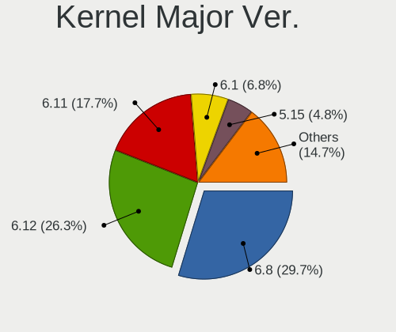

| Version | Computers | Percent |
|---------|-----------|---------|
| 5.15    | 245       | 36.24%  |
| 6.1     | 190       | 28.11%  |
| 6.0     | 56        | 8.28%   |
| 5.19    | 45        | 6.66%   |
| 5.4     | 43        | 6.36%   |
| 5.10    | 41        | 6.07%   |
| 5.16    | 16        | 2.37%   |
| 5.13    | 14        | 2.07%   |
| 4.15    | 5         | 0.74%   |
| 5.14    | 4         | 0.59%   |
| 6.2     | 3         | 0.44%   |
| 5.18    | 3         | 0.44%   |
| 5.17    | 2         | 0.3%    |
| 5.11    | 2         | 0.3%    |
| 4.19    | 2         | 0.3%    |
| 4.18    | 2         | 0.3%    |
| 5.9     | 1         | 0.15%   |
| 5.3     | 1         | 0.15%   |
| 5.12    | 1         | 0.15%   |

Arch
----

OS architecture (x86_64, i586, etc.)

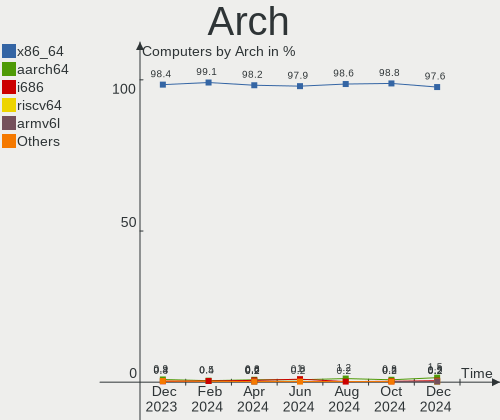

| Name    | Computers | Percent |
|---------|-----------|---------|
| x86_64  | 661       | 97.78%  |
| i686    | 8         | 1.18%   |
| armv7l  | 4         | 0.59%   |
| aarch64 | 2         | 0.3%    |
| mips    | 1         | 0.15%   |

DE
--

Desktop Environment

| Name              | Computers | Percent |
|-------------------|-----------|---------|
| GNOME             | 275       | 40.68%  |
| KDE5              | 196       | 28.99%  |
| X-Cinnamon        | 95        | 14.05%  |
| XFCE              | 43        | 6.36%   |
| Unknown           | 18        | 2.66%   |
| MATE              | 11        | 1.63%   |
| i3                | 6         | 0.89%   |
| Cinnamon          | 6         | 0.89%   |
| LXQt              | 5         | 0.74%   |
| Pantheon          | 3         | 0.44%   |
| LXDE              | 3         | 0.44%   |
| Budgie            | 3         | 0.44%   |
| openbox           | 2         | 0.3%    |
| x-session-manager | 1         | 0.15%   |
| sway              | 1         | 0.15%   |
| Phosh:GNOME       | 1         | 0.15%   |
| KDE               | 1         | 0.15%   |
| Hyprland          | 1         | 0.15%   |
| GNOME Flashback   | 1         | 0.15%   |
| GNOME Classic     | 1         | 0.15%   |
| fluxbox           | 1         | 0.15%   |
| Enlightenment     | 1         | 0.15%   |
| bspwm             | 1         | 0.15%   |

Display Server
--------------

X11 or Wayland

| Name    | Computers | Percent |
|---------|-----------|---------|
| X11     | 470       | 69.53%  |
| Wayland | 182       | 26.92%  |
| Tty     | 17        | 2.51%   |
| Unknown | 7         | 1.04%   |

Display Manager
---------------

SDDM, LightDM, etc.

| Name    | Computers | Percent |
|---------|-----------|---------|
| Unknown | 205       | 30.33%  |
| SDDM    | 152       | 22.49%  |
| GDM3    | 152       | 22.49%  |
| LightDM | 106       | 15.68%  |
| GDM     | 58        | 8.58%   |
| SLiM    | 1         | 0.15%   |
| LXDM    | 1         | 0.15%   |
| GREETD  | 1         | 0.15%   |

OS Lang
-------

Language

| Lang    | Computers | Percent |
|---------|-----------|---------|
| de_DE   | 468       | 69.23%  |
| en_US   | 157       | 23.22%  |
| en_GB   | 13        | 1.92%   |
| C       | 10        | 1.48%   |
| ru_RU   | 5         | 0.74%   |
| en_DE   | 4         | 0.59%   |
| de_AT   | 4         | 0.59%   |
| en_DK   | 3         | 0.44%   |
| POSIX   | 2         | 0.3%    |
| fr_FR   | 2         | 0.3%    |
| uk_UA   | 1         | 0.15%   |
| tr_TR   | 1         | 0.15%   |
| ru_UA   | 1         | 0.15%   |
| pl_PL   | 1         | 0.15%   |
| hu_HU   | 1         | 0.15%   |
| fi_FI   | 1         | 0.15%   |
| es_ES   | 1         | 0.15%   |
| Unknown | 1         | 0.15%   |

Boot Mode
---------

EFI or BIOS

| Mode | Computers | Percent |
|------|-----------|---------|
| EFI  | 346       | 51.18%  |
| BIOS | 330       | 48.82%  |

Filesystem
----------

Type of filesystem

| Type    | Computers | Percent |
|---------|-----------|---------|
| Ext4    | 461       | 68.2%   |
| Overlay | 118       | 17.46%  |
| Btrfs   | 88        | 13.02%  |
| Xfs     | 7         | 1.04%   |
| Zfs     | 1         | 0.15%   |
| Ext3    | 1         | 0.15%   |

Part. scheme
------------

Scheme of partitioning

| Type    | Computers | Percent |
|---------|-----------|---------|
| GPT     | 392       | 57.99%  |
| Unknown | 194       | 28.7%   |
| MBR     | 90        | 13.31%  |

Dual Boot with Linux/BSD
------------------------

Hosting more than one Linux/BSD

| Dual boot | Computers | Percent |
|-----------|-----------|---------|
| No        | 531       | 78.55%  |
| Yes       | 145       | 21.45%  |

Dual Boot (Win)
---------------

Hosting Linux and Windows

| Dual boot | Computers | Percent |
|-----------|-----------|---------|
| No        | 481       | 71.15%  |
| Yes       | 195       | 28.85%  |

Board
-----

Vendor
------

Motherboard manufacturer

| Name                                 | Computers | Percent |
|--------------------------------------|-----------|---------|
| Lenovo                               | 118       | 17.46%  |
| ASUSTek Computer                     | 96        | 14.2%   |
| Hewlett-Packard                      | 77        | 11.39%  |
| Acer                                 | 55        | 8.14%   |
| Dell                                 | 52        | 7.69%   |
| MSI                                  | 41        | 6.07%   |
| Gigabyte Technology                  | 38        | 5.62%   |
| ASRock                               | 37        | 5.47%   |
| Fujitsu                              | 20        | 2.96%   |
| Medion                               | 16        | 2.37%   |
| Apple                                | 13        | 1.92%   |
| Valve                                | 11        | 1.63%   |
| HUAWEI                               | 9         | 1.33%   |
| TUXEDO                               | 8         | 1.18%   |
| Intel                                | 8         | 1.18%   |
| Schenker                             | 7         | 1.04%   |
| Toshiba                              | 6         | 0.89%   |
| Wortmann AG                          | 4         | 0.59%   |
| Notebook                             | 4         | 0.59%   |
| Fujitsu Siemens                      | 4         | 0.59%   |
| BESSTAR Tech                         | 4         | 0.59%   |
| Unknown                              | 4         | 0.59%   |
| Samsung Electronics                  | 3         | 0.44%   |
| Raspberry Pi Foundation              | 3         | 0.44%   |
| Packard Bell                         | 3         | 0.44%   |
| Microsoft                            | 3         | 0.44%   |
| Hardkernel                           | 3         | 0.44%   |
| Tactus                               | 2         | 0.3%    |
| Supermicro                           | 2         | 0.3%    |
| Sony                                 | 2         | 0.3%    |
| TrekStor                             | 1         | 0.15%   |
| SLIMBOOK                             | 1         | 0.15%   |
| Shuttle                              | 1         | 0.15%   |
| Shenzhen Meigao Electronic Equipment | 1         | 0.15%   |
| Quanta                               | 1         | 0.15%   |
| Panasonic                            | 1         | 0.15%   |
| MPMAN                                | 1         | 0.15%   |
| MiPi PC                              | 1         | 0.15%   |
| MicroByte                            | 1         | 0.15%   |
| Maxtang                              | 1         | 0.15%   |

Model
-----

Motherboard model

| Name                                 | Computers | Percent |
|--------------------------------------|-----------|---------|
| Valve Jupiter                        | 11        | 1.63%   |
| ASUS All Series                      | 6         | 0.89%   |
| Unknown                              | 6         | 0.89%   |
| MSI MS-7C56                          | 4         | 0.59%   |
| ASUS PRIME A320M-K                   | 4         | 0.59%   |
| MSI MS-7C37                          | 3         | 0.44%   |
| Lenovo IdeaPad 5 15ARE05 81YQ        | 3         | 0.44%   |
| HP Laptop 17-bs0xx                   | 3         | 0.44%   |
| Dell OptiPlex 780                    | 3         | 0.44%   |
| ASUS M5A78L-M/USB3                   | 3         | 0.44%   |
| ASRock B450M Pro4                    | 3         | 0.44%   |
| Acer Iconia Tab W501                 | 3         | 0.44%   |
| Acer Aspire ES1-711                  | 3         | 0.44%   |
| MSI MS-7D20                          | 2         | 0.3%    |
| MSI MS-7C02                          | 2         | 0.3%    |
| MSI MS-7A38                          | 2         | 0.3%    |
| Medion S23003                        | 2         | 0.3%    |
| Medion MS-7728                       | 2         | 0.3%    |
| Lenovo ThinkPad T480s 20L8S02D00     | 2         | 0.3%    |
| Lenovo ThinkPad E15 Gen 2 20T9S00K00 | 2         | 0.3%    |
| Lenovo MIIX 3-1030 80HV              | 2         | 0.3%    |
| HUAWEI NBLK-WAX9X                    | 2         | 0.3%    |
| HP ProDesk 600 G3 SFF                | 2         | 0.3%    |
| HP Laptop 17-ak0xx                   | 2         | 0.3%    |
| HP Laptop 15s-eq2xxx                 | 2         | 0.3%    |
| Hardkernel Odroid XU4                | 2         | 0.3%    |
| Gigabyte X570 AORUS ULTRA            | 2         | 0.3%    |
| Gigabyte AX370-Gaming K7             | 2         | 0.3%    |
| Fujitsu LIFEBOOK U7511               | 2         | 0.3%    |
| Fujitsu LIFEBOOK E752                | 2         | 0.3%    |
| Fujitsu ESPRIMO Q920                 | 2         | 0.3%    |
| Dell Precision 7720                  | 2         | 0.3%    |
| Dell Latitude E7240                  | 2         | 0.3%    |
| Dell Latitude 3320                   | 2         | 0.3%    |
| Dell G5 5590                         | 2         | 0.3%    |
| BESSTAR Tech UM340                   | 2         | 0.3%    |
| ASUS ZenBook UX431DA_UM431DA         | 2         | 0.3%    |
| ASUS ZenBook UX425UA_UM425UA         | 2         | 0.3%    |
| ASUS TUF Gaming B550M-PLUS           | 2         | 0.3%    |
| ASUS ROG STRIX X570-F GAMING         | 2         | 0.3%    |

Model Family
------------

Motherboard model prefix

| Name                  | Computers | Percent |
|-----------------------|-----------|---------|
| Lenovo ThinkPad       | 67        | 9.91%   |
| Acer Aspire           | 34        | 5.03%   |
| Dell Latitude         | 20        | 2.96%   |
| Lenovo IdeaPad        | 15        | 2.22%   |
| HP Laptop             | 12        | 1.78%   |
| ASUS PRIME            | 12        | 1.78%   |
| Valve Jupiter         | 11        | 1.63%   |
| Fujitsu LIFEBOOK      | 10        | 1.48%   |
| HP EliteBook          | 9         | 1.33%   |
| Dell XPS              | 9         | 1.33%   |
| HP Compaq             | 8         | 1.18%   |
| ASUS ROG              | 8         | 1.18%   |
| HP Pavilion           | 7         | 1.04%   |
| Fujitsu ESPRIMO       | 7         | 1.04%   |
| Dell OptiPlex         | 7         | 1.04%   |
| Dell Inspiron         | 7         | 1.04%   |
| Toshiba Satellite     | 6         | 0.89%   |
| Lenovo Yoga           | 6         | 0.89%   |
| ASUS TUF              | 6         | 0.89%   |
| ASUS All              | 6         | 0.89%   |
| Acer Swift            | 6         | 0.89%   |
| Unknown               | 6         | 0.89%   |
| Dell Precision        | 5         | 0.74%   |
| ASUS ZenBook          | 5         | 0.74%   |
| ASUS M5A78L-M         | 5         | 0.74%   |
| Schenker XMG          | 4         | 0.59%   |
| MSI MS-7C56           | 4         | 0.59%   |
| Lenovo ThinkCentre    | 4         | 0.59%   |
| HP ProBook            | 4         | 0.59%   |
| HP ENVY               | 4         | 0.59%   |
| HP EliteDesk          | 4         | 0.59%   |
| HP 255                | 4         | 0.59%   |
| ASUS VivoBook         | 4         | 0.59%   |
| ASUS ASUS             | 4         | 0.59%   |
| Acer Nitro            | 4         | 0.59%   |
| RPi Raspberry         | 3         | 0.44%   |
| Packard Bell EasyNote | 3         | 0.44%   |
| MSI MS-7C37           | 3         | 0.44%   |
| Microsoft Surface     | 3         | 0.44%   |
| Lenovo Legion         | 3         | 0.44%   |

MFG Year
--------

Motherboard manufacture year

| Year    | Computers | Percent |
|---------|-----------|---------|
| 2022    | 71        | 10.5%   |
| 2021    | 70        | 10.36%  |
| 2020    | 62        | 9.17%   |
| 2019    | 61        | 9.02%   |
| 2018    | 56        | 8.28%   |
| 2017    | 54        | 7.99%   |
| 2012    | 51        | 7.54%   |
| 2013    | 42        | 6.21%   |
| 2014    | 36        | 5.33%   |
| 2011    | 35        | 5.18%   |
| 2015    | 32        | 4.73%   |
| 2016    | 31        | 4.59%   |
| 2009    | 19        | 2.81%   |
| 2010    | 18        | 2.66%   |
| 2008    | 16        | 2.37%   |
| Unknown | 7         | 1.04%   |
| 2006    | 6         | 0.89%   |
| 2007    | 5         | 0.74%   |
| 2005    | 4         | 0.59%   |

Form Factor
-----------

Physical design of the computer

| Name           | Computers | Percent |
|----------------|-----------|---------|
| Notebook       | 360       | 53.25%  |
| Desktop        | 238       | 35.21%  |
| Convertible    | 28        | 4.14%   |
| Tablet         | 18        | 2.66%   |
| Mini pc        | 17        | 2.51%   |
| All in one     | 7         | 1.04%   |
| System on chip | 5         | 0.74%   |
| Server         | 2         | 0.3%    |
| Other          | 1         | 0.15%   |

Secure Boot
-----------

Enabled or disabled

| State    | Computers | Percent |
|----------|-----------|---------|
| Disabled | 637       | 94.23%  |
| Enabled  | 39        | 5.77%   |

Coreboot
--------

Have coreboot on board

| Used | Computers | Percent |
|------|-----------|---------|
| No   | 674       | 99.7%   |
| Yes  | 2         | 0.3%    |

RAM Size
--------

Total RAM memory

| Size in GB      | Computers | Percent |
|-----------------|-----------|---------|
| 4.01-8.0        | 145       | 21.45%  |
| 16.01-24.0      | 129       | 19.08%  |
| 8.01-16.0       | 123       | 18.2%   |
| 3.01-4.0        | 117       | 17.31%  |
| 32.01-64.0      | 91        | 13.46%  |
| 1.01-2.0        | 22        | 3.25%   |
| 24.01-32.0      | 21        | 3.11%   |
| 64.01-256.0     | 20        | 2.96%   |
| 2.01-3.0        | 3         | 0.44%   |
| More than 256.0 | 2         | 0.3%    |
| 0.51-1.0        | 2         | 0.3%    |
| 0.01-0.5        | 1         | 0.15%   |

RAM Used
--------

Used RAM memory

| Used GB    | Computers | Percent |
|------------|-----------|---------|
| 1.01-2.0   | 260       | 38.46%  |
| 2.01-3.0   | 189       | 27.96%  |
| 3.01-4.0   | 71        | 10.5%   |
| 4.01-8.0   | 70        | 10.36%  |
| 0.51-1.0   | 40        | 5.92%   |
| 8.01-16.0  | 30        | 4.44%   |
| 16.01-24.0 | 6         | 0.89%   |
| 0.01-0.5   | 6         | 0.89%   |
| 24.01-32.0 | 2         | 0.3%    |
| 32.01-64.0 | 1         | 0.15%   |
| 0          | 1         | 0.15%   |

Total Drives
------------

Number of drives on board

| Drives | Computers | Percent |
|--------|-----------|---------|
| 1      | 394       | 58.28%  |
| 2      | 167       | 24.7%   |
| 3      | 49        | 7.25%   |
| 4      | 32        | 4.73%   |
| 5      | 13        | 1.92%   |
| 7      | 7         | 1.04%   |
| 6      | 7         | 1.04%   |
| 0      | 6         | 0.89%   |
| 8      | 1         | 0.15%   |

Has CD-ROM
----------

Has CD-ROM on board

| Presented | Computers | Percent |
|-----------|-----------|---------|
| No        | 402       | 59.47%  |
| Yes       | 274       | 40.53%  |

Has Ethernet
------------

Has Ethernet on board

| Presented | Computers | Percent |
|-----------|-----------|---------|
| Yes       | 574       | 84.91%  |
| No        | 102       | 15.09%  |

Has WiFi
--------

Has WiFi module

| Presented | Computers | Percent |
|-----------|-----------|---------|
| Yes       | 508       | 75.15%  |
| No        | 168       | 24.85%  |

Has Bluetooth
-------------

Has Bluetooth module

| Presented | Computers | Percent |
|-----------|-----------|---------|
| Yes       | 419       | 61.98%  |
| No        | 257       | 38.02%  |

Location
--------

Country
-------

Geographic location (country)

| Country | Computers | Percent |
|---------|-----------|---------|
| Germany | 676       | 100%    |

City
----

Geographic location (city)

| City                     | Computers | Percent |
|--------------------------|-----------|---------|
| Berlin                   | 53        | 7.84%   |
| Hamburg                  | 29        | 4.29%   |
| Munich                   | 25        | 3.7%    |
| Frankfurt am Main        | 22        | 3.25%   |
| Cologne                  | 19        | 2.81%   |
| Stuttgart                | 16        | 2.37%   |
| Nuremberg                | 9         | 1.33%   |
| Hanover                  | 9         | 1.33%   |
| Essen                    | 9         | 1.33%   |
| Düsseldorf              | 9         | 1.33%   |
| Leipzig                  | 7         | 1.04%   |
| Karlsruhe                | 7         | 1.04%   |
| Mannheim                 | 6         | 0.89%   |
| Mainz                    | 6         | 0.89%   |
| Augsburg                 | 6         | 0.89%   |
| Wiesbaden                | 5         | 0.74%   |
| Ulm                      | 5         | 0.74%   |
| Kiel                     | 5         | 0.74%   |
| Heilbronn                | 5         | 0.74%   |
| Halle                    | 5         | 0.74%   |
| Duisburg                 | 5         | 0.74%   |
| Dresden                  | 5         | 0.74%   |
| Braunschweig             | 5         | 0.74%   |
| Bonn                     | 5         | 0.74%   |
| Wuppertal                | 4         | 0.59%   |
| Münster                 | 4         | 0.59%   |
| Lübeck                  | 4         | 0.59%   |
| Darmstadt                | 4         | 0.59%   |
| Bochum                   | 4         | 0.59%   |
| Bergkamen                | 4         | 0.59%   |
| Worms                    | 3         | 0.44%   |
| Peine                    | 3         | 0.44%   |
| Osnabrück               | 3         | 0.44%   |
| Neunkirchen              | 3         | 0.44%   |
| Magdeburg                | 3         | 0.44%   |
| Lüneburg                | 3         | 0.44%   |
| Langenfeld               | 3         | 0.44%   |
| Heinsberg                | 3         | 0.44%   |
| Gruenenplan              | 3         | 0.44%   |
| Geislingen an der Steige | 3         | 0.44%   |

Drives
------

Drive Vendor
------------

Hard drive vendors

| Vendor                      | Computers | Drives | Percent |
|-----------------------------|-----------|--------|---------|
| Samsung Electronics         | 231       | 297    | 22.92%  |
| WDC                         | 122       | 144    | 12.1%   |
| Sandisk                     | 95        | 102    | 9.42%   |
| Seagate                     | 87        | 103    | 8.63%   |
| Toshiba                     | 50        | 59     | 4.96%   |
| Unknown                     | 48        | 60     | 4.76%   |
| Kingston                    | 39        | 43     | 3.87%   |
| Crucial                     | 37        | 42     | 3.67%   |
| SK hynix                    | 33        | 34     | 3.27%   |
| Intel                       | 27        | 27     | 2.68%   |
| Intenso                     | 25        | 28     | 2.48%   |
| Hitachi                     | 25        | 27     | 2.48%   |
| Phison Electronics          | 15        | 15     | 1.49%   |
| Micron Technology           | 15        | 15     | 1.49%   |
| Micron/Crucial Technology   | 10        | 10     | 0.99%   |
| HGST                        | 10        | 12     | 0.99%   |
| KIOXIA                      | 9         | 9      | 0.89%   |
| Kingston Technology Company | 8         | 9      | 0.79%   |
| SPCC                        | 7         | 7      | 0.69%   |
| JMicron Technology          | 7         | 7      | 0.69%   |
| Silicon Motion              | 6         | 6      | 0.6%    |
| Apple                       | 6         | 6      | 0.6%    |
| Apacer                      | 6         | 6      | 0.6%    |
| PNY                         | 5         | 6      | 0.5%    |
| OCZ                         | 5         | 5      | 0.5%    |
| LITEON                      | 5         | 5      | 0.5%    |
| China                       | 5         | 5      | 0.5%    |
| A-DATA Technology           | 5         | 5      | 0.5%    |
| Unknown                     | 5         | 5      | 0.5%    |
| Phison                      | 4         | 4      | 0.4%    |
| SABRENT                     | 3         | 4      | 0.3%    |
| Patriot                     | 3         | 3      | 0.3%    |
| Leven                       | 3         | 3      | 0.3%    |
| Fujitsu                     | 3         | 3      | 0.3%    |
| UMIS                        | 2         | 2      | 0.2%    |
| TS1TSSD2                    | 2         | 2      | 0.2%    |
| Transcend                   | 2         | 2      | 0.2%    |
| TO Exter                    | 2         | 2      | 0.2%    |
| Netac                       | 2         | 2      | 0.2%    |
| LITEONIT                    | 2         | 2      | 0.2%    |

Drive Model
-----------

Hard drive models

| Model                                                | Computers | Percent |
|------------------------------------------------------|-----------|---------|
| Samsung NVMe SSD Controller SM981/PM981/PM983 500GB  | 40        | 3.57%   |
| Samsung SSD 860 EVO 500GB                            | 14        | 1.25%   |
| Samsung SSD 850 EVO 250GB                            | 14        | 1.25%   |
| Samsung NVMe SSD Controller PM9A1/PM9A3/980PRO 512GB | 13        | 1.16%   |
| Sandisk WD Black SN750 / PC SN730 NVMe SSD 1TB       | 11        | 0.98%   |
| SanDisk SSD PLUS 1000GB                              | 10        | 0.89%   |
| Samsung SSD 850 EVO 500GB                            | 10        | 0.89%   |
| Crucial CT1000MX500SSD1 1TB                          | 9         | 0.8%    |
| Unknown MMC Card  64GB                               | 8         | 0.71%   |
| Kingston SA400S37240G 240GB SSD                      | 8         | 0.71%   |
| Unknown MMC Card  32GB                               | 7         | 0.62%   |
| SanDisk SSD PLUS 480GB                               | 7         | 0.62%   |
| SanDisk NVMe SSD Drive 1TB                           | 7         | 0.62%   |
| Samsung SSD 840 EVO 120GB                            | 7         | 0.62%   |
| Crucial CT500MX500SSD1 500GB                         | 7         | 0.62%   |
| Unknown MMC Card  128GB                              | 6         | 0.53%   |
| Toshiba DT01ACA200 2TB                               | 6         | 0.53%   |
| Samsung SSD 980 1TB                                  | 6         | 0.53%   |
| Samsung NVMe SSD Controller SM961/PM961/SM963 256GB  | 6         | 0.53%   |
| WDC WD10JPVX-22JC3T0 1TB                             | 5         | 0.45%   |
| Toshiba DT01ACA100 1TB                               | 5         | 0.45%   |
| Seagate ST1000DM003-1CH162 1TB                       | 5         | 0.45%   |
| Samsung HD501LJ 500GB                                | 5         | 0.45%   |
| Phison PS5013 E13 NVMe Controller 256GB              | 5         | 0.45%   |
| Micron/Crucial P2 NVMe PCIe SSD 500GB                | 5         | 0.45%   |
| JMicron Generic 500GB                                | 5         | 0.45%   |
| Intel SSD 660P Series 512GB                          | 5         | 0.45%   |
| Crucial CT480BX500SSD1 480GB                         | 5         | 0.45%   |
| Unknown                                              | 5         | 0.45%   |
| WDC WD40EZRZ-00GXCB0 4TB                             | 4         | 0.36%   |
| WDC WD20EZRZ-00Z5HB0 2TB                             | 4         | 0.36%   |
| Unknown SD/MMC/MS PRO 2GB                            | 4         | 0.36%   |
| Unknown MMC Card  512GB                              | 4         | 0.36%   |
| Toshiba MQ04ABF100 1TB                               | 4         | 0.36%   |
| Toshiba HDWD120 2TB                                  | 4         | 0.36%   |
| SK hynix BC501 NVMe Solid State Drive 512GB          | 4         | 0.36%   |
| Seagate ST2000DM008-2FR102 2TB                       | 4         | 0.36%   |
| Seagate ST1000LM035-1RK172 1TB                       | 4         | 0.36%   |
| Seagate ST1000LM024 HN-M101MBB 1TB                   | 4         | 0.36%   |
| Seagate Expansion 240GB                              | 4         | 0.36%   |

HDD Vendor
----------

Hard disk drive vendors

| Vendor              | Computers | Drives | Percent |
|---------------------|-----------|--------|---------|
| WDC                 | 84        | 101    | 30%     |
| Seagate             | 83        | 99     | 29.64%  |
| Toshiba             | 36        | 44     | 12.86%  |
| Samsung Electronics | 25        | 31     | 8.93%   |
| Hitachi             | 25        | 27     | 8.93%   |
| HGST                | 10        | 12     | 3.57%   |
| Unknown             | 4         | 4      | 1.43%   |
| Fujitsu             | 3         | 3      | 1.07%   |
| Apple               | 3         | 3      | 1.07%   |
| SABRENT             | 2         | 2      | 0.71%   |
| Intenso             | 2         | 2      | 0.71%   |
| USB3.0              | 1         | 1      | 0.36%   |
| Hewlett-Packard     | 1         | 1      | 0.36%   |
| ASMT                | 1         | 1      | 0.36%   |

SSD Vendor
----------

Solid state drive vendors

| Vendor              | Computers | Drives | Percent |
|---------------------|-----------|--------|---------|
| Samsung Electronics | 107       | 132    | 29.56%  |
| SanDisk             | 60        | 63     | 16.57%  |
| Crucial             | 31        | 35     | 8.56%   |
| Kingston            | 28        | 32     | 7.73%   |
| Intenso             | 19        | 22     | 5.25%   |
| WDC                 | 17        | 18     | 4.7%    |
| Intel               | 10        | 10     | 2.76%   |
| SPCC                | 6         | 6      | 1.66%   |
| Micron Technology   | 6         | 6      | 1.66%   |
| OCZ                 | 5         | 5      | 1.38%   |
| LITEON              | 5         | 5      | 1.38%   |
| JMicron Technology  | 5         | 5      | 1.38%   |
| China               | 5         | 5      | 1.38%   |
| Apacer              | 5         | 5      | 1.38%   |
| PNY                 | 4         | 5      | 1.1%    |
| A-DATA Technology   | 4         | 4      | 1.1%    |
| Toshiba             | 3         | 3      | 0.83%   |
| SK hynix            | 3         | 3      | 0.83%   |
| Leven               | 3         | 3      | 0.83%   |
| Apple               | 3         | 3      | 0.83%   |
| Unknown             | 3         | 3      | 0.83%   |
| Transcend           | 2         | 2      | 0.55%   |
| TO Exter            | 2         | 2      | 0.55%   |
| Phison              | 2         | 2      | 0.55%   |
| Patriot             | 2         | 2      | 0.55%   |
| Netac               | 2         | 2      | 0.55%   |
| LITEONIT            | 2         | 2      | 0.55%   |
| BAITITON            | 2         | 2      | 0.55%   |
| Verbatim            | 1         | 1      | 0.28%   |
| SPCC Sol            | 1         | 1      | 0.28%   |
| Seagate             | 1         | 1      | 0.28%   |
| SABRENT             | 1         | 2      | 0.28%   |
| S3+                 | 1         | 1      | 0.28%   |
| R580                | 1         | 1      | 0.28%   |
| OCZ-VERTEX2         | 1         | 1      | 0.28%   |
| Maxtor              | 1         | 1      | 0.28%   |
| Mach Xtreme         | 1         | 1      | 0.28%   |
| Lexar               | 1         | 1      | 0.28%   |
| Innodisk            | 1         | 1      | 0.28%   |
| Emtec               | 1         | 1      | 0.28%   |

Drive Kind
----------

HDD or SSD

| Kind    | Computers | Drives | Percent |
|---------|-----------|--------|---------|
| SSD     | 306       | 404    | 34.19%  |
| NVMe    | 301       | 354    | 33.63%  |
| HDD     | 228       | 331    | 25.47%  |
| MMC     | 44        | 53     | 4.92%   |
| Unknown | 16        | 19     | 1.79%   |

Drive Connector
---------------

SATA, SAS, NVMe, etc.

| Type | Computers | Drives | Percent |
|------|-----------|--------|---------|
| SATA | 439       | 689    | 52.26%  |
| NVMe | 301       | 354    | 35.83%  |
| SAS  | 56        | 65     | 6.67%   |
| MMC  | 44        | 53     | 5.24%   |

Drive Size
----------

Size of hard drive

| Size in TB | Computers | Drives | Percent |
|------------|-----------|--------|---------|
| 0.01-0.5   | 304       | 408    | 52.69%  |
| 0.51-1.0   | 166       | 190    | 28.77%  |
| 1.01-2.0   | 65        | 78     | 11.27%  |
| 3.01-4.0   | 17        | 20     | 2.95%   |
| 2.01-3.0   | 12        | 19     | 2.08%   |
| 4.01-10.0  | 10        | 14     | 1.73%   |
| 10.01-20.0 | 3         | 6      | 0.52%   |

Space Total
-----------

Amount of disk space available on the file system

| Size in GB     | Computers | Percent |
|----------------|-----------|---------|
| 251-500        | 146       | 21.6%   |
| 101-250        | 144       | 21.3%   |
| 501-1000       | 115       | 17.01%  |
| 1-20           | 77        | 11.39%  |
| 1001-2000      | 41        | 6.07%   |
| 51-100         | 40        | 5.92%   |
| More than 3000 | 38        | 5.62%   |
| Unknown        | 28        | 4.14%   |
| 2001-3000      | 27        | 3.99%   |
| 21-50          | 20        | 2.96%   |

Space Used
----------

Amount of used disk space

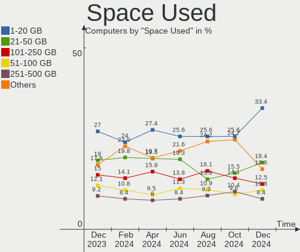

| Used GB        | Computers | Percent |
|----------------|-----------|---------|
| 1-20           | 249       | 36.83%  |
| 21-50          | 108       | 15.98%  |
| 51-100         | 76        | 11.24%  |
| 101-250        | 73        | 10.8%   |
| 251-500        | 64        | 9.47%   |
| 501-1000       | 35        | 5.18%   |
| Unknown        | 28        | 4.14%   |
| 1001-2000      | 23        | 3.4%    |
| 2001-3000      | 11        | 1.63%   |
| More than 3000 | 9         | 1.33%   |

Malfunc. Drives
---------------

Drive models with a malfunction

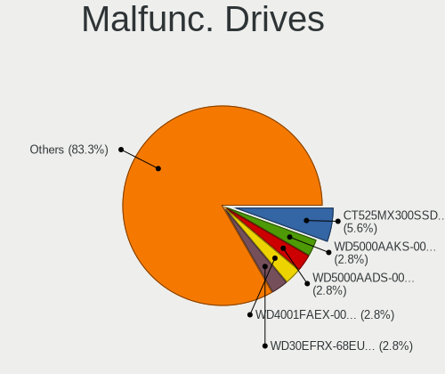

| Model                                                           | Computers | Drives | Percent |
|-----------------------------------------------------------------|-----------|--------|---------|
| WDC WD5000AAKX-221CA1 500GB                                     | 2         | 2      | 4.35%   |
| SanDisk SSD P4 32GB                                             | 2         | 2      | 4.35%   |
| WDC WDS480G2G0A-00JH30 480GB SSD                                | 1         | 1      | 2.17%   |
| WDC WD5000AAKS-00M9A0 500GB                                     | 1         | 1      | 2.17%   |
| WDC WD40EZRX-00SPEB0 4TB                                        | 1         | 2      | 2.17%   |
| WDC WD30EFRX-68N32N0 3TB                                        | 1         | 1      | 2.17%   |
| WDC WD30EFRX-68EUZN0 3TB                                        | 1         | 1      | 2.17%   |
| WDC WD2500BEVT-00A23T0 250GB                                    | 1         | 1      | 2.17%   |
| WDC WD20EFRX-68EUZN0 2TB                                        | 1         | 2      | 2.17%   |
| WDC WD20EARS-00MVWB0 2TB                                        | 1         | 1      | 2.17%   |
| WDC WD1600BEVS-22RST0 160GB                                     | 1         | 1      | 2.17%   |
| WDC WD10JPVX-22JC3T0 1TB                                        | 1         | 1      | 2.17%   |
| WDC WD10EARS-00Y5B1 1TB                                         | 1         | 1      | 2.17%   |
| WDC PC SA530 SDASN8Y-256G-1006 256GB SSD                        | 1         | 1      | 2.17%   |
| Toshiba MQ01ABD050 500GB                                        | 1         | 1      | 2.17%   |
| Toshiba MQ01ABC150 1TB                                          | 1         | 1      | 2.17%   |
| Toshiba MK1655GSX 160GB                                         | 1         | 1      | 2.17%   |
| SK hynix SH920 mSATA 256GB SSD                                  | 1         | 1      | 2.17%   |
| Seagate ST500LT012-1DG142 500GB                                 | 1         | 1      | 2.17%   |
| Seagate ST3320310CS 320GB                                       | 1         | 1      | 2.17%   |
| Seagate ST31000524AS 1TB                                        | 1         | 1      | 2.17%   |
| Seagate ST3000DM001-1ER166 3TB                                  | 1         | 2      | 2.17%   |
| Seagate ST2000DM001-1CH164 2TB                                  | 1         | 1      | 2.17%   |
| Seagate ST2000DL003-9VT166 2TB                                  | 1         | 1      | 2.17%   |
| Seagate ST1000VM002-1CT162 1TB                                  | 1         | 1      | 2.17%   |
| SanDisk Ultra II 240GB SSD                                      | 1         | 1      | 2.17%   |
| SanDisk SSD PLUS 480GB                                          | 1         | 1      | 2.17%   |
| SanDisk SSD PLUS 1000GB                                         | 1         | 1      | 2.17%   |
| Samsung Electronics SSD PM810 FDE 2.5 256GB                     | 1         | 1      | 2.17%   |
| Samsung Electronics SSD 870 EVO 500GB                           | 1         | 1      | 2.17%   |
| Samsung Electronics SSD 870 EVO 1TB                             | 1         | 1      | 2.17%   |
| Samsung Electronics NVMe SSD Controller SM981/PM981/PM983 500GB | 1         | 1      | 2.17%   |
| Samsung Electronics HD501LJ 500GB                               | 1         | 1      | 2.17%   |
| Samsung Electronics HD103SJ 1TB                                 | 1         | 1      | 2.17%   |
| Netac SSD 256GB                                                 | 1         | 1      | 2.17%   |
| LITEONIT LSS-16L6G-HP 16GB SSD                                  | 1         | 1      | 2.17%   |
| Kingston SA400S37240G 240GB SSD                                 | 1         | 1      | 2.17%   |
| Intel SSDSC2CW060A3 64GB                                        | 1         | 1      | 2.17%   |
| Hitachi HTS542525K9SA00 250GB                                   | 1         | 1      | 2.17%   |
| Hitachi HTS541080G9SA00 80GB                                    | 1         | 1      | 2.17%   |

Malfunc. Drive Vendor
---------------------

Vendors of faulty drives

| Vendor              | Computers | Drives | Percent |
|---------------------|-----------|--------|---------|
| WDC                 | 12        | 16     | 27.91%  |
| Seagate             | 7         | 8      | 16.28%  |
| Samsung Electronics | 6         | 6      | 13.95%  |
| SanDisk             | 5         | 5      | 11.63%  |
| Hitachi             | 4         | 4      | 9.3%    |
| Toshiba             | 2         | 3      | 4.65%   |
| SK hynix            | 1         | 1      | 2.33%   |
| Netac               | 1         | 1      | 2.33%   |
| LITEONIT            | 1         | 1      | 2.33%   |
| Kingston            | 1         | 1      | 2.33%   |
| Intel               | 1         | 1      | 2.33%   |
| Hewlett-Packard     | 1         | 1      | 2.33%   |
| A-DATA Technology   | 1         | 1      | 2.33%   |

Malfunc. HDD Vendor
-------------------

Vendors of faulty HDD drives

| Vendor              | Computers | Drives | Percent |
|---------------------|-----------|--------|---------|
| WDC                 | 10        | 14     | 38.46%  |
| Seagate             | 7         | 8      | 26.92%  |
| Hitachi             | 4         | 4      | 15.38%  |
| Toshiba             | 2         | 3      | 7.69%   |
| Samsung Electronics | 2         | 2      | 7.69%   |
| Hewlett-Packard     | 1         | 1      | 3.85%   |

Malfunc. Drive Kind
-------------------

Kinds of faulty drives

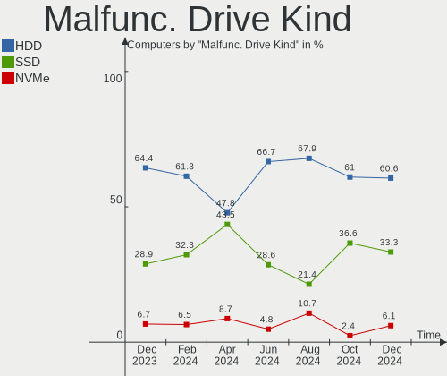

| Kind | Computers | Drives | Percent |
|------|-----------|--------|---------|
| HDD  | 26        | 32     | 61.9%   |
| SSD  | 14        | 15     | 33.33%  |
| NVMe | 2         | 2      | 4.76%   |

Failed Drives
-------------

Failed drive models

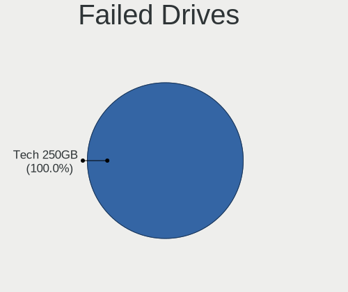

| Model                           | Computers | Drives | Percent |
|---------------------------------|-----------|--------|---------|
| Samsung Electronics HD103UJ 1TB | 1         | 1      | 100%    |

Failed Drive Vendor
-------------------

Failed drive vendors

| Vendor              | Computers | Drives | Percent |
|---------------------|-----------|--------|---------|
| Samsung Electronics | 1         | 1      | 100%    |

Drive Status
------------

Number of failed and malfunc. drives

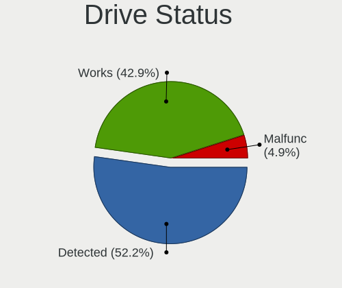

| Status   | Computers | Drives | Percent |
|----------|-----------|--------|---------|
| Detected | 382       | 600    | 51.28%  |
| Works    | 320       | 511    | 42.95%  |
| Malfunc  | 42        | 49     | 5.64%   |
| Failed   | 1         | 1      | 0.13%   |

Storage controller
------------------

Storage Vendor
--------------

Storage controller vendors

| Vendor                           | Computers | Percent |
|----------------------------------|-----------|---------|
| Intel                            | 365       | 40.92%  |
| AMD                              | 161       | 18.05%  |
| Samsung Electronics              | 121       | 13.57%  |
| SanDisk                          | 59        | 6.61%   |
| SK hynix                         | 29        | 3.25%   |
| Kingston Technology Company      | 19        | 2.13%   |
| Phison Electronics               | 18        | 2.02%   |
| ASMedia Technology               | 18        | 2.02%   |
| Micron/Crucial Technology        | 16        | 1.79%   |
| Nvidia                           | 11        | 1.23%   |
| KIOXIA                           | 11        | 1.23%   |
| Toshiba America Info Systems     | 10        | 1.12%   |
| Micron Technology                | 9         | 1.01%   |
| Silicon Motion                   | 7         | 0.78%   |
| Marvell Technology Group         | 6         | 0.67%   |
| Silicon Integrated Systems [SiS] | 4         | 0.45%   |
| JMicron Technology               | 4         | 0.45%   |
| Silicon Image                    | 3         | 0.34%   |
| Realtek Semiconductor            | 3         | 0.34%   |
| MAXIO Technology (Hangzhou)      | 3         | 0.34%   |
| Union Memory (Shenzhen)          | 2         | 0.22%   |
| Seagate Technology               | 2         | 0.22%   |
| LSI Logic / Symbios Logic        | 2         | 0.22%   |
| VIA Technologies                 | 1         | 0.11%   |
| Tekram Technology                | 1         | 0.11%   |
| Solid State Storage Technology   | 1         | 0.11%   |
| Shenzhen Longsys Electronics     | 1         | 0.11%   |
| OCZ Technology Group             | 1         | 0.11%   |
| Lite-On Technology               | 1         | 0.11%   |
| Integrated Technology Express    | 1         | 0.11%   |
| INNOGRIT                         | 1         | 0.11%   |
| ADATA Technology                 | 1         | 0.11%   |

Storage Model
-------------

Storage controller models

| Model                                                                          | Computers | Percent |
|--------------------------------------------------------------------------------|-----------|---------|
| AMD FCH SATA Controller [AHCI mode]                                            | 102       | 10.16%  |
| Samsung NVMe SSD Controller SM981/PM981/PM983                                  | 71        | 7.07%   |
| Intel 7 Series Chipset Family 6-port SATA Controller [AHCI mode]               | 26        | 2.59%   |
| Intel Sunrise Point-LP SATA Controller [AHCI mode]                             | 25        | 2.49%   |
| Intel 8 Series/C220 Series Chipset Family 6-port SATA Controller 1 [AHCI mode] | 23        | 2.29%   |
| Samsung NVMe SSD Controller PM9A1/PM9A3/980PRO                                 | 22        | 2.19%   |
| AMD 400 Series Chipset SATA Controller                                         | 22        | 2.19%   |
| Intel 8 Series SATA Controller 1 [AHCI mode]                                   | 21        | 2.09%   |
| Intel 6 Series/C200 Series Chipset Family 6 port Mobile SATA AHCI Controller   | 20        | 1.99%   |
| Intel Q170/Q150/B150/H170/H110/Z170/CM236 Chipset SATA Controller [AHCI Mode]  | 18        | 1.79%   |
| AMD 500 Series Chipset SATA Controller                                         | 18        | 1.79%   |
| SanDisk WD Black SN750 / PC SN730 NVMe SSD                                     | 17        | 1.69%   |
| Samsung NVMe SSD Controller 980                                                | 17        | 1.69%   |
| ASMedia ASM1062 Serial ATA Controller                                          | 17        | 1.69%   |
| AMD SB7x0/SB8x0/SB9x0 SATA Controller [AHCI mode]                              | 17        | 1.69%   |
| AMD SB7x0/SB8x0/SB9x0 IDE Controller                                           | 16        | 1.59%   |
| Intel Volume Management Device NVMe RAID Controller                            | 15        | 1.49%   |
| Intel Celeron/Pentium Silver Processor SATA Controller                         | 15        | 1.49%   |
| SanDisk Non-Volatile memory controller                                         | 14        | 1.39%   |
| Intel 82801 Mobile SATA Controller [RAID mode]                                 | 14        | 1.39%   |
| Samsung NVMe SSD Controller SM961/PM961/SM963                                  | 13        | 1.29%   |
| Intel Cannon Lake Mobile PCH SATA AHCI Controller                              | 12        | 1.2%    |
| Intel 200 Series PCH SATA controller [AHCI mode]                               | 12        | 1.2%    |
| Intel 7 Series/C210 Series Chipset Family 6-port SATA Controller [AHCI mode]   | 11        | 1.1%    |
| Intel 5 Series/3400 Series Chipset 4 port SATA AHCI Controller                 | 11        | 1.1%    |
| SanDisk WD PC SN810 / Black SN850 NVMe SSD                                     | 10        | 1%      |
| SanDisk WD Blue SN550 NVMe SSD                                                 | 10        | 1%      |
| Intel 6 Series/C200 Series Chipset Family 6 port Desktop SATA AHCI Controller  | 10        | 1%      |
| SK hynix Gold P31/PC711 NVMe Solid State Drive                                 | 9         | 0.9%    |
| Micron Non-Volatile memory controller                                          | 9         | 0.9%    |
| KIOXIA NVMe SSD Controller BG4                                                 | 9         | 0.9%    |
| Intel Celeron N3350/Pentium N4200/Atom E3900 Series SATA AHCI Controller       | 9         | 0.9%    |
| Intel Cannon Lake PCH SATA AHCI Controller                                     | 9         | 0.9%    |
| SK hynix BC501 NVMe Solid State Drive                                          | 8         | 0.8%    |
| Intel Wildcat Point-LP SATA Controller [AHCI Mode]                             | 8         | 0.8%    |
| SK hynix Non-Volatile memory controller                                        | 7         | 0.7%    |
| Phison E12 NVMe Controller                                                     | 7         | 0.7%    |
| Micron/Crucial P2 NVMe PCIe SSD                                                | 7         | 0.7%    |
| Intel Tiger Lake-LP SATA Controller                                            | 7         | 0.7%    |
| Intel SSD 660P Series                                                          | 7         | 0.7%    |

Storage Kind
------------

Kind of storage controller (IDE, SATA, NVMe, SAS, ...)

| Kind | Computers | Percent |
|------|-----------|---------|
| SATA | 471       | 53.4%   |
| NVMe | 301       | 34.13%  |
| IDE  | 62        | 7.03%   |
| RAID | 42        | 4.76%   |
| SAS  | 3         | 0.34%   |
| SCSI | 3         | 0.34%   |

Processor
---------

CPU Vendor
----------

Processor vendors

| Vendor  | Computers | Percent |
|---------|-----------|---------|
| Intel   | 448       | 66.27%  |
| AMD     | 221       | 32.69%  |
| ARM     | 5         | 0.74%   |
| MIPS    | 1         | 0.15%   |
| Unknown | 1         | 0.15%   |

CPU Model
---------

Processor models

| Model                                         | Computers | Percent |
|-----------------------------------------------|-----------|---------|
| AMD Custom APU 0405                           | 11        | 1.63%   |
| AMD Ryzen 7 3700X 8-Core Processor            | 10        | 1.48%   |
| Intel 12th Gen Core i7-12700H                 | 9         | 1.33%   |
| Intel 11th Gen Core i7-1165G7 @ 2.80GHz       | 8         | 1.18%   |
| AMD Ryzen 7 4700U with Radeon Graphics        | 8         | 1.18%   |
| Intel Core i5-6300U CPU @ 2.40GHz             | 7         | 1.04%   |
| Intel 11th Gen Core i5-1135G7 @ 2.40GHz       | 7         | 1.04%   |
| AMD Ryzen 5 5500U with Radeon Graphics        | 7         | 1.04%   |
| AMD Ryzen 5 2600 Six-Core Processor           | 7         | 1.04%   |
| Intel Core i7-8550U CPU @ 1.80GHz             | 6         | 0.89%   |
| Intel Core i5-8250U CPU @ 1.60GHz             | 6         | 0.89%   |
| Intel Core i5-10210U CPU @ 1.60GHz            | 6         | 0.89%   |
| Intel Celeron N4020 CPU @ 1.10GHz             | 6         | 0.89%   |
| AMD Ryzen 7 5800H with Radeon Graphics        | 6         | 0.89%   |
| AMD Ryzen 5 5600X 6-Core Processor            | 6         | 0.89%   |
| Intel Core i7-8750H CPU @ 2.20GHz             | 5         | 0.74%   |
| Intel Core i7-7500U CPU @ 2.70GHz             | 5         | 0.74%   |
| Intel Core i7-6700K CPU @ 4.00GHz             | 5         | 0.74%   |
| Intel Core i7-6600U CPU @ 2.60GHz             | 5         | 0.74%   |
| Intel Core i5-6200U CPU @ 2.30GHz             | 5         | 0.74%   |
| Intel Core i5-2520M CPU @ 2.50GHz             | 5         | 0.74%   |
| Intel Atom CPU Z3735F @ 1.33GHz               | 5         | 0.74%   |
| AMD Ryzen 5 3500U with Radeon Vega Mobile Gfx | 5         | 0.74%   |
| Intel Core i7-7700HQ CPU @ 2.80GHz            | 4         | 0.59%   |
| Intel Core i7-3770 CPU @ 3.40GHz              | 4         | 0.59%   |
| Intel Core i7-10510U CPU @ 1.80GHz            | 4         | 0.59%   |
| Intel Core i5-7200U CPU @ 2.50GHz             | 4         | 0.59%   |
| Intel Core i5-6500 CPU @ 3.20GHz              | 4         | 0.59%   |
| Intel Core i5-4300U CPU @ 1.90GHz             | 4         | 0.59%   |
| Intel Core i5-3320M CPU @ 2.60GHz             | 4         | 0.59%   |
| Intel Celeron CPU J3455 @ 1.50GHz             | 4         | 0.59%   |
| Intel Atom x5-Z8350 CPU @ 1.44GHz             | 4         | 0.59%   |
| AMD Ryzen 7 PRO 5850U with Radeon Graphics    | 4         | 0.59%   |
| AMD Ryzen 7 5800X 8-Core Processor            | 4         | 0.59%   |
| AMD Ryzen 7 5700U with Radeon Graphics        | 4         | 0.59%   |
| AMD Ryzen 5 5600G with Radeon Graphics        | 4         | 0.59%   |
| AMD Ryzen 5 3600 6-Core Processor             | 4         | 0.59%   |
| AMD FX-8350 Eight-Core Processor              | 4         | 0.59%   |
| Intel Core i7-8565U CPU @ 1.80GHz             | 3         | 0.44%   |
| Intel Core i7-6700 CPU @ 3.40GHz              | 3         | 0.44%   |

CPU Model Family
----------------

Processor model prefix

| Model                   | Computers | Percent |
|-------------------------|-----------|---------|
| Intel Core i5           | 146       | 21.6%   |
| Intel Core i7           | 103       | 15.24%  |
| Other                   | 72        | 10.65%  |
| AMD Ryzen 5             | 59        | 8.73%   |
| AMD Ryzen 7             | 50        | 7.4%    |
| Intel Core i3           | 38        | 5.62%   |
| Intel Celeron           | 36        | 5.33%   |
| Intel Core 2 Duo        | 14        | 2.07%   |
| Intel Pentium           | 13        | 1.92%   |
| Intel Atom              | 12        | 1.78%   |
| AMD Ryzen 9             | 12        | 1.78%   |
| AMD Ryzen 7 PRO         | 10        | 1.48%   |
| AMD FX                  | 10        | 1.48%   |
| AMD Ryzen 5 PRO         | 8         | 1.18%   |
| Intel Xeon              | 6         | 0.89%   |
| AMD A8                  | 6         | 0.89%   |
| AMD A6                  | 6         | 0.89%   |
| Intel Pentium Dual-Core | 5         | 0.74%   |
| Intel Pentium Dual      | 5         | 0.74%   |
| AMD Ryzen 3             | 5         | 0.74%   |
| AMD A4                  | 5         | 0.74%   |
| Intel Core i9           | 4         | 0.59%   |
| AMD Athlon 64 X2        | 4         | 0.59%   |
| Intel Pentium Silver    | 3         | 0.44%   |
| Intel Core 2 Quad       | 3         | 0.44%   |
| AMD Phenom II X4        | 3         | 0.44%   |
| AMD E2                  | 3         | 0.44%   |
| AMD C-50                | 3         | 0.44%   |
| AMD Athlon II X2        | 3         | 0.44%   |
| AMD A10                 | 3         | 0.44%   |
| Intel Pentium M         | 2         | 0.3%    |
| Intel Core 2            | 2         | 0.3%    |
| ARM BCM                 | 2         | 0.3%    |
| AMD Ryzen Threadripper  | 2         | 0.3%    |
| AMD Phenom II X6        | 2         | 0.3%    |
| AMD Athlon X2           | 2         | 0.3%    |
| AMD Athlon              | 2         | 0.3%    |
| Intel Pentium D         | 1         | 0.15%   |
| Intel Pentium 4         | 1         | 0.15%   |
| Intel Genuine           | 1         | 0.15%   |

CPU Cores
---------

Number of processor cores

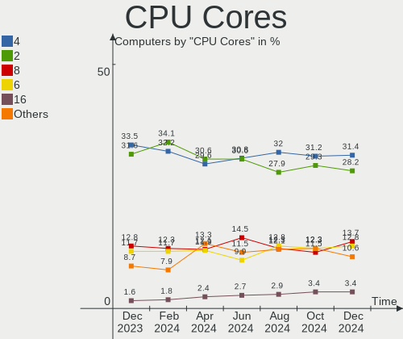

| Number  | Computers | Percent |
|---------|-----------|---------|
| 2       | 240       | 35.5%   |
| 4       | 234       | 34.62%  |
| 6       | 84        | 12.43%  |
| 8       | 76        | 11.24%  |
| 12      | 12        | 1.78%   |
| 14      | 11        | 1.63%   |
| 1       | 7         | 1.04%   |
| 16      | 5         | 0.74%   |
| 10      | 2         | 0.3%    |
| 3       | 2         | 0.3%    |
| 36      | 1         | 0.15%   |
| 24      | 1         | 0.15%   |
| Unknown | 1         | 0.15%   |

CPU Sockets
-----------

Number of sockets

| Number  | Computers | Percent |
|---------|-----------|---------|
| 1       | 671       | 99.26%  |
| 2       | 4         | 0.59%   |
| Unknown | 1         | 0.15%   |

CPU Threads
-----------

Threads per core (Hyper-Threading)

| Number  | Computers | Percent |
|---------|-----------|---------|
| 2       | 467       | 69.08%  |
| 1       | 208       | 30.77%  |
| Unknown | 1         | 0.15%   |

CPU Op-Modes
------------

CPU Operation Modes (32-bit, 64-bit)

| Op mode        | Computers | Percent |
|----------------|-----------|---------|
| 32-bit, 64-bit | 666       | 98.52%  |
| Unknown        | 5         | 0.74%   |
| 32-bit         | 4         | 0.59%   |
| 64-bit         | 1         | 0.15%   |

CPU Microcode
-------------

Microcode number

| Number     | Computers | Percent |
|------------|-----------|---------|
| Unknown    | 203       | 30.03%  |
| 0x306a9    | 27        | 3.99%   |
| 0x206a7    | 25        | 3.7%    |
| 0x306c3    | 20        | 2.96%   |
| 0x40651    | 19        | 2.81%   |
| 0x406e3    | 17        | 2.51%   |
| 0x806c1    | 15        | 2.22%   |
| 0x906ea    | 14        | 2.07%   |
| 0x906a3    | 14        | 2.07%   |
| 0x806e9    | 14        | 2.07%   |
| 0x506e3    | 14        | 2.07%   |
| 0x806ec    | 13        | 1.92%   |
| 0x08108109 | 13        | 1.92%   |
| 0x806ea    | 12        | 1.78%   |
| 0x08701021 | 12        | 1.78%   |
| 0x906e9    | 10        | 1.48%   |
| 0x1067a    | 10        | 1.48%   |
| 0x706a8    | 8         | 1.18%   |
| 0x706a1    | 8         | 1.18%   |
| 0x30678    | 8         | 1.18%   |
| 0x0a50000d | 8         | 1.18%   |
| 0x0a50000c | 8         | 1.18%   |
| 0x08608103 | 8         | 1.18%   |
| 0x0800820d | 8         | 1.18%   |
| 0x08600106 | 7         | 1.04%   |
| 0x306d4    | 6         | 0.89%   |
| 0x0a201016 | 6         | 0.89%   |
| 0x6fd      | 5         | 0.74%   |
| 0x506c9    | 5         | 0.74%   |
| 0x406c4    | 5         | 0.74%   |
| 0x20655    | 5         | 0.74%   |
| 0x0a404102 | 5         | 0.74%   |
| 0x08600103 | 5         | 0.74%   |
| 0x806d1    | 4         | 0.59%   |
| 0x10676    | 4         | 0.59%   |
| 0x08701013 | 4         | 0.59%   |
| 0x08101016 | 4         | 0.59%   |
| 0x06006704 | 4         | 0.59%   |
| 0x010000c8 | 4         | 0.59%   |
| 0xa0671    | 3         | 0.44%   |

CPU Microarch
-------------

Microarchitecture

| Name             | Computers | Percent |
|------------------|-----------|---------|
| KabyLake         | 94        | 13.91%  |
| Haswell          | 56        | 8.28%   |
| Unknown          | 50        | 7.4%    |
| Skylake          | 43        | 6.36%   |
| Zen 3            | 41        | 6.07%   |
| Zen 2            | 41        | 6.07%   |
| IvyBridge        | 41        | 6.07%   |
| SandyBridge      | 38        | 5.62%   |
| Zen+             | 33        | 4.88%   |
| Silvermont       | 23        | 3.4%    |
| TigerLake        | 20        | 2.96%   |
| Penryn           | 18        | 2.66%   |
| Alderlake Hybrid | 18        | 2.66%   |
| Goldmont plus    | 16        | 2.37%   |
| Westmere         | 15        | 2.22%   |
| Piledriver       | 12        | 1.78%   |
| K10              | 11        | 1.63%   |
| Excavator        | 11        | 1.63%   |
| Core             | 11        | 1.63%   |
| Zen              | 10        | 1.48%   |
| Broadwell        | 10        | 1.48%   |
| Goldmont         | 9         | 1.33%   |
| CometLake        | 8         | 1.18%   |
| Icelake          | 7         | 1.04%   |
| Bobcat           | 6         | 0.89%   |
| K8 Hammer        | 5         | 0.74%   |
| Jaguar           | 5         | 0.74%   |
| Tremont          | 4         | 0.59%   |
| Steamroller      | 3         | 0.44%   |
| P6               | 3         | 0.44%   |
| K8 & K10 hybrid  | 3         | 0.44%   |
| Bulldozer        | 3         | 0.44%   |
| Puma             | 2         | 0.3%    |
| NetBurst         | 2         | 0.3%    |
| Nehalem          | 2         | 0.3%    |
| K10 Llano        | 1         | 0.15%   |
| Bonnell          | 1         | 0.15%   |

Graphics
--------

GPU Vendor
----------

Vendors of graphics cards

| Vendor                     | Computers | Percent |
|----------------------------|-----------|---------|
| Intel                      | 358       | 45.84%  |
| AMD                        | 218       | 27.91%  |
| Nvidia                     | 199       | 25.48%  |
| Matrox Electronics Systems | 3         | 0.38%   |
| VIA Technologies           | 1         | 0.13%   |
| ATI Technologies           | 1         | 0.13%   |
| ASPEED Technology          | 1         | 0.13%   |

GPU Model
---------

Graphics card models

| Model                                                                                    | Computers | Percent |
|------------------------------------------------------------------------------------------|-----------|---------|
| Intel Haswell-ULT Integrated Graphics Controller                                         | 24        | 2.99%   |
| Intel 3rd Gen Core processor Graphics Controller                                         | 23        | 2.87%   |
| Intel 2nd Generation Core Processor Family Integrated Graphics Controller                | 23        | 2.87%   |
| Intel Skylake GT2 [HD Graphics 520]                                                      | 22        | 2.74%   |
| AMD Cezanne [Radeon Vega Series / Radeon Vega Mobile Series]                             | 21        | 2.62%   |
| AMD Picasso/Raven 2 [Radeon Vega Series / Radeon Vega Mobile Series]                     | 20        | 2.49%   |
| AMD Renoir                                                                               | 18        | 2.24%   |
| Intel Alder Lake-P Integrated Graphics Controller                                        | 16        | 2%      |
| Intel TigerLake-LP GT2 [Iris Xe Graphics]                                                | 15        | 1.87%   |
| Intel GeminiLake [UHD Graphics 600]                                                      | 15        | 1.87%   |
| Intel UHD Graphics 620                                                                   | 14        | 1.75%   |
| Intel HD Graphics 620                                                                    | 14        | 1.75%   |
| Intel CometLake-U GT2 [UHD Graphics]                                                     | 14        | 1.75%   |
| Intel Core Processor Integrated Graphics Controller                                      | 12        | 1.5%    |
| Intel CoffeeLake-H GT2 [UHD Graphics 630]                                                | 12        | 1.5%    |
| Intel Atom Processor Z36xxx/Z37xxx Series Graphics & Display                             | 12        | 1.5%    |
| AMD Lucienne                                                                             | 12        | 1.5%    |
| Intel Xeon E3-1200 v3/4th Gen Core Processor Integrated Graphics Controller              | 11        | 1.37%   |
| Intel HD Graphics 530                                                                    | 11        | 1.37%   |
| Intel Atom/Celeron/Pentium Processor x5-E8000/J3xxx/N3xxx Integrated Graphics Controller | 11        | 1.37%   |
| AMD VanGogh [AMD Custom GPU 0405]                                                        | 11        | 1.37%   |
| AMD Ellesmere [Radeon RX 470/480/570/570X/580/580X/590]                                  | 10        | 1.25%   |
| AMD Stoney [Radeon R2/R3/R4/R5 Graphics]                                                 | 9         | 1.12%   |
| Nvidia GP107 [GeForce GTX 1050 Ti]                                                       | 8         | 1%      |
| Intel HD Graphics 5500                                                                   | 8         | 1%      |
| Intel 4th Gen Core Processor Integrated Graphics Controller                              | 8         | 1%      |
| Intel WhiskeyLake-U GT2 [UHD Graphics 620]                                               | 7         | 0.87%   |
| Intel TigerLake-H GT1 [UHD Graphics]                                                     | 7         | 0.87%   |
| Intel HD Graphics 630                                                                    | 7         | 0.87%   |
| Intel HD Graphics 500                                                                    | 7         | 0.87%   |
| AMD Rembrandt [Radeon 680M]                                                              | 7         | 0.87%   |
| AMD Raven Ridge [Radeon Vega Series / Radeon Vega Mobile Series]                         | 7         | 0.87%   |
| AMD Navi 22 [Radeon RX 6700/6700 XT/6750 XT / 6800M]                                     | 7         | 0.87%   |
| Nvidia TU117 [GeForce GTX 1650]                                                          | 6         | 0.75%   |
| Intel Xeon E3-1200 v2/3rd Gen Core processor Graphics Controller                         | 6         | 0.75%   |
| Intel Mobile 4 Series Chipset Integrated Graphics Controller                             | 6         | 0.75%   |
| Intel CoffeeLake-S GT2 [UHD Graphics 630]                                                | 6         | 0.75%   |
| Nvidia TU117M [GeForce GTX 1650 Mobile / Max-Q]                                          | 5         | 0.62%   |
| Nvidia GP106 [GeForce GTX 1060 6GB]                                                      | 5         | 0.62%   |
| Nvidia GA106M [GeForce RTX 3060 Mobile / Max-Q]                                          | 5         | 0.62%   |

GPU Combo
---------

Combinations of graphics cards

| Name               | Computers | Percent |
|--------------------|-----------|---------|
| 1 x Intel          | 256       | 37.87%  |
| 1 x AMD            | 181       | 26.78%  |
| 1 x Nvidia         | 102       | 15.09%  |
| Intel + Nvidia     | 78        | 11.54%  |
| Intel + AMD        | 15        | 2.22%   |
| AMD + Nvidia       | 12        | 1.78%   |
| 2 x AMD            | 11        | 1.63%   |
| Other              | 7         | 1.04%   |
| 2 x Intel          | 5         | 0.74%   |
| 2 x Nvidia         | 3         | 0.44%   |
| 1 x Matrox         | 2         | 0.3%    |
| 1 x VIA            | 1         | 0.15%   |
| Nvidia + Matrox    | 1         | 0.15%   |
| Intel + 2 x Nvidia | 1         | 0.15%   |
| 1 x ASPEED         | 1         | 0.15%   |

GPU Driver
----------

Free vs proprietary

| Driver      | Computers | Percent |
|-------------|-----------|---------|
| Free        | 555       | 82.1%   |
| Proprietary | 96        | 14.2%   |
| Unknown     | 25        | 3.7%    |

GPU Memory
----------

Total video memory

| Size in GB | Computers | Percent |
|------------|-----------|---------|
| Unknown    | 423       | 62.57%  |
| 0.01-0.5   | 65        | 9.62%   |
| 1.01-2.0   | 59        | 8.73%   |
| 0.51-1.0   | 35        | 5.18%   |
| 7.01-8.0   | 32        | 4.73%   |
| 3.01-4.0   | 31        | 4.59%   |
| 5.01-6.0   | 15        | 2.22%   |
| 8.01-16.0  | 13        | 1.92%   |
| 16.01-24.0 | 2         | 0.3%    |
| 2.01-3.0   | 1         | 0.15%   |

Monitor
-------

Monitor Vendor
--------------

Monitor vendors

| Vendor                  | Computers | Percent |
|-------------------------|-----------|---------|
| AU Optronics            | 86        | 11.56%  |
| Samsung Electronics     | 81        | 10.89%  |
| BOE                     | 66        | 8.87%   |
| Chimei Innolux          | 64        | 8.6%    |
| LG Display              | 58        | 7.8%    |
| Goldstar                | 47        | 6.32%   |
| Dell                    | 34        | 4.57%   |
| BenQ                    | 29        | 3.9%    |
| Acer                    | 25        | 3.36%   |
| Hewlett-Packard         | 18        | 2.42%   |
| Lenovo                  | 16        | 2.15%   |
| AOC                     | 15        | 2.02%   |
| Iiyama                  | 13        | 1.75%   |
| Eizo                    | 12        | 1.61%   |
| ViewSonic               | 11        | 1.48%   |
| Valve                   | 10        | 1.34%   |
| Sharp                   | 10        | 1.34%   |
| Philips                 | 10        | 1.34%   |
| Chi Mei Optoelectronics | 10        | 1.34%   |
| Apple                   | 10        | 1.34%   |
| ASUSTek Computer        | 9         | 1.21%   |
| InfoVision              | 7         | 0.94%   |
| Ancor Communications    | 7         | 0.94%   |
| PANDA                   | 6         | 0.81%   |
| Fujitsu Siemens         | 6         | 0.81%   |
| CSO                     | 6         | 0.81%   |
| Medion                  | 5         | 0.67%   |
| NEC Computers           | 4         | 0.54%   |
| HUAWEI                  | 4         | 0.54%   |
| HannStar                | 4         | 0.54%   |
| CPT                     | 4         | 0.54%   |
| Belinea                 | 4         | 0.54%   |
| Vestel Elektronik       | 3         | 0.4%    |
| Mi                      | 3         | 0.4%    |
| Toshiba                 | 2         | 0.27%   |
| RTK                     | 2         | 0.27%   |
| Panasonic               | 2         | 0.27%   |
| LG Philips              | 2         | 0.27%   |
| Denver                  | 2         | 0.27%   |
| Compal                  | 2         | 0.27%   |

Monitor Model
-------------

Monitor models

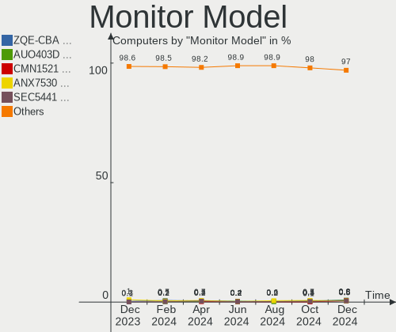

| Model                                                                 | Computers | Percent |
|-----------------------------------------------------------------------|-----------|---------|
| Valve ANX7530 U VLV3001 800x1280 100x150mm 7.1-inch                   | 10        | 1.3%    |
| Samsung Electronics C27F390 SAM0D32 1920x1080 598x336mm 27.0-inch     | 4         | 0.52%   |
| LG Display LCD Monitor LGD02DC 1366x768 344x194mm 15.5-inch           | 4         | 0.52%   |
| Lenovo LCD Monitor LEN40BA 1920x1080 344x194mm 15.5-inch              | 4         | 0.52%   |
| AU Optronics LCD Monitor AUO243D 1920x1080 309x173mm 13.9-inch        | 4         | 0.52%   |
| AU Optronics LCD Monitor AUO219E 1600x900 382x214mm 17.2-inch         | 4         | 0.52%   |
| ViewSonic VX3276-QHD VSCE635 2560x1440 698x393mm 31.5-inch            | 3         | 0.39%   |
| Vestel Elektronik 50FHD_LCD_TV VES3700 1920x1080 1280x720mm 57.8-inch | 3         | 0.39%   |
| Samsung Electronics LCD Monitor SEC5441 1366x768 344x194mm 15.5-inch  | 3         | 0.39%   |
| HUAWEI ZQE-CBA HWV6A25 3440x1440 797x334mm 34.0-inch                  | 3         | 0.39%   |
| Goldstar Ultra HD GSM5B09 3840x2160 600x340mm 27.2-inch               | 3         | 0.39%   |
| Goldstar Ultra HD GSM5B08 3840x2160 600x340mm 27.2-inch               | 3         | 0.39%   |
| Goldstar IPS FULLHD GSM5AB8 1920x1080 480x270mm 21.7-inch             | 3         | 0.39%   |
| Goldstar HDR 4K GSM7707 3840x2160 600x340mm 27.2-inch                 | 3         | 0.39%   |
| Chimei Innolux LCD Monitor CMNAE0D 1600x900 388x219mm 17.5-inch       | 3         | 0.39%   |
| Chimei Innolux LCD Monitor CMN15E7 1920x1080 344x193mm 15.5-inch      | 3         | 0.39%   |
| BenQ GL2460 BNQ78CE 1920x1080 531x299mm 24.0-inch                     | 3         | 0.39%   |
| AU Optronics LCD Monitor AUO53D4 1280x800 216x135mm 10.0-inch         | 3         | 0.39%   |
| AU Optronics LCD Monitor AUO21ED 1920x1080 344x194mm 15.5-inch        | 3         | 0.39%   |
| AOC Q32G1WG4 AOC3201 2560x1440 697x393mm 31.5-inch                    | 3         | 0.39%   |
| Samsung Electronics U28E590 SAM0C4D 3840x2160 607x345mm 27.5-inch     | 2         | 0.26%   |
| Samsung Electronics U28E590 SAM0C4C 3840x2160 608x345mm 27.5-inch     | 2         | 0.26%   |
| Samsung Electronics S27D390 SAM0B67 1920x1080 598x336mm 27.0-inch     | 2         | 0.26%   |
| Samsung Electronics S24F350 SAM0D20 1920x1080 521x293mm 23.5-inch     | 2         | 0.26%   |
| Samsung Electronics LF24T35 SAM707D 1920x1080 528x297mm 23.9-inch     | 2         | 0.26%   |
| Samsung Electronics LCD Monitor SEC3047 1366x768 277x156mm 12.5-inch  | 2         | 0.26%   |
| Samsung Electronics LCD Monitor SDC4171 2880x1800 302x189mm 14.0-inch | 2         | 0.26%   |
| Samsung Electronics C24F390 SAM0D2C 1920x1080 521x293mm 23.5-inch     | 2         | 0.26%   |
| PANDA LCD Monitor NCP0035 1920x1080 309x174mm 14.0-inch               | 2         | 0.26%   |
| LG Display LCD Monitor LGD058B 2560x1440 309x174mm 14.0-inch          | 2         | 0.26%   |
| LG Display LCD Monitor LGD02F7 1600x900 382x215mm 17.3-inch           | 2         | 0.26%   |
| LG Display LCD Monitor LGD02E3 1366x768 344x194mm 15.5-inch           | 2         | 0.26%   |
| LG Display LCD Monitor LGD027A 1600x900 382x215mm 17.3-inch           | 2         | 0.26%   |
| Lenovo LCD Monitor LEN40B1 1600x900 344x193mm 15.5-inch               | 2         | 0.26%   |
| InfoVision LCD Monitor IVO057D 1920x1080 309x174mm 14.0-inch          | 2         | 0.26%   |
| Hewlett-Packard X27i HPN3679 2560x1440 597x336mm 27.0-inch            | 2         | 0.26%   |
| Goldstar ULTRAWIDE GSM76F6 3440x1440 800x335mm 34.1-inch              | 2         | 0.26%   |
| Goldstar IPS235 GSM587E 1920x1080 510x290mm 23.1-inch                 | 2         | 0.26%   |
| Goldstar HDR 4K GSM7706 3840x2160 600x340mm 27.2-inch                 | 2         | 0.26%   |
| Goldstar 32inch FHD GSM76F5 1920x1080 698x392mm 31.5-inch             | 2         | 0.26%   |

Monitor Resolution
------------------

Monitor screen resolution

| Resolution         | Computers | Percent |
|--------------------|-----------|---------|
| 1920x1080 (FHD)    | 326       | 45.59%  |
| 1366x768 (WXGA)    | 78        | 10.91%  |
| 3840x2160 (4K)     | 54        | 7.55%   |
| 2560x1440 (QHD)    | 53        | 7.41%   |
| 1600x900 (HD+)     | 38        | 5.31%   |
| 1680x1050 (WSXGA+) | 20        | 2.8%    |
| 1280x1024 (SXGA)   | 19        | 2.66%   |
| 1920x1200 (WUXGA)  | 18        | 2.52%   |
| 3440x1440          | 17        | 2.38%   |
| 1280x800 (WXGA)    | 17        | 2.38%   |
| 2560x1600          | 12        | 1.68%   |
| 800x1280           | 11        | 1.54%   |
| 1440x900 (WXGA+)   | 8         | 1.12%   |
| 1920x540           | 5         | 0.7%    |
| 2560x1080          | 4         | 0.56%   |
| 3840x2400          | 3         | 0.42%   |
| 3840x1080          | 3         | 0.42%   |
| 2880x1800          | 3         | 0.42%   |
| 2160x1440          | 3         | 0.42%   |
| 1024x768 (XGA)     | 3         | 0.42%   |
| 3072x1920          | 2         | 0.28%   |
| 3000x2000          | 2         | 0.28%   |
| 2736x1824          | 2         | 0.28%   |
| 1600x1200          | 2         | 0.28%   |
| 3840x1600          | 1         | 0.14%   |
| 3840x1200          | 1         | 0.14%   |
| 3200x1800 (QHD+)   | 1         | 0.14%   |
| 2256x1504          | 1         | 0.14%   |
| 2240x1400          | 1         | 0.14%   |
| 1920x1280          | 1         | 0.14%   |
| 1800x1200          | 1         | 0.14%   |
| 1680x945           | 1         | 0.14%   |
| 1360x768           | 1         | 0.14%   |
| 1128x1504          | 1         | 0.14%   |
| 1024x600           | 1         | 0.14%   |
| Unknown            | 1         | 0.14%   |

Monitor Diagonal
----------------

Diagonal size in inches

| Inches  | Computers | Percent |
|---------|-----------|---------|
| 15      | 159       | 21.34%  |
| 27      | 90        | 12.08%  |
| 24      | 62        | 8.32%   |
| 13      | 62        | 8.32%   |
| 17      | 61        | 8.19%   |
| 14      | 50        | 6.71%   |
| 23      | 49        | 6.58%   |
| 31      | 23        | 3.09%   |
| 21      | 19        | 2.55%   |
| 12      | 18        | 2.42%   |
| 34      | 17        | 2.28%   |
| 19      | 15        | 2.01%   |
| 22      | 14        | 1.88%   |
| 16      | 14        | 1.88%   |
| Unknown | 14        | 1.88%   |
| 84      | 10        | 1.34%   |
| 7       | 10        | 1.34%   |
| 40      | 6         | 0.81%   |
| 32      | 6         | 0.81%   |
| 20      | 6         | 0.81%   |
| 18      | 6         | 0.81%   |
| 11      | 6         | 0.81%   |
| 10      | 6         | 0.81%   |
| 26      | 5         | 0.67%   |
| 54      | 3         | 0.4%    |
| 72      | 2         | 0.27%   |
| 49      | 2         | 0.27%   |
| 37      | 2         | 0.27%   |
| 25      | 2         | 0.27%   |
| 65      | 1         | 0.13%   |
| 52      | 1         | 0.13%   |
| 48      | 1         | 0.13%   |
| 42      | 1         | 0.13%   |
| 36      | 1         | 0.13%   |
| 29      | 1         | 0.13%   |

Monitor Width
-------------

Physical width

| Width in mm | Computers | Percent |
|-------------|-----------|---------|
| 301-350     | 242       | 33.2%   |
| 501-600     | 185       | 25.38%  |
| 351-400     | 74        | 10.15%  |
| 201-300     | 71        | 9.74%   |
| 401-500     | 49        | 6.72%   |
| 601-700     | 31        | 4.25%   |
| 701-800     | 24        | 3.29%   |
| Unknown     | 14        | 1.92%   |
| 1501-2000   | 12        | 1.65%   |
| 1-100       | 10        | 1.37%   |
| 801-900     | 8         | 1.1%    |
| 1001-1500   | 8         | 1.1%    |
| 901-1000    | 1         | 0.14%   |

Aspect Ratio
------------

Proportional relationship between the width and the height

| Ratio   | Computers | Percent |
|---------|-----------|---------|
| 16/9    | 501       | 74.55%  |
| 16/10   | 91        | 13.54%  |
| 21/9    | 19        | 2.83%   |
| 5/4     | 14        | 2.08%   |
| 3/2     | 12        | 1.79%   |
| 0.67    | 10        | 1.49%   |
| Unknown | 9         | 1.34%   |
| 6/5     | 5         | 0.74%   |
| 4/3     | 5         | 0.74%   |
| 32/9    | 5         | 0.74%   |
| 0.62    | 1         | 0.15%   |

Monitor Area
------------

Area in inch²

| Area in inch² | Computers | Percent |
|----------------|-----------|---------|
| 101-110        | 160       | 21.65%  |
| 201-250        | 107       | 14.48%  |
| 301-350        | 95        | 12.86%  |
| 81-90          | 80        | 10.83%  |
| 121-130        | 48        | 6.5%    |
| 351-500        | 46        | 6.22%   |
| 71-80          | 31        | 4.19%   |
| 151-200        | 30        | 4.06%   |
| 251-300        | 27        | 3.65%   |
| More than 1000 | 17        | 2.3%    |
| 61-70          | 17        | 2.3%    |
| Unknown        | 14        | 1.89%   |
| 501-1000       | 13        | 1.76%   |
| 111-120        | 12        | 1.62%   |
| 1-40           | 10        | 1.35%   |
| 131-140        | 10        | 1.35%   |
| 141-150        | 9         | 1.22%   |
| 51-60          | 7         | 0.95%   |
| 41-50          | 5         | 0.68%   |
| 91-100         | 1         | 0.14%   |

Pixel Density
-------------

Pixels per inch

| Density       | Computers | Percent |
|---------------|-----------|---------|
| 51-100        | 250       | 34.77%  |
| 121-160       | 184       | 25.59%  |
| 101-120       | 163       | 22.67%  |
| 161-240       | 82        | 11.4%   |
| More than 240 | 20        | 2.78%   |
| Unknown       | 14        | 1.95%   |
| 1-50          | 6         | 0.83%   |

Multiple Monitors
-----------------

Total monitors connected

| Total | Computers | Percent |
|-------|-----------|---------|
| 1     | 533       | 78.85%  |
| 2     | 106       | 15.68%  |
| 0     | 23        | 3.4%    |
| 3     | 13        | 1.92%   |
| 5     | 1         | 0.15%   |

Network
-------

Net Controller Vendor
---------------------

Controller vendors

| Vendor                                 | Computers | Percent |
|----------------------------------------|-----------|---------|
| Realtek Semiconductor                  | 355       | 35.43%  |
| Intel                                  | 341       | 34.03%  |
| Qualcomm Atheros                       | 92        | 9.18%   |
| Broadcom                               | 44        | 4.39%   |
| MediaTek                               | 23        | 2.3%    |
| ASIX Electronics                       | 15        | 1.5%    |
| Broadcom Limited                       | 14        | 1.4%    |
| Sierra Wireless                        | 12        | 1.2%    |
| TP-Link                                | 10        | 1%      |
| Ralink Technology                      | 10        | 1%      |
| Nvidia                                 | 9         | 0.9%    |
| Marvell Technology Group               | 7         | 0.7%    |
| DisplayLink                            | 7         | 0.7%    |
| Lenovo                                 | 6         | 0.6%    |
| Qualcomm                               | 5         | 0.5%    |
| AVM                                    | 5         | 0.5%    |
| Ralink                                 | 4         | 0.4%    |
| Dell                                   | 4         | 0.4%    |
| IMC Networks                           | 3         | 0.3%    |
| Huawei Technologies                    | 3         | 0.3%    |
| Fibocom                                | 3         | 0.3%    |
| ASUSTek Computer                       | 3         | 0.3%    |
| Aquantia                               | 3         | 0.3%    |
| Xiaomi                                 | 2         | 0.2%    |
| Silicon Integrated Systems [SiS]       | 2         | 0.2%    |
| Samsung Electronics                    | 2         | 0.2%    |
| Qualcomm Atheros Communications        | 2         | 0.2%    |
| Ericsson Business Mobile Networks      | 2         | 0.2%    |
| VIA Technologies                       | 1         | 0.1%    |
| U-Blox                                 | 1         | 0.1%    |
| SparkFun                               | 1         | 0.1%    |
| Sony Ericsson Mobile Communications AB | 1         | 0.1%    |
| Sitecom Europe                         | 1         | 0.1%    |
| Oculus VR                              | 1         | 0.1%    |
| Microchip Technology                   | 1         | 0.1%    |
| LSI                                    | 1         | 0.1%    |
| JMicron Technology                     | 1         | 0.1%    |
| Hewlett-Packard                        | 1         | 0.1%    |
| Edimax Technology                      | 1         | 0.1%    |
| Apple                                  | 1         | 0.1%    |

Net Controller Model
--------------------

Controller models

| Model                                                                   | Computers | Percent |
|-------------------------------------------------------------------------|-----------|---------|
| Realtek RTL8111/8168/8411 PCI Express Gigabit Ethernet Controller       | 231       | 19.71%  |
| Intel Wi-Fi 6 AX200                                                     | 33        | 2.82%   |
| Intel Wireless 8265 / 8275                                              | 30        | 2.56%   |
| Realtek RTL8153 Gigabit Ethernet Adapter                                | 27        | 2.3%    |
| Intel 82579LM Gigabit Network Connection (Lewisville)                   | 24        | 2.05%   |
| Realtek RTL8125 2.5GbE Controller                                       | 22        | 1.88%   |
| Realtek RTL8822CE 802.11ac PCIe Wireless Network Adapter                | 21        | 1.79%   |
| Intel I211 Gigabit Network Connection                                   | 21        | 1.79%   |
| Realtek RTL8821CE 802.11ac PCIe Wireless Network Adapter                | 19        | 1.62%   |
| Realtek RTL810xE PCI Express Fast Ethernet controller                   | 18        | 1.54%   |
| Intel Wireless 8260                                                     | 16        | 1.37%   |
| Intel Wireless 7265                                                     | 15        | 1.28%   |
| Qualcomm Atheros AR9285 Wireless Network Adapter (PCI-Express)          | 14        | 1.19%   |
| Intel Alder Lake-P PCH CNVi WiFi                                        | 14        | 1.19%   |
| Qualcomm Atheros QCA9565 / AR9565 Wireless Network Adapter              | 13        | 1.11%   |
| MediaTek MT7921 802.11ax PCI Express Wireless Network Adapter           | 13        | 1.11%   |
| Intel Wireless 7260                                                     | 13        | 1.11%   |
| Intel Wi-Fi 6 AX201                                                     | 13        | 1.11%   |
| Intel Ethernet Controller I225-V                                        | 13        | 1.11%   |
| Intel Centrino Advanced-N 6205 [Taylor Peak]                            | 12        | 1.02%   |
| Intel Ethernet Connection I219-LM                                       | 11        | 0.94%   |
| Intel Ethernet Connection I217-LM                                       | 11        | 0.94%   |
| Intel Cannon Lake PCH CNVi WiFi                                         | 11        | 0.94%   |
| ASIX AX88179 Gigabit Ethernet                                           | 11        | 0.94%   |
| Realtek RTL8723BE PCIe Wireless Network Adapter                         | 10        | 0.85%   |
| Qualcomm Atheros QCA9377 802.11ac Wireless Network Adapter              | 10        | 0.85%   |
| Intel Wi-Fi 6 AX210/AX211/AX411 160MHz                                  | 10        | 0.85%   |
| Intel Ethernet Connection I218-LM                                       | 10        | 0.85%   |
| Intel Ethernet Connection (2) I219-V                                    | 10        | 0.85%   |
| Intel Dual Band Wireless-AC 3168NGW [Stone Peak]                        | 10        | 0.85%   |
| Intel Comet Lake PCH-LP CNVi WiFi                                       | 10        | 0.85%   |
| Intel 82579V Gigabit Network Connection                                 | 9         | 0.77%   |
| Qualcomm Atheros QCA6174 802.11ac Wireless Network Adapter              | 8         | 0.68%   |
| Intel Wireless 3165                                                     | 8         | 0.68%   |
| Intel Ethernet Connection (7) I219-V                                    | 8         | 0.68%   |
| Sierra Wireless EM7455                                                  | 6         | 0.51%   |
| Qualcomm Atheros AR9462 Wireless Network Adapter                        | 6         | 0.51%   |
| Qualcomm Atheros AR928X Wireless Network Adapter (PCI-Express)          | 6         | 0.51%   |
| Qualcomm Atheros AR242x / AR542x Wireless Network Adapter (PCI-Express) | 6         | 0.51%   |
| Intel Wireless-AC 9260                                                  | 6         | 0.51%   |

Wireless Vendor
---------------

Wireless vendors

| Vendor                          | Computers | Percent |
|---------------------------------|-----------|---------|
| Intel                           | 255       | 47.13%  |
| Realtek Semiconductor           | 94        | 17.38%  |
| Qualcomm Atheros                | 73        | 13.49%  |
| Broadcom                        | 26        | 4.81%   |
| MediaTek                        | 23        | 4.25%   |
| Sierra Wireless                 | 12        | 2.22%   |
| Ralink Technology               | 10        | 1.85%   |
| TP-Link                         | 9         | 1.66%   |
| Broadcom Limited                | 7         | 1.29%   |
| AVM                             | 5         | 0.92%   |
| Ralink                          | 4         | 0.74%   |
| Qualcomm                        | 4         | 0.74%   |
| IMC Networks                    | 3         | 0.55%   |
| Fibocom                         | 3         | 0.55%   |
| Dell                            | 3         | 0.55%   |
| ASUSTek Computer                | 3         | 0.55%   |
| Qualcomm Atheros Communications | 2         | 0.37%   |
| Sitecom Europe                  | 1         | 0.18%   |
| Marvell Technology Group        | 1         | 0.18%   |
| LSI                             | 1         | 0.18%   |
| Edimax Technology               | 1         | 0.18%   |
| AboCom Systems                  | 1         | 0.18%   |

Wireless Model
--------------

Wireless models

| Model                                                                   | Computers | Percent |
|-------------------------------------------------------------------------|-----------|---------|
| Intel Wi-Fi 6 AX200                                                     | 33        | 6.09%   |
| Intel Wireless 8265 / 8275                                              | 30        | 5.54%   |
| Realtek RTL8822CE 802.11ac PCIe Wireless Network Adapter                | 21        | 3.87%   |
| Realtek RTL8821CE 802.11ac PCIe Wireless Network Adapter                | 19        | 3.51%   |
| Intel Wireless 8260                                                     | 16        | 2.95%   |
| Intel Wireless 7265                                                     | 15        | 2.77%   |
| Qualcomm Atheros AR9285 Wireless Network Adapter (PCI-Express)          | 14        | 2.58%   |
| Intel Alder Lake-P PCH CNVi WiFi                                        | 14        | 2.58%   |
| Qualcomm Atheros QCA9565 / AR9565 Wireless Network Adapter              | 13        | 2.4%    |
| MediaTek MT7921 802.11ax PCI Express Wireless Network Adapter           | 13        | 2.4%    |
| Intel Wireless 7260                                                     | 13        | 2.4%    |
| Intel Wi-Fi 6 AX201                                                     | 13        | 2.4%    |
| Intel Centrino Advanced-N 6205 [Taylor Peak]                            | 12        | 2.21%   |
| Intel Cannon Lake PCH CNVi WiFi                                         | 11        | 2.03%   |
| Realtek RTL8723BE PCIe Wireless Network Adapter                         | 10        | 1.85%   |
| Qualcomm Atheros QCA9377 802.11ac Wireless Network Adapter              | 10        | 1.85%   |
| Intel Wi-Fi 6 AX210/AX211/AX411 160MHz                                  | 10        | 1.85%   |
| Intel Dual Band Wireless-AC 3168NGW [Stone Peak]                        | 10        | 1.85%   |
| Intel Comet Lake PCH-LP CNVi WiFi                                       | 10        | 1.85%   |
| Qualcomm Atheros QCA6174 802.11ac Wireless Network Adapter              | 8         | 1.48%   |
| Intel Wireless 3165                                                     | 8         | 1.48%   |
| Sierra Wireless EM7455                                                  | 6         | 1.11%   |
| Qualcomm Atheros AR9462 Wireless Network Adapter                        | 6         | 1.11%   |
| Qualcomm Atheros AR928X Wireless Network Adapter (PCI-Express)          | 6         | 1.11%   |
| Qualcomm Atheros AR242x / AR542x Wireless Network Adapter (PCI-Express) | 6         | 1.11%   |
| Intel Wireless-AC 9260                                                  | 6         | 1.11%   |
| Intel Cannon Point-LP CNVi [Wireless-AC]                                | 6         | 1.11%   |
| Broadcom BCM43142 802.11b/g/n                                           | 6         | 1.11%   |
| Realtek RTL88x2bu [AC1200 Techkey]                                      | 5         | 0.92%   |
| Realtek RTL8852AE 802.11ax PCIe Wireless Network Adapter                | 5         | 0.92%   |
| Realtek RTL8188CE 802.11b/g/n WiFi Adapter                              | 5         | 0.92%   |
| MediaTek MT7922 802.11ax PCI Express Wireless Network Adapter           | 5         | 0.92%   |
| Intel Gemini Lake PCH CNVi WiFi                                         | 5         | 0.92%   |
| Intel Centrino Ultimate-N 6300                                          | 5         | 0.92%   |
| Broadcom BCM4313 802.11bgn Wireless Network Adapter                     | 5         | 0.92%   |
| TP-Link TL-WN823N v2/v3 [Realtek RTL8192EU]                             | 4         | 0.74%   |
| Realtek RTL8723DE Wireless Network Adapter                              | 4         | 0.74%   |
| Realtek 802.11ac NIC                                                    | 4         | 0.74%   |
| Qualcomm QCNFA765 Wireless Network Adapter                              | 4         | 0.74%   |
| Qualcomm Atheros AR9485 Wireless Network Adapter                        | 4         | 0.74%   |

Ethernet Vendor
---------------

Ethernet vendors

| Vendor                                 | Computers | Percent |
|----------------------------------------|-----------|---------|
| Realtek Semiconductor                  | 312       | 51.15%  |
| Intel                                  | 183       | 30%     |
| Qualcomm Atheros                       | 26        | 4.26%   |
| Broadcom                               | 22        | 3.61%   |
| ASIX Electronics                       | 15        | 2.46%   |
| Nvidia                                 | 9         | 1.48%   |
| DisplayLink                            | 7         | 1.15%   |
| Broadcom Limited                       | 7         | 1.15%   |
| Marvell Technology Group               | 6         | 0.98%   |
| Lenovo                                 | 6         | 0.98%   |
| Aquantia                               | 3         | 0.49%   |
| Xiaomi                                 | 2         | 0.33%   |
| Silicon Integrated Systems [SiS]       | 2         | 0.33%   |
| Samsung Electronics                    | 2         | 0.33%   |
| VIA Technologies                       | 1         | 0.16%   |
| TP-Link                                | 1         | 0.16%   |
| Sony Ericsson Mobile Communications AB | 1         | 0.16%   |
| Qualcomm                               | 1         | 0.16%   |
| JMicron Technology                     | 1         | 0.16%   |
| Huawei Technologies                    | 1         | 0.16%   |
| Apple                                  | 1         | 0.16%   |
| American Megatrends                    | 1         | 0.16%   |

Ethernet Model
--------------

Ethernet models

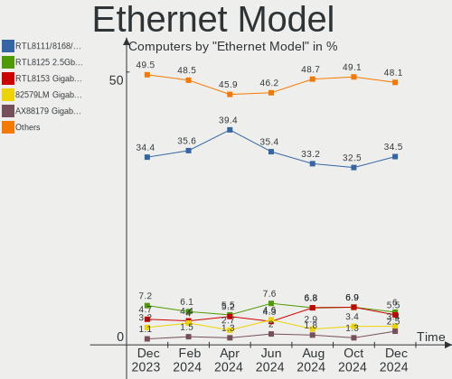

| Model                                                             | Computers | Percent |
|-------------------------------------------------------------------|-----------|---------|
| Realtek RTL8111/8168/8411 PCI Express Gigabit Ethernet Controller | 231       | 37.38%  |
| Realtek RTL8153 Gigabit Ethernet Adapter                          | 27        | 4.37%   |
| Intel 82579LM Gigabit Network Connection (Lewisville)             | 24        | 3.88%   |
| Realtek RTL8125 2.5GbE Controller                                 | 22        | 3.56%   |
| Intel I211 Gigabit Network Connection                             | 21        | 3.4%    |
| Realtek RTL810xE PCI Express Fast Ethernet controller             | 18        | 2.91%   |
| Intel Ethernet Controller I225-V                                  | 13        | 2.1%    |
| Intel Ethernet Connection I219-LM                                 | 11        | 1.78%   |
| Intel Ethernet Connection I217-LM                                 | 11        | 1.78%   |
| ASIX AX88179 Gigabit Ethernet                                     | 11        | 1.78%   |
| Intel Ethernet Connection I218-LM                                 | 10        | 1.62%   |
| Intel Ethernet Connection (2) I219-V                              | 10        | 1.62%   |
| Intel 82579V Gigabit Network Connection                           | 9         | 1.46%   |
| Intel Ethernet Connection (7) I219-V                              | 8         | 1.29%   |
| Intel Ethernet Connection (4) I219-V                              | 6         | 0.97%   |
| Realtek RTL-8100/8101L/8139 PCI Fast Ethernet Adapter             | 5         | 0.81%   |
| Intel Ethernet Connection (5) I219-LM                             | 5         | 0.81%   |
| Intel Ethernet Connection (10) I219-V                             | 5         | 0.81%   |
| Qualcomm Atheros Killer E2500 Gigabit Ethernet Controller         | 4         | 0.65%   |
| Qualcomm Atheros AR8131 Gigabit Ethernet                          | 4         | 0.65%   |
| Nvidia MCP79 Ethernet                                             | 4         | 0.65%   |
| Intel Ethernet Connection (16) I219-V                             | 4         | 0.65%   |
| Intel Ethernet Connection (10) I219-LM                            | 4         | 0.65%   |
| Broadcom NetLink BCM57785 Gigabit Ethernet PCIe                   | 4         | 0.65%   |
| Broadcom NetLink BCM57780 Gigabit Ethernet PCIe                   | 4         | 0.65%   |
| ASIX AX88772B                                                     | 4         | 0.65%   |
| Realtek Killer E3000 2.5GbE Controller                            | 3         | 0.49%   |
| Qualcomm Atheros QCA8172 Fast Ethernet                            | 3         | 0.49%   |
| Qualcomm Atheros AR8151 v2.0 Gigabit Ethernet                     | 3         | 0.49%   |
| Lenovo ThinkPad Dock Ethernet [Realtek RTL8153B]                  | 3         | 0.49%   |
| Intel Ethernet Connection I217-V                                  | 3         | 0.49%   |
| Intel Ethernet Connection (6) I219-V                              | 3         | 0.49%   |
| Intel Ethernet Connection (4) I219-LM                             | 3         | 0.49%   |
| Intel Ethernet Connection (2) I218-V                              | 3         | 0.49%   |
| Intel 82567LM-3 Gigabit Network Connection                        | 3         | 0.49%   |
| DisplayLink LAPDOCK                                               | 3         | 0.49%   |
| Broadcom NetXtreme BCM57786 Gigabit Ethernet PCIe                 | 3         | 0.49%   |
| Broadcom NetXtreme BCM57766 Gigabit Ethernet PCIe                 | 3         | 0.49%   |
| Xiaomi Mi/Redmi series (RNDIS)                                    | 2         | 0.32%   |
| Silicon Integrated Systems [SiS] 191 Gigabit Ethernet Adapter     | 2         | 0.32%   |

Net Controller Kind
-------------------

Ethernet, WiFi or modem

| Kind     | Computers | Percent |
|----------|-----------|---------|
| Ethernet | 571       | 52.34%  |
| WiFi     | 508       | 46.56%  |
| Modem    | 12        | 1.1%    |

Used Controller
---------------

Currently used network controller

| Kind     | Computers | Percent |
|----------|-----------|---------|
| WiFi     | 356       | 51.52%  |
| Ethernet | 335       | 48.48%  |

NICs
----

Total network controllers on board

| Total | Computers | Percent |
|-------|-----------|---------|
| 2     | 347       | 51.33%  |
| 1     | 298       | 44.08%  |
| 0     | 17        | 2.51%   |
| 3     | 12        | 1.78%   |
| 5     | 1         | 0.15%   |
| 4     | 1         | 0.15%   |

IPv6
----

IPv6 vs IPv4

| Used | Computers | Percent |
|------|-----------|---------|
| Yes  | 375       | 55.47%  |
| No   | 301       | 44.53%  |

Bluetooth
---------

Bluetooth Vendor
----------------

Controller vendors

| Vendor                          | Computers | Percent |
|---------------------------------|-----------|---------|
| Intel                           | 199       | 47.16%  |
| Realtek Semiconductor           | 49        | 11.61%  |
| Cambridge Silicon Radio         | 24        | 5.69%   |
| IMC Networks                    | 23        | 5.45%   |
| Foxconn / Hon Hai               | 18        | 4.27%   |
| Qualcomm Atheros Communications | 17        | 4.03%   |
| Lite-On Technology              | 15        | 3.55%   |
| Broadcom                        | 15        | 3.55%   |
| Apple                           | 13        | 3.08%   |
| ASUSTek Computer                | 11        | 2.61%   |
| Hewlett-Packard                 | 7         | 1.66%   |
| MediaTek                        | 5         | 1.18%   |
| TP-Link                         | 4         | 0.95%   |
| Realtek                         | 4         | 0.95%   |
| Dell                            | 4         | 0.95%   |
| USI                             | 3         | 0.71%   |
| Toshiba                         | 2         | 0.47%   |
| Foxconn International           | 2         | 0.47%   |
| Taiyo Yuden                     | 1         | 0.24%   |
| Motorola PCS                    | 1         | 0.24%   |
| Micro Star International        | 1         | 0.24%   |
| Marvell Semiconductor           | 1         | 0.24%   |
| Integrated System Solution      | 1         | 0.24%   |
| Askey Computer                  | 1         | 0.24%   |
| Alps Electric                   | 1         | 0.24%   |

Bluetooth Model
---------------

Controller models

| Model                                               | Computers | Percent |
|-----------------------------------------------------|-----------|---------|
| Intel Bluetooth wireless interface                  | 75        | 17.77%  |
| Intel Bluetooth Device                              | 41        | 9.72%   |
| Realtek Bluetooth Radio                             | 34        | 8.06%   |
| Intel AX200 Bluetooth                               | 31        | 7.35%   |
| Cambridge Silicon Radio Bluetooth Dongle (HCI mode) | 24        | 5.69%   |
| Intel Bluetooth 9460/9560 Jefferson Peak (JfP)      | 23        | 5.45%   |
| IMC Networks Bluetooth Radio                        | 14        | 3.32%   |
| Realtek  Bluetooth 4.2 Adapter                      | 10        | 2.37%   |
| Intel Wireless-AC 3168 Bluetooth                    | 10        | 2.37%   |
| Foxconn / Hon Hai Wireless_Device                   | 10        | 2.37%   |
| Lite-On Bluetooth Device                            | 7         | 1.66%   |
| Intel AX210 Bluetooth                               | 7         | 1.66%   |
| Qualcomm Atheros  Bluetooth Device                  | 6         | 1.42%   |
| Intel Centrino Bluetooth Wireless Transceiver       | 6         | 1.42%   |
| IMC Networks Wireless_Device                        | 6         | 1.42%   |
| Foxconn / Hon Hai Bluetooth Device                  | 6         | 1.42%   |
| Apple Bluetooth Host Controller                     | 6         | 1.42%   |
| Qualcomm Atheros AR3011 Bluetooth                   | 5         | 1.18%   |
| Intel Wireless-AC 9260 Bluetooth Adapter            | 5         | 1.18%   |
| HP Broadcom 2070 Bluetooth Combo                    | 5         | 1.18%   |
| ASUS Broadcom BCM20702A0 Bluetooth                  | 5         | 1.18%   |
| TP-Link TPuLink UB500 Adapter                       | 4         | 0.95%   |
| Realtek Bluetooth Radio                             | 4         | 0.95%   |
| MediaTek Wireless_Device                            | 4         | 0.95%   |
| Lite-On Atheros AR3012 Bluetooth                    | 4         | 0.95%   |
| Broadcom BCM20702 Bluetooth 4.0 [ThinkPad]          | 4         | 0.95%   |
| USI Bluetooth Device                                | 3         | 0.71%   |
| Realtek RTL8723B Bluetooth                          | 3         | 0.71%   |
| Qualcomm Atheros QCA61x4 Bluetooth 4.0              | 3         | 0.71%   |
| Qualcomm Atheros AR3012 Bluetooth 4.0               | 3         | 0.71%   |
| IMC Networks Bluetooth Device                       | 3         | 0.71%   |
| ASUS ASUS USB-BT500                                 | 3         | 0.71%   |
| Apple Built-in Bluetooth 2.0+EDR HCI                | 3         | 0.71%   |
| Apple Bluetooth USB Host Controller                 | 3         | 0.71%   |
| Lite-On Wireless_Device                             | 2         | 0.47%   |
| Lite-On Qualcomm Atheros Bluetooth                  | 2         | 0.47%   |
| HP Bluetooth 2.0 Interface [Broadcom BCM2045]       | 2         | 0.47%   |
| Foxconn International BCM43142A0 Bluetooth module   | 2         | 0.47%   |
| Foxconn / Hon Hai BCM20702A0                        | 2         | 0.47%   |
| Dell DW375 Bluetooth Module                         | 2         | 0.47%   |

Sound
-----

Sound Vendor
------------

Sound card vendors

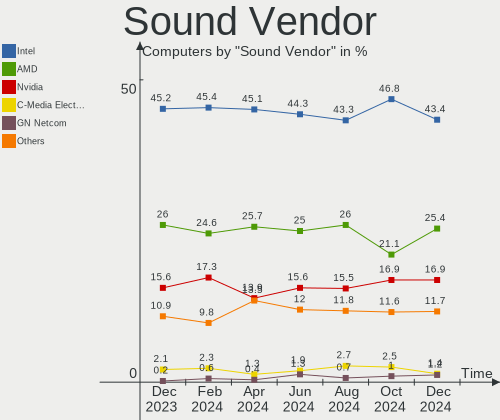

| Vendor                           | Computers | Percent |
|----------------------------------|-----------|---------|
| Intel                            | 421       | 45.17%  |
| AMD                              | 240       | 25.75%  |
| Nvidia                           | 157       | 16.85%  |
| C-Media Electronics              | 14        | 1.5%    |
| GN Netcom                        | 13        | 1.39%   |
| Lenovo                           | 8         | 0.86%   |
| Creative Labs                    | 8         | 0.86%   |
| Creative Technology              | 7         | 0.75%   |
| Logitech                         | 5         | 0.54%   |
| Texas Instruments                | 4         | 0.43%   |
| SteelSeries ApS                  | 4         | 0.43%   |
| Silicon Integrated Systems [SiS] | 4         | 0.43%   |
| JMTek                            | 4         | 0.43%   |
| Yamaha                           | 3         | 0.32%   |
| Hewlett-Packard                  | 3         | 0.32%   |
| Generalplus Technology           | 3         | 0.32%   |
| ROCCAT                           | 2         | 0.21%   |
| RME                              | 2         | 0.21%   |
| PreSonus Audio Electronics       | 2         | 0.21%   |
| Plantronics                      | 2         | 0.21%   |
| Focusrite-Novation               | 2         | 0.21%   |
| Corsair                          | 2         | 0.21%   |
| Blue Microphones                 | 2         | 0.21%   |
| ASUSTek Computer                 | 2         | 0.21%   |
| VIA Technologies                 | 1         | 0.11%   |
| Unknown                          | 1         | 0.11%   |
| Tenx Technology                  | 1         | 0.11%   |
| SG.Ltd                           | 1         | 0.11%   |
| RODE Microphones                 | 1         | 0.11%   |
| Realtek Semiconductor            | 1         | 0.11%   |
| Razer USA                        | 1         | 0.11%   |
| Pioneer DJ                       | 1         | 0.11%   |
| Native Instruments               | 1         | 0.11%   |
| Microsoft                        | 1         | 0.11%   |
| Medeli Electronics               | 1         | 0.11%   |
| DSEA A/S                         | 1         | 0.11%   |
| Dell                             | 1         | 0.11%   |
| Conrad Electronic SE             | 1         | 0.11%   |
| ATI Technologies                 | 1         | 0.11%   |
| Astro Gaming                     | 1         | 0.11%   |

Sound Model
-----------

Sound card models

| Model                                                                      | Computers | Percent |
|----------------------------------------------------------------------------|-----------|---------|
| AMD Family 17h/19h HD Audio Controller                                     | 90        | 7.89%   |
| Intel Sunrise Point-LP HD Audio                                            | 56        | 4.91%   |
| AMD Renoir Radeon High Definition Audio Controller                         | 52        | 4.56%   |
| Intel 7 Series/C216 Chipset Family High Definition Audio Controller        | 42        | 3.68%   |
| AMD Starship/Matisse HD Audio Controller                                   | 35        | 3.07%   |
| Intel 6 Series/C200 Series Chipset Family High Definition Audio Controller | 32        | 2.81%   |
| AMD Raven/Raven2/Fenghuang HDMI/DP Audio Controller                        | 27        | 2.37%   |
| AMD SBx00 Azalia (Intel HDA)                                               | 26        | 2.28%   |
| Intel 8 Series/C220 Series Chipset High Definition Audio Controller        | 25        | 2.19%   |
| Intel Haswell-ULT HD Audio Controller                                      | 24        | 2.11%   |
| Intel 8 Series HD Audio Controller                                         | 24        | 2.11%   |
| Intel Xeon E3-1200 v3/4th Gen Core Processor HD Audio Controller           | 21        | 1.84%   |
| Intel Cannon Lake PCH cAVS                                                 | 21        | 1.84%   |
| AMD Rembrandt Radeon High Definition Audio Controller                      | 21        | 1.84%   |
| Intel Tiger Lake-LP Smart Sound Technology Audio Controller                | 20        | 1.75%   |
| Intel Alder Lake PCH-P High Definition Audio Controller                    | 18        | 1.58%   |
| Intel 100 Series/C230 Series Chipset Family HD Audio Controller            | 17        | 1.49%   |
| Intel Celeron/Pentium Silver Processor High Definition Audio               | 16        | 1.4%    |
| Intel 5 Series/3400 Series Chipset High Definition Audio                   | 16        | 1.4%    |
| AMD FCH Azalia Controller                                                  | 16        | 1.4%    |
| AMD Family 17h (Models 00h-0fh) HD Audio Controller                        | 16        | 1.4%    |
| Intel Comet Lake PCH-LP cAVS                                               | 14        | 1.23%   |
| AMD Navi 21/23 HDMI/DP Audio Controller                                    | 14        | 1.23%   |
| Intel 200 Series PCH HD Audio                                              | 13        | 1.14%   |
| Nvidia GP107GL High Definition Audio Controller                            | 12        | 1.05%   |
| Nvidia GA104 High Definition Audio Controller                              | 12        | 1.05%   |
| Nvidia TU107 GeForce GTX 1650 High Definition Audio Controller             | 11        | 0.96%   |
| Nvidia GF108 High Definition Audio Controller                              | 11        | 0.96%   |
| AMD Family 15h (Models 60h-6fh) Audio Controller                           | 11        | 0.96%   |
| Intel Tiger Lake-H HD Audio Controller                                     | 10        | 0.88%   |
| AMD Ellesmere HDMI Audio [Radeon RX 470/480 / 570/580/590]                 | 10        | 0.88%   |
| Nvidia TU104 HD Audio Controller                                           | 9         | 0.79%   |
| Nvidia GP104 High Definition Audio Controller                              | 9         | 0.79%   |
| Intel Wildcat Point-LP High Definition Audio Controller                    | 9         | 0.79%   |
| Intel Celeron N3350/Pentium N4200/Atom E3900 Series Audio Cluster          | 9         | 0.79%   |
| Intel Broadwell-U Audio Controller                                         | 9         | 0.79%   |
| Intel 82801I (ICH9 Family) HD Audio Controller                             | 9         | 0.79%   |
| AMD High Definition Audio Controller                                       | 9         | 0.79%   |
| Nvidia GP106 High Definition Audio Controller                              | 8         | 0.7%    |
| Nvidia TU116 High Definition Audio Controller                              | 7         | 0.61%   |

Memory
------

Memory Vendor
-------------

Memory module vendors

| Vendor              | Computers | Percent |
|---------------------|-----------|---------|
| Samsung Electronics | 100       | 23.53%  |
| SK hynix            | 76        | 17.88%  |
| Micron Technology   | 47        | 11.06%  |
| Unknown             | 38        | 8.94%   |
| Kingston            | 35        | 8.24%   |
| Corsair             | 30        | 7.06%   |
| Crucial             | 24        | 5.65%   |
| G.Skill             | 23        | 5.41%   |
| Nanya Technology    | 7         | 1.65%   |
| Unknown (ABCD)      | 6         | 1.41%   |
| A-DATA Technology   | 6         | 1.41%   |
| Unknown             | 6         | 1.41%   |
| Elpida              | 5         | 1.18%   |
| Team                | 4         | 0.94%   |
| Ramaxel Technology  | 3         | 0.71%   |
| GOODRAM             | 3         | 0.71%   |
| Transcend           | 2         | 0.47%   |
| Unknown (8ECE)      | 1         | 0.24%   |
| Unifosa             | 1         | 0.24%   |
| SHARETRONIC         | 1         | 0.24%   |
| Neo Forza           | 1         | 0.24%   |
| Miron               | 1         | 0.24%   |
| Lexar               | 1         | 0.24%   |
| Kllisre             | 1         | 0.24%   |
| CSX                 | 1         | 0.24%   |
| Avant               | 1         | 0.24%   |
| AORUS               | 1         | 0.24%   |

Memory Model
------------

Memory module models

| Model                                                            | Computers | Percent |
|------------------------------------------------------------------|-----------|---------|
| Unknown                                                          | 6         | 1.35%   |
| Samsung RAM M471B5273DH0-CH9 4GB SODIMM DDR3 1334MT/s            | 5         | 1.12%   |
| Samsung RAM M471B5173QH0-YK0 4GB SODIMM DDR3 1600MT/s            | 5         | 1.12%   |
| Samsung RAM M471A5244CB0-CTD 4GB SODIMM DDR4 3266MT/s            | 5         | 1.12%   |
| Samsung RAM M471B5173EB0-YK0 4GB SODIMM DDR3 1600MT/s            | 4         | 0.9%    |
| Samsung RAM M471A2G44AM0-CWE 16GB SODIMM DDR4 3200MT/s           | 4         | 0.9%    |
| Samsung RAM M471A1G44AB0-CWE 8GB SODIMM DDR4 3200MT/s            | 4         | 0.9%    |
| Unknown RAM Module 2GB SODIMM DDR3 1333MT/s                      | 3         | 0.67%   |
| Unknown (ABCD) RAM 123456789012345678 4GB DIMM DDR4 2400MT/s     | 3         | 0.67%   |
| Unknown (ABCD) RAM 123456789012345678 2GB SODIMM LPDDR4 2400MT/s | 3         | 0.67%   |
| SK hynix RAM HMT451S6BFR8A-PB 4096MB SODIMM DDR3 1600MT/s        | 3         | 0.67%   |
| SK hynix RAM HMT451S6AFR8A-PB 4GB SODIMM DDR3 1600MT/s           | 3         | 0.67%   |
| SK hynix RAM HMA81GS6DJR8N-XN 8GB SODIMM DDR4 3200MT/s           | 3         | 0.67%   |
| Samsung RAM M471B5273CH0-CH9 4GB SODIMM DDR3 1334MT/s            | 3         | 0.67%   |
| Samsung RAM M471A5244CB0-CWE 4GB SODIMM DDR4 3200MT/s            | 3         | 0.67%   |
| Samsung RAM M471A1K43DB1-CWE 8GB SODIMM DDR4 3200MT/s            | 3         | 0.67%   |
| Samsung RAM M471A1K43CB1-CTD 8GB SODIMM DDR4 2667MT/s            | 3         | 0.67%   |
| Samsung RAM M471A1K43BB1-CRC 8GB SODIMM DDR4 2667MT/s            | 3         | 0.67%   |
| Samsung RAM M471A1G44AB0-CWE 8GB Row Of Chips DDR4 3200MT/s      | 3         | 0.67%   |
| Nanya RAM Module 2GB SODIMM DDR3 1066MT/s                        | 3         | 0.67%   |
| G.Skill RAM F4-3000C16-8GISB 8GB DIMM DDR4 3200MT/s              | 3         | 0.67%   |
| Unknown RAM Module 4GB SODIMM DDR2 667MT/s                       | 2         | 0.45%   |
| Unknown RAM Module 4GB Row Of Chips LPDDR4 4267MT/s              | 2         | 0.45%   |
| Unknown RAM Module 4GB DIMM DDR3 1333MT/s                        | 2         | 0.45%   |
| Team RAM Elite-1333 4GB DIMM DDR3 1333MT/s                       | 2         | 0.45%   |
| SK hynix RAM Module 2GB SODIMM DDR3 1067MT/s                     | 2         | 0.45%   |
| SK hynix RAM HMT851S6AMR6A-PB 4096MB Chip DDR3 1600MT/s          | 2         | 0.45%   |
| SK hynix RAM HMT451S6MFR8A-PB 4GB SODIMM DDR3 1600MT/s           | 2         | 0.45%   |
| SK hynix RAM HMT351S6CFR8C-PB 4GB SODIMM DDR3 1600MT/s           | 2         | 0.45%   |
| SK hynix RAM HMAB2GS6CMR6N-XN 16GB SODIMM DDR4 3200MT/s          | 2         | 0.45%   |
| SK hynix RAM HMAA4GS6CJR8N-XN 32GB SODIMM DDR4 3200MT/s          | 2         | 0.45%   |
| SK hynix RAM HMAA2GS6CJR8N-XN 16GB SODIMM DDR4 3200MT/s          | 2         | 0.45%   |
| SK hynix RAM HMAA1GS6CJR6N-XN 8GB SODIMM DDR4 3200MT/s           | 2         | 0.45%   |
| SK hynix RAM HMA851S6AFR6N-UH 4GB SODIMM DDR4 2667MT/s           | 2         | 0.45%   |
| SK hynix RAM HMA82GS6DJR8N-XN 16GB SODIMM DDR4 3200MT/s          | 2         | 0.45%   |
| SK hynix RAM HMA82GS6CJR8N-VK 16GB SODIMM DDR4 2667MT/s          | 2         | 0.45%   |
| SK hynix RAM HMA82GS6AFR8N-UH 16GB SODIMM DDR4 2667MT/s          | 2         | 0.45%   |
| SK hynix RAM HMA81GS6AFR8N-UH 8192MB SODIMM DDR4 2667MT/s        | 2         | 0.45%   |
| SK hynix RAM H9JCNNNCP3MLYR-N6E 2GB Row Of Chips LPDDR5 6400MT/s | 2         | 0.45%   |
| SK hynix RAM H9HCNNNCPMMLXR-NEE 8GB SODIMM LPDDR4 4266MT/s       | 2         | 0.45%   |

Memory Kind
-----------

Memory module kinds

| Kind    | Computers | Percent |
|---------|-----------|---------|
| DDR4    | 189       | 50.13%  |
| DDR3    | 107       | 28.38%  |
| LPDDR4  | 19        | 5.04%   |
| DDR2    | 15        | 3.98%   |
| LPDDR3  | 12        | 3.18%   |
| DDR5    | 10        | 2.65%   |
| LPDDR5  | 9         | 2.39%   |
| SDRAM   | 8         | 2.12%   |
| DDR     | 4         | 1.06%   |
| Unknown | 4         | 1.06%   |

Memory Form Factor
------------------

Physical design of the memory module

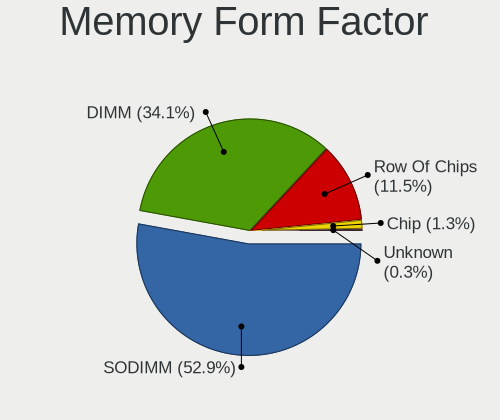

| Name         | Computers | Percent |
|--------------|-----------|---------|
| SODIMM       | 216       | 57.14%  |
| DIMM         | 120       | 31.75%  |
| Row Of Chips | 38        | 10.05%  |
| Chip         | 4         | 1.06%   |

Memory Size
-----------

Memory module size

| Size  | Computers | Percent |
|-------|-----------|---------|
| 8192  | 137       | 35.04%  |
| 4096  | 107       | 27.37%  |
| 16384 | 82        | 20.97%  |
| 2048  | 47        | 12.02%  |
| 32768 | 11        | 2.81%   |
| 1024  | 6         | 1.53%   |
| 512   | 1         | 0.26%   |

Memory Speed
------------

Memory module speed

| Speed   | Computers | Percent |
|---------|-----------|---------|
| 3200    | 78        | 19.35%  |
| 1600    | 74        | 18.36%  |
| 2667    | 49        | 12.16%  |
| 2400    | 35        | 8.68%   |
| 1333    | 23        | 5.71%   |
| 2133    | 21        | 5.21%   |
| 3600    | 10        | 2.48%   |
| 1867    | 10        | 2.48%   |
| 1334    | 10        | 2.48%   |
| 6400    | 9         | 2.23%   |
| 4800    | 9         | 2.23%   |
| 667     | 7         | 1.74%   |
| 4267    | 6         | 1.49%   |
| 1067    | 6         | 1.49%   |
| 3266    | 5         | 1.24%   |
| 1066    | 5         | 1.24%   |
| 800     | 5         | 1.24%   |
| Unknown | 4         | 0.99%   |
| 4266    | 3         | 0.74%   |
| 3733    | 3         | 0.74%   |
| 3466    | 3         | 0.74%   |
| 3400    | 3         | 0.74%   |
| 2933    | 3         | 0.74%   |
| 8400    | 2         | 0.5%    |
| 3866    | 2         | 0.5%    |
| 3000    | 2         | 0.5%    |
| 2048    | 2         | 0.5%    |
| 1800    | 2         | 0.5%    |
| 400     | 2         | 0.5%    |
| 5600    | 1         | 0.25%   |
| 4000    | 1         | 0.25%   |
| 3800    | 1         | 0.25%   |
| 3500    | 1         | 0.25%   |
| 3007    | 1         | 0.25%   |
| 2666    | 1         | 0.25%   |
| 975     | 1         | 0.25%   |
| 533     | 1         | 0.25%   |
| 333     | 1         | 0.25%   |
| 266     | 1         | 0.25%   |

Printers & scanners
-------------------

Printer Vendor
--------------

Printer device vendors

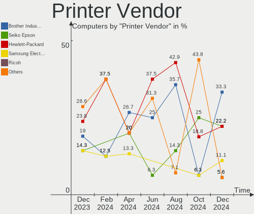

| Vendor              | Computers | Percent |
|---------------------|-----------|---------|
| Hewlett-Packard     | 6         | 27.27%  |
| Canon               | 5         | 22.73%  |
| Brother Industries  | 4         | 18.18%  |
| Samsung Electronics | 3         | 13.64%  |
| Seiko Epson         | 2         | 9.09%   |
| Seiko Instruments   | 1         | 4.55%   |
| QinHeng Electronics | 1         | 4.55%   |

Printer Model
-------------

Printer device models

| Model                                     | Computers | Percent |
|-------------------------------------------|-----------|---------|
| Canon TR8500 series                       | 2         | 9.09%   |
| Seiko Instruments Smart Label Printer 620 | 1         | 4.55%   |
| Seiko Epson Printer                       | 1         | 4.55%   |
| Seiko Epson ET-2710 Series                | 1         | 4.55%   |
| Samsung SCX-472x Series                   | 1         | 4.55%   |
| Samsung SCX-4623FW Series                 | 1         | 4.55%   |
| Samsung ML-2950 Series                    | 1         | 4.55%   |
| QinHeng CH340S                            | 1         | 4.55%   |
| HP Officejet 4630 series                  | 1         | 4.55%   |
| HP EWS UPD                                | 1         | 4.55%   |
| HP ENVY 5000 series                       | 1         | 4.55%   |
| HP DeskJet 990c                           | 1         | 4.55%   |
| HP DeskJet 4100 series                    | 1         | 4.55%   |
| HP Deskjet 3050A                          | 1         | 4.55%   |
| Canon PIXMA MX490 Series                  | 1         | 4.55%   |
| Canon PIXMA MX370 Series                  | 1         | 4.55%   |
| Canon CanoScan LiDE 300                   | 1         | 4.55%   |
| Brother MFC-L2710DW series                | 1         | 4.55%   |
| Brother MFC-J245                          | 1         | 4.55%   |
| Brother HL-L2350DW series                 | 1         | 4.55%   |
| Brother HL-5350DN series                  | 1         | 4.55%   |

Scanner Vendor
--------------

Scanner device vendors

| Vendor          | Computers | Percent |
|-----------------|-----------|---------|
| Canon           | 6         | 85.71%  |
| Hewlett-Packard | 1         | 14.29%  |

Scanner Model
-------------

Scanner device models

| Model                                  | Computers | Percent |
|----------------------------------------|-----------|---------|
| Canon CanoScan LiDE 50/LiDE 35/LiDE 40 | 2         | 28.57%  |
| Canon CanoScan LiDE 110                | 2         | 28.57%  |
| HP ScanJet 7400c                       | 1         | 14.29%  |
| Canon CanoScan LiDE 220                | 1         | 14.29%  |
| Canon CanoScan LiDE 210                | 1         | 14.29%  |

Camera
------

Camera Vendor
-------------

Camera device vendors

| Vendor                                 | Computers | Percent |
|----------------------------------------|-----------|---------|
| Chicony Electronics                    | 101       | 25.38%  |
| IMC Networks                           | 42        | 10.55%  |
| Microdia                               | 34        | 8.54%   |
| Acer                                   | 29        | 7.29%   |
| Realtek Semiconductor                  | 25        | 6.28%   |
| Logitech                               | 19        | 4.77%   |
| Suyin                                  | 17        | 4.27%   |
| Quanta                                 | 17        | 4.27%   |
| Cheng Uei Precision Industry (Foxlink) | 14        | 3.52%   |
| Syntek                                 | 12        | 3.02%   |
| Apple                                  | 12        | 3.02%   |
| Sunplus Innovation Technology          | 9         | 2.26%   |
| Lite-On Technology                     | 8         | 2.01%   |
| Luxvisions Innotech Limited            | 7         | 1.76%   |
| Microsoft                              | 6         | 1.51%   |
| SunplusIT                              | 4         | 1.01%   |
| Primax Electronics                     | 4         | 1.01%   |
| Sonix Technology                       | 3         | 0.75%   |
| Silicon Motion                         | 3         | 0.75%   |
| Samsung Electronics                    | 3         | 0.75%   |
| ARC International                      | 3         | 0.75%   |
| Alcor Micro                            | 3         | 0.75%   |
| Z-Star Microelectronics                | 2         | 0.5%    |
| Philips (or NXP)                       | 2         | 0.5%    |
| Cubeternet                             | 2         | 0.5%    |
| Y Media                                | 1         | 0.25%   |
| Trust                                  | 1         | 0.25%   |
| Tripath Technology                     | 1         | 0.25%   |
| Sunplus Technology                     | 1         | 0.25%   |
| Ricoh                                  | 1         | 0.25%   |
| Razer USA                              | 1         | 0.25%   |
| OYT Tech                               | 1         | 0.25%   |
| LG Electronics                         | 1         | 0.25%   |
| Lenovo                                 | 1         | 0.25%   |
| Integrated Technology Express          | 1         | 0.25%   |
| Importek                               | 1         | 0.25%   |
| Generalplus Technology                 | 1         | 0.25%   |
| eMeet-200611                           | 1         | 0.25%   |
| CZUR Technology                        | 1         | 0.25%   |
| AVerMedia Technologies                 | 1         | 0.25%   |

Camera Model
------------

Camera device models

| Model                                            | Computers | Percent |
|--------------------------------------------------|-----------|---------|
| Chicony Integrated Camera                        | 22        | 5.43%   |
| IMC Networks Integrated Camera                   | 19        | 4.69%   |
| Chicony HD WebCam                                | 15        | 3.7%    |
| Microdia Integrated_Webcam_HD                    | 11        | 2.72%   |
| IMC Networks USB2.0 HD UVC WebCam                | 9         | 2.22%   |
| Syntek Integrated Camera                         | 8         | 1.98%   |
| Chicony USB2.0 Camera                            | 7         | 1.73%   |
| Microdia Integrated Webcam                       | 6         | 1.48%   |
| Cheng Uei Precision Industry (Foxlink) HP Webcam | 6         | 1.48%   |
| Acer Integrated Camera                           | 6         | 1.48%   |
| Realtek Integrated_Webcam_HD                     | 5         | 1.23%   |
| Suyin 1.3M HD WebCam                             | 4         | 0.99%   |
| Realtek Acer 640 x 480 laptop camera             | 4         | 0.99%   |
| Microsoft LifeCam HD-3000                        | 4         | 0.99%   |
| Lite-On Integrated Camera                        | 4         | 0.99%   |
| IMC Networks ov9734_azurewave_camera             | 4         | 0.99%   |
| Chicony HP TrueVision HD Camera                  | 4         | 0.99%   |
| Chicony HD User Facing                           | 4         | 0.99%   |
| Chicony FJ Camera                                | 4         | 0.99%   |
| Apple Built-in iSight                            | 4         | 0.99%   |
| Acer SunplusIT Integrated Camera                 | 4         | 0.99%   |
| Acer Lenovo EasyCamera                           | 4         | 0.99%   |
| Acer BisonCam,NB Pro                             | 4         | 0.99%   |
| Acer BisonCam, NB Pro                            | 4         | 0.99%   |
| Sunplus HD WebCam                                | 3         | 0.74%   |
| Sonix USB2.0 HD UVC WebCam                       | 3         | 0.74%   |
| Samsung Galaxy A5 (MTP)                          | 3         | 0.74%   |
| Quanta VGA WebCam                                | 3         | 0.74%   |
| Quanta HP HD Camera                              | 3         | 0.74%   |
| Quanta HD User Facing                            | 3         | 0.74%   |
| Primax HP HD Webcam [Fixed]                      | 3         | 0.74%   |
| Microdia Webcam Vitade AF                        | 3         | 0.74%   |
| Microdia USB 2.0 Camera                          | 3         | 0.74%   |
| Microdia Sonix USB 2.0 Camera                    | 3         | 0.74%   |
| Logitech Webcam C310                             | 3         | 0.74%   |
| Logitech HD Pro Webcam C920                      | 3         | 0.74%   |
| IMC Networks SunplusIT Integrated Camera         | 3         | 0.74%   |
| Chicony HP Webcam                                | 3         | 0.74%   |
| Chicony HP HD Camera                             | 3         | 0.74%   |
| Chicony EasyCamera                               | 3         | 0.74%   |

Security
--------

Fingerprint Vendor
------------------

Fingerprint sensor vendors

| Vendor                     | Computers | Percent |
|----------------------------|-----------|---------|
| Synaptics                  | 33        | 37.5%   |
| Validity Sensors           | 21        | 23.86%  |
| Shenzhen Goodix Technology | 15        | 17.05%  |
| LighTuning Technology      | 5         | 5.68%   |
| AuthenTec                  | 5         | 5.68%   |
| Elan Microelectronics      | 4         | 4.55%   |
| Upek                       | 2         | 2.27%   |
| STMicroelectronics         | 1         | 1.14%   |
| HOLTEK                     | 1         | 1.14%   |
| DigitalPersona             | 1         | 1.14%   |

Fingerprint Model
-----------------

Fingerprint sensor models

| Model                                                       | Computers | Percent |
|-------------------------------------------------------------|-----------|---------|
| Synaptics Prometheus MIS Touch Fingerprint Reader           | 15        | 17.05%  |
| Shenzhen Goodix  Fingerprint Device                         | 10        | 11.36%  |
| Unknown                                                     | 9         | 10.23%  |
| Validity Sensors Synaptics WBDI                             | 6         | 6.82%   |
| Shenzhen Goodix Fingerprint Reader                          | 5         | 5.68%   |
| Validity Sensors VFS495 Fingerprint Reader                  | 4         | 4.55%   |
| Validity Sensors VFS 5011 fingerprint sensor                | 4         | 4.55%   |
| Synaptics  WBDI                                             | 4         | 4.55%   |
| Synaptics Metallica MIS Touch Fingerprint Reader            | 3         | 3.41%   |
| LighTuning EgisTec Touch Fingerprint Sensor                 | 3         | 3.41%   |
| AuthenTec AES2501 Fingerprint Sensor                        | 3         | 3.41%   |
| Validity Sensors VFS7500 Touch Fingerprint Sensor           | 2         | 2.27%   |
| Validity Sensors VFS471 Fingerprint Reader                  | 2         | 2.27%   |
| Upek Biometric Touchchip/Touchstrip Fingerprint Sensor      | 2         | 2.27%   |
| Synaptics  VFS7552 Touch Fingerprint Sensor with PurePrint  | 2         | 2.27%   |
| Elan ELAN:Fingerprint                                       | 2         | 2.27%   |
| Elan ELAN:ARM-M4                                            | 2         | 2.27%   |
| Validity Sensors VFS491                                     | 1         | 1.14%   |
| Validity Sensors VFS301 Fingerprint Reader                  | 1         | 1.14%   |
| Validity Sensors Synaptics VFS7552 Touch Fingerprint Sensor | 1         | 1.14%   |
| STMicroelectronics Fingerprint Reader                       | 1         | 1.14%   |
| LighTuning Fingerprint Reader                               | 1         | 1.14%   |
| LighTuning ES603 Swipe Fingerprint Sensor                   | 1         | 1.14%   |
| HOLTEK FocalTech Fingerprint Device                         | 1         | 1.14%   |
| DigitalPersona Fingerprint Reader                           | 1         | 1.14%   |
| AuthenTec Fingerprint Sensor                                | 1         | 1.14%   |
| AuthenTec AES1600                                           | 1         | 1.14%   |

Chipcard Vendor
---------------

Chipcard module vendors

| Vendor                   | Computers | Percent |
|--------------------------|-----------|---------|
| Alcor Micro              | 24        | 51.06%  |
| Broadcom                 | 12        | 25.53%  |
| Reiner SCT Kartensysteme | 3         | 6.38%   |
| Upek                     | 2         | 4.26%   |
| O2 Micro                 | 2         | 4.26%   |
| Lenovo                   | 2         | 4.26%   |
| Gemalto (was Gemplus)    | 1         | 2.13%   |
| Clay Logic               | 1         | 2.13%   |

Chipcard Model
--------------

Chipcard module models

| Model                                                                        | Computers | Percent |
|------------------------------------------------------------------------------|-----------|---------|
| Alcor Micro AU9540 Smartcard Reader                                          | 24        | 51.06%  |
| Broadcom 5880                                                                | 5         | 10.64%  |
| Broadcom BCM5880 Secure Applications Processor                               | 3         | 6.38%   |
| Upek TouchChip Fingerprint Coprocessor (WBF advanced mode)                   | 2         | 4.26%   |
| Reiner SCT Kartensysteme cyberJack RFID basis contactless smartcard reader   | 2         | 4.26%   |
| O2 Micro OZ776 CCID Smartcard Reader                                         | 2         | 4.26%   |
| Lenovo Integrated Smart Card Reader                                          | 2         | 4.26%   |
| Broadcom BCM5880 Secure Applications Processor with fingerprint swipe sensor | 2         | 4.26%   |
| Broadcom 58200                                                               | 2         | 4.26%   |
| Reiner SCT Kartensysteme cyberJack one                                       | 1         | 2.13%   |
| Gemalto (was Gemplus) GemPC Twin SmartCard Reader                            | 1         | 2.13%   |
| Clay Logic Nitrokey Pro                                                      | 1         | 2.13%   |

Unsupported
-----------

Unsupported Devices
-------------------

Total unsupported devices on board

| Total | Computers | Percent |
|-------|-----------|---------|
| 0     | 476       | 70.41%  |
| 1     | 151       | 22.34%  |
| 2     | 38        | 5.62%   |
| 3     | 9         | 1.33%   |
| 5     | 2         | 0.3%    |

Unsupported Device Types
------------------------

Types of unsupported devices

| Type                     | Computers | Percent |
|--------------------------|-----------|---------|
| Fingerprint reader       | 85        | 33.2%   |
| Graphics card            | 43        | 16.8%   |
| Chipcard                 | 42        | 16.41%  |
| Net/wireless             | 22        | 8.59%   |
| Multimedia controller    | 22        | 8.59%   |
| Communication controller | 12        | 4.69%   |
| Camera                   | 8         | 3.13%   |
| Bluetooth                | 5         | 1.95%   |
| Sound                    | 4         | 1.56%   |
| Unassigned class         | 3         | 1.17%   |
| Storage                  | 3         | 1.17%   |
| Modem                    | 2         | 0.78%   |
| Card reader              | 2         | 0.78%   |
| Storage/raid             | 1         | 0.39%   |
| Network                  | 1         | 0.39%   |
| Flash memory             | 1         | 0.39%   |

