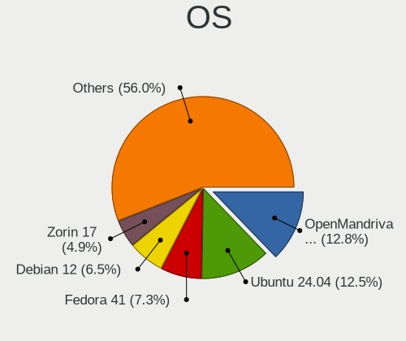
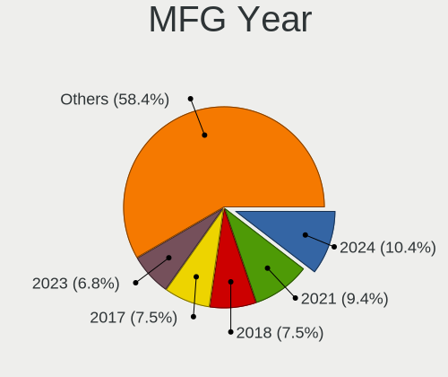
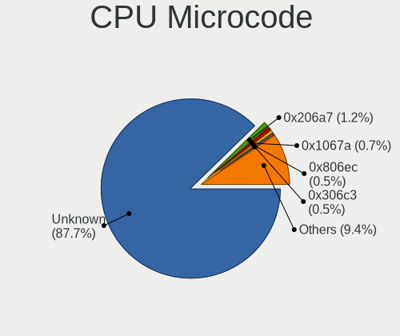

Linux in Germany - Hardware Trends
----------------------------------

A project to identify most popular hardware characteristics and track their change
over time based on data collected by Linux users at https://Linux-Hardware.org.

Anyone can contribute to this report by the [hw-probe](https://github.com/linuxhw/hw-probe) tool:

    sudo -E hw-probe -all -upload

This is a report for all computer types. See also reports for [desktops](/Location/Germany/Desktop/README.md) and [notebooks](/Location/Germany/Notebook/README.md).

Period: Dec, 2022.

Contents
--------

* [ System ](#system)
  - [ OS                       ](#os)
  - [ OS Family                ](#os-family)
  - [ Kernel                   ](#kernel)
  - [ Kernel Family            ](#kernel-family)
  - [ Kernel Major Ver.        ](#kernel-major-ver)
  - [ Arch                     ](#arch)
  - [ DE                       ](#de)
  - [ Display Server           ](#display-server)
  - [ Display Manager          ](#display-manager)
  - [ OS Lang                  ](#os-lang)
  - [ Boot Mode                ](#boot-mode)
  - [ Filesystem               ](#filesystem)
  - [ Part. scheme             ](#part-scheme)
  - [ Dual Boot with Linux/BSD ](#dual-boot-with-linuxbsd)
  - [ Dual Boot (Win)          ](#dual-boot-win)

* [ Board ](#board)
  - [ Vendor                   ](#vendor)
  - [ Model                    ](#model)
  - [ Model Family             ](#model-family)
  - [ MFG Year                 ](#mfg-year)
  - [ Form Factor              ](#form-factor)
  - [ Secure Boot              ](#secure-boot)
  - [ Coreboot                 ](#coreboot)
  - [ RAM Size                 ](#ram-size)
  - [ RAM Used                 ](#ram-used)
  - [ Total Drives             ](#total-drives)
  - [ Has CD-ROM               ](#has-cd-rom)
  - [ Has Ethernet             ](#has-ethernet)
  - [ Has WiFi                 ](#has-wifi)
  - [ Has Bluetooth            ](#has-bluetooth)

* [ Location ](#location)
  - [ Country                  ](#country)
  - [ City                     ](#city)

* [ Drives ](#drives)
  - [ Drive Vendor             ](#drive-vendor)
  - [ Drive Model              ](#drive-model)
  - [ HDD Vendor               ](#hdd-vendor)
  - [ SSD Vendor               ](#ssd-vendor)
  - [ Drive Kind               ](#drive-kind)
  - [ Drive Connector          ](#drive-connector)
  - [ Drive Size               ](#drive-size)
  - [ Space Total              ](#space-total)
  - [ Space Used               ](#space-used)
  - [ Malfunc. Drives          ](#malfunc-drives)
  - [ Malfunc. Drive Vendor    ](#malfunc-drive-vendor)
  - [ Malfunc. HDD Vendor      ](#malfunc-hdd-vendor)
  - [ Malfunc. Drive Kind      ](#malfunc-drive-kind)
  - [ Failed Drives            ](#failed-drives)
  - [ Failed Drive Vendor      ](#failed-drive-vendor)
  - [ Drive Status             ](#drive-status)

* [ Storage controller ](#storage-controller)
  - [ Storage Vendor           ](#storage-vendor)
  - [ Storage Model            ](#storage-model)
  - [ Storage Kind             ](#storage-kind)

* [ Processor ](#processor)
  - [ CPU Vendor               ](#cpu-vendor)
  - [ CPU Model                ](#cpu-model)
  - [ CPU Model Family         ](#cpu-model-family)
  - [ CPU Cores                ](#cpu-cores)
  - [ CPU Sockets              ](#cpu-sockets)
  - [ CPU Threads              ](#cpu-threads)
  - [ CPU Op-Modes             ](#cpu-op-modes)
  - [ CPU Microcode            ](#cpu-microcode)
  - [ CPU Microarch            ](#cpu-microarch)

* [ Graphics ](#graphics)
  - [ GPU Vendor               ](#gpu-vendor)
  - [ GPU Model                ](#gpu-model)
  - [ GPU Combo                ](#gpu-combo)
  - [ GPU Driver               ](#gpu-driver)
  - [ GPU Memory               ](#gpu-memory)

* [ Monitor ](#monitor)
  - [ Monitor Vendor           ](#monitor-vendor)
  - [ Monitor Model            ](#monitor-model)
  - [ Monitor Resolution       ](#monitor-resolution)
  - [ Monitor Diagonal         ](#monitor-diagonal)
  - [ Monitor Width            ](#monitor-width)
  - [ Aspect Ratio             ](#aspect-ratio)
  - [ Monitor Area             ](#monitor-area)
  - [ Pixel Density            ](#pixel-density)
  - [ Multiple Monitors        ](#multiple-monitors)

* [ Network ](#network)
  - [ Net Controller Vendor    ](#net-controller-vendor)
  - [ Net Controller Model     ](#net-controller-model)
  - [ Wireless Vendor          ](#wireless-vendor)
  - [ Wireless Model           ](#wireless-model)
  - [ Ethernet Vendor          ](#ethernet-vendor)
  - [ Ethernet Model           ](#ethernet-model)
  - [ Net Controller Kind      ](#net-controller-kind)
  - [ Used Controller          ](#used-controller)
  - [ NICs                     ](#nics)
  - [ IPv6                     ](#ipv6)

* [ Bluetooth ](#bluetooth)
  - [ Bluetooth Vendor         ](#bluetooth-vendor)
  - [ Bluetooth Model          ](#bluetooth-model)

* [ Sound ](#sound)
  - [ Sound Vendor             ](#sound-vendor)
  - [ Sound Model              ](#sound-model)

* [ Memory ](#memory)
  - [ Memory Vendor            ](#memory-vendor)
  - [ Memory Model             ](#memory-model)
  - [ Memory Kind              ](#memory-kind)
  - [ Memory Form Factor       ](#memory-form-factor)
  - [ Memory Size              ](#memory-size)
  - [ Memory Speed             ](#memory-speed)

* [ Printers & scanners ](#printers--scanners)
  - [ Printer Vendor           ](#printer-vendor)
  - [ Printer Model            ](#printer-model)
  - [ Scanner Vendor           ](#scanner-vendor)
  - [ Scanner Model            ](#scanner-model)

* [ Camera ](#camera)
  - [ Camera Vendor            ](#camera-vendor)
  - [ Camera Model             ](#camera-model)

* [ Security ](#security)
  - [ Fingerprint Vendor       ](#fingerprint-vendor)
  - [ Fingerprint Model        ](#fingerprint-model)
  - [ Chipcard Vendor          ](#chipcard-vendor)
  - [ Chipcard Model           ](#chipcard-model)

* [ Unsupported ](#unsupported)
  - [ Unsupported Devices      ](#unsupported-devices)
  - [ Unsupported Device Types ](#unsupported-device-types)

System
------

OS
--

Installed operating systems

| Name                         | Computers | Percent |
|------------------------------|-----------|---------|
| Ubuntu 22.04                 | 101       | 17.78%  |
| Debian 11                    | 40        | 7.04%   |
| Linux Mint 21                | 34        | 5.99%   |
| Ubuntu 22.10                 | 32        | 5.63%   |
| Fedora 37                    | 26        | 4.58%   |
| Zorin 16                     | 22        | 3.87%   |
| Ubuntu 20.04                 | 20        | 3.52%   |
| Linux Mint 21.1              | 20        | 3.52%   |
| Linux Mint 20.3              | 19        | 3.35%   |
| Arch Rolling                 | 17        | 2.99%   |
| Pop!_OS 22.04                | 16        | 2.82%   |
| OpenMandriva 4.3             | 16        | 2.82%   |
| Manjaro 22.0.0               | 16        | 2.82%   |
| Debian                       | 13        | 2.29%   |
| Xubuntu 22.04                | 12        | 2.11%   |
| openSUSE Tumbleweed-XXXXXXXX | 12        | 2.11%   |
| LMDE 5                       | 9         | 1.58%   |
| Kubuntu 22.04                | 9         | 1.58%   |
| OpenMandriva 4.50            | 8         | 1.41%   |
| Ubuntu MATE 22.04            | 6         | 1.06%   |
| KDE neon 22.04               | 6         | 1.06%   |
| Elementary 6.1               | 6         | 1.06%   |
| OpenMandriva 22.12           | 5         | 0.88%   |
| Manjaro                      | 5         | 0.88%   |
| Kali 2022.4                  | 5         | 0.88%   |
| SteamOS 3.4.2                | 4         | 0.7%    |
| SteamOS 3.3.3                | 4         | 0.7%    |
| NixOS 22.11                  | 4         | 0.7%    |
| Kubuntu 22.10                | 4         | 0.7%    |
| Fedora 36                    | 4         | 0.7%    |
| ArcoLinux Rolling            | 4         | 0.7%    |
| Ubuntu 18.04                 | 3         | 0.53%   |
| SteamOS 3.3.2                | 3         | 0.53%   |
| OpenMandriva 4.90            | 3         | 0.53%   |
| Debian 10                    | 3         | 0.53%   |
| Ubuntu Budgie 20.04          | 2         | 0.35%   |
| TUXEDO OS 22.04              | 2         | 0.35%   |
| Raspbian 11                  | 2         | 0.35%   |
| MX 21                        | 2         | 0.35%   |
| Lubuntu 22.04                | 2         | 0.35%   |

OS Family
---------

OS without a version

| Name          | Computers | Percent |
|---------------|-----------|---------|
| Ubuntu        | 158       | 27.82%  |
| Linux Mint    | 79        | 13.91%  |
| Debian        | 56        | 9.86%   |
| OpenMandriva  | 33        | 5.81%   |
| Fedora        | 30        | 5.28%   |
| Zorin         | 24        | 4.23%   |
| Manjaro       | 21        | 3.7%    |
| Pop!_OS       | 17        | 2.99%   |
| Arch          | 17        | 2.99%   |
| openSUSE      | 16        | 2.82%   |
| Kubuntu       | 15        | 2.64%   |
| SteamOS       | 14        | 2.46%   |
| Xubuntu       | 13        | 2.29%   |
| LMDE          | 9         | 1.58%   |
| Ubuntu MATE   | 6         | 1.06%   |
| KDE neon      | 6         | 1.06%   |
| Elementary    | 6         | 1.06%   |
| Kali          | 5         | 0.88%   |
| NixOS         | 4         | 0.7%    |
| ArcoLinux     | 4         | 0.7%    |
| Ubuntu Budgie | 3         | 0.53%   |
| Endless       | 3         | 0.53%   |
| TUXEDO OS     | 2         | 0.35%   |
| Raspbian      | 2         | 0.35%   |
| MX            | 2         | 0.35%   |
| Lubuntu       | 2         | 0.35%   |
| Gentoo        | 2         | 0.35%   |
| Garuda Linux  | 2         | 0.35%   |
| EndeavourOS   | 2         | 0.35%   |
| AlmaLinux     | 2         | 0.35%   |
| UbuntuDDE     | 1         | 0.18%   |
| ROSA          | 1         | 0.18%   |
| Reborn OS     | 1         | 0.18%   |
| Pardus        | 1         | 0.18%   |
| Oracle Linux  | 1         | 0.18%   |
| Nobara        | 1         | 0.18%   |
| LinuxFX       | 1         | 0.18%   |
| Linux Lite    | 1         | 0.18%   |
| Kaisen        | 1         | 0.18%   |
| Gnoppix       | 1         | 0.18%   |

Kernel
------

Version of the Linux kernel

| Version                    | Computers | Percent |
|----------------------------|-----------|---------|
| 5.15.0-56-generic          | 192       | 33.8%   |
| 5.19.0-26-generic          | 26        | 4.58%   |
| 5.4.0-135-generic          | 22        | 3.87%   |
| 5.10.0-19-amd64            | 19        | 3.35%   |
| 5.16.7-desktop-1omv4003    | 14        | 2.46%   |
| 5.10.0-20-amd64            | 13        | 2.29%   |
| 6.0.6-76060006-generic     | 11        | 1.94%   |
| 5.15.0-57-generic          | 11        | 1.94%   |
| 5.15.0-53-generic          | 10        | 1.76%   |
| 5.13.0-valve21.3-1-neptune | 9         | 1.58%   |
| 6.0.12-300.fc37.x86_64     | 8         | 1.41%   |
| 5.19.12-desktop-2omv4090   | 6         | 1.06%   |
| 6.1.1-arch1-1              | 5         | 0.88%   |
| 6.0.10-desktop-2omv22090   | 5         | 0.88%   |
| 6.0.10-300.fc37.x86_64     | 5         | 0.88%   |
| 6.0.0-5-amd64              | 5         | 0.88%   |
| 5.15.81-1-MANJARO          | 5         | 0.88%   |
| 5.15.0-43-generic          | 5         | 0.88%   |
| 5.13.0-valve36-1-neptune   | 5         | 0.88%   |
| 6.0.15-300.fc37.x86_64     | 4         | 0.7%    |
| 6.0.12-76060006-generic    | 4         | 0.7%    |
| 6.0.11-arch1-1             | 4         | 0.7%    |
| 6.0.11-300.fc37.x86_64     | 4         | 0.7%    |
| 5.19.0-23-generic          | 4         | 0.7%    |
| 5.19.0-21-generic          | 4         | 0.7%    |
| 5.10.0-18-amd64            | 4         | 0.7%    |
| 6.1.0-1-MANJARO            | 3         | 0.53%   |
| 6.1.0-1-default            | 3         | 0.53%   |
| 6.0.12-1-default           | 3         | 0.53%   |
| 6.0.10-arch2-1             | 3         | 0.53%   |
| 6.0.10-1-default           | 3         | 0.53%   |
| 6.0.0-kali3-amd64          | 3         | 0.53%   |
| 6.0.0-6-amd64              | 3         | 0.53%   |
| 6.0.0-0.deb11.2-amd64      | 3         | 0.53%   |
| 5.19.11                    | 3         | 0.53%   |
| 5.18.12-desktop-3omv4090   | 3         | 0.53%   |
| 5.15.84-1-MANJARO          | 3         | 0.53%   |
| 5.15.76-v8+                | 3         | 0.53%   |
| 5.15.0-52-generic          | 3         | 0.53%   |
| 5.15.0-48-generic          | 3         | 0.53%   |

Kernel Family
-------------

Linux kernel without a distro release

| Version | Computers | Percent |
|---------|-----------|---------|
| 5.15.0  | 234       | 41.2%   |
| 5.19.0  | 40        | 7.04%   |
| 5.10.0  | 38        | 6.69%   |
| 5.4.0   | 26        | 4.58%   |
| 6.0.0   | 23        | 4.05%   |
| 6.0.10  | 22        | 3.87%   |
| 6.0.12  | 18        | 3.17%   |
| 5.13.0  | 16        | 2.82%   |
| 5.16.7  | 14        | 2.46%   |
| 6.0.11  | 13        | 2.29%   |
| 6.1.1   | 11        | 1.94%   |
| 6.0.6   | 11        | 1.94%   |
| 6.1.0   | 10        | 1.76%   |
| 6.0.9   | 6         | 1.06%   |
| 6.0.15  | 6         | 1.06%   |
| 5.19.12 | 6         | 1.06%   |
| 5.15.84 | 5         | 0.88%   |
| 5.15.81 | 5         | 0.88%   |
| 5.15.76 | 4         | 0.7%    |
| 5.11.0  | 4         | 0.7%    |
| 4.15.0  | 4         | 0.7%    |
| 6.0.8   | 3         | 0.53%   |
| 5.19.11 | 3         | 0.53%   |
| 5.18.12 | 3         | 0.53%   |
| 4.19.0  | 3         | 0.53%   |
| 6.0.14  | 2         | 0.35%   |
| 5.8.0   | 2         | 0.35%   |
| 5.19.5  | 2         | 0.35%   |
| 5.18.10 | 2         | 0.35%   |
| 5.16.20 | 2         | 0.35%   |
| 5.16.13 | 2         | 0.35%   |
| 5.15.85 | 2         | 0.35%   |
| 5.15.80 | 2         | 0.35%   |
| 5.15.74 | 2         | 0.35%   |
| 5.14.0  | 2         | 0.35%   |
| 6.0.13  | 1         | 0.18%   |
| 5.6.14  | 1         | 0.18%   |
| 5.3.18  | 1         | 0.18%   |
| 5.19.17 | 1         | 0.18%   |
| 5.18.9  | 1         | 0.18%   |

Kernel Major Ver.
-----------------

Linux kernel major version

| Version | Computers | Percent |
|---------|-----------|---------|
| 5.15    | 258       | 45.42%  |
| 6.0     | 105       | 18.49%  |
| 5.19    | 52        | 9.15%   |
| 5.10    | 39        | 6.87%   |
| 5.4     | 26        | 4.58%   |
| 6.1     | 21        | 3.7%    |
| 5.16    | 19        | 3.35%   |
| 5.13    | 16        | 2.82%   |
| 5.18    | 7         | 1.23%   |
| 5.11    | 4         | 0.7%    |
| 4.15    | 4         | 0.7%    |
| 5.14    | 3         | 0.53%   |
| 4.19    | 3         | 0.53%   |
| 5.8     | 2         | 0.35%   |
| 4.4     | 2         | 0.35%   |
| 5.6     | 1         | 0.18%   |
| 5.3     | 1         | 0.18%   |
| 5.17    | 1         | 0.18%   |
| 5.0     | 1         | 0.18%   |
| 4.18    | 1         | 0.18%   |
| 4.16    | 1         | 0.18%   |
| 4.12    | 1         | 0.18%   |

Arch
----

OS architecture (x86_64, i586, etc.)

| Name     | Computers | Percent |
|----------|-----------|---------|
| x86_64   | 551       | 97.01%  |
| aarch64  | 12        | 2.11%   |
| i686     | 2         | 0.35%   |
| armv7l   | 2         | 0.35%   |
| armv5tel | 1         | 0.18%   |

DE
--

Desktop Environment

| Name              | Computers | Percent |
|-------------------|-----------|---------|
| GNOME             | 244       | 42.96%  |
| KDE5              | 111       | 19.54%  |
| X-Cinnamon        | 72        | 12.68%  |
| XFCE              | 49        | 8.63%   |
| Unknown           | 35        | 6.16%   |
| MATE              | 18        | 3.17%   |
| LXQt              | 6         | 1.06%   |
| Cinnamon          | 6         | 1.06%   |
| Pantheon          | 5         | 0.88%   |
| sway              | 3         | 0.53%   |
| i3                | 3         | 0.53%   |
| Budgie            | 3         | 0.53%   |
| LXDE              | 2         | 0.35%   |
| KDE               | 2         | 0.35%   |
| Enlightenment     | 2         | 0.35%   |
| x-session-manager | 1         | 0.18%   |
| qtile             | 1         | 0.18%   |
| Phosh:GNOME       | 1         | 0.18%   |
| fluxbox           | 1         | 0.18%   |
| Deepin            | 1         | 0.18%   |
| cwm               | 1         | 0.18%   |
| awesome           | 1         | 0.18%   |

Display Server
--------------

X11 or Wayland

| Name    | Computers | Percent |
|---------|-----------|---------|
| X11     | 377       | 66.37%  |
| Wayland | 153       | 26.94%  |
| Tty     | 32        | 5.63%   |
| Unknown | 6         | 1.06%   |

Display Manager
---------------

SDDM, LightDM, etc.

| Name    | Computers | Percent |
|---------|-----------|---------|
| Unknown | 213       | 37.5%   |
| GDM3    | 155       | 27.29%  |
| LightDM | 87        | 15.32%  |
| SDDM    | 82        | 14.44%  |
| GDM     | 29        | 5.11%   |
| XDM     | 1         | 0.18%   |
| LXDM    | 1         | 0.18%   |

OS Lang
-------

Language

| Lang    | Computers | Percent |
|---------|-----------|---------|
| de_DE   | 385       | 67.78%  |
| en_US   | 134       | 23.59%  |
| en_GB   | 13        | 2.29%   |
| C       | 12        | 2.11%   |
| en_DE   | 5         | 0.88%   |
| POSIX   | 4         | 0.7%    |
| Unknown | 3         | 0.53%   |
| fr_FR   | 2         | 0.35%   |
| zh_CN   | 1         | 0.18%   |
| ru_UA   | 1         | 0.18%   |
| pl_PL   | 1         | 0.18%   |
| nl_BE   | 1         | 0.18%   |
| ksh_DE  | 1         | 0.18%   |
| it_IT   | 1         | 0.18%   |
| hu_HU   | 1         | 0.18%   |
| es_ES   | 1         | 0.18%   |
| de_AT   | 1         | 0.18%   |
| cs_CZ   | 1         | 0.18%   |

Boot Mode
---------

EFI or BIOS

| Mode | Computers | Percent |
|------|-----------|---------|
| BIOS | 294       | 51.76%  |
| EFI  | 274       | 48.24%  |

Filesystem
----------

Type of filesystem

| Type    | Computers | Percent |
|---------|-----------|---------|
| Ext4    | 437       | 76.94%  |
| Btrfs   | 72        | 12.68%  |
| Overlay | 42        | 7.39%   |
| Xfs     | 9         | 1.58%   |
| Zfs     | 6         | 1.06%   |
| Tmpfs   | 1         | 0.18%   |
| F2fs    | 1         | 0.18%   |

Part. scheme
------------

Scheme of partitioning

| Type    | Computers | Percent |
|---------|-----------|---------|
| GPT     | 323       | 56.87%  |
| Unknown | 179       | 31.51%  |
| MBR     | 66        | 11.62%  |

Dual Boot with Linux/BSD
------------------------

Hosting more than one Linux/BSD

| Dual boot | Computers | Percent |
|-----------|-----------|---------|
| No        | 482       | 84.86%  |
| Yes       | 86        | 15.14%  |

Dual Boot (Win)
---------------

Hosting Linux and Windows

| Dual boot | Computers | Percent |
|-----------|-----------|---------|
| No        | 425       | 74.82%  |
| Yes       | 143       | 25.18%  |

Board
-----

Vendor
------

Motherboard manufacturer

| Name                    | Computers | Percent |
|-------------------------|-----------|---------|
| ASUSTek Computer        | 96        | 16.9%   |
| Lenovo                  | 90        | 15.85%  |
| Hewlett-Packard         | 59        | 10.39%  |
| Dell                    | 50        | 8.8%    |
| Acer                    | 37        | 6.51%   |
| MSI                     | 31        | 5.46%   |
| Gigabyte Technology     | 23        | 4.05%   |
| ASRock                  | 22        | 3.87%   |
| Fujitsu                 | 15        | 2.64%   |
| Valve                   | 13        | 2.29%   |
| Apple                   | 12        | 2.11%   |
| HUAWEI                  | 10        | 1.76%   |
| Samsung Electronics     | 8         | 1.41%   |
| Raspberry Pi Foundation | 8         | 1.41%   |
| Supermicro              | 7         | 1.23%   |
| Medion                  | 7         | 1.23%   |
| Unknown                 | 7         | 1.23%   |
| Sony                    | 6         | 1.06%   |
| Intel                   | 6         | 1.06%   |
| TUXEDO                  | 5         | 0.88%   |
| Schenker                | 5         | 0.88%   |
| BESSTAR Tech            | 5         | 0.88%   |
| Toshiba                 | 4         | 0.7%    |
| ZOTAC                   | 3         | 0.53%   |
| Biostar                 | 3         | 0.53%   |
| TrekStor                | 2         | 0.35%   |
| Tactus                  | 2         | 0.35%   |
| Packard Bell            | 2         | 0.35%   |
| Notebook                | 2         | 0.35%   |
| MiTAC                   | 2         | 0.35%   |
| Microsoft               | 2         | 0.35%   |
| Google                  | 2         | 0.35%   |
| Framework               | 2         | 0.35%   |
| Wortmann AG             | 1         | 0.18%   |
| TYAN Computer           | 1         | 0.18%   |
| Timi                    | 1         | 0.18%   |
| System76                | 1         | 0.18%   |
| SGIN                    | 1         | 0.18%   |
| Rockchip                | 1         | 0.18%   |
| pine64,pinebook-pro     | 1         | 0.18%   |

Model
-----

Motherboard model

| Name                                   | Computers | Percent |
|----------------------------------------|-----------|---------|
| Valve Jupiter                          | 13        | 2.29%   |
| Unknown                                | 8         | 1.41%   |
| Supermicro Super Server                | 5         | 0.88%   |
| ASUS Z170 PRO GAMING                   | 4         | 0.7%    |
| Schenker VISION 15 (SVS15E21)          | 3         | 0.53%   |
| Dell OptiPlex 3020                     | 3         | 0.53%   |
| ASUS A0000001                          | 3         | 0.53%   |
| Tactus GeoFlex 110                     | 2         | 0.35%   |
| RPi Raspberry Pi 400 Rev 1.0           | 2         | 0.35%   |
| RPi Raspberry Pi 4 Model B Rev 1.2     | 2         | 0.35%   |
| MSI MS-7C56                            | 2         | 0.35%   |
| MSI MS-7C02                            | 2         | 0.35%   |
| MSI MS-7A38                            | 2         | 0.35%   |
| Lenovo V17 G2 ITL 82NX                 | 2         | 0.35%   |
| Lenovo IdeaPad Y560                    | 2         | 0.35%   |
| Lenovo IdeaPad 3 17ABA7 82RQ           | 2         | 0.35%   |
| HUAWEI BOM-WXX9                        | 2         | 0.35%   |
| HP Pavilion Notebook                   | 2         | 0.35%   |
| HP Compaq 6005 Pro SFF PC              | 2         | 0.35%   |
| Gigabyte Z77M-D3H                      | 2         | 0.35%   |
| Gigabyte X570 AORUS ELITE              | 2         | 0.35%   |
| Gigabyte B550M DS3H                    | 2         | 0.35%   |
| Framework Laptop (12th Gen Intel Core) | 2         | 0.35%   |
| Dell OptiPlex 780                      | 2         | 0.35%   |
| Dell OptiPlex 7010                     | 2         | 0.35%   |
| Dell Latitude E6540                    | 2         | 0.35%   |
| Dell Latitude E6430                    | 2         | 0.35%   |
| Dell Inspiron 3593                     | 2         | 0.35%   |
| Dell G15 5515                          | 2         | 0.35%   |
| ASUS X751MA                            | 2         | 0.35%   |
| ASUS WS C422 DC                        | 2         | 0.35%   |
| ASUS UX31E                             | 2         | 0.35%   |
| ASUS PRIME X370-PRO                    | 2         | 0.35%   |
| ASUS PRIME B550M-A                     | 2         | 0.35%   |
| ASUS PRIME B450-PLUS                   | 2         | 0.35%   |
| ASUS PRIME A320M-K                     | 2         | 0.35%   |
| ASUS M5A78L-M/USB3                     | 2         | 0.35%   |
| ASRock B75M R2.0                       | 2         | 0.35%   |
| ZOTAC ZBOX-ID42-BE                     | 1         | 0.18%   |
| ZOTAC ZBOX-ID41                        | 1         | 0.18%   |

Model Family
------------

Motherboard model prefix

| Name               | Computers | Percent |
|--------------------|-----------|---------|
| Lenovo ThinkPad    | 49        | 8.63%   |
| Acer Aspire        | 26        | 4.58%   |
| ASUS PRIME         | 15        | 2.64%   |
| Dell OptiPlex      | 14        | 2.46%   |
| Dell Latitude      | 14        | 2.46%   |
| Valve Jupiter      | 13        | 2.29%   |
| HP EliteBook       | 13        | 2.29%   |
| Lenovo IdeaPad     | 11        | 1.94%   |
| ASUS ROG           | 11        | 1.94%   |
| Dell Inspiron      | 9         | 1.58%   |
| RPi Raspberry      | 8         | 1.41%   |
| Unknown            | 8         | 1.41%   |
| Lenovo Yoga        | 7         | 1.23%   |
| HP ZBook           | 7         | 1.23%   |
| HP Pavilion        | 7         | 1.23%   |
| Fujitsu ESPRIMO    | 7         | 1.23%   |
| Lenovo ThinkCentre | 6         | 1.06%   |
| ASUS VivoBook      | 6         | 1.06%   |
| Supermicro Super   | 5         | 0.88%   |
| HP Compaq          | 5         | 0.88%   |
| ASUS Z170          | 5         | 0.88%   |
| Toshiba Satellite  | 4         | 0.7%    |
| Schenker VISION    | 4         | 0.7%    |
| HP ProBook         | 4         | 0.7%    |
| Fujitsu LIFEBOOK   | 4         | 0.7%    |
| Dell Precision     | 4         | 0.7%    |
| Acer TravelMate    | 4         | 0.7%    |
| Acer Swift         | 4         | 0.7%    |
| HP Laptop          | 3         | 0.53%   |
| HP 255             | 3         | 0.53%   |
| ASUS ZenBook       | 3         | 0.53%   |
| ASUS TUF           | 3         | 0.53%   |
| ASUS M5A78L-M      | 3         | 0.53%   |
| ASUS ASUS          | 3         | 0.53%   |
| ASUS A0000001      | 3         | 0.53%   |
| TrekStor Primebook | 2         | 0.35%   |
| Tactus GeoFlex     | 2         | 0.35%   |
| MSI MS-7C56        | 2         | 0.35%   |
| MSI MS-7C02        | 2         | 0.35%   |
| MSI MS-7A38        | 2         | 0.35%   |

MFG Year
--------

Motherboard manufacture year

| Year    | Computers | Percent |
|---------|-----------|---------|
| 2021    | 66        | 11.62%  |
| 2022    | 65        | 11.44%  |
| 2018    | 51        | 8.98%   |
| 2020    | 44        | 7.75%   |
| 2012    | 44        | 7.75%   |
| 2019    | 42        | 7.39%   |
| 2015    | 36        | 6.34%   |
| 2017    | 35        | 6.16%   |
| 2013    | 30        | 5.28%   |
| 2011    | 30        | 5.28%   |
| 2010    | 26        | 4.58%   |
| 2009    | 23        | 4.05%   |
| 2014    | 22        | 3.87%   |
| 2016    | 21        | 3.7%    |
| Unknown | 14        | 2.46%   |
| 2008    | 9         | 1.58%   |
| 2007    | 8         | 1.41%   |
| 2006    | 1         | 0.18%   |
| 2005    | 1         | 0.18%   |

Form Factor
-----------

Physical design of the computer

| Name           | Computers | Percent |
|----------------|-----------|---------|
| Notebook       | 291       | 51.23%  |
| Desktop        | 213       | 37.5%   |
| Convertible    | 19        | 3.35%   |
| System on chip | 13        | 2.29%   |
| Mini pc        | 13        | 2.29%   |
| Server         | 8         | 1.41%   |
| Tablet         | 6         | 1.06%   |
| All in one     | 4         | 0.7%    |
| Phone          | 1         | 0.18%   |

Secure Boot
-----------

Enabled or disabled

| State    | Computers | Percent |
|----------|-----------|---------|
| Disabled | 529       | 93.13%  |
| Enabled  | 39        | 6.87%   |

Coreboot
--------

Have coreboot on board

| Used | Computers | Percent |
|------|-----------|---------|
| No   | 564       | 99.3%   |
| Yes  | 4         | 0.7%    |

RAM Size
--------

Total RAM memory

| Size in GB  | Computers | Percent |
|-------------|-----------|---------|
| 4.01-8.0    | 126       | 22.18%  |
| 8.01-16.0   | 125       | 22.01%  |
| 16.01-24.0  | 104       | 18.31%  |
| 3.01-4.0    | 83        | 14.61%  |
| 32.01-64.0  | 71        | 12.5%   |
| 64.01-256.0 | 29        | 5.11%   |
| 1.01-2.0    | 12        | 2.11%   |
| 24.01-32.0  | 10        | 1.76%   |
| 2.01-3.0    | 6         | 1.06%   |
| 0.51-1.0    | 1         | 0.18%   |
| 0.01-0.5    | 1         | 0.18%   |

RAM Used
--------

Used RAM memory

| Used GB    | Computers | Percent |
|------------|-----------|---------|
| 1.01-2.0   | 207       | 36.44%  |
| 2.01-3.0   | 149       | 26.23%  |
| 3.01-4.0   | 76        | 13.38%  |
| 4.01-8.0   | 74        | 13.03%  |
| 0.51-1.0   | 27        | 4.75%   |
| 8.01-16.0  | 23        | 4.05%   |
| 0.01-0.5   | 5         | 0.88%   |
| 16.01-24.0 | 4         | 0.7%    |
| 32.01-64.0 | 2         | 0.35%   |
| 0          | 1         | 0.18%   |

Total Drives
------------

Number of drives on board

| Drives | Computers | Percent |
|--------|-----------|---------|
| 1      | 323       | 56.87%  |
| 2      | 155       | 27.29%  |
| 3      | 33        | 5.81%   |
| 4      | 20        | 3.52%   |
| 5      | 13        | 2.29%   |
| 6      | 9         | 1.58%   |
| 7      | 4         | 0.7%    |
| 0      | 4         | 0.7%    |
| 13     | 2         | 0.35%   |
| 10     | 2         | 0.35%   |
| 23     | 1         | 0.18%   |
| 17     | 1         | 0.18%   |
| 8      | 1         | 0.18%   |

Has CD-ROM
----------

Has CD-ROM on board

| Presented | Computers | Percent |
|-----------|-----------|---------|
| No        | 346       | 60.92%  |
| Yes       | 222       | 39.08%  |

Has Ethernet
------------

Has Ethernet on board

| Presented | Computers | Percent |
|-----------|-----------|---------|
| Yes       | 477       | 83.98%  |
| No        | 91        | 16.02%  |

Has WiFi
--------

Has WiFi module

| Presented | Computers | Percent |
|-----------|-----------|---------|
| Yes       | 407       | 71.65%  |
| No        | 161       | 28.35%  |

Has Bluetooth
-------------

Has Bluetooth module

| Presented | Computers | Percent |
|-----------|-----------|---------|
| Yes       | 353       | 62.15%  |
| No        | 215       | 37.85%  |

Location
--------

Country
-------

Geographic location (country)

| Country | Computers | Percent |
|---------|-----------|---------|
| Germany | 568       | 100%    |

City
----

Geographic location (city)

| City                   | Computers | Percent |
|------------------------|-----------|---------|
| Berlin                 | 48        | 8.45%   |
| Hamburg                | 34        | 5.99%   |
| Munich                 | 23        | 4.05%   |
| Frankfurt am Main      | 21        | 3.7%    |
| Stuttgart              | 13        | 2.29%   |
| Nuremberg              | 11        | 1.94%   |
| Cologne                | 10        | 1.76%   |
| Saarbrücken           | 9         | 1.58%   |
| Leipzig                | 8         | 1.41%   |
| Düsseldorf            | 8         | 1.41%   |
| Augsburg               | 8         | 1.41%   |
| Falkenstein            | 6         | 1.06%   |
| Dresden                | 6         | 1.06%   |
| Hanover                | 5         | 0.88%   |
| Essen                  | 5         | 0.88%   |
| Bremen                 | 5         | 0.88%   |
| Mannheim               | 4         | 0.7%    |
| Duisburg               | 4         | 0.7%    |
| Bonn                   | 4         | 0.7%    |
| Schemmerhofen          | 3         | 0.53%   |
| Salzgitter             | 3         | 0.53%   |
| Pforzheim              | 3         | 0.53%   |
| Oberhausen             | 3         | 0.53%   |
| Neuss                  | 3         | 0.53%   |
| Münster               | 3         | 0.53%   |
| Ludwigsburg            | 3         | 0.53%   |
| Konstanz               | 3         | 0.53%   |
| Hochstadt an der Aisch | 3         | 0.53%   |
| Gudensberg             | 3         | 0.53%   |
| Göttingen             | 3         | 0.53%   |
| Freiburg im Breisgau   | 3         | 0.53%   |
| Erlangen               | 3         | 0.53%   |
| Dortmund               | 3         | 0.53%   |
| Chemnitz               | 3         | 0.53%   |
| Bamberg                | 3         | 0.53%   |
| Bad Essen              | 3         | 0.53%   |
| Albstadt               | 3         | 0.53%   |
| Wuppertal              | 2         | 0.35%   |
| Worms                  | 2         | 0.35%   |
| Witten                 | 2         | 0.35%   |

Drives
------

Drive Vendor
------------

Hard drive vendors

| Vendor                      | Computers | Drives | Percent |
|-----------------------------|-----------|--------|---------|
| Samsung Electronics         | 202       | 276    | 23.57%  |
| WDC                         | 97        | 131    | 11.32%  |
| SanDisk                     | 77        | 87     | 8.98%   |
| Seagate                     | 71        | 103    | 8.28%   |
| Unknown                     | 56        | 66     | 6.53%   |
| Toshiba                     | 46        | 54     | 5.37%   |
| Crucial                     | 34        | 37     | 3.97%   |
| Intenso                     | 29        | 31     | 3.38%   |
| Kingston                    | 28        | 29     | 3.27%   |
| Hitachi                     | 21        | 25     | 2.45%   |
| SK hynix                    | 19        | 19     | 2.22%   |
| Micron Technology           | 16        | 16     | 1.87%   |
| Intel                       | 13        | 15     | 1.52%   |
| KIOXIA                      | 10        | 10     | 1.17%   |
| Kingston Technology Company | 10        | 10     | 1.17%   |
| OCZ                         | 8         | 9      | 0.93%   |
| Phison Electronics          | 7         | 8      | 0.82%   |
| Phison                      | 6         | 7      | 0.7%    |
| Micron/Crucial Technology   | 6         | 6      | 0.7%    |
| Apple                       | 6         | 6      | 0.7%    |
| Silicon Motion              | 5         | 5      | 0.58%   |
| O2 Micro                    | 5         | 5      | 0.58%   |
| HGST                        | 5         | 9      | 0.58%   |
| Verbatim                    | 4         | 4      | 0.47%   |
| China                       | 4         | 4      | 0.47%   |
| Unknown                     | 4         | 4      | 0.47%   |
| Transcend                   | 3         | 3      | 0.35%   |
| SSK                         | 3         | 3      | 0.35%   |
| Netac                       | 3         | 3      | 0.35%   |
| LITEONIT                    | 3         | 3      | 0.35%   |
| Hjwdz                       | 3         | 3      | 0.35%   |
| Hewlett-Packard             | 3         | 4      | 0.35%   |
| ASMT                        | 3         | 3      | 0.35%   |
| Apacer                      | 3         | 3      | 0.35%   |
| USB3.0                      | 2         | 2      | 0.23%   |
| UMIS                        | 2         | 2      | 0.23%   |
| TrekStor                    | 2         | 2      | 0.23%   |
| TO Exter                    | 2         | 2      | 0.23%   |
| SPCC                        | 2         | 2      | 0.23%   |
| JMicron Technology          | 2         | 2      | 0.23%   |

Drive Model
-----------

Hard drive models

| Model                                               | Computers | Percent |
|-----------------------------------------------------|-----------|---------|
| Samsung NVMe SSD Controller SM981/PM981/PM983 500GB | 32        | 3.28%   |
| Samsung SSD 850 EVO 250GB                           | 12        | 1.23%   |
| Unknown MMC Card  32GB                              | 11        | 1.13%   |
| Samsung SSD 850 EVO 500GB                           | 11        | 1.13%   |
| Samsung NVMe SSD Controller PM9A1/PM9A3/980PRO 2TB  | 10        | 1.02%   |
| Unknown SD/MMC/MS PRO 64GB                          | 8         | 0.82%   |
| Kingston SA400S37240G 240GB SSD                     | 8         | 0.82%   |
| WDC WD30EFRX-68EUZN0 3TB                            | 7         | 0.72%   |
| Unknown MMC Card  512GB                             | 7         | 0.72%   |
| Unknown MMC Card  128GB                             | 7         | 0.72%   |
| Sandisk WD Black SN750 / PC SN730 NVMe SSD 512GB    | 7         | 0.72%   |
| Samsung SSD 860 EVO 500GB                           | 7         | 0.72%   |
| Samsung SSD 970 EVO Plus 1TB                        | 6         | 0.61%   |
| Kingston Company OM3PDP3 NVMe SSD 512GB             | 6         | 0.61%   |
| Crucial CT1000MX500SSD1 1TB                         | 6         | 0.61%   |
| Seagate ST2000DM006-2DM164 2TB                      | 5         | 0.51%   |
| Sandisk WD Blue SN550 NVMe SSD 500GB                | 5         | 0.51%   |
| SanDisk SDSSDA120G 120GB                            | 5         | 0.51%   |
| Samsung SSD 980 1TB                                 | 5         | 0.51%   |
| O2 Micro E2M2 64GB                                  | 5         | 0.51%   |
| Micron/Crucial P2 NVMe PCIe SSD 500GB               | 5         | 0.51%   |
| Unknown SD/MMC 2GB                                  | 4         | 0.41%   |
| Unknown MMC Card  64GB                              | 4         | 0.41%   |
| Unknown M.S./M.S.Pro/HG 16GB                        | 4         | 0.41%   |
| Toshiba XG6 NVMe SSD Controller 256GB               | 4         | 0.41%   |
| Toshiba MQ01ABF050 500GB                            | 4         | 0.41%   |
| Seagate ST500DM002-1BD142 500GB                     | 4         | 0.41%   |
| Seagate ST2000DM008-2FR102 2TB                      | 4         | 0.41%   |
| Samsung SSD 980 500GB                               | 4         | 0.41%   |
| Samsung SSD 970 EVO 500GB                           | 4         | 0.41%   |
| Samsung SSD 870 QVO 1TB                             | 4         | 0.41%   |
| Samsung SSD 870 EVO 500GB                           | 4         | 0.41%   |
| Samsung SSD 850 PRO 256GB                           | 4         | 0.41%   |
| Samsung SSD 840 EVO 250GB                           | 4         | 0.41%   |
| Samsung NVMe SSD Controller SM961/PM961/SM963 256GB | 4         | 0.41%   |
| Phison E12 NVMe Controller 1TB                      | 4         | 0.41%   |
| Intenso SSD 120GB                                   | 4         | 0.41%   |
| Intenso External USB 3.0 1TB                        | 4         | 0.41%   |
| Intenso 128GB                                       | 4         | 0.41%   |
| Crucial CT240BX500SSD1 240GB                        | 4         | 0.41%   |

HDD Vendor
----------

Hard disk drive vendors

| Vendor              | Computers | Drives | Percent |
|---------------------|-----------|--------|---------|
| WDC                 | 81        | 114    | 31.76%  |
| Seagate             | 68        | 98     | 26.67%  |
| Toshiba             | 34        | 40     | 13.33%  |
| Samsung Electronics | 24        | 28     | 9.41%   |
| Hitachi             | 21        | 25     | 8.24%   |
| Unknown             | 8         | 8      | 3.14%   |
| HGST                | 5         | 9      | 1.96%   |
| Intenso             | 4         | 4      | 1.57%   |
| USB3.0              | 2         | 2      | 0.78%   |
| ASMT                | 2         | 2      | 0.78%   |
| Apple               | 2         | 2      | 0.78%   |
| StoreJet            | 1         | 1      | 0.39%   |
| HPE                 | 1         | 1      | 0.39%   |
| Fujitsu             | 1         | 1      | 0.39%   |
| ASMedia             | 1         | 1      | 0.39%   |

SSD Vendor
----------

Solid state drive vendors

| Vendor              | Computers | Drives | Percent |
|---------------------|-----------|--------|---------|
| Samsung Electronics | 93        | 117    | 31.1%   |
| SanDisk             | 46        | 50     | 15.38%  |
| Crucial             | 31        | 34     | 10.37%  |
| Intenso             | 18        | 19     | 6.02%   |
| Kingston            | 15        | 16     | 5.02%   |
| WDC                 | 10        | 11     | 3.34%   |
| Micron Technology   | 10        | 10     | 3.34%   |
| OCZ                 | 8         | 9      | 2.68%   |
| Intel               | 6         | 6      | 2.01%   |
| Verbatim            | 4         | 4      | 1.34%   |
| Toshiba             | 4         | 5      | 1.34%   |
| SK hynix            | 4         | 4      | 1.34%   |
| China               | 4         | 4      | 1.34%   |
| Unknown             | 3         | 3      | 1%      |
| Transcend           | 3         | 3      | 1%      |
| Netac               | 3         | 3      | 1%      |
| LITEONIT            | 3         | 3      | 1%      |
| Apple               | 3         | 3      | 1%      |
| Apacer              | 3         | 3      | 1%      |
| TrekStor            | 2         | 2      | 0.67%   |
| TO Exter            | 2         | 2      | 0.67%   |
| SPCC                | 2         | 2      | 0.67%   |
| Hewlett-Packard     | 2         | 3      | 0.67%   |
| ZOTAC               | 1         | 1      | 0.33%   |
| YS                  | 1         | 1      | 0.33%   |
| WDC WDS             | 1         | 1      | 0.33%   |
| W800S               | 1         | 1      | 0.33%   |
| V7                  | 1         | 1      | 0.33%   |
| tecmiyo             | 1         | 1      | 0.33%   |
| Team                | 1         | 1      | 0.33%   |
| Seagate             | 1         | 2      | 0.33%   |
| PUSKILL             | 1         | 1      | 0.33%   |
| PNY                 | 1         | 1      | 0.33%   |
| Phison              | 1         | 1      | 0.33%   |
| NGFF                | 1         | 1      | 0.33%   |
| LITEON              | 1         | 1      | 0.33%   |
| JMicron Technology  | 1         | 1      | 0.33%   |
| FORESEE             | 1         | 1      | 0.33%   |
| Drevo               | 1         | 1      | 0.33%   |
| Corsair             | 1         | 1      | 0.33%   |

Drive Kind
----------

HDD or SSD

| Kind    | Computers | Drives | Percent |
|---------|-----------|--------|---------|
| SSD     | 255       | 337    | 32.99%  |
| NVMe    | 241       | 288    | 31.18%  |
| HDD     | 205       | 336    | 26.52%  |
| MMC     | 47        | 51     | 6.08%   |
| Unknown | 25        | 33     | 3.23%   |

Drive Connector
---------------

SATA, SAS, NVMe, etc.

| Type | Computers | Drives | Percent |
|------|-----------|--------|---------|
| SATA | 376       | 642    | 52.73%  |
| NVMe | 241       | 288    | 33.8%   |
| SAS  | 49        | 64     | 6.87%   |
| MMC  | 47        | 51     | 6.59%   |

Drive Size
----------

Size of hard drive

| Size in TB | Computers | Drives | Percent |
|------------|-----------|--------|---------|
| 0.01-0.5   | 279       | 348    | 55.8%   |
| 0.51-1.0   | 126       | 179    | 25.2%   |
| 1.01-2.0   | 49        | 61     | 9.8%    |
| 3.01-4.0   | 17        | 21     | 3.4%    |
| 4.01-10.0  | 16        | 38     | 3.2%    |
| 2.01-3.0   | 13        | 26     | 2.6%    |

Space Total
-----------

Amount of disk space available on the file system

| Size in GB     | Computers | Percent |
|----------------|-----------|---------|
| 101-250        | 151       | 26.58%  |
| 251-500        | 145       | 25.53%  |
| 501-1000       | 82        | 14.44%  |
| 1001-2000      | 47        | 8.27%   |
| 1-20           | 37        | 6.51%   |
| More than 3000 | 30        | 5.28%   |
| 51-100         | 28        | 4.93%   |
| Unknown        | 19        | 3.35%   |
| 21-50          | 15        | 2.64%   |
| 2001-3000      | 14        | 2.46%   |

Space Used
----------

Amount of used disk space

| Used GB        | Computers | Percent |
|----------------|-----------|---------|
| 1-20           | 184       | 32.39%  |
| 21-50          | 108       | 19.01%  |
| 51-100         | 69        | 12.15%  |
| 101-250        | 68        | 11.97%  |
| 251-500        | 51        | 8.98%   |
| 501-1000       | 32        | 5.63%   |
| Unknown        | 19        | 3.35%   |
| More than 3000 | 15        | 2.64%   |
| 1001-2000      | 15        | 2.64%   |
| 2001-3000      | 5         | 0.88%   |
| 0              | 2         | 0.35%   |

Malfunc. Drives
---------------

Drive models with a malfunction

| Model                                                               | Computers | Drives | Percent |
|---------------------------------------------------------------------|-----------|--------|---------|
| Samsung Electronics SSD 970 EVO 500GB                               | 2         | 2      | 5.56%   |
| WDC WD60EFAX-68SHWN0 6TB                                            | 1         | 1      | 2.78%   |
| WDC WD40PURX-64GVNY0 4TB                                            | 1         | 1      | 2.78%   |
| WDC WD30EZRX-00MMMB0 3TB                                            | 1         | 1      | 2.78%   |
| WDC WD30EFRX-68AX9N0 3TB                                            | 1         | 1      | 2.78%   |
| USB3.0 Super Speed 1TB                                              | 1         | 1      | 2.78%   |
| Toshiba THNSNK256GCS8 SATA 256GB SSD                                | 1         | 1      | 2.78%   |
| Toshiba MQ01ABC150 1TB                                              | 1         | 1      | 2.78%   |
| Toshiba MK4055GSX 400GB                                             | 1         | 1      | 2.78%   |
| Seagate ST9500423AS 500GB                                           | 1         | 1      | 2.78%   |
| Seagate ST8000VN004-2M2101 8TB                                      | 1         | 1      | 2.78%   |
| Seagate ST3500418AS 500GB                                           | 1         | 1      | 2.78%   |
| Seagate ST2000DM006-2DM164 2TB                                      | 1         | 1      | 2.78%   |
| SanDisk SSD U100 128GB                                              | 1         | 1      | 2.78%   |
| SanDisk SSD PLUS 240GB                                              | 1         | 1      | 2.78%   |
| Samsung Electronics SSD 960 EVO 500GB                               | 1         | 1      | 2.78%   |
| Samsung Electronics SSD 870 EVO 4TB                                 | 1         | 1      | 2.78%   |
| Samsung Electronics SSD 840 Series 250GB                            | 1         | 1      | 2.78%   |
| Samsung Electronics SP2514N 250GB                                   | 1         | 1      | 2.78%   |
| Samsung Electronics HD322HJ 320GB                                   | 1         | 1      | 2.78%   |
| Samsung Electronics HD103SI 1TB                                     | 1         | 1      | 2.78%   |
| Micron Technology MTFDDAK960TCB-1AR1ZA 01GV854 01GV857LEN 960GB SSD | 1         | 1      | 2.78%   |
| Micron Technology M510DC_MTFDDAK960MBP 960GB SSD                    | 1         | 1      | 2.78%   |
| Micron Technology 1100_MTFDDAV256TBN 256GB SSD                      | 1         | 1      | 2.78%   |
| Micron Technology 1100 SATA 512GB SSD                               | 1         | 1      | 2.78%   |
| LITEONIT LSS-16L6G-HP 16GB SSD                                      | 1         | 1      | 2.78%   |
| Kingston SV300S37A240G 240GB SSD                                    | 1         | 1      | 2.78%   |
| Intenso SSD Sata III 256GB                                          | 1         | 1      | 2.78%   |
| Intel SSDSC2CW120A3 120GB                                           | 1         | 1      | 2.78%   |
| Intel SSDSC2BW180H6 180GB                                           | 1         | 1      | 2.78%   |
| Intel SSDSC2BB960G7 960GB                                           | 1         | 1      | 2.78%   |
| Hitachi HTS543232L9SA02 320GB                                       | 1         | 1      | 2.78%   |
| Hitachi HDS722020ALA330 2TB                                         | 1         | 1      | 2.78%   |
| Crucial CT500MX200SSD1 500GB                                        | 1         | 1      | 2.78%   |
| Crucial CT256MX100SSD1 256GB                                        | 1         | 1      | 2.78%   |

Malfunc. Drive Vendor
---------------------

Vendors of faulty drives

| Vendor              | Computers | Drives | Percent |
|---------------------|-----------|--------|---------|
| Samsung Electronics | 8         | 8      | 22.86%  |
| Seagate             | 4         | 4      | 11.43%  |
| Micron Technology   | 4         | 4      | 11.43%  |
| WDC                 | 3         | 4      | 8.57%   |
| Toshiba             | 3         | 3      | 8.57%   |
| Intel               | 3         | 3      | 8.57%   |
| SanDisk             | 2         | 2      | 5.71%   |
| Hitachi             | 2         | 2      | 5.71%   |
| Crucial             | 2         | 2      | 5.71%   |
| USB3.0              | 1         | 1      | 2.86%   |
| LITEONIT            | 1         | 1      | 2.86%   |
| Kingston            | 1         | 1      | 2.86%   |
| Intenso             | 1         | 1      | 2.86%   |

Malfunc. HDD Vendor
-------------------

Vendors of faulty HDD drives

| Vendor              | Computers | Drives | Percent |
|---------------------|-----------|--------|---------|
| Seagate             | 4         | 4      | 26.67%  |
| WDC                 | 3         | 4      | 20%     |
| Samsung Electronics | 3         | 3      | 20%     |
| Toshiba             | 2         | 2      | 13.33%  |
| Hitachi             | 2         | 2      | 13.33%  |
| USB3.0              | 1         | 1      | 6.67%   |

Malfunc. Drive Kind
-------------------

Kinds of faulty drives

| Kind | Computers | Drives | Percent |
|------|-----------|--------|---------|
| SSD  | 16        | 17     | 48.48%  |
| HDD  | 14        | 16     | 42.42%  |
| NVMe | 3         | 3      | 9.09%   |

Failed Drives
-------------

Failed drive models

| Model                  | Computers | Drives | Percent |
|------------------------|-----------|--------|---------|
| Toshiba MG03ACA300 3TB | 1         | 1      | 100%    |

Failed Drive Vendor
-------------------

Failed drive vendors

| Vendor  | Computers | Drives | Percent |
|---------|-----------|--------|---------|
| Toshiba | 1         | 1      | 100%    |

Drive Status
------------

Number of failed and malfunc. drives

| Status   | Computers | Drives | Percent |
|----------|-----------|--------|---------|
| Detected | 366       | 621    | 59.42%  |
| Works    | 218       | 387    | 35.39%  |
| Malfunc  | 31        | 36     | 5.03%   |
| Failed   | 1         | 1      | 0.16%   |

Storage controller
------------------

Storage Vendor
--------------

Storage controller vendors

| Vendor                         | Computers | Percent |
|--------------------------------|-----------|---------|
| Intel                          | 336       | 44.5%   |
| AMD                            | 125       | 16.56%  |
| Samsung Electronics            | 110       | 14.57%  |
| Sandisk                        | 38        | 5.03%   |
| Kingston Technology Company    | 23        | 3.05%   |
| ASMedia Technology             | 17        | 2.25%   |
| SK hynix                       | 14        | 1.85%   |
| Phison Electronics             | 12        | 1.59%   |
| Toshiba America Info Systems   | 11        | 1.46%   |
| Micron/Crucial Technology      | 9         | 1.19%   |
| KIOXIA                         | 8         | 1.06%   |
| Silicon Motion                 | 6         | 0.79%   |
| Micron Technology              | 6         | 0.79%   |
| JMicron Technology             | 6         | 0.79%   |
| O2 Micro                       | 5         | 0.66%   |
| Nvidia                         | 5         | 0.66%   |
| Marvell Technology Group       | 4         | 0.53%   |
| Union Memory (Shenzhen)        | 3         | 0.4%    |
| Broadcom / LSI                 | 3         | 0.4%    |
| VIA Technologies               | 2         | 0.26%   |
| LSI Logic / Symbios Logic      | 2         | 0.26%   |
| ADATA Technology               | 2         | 0.26%   |
| Adaptec                        | 2         | 0.26%   |
| Yangtze Memory Technologies    | 1         | 0.13%   |
| Solid State Storage Technology | 1         | 0.13%   |
| Silicon Image                  | 1         | 0.13%   |
| Seagate Technology             | 1         | 0.13%   |
| MAXIO Technology (Hangzhou)    | 1         | 0.13%   |
| Apple                          | 1         | 0.13%   |

Storage Model
-------------

Storage controller models

| Model                                                                            | Computers | Percent |
|----------------------------------------------------------------------------------|-----------|---------|
| AMD FCH SATA Controller [AHCI mode]                                              | 74        | 8.76%   |
| Samsung NVMe SSD Controller SM981/PM981/PM983                                    | 56        | 6.63%   |
| Intel 7 Series Chipset Family 6-port SATA Controller [AHCI mode]                 | 29        | 3.43%   |
| Samsung NVMe SSD Controller 980                                                  | 25        | 2.96%   |
| Intel 8 Series/C220 Series Chipset Family 6-port SATA Controller 1 [AHCI mode]   | 23        | 2.72%   |
| Samsung NVMe SSD Controller PM9A1/PM9A3/980PRO                                   | 22        | 2.6%    |
| Intel Volume Management Device NVMe RAID Controller                              | 20        | 2.37%   |
| Intel Q170/Q150/B150/H170/H110/Z170/CM236 Chipset SATA Controller [AHCI Mode]    | 19        | 2.25%   |
| Intel Sunrise Point-LP SATA Controller [AHCI mode]                               | 18        | 2.13%   |
| ASMedia ASM1062 Serial ATA Controller                                            | 17        | 2.01%   |
| AMD 500 Series Chipset SATA Controller                                           | 16        | 1.89%   |
| Sandisk Non-Volatile memory controller                                           | 15        | 1.78%   |
| Intel 82801 Mobile SATA Controller [RAID mode]                                   | 15        | 1.78%   |
| Intel 200 Series PCH SATA controller [AHCI mode]                                 | 14        | 1.66%   |
| Intel 5 Series/3400 Series Chipset 4 port SATA AHCI Controller                   | 13        | 1.54%   |
| AMD 400 Series Chipset SATA Controller                                           | 13        | 1.54%   |
| Intel 7 Series/C210 Series Chipset Family 6-port SATA Controller [AHCI mode]     | 12        | 1.42%   |
| AMD SB7x0/SB8x0/SB9x0 IDE Controller                                             | 12        | 1.42%   |
| Kingston Company Company Non-Volatile memory controller                          | 11        | 1.3%    |
| Intel Wildcat Point-LP SATA Controller [AHCI Mode]                               | 11        | 1.3%    |
| Intel Celeron/Pentium Silver Processor SATA Controller                           | 11        | 1.3%    |
| Intel 82801IBM/IEM (ICH9M/ICH9M-E) 4 port SATA Controller [AHCI mode]            | 11        | 1.3%    |
| Intel 6 Series/C200 Series Chipset Family 6 port Mobile SATA AHCI Controller     | 11        | 1.3%    |
| AMD SB7x0/SB8x0/SB9x0 SATA Controller [AHCI mode]                                | 11        | 1.3%    |
| Intel Atom/Celeron/Pentium Processor x5-E8000/J3xxx/N3xxx Series SATA Controller | 10        | 1.18%   |
| SanDisk WD Blue SN550 NVMe SSD                                                   | 9         | 1.07%   |
| AMD SB7x0/SB8x0/SB9x0 SATA Controller [IDE mode]                                 | 9         | 1.07%   |
| Micron/Crucial P2 NVMe PCIe SSD                                                  | 8         | 0.95%   |
| Kingston Company OM3PDP3 NVMe SSD                                                | 8         | 0.95%   |
| Toshiba America Info Systems XG6 NVMe SSD Controller                             | 7         | 0.83%   |
| SanDisk WD Black SN750 / PC SN730 NVMe SSD                                       | 7         | 0.83%   |
| Samsung NVMe SSD Controller SM961/PM961/SM963                                    | 7         | 0.83%   |
| Intel Alder Lake-S PCH SATA Controller [AHCI Mode]                               | 7         | 0.83%   |
| AMD FCH SATA Controller D                                                        | 7         | 0.83%   |
| SK hynix BC501 NVMe Solid State Drive                                            | 6         | 0.71%   |
| Phison E12 NVMe Controller                                                       | 6         | 0.71%   |
| Micron Non-Volatile memory controller                                            | 6         | 0.71%   |
| Intel SATA Controller [RAID mode]                                                | 6         | 0.71%   |
| Intel Ice Lake-LP SATA Controller [AHCI mode]                                    | 6         | 0.71%   |
| Intel Cannon Lake PCH SATA AHCI Controller                                       | 6         | 0.71%   |

Storage Kind
------------

Kind of storage controller (IDE, SATA, NVMe, SAS, ...)

| Kind | Computers | Percent |
|------|-----------|---------|
| SATA | 403       | 53.81%  |
| NVMe | 241       | 32.18%  |
| RAID | 51        | 6.81%   |
| IDE  | 49        | 6.54%   |
| SAS  | 3         | 0.4%    |
| SCSI | 2         | 0.27%   |

Processor
---------

CPU Vendor
----------

Processor vendors

| Vendor                | Computers | Percent |
|-----------------------|-----------|---------|
| Intel                 | 392       | 69.01%  |
| AMD                   | 161       | 28.35%  |
| ARM                   | 14        | 2.46%   |
| Marvell Semiconductor | 1         | 0.18%   |

CPU Model
---------

Processor models

| Model                                         | Computers | Percent |
|-----------------------------------------------|-----------|---------|
| AMD Custom APU 0405                           | 13        | 2.29%   |
| ARM Processor                                 | 11        | 1.94%   |
| Intel Core i5-3320M CPU @ 2.60GHz             | 8         | 1.41%   |
| Intel 11th Gen Core i7-1165G7 @ 2.80GHz       | 7         | 1.23%   |
| Intel 11th Gen Core i5-1135G7 @ 2.40GHz       | 7         | 1.23%   |
| AMD Ryzen 7 5800H with Radeon Graphics        | 7         | 1.23%   |
| Intel Xeon W-2145 CPU @ 3.70GHz               | 6         | 1.06%   |
| Intel Core i7-6700K CPU @ 4.00GHz             | 6         | 1.06%   |
| Intel Core i5-8250U CPU @ 1.60GHz             | 6         | 1.06%   |
| AMD Ryzen 5 3600 6-Core Processor             | 6         | 1.06%   |
| Intel Core i5 CPU M 520 @ 2.40GHz             | 5         | 0.88%   |
| Intel 12th Gen Core i7-1260P                  | 5         | 0.88%   |
| AMD Ryzen 5 5600X 6-Core Processor            | 5         | 0.88%   |
| AMD Ryzen 5 5500U with Radeon Graphics        | 5         | 0.88%   |
| Intel Core i7-7820HQ CPU @ 2.90GHz            | 4         | 0.7%    |
| Intel Core i7-1065G7 CPU @ 1.30GHz            | 4         | 0.7%    |
| Intel Core i5-7300U CPU @ 2.60GHz             | 4         | 0.7%    |
| Intel Core i5-6200U CPU @ 2.30GHz             | 4         | 0.7%    |
| Intel Core i5-1035G1 CPU @ 1.00GHz            | 4         | 0.7%    |
| Intel Core 2 Duo CPU P8700 @ 2.53GHz          | 4         | 0.7%    |
| Intel Atom x5-Z8350 CPU @ 1.44GHz             | 4         | 0.7%    |
| AMD Ryzen 7 5700U with Radeon Graphics        | 4         | 0.7%    |
| AMD Ryzen 7 3700X 8-Core Processor            | 4         | 0.7%    |
| AMD Ryzen 5 5625U with Radeon Graphics        | 4         | 0.7%    |
| Intel Pentium CPU B960 @ 2.20GHz              | 3         | 0.53%   |
| Intel Core i7-8550U CPU @ 1.80GHz             | 3         | 0.53%   |
| Intel Core i7-6700 CPU @ 3.40GHz              | 3         | 0.53%   |
| Intel Core i7-10510U CPU @ 1.80GHz            | 3         | 0.53%   |
| Intel Core i5-9600K CPU @ 3.70GHz             | 3         | 0.53%   |
| Intel Core i5-8350U CPU @ 1.70GHz             | 3         | 0.53%   |
| Intel Core i5-8265U CPU @ 1.60GHz             | 3         | 0.53%   |
| Intel Core i5-5200U CPU @ 2.20GHz             | 3         | 0.53%   |
| Intel Core i5-4590 CPU @ 3.30GHz              | 3         | 0.53%   |
| Intel Core i5-3570K CPU @ 3.40GHz             | 3         | 0.53%   |
| Intel Core i5-3210M CPU @ 2.50GHz             | 3         | 0.53%   |
| Intel Core i3-3110M CPU @ 2.40GHz             | 3         | 0.53%   |
| Intel Core 2 Quad CPU Q9550 @ 2.83GHz         | 3         | 0.53%   |
| Intel 12th Gen Core i9-12900K                 | 3         | 0.53%   |
| AMD Ryzen 7 3800X 8-Core Processor            | 3         | 0.53%   |
| AMD Ryzen 7 3700U with Radeon Vega Mobile Gfx | 3         | 0.53%   |

CPU Model Family
----------------

Processor model prefix

| Model                   | Computers | Percent |
|-------------------------|-----------|---------|
| Intel Core i5           | 125       | 22.01%  |
| Other                   | 77        | 13.56%  |
| Intel Core i7           | 71        | 12.5%   |
| AMD Ryzen 5             | 42        | 7.39%   |
| AMD Ryzen 7             | 40        | 7.04%   |
| Intel Core i3           | 31        | 5.46%   |
| Intel Celeron           | 28        | 4.93%   |
| Intel Core 2 Duo        | 20        | 3.52%   |
| Intel Xeon              | 19        | 3.35%   |
| Intel Pentium           | 18        | 3.17%   |
| AMD Ryzen 9             | 10        | 1.76%   |
| AMD Ryzen 3             | 9         | 1.58%   |
| Intel Atom              | 8         | 1.41%   |
| Intel Core 2 Quad       | 7         | 1.23%   |
| AMD FX                  | 7         | 1.23%   |
| Intel Pentium Dual-Core | 5         | 0.88%   |
| AMD A8                  | 4         | 0.7%    |
| AMD A6                  | 4         | 0.7%    |
| Intel Pentium Silver    | 3         | 0.53%   |
| AMD Ryzen 7 PRO         | 3         | 0.53%   |
| AMD Ryzen 5 PRO         | 3         | 0.53%   |
| AMD Phenom II X4        | 3         | 0.53%   |
| AMD E                   | 3         | 0.53%   |
| Intel Pentium Gold      | 2         | 0.35%   |
| Intel Core 2            | 2         | 0.35%   |
| ARM BCM                 | 2         | 0.35%   |
| AMD Athlon II X3        | 2         | 0.35%   |
| AMD Athlon II X2        | 2         | 0.35%   |
| AMD Athlon              | 2         | 0.35%   |
| AMD A10                 | 2         | 0.35%   |
| Intel Pentium M         | 1         | 0.18%   |
| Intel Pentium Dual      | 1         | 0.18%   |
| Intel Core i9           | 1         | 0.18%   |
| AMD Turion II Dual-Core | 1         | 0.18%   |
| AMD Turion 64 X2 Mobile | 1         | 0.18%   |
| AMD Phenom II X6        | 1         | 0.18%   |
| AMD GX                  | 1         | 0.18%   |
| AMD G                   | 1         | 0.18%   |
| AMD EPYC                | 1         | 0.18%   |
| AMD E2                  | 1         | 0.18%   |

CPU Cores
---------

Number of processor cores

| Number  | Computers | Percent |
|---------|-----------|---------|
| 4       | 210       | 36.97%  |
| 2       | 193       | 33.98%  |
| 6       | 60        | 10.56%  |
| 8       | 56        | 9.86%   |
| 12      | 18        | 3.17%   |
| 16      | 8         | 1.41%   |
| 1       | 5         | 0.88%   |
| Unknown | 5         | 0.88%   |
| 14      | 4         | 0.7%    |
| 10      | 4         | 0.7%    |
| 24      | 2         | 0.35%   |
| 3       | 2         | 0.35%   |
| 18      | 1         | 0.18%   |

CPU Sockets
-----------

Number of sockets

| Number  | Computers | Percent |
|---------|-----------|---------|
| 1       | 561       | 98.77%  |
| Unknown | 5         | 0.88%   |
| 2       | 2         | 0.35%   |

CPU Threads
-----------

Threads per core (Hyper-Threading)

| Number  | Computers | Percent |
|---------|-----------|---------|
| 2       | 384       | 67.61%  |
| 1       | 179       | 31.51%  |
| Unknown | 5         | 0.88%   |

CPU Op-Modes
------------

CPU Operation Modes (32-bit, 64-bit)

| Op mode        | Computers | Percent |
|----------------|-----------|---------|
| 32-bit, 64-bit | 558       | 98.24%  |
| Unknown        | 6         | 1.06%   |
| 64-bit         | 3         | 0.53%   |
| 32-bit         | 1         | 0.18%   |

CPU Microcode
-------------

Microcode number

| Number     | Computers | Percent |
|------------|-----------|---------|
| Unknown    | 197       | 34.68%  |
| 0x306a9    | 29        | 5.11%   |
| 0x206a7    | 18        | 3.17%   |
| 0x306c3    | 16        | 2.82%   |
| 0x1067a    | 16        | 2.82%   |
| 0x806c1    | 14        | 2.46%   |
| 0x0a50000c | 13        | 2.29%   |
| 0x806ea    | 12        | 2.11%   |
| 0x906a3    | 10        | 1.76%   |
| 0x506e3    | 9         | 1.58%   |
| 0x08701021 | 9         | 1.58%   |
| 0x906ea    | 8         | 1.41%   |
| 0x906e9    | 8         | 1.41%   |
| 0x806ec    | 8         | 1.41%   |
| 0x806e9    | 8         | 1.41%   |
| 0x706e5    | 8         | 1.41%   |
| 0x406e3    | 8         | 1.41%   |
| 0x406c4    | 8         | 1.41%   |
| 0x306d4    | 8         | 1.41%   |
| 0x20655    | 7         | 1.23%   |
| 0x0a50000d | 7         | 1.23%   |
| 0x08600106 | 7         | 1.23%   |
| 0x08108109 | 7         | 1.23%   |
| 0x50654    | 6         | 1.06%   |
| 0x406c3    | 6         | 1.06%   |
| 0x08608103 | 6         | 1.06%   |
| 0x706a8    | 5         | 0.88%   |
| 0x010000c8 | 5         | 0.88%   |
| 0x6fb      | 4         | 0.7%    |
| 0x40651    | 4         | 0.7%    |
| 0x0a20120a | 4         | 0.7%    |
| 0x0a201016 | 4         | 0.7%    |
| 0x07030105 | 4         | 0.7%    |
| 0x906ed    | 3         | 0.53%   |
| 0x906a4    | 3         | 0.53%   |
| 0x90672    | 3         | 0.53%   |
| 0x806d1    | 3         | 0.53%   |
| 0x706a1    | 3         | 0.53%   |
| 0x506c9    | 3         | 0.53%   |
| 0x20652    | 3         | 0.53%   |

CPU Microarch
-------------

Microarchitecture

| Name             | Computers | Percent |
|------------------|-----------|---------|
| KabyLake         | 68        | 11.97%  |
| Unknown          | 57        | 10.04%  |
| IvyBridge        | 40        | 7.04%   |
| Zen 3            | 38        | 6.69%   |
| Haswell          | 38        | 6.69%   |
| Skylake          | 35        | 6.16%   |
| SandyBridge      | 28        | 4.93%   |
| Zen 2            | 27        | 4.75%   |
| Penryn           | 25        | 4.4%    |
| Silvermont       | 22        | 3.87%   |
| Westmere         | 20        | 3.52%   |
| Zen+             | 19        | 3.35%   |
| TigerLake        | 19        | 3.35%   |
| Alderlake Hybrid | 18        | 3.17%   |
| IceLake          | 14        | 2.46%   |
| Goldmont plus    | 11        | 1.94%   |
| Broadwell        | 11        | 1.94%   |
| K10              | 10        | 1.76%   |
| Core             | 10        | 1.76%   |
| Zen              | 9         | 1.58%   |
| Piledriver       | 7         | 1.23%   |
| Puma             | 6         | 1.06%   |
| Nehalem          | 5         | 0.88%   |
| Goldmont         | 5         | 0.88%   |
| CometLake        | 5         | 0.88%   |
| Bobcat           | 4         | 0.7%    |
| Excavator        | 3         | 0.53%   |
| Bonnell          | 3         | 0.53%   |
| Tremont          | 2         | 0.35%   |
| K8 Hammer        | 2         | 0.35%   |
| Jaguar           | 2         | 0.35%   |
| Bulldozer        | 2         | 0.35%   |
| Steamroller      | 1         | 0.18%   |
| P6               | 1         | 0.18%   |
| K10 Llano        | 1         | 0.18%   |

Graphics
--------

GPU Vendor
----------

Vendors of graphics cards

| Vendor                     | Computers | Percent |
|----------------------------|-----------|---------|
| Intel                      | 286       | 45.18%  |
| AMD                        | 175       | 27.65%  |
| Nvidia                     | 158       | 24.96%  |
| ASPEED Technology          | 10        | 1.58%   |
| Matrox Electronics Systems | 3         | 0.47%   |
| ATI Technologies           | 1         | 0.16%   |

GPU Model
---------

Graphics card models

| Model                                                                                    | Computers | Percent |
|------------------------------------------------------------------------------------------|-----------|---------|
| Intel 3rd Gen Core processor Graphics Controller                                         | 25        | 3.89%   |
| Intel 2nd Generation Core Processor Family Integrated Graphics Controller                | 18        | 2.8%    |
| AMD Cezanne [Radeon Vega Series / Radeon Vega Mobile Series]                             | 16        | 2.49%   |
| Intel TigerLake-LP GT2 [Iris Xe Graphics]                                                | 15        | 2.34%   |
| Intel Atom/Celeron/Pentium Processor x5-E8000/J3xxx/N3xxx Integrated Graphics Controller | 15        | 2.34%   |
| Intel UHD Graphics 620                                                                   | 13        | 2.02%   |
| AMD VanGogh [AMD Custom GPU 0405]                                                        | 13        | 2.02%   |
| Intel Alder Lake-P Integrated Graphics Controller                                        | 12        | 1.87%   |
| AMD Picasso/Raven 2 [Radeon Vega Series / Radeon Vega Mobile Series]                     | 12        | 1.87%   |
| Intel 4th Gen Core Processor Integrated Graphics Controller                              | 11        | 1.71%   |
| AMD Renoir                                                                               | 11        | 1.71%   |
| Intel HD Graphics 620                                                                    | 10        | 1.56%   |
| ASPEED Technology ASPEED Graphics Family                                                 | 10        | 1.56%   |
| AMD Lucienne                                                                             | 10        | 1.56%   |
| Intel Xeon E3-1200 v3/4th Gen Core Processor Integrated Graphics Controller              | 9         | 1.4%    |
| Intel Skylake GT2 [HD Graphics 520]                                                      | 9         | 1.4%    |
| Intel HD Graphics 5500                                                                   | 9         | 1.4%    |
| Intel GeminiLake [UHD Graphics 600]                                                      | 9         | 1.4%    |
| Intel Core Processor Integrated Graphics Controller                                      | 9         | 1.4%    |
| Intel HD Graphics 630                                                                    | 8         | 1.25%   |
| AMD Barcelo                                                                              | 8         | 1.25%   |
| Intel HD Graphics 530                                                                    | 7         | 1.09%   |
| Intel CometLake-U GT2 [UHD Graphics]                                                     | 7         | 1.09%   |
| Intel Atom Processor Z36xxx/Z37xxx Series Graphics & Display                             | 7         | 1.09%   |
| AMD Ellesmere [Radeon RX 470/480/570/570X/580/580X/590]                                  | 7         | 1.09%   |
| Nvidia GP107 [GeForce GTX 1050 Ti]                                                       | 6         | 0.93%   |
| Nvidia GP104 [GeForce GTX 1080]                                                          | 6         | 0.93%   |
| Intel Haswell-ULT Integrated Graphics Controller                                         | 6         | 0.93%   |
| Intel CoffeeLake-H GT2 [UHD Graphics 630]                                                | 6         | 0.93%   |
| AMD Raphael                                                                              | 6         | 0.93%   |
| AMD Mullins [Radeon R4/R5 Graphics]                                                      | 6         | 0.93%   |
| Nvidia GA106M [GeForce RTX 3060 Mobile / Max-Q]                                          | 5         | 0.78%   |
| Intel Xeon E3-1200 v2/3rd Gen Core processor Graphics Controller                         | 5         | 0.78%   |
| Intel WhiskeyLake-U GT2 [UHD Graphics 620]                                               | 5         | 0.78%   |
| Intel Mobile 4 Series Chipset Integrated Graphics Controller                             | 5         | 0.78%   |
| Intel Iris Plus Graphics G1 (Ice Lake)                                                   | 5         | 0.78%   |
| AMD Navi 23 [Radeon RX 6600/6600 XT/6600M]                                               | 5         | 0.78%   |
| AMD Navi 10 [Radeon RX 5600 OEM/5600 XT / 5700/5700 XT]                                  | 5         | 0.78%   |
| Nvidia TU117 [GeForce GTX 1650]                                                          | 4         | 0.62%   |
| Nvidia GP108 [GeForce GT 1030]                                                           | 4         | 0.62%   |

GPU Combo
---------

Combinations of graphics cards

| Name            | Computers | Percent |
|-----------------|-----------|---------|
| 1 x Intel       | 217       | 38.2%   |
| 1 x AMD         | 148       | 26.06%  |
| 1 x Nvidia      | 97        | 17.08%  |
| Intel + Nvidia  | 47        | 8.27%   |
| Other           | 17        | 2.99%   |
| AMD + Nvidia    | 13        | 2.29%   |
| Intel + AMD     | 10        | 1.76%   |
| 1 x ASPEED      | 9         | 1.58%   |
| 2 x AMD         | 5         | 0.88%   |
| 1 x Matrox      | 3         | 0.53%   |
| 2 x Intel       | 1         | 0.18%   |
| Nvidia + ASPEED | 1         | 0.18%   |

GPU Driver
----------

Free vs proprietary

| Driver      | Computers | Percent |
|-------------|-----------|---------|
| Free        | 436       | 76.76%  |
| Proprietary | 92        | 16.2%   |
| Unknown     | 40        | 7.04%   |

GPU Memory
----------

Total video memory

| Size in GB | Computers | Percent |
|------------|-----------|---------|
| Unknown    | 373       | 65.67%  |
| 1.01-2.0   | 50        | 8.8%    |
| 0.01-0.5   | 49        | 8.63%   |
| 0.51-1.0   | 36        | 6.34%   |
| 7.01-8.0   | 19        | 3.35%   |
| 3.01-4.0   | 16        | 2.82%   |
| 8.01-16.0  | 12        | 2.11%   |
| 5.01-6.0   | 9         | 1.58%   |
| 16.01-24.0 | 3         | 0.53%   |
| 2.01-3.0   | 1         | 0.18%   |

Monitor
-------

Monitor Vendor
--------------

Monitor vendors

| Vendor                  | Computers | Percent |
|-------------------------|-----------|---------|
| Samsung Electronics     | 76        | 12.9%   |
| AU Optronics            | 73        | 12.39%  |
| LG Display              | 49        | 8.32%   |
| BOE                     | 48        | 8.15%   |
| Chimei Innolux          | 44        | 7.47%   |
| Dell                    | 30        | 5.09%   |
| Acer                    | 27        | 4.58%   |
| Goldstar                | 25        | 4.24%   |
| BenQ                    | 22        | 3.74%   |
| Ancor Communications    | 20        | 3.4%    |
| AOC                     | 13        | 2.21%   |
| Hewlett-Packard         | 12        | 2.04%   |
| Lenovo                  | 11        | 1.87%   |
| Eizo                    | 11        | 1.87%   |
| Philips                 | 10        | 1.7%    |
| Chi Mei Optoelectronics | 9         | 1.53%   |
| Medion                  | 8         | 1.36%   |
| Analogix                | 8         | 1.36%   |
| Apple                   | 7         | 1.19%   |
| Valve                   | 5         | 0.85%   |
| Sharp                   | 5         | 0.85%   |
| Panasonic               | 5         | 0.85%   |
| ViewSonic               | 4         | 0.68%   |
| InfoVision              | 4         | 0.68%   |
| Fujitsu Siemens         | 4         | 0.68%   |
| ASUSTek Computer        | 4         | 0.68%   |
| Sony                    | 3         | 0.51%   |
| LG Electronics          | 3         | 0.51%   |
| Lenovo Group Limited    | 3         | 0.51%   |
| HUAWEI                  | 3         | 0.51%   |
| CSO                     | 3         | 0.51%   |
| Compal                  | 3         | 0.51%   |
| Vestel Elektronik       | 2         | 0.34%   |
| TRU                     | 2         | 0.34%   |
| PANDA                   | 2         | 0.34%   |
| Packard Bell            | 2         | 0.34%   |
| NEC Computers           | 2         | 0.34%   |
| MSI                     | 2         | 0.34%   |
| CPT                     | 2         | 0.34%   |
| Yuraku                  | 1         | 0.17%   |

Monitor Model
-------------

Monitor models

| Model                                                                | Computers | Percent |
|----------------------------------------------------------------------|-----------|---------|
| Analogix ANX7530 U ANX7539 800x1280                                  | 8         | 1.33%   |
| Valve ANX7530 U VLV3001 800x1280 100x150mm 7.1-inch                  | 5         | 0.83%   |
| Chimei Innolux LCD Monitor CMN15D5 1920x1080 344x193mm 15.5-inch     | 4         | 0.67%   |
| AU Optronics LCD Monitor AUO71EC 1366x768 344x193mm 15.5-inch        | 4         | 0.67%   |
| Samsung Electronics U28E590 SAM0C4D 3840x2160 607x345mm 27.5-inch    | 3         | 0.5%    |
| Samsung Electronics C27F390 SAM0D32 1920x1080 598x336mm 27.0-inch    | 3         | 0.5%    |
| Panasonic TV MEIA296 1920x1080 698x392mm 31.5-inch                   | 3         | 0.5%    |
| LG Display LCD Monitor LGD02DC 1366x768 344x194mm 15.5-inch          | 3         | 0.5%    |
| Chimei Innolux LCD Monitor CMN1728 1600x900 382x215mm 17.3-inch      | 3         | 0.5%    |
| Chimei Innolux LCD Monitor CMN15E7 1920x1080 344x193mm 15.5-inch     | 3         | 0.5%    |
| BOE LCD Monitor BOE095F 2256x1504 285x190mm 13.5-inch                | 3         | 0.5%    |
| BOE LCD Monitor BOE08F5 1920x1080 344x194mm 15.5-inch                | 3         | 0.5%    |
| BenQ GL2450H BNQ78A7 1920x1080 531x298mm 24.0-inch                   | 3         | 0.5%    |
| AOC Q32G1WG4 AOC3201 2560x1440 697x393mm 31.5-inch                   | 3         | 0.5%    |
| Vestel Elektronik 40UHD_LCD_TV VES3700 3840x2160 890x500mm 40.2-inch | 2         | 0.33%   |
| TRU LCD Monitor TRU235C 1366x768 256x144mm 11.6-inch                 | 2         | 0.33%   |
| Sony NvidiaDefault SNY05FA 1366x768 290x170mm 13.2-inch              | 2         | 0.33%   |
| Samsung Electronics U28E590 SAM0C4E 3840x2160 608x345mm 27.5-inch    | 2         | 0.33%   |
| Samsung Electronics T24D391 SAM0B73 1920x1080 521x293mm 23.5-inch    | 2         | 0.33%   |
| Samsung Electronics LCD Monitor SEC314F 1600x900 382x215mm 17.3-inch | 2         | 0.33%   |
| Samsung Electronics LCD Monitor SDC3654 1600x900 382x215mm 17.3-inch | 2         | 0.33%   |
| LG Display LCD Monitor LGD0555 1536x1024 263x175mm 12.4-inch         | 2         | 0.33%   |
| LG Display LCD Monitor LGD03FC 1600x900 309x174mm 14.0-inch          | 2         | 0.33%   |
| LG Display LCD Monitor LGD02D8 1366x768 277x156mm 12.5-inch          | 2         | 0.33%   |
| Lenovo LCD Monitor LEN40B1 1600x900 344x193mm 15.5-inch              | 2         | 0.33%   |
| HUAWEI ZQE-CAA HWV6A25 3440x1440 797x334mm 34.0-inch                 | 2         | 0.33%   |
| Goldstar ULTRAFINE GSM5BC2 3840x2160 600x340mm 27.2-inch             | 2         | 0.33%   |
| Goldstar IPS FULLHD GSM5AB8 1920x1080 480x270mm 21.7-inch            | 2         | 0.33%   |
| Goldstar HDR 4K GSM7750 3840x2160 697x392mm 31.5-inch                | 2         | 0.33%   |
| Goldstar HDR 4K GSM774F 3840x2160 697x392mm 31.5-inch                | 2         | 0.33%   |
| Goldstar 32inch FHD GSM76F5 1920x1080 698x392mm 31.5-inch            | 2         | 0.33%   |
| Dell U2415 DELA0BA 1920x1200 520x320mm 24.0-inch                     | 2         | 0.33%   |
| Dell S2721DS DELA19D 2560x1440 597x336mm 27.0-inch                   | 2         | 0.33%   |
| CPT LCD Monitor COR17DB 1600x900 293x164mm 13.2-inch                 | 2         | 0.33%   |
| Chimei Innolux LCD Monitor CMN1745 1600x900 382x214mm 17.2-inch      | 2         | 0.33%   |
| Chimei Innolux LCD Monitor CMN1735 1920x1080 382x215mm 17.3-inch     | 2         | 0.33%   |
| Chimei Innolux LCD Monitor CMN15E8 1920x1080 344x193mm 15.5-inch     | 2         | 0.33%   |
| Chimei Innolux LCD Monitor CMN15DB 1366x768 344x193mm 15.5-inch      | 2         | 0.33%   |
| Chimei Innolux LCD Monitor CMN15C2 1920x1080 344x194mm 15.5-inch     | 2         | 0.33%   |
| Chimei Innolux LCD Monitor CMN14C9 1920x1080 309x173mm 13.9-inch     | 2         | 0.33%   |

Monitor Resolution
------------------

Monitor screen resolution

| Resolution         | Computers | Percent |
|--------------------|-----------|---------|
| 1920x1080 (FHD)    | 245       | 43.52%  |
| 1366x768 (WXGA)    | 67        | 11.9%   |
| 3840x2160 (4K)     | 49        | 8.7%    |
| 1600x900 (HD+)     | 37        | 6.57%   |
| 2560x1440 (QHD)    | 30        | 5.33%   |
| 1680x1050 (WSXGA+) | 20        | 3.55%   |
| 1280x1024 (SXGA)   | 16        | 2.84%   |
| 800x1280           | 13        | 2.31%   |
| 1920x1200 (WUXGA)  | 12        | 2.13%   |
| 3440x1440          | 9         | 1.6%    |
| 1440x900 (WXGA+)   | 6         | 1.07%   |
| 1280x800 (WXGA)    | 6         | 1.07%   |
| 3840x1080          | 5         | 0.89%   |
| 2880x1800          | 5         | 0.89%   |
| Unknown            | 5         | 0.89%   |
| 2560x1600          | 4         | 0.71%   |
| 2256x1504          | 4         | 0.71%   |
| 1360x768           | 4         | 0.71%   |
| 3000x2000          | 3         | 0.53%   |
| 2736x1824          | 2         | 0.36%   |
| 2160x1440          | 2         | 0.36%   |
| 1920x540           | 2         | 0.36%   |
| 1600x1200          | 2         | 0.36%   |
| 1024x600           | 2         | 0.36%   |
| 7680x2160          | 1         | 0.18%   |
| 5760x1080          | 1         | 0.18%   |
| 3840x1200          | 1         | 0.18%   |
| 3200x1800 (QHD+)   | 1         | 0.18%   |
| 3200x1080          | 1         | 0.18%   |
| 2880x1920          | 1         | 0.18%   |
| 2560x1080          | 1         | 0.18%   |
| 2520x1680          | 1         | 0.18%   |
| 2288x1287          | 1         | 0.18%   |
| 1920x515           | 1         | 0.18%   |
| 1400x1050          | 1         | 0.18%   |
| 1280x720 (HD)      | 1         | 0.18%   |
| 1024x768 (XGA)     | 1         | 0.18%   |

Monitor Diagonal
----------------

Diagonal size in inches

| Inches  | Computers | Percent |
|---------|-----------|---------|
| 15      | 114       | 19.62%  |
| 27      | 58        | 9.98%   |
| 17      | 57        | 9.81%   |
| 24      | 50        | 8.61%   |
| 13      | 50        | 8.61%   |
| 14      | 41        | 7.06%   |
| 23      | 34        | 5.85%   |
| Unknown | 32        | 5.51%   |
| 21      | 22        | 3.79%   |
| 31      | 20        | 3.44%   |
| 22      | 15        | 2.58%   |
| 12      | 13        | 2.24%   |
| 19      | 9         | 1.55%   |
| 16      | 8         | 1.38%   |
| 84      | 7         | 1.2%    |
| 34      | 6         | 1.03%   |
| 11      | 6         | 1.03%   |
| 18      | 5         | 0.86%   |
| 7       | 5         | 0.86%   |
| 28      | 4         | 0.69%   |
| 20      | 4         | 0.69%   |
| 60      | 2         | 0.34%   |
| 49      | 2         | 0.34%   |
| 25      | 2         | 0.34%   |
| 10      | 2         | 0.34%   |
| 142     | 1         | 0.17%   |
| 72      | 1         | 0.17%   |
| 65      | 1         | 0.17%   |
| 54      | 1         | 0.17%   |
| 48      | 1         | 0.17%   |
| 43      | 1         | 0.17%   |
| 40      | 1         | 0.17%   |
| 39      | 1         | 0.17%   |
| 36      | 1         | 0.17%   |
| 35      | 1         | 0.17%   |
| 33      | 1         | 0.17%   |
| 32      | 1         | 0.17%   |
| 26      | 1         | 0.17%   |

Monitor Width
-------------

Physical width

| Width in mm    | Computers | Percent |
|----------------|-----------|---------|
| 301-350        | 185       | 32.17%  |
| 501-600        | 129       | 22.43%  |
| 351-400        | 59        | 10.26%  |
| 201-300        | 54        | 9.39%   |
| 401-500        | 46        | 8%      |
| 601-700        | 36        | 6.26%   |
| Unknown        | 32        | 5.57%   |
| 701-800        | 9         | 1.57%   |
| 1501-2000      | 8         | 1.39%   |
| 1001-1500      | 8         | 1.39%   |
| 1-100          | 5         | 0.87%   |
| 801-900        | 3         | 0.52%   |
| More than 2000 | 1         | 0.17%   |

Aspect Ratio
------------

Proportional relationship between the width and the height

| Ratio   | Computers | Percent |
|---------|-----------|---------|
| 16/9    | 395       | 74.25%  |
| 16/10   | 56        | 10.53%  |
| Unknown | 16        | 3.01%   |
| 5/4     | 15        | 2.82%   |
| 3/2     | 12        | 2.26%   |
| 21/9    | 9         | 1.69%   |
| 0.62    | 8         | 1.5%    |
| 4/3     | 7         | 1.32%   |
| 32/9    | 5         | 0.94%   |
| 0.67    | 5         | 0.94%   |
| 6/5     | 1         | 0.19%   |
| 3.73    | 1         | 0.19%   |
| 3.20    | 1         | 0.19%   |
| 1.00    | 1         | 0.19%   |

Monitor Area
------------

Area in inch²

| Area in inch² | Computers | Percent |
|----------------|-----------|---------|
| 101-110        | 112       | 19.41%  |
| 201-250        | 95        | 16.46%  |
| 81-90          | 68        | 11.79%  |
| 301-350        | 58        | 10.05%  |
| 121-130        | 45        | 7.8%    |
| 351-500        | 32        | 5.55%   |
| Unknown        | 32        | 5.55%   |
| 71-80          | 25        | 4.33%   |
| 151-200        | 21        | 3.64%   |
| 251-300        | 19        | 3.29%   |
| More than 1000 | 13        | 2.25%   |
| 141-150        | 13        | 2.25%   |
| 61-70          | 11        | 1.91%   |
| 131-140        | 7         | 1.21%   |
| 501-1000       | 7         | 1.21%   |
| 51-60          | 6         | 1.04%   |
| 1-40           | 5         | 0.87%   |
| 111-120        | 4         | 0.69%   |
| 41-50          | 2         | 0.35%   |
| 91-100         | 2         | 0.35%   |

Pixel Density
-------------

Pixels per inch

| Density       | Computers | Percent |
|---------------|-----------|---------|
| 51-100        | 174       | 30.74%  |
| 121-160       | 163       | 28.8%   |
| 101-120       | 136       | 24.03%  |
| 161-240       | 46        | 8.13%   |
| Unknown       | 32        | 5.65%   |
| More than 240 | 10        | 1.77%   |
| 1-50          | 5         | 0.88%   |

Multiple Monitors
-----------------

Total monitors connected

| Total | Computers | Percent |
|-------|-----------|---------|
| 1     | 440       | 77.46%  |
| 2     | 73        | 12.85%  |
| 0     | 43        | 7.57%   |
| 3     | 11        | 1.94%   |
| 4     | 1         | 0.18%   |

Network
-------

Net Controller Vendor
---------------------

Controller vendors

| Vendor                            | Computers | Percent |
|-----------------------------------|-----------|---------|
| Intel                             | 304       | 36.94%  |
| Realtek Semiconductor             | 281       | 34.14%  |
| Qualcomm Atheros                  | 77        | 9.36%   |
| Broadcom                          | 31        | 3.77%   |
| MediaTek                          | 24        | 2.92%   |
| Ralink Technology                 | 9         | 1.09%   |
| Broadcom Limited                  | 9         | 1.09%   |
| Sierra Wireless                   | 8         | 0.97%   |
| ASIX Electronics                  | 8         | 0.97%   |
| Marvell Technology Group          | 7         | 0.85%   |
| Ericsson Business Mobile Networks | 7         | 0.85%   |
| TP-Link                           | 6         | 0.73%   |
| Nvidia                            | 5         | 0.61%   |
| Dell                              | 4         | 0.49%   |
| Lenovo                            | 3         | 0.36%   |
| Hewlett-Packard                   | 3         | 0.36%   |
| Edimax Technology                 | 3         | 0.36%   |
| DisplayLink                       | 3         | 0.36%   |
| Aquantia                          | 3         | 0.36%   |
| VIA Technologies                  | 2         | 0.24%   |
| Samsung Electronics               | 2         | 0.24%   |
| Ralink                            | 2         | 0.24%   |
| MosChip Semiconductor             | 2         | 0.24%   |
| IMC Networks                      | 2         | 0.24%   |
| ASUSTek Computer                  | 2         | 0.24%   |
| Texas Instruments                 | 1         | 0.12%   |
| Sweex                             | 1         | 0.12%   |
| Standard Microsystems             | 1         | 0.12%   |
| Quectel Wireless Solutions        | 1         | 0.12%   |
| Qualcomm                          | 1         | 0.12%   |
| QLogic                            | 1         | 0.12%   |
| OPPO Electronics                  | 1         | 0.12%   |
| Microsoft                         | 1         | 0.12%   |
| Mellanox Technologies             | 1         | 0.12%   |
| Intersil                          | 1         | 0.12%   |
| Huawei Technologies               | 1         | 0.12%   |
| HTC (High Tech Computer)          | 1         | 0.12%   |
| Dresden Elektronik                | 1         | 0.12%   |
| D-Link System                     | 1         | 0.12%   |
| Belkin Components                 | 1         | 0.12%   |

Net Controller Model
--------------------

Controller models

| Model                                                              | Computers | Percent |
|--------------------------------------------------------------------|-----------|---------|
| Realtek RTL8111/8168/8411 PCI Express Gigabit Ethernet Controller  | 180       | 18.56%  |
| Realtek RTL8153 Gigabit Ethernet Adapter                           | 26        | 2.68%   |
| Intel 82579LM Gigabit Network Connection (Lewisville)              | 25        | 2.58%   |
| Intel Wi-Fi 6 AX200                                                | 23        | 2.37%   |
| Intel Wireless 8265 / 8275                                         | 21        | 2.16%   |
| Realtek RTL8125 2.5GbE Controller                                  | 19        | 1.96%   |
| Realtek RTL8822CE 802.11ac PCIe Wireless Network Adapter           | 18        | 1.86%   |
| Realtek RTL810xE PCI Express Fast Ethernet controller              | 18        | 1.86%   |
| Intel Ethernet Controller I225-V                                   | 15        | 1.55%   |
| Intel Ethernet Connection (2) I219-V                               | 15        | 1.55%   |
| Qualcomm Atheros QCA9377 802.11ac Wireless Network Adapter         | 14        | 1.44%   |
| MediaTek MT7921 802.11ax PCI Express Wireless Network Adapter      | 14        | 1.44%   |
| Qualcomm Atheros AR9485 Wireless Network Adapter                   | 13        | 1.34%   |
| Intel Wi-Fi 6 AX201                                                | 13        | 1.34%   |
| Intel I211 Gigabit Network Connection                              | 13        | 1.34%   |
| Intel Ethernet Connection I217-LM                                  | 13        | 1.34%   |
| Intel Centrino Advanced-N 6205 [Taylor Peak]                       | 13        | 1.34%   |
| Intel Wireless 7265                                                | 12        | 1.24%   |
| Intel Wi-Fi 6 AX210/AX211/AX411 160MHz                             | 11        | 1.13%   |
| Realtek RTL8821CE 802.11ac PCIe Wireless Network Adapter           | 10        | 1.03%   |
| Qualcomm Atheros AR9285 Wireless Network Adapter (PCI-Express)     | 10        | 1.03%   |
| Intel Wireless 3165                                                | 10        | 1.03%   |
| Intel Alder Lake-P PCH CNVi WiFi                                   | 10        | 1.03%   |
| Intel Wireless 7260                                                | 9         | 0.93%   |
| Intel Ethernet Connection (4) I219-LM                              | 9         | 0.93%   |
| Intel Dual Band Wireless-AC 3168NGW [Stone Peak]                   | 8         | 0.82%   |
| Realtek RTL88x2bu [AC1200 Techkey]                                 | 7         | 0.72%   |
| Qualcomm Atheros QCA9565 / AR9565 Wireless Network Adapter         | 7         | 0.72%   |
| Intel I210 Gigabit Network Connection                              | 7         | 0.72%   |
| Intel Centrino Ultimate-N 6300                                     | 7         | 0.72%   |
| Realtek Realtek Network controller                                 | 6         | 0.62%   |
| MediaTek MT7922 802.11ax PCI Express Wireless Network Adapter      | 6         | 0.62%   |
| Intel Wireless 8260                                                | 6         | 0.62%   |
| Intel Comet Lake PCH-LP CNVi WiFi                                  | 6         | 0.62%   |
| Intel Cannon Point-LP CNVi [Wireless-AC]                           | 6         | 0.62%   |
| Ericsson Business Mobile Networks H5321 gw Mobile Broadband Module | 6         | 0.62%   |
| ASIX AX88179 Gigabit Ethernet                                      | 6         | 0.62%   |
| Realtek RTL8852AE 802.11ax PCIe Wireless Network Adapter           | 5         | 0.52%   |
| Qualcomm Atheros AR928X Wireless Network Adapter (PCI-Express)     | 5         | 0.52%   |
| Qualcomm Atheros AR8131 Gigabit Ethernet                           | 5         | 0.52%   |

Wireless Vendor
---------------

Wireless vendors

| Vendor                     | Computers | Percent |
|----------------------------|-----------|---------|
| Intel                      | 212       | 48.85%  |
| Realtek Semiconductor      | 72        | 16.59%  |
| Qualcomm Atheros           | 60        | 13.82%  |
| MediaTek                   | 24        | 5.53%   |
| Broadcom                   | 19        | 4.38%   |
| Ralink Technology          | 9         | 2.07%   |
| Sierra Wireless            | 8         | 1.84%   |
| TP-Link                    | 5         | 1.15%   |
| Dell                       | 4         | 0.92%   |
| Edimax Technology          | 3         | 0.69%   |
| Broadcom Limited           | 3         | 0.69%   |
| Ralink                     | 2         | 0.46%   |
| IMC Networks               | 2         | 0.46%   |
| ASUSTek Computer           | 2         | 0.46%   |
| VIA Technologies           | 1         | 0.23%   |
| Texas Instruments          | 1         | 0.23%   |
| Sweex                      | 1         | 0.23%   |
| Quectel Wireless Solutions | 1         | 0.23%   |
| Microsoft                  | 1         | 0.23%   |
| Marvell Technology Group   | 1         | 0.23%   |
| Hewlett-Packard            | 1         | 0.23%   |
| D-Link System              | 1         | 0.23%   |
| Belkin Components          | 1         | 0.23%   |

Wireless Model
--------------

Wireless models

| Model                                                          | Computers | Percent |
|----------------------------------------------------------------|-----------|---------|
| Intel Wi-Fi 6 AX200                                            | 23        | 5.29%   |
| Intel Wireless 8265 / 8275                                     | 21        | 4.83%   |
| Realtek RTL8822CE 802.11ac PCIe Wireless Network Adapter       | 18        | 4.14%   |
| Qualcomm Atheros QCA9377 802.11ac Wireless Network Adapter     | 14        | 3.22%   |
| MediaTek MT7921 802.11ax PCI Express Wireless Network Adapter  | 14        | 3.22%   |
| Qualcomm Atheros AR9485 Wireless Network Adapter               | 13        | 2.99%   |
| Intel Wi-Fi 6 AX201                                            | 13        | 2.99%   |
| Intel Centrino Advanced-N 6205 [Taylor Peak]                   | 13        | 2.99%   |
| Intel Wireless 7265                                            | 12        | 2.76%   |
| Intel Wi-Fi 6 AX210/AX211/AX411 160MHz                         | 11        | 2.53%   |
| Realtek RTL8821CE 802.11ac PCIe Wireless Network Adapter       | 10        | 2.3%    |
| Qualcomm Atheros AR9285 Wireless Network Adapter (PCI-Express) | 10        | 2.3%    |
| Intel Wireless 3165                                            | 10        | 2.3%    |
| Intel Alder Lake-P PCH CNVi WiFi                               | 10        | 2.3%    |
| Intel Wireless 7260                                            | 9         | 2.07%   |
| Intel Dual Band Wireless-AC 3168NGW [Stone Peak]               | 8         | 1.84%   |
| Realtek RTL88x2bu [AC1200 Techkey]                             | 7         | 1.61%   |
| Qualcomm Atheros QCA9565 / AR9565 Wireless Network Adapter     | 7         | 1.61%   |
| Intel Centrino Ultimate-N 6300                                 | 7         | 1.61%   |
| Realtek Realtek Network controller                             | 6         | 1.38%   |
| MediaTek MT7922 802.11ax PCI Express Wireless Network Adapter  | 6         | 1.38%   |
| Intel Wireless 8260                                            | 6         | 1.38%   |
| Intel Comet Lake PCH-LP CNVi WiFi                              | 6         | 1.38%   |
| Intel Cannon Point-LP CNVi [Wireless-AC]                       | 6         | 1.38%   |
| Realtek RTL8852AE 802.11ax PCIe Wireless Network Adapter       | 5         | 1.15%   |
| Qualcomm Atheros AR928X Wireless Network Adapter (PCI-Express) | 5         | 1.15%   |
| Intel Wireless 3160                                            | 5         | 1.15%   |
| Intel Ice Lake-LP PCH CNVi WiFi                                | 5         | 1.15%   |
| Broadcom BCM43142 802.11b/g/n                                  | 5         | 1.15%   |
| Sierra Wireless EM7455                                         | 4         | 0.92%   |
| Realtek RTL8822BE 802.11a/b/g/n/ac WiFi adapter                | 4         | 0.92%   |
| Realtek RTL8723BE PCIe Wireless Network Adapter                | 4         | 0.92%   |
| Realtek RTL8191SEvB Wireless LAN Controller                    | 4         | 0.92%   |
| Ralink MT7601U Wireless Adapter                                | 4         | 0.92%   |
| MediaTek MT7921K (RZ608) Wi-Fi 6E 80MHz                        | 4         | 0.92%   |
| Intel WLAN controller                                          | 4         | 0.92%   |
| Intel Ultimate N WiFi Link 5300                                | 4         | 0.92%   |
| Intel Comet Lake PCH CNVi WiFi                                 | 4         | 0.92%   |
| Intel Centrino Advanced-N 6200                                 | 4         | 0.92%   |
| Intel Cannon Lake PCH CNVi WiFi                                | 4         | 0.92%   |

Ethernet Vendor
---------------

Ethernet vendors

| Vendor                   | Computers | Percent |
|--------------------------|-----------|---------|
| Realtek Semiconductor    | 242       | 47.64%  |
| Intel                    | 182       | 35.83%  |
| Qualcomm Atheros         | 21        | 4.13%   |
| Broadcom                 | 16        | 3.15%   |
| ASIX Electronics         | 8         | 1.57%   |
| Marvell Technology Group | 6         | 1.18%   |
| Broadcom Limited         | 6         | 1.18%   |
| Nvidia                   | 5         | 0.98%   |
| Lenovo                   | 3         | 0.59%   |
| DisplayLink              | 3         | 0.59%   |
| Aquantia                 | 3         | 0.59%   |
| Samsung Electronics      | 2         | 0.39%   |
| MosChip Semiconductor    | 2         | 0.39%   |
| VIA Technologies         | 1         | 0.2%    |
| TP-Link                  | 1         | 0.2%    |
| Standard Microsystems    | 1         | 0.2%    |
| Qualcomm                 | 1         | 0.2%    |
| QLogic                   | 1         | 0.2%    |
| OPPO Electronics         | 1         | 0.2%    |
| Mellanox Technologies    | 1         | 0.2%    |
| HTC (High Tech Computer) | 1         | 0.2%    |
| Hewlett-Packard          | 1         | 0.2%    |

Ethernet Model
--------------

Ethernet models

| Model                                                                          | Computers | Percent |
|--------------------------------------------------------------------------------|-----------|---------|
| Realtek RTL8111/8168/8411 PCI Express Gigabit Ethernet Controller              | 180       | 34.48%  |
| Realtek RTL8153 Gigabit Ethernet Adapter                                       | 26        | 4.98%   |
| Intel 82579LM Gigabit Network Connection (Lewisville)                          | 25        | 4.79%   |
| Realtek RTL8125 2.5GbE Controller                                              | 19        | 3.64%   |
| Realtek RTL810xE PCI Express Fast Ethernet controller                          | 18        | 3.45%   |
| Intel Ethernet Controller I225-V                                               | 15        | 2.87%   |
| Intel Ethernet Connection (2) I219-V                                           | 15        | 2.87%   |
| Intel I211 Gigabit Network Connection                                          | 13        | 2.49%   |
| Intel Ethernet Connection I217-LM                                              | 13        | 2.49%   |
| Intel Ethernet Connection (4) I219-LM                                          | 9         | 1.72%   |
| Intel I210 Gigabit Network Connection                                          | 7         | 1.34%   |
| ASIX AX88179 Gigabit Ethernet                                                  | 6         | 1.15%   |
| Qualcomm Atheros AR8131 Gigabit Ethernet                                       | 5         | 0.96%   |
| Intel 82579V Gigabit Network Connection                                        | 5         | 0.96%   |
| Intel 82574L Gigabit Network Connection                                        | 5         | 0.96%   |
| Intel Ethernet Controller X550                                                 | 4         | 0.77%   |
| Intel Ethernet Connection (7) I219-V                                           | 4         | 0.77%   |
| Intel Ethernet Connection (7) I219-LM                                          | 4         | 0.77%   |
| Intel Ethernet Connection (5) I219-LM                                          | 4         | 0.77%   |
| Intel Ethernet Connection (2) I219-LM                                          | 4         | 0.77%   |
| Intel 82567LM-3 Gigabit Network Connection                                     | 4         | 0.77%   |
| Broadcom Limited NetLink BCM57780 Gigabit Ethernet PCIe                        | 4         | 0.77%   |
| Realtek RTL8169 PCI Gigabit Ethernet Controller                                | 3         | 0.57%   |
| Qualcomm Atheros AR8151 v2.0 Gigabit Ethernet                                  | 3         | 0.57%   |
| Intel Ethernet Connection I217-V                                               | 3         | 0.57%   |
| Intel Ethernet Connection (3) I218-LM                                          | 3         | 0.57%   |
| Intel Ethernet Connection (2) I218-V                                           | 3         | 0.57%   |
| Intel 82577LM Gigabit Network Connection                                       | 3         | 0.57%   |
| Intel 82567LM Gigabit Network Connection                                       | 3         | 0.57%   |
| Broadcom NetXtreme BCM5761 Gigabit Ethernet PCIe                               | 3         | 0.57%   |
| Qualcomm Atheros Killer E2400 Gigabit Ethernet Controller                      | 2         | 0.38%   |
| Qualcomm Atheros Attansic L1 Gigabit Ethernet                                  | 2         | 0.38%   |
| Qualcomm Atheros AR8151 v1.0 Gigabit Ethernet                                  | 2         | 0.38%   |
| Qualcomm Atheros AR8132 Fast Ethernet                                          | 2         | 0.38%   |
| Nvidia MCP79 Ethernet                                                          | 2         | 0.38%   |
| Marvell Group Yukon Optima 88E8059 [PCIe Gigabit Ethernet Controller with AVB] | 2         | 0.38%   |
| Intel Ethernet Controller I226-V                                               | 2         | 0.38%   |
| Intel Ethernet Controller 10-Gigabit X540-AT2                                  | 2         | 0.38%   |
| Intel Ethernet Connection I219-V                                               | 2         | 0.38%   |
| Intel Ethernet Connection I219-LM                                              | 2         | 0.38%   |

Net Controller Kind
-------------------

Ethernet, WiFi or modem

| Kind     | Computers | Percent |
|----------|-----------|---------|
| Ethernet | 476       | 53.24%  |
| WiFi     | 406       | 45.41%  |
| Modem    | 11        | 1.23%   |
| Unknown  | 1         | 0.11%   |

Used Controller
---------------

Currently used network controller

| Kind     | Computers | Percent |
|----------|-----------|---------|
| WiFi     | 302       | 52.25%  |
| Ethernet | 276       | 47.75%  |

NICs
----

Total network controllers on board

| Total | Computers | Percent |
|-------|-----------|---------|
| 2     | 285       | 50.18%  |
| 1     | 245       | 43.13%  |
| 0     | 20        | 3.52%   |
| 3     | 14        | 2.46%   |
| 4     | 3         | 0.53%   |
| 5     | 1         | 0.18%   |

IPv6
----

IPv6 vs IPv4

| Used | Computers | Percent |
|------|-----------|---------|
| Yes  | 315       | 55.46%  |
| No   | 253       | 44.54%  |

Bluetooth
---------

Bluetooth Vendor
----------------

Controller vendors

| Vendor                          | Computers | Percent |
|---------------------------------|-----------|---------|
| Intel                           | 166       | 46.76%  |
| Realtek Semiconductor           | 28        | 7.89%   |
| IMC Networks                    | 24        | 6.76%   |
| Cambridge Silicon Radio         | 22        | 6.2%    |
| Broadcom                        | 20        | 5.63%   |
| Lite-On Technology              | 15        | 4.23%   |
| Foxconn / Hon Hai               | 15        | 4.23%   |
| Qualcomm Atheros Communications | 14        | 3.94%   |
| Apple                           | 11        | 3.1%    |
| ASUSTek Computer                | 10        | 2.82%   |
| MediaTek                        | 6         | 1.69%   |
| Hewlett-Packard                 | 5         | 1.41%   |
| Realtek                         | 4         | 1.13%   |
| Toshiba                         | 3         | 0.85%   |
| TP-Link                         | 2         | 0.56%   |
| Foxconn International           | 2         | 0.56%   |
| Dell                            | 2         | 0.56%   |
| Taiyo Yuden                     | 1         | 0.28%   |
| Motorola PCS                    | 1         | 0.28%   |
| Marvell Semiconductor           | 1         | 0.28%   |
| Logitech                        | 1         | 0.28%   |
| Fujitsu Siemens Computers       | 1         | 0.28%   |
| Belkin Components               | 1         | 0.28%   |

Bluetooth Model
---------------

Controller models

| Model                                               | Computers | Percent |
|-----------------------------------------------------|-----------|---------|
| Intel Bluetooth wireless interface                  | 61        | 17.18%  |
| Intel AX201 Bluetooth                               | 32        | 9.01%   |
| Intel AX200 Bluetooth                               | 22        | 6.2%    |
| Cambridge Silicon Radio Bluetooth Dongle (HCI mode) | 22        | 6.2%    |
| Realtek Bluetooth Radio                             | 21        | 5.92%   |
| Intel Bluetooth 9460/9560 Jefferson Peak (JfP)      | 16        | 4.51%   |
| IMC Networks Bluetooth Radio                        | 16        | 4.51%   |
| Intel Bluetooth Device                              | 11        | 3.1%    |
| Intel AX210 Bluetooth                               | 11        | 3.1%    |
| Foxconn / Hon Hai Wireless_Device                   | 9         | 2.54%   |
| Qualcomm Atheros  Bluetooth Device                  | 8         | 2.25%   |
| Intel Wireless-AC 3168 Bluetooth                    | 7         | 1.97%   |
| MediaTek Wireless_Device                            | 6         | 1.69%   |
| Lite-On Qualcomm Atheros QCA9377 Bluetooth          | 6         | 1.69%   |
| Broadcom BCM20702 Bluetooth 4.0 [ThinkPad]          | 6         | 1.69%   |
| Realtek  Bluetooth 4.2 Adapter                      | 5         | 1.41%   |
| Intel Centrino Bluetooth Wireless Transceiver       | 5         | 1.41%   |
| ASUS Bluetooth Device                               | 5         | 1.41%   |
| Apple Built-in Bluetooth 2.0+EDR HCI                | 5         | 1.41%   |
| Realtek Bluetooth Radio                             | 4         | 1.13%   |
| Qualcomm Atheros AR3012 Bluetooth 4.0               | 4         | 1.13%   |
| Lite-On Wireless_Device                             | 4         | 1.13%   |
| IMC Networks Wireless_Device                        | 4         | 1.13%   |
| HP Broadcom 2070 Bluetooth Combo                    | 4         | 1.13%   |
| Broadcom HP Portable SoftSailing                    | 3         | 0.85%   |
| Broadcom BCM20702A0 Bluetooth 4.0                   | 3         | 0.85%   |
| Broadcom BCM2045B (BDC-2.1)                         | 3         | 0.85%   |
| ASUS Bluetooth Radio                                | 3         | 0.85%   |
| Apple Bluetooth USB Host Controller                 | 3         | 0.85%   |
| Apple Bluetooth Host Controller                     | 3         | 0.85%   |
| TP-Link UB500 Adapter                               | 2         | 0.56%   |
| Lite-On Bluetooth Device                            | 2         | 0.56%   |
| Lite-On Atheros AR3012 Bluetooth                    | 2         | 0.56%   |
| IMC Networks Bluetooth Device                       | 2         | 0.56%   |
| Foxconn International BCM43142A0 Bluetooth module   | 2         | 0.56%   |
| Foxconn / Hon Hai Bluetooth Device                  | 2         | 0.56%   |
| Dell BCM20702A0 Bluetooth Module                    | 2         | 0.56%   |
| ASUS Broadcom BCM20702A0 Bluetooth                  | 2         | 0.56%   |
| Toshiba RT Bluetooth Radio                          | 1         | 0.28%   |
| Toshiba Integrated Bluetooth HCI                    | 1         | 0.28%   |

Sound
-----

Sound Vendor
------------

Sound card vendors

| Vendor                                          | Computers | Percent |
|-------------------------------------------------|-----------|---------|
| Intel                                           | 368       | 46.23%  |
| AMD                                             | 195       | 24.5%   |
| Nvidia                                          | 133       | 16.71%  |
| C-Media Electronics                             | 14        | 1.76%   |
| Logitech                                        | 8         | 1.01%   |
| ASUSTek Computer                                | 6         | 0.75%   |
| JMTek                                           | 5         | 0.63%   |
| GN Netcom                                       | 5         | 0.63%   |
| Creative Labs                                   | 5         | 0.63%   |
| Realtek Semiconductor                           | 4         | 0.5%    |
| Lenovo                                          | 4         | 0.5%    |
| VIA Technologies                                | 3         | 0.38%   |
| Razer USA                                       | 3         | 0.38%   |
| Micro Star International                        | 3         | 0.38%   |
| Hewlett-Packard                                 | 3         | 0.38%   |
| Generalplus Technology                          | 3         | 0.38%   |
| Native Instruments                              | 2         | 0.25%   |
| Kingston Technology                             | 2         | 0.25%   |
| Focusrite-Novation                              | 2         | 0.25%   |
| Dell                                            | 2         | 0.25%   |
| Corsair                                         | 2         | 0.25%   |
| Yamaha                                          | 1         | 0.13%   |
| USB MICROPHONE                                  | 1         | 0.13%   |
| Thesycon Systemsoftware & Consulting            | 1         | 0.13%   |
| Texas Instruments                               | 1         | 0.13%   |
| Tenx Technology                                 | 1         | 0.13%   |
| SteelSeries ApS                                 | 1         | 0.13%   |
| Sony                                            | 1         | 0.13%   |
| Solid State Logic                               | 1         | 0.13%   |
| SAVITECH                                        | 1         | 0.13%   |
| Samsung Electronics                             | 1         | 0.13%   |
| Roland                                          | 1         | 0.13%   |
| Power Delivery                                  | 1         | 0.13%   |
| Plantronics                                     | 1         | 0.13%   |
| Licensed by Sony Computer Entertainment America | 1         | 0.13%   |
| GYROCOM C&C                                     | 1         | 0.13%   |
| Guillemot                                       | 1         | 0.13%   |
| Darfon Electronics                              | 1         | 0.13%   |
| Creative Technology                             | 1         | 0.13%   |
| Conrad Electronic SE                            | 1         | 0.13%   |

Sound Model
-----------

Sound card models

| Model                                                                                             | Computers | Percent |
|---------------------------------------------------------------------------------------------------|-----------|---------|
| AMD Family 17h/19h HD Audio Controller                                                            | 66        | 7.01%   |
| AMD Renoir Radeon High Definition Audio Controller                                                | 46        | 4.88%   |
| Intel 7 Series/C216 Chipset Family High Definition Audio Controller                               | 45        | 4.78%   |
| Intel Sunrise Point-LP HD Audio                                                                   | 36        | 3.82%   |
| Intel 8 Series/C220 Series Chipset High Definition Audio Controller                               | 25        | 2.65%   |
| Intel Xeon E3-1200 v3/4th Gen Core Processor HD Audio Controller                                  | 23        | 2.44%   |
| AMD Starship/Matisse HD Audio Controller                                                          | 23        | 2.44%   |
| Intel 5 Series/3400 Series Chipset High Definition Audio                                          | 21        | 2.23%   |
| Intel 6 Series/C200 Series Chipset Family High Definition Audio Controller                        | 20        | 2.12%   |
| Intel 100 Series/C230 Series Chipset Family HD Audio Controller                                   | 20        | 2.12%   |
| AMD SBx00 Azalia (Intel HDA)                                                                      | 20        | 2.12%   |
| Intel Tiger Lake-LP Smart Sound Technology Audio Controller                                       | 19        | 2.02%   |
| AMD Rembrandt Radeon High Definition Audio Controller                                             | 19        | 2.02%   |
| Intel 82801I (ICH9 Family) HD Audio Controller                                                    | 16        | 1.7%    |
| Intel Alder Lake PCH-P High Definition Audio Controller                                           | 15        | 1.59%   |
| AMD Raven/Raven2/Fenghuang HDMI/DP Audio Controller                                               | 15        | 1.59%   |
| Nvidia GF108 High Definition Audio Controller                                                     | 12        | 1.27%   |
| Intel Cannon Lake PCH cAVS                                                                        | 12        | 1.27%   |
| AMD FCH Azalia Controller                                                                         | 12        | 1.27%   |
| Nvidia GP104 High Definition Audio Controller                                                     | 11        | 1.17%   |
| Intel Wildcat Point-LP High Definition Audio Controller                                           | 11        | 1.17%   |
| Intel Celeron/Pentium Silver Processor High Definition Audio                                      | 11        | 1.17%   |
| Intel Broadwell-U Audio Controller                                                                | 11        | 1.17%   |
| Intel Atom/Celeron/Pentium Processor x5-E8000/J3xxx/N3xxx Series High Definition Audio Controller | 11        | 1.17%   |
| AMD Family 17h (Models 00h-0fh) HD Audio Controller                                               | 11        | 1.17%   |
| Intel Ice Lake-LP Smart Sound Technology Audio Controller                                         | 10        | 1.06%   |
| AMD Navi 21/23 HDMI/DP Audio Controller                                                           | 10        | 1.06%   |
| Nvidia GP107GL High Definition Audio Controller                                                   | 9         | 0.96%   |
| Intel 200 Series PCH HD Audio                                                                     | 9         | 0.96%   |
| AMD Kabini HDMI/DP Audio                                                                          | 9         | 0.96%   |
| Nvidia GK208 HDMI/DP Audio Controller                                                             | 8         | 0.85%   |
| Nvidia GA106 High Definition Audio Controller                                                     | 8         | 0.85%   |
| AMD RV710/730 HDMI Audio [Radeon HD 4000 series]                                                  | 8         | 0.85%   |
| Intel Tiger Lake-H HD Audio Controller                                                            | 7         | 0.74%   |
| Intel Comet Lake PCH-LP cAVS                                                                      | 7         | 0.74%   |
| AMD Navi 10 HDMI Audio                                                                            | 7         | 0.74%   |
| AMD Ellesmere HDMI Audio [Radeon RX 470/480 / 570/580/590]                                        | 7         | 0.74%   |
| Nvidia TU104 HD Audio Controller                                                                  | 6         | 0.64%   |
| Nvidia High Definition Audio Controller                                                           | 6         | 0.64%   |
| Nvidia GA104 High Definition Audio Controller                                                     | 6         | 0.64%   |

Memory
------

Memory Vendor
-------------

Memory module vendors

| Vendor              | Computers | Percent |
|---------------------|-----------|---------|
| Samsung Electronics | 61        | 20.47%  |
| SK hynix            | 55        | 18.46%  |
| Micron Technology   | 39        | 13.09%  |
| Kingston            | 32        | 10.74%  |
| Crucial             | 30        | 10.07%  |
| Unknown             | 29        | 9.73%   |
| Corsair             | 15        | 5.03%   |
| G.Skill             | 11        | 3.69%   |
| Ramaxel Technology  | 4         | 1.34%   |
| A-DATA Technology   | 4         | 1.34%   |
| Unknown             | 4         | 1.34%   |
| Unknown (ABCD)      | 3         | 1.01%   |
| Elpida              | 2         | 0.67%   |
| Toshiba             | 1         | 0.34%   |
| Team                | 1         | 0.34%   |
| TakeMS              | 1         | 0.34%   |
| Patriot             | 1         | 0.34%   |
| Neo Forza           | 1         | 0.34%   |
| Nanya Technology    | 1         | 0.34%   |
| GOODRAM             | 1         | 0.34%   |
| ChangXin Memory     | 1         | 0.34%   |
| AVEXIR              | 1         | 0.34%   |

Memory Model
------------

Memory module models

| Model                                                            | Computers | Percent |
|------------------------------------------------------------------|-----------|---------|
| SK hynix RAM HMAA1GS6CJR6N-XN 8GB SODIMM DDR4 3200MT/s           | 6         | 1.9%    |
| SK hynix RAM HMA81GS6AFR8N-UH 8GB SODIMM DDR4 2667MT/s           | 5         | 1.59%   |
| Micron RAM 8ATF1G64HZ-3G2R1 8GB SODIMM DDR4 3200MT/s             | 5         | 1.59%   |
| Samsung RAM M471B5273DH0-CK0 4GB SODIMM DDR3 1600MT/s            | 4         | 1.27%   |
| Micron RAM Module 32GB DIMM DDR4 2666MT/s                        | 4         | 1.27%   |
| Unknown                                                          | 4         | 1.27%   |
| Unknown RAM Module 4GB SODIMM DDR3                               | 3         | 0.95%   |
| SK hynix RAM Module 2GB SODIMM DDR3 1067MT/s                     | 3         | 0.95%   |
| Micron RAM 53E1G32D4NQ-046 2GB Row Of Chips LPDDR4 4267MT/s      | 3         | 0.95%   |
| Unknown RAM Module 4GB DIMM DDR3 1333MT/s                        | 2         | 0.63%   |
| Unknown RAM Module 4GB DIMM DDR 1333MT/s                         | 2         | 0.63%   |
| Unknown RAM Module 4GB DIMM 1600MT/s                             | 2         | 0.63%   |
| Unknown (ABCD) RAM 123456789012345678 2GB SODIMM LPDDR4 2400MT/s | 2         | 0.63%   |
| SK hynix RAM Module 2GB SODIMM DDR3 1600MT/s                     | 2         | 0.63%   |
| SK hynix RAM HMT451S6BFR8A-PB 4GB SODIMM DDR3 1600MT/s           | 2         | 0.63%   |
| SK hynix RAM HMT351S6CFR8C-PB 4GB SODIMM DDR3 1600MT/s           | 2         | 0.63%   |
| SK hynix RAM HMA851S6DJR6N-XN 4GB Row Of Chips DDR4 3200MT/s     | 2         | 0.63%   |
| Samsung RAM M471B5773CHS-CH9 2GB SODIMM DDR3 4199MT/s            | 2         | 0.63%   |
| Samsung RAM M471B5273CH0-CK0 4GB SODIMM DDR3 1600MT/s            | 2         | 0.63%   |
| Samsung RAM M471B5173EB0-YK0 4GB SODIMM DDR3 1600MT/s            | 2         | 0.63%   |
| Samsung RAM M471B5173DB0-YK0 4GB SODIMM DDR3 1600MT/s            | 2         | 0.63%   |
| Samsung RAM M471B1G73QH0-YK0 8192MB SODIMM DDR3 1600MT/s         | 2         | 0.63%   |
| Samsung RAM M471A2K43DB1-CWE 16GB SODIMM DDR4 3200MT/s           | 2         | 0.63%   |
| Samsung RAM M471A2K43CB1-CTD 16GB SODIMM DDR4 8400MT/s           | 2         | 0.63%   |
| Samsung RAM M471A2K43CB1-CRC 16GB SODIMM DDR4 2667MT/s           | 2         | 0.63%   |
| Samsung RAM M471A1K43CB1-CRC 8GB SODIMM DDR4 2667MT/s            | 2         | 0.63%   |
| Samsung RAM M471A1K43BB1-CRC 8192MB SODIMM DDR4 2667MT/s         | 2         | 0.63%   |
| Samsung RAM M471A1G44BB0-CWE 8GB SODIMM DDR4 3200MT/s            | 2         | 0.63%   |
| Samsung RAM M391A4G43MB1-CTD 32GB DIMM DDR4 2667MT/s             | 2         | 0.63%   |
| Micron RAM MT40A1G16RC-062E:B 8GB SODIMM DDR4 3200MT/s           | 2         | 0.63%   |
| Micron RAM 4ATF51264HZ-2G3B1 4GB SODIMM DDR4 2400MT/s            | 2         | 0.63%   |
| Kingston RAM KF3200C16D4/32GX 32GB DIMM DDR4 3200MT/s            | 2         | 0.63%   |
| G.Skill RAM F4-3200C16-8GIS 8192MB DIMM DDR4 3200MT/s            | 2         | 0.63%   |
| G.Skill RAM F4-3000C16-8GISB 8GB DIMM DDR4 3200MT/s              | 2         | 0.63%   |
| Crucial RAM CT8G4SFRA32A.M4FF 8GB SODIMM DDR4 3200MT/s           | 2         | 0.63%   |
| Crucial RAM CT51264BF160B.C16F 4GB SODIMM DDR3 1600MT/s          | 2         | 0.63%   |
| Corsair RAM CMZ8GX3M2A1600C9 4GB DIMM DDR3 1600MT/s              | 2         | 0.63%   |
| Unknown RAM Module 8GB SODIMM DDR3 1600MT/s                      | 1         | 0.32%   |
| Unknown RAM Module 8GB Row Of Chips LPDDR4 4266MT/s              | 1         | 0.32%   |
| Unknown RAM Module 8GB DIMM DDR4 2133MT/s                        | 1         | 0.32%   |

Memory Kind
-----------

Memory module kinds

| Kind    | Computers | Percent |
|---------|-----------|---------|
| DDR4    | 140       | 52.24%  |
| DDR3    | 74        | 27.61%  |
| LPDDR4  | 14        | 5.22%   |
| DDR5    | 9         | 3.36%   |
| DDR2    | 8         | 2.99%   |
| LPDDR3  | 6         | 2.24%   |
| SDRAM   | 5         | 1.87%   |
| LPDDR5  | 5         | 1.87%   |
| Unknown | 5         | 1.87%   |
| DDR     | 2         | 0.75%   |

Memory Form Factor
------------------

Physical design of the memory module

| Name         | Computers | Percent |
|--------------|-----------|---------|
| SODIMM       | 147       | 55.26%  |
| DIMM         | 92        | 34.59%  |
| Row Of Chips | 26        | 9.77%   |
| Chip         | 1         | 0.38%   |

Memory Size
-----------

Memory module size

| Size  | Computers | Percent |
|-------|-----------|---------|
| 8192  | 101       | 35.82%  |
| 4096  | 69        | 24.47%  |
| 16384 | 54        | 19.15%  |
| 2048  | 30        | 10.64%  |
| 32768 | 21        | 7.45%   |
| 1024  | 6         | 2.13%   |
| 65536 | 1         | 0.35%   |

Memory Speed
------------

Memory module speed

| Speed   | Computers | Percent |
|---------|-----------|---------|
| 3200    | 60        | 21.43%  |
| 1600    | 50        | 17.86%  |
| 2667    | 38        | 13.57%  |
| 2400    | 18        | 6.43%   |
| 2133    | 14        | 5%      |
| 1333    | 12        | 4.29%   |
| Unknown | 7         | 2.5%    |
| 4267    | 6         | 2.14%   |
| 2666    | 6         | 2.14%   |
| 6400    | 5         | 1.79%   |
| 4800    | 5         | 1.79%   |
| 3600    | 5         | 1.79%   |
| 1867    | 5         | 1.79%   |
| 1067    | 5         | 1.79%   |
| 4199    | 4         | 1.43%   |
| 1066    | 4         | 1.43%   |
| 800     | 4         | 1.43%   |
| 4266    | 3         | 1.07%   |
| 3733    | 3         | 1.07%   |
| 3400    | 3         | 1.07%   |
| 1334    | 3         | 1.07%   |
| 8400    | 2         | 0.71%   |
| 6000    | 2         | 0.71%   |
| 3000    | 2         | 0.71%   |
| 1866    | 2         | 0.71%   |
| 667     | 2         | 0.71%   |
| 5200    | 1         | 0.36%   |
| 3866    | 1         | 0.36%   |
| 3800    | 1         | 0.36%   |
| 3466    | 1         | 0.36%   |
| 3334    | 1         | 0.36%   |
| 3266    | 1         | 0.36%   |
| 2933    | 1         | 0.36%   |
| 2472    | 1         | 0.36%   |
| 2176    | 1         | 0.36%   |
| 2048    | 1         | 0.36%   |

Printers & scanners
-------------------

Printer Vendor
--------------

Printer device vendors

| Vendor              | Computers | Percent |
|---------------------|-----------|---------|
| Samsung Electronics | 4         | 21.05%  |
| Canon               | 4         | 21.05%  |
| Seiko Epson         | 3         | 15.79%  |
| Hewlett-Packard     | 3         | 15.79%  |
| Brother Industries  | 3         | 15.79%  |
| Ricoh               | 1         | 5.26%   |
| Dymo-CoStar         | 1         | 5.26%   |

Printer Model
-------------

Printer device models

| Model                                | Computers | Percent |
|--------------------------------------|-----------|---------|
| Samsung M2020 Series                 | 2         | 10.53%  |
| Seiko Epson XP-4100 Series           | 1         | 5.26%   |
| Seiko Epson XP-3100 Series           | 1         | 5.26%   |
| Seiko Epson XP-2100 Series           | 1         | 5.26%   |
| Samsung SF-760 Series                | 1         | 5.26%   |
| Samsung ML-216x Series Laser Printer | 1         | 5.26%   |
| Ricoh SP 150                         | 1         | 5.26%   |
| HP LaserJet Pro M12w                 | 1         | 5.26%   |
| HP Laser 107a                        | 1         | 5.26%   |
| HP Color LaserJet CP1215             | 1         | 5.26%   |
| Dymo-CoStar LabelWriter 450          | 1         | 5.26%   |
| Canon TR8500 series                  | 1         | 5.26%   |
| Canon PIXMA MX530 Series             | 1         | 5.26%   |
| Canon PIXMA MG3600 Series            | 1         | 5.26%   |
| Canon CanoScan LiDE 300              | 1         | 5.26%   |
| Brother MFC-L2710DN series           | 1         | 5.26%   |
| Brother HL-3142CW series             | 1         | 5.26%   |
| Brother HL-2030 Laser Printer        | 1         | 5.26%   |

Scanner Vendor
--------------

Scanner device vendors

| Vendor          | Computers | Percent |
|-----------------|-----------|---------|
| Canon           | 4         | 80%     |
| Hewlett-Packard | 1         | 20%     |

Scanner Model
-------------

Scanner device models

| Model                                  | Computers | Percent |
|----------------------------------------|-----------|---------|
| HP ScanJet 3970c                       | 1         | 20%     |
| Canon CanoScan LiDE 50/LiDE 35/LiDE 40 | 1         | 20%     |
| Canon CanoScan LIDE 25                 | 1         | 20%     |
| Canon CanoScan LiDE 220                | 1         | 20%     |
| Canon CanoScan LiDE 110                | 1         | 20%     |

Camera
------

Camera Vendor
-------------

Camera device vendors

| Vendor                                 | Computers | Percent |
|----------------------------------------|-----------|---------|
| Chicony Electronics                    | 61        | 19.81%  |
| Microdia                               | 31        | 10.06%  |
| Acer                                   | 29        | 9.42%   |
| IMC Networks                           | 26        | 8.44%   |
| Quanta                                 | 20        | 6.49%   |
| Realtek Semiconductor                  | 19        | 6.17%   |
| Logitech                               | 19        | 6.17%   |
| Suyin                                  | 13        | 4.22%   |
| Sunplus Innovation Technology          | 13        | 4.22%   |
| Cheng Uei Precision Industry (Foxlink) | 11        | 3.57%   |
| Syntek                                 | 6         | 1.95%   |
| Apple                                  | 6         | 1.95%   |
| Silicon Motion                         | 4         | 1.3%    |
| Luxvisions Innotech Limited            | 4         | 1.3%    |
| Lenovo                                 | 4         | 1.3%    |
| Alcor Micro                            | 4         | 1.3%    |
| Sonix Technology                       | 3         | 0.97%   |
| Ricoh                                  | 3         | 0.97%   |
| Generalplus Technology                 | 3         | 0.97%   |
| Z-Star Microelectronics                | 2         | 0.65%   |
| Unknown                                | 2         | 0.65%   |
| Tripath Technology                     | 2         | 0.65%   |
| Samsung Electronics                    | 2         | 0.65%   |
| Primax Electronics                     | 2         | 0.65%   |
| Microsoft                              | 2         | 0.65%   |
| ALi                                    | 2         | 0.65%   |
| WaveRider Communications               | 1         | 0.32%   |
| USB Camera CS                          | 1         | 0.32%   |
| Tobii Technology AB                    | 1         | 0.32%   |
| Sunplus Technology                     | 1         | 0.32%   |
| Sunplus IT                             | 1         | 0.32%   |
| ShineTech                              | 1         | 0.32%   |
| Nebraska Furniture Mart                | 1         | 0.32%   |
| Lite-On Technology                     | 1         | 0.32%   |
| Jieli Technology                       | 1         | 0.32%   |
| Huawei Technologies                    | 1         | 0.32%   |
| HD 2MP WEBCAM                          | 1         | 0.32%   |
| Genesys Logic                          | 1         | 0.32%   |
| eMPIA Technology                       | 1         | 0.32%   |
| Elgato Systems                         | 1         | 0.32%   |

Camera Model
------------

Camera device models

| Model                                            | Computers | Percent |
|--------------------------------------------------|-----------|---------|
| Chicony Integrated Camera                        | 16        | 5.14%   |
| Acer Integrated Camera                           | 14        | 4.5%    |
| Chicony HD WebCam                                | 11        | 3.54%   |
| IMC Networks Integrated Camera                   | 9         | 2.89%   |
| IMC Networks USB2.0 HD UVC WebCam                | 8         | 2.57%   |
| Microdia Integrated_Webcam_HD                    | 7         | 2.25%   |
| Microdia USB 2.0 Camera                          | 6         | 1.93%   |
| Realtek Integrated_Webcam_HD                     | 5         | 1.61%   |
| Logitech Webcam C270                             | 5         | 1.61%   |
| Syntek Integrated Camera                         | 4         | 1.29%   |
| Quanta HP HD Camera                              | 4         | 1.29%   |
| Microdia Integrated Webcam                       | 4         | 1.29%   |
| Chicony HP HD Camera                             | 4         | 1.29%   |
| Cheng Uei Precision Industry (Foxlink) HD Camera | 4         | 1.29%   |
| Sunplus HD WebCam                                | 3         | 0.96%   |
| Microdia Webcam Vitade AF                        | 3         | 0.96%   |
| IMC Networks USB2.0 VGA UVC WebCam               | 3         | 0.96%   |
| Generalplus GENERAL WEBCAM                       | 3         | 0.96%   |
| Chicony HP Webcam                                | 3         | 0.96%   |
| Acer Integrated RGB Camera                       | 3         | 0.96%   |
| Unknown 720p HD Camera                           | 2         | 0.64%   |
| Tripath PC Camera                                | 2         | 0.64%   |
| Syntek EasyCamera                                | 2         | 0.64%   |
| Suyin UVC 0.3M Webcam                            | 2         | 0.64%   |
| Suyin Acer/HP Integrated Webcam [CN0314]         | 2         | 0.64%   |
| Sunplus SPCA2650 AV Camera                       | 2         | 0.64%   |
| Sunplus Integrated_Webcam_HD                     | 2         | 0.64%   |
| Sunplus HP HD Webcam [Fixed]                     | 2         | 0.64%   |
| Sunplus HD 720P webcam                           | 2         | 0.64%   |
| Samsung Galaxy A5 (MTP)                          | 2         | 0.64%   |
| Realtek USB2.0 VGA UVC WebCam                    | 2         | 0.64%   |
| Realtek USB Camera                               | 2         | 0.64%   |
| Realtek Lenovo EasyCamera                        | 2         | 0.64%   |
| Realtek Integrated Webcam HD                     | 2         | 0.64%   |
| Quanta VGA WebCam                                | 2         | 0.64%   |
| Quanta HD Webcam                                 | 2         | 0.64%   |
| Quanta HD User Facing                            | 2         | 0.64%   |
| Quanta HD Camera                                 | 2         | 0.64%   |
| Quanta ACER HD User Facing                       | 2         | 0.64%   |
| Primax HP HD Webcam [Fixed]                      | 2         | 0.64%   |

Security
--------

Fingerprint Vendor
------------------

Fingerprint sensor vendors

| Vendor                     | Computers | Percent |
|----------------------------|-----------|---------|
| Validity Sensors           | 20        | 28.57%  |
| Synaptics                  | 17        | 24.29%  |
| Shenzhen Goodix Technology | 16        | 22.86%  |
| LighTuning Technology      | 5         | 7.14%   |
| Upek                       | 4         | 5.71%   |
| AuthenTec                  | 4         | 5.71%   |
| Elan Microelectronics      | 3         | 4.29%   |
| STMicroelectronics         | 1         | 1.43%   |

Fingerprint Model
-----------------

Fingerprint sensor models

| Model                                                                      | Computers | Percent |
|----------------------------------------------------------------------------|-----------|---------|
| Shenzhen Goodix  FingerPrint Device                                        | 12        | 17.14%  |
| Synaptics Prometheus MIS Touch Fingerprint Reader                          | 6         | 8.57%   |
| Validity Sensors Synaptics WBDI                                            | 5         | 7.14%   |
| Unknown                                                                    | 5         | 7.14%   |
| Shenzhen Goodix Fingerprint Reader                                         | 4         | 5.71%   |
| Validity Sensors VFS495 Fingerprint Reader                                 | 3         | 4.29%   |
| Validity Sensors VFS 5011 fingerprint sensor                               | 3         | 4.29%   |
| Validity Sensors Synaptics VFS7552 Touch Fingerprint Sensor with PurePrint | 3         | 4.29%   |
| Upek Biometric Touchchip/Touchstrip Fingerprint Sensor                     | 3         | 4.29%   |
| LighTuning EgisTec Touch Fingerprint Sensor                                | 3         | 4.29%   |
| Validity Sensors VFS7500 Touch Fingerprint Sensor                          | 2         | 2.86%   |
| Validity Sensors VFS471 Fingerprint Reader                                 | 2         | 2.86%   |
| Synaptics  VFS7552 Touch Fingerprint Sensor with PurePrint                 | 2         | 2.86%   |
| Synaptics  FS7604 Touch Fingerprint Sensor with PurePrint                  | 2         | 2.86%   |
| Synaptics Metallica MIS Touch Fingerprint Reader                           | 2         | 2.86%   |
| Elan ELAN:ARM-M4                                                           | 2         | 2.86%   |
| Validity Sensors VFS451 Fingerprint Reader                                 | 1         | 1.43%   |
| Validity Sensors Synaptics VFS7552 Touch Fingerprint Sensor                | 1         | 1.43%   |
| Upek TCS5B Fingerprint sensor                                              | 1         | 1.43%   |
| STMicroelectronics Fingerprint Reader                                      | 1         | 1.43%   |
| LighTuning Fingerprint Reader                                              | 1         | 1.43%   |
| LighTuning ES603 Swipe Fingerprint Sensor                                  | 1         | 1.43%   |
| Elan ELAN:Fingerprint                                                      | 1         | 1.43%   |
| AuthenTec Fingerprint Sensor                                               | 1         | 1.43%   |
| AuthenTec AES2810                                                          | 1         | 1.43%   |
| AuthenTec AES2550 Fingerprint Sensor                                       | 1         | 1.43%   |
| AuthenTec AES1600                                                          | 1         | 1.43%   |

Chipcard Vendor
---------------

Chipcard module vendors

| Vendor                   | Computers | Percent |
|--------------------------|-----------|---------|
| Alcor Micro              | 16        | 59.26%  |
| Lenovo                   | 3         | 11.11%  |
| Broadcom                 | 3         | 11.11%  |
| O2 Micro                 | 2         | 7.41%   |
| Upek                     | 1         | 3.7%    |
| Reiner SCT Kartensysteme | 1         | 3.7%    |
| Clay Logic               | 1         | 3.7%    |

Chipcard Model
--------------

Chipcard module models

| Model                                                                        | Computers | Percent |
|------------------------------------------------------------------------------|-----------|---------|
| Alcor Micro AU9540 Smartcard Reader                                          | 16        | 59.26%  |
| Lenovo Integrated Smart Card Reader                                          | 3         | 11.11%  |
| O2 Micro OZ776 CCID Smartcard Reader                                         | 2         | 7.41%   |
| Upek TouchChip Fingerprint Coprocessor (WBF advanced mode)                   | 1         | 3.7%    |
| Reiner SCT Kartensysteme cyberJack one                                       | 1         | 3.7%    |
| Clay Logic Nitrokey Pro                                                      | 1         | 3.7%    |
| Broadcom BCM5880 Secure Applications Processor with fingerprint swipe sensor | 1         | 3.7%    |
| Broadcom BCM5880 Secure Applications Processor                               | 1         | 3.7%    |
| Broadcom 58200                                                               | 1         | 3.7%    |

Unsupported
-----------

Unsupported Devices
-------------------

Total unsupported devices on board

| Total | Computers | Percent |
|-------|-----------|---------|
| 0     | 399       | 70.25%  |
| 1     | 117       | 20.6%   |
| 2     | 44        | 7.75%   |
| 3     | 6         | 1.06%   |
| 4     | 2         | 0.35%   |

Unsupported Device Types
------------------------

Types of unsupported devices

| Type                     | Computers | Percent |
|--------------------------|-----------|---------|
| Fingerprint reader       | 69        | 30.8%   |
| Graphics card            | 42        | 18.75%  |
| Net/wireless             | 28        | 12.5%   |
| Chipcard                 | 22        | 9.82%   |
| Multimedia controller    | 17        | 7.59%   |
| Communication controller | 11        | 4.91%   |
| Card reader              | 7         | 3.13%   |
| Camera                   | 7         | 3.13%   |
| Storage/raid             | 5         | 2.23%   |
| Storage                  | 5         | 2.23%   |
| Sound                    | 3         | 1.34%   |
| Unassigned class         | 2         | 0.89%   |
| Net/ethernet             | 2         | 0.89%   |
| Tv card                  | 1         | 0.45%   |
| Storage/ide              | 1         | 0.45%   |
| Network                  | 1         | 0.45%   |
| Modem                    | 1         | 0.45%   |

