Linux in Germany - Hardware Trends (Desktops)
---------------------------------------------

A project to identify most popular hardware characteristics and track their change
over time based on data collected by Linux users at https://Linux-Hardware.org.

Anyone can contribute to this report by the [hw-probe](https://github.com/linuxhw/hw-probe) tool:

    sudo -E hw-probe -all -upload

Period: Dec, 2025.

Contents
--------

* [ System ](#system)
  - [ OS                       ](#os)
  - [ OS Family                ](#os-family)
  - [ Kernel                   ](#kernel)
  - [ Kernel Family            ](#kernel-family)
  - [ Kernel Major Ver.        ](#kernel-major-ver)
  - [ Arch                     ](#arch)
  - [ DE                       ](#de)
  - [ Display Server           ](#display-server)
  - [ Display Manager          ](#display-manager)
  - [ OS Lang                  ](#os-lang)
  - [ Boot Mode                ](#boot-mode)
  - [ Filesystem               ](#filesystem)
  - [ Part. scheme             ](#part-scheme)
  - [ Dual Boot with Linux/BSD ](#dual-boot-with-linuxbsd)
  - [ Dual Boot (Win)          ](#dual-boot-win)

* [ Board ](#board)
  - [ Vendor                   ](#vendor)
  - [ Model                    ](#model)
  - [ Model Family             ](#model-family)
  - [ MFG Year                 ](#mfg-year)
  - [ Form Factor              ](#form-factor)
  - [ Secure Boot              ](#secure-boot)
  - [ Coreboot                 ](#coreboot)
  - [ RAM Size                 ](#ram-size)
  - [ RAM Used                 ](#ram-used)
  - [ Total Drives             ](#total-drives)
  - [ Has CD-ROM               ](#has-cd-rom)
  - [ Has Ethernet             ](#has-ethernet)
  - [ Has WiFi                 ](#has-wifi)
  - [ Has Bluetooth            ](#has-bluetooth)

* [ Location ](#location)
  - [ Country                  ](#country)
  - [ City                     ](#city)

* [ Drives ](#drives)
  - [ Drive Vendor             ](#drive-vendor)
  - [ Drive Model              ](#drive-model)
  - [ HDD Vendor               ](#hdd-vendor)
  - [ SSD Vendor               ](#ssd-vendor)
  - [ Drive Kind               ](#drive-kind)
  - [ Drive Connector          ](#drive-connector)
  - [ Drive Size               ](#drive-size)
  - [ Space Total              ](#space-total)
  - [ Space Used               ](#space-used)
  - [ Malfunc. Drives          ](#malfunc-drives)
  - [ Malfunc. Drive Vendor    ](#malfunc-drive-vendor)
  - [ Malfunc. HDD Vendor      ](#malfunc-hdd-vendor)
  - [ Malfunc. Drive Kind      ](#malfunc-drive-kind)
  - [ Failed Drives            ](#failed-drives)
  - [ Failed Drive Vendor      ](#failed-drive-vendor)
  - [ Drive Status             ](#drive-status)

* [ Storage controller ](#storage-controller)
  - [ Storage Vendor           ](#storage-vendor)
  - [ Storage Model            ](#storage-model)
  - [ Storage Kind             ](#storage-kind)

* [ Processor ](#processor)
  - [ CPU Vendor               ](#cpu-vendor)
  - [ CPU Model                ](#cpu-model)
  - [ CPU Model Family         ](#cpu-model-family)
  - [ CPU Cores                ](#cpu-cores)
  - [ CPU Sockets              ](#cpu-sockets)
  - [ CPU Threads              ](#cpu-threads)
  - [ CPU Op-Modes             ](#cpu-op-modes)
  - [ CPU Microcode            ](#cpu-microcode)
  - [ CPU Microarch            ](#cpu-microarch)

* [ Graphics ](#graphics)
  - [ GPU Vendor               ](#gpu-vendor)
  - [ GPU Model                ](#gpu-model)
  - [ GPU Combo                ](#gpu-combo)
  - [ GPU Driver               ](#gpu-driver)
  - [ GPU Memory               ](#gpu-memory)

* [ Monitor ](#monitor)
  - [ Monitor Vendor           ](#monitor-vendor)
  - [ Monitor Model            ](#monitor-model)
  - [ Monitor Resolution       ](#monitor-resolution)
  - [ Monitor Diagonal         ](#monitor-diagonal)
  - [ Monitor Width            ](#monitor-width)
  - [ Aspect Ratio             ](#aspect-ratio)
  - [ Monitor Area             ](#monitor-area)
  - [ Pixel Density            ](#pixel-density)
  - [ Multiple Monitors        ](#multiple-monitors)

* [ Network ](#network)
  - [ Net Controller Vendor    ](#net-controller-vendor)
  - [ Net Controller Model     ](#net-controller-model)
  - [ Wireless Vendor          ](#wireless-vendor)
  - [ Wireless Model           ](#wireless-model)
  - [ Ethernet Vendor          ](#ethernet-vendor)
  - [ Ethernet Model           ](#ethernet-model)
  - [ Net Controller Kind      ](#net-controller-kind)
  - [ Used Controller          ](#used-controller)
  - [ NICs                     ](#nics)
  - [ IPv6                     ](#ipv6)

* [ Bluetooth ](#bluetooth)
  - [ Bluetooth Vendor         ](#bluetooth-vendor)
  - [ Bluetooth Model          ](#bluetooth-model)

* [ Sound ](#sound)
  - [ Sound Vendor             ](#sound-vendor)
  - [ Sound Model              ](#sound-model)

* [ Memory ](#memory)
  - [ Memory Vendor            ](#memory-vendor)
  - [ Memory Model             ](#memory-model)
  - [ Memory Kind              ](#memory-kind)
  - [ Memory Form Factor       ](#memory-form-factor)
  - [ Memory Size              ](#memory-size)
  - [ Memory Speed             ](#memory-speed)

* [ Printers & scanners ](#printers--scanners)
  - [ Printer Vendor           ](#printer-vendor)
  - [ Printer Model            ](#printer-model)
  - [ Scanner Vendor           ](#scanner-vendor)
  - [ Scanner Model            ](#scanner-model)

* [ Camera ](#camera)
  - [ Camera Vendor            ](#camera-vendor)
  - [ Camera Model             ](#camera-model)

* [ Security ](#security)
  - [ Fingerprint Vendor       ](#fingerprint-vendor)
  - [ Fingerprint Model        ](#fingerprint-model)
  - [ Chipcard Vendor          ](#chipcard-vendor)
  - [ Chipcard Model           ](#chipcard-model)

* [ Unsupported ](#unsupported)
  - [ Unsupported Devices      ](#unsupported-devices)
  - [ Unsupported Device Types ](#unsupported-device-types)

System
------

OS
--

Installed operating systems

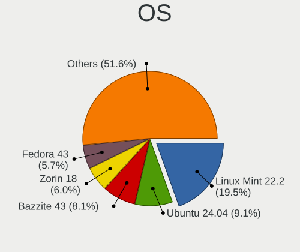

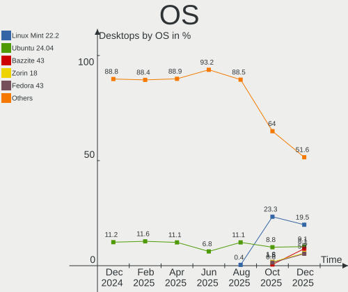

| Name                         | Desktops | Percent |
|------------------------------|----------|---------|
| Linux Mint 22.2              | 75       | 19.53%  |
| Ubuntu 24.04                 | 35       | 9.11%   |
| Bazzite 43                   | 31       | 8.07%   |
| Zorin 18                     | 23       | 5.99%   |
| Fedora 43                    | 22       | 5.73%   |
| Arch Rolling                 | 13       | 3.39%   |
| Debian 13                    | 12       | 3.13%   |
| Bazzite 42                   | 12       | 3.13%   |
| LMDE 7                       | 10       | 2.6%    |
| CachyOS Rolling              | 9        | 2.34%   |
| Zorin 17                     | 7        | 1.82%   |
| OpenMandriva 25.90           | 7        | 1.82%   |
| Ubuntu 25.10                 | 6        | 1.56%   |
| Ubuntu 22.04                 | 6        | 1.56%   |
| Pop!_OS 24.04                | 6        | 1.56%   |
| OpenMandriva 6.0             | 6        | 1.56%   |
| Linux Mint 21.3              | 6        | 1.56%   |
| Debian 12                    | 6        | 1.56%   |
| Pop!_OS 22.04                | 5        | 1.3%    |
| openSUSE Tumbleweed-XXXXXXXX | 5        | 1.3%    |
| Kubuntu 25.10                | 5        | 1.3%    |
| EndeavourOS Rolling          | 5        | 1.3%    |
| CachyOS                      | 5        | 1.3%    |
| Manjaro                      | 4        | 1.04%   |
| Debian                       | 4        | 1.04%   |
| Manjaro 25.1.0               | 3        | 0.78%   |
| Linux Mint 22.1              | 3        | 0.78%   |
| Kubuntu 24.04                | 3        | 0.78%   |
| Ubuntu 25.04                 | 2        | 0.52%   |
| Pika OS 4                    | 2        | 0.52%   |
| openSUSE Leap-16.0           | 2        | 0.52%   |
| openSUSE Leap-15.6           | 2        | 0.52%   |
| OpenMandriva 23.08           | 2        | 0.52%   |
| Nobara 43                    | 2        | 0.52%   |
| NixOS 25.11                  | 2        | 0.52%   |
| Linux Mint 22                | 2        | 0.52%   |
| KDE neon 24.04               | 2        | 0.52%   |
| Gentoo 2.18                  | 2        | 0.52%   |
| Fedora 42                    | 2        | 0.52%   |
| Xubuntu 24.04                | 1        | 0.26%   |

OS Family
---------

OS without a version

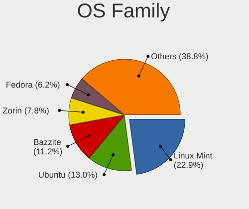

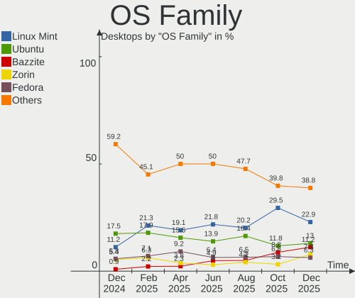

| Name          | Desktops | Percent |
|---------------|----------|---------|
| Linux Mint    | 88       | 22.92%  |
| Ubuntu        | 50       | 13.02%  |
| Bazzite       | 43       | 11.2%   |
| Zorin         | 30       | 7.81%   |
| Fedora        | 24       | 6.25%   |
| Debian        | 23       | 5.99%   |
| OpenMandriva  | 19       | 4.95%   |
| CachyOS       | 14       | 3.65%   |
| Arch          | 13       | 3.39%   |
| Pop!_OS       | 11       | 2.86%   |
| openSUSE      | 10       | 2.6%    |
| LMDE          | 10       | 2.6%    |
| Kubuntu       | 10       | 2.6%    |
| Manjaro       | 8        | 2.08%   |
| EndeavourOS   | 5        | 1.3%    |
| NixOS         | 3        | 0.78%   |
| Xubuntu       | 2        | 0.52%   |
| SteamOS       | 2        | 0.52%   |
| Pikaos        | 2        | 0.52%   |
| Nobara        | 2        | 0.52%   |
| KDE neon      | 2        | 0.52%   |
| Kalpa-desktop | 2        | 0.52%   |
| Gentoo        | 2        | 0.52%   |
| MX            | 1        | 0.26%   |
| Kde           | 1        | 0.26%   |
| Kali          | 1        | 0.26%   |
| Endless       | 1        | 0.26%   |
| Dts-distro    | 1        | 0.26%   |
| BlackPanther  | 1        | 0.26%   |
| antiX         | 1        | 0.26%   |
| Alpine        | 1        | 0.26%   |
| AlmaLinux     | 1        | 0.26%   |

Kernel
------

Version of the Linux kernel

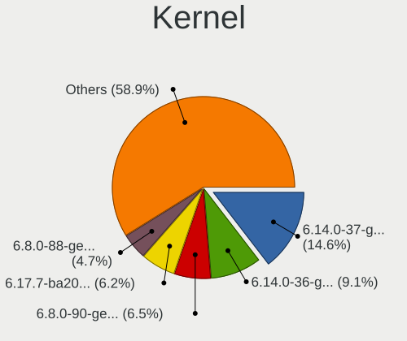

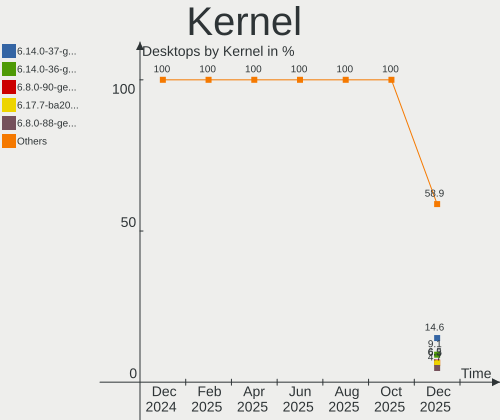

| Version                        | Desktops | Percent |
|--------------------------------|----------|---------|
| 6.14.0-37-generic              | 56       | 14.58%  |
| 6.14.0-36-generic              | 35       | 9.11%   |
| 6.8.0-90-generic               | 25       | 6.51%   |
| 6.17.7-ba20.fc43.x86_64        | 24       | 6.25%   |
| 6.8.0-88-generic               | 18       | 4.69%   |
| 6.14.2-desktop-3omv2590        | 14       | 3.65%   |
| 6.12.57+deb13-amd64            | 14       | 3.65%   |
| 6.16.4-116.bazzite.fc42.x86_64 | 12       | 3.13%   |
| 6.17.9-arch1-1                 | 10       | 2.6%    |
| 6.17.9-300.fc43.x86_64         | 7        | 1.82%   |
| 6.17.9-76061709-generic        | 6        | 1.56%   |
| 6.17.7-ba19.fc43.x86_64        | 6        | 1.56%   |
| 6.17.9-2-cachyos               | 5        | 1.3%    |
| 6.17.0-7-generic               | 5        | 1.3%    |
| 6.8.0-87-generic               | 4        | 1.04%   |
| 6.17.4-76061704-generic        | 4        | 1.04%   |
| 6.17.11-300.fc43.x86_64        | 4        | 1.04%   |
| 6.14.0-27-generic              | 4        | 1.04%   |
| 6.1.0-41-amd64                 | 4        | 1.04%   |
| 6.18.0-1-MANJARO               | 3        | 0.78%   |
| 6.18.0-1-default               | 3        | 0.78%   |
| 6.17.12-300.fc43.x86_64        | 3        | 0.78%   |
| 6.17.10-300.fc43.x86_64        | 3        | 0.78%   |
| 6.17.0-8-generic               | 3        | 0.78%   |
| 6.14.0-29-generic              | 3        | 0.78%   |
| 6.12.48+deb13-amd64            | 3        | 0.78%   |
| 5.15.0-139-generic             | 3        | 0.78%   |
| 6.8.0-79-generic               | 2        | 0.52%   |
| 6.4.11-desktop-1omv2390        | 2        | 0.52%   |
| 6.18.2-arch2-1                 | 2        | 0.52%   |
| 6.17.9-zen1-1-zen              | 2        | 0.52%   |
| 6.17.9+deb14-amd64             | 2        | 0.52%   |
| 6.17.8-arch1-1                 | 2        | 0.52%   |
| 6.17.2-2-pve                   | 2        | 0.52%   |
| 6.17.0-5-generic               | 2        | 0.52%   |
| 6.14.0-35-generic              | 2        | 0.52%   |
| 6.14.0-33-generic              | 2        | 0.52%   |
| 5.15.0-164-generic             | 2        | 0.52%   |
| 5.15.0-161-generic             | 2        | 0.52%   |
| 5.15.0-144-generic             | 2        | 0.52%   |

Kernel Family
-------------

Linux kernel without a distro release

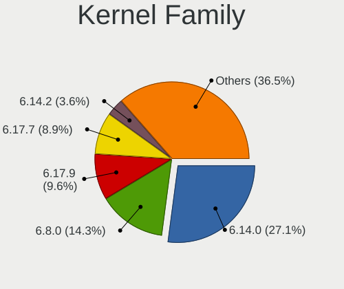

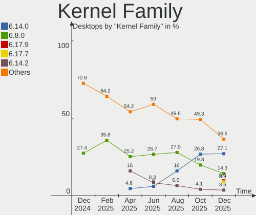

| Version | Desktops | Percent |
|---------|----------|---------|
| 6.14.0  | 104      | 27.08%  |
| 6.8.0   | 55       | 14.32%  |
| 6.17.9  | 37       | 9.64%   |
| 6.17.7  | 34       | 8.85%   |
| 6.14.2  | 14       | 3.65%   |
| 6.12.57 | 14       | 3.65%   |
| 6.18.2  | 13       | 3.39%   |
| 6.16.4  | 12       | 3.13%   |
| 6.18.0  | 11       | 2.86%   |
| 6.17.0  | 11       | 2.86%   |
| 5.15.0  | 9        | 2.34%   |
| 6.17.10 | 6        | 1.56%   |
| 6.17.4  | 4        | 1.04%   |
| 6.17.12 | 4        | 1.04%   |
| 6.17.11 | 4        | 1.04%   |
| 6.1.0   | 4        | 1.04%   |
| 6.4.0   | 3        | 0.78%   |
| 6.17.8  | 3        | 0.78%   |
| 6.17.2  | 3        | 0.78%   |
| 6.12.63 | 3        | 0.78%   |
| 6.12.48 | 3        | 0.78%   |
| 6.4.11  | 2        | 0.52%   |
| 6.18.1  | 2        | 0.52%   |
| 6.17.13 | 2        | 0.52%   |
| 6.17.1  | 2        | 0.52%   |
| 6.16.12 | 2        | 0.52%   |
| 6.12.0  | 2        | 0.52%   |
| 6.11.11 | 2        | 0.52%   |
| 6.8.12  | 1        | 0.26%   |
| 6.6.21  | 1        | 0.26%   |
| 6.6.101 | 1        | 0.26%   |
| 6.5.0   | 1        | 0.26%   |
| 6.2.6   | 1        | 0.26%   |
| 6.17.5  | 1        | 0.26%   |
| 6.16.8  | 1        | 0.26%   |
| 6.16.3  | 1        | 0.26%   |
| 6.12.62 | 1        | 0.26%   |
| 6.12.61 | 1        | 0.26%   |
| 6.12.59 | 1        | 0.26%   |
| 6.12.41 | 1        | 0.26%   |

Kernel Major Ver.
-----------------

Linux kernel major version

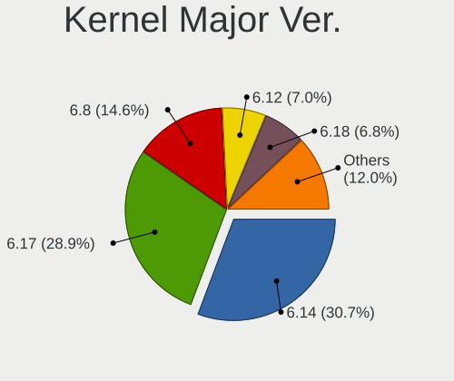

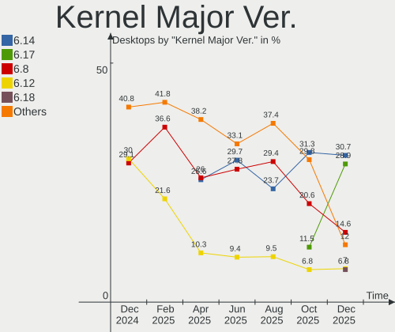

| Version | Desktops | Percent |
|---------|----------|---------|
| 6.14    | 118      | 30.73%  |
| 6.17    | 111      | 28.91%  |
| 6.8     | 56       | 14.58%  |
| 6.12    | 27       | 7.03%   |
| 6.18    | 26       | 6.77%   |
| 6.16    | 16       | 4.17%   |
| 5.15    | 10       | 2.6%    |
| 6.4     | 5        | 1.3%    |
| 6.1     | 5        | 1.3%    |
| 6.11    | 3        | 0.78%   |
| 6.6     | 2        | 0.52%   |
| 6.5     | 1        | 0.26%   |
| 6.2     | 1        | 0.26%   |
| 5.19    | 1        | 0.26%   |
| 5.14    | 1        | 0.26%   |
| 5.10    | 1        | 0.26%   |

Arch
----

OS architecture (x86_64, i586, etc.)

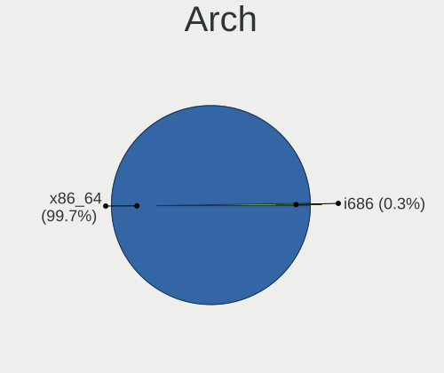

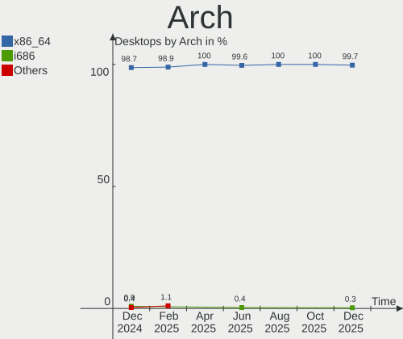

| Name   | Desktops | Percent |
|--------|----------|---------|
| x86_64 | 383      | 99.74%  |
| i686   | 1        | 0.26%   |

DE
--

Desktop Environment

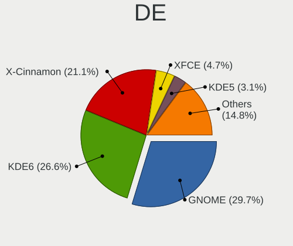

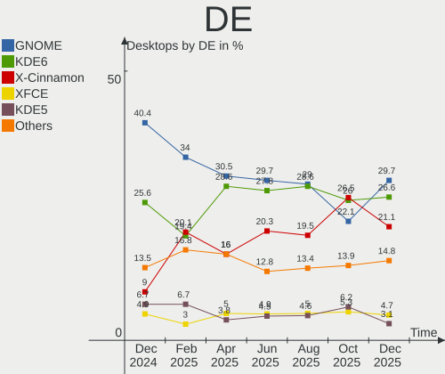

| Name            | Desktops | Percent |
|-----------------|----------|---------|
| GNOME           | 114      | 29.69%  |
| KDE6            | 102      | 26.56%  |
| X-Cinnamon      | 81       | 21.09%  |
| XFCE            | 18       | 4.69%   |
| KDE5            | 12       | 3.13%   |
| MATE            | 11       | 2.86%   |
| Unknown         | 11       | 2.86%   |
| KDE             | 9        | 2.34%   |
| COSMIC          | 8        | 2.08%   |
| Cinnamon        | 4        | 1.04%   |
| Hyprland        | 3        | 0.78%   |
| KDE4            | 2        | 0.52%   |
| sway:wlroots    | 1        | 0.26%   |
| sway            | 1        | 0.26%   |
| niri            | 1        | 0.26%   |
| LXDE            | 1        | 0.26%   |
| icewm           | 1        | 0.26%   |
| GNOME Flashback | 1        | 0.26%   |
| GNOME Classic   | 1        | 0.26%   |
| Enlightenment   | 1        | 0.26%   |
| Endless:GNOME   | 1        | 0.26%   |

Display Server
--------------

X11 or Wayland

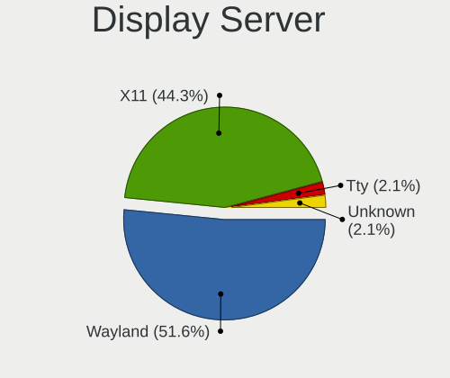

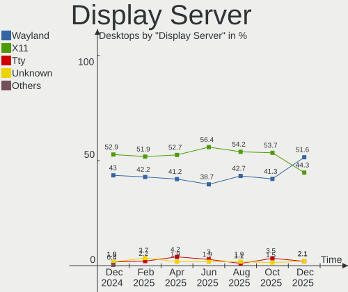

| Name    | Desktops | Percent |
|---------|----------|---------|
| Wayland | 198      | 51.56%  |
| X11     | 170      | 44.27%  |
| Tty     | 8        | 2.08%   |
| Unknown | 8        | 2.08%   |

Display Manager
---------------

SDDM, LightDM, etc.

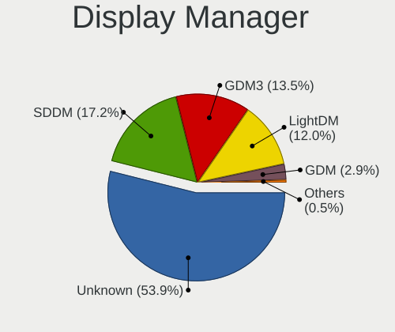

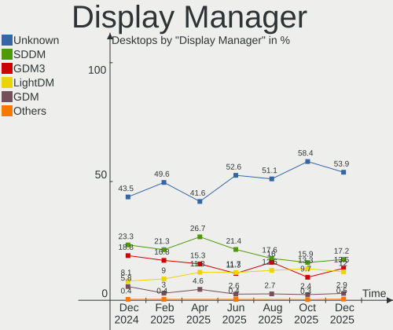

| Name                  | Desktops | Percent |
|-----------------------|----------|---------|
| Unknown               | 207      | 53.91%  |
| SDDM                  | 66       | 17.19%  |
| GDM3                  | 52       | 13.54%  |
| LightDM               | 46       | 11.98%  |
| GDM                   | 11       | 2.86%   |
| SLIMSKI               | 1        | 0.26%   |
| DISPLAY-MANAGER-START | 1        | 0.26%   |

OS Lang
-------

Language

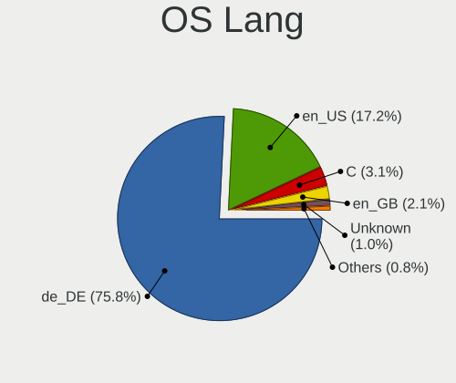

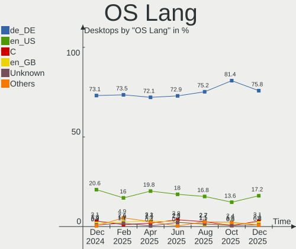

| Lang    | Desktops | Percent |
|---------|----------|---------|
| de_DE   | 291      | 75.78%  |
| en_US   | 66       | 17.19%  |
| C       | 12       | 3.13%   |
| en_GB   | 8        | 2.08%   |
| Unknown | 4        | 1.04%   |
| ru_RU   | 3        | 0.78%   |

Boot Mode
---------

EFI or BIOS

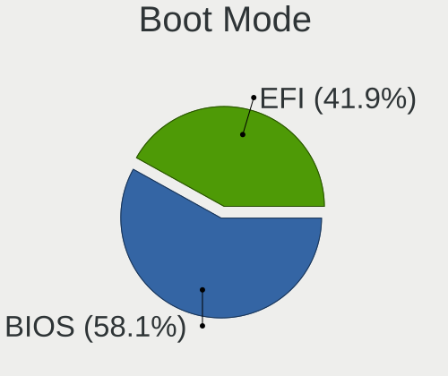

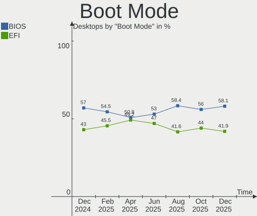

| Mode | Desktops | Percent |
|------|----------|---------|
| BIOS | 223      | 58.07%  |
| EFI  | 161      | 41.93%  |

Filesystem
----------

Type of filesystem

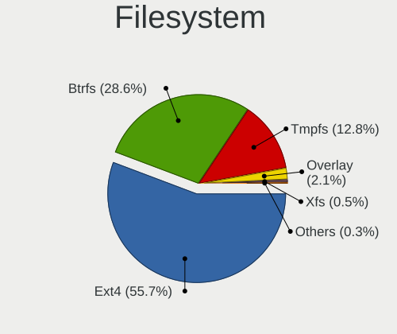

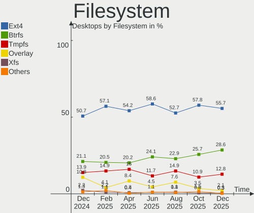

| Type    | Desktops | Percent |
|---------|----------|---------|
| Ext4    | 214      | 55.73%  |
| Btrfs   | 110      | 28.65%  |
| Tmpfs   | 49       | 12.76%  |
| Overlay | 8        | 2.08%   |
| Xfs     | 2        | 0.52%   |
| XXX4    | 1        | 0.26%   |

Part. scheme
------------

Scheme of partitioning

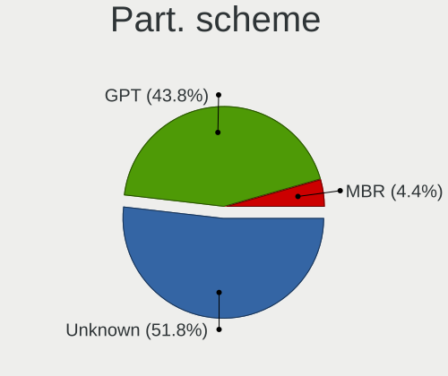

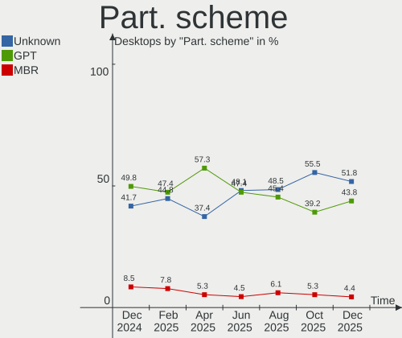

| Type    | Desktops | Percent |
|---------|----------|---------|
| Unknown | 199      | 51.82%  |
| GPT     | 168      | 43.75%  |
| MBR     | 17       | 4.43%   |

Dual Boot with Linux/BSD
------------------------

Hosting more than one Linux/BSD

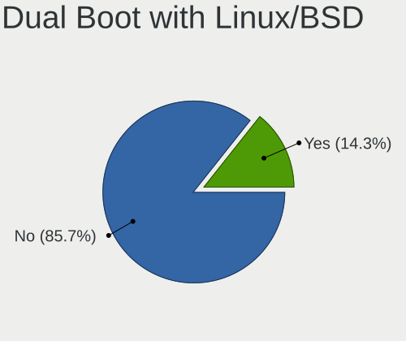

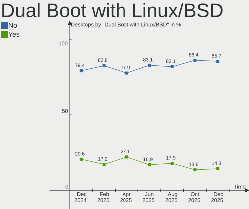

| Dual boot | Desktops | Percent |
|-----------|----------|---------|
| No        | 329      | 85.68%  |
| Yes       | 55       | 14.32%  |

Dual Boot (Win)
---------------

Hosting Linux and Windows

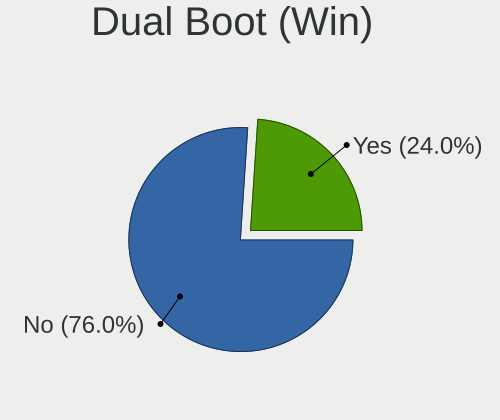

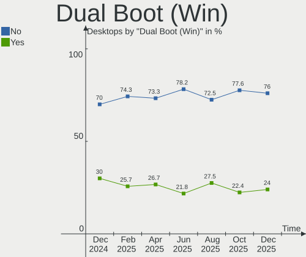

| Dual boot | Desktops | Percent |
|-----------|----------|---------|
| No        | 292      | 76.04%  |
| Yes       | 92       | 23.96%  |

Board
-----

Vendor
------

Motherboard manufacturer

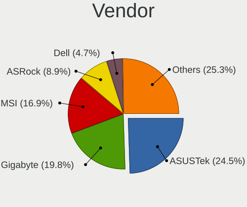

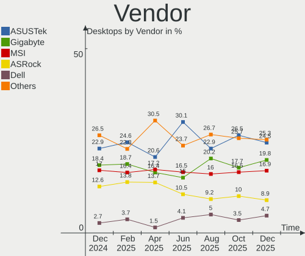

| Name                                 | Desktops | Percent |
|--------------------------------------|----------|---------|
| ASUSTek Computer                     | 94       | 24.48%  |
| Gigabyte Technology                  | 76       | 19.79%  |
| MSI                                  | 65       | 16.93%  |
| ASRock                               | 34       | 8.85%   |
| Dell                                 | 18       | 4.69%   |
| Fujitsu                              | 16       | 4.17%   |
| Hewlett-Packard                      | 15       | 3.91%   |
| Lenovo                               | 10       | 2.6%    |
| Medion                               | 9        | 2.34%   |
| Acer                                 | 5        | 1.3%    |
| Unknown                              | 5        | 1.3%    |
| Intel                                | 4        | 1.04%   |
| Shenzhen Meigao Electronic Equipment | 3        | 0.78%   |
| Biostar                              | 3        | 0.78%   |
| Apple                                | 3        | 0.78%   |
| Huanan                               | 2        | 0.52%   |
| HC Technology.                       | 2        | 0.52%   |
| Foxconn                              | 2        | 0.52%   |
| ECS                                  | 2        | 0.52%   |
| AZW                                  | 2        | 0.52%   |
| Supermicro                           | 1        | 0.26%   |
| Shenzhen DOKE electronic             | 1        | 0.26%   |
| QIYIDA                               | 1        | 0.26%   |
| PELADN                               | 1        | 0.26%   |
| Pegatron                             | 1        | 0.26%   |
| PC Engines                           | 1        | 0.26%   |
| OE                                   | 1        | 0.26%   |
| NZXT                                 | 1        | 0.26%   |
| MACHINIST                            | 1        | 0.26%   |
| JGINYUE                              | 1        | 0.26%   |
| GEEKOM                               | 1        | 0.26%   |
| Fujitsu Siemens                      | 1        | 0.26%   |
| ERYING                               | 1        | 0.26%   |
| AOpen                                | 1        | 0.26%   |

Model
-----

Motherboard model

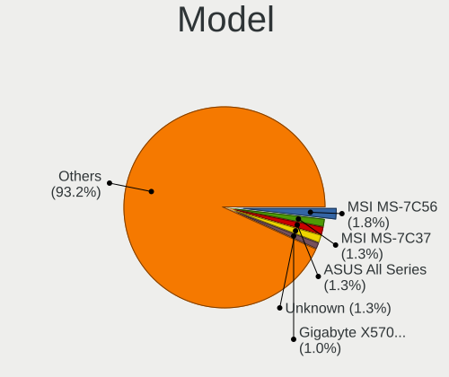

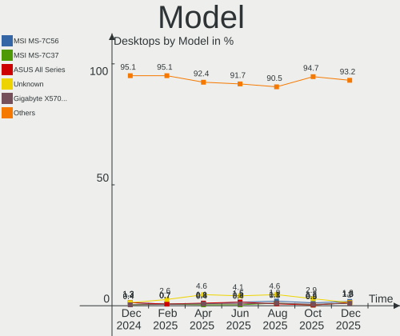

| Name                              | Desktops | Percent |
|-----------------------------------|----------|---------|
| MSI MS-7C56                       | 7        | 1.82%   |
| MSI MS-7C37                       | 5        | 1.3%    |
| ASUS All Series                   | 5        | 1.3%    |
| Unknown                           | 5        | 1.3%    |
| Gigabyte X570 AORUS ELITE         | 4        | 1.04%   |
| Dell OptiPlex 7050                | 4        | 1.04%   |
| MSI MS-7D75                       | 3        | 0.78%   |
| Gigabyte 1009707_2120234          | 3        | 0.78%   |
| ASUS A0000001                     | 3        | 0.78%   |
| MSI MS-7E56                       | 2        | 0.52%   |
| MSI MS-7E26                       | 2        | 0.52%   |
| MSI MS-7D32                       | 2        | 0.52%   |
| MSI MS-7D25                       | 2        | 0.52%   |
| MSI MS-7C91                       | 2        | 0.52%   |
| MSI MS-7C89                       | 2        | 0.52%   |
| MSI MS-7C75                       | 2        | 0.52%   |
| MSI MS-7A38                       | 2        | 0.52%   |
| MSI MS-7A33                       | 2        | 0.52%   |
| Medion S23003                     | 2        | 0.52%   |
| Huanan X99-F8D PLUS V1.32         | 2        | 0.52%   |
| HP Z420 Workstation               | 2        | 0.52%   |
| HC Technology. HCAR5000-MI        | 2        | 0.52%   |
| Gigabyte Z68X-UD3H-B3             | 2        | 0.52%   |
| Gigabyte X870E AORUS ELITE WIFI7  | 2        | 0.52%   |
| Gigabyte X870 EAGLE WIFI7         | 2        | 0.52%   |
| Gigabyte X570 AORUS MASTER        | 2        | 0.52%   |
| Gigabyte B550I AORUS PRO AX       | 2        | 0.52%   |
| Gigabyte B550 GAMING X V2         | 2        | 0.52%   |
| Gigabyte B550 AORUS ELITE V2      | 2        | 0.52%   |
| Dell OptiPlex 7010                | 2        | 0.52%   |
| Dell OptiPlex 3020                | 2        | 0.52%   |
| ASUS TUF Gaming B850-PLUS WIFI    | 2        | 0.52%   |
| ASUS TUF Gaming B550-PLUS         | 2        | 0.52%   |
| ASUS TERRA_PC                     | 2        | 0.52%   |
| ASUS ROG STRIX Z790-E GAMING WIFI | 2        | 0.52%   |
| ASUS ROG STRIX B550-F GAMING      | 2        | 0.52%   |
| ASUS ROG STRIX B550-A GAMING      | 2        | 0.52%   |
| ASUS PRIME X570-P                 | 2        | 0.52%   |
| ASUS PRIME B450-PLUS              | 2        | 0.52%   |
| ASUS PRIME A320M-K                | 2        | 0.52%   |

Model Family
------------

Motherboard model prefix

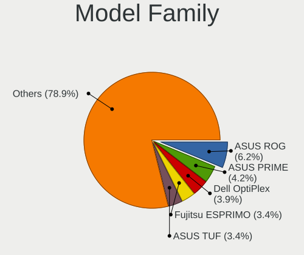

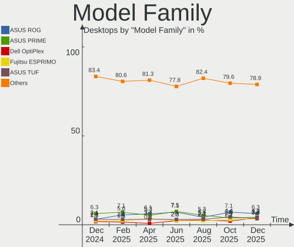

| Name                       | Desktops | Percent |
|----------------------------|----------|---------|
| ASUS ROG                   | 24       | 6.25%   |
| ASUS PRIME                 | 16       | 4.17%   |
| Dell OptiPlex              | 15       | 3.91%   |
| Fujitsu ESPRIMO            | 13       | 3.39%   |
| ASUS TUF                   | 13       | 3.39%   |
| MSI MS-7C56                | 7        | 1.82%   |
| Gigabyte X570              | 7        | 1.82%   |
| Lenovo ThinkCentre         | 6        | 1.56%   |
| HP EliteDesk               | 6        | 1.56%   |
| MSI MS-7C37                | 5        | 1.3%    |
| Gigabyte B550              | 5        | 1.3%    |
| ASUS All                   | 5        | 1.3%    |
| Unknown                    | 5        | 1.3%    |
| MSI MS-7D75                | 3        | 0.78%   |
| Gigabyte X870E             | 3        | 0.78%   |
| Gigabyte A520M             | 3        | 0.78%   |
| Gigabyte 1009707           | 3        | 0.78%   |
| ASUS A0000001              | 3        | 0.78%   |
| ASRock X670E               | 3        | 0.78%   |
| MSI MS-7E56                | 2        | 0.52%   |
| MSI MS-7E26                | 2        | 0.52%   |
| MSI MS-7D32                | 2        | 0.52%   |
| MSI MS-7D25                | 2        | 0.52%   |
| MSI MS-7C91                | 2        | 0.52%   |
| MSI MS-7C89                | 2        | 0.52%   |
| MSI MS-7C75                | 2        | 0.52%   |
| MSI MS-7A38                | 2        | 0.52%   |
| MSI MS-7A33                | 2        | 0.52%   |
| MSI Hyrican                | 2        | 0.52%   |
| Medion S23003              | 2        | 0.52%   |
| Lenovo ThinkStation        | 2        | 0.52%   |
| Lenovo IdeaCentre          | 2        | 0.52%   |
| Huanan X99-F8D             | 2        | 0.52%   |
| HP Z420                    | 2        | 0.52%   |
| HC Technology. HCAR5000-MI | 2        | 0.52%   |
| Gigabyte Z790              | 2        | 0.52%   |
| Gigabyte Z690              | 2        | 0.52%   |
| Gigabyte Z68X-UD3H-B3      | 2        | 0.52%   |
| Gigabyte X870              | 2        | 0.52%   |
| Gigabyte B650              | 2        | 0.52%   |

MFG Year
--------

Motherboard manufacture year

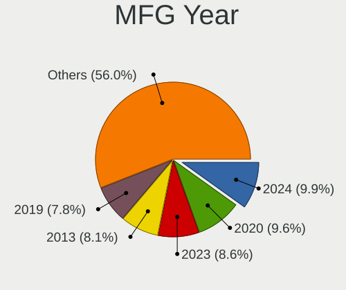

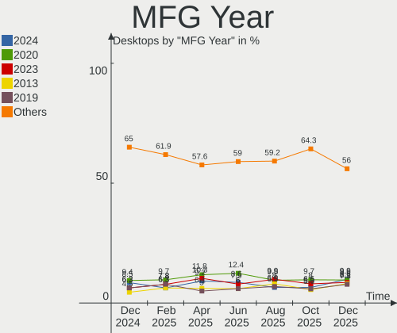

| Year | Desktops | Percent |
|------|----------|---------|
| 2024 | 38       | 9.9%    |
| 2020 | 37       | 9.64%   |
| 2023 | 33       | 8.59%   |
| 2013 | 31       | 8.07%   |
| 2019 | 30       | 7.81%   |
| 2018 | 28       | 7.29%   |
| 2022 | 27       | 7.03%   |
| 2021 | 22       | 5.73%   |
| 2017 | 22       | 5.73%   |
| 2012 | 21       | 5.47%   |
| 2016 | 17       | 4.43%   |
| 2014 | 17       | 4.43%   |
| 2015 | 15       | 3.91%   |
| 2025 | 14       | 3.65%   |
| 2011 | 11       | 2.86%   |
| 2010 | 6        | 1.56%   |
| 2009 | 5        | 1.3%    |
| 2008 | 4        | 1.04%   |
| 2007 | 4        | 1.04%   |
| 2006 | 2        | 0.52%   |

Form Factor
-----------

Physical design of the computer

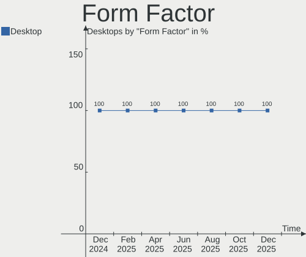

| Name    | Desktops | Percent |
|---------|----------|---------|
| Desktop | 384      | 100%    |

Secure Boot
-----------

Enabled or disabled

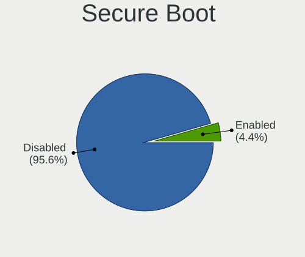

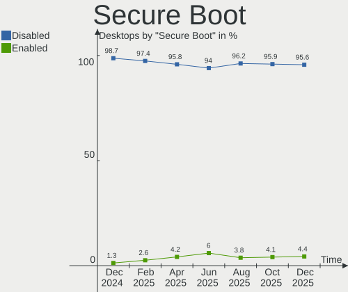

| State    | Desktops | Percent |
|----------|----------|---------|
| Disabled | 367      | 95.57%  |
| Enabled  | 17       | 4.43%   |

Coreboot
--------

Have coreboot on board

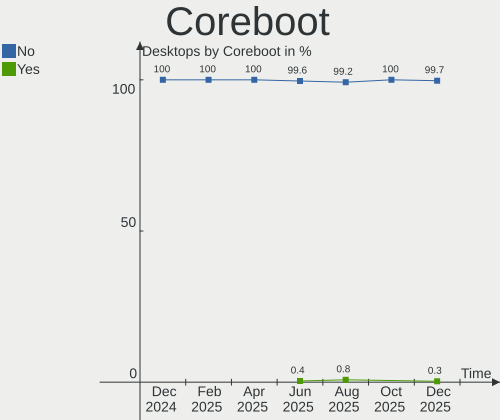

| Used | Desktops | Percent |
|------|----------|---------|
| No   | 383      | 99.74%  |
| Yes  | 1        | 0.26%   |

RAM Size
--------

Total RAM memory

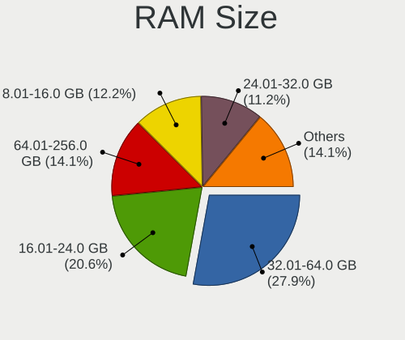

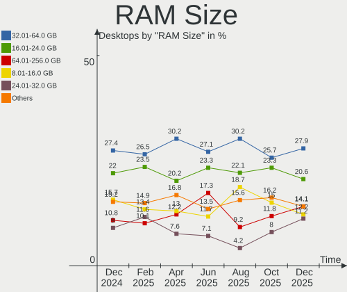

| Size in GB  | Desktops | Percent |
|-------------|----------|---------|
| 32.01-64.0  | 107      | 27.86%  |
| 16.01-24.0  | 79       | 20.57%  |
| 64.01-256.0 | 54       | 14.06%  |
| 8.01-16.0   | 47       | 12.24%  |
| 24.01-32.0  | 43       | 11.2%   |
| 4.01-8.0    | 39       | 10.16%  |
| 3.01-4.0    | 13       | 3.39%   |
| 1.01-2.0    | 2        | 0.52%   |

RAM Used
--------

Used RAM memory

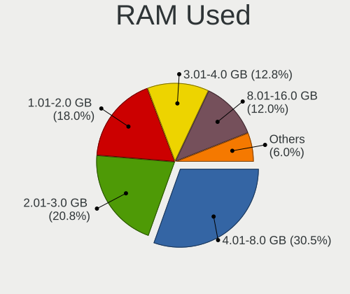

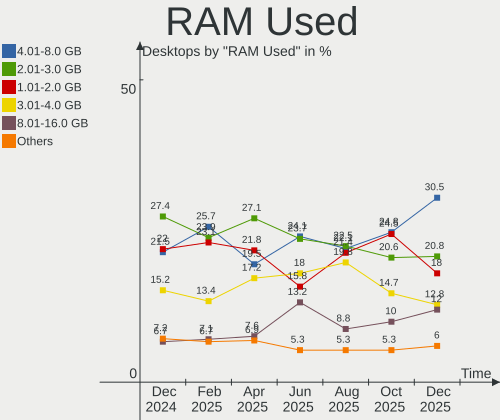

| Used GB    | Desktops | Percent |
|------------|----------|---------|
| 4.01-8.0   | 117      | 30.47%  |
| 2.01-3.0   | 80       | 20.83%  |
| 1.01-2.0   | 69       | 17.97%  |
| 3.01-4.0   | 49       | 12.76%  |
| 8.01-16.0  | 46       | 11.98%  |
| 0.51-1.0   | 9        | 2.34%   |
| 16.01-24.0 | 7        | 1.82%   |
| 32.01-64.0 | 5        | 1.3%    |
| 24.01-32.0 | 1        | 0.26%   |
| 0.01-0.5   | 1        | 0.26%   |

Total Drives
------------

Number of drives on board

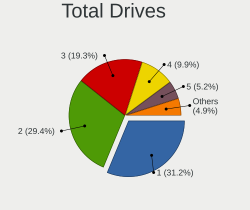

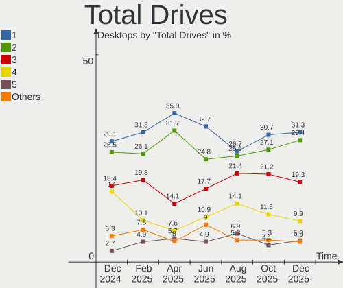

| Drives | Desktops | Percent |
|--------|----------|---------|
| 1      | 120      | 31.25%  |
| 2      | 113      | 29.43%  |
| 3      | 74       | 19.27%  |
| 4      | 38       | 9.9%    |
| 5      | 20       | 5.21%   |
| 6      | 12       | 3.13%   |
| 7      | 3        | 0.78%   |
| 8      | 2        | 0.52%   |
| 12     | 1        | 0.26%   |
| 9      | 1        | 0.26%   |

Has CD-ROM
----------

Has CD-ROM on board

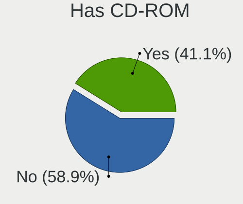

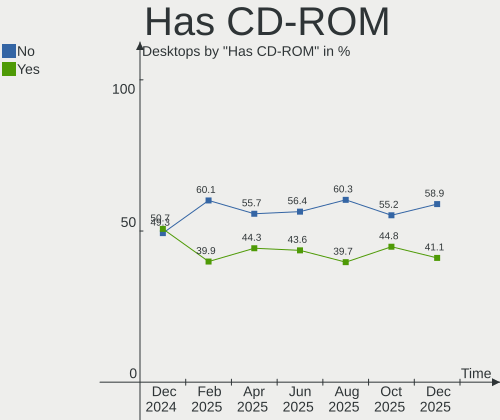

| Presented | Desktops | Percent |
|-----------|----------|---------|
| No        | 226      | 58.85%  |
| Yes       | 158      | 41.15%  |

Has Ethernet
------------

Has Ethernet on board

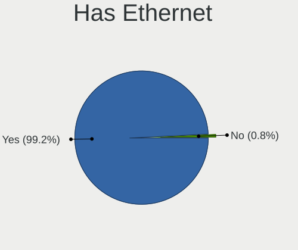

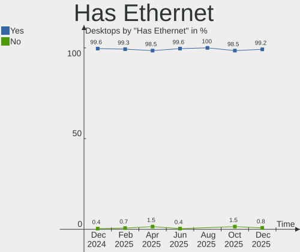

| Presented | Desktops | Percent |
|-----------|----------|---------|
| Yes       | 381      | 99.22%  |
| No        | 3        | 0.78%   |

Has WiFi
--------

Has WiFi module

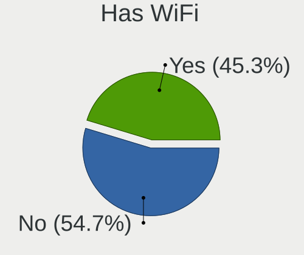

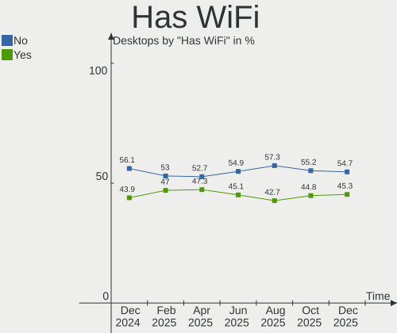

| Presented | Desktops | Percent |
|-----------|----------|---------|
| No        | 210      | 54.69%  |
| Yes       | 174      | 45.31%  |

Has Bluetooth
-------------

Has Bluetooth module

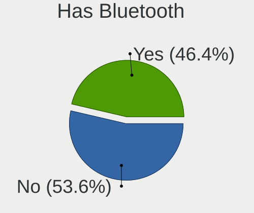

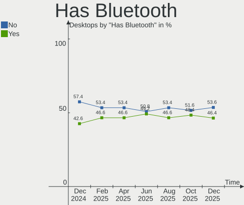

| Presented | Desktops | Percent |
|-----------|----------|---------|
| No        | 206      | 53.65%  |
| Yes       | 178      | 46.35%  |

Location
--------

Country
-------

Geographic location (country)

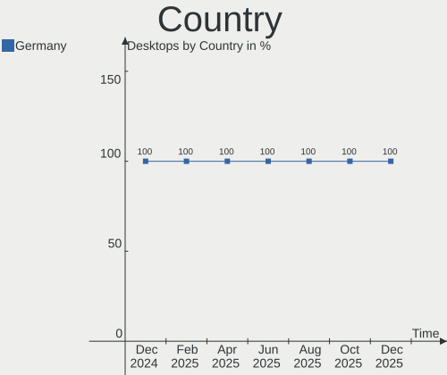

| Country | Desktops | Percent |
|---------|----------|---------|
| Germany | 384      | 100%    |

City
----

Geographic location (city)

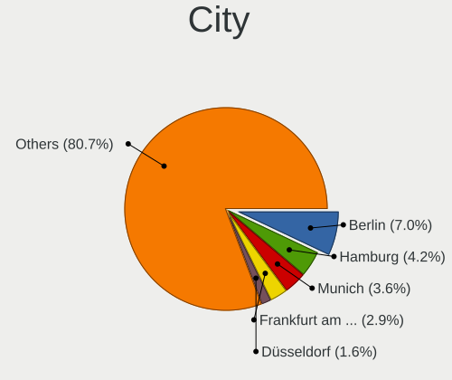

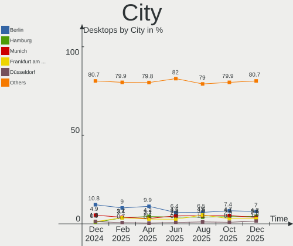

| City                 | Desktops | Percent |
|----------------------|----------|---------|
| Berlin               | 27       | 7.03%   |
| Hamburg              | 16       | 4.17%   |
| Munich               | 14       | 3.65%   |
| Frankfurt am Main    | 11       | 2.86%   |
| Düsseldorf          | 6        | 1.56%   |
| Dortmund             | 6        | 1.56%   |
| Nuremberg            | 5        | 1.3%    |
| Bremen               | 5        | 1.3%    |
| Traunstein           | 4        | 1.04%   |
| Mannheim             | 4        | 1.04%   |
| Leipzig              | 4        | 1.04%   |
| Hamminkeln           | 4        | 1.04%   |
| Essen                | 4        | 1.04%   |
| Weingarten           | 3        | 0.78%   |
| Offenbach            | 3        | 0.78%   |
| Kiel                 | 3        | 0.78%   |
| Hof                  | 3        | 0.78%   |
| Hildesheim           | 3        | 0.78%   |
| Heilbronn            | 3        | 0.78%   |
| Forst                | 3        | 0.78%   |
| Coburg               | 3        | 0.78%   |
| Wiesbaden            | 2        | 0.52%   |
| Wesel                | 2        | 0.52%   |
| Trier                | 2        | 0.52%   |
| Stuttgart            | 2        | 0.52%   |
| Siegen               | 2        | 0.52%   |
| Schweinfurt          | 2        | 0.52%   |
| Schorndorf           | 2        | 0.52%   |
| Rostock              | 2        | 0.52%   |
| Reutlingen           | 2        | 0.52%   |
| Regensburg           | 2        | 0.52%   |
| Pforzheim            | 2        | 0.52%   |
| Osterholz-Scharmbeck | 2        | 0.52%   |
| Ohringen             | 2        | 0.52%   |
| Ober-Morlen          | 2        | 0.52%   |
| Neuwied              | 2        | 0.52%   |
| Mülheim             | 2        | 0.52%   |
| Mönchengladbach     | 2        | 0.52%   |
| Melle                | 2        | 0.52%   |
| Lünen               | 2        | 0.52%   |

Drives
------

Drive Vendor
------------

Hard drive vendors

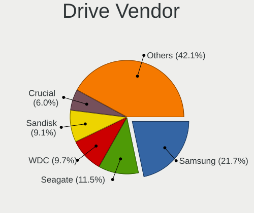

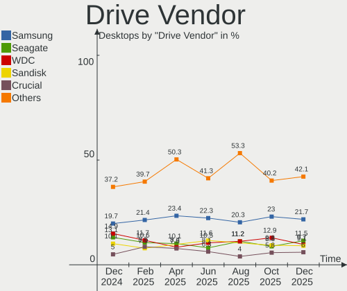

| Vendor                       | Desktops | Drives | Percent |
|------------------------------|----------|--------|---------|
| Samsung Electronics          | 164      | 268    | 21.69%  |
| Seagate                      | 87       | 104    | 11.51%  |
| WDC                          | 73       | 92     | 9.66%   |
| Sandisk                      | 69       | 91     | 9.13%   |
| Crucial                      | 45       | 52     | 5.95%   |
| Toshiba                      | 31       | 33     | 4.1%    |
| Intenso                      | 31       | 35     | 4.1%    |
| Micron/Crucial Technology    | 30       | 36     | 3.97%   |
| Kingston                     | 21       | 27     | 2.78%   |
| Kingston Technology Company  | 15       | 16     | 1.98%   |
| Hitachi                      | 15       | 16     | 1.98%   |
| Phison Electronics           | 12       | 12     | 1.59%   |
| Micron Technology            | 9        | 9      | 1.19%   |
| SK hynix                     | 8        | 8      | 1.06%   |
| Intel                        | 8        | 8      | 1.06%   |
| Shenzhen Longsys Electronics | 7        | 9      | 0.93%   |
| ADATA Technology             | 7        | 8      | 0.93%   |
| MAXIO Technology (Hangzhou)  | 6        | 6      | 0.79%   |
| Unknown                      | 5        | 11     | 0.66%   |
| HGST                         | 5        | 5      | 0.66%   |
| Corsair                      | 5        | 5      | 0.66%   |
| China                        | 5        | 5      | 0.66%   |
| Verbatim                     | 4        | 5      | 0.53%   |
| Silicon Motion               | 4        | 4      | 0.53%   |
| Realtek                      | 4        | 5      | 0.53%   |
| PNY                          | 4        | 4      | 0.53%   |
| Phison                       | 4        | 4      | 0.53%   |
| Netac                        | 4        | 4      | 0.53%   |
| Transcend                    | 3        | 4      | 0.4%    |
| Realtek Semiconductor        | 3        | 3      | 0.4%    |
| INNOVATION IT                | 3        | 3      | 0.4%    |
| Gigabyte Technology          | 3        | 3      | 0.4%    |
| FIKWOT                       | 3        | 4      | 0.4%    |
| A-DATA Technology            | 3        | 3      | 0.4%    |
| Unknown                      | 3        | 3      | 0.4%    |
| USB                          | 2        | 2      | 0.26%   |
| SPCC                         | 2        | 3      | 0.26%   |
| SD                           | 2        | 2      | 0.26%   |
| Patriot                      | 2        | 2      | 0.26%   |
| LITEON                       | 2        | 2      | 0.26%   |

Drive Model
-----------

Hard drive models

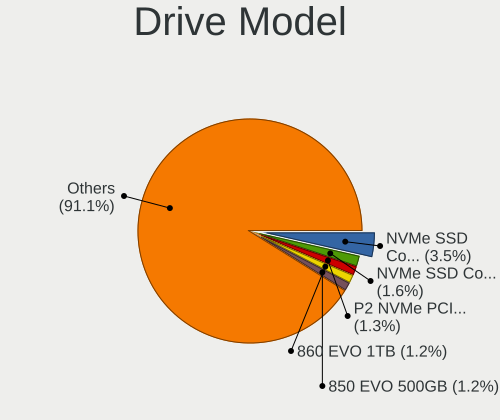

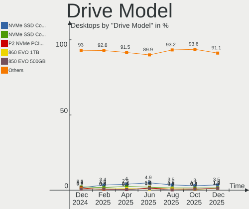

| Model                                                 | Desktops | Percent |
|-------------------------------------------------------|----------|---------|
| Samsung NVMe SSD Controller SM981/PM981/PM983 1TB     | 32       | 3.55%   |
| Samsung NVMe SSD Controller PM9A1/PM9A3/980PRO 1TB    | 14       | 1.55%   |
| Micron/Crucial P2 NVMe PCIe SSD 2TB                   | 12       | 1.33%   |
| Samsung SSD 860 EVO 1TB                               | 11       | 1.22%   |
| Samsung SSD 850 EVO 500GB                             | 11       | 1.22%   |
| Samsung SSD 980 1TB                                   | 9        | 1%      |
| Crucial CT1000MX500SSD1 1TB                           | 9        | 1%      |
| Samsung SSD 870 EVO 1TB                               | 8        | 0.89%   |
| Samsung SSD 870 EVO 500GB                             | 7        | 0.78%   |
| Samsung SSD 860 EVO 500GB                             | 7        | 0.78%   |
| Crucial CT500MX500SSD1 500GB                          | 7        | 0.78%   |
| Sandisk WD_BLACK SN850X 2000GB                        | 6        | 0.67%   |
| Samsung SSD 850 EVO 250GB                             | 6        | 0.67%   |
| Seagate ST2000DM008-2UB102 2TB                        | 5        | 0.55%   |
| SanDisk SSD PLUS 1000GB                               | 5        | 0.55%   |
| Samsung SSD 990 PRO 4TB                               | 5        | 0.55%   |
| Samsung SSD 980 PRO 1TB                               | 5        | 0.55%   |
| Samsung SSD 870 QVO 1TB                               | 5        | 0.55%   |
| Samsung SSD 860 EVO 250GB                             | 5        | 0.55%   |
| Samsung NVMe SSD Controller SM961/PM961/SM963 1024GB  | 5        | 0.55%   |
| WDC WD40EZRZ-00GXCB0 4TB                              | 4        | 0.44%   |
| WDC WD10EZEX-08WN4A0 1TB                              | 4        | 0.44%   |
| Toshiba DT01ACA100 1TB                                | 4        | 0.44%   |
| Silicon Motion SM2263EN/SM2263XT SSD Controller 512GB | 4        | 0.44%   |
| Seagate ST4000VN006-3CW104 4TB                        | 4        | 0.44%   |
| Seagate ST2000DM006-2DM164 2TB                        | 4        | 0.44%   |
| Seagate ST1000DM003-1CH162 1TB                        | 4        | 0.44%   |
| Sandisk WD Blue SN5000 1TB                            | 4        | 0.44%   |
| SanDisk SDSSDH3 1T00 1TB                              | 4        | 0.44%   |
| Samsung SSD 990 PRO 2TB                               | 4        | 0.44%   |
| Samsung SSD 990 EVO Plus 2TB                          | 4        | 0.44%   |
| Samsung SSD 840 Series 250GB                          | 4        | 0.44%   |
| Samsung HD103UJ 1TB                                   | 4        | 0.44%   |
| Micron/Crucial CT2000P3PSSD8 2TB                      | 4        | 0.44%   |
| Kingston Company A2000 NVMe SSD 250GB                 | 4        | 0.44%   |
| Kingston SV300S37A240G 240GB SSD                      | 4        | 0.44%   |
| Intenso SSD 1024GB                                    | 4        | 0.44%   |
| Crucial CT240BX500SSD1 240GB                          | 4        | 0.44%   |
| Crucial CT1000BX500SSD1 1TB                           | 4        | 0.44%   |
| WDC WDS500G2B0A-00SM50 500GB                          | 3        | 0.33%   |

HDD Vendor
----------

Hard disk drive vendors

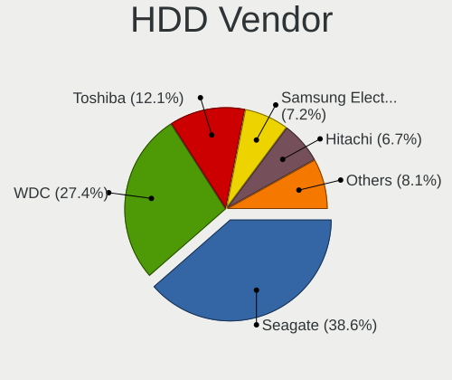

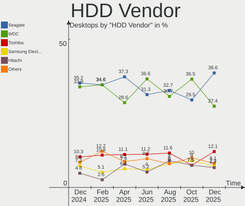

| Vendor              | Desktops | Drives | Percent |
|---------------------|----------|--------|---------|
| Seagate             | 86       | 103    | 38.57%  |
| WDC                 | 61       | 75     | 27.35%  |
| Toshiba             | 27       | 29     | 12.11%  |
| Samsung Electronics | 16       | 17     | 7.17%   |
| Hitachi             | 15       | 16     | 6.73%   |
| HGST                | 5        | 5      | 2.24%   |
| Intenso             | 4        | 4      | 1.79%   |
| ASMT                | 2        | 2      | 0.9%    |
| USB3.0              | 1        | 1      | 0.45%   |
| TO Exter            | 1        | 1      | 0.45%   |
| Maxtor              | 1        | 1      | 0.45%   |
| JMicron Technology  | 1        | 1      | 0.45%   |
| Fujitsu             | 1        | 1      | 0.45%   |
| ExcelStor           | 1        | 1      | 0.45%   |
| Apple               | 1        | 1      | 0.45%   |

SSD Vendor
----------

Solid state drive vendors

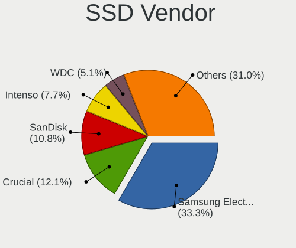

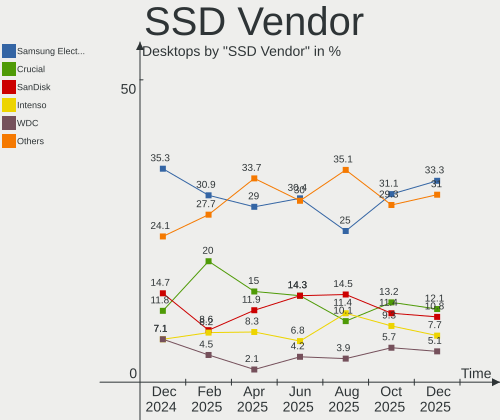

| Vendor              | Desktops | Drives | Percent |
|---------------------|----------|--------|---------|
| Samsung Electronics | 99       | 127    | 33.33%  |
| Crucial             | 36       | 42     | 12.12%  |
| SanDisk             | 32       | 40     | 10.77%  |
| Intenso             | 23       | 26     | 7.74%   |
| WDC                 | 15       | 15     | 5.05%   |
| Kingston            | 14       | 18     | 4.71%   |
| Intel               | 7        | 7      | 2.36%   |
| Micron Technology   | 5        | 5      | 1.68%   |
| China               | 5        | 5      | 1.68%   |
| PNY                 | 4        | 4      | 1.35%   |
| Corsair             | 4        | 4      | 1.35%   |
| Verbatim            | 3        | 4      | 1.01%   |
| SK hynix            | 3        | 3      | 1.01%   |
| Netac               | 3        | 3      | 1.01%   |
| A-DATA Technology   | 3        | 3      | 1.01%   |
| Transcend           | 2        | 3      | 0.67%   |
| Toshiba             | 2        | 2      | 0.67%   |
| SPCC                | 2        | 3      | 0.67%   |
| SD                  | 2        | 2      | 0.67%   |
| Phison              | 2        | 2      | 0.67%   |
| Patriot             | 2        | 2      | 0.67%   |
| LITEON              | 2        | 2      | 0.67%   |
| KIOXIA-EXCERIA      | 2        | 2      | 0.67%   |
| INNOVATION IT       | 2        | 2      | 0.67%   |
| Hewlett-Packard     | 2        | 2      | 0.67%   |
| Gigabyte Technology | 2        | 2      | 0.67%   |
| Unknown             | 2        | 2      | 0.67%   |
| Wicgtyp             | 1        | 1      | 0.34%   |
| VERICO              | 1        | 1      | 0.34%   |
| T-FORCE             | 1        | 1      | 0.34%   |
| sobetter            | 1        | 1      | 0.34%   |
| Plextor             | 1        | 1      | 0.34%   |
| OCZ                 | 1        | 1      | 0.34%   |
| Mushkin             | 1        | 1      | 0.34%   |
| LITEON L            | 1        | 1      | 0.34%   |
| Leven               | 1        | 1      | 0.34%   |
| KingDian            | 1        | 1      | 0.34%   |
| Firebat             | 1        | 1      | 0.34%   |
| Fanxiang            | 1        | 1      | 0.34%   |
| Emtec               | 1        | 1      | 0.34%   |

Drive Kind
----------

HDD or SSD

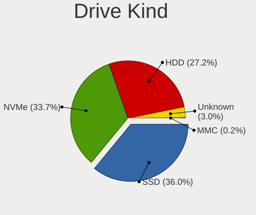

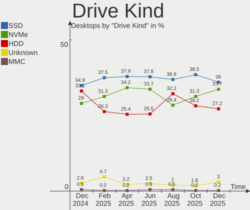

| Kind    | Desktops | Drives | Percent |
|---------|----------|--------|---------|
| SSD     | 237      | 349    | 35.96%  |
| NVMe    | 222      | 325    | 33.69%  |
| HDD     | 179      | 258    | 27.16%  |
| Unknown | 20       | 26     | 3.03%   |
| MMC     | 1        | 1      | 0.15%   |

Drive Connector
---------------

SATA, SAS, NVMe, etc.

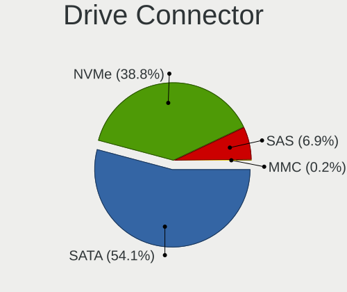

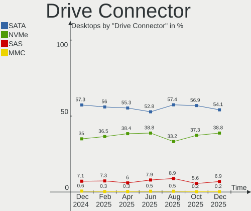

| Type | Desktops | Drives | Percent |
|------|----------|--------|---------|
| SATA | 308      | 588    | 54.13%  |
| NVMe | 221      | 319    | 38.84%  |
| SAS  | 39       | 51     | 6.85%   |
| MMC  | 1        | 1      | 0.18%   |

Drive Size
----------

Size of hard drive

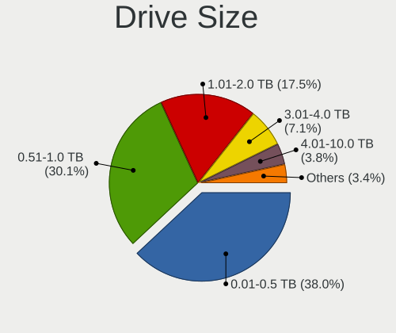

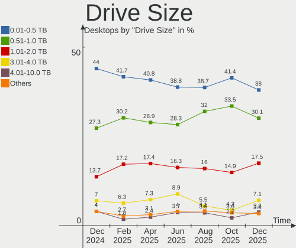

| Size in TB | Desktops | Drives | Percent |
|------------|----------|--------|---------|
| 0.01-0.5   | 178      | 243    | 38.03%  |
| 0.51-1.0   | 141      | 186    | 30.13%  |
| 1.01-2.0   | 82       | 90     | 17.52%  |
| 3.01-4.0   | 33       | 39     | 7.05%   |
| 4.01-10.0  | 18       | 29     | 3.85%   |
| 2.01-3.0   | 11       | 13     | 2.35%   |
| 10.01-20.0 | 4        | 6      | 0.85%   |
| 20.01-50.0 | 1        | 1      | 0.21%   |

Space Total
-----------

Amount of disk space available on the file system

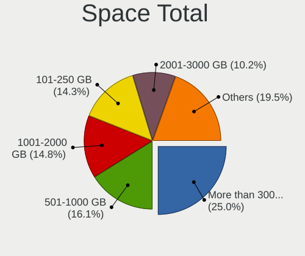

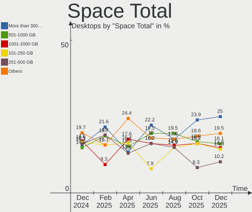

| Size in GB     | Desktops | Percent |
|----------------|----------|---------|
| More than 3000 | 96       | 25%     |
| 501-1000       | 62       | 16.15%  |
| 1001-2000      | 57       | 14.84%  |
| 101-250        | 55       | 14.32%  |
| 251-500        | 39       | 10.16%  |
| 2001-3000      | 39       | 10.16%  |
| 1-20           | 12       | 3.13%   |
| Unknown        | 12       | 3.13%   |
| 51-100         | 9        | 2.34%   |
| 21-50          | 3        | 0.78%   |

Space Used
----------

Amount of used disk space

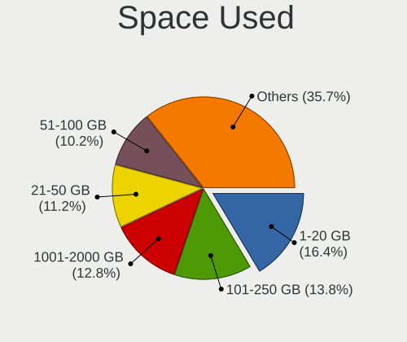

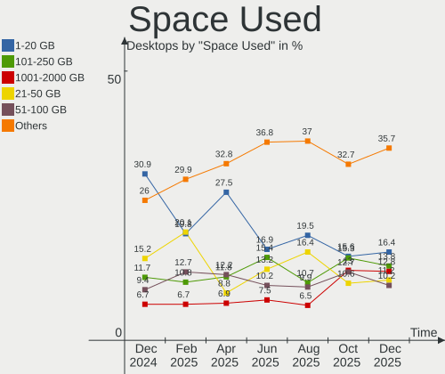

| Used GB        | Desktops | Percent |
|----------------|----------|---------|
| 1-20           | 63       | 16.41%  |
| 101-250        | 53       | 13.8%   |
| 1001-2000      | 49       | 12.76%  |
| 21-50          | 43       | 11.2%   |
| 51-100         | 39       | 10.16%  |
| 251-500        | 37       | 9.64%   |
| 501-1000       | 34       | 8.85%   |
| More than 3000 | 33       | 8.59%   |
| 2001-3000      | 20       | 5.21%   |
| Unknown        | 12       | 3.13%   |
| 0              | 1        | 0.26%   |

Malfunc. Drives
---------------

Drive models with a malfunction

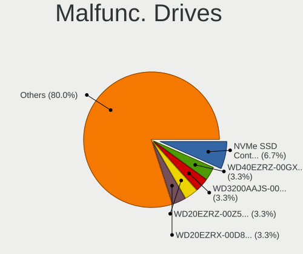

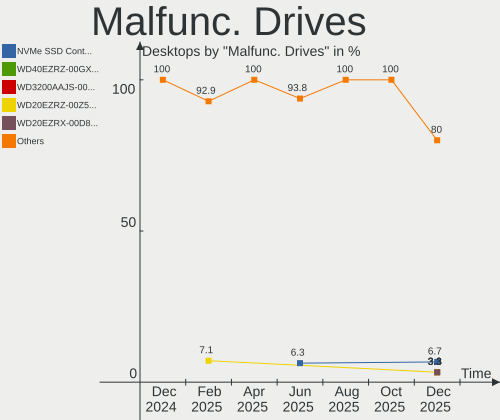

| Model                                                         | Desktops | Drives | Percent |
|---------------------------------------------------------------|----------|--------|---------|
| Samsung Electronics NVMe SSD Controller SM981/PM981/PM983 1TB | 2        | 2      | 6.67%   |
| WDC WD40EZRZ-00GXCB0 4TB                                      | 1        | 1      | 3.33%   |
| WDC WD3200AAJS-00L7A0 320GB                                   | 1        | 1      | 3.33%   |
| WDC WD20EZRZ-00Z5HB0 2TB                                      | 1        | 1      | 3.33%   |
| WDC WD20EZRX-00D8PB0 2TB                                      | 1        | 1      | 3.33%   |
| WDC WD20EFRX-68EUZN0 2TB                                      | 1        | 1      | 3.33%   |
| WDC WD10EZEX-21M2NA0 1TB                                      | 1        | 1      | 3.33%   |
| WDC WD10EFRX-68FYTN0 1TB                                      | 1        | 1      | 3.33%   |
| Transcend TS4TSSD230S 4TB                                     | 1        | 2      | 3.33%   |
| Seagate ST8000DM004-2CX188 8TB                                | 1        | 1      | 3.33%   |
| Seagate ST500LM000-SSHD-8GB                                   | 1        | 1      | 3.33%   |
| Seagate ST380815AS 80GB                                       | 1        | 1      | 3.33%   |
| Seagate ST3500413AS 500GB                                     | 1        | 1      | 3.33%   |
| Seagate ST31000524AS 1TB                                      | 1        | 1      | 3.33%   |
| Seagate ST3000DM001-1CH166 3TB                                | 1        | 1      | 3.33%   |
| Seagate ST1000DM003-1CH162 1TB                                | 1        | 1      | 3.33%   |
| SanDisk SSD PLUS 1000GB                                       | 1        | 1      | 3.33%   |
| Samsung Electronics SSD 980 1TB                               | 1        | 1      | 3.33%   |
| Samsung Electronics MZVKW512HMJP-00000 512GB                  | 1        | 1      | 3.33%   |
| Samsung Electronics HM250HI 250GB                             | 1        | 1      | 3.33%   |
| Samsung Electronics HD501LJ 500GB                             | 1        | 1      | 3.33%   |
| Micron Technology 1100_MTFDDAK256TBN 256GB SSD                | 1        | 1      | 3.33%   |
| Intenso SSD Sata III 256GB                                    | 1        | 1      | 3.33%   |
| Intel SSDSCKKW240H6 240GB                                     | 1        | 1      | 3.33%   |
| INNOVATION IT IT 240GB                                        | 1        | 1      | 3.33%   |
| Hitachi HDS723020BLA642 2TB                                   | 1        | 1      | 3.33%   |
| HGST HDN726040ALE614 4TB                                      | 1        | 1      | 3.33%   |
| Crucial CT525MX300SSD1 528GB                                  | 1        | 1      | 3.33%   |
| Crucial CT1000MX500SSD1 1TB                                   | 1        | 1      | 3.33%   |

Malfunc. Drive Vendor
---------------------

Vendors of faulty drives

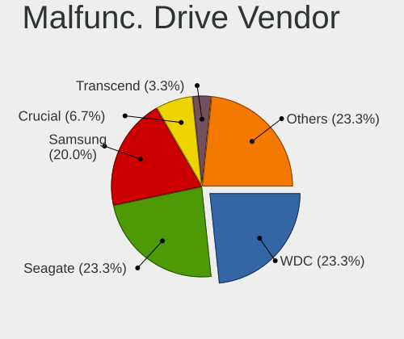

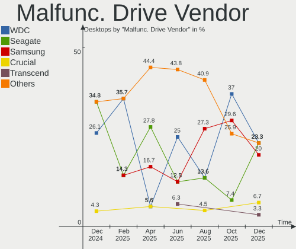

| Vendor              | Desktops | Drives | Percent |
|---------------------|----------|--------|---------|
| WDC                 | 7        | 7      | 23.33%  |
| Seagate             | 7        | 7      | 23.33%  |
| Samsung Electronics | 6        | 6      | 20%     |
| Crucial             | 2        | 2      | 6.67%   |
| Transcend           | 1        | 2      | 3.33%   |
| SanDisk             | 1        | 1      | 3.33%   |
| Micron Technology   | 1        | 1      | 3.33%   |
| Intenso             | 1        | 1      | 3.33%   |
| Intel               | 1        | 1      | 3.33%   |
| INNOVATION IT       | 1        | 1      | 3.33%   |
| Hitachi             | 1        | 1      | 3.33%   |
| HGST                | 1        | 1      | 3.33%   |

Malfunc. HDD Vendor
-------------------

Vendors of faulty HDD drives

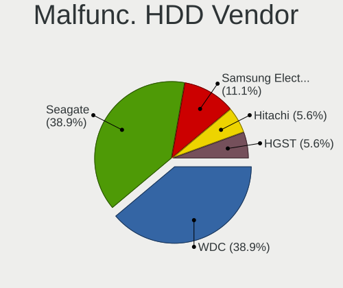

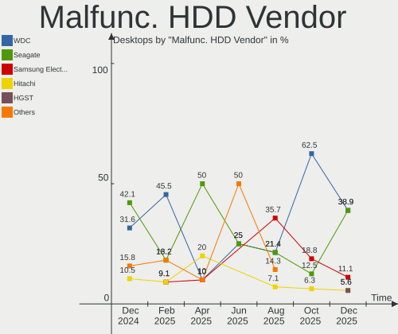

| Vendor              | Desktops | Drives | Percent |
|---------------------|----------|--------|---------|
| WDC                 | 7        | 7      | 38.89%  |
| Seagate             | 7        | 7      | 38.89%  |
| Samsung Electronics | 2        | 2      | 11.11%  |
| Hitachi             | 1        | 1      | 5.56%   |
| HGST                | 1        | 1      | 5.56%   |

Malfunc. Drive Kind
-------------------

Kinds of faulty drives

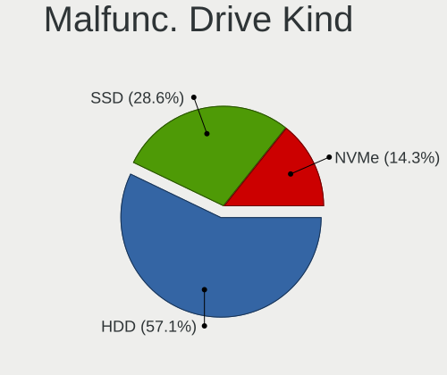

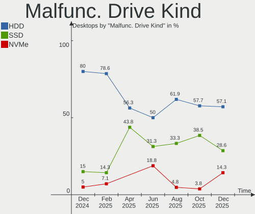

| Kind | Desktops | Drives | Percent |
|------|----------|--------|---------|
| HDD  | 16       | 18     | 57.14%  |
| SSD  | 8        | 9      | 28.57%  |
| NVMe | 4        | 4      | 14.29%  |

Failed Drives
-------------

Failed drive models

Zero info for selected period =(

Failed Drive Vendor
-------------------

Failed drive vendors

Zero info for selected period =(

Drive Status
------------

Number of failed and malfunc. drives

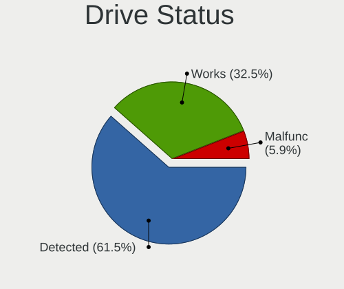

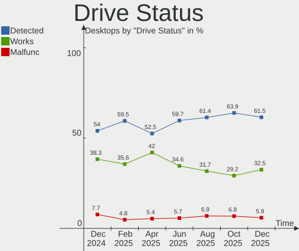

| Status   | Desktops | Drives | Percent |
|----------|----------|--------|---------|
| Detected | 259      | 599    | 61.52%  |
| Works    | 137      | 329    | 32.54%  |
| Malfunc  | 25       | 31     | 5.94%   |

Storage controller
------------------

Storage Vendor
--------------

Storage controller vendors

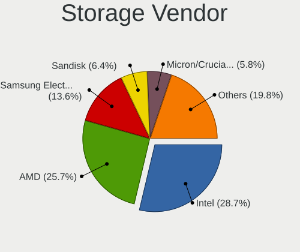

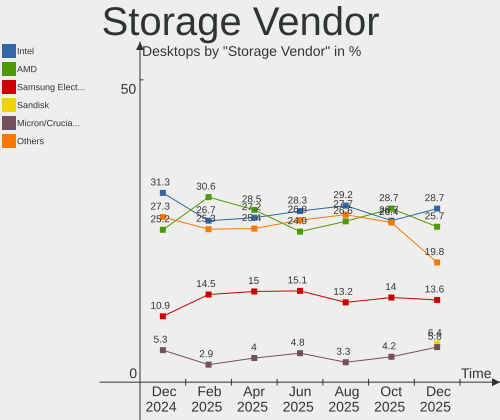

| Vendor                       | Desktops | Percent |
|------------------------------|----------|---------|
| Intel                        | 197      | 28.72%  |
| AMD                          | 176      | 25.66%  |
| Samsung Electronics          | 93       | 13.56%  |
| Sandisk                      | 44       | 6.41%   |
| Micron/Crucial Technology    | 40       | 5.83%   |
| ASMedia Technology           | 26       | 3.79%   |
| Kingston Technology Company  | 22       | 3.21%   |
| Phison Electronics           | 16       | 2.33%   |
| MAXIO Technology (Hangzhou)  | 9        | 1.31%   |
| Shenzhen Longsys Electronics | 8        | 1.17%   |
| Marvell Technology Group     | 8        | 1.17%   |
| ADATA Technology             | 7        | 1.02%   |
| SK hynix                     | 5        | 0.73%   |
| Silicon Motion               | 4        | 0.58%   |
| Micron Technology            | 4        | 0.58%   |
| JMicron Technology           | 4        | 0.58%   |
| Realtek Semiconductor        | 3        | 0.44%   |
| Nvidia                       | 3        | 0.44%   |
| Broadcom / LSI               | 3        | 0.44%   |
| VIA Technologies             | 2        | 0.29%   |
| Toshiba America Info Systems | 2        | 0.29%   |
| INNOGRIT                     | 2        | 0.29%   |
| Transcend                    | 1        | 0.15%   |
| TenaFe                       | 1        | 0.15%   |
| Solidigm                     | 1        | 0.15%   |
| Silicon Image                | 1        | 0.15%   |
| Seagate Technology           | 1        | 0.15%   |
| Hosin Global Electronics     | 1        | 0.15%   |
| Biwin Storage Technology     | 1        | 0.15%   |
| Adaptec                      | 1        | 0.15%   |

Storage Model
-------------

Storage controller models

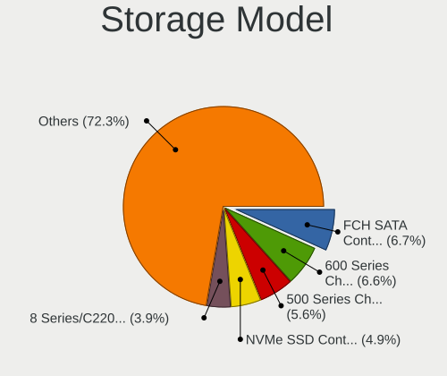

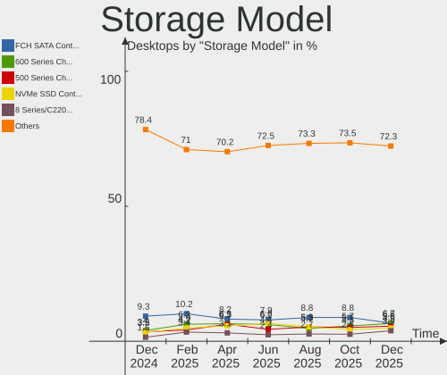

| Model                                                                          | Desktops | Percent |
|--------------------------------------------------------------------------------|----------|---------|
| AMD FCH SATA Controller [AHCI mode]                                            | 52       | 6.74%   |
| AMD 600 Series Chipset SATA Controller                                         | 51       | 6.61%   |
| AMD 500 Series Chipset SATA Controller                                         | 43       | 5.57%   |
| Samsung NVMe SSD Controller SM981/PM981/PM983                                  | 38       | 4.92%   |
| Intel 8 Series/C220 Series Chipset Family 6-port SATA Controller 1 [AHCI mode] | 30       | 3.89%   |
| Intel 200 Series PCH SATA controller [AHCI mode]                               | 29       | 3.76%   |
| ASMedia ASM1061/ASM1062 Serial ATA Controller                                  | 24       | 3.11%   |
| Samsung NVMe SSD Controller PM9A1/PM9A3/980PRO                                 | 20       | 2.59%   |
| Intel Q170/Q150/B150/H170/H110/Z170/CM236 Chipset SATA Controller [AHCI Mode]  | 19       | 2.46%   |
| Micron/Crucial P2 [Nick P2] / P3 / P3 Plus NVMe PCIe SSD (DRAM-less)           | 16       | 2.07%   |
| AMD 400 Series Chipset SATA Controller                                         | 16       | 2.07%   |
| Samsung NVMe SSD Controller S4LV008[Pascal]                                    | 14       | 1.81%   |
| Samsung NVMe SSD Controller 980 (DRAM-less)                                    | 14       | 1.81%   |
| Intel Raptor Lake SATA AHCI Controller                                         | 14       | 1.81%   |
| Sandisk WD Black SN850X NVMe SSD                                               | 13       | 1.68%   |
| Intel Alder Lake-S PCH SATA Controller [AHCI Mode]                             | 13       | 1.68%   |
| Intel Cannon Lake PCH SATA AHCI Controller                                     | 11       | 1.42%   |
| AMD SB7x0/SB8x0/SB9x0 IDE Controller                                           | 11       | 1.42%   |
| AMD SB7x0/SB8x0/SB9x0 SATA Controller [AHCI mode]                              | 10       | 1.3%    |
| Samsung NVMe SSD Controller PM9C1a (DRAM-less)                                 | 9        | 1.17%   |
| Intel SATA Controller [RAID mode]                                              | 8        | 1.04%   |
| Intel 7 Series/C210 Series Chipset Family 6-port SATA Controller [AHCI mode]   | 8        | 1.04%   |
| SanDisk WD SN560/SN740/SN770/SN5000 NVMe SSD                                   | 7        | 0.91%   |
| SanDisk Ultra 3D / WD Blue SN570 NVMe SSD (DRAM-less)                          | 7        | 0.91%   |
| Samsung NVMe SSD Controller SM961/PM961/SM963                                  | 7        | 0.91%   |
| Micron/Crucial P310 NVMe PCIe SSD (DRAM-less)                                  | 7        | 0.91%   |
| Intel Alder Lake-N SATA AHCI Controller                                        | 7        | 0.91%   |
| Micron/Crucial P3 Plus NVMe PCIe SSD (DRAM-less)                               | 6        | 0.78%   |
| Kingston Company A2000 NVMe SSD [SM2263EN]                                     | 6        | 0.78%   |
| Intel RST Volume Management Device Controller                                  | 6        | 0.78%   |
| Intel 6 Series/C200 Series Chipset Family 6 port Desktop SATA AHCI Controller  | 6        | 0.78%   |
| Intel 500 Series Chipset Family SATA AHCI Controller                           | 6        | 0.78%   |
| AMD SB7x0/SB8x0/SB9x0 SATA Controller [IDE mode]                               | 6        | 0.78%   |
| Phison E12 NVMe Controller                                                     | 5        | 0.65%   |
| Micron/Crucial P5 Plus NVMe PCIe SSD                                           | 5        | 0.65%   |
| MAXIO (Hangzhou) NVMe SSD Controller MAP1202 (DRAM-less)                       | 5        | 0.65%   |
| Marvell Group 88SE9172 SATA 6Gb/s Controller                                   | 5        | 0.65%   |
| Kingston Company KC3000/FURY Renegade NVMe SSD [E18]                           | 5        | 0.65%   |
| Intel C610/X99 series chipset 6-Port SATA Controller [AHCI mode]               | 5        | 0.65%   |
| AMD A320 Chipset SATA Controller [AHCI mode]                                   | 5        | 0.65%   |

Storage Kind
------------

Kind of storage controller (IDE, SATA, NVMe, SAS, ...)

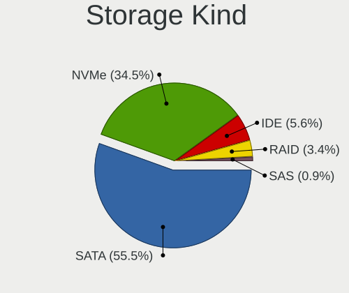

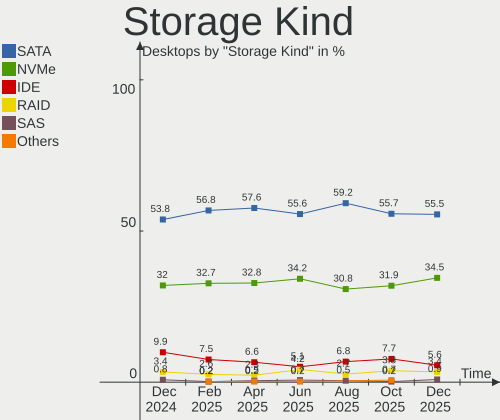

| Kind | Desktops | Percent |
|------|----------|---------|
| SATA | 357      | 55.52%  |
| NVMe | 222      | 34.53%  |
| IDE  | 36       | 5.6%    |
| RAID | 22       | 3.42%   |
| SAS  | 6        | 0.93%   |

Processor
---------

CPU Vendor
----------

Processor vendors

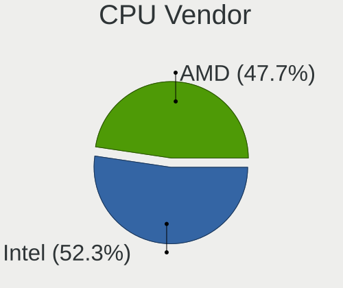

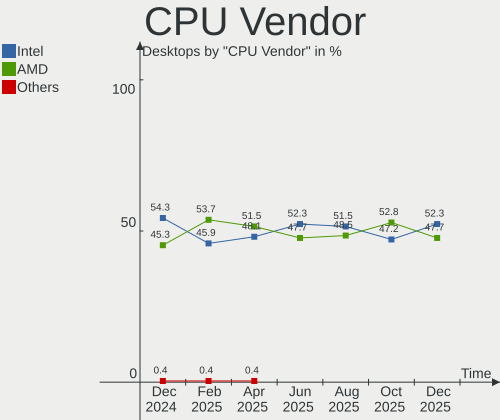

| Vendor | Desktops | Percent |
|--------|----------|---------|
| Intel  | 201      | 52.34%  |
| AMD    | 183      | 47.66%  |

CPU Model
---------

Processor models

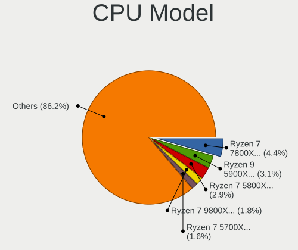

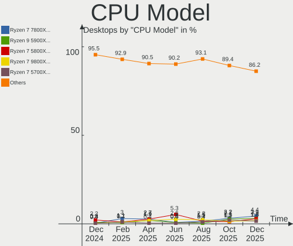

| Model                                  | Desktops | Percent |
|----------------------------------------|----------|---------|
| AMD Ryzen 7 7800X3D 8-Core Processor   | 17       | 4.43%   |
| AMD Ryzen 9 5900X 12-Core Processor    | 12       | 3.13%   |
| AMD Ryzen 7 5800X 8-Core Processor     | 11       | 2.86%   |
| AMD Ryzen 7 9800X3D 8-Core Processor   | 7        | 1.82%   |
| AMD Ryzen 7 5700X 8-Core Processor     | 6        | 1.56%   |
| Intel Xeon CPU E5-2680 v4 @ 2.40GHz    | 5        | 1.3%    |
| Intel Core i7-6700 CPU @ 3.40GHz       | 5        | 1.3%    |
| Intel Core i5-8400 CPU @ 2.80GHz       | 5        | 1.3%    |
| Intel Core i5-4590 CPU @ 3.30GHz       | 5        | 1.3%    |
| AMD Ryzen 9 3900X 12-Core Processor    | 5        | 1.3%    |
| AMD Ryzen 7 9700X 8-Core Processor     | 5        | 1.3%    |
| AMD Ryzen 7 5700G with Radeon Graphics | 5        | 1.3%    |
| AMD Ryzen 5 5600X 6-Core Processor     | 5        | 1.3%    |
| AMD Ryzen 5 3600 6-Core Processor      | 5        | 1.3%    |
| Intel N100                             | 4        | 1.04%   |
| Intel Core i7-8700 CPU @ 3.20GHz       | 4        | 1.04%   |
| Intel Core i5-6500 CPU @ 3.20GHz       | 4        | 1.04%   |
| AMD Ryzen 7 5800X3D 8-Core Processor   | 4        | 1.04%   |
| AMD Ryzen 5 7600X 6-Core Processor     | 4        | 1.04%   |
| Intel Pentium CPU G3220 @ 3.00GHz      | 3        | 0.78%   |
| Intel Core i7-6700K CPU @ 4.00GHz      | 3        | 0.78%   |
| Intel Core i7-4790 CPU @ 3.60GHz       | 3        | 0.78%   |
| Intel Core i7-3770K CPU @ 3.50GHz      | 3        | 0.78%   |
| Intel Core i5-7400 CPU @ 3.00GHz       | 3        | 0.78%   |
| Intel 12th Gen Core i7-12700K          | 3        | 0.78%   |
| AMD Ryzen 9 7950X 16-Core Processor    | 3        | 0.78%   |
| AMD Ryzen 7 3700X 8-Core Processor     | 3        | 0.78%   |
| AMD Ryzen 5 5600G with Radeon Graphics | 3        | 0.78%   |
| AMD FX-8350 Eight-Core Processor       | 3        | 0.78%   |
| Intel N95                              | 2        | 0.52%   |
| Intel N150                             | 2        | 0.52%   |
| Intel Core i7-9700 CPU @ 3.00GHz       | 2        | 0.52%   |
| Intel Core i7-7700K CPU @ 4.20GHz      | 2        | 0.52%   |
| Intel Core i7-7700 CPU @ 3.60GHz       | 2        | 0.52%   |
| Intel Core i7-4770K CPU @ 3.50GHz      | 2        | 0.52%   |
| Intel Core i7-4770 CPU @ 3.40GHz       | 2        | 0.52%   |
| Intel Core i7-3770 CPU @ 3.40GHz       | 2        | 0.52%   |
| Intel Core i7-14700KF                  | 2        | 0.52%   |
| Intel Core i5-6600K CPU @ 3.50GHz      | 2        | 0.52%   |
| Intel Core i5-6500T CPU @ 2.50GHz      | 2        | 0.52%   |

CPU Model Family
----------------

Processor model prefix

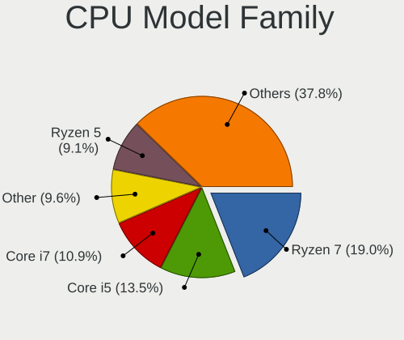

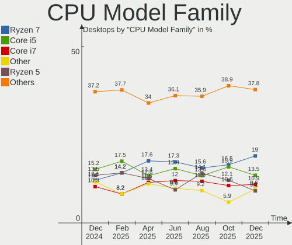

| Model                  | Desktops | Percent |
|------------------------|----------|---------|
| AMD Ryzen 7            | 73       | 19.01%  |
| Intel Core i5          | 52       | 13.54%  |
| Intel Core i7          | 42       | 10.94%  |
| Other                  | 37       | 9.64%   |
| AMD Ryzen 5            | 35       | 9.11%   |
| AMD Ryzen 9            | 30       | 7.81%   |
| Intel Xeon             | 22       | 5.73%   |
| Intel Core i3          | 21       | 5.47%   |
| AMD FX                 | 10       | 2.6%    |
| Intel Core i9          | 8        | 2.08%   |
| Intel Pentium          | 6        | 1.56%   |
| AMD A10                | 6        | 1.56%   |
| Intel Celeron          | 5        | 1.3%    |
| AMD Ryzen 3            | 5        | 1.3%    |
| AMD GX                 | 4        | 1.04%   |
| AMD Athlon             | 3        | 0.78%   |
| Intel Core 2 Quad      | 2        | 0.52%   |
| Intel Core 2 Duo       | 2        | 0.52%   |
| AMD Phenom II X4       | 2        | 0.52%   |
| AMD Phenom II X2       | 2        | 0.52%   |
| AMD Phenom             | 2        | 0.52%   |
| AMD Athlon II X2       | 2        | 0.52%   |
| AMD A4                 | 2        | 0.52%   |
| Intel Pentium Silver   | 1        | 0.26%   |
| Intel Pentium M        | 1        | 0.26%   |
| Intel Core             | 1        | 0.26%   |
| Intel Atom             | 1        | 0.26%   |
| AMD Ryzen Threadripper | 1        | 0.26%   |
| AMD Ryzen 5 PRO        | 1        | 0.26%   |
| AMD PRO A10            | 1        | 0.26%   |
| AMD Phenom II X6       | 1        | 0.26%   |
| AMD Athlon 64 X2       | 1        | 0.26%   |
| AMD A8                 | 1        | 0.26%   |
| AMD A6                 | 1        | 0.26%   |

CPU Cores
---------

Number of processor cores

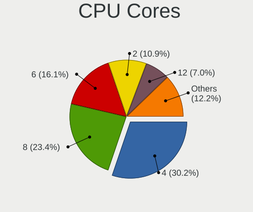

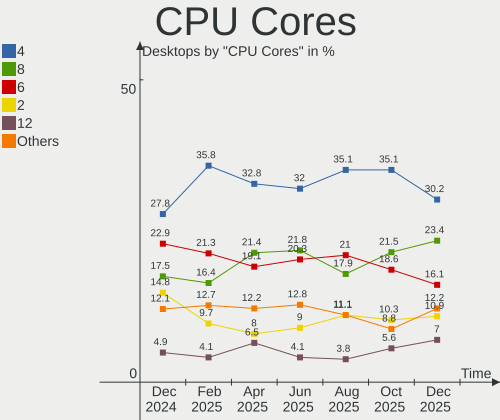

| Number | Desktops | Percent |
|--------|----------|---------|
| 4      | 116      | 30.21%  |
| 8      | 90       | 23.44%  |
| 6      | 62       | 16.15%  |
| 2      | 42       | 10.94%  |
| 12     | 27       | 7.03%   |
| 16     | 16       | 4.17%   |
| 14     | 10       | 2.6%    |
| 24     | 6        | 1.56%   |
| 10     | 6        | 1.56%   |
| 20     | 3        | 0.78%   |
| 28     | 2        | 0.52%   |
| 3      | 2        | 0.52%   |
| 18     | 1        | 0.26%   |
| 1      | 1        | 0.26%   |

CPU Sockets
-----------

Number of sockets

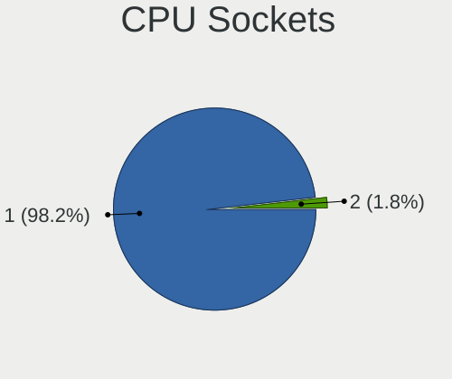

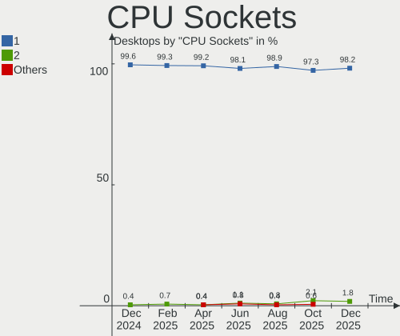

| Number | Desktops | Percent |
|--------|----------|---------|
| 1      | 377      | 98.18%  |
| 2      | 7        | 1.82%   |

CPU Threads
-----------

Threads per core (Hyper-Threading)

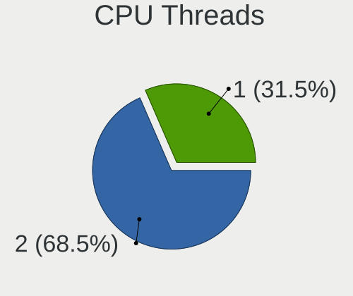

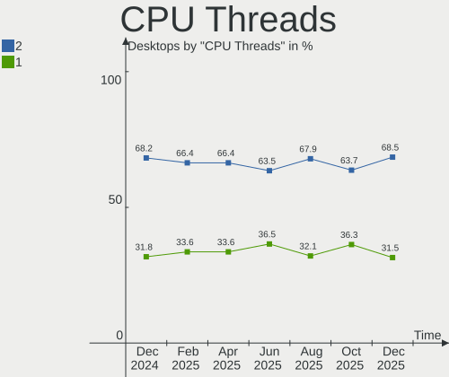

| Number | Desktops | Percent |
|--------|----------|---------|
| 2      | 263      | 68.49%  |
| 1      | 121      | 31.51%  |

CPU Op-Modes
------------

CPU Operation Modes (32-bit, 64-bit)

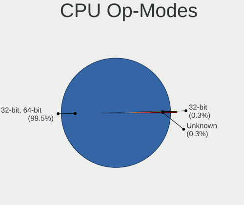

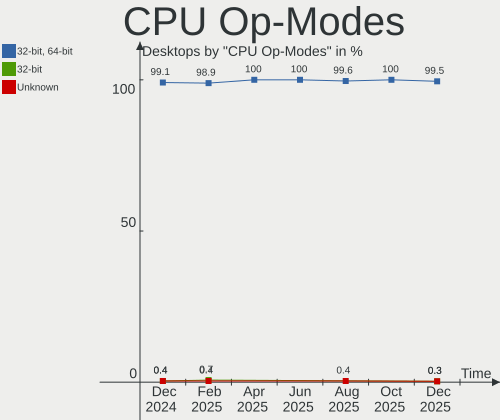

| Op mode        | Desktops | Percent |
|----------------|----------|---------|
| 32-bit, 64-bit | 382      | 99.48%  |
| 32-bit         | 1        | 0.26%   |
| Unknown        | 1        | 0.26%   |

CPU Microcode
-------------

Microcode number

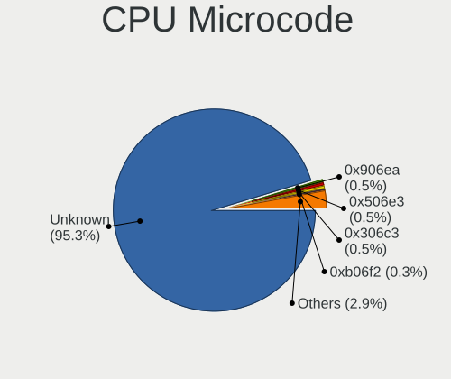

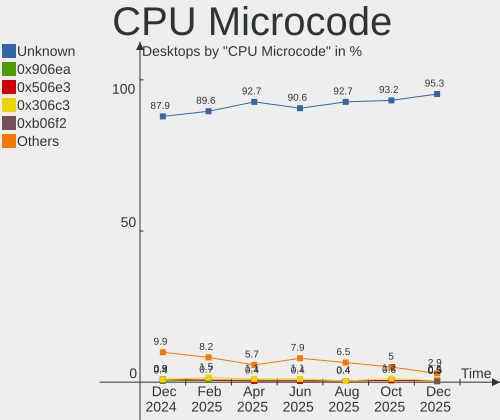

| Number     | Desktops | Percent |
|------------|----------|---------|
| Unknown    | 366      | 95.31%  |
| 0x906ea    | 2        | 0.52%   |
| 0x506e3    | 2        | 0.52%   |
| 0x306c3    | 2        | 0.52%   |
| 0xb06f2    | 1        | 0.26%   |
| 0x906ec    | 1        | 0.26%   |
| 0x50654    | 1        | 0.26%   |
| 0x306a9    | 1        | 0.26%   |
| 0x206a7    | 1        | 0.26%   |
| 0x106a5    | 1        | 0.26%   |
| 0x0b404035 | 1        | 0.26%   |
| 0x0a50000f | 1        | 0.26%   |
| 0x0a50000b | 1        | 0.26%   |
| 0x07030105 | 1        | 0.26%   |
| 0x010000dc | 1        | 0.26%   |
| 0x010000db | 1        | 0.26%   |

CPU Microarch
-------------

Microarchitecture

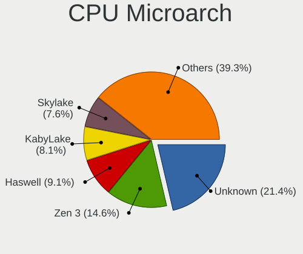

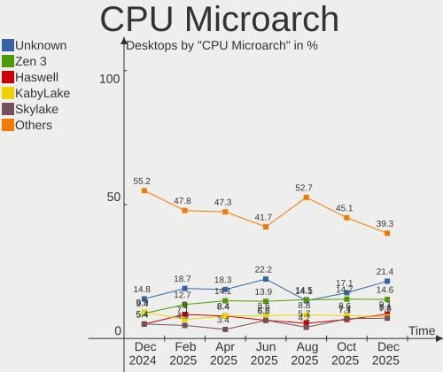

| Name             | Desktops | Percent |
|------------------|----------|---------|
| Unknown          | 82       | 21.35%  |
| Zen 3            | 56       | 14.58%  |
| Haswell          | 35       | 9.11%   |
| KabyLake         | 31       | 8.07%   |
| Skylake          | 29       | 7.55%   |
| Zen 2            | 20       | 5.21%   |
| IvyBridge        | 18       | 4.69%   |
| Alderlake Hybrid | 15       | 3.91%   |
| Zen+             | 12       | 3.13%   |
| Piledriver       | 11       | 2.86%   |
| SandyBridge      | 10       | 2.6%    |
| K10              | 9        | 2.34%   |
| CometLake        | 6        | 1.56%   |
| Broadwell        | 6        | 1.56%   |
| Nehalem          | 5        | 1.3%    |
| Gracemont        | 5        | 1.3%    |
| Bulldozer        | 5        | 1.3%    |
| Steamroller      | 4        | 1.04%   |
| Penryn           | 4        | 1.04%   |
| Zen              | 3        | 0.78%   |
| Westmere         | 3        | 0.78%   |
| Puma             | 3        | 0.78%   |
| Goldmont plus    | 2        | 0.52%   |
| Tremont          | 1        | 0.26%   |
| Silvermont       | 1        | 0.26%   |
| P6               | 1        | 0.26%   |
| K8 Hammer        | 1        | 0.26%   |
| Jaguar           | 1        | 0.26%   |
| Icelake          | 1        | 0.26%   |
| Goldmont         | 1        | 0.26%   |
| Excavator        | 1        | 0.26%   |
| Core             | 1        | 0.26%   |
| Bonnell          | 1        | 0.26%   |

Graphics
--------

GPU Vendor
----------

Vendors of graphics cards

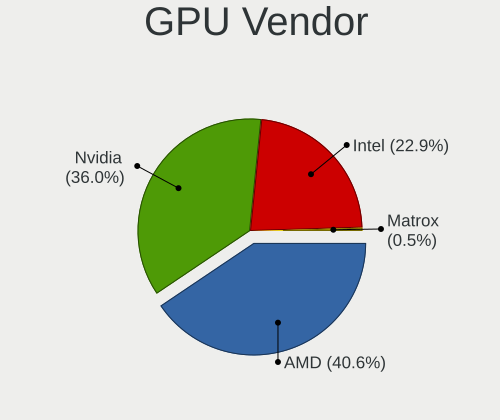

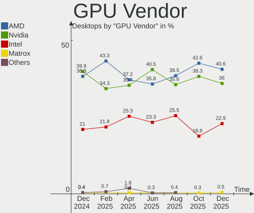

| Vendor                     | Desktops | Percent |
|----------------------------|----------|---------|
| AMD                        | 170      | 40.57%  |
| Nvidia                     | 151      | 36.04%  |
| Intel                      | 96       | 22.91%  |
| Matrox Electronics Systems | 2        | 0.48%   |

GPU Model
---------

Graphics card models

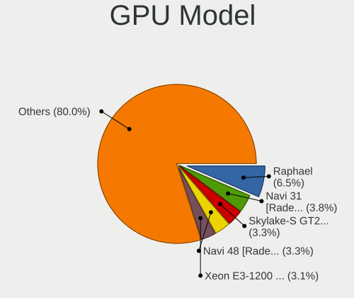

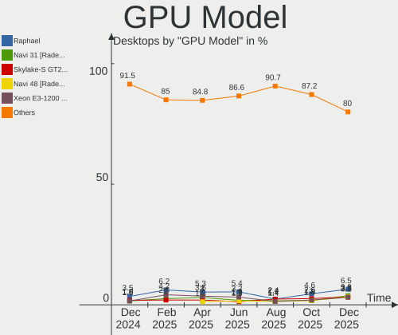

| Model                                                                       | Desktops | Percent |
|-----------------------------------------------------------------------------|----------|---------|
| AMD Raphael                                                                 | 29       | 6.46%   |
| AMD Navi 31 [Radeon RX 7900 XT/7900 XTX/7900 GRE/7900M]                     | 17       | 3.79%   |
| Intel Skylake-S GT2 [HD Graphics 530]                                       | 15       | 3.34%   |
| AMD Navi 48 [Radeon RX 9070/9070 XT/9070 GRE]                               | 15       | 3.34%   |
| Intel Xeon E3-1200 v3/4th Gen Core Processor Integrated Graphics Controller | 14       | 3.12%   |
| AMD Ellesmere [Radeon RX 470/480/570/570X/580/580X/590]                     | 14       | 3.12%   |
| AMD Granite Ridge [Radeon Graphics]                                         | 12       | 2.67%   |
| Intel CoffeeLake-S GT2 [UHD Graphics 630]                                   | 9        | 2%      |
| AMD Navi 44 [Radeon RX 9060 XT]                                             | 9        | 2%      |
| Nvidia GA106 [GeForce RTX 3060 Lite Hash Rate]                              | 7        | 1.56%   |
| Nvidia AD104 [GeForce RTX 4070]                                             | 7        | 1.56%   |
| AMD Picasso/Raven 2 [Radeon Vega Series / Radeon Vega Mobile Series]        | 7        | 1.56%   |
| AMD Cezanne [Radeon Vega Series / Radeon Vega Mobile Series]                | 7        | 1.56%   |
| Nvidia GP108 [GeForce GT 1030]                                              | 6        | 1.34%   |
| Nvidia GP106 [GeForce GTX 1060 6GB]                                         | 6        | 1.34%   |
| Intel Kaby Lake-S GT2 [HD Graphics 630]                                     | 6        | 1.34%   |
| Intel Alder Lake-N [UHD Graphics]                                           | 6        | 1.34%   |
| AMD Navi 32 [Radeon RX 7700 XT / 7800 XT]                                   | 6        | 1.34%   |
| Nvidia AD102 [GeForce RTX 4090]                                             | 5        | 1.11%   |
| AMD Navi 33 [Radeon RX 7600/7600 XT/7600M XT/7600S/7700S / PRO W7600]       | 5        | 1.11%   |
| AMD Navi 22 [Radeon RX 6700/6700 XT/6750 XT / 6800M/6850M XT]               | 5        | 1.11%   |
| AMD Navi 21 [Radeon RX 6800/6800 XT / 6900 XT]                              | 5        | 1.11%   |
| AMD Lexa PRO [Radeon 540/540X/550/550X / RX 540X/550/550X]                  | 5        | 1.11%   |
| Nvidia GP102 [GeForce GTX 1080 Ti]                                          | 4        | 0.89%   |
| Nvidia GM206 [GeForce GTX 960]                                              | 4        | 0.89%   |
| Nvidia GM204 [GeForce GTX 970]                                              | 4        | 0.89%   |
| Nvidia GK208B [GeForce GT 710]                                              | 4        | 0.89%   |
| Nvidia GA102 [GeForce RTX 3080]                                             | 4        | 0.89%   |
| Intel Raptor Lake-S GT1 [UHD Graphics 770]                                  | 4        | 0.89%   |
| Intel Alder Lake-S GT1 [UHD Graphics 770]                                   | 4        | 0.89%   |
| Intel 4th Generation Core Processor Family Integrated Graphics Controller   | 4        | 0.89%   |
| AMD Navi 23 [Radeon RX 6600/6600 XT/6600M]                                  | 4        | 0.89%   |
| Nvidia TU117 [GeForce GTX 1650]                                             | 3        | 0.67%   |
| Nvidia TU116 [GeForce GTX 1660 SUPER]                                       | 3        | 0.67%   |
| Nvidia TU104 [GeForce RTX 2070 SUPER]                                       | 3        | 0.67%   |
| Nvidia GP107 [GeForce GTX 1050 Ti]                                          | 3        | 0.67%   |
| Nvidia GP104 [GeForce GTX 1080]                                             | 3        | 0.67%   |
| Nvidia GP104 [GeForce GTX 1070]                                             | 3        | 0.67%   |
| Nvidia GB203 [GeForce RTX 5080]                                             | 3        | 0.67%   |
| Nvidia GA102 [GeForce RTX 3080 Lite Hash Rate]                              | 3        | 0.67%   |

GPU Combo
---------

Combinations of graphics cards

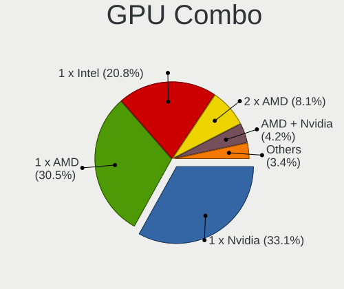

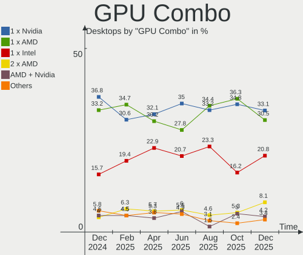

| Name           | Desktops | Percent |
|----------------|----------|---------|
| 1 x Nvidia     | 127      | 33.07%  |
| 1 x AMD        | 117      | 30.47%  |
| 1 x Intel      | 80       | 20.83%  |
| 2 x AMD        | 31       | 8.07%   |
| AMD + Nvidia   | 16       | 4.17%   |
| Intel + Nvidia | 5        | 1.3%    |
| Intel + AMD    | 4        | 1.04%   |
| 1 x Matrox     | 2        | 0.52%   |
| Other          | 1        | 0.26%   |
| 2 x Intel      | 1        | 0.26%   |

GPU Driver
----------

Free vs proprietary

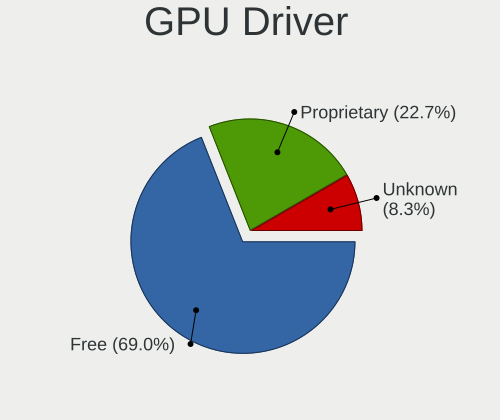

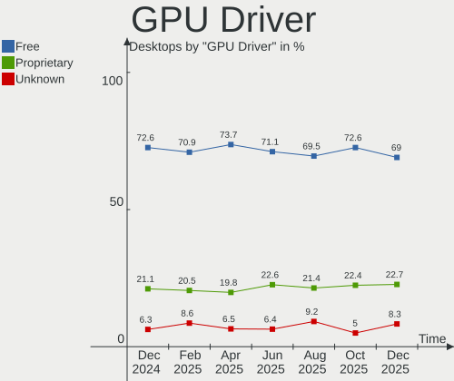

| Driver      | Desktops | Percent |
|-------------|----------|---------|
| Free        | 265      | 69.01%  |
| Proprietary | 87       | 22.66%  |
| Unknown     | 32       | 8.33%   |

GPU Memory
----------

Total video memory

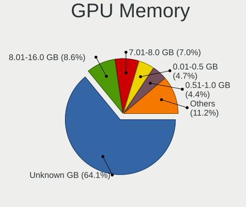

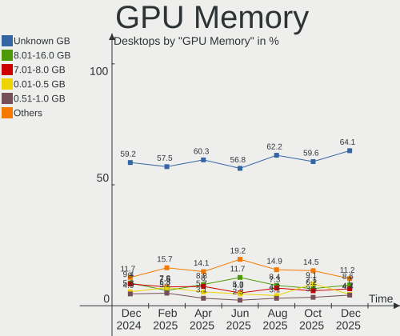

| Size in GB | Desktops | Percent |
|------------|----------|---------|
| Unknown    | 246      | 64.06%  |
| 8.01-16.0  | 33       | 8.59%   |
| 7.01-8.0   | 27       | 7.03%   |
| 0.01-0.5   | 18       | 4.69%   |
| 0.51-1.0   | 17       | 4.43%   |
| 1.01-2.0   | 15       | 3.91%   |
| 3.01-4.0   | 12       | 3.13%   |
| 16.01-24.0 | 8        | 2.08%   |
| 5.01-6.0   | 6        | 1.56%   |
| 24.01-32.0 | 1        | 0.26%   |
| 2.01-3.0   | 1        | 0.26%   |

Monitor
-------

Monitor Vendor
--------------

Monitor vendors

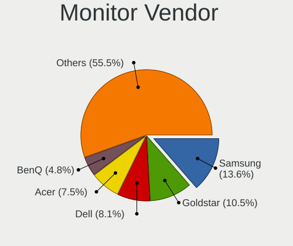

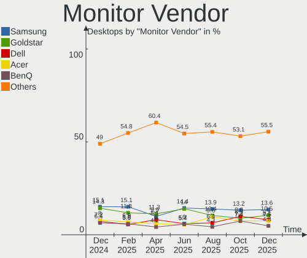

| Vendor               | Desktops | Percent |
|----------------------|----------|---------|
| Samsung Electronics  | 62       | 13.6%   |
| Goldstar             | 48       | 10.53%  |
| Dell                 | 37       | 8.11%   |
| Acer                 | 34       | 7.46%   |
| BenQ                 | 22       | 4.82%   |
| Philips              | 21       | 4.61%   |
| AOC                  | 20       | 4.39%   |
| ASUSTek Computer     | 19       | 4.17%   |
| Iiyama               | 16       | 3.51%   |
| Ancor Communications | 16       | 3.51%   |
| Hewlett-Packard      | 14       | 3.07%   |
| Lenovo               | 13       | 2.85%   |
| ViewSonic            | 11       | 2.41%   |
| MSI                  | 10       | 2.19%   |
| Eizo                 | 10       | 2.19%   |
| Medion               | 9        | 1.97%   |
| Gigabyte Technology  | 9        | 1.97%   |
| Fujitsu Siemens      | 8        | 1.75%   |
| SKG                  | 7        | 1.54%   |
| Mi                   | 4        | 0.88%   |
| HKC                  | 4        | 0.88%   |
| CHO                  | 4        | 0.88%   |
| CHD                  | 4        | 0.88%   |
| HUAWEI               | 3        | 0.66%   |
| HannStar             | 3        | 0.66%   |
| Compal               | 3        | 0.66%   |
| Wacom                | 2        | 0.44%   |
| Toshiba              | 2        | 0.44%   |
| Sony                 | 2        | 0.44%   |
| RTK                  | 2        | 0.44%   |
| Panasonic            | 2        | 0.44%   |
| NEC Computers        | 2        | 0.44%   |
| Huion                | 2        | 0.44%   |
| Hitachi              | 2        | 0.44%   |
| DENON                | 2        | 0.44%   |
| WES                  | 1        | 0.22%   |
| VCS                  | 1        | 0.22%   |
| Valve                | 1        | 0.22%   |
| Unknown (XXX)        | 1        | 0.22%   |
| Unknown              | 1        | 0.22%   |

Monitor Model
-------------

Monitor models

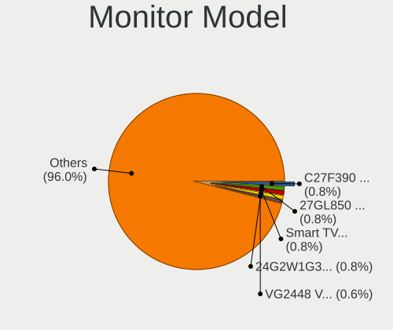

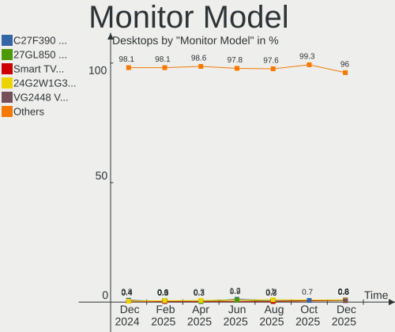

| Model                                                                  | Desktops | Percent |
|------------------------------------------------------------------------|----------|---------|
| Samsung Electronics C27F390 SAM0D32 1920x1080 598x336mm 27.0-inch      | 4        | 0.84%   |
| Goldstar 27GL850 GSM5B7F 2560x1440 597x336mm 27.0-inch                 | 4        | 0.84%   |
| CHO Smart TV CHO0030 1920x1080 1390x780mm 62.8-inch                    | 4        | 0.84%   |
| AOC 24G2W1G3 AOC2402 1920x1080 527x296mm 23.8-inch                     | 4        | 0.84%   |
| ViewSonic VG2448 VSC3B35 1920x1080 527x296mm 23.8-inch                 | 3        | 0.63%   |
| Philips PHL 243V7 PHLC155 1920x1080 527x296mm 23.8-inch                | 3        | 0.63%   |
| MSI Optix MAG27CQ MSI1462 2560x1440 597x336mm 27.0-inch                | 3        | 0.63%   |
| Goldstar 24MB56 GSM5A98 1920x1080 510x290mm 23.1-inch                  | 3        | 0.63%   |
| Dell U2412M DELA07B 1920x1200 518x324mm 24.1-inch                      | 3        | 0.63%   |
| Dell P2214H DELA097 1920x1080 477x268mm 21.5-inch                      | 3        | 0.63%   |
| Ancor Communications ASUS VS228 ACI22FD 1920x1080 476x268mm 21.5-inch  | 3        | 0.63%   |
| Acer S242HL ACR0216 1920x1080 531x299mm 24.0-inch                      | 3        | 0.63%   |
| ViewSonic VA2465 SERIES VSCB730 1920x1080 521x293mm 23.5-inch          | 2        | 0.42%   |
| SKG Q3212RUC SKG3212 2560x1440 530x280mm 23.6-inch                     | 2        | 0.42%   |
| Samsung Electronics S24D330 SAM0D92 1920x1080 531x299mm 24.0-inch      | 2        | 0.42%   |
| Samsung Electronics LCD Monitor SAM0A7D 1920x1080 1060x626mm 48.5-inch | 2        | 0.42%   |
| Samsung Electronics LC34G55T SAM711A 3440x1440 798x334mm 34.1-inch     | 2        | 0.42%   |
| Samsung Electronics LC32G7xT SAM7058 2560x1440 698x393mm 31.5-inch     | 2        | 0.42%   |
| Samsung Electronics LC27G5xT SAM707A 2560x1440 597x336mm 27.0-inch     | 2        | 0.42%   |
| Panasonic TV MEIA296 1920x1080 698x392mm 31.5-inch                     | 2        | 0.42%   |
| MSI MD272XP MSI50B1 1920x1080 600x330mm 27.0-inch                      | 2        | 0.42%   |
| Mi Monitor XMI3444 3440x1440 797x334mm 34.0-inch                       | 2        | 0.42%   |
| Mi Monitor XMI27B2 2560x1440 598x336mm 27.0-inch                       | 2        | 0.42%   |
| Medion MD20581 MED369A 1920x1080 597x336mm 27.0-inch                   | 2        | 0.42%   |
| Lenovo LT2252p Wide LEN0A0C 1680x1050 474x296mm 22.0-inch              | 2        | 0.42%   |
| Lenovo LEN L201p LEN2468 1600x1200 400x300mm 19.7-inch                 | 2        | 0.42%   |
| Lenovo E24q-20 LEN62CF 2560x1440 527x296mm 23.8-inch                   | 2        | 0.42%   |
| HUAWEI AD80HW HWV2402 1920x1080 527x296mm 23.8-inch                    | 2        | 0.42%   |
| Hewlett-Packard 24o HPN337C 1920x1080 531x299mm 24.0-inch              | 2        | 0.42%   |
| Goldstar LG IPS FULLHD GSM5AB8 1920x1080 480x270mm 21.7-inch           | 2        | 0.42%   |
| Goldstar HDR 4K GSM774F 3840x2160 697x392mm 31.5-inch                  | 2        | 0.42%   |
| Goldstar HDR 4K GSM7707 3840x2160 600x340mm 27.2-inch                  | 2        | 0.42%   |
| Goldstar FULL HD GSM5B55 1920x1080 480x270mm 21.7-inch                 | 2        | 0.42%   |
| Goldstar 24MB37 GSM5AEC 1920x1080 510x290mm 23.1-inch                  | 2        | 0.42%   |
| Dell U2723QE DEL4278 3840x2160 597x336mm 27.0-inch                     | 2        | 0.42%   |
| Dell S2725DS DELD17F 2560x1440 597x336mm 27.0-inch                     | 2        | 0.42%   |
| Dell S2722DGM DEL4239 2560x1440 597x336mm 27.0-inch                    | 2        | 0.42%   |
| CHD PMO S271-IFC CHD0270 1920x1080 600x330mm 27.0-inch                 | 2        | 0.42%   |
| BenQ GL2450H BNQ78A7 1920x1080 531x298mm 24.0-inch                     | 2        | 0.42%   |
| ASUSTek Computer VA24E AUS24D1 1920x1080 527x296mm 23.8-inch           | 2        | 0.42%   |

Monitor Resolution
------------------

Monitor screen resolution

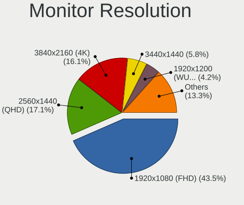

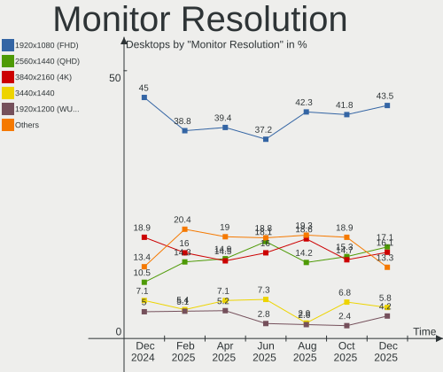

| Resolution         | Desktops | Percent |
|--------------------|----------|---------|
| 1920x1080 (FHD)    | 186      | 43.46%  |
| 2560x1440 (QHD)    | 73       | 17.06%  |
| 3840x2160 (4K)     | 69       | 16.12%  |
| 3440x1440          | 25       | 5.84%   |
| 1920x1200 (WUXGA)  | 18       | 4.21%   |
| 1680x1050 (WSXGA+) | 15       | 3.5%    |
| 1280x1024 (SXGA)   | 11       | 2.57%   |
| 3840x1080          | 5        | 1.17%   |
| 1920x540           | 4        | 0.93%   |
| 1600x900 (HD+)     | 3        | 0.7%    |
| 1600x1200          | 3        | 0.7%    |
| 1440x900 (WXGA+)   | 3        | 0.7%    |
| Unknown            | 3        | 0.7%    |
| 3840x1600          | 2        | 0.47%   |
| 2560x1600          | 2        | 0.47%   |
| 2560x1080          | 2        | 0.47%   |
| 1366x768 (WXGA)    | 2        | 0.47%   |
| 2880x1600          | 1        | 0.23%   |
| 2288x1287          | 1        | 0.23%   |

Monitor Diagonal
----------------

Diagonal size in inches

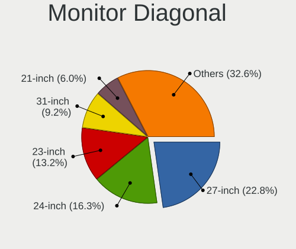

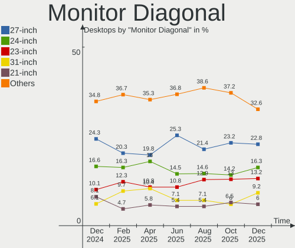

| Inches  | Desktops | Percent |
|---------|----------|---------|
| 27      | 102      | 22.77%  |
| 24      | 73       | 16.29%  |
| 23      | 59       | 13.17%  |
| 31      | 41       | 9.15%   |
| 21      | 27       | 6.03%   |
| 34      | 24       | 5.36%   |
| 22      | 15       | 3.35%   |
| 19      | 14       | 3.13%   |
| Unknown | 12       | 2.68%   |
| 84      | 8        | 1.79%   |
| 26      | 7        | 1.56%   |
| 20      | 5        | 1.12%   |
| 63      | 4        | 0.89%   |
| 54      | 4        | 0.89%   |
| 48      | 4        | 0.89%   |
| 40      | 4        | 0.89%   |
| 28      | 4        | 0.89%   |
| 18      | 4        | 0.89%   |
| 17      | 4        | 0.89%   |
| 72      | 3        | 0.67%   |
| 32      | 3        | 0.67%   |
| 25      | 3        | 0.67%   |
| 57      | 2        | 0.45%   |
| 49      | 2        | 0.45%   |
| 42      | 2        | 0.45%   |
| 37      | 2        | 0.45%   |
| 29      | 2        | 0.45%   |
| 15      | 2        | 0.45%   |
| 142     | 1        | 0.22%   |
| 129     | 1        | 0.22%   |
| 74      | 1        | 0.22%   |
| 64      | 1        | 0.22%   |
| 52      | 1        | 0.22%   |
| 47      | 1        | 0.22%   |
| 43      | 1        | 0.22%   |
| 39      | 1        | 0.22%   |
| 36      | 1        | 0.22%   |
| 35      | 1        | 0.22%   |
| 16      | 1        | 0.22%   |
| 13      | 1        | 0.22%   |

Monitor Width
-------------

Physical width

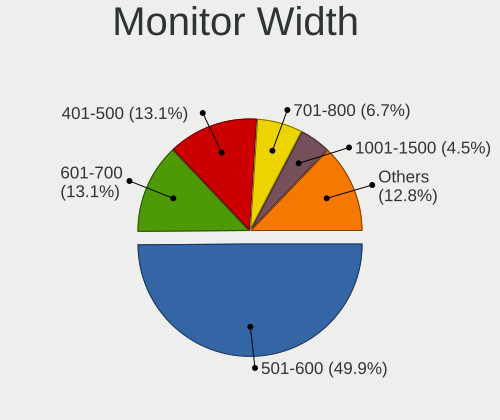

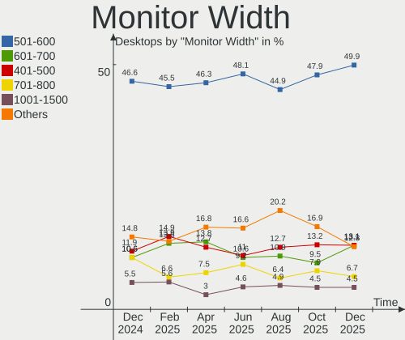

| Width in mm    | Desktops | Percent |
|----------------|----------|---------|
| 501-600        | 210      | 49.88%  |
| 601-700        | 55       | 13.06%  |
| 401-500        | 55       | 13.06%  |
| 701-800        | 28       | 6.65%   |
| 1001-1500      | 19       | 4.51%   |
| 351-400        | 12       | 2.85%   |
| 1501-2000      | 12       | 2.85%   |
| Unknown        | 12       | 2.85%   |
| 801-900        | 7        | 1.66%   |
| 301-350        | 5        | 1.19%   |
| 901-1000       | 3        | 0.71%   |
| More than 2000 | 2        | 0.48%   |
| 201-300        | 1        | 0.24%   |

Aspect Ratio
------------

Proportional relationship between the width and the height

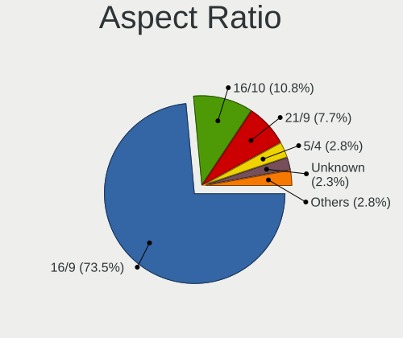

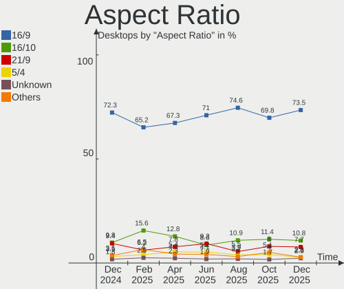

| Ratio   | Desktops | Percent |
|---------|----------|---------|
| 16/9    | 286      | 73.52%  |
| 16/10   | 42       | 10.8%   |
| 21/9    | 30       | 7.71%   |
| 5/4     | 11       | 2.83%   |
| Unknown | 9        | 2.31%   |
| 32/9    | 6        | 1.54%   |
| 4/3     | 3        | 0.77%   |
| 3/2     | 1        | 0.26%   |
| 1.00    | 1        | 0.26%   |

Monitor Area
------------

Area in inch²

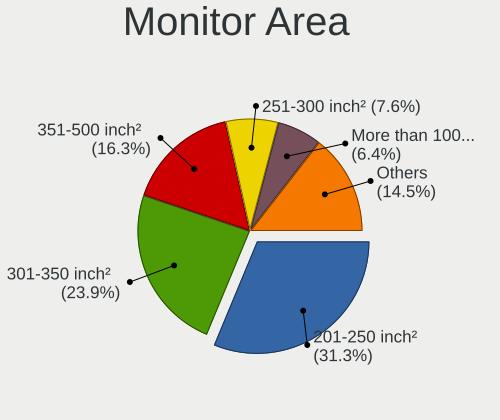

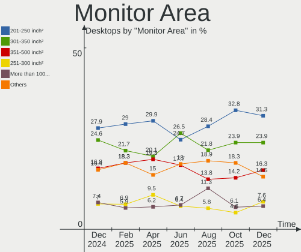

| Area in inch² | Desktops | Percent |
|----------------|----------|---------|
| 201-250        | 136      | 31.26%  |
| 301-350        | 104      | 23.91%  |
| 351-500        | 71       | 16.32%  |
| 251-300        | 33       | 7.59%   |
| More than 1000 | 28       | 6.44%   |
| 151-200        | 27       | 6.21%   |
| 501-1000       | 14       | 3.22%   |
| Unknown        | 12       | 2.76%   |
| 141-150        | 5        | 1.15%   |
| 101-110        | 2        | 0.46%   |
| 71-80          | 1        | 0.23%   |
| 121-130        | 1        | 0.23%   |
| 111-120        | 1        | 0.23%   |

Pixel Density
-------------

Pixels per inch

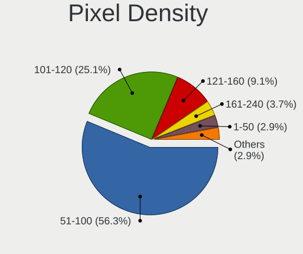

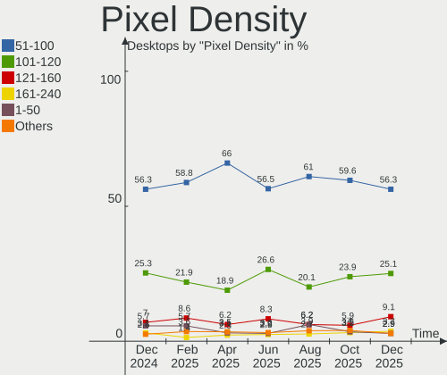

| Density | Desktops | Percent |
|---------|----------|---------|
| 51-100  | 229      | 56.27%  |
| 101-120 | 102      | 25.06%  |
| 121-160 | 37       | 9.09%   |
| 161-240 | 15       | 3.69%   |
| 1-50    | 12       | 2.95%   |
| Unknown | 12       | 2.95%   |

Multiple Monitors
-----------------

Total monitors connected

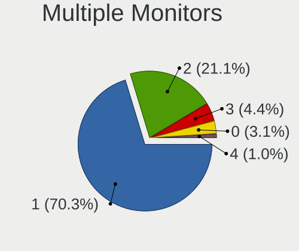

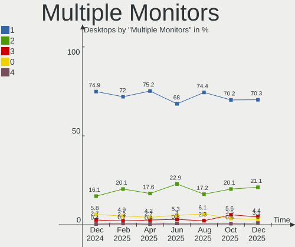

| Total | Desktops | Percent |
|-------|----------|---------|
| 1     | 270      | 70.31%  |
| 2     | 81       | 21.09%  |
| 3     | 17       | 4.43%   |
| 0     | 12       | 3.13%   |
| 4     | 4        | 1.04%   |

Network
-------

Net Controller Vendor
---------------------

Controller vendors

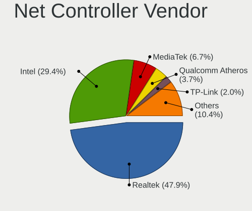

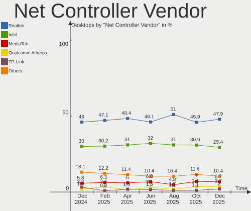

| Vendor                          | Desktops | Percent |
|---------------------------------|----------|---------|
| Realtek Semiconductor           | 259      | 47.87%  |
| Intel                           | 159      | 29.39%  |
| MediaTek                        | 36       | 6.65%   |
| Qualcomm Atheros                | 20       | 3.7%    |
| TP-Link                         | 11       | 2.03%   |
| Broadcom                        | 10       | 1.85%   |
| Ralink Technology               | 5        | 0.92%   |
| Qualcomm Technologies           | 5        | 0.92%   |
| Aquantia                        | 5        | 0.92%   |
| ASIX Electronics                | 4        | 0.74%   |
| Xiaomi                          | 3        | 0.55%   |
| Microsoft                       | 3        | 0.55%   |
| IMC Networks                    | 3        | 0.55%   |
| Ralink                          | 2        | 0.37%   |
| Nvidia                          | 2        | 0.37%   |
| D-Link                          | 2        | 0.37%   |
| AVM                             | 2        | 0.37%   |
| ZyXEL Communications            | 1        | 0.18%   |
| Sigma Designs                   | 1        | 0.18%   |
| Qualcomm Atheros Communications | 1        | 0.18%   |
| NetGear                         | 1        | 0.18%   |
| Netchip Technology              | 1        | 0.18%   |
| MicroPython                     | 1        | 0.18%   |
| Marvell Technology Group        | 1        | 0.18%   |
| ASUSTek Computer                | 1        | 0.18%   |
| Arduino SA                      | 1        | 0.18%   |
| 3Com                            | 1        | 0.18%   |

Net Controller Model
--------------------

Controller models

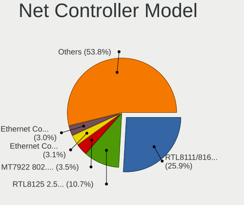

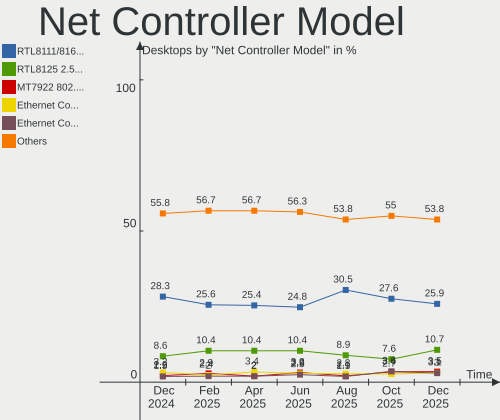

| Model                                                                           | Desktops | Percent |
|---------------------------------------------------------------------------------|----------|---------|
| Realtek RTL8111/8168/8211/8411 PCI Express Gigabit Ethernet Controller          | 165      | 25.9%   |
| Realtek RTL8125 2.5GbE Controller                                               | 68       | 10.68%  |
| MediaTek MT7922 802.11ax PCI Express Wireless Network Adapter                   | 22       | 3.45%   |
| Intel Ethernet Controller I225-V                                                | 20       | 3.14%   |
| Intel Ethernet Connection (2) I219-V                                            | 19       | 2.98%   |
| Intel I211 Gigabit Network Connection                                           | 17       | 2.67%   |
| Intel Ethernet Controller I226-V                                                | 16       | 2.51%   |
| Intel Wi-Fi 6 AX200                                                             | 14       | 2.2%    |
| Realtek 802.11ac NIC                                                            | 11       | 1.73%   |
| Intel Wi-Fi 6E(802.11ax) AX210/AX1675* 2x2 [Typhoon Peak]                       | 11       | 1.73%   |
| Intel Ethernet Connection I217-LM                                               | 9        | 1.41%   |
| Realtek RTL88x2bu [AC1200 Techkey]                                              | 8        | 1.26%   |
| Realtek RTL8126 5GbE Controller                                                 | 8        | 1.26%   |
| Intel Ethernet Connection I217-V                                                | 8        | 1.26%   |
| Intel Alder Lake-S PCH CNVi WiFi                                                | 7        | 1.1%    |
| Intel 82579LM Gigabit Network Connection (Lewisville)                           | 7        | 1.1%    |
| Realtek RTL8821CE 802.11ac PCIe Wireless Network Adapter                        | 6        | 0.94%   |
| Intel Ethernet Connection (2) I219-LM                                           | 6        | 0.94%   |
| Intel 82574L Gigabit Network Connection                                         | 6        | 0.94%   |
| Intel 700 Series Chipset CNVi WiFi                                              | 6        | 0.94%   |
| Realtek RTL8852BE PCIe 802.11ax Wireless Network Controller                     | 5        | 0.78%   |
| Realtek RTL8153 Gigabit Ethernet Adapter                                        | 5        | 0.78%   |
| Qualcomm WCN785x Wi-Fi 7(802.11be) 320MHz 2x2 [FastConnect 7800]                | 5        | 0.78%   |
| Intel Ethernet Connection (5) I219-LM                                           | 5        | 0.78%   |
| Intel Dual Band Wireless-AC 3168NGW [Stone Peak]                                | 5        | 0.78%   |
| TP-Link 802.11ac NIC                                                            | 4        | 0.63%   |
| Realtek RTL8922AE 802.11be PCIe Wireless Network Adapter                        | 4        | 0.63%   |
| Realtek RTL8169 PCI Gigabit Ethernet Controller                                 | 4        | 0.63%   |
| MediaTek MT7925 802.11be 160MHz 2x2 PCIe Wireless Network Adapter [Filogic 360] | 4        | 0.63%   |
| MediaTek MT7921K (RZ608) Wi-Fi 6E 80MHz                                         | 4        | 0.63%   |
| Intel Wireless 3165                                                             | 4        | 0.63%   |
| ASIX AX88179 Gigabit Ethernet                                                   | 4        | 0.63%   |
| Realtek RTL8192CU 802.11n WLAN Adapter                                          | 3        | 0.47%   |
| Realtek RTL8188ETV Wireless LAN 802.11n Network Adapter                         | 3        | 0.47%   |
| Ralink RT5370 Wireless Adapter                                                  | 3        | 0.47%   |
| Qualcomm Atheros Killer E2500 Gigabit Ethernet Controller                       | 3        | 0.47%   |
| Qualcomm Atheros AR9287 Wireless Network Adapter (PCI-Express)                  | 3        | 0.47%   |
| Qualcomm Atheros AR8161 Gigabit Ethernet                                        | 3        | 0.47%   |
| MediaTek MT7927 802.11be 320MHz 2x2 PCIe Wireless Network Adapter [Filogic 380] | 3        | 0.47%   |
| Intel Wi-Fi 5(802.11ac) Wireless-AC 9x6x [Thunder Peak]                         | 3        | 0.47%   |

Wireless Vendor
---------------

Wireless vendors

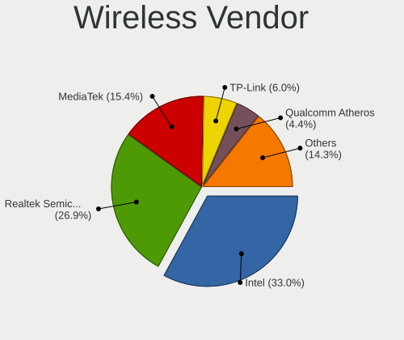

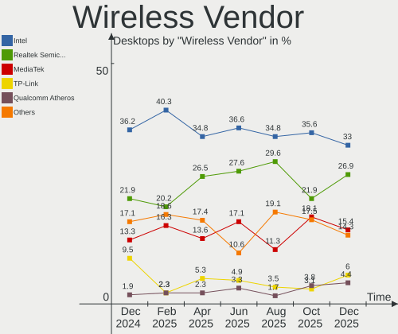

| Vendor                          | Desktops | Percent |
|---------------------------------|----------|---------|
| Intel                           | 60       | 32.97%  |
| Realtek Semiconductor           | 49       | 26.92%  |
| MediaTek                        | 28       | 15.38%  |
| TP-Link                         | 11       | 6.04%   |
| Qualcomm Atheros                | 8        | 4.4%    |
| Ralink Technology               | 5        | 2.75%   |
| Broadcom                        | 4        | 2.2%    |
| Microsoft                       | 3        | 1.65%   |
| IMC Networks                    | 3        | 1.65%   |
| Ralink                          | 2        | 1.1%    |
| D-Link                          | 2        | 1.1%    |
| AVM                             | 2        | 1.1%    |
| ZyXEL Communications            | 1        | 0.55%   |
| Qualcomm Technologies           | 1        | 0.55%   |
| Qualcomm Atheros Communications | 1        | 0.55%   |
| NetGear                         | 1        | 0.55%   |
| ASUSTek Computer                | 1        | 0.55%   |

Wireless Model
--------------

Wireless models

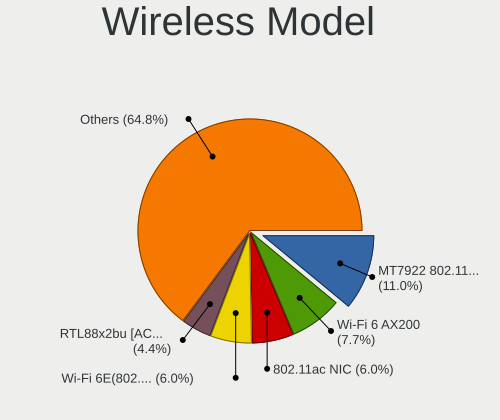

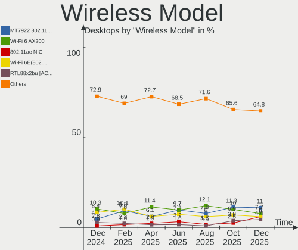

| Model                                                                           | Desktops | Percent |
|---------------------------------------------------------------------------------|----------|---------|
| MediaTek MT7922 802.11ax PCI Express Wireless Network Adapter                   | 20       | 10.99%  |
| Intel Wi-Fi 6 AX200                                                             | 14       | 7.69%   |
| Realtek 802.11ac NIC                                                            | 11       | 6.04%   |
| Intel Wi-Fi 6E(802.11ax) AX210/AX1675* 2x2 [Typhoon Peak]                       | 11       | 6.04%   |
| Realtek RTL88x2bu [AC1200 Techkey]                                              | 8        | 4.4%    |
| Realtek RTL8821CE 802.11ac PCIe Wireless Network Adapter                        | 6        | 3.3%    |
| Intel Alder Lake-S PCH CNVi WiFi                                                | 6        | 3.3%    |
| Intel 700 Series Chipset CNVi WiFi                                              | 6        | 3.3%    |
| Intel Dual Band Wireless-AC 3168NGW [Stone Peak]                                | 5        | 2.75%   |
| TP-Link 802.11ac NIC                                                            | 4        | 2.2%    |
| MediaTek MT7921K (RZ608) Wi-Fi 6E 80MHz                                         | 4        | 2.2%    |
| Intel Wireless 3165                                                             | 4        | 2.2%    |
| Realtek RTL8192CU 802.11n WLAN Adapter                                          | 3        | 1.65%   |
| Realtek RTL8188ETV Wireless LAN 802.11n Network Adapter                         | 3        | 1.65%   |
| Ralink RT5370 Wireless Adapter                                                  | 3        | 1.65%   |
| Qualcomm Atheros AR9287 Wireless Network Adapter (PCI-Express)                  | 3        | 1.65%   |
| Intel Wi-Fi 5(802.11ac) Wireless-AC 9x6x [Thunder Peak]                         | 3        | 1.65%   |
| Intel Cannon Lake PCH CNVi WiFi                                                 | 3        | 1.65%   |
| Broadcom BCM4360 802.11ac Dual Band Wireless Network Adapter                    | 3        | 1.65%   |
| TP-Link TL-WN823N v2/v3 [Realtek RTL8192EU]                                     | 2        | 1.1%    |
| TP-Link TL-WN821N v5/v6 [RTL8192EU]                                             | 2        | 1.1%    |
| Realtek RTL8852CE PCIe 802.11ax Wireless Network Controller                     | 2        | 1.1%    |
| Realtek RTL8822CE 802.11ac PCIe Wireless Network Adapter                        | 2        | 1.1%    |
| Realtek RTL8188EUS 802.11n Wireless Network Adapter                             | 2        | 1.1%    |
| Realtek RTL8188CUS 802.11n WLAN Adapter                                         | 2        | 1.1%    |
| Realtek 802.11ac WLAN Adapter                                                   | 2        | 1.1%    |
| MediaTek MT7927 802.11be 320MHz 2x2 PCIe Wireless Network Adapter [Filogic 380] | 2        | 1.1%    |
| Intel Wireless 8265 / 8275                                                      | 2        | 1.1%    |
| Intel Wireless 7265                                                             | 2        | 1.1%    |
| Intel Alder Lake-N PCH CNVi WiFi                                                | 2        | 1.1%    |
| IMC Networks Mediao 802.11n WLAN [Realtek RTL8191SU]                            | 2        | 1.1%    |
| D-Link 802.11ax WLAN Adapter                                                    | 2        | 1.1%    |
| ZyXEL ZyXEL Dual-Band Wireless AC USB Adapter                                   | 1        | 0.55%   |
| TP-Link TL-WN822N Version 4 RTL8192EU                                           | 1        | 0.55%   |
| TP-Link Archer T3U [Realtek RTL8812BU]                                          | 1        | 0.55%   |
| TP-Link 802.11ac WLAN Adapter                                                   | 1        | 0.55%   |
| Realtek RTL8852BE PCIe 802.11ax Wireless Network Controller                     | 1        | 0.55%   |
| Realtek RTL8821AE 802.11ac PCIe Wireless Network Adapter                        | 1        | 0.55%   |
| Realtek RTL8192CE PCIe Wireless Network Adapter                                 | 1        | 0.55%   |
| Realtek RTL8191SEvA Wireless LAN Controller                                     | 1        | 0.55%   |

Ethernet Vendor
---------------

Ethernet vendors

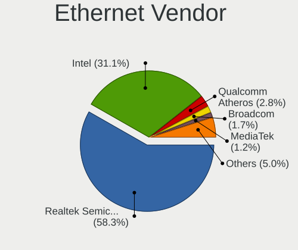

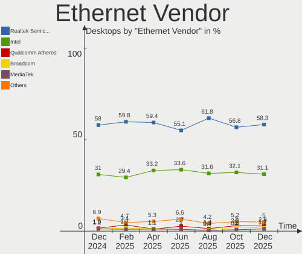

| Vendor                   | Desktops | Percent |
|--------------------------|----------|---------|
| Realtek Semiconductor    | 247      | 58.25%  |
| Intel                    | 132      | 31.13%  |
| Qualcomm Atheros         | 12       | 2.83%   |
| Broadcom                 | 7        | 1.65%   |
| MediaTek                 | 5        | 1.18%   |
| Aquantia                 | 5        | 1.18%   |
| Qualcomm Technologies    | 4        | 0.94%   |
| ASIX Electronics         | 4        | 0.94%   |
| Xiaomi                   | 3        | 0.71%   |
| Nvidia                   | 2        | 0.47%   |
| Netchip Technology       | 1        | 0.24%   |
| Marvell Technology Group | 1        | 0.24%   |
| 3Com                     | 1        | 0.24%   |

Ethernet Model
--------------

Ethernet models

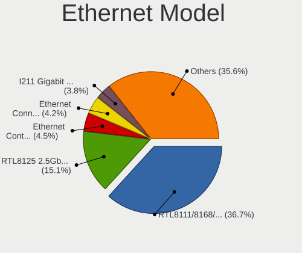

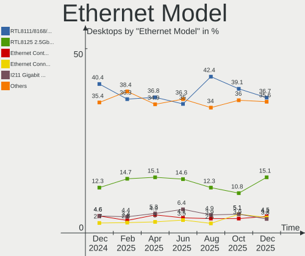

| Model                                                                           | Desktops | Percent |
|---------------------------------------------------------------------------------|----------|---------|
| Realtek RTL8111/8168/8211/8411 PCI Express Gigabit Ethernet Controller          | 165      | 36.75%  |
| Realtek RTL8125 2.5GbE Controller                                               | 68       | 15.14%  |
| Intel Ethernet Controller I225-V                                                | 20       | 4.45%   |
| Intel Ethernet Connection (2) I219-V                                            | 19       | 4.23%   |
| Intel I211 Gigabit Network Connection                                           | 17       | 3.79%   |
| Intel Ethernet Controller I226-V                                                | 16       | 3.56%   |
| Intel Ethernet Connection I217-LM                                               | 9        | 2%      |
| Realtek RTL8126 5GbE Controller                                                 | 8        | 1.78%   |
| Intel Ethernet Connection I217-V                                                | 8        | 1.78%   |
| Intel 82579LM Gigabit Network Connection (Lewisville)                           | 7        | 1.56%   |
| Intel Ethernet Connection (2) I219-LM                                           | 6        | 1.34%   |
| Intel 82574L Gigabit Network Connection                                         | 6        | 1.34%   |
| Realtek RTL8153 Gigabit Ethernet Adapter                                        | 5        | 1.11%   |
| Intel Ethernet Connection (5) I219-LM                                           | 5        | 1.11%   |
| Realtek RTL8922AE 802.11be PCIe Wireless Network Adapter                        | 4        | 0.89%   |
| Realtek RTL8852BE PCIe 802.11ax Wireless Network Controller                     | 4        | 0.89%   |
| Realtek RTL8169 PCI Gigabit Ethernet Controller                                 | 4        | 0.89%   |
| Qualcomm WCN785x Wi-Fi 7(802.11be) 320MHz 2x2 [FastConnect 7800]                | 4        | 0.89%   |
| ASIX AX88179 Gigabit Ethernet                                                   | 4        | 0.89%   |
| Qualcomm Atheros Killer E2500 Gigabit Ethernet Controller                       | 3        | 0.67%   |
| Qualcomm Atheros AR8161 Gigabit Ethernet                                        | 3        | 0.67%   |
| MediaTek MT7925 802.11be 160MHz 2x2 PCIe Wireless Network Adapter [Filogic 360] | 3        | 0.67%   |
| Intel 82599ES 10-Gigabit SFI/SFP+ Network Connection                            | 3        | 0.67%   |
| Intel 82579V Gigabit Network Connection                                         | 3        | 0.67%   |
| Intel 82571EB/82571GB Gigabit Ethernet Controller D0/D1 (copper applications)   | 3        | 0.67%   |
| Xiaomi Mi/Redmi series (RNDIS + ADB)                                            | 2        | 0.45%   |
| Qualcomm Atheros AR8151 v2.0 Gigabit Ethernet                                   | 2        | 0.45%   |
| MediaTek MT7922 802.11ax PCI Express Wireless Network Adapter                   | 2        | 0.45%   |
| Intel Ethernet Controller I219-V                                                | 2        | 0.45%   |
| Intel Ethernet Connection (7) I219-V                                            | 2        | 0.45%   |
| Intel Ethernet Connection (14) I219-V                                           | 2        | 0.45%   |
| Intel Ethernet Connection (12) I219-V                                           | 2        | 0.45%   |
| Intel 82566DM-2 Gigabit Network Connection                                      | 2        | 0.45%   |
| Broadcom NetXtreme BCM5762 Gigabit Ethernet PCIe                                | 2        | 0.45%   |
| Aquantia AQtion AQC113CS NBase-T/IEEE 802.3an Ethernet Controller [Antigua 10G] | 2        | 0.45%   |
| Aquantia AQtion AQC113 NBase-T/IEEE 802.3an Ethernet Controller [Antigua 10G]   | 2        | 0.45%   |
| Xiaomi Mi/Redmi series (RNDIS)                                                  | 1        | 0.22%   |
| Realtek USB 10/100/1G/2.5 LAN                                                   | 1        | 0.22%   |
| Realtek Killer E3000 2.5GbE Controller                                          | 1        | 0.22%   |
| Realtek Killer E2600 GbE Controller                                             | 1        | 0.22%   |

Net Controller Kind
-------------------

Ethernet, WiFi or modem

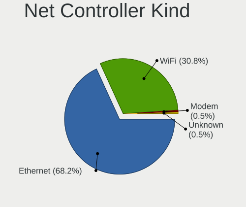

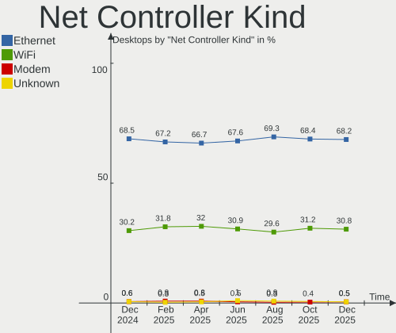

| Kind     | Desktops | Percent |
|----------|----------|---------|
| Ethernet | 381      | 68.16%  |
| WiFi     | 172      | 30.77%  |
| Modem    | 3        | 0.54%   |
| Unknown  | 3        | 0.54%   |

Used Controller
---------------

Currently used network controller

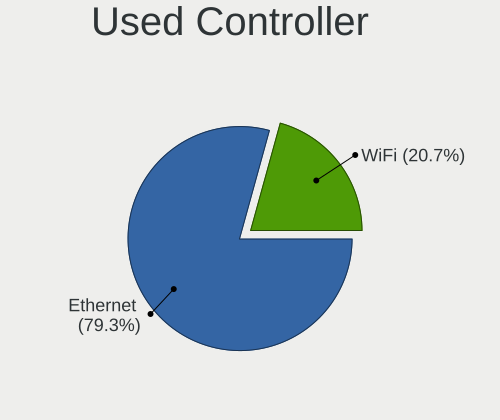

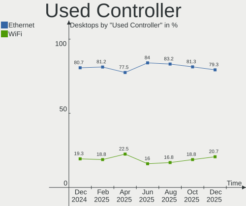

| Kind     | Desktops | Percent |
|----------|----------|---------|
| Ethernet | 310      | 79.28%  |
| WiFi     | 81       | 20.72%  |

NICs
----

Total network controllers on board

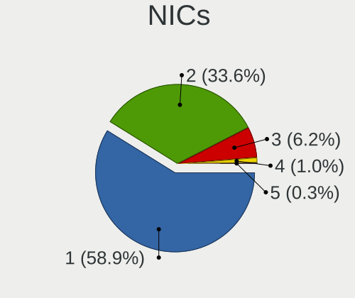

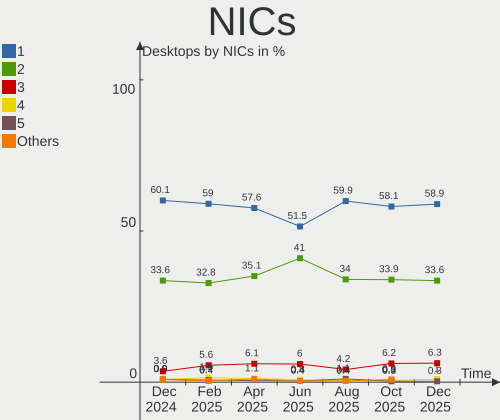

| Total | Desktops | Percent |
|-------|----------|---------|
| 1     | 226      | 58.85%  |
| 2     | 129      | 33.59%  |
| 3     | 24       | 6.25%   |
| 4     | 4        | 1.04%   |
| 5     | 1        | 0.26%   |

IPv6
----

IPv6 vs IPv4

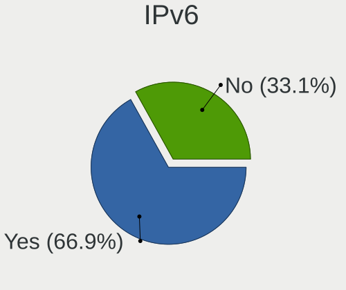

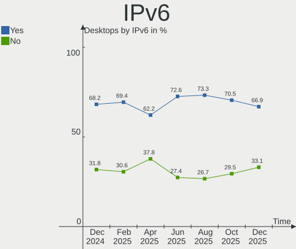

| Used | Desktops | Percent |
|------|----------|---------|
| Yes  | 257      | 66.93%  |
| No   | 127      | 33.07%  |

Bluetooth
---------

Bluetooth Vendor
----------------

Controller vendors

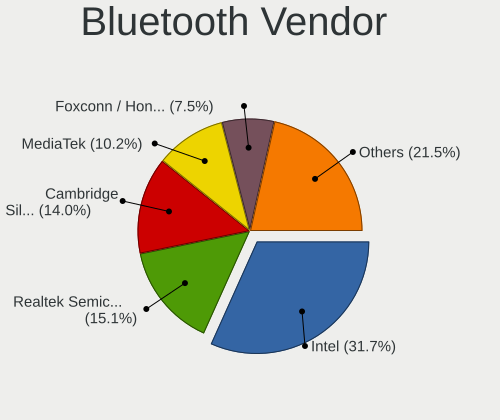

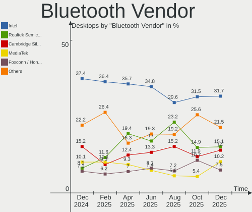

| Vendor                          | Desktops | Percent |
|---------------------------------|----------|---------|
| Intel                           | 59       | 31.72%  |
| Realtek Semiconductor           | 28       | 15.05%  |
| Cambridge Silicon Radio         | 26       | 13.98%  |
| MediaTek                        | 19       | 10.22%  |
| Foxconn / Hon Hai               | 14       | 7.53%   |
| IMC Networks                    | 9        | 4.84%   |
| TP-Link                         | 7        | 3.76%   |
| ASUSTek Computer                | 7        | 3.76%   |
| Unknown                         | 5        | 2.69%   |
| Broadcom                        | 3        | 1.61%   |
| Apple                           | 3        | 1.61%   |
| Lite-On Technology              | 2        | 1.08%   |
| Actions                         | 2        | 1.08%   |
| Qualcomm Atheros Communications | 1        | 0.54%   |
| Edimax Technology               | 1        | 0.54%   |

Bluetooth Model
---------------

Controller models

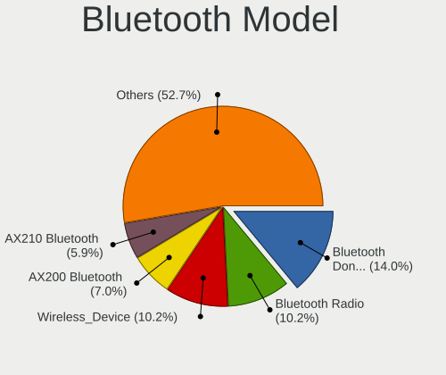

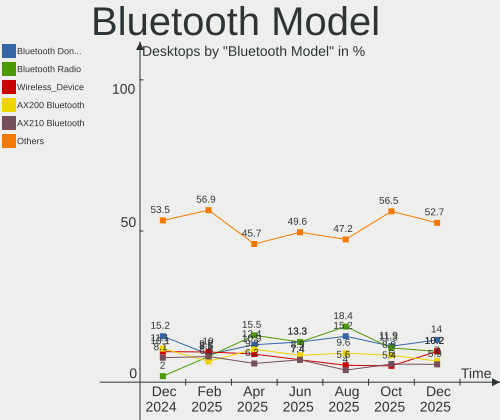

| Model                                                 | Desktops | Percent |
|-------------------------------------------------------|----------|---------|
| Cambridge Silicon Radio Bluetooth Dongle (HCI mode)   | 26       | 13.98%  |
| Realtek Bluetooth Radio                               | 19       | 10.22%  |
| MediaTek Wireless_Device                              | 19       | 10.22%  |
| Intel AX200 Bluetooth                                 | 13       | 6.99%   |
| Intel AX210 Bluetooth                                 | 11       | 5.91%   |
| Intel Bluetooth wireless interface                    | 9        | 4.84%   |
| Foxconn / Hon Hai Wireless_Device                     | 9        | 4.84%   |
| Intel AX201 Bluetooth                                 | 8        | 4.3%    |
| TP-Link TP-T@- UB500 Adapter                          | 7        | 3.76%   |
| IMC Networks Wireless_Device                          | 7        | 3.76%   |
| Intel Bluetooth Device                                | 6        | 3.23%   |
| Realtek Bluetooth 5.3 Radio                           | 5        | 2.69%   |
| Intel Wireless-AC 3168 Bluetooth                      | 5        | 2.69%   |
| Foxconn / Hon Hai Bluetooth Device                    | 5        | 2.69%   |
| Unknown                                               | 5        | 2.69%   |
| Intel Bluetooth 9460/9560 Jefferson Peak (JfP)        | 4        | 2.15%   |
| Realtek Bluetooth 5.4 Radio                           | 2        | 1.08%   |
| Intel Wireless-AC 9260 Bluetooth Adapter              | 2        | 1.08%   |
| IMC Networks Bluetooth Radio                          | 2        | 1.08%   |
| Broadcom BCM20702A0 Bluetooth 4.0                     | 2        | 1.08%   |
| ASUS ASUS USB-BT500                                   | 2        | 1.08%   |
| Apple Bluetooth Host Controller                       | 2        | 1.08%   |
| Actions general adapter                               | 2        | 1.08%   |
| Realtek  Bluetooth 4.2 Adapter                        | 1        | 0.54%   |
| Realtek 802.11ac WLAN Adapter                         | 1        | 0.54%   |
| Qualcomm Atheros QCA61x4 Bluetooth 4.0                | 1        | 0.54%   |
| Lite-On Qualcomm Atheros QCA9377 Bluetooth            | 1        | 0.54%   |
| Lite-On Atheros AR3012 Bluetooth                      | 1        | 0.54%   |
| Intel Centrino Bluetooth Wireless Transceiver         | 1        | 0.54%   |
| Edimax Bluetooth Device                               | 1        | 0.54%   |
| Broadcom BCM2035B3 Bluetooth Adapter                  | 1        | 0.54%   |
| ASUS Broadcom BCM20702A0 Bluetooth                    | 1        | 0.54%   |
| ASUS Broadcom BCM20702 Single-Chip Bluetooth 4.0 + LE | 1        | 0.54%   |
| ASUS Bluetooth Radio                                  | 1        | 0.54%   |
| ASUS Bluetooth Controller                             | 1        | 0.54%   |
| ASUS BCM20702A0                                       | 1        | 0.54%   |
| Apple Built-in Bluetooth 2.0+EDR HCI                  | 1        | 0.54%   |

Sound
-----

Sound Vendor
------------

Sound card vendors

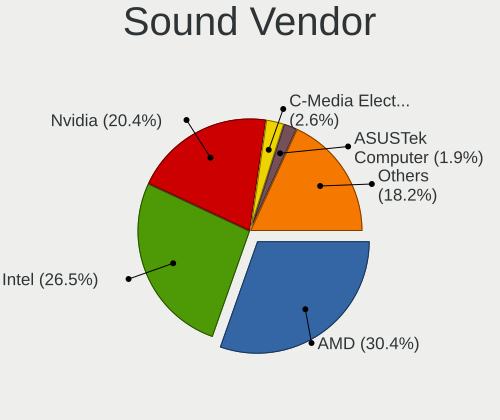

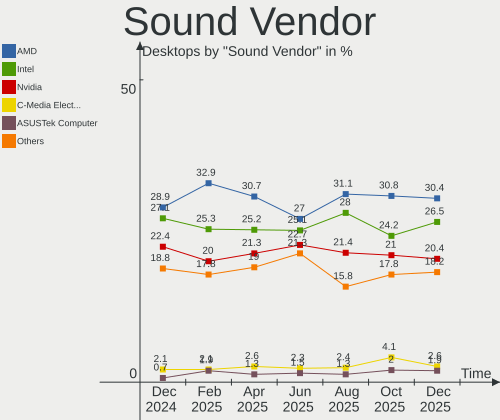

| Vendor                                       | Desktops | Percent |
|----------------------------------------------|----------|---------|
| AMD                                          | 221      | 30.4%   |
| Intel                                        | 193      | 26.55%  |
| Nvidia                                       | 148      | 20.36%  |
| C-Media Electronics                          | 19       | 2.61%   |
| ASUSTek Computer                             | 14       | 1.93%   |
| Micro Star International                     | 11       | 1.51%   |
| Logitech                                     | 11       | 1.51%   |
| Creative Labs                                | 11       | 1.51%   |
| Razer USA                                    | 8        | 1.1%    |
| Yamaha                                       | 7        | 0.96%   |
| Texas Instruments                            | 7        | 0.96%   |
| Zoran Co. Personal Media Division (Nogatech) | 5        | 0.69%   |
| SteelSeries ApS                              | 5        | 0.69%   |
| Creative Technology                          | 5        | 0.69%   |
| Hewlett-Packard                              | 4        | 0.55%   |
| Focusrite-Novation                           | 4        | 0.55%   |
| Sony                                         | 3        | 0.41%   |
| Samson Technologies                          | 3        | 0.41%   |
| RODE Microphones                             | 3        | 0.41%   |
| Kingston Technology                          | 3        | 0.41%   |
| Valve Software                               | 2        | 0.28%   |
| Thesycon Systemsoftware & Consulting         | 2        | 0.28%   |
| Plantronics                                  | 2        | 0.28%   |
| NZXT                                         | 2        | 0.28%   |
| JMTek                                        | 2        | 0.28%   |
| Jieli Technology                             | 2        | 0.28%   |
| GYROCOM C&C                                  | 2        | 0.28%   |
| GN Netcom                                    | 2        | 0.28%   |
| Dell                                         | 2        | 0.28%   |
| XMOS                                         | 1        | 0.14%   |
| USB MICROPHONE                               | 1        | 0.14%   |
| Trust                                        | 1        | 0.14%   |
| TerraTec Electronic                          | 1        | 0.14%   |
| Tenx Technology                              | 1        | 0.14%   |
| Tdlasunnic                                   | 1        | 0.14%   |
| Shure                                        | 1        | 0.14%   |
| Schiit Audio                                 | 1        | 0.14%   |
| Samsung Electronics                          | 1        | 0.14%   |
| Roland                                       | 1        | 0.14%   |
| ROCCAT                                       | 1        | 0.14%   |

Sound Model
-----------

Sound card models

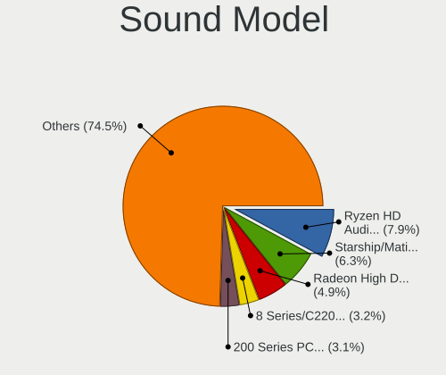

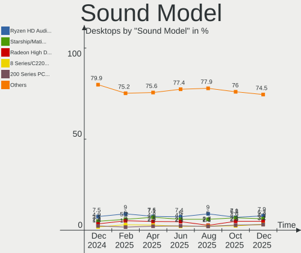

| Model                                                                                           | Desktops | Percent |
|-------------------------------------------------------------------------------------------------|----------|---------|
| AMD Ryzen HD Audio Controller                                                                   | 71       | 7.9%    |
| AMD Starship/Matisse HD Audio Controller                                                        | 57       | 6.34%   |
| AMD Radeon High Definition Audio Controller                                                     | 44       | 4.89%   |
| Intel 8 Series/C220 Series Chipset High Definition Audio Controller                             | 29       | 3.23%   |
| Intel 200 Series PCH HD Audio                                                                   | 28       | 3.11%   |
| AMD Navi 31 HDMI/DP Audio                                                                       | 28       | 3.11%   |
| AMD Navi 48 HDMI/DP Audio Controller                                                            | 24       | 2.67%   |
| Intel 100 Series/C230 Series Chipset Family HD Audio Controller                                 | 19       | 2.11%   |
| Intel Xeon E3-1200 v3/4th Gen Core Processor HD Audio Controller                                | 18       | 2%      |
| AMD Navi 21/23 HDMI/DP Audio Controller                                                         | 18       | 2%      |
| AMD SBx00 Azalia (Intel HDA)                                                                    | 16       | 1.78%   |
| AMD Renoir/Cezanne HDMI/DP Audio Controller                                                     | 15       | 1.67%   |
| Intel Raptor Lake High Definition Audio Controller                                              | 14       | 1.56%   |
| AMD Ellesmere HDMI Audio [Radeon RX 470/480 / 570/580/590]                                      | 14       | 1.56%   |
| Intel Alder Lake-S HD Audio Controller                                                          | 12       | 1.33%   |
| Intel 7 Series/C216 Chipset Family High Definition Audio Controller                             | 12       | 1.33%   |
| AMD FCH Azalia Controller                                                                       | 12       | 1.33%   |
| Micro Star International USB Audio                                                              | 11       | 1.22%   |
| Intel Cannon Lake PCH cAVS                                                                      | 11       | 1.22%   |
| ASUSTek Computer USB Audio                                                                      | 11       | 1.22%   |
| Nvidia GA106 High Definition Audio Controller                                                   | 10       | 1.11%   |
| Nvidia AD104 High Definition Audio Controller                                                   | 10       | 1.11%   |
| Intel 6 Series/C200 Series Chipset Family High Definition Audio Controller                      | 9        | 1%      |
| AMD Raven/Raven2/Fenghuang HDMI/DP Audio Controller                                             | 9        | 1%      |
| AMD Oland/Hainan/Cape Verde/Pitcairn HDMI Audio [Radeon HD 7000 Series]                         | 9        | 1%      |
| Nvidia GA102 High Definition Audio Controller                                                   | 8        | 0.89%   |
| Intel Alder Lake-N PCH High Definition Audio Controller                                         | 8        | 0.89%   |
| Nvidia GP104 High Definition Audio Controller                                                   | 7        | 0.78%   |
| Texas Instruments PCM2902 Audio Codec                                                           | 6        | 0.67%   |
| Nvidia TU104 HD Audio Controller                                                                | 6        | 0.67%   |
| Nvidia GP108 High Definition Audio Controller                                                   | 6        | 0.67%   |
| Nvidia GP106 High Definition Audio Controller                                                   | 6        | 0.67%   |
| Nvidia GM204 High Definition Audio Controller                                                   | 6        | 0.67%   |
| Nvidia GM107 High Definition Audio Controller [GeForce 940MX]                                   | 6        | 0.67%   |
| Nvidia GK208 HDMI/DP Audio Controller                                                           | 6        | 0.67%   |
| Intel C610/X99 series chipset HD Audio Controller                                               | 6        | 0.67%   |
| Creative Labs CA0132 Sound Core3D [Sound Blaster Recon3D / Z-Series / Sound BlasterX AE-5 Plus] | 6        | 0.67%   |
| C-Media Electronics Audio Adapter (Unitek Y-247A)                                               | 6        | 0.67%   |
| AMD Family 17h (Models 00h-0fh) HD Audio Controller                                             | 6        | 0.67%   |
| AMD Caicos HDMI Audio [Radeon HD 6450 / 7450/8450/8490 OEM / R5 230/235/235X OEM]               | 6        | 0.67%   |

Memory
------

Memory Vendor
-------------

Memory module vendors

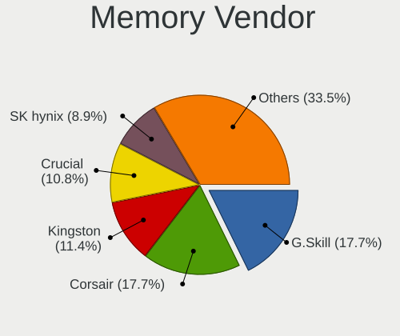

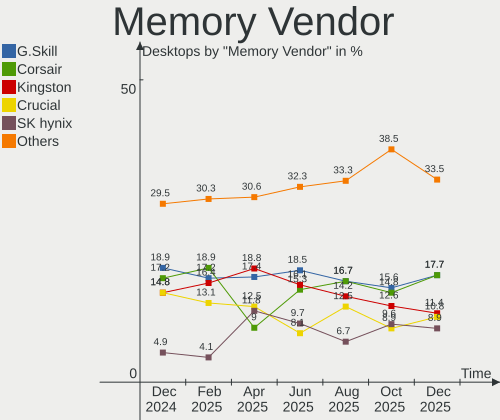

| Vendor                       | Desktops | Percent |
|------------------------------|----------|---------|
| G.Skill                      | 28       | 17.72%  |
| Corsair                      | 28       | 17.72%  |
| Kingston                     | 18       | 11.39%  |
| Crucial                      | 17       | 10.76%  |
| SK hynix                     | 14       | 8.86%   |
| Samsung Electronics          | 12       | 7.59%   |
| Unknown                      | 11       | 6.96%   |
| Micron Technology            | 9        | 5.7%    |
| TeamGroup                    | 3        | 1.9%    |
| Unknown                      | 3        | 1.9%    |
| Patriot Memory (PDP Systems) | 2        | 1.27%   |
| Patriot                      | 2        | 1.27%   |
| Nanya Technology             | 2        | 1.27%   |
| Wodposit                     | 1        | 0.63%   |
| Unknown (ABCD)               | 1        | 0.63%   |
| Unknown (0x0BF7)             | 1        | 0.63%   |
| Team                         | 1        | 0.63%   |
| Kllisre                      | 1        | 0.63%   |
| GIGA-BYTE                    | 1        | 0.63%   |
| Exceleram                    | 1        | 0.63%   |
| Avant                        | 1        | 0.63%   |
| Apacer                       | 1        | 0.63%   |

Memory Model
------------

Memory module models

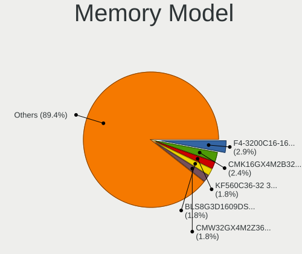

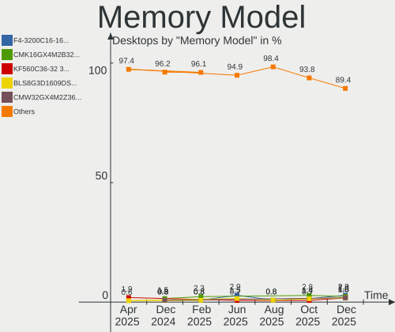

| Model                                                          | Desktops | Percent |
|----------------------------------------------------------------|----------|---------|
| G.Skill RAM F4-3200C16-16GVK 16GB DIMM DDR4 3600MT/s           | 5        | 2.94%   |
| Corsair RAM CMK16GX4M2B3200C16 8GB DIMM DDR4 3600MT/s          | 4        | 2.35%   |
| Kingston RAM KF560C36-32 32GB DIMM DDR5 6200MT/s               | 3        | 1.76%   |
| Crucial RAM BLS8G3D1609DS1S00. 8GB DIMM DDR3 1800MT/s          | 3        | 1.76%   |
| Corsair RAM CMW32GX4M2Z3600C18 16GB DIMM DDR4 3733MT/s         | 3        | 1.76%   |
| Unknown                                                        | 3        | 1.76%   |
| TeamGroup RAM UD5-6000 16GB DIMM DDR5 6000MT/s                 | 2        | 1.18%   |
| SK hynix RAM HMA81GU6DJR8N-XN 8GB DIMM DDR4 3200MT/s           | 2        | 1.18%   |
| Kingston RAM KF3600C16D4/16GX 16GB DIMM DDR4 3800MT/s          | 2        | 1.18%   |
| G.Skill RAM F4-3200C16-8GVKB 8GB DIMM DDR4 4000MT/s            | 2        | 1.18%   |
| G.Skill RAM F4-3200C16-16GIS 16GB DIMM DDR4 3600MT/s           | 2        | 1.18%   |
| Corsair RAM CMW32GX4M2E3200C16 16GB DIMM DDR4 3200MT/s         | 2        | 1.18%   |
| Corsair RAM CMW16GX4M2C3200C16 8GB DIMM DDR4 3733MT/s          | 2        | 1.18%   |
| Corsair RAM CMK32GX4M2Z3600C18 16GB DIMM DDR4 3800MT/s         | 2        | 1.18%   |
| Wodposit RAM WPBH26D408SWA-8G 8GB SODIMM DDR4 2667MT/s         | 1        | 0.59%   |
| Unknown RAM Module 8GB DIMM DDR3 1066MT/s                      | 1        | 0.59%   |
| Unknown RAM Module 8192MB DIMM DDR4 2133MT/s                   | 1        | 0.59%   |
| Unknown RAM Module 4GB DIMM SDRAM                              | 1        | 0.59%   |
| Unknown RAM Module 4GB DIMM DDR3 1333MT/s                      | 1        | 0.59%   |
| Unknown RAM Module 4096MB DIMM DDR4 2133MT/s                   | 1        | 0.59%   |
| Unknown RAM Module 2GB DIMM SDRAM                              | 1        | 0.59%   |
| Unknown RAM Module 2GB DIMM DDR2 800MT/s                       | 1        | 0.59%   |
| Unknown RAM Module 2GB DIMM 800MT/s                            | 1        | 0.59%   |
| Unknown RAM Module 2GB DIMM 1066MT/s                           | 1        | 0.59%   |
| Unknown RAM Module 1GB DIMM SDRAM                              | 1        | 0.59%   |
| Unknown RAM 1866 CL10 Series 8192MB DIMM DDR3 933MT/s          | 1        | 0.59%   |
| Unknown RAM 1600 CL9 Series 8192MB DIMM DDR3 1066MT/s          | 1        | 0.59%   |
| Unknown (ABCD) RAM 123456789012345678 2GB DIMM LPDDR4 2133MT/s | 1        | 0.59%   |
| Unknown (0x0BF7) RAM DDR-C300 8GB SODIMM DDR4 3200MT/s         | 1        | 0.59%   |
| TeamGroup RAM UD5-6400 16GB DIMM DDR5 6400MT/s                 | 1        | 0.59%   |
| Team RAM TEAMGROUP-UD3-1600 8GB DIMM DDR3 1866MT/s             | 1        | 0.59%   |
| SK hynix RAM HMT451U6AFR8C-PB 4GB DIMM DDR3 1600MT/s           | 1        | 0.59%   |
| SK hynix RAM HMT451S6BFR8A-PB 4GB SODIMM DDR3 1600MT/s         | 1        | 0.59%   |
| SK hynix RAM HMT41GU7MFR8C 8GB DIMM DDR3 1600MT/s              | 1        | 0.59%   |
| SK hynix RAM HMT41GU7AFR8A 8GB DIMM DDR3 1600MT/s              | 1        | 0.59%   |
| SK hynix RAM HMT41GU6BFR8A-PB 8GB DIMM DDR3 2000MT/s           | 1        | 0.59%   |
| SK hynix RAM HMT41GS6BFR8C-PB 8GB SODIMM DDR3 1600MT/s         | 1        | 0.59%   |
| SK hynix RAM HMT351U6EFR8C-PB 4GB DIMM DDR3 1600MT/s           | 1        | 0.59%   |
| SK hynix RAM HMT351U6CFR8C-PB 4GB DIMM DDR3 1800MT/s           | 1        | 0.59%   |
| SK hynix RAM HMT351U6CFR8C-PB 4GB DIMM DDR3 1600MT/s           | 1        | 0.59%   |

Memory Kind
-----------

Memory module kinds

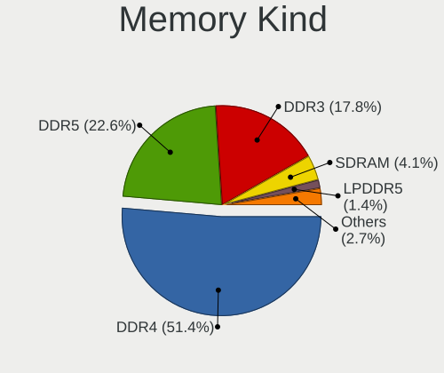

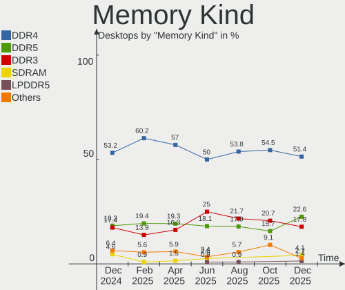

| Kind    | Desktops | Percent |
|---------|----------|---------|
| DDR4    | 75       | 51.37%  |
| DDR5    | 33       | 22.6%   |
| DDR3    | 26       | 17.81%  |
| SDRAM   | 6        | 4.11%   |
| LPDDR5  | 2        | 1.37%   |
| Unknown | 2        | 1.37%   |
| LPDDR4  | 1        | 0.68%   |
| DDR2    | 1        | 0.68%   |

Memory Form Factor
------------------

Physical design of the memory module

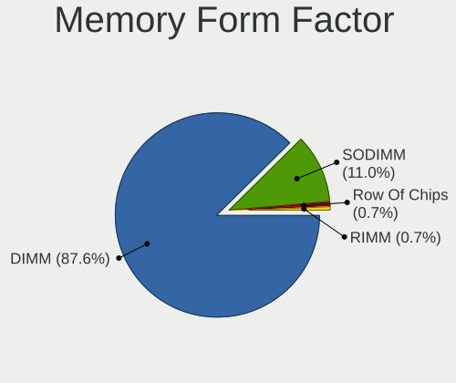

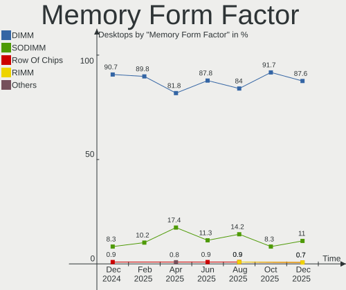

| Name         | Desktops | Percent |
|--------------|----------|---------|
| DIMM         | 127      | 87.59%  |
| SODIMM       | 16       | 11.03%  |
| Row Of Chips | 1        | 0.69%   |
| RIMM         | 1        | 0.69%   |

Memory Size
-----------

Memory module size

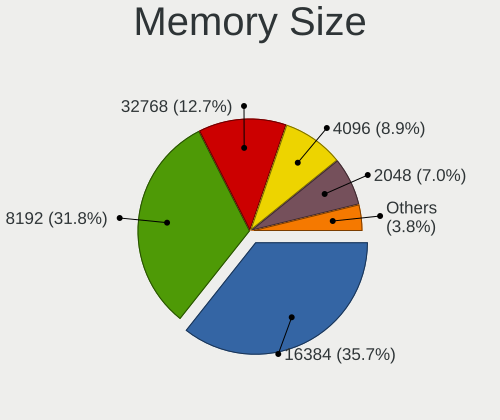

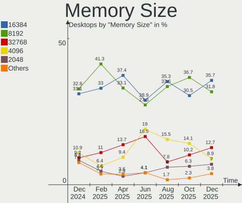

| Size  | Desktops | Percent |
|-------|----------|---------|
| 16384 | 56       | 35.67%  |
| 8192  | 50       | 31.85%  |
| 32768 | 20       | 12.74%  |
| 4096  | 14       | 8.92%   |
| 2048  | 11       | 7.01%   |
| 49152 | 3        | 1.91%   |
| 65536 | 1        | 0.64%   |
| 24576 | 1        | 0.64%   |
| 1024  | 1        | 0.64%   |

Memory Speed
------------

Memory module speed

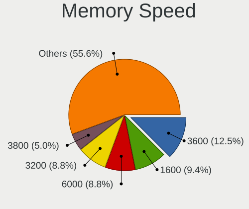

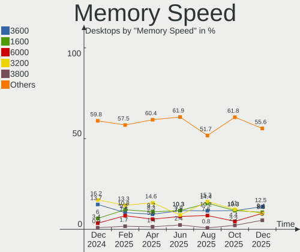

| Speed   | Desktops | Percent |
|---------|----------|---------|
| 3600    | 20       | 12.5%   |
| 1600    | 15       | 9.38%   |
| 6000    | 14       | 8.75%   |
| 3200    | 14       | 8.75%   |
| 3800    | 8        | 5%      |
| 2667    | 8        | 5%      |
| 2400    | 8        | 5%      |
| 2133    | 8        | 5%      |
| 3733    | 7        | 4.38%   |
| 6400    | 6        | 3.75%   |
| 1800    | 5        | 3.13%   |
| 6200    | 4        | 2.5%    |
| 5600    | 4        | 2.5%    |
| 2666    | 4        | 2.5%    |
| 1333    | 4        | 2.5%    |
| 4800    | 3        | 1.88%   |
| 1866    | 3        | 1.88%   |
| 1066    | 3        | 1.88%   |
| Unknown | 3        | 1.88%   |
| 12800   | 2        | 1.25%   |
| 4000    | 2        | 1.25%   |
| 800     | 2        | 1.25%   |
| 8400    | 1        | 0.63%   |
| 7000    | 1        | 0.63%   |
| 5200    | 1        | 0.63%   |
| 3933    | 1        | 0.63%   |
| 3866    | 1        | 0.63%   |
| 3666    | 1        | 0.63%   |
| 3266    | 1        | 0.63%   |
| 3100    | 1        | 0.63%   |
| 3000    | 1        | 0.63%   |
| 2933    | 1        | 0.63%   |
| 2134    | 1        | 0.63%   |
| 2000    | 1        | 0.63%   |
| 1867    | 1        | 0.63%   |

Printers & scanners
-------------------

Printer Vendor
--------------

Printer device vendors

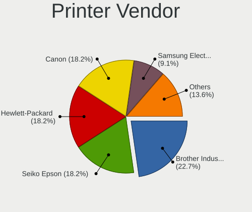

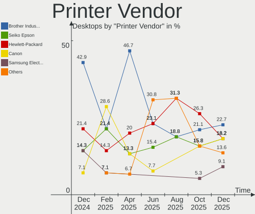

| Vendor              | Desktops | Percent |
|---------------------|----------|---------|
| Brother Industries  | 5        | 22.73%  |
| Seiko Epson         | 4        | 18.18%  |
| Hewlett-Packard     | 4        | 18.18%  |
| Canon               | 4        | 18.18%  |
| Samsung Electronics | 2        | 9.09%   |
| Prolific Technology | 1        | 4.55%   |
| PM                  | 1        | 4.55%   |
| Dymo-CoStar         | 1        | 4.55%   |

Printer Model
-------------

Printer device models

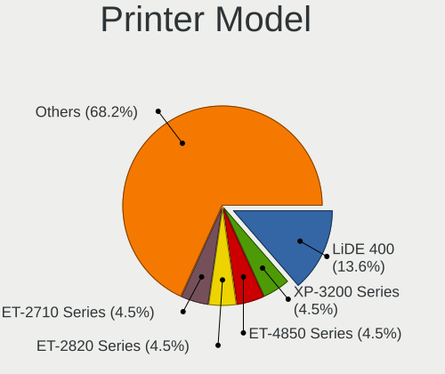

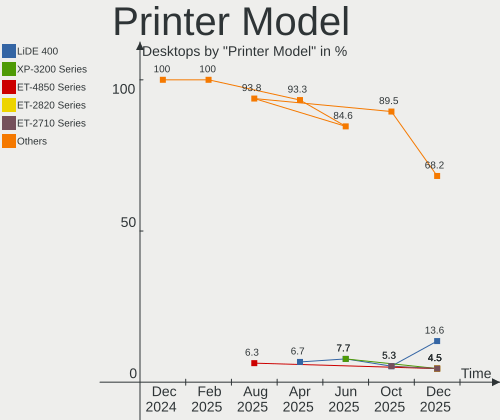

| Model                                  | Desktops | Percent |
|----------------------------------------|----------|---------|
| Canon LiDE 400                         | 3        | 13.64%  |
| Seiko Epson XP-3200 Series             | 1        | 4.55%   |
| Seiko Epson ET-4850 Series             | 1        | 4.55%   |
| Seiko Epson ET-2820 Series             | 1        | 4.55%   |
| Seiko Epson ET-2710 Series             | 1        | 4.55%   |
| Samsung SCX-4600 Series                | 1        | 4.55%   |
| Samsung SCX-3200 Series                | 1        | 4.55%   |
| Prolific PL2305 Parallel Port          | 1        | 4.55%   |
| PM PM241-BT                            | 1        | 4.55%   |
| HP Smart Tank 5100 series              | 1        | 4.55%   |
| HP Officejet Pro 8000 Enterprise A811a | 1        | 4.55%   |
| HP LaserJet Pro M148-M149              | 1        | 4.55%   |
| HP LaserJet M402dn                     | 1        | 4.55%   |
| Dymo-CoStar LabelWriter 450            | 1        | 4.55%   |
| Canon TS700 series                     | 1        | 4.55%   |
| Brother MFC-L3770CDW                   | 1        | 4.55%   |
| Brother MFC-L2860DWE                   | 1        | 4.55%   |
| Brother MFC-J5345DW                    | 1        | 4.55%   |
| Brother MFC-J4335DW                    | 1        | 4.55%   |
| Brother HL-L2400DWE                    | 1        | 4.55%   |

Scanner Vendor
--------------

Scanner device vendors

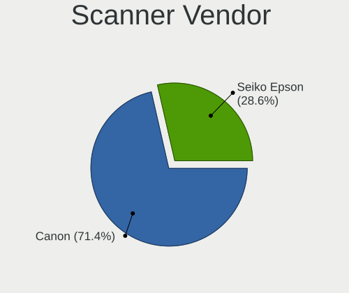

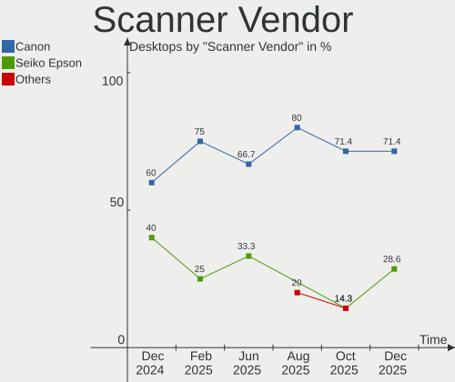

| Vendor      | Desktops | Percent |
|-------------|----------|---------|
| Canon       | 5        | 71.43%  |
| Seiko Epson | 2        | 28.57%  |

Scanner Model
-------------

Scanner device models

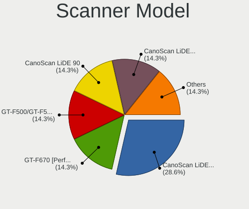

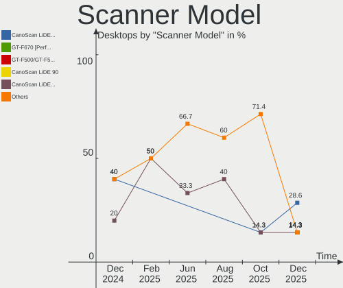

| Model                                                    | Desktops | Percent |
|----------------------------------------------------------|----------|---------|
| Canon CanoScan LiDE 220                                  | 2        | 28.57%  |
| Seiko Epson GT-F670 [Perfection V200 Photo]              | 1        | 14.29%  |
| Seiko Epson GT-F500/GT-F550 [Perfection 2480/2580 PHOTO] | 1        | 14.29%  |
| Canon CanoScan LiDE 90                                   | 1        | 14.29%  |
| Canon CanoScan LiDE 210                                  | 1        | 14.29%  |
| Canon CanoScan LiDE 120                                  | 1        | 14.29%  |

Camera
------

Camera Vendor
-------------

Camera device vendors

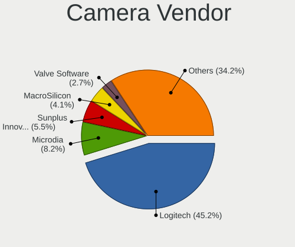

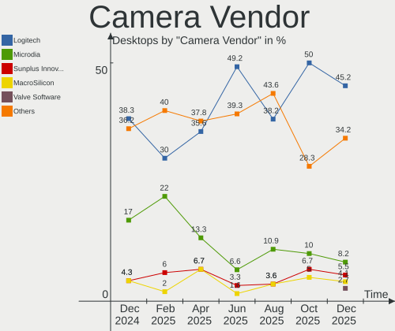

| Vendor                        | Desktops | Percent |
|-------------------------------|----------|---------|
| Logitech                      | 33       | 45.21%  |
| Microdia                      | 6        | 8.22%   |
| Sunplus Innovation Technology | 4        | 5.48%   |
| MacroSilicon                  | 3        | 4.11%   |
| Valve Software                | 2        | 2.74%   |
| SHENZHEN EMEET TECHNOLOGY     | 2        | 2.74%   |
| Samsung Electronics           | 2        | 2.74%   |
| Realtek Semiconductor         | 2        | 2.74%   |
| Razer USA                     | 2        | 2.74%   |
| Generalplus Technology        | 2        | 2.74%   |
| Anker PowerConf C200          | 2        | 2.74%   |
| Z-Star Microelectronics       | 1        | 1.37%   |
| Trust                         | 1        | 1.37%   |
| Remo Tech                     | 1        | 1.37%   |
| Quanta                        | 1        | 1.37%   |
| Microsoft                     | 1        | 1.37%   |
| JOURIST-DC80                  | 1        | 1.37%   |
| IMC Networks                  | 1        | 1.37%   |
| Guillemot                     | 1        | 1.37%   |
| Elgato Systems                | 1        | 1.37%   |
| Cubeternet                    | 1        | 1.37%   |
| Creative Technology           | 1        | 1.37%   |
| AVerMedia Technologies        | 1        | 1.37%   |
| Apple                         | 1        | 1.37%   |

Camera Model
------------

Camera device models

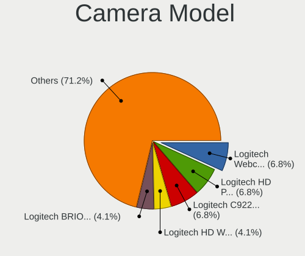

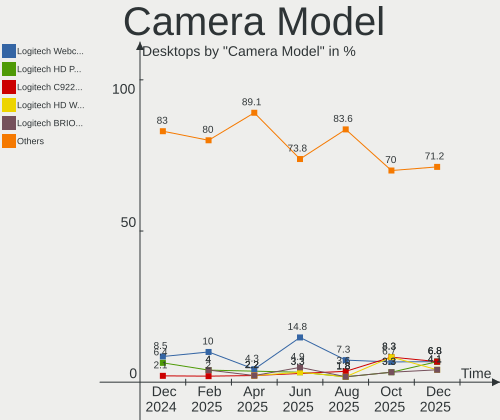

| Model                                          | Desktops | Percent |
|------------------------------------------------|----------|---------|
| Logitech Webcam C270                           | 5        | 6.85%   |
| Logitech HD Pro Webcam C920                    | 5        | 6.85%   |
| Logitech C922 Pro Stream Webcam                | 5        | 6.85%   |
| Logitech HD Webcam C525                        | 3        | 4.11%   |
| Logitech BRIO Ultra HD Webcam                  | 3        | 4.11%   |
| Valve Software 3D Camera                       | 2        | 2.74%   |
| Samsung Galaxy series, misc. (MTP mode)        | 2        | 2.74%   |
| Microdia Camera                                | 2        | 2.74%   |
| Logitech Webcam C310                           | 2        | 2.74%   |
| Logitech C920 PRO HD Webcam                    | 2        | 2.74%   |
| Logitech Brio 100                              | 2        | 2.74%   |
| Anker PowerConf C200 Anker PowerConf C200      | 2        | 2.74%   |
| Z-Star Traveler TV 6500 SF Dia-scanner         | 1        | 1.37%   |
| Trust USB Camera                               | 1        | 1.37%   |
| Sunplus SPCA2281 Web Camera                    | 1        | 1.37%   |
| Sunplus SC-WC-300 Webcam                       | 1        | 1.37%   |
| Sunplus Integrated Camera                      | 1        | 1.37%   |
| Sunplus Full HD webcam                         | 1        | 1.37%   |
| SHENZHEN EMEET TECHNOLOGY HD Webcam eMeet C960 | 1        | 1.37%   |
| SHENZHEN EMEET TECHNOLOGY eMeet Nova           | 1        | 1.37%   |
| Remo Tech OBSBOT Tiny 2 Lite                   | 1        | 1.37%   |
| Realtek USB Camera                             | 1        | 1.37%   |
| Realtek FULL HD 1080P Webcam                   | 1        | 1.37%   |
| Razer USA Razer Kiyo X                         | 1        | 1.37%   |
| Razer USA Gaming Webcam [Kiyo]                 | 1        | 1.37%   |
| Quanta HP Display Camera                       | 1        | 1.37%   |
| Microsoft LifeCam HD-5000                      | 1        | 1.37%   |
| Microdia Webcam Vitade AF                      | 1        | 1.37%   |
| Microdia USB 2.0 Camera                        | 1        | 1.37%   |
| Microdia Rapoo Camera                          | 1        | 1.37%   |
| Microdia CyberTrack H7                         | 1        | 1.37%   |
| MacroSilicon USB3. 0 capture                   | 1        | 1.37%   |
| MacroSilicon USB Video                         | 1        | 1.37%   |
| Logitech Webcam C930e                          | 1        | 1.37%   |
| Logitech Webcam C300                           | 1        | 1.37%   |
| Logitech Webcam C250                           | 1        | 1.37%   |
| Logitech Webcam C200                           | 1        | 1.37%   |
| Logitech Logitech Webcam C925e                 | 1        | 1.37%   |
| Logitech BRIO 4K Stream Edition                | 1        | 1.37%   |
| JOURIST-DC80 JOURIST-DC80                      | 1        | 1.37%   |

Security
--------

Fingerprint Vendor
------------------

Fingerprint sensor vendors

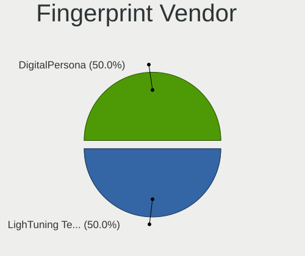

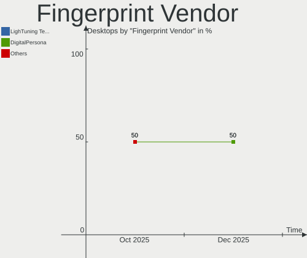

| Vendor                | Desktops | Percent |
|-----------------------|----------|---------|
| LighTuning Technology | 1        | 50%     |
| DigitalPersona        | 1        | 50%     |

Fingerprint Model
-----------------

Fingerprint sensor models

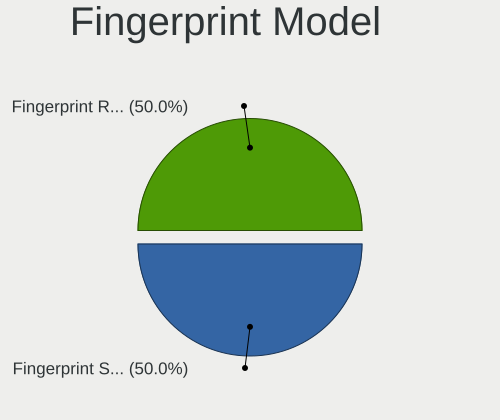

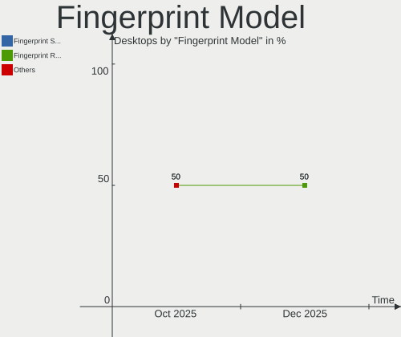

| Model                             | Desktops | Percent |
|-----------------------------------|----------|---------|
| LighTuning Fingerprint Sensor     | 1        | 50%     |
| DigitalPersona Fingerprint Reader | 1        | 50%     |

Chipcard Vendor
---------------

Chipcard module vendors

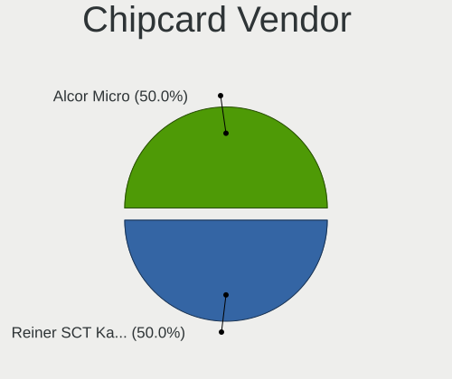

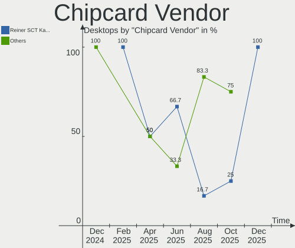

| Vendor                   | Desktops | Percent |
|--------------------------|----------|---------|
| Reiner SCT Kartensysteme | 4        | 100%    |

Chipcard Model
--------------

Chipcard module models

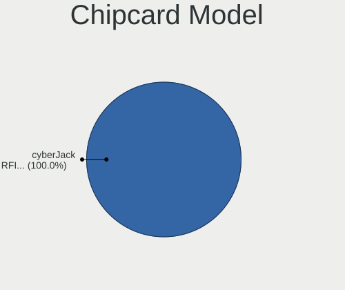

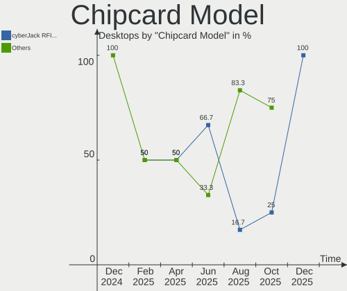

| Model                                                                      | Desktops | Percent |
|----------------------------------------------------------------------------|----------|---------|
| Reiner SCT Kartensysteme cyberJack RFID basis contactless smartcard reader | 4        | 100%    |

Unsupported
-----------

Unsupported Devices
-------------------

Total unsupported devices on board

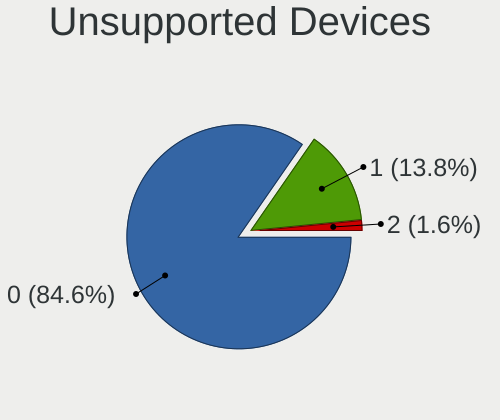

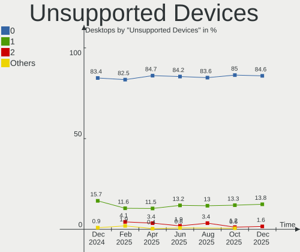

| Total | Desktops | Percent |
|-------|----------|---------|
| 0     | 325      | 84.64%  |
| 1     | 53       | 13.8%   |
| 2     | 6        | 1.56%   |

Unsupported Device Types
------------------------

Types of unsupported devices

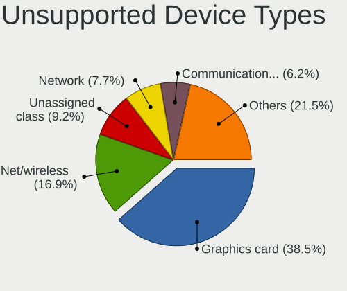

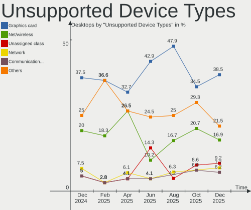

| Type                     | Desktops | Percent |
|--------------------------|----------|---------|
| Graphics card            | 25       | 38.46%  |
| Net/wireless             | 11       | 16.92%  |
| Unassigned class         | 6        | 9.23%   |
| Network                  | 5        | 7.69%   |
| Communication controller | 4        | 6.15%   |
| Chipcard                 | 4        | 6.15%   |
| Multimedia controller    | 2        | 3.08%   |
| Fingerprint reader       | 2        | 3.08%   |
| Storage/raid             | 1        | 1.54%   |
| Storage/nvme             | 1        | 1.54%   |
| Net/ethernet             | 1        | 1.54%   |
| Card reader              | 1        | 1.54%   |
| Camera                   | 1        | 1.54%   |
| Bluetooth                | 1        | 1.54%   |

