Linux in Germany - Hardware Trends (Desktops)
---------------------------------------------

A project to identify most popular hardware characteristics and track their change
over time based on data collected by Linux users at https://Linux-Hardware.org.

Anyone can contribute to this report by the [hw-probe](https://github.com/linuxhw/hw-probe) tool:

    sudo -E hw-probe -all -upload

Period: Dec, 2024.

Contents
--------

* [ System ](#system)
  - [ OS                       ](#os)
  - [ OS Family                ](#os-family)
  - [ Kernel                   ](#kernel)
  - [ Kernel Family            ](#kernel-family)
  - [ Kernel Major Ver.        ](#kernel-major-ver)
  - [ Arch                     ](#arch)
  - [ DE                       ](#de)
  - [ Display Server           ](#display-server)
  - [ Display Manager          ](#display-manager)
  - [ OS Lang                  ](#os-lang)
  - [ Boot Mode                ](#boot-mode)
  - [ Filesystem               ](#filesystem)
  - [ Part. scheme             ](#part-scheme)
  - [ Dual Boot with Linux/BSD ](#dual-boot-with-linuxbsd)
  - [ Dual Boot (Win)          ](#dual-boot-win)

* [ Board ](#board)
  - [ Vendor                   ](#vendor)
  - [ Model                    ](#model)
  - [ Model Family             ](#model-family)
  - [ MFG Year                 ](#mfg-year)
  - [ Form Factor              ](#form-factor)
  - [ Secure Boot              ](#secure-boot)
  - [ Coreboot                 ](#coreboot)
  - [ RAM Size                 ](#ram-size)
  - [ RAM Used                 ](#ram-used)
  - [ Total Drives             ](#total-drives)
  - [ Has CD-ROM               ](#has-cd-rom)
  - [ Has Ethernet             ](#has-ethernet)
  - [ Has WiFi                 ](#has-wifi)
  - [ Has Bluetooth            ](#has-bluetooth)

* [ Location ](#location)
  - [ Country                  ](#country)
  - [ City                     ](#city)

* [ Drives ](#drives)
  - [ Drive Vendor             ](#drive-vendor)
  - [ Drive Model              ](#drive-model)
  - [ HDD Vendor               ](#hdd-vendor)
  - [ SSD Vendor               ](#ssd-vendor)
  - [ Drive Kind               ](#drive-kind)
  - [ Drive Connector          ](#drive-connector)
  - [ Drive Size               ](#drive-size)
  - [ Space Total              ](#space-total)
  - [ Space Used               ](#space-used)
  - [ Malfunc. Drives          ](#malfunc-drives)
  - [ Malfunc. Drive Vendor    ](#malfunc-drive-vendor)
  - [ Malfunc. HDD Vendor      ](#malfunc-hdd-vendor)
  - [ Malfunc. Drive Kind      ](#malfunc-drive-kind)
  - [ Failed Drives            ](#failed-drives)
  - [ Failed Drive Vendor      ](#failed-drive-vendor)
  - [ Drive Status             ](#drive-status)

* [ Storage controller ](#storage-controller)
  - [ Storage Vendor           ](#storage-vendor)
  - [ Storage Model            ](#storage-model)
  - [ Storage Kind             ](#storage-kind)

* [ Processor ](#processor)
  - [ CPU Vendor               ](#cpu-vendor)
  - [ CPU Model                ](#cpu-model)
  - [ CPU Model Family         ](#cpu-model-family)
  - [ CPU Cores                ](#cpu-cores)
  - [ CPU Sockets              ](#cpu-sockets)
  - [ CPU Threads              ](#cpu-threads)
  - [ CPU Op-Modes             ](#cpu-op-modes)
  - [ CPU Microcode            ](#cpu-microcode)
  - [ CPU Microarch            ](#cpu-microarch)

* [ Graphics ](#graphics)
  - [ GPU Vendor               ](#gpu-vendor)
  - [ GPU Model                ](#gpu-model)
  - [ GPU Combo                ](#gpu-combo)
  - [ GPU Driver               ](#gpu-driver)
  - [ GPU Memory               ](#gpu-memory)

* [ Monitor ](#monitor)
  - [ Monitor Vendor           ](#monitor-vendor)
  - [ Monitor Model            ](#monitor-model)
  - [ Monitor Resolution       ](#monitor-resolution)
  - [ Monitor Diagonal         ](#monitor-diagonal)
  - [ Monitor Width            ](#monitor-width)
  - [ Aspect Ratio             ](#aspect-ratio)
  - [ Monitor Area             ](#monitor-area)
  - [ Pixel Density            ](#pixel-density)
  - [ Multiple Monitors        ](#multiple-monitors)

* [ Network ](#network)
  - [ Net Controller Vendor    ](#net-controller-vendor)
  - [ Net Controller Model     ](#net-controller-model)
  - [ Wireless Vendor          ](#wireless-vendor)
  - [ Wireless Model           ](#wireless-model)
  - [ Ethernet Vendor          ](#ethernet-vendor)
  - [ Ethernet Model           ](#ethernet-model)
  - [ Net Controller Kind      ](#net-controller-kind)
  - [ Used Controller          ](#used-controller)
  - [ NICs                     ](#nics)
  - [ IPv6                     ](#ipv6)

* [ Bluetooth ](#bluetooth)
  - [ Bluetooth Vendor         ](#bluetooth-vendor)
  - [ Bluetooth Model          ](#bluetooth-model)

* [ Sound ](#sound)
  - [ Sound Vendor             ](#sound-vendor)
  - [ Sound Model              ](#sound-model)

* [ Memory ](#memory)
  - [ Memory Vendor            ](#memory-vendor)
  - [ Memory Model             ](#memory-model)
  - [ Memory Kind              ](#memory-kind)
  - [ Memory Form Factor       ](#memory-form-factor)
  - [ Memory Size              ](#memory-size)
  - [ Memory Speed             ](#memory-speed)

* [ Printers & scanners ](#printers--scanners)
  - [ Printer Vendor           ](#printer-vendor)
  - [ Printer Model            ](#printer-model)
  - [ Scanner Vendor           ](#scanner-vendor)
  - [ Scanner Model            ](#scanner-model)

* [ Camera ](#camera)
  - [ Camera Vendor            ](#camera-vendor)
  - [ Camera Model             ](#camera-model)

* [ Security ](#security)
  - [ Fingerprint Vendor       ](#fingerprint-vendor)
  - [ Fingerprint Model        ](#fingerprint-model)
  - [ Chipcard Vendor          ](#chipcard-vendor)
  - [ Chipcard Model           ](#chipcard-model)

* [ Unsupported ](#unsupported)
  - [ Unsupported Devices      ](#unsupported-devices)
  - [ Unsupported Device Types ](#unsupported-device-types)

System
------

OS
--

Installed operating systems

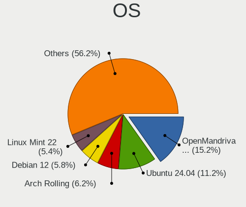

| Name                         | Desktops | Percent |
|------------------------------|----------|---------|
| OpenMandriva 24.12           | 34       | 15.18%  |
| Ubuntu 24.04                 | 25       | 11.16%  |
| Arch Rolling                 | 14       | 6.25%   |
| Debian 12                    | 13       | 5.8%    |
| Linux Mint 22                | 12       | 5.36%   |
| Fedora 41                    | 12       | 5.36%   |
| Zorin 17                     | 11       | 4.91%   |
| Pop!_OS 22.04                | 10       | 4.46%   |
| Linux Mint 21.3              | 10       | 4.46%   |
| Ubuntu 24.10                 | 6        | 2.68%   |
| Ubuntu 22.04                 | 5        | 2.23%   |
| openSUSE Tumbleweed-XXXXXXXX | 5        | 2.23%   |
| openSUSE Leap-15.6           | 4        | 1.79%   |
| Nobara 40                    | 3        | 1.34%   |
| Manjaro                      | 3        | 1.34%   |
| LMDE 6                       | 3        | 1.34%   |
| Elementary 8                 | 3        | 1.34%   |
| Debian                       | 3        | 1.34%   |
| Vanilla 2.0                  | 2        | 0.89%   |
| Ubuntu 18.04                 | 2        | 0.89%   |
| TUXEDO OS 24.04              | 2        | 0.89%   |
| Lubuntu 24.04                | 2        | 0.89%   |
| Gentoo 2.17                  | 2        | 0.89%   |
| Bazzite 41                   | 2        | 0.89%   |
| ArcoLinux Rolling            | 2        | 0.89%   |
| Zorin 16                     | 1        | 0.45%   |
| Ubuntu MATE 18.04            | 1        | 0.45%   |
| Ubuntu 23.04                 | 1        | 0.45%   |
| Ubuntu 21.04                 | 1        | 0.45%   |
| Sparky 7.5                   | 1        | 0.45%   |
| Rocky Linux 9.5              | 1        | 0.45%   |
| RHEL 9                       | 1        | 0.45%   |
| PureOS 10                    | 1        | 0.45%   |
| openSUSE Slowroll-20241202   | 1        | 0.45%   |
| OpenMandriva 24.90           | 1        | 0.45%   |
| OpenMandriva 24.07           | 1        | 0.45%   |
| OpenMandriva 23.08           | 1        | 0.45%   |
| Nobara 41                    | 1        | 0.45%   |
| Neptune OS 8.1               | 1        | 0.45%   |
| MX 23                        | 1        | 0.45%   |

OS Family
---------

OS without a version

| Name         | Desktops | Percent |
|--------------|----------|---------|
| Ubuntu       | 40       | 17.86%  |
| OpenMandriva | 37       | 16.52%  |
| Linux Mint   | 25       | 11.16%  |
| Debian       | 16       | 7.14%   |
| Arch         | 14       | 6.25%   |
| Fedora       | 13       | 5.8%    |
| Zorin        | 12       | 5.36%   |
| Pop!_OS      | 10       | 4.46%   |
| openSUSE     | 10       | 4.46%   |
| Nobara       | 4        | 1.79%   |
| Manjaro      | 4        | 1.79%   |
| Elementary   | 4        | 1.79%   |
| LMDE         | 3        | 1.34%   |
| Vanilla      | 2        | 0.89%   |
| TUXEDO OS    | 2        | 0.89%   |
| Lubuntu      | 2        | 0.89%   |
| Kubuntu      | 2        | 0.89%   |
| KDE neon     | 2        | 0.89%   |
| Gentoo       | 2        | 0.89%   |
| Garuda Linux | 2        | 0.89%   |
| Bazzite      | 2        | 0.89%   |
| ArcoLinux    | 2        | 0.89%   |
| Ubuntu MATE  | 1        | 0.45%   |
| Sparky       | 1        | 0.45%   |
| Rocky Linux  | 1        | 0.45%   |
| RHEL         | 1        | 0.45%   |
| PureOS       | 1        | 0.45%   |
| Neptune OS   | 1        | 0.45%   |
| MX           | 1        | 0.45%   |
| EndeavourOS  | 1        | 0.45%   |
| Drauger OS   | 1        | 0.45%   |
| CachyOS      | 1        | 0.45%   |
| BlackPanther | 1        | 0.45%   |
| BigLinux     | 1        | 0.45%   |
| AlmaLinux    | 1        | 0.45%   |
| Aeon         | 1        | 0.45%   |

Kernel
------

Version of the Linux kernel

| Version                         | Desktops | Percent |
|---------------------------------|----------|---------|
| 6.12.1-desktop-1omv2490         | 31       | 13.84%  |
| 6.8.0-49-generic                | 27       | 12.05%  |
| 6.8.0-50-generic                | 15       | 6.7%    |
| 6.1.0-28-amd64                  | 12       | 5.36%   |
| 6.8.0-51-generic                | 11       | 4.91%   |
| 6.9.3-76060903-generic          | 8        | 3.57%   |
| 6.11.8-1-default                | 5        | 2.23%   |
| 6.12.4-200.fc41.x86_64          | 4        | 1.79%   |
| 6.12.1-arch1-1                  | 4        | 1.79%   |
| 5.15.0-126-generic              | 4        | 1.79%   |
| 6.8.0-41-generic                | 3        | 1.34%   |
| 6.12.7-arch1-1                  | 3        | 1.34%   |
| 6.12.6-desktop-1omv2490         | 3        | 1.34%   |
| 6.12.4-arch1-1                  | 3        | 1.34%   |
| 6.12.1-zen1-1-zen               | 3        | 1.34%   |
| 6.11.9-200.fsync.fc40.x86_64    | 3        | 1.34%   |
| 6.11.4-301.fc41.x86_64          | 3        | 1.34%   |
| 6.11.10-300.fc41.x86_64         | 3        | 1.34%   |
| 4.15.0-213-generic              | 3        | 1.34%   |
| 6.8.0-50-lowlatency             | 2        | 0.89%   |
| 6.8.0-48-generic                | 2        | 0.89%   |
| 6.4.0-150600.23.25-default      | 2        | 0.89%   |
| 6.12.6-arch1-1                  | 2        | 0.89%   |
| 6.12.6-200.fc41.x86_64          | 2        | 0.89%   |
| 6.12.6-1-default                | 2        | 0.89%   |
| 6.12.4-1-MANJARO                | 2        | 0.89%   |
| 6.11.6-amd64                    | 2        | 0.89%   |
| 6.11.10-amd64                   | 2        | 0.89%   |
| 6.11.10-304.bazzite.fc41.x86_64 | 2        | 0.89%   |
| 6.11.0-8-generic                | 2        | 0.89%   |
| 6.11.0-13-generic               | 2        | 0.89%   |
| 6.1.0-27-amd64                  | 2        | 0.89%   |
| 6.0.12-76060006-generic         | 2        | 0.89%   |
| 5.14.0-503.15.1.el9_5.x86_64    | 2        | 0.89%   |
| 6.9.9-x64v3-xanmod1             | 1        | 0.45%   |
| 6.8.7-zen1-2-zen                | 1        | 0.45%   |
| 6.8.12-custombuild-001          | 1        | 0.45%   |
| 6.8.12-5-pve                    | 1        | 0.45%   |
| 6.8.12-4-pve                    | 1        | 0.45%   |
| 6.8.0-40-generic                | 1        | 0.45%   |

Kernel Family
-------------

Linux kernel without a distro release

| Version | Desktops | Percent |
|---------|----------|---------|
| 6.8.0   | 61       | 27.23%  |
| 6.12.1  | 41       | 18.3%   |
| 6.1.0   | 15       | 6.7%    |
| 6.12.6  | 12       | 5.36%   |
| 6.12.4  | 10       | 4.46%   |
| 6.11.10 | 10       | 4.46%   |
| 5.15.0  | 10       | 4.46%   |
| 6.9.3   | 8        | 3.57%   |
| 6.11.0  | 8        | 3.57%   |
| 6.11.8  | 6        | 2.68%   |
| 4.15.0  | 4        | 1.79%   |
| 6.8.12  | 3        | 1.34%   |
| 6.4.0   | 3        | 1.34%   |
| 6.12.7  | 3        | 1.34%   |
| 6.11.9  | 3        | 1.34%   |
| 6.11.6  | 3        | 1.34%   |
| 6.11.4  | 3        | 1.34%   |
| 5.14.0  | 3        | 1.34%   |
| 6.2.0   | 2        | 0.89%   |
| 6.0.12  | 2        | 0.89%   |
| 6.9.9   | 1        | 0.45%   |
| 6.8.7   | 1        | 0.45%   |
| 6.6.65  | 1        | 0.45%   |
| 6.6.63  | 1        | 0.45%   |
| 6.6.44  | 1        | 0.45%   |
| 6.4.8   | 1        | 0.45%   |
| 6.12.3  | 1        | 0.45%   |
| 6.11.11 | 1        | 0.45%   |
| 6.10.3  | 1        | 0.45%   |
| 6.10.0  | 1        | 0.45%   |
| 5.6.14  | 1        | 0.45%   |
| 5.4.0   | 1        | 0.45%   |
| 5.11.0  | 1        | 0.45%   |
| 5.10.0  | 1        | 0.45%   |

Kernel Major Ver.
-----------------

Linux kernel major version

| Version | Desktops | Percent |
|---------|----------|---------|
| 6.12    | 67       | 29.91%  |
| 6.8     | 65       | 29.02%  |
| 6.11    | 34       | 15.18%  |
| 6.1     | 15       | 6.7%    |
| 5.15    | 10       | 4.46%   |
| 6.9     | 9        | 4.02%   |
| 6.4     | 4        | 1.79%   |
| 4.15    | 4        | 1.79%   |
| 6.6     | 3        | 1.34%   |
| 5.14    | 3        | 1.34%   |
| 6.2     | 2        | 0.89%   |
| 6.10    | 2        | 0.89%   |
| 6.0     | 2        | 0.89%   |
| 5.6     | 1        | 0.45%   |
| 5.4     | 1        | 0.45%   |
| 5.11    | 1        | 0.45%   |
| 5.10    | 1        | 0.45%   |

Arch
----

OS architecture (x86_64, i586, etc.)

| Name    | Desktops | Percent |
|---------|----------|---------|
| x86_64  | 221      | 98.66%  |
| i686    | 2        | 0.89%   |
| riscv64 | 1        | 0.45%   |

DE
--

Desktop Environment

| Name       | Desktops | Percent |
|------------|----------|---------|
| GNOME      | 91       | 40.63%  |
| Unknown    | 38       | 16.96%  |
| KDE6       | 28       | 12.5%   |
| X-Cinnamon | 20       | 8.93%   |
| KDE5       | 15       | 6.7%    |
| XFCE       | 11       | 4.91%   |
| LXQt       | 5        | 2.23%   |
| Pantheon   | 4        | 1.79%   |
| MATE       | 4        | 1.79%   |
| Cinnamon   | 4        | 1.79%   |
| LXDE       | 1        | 0.45%   |
| KDE        | 1        | 0.45%   |
| i3         | 1        | 0.45%   |
| Hyprland   | 1        | 0.45%   |

Display Server
--------------

X11 or Wayland

| Name    | Desktops | Percent |
|---------|----------|---------|
| X11     | 118      | 52.68%  |
| Wayland | 97       | 43.3%   |
| Tty     | 4        | 1.79%   |
| Unknown | 4        | 1.79%   |
| Web     | 1        | 0.45%   |

Display Manager
---------------

SDDM, LightDM, etc.

| Name    | Desktops | Percent |
|---------|----------|---------|
| Unknown | 97       | 43.3%   |
| SDDM    | 52       | 23.21%  |
| GDM3    | 43       | 19.2%   |
| LightDM | 18       | 8.04%   |
| GDM     | 13       | 5.8%    |
| WDM     | 1        | 0.45%   |

OS Lang
-------

Language

| Lang    | Desktops | Percent |
|---------|----------|---------|
| de_DE   | 164      | 73.21%  |
| en_US   | 46       | 20.54%  |
| C       | 7        | 3.13%   |
| en_GB   | 4        | 1.79%   |
| Unknown | 2        | 0.89%   |
| de_LI   | 1        | 0.45%   |

Boot Mode
---------

EFI or BIOS

| Mode | Desktops | Percent |
|------|----------|---------|
| BIOS | 128      | 57.14%  |
| EFI  | 96       | 42.86%  |

Filesystem
----------

Type of filesystem

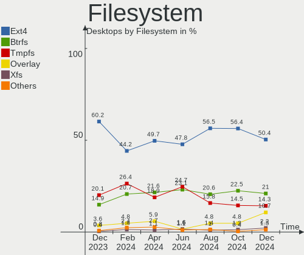

| Type    | Desktops | Percent |
|---------|----------|---------|
| Ext4    | 113      | 50.45%  |
| Btrfs   | 47       | 20.98%  |
| Tmpfs   | 32       | 14.29%  |
| Overlay | 24       | 10.71%  |
| Xfs     | 5        | 2.23%   |
| Zfs     | 2        | 0.89%   |
| Ext2    | 1        | 0.45%   |

Part. scheme
------------

Scheme of partitioning

| Type    | Desktops | Percent |
|---------|----------|---------|
| GPT     | 112      | 50%     |
| Unknown | 93       | 41.52%  |
| MBR     | 19       | 8.48%   |

Dual Boot with Linux/BSD
------------------------

Hosting more than one Linux/BSD

| Dual boot | Desktops | Percent |
|-----------|----------|---------|
| No        | 178      | 79.46%  |
| Yes       | 46       | 20.54%  |

Dual Boot (Win)
---------------

Hosting Linux and Windows

| Dual boot | Desktops | Percent |
|-----------|----------|---------|
| No        | 157      | 70.09%  |
| Yes       | 67       | 29.91%  |

Board
-----

Vendor
------

Motherboard manufacturer

| Name                                 | Desktops | Percent |
|--------------------------------------|----------|---------|
| ASUSTek Computer                     | 51       | 22.77%  |
| Gigabyte Technology                  | 41       | 18.3%   |
| MSI                                  | 38       | 16.96%  |
| ASRock                               | 28       | 12.5%   |
| Hewlett-Packard                      | 13       | 5.8%    |
| Lenovo                               | 7        | 3.13%   |
| Medion                               | 6        | 2.68%   |
| Fujitsu                              | 6        | 2.68%   |
| Dell                                 | 6        | 2.68%   |
| Biostar                              | 5        | 2.23%   |
| Fujitsu Siemens                      | 4        | 1.79%   |
| GEEKOM                               | 3        | 1.34%   |
| Acer                                 | 3        | 1.34%   |
| Unknown                              | 3        | 1.34%   |
| Shenzhen Meigao Electronic Equipment | 2        | 0.89%   |
| PELADN                               | 2        | 0.89%   |
| Intel                                | 2        | 0.89%   |
| Wortmann AG                          | 1        | 0.45%   |
| HPE                                  | 1        | 0.45%   |
| Foxconn                              | 1        | 0.45%   |
| ASRockRack                           | 1        | 0.45%   |

Model
-----

Motherboard model

| Name                                              | Desktops | Percent |
|---------------------------------------------------|----------|---------|
| MSI MS-7C56                                       | 3        | 1.34%   |
| ASUS All Series                                   | 3        | 1.34%   |
| Unknown                                           | 3        | 1.34%   |
| Shenzhen Meigao Electronic Equipment Venus Series | 2        | 0.89%   |
| PELADN WI-6                                       | 2        | 0.89%   |
| MSI MS-7D08                                       | 2        | 0.89%   |
| MSI MS-7C91                                       | 2        | 0.89%   |
| MSI MS-7C02                                       | 2        | 0.89%   |
| MSI MS-7B86                                       | 2        | 0.89%   |
| Gigabyte 970A-DS3P                                | 2        | 0.89%   |
| GEEKOM A7                                         | 2        | 0.89%   |
| Fujitsu Siemens ESPRIMO E                         | 2        | 0.89%   |
| Dell OptiPlex 780                                 | 2        | 0.89%   |
| ASUS TUF Z390-PLUS GAMING                         | 2        | 0.89%   |
| ASUS ROG STRIX Z690-I GAMING WIFI                 | 2        | 0.89%   |
| ASRock X670E Steel Legend                         | 2        | 0.89%   |
| ASRock G31M-GS                                    | 2        | 0.89%   |
| Acer Aspire X3960                                 | 2        | 0.89%   |
| Wortmann AG TERRA_PC                              | 1        | 0.45%   |
| MSI Z170A PC MATE                                 | 1        | 0.45%   |
| MSI MS-7E49                                       | 1        | 0.45%   |
| MSI MS-7E26                                       | 1        | 0.45%   |
| MSI MS-7E16                                       | 1        | 0.45%   |
| MSI MS-7E07                                       | 1        | 0.45%   |
| MSI MS-7E06                                       | 1        | 0.45%   |
| MSI MS-7D25                                       | 1        | 0.45%   |
| MSI MS-7D22                                       | 1        | 0.45%   |
| MSI MS-7C95                                       | 1        | 0.45%   |
| MSI MS-7C94                                       | 1        | 0.45%   |
| MSI MS-7C52                                       | 1        | 0.45%   |
| MSI MS-7C37                                       | 1        | 0.45%   |
| MSI MS-7B98                                       | 1        | 0.45%   |
| MSI MS-7B89                                       | 1        | 0.45%   |
| MSI MS-7B48                                       | 1        | 0.45%   |
| MSI MS-7B45                                       | 1        | 0.45%   |
| MSI MS-7A38                                       | 1        | 0.45%   |
| MSI MS-7A37                                       | 1        | 0.45%   |
| MSI MS-7996                                       | 1        | 0.45%   |
| MSI MS-7913                                       | 1        | 0.45%   |
| MSI MS-7821                                       | 1        | 0.45%   |

Model Family
------------

Motherboard model prefix

| Name                                       | Desktops | Percent |
|--------------------------------------------|----------|---------|
| ASUS PRIME                                 | 14       | 6.25%   |
| ASUS TUF                                   | 7        | 3.13%   |
| ASUS ROG                                   | 7        | 3.13%   |
| HP EliteDesk                               | 5        | 2.23%   |
| Fujitsu ESPRIMO                            | 5        | 2.23%   |
| Lenovo ThinkCentre                         | 4        | 1.79%   |
| Fujitsu Siemens ESPRIMO                    | 4        | 1.79%   |
| Dell OptiPlex                              | 4        | 1.79%   |
| MSI MS-7C56                                | 3        | 1.34%   |
| HP Pavilion                                | 3        | 1.34%   |
| Gigabyte B650                              | 3        | 1.34%   |
| Gigabyte B550M                             | 3        | 1.34%   |
| ASUS All                                   | 3        | 1.34%   |
| Unknown                                    | 3        | 1.34%   |
| Shenzhen Meigao Electronic Equipment Venus | 2        | 0.89%   |
| PELADN WI-6                                | 2        | 0.89%   |
| MSI MS-7D08                                | 2        | 0.89%   |
| MSI MS-7C91                                | 2        | 0.89%   |
| MSI MS-7C02                                | 2        | 0.89%   |
| MSI MS-7B86                                | 2        | 0.89%   |
| Lenovo ThinkStation                        | 2        | 0.89%   |
| HP Compaq                                  | 2        | 0.89%   |
| Gigabyte B660M                             | 2        | 0.89%   |
| Gigabyte B450                              | 2        | 0.89%   |
| Gigabyte 970A-DS3P                         | 2        | 0.89%   |
| GEEKOM A7                                  | 2        | 0.89%   |
| ASUS M5A78L-M                              | 2        | 0.89%   |
| ASRock Z68                                 | 2        | 0.89%   |
| ASRock X670E                               | 2        | 0.89%   |
| ASRock X570                                | 2        | 0.89%   |
| ASRock G31M-GS                             | 2        | 0.89%   |
| ASRock B450                                | 2        | 0.89%   |
| Acer Aspire                                | 2        | 0.89%   |
| Wortmann AG TERRA                          | 1        | 0.45%   |
| MSI Z170A                                  | 1        | 0.45%   |
| MSI MS-7E49                                | 1        | 0.45%   |
| MSI MS-7E26                                | 1        | 0.45%   |
| MSI MS-7E16                                | 1        | 0.45%   |
| MSI MS-7E07                                | 1        | 0.45%   |
| MSI MS-7E06                                | 1        | 0.45%   |

MFG Year
--------

Motherboard manufacture year

| Year | Desktops | Percent |
|------|----------|---------|
| 2021 | 22       | 9.82%   |
| 2024 | 21       | 9.38%   |
| 2020 | 21       | 9.38%   |
| 2018 | 21       | 9.38%   |
| 2017 | 17       | 7.59%   |
| 2022 | 16       | 7.14%   |
| 2010 | 14       | 6.25%   |
| 2019 | 13       | 5.8%    |
| 2023 | 12       | 5.36%   |
| 2014 | 12       | 5.36%   |
| 2012 | 12       | 5.36%   |
| 2013 | 10       | 4.46%   |
| 2015 | 7        | 3.13%   |
| 2009 | 7        | 3.13%   |
| 2011 | 6        | 2.68%   |
| 2016 | 4        | 1.79%   |
| 2008 | 4        | 1.79%   |
| 2007 | 3        | 1.34%   |
| 2005 | 1        | 0.45%   |
| 2002 | 1        | 0.45%   |

Form Factor
-----------

Physical design of the computer

| Name    | Desktops | Percent |
|---------|----------|---------|
| Desktop | 224      | 100%    |

Secure Boot
-----------

Enabled or disabled

| State    | Desktops | Percent |
|----------|----------|---------|
| Disabled | 221      | 98.66%  |
| Enabled  | 3        | 1.34%   |

Coreboot
--------

Have coreboot on board

| Used | Desktops | Percent |
|------|----------|---------|
| No   | 224      | 100%    |

RAM Size
--------

Total RAM memory

| Size in GB  | Desktops | Percent |
|-------------|----------|---------|
| 32.01-64.0  | 61       | 27.23%  |
| 16.01-24.0  | 49       | 21.88%  |
| 8.01-16.0   | 35       | 15.63%  |
| 64.01-256.0 | 24       | 10.71%  |
| 24.01-32.0  | 21       | 9.38%   |
| 4.01-8.0    | 15       | 6.7%    |
| 3.01-4.0    | 14       | 6.25%   |
| 2.01-3.0    | 3        | 1.34%   |
| 1.01-2.0    | 2        | 0.89%   |

RAM Used
--------

Used RAM memory

| Used GB    | Desktops | Percent |
|------------|----------|---------|
| 2.01-3.0   | 62       | 27.68%  |
| 1.01-2.0   | 49       | 21.88%  |
| 4.01-8.0   | 48       | 21.43%  |
| 3.01-4.0   | 34       | 15.18%  |
| 8.01-16.0  | 15       | 6.7%    |
| 0.51-1.0   | 7        | 3.13%   |
| 16.01-24.0 | 6        | 2.68%   |
| 32.01-64.0 | 2        | 0.89%   |
| 24.01-32.0 | 1        | 0.45%   |

Total Drives
------------

Number of drives on board

| Drives | Desktops | Percent |
|--------|----------|---------|
| 1      | 66       | 29.46%  |
| 2      | 59       | 26.34%  |
| 3      | 41       | 18.3%   |
| 4      | 38       | 16.96%  |
| 6      | 7        | 3.13%   |
| 5      | 6        | 2.68%   |
| 7      | 4        | 1.79%   |
| 10     | 1        | 0.45%   |
| 8      | 1        | 0.45%   |
| 0      | 1        | 0.45%   |

Has CD-ROM
----------

Has CD-ROM on board

| Presented | Desktops | Percent |
|-----------|----------|---------|
| Yes       | 114      | 50.89%  |
| No        | 110      | 49.11%  |

Has Ethernet
------------

Has Ethernet on board

| Presented | Desktops | Percent |
|-----------|----------|---------|
| Yes       | 223      | 99.55%  |
| No        | 1        | 0.45%   |

Has WiFi
--------

Has WiFi module

| Presented | Desktops | Percent |
|-----------|----------|---------|
| No        | 123      | 54.91%  |
| Yes       | 101      | 45.09%  |

Has Bluetooth
-------------

Has Bluetooth module

| Presented | Desktops | Percent |
|-----------|----------|---------|
| No        | 129      | 57.59%  |
| Yes       | 95       | 42.41%  |

Location
--------

Country
-------

Geographic location (country)

| Country | Desktops | Percent |
|---------|----------|---------|
| Germany | 224      | 100%    |

City
----

Geographic location (city)

| City              | Desktops | Percent |
|-------------------|----------|---------|
| Berlin            | 24       | 10.71%  |
| Munich            | 11       | 4.91%   |
| Leipzig           | 8        | 3.57%   |
| Hanover           | 6        | 2.68%   |
| Dresden           | 5        | 2.23%   |
| Cologne           | 5        | 2.23%   |
| Reutlingen        | 4        | 1.79%   |
| Mannheim          | 4        | 1.79%   |
| Pforzheim         | 3        | 1.34%   |
| Nuremberg         | 3        | 1.34%   |
| Frankfurt am Main | 3        | 1.34%   |
| Essen             | 3        | 1.34%   |
| Düsseldorf       | 3        | 1.34%   |
| Delligsen         | 3        | 1.34%   |
| Wittenberg        | 2        | 0.89%   |
| Trier             | 2        | 0.89%   |
| Stuttgart         | 2        | 0.89%   |
| Siegen            | 2        | 0.89%   |
| Rostock           | 2        | 0.89%   |
| Neustrelitz       | 2        | 0.89%   |
| Münster          | 2        | 0.89%   |
| Mainz             | 2        | 0.89%   |
| Lüneburg         | 2        | 0.89%   |
| Ludwigsburg       | 2        | 0.89%   |
| Loerrach          | 2        | 0.89%   |
| Lahr              | 2        | 0.89%   |
| Hamburg           | 2        | 0.89%   |
| Haltern am See    | 2        | 0.89%   |
| Forchheim         | 2        | 0.89%   |
| Dortmund          | 2        | 0.89%   |
| Celle             | 2        | 0.89%   |
| Augsburg          | 2        | 0.89%   |
| Zwickau           | 1        | 0.45%   |
| Würzburg         | 1        | 0.45%   |
| Wuppertal         | 1        | 0.45%   |
| Weinheim          | 1        | 0.45%   |
| Weilheim          | 1        | 0.45%   |
| Weeze             | 1        | 0.45%   |
| Wangen            | 1        | 0.45%   |
| Voelklingen       | 1        | 0.45%   |

Drives
------

Drive Vendor
------------

Hard drive vendors

| Vendor                       | Desktops | Drives | Percent |
|------------------------------|----------|--------|---------|
| Samsung Electronics          | 91       | 142    | 19.87%  |
| WDC                          | 68       | 80     | 14.85%  |
| Seagate                      | 60       | 80     | 13.1%   |
| Sandisk                      | 46       | 59     | 10.04%  |
| Crucial                      | 23       | 29     | 5.02%   |
| Toshiba                      | 22       | 28     | 4.8%    |
| Micron/Crucial Technology    | 17       | 20     | 3.71%   |
| Intenso                      | 14       | 16     | 3.06%   |
| Kingston                     | 13       | 13     | 2.84%   |
| Hitachi                      | 8        | 8      | 1.75%   |
| Unknown                      | 7        | 10     | 1.53%   |
| Phison Electronics           | 7        | 7      | 1.53%   |
| Kingston Technology Company  | 6        | 7      | 1.31%   |
| Intel                        | 6        | 8      | 1.31%   |
| SK hynix                     | 5        | 5      | 1.09%   |
| OCZ                          | 5        | 5      | 1.09%   |
| Verbatim                     | 4        | 5      | 0.87%   |
| Shenzhen Longsys Electronics | 4        | 4      | 0.87%   |
| SD                           | 3        | 3      | 0.66%   |
| JMicron Technology           | 3        | 3      | 0.66%   |
| Fanxiang                     | 3        | 3      | 0.66%   |
| ADATA Technology             | 3        | 3      | 0.66%   |
| Unknown                      | 3        | 4      | 0.66%   |
| Realtek                      | 2        | 2      | 0.44%   |
| Maxtor                       | 2        | 2      | 0.44%   |
| MAXIO Technology (Hangzhou)  | 2        | 2      | 0.44%   |
| HPE                          | 2        | 2      | 0.44%   |
| China                        | 2        | 2      | 0.44%   |
| USB                          | 1        | 1      | 0.22%   |
| TrekStor                     | 1        | 1      | 0.22%   |
| Transcend                    | 1        | 1      | 0.22%   |
| StoreJet                     | 1        | 1      | 0.22%   |
| SPCC                         | 1        | 1      | 0.22%   |
| Silicon Motion               | 1        | 1      | 0.22%   |
| Seagate Technology           | 1        | 1      | 0.22%   |
| SABRENT                      | 1        | 2      | 0.22%   |
| RSH-319                      | 1        | 1      | 0.22%   |
| PNY                          | 1        | 1      | 0.22%   |
| Phison                       | 1        | 1      | 0.22%   |
| PHD 3.0                      | 1        | 1      | 0.22%   |

Drive Model
-----------

Hard drive models

| Model                                                | Desktops | Percent |
|------------------------------------------------------|----------|---------|
| Samsung NVMe SSD Controller PM9A1/PM9A3/980PRO 512GB | 12       | 2.21%   |
| Samsung SSD 850 EVO 250GB                            | 10       | 1.84%   |
| Samsung NVMe SSD Controller SM981/PM981/PM983 512GB  | 10       | 1.84%   |
| Micron/Crucial P2 NVMe PCIe SSD 500GB                | 8        | 1.47%   |
| Samsung SSD 840 EVO 250GB                            | 7        | 1.29%   |
| SanDisk SSD PLUS 1000GB                              | 6        | 1.1%    |
| Toshiba HDWD110 1TB                                  | 5        | 0.92%   |
| Seagate ST2000DM008-2FR102 2TB                       | 5        | 0.92%   |
| Samsung SSD 860 EVO 500GB                            | 5        | 0.92%   |
| Samsung SSD 860 EVO 1TB                              | 5        | 0.92%   |
| Crucial CT500MX500SSD1 500GB                         | 5        | 0.92%   |
| Seagate ST2000DM008-2UB102 2TB                       | 4        | 0.74%   |
| Seagate ST1000DM003-1ER162 1TB                       | 4        | 0.74%   |
| Sandisk WD_BLACK SN850X 2000GB                       | 4        | 0.74%   |
| SanDisk SSD PLUS 240GB                               | 4        | 0.74%   |
| Samsung SSD 850 EVO 500GB                            | 4        | 0.74%   |
| Samsung HD103SJ 1TB                                  | 4        | 0.74%   |
| Crucial CT2000MX500SSD1 2TB                          | 4        | 0.74%   |
| WDC WD40EZRZ-00GXCB0 4TB                             | 3        | 0.55%   |
| Verbatim Vi550 S3 1TB SSD                            | 3        | 0.55%   |
| Sandisk WD Blue SN550 NVMe SSD 256GB                 | 3        | 0.55%   |
| SanDisk SDSSDH3 500G                                 | 3        | 0.55%   |
| SanDisk SDSSDH3 1T00 1TB                             | 3        | 0.55%   |
| Samsung SSD 990 PRO 1TB                              | 3        | 0.55%   |
| Samsung SSD 870 QVO 2TB                              | 3        | 0.55%   |
| Samsung SSD 870 EVO 500GB                            | 3        | 0.55%   |
| Samsung SSD 850 PRO 256GB                            | 3        | 0.55%   |
| Kingston Company SNV2S1000G 1TB                      | 3        | 0.55%   |
| JMicron Generic 500GB                                | 3        | 0.55%   |
| Hitachi HDS721050CLA362 500GB                        | 3        | 0.55%   |
| Crucial CT1000MX500SSD1 1TB                          | 3        | 0.55%   |
| Unknown                                              | 3        | 0.55%   |
| WDC WDS100T2B0A-00SM50 1TB SSD                       | 2        | 0.37%   |
| WDC WD5000AAKX-00ERMA0 500GB                         | 2        | 0.37%   |
| WDC WD40EZRX-00SPEB0 4TB                             | 2        | 0.37%   |
| WDC WD2005FBYZ-01YCBB3 2TB                           | 2        | 0.37%   |
| WDC WD10EZRZ-00HTKB0 1TB                             | 2        | 0.37%   |
| WDC WD10EARS-00Y5B1 1TB                              | 2        | 0.37%   |
| Unknown SD/MMC/MS PRO 128GB                          | 2        | 0.37%   |
| Toshiba DT01ACA100 1TB                               | 2        | 0.37%   |

HDD Vendor
----------

Hard disk drive vendors

| Vendor              | Desktops | Drives | Percent |
|---------------------|----------|--------|---------|
| Seagate             | 58       | 77     | 35.58%  |
| WDC                 | 56       | 65     | 34.36%  |
| Toshiba             | 17       | 23     | 10.43%  |
| Samsung Electronics | 12       | 13     | 7.36%   |
| Hitachi             | 8        | 8      | 4.91%   |
| JMicron Technology  | 3        | 3      | 1.84%   |
| Unknown             | 2        | 2      | 1.23%   |
| Maxtor              | 2        | 2      | 1.23%   |
| SABRENT             | 1        | 2      | 0.61%   |
| RSH-319             | 1        | 1      | 0.61%   |
| Intenso             | 1        | 1      | 0.61%   |
| HGST                | 1        | 1      | 0.61%   |
| ExcelStor           | 1        | 1      | 0.61%   |

SSD Vendor
----------

Solid state drive vendors

| Vendor              | Desktops | Drives | Percent |
|---------------------|----------|--------|---------|
| Samsung Electronics | 60       | 75     | 35.29%  |
| SanDisk             | 25       | 31     | 14.71%  |
| Crucial             | 20       | 25     | 11.76%  |
| WDC                 | 12       | 12     | 7.06%   |
| Intenso             | 12       | 14     | 7.06%   |
| OCZ                 | 5        | 5      | 2.94%   |
| Kingston            | 5        | 5      | 2.94%   |
| Verbatim            | 4        | 5      | 2.35%   |
| Toshiba             | 3        | 3      | 1.76%   |
| SD                  | 3        | 3      | 1.76%   |
| SK hynix            | 2        | 2      | 1.18%   |
| Intel               | 2        | 3      | 1.18%   |
| Fanxiang            | 2        | 2      | 1.18%   |
| China               | 2        | 2      | 1.18%   |
| TrekStor            | 1        | 1      | 0.59%   |
| Transcend           | 1        | 1      | 0.59%   |
| SPCC                | 1        | 1      | 0.59%   |
| PNY                 | 1        | 1      | 0.59%   |
| Phison              | 1        | 1      | 0.59%   |
| PHD 3.0             | 1        | 1      | 0.59%   |
| PELADN              | 1        | 1      | 0.59%   |
| Leven               | 1        | 1      | 0.59%   |
| KingSpec            | 1        | 1      | 0.59%   |
| HPE                 | 1        | 1      | 0.59%   |
| Emtec               | 1        | 1      | 0.59%   |
| A-DATA Technology   | 1        | 1      | 0.59%   |
| Unknown             | 1        | 1      | 0.59%   |

Drive Kind
----------

HDD or SSD

| Kind    | Desktops | Drives | Percent |
|---------|----------|--------|---------|
| SSD     | 136      | 200    | 34.78%  |
| HDD     | 128      | 199    | 32.74%  |
| NVMe    | 114      | 165    | 29.16%  |
| Unknown | 11       | 16     | 2.81%   |
| MMC     | 2        | 2      | 0.51%   |

Drive Connector
---------------

SATA, SAS, NVMe, etc.

| Type | Desktops | Drives | Percent |
|------|----------|--------|---------|
| SATA | 185      | 385    | 57.1%   |
| NVMe | 114      | 163    | 35.19%  |
| SAS  | 23       | 32     | 7.1%    |
| MMC  | 2        | 2      | 0.62%   |

Drive Size
----------

Size of hard drive

| Size in TB | Desktops | Drives | Percent |
|------------|----------|--------|---------|
| 0.01-0.5   | 130      | 175    | 43.62%  |
| 0.51-1.0   | 84       | 113    | 28.19%  |
| 1.01-2.0   | 38       | 49     | 12.75%  |
| 3.01-4.0   | 21       | 27     | 7.05%   |
| 4.01-10.0  | 12       | 21     | 4.03%   |
| 2.01-3.0   | 8        | 9      | 2.68%   |
| 10.01-20.0 | 5        | 5      | 1.68%   |

Space Total
-----------

Amount of disk space available on the file system

| Size in GB     | Desktops | Percent |
|----------------|----------|---------|
| 1001-2000      | 38       | 16.96%  |
| 101-250        | 37       | 16.52%  |
| 251-500        | 36       | 16.07%  |
| More than 3000 | 35       | 15.63%  |
| 501-1000       | 34       | 15.18%  |
| 1-20           | 26       | 11.61%  |
| 2001-3000      | 7        | 3.13%   |
| Unknown        | 6        | 2.68%   |
| 51-100         | 3        | 1.34%   |
| 21-50          | 2        | 0.89%   |

Space Used
----------

Amount of used disk space

| Used GB        | Desktops | Percent |
|----------------|----------|---------|
| 1-20           | 69       | 30.8%   |
| 21-50          | 34       | 15.18%  |
| 101-250        | 26       | 11.61%  |
| 501-1000       | 22       | 9.82%   |
| 51-100         | 21       | 9.38%   |
| 251-500        | 18       | 8.04%   |
| 1001-2000      | 15       | 6.7%    |
| More than 3000 | 12       | 5.36%   |
| Unknown        | 6        | 2.68%   |
| 2001-3000      | 1        | 0.45%   |

Malfunc. Drives
---------------

Drive models with a malfunction

| Model                             | Desktops | Drives | Percent |
|-----------------------------------|----------|--------|---------|
| WDC WD5000AAKS-007AA0 500GB       | 1        | 1      | 4.35%   |
| WDC WD5000AADS-00M2B0 500GB       | 1        | 1      | 4.35%   |
| WDC WD4001FAEX-00MJRA0 4TB        | 1        | 1      | 4.35%   |
| WDC WD30EFRX-68EUZN0 3TB          | 1        | 1      | 4.35%   |
| WDC WD10EARS-00Y5B1 1TB           | 1        | 1      | 4.35%   |
| WDC WD10EACS-00ZJB0 1TB           | 1        | 1      | 4.35%   |
| TrekStor TREKSTORSSD256GB 250GB   | 1        | 1      | 4.35%   |
| Toshiba DT01ACA050 500GB          | 1        | 1      | 4.35%   |
| Seagate ST8000DM005-2EH112 8TB    | 1        | 1      | 4.35%   |
| Seagate ST500LM021-1KJ152 500GB   | 1        | 1      | 4.35%   |
| Seagate ST500DM002-1BD142 500GB   | 1        | 1      | 4.35%   |
| Seagate ST5000DM000-1FK178 5TB    | 1        | 1      | 4.35%   |
| Seagate ST4000NM0035-1V4107 4TB   | 1        | 1      | 4.35%   |
| Seagate ST3640323AS 640GB         | 1        | 1      | 4.35%   |
| Seagate ST3250318AS 250GB         | 1        | 1      | 4.35%   |
| Seagate ST2000DM008-2FR102 2TB    | 1        | 2      | 4.35%   |
| SanDisk SSD PLUS 480GB            | 1        | 1      | 4.35%   |
| SanDisk SSD PLUS 240 GB           | 1        | 1      | 4.35%   |
| Maxtor STM3500320AS 500GB         | 1        | 1      | 4.35%   |
| Hitachi HDS721050CLA362 500GB     | 1        | 1      | 4.35%   |
| Hitachi HDP725050GLA360 500GB     | 1        | 1      | 4.35%   |
| ExcelStor Technology J8160S 165GB | 1        | 1      | 4.35%   |
| Crucial CT500P1SSD8 500GB         | 1        | 1      | 4.35%   |

Malfunc. Drive Vendor
---------------------

Vendors of faulty drives

| Vendor    | Desktops | Drives | Percent |
|-----------|----------|--------|---------|
| Seagate   | 8        | 9      | 34.78%  |
| WDC       | 6        | 6      | 26.09%  |
| SanDisk   | 2        | 2      | 8.7%    |
| Hitachi   | 2        | 2      | 8.7%    |
| TrekStor  | 1        | 1      | 4.35%   |
| Toshiba   | 1        | 1      | 4.35%   |
| Maxtor    | 1        | 1      | 4.35%   |
| ExcelStor | 1        | 1      | 4.35%   |
| Crucial   | 1        | 1      | 4.35%   |

Malfunc. HDD Vendor
-------------------

Vendors of faulty HDD drives

| Vendor    | Desktops | Drives | Percent |
|-----------|----------|--------|---------|
| Seagate   | 8        | 9      | 42.11%  |
| WDC       | 6        | 6      | 31.58%  |
| Hitachi   | 2        | 2      | 10.53%  |
| Toshiba   | 1        | 1      | 5.26%   |
| Maxtor    | 1        | 1      | 5.26%   |
| ExcelStor | 1        | 1      | 5.26%   |

Malfunc. Drive Kind
-------------------

Kinds of faulty drives

| Kind | Desktops | Drives | Percent |
|------|----------|--------|---------|
| HDD  | 16       | 20     | 80%     |
| SSD  | 3        | 3      | 15%     |
| NVMe | 1        | 1      | 5%      |

Failed Drives
-------------

Failed drive models

Zero info for selected period =(

Failed Drive Vendor
-------------------

Failed drive vendors

Zero info for selected period =(

Drive Status
------------

Number of failed and malfunc. drives

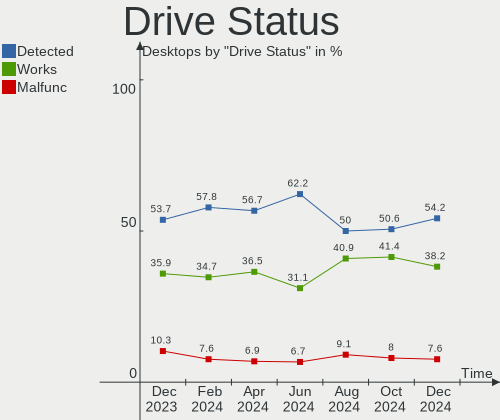

| Status   | Desktops | Drives | Percent |
|----------|----------|--------|---------|
| Detected | 135      | 334    | 54.22%  |
| Works    | 95       | 224    | 38.15%  |
| Malfunc  | 19       | 24     | 7.63%   |

Storage controller
------------------

Storage Vendor
--------------

Storage controller vendors

| Vendor                           | Desktops | Percent |
|----------------------------------|----------|---------|
| Intel                            | 119      | 31.4%   |
| AMD                              | 95       | 25.07%  |
| Samsung Electronics              | 42       | 11.08%  |
| SanDisk                          | 25       | 6.6%    |
| Micron/Crucial Technology        | 20       | 5.28%   |
| Kingston Technology Company      | 13       | 3.43%   |
| ASMedia Technology               | 11       | 2.9%    |
| JMicron Technology               | 8        | 2.11%   |
| Phison Electronics               | 7        | 1.85%   |
| Marvell Technology Group         | 7        | 1.85%   |
| Shenzhen Longsys Electronics     | 4        | 1.06%   |
| SK hynix                         | 3        | 0.79%   |
| Seagate Technology               | 3        | 0.79%   |
| Nvidia                           | 3        | 0.79%   |
| ADATA Technology                 | 3        | 0.79%   |
| VIA Technologies                 | 2        | 0.53%   |
| Toshiba America Info Systems     | 2        | 0.53%   |
| Micron Technology                | 2        | 0.53%   |
| MAXIO Technology (Hangzhou)      | 2        | 0.53%   |
| Broadcom / LSI                   | 2        | 0.53%   |
| Solidigm                         | 1        | 0.26%   |
| Silicon Motion                   | 1        | 0.26%   |
| Silicon Integrated Systems [SiS] | 1        | 0.26%   |
| KIOXIA                           | 1        | 0.26%   |
| INNOGRIT                         | 1        | 0.26%   |
| Adaptec                          | 1        | 0.26%   |

Storage Model
-------------

Storage controller models

| Model                                                                          | Desktops | Percent |
|--------------------------------------------------------------------------------|----------|---------|
| AMD FCH SATA Controller [AHCI mode]                                            | 42       | 9.21%   |
| AMD 600 Series Chipset SATA Controller                                         | 18       | 3.95%   |
| AMD 400 Series Chipset SATA Controller                                         | 17       | 3.73%   |
| Samsung NVMe SSD Controller SM981/PM981/PM983                                  | 16       | 3.51%   |
| AMD 500 Series Chipset SATA Controller                                         | 16       | 3.51%   |
| Samsung NVMe SSD Controller PM9A1/PM9A3/980PRO                                 | 14       | 3.07%   |
| Intel 200 Series PCH SATA controller [AHCI mode]                               | 14       | 3.07%   |
| Intel Alder Lake-S PCH SATA Controller [AHCI Mode]                             | 12       | 2.63%   |
| ASMedia ASM1061/ASM1062 Serial ATA Controller                                  | 10       | 2.19%   |
| Micron/Crucial P2 [Nick P2] / P3 / P3 Plus NVMe PCIe SSD (DRAM-less)           | 9        | 1.97%   |
| Intel Q170/Q150/B150/H170/H110/Z170/CM236 Chipset SATA Controller [AHCI Mode]  | 9        | 1.97%   |
| Intel Cannon Lake PCH SATA AHCI Controller                                     | 9        | 1.97%   |
| Samsung NVMe SSD Controller S4LV008[Pascal]                                    | 8        | 1.75%   |
| AMD SB7x0/SB8x0/SB9x0 SATA Controller [AHCI mode]                              | 8        | 1.75%   |
| AMD SB7x0/SB8x0/SB9x0 IDE Controller                                           | 8        | 1.75%   |
| Intel 8 Series/C220 Series Chipset Family 6-port SATA Controller 1 [AHCI mode] | 7        | 1.54%   |
| Intel 7 Series/C210 Series Chipset Family 6-port SATA Controller [AHCI mode]   | 7        | 1.54%   |
| Intel 6 Series/C200 Series Chipset Family 6 port Desktop SATA AHCI Controller  | 7        | 1.54%   |
| Intel Volume Management Device NVMe RAID Controller                            | 6        | 1.32%   |
| Intel Raptor Lake SATA AHCI Controller                                         | 6        | 1.32%   |
| Intel NM10/ICH7 Family SATA Controller [IDE mode]                              | 6        | 1.32%   |
| Intel 500 Series Chipset Family SATA AHCI Controller                           | 6        | 1.32%   |
| Samsung NVMe SSD Controller 980 (DRAM-less)                                    | 5        | 1.1%    |
| JMicron JMB363 SATA/IDE Controller                                             | 5        | 1.1%    |
| Intel Comet Lake SATA AHCI Controller                                          | 5        | 1.1%    |
| Intel 82801G (ICH7 Family) IDE Controller                                      | 5        | 1.1%    |
| AMD X370 Series Chipset SATA Controller                                        | 5        | 1.1%    |
| AMD A320 Chipset SATA Controller [AHCI mode]                                   | 5        | 1.1%    |
| AMD 300 Series Chipset SATA Controller                                         | 5        | 1.1%    |
| Sandisk WD Blue SN580 NVMe SSD (DRAM-less)                                     | 4        | 0.88%   |
| Sandisk WD Black SN850X NVMe SSD                                               | 4        | 0.88%   |
| SanDisk Ultra 3D / WD PC SN530, IX SN530, Blue SN550 NVMe SSD (DRAM-less)      | 4        | 0.88%   |
| AMD SB7x0/SB8x0/SB9x0 SATA Controller [IDE mode]                               | 4        | 0.88%   |
| Shenzhen Longsys Lexar NM790 NVME SSD (DRAM-less)                              | 3        | 0.66%   |
| Seagate E18 PCIe SSD                                                           | 3        | 0.66%   |
| SanDisk WD PC SN810 / Black SN850 NVMe SSD                                     | 3        | 0.66%   |
| SanDisk Extreme Pro / WD Black SN750 / PC SN730 / Red SN700 NVMe SSD           | 3        | 0.66%   |
| Micron/Crucial P5 Plus NVMe PCIe SSD                                           | 3        | 0.66%   |
| Marvell Group 88SE9215 PCIe 2.0 x1 4-port SATA 6 Gb/s Controller               | 3        | 0.66%   |
| Kingston Company NV2 NVMe SSD [SM2267XT] (DRAM-less)                           | 3        | 0.66%   |

Storage Kind
------------

Kind of storage controller (IDE, SATA, NVMe, SAS, ...)

| Kind | Desktops | Percent |
|------|----------|---------|
| SATA | 191      | 53.8%   |
| NVMe | 114      | 32.11%  |
| IDE  | 35       | 9.86%   |
| RAID | 12       | 3.38%   |
| SAS  | 3        | 0.85%   |

Processor
---------

CPU Vendor
----------

Processor vendors

| Vendor        | Desktops | Percent |
|---------------|----------|---------|
| Intel         | 122      | 54.46%  |
| AMD           | 101      | 45.09%  |
| sifive,u74-mc | 1        | 0.45%   |

CPU Model
---------

Processor models

| Model                                           | Desktops | Percent |
|-------------------------------------------------|----------|---------|
| AMD Ryzen 5 3600 6-Core Processor               | 6        | 2.68%   |
| AMD Ryzen 7 5800X 8-Core Processor              | 5        | 2.23%   |
| AMD Ryzen 5 5600G with Radeon Graphics          | 5        | 2.23%   |
| Intel Core i5-8400 CPU @ 2.80GHz                | 4        | 1.79%   |
| Intel Core i7-8700K CPU @ 3.70GHz               | 3        | 1.34%   |
| Intel Core i5-7400 CPU @ 3.00GHz                | 3        | 1.34%   |
| Intel Core i5-6500 CPU @ 3.20GHz                | 3        | 1.34%   |
| Intel Core i5-3470 CPU @ 3.20GHz                | 3        | 1.34%   |
| Intel 12th Gen Core i5-12400F                   | 3        | 1.34%   |
| AMD Ryzen 9 3900X 12-Core Processor             | 3        | 1.34%   |
| AMD Ryzen 7 5700G with Radeon Graphics          | 3        | 1.34%   |
| AMD FX-8350 Eight-Core Processor                | 3        | 1.34%   |
| Intel N100                                      | 2        | 0.89%   |
| Intel Core i9-14900KF                           | 2        | 0.89%   |
| Intel Core i7-8700 CPU @ 3.20GHz                | 2        | 0.89%   |
| Intel Core i7-6700K CPU @ 4.00GHz               | 2        | 0.89%   |
| Intel Core i7-2600 CPU @ 3.40GHz                | 2        | 0.89%   |
| Intel Core i5-9400F CPU @ 2.90GHz               | 2        | 0.89%   |
| Intel Core i5-2500K CPU @ 3.30GHz               | 2        | 0.89%   |
| Intel Core 2 Duo CPU E6750 @ 2.66GHz            | 2        | 0.89%   |
| Intel 12th Gen Core i9-12900K                   | 2        | 0.89%   |
| Intel 12th Gen Core i7-12700K                   | 2        | 0.89%   |
| Intel 12th Gen Core i5-12600K                   | 2        | 0.89%   |
| Intel 11th Gen Core i9-11900KF @ 3.50GHz        | 2        | 0.89%   |
| Intel 11th Gen Core i7-11700K @ 3.60GHz         | 2        | 0.89%   |
| AMD Ryzen 9 9950X 16-Core Processor             | 2        | 0.89%   |
| AMD Ryzen 9 7950X3D 16-Core Processor           | 2        | 0.89%   |
| AMD Ryzen 9 7950X 16-Core Processor             | 2        | 0.89%   |
| AMD Ryzen 9 5900X 12-Core Processor             | 2        | 0.89%   |
| AMD Ryzen 7 7700X 8-Core Processor              | 2        | 0.89%   |
| AMD Ryzen 7 3700X 8-Core Processor              | 2        | 0.89%   |
| AMD Ryzen 7 1800X Eight-Core Processor          | 2        | 0.89%   |
| AMD Ryzen 7 1700X Eight-Core Processor          | 2        | 0.89%   |
| AMD Ryzen 5 9600X 6-Core Processor              | 2        | 0.89%   |
| AMD Ryzen 5 7600X 6-Core Processor              | 2        | 0.89%   |
| AMD Ryzen 5 3400G with Radeon Vega Graphics     | 2        | 0.89%   |
| AMD Ryzen 5 2600 Six-Core Processor             | 2        | 0.89%   |
| AMD A8-7600 Radeon R7, 10 Compute Cores 4C+6G   | 2        | 0.89%   |
| AMD A10-9700 RADEON R7, 10 COMPUTE CORES 4C+6G  | 2        | 0.89%   |
| AMD A10-7870K Radeon R7, 12 Compute Cores 4C+8G | 2        | 0.89%   |

CPU Model Family
----------------

Processor model prefix

| Model                   | Desktops | Percent |
|-------------------------|----------|---------|
| Intel Core i5           | 34       | 15.18%  |
| AMD Ryzen 5             | 30       | 13.39%  |
| AMD Ryzen 7             | 27       | 12.05%  |
| Other                   | 26       | 11.61%  |
| Intel Core i7           | 24       | 10.71%  |
| AMD Ryzen 9             | 14       | 6.25%   |
| Intel Core i9           | 7        | 3.13%   |
| AMD FX                  | 7        | 3.13%   |
| Intel Xeon              | 6        | 2.68%   |
| Intel Pentium Dual-Core | 6        | 2.68%   |
| Intel Core 2 Duo        | 5        | 2.23%   |
| Intel Pentium           | 4        | 1.79%   |
| Intel Core i3           | 4        | 1.79%   |
| AMD A10                 | 4        | 1.79%   |
| Intel Pentium 4         | 3        | 1.34%   |
| AMD A8                  | 3        | 1.34%   |
| Intel Celeron           | 2        | 0.89%   |
| AMD Ryzen 5 PRO         | 2        | 0.89%   |
| AMD Ryzen 3             | 2        | 0.89%   |
| AMD Athlon II X2        | 2        | 0.89%   |
| AMD Athlon 64 X2        | 2        | 0.89%   |
| AMD A4                  | 2        | 0.89%   |
| Intel Core 2 Quad       | 1        | 0.45%   |
| Intel Core 2 Extreme    | 1        | 0.45%   |
| AMD Ryzen Threadripper  | 1        | 0.45%   |
| AMD Phenom II X6        | 1        | 0.45%   |
| AMD Phenom II X4        | 1        | 0.45%   |
| AMD Athlon X4           | 1        | 0.45%   |
| AMD Athlon II X4        | 1        | 0.45%   |
| AMD Athlon              | 1        | 0.45%   |

CPU Cores
---------

Number of processor cores

| Number | Desktops | Percent |
|--------|----------|---------|
| 4      | 63       | 28.13%  |
| 6      | 51       | 22.77%  |
| 8      | 39       | 17.41%  |
| 2      | 33       | 14.73%  |
| 12     | 11       | 4.91%   |
| 16     | 8        | 3.57%   |
| 10     | 5        | 2.23%   |
| 24     | 4        | 1.79%   |
| 1      | 4        | 1.79%   |
| 14     | 3        | 1.34%   |
| 32     | 1        | 0.45%   |
| 28     | 1        | 0.45%   |
| 3      | 1        | 0.45%   |

CPU Sockets
-----------

Number of sockets

| Number | Desktops | Percent |
|--------|----------|---------|
| 1      | 223      | 99.55%  |
| 2      | 1        | 0.45%   |

CPU Threads
-----------

Threads per core (Hyper-Threading)

| Number | Desktops | Percent |
|--------|----------|---------|
| 2      | 153      | 68.3%   |
| 1      | 71       | 31.7%   |

CPU Op-Modes
------------

CPU Operation Modes (32-bit, 64-bit)

| Op mode        | Desktops | Percent |
|----------------|----------|---------|
| 32-bit, 64-bit | 222      | 99.11%  |
| 32-bit         | 1        | 0.45%   |
| Unknown        | 1        | 0.45%   |

CPU Microcode
-------------

Microcode number

| Number     | Desktops | Percent |
|------------|----------|---------|
| Unknown    | 197      | 87.95%  |
| 0x1067a    | 3        | 1.34%   |
| 0x506e3    | 2        | 0.89%   |
| 0x306c3    | 2        | 0.89%   |
| 0x08701030 | 2        | 0.89%   |
| 0xf65      | 1        | 0.45%   |
| 0xf27      | 1        | 0.45%   |
| 0xb06e0    | 1        | 0.45%   |
| 0xa0671    | 1        | 0.45%   |
| 0x906ea    | 1        | 0.45%   |
| 0x906e9    | 1        | 0.45%   |
| 0x806f8    | 1        | 0.45%   |
| 0x50654    | 1        | 0.45%   |
| 0x206a7    | 1        | 0.45%   |
| 0x0a601206 | 1        | 0.45%   |
| 0x0a601203 | 1        | 0.45%   |
| 0x0a201016 | 1        | 0.45%   |
| 0x08701034 | 1        | 0.45%   |
| 0x08001137 | 1        | 0.45%   |
| 0x0600611a | 1        | 0.45%   |
| 0x06003106 | 1        | 0.45%   |
| 0x06001119 | 1        | 0.45%   |
| 0x06000852 | 1        | 0.45%   |

CPU Microarch
-------------

Microarchitecture

| Name             | Desktops | Percent |
|------------------|----------|---------|
| Unknown          | 33       | 14.73%  |
| KabyLake         | 23       | 10.27%  |
| Zen 3            | 21       | 9.38%   |
| Zen 2            | 16       | 7.14%   |
| Alderlake Hybrid | 14       | 6.25%   |
| Skylake          | 12       | 5.36%   |
| Haswell          | 12       | 5.36%   |
| Zen              | 10       | 4.46%   |
| Penryn           | 10       | 4.46%   |
| IvyBridge        | 9        | 4.02%   |
| Piledriver       | 8        | 3.57%   |
| Zen+             | 7        | 3.13%   |
| SandyBridge      | 7        | 3.13%   |
| Nehalem          | 5        | 2.23%   |
| K10              | 5        | 2.23%   |
| CometLake        | 5        | 2.23%   |
| Steamroller      | 4        | 1.79%   |
| Excavator        | 4        | 1.79%   |
| NetBurst         | 3        | 1.34%   |
| Core             | 3        | 1.34%   |
| Westmere         | 2        | 0.89%   |
| K8 Hammer        | 2        | 0.89%   |
| Icelake          | 2        | 0.89%   |
| Gracemont        | 2        | 0.89%   |
| TigerLake        | 1        | 0.45%   |
| Sapphire Rapids  | 1        | 0.45%   |
| Jaguar           | 1        | 0.45%   |
| Goldmont plus    | 1        | 0.45%   |
| Broadwell        | 1        | 0.45%   |

Graphics
--------

GPU Vendor
----------

Vendors of graphics cards

| Vendor                     | Desktops | Percent |
|----------------------------|----------|---------|
| Nvidia                     | 99       | 39.76%  |
| AMD                        | 95       | 38.15%  |
| Intel                      | 53       | 21.29%  |
| Matrox Electronics Systems | 1        | 0.4%    |
| ATI Technologies           | 1        | 0.4%    |

GPU Model
---------

Graphics card models

| Model                                                                       | Desktops | Percent |
|-----------------------------------------------------------------------------|----------|---------|
| AMD Raphael                                                                 | 9        | 3.47%   |
| AMD Cezanne [Radeon Vega Series / Radeon Vega Mobile Series]                | 8        | 3.09%   |
| Nvidia GP108 [GeForce GT 1030]                                              | 7        | 2.7%    |
| AMD Navi 22 [Radeon RX 6700/6700 XT/6750 XT / 6800M/6850M XT]               | 7        | 2.7%    |
| AMD Granite Ridge [Radeon Graphics]                                         | 6        | 2.32%   |
| Intel HD Graphics 530                                                       | 5        | 1.93%   |
| Intel CoffeeLake-S GT2 [UHD Graphics 630]                                   | 5        | 1.93%   |
| AMD Navi 21 [Radeon RX 6800/6800 XT / 6900 XT]                              | 5        | 1.93%   |
| AMD Ellesmere [Radeon RX 470/480/570/570X/580/580X/590]                     | 5        | 1.93%   |
| AMD Caicos [Radeon HD 6450/7450/8450 / R5 230 OEM]                          | 5        | 1.93%   |
| Nvidia GM204 [GeForce GTX 970]                                              | 4        | 1.54%   |
| Nvidia GK208B [GeForce GT 730]                                              | 4        | 1.54%   |
| Nvidia GK208B [GeForce GT 710]                                              | 4        | 1.54%   |
| Nvidia AD107 [GeForce RTX 4060]                                             | 4        | 1.54%   |
| Intel Xeon E3-1200 v3/4th Gen Core Processor Integrated Graphics Controller | 4        | 1.54%   |
| Intel HD Graphics 630                                                       | 4        | 1.54%   |
| AMD Raven Ridge [Radeon Vega Series / Radeon Vega Mobile Series]            | 4        | 1.54%   |
| AMD Navi 32 [Radeon RX 7700 XT / 7800 XT]                                   | 4        | 1.54%   |
| AMD Navi 31 [Radeon RX 7900 XT/7900 XTX/7900 GRE/7900M]                     | 4        | 1.54%   |
| AMD Navi 23 [Radeon RX 6600/6600 XT/6600M]                                  | 4        | 1.54%   |
| Nvidia GP107 [GeForce GTX 1050]                                             | 3        | 1.16%   |
| Nvidia GP104 [GeForce GTX 1080]                                             | 3        | 1.16%   |
| Nvidia GM107 [GeForce GTX 750 Ti]                                           | 3        | 1.16%   |
| Nvidia GA102 [GeForce RTX 3080 Lite Hash Rate]                              | 3        | 1.16%   |
| Nvidia AD106 [GeForce RTX 4060 Ti]                                          | 3        | 1.16%   |
| Nvidia AD103 [GeForce RTX 4080 SUPER]                                       | 3        | 1.16%   |
| Intel Xeon E3-1200 v2/3rd Gen Core processor Graphics Controller            | 3        | 1.16%   |
| Intel DG2 [Arc A380]                                                        | 3        | 1.16%   |
| Intel 4 Series Chipset Integrated Graphics Controller                       | 3        | 1.16%   |
| Intel 2nd Generation Core Processor Family Integrated Graphics Controller   | 3        | 1.16%   |
| AMD Kaveri [Radeon R7 Graphics]                                             | 3        | 1.16%   |
| Nvidia TU106 [GeForce RTX 2060 SUPER]                                       | 2        | 0.77%   |
| Nvidia GP107 [GeForce GTX 1050 Ti]                                          | 2        | 0.77%   |
| Nvidia GP106 [GeForce GTX 1060 6GB]                                         | 2        | 0.77%   |
| Nvidia GP104 [GeForce GTX 1070]                                             | 2        | 0.77%   |
| Nvidia GP102 [GeForce GTX 1080 Ti]                                          | 2        | 0.77%   |
| Nvidia GM206 [GeForce GTX 960]                                              | 2        | 0.77%   |
| Nvidia GM107 [GeForce GTX 750]                                              | 2        | 0.77%   |
| Nvidia GK106 [GeForce GTX 660]                                              | 2        | 0.77%   |
| Nvidia GA106 [GeForce RTX 3060 Lite Hash Rate]                              | 2        | 0.77%   |

GPU Combo
---------

Combinations of graphics cards

| Name           | Desktops | Percent |
|----------------|----------|---------|
| 1 x Nvidia     | 82       | 36.61%  |
| 1 x AMD        | 74       | 33.04%  |
| 1 x Intel      | 36       | 16.07%  |
| AMD + Nvidia   | 10       | 4.46%   |
| 2 x AMD        | 9        | 4.02%   |
| Intel + Nvidia | 6        | 2.68%   |
| Other          | 2        | 0.89%   |
| 2 x Intel      | 2        | 0.89%   |
| Intel + AMD    | 2        | 0.89%   |
| 1 x Matrox     | 1        | 0.45%   |

GPU Driver
----------

Free vs proprietary

| Driver      | Desktops | Percent |
|-------------|----------|---------|
| Free        | 157      | 70.09%  |
| Proprietary | 53       | 23.66%  |
| Unknown     | 14       | 6.25%   |

GPU Memory
----------

Total video memory

| Size in GB | Desktops | Percent |
|------------|----------|---------|
| Unknown    | 133      | 59.38%  |
| 8.01-16.0  | 21       | 9.38%   |
| 7.01-8.0   | 20       | 8.93%   |
| 1.01-2.0   | 14       | 6.25%   |
| 0.01-0.5   | 13       | 5.8%    |
| 0.51-1.0   | 11       | 4.91%   |
| 3.01-4.0   | 10       | 4.46%   |
| 16.01-24.0 | 2        | 0.89%   |

Monitor
-------

Monitor Vendor
--------------

Monitor vendors

| Vendor               | Desktops | Percent |
|----------------------|----------|---------|
| Samsung Electronics  | 38       | 15.08%  |
| Goldstar             | 36       | 14.29%  |
| Acer                 | 20       | 7.94%   |
| Dell                 | 18       | 7.14%   |
| BenQ                 | 16       | 6.35%   |
| AOC                  | 12       | 4.76%   |
| Ancor Communications | 11       | 4.37%   |
| Iiyama               | 9        | 3.57%   |
| Hewlett-Packard      | 9        | 3.57%   |
| Philips              | 8        | 3.17%   |
| Eizo                 | 7        | 2.78%   |
| ViewSonic            | 6        | 2.38%   |
| ASUSTek Computer     | 6        | 2.38%   |
| NEC Computers        | 4        | 1.59%   |
| MSI                  | 4        | 1.59%   |
| HannStar             | 4        | 1.59%   |
| Mi                   | 3        | 1.19%   |
| Medion               | 3        | 1.19%   |
| Lenovo               | 3        | 1.19%   |
| HUAWEI               | 3        | 1.19%   |
| Fujitsu Siemens      | 3        | 1.19%   |
| Toshiba              | 2        | 0.79%   |
| Sony                 | 2        | 0.79%   |
| MiTAC                | 2        | 0.79%   |
| Gigabyte Technology  | 2        | 0.79%   |
| Denver               | 2        | 0.79%   |
| Unknown              | 2        | 0.79%   |
| WES                  | 1        | 0.4%    |
| Vestel Elektronik    | 1        | 0.4%    |
| Unknown              | 1        | 0.4%    |
| Targa Visionary      | 1        | 0.4%    |
| Onkyo                | 1        | 0.4%    |
| MNR                  | 1        | 0.4%    |
| LG Electronics       | 1        | 0.4%    |
| INNOCN               | 1        | 0.4%    |
| HKC                  | 1        | 0.4%    |
| Hitachi              | 1        | 0.4%    |
| DZX                  | 1        | 0.4%    |
| DENON                | 1        | 0.4%    |
| CTV                  | 1        | 0.4%    |

Monitor Model
-------------

Monitor models

| Model                                                                  | Desktops | Percent |
|------------------------------------------------------------------------|----------|---------|
| Mi Monitor XMI3444 3440x1440 800x330mm 34.1-inch                       | 3        | 1.16%   |
| HUAWEI ZQE-CBA HWV6A25 3440x1440 797x334mm 34.0-inch                   | 3        | 1.16%   |
| Goldstar Ultra HD GSM5B08 3840x2160 600x340mm 27.2-inch                | 3        | 1.16%   |
| Samsung Electronics U28E590 SAM0C4D 3840x2160 607x345mm 27.5-inch      | 2        | 0.77%   |
| Samsung Electronics S24F350 SAM0D20 1920x1080 521x293mm 23.5-inch      | 2        | 0.77%   |
| Samsung Electronics Odyssey G40B SAM727D 1920x1080 597x336mm 27.0-inch | 2        | 0.77%   |
| Samsung Electronics C27F390 SAM0D32 1920x1080 600x340mm 27.2-inch      | 2        | 0.77%   |
| Hewlett-Packard LA2205 HWP2849 1680x1050 473x296mm 22.0-inch           | 2        | 0.77%   |
| HannStar HW191D HSD8991 1440x900 408x255mm 18.9-inch                   | 2        | 0.77%   |
| Goldstar LG TV SSCR2 GSMC0C8 3840x2160                                 | 2        | 0.77%   |
| Goldstar 38GN950 GSM7754 3840x1600 879x366mm 37.5-inch                 | 2        | 0.77%   |
| Dell U2722D DEL422D 2560x1440 597x336mm 27.0-inch                      | 2        | 0.77%   |
| Dell AW3423DWF DELA212 3440x1440 800x337mm 34.2-inch                   | 2        | 0.77%   |
| BenQ ZOWIE XL LCD BNQ7F33 1920x1080 531x298mm 24.0-inch                | 2        | 0.77%   |
| ASUSTek Computer VP28U AUS28B1 3840x2160 621x341mm 27.9-inch           | 2        | 0.77%   |
| AOC Q27G2WG4 AOC2702 2560x1440 597x336mm 27.0-inch                     | 2        | 0.77%   |
| Ancor Communications ROG PG278Q ACI27B1 2560x1440 598x336mm 27.0-inch  | 2        | 0.77%   |
| Acer S242HL ACR0216 1920x1080 531x299mm 24.0-inch                      | 2        | 0.77%   |
| Acer G246HL ACR02FF 1920x1080 531x299mm 24.0-inch                      | 2        | 0.77%   |
| Unknown                                                                | 2        | 0.77%   |
| WES WD50UC4300 WES0030 3840x2160 708x398mm 32.0-inch                   | 1        | 0.39%   |
| ViewSonic XG2703-GS VSCBA32 2560x1440 598x336mm 27.0-inch              | 1        | 0.39%   |
| ViewSonic VA3456-WQHD VSCFC3A 3440x1440 800x335mm 34.1-inch            | 1        | 0.39%   |
| ViewSonic VA2719 Series VSCC132 1920x1080 598x336mm 27.0-inch          | 1        | 0.39%   |
| ViewSonic VA2407 Series VSC8C31 1920x1080 521x293mm 23.5-inch          | 1        | 0.39%   |
| ViewSonic VA2248 SERIES VSC0E28 1920x1080 477x268mm 21.5-inch          | 1        | 0.39%   |
| ViewSonic VA2223-FHD VSC9239 1920x1080 477x268mm 21.5-inch             | 1        | 0.39%   |
| Vestel Elektronik 49FHD_LCD_TV VES3700 1920x1080 1280x720mm 57.8-inch  | 1        | 0.39%   |
| Unknown LCD Monitor FFFF 2288x1287 2550x2550mm 142.0-inch              | 1        | 0.39%   |
| Toshiba TV TSB0112 1920x1080 1036x585mm 46.8-inch                      | 1        | 0.39%   |
| Toshiba TV TSB010B 1920x1080 882x498mm 39.9-inch                       | 1        | 0.39%   |
| Targa Visionary LCD19-4 TARA194 1280x1024 376x301mm 19.0-inch          | 1        | 0.39%   |
| Sony TV SNYDC02 1920x1080 708x398mm 32.0-inch                          | 1        | 0.39%   |
| Sony TV *30 SNYBA05 3840x2160 1439x809mm 65.0-inch                     | 1        | 0.39%   |
| Samsung Electronics U32H85x SAM0E3A 3840x2160 697x392mm 31.5-inch      | 1        | 0.39%   |
| Samsung Electronics U28E850 SAM0CCB 3840x2160 607x345mm 27.5-inch      | 1        | 0.39%   |
| Samsung Electronics U28D590 SAM0B80 3840x2160 607x345mm 27.5-inch      | 1        | 0.39%   |
| Samsung Electronics SyncMaster SAM0589 1920x1080 521x293mm 23.5-inch   | 1        | 0.39%   |
| Samsung Electronics SyncMaster SAM0467 1920x1200 518x324mm 24.1-inch   | 1        | 0.39%   |
| Samsung Electronics SyncMaster SAM036D 1920x1080                       | 1        | 0.39%   |

Monitor Resolution
------------------

Monitor screen resolution

| Resolution         | Desktops | Percent |
|--------------------|----------|---------|
| 1920x1080 (FHD)    | 107      | 44.77%  |
| 3840x2160 (4K)     | 45       | 18.83%  |
| 2560x1440 (QHD)    | 26       | 10.88%  |
| 3440x1440          | 17       | 7.11%   |
| 1920x1200 (WUXGA)  | 12       | 5.02%   |
| 1280x1024 (SXGA)   | 9        | 3.77%   |
| 1680x1050 (WSXGA+) | 5        | 2.09%   |
| 1440x900 (WXGA+)   | 3        | 1.26%   |
| 3840x1600          | 2        | 0.84%   |
| 2560x1080          | 2        | 0.84%   |
| 1920x540           | 2        | 0.84%   |
| 1366x768 (WXGA)    | 2        | 0.84%   |
| 6400x2160          | 1        | 0.42%   |
| 3840x1080          | 1        | 0.42%   |
| 2560x1600          | 1        | 0.42%   |
| 2288x1287          | 1        | 0.42%   |
| 1600x1200          | 1        | 0.42%   |
| 1024x768 (XGA)     | 1        | 0.42%   |
| Unknown            | 1        | 0.42%   |

Monitor Diagonal
----------------

Diagonal size in inches

| Inches  | Desktops | Percent |
|---------|----------|---------|
| 27      | 60       | 24.19%  |
| 24      | 41       | 16.53%  |
| 23      | 25       | 10.08%  |
| 21      | 20       | 8.06%   |
| 34      | 19       | 7.66%   |
| 31      | 15       | 6.05%   |
| 32      | 6        | 2.42%   |
| 19      | 6        | 2.42%   |
| Unknown | 6        | 2.42%   |
| 40      | 5        | 2.02%   |
| 15      | 5        | 2.02%   |
| 84      | 4        | 1.61%   |
| 22      | 4        | 1.61%   |
| 72      | 3        | 1.21%   |
| 46      | 3        | 1.21%   |
| 26      | 3        | 1.21%   |
| 17      | 3        | 1.21%   |
| 65      | 2        | 0.81%   |
| 64      | 2        | 0.81%   |
| 49      | 2        | 0.81%   |
| 48      | 2        | 0.81%   |
| 37      | 2        | 0.81%   |
| 142     | 1        | 0.4%    |
| 63      | 1        | 0.4%    |
| 54      | 1        | 0.4%    |
| 52      | 1        | 0.4%    |
| 39      | 1        | 0.4%    |
| 33      | 1        | 0.4%    |
| 28      | 1        | 0.4%    |
| 25      | 1        | 0.4%    |
| 20      | 1        | 0.4%    |
| 18      | 1        | 0.4%    |

Monitor Width
-------------

Physical width

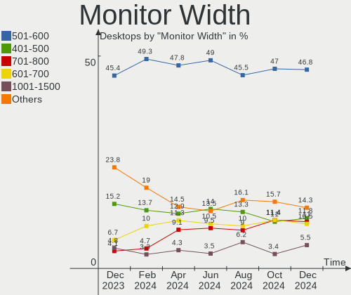

| Width in mm    | Desktops | Percent |
|----------------|----------|---------|
| 501-600        | 111      | 46.84%  |
| 401-500        | 28       | 11.81%  |
| 701-800        | 26       | 10.97%  |
| 601-700        | 25       | 10.55%  |
| 1001-1500      | 13       | 5.49%   |
| 301-350        | 8        | 3.38%   |
| 801-900        | 7        | 2.95%   |
| 1501-2000      | 7        | 2.95%   |
| Unknown        | 6        | 2.53%   |
| 351-400        | 4        | 1.69%   |
| More than 2000 | 1        | 0.42%   |
| 901-1000       | 1        | 0.42%   |

Aspect Ratio
------------

Proportional relationship between the width and the height

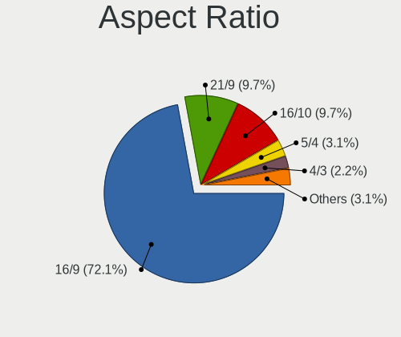

| Ratio   | Desktops | Percent |
|---------|----------|---------|
| 16/9    | 163      | 72.12%  |
| 21/9    | 22       | 9.73%   |
| 16/10   | 22       | 9.73%   |
| 5/4     | 7        | 3.1%    |
| 4/3     | 5        | 2.21%   |
| Unknown | 4        | 1.77%   |
| 32/9    | 2        | 0.88%   |
| 1.00    | 1        | 0.44%   |

Monitor Area
------------

Area in inch²

| Area in inch² | Desktops | Percent |
|----------------|----------|---------|
| 201-250        | 68       | 27.76%  |
| 301-350        | 61       | 24.9%   |
| 351-500        | 42       | 17.14%  |
| More than 1000 | 17       | 6.94%   |
| 251-300        | 17       | 6.94%   |
| 151-200        | 13       | 5.31%   |
| 501-1000       | 13       | 5.31%   |
| Unknown        | 6        | 2.45%   |
| 141-150        | 3        | 1.22%   |
| 111-120        | 3        | 1.22%   |
| 101-110        | 2        | 0.82%   |

Pixel Density
-------------

Pixels per inch

| Density | Desktops | Percent |
|---------|----------|---------|
| 51-100  | 129      | 56.33%  |
| 101-120 | 59       | 25.76%  |
| 121-160 | 16       | 6.99%   |
| 1-50    | 12       | 5.24%   |
| 161-240 | 7        | 3.06%   |
| Unknown | 6        | 2.62%   |

Multiple Monitors
-----------------

Total monitors connected

| Total | Desktops | Percent |
|-------|----------|---------|
| 1     | 168      | 75%     |
| 2     | 36       | 16.07%  |
| 0     | 13       | 5.8%    |
| 3     | 6        | 2.68%   |
| 4     | 1        | 0.45%   |

Network
-------

Net Controller Vendor
---------------------

Controller vendors

| Vendor                           | Desktops | Percent |
|----------------------------------|----------|---------|
| Realtek Semiconductor            | 144      | 45.86%  |
| Intel                            | 95       | 30.25%  |
| MediaTek                         | 18       | 5.73%   |
| TP-Link                          | 10       | 3.18%   |
| Qualcomm Atheros                 | 6        | 1.91%   |
| Microsoft                        | 6        | 1.91%   |
| Edimax Technology                | 3        | 0.96%   |
| Broadcom                         | 3        | 0.96%   |
| Aquantia                         | 3        | 0.96%   |
| Samsung Electronics              | 2        | 0.64%   |
| Ralink Technology                | 2        | 0.64%   |
| Qualcomm Technologies            | 2        | 0.64%   |
| Nvidia                           | 2        | 0.64%   |
| IMC Networks                     | 2        | 0.64%   |
| SparkFun                         | 1        | 0.32%   |
| Silicon Integrated Systems [SiS] | 1        | 0.32%   |
| Qualcomm Atheros Communications  | 1        | 0.32%   |
| QinHeng Electronics              | 1        | 0.32%   |
| Padix (Rockfire)                 | 1        | 0.32%   |
| NetGear                          | 1        | 0.32%   |
| Mellanox Technologies            | 1        | 0.32%   |
| Marvell Technology Group         | 1        | 0.32%   |
| Hewlett-Packard                  | 1        | 0.32%   |
| Google                           | 1        | 0.32%   |
| DisplayLink                      | 1        | 0.32%   |
| Broadcom Limited                 | 1        | 0.32%   |
| AVM                              | 1        | 0.32%   |
| ASUSTek Computer                 | 1        | 0.32%   |
| ASIX Electronics                 | 1        | 0.32%   |
| American Megatrends              | 1        | 0.32%   |

Net Controller Model
--------------------

Controller models

| Model                                                                  | Desktops | Percent |
|------------------------------------------------------------------------|----------|---------|
| Realtek RTL8111/8168/8211/8411 PCI Express Gigabit Ethernet Controller | 105      | 28.23%  |
| Realtek RTL8125 2.5GbE Controller                                      | 32       | 8.6%    |
| Intel I211 Gigabit Network Connection                                  | 12       | 3.23%   |
| Intel Ethernet Controller I225-V                                       | 12       | 3.23%   |
| Intel Wi-Fi 6 AX200                                                    | 11       | 2.96%   |
| Intel Wi-Fi 6E(802.11ax) AX210/AX1675* 2x2 [Typhoon Peak]              | 9        | 2.42%   |
| MediaTek MT7922 802.11ax PCI Express Wireless Network Adapter          | 8        | 2.15%   |
| Intel Ethernet Connection (2) I219-V                                   | 8        | 2.15%   |
| Realtek RTL8821CE 802.11ac PCIe Wireless Network Adapter               | 7        | 1.88%   |
| Intel Ethernet Connection (7) I219-V                                   | 6        | 1.61%   |
| Realtek RTL8153 Gigabit Ethernet Adapter                               | 5        | 1.34%   |
| Intel 82579V Gigabit Network Connection                                | 5        | 1.34%   |
| MediaTek MT7921K (RZ608) Wi-Fi 6E 80MHz                                | 4        | 1.08%   |
| Intel Ethernet Controller I226-V                                       | 4        | 1.08%   |
| Intel Dual Band Wireless-AC 3168NGW [Stone Peak]                       | 4        | 1.08%   |
| TP-Link TL-WN823N v2/v3 [Realtek RTL8192EU]                            | 3        | 0.81%   |
| Realtek RTL88x2bu [AC1200 Techkey]                                     | 3        | 0.81%   |
| Microsoft Xbox Wireless Adapter for Windows                            | 3        | 0.81%   |
| Microsoft Xbox 360 Wireless Adapter                                    | 3        | 0.81%   |
| Intel I210 Gigabit Network Connection                                  | 3        | 0.81%   |
| Intel Ethernet Connection I217-LM                                      | 3        | 0.81%   |
| Intel Ethernet Connection (2) I219-LM                                  | 3        | 0.81%   |
| Intel Ethernet Connection (17) I219-LM                                 | 3        | 0.81%   |
| TP-Link RTL8812AU Archer T4U 802.11ac                                  | 2        | 0.54%   |
| TP-Link Archer T4U ver.3                                               | 2        | 0.54%   |
| Samsung Galaxy series, misc. (tethering mode)                          | 2        | 0.54%   |
| Realtek USB 10/100/1G/2.5G LAN                                         | 2        | 0.54%   |
| Realtek RTL8192EE PCIe Wireless Network Adapter                        | 2        | 0.54%   |
| Realtek RTL8188CUS 802.11n WLAN Adapter                                | 2        | 0.54%   |
| Ralink RT2870/RT3070 Wireless Adapter                                  | 2        | 0.54%   |
| Qualcomm WCN785x Wi-Fi 7(802.11be) 320MHz 2x2 [FastConnect 7800]       | 2        | 0.54%   |
| MediaTek WLAN controller                                               | 2        | 0.54%   |
| MediaTek Network controller                                            | 2        | 0.54%   |
| MediaTek MT7921 802.11ax PCI Express Wireless Network Adapter          | 2        | 0.54%   |
| Intel Wireless 3165                                                    | 2        | 0.54%   |
| Intel Wi-Fi 5(802.11ac) Wireless-AC 9x6x [Thunder Peak]                | 2        | 0.54%   |
| Intel Raptor Lake-S PCH CNVi WiFi                                      | 2        | 0.54%   |
| Intel Ethernet Controller I226-LM                                      | 2        | 0.54%   |
| Intel Ethernet Connection (11) I219-V                                  | 2        | 0.54%   |
| Intel Cannon Lake PCH CNVi WiFi                                        | 2        | 0.54%   |

Wireless Vendor
---------------

Wireless vendors

| Vendor                          | Desktops | Percent |
|---------------------------------|----------|---------|
| Intel                           | 39       | 36.45%  |
| Realtek Semiconductor           | 23       | 21.5%   |
| MediaTek                        | 14       | 13.08%  |
| TP-Link                         | 10       | 9.35%   |
| Microsoft                       | 6        | 5.61%   |
| Edimax Technology               | 3        | 2.8%    |
| Ralink Technology               | 2        | 1.87%   |
| Qualcomm Technologies           | 2        | 1.87%   |
| Qualcomm Atheros                | 2        | 1.87%   |
| IMC Networks                    | 2        | 1.87%   |
| Qualcomm Atheros Communications | 1        | 0.93%   |
| NetGear                         | 1        | 0.93%   |
| AVM                             | 1        | 0.93%   |
| ASUSTek Computer                | 1        | 0.93%   |

Wireless Model
--------------

Wireless models

| Model                                                                         | Desktops | Percent |
|-------------------------------------------------------------------------------|----------|---------|
| Intel Wi-Fi 6 AX200                                                           | 11       | 10.09%  |
| Intel Wi-Fi 6E(802.11ax) AX210/AX1675* 2x2 [Typhoon Peak]                     | 9        | 8.26%   |
| MediaTek MT7922 802.11ax PCI Express Wireless Network Adapter                 | 8        | 7.34%   |
| Realtek RTL8821CE 802.11ac PCIe Wireless Network Adapter                      | 7        | 6.42%   |
| MediaTek MT7921K (RZ608) Wi-Fi 6E 80MHz                                       | 4        | 3.67%   |
| Intel Dual Band Wireless-AC 3168NGW [Stone Peak]                              | 4        | 3.67%   |
| TP-Link TL-WN823N v2/v3 [Realtek RTL8192EU]                                   | 3        | 2.75%   |
| Realtek RTL88x2bu [AC1200 Techkey]                                            | 3        | 2.75%   |
| Microsoft Xbox Wireless Adapter for Windows                                   | 3        | 2.75%   |
| Microsoft Xbox 360 Wireless Adapter                                           | 3        | 2.75%   |
| TP-Link RTL8812AU Archer T4U 802.11ac                                         | 2        | 1.83%   |
| TP-Link Archer T4U ver.3                                                      | 2        | 1.83%   |
| Realtek RTL8192EE PCIe Wireless Network Adapter                               | 2        | 1.83%   |
| Realtek RTL8188CUS 802.11n WLAN Adapter                                       | 2        | 1.83%   |
| Ralink RT2870/RT3070 Wireless Adapter                                         | 2        | 1.83%   |
| Qualcomm WCN785x Wi-Fi 7(802.11be) 320MHz 2x2 [FastConnect 7800]              | 2        | 1.83%   |
| MediaTek MT7921 802.11ax PCI Express Wireless Network Adapter                 | 2        | 1.83%   |
| Intel Wireless 3165                                                           | 2        | 1.83%   |
| Intel Wi-Fi 5(802.11ac) Wireless-AC 9x6x [Thunder Peak]                       | 2        | 1.83%   |
| Intel Raptor Lake-S PCH CNVi WiFi                                             | 2        | 1.83%   |
| Intel Cannon Lake PCH CNVi WiFi                                               | 2        | 1.83%   |
| Intel Alder Lake-S PCH CNVi WiFi                                              | 2        | 1.83%   |
| IMC Networks Mediao 802.11n WLAN [Realtek RTL8191SU]                          | 2        | 1.83%   |
| Edimax EW-7811Un 802.11n Wireless Adapter [Realtek RTL8188CUS]                | 2        | 1.83%   |
| TP-Link TL-WN722N v2/v3 [Realtek RTL8188EUS]                                  | 1        | 0.92%   |
| TP-Link Archer T9UH v1 [Realtek RTL8814AU]                                    | 1        | 0.92%   |
| TP-Link Archer T2U PLUS [RTL8821AU]                                           | 1        | 0.92%   |
| Realtek RTL8822CE 802.11ac PCIe Wireless Network Adapter                      | 1        | 0.92%   |
| Realtek RTL8821AE 802.11ac PCIe Wireless Network Adapter                      | 1        | 0.92%   |
| Realtek RTL8812AU-VS 802.11a/b/g/n/ac 2T2R DB WLAN Adapter                    | 1        | 0.92%   |
| Realtek RTL8811AU 802.11a/b/g/n/ac WLAN Adapter                               | 1        | 0.92%   |
| Realtek RTL8192CE PCIe Wireless Network Adapter                               | 1        | 0.92%   |
| Realtek RTL8191SU 802.11n WLAN Adapter                                        | 1        | 0.92%   |
| Realtek RTL8191SEvB Wireless LAN Controller                                   | 1        | 0.92%   |
| Realtek RTL8188CE 802.11b/g/n WiFi Adapter                                    | 1        | 0.92%   |
| Realtek 802.11ax WLAN Adapter                                                 | 1        | 0.92%   |
| Realtek 802.11ac WLAN Adapter                                                 | 1        | 0.92%   |
| Realtek 802.11ac NIC                                                          | 1        | 0.92%   |
| Qualcomm Atheros TP-Link TL-WN821N v2 / TL-WN822N v1 802.11n [Atheros AR9170] | 1        | 0.92%   |
| Qualcomm Atheros AR93xx Wireless Network Adapter                              | 1        | 0.92%   |

Ethernet Vendor
---------------

Ethernet vendors

| Vendor                           | Desktops | Percent |
|----------------------------------|----------|---------|
| Realtek Semiconductor            | 142      | 58.2%   |
| Intel                            | 77       | 31.56%  |
| Qualcomm Atheros                 | 4        | 1.64%   |
| Broadcom                         | 3        | 1.23%   |
| Aquantia                         | 3        | 1.23%   |
| Samsung Electronics              | 2        | 0.82%   |
| Nvidia                           | 2        | 0.82%   |
| MediaTek                         | 2        | 0.82%   |
| Silicon Integrated Systems [SiS] | 1        | 0.41%   |
| Mellanox Technologies            | 1        | 0.41%   |
| Marvell Technology Group         | 1        | 0.41%   |
| Hewlett-Packard                  | 1        | 0.41%   |
| Google                           | 1        | 0.41%   |
| DisplayLink                      | 1        | 0.41%   |
| Broadcom Limited                 | 1        | 0.41%   |
| ASIX Electronics                 | 1        | 0.41%   |
| American Megatrends              | 1        | 0.41%   |

Ethernet Model
--------------

Ethernet models

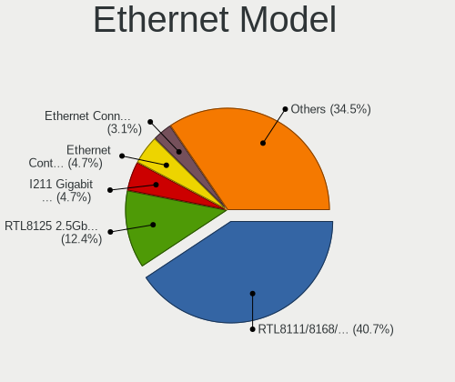

| Model                                                                  | Desktops | Percent |
|------------------------------------------------------------------------|----------|---------|
| Realtek RTL8111/8168/8211/8411 PCI Express Gigabit Ethernet Controller | 105      | 40.7%   |
| Realtek RTL8125 2.5GbE Controller                                      | 32       | 12.4%   |
| Intel I211 Gigabit Network Connection                                  | 12       | 4.65%   |
| Intel Ethernet Controller I225-V                                       | 12       | 4.65%   |
| Intel Ethernet Connection (2) I219-V                                   | 8        | 3.1%    |
| Intel Ethernet Connection (7) I219-V                                   | 6        | 2.33%   |
| Realtek RTL8153 Gigabit Ethernet Adapter                               | 5        | 1.94%   |
| Intel 82579V Gigabit Network Connection                                | 5        | 1.94%   |
| Intel Ethernet Controller I226-V                                       | 4        | 1.55%   |
| Intel I210 Gigabit Network Connection                                  | 3        | 1.16%   |
| Intel Ethernet Connection I217-LM                                      | 3        | 1.16%   |
| Intel Ethernet Connection (2) I219-LM                                  | 3        | 1.16%   |
| Intel Ethernet Connection (17) I219-LM                                 | 3        | 1.16%   |
| Samsung Galaxy series, misc. (tethering mode)                          | 2        | 0.78%   |
| Realtek USB 10/100/1G/2.5G LAN                                         | 2        | 0.78%   |
| MediaTek WLAN controller                                               | 2        | 0.78%   |
| Intel Ethernet Controller I226-LM                                      | 2        | 0.78%   |
| Intel Ethernet Connection (11) I219-V                                  | 2        | 0.78%   |
| Intel 82579LM Gigabit Network Connection (Lewisville)                  | 2        | 0.78%   |
| Intel 82567LM-3 Gigabit Network Connection                             | 2        | 0.78%   |
| Silicon Integrated Systems [SiS] SiS900 PCI Fast Ethernet              | 1        | 0.39%   |
| Realtek RTL8152 Fast Ethernet Adapter                                  | 1        | 0.39%   |
| Realtek RTL810xE PCI Express Fast Ethernet controller                  | 1        | 0.39%   |
| Realtek RT8126 PCIe Ethernet Controller                                | 1        | 0.39%   |
| Realtek Killer E3000 2.5GbE Controller                                 | 1        | 0.39%   |
| Qualcomm Atheros QCA8171 Gigabit Ethernet                              | 1        | 0.39%   |
| Qualcomm Atheros Killer E2500 Gigabit Ethernet Controller              | 1        | 0.39%   |
| Qualcomm Atheros Killer E220x Gigabit Ethernet Controller              | 1        | 0.39%   |
| Qualcomm Atheros AR8151 v2.0 Gigabit Ethernet                          | 1        | 0.39%   |
| Nvidia MCP55 Ethernet                                                  | 1        | 0.39%   |
| Nvidia MCP51 Ethernet Controller                                       | 1        | 0.39%   |
| Mellanox MT27500 Family [ConnectX-3]                                   | 1        | 0.39%   |
| Marvell Group 88E8056 PCI-E Gigabit Ethernet Controller                | 1        | 0.39%   |
| Intel I350 Gigabit Network Connection                                  | 1        | 0.39%   |
| Intel Ethernet Controller X710 for 10GbE SFP+                          | 1        | 0.39%   |
| Intel Ethernet Controller X710 for 10GBASE-T                           | 1        | 0.39%   |
| Intel Ethernet Controller I225-LM                                      | 1        | 0.39%   |
| Intel Ethernet Connection I217-V                                       | 1        | 0.39%   |
| Intel Ethernet Connection (7) I219-LM                                  | 1        | 0.39%   |
| Intel Ethernet Connection (5) I219-LM                                  | 1        | 0.39%   |

Net Controller Kind
-------------------

Ethernet, WiFi or modem

| Kind     | Desktops | Percent |
|----------|----------|---------|
| Ethernet | 223      | 67.78%  |
| WiFi     | 101      | 30.7%   |
| Unknown  | 3        | 0.91%   |
| Modem    | 2        | 0.61%   |

Used Controller
---------------

Currently used network controller

| Kind     | Desktops | Percent |
|----------|----------|---------|
| Ethernet | 187      | 81.66%  |
| WiFi     | 42       | 18.34%  |

NICs
----

Total network controllers on board

| Total | Desktops | Percent |
|-------|----------|---------|
| 1     | 135      | 60.27%  |
| 2     | 75       | 33.48%  |
| 3     | 8        | 3.57%   |
| 5     | 2        | 0.89%   |
| 4     | 2        | 0.89%   |
| 0     | 2        | 0.89%   |

IPv6
----

IPv6 vs IPv4

| Used | Desktops | Percent |
|------|----------|---------|
| Yes  | 153      | 68.3%   |
| No   | 71       | 31.7%   |

Bluetooth
---------

Bluetooth Vendor
----------------

Controller vendors

| Vendor                          | Desktops | Percent |
|---------------------------------|----------|---------|
| Intel                           | 37       | 37.37%  |
| Cambridge Silicon Radio         | 15       | 15.15%  |
| MediaTek                        | 10       | 10.1%   |
| Realtek Semiconductor           | 8        | 8.08%   |
| IMC Networks                    | 7        | 7.07%   |
| Foxconn / Hon Hai               | 7        | 7.07%   |
| TP-Link                         | 5        | 5.05%   |
| ASUSTek Computer                | 4        | 4.04%   |
| Qualcomm Atheros Communications | 3        | 3.03%   |
| Integrated System Solution      | 1        | 1.01%   |
| Dell                            | 1        | 1.01%   |
| Actions                         | 1        | 1.01%   |

Bluetooth Model
---------------

Controller models

| Model                                                 | Desktops | Percent |
|-------------------------------------------------------|----------|---------|
| Cambridge Silicon Radio Bluetooth Dongle (HCI mode)   | 15       | 15.15%  |
| Intel AX200 Bluetooth                                 | 11       | 11.11%  |
| MediaTek Wireless_Device                              | 10       | 10.1%   |
| Intel AX210 Bluetooth                                 | 8        | 8.08%   |
| Intel Bluetooth wireless interface                    | 7        | 7.07%   |
| TP-Link TP-Link Bluetooth USB Adapter                 | 5        | 5.05%   |
| Intel Wireless-AC 3168 Bluetooth                      | 4        | 4.04%   |
| IMC Networks Wireless_Device                          | 4        | 4.04%   |
| Foxconn / Hon Hai Wireless_Device                     | 4        | 4.04%   |
| ASUS ASUS USB-BT500                                   | 4        | 4.04%   |
| Realtek Bluetooth Radio                               | 3        | 3.03%   |
| Qualcomm Atheros AR3011 Bluetooth                     | 3        | 3.03%   |
| Intel AX211 Bluetooth                                 | 3        | 3.03%   |
| Foxconn / Hon Hai Bluetooth Device                    | 3        | 3.03%   |
| Realtek  Bluetooth 4.2 Adapter                        | 2        | 2.02%   |
| Intel Bluetooth 9460/9560 Jefferson Peak (JfP)        | 2        | 2.02%   |
| IMC Networks Bluetooth Radio                          | 2        | 2.02%   |
| Realtek RTL8821A Bluetooth                            | 1        | 1.01%   |
| Realtek Bluetooth 5.4 Radio                           | 1        | 1.01%   |
| Realtek Bluetooth 5.3 Radio                           | 1        | 1.01%   |
| Intel Wireless-AC 9260 Bluetooth Adapter              | 1        | 1.01%   |
| Intel AX201 Bluetooth                                 | 1        | 1.01%   |
| Integrated System Solution KY-BT100 Bluetooth Adapter | 1        | 1.01%   |
| IMC Networks Bluetooth Module                         | 1        | 1.01%   |
| Dell BT Mini-Receiver                                 | 1        | 1.01%   |
| Actions general adapter                               | 1        | 1.01%   |

Sound
-----

Sound Vendor
------------

Sound card vendors

| Vendor                               | Desktops | Percent |
|--------------------------------------|----------|---------|
| AMD                                  | 123      | 28.81%  |
| Intel                                | 116      | 27.17%  |
| Nvidia                               | 95       | 22.25%  |
| C-Media Electronics                  | 9        | 2.11%   |
| Creative Labs                        | 7        | 1.64%   |
| Logitech                             | 6        | 1.41%   |
| Micro Star International             | 5        | 1.17%   |
| JMTek                                | 5        | 1.17%   |
| Texas Instruments                    | 4        | 0.94%   |
| GN Netcom                            | 4        | 0.94%   |
| SteelSeries ApS                      | 3        | 0.7%    |
| Samson Technologies                  | 3        | 0.7%    |
| Razer USA                            | 3        | 0.7%    |
| Jieli Technology                     | 3        | 0.7%    |
| Generalplus Technology               | 3        | 0.7%    |
| Focusrite-Novation                   | 3        | 0.7%    |
| ASUSTek Computer                     | 3        | 0.7%    |
| Yamaha                               | 2        | 0.47%   |
| Thesycon Systemsoftware & Consulting | 2        | 0.47%   |
| Sony                                 | 2        | 0.47%   |
| RODE Microphones                     | 2        | 0.47%   |
| DSEA A/S                             | 2        | 0.47%   |
| Creative Technology                  | 2        | 0.47%   |
| USB Audio                            | 1        | 0.23%   |
| TerraTec Electronic                  | 1        | 0.23%   |
| Tdlasunnic                           | 1        | 0.23%   |
| Silicon Integrated Systems [SiS]     | 1        | 0.23%   |
| Setek Elektronik                     | 1        | 0.23%   |
| Sennheiser electronic                | 1        | 0.23%   |
| PreSonus Audio Electronics           | 1        | 0.23%   |
| Microsoft                            | 1        | 0.23%   |
| Mackie Designs                       | 1        | 0.23%   |
| Lenovo                               | 1        | 0.23%   |
| Kingston Technology                  | 1        | 0.23%   |
| fifine Microphones                   | 1        | 0.23%   |
| DEXP U700 microphone                 | 1        | 0.23%   |
| DEXP BK-20                           | 1        | 0.23%   |
| Cambridge Audio                      | 1        | 0.23%   |
| BEHRINGER International              | 1        | 0.23%   |
| Bang Olufsen                         | 1        | 0.23%   |

Sound Model
-----------

Sound card models

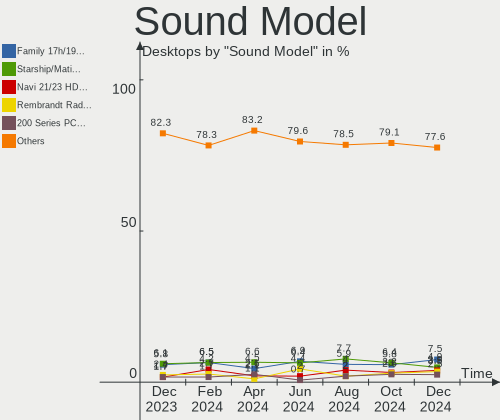

| Model                                                                             | Desktops | Percent |
|-----------------------------------------------------------------------------------|----------|---------|
| AMD Family 17h/19h/1ah HD Audio Controller                                        | 38       | 7.45%   |
| AMD Starship/Matisse HD Audio Controller                                          | 25       | 4.9%    |
| AMD Navi 21/23 HDMI/DP Audio Controller                                           | 20       | 3.92%   |
| AMD Rembrandt Radeon High Definition Audio Controller                             | 18       | 3.53%   |
| Intel 200 Series PCH HD Audio                                                     | 13       | 2.55%   |
| Intel Alder Lake-S HD Audio Controller                                            | 12       | 2.35%   |
| AMD SBx00 Azalia (Intel HDA)                                                      | 12       | 2.35%   |
| AMD Renoir Radeon High Definition Audio Controller                                | 11       | 2.16%   |
| Intel Cannon Lake PCH cAVS                                                        | 10       | 1.96%   |
| Intel 8 Series/C220 Series Chipset High Definition Audio Controller               | 9        | 1.76%   |
| Intel 100 Series/C230 Series Chipset Family HD Audio Controller                   | 9        | 1.76%   |
| AMD Family 17h (Models 00h-0fh) HD Audio Controller                               | 9        | 1.76%   |
| Nvidia GK208 HDMI/DP Audio Controller                                             | 8        | 1.57%   |
| Intel 7 Series/C216 Chipset Family High Definition Audio Controller               | 8        | 1.57%   |
| Intel 6 Series/C200 Series Chipset Family High Definition Audio Controller        | 8        | 1.57%   |
| AMD Navi 31 HDMI/DP Audio                                                         | 8        | 1.57%   |
| Nvidia GP108 High Definition Audio Controller                                     | 7        | 1.37%   |
| Nvidia GP107GL High Definition Audio Controller                                   | 6        | 1.18%   |
| Nvidia GP104 High Definition Audio Controller                                     | 6        | 1.18%   |
| Nvidia GM107 High Definition Audio Controller [GeForce 940MX]                     | 6        | 1.18%   |
| Intel Raptor Lake High Definition Audio Controller                                | 6        | 1.18%   |
| AMD Raven/Raven2/Fenghuang HDMI/DP Audio Controller                               | 6        | 1.18%   |
| AMD FCH Azalia Controller                                                         | 6        | 1.18%   |
| AMD Caicos HDMI Audio [Radeon HD 6450 / 7450/8450/8490 OEM / R5 230/235/235X OEM] | 6        | 1.18%   |
| Nvidia GA104 High Definition Audio Controller                                     | 5        | 0.98%   |
| Nvidia GA102 High Definition Audio Controller                                     | 5        | 0.98%   |
| Nvidia Audio device                                                               | 5        | 0.98%   |
| Micro Star International USB Audio                                                | 5        | 0.98%   |
| Intel Xeon E3-1200 v3/4th Gen Core Processor HD Audio Controller                  | 5        | 0.98%   |
| Intel NM10/ICH7 Family High Definition Audio Controller                           | 5        | 0.98%   |
| Intel DG2 Audio Controller                                                        | 5        | 0.98%   |
| Intel 5 Series/3400 Series Chipset High Definition Audio                          | 5        | 0.98%   |
| AMD Ellesmere HDMI Audio [Radeon RX 470/480 / 570/580/590]                        | 5        | 0.98%   |
| Nvidia GM204 High Definition Audio Controller                                     | 4        | 0.78%   |
| Nvidia GA106 High Definition Audio Controller                                     | 4        | 0.78%   |
| Nvidia AD107 High Definition Audio Controller                                     | 4        | 0.78%   |
| Intel Tiger Lake-H HD Audio Controller                                            | 4        | 0.78%   |
| AMD Oland/Hainan/Cape Verde/Pitcairn HDMI Audio [Radeon HD 7000 Series]           | 4        | 0.78%   |
| AMD Family 15h (Models 60h-6fh) Audio Controller                                  | 4        | 0.78%   |
| AMD Baffin HDMI/DP Audio [Radeon RX 550 640SP / RX 560/560X]                      | 4        | 0.78%   |

Memory
------

Memory Vendor
-------------

Memory module vendors

| Vendor              | Desktops | Percent |
|---------------------|----------|---------|
| G.Skill             | 23       | 18.85%  |
| Corsair             | 21       | 17.21%  |
| Kingston            | 18       | 14.75%  |
| Crucial             | 18       | 14.75%  |
| Unknown             | 13       | 10.66%  |
| SK hynix            | 6        | 4.92%   |
| Micron Technology   | 5        | 4.1%    |
| Samsung Electronics | 4        | 3.28%   |
| Unknown (0x0CC7)    | 2        | 1.64%   |
| Ramaxel Technology  | 2        | 1.64%   |
| A-DATA Technology   | 2        | 1.64%   |
| Unifosa             | 1        | 0.82%   |
| Qimonda             | 1        | 0.82%   |
| Patriot Memory      | 1        | 0.82%   |
| Patriot             | 1        | 0.82%   |
| Nanya Technology    | 1        | 0.82%   |
| Lexar               | 1        | 0.82%   |
| HPE                 | 1        | 0.82%   |
| Exceleram           | 1        | 0.82%   |

Memory Model
------------

Memory module models

| Model                                                         | Desktops | Percent |
|---------------------------------------------------------------|----------|---------|
| G.Skill RAM F4-3200C16-8GVKB 8GB DIMM DDR4 4000MT/s           | 4        | 3.08%   |
| Corsair RAM CMK32GX4M2E3200C16 16GB DIMM DDR4 3534MT/s        | 4        | 3.08%   |
| G.Skill RAM F4-3000C16-8GISB 8GB DIMM DDR4 3200MT/s           | 3        | 2.31%   |
| Unknown RAM Module 1GB DIMM SDRAM                             | 2        | 1.54%   |
| Kingston RAM KHX1866C10D3/8G 8GB DIMM DDR3 2133MT/s           | 2        | 1.54%   |
| G.Skill RAM F5-6000J3238F16G 16GB DIMM DDR5 6000MT/s          | 2        | 1.54%   |
| G.Skill RAM F4-3200C16-8GIS 8GB DIMM DDR4 3200MT/s            | 2        | 1.54%   |
| Corsair RAM CMK16GX4M2B3200C16 8GB DIMM DDR4 3600MT/s         | 2        | 1.54%   |
| Corsair RAM CMK16GX4M2A2666C16 8GB DIMM DDR4 3400MT/s         | 2        | 1.54%   |
| Unknown RAM Module 8GB DIMM DDR3 1600MT/s                     | 1        | 0.77%   |
| Unknown RAM Module 8GB DIMM DDR3 1333MT/s                     | 1        | 0.77%   |
| Unknown RAM Module 8GB DIMM DDR 1333MT/s                      | 1        | 0.77%   |
| Unknown RAM Module 8GB DIMM 1600MT/s                          | 1        | 0.77%   |
| Unknown RAM Module 8192MB DIMM DDR4 2133MT/s                  | 1        | 0.77%   |
| Unknown RAM Module 512MB DIMM DDR2 533MT/s                    | 1        | 0.77%   |
| Unknown RAM Module 4GB DIMM SDRAM                             | 1        | 0.77%   |
| Unknown RAM Module 4GB DIMM DDR3 1333MT/s                     | 1        | 0.77%   |
| Unknown RAM Module 4GB DIMM DDR 1333MT/s                      | 1        | 0.77%   |
| Unknown RAM Module 4096MB DIMM DDR4 2133MT/s                  | 1        | 0.77%   |
| Unknown RAM Module 2GB DIMM SDRAM                             | 1        | 0.77%   |
| Unknown RAM Module 2GB DIMM DDR2 333MT/s                      | 1        | 0.77%   |
| Unknown RAM Module 1GB DIMM DDR2 667MT/s                      | 1        | 0.77%   |
| Unknown RAM Module 1GB DIMM DDR2 533MT/s                      | 1        | 0.77%   |
| Unknown RAM Module 1GB DIMM DDR2 333MT/s                      | 1        | 0.77%   |
| Unknown (0x0CC7) RAM Module 16GB SODIMM DDR4 3200MT/s         | 1        | 0.77%   |
| Unknown (0x0CC7) RAM DDR4 NB 8G 3200 8GB SODIMM DDR4 3200MT/s | 1        | 0.77%   |
| Unifosa RAM Module 2GB DIMM DDR3 1333MT/s                     | 1        | 0.77%   |
| SK hynix RAM HMT351U6CFR8C-PB 4GB DIMM DDR3 1600MT/s          | 1        | 0.77%   |
| SK hynix RAM HMT325U6BFR8C-H9 2GB DIMM DDR3 1333MT/s          | 1        | 0.77%   |
| SK hynix RAM HMT125U6TFR8C-H9 2GB DIMM DDR3 1333MT/s          | 1        | 0.77%   |
| SK hynix RAM HMT125S6BFR8C-G7 2GB SODIMM 1067MT/s             | 1        | 0.77%   |
| SK hynix RAM HMT112U6BFR8C-H9 1GB DIMM DDR3 1333MT/s          | 1        | 0.77%   |
| SK hynix RAM HMCG78MEBRA107N 16GB DIMM DDR5 4800MT/s          | 1        | 0.77%   |
| SK hynix RAM HMA81GU6CJR8N-VK 8GB DIMM DDR4 2667MT/s          | 1        | 0.77%   |
| Samsung RAM Module 8GB DIMM DDR3 1333MT/s                     | 1        | 0.77%   |
| Samsung RAM M378A1K43CB2-CTD 8GB DIMM DDR4 3266MT/s           | 1        | 0.77%   |
| Samsung RAM M378A1K43CB2-CRC 8GB DIMM DDR4 3500MT/s           | 1        | 0.77%   |
| Samsung RAM M323R4GA3BB0-CQKOD 32GB DIMM DDR5 4800MT/s        | 1        | 0.77%   |
| Samsung RAM M3 78T5663QZ3-CF7 2GB DIMM DDR2 800MT/s           | 1        | 0.77%   |
| Ramaxel RAM RMSA3310MR86H9F-3200 4GB SODIMM DDR4 3200MT/s     | 1        | 0.77%   |

Memory Kind
-----------

Memory module kinds

| Kind    | Desktops | Percent |
|---------|----------|---------|
| DDR4    | 58       | 53.21%  |
| DDR5    | 20       | 18.35%  |
| DDR3    | 19       | 17.43%  |
| SDRAM   | 5        | 4.59%   |
| DDR2    | 4        | 3.67%   |
| LPDDR4  | 1        | 0.92%   |
| DDR     | 1        | 0.92%   |
| Unknown | 1        | 0.92%   |

Memory Form Factor
------------------

Physical design of the memory module

| Name         | Desktops | Percent |
|--------------|----------|---------|
| DIMM         | 98       | 90.74%  |
| SODIMM       | 9        | 8.33%   |
| Row Of Chips | 1        | 0.93%   |

Memory Size
-----------

Memory module size

| Size  | Desktops | Percent |
|-------|----------|---------|
| 8192  | 38       | 31.67%  |
| 16384 | 37       | 30.83%  |
| 4096  | 14       | 11.67%  |
| 32768 | 11       | 9.17%   |
| 2048  | 11       | 9.17%   |
| 1024  | 6        | 5%      |
| 49152 | 2        | 1.67%   |
| 512   | 1        | 0.83%   |

Memory Speed
------------

Memory module speed

| Speed   | Desktops | Percent |
|---------|----------|---------|
| 3200    | 20       | 17.09%  |
| 3600    | 10       | 8.55%   |
| 1333    | 9        | 7.69%   |
| 2667    | 7        | 5.98%   |
| 1600    | 7        | 5.98%   |
| 4800    | 6        | 5.13%   |
| 6000    | 5        | 4.27%   |
| 4000    | 5        | 4.27%   |
| 5600    | 4        | 3.42%   |
| 3534    | 4        | 3.42%   |
| 2400    | 4        | 3.42%   |
| 2133    | 4        | 3.42%   |
| Unknown | 4        | 3.42%   |
| 5200    | 3        | 2.56%   |
| 3400    | 3        | 2.56%   |
| 1067    | 3        | 2.56%   |
| 3733    | 2        | 1.71%   |
| 2666    | 2        | 1.71%   |
| 6400    | 1        | 0.85%   |
| 5800    | 1        | 0.85%   |
| 3800    | 1        | 0.85%   |
| 3500    | 1        | 0.85%   |
| 3466    | 1        | 0.85%   |
| 3266    | 1        | 0.85%   |
| 3066    | 1        | 0.85%   |
| 2800    | 1        | 0.85%   |
| 1866    | 1        | 0.85%   |
| 1800    | 1        | 0.85%   |
| 1639    | 1        | 0.85%   |
| 800     | 1        | 0.85%   |
| 667     | 1        | 0.85%   |
| 533     | 1        | 0.85%   |
| 333     | 1        | 0.85%   |

Printers & scanners
-------------------

Printer Vendor
--------------

Printer device vendors

| Vendor              | Desktops | Percent |
|---------------------|----------|---------|
| Brother Industries  | 6        | 42.86%  |
| Hewlett-Packard     | 3        | 21.43%  |
| Seiko Epson         | 2        | 14.29%  |
| Samsung Electronics | 2        | 14.29%  |
| Canon               | 1        | 7.14%   |

Printer Model
-------------

Printer device models

| Model                                                 | Desktops | Percent |
|-------------------------------------------------------|----------|---------|
| Seiko Epson XP-7100 Series                            | 1        | 6.67%   |
| Seiko Epson XP-3100 Series                            | 1        | 6.67%   |
| Samsung ML-1670 Series                                | 1        | 6.67%   |
| Samsung C48x Series Color Laser Multifunction Printer | 1        | 6.67%   |
| HP OfficeJet 4300                                     | 1        | 6.67%   |
| HP OfficeJet 3830 series                              | 1        | 6.67%   |
| HP DeskJet F4100 Printer series                       | 1        | 6.67%   |
| HP DeskJet 2620 All-in-One Printer                    | 1        | 6.67%   |
| Canon iX6500 series                                   | 1        | 6.67%   |
| Brother MFC-J1010DW                                   | 1        | 6.67%   |
| Brother HL-52x0 series                                | 1        | 6.67%   |
| Brother HL-3142CW series                              | 1        | 6.67%   |
| Brother DCP-L2660DW                                   | 1        | 6.67%   |
| Brother DCP-J1050DW                                   | 1        | 6.67%   |
| Brother DCP-7030                                      | 1        | 6.67%   |

Scanner Vendor
--------------

Scanner device vendors

| Vendor      | Desktops | Percent |
|-------------|----------|---------|
| Canon       | 3        | 60%     |
| Seiko Epson | 2        | 40%     |

Scanner Model
-------------

Scanner device models

| Model                                            | Desktops | Percent |
|--------------------------------------------------|----------|---------|
| Canon CanoScan LiDE 220                          | 2        | 40%     |
| Seiko Epson Perfection V37/V370                  | 1        | 20%     |
| Seiko Epson GT-X900 [Perfection V700/V750 Photo] | 1        | 20%     |
| Canon CanoScan LiDE 210                          | 1        | 20%     |

Camera
------

Camera Vendor
-------------

Camera device vendors

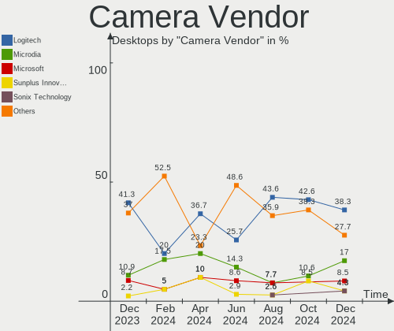

| Vendor                        | Desktops | Percent |
|-------------------------------|----------|---------|
| Logitech                      | 18       | 38.3%   |
| Microdia                      | 8        | 17.02%  |
| Microsoft                     | 4        | 8.51%   |
| Sunplus Innovation Technology | 2        | 4.26%   |
| Sonix Technology              | 2        | 4.26%   |
| Samsung Electronics           | 2        | 4.26%   |
| MacroSilicon                  | 2        | 4.26%   |
| Tobii Technology AB           | 1        | 2.13%   |
| SHENZHEN AONI ELECTRONIC      | 1        | 2.13%   |
| Razer USA                     | 1        | 2.13%   |
| Philips (or NXP)              | 1        | 2.13%   |
| Jieli Technology              | 1        | 2.13%   |
| Generalplus Technology        | 1        | 2.13%   |
| eMeet                         | 1        | 2.13%   |
| Creative Technology           | 1        | 2.13%   |
| Alcor Micro                   | 1        | 2.13%   |

Camera Model
------------

Camera device models

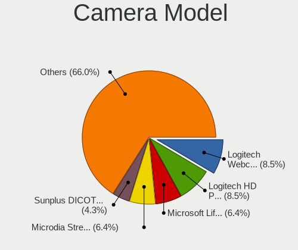

| Model                                            | Desktops | Percent |
|--------------------------------------------------|----------|---------|
| Logitech Webcam C270                             | 4        | 8.51%   |
| Logitech HD Pro Webcam C920                      | 4        | 8.51%   |
| Microsoft LifeCam HD-3000                        | 3        | 6.38%   |
| Microdia Streaming Camera W8GS                   | 3        | 6.38%   |
| Sunplus DICOTA 4K                                | 2        | 4.26%   |
| Sonix HDF Webcam USB                             | 2        | 4.26%   |
| Samsung Galaxy series, misc. (MTP mode)          | 2        | 4.26%   |
| MacroSilicon USB Video                           | 2        | 4.26%   |
| Logitech BRIO 4K Stream Edition                  | 2        | 4.26%   |
| Tobii AB EyeChip                                 | 1        | 2.13%   |
| SHENZHEN AONI ELECTRONIC NexiGo N930E FHD Webcam | 1        | 2.13%   |
| Razer USA Gaming Webcam [Kiyo]                   | 1        | 2.13%   |
| Philips (or NXP) SPC 520/525NC PC Camera         | 1        | 2.13%   |
| Microsoft Microsoft LifeCam Cinema             | 1        | 2.13%   |
| Microdia USB Live camera                         | 1        | 2.13%   |
| Microdia USB 2.0 Camera                          | 1        | 2.13%   |
| Microdia Sonix USB 2.0 Camera                    | 1        | 2.13%   |
| Microdia Defender G-Lens 2577 HD720p Camera      | 1        | 2.13%   |
| Microdia Camera                                  | 1        | 2.13%   |
| Logitech Webcam C310                             | 1        | 2.13%   |
| Logitech Webcam C170                             | 1        | 2.13%   |
| Logitech StreamCam                               | 1        | 2.13%   |
| Logitech QuickCam Pro for Notebooks              | 1        | 2.13%   |
| Logitech QuickCam Pro 9000                       | 1        | 2.13%   |
| Logitech QuickCam Communicate Deluxe             | 1        | 2.13%   |
| Logitech C922 Pro Stream Webcam                  | 1        | 2.13%   |
| Logitech C505 HD Webcam                          | 1        | 2.13%   |
| Jieli USB PHY 2.0                                | 1        | 2.13%   |
| Generalplus 808 Camera #9 (web-cam mode)         | 1        | 2.13%   |
| eMeet HD Webcam C960                             | 1        | 2.13%   |
| Creative Live! Cam Chat HD [VF0700/VF0790]       | 1        | 2.13%   |
| Alcor Micro USB 2.0 PC Camera                    | 1        | 2.13%   |

Security
--------

Fingerprint Vendor
------------------

Fingerprint sensor vendors

Zero info for selected period =(

Fingerprint Model
-----------------

Fingerprint sensor models

Zero info for selected period =(

Chipcard Vendor
---------------

Chipcard module vendors

| Vendor                | Desktops | Percent |
|-----------------------|----------|---------|
| Advanced Card Systems | 1        | 100%    |

Chipcard Model
--------------

Chipcard module models

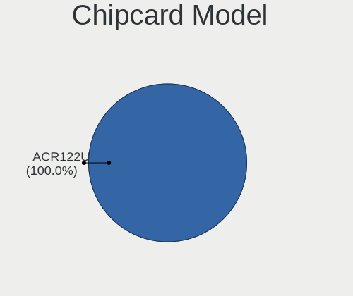

| Model                         | Desktops | Percent |
|-------------------------------|----------|---------|
| Advanced Card Systems ACR122U | 1        | 100%    |

Unsupported
-----------

Unsupported Devices
-------------------

Total unsupported devices on board

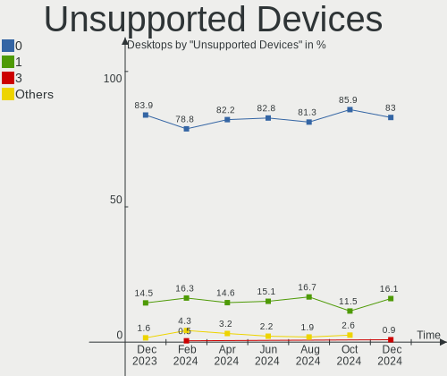

| Total | Desktops | Percent |
|-------|----------|---------|
| 0     | 186      | 83.04%  |
| 1     | 36       | 16.07%  |
| 3     | 2        | 0.89%   |

Unsupported Device Types
------------------------

Types of unsupported devices

| Type                     | Desktops | Percent |
|--------------------------|----------|---------|
| Graphics card            | 16       | 39.02%  |
| Net/wireless             | 7        | 17.07%  |
| Network                  | 4        | 9.76%   |
| Card reader              | 3        | 7.32%   |
| Unassigned class         | 2        | 4.88%   |
| Multimedia controller    | 2        | 4.88%   |
| Communication controller | 2        | 4.88%   |
| Storage/raid             | 1        | 2.44%   |
| Net/ethernet             | 1        | 2.44%   |
| Chipcard                 | 1        | 2.44%   |
| Camera                   | 1        | 2.44%   |
| Bluetooth                | 1        | 2.44%   |

