Linux in Germany - Hardware Trends (Desktops)
---------------------------------------------

A project to identify most popular hardware characteristics and track their change
over time based on data collected by Linux users at https://Linux-Hardware.org.

Anyone can contribute to this report by the [hw-probe](https://github.com/linuxhw/hw-probe) tool:

    sudo -E hw-probe -all -upload

Period: Sep, 2022.

Contents
--------

* [ System ](#system)
  - [ OS                       ](#os)
  - [ OS Family                ](#os-family)
  - [ Kernel                   ](#kernel)
  - [ Kernel Family            ](#kernel-family)
  - [ Kernel Major Ver.        ](#kernel-major-ver)
  - [ Arch                     ](#arch)
  - [ DE                       ](#de)
  - [ Display Server           ](#display-server)
  - [ Display Manager          ](#display-manager)
  - [ OS Lang                  ](#os-lang)
  - [ Boot Mode                ](#boot-mode)
  - [ Filesystem               ](#filesystem)
  - [ Part. scheme             ](#part-scheme)
  - [ Dual Boot with Linux/BSD ](#dual-boot-with-linuxbsd)
  - [ Dual Boot (Win)          ](#dual-boot-win)

* [ Board ](#board)
  - [ Vendor                   ](#vendor)
  - [ Model                    ](#model)
  - [ Model Family             ](#model-family)
  - [ MFG Year                 ](#mfg-year)
  - [ Form Factor              ](#form-factor)
  - [ Secure Boot              ](#secure-boot)
  - [ Coreboot                 ](#coreboot)
  - [ RAM Size                 ](#ram-size)
  - [ RAM Used                 ](#ram-used)
  - [ Total Drives             ](#total-drives)
  - [ Has CD-ROM               ](#has-cd-rom)
  - [ Has Ethernet             ](#has-ethernet)
  - [ Has WiFi                 ](#has-wifi)
  - [ Has Bluetooth            ](#has-bluetooth)

* [ Location ](#location)
  - [ Country                  ](#country)
  - [ City                     ](#city)

* [ Drives ](#drives)
  - [ Drive Vendor             ](#drive-vendor)
  - [ Drive Model              ](#drive-model)
  - [ HDD Vendor               ](#hdd-vendor)
  - [ SSD Vendor               ](#ssd-vendor)
  - [ Drive Kind               ](#drive-kind)
  - [ Drive Connector          ](#drive-connector)
  - [ Drive Size               ](#drive-size)
  - [ Space Total              ](#space-total)
  - [ Space Used               ](#space-used)
  - [ Malfunc. Drives          ](#malfunc-drives)
  - [ Malfunc. Drive Vendor    ](#malfunc-drive-vendor)
  - [ Malfunc. HDD Vendor      ](#malfunc-hdd-vendor)
  - [ Malfunc. Drive Kind      ](#malfunc-drive-kind)
  - [ Failed Drives            ](#failed-drives)
  - [ Failed Drive Vendor      ](#failed-drive-vendor)
  - [ Drive Status             ](#drive-status)

* [ Storage controller ](#storage-controller)
  - [ Storage Vendor           ](#storage-vendor)
  - [ Storage Model            ](#storage-model)
  - [ Storage Kind             ](#storage-kind)

* [ Processor ](#processor)
  - [ CPU Vendor               ](#cpu-vendor)
  - [ CPU Model                ](#cpu-model)
  - [ CPU Model Family         ](#cpu-model-family)
  - [ CPU Cores                ](#cpu-cores)
  - [ CPU Sockets              ](#cpu-sockets)
  - [ CPU Threads              ](#cpu-threads)
  - [ CPU Op-Modes             ](#cpu-op-modes)
  - [ CPU Microcode            ](#cpu-microcode)
  - [ CPU Microarch            ](#cpu-microarch)

* [ Graphics ](#graphics)
  - [ GPU Vendor               ](#gpu-vendor)
  - [ GPU Model                ](#gpu-model)
  - [ GPU Combo                ](#gpu-combo)
  - [ GPU Driver               ](#gpu-driver)
  - [ GPU Memory               ](#gpu-memory)

* [ Monitor ](#monitor)
  - [ Monitor Vendor           ](#monitor-vendor)
  - [ Monitor Model            ](#monitor-model)
  - [ Monitor Resolution       ](#monitor-resolution)
  - [ Monitor Diagonal         ](#monitor-diagonal)
  - [ Monitor Width            ](#monitor-width)
  - [ Aspect Ratio             ](#aspect-ratio)
  - [ Monitor Area             ](#monitor-area)
  - [ Pixel Density            ](#pixel-density)
  - [ Multiple Monitors        ](#multiple-monitors)

* [ Network ](#network)
  - [ Net Controller Vendor    ](#net-controller-vendor)
  - [ Net Controller Model     ](#net-controller-model)
  - [ Wireless Vendor          ](#wireless-vendor)
  - [ Wireless Model           ](#wireless-model)
  - [ Ethernet Vendor          ](#ethernet-vendor)
  - [ Ethernet Model           ](#ethernet-model)
  - [ Net Controller Kind      ](#net-controller-kind)
  - [ Used Controller          ](#used-controller)
  - [ NICs                     ](#nics)
  - [ IPv6                     ](#ipv6)

* [ Bluetooth ](#bluetooth)
  - [ Bluetooth Vendor         ](#bluetooth-vendor)
  - [ Bluetooth Model          ](#bluetooth-model)

* [ Sound ](#sound)
  - [ Sound Vendor             ](#sound-vendor)
  - [ Sound Model              ](#sound-model)

* [ Memory ](#memory)
  - [ Memory Vendor            ](#memory-vendor)
  - [ Memory Model             ](#memory-model)
  - [ Memory Kind              ](#memory-kind)
  - [ Memory Form Factor       ](#memory-form-factor)
  - [ Memory Size              ](#memory-size)
  - [ Memory Speed             ](#memory-speed)

* [ Printers & scanners ](#printers--scanners)
  - [ Printer Vendor           ](#printer-vendor)
  - [ Printer Model            ](#printer-model)
  - [ Scanner Vendor           ](#scanner-vendor)
  - [ Scanner Model            ](#scanner-model)

* [ Camera ](#camera)
  - [ Camera Vendor            ](#camera-vendor)
  - [ Camera Model             ](#camera-model)

* [ Security ](#security)
  - [ Fingerprint Vendor       ](#fingerprint-vendor)
  - [ Fingerprint Model        ](#fingerprint-model)
  - [ Chipcard Vendor          ](#chipcard-vendor)
  - [ Chipcard Model           ](#chipcard-model)

* [ Unsupported ](#unsupported)
  - [ Unsupported Devices      ](#unsupported-devices)
  - [ Unsupported Device Types ](#unsupported-device-types)

System
------

OS
--

Installed operating systems

| Name                         | Desktops | Percent |
|------------------------------|----------|---------|
| Ubuntu 22.04                 | 44       | 22.11%  |
| Linux Mint 21                | 20       | 10.05%  |
| Ubuntu 20.04                 | 15       | 7.54%   |
| Debian 11                    | 15       | 7.54%   |
| Fedora 36                    | 14       | 7.04%   |
| Linux Mint 20.3              | 10       | 5.03%   |
| OpenMandriva 4.3             | 9        | 4.52%   |
| Zorin 16                     | 8        | 4.02%   |
| KDE neon 20.04               | 5        | 2.51%   |
| Arch                         | 5        | 2.51%   |
| openSUSE Tumbleweed-XXXXXXXX | 3        | 1.51%   |
| OpenMandriva 4.2             | 3        | 1.51%   |
| Fedora 37                    | 3        | 1.51%   |
| Ubuntu MATE 22.04            | 2        | 1.01%   |
| Pop!_OS 22.04                | 2        | 1.01%   |
| OpenMandriva 4.50            | 2        | 1.01%   |
| Nobara 36                    | 2        | 1.01%   |
| Kubuntu 22.04                | 2        | 1.01%   |
| Kubuntu 20.04                | 2        | 1.01%   |
| Gentoo 2.8                   | 2        | 1.01%   |
| ArcoLinux Rolling            | 2        | 1.01%   |
| Arch Rolling                 | 2        | 1.01%   |
| Xubuntu 20.10                | 1        | 0.5%    |
| Xubuntu 20.04                | 1        | 0.5%    |
| Xubuntu 18.04                | 1        | 0.5%    |
| Ubuntu 22.10                 | 1        | 0.5%    |
| Ubuntu 20.10                 | 1        | 0.5%    |
| Rocky Linux 8.6              | 1        | 0.5%    |
| Reborn OS Rolling            | 1        | 0.5%    |
| openSUSE Leap-15.4           | 1        | 0.5%    |
| openSUSE Leap-15.3           | 1        | 0.5%    |
| NixOS 22.05                  | 1        | 0.5%    |
| MX 21                        | 1        | 0.5%    |
| Manjaro 22.0.0               | 1        | 0.5%    |
| Manjaro 21.3.7               | 1        | 0.5%    |
| Manjaro                      | 1        | 0.5%    |
| Makulu Bld-2022.08.19        | 1        | 0.5%    |
| LMDE 5                       | 1        | 0.5%    |
| LMDE 4                       | 1        | 0.5%    |
| LinuxFX 10                   | 1        | 0.5%    |

OS Family
---------

OS without a version

| Name          | Desktops | Percent |
|---------------|----------|---------|
| Ubuntu        | 61       | 30.65%  |
| Linux Mint    | 31       | 15.58%  |
| Fedora        | 17       | 8.54%   |
| Debian        | 15       | 7.54%   |
| OpenMandriva  | 14       | 7.04%   |
| Zorin         | 8        | 4.02%   |
| Arch          | 7        | 3.52%   |
| openSUSE      | 5        | 2.51%   |
| Kubuntu       | 5        | 2.51%   |
| KDE neon      | 5        | 2.51%   |
| Xubuntu       | 3        | 1.51%   |
| Manjaro       | 3        | 1.51%   |
| Ubuntu MATE   | 2        | 1.01%   |
| Pop!_OS       | 2        | 1.01%   |
| Nobara        | 2        | 1.01%   |
| LMDE          | 2        | 1.01%   |
| Gentoo        | 2        | 1.01%   |
| CentOS        | 2        | 1.01%   |
| ArcoLinux     | 2        | 1.01%   |
| Rocky Linux   | 1        | 0.5%    |
| Reborn OS     | 1        | 0.5%    |
| NixOS         | 1        | 0.5%    |
| MX            | 1        | 0.5%    |
| Makulu        | 1        | 0.5%    |
| LinuxFX       | 1        | 0.5%    |
| Kali          | 1        | 0.5%    |
| EndeavourOS   | 1        | 0.5%    |
| Crystal Linux | 1        | 0.5%    |
| Clear Linux   | 1        | 0.5%    |
| BlackPanther  | 1        | 0.5%    |

Kernel
------

Version of the Linux kernel

| Version                       | Desktops | Percent |
|-------------------------------|----------|---------|
| 5.15.0-48-generic             | 35       | 17.59%  |
| 5.15.0-47-generic             | 35       | 17.59%  |
| 5.15.0-46-generic             | 17       | 8.54%   |
| 5.4.0-125-generic             | 10       | 5.03%   |
| 5.16.7-desktop-1omv4003       | 9        | 4.52%   |
| 5.19.8-200.fc36.x86_64        | 5        | 2.51%   |
| 5.10.0-18-amd64               | 5        | 2.51%   |
| 5.10.0-17-amd64               | 5        | 2.51%   |
| 5.19.9-arch1-1                | 4        | 2.01%   |
| 5.4.0-126-generic             | 3        | 1.51%   |
| 5.19.9-200.fc36.x86_64        | 3        | 1.51%   |
| 5.19.8-1-default              | 3        | 1.51%   |
| 5.15.0-43-generic             | 3        | 1.51%   |
| 5.10.14-desktop-1omv4002      | 3        | 1.51%   |
| 5.8.0-63-generic              | 2        | 1.01%   |
| 5.19.9-300.fc37.x86_64        | 2        | 1.01%   |
| 5.19.8-arch1-1                | 2        | 1.01%   |
| 5.19.7-arch1-1                | 2        | 1.01%   |
| 5.19.6-arch1-1                | 2        | 1.01%   |
| 5.19.6-200.fc36.x86_64        | 2        | 1.01%   |
| 5.19.5-desktop-1omv4090       | 2        | 1.01%   |
| 5.19.4-200.fc36.x86_64        | 2        | 1.01%   |
| 5.15.0-41-generic             | 2        | 1.01%   |
| 5.4.0-91-generic              | 1        | 0.5%    |
| 5.4.0-120-generic             | 1        | 0.5%    |
| 5.4.0-104-generic             | 1        | 0.5%    |
| 5.3.18-150300.59.87-default   | 1        | 0.5%    |
| 5.19.8-300.fc37.x86_64        | 1        | 0.5%    |
| 5.19.7-gentoo-x86_64          | 1        | 0.5%    |
| 5.19.7-204.fsync.fc36.x86_64  | 1        | 0.5%    |
| 5.19.7-200.fc36.x86_64        | 1        | 0.5%    |
| 5.19.7-1-pve                  | 1        | 0.5%    |
| 5.19.12-arch1-1               | 1        | 0.5%    |
| 5.19.11-zen1-1-zen            | 1        | 0.5%    |
| 5.19.11-200.fc36.x86_64       | 1        | 0.5%    |
| 5.19.10-201.fsync.fc36.x86_64 | 1        | 0.5%    |
| 5.19.1-3-MANJARO              | 1        | 0.5%    |
| 5.19.0-76051900-generic       | 1        | 0.5%    |
| 5.19.0-7.1-liquorix-amd64     | 1        | 0.5%    |
| 5.19.0-4.2-liquorix-amd64     | 1        | 0.5%    |

Kernel Family
-------------

Linux kernel without a distro release

| Version  | Desktops | Percent |
|----------|----------|---------|
| 5.15.0   | 94       | 47.24%  |
| 5.4.0    | 16       | 8.04%   |
| 5.10.0   | 12       | 6.03%   |
| 5.19.8   | 11       | 5.53%   |
| 5.19.9   | 9        | 4.52%   |
| 5.16.7   | 9        | 4.52%   |
| 5.19.7   | 6        | 3.02%   |
| 5.19.6   | 4        | 2.01%   |
| 5.19.0   | 4        | 2.01%   |
| 5.10.14  | 3        | 1.51%   |
| 5.8.0    | 2        | 1.01%   |
| 5.19.5   | 2        | 1.01%   |
| 5.19.4   | 2        | 1.01%   |
| 5.19.11  | 2        | 1.01%   |
| 5.18.0   | 2        | 1.01%   |
| 5.13.0   | 2        | 1.01%   |
| 4.18.0   | 2        | 1.01%   |
| 5.3.18   | 1        | 0.5%    |
| 5.19.12  | 1        | 0.5%    |
| 5.19.10  | 1        | 0.5%    |
| 5.19.1   | 1        | 0.5%    |
| 5.18.19  | 1        | 0.5%    |
| 5.18.17  | 1        | 0.5%    |
| 5.17.7   | 1        | 0.5%    |
| 5.15.67  | 1        | 0.5%    |
| 5.15.59  | 1        | 0.5%    |
| 5.15.53  | 1        | 0.5%    |
| 5.15.39  | 1        | 0.5%    |
| 5.15.15  | 1        | 0.5%    |
| 5.14.21  | 1        | 0.5%    |
| 4.19.257 | 1        | 0.5%    |
| 4.19.0   | 1        | 0.5%    |
| 4.18.16  | 1        | 0.5%    |
| 3.10.0   | 1        | 0.5%    |

Kernel Major Ver.
-----------------

Linux kernel major version

| Version | Desktops | Percent |
|---------|----------|---------|
| 5.15    | 99       | 49.75%  |
| 5.19    | 43       | 21.61%  |
| 5.4     | 16       | 8.04%   |
| 5.10    | 15       | 7.54%   |
| 5.16    | 9        | 4.52%   |
| 5.18    | 4        | 2.01%   |
| 4.18    | 3        | 1.51%   |
| 5.8     | 2        | 1.01%   |
| 5.13    | 2        | 1.01%   |
| 4.19    | 2        | 1.01%   |
| 5.3     | 1        | 0.5%    |
| 5.17    | 1        | 0.5%    |
| 5.14    | 1        | 0.5%    |
| 3.10    | 1        | 0.5%    |

Arch
----

OS architecture (x86_64, i586, etc.)

| Name   | Desktops | Percent |
|--------|----------|---------|
| x86_64 | 198      | 99.5%   |
| i686   | 1        | 0.5%    |

DE
--

Desktop Environment

| Name         | Desktops | Percent |
|--------------|----------|---------|
| GNOME        | 90       | 45.23%  |
| KDE5         | 41       | 20.6%   |
| X-Cinnamon   | 30       | 15.08%  |
| Unknown      | 14       | 7.04%   |
| XFCE         | 12       | 6.03%   |
| MATE         | 5        | 2.51%   |
| Budgie       | 2        | 1.01%   |
| trinity      | 1        | 0.5%    |
| sway         | 1        | 0.5%    |
| i3           | 1        | 0.5%    |
| herbstluftwm | 1        | 0.5%    |
| Cinnamon     | 1        | 0.5%    |

Display Server
--------------

X11 or Wayland

| Name    | Desktops | Percent |
|---------|----------|---------|
| X11     | 138      | 69.35%  |
| Wayland | 47       | 23.62%  |
| Tty     | 10       | 5.03%   |
| Unknown | 4        | 2.01%   |

Display Manager
---------------

SDDM, LightDM, etc.

| Name    | Desktops | Percent |
|---------|----------|---------|
| Unknown | 83       | 41.71%  |
| GDM3    | 54       | 27.14%  |
| LightDM | 26       | 13.07%  |
| SDDM    | 25       | 12.56%  |
| GDM     | 8        | 4.02%   |
| XDM     | 1        | 0.5%    |
| SLiM    | 1        | 0.5%    |
| Ly      | 1        | 0.5%    |

OS Lang
-------

Language

| Lang    | Desktops | Percent |
|---------|----------|---------|
| de_DE   | 157      | 78.89%  |
| en_US   | 33       | 16.58%  |
| C       | 3        | 1.51%   |
| en_GB   | 2        | 1.01%   |
| ru_RU   | 1        | 0.5%    |
| pl_PL   | 1        | 0.5%    |
| en_AU   | 1        | 0.5%    |
| Unknown | 1        | 0.5%    |

Boot Mode
---------

EFI or BIOS

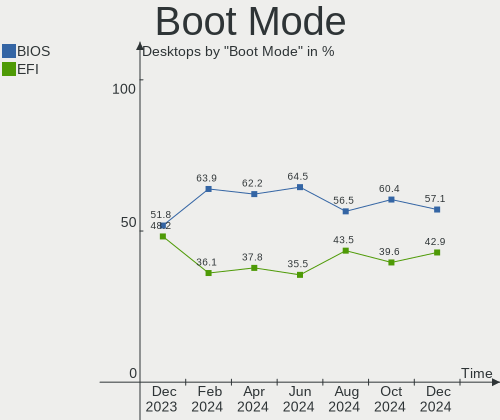

| Mode | Desktops | Percent |
|------|----------|---------|
| BIOS | 123      | 61.81%  |
| EFI  | 76       | 38.19%  |

Filesystem
----------

Type of filesystem

| Type    | Desktops | Percent |
|---------|----------|---------|
| Ext4    | 152      | 76.38%  |
| Btrfs   | 23       | 11.56%  |
| Overlay | 18       | 9.05%   |
| Zfs     | 3        | 1.51%   |
| Xfs     | 3        | 1.51%   |

Part. scheme
------------

Scheme of partitioning

| Type    | Desktops | Percent |
|---------|----------|---------|
| Unknown | 127      | 63.82%  |
| GPT     | 57       | 28.64%  |
| MBR     | 15       | 7.54%   |

Dual Boot with Linux/BSD
------------------------

Hosting more than one Linux/BSD

| Dual boot | Desktops | Percent |
|-----------|----------|---------|
| No        | 163      | 81.91%  |
| Yes       | 36       | 18.09%  |

Dual Boot (Win)
---------------

Hosting Linux and Windows

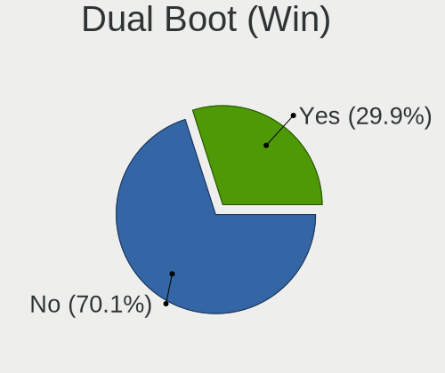

| Dual boot | Desktops | Percent |
|-----------|----------|---------|
| No        | 141      | 70.85%  |
| Yes       | 58       | 29.15%  |

Board
-----

Vendor
------

Motherboard manufacturer

| Name                | Desktops | Percent |
|---------------------|----------|---------|
| ASUSTek Computer    | 56       | 28.14%  |
| Gigabyte Technology | 32       | 16.08%  |
| ASRock              | 26       | 13.07%  |
| MSI                 | 24       | 12.06%  |
| Hewlett-Packard     | 15       | 7.54%   |
| Lenovo              | 11       | 5.53%   |
| Medion              | 6        | 3.02%   |
| Fujitsu             | 6        | 3.02%   |
| Dell                | 5        | 2.51%   |
| ASRockRack          | 3        | 1.51%   |
| Unknown             | 3        | 1.51%   |
| Fujitsu Siemens     | 2        | 1.01%   |
| Biostar             | 2        | 1.01%   |
| Shuttle             | 1        | 0.5%    |
| Pegatron            | 1        | 0.5%    |
| Packard Bell        | 1        | 0.5%    |
| Foxconn             | 1        | 0.5%    |
| BESSTAR Tech        | 1        | 0.5%    |
| Apple               | 1        | 0.5%    |
| AMI                 | 1        | 0.5%    |
| Acer                | 1        | 0.5%    |

Model
-----

Motherboard model

| Name                                 | Desktops | Percent |
|--------------------------------------|----------|---------|
| ASUS All Series                      | 6        | 3.02%   |
| MSI MS-7C37                          | 3        | 1.51%   |
| MSI MS-7B86                          | 3        | 1.51%   |
| Unknown                              | 3        | 1.51%   |
| MSI MS-7D22                          | 2        | 1.01%   |
| MSI MS-7C56                          | 2        | 1.01%   |
| MSI MS-7B79                          | 2        | 1.01%   |
| Medion MS-7707                       | 2        | 1.01%   |
| Gigabyte Z77-DS3H                    | 2        | 1.01%   |
| Dell OptiPlex 7010                   | 2        | 1.01%   |
| ASUS ROG STRIX Z690-A GAMING WIFI D4 | 2        | 1.01%   |
| ASUS ROG STRIX X570-F GAMING         | 2        | 1.01%   |
| ASUS ROG STRIX B450-F GAMING         | 2        | 1.01%   |
| ASUS M5A78L-M LX3                    | 2        | 1.01%   |
| ASRockRack 520001                    | 2        | 1.01%   |
| ASRock X300M-STX                     | 2        | 1.01%   |
| ASRock Q1900M                        | 2        | 1.01%   |
| ASRock Q1900-ITX                     | 2        | 1.01%   |
| ASRock B450 Pro4                     | 2        | 1.01%   |
| Shuttle XH310V2                      | 1        | 0.5%    |
| Pegatron NQ857AA-ABD a6749de         | 1        | 0.5%    |
| Packard Bell IMEDIA S3850            | 1        | 0.5%    |
| MSI p6750de                          | 1        | 0.5%    |
| MSI MS-7D09                          | 1        | 0.5%    |
| MSI MS-7D08                          | 1        | 0.5%    |
| MSI MS-7C91                          | 1        | 0.5%    |
| MSI MS-7C35                          | 1        | 0.5%    |
| MSI MS-7A38                          | 1        | 0.5%    |
| MSI MS-7915                          | 1        | 0.5%    |
| MSI MS-7850                          | 1        | 0.5%    |
| MSI MS-7816                          | 1        | 0.5%    |
| MSI MS-7721                          | 1        | 0.5%    |
| MSI MS-7358                          | 1        | 0.5%    |
| MSI Elite 7100 Microtower PC         | 1        | 0.5%    |
| Medion P66089                        | 1        | 0.5%    |
| Medion MS-7728                       | 1        | 0.5%    |
| Medion MS-7616                       | 1        | 0.5%    |
| Medion Akoya P5330 E MD8876/2458     | 1        | 0.5%    |
| Lenovo ThinkStation P520 30BE008VGE  | 1        | 0.5%    |
| Lenovo ThinkStation D20 4158F76      | 1        | 0.5%    |

Model Family
------------

Motherboard model prefix

| Name                   | Desktops | Percent |
|------------------------|----------|---------|
| ASUS ROG               | 8        | 4.02%   |
| ASUS PRIME             | 8        | 4.02%   |
| Lenovo ThinkCentre     | 7        | 3.52%   |
| HP Compaq              | 7        | 3.52%   |
| ASUS All               | 6        | 3.02%   |
| MSI MS-7C37            | 3        | 1.51%   |
| MSI MS-7B86            | 3        | 1.51%   |
| Lenovo ThinkStation    | 3        | 1.51%   |
| Fujitsu ESPRIMO        | 3        | 1.51%   |
| Dell OptiPlex          | 3        | 1.51%   |
| ASUS TUF               | 3        | 1.51%   |
| ASUS M5A78L-M          | 3        | 1.51%   |
| Unknown                | 3        | 1.51%   |
| MSI MS-7D22            | 2        | 1.01%   |
| MSI MS-7C56            | 2        | 1.01%   |
| MSI MS-7B79            | 2        | 1.01%   |
| Medion MS-7707         | 2        | 1.01%   |
| HP EliteDesk           | 2        | 1.01%   |
| Gigabyte Z77-DS3H      | 2        | 1.01%   |
| Gigabyte X470          | 2        | 1.01%   |
| Gigabyte GA-78LMT-USB3 | 2        | 1.01%   |
| ASUS P8Z77-V           | 2        | 1.01%   |
| ASUS P8Z68-V           | 2        | 1.01%   |
| ASRockRack 520001      | 2        | 1.01%   |
| ASRock Z97             | 2        | 1.01%   |
| ASRock X300M-STX       | 2        | 1.01%   |
| ASRock Q1900M          | 2        | 1.01%   |
| ASRock Q1900-ITX       | 2        | 1.01%   |
| ASRock B450            | 2        | 1.01%   |
| Shuttle XH310V2        | 1        | 0.5%    |
| Pegatron NQ857AA-ABD   | 1        | 0.5%    |
| Packard Bell IMEDIA    | 1        | 0.5%    |
| MSI p6750de            | 1        | 0.5%    |
| MSI MS-7D09            | 1        | 0.5%    |
| MSI MS-7D08            | 1        | 0.5%    |
| MSI MS-7C91            | 1        | 0.5%    |
| MSI MS-7C35            | 1        | 0.5%    |
| MSI MS-7A38            | 1        | 0.5%    |
| MSI MS-7915            | 1        | 0.5%    |
| MSI MS-7850            | 1        | 0.5%    |

MFG Year
--------

Motherboard manufacture year

| Year    | Desktops | Percent |
|---------|----------|---------|
| 2018    | 24       | 12.06%  |
| 2012    | 19       | 9.55%   |
| 2011    | 19       | 9.55%   |
| 2019    | 18       | 9.05%   |
| 2020    | 17       | 8.54%   |
| 2014    | 15       | 7.54%   |
| 2021    | 14       | 7.04%   |
| 2013    | 12       | 6.03%   |
| 2010    | 12       | 6.03%   |
| 2009    | 9        | 4.52%   |
| 2017    | 8        | 4.02%   |
| 2015    | 8        | 4.02%   |
| 2022    | 6        | 3.02%   |
| 2016    | 6        | 3.02%   |
| 2007    | 5        | 2.51%   |
| 2008    | 4        | 2.01%   |
| 2006    | 1        | 0.5%    |
| 2005    | 1        | 0.5%    |
| Unknown | 1        | 0.5%    |

Form Factor
-----------

Physical design of the computer

| Name    | Desktops | Percent |
|---------|----------|---------|
| Desktop | 199      | 100%    |

Secure Boot
-----------

Enabled or disabled

| State    | Desktops | Percent |
|----------|----------|---------|
| Disabled | 194      | 97.49%  |
| Enabled  | 5        | 2.51%   |

Coreboot
--------

Have coreboot on board

| Used | Desktops | Percent |
|------|----------|---------|
| No   | 197      | 98.99%  |
| Yes  | 2        | 1.01%   |

RAM Size
--------

Total RAM memory

| Size in GB  | Desktops | Percent |
|-------------|----------|---------|
| 16.01-24.0  | 57       | 28.64%  |
| 8.01-16.0   | 36       | 18.09%  |
| 32.01-64.0  | 35       | 17.59%  |
| 4.01-8.0    | 34       | 17.09%  |
| 3.01-4.0    | 16       | 8.04%   |
| 64.01-256.0 | 8        | 4.02%   |
| 24.01-32.0  | 7        | 3.52%   |
| 1.01-2.0    | 4        | 2.01%   |
| 2.01-3.0    | 2        | 1.01%   |

RAM Used
--------

Used RAM memory

| Used GB     | Desktops | Percent |
|-------------|----------|---------|
| 1.01-2.0    | 73       | 36.68%  |
| 2.01-3.0    | 50       | 25.13%  |
| 3.01-4.0    | 27       | 13.57%  |
| 4.01-8.0    | 21       | 10.55%  |
| 0.51-1.0    | 13       | 6.53%   |
| 8.01-16.0   | 10       | 5.03%   |
| 0.01-0.5    | 3        | 1.51%   |
| 24.01-32.0  | 1        | 0.5%    |
| 64.01-256.0 | 1        | 0.5%    |

Total Drives
------------

Number of drives on board

| Drives | Desktops | Percent |
|--------|----------|---------|
| 2      | 70       | 35.18%  |
| 1      | 56       | 28.14%  |
| 3      | 27       | 13.57%  |
| 4      | 22       | 11.06%  |
| 5      | 12       | 6.03%   |
| 6      | 6        | 3.02%   |
| 8      | 2        | 1.01%   |
| 7      | 2        | 1.01%   |
| 13     | 1        | 0.5%    |
| 0      | 1        | 0.5%    |

Has CD-ROM
----------

Has CD-ROM on board

| Presented | Desktops | Percent |
|-----------|----------|---------|
| Yes       | 119      | 59.8%   |
| No        | 80       | 40.2%   |

Has Ethernet
------------

Has Ethernet on board

| Presented | Desktops | Percent |
|-----------|----------|---------|
| Yes       | 197      | 98.99%  |
| No        | 2        | 1.01%   |

Has WiFi
--------

Has WiFi module

| Presented | Desktops | Percent |
|-----------|----------|---------|
| No        | 128      | 64.32%  |
| Yes       | 71       | 35.68%  |

Has Bluetooth
-------------

Has Bluetooth module

| Presented | Desktops | Percent |
|-----------|----------|---------|
| No        | 142      | 71.36%  |
| Yes       | 57       | 28.64%  |

Location
--------

Country
-------

Geographic location (country)

| Country | Desktops | Percent |
|---------|----------|---------|
| Germany | 199      | 100%    |

City
----

Geographic location (city)

| City                | Desktops | Percent |
|---------------------|----------|---------|
| Berlin              | 14       | 7.04%   |
| Munich              | 9        | 4.52%   |
| Hamburg             | 7        | 3.52%   |
| Frankfurt am Main   | 7        | 3.52%   |
| Aachen              | 4        | 2.01%   |
| Stuttgart           | 3        | 1.51%   |
| Pforzheim           | 3        | 1.51%   |
| Osnabrück          | 3        | 1.51%   |
| Nuremberg           | 3        | 1.51%   |
| Karlsruhe           | 3        | 1.51%   |
| Solms               | 2        | 1.01%   |
| Moers               | 2        | 1.01%   |
| Mannheim            | 2        | 1.01%   |
| Luetjenburg         | 2        | 1.01%   |
| Ludwigsburg         | 2        | 1.01%   |
| Krefeld             | 2        | 1.01%   |
| Köthen             | 2        | 1.01%   |
| Hürth              | 2        | 1.01%   |
| Fulda               | 2        | 1.01%   |
| Falkenstein         | 2        | 1.01%   |
| Erfurt              | 2        | 1.01%   |
| Düsseldorf         | 2        | 1.01%   |
| Dresden             | 2        | 1.01%   |
| Cologne             | 2        | 1.01%   |
| Witten              | 1        | 0.5%    |
| Wilhelmshaven       | 1        | 0.5%    |
| Wiesbaden           | 1        | 0.5%    |
| Werder              | 1        | 0.5%    |
| Wenden              | 1        | 0.5%    |
| Verden an der Aller | 1        | 0.5%    |
| Ulm                 | 1        | 0.5%    |
| Uetze               | 1        | 0.5%    |
| Uelzen              | 1        | 0.5%    |
| Troisdorf           | 1        | 0.5%    |
| Teltow              | 1        | 0.5%    |
| Suhl                | 1        | 0.5%    |
| Stromberg           | 1        | 0.5%    |
| Stralsund           | 1        | 0.5%    |
| Stolzenau           | 1        | 0.5%    |
| Stolpen             | 1        | 0.5%    |

Drives
------

Drive Vendor
------------

Hard drive vendors

| Vendor                         | Desktops | Drives | Percent |
|--------------------------------|----------|--------|---------|
| Samsung Electronics            | 87       | 133    | 22.77%  |
| WDC                            | 76       | 104    | 19.9%   |
| Seagate                        | 50       | 70     | 13.09%  |
| SanDisk                        | 23       | 28     | 6.02%   |
| Crucial                        | 20       | 24     | 5.24%   |
| Toshiba                        | 19       | 24     | 4.97%   |
| Kingston                       | 14       | 15     | 3.66%   |
| Intenso                        | 12       | 13     | 3.14%   |
| Hitachi                        | 12       | 14     | 3.14%   |
| HGST                           | 9        | 14     | 2.36%   |
| Unknown                        | 6        | 10     | 1.57%   |
| Micron/Crucial Technology      | 6        | 6      | 1.57%   |
| Patriot                        | 4        | 4      | 1.05%   |
| Maxtor                         | 4        | 5      | 1.05%   |
| A-DATA Technology              | 4        | 4      | 1.05%   |
| SK hynix                       | 3        | 3      | 0.79%   |
| Micron Technology              | 3        | 3      | 0.79%   |
| Leven                          | 3        | 3      | 0.79%   |
| SPCC                           | 2        | 2      | 0.52%   |
| Phison Electronics             | 2        | 3      | 0.52%   |
| OCZ                            | 2        | 2      | 0.52%   |
| Netac                          | 2        | 2      | 0.52%   |
| Intel                          | 2        | 3      | 0.52%   |
| Emtec                          | 2        | 2      | 0.52%   |
| Unknown                        | 2        | 2      | 0.52%   |
| Verbatim                       | 1        | 1      | 0.26%   |
| Transcend                      | 1        | 1      | 0.26%   |
| Team                           | 1        | 1      | 0.26%   |
| TCSUNBOW                       | 1        | 1      | 0.26%   |
| Supermicro                     | 1        | 2      | 0.26%   |
| Solid State Storage Technology | 1        | 1      | 0.26%   |
| PNY                            | 1        | 1      | 0.26%   |
| LITEONIT                       | 1        | 1      | 0.26%   |
| LITEON                         | 1        | 1      | 0.26%   |
| Kingston Technology Company    | 1        | 1      | 0.26%   |
| INNOVATION IT                  | 1        | 1      | 0.26%   |
| GOODRAM                        | 1        | 1      | 0.26%   |
| Brainsap                       | 1        | 1      | 0.26%   |

Drive Model
-----------

Hard drive models

| Model                                               | Desktops | Percent |
|-----------------------------------------------------|----------|---------|
| Samsung SSD 860 EVO 1TB                             | 9        | 1.94%   |
| Samsung SSD 860 EVO 500GB                           | 8        | 1.73%   |
| Samsung NVMe SSD Controller SM981/PM981/PM983 256GB | 7        | 1.51%   |
| Samsung SSD 850 EVO 250GB                           | 6        | 1.3%    |
| WDC WD30EFRX-68EUZN0 3TB                            | 5        | 1.08%   |
| WDC WD20EZRZ-00Z5HB0 2TB                            | 5        | 1.08%   |
| WDC WD40EZRZ-00GXCB0 4TB                            | 4        | 0.86%   |
| Samsung NVMe SSD Drive 1TB                          | 4        | 0.86%   |
| Intenso SSD SATAIII 120GB                           | 4        | 0.86%   |
| WDC WD10EZEX-08WN4A0 1TB                            | 3        | 0.65%   |
| Toshiba HDWD110 1TB                                 | 3        | 0.65%   |
| Seagate ST500DM002-1BD142 500GB                     | 3        | 0.65%   |
| Samsung SSD 980 PRO 1TB                             | 3        | 0.65%   |
| Samsung SSD 970 EVO Plus 500GB                      | 3        | 0.65%   |
| Samsung SSD 840 EVO 120GB                           | 3        | 0.65%   |
| Crucial CT500MX500SSD1 500GB                        | 3        | 0.65%   |
| Crucial CT240BX500SSD1 240GB                        | 3        | 0.65%   |
| WDC WDS500G1B0C-00S6U0 500GB                        | 2        | 0.43%   |
| WDC WDS100T2B0A-00SM50 1TB SSD                      | 2        | 0.43%   |
| WDC WD2500AAJS-60Z0A0 250GB                         | 2        | 0.43%   |
| WDC WD20SPZX-00UA7T0 2TB                            | 2        | 0.43%   |
| WDC WD20EZBX-00AYRA0 2TB                            | 2        | 0.43%   |
| WDC WD1600BEVT-22ZCT0 160GB                         | 2        | 0.43%   |
| WDC WD10EZRX-00A8LB0 1TB                            | 2        | 0.43%   |
| WDC WD10EAVS-00D7B1 1TB                             | 2        | 0.43%   |
| Unknown SD/MMC/MS PRO 2GB                           | 2        | 0.43%   |
| Unknown SD/MMC 16GB                                 | 2        | 0.43%   |
| Unknown M.S./M.S.Pro/HG 16GB                        | 2        | 0.43%   |
| Seagate ST9500325AS 500GB                           | 2        | 0.43%   |
| Seagate ST8000AS0002-1NA17Z 8TB                     | 2        | 0.43%   |
| Seagate ST4000VN008-2DR166 4TB                      | 2        | 0.43%   |
| Seagate ST3500418AS 500GB                           | 2        | 0.43%   |
| Seagate ST3250310AS 250GB                           | 2        | 0.43%   |
| Seagate ST2000DM008-2FR102 2TB                      | 2        | 0.43%   |
| Seagate ST2000DM006-2DM164 2TB                      | 2        | 0.43%   |
| Seagate ST2000DM001-1ER164 2TB                      | 2        | 0.43%   |
| Seagate ST12000NM0007-2A1101 12TB                   | 2        | 0.43%   |
| Seagate ST1000LM035-1RK172 1TB                      | 2        | 0.43%   |
| Sandisk WD Blue SN550 NVMe SSD 1024GB               | 2        | 0.43%   |
| SanDisk SDSSDA240G 240GB                            | 2        | 0.43%   |

HDD Vendor
----------

Hard disk drive vendors

| Vendor              | Desktops | Drives | Percent |
|---------------------|----------|--------|---------|
| WDC                 | 69       | 92     | 38.98%  |
| Seagate             | 50       | 70     | 28.25%  |
| Toshiba             | 16       | 21     | 9.04%   |
| Samsung Electronics | 14       | 20     | 7.91%   |
| Hitachi             | 12       | 14     | 6.78%   |
| HGST                | 9        | 14     | 5.08%   |
| Maxtor              | 4        | 5      | 2.26%   |
| Unknown             | 2        | 2      | 1.13%   |
| Intenso             | 1        | 1      | 0.56%   |

SSD Vendor
----------

Solid state drive vendors

| Vendor              | Desktops | Drives | Percent |
|---------------------|----------|--------|---------|
| Samsung Electronics | 50       | 62     | 34.25%  |
| SanDisk             | 18       | 19     | 12.33%  |
| Crucial             | 18       | 21     | 12.33%  |
| Intenso             | 11       | 12     | 7.53%   |
| WDC                 | 8        | 8      | 5.48%   |
| Kingston            | 6        | 6      | 4.11%   |
| Patriot             | 4        | 4      | 2.74%   |
| A-DATA Technology   | 4        | 4      | 2.74%   |
| SPCC                | 2        | 2      | 1.37%   |
| OCZ                 | 2        | 2      | 1.37%   |
| Netac               | 2        | 2      | 1.37%   |
| Micron Technology   | 2        | 2      | 1.37%   |
| Leven               | 2        | 2      | 1.37%   |
| Intel               | 2        | 2      | 1.37%   |
| Emtec               | 2        | 2      | 1.37%   |
| Unknown             | 2        | 2      | 1.37%   |
| Verbatim            | 1        | 1      | 0.68%   |
| Transcend           | 1        | 1      | 0.68%   |
| Toshiba             | 1        | 1      | 0.68%   |
| Team                | 1        | 1      | 0.68%   |
| TCSUNBOW            | 1        | 1      | 0.68%   |
| Supermicro          | 1        | 2      | 0.68%   |
| PNY                 | 1        | 1      | 0.68%   |
| LITEONIT            | 1        | 1      | 0.68%   |
| LITEON              | 1        | 1      | 0.68%   |
| INNOVATION IT       | 1        | 1      | 0.68%   |
| GOODRAM             | 1        | 1      | 0.68%   |

Drive Kind
----------

HDD or SSD

| Kind    | Desktops | Drives | Percent |
|---------|----------|--------|---------|
| HDD     | 131      | 239    | 40.18%  |
| SSD     | 124      | 164    | 38.04%  |
| NVMe    | 64       | 93     | 19.63%  |
| Unknown | 5        | 8      | 1.53%   |
| MMC     | 2        | 3      | 0.61%   |

Drive Connector
---------------

SATA, SAS, NVMe, etc.

| Type | Desktops | Drives | Percent |
|------|----------|--------|---------|
| SATA | 184      | 397    | 70.5%   |
| NVMe | 64       | 93     | 24.52%  |
| SAS  | 11       | 14     | 4.21%   |
| MMC  | 2        | 3      | 0.77%   |

Drive Size
----------

Size of hard drive

| Size in TB | Desktops | Drives | Percent |
|------------|----------|--------|---------|
| 0.01-0.5   | 131      | 202    | 46.79%  |
| 0.51-1.0   | 72       | 97     | 25.71%  |
| 1.01-2.0   | 37       | 45     | 13.21%  |
| 3.01-4.0   | 16       | 18     | 5.71%   |
| 2.01-3.0   | 10       | 13     | 3.57%   |
| 4.01-10.0  | 10       | 16     | 3.57%   |
| 10.01-20.0 | 4        | 12     | 1.43%   |

Space Total
-----------

Amount of disk space available on the file system

| Size in GB     | Desktops | Percent |
|----------------|----------|---------|
| 101-250        | 50       | 25.13%  |
| 501-1000       | 31       | 15.58%  |
| 251-500        | 28       | 14.07%  |
| More than 3000 | 25       | 12.56%  |
| 1001-2000      | 24       | 12.06%  |
| Unknown        | 13       | 6.53%   |
| 2001-3000      | 10       | 5.03%   |
| 1-20           | 8        | 4.02%   |
| 51-100         | 7        | 3.52%   |
| 21-50          | 3        | 1.51%   |

Space Used
----------

Amount of used disk space

| Used GB        | Desktops | Percent |
|----------------|----------|---------|
| 1-20           | 49       | 24.62%  |
| 21-50          | 32       | 16.08%  |
| 51-100         | 24       | 12.06%  |
| 101-250        | 21       | 10.55%  |
| 501-1000       | 21       | 10.55%  |
| 251-500        | 13       | 6.53%   |
| Unknown        | 13       | 6.53%   |
| More than 3000 | 10       | 5.03%   |
| 1001-2000      | 10       | 5.03%   |
| 2001-3000      | 6        | 3.02%   |

Malfunc. Drives
---------------

Drive models with a malfunction

| Model                                        | Desktops | Drives | Percent |
|----------------------------------------------|----------|--------|---------|
| WDC WD5000AAKS-00V1A0 500GB                  | 1        | 1      | 5.88%   |
| WDC WD4001FAEX-00MJRA0 4TB                   | 1        | 1      | 5.88%   |
| WDC WD2500AAJS-60Z0A0 250GB                  | 1        | 1      | 5.88%   |
| WDC WD10EFRX-68FYTN0 1TB                     | 1        | 1      | 5.88%   |
| WDC WD10EARS-22Y5B1 1TB                      | 1        | 1      | 5.88%   |
| Seagate ST9500325AS 500GB                    | 1        | 1      | 5.88%   |
| Seagate ST9100821AS 100GB                    | 1        | 1      | 5.88%   |
| Seagate ST500DM002-1BD142 500GB              | 1        | 1      | 5.88%   |
| Seagate ST3500418AS 500GB                    | 1        | 1      | 5.88%   |
| SanDisk SSD PLUS 120 GB                      | 1        | 1      | 5.88%   |
| Samsung Electronics SSD 840 PRO Series 256GB | 1        | 1      | 5.88%   |
| Samsung Electronics HD321KJ 320GB            | 1        | 1      | 5.88%   |
| Maxtor 6Y120L0 128GB                         | 1        | 1      | 5.88%   |
| Maxtor 6L160M0 160GB                         | 1        | 2      | 5.88%   |
| Hitachi HDT721010SLA360 1TB                  | 1        | 2      | 5.88%   |
| Hitachi HDS7216SBSUN160G 0814QZEG2M 160GB    | 1        | 1      | 5.88%   |
| HGST HDN724040ALE640 4TB                     | 1        | 1      | 5.88%   |

Malfunc. Drive Vendor
---------------------

Vendors of faulty drives

| Vendor              | Desktops | Drives | Percent |
|---------------------|----------|--------|---------|
| WDC                 | 5        | 5      | 29.41%  |
| Seagate             | 4        | 4      | 23.53%  |
| Samsung Electronics | 2        | 2      | 11.76%  |
| Maxtor              | 2        | 3      | 11.76%  |
| Hitachi             | 2        | 3      | 11.76%  |
| SanDisk             | 1        | 1      | 5.88%   |
| HGST                | 1        | 1      | 5.88%   |

Malfunc. HDD Vendor
-------------------

Vendors of faulty HDD drives

| Vendor              | Desktops | Drives | Percent |
|---------------------|----------|--------|---------|
| WDC                 | 5        | 5      | 33.33%  |
| Seagate             | 4        | 4      | 26.67%  |
| Maxtor              | 2        | 3      | 13.33%  |
| Hitachi             | 2        | 3      | 13.33%  |
| Samsung Electronics | 1        | 1      | 6.67%   |
| HGST                | 1        | 1      | 6.67%   |

Malfunc. Drive Kind
-------------------

Kinds of faulty drives

| Kind | Desktops | Drives | Percent |
|------|----------|--------|---------|
| HDD  | 15       | 17     | 88.24%  |
| SSD  | 2        | 2      | 11.76%  |

Failed Drives
-------------

Failed drive models

| Model                     | Desktops | Drives | Percent |
|---------------------------|----------|--------|---------|
| WDC WD1600YS-23SHB0 160GB | 1        | 1      | 100%    |

Failed Drive Vendor
-------------------

Failed drive vendors

| Vendor | Desktops | Drives | Percent |
|--------|----------|--------|---------|
| WDC    | 1        | 1      | 100%    |

Drive Status
------------

Number of failed and malfunc. drives

| Status   | Desktops | Drives | Percent |
|----------|----------|--------|---------|
| Detected | 136      | 332    | 62.67%  |
| Works    | 64       | 155    | 29.49%  |
| Malfunc  | 16       | 19     | 7.37%   |
| Failed   | 1        | 1      | 0.46%   |

Storage controller
------------------

Storage Vendor
--------------

Storage controller vendors

| Vendor                         | Desktops | Percent |
|--------------------------------|----------|---------|
| Intel                          | 122      | 39.23%  |
| AMD                            | 73       | 23.47%  |
| Samsung Electronics            | 38       | 12.22%  |
| ASMedia Technology             | 16       | 5.14%   |
| JMicron Technology             | 10       | 3.22%   |
| Marvell Technology Group       | 9        | 2.89%   |
| Kingston Technology Company    | 9        | 2.89%   |
| SanDisk                        | 8        | 2.57%   |
| Micron/Crucial Technology      | 8        | 2.57%   |
| SK hynix                       | 3        | 0.96%   |
| Nvidia                         | 3        | 0.96%   |
| Toshiba America Info Systems   | 2        | 0.64%   |
| Silicon Image                  | 2        | 0.64%   |
| Phison Electronics             | 2        | 0.64%   |
| Broadcom / LSI                 | 2        | 0.64%   |
| Solid State Storage Technology | 1        | 0.32%   |
| Micron Technology              | 1        | 0.32%   |
| LSI Logic / Symbios Logic      | 1        | 0.32%   |
| 3ware                          | 1        | 0.32%   |

Storage Model
-------------

Storage controller models

| Model                                                                          | Desktops | Percent |
|--------------------------------------------------------------------------------|----------|---------|
| AMD FCH SATA Controller [AHCI mode]                                            | 35       | 9.31%   |
| Samsung NVMe SSD Controller SM981/PM981/PM983                                  | 24       | 6.38%   |
| AMD 400 Series Chipset SATA Controller                                         | 21       | 5.59%   |
| ASMedia ASM1062 Serial ATA Controller                                          | 15       | 3.99%   |
| Intel 6 Series/C200 Series Chipset Family 6 port Desktop SATA AHCI Controller  | 14       | 3.72%   |
| Intel 8 Series/C220 Series Chipset Family 6-port SATA Controller 1 [AHCI mode] | 12       | 3.19%   |
| Intel 7 Series/C210 Series Chipset Family 6-port SATA Controller [AHCI mode]   | 11       | 2.93%   |
| AMD 500 Series Chipset SATA Controller                                         | 11       | 2.93%   |
| AMD SB7x0/SB8x0/SB9x0 SATA Controller [AHCI mode]                              | 10       | 2.66%   |
| AMD SB7x0/SB8x0/SB9x0 IDE Controller                                           | 10       | 2.66%   |
| Intel SATA Controller [RAID mode]                                              | 9        | 2.39%   |
| Intel 200 Series PCH SATA controller [AHCI mode]                               | 9        | 2.39%   |
| Samsung NVMe SSD Controller PM9A1/PM9A3/980PRO                                 | 8        | 2.13%   |
| Intel 500 Series Chipset Family SATA AHCI Controller                           | 8        | 2.13%   |
| JMicron JMB363 SATA/IDE Controller                                             | 7        | 1.86%   |
| Intel Q170/Q150/B150/H170/H110/Z170/CM236 Chipset SATA Controller [AHCI Mode]  | 7        | 1.86%   |
| Intel 9 Series Chipset Family SATA Controller [AHCI Mode]                      | 7        | 1.86%   |
| Intel Alder Lake-S PCH SATA Controller [AHCI Mode]                             | 6        | 1.6%    |
| Intel 4 Series Chipset PT IDER Controller                                      | 5        | 1.33%   |
| AMD SB7x0/SB8x0/SB9x0 SATA Controller [IDE mode]                               | 5        | 1.33%   |
| Samsung NVMe SSD Controller 980                                                | 4        | 1.06%   |
| Kingston Company Company Non-Volatile memory controller                        | 4        | 1.06%   |
| Intel Atom Processor E3800 Series SATA AHCI Controller                         | 4        | 1.06%   |
| Samsung NVMe SSD Controller SM961/PM961/SM963                                  | 3        | 0.8%    |
| Micron/Crucial P2 NVMe PCIe SSD                                                | 3        | 0.8%    |
| Micron/Crucial NVMe Controller                                                 | 3        | 0.8%    |
| Micron/Crucial Non-Volatile memory controller                                  | 3        | 0.8%    |
| Kingston Company A2000 NVMe SSD                                                | 3        | 0.8%    |
| Intel Volume Management Device NVMe RAID Controller                            | 3        | 0.8%    |
| Intel 82801JD/DO (ICH10 Family) 4-port SATA IDE Controller                     | 3        | 0.8%    |
| Intel 82801JD/DO (ICH10 Family) 2-port SATA IDE Controller                     | 3        | 0.8%    |
| Intel 82801I (ICH9 Family) 2 port SATA Controller [IDE mode]                   | 3        | 0.8%    |
| Intel 5 Series/3400 Series Chipset 6 port SATA AHCI Controller                 | 3        | 0.8%    |
| AMD FCH SATA Controller [IDE mode]                                             | 3        | 0.8%    |
| AMD 300 Series Chipset SATA Controller                                         | 3        | 0.8%    |
| SK hynix BC501 NVMe Solid State Drive                                          | 2        | 0.53%   |
| SanDisk WD Blue SN550 NVMe SSD                                                 | 2        | 0.53%   |
| SanDisk WD Blue SN500 / PC SN520 NVMe SSD                                      | 2        | 0.53%   |
| SanDisk WD Black SN750 / PC SN730 NVMe SSD                                     | 2        | 0.53%   |
| Marvell Group 88SE9230 PCIe 2.0 x2 4-port SATA 6 Gb/s RAID Controller          | 2        | 0.53%   |

Storage Kind
------------

Kind of storage controller (IDE, SATA, NVMe, SAS, ...)

| Kind | Desktops | Percent |
|------|----------|---------|
| SATA | 171      | 57.58%  |
| NVMe | 64       | 21.55%  |
| IDE  | 39       | 13.13%  |
| RAID | 18       | 6.06%   |
| SAS  | 4        | 1.35%   |
| SCSI | 1        | 0.34%   |

Processor
---------

CPU Vendor
----------

Processor vendors

| Vendor | Desktops | Percent |
|--------|----------|---------|
| Intel  | 124      | 62.31%  |
| AMD    | 75       | 37.69%  |

CPU Model
---------

Processor models

| Model                                       | Desktops | Percent |
|---------------------------------------------|----------|---------|
| AMD Ryzen 5 3600 6-Core Processor           | 7        | 3.52%   |
| Intel Core i7-3770 CPU @ 3.40GHz            | 5        | 2.51%   |
| AMD Ryzen 9 5900X 12-Core Processor         | 5        | 2.51%   |
| AMD Ryzen 7 3700X 8-Core Processor          | 5        | 2.51%   |
| Intel Core i5-3470 CPU @ 3.20GHz            | 4        | 2.01%   |
| Intel Celeron CPU J1900 @ 1.99GHz           | 4        | 2.01%   |
| Intel Core i7-8700 CPU @ 3.20GHz            | 3        | 1.51%   |
| Intel Core i7-4790K CPU @ 4.00GHz           | 3        | 1.51%   |
| Intel Core i5-2300 CPU @ 2.80GHz            | 3        | 1.51%   |
| Intel Core 2 Quad CPU Q6600 @ 2.40GHz       | 3        | 1.51%   |
| AMD Ryzen 7 2700X Eight-Core Processor      | 3        | 1.51%   |
| AMD Ryzen 5 5600G with Radeon Graphics      | 3        | 1.51%   |
| AMD Ryzen 5 3400G with Radeon Vega Graphics | 3        | 1.51%   |
| AMD FX-6300 Six-Core Processor              | 3        | 1.51%   |
| Intel Xeon CPU E3-1231 v3 @ 3.40GHz         | 2        | 1.01%   |
| Intel Pentium Dual-Core CPU E5400 @ 2.70GHz | 2        | 1.01%   |
| Intel Core i7-6700K CPU @ 4.00GHz           | 2        | 1.01%   |
| Intel Core i7-3770K CPU @ 3.50GHz           | 2        | 1.01%   |
| Intel Core i5-4690 CPU @ 3.50GHz            | 2        | 1.01%   |
| Intel Core i5-4590 CPU @ 3.30GHz            | 2        | 1.01%   |
| Intel Core i5-4570T CPU @ 2.90GHz           | 2        | 1.01%   |
| Intel Core i5-4460 CPU @ 3.20GHz            | 2        | 1.01%   |
| Intel Core i5-3570 CPU @ 3.40GHz            | 2        | 1.01%   |
| Intel Core i5-2500K CPU @ 3.30GHz           | 2        | 1.01%   |
| Intel Core i3-2120 CPU @ 3.30GHz            | 2        | 1.01%   |
| Intel Core i3 CPU 550 @ 3.20GHz             | 2        | 1.01%   |
| Intel Core 2 Quad CPU Q8200 @ 2.33GHz       | 2        | 1.01%   |
| Intel Core 2 Duo CPU E6550 @ 2.33GHz        | 2        | 1.01%   |
| Intel 12th Gen Core i5-12600K               | 2        | 1.01%   |
| AMD Ryzen 7 5800X 8-Core Processor          | 2        | 1.01%   |
| AMD Ryzen 5 PRO 4650G with Radeon Graphics  | 2        | 1.01%   |
| AMD Ryzen 5 PRO 3600 6-Core Processor       | 2        | 1.01%   |
| AMD Ryzen 3 2200G with Radeon Vega Graphics | 2        | 1.01%   |
| AMD FX-4300 Quad-Core Processor             | 2        | 1.01%   |
| Intel Xeon W-2135 CPU @ 3.70GHz             | 1        | 0.5%    |
| Intel Xeon CPU X5680 @ 3.33GHz              | 1        | 0.5%    |
| Intel Xeon CPU X5675 @ 3.07GHz              | 1        | 0.5%    |
| Intel Xeon CPU E5462 @ 2.80GHz              | 1        | 0.5%    |
| Intel Xeon CPU E5-2697 v2 @ 2.70GHz         | 1        | 0.5%    |
| Intel Xeon CPU E5-2650 v2 @ 2.60GHz         | 1        | 0.5%    |

CPU Model Family
----------------

Processor model prefix

| Model                   | Desktops | Percent |
|-------------------------|----------|---------|
| Intel Core i5           | 36       | 18.09%  |
| Intel Core i7           | 25       | 12.56%  |
| AMD Ryzen 5             | 20       | 10.05%  |
| AMD Ryzen 7             | 13       | 6.53%   |
| Intel Xeon              | 11       | 5.53%   |
| Intel Core i3           | 11       | 5.53%   |
| AMD FX                  | 10       | 5.03%   |
| Other                   | 9        | 4.52%   |
| Intel Celeron           | 8        | 4.02%   |
| Intel Core 2 Duo        | 7        | 3.52%   |
| Intel Core 2 Quad       | 6        | 3.02%   |
| AMD Ryzen 9             | 6        | 3.02%   |
| AMD Ryzen 5 PRO         | 4        | 2.01%   |
| AMD Ryzen 3             | 3        | 1.51%   |
| Intel Pentium Gold      | 2        | 1.01%   |
| Intel Pentium Dual-Core | 2        | 1.01%   |
| Intel Pentium           | 2        | 1.01%   |
| Intel Core i9           | 2        | 1.01%   |
| AMD Ryzen 7 PRO         | 2        | 1.01%   |
| AMD Phenom II X4        | 2        | 1.01%   |
| AMD Opteron             | 2        | 1.01%   |
| AMD Athlon              | 2        | 1.01%   |
| AMD A10                 | 2        | 1.01%   |
| Intel Pentium 4         | 1        | 0.5%    |
| Intel Core 2            | 1        | 0.5%    |
| Intel Atom              | 1        | 0.5%    |
| AMD Turion II Neo       | 1        | 0.5%    |
| AMD Sempron             | 1        | 0.5%    |
| AMD Ryzen Threadripper  | 1        | 0.5%    |
| AMD Dual Core Opteron   | 1        | 0.5%    |
| AMD Athlon II X4        | 1        | 0.5%    |
| AMD Athlon II X2        | 1        | 0.5%    |
| AMD A6                  | 1        | 0.5%    |
| AMD A4                  | 1        | 0.5%    |
| AMD A12                 | 1        | 0.5%    |

CPU Cores
---------

Number of processor cores

| Number | Desktops | Percent |
|--------|----------|---------|
| 4      | 88       | 44.22%  |
| 2      | 39       | 19.6%   |
| 6      | 27       | 13.57%  |
| 8      | 23       | 11.56%  |
| 12     | 10       | 5.03%   |
| 16     | 4        | 2.01%   |
| 10     | 3        | 1.51%   |
| 3      | 3        | 1.51%   |
| 18     | 1        | 0.5%    |
| 1      | 1        | 0.5%    |

CPU Sockets
-----------

Number of sockets

| Number | Desktops | Percent |
|--------|----------|---------|
| 1      | 195      | 97.99%  |
| 2      | 4        | 2.01%   |

CPU Threads
-----------

Threads per core (Hyper-Threading)

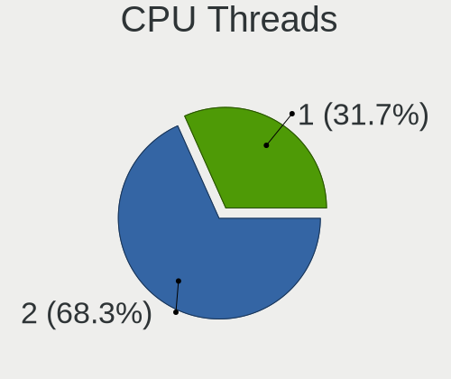

| Number | Desktops | Percent |
|--------|----------|---------|
| 2      | 118      | 59.3%   |
| 1      | 81       | 40.7%   |

CPU Op-Modes
------------

CPU Operation Modes (32-bit, 64-bit)

| Op mode        | Desktops | Percent |
|----------------|----------|---------|
| 32-bit, 64-bit | 199      | 100%    |

CPU Microcode
-------------

Microcode number

| Number     | Desktops | Percent |
|------------|----------|---------|
| Unknown    | 60       | 30.15%  |
| 0x306c3    | 15       | 7.54%   |
| 0x08701021 | 12       | 6.03%   |
| 0x306a9    | 11       | 5.53%   |
| 0x206a7    | 9        | 4.52%   |
| 0x08108109 | 6        | 3.02%   |
| 0x906ea    | 5        | 2.51%   |
| 0x0a201016 | 5        | 2.51%   |
| 0x06000852 | 5        | 2.51%   |
| 0xa0653    | 4        | 2.01%   |
| 0x506e3    | 4        | 2.01%   |
| 0x20655    | 4        | 2.01%   |
| 0x1067a    | 4        | 2.01%   |
| 0x010000c8 | 4        | 2.01%   |
| 0xa0671    | 3        | 1.51%   |
| 0x90672    | 3        | 1.51%   |
| 0x6fb      | 3        | 1.51%   |
| 0x0800820d | 3        | 1.51%   |
| 0x906ed    | 2        | 1.01%   |
| 0x30673    | 2        | 1.01%   |
| 0x106e5    | 2        | 1.01%   |
| 0x10677    | 2        | 1.01%   |
| 0x10676    | 2        | 1.01%   |
| 0x0a50000d | 2        | 1.01%   |
| 0x0a201204 | 2        | 1.01%   |
| 0x08600106 | 2        | 1.01%   |
| 0x0810100b | 2        | 1.01%   |
| 0x0700010f | 2        | 1.01%   |
| 0xf43      | 1        | 0.5%    |
| 0xa0655    | 1        | 0.5%    |
| 0x906e9    | 1        | 0.5%    |
| 0x90675    | 1        | 0.5%    |
| 0x706a8    | 1        | 0.5%    |
| 0x50654    | 1        | 0.5%    |
| 0x406c4    | 1        | 0.5%    |
| 0x306e4    | 1        | 0.5%    |
| 0x306d4    | 1        | 0.5%    |
| 0x30679    | 1        | 0.5%    |
| 0x0a20120a | 1        | 0.5%    |
| 0x0a201009 | 1        | 0.5%    |

CPU Microarch
-------------

Microarchitecture

| Name             | Desktops | Percent |
|------------------|----------|---------|
| Haswell          | 20       | 10.05%  |
| Zen 2            | 18       | 9.05%   |
| IvyBridge        | 18       | 9.05%   |
| Zen 3            | 14       | 7.04%   |
| Zen+             | 13       | 6.53%   |
| SandyBridge      | 13       | 6.53%   |
| Piledriver       | 11       | 5.53%   |
| Penryn           | 11       | 5.53%   |
| KabyLake         | 10       | 5.03%   |
| Skylake          | 9        | 4.52%   |
| Westmere         | 8        | 4.02%   |
| Silvermont       | 7        | 3.52%   |
| Zen              | 6        | 3.02%   |
| Core             | 6        | 3.02%   |
| CometLake        | 6        | 3.02%   |
| K10              | 5        | 2.51%   |
| Alderlake Hybrid | 4        | 2.01%   |
| Icelake          | 3        | 1.51%   |
| Excavator        | 3        | 1.51%   |
| Nehalem          | 2        | 1.01%   |
| Jaguar           | 2        | 1.01%   |
| Broadwell        | 2        | 1.01%   |
| Unknown          | 2        | 1.01%   |
| NetBurst         | 1        | 0.5%    |
| K8 Hammer        | 1        | 0.5%    |
| K10 Llano        | 1        | 0.5%    |
| Goldmont plus    | 1        | 0.5%    |
| Goldmont         | 1        | 0.5%    |
| Bulldozer        | 1        | 0.5%    |

Graphics
--------

GPU Vendor
----------

Vendors of graphics cards

| Vendor            | Desktops | Percent |
|-------------------|----------|---------|
| Nvidia            | 82       | 39.42%  |
| Intel             | 66       | 31.73%  |
| AMD               | 55       | 26.44%  |
| ASPEED Technology | 5        | 2.4%    |

GPU Model
---------

Graphics card models

| Model                                                                                    | Desktops | Percent |
|------------------------------------------------------------------------------------------|----------|---------|
| AMD Ellesmere [Radeon RX 470/480/570/570X/580/580X/590]                                  | 9        | 4.31%   |
| Intel Xeon E3-1200 v3/4th Gen Core Processor Integrated Graphics Controller              | 8        | 3.83%   |
| Intel 2nd Generation Core Processor Family Integrated Graphics Controller                | 8        | 3.83%   |
| Nvidia GK208B [GeForce GT 710]                                                           | 7        | 3.35%   |
| Intel Xeon E3-1200 v2/3rd Gen Core processor Graphics Controller                         | 7        | 3.35%   |
| Intel IvyBridge GT2 [HD Graphics 4000]                                                   | 5        | 2.39%   |
| Intel CoffeeLake-S GT2 [UHD Graphics 630]                                                | 5        | 2.39%   |
| Intel Atom Processor Z36xxx/Z37xxx Series Graphics & Display                             | 5        | 2.39%   |
| Intel 4 Series Chipset Integrated Graphics Controller                                    | 5        | 2.39%   |
| ASPEED Technology ASPEED Graphics Family                                                 | 5        | 2.39%   |
| AMD Picasso/Raven 2 [Radeon Vega Series / Radeon Vega Mobile Series]                     | 5        | 2.39%   |
| Nvidia GP107 [GeForce GTX 1050 Ti]                                                       | 4        | 1.91%   |
| Nvidia GM107 [GeForce GTX 750 Ti]                                                        | 4        | 1.91%   |
| AMD Cezanne                                                                              | 4        | 1.91%   |
| Nvidia GP106 [GeForce GTX 1060 6GB]                                                      | 3        | 1.44%   |
| Nvidia GP104 [GeForce GTX 1080]                                                          | 3        | 1.44%   |
| Intel Core Processor Integrated Graphics Controller                                      | 3        | 1.44%   |
| AMD Renoir                                                                               | 3        | 1.44%   |
| AMD Caicos [Radeon HD 6450/7450/8450 / R5 230 OEM]                                       | 3        | 1.44%   |
| Nvidia TU117 [GeForce GTX 1650]                                                          | 2        | 0.96%   |
| Nvidia TU102 [GeForce RTX 2080 Ti Rev. A]                                                | 2        | 0.96%   |
| Nvidia GM206 [GeForce GTX 960]                                                           | 2        | 0.96%   |
| Nvidia GM204 [GeForce GTX 980]                                                           | 2        | 0.96%   |
| Nvidia GM204 [GeForce GTX 970]                                                           | 2        | 0.96%   |
| Nvidia GK208B [GeForce GT 730]                                                           | 2        | 0.96%   |
| Nvidia GK106 [GeForce GTX 660]                                                           | 2        | 0.96%   |
| Nvidia GK104 [GeForce GTX 770]                                                           | 2        | 0.96%   |
| Nvidia GF108GL [Quadro 600]                                                              | 2        | 0.96%   |
| Nvidia GF108 [GeForce GT 730]                                                            | 2        | 0.96%   |
| Nvidia G94 [GeForce 9600 GT]                                                             | 2        | 0.96%   |
| Intel HD Graphics 530                                                                    | 2        | 0.96%   |
| Intel Atom/Celeron/Pentium Processor x5-E8000/J3xxx/N3xxx Integrated Graphics Controller | 2        | 0.96%   |
| Intel AlderLake-S GT1                                                                    | 2        | 0.96%   |
| Intel 82G33/G31 Express Integrated Graphics Controller                                   | 2        | 0.96%   |
| Intel 4th Generation Core Processor Family Integrated Graphics Controller                | 2        | 0.96%   |
| AMD Wani [Radeon R5/R6/R7 Graphics]                                                      | 2        | 0.96%   |
| AMD Raven Ridge [Radeon Vega Series / Radeon Vega Mobile Series]                         | 2        | 0.96%   |
| AMD Navi 10 [Radeon RX 5600 OEM/5600 XT / 5700/5700 XT]                                  | 2        | 0.96%   |
| AMD Lexa XT [Radeon PRO WX 3200]                                                         | 2        | 0.96%   |
| AMD Lexa PRO [Radeon 540/540X/550/550X / RX 540X/550/550X]                               | 2        | 0.96%   |

GPU Combo
---------

Combinations of graphics cards

| Name           | Desktops | Percent |
|----------------|----------|---------|
| 1 x Nvidia     | 80       | 40.2%   |
| 1 x Intel      | 58       | 29.15%  |
| 1 x AMD        | 49       | 24.62%  |
| 1 x ASPEED     | 3        | 1.51%   |
| Other          | 2        | 1.01%   |
| Intel + AMD    | 2        | 1.01%   |
| AMD + ASPEED   | 2        | 1.01%   |
| 2 x Intel      | 1        | 0.5%    |
| Intel + Nvidia | 1        | 0.5%    |
| AMD + Nvidia   | 1        | 0.5%    |

GPU Driver
----------

Free vs proprietary

| Driver      | Desktops | Percent |
|-------------|----------|---------|
| Free        | 137      | 68.84%  |
| Proprietary | 54       | 27.14%  |
| Unknown     | 8        | 4.02%   |

GPU Memory
----------

Total video memory

| Size in GB | Desktops | Percent |
|------------|----------|---------|
| Unknown    | 95       | 47.74%  |
| 1.01-2.0   | 24       | 12.06%  |
| 3.01-4.0   | 21       | 10.55%  |
| 7.01-8.0   | 14       | 7.04%   |
| 0.51-1.0   | 14       | 7.04%   |
| 0.01-0.5   | 12       | 6.03%   |
| 8.01-16.0  | 9        | 4.52%   |
| 5.01-6.0   | 6        | 3.02%   |
| 2.01-3.0   | 4        | 2.01%   |

Monitor
-------

Monitor Vendor
--------------

Monitor vendors

| Vendor               | Desktops | Percent |
|----------------------|----------|---------|
| Samsung Electronics  | 44       | 21.26%  |
| Goldstar             | 20       | 9.66%   |
| Acer                 | 16       | 7.73%   |
| Philips              | 12       | 5.8%    |
| BenQ                 | 11       | 5.31%   |
| Hewlett-Packard      | 9        | 4.35%   |
| Dell                 | 9        | 4.35%   |
| Eizo                 | 8        | 3.86%   |
| AOC                  | 8        | 3.86%   |
| Ancor Communications | 7        | 3.38%   |
| Fujitsu Siemens      | 6        | 2.9%    |
| NEC Computers        | 5        | 2.42%   |
| Lenovo               | 4        | 1.93%   |
| Iiyama               | 4        | 1.93%   |
| ASUSTek Computer     | 4        | 1.93%   |
| Sony                 | 3        | 1.45%   |
| Medion               | 3        | 1.45%   |
| ViewSonic            | 2        | 0.97%   |
| Vestel Elektronik    | 2        | 0.97%   |
| Panasonic            | 2        | 0.97%   |
| Packard Bell         | 2        | 0.97%   |
| HPN                  | 2        | 0.97%   |
| HannStar             | 2        | 0.97%   |
| FUS                  | 2        | 0.97%   |
| Compal               | 2        | 0.97%   |
| Vestel               | 1        | 0.48%   |
| Ruijiang             | 1        | 0.48%   |
| Qushimei             | 1        | 0.48%   |
| OEM                  | 1        | 0.48%   |
| MStar                | 1        | 0.48%   |
| Mitsubishi           | 1        | 0.48%   |
| Mi                   | 1        | 0.48%   |
| LG Electronics       | 1        | 0.48%   |
| IQT                  | 1        | 0.48%   |
| INFOTRONIC           | 1        | 0.48%   |
| Hyundai ImageQuest   | 1        | 0.48%   |
| Hitachi              | 1        | 0.48%   |
| Grundig              | 1        | 0.48%   |
| G-Story              | 1        | 0.48%   |
| CMT                  | 1        | 0.48%   |

Monitor Model
-------------

Monitor models

| Model                                                                  | Desktops | Percent |
|------------------------------------------------------------------------|----------|---------|
| Goldstar HDR 4K GSM7707 3840x2160 600x340mm 27.2-inch                  | 3        | 1.36%   |
| Acer S242HL ACR0216 1920x1080 531x299mm 24.0-inch                      | 3        | 1.36%   |
| Vestel Elektronik 24W_LCD_TV VES3700 1920x1080 706x398mm 31.9-inch     | 2        | 0.9%    |
| Samsung Electronics U28E590 SAM0C4E 3840x2160 610x350mm 27.7-inch      | 2        | 0.9%    |
| Samsung Electronics U28E590 SAM0C4D 3840x2160 607x345mm 27.5-inch      | 2        | 0.9%    |
| Samsung Electronics SMS24A450 SAM083A 1920x1200 518x324mm 24.1-inch    | 2        | 0.9%    |
| Samsung Electronics SMBX2335 SAM0702 1920x1080 510x287mm 23.0-inch     | 2        | 0.9%    |
| Samsung Electronics S24F350 SAM0D20 1920x1080 521x293mm 23.5-inch      | 2        | 0.9%    |
| Samsung Electronics LCD Monitor SyncMaster 1920x1080                   | 2        | 0.9%    |
| Panasonic TV MEIA296 1920x1080 698x392mm 31.5-inch                     | 2        | 0.9%    |
| Goldstar 22MB65 GSM5A2E 1680x1050 480x300mm 22.3-inch                  | 2        | 0.9%    |
| AOC Q3279WG5B AOC3279 2560x1440 725x428mm 33.1-inch                    | 2        | 0.9%    |
| AOC 27B1 AOC2701 1920x1080 598x336mm 27.0-inch                         | 2        | 0.9%    |
| AOC 2460G5 AOC2460 1920x1080 531x299mm 24.0-inch                       | 2        | 0.9%    |
| Ancor Communications ASUS PB287Q ACI28A3 3840x2160 620x340mm 27.8-inch | 2        | 0.9%    |
| ViewSonic XG270QC VSCC438 2560x1440 597x336mm 27.0-inch                | 1        | 0.45%   |
| ViewSonic VX3218-PC-mhd VSCEB3A 1920x1080 609x348mm 27.6-inch          | 1        | 0.45%   |
| Vestel LCD Monitor 22W_LCD_TV 1920x1080                                | 1        | 0.45%   |
| Sony TV SNYAA01 1360x768                                               | 1        | 0.45%   |
| Sony TV SNY7A02 1360x768 576x324mm 26.0-inch                           | 1        | 0.45%   |
| Sony TV SNY6804 1600x900                                               | 1        | 0.45%   |
| Samsung Electronics T24B301 SAM098E 1920x1080 521x293mm 23.5-inch      | 1        | 0.45%   |
| Samsung Electronics SyncMaster SAM096C 1920x1080 885x498mm 40.0-inch   | 1        | 0.45%   |
| Samsung Electronics SyncMaster SAM05CB 1920x1080 530x300mm 24.0-inch   | 1        | 0.45%   |
| Samsung Electronics SyncMaster SAM0571 1920x1080 510x287mm 23.0-inch   | 1        | 0.45%   |
| Samsung Electronics SyncMaster SAM0526 1920x1080 510x290mm 23.1-inch   | 1        | 0.45%   |
| Samsung Electronics SyncMaster SAM04D4 1920x1080 531x298mm 24.0-inch   | 1        | 0.45%   |
| Samsung Electronics SyncMaster SAM0440 1920x1200 518x324mm 24.1-inch   | 1        | 0.45%   |
| Samsung Electronics SyncMaster SAM041E 2048x1152 510x287mm 23.0-inch   | 1        | 0.45%   |
| Samsung Electronics SyncMaster SAM03E5 1680x1050 470x300mm 22.0-inch   | 1        | 0.45%   |
| Samsung Electronics SyncMaster SAM036E 1280x1024 380x300mm 19.1-inch   | 1        | 0.45%   |
| Samsung Electronics SyncMaster SAM027F 1680x1050 474x296mm 22.0-inch   | 1        | 0.45%   |
| Samsung Electronics SA300/SA350 SAM0795 1920x1080 520x290mm 23.4-inch  | 1        | 0.45%   |
| Samsung Electronics S24F350 SAM0D21 1920x1080 521x293mm 23.5-inch      | 1        | 0.45%   |
| Samsung Electronics S24E390 SAM0C1A 1920x1080 521x293mm 23.5-inch      | 1        | 0.45%   |
| Samsung Electronics S24D330 SAM0D92 1920x1080 531x299mm 24.0-inch      | 1        | 0.45%   |
| Samsung Electronics S24C450 SAM09CD 1920x1080 521x293mm 23.5-inch      | 1        | 0.45%   |
| Samsung Electronics S24C200 SAM09BD 1920x1080 521x293mm 23.5-inch      | 1        | 0.45%   |
| Samsung Electronics S22C200 SAM09B7 1920x1080 477x268mm 21.5-inch      | 1        | 0.45%   |
| Samsung Electronics S22B300 SAM08AC 1920x1080 477x268mm 21.5-inch      | 1        | 0.45%   |

Monitor Resolution
------------------

Monitor screen resolution

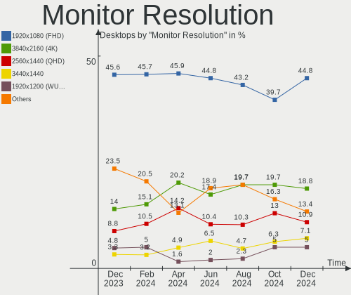

| Resolution         | Desktops | Percent |
|--------------------|----------|---------|
| 1920x1080 (FHD)    | 91       | 44.83%  |
| 3840x2160 (4K)     | 25       | 12.32%  |
| 2560x1440 (QHD)    | 16       | 7.88%   |
| 1680x1050 (WSXGA+) | 13       | 6.4%    |
| 1280x1024 (SXGA)   | 13       | 6.4%    |
| 1920x1200 (WUXGA)  | 9        | 4.43%   |
| Unknown            | 7        | 3.45%   |
| 3840x1080          | 6        | 2.96%   |
| 1600x900 (HD+)     | 5        | 2.46%   |
| 3440x1440          | 4        | 1.97%   |
| 1600x1200          | 2        | 0.99%   |
| 1440x900 (WXGA+)   | 2        | 0.99%   |
| 1360x768           | 2        | 0.99%   |
| 3840x1600          | 1        | 0.49%   |
| 3840x1200          | 1        | 0.49%   |
| 2720x900           | 1        | 0.49%   |
| 2560x1600          | 1        | 0.49%   |
| 2560x1080          | 1        | 0.49%   |
| 2048x1152          | 1        | 0.49%   |
| 1920x540           | 1        | 0.49%   |
| 1024x768 (XGA)     | 1        | 0.49%   |

Monitor Diagonal
----------------

Diagonal size in inches

| Inches  | Desktops | Percent |
|---------|----------|---------|
| 27      | 43       | 21.29%  |
| 24      | 35       | 17.33%  |
| 23      | 26       | 12.87%  |
| 21      | 17       | 8.42%   |
| Unknown | 17       | 8.42%   |
| 19      | 12       | 5.94%   |
| 22      | 11       | 5.45%   |
| 84      | 7        | 3.47%   |
| 20      | 6        | 2.97%   |
| 34      | 3        | 1.49%   |
| 26      | 3        | 1.49%   |
| 54      | 2        | 0.99%   |
| 48      | 2        | 0.99%   |
| 40      | 2        | 0.99%   |
| 39      | 2        | 0.99%   |
| 33      | 2        | 0.99%   |
| 17      | 2        | 0.99%   |
| 15      | 2        | 0.99%   |
| 86      | 1        | 0.5%    |
| 72      | 1        | 0.5%    |
| 50      | 1        | 0.5%    |
| 37      | 1        | 0.5%    |
| 35      | 1        | 0.5%    |
| 32      | 1        | 0.5%    |
| 25      | 1        | 0.5%    |
| 18      | 1        | 0.5%    |

Monitor Width
-------------

Physical width

| Width in mm | Desktops | Percent |
|-------------|----------|---------|
| 501-600     | 93       | 47.45%  |
| 401-500     | 35       | 17.86%  |
| Unknown     | 17       | 8.67%   |
| 351-400     | 11       | 5.61%   |
| 601-700     | 10       | 5.1%    |
| 1501-2000   | 9        | 4.59%   |
| 801-900     | 6        | 3.06%   |
| 701-800     | 6        | 3.06%   |
| 1001-1500   | 5        | 2.55%   |
| 301-350     | 4        | 2.04%   |

Aspect Ratio
------------

Proportional relationship between the width and the height

| Ratio   | Desktops | Percent |
|---------|----------|---------|
| 16/9    | 122      | 64.55%  |
| 16/10   | 27       | 14.29%  |
| Unknown | 17       | 8.99%   |
| 5/4     | 12       | 6.35%   |
| 21/9    | 5        | 2.65%   |
| 4/3     | 3        | 1.59%   |
| 6/5     | 1        | 0.53%   |
| 32/9    | 1        | 0.53%   |
| 1.00    | 1        | 0.53%   |

Monitor Area
------------

Area in inch²

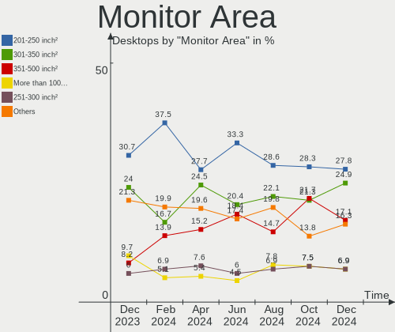

| Area in inch² | Desktops | Percent |
|----------------|----------|---------|
| 201-250        | 70       | 35%     |
| 301-350        | 43       | 21.5%   |
| 151-200        | 20       | 10%     |
| 251-300        | 18       | 9%      |
| Unknown        | 17       | 8.5%    |
| More than 1000 | 13       | 6.5%    |
| 351-500        | 8        | 4%      |
| 501-1000       | 6        | 3%      |
| 141-150        | 3        | 1.5%    |
| 101-110        | 2        | 1%      |

Pixel Density
-------------

Pixels per inch

| Density | Desktops | Percent |
|---------|----------|---------|
| 51-100  | 122      | 62.24%  |
| 101-120 | 36       | 18.37%  |
| Unknown | 17       | 8.67%   |
| 121-160 | 11       | 5.61%   |
| 1-50    | 6        | 3.06%   |
| 161-240 | 4        | 2.04%   |

Multiple Monitors
-----------------

Total monitors connected

| Total | Desktops | Percent |
|-------|----------|---------|
| 1     | 152      | 76.38%  |
| 2     | 33       | 16.58%  |
| 0     | 11       | 5.53%   |
| 3     | 3        | 1.51%   |

Network
-------

Net Controller Vendor
---------------------

Controller vendors

| Vendor                   | Desktops | Percent |
|--------------------------|----------|---------|
| Realtek Semiconductor    | 107      | 39.93%  |
| Intel                    | 96       | 35.82%  |
| Qualcomm Atheros         | 15       | 5.6%    |
| Broadcom                 | 7        | 2.61%   |
| Ralink Technology        | 6        | 2.24%   |
| Microsoft                | 5        | 1.87%   |
| TP-Link                  | 4        | 1.49%   |
| IMC Networks             | 4        | 1.49%   |
| Nvidia                   | 3        | 1.12%   |
| American Megatrends      | 3        | 1.12%   |
| NetGear                  | 2        | 0.75%   |
| MediaTek                 | 2        | 0.75%   |
| D-Link System            | 2        | 0.75%   |
| Xiaomi                   | 1        | 0.37%   |
| Sitecom Europe           | 1        | 0.37%   |
| Ralink                   | 1        | 0.37%   |
| Motorola PCS             | 1        | 0.37%   |
| Marvell Technology Group | 1        | 0.37%   |
| Holtek Semiconductor     | 1        | 0.37%   |
| Edimax Technology        | 1        | 0.37%   |
| DisplayLink              | 1        | 0.37%   |
| Broadcom Limited         | 1        | 0.37%   |
| AVM                      | 1        | 0.37%   |
| ASUSTek Computer         | 1        | 0.37%   |
| Aquantia                 | 1        | 0.37%   |

Net Controller Model
--------------------

Controller models

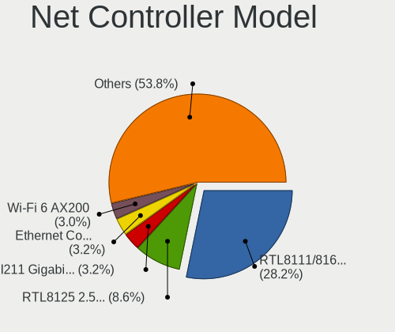

| Model                                                                | Desktops | Percent |
|----------------------------------------------------------------------|----------|---------|
| Realtek RTL8111/8168/8411 PCI Express Gigabit Ethernet Controller    | 89       | 29.57%  |
| Intel I211 Gigabit Network Connection                                | 12       | 3.99%   |
| Intel 82579LM Gigabit Network Connection (Lewisville)                | 10       | 3.32%   |
| Realtek RTL8125 2.5GbE Controller                                    | 9        | 2.99%   |
| Intel Wi-Fi 6 AX200                                                  | 8        | 2.66%   |
| Intel Ethernet Controller I225-V                                     | 7        | 2.33%   |
| Intel I210 Gigabit Network Connection                                | 6        | 1.99%   |
| Intel Ethernet Connection (2) I218-V                                 | 6        | 1.99%   |
| Intel 82579V Gigabit Network Connection                              | 6        | 1.99%   |
| Qualcomm Atheros AR8161 Gigabit Ethernet                             | 5        | 1.66%   |
| Intel Ethernet Connection (2) I219-V                                 | 5        | 1.66%   |
| Intel Dual Band Wireless-AC 3168NGW [Stone Peak]                     | 5        | 1.66%   |
| Realtek 802.11ac NIC                                                 | 4        | 1.33%   |
| Intel Alder Lake-S PCH CNVi WiFi                                     | 4        | 1.33%   |
| Intel 82574L Gigabit Network Connection                              | 4        | 1.33%   |
| Intel 82567LM-3 Gigabit Network Connection                           | 4        | 1.33%   |
| IMC Networks Mediao 802.11n WLAN [Realtek RTL8191SU]                 | 4        | 1.33%   |
| Microsoft XBOX ACC                                                   | 3        | 1%      |
| Intel Ethernet Connection I217-V                                     | 3        | 1%      |
| Intel Ethernet Connection I217-LM                                    | 3        | 1%      |
| Intel Ethernet Connection (10) I219-V                                | 3        | 1%      |
| American Megatrends Virtual Ethernet                                 | 3        | 1%      |
| Realtek RTL8169 PCI Gigabit Ethernet Controller                      | 2        | 0.66%   |
| Realtek RTL8153 Gigabit Ethernet Adapter                             | 2        | 0.66%   |
| Ralink RT2501/RT2573 Wireless Adapter                                | 2        | 0.66%   |
| Ralink MT7601U Wireless Adapter                                      | 2        | 0.66%   |
| Qualcomm Atheros QCA8171 Gigabit Ethernet                            | 2        | 0.66%   |
| Qualcomm Atheros AR93xx Wireless Network Adapter                     | 2        | 0.66%   |
| Microsoft Xbox 360 Wireless Adapter                                  | 2        | 0.66%   |
| Intel Wireless 7265                                                  | 2        | 0.66%   |
| Intel Wi-Fi 6 AX210/AX211/AX411 160MHz                               | 2        | 0.66%   |
| Intel Ethernet Connection (2) I219-LM                                | 2        | 0.66%   |
| Intel Ethernet Connection (14) I219-V                                | 2        | 0.66%   |
| Intel 82578DM Gigabit Network Connection                             | 2        | 0.66%   |
| Intel 82566DM-2 Gigabit Network Connection                           | 2        | 0.66%   |
| D-Link System DWA-140 RangeBooster N Adapter(rev.B2) [Ralink RT3072] | 2        | 0.66%   |
| Broadcom NetXtreme BCM5754 Gigabit Ethernet PCI Express              | 2        | 0.66%   |
| Xiaomi Mi/Redmi series (RNDIS)                                       | 1        | 0.33%   |
| TP-Link TL-WN823N v2/v3 [Realtek RTL8192EU]                          | 1        | 0.33%   |
| TP-Link TL-WN822N Version 4 RTL8192EU                                | 1        | 0.33%   |

Wireless Vendor
---------------

Wireless vendors

| Vendor                | Desktops | Percent |
|-----------------------|----------|---------|
| Intel                 | 26       | 33.33%  |
| Realtek Semiconductor | 14       | 17.95%  |
| Ralink Technology     | 6        | 7.69%   |
| Qualcomm Atheros      | 6        | 7.69%   |
| Microsoft             | 5        | 6.41%   |
| TP-Link               | 4        | 5.13%   |
| IMC Networks          | 4        | 5.13%   |
| NetGear               | 2        | 2.56%   |
| MediaTek              | 2        | 2.56%   |
| D-Link System         | 2        | 2.56%   |
| Broadcom              | 2        | 2.56%   |
| Sitecom Europe        | 1        | 1.28%   |
| Ralink                | 1        | 1.28%   |
| Edimax Technology     | 1        | 1.28%   |
| AVM                   | 1        | 1.28%   |
| ASUSTek Computer      | 1        | 1.28%   |

Wireless Model
--------------

Wireless models

| Model                                                                | Desktops | Percent |
|----------------------------------------------------------------------|----------|---------|
| Intel Wi-Fi 6 AX200                                                  | 8        | 9.88%   |
| Intel Dual Band Wireless-AC 3168NGW [Stone Peak]                     | 5        | 6.17%   |
| Realtek 802.11ac NIC                                                 | 4        | 4.94%   |
| Intel Alder Lake-S PCH CNVi WiFi                                     | 4        | 4.94%   |
| IMC Networks Mediao 802.11n WLAN [Realtek RTL8191SU]                 | 4        | 4.94%   |
| Microsoft XBOX ACC                                                   | 3        | 3.7%    |
| Ralink RT2501/RT2573 Wireless Adapter                                | 2        | 2.47%   |
| Ralink MT7601U Wireless Adapter                                      | 2        | 2.47%   |
| Qualcomm Atheros AR93xx Wireless Network Adapter                     | 2        | 2.47%   |
| Microsoft Xbox 360 Wireless Adapter                                  | 2        | 2.47%   |
| Intel Wireless 7265                                                  | 2        | 2.47%   |
| Intel Wi-Fi 6 AX210/AX211/AX411 160MHz                               | 2        | 2.47%   |
| D-Link System DWA-140 RangeBooster N Adapter(rev.B2) [Ralink RT3072] | 2        | 2.47%   |
| TP-Link TL-WN823N v2/v3 [Realtek RTL8192EU]                          | 1        | 1.23%   |
| TP-Link TL-WN822N Version 4 RTL8192EU                                | 1        | 1.23%   |
| TP-Link TL-WN722N v2/v3 [Realtek RTL8188EUS]                         | 1        | 1.23%   |
| TP-Link Archer T4U ver.3                                             | 1        | 1.23%   |
| Sitecom Europe WL-344 Wireless Adapter 300N X2 [Ralink RT3071]       | 1        | 1.23%   |
| Realtek RTL8822BE 802.11a/b/g/n/ac WiFi adapter                      | 1        | 1.23%   |
| Realtek RTL8821CE 802.11ac PCIe Wireless Network Adapter             | 1        | 1.23%   |
| Realtek RTL8814AU 802.11a/b/g/n/ac Wireless Adapter                  | 1        | 1.23%   |
| Realtek RTL8812AE 802.11ac PCIe Wireless Network Adapter             | 1        | 1.23%   |
| Realtek RTL8811AU 802.11a/b/g/n/ac WLAN Adapter                      | 1        | 1.23%   |
| Realtek RTL8192EE PCIe Wireless Network Adapter                      | 1        | 1.23%   |
| Realtek RTL8192CU 802.11n WLAN Adapter                               | 1        | 1.23%   |
| Realtek RTL8191SU 802.11n WLAN Adapter                               | 1        | 1.23%   |
| Realtek RTL8188EUS 802.11n Wireless Network Adapter                  | 1        | 1.23%   |
| Realtek RTL8188CUS 802.11n WLAN Adapter                              | 1        | 1.23%   |
| Realtek B1690189192                                                  | 1        | 1.23%   |
| Ralink RT5370 Wireless Adapter                                       | 1        | 1.23%   |
| Ralink RT2870/RT3070 Wireless Adapter                                | 1        | 1.23%   |
| Ralink RT5392 PCIe Wireless Network Adapter                          | 1        | 1.23%   |
| Qualcomm Atheros QCA9377 802.11ac Wireless Network Adapter           | 1        | 1.23%   |
| Qualcomm Atheros AR9485 Wireless Network Adapter                     | 1        | 1.23%   |
| Qualcomm Atheros AR928X Wireless Network Adapter (PCI-Express)       | 1        | 1.23%   |
| Qualcomm Atheros AR5212/5213/2414 Wireless Network Adapter           | 1        | 1.23%   |
| NetGear WPN111 RangeMax Wireless USB 2.0 Adapter                     | 1        | 1.23%   |
| NetGear WG111v2 54 Mbps Wireless [RealTek RTL8187L]                  | 1        | 1.23%   |
| NetGear A6150                                                        | 1        | 1.23%   |
| Microsoft Wireless XBox Controller Dongle                            | 1        | 1.23%   |

Ethernet Vendor
---------------

Ethernet vendors

| Vendor                   | Desktops | Percent |
|--------------------------|----------|---------|
| Realtek Semiconductor    | 102      | 48.11%  |
| Intel                    | 84       | 39.62%  |
| Qualcomm Atheros         | 9        | 4.25%   |
| Broadcom                 | 5        | 2.36%   |
| Nvidia                   | 3        | 1.42%   |
| American Megatrends      | 3        | 1.42%   |
| Xiaomi                   | 1        | 0.47%   |
| Motorola PCS             | 1        | 0.47%   |
| Marvell Technology Group | 1        | 0.47%   |
| DisplayLink              | 1        | 0.47%   |
| Broadcom Limited         | 1        | 0.47%   |
| Aquantia                 | 1        | 0.47%   |

Ethernet Model
--------------

Ethernet models

| Model                                                             | Desktops | Percent |
|-------------------------------------------------------------------|----------|---------|
| Realtek RTL8111/8168/8411 PCI Express Gigabit Ethernet Controller | 89       | 40.83%  |
| Intel I211 Gigabit Network Connection                             | 12       | 5.5%    |
| Intel 82579LM Gigabit Network Connection (Lewisville)             | 10       | 4.59%   |
| Realtek RTL8125 2.5GbE Controller                                 | 9        | 4.13%   |
| Intel Ethernet Controller I225-V                                  | 7        | 3.21%   |
| Intel I210 Gigabit Network Connection                             | 6        | 2.75%   |
| Intel Ethernet Connection (2) I218-V                              | 6        | 2.75%   |
| Intel 82579V Gigabit Network Connection                           | 6        | 2.75%   |
| Qualcomm Atheros AR8161 Gigabit Ethernet                          | 5        | 2.29%   |
| Intel Ethernet Connection (2) I219-V                              | 5        | 2.29%   |
| Intel 82574L Gigabit Network Connection                           | 4        | 1.83%   |
| Intel 82567LM-3 Gigabit Network Connection                        | 4        | 1.83%   |
| Intel Ethernet Connection I217-V                                  | 3        | 1.38%   |
| Intel Ethernet Connection I217-LM                                 | 3        | 1.38%   |
| Intel Ethernet Connection (10) I219-V                             | 3        | 1.38%   |
| American Megatrends Virtual Ethernet                              | 3        | 1.38%   |
| Realtek RTL8169 PCI Gigabit Ethernet Controller                   | 2        | 0.92%   |
| Realtek RTL8153 Gigabit Ethernet Adapter                          | 2        | 0.92%   |
| Qualcomm Atheros QCA8171 Gigabit Ethernet                         | 2        | 0.92%   |
| Intel Ethernet Connection (2) I219-LM                             | 2        | 0.92%   |
| Intel Ethernet Connection (14) I219-V                             | 2        | 0.92%   |
| Intel 82578DM Gigabit Network Connection                          | 2        | 0.92%   |
| Intel 82566DM-2 Gigabit Network Connection                        | 2        | 0.92%   |
| Broadcom NetXtreme BCM5754 Gigabit Ethernet PCI Express           | 2        | 0.92%   |
| Xiaomi Mi/Redmi series (RNDIS)                                    | 1        | 0.46%   |
| Realtek RTL810xE PCI Express Fast Ethernet controller             | 1        | 0.46%   |
| Qualcomm Atheros Killer E220x Gigabit Ethernet Controller         | 1        | 0.46%   |
| Qualcomm Atheros Attansic L1 Gigabit Ethernet                     | 1        | 0.46%   |
| Nvidia MCP73 Ethernet                                             | 1        | 0.46%   |
| Nvidia MCP61 Ethernet                                             | 1        | 0.46%   |
| Nvidia CK804 Ethernet Controller                                  | 1        | 0.46%   |
| Motorola PCS Moto G (5) Plus                                      | 1        | 0.46%   |
| Marvell Group 88E8056 PCI-E Gigabit Ethernet Controller           | 1        | 0.46%   |
| Intel NM10/ICH7 Family LAN Controller                             | 1        | 0.46%   |
| Intel I350 Gigabit Network Connection                             | 1        | 0.46%   |
| Intel Ethernet Controller X550                                    | 1        | 0.46%   |
| Intel Ethernet Connection (7) I219-V                              | 1        | 0.46%   |
| Intel Ethernet Connection (7) I219-LM                             | 1        | 0.46%   |
| Intel Ethernet Connection (17) I219-V                             | 1        | 0.46%   |
| Intel 82599ES 10-Gigabit SFI/SFP+ Network Connection              | 1        | 0.46%   |

Net Controller Kind
-------------------

Ethernet, WiFi or modem

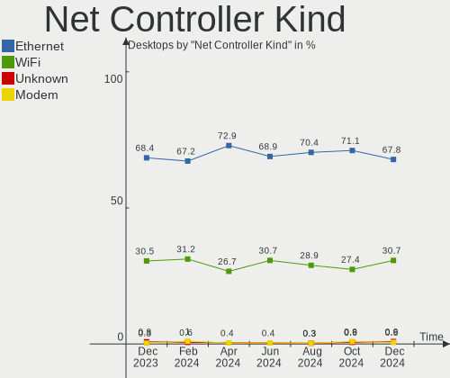

| Kind     | Desktops | Percent |
|----------|----------|---------|
| Ethernet | 197      | 72.96%  |
| WiFi     | 71       | 26.3%   |
| Unknown  | 2        | 0.74%   |

Used Controller
---------------

Currently used network controller

| Kind     | Desktops | Percent |
|----------|----------|---------|
| Ethernet | 165      | 82.91%  |
| WiFi     | 34       | 17.09%  |

NICs
----

Total network controllers on board

| Total | Desktops | Percent |
|-------|----------|---------|
| 1     | 139      | 69.85%  |
| 2     | 50       | 25.13%  |
| 3     | 5        | 2.51%   |
| 4     | 2        | 1.01%   |
| 0     | 2        | 1.01%   |
| 12    | 1        | 0.5%    |

IPv6
----

IPv6 vs IPv4

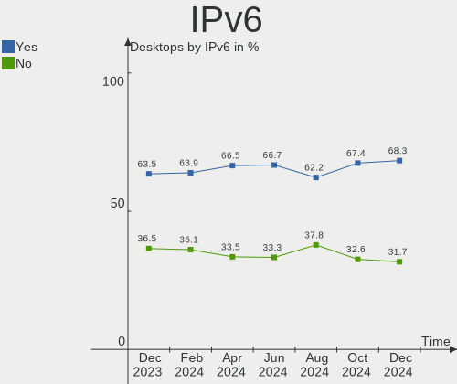

| Used | Desktops | Percent |
|------|----------|---------|
| Yes  | 112      | 56.28%  |
| No   | 87       | 43.72%  |

Bluetooth
---------

Bluetooth Vendor
----------------

Controller vendors

| Vendor                          | Desktops | Percent |
|---------------------------------|----------|---------|
| Intel                           | 23       | 40.35%  |
| Cambridge Silicon Radio         | 12       | 21.05%  |
| ASUSTek Computer                | 5        | 8.77%   |
| Realtek Semiconductor           | 4        | 7.02%   |
| Qualcomm Atheros Communications | 3        | 5.26%   |
| Edimax Technology               | 2        | 3.51%   |
| Broadcom                        | 2        | 3.51%   |
| TP-Link                         | 1        | 1.75%   |
| Toshiba                         | 1        | 1.75%   |
| MediaTek                        | 1        | 1.75%   |
| IMC Networks                    | 1        | 1.75%   |
| Apple                           | 1        | 1.75%   |
| Unknown                         | 1        | 1.75%   |

Bluetooth Model
---------------

Controller models

| Model                                               | Desktops | Percent |
|-----------------------------------------------------|----------|---------|
| Cambridge Silicon Radio Bluetooth Dongle (HCI mode) | 12       | 21.05%  |
| Intel AX200 Bluetooth                               | 8        | 14.04%  |
| Intel Wireless-AC 3168 Bluetooth                    | 5        | 8.77%   |
| Intel Bluetooth wireless interface                  | 4        | 7.02%   |
| ASUS Broadcom BCM20702A0 Bluetooth                  | 4        | 7.02%   |
| Realtek Bluetooth Radio                             | 3        | 5.26%   |
| Intel AX201 Bluetooth                               | 3        | 5.26%   |
| Qualcomm Atheros AR3011 Bluetooth                   | 2        | 3.51%   |
| Edimax Bluetooth Adapter                            | 2        | 3.51%   |
| TP-Link UB500 Adapter                               | 1        | 1.75%   |
| Toshiba Bluetooth USB Host Controller               | 1        | 1.75%   |
| Realtek  Bluetooth 4.2 Adapter                      | 1        | 1.75%   |
| Qualcomm Atheros  Bluetooth Device                  | 1        | 1.75%   |
| MediaTek Wireless_Device                            | 1        | 1.75%   |
| Intel Wireless-AC 9260 Bluetooth Adapter            | 1        | 1.75%   |
| Intel Bluetooth Device                              | 1        | 1.75%   |
| Intel AX210 Bluetooth                               | 1        | 1.75%   |
| IMC Networks Wireless_Device                        | 1        | 1.75%   |
| Broadcom BCM20702A0 Bluetooth 4.0                   | 1        | 1.75%   |
| Broadcom BCM2045 Bluetooth                          | 1        | 1.75%   |
| ASUS BCM20702A0                                     | 1        | 1.75%   |
| Apple Bluetooth HCI                                 | 1        | 1.75%   |
| Unknown                                             | 1        | 1.75%   |

Sound
-----

Sound Vendor
------------

Sound card vendors

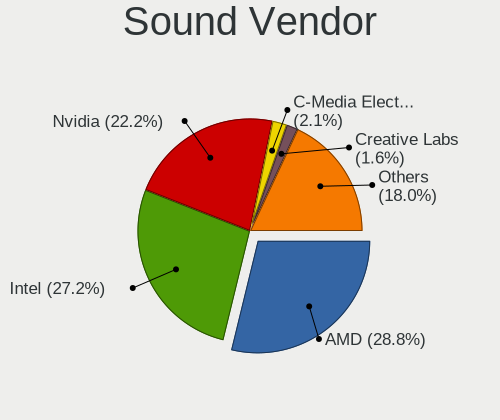

| Vendor                               | Desktops | Percent |
|--------------------------------------|----------|---------|
| Intel                                | 115      | 35.94%  |
| AMD                                  | 80       | 25%     |
| Nvidia                               | 74       | 23.13%  |
| Creative Labs                        | 10       | 3.13%   |
| C-Media Electronics                  | 10       | 3.13%   |
| Logitech                             | 5        | 1.56%   |
| VIA Technologies                     | 3        | 0.94%   |
| Texas Instruments                    | 2        | 0.63%   |
| Dell                                 | 2        | 0.63%   |
| ASUSTek Computer                     | 2        | 0.63%   |
| Thesycon Systemsoftware & Consulting | 1        | 0.31%   |
| Textech International                | 1        | 0.31%   |
| Sony                                 | 1        | 0.31%   |
| SAVITECH                             | 1        | 0.31%   |
| RODE Microphones                     | 1        | 0.31%   |
| Realtek Semiconductor                | 1        | 0.31%   |
| Razer USA                            | 1        | 0.31%   |
| Quanta                               | 1        | 0.31%   |
| QinHeng Electronics                  | 1        | 0.31%   |
| Kingston Technology                  | 1        | 0.31%   |
| JMTek                                | 1        | 0.31%   |
| Giga-Byte Technology                 | 1        | 0.31%   |
| Generalplus Technology               | 1        | 0.31%   |
| Focusrite-Novation                   | 1        | 0.31%   |
| Creative Technology                  | 1        | 0.31%   |
| Corsair                              | 1        | 0.31%   |
| BR25                                 | 1        | 0.31%   |

Sound Model
-----------

Sound card models

| Model                                                                      | Desktops | Percent |
|----------------------------------------------------------------------------|----------|---------|
| AMD Starship/Matisse HD Audio Controller                                   | 22       | 5.98%   |
| Intel 6 Series/C200 Series Chipset Family High Definition Audio Controller | 16       | 4.35%   |
| AMD Family 17h/19h HD Audio Controller                                     | 15       | 4.08%   |
| Intel 7 Series/C216 Chipset Family High Definition Audio Controller        | 13       | 3.53%   |
| AMD SBx00 Azalia (Intel HDA)                                               | 12       | 3.26%   |
| Intel 8 Series/C220 Series Chipset High Definition Audio Controller        | 11       | 2.99%   |
| Nvidia GK208 HDMI/DP Audio Controller                                      | 9        | 2.45%   |
| AMD Family 17h (Models 00h-0fh) HD Audio Controller                        | 9        | 2.45%   |
| AMD Ellesmere HDMI Audio [Radeon RX 470/480 / 570/580/590]                 | 9        | 2.45%   |
| Nvidia GF108 High Definition Audio Controller                              | 8        | 2.17%   |
| Intel Xeon E3-1200 v3/4th Gen Core Processor HD Audio Controller           | 8        | 2.17%   |
| Intel 5 Series/3400 Series Chipset High Definition Audio                   | 8        | 2.17%   |
| Intel 200 Series PCH HD Audio                                              | 8        | 2.17%   |
| Intel 100 Series/C230 Series Chipset Family HD Audio Controller            | 7        | 1.9%    |
| Creative Labs Sound Core3D [Sound Blaster Recon3D / Z-Series]              | 7        | 1.9%    |
| AMD Renoir Radeon High Definition Audio Controller                         | 7        | 1.9%    |
| AMD Raven/Raven2/Fenghuang HDMI/DP Audio Controller                        | 7        | 1.9%    |
| Nvidia GP107GL High Definition Audio Controller                            | 6        | 1.63%   |
| Intel 9 Series Chipset Family HD Audio Controller                          | 6        | 1.63%   |
| Intel 82801I (ICH9 Family) HD Audio Controller                             | 6        | 1.63%   |
| Nvidia GP104 High Definition Audio Controller                              | 5        | 1.36%   |
| Nvidia GM107 High Definition Audio Controller [GeForce 940MX]              | 5        | 1.36%   |
| Intel Atom Processor Z36xxx/Z37xxx Series High Definition Audio Controller | 5        | 1.36%   |
| Intel Alder Lake-S HD Audio Controller                                     | 5        | 1.36%   |
| Intel 82801JD/DO (ICH10 Family) HD Audio Controller                        | 5        | 1.36%   |
| AMD Navi 21/23 HDMI/DP Audio Controller                                    | 5        | 1.36%   |
| Nvidia GM204 High Definition Audio Controller                              | 4        | 1.09%   |
| Intel Audio device                                                         | 4        | 1.09%   |
| AMD Kabini HDMI/DP Audio                                                   | 4        | 1.09%   |
| AMD FCH Azalia Controller                                                  | 4        | 1.09%   |
| AMD Baffin HDMI/DP Audio [Radeon RX 550 640SP / RX 560/560X]               | 4        | 1.09%   |
| Nvidia TU102 High Definition Audio Controller                              | 3        | 0.82%   |
| Nvidia GP106 High Definition Audio Controller                              | 3        | 0.82%   |
| Nvidia GK106 HDMI Audio Controller                                         | 3        | 0.82%   |
| Intel Tiger Lake-H HD Audio Controller                                     | 3        | 0.82%   |
| Intel Cannon Lake PCH cAVS                                                 | 3        | 0.82%   |
| Intel 82801JI (ICH10 Family) HD Audio Controller                           | 3        | 0.82%   |
| AMD Oland/Hainan/Cape Verde/Pitcairn HDMI Audio [Radeon HD 7000 Series]    | 3        | 0.82%   |
| AMD Navi 10 HDMI Audio                                                     | 3        | 0.82%   |
| AMD Family 15h (Models 60h-6fh) Audio Controller                           | 3        | 0.82%   |

Memory
------

Memory Vendor
-------------

Memory module vendors

| Vendor              | Desktops | Percent |
|---------------------|----------|---------|
| G.Skill             | 21       | 23.08%  |
| Samsung Electronics | 15       | 16.48%  |
| Crucial             | 10       | 10.99%  |
| Kingston            | 9        | 9.89%   |
| Corsair             | 9        | 9.89%   |
| Unknown             | 8        | 8.79%   |
| SK hynix            | 7        | 7.69%   |
| Team                | 3        | 3.3%    |
| Micron Technology   | 2        | 2.2%    |
| A-DATA Technology   | 2        | 2.2%    |
| Ramaxel Technology  | 1        | 1.1%    |
| PNY                 | 1        | 1.1%    |
| Patriot             | 1        | 1.1%    |
| Golden Empire       | 1        | 1.1%    |
| Unknown             | 1        | 1.1%    |

Memory Model
------------

Memory module models

| Model                                                   | Desktops | Percent |
|---------------------------------------------------------|----------|---------|
| Unknown RAM Module 2GB DIMM DDR 1333MT/s                | 2        | 2.04%   |
| Samsung RAM Module 2GB DIMM DDR3 1333MT/s               | 2        | 2.04%   |
| Samsung RAM M391A2K43BB1-CTD 16384MB DIMM DDR4 3600MT/s | 2        | 2.04%   |
| G.Skill RAM F4-3200C16-8GIS 8192MB DIMM DDR4 3200MT/s   | 2        | 2.04%   |
| G.Skill RAM F4-2133C15-8GNT 8GB DIMM DDR4 2133MT/s      | 2        | 2.04%   |
| G.Skill RAM F3-2400C10-8GTX 8GB DIMM DDR3 2400MT/s      | 2        | 2.04%   |
| G.Skill RAM F3-10666CL9-4GBNT 4GB DIMM DDR3 1400MT/s    | 2        | 2.04%   |
| Crucial RAM BLS8G3D1609DS1S00. 8GB DIMM DDR3 1600MT/s   | 2        | 2.04%   |
| Corsair RAM CMX8GX3M1A1600C11 8GB DIMM DDR3 1600MT/s    | 2        | 2.04%   |
| Unknown RAM Module 8GB DIMM DDR3 1866MT/s               | 1        | 1.02%   |
| Unknown RAM Module 8GB DIMM 667MT/s                     | 1        | 1.02%   |
| Unknown RAM Module 4GB DIMM DDR3 1333MT/s               | 1        | 1.02%   |
| Unknown RAM Module 4GB DIMM DDR 1333MT/s                | 1        | 1.02%   |
| Unknown RAM Module 4GB DIMM 1600MT/s                    | 1        | 1.02%   |
| Unknown RAM Module 4GB DIMM 1333MT/s                    | 1        | 1.02%   |
| Unknown RAM Module 4096MB DIMM 1333MT/s                 | 1        | 1.02%   |
| Team RAM Value-667 1GB DIMM DDR 400MT/s                 | 1        | 1.02%   |
| Team RAM TEAMGROUP-UD4-3600 32GB DIMM DDR4 3600MT/s     | 1        | 1.02%   |
| Team RAM TEAMGROUP-UD4-2666 16384MB DIMM DDR4 2667MT/s  | 1        | 1.02%   |
| SK hynix RAM Module 4GB DIMM DDR4 2400MT/s              | 1        | 1.02%   |
| SK hynix RAM Module 4GB DIMM DDR3 1333MT/s              | 1        | 1.02%   |
| SK hynix RAM HYMP564U64P8-E3 512MB DIMM DDR 400MT/s     | 1        | 1.02%   |
| SK hynix RAM HMT351U6CFR8C-PB 4GB DIMM DDR3 1800MT/s    | 1        | 1.02%   |
| SK hynix RAM HMT325U6CFR8C-PB 2GB DIMM DDR3 1600MT/s    | 1        | 1.02%   |
| SK hynix RAM HMT325U6BFR8C-H9 2048MB DIMM DDR3 1333MT/s | 1        | 1.02%   |
| SK hynix RAM HMT125U7TFR8C-H9 2GB DIMM DDR3 1333MT/s    | 1        | 1.02%   |
| SK hynix RAM HMA851U6AFR6N-UH 4GB DIMM DDR4 2400MT/s    | 1        | 1.02%   |
| SK hynix RAM HMA81GU6AFR8N-UH 8GB DIMM DDR4 2400MT/s    | 1        | 1.02%   |
| Samsung RAM M471B5173QH0-YK0 4GB SODIMM DDR3 1600MT/s   | 1        | 1.02%   |
| Samsung RAM M471B5173CB0-YK0 4GB SODIMM DDR3 1600MT/s   | 1        | 1.02%   |
| Samsung RAM M391A4G43AB1-CWE 32GB DIMM DDR4 3200MT/s    | 1        | 1.02%   |
| Samsung RAM M391A1K43BB1-CRC 8GB DIMM DDR4 2400MT/s     | 1        | 1.02%   |
| Samsung RAM M378B5673FH0-CF8 2048MB DIMM DDR3 1067MT/s  | 1        | 1.02%   |
| Samsung RAM M378B5273EBO-CKO 8GB DIMM DDR3 1333MT/s     | 1        | 1.02%   |
| Samsung RAM M378B5273DH0-CH9 4GB DIMM DDR3 2133MT/s     | 1        | 1.02%   |
| Samsung RAM M378B1G73EB0-YK0 8GB DIMM DDR3 1600MT/s     | 1        | 1.02%   |
| Samsung RAM M378A1K43CB2-CTD 8192MB DIMM DDR4 3200MT/s  | 1        | 1.02%   |
| Samsung RAM M378A1G43DB0-CPB 8GB DIMM DDR4 2133MT/s     | 1        | 1.02%   |
| Samsung RAM M3 78T5663QZ3-CF7 2048MB DIMM SDRAM         | 1        | 1.02%   |
| Ramaxel RAM RMR1870EC58E9F1333 4GB DIMM DDR3 1333MT/s   | 1        | 1.02%   |

Memory Kind
-----------

Memory module kinds

| Kind    | Desktops | Percent |
|---------|----------|---------|
| DDR4    | 44       | 53.66%  |
| DDR3    | 29       | 35.37%  |
| Unknown | 4        | 4.88%   |
| DDR     | 3        | 3.66%   |
| SDRAM   | 1        | 1.22%   |
| DDR2    | 1        | 1.22%   |

Memory Form Factor
------------------

Physical design of the memory module

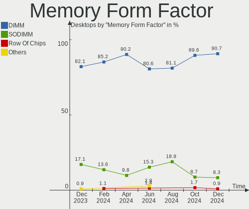

| Name   | Desktops | Percent |
|--------|----------|---------|
| DIMM   | 78       | 95.12%  |
| SODIMM | 4        | 4.88%   |

Memory Size
-----------

Memory module size

| Size  | Desktops | Percent |
|-------|----------|---------|
| 8192  | 39       | 43.33%  |
| 4096  | 20       | 22.22%  |
| 16384 | 14       | 15.56%  |
| 2048  | 9        | 10%     |
| 32768 | 6        | 6.67%   |
| 1024  | 1        | 1.11%   |
| 512   | 1        | 1.11%   |

Memory Speed
------------

Memory module speed

| Speed | Desktops | Percent |
|-------|----------|---------|
| 1333  | 15       | 16.85%  |
| 3200  | 13       | 14.61%  |
| 1600  | 12       | 13.48%  |
| 2400  | 8        | 8.99%   |
| 2667  | 6        | 6.74%   |
| 2133  | 6        | 6.74%   |
| 3600  | 4        | 4.49%   |
| 2666  | 4        | 4.49%   |
| 3466  | 2        | 2.25%   |
| 3333  | 2        | 2.25%   |
| 1867  | 2        | 2.25%   |
| 1866  | 2        | 2.25%   |
| 1400  | 2        | 2.25%   |
| 800   | 2        | 2.25%   |
| 3866  | 1        | 1.12%   |
| 3733  | 1        | 1.12%   |
| 3400  | 1        | 1.12%   |
| 3000  | 1        | 1.12%   |
| 1800  | 1        | 1.12%   |
| 1639  | 1        | 1.12%   |
| 1067  | 1        | 1.12%   |
| 667   | 1        | 1.12%   |
| 400   | 1        | 1.12%   |

Printers & scanners
-------------------

Printer Vendor
--------------

Printer device vendors

| Vendor              | Desktops | Percent |
|---------------------|----------|---------|
| Hewlett-Packard     | 2        | 22.22%  |
| Canon               | 2        | 22.22%  |
| Brother Industries  | 2        | 22.22%  |
| Seiko Epson         | 1        | 11.11%  |
| Samsung Electronics | 1        | 11.11%  |
| QinHeng Electronics | 1        | 11.11%  |

Printer Model
-------------

Printer device models

| Model                      | Desktops | Percent |
|----------------------------|----------|---------|
| Seiko Epson XP-3150 Series | 1        | 10%     |
| Samsung C43x Series        | 1        | 10%     |
| QinHeng CH340S             | 1        | 10%     |
| HP Smart Install           | 1        | 10%     |
| HP OfficeJet 3830 series   | 1        | 10%     |
| Canon PIXMA MX470 Series   | 1        | 10%     |
| Canon LiDE 400             | 1        | 10%     |
| Brother MFC-J6930DW        | 1        | 10%     |
| Brother MFC-J430W          | 1        | 10%     |
| Brother DCP-J105           | 1        | 10%     |

Scanner Vendor
--------------

Scanner device vendors

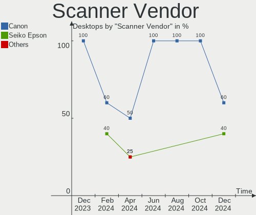

| Vendor | Desktops | Percent |
|--------|----------|---------|
| Canon  | 10       | 100%    |

Scanner Model
-------------

Scanner device models

| Model                              | Desktops | Percent |
|------------------------------------|----------|---------|
| Canon CanoScan LiDE 120            | 2        | 20%     |
| Canon CanoScan LiDE 100            | 2        | 20%     |
| Canon CanoScan N670U/N676U/LiDE 20 | 1        | 10%     |
| Canon CanoScan LiDE 90             | 1        | 10%     |
| Canon CanoScan LiDE 220            | 1        | 10%     |
| Canon CanoScan LiDE 200            | 1        | 10%     |
| Canon CanoScan LiDE 110            | 1        | 10%     |
| Canon CanoScan 3200F               | 1        | 10%     |

Camera
------

Camera Vendor
-------------

Camera device vendors

| Vendor                        | Desktops | Percent |
|-------------------------------|----------|---------|
| Logitech                      | 18       | 38.3%   |
| Microsoft                     | 6        | 12.77%  |
| Microdia                      | 5        | 10.64%  |
| Sunplus Innovation Technology | 4        | 8.51%   |
| Generalplus Technology        | 2        | 4.26%   |
| ARC International             | 2        | 4.26%   |
| Unknown                       | 1        | 2.13%   |
| Trust                         | 1        | 2.13%   |
| Sony                          | 1        | 2.13%   |
| Sonix Technology              | 1        | 2.13%   |
| Samsung Electronics           | 1        | 2.13%   |
| Razer USA                     | 1        | 2.13%   |
| Quanta                        | 1        | 2.13%   |
| MacroSilicon                  | 1        | 2.13%   |
| Jieli Technology              | 1        | 2.13%   |
| Cubeternet                    | 1        | 2.13%   |

Camera Model
------------

Camera device models

| Model                                 | Desktops | Percent |
|---------------------------------------|----------|---------|
| Logitech Webcam C270                  | 4        | 8.51%   |
| Sunplus HD 720P webcam                | 3        | 6.38%   |
| Microsoft LifeCam HD-3000             | 2        | 4.26%   |
| Microsoft LifeCam Cinema              | 2        | 4.26%   |
| Microdia USB 2.0 Camera               | 2        | 4.26%   |
| Logitech Webcam C310                  | 2        | 4.26%   |
| Logitech Webcam C170                  | 2        | 4.26%   |
| Logitech C922 Pro Stream Webcam       | 2        | 4.26%   |
| Logitech BRIO 4K Stream Edition       | 2        | 4.26%   |
| Generalplus GENERAL WEBCAM            | 2        | 4.26%   |
| ARC International Camera              | 2        | 4.26%   |
| Unknown HD camera                     | 1        | 2.13%   |
| Trust QHD Webcam                      | 1        | 2.13%   |
| Sunplus PAPALOOK_229AF                | 1        | 2.13%   |
| Sony CEVCECM                          | 1        | 2.13%   |
| Sonix ZZ3                             | 1        | 2.13%   |
| Samsung Galaxy A5 (MTP)               | 1        | 2.13%   |
| Razer USA Gaming Webcam [Kiyo]        | 1        | 2.13%   |
| Quanta HD Camera                      | 1        | 2.13%   |
| Microsoft Microsoft LifeCam HD-5001 | 1        | 2.13%   |
| Microsoft Microsoft LifeCam Cinema  | 1        | 2.13%   |
| Microdia Webcam Vitade AF             | 1        | 2.13%   |
| Microdia Sonix USB 2.0 Camera         | 1        | 2.13%   |
| Microdia Camera                       | 1        | 2.13%   |
| MacroSilicon USB Video                | 1        | 2.13%   |
| Logitech Webcam C930e                 | 1        | 2.13%   |
| Logitech Webcam C210                  | 1        | 2.13%   |
| Logitech HD Webcam C510               | 1        | 2.13%   |
| Logitech HD Pro Webcam C920           | 1        | 2.13%   |
| Logitech C930c                        | 1        | 2.13%   |
| Logitech C505e HD Webcam              | 1        | 2.13%   |
| Jieli USB PHY 2.0                     | 1        | 2.13%   |
| Cubeternet USB2.0 Camera              | 1        | 2.13%   |

Security
--------

Fingerprint Vendor
------------------

Fingerprint sensor vendors

Zero info for selected period =(

Fingerprint Model
-----------------

Fingerprint sensor models

Zero info for selected period =(

Chipcard Vendor
---------------

Chipcard module vendors

| Vendor     | Desktops | Percent |
|------------|----------|---------|
| Clay Logic | 1        | 100%    |

Chipcard Model
--------------

Chipcard module models

| Model                   | Desktops | Percent |
|-------------------------|----------|---------|
| Clay Logic Nitrokey Pro | 1        | 100%    |

Unsupported
-----------

Unsupported Devices
-------------------

Total unsupported devices on board

| Total | Desktops | Percent |
|-------|----------|---------|
| 0     | 173      | 86.93%  |
| 1     | 20       | 10.05%  |
| 2     | 4        | 2.01%   |
| 5     | 2        | 1.01%   |

Unsupported Device Types
------------------------

Types of unsupported devices

| Type                     | Desktops | Percent |
|--------------------------|----------|---------|
| Net/wireless             | 9        | 25.71%  |
| Graphics card            | 9        | 25.71%  |
| Communication controller | 5        | 14.29%  |
| Sound                    | 4        | 11.43%  |
| Card reader              | 3        | 8.57%   |
| Storage/raid             | 1        | 2.86%   |
| Storage/ide              | 1        | 2.86%   |
| Firewire controller      | 1        | 2.86%   |
| Camera                   | 1        | 2.86%   |
| Bluetooth                | 1        | 2.86%   |

