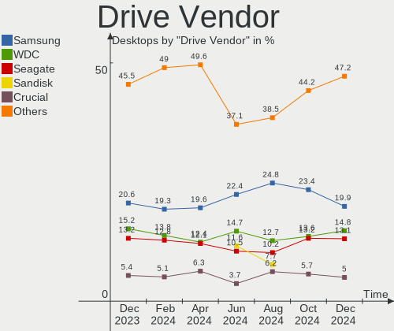
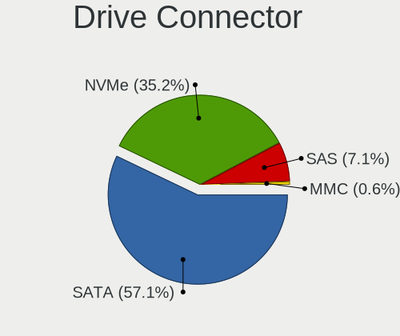
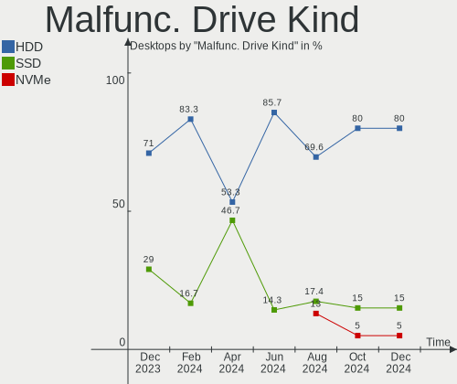
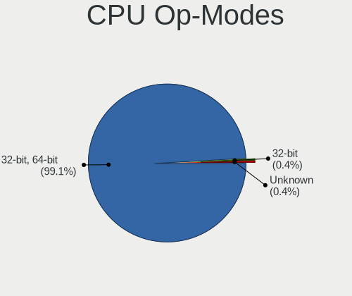
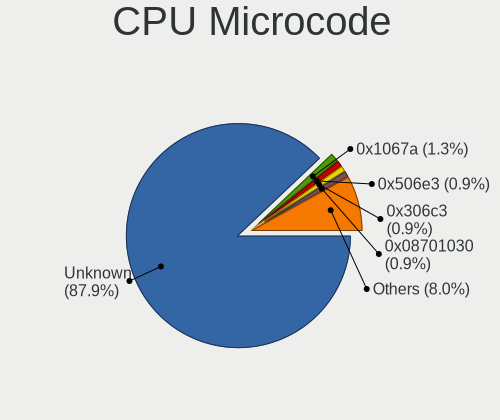
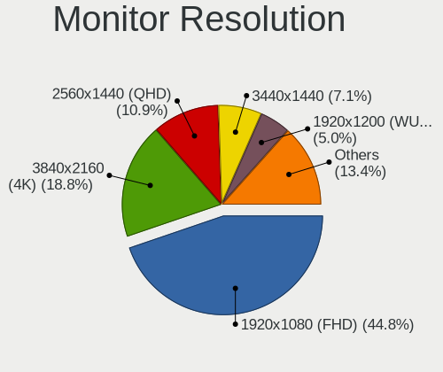
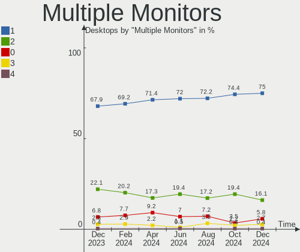
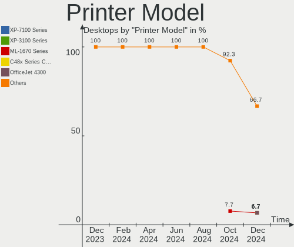
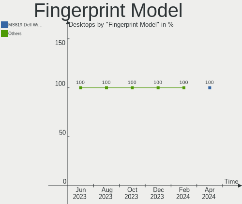
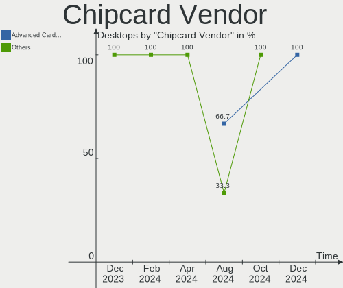

Linux in Germany - Hardware Trends (Desktops)
---------------------------------------------

A project to identify most popular hardware characteristics and track their change
over time based on data collected by Linux users at https://Linux-Hardware.org.

Anyone can contribute to this report by the [hw-probe](https://github.com/linuxhw/hw-probe) tool:

    sudo -E hw-probe -all -upload

Period: Sep, 2023.

Contents
--------

* [ System ](#system)
  - [ OS                       ](#os)
  - [ OS Family                ](#os-family)
  - [ Kernel                   ](#kernel)
  - [ Kernel Family            ](#kernel-family)
  - [ Kernel Major Ver.        ](#kernel-major-ver)
  - [ Arch                     ](#arch)
  - [ DE                       ](#de)
  - [ Display Server           ](#display-server)
  - [ Display Manager          ](#display-manager)
  - [ OS Lang                  ](#os-lang)
  - [ Boot Mode                ](#boot-mode)
  - [ Filesystem               ](#filesystem)
  - [ Part. scheme             ](#part-scheme)
  - [ Dual Boot with Linux/BSD ](#dual-boot-with-linuxbsd)
  - [ Dual Boot (Win)          ](#dual-boot-win)

* [ Board ](#board)
  - [ Vendor                   ](#vendor)
  - [ Model                    ](#model)
  - [ Model Family             ](#model-family)
  - [ MFG Year                 ](#mfg-year)
  - [ Form Factor              ](#form-factor)
  - [ Secure Boot              ](#secure-boot)
  - [ Coreboot                 ](#coreboot)
  - [ RAM Size                 ](#ram-size)
  - [ RAM Used                 ](#ram-used)
  - [ Total Drives             ](#total-drives)
  - [ Has CD-ROM               ](#has-cd-rom)
  - [ Has Ethernet             ](#has-ethernet)
  - [ Has WiFi                 ](#has-wifi)
  - [ Has Bluetooth            ](#has-bluetooth)

* [ Location ](#location)
  - [ Country                  ](#country)
  - [ City                     ](#city)

* [ Drives ](#drives)
  - [ Drive Vendor             ](#drive-vendor)
  - [ Drive Model              ](#drive-model)
  - [ HDD Vendor               ](#hdd-vendor)
  - [ SSD Vendor               ](#ssd-vendor)
  - [ Drive Kind               ](#drive-kind)
  - [ Drive Connector          ](#drive-connector)
  - [ Drive Size               ](#drive-size)
  - [ Space Total              ](#space-total)
  - [ Space Used               ](#space-used)
  - [ Malfunc. Drives          ](#malfunc-drives)
  - [ Malfunc. Drive Vendor    ](#malfunc-drive-vendor)
  - [ Malfunc. HDD Vendor      ](#malfunc-hdd-vendor)
  - [ Malfunc. Drive Kind      ](#malfunc-drive-kind)
  - [ Failed Drives            ](#failed-drives)
  - [ Failed Drive Vendor      ](#failed-drive-vendor)
  - [ Drive Status             ](#drive-status)

* [ Storage controller ](#storage-controller)
  - [ Storage Vendor           ](#storage-vendor)
  - [ Storage Model            ](#storage-model)
  - [ Storage Kind             ](#storage-kind)

* [ Processor ](#processor)
  - [ CPU Vendor               ](#cpu-vendor)
  - [ CPU Model                ](#cpu-model)
  - [ CPU Model Family         ](#cpu-model-family)
  - [ CPU Cores                ](#cpu-cores)
  - [ CPU Sockets              ](#cpu-sockets)
  - [ CPU Threads              ](#cpu-threads)
  - [ CPU Op-Modes             ](#cpu-op-modes)
  - [ CPU Microcode            ](#cpu-microcode)
  - [ CPU Microarch            ](#cpu-microarch)

* [ Graphics ](#graphics)
  - [ GPU Vendor               ](#gpu-vendor)
  - [ GPU Model                ](#gpu-model)
  - [ GPU Combo                ](#gpu-combo)
  - [ GPU Driver               ](#gpu-driver)
  - [ GPU Memory               ](#gpu-memory)

* [ Monitor ](#monitor)
  - [ Monitor Vendor           ](#monitor-vendor)
  - [ Monitor Model            ](#monitor-model)
  - [ Monitor Resolution       ](#monitor-resolution)
  - [ Monitor Diagonal         ](#monitor-diagonal)
  - [ Monitor Width            ](#monitor-width)
  - [ Aspect Ratio             ](#aspect-ratio)
  - [ Monitor Area             ](#monitor-area)
  - [ Pixel Density            ](#pixel-density)
  - [ Multiple Monitors        ](#multiple-monitors)

* [ Network ](#network)
  - [ Net Controller Vendor    ](#net-controller-vendor)
  - [ Net Controller Model     ](#net-controller-model)
  - [ Wireless Vendor          ](#wireless-vendor)
  - [ Wireless Model           ](#wireless-model)
  - [ Ethernet Vendor          ](#ethernet-vendor)
  - [ Ethernet Model           ](#ethernet-model)
  - [ Net Controller Kind      ](#net-controller-kind)
  - [ Used Controller          ](#used-controller)
  - [ NICs                     ](#nics)
  - [ IPv6                     ](#ipv6)

* [ Bluetooth ](#bluetooth)
  - [ Bluetooth Vendor         ](#bluetooth-vendor)
  - [ Bluetooth Model          ](#bluetooth-model)

* [ Sound ](#sound)
  - [ Sound Vendor             ](#sound-vendor)
  - [ Sound Model              ](#sound-model)

* [ Memory ](#memory)
  - [ Memory Vendor            ](#memory-vendor)
  - [ Memory Model             ](#memory-model)
  - [ Memory Kind              ](#memory-kind)
  - [ Memory Form Factor       ](#memory-form-factor)
  - [ Memory Size              ](#memory-size)
  - [ Memory Speed             ](#memory-speed)

* [ Printers & scanners ](#printers--scanners)
  - [ Printer Vendor           ](#printer-vendor)
  - [ Printer Model            ](#printer-model)
  - [ Scanner Vendor           ](#scanner-vendor)
  - [ Scanner Model            ](#scanner-model)

* [ Camera ](#camera)
  - [ Camera Vendor            ](#camera-vendor)
  - [ Camera Model             ](#camera-model)

* [ Security ](#security)
  - [ Fingerprint Vendor       ](#fingerprint-vendor)
  - [ Fingerprint Model        ](#fingerprint-model)
  - [ Chipcard Vendor          ](#chipcard-vendor)
  - [ Chipcard Model           ](#chipcard-model)

* [ Unsupported ](#unsupported)
  - [ Unsupported Devices      ](#unsupported-devices)
  - [ Unsupported Device Types ](#unsupported-device-types)

System
------

OS
--

Installed operating systems

| Name                         | Desktops | Percent |
|------------------------------|----------|---------|
| Linux Mint 21.2              | 25       | 11.11%  |
| Ubuntu 22.04                 | 24       | 10.67%  |
| OpenMandriva 23.08           | 16       | 7.11%   |
| OpenMandriva 23.09           | 15       | 6.67%   |
| Ubuntu 23.04                 | 13       | 5.78%   |
| Debian 12                    | 12       | 5.33%   |
| Fedora 38                    | 11       | 4.89%   |
| openSUSE Tumbleweed-XXXXXXXX | 7        | 3.11%   |
| Zorin 16                     | 6        | 2.67%   |
| Debian 11                    | 5        | 2.22%   |
| Pop!_OS 22.04                | 4        | 1.78%   |
| openSUSE Leap-15.5           | 4        | 1.78%   |
| OpenMandriva 4.3             | 4        | 1.78%   |
| LMDE 5                       | 4        | 1.78%   |
| Kubuntu 22.04                | 4        | 1.78%   |
| Gentoo 2.14                  | 4        | 1.78%   |
| Arch Rolling                 | 4        | 1.78%   |
| Xubuntu 22.04                | 3        | 1.33%   |
| Xero Rolling                 | 3        | 1.33%   |
| Manjaro 23.0.2               | 3        | 1.33%   |
| Kubuntu 23.04                | 3        | 1.33%   |
| EndeavourOS Rolling          | 3        | 1.33%   |
| ArcoLinux Rolling            | 3        | 1.33%   |
| Xubuntu 20.04                | 2        | 0.89%   |
| OpenMandriva 4.2             | 2        | 0.89%   |
| OpenMandriva 23.90           | 2        | 0.89%   |
| Nobara 38                    | 2        | 0.89%   |
| Manjaro                      | 2        | 0.89%   |
| LMDE 6                       | 2        | 0.89%   |
| Linux Mint 21                | 2        | 0.89%   |
| Linux Mint 20.3              | 2        | 0.89%   |
| Elementary 7                 | 2        | 0.89%   |
| Debian                       | 2        | 0.89%   |
| BlackPanther 18.1            | 2        | 0.89%   |
| Void Linux Rolling           | 1        | 0.44%   |
| Ubuntu MATE 22.04            | 1        | 0.44%   |
| Ubuntu 21.04                 | 1        | 0.44%   |
| Ubuntu 20.04                 | 1        | 0.44%   |
| TUXEDO OS 22.04              | 1        | 0.44%   |
| ROSA 12.4                    | 1        | 0.44%   |

OS Family
---------

OS without a version

| Name         | Desktops | Percent |
|--------------|----------|---------|
| OpenMandriva | 40       | 17.78%  |
| Ubuntu       | 39       | 17.33%  |
| Linux Mint   | 30       | 13.33%  |
| Debian       | 19       | 8.44%   |
| openSUSE     | 13       | 5.78%   |
| Fedora       | 12       | 5.33%   |
| Manjaro      | 8        | 3.56%   |
| Kubuntu      | 8        | 3.56%   |
| Zorin        | 6        | 2.67%   |
| LMDE         | 6        | 2.67%   |
| Xubuntu      | 5        | 2.22%   |
| Pop!_OS      | 4        | 1.78%   |
| Gentoo       | 4        | 1.78%   |
| Arch         | 4        | 1.78%   |
| Xero         | 3        | 1.33%   |
| Nobara       | 3        | 1.33%   |
| EndeavourOS  | 3        | 1.33%   |
| ArcoLinux    | 3        | 1.33%   |
| Elementary   | 2        | 0.89%   |
| BlackPanther | 2        | 0.89%   |
| Void Linux   | 1        | 0.44%   |
| Ubuntu MATE  | 1        | 0.44%   |
| TUXEDO OS    | 1        | 0.44%   |
| ROSA         | 1        | 0.44%   |
| Parrot       | 1        | 0.44%   |
| NixOS        | 1        | 0.44%   |
| Neptune OS   | 1        | 0.44%   |
| KDE neon     | 1        | 0.44%   |
| Kali         | 1        | 0.44%   |
| Garuda Linux | 1        | 0.44%   |
| Alpine       | 1        | 0.44%   |

Kernel
------

Version of the Linux kernel

| Version                                            | Desktops | Percent |
|----------------------------------------------------|----------|---------|
| 6.2.0-32-generic                                   | 22       | 9.78%   |
| 6.4.11-desktop-1omv2390                            | 15       | 6.67%   |
| 5.15.0-83-generic                                  | 15       | 6.67%   |
| 6.4.15-200.fc38.x86_64                             | 10       | 4.44%   |
| 5.15.0-84-generic                                  | 10       | 4.44%   |
| 6.2.0-33-generic                                   | 9        | 4%      |
| 6.1.0-11-amd64                                     | 7        | 3.11%   |
| 5.15.0-82-generic                                  | 7        | 3.11%   |
| 5.10.0-25-amd64                                    | 7        | 3.11%   |
| 6.5.3-arch1-1                                      | 5        | 2.22%   |
| 6.1.0-12-amd64                                     | 5        | 2.22%   |
| 6.5.3-desktop-1omv2390                             | 4        | 1.78%   |
| 6.5.1-desktop-1omv2390                             | 4        | 1.78%   |
| 6.2.0-31-generic                                   | 4        | 1.78%   |
| 5.15.0-76-generic                                  | 4        | 1.78%   |
| 6.5.4-1-default                                    | 3        | 1.33%   |
| 6.5.3-1-MANJARO                                    | 3        | 1.33%   |
| 6.5.0-desktop-1omv2390                             | 3        | 1.33%   |
| 6.2.0-26-generic                                   | 3        | 1.33%   |
| 5.16.7-desktop-1omv4003                            | 3        | 1.33%   |
| 5.14.21-150500.55.19-default                       | 3        | 1.33%   |
| 6.5.3-1-default                                    | 2        | 0.89%   |
| 6.5.2-desktop-1omv2390                             | 2        | 0.89%   |
| 6.4.8-desktop-2omv2390                             | 2        | 0.89%   |
| 6.4.6-76060406-generic                             | 2        | 0.89%   |
| 6.4.12-zen1-1-zen                                  | 2        | 0.89%   |
| 6.4.12-arch1-1                                     | 2        | 0.89%   |
| 6.2.6-76060206-generic                             | 2        | 0.89%   |
| 6.2.16-14-pve                                      | 2        | 0.89%   |
| 6.1.50-1-lts                                       | 2        | 0.89%   |
| 5.6.14-desktop-2bP                                 | 2        | 0.89%   |
| 5.4.0-159-generic                                  | 2        | 0.89%   |
| 5.10.14-desktop-1omv4002                           | 2        | 0.89%   |
| 6.5.5-zen1-1-zen                                   | 1        | 0.44%   |
| 6.5.5-desktop-1omv2390                             | 1        | 0.44%   |
| 6.5.3-200.fsync.fc38.x86_64                        | 1        | 0.44%   |
| 6.5.2-arch1-1                                      | 1        | 0.44%   |
| 6.5.0-kali1-amd64                                  | 1        | 0.44%   |
| 6.5.0-1-MANJARO                                    | 1        | 0.44%   |
| 6.5.0-0.rc7.20230821gitf7757129e3de.50.fc39.x86_64 | 1        | 0.44%   |

Kernel Family
-------------

Linux kernel without a distro release

| Version | Desktops | Percent |
|---------|----------|---------|
| 6.2.0   | 44       | 19.56%  |
| 5.15.0  | 42       | 18.67%  |
| 6.5.3   | 15       | 6.67%   |
| 6.4.11  | 15       | 6.67%   |
| 6.1.0   | 14       | 6.22%   |
| 6.4.15  | 10       | 4.44%   |
| 5.10.0  | 8        | 3.56%   |
| 6.5.0   | 6        | 2.67%   |
| 6.4.12  | 5        | 2.22%   |
| 5.14.21 | 5        | 2.22%   |
| 6.5.1   | 4        | 1.78%   |
| 6.4.6   | 4        | 1.78%   |
| 6.5.4   | 3        | 1.33%   |
| 6.5.2   | 3        | 1.33%   |
| 6.4.8   | 3        | 1.33%   |
| 6.4.10  | 3        | 1.33%   |
| 6.2.6   | 3        | 1.33%   |
| 5.4.0   | 3        | 1.33%   |
| 5.16.7  | 3        | 1.33%   |
| 6.5.5   | 2        | 0.89%   |
| 6.4.14  | 2        | 0.89%   |
| 6.4.0   | 2        | 0.89%   |
| 6.2.16  | 2        | 0.89%   |
| 6.1.53  | 2        | 0.89%   |
| 6.1.51  | 2        | 0.89%   |
| 6.1.50  | 2        | 0.89%   |
| 5.6.14  | 2        | 0.89%   |
| 5.10.14 | 2        | 0.89%   |
| 6.3.9   | 1        | 0.44%   |
| 6.3.5   | 1        | 0.44%   |
| 6.3.13  | 1        | 0.44%   |
| 6.2.2   | 1        | 0.44%   |
| 6.1.8   | 1        | 0.44%   |
| 6.1.55  | 1        | 0.44%   |
| 6.1.46  | 1        | 0.44%   |
| 6.1.44  | 1        | 0.44%   |
| 6.1.1   | 1        | 0.44%   |
| 6.0.12  | 1        | 0.44%   |
| 5.19.0  | 1        | 0.44%   |
| 5.16.13 | 1        | 0.44%   |

Kernel Major Ver.
-----------------

Linux kernel major version

| Version | Desktops | Percent |
|---------|----------|---------|
| 6.2     | 50       | 22.22%  |
| 6.4     | 44       | 19.56%  |
| 5.15    | 42       | 18.67%  |
| 6.5     | 33       | 14.67%  |
| 6.1     | 25       | 11.11%  |
| 5.10    | 11       | 4.89%   |
| 5.14    | 5        | 2.22%   |
| 5.16    | 4        | 1.78%   |
| 6.3     | 3        | 1.33%   |
| 5.4     | 3        | 1.33%   |
| 5.6     | 2        | 0.89%   |
| 6.0     | 1        | 0.44%   |
| 5.19    | 1        | 0.44%   |
| 5.11    | 1        | 0.44%   |

Arch
----

OS architecture (x86_64, i586, etc.)

| Name   | Desktops | Percent |
|--------|----------|---------|
| x86_64 | 225      | 100%    |

DE
--

Desktop Environment

| Name            | Desktops | Percent |
|-----------------|----------|---------|
| KDE5            | 79       | 35.11%  |
| GNOME           | 69       | 30.67%  |
| X-Cinnamon      | 30       | 13.33%  |
| XFCE            | 15       | 6.67%   |
| Unknown         | 15       | 6.67%   |
| Cinnamon        | 5        | 2.22%   |
| Pantheon        | 2        | 0.89%   |
| MATE            | 2        | 0.89%   |
| KDE             | 2        | 0.89%   |
| Hyprland        | 2        | 0.89%   |
| LXQt            | 1        | 0.44%   |
| i3              | 1        | 0.44%   |
| GNOME Flashback | 1        | 0.44%   |
| Budgie          | 1        | 0.44%   |

Display Server
--------------

X11 or Wayland

| Name        | Desktops | Percent |
|-------------|----------|---------|
| X11         | 128      | 56.89%  |
| Wayland     | 77       | 34.22%  |
| Tty         | 12       | 5.33%   |
| Unknown     | 7        | 3.11%   |
| Unspecified | 1        | 0.44%   |

Display Manager
---------------

SDDM, LightDM, etc.

| Name    | Desktops | Percent |
|---------|----------|---------|
| Unknown | 88       | 39.11%  |
| SDDM    | 60       | 26.67%  |
| GDM3    | 36       | 16%     |
| LightDM | 30       | 13.33%  |
| GDM     | 8        | 3.56%   |
| SLiM    | 2        | 0.89%   |
| GREETD  | 1        | 0.44%   |

OS Lang
-------

Language

| Lang    | Desktops | Percent |
|---------|----------|---------|
| de_DE   | 158      | 70.22%  |
| en_US   | 47       | 20.89%  |
| C       | 5        | 2.22%   |
| Unknown | 5        | 2.22%   |
| en_GB   | 3        | 1.33%   |
| ru_RU   | 2        | 0.89%   |
| nl_NL   | 2        | 0.89%   |
| ro_RO   | 1        | 0.44%   |
| en_NZ   | 1        | 0.44%   |
| C.UTF8  | 1        | 0.44%   |

Boot Mode
---------

EFI or BIOS

| Mode | Desktops | Percent |
|------|----------|---------|
| BIOS | 122      | 54.22%  |
| EFI  | 103      | 45.78%  |

Filesystem
----------

Type of filesystem

| Type    | Desktops | Percent |
|---------|----------|---------|
| Ext4    | 132      | 58.67%  |
| Tmpfs   | 40       | 17.78%  |
| Btrfs   | 33       | 14.67%  |
| Overlay | 14       | 6.22%   |
| Zfs     | 2        | 0.89%   |
| Xfs     | 1        | 0.44%   |
| Ntfs    | 1        | 0.44%   |
| F2fs    | 1        | 0.44%   |
| Ext2    | 1        | 0.44%   |

Part. scheme
------------

Scheme of partitioning

| Type    | Desktops | Percent |
|---------|----------|---------|
| GPT     | 120      | 53.33%  |
| Unknown | 75       | 33.33%  |
| MBR     | 30       | 13.33%  |

Dual Boot with Linux/BSD
------------------------

Hosting more than one Linux/BSD

| Dual boot | Desktops | Percent |
|-----------|----------|---------|
| No        | 180      | 80%     |
| Yes       | 45       | 20%     |

Dual Boot (Win)
---------------

Hosting Linux and Windows

| Dual boot | Desktops | Percent |
|-----------|----------|---------|
| No        | 171      | 76%     |
| Yes       | 54       | 24%     |

Board
-----

Vendor
------

Motherboard manufacturer

| Name                                 | Desktops | Percent |
|--------------------------------------|----------|---------|
| ASUSTek Computer                     | 52       | 23.11%  |
| ASRock                               | 33       | 14.67%  |
| MSI                                  | 28       | 12.44%  |
| Gigabyte Technology                  | 27       | 12%     |
| Hewlett-Packard                      | 18       | 8%      |
| Fujitsu                              | 17       | 7.56%   |
| Lenovo                               | 9        | 4%      |
| Dell                                 | 6        | 2.67%   |
| Medion                               | 5        | 2.22%   |
| Acer                                 | 5        | 2.22%   |
| Pegatron                             | 3        | 1.33%   |
| Foxconn                              | 2        | 0.89%   |
| Biostar                              | 2        | 0.89%   |
| AZW                                  | 2        | 0.89%   |
| ASRockRack                           | 2        | 0.89%   |
| Alienware                            | 2        | 0.89%   |
| Unknown                              | 2        | 0.89%   |
| Techvision                           | 1        | 0.44%   |
| Shenzhen Meigao Electronic Equipment | 1        | 0.44%   |
| Packard Bell                         | 1        | 0.44%   |
| ONDA                                 | 1        | 0.44%   |
| Intel                                | 1        | 0.44%   |
| HC Technology.                       | 1        | 0.44%   |
| DFI                                  | 1        | 0.44%   |
| CWWK                                 | 1        | 0.44%   |
| BESSTAR Tech                         | 1        | 0.44%   |
| Apple                                | 1        | 0.44%   |

Model
-----

Motherboard model

| Name                                            | Desktops | Percent |
|-------------------------------------------------|----------|---------|
| MSI MS-7B86                                     | 3        | 1.33%   |
| HP EliteDesk 800 G2 DM 35W                      | 3        | 1.33%   |
| ASUS A0000001                                   | 3        | 1.33%   |
| MSI MS-7C91                                     | 2        | 0.89%   |
| MSI MS-7C56                                     | 2        | 0.89%   |
| MSI MS-7B89                                     | 2        | 0.89%   |
| Fujitsu ESPRIMO_P556                            | 2        | 0.89%   |
| ASUS TUF Gaming B550-PLUS                       | 2        | 0.89%   |
| ASUS ROG STRIX B550-A GAMING                    | 2        | 0.89%   |
| ASUS PRIME X370-PRO                             | 2        | 0.89%   |
| ASUS PRIME B550M-A                              | 2        | 0.89%   |
| ASRock Z68 Pro3                                 | 2        | 0.89%   |
| ASRock FM2A68M-HD+                              | 2        | 0.89%   |
| ASRock B450 Gaming-ITX/ac                       | 2        | 0.89%   |
| Unknown                                         | 2        | 0.89%   |
| Techvision TVI7309X                             | 1        | 0.44%   |
| Shenzhen Meigao Electronic Equipment UM773 Lite | 1        | 0.44%   |
| Pegatron p6730de                                | 1        | 0.44%   |
| Pegatron IPMSB-GS                               | 1        | 0.44%   |
| Pegatron HPE-558de                              | 1        | 0.44%   |
| Packard Bell IXTREME M5800                      | 1        | 0.44%   |
| ONDA H61V Ver:4.01                              | 1        | 0.44%   |
| MSI MS-7E12                                     | 1        | 0.44%   |
| MSI MS-7E07                                     | 1        | 0.44%   |
| MSI MS-7D74                                     | 1        | 0.44%   |
| MSI MS-7D20                                     | 1        | 0.44%   |
| MSI MS-7D17                                     | 1        | 0.44%   |
| MSI MS-7C96                                     | 1        | 0.44%   |
| MSI MS-7C94                                     | 1        | 0.44%   |
| MSI MS-7C86                                     | 1        | 0.44%   |
| MSI MS-7C02                                     | 1        | 0.44%   |
| MSI MS-7B85                                     | 1        | 0.44%   |
| MSI MS-7B50                                     | 1        | 0.44%   |
| MSI MS-7A63                                     | 1        | 0.44%   |
| MSI MS-7A34                                     | 1        | 0.44%   |
| MSI MS-7971                                     | 1        | 0.44%   |
| MSI MS-7903                                     | 1        | 0.44%   |
| MSI MS-7735                                     | 1        | 0.44%   |
| MSI MS-7318                                     | 1        | 0.44%   |
| MSI Mr. Office V R4                             | 1        | 0.44%   |

Model Family
------------

Motherboard model prefix

| Name                                       | Desktops | Percent |
|--------------------------------------------|----------|---------|
| Fujitsu ESPRIMO                            | 12       | 5.33%   |
| ASUS PRIME                                 | 11       | 4.89%   |
| HP EliteDesk                               | 7        | 3.11%   |
| ASUS ROG                                   | 7        | 3.11%   |
| Lenovo ThinkCentre                         | 5        | 2.22%   |
| ASUS TUF                                   | 5        | 2.22%   |
| Dell OptiPlex                              | 4        | 1.78%   |
| MSI MS-7B86                                | 3        | 1.33%   |
| Gigabyte B550                              | 3        | 1.33%   |
| Fujitsu CELSIUS                            | 3        | 1.33%   |
| ASUS A0000001                              | 3        | 1.33%   |
| ASRock B450                                | 3        | 1.33%   |
| MSI MS-7C91                                | 2        | 0.89%   |
| MSI MS-7C56                                | 2        | 0.89%   |
| MSI MS-7B89                                | 2        | 0.89%   |
| Medion Akoya                               | 2        | 0.89%   |
| HP ProDesk                                 | 2        | 0.89%   |
| HP Pavilion                                | 2        | 0.89%   |
| HP Compaq                                  | 2        | 0.89%   |
| Gigabyte B450                              | 2        | 0.89%   |
| Gigabyte AX370-Gaming                      | 2        | 0.89%   |
| Gigabyte 990FXA-UD3                        | 2        | 0.89%   |
| Dell XPS                                   | 2        | 0.89%   |
| ASUS P8H61-M                               | 2        | 0.89%   |
| ASUS P5G41T-M                              | 2        | 0.89%   |
| ASUS M5A97                                 | 2        | 0.89%   |
| ASRock Z77                                 | 2        | 0.89%   |
| ASRock Z68                                 | 2        | 0.89%   |
| ASRock FM2A68M-HD+                         | 2        | 0.89%   |
| Alienware Aurora                           | 2        | 0.89%   |
| Acer Aspire                                | 2        | 0.89%   |
| Unknown                                    | 2        | 0.89%   |
| Techvision TVI7309X                        | 1        | 0.44%   |
| Shenzhen Meigao Electronic Equipment UM773 | 1        | 0.44%   |
| Pegatron p6730de                           | 1        | 0.44%   |
| Pegatron IPMSB-GS                          | 1        | 0.44%   |
| Pegatron HPE-558de                         | 1        | 0.44%   |
| Packard Bell IXTREME                       | 1        | 0.44%   |
| ONDA H61V                                  | 1        | 0.44%   |
| MSI MS-7E12                                | 1        | 0.44%   |

MFG Year
--------

Motherboard manufacture year

| Year | Desktops | Percent |
|------|----------|---------|
| 2020 | 26       | 11.56%  |
| 2018 | 25       | 11.11%  |
| 2013 | 17       | 7.56%   |
| 2012 | 17       | 7.56%   |
| 2019 | 15       | 6.67%   |
| 2014 | 14       | 6.22%   |
| 2011 | 14       | 6.22%   |
| 2023 | 13       | 5.78%   |
| 2021 | 13       | 5.78%   |
| 2015 | 13       | 5.78%   |
| 2022 | 11       | 4.89%   |
| 2016 | 11       | 4.89%   |
| 2010 | 11       | 4.89%   |
| 2017 | 10       | 4.44%   |
| 2008 | 7        | 3.11%   |
| 2009 | 6        | 2.67%   |
| 2007 | 2        | 0.89%   |

Form Factor
-----------

Physical design of the computer

| Name    | Desktops | Percent |
|---------|----------|---------|
| Desktop | 225      | 100%    |

Secure Boot
-----------

Enabled or disabled

| State    | Desktops | Percent |
|----------|----------|---------|
| Disabled | 215      | 95.56%  |
| Enabled  | 10       | 4.44%   |

Coreboot
--------

Have coreboot on board

| Used | Desktops | Percent |
|------|----------|---------|
| No   | 225      | 100%    |

RAM Size
--------

Total RAM memory

| Size in GB  | Desktops | Percent |
|-------------|----------|---------|
| 16.01-24.0  | 59       | 26.22%  |
| 32.01-64.0  | 42       | 18.67%  |
| 8.01-16.0   | 42       | 18.67%  |
| 4.01-8.0    | 38       | 16.89%  |
| 64.01-256.0 | 14       | 6.22%   |
| 3.01-4.0    | 13       | 5.78%   |
| 24.01-32.0  | 13       | 5.78%   |
| 2.01-3.0    | 2        | 0.89%   |
| 1.01-2.0    | 2        | 0.89%   |

RAM Used
--------

Used RAM memory

| Used GB    | Desktops | Percent |
|------------|----------|---------|
| 1.01-2.0   | 69       | 30.67%  |
| 2.01-3.0   | 63       | 28%     |
| 4.01-8.0   | 45       | 20%     |
| 3.01-4.0   | 17       | 7.56%   |
| 8.01-16.0  | 15       | 6.67%   |
| 0.51-1.0   | 10       | 4.44%   |
| 16.01-24.0 | 3        | 1.33%   |
| 0.01-0.5   | 2        | 0.89%   |
| 24.01-32.0 | 1        | 0.44%   |

Total Drives
------------

Number of drives on board

| Drives | Desktops | Percent |
|--------|----------|---------|
| 1      | 78       | 34.67%  |
| 2      | 73       | 32.44%  |
| 3      | 39       | 17.33%  |
| 4      | 16       | 7.11%   |
| 5      | 12       | 5.33%   |
| 10     | 2        | 0.89%   |
| 9      | 2        | 0.89%   |
| 6      | 2        | 0.89%   |
| 7      | 1        | 0.44%   |

Has CD-ROM
----------

Has CD-ROM on board

| Presented | Desktops | Percent |
|-----------|----------|---------|
| Yes       | 116      | 51.56%  |
| No        | 109      | 48.44%  |

Has Ethernet
------------

Has Ethernet on board

| Presented | Desktops | Percent |
|-----------|----------|---------|
| Yes       | 223      | 99.11%  |
| No        | 2        | 0.89%   |

Has WiFi
--------

Has WiFi module

| Presented | Desktops | Percent |
|-----------|----------|---------|
| No        | 135      | 60%     |
| Yes       | 90       | 40%     |

Has Bluetooth
-------------

Has Bluetooth module

| Presented | Desktops | Percent |
|-----------|----------|---------|
| No        | 146      | 64.89%  |
| Yes       | 79       | 35.11%  |

Location
--------

Country
-------

Geographic location (country)

| Country | Desktops | Percent |
|---------|----------|---------|
| Germany | 225      | 100%    |

City
----

Geographic location (city)

| City              | Desktops | Percent |
|-------------------|----------|---------|
| Berlin            | 25       | 11.11%  |
| Hamburg           | 13       | 5.78%   |
| Frankfurt am Main | 9        | 4%      |
| Stuttgart         | 7        | 3.11%   |
| Hanover           | 6        | 2.67%   |
| Cologne           | 4        | 1.78%   |
| Bonn              | 4        | 1.78%   |
| Nuremberg         | 3        | 1.33%   |
| Munich            | 3        | 1.33%   |
| Mannheim          | 3        | 1.33%   |
| Heilbronn         | 3        | 1.33%   |
| Darmstadt         | 3        | 1.33%   |
| Aalen             | 3        | 1.33%   |
| Wildeshausen      | 2        | 0.89%   |
| Sindelfingen      | 2        | 0.89%   |
| Pforzheim         | 2        | 0.89%   |
| Paderborn         | 2        | 0.89%   |
| Ober-Morlen       | 2        | 0.89%   |
| Lüneburg         | 2        | 0.89%   |
| Leipzig           | 2        | 0.89%   |
| Krefeld           | 2        | 0.89%   |
| Kassel            | 2        | 0.89%   |
| Karlsruhe         | 2        | 0.89%   |
| Halle             | 2        | 0.89%   |
| Gronau            | 2        | 0.89%   |
| Gelsenkirchen     | 2        | 0.89%   |
| Erkrath           | 2        | 0.89%   |
| Düsseldorf       | 2        | 0.89%   |
| Bielefeld         | 2        | 0.89%   |
| Bamberg           | 2        | 0.89%   |
| Augsburg          | 2        | 0.89%   |
| Arnsberg          | 2        | 0.89%   |
| Wuppertal         | 1        | 0.44%   |
| Worms             | 1        | 0.44%   |
| Wolfschlugen      | 1        | 0.44%   |
| Woerth am Rhein   | 1        | 0.44%   |
| Wiesbaden         | 1        | 0.44%   |
| Weyhe             | 1        | 0.44%   |
| Wetzlar           | 1        | 0.44%   |
| Wegberg           | 1        | 0.44%   |

Drives
------

Drive Vendor
------------

Hard drive vendors

| Vendor                       | Desktops | Drives | Percent |
|------------------------------|----------|--------|---------|
| Samsung Electronics          | 82       | 112    | 19.43%  |
| WDC                          | 55       | 72     | 13.03%  |
| Seagate                      | 49       | 60     | 11.61%  |
| Crucial                      | 33       | 36     | 7.82%   |
| Toshiba                      | 31       | 37     | 7.35%   |
| SanDisk                      | 30       | 34     | 7.11%   |
| Kingston                     | 21       | 22     | 4.98%   |
| Intenso                      | 13       | 17     | 3.08%   |
| Unknown                      | 11       | 18     | 2.61%   |
| Micron/Crucial Technology    | 7        | 7      | 1.66%   |
| Kingston Technology Company  | 6        | 7      | 1.42%   |
| Hitachi                      | 6        | 5      | 1.42%   |
| HGST                         | 6        | 6      | 1.42%   |
| Silicon Motion               | 5        | 5      | 1.18%   |
| Phison Electronics           | 4        | 5      | 0.95%   |
| Transcend                    | 3        | 3      | 0.71%   |
| SK hynix                     | 3        | 3      | 0.71%   |
| PNY                          | 3        | 3      | 0.71%   |
| Intel                        | 3        | 3      | 0.71%   |
| Realtek Semiconductor        | 2        | 2      | 0.47%   |
| Phison                       | 2        | 2      | 0.47%   |
| Patriot                      | 2        | 2      | 0.47%   |
| OCZ                          | 2        | 2      | 0.47%   |
| Micron Technology            | 2        | 2      | 0.47%   |
| INNOVATION IT                | 2        | 2      | 0.47%   |
| Hewlett-Packard              | 2        | 2      | 0.47%   |
| Fanxiang                     | 2        | 2      | 0.47%   |
| Emtec                        | 2        | 2      | 0.47%   |
| Corsair                      | 2        | 2      | 0.47%   |
| China                        | 2        | 2      | 0.47%   |
| XPG                          | 1        | 1      | 0.24%   |
| WD MediaMax                  | 1        | 1      | 0.24%   |
| Verbatim                     | 1        | 1      | 0.24%   |
| SSK                          | 1        | 1      | 0.24%   |
| SPCC Sol                     | 1        | 1      | 0.24%   |
| SPCC                         | 1        | 1      | 0.24%   |
| Shenzhen Longsys Electronics | 1        | 1      | 0.24%   |
| SD                           | 1        | 2      | 0.24%   |
| Netac                        | 1        | 1      | 0.24%   |
| MAXIO Technology (Hangzhou)  | 1        | 1      | 0.24%   |

Drive Model
-----------

Hard drive models

| Model                                                 | Desktops | Percent |
|-------------------------------------------------------|----------|---------|
| Samsung SSD 850 EVO 250GB                             | 9        | 1.87%   |
| Toshiba DT01ACA100 1TB                                | 8        | 1.66%   |
| Samsung SSD 860 EVO 500GB                             | 8        | 1.66%   |
| Samsung NVMe SSD Controller SM981/PM981/PM983 256GB   | 6        | 1.25%   |
| Unknown SD/MMC 2GB                                    | 5        | 1.04%   |
| Unknown M.S./M.S.Pro/HG 16GB                          | 5        | 1.04%   |
| Seagate ST500DM002-1BD142 500GB                       | 5        | 1.04%   |
| Samsung SSD 980 1TB                                   | 5        | 1.04%   |
| Samsung HD103SJ 1TB                                   | 5        | 1.04%   |
| Toshiba DT01ACA300 3TB                                | 4        | 0.83%   |
| Seagate ST2000DM008-2FR102 2TB                        | 4        | 0.83%   |
| Sandisk WD Blue SN550 NVMe SSD 512GB                  | 4        | 0.83%   |
| SanDisk SDSSDH3512G 512GB                             | 4        | 0.83%   |
| Samsung SSD 990 PRO 2TB                               | 4        | 0.83%   |
| Samsung NVMe SSD Controller PM9A1/PM9A3/980PRO 1TB    | 4        | 0.83%   |
| Micron/Crucial P2 NVMe PCIe SSD 1TB                   | 4        | 0.83%   |
| Crucial CT500MX500SSD1 500GB                          | 4        | 0.83%   |
| Crucial CT240BX500SSD1 240GB                          | 4        | 0.83%   |
| WDC WD10EZEX-21WN4A0 1TB                              | 3        | 0.62%   |
| WDC WD Blue SA510 2.5 500GB                           | 3        | 0.62%   |
| Unknown SD/MMC/MS PRO 128GB                           | 3        | 0.62%   |
| Silicon Motion SM2263EN/SM2263XT SSD Controller 512GB | 3        | 0.62%   |
| Samsung SSD 970 EVO Plus 1TB                          | 3        | 0.62%   |
| Samsung SSD 870 QVO 1TB                               | 3        | 0.62%   |
| Samsung SSD 870 EVO 1TB                               | 3        | 0.62%   |
| Samsung SSD 860 EVO 250GB                             | 3        | 0.62%   |
| Samsung SSD 840 PRO Series 256GB                      | 3        | 0.62%   |
| Samsung SSD 840 EVO 250GB                             | 3        | 0.62%   |
| Samsung NVMe SSD Controller SM961/PM961/SM963 500GB   | 3        | 0.62%   |
| Kingston Company A2000 NVMe SSD 1TB                   | 3        | 0.62%   |
| Kingston SA400S37240G 240GB SSD                       | 3        | 0.62%   |
| HGST HTS721010A9E630 1TB                              | 3        | 0.62%   |
| Crucial CT480BX500SSD1 480GB                          | 3        | 0.62%   |
| WDC WD40EZRZ-00GXCB0 4TB                              | 2        | 0.42%   |
| Unknown SD/MMC/M.S.PRO 32GB                           | 2        | 0.42%   |
| Unknown NVMe SSD Drive 512GB                          | 2        | 0.42%   |
| Toshiba MQ01ABF050 500GB                              | 2        | 0.42%   |
| Toshiba MD04ACA400 4TB                                | 2        | 0.42%   |
| Toshiba HDWD240 4TB                                   | 2        | 0.42%   |
| Toshiba HDWD120 2TB                                   | 2        | 0.42%   |

HDD Vendor
----------

Hard disk drive vendors

| Vendor              | Desktops | Drives | Percent |
|---------------------|----------|--------|---------|
| Seagate             | 49       | 60     | 30.43%  |
| WDC                 | 47       | 62     | 29.19%  |
| Toshiba             | 29       | 34     | 18.01%  |
| Samsung Electronics | 14       | 14     | 8.7%    |
| Hitachi             | 6        | 5      | 3.73%   |
| HGST                | 6        | 6      | 3.73%   |
| Unknown             | 3        | 3      | 1.86%   |
| Intenso             | 2        | 2      | 1.24%   |
| SSK                 | 1        | 1      | 0.62%   |
| IB-377U3            | 1        | 1      | 0.62%   |
| External            | 1        | 1      | 0.62%   |
| Apple               | 1        | 1      | 0.62%   |
| Unknown             | 1        | 1      | 0.62%   |

SSD Vendor
----------

Solid state drive vendors

| Vendor              | Desktops | Drives | Percent |
|---------------------|----------|--------|---------|
| Samsung Electronics | 51       | 61     | 30.36%  |
| Crucial             | 27       | 28     | 16.07%  |
| SanDisk             | 18       | 20     | 10.71%  |
| Kingston            | 14       | 14     | 8.33%   |
| WDC                 | 8        | 8      | 4.76%   |
| Intenso             | 8        | 12     | 4.76%   |
| Transcend           | 3        | 3      | 1.79%   |
| Toshiba             | 3        | 3      | 1.79%   |
| PNY                 | 3        | 3      | 1.79%   |
| Phison              | 2        | 2      | 1.19%   |
| Patriot             | 2        | 2      | 1.19%   |
| OCZ                 | 2        | 2      | 1.19%   |
| INNOVATION IT       | 2        | 2      | 1.19%   |
| Fanxiang            | 2        | 2      | 1.19%   |
| Emtec               | 2        | 2      | 1.19%   |
| China               | 2        | 2      | 1.19%   |
| Verbatim            | 1        | 1      | 0.6%    |
| SPCC Sol            | 1        | 1      | 0.6%    |
| SPCC                | 1        | 1      | 0.6%    |
| SK hynix            | 1        | 1      | 0.6%    |
| SD                  | 1        | 2      | 0.6%    |
| Netac               | 1        | 1      | 0.6%    |
| Micron Technology   | 1        | 1      | 0.6%    |
| M4-CT128            | 1        | 1      | 0.6%    |
| JMicron Technology  | 1        | 1      | 0.6%    |
| Intel               | 1        | 1      | 0.6%    |
| Hewlett-Packard     | 1        | 1      | 0.6%    |
| Drevo               | 1        | 1      | 0.6%    |
| Dogfish             | 1        | 1      | 0.6%    |
| CT1000MX            | 1        | 1      | 0.6%    |
| Corsair             | 1        | 1      | 0.6%    |
| ASMT                | 1        | 1      | 0.6%    |
| ASMedia             | 1        | 1      | 0.6%    |
| Apacer              | 1        | 1      | 0.6%    |
| A-DATA Technology   | 1        | 1      | 0.6%    |

Drive Kind
----------

HDD or SSD

| Kind    | Desktops | Drives | Percent |
|---------|----------|--------|---------|
| SSD     | 140      | 186    | 38.67%  |
| HDD     | 123      | 191    | 33.98%  |
| NVMe    | 87       | 111    | 24.03%  |
| Unknown | 12       | 18     | 3.31%   |

Drive Connector
---------------

SATA, SAS, NVMe, etc.

| Type | Desktops | Drives | Percent |
|------|----------|--------|---------|
| SATA | 190      | 360    | 62.91%  |
| NVMe | 87       | 111    | 28.81%  |
| SAS  | 25       | 35     | 8.28%   |

Drive Size
----------

Size of hard drive

| Size in TB | Desktops | Drives | Percent |
|------------|----------|--------|---------|
| 0.01-0.5   | 138      | 175    | 45.7%   |
| 0.51-1.0   | 89       | 115    | 29.47%  |
| 1.01-2.0   | 38       | 39     | 12.58%  |
| 3.01-4.0   | 16       | 21     | 5.3%    |
| 2.01-3.0   | 10       | 11     | 3.31%   |
| 4.01-10.0  | 9        | 14     | 2.98%   |
| 10.01-20.0 | 2        | 2      | 0.66%   |

Space Total
-----------

Amount of disk space available on the file system

| Size in GB     | Desktops | Percent |
|----------------|----------|---------|
| 101-250        | 42       | 18.67%  |
| 251-500        | 36       | 16%     |
| 501-1000       | 35       | 15.56%  |
| More than 3000 | 34       | 15.11%  |
| 1001-2000      | 29       | 12.89%  |
| 2001-3000      | 12       | 5.33%   |
| Unknown        | 12       | 5.33%   |
| 1-20           | 11       | 4.89%   |
| 51-100         | 9        | 4%      |
| 21-50          | 5        | 2.22%   |

Space Used
----------

Amount of used disk space

| Used GB        | Desktops | Percent |
|----------------|----------|---------|
| 1-20           | 61       | 27.11%  |
| 21-50          | 33       | 14.67%  |
| 101-250        | 32       | 14.22%  |
| 51-100         | 19       | 8.44%   |
| 1001-2000      | 17       | 7.56%   |
| 501-1000       | 17       | 7.56%   |
| 251-500        | 16       | 7.11%   |
| More than 3000 | 12       | 5.33%   |
| Unknown        | 12       | 5.33%   |
| 2001-3000      | 6        | 2.67%   |

Malfunc. Drives
---------------

Drive models with a malfunction

| Model                                                           | Desktops | Drives | Percent |
|-----------------------------------------------------------------|----------|--------|---------|
| Seagate ST500DM002-1BD142 500GB                                 | 2        | 2      | 6.9%    |
| WDC WD5000AAKS-007AA0 500GB                                     | 1        | 1      | 3.45%   |
| WDC WD40EFZX-68AWUN0 4TB                                        | 1        | 1      | 3.45%   |
| WDC WD30EFRX-68EUZN0 3TB                                        | 1        | 1      | 3.45%   |
| WDC WD20EARX-32PASB0 2TB                                        | 1        | 1      | 3.45%   |
| WDC WD1600AAJS-60B4A0 160GB                                     | 1        | 1      | 3.45%   |
| Toshiba MQ01ABF050 500GB                                        | 1        | 1      | 3.45%   |
| Toshiba MQ01ABB200 2TB                                          | 1        | 1      | 3.45%   |
| Toshiba MD04ACA400 4TB                                          | 1        | 1      | 3.45%   |
| Toshiba HDWD240 4TB                                             | 1        | 1      | 3.45%   |
| Toshiba DT01ACA300 3TB                                          | 1        | 1      | 3.45%   |
| Seagate ST8000VN0022-2EL112 8TB                                 | 1        | 1      | 3.45%   |
| Seagate ST1000DM010-2EP102 1TB                                  | 1        | 1      | 3.45%   |
| Seagate ST1000DM005 HD103SJ 1TB                                 | 1        | 1      | 3.45%   |
| Seagate ST1000DM003-9YN162 1TB                                  | 1        | 1      | 3.45%   |
| SanDisk SSD PLUS 1000GB                                         | 1        | 1      | 3.45%   |
| Samsung Electronics NVMe SSD Controller SM981/PM981/PM983 256GB | 1        | 1      | 3.45%   |
| Samsung Electronics NVMe SSD Controller PM9A1/PM9A3/980PRO 1TB  | 1        | 1      | 3.45%   |
| Samsung Electronics HD501LJ 500GB                               | 1        | 1      | 3.45%   |
| Samsung Electronics HD321KJ 320GB                               | 1        | 1      | 3.45%   |
| Samsung Electronics HD204UI 2TB                                 | 1        | 1      | 3.45%   |
| Samsung Electronics HD103SJ 1TB                                 | 1        | 1      | 3.45%   |
| Samsung Electronics HD103SI 1TB                                 | 1        | 1      | 3.45%   |
| Realtek Semiconductor RTS5763DL NVMe SSD Controller 256GB       | 1        | 1      | 3.45%   |
| Intel SSDSC2CW120A3 120GB                                       | 1        | 1      | 3.45%   |
| INNOVATION IT IT 512GB                                          | 1        | 1      | 3.45%   |
| Crucial CT500MX500SSD1 500GB                                    | 1        | 1      | 3.45%   |
| Crucial CT120M500SSD1 120GB                                     | 1        | 1      | 3.45%   |

Malfunc. Drive Vendor
---------------------

Vendors of faulty drives

| Vendor                | Desktops | Drives | Percent |
|-----------------------|----------|--------|---------|
| Samsung Electronics   | 7        | 7      | 24.14%  |
| Seagate               | 6        | 6      | 20.69%  |
| WDC                   | 5        | 5      | 17.24%  |
| Toshiba               | 5        | 5      | 17.24%  |
| Crucial               | 2        | 2      | 6.9%    |
| SanDisk               | 1        | 1      | 3.45%   |
| Realtek Semiconductor | 1        | 1      | 3.45%   |
| Intel                 | 1        | 1      | 3.45%   |
| INNOVATION IT         | 1        | 1      | 3.45%   |

Malfunc. HDD Vendor
-------------------

Vendors of faulty HDD drives

| Vendor              | Desktops | Drives | Percent |
|---------------------|----------|--------|---------|
| Seagate             | 6        | 6      | 28.57%  |
| WDC                 | 5        | 5      | 23.81%  |
| Toshiba             | 5        | 5      | 23.81%  |
| Samsung Electronics | 5        | 5      | 23.81%  |

Malfunc. Drive Kind
-------------------

Kinds of faulty drives

| Kind | Desktops | Drives | Percent |
|------|----------|--------|---------|
| HDD  | 20       | 21     | 71.43%  |
| SSD  | 5        | 5      | 17.86%  |
| NVMe | 3        | 3      | 10.71%  |

Failed Drives
-------------

Failed drive models

Zero info for selected period =(

Failed Drive Vendor
-------------------

Failed drive vendors

Zero info for selected period =(

Drive Status
------------

Number of failed and malfunc. drives

| Status   | Desktops | Drives | Percent |
|----------|----------|--------|---------|
| Detected | 127      | 270    | 49.03%  |
| Works    | 106      | 207    | 40.93%  |
| Malfunc  | 26       | 29     | 10.04%  |

Storage controller
------------------

Storage Vendor
--------------

Storage controller vendors

| Vendor                       | Desktops | Percent |
|------------------------------|----------|---------|
| Intel                        | 130      | 36.62%  |
| AMD                          | 86       | 24.23%  |
| Samsung Electronics          | 31       | 8.73%   |
| ASMedia Technology           | 17       | 4.79%   |
| SanDisk                      | 14       | 3.94%   |
| Micron/Crucial Technology    | 14       | 3.94%   |
| Kingston Technology Company  | 12       | 3.38%   |
| JMicron Technology           | 7        | 1.97%   |
| Silicon Motion               | 6        | 1.69%   |
| Marvell Technology Group     | 6        | 1.69%   |
| Phison Electronics           | 5        | 1.41%   |
| Nvidia                       | 4        | 1.13%   |
| MAXIO Technology (Hangzhou)  | 3        | 0.85%   |
| VIA Technologies             | 2        | 0.56%   |
| SK hynix                     | 2        | 0.56%   |
| Silicon Image                | 2        | 0.56%   |
| Realtek Semiconductor        | 2        | 0.56%   |
| Broadcom / LSI               | 2        | 0.56%   |
| ADATA Technology             | 2        | 0.56%   |
| Adaptec                      | 2        | 0.56%   |
| Shenzhen Longsys Electronics | 1        | 0.28%   |
| Netac Technology             | 1        | 0.28%   |
| Micron Technology            | 1        | 0.28%   |
| KIOXIA                       | 1        | 0.28%   |
| INNOGRIT                     | 1        | 0.28%   |
| 3ware                        | 1        | 0.28%   |

Storage Model
-------------

Storage controller models

| Model                                                                                   | Desktops | Percent |
|-----------------------------------------------------------------------------------------|----------|---------|
| AMD FCH SATA Controller [AHCI mode]                                                     | 44       | 10.53%  |
| AMD 400 Series Chipset SATA Controller                                                  | 22       | 5.26%   |
| Intel 8 Series/C220 Series Chipset Family 6-port SATA Controller 1 [AHCI mode]          | 20       | 4.78%   |
| AMD 500 Series Chipset SATA Controller                                                  | 20       | 4.78%   |
| Intel Q170/Q150/B150/H170/H110/Z170/CM236 Chipset SATA Controller [AHCI Mode]           | 19       | 4.55%   |
| ASMedia ASM1062 Serial ATA Controller                                                   | 17       | 4.07%   |
| AMD SB7x0/SB8x0/SB9x0 SATA Controller [AHCI mode]                                       | 13       | 3.11%   |
| Samsung NVMe SSD Controller SM981/PM981/PM983                                           | 12       | 2.87%   |
| Intel Cannon Lake PCH SATA AHCI Controller                                              | 11       | 2.63%   |
| Intel 6 Series/C200 Series Chipset Family 6 port Desktop SATA AHCI Controller           | 11       | 2.63%   |
| Intel 7 Series/C210 Series Chipset Family 6-port SATA Controller [AHCI mode]            | 10       | 2.39%   |
| AMD SB7x0/SB8x0/SB9x0 IDE Controller                                                    | 10       | 2.39%   |
| Micron/Crucial P2 [Nick P2] / P3 / P3 Plus NVMe PCIe SSD (DRAM-less)                    | 7        | 1.67%   |
| Intel NM10/ICH7 Family SATA Controller [IDE mode]                                       | 7        | 1.67%   |
| Samsung NVMe SSD Controller 980                                                         | 6        | 1.44%   |
| Kingston Company A2000 NVMe SSD                                                         | 6        | 1.44%   |
| Intel 82801G (ICH7 Family) IDE Controller                                               | 6        | 1.44%   |
| Intel 200 Series PCH SATA controller [AHCI mode]                                        | 6        | 1.44%   |
| Samsung NVMe SSD Controller PM9A1/PM9A3/980PRO                                          | 5        | 1.2%    |
| JMicron JMB363 SATA/IDE Controller                                                      | 5        | 1.2%    |
| Intel 500 Series Chipset Family SATA AHCI Controller                                    | 5        | 1.2%    |
| Silicon Motion SM2263EN/SM2263XT (DRAM-less) NVMe SSD Controllers                       | 4        | 0.96%   |
| SanDisk WD Blue SN550 NVMe SSD                                                          | 4        | 0.96%   |
| Samsung NVMe SSD Controller SM961/PM961/SM963                                           | 4        | 0.96%   |
| Samsung NVMe SSD Controller S4LV008[Pascal]                                             | 4        | 0.96%   |
| Intel SATA Controller [RAID mode]                                                       | 4        | 0.96%   |
| Intel Comet Lake SATA AHCI Controller                                                   | 4        | 0.96%   |
| Intel Alder Lake-S PCH SATA Controller [AHCI Mode]                                      | 4        | 0.96%   |
| AMD X370 Series Chipset SATA Controller                                                 | 4        | 0.96%   |
| SanDisk WD Black SN770 / PC SN740 256GB / PC SN560 (DRAM-less) NVMe SSD                 | 3        | 0.72%   |
| MAXIO (Hangzhou) NVMe SSD Controller MAP1202                                            | 3        | 0.72%   |
| Marvell Group 88SE9172 SATA 6Gb/s Controller                                            | 3        | 0.72%   |
| Kingston Company KC3000/Renegade NVMe SSD                                               | 3        | 0.72%   |
| Intel SATA controller                                                                   | 3        | 0.72%   |
| Intel Celeron/Pentium Silver Processor SATA Controller                                  | 3        | 0.72%   |
| Intel 82801JI (ICH10 Family) SATA AHCI Controller                                       | 3        | 0.72%   |
| Intel 700 Series Chipset Family SATA AHCI Controller                                    | 3        | 0.72%   |
| Intel 6 Series/C200 Series Chipset Family Desktop SATA Controller (IDE mode, ports 4-5) | 3        | 0.72%   |
| Intel 6 Series/C200 Series Chipset Family Desktop SATA Controller (IDE mode, ports 0-3) | 3        | 0.72%   |
| Intel 5 Series/3400 Series Chipset 6 port SATA AHCI Controller                          | 3        | 0.72%   |

Storage Kind
------------

Kind of storage controller (IDE, SATA, NVMe, SAS, ...)

| Kind | Desktops | Percent |
|------|----------|---------|
| SATA | 200      | 59.35%  |
| NVMe | 87       | 25.82%  |
| IDE  | 35       | 10.39%  |
| RAID | 11       | 3.26%   |
| SAS  | 2        | 0.59%   |
| SCSI | 2        | 0.59%   |

Processor
---------

CPU Vendor
----------

Processor vendors

| Vendor | Desktops | Percent |
|--------|----------|---------|
| Intel  | 134      | 59.56%  |
| AMD    | 91       | 40.44%  |

CPU Model
---------

Processor models

| Model                                       | Desktops | Percent |
|---------------------------------------------|----------|---------|
| AMD Ryzen 5 3600 6-Core Processor           | 7        | 3.11%   |
| Intel Core i5-6500T CPU @ 2.50GHz           | 5        | 2.22%   |
| Intel Core i5-6500 CPU @ 3.20GHz            | 4        | 1.78%   |
| AMD Ryzen 7 3700X 8-Core Processor          | 4        | 1.78%   |
| AMD Ryzen 5 5600G with Radeon Graphics      | 4        | 1.78%   |
| Intel Core i7-7700K CPU @ 4.20GHz           | 3        | 1.33%   |
| Intel Core i7-6700 CPU @ 3.40GHz            | 3        | 1.33%   |
| Intel Core i7-4790 CPU @ 3.60GHz            | 3        | 1.33%   |
| Intel Core i5-7400 CPU @ 3.00GHz            | 3        | 1.33%   |
| Intel Core i3-4130 CPU @ 3.40GHz            | 3        | 1.33%   |
| AMD Ryzen 9 5900X 12-Core Processor         | 3        | 1.33%   |
| AMD Ryzen 7 5800X 8-Core Processor          | 3        | 1.33%   |
| AMD Ryzen 5 5600X 6-Core Processor          | 3        | 1.33%   |
| AMD Ryzen 5 2600 Six-Core Processor         | 3        | 1.33%   |
| AMD Ryzen 3 2200G with Radeon Vega Graphics | 3        | 1.33%   |
| AMD FX-8350 Eight-Core Processor            | 3        | 1.33%   |
| AMD A8-6600K APU with Radeon HD Graphics    | 3        | 1.33%   |
| Intel N95                                   | 2        | 0.89%   |
| Intel Core i9-9900K CPU @ 3.60GHz           | 2        | 0.89%   |
| Intel Core i7-4770S CPU @ 3.10GHz           | 2        | 0.89%   |
| Intel Core i7-3770 CPU @ 3.40GHz            | 2        | 0.89%   |
| Intel Core i7-2600 CPU @ 3.40GHz            | 2        | 0.89%   |
| Intel Core i7-10700 CPU @ 2.90GHz           | 2        | 0.89%   |
| Intel Core i7 CPU 920 @ 2.67GHz             | 2        | 0.89%   |
| Intel Core i5-9600K CPU @ 3.70GHz           | 2        | 0.89%   |
| Intel Core i5-4590S CPU @ 3.00GHz           | 2        | 0.89%   |
| Intel Core i5-4590 CPU @ 3.30GHz            | 2        | 0.89%   |
| Intel Core i5-3570K CPU @ 3.40GHz           | 2        | 0.89%   |
| Intel Core i5-3570 CPU @ 3.40GHz            | 2        | 0.89%   |
| Intel Core i5-3470T CPU @ 2.90GHz           | 2        | 0.89%   |
| Intel Core i5-2500K CPU @ 3.30GHz           | 2        | 0.89%   |
| Intel Core i5-10400 CPU @ 2.90GHz           | 2        | 0.89%   |
| Intel Core i5 CPU 750 @ 2.67GHz             | 2        | 0.89%   |
| Intel Core i3-2100 CPU @ 3.10GHz            | 2        | 0.89%   |
| Intel Core 2 Duo CPU E8400 @ 3.00GHz        | 2        | 0.89%   |
| Intel 12th Gen Core i5-12400F               | 2        | 0.89%   |
| AMD Ryzen 7 2700X Eight-Core Processor      | 2        | 0.89%   |
| AMD Ryzen 7 2700 Eight-Core Processor       | 2        | 0.89%   |
| AMD Ryzen 5 5600 6-Core Processor           | 2        | 0.89%   |
| AMD Ryzen 5 3400G with Radeon Vega Graphics | 2        | 0.89%   |

CPU Model Family
----------------

Processor model prefix

| Model                   | Desktops | Percent |
|-------------------------|----------|---------|
| Intel Core i5           | 50       | 22.22%  |
| AMD Ryzen 5             | 28       | 12.44%  |
| Intel Core i7           | 26       | 11.56%  |
| AMD Ryzen 7             | 19       | 8.44%   |
| Other                   | 15       | 6.67%   |
| Intel Core i3           | 11       | 4.89%   |
| Intel Xeon              | 9        | 4%      |
| Intel Celeron           | 8        | 3.56%   |
| AMD Ryzen 9             | 8        | 3.56%   |
| AMD FX                  | 7        | 3.11%   |
| AMD Phenom II X4        | 5        | 2.22%   |
| AMD A10                 | 5        | 2.22%   |
| Intel Core 2 Duo        | 4        | 1.78%   |
| AMD A8                  | 4        | 1.78%   |
| Intel Pentium Dual-Core | 3        | 1.33%   |
| Intel Core i9           | 3        | 1.33%   |
| AMD Ryzen 3             | 3        | 1.33%   |
| AMD Ryzen 5 PRO         | 2        | 0.89%   |
| AMD Athlon II X2        | 2        | 0.89%   |
| AMD Athlon              | 2        | 0.89%   |
| Intel Pentium Silver    | 1        | 0.44%   |
| Intel Pentium Gold      | 1        | 0.44%   |
| Intel Pentium           | 1        | 0.44%   |
| Intel Core 2 Quad       | 1        | 0.44%   |
| Intel Core 2 Extreme    | 1        | 0.44%   |
| AMD Turion II Neo       | 1        | 0.44%   |
| AMD Phenom II X6        | 1        | 0.44%   |
| AMD Athlon II X4        | 1        | 0.44%   |
| AMD Athlon 64 X2        | 1        | 0.44%   |
| AMD A6                  | 1        | 0.44%   |
| AMD A4                  | 1        | 0.44%   |

CPU Cores
---------

Number of processor cores

| Number | Desktops | Percent |
|--------|----------|---------|
| 4      | 95       | 42.22%  |
| 6      | 42       | 18.67%  |
| 2      | 41       | 18.22%  |
| 8      | 26       | 11.56%  |
| 12     | 7        | 3.11%   |
| 16     | 4        | 1.78%   |
| 3      | 3        | 1.33%   |
| 14     | 2        | 0.89%   |
| 10     | 2        | 0.89%   |
| 1      | 2        | 0.89%   |
| 5      | 1        | 0.44%   |

CPU Sockets
-----------

Number of sockets

| Number | Desktops | Percent |
|--------|----------|---------|
| 1      | 223      | 99.11%  |
| 2      | 2        | 0.89%   |

CPU Threads
-----------

Threads per core (Hyper-Threading)

| Number | Desktops | Percent |
|--------|----------|---------|
| 2      | 141      | 62.67%  |
| 1      | 84       | 37.33%  |

CPU Op-Modes
------------

CPU Operation Modes (32-bit, 64-bit)

| Op mode        | Desktops | Percent |
|----------------|----------|---------|
| 32-bit, 64-bit | 225      | 100%    |

CPU Microcode
-------------

Microcode number

| Number     | Desktops | Percent |
|------------|----------|---------|
| Unknown    | 119      | 52.89%  |
| 0x306c3    | 9        | 4%      |
| 0x306a9    | 6        | 2.67%   |
| 0x0800820d | 6        | 2.67%   |
| 0x08701021 | 5        | 2.22%   |
| 0x08108109 | 5        | 2.22%   |
| 0x010000c8 | 5        | 2.22%   |
| 0x506e3    | 4        | 1.78%   |
| 0x0a20120a | 4        | 1.78%   |
| 0x0a50000d | 3        | 1.33%   |
| 0x06003106 | 3        | 1.33%   |
| 0x06001119 | 3        | 1.33%   |
| 0x06000852 | 3        | 1.33%   |
| 0xb06e0    | 2        | 0.89%   |
| 0x906ea    | 2        | 0.89%   |
| 0x906e9    | 2        | 0.89%   |
| 0x706a8    | 2        | 0.89%   |
| 0x206a7    | 2        | 0.89%   |
| 0x106e5    | 2        | 0.89%   |
| 0x0a601203 | 2        | 0.89%   |
| 0x0a404102 | 2        | 0.89%   |
| 0x0a201025 | 2        | 0.89%   |
| 0x0a201016 | 2        | 0.89%   |
| 0x0810100b | 2        | 0.89%   |
| 0x08001138 | 2        | 0.89%   |
| 0x010000db | 2        | 0.89%   |
| 0xa0671    | 1        | 0.44%   |
| 0x906ed    | 1        | 0.44%   |
| 0x906c0    | 1        | 0.44%   |
| 0x906a4    | 1        | 0.44%   |
| 0x90675    | 1        | 0.44%   |
| 0x90672    | 1        | 0.44%   |
| 0x6fd      | 1        | 0.44%   |
| 0x106a5    | 1        | 0.44%   |
| 0x1067a    | 1        | 0.44%   |
| 0x10676    | 1        | 0.44%   |
| 0x0a601201 | 1        | 0.44%   |
| 0x0a50000c | 1        | 0.44%   |
| 0x0a201205 | 1        | 0.44%   |
| 0x0a201204 | 1        | 0.44%   |

CPU Microarch
-------------

Microarchitecture

| Name             | Desktops | Percent |
|------------------|----------|---------|
| Haswell          | 22       | 9.78%   |
| Zen 3            | 19       | 8.44%   |
| Skylake          | 19       | 8.44%   |
| KabyLake         | 19       | 8.44%   |
| IvyBridge        | 16       | 7.11%   |
| Zen 2            | 15       | 6.67%   |
| Zen+             | 14       | 6.22%   |
| Piledriver       | 13       | 5.78%   |
| SandyBridge      | 12       | 5.33%   |
| K10              | 10       | 4.44%   |
| Zen              | 9        | 4%      |
| Penryn           | 8        | 3.56%   |
| Unknown          | 8        | 3.56%   |
| Nehalem          | 7        | 3.11%   |
| Alderlake Hybrid | 7        | 3.11%   |
| CometLake        | 6        | 2.67%   |
| Steamroller      | 4        | 1.78%   |
| Icelake          | 3        | 1.33%   |
| Goldmont plus    | 3        | 1.33%   |
| Core             | 3        | 1.33%   |
| Gracemont        | 2        | 0.89%   |
| Tremont          | 1        | 0.44%   |
| TigerLake        | 1        | 0.44%   |
| K8 Hammer        | 1        | 0.44%   |
| Goldmont         | 1        | 0.44%   |
| Excavator        | 1        | 0.44%   |
| Broadwell        | 1        | 0.44%   |

Graphics
--------

GPU Vendor
----------

Vendors of graphics cards

| Vendor            | Desktops | Percent |
|-------------------|----------|---------|
| Intel             | 85       | 34.98%  |
| Nvidia            | 83       | 34.16%  |
| AMD               | 73       | 30.04%  |
| ASPEED Technology | 2        | 0.82%   |

GPU Model
---------

Graphics card models

| Model                                                                       | Desktops | Percent |
|-----------------------------------------------------------------------------|----------|---------|
| Intel Xeon E3-1200 v3/4th Gen Core Processor Integrated Graphics Controller | 12       | 4.88%   |
| Intel HD Graphics 530                                                       | 12       | 4.88%   |
| Nvidia GP107 [GeForce GTX 1050 Ti]                                          | 7        | 2.85%   |
| Intel Xeon E3-1200 v2/3rd Gen Core processor Graphics Controller            | 7        | 2.85%   |
| Intel CoffeeLake-S GT2 [UHD Graphics 630]                                   | 7        | 2.85%   |
| Intel 2nd Generation Core Processor Family Integrated Graphics Controller   | 7        | 2.85%   |
| AMD Cezanne [Radeon Vega Series / Radeon Vega Mobile Series]                | 6        | 2.44%   |
| Nvidia GK208B [GeForce GT 710]                                              | 5        | 2.03%   |
| AMD Picasso/Raven 2 [Radeon Vega Series / Radeon Vega Mobile Series]        | 5        | 2.03%   |
| Nvidia TU117 [GeForce GTX 1650]                                             | 4        | 1.63%   |
| Nvidia GP108 [GeForce GT 1030]                                              | 4        | 1.63%   |
| Nvidia GA106 [GeForce RTX 3060 Lite Hash Rate]                              | 4        | 1.63%   |
| Nvidia GA102 [GeForce RTX 3090]                                             | 4        | 1.63%   |
| Intel IvyBridge GT2 [HD Graphics 4000]                                      | 4        | 1.63%   |
| Intel HD Graphics 630                                                       | 4        | 1.63%   |
| Intel 4th Generation Core Processor Family Integrated Graphics Controller   | 4        | 1.63%   |
| AMD Raven Ridge [Radeon Vega Series / Radeon Vega Mobile Series]            | 4        | 1.63%   |
| AMD Navi 21 [Radeon RX 6800/6800 XT / 6900 XT]                              | 4        | 1.63%   |
| AMD Ellesmere [Radeon RX 470/480/570/570X/580/580X/590]                     | 4        | 1.63%   |
| Nvidia TU116 [GeForce GTX 1660 SUPER]                                       | 3        | 1.22%   |
| Nvidia GP106 [GeForce GTX 1060 6GB]                                         | 3        | 1.22%   |
| Nvidia GP104 [GeForce GTX 1070]                                             | 3        | 1.22%   |
| Nvidia GM107 [GeForce GTX 750 Ti]                                           | 3        | 1.22%   |
| Nvidia GK208B [GeForce GT 730]                                              | 3        | 1.22%   |
| Intel CometLake-S GT2 [UHD Graphics 630]                                    | 3        | 1.22%   |
| Intel Alder Lake-N [UHD Graphics]                                           | 3        | 1.22%   |
| Intel 4 Series Chipset Integrated Graphics Controller                       | 3        | 1.22%   |
| AMD Raphael                                                                 | 3        | 1.22%   |
| AMD Navi 10 [Radeon RX 5600 OEM/5600 XT / 5700/5700 XT]                     | 3        | 1.22%   |
| AMD Kaveri [Radeon R7 Graphics]                                             | 3        | 1.22%   |
| Nvidia GM206 [GeForce GTX 960]                                              | 2        | 0.81%   |
| Nvidia GA106 [Geforce RTX 3050]                                             | 2        | 0.81%   |
| Nvidia GA102 [GeForce RTX 3080]                                             | 2        | 0.81%   |
| Intel RocketLake-S GT1 [UHD Graphics 750]                                   | 2        | 0.81%   |
| Intel GeminiLake [UHD Graphics 600]                                         | 2        | 0.81%   |
| ASPEED Technology ASPEED Graphics Family                                    | 2        | 0.81%   |
| AMD RV730 PRO [Radeon HD 4650]                                              | 2        | 0.81%   |
| AMD RV620 LE [Radeon HD 3450]                                               | 2        | 0.81%   |
| AMD RS880 [Radeon HD 4250]                                                  | 2        | 0.81%   |
| AMD Richland [Radeon HD 8570D]                                              | 2        | 0.81%   |

GPU Combo
---------

Combinations of graphics cards

| Name           | Desktops | Percent |
|----------------|----------|---------|
| 1 x Nvidia     | 73       | 32.44%  |
| 1 x Intel      | 70       | 31.11%  |
| 1 x AMD        | 65       | 28.89%  |
| Intel + Nvidia | 6        | 2.67%   |
| AMD + Nvidia   | 4        | 1.78%   |
| 2 x AMD        | 3        | 1.33%   |
| 1 x ASPEED     | 2        | 0.89%   |
| 2 x Intel      | 1        | 0.44%   |
| Intel + AMD    | 1        | 0.44%   |

GPU Driver
----------

Free vs proprietary

| Driver      | Desktops | Percent |
|-------------|----------|---------|
| Free        | 173      | 76.89%  |
| Proprietary | 43       | 19.11%  |
| Unknown     | 9        | 4%      |

GPU Memory
----------

Total video memory

| Size in GB | Desktops | Percent |
|------------|----------|---------|
| Unknown    | 112      | 49.78%  |
| 1.01-2.0   | 32       | 14.22%  |
| 7.01-8.0   | 21       | 9.33%   |
| 3.01-4.0   | 16       | 7.11%   |
| 0.51-1.0   | 14       | 6.22%   |
| 8.01-16.0  | 13       | 5.78%   |
| 0.01-0.5   | 10       | 4.44%   |
| 5.01-6.0   | 4        | 1.78%   |
| 16.01-24.0 | 3        | 1.33%   |

Monitor
-------

Monitor Vendor
--------------

Monitor vendors

| Vendor                  | Desktops | Percent |
|-------------------------|----------|---------|
| Samsung Electronics     | 45       | 18.44%  |
| Acer                    | 27       | 11.07%  |
| Goldstar                | 24       | 9.84%   |
| Dell                    | 23       | 9.43%   |
| Ancor Communications    | 15       | 6.15%   |
| AOC                     | 13       | 5.33%   |
| Philips                 | 11       | 4.51%   |
| Iiyama                  | 10       | 4.1%    |
| Hewlett-Packard         | 9        | 3.69%   |
| Fujitsu Siemens         | 9        | 3.69%   |
| BenQ                    | 9        | 3.69%   |
| ViewSonic               | 6        | 2.46%   |
| ASUSTek Computer        | 6        | 2.46%   |
| LG Electronics          | 3        | 1.23%   |
| HUAWEI                  | 3        | 1.23%   |
| Gigabyte Technology     | 3        | 1.23%   |
| Eizo                    | 3        | 1.23%   |
| Unknown                 | 2        | 0.82%   |
| Lenovo                  | 2        | 0.82%   |
| VIE                     | 1        | 0.41%   |
| Vestel Elektronik       | 1        | 0.41%   |
| Unknown (XXX)           | 1        | 0.41%   |
| Toshiba                 | 1        | 0.41%   |
| STD                     | 1        | 0.41%   |
| Panasonic               | 1        | 0.41%   |
| ONKYO                   | 1        | 0.41%   |
| NEC Computers           | 1        | 0.41%   |
| MSI                     | 1        | 0.41%   |
| Medion                  | 1        | 0.41%   |
| Hyundai ImageQuest      | 1        | 0.41%   |
| Huion                   | 1        | 0.41%   |
| Hitachi                 | 1        | 0.41%   |
| HannStar                | 1        | 0.41%   |
| Grundig                 | 1        | 0.41%   |
| eMachines               | 1        | 0.41%   |
| CVT                     | 1        | 0.41%   |
| Chi Mei Optoelectronics | 1        | 0.41%   |
| BEK                     | 1        | 0.41%   |
| Apple                   | 1        | 0.41%   |
| Unknown                 | 1        | 0.41%   |

Monitor Model
-------------

Monitor models

| Model                                                                 | Desktops | Percent |
|-----------------------------------------------------------------------|----------|---------|
| Ancor Communications ASUS VS247 ACI249A 1920x1080 521x293mm 23.5-inch | 3        | 1.18%   |
| Samsung Electronics U32J59x SAM0F35 3840x2160 697x392mm 31.5-inch     | 2        | 0.78%   |
| Samsung Electronics S24R65x SAM1023 1920x1080 527x296mm 23.8-inch     | 2        | 0.78%   |
| Samsung Electronics S24F350 SAM0D20 1920x1080 521x293mm 23.5-inch     | 2        | 0.78%   |
| Samsung Electronics LCD Monitor SAM0DF7 3840x2160 890x500mm 40.2-inch | 2        | 0.78%   |
| Samsung Electronics C27F390 SAM0D32 1920x1080 598x336mm 27.0-inch     | 2        | 0.78%   |
| Samsung Electronics C24F390 SAM0D2C 1920x1080 521x293mm 23.5-inch     | 2        | 0.78%   |
| Philips PHL 241B7QG PHL092D 1920x1080 527x296mm 23.8-inch             | 2        | 0.78%   |
| Philips FTV PHL01EA 1920x1080 1440x810mm 65.0-inch                    | 2        | 0.78%   |
| Goldstar Ultra HD GSM5B09 3840x2160 600x340mm 27.2-inch               | 2        | 0.78%   |
| Goldstar LG TV SSCR2 GSMC0C8 3840x2160                                | 2        | 0.78%   |
| Goldstar L227W GSM566F 1680x1050 474x296mm 22.0-inch                  | 2        | 0.78%   |
| Goldstar E2240 GSM57A4 1920x1080 477x268mm 21.5-inch                  | 2        | 0.78%   |
| Gigabyte Technology M27Q GBT270D 2560x1440 700x390mm 31.5-inch        | 2        | 0.78%   |
| Dell P2418D DELD0C2 2560x1440 526x296mm 23.8-inch                     | 2        | 0.78%   |
| ASUSTek Computer VP28U AUS28B1 3840x2160 621x341mm 27.9-inch          | 2        | 0.78%   |
| AOC AG273QS4R4 AOC2730 2560x1440 597x336mm 27.0-inch                  | 2        | 0.78%   |
| Ancor Communications ASUS VS228 ACI22FD 1920x1080 476x268mm 21.5-inch | 2        | 0.78%   |
| Acer QG241Y ACR06F9 1920x1080 527x296mm 23.8-inch                     | 2        | 0.78%   |
| Acer H274HL ACR0264 1920x1080 598x336mm 27.0-inch                     | 2        | 0.78%   |
| ViewSonic VX3276-QHD VSCE635 2560x1440 698x393mm 31.5-inch            | 1        | 0.39%   |
| ViewSonic VP2458 VSC5337 1920x1080 527x296mm 23.8-inch                | 1        | 0.39%   |
| ViewSonic VG2448 VSC3B35 1920x1080 527x296mm 23.8-inch                | 1        | 0.39%   |
| ViewSonic VA2719 Series VSCC132 1920x1080 598x336mm 27.0-inch         | 1        | 0.39%   |
| ViewSonic VA2216w-2 VSC2920 1680x1050 495x291mm 22.6-inch             | 1        | 0.39%   |
| ViewSonic TD2423 VSC5E3A 1920x1080 521x293mm 23.5-inch                | 1        | 0.39%   |
| VIE A/G2056 VIE2000 1600x900 443x249mm 20.0-inch                      | 1        | 0.39%   |
| Vestel Elektronik 32W_LCD_TV VES3700 1920x1080 710x400mm 32.1-inch    | 1        | 0.39%   |
| Unknown LCD Monitor SAMSUNG 3840x2160                                 | 1        | 0.39%   |
| Unknown LCD Monitor FFFF 2288x1287 2550x2550mm 142.0-inch             | 1        | 0.39%   |
| Unknown (XXX) Beyond TV XXX2851 3840x2160 1209x680mm 54.6-inch        | 1        | 0.39%   |
| Toshiba TV TSB0108 1920x540                                           | 1        | 0.39%   |
| STD Monitor STD0001 1920x1080                                         | 1        | 0.39%   |
| Samsung Electronics U32J59x SAM0F34 3840x2160 697x392mm 31.5-inch     | 1        | 0.39%   |
| Samsung Electronics U28E590 SAM0C4D 3840x2160 610x350mm 27.7-inch     | 1        | 0.39%   |
| Samsung Electronics U28D590 SAM0B80 3840x2160 607x345mm 27.5-inch     | 1        | 0.39%   |
| Samsung Electronics U24E850 SAM0CCF 3840x2160 521x293mm 23.5-inch     | 1        | 0.39%   |
| Samsung Electronics SyncMaster SAM06A3 1360x768 410x230mm 18.5-inch   | 1        | 0.39%   |
| Samsung Electronics SyncMaster SAM0613 1920x1080                      | 1        | 0.39%   |
| Samsung Electronics SyncMaster SAM05E8 1920x1080                      | 1        | 0.39%   |

Monitor Resolution
------------------

Monitor screen resolution

| Resolution         | Desktops | Percent |
|--------------------|----------|---------|
| 1920x1080 (FHD)    | 109      | 46.38%  |
| 3840x2160 (4K)     | 35       | 14.89%  |
| 2560x1440 (QHD)    | 22       | 9.36%   |
| 1280x1024 (SXGA)   | 17       | 7.23%   |
| 1920x1200 (WUXGA)  | 14       | 5.96%   |
| 1680x1050 (WSXGA+) | 12       | 5.11%   |
| 3440x1440          | 6        | 2.55%   |
| Unknown            | 4        | 1.7%    |
| 1366x768 (WXGA)    | 3        | 1.28%   |
| 3840x1080          | 2        | 0.85%   |
| 1600x900 (HD+)     | 2        | 0.85%   |
| 1440x900 (WXGA+)   | 2        | 0.85%   |
| 5120x1440          | 1        | 0.43%   |
| 4800x1080          | 1        | 0.43%   |
| 4240x1440          | 1        | 0.43%   |
| 3840x1600          | 1        | 0.43%   |
| 2560x1080          | 1        | 0.43%   |
| 2288x1287          | 1        | 0.43%   |
| 1920x540           | 1        | 0.43%   |

Monitor Diagonal
----------------

Diagonal size in inches

| Inches  | Desktops | Percent |
|---------|----------|---------|
| 24      | 53       | 22.08%  |
| 27      | 40       | 16.67%  |
| 23      | 30       | 12.5%   |
| 31      | 16       | 6.67%   |
| 21      | 16       | 6.67%   |
| Unknown | 14       | 5.83%   |
| 19      | 11       | 4.58%   |
| 22      | 10       | 4.17%   |
| 84      | 7        | 2.92%   |
| 34      | 6        | 2.5%    |
| 17      | 5        | 2.08%   |
| 72      | 4        | 1.67%   |
| 18      | 4        | 1.67%   |
| 65      | 3        | 1.25%   |
| 54      | 3        | 1.25%   |
| 26      | 3        | 1.25%   |
| 20      | 3        | 1.25%   |
| 40      | 2        | 0.83%   |
| 25      | 2        | 0.83%   |
| 142     | 1        | 0.42%   |
| 49      | 1        | 0.42%   |
| 42      | 1        | 0.42%   |
| 37      | 1        | 0.42%   |
| 35      | 1        | 0.42%   |
| 33      | 1        | 0.42%   |
| 32      | 1        | 0.42%   |
| 16      | 1        | 0.42%   |

Monitor Width
-------------

Physical width

| Width in mm    | Desktops | Percent |
|----------------|----------|---------|
| 501-600        | 112      | 48.28%  |
| 401-500        | 35       | 15.09%  |
| 601-700        | 22       | 9.48%   |
| Unknown        | 14       | 6.03%   |
| 351-400        | 11       | 4.74%   |
| 1501-2000      | 11       | 4.74%   |
| 701-800        | 8        | 3.45%   |
| 1001-1500      | 7        | 3.02%   |
| 301-350        | 6        | 2.59%   |
| 801-900        | 4        | 1.72%   |
| More than 2000 | 1        | 0.43%   |
| 901-1000       | 1        | 0.43%   |

Aspect Ratio
------------

Proportional relationship between the width and the height

| Ratio   | Desktops | Percent |
|---------|----------|---------|
| 16/9    | 149      | 68.35%  |
| 16/10   | 28       | 12.84%  |
| 5/4     | 15       | 6.88%   |
| Unknown | 11       | 5.05%   |
| 21/9    | 8        | 3.67%   |
| 6/5     | 2        | 0.92%   |
| 3/2     | 2        | 0.92%   |
| 4/3     | 1        | 0.46%   |
| 32/9    | 1        | 0.46%   |
| 1.00    | 1        | 0.46%   |

Monitor Area
------------

Area in inch²

| Area in inch² | Desktops | Percent |
|----------------|----------|---------|
| 201-250        | 83       | 34.73%  |
| 301-350        | 42       | 17.57%  |
| 351-500        | 25       | 10.46%  |
| 251-300        | 25       | 10.46%  |
| 151-200        | 19       | 7.95%   |
| More than 1000 | 18       | 7.53%   |
| Unknown        | 14       | 5.86%   |
| 141-150        | 7        | 2.93%   |
| 501-1000       | 5        | 2.09%   |
| 131-140        | 1        | 0.42%   |

Pixel Density
-------------

Pixels per inch

| Density | Desktops | Percent |
|---------|----------|---------|
| 51-100  | 150      | 66.08%  |
| 101-120 | 34       | 14.98%  |
| 121-160 | 14       | 6.17%   |
| Unknown | 14       | 6.17%   |
| 1-50    | 8        | 3.52%   |
| 161-240 | 7        | 3.08%   |

Multiple Monitors
-----------------

Total monitors connected

| Total | Desktops | Percent |
|-------|----------|---------|
| 1     | 167      | 74.22%  |
| 2     | 41       | 18.22%  |
| 0     | 12       | 5.33%   |
| 3     | 5        | 2.22%   |

Network
-------

Net Controller Vendor
---------------------

Controller vendors

| Vendor                     | Desktops | Percent |
|----------------------------|----------|---------|
| Realtek Semiconductor      | 144      | 48.48%  |
| Intel                      | 95       | 31.99%  |
| Qualcomm Atheros           | 10       | 3.37%   |
| MediaTek                   | 9        | 3.03%   |
| TP-Link                    | 6        | 2.02%   |
| Ralink Technology          | 6        | 2.02%   |
| Broadcom                   | 6        | 2.02%   |
| Nvidia                     | 3        | 1.01%   |
| AVM                        | 3        | 1.01%   |
| Microsoft                  | 2        | 0.67%   |
| Linksys                    | 2        | 0.67%   |
| ZTE WCDMA Technologies MSM | 1        | 0.34%   |
| Xiaomi                     | 1        | 0.34%   |
| VIA Technologies           | 1        | 0.34%   |
| Samsung Electronics        | 1        | 0.34%   |
| Lenovo                     | 1        | 0.34%   |
| Dresden Elektronik         | 1        | 0.34%   |
| D-Link System              | 1        | 0.34%   |
| D-Link                     | 1        | 0.34%   |
| CyberTAN Technology        | 1        | 0.34%   |
| American Megatrends        | 1        | 0.34%   |
| 3Com                       | 1        | 0.34%   |

Net Controller Model
--------------------

Controller models

| Model                                                             | Desktops | Percent |
|-------------------------------------------------------------------|----------|---------|
| Realtek RTL8111/8168/8411 PCI Express Gigabit Ethernet Controller | 112      | 33.23%  |
| Realtek RTL8125 2.5GbE Controller                                 | 16       | 4.75%   |
| Intel I211 Gigabit Network Connection                             | 14       | 4.15%   |
| Intel Ethernet Controller I225-V                                  | 11       | 3.26%   |
| Intel Ethernet Connection (2) I219-V                              | 8        | 2.37%   |
| Intel Dual Band Wireless-AC 3168NGW [Stone Peak]                  | 8        | 2.37%   |
| Intel 82579LM Gigabit Network Connection (Lewisville)             | 8        | 2.37%   |
| MediaTek MT7921K (RZ608) Wi-Fi 6E 80MHz                           | 7        | 2.08%   |
| Intel Wi-Fi 6 AX210/AX211/AX411 160MHz                            | 6        | 1.78%   |
| Intel Wi-Fi 6 AX200                                               | 6        | 1.78%   |
| Intel Ethernet Connection I217-LM                                 | 6        | 1.78%   |
| Intel Ethernet Connection (2) I219-LM                             | 6        | 1.78%   |
| Intel I210 Gigabit Network Connection                             | 5        | 1.48%   |
| Realtek RTL8153 Gigabit Ethernet Adapter                          | 4        | 1.19%   |
| TP-Link TL-WN823N v2/v3 [Realtek RTL8192EU]                       | 3        | 0.89%   |
| Realtek RTL8821CE 802.11ac PCIe Wireless Network Adapter          | 3        | 0.89%   |
| Realtek RTL8192EE PCIe Wireless Network Adapter                   | 3        | 0.89%   |
| Realtek RTL810xE PCI Express Fast Ethernet controller             | 3        | 0.89%   |
| Intel Wireless-AC 9260                                            | 3        | 0.89%   |
| Intel Cannon Lake PCH CNVi WiFi                                   | 3        | 0.89%   |
| TP-Link RTL8812AU Archer T4U 802.11ac                             | 2        | 0.59%   |
| Realtek RTL8812AU 802.11a/b/g/n/ac 2T2R DB WLAN Adapter           | 2        | 0.59%   |
| Realtek RTL8192CE PCIe Wireless Network Adapter                   | 2        | 0.59%   |
| Realtek Killer E3000 2.5GbE Controller                            | 2        | 0.59%   |
| Realtek 802.11n WLAN Adapter                                      | 2        | 0.59%   |
| Ralink RT5370 Wireless Adapter                                    | 2        | 0.59%   |
| Qualcomm Atheros QCA6174 802.11ac Wireless Network Adapter        | 2        | 0.59%   |
| Qualcomm Atheros AR8151 v2.0 Gigabit Ethernet                     | 2        | 0.59%   |
| Nvidia MCP61 Ethernet                                             | 2        | 0.59%   |
| Microsoft Xbox 360 Wireless Adapter                               | 2        | 0.59%   |
| MediaTek MT7922 802.11ax PCI Express Wireless Network Adapter     | 2        | 0.59%   |
| Linksys WUSB54GC v1 802.11g Adapter [Ralink RT73]                 | 2        | 0.59%   |
| Intel Wireless 8260                                               | 2        | 0.59%   |
| Intel Wireless 3165                                               | 2        | 0.59%   |
| Intel Ethernet Controller I226-V                                  | 2        | 0.59%   |
| Intel Ethernet Connection I217-V                                  | 2        | 0.59%   |
| Intel Ethernet Connection (7) I219-V                              | 2        | 0.59%   |
| Intel Ethernet Connection (7) I219-LM                             | 2        | 0.59%   |
| Intel Ethernet Connection (17) I219-V                             | 2        | 0.59%   |
| Intel Centrino Wireless-N 2230                                    | 2        | 0.59%   |

Wireless Vendor
---------------

Wireless vendors

| Vendor                | Desktops | Percent |
|-----------------------|----------|---------|
| Intel                 | 37       | 39.78%  |
| Realtek Semiconductor | 20       | 21.51%  |
| MediaTek              | 9        | 9.68%   |
| TP-Link               | 6        | 6.45%   |
| Ralink Technology     | 6        | 6.45%   |
| Qualcomm Atheros      | 3        | 3.23%   |
| AVM                   | 3        | 3.23%   |
| Microsoft             | 2        | 2.15%   |
| Linksys               | 2        | 2.15%   |
| Broadcom              | 2        | 2.15%   |
| D-Link System         | 1        | 1.08%   |
| D-Link                | 1        | 1.08%   |
| CyberTAN Technology   | 1        | 1.08%   |

Wireless Model
--------------

Wireless models

| Model                                                         | Desktops | Percent |
|---------------------------------------------------------------|----------|---------|
| Intel Dual Band Wireless-AC 3168NGW [Stone Peak]              | 8        | 8.51%   |
| MediaTek MT7921K (RZ608) Wi-Fi 6E 80MHz                       | 7        | 7.45%   |
| Intel Wi-Fi 6 AX210/AX211/AX411 160MHz                        | 6        | 6.38%   |
| Intel Wi-Fi 6 AX200                                           | 6        | 6.38%   |
| TP-Link TL-WN823N v2/v3 [Realtek RTL8192EU]                   | 3        | 3.19%   |
| Realtek RTL8821CE 802.11ac PCIe Wireless Network Adapter      | 3        | 3.19%   |
| Realtek RTL8192EE PCIe Wireless Network Adapter               | 3        | 3.19%   |
| Intel Wireless-AC 9260                                        | 3        | 3.19%   |
| Intel Cannon Lake PCH CNVi WiFi                               | 3        | 3.19%   |
| TP-Link RTL8812AU Archer T4U 802.11ac                         | 2        | 2.13%   |
| Realtek RTL8812AU 802.11a/b/g/n/ac 2T2R DB WLAN Adapter       | 2        | 2.13%   |
| Realtek RTL8192CE PCIe Wireless Network Adapter               | 2        | 2.13%   |
| Realtek 802.11n WLAN Adapter                                  | 2        | 2.13%   |
| Ralink RT5370 Wireless Adapter                                | 2        | 2.13%   |
| Qualcomm Atheros QCA6174 802.11ac Wireless Network Adapter    | 2        | 2.13%   |
| Microsoft Xbox 360 Wireless Adapter                           | 2        | 2.13%   |
| MediaTek MT7922 802.11ax PCI Express Wireless Network Adapter | 2        | 2.13%   |
| Linksys WUSB54GC v1 802.11g Adapter [Ralink RT73]             | 2        | 2.13%   |
| Intel Wireless 8260                                           | 2        | 2.13%   |
| Intel Wireless 3165                                           | 2        | 2.13%   |
| Intel Centrino Wireless-N 2230                                | 2        | 2.13%   |
| Intel Alder Lake-S PCH CNVi WiFi                              | 2        | 2.13%   |
| AVM FRITZ WLAN N v2 [RT5572/rt2870.bin]                       | 2        | 2.13%   |
| TP-Link 802.11ac NIC                                          | 1        | 1.06%   |
| Realtek RTL8852BE PCIe 802.11ax Wireless Network Controller   | 1        | 1.06%   |
| Realtek RTL8821AE 802.11ac PCIe Wireless Network Adapter      | 1        | 1.06%   |
| Realtek RTL8812AE 802.11ac PCIe Wireless Network Adapter      | 1        | 1.06%   |
| Realtek RTL8811AU 802.11a/b/g/n/ac WLAN Adapter               | 1        | 1.06%   |
| Realtek RTL8191SU 802.11n WLAN Adapter                        | 1        | 1.06%   |
| Realtek RTL8188FTV 802.11b/g/n 1T1R 2.4G WLAN Adapter         | 1        | 1.06%   |
| Realtek RTL8188CUS 802.11n WLAN Adapter                       | 1        | 1.06%   |
| Realtek RTL-8185 IEEE 802.11a/b/g Wireless LAN Controller     | 1        | 1.06%   |
| Ralink RT5572 Wireless Adapter                                | 1        | 1.06%   |
| Ralink RT2870/RT3070 Wireless Adapter                         | 1        | 1.06%   |
| Ralink MT7610U ("Archer T2U" 2.4G+5G WLAN Adapter             | 1        | 1.06%   |
| Ralink MT7601U Wireless Adapter                               | 1        | 1.06%   |
| Qualcomm Atheros QCA9377 802.11ac Wireless Network Adapter    | 1        | 1.06%   |
| Intel Wireless 7265                                           | 1        | 1.06%   |
| Intel Comet Lake PCH CNVi WiFi                                | 1        | 1.06%   |
| Intel Centrino Wireless-N 135                                 | 1        | 1.06%   |

Ethernet Vendor
---------------

Ethernet vendors

| Vendor                     | Desktops | Percent |
|----------------------------|----------|---------|
| Realtek Semiconductor      | 135      | 58.19%  |
| Intel                      | 75       | 32.33%  |
| Qualcomm Atheros           | 8        | 3.45%   |
| Broadcom                   | 4        | 1.72%   |
| Nvidia                     | 3        | 1.29%   |
| ZTE WCDMA Technologies MSM | 1        | 0.43%   |
| Xiaomi                     | 1        | 0.43%   |
| VIA Technologies           | 1        | 0.43%   |
| Samsung Electronics        | 1        | 0.43%   |
| Lenovo                     | 1        | 0.43%   |
| American Megatrends        | 1        | 0.43%   |
| 3Com                       | 1        | 0.43%   |

Ethernet Model
--------------

Ethernet models

| Model                                                             | Desktops | Percent |
|-------------------------------------------------------------------|----------|---------|
| Realtek RTL8111/8168/8411 PCI Express Gigabit Ethernet Controller | 112      | 46.28%  |
| Realtek RTL8125 2.5GbE Controller                                 | 16       | 6.61%   |
| Intel I211 Gigabit Network Connection                             | 14       | 5.79%   |
| Intel Ethernet Controller I225-V                                  | 11       | 4.55%   |
| Intel Ethernet Connection (2) I219-V                              | 8        | 3.31%   |
| Intel 82579LM Gigabit Network Connection (Lewisville)             | 8        | 3.31%   |
| Intel Ethernet Connection I217-LM                                 | 6        | 2.48%   |
| Intel Ethernet Connection (2) I219-LM                             | 6        | 2.48%   |
| Intel I210 Gigabit Network Connection                             | 5        | 2.07%   |
| Realtek RTL8153 Gigabit Ethernet Adapter                          | 4        | 1.65%   |
| Realtek RTL810xE PCI Express Fast Ethernet controller             | 3        | 1.24%   |
| Realtek Killer E3000 2.5GbE Controller                            | 2        | 0.83%   |
| Qualcomm Atheros AR8151 v2.0 Gigabit Ethernet                     | 2        | 0.83%   |
| Nvidia MCP61 Ethernet                                             | 2        | 0.83%   |
| Intel Ethernet Controller I226-V                                  | 2        | 0.83%   |
| Intel Ethernet Connection I217-V                                  | 2        | 0.83%   |
| Intel Ethernet Connection (7) I219-V                              | 2        | 0.83%   |
| Intel Ethernet Connection (7) I219-LM                             | 2        | 0.83%   |
| Intel Ethernet Connection (17) I219-V                             | 2        | 0.83%   |
| Intel 82579V Gigabit Network Connection                           | 2        | 0.83%   |
| Intel 82574L Gigabit Network Connection                           | 2        | 0.83%   |
| ZTE WCDMA MSM ZTE Blade A31                                       | 1        | 0.41%   |
| Xiaomi Mi/Redmi series (RNDIS)                                    | 1        | 0.41%   |
| VIA VT6102/VT6103 [Rhine-II]                                      | 1        | 0.41%   |
| Samsung Galaxy series, misc. (tethering mode)                     | 1        | 0.41%   |
| Realtek RTL8169 PCI Gigabit Ethernet Controller                   | 1        | 0.41%   |
| Realtek RTL-8100/8101L/8139 PCI Fast Ethernet Adapter             | 1        | 0.41%   |
| Realtek Killer E2600 Gigabit Ethernet Controller                  | 1        | 0.41%   |
| Qualcomm Atheros Killer E2500 Gigabit Ethernet Controller         | 1        | 0.41%   |
| Qualcomm Atheros Killer E2400 Gigabit Ethernet Controller         | 1        | 0.41%   |
| Qualcomm Atheros Killer E220x Gigabit Ethernet Controller         | 1        | 0.41%   |
| Qualcomm Atheros Attansic L1 Gigabit Ethernet                     | 1        | 0.41%   |
| Qualcomm Atheros AR8131 Gigabit Ethernet                          | 1        | 0.41%   |
| Qualcomm Atheros AR8121/AR8113/AR8114 Gigabit or Fast Ethernet    | 1        | 0.41%   |
| Nvidia MCP55 Ethernet                                             | 1        | 0.41%   |
| Lenovo ThinkPad Dock Ethernet [Realtek RTL8153B]                  | 1        | 0.41%   |
| Intel Ethernet Connection (2) I218-LM                             | 1        | 0.41%   |
| Intel Ethernet Connection (14) I219-V                             | 1        | 0.41%   |
| Intel Ethernet Connection (13) I219-V                             | 1        | 0.41%   |
| Intel Ethernet Connection (11) I219-V                             | 1        | 0.41%   |

Net Controller Kind
-------------------

Ethernet, WiFi or modem

| Kind     | Desktops | Percent |
|----------|----------|---------|
| Ethernet | 223      | 71.02%  |
| WiFi     | 90       | 28.66%  |
| Modem    | 1        | 0.32%   |

Used Controller
---------------

Currently used network controller

| Kind     | Desktops | Percent |
|----------|----------|---------|
| Ethernet | 191      | 82.33%  |
| WiFi     | 41       | 17.67%  |

NICs
----

Total network controllers on board

| Total | Desktops | Percent |
|-------|----------|---------|
| 1     | 146      | 64.89%  |
| 2     | 64       | 28.44%  |
| 3     | 9        | 4%      |
| 0     | 4        | 1.78%   |
| 6     | 1        | 0.44%   |
| 5     | 1        | 0.44%   |

IPv6
----

IPv6 vs IPv4

| Used | Desktops | Percent |
|------|----------|---------|
| Yes  | 134      | 59.56%  |
| No   | 91       | 40.44%  |

Bluetooth
---------

Bluetooth Vendor
----------------

Controller vendors

| Vendor                          | Desktops | Percent |
|---------------------------------|----------|---------|
| Intel                           | 35       | 43.21%  |
| Cambridge Silicon Radio         | 13       | 16.05%  |
| MediaTek                        | 11       | 13.58%  |
| Realtek Semiconductor           | 6        | 7.41%   |
| ASUSTek Computer                | 5        | 6.17%   |
| TP-Link                         | 2        | 2.47%   |
| Qualcomm Atheros Communications | 2        | 2.47%   |
| Integrated System Solution      | 1        | 1.23%   |
| IMC Networks                    | 1        | 1.23%   |
| Edimax Technology               | 1        | 1.23%   |
| Dell                            | 1        | 1.23%   |
| Broadcom                        | 1        | 1.23%   |
| Apple                           | 1        | 1.23%   |
| Unknown                         | 1        | 1.23%   |

Bluetooth Model
---------------

Controller models

| Model                                               | Desktops | Percent |
|-----------------------------------------------------|----------|---------|
| Cambridge Silicon Radio Bluetooth Dongle (HCI mode) | 13       | 15.85%  |
| MediaTek Wireless_Device                            | 11       | 13.41%  |
| Intel Wireless-AC 3168 Bluetooth                    | 8        | 9.76%   |
| Intel AX200 Bluetooth                               | 7        | 8.54%   |
| Intel AX210 Bluetooth                               | 5        | 6.1%    |
| Realtek Bluetooth Radio                             | 4        | 4.88%   |
| Intel Bluetooth wireless interface                  | 4        | 4.88%   |
| Intel Wireless-AC 9260 Bluetooth Adapter            | 3        | 3.66%   |
| Intel Bluetooth 9460/9560 Jefferson Peak (JfP)      | 3        | 3.66%   |
| Intel AX201 Bluetooth                               | 3        | 3.66%   |
| TP-Link UB5A Adapter                                | 2        | 2.44%   |
| Realtek  Bluetooth 4.2 Adapter                      | 2        | 2.44%   |
| Intel Centrino Bluetooth Wireless Transceiver       | 2        | 2.44%   |
| ASUS Broadcom BCM20702A0 Bluetooth                  | 2        | 2.44%   |
| ASUS ASUS USB-BT500                                 | 2        | 2.44%   |
| Qualcomm Atheros  Bluetooth Device                  | 1        | 1.22%   |
| Qualcomm Atheros QCA61x4 Bluetooth 4.0              | 1        | 1.22%   |
| Intel Bluetooth Device                              | 1        | 1.22%   |
| Integrated System Solution Bluetooth Device         | 1        | 1.22%   |
| IMC Networks Bluetooth Radio                        | 1        | 1.22%   |
| Edimax Bluetooth Adapter                            | 1        | 1.22%   |
| Dell BT Mini-Receiver                               | 1        | 1.22%   |
| Broadcom BCM20702A0 Bluetooth 4.0                   | 1        | 1.22%   |
| ASUS Qualcomm Bluetooth 4.1                         | 1        | 1.22%   |
| Apple Built-in Bluetooth 2.0+EDR HCI                | 1        | 1.22%   |
| Unknown                                             | 1        | 1.22%   |

Sound
-----

Sound Vendor
------------

Sound card vendors

| Vendor                                       | Desktops | Percent |
|----------------------------------------------|----------|---------|
| Intel                                        | 126      | 32.56%  |
| AMD                                          | 103      | 26.61%  |
| Nvidia                                       | 82       | 21.19%  |
| C-Media Electronics                          | 14       | 3.62%   |
| Creative Labs                                | 9        | 2.33%   |
| Logitech                                     | 6        | 1.55%   |
| Texas Instruments                            | 3        | 0.78%   |
| ROCCAT                                       | 3        | 0.78%   |
| Plantronics                                  | 3        | 0.78%   |
| ASUSTek Computer                             | 3        | 0.78%   |
| VIA Technologies                             | 2        | 0.52%   |
| Micro Star International                     | 2        | 0.52%   |
| GN Netcom                                    | 2        | 0.52%   |
| DSEA A/S                                     | 2        | 0.52%   |
| DCMT Technology                              | 2        | 0.52%   |
| Corsair                                      | 2        | 0.52%   |
| Zoran Co. Personal Media Division (Nogatech) | 1        | 0.26%   |
| Xiaomi                                       | 1        | 0.26%   |
| Unknown                                      | 1        | 0.26%   |
| TC Electronic                                | 1        | 0.26%   |
| SteelSeries ApS                              | 1        | 0.26%   |
| NZXT                                         | 1        | 0.26%   |
| Microsoft                                    | 1        | 0.26%   |
| MAG Technology                               | 1        | 0.26%   |
| M-Audio                                      | 1        | 0.26%   |
| Lenovo                                       | 1        | 0.26%   |
| JMTek                                        | 1        | 0.26%   |
| Huawei Technologies                          | 1        | 0.26%   |
| Hewlett-Packard                              | 1        | 0.26%   |
| GYROCOM C&C                                  | 1        | 0.26%   |
| Generalplus Technology                       | 1        | 0.26%   |
| Focusrite-Novation                           | 1        | 0.26%   |
| Ensoniq                                      | 1        | 0.26%   |
| Elite Silicon                                | 1        | 0.26%   |
| Comtrue                                      | 1        | 0.26%   |
| BR23                                         | 1        | 0.26%   |
| Blue Microphones                             | 1        | 0.26%   |
| BEHRINGER International                      | 1        | 0.26%   |
| Arturia                                      | 1        | 0.26%   |

Sound Model
-----------

Sound card models

| Model                                                                                           | Desktops | Percent |
|-------------------------------------------------------------------------------------------------|----------|---------|
| AMD Starship/Matisse HD Audio Controller                                                        | 26       | 5.7%    |
| AMD Family 17h/19h HD Audio Controller                                                          | 22       | 4.82%   |
| Intel 8 Series/C220 Series Chipset High Definition Audio Controller                             | 20       | 4.39%   |
| Intel 100 Series/C230 Series Chipset Family HD Audio Controller                                 | 18       | 3.95%   |
| Intel 6 Series/C200 Series Chipset Family High Definition Audio Controller                      | 15       | 3.29%   |
| Intel Xeon E3-1200 v3/4th Gen Core Processor HD Audio Controller                                | 14       | 3.07%   |
| AMD SBx00 Azalia (Intel HDA)                                                                    | 13       | 2.85%   |
| Intel Cannon Lake PCH cAVS                                                                      | 12       | 2.63%   |
| AMD Family 17h (Models 00h-0fh) HD Audio Controller                                             | 12       | 2.63%   |
| Intel 7 Series/C216 Chipset Family High Definition Audio Controller                             | 11       | 2.41%   |
| Nvidia GP107GL High Definition Audio Controller                                                 | 10       | 2.19%   |
| Nvidia GK208 HDMI/DP Audio Controller                                                           | 9        | 1.97%   |
| AMD Raven/Raven2/Fenghuang HDMI/DP Audio Controller                                             | 9        | 1.97%   |
| AMD Navi 21/23 HDMI/DP Audio Controller                                                         | 9        | 1.97%   |
| AMD FCH Azalia Controller                                                                       | 9        | 1.97%   |
| Nvidia GA106 High Definition Audio Controller                                                   | 7        | 1.54%   |
| Intel NM10/ICH7 Family High Definition Audio Controller                                         | 7        | 1.54%   |
| Intel 200 Series PCH HD Audio                                                                   | 7        | 1.54%   |
| AMD Renoir Radeon High Definition Audio Controller                                              | 7        | 1.54%   |
| Nvidia GA102 High Definition Audio Controller                                                   | 6        | 1.32%   |
| Nvidia TU116 High Definition Audio Controller                                                   | 5        | 1.1%    |
| AMD Rembrandt Radeon High Definition Audio Controller                                           | 5        | 1.1%    |
| Nvidia TU107 GeForce GTX 1650 High Definition Audio Controller                                  | 4        | 0.88%   |
| Nvidia GP108 High Definition Audio Controller                                                   | 4        | 0.88%   |
| Nvidia GP104 High Definition Audio Controller                                                   | 4        | 0.88%   |
| Nvidia GK104 HDMI Audio Controller                                                              | 4        | 0.88%   |
| Nvidia GA104 High Definition Audio Controller                                                   | 4        | 0.88%   |
| Intel Alder Lake-S HD Audio Controller                                                          | 4        | 0.88%   |
| Creative Labs CA0132 Sound Core3D [Sound Blaster Recon3D / Z-Series / Sound BlasterX AE-5 Plus] | 4        | 0.88%   |
| AMD Trinity HDMI Audio Controller                                                               | 4        | 0.88%   |
| AMD Oland/Hainan/Cape Verde/Pitcairn HDMI Audio [Radeon HD 7000 Series]                         | 4        | 0.88%   |
| AMD Navi 31 HDMI/DP Audio                                                                       | 4        | 0.88%   |
| AMD Ellesmere HDMI Audio [Radeon RX 470/480 / 570/580/590]                                      | 4        | 0.88%   |
| AMD Baffin HDMI/DP Audio [Radeon RX 550 640SP / RX 560/560X]                                    | 4        | 0.88%   |
| Nvidia GP106 High Definition Audio Controller                                                   | 3        | 0.66%   |
| Nvidia GM206 High Definition Audio Controller                                                   | 3        | 0.66%   |
| Nvidia GM107 High Definition Audio Controller [GeForce 940MX]                                   | 3        | 0.66%   |
| Intel Smart Sound Technology (SST) Audio Controller                                             | 3        | 0.66%   |
| Intel Celeron/Pentium Silver Processor High Definition Audio                                    | 3        | 0.66%   |
| Intel Alder Lake-N HD Graphics SGPC                                                             | 3        | 0.66%   |

Memory
------

Memory Vendor
-------------

Memory module vendors

| Vendor                       | Desktops | Percent |
|------------------------------|----------|---------|
| G.Skill                      | 23       | 17.42%  |
| Crucial                      | 19       | 14.39%  |
| Kingston                     | 16       | 12.12%  |
| SK hynix                     | 15       | 11.36%  |
| Unknown                      | 13       | 9.85%   |
| Corsair                      | 13       | 9.85%   |
| Samsung Electronics          | 12       | 9.09%   |
| Team                         | 3        | 2.27%   |
| Nanya Technology             | 3        | 2.27%   |
| Micron Technology            | 3        | 2.27%   |
| Unknown                      | 3        | 2.27%   |
| Unknown (F785)               | 1        | 0.76%   |
| Unknown (ABCD)               | 1        | 0.76%   |
| Unknown (0x0E9D)             | 1        | 0.76%   |
| Ramaxel Technology           | 1        | 0.76%   |
| Patriot Memory (PDP Systems) | 1        | 0.76%   |
| Lexar                        | 1        | 0.76%   |
| Exceleram                    | 1        | 0.76%   |
| CSX                          | 1        | 0.76%   |
| Avant                        | 1        | 0.76%   |

Memory Model
------------

Memory module models

| Model                                                              | Desktops | Percent |
|--------------------------------------------------------------------|----------|---------|
| G.Skill RAM F4-3200C16-8GIS 8GB DIMM DDR4 3200MT/s                 | 4        | 2.67%   |
| G.Skill RAM F4-3200C16-8GVKB 8GB DIMM DDR4 3866MT/s                | 3        | 2%      |
| G.Skill RAM F4-3200C16-16GIS 16GB DIMM DDR4 3600MT/s               | 3        | 2%      |
| G.Skill RAM F4-3000C16-8GISB 8192MB DIMM DDR4 3200MT/s             | 3        | 2%      |
| Crucial RAM BLS8G3D1609DS1S00. 8GB DIMM DDR3 1800MT/s              | 3        | 2%      |
| Corsair RAM CMK32GX4M2E3200C16 16GB DIMM DDR4 3534MT/s             | 3        | 2%      |
| Unknown                                                            | 3        | 2%      |
| Unknown RAM Module 4GB DIMM                                        | 2        | 1.33%   |
| SK hynix RAM HMA851U6AFR6N-UH 4GB DIMM DDR4 2400MT/s               | 2        | 1.33%   |
| Samsung RAM M378B5273DH0-CH9 4GB DIMM DDR3 2133MT/s                | 2        | 1.33%   |
| Samsung RAM M378A5244CB0-CRC 4GB DIMM DDR4 3066MT/s                | 2        | 1.33%   |
| Micron RAM 8JTF51264AZ-1G6E1 4GB DIMM DDR3 1600MT/s                | 2        | 1.33%   |
| Kingston RAM KHX3200C16D4/8GX 8GB DIMM DDR4 3600MT/s               | 2        | 1.33%   |
| G.Skill RAM F4-3200C16-16GVK 16GB DIMM DDR4 3600MT/s               | 2        | 1.33%   |
| Corsair RAM CMK16GX4M2B3200C16 8GB DIMM DDR4 3600MT/s              | 2        | 1.33%   |
| Unknown RAM Module 8GB DIMM DDR3 1600MT/s                          | 1        | 0.67%   |
| Unknown RAM Module 8GB DIMM DDR3 1333MT/s                          | 1        | 0.67%   |
| Unknown RAM Module 4GB DIMM DDR2 800MT/s                           | 1        | 0.67%   |
| Unknown RAM Module 4GB DIMM DDR 1333MT/s                           | 1        | 0.67%   |
| Unknown RAM Module 4GB DIMM 1333MT/s                               | 1        | 0.67%   |
| Unknown RAM Module 4096MB DIMM 1333MT/s                            | 1        | 0.67%   |
| Unknown RAM Module 2GB DIMM SDRAM                                  | 1        | 0.67%   |
| Unknown RAM Module 2GB DIMM DDR2 667MT/s                           | 1        | 0.67%   |
| Unknown RAM Module 2GB DIMM DDR2                                   | 1        | 0.67%   |
| Unknown RAM Module 2GB DIMM                                        | 1        | 0.67%   |
| Unknown RAM Module 1GB DIMM DDR2 800MT/s                           | 1        | 0.67%   |
| Unknown RAM Module 1GB DIMM DDR2                                   | 1        | 0.67%   |
| Unknown RAM Module 1GB DIMM                                        | 1        | 0.67%   |
| Unknown (F785) RAM Module 8GB SODIMM DDR4 2133MT/s                 | 1        | 0.67%   |
| Unknown (ABCD) RAM 123456789012345678 4GB DIMM LPDDR4 2400MT/s     | 1        | 0.67%   |
| Unknown (0x0E9D) RAM KINSOTIN16GB2666MHZ 16GB SODIMM DDR4 2667MT/s | 1        | 0.67%   |
| Team RAM Vulcan-2133 8GB DIMM DDR3 2132MT/s                        | 1        | 0.67%   |
| Team RAM TEAMGROUP-UD4-2666 16GB DIMM DDR4 3000MT/s                | 1        | 0.67%   |
| Team RAM TEAMGROUP-UD3-1333 4GB DIMM DDR3 1333MT/s                 | 1        | 0.67%   |
| SK hynix RAM Module 8GB SODIMM DDR4 2667MT/s                       | 1        | 0.67%   |
| SK hynix RAM Module 8GB SODIMM DDR4 2133MT/s                       | 1        | 0.67%   |
| SK hynix RAM Module 8GB DIMM DDR4 2666MT/s                         | 1        | 0.67%   |
| SK hynix RAM Module 8GB DIMM DDR4 2133MT/s                         | 1        | 0.67%   |
| SK hynix RAM HMT41GU7MFR8C 8GB DIMM DDR3 1600MT/s                  | 1        | 0.67%   |
| SK hynix RAM HMT41GU7AFR8A 8GB DIMM DDR3 1600MT/s                  | 1        | 0.67%   |

Memory Kind
-----------

Memory module kinds

| Kind    | Desktops | Percent |
|---------|----------|---------|
| DDR4    | 66       | 56.9%   |
| DDR3    | 34       | 29.31%  |
| Unknown | 7        | 6.03%   |
| DDR2    | 4        | 3.45%   |
| SDRAM   | 2        | 1.72%   |
| LPDDR4  | 1        | 0.86%   |
| DDR5    | 1        | 0.86%   |
| DDR     | 1        | 0.86%   |

Memory Form Factor
------------------

Physical design of the memory module

| Name   | Desktops | Percent |
|--------|----------|---------|
| DIMM   | 99       | 85.34%  |
| SODIMM | 17       | 14.66%  |

Memory Size
-----------

Memory module size

| Size  | Desktops | Percent |
|-------|----------|---------|
| 8192  | 56       | 44.44%  |
| 4096  | 31       | 24.6%   |
| 16384 | 20       | 15.87%  |
| 2048  | 9        | 7.14%   |
| 32768 | 6        | 4.76%   |
| 1024  | 4        | 3.17%   |

Memory Speed
------------

Memory module speed

| Speed   | Desktops | Percent |
|---------|----------|---------|
| 1600    | 21       | 15.44%  |
| 3200    | 19       | 13.97%  |
| 1333    | 14       | 10.29%  |
| 2667    | 12       | 8.82%   |
| 3600    | 10       | 7.35%   |
| 2400    | 8        | 5.88%   |
| 2133    | 7        | 5.15%   |
| Unknown | 5        | 3.68%   |
| 3866    | 3        | 2.21%   |
| 3534    | 3        | 2.21%   |
| 2666    | 3        | 2.21%   |
| 1800    | 3        | 2.21%   |
| 3400    | 2        | 1.47%   |
| 3066    | 2        | 1.47%   |
| 3000    | 2        | 1.47%   |
| 2933    | 2        | 1.47%   |
| 2800    | 2        | 1.47%   |
| 1866    | 2        | 1.47%   |
| 800     | 2        | 1.47%   |
| 667     | 2        | 1.47%   |
| 5600    | 1        | 0.74%   |
| 5354    | 1        | 0.74%   |
| 3933    | 1        | 0.74%   |
| 3334    | 1        | 0.74%   |
| 3100    | 1        | 0.74%   |
| 2465    | 1        | 0.74%   |
| 2132    | 1        | 0.74%   |
| 2000    | 1        | 0.74%   |
| 1867    | 1        | 0.74%   |
| 1632    | 1        | 0.74%   |
| 1280    | 1        | 0.74%   |
| 1067    | 1        | 0.74%   |

Printers & scanners
-------------------

Printer Vendor
--------------

Printer device vendors

| Vendor                 | Desktops | Percent |
|------------------------|----------|---------|
| Hewlett-Packard        | 4        | 25%     |
| Brother Industries     | 4        | 25%     |
| Canon                  | 2        | 12.5%   |
| Seiko Epson            | 1        | 6.25%   |
| Samsung Electronics    | 1        | 6.25%   |
| Oki Data               | 1        | 6.25%   |
| Lexmark International  | 1        | 6.25%   |
| Kyocera                | 1        | 6.25%   |
| Agere Systems (Lucent) | 1        | 6.25%   |

Printer Model
-------------

Printer device models

| Model                                       | Desktops | Percent |
|---------------------------------------------|----------|---------|
| Seiko Epson ET-2710 Series                  | 1        | 6.25%   |
| Samsung M2020 Series                        | 1        | 6.25%   |
| Oki Data USB Device                         | 1        | 6.25%   |
| Lexmark International MS510dn               | 1        | 6.25%   |
| Kyocera ECOSYS P2040dn                      | 1        | 6.25%   |
| HP OfficeJet 5200 series                    | 1        | 6.25%   |
| HP LaserJet P1102                           | 1        | 6.25%   |
| HP DeskJet F4200 series                     | 1        | 6.25%   |
| HP DeskJet 990c                             | 1        | 6.25%   |
| Canon TS3300 series                         | 1        | 6.25%   |
| Canon LiDE 400                              | 1        | 6.25%   |
| Brother QL-500 label printer                | 1        | 6.25%   |
| Brother MFC-J5330DW                         | 1        | 6.25%   |
| Brother HL-L2350DW series                   | 1        | 6.25%   |
| Brother DCP-1610W                           | 1        | 6.25%   |
| Agere Systems (Lucent) USS720 Parallel Port | 1        | 6.25%   |

Scanner Vendor
--------------

Scanner device vendors

| Vendor | Desktops | Percent |
|--------|----------|---------|
| Canon  | 2        | 100%    |

Scanner Model
-------------

Scanner device models

| Model                   | Desktops | Percent |
|-------------------------|----------|---------|
| Canon CanoScan LIDE 25  | 1        | 50%     |
| Canon CanoScan LiDE 110 | 1        | 50%     |

Camera
------

Camera Vendor
-------------

Camera device vendors

| Vendor                        | Desktops | Percent |
|-------------------------------|----------|---------|
| Logitech                      | 19       | 45.24%  |
| Microdia                      | 7        | 16.67%  |
| Sunplus Innovation Technology | 2        | 4.76%   |
| Jieli Technology              | 2        | 4.76%   |
| Z-Star Microelectronics       | 1        | 2.38%   |
| WaveRider Communications      | 1        | 2.38%   |
| Trust                         | 1        | 2.38%   |
| SHENZHEN EMEET TECHNOLOGY     | 1        | 2.38%   |
| Realtek Semiconductor         | 1        | 2.38%   |
| Microsoft                     | 1        | 2.38%   |
| MacroSilicon                  | 1        | 2.38%   |
| KYE Systems (Mouse Systems)   | 1        | 2.38%   |
| Cubeternet                    | 1        | 2.38%   |
| Asuscom Network               | 1        | 2.38%   |
| Apple                         | 1        | 2.38%   |
| A4Tech                        | 1        | 2.38%   |

Camera Model
------------

Camera device models

| Model                                      | Desktops | Percent |
|--------------------------------------------|----------|---------|
| Logitech Webcam C270                       | 6        | 14.29%  |
| Microdia USB 2.0 Camera                    | 4        | 9.52%   |
| Logitech HD Pro Webcam C920                | 4        | 9.52%   |
| Microdia Webcam Vitade AF                  | 2        | 4.76%   |
| Z-Star USB 2.0 Web Camera                  | 1        | 2.38%   |
| WaveRider USB Live camera                  | 1        | 2.38%   |
| Trust WB-6250X Webcam                      | 1        | 2.38%   |
| Sunplus Integrated_Webcam_HD               | 1        | 2.38%   |
| Sunplus HD720P Webcam                      | 1        | 2.38%   |
| SHENZHEN EMEET TECHNOLOGY eMeet Nova       | 1        | 2.38%   |
| Realtek WEB CAM 2K                         | 1        | 2.38%   |
| Microsoft LifeCam HD-3000                  | 1        | 2.38%   |
| Microdia Sonix USB 2.0 Camera              | 1        | 2.38%   |
| MacroSilicon USB3. 0 capture               | 1        | 2.38%   |
| Logitech Webcam Pro 9000                   | 1        | 2.38%   |
| Logitech Webcam C600                       | 1        | 2.38%   |
| Logitech Webcam C300                       | 1        | 2.38%   |
| Logitech StreamCam                         | 1        | 2.38%   |
| Logitech QuickCam Vision Pro               | 1        | 2.38%   |
| Logitech QuickCam Communicate MP/S5500     | 1        | 2.38%   |
| Logitech HD Webcam C615                    | 1        | 2.38%   |
| Logitech C922 Pro Stream Webcam            | 1        | 2.38%   |
| Logitech BRIO                              | 1        | 2.38%   |
| KYE Systems (Mouse Systems) PC-LM1E Camera | 1        | 2.38%   |
| Jieli USB PHY 2.0                          | 1        | 2.38%   |
| Jieli USB Composite Device                 | 1        | 2.38%   |
| Cubeternet USB2.0 Camera                   | 1        | 2.38%   |
| Asuscom Network Depstech webcam            | 1        | 2.38%   |
| Apple iPhone 5/5C/5S/6/SE/7/8/X/XR         | 1        | 2.38%   |
| A4Tech TERRA Webcam Easy                   | 1        | 2.38%   |

Security
--------

Fingerprint Vendor
------------------

Fingerprint sensor vendors

| Vendor                | Desktops | Percent |
|-----------------------|----------|---------|
| LighTuning Technology | 1        | 33.33%  |
| Dell                  | 1        | 33.33%  |
| AuthenTec             | 1        | 33.33%  |

Fingerprint Model
-----------------

Fingerprint sensor models

| Model                                          | Desktops | Percent |
|------------------------------------------------|----------|---------|
| LighTuning Fingerprint Sensor                  | 1        | 33.33%  |
| Dell MS819 Wired Mouse With Fingerprint Reader | 1        | 33.33%  |
| AuthenTec AES2501 Fingerprint Sensor           | 1        | 33.33%  |

Chipcard Vendor
---------------

Chipcard module vendors

| Vendor                | Desktops | Percent |
|-----------------------|----------|---------|
| Advanced Card Systems | 1        | 100%    |

Chipcard Model
--------------

Chipcard module models

| Model                         | Desktops | Percent |
|-------------------------------|----------|---------|
| Advanced Card Systems ACR122U | 1        | 100%    |

Unsupported
-----------

Unsupported Devices
-------------------

Total unsupported devices on board

| Total | Desktops | Percent |
|-------|----------|---------|
| 0     | 203      | 90.22%  |
| 1     | 21       | 9.33%   |
| 2     | 1        | 0.44%   |

Unsupported Device Types
------------------------

Types of unsupported devices

| Type                     | Desktops | Percent |
|--------------------------|----------|---------|
| Graphics card            | 14       | 60.87%  |
| Fingerprint reader       | 2        | 8.7%    |
| Dvb card                 | 2        | 8.7%    |
| Unassigned class         | 1        | 4.35%   |
| Net/wireless             | 1        | 4.35%   |
| Multimedia controller    | 1        | 4.35%   |
| Communication controller | 1        | 4.35%   |
| Card reader              | 1        | 4.35%   |

