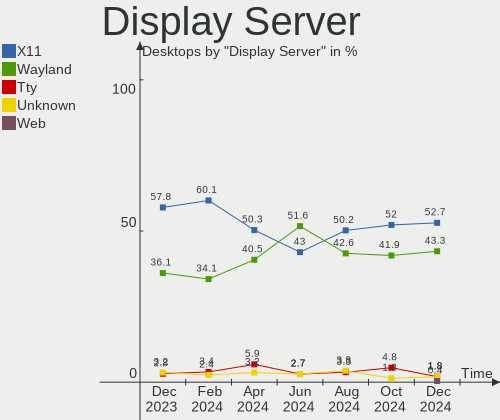
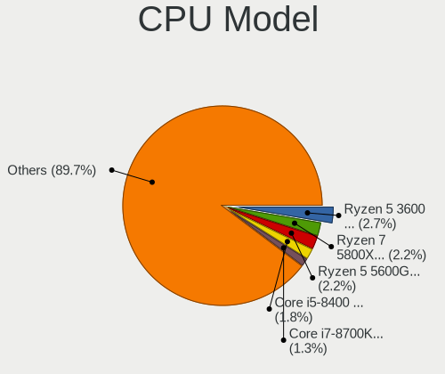
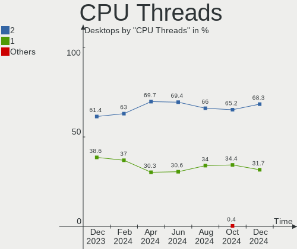
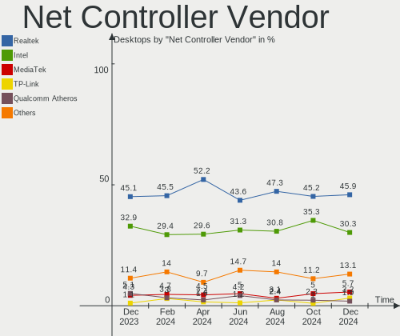
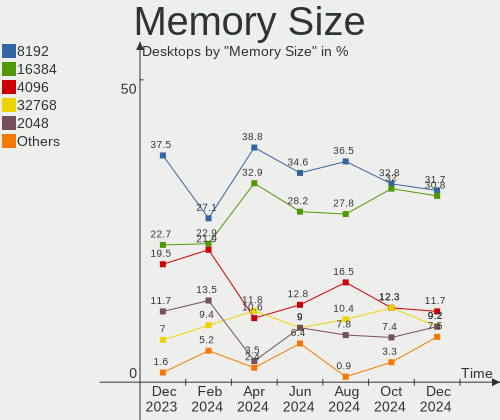

Linux in Germany - Hardware Trends (Desktops)
---------------------------------------------

A project to identify most popular hardware characteristics and track their change
over time based on data collected by Linux users at https://Linux-Hardware.org.

Anyone can contribute to this report by the [hw-probe](https://github.com/linuxhw/hw-probe) tool:

    sudo -E hw-probe -all -upload

Period: Oct, 2022.

Contents
--------

* [ System ](#system)
  - [ OS                       ](#os)
  - [ OS Family                ](#os-family)
  - [ Kernel                   ](#kernel)
  - [ Kernel Family            ](#kernel-family)
  - [ Kernel Major Ver.        ](#kernel-major-ver)
  - [ Arch                     ](#arch)
  - [ DE                       ](#de)
  - [ Display Server           ](#display-server)
  - [ Display Manager          ](#display-manager)
  - [ OS Lang                  ](#os-lang)
  - [ Boot Mode                ](#boot-mode)
  - [ Filesystem               ](#filesystem)
  - [ Part. scheme             ](#part-scheme)
  - [ Dual Boot with Linux/BSD ](#dual-boot-with-linuxbsd)
  - [ Dual Boot (Win)          ](#dual-boot-win)

* [ Board ](#board)
  - [ Vendor                   ](#vendor)
  - [ Model                    ](#model)
  - [ Model Family             ](#model-family)
  - [ MFG Year                 ](#mfg-year)
  - [ Form Factor              ](#form-factor)
  - [ Secure Boot              ](#secure-boot)
  - [ Coreboot                 ](#coreboot)
  - [ RAM Size                 ](#ram-size)
  - [ RAM Used                 ](#ram-used)
  - [ Total Drives             ](#total-drives)
  - [ Has CD-ROM               ](#has-cd-rom)
  - [ Has Ethernet             ](#has-ethernet)
  - [ Has WiFi                 ](#has-wifi)
  - [ Has Bluetooth            ](#has-bluetooth)

* [ Location ](#location)
  - [ Country                  ](#country)
  - [ City                     ](#city)

* [ Drives ](#drives)
  - [ Drive Vendor             ](#drive-vendor)
  - [ Drive Model              ](#drive-model)
  - [ HDD Vendor               ](#hdd-vendor)
  - [ SSD Vendor               ](#ssd-vendor)
  - [ Drive Kind               ](#drive-kind)
  - [ Drive Connector          ](#drive-connector)
  - [ Drive Size               ](#drive-size)
  - [ Space Total              ](#space-total)
  - [ Space Used               ](#space-used)
  - [ Malfunc. Drives          ](#malfunc-drives)
  - [ Malfunc. Drive Vendor    ](#malfunc-drive-vendor)
  - [ Malfunc. HDD Vendor      ](#malfunc-hdd-vendor)
  - [ Malfunc. Drive Kind      ](#malfunc-drive-kind)
  - [ Failed Drives            ](#failed-drives)
  - [ Failed Drive Vendor      ](#failed-drive-vendor)
  - [ Drive Status             ](#drive-status)

* [ Storage controller ](#storage-controller)
  - [ Storage Vendor           ](#storage-vendor)
  - [ Storage Model            ](#storage-model)
  - [ Storage Kind             ](#storage-kind)

* [ Processor ](#processor)
  - [ CPU Vendor               ](#cpu-vendor)
  - [ CPU Model                ](#cpu-model)
  - [ CPU Model Family         ](#cpu-model-family)
  - [ CPU Cores                ](#cpu-cores)
  - [ CPU Sockets              ](#cpu-sockets)
  - [ CPU Threads              ](#cpu-threads)
  - [ CPU Op-Modes             ](#cpu-op-modes)
  - [ CPU Microcode            ](#cpu-microcode)
  - [ CPU Microarch            ](#cpu-microarch)

* [ Graphics ](#graphics)
  - [ GPU Vendor               ](#gpu-vendor)
  - [ GPU Model                ](#gpu-model)
  - [ GPU Combo                ](#gpu-combo)
  - [ GPU Driver               ](#gpu-driver)
  - [ GPU Memory               ](#gpu-memory)

* [ Monitor ](#monitor)
  - [ Monitor Vendor           ](#monitor-vendor)
  - [ Monitor Model            ](#monitor-model)
  - [ Monitor Resolution       ](#monitor-resolution)
  - [ Monitor Diagonal         ](#monitor-diagonal)
  - [ Monitor Width            ](#monitor-width)
  - [ Aspect Ratio             ](#aspect-ratio)
  - [ Monitor Area             ](#monitor-area)
  - [ Pixel Density            ](#pixel-density)
  - [ Multiple Monitors        ](#multiple-monitors)

* [ Network ](#network)
  - [ Net Controller Vendor    ](#net-controller-vendor)
  - [ Net Controller Model     ](#net-controller-model)
  - [ Wireless Vendor          ](#wireless-vendor)
  - [ Wireless Model           ](#wireless-model)
  - [ Ethernet Vendor          ](#ethernet-vendor)
  - [ Ethernet Model           ](#ethernet-model)
  - [ Net Controller Kind      ](#net-controller-kind)
  - [ Used Controller          ](#used-controller)
  - [ NICs                     ](#nics)
  - [ IPv6                     ](#ipv6)

* [ Bluetooth ](#bluetooth)
  - [ Bluetooth Vendor         ](#bluetooth-vendor)
  - [ Bluetooth Model          ](#bluetooth-model)

* [ Sound ](#sound)
  - [ Sound Vendor             ](#sound-vendor)
  - [ Sound Model              ](#sound-model)

* [ Memory ](#memory)
  - [ Memory Vendor            ](#memory-vendor)
  - [ Memory Model             ](#memory-model)
  - [ Memory Kind              ](#memory-kind)
  - [ Memory Form Factor       ](#memory-form-factor)
  - [ Memory Size              ](#memory-size)
  - [ Memory Speed             ](#memory-speed)

* [ Printers & scanners ](#printers--scanners)
  - [ Printer Vendor           ](#printer-vendor)
  - [ Printer Model            ](#printer-model)
  - [ Scanner Vendor           ](#scanner-vendor)
  - [ Scanner Model            ](#scanner-model)

* [ Camera ](#camera)
  - [ Camera Vendor            ](#camera-vendor)
  - [ Camera Model             ](#camera-model)

* [ Security ](#security)
  - [ Fingerprint Vendor       ](#fingerprint-vendor)
  - [ Fingerprint Model        ](#fingerprint-model)
  - [ Chipcard Vendor          ](#chipcard-vendor)
  - [ Chipcard Model           ](#chipcard-model)

* [ Unsupported ](#unsupported)
  - [ Unsupported Devices      ](#unsupported-devices)
  - [ Unsupported Device Types ](#unsupported-device-types)

System
------

OS
--

Installed operating systems

| Name                         | Desktops | Percent |
|------------------------------|----------|---------|
| Ubuntu 22.04                 | 44       | 23.04%  |
| Linux Mint 20.3              | 15       | 7.85%   |
| Debian 11                    | 15       | 7.85%   |
| Ubuntu 20.04                 | 12       | 6.28%   |
| Linux Mint 21                | 11       | 5.76%   |
| Arch Rolling                 | 6        | 3.14%   |
| OpenMandriva 4.3             | 5        | 2.62%   |
| KDE neon 20.04               | 5        | 2.62%   |
| Zorin 16                     | 4        | 2.09%   |
| Pop!_OS 22.04                | 4        | 2.09%   |
| Gentoo 2.8                   | 4        | 2.09%   |
| Fedora 36                    | 4        | 2.09%   |
| ArcoLinux Rolling            | 4        | 2.09%   |
| Xubuntu 22.04                | 3        | 1.57%   |
| Ubuntu 22.10                 | 3        | 1.57%   |
| ROSA 12.2                    | 3        | 1.57%   |
| openSUSE Tumbleweed-XXXXXXXX | 3        | 1.57%   |
| OpenMandriva 4.50            | 3        | 1.57%   |
| Kubuntu 22.04                | 3        | 1.57%   |
| Xubuntu 20.04                | 2        | 1.05%   |
| Ubuntu 18.04                 | 2        | 1.05%   |
| openSUSE Leap-15.4           | 2        | 1.05%   |
| Nobara 36                    | 2        | 1.05%   |
| Manjaro 22.0.0               | 2        | 1.05%   |
| Manjaro                      | 2        | 1.05%   |
| Linux Mint 20.2              | 2        | 1.05%   |
| Kubuntu 20.04                | 2        | 1.05%   |
| EndeavourOS Rolling          | 2        | 1.05%   |
| Xubuntu 18.04                | 1        | 0.52%   |
| Ubuntu Studio 20.04          | 1        | 0.52%   |
| Siduction 21                 | 1        | 0.52%   |
| ROSA R11.1                   | 1        | 0.52%   |
| OpenMandriva 4.90            | 1        | 0.52%   |
| OpenMandriva 4.2             | 1        | 0.52%   |
| NixOS 22.05                  | 1        | 0.52%   |
| MX 22                        | 1        | 0.52%   |
| Makulu Bld-2022.08.10        | 1        | 0.52%   |
| Lubuntu 22.04                | 1        | 0.52%   |
| LMDE 5                       | 1        | 0.52%   |
| Linux Mint 20                | 1        | 0.52%   |

OS Family
---------

OS without a version

| Name          | Desktops | Percent |
|---------------|----------|---------|
| Ubuntu        | 61       | 31.94%  |
| Linux Mint    | 30       | 15.71%  |
| Debian        | 16       | 8.38%   |
| OpenMandriva  | 10       | 5.24%   |
| Xubuntu       | 6        | 3.14%   |
| Kubuntu       | 6        | 3.14%   |
| KDE neon      | 6        | 3.14%   |
| Arch          | 6        | 3.14%   |
| openSUSE      | 5        | 2.62%   |
| Gentoo        | 5        | 2.62%   |
| Zorin         | 4        | 2.09%   |
| ROSA          | 4        | 2.09%   |
| Pop!_OS       | 4        | 2.09%   |
| Manjaro       | 4        | 2.09%   |
| Fedora        | 4        | 2.09%   |
| ArcoLinux     | 4        | 2.09%   |
| Nobara        | 2        | 1.05%   |
| EndeavourOS   | 2        | 1.05%   |
| Ubuntu Studio | 1        | 0.52%   |
| Siduction     | 1        | 0.52%   |
| NixOS         | 1        | 0.52%   |
| MX            | 1        | 0.52%   |
| Makulu        | 1        | 0.52%   |
| Lubuntu       | 1        | 0.52%   |
| LMDE          | 1        | 0.52%   |
| Lilidog       | 1        | 0.52%   |
| Garuda Linux  | 1        | 0.52%   |
| Endless       | 1        | 0.52%   |
| Clear Linux   | 1        | 0.52%   |
| BlackPanther  | 1        | 0.52%   |

Kernel
------

Version of the Linux kernel

| Version                            | Desktops | Percent |
|------------------------------------|----------|---------|
| 5.15.0-48-generic                  | 32       | 16.75%  |
| 5.15.0-52-generic                  | 24       | 12.57%  |
| 5.15.0-50-generic                  | 19       | 9.95%   |
| 5.4.0-126-generic                  | 7        | 3.66%   |
| 5.4.0-131-generic                  | 6        | 3.14%   |
| 5.10.0-18-amd64                    | 6        | 3.14%   |
| 5.16.7-desktop-1omv4003            | 5        | 2.62%   |
| 5.4.0-128-generic                  | 4        | 2.09%   |
| 6.0.2-arch1-1                      | 3        | 1.57%   |
| 5.19.0-2-amd64                     | 3        | 1.57%   |
| 5.15.74-1-lts                      | 3        | 1.57%   |
| 6.0.2-zen1-1-zen                   | 2        | 1.05%   |
| 6.0.2-76060002-generic             | 2        | 1.05%   |
| 5.19.8-1-default                   | 2        | 1.05%   |
| 5.19.5-desktop-1omv4090            | 2        | 1.05%   |
| 5.19.12-arch1-1                    | 2        | 1.05%   |
| 5.19.0-76051900-generic            | 2        | 1.05%   |
| 5.18.0-0.deb11.4-amd64             | 2        | 1.05%   |
| 5.15.0-52-lowlatency               | 2        | 1.05%   |
| 5.15.0-50-lowlatency               | 2        | 1.05%   |
| 5.14.21-150400.24.21-default       | 2        | 1.05%   |
| 5.10.74-generic-2rosa2021.1-x86_64 | 2        | 1.05%   |
| 5.10.0-17-amd64                    | 2        | 1.05%   |
| 6.0.5-201.fsync.fc36.x86_64        | 1        | 0.52%   |
| 6.0.2-2-MANJARO                    | 1        | 0.52%   |
| 5.4.83-generic-2rosa-x86_64        | 1        | 0.52%   |
| 5.4.0-91-generic                   | 1        | 0.52%   |
| 5.4.0-90-generic                   | 1        | 0.52%   |
| 5.4.0-80-generic                   | 1        | 0.52%   |
| 5.4.0-126-lowlatency               | 1        | 0.52%   |
| 5.19.16-lqx4-SPTrinity             | 1        | 0.52%   |
| 5.19.16-lqx4-SPStudio              | 1        | 0.52%   |
| 5.19.16-201.fsync.fc36.x86_64      | 1        | 0.52%   |
| 5.19.16-200.fc36.x86_64            | 1        | 0.52%   |
| 5.19.16-2-MANJARO                  | 1        | 0.52%   |
| 5.19.14-200.fc36.x86_64            | 1        | 0.52%   |
| 5.19.14                            | 1        | 0.52%   |
| 5.19.13-arch1-1                    | 1        | 0.52%   |
| 5.19.13-200.fc36.x86_64            | 1        | 0.52%   |
| 5.19.12-xm1.0.fc36.x86_64          | 1        | 0.52%   |

Kernel Family
-------------

Linux kernel without a distro release

| Version  | Desktops | Percent |
|----------|----------|---------|
| 5.15.0   | 84       | 43.98%  |
| 5.4.0    | 21       | 10.99%  |
| 5.10.0   | 12       | 6.28%   |
| 6.0.2    | 8        | 4.19%   |
| 5.19.0   | 8        | 4.19%   |
| 5.19.12  | 7        | 3.66%   |
| 5.15.74  | 6        | 3.14%   |
| 5.19.16  | 5        | 2.62%   |
| 5.16.7   | 5        | 2.62%   |
| 5.13.0   | 4        | 2.09%   |
| 5.18.0   | 3        | 1.57%   |
| 5.19.8   | 2        | 1.05%   |
| 5.19.5   | 2        | 1.05%   |
| 5.19.14  | 2        | 1.05%   |
| 5.19.13  | 2        | 1.05%   |
| 5.14.21  | 2        | 1.05%   |
| 5.11.0   | 2        | 1.05%   |
| 5.10.74  | 2        | 1.05%   |
| 6.0.5    | 1        | 0.52%   |
| 5.4.83   | 1        | 0.52%   |
| 5.19.11  | 1        | 0.52%   |
| 5.18.19  | 1        | 0.52%   |
| 5.18.12  | 1        | 0.52%   |
| 5.17.9   | 1        | 0.52%   |
| 5.15.71  | 1        | 0.52%   |
| 5.15.69  | 1        | 0.52%   |
| 5.10.60  | 1        | 0.52%   |
| 5.10.14  | 1        | 0.52%   |
| 5.10.118 | 1        | 0.52%   |
| 4.9.0    | 1        | 0.52%   |
| 4.18.16  | 1        | 0.52%   |
| 4.15.0   | 1        | 0.52%   |

Kernel Major Ver.
-----------------

Linux kernel major version

| Version | Desktops | Percent |
|---------|----------|---------|
| 5.15    | 92       | 48.17%  |
| 5.19    | 29       | 15.18%  |
| 5.4     | 22       | 11.52%  |
| 5.10    | 17       | 8.9%    |
| 6.0     | 9        | 4.71%   |
| 5.18    | 5        | 2.62%   |
| 5.16    | 5        | 2.62%   |
| 5.13    | 4        | 2.09%   |
| 5.14    | 2        | 1.05%   |
| 5.11    | 2        | 1.05%   |
| 5.17    | 1        | 0.52%   |
| 4.9     | 1        | 0.52%   |
| 4.18    | 1        | 0.52%   |
| 4.15    | 1        | 0.52%   |

Arch
----

OS architecture (x86_64, i586, etc.)

| Name   | Desktops | Percent |
|--------|----------|---------|
| x86_64 | 189      | 98.95%  |
| i686   | 2        | 1.05%   |

DE
--

Desktop Environment

| Name             | Desktops | Percent |
|------------------|----------|---------|
| GNOME            | 80       | 41.88%  |
| KDE5             | 38       | 19.9%   |
| X-Cinnamon       | 31       | 16.23%  |
| XFCE             | 18       | 9.42%   |
| Unknown          | 7        | 3.66%   |
| Cinnamon         | 3        | 1.57%   |
| trinity          | 2        | 1.05%   |
| KDE              | 2        | 1.05%   |
| bspwm            | 2        | 1.05%   |
| qtile            | 1        | 0.52%   |
| MATE             | 1        | 0.52%   |
| LXDE             | 1        | 0.52%   |
| lightdm-xsession | 1        | 0.52%   |
| KDE4             | 1        | 0.52%   |
| i3               | 1        | 0.52%   |
| GNOME Flashback  | 1        | 0.52%   |
| enlightenment    | 1        | 0.52%   |

Display Server
--------------

X11 or Wayland

| Name    | Desktops | Percent |
|---------|----------|---------|
| X11     | 144      | 75.39%  |
| Wayland | 39       | 20.42%  |
| Tty     | 5        | 2.62%   |
| Unknown | 3        | 1.57%   |

Display Manager
---------------

SDDM, LightDM, etc.

| Name    | Desktops | Percent |
|---------|----------|---------|
| Unknown | 68       | 35.6%   |
| GDM3    | 59       | 30.89%  |
| LightDM | 30       | 15.71%  |
| SDDM    | 24       | 12.57%  |
| GDM     | 8        | 4.19%   |
| SLiM    | 1        | 0.52%   |
| KDM     | 1        | 0.52%   |

OS Lang
-------

Language

| Lang    | Desktops | Percent |
|---------|----------|---------|
| de_DE   | 146      | 76.44%  |
| en_US   | 28       | 14.66%  |
| C       | 5        | 2.62%   |
| en_GB   | 3        | 1.57%   |
| Unknown | 2        | 1.05%   |
| ru_UA   | 1        | 0.52%   |
| POSIX   | 1        | 0.52%   |
| it_IT   | 1        | 0.52%   |
| hu_HU   | 1        | 0.52%   |
| en_DE   | 1        | 0.52%   |
| C.UTF8  | 1        | 0.52%   |
| bs_BA   | 1        | 0.52%   |

Boot Mode
---------

EFI or BIOS

| Mode | Desktops | Percent |
|------|----------|---------|
| BIOS | 123      | 64.4%   |
| EFI  | 68       | 35.6%   |

Filesystem
----------

Type of filesystem

| Type          | Desktops | Percent |
|---------------|----------|---------|
| Ext4          | 147      | 76.96%  |
| Btrfs         | 22       | 11.52%  |
| Overlay       | 16       | 8.38%   |
| Xfs           | 3        | 1.57%   |
| Zfs           | 1        | 0.52%   |
| Tmpfs         | 1        | 0.52%   |
| Fuse.snapfuse | 1        | 0.52%   |

Part. scheme
------------

Scheme of partitioning

| Type    | Desktops | Percent |
|---------|----------|---------|
| GPT     | 92       | 48.17%  |
| Unknown | 64       | 33.51%  |
| MBR     | 35       | 18.32%  |

Dual Boot with Linux/BSD
------------------------

Hosting more than one Linux/BSD

| Dual boot | Desktops | Percent |
|-----------|----------|---------|
| No        | 153      | 80.1%   |
| Yes       | 38       | 19.9%   |

Dual Boot (Win)
---------------

Hosting Linux and Windows

| Dual boot | Desktops | Percent |
|-----------|----------|---------|
| No        | 136      | 71.2%   |
| Yes       | 55       | 28.8%   |

Board
-----

Vendor
------

Motherboard manufacturer

| Name                | Desktops | Percent |
|---------------------|----------|---------|
| ASUSTek Computer    | 36       | 18.85%  |
| MSI                 | 33       | 17.28%  |
| Gigabyte Technology | 28       | 14.66%  |
| ASRock              | 24       | 12.57%  |
| Hewlett-Packard     | 20       | 10.47%  |
| Fujitsu             | 15       | 7.85%   |
| Lenovo              | 8        | 4.19%   |
| Dell                | 7        | 3.66%   |
| Acer                | 5        | 2.62%   |
| Medion              | 3        | 1.57%   |
| Unknown             | 3        | 1.57%   |
| Fujitsu Siemens     | 2        | 1.05%   |
| Biostar             | 2        | 1.05%   |
| Shuttle             | 1        | 0.52%   |
| Inventec            | 1        | 0.52%   |
| Hardkernel          | 1        | 0.52%   |
| Google              | 1        | 0.52%   |
| BESSTAR Tech        | 1        | 0.52%   |

Model
-----

Motherboard model

| Name                                | Desktops | Percent |
|-------------------------------------|----------|---------|
| MSI MS-7C37                         | 3        | 1.57%   |
| Unknown                             | 3        | 1.57%   |
| MSI MS-7C52                         | 2        | 1.05%   |
| MSI MS-7C35                         | 2        | 1.05%   |
| MSI MS-7B84                         | 2        | 1.05%   |
| MSI MS-7A38                         | 2        | 1.05%   |
| MSI MS-7693                         | 2        | 1.05%   |
| HP Compaq Elite 8300 SFF            | 2        | 1.05%   |
| HP Compaq 8000 Elite CMT PC         | 2        | 1.05%   |
| Gigabyte B450 AORUS ELITE           | 2        | 1.05%   |
| Fujitsu ESPRIMO C720                | 2        | 1.05%   |
| ASUS PRIME B550M-A                  | 2        | 1.05%   |
| ASUS All Series                     | 2        | 1.05%   |
| ASRock B450 Pro4                    | 2        | 1.05%   |
| Shuttle SH61R                       | 1        | 0.52%   |
| MSI MS-7D15                         | 1        | 0.52%   |
| MSI MS-7C96                         | 1        | 0.52%   |
| MSI MS-7C95                         | 1        | 0.52%   |
| MSI MS-7C94                         | 1        | 0.52%   |
| MSI MS-7C91                         | 1        | 0.52%   |
| MSI MS-7C79                         | 1        | 0.52%   |
| MSI MS-7C56                         | 1        | 0.52%   |
| MSI MS-7B89                         | 1        | 0.52%   |
| MSI MS-7B86                         | 1        | 0.52%   |
| MSI MS-7B79                         | 1        | 0.52%   |
| MSI MS-7B09                         | 1        | 0.52%   |
| MSI MS-7A33                         | 1        | 0.52%   |
| MSI MS-7A31                         | 1        | 0.52%   |
| MSI MS-7817                         | 1        | 0.52%   |
| MSI MS-7696                         | 1        | 0.52%   |
| MSI MS-7681                         | 1        | 0.52%   |
| MSI MS-7641                         | 1        | 0.52%   |
| MSI MS-7358                         | 1        | 0.52%   |
| MSI MEG Z590 Infinite X (MS-B916)   | 1        | 0.52%   |
| MSI A0000001                        | 1        | 0.52%   |
| Medion MS-7800                      | 1        | 0.52%   |
| Medion MS-7707                      | 1        | 0.52%   |
| Medion MS-7366                      | 1        | 0.52%   |
| Lenovo ThinkStation P520 30BE008VGE | 1        | 0.52%   |
| Lenovo ThinkCentre M93 10A50006GE   | 1        | 0.52%   |

Model Family
------------

Motherboard model prefix

| Name               | Desktops | Percent |
|--------------------|----------|---------|
| ASUS PRIME         | 10       | 5.24%   |
| HP Compaq          | 9        | 4.71%   |
| Fujitsu ESPRIMO    | 9        | 4.71%   |
| Lenovo ThinkCentre | 7        | 3.66%   |
| Dell OptiPlex      | 5        | 2.62%   |
| ASUS ROG           | 5        | 2.62%   |
| MSI MS-7C37        | 3        | 1.57%   |
| Gigabyte X570      | 3        | 1.57%   |
| Gigabyte B450      | 3        | 1.57%   |
| Acer Aspire        | 3        | 1.57%   |
| Unknown            | 3        | 1.57%   |
| MSI MS-7C52        | 2        | 1.05%   |
| MSI MS-7C35        | 2        | 1.05%   |
| MSI MS-7B84        | 2        | 1.05%   |
| MSI MS-7A38        | 2        | 1.05%   |
| MSI MS-7693        | 2        | 1.05%   |
| HP EliteDesk       | 2        | 1.05%   |
| Fujitsu FUTRO      | 2        | 1.05%   |
| ASUS TUF           | 2        | 1.05%   |
| ASUS P8Z68-V       | 2        | 1.05%   |
| ASUS All           | 2        | 1.05%   |
| ASRock Z97         | 2        | 1.05%   |
| ASRock X570        | 2        | 1.05%   |
| ASRock B450        | 2        | 1.05%   |
| Shuttle SH61R      | 1        | 0.52%   |
| MSI MS-7D15        | 1        | 0.52%   |
| MSI MS-7C96        | 1        | 0.52%   |
| MSI MS-7C95        | 1        | 0.52%   |
| MSI MS-7C94        | 1        | 0.52%   |
| MSI MS-7C91        | 1        | 0.52%   |
| MSI MS-7C79        | 1        | 0.52%   |
| MSI MS-7C56        | 1        | 0.52%   |
| MSI MS-7B89        | 1        | 0.52%   |
| MSI MS-7B86        | 1        | 0.52%   |
| MSI MS-7B79        | 1        | 0.52%   |
| MSI MS-7B09        | 1        | 0.52%   |
| MSI MS-7A33        | 1        | 0.52%   |
| MSI MS-7A31        | 1        | 0.52%   |
| MSI MS-7817        | 1        | 0.52%   |
| MSI MS-7696        | 1        | 0.52%   |

MFG Year
--------

Motherboard manufacture year

| Year    | Desktops | Percent |
|---------|----------|---------|
| 2020    | 22       | 11.52%  |
| 2019    | 21       | 10.99%  |
| 2013    | 21       | 10.99%  |
| 2012    | 21       | 10.99%  |
| 2018    | 16       | 8.38%   |
| 2014    | 13       | 6.81%   |
| 2011    | 12       | 6.28%   |
| 2017    | 11       | 5.76%   |
| 2009    | 9        | 4.71%   |
| 2015    | 8        | 4.19%   |
| 2022    | 7        | 3.66%   |
| 2016    | 6        | 3.14%   |
| 2010    | 6        | 3.14%   |
| 2008    | 6        | 3.14%   |
| 2021    | 4        | 2.09%   |
| 2007    | 4        | 2.09%   |
| 2006    | 1        | 0.52%   |
| 2005    | 1        | 0.52%   |
| 2004    | 1        | 0.52%   |
| Unknown | 1        | 0.52%   |

Form Factor
-----------

Physical design of the computer

| Name    | Desktops | Percent |
|---------|----------|---------|
| Desktop | 191      | 100%    |

Secure Boot
-----------

Enabled or disabled

| State    | Desktops | Percent |
|----------|----------|---------|
| Disabled | 190      | 99.48%  |
| Enabled  | 1        | 0.52%   |

Coreboot
--------

Have coreboot on board

| Used | Desktops | Percent |
|------|----------|---------|
| No   | 190      | 99.48%  |
| Yes  | 1        | 0.52%   |

RAM Size
--------

Total RAM memory

| Size in GB  | Desktops | Percent |
|-------------|----------|---------|
| 16.01-24.0  | 47       | 24.61%  |
| 32.01-64.0  | 35       | 18.32%  |
| 8.01-16.0   | 33       | 17.28%  |
| 4.01-8.0    | 23       | 12.04%  |
| 3.01-4.0    | 23       | 12.04%  |
| 64.01-256.0 | 14       | 7.33%   |
| 24.01-32.0  | 7        | 3.66%   |
| 1.01-2.0    | 7        | 3.66%   |
| 2.01-3.0    | 2        | 1.05%   |

RAM Used
--------

Used RAM memory

| Used GB    | Desktops | Percent |
|------------|----------|---------|
| 1.01-2.0   | 66       | 34.55%  |
| 2.01-3.0   | 47       | 24.61%  |
| 4.01-8.0   | 36       | 18.85%  |
| 3.01-4.0   | 22       | 11.52%  |
| 0.51-1.0   | 8        | 4.19%   |
| 8.01-16.0  | 6        | 3.14%   |
| 0.01-0.5   | 4        | 2.09%   |
| 32.01-64.0 | 1        | 0.52%   |
| 24.01-32.0 | 1        | 0.52%   |

Total Drives
------------

Number of drives on board

| Drives | Desktops | Percent |
|--------|----------|---------|
| 1      | 61       | 31.94%  |
| 2      | 49       | 25.65%  |
| 3      | 36       | 18.85%  |
| 4      | 15       | 7.85%   |
| 5      | 14       | 7.33%   |
| 6      | 9        | 4.71%   |
| 7      | 3        | 1.57%   |
| 9      | 2        | 1.05%   |
| 8      | 1        | 0.52%   |
| 0      | 1        | 0.52%   |

Has CD-ROM
----------

Has CD-ROM on board

| Presented | Desktops | Percent |
|-----------|----------|---------|
| Yes       | 110      | 57.59%  |
| No        | 81       | 42.41%  |

Has Ethernet
------------

Has Ethernet on board

| Presented | Desktops | Percent |
|-----------|----------|---------|
| Yes       | 190      | 99.48%  |
| No        | 1        | 0.52%   |

Has WiFi
--------

Has WiFi module

| Presented | Desktops | Percent |
|-----------|----------|---------|
| No        | 116      | 60.73%  |
| Yes       | 75       | 39.27%  |

Has Bluetooth
-------------

Has Bluetooth module

| Presented | Desktops | Percent |
|-----------|----------|---------|
| No        | 132      | 69.11%  |
| Yes       | 59       | 30.89%  |

Location
--------

Country
-------

Geographic location (country)

| Country | Desktops | Percent |
|---------|----------|---------|
| Germany | 191      | 100%    |

City
----

Geographic location (city)

| City                | Desktops | Percent |
|---------------------|----------|---------|
| Berlin              | 16       | 8.38%   |
| Frankfurt am Main   | 8        | 4.19%   |
| Munich              | 5        | 2.62%   |
| Leipzig             | 5        | 2.62%   |
| Karlsruhe           | 4        | 2.09%   |
| Mainz               | 3        | 1.57%   |
| Kiel                | 3        | 1.57%   |
| Kaufbeuren          | 3        | 1.57%   |
| Hamburg             | 3        | 1.57%   |
| Dessau              | 3        | 1.57%   |
| Cologne             | 3        | 1.57%   |
| Augsburg            | 3        | 1.57%   |
| Wuppertal           | 2        | 1.05%   |
| Wiesbaden           | 2        | 1.05%   |
| Verden an der Aller | 2        | 1.05%   |
| Stuttgart           | 2        | 1.05%   |
| Oberursel           | 2        | 1.05%   |
| Oberkotzau          | 2        | 1.05%   |
| Lüneburg           | 2        | 1.05%   |
| Luckau              | 2        | 1.05%   |
| Kirchhundem         | 2        | 1.05%   |
| Falkenstein         | 2        | 1.05%   |
| Düsseldorf         | 2        | 1.05%   |
| Duisburg            | 2        | 1.05%   |
| Bochum              | 2        | 1.05%   |
| Windeck             | 1        | 0.52%   |
| Wildeshausen        | 1        | 0.52%   |
| Wermelskirchen      | 1        | 0.52%   |
| Weitramsdorf        | 1        | 0.52%   |
| Weinbach            | 1        | 0.52%   |
| Weimar              | 1        | 0.52%   |
| Velbert             | 1        | 0.52%   |
| Tuttlingen          | 1        | 0.52%   |
| Torgau              | 1        | 0.52%   |
| Tholey              | 1        | 0.52%   |
| Tann                | 1        | 0.52%   |
| Suhl                | 1        | 0.52%   |
| Sohlde              | 1        | 0.52%   |
| Sigmaringendorf     | 1        | 0.52%   |
| Schwedt             | 1        | 0.52%   |

Drives
------

Drive Vendor
------------

Hard drive vendors

| Vendor                      | Desktops | Drives | Percent |
|-----------------------------|----------|--------|---------|
| Samsung Electronics         | 82       | 122    | 21.03%  |
| Seagate                     | 61       | 79     | 15.64%  |
| WDC                         | 56       | 75     | 14.36%  |
| Crucial                     | 31       | 33     | 7.95%   |
| SanDisk                     | 26       | 32     | 6.67%   |
| Toshiba                     | 24       | 29     | 6.15%   |
| Kingston                    | 16       | 18     | 4.1%    |
| Intenso                     | 15       | 15     | 3.85%   |
| Hitachi                     | 10       | 11     | 2.56%   |
| Unknown                     | 8        | 10     | 2.05%   |
| Silicon Motion              | 6        | 6      | 1.54%   |
| OCZ                         | 4        | 4      | 1.03%   |
| Micron/Crucial Technology   | 4        | 4      | 1.03%   |
| Phison Electronics          | 3        | 5      | 0.77%   |
| Micron Technology           | 3        | 3      | 0.77%   |
| Intel                       | 3        | 4      | 0.77%   |
| HGST                        | 3        | 3      | 0.77%   |
| Unknown                     | 3        | 3      | 0.77%   |
| Maxtor                      | 2        | 2      | 0.51%   |
| Leven                       | 2        | 2      | 0.51%   |
| Kingston Technology Company | 2        | 2      | 0.51%   |
| JMicron Technology          | 2        | 2      | 0.51%   |
| A-DATA Technology           | 2        | 2      | 0.51%   |
| Verbatim                    | 1        | 1      | 0.26%   |
| VENO                        | 1        | 1      | 0.26%   |
| Team                        | 1        | 1      | 0.26%   |
| SK hynix                    | 1        | 1      | 0.26%   |
| Seagate Technology          | 1        | 1      | 0.26%   |
| PNY                         | 1        | 2      | 0.26%   |
| Netac                       | 1        | 1      | 0.26%   |
| LITEONIT                    | 1        | 1      | 0.26%   |
| LITEON                      | 1        | 1      | 0.26%   |
| LIO-ORG                     | 1        | 1      | 0.26%   |
| KIOXIA-EXCERIA              | 1        | 1      | 0.26%   |
| INNOVATION IT               | 1        | 1      | 0.26%   |
| Innodisk                    | 1        | 1      | 0.26%   |
| Hoodisk                     | 1        | 1      | 0.26%   |
| GOODRAM                     | 1        | 1      | 0.26%   |
| Drevo                       | 1        | 1      | 0.26%   |
| Dogfish                     | 1        | 1      | 0.26%   |

Drive Model
-----------

Hard drive models

| Model                                                 | Desktops | Percent |
|-------------------------------------------------------|----------|---------|
| Samsung NVMe SSD Controller SM981/PM981/PM983 500GB   | 14       | 3.09%   |
| Samsung SSD 850 EVO 500GB                             | 7        | 1.55%   |
| Toshiba DT01ACA100 1TB                                | 6        | 1.32%   |
| Samsung SSD 860 EVO 500GB                             | 6        | 1.32%   |
| WDC WD20EZRZ-00Z5HB0 2TB                              | 5        | 1.1%    |
| Samsung SSD 860 EVO 1TB                               | 5        | 1.1%    |
| Samsung SSD 840 EVO 250GB                             | 5        | 1.1%    |
| Samsung NVMe SSD Controller PM9A1/PM9A3/980PRO 250GB  | 5        | 1.1%    |
| WDC WD20EARX-00PASB0 2TB                              | 4        | 0.88%   |
| Unknown SD/MMC/MS PRO 1TB                             | 4        | 0.88%   |
| Samsung SSD 980 1TB                                   | 4        | 0.88%   |
| Samsung SSD 850 EVO 250GB                             | 4        | 0.88%   |
| Kingston SV300S37A120G 120GB SSD                      | 4        | 0.88%   |
| Crucial CT240BX500SSD1 240GB                          | 4        | 0.88%   |
| Crucial CT1000MX500SSD1 1TB                           | 4        | 0.88%   |
| Crucial CT1000BX500SSD1 1TB                           | 4        | 0.88%   |
| Toshiba DT01ACA050 500GB                              | 3        | 0.66%   |
| Silicon Motion SM2262/SM2262EN SSD Controller 1024GB  | 3        | 0.66%   |
| Seagate ST2000DM008-2FR102 2TB                        | 3        | 0.66%   |
| Seagate ST1000DM010-2EP102 1TB                        | 3        | 0.66%   |
| Seagate ST1000DM003-1ER162 1TB                        | 3        | 0.66%   |
| Seagate ST1000DM003-1CH162 1TB                        | 3        | 0.66%   |
| Sandisk WD Black SN750 / PC SN730 NVMe SSD 1TB        | 3        | 0.66%   |
| SanDisk SSD PLUS 1000GB                               | 3        | 0.66%   |
| Samsung SSD 870 QVO 1TB                               | 3        | 0.66%   |
| Samsung SSD 840 EVO 120GB                             | 3        | 0.66%   |
| Phison E16 PCIe4 NVMe Controller 1TB                  | 3        | 0.66%   |
| Unknown                                               | 3        | 0.66%   |
| WDC WDS240G2G0A-00JH30 240GB SSD                      | 2        | 0.44%   |
| WDC WD60EFRX-68L0BN1 6TB                              | 2        | 0.44%   |
| WDC WD5000AAKX-001CA0 500GB                           | 2        | 0.44%   |
| WDC WD40EFRX-68N32N0 4TB                              | 2        | 0.44%   |
| WDC WD10EZRZ-00HTKB0 1TB                              | 2        | 0.44%   |
| Unknown SD/MMC 2GB                                    | 2        | 0.44%   |
| Unknown M.S./M.S.Pro/HG 16GB                          | 2        | 0.44%   |
| Toshiba HDWD120 2TB                                   | 2        | 0.44%   |
| Toshiba DT01ACA200 2TB                                | 2        | 0.44%   |
| Silicon Motion SM2263EN/SM2263XT SSD Controller 256GB | 2        | 0.44%   |
| Seagate ST500DM002-1BD142 500GB                       | 2        | 0.44%   |
| Seagate ST4000VN008-2DR166 4TB                        | 2        | 0.44%   |

HDD Vendor
----------

Hard disk drive vendors

| Vendor              | Desktops | Drives | Percent |
|---------------------|----------|--------|---------|
| Seagate             | 61       | 79     | 35.47%  |
| WDC                 | 50       | 66     | 29.07%  |
| Toshiba             | 21       | 26     | 12.21%  |
| Samsung Electronics | 17       | 23     | 9.88%   |
| Hitachi             | 10       | 11     | 5.81%   |
| Unknown             | 4        | 4      | 2.33%   |
| Intenso             | 3        | 3      | 1.74%   |
| HGST                | 3        | 3      | 1.74%   |
| Maxtor              | 2        | 2      | 1.16%   |
| LIO-ORG             | 1        | 1      | 0.58%   |

SSD Vendor
----------

Solid state drive vendors

| Vendor              | Desktops | Drives | Percent |
|---------------------|----------|--------|---------|
| Samsung Electronics | 50       | 63     | 31.06%  |
| Crucial             | 29       | 31     | 18.01%  |
| SanDisk             | 21       | 25     | 13.04%  |
| Kingston            | 12       | 13     | 7.45%   |
| Intenso             | 8        | 8      | 4.97%   |
| WDC                 | 6        | 7      | 3.73%   |
| OCZ                 | 4        | 4      | 2.48%   |
| Micron Technology   | 3        | 3      | 1.86%   |
| Toshiba             | 2        | 2      | 1.24%   |
| Leven               | 2        | 2      | 1.24%   |
| Intel               | 2        | 2      | 1.24%   |
| A-DATA Technology   | 2        | 2      | 1.24%   |
| Unknown             | 2        | 2      | 1.24%   |
| Verbatim            | 1        | 1      | 0.62%   |
| VENO                | 1        | 1      | 0.62%   |
| Team                | 1        | 1      | 0.62%   |
| PNY                 | 1        | 2      | 0.62%   |
| Netac               | 1        | 1      | 0.62%   |
| LITEONIT            | 1        | 1      | 0.62%   |
| LITEON              | 1        | 1      | 0.62%   |
| KIOXIA-EXCERIA      | 1        | 1      | 0.62%   |
| INNOVATION IT       | 1        | 1      | 0.62%   |
| Innodisk            | 1        | 1      | 0.62%   |
| Hoodisk             | 1        | 1      | 0.62%   |
| GOODRAM             | 1        | 1      | 0.62%   |
| Drevo               | 1        | 1      | 0.62%   |
| Dogfish             | 1        | 1      | 0.62%   |
| CT250MX5            | 1        | 1      | 0.62%   |
| China               | 1        | 1      | 0.62%   |
| ASMT                | 1        | 1      | 0.62%   |
| Apacer              | 1        | 1      | 0.62%   |

Drive Kind
----------

HDD or SSD

| Kind    | Desktops | Drives | Percent |
|---------|----------|--------|---------|
| HDD     | 127      | 218    | 40.06%  |
| SSD     | 123      | 183    | 38.8%   |
| NVMe    | 58       | 77     | 18.3%   |
| Unknown | 7        | 9      | 2.21%   |
| MMC     | 2        | 2      | 0.63%   |

Drive Connector
---------------

SATA, SAS, NVMe, etc.

| Type | Desktops | Drives | Percent |
|------|----------|--------|---------|
| SATA | 178      | 384    | 68.99%  |
| NVMe | 57       | 75     | 22.09%  |
| SAS  | 21       | 28     | 8.14%   |
| MMC  | 2        | 2      | 0.78%   |

Drive Size
----------

Size of hard drive

| Size in TB | Desktops | Drives | Percent |
|------------|----------|--------|---------|
| 0.01-0.5   | 127      | 190    | 45.85%  |
| 0.51-1.0   | 76       | 117    | 27.44%  |
| 1.01-2.0   | 44       | 53     | 15.88%  |
| 3.01-4.0   | 12       | 16     | 4.33%   |
| 4.01-10.0  | 9        | 11     | 3.25%   |
| 2.01-3.0   | 8        | 9      | 2.89%   |
| 10.01-20.0 | 1        | 5      | 0.36%   |

Space Total
-----------

Amount of disk space available on the file system

| Size in GB     | Desktops | Percent |
|----------------|----------|---------|
| 101-250        | 35       | 18.32%  |
| 501-1000       | 33       | 17.28%  |
| More than 3000 | 32       | 16.75%  |
| 251-500        | 31       | 16.23%  |
| 1001-2000      | 18       | 9.42%   |
| 2001-3000      | 13       | 6.81%   |
| 1-20           | 10       | 5.24%   |
| Unknown        | 10       | 5.24%   |
| 51-100         | 5        | 2.62%   |
| 21-50          | 4        | 2.09%   |

Space Used
----------

Amount of used disk space

| Used GB        | Desktops | Percent |
|----------------|----------|---------|
| 1-20           | 46       | 24.08%  |
| 21-50          | 32       | 16.75%  |
| 51-100         | 19       | 9.95%   |
| 101-250        | 17       | 8.9%    |
| 251-500        | 16       | 8.38%   |
| 1001-2000      | 15       | 7.85%   |
| 501-1000       | 15       | 7.85%   |
| 2001-3000      | 12       | 6.28%   |
| Unknown        | 10       | 5.24%   |
| More than 3000 | 9        | 4.71%   |

Malfunc. Drives
---------------

Drive models with a malfunction

| Model                             | Desktops | Drives | Percent |
|-----------------------------------|----------|--------|---------|
| WDC WDS240G2G0A-00JH30 240GB SSD  | 2        | 2      | 11.76%  |
| Toshiba DT01ACA100 1TB            | 2        | 2      | 11.76%  |
| WDC WD60EFRX-68L0BN1 6TB          | 1        | 1      | 5.88%   |
| WDC WD5000AAKX-001CA0 500GB       | 1        | 1      | 5.88%   |
| WDC WD20EFRX-68EUZN0 2TB          | 1        | 1      | 5.88%   |
| WDC WD10EARX-00N0YB0 1TB          | 1        | 1      | 5.88%   |
| Seagate ST3320620AS 320GB         | 1        | 1      | 5.88%   |
| Seagate ST3250410AS 250GB         | 1        | 1      | 5.88%   |
| Seagate ST31000528AS 1TB          | 1        | 1      | 5.88%   |
| Seagate ST2000DM001-1CH164 2TB    | 1        | 1      | 5.88%   |
| Samsung Electronics SP2504C 250GB | 1        | 1      | 5.88%   |
| Samsung Electronics HM321HI 320GB | 1        | 1      | 5.88%   |
| Maxtor STM3500320AS 500GB         | 1        | 1      | 5.88%   |
| Kingston SV300S37A120G 120GB SSD  | 1        | 1      | 5.88%   |
| Intenso SSD Sata III 120GB        | 1        | 1      | 5.88%   |

Malfunc. Drive Vendor
---------------------

Vendors of faulty drives

| Vendor              | Desktops | Drives | Percent |
|---------------------|----------|--------|---------|
| WDC                 | 6        | 6      | 37.5%   |
| Seagate             | 3        | 4      | 18.75%  |
| Toshiba             | 2        | 2      | 12.5%   |
| Samsung Electronics | 2        | 2      | 12.5%   |
| Maxtor              | 1        | 1      | 6.25%   |
| Kingston            | 1        | 1      | 6.25%   |
| Intenso             | 1        | 1      | 6.25%   |

Malfunc. HDD Vendor
-------------------

Vendors of faulty HDD drives

| Vendor              | Desktops | Drives | Percent |
|---------------------|----------|--------|---------|
| WDC                 | 4        | 4      | 33.33%  |
| Seagate             | 3        | 4      | 25%     |
| Toshiba             | 2        | 2      | 16.67%  |
| Samsung Electronics | 2        | 2      | 16.67%  |
| Maxtor              | 1        | 1      | 8.33%   |

Malfunc. Drive Kind
-------------------

Kinds of faulty drives

| Kind | Desktops | Drives | Percent |
|------|----------|--------|---------|
| HDD  | 11       | 13     | 73.33%  |
| SSD  | 4        | 4      | 26.67%  |

Failed Drives
-------------

Failed drive models

Zero info for selected period =(

Failed Drive Vendor
-------------------

Failed drive vendors

Zero info for selected period =(

Drive Status
------------

Number of failed and malfunc. drives

| Status   | Desktops | Drives | Percent |
|----------|----------|--------|---------|
| Detected | 132      | 314    | 63.77%  |
| Works    | 61       | 158    | 29.47%  |
| Malfunc  | 14       | 17     | 6.76%   |

Storage controller
------------------

Storage Vendor
--------------

Storage controller vendors

| Vendor                       | Desktops | Percent |
|------------------------------|----------|---------|
| Intel                        | 102      | 35.54%  |
| AMD                          | 84       | 29.27%  |
| Samsung Electronics          | 29       | 10.1%   |
| ASMedia Technology           | 14       | 4.88%   |
| SanDisk                      | 8        | 2.79%   |
| Silicon Motion               | 6        | 2.09%   |
| Nvidia                       | 6        | 2.09%   |
| Micron/Crucial Technology    | 6        | 2.09%   |
| Kingston Technology Company  | 6        | 2.09%   |
| Marvell Technology Group     | 5        | 1.74%   |
| JMicron Technology           | 5        | 1.74%   |
| Silicon Image                | 3        | 1.05%   |
| Phison Electronics           | 3        | 1.05%   |
| LSI Logic / Symbios Logic    | 2        | 0.7%    |
| Adaptec                      | 2        | 0.7%    |
| VIA Technologies             | 1        | 0.35%   |
| Toshiba America Info Systems | 1        | 0.35%   |
| SK hynix                     | 1        | 0.35%   |
| Seagate Technology           | 1        | 0.35%   |
| Broadcom / LSI               | 1        | 0.35%   |
| ADATA Technology             | 1        | 0.35%   |

Storage Model
-------------

Storage controller models

| Model                                                                                   | Desktops | Percent |
|-----------------------------------------------------------------------------------------|----------|---------|
| AMD FCH SATA Controller [AHCI mode]                                                     | 45       | 13.04%  |
| Samsung NVMe SSD Controller SM981/PM981/PM983                                           | 16       | 4.64%   |
| Intel 8 Series/C220 Series Chipset Family 6-port SATA Controller 1 [AHCI mode]          | 16       | 4.64%   |
| AMD 500 Series Chipset SATA Controller                                                  | 14       | 4.06%   |
| AMD 400 Series Chipset SATA Controller                                                  | 13       | 3.77%   |
| Intel 7 Series/C210 Series Chipset Family 6-port SATA Controller [AHCI mode]            | 12       | 3.48%   |
| ASMedia ASM1062 Serial ATA Controller                                                   | 11       | 3.19%   |
| AMD SB7x0/SB8x0/SB9x0 IDE Controller                                                    | 11       | 3.19%   |
| Intel Q170/Q150/B150/H170/H110/Z170/CM236 Chipset SATA Controller [AHCI Mode]           | 9        | 2.61%   |
| Intel 6 Series/C200 Series Chipset Family 6 port Desktop SATA AHCI Controller           | 9        | 2.61%   |
| Samsung NVMe SSD Controller PM9A1/PM9A3/980PRO                                          | 8        | 2.32%   |
| Intel 200 Series PCH SATA controller [AHCI mode]                                        | 8        | 2.32%   |
| AMD SB7x0/SB8x0/SB9x0 SATA Controller [IDE mode]                                        | 7        | 2.03%   |
| AMD FCH SATA Controller D                                                               | 7        | 2.03%   |
| Samsung NVMe SSD Controller 980                                                         | 6        | 1.74%   |
| AMD SB7x0/SB8x0/SB9x0 SATA Controller [AHCI mode]                                       | 6        | 1.74%   |
| AMD FCH SATA Controller [IDE mode]                                                      | 6        | 1.74%   |
| Kingston Company A2000 NVMe SSD                                                         | 5        | 1.45%   |
| AMD FCH IDE Controller                                                                  | 5        | 1.45%   |
| Intel SATA Controller [RAID mode]                                                       | 4        | 1.16%   |
| Intel 9 Series Chipset Family SATA Controller [AHCI Mode]                               | 4        | 1.16%   |
| AMD X370 Series Chipset SATA Controller                                                 | 4        | 1.16%   |
| Silicon Motion SM2263EN/SM2263XT SSD Controller                                         | 3        | 0.87%   |
| Silicon Motion SM2262/SM2262EN SSD Controller                                           | 3        | 0.87%   |
| SanDisk WD Blue SN550 NVMe SSD                                                          | 3        | 0.87%   |
| SanDisk WD Black SN750 / PC SN730 NVMe SSD                                              | 3        | 0.87%   |
| Phison E16 PCIe4 NVMe Controller                                                        | 3        | 0.87%   |
| Micron/Crucial Non-Volatile memory controller                                           | 3        | 0.87%   |
| Intel Volume Management Device NVMe RAID Controller                                     | 3        | 0.87%   |
| Intel Celeron/Pentium Silver Processor SATA Controller                                  | 3        | 0.87%   |
| Intel Cannon Lake PCH SATA AHCI Controller                                              | 3        | 0.87%   |
| Intel Alder Lake-S PCH SATA Controller [AHCI Mode]                                      | 3        | 0.87%   |
| Intel 82801JD/DO (ICH10 Family) SATA AHCI Controller                                    | 3        | 0.87%   |
| Intel 6 Series/C200 Series Chipset Family Desktop SATA Controller (IDE mode, ports 4-5) | 3        | 0.87%   |
| Intel 4 Series Chipset PT IDER Controller                                               | 3        | 0.87%   |
| Silicon Image SiI 3132 Serial ATA Raid II Controller                                    | 2        | 0.58%   |
| Nvidia MCP61 SATA Controller                                                            | 2        | 0.58%   |
| JMicron JMB368 IDE controller                                                           | 2        | 0.58%   |
| JMicron JMB363 SATA/IDE Controller                                                      | 2        | 0.58%   |
| Intel NM10/ICH7 Family SATA Controller [IDE mode]                                       | 2        | 0.58%   |

Storage Kind
------------

Kind of storage controller (IDE, SATA, NVMe, SAS, ...)

| Kind | Desktops | Percent |
|------|----------|---------|
| SATA | 169      | 59.93%  |
| NVMe | 57       | 20.21%  |
| IDE  | 38       | 13.48%  |
| RAID | 13       | 4.61%   |
| SCSI | 3        | 1.06%   |
| SAS  | 2        | 0.71%   |

Processor
---------

CPU Vendor
----------

Processor vendors

| Vendor | Desktops | Percent |
|--------|----------|---------|
| Intel  | 103      | 53.93%  |
| AMD    | 88       | 46.07%  |

CPU Model
---------

Processor models

| Model                                         | Desktops | Percent |
|-----------------------------------------------|----------|---------|
| AMD Ryzen 5 3600 6-Core Processor             | 6        | 3.14%   |
| Intel Core i5-4590 CPU @ 3.30GHz              | 5        | 2.62%   |
| AMD Ryzen 9 5900X 12-Core Processor           | 4        | 2.09%   |
| Intel Core i7-3770 CPU @ 3.40GHz              | 3        | 1.57%   |
| Intel Core i5-4690K CPU @ 3.50GHz             | 3        | 1.57%   |
| AMD Ryzen 7 3700X 8-Core Processor            | 3        | 1.57%   |
| AMD Ryzen 7 2700X Eight-Core Processor        | 3        | 1.57%   |
| AMD Ryzen 5 2600X Six-Core Processor          | 3        | 1.57%   |
| AMD Ryzen 3 3200G with Radeon Vega Graphics   | 3        | 1.57%   |
| AMD FX-6300 Six-Core Processor                | 3        | 1.57%   |
| Intel Pentium Dual-Core CPU E5400 @ 2.70GHz   | 2        | 1.05%   |
| Intel Core i7-6700K CPU @ 4.00GHz             | 2        | 1.05%   |
| Intel Core i7-4790 CPU @ 3.60GHz              | 2        | 1.05%   |
| Intel Core i5-6500T CPU @ 2.50GHz             | 2        | 1.05%   |
| Intel Core i5-3570 CPU @ 3.40GHz              | 2        | 1.05%   |
| Intel Core i5-3470T CPU @ 2.90GHz             | 2        | 1.05%   |
| Intel Core i5-3470 CPU @ 3.20GHz              | 2        | 1.05%   |
| Intel Core i5-2400 CPU @ 3.10GHz              | 2        | 1.05%   |
| Intel Core i3-3240 CPU @ 3.40GHz              | 2        | 1.05%   |
| Intel Core 2 Duo CPU E8500 @ 3.16GHz          | 2        | 1.05%   |
| Intel Core 2 Duo CPU E8400 @ 3.00GHz          | 2        | 1.05%   |
| Intel Core 2 Duo CPU E7500 @ 2.93GHz          | 2        | 1.05%   |
| Intel 12th Gen Core i7-12700                  | 2        | 1.05%   |
| AMD Ryzen 9 5950X 16-Core Processor           | 2        | 1.05%   |
| AMD Ryzen 9 3900X 12-Core Processor           | 2        | 1.05%   |
| AMD Ryzen 7 5700G with Radeon Graphics        | 2        | 1.05%   |
| AMD Ryzen 7 3800X 8-Core Processor            | 2        | 1.05%   |
| AMD Ryzen 5 PRO 4650G with Radeon Graphics    | 2        | 1.05%   |
| AMD Ryzen 5 5600X 6-Core Processor            | 2        | 1.05%   |
| AMD Ryzen 5 2400G with Radeon Vega Graphics   | 2        | 1.05%   |
| AMD Phenom II X4 955 Processor                | 2        | 1.05%   |
| AMD FX-8320E Eight-Core Processor             | 2        | 1.05%   |
| AMD A8-9600 RADEON R7, 10 COMPUTE CORES 4C+6G | 2        | 1.05%   |
| AMD A8-6600K APU with Radeon HD Graphics      | 2        | 1.05%   |
| Intel Xeon W-2223 CPU @ 3.60GHz               | 1        | 0.52%   |
| Intel Xeon W-2135 CPU @ 3.70GHz               | 1        | 0.52%   |
| Intel Xeon CPU X5675 @ 3.07GHz                | 1        | 0.52%   |
| Intel Xeon CPU E5530 @ 2.40GHz                | 1        | 0.52%   |
| Intel Xeon CPU E5520 @ 2.27GHz                | 1        | 0.52%   |
| Intel Xeon CPU E5-2690 0 @ 2.90GHz            | 1        | 0.52%   |

CPU Model Family
----------------

Processor model prefix

| Model                   | Desktops | Percent |
|-------------------------|----------|---------|
| Intel Core i5           | 32       | 16.75%  |
| AMD Ryzen 5             | 19       | 9.95%   |
| Intel Core i7           | 16       | 8.38%   |
| AMD Ryzen 7             | 13       | 6.81%   |
| Intel Xeon              | 11       | 5.76%   |
| Intel Core i3           | 9        | 4.71%   |
| AMD Ryzen 9             | 9        | 4.71%   |
| AMD FX                  | 9        | 4.71%   |
| Intel Core 2 Duo        | 8        | 4.19%   |
| Intel Celeron           | 8        | 4.19%   |
| AMD A8                  | 8        | 4.19%   |
| AMD Ryzen 3             | 6        | 3.14%   |
| Other                   | 5        | 2.62%   |
| Intel Core i9           | 5        | 2.62%   |
| AMD Phenom II X4        | 4        | 2.09%   |
| Intel Pentium Dual-Core | 3        | 1.57%   |
| AMD A4                  | 3        | 1.57%   |
| AMD Ryzen Threadripper  | 2        | 1.05%   |
| AMD Ryzen 5 PRO         | 2        | 1.05%   |
| AMD G                   | 2        | 1.05%   |
| AMD A10                 | 2        | 1.05%   |
| Intel Pentium D         | 1        | 0.52%   |
| Intel Pentium 4         | 1        | 0.52%   |
| Intel Pentium           | 1        | 0.52%   |
| Intel Core 2 Quad       | 1        | 0.52%   |
| Intel Core 2            | 1        | 0.52%   |
| Intel Atom              | 1        | 0.52%   |
| AMD Ryzen 7 PRO         | 1        | 0.52%   |
| AMD Ryzen 3 PRO         | 1        | 0.52%   |
| AMD Phenom II X6        | 1        | 0.52%   |
| AMD GX                  | 1        | 0.52%   |
| AMD E1                  | 1        | 0.52%   |
| AMD Athlon X4           | 1        | 0.52%   |
| AMD Athlon II X4        | 1        | 0.52%   |
| AMD Athlon 64 X2        | 1        | 0.52%   |
| AMD Athlon              | 1        | 0.52%   |

CPU Cores
---------

Number of processor cores

| Number | Desktops | Percent |
|--------|----------|---------|
| 4      | 77       | 40.31%  |
| 2      | 46       | 24.08%  |
| 6      | 24       | 12.57%  |
| 8      | 21       | 10.99%  |
| 12     | 8        | 4.19%   |
| 16     | 4        | 2.09%   |
| 3      | 4        | 2.09%   |
| 1      | 3        | 1.57%   |
| 18     | 2        | 1.05%   |
| 32     | 1        | 0.52%   |
| 10     | 1        | 0.52%   |

CPU Sockets
-----------

Number of sockets

| Number | Desktops | Percent |
|--------|----------|---------|
| 1      | 189      | 98.95%  |
| 2      | 2        | 1.05%   |

CPU Threads
-----------

Threads per core (Hyper-Threading)

| Number | Desktops | Percent |
|--------|----------|---------|
| 2      | 112      | 58.64%  |
| 1      | 79       | 41.36%  |

CPU Op-Modes
------------

CPU Operation Modes (32-bit, 64-bit)

| Op mode        | Desktops | Percent |
|----------------|----------|---------|
| 32-bit, 64-bit | 190      | 99.48%  |
| 32-bit         | 1        | 0.52%   |

CPU Microcode
-------------

Microcode number

| Number     | Desktops | Percent |
|------------|----------|---------|
| Unknown    | 64       | 33.51%  |
| 0x306c3    | 9        | 4.71%   |
| 0x306a9    | 9        | 4.71%   |
| 0x206a7    | 8        | 4.19%   |
| 0x08701021 | 8        | 4.19%   |
| 0x1067a    | 7        | 3.66%   |
| 0x0800820d | 6        | 3.14%   |
| 0x0a201016 | 5        | 2.62%   |
| 0x08108109 | 4        | 2.09%   |
| 0x06000852 | 4        | 2.09%   |
| 0x506e3    | 3        | 1.57%   |
| 0x06001119 | 3        | 1.57%   |
| 0x03000027 | 3        | 1.57%   |
| 0x906ed    | 2        | 1.05%   |
| 0x906e9    | 2        | 1.05%   |
| 0x90672    | 2        | 1.05%   |
| 0x50657    | 2        | 1.05%   |
| 0x10676    | 2        | 1.05%   |
| 0x0a50000c | 2        | 1.05%   |
| 0x0a20120a | 2        | 1.05%   |
| 0x0a201009 | 2        | 1.05%   |
| 0x08600106 | 2        | 1.05%   |
| 0x08101016 | 2        | 1.05%   |
| 0x0700010f | 2        | 1.05%   |
| 0xf65      | 1        | 0.52%   |
| 0xa0671    | 1        | 0.52%   |
| 0xa0655    | 1        | 0.52%   |
| 0x906ea    | 1        | 0.52%   |
| 0x90675    | 1        | 0.52%   |
| 0x706a8    | 1        | 0.52%   |
| 0x706a1    | 1        | 0.52%   |
| 0x6fb      | 1        | 0.52%   |
| 0x6f2      | 1        | 0.52%   |
| 0x506c9    | 1        | 0.52%   |
| 0x50654    | 1        | 0.52%   |
| 0x406c3    | 1        | 0.52%   |
| 0x40651    | 1        | 0.52%   |
| 0x306f2    | 1        | 0.52%   |
| 0x30673    | 1        | 0.52%   |
| 0x206d7    | 1        | 0.52%   |

CPU Microarch
-------------

Microarchitecture

| Name             | Desktops | Percent |
|------------------|----------|---------|
| Haswell          | 23       | 12.04%  |
| Zen 2            | 19       | 9.95%   |
| Zen+             | 14       | 7.33%   |
| Zen 3            | 14       | 7.33%   |
| Skylake          | 14       | 7.33%   |
| IvyBridge        | 14       | 7.33%   |
| Piledriver       | 13       | 6.81%   |
| SandyBridge      | 12       | 6.28%   |
| Penryn           | 11       | 5.76%   |
| Zen              | 7        | 3.66%   |
| KabyLake         | 7        | 3.66%   |
| K10              | 6        | 3.14%   |
| Nehalem          | 3        | 1.57%   |
| K10 Llano        | 3        | 1.57%   |
| Jaguar           | 3        | 1.57%   |
| Goldmont plus    | 3        | 1.57%   |
| Alderlake Hybrid | 3        | 1.57%   |
| Steamroller      | 2        | 1.05%   |
| Silvermont       | 2        | 1.05%   |
| NetBurst         | 2        | 1.05%   |
| Excavator        | 2        | 1.05%   |
| Core             | 2        | 1.05%   |
| CometLake        | 2        | 1.05%   |
| Bulldozer        | 2        | 1.05%   |
| Bobcat           | 2        | 1.05%   |
| Westmere         | 1        | 0.52%   |
| K8 Hammer        | 1        | 0.52%   |
| Icelake          | 1        | 0.52%   |
| Goldmont         | 1        | 0.52%   |
| Bonnell          | 1        | 0.52%   |
| Unknown          | 1        | 0.52%   |

Graphics
--------

GPU Vendor
----------

Vendors of graphics cards

| Vendor      | Desktops | Percent |
|-------------|----------|---------|
| AMD         | 75       | 37.31%  |
| Nvidia      | 73       | 36.32%  |
| Intel       | 52       | 25.87%  |
| S3 Graphics | 1        | 0.5%    |

GPU Model
---------

Graphics card models

| Model                                                                       | Desktops | Percent |
|-----------------------------------------------------------------------------|----------|---------|
| Intel Xeon E3-1200 v3/4th Gen Core Processor Integrated Graphics Controller | 10       | 4.93%   |
| AMD Ellesmere [Radeon RX 470/480/570/570X/580/580X/590]                     | 8        | 3.94%   |
| Nvidia GP106 [GeForce GTX 1060 6GB]                                         | 7        | 3.45%   |
| Intel Xeon E3-1200 v2/3rd Gen Core processor Graphics Controller            | 6        | 2.96%   |
| AMD Picasso/Raven 2 [Radeon Vega Series / Radeon Vega Mobile Series]        | 6        | 2.96%   |
| Nvidia GA104 [GeForce RTX 3060 Ti Lite Hash Rate]                           | 4        | 1.97%   |
| Intel HD Graphics 530                                                       | 4        | 1.97%   |
| Intel 4 Series Chipset Integrated Graphics Controller                       | 4        | 1.97%   |
| Intel 2nd Generation Core Processor Family Integrated Graphics Controller   | 4        | 1.97%   |
| AMD Cezanne                                                                 | 4        | 1.97%   |
| Nvidia GP107 [GeForce GTX 1050 Ti]                                          | 3        | 1.48%   |
| Nvidia GM204 [GeForce GTX 970]                                              | 3        | 1.48%   |
| Nvidia GK208B [GeForce GT 730]                                              | 3        | 1.48%   |
| Intel GeminiLake [UHD Graphics 600]                                         | 3        | 1.48%   |
| Intel 4th Generation Core Processor Family Integrated Graphics Controller   | 3        | 1.48%   |
| AMD Turks XT [Radeon HD 6670/7670]                                          | 3        | 1.48%   |
| AMD Tahiti XT [Radeon HD 7970/8970 OEM / R9 280X]                           | 3        | 1.48%   |
| AMD RS780L [Radeon 3000]                                                    | 3        | 1.48%   |
| AMD Renoir                                                                  | 3        | 1.48%   |
| AMD Raven Ridge [Radeon Vega Series / Radeon Vega Mobile Series]            | 3        | 1.48%   |
| AMD Navi 21 [Radeon RX 6800/6800 XT / 6900 XT]                              | 3        | 1.48%   |
| AMD Caicos [Radeon HD 6450/7450/8450 / R5 230 OEM]                          | 3        | 1.48%   |
| Nvidia TU116 [GeForce GTX 1660 SUPER]                                       | 2        | 0.99%   |
| Nvidia TU106 [GeForce RTX 2060 SUPER]                                       | 2        | 0.99%   |
| Nvidia GP108 [GeForce GT 1030]                                              | 2        | 0.99%   |
| Nvidia GP107 [GeForce GTX 1050]                                             | 2        | 0.99%   |
| Nvidia GP104 [GeForce GTX 1080]                                             | 2        | 0.99%   |
| Nvidia GP104 [GeForce GTX 1070]                                             | 2        | 0.99%   |
| Nvidia GM204 [GeForce GTX 980]                                              | 2        | 0.99%   |
| Nvidia GM107 [GeForce GTX 750 Ti]                                           | 2        | 0.99%   |
| Nvidia GK208B [GeForce GT 710]                                              | 2        | 0.99%   |
| Nvidia GF119 [GeForce GT 610]                                               | 2        | 0.99%   |
| Nvidia GA106 [GeForce RTX 3060 Lite Hash Rate]                              | 2        | 0.99%   |
| Intel IvyBridge GT2 [HD Graphics 4000]                                      | 2        | 0.99%   |
| Intel HD Graphics 630                                                       | 2        | 0.99%   |
| Intel CoffeeLake-S GT2 [UHD Graphics 630]                                   | 2        | 0.99%   |
| Intel 82Q963/Q965 Integrated Graphics Controller                            | 2        | 0.99%   |
| AMD Wani [Radeon R5/R6/R7 Graphics]                                         | 2        | 0.99%   |
| AMD Sumo [Radeon HD 6550D]                                                  | 2        | 0.99%   |
| AMD Richland [Radeon HD 8570D]                                              | 2        | 0.99%   |

GPU Combo
---------

Combinations of graphics cards

| Name            | Desktops | Percent |
|-----------------|----------|---------|
| 1 x AMD         | 71       | 37.17%  |
| 1 x Nvidia      | 69       | 36.13%  |
| 1 x Intel       | 43       | 22.51%  |
| 2 x AMD         | 2        | 1.05%   |
| Intel + Nvidia  | 2        | 1.05%   |
| Intel + AMD     | 2        | 1.05%   |
| Other           | 1        | 0.52%   |
| 1 x S3 Graphics | 1        | 0.52%   |

GPU Driver
----------

Free vs proprietary

| Driver      | Desktops | Percent |
|-------------|----------|---------|
| Free        | 135      | 70.68%  |
| Proprietary | 49       | 25.65%  |
| Unknown     | 7        | 3.66%   |

GPU Memory
----------

Total video memory

| Size in GB | Desktops | Percent |
|------------|----------|---------|
| Unknown    | 91       | 47.64%  |
| 1.01-2.0   | 29       | 15.18%  |
| 7.01-8.0   | 16       | 8.38%   |
| 0.51-1.0   | 16       | 8.38%   |
| 0.01-0.5   | 11       | 5.76%   |
| 3.01-4.0   | 9        | 4.71%   |
| 8.01-16.0  | 9        | 4.71%   |
| 5.01-6.0   | 6        | 3.14%   |
| 2.01-3.0   | 2        | 1.05%   |
| 4.01-5.0   | 1        | 0.52%   |
| 16.01-24.0 | 1        | 0.52%   |

Monitor
-------

Monitor Vendor
--------------

Monitor vendors

| Vendor               | Desktops | Percent |
|----------------------|----------|---------|
| Samsung Electronics  | 40       | 18.87%  |
| Acer                 | 23       | 10.85%  |
| Goldstar             | 18       | 8.49%   |
| Dell                 | 16       | 7.55%   |
| Ancor Communications | 14       | 6.6%    |
| Hewlett-Packard      | 12       | 5.66%   |
| BenQ                 | 12       | 5.66%   |
| AOC                  | 9        | 4.25%   |
| Philips              | 8        | 3.77%   |
| Medion               | 7        | 3.3%    |
| Eizo                 | 6        | 2.83%   |
| Iiyama               | 5        | 2.36%   |
| NEC Computers        | 4        | 1.89%   |
| HannStar             | 4        | 1.89%   |
| Lenovo               | 3        | 1.42%   |
| Fujitsu Siemens      | 3        | 1.42%   |
| Sony                 | 2        | 0.94%   |
| Lenovo Group Limited | 2        | 0.94%   |
| Denver               | 2        | 0.94%   |
| Belinea              | 2        | 0.94%   |
| WYT                  | 1        | 0.47%   |
| Vestel Elektronik    | 1        | 0.47%   |
| UGD                  | 1        | 0.47%   |
| Toshiba              | 1        | 0.47%   |
| Sampo                | 1        | 0.47%   |
| Panasonic            | 1        | 0.47%   |
| MStar                | 1        | 0.47%   |
| MSI                  | 1        | 0.47%   |
| Medion Akoya         | 1        | 0.47%   |
| LG Electronics       | 1        | 0.47%   |
| Impression           | 1        | 0.47%   |
| Hyundai ImageQuest   | 1        | 0.47%   |
| HUAWEI               | 1        | 0.47%   |
| HPN                  | 1        | 0.47%   |
| HKC                  | 1        | 0.47%   |
| HJW                  | 1        | 0.47%   |
| Grundig              | 1        | 0.47%   |
| FUS                  | 1        | 0.47%   |
| FL_                  | 1        | 0.47%   |
| Compaq Computer      | 1        | 0.47%   |

Monitor Model
-------------

Monitor models

| Model                                                                  | Desktops | Percent |
|------------------------------------------------------------------------|----------|---------|
| Samsung Electronics C27F390 SAM0D32 1920x1080 598x336mm 27.0-inch      | 4        | 1.78%   |
| AOC 24V2W1G5 AOC2402 1920x1080 527x296mm 23.8-inch                     | 3        | 1.33%   |
| Samsung Electronics U28E590 SAM0C4D 3840x2160 607x345mm 27.5-inch      | 2        | 0.89%   |
| Samsung Electronics LCD Monitor SyncMaster 1920x1080                   | 2        | 0.89%   |
| Philips PHL BDM4350 PHL08FA 3840x2160 953x543mm 43.2-inch              | 2        | 0.89%   |
| Eizo EV2450 ENC2531 1920x1080 528x297mm 23.9-inch                      | 2        | 0.89%   |
| Dell U2415 DELA0BA 1920x1200 518x324mm 24.1-inch                       | 2        | 0.89%   |
| BenQ GL2580 BNQ78E5 1920x1080 544x303mm 24.5-inch                      | 2        | 0.89%   |
| Ancor Communications VS278 ACI27A1 1920x1080 598x336mm 27.0-inch       | 2        | 0.89%   |
| Ancor Communications VS248 ACI2498 1920x1080 531x299mm 24.0-inch       | 2        | 0.89%   |
| WYT MNT-ANALOG19W WYT1113 1440x900 410x256mm 19.0-inch                 | 1        | 0.44%   |
| Vestel Elektronik 50UHD_LCD_TV VES3700 3840x2160 1872x1053mm 84.6-inch | 1        | 0.44%   |
| UGD LCD Monitor UGD1503 1920x1080 340x190mm 15.3-inch                  | 1        | 0.44%   |
| Toshiba TV TSB0108 1920x540 698x393mm 31.5-inch                        | 1        | 0.44%   |
| Sony TV SNY7402 1920x1080 1018x573mm 46.0-inch                         | 1        | 0.44%   |
| Sony TV *01 SNYD902 1920x1080 1107x623mm 50.0-inch                     | 1        | 0.44%   |
| Samsung Electronics U28E590 SAM0C4E 3840x2160 608x345mm 27.5-inch      | 1        | 0.44%   |
| Samsung Electronics U28D590 SAM0B80 3840x2160 607x345mm 27.5-inch      | 1        | 0.44%   |
| Samsung Electronics T27C370 SAM0ADE 1920x1080 598x336mm 27.0-inch      | 1        | 0.44%   |
| Samsung Electronics T27C350 SAM0AC5 1920x1080 598x336mm 27.0-inch      | 1        | 0.44%   |
| Samsung Electronics SyncMaster SAM05C5 1920x1080                       | 1        | 0.44%   |
| Samsung Electronics SyncMaster SAM0523 1920x1080 477x268mm 21.5-inch   | 1        | 0.44%   |
| Samsung Electronics SyncMaster SAM04D4 1920x1080 531x298mm 24.0-inch   | 1        | 0.44%   |
| Samsung Electronics SyncMaster SAM0440 1920x1200 518x324mm 24.1-inch   | 1        | 0.44%   |
| Samsung Electronics SyncMaster SAM0422 1920x1200 518x324mm 24.1-inch   | 1        | 0.44%   |
| Samsung Electronics SyncMaster SAM01E1 1280x1024 376x301mm 19.0-inch   | 1        | 0.44%   |
| Samsung Electronics SyncMaster SAM00BB 1280x1024 376x301mm 19.0-inch   | 1        | 0.44%   |
| Samsung Electronics SMS27A350H SAM07CE 1920x1080 598x336mm 27.0-inch   | 1        | 0.44%   |
| Samsung Electronics S27E590 SAM0C5C 1920x1080 598x336mm 27.0-inch      | 1        | 0.44%   |
| Samsung Electronics S27C450 SAM09D1 1920x1080 598x336mm 27.0-inch      | 1        | 0.44%   |
| Samsung Electronics S24R35x SAM100E 1920x1080 521x293mm 23.5-inch      | 1        | 0.44%   |
| Samsung Electronics S24F350 SAM0D20 1920x1080 521x293mm 23.5-inch      | 1        | 0.44%   |
| Samsung Electronics S24E650 SAM0C86 1920x1200 518x324mm 24.1-inch      | 1        | 0.44%   |
| Samsung Electronics S24D332 SAM0F5E 1920x1080 531x299mm 24.0-inch      | 1        | 0.44%   |
| Samsung Electronics S24C300 SAM0A28 1920x1080 531x299mm 24.0-inch      | 1        | 0.44%   |
| Samsung Electronics S24C300 SAM0A24 1920x1080 531x299mm 24.0-inch      | 1        | 0.44%   |
| Samsung Electronics S24A31x SAM7115 1920x1080 527x296mm 23.8-inch      | 1        | 0.44%   |
| Samsung Electronics S22E450 SAM0C7C 1680x1050 473x291mm 21.9-inch      | 1        | 0.44%   |
| Samsung Electronics LCD Monitor SMS22A200/460                          | 1        | 0.44%   |
| Samsung Electronics LCD Monitor SMBX2235 3840x1080                     | 1        | 0.44%   |

Monitor Resolution
------------------

Monitor screen resolution

| Resolution         | Desktops | Percent |
|--------------------|----------|---------|
| 1920x1080 (FHD)    | 106      | 52.74%  |
| 3840x2160 (4K)     | 15       | 7.46%   |
| 1280x1024 (SXGA)   | 15       | 7.46%   |
| 2560x1440 (QHD)    | 13       | 6.47%   |
| 1680x1050 (WSXGA+) | 12       | 5.97%   |
| 1920x1200 (WUXGA)  | 8        | 3.98%   |
| Unknown            | 6        | 2.99%   |
| 3840x1080          | 4        | 1.99%   |
| 3440x1440          | 4        | 1.99%   |
| 1440x900 (WXGA+)   | 4        | 1.99%   |
| 2560x1080          | 3        | 1.49%   |
| 800x600            | 1        | 0.5%    |
| 5760x1080          | 1        | 0.5%    |
| 5120x1440          | 1        | 0.5%    |
| 4480x1440          | 1        | 0.5%    |
| 3200x1080          | 1        | 0.5%    |
| 1920x540           | 1        | 0.5%    |
| 1600x900 (HD+)     | 1        | 0.5%    |
| 1600x1200          | 1        | 0.5%    |
| 1440x960           | 1        | 0.5%    |
| 1366x768 (WXGA)    | 1        | 0.5%    |
| 1360x768           | 1        | 0.5%    |

Monitor Diagonal
----------------

Diagonal size in inches

| Inches  | Desktops | Percent |
|---------|----------|---------|
| 27      | 42       | 20.39%  |
| 24      | 36       | 17.48%  |
| 23      | 25       | 12.14%  |
| Unknown | 20       | 9.71%   |
| 21      | 19       | 9.22%   |
| 19      | 15       | 7.28%   |
| 22      | 8        | 3.88%   |
| 31      | 6        | 2.91%   |
| 34      | 4        | 1.94%   |
| 84      | 3        | 1.46%   |
| 17      | 3        | 1.46%   |
| 54      | 2        | 0.97%   |
| 50      | 2        | 0.97%   |
| 43      | 2        | 0.97%   |
| 32      | 2        | 0.97%   |
| 29      | 2        | 0.97%   |
| 20      | 2        | 0.97%   |
| 72      | 1        | 0.49%   |
| 65      | 1        | 0.49%   |
| 52      | 1        | 0.49%   |
| 48      | 1        | 0.49%   |
| 46      | 1        | 0.49%   |
| 35      | 1        | 0.49%   |
| 26      | 1        | 0.49%   |
| 25      | 1        | 0.49%   |
| 18      | 1        | 0.49%   |
| 16      | 1        | 0.49%   |
| 15      | 1        | 0.49%   |
| 12      | 1        | 0.49%   |
| 8       | 1        | 0.49%   |

Monitor Width
-------------

Physical width

| Width in mm | Desktops | Percent |
|-------------|----------|---------|
| 501-600     | 96       | 47.76%  |
| 401-500     | 33       | 16.42%  |
| Unknown     | 20       | 9.95%   |
| 601-700     | 13       | 6.47%   |
| 351-400     | 12       | 5.97%   |
| 1001-1500   | 7        | 3.48%   |
| 701-800     | 5        | 2.49%   |
| 301-350     | 5        | 2.49%   |
| 1501-2000   | 4        | 1.99%   |
| 801-900     | 2        | 1%      |
| 901-1000    | 2        | 1%      |
| 201-300     | 1        | 0.5%    |
| 101-200     | 1        | 0.5%    |

Aspect Ratio
------------

Proportional relationship between the width and the height

| Ratio   | Desktops | Percent |
|---------|----------|---------|
| 16/9    | 122      | 64.89%  |
| 16/10   | 23       | 12.23%  |
| Unknown | 16       | 8.51%   |
| 5/4     | 14       | 7.45%   |
| 21/9    | 7        | 3.72%   |
| 4/3     | 2        | 1.06%   |
| 3/2     | 2        | 1.06%   |
| 6/5     | 1        | 0.53%   |
| 32/9    | 1        | 0.53%   |

Monitor Area
------------

Area in inch²

| Area in inch² | Desktops | Percent |
|----------------|----------|---------|
| 201-250        | 68       | 34.17%  |
| 301-350        | 43       | 21.61%  |
| 151-200        | 21       | 10.55%  |
| Unknown        | 20       | 10.05%  |
| 251-300        | 14       | 7.04%   |
| 351-500        | 12       | 6.03%   |
| More than 1000 | 10       | 5.03%   |
| 501-1000       | 4        | 2.01%   |
| 141-150        | 3        | 1.51%   |
| 61-70          | 1        | 0.5%    |
| 1-40           | 1        | 0.5%    |
| 131-140        | 1        | 0.5%    |
| 91-100         | 1        | 0.5%    |

Pixel Density
-------------

Pixels per inch

| Density | Desktops | Percent |
|---------|----------|---------|
| 51-100  | 123      | 63.73%  |
| 101-120 | 32       | 16.58%  |
| Unknown | 20       | 10.36%  |
| 121-160 | 9        | 4.66%   |
| 1-50    | 8        | 4.15%   |
| 161-240 | 1        | 0.52%   |

Multiple Monitors
-----------------

Total monitors connected

| Total | Desktops | Percent |
|-------|----------|---------|
| 1     | 134      | 70.16%  |
| 2     | 40       | 20.94%  |
| 0     | 12       | 6.28%   |
| 3     | 4        | 2.09%   |
| 4     | 1        | 0.52%   |

Network
-------

Net Controller Vendor
---------------------

Controller vendors

| Vendor                   | Desktops | Percent |
|--------------------------|----------|---------|
| Realtek Semiconductor    | 113      | 42.32%  |
| Intel                    | 98       | 36.7%   |
| Qualcomm Atheros         | 12       | 4.49%   |
| Ralink Technology        | 6        | 2.25%   |
| Nvidia                   | 6        | 2.25%   |
| TP-Link                  | 4        | 1.5%    |
| Broadcom                 | 4        | 1.5%    |
| Microsoft                | 2        | 0.75%   |
| Marvell Technology Group | 2        | 0.75%   |
| IMC Networks             | 2        | 0.75%   |
| D-Link System            | 2        | 0.75%   |
| Aquantia                 | 2        | 0.75%   |
| U.S. Robotics            | 1        | 0.37%   |
| Sigma Sport              | 1        | 0.37%   |
| Sigma Designs            | 1        | 0.37%   |
| Samsung Electronics      | 1        | 0.37%   |
| Philips (or NXP)         | 1        | 0.37%   |
| Mellanox Technologies    | 1        | 0.37%   |
| MediaTek                 | 1        | 0.37%   |
| Edimax Technology        | 1        | 0.37%   |
| Dresden Elektronik       | 1        | 0.37%   |
| D-Link                   | 1        | 0.37%   |
| Broadcom Limited         | 1        | 0.37%   |
| AVM                      | 1        | 0.37%   |
| ASUSTek Computer         | 1        | 0.37%   |
| ASIX Electronics         | 1        | 0.37%   |

Net Controller Model
--------------------

Controller models

| Model                                                                | Desktops | Percent |
|----------------------------------------------------------------------|----------|---------|
| Realtek RTL8111/8168/8411 PCI Express Gigabit Ethernet Controller    | 93       | 31.53%  |
| Intel Wi-Fi 6 AX200                                                  | 14       | 4.75%   |
| Intel I211 Gigabit Network Connection                                | 13       | 4.41%   |
| Realtek RTL8125 2.5GbE Controller                                    | 12       | 4.07%   |
| Intel 82579LM Gigabit Network Connection (Lewisville)                | 11       | 3.73%   |
| Intel Ethernet Connection I217-V                                     | 10       | 3.39%   |
| Intel Ethernet Connection (2) I219-LM                                | 6        | 2.03%   |
| Intel Dual Band Wireless-AC 3168NGW [Stone Peak]                     | 6        | 2.03%   |
| Qualcomm Atheros AR8151 v2.0 Gigabit Ethernet                        | 4        | 1.36%   |
| Intel Ethernet Controller I225-V                                     | 4        | 1.36%   |
| Intel Ethernet Connection (2) I219-V                                 | 4        | 1.36%   |
| Intel Ethernet Connection (2) I218-V                                 | 4        | 1.36%   |
| Intel 82567LM-3 Gigabit Network Connection                           | 4        | 1.36%   |
| Realtek RTL88x2bu [AC1200 Techkey]                                   | 3        | 1.02%   |
| Ralink RT2870/RT3070 Wireless Adapter                                | 3        | 1.02%   |
| Qualcomm Atheros AR9462 Wireless Network Adapter                     | 3        | 1.02%   |
| Intel Wireless 7265                                                  | 3        | 1.02%   |
| Intel Wi-Fi 6 AX210/AX211/AX411 160MHz                               | 3        | 1.02%   |
| Intel Ethernet Connection I217-LM                                    | 3        | 1.02%   |
| Intel 82579V Gigabit Network Connection                              | 3        | 1.02%   |
| Intel 82566DM-2 Gigabit Network Connection                           | 3        | 1.02%   |
| Realtek RTL8821CE 802.11ac PCIe Wireless Network Adapter             | 2        | 0.68%   |
| Realtek RTL8192CU 802.11n WLAN Adapter                               | 2        | 0.68%   |
| Ralink RT5370 Wireless Adapter                                       | 2        | 0.68%   |
| Qualcomm Atheros AR93xx Wireless Network Adapter                     | 2        | 0.68%   |
| Nvidia MCP61 Ethernet                                                | 2        | 0.68%   |
| Intel Wireless-AC 9260                                               | 2        | 0.68%   |
| Intel I350 Gigabit Network Connection                                | 2        | 0.68%   |
| Intel Ethernet Controller X550                                       | 2        | 0.68%   |
| Intel 82566DM Gigabit Network Connection                             | 2        | 0.68%   |
| IMC Networks Mediao 802.11n WLAN [Realtek RTL8191SU]                 | 2        | 0.68%   |
| D-Link System DWA-140 RangeBooster N Adapter(rev.B2) [Ralink RT3072] | 2        | 0.68%   |
| Broadcom NetXtreme BCM5764M Gigabit Ethernet PCIe                    | 2        | 0.68%   |
| Aquantia AQC107 NBase-T/IEEE 802.3bz Ethernet Controller [AQtion]    | 2        | 0.68%   |
| U.S. Robotics USR5637 56K Faxmodem                                   | 1        | 0.34%   |
| TP-Link TL-WN821N v5/v6 [RTL8192EU]                                  | 1        | 0.34%   |
| TP-Link TL-WN722N v2/v3 [Realtek RTL8188EUS]                         | 1        | 0.34%   |
| TP-Link Archer T3U [Realtek RTL8812BU]                               | 1        | 0.34%   |
| TP-Link 802.11ac NIC                                                 | 1        | 0.34%   |
| Sigma Sport Docking Station Topline 2009                             | 1        | 0.34%   |

Wireless Vendor
---------------

Wireless vendors

| Vendor                | Desktops | Percent |
|-----------------------|----------|---------|
| Intel                 | 33       | 41.77%  |
| Realtek Semiconductor | 16       | 20.25%  |
| Qualcomm Atheros      | 8        | 10.13%  |
| Ralink Technology     | 6        | 7.59%   |
| TP-Link               | 4        | 5.06%   |
| Microsoft             | 2        | 2.53%   |
| IMC Networks          | 2        | 2.53%   |
| D-Link System         | 2        | 2.53%   |
| Philips (or NXP)      | 1        | 1.27%   |
| MediaTek              | 1        | 1.27%   |
| Edimax Technology     | 1        | 1.27%   |
| Broadcom              | 1        | 1.27%   |
| AVM                   | 1        | 1.27%   |
| ASUSTek Computer      | 1        | 1.27%   |

Wireless Model
--------------

Wireless models

| Model                                                                   | Desktops | Percent |
|-------------------------------------------------------------------------|----------|---------|
| Intel Wi-Fi 6 AX200                                                     | 14       | 17.72%  |
| Intel Dual Band Wireless-AC 3168NGW [Stone Peak]                        | 6        | 7.59%   |
| Realtek RTL88x2bu [AC1200 Techkey]                                      | 3        | 3.8%    |
| Ralink RT2870/RT3070 Wireless Adapter                                   | 3        | 3.8%    |
| Qualcomm Atheros AR9462 Wireless Network Adapter                        | 3        | 3.8%    |
| Intel Wireless 7265                                                     | 3        | 3.8%    |
| Intel Wi-Fi 6 AX210/AX211/AX411 160MHz                                  | 3        | 3.8%    |
| Realtek RTL8821CE 802.11ac PCIe Wireless Network Adapter                | 2        | 2.53%   |
| Realtek RTL8192CU 802.11n WLAN Adapter                                  | 2        | 2.53%   |
| Ralink RT5370 Wireless Adapter                                          | 2        | 2.53%   |
| Qualcomm Atheros AR93xx Wireless Network Adapter                        | 2        | 2.53%   |
| Intel Wireless-AC 9260                                                  | 2        | 2.53%   |
| IMC Networks Mediao 802.11n WLAN [Realtek RTL8191SU]                    | 2        | 2.53%   |
| D-Link System DWA-140 RangeBooster N Adapter(rev.B2) [Ralink RT3072]    | 2        | 2.53%   |
| TP-Link TL-WN821N v5/v6 [RTL8192EU]                                     | 1        | 1.27%   |
| TP-Link TL-WN722N v2/v3 [Realtek RTL8188EUS]                            | 1        | 1.27%   |
| TP-Link Archer T3U [Realtek RTL8812BU]                                  | 1        | 1.27%   |
| TP-Link 802.11ac NIC                                                    | 1        | 1.27%   |
| Realtek RTL8852AE 802.11ax PCIe Wireless Network Adapter                | 1        | 1.27%   |
| Realtek RTL8822BE 802.11a/b/g/n/ac WiFi adapter                         | 1        | 1.27%   |
| Realtek RTL8812AU 802.11a/b/g/n/ac 2T2R DB WLAN Adapter                 | 1        | 1.27%   |
| Realtek RTL8811AU 802.11a/b/g/n/ac WLAN Adapter                         | 1        | 1.27%   |
| Realtek RTL8192EE PCIe Wireless Network Adapter                         | 1        | 1.27%   |
| Realtek RTL8192CE PCIe Wireless Network Adapter                         | 1        | 1.27%   |
| Realtek RTL8188EUS 802.11n Wireless Network Adapter                     | 1        | 1.27%   |
| Realtek RTL8188CE 802.11b/g/n WiFi Adapter                              | 1        | 1.27%   |
| Realtek RTL8187 Wireless Adapter                                        | 1        | 1.27%   |
| Ralink MT7601U Wireless Adapter                                         | 1        | 1.27%   |
| Qualcomm Atheros AR9485 Wireless Network Adapter                        | 1        | 1.27%   |
| Qualcomm Atheros AR922X Wireless Network Adapter                        | 1        | 1.27%   |
| Qualcomm Atheros AR242x / AR542x Wireless Network Adapter (PCI-Express) | 1        | 1.27%   |
| Philips (or NXP) 802.11n Wireless Adapter                               | 1        | 1.27%   |
| Microsoft XBOX ACC                                                      | 1        | 1.27%   |
| Microsoft Xbox 360 Wireless Adapter                                     | 1        | 1.27%   |
| MediaTek MT7612U 802.11a/b/g/n/ac Wireless Adapter                      | 1        | 1.27%   |
| Intel Wireless 8265 / 8275                                              | 1        | 1.27%   |
| Intel Wireless 7260                                                     | 1        | 1.27%   |
| Intel Wireless 3165                                                     | 1        | 1.27%   |
| Intel Tiger Lake PCH CNVi WiFi                                          | 1        | 1.27%   |
| Intel Comet Lake PCH CNVi WiFi                                          | 1        | 1.27%   |

Ethernet Vendor
---------------

Ethernet vendors

| Vendor                   | Desktops | Percent |
|--------------------------|----------|---------|
| Realtek Semiconductor    | 104      | 50.73%  |
| Intel                    | 78       | 38.05%  |
| Nvidia                   | 6        | 2.93%   |
| Qualcomm Atheros         | 5        | 2.44%   |
| Broadcom                 | 3        | 1.46%   |
| Marvell Technology Group | 2        | 0.98%   |
| Aquantia                 | 2        | 0.98%   |
| Samsung Electronics      | 1        | 0.49%   |
| Mellanox Technologies    | 1        | 0.49%   |
| D-Link                   | 1        | 0.49%   |
| Broadcom Limited         | 1        | 0.49%   |
| ASIX Electronics         | 1        | 0.49%   |

Ethernet Model
--------------

Ethernet models

| Model                                                             | Desktops | Percent |
|-------------------------------------------------------------------|----------|---------|
| Realtek RTL8111/8168/8411 PCI Express Gigabit Ethernet Controller | 93       | 43.87%  |
| Intel I211 Gigabit Network Connection                             | 13       | 6.13%   |
| Realtek RTL8125 2.5GbE Controller                                 | 12       | 5.66%   |
| Intel 82579LM Gigabit Network Connection (Lewisville)             | 11       | 5.19%   |
| Intel Ethernet Connection I217-V                                  | 10       | 4.72%   |
| Intel Ethernet Connection (2) I219-LM                             | 6        | 2.83%   |
| Qualcomm Atheros AR8151 v2.0 Gigabit Ethernet                     | 4        | 1.89%   |
| Intel Ethernet Controller I225-V                                  | 4        | 1.89%   |
| Intel Ethernet Connection (2) I219-V                              | 4        | 1.89%   |
| Intel Ethernet Connection (2) I218-V                              | 4        | 1.89%   |
| Intel 82567LM-3 Gigabit Network Connection                        | 4        | 1.89%   |
| Intel Ethernet Connection I217-LM                                 | 3        | 1.42%   |
| Intel 82579V Gigabit Network Connection                           | 3        | 1.42%   |
| Intel 82566DM-2 Gigabit Network Connection                        | 3        | 1.42%   |
| Nvidia MCP61 Ethernet                                             | 2        | 0.94%   |
| Intel I350 Gigabit Network Connection                             | 2        | 0.94%   |
| Intel Ethernet Controller X550                                    | 2        | 0.94%   |
| Intel 82566DM Gigabit Network Connection                          | 2        | 0.94%   |
| Broadcom NetXtreme BCM5764M Gigabit Ethernet PCIe                 | 2        | 0.94%   |
| Aquantia AQC107 NBase-T/IEEE 802.3bz Ethernet Controller [AQtion] | 2        | 0.94%   |
| Samsung Galaxy series, misc. (tethering mode)                     | 1        | 0.47%   |
| Realtek RTL8169 PCI Gigabit Ethernet Controller                   | 1        | 0.47%   |
| Realtek RTL8153 Gigabit Ethernet Adapter                          | 1        | 0.47%   |
| Realtek RTL-8100/8101L/8139 PCI Fast Ethernet Adapter             | 1        | 0.47%   |
| Qualcomm Atheros QCA8171 Gigabit Ethernet                         | 1        | 0.47%   |
| Nvidia MCP79 Ethernet                                             | 1        | 0.47%   |
| Nvidia MCP77 Ethernet                                             | 1        | 0.47%   |
| Nvidia MCP73 Ethernet                                             | 1        | 0.47%   |
| Nvidia CK804 Ethernet Controller                                  | 1        | 0.47%   |
| Mellanox MT27500 Family [ConnectX-3]                              | 1        | 0.47%   |
| Marvell Group 88E8056 PCI-E Gigabit Ethernet Controller           | 1        | 0.47%   |
| Marvell Group 88E8053 PCI-E Gigabit Ethernet Controller           | 1        | 0.47%   |
| Intel I210 Gigabit Network Connection                             | 1        | 0.47%   |
| Intel Ethernet Connection (7) I219-V                              | 1        | 0.47%   |
| Intel Ethernet Connection (7) I219-LM                             | 1        | 0.47%   |
| Intel Ethernet Connection (14) I219-V                             | 1        | 0.47%   |
| Intel Ethernet Connection (10) I219-V                             | 1        | 0.47%   |
| Intel 82599 10 Gigabit Network Connection                         | 1        | 0.47%   |
| Intel 82574L Gigabit Network Connection                           | 1        | 0.47%   |
| Intel 82547EI Gigabit Ethernet Controller                         | 1        | 0.47%   |

Net Controller Kind
-------------------

Ethernet, WiFi or modem

| Kind     | Desktops | Percent |
|----------|----------|---------|
| Ethernet | 190      | 70.9%   |
| WiFi     | 75       | 27.99%  |
| Modem    | 3        | 1.12%   |

Used Controller
---------------

Currently used network controller

| Kind     | Desktops | Percent |
|----------|----------|---------|
| Ethernet | 156      | 80.41%  |
| WiFi     | 38       | 19.59%  |

NICs
----

Total network controllers on board

| Total | Desktops | Percent |
|-------|----------|---------|
| 1     | 123      | 64.4%   |
| 2     | 59       | 30.89%  |
| 3     | 5        | 2.62%   |
| 4     | 2        | 1.05%   |
| 5     | 1        | 0.52%   |
| 0     | 1        | 0.52%   |

IPv6
----

IPv6 vs IPv4

| Used | Desktops | Percent |
|------|----------|---------|
| Yes  | 112      | 58.64%  |
| No   | 79       | 41.36%  |

Bluetooth
---------

Bluetooth Vendor
----------------

Controller vendors

| Vendor                          | Desktops | Percent |
|---------------------------------|----------|---------|
| Intel                           | 31       | 50.82%  |
| Cambridge Silicon Radio         | 14       | 22.95%  |
| ASUSTek Computer                | 4        | 6.56%   |
| Realtek Semiconductor           | 3        | 4.92%   |
| Lite-On Technology              | 2        | 3.28%   |
| Broadcom                        | 2        | 3.28%   |
| TP-Link                         | 1        | 1.64%   |
| Qualcomm Atheros Communications | 1        | 1.64%   |
| Microsoft                       | 1        | 1.64%   |
| IMC Networks                    | 1        | 1.64%   |
| Belkin Components               | 1        | 1.64%   |

Bluetooth Model
---------------

Controller models

| Model                                                 | Desktops | Percent |
|-------------------------------------------------------|----------|---------|
| Cambridge Silicon Radio Bluetooth Dongle (HCI mode)   | 14       | 22.95%  |
| Intel AX200 Bluetooth                                 | 13       | 21.31%  |
| Intel Wireless-AC 3168 Bluetooth                      | 6        | 9.84%   |
| Intel Bluetooth wireless interface                    | 6        | 9.84%   |
| ASUS Broadcom BCM20702A0 Bluetooth                    | 3        | 4.92%   |
| Realtek  Bluetooth 4.2 Adapter                        | 2        | 3.28%   |
| Lite-On Bluetooth Device                              | 2        | 3.28%   |
| Intel Wireless-AC 9260 Bluetooth Adapter              | 2        | 3.28%   |
| Intel AX210 Bluetooth                                 | 2        | 3.28%   |
| Intel AX201 Bluetooth                                 | 2        | 3.28%   |
| TP-Link TPuLink UB500 Adapter                         | 1        | 1.64%   |
| Realtek Bluetooth Radio                               | 1        | 1.64%   |
| Qualcomm Atheros AR3011 Bluetooth                     | 1        | 1.64%   |
| Microsoft Wireless Transceiver for Bluetooth          | 1        | 1.64%   |
| IMC Networks Bluetooth Device                         | 1        | 1.64%   |
| Broadcom Bluetooth 3.0 Device                         | 1        | 1.64%   |
| Broadcom BCM20702A0 Bluetooth 4.0                     | 1        | 1.64%   |
| Belkin Components F8T065BF Mini Bluetooth 4.0 Adapter | 1        | 1.64%   |
| ASUS Bluetooth Radio                                  | 1        | 1.64%   |

Sound
-----

Sound Vendor
------------

Sound card vendors

| Vendor                                          | Desktops | Percent |
|-------------------------------------------------|----------|---------|
| AMD                                             | 103      | 30.38%  |
| Intel                                           | 94       | 27.73%  |
| Nvidia                                          | 73       | 21.53%  |
| C-Media Electronics                             | 14       | 4.13%   |
| Kingston Technology                             | 6        | 1.77%   |
| Creative Labs                                   | 4        | 1.18%   |
| VIA Technologies                                | 3        | 0.88%   |
| TerraTec Electronic                             | 3        | 0.88%   |
| JMTek                                           | 3        | 0.88%   |
| Creative Technology                             | 3        | 0.88%   |
| Logitech                                        | 2        | 0.59%   |
| Focusrite-Novation                              | 2        | 0.59%   |
| Cambridge Silicon Radio                         | 2        | 0.59%   |
| AKAI Professional M.I.                          | 2        | 0.59%   |
| YZ Technology                                   | 1        | 0.29%   |
| Xilinx                                          | 1        | 0.29%   |
| Thomann                                         | 1        | 0.29%   |
| Texas Instruments                               | 1        | 0.29%   |
| Samsung Electronics                             | 1        | 0.29%   |
| RODE Microphones                                | 1        | 0.29%   |
| Realtek Semiconductor                           | 1        | 0.29%   |
| Razer USA                                       | 1        | 0.29%   |
| PreSonus Audio Electronics                      | 1        | 0.29%   |
| Native Instruments                              | 1        | 0.29%   |
| Musical Fidelity                                | 1        | 0.29%   |
| Micro Star International                        | 1        | 0.29%   |
| Medeli Electronics                              | 1        | 0.29%   |
| Licensed by Sony Computer Entertainment America | 1        | 0.29%   |
| Lautsprecher Teufel                             | 1        | 0.29%   |
| KORG                                            | 1        | 0.29%   |
| Hewlett-Packard                                 | 1        | 0.29%   |
| GN Netcom                                       | 1        | 0.29%   |
| Giga-Byte Technology                            | 1        | 0.29%   |
| Generalplus Technology                          | 1        | 0.29%   |
| Elgato Systems                                  | 1        | 0.29%   |
| Dell                                            | 1        | 0.29%   |
| CMX Systems                                     | 1        | 0.29%   |
| ASUSTek Computer                                | 1        | 0.29%   |
| Alesis                                          | 1        | 0.29%   |

Sound Model
-----------

Sound card models

| Model                                                                      | Desktops | Percent |
|----------------------------------------------------------------------------|----------|---------|
| AMD Starship/Matisse HD Audio Controller                                   | 23       | 5.72%   |
| Intel 8 Series/C220 Series Chipset High Definition Audio Controller        | 17       | 4.23%   |
| AMD Family 17h/19h HD Audio Controller                                     | 16       | 3.98%   |
| AMD FCH Azalia Controller                                                  | 14       | 3.48%   |
| Intel 7 Series/C216 Chipset Family High Definition Audio Controller        | 13       | 3.23%   |
| AMD SBx00 Azalia (Intel HDA)                                               | 13       | 3.23%   |
| Intel Xeon E3-1200 v3/4th Gen Core Processor HD Audio Controller           | 12       | 2.99%   |
| Intel 6 Series/C200 Series Chipset Family High Definition Audio Controller | 11       | 2.74%   |
| AMD Family 17h (Models 00h-0fh) HD Audio Controller                        | 10       | 2.49%   |
| AMD Raven/Raven2/Fenghuang HDMI/DP Audio Controller                        | 9        | 2.24%   |
| Nvidia GP106 High Definition Audio Controller                              | 8        | 1.99%   |
| Intel 200 Series PCH HD Audio                                              | 8        | 1.99%   |
| Intel 100 Series/C230 Series Chipset Family HD Audio Controller            | 8        | 1.99%   |
| AMD Ellesmere HDMI Audio [Radeon RX 470/480 / 570/580/590]                 | 8        | 1.99%   |
| AMD Renoir Radeon High Definition Audio Controller                         | 7        | 1.74%   |
| AMD Navi 21/23 HDMI/DP Audio Controller                                    | 7        | 1.74%   |
| Nvidia GK208 HDMI/DP Audio Controller                                      | 6        | 1.49%   |
| AMD Oland/Hainan/Cape Verde/Pitcairn HDMI Audio [Radeon HD 7000 Series]    | 6        | 1.49%   |
| Nvidia GP107GL High Definition Audio Controller                            | 5        | 1.24%   |
| Nvidia GM204 High Definition Audio Controller                              | 5        | 1.24%   |
| Nvidia GA104 High Definition Audio Controller                              | 5        | 1.24%   |
| C-Media Electronics Audio Adapter (Unitek Y-247A)                          | 5        | 1.24%   |
| AMD Turks HDMI Audio [Radeon HD 6500/6600 / 6700M Series]                  | 5        | 1.24%   |
| Nvidia GP104 High Definition Audio Controller                              | 4        | 1%      |
| Nvidia GA106 High Definition Audio Controller                              | 4        | 1%      |
| Kingston Technology HyperX 7.1 Audio                                       | 4        | 1%      |
| Intel 82801JD/DO (ICH10 Family) HD Audio Controller                        | 4        | 1%      |
| AMD Kabini HDMI/DP Audio                                                   | 4        | 1%      |
| Nvidia TU116 High Definition Audio Controller                              | 3        | 0.75%   |
| Nvidia TU106 High Definition Audio Controller                              | 3        | 0.75%   |
| Nvidia GM107 High Definition Audio Controller [GeForce 940MX]              | 3        | 0.75%   |
| Nvidia GK107 HDMI Audio Controller                                         | 3        | 0.75%   |
| Nvidia GK104 HDMI Audio Controller                                         | 3        | 0.75%   |
| Nvidia GA102 High Definition Audio Controller                              | 3        | 0.75%   |
| JMTek USB PnP Audio Device                                                 | 3        | 0.75%   |
| Intel Celeron/Pentium Silver Processor High Definition Audio               | 3        | 0.75%   |
| Intel Alder Lake-S HD Audio Controller                                     | 3        | 0.75%   |
| Intel 9 Series Chipset Family HD Audio Controller                          | 3        | 0.75%   |
| Intel 82801JI (ICH10 Family) HD Audio Controller                           | 3        | 0.75%   |
| Intel 82801I (ICH9 Family) HD Audio Controller                             | 3        | 0.75%   |

Memory
------

Memory Vendor
-------------

Memory module vendors

| Vendor              | Desktops | Percent |
|---------------------|----------|---------|
| Corsair             | 14       | 16.09%  |
| Unknown             | 13       | 14.94%  |
| G.Skill             | 13       | 14.94%  |
| Crucial             | 10       | 11.49%  |
| Samsung Electronics | 9        | 10.34%  |
| SK hynix            | 8        | 9.2%    |
| Kingston            | 6        | 6.9%    |
| Nanya Technology    | 4        | 4.6%    |
| Micron Technology   | 2        | 2.3%    |
| Unknown             | 2        | 2.3%    |
| Unknown (ABCD)      | 1        | 1.15%   |
| Ramaxel Technology  | 1        | 1.15%   |
| Mushkin             | 1        | 1.15%   |
| Lexar               | 1        | 1.15%   |
| Aeneon              | 1        | 1.15%   |
| A-DATA Technology   | 1        | 1.15%   |

Memory Model
------------

Memory module models

| Model                                                        | Desktops | Percent |
|--------------------------------------------------------------|----------|---------|
| Unknown RAM Module 1GB DIMM DDR2 667MT/s                     | 3        | 3.26%   |
| G.Skill RAM F4-3200C16-8GIS 8GB DIMM DDR4 3200MT/s           | 3        | 3.26%   |
| Corsair RAM CML16GX3M2A1600C10 8GB DIMM DDR3 1600MT/s        | 3        | 3.26%   |
| Unknown RAM Module 8GB DIMM 1333MT/s                         | 2        | 2.17%   |
| Unknown RAM Module 2GB DIMM 1333MT/s                         | 2        | 2.17%   |
| Samsung RAM M378B5773DH0-CH9 2GB DIMM DDR3 1333MT/s          | 2        | 2.17%   |
| G.Skill RAM F4-3600C18-16GTZN 16384MB DIMM DDR4 3666MT/s     | 2        | 2.17%   |
| Corsair RAM CMZ16GX3M2A1600C10 8GB DIMM DDR3 1600MT/s        | 2        | 2.17%   |
| Unknown                                                      | 2        | 2.17%   |
| Unknown RAM Module 8192MB DIMM DDR3 1333MT/s                 | 1        | 1.09%   |
| Unknown RAM Module 4GB DIMM DDR3 1600MT/s                    | 1        | 1.09%   |
| Unknown RAM Module 4GB DIMM 400MT/s                          | 1        | 1.09%   |
| Unknown RAM Module 2GB DIMM DDR2 800MT/s                     | 1        | 1.09%   |
| Unknown RAM Module 1GB DIMM SDRAM                            | 1        | 1.09%   |
| Unknown RAM Module 1GB DIMM DDR 400MT/s                      | 1        | 1.09%   |
| Unknown RAM 3600 C20 Series 32GB DIMM DDR4 3666MT/s          | 1        | 1.09%   |
| Unknown (ABCD) RAM 123456789012345678 8GB DIMM DDR4 2400MT/s | 1        | 1.09%   |
| SK hynix RAM Module 16GB DIMM DDR4 3200MT/s                  | 1        | 1.09%   |
| SK hynix RAM HYMP512S64CP8-Y5 1GB DIMM DDR2 667MT/s          | 1        | 1.09%   |
| SK hynix RAM HMT451U6AFR8C-PB 4GB DIMM DDR3 1600MT/s         | 1        | 1.09%   |
| SK hynix RAM HMT41GU6DFR8A-PB 8GB DIMM DDR3 1600MT/s         | 1        | 1.09%   |
| SK hynix RAM HMT351S6EFR8C-PB 4GB SODIMM DDR3 1600MT/s       | 1        | 1.09%   |
| SK hynix RAM HMA81GU6MFR8N-UH 8GB DIMM DDR4 2400MT/s         | 1        | 1.09%   |
| SK hynix RAM HMA41GS6AFR8N-TF 8192MB SODIMM DDR4 2667MT/s    | 1        | 1.09%   |
| SK hynix RAM 484D543432355336 2GB SODIMM DDR3 1600MT/s       | 1        | 1.09%   |
| Samsung RAM M471B5173BH0-CK0 4GB SODIMM DDR3 1600MT/s        | 1        | 1.09%   |
| Samsung RAM M393A2K43DB2-CVF 16384MB DIMM DDR4 2933MT/s      | 1        | 1.09%   |
| Samsung RAM M391A1K43BB1-CRC 8GB DIMM DDR4 2400MT/s          | 1        | 1.09%   |
| Samsung RAM M378B5173QH0-CK0 4GB DIMM DDR3 1600MT/s          | 1        | 1.09%   |
| Samsung RAM M378B1G73EB0-YK0 8GB DIMM DDR3 1600MT/s          | 1        | 1.09%   |
| Samsung RAM M378B1G73EB0-CK0 8GB DIMM DDR3 1600MT/s          | 1        | 1.09%   |
| Samsung RAM M3 78T2863EHS-CF7 1024MB DIMM DDR2 800MT/s       | 1        | 1.09%   |
| Ramaxel RAM RMUA5090KB78HAF2133 8GB DIMM DDR4 2133MT/s       | 1        | 1.09%   |
| Nanya RAM NT512T64U88B0BY-3C 512MB DIMM DDR2 667MT/s         | 1        | 1.09%   |
| Nanya RAM NT1GT64U88D0BY-AD 1024MB DIMM DDR2 49926MT/s       | 1        | 1.09%   |
| Nanya RAM M2F4G64CB88B7 4GB DIMM DDR3 1600MT/s               | 1        | 1.09%   |
| Nanya RAM 16G3200CL16RGB 16GB DIMM DDR4 3400MT/s             | 1        | 1.09%   |
| Mushkin RAM 991529 (996529) 1GB DIMM DDR2 800MT/s            | 1        | 1.09%   |
| Micron RAM 8ATF2G64HZ-3G2E2 16GB SODIMM DDR4 3200MT/s        | 1        | 1.09%   |
| Micron RAM 18ASF2G72AZ-2G1B1 16GB DIMM DDR4 2133MT/s         | 1        | 1.09%   |

Memory Kind
-----------

Memory module kinds

| Kind    | Desktops | Percent |
|---------|----------|---------|
| DDR4    | 36       | 48%     |
| DDR3    | 22       | 29.33%  |
| DDR2    | 8        | 10.67%  |
| Unknown | 4        | 5.33%   |
| SDRAM   | 3        | 4%      |
| LPDDR4  | 1        | 1.33%   |
| DDR     | 1        | 1.33%   |

Memory Form Factor
------------------

Physical design of the memory module

| Name   | Desktops | Percent |
|--------|----------|---------|
| DIMM   | 70       | 93.33%  |
| SODIMM | 5        | 6.67%   |

Memory Size
-----------

Memory module size

| Size  | Desktops | Percent |
|-------|----------|---------|
| 8192  | 27       | 33.75%  |
| 16384 | 20       | 25%     |
| 4096  | 13       | 16.25%  |
| 1024  | 9        | 11.25%  |
| 2048  | 8        | 10%     |
| 32768 | 1        | 1.25%   |
| 512   | 1        | 1.25%   |
| 16    | 1        | 1.25%   |

Memory Speed
------------

Memory module speed

| Speed   | Desktops | Percent |
|---------|----------|---------|
| 1600    | 14       | 16.87%  |
| 1333    | 13       | 15.66%  |
| 3200    | 11       | 13.25%  |
| 2400    | 7        | 8.43%   |
| 667     | 5        | 6.02%   |
| 2133    | 4        | 4.82%   |
| 3666    | 3        | 3.61%   |
| 3600    | 3        | 3.61%   |
| 800     | 3        | 3.61%   |
| 3866    | 2        | 2.41%   |
| 3000    | 2        | 2.41%   |
| 2800    | 2        | 2.41%   |
| 2667    | 2        | 2.41%   |
| 1867    | 2        | 2.41%   |
| 400     | 2        | 2.41%   |
| 49926   | 1        | 1.2%    |
| 3800    | 1        | 1.2%    |
| 3400    | 1        | 1.2%    |
| 2933    | 1        | 1.2%    |
| 2666    | 1        | 1.2%    |
| 1866    | 1        | 1.2%    |
| 533     | 1        | 1.2%    |
| Unknown | 1        | 1.2%    |

Printers & scanners
-------------------

Printer Vendor
--------------

Printer device vendors

| Vendor              | Desktops | Percent |
|---------------------|----------|---------|
| Brother Industries  | 5        | 27.78%  |
| Hewlett-Packard     | 4        | 22.22%  |
| Seiko Epson         | 3        | 16.67%  |
| Canon               | 3        | 16.67%  |
| Samsung Electronics | 2        | 11.11%  |
| Prolific Technology | 1        | 5.56%   |

Printer Model
-------------

Printer device models

| Model                                                      | Desktops | Percent |
|------------------------------------------------------------|----------|---------|
| Seiko Epson XP-7100 Series                                 | 1        | 5.56%   |
| Seiko Epson ME Office 600F/Stylus Office BX300F/TX300F     | 1        | 5.56%   |
| Seiko Epson ET-4750 [WorkForce ET-4750 EcoTank All-in-One] | 1        | 5.56%   |
| Samsung M283x Series                                       | 1        | 5.56%   |
| Samsung M2070 Series                                       | 1        | 5.56%   |
| Prolific PL2305 Parallel Port                              | 1        | 5.56%   |
| HP OfficeJet Pro 7720 series                               | 1        | 5.56%   |
| HP Officejet 4500 G510a-f                                  | 1        | 5.56%   |
| HP DeskJet F4200 series                                    | 1        | 5.56%   |
| HP DeskJet 4100 series                                     | 1        | 5.56%   |
| Canon TS5100 series                                        | 1        | 5.56%   |
| Canon TS3100 series                                        | 1        | 5.56%   |
| Canon CanoScan LiDE 300                                    | 1        | 5.56%   |
| Brother QL-500 label printer                               | 1        | 5.56%   |
| Brother MFC-J6930DW                                        | 1        | 5.56%   |
| Brother HL-L3230CDW series                                 | 1        | 5.56%   |
| Brother HL-L2350DW series                                  | 1        | 5.56%   |
| Brother FAX-2920 Printer                                   | 1        | 5.56%   |

Scanner Vendor
--------------

Scanner device vendors

| Vendor      | Desktops | Percent |
|-------------|----------|---------|
| Canon       | 5        | 83.33%  |
| Seiko Epson | 1        | 16.67%  |

Scanner Model
-------------

Scanner device models

| Model                                 | Desktops | Percent |
|---------------------------------------|----------|---------|
| Canon CanoScan LiDE 120               | 2        | 33.33%  |
| Seiko Epson GT-F700 [Perfection V350] | 1        | 16.67%  |
| Canon CanoScan LIDE 25                | 1        | 16.67%  |
| Canon CanoScan LiDE 220               | 1        | 16.67%  |
| Canon CanoScan LiDE 110               | 1        | 16.67%  |

Camera
------

Camera Vendor
-------------

Camera device vendors

| Vendor                        | Desktops | Percent |
|-------------------------------|----------|---------|
| Logitech                      | 18       | 54.55%  |
| Microsoft                     | 3        | 9.09%   |
| Microdia                      | 3        | 9.09%   |
| Samsung Electronics           | 2        | 6.06%   |
| Xiaomi                        | 1        | 3.03%   |
| Trust                         | 1        | 3.03%   |
| Sunplus Innovation Technology | 1        | 3.03%   |
| Sonix Technology              | 1        | 3.03%   |
| MacroSilicon                  | 1        | 3.03%   |
| GenesysLogic Technology       | 1        | 3.03%   |
| Generalplus Technology        | 1        | 3.03%   |

Camera Model
------------

Camera device models

| Model                                   | Desktops | Percent |
|-----------------------------------------|----------|---------|
| Samsung Galaxy series, misc. (MTP mode) | 2        | 5.88%   |
| Logitech Webcam C270                    | 2        | 5.88%   |
| Logitech Webcam C250                    | 2        | 5.88%   |
| Logitech Webcam B500                    | 2        | 5.88%   |
| Logitech HD Pro Webcam C920             | 2        | 5.88%   |
| Logitech C922 Pro Stream Webcam         | 2        | 5.88%   |
| Xiaomi Mi/Redmi series (PTP)            | 1        | 2.94%   |
| Trust Widescreen 3MP Webcam             | 1        | 2.94%   |
| Sunplus HD 720P webcam                  | 1        | 2.94%   |
| Sonix QHD Webcam                        | 1        | 2.94%   |
| Microsoft Microsoft LifeCam Studio    | 1        | 2.94%   |
| Microsoft Microsoft LifeCam Cinema    | 1        | 2.94%   |
| Microsoft LifeCam VX-800                | 1        | 2.94%   |
| Microdia Webcam Vitade AF               | 1        | 2.94%   |
| Microdia USB 2.0 Camera                 | 1        | 2.94%   |
| Microdia MSI Starcam Racer              | 1        | 2.94%   |
| MacroSilicon USB Video                  | 1        | 2.94%   |
| MacroSilicon ShadowCast                 | 1        | 2.94%   |
| Logitech Webcam C930e                   | 1        | 2.94%   |
| Logitech QuickCam Sphere                | 1        | 2.94%   |
| Logitech QuickCam Communicate MP/S5500  | 1        | 2.94%   |
| Logitech HD Webcam C525                 | 1        | 2.94%   |
| Logitech HD Webcam C510                 | 1        | 2.94%   |
| Logitech HD Webcam B910                 | 1        | 2.94%   |
| Logitech C920 PRO HD Webcam             | 1        | 2.94%   |
| Logitech B525 HD Webcam                 | 1        | 2.94%   |
| GenesysLogic USB2.0 UVC PC Camera       | 1        | 2.94%   |
| Generalplus GENERAL WEBCAM              | 1        | 2.94%   |

Security
--------

Fingerprint Vendor
------------------

Fingerprint sensor vendors

| Vendor                | Desktops | Percent |
|-----------------------|----------|---------|
| Elan Microelectronics | 1        | 100%    |

Fingerprint Model
-----------------

Fingerprint sensor models

| Model                                       | Desktops | Percent |
|---------------------------------------------|----------|---------|
| Elan fingerprint sensor [FeinTech FPS00200] | 1        | 100%    |

Chipcard Vendor
---------------

Chipcard module vendors

| Vendor                   | Desktops | Percent |
|--------------------------|----------|---------|
| SCM Microsystems         | 1        | 33.33%  |
| Reiner SCT Kartensysteme | 1        | 33.33%  |
| Advanced Card Systems    | 1        | 33.33%  |

Chipcard Model
--------------

Chipcard module models

| Model                                                                      | Desktops | Percent |
|----------------------------------------------------------------------------|----------|---------|
| SCM Microsystems SCR335 SmartCard Reader                                   | 1        | 33.33%  |
| Reiner SCT Kartensysteme cyberJack RFID basis contactless smartcard reader | 1        | 33.33%  |
| Advanced Card Systems ACR122U                                              | 1        | 33.33%  |

Unsupported
-----------

Unsupported Devices
-------------------

Total unsupported devices on board

| Total | Desktops | Percent |
|-------|----------|---------|
| 0     | 164      | 85.86%  |
| 1     | 24       | 12.57%  |
| 2     | 2        | 1.05%   |
| 3     | 1        | 0.52%   |

Unsupported Device Types
------------------------

Types of unsupported devices

| Type                     | Desktops | Percent |
|--------------------------|----------|---------|
| Net/wireless             | 7        | 23.33%  |
| Graphics card            | 7        | 23.33%  |
| Communication controller | 5        | 16.67%  |
| Camera                   | 3        | 10%     |
| Chipcard                 | 2        | 6.67%   |
| Unassigned class         | 1        | 3.33%   |
| Storage/ide              | 1        | 3.33%   |
| Sound                    | 1        | 3.33%   |
| Fingerprint reader       | 1        | 3.33%   |
| Card reader              | 1        | 3.33%   |
| Bluetooth                | 1        | 3.33%   |

