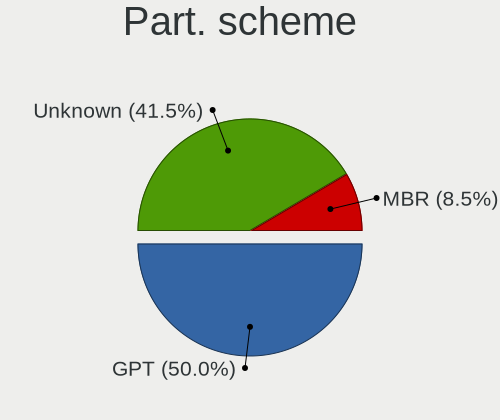
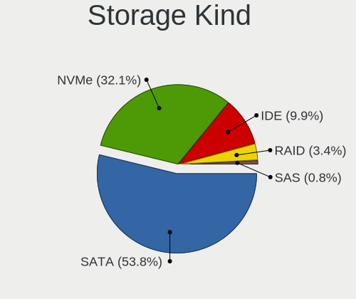
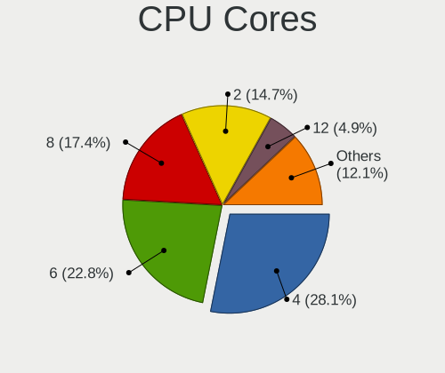
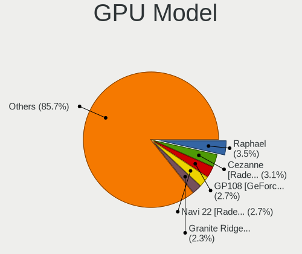
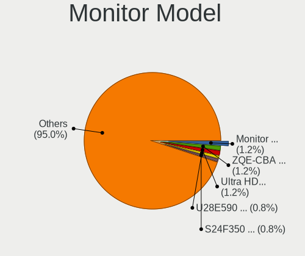
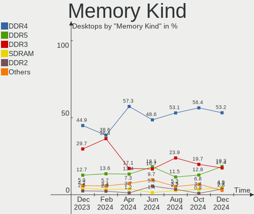
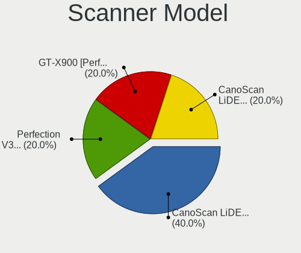

Linux in Germany - Hardware Trends (Desktops)
---------------------------------------------

A project to identify most popular hardware characteristics and track their change
over time based on data collected by Linux users at https://Linux-Hardware.org.

Anyone can contribute to this report by the [hw-probe](https://github.com/linuxhw/hw-probe) tool:

    sudo -E hw-probe -all -upload

Period: Feb, 2023.

Contents
--------

* [ System ](#system)
  - [ OS                       ](#os)
  - [ OS Family                ](#os-family)
  - [ Kernel                   ](#kernel)
  - [ Kernel Family            ](#kernel-family)
  - [ Kernel Major Ver.        ](#kernel-major-ver)
  - [ Arch                     ](#arch)
  - [ DE                       ](#de)
  - [ Display Server           ](#display-server)
  - [ Display Manager          ](#display-manager)
  - [ OS Lang                  ](#os-lang)
  - [ Boot Mode                ](#boot-mode)
  - [ Filesystem               ](#filesystem)
  - [ Part. scheme             ](#part-scheme)
  - [ Dual Boot with Linux/BSD ](#dual-boot-with-linuxbsd)
  - [ Dual Boot (Win)          ](#dual-boot-win)

* [ Board ](#board)
  - [ Vendor                   ](#vendor)
  - [ Model                    ](#model)
  - [ Model Family             ](#model-family)
  - [ MFG Year                 ](#mfg-year)
  - [ Form Factor              ](#form-factor)
  - [ Secure Boot              ](#secure-boot)
  - [ Coreboot                 ](#coreboot)
  - [ RAM Size                 ](#ram-size)
  - [ RAM Used                 ](#ram-used)
  - [ Total Drives             ](#total-drives)
  - [ Has CD-ROM               ](#has-cd-rom)
  - [ Has Ethernet             ](#has-ethernet)
  - [ Has WiFi                 ](#has-wifi)
  - [ Has Bluetooth            ](#has-bluetooth)

* [ Location ](#location)
  - [ Country                  ](#country)
  - [ City                     ](#city)

* [ Drives ](#drives)
  - [ Drive Vendor             ](#drive-vendor)
  - [ Drive Model              ](#drive-model)
  - [ HDD Vendor               ](#hdd-vendor)
  - [ SSD Vendor               ](#ssd-vendor)
  - [ Drive Kind               ](#drive-kind)
  - [ Drive Connector          ](#drive-connector)
  - [ Drive Size               ](#drive-size)
  - [ Space Total              ](#space-total)
  - [ Space Used               ](#space-used)
  - [ Malfunc. Drives          ](#malfunc-drives)
  - [ Malfunc. Drive Vendor    ](#malfunc-drive-vendor)
  - [ Malfunc. HDD Vendor      ](#malfunc-hdd-vendor)
  - [ Malfunc. Drive Kind      ](#malfunc-drive-kind)
  - [ Failed Drives            ](#failed-drives)
  - [ Failed Drive Vendor      ](#failed-drive-vendor)
  - [ Drive Status             ](#drive-status)

* [ Storage controller ](#storage-controller)
  - [ Storage Vendor           ](#storage-vendor)
  - [ Storage Model            ](#storage-model)
  - [ Storage Kind             ](#storage-kind)

* [ Processor ](#processor)
  - [ CPU Vendor               ](#cpu-vendor)
  - [ CPU Model                ](#cpu-model)
  - [ CPU Model Family         ](#cpu-model-family)
  - [ CPU Cores                ](#cpu-cores)
  - [ CPU Sockets              ](#cpu-sockets)
  - [ CPU Threads              ](#cpu-threads)
  - [ CPU Op-Modes             ](#cpu-op-modes)
  - [ CPU Microcode            ](#cpu-microcode)
  - [ CPU Microarch            ](#cpu-microarch)

* [ Graphics ](#graphics)
  - [ GPU Vendor               ](#gpu-vendor)
  - [ GPU Model                ](#gpu-model)
  - [ GPU Combo                ](#gpu-combo)
  - [ GPU Driver               ](#gpu-driver)
  - [ GPU Memory               ](#gpu-memory)

* [ Monitor ](#monitor)
  - [ Monitor Vendor           ](#monitor-vendor)
  - [ Monitor Model            ](#monitor-model)
  - [ Monitor Resolution       ](#monitor-resolution)
  - [ Monitor Diagonal         ](#monitor-diagonal)
  - [ Monitor Width            ](#monitor-width)
  - [ Aspect Ratio             ](#aspect-ratio)
  - [ Monitor Area             ](#monitor-area)
  - [ Pixel Density            ](#pixel-density)
  - [ Multiple Monitors        ](#multiple-monitors)

* [ Network ](#network)
  - [ Net Controller Vendor    ](#net-controller-vendor)
  - [ Net Controller Model     ](#net-controller-model)
  - [ Wireless Vendor          ](#wireless-vendor)
  - [ Wireless Model           ](#wireless-model)
  - [ Ethernet Vendor          ](#ethernet-vendor)
  - [ Ethernet Model           ](#ethernet-model)
  - [ Net Controller Kind      ](#net-controller-kind)
  - [ Used Controller          ](#used-controller)
  - [ NICs                     ](#nics)
  - [ IPv6                     ](#ipv6)

* [ Bluetooth ](#bluetooth)
  - [ Bluetooth Vendor         ](#bluetooth-vendor)
  - [ Bluetooth Model          ](#bluetooth-model)

* [ Sound ](#sound)
  - [ Sound Vendor             ](#sound-vendor)
  - [ Sound Model              ](#sound-model)

* [ Memory ](#memory)
  - [ Memory Vendor            ](#memory-vendor)
  - [ Memory Model             ](#memory-model)
  - [ Memory Kind              ](#memory-kind)
  - [ Memory Form Factor       ](#memory-form-factor)
  - [ Memory Size              ](#memory-size)
  - [ Memory Speed             ](#memory-speed)

* [ Printers & scanners ](#printers--scanners)
  - [ Printer Vendor           ](#printer-vendor)
  - [ Printer Model            ](#printer-model)
  - [ Scanner Vendor           ](#scanner-vendor)
  - [ Scanner Model            ](#scanner-model)

* [ Camera ](#camera)
  - [ Camera Vendor            ](#camera-vendor)
  - [ Camera Model             ](#camera-model)

* [ Security ](#security)
  - [ Fingerprint Vendor       ](#fingerprint-vendor)
  - [ Fingerprint Model        ](#fingerprint-model)
  - [ Chipcard Vendor          ](#chipcard-vendor)
  - [ Chipcard Model           ](#chipcard-model)

* [ Unsupported ](#unsupported)
  - [ Unsupported Devices      ](#unsupported-devices)
  - [ Unsupported Device Types ](#unsupported-device-types)

System
------

OS
--

Installed operating systems

| Name                         | Desktops | Percent |
|------------------------------|----------|---------|
| Ubuntu 22.04                 | 36       | 14.29%  |
| Linux Mint 21.1              | 32       | 12.7%   |
| Ubuntu 22.10                 | 16       | 6.35%   |
| OpenMandriva 23.01           | 15       | 5.95%   |
| Debian 11                    | 14       | 5.56%   |
| Zorin 16                     | 11       | 4.37%   |
| Linux Mint 20.3              | 9        | 3.57%   |
| Arch Rolling                 | 9        | 3.57%   |
| Ubuntu 20.04                 | 8        | 3.17%   |
| Manjaro                      | 8        | 3.17%   |
| Pop!_OS 22.04                | 7        | 2.78%   |
| Fedora 37                    | 7        | 2.78%   |
| openSUSE Tumbleweed-XXXXXXXX | 6        | 2.38%   |
| Xubuntu 22.04                | 5        | 1.98%   |
| OpenMandriva 4.3             | 5        | 1.98%   |
| Ubuntu MATE 22.04            | 4        | 1.59%   |
| KDE neon 22.04               | 4        | 1.59%   |
| Elementary 7                 | 4        | 1.59%   |
| ArcoLinux Rolling            | 4        | 1.59%   |
| Kubuntu 22.04                | 3        | 1.19%   |
| Xubuntu 20.04                | 2        | 0.79%   |
| Manjaro 22.0.4               | 2        | 0.79%   |
| LMDE 5                       | 2        | 0.79%   |
| Linux Mint 20                | 2        | 0.79%   |
| Kubuntu 22.10                | 2        | 0.79%   |
| Gentoo 2.9                   | 2        | 0.79%   |
| Xero Rolling                 | 1        | 0.4%    |
| Ubuntu Unity 23.04           | 1        | 0.4%    |
| Ubuntu Unity 22.10           | 1        | 0.4%    |
| Ubuntu Budgie 22.04          | 1        | 0.4%    |
| Ubuntu Budgie 20.04          | 1        | 0.4%    |
| Ubuntu 21.10                 | 1        | 0.4%    |
| Ubuntu 21.04                 | 1        | 0.4%    |
| Ubuntu 18.04                 | 1        | 0.4%    |
| TUXEDO OS 22.04              | 1        | 0.4%    |
| Slackware 15.0               | 1        | 0.4%    |
| ROSA 12.3                    | 1        | 0.4%    |
| OpenMandriva 23.90           | 1        | 0.4%    |
| OpenMandriva 22.12           | 1        | 0.4%    |
| OpenMandriva 22.11           | 1        | 0.4%    |

OS Family
---------

OS without a version

| Name          | Desktops | Percent |
|---------------|----------|---------|
| Ubuntu        | 63       | 25%     |
| Linux Mint    | 46       | 18.25%  |
| OpenMandriva  | 23       | 9.13%   |
| Debian        | 15       | 5.95%   |
| Manjaro       | 12       | 4.76%   |
| Zorin         | 11       | 4.37%   |
| Arch          | 9        | 3.57%   |
| Xubuntu       | 7        | 2.78%   |
| Pop!_OS       | 7        | 2.78%   |
| Fedora        | 7        | 2.78%   |
| openSUSE      | 6        | 2.38%   |
| Kubuntu       | 6        | 2.38%   |
| Elementary    | 5        | 1.98%   |
| Ubuntu MATE   | 4        | 1.59%   |
| KDE neon      | 4        | 1.59%   |
| ArcoLinux     | 4        | 1.59%   |
| LMDE          | 3        | 1.19%   |
| Ubuntu Unity  | 2        | 0.79%   |
| Ubuntu Budgie | 2        | 0.79%   |
| Lubuntu       | 2        | 0.79%   |
| Gentoo        | 2        | 0.79%   |
| Xero          | 1        | 0.4%    |
| TUXEDO OS     | 1        | 0.4%    |
| Slackware     | 1        | 0.4%    |
| ROSA          | 1        | 0.4%    |
| Nobara        | 1        | 0.4%    |
| MX            | 1        | 0.4%    |
| Mabox         | 1        | 0.4%    |
| Garuda Linux  | 1        | 0.4%    |
| Frugalware    | 1        | 0.4%    |
| Endless       | 1        | 0.4%    |
| ChimeraOS     | 1        | 0.4%    |
| BlackPanther  | 1        | 0.4%    |

Kernel
------

Version of the Linux kernel

| Version                  | Desktops | Percent |
|--------------------------|----------|---------|
| 5.15.0-60-generic        | 49       | 19.44%  |
| 5.15.0-58-generic        | 33       | 13.1%   |
| 5.19.0-32-generic        | 16       | 6.35%   |
| 6.1.1-desktop-1omv2290   | 10       | 3.97%   |
| 5.10.0-21-amd64          | 10       | 3.97%   |
| 5.19.0-31-generic        | 9        | 3.57%   |
| 5.19.0-29-generic        | 8        | 3.17%   |
| 5.4.0-139-generic        | 7        | 2.78%   |
| 6.1.4-desktop-1omv2301   | 5        | 1.98%   |
| 6.0.12-76060006-generic  | 5        | 1.98%   |
| 5.4.0-137-generic        | 4        | 1.59%   |
| 5.16.13-desktop-1omv4003 | 4        | 1.59%   |
| 6.1.9-1-MANJARO          | 3        | 1.19%   |
| 6.1.8-1-default          | 3        | 1.19%   |
| 6.1.12-arch1-1           | 3        | 1.19%   |
| 5.15.94-1-MANJARO        | 3        | 1.19%   |
| 5.15.0-56-generic        | 3        | 1.19%   |
| 5.15.0-43-generic        | 3        | 1.19%   |
| 6.1.9-arch1-1            | 2        | 0.79%   |
| 6.1.12-zen1-1-zen        | 2        | 0.79%   |
| 6.1.12-200.fc37.x86_64   | 2        | 0.79%   |
| 6.1.12-1-default         | 2        | 0.79%   |
| 6.1.11-76060111-generic  | 2        | 0.79%   |
| 6.1.11-1-MANJARO         | 2        | 0.79%   |
| 5.19.0-21-generic        | 2        | 0.79%   |
| 5.15.89-1-MANJARO        | 2        | 0.79%   |
| 5.15.0-57-generic        | 2        | 0.79%   |
| 5.10.0-21-686-pae        | 2        | 0.79%   |
| 6.2.1-arch1-1            | 1        | 0.4%    |
| 6.2.0-rc6                | 1        | 0.4%    |
| 6.1.9-x64v1-xanmod1-1    | 1        | 0.4%    |
| 6.1.9-arch1-2            | 1        | 0.4%    |
| 6.1.8-zen1-1-zen         | 1        | 0.4%    |
| 6.1.8-x64v1-xanmod1-1    | 1        | 0.4%    |
| 6.1.8-arch1-1            | 1        | 0.4%    |
| 6.1.8-200.fc37.x86_64    | 1        | 0.4%    |
| 6.1.7-200.fc37.x86_64    | 1        | 0.4%    |
| 6.1.7                    | 1        | 0.4%    |
| 6.1.5-desktop-1omv2390   | 1        | 0.4%    |
| 6.1.5-200.fc37.x86_64    | 1        | 0.4%    |

Kernel Family
-------------

Linux kernel without a distro release

| Version | Desktops | Percent |
|---------|----------|---------|
| 5.15.0  | 98       | 38.89%  |
| 5.19.0  | 36       | 14.29%  |
| 5.10.0  | 14       | 5.56%   |
| 5.4.0   | 13       | 5.16%   |
| 6.1.12  | 10       | 3.97%   |
| 6.1.1   | 10       | 3.97%   |
| 6.1.9   | 7        | 2.78%   |
| 6.1.8   | 7        | 2.78%   |
| 6.1.11  | 7        | 2.78%   |
| 6.1.4   | 5        | 1.98%   |
| 6.0.12  | 5        | 1.98%   |
| 5.16.13 | 4        | 1.59%   |
| 5.15.94 | 3        | 1.19%   |
| 6.1.7   | 2        | 0.79%   |
| 6.1.5   | 2        | 0.79%   |
| 6.1.10  | 2        | 0.79%   |
| 6.1.0   | 2        | 0.79%   |
| 5.15.91 | 2        | 0.79%   |
| 5.15.89 | 2        | 0.79%   |
| 5.13.0  | 2        | 0.79%   |
| 5.11.0  | 2        | 0.79%   |
| 6.2.1   | 1        | 0.4%    |
| 6.2.0   | 1        | 0.4%    |
| 6.1.14  | 1        | 0.4%    |
| 6.0.19  | 1        | 0.4%    |
| 6.0.10  | 1        | 0.4%    |
| 6.0.0   | 1        | 0.4%    |
| 5.4.228 | 1        | 0.4%    |
| 5.19.17 | 1        | 0.4%    |
| 5.17.1  | 1        | 0.4%    |
| 5.16.7  | 1        | 0.4%    |
| 5.15.92 | 1        | 0.4%    |
| 5.15.88 | 1        | 0.4%    |
| 5.15.85 | 1        | 0.4%    |
| 5.15.75 | 1        | 0.4%    |
| 4.8.0   | 1        | 0.4%    |
| 4.19.0  | 1        | 0.4%    |
| 4.18.16 | 1        | 0.4%    |

Kernel Major Ver.
-----------------

Linux kernel major version

| Version | Desktops | Percent |
|---------|----------|---------|
| 5.15    | 109      | 43.25%  |
| 6.1     | 55       | 21.83%  |
| 5.19    | 37       | 14.68%  |
| 5.4     | 14       | 5.56%   |
| 5.10    | 14       | 5.56%   |
| 6.0     | 8        | 3.17%   |
| 5.16    | 5        | 1.98%   |
| 6.2     | 2        | 0.79%   |
| 5.13    | 2        | 0.79%   |
| 5.11    | 2        | 0.79%   |
| 5.17    | 1        | 0.4%    |
| 4.8     | 1        | 0.4%    |
| 4.19    | 1        | 0.4%    |
| 4.18    | 1        | 0.4%    |

Arch
----

OS architecture (x86_64, i586, etc.)

| Name   | Desktops | Percent |
|--------|----------|---------|
| x86_64 | 249      | 98.81%  |
| i686   | 3        | 1.19%   |

DE
--

Desktop Environment

| Name       | Desktops | Percent |
|------------|----------|---------|
| GNOME      | 89       | 35.32%  |
| KDE5       | 62       | 24.6%   |
| X-Cinnamon | 42       | 16.67%  |
| XFCE       | 21       | 8.33%   |
| Unknown    | 11       | 4.37%   |
| Pantheon   | 5        | 1.98%   |
| MATE       | 5        | 1.98%   |
| LXQt       | 4        | 1.59%   |
| Cinnamon   | 4        | 1.59%   |
| chadwm     | 2        | 0.79%   |
| Budgie     | 2        | 0.79%   |
| xmonad     | 1        | 0.4%    |
| Unity      | 1        | 0.4%    |
| openbox    | 1        | 0.4%    |
| KDE        | 1        | 0.4%    |
| awesome    | 1        | 0.4%    |

Display Server
--------------

X11 or Wayland

| Name    | Desktops | Percent |
|---------|----------|---------|
| X11     | 195      | 77.38%  |
| Wayland | 45       | 17.86%  |
| Tty     | 10       | 3.97%   |
| Unknown | 2        | 0.79%   |

Display Manager
---------------

SDDM, LightDM, etc.

| Name    | Desktops | Percent |
|---------|----------|---------|
| Unknown | 77       | 30.56%  |
| GDM3    | 61       | 24.21%  |
| SDDM    | 54       | 21.43%  |
| LightDM | 52       | 20.63%  |
| GDM     | 6        | 2.38%   |
| SLiM    | 1        | 0.4%    |
| LXDM    | 1        | 0.4%    |

OS Lang
-------

Language

| Lang    | Desktops | Percent |
|---------|----------|---------|
| de_DE   | 204      | 80.95%  |
| en_US   | 36       | 14.29%  |
| Unknown | 4        | 1.59%   |
| C       | 3        | 1.19%   |
| nl_NL   | 1        | 0.4%    |
| en_IE   | 1        | 0.4%    |
| en_GB   | 1        | 0.4%    |
| en_DE   | 1        | 0.4%    |
| de_AT   | 1        | 0.4%    |

Boot Mode
---------

EFI or BIOS

| Mode | Desktops | Percent |
|------|----------|---------|
| BIOS | 132      | 52.38%  |
| EFI  | 120      | 47.62%  |

Filesystem
----------

Type of filesystem

| Type    | Desktops | Percent |
|---------|----------|---------|
| Ext4    | 210      | 83.33%  |
| Btrfs   | 23       | 9.13%   |
| Overlay | 11       | 4.37%   |
| Xfs     | 3        | 1.19%   |
| Zfs     | 2        | 0.79%   |
| XXX4    | 1        | 0.4%    |
| F2fs    | 1        | 0.4%    |
| Ext2    | 1        | 0.4%    |

Part. scheme
------------

Scheme of partitioning

| Type    | Desktops | Percent |
|---------|----------|---------|
| GPT     | 144      | 57.14%  |
| Unknown | 69       | 27.38%  |
| MBR     | 39       | 15.48%  |

Dual Boot with Linux/BSD
------------------------

Hosting more than one Linux/BSD

| Dual boot | Desktops | Percent |
|-----------|----------|---------|
| No        | 193      | 76.59%  |
| Yes       | 59       | 23.41%  |

Dual Boot (Win)
---------------

Hosting Linux and Windows

| Dual boot | Desktops | Percent |
|-----------|----------|---------|
| No        | 168      | 66.67%  |
| Yes       | 84       | 33.33%  |

Board
-----

Vendor
------

Motherboard manufacturer

| Name                                 | Desktops | Percent |
|--------------------------------------|----------|---------|
| ASUSTek Computer                     | 56       | 22.22%  |
| MSI                                  | 40       | 15.87%  |
| Gigabyte Technology                  | 39       | 15.48%  |
| ASRock                               | 31       | 12.3%   |
| Dell                                 | 17       | 6.75%   |
| Hewlett-Packard                      | 15       | 5.95%   |
| Fujitsu                              | 9        | 3.57%   |
| Acer                                 | 8        | 3.17%   |
| Lenovo                               | 7        | 2.78%   |
| Medion                               | 6        | 2.38%   |
| Inventec                             | 6        | 2.38%   |
| Unknown                              | 4        | 1.59%   |
| Biostar                              | 3        | 1.19%   |
| Shuttle                              | 2        | 0.79%   |
| ZOTAC                                | 1        | 0.4%    |
| Shenzhen Meigao Electronic Equipment | 1        | 0.4%    |
| Pegatron                             | 1        | 0.4%    |
| Packard Bell                         | 1        | 0.4%    |
| Hardkernel                           | 1        | 0.4%    |
| Fujitsu Siemens                      | 1        | 0.4%    |
| BESSTAR Tech                         | 1        | 0.4%    |
| ASRockRack                           | 1        | 0.4%    |
| Alienware                            | 1        | 0.4%    |

Model
-----

Motherboard model

| Name                                       | Desktops | Percent |
|--------------------------------------------|----------|---------|
| MSI MS-7C37                                | 7        | 2.78%   |
| Inventec VXC Class                         | 5        | 1.98%   |
| Fujitsu ESPRIMO Q920                       | 4        | 1.59%   |
| Unknown                                    | 4        | 1.59%   |
| MSI MS-7971                                | 3        | 1.19%   |
| ASUS A0000001                              | 3        | 1.19%   |
| ASRock B450M Pro4                          | 3        | 1.19%   |
| ASRock B450 Pro4                           | 3        | 1.19%   |
| MSI MS-7C52                                | 2        | 0.79%   |
| MSI MS-7C02                                | 2        | 0.79%   |
| MSI MS-7B79                                | 2        | 0.79%   |
| MSI MS-7A38                                | 2        | 0.79%   |
| Medion S23003                              | 2        | 0.79%   |
| HP Pavilion Desktop 590-p0xxx              | 2        | 0.79%   |
| Gigabyte Z77X-D3H                          | 2        | 0.79%   |
| Gigabyte GB-BACE-3160                      | 2        | 0.79%   |
| Gigabyte B450M S2H                         | 2        | 0.79%   |
| Dell OptiPlex 790                          | 2        | 0.79%   |
| ASUS TUF X470-PLUS GAMING                  | 2        | 0.79%   |
| ASUS ROG STRIX B550-F GAMING               | 2        | 0.79%   |
| ASUS PRIME A320M-K                         | 2        | 0.79%   |
| ASUS M5A99X EVO                            | 2        | 0.79%   |
| ASUS All Series                            | 2        | 0.79%   |
| ASRock X300M-STX                           | 2        | 0.79%   |
| Acer Aspire M7720                          | 2        | 0.79%   |
| ZOTAC MEK1                                 | 1        | 0.4%    |
| Shuttle SX79R                              | 1        | 0.4%    |
| Shuttle DL10J                              | 1        | 0.4%    |
| Shenzhen Meigao Electronic Equipment UM690 | 1        | 0.4%    |
| Pegatron IPM31G                            | 1        | 0.4%    |
| Packard Bell IXTREME M5800                 | 1        | 0.4%    |
| MSI X5836                                  | 1        | 0.4%    |
| MSI MS-9A65                                | 1        | 0.4%    |
| MSI MS-7D96                                | 1        | 0.4%    |
| MSI MS-7D25                                | 1        | 0.4%    |
| MSI MS-7C94                                | 1        | 0.4%    |
| MSI MS-7C91                                | 1        | 0.4%    |
| MSI MS-7C56                                | 1        | 0.4%    |
| MSI MS-7B85                                | 1        | 0.4%    |
| MSI MS-7B84                                | 1        | 0.4%    |

Model Family
------------

Motherboard model prefix

| Name                  | Desktops | Percent |
|-----------------------|----------|---------|
| ASUS PRIME            | 15       | 5.95%   |
| Dell OptiPlex         | 11       | 4.37%   |
| ASUS ROG              | 10       | 3.97%   |
| Fujitsu ESPRIMO       | 9        | 3.57%   |
| MSI MS-7C37           | 7        | 2.78%   |
| Acer Aspire           | 6        | 2.38%   |
| Inventec VXC          | 5        | 1.98%   |
| HP Pavilion           | 5        | 1.98%   |
| ASUS TUF              | 5        | 1.98%   |
| HP EliteDesk          | 4        | 1.59%   |
| HP Compaq             | 4        | 1.59%   |
| ASRock X570           | 4        | 1.59%   |
| Unknown               | 4        | 1.59%   |
| MSI MS-7971           | 3        | 1.19%   |
| Lenovo ThinkCentre    | 3        | 1.19%   |
| Lenovo IdeaCentre     | 3        | 1.19%   |
| Gigabyte B550         | 3        | 1.19%   |
| Gigabyte B450         | 3        | 1.19%   |
| ASUS A0000001         | 3        | 1.19%   |
| ASRock B450M          | 3        | 1.19%   |
| ASRock B450           | 3        | 1.19%   |
| MSI MS-7C52           | 2        | 0.79%   |
| MSI MS-7C02           | 2        | 0.79%   |
| MSI MS-7B79           | 2        | 0.79%   |
| MSI MS-7A38           | 2        | 0.79%   |
| Medion S23003         | 2        | 0.79%   |
| Medion Akoya          | 2        | 0.79%   |
| Gigabyte Z77X-D3H     | 2        | 0.79%   |
| Gigabyte Z390         | 2        | 0.79%   |
| Gigabyte X570         | 2        | 0.79%   |
| Gigabyte GB-BACE-3160 | 2        | 0.79%   |
| Gigabyte B650M        | 2        | 0.79%   |
| Gigabyte B450M        | 2        | 0.79%   |
| Dell Vostro           | 2        | 0.79%   |
| Dell Precision        | 2        | 0.79%   |
| ASUS M5A99X           | 2        | 0.79%   |
| ASUS M5A97            | 2        | 0.79%   |
| ASUS M5A78L           | 2        | 0.79%   |
| ASUS All              | 2        | 0.79%   |
| ASRock Z77            | 2        | 0.79%   |

MFG Year
--------

Motherboard manufacture year

| Year | Desktops | Percent |
|------|----------|---------|
| 2018 | 44       | 17.46%  |
| 2019 | 27       | 10.71%  |
| 2020 | 21       | 8.33%   |
| 2012 | 18       | 7.14%   |
| 2021 | 17       | 6.75%   |
| 2017 | 17       | 6.75%   |
| 2022 | 15       | 5.95%   |
| 2010 | 15       | 5.95%   |
| 2014 | 14       | 5.56%   |
| 2011 | 13       | 5.16%   |
| 2016 | 10       | 3.97%   |
| 2015 | 10       | 3.97%   |
| 2009 | 10       | 3.97%   |
| 2013 | 9        | 3.57%   |
| 2008 | 7        | 2.78%   |
| 2007 | 3        | 1.19%   |
| 2006 | 1        | 0.4%    |
| 2005 | 1        | 0.4%    |

Form Factor
-----------

Physical design of the computer

| Name    | Desktops | Percent |
|---------|----------|---------|
| Desktop | 252      | 100%    |

Secure Boot
-----------

Enabled or disabled

| State    | Desktops | Percent |
|----------|----------|---------|
| Disabled | 236      | 93.65%  |
| Enabled  | 16       | 6.35%   |

Coreboot
--------

Have coreboot on board

| Used | Desktops | Percent |
|------|----------|---------|
| No   | 252      | 100%    |

RAM Size
--------

Total RAM memory

| Size in GB      | Desktops | Percent |
|-----------------|----------|---------|
| 16.01-24.0      | 68       | 26.98%  |
| 32.01-64.0      | 47       | 18.65%  |
| 8.01-16.0       | 43       | 17.06%  |
| 4.01-8.0        | 37       | 14.68%  |
| 3.01-4.0        | 27       | 10.71%  |
| 24.01-32.0      | 11       | 4.37%   |
| 64.01-256.0     | 9        | 3.57%   |
| 2.01-3.0        | 6        | 2.38%   |
| 1.01-2.0        | 2        | 0.79%   |
| More than 256.0 | 1        | 0.4%    |
| 0.51-1.0        | 1        | 0.4%    |

RAM Used
--------

Used RAM memory

| Used GB    | Desktops | Percent |
|------------|----------|---------|
| 1.01-2.0   | 86       | 34.13%  |
| 2.01-3.0   | 62       | 24.6%   |
| 4.01-8.0   | 44       | 17.46%  |
| 3.01-4.0   | 34       | 13.49%  |
| 0.51-1.0   | 11       | 4.37%   |
| 8.01-16.0  | 7        | 2.78%   |
| 16.01-24.0 | 5        | 1.98%   |
| 32.01-64.0 | 2        | 0.79%   |
| 0.01-0.5   | 1        | 0.4%    |

Total Drives
------------

Number of drives on board

| Drives | Desktops | Percent |
|--------|----------|---------|
| 1      | 89       | 35.32%  |
| 2      | 69       | 27.38%  |
| 3      | 42       | 16.67%  |
| 4      | 24       | 9.52%   |
| 5      | 16       | 6.35%   |
| 6      | 6        | 2.38%   |
| 8      | 2        | 0.79%   |
| 7      | 2        | 0.79%   |
| 0      | 2        | 0.79%   |

Has CD-ROM
----------

Has CD-ROM on board

| Presented | Desktops | Percent |
|-----------|----------|---------|
| Yes       | 133      | 52.78%  |
| No        | 119      | 47.22%  |

Has Ethernet
------------

Has Ethernet on board

| Presented | Desktops | Percent |
|-----------|----------|---------|
| Yes       | 251      | 99.6%   |
| No        | 1        | 0.4%    |

Has WiFi
--------

Has WiFi module

| Presented | Desktops | Percent |
|-----------|----------|---------|
| No        | 151      | 59.92%  |
| Yes       | 101      | 40.08%  |

Has Bluetooth
-------------

Has Bluetooth module

| Presented | Desktops | Percent |
|-----------|----------|---------|
| No        | 165      | 65.48%  |
| Yes       | 87       | 34.52%  |

Location
--------

Country
-------

Geographic location (country)

| Country | Desktops | Percent |
|---------|----------|---------|
| Germany | 252      | 100%    |

City
----

Geographic location (city)

| City                   | Desktops | Percent |
|------------------------|----------|---------|
| Berlin                 | 23       | 9.13%   |
| Hamburg                | 16       | 6.35%   |
| Munich                 | 10       | 3.97%   |
| Hanover                | 6        | 2.38%   |
| Traunstein             | 5        | 1.98%   |
| Stuttgart              | 4        | 1.59%   |
| Düsseldorf            | 4        | 1.59%   |
| Duisburg               | 4        | 1.59%   |
| Leipzig                | 3        | 1.19%   |
| Erfurt                 | 3        | 1.19%   |
| Delligsen              | 3        | 1.19%   |
| Cologne                | 3        | 1.19%   |
| Witten                 | 2        | 0.79%   |
| Wilhelmshaven          | 2        | 0.79%   |
| Wiesbaden              | 2        | 0.79%   |
| Villingen-Schwenningen | 2        | 0.79%   |
| Schwarzenbek           | 2        | 0.79%   |
| Rinteln                | 2        | 0.79%   |
| Mittel-Gruendau        | 2        | 0.79%   |
| Mering                 | 2        | 0.79%   |
| Mannheim               | 2        | 0.79%   |
| Langenfeld             | 2        | 0.79%   |
| Karlsruhe              | 2        | 0.79%   |
| Heidelberg             | 2        | 0.79%   |
| Göttingen             | 2        | 0.79%   |
| Giessen                | 2        | 0.79%   |
| Frankfurt am Main      | 2        | 0.79%   |
| Dortmund               | 2        | 0.79%   |
| Darmstadt              | 2        | 0.79%   |
| Bonn                   | 2        | 0.79%   |
| Bielefeld              | 2        | 0.79%   |
| Bamberg                | 2        | 0.79%   |
| Aachen                 | 2        | 0.79%   |
| Würzburg              | 1        | 0.4%    |
| Worms                  | 1        | 0.4%    |
| Wolfsburg              | 1        | 0.4%    |
| Woerth am Rhein        | 1        | 0.4%    |
| Willich                | 1        | 0.4%    |
| Weiterstadt            | 1        | 0.4%    |
| Weinsberg              | 1        | 0.4%    |

Drives
------

Drive Vendor
------------

Hard drive vendors

| Vendor                      | Desktops | Drives | Percent |
|-----------------------------|----------|--------|---------|
| Samsung Electronics         | 94       | 143    | 19.58%  |
| WDC                         | 67       | 86     | 13.96%  |
| Seagate                     | 58       | 78     | 12.08%  |
| Crucial                     | 37       | 43     | 7.71%   |
| SanDisk                     | 35       | 45     | 7.29%   |
| Toshiba                     | 34       | 36     | 7.08%   |
| Kingston                    | 26       | 27     | 5.42%   |
| Intenso                     | 24       | 26     | 5%      |
| Hitachi                     | 9        | 10     | 1.88%   |
| A-DATA Technology           | 7        | 7      | 1.46%   |
| Verbatim                    | 4        | 5      | 0.83%   |
| Transcend                   | 4        | 4      | 0.83%   |
| Phison Electronics          | 4        | 4      | 0.83%   |
| OCZ                         | 4        | 4      | 0.83%   |
| Intel                       | 4        | 5      | 0.83%   |
| Corsair                     | 4        | 4      | 0.83%   |
| Unknown                     | 3        | 5      | 0.63%   |
| SK hynix                    | 3        | 3      | 0.63%   |
| PNY                         | 3        | 4      | 0.63%   |
| HGST                        | 3        | 3      | 0.63%   |
| Fanxiang                    | 3        | 3      | 0.63%   |
| SPCC                        | 2        | 3      | 0.42%   |
| Silicon Motion              | 2        | 2      | 0.42%   |
| SABRENT                     | 2        | 2      | 0.42%   |
| Phison                      | 2        | 2      | 0.42%   |
| Patriot                     | 2        | 2      | 0.42%   |
| Micron/Crucial Technology   | 2        | 2      | 0.42%   |
| Micron Technology           | 2        | 2      | 0.42%   |
| Maxtor                      | 2        | 2      | 0.42%   |
| Leven                       | 2        | 2      | 0.42%   |
| Kingston Technology Company | 2        | 2      | 0.42%   |
| JMicron Technology          | 2        | 2      | 0.42%   |
| Gigabyte Technology         | 2        | 2      | 0.42%   |
| China                       | 2        | 2      | 0.42%   |
| ADATA Technology            | 2        | 2      | 0.42%   |
| Zheino                      | 1        | 1      | 0.21%   |
| WD MediaMax                 | 1        | 1      | 0.21%   |
| VERICO                      | 1        | 1      | 0.21%   |
| UMIS                        | 1        | 1      | 0.21%   |
| TS1TSSD2                    | 1        | 1      | 0.21%   |

Drive Model
-----------

Hard drive models

| Model                                                | Desktops | Percent |
|------------------------------------------------------|----------|---------|
| Samsung NVMe SSD Controller SM981/PM981/PM983 250GB  | 18       | 3.21%   |
| Toshiba DT01ACA100 1TB                               | 10       | 1.78%   |
| Samsung SSD 850 EVO 250GB                            | 9        | 1.6%    |
| Samsung NVMe SSD Controller PM9A1/PM9A3/980PRO 960GB | 7        | 1.25%   |
| Crucial CT500MX500SSD1 500GB                         | 7        | 1.25%   |
| Samsung SSD 980 1TB                                  | 6        | 1.07%   |
| WDC WD20EZRZ-00Z5HB0 2TB                             | 5        | 0.89%   |
| Seagate ST500DM002-1BD142 500GB                      | 5        | 0.89%   |
| Seagate ST1000DM010-2EP102 1TB                       | 5        | 0.89%   |
| Seagate ST1000DM003-9YN162 1TB                       | 5        | 0.89%   |
| Kingston SNVS500G 500GB                              | 5        | 0.89%   |
| Intenso SSD 120GB                                    | 5        | 0.89%   |
| Toshiba HDWD110 1TB                                  | 4        | 0.71%   |
| Toshiba DT01ACA200 2TB                               | 4        | 0.71%   |
| Toshiba DT01ACA050 500GB                             | 4        | 0.71%   |
| Seagate ST2000DM001-1ER164 2TB                       | 4        | 0.71%   |
| Samsung SSD 980 500GB                                | 4        | 0.71%   |
| Samsung SSD 970 EVO 500GB                            | 4        | 0.71%   |
| Samsung SSD 860 QVO 1TB                              | 4        | 0.71%   |
| Samsung SSD 840 EVO 250GB                            | 4        | 0.71%   |
| Crucial CT240BX500SSD1 240GB                         | 4        | 0.71%   |
| Crucial CT1000MX500SSD1 1TB                          | 4        | 0.71%   |
| Crucial CT1000BX500SSD1 1TB                          | 4        | 0.71%   |
| WDC WD20EZRX-00D8PB0 2TB                             | 3        | 0.53%   |
| WDC WD10EARS-00Y5B1 1TB                              | 3        | 0.53%   |
| SanDisk SDSSDH3 500G                                 | 3        | 0.53%   |
| Samsung SSD 970 EVO Plus 250GB                       | 3        | 0.53%   |
| Samsung SSD 850 EVO 500GB                            | 3        | 0.53%   |
| Samsung NVMe SSD Controller SM961/PM961/SM963 512GB  | 3        | 0.53%   |
| Samsung HD204UI 2TB                                  | 3        | 0.53%   |
| Phison E12 NVMe Controller 1024GB                    | 3        | 0.53%   |
| Kingston SA400S37480G 480GB SSD                      | 3        | 0.53%   |
| Fanxiang S101 128GB SSD                              | 3        | 0.53%   |
| Crucial CT2000BX500SSD1 2TB                          | 3        | 0.53%   |
| A-DATA SU800 256GB SSD                               | 3        | 0.53%   |
| WDC WD60EZAZ-00SF3B0 6TB                             | 2        | 0.36%   |
| WDC WD40EZRZ-00GXCB0 4TB                             | 2        | 0.36%   |
| WDC WD20EARS-00MVWB0 2TB                             | 2        | 0.36%   |
| WDC WD10EZEX-08WN4A0 1TB                             | 2        | 0.36%   |
| WDC WD10EZEX-00BN5A0 1TB                             | 2        | 0.36%   |

HDD Vendor
----------

Hard disk drive vendors

| Vendor              | Desktops | Drives | Percent |
|---------------------|----------|--------|---------|
| WDC                 | 60       | 79     | 32.26%  |
| Seagate             | 57       | 76     | 30.65%  |
| Toshiba             | 30       | 32     | 16.13%  |
| Samsung Electronics | 15       | 18     | 8.06%   |
| Hitachi             | 9        | 10     | 4.84%   |
| Intenso             | 3        | 3      | 1.61%   |
| HGST                | 3        | 3      | 1.61%   |
| Unknown             | 2        | 2      | 1.08%   |
| SABRENT             | 2        | 2      | 1.08%   |
| Maxtor              | 2        | 2      | 1.08%   |
| WD MediaMax         | 1        | 1      | 0.54%   |
| JMicron Technology  | 1        | 1      | 0.54%   |
| China               | 1        | 1      | 0.54%   |

SSD Vendor
----------

Solid state drive vendors

| Vendor              | Desktops | Drives | Percent |
|---------------------|----------|--------|---------|
| Samsung Electronics | 50       | 59     | 25.77%  |
| Crucial             | 32       | 37     | 16.49%  |
| SanDisk             | 26       | 33     | 13.4%   |
| Intenso             | 18       | 19     | 9.28%   |
| Kingston            | 14       | 14     | 7.22%   |
| A-DATA Technology   | 6        | 6      | 3.09%   |
| WDC                 | 5        | 5      | 2.58%   |
| Transcend           | 4        | 4      | 2.06%   |
| OCZ                 | 4        | 4      | 2.06%   |
| Intel               | 3        | 4      | 1.55%   |
| Fanxiang            | 3        | 3      | 1.55%   |
| Verbatim            | 2        | 3      | 1.03%   |
| Toshiba             | 2        | 2      | 1.03%   |
| PNY                 | 2        | 3      | 1.03%   |
| Phison              | 2        | 2      | 1.03%   |
| Patriot             | 2        | 2      | 1.03%   |
| Leven               | 2        | 2      | 1.03%   |
| Corsair             | 2        | 2      | 1.03%   |
| Zheino              | 1        | 1      | 0.52%   |
| VERICO              | 1        | 1      | 0.52%   |
| Team                | 1        | 1      | 0.52%   |
| SPCC                | 1        | 2      | 0.52%   |
| SK hynix            | 1        | 1      | 0.52%   |
| Seagate             | 1        | 1      | 0.52%   |
| Mushkin             | 1        | 1      | 0.52%   |
| Micron Technology   | 1        | 1      | 0.52%   |
| LITEONIT            | 1        | 1      | 0.52%   |
| KingDian            | 1        | 1      | 0.52%   |
| INNOVATION IT       | 1        | 1      | 0.52%   |
| Global              | 1        | 1      | 0.52%   |
| Gigabyte Technology | 1        | 1      | 0.52%   |
| CT500MX5            | 1        | 1      | 0.52%   |
| China               | 1        | 1      | 0.52%   |

Drive Kind
----------

HDD or SSD

| Kind    | Desktops | Drives | Percent |
|---------|----------|--------|---------|
| SSD     | 159      | 220    | 38.13%  |
| HDD     | 142      | 230    | 34.05%  |
| NVMe    | 100      | 128    | 23.98%  |
| Unknown | 16       | 18     | 3.84%   |

Drive Connector
---------------

SATA, SAS, NVMe, etc.

| Type | Desktops | Drives | Percent |
|------|----------|--------|---------|
| SATA | 221      | 444    | 64.62%  |
| NVMe | 100      | 128    | 29.24%  |
| SAS  | 21       | 24     | 6.14%   |

Drive Size
----------

Size of hard drive

| Size in TB | Desktops | Drives | Percent |
|------------|----------|--------|---------|
| 0.01-0.5   | 158      | 217    | 48.17%  |
| 0.51-1.0   | 95       | 125    | 28.96%  |
| 1.01-2.0   | 43       | 64     | 13.11%  |
| 3.01-4.0   | 12       | 15     | 3.66%   |
| 2.01-3.0   | 10       | 13     | 3.05%   |
| 4.01-10.0  | 10       | 16     | 3.05%   |

Space Total
-----------

Amount of disk space available on the file system

| Size in GB     | Desktops | Percent |
|----------------|----------|---------|
| 101-250        | 66       | 26.19%  |
| More than 3000 | 39       | 15.48%  |
| 501-1000       | 39       | 15.48%  |
| 1001-2000      | 35       | 13.89%  |
| 251-500        | 33       | 13.1%   |
| Unknown        | 11       | 4.37%   |
| 2001-3000      | 10       | 3.97%   |
| 51-100         | 10       | 3.97%   |
| 1-20           | 6        | 2.38%   |
| 21-50          | 3        | 1.19%   |

Space Used
----------

Amount of used disk space

| Used GB        | Desktops | Percent |
|----------------|----------|---------|
| 1-20           | 57       | 22.62%  |
| 21-50          | 38       | 15.08%  |
| 101-250        | 33       | 13.1%   |
| 501-1000       | 27       | 10.71%  |
| 51-100         | 26       | 10.32%  |
| 251-500        | 25       | 9.92%   |
| More than 3000 | 18       | 7.14%   |
| Unknown        | 11       | 4.37%   |
| 1001-2000      | 10       | 3.97%   |
| 2001-3000      | 7        | 2.78%   |

Malfunc. Drives
---------------

Drive models with a malfunction

| Model                                 | Desktops | Drives | Percent |
|---------------------------------------|----------|--------|---------|
| WDC WDS240G2G0A-00JH30 240GB SSD      | 1        | 1      | 2.86%   |
| WDC WD5000AAKS-00V1A0 500GB           | 1        | 1      | 2.86%   |
| WDC WD5000AAKS-007AA0 500GB           | 1        | 1      | 2.86%   |
| WDC WD20EARS-00MVWB0 2TB              | 1        | 1      | 2.86%   |
| WDC WD10EZEX-60WN4A1 1TB              | 1        | 1      | 2.86%   |
| WDC WD10EZEX-00BN5A0 1TB              | 1        | 1      | 2.86%   |
| WDC WD10EAVS-00D7B1 1TB               | 1        | 1      | 2.86%   |
| WDC WD10EARS-00Y5B1 1TB               | 1        | 1      | 2.86%   |
| WDC WD10EALX-009BA0 1TB               | 1        | 1      | 2.86%   |
| Toshiba MQ01ABD100 1TB                | 1        | 1      | 2.86%   |
| Toshiba MQ01ABC150 1TB                | 1        | 1      | 2.86%   |
| Toshiba DT01ACA100 1TB                | 1        | 1      | 2.86%   |
| Toshiba DT01ACA050 500GB              | 1        | 1      | 2.86%   |
| Seagate ST3500418AS 500GB             | 1        | 1      | 2.86%   |
| Seagate ST3500413AS 500GB             | 1        | 2      | 2.86%   |
| Seagate ST3320418AS 320GB             | 1        | 1      | 2.86%   |
| Seagate ST3000DM001-1ER166 3TB        | 1        | 2      | 2.86%   |
| Seagate ST2000VX000-9YW164 2TB        | 1        | 1      | 2.86%   |
| Seagate ST2000DM008-2FR102 2TB        | 1        | 2      | 2.86%   |
| Seagate ST2000DL003-9VT166 2TB        | 1        | 1      | 2.86%   |
| Seagate ST1000DM003-9YN162 1TB        | 1        | 1      | 2.86%   |
| Seagate ST1000DL002-9TT153 1TB        | 1        | 1      | 2.86%   |
| SanDisk SSD PLUS 480GB                | 1        | 1      | 2.86%   |
| Samsung Electronics SSD 980 PRO 1TB   | 1        | 2      | 2.86%   |
| Samsung Electronics SSD 980 1TB       | 1        | 1      | 2.86%   |
| Samsung Electronics SSD 970 EVO 500GB | 1        | 1      | 2.86%   |
| Samsung Electronics HM160HI 160GB     | 1        | 1      | 2.86%   |
| Maxtor 90680D4 7GB                    | 1        | 1      | 2.86%   |
| Kingston SV300S37A120G 120GB SSD      | 1        | 1      | 2.86%   |
| Intenso USB 3.0 device 2TB            | 1        | 1      | 2.86%   |
| Intenso TOP M.2 SATA 256GB SSD        | 1        | 1      | 2.86%   |
| Intel SSDSC2KF256H6L 256GB            | 1        | 1      | 2.86%   |
| Intel SSDSC2BF240A4L 240GB            | 1        | 1      | 2.86%   |
| Crucial CT525MX300SSD4 528GB          | 1        | 1      | 2.86%   |
| Crucial CT240M500SSD1 240GB           | 1        | 1      | 2.86%   |

Malfunc. Drive Vendor
---------------------

Vendors of faulty drives

| Vendor              | Desktops | Drives | Percent |
|---------------------|----------|--------|---------|
| WDC                 | 9        | 9      | 25.71%  |
| Seagate             | 9        | 12     | 25.71%  |
| Toshiba             | 4        | 4      | 11.43%  |
| Samsung Electronics | 4        | 5      | 11.43%  |
| Intenso             | 2        | 2      | 5.71%   |
| Intel               | 2        | 2      | 5.71%   |
| Crucial             | 2        | 2      | 5.71%   |
| SanDisk             | 1        | 1      | 2.86%   |
| Maxtor              | 1        | 1      | 2.86%   |
| Kingston            | 1        | 1      | 2.86%   |

Malfunc. HDD Vendor
-------------------

Vendors of faulty HDD drives

| Vendor              | Desktops | Drives | Percent |
|---------------------|----------|--------|---------|
| Seagate             | 9        | 12     | 37.5%   |
| WDC                 | 8        | 8      | 33.33%  |
| Toshiba             | 4        | 4      | 16.67%  |
| Samsung Electronics | 1        | 1      | 4.17%   |
| Maxtor              | 1        | 1      | 4.17%   |
| Intenso             | 1        | 1      | 4.17%   |

Malfunc. Drive Kind
-------------------

Kinds of faulty drives

| Kind | Desktops | Drives | Percent |
|------|----------|--------|---------|
| HDD  | 23       | 27     | 67.65%  |
| SSD  | 8        | 8      | 23.53%  |
| NVMe | 3        | 4      | 8.82%   |

Failed Drives
-------------

Failed drive models

| Model                             | Desktops | Drives | Percent |
|-----------------------------------|----------|--------|---------|
| Samsung Electronics SSD 980 500GB | 1        | 1      | 50%     |
| Samsung Electronics SSD 980 1TB   | 1        | 1      | 50%     |

Failed Drive Vendor
-------------------

Failed drive vendors

| Vendor              | Desktops | Drives | Percent |
|---------------------|----------|--------|---------|
| Samsung Electronics | 2        | 2      | 100%    |

Drive Status
------------

Number of failed and malfunc. drives

| Status   | Desktops | Drives | Percent |
|----------|----------|--------|---------|
| Detected | 133      | 302    | 46.67%  |
| Works    | 117      | 253    | 41.05%  |
| Malfunc  | 33       | 39     | 11.58%  |
| Failed   | 2        | 2      | 0.7%    |

Storage controller
------------------

Storage Vendor
--------------

Storage controller vendors

| Vendor                           | Desktops | Percent |
|----------------------------------|----------|---------|
| Intel                            | 126      | 31.82%  |
| AMD                              | 116      | 29.29%  |
| Samsung Electronics              | 50       | 12.63%  |
| ASMedia Technology               | 19       | 4.8%    |
| Kingston Technology Company      | 14       | 3.54%   |
| SanDisk                          | 12       | 3.03%   |
| Marvell Technology Group         | 10       | 2.53%   |
| Micron/Crucial Technology        | 9        | 2.27%   |
| Phison Electronics               | 8        | 2.02%   |
| JMicron Technology               | 7        | 1.77%   |
| Nvidia                           | 6        | 1.52%   |
| ADATA Technology                 | 3        | 0.76%   |
| Toshiba America Info Systems     | 2        | 0.51%   |
| SK hynix                         | 2        | 0.51%   |
| Silicon Motion                   | 2        | 0.51%   |
| Silicon Image                    | 2        | 0.51%   |
| MAXIO Technology (Hangzhou)      | 2        | 0.51%   |
| Union Memory (Shenzhen)          | 1        | 0.25%   |
| Silicon Integrated Systems [SiS] | 1        | 0.25%   |
| Realtek Semiconductor            | 1        | 0.25%   |
| OCZ Technology Group             | 1        | 0.25%   |
| Micron Technology                | 1        | 0.25%   |
| Adaptec                          | 1        | 0.25%   |

Storage Model
-------------

Storage controller models

| Model                                                                            | Desktops | Percent |
|----------------------------------------------------------------------------------|----------|---------|
| AMD FCH SATA Controller [AHCI mode]                                              | 69       | 14.38%  |
| AMD 400 Series Chipset SATA Controller                                           | 30       | 6.25%   |
| Samsung NVMe SSD Controller SM981/PM981/PM983                                    | 28       | 5.83%   |
| ASMedia ASM1062 Serial ATA Controller                                            | 18       | 3.75%   |
| Intel 8 Series/C220 Series Chipset Family 6-port SATA Controller 1 [AHCI mode]   | 16       | 3.33%   |
| AMD 500 Series Chipset SATA Controller                                           | 16       | 3.33%   |
| Intel 200 Series PCH SATA controller [AHCI mode]                                 | 14       | 2.92%   |
| AMD SB7x0/SB8x0/SB9x0 SATA Controller [AHCI mode]                                | 14       | 2.92%   |
| Samsung NVMe SSD Controller PM9A1/PM9A3/980PRO                                   | 11       | 2.29%   |
| AMD SB7x0/SB8x0/SB9x0 IDE Controller                                             | 11       | 2.29%   |
| Samsung NVMe SSD Controller 980                                                  | 10       | 2.08%   |
| Intel Q170/Q150/B150/H170/H110/Z170/CM236 Chipset SATA Controller [AHCI Mode]    | 10       | 2.08%   |
| Intel 7 Series/C210 Series Chipset Family 6-port SATA Controller [AHCI mode]     | 10       | 2.08%   |
| Kingston Company Company Non-Volatile memory controller                          | 9        | 1.88%   |
| Intel Cannon Lake PCH SATA AHCI Controller                                       | 9        | 1.88%   |
| AMD FCH SATA Controller D                                                        | 8        | 1.67%   |
| Micron/Crucial P2 NVMe PCIe SSD                                                  | 7        | 1.46%   |
| Intel 6 Series/C200 Series Chipset Family 6 port Desktop SATA AHCI Controller    | 7        | 1.46%   |
| AMD SB7x0/SB8x0/SB9x0 SATA Controller [IDE mode]                                 | 7        | 1.46%   |
| Samsung NVMe SSD Controller SM961/PM961/SM963                                    | 6        | 1.25%   |
| Phison E12 NVMe Controller                                                       | 6        | 1.25%   |
| Intel SATA Controller [RAID mode]                                                | 6        | 1.25%   |
| Intel Alder Lake-S PCH SATA Controller [AHCI Mode]                               | 6        | 1.25%   |
| Intel NM10/ICH7 Family SATA Controller [IDE mode]                                | 5        | 1.04%   |
| Intel Celeron/Pentium Silver Processor SATA Controller                           | 5        | 1.04%   |
| Intel Atom/Celeron/Pentium Processor x5-E8000/J3xxx/N3xxx Series SATA Controller | 5        | 1.04%   |
| Intel 9 Series Chipset Family SATA Controller [AHCI Mode]                        | 4        | 0.83%   |
| Intel 5 Series/3400 Series Chipset 6 port SATA AHCI Controller                   | 4        | 0.83%   |
| AMD SATA controller                                                              | 4        | 0.83%   |
| AMD 300 Series Chipset SATA Controller                                           | 4        | 0.83%   |
| SanDisk WD Blue SN550 NVMe SSD                                                   | 3        | 0.63%   |
| SanDisk Non-Volatile memory controller                                           | 3        | 0.63%   |
| Marvell Group 88SE9215 PCIe 2.0 x1 4-port SATA 6 Gb/s Controller                 | 3        | 0.63%   |
| Marvell Group 88SE9172 SATA 6Gb/s Controller                                     | 3        | 0.63%   |
| Kingston Company A2000 NVMe SSD                                                  | 3        | 0.63%   |
| JMicron JMB362 SATA Controller                                                   | 3        | 0.63%   |
| Intel Volume Management Device NVMe RAID Controller                              | 3        | 0.63%   |
| Intel C600/X79 series chipset 6-Port SATA AHCI Controller                        | 3        | 0.63%   |
| Intel 82801JI (ICH10 Family) SATA AHCI Controller                                | 3        | 0.63%   |
| Intel 82801G (ICH7 Family) IDE Controller                                        | 3        | 0.63%   |

Storage Kind
------------

Kind of storage controller (IDE, SATA, NVMe, SAS, ...)

| Kind | Desktops | Percent |
|------|----------|---------|
| SATA | 224      | 59.42%  |
| NVMe | 101      | 26.79%  |
| IDE  | 37       | 9.81%   |
| RAID | 13       | 3.45%   |
| SAS  | 1        | 0.27%   |
| SCSI | 1        | 0.27%   |

Processor
---------

CPU Vendor
----------

Processor vendors

| Vendor | Desktops | Percent |
|--------|----------|---------|
| Intel  | 128      | 50.79%  |
| AMD    | 124      | 49.21%  |

CPU Model
---------

Processor models

| Model                                       | Desktops | Percent |
|---------------------------------------------|----------|---------|
| AMD Ryzen 5 3600 6-Core Processor           | 8        | 3.17%   |
| AMD Ryzen 5 2600 Six-Core Processor         | 7        | 2.78%   |
| AMD Ryzen 7 3700X 8-Core Processor          | 6        | 2.38%   |
| AMD G-T56N Processor                        | 6        | 2.38%   |
| AMD Ryzen 9 5900X 12-Core Processor         | 5        | 1.98%   |
| AMD Ryzen 5 5600G with Radeon Graphics      | 5        | 1.98%   |
| AMD Ryzen 3 2200G with Radeon Vega Graphics | 5        | 1.98%   |
| Intel Core i5-4590T CPU @ 2.00GHz           | 4        | 1.59%   |
| Intel Core i5-2400 CPU @ 3.10GHz            | 4        | 1.59%   |
| AMD Ryzen 7 5700G with Radeon Graphics      | 4        | 1.59%   |
| Intel Core i7-4790K CPU @ 4.00GHz           | 3        | 1.19%   |
| Intel Core i7-4790 CPU @ 3.60GHz            | 3        | 1.19%   |
| Intel Core i7-3770 CPU @ 3.40GHz            | 3        | 1.19%   |
| Intel Core i5-6500 CPU @ 3.20GHz            | 3        | 1.19%   |
| Intel Core i3-8100 CPU @ 3.60GHz            | 3        | 1.19%   |
| AMD Ryzen 7 5800X 8-Core Processor          | 3        | 1.19%   |
| AMD Ryzen 5 5600X 6-Core Processor          | 3        | 1.19%   |
| AMD Ryzen 5 1600 Six-Core Processor         | 3        | 1.19%   |
| Intel Pentium CPU G4560 @ 3.50GHz           | 2        | 0.79%   |
| Intel Core i7-8700 CPU @ 3.20GHz            | 2        | 0.79%   |
| Intel Core i7-7700K CPU @ 4.20GHz           | 2        | 0.79%   |
| Intel Core i7-3770K CPU @ 3.50GHz           | 2        | 0.79%   |
| Intel Core i7 CPU 920 @ 2.67GHz             | 2        | 0.79%   |
| Intel Core i5-7400 CPU @ 3.00GHz            | 2        | 0.79%   |
| Intel Core i5-6400 CPU @ 2.70GHz            | 2        | 0.79%   |
| Intel Core i5-2500 CPU @ 3.30GHz            | 2        | 0.79%   |
| Intel Core i5 CPU 650 @ 3.20GHz             | 2        | 0.79%   |
| Intel Core 2 Quad CPU Q9550 @ 2.83GHz       | 2        | 0.79%   |
| Intel Core 2 Duo CPU E6550 @ 2.33GHz        | 2        | 0.79%   |
| Intel Celeron J4125 CPU @ 2.00GHz           | 2        | 0.79%   |
| Intel Celeron J4105 CPU @ 1.50GHz           | 2        | 0.79%   |
| Intel Celeron CPU J3160 @ 1.60GHz           | 2        | 0.79%   |
| AMD Ryzen 7 5700X 8-Core Processor          | 2        | 0.79%   |
| AMD Ryzen 7 2700X Eight-Core Processor      | 2        | 0.79%   |
| AMD Ryzen 5 7600X 6-Core Processor          | 2        | 0.79%   |
| AMD Ryzen 5 3600X 6-Core Processor          | 2        | 0.79%   |
| AMD Ryzen 5 2600X Six-Core Processor        | 2        | 0.79%   |
| AMD Ryzen 5 2400G with Radeon Vega Graphics | 2        | 0.79%   |
| AMD Phenom II X4 955 Processor              | 2        | 0.79%   |
| AMD FX-4300 Quad-Core Processor             | 2        | 0.79%   |

CPU Model Family
----------------

Processor model prefix

| Model                   | Desktops | Percent |
|-------------------------|----------|---------|
| Intel Core i5           | 40       | 15.87%  |
| AMD Ryzen 5             | 39       | 15.48%  |
| Intel Core i7           | 31       | 12.3%   |
| AMD Ryzen 7             | 23       | 9.13%   |
| Intel Celeron           | 12       | 4.76%   |
| Other                   | 11       | 4.37%   |
| AMD Ryzen 9             | 10       | 3.97%   |
| Intel Core i3           | 9        | 3.57%   |
| AMD FX                  | 9        | 3.57%   |
| AMD Ryzen 3             | 8        | 3.17%   |
| Intel Core 2 Duo        | 6        | 2.38%   |
| AMD G                   | 6        | 2.38%   |
| Intel Pentium           | 5        | 1.98%   |
| AMD Phenom II X4        | 5        | 1.98%   |
| Intel Xeon              | 4        | 1.59%   |
| Intel Core 2 Quad       | 4        | 1.59%   |
| AMD Ryzen 5 PRO         | 3        | 1.19%   |
| AMD A8                  | 3        | 1.19%   |
| Intel Core i9           | 2        | 0.79%   |
| Intel Atom              | 2        | 0.79%   |
| AMD Ryzen 3 PRO         | 2        | 0.79%   |
| AMD Athlon II X2        | 2        | 0.79%   |
| AMD Athlon 64 X2        | 2        | 0.79%   |
| AMD Athlon              | 2        | 0.79%   |
| AMD A10                 | 2        | 0.79%   |
| Intel Pentium Silver    | 1        | 0.4%    |
| Intel Pentium Dual-Core | 1        | 0.4%    |
| Intel Core 2 Extreme    | 1        | 0.4%    |
| Intel Core 2            | 1        | 0.4%    |
| AMD Ryzen Threadripper  | 1        | 0.4%    |
| AMD EPYC                | 1        | 0.4%    |
| AMD Athlon II X4        | 1        | 0.4%    |
| AMD Athlon 64           | 1        | 0.4%    |
| AMD A6                  | 1        | 0.4%    |
| AMD A4                  | 1        | 0.4%    |

CPU Cores
---------

Number of processor cores

| Number | Desktops | Percent |
|--------|----------|---------|
| 4      | 105      | 41.67%  |
| 6      | 53       | 21.03%  |
| 2      | 46       | 18.25%  |
| 8      | 28       | 11.11%  |
| 12     | 9        | 3.57%   |
| 16     | 4        | 1.59%   |
| 1      | 3        | 1.19%   |
| 10     | 2        | 0.79%   |
| 32     | 1        | 0.4%    |
| 3      | 1        | 0.4%    |

CPU Sockets
-----------

Number of sockets

| Number | Desktops | Percent |
|--------|----------|---------|
| 1      | 251      | 99.6%   |
| 2      | 1        | 0.4%    |

CPU Threads
-----------

Threads per core (Hyper-Threading)

| Number | Desktops | Percent |
|--------|----------|---------|
| 2      | 150      | 59.52%  |
| 1      | 102      | 40.48%  |

CPU Op-Modes
------------

CPU Operation Modes (32-bit, 64-bit)

| Op mode        | Desktops | Percent |
|----------------|----------|---------|
| 32-bit, 64-bit | 252      | 100%    |

CPU Microcode
-------------

Microcode number

| Number     | Desktops | Percent |
|------------|----------|---------|
| Unknown    | 69       | 27.38%  |
| 0x306c3    | 14       | 5.56%   |
| 0x08701021 | 12       | 4.76%   |
| 0x206a7    | 10       | 3.97%   |
| 0x0800820d | 10       | 3.97%   |
| 0x506e3    | 8        | 3.17%   |
| 0x306a9    | 8        | 3.17%   |
| 0x906ea    | 6        | 2.38%   |
| 0x1067a    | 6        | 2.38%   |
| 0x906e9    | 4        | 1.59%   |
| 0x6fb      | 4        | 1.59%   |
| 0x0a20120a | 4        | 1.59%   |
| 0x08701013 | 4        | 1.59%   |
| 0x08101016 | 4        | 1.59%   |
| 0x08001138 | 4        | 1.59%   |
| 0x05000029 | 4        | 1.59%   |
| 0x010000db | 4        | 1.59%   |
| 0xa0655    | 3        | 1.19%   |
| 0x906eb    | 3        | 1.19%   |
| 0x90675    | 3        | 1.19%   |
| 0x90672    | 3        | 1.19%   |
| 0x706a1    | 3        | 1.19%   |
| 0x406c4    | 3        | 1.19%   |
| 0x0a50000d | 3        | 1.19%   |
| 0x0a50000c | 3        | 1.19%   |
| 0x906ed    | 2        | 0.79%   |
| 0x406c3    | 2        | 0.79%   |
| 0x20652    | 2        | 0.79%   |
| 0x106a4    | 2        | 0.79%   |
| 0x0a601203 | 2        | 0.79%   |
| 0x0a201016 | 2        | 0.79%   |
| 0x08600106 | 2        | 0.79%   |
| 0x0810100b | 2        | 0.79%   |
| 0x0700010f | 2        | 0.79%   |
| 0x06006705 | 2        | 0.79%   |
| 0x06000852 | 2        | 0.79%   |
| 0x0600063e | 2        | 0.79%   |
| 0x05000119 | 2        | 0.79%   |
| 0x010000c8 | 2        | 0.79%   |
| 0xa0671    | 1        | 0.4%    |

CPU Microarch
-------------

Microarchitecture

| Name             | Desktops | Percent |
|------------------|----------|---------|
| Zen 2            | 26       | 10.32%  |
| Zen 3            | 25       | 9.92%   |
| KabyLake         | 22       | 8.73%   |
| Haswell          | 21       | 8.33%   |
| Zen+             | 17       | 6.75%   |
| Zen              | 15       | 5.95%   |
| SandyBridge      | 14       | 5.56%   |
| Skylake          | 12       | 4.76%   |
| IvyBridge        | 12       | 4.76%   |
| Piledriver       | 8        | 3.17%   |
| Penryn           | 8        | 3.17%   |
| K10              | 8        | 3.17%   |
| Unknown          | 8        | 3.17%   |
| Silvermont       | 7        | 2.78%   |
| Core             | 6        | 2.38%   |
| Bobcat           | 6        | 2.38%   |
| Goldmont plus    | 5        | 1.98%   |
| Excavator        | 5        | 1.98%   |
| Alderlake Hybrid | 5        | 1.98%   |
| Nehalem          | 4        | 1.59%   |
| Bulldozer        | 4        | 1.59%   |
| K8 Hammer        | 3        | 1.19%   |
| CometLake        | 3        | 1.19%   |
| Westmere         | 2        | 0.79%   |
| Jaguar           | 2        | 0.79%   |
| Bonnell          | 2        | 0.79%   |
| Tremont          | 1        | 0.4%    |
| Icelake          | 1        | 0.4%    |

Graphics
--------

GPU Vendor
----------

Vendors of graphics cards

| Vendor                           | Desktops | Percent |
|----------------------------------|----------|---------|
| Nvidia                           | 97       | 36.6%   |
| AMD                              | 87       | 32.83%  |
| Intel                            | 78       | 29.43%  |
| ASPEED Technology                | 2        | 0.75%   |
| Silicon Integrated Systems [SiS] | 1        | 0.38%   |

GPU Model
---------

Graphics card models

| Model                                                                                    | Desktops | Percent |
|------------------------------------------------------------------------------------------|----------|---------|
| AMD Ellesmere [Radeon RX 470/480/570/570X/580/580X/590]                                  | 13       | 4.8%    |
| Intel Xeon E3-1200 v3/4th Gen Core Processor Integrated Graphics Controller              | 11       | 4.06%   |
| Intel 2nd Generation Core Processor Family Integrated Graphics Controller                | 8        | 2.95%   |
| Intel CoffeeLake-S GT2 [UHD Graphics 630]                                                | 7        | 2.58%   |
| AMD Cezanne [Radeon Vega Series / Radeon Vega Mobile Series]                             | 7        | 2.58%   |
| Nvidia GP108 [GeForce GT 1030]                                                           | 6        | 2.21%   |
| Nvidia GP107 [GeForce GTX 1050 Ti]                                                       | 6        | 2.21%   |
| Nvidia GM107 [GeForce GTX 750 Ti]                                                        | 6        | 2.21%   |
| AMD Raven Ridge [Radeon Vega Series / Radeon Vega Mobile Series]                         | 6        | 2.21%   |
| AMD Navi 22 [Radeon RX 6700/6700 XT/6750 XT / 6800M/6850M XT]                            | 6        | 2.21%   |
| Nvidia GM206 [GeForce GTX 960]                                                           | 5        | 1.85%   |
| Nvidia GK208B [GeForce GT 730]                                                           | 5        | 1.85%   |
| Intel Xeon E3-1200 v2/3rd Gen Core processor Graphics Controller                         | 5        | 1.85%   |
| Intel HD Graphics 530                                                                    | 5        | 1.85%   |
| Intel GeminiLake [UHD Graphics 600]                                                      | 5        | 1.85%   |
| Intel Atom/Celeron/Pentium Processor x5-E8000/J3xxx/N3xxx Integrated Graphics Controller | 5        | 1.85%   |
| Nvidia TU117 [GeForce GTX 1650]                                                          | 4        | 1.48%   |
| Nvidia GP107 [GeForce GTX 1050]                                                          | 4        | 1.48%   |
| Nvidia GP106 [GeForce GTX 1060 6GB]                                                      | 4        | 1.48%   |
| Nvidia GK208B [GeForce GT 710]                                                           | 4        | 1.48%   |
| Intel IvyBridge GT2 [HD Graphics 4000]                                                   | 4        | 1.48%   |
| Intel 4 Series Chipset Integrated Graphics Controller                                    | 4        | 1.48%   |
| AMD Wrestler [Radeon HD 6310]                                                            | 4        | 1.48%   |
| AMD Lexa PRO [Radeon 540/540X/550/550X / RX 540X/550/550X]                               | 4        | 1.48%   |
| Nvidia TU116 [GeForce GTX 1650 SUPER]                                                    | 3        | 1.11%   |
| Nvidia GT218 [GeForce 210]                                                               | 3        | 1.11%   |
| Nvidia GP104 [GeForce GTX 1080]                                                          | 3        | 1.11%   |
| Nvidia GM204 [GeForce GTX 970]                                                           | 3        | 1.11%   |
| Intel HD Graphics 630                                                                    | 3        | 1.11%   |
| Intel AlderLake-S GT1                                                                    | 3        | 1.11%   |
| AMD Renoir                                                                               | 3        | 1.11%   |
| AMD Picasso/Raven 2 [Radeon Vega Series / Radeon Vega Mobile Series]                     | 3        | 1.11%   |
| AMD Navi 31 [Radeon RX 7900 XT/7900 XTX]                                                 | 3        | 1.11%   |
| AMD Navi 10 [Radeon RX 5600 OEM/5600 XT / 5700/5700 XT]                                  | 3        | 1.11%   |
| AMD Caicos [Radeon HD 6450/7450/8450 / R5 230 OEM]                                       | 3        | 1.11%   |
| AMD Baffin [Radeon RX 460/560D / Pro 450/455/460/555/555X/560/560X]                      | 3        | 1.11%   |
| Nvidia GP106 [GeForce GTX 1060 3GB]                                                      | 2        | 0.74%   |
| Nvidia GM206 [GeForce GTX 950]                                                           | 2        | 0.74%   |
| Nvidia GF108 [GeForce GT 730]                                                            | 2        | 0.74%   |
| Nvidia GA102 [GeForce RTX 3080]                                                          | 2        | 0.74%   |

GPU Combo
---------

Combinations of graphics cards

| Name           | Desktops | Percent |
|----------------|----------|---------|
| 1 x Nvidia     | 91       | 36.11%  |
| 1 x AMD        | 77       | 30.56%  |
| 1 x Intel      | 69       | 27.38%  |
| 2 x AMD        | 5        | 1.98%   |
| AMD + Nvidia   | 4        | 1.59%   |
| Intel + Nvidia | 2        | 0.79%   |
| 1 x ASPEED     | 2        | 0.79%   |
| 1 x SiS        | 1        | 0.4%    |
| Intel + AMD    | 1        | 0.4%    |

GPU Driver
----------

Free vs proprietary

| Driver      | Desktops | Percent |
|-------------|----------|---------|
| Free        | 178      | 70.63%  |
| Proprietary | 66       | 26.19%  |
| Unknown     | 8        | 3.17%   |

GPU Memory
----------

Total video memory

| Size in GB | Desktops | Percent |
|------------|----------|---------|
| Unknown    | 132      | 52.38%  |
| 1.01-2.0   | 28       | 11.11%  |
| 3.01-4.0   | 23       | 9.13%   |
| 7.01-8.0   | 18       | 7.14%   |
| 0.51-1.0   | 17       | 6.75%   |
| 0.01-0.5   | 17       | 6.75%   |
| 8.01-16.0  | 9        | 3.57%   |
| 5.01-6.0   | 3        | 1.19%   |
| 16.01-24.0 | 3        | 1.19%   |
| 2.01-3.0   | 2        | 0.79%   |

Monitor
-------

Monitor Vendor
--------------

Monitor vendors

| Vendor                  | Desktops | Percent |
|-------------------------|----------|---------|
| Samsung Electronics     | 48       | 18.05%  |
| Acer                    | 27       | 10.15%  |
| Goldstar                | 26       | 9.77%   |
| BenQ                    | 24       | 9.02%   |
| Dell                    | 19       | 7.14%   |
| Ancor Communications    | 16       | 6.02%   |
| Philips                 | 9        | 3.38%   |
| Hewlett-Packard         | 9        | 3.38%   |
| AOC                     | 8        | 3.01%   |
| Lenovo                  | 7        | 2.63%   |
| Iiyama                  | 7        | 2.63%   |
| LG Electronics          | 6        | 2.26%   |
| Fujitsu Siemens         | 6        | 2.26%   |
| Eizo                    | 6        | 2.26%   |
| ASUSTek Computer        | 6        | 2.26%   |
| Compal                  | 5        | 1.88%   |
| ViewSonic               | 3        | 1.13%   |
| Medion                  | 3        | 1.13%   |
| Jean                    | 3        | 1.13%   |
| HannStar                | 3        | 1.13%   |
| Idek Iiyama             | 2        | 0.75%   |
| Gigabyte Technology     | 2        | 0.75%   |
| Vestel Elektronik       | 1        | 0.38%   |
| Unknown                 | 1        | 0.38%   |
| Toshiba                 | 1        | 0.38%   |
| Sharp                   | 1        | 0.38%   |
| S2-Tek                  | 1        | 0.38%   |
| Panasonic               | 1        | 0.38%   |
| Packard Bell            | 1        | 0.38%   |
| Medion Akoya            | 1        | 0.38%   |
| LKV                     | 1        | 0.38%   |
| LG Display              | 1        | 0.38%   |
| HUAWEI                  | 1        | 0.38%   |
| HPN                     | 1        | 0.38%   |
| HKC                     | 1        | 0.38%   |
| Hitachi                 | 1        | 0.38%   |
| Grundig                 | 1        | 0.38%   |
| eMachines               | 1        | 0.38%   |
| Compaq Computer         | 1        | 0.38%   |
| Chi Mei Optoelectronics | 1        | 0.38%   |

Monitor Model
-------------

Monitor models

| Model                                                                   | Desktops | Percent |
|-------------------------------------------------------------------------|----------|---------|
| BenQ EW3270U BNQ7950 3840x2160 698x393mm 31.5-inch                      | 4        | 1.42%   |
| Jean JT229x6-4 JEN51C6 1680x1050 474x297mm 22.0-inch                    | 3        | 1.07%   |
| Goldstar HDR 4K GSM7707 3840x2160 600x340mm 27.2-inch                   | 3        | 1.07%   |
| Samsung Electronics S24D330 SAM0D92 1920x1080 531x299mm 24.0-inch       | 2        | 0.71%   |
| LG Electronics LCD Monitor LG Ultra HD 3840x2160                        | 2        | 0.71%   |
| Goldstar ULTRAWIDE GSM59F1 2560x1080 798x334mm 34.1-inch                | 2        | 0.71%   |
| Goldstar E2240 GSM57A4 1920x1080 477x268mm 21.5-inch                    | 2        | 0.71%   |
| Compal TERRA 2446W WOR2446 1920x1080 527x296mm 23.8-inch                | 2        | 0.71%   |
| BenQ GW2270 BNQ78DB 1920x1080 476x268mm 21.5-inch                       | 2        | 0.71%   |
| BenQ GL2580 BNQ78E5 1920x1080 544x303mm 24.5-inch                       | 2        | 0.71%   |
| BenQ GL2460 BNQ78CE 1920x1080 531x299mm 24.0-inch                       | 2        | 0.71%   |
| BenQ FP93GX BNQ76D5 1280x1024 376x301mm 19.0-inch                       | 2        | 0.71%   |
| ASUSTek Computer PB278QV AUS278A 2560x1440 597x336mm 27.0-inch          | 2        | 0.71%   |
| Ancor Communications ASUS VS247 ACI249A 1920x1080 521x293mm 23.5-inch   | 2        | 0.71%   |
| Acer S242HL ACR0216 1920x1080 531x299mm 24.0-inch                       | 2        | 0.71%   |
| Acer K272HUL ACR03DD 2560x1440 597x336mm 27.0-inch                      | 2        | 0.71%   |
| Acer G225HQV ACR0234 1920x1080 477x268mm 21.5-inch                      | 2        | 0.71%   |
| ViewSonic VX3276-QHD VSCE635 2560x1440 698x393mm 31.5-inch              | 1        | 0.36%   |
| ViewSonic VX3258 series VSCDE35 2560x1440 700x390mm 31.5-inch           | 1        | 0.36%   |
| ViewSonic VA2216w-2 VSC2920 1680x1050 495x291mm 22.6-inch               | 1        | 0.36%   |
| Vestel Elektronik 42 FHD_LCD-TV VES3700 1920x540                        | 1        | 0.36%   |
| Unknown LCD Monitor FFFF 2288x1287 2550x2550mm 142.0-inch               | 1        | 0.36%   |
| Toshiba TV TSB0106 1920x540 708x398mm 32.0-inch                         | 1        | 0.36%   |
| Sharp HDMI SHP1048 1920x1080 820x460mm 37.0-inch                        | 1        | 0.36%   |
| Samsung Electronics U32J59x SAM0F35 3840x2160 697x392mm 31.5-inch       | 1        | 0.36%   |
| Samsung Electronics U28E590 SAM0C4D 3840x2160 607x345mm 27.5-inch       | 1        | 0.36%   |
| Samsung Electronics U28E590 SAM0C4C 3840x2160 608x345mm 27.5-inch       | 1        | 0.36%   |
| Samsung Electronics T24B301 SAM098E 1920x1080 521x293mm 23.5-inch       | 1        | 0.36%   |
| Samsung Electronics SyncMaster SAM05CB 1920x1080 530x300mm 24.0-inch    | 1        | 0.36%   |
| Samsung Electronics SyncMaster SAM0593 1920x1080 477x268mm 21.5-inch    | 1        | 0.36%   |
| Samsung Electronics SyncMaster SAM0428 1680x1050 459x296mm 21.5-inch    | 1        | 0.36%   |
| Samsung Electronics SyncMaster SAM03E4 1680x1050 474x296mm 22.0-inch    | 1        | 0.36%   |
| Samsung Electronics SyncMaster SAM030F 1680x1050 474x296mm 22.0-inch    | 1        | 0.36%   |
| Samsung Electronics SyncMaster SAM021C 1400x1050 408x300mm 19.9-inch    | 1        | 0.36%   |
| Samsung Electronics SyncMaster SAM01DE 1280x1024 376x301mm 19.0-inch    | 1        | 0.36%   |
| Samsung Electronics SyncMaster SAM01AE 1600x1200 408x306mm 20.1-inch    | 1        | 0.36%   |
| Samsung Electronics SyncMaster SAM0020 1280x1024 338x270mm 17.0-inch    | 1        | 0.36%   |
| Samsung Electronics SMS24A450/460 SAM0837 1920x1080 531x299mm 24.0-inch | 1        | 0.36%   |
| Samsung Electronics SME1920N SAM06A3 1366x768 410x230mm 18.5-inch       | 1        | 0.36%   |
| Samsung Electronics SMBX2331 SAM076F 1920x1080 509x286mm 23.0-inch      | 1        | 0.36%   |

Monitor Resolution
------------------

Monitor screen resolution

| Resolution         | Desktops | Percent |
|--------------------|----------|---------|
| 1920x1080 (FHD)    | 115      | 43.89%  |
| 3840x2160 (4K)     | 31       | 11.83%  |
| 2560x1440 (QHD)    | 29       | 11.07%  |
| 1680x1050 (WSXGA+) | 18       | 6.87%   |
| 1280x1024 (SXGA)   | 14       | 5.34%   |
| 1920x1200 (WUXGA)  | 12       | 4.58%   |
| Unknown            | 9        | 3.44%   |
| 3840x1080          | 8        | 3.05%   |
| 3440x1440          | 8        | 3.05%   |
| 1366x768 (WXGA)    | 4        | 1.53%   |
| 1440x900 (WXGA+)   | 3        | 1.15%   |
| 2560x1080          | 2        | 0.76%   |
| 1600x900 (HD+)     | 2        | 0.76%   |
| 5760x1080          | 1        | 0.38%   |
| 4480x1440          | 1        | 0.38%   |
| 3600x1080          | 1        | 0.38%   |
| 2288x1287          | 1        | 0.38%   |
| 1920x540           | 1        | 0.38%   |
| 1600x1200          | 1        | 0.38%   |
| 1400x1050          | 1        | 0.38%   |

Monitor Diagonal
----------------

Diagonal size in inches

| Inches  | Desktops | Percent |
|---------|----------|---------|
| 27      | 55       | 21.32%  |
| 24      | 43       | 16.67%  |
| 23      | 32       | 12.4%   |
| Unknown | 23       | 8.91%   |
| 21      | 21       | 8.14%   |
| 31      | 15       | 5.81%   |
| 22      | 15       | 5.81%   |
| 19      | 15       | 5.81%   |
| 34      | 8        | 3.1%    |
| 20      | 5        | 1.94%   |
| 84      | 3        | 1.16%   |
| 48      | 3        | 1.16%   |
| 54      | 2        | 0.78%   |
| 18      | 2        | 0.78%   |
| 17      | 2        | 0.78%   |
| 142     | 1        | 0.39%   |
| 72      | 1        | 0.39%   |
| 60      | 1        | 0.39%   |
| 52      | 1        | 0.39%   |
| 47      | 1        | 0.39%   |
| 42      | 1        | 0.39%   |
| 40      | 1        | 0.39%   |
| 38      | 1        | 0.39%   |
| 35      | 1        | 0.39%   |
| 33      | 1        | 0.39%   |
| 26      | 1        | 0.39%   |
| 25      | 1        | 0.39%   |
| 16      | 1        | 0.39%   |
| 15      | 1        | 0.39%   |

Monitor Width
-------------

Physical width

| Width in mm    | Desktops | Percent |
|----------------|----------|---------|
| 501-600        | 118      | 47.01%  |
| 401-500        | 47       | 18.73%  |
| Unknown        | 23       | 9.16%   |
| 601-700        | 21       | 8.37%   |
| 351-400        | 12       | 4.78%   |
| 701-800        | 9        | 3.59%   |
| 1001-1500      | 8        | 3.19%   |
| 301-350        | 4        | 1.59%   |
| 1501-2000      | 4        | 1.59%   |
| 801-900        | 3        | 1.2%    |
| More than 2000 | 1        | 0.4%    |
| 901-1000       | 1        | 0.4%    |

Aspect Ratio
------------

Proportional relationship between the width and the height

| Ratio   | Desktops | Percent |
|---------|----------|---------|
| 16/9    | 159      | 64.63%  |
| 16/10   | 32       | 13.01%  |
| Unknown | 23       | 9.35%   |
| 5/4     | 14       | 5.69%   |
| 21/9    | 9        | 3.66%   |
| 4/3     | 4        | 1.63%   |
| 32/9    | 3        | 1.22%   |
| 3/2     | 1        | 0.41%   |
| 1.00    | 1        | 0.41%   |

Monitor Area
------------

Area in inch²

| Area in inch² | Desktops | Percent |
|----------------|----------|---------|
| 201-250        | 82       | 32.28%  |
| 301-350        | 56       | 22.05%  |
| 151-200        | 27       | 10.63%  |
| 351-500        | 25       | 9.84%   |
| Unknown        | 23       | 9.06%   |
| 251-300        | 19       | 7.48%   |
| More than 1000 | 9        | 3.54%   |
| 501-1000       | 7        | 2.76%   |
| 141-150        | 4        | 1.57%   |
| 131-140        | 1        | 0.39%   |
| 101-110        | 1        | 0.39%   |

Pixel Density
-------------

Pixels per inch

| Density | Desktops | Percent |
|---------|----------|---------|
| 51-100  | 147      | 60%     |
| 101-120 | 46       | 18.78%  |
| Unknown | 23       | 9.39%   |
| 121-160 | 13       | 5.31%   |
| 1-50    | 8        | 3.27%   |
| 161-240 | 8        | 3.27%   |

Multiple Monitors
-----------------

Total monitors connected

| Total | Desktops | Percent |
|-------|----------|---------|
| 1     | 184      | 73.02%  |
| 2     | 47       | 18.65%  |
| 0     | 16       | 6.35%   |
| 3     | 4        | 1.59%   |
| 4     | 1        | 0.4%    |

Network
-------

Net Controller Vendor
---------------------

Controller vendors

| Vendor                                | Desktops | Percent |
|---------------------------------------|----------|---------|
| Realtek Semiconductor                 | 149      | 44.74%  |
| Intel                                 | 110      | 33.03%  |
| Qualcomm Atheros                      | 15       | 4.5%    |
| Broadcom                              | 8        | 2.4%    |
| Ralink Technology                     | 7        | 2.1%    |
| MediaTek                              | 6        | 1.8%    |
| Nvidia                                | 5        | 1.5%    |
| TP-Link                               | 4        | 1.2%    |
| Microsoft                             | 3        | 0.9%    |
| Samsung Electronics                   | 2        | 0.6%    |
| Ralink                                | 2        | 0.6%    |
| Marvell Technology Group              | 2        | 0.6%    |
| D-Link                                | 2        | 0.6%    |
| Aquantia                              | 2        | 0.6%    |
| American Megatrends                   | 2        | 0.6%    |
| ZyXEL Communications                  | 1        | 0.3%    |
| Tehuti Networks                       | 1        | 0.3%    |
| Qualcomm Atheros Communications       | 1        | 0.3%    |
| Microchip Technology                  | 1        | 0.3%    |
| Emulex                                | 1        | 0.3%    |
| D-Link System                         | 1        | 0.3%    |
| CyberTAN Technology                   | 1        | 0.3%    |
| Broadcom Limited                      | 1        | 0.3%    |
| Bose                                  | 1        | 0.3%    |
| AVM                                   | 1        | 0.3%    |
| ASIX Electronics                      | 1        | 0.3%    |
| Accton Technology                     | 1        | 0.3%    |
| 802.11g Adapter [Linksys WUSB54GC v3] | 1        | 0.3%    |
| 3Com                                  | 1        | 0.3%    |

Net Controller Model
--------------------

Controller models

| Model                                                             | Desktops | Percent |
|-------------------------------------------------------------------|----------|---------|
| Realtek RTL8111/8168/8411 PCI Express Gigabit Ethernet Controller | 128      | 33.51%  |
| Intel I211 Gigabit Network Connection                             | 20       | 5.24%   |
| Realtek RTL8125 2.5GbE Controller                                 | 11       | 2.88%   |
| Intel Wi-Fi 6 AX200                                               | 11       | 2.88%   |
| Intel Ethernet Controller I225-V                                  | 10       | 2.62%   |
| Intel 82579LM Gigabit Network Connection (Lewisville)             | 10       | 2.62%   |
| Intel Ethernet Connection (2) I219-V                              | 9        | 2.36%   |
| Intel Ethernet Connection I217-LM                                 | 8        | 2.09%   |
| Intel Dual Band Wireless-AC 3168NGW [Stone Peak]                  | 8        | 2.09%   |
| Intel Wireless-AC 9260                                            | 7        | 1.83%   |
| Realtek RTL8821CE 802.11ac PCIe Wireless Network Adapter          | 6        | 1.57%   |
| Realtek RTL8192CE PCIe Wireless Network Adapter                   | 5        | 1.31%   |
| Realtek RTL8153 Gigabit Ethernet Adapter                          | 5        | 1.31%   |
| Intel Wireless 3165                                               | 4        | 1.05%   |
| Intel Ethernet Connection (7) I219-V                              | 4        | 1.05%   |
| Intel 82579V Gigabit Network Connection                           | 4        | 1.05%   |
| Realtek RTL88x2bu [AC1200 Techkey]                                | 3        | 0.79%   |
| Realtek RTL8188EUS 802.11n Wireless Network Adapter               | 3        | 0.79%   |
| Realtek Killer E3000 2.5GbE Controller                            | 3        | 0.79%   |
| Qualcomm Atheros QCA9377 802.11ac Wireless Network Adapter        | 3        | 0.79%   |
| MediaTek MT7922 802.11ax PCI Express Wireless Network Adapter     | 3        | 0.79%   |
| Intel I210 Gigabit Network Connection                             | 3        | 0.79%   |
| Intel Ethernet Connection (17) I219-V                             | 3        | 0.79%   |
| Broadcom NetLink BCM57781 Gigabit Ethernet PCIe                   | 3        | 0.79%   |
| Samsung Galaxy series, misc. (tethering mode)                     | 2        | 0.52%   |
| Realtek RTL8723BE PCIe Wireless Network Adapter                   | 2        | 0.52%   |
| Realtek 802.11ac NIC                                              | 2        | 0.52%   |
| Ralink RT5370 Wireless Adapter                                    | 2        | 0.52%   |
| Ralink MT7610U ("Archer T2U" 2.4G+5G WLAN Adapter                 | 2        | 0.52%   |
| Qualcomm Atheros Killer E220x Gigabit Ethernet Controller         | 2        | 0.52%   |
| Qualcomm Atheros AR8161 Gigabit Ethernet                          | 2        | 0.52%   |
| Qualcomm Atheros AR8151 v2.0 Gigabit Ethernet                     | 2        | 0.52%   |
| Qualcomm Atheros AR8121/AR8113/AR8114 Gigabit or Fast Ethernet    | 2        | 0.52%   |
| Microsoft Xbox 360 Wireless Adapter                               | 2        | 0.52%   |
| Marvell Group 88E8001 Gigabit Ethernet Controller                 | 2        | 0.52%   |
| Intel Wireless 3160                                               | 2        | 0.52%   |
| Intel Wi-Fi 6 AX210/AX211/AX411 160MHz                            | 2        | 0.52%   |
| Intel I350 Gigabit Network Connection                             | 2        | 0.52%   |
| Intel Ethernet Connection I217-V                                  | 2        | 0.52%   |
| Intel Ethernet Connection (7) I219-LM                             | 2        | 0.52%   |

Wireless Vendor
---------------

Wireless vendors

| Vendor                                | Desktops | Percent |
|---------------------------------------|----------|---------|
| Intel                                 | 39       | 37.5%   |
| Realtek Semiconductor                 | 25       | 24.04%  |
| Ralink Technology                     | 7        | 6.73%   |
| Qualcomm Atheros                      | 6        | 5.77%   |
| MediaTek                              | 6        | 5.77%   |
| TP-Link                               | 4        | 3.85%   |
| Microsoft                             | 3        | 2.88%   |
| Broadcom                              | 3        | 2.88%   |
| Ralink                                | 2        | 1.92%   |
| D-Link                                | 2        | 1.92%   |
| ZyXEL Communications                  | 1        | 0.96%   |
| Qualcomm Atheros Communications       | 1        | 0.96%   |
| CyberTAN Technology                   | 1        | 0.96%   |
| Broadcom Limited                      | 1        | 0.96%   |
| AVM                                   | 1        | 0.96%   |
| Accton Technology                     | 1        | 0.96%   |
| 802.11g Adapter [Linksys WUSB54GC v3] | 1        | 0.96%   |

Wireless Model
--------------

Wireless models

| Model                                                          | Desktops | Percent |
|----------------------------------------------------------------|----------|---------|
| Intel Wi-Fi 6 AX200                                            | 11       | 10.48%  |
| Intel Dual Band Wireless-AC 3168NGW [Stone Peak]               | 8        | 7.62%   |
| Intel Wireless-AC 9260                                         | 7        | 6.67%   |
| Realtek RTL8821CE 802.11ac PCIe Wireless Network Adapter       | 6        | 5.71%   |
| Realtek RTL8192CE PCIe Wireless Network Adapter                | 5        | 4.76%   |
| Intel Wireless 3165                                            | 4        | 3.81%   |
| Realtek RTL88x2bu [AC1200 Techkey]                             | 3        | 2.86%   |
| Realtek RTL8188EUS 802.11n Wireless Network Adapter            | 3        | 2.86%   |
| Qualcomm Atheros QCA9377 802.11ac Wireless Network Adapter     | 3        | 2.86%   |
| MediaTek MT7922 802.11ax PCI Express Wireless Network Adapter  | 3        | 2.86%   |
| Realtek RTL8723BE PCIe Wireless Network Adapter                | 2        | 1.9%    |
| Realtek 802.11ac NIC                                           | 2        | 1.9%    |
| Ralink RT5370 Wireless Adapter                                 | 2        | 1.9%    |
| Ralink MT7610U ("Archer T2U" 2.4G+5G WLAN Adapter              | 2        | 1.9%    |
| Microsoft Xbox 360 Wireless Adapter                            | 2        | 1.9%    |
| Intel Wireless 3160                                            | 2        | 1.9%    |
| Intel Wi-Fi 6 AX210/AX211/AX411 160MHz                         | 2        | 1.9%    |
| ZyXEL 802.11ax WLAN Adapter                                    | 1        | 0.95%   |
| TP-Link TL-WN823N v2/v3 [Realtek RTL8192EU]                    | 1        | 0.95%   |
| TP-Link TL-WN822N Version 4 RTL8192EU                          | 1        | 0.95%   |
| TP-Link RTL8812AU Archer T4U 802.11ac                          | 1        | 0.95%   |
| TP-Link 802.11n NIC                                            | 1        | 0.95%   |
| Realtek RTL8192CU 802.11n WLAN Adapter                         | 1        | 0.95%   |
| Realtek RTL8188EE Wireless Network Adapter                     | 1        | 0.95%   |
| Realtek RTL8188CUS 802.11n WLAN Adapter                        | 1        | 0.95%   |
| Realtek RTL-8185 IEEE 802.11a/b/g Wireless LAN Controller      | 1        | 0.95%   |
| Realtek B1610311068                                            | 1        | 0.95%   |
| Ralink RT5372 Wireless Adapter                                 | 1        | 0.95%   |
| Ralink RT2870/RT3070 Wireless Adapter                          | 1        | 0.95%   |
| Ralink MT7601U Wireless Adapter                                | 1        | 0.95%   |
| Ralink RT3090 Wireless 802.11n 1T/1R PCIe                      | 1        | 0.95%   |
| Ralink RT2790 Wireless 802.11n 1T/2R PCIe                      | 1        | 0.95%   |
| Qualcomm Atheros AR9271 802.11n                                | 1        | 0.95%   |
| Qualcomm Atheros AR9485 Wireless Network Adapter               | 1        | 0.95%   |
| Qualcomm Atheros AR9462 Wireless Network Adapter               | 1        | 0.95%   |
| Qualcomm Atheros AR9285 Wireless Network Adapter (PCI-Express) | 1        | 0.95%   |
| Microsoft Wireless XBox Controller Dongle                      | 1        | 0.95%   |
| MediaTek MT7921K (RZ608) Wi-Fi 6E 80MHz                        | 1        | 0.95%   |
| MediaTek MT7921 802.11ax PCI Express Wireless Network Adapter  | 1        | 0.95%   |
| MediaTek MT7612U 802.11a/b/g/n/ac Wireless Adapter             | 1        | 0.95%   |

Ethernet Vendor
---------------

Ethernet vendors

| Vendor                   | Desktops | Percent |
|--------------------------|----------|---------|
| Realtek Semiconductor    | 144      | 54.34%  |
| Intel                    | 89       | 33.58%  |
| Qualcomm Atheros         | 9        | 3.4%    |
| Nvidia                   | 5        | 1.89%   |
| Broadcom                 | 5        | 1.89%   |
| Samsung Electronics      | 2        | 0.75%   |
| Marvell Technology Group | 2        | 0.75%   |
| Aquantia                 | 2        | 0.75%   |
| American Megatrends      | 2        | 0.75%   |
| Tehuti Networks          | 1        | 0.38%   |
| Emulex                   | 1        | 0.38%   |
| D-Link System            | 1        | 0.38%   |
| ASIX Electronics         | 1        | 0.38%   |
| 3Com                     | 1        | 0.38%   |

Ethernet Model
--------------

Ethernet models

| Model                                                             | Desktops | Percent |
|-------------------------------------------------------------------|----------|---------|
| Realtek RTL8111/8168/8411 PCI Express Gigabit Ethernet Controller | 128      | 46.55%  |
| Intel I211 Gigabit Network Connection                             | 20       | 7.27%   |
| Realtek RTL8125 2.5GbE Controller                                 | 11       | 4%      |
| Intel Ethernet Controller I225-V                                  | 10       | 3.64%   |
| Intel 82579LM Gigabit Network Connection (Lewisville)             | 10       | 3.64%   |
| Intel Ethernet Connection (2) I219-V                              | 9        | 3.27%   |
| Intel Ethernet Connection I217-LM                                 | 8        | 2.91%   |
| Realtek RTL8153 Gigabit Ethernet Adapter                          | 5        | 1.82%   |
| Intel Ethernet Connection (7) I219-V                              | 4        | 1.45%   |
| Intel 82579V Gigabit Network Connection                           | 4        | 1.45%   |
| Realtek Killer E3000 2.5GbE Controller                            | 3        | 1.09%   |
| Intel I210 Gigabit Network Connection                             | 3        | 1.09%   |
| Intel Ethernet Connection (17) I219-V                             | 3        | 1.09%   |
| Broadcom NetLink BCM57781 Gigabit Ethernet PCIe                   | 3        | 1.09%   |
| Samsung Galaxy series, misc. (tethering mode)                     | 2        | 0.73%   |
| Qualcomm Atheros Killer E220x Gigabit Ethernet Controller         | 2        | 0.73%   |
| Qualcomm Atheros AR8161 Gigabit Ethernet                          | 2        | 0.73%   |
| Qualcomm Atheros AR8151 v2.0 Gigabit Ethernet                     | 2        | 0.73%   |
| Qualcomm Atheros AR8121/AR8113/AR8114 Gigabit or Fast Ethernet    | 2        | 0.73%   |
| Marvell Group 88E8001 Gigabit Ethernet Controller                 | 2        | 0.73%   |
| Intel I350 Gigabit Network Connection                             | 2        | 0.73%   |
| Intel Ethernet Connection I217-V                                  | 2        | 0.73%   |
| Intel Ethernet Connection (7) I219-LM                             | 2        | 0.73%   |
| Intel Ethernet Connection (2) I219-LM                             | 2        | 0.73%   |
| Intel Ethernet Connection (2) I218-V                              | 2        | 0.73%   |
| Intel 82567LF-2 Gigabit Network Connection                        | 2        | 0.73%   |
| Intel 82566DM-2 Gigabit Network Connection                        | 2        | 0.73%   |
| Aquantia AQC107 NBase-T/IEEE 802.3bz Ethernet Controller [AQtion] | 2        | 0.73%   |
| American Megatrends Virtual Ethernet                              | 2        | 0.73%   |
| Tehuti Networks TN9710P 10GBase-T/NBASE-T Ethernet Adapter        | 1        | 0.36%   |
| Realtek RTL8169 PCI Gigabit Ethernet Controller                   | 1        | 0.36%   |
| Realtek RTL810xE PCI Express Fast Ethernet controller             | 1        | 0.36%   |
| Qualcomm Atheros Killer E2400 Gigabit Ethernet Controller         | 1        | 0.36%   |
| Nvidia MCP77 Ethernet                                             | 1        | 0.36%   |
| Nvidia MCP61 Ethernet                                             | 1        | 0.36%   |
| Nvidia MCP55 Ethernet                                             | 1        | 0.36%   |
| Nvidia MCP51 Ethernet Controller                                  | 1        | 0.36%   |
| Nvidia CK804 Ethernet Controller                                  | 1        | 0.36%   |
| Marvell Group 88E8056 PCI-E Gigabit Ethernet Controller           | 1        | 0.36%   |
| Intel Ethernet Controller I226-V                                  | 1        | 0.36%   |

Net Controller Kind
-------------------

Ethernet, WiFi or modem

| Kind     | Desktops | Percent |
|----------|----------|---------|
| Ethernet | 251      | 70.9%   |
| WiFi     | 101      | 28.53%  |
| Modem    | 2        | 0.56%   |

Used Controller
---------------

Currently used network controller

| Kind     | Desktops | Percent |
|----------|----------|---------|
| Ethernet | 201      | 77.91%  |
| WiFi     | 57       | 22.09%  |

NICs
----

Total network controllers on board

| Total | Desktops | Percent |
|-------|----------|---------|
| 1     | 165      | 65.48%  |
| 2     | 72       | 28.57%  |
| 3     | 10       | 3.97%   |
| 0     | 2        | 0.79%   |
| 9     | 1        | 0.4%    |
| 5     | 1        | 0.4%    |
| 4     | 1        | 0.4%    |

IPv6
----

IPv6 vs IPv4

| Used | Desktops | Percent |
|------|----------|---------|
| Yes  | 137      | 54.37%  |
| No   | 115      | 45.63%  |

Bluetooth
---------

Bluetooth Vendor
----------------

Controller vendors

| Vendor                          | Desktops | Percent |
|---------------------------------|----------|---------|
| Intel                           | 39       | 43.82%  |
| Cambridge Silicon Radio         | 12       | 13.48%  |
| Realtek Semiconductor           | 11       | 12.36%  |
| ASUSTek Computer                | 7        | 7.87%   |
| Broadcom                        | 4        | 4.49%   |
| Qualcomm Atheros Communications | 3        | 3.37%   |
| IMC Networks                    | 3        | 3.37%   |
| MediaTek                        | 2        | 2.25%   |
| Motorola PCS                    | 1        | 1.12%   |
| Lite-On Technology              | 1        | 1.12%   |
| Integrated System Solution      | 1        | 1.12%   |
| Foxconn / Hon Hai               | 1        | 1.12%   |
| Edimax Technology               | 1        | 1.12%   |
| Dell                            | 1        | 1.12%   |
| Belkin Components               | 1        | 1.12%   |
| Apple                           | 1        | 1.12%   |

Bluetooth Model
---------------

Controller models

| Model                                                 | Desktops | Percent |
|-------------------------------------------------------|----------|---------|
| Intel AX200 Bluetooth                                 | 12       | 13.48%  |
| Cambridge Silicon Radio Bluetooth Dongle (HCI mode)   | 12       | 13.48%  |
| Intel Bluetooth wireless interface                    | 8        | 8.99%   |
| Intel Wireless-AC 9260 Bluetooth Adapter              | 7        | 7.87%   |
| Intel Wireless-AC 3168 Bluetooth                      | 7        | 7.87%   |
| Realtek Bluetooth Radio                               | 6        | 6.74%   |
| Realtek  Bluetooth 4.2 Adapter                        | 5        | 5.62%   |
| ASUS ASUS USB-BT500                                   | 4        | 4.49%   |
| ASUS Broadcom BCM20702A0 Bluetooth                    | 3        | 3.37%   |
| Qualcomm Atheros  Bluetooth Device                    | 2        | 2.25%   |
| MediaTek Wireless_Device                              | 2        | 2.25%   |
| Intel AX210 Bluetooth                                 | 2        | 2.25%   |
| Intel AX201 Bluetooth                                 | 2        | 2.25%   |
| IMC Networks Bluetooth Radio                          | 2        | 2.25%   |
| Broadcom Bluetooth 3.0 Device                         | 2        | 2.25%   |
| Broadcom BCM20702A0 Bluetooth 4.0                     | 2        | 2.25%   |
| Qualcomm Atheros AR3012 Bluetooth 4.0                 | 1        | 1.12%   |
| Motorola PCS Bluetooth Device                         | 1        | 1.12%   |
| Lite-On Qualcomm Atheros QCA9377 Bluetooth            | 1        | 1.12%   |
| Intel Bluetooth Device                                | 1        | 1.12%   |
| Integrated System Solution Bluetooth Device           | 1        | 1.12%   |
| IMC Networks Wireless_Device                          | 1        | 1.12%   |
| Foxconn / Hon Hai Wireless_Device                     | 1        | 1.12%   |
| Edimax Bluetooth Adapter                              | 1        | 1.12%   |
| Dell BT Mini-Receiver                                 | 1        | 1.12%   |
| Belkin Components F8T065BF Mini Bluetooth 4.0 Adapter | 1        | 1.12%   |
| Apple Bluetooth USB Host Controller                   | 1        | 1.12%   |

Sound
-----

Sound Vendor
------------

Sound card vendors

| Vendor                           | Desktops | Percent |
|----------------------------------|----------|---------|
| Intel                            | 126      | 29.23%  |
| AMD                              | 124      | 28.77%  |
| Nvidia                           | 98       | 22.74%  |
| C-Media Electronics              | 13       | 3.02%   |
| Creative Labs                    | 12       | 2.78%   |
| Texas Instruments                | 5        | 1.16%   |
| Focusrite-Novation               | 5        | 1.16%   |
| Plantronics                      | 3        | 0.7%    |
| Kingston Technology              | 3        | 0.7%    |
| GN Netcom                        | 3        | 0.7%    |
| Generalplus Technology           | 3        | 0.7%    |
| DSEA A/S                         | 3        | 0.7%    |
| ASUSTek Computer                 | 3        | 0.7%    |
| Yamaha                           | 2        | 0.46%   |
| Samson Technologies              | 2        | 0.46%   |
| Logitech                         | 2        | 0.46%   |
| JMTek                            | 2        | 0.46%   |
| Creative Technology              | 2        | 0.46%   |
| XMOS                             | 1        | 0.23%   |
| VIA Technologies                 | 1        | 0.23%   |
| Unknown                          | 1        | 0.23%   |
| Trust                            | 1        | 0.23%   |
| Tenx Technology                  | 1        | 0.23%   |
| Silicon Integrated Systems [SiS] | 1        | 0.23%   |
| Razer USA                        | 1        | 0.23%   |
| QinHeng Electronics              | 1        | 0.23%   |
| Numark                           | 1        | 0.23%   |
| M-Audio                          | 1        | 0.23%   |
| KORG                             | 1        | 0.23%   |
| Jieli Technology                 | 1        | 0.23%   |
| Elgato Systems                   | 1        | 0.23%   |
| Digidesign                       | 1        | 0.23%   |
| Dell                             | 1        | 0.23%   |
| Corsair                          | 1        | 0.23%   |
| Conrad Electronic SE             | 1        | 0.23%   |
| Blue Microphones                 | 1        | 0.23%   |
| BEHRINGER International          | 1        | 0.23%   |
| Antlion Audio                    | 1        | 0.23%   |

Sound Model
-----------

Sound card models

| Model                                                                                             | Desktops | Percent |
|---------------------------------------------------------------------------------------------------|----------|---------|
| AMD Starship/Matisse HD Audio Controller                                                          | 34       | 6.46%   |
| AMD Family 17h/19h HD Audio Controller                                                            | 28       | 5.32%   |
| AMD SBx00 Azalia (Intel HDA)                                                                      | 20       | 3.8%    |
| AMD Family 17h (Models 00h-0fh) HD Audio Controller                                               | 17       | 3.23%   |
| Intel 8 Series/C220 Series Chipset High Definition Audio Controller                               | 16       | 3.04%   |
| Intel Xeon E3-1200 v3/4th Gen Core Processor HD Audio Controller                                  | 15       | 2.85%   |
| Intel 200 Series PCH HD Audio                                                                     | 13       | 2.47%   |
| AMD Renoir Radeon High Definition Audio Controller                                                | 13       | 2.47%   |
| AMD Ellesmere HDMI Audio [Radeon RX 470/480 / 570/580/590]                                        | 13       | 2.47%   |
| Nvidia GP107GL High Definition Audio Controller                                                   | 12       | 2.28%   |
| Intel 7 Series/C216 Chipset Family High Definition Audio Controller                               | 11       | 2.09%   |
| Intel 6 Series/C200 Series Chipset Family High Definition Audio Controller                        | 11       | 2.09%   |
| AMD Navi 21/23 HDMI/DP Audio Controller                                                           | 11       | 2.09%   |
| Intel Cannon Lake PCH cAVS                                                                        | 10       | 1.9%    |
| Intel 100 Series/C230 Series Chipset Family HD Audio Controller                                   | 10       | 1.9%    |
| Nvidia GK208 HDMI/DP Audio Controller                                                             | 9        | 1.71%   |
| AMD Raven/Raven2/Fenghuang HDMI/DP Audio Controller                                               | 9        | 1.71%   |
| AMD Baffin HDMI/DP Audio [Radeon RX 550 640SP / RX 560/560X]                                      | 9        | 1.71%   |
| Nvidia GP106 High Definition Audio Controller                                                     | 7        | 1.33%   |
| Nvidia GM206 High Definition Audio Controller                                                     | 7        | 1.33%   |
| Nvidia TU116 High Definition Audio Controller                                                     | 6        | 1.14%   |
| Nvidia GP108 High Definition Audio Controller                                                     | 6        | 1.14%   |
| Nvidia GM107 High Definition Audio Controller [GeForce 940MX]                                     | 6        | 1.14%   |
| Intel Alder Lake-S HD Audio Controller                                                            | 6        | 1.14%   |
| AMD Wrestler HDMI Audio                                                                           | 6        | 1.14%   |
| Nvidia TU107 GeForce GTX 1650 High Definition Audio Controller                                    | 5        | 0.95%   |
| Nvidia GP104 High Definition Audio Controller                                                     | 5        | 0.95%   |
| Intel NM10/ICH7 Family High Definition Audio Controller                                           | 5        | 0.95%   |
| Intel Celeron/Pentium Silver Processor High Definition Audio                                      | 5        | 0.95%   |
| Intel Atom/Celeron/Pentium Processor x5-E8000/J3xxx/N3xxx Series High Definition Audio Controller | 5        | 0.95%   |
| Intel 82801JI (ICH10 Family) HD Audio Controller                                                  | 5        | 0.95%   |
| Creative Labs CA0132 Sound Core3D [Sound Blaster Recon3D / Z-Series / Sound BlasterX AE-5 Plus]   | 5        | 0.95%   |
| C-Media Electronics Audio Adapter (Unitek Y-247A)                                                 | 5        | 0.95%   |
| AMD FCH Azalia Controller                                                                         | 5        | 0.95%   |
| AMD Family 15h (Models 60h-6fh) Audio Controller                                                  | 5        | 0.95%   |
| Nvidia High Definition Audio Controller                                                           | 4        | 0.76%   |
| Nvidia GM204 High Definition Audio Controller                                                     | 4        | 0.76%   |
| Intel 9 Series Chipset Family HD Audio Controller                                                 | 4        | 0.76%   |
| Intel 82801I (ICH9 Family) HD Audio Controller                                                    | 4        | 0.76%   |
| Intel 5 Series/3400 Series Chipset High Definition Audio                                          | 4        | 0.76%   |

Memory
------

Memory Vendor
-------------

Memory module vendors

| Vendor                       | Desktops | Percent |
|------------------------------|----------|---------|
| G.Skill                      | 23       | 14.94%  |
| Crucial                      | 21       | 13.64%  |
| Kingston                     | 20       | 12.99%  |
| Unknown                      | 16       | 10.39%  |
| Corsair                      | 16       | 10.39%  |
| Samsung Electronics          | 14       | 9.09%   |
| SK hynix                     | 13       | 8.44%   |
| Micron Technology            | 9        | 5.84%   |
| Unknown                      | 4        | 2.6%    |
| Unknown (ABCD)               | 2        | 1.3%    |
| Transcend                    | 2        | 1.3%    |
| Nanya Technology             | 2        | 1.3%    |
| Elpida                       | 2        | 1.3%    |
| Avant                        | 2        | 1.3%    |
| Apacer                       | 2        | 1.3%    |
| Toshiba                      | 1        | 0.65%   |
| Team                         | 1        | 0.65%   |
| Ramaxel Technology           | 1        | 0.65%   |
| PNY                          | 1        | 0.65%   |
| Patriot Memory (PDP Systems) | 1        | 0.65%   |
| GeIL                         | 1        | 0.65%   |

Memory Model
------------

Memory module models

| Model                                                          | Desktops | Percent |
|----------------------------------------------------------------|----------|---------|
| G.Skill RAM F4-3000C16-8GISB 8GB DIMM DDR4 3200MT/s            | 4        | 2.47%   |
| Unknown                                                        | 4        | 2.47%   |
| G.Skill RAM F4-3200C16-8GIS 8GB DIMM DDR4 3200MT/s             | 3        | 1.85%   |
| G.Skill RAM F4-3200C16-16GIS 16384MB DIMM DDR4 3600MT/s        | 3        | 1.85%   |
| Unknown RAM Module 2GB DIMM DDR2 800MT/s                       | 2        | 1.23%   |
| Unknown (ABCD) RAM 123456789012345678 2GB DIMM LPDDR4 2400MT/s | 2        | 1.23%   |
| Samsung RAM M378B5773DH0-CH9 2GB DIMM DDR3 1333MT/s            | 2        | 1.23%   |
| Samsung RAM 4D33373842353737 2GB SODIMM DDR3 1333MT/s          | 2        | 1.23%   |
| Kingston RAM KF3200C16D4/8GX 8GB DIMM DDR4 3600MT/s            | 2        | 1.23%   |
| G.Skill RAM F4-3000C16-16GISB 16GB DIMM DDR4 3000MT/s          | 2        | 1.23%   |
| G.Skill RAM F3-1600C11-8GNT 8GB DIMM DDR3 1600MT/s             | 2        | 1.23%   |
| Crucial RAM BLS8G3D1609DS1S00. 8GB DIMM DDR3 1600MT/s          | 2        | 1.23%   |
| Crucial RAM BLS4G4D240FSB.8FBD2 4096MB DIMM DDR4 2400MT/s      | 2        | 1.23%   |
| Corsair RAM CMK16GX4M2B3200C16 8GB DIMM DDR4 3600MT/s          | 2        | 1.23%   |
| Unknown RAM Module 8GB DIMM 667MT/s                            | 1        | 0.62%   |
| Unknown RAM Module 8GB DIMM 1600MT/s                           | 1        | 0.62%   |
| Unknown RAM Module 4GB DIMM DDR4 2400MT/s                      | 1        | 0.62%   |
| Unknown RAM Module 4GB DIMM DDR3 1600MT/s                      | 1        | 0.62%   |
| Unknown RAM Module 4GB DIMM DDR3 1333MT/s                      | 1        | 0.62%   |
| Unknown RAM Module 4GB DIMM 667MT/s                            | 1        | 0.62%   |
| Unknown RAM Module 4GB DIMM                                    | 1        | 0.62%   |
| Unknown RAM Module 2GB DIMM SDRAM                              | 1        | 0.62%   |
| Unknown RAM Module 2GB DIMM DDR2 400MT/s                       | 1        | 0.62%   |
| Unknown RAM Module 2GB DIMM 800MT/s                            | 1        | 0.62%   |
| Unknown RAM Module 1GB DIMM SDRAM                              | 1        | 0.62%   |
| Unknown RAM Module 1GB DIMM DDR2 800MT/s                       | 1        | 0.62%   |
| Unknown RAM Module 1024MB DIMM 333MT/s                         | 1        | 0.62%   |
| Unknown RAM DDR4 NB 8G 2400 8192MB SODIMM DDR4 2667MT/s        | 1        | 0.62%   |
| Transcend RAM TS2GSH64V2E 16GB SODIMM DDR4 2133MT/s            | 1        | 0.62%   |
| Transcend RAM TS1GLH72V4B 8GB DIMM DDR4 2400MT/s               | 1        | 0.62%   |
| Toshiba RAM 9905711-004.A00G 4GB SODIMM DDR4 2400MT/s          | 1        | 0.62%   |
| Team RAM Module 16GB SODIMM DDR4 2667MT/s                      | 1        | 0.62%   |
| SK hynix RAM HYMP512U64CP8-Y5 1024MB DIMM DDR2 1331MT/s        | 1        | 0.62%   |
| SK hynix RAM HYMP112U64CP8-S6 1GB DIMM DDR2 800MT/s            | 1        | 0.62%   |
| SK hynix RAM HMT451S6DFR8A-PB 4GB SODIMM DDR3 1600MT/s         | 1        | 0.62%   |
| SK hynix RAM HMT451S6BFR8A-PB 4GB SODIMM DDR3 1600MT/s         | 1        | 0.62%   |
| SK hynix RAM HMT451S6AFR8A-PB 4096MB DIMM DDR3 1600MT/s        | 1        | 0.62%   |
| SK hynix RAM HMT41GS6BFR8A-PB 8GB SODIMM DDR3 1600MT/s         | 1        | 0.62%   |
| SK hynix RAM HMT351U6CFR8C-PB 4GB DIMM DDR3 1800MT/s           | 1        | 0.62%   |
| SK hynix RAM HMT325U6CFR8C-H9 2GB DIMM DDR3 1600MT/s           | 1        | 0.62%   |

Memory Kind
-----------

Memory module kinds

| Kind    | Desktops | Percent |
|---------|----------|---------|
| DDR4    | 73       | 51.41%  |
| DDR3    | 40       | 28.17%  |
| Unknown | 10       | 7.04%   |
| SDRAM   | 7        | 4.93%   |
| DDR2    | 6        | 4.23%   |
| LPDDR4  | 3        | 2.11%   |
| DDR5    | 3        | 2.11%   |

Memory Form Factor
------------------

Physical design of the memory module

| Name   | Desktops | Percent |
|--------|----------|---------|
| DIMM   | 117      | 85.4%   |
| SODIMM | 20       | 14.6%   |

Memory Size
-----------

Memory module size

| Size  | Desktops | Percent |
|-------|----------|---------|
| 8192  | 56       | 38.1%   |
| 4096  | 29       | 19.73%  |
| 16384 | 27       | 18.37%  |
| 2048  | 23       | 15.65%  |
| 32768 | 6        | 4.08%   |
| 1024  | 6        | 4.08%   |

Memory Speed
------------

Memory module speed

| Speed   | Desktops | Percent |
|---------|----------|---------|
| 1600    | 27       | 17.76%  |
| 3200    | 18       | 11.84%  |
| 3600    | 14       | 9.21%   |
| 2400    | 13       | 8.55%   |
| 1333    | 13       | 8.55%   |
| 2667    | 11       | 7.24%   |
| 800     | 8        | 5.26%   |
| 3000    | 7        | 4.61%   |
| 2133    | 7        | 4.61%   |
| 2666    | 3        | 1.97%   |
| 667     | 3        | 1.97%   |
| Unknown | 3        | 1.97%   |
| 3466    | 2        | 1.32%   |
| 3400    | 2        | 1.32%   |
| 3266    | 2        | 1.32%   |
| 1066    | 2        | 1.32%   |
| 333     | 2        | 1.32%   |
| 6000    | 1        | 0.66%   |
| 5600    | 1        | 0.66%   |
| 4800    | 1        | 0.66%   |
| 4000    | 1        | 0.66%   |
| 3866    | 1        | 0.66%   |
| 3800    | 1        | 0.66%   |
| 3733    | 1        | 0.66%   |
| 3334    | 1        | 0.66%   |
| 3100    | 1        | 0.66%   |
| 2472    | 1        | 0.66%   |
| 1867    | 1        | 0.66%   |
| 1800    | 1        | 0.66%   |
| 1334    | 1        | 0.66%   |
| 1331    | 1        | 0.66%   |
| 400     | 1        | 0.66%   |

Printers & scanners
-------------------

Printer Vendor
--------------

Printer device vendors

| Vendor              | Desktops | Percent |
|---------------------|----------|---------|
| Hewlett-Packard     | 7        | 25%     |
| Canon               | 7        | 25%     |
| Brother Industries  | 4        | 14.29%  |
| Seiko Epson         | 3        | 10.71%  |
| Samsung Electronics | 2        | 7.14%   |
| Prolific Technology | 2        | 7.14%   |
| Dymo-CoStar         | 2        | 7.14%   |
| QinHeng Electronics | 1        | 3.57%   |

Printer Model
-------------

Printer device models

| Model                                        | Desktops | Percent |
|----------------------------------------------|----------|---------|
| Prolific PL2305 Parallel Port                | 2        | 7.14%   |
| Canon LiDE 400                               | 2        | 7.14%   |
| Seiko Epson XP-2100 Series                   | 1        | 3.57%   |
| Seiko Epson ME 320/330 Series [Stylus SX125] | 1        | 3.57%   |
| Seiko Epson ET-2710 Series                   | 1        | 3.57%   |
| Samsung SCX-4623 Series                      | 1        | 3.57%   |
| Samsung M2070 Series                         | 1        | 3.57%   |
| QinHeng CH340S                               | 1        | 3.57%   |
| HP OfficeJet 5200 series                     | 1        | 3.57%   |
| HP Officejet 4620 series                     | 1        | 3.57%   |
| HP LaserJet 1012                             | 1        | 3.57%   |
| HP Laser 107w                                | 1        | 3.57%   |
| HP EWS UPD                                   | 1        | 3.57%   |
| HP ENVY Inspire 7200 series                  | 1        | 3.57%   |
| HP DeskJet 970c/970cse                       | 1        | 3.57%   |
| Dymo-CoStar LabelWriter 400                  | 1        | 3.57%   |
| Dymo-CoStar DYMO LabelWriter 4XL             | 1        | 3.57%   |
| Canon TS5100 series                          | 1        | 3.57%   |
| Canon PIXMA MX920 Series                     | 1        | 3.57%   |
| Canon PIXMA iP3000x Printer                  | 1        | 3.57%   |
| Canon iP7200 series                          | 1        | 3.57%   |
| Canon GX6000 series                          | 1        | 3.57%   |
| Brother VC-500W                              | 1        | 3.57%   |
| Brother MFC-J470DW                           | 1        | 3.57%   |
| Brother MFC-J1010DW                          | 1        | 3.57%   |
| Brother HL-2130 series                       | 1        | 3.57%   |

Scanner Vendor
--------------

Scanner device vendors

| Vendor          | Desktops | Percent |
|-----------------|----------|---------|
| Canon           | 8        | 72.73%  |
| Seiko Epson     | 2        | 18.18%  |
| Hewlett-Packard | 1        | 9.09%   |

Scanner Model
-------------

Scanner device models

| Model                                                       | Desktops | Percent |
|-------------------------------------------------------------|----------|---------|
| Canon CanoScan LiDE 210                                     | 2        | 18.18%  |
| Canon CanoScan LiDE 100                                     | 2        | 18.18%  |
| Seiko Epson GT-8200U/GT-8200UF [Perfection 1650/1650 PHOTO] | 1        | 9.09%   |
| Seiko Epson GT-6600U [Perfection 610]                       | 1        | 9.09%   |
| HP Scanjet 300                                              | 1        | 9.09%   |
| Canon CanoScan LiDE 60                                      | 1        | 9.09%   |
| Canon CanoScan LiDE 200                                     | 1        | 9.09%   |
| Canon CanoScan LiDE 120                                     | 1        | 9.09%   |
| Canon CanoScan LiDE 110                                     | 1        | 9.09%   |

Camera
------

Camera Vendor
-------------

Camera device vendors

| Vendor                        | Desktops | Percent |
|-------------------------------|----------|---------|
| Logitech                      | 23       | 52.27%  |
| Microsoft                     | 3        | 6.82%   |
| Microdia                      | 3        | 6.82%   |
| Sunplus Innovation Technology | 2        | 4.55%   |
| Realtek Semiconductor         | 2        | 4.55%   |
| Creative Technology           | 2        | 4.55%   |
| Trust                         | 1        | 2.27%   |
| Philips (or NXP)              | 1        | 2.27%   |
| LG Electronics                | 1        | 2.27%   |
| GEMBIRD                       | 1        | 2.27%   |
| Dell                          | 1        | 2.27%   |
| Cubeternet                    | 1        | 2.27%   |
| ARC International             | 1        | 2.27%   |
| AlcorMicroCorp                | 1        | 2.27%   |
| Alcorlink                     | 1        | 2.27%   |

Camera Model
------------

Camera device models

| Model                                                 | Desktops | Percent |
|-------------------------------------------------------|----------|---------|
| Logitech HD Pro Webcam C920                           | 4        | 9.09%   |
| Logitech Webcam C310                                  | 3        | 6.82%   |
| Logitech Webcam C270                                  | 3        | 6.82%   |
| Microdia Webcam Vitade AF                             | 2        | 4.55%   |
| Logitech HD Webcam C525                               | 2        | 4.55%   |
| Logitech HD Webcam B910                               | 2        | 4.55%   |
| Logitech C922 Pro Stream Webcam                       | 2        | 4.55%   |
| Trust QHD Webcam                                      | 1        | 2.27%   |
| Sunplus FHD Camera Microphone                         | 1        | 2.27%   |
| Sunplus Canyon CNS CWC5 Webcam                        | 1        | 2.27%   |
| Realtek USB Camera                                    | 1        | 2.27%   |
| Realtek NexiGo N960E FHD Webcam                       | 1        | 2.27%   |
| Philips (or NXP) Camera                               | 1        | 2.27%   |
| Microsoft Microsoft LifeCam Show                    | 1        | 2.27%   |
| Microsoft LifeCam VX-500 [1357]                       | 1        | 2.27%   |
| Microsoft LifeCam HD-3000                             | 1        | 2.27%   |
| Microdia CameraA                                      | 1        | 2.27%   |
| Logitech Webcam C920-C                                | 1        | 2.27%   |
| Logitech Webcam C210                                  | 1        | 2.27%   |
| Logitech Webcam C200                                  | 1        | 2.27%   |
| Logitech Logi Webcam C920e                            | 1        | 2.27%   |
| Logitech HD Webcam C910                               | 1        | 2.27%   |
| Logitech C920 PRO HD Webcam                           | 1        | 2.27%   |
| Logitech BRIO Ultra HD Webcam                         | 1        | 2.27%   |
| LG LM-X420xxx/G2/G3 Android Phone (MTP/download mode) | 1        | 2.27%   |
| GEMBIRD Generic UVC 1.00 camera [AppoTech AX2311]     | 1        | 2.27%   |
| Dell Webcam WB7022                                    | 1        | 2.27%   |
| Cubeternet USB2.0 Camera                              | 1        | 2.27%   |
| Creative Live! Cam Sync HD [VF0770]                   | 1        | 2.27%   |
| Creative Live! Cam Socialize [VF0640]                 | 1        | 2.27%   |
| ARC International Camera                              | 1        | 2.27%   |
| AlcorMicroCorp SHUNCCM                                | 1        | 2.27%   |
| Alcorlink USB 2.0 Camera                              | 1        | 2.27%   |

Security
--------

Fingerprint Vendor
------------------

Fingerprint sensor vendors

| Vendor                | Desktops | Percent |
|-----------------------|----------|---------|
| Validity Sensors      | 1        | 33.33%  |
| Elan Microelectronics | 1        | 33.33%  |
| AuthenTec             | 1        | 33.33%  |

Fingerprint Model
-----------------

Fingerprint sensor models

| Model                                        | Desktops | Percent |
|----------------------------------------------|----------|---------|
| Validity Sensors VFS 5011 fingerprint sensor | 1        | 33.33%  |
| Elan fingerprint sensor [FeinTech FPS00200]  | 1        | 33.33%  |
| AuthenTec Fingerprint Sensor                 | 1        | 33.33%  |

Chipcard Vendor
---------------

Chipcard module vendors

| Vendor                | Desktops | Percent |
|-----------------------|----------|---------|
| Yubico.com            | 1        | 33.33%  |
| Gemalto (was Gemplus) | 1        | 33.33%  |
| Cherry                | 1        | 33.33%  |

Chipcard Model
--------------

Chipcard module models

| Model                                             | Desktops | Percent |
|---------------------------------------------------|----------|---------|
| Yubico.com Yubikey 4 U2F+CCID                     | 1        | 33.33%  |
| Gemalto (was Gemplus) GemPC Twin SmartCard Reader | 1        | 33.33%  |
| Cherry SmartCard Reader Keyboard KC 1000 SC       | 1        | 33.33%  |

Unsupported
-----------

Unsupported Devices
-------------------

Total unsupported devices on board

| Total | Desktops | Percent |
|-------|----------|---------|
| 0     | 224      | 88.89%  |
| 1     | 25       | 9.92%   |
| 2     | 2        | 0.79%   |
| 3     | 1        | 0.4%    |

Unsupported Device Types
------------------------

Types of unsupported devices

| Type                     | Desktops | Percent |
|--------------------------|----------|---------|
| Graphics card            | 11       | 34.38%  |
| Net/wireless             | 5        | 15.63%  |
| Fingerprint reader       | 3        | 9.38%   |
| Card reader              | 3        | 9.38%   |
| Bluetooth                | 3        | 9.38%   |
| Communication controller | 2        | 6.25%   |
| Unassigned class         | 1        | 3.13%   |
| Sound                    | 1        | 3.13%   |
| Network                  | 1        | 3.13%   |
| Net/ethernet             | 1        | 3.13%   |
| Chipcard                 | 1        | 3.13%   |

