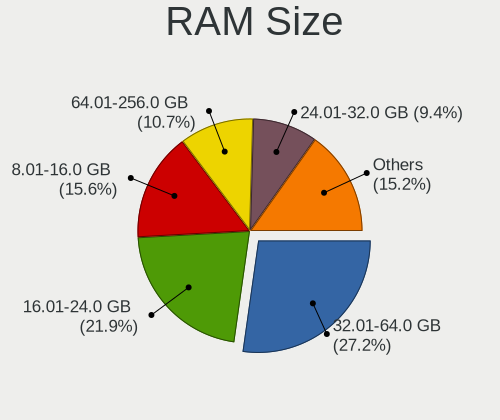
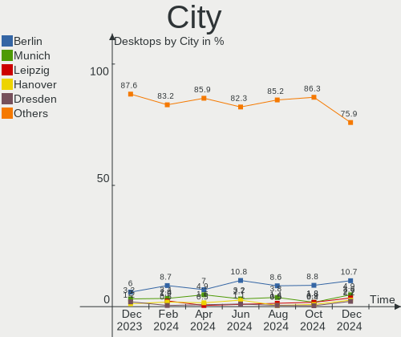
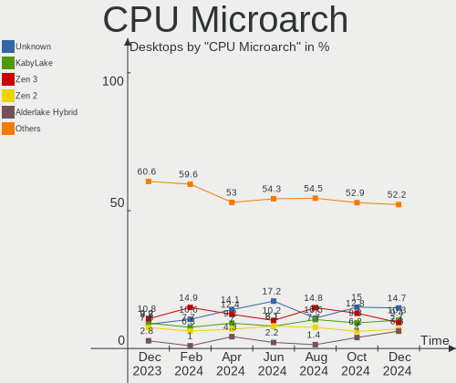
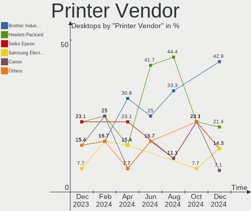
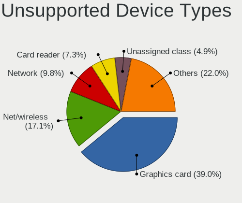

Linux in Germany - Hardware Trends (Desktops)
---------------------------------------------

A project to identify most popular hardware characteristics and track their change
over time based on data collected by Linux users at https://Linux-Hardware.org.

Anyone can contribute to this report by the [hw-probe](https://github.com/linuxhw/hw-probe) tool:

    sudo -E hw-probe -all -upload

Contents
--------

* [ System ](#system)
  - [ OS                       ](#os)
  - [ OS Family                ](#os-family)
  - [ Kernel                   ](#kernel)
  - [ Kernel Family            ](#kernel-family)
  - [ Kernel Major Ver.        ](#kernel-major-ver)
  - [ Arch                     ](#arch)
  - [ DE                       ](#de)
  - [ Display Server           ](#display-server)
  - [ Display Manager          ](#display-manager)
  - [ OS Lang                  ](#os-lang)
  - [ Boot Mode                ](#boot-mode)
  - [ Filesystem               ](#filesystem)
  - [ Part. scheme             ](#part-scheme)
  - [ Dual Boot with Linux/BSD ](#dual-boot-with-linuxbsd)
  - [ Dual Boot (Win)          ](#dual-boot-win)

* [ Board ](#board)
  - [ Vendor                   ](#vendor)
  - [ Model                    ](#model)
  - [ Model Family             ](#model-family)
  - [ MFG Year                 ](#mfg-year)
  - [ Form Factor              ](#form-factor)
  - [ Secure Boot              ](#secure-boot)
  - [ Coreboot                 ](#coreboot)
  - [ RAM Size                 ](#ram-size)
  - [ RAM Used                 ](#ram-used)
  - [ Total Drives             ](#total-drives)
  - [ Has CD-ROM               ](#has-cd-rom)
  - [ Has Ethernet             ](#has-ethernet)
  - [ Has WiFi                 ](#has-wifi)
  - [ Has Bluetooth            ](#has-bluetooth)

* [ Location ](#location)
  - [ Country                  ](#country)
  - [ City                     ](#city)

* [ Drives ](#drives)
  - [ Drive Vendor             ](#drive-vendor)
  - [ Drive Model              ](#drive-model)
  - [ HDD Vendor               ](#hdd-vendor)
  - [ SSD Vendor               ](#ssd-vendor)
  - [ Drive Kind               ](#drive-kind)
  - [ Drive Connector          ](#drive-connector)
  - [ Drive Size               ](#drive-size)
  - [ Space Total              ](#space-total)
  - [ Space Used               ](#space-used)
  - [ Malfunc. Drives          ](#malfunc-drives)
  - [ Malfunc. Drive Vendor    ](#malfunc-drive-vendor)
  - [ Malfunc. HDD Vendor      ](#malfunc-hdd-vendor)
  - [ Malfunc. Drive Kind      ](#malfunc-drive-kind)
  - [ Failed Drives            ](#failed-drives)
  - [ Failed Drive Vendor      ](#failed-drive-vendor)
  - [ Drive Status             ](#drive-status)

* [ Storage controller ](#storage-controller)
  - [ Storage Vendor           ](#storage-vendor)
  - [ Storage Model            ](#storage-model)
  - [ Storage Kind             ](#storage-kind)

* [ Processor ](#processor)
  - [ CPU Vendor               ](#cpu-vendor)
  - [ CPU Model                ](#cpu-model)
  - [ CPU Model Family         ](#cpu-model-family)
  - [ CPU Cores                ](#cpu-cores)
  - [ CPU Sockets              ](#cpu-sockets)
  - [ CPU Threads              ](#cpu-threads)
  - [ CPU Op-Modes             ](#cpu-op-modes)
  - [ CPU Microcode            ](#cpu-microcode)
  - [ CPU Microarch            ](#cpu-microarch)

* [ Graphics ](#graphics)
  - [ GPU Vendor               ](#gpu-vendor)
  - [ GPU Model                ](#gpu-model)
  - [ GPU Combo                ](#gpu-combo)
  - [ GPU Driver               ](#gpu-driver)
  - [ GPU Memory               ](#gpu-memory)

* [ Monitor ](#monitor)
  - [ Monitor Vendor           ](#monitor-vendor)
  - [ Monitor Model            ](#monitor-model)
  - [ Monitor Resolution       ](#monitor-resolution)
  - [ Monitor Diagonal         ](#monitor-diagonal)
  - [ Monitor Width            ](#monitor-width)
  - [ Aspect Ratio             ](#aspect-ratio)
  - [ Monitor Area             ](#monitor-area)
  - [ Pixel Density            ](#pixel-density)
  - [ Multiple Monitors        ](#multiple-monitors)

* [ Network ](#network)
  - [ Net Controller Vendor    ](#net-controller-vendor)
  - [ Net Controller Model     ](#net-controller-model)
  - [ Wireless Vendor          ](#wireless-vendor)
  - [ Wireless Model           ](#wireless-model)
  - [ Ethernet Vendor          ](#ethernet-vendor)
  - [ Ethernet Model           ](#ethernet-model)
  - [ Net Controller Kind      ](#net-controller-kind)
  - [ Used Controller          ](#used-controller)
  - [ NICs                     ](#nics)
  - [ IPv6                     ](#ipv6)

* [ Bluetooth ](#bluetooth)
  - [ Bluetooth Vendor         ](#bluetooth-vendor)
  - [ Bluetooth Model          ](#bluetooth-model)

* [ Sound ](#sound)
  - [ Sound Vendor             ](#sound-vendor)
  - [ Sound Model              ](#sound-model)

* [ Memory ](#memory)
  - [ Memory Vendor            ](#memory-vendor)
  - [ Memory Model             ](#memory-model)
  - [ Memory Kind              ](#memory-kind)
  - [ Memory Form Factor       ](#memory-form-factor)
  - [ Memory Size              ](#memory-size)
  - [ Memory Speed             ](#memory-speed)

* [ Printers & scanners ](#printers--scanners)
  - [ Printer Vendor           ](#printer-vendor)
  - [ Printer Model            ](#printer-model)
  - [ Scanner Vendor           ](#scanner-vendor)
  - [ Scanner Model            ](#scanner-model)

* [ Camera ](#camera)
  - [ Camera Vendor            ](#camera-vendor)
  - [ Camera Model             ](#camera-model)

* [ Security ](#security)
  - [ Fingerprint Vendor       ](#fingerprint-vendor)
  - [ Fingerprint Model        ](#fingerprint-model)
  - [ Chipcard Vendor          ](#chipcard-vendor)
  - [ Chipcard Model           ](#chipcard-model)

* [ Unsupported ](#unsupported)
  - [ Unsupported Devices      ](#unsupported-devices)
  - [ Unsupported Device Types ](#unsupported-device-types)

System
------

OS
--

Installed operating systems

| Name                         | Desktops | Percent |
|------------------------------|----------|---------|
| Ubuntu 20.04                 | 35       | 15.7%   |
| Linux Mint 20.3              | 28       | 12.56%  |
| OpenMandriva 4.3             | 17       | 7.62%   |
| Ubuntu 21.10                 | 15       | 6.73%   |
| Debian 11                    | 14       | 6.28%   |
| Pop!_OS 21.10                | 10       | 4.48%   |
| Ubuntu 22.04                 | 9        | 4.04%   |
| Arch                         | 8        | 3.59%   |
| Fedora 35                    | 7        | 3.14%   |
| Xubuntu 20.04                | 6        | 2.69%   |
| Manjaro                      | 5        | 2.24%   |
| KDE neon 20.04               | 5        | 2.24%   |
| Linux Mint 20.2              | 4        | 1.79%   |
| Elementary 6.1               | 4        | 1.79%   |
| Arch Rolling                 | 4        | 1.79%   |
| Zorin 16                     | 3        | 1.35%   |
| Ubuntu MATE 20.04            | 3        | 1.35%   |
| Ubuntu 18.04                 | 3        | 1.35%   |
| ArcoLinux Rolling            | 3        | 1.35%   |
| Solus 4.3                    | 2        | 0.9%    |
| openSUSE Leap-15.3           | 2        | 0.9%    |
| OpenMandriva 4.2             | 2        | 0.9%    |
| Kubuntu 20.04                | 2        | 0.9%    |
| Kubuntu 11                   | 2        | 0.9%    |
| Garuda Linux                 | 2        | 0.9%    |
| Endless 4.0.4                | 2        | 0.9%    |
| Xero Rolling                 | 1        | 0.45%   |
| Siduction Unstable           | 1        | 0.45%   |
| ROSA R11.1                   | 1        | 0.45%   |
| Pop!_OS 22.04                | 1        | 0.45%   |
| org.kde.Platform 5.15-21.08  | 1        | 0.45%   |
| openSUSE Tumbleweed-20220425 | 1        | 0.45%   |
| openSUSE 20211228            | 1        | 0.45%   |
| MX 21                        | 1        | 0.45%   |
| Manjaro 21.2.6               | 1        | 0.45%   |
| Lubuntu 20.04                | 1        | 0.45%   |
| LMDE 5                       | 1        | 0.45%   |
| LinuxFX 10                   | 1        | 0.45%   |
| Linux Mint 20.1              | 1        | 0.45%   |
| Kubuntu 22.04                | 1        | 0.45%   |
| Kubuntu 2.0                  | 1        | 0.45%   |
| Kali 2022.2                  | 1        | 0.45%   |
| Gentoo 2.7                   | 1        | 0.45%   |
| Garuda Linux Soaring         | 1        | 0.45%   |
| Fedora 36                    | 1        | 0.45%   |
| Fedora 34                    | 1        | 0.45%   |
| EndeavourOS Rolling          | 1        | 0.45%   |
| Elementary 6                 | 1        | 0.45%   |
| Devuan 4                     | 1        | 0.45%   |
| Debian 9                     | 1        | 0.45%   |
| Debian 10                    | 1        | 0.45%   |
| BlackPanther 18.1            | 1        | 0.45%   |

OS Family
---------

OS without a version

| Name             | Desktops | Percent |
|------------------|----------|---------|
| Ubuntu           | 62       | 27.8%   |
| Linux Mint       | 33       | 14.8%   |
| OpenMandriva     | 19       | 8.52%   |
| Debian           | 16       | 7.17%   |
| Arch             | 12       | 5.38%   |
| Pop!_OS          | 11       | 4.93%   |
| Fedora           | 9        | 4.04%   |
| Xubuntu          | 6        | 2.69%   |
| Manjaro          | 6        | 2.69%   |
| Kubuntu          | 6        | 2.69%   |
| KDE neon         | 5        | 2.24%   |
| Elementary       | 5        | 2.24%   |
| openSUSE         | 4        | 1.79%   |
| Zorin            | 3        | 1.35%   |
| Ubuntu MATE      | 3        | 1.35%   |
| Garuda Linux     | 3        | 1.35%   |
| ArcoLinux        | 3        | 1.35%   |
| Solus            | 2        | 0.9%    |
| Endless          | 2        | 0.9%    |
| Xero             | 1        | 0.45%   |
| Siduction        | 1        | 0.45%   |
| ROSA             | 1        | 0.45%   |
| org.kde.Platform | 1        | 0.45%   |
| MX               | 1        | 0.45%   |
| Lubuntu          | 1        | 0.45%   |
| LMDE             | 1        | 0.45%   |
| LinuxFX          | 1        | 0.45%   |
| Kali             | 1        | 0.45%   |
| Gentoo           | 1        | 0.45%   |
| EndeavourOS      | 1        | 0.45%   |
| Devuan           | 1        | 0.45%   |
| BlackPanther     | 1        | 0.45%   |

Kernel
------

Version of the Linux kernel

| Version                     | Desktops | Percent |
|-----------------------------|----------|---------|
| 5.13.0-39-generic           | 38       | 17.04%  |
| 5.4.0-107-generic           | 24       | 10.76%  |
| 5.16.7-desktop-1omv4003     | 16       | 7.17%   |
| 5.13.0-40-generic           | 13       | 5.83%   |
| 5.4.0-109-generic           | 10       | 4.48%   |
| 5.17.1-arch1-1              | 9        | 4.04%   |
| 5.10.0-13-amd64             | 8        | 3.59%   |
| 5.15.0-27-generic           | 6        | 2.69%   |
| 5.16.19-76051619-generic    | 5        | 2.24%   |
| 5.16.15-76051615-generic    | 5        | 2.24%   |
| 5.13.0-37-generic           | 5        | 2.24%   |
| 5.17.4-arch1-1              | 3        | 1.35%   |
| 5.17.1-zen1-1-zen           | 3        | 1.35%   |
| 5.16.18-200.fc35.x86_64     | 3        | 1.35%   |
| 5.3.18-150300.59.60-default | 2        | 0.9%    |
| 5.16.20-200.fc35.x86_64     | 2        | 0.9%    |
| 5.16.0-0.bpo.4-amd64        | 2        | 0.9%    |
| 5.15.28-1-MANJARO           | 2        | 0.9%    |
| 5.15.0-23-generic           | 2        | 0.9%    |
| 5.11.0-35-generic           | 2        | 0.9%    |
| 5.10.14-desktop-1omv4002    | 2        | 0.9%    |
| 5.10.0-12-amd64             | 2        | 0.9%    |
| 5.6.0-050600-generic        | 1        | 0.45%   |
| 5.4.0-96-generic            | 1        | 0.45%   |
| 5.4.0-90-generic            | 1        | 0.45%   |
| 5.4.0-77-lowlatency         | 1        | 0.45%   |
| 5.4.0-74-generic            | 1        | 0.45%   |
| 5.4.0-73-generic            | 1        | 0.45%   |
| 5.4.0-52-generic            | 1        | 0.45%   |
| 5.4.0-48-generic            | 1        | 0.45%   |
| 5.4.0-26-generic            | 1        | 0.45%   |
| 5.4.0-107-lowlatency        | 1        | 0.45%   |
| 5.4.0-105-generic           | 1        | 0.45%   |
| 5.4.0-104-generic           | 1        | 0.45%   |
| 5.4.0-100-lowlatency        | 1        | 0.45%   |
| 5.4.0-100-generic           | 1        | 0.45%   |
| 5.17.5-zen1-1-zen           | 1        | 0.45%   |
| 5.17.4-zen1-1-zen           | 1        | 0.45%   |
| 5.17.4-1-default            | 1        | 0.45%   |
| 5.17.4-051704-generic       | 1        | 0.45%   |
| 5.17.3-arch1-1              | 1        | 0.45%   |
| 5.17.2-arch3-1              | 1        | 0.45%   |
| 5.17.2-051702-generic       | 1        | 0.45%   |
| 5.17.1-xanmod1              | 1        | 0.45%   |
| 5.17.1-gentoo-r1            | 1        | 0.45%   |
| 5.17.1-300.fc36.x86_64      | 1        | 0.45%   |
| 5.17.1-3-MANJARO            | 1        | 0.45%   |
| 5.17.0-2.2-liquorix-amd64   | 1        | 0.45%   |
| 5.16.5                      | 1        | 0.45%   |
| 5.16.19-200.fc35.x86_64     | 1        | 0.45%   |
| 5.16.18-100.fc34.x86_64     | 1        | 0.45%   |
| 5.16.18-1-siduction-amd64   | 1        | 0.45%   |
| 5.16.18-1-MANJARO           | 1        | 0.45%   |
| 5.16.16-200.fc35.x86_64     | 1        | 0.45%   |
| 5.16.13-desktop-1omv4003    | 1        | 0.45%   |
| 5.16.0-kali7-amd64          | 1        | 0.45%   |
| 5.16.0-5mx-amd64            | 1        | 0.45%   |
| 5.15.8-1-default            | 1        | 0.45%   |
| 5.15.33-1-lts               | 1        | 0.45%   |
| 5.15.32-213.current         | 1        | 0.45%   |

Kernel Family
-------------

Linux kernel without a distro release

| Version  | Desktops | Percent |
|----------|----------|---------|
| 5.13.0   | 61       | 27.35%  |
| 5.4.0    | 47       | 21.08%  |
| 5.17.1   | 16       | 7.17%   |
| 5.16.7   | 16       | 7.17%   |
| 5.10.0   | 11       | 4.93%   |
| 5.15.0   | 9        | 4.04%   |
| 5.17.4   | 6        | 2.69%   |
| 5.16.19  | 6        | 2.69%   |
| 5.16.18  | 6        | 2.69%   |
| 5.16.15  | 5        | 2.24%   |
| 5.11.0   | 5        | 2.24%   |
| 5.16.0   | 4        | 1.79%   |
| 5.3.18   | 2        | 0.9%    |
| 5.17.2   | 2        | 0.9%    |
| 5.16.20  | 2        | 0.9%    |
| 5.15.32  | 2        | 0.9%    |
| 5.15.28  | 2        | 0.9%    |
| 5.10.14  | 2        | 0.9%    |
| 4.15.0   | 2        | 0.9%    |
| 5.6.0    | 1        | 0.45%   |
| 5.17.5   | 1        | 0.45%   |
| 5.17.3   | 1        | 0.45%   |
| 5.17.0   | 1        | 0.45%   |
| 5.16.5   | 1        | 0.45%   |
| 5.16.16  | 1        | 0.45%   |
| 5.16.13  | 1        | 0.45%   |
| 5.15.8   | 1        | 0.45%   |
| 5.15.33  | 1        | 0.45%   |
| 5.15.30  | 1        | 0.45%   |
| 5.14.0   | 1        | 0.45%   |
| 5.13.19  | 1        | 0.45%   |
| 5.10.98  | 1        | 0.45%   |
| 5.10.101 | 1        | 0.45%   |
| 4.9.35   | 1        | 0.45%   |
| 4.19.0   | 1        | 0.45%   |
| 4.18.16  | 1        | 0.45%   |

Kernel Major Ver.
-----------------

Linux kernel major version

| Version | Desktops | Percent |
|---------|----------|---------|
| 5.13    | 62       | 27.8%   |
| 5.4     | 47       | 21.08%  |
| 5.16    | 42       | 18.83%  |
| 5.17    | 27       | 12.11%  |
| 5.15    | 16       | 7.17%   |
| 5.10    | 15       | 6.73%   |
| 5.11    | 5        | 2.24%   |
| 5.3     | 2        | 0.9%    |
| 4.15    | 2        | 0.9%    |
| 5.6     | 1        | 0.45%   |
| 5.14    | 1        | 0.45%   |
| 4.9     | 1        | 0.45%   |
| 4.19    | 1        | 0.45%   |
| 4.18    | 1        | 0.45%   |

Arch
----

OS architecture (x86_64, i586, etc.)

| Name   | Desktops | Percent |
|--------|----------|---------|
| x86_64 | 222      | 99.55%  |
| i686   | 1        | 0.45%   |

DE
--

Desktop Environment

| Name       | Desktops | Percent |
|------------|----------|---------|
| GNOME      | 89       | 39.91%  |
| KDE5       | 55       | 24.66%  |
| X-Cinnamon | 30       | 13.45%  |
| XFCE       | 14       | 6.28%   |
| Unknown    | 13       | 5.83%   |
| MATE       | 7        | 3.14%   |
| Pantheon   | 5        | 2.24%   |
| i3         | 4        | 1.79%   |
| Cinnamon   | 2        | 0.9%    |
| sway       | 1        | 0.45%   |
| LXQt       | 1        | 0.45%   |
| LXDE       | 1        | 0.45%   |
| Deepin     | 1        | 0.45%   |

Display Server
--------------

X11 or Wayland

| Name        | Desktops | Percent |
|-------------|----------|---------|
| X11         | 175      | 78.48%  |
| Wayland     | 31       | 13.9%   |
| Tty         | 11       | 4.93%   |
| Unknown     | 5        | 2.24%   |
| Unspecified | 1        | 0.45%   |

Display Manager
---------------

SDDM, LightDM, etc.

| Name    | Desktops | Percent |
|---------|----------|---------|
| Unknown | 84       | 37.67%  |
| GDM3    | 50       | 22.42%  |
| SDDM    | 37       | 16.59%  |
| LightDM | 37       | 16.59%  |
| GDM     | 13       | 5.83%   |
| XDM     | 1        | 0.45%   |
| NODM    | 1        | 0.45%   |

OS Lang
-------

Language

| Lang    | Desktops | Percent |
|---------|----------|---------|
| de_DE   | 173      | 77.58%  |
| en_US   | 30       | 13.45%  |
| en_GB   | 7        | 3.14%   |
| Unknown | 5        | 2.24%   |
| en_IE   | 2        | 0.9%    |
| de_AT   | 2        | 0.9%    |
| ro_RO   | 1        | 0.45%   |
| nl_NL   | 1        | 0.45%   |
| en_DE   | 1        | 0.45%   |
| C       | 1        | 0.45%   |

Boot Mode
---------

EFI or BIOS

| Mode | Desktops | Percent |
|------|----------|---------|
| BIOS | 124      | 55.61%  |
| EFI  | 99       | 44.39%  |

Filesystem
----------

Type of filesystem

| Type    | Desktops | Percent |
|---------|----------|---------|
| Ext4    | 175      | 78.48%  |
| Btrfs   | 25       | 11.21%  |
| Overlay | 18       | 8.07%   |
| Zfs     | 3        | 1.35%   |
| Xfs     | 1        | 0.45%   |
| Tmpfs   | 1        | 0.45%   |

Part. scheme
------------

Scheme of partitioning

| Type    | Desktops | Percent |
|---------|----------|---------|
| Unknown | 127      | 56.95%  |
| GPT     | 68       | 30.49%  |
| MBR     | 28       | 12.56%  |

Dual Boot with Linux/BSD
------------------------

Hosting more than one Linux/BSD

| Dual boot | Desktops | Percent |
|-----------|----------|---------|
| No        | 177      | 79.37%  |
| Yes       | 46       | 20.63%  |

Dual Boot (Win)
---------------

Hosting Linux and Windows

| Dual boot | Desktops | Percent |
|-----------|----------|---------|
| No        | 159      | 71.3%   |
| Yes       | 64       | 28.7%   |

Board
-----

Vendor
------

Motherboard manufacturer

| Name                | Desktops | Percent |
|---------------------|----------|---------|
| ASUSTek Computer    | 54       | 24.22%  |
| MSI                 | 44       | 19.73%  |
| Gigabyte Technology | 34       | 15.25%  |
| ASRock              | 20       | 8.97%   |
| Fujitsu             | 14       | 6.28%   |
| Lenovo              | 12       | 5.38%   |
| Hewlett-Packard     | 11       | 4.93%   |
| Medion              | 7        | 3.14%   |
| Dell                | 5        | 2.24%   |
| Shuttle             | 3        | 1.35%   |
| HARDKERNEL          | 2        | 0.9%    |
| Fujitsu Siemens     | 2        | 0.9%    |
| Foxconn             | 2        | 0.9%    |
| Biostar             | 2        | 0.9%    |
| ASRockRack          | 2        | 0.9%    |
| Acer                | 2        | 0.9%    |
| Unknown             | 2        | 0.9%    |
| Packard Bell        | 1        | 0.45%   |
| Inventec            | 1        | 0.45%   |
| EVGA                | 1        | 0.45%   |
| eMachines           | 1        | 0.45%   |
| BESSTAR Tech        | 1        | 0.45%   |

Model
-----

Motherboard model

| Name                             | Desktops | Percent |
|----------------------------------|----------|---------|
| ASUS All Series                  | 8        | 3.59%   |
| MSI MS-7C37                      | 4        | 1.79%   |
| MSI MS-7A38                      | 4        | 1.79%   |
| ASUS PRIME B450-PLUS             | 4        | 1.79%   |
| MSI MS-7B89                      | 3        | 1.35%   |
| ASUS PRIME B350-PLUS             | 3        | 1.35%   |
| MSI MS-7D22                      | 2        | 0.9%    |
| MSI MS-7C94                      | 2        | 0.9%    |
| MSI MS-7C52                      | 2        | 0.9%    |
| MSI MS-7C02                      | 2        | 0.9%    |
| MSI MS-7B86                      | 2        | 0.9%    |
| MSI MS-7B79                      | 2        | 0.9%    |
| HP Compaq 8200 Elite CMT PC      | 2        | 0.9%    |
| HARDKERNEL ODROID-H2             | 2        | 0.9%    |
| Gigabyte X570 AORUS ELITE        | 2        | 0.9%    |
| Gigabyte H97-D3H                 | 2        | 0.9%    |
| Gigabyte GB-BACE-3000-SBE        | 2        | 0.9%    |
| Gigabyte GA-78LMT-USB3 6.0       | 2        | 0.9%    |
| Gigabyte B550I AORUS PRO AX      | 2        | 0.9%    |
| Gigabyte 970A-DS3P               | 2        | 0.9%    |
| Fujitsu CELSIUS W420             | 2        | 0.9%    |
| ASUS ROG STRIX B550-I GAMING     | 2        | 0.9%    |
| ASUS P8B75-M                     | 2        | 0.9%    |
| ASUS A68HM-PLUS                  | 2        | 0.9%    |
| ASRockRack B565D4-V1L            | 2        | 0.9%    |
| ASRock X570 Phantom Gaming 4     | 2        | 0.9%    |
| ASRock 970 Pro3 R2.0             | 2        | 0.9%    |
| Unknown                          | 2        | 0.9%    |
| Shuttle XS35V4                   | 1        | 0.45%   |
| Shuttle XH61V                    | 1        | 0.45%   |
| Shuttle SG41                     | 1        | 0.45%   |
| Packard Bell IMEDIA 8026         | 1        | 0.45%   |
| MSI p6-2349eg                    | 1        | 0.45%   |
| MSI MS-7D46                      | 1        | 0.45%   |
| MSI MS-7D13                      | 1        | 0.45%   |
| MSI MS-7C84                      | 1        | 0.45%   |
| MSI MS-7C83                      | 1        | 0.45%   |
| MSI MS-7C56                      | 1        | 0.45%   |
| MSI MS-7C35                      | 1        | 0.45%   |
| MSI MS-7B46                      | 1        | 0.45%   |
| MSI MS-7971                      | 1        | 0.45%   |
| MSI MS-7887                      | 1        | 0.45%   |
| MSI MS-7850                      | 1        | 0.45%   |
| MSI MS-7845                      | 1        | 0.45%   |
| MSI MS-7752                      | 1        | 0.45%   |
| MSI MS-7751                      | 1        | 0.45%   |
| MSI MS-7698                      | 1        | 0.45%   |
| MSI MS-7593                      | 1        | 0.45%   |
| MSI MS-7577                      | 1        | 0.45%   |
| MSI MS-7369                      | 1        | 0.45%   |
| MSI MS-7358                      | 1        | 0.45%   |
| MSI Hyrican PC A320M PRO-E       | 1        | 0.45%   |
| MSI EJ276AA-ABD t3285.de         | 1        | 0.45%   |
| Medion S23003                    | 1        | 0.45%   |
| Medion MS-7616                   | 1        | 0.45%   |
| Medion MD34286/C816              | 1        | 0.45%   |
| Medion H81H3-EM2                 | 1        | 0.45%   |
| Medion E32014                    | 1        | 0.45%   |
| Medion Akoya P2316 D/B780        | 1        | 0.45%   |
| Medion Akoya P2120 D MD8836/2454 | 1        | 0.45%   |

Model Family
------------

Motherboard model prefix

| Name                      | Desktops | Percent |
|---------------------------|----------|---------|
| ASUS PRIME                | 13       | 5.83%   |
| Fujitsu ESPRIMO           | 9        | 4.04%   |
| ASUS All                  | 8        | 3.59%   |
| Lenovo ThinkCentre        | 6        | 2.69%   |
| ASUS ROG                  | 5        | 2.24%   |
| MSI MS-7C37               | 4        | 1.79%   |
| MSI MS-7A38               | 4        | 1.79%   |
| HP Compaq                 | 4        | 1.79%   |
| Gigabyte X570             | 4        | 1.79%   |
| Dell OptiPlex             | 4        | 1.79%   |
| ASUS M5A78L-M             | 4        | 1.79%   |
| MSI MS-7B89               | 3        | 1.35%   |
| Gigabyte B550M            | 3        | 1.35%   |
| Fujitsu CELSIUS           | 3        | 1.35%   |
| MSI MS-7D22               | 2        | 0.9%    |
| MSI MS-7C94               | 2        | 0.9%    |
| MSI MS-7C52               | 2        | 0.9%    |
| MSI MS-7C02               | 2        | 0.9%    |
| MSI MS-7B86               | 2        | 0.9%    |
| MSI MS-7B79               | 2        | 0.9%    |
| Medion Akoya              | 2        | 0.9%    |
| Lenovo ThinkStation       | 2        | 0.9%    |
| Lenovo IdeaCentre         | 2        | 0.9%    |
| HP ProDesk                | 2        | 0.9%    |
| HARDKERNEL ODROID-H2      | 2        | 0.9%    |
| Gigabyte H97-D3H          | 2        | 0.9%    |
| Gigabyte GB-BACE-3000-SBE | 2        | 0.9%    |
| Gigabyte GA-78LMT-USB3    | 2        | 0.9%    |
| Gigabyte B550I            | 2        | 0.9%    |
| Gigabyte 970A-DS3P        | 2        | 0.9%    |
| ASUS TUF                  | 2        | 0.9%    |
| ASUS P8B75-M              | 2        | 0.9%    |
| ASUS A68HM-PLUS           | 2        | 0.9%    |
| ASRockRack B565D4-V1L     | 2        | 0.9%    |
| ASRock X570               | 2        | 0.9%    |
| ASRock B450               | 2        | 0.9%    |
| ASRock 970                | 2        | 0.9%    |
| Acer Aspire               | 2        | 0.9%    |
| Unknown                   | 2        | 0.9%    |
| Shuttle XS35V4            | 1        | 0.45%   |
| Shuttle XH61V             | 1        | 0.45%   |
| Shuttle SG41              | 1        | 0.45%   |
| Packard Bell IMEDIA       | 1        | 0.45%   |
| MSI p6-2349eg             | 1        | 0.45%   |
| MSI MS-7D46               | 1        | 0.45%   |
| MSI MS-7D13               | 1        | 0.45%   |
| MSI MS-7C84               | 1        | 0.45%   |
| MSI MS-7C83               | 1        | 0.45%   |
| MSI MS-7C56               | 1        | 0.45%   |
| MSI MS-7C35               | 1        | 0.45%   |
| MSI MS-7B46               | 1        | 0.45%   |
| MSI MS-7971               | 1        | 0.45%   |
| MSI MS-7887               | 1        | 0.45%   |
| MSI MS-7850               | 1        | 0.45%   |
| MSI MS-7845               | 1        | 0.45%   |
| MSI MS-7752               | 1        | 0.45%   |
| MSI MS-7751               | 1        | 0.45%   |
| MSI MS-7698               | 1        | 0.45%   |
| MSI MS-7593               | 1        | 0.45%   |
| MSI MS-7577               | 1        | 0.45%   |

MFG Year
--------

Motherboard manufacture year

| Year | Desktops | Percent |
|------|----------|---------|
| 2019 | 30       | 13.45%  |
| 2014 | 21       | 9.42%   |
| 2020 | 20       | 8.97%   |
| 2018 | 20       | 8.97%   |
| 2013 | 18       | 8.07%   |
| 2012 | 17       | 7.62%   |
| 2017 | 16       | 7.17%   |
| 2021 | 15       | 6.73%   |
| 2011 | 12       | 5.38%   |
| 2015 | 11       | 4.93%   |
| 2010 | 10       | 4.48%   |
| 2009 | 8        | 3.59%   |
| 2022 | 6        | 2.69%   |
| 2008 | 6        | 2.69%   |
| 2016 | 5        | 2.24%   |
| 2007 | 5        | 2.24%   |
| 2006 | 3        | 1.35%   |

Form Factor
-----------

Physical design of the computer

| Name    | Desktops | Percent |
|---------|----------|---------|
| Desktop | 223      | 100%    |

Secure Boot
-----------

Enabled or disabled

| State    | Desktops | Percent |
|----------|----------|---------|
| Disabled | 215      | 96.41%  |
| Enabled  | 8        | 3.59%   |

Coreboot
--------

Have coreboot on board

| Used | Desktops | Percent |
|------|----------|---------|
| No   | 223      | 100%    |

RAM Size
--------

Total RAM memory

| Size in GB  | Desktops | Percent |
|-------------|----------|---------|
| 16.01-24.0  | 61       | 27.35%  |
| 32.01-64.0  | 45       | 20.18%  |
| 8.01-16.0   | 40       | 17.94%  |
| 3.01-4.0    | 27       | 12.11%  |
| 4.01-8.0    | 25       | 11.21%  |
| 64.01-256.0 | 18       | 8.07%   |
| 24.01-32.0  | 4        | 1.79%   |
| 1.01-2.0    | 2        | 0.9%    |
| 2.01-3.0    | 1        | 0.45%   |

RAM Used
--------

Used RAM memory

| Used GB    | Desktops | Percent |
|------------|----------|---------|
| 1.01-2.0   | 85       | 38.12%  |
| 4.01-8.0   | 35       | 15.7%   |
| 2.01-3.0   | 35       | 15.7%   |
| 3.01-4.0   | 32       | 14.35%  |
| 0.51-1.0   | 17       | 7.62%   |
| 8.01-16.0  | 10       | 4.48%   |
| 24.01-32.0 | 3        | 1.35%   |
| 16.01-24.0 | 3        | 1.35%   |
| 32.01-64.0 | 2        | 0.9%    |
| 0.01-0.5   | 1        | 0.45%   |

Total Drives
------------

Number of drives on board

| Drives | Desktops | Percent |
|--------|----------|---------|
| 1      | 72       | 32.29%  |
| 2      | 63       | 28.25%  |
| 3      | 37       | 16.59%  |
| 4      | 28       | 12.56%  |
| 5      | 12       | 5.38%   |
| 6      | 6        | 2.69%   |
| 0      | 3        | 1.35%   |
| 8      | 1        | 0.45%   |
| 7      | 1        | 0.45%   |

Has CD-ROM
----------

Has CD-ROM on board

| Presented | Desktops | Percent |
|-----------|----------|---------|
| Yes       | 124      | 55.61%  |
| No        | 99       | 44.39%  |

Has Ethernet
------------

Has Ethernet on board

| Presented | Desktops | Percent |
|-----------|----------|---------|
| Yes       | 223      | 100%    |

Has WiFi
--------

Has WiFi module

| Presented | Desktops | Percent |
|-----------|----------|---------|
| No        | 132      | 59.19%  |
| Yes       | 91       | 40.81%  |

Has Bluetooth
-------------

Has Bluetooth module

| Presented | Desktops | Percent |
|-----------|----------|---------|
| No        | 155      | 69.51%  |
| Yes       | 68       | 30.49%  |

Location
--------

Country
-------

Geographic location (country)

| Country | Desktops | Percent |
|---------|----------|---------|
| Germany | 223      | 100%    |

City
----

Geographic location (city)

| City                 | Desktops | Percent |
|----------------------|----------|---------|
| Berlin               | 18       | 8.07%   |
| Munich               | 8        | 3.59%   |
| Hamburg              | 8        | 3.59%   |
| Nuremberg            | 5        | 2.24%   |
| Karlsruhe            | 5        | 2.24%   |
| Frankfurt am Main    | 5        | 2.24%   |
| Stuttgart            | 4        | 1.79%   |
| Cologne              | 4        | 1.79%   |
| Leipzig              | 3        | 1.35%   |
| Garbsen              | 3        | 1.35%   |
| Falkenstein          | 3        | 1.35%   |
| Dillenburg           | 3        | 1.35%   |
| Chemnitz             | 3        | 1.35%   |
| Bonn                 | 3        | 1.35%   |
| Wettringen           | 2        | 0.9%    |
| Waghausel            | 2        | 0.9%    |
| Troisdorf            | 2        | 0.9%    |
| Rostock              | 2        | 0.9%    |
| Rendsburg            | 2        | 0.9%    |
| Offenbach            | 2        | 0.9%    |
| Oberursel            | 2        | 0.9%    |
| Mannheim             | 2        | 0.9%    |
| Krefeld              | 2        | 0.9%    |
| Kiel                 | 2        | 0.9%    |
| Heinersreuth         | 2        | 0.9%    |
| Heilbronn            | 2        | 0.9%    |
| Hanover              | 2        | 0.9%    |
| Halle                | 2        | 0.9%    |
| Fürth               | 2        | 0.9%    |
| Essen                | 2        | 0.9%    |
| Dresden              | 2        | 0.9%    |
| Dortmund             | 2        | 0.9%    |
| Zittau               | 1        | 0.45%   |
| Uelzen               | 1        | 0.45%   |
| Trier                | 1        | 0.45%   |
| Tornesch             | 1        | 0.45%   |
| Sulzbach-Rosenberg   | 1        | 0.45%   |
| Strausberg           | 1        | 0.45%   |
| Stralsund            | 1        | 0.45%   |
| Soest                | 1        | 0.45%   |
| Singen               | 1        | 0.45%   |
| Seelbach             | 1        | 0.45%   |
| Schweinfurt          | 1        | 0.45%   |
| Schmitten            | 1        | 0.45%   |
| Schiffweiler         | 1        | 0.45%   |
| Rosenberg            | 1        | 0.45%   |
| Ronnenberg           | 1        | 0.45%   |
| Rietberg             | 1        | 0.45%   |
| Regenstauf           | 1        | 0.45%   |
| Regensburg           | 1        | 0.45%   |
| Recklinghausen       | 1        | 0.45%   |
| Pullenreuth          | 1        | 0.45%   |
| Potsdam              | 1        | 0.45%   |
| Plattling            | 1        | 0.45%   |
| Pforzheim            | 1        | 0.45%   |
| Peine                | 1        | 0.45%   |
| Osternienburger Land | 1        | 0.45%   |
| Olfen                | 1        | 0.45%   |
| Ohringen             | 1        | 0.45%   |
| Oberhausen           | 1        | 0.45%   |

Drives
------

Drive Vendor
------------

Hard drive vendors

| Vendor                    | Desktops | Drives | Percent |
|---------------------------|----------|--------|---------|
| Samsung Electronics       | 90       | 146    | 22.44%  |
| WDC                       | 69       | 91     | 17.21%  |
| Seagate                   | 54       | 69     | 13.47%  |
| Crucial                   | 33       | 35     | 8.23%   |
| SanDisk                   | 25       | 31     | 6.23%   |
| Toshiba                   | 22       | 24     | 5.49%   |
| Kingston                  | 19       | 23     | 4.74%   |
| Intenso                   | 12       | 16     | 2.99%   |
| Hitachi                   | 12       | 12     | 2.99%   |
| Intel                     | 8        | 8      | 2%      |
| Phison                    | 7        | 7      | 1.75%   |
| Micron/Crucial Technology | 6        | 7      | 1.5%    |
| Unknown                   | 4        | 8      | 1%      |
| Micron Technology         | 4        | 4      | 1%      |
| Transcend                 | 3        | 4      | 0.75%   |
| OCZ                       | 3        | 3      | 0.75%   |
| Corsair                   | 3        | 3      | 0.75%   |
| Apacer                    | 3        | 3      | 0.75%   |
| Verbatim                  | 2        | 2      | 0.5%    |
| Patriot                   | 2        | 2      | 0.5%    |
| HGST                      | 2        | 4      | 0.5%    |
| A-DATA Technology         | 2        | 3      | 0.5%    |
| XPG                       | 1        | 1      | 0.25%   |
| TCSUNBOW                  | 1        | 1      | 0.25%   |
| SK Hynix                  | 1        | 1      | 0.25%   |
| Silicon Motion            | 1        | 1      | 0.25%   |
| OCZ-VERTEX                | 1        | 1      | 0.25%   |
| Mushkin                   | 1        | 2      | 0.25%   |
| LITEON                    | 1        | 1      | 0.25%   |
| KIOXIA                    | 1        | 1      | 0.25%   |
| INDMEM                    | 1        | 1      | 0.25%   |
| Gigabyte Technology       | 1        | 1      | 0.25%   |
| Fujitsu                   | 1        | 1      | 0.25%   |
| EMTEC                     | 1        | 1      | 0.25%   |
| China                     | 1        | 2      | 0.25%   |
| ASMT                      | 1        | 1      | 0.25%   |
| Apple                     | 1        | 1      | 0.25%   |
| Unknown                   | 1        | 1      | 0.25%   |

Drive Model
-----------

Hard drive models

| Model                             | Desktops | Percent |
|-----------------------------------|----------|---------|
| Crucial CT1000MX500SSD1 1TB       | 11       | 2.29%   |
| Samsung SSD 850 EVO 250GB         | 9        | 1.87%   |
| Samsung SSD 860 EVO 500GB         | 7        | 1.46%   |
| Samsung SSD 860 EVO 1TB           | 7        | 1.46%   |
| Samsung SSD 850 EVO 500GB         | 7        | 1.46%   |
| Samsung NVMe SSD Drive 1TB        | 7        | 1.46%   |
| Samsung NVMe SSD Drive 250GB      | 6        | 1.25%   |
| Samsung SSD 860 EVO 250GB         | 5        | 1.04%   |
| WDC WD10EZEX-00BN5A0 1TB          | 4        | 0.83%   |
| Unknown SD/MMC 16GB               | 4        | 0.83%   |
| Unknown M.S./M.S.Pro/HG 16GB      | 4        | 0.83%   |
| SanDisk SSD PLUS 1000GB           | 4        | 0.83%   |
| Samsung SP2504C 250GB             | 4        | 0.83%   |
| Micron/Crucial NVMe SSD Drive 1TB | 4        | 0.83%   |
| Crucial CT240BX500SSD1 240GB      | 4        | 0.83%   |
| WDC WD40EZRZ-00GXCB0 4TB          | 3        | 0.62%   |
| WDC WD40EFRX-68N32N0 4TB          | 3        | 0.62%   |
| WDC WD30EFRX-68EUZN0 3TB          | 3        | 0.62%   |
| WDC WD10EZEX-08WN4A0 1TB          | 3        | 0.62%   |
| Toshiba HDWD110 1TB               | 3        | 0.62%   |
| Toshiba DT01ACA100 1TB            | 3        | 0.62%   |
| Seagate ST4000DM004-2CV104 4TB    | 3        | 0.62%   |
| Seagate ST31000524AS 1TB          | 3        | 0.62%   |
| Seagate ST2000DM001-1ER164 2TB    | 3        | 0.62%   |
| Seagate ST2000DL003-9VT166 2TB    | 3        | 0.62%   |
| Seagate ST1000DM003-1SB102 1TB    | 3        | 0.62%   |
| Seagate ST1000DM003-1ER162 1TB    | 3        | 0.62%   |
| Samsung SSD 970 EVO Plus 1TB      | 3        | 0.62%   |
| Samsung SSD 860 QVO 1TB           | 3        | 0.62%   |
| Samsung SSD 850 EVO 1TB           | 3        | 0.62%   |
| Samsung SSD 840 EVO 120GB         | 3        | 0.62%   |
| Kingston SA400S37240G 240GB SSD   | 3        | 0.62%   |
| Crucial CT525MX300SSD1 528GB      | 3        | 0.62%   |
| WDC WDS100T2B0C-00PXH0 1TB        | 2        | 0.42%   |
| WDC WD5000AAKX-001CA0 500GB       | 2        | 0.42%   |
| WDC WD40EZRX-22SPEB0 4TB          | 2        | 0.42%   |
| WDC WD20EZRZ-00Z5HB0 2TB          | 2        | 0.42%   |
| WDC WD20EZBX-00AYRA0 2TB          | 2        | 0.42%   |
| WDC WD20EFRX-68EUZN0 2TB          | 2        | 0.42%   |
| WDC WD10EZEX-22MFCA0 1TB          | 2        | 0.42%   |
| Transcend TS512GMTE220S 512GB     | 2        | 0.42%   |
| Toshiba MQ01ABD100 1TB            | 2        | 0.42%   |
| Toshiba HDWL120 2TB               | 2        | 0.42%   |
| Toshiba DT01ACA300 3TB            | 2        | 0.42%   |
| Seagate ST500DM002-1BD142 500GB   | 2        | 0.42%   |
| Seagate ST3250312AS 250GB         | 2        | 0.42%   |
| Seagate ST3160815AS 160GB         | 2        | 0.42%   |
| Seagate ST3160812AS 160GB         | 2        | 0.42%   |
| Seagate Expansion+ 2TB            | 2        | 0.42%   |
| SanDisk SSD PLUS 480GB            | 2        | 0.42%   |
| SanDisk SDSSDH3 500G              | 2        | 0.42%   |
| SanDisk SDSSDA-1T00 1TB           | 2        | 0.42%   |
| Samsung SSD 980 PRO 500GB         | 2        | 0.42%   |
| Samsung SSD 980 PRO 1TB           | 2        | 0.42%   |
| Samsung SSD 970 EVO Plus 2TB      | 2        | 0.42%   |
| Samsung SSD 870 QVO 2TB           | 2        | 0.42%   |
| Samsung SSD 870 EVO 500GB         | 2        | 0.42%   |
| Samsung SSD 870 EVO 2TB           | 2        | 0.42%   |
| Samsung SSD 870 EVO 1TB           | 2        | 0.42%   |
| Samsung SSD 850 PRO 256GB         | 2        | 0.42%   |

HDD Vendor
----------

Hard disk drive vendors

| Vendor              | Desktops | Drives | Percent |
|---------------------|----------|--------|---------|
| WDC                 | 64       | 80     | 38.55%  |
| Seagate             | 53       | 67     | 31.93%  |
| Toshiba             | 18       | 20     | 10.84%  |
| Samsung Electronics | 14       | 16     | 8.43%   |
| Hitachi             | 12       | 12     | 7.23%   |
| HGST                | 2        | 4      | 1.2%    |
| Intenso             | 1        | 2      | 0.6%    |
| Fujitsu             | 1        | 1      | 0.6%    |
| ASMT                | 1        | 1      | 0.6%    |

SSD Vendor
----------

Solid state drive vendors

| Vendor              | Desktops | Drives | Percent |
|---------------------|----------|--------|---------|
| Samsung Electronics | 58       | 84     | 34.94%  |
| Crucial             | 31       | 33     | 18.67%  |
| SanDisk             | 23       | 29     | 13.86%  |
| Kingston            | 10       | 13     | 6.02%   |
| Intenso             | 8        | 11     | 4.82%   |
| WDC                 | 4        | 7      | 2.41%   |
| Micron Technology   | 4        | 4      | 2.41%   |
| Phison              | 3        | 3      | 1.81%   |
| OCZ                 | 3        | 3      | 1.81%   |
| Intel               | 3        | 3      | 1.81%   |
| Verbatim            | 2        | 2      | 1.2%    |
| Patriot             | 2        | 2      | 1.2%    |
| Apacer              | 2        | 2      | 1.2%    |
| Transcend           | 1        | 1      | 0.6%    |
| Toshiba             | 1        | 1      | 0.6%    |
| SK Hynix            | 1        | 1      | 0.6%    |
| Seagate             | 1        | 1      | 0.6%    |
| OCZ-VERTEX          | 1        | 1      | 0.6%    |
| Mushkin             | 1        | 2      | 0.6%    |
| LITEON              | 1        | 1      | 0.6%    |
| INDMEM              | 1        | 1      | 0.6%    |
| EMTEC               | 1        | 1      | 0.6%    |
| China               | 1        | 2      | 0.6%    |
| Apple               | 1        | 1      | 0.6%    |
| A-DATA Technology   | 1        | 1      | 0.6%    |
| Unknown             | 1        | 1      | 0.6%    |

Drive Kind
----------

HDD or SSD

| Kind    | Desktops | Drives | Percent |
|---------|----------|--------|---------|
| SSD     | 137      | 211    | 39.26%  |
| HDD     | 135      | 203    | 38.68%  |
| NVMe    | 67       | 95     | 19.2%   |
| Unknown | 10       | 14     | 2.87%   |

Drive Connector
---------------

SATA, SAS, NVMe, etc.

| Type | Desktops | Drives | Percent |
|------|----------|--------|---------|
| SATA | 200      | 406    | 71.17%  |
| NVMe | 67       | 95     | 23.84%  |
| SAS  | 14       | 22     | 4.98%   |

Drive Size
----------

Size of hard drive

| Size in TB | Desktops | Drives | Percent |
|------------|----------|--------|---------|
| 0.01-0.5   | 144      | 195    | 48%     |
| 0.51-1.0   | 91       | 129    | 30.33%  |
| 1.01-2.0   | 30       | 43     | 10%     |
| 3.01-4.0   | 19       | 26     | 6.33%   |
| 2.01-3.0   | 8        | 9      | 2.67%   |
| 4.01-10.0  | 6        | 7      | 2%      |
| 10.01-20.0 | 2        | 5      | 0.67%   |

Space Total
-----------

Amount of disk space available on the file system

| Size in GB     | Desktops | Percent |
|----------------|----------|---------|
| 101-250        | 55       | 24.66%  |
| 251-500        | 34       | 15.25%  |
| More than 3000 | 32       | 14.35%  |
| 1001-2000      | 28       | 12.56%  |
| 501-1000       | 25       | 11.21%  |
| 2001-3000      | 15       | 6.73%   |
| 1-20           | 13       | 5.83%   |
| 51-100         | 8        | 3.59%   |
| Unknown        | 7        | 3.14%   |
| 21-50          | 6        | 2.69%   |

Space Used
----------

Amount of used disk space

| Used GB        | Desktops | Percent |
|----------------|----------|---------|
| 1-20           | 61       | 27.35%  |
| 21-50          | 29       | 13%     |
| 101-250        | 26       | 11.66%  |
| 501-1000       | 24       | 10.76%  |
| 51-100         | 23       | 10.31%  |
| 251-500        | 20       | 8.97%   |
| 1001-2000      | 17       | 7.62%   |
| 2001-3000      | 8        | 3.59%   |
| More than 3000 | 7        | 3.14%   |
| Unknown        | 7        | 3.14%   |
| 0              | 1        | 0.45%   |

Malfunc. Drives
---------------

Drive models with a malfunction

| Model                                               | Desktops | Drives | Percent |
|-----------------------------------------------------|----------|--------|---------|
| WDC WD800JD-00LSA0 80GB                             | 1        | 1      | 3.85%   |
| WDC WD5000AAKS-60Z1A0 500GB                         | 1        | 1      | 3.85%   |
| WDC WD40EFRX-68N32N0 4TB                            | 1        | 2      | 3.85%   |
| WDC WD3200SD-01KNB0 320GB                           | 1        | 1      | 3.85%   |
| WDC WD30EFRX-68EUZN0 3TB                            | 1        | 1      | 3.85%   |
| WDC WD20EARX-22PASB0 2TB                            | 1        | 1      | 3.85%   |
| Seagate ST9500325AS 500GB                           | 1        | 1      | 3.85%   |
| Seagate ST9320325AS 320GB                           | 1        | 1      | 3.85%   |
| Seagate ST3500412AS 500GB                           | 1        | 1      | 3.85%   |
| Seagate ST3250820AS 250GB                           | 1        | 1      | 3.85%   |
| Seagate ST1000DX001-1CM162 1TB                      | 1        | 1      | 3.85%   |
| Seagate ST1000DM003-9YN162 1TB                      | 1        | 1      | 3.85%   |
| Seagate ST1000DM003-1SB102 1TB                      | 1        | 1      | 3.85%   |
| Seagate OOS1000G 1TB                                | 1        | 1      | 3.85%   |
| SanDisk SSD PLUS 120 GB                             | 1        | 1      | 3.85%   |
| Samsung Electronics SSD 980 PRO 250GB               | 1        | 1      | 3.85%   |
| Samsung Electronics SSD 870 EVO 500GB               | 1        | 1      | 3.85%   |
| Samsung Electronics SP2504C 250GB                   | 1        | 1      | 3.85%   |
| Samsung Electronics HD753LJ 752GB                   | 1        | 1      | 3.85%   |
| Samsung Electronics HD642JJ 640GB                   | 1        | 1      | 3.85%   |
| Micron Technology MTFDDAV256TDL-1AW1ZABHA 256GB SSD | 1        | 1      | 3.85%   |
| Micron Technology 5100_MTFDDAK240TCC 240GB SSD      | 1        | 1      | 3.85%   |
| Kingston SUV400S37240G 240GB SSD                    | 1        | 1      | 3.85%   |
| Hitachi HDS721010CLA332 1TB                         | 1        | 1      | 3.85%   |
| Hitachi HDP725050GLAT80 500GB                       | 1        | 1      | 3.85%   |
| Crucial CT525MX300SSD1 528GB                        | 1        | 1      | 3.85%   |

Malfunc. Drive Vendor
---------------------

Vendors of faulty drives

| Vendor              | Desktops | Drives | Percent |
|---------------------|----------|--------|---------|
| Seagate             | 8        | 8      | 30.77%  |
| WDC                 | 6        | 7      | 23.08%  |
| Samsung Electronics | 5        | 5      | 19.23%  |
| Micron Technology   | 2        | 2      | 7.69%   |
| Hitachi             | 2        | 2      | 7.69%   |
| SanDisk             | 1        | 1      | 3.85%   |
| Kingston            | 1        | 1      | 3.85%   |
| Crucial             | 1        | 1      | 3.85%   |

Malfunc. HDD Vendor
-------------------

Vendors of faulty HDD drives

| Vendor              | Desktops | Drives | Percent |
|---------------------|----------|--------|---------|
| Seagate             | 8        | 8      | 42.11%  |
| WDC                 | 6        | 7      | 31.58%  |
| Samsung Electronics | 3        | 3      | 15.79%  |
| Hitachi             | 2        | 2      | 10.53%  |

Malfunc. Drive Kind
-------------------

Kinds of faulty drives

| Kind | Desktops | Drives | Percent |
|------|----------|--------|---------|
| HDD  | 17       | 20     | 70.83%  |
| SSD  | 6        | 6      | 25%     |
| NVMe | 1        | 1      | 4.17%   |

Failed Drives
-------------

Failed drive models

| Model                           | Desktops | Drives | Percent |
|---------------------------------|----------|--------|---------|
| Samsung Electronics HD103UJ 1TB | 1        | 1      | 100%    |

Failed Drive Vendor
-------------------

Failed drive vendors

| Vendor              | Desktops | Drives | Percent |
|---------------------|----------|--------|---------|
| Samsung Electronics | 1        | 1      | 100%    |

Drive Status
------------

Number of failed and malfunc. drives

| Status   | Desktops | Drives | Percent |
|----------|----------|--------|---------|
| Detected | 134      | 316    | 54.92%  |
| Works    | 85       | 179    | 34.84%  |
| Malfunc  | 24       | 27     | 9.84%   |
| Failed   | 1        | 1      | 0.41%   |

Storage controller
------------------

Storage Vendor
--------------

Storage controller vendors

| Vendor                       | Desktops | Percent |
|------------------------------|----------|---------|
| Intel                        | 124      | 37.58%  |
| AMD                          | 98       | 29.7%   |
| Samsung Electronics          | 37       | 11.21%  |
| ASMedia Technology           | 14       | 4.24%   |
| Micron/Crucial Technology    | 8        | 2.42%   |
| Kingston Technology Company  | 8        | 2.42%   |
| Phison Electronics           | 7        | 2.12%   |
| Marvell Technology Group     | 6        | 1.82%   |
| Nvidia                       | 5        | 1.52%   |
| JMicron Technology           | 5        | 1.52%   |
| Sandisk                      | 4        | 1.21%   |
| Toshiba America Info Systems | 3        | 0.91%   |
| Silicon Motion               | 3        | 0.91%   |
| LSI Logic / Symbios Logic    | 2        | 0.61%   |
| ADATA Technology             | 2        | 0.61%   |
| Shenzhen Longsys Electronics | 1        | 0.3%    |
| OCZ Technology Group         | 1        | 0.3%    |
| Chelsio Communications       | 1        | 0.3%    |
| Broadcom / LSI               | 1        | 0.3%    |

Storage Model
-------------

Storage controller models

| Model                                                                            | Desktops | Percent |
|----------------------------------------------------------------------------------|----------|---------|
| AMD FCH SATA Controller [AHCI mode]                                              | 53       | 12.77%  |
| Samsung NVMe SSD Controller SM981/PM981/PM983                                    | 22       | 5.3%    |
| AMD 400 Series Chipset SATA Controller                                           | 22       | 5.3%    |
| Intel 8 Series/C220 Series Chipset Family 6-port SATA Controller 1 [AHCI mode]   | 19       | 4.58%   |
| AMD SB7x0/SB8x0/SB9x0 IDE Controller                                             | 19       | 4.58%   |
| AMD 500 Series Chipset SATA Controller                                           | 15       | 3.61%   |
| ASMedia ASM1062 Serial ATA Controller                                            | 13       | 3.13%   |
| Intel 7 Series/C210 Series Chipset Family 6-port SATA Controller [AHCI mode]     | 12       | 2.89%   |
| AMD SB7x0/SB8x0/SB9x0 SATA Controller [AHCI mode]                                | 12       | 2.89%   |
| Samsung NVMe SSD Controller PM9A1/PM9A3/980PRO                                   | 11       | 2.65%   |
| Intel Q170/Q150/B150/H170/H110/Z170/CM236 Chipset SATA Controller [AHCI Mode]    | 11       | 2.65%   |
| AMD SB7x0/SB8x0/SB9x0 SATA Controller [IDE mode]                                 | 11       | 2.65%   |
| Intel 200 Series PCH SATA controller [AHCI mode]                                 | 10       | 2.41%   |
| Intel NM10/ICH7 Family SATA Controller [IDE mode]                                | 9        | 2.17%   |
| Intel 9 Series Chipset Family SATA Controller [AHCI Mode]                        | 8        | 1.93%   |
| Intel 82801G (ICH7 Family) IDE Controller                                        | 7        | 1.69%   |
| AMD 300 Series Chipset SATA Controller                                           | 7        | 1.69%   |
| Intel SATA Controller [RAID mode]                                                | 6        | 1.45%   |
| Intel 6 Series/C200 Series Chipset Family 6 port Desktop SATA AHCI Controller    | 6        | 1.45%   |
| Samsung NVMe SSD Controller SM961/PM961/SM963                                    | 5        | 1.2%    |
| AMD FCH SATA Controller D                                                        | 5        | 1.2%    |
| Phison E16 PCIe4 NVMe Controller                                                 | 4        | 0.96%   |
| Micron/Crucial P1 NVMe PCIe SSD                                                  | 4        | 0.96%   |
| JMicron JMB363 SATA/IDE Controller                                               | 4        | 0.96%   |
| Intel Alder Lake-S PCH SATA Controller [AHCI Mode]                               | 4        | 0.96%   |
| Phison E12 NVMe Controller                                                       | 3        | 0.72%   |
| Nvidia MCP61 SATA Controller                                                     | 3        | 0.72%   |
| Nvidia MCP61 IDE                                                                 | 3        | 0.72%   |
| Kingston Company Company Non-Volatile memory controller                          | 3        | 0.72%   |
| Intel Celeron/Pentium Silver Processor SATA Controller                           | 3        | 0.72%   |
| Intel Cannon Lake PCH SATA AHCI Controller                                       | 3        | 0.72%   |
| Intel Atom/Celeron/Pentium Processor x5-E8000/J3xxx/N3xxx Series SATA Controller | 3        | 0.72%   |
| Intel 500 Series Chipset Family SATA AHCI Controller                             | 3        | 0.72%   |
| Intel 5 Series/3400 Series Chipset 6 port SATA AHCI Controller                   | 3        | 0.72%   |
| Silicon Motion SM2262/SM2262EN SSD Controller                                    | 2        | 0.48%   |
| Sandisk WD Blue SN550 NVMe SSD                                                   | 2        | 0.48%   |
| Micron/Crucial P2 NVMe PCIe SSD                                                  | 2        | 0.48%   |
| Marvell Group 88SE9215 PCIe 2.0 x1 4-port SATA 6 Gb/s Controller                 | 2        | 0.48%   |
| Marvell Group 88SE6111/6121 SATA II / PATA Controller                            | 2        | 0.48%   |
| Kingston Company OM3PDP3 NVMe SSD                                                | 2        | 0.48%   |
| Kingston Company A2000 NVMe SSD                                                  | 2        | 0.48%   |
| Intel SSD Pro 7600p/760p/E 6100p Series                                          | 2        | 0.48%   |
| Intel SSD 660P Series                                                            | 2        | 0.48%   |
| Intel Comet Lake SATA AHCI Controller                                            | 2        | 0.48%   |
| Intel C610/X99 series chipset 6-Port SATA Controller [AHCI mode]                 | 2        | 0.48%   |
| Intel C600/X79 series chipset 6-Port SATA AHCI Controller                        | 2        | 0.48%   |
| Intel 82801JI (ICH10 Family) SATA AHCI Controller                                | 2        | 0.48%   |
| Intel 82801JI (ICH10 Family) 4 port SATA IDE Controller #1                       | 2        | 0.48%   |
| Intel 82801JI (ICH10 Family) 2 port SATA IDE Controller #2                       | 2        | 0.48%   |
| Intel 82801IR/IO/IH (ICH9R/DO/DH) 4 port SATA Controller [IDE mode]              | 2        | 0.48%   |
| Intel 82801I (ICH9 Family) 2 port SATA Controller [IDE mode]                     | 2        | 0.48%   |
| AMD FCH IDE Controller                                                           | 2        | 0.48%   |
| ADATA XPG SX8200 Pro PCIe Gen3x4 M.2 2280 Solid State Drive                      | 2        | 0.48%   |
| Toshiba America Info Systems XG6 NVMe SSD Controller                             | 1        | 0.24%   |
| Toshiba America Info Systems NVMe Controller                                     | 1        | 0.24%   |
| Toshiba America Info Systems BG3 NVMe SSD Controller                             | 1        | 0.24%   |
| Silicon Motion SM2263EN/SM2263XT SSD Controller                                  | 1        | 0.24%   |
| Shenzhen Longsys Electronics Non-Volatile memory controller                      | 1        | 0.24%   |
| Sandisk WD Black SN750 / PC SN730 NVMe SSD                                       | 1        | 0.24%   |
| Sandisk WD Black 2018/SN750 / PC SN720 NVMe SSD                                  | 1        | 0.24%   |

Storage Kind
------------

Kind of storage controller (IDE, SATA, NVMe, SAS, ...)

| Kind | Desktops | Percent |
|------|----------|---------|
| SATA | 194      | 59.33%  |
| NVMe | 67       | 20.49%  |
| IDE  | 51       | 15.6%   |
| RAID | 10       | 3.06%   |
| SCSI | 3        | 0.92%   |
| SAS  | 2        | 0.61%   |

Processor
---------

CPU Vendor
----------

Processor vendors

| Vendor | Desktops | Percent |
|--------|----------|---------|
| Intel  | 120      | 53.81%  |
| AMD    | 103      | 46.19%  |

CPU Model
---------

Processor models

| Model                                         | Desktops | Percent |
|-----------------------------------------------|----------|---------|
| AMD Ryzen 5 3600 6-Core Processor             | 9        | 4.04%   |
| AMD Ryzen 9 3900X 12-Core Processor           | 7        | 3.14%   |
| AMD Ryzen 9 5950X 16-Core Processor           | 6        | 2.69%   |
| AMD Ryzen 7 5800X 8-Core Processor            | 5        | 2.24%   |
| Intel Core i7-3770 CPU @ 3.40GHz              | 4        | 1.79%   |
| Intel Core i5-3470 CPU @ 3.20GHz              | 4        | 1.79%   |
| AMD Ryzen 7 2700X Eight-Core Processor        | 4        | 1.79%   |
| AMD Ryzen 5 5600G with Radeon Graphics        | 4        | 1.79%   |
| AMD FX-6300 Six-Core Processor                | 4        | 1.79%   |
| Intel Core i5-4590 CPU @ 3.30GHz              | 3        | 1.35%   |
| Intel Core i5-2500 CPU @ 3.30GHz              | 3        | 1.35%   |
| AMD Ryzen 7 3700X 8-Core Processor            | 3        | 1.35%   |
| AMD Ryzen 7 2700 Eight-Core Processor         | 3        | 1.35%   |
| AMD Ryzen 5 2600 Six-Core Processor           | 3        | 1.35%   |
| AMD Ryzen 5 1600 Six-Core Processor           | 3        | 1.35%   |
| AMD FX-4300 Quad-Core Processor               | 3        | 1.35%   |
| Intel Pentium Dual-Core CPU E5800 @ 3.20GHz   | 2        | 0.9%    |
| Intel Pentium Dual CPU E2180 @ 2.00GHz        | 2        | 0.9%    |
| Intel Core i9-9900K CPU @ 3.60GHz             | 2        | 0.9%    |
| Intel Core i7-6700K CPU @ 4.00GHz             | 2        | 0.9%    |
| Intel Core i7-4790K CPU @ 4.00GHz             | 2        | 0.9%    |
| Intel Core i7-4770 CPU @ 3.40GHz              | 2        | 0.9%    |
| Intel Core i7-2600K CPU @ 3.40GHz             | 2        | 0.9%    |
| Intel Core i7 CPU 920 @ 2.67GHz               | 2        | 0.9%    |
| Intel Core i5-7400 CPU @ 3.00GHz              | 2        | 0.9%    |
| Intel Core i5-6600 CPU @ 3.30GHz              | 2        | 0.9%    |
| Intel Core i5-4690 CPU @ 3.50GHz              | 2        | 0.9%    |
| Intel Core i5-4570 CPU @ 3.20GHz              | 2        | 0.9%    |
| Intel Core i5-4460 CPU @ 3.20GHz              | 2        | 0.9%    |
| Intel Core i3-4160 CPU @ 3.60GHz              | 2        | 0.9%    |
| Intel Core i3-4130 CPU @ 3.40GHz              | 2        | 0.9%    |
| Intel Celeron J4105 CPU @ 1.50GHz             | 2        | 0.9%    |
| Intel Celeron CPU N3000 @ 1.04GHz             | 2        | 0.9%    |
| Intel 11th Gen Core i7-11700 @ 2.50GHz        | 2        | 0.9%    |
| AMD Ryzen 9 5900X 12-Core Processor           | 2        | 0.9%    |
| AMD Ryzen 7 1700 Eight-Core Processor         | 2        | 0.9%    |
| AMD Ryzen 5 2600X Six-Core Processor          | 2        | 0.9%    |
| AMD Ryzen 5 1600X Six-Core Processor          | 2        | 0.9%    |
| AMD Phenom II X4 965 Processor                | 2        | 0.9%    |
| AMD FX-8350 Eight-Core Processor              | 2        | 0.9%    |
| AMD FX-8320 Eight-Core Processor              | 2        | 0.9%    |
| AMD Athlon 64 X2 Dual Core Processor 3800+    | 2        | 0.9%    |
| AMD A8-7600 Radeon R7, 10 Compute Cores 4C+6G | 2        | 0.9%    |
| Intel Xeon W-2155 CPU @ 3.30GHz               | 1        | 0.45%   |
| Intel Xeon W-2135 CPU @ 3.70GHz               | 1        | 0.45%   |
| Intel Xeon CPU X5675 @ 3.07GHz                | 1        | 0.45%   |
| Intel Xeon CPU X5670 @ 2.93GHz                | 1        | 0.45%   |
| Intel Xeon CPU E5-2650 v4 @ 2.20GHz           | 1        | 0.45%   |
| Intel Xeon CPU E5-2650 v2 @ 2.60GHz           | 1        | 0.45%   |
| Intel Xeon CPU E3-1271 v3 @ 3.60GHz           | 1        | 0.45%   |
| Intel Xeon CPU E3-1246 v3 @ 3.50GHz           | 1        | 0.45%   |
| Intel Xeon CPU E3-1231 v3 @ 3.40GHz           | 1        | 0.45%   |
| Intel Xeon CPU E3-1230 v3 @ 3.30GHz           | 1        | 0.45%   |
| Intel Pentium Dual-Core CPU E5500 @ 2.80GHz   | 1        | 0.45%   |
| Intel Pentium Dual-Core CPU E5400 @ 2.70GHz   | 1        | 0.45%   |
| Intel Pentium Dual CPU E2160 @ 1.80GHz        | 1        | 0.45%   |
| Intel Pentium D CPU 2.80GHz                   | 1        | 0.45%   |
| Intel Pentium CPU G4400 @ 3.30GHz             | 1        | 0.45%   |
| Intel Pentium CPU G3260T @ 2.90GHz            | 1        | 0.45%   |
| Intel Core i7-8700K CPU @ 3.70GHz             | 1        | 0.45%   |

CPU Model Family
----------------

Processor model prefix

| Model                   | Desktops | Percent |
|-------------------------|----------|---------|
| Intel Core i5           | 39       | 17.49%  |
| AMD Ryzen 5             | 26       | 11.66%  |
| Intel Core i7           | 23       | 10.31%  |
| AMD Ryzen 7             | 19       | 8.52%   |
| AMD Ryzen 9             | 17       | 7.62%   |
| Intel Core i3           | 13       | 5.83%   |
| AMD FX                  | 13       | 5.83%   |
| Intel Xeon              | 10       | 4.48%   |
| Other                   | 9        | 4.04%   |
| Intel Celeron           | 8        | 3.59%   |
| AMD Phenom II X4        | 5        | 2.24%   |
| Intel Pentium Dual-Core | 4        | 1.79%   |
| Intel Core 2 Quad       | 4        | 1.79%   |
| AMD A8                  | 4        | 1.79%   |
| Intel Pentium Dual      | 3        | 1.35%   |
| AMD Athlon II X2        | 3        | 1.35%   |
| Intel Pentium           | 2        | 0.9%    |
| Intel Core i9           | 2        | 0.9%    |
| AMD Ryzen 3             | 2        | 0.9%    |
| AMD Athlon II X4        | 2        | 0.9%    |
| AMD Athlon 64 X2        | 2        | 0.9%    |
| AMD A4                  | 2        | 0.9%    |
| Intel Pentium D         | 1        | 0.45%   |
| Intel Core 2 Duo        | 1        | 0.45%   |
| Intel Atom              | 1        | 0.45%   |
| AMD Ryzen 7 PRO         | 1        | 0.45%   |
| AMD Ryzen 5 PRO         | 1        | 0.45%   |
| AMD Phenom II X6        | 1        | 0.45%   |
| AMD GX                  | 1        | 0.45%   |
| AMD G                   | 1        | 0.45%   |
| AMD E                   | 1        | 0.45%   |
| AMD Athlon Dual Core    | 1        | 0.45%   |
| AMD A10                 | 1        | 0.45%   |

CPU Cores
---------

Number of processor cores

| Number | Desktops | Percent |
|--------|----------|---------|
| 4      | 85       | 38.12%  |
| 2      | 45       | 20.18%  |
| 6      | 37       | 16.59%  |
| 8      | 27       | 12.11%  |
| 12     | 11       | 4.93%   |
| 16     | 8        | 3.59%   |
| 3      | 4        | 1.79%   |
| 1      | 3        | 1.35%   |
| 10     | 2        | 0.9%    |
| 24     | 1        | 0.45%   |

CPU Sockets
-----------

Number of sockets

| Number | Desktops | Percent |
|--------|----------|---------|
| 1      | 221      | 99.1%   |
| 2      | 2        | 0.9%    |

CPU Threads
-----------

Threads per core (Hyper-Threading)

| Number | Desktops | Percent |
|--------|----------|---------|
| 2      | 140      | 62.78%  |
| 1      | 83       | 37.22%  |

CPU Op-Modes
------------

CPU Operation Modes (32-bit, 64-bit)

| Op mode        | Desktops | Percent |
|----------------|----------|---------|
| 32-bit, 64-bit | 223      | 100%    |

CPU Microcode
-------------

Microcode number

| Number     | Desktops | Percent |
|------------|----------|---------|
| Unknown    | 50       | 22.42%  |
| 0x306c3    | 23       | 10.31%  |
| 0x08701021 | 11       | 4.93%   |
| 0x306a9    | 10       | 4.48%   |
| 0x506e3    | 9        | 4.04%   |
| 0x06000852 | 9        | 4.04%   |
| 0x0a201016 | 8        | 3.59%   |
| 0x0800820d | 8        | 3.59%   |
| 0x1067a    | 7        | 3.14%   |
| 0x906ea    | 6        | 2.69%   |
| 0x906e9    | 6        | 2.69%   |
| 0x206a7    | 6        | 2.69%   |
| 0x010000c8 | 6        | 2.69%   |
| 0x0a50000c | 5        | 2.24%   |
| 0xa0671    | 4        | 1.79%   |
| 0x90672    | 3        | 1.35%   |
| 0x6fd      | 3        | 1.35%   |
| 0x08701013 | 3        | 1.35%   |
| 0x08001138 | 3        | 1.35%   |
| 0xa0655    | 2        | 0.9%    |
| 0x906ed    | 2        | 0.9%    |
| 0x706a1    | 2        | 0.9%    |
| 0x406c3    | 2        | 0.9%    |
| 0x206c2    | 2        | 0.9%    |
| 0x106e5    | 2        | 0.9%    |
| 0x0a201205 | 2        | 0.9%    |
| 0x08108109 | 2        | 0.9%    |
| 0x06003106 | 2        | 0.9%    |
| 0x06001119 | 2        | 0.9%    |
| 0xa0653    | 1        | 0.45%   |
| 0x906eb    | 1        | 0.45%   |
| 0x90675    | 1        | 0.45%   |
| 0x706a8    | 1        | 0.45%   |
| 0x6fb      | 1        | 0.45%   |
| 0x6f7      | 1        | 0.45%   |
| 0x50654    | 1        | 0.45%   |
| 0x406f1    | 1        | 0.45%   |
| 0x406c4    | 1        | 0.45%   |
| 0x306f2    | 1        | 0.45%   |
| 0x306e4    | 1        | 0.45%   |
| 0x20655    | 1        | 0.45%   |
| 0x106a5    | 1        | 0.45%   |
| 0x106a4    | 1        | 0.45%   |
| 0x0a201009 | 1        | 0.45%   |
| 0x08001137 | 1        | 0.45%   |
| 0x08001129 | 1        | 0.45%   |
| 0x0600611a | 1        | 0.45%   |
| 0x0600063e | 1        | 0.45%   |
| 0x05000119 | 1        | 0.45%   |
| 0x05000029 | 1        | 0.45%   |
| 0x010000db | 1        | 0.45%   |
| 0x00000000 | 1        | 0.45%   |

CPU Microarch
-------------

Microarchitecture

| Name             | Desktops | Percent |
|------------------|----------|---------|
| Haswell          | 29       | 13%     |
| Zen 2            | 22       | 9.87%   |
| Zen 3            | 19       | 8.52%   |
| Zen+             | 16       | 7.17%   |
| Piledriver       | 15       | 6.73%   |
| KabyLake         | 15       | 6.73%   |
| IvyBridge        | 13       | 5.83%   |
| Skylake          | 12       | 5.38%   |
| K10              | 11       | 4.93%   |
| Zen              | 9        | 4.04%   |
| SandyBridge      | 9        | 4.04%   |
| Penryn           | 7        | 3.14%   |
| Core             | 5        | 2.24%   |
| Westmere         | 4        | 1.79%   |
| Silvermont       | 4        | 1.79%   |
| Nehalem          | 4        | 1.79%   |
| Unknown          | 4        | 1.79%   |
| K8 Hammer        | 3        | 1.35%   |
| Goldmont plus    | 3        | 1.35%   |
| CometLake        | 3        | 1.35%   |
| Alderlake Hybrid | 3        | 1.35%   |
| Steamroller      | 2        | 0.9%    |
| Puma             | 2        | 0.9%    |
| Bobcat           | 2        | 0.9%    |
| TigerLake        | 1        | 0.45%   |
| NetBurst         | 1        | 0.45%   |
| Icelake          | 1        | 0.45%   |
| Excavator        | 1        | 0.45%   |
| Bulldozer        | 1        | 0.45%   |
| Broadwell        | 1        | 0.45%   |
| Bonnell          | 1        | 0.45%   |

Graphics
--------

GPU Vendor
----------

Vendors of graphics cards

| Vendor                     | Desktops | Percent |
|----------------------------|----------|---------|
| AMD                        | 85       | 36.17%  |
| Nvidia                     | 82       | 34.89%  |
| Intel                      | 63       | 26.81%  |
| ASPEED Technology          | 4        | 1.7%    |
| Matrox Electronics Systems | 1        | 0.43%   |

GPU Model
---------

Graphics card models

| Model                                                                                    | Desktops | Percent |
|------------------------------------------------------------------------------------------|----------|---------|
| AMD Ellesmere [Radeon RX 470/480/570/570X/580/580X/590]                                  | 15       | 6.25%   |
| Intel Xeon E3-1200 v3/4th Gen Core Processor Integrated Graphics Controller              | 12       | 5%      |
| AMD Navi 10 [Radeon RX 5600 OEM/5600 XT / 5700/5700 XT]                                  | 7        | 2.92%   |
| Nvidia GP107 [GeForce GTX 1050 Ti]                                                       | 6        | 2.5%    |
| Intel HD Graphics 630                                                                    | 6        | 2.5%    |
| Intel 2nd Generation Core Processor Family Integrated Graphics Controller                | 6        | 2.5%    |
| AMD Cezanne                                                                              | 6        | 2.5%    |
| AMD Lexa PRO [Radeon 540/540X/550/550X / RX 540X/550/550X]                               | 5        | 2.08%   |
| AMD Cedar [Radeon HD 5000/6000/7350/8350 Series]                                         | 5        | 2.08%   |
| Nvidia GP108 [GeForce GT 1030]                                                           | 4        | 1.67%   |
| Nvidia GP106 [GeForce GTX 1060 6GB]                                                      | 4        | 1.67%   |
| Nvidia GK208B [GeForce GT 710]                                                           | 4        | 1.67%   |
| Intel Xeon E3-1200 v2/3rd Gen Core processor Graphics Controller                         | 4        | 1.67%   |
| Intel HD Graphics 530                                                                    | 4        | 1.67%   |
| Intel CoffeeLake-S GT2 [UHD Graphics 630]                                                | 4        | 1.67%   |
| ASPEED Technology ASPEED Graphics Family                                                 | 4        | 1.67%   |
| AMD Turks XT [Radeon HD 6670/7670]                                                       | 4        | 1.67%   |
| AMD Caicos [Radeon HD 6450/7450/8450 / R5 230 OEM]                                       | 4        | 1.67%   |
| Nvidia TU117 [GeForce GTX 1650]                                                          | 3        | 1.25%   |
| Nvidia TU116 [GeForce GTX 1660 SUPER]                                                    | 3        | 1.25%   |
| Nvidia GT218 [GeForce 210]                                                               | 3        | 1.25%   |
| Nvidia GP104 [GeForce GTX 1080]                                                          | 3        | 1.25%   |
| Nvidia GA104 [GeForce RTX 3060]                                                          | 3        | 1.25%   |
| Intel IvyBridge GT2 [HD Graphics 4000]                                                   | 3        | 1.25%   |
| Intel GeminiLake [UHD Graphics 600]                                                      | 3        | 1.25%   |
| Intel Atom/Celeron/Pentium Processor x5-E8000/J3xxx/N3xxx Integrated Graphics Controller | 3        | 1.25%   |
| Intel AlderLake-S GT1                                                                    | 3        | 1.25%   |
| Intel 4th Generation Core Processor Family Integrated Graphics Controller                | 3        | 1.25%   |
| AMD Picasso/Raven 2 [Radeon Vega Series / Radeon Vega Mobile Series]                     | 3        | 1.25%   |
| AMD Navi 22 [Radeon RX 6700/6700 XT/6750 XT / 6800M]                                     | 3        | 1.25%   |
| Nvidia GM204 [GeForce GTX 980]                                                           | 2        | 0.83%   |
| Nvidia GM204 [GeForce GTX 970]                                                           | 2        | 0.83%   |
| Nvidia GM107 [GeForce GTX 750]                                                           | 2        | 0.83%   |
| Nvidia GK208B [GeForce GT 730]                                                           | 2        | 0.83%   |
| Nvidia GK107 [GeForce GTX 650]                                                           | 2        | 0.83%   |
| Nvidia GK106GL [Quadro K4000]                                                            | 2        | 0.83%   |
| Nvidia GF108 [GeForce GT 730]                                                            | 2        | 0.83%   |
| Nvidia G84 [GeForce 8600 GT]                                                             | 2        | 0.83%   |
| Intel RocketLake-S GT1 [UHD Graphics 750]                                                | 2        | 0.83%   |
| Intel 4 Series Chipset Integrated Graphics Controller                                    | 2        | 0.83%   |
| AMD Tahiti PRO [Radeon HD 7950/8950 OEM / R9 280]                                        | 2        | 0.83%   |
| AMD RS780L [Radeon 3000]                                                                 | 2        | 0.83%   |
| AMD Navi 23 [Radeon RX 6600/6600 XT/6600M]                                               | 2        | 0.83%   |
| AMD Kaveri [Radeon R7 Graphics]                                                          | 2        | 0.83%   |
| AMD Baffin [Radeon RX 550 640SP / RX 560/560X]                                           | 2        | 0.83%   |
| Nvidia TU106 [GeForce RTX 2070]                                                          | 1        | 0.42%   |
| Nvidia TU106 [GeForce RTX 2060 SUPER]                                                    | 1        | 0.42%   |
| Nvidia TU104 [GeForce RTX 2080]                                                          | 1        | 0.42%   |
| Nvidia TU104 [GeForce RTX 2080 Rev. A]                                                   | 1        | 0.42%   |
| Nvidia TU104 [GeForce RTX 2060]                                                          | 1        | 0.42%   |
| Nvidia NV34 [GeForce FX 5200]                                                            | 1        | 0.42%   |
| Nvidia GT218 [GeForce 8400 GS Rev. 3]                                                    | 1        | 0.42%   |
| Nvidia GT216 [GeForce 315]                                                               | 1        | 0.42%   |
| Nvidia GT200GL [Quadro FX 3800]                                                          | 1        | 0.42%   |
| Nvidia GP107 [GeForce GTX 1050]                                                          | 1        | 0.42%   |
| Nvidia GP104 [GeForce GTX 1070]                                                          | 1        | 0.42%   |
| Nvidia GP104 [GeForce GTX 1070 Ti]                                                       | 1        | 0.42%   |
| Nvidia GP102GL [Quadro P6000]                                                            | 1        | 0.42%   |
| Nvidia GP102 [GeForce GTX 1080 Ti]                                                       | 1        | 0.42%   |
| Nvidia GM200 [GeForce GTX 980 Ti]                                                        | 1        | 0.42%   |

GPU Combo
---------

Combinations of graphics cards

| Name            | Desktops | Percent |
|-----------------|----------|---------|
| 1 x AMD         | 79       | 35.43%  |
| 1 x Nvidia      | 76       | 34.08%  |
| 1 x Intel       | 55       | 24.66%  |
| 1 x ASPEED      | 3        | 1.35%   |
| 2 x Nvidia      | 2        | 0.9%    |
| 2 x AMD         | 2        | 0.9%    |
| Intel + AMD     | 2        | 0.9%    |
| Nvidia + Matrox | 1        | 0.45%   |
| Nvidia + ASPEED | 1        | 0.45%   |
| Intel + Nvidia  | 1        | 0.45%   |
| AMD + Nvidia    | 1        | 0.45%   |

GPU Driver
----------

Free vs proprietary

| Driver      | Desktops | Percent |
|-------------|----------|---------|
| Free        | 151      | 67.71%  |
| Proprietary | 54       | 24.22%  |
| Unknown     | 18       | 8.07%   |

GPU Memory
----------

Total video memory

| Size in GB | Desktops | Percent |
|------------|----------|---------|
| Unknown    | 107      | 47.98%  |
| 7.01-8.0   | 23       | 10.31%  |
| 0.51-1.0   | 22       | 9.87%   |
| 3.01-4.0   | 17       | 7.62%   |
| 0.01-0.5   | 17       | 7.62%   |
| 1.01-2.0   | 16       | 7.17%   |
| 8.01-16.0  | 9        | 4.04%   |
| 5.01-6.0   | 6        | 2.69%   |
| 2.01-3.0   | 5        | 2.24%   |
| 16.01-24.0 | 1        | 0.45%   |

Monitor
-------

Monitor Vendor
--------------

Monitor vendors

| Vendor               | Desktops | Percent |
|----------------------|----------|---------|
| Samsung Electronics  | 39       | 16.18%  |
| Dell                 | 26       | 10.79%  |
| Goldstar             | 24       | 9.96%   |
| Acer                 | 17       | 7.05%   |
| Hewlett-Packard      | 13       | 5.39%   |
| BenQ                 | 13       | 5.39%   |
| Ancor Communications | 10       | 4.15%   |
| Philips              | 8        | 3.32%   |
| AOC                  | 8        | 3.32%   |
| Iiyama               | 7        | 2.9%    |
| Fujitsu Siemens      | 7        | 2.9%    |
| NEC Computers        | 5        | 2.07%   |
| Medion               | 5        | 2.07%   |
| HannStar             | 5        | 2.07%   |
| ASUSTek Computer     | 5        | 2.07%   |
| LG Electronics       | 4        | 1.66%   |
| Lenovo               | 4        | 1.66%   |
| Eizo                 | 4        | 1.66%   |
| Panasonic            | 3        | 1.24%   |
| MSI                  | 3        | 1.24%   |
| Compal               | 3        | 1.24%   |
| Belinea              | 3        | 1.24%   |
| Vestel Elektronik    | 2        | 0.83%   |
| Valve                | 2        | 0.83%   |
| Unknown              | 2        | 0.83%   |
| ViewSonic            | 1        | 0.41%   |
| Unknown              | 1        | 0.41%   |
| Sony                 | 1        | 0.41%   |
| RS                   | 1        | 0.41%   |
| Pioneer Electronic   | 1        | 0.41%   |
| MStar                | 1        | 0.41%   |
| MiTAC                | 1        | 0.41%   |
| Mi                   | 1        | 0.41%   |
| KTC                  | 1        | 0.41%   |
| Idek Iiyama          | 1        | 0.41%   |
| Hyundai ImageQuest   | 1        | 0.41%   |
| Huion                | 1        | 0.41%   |
| HPN                  | 1        | 0.41%   |
| HLT                  | 1        | 0.41%   |
| Grundig              | 1        | 0.41%   |
| DMG                  | 1        | 0.41%   |
| DENON                | 1        | 0.41%   |
| Compaq Computer      | 1        | 0.41%   |
| CHD                  | 1        | 0.41%   |

Monitor Model
-------------

Monitor models

| Model                                                                   | Desktops | Percent |
|-------------------------------------------------------------------------|----------|---------|
| Ancor Communications ASUS VS247 ACI249A 1920x1080 521x293mm 23.5-inch   | 3        | 1.17%   |
| Vestel Elektronik 32FHD_LCD_TV VES3700 1920x1080 700x390mm 31.5-inch    | 2        | 0.78%   |
| Valve Index HMD VLV91A8                                                 | 2        | 0.78%   |
| Samsung Electronics SMB2440MH SAM06DC 1920x1080 531x299mm 24.0-inch     | 2        | 0.78%   |
| Samsung Electronics LU28R55 SAM1015 3840x2160 630x360mm 28.6-inch       | 2        | 0.78%   |
| Samsung Electronics C27R50x SAM0F9D 1920x1080 600x340mm 27.2-inch       | 2        | 0.78%   |
| Samsung Electronics C27HG7x SAM0E16 2560x1440 598x336mm 27.0-inch       | 2        | 0.78%   |
| NEC Computers LCD224WM NEC6733 1680x1050 474x296mm 22.0-inch            | 2        | 0.78%   |
| Hewlett-Packard X27i HPN3678 2560x1440 597x336mm 27.0-inch              | 2        | 0.78%   |
| Goldstar ULTRAGEAR GSM773B 2560x1080 798x334mm 34.1-inch                | 2        | 0.78%   |
| Goldstar E2251 GSM586E 1920x1080 477x268mm 21.5-inch                    | 2        | 0.78%   |
| Fujitsu Siemens LSL 3230T FUS07A6 1920x1080 509x286mm 23.0-inch         | 2        | 0.78%   |
| Dell U3818DW DELA0F3 3840x1600 880x367mm 37.5-inch                      | 2        | 0.78%   |
| Dell LCD Monitor DELD0F4 2560x1440 700x400mm 31.7-inch                  | 2        | 0.78%   |
| BenQ GL2780 BNQ78EC 1920x1080 600x340mm 27.2-inch                       | 2        | 0.78%   |
| BenQ GL2460 BNQ78CE 1920x1080 531x299mm 24.0-inch                       | 2        | 0.78%   |
| AOC 27B1 AOC2701 1920x1080 598x336mm 27.0-inch                          | 2        | 0.78%   |
| Acer VG270U P ACR06CF 2560x1440 597x336mm 27.0-inch                     | 2        | 0.78%   |
| Acer S240HL ACR0289 1920x1080 531x299mm 24.0-inch                       | 2        | 0.78%   |
| Unknown                                                                 | 2        | 0.78%   |
| ViewSonic LCD Monitor VSCC132 1920x1080 600x340mm 27.2-inch             | 1        | 0.39%   |
| ViewSonic LCD Monitor VA2719 Series 1920x1080                           | 1        | 0.39%   |
| Unknown LCD Monitor XXX Union TV 1920x1080                              | 1        | 0.39%   |
| Sony TV SNYE903 1920x1080                                               | 1        | 0.39%   |
| Samsung Electronics U28E590 SAM0C4D 3840x2160 607x345mm 27.5-inch       | 1        | 0.39%   |
| Samsung Electronics SyncMaster SAM05CD 1920x1080                        | 1        | 0.39%   |
| Samsung Electronics SyncMaster SAM0587 1920x1200 518x324mm 24.1-inch    | 1        | 0.39%   |
| Samsung Electronics SyncMaster SAM04D5 1920x540                         | 1        | 0.39%   |
| Samsung Electronics SyncMaster SAM036F 1440x900 428x255mm 19.6-inch     | 1        | 0.39%   |
| Samsung Electronics SyncMaster SAM021C 1400x1050 408x300mm 19.9-inch    | 1        | 0.39%   |
| Samsung Electronics SMT22A300 SAM087B 1920x1080 477x268mm 21.5-inch     | 1        | 0.39%   |
| Samsung Electronics SMS27A650 SAM082C 1920x1080 598x336mm 27.0-inch     | 1        | 0.39%   |
| Samsung Electronics SMS24A450 SAM083A 1920x1200 518x324mm 24.1-inch     | 1        | 0.39%   |
| Samsung Electronics SMS24A350H SAM07D6 1920x1080 531x299mm 24.0-inch    | 1        | 0.39%   |
| Samsung Electronics SMS22A450 SAM0836 1680x1050 459x296mm 21.5-inch     | 1        | 0.39%   |
| Samsung Electronics SA300/SA350 SAM0791 1920x1080 510x287mm 23.0-inch   | 1        | 0.39%   |
| Samsung Electronics S27C650 SAM09E1 1920x1080 598x336mm 27.0-inch       | 1        | 0.39%   |
| Samsung Electronics S24F350 SAM0D20 1920x1080 520x290mm 23.4-inch       | 1        | 0.39%   |
| Samsung Electronics S24E650 SAM0CBE 1920x1200 518x324mm 24.1-inch       | 1        | 0.39%   |
| Samsung Electronics S24C450 SAM09CD 1920x1080 521x293mm 23.5-inch       | 1        | 0.39%   |
| Samsung Electronics S24B350 SAM08DA 1920x1080 531x299mm 24.0-inch       | 1        | 0.39%   |
| Samsung Electronics S22D390 SAM0B63 1920x1080 477x268mm 21.5-inch       | 1        | 0.39%   |
| Samsung Electronics LU28R55 SAM1018 3840x2160 632x360mm 28.6-inch       | 1        | 0.39%   |
| Samsung Electronics LU28R55 SAM1017 3840x2160 632x360mm 28.6-inch       | 1        | 0.39%   |
| Samsung Electronics LCD Monitor U28E590 3840x2160                       | 1        | 0.39%   |
| Samsung Electronics LCD Monitor SyncMaster 1920x1080                    | 1        | 0.39%   |
| Samsung Electronics LCD Monitor SAM0FA1 3840x2160 1872x1053mm 84.6-inch | 1        | 0.39%   |
| Samsung Electronics LCD Monitor SAM0DEF 3840x2160 1872x1053mm 84.6-inch | 1        | 0.39%   |
| Samsung Electronics LCD Monitor SAM0D49 1920x1080 480x270mm 21.7-inch   | 1        | 0.39%   |
| Samsung Electronics LCD Monitor SAM0832 1920x1080 480x270mm 21.7-inch   | 1        | 0.39%   |
| Samsung Electronics LCD Monitor SAM07C5 1920x1080 890x500mm 40.2-inch   | 1        | 0.39%   |
| Samsung Electronics LCD Monitor SAM0659 1920x1080                       | 1        | 0.39%   |
| Samsung Electronics LC32G7xT SAM7058 2560x1440 698x393mm 31.5-inch      | 1        | 0.39%   |
| Samsung Electronics C27FG7x SAM0E41 1920x1080 598x337mm 27.0-inch       | 1        | 0.39%   |
| Samsung Electronics C27F390 SAM0D32 1920x1080 600x340mm 27.2-inch       | 1        | 0.39%   |
| Samsung Electronics C24F390 SAM0D2C 1920x1080 521x293mm 23.5-inch       | 1        | 0.39%   |
| RS LE2262 BTC2262 1680x1050 470x290mm 21.7-inch                         | 1        | 0.39%   |
| Pioneer Electronic LCD Monitor AV Receiver                              | 1        | 0.39%   |
| Philips PHL 288E2 PHLC231 3840x2160 621x341mm 27.9-inch                 | 1        | 0.39%   |
| Philips PHL 274E5 PHLC0C8 1920x1080 598x336mm 27.0-inch                 | 1        | 0.39%   |

Monitor Resolution
------------------

Monitor screen resolution

| Resolution         | Desktops | Percent |
|--------------------|----------|---------|
| 1920x1080 (FHD)    | 96       | 41.92%  |
| 2560x1440 (QHD)    | 26       | 11.35%  |
| 3840x2160 (4K)     | 25       | 10.92%  |
| 1680x1050 (WSXGA+) | 23       | 10.04%  |
| 3440x1440          | 10       | 4.37%   |
| 1280x1024 (SXGA)   | 10       | 4.37%   |
| 1920x1200 (WUXGA)  | 7        | 3.06%   |
| Unknown            | 6        | 2.62%   |
| 1440x900 (WXGA+)   | 5        | 2.18%   |
| 2560x1080          | 3        | 1.31%   |
| 3840x1600          | 2        | 0.87%   |
| 3840x1080          | 2        | 0.87%   |
| 1920x540           | 2        | 0.87%   |
| 1600x1200          | 2        | 0.87%   |
| 1360x768           | 2        | 0.87%   |
| 1280x768           | 2        | 0.87%   |
| 4480x1440          | 1        | 0.44%   |
| 3840x1200          | 1        | 0.44%   |
| 2560x1600          | 1        | 0.44%   |
| 1600x900 (HD+)     | 1        | 0.44%   |
| 1400x1050          | 1        | 0.44%   |
| 1366x768 (WXGA)    | 1        | 0.44%   |

Monitor Diagonal
----------------

Diagonal size in inches

| Inches  | Desktops | Percent |
|---------|----------|---------|
| 27      | 54       | 23.18%  |
| 24      | 30       | 12.88%  |
| 23      | 23       | 9.87%   |
| Unknown | 23       | 9.87%   |
| 22      | 20       | 8.58%   |
| 21      | 17       | 7.3%    |
| 19      | 14       | 6.01%   |
| 34      | 11       | 4.72%   |
| 31      | 6        | 2.58%   |
| 84      | 5        | 2.15%   |
| 28      | 5        | 2.15%   |
| 20      | 4        | 1.72%   |
| 72      | 3        | 1.29%   |
| 54      | 2        | 0.86%   |
| 42      | 2        | 0.86%   |
| 37      | 2        | 0.86%   |
| 32      | 2        | 0.86%   |
| 18      | 2        | 0.86%   |
| 65      | 1        | 0.43%   |
| 64      | 1        | 0.43%   |
| 52      | 1        | 0.43%   |
| 40      | 1        | 0.43%   |
| 35      | 1        | 0.43%   |
| 33      | 1        | 0.43%   |
| 16      | 1        | 0.43%   |
| 8       | 1        | 0.43%   |

Monitor Width
-------------

Physical width

| Width in mm | Desktops | Percent |
|-------------|----------|---------|
| 501-600     | 93       | 41.89%  |
| 401-500     | 45       | 20.27%  |
| Unknown     | 23       | 10.36%  |
| 601-700     | 17       | 7.66%   |
| 701-800     | 14       | 6.31%   |
| 351-400     | 10       | 4.5%    |
| 1501-2000   | 7        | 3.15%   |
| 1001-1500   | 5        | 2.25%   |
| 801-900     | 4        | 1.8%    |
| 901-1000    | 2        | 0.9%    |
| 301-350     | 1        | 0.45%   |
| 101-200     | 1        | 0.45%   |

Aspect Ratio
------------

Proportional relationship between the width and the height

| Ratio   | Desktops | Percent |
|---------|----------|---------|
| 16/9    | 134      | 61.47%  |
| 16/10   | 34       | 15.6%   |
| Unknown | 20       | 9.17%   |
| 21/9    | 14       | 6.42%   |
| 5/4     | 10       | 4.59%   |
| 4/3     | 3        | 1.38%   |
| 6/5     | 1        | 0.46%   |
| 32/9    | 1        | 0.46%   |
| 3/2     | 1        | 0.46%   |

Monitor Area
------------

Area in inch²

| Area in inch² | Desktops | Percent |
|----------------|----------|---------|
| 201-250        | 72       | 31.72%  |
| 301-350        | 54       | 23.79%  |
| 351-500        | 26       | 11.45%  |
| 151-200        | 23       | 10.13%  |
| Unknown        | 23       | 10.13%  |
| More than 1000 | 12       | 5.29%   |
| 251-300        | 9        | 3.96%   |
| 501-1000       | 5        | 2.2%    |
| 1-40           | 1        | 0.44%   |
| 141-150        | 1        | 0.44%   |
| 131-140        | 1        | 0.44%   |

Pixel Density
-------------

Pixels per inch

| Density       | Desktops | Percent |
|---------------|----------|---------|
| 51-100        | 129      | 58.11%  |
| 101-120       | 45       | 20.27%  |
| Unknown       | 23       | 10.36%  |
| 121-160       | 12       | 5.41%   |
| 1-50          | 8        | 3.6%    |
| 161-240       | 4        | 1.8%    |
| More than 240 | 1        | 0.45%   |

Multiple Monitors
-----------------

Total monitors connected

| Total | Desktops | Percent |
|-------|----------|---------|
| 1     | 147      | 65.92%  |
| 2     | 52       | 23.32%  |
| 0     | 18       | 8.07%   |
| 3     | 6        | 2.69%   |

Network
-------

Net Controller Vendor
---------------------

Controller vendors

| Vendor                          | Desktops | Percent |
|---------------------------------|----------|---------|
| Realtek Semiconductor           | 142      | 45.81%  |
| Intel                           | 93       | 30%     |
| Qualcomm Atheros                | 18       | 5.81%   |
| Broadcom                        | 10       | 3.23%   |
| TP-Link                         | 9        | 2.9%    |
| Microsoft                       | 8        | 2.58%   |
| Ralink Technology               | 5        | 1.61%   |
| Nvidia                          | 4        | 1.29%   |
| MEDIATEK                        | 4        | 1.29%   |
| Marvell Technology Group        | 3        | 0.97%   |
| AVM                             | 3        | 0.97%   |
| Wacom                           | 1        | 0.32%   |
| Samsung Electronics             | 1        | 0.32%   |
| Ralink                          | 1        | 0.32%   |
| Qualcomm Atheros Communications | 1        | 0.32%   |
| NetGear                         | 1        | 0.32%   |
| Mellanox Technologies           | 1        | 0.32%   |
| IMC Networks                    | 1        | 0.32%   |
| Huawei Technologies             | 1        | 0.32%   |
| D-Link System                   | 1        | 0.32%   |
| Chelsio Communications          | 1        | 0.32%   |
| Belkin Components               | 1        | 0.32%   |

Net Controller Model
--------------------

Controller models

| Model                                                             | Desktops | Percent |
|-------------------------------------------------------------------|----------|---------|
| Realtek RTL8111/8168/8411 PCI Express Gigabit Ethernet Controller | 110      | 32.16%  |
| Intel Wi-Fi 6 AX200                                               | 12       | 3.51%   |
| Intel I211 Gigabit Network Connection                             | 12       | 3.51%   |
| Realtek RTL8125 2.5GbE Controller                                 | 10       | 2.92%   |
| Intel 82579LM Gigabit Network Connection (Lewisville)             | 10       | 2.92%   |
| Intel Ethernet Connection I217-V                                  | 9        | 2.63%   |
| Intel Ethernet Connection (2) I219-V                              | 8        | 2.34%   |
| Realtek RTL88x2bu [AC1200 Techkey]                                | 6        | 1.75%   |
| Intel Ethernet Controller I225-V                                  | 6        | 1.75%   |
| Microsoft XBOX ACC                                                | 5        | 1.46%   |
| Intel Dual Band Wireless-AC 3168NGW [Stone Peak]                  | 5        | 1.46%   |
| Realtek RTL8822BE 802.11a/b/g/n/ac WiFi adapter                   | 4        | 1.17%   |
| Qualcomm Atheros Killer E220x Gigabit Ethernet Controller         | 4        | 1.17%   |
| Intel I210 Gigabit Network Connection                             | 4        | 1.17%   |
| Intel Ethernet Connection I217-LM                                 | 4        | 1.17%   |
| TP-Link TL-WN823N v2/v3 [Realtek RTL8192EU]                       | 3        | 0.88%   |
| Realtek RTL8188EUS 802.11n Wireless Network Adapter               | 3        | 0.88%   |
| Realtek RTL810xE PCI Express Fast Ethernet controller             | 3        | 0.88%   |
| Qualcomm Atheros AR9462 Wireless Network Adapter                  | 3        | 0.88%   |
| Nvidia MCP61 Ethernet                                             | 3        | 0.88%   |
| MEDIATEK MT7921K (RZ608) Wi-Fi 6E 80MHz                           | 3        | 0.88%   |
| Intel Ethernet Connection (2) I219-LM                             | 3        | 0.88%   |
| Intel Ethernet Connection (17) I219-V                             | 3        | 0.88%   |
| Intel 82579V Gigabit Network Connection                           | 3        | 0.88%   |
| Realtek RTL8812AU 802.11a/b/g/n/ac 2T2R DB WLAN Adapter           | 2        | 0.58%   |
| Realtek RTL8192EE PCIe Wireless Network Adapter                   | 2        | 0.58%   |
| Realtek RTL8192CU 802.11n WLAN Adapter                            | 2        | 0.58%   |
| Realtek RTL8188CUS 802.11n WLAN Adapter                           | 2        | 0.58%   |
| Realtek 802.11ac NIC                                              | 2        | 0.58%   |
| Ralink RT2501/RT2573 Wireless Adapter                             | 2        | 0.58%   |
| Qualcomm Atheros AR8161 Gigabit Ethernet                          | 2        | 0.58%   |
| Qualcomm Atheros AR8151 v2.0 Gigabit Ethernet                     | 2        | 0.58%   |
| Microsoft Xbox 360 Wireless Adapter                               | 2        | 0.58%   |
| Microsoft Wireless XBox Controller Dongle                         | 2        | 0.58%   |
| Marvell Group 88E8056 PCI-E Gigabit Ethernet Controller           | 2        | 0.58%   |
| Intel Wireless 3165                                               | 2        | 0.58%   |
| Intel I350 Gigabit Network Connection                             | 2        | 0.58%   |
| Intel Ethernet Connection (2) I218-V                              | 2        | 0.58%   |
| Intel Ethernet Connection (10) I219-V                             | 2        | 0.58%   |
| Intel Dual Band Wireless-AC 3165 Plus Bluetooth                   | 2        | 0.58%   |
| Intel Alder Lake-S PCH CNVi WiFi                                  | 2        | 0.58%   |
| Intel 82578DM Gigabit Network Connection                          | 2        | 0.58%   |
| Broadcom NetLink BCM57780 Gigabit Ethernet PCIe                   | 2        | 0.58%   |
| Broadcom BCM4360 802.11ac Wireless Network Adapter                | 2        | 0.58%   |
| AVM FRITZ!WLAN AC 860                                             | 2        | 0.58%   |
| Wacom ACK-40401 [Wireless Accessory Kit]                          | 1        | 0.29%   |
| TP-Link TL-WN821N Version 5 RTL8192EU                             | 1        | 0.29%   |
| TP-Link TL-WN722N v2/v3 [Realtek RTL8188EUS]                      | 1        | 0.29%   |
| TP-Link Archer T9UH v1 [Realtek RTL8814AU]                        | 1        | 0.29%   |
| TP-Link Archer T3U [Realtek RTL8812BU]                            | 1        | 0.29%   |
| TP-Link AC600 wireless Realtek RTL8811AU [Archer T2U Nano]        | 1        | 0.29%   |
| TP-Link 802.11ac NIC                                              | 1        | 0.29%   |
| Samsung Galaxy series, misc. (tethering mode)                     | 1        | 0.29%   |
| Realtek RTL8821CE 802.11ac PCIe Wireless Network Adapter          | 1        | 0.29%   |
| Realtek RTL8814AU 802.11a/b/g/n/ac Wireless Adapter               | 1        | 0.29%   |
| Realtek RTL8812AE 802.11ac PCIe Wireless Network Adapter          | 1        | 0.29%   |
| Realtek RTL8723BE PCIe Wireless Network Adapter                   | 1        | 0.29%   |
| Realtek RTL8188EE Wireless Network Adapter                        | 1        | 0.29%   |
| Realtek RTL8169 PCI Gigabit Ethernet Controller                   | 1        | 0.29%   |
| Realtek RTL8153 Gigabit Ethernet Adapter                          | 1        | 0.29%   |

Wireless Vendor
---------------

Wireless vendors

| Vendor                          | Desktops | Percent |
|---------------------------------|----------|---------|
| Realtek Semiconductor           | 29       | 28.16%  |
| Intel                           | 28       | 27.18%  |
| TP-Link                         | 9        | 8.74%   |
| Qualcomm Atheros                | 8        | 7.77%   |
| Microsoft                       | 8        | 7.77%   |
| Ralink Technology               | 5        | 4.85%   |
| MEDIATEK                        | 4        | 3.88%   |
| AVM                             | 3        | 2.91%   |
| Broadcom                        | 2        | 1.94%   |
| Wacom                           | 1        | 0.97%   |
| Ralink                          | 1        | 0.97%   |
| Qualcomm Atheros Communications | 1        | 0.97%   |
| NetGear                         | 1        | 0.97%   |
| IMC Networks                    | 1        | 0.97%   |
| D-Link System                   | 1        | 0.97%   |
| Belkin Components               | 1        | 0.97%   |

Wireless Model
--------------

Wireless models

| Model                                                                      | Desktops | Percent |
|----------------------------------------------------------------------------|----------|---------|
| Intel Wi-Fi 6 AX200                                                        | 12       | 11.54%  |
| Realtek RTL88x2bu [AC1200 Techkey]                                         | 6        | 5.77%   |
| Microsoft XBOX ACC                                                         | 5        | 4.81%   |
| Intel Dual Band Wireless-AC 3168NGW [Stone Peak]                           | 5        | 4.81%   |
| Realtek RTL8822BE 802.11a/b/g/n/ac WiFi adapter                            | 4        | 3.85%   |
| TP-Link TL-WN823N v2/v3 [Realtek RTL8192EU]                                | 3        | 2.88%   |
| Realtek RTL8188EUS 802.11n Wireless Network Adapter                        | 3        | 2.88%   |
| Qualcomm Atheros AR9462 Wireless Network Adapter                           | 3        | 2.88%   |
| MEDIATEK MT7921K (RZ608) Wi-Fi 6E 80MHz                                    | 3        | 2.88%   |
| Realtek RTL8812AU 802.11a/b/g/n/ac 2T2R DB WLAN Adapter                    | 2        | 1.92%   |
| Realtek RTL8192EE PCIe Wireless Network Adapter                            | 2        | 1.92%   |
| Realtek RTL8192CU 802.11n WLAN Adapter                                     | 2        | 1.92%   |
| Realtek RTL8188CUS 802.11n WLAN Adapter                                    | 2        | 1.92%   |
| Realtek 802.11ac NIC                                                       | 2        | 1.92%   |
| Ralink RT2501/RT2573 Wireless Adapter                                      | 2        | 1.92%   |
| Microsoft Xbox 360 Wireless Adapter                                        | 2        | 1.92%   |
| Microsoft Wireless XBox Controller Dongle                                  | 2        | 1.92%   |
| Intel Wireless 3165                                                        | 2        | 1.92%   |
| Intel Dual Band Wireless-AC 3165 Plus Bluetooth                            | 2        | 1.92%   |
| Intel Alder Lake-S PCH CNVi WiFi                                           | 2        | 1.92%   |
| Broadcom BCM4360 802.11ac Wireless Network Adapter                         | 2        | 1.92%   |
| AVM FRITZ!WLAN AC 860                                                      | 2        | 1.92%   |
| Wacom ACK-40401 [Wireless Accessory Kit]                                   | 1        | 0.96%   |
| TP-Link TL-WN821N Version 5 RTL8192EU                                      | 1        | 0.96%   |
| TP-Link TL-WN722N v2/v3 [Realtek RTL8188EUS]                               | 1        | 0.96%   |
| TP-Link Archer T9UH v1 [Realtek RTL8814AU]                                 | 1        | 0.96%   |
| TP-Link Archer T3U [Realtek RTL8812BU]                                     | 1        | 0.96%   |
| TP-Link AC600 wireless Realtek RTL8811AU [Archer T2U Nano]                 | 1        | 0.96%   |
| TP-Link 802.11ac NIC                                                       | 1        | 0.96%   |
| Realtek RTL8821CE 802.11ac PCIe Wireless Network Adapter                   | 1        | 0.96%   |
| Realtek RTL8814AU 802.11a/b/g/n/ac Wireless Adapter                        | 1        | 0.96%   |
| Realtek RTL8812AE 802.11ac PCIe Wireless Network Adapter                   | 1        | 0.96%   |
| Realtek RTL8723BE PCIe Wireless Network Adapter                            | 1        | 0.96%   |
| Realtek RTL8188EE Wireless Network Adapter                                 | 1        | 0.96%   |
| Realtek 802.11ac WLAN Adapter                                              | 1        | 0.96%   |
| Ralink RT5370 Wireless Adapter                                             | 1        | 0.96%   |
| Ralink RT2870/RT3070 Wireless Adapter                                      | 1        | 0.96%   |
| Ralink MT7610U ("Archer T2U" 2.4G+5G WLAN Adapter                          | 1        | 0.96%   |
| Ralink RT2790 Wireless 802.11n 1T/2R PCIe                                  | 1        | 0.96%   |
| Qualcomm Atheros QCA9565 / AR9565 Wireless Network Adapter                 | 1        | 0.96%   |
| Qualcomm Atheros AR9271 802.11n                                            | 1        | 0.96%   |
| Qualcomm Atheros AR9287 Wireless Network Adapter (PCI-Express)             | 1        | 0.96%   |
| Qualcomm Atheros AR9285 Wireless Network Adapter (PCI-Express)             | 1        | 0.96%   |
| Qualcomm Atheros AR9227 Wireless Network Adapter                           | 1        | 0.96%   |
| Qualcomm Atheros AR5212/5213/2414 Wireless Network Adapter                 | 1        | 0.96%   |
| NetGear WG111v2 54 Mbps Wireless [RealTek RTL8187L]                        | 1        | 0.96%   |
| MediaTek WiFi                                                              | 1        | 0.96%   |
| Intel Wireless 8260                                                        | 1        | 0.96%   |
| Intel Wireless 7265                                                        | 1        | 0.96%   |
| Intel Wi-Fi 6 AX210/AX211/AX411 160MHz                                     | 1        | 0.96%   |
| Intel Comet Lake PCH CNVi WiFi                                             | 1        | 0.96%   |
| Intel Cannon Lake PCH CNVi WiFi                                            | 1        | 0.96%   |
| IMC Networks Mediao 802.11n WLAN [Realtek RTL8191SU]                       | 1        | 0.96%   |
| D-Link System DWA-140 RangeBooster N Adapter(rev.B2) [Ralink RT3072]       | 1        | 0.96%   |
| Belkin Components F5D8053 N Wireless USB Adapter v6000 [Realtek RTL8192SU] | 1        | 0.96%   |
| AVM FRITZ WLAN N v2 [RT5572/rt2870.bin]                                    | 1        | 0.96%   |

Ethernet Vendor
---------------

Ethernet vendors

| Vendor                   | Desktops | Percent |
|--------------------------|----------|---------|
| Realtek Semiconductor    | 125      | 54.11%  |
| Intel                    | 77       | 33.33%  |
| Qualcomm Atheros         | 10       | 4.33%   |
| Broadcom                 | 8        | 3.46%   |
| Nvidia                   | 4        | 1.73%   |
| Marvell Technology Group | 3        | 1.3%    |
| Samsung Electronics      | 1        | 0.43%   |
| Mellanox Technologies    | 1        | 0.43%   |
| Huawei Technologies      | 1        | 0.43%   |
| Chelsio Communications   | 1        | 0.43%   |

Ethernet Model
--------------

Ethernet models

| Model                                                             | Desktops | Percent |
|-------------------------------------------------------------------|----------|---------|
| Realtek RTL8111/8168/8411 PCI Express Gigabit Ethernet Controller | 110      | 46.22%  |
| Intel I211 Gigabit Network Connection                             | 12       | 5.04%   |
| Realtek RTL8125 2.5GbE Controller                                 | 10       | 4.2%    |
| Intel 82579LM Gigabit Network Connection (Lewisville)             | 10       | 4.2%    |
| Intel Ethernet Connection I217-V                                  | 9        | 3.78%   |
| Intel Ethernet Connection (2) I219-V                              | 8        | 3.36%   |
| Intel Ethernet Controller I225-V                                  | 6        | 2.52%   |
| Qualcomm Atheros Killer E220x Gigabit Ethernet Controller         | 4        | 1.68%   |
| Intel I210 Gigabit Network Connection                             | 4        | 1.68%   |
| Intel Ethernet Connection I217-LM                                 | 4        | 1.68%   |
| Realtek RTL810xE PCI Express Fast Ethernet controller             | 3        | 1.26%   |
| Nvidia MCP61 Ethernet                                             | 3        | 1.26%   |
| Intel Ethernet Connection (2) I219-LM                             | 3        | 1.26%   |
| Intel Ethernet Connection (17) I219-V                             | 3        | 1.26%   |
| Intel 82579V Gigabit Network Connection                           | 3        | 1.26%   |
| Qualcomm Atheros AR8161 Gigabit Ethernet                          | 2        | 0.84%   |
| Qualcomm Atheros AR8151 v2.0 Gigabit Ethernet                     | 2        | 0.84%   |
| Marvell Group 88E8056 PCI-E Gigabit Ethernet Controller           | 2        | 0.84%   |
| Intel I350 Gigabit Network Connection                             | 2        | 0.84%   |
| Intel Ethernet Connection (2) I218-V                              | 2        | 0.84%   |
| Intel Ethernet Connection (10) I219-V                             | 2        | 0.84%   |
| Intel 82578DM Gigabit Network Connection                          | 2        | 0.84%   |
| Broadcom NetLink BCM57780 Gigabit Ethernet PCIe                   | 2        | 0.84%   |
| Samsung Galaxy series, misc. (tethering mode)                     | 1        | 0.42%   |
| Realtek RTL8169 PCI Gigabit Ethernet Controller                   | 1        | 0.42%   |
| Realtek RTL8153 Gigabit Ethernet Adapter                          | 1        | 0.42%   |
| Realtek RTL-8100/8101L/8139 PCI Fast Ethernet Adapter             | 1        | 0.42%   |
| Qualcomm Atheros QCA8171 Gigabit Ethernet                         | 1        | 0.42%   |
| Qualcomm Atheros Attansic L2 Fast Ethernet                        | 1        | 0.42%   |
| Nvidia MCP77 Ethernet                                             | 1        | 0.42%   |
| Mellanox MT27500 Family [ConnectX-3]                              | 1        | 0.42%   |
| Marvell Group 88E8057 PCI-E Gigabit Ethernet Controller           | 1        | 0.42%   |
| Marvell Group 88E8001 Gigabit Ethernet Controller                 | 1        | 0.42%   |
| Intel Ethernet Controller X550                                    | 1        | 0.42%   |
| Intel Ethernet Controller I225-LM                                 | 1        | 0.42%   |
| Intel Ethernet Connection (7) I219-V                              | 1        | 0.42%   |
| Intel Ethernet Connection (7) I219-LM                             | 1        | 0.42%   |
| Intel Ethernet Connection (5) I219-LM                             | 1        | 0.42%   |
| Intel Ethernet Connection (14) I219-V                             | 1        | 0.42%   |
| Intel Ethernet Connection (11) I219-LM                            | 1        | 0.42%   |
| Intel 82567LM-3 Gigabit Network Connection                        | 1        | 0.42%   |
| Intel 82567LF-2 Gigabit Network Connection                        | 1        | 0.42%   |
| Intel 82566DM-2 Gigabit Network Connection                        | 1        | 0.42%   |
| Intel 82566DC-2 Gigabit Network Connection                        | 1        | 0.42%   |
| Intel 82541PI Gigabit Ethernet Controller                         | 1        | 0.42%   |
| Huawei JNY-LX1                                                    | 1        | 0.42%   |
| Chelsio T580-LP-CR Unified Wire Ethernet Controller               | 1        | 0.42%   |
| Broadcom NetXtreme BCM5764M Gigabit Ethernet PCIe                 | 1        | 0.42%   |
| Broadcom NetXtreme BCM5761 Gigabit Ethernet PCIe                  | 1        | 0.42%   |
| Broadcom NetXtreme BCM5721 Gigabit Ethernet PCI Express           | 1        | 0.42%   |
| Broadcom NetLink BCM5787 Gigabit Ethernet PCI Express             | 1        | 0.42%   |
| Broadcom NetLink BCM5784M Gigabit Ethernet PCIe                   | 1        | 0.42%   |
| Broadcom NetLink BCM57781 Gigabit Ethernet PCIe                   | 1        | 0.42%   |

Net Controller Kind
-------------------

Ethernet, WiFi or modem

| Kind     | Desktops | Percent |
|----------|----------|---------|
| Ethernet | 223      | 71.02%  |
| WiFi     | 91       | 28.98%  |

Used Controller
---------------

Currently used network controller

| Kind     | Desktops | Percent |
|----------|----------|---------|
| Ethernet | 193      | 84.28%  |
| WiFi     | 36       | 15.72%  |

NICs
----

Total network controllers on board

| Total | Desktops | Percent |
|-------|----------|---------|
| 1     | 159      | 71.3%   |
| 2     | 55       | 24.66%  |
| 3     | 6        | 2.69%   |
| 8     | 1        | 0.45%   |
| 6     | 1        | 0.45%   |
| 4     | 1        | 0.45%   |

IPv6
----

IPv6 vs IPv4

| Used | Desktops | Percent |
|------|----------|---------|
| Yes  | 131      | 58.74%  |
| No   | 92       | 41.26%  |

Bluetooth
---------

Bluetooth Vendor
----------------

Controller vendors

| Vendor                          | Desktops | Percent |
|---------------------------------|----------|---------|
| Intel                           | 26       | 37.68%  |
| Cambridge Silicon Radio         | 15       | 21.74%  |
| Realtek Semiconductor           | 11       | 15.94%  |
| Broadcom                        | 4        | 5.8%    |
| Qualcomm Atheros Communications | 3        | 4.35%   |
| MediaTek                        | 3        | 4.35%   |
| Belkin Components               | 2        | 2.9%    |
| ASUSTek Computer                | 2        | 2.9%    |
| Lite-On Technology              | 1        | 1.45%   |
| Integrated System Solution      | 1        | 1.45%   |
| IMC Networks                    | 1        | 1.45%   |

Bluetooth Model
---------------

Controller models

| Model                                                 | Desktops | Percent |
|-------------------------------------------------------|----------|---------|
| Cambridge Silicon Radio Bluetooth Dongle (HCI mode)   | 15       | 21.74%  |
| Intel AX200 Bluetooth                                 | 10       | 14.49%  |
| Realtek Bluetooth Radio                               | 9        | 13.04%  |
| Intel Bluetooth wireless interface                    | 6        | 8.7%    |
| Intel Wireless-AC 3168 Bluetooth                      | 5        | 7.25%   |
| MediaTek Wireless_Device                              | 3        | 4.35%   |
| Qualcomm Atheros AR3011 Bluetooth                     | 2        | 2.9%    |
| Intel AX201 Bluetooth                                 | 2        | 2.9%    |
| Belkin Components F8T065BF Mini Bluetooth 4.0 Adapter | 2        | 2.9%    |
| Realtek RTL8723B Bluetooth                            | 1        | 1.45%   |
| Realtek  Bluetooth 4.2 Adapter                        | 1        | 1.45%   |
| Qualcomm Atheros  Bluetooth Device                    | 1        | 1.45%   |
| Lite-On Bluetooth Device                              | 1        | 1.45%   |
| Intel Bluetooth Device                                | 1        | 1.45%   |
| Intel Bluetooth 9460/9560 Jefferson Peak (JfP)        | 1        | 1.45%   |
| Intel AX210 Bluetooth                                 | 1        | 1.45%   |
| Integrated System Solution KY-BT100 Bluetooth Adapter | 1        | 1.45%   |
| IMC Networks Bluetooth Device                         | 1        | 1.45%   |
| Broadcom Bluetooth 2.0+EDR dongle                     | 1        | 1.45%   |
| Broadcom BCM20702A0 Bluetooth 4.0                     | 1        | 1.45%   |
| Broadcom BCM2035 Bluetooth dongle                     | 1        | 1.45%   |
| Broadcom ANYCOM Blue USB-UHE 200/250                  | 1        | 1.45%   |
| ASUS Broadcom BCM20702A0 Bluetooth                    | 1        | 1.45%   |
| ASUS Bluetooth Radio                                  | 1        | 1.45%   |

Sound
-----

Sound Vendor
------------

Sound card vendors

| Vendor                    | Desktops | Percent |
|---------------------------|----------|---------|
| Intel                     | 115      | 30.03%  |
| AMD                       | 115      | 30.03%  |
| Nvidia                    | 76       | 19.84%  |
| C-Media Electronics       | 14       | 3.66%   |
| Logitech                  | 7        | 1.83%   |
| Texas Instruments         | 6        | 1.57%   |
| GN Netcom                 | 4        | 1.04%   |
| VIA Technologies          | 3        | 0.78%   |
| Sennheiser Communications | 3        | 0.78%   |
| Razer USA                 | 3        | 0.78%   |
| Kingston Technology       | 3        | 0.78%   |
| Creative Labs             | 3        | 0.78%   |
| XMOS                      | 2        | 0.52%   |
| Valve Software            | 2        | 0.52%   |
| Plantronics               | 2        | 0.52%   |
| M-Audio                   | 2        | 0.52%   |
| Focusrite-Novation        | 2        | 0.52%   |
| Creative Technology       | 2        | 0.52%   |
| Blue Microphones          | 2        | 0.52%   |
| ZOOM                      | 1        | 0.26%   |
| Veho                      | 1        | 0.26%   |
| USB MICROPHONE            | 1        | 0.26%   |
| Trident Microsystems      | 1        | 0.26%   |
| Tenx Technology           | 1        | 0.26%   |
| SteelSeries ApS           | 1        | 0.26%   |
| Sony                      | 1        | 0.26%   |
| Samson Technologies       | 1        | 0.26%   |
| RODE Microphones          | 1        | 0.26%   |
| Realtek Semiconductor     | 1        | 0.26%   |
| JMTek                     | 1        | 0.26%   |
| Holtek Semiconductor      | 1        | 0.26%   |
| Corsair                   | 1        | 0.26%   |
| Cooler Master             | 1        | 0.26%   |
| ASUSTek Computer          | 1        | 0.26%   |
| Astro Gaming              | 1        | 0.26%   |
| Arturia                   | 1        | 0.26%   |

Sound Model
-----------

Sound card models

| Model                                                                                             | Desktops | Percent |
|---------------------------------------------------------------------------------------------------|----------|---------|
| AMD Starship/Matisse HD Audio Controller                                                          | 29       | 6.26%   |
| AMD SBx00 Azalia (Intel HDA)                                                                      | 22       | 4.75%   |
| Intel 8 Series/C220 Series Chipset High Definition Audio Controller                               | 20       | 4.32%   |
| AMD Family 17h (Models 00h-0fh) HD Audio Controller                                               | 20       | 4.32%   |
| Intel Xeon E3-1200 v3/4th Gen Core Processor HD Audio Controller                                  | 16       | 3.46%   |
| AMD Ellesmere HDMI Audio [Radeon RX 470/480 / 570/580/590]                                        | 15       | 3.24%   |
| Intel 7 Series/C216 Chipset Family High Definition Audio Controller                               | 13       | 2.81%   |
| Intel 200 Series PCH HD Audio                                                                     | 11       | 2.38%   |
| Intel 100 Series/C230 Series Chipset Family HD Audio Controller                                   | 11       | 2.38%   |
| AMD Family 17h/19h HD Audio Controller                                                            | 10       | 2.16%   |
| Intel NM10/ICH7 Family High Definition Audio Controller                                           | 8        | 1.73%   |
| Intel 9 Series Chipset Family HD Audio Controller                                                 | 8        | 1.73%   |
| AMD Navi 10 HDMI Audio                                                                            | 8        | 1.73%   |
| Nvidia GP107GL High Definition Audio Controller                                                   | 7        | 1.51%   |
| Intel 6 Series/C200 Series Chipset Family High Definition Audio Controller                        | 7        | 1.51%   |
| AMD FCH Azalia Controller                                                                         | 7        | 1.51%   |
| AMD Baffin HDMI/DP Audio [Radeon RX 550 640SP / RX 560/560X]                                      | 7        | 1.51%   |
| Nvidia GK208 HDMI/DP Audio Controller                                                             | 6        | 1.3%    |
| AMD Renoir Radeon High Definition Audio Controller                                                | 6        | 1.3%    |
| AMD Navi 21/23 HDMI/DP Audio Controller                                                           | 6        | 1.3%    |
| Nvidia GP104 High Definition Audio Controller                                                     | 5        | 1.08%   |
| Nvidia GA104 High Definition Audio Controller                                                     | 5        | 1.08%   |
| Intel 82801JI (ICH10 Family) HD Audio Controller                                                  | 5        | 1.08%   |
| AMD Cedar HDMI Audio [Radeon HD 5400/6300/7300 Series]                                            | 5        | 1.08%   |
| AMD Caicos HDMI Audio [Radeon HD 6450 / 7450/8450/8490 OEM / R5 230/235/235X OEM]                 | 5        | 1.08%   |
| Nvidia High Definition Audio Controller                                                           | 4        | 0.86%   |
| Nvidia GP108 High Definition Audio Controller                                                     | 4        | 0.86%   |
| Nvidia GP106 High Definition Audio Controller                                                     | 4        | 0.86%   |
| Nvidia GM204 High Definition Audio Controller                                                     | 4        | 0.86%   |
| Nvidia GM107 High Definition Audio Controller [GeForce 940MX]                                     | 4        | 0.86%   |
| Nvidia GK107 HDMI Audio Controller                                                                | 4        | 0.86%   |
| Intel 5 Series/3400 Series Chipset High Definition Audio                                          | 4        | 0.86%   |
| AMD Turks HDMI Audio [Radeon HD 6500/6600 / 6700M Series]                                         | 4        | 0.86%   |
| AMD RS780 HDMI Audio [Radeon 3000/3100 / HD 3200/3300]                                            | 4        | 0.86%   |
| AMD Raven/Raven2/Fenghuang HDMI/DP Audio Controller                                               | 4        | 0.86%   |
| Texas Instruments PCM2902 Audio Codec                                                             | 3        | 0.65%   |
| Nvidia TU116 High Definition Audio Controller                                                     | 3        | 0.65%   |
| Nvidia TU107 GeForce GTX 1650 High Definition Audio Controller                                    | 3        | 0.65%   |
| Nvidia TU104 HD Audio Controller                                                                  | 3        | 0.65%   |
| Nvidia MCP61 High Definition Audio                                                                | 3        | 0.65%   |
| Nvidia GK106 HDMI Audio Controller                                                                | 3        | 0.65%   |
| Nvidia GF119 HDMI Audio Controller                                                                | 3        | 0.65%   |
| Nvidia GA102 High Definition Audio Controller                                                     | 3        | 0.65%   |
| Intel Tiger Lake-H HD Audio Controller                                                            | 3        | 0.65%   |
| Intel Celeron/Pentium Silver Processor High Definition Audio                                      | 3        | 0.65%   |
| Intel Cannon Lake PCH cAVS                                                                        | 3        | 0.65%   |
| Intel Alder Lake-S HD Audio Controller                                                            | 3        | 0.65%   |
| Intel 82801I (ICH9 Family) HD Audio Controller                                                    | 3        | 0.65%   |
| C-Media Electronics Redragon Gaming Headset                                                       | 3        | 0.65%   |
| AMD RV710/730 HDMI Audio [Radeon HD 4000 series]                                                  | 3        | 0.65%   |
| XMOS T1 USB DAC                                                                                   | 2        | 0.43%   |
| VIA Technologies VT1720/24 [Envy24PT/HT] PCI Multi-Channel Audio Controller                       | 2        | 0.43%   |
| Valve Software Valve VR Radio & HMD Mic                                                           | 2        | 0.43%   |
| Texas Instruments PCM2900C Audio CODEC                                                            | 2        | 0.43%   |
| Nvidia TU106 High Definition Audio Controller                                                     | 2        | 0.43%   |
| Nvidia GP102 HDMI Audio Controller                                                                | 2        | 0.43%   |
| Kingston Technology HyperX 7.1 Audio                                                              | 2        | 0.43%   |
| Intel Comet Lake PCH-V cAVS                                                                       | 2        | 0.43%   |
| Intel C600/X79 series chipset High Definition Audio Controller                                    | 2        | 0.43%   |
| Intel Atom/Celeron/Pentium Processor x5-E8000/J3xxx/N3xxx Series High Definition Audio Controller | 2        | 0.43%   |

Memory
------

Memory Vendor
-------------

Memory module vendors

| Vendor              | Desktops | Percent |
|---------------------|----------|---------|
| Samsung Electronics | 19       | 16.1%   |
| G.Skill             | 19       | 16.1%   |
| Crucial             | 17       | 14.41%  |
| Corsair             | 17       | 14.41%  |
| Kingston            | 14       | 11.86%  |
| Unknown             | 12       | 10.17%  |
| Micron Technology   | 6        | 5.08%   |
| SK Hynix            | 4        | 3.39%   |
| Team                | 3        | 2.54%   |
| Patriot             | 3        | 2.54%   |
| Unknown (ABCD)      | 2        | 1.69%   |
| OCZ                 | 1        | 0.85%   |
| I T T               | 1        | 0.85%   |

Memory Model
------------

Memory module models

| Model                                                             | Desktops | Percent |
|-------------------------------------------------------------------|----------|---------|
| Corsair RAM CMK16GX4M2B3200C16 8GB DIMM DDR4 3600MT/s             | 6        | 4.8%    |
| Unknown (ABCD) RAM 123456789012345678 8GB DIMM DDR4 2400MT/s      | 2        | 1.6%    |
| Team RAM TEAMGROUP-UD4-3600 8GB DIMM DDR4 3600MT/s                | 2        | 1.6%    |
| Samsung RAM M391A4G43BB1-CWE 32GB DIMM DDR4 3200MT/s              | 2        | 1.6%    |
| Samsung RAM M378A1K43CB2-CRC 8192MB DIMM DDR4 3500MT/s            | 2        | 1.6%    |
| Micron RAM 8ATF1G64AZ-2G6E1 8GB DIMM DDR4 2667MT/s                | 2        | 1.6%    |
| G.Skill RAM F4-3200C16-8GIS 8GB DIMM DDR4 3200MT/s                | 2        | 1.6%    |
| G.Skill RAM F4-3000C16-8GISB 8192MB DIMM DDR4 3200MT/s            | 2        | 1.6%    |
| Crucial RAM BLS8G3D1609DS1S00. 8GB DIMM DDR3 1600MT/s             | 2        | 1.6%    |
| Corsair RAM CMK32GX4M2B3200C16 16GB DIMM DDR4 3400MT/s            | 2        | 1.6%    |
| Unknown RAM Module 8192MB DIMM DDR4 2667MT/s                      | 1        | 0.8%    |
| Unknown RAM Module 8192MB DIMM 667MT/s                            | 1        | 0.8%    |
| Unknown RAM Module 8192MB DIMM 1600MT/s                           | 1        | 0.8%    |
| Unknown RAM Module 512MB DIMM DDR 333MT/s                         | 1        | 0.8%    |
| Unknown RAM Module 4GB DIMM DDR3 1333MT/s                         | 1        | 0.8%    |
| Unknown RAM Module 4GB DIMM 1066MT/s                              | 1        | 0.8%    |
| Unknown RAM Module 4096MB DIMM 1600MT/s                           | 1        | 0.8%    |
| Unknown RAM Module 2GB DIMM DDR2 667MT/s                          | 1        | 0.8%    |
| Unknown RAM Module 2GB DIMM DDR2 400MT/s                          | 1        | 0.8%    |
| Unknown RAM Module 2GB DIMM DDR2                                  | 1        | 0.8%    |
| Unknown RAM Module 2GB DIMM 1066MT/s                              | 1        | 0.8%    |
| Unknown RAM Module 2048MB DIMM DDR2 800MT/s                       | 1        | 0.8%    |
| Unknown RAM Module 1024MB DIMM DDR 333MT/s                        | 1        | 0.8%    |
| Unknown RAM Module 1024MB DIMM 667MT/s                            | 1        | 0.8%    |
| Team RAM TEAMGROUP-UD4-3200 16GB DIMM DDR4 3733MT/s               | 1        | 0.8%    |
| SK Hynix RAM Module 4GB DIMM DDR3 1333MT/s                        | 1        | 0.8%    |
| SK Hynix RAM HMT451U7AFR8A-PB 4GB DIMM DDR3 1600MT/s              | 1        | 0.8%    |
| SK Hynix RAM HMT351U6BFR8C-H9 4096MB DIMM DDR3 1333MT/s           | 1        | 0.8%    |
| SK Hynix RAM HKNNNFBMAVAR-NEH 2048MB Row Of Chips LPDDR4 3200MT/s | 1        | 0.8%    |
| Samsung RAM Module 8GB DIMM DDR4 2667MT/s                         | 1        | 0.8%    |
| Samsung RAM Module 4GB DIMM DDR3 1333MT/s                         | 1        | 0.8%    |
| Samsung RAM M471B5273DM0-CH9 4GB SODIMM DDR3 1334MT/s             | 1        | 0.8%    |
| Samsung RAM M471B1G73QH0-YK0 8GB SODIMM DDR3 1600MT/s             | 1        | 0.8%    |
| Samsung RAM M471B1G73DB0-YK0 8GB DIMM DDR3 1600MT/s               | 1        | 0.8%    |
| Samsung RAM M471A1K43BB0-CPB 8GB SODIMM DDR4 2133MT/s             | 1        | 0.8%    |
| Samsung RAM M471A1G43DB0-CPB 8GB SODIMM DDR4 2400MT/s             | 1        | 0.8%    |
| Samsung RAM M391B5273DH0-YK0 4GB DIMM DDR3 1600MT/s               | 1        | 0.8%    |
| Samsung RAM M378B5773QB0-CK0 2GB DIMM DDR3 1600MT/s               | 1        | 0.8%    |
| Samsung RAM M378B5673EH1-CH9 2GB DIMM 1333MT/s                    | 1        | 0.8%    |
| Samsung RAM M378B5673DZ1-CF8 2GB DIMM 1066MT/s                    | 1        | 0.8%    |
| Samsung RAM M378B5273DH0-CH9 4GB DIMM DDR3 2133MT/s               | 1        | 0.8%    |
| Samsung RAM M378B1G73EB0-CK0 8GB DIMM DDR3 1600MT/s               | 1        | 0.8%    |
| Samsung RAM M378A5244CB0-CRC 4GB DIMM DDR4 2400MT/s               | 1        | 0.8%    |
| Samsung RAM M378A4G43BB2-CWE 32GB DIMM DDR4 3200MT/s              | 1        | 0.8%    |
| Samsung RAM M378A4G43AB2-CWE 32GB DIMM DDR4 3200MT/s              | 1        | 0.8%    |
| Patriot RAM 4400 C19 Series 8GB DIMM DDR4 4266MT/s                | 1        | 0.8%    |
| Patriot RAM 4000 C19 Series 8GB DIMM DDR4 4200MT/s                | 1        | 0.8%    |
| Patriot RAM 3200 C16 Series 16GB DIMM DDR4 3200MT/s               | 1        | 0.8%    |
| OCZ RAM OCZ3P1333LV2G 2GB DIMM 1333MT/s                           | 1        | 0.8%    |
| Micron RAM CT102464BF160B.M16 8GB DIMM DDR3 1600MT/s              | 1        | 0.8%    |
| Micron RAM 8JTF25664AZ-1G4D1 2GB DIMM DDR3 1333MT/s               | 1        | 0.8%    |
| Micron RAM 4ATF51264HZ-2G3E1 4GB SODIMM DDR4 2667MT/s             | 1        | 0.8%    |
| Micron RAM 16JTF25664AZ-1G4F1 2GB DIMM 1333MT/s                   | 1        | 0.8%    |
| Kingston RAM Module 2GB DIMM DDR3 800MT/s                         | 1        | 0.8%    |
| Kingston RAM Module 1GB DIMM DDR3 800MT/s                         | 1        | 0.8%    |
| Kingston RAM Module 16GB DIMM 4800MT/s                            | 1        | 0.8%    |
| Kingston RAM KHX3200C16D4/32GX 32GB DIMM DDR4 3200MT/s            | 1        | 0.8%    |
| Kingston RAM KHX3200C16D4/16GX 16384MB DIMM DDR4 3600MT/s         | 1        | 0.8%    |
| Kingston RAM KHX2133C14D4/4G 4096MB DIMM DDR4 2933MT/s            | 1        | 0.8%    |
| Kingston RAM KHX1866C10D3/4G 4GB DIMM DDR3 1867MT/s               | 1        | 0.8%    |

Memory Kind
-----------

Memory module kinds

| Kind    | Desktops | Percent |
|---------|----------|---------|
| DDR4    | 58       | 54.21%  |
| DDR3    | 32       | 29.91%  |
| Unknown | 8        | 7.48%   |
| DDR2    | 4        | 3.74%   |
| LPDDR4  | 3        | 2.8%    |
| SDRAM   | 1        | 0.93%   |
| DDR     | 1        | 0.93%   |

Memory Form Factor
------------------

Physical design of the memory module

| Name         | Desktops | Percent |
|--------------|----------|---------|
| DIMM         | 99       | 93.4%   |
| SODIMM       | 6        | 5.66%   |
| Row Of Chips | 1        | 0.94%   |

Memory Size
-----------

Memory module size

| Size  | Desktops | Percent |
|-------|----------|---------|
| 8192  | 49       | 42.98%  |
| 16384 | 19       | 16.67%  |
| 4096  | 18       | 15.79%  |
| 2048  | 13       | 11.4%   |
| 32768 | 11       | 9.65%   |
| 1024  | 3        | 2.63%   |
| 512   | 1        | 0.88%   |

Memory Speed
------------

Memory module speed

| Speed   | Desktops | Percent |
|---------|----------|---------|
| 1600    | 23       | 20.54%  |
| 3200    | 18       | 16.07%  |
| 3600    | 12       | 10.71%  |
| 1333    | 9        | 8.04%   |
| 2400    | 7        | 6.25%   |
| 2667    | 6        | 5.36%   |
| 2133    | 4        | 3.57%   |
| 3733    | 3        | 2.68%   |
| 2666    | 3        | 2.68%   |
| 1066    | 3        | 2.68%   |
| 800     | 3        | 2.68%   |
| 667     | 3        | 2.68%   |
| 3500    | 2        | 1.79%   |
| 3400    | 2        | 1.79%   |
| 2933    | 2        | 1.79%   |
| 4800    | 1        | 0.89%   |
| 4266    | 1        | 0.89%   |
| 4200    | 1        | 0.89%   |
| 4133    | 1        | 0.89%   |
| 3800    | 1        | 0.89%   |
| 3466    | 1        | 0.89%   |
| 3000    | 1        | 0.89%   |
| 1400    | 1        | 0.89%   |
| 1334    | 1        | 0.89%   |
| 400     | 1        | 0.89%   |
| 333     | 1        | 0.89%   |
| Unknown | 1        | 0.89%   |

Printers & scanners
-------------------

Printer Vendor
--------------

Printer device vendors

| Vendor                 | Desktops | Percent |
|------------------------|----------|---------|
| Hewlett-Packard        | 6        | 50%     |
| Seiko Epson            | 2        | 16.67%  |
| Samsung Electronics    | 1        | 8.33%   |
| Canon                  | 1        | 8.33%   |
| Brother Industries     | 1        | 8.33%   |
| Agere Systems (Lucent) | 1        | 8.33%   |

Printer Model
-------------

Printer device models

| Model                                       | Desktops | Percent |
|---------------------------------------------|----------|---------|
| Seiko Epson XP-7100 Series                  | 1        | 7.69%   |
| Seiko Epson WF-2860 Series                  | 1        | 7.69%   |
| Samsung CLX-4190 Series                     | 1        | 7.69%   |
| HP PSC 1500 series                          | 1        | 7.69%   |
| HP LaserJet 1012                            | 1        | 7.69%   |
| HP LaserJet 1010                            | 1        | 7.69%   |
| HP ENVY Inspire 7900 series                 | 1        | 7.69%   |
| HP DeskJet F4200 series                     | 1        | 7.69%   |
| HP DeskJet 980c                             | 1        | 7.69%   |
| HP DeskJet 3940                             | 1        | 7.69%   |
| Canon iP7200 series                         | 1        | 7.69%   |
| Brother DCP-L3550CDW series                 | 1        | 7.69%   |
| Agere Systems (Lucent) USS720 Parallel Port | 1        | 7.69%   |

Scanner Vendor
--------------

Scanner device vendors

| Vendor          | Desktops | Percent |
|-----------------|----------|---------|
| Canon           | 4        | 57.14%  |
| Nikon           | 1        | 14.29%  |
| Mustek Systems  | 1        | 14.29%  |
| Hewlett-Packard | 1        | 14.29%  |

Scanner Model
-------------

Scanner device models

| Model                              | Desktops | Percent |
|------------------------------------|----------|---------|
| Nikon Coolscan LS 40 ED            | 1        | 14.29%  |
| Mustek Systems ScanExpress 1200 CU | 1        | 14.29%  |
| HP Scanjet 300                     | 1        | 14.29%  |
| Canon CanoScan LiDE 600F           | 1        | 14.29%  |
| Canon CanoScan LiDE 60             | 1        | 14.29%  |
| Canon CanoScan LiDE 210            | 1        | 14.29%  |
| Canon CanoScan LiDE 120            | 1        | 14.29%  |

Camera
------

Camera Vendor
-------------

Camera device vendors

| Vendor                        | Desktops | Percent |
|-------------------------------|----------|---------|
| Logitech                      | 16       | 38.1%   |
| Sunplus Innovation Technology | 4        | 9.52%   |
| Generalplus Technology        | 3        | 7.14%   |
| Creative Technology           | 3        | 7.14%   |
| Valve Software                | 2        | 4.76%   |
| Razer USA                     | 2        | 4.76%   |
| Microsoft                     | 2        | 4.76%   |
| Microdia                      | 2        | 4.76%   |
| YGTek                         | 1        | 2.38%   |
| Trust                         | 1        | 2.38%   |
| Samsung Electronics           | 1        | 2.38%   |
| MacroSilicon                  | 1        | 2.38%   |
| LG Electronics                | 1        | 2.38%   |
| Huawei Technologies           | 1        | 2.38%   |
| ARC International             | 1        | 2.38%   |
| Acer                          | 1        | 2.38%   |

Camera Model
------------

Camera device models

| Model                                         | Desktops | Percent |
|-----------------------------------------------|----------|---------|
| Logitech Webcam C270                          | 6        | 14.29%  |
| Sunplus Integrated_Webcam_HD                  | 3        | 7.14%   |
| Generalplus GENERAL WEBCAM                    | 3        | 7.14%   |
| Valve Software 3D Camera                      | 2        | 4.76%   |
| YGTek Webcam                                  | 1        | 2.38%   |
| Trust USB Camera                              | 1        | 2.38%   |
| Sunplus Full HD webcam                        | 1        | 2.38%   |
| Samsung Galaxy A5 (MTP)                       | 1        | 2.38%   |
| Razer USA Razer Ripsaw HD - Game Capture Card | 1        | 2.38%   |
| Razer USA Gaming Webcam [Kiyo]                | 1        | 2.38%   |
| Microsoft LifeCam VX-5000                     | 1        | 2.38%   |
| Microsoft LifeCam VX-2000                     | 1        | 2.38%   |
| Microdia USB 2.0 Camera                       | 1        | 2.38%   |
| Microdia Camera                               | 1        | 2.38%   |
| MacroSilicon USB Video                        | 1        | 2.38%   |
| Logitech Webcam Pro 9000                      | 1        | 2.38%   |
| Logitech Webcam C310                          | 1        | 2.38%   |
| Logitech StreamCam                            | 1        | 2.38%   |
| Logitech QuickCam Pro 9000                    | 1        | 2.38%   |
| Logitech HD Webcam C510                       | 1        | 2.38%   |
| Logitech HD Pro Webcam C920                   | 1        | 2.38%   |
| Logitech C922 Pro Stream Webcam               | 1        | 2.38%   |
| Logitech C920 PRO HD Webcam                   | 1        | 2.38%   |
| Logitech BRIO Ultra HD Webcam                 | 1        | 2.38%   |
| Logitech Acer Camera                          | 1        | 2.38%   |
| LG Optimus (Various Models) MTP Mode          | 1        | 2.38%   |
| Huawei UVC Camera                             | 1        | 2.38%   |
| Creative VF0610 Live! Cam Socialize HD        | 1        | 2.38%   |
| Creative Live! Cam Sync HD [VF0770]           | 1        | 2.38%   |
| Creative Live! Cam Sync 1080p                 | 1        | 2.38%   |
| ARC International Camera                      | 1        | 2.38%   |
| Acer HD Webcam                                | 1        | 2.38%   |

Security
--------

Fingerprint Vendor
------------------

Fingerprint sensor vendors

Zero info for selected period =(

Fingerprint Model
-----------------

Fingerprint sensor models

Zero info for selected period =(

Chipcard Vendor
---------------

Chipcard module vendors

| Vendor                   | Desktops | Percent |
|--------------------------|----------|---------|
| Reiner SCT Kartensysteme | 1        | 50%     |
| Alcor Micro              | 1        | 50%     |

Chipcard Model
--------------

Chipcard module models

| Model                                  | Desktops | Percent |
|----------------------------------------|----------|---------|
| Reiner SCT Kartensysteme cyberJack one | 1        | 50%     |
| Alcor Micro AU9540 Smartcard Reader    | 1        | 50%     |

Unsupported
-----------

Unsupported Devices
-------------------

Total unsupported devices on board

| Total | Desktops | Percent |
|-------|----------|---------|
| 0     | 179      | 80.27%  |
| 1     | 30       | 13.45%  |
| 2     | 11       | 4.93%   |
| 5     | 2        | 0.9%    |
| 3     | 1        | 0.45%   |

Unsupported Device Types
------------------------

Types of unsupported devices

| Type                     | Desktops | Percent |
|--------------------------|----------|---------|
| Graphics card            | 20       | 32.79%  |
| Net/wireless             | 19       | 31.15%  |
| Communication controller | 8        | 13.11%  |
| Sound                    | 3        | 4.92%   |
| Unassigned class         | 2        | 3.28%   |
| Multimedia controller    | 2        | 3.28%   |
| Chipcard                 | 2        | 3.28%   |
| Bluetooth                | 2        | 3.28%   |
| Storage/raid             | 1        | 1.64%   |
| Storage                  | 1        | 1.64%   |
| Net/ethernet             | 1        | 1.64%   |

