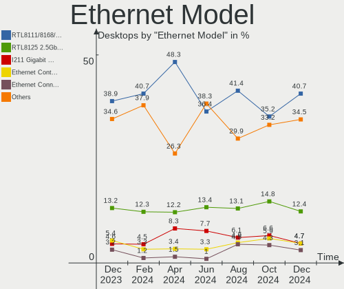
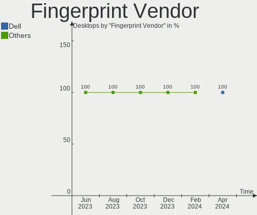

Linux in Germany - Hardware Trends (Desktops)
---------------------------------------------

A project to identify most popular hardware characteristics and track their change
over time based on data collected by Linux users at https://Linux-Hardware.org.

Anyone can contribute to this report by the [hw-probe](https://github.com/linuxhw/hw-probe) tool:

    sudo -E hw-probe -all -upload

Period: Aug, 2023.

Contents
--------

* [ System ](#system)
  - [ OS                       ](#os)
  - [ OS Family                ](#os-family)
  - [ Kernel                   ](#kernel)
  - [ Kernel Family            ](#kernel-family)
  - [ Kernel Major Ver.        ](#kernel-major-ver)
  - [ Arch                     ](#arch)
  - [ DE                       ](#de)
  - [ Display Server           ](#display-server)
  - [ Display Manager          ](#display-manager)
  - [ OS Lang                  ](#os-lang)
  - [ Boot Mode                ](#boot-mode)
  - [ Filesystem               ](#filesystem)
  - [ Part. scheme             ](#part-scheme)
  - [ Dual Boot with Linux/BSD ](#dual-boot-with-linuxbsd)
  - [ Dual Boot (Win)          ](#dual-boot-win)

* [ Board ](#board)
  - [ Vendor                   ](#vendor)
  - [ Model                    ](#model)
  - [ Model Family             ](#model-family)
  - [ MFG Year                 ](#mfg-year)
  - [ Form Factor              ](#form-factor)
  - [ Secure Boot              ](#secure-boot)
  - [ Coreboot                 ](#coreboot)
  - [ RAM Size                 ](#ram-size)
  - [ RAM Used                 ](#ram-used)
  - [ Total Drives             ](#total-drives)
  - [ Has CD-ROM               ](#has-cd-rom)
  - [ Has Ethernet             ](#has-ethernet)
  - [ Has WiFi                 ](#has-wifi)
  - [ Has Bluetooth            ](#has-bluetooth)

* [ Location ](#location)
  - [ Country                  ](#country)
  - [ City                     ](#city)

* [ Drives ](#drives)
  - [ Drive Vendor             ](#drive-vendor)
  - [ Drive Model              ](#drive-model)
  - [ HDD Vendor               ](#hdd-vendor)
  - [ SSD Vendor               ](#ssd-vendor)
  - [ Drive Kind               ](#drive-kind)
  - [ Drive Connector          ](#drive-connector)
  - [ Drive Size               ](#drive-size)
  - [ Space Total              ](#space-total)
  - [ Space Used               ](#space-used)
  - [ Malfunc. Drives          ](#malfunc-drives)
  - [ Malfunc. Drive Vendor    ](#malfunc-drive-vendor)
  - [ Malfunc. HDD Vendor      ](#malfunc-hdd-vendor)
  - [ Malfunc. Drive Kind      ](#malfunc-drive-kind)
  - [ Failed Drives            ](#failed-drives)
  - [ Failed Drive Vendor      ](#failed-drive-vendor)
  - [ Drive Status             ](#drive-status)

* [ Storage controller ](#storage-controller)
  - [ Storage Vendor           ](#storage-vendor)
  - [ Storage Model            ](#storage-model)
  - [ Storage Kind             ](#storage-kind)

* [ Processor ](#processor)
  - [ CPU Vendor               ](#cpu-vendor)
  - [ CPU Model                ](#cpu-model)
  - [ CPU Model Family         ](#cpu-model-family)
  - [ CPU Cores                ](#cpu-cores)
  - [ CPU Sockets              ](#cpu-sockets)
  - [ CPU Threads              ](#cpu-threads)
  - [ CPU Op-Modes             ](#cpu-op-modes)
  - [ CPU Microcode            ](#cpu-microcode)
  - [ CPU Microarch            ](#cpu-microarch)

* [ Graphics ](#graphics)
  - [ GPU Vendor               ](#gpu-vendor)
  - [ GPU Model                ](#gpu-model)
  - [ GPU Combo                ](#gpu-combo)
  - [ GPU Driver               ](#gpu-driver)
  - [ GPU Memory               ](#gpu-memory)

* [ Monitor ](#monitor)
  - [ Monitor Vendor           ](#monitor-vendor)
  - [ Monitor Model            ](#monitor-model)
  - [ Monitor Resolution       ](#monitor-resolution)
  - [ Monitor Diagonal         ](#monitor-diagonal)
  - [ Monitor Width            ](#monitor-width)
  - [ Aspect Ratio             ](#aspect-ratio)
  - [ Monitor Area             ](#monitor-area)
  - [ Pixel Density            ](#pixel-density)
  - [ Multiple Monitors        ](#multiple-monitors)

* [ Network ](#network)
  - [ Net Controller Vendor    ](#net-controller-vendor)
  - [ Net Controller Model     ](#net-controller-model)
  - [ Wireless Vendor          ](#wireless-vendor)
  - [ Wireless Model           ](#wireless-model)
  - [ Ethernet Vendor          ](#ethernet-vendor)
  - [ Ethernet Model           ](#ethernet-model)
  - [ Net Controller Kind      ](#net-controller-kind)
  - [ Used Controller          ](#used-controller)
  - [ NICs                     ](#nics)
  - [ IPv6                     ](#ipv6)

* [ Bluetooth ](#bluetooth)
  - [ Bluetooth Vendor         ](#bluetooth-vendor)
  - [ Bluetooth Model          ](#bluetooth-model)

* [ Sound ](#sound)
  - [ Sound Vendor             ](#sound-vendor)
  - [ Sound Model              ](#sound-model)

* [ Memory ](#memory)
  - [ Memory Vendor            ](#memory-vendor)
  - [ Memory Model             ](#memory-model)
  - [ Memory Kind              ](#memory-kind)
  - [ Memory Form Factor       ](#memory-form-factor)
  - [ Memory Size              ](#memory-size)
  - [ Memory Speed             ](#memory-speed)

* [ Printers & scanners ](#printers--scanners)
  - [ Printer Vendor           ](#printer-vendor)
  - [ Printer Model            ](#printer-model)
  - [ Scanner Vendor           ](#scanner-vendor)
  - [ Scanner Model            ](#scanner-model)

* [ Camera ](#camera)
  - [ Camera Vendor            ](#camera-vendor)
  - [ Camera Model             ](#camera-model)

* [ Security ](#security)
  - [ Fingerprint Vendor       ](#fingerprint-vendor)
  - [ Fingerprint Model        ](#fingerprint-model)
  - [ Chipcard Vendor          ](#chipcard-vendor)
  - [ Chipcard Model           ](#chipcard-model)

* [ Unsupported ](#unsupported)
  - [ Unsupported Devices      ](#unsupported-devices)
  - [ Unsupported Device Types ](#unsupported-device-types)

System
------

OS
--

Installed operating systems

| Name                         | Desktops | Percent |
|------------------------------|----------|---------|
| Ubuntu 22.04                 | 26       | 10.04%  |
| Linux Mint 21.2              | 25       | 9.65%   |
| OpenMandriva 23.08           | 24       | 9.27%   |
| Ubuntu 23.04                 | 19       | 7.34%   |
| Pop!_OS 22.04                | 16       | 6.18%   |
| Ubuntu 20.04                 | 10       | 3.86%   |
| Fedora 38                    | 10       | 3.86%   |
| Debian 12                    | 9        | 3.47%   |
| Zorin 16                     | 7        | 2.7%    |
| Arch Rolling                 | 7        | 2.7%    |
| Linux Mint 20.3              | 6        | 2.32%   |
| Debian                       | 5        | 1.93%   |
| openSUSE Tumbleweed-XXXXXXXX | 4        | 1.54%   |
| openSUSE Leap-15.5           | 4        | 1.54%   |
| LMDE 5                       | 4        | 1.54%   |
| ArcoLinux Rolling            | 4        | 1.54%   |
| TUXEDO OS 22.04              | 3        | 1.16%   |
| OpenMandriva 4.3             | 3        | 1.16%   |
| OpenMandriva 23.07           | 3        | 1.16%   |
| Linux Mint 21.1              | 3        | 1.16%   |
| Kubuntu 23.04                | 3        | 1.16%   |
| KDE neon 22.04               | 3        | 1.16%   |
| Gentoo 2.13                  | 3        | 1.16%   |
| Debian 11                    | 3        | 1.16%   |
| BlackPanther 18.1            | 3        | 1.16%   |
| Xubuntu 23.04                | 2        | 0.77%   |
| Xero Rolling                 | 2        | 0.77%   |
| Ubuntu MATE 22.04            | 2        | 0.77%   |
| openSUSE Leap-15.4           | 2        | 0.77%   |
| OpenMandriva 23.90           | 2        | 0.77%   |
| Manjaro                      | 2        | 0.77%   |
| Linux Mint 21                | 2        | 0.77%   |
| Kubuntu 22.04                | 2        | 0.77%   |
| Kubuntu 11                   | 2        | 0.77%   |
| Garuda Linux Soaring         | 2        | 0.77%   |
| Xubuntu 22.04                | 1        | 0.39%   |
| Ultramarine 38               | 1        | 0.39%   |
| Ubuntu Studio 22.04          | 1        | 0.39%   |
| Ubuntu Budgie 22.10          | 1        | 0.39%   |
| Ubuntu 22.10                 | 1        | 0.39%   |

OS Family
---------

OS without a version

| Name          | Desktops | Percent |
|---------------|----------|---------|
| Ubuntu        | 58       | 22.39%  |
| Linux Mint    | 38       | 14.67%  |
| OpenMandriva  | 35       | 13.51%  |
| Debian        | 17       | 6.56%   |
| Pop!_OS       | 16       | 6.18%   |
| Fedora        | 12       | 4.63%   |
| openSUSE      | 10       | 3.86%   |
| Zorin         | 7        | 2.7%    |
| Kubuntu       | 7        | 2.7%    |
| Arch          | 7        | 2.7%    |
| LMDE          | 4        | 1.54%   |
| Gentoo        | 4        | 1.54%   |
| ArcoLinux     | 4        | 1.54%   |
| Xubuntu       | 3        | 1.16%   |
| TUXEDO OS     | 3        | 1.16%   |
| Manjaro       | 3        | 1.16%   |
| KDE neon      | 3        | 1.16%   |
| Garuda Linux  | 3        | 1.16%   |
| BlackPanther  | 3        | 1.16%   |
| Xero          | 2        | 0.77%   |
| Ubuntu MATE   | 2        | 0.77%   |
| Nobara        | 2        | 0.77%   |
| Ultramarine   | 1        | 0.39%   |
| Ubuntu Studio | 1        | 0.39%   |
| Ubuntu Budgie | 1        | 0.39%   |
| ROSA          | 1        | 0.39%   |
| RHEL          | 1        | 0.39%   |
| Q4OS          | 1        | 0.39%   |
| Pikaos        | 1        | 0.39%   |
| Parrot        | 1        | 0.39%   |
| NixOS         | 1        | 0.39%   |
| Neptune OS    | 1        | 0.39%   |
| MX            | 1        | 0.39%   |
| Lubuntu       | 1        | 0.39%   |
| Kali          | 1        | 0.39%   |
| Endless       | 1        | 0.39%   |
| EndeavourOS   | 1        | 0.39%   |
| Elementary    | 1        | 0.39%   |

Kernel
------

Version of the Linux kernel

| Version                                            | Desktops | Percent |
|----------------------------------------------------|----------|---------|
| 6.2.0-26-generic                                   | 35       | 13.51%  |
| 5.15.0-78-generic                                  | 23       | 8.88%   |
| 6.4.11-desktop-1omv2390                            | 21       | 8.11%   |
| 5.15.0-79-generic                                  | 12       | 4.63%   |
| 6.4.6-76060406-generic                             | 10       | 3.86%   |
| 6.2.0-27-generic                                   | 10       | 3.86%   |
| 6.2.0-31-generic                                   | 8        | 3.09%   |
| 6.2.6-76060206-generic                             | 6        | 2.32%   |
| 6.4.8-desktop-2omv2390                             | 5        | 1.93%   |
| 6.1.0-11-amd64                                     | 5        | 1.93%   |
| 6.1.0-10-amd64                                     | 5        | 1.93%   |
| 5.4.0-156-generic                                  | 5        | 1.93%   |
| 6.3.5-desktop-3omv2390                             | 4        | 1.54%   |
| 5.19.0-50-generic                                  | 4        | 1.54%   |
| 6.4.8-arch1-1                                      | 3        | 1.16%   |
| 6.4.6-1-default                                    | 3        | 1.16%   |
| 6.4.10-zen2-1-zen                                  | 3        | 1.16%   |
| 6.4.10-200.fc38.x86_64                             | 3        | 1.16%   |
| 6.4.0-2-amd64                                      | 3        | 1.16%   |
| 6.2.0-10018-tuxedo                                 | 3        | 1.16%   |
| 5.15.0-82-generic                                  | 3        | 1.16%   |
| 5.10.0-23-amd64                                    | 3        | 1.16%   |
| 6.4.6-200.fc38.x86_64                              | 2        | 0.77%   |
| 5.6.14-desktop-2bP                                 | 2        | 0.77%   |
| 5.4.0-150-generic                                  | 2        | 0.77%   |
| 5.19.0-46-generic                                  | 2        | 0.77%   |
| 5.16.7-desktop-1omv4003                            | 2        | 0.77%   |
| 5.15.0-41-generic                                  | 2        | 0.77%   |
| 5.14.21-150500.55.19-default                       | 2        | 0.77%   |
| 5.10.0-25-amd64                                    | 2        | 0.77%   |
| 6.5.0-0.rc7.20230821gitf7757129e3de.50.fc40.x86_64 | 1        | 0.39%   |
| 6.5.0-0.rc7.20230821gitf7757129e3de.50.fc39.x86_64 | 1        | 0.39%   |
| 6.4.9-pikaos                                       | 1        | 0.39%   |
| 6.4.9-arch1-1                                      | 1        | 0.39%   |
| 6.4.9-200.fc38.x86_64                              | 1        | 0.39%   |
| 6.4.8-203.fsync.fc38.x86_64                        | 1        | 0.39%   |
| 6.4.8-200.fc38.x86_64                              | 1        | 0.39%   |
| 6.4.7-arch1-2                                      | 1        | 0.39%   |
| 6.4.7-arch1-1                                      | 1        | 0.39%   |
| 6.4.7-AMD-znver3                                   | 1        | 0.39%   |

Kernel Family
-------------

Linux kernel without a distro release

| Version  | Desktops | Percent |
|----------|----------|---------|
| 6.2.0    | 58       | 22.39%  |
| 5.15.0   | 47       | 18.15%  |
| 6.4.11   | 25       | 9.65%   |
| 6.4.6    | 15       | 5.79%   |
| 6.1.0    | 13       | 5.02%   |
| 5.4.0    | 11       | 4.25%   |
| 6.4.8    | 10       | 3.86%   |
| 6.4.10   | 8        | 3.09%   |
| 5.19.0   | 8        | 3.09%   |
| 6.2.6    | 7        | 2.7%    |
| 6.4.0    | 6        | 2.32%   |
| 5.14.21  | 6        | 2.32%   |
| 5.10.0   | 6        | 2.32%   |
| 6.4.7    | 5        | 1.93%   |
| 6.3.5    | 4        | 1.54%   |
| 6.4.9    | 3        | 1.16%   |
| 6.5.0    | 2        | 0.77%   |
| 6.4.4    | 2        | 0.77%   |
| 6.1.41   | 2        | 0.77%   |
| 5.6.14   | 2        | 0.77%   |
| 5.16.7   | 2        | 0.77%   |
| 6.3.9    | 1        | 0.39%   |
| 6.3.8    | 1        | 0.39%   |
| 6.3.12   | 1        | 0.39%   |
| 6.3.11   | 1        | 0.39%   |
| 6.3.0    | 1        | 0.39%   |
| 6.1.49   | 1        | 0.39%   |
| 6.1.44   | 1        | 0.39%   |
| 6.1.39   | 1        | 0.39%   |
| 6.1.38   | 1        | 0.39%   |
| 6.1.33   | 1        | 0.39%   |
| 5.16.13  | 1        | 0.39%   |
| 5.15.85  | 1        | 0.39%   |
| 5.15.125 | 1        | 0.39%   |
| 5.15.108 | 1        | 0.39%   |
| 5.11.0   | 1        | 0.39%   |
| 5.10.14  | 1        | 0.39%   |
| 4.18.0   | 1        | 0.39%   |

Kernel Major Ver.
-----------------

Linux kernel major version

| Version | Desktops | Percent |
|---------|----------|---------|
| 6.4     | 74       | 28.57%  |
| 6.2     | 65       | 25.1%   |
| 5.15    | 50       | 19.31%  |
| 6.1     | 20       | 7.72%   |
| 5.4     | 11       | 4.25%   |
| 6.3     | 9        | 3.47%   |
| 5.19    | 8        | 3.09%   |
| 5.10    | 7        | 2.7%    |
| 5.14    | 6        | 2.32%   |
| 5.16    | 3        | 1.16%   |
| 6.5     | 2        | 0.77%   |
| 5.6     | 2        | 0.77%   |
| 5.11    | 1        | 0.39%   |
| 4.18    | 1        | 0.39%   |

Arch
----

OS architecture (x86_64, i586, etc.)

| Name   | Desktops | Percent |
|--------|----------|---------|
| x86_64 | 258      | 99.61%  |
| i686   | 1        | 0.39%   |

DE
--

Desktop Environment

| Name         | Desktops | Percent |
|--------------|----------|---------|
| GNOME        | 99       | 38.22%  |
| KDE5         | 85       | 32.82%  |
| X-Cinnamon   | 33       | 12.74%  |
| Unknown      | 9        | 3.47%   |
| XFCE         | 8        | 3.09%   |
| Cinnamon     | 8        | 3.09%   |
| MATE         | 6        | 2.32%   |
| Pantheon     | 2        | 0.77%   |
| LXDE         | 2        | 0.77%   |
| hyprland     | 2        | 0.77%   |
| qtile        | 1        | 0.39%   |
| none+awesome | 1        | 0.39%   |
| LXQt         | 1        | 0.39%   |
| i3           | 1        | 0.39%   |
| Budgie       | 1        | 0.39%   |

Display Server
--------------

X11 or Wayland

| Name    | Desktops | Percent |
|---------|----------|---------|
| X11     | 155      | 59.85%  |
| Wayland | 88       | 33.98%  |
| Tty     | 8        | 3.09%   |
| Unknown | 8        | 3.09%   |

Display Manager
---------------

SDDM, LightDM, etc.

| Name    | Desktops | Percent |
|---------|----------|---------|
| Unknown | 94       | 36.29%  |
| SDDM    | 62       | 23.94%  |
| GDM3    | 62       | 23.94%  |
| LightDM | 33       | 12.74%  |
| GDM     | 7        | 2.7%    |
| WDM     | 1        | 0.39%   |

OS Lang
-------

Language

| Lang    | Desktops | Percent |
|---------|----------|---------|
| de_DE   | 187      | 72.2%   |
| en_US   | 47       | 18.15%  |
| C       | 7        | 2.7%    |
| en_GB   | 6        | 2.32%   |
| Unknown | 4        | 1.54%   |
| ru_RU   | 2        | 0.77%   |
| de_CH   | 2        | 0.77%   |
| C.UTF8  | 2        | 0.77%   |
| pl_PL   | 1        | 0.39%   |
| en_DK   | 1        | 0.39%   |

Boot Mode
---------

EFI or BIOS

| Mode | Desktops | Percent |
|------|----------|---------|
| BIOS | 143      | 55.21%  |
| EFI  | 116      | 44.79%  |

Filesystem
----------

Type of filesystem

| Type    | Desktops | Percent |
|---------|----------|---------|
| Ext4    | 145      | 55.98%  |
| Tmpfs   | 47       | 18.15%  |
| Btrfs   | 39       | 15.06%  |
| Overlay | 22       | 8.49%   |
| Xfs     | 3        | 1.16%   |
| Zfs     | 2        | 0.77%   |
| Ext3    | 1        | 0.39%   |

Part. scheme
------------

Scheme of partitioning

| Type    | Desktops | Percent |
|---------|----------|---------|
| GPT     | 139      | 53.67%  |
| Unknown | 85       | 32.82%  |
| MBR     | 35       | 13.51%  |

Dual Boot with Linux/BSD
------------------------

Hosting more than one Linux/BSD

| Dual boot | Desktops | Percent |
|-----------|----------|---------|
| No        | 197      | 76.06%  |
| Yes       | 62       | 23.94%  |

Dual Boot (Win)
---------------

Hosting Linux and Windows

| Dual boot | Desktops | Percent |
|-----------|----------|---------|
| No        | 179      | 69.11%  |
| Yes       | 80       | 30.89%  |

Board
-----

Vendor
------

Motherboard manufacturer

| Name                | Desktops | Percent |
|---------------------|----------|---------|
| ASUSTek Computer    | 65       | 25.1%   |
| Gigabyte Technology | 41       | 15.83%  |
| ASRock              | 38       | 14.67%  |
| MSI                 | 32       | 12.36%  |
| Hewlett-Packard     | 17       | 6.56%   |
| Fujitsu             | 15       | 5.79%   |
| Lenovo              | 11       | 4.25%   |
| Dell                | 10       | 3.86%   |
| Medion              | 7        | 2.7%    |
| Acer                | 4        | 1.54%   |
| Unknown             | 4        | 1.54%   |
| Foxconn             | 3        | 1.16%   |
| Shuttle             | 2        | 0.77%   |
| Pegatron            | 2        | 0.77%   |
| Win Element         | 1        | 0.39%   |
| Supermicro          | 1        | 0.39%   |
| NZXT                | 1        | 0.39%   |
| LattePanda          | 1        | 0.39%   |
| Biostar             | 1        | 0.39%   |
| BESSTAR Tech        | 1        | 0.39%   |
| AZW                 | 1        | 0.39%   |
| ASRockRack          | 1        | 0.39%   |

Model
-----

Motherboard model

| Name                               | Desktops | Percent |
|------------------------------------|----------|---------|
| ASRock B450M Pro4                  | 4        | 1.54%   |
| Unknown                            | 4        | 1.54%   |
| MSI MS-7B79                        | 3        | 1.16%   |
| Fujitsu ESPRIMO Q920               | 3        | 1.16%   |
| ASUS All Series                    | 3        | 1.16%   |
| MSI MS-7C95                        | 2        | 0.77%   |
| MSI MS-7C94                        | 2        | 0.77%   |
| MSI MS-7C52                        | 2        | 0.77%   |
| MSI MS-7B93                        | 2        | 0.77%   |
| MSI MS-7817                        | 2        | 0.77%   |
| MSI MS-7816                        | 2        | 0.77%   |
| HP ProDesk 400 G5 Desktop Mini     | 2        | 0.77%   |
| Gigabyte Z390 UD                   | 2        | 0.77%   |
| Gigabyte X570 AORUS ELITE          | 2        | 0.77%   |
| Gigabyte H81M-D2V                  | 2        | 0.77%   |
| Gigabyte GA-880GMA-UD2H            | 2        | 0.77%   |
| Gigabyte B550M DS3H                | 2        | 0.77%   |
| Gigabyte B550 GAMING X V2          | 2        | 0.77%   |
| Fujitsu ESPRIMO Q520               | 2        | 0.77%   |
| Fujitsu ESPRIMO P910               | 2        | 0.77%   |
| ASUS ROG STRIX B650E-E GAMING WIFI | 2        | 0.77%   |
| ASUS ROG STRIX B550-F GAMING       | 2        | 0.77%   |
| ASUS PRIME B450M-K II              | 2        | 0.77%   |
| ASUS PRIME B450-PLUS               | 2        | 0.77%   |
| ASUS M5A78L-M LE                   | 2        | 0.77%   |
| ASRock Q1900M                      | 2        | 0.77%   |
| ASRock B550M-HDV                   | 2        | 0.77%   |
| ASRock 970 Pro3 R2.0               | 2        | 0.77%   |
| Win Element M9                     | 1        | 0.39%   |
| Supermicro AS -2014S-TR            | 1        | 0.39%   |
| Shuttle SH170                      | 1        | 0.39%   |
| Shuttle 1009859_1400415            | 1        | 0.39%   |
| Pegatron p6730de                   | 1        | 0.39%   |
| Pegatron Elite 7300 Series MT      | 1        | 0.39%   |
| NZXT N7 Z590                       | 1        | 0.39%   |
| MSI X5823                          | 1        | 0.39%   |
| MSI MS-7E07                        | 1        | 0.39%   |
| MSI MS-7D75                        | 1        | 0.39%   |
| MSI MS-7D43                        | 1        | 0.39%   |
| MSI MS-7D22                        | 1        | 0.39%   |

Model Family
------------

Motherboard model prefix

| Name                    | Desktops | Percent |
|-------------------------|----------|---------|
| ASUS PRIME              | 14       | 5.41%   |
| ASUS ROG                | 13       | 5.02%   |
| Fujitsu ESPRIMO         | 12       | 4.63%   |
| Lenovo ThinkCentre      | 6        | 2.32%   |
| Dell OptiPlex           | 6        | 2.32%   |
| ASRock B450M            | 5        | 1.93%   |
| HP ProDesk              | 4        | 1.54%   |
| HP EliteDesk            | 4        | 1.54%   |
| Gigabyte B550           | 4        | 1.54%   |
| ASUS TUF                | 4        | 1.54%   |
| ASUS M5A78L-M           | 4        | 1.54%   |
| Unknown                 | 4        | 1.54%   |
| MSI MS-7B79             | 3        | 1.16%   |
| MSI Mr.                 | 3        | 1.16%   |
| Gigabyte Z390           | 3        | 1.16%   |
| ASUS P8Z68-V            | 3        | 1.16%   |
| ASUS M5A97              | 3        | 1.16%   |
| ASUS All                | 3        | 1.16%   |
| Acer Aspire             | 3        | 1.16%   |
| MSI MS-7C95             | 2        | 0.77%   |
| MSI MS-7C94             | 2        | 0.77%   |
| MSI MS-7C52             | 2        | 0.77%   |
| MSI MS-7B93             | 2        | 0.77%   |
| MSI MS-7817             | 2        | 0.77%   |
| MSI MS-7816             | 2        | 0.77%   |
| Lenovo ThinkStation     | 2        | 0.77%   |
| Lenovo IdeaCentre       | 2        | 0.77%   |
| HP Compaq               | 2        | 0.77%   |
| Gigabyte Z790           | 2        | 0.77%   |
| Gigabyte X570           | 2        | 0.77%   |
| Gigabyte H81M-D2V       | 2        | 0.77%   |
| Gigabyte H510M          | 2        | 0.77%   |
| Gigabyte GA-880GMA-UD2H | 2        | 0.77%   |
| Gigabyte GA-78LMT-USB3  | 2        | 0.77%   |
| Gigabyte B550M          | 2        | 0.77%   |
| Dell XPS                | 2        | 0.77%   |
| ASUS Pro                | 2        | 0.77%   |
| ASRock Z77              | 2        | 0.77%   |
| ASRock Q1900M           | 2        | 0.77%   |
| ASRock B550M-HDV        | 2        | 0.77%   |

MFG Year
--------

Motherboard manufacture year

| Year | Desktops | Percent |
|------|----------|---------|
| 2020 | 35       | 13.51%  |
| 2014 | 23       | 8.88%   |
| 2019 | 21       | 8.11%   |
| 2018 | 21       | 8.11%   |
| 2022 | 20       | 7.72%   |
| 2011 | 19       | 7.34%   |
| 2021 | 18       | 6.95%   |
| 2013 | 18       | 6.95%   |
| 2012 | 17       | 6.56%   |
| 2023 | 11       | 4.25%   |
| 2015 | 10       | 3.86%   |
| 2016 | 9        | 3.47%   |
| 2010 | 9        | 3.47%   |
| 2017 | 8        | 3.09%   |
| 2009 | 8        | 3.09%   |
| 2008 | 7        | 2.7%    |
| 2007 | 4        | 1.54%   |
| 2006 | 1        | 0.39%   |

Form Factor
-----------

Physical design of the computer

| Name    | Desktops | Percent |
|---------|----------|---------|
| Desktop | 259      | 100%    |

Secure Boot
-----------

Enabled or disabled

| State    | Desktops | Percent |
|----------|----------|---------|
| Disabled | 250      | 96.53%  |
| Enabled  | 9        | 3.47%   |

Coreboot
--------

Have coreboot on board

| Used | Desktops | Percent |
|------|----------|---------|
| No   | 259      | 100%    |

RAM Size
--------

Total RAM memory

| Size in GB      | Desktops | Percent |
|-----------------|----------|---------|
| 16.01-24.0      | 64       | 24.71%  |
| 32.01-64.0      | 57       | 22.01%  |
| 8.01-16.0       | 49       | 18.92%  |
| 4.01-8.0        | 36       | 13.9%   |
| 3.01-4.0        | 21       | 8.11%   |
| 64.01-256.0     | 18       | 6.95%   |
| 24.01-32.0      | 10       | 3.86%   |
| More than 256.0 | 1        | 0.39%   |
| 2.01-3.0        | 1        | 0.39%   |
| 1.01-2.0        | 1        | 0.39%   |
| 0.51-1.0        | 1        | 0.39%   |

RAM Used
--------

Used RAM memory

| Used GB    | Desktops | Percent |
|------------|----------|---------|
| 1.01-2.0   | 72       | 27.8%   |
| 2.01-3.0   | 71       | 27.41%  |
| 4.01-8.0   | 52       | 20.08%  |
| 3.01-4.0   | 30       | 11.58%  |
| 8.01-16.0  | 19       | 7.34%   |
| 0.51-1.0   | 5        | 1.93%   |
| 16.01-24.0 | 4        | 1.54%   |
| 0.01-0.5   | 4        | 1.54%   |
| 32.01-64.0 | 1        | 0.39%   |
| 24.01-32.0 | 1        | 0.39%   |

Total Drives
------------

Number of drives on board

| Drives | Desktops | Percent |
|--------|----------|---------|
| 1      | 87       | 33.59%  |
| 2      | 80       | 30.89%  |
| 3      | 39       | 15.06%  |
| 4      | 26       | 10.04%  |
| 5      | 12       | 4.63%   |
| 6      | 6        | 2.32%   |
| 7      | 4        | 1.54%   |
| 8      | 2        | 0.77%   |
| 32     | 1        | 0.39%   |
| 10     | 1        | 0.39%   |
| 9      | 1        | 0.39%   |

Has CD-ROM
----------

Has CD-ROM on board

| Presented | Desktops | Percent |
|-----------|----------|---------|
| Yes       | 138      | 53.28%  |
| No        | 121      | 46.72%  |

Has Ethernet
------------

Has Ethernet on board

| Presented | Desktops | Percent |
|-----------|----------|---------|
| Yes       | 257      | 99.23%  |
| No        | 2        | 0.77%   |

Has WiFi
--------

Has WiFi module

| Presented | Desktops | Percent |
|-----------|----------|---------|
| No        | 158      | 61%     |
| Yes       | 101      | 39%     |

Has Bluetooth
-------------

Has Bluetooth module

| Presented | Desktops | Percent |
|-----------|----------|---------|
| No        | 159      | 61.39%  |
| Yes       | 100      | 38.61%  |

Location
--------

Country
-------

Geographic location (country)

| Country | Desktops | Percent |
|---------|----------|---------|
| Germany | 259      | 100%    |

City
----

Geographic location (city)

| City                    | Desktops | Percent |
|-------------------------|----------|---------|
| Berlin                  | 17       | 6.56%   |
| Hamburg                 | 12       | 4.63%   |
| Cologne                 | 10       | 3.86%   |
| Stuttgart               | 5        | 1.93%   |
| Munich                  | 5        | 1.93%   |
| Karlsruhe               | 5        | 1.93%   |
| Frankfurt am Main       | 5        | 1.93%   |
| Mannheim                | 4        | 1.54%   |
| Hanover                 | 4        | 1.54%   |
| Dortmund                | 4        | 1.54%   |
| Braunschweig            | 4        | 1.54%   |
| Ulm                     | 3        | 1.16%   |
| Duisburg                | 3        | 1.16%   |
| Coburg                  | 3        | 1.16%   |
| Singen                  | 2        | 0.77%   |
| Sankt Wendel            | 2        | 0.77%   |
| Saarbrücken            | 2        | 0.77%   |
| Pfaffenhofen an der Ilm | 2        | 0.77%   |
| Peitz                   | 2        | 0.77%   |
| Osnabrück              | 2        | 0.77%   |
| Oldenburg               | 2        | 0.77%   |
| Oberursel               | 2        | 0.77%   |
| Mülheim                | 2        | 0.77%   |
| Mönchengladbach        | 2        | 0.77%   |
| Lüdenscheid            | 2        | 0.77%   |
| Lamspringe              | 2        | 0.77%   |
| Hürth                  | 2        | 0.77%   |
| Heide                   | 2        | 0.77%   |
| Hamm                    | 2        | 0.77%   |
| Greifswald              | 2        | 0.77%   |
| Göppingen              | 2        | 0.77%   |
| Goch                    | 2        | 0.77%   |
| Frankfurt (Oder)        | 2        | 0.77%   |
| Falkenstein             | 2        | 0.77%   |
| Dresden                 | 2        | 0.77%   |
| Bad Wildbad             | 2        | 0.77%   |
| Bad Lauchstaedt         | 2        | 0.77%   |
| Andernach               | 2        | 0.77%   |
| Würzburg               | 1        | 0.39%   |
| Wurmlingen              | 1        | 0.39%   |

Drives
------

Drive Vendor
------------

Hard drive vendors

| Vendor                      | Desktops | Drives | Percent |
|-----------------------------|----------|--------|---------|
| Samsung Electronics         | 103      | 150    | 20.2%   |
| WDC                         | 62       | 83     | 12.16%  |
| Seagate                     | 62       | 76     | 12.16%  |
| SanDisk                     | 40       | 44     | 7.84%   |
| Toshiba                     | 31       | 35     | 6.08%   |
| Crucial                     | 29       | 36     | 5.69%   |
| Intenso                     | 21       | 22     | 4.12%   |
| Kingston                    | 19       | 23     | 3.73%   |
| Hitachi                     | 17       | 18     | 3.33%   |
| Micron/Crucial Technology   | 8        | 9      | 1.57%   |
| Unknown                     | 7        | 10     | 1.37%   |
| Verbatim                    | 6        | 7      | 1.18%   |
| SPCC                        | 6        | 6      | 1.18%   |
| ADATA Technology            | 6        | 6      | 1.18%   |
| A-DATA Technology           | 6        | 6      | 1.18%   |
| MAXIO Technology (Hangzhou) | 5        | 7      | 0.98%   |
| Kingston Technology Company | 5        | 5      | 0.98%   |
| Phison Electronics          | 4        | 5      | 0.78%   |
| Intel                       | 4        | 5      | 0.78%   |
| HGST                        | 4        | 32     | 0.78%   |
| SK hynix                    | 3        | 3      | 0.59%   |
| Patriot                     | 3        | 3      | 0.59%   |
| OCZ                         | 3        | 3      | 0.59%   |
| Micron Technology           | 3        | 3      | 0.59%   |
| Hewlett-Packard             | 3        | 3      | 0.59%   |
| Transcend                   | 2        | 2      | 0.39%   |
| Team                        | 2        | 2      | 0.39%   |
| Silicon Motion              | 2        | 2      | 0.39%   |
| PNY                         | 2        | 4      | 0.39%   |
| Phison                      | 2        | 2      | 0.39%   |
| Maxtor                      | 2        | 3      | 0.39%   |
| GOODRAM                     | 2        | 3      | 0.39%   |
| Fanxiang                    | 2        | 2      | 0.39%   |
| Emtec                       | 2        | 2      | 0.39%   |
| China                       | 2        | 2      | 0.39%   |
| Unknown                     | 2        | 2      | 0.39%   |
| XPG                         | 1        | 1      | 0.2%    |
| WD MediaMax                 | 1        | 1      | 0.2%    |
| VERICO                      | 1        | 1      | 0.2%    |
| V7                          | 1        | 1      | 0.2%    |

Drive Model
-----------

Hard drive models

| Model                                                           | Desktops | Percent |
|-----------------------------------------------------------------|----------|---------|
| Samsung NVMe SSD Controller SM981/PM981/PM983 500GB             | 12       | 2.04%   |
| Samsung NVMe SSD Controller PM9A1/PM9A3/980PRO 1024GB           | 9        | 1.53%   |
| Samsung SSD 860 EVO 500GB                                       | 8        | 1.36%   |
| Samsung SSD 860 EVO 1TB                                         | 8        | 1.36%   |
| Samsung SSD 850 EVO 500GB                                       | 8        | 1.36%   |
| Crucial CT1000MX500SSD1 1TB                                     | 8        | 1.36%   |
| Kingston SKC3000D2048G 2TB                                      | 7        | 1.19%   |
| Toshiba HDWD110 1TB                                             | 6        | 1.02%   |
| Seagate ST4000DM004-2CV104 4TB                                  | 6        | 1.02%   |
| Samsung SSD 850 EVO 250GB                                       | 6        | 1.02%   |
| Verbatim Vi550 S3 512GB                                         | 5        | 0.85%   |
| SanDisk SSD PLUS 120GB                                          | 5        | 0.85%   |
| Samsung SSD 870 EVO 500GB                                       | 5        | 0.85%   |
| Micron/Crucial P2 NVMe PCIe SSD 1TB                             | 5        | 0.85%   |
| ADATA XPG SX8200 Pro PCIe Gen3x4 M.2 2280 Solid State Drive 2TB | 5        | 0.85%   |
| Unknown SD/MMC/MS PRO 1GB                                       | 4        | 0.68%   |
| Seagate ST500DM002-1BD142 500GB                                 | 4        | 0.68%   |
| Seagate ST2000DM008-2FR102 2TB                                  | 4        | 0.68%   |
| SanDisk SSD PLUS 480GB                                          | 4        | 0.68%   |
| SanDisk SSD PLUS 240GB                                          | 4        | 0.68%   |
| Samsung SSD 870 QVO 1TB                                         | 4        | 0.68%   |
| Samsung SSD 870 EVO 1TB                                         | 4        | 0.68%   |
| Samsung SSD 860 QVO 1TB                                         | 4        | 0.68%   |
| Samsung SSD 840 EVO 250GB                                       | 4        | 0.68%   |
| Samsung NVMe SSD Controller SM961/PM961/SM963 1024GB            | 4        | 0.68%   |
| MAXIO (Hangzhou) NVMe SSD Controller MAP1202 1024GB             | 4        | 0.68%   |
| WDC WD40EFRX-68WT0N0 4TB                                        | 3        | 0.51%   |
| WDC WD30EFRX-68EUZN0 3TB                                        | 3        | 0.51%   |
| WDC WD10JPVX-22JC3T0 1TB                                        | 3        | 0.51%   |
| WDC WD10EZEX-08WN4A0 1TB                                        | 3        | 0.51%   |
| WDC WD10EZEX-00BN5A0 1TB                                        | 3        | 0.51%   |
| Toshiba DT01ACA100 1TB                                          | 3        | 0.51%   |
| Sandisk WD Black SN850 256GB                                    | 3        | 0.51%   |
| SanDisk SDSSDH3512G 512GB                                       | 3        | 0.51%   |
| SanDisk SDSSDH3 500G                                            | 3        | 0.51%   |
| Samsung SSD 980 1TB                                             | 3        | 0.51%   |
| Samsung SSD 970 EVO 500GB                                       | 3        | 0.51%   |
| Samsung SSD 860 EVO 2TB                                         | 3        | 0.51%   |
| Kingston SA400S37240G 240GB SSD                                 | 3        | 0.51%   |
| Intenso External USB 3.0 1TB                                    | 3        | 0.51%   |

HDD Vendor
----------

Hard disk drive vendors

| Vendor              | Desktops | Drives | Percent |
|---------------------|----------|--------|---------|
| Seagate             | 61       | 75     | 32.11%  |
| WDC                 | 54       | 72     | 28.42%  |
| Toshiba             | 28       | 32     | 14.74%  |
| Hitachi             | 17       | 18     | 8.95%   |
| Samsung Electronics | 9        | 10     | 4.74%   |
| Unknown             | 4        | 4      | 2.11%   |
| HGST                | 4        | 32     | 2.11%   |
| Intenso             | 3        | 3      | 1.58%   |
| Maxtor              | 2        | 3      | 1.05%   |
| WD MediaMax         | 1        | 1      | 0.53%   |
| USB                 | 1        | 2      | 0.53%   |
| SABRENT             | 1        | 1      | 0.53%   |
| Maxone              | 1        | 1      | 0.53%   |
| HGST HTS            | 1        | 1      | 0.53%   |
| Hewlett-Packard     | 1        | 1      | 0.53%   |
| ExcelStor           | 1        | 1      | 0.53%   |
| Unknown             | 1        | 1      | 0.53%   |

SSD Vendor
----------

Solid state drive vendors

| Vendor              | Desktops | Drives | Percent |
|---------------------|----------|--------|---------|
| Samsung Electronics | 64       | 86     | 30.62%  |
| SanDisk             | 28       | 31     | 13.4%   |
| Crucial             | 27       | 30     | 12.92%  |
| Intenso             | 16       | 17     | 7.66%   |
| WDC                 | 8        | 8      | 3.83%   |
| Kingston            | 8        | 8      | 3.83%   |
| Verbatim            | 6        | 7      | 2.87%   |
| A-DATA Technology   | 5        | 5      | 2.39%   |
| SPCC                | 4        | 4      | 1.91%   |
| Toshiba             | 3        | 3      | 1.44%   |
| OCZ                 | 3        | 3      | 1.44%   |
| Micron Technology   | 3        | 3      | 1.44%   |
| Intel               | 3        | 4      | 1.44%   |
| Transcend           | 2        | 2      | 0.96%   |
| Team                | 2        | 2      | 0.96%   |
| PNY                 | 2        | 4      | 0.96%   |
| Patriot             | 2        | 2      | 0.96%   |
| Hewlett-Packard     | 2        | 2      | 0.96%   |
| GOODRAM             | 2        | 3      | 0.96%   |
| Emtec               | 2        | 2      | 0.96%   |
| China               | 2        | 2      | 0.96%   |
| VERICO              | 1        | 1      | 0.48%   |
| V7                  | 1        | 1      | 0.48%   |
| SK hynix            | 1        | 1      | 0.48%   |
| SD                  | 1        | 2      | 0.48%   |
| Plextor             | 1        | 1      | 0.48%   |
| Phison              | 1        | 1      | 0.48%   |
| Netac               | 1        | 1      | 0.48%   |
| Mushkin             | 1        | 1      | 0.48%   |
| MicroFrom           | 1        | 1      | 0.48%   |
| Lexar               | 1        | 1      | 0.48%   |
| JMicron Technology  | 1        | 1      | 0.48%   |
| Fanxiang            | 1        | 1      | 0.48%   |
| ASMT                | 1        | 1      | 0.48%   |
| Apple               | 1        | 1      | 0.48%   |
| Apacer              | 1        | 1      | 0.48%   |

Drive Kind
----------

HDD or SSD

| Kind    | Desktops | Drives | Percent |
|---------|----------|--------|---------|
| SSD     | 166      | 244    | 38.69%  |
| HDD     | 146      | 258    | 34.03%  |
| NVMe    | 105      | 140    | 24.48%  |
| Unknown | 11       | 14     | 2.56%   |
| MMC     | 1        | 1      | 0.23%   |

Drive Connector
---------------

SATA, SAS, NVMe, etc.

| Type | Desktops | Drives | Percent |
|------|----------|--------|---------|
| SATA | 228      | 455    | 63.51%  |
| NVMe | 105      | 140    | 29.25%  |
| SAS  | 25       | 61     | 6.96%   |
| MMC  | 1        | 1      | 0.28%   |

Drive Size
----------

Size of hard drive

| Size in TB | Desktops | Drives | Percent |
|------------|----------|--------|---------|
| 0.01-0.5   | 157      | 226    | 46.18%  |
| 0.51-1.0   | 103      | 140    | 30.29%  |
| 1.01-2.0   | 39       | 52     | 11.47%  |
| 3.01-4.0   | 19       | 26     | 5.59%   |
| 2.01-3.0   | 12       | 15     | 3.53%   |
| 4.01-10.0  | 7        | 38     | 2.06%   |
| 10.01-20.0 | 3        | 5      | 0.88%   |

Space Total
-----------

Amount of disk space available on the file system

| Size in GB     | Desktops | Percent |
|----------------|----------|---------|
| 501-1000       | 43       | 16.6%   |
| 101-250        | 42       | 16.22%  |
| More than 3000 | 41       | 15.83%  |
| 251-500        | 40       | 15.44%  |
| 1001-2000      | 34       | 13.13%  |
| 1-20           | 26       | 10.04%  |
| 2001-3000      | 15       | 5.79%   |
| 51-100         | 12       | 4.63%   |
| Unknown        | 4        | 1.54%   |
| 21-50          | 2        | 0.77%   |

Space Used
----------

Amount of used disk space

| Used GB        | Desktops | Percent |
|----------------|----------|---------|
| 1-20           | 74       | 28.57%  |
| 21-50          | 34       | 13.13%  |
| 251-500        | 30       | 11.58%  |
| 101-250        | 29       | 11.2%   |
| 51-100         | 26       | 10.04%  |
| 501-1000       | 25       | 9.65%   |
| More than 3000 | 16       | 6.18%   |
| 1001-2000      | 11       | 4.25%   |
| 2001-3000      | 10       | 3.86%   |
| Unknown        | 4        | 1.54%   |

Malfunc. Drives
---------------

Drive models with a malfunction

| Model                               | Desktops | Drives | Percent |
|-------------------------------------|----------|--------|---------|
| WDC WD5000AAKS-007AA0 500GB         | 2        | 2      | 5.88%   |
| WDC WD30EFRX-68EUZN0 3TB            | 2        | 2      | 5.88%   |
| Seagate ST500DM002-1BD142 500GB     | 2        | 2      | 5.88%   |
| Intenso SSD Sata III 256GB          | 2        | 2      | 5.88%   |
| WDC WD5003ABYX-01WERA0 500GB        | 1        | 1      | 2.94%   |
| WDC WD5000AAKX-60U6AA0 500GB        | 1        | 1      | 2.94%   |
| WDC WD40EFRX-68WT0N0 4TB            | 1        | 2      | 2.94%   |
| WDC WD3200BEVT-26A23T0 320GB        | 1        | 1      | 2.94%   |
| WDC WD10JPVX-22JC3T0 1TB            | 1        | 1      | 2.94%   |
| WDC WD10EZRX-00L4HB0 1TB            | 1        | 1      | 2.94%   |
| WDC WD10EARS-00MVWB0 1TB            | 1        | 1      | 2.94%   |
| Toshiba HDWE140 4TB                 | 1        | 1      | 2.94%   |
| Toshiba DT01ACA100 1TB              | 1        | 1      | 2.94%   |
| Seagate ST3500312CS 500GB           | 1        | 1      | 2.94%   |
| Seagate ST31000528AS 1TB            | 1        | 1      | 2.94%   |
| Seagate ST31000520AS 1TB            | 1        | 1      | 2.94%   |
| Seagate ST1000LX015-1U7172 1TB      | 1        | 1      | 2.94%   |
| Seagate ST1000DM010-2EP102 1TB      | 1        | 1      | 2.94%   |
| SanDisk SSD PLUS 120GB              | 1        | 1      | 2.94%   |
| Samsung Electronics SSD 870 EVO 1TB | 1        | 1      | 2.94%   |
| Samsung Electronics MP0804H 80GB    | 1        | 1      | 2.94%   |
| Samsung Electronics HD642JJ 640GB   | 1        | 1      | 2.94%   |
| Samsung Electronics HD502IJ 500GB   | 1        | 1      | 2.94%   |
| Samsung Electronics HD501LJ 500GB   | 1        | 1      | 2.94%   |
| Maxtor 6Y120P0 128GB                | 1        | 1      | 2.94%   |
| Maxtor 6L160M0 160GB                | 1        | 2      | 2.94%   |
| Intel SSDSCKKF180G8L 180GB          | 1        | 1      | 2.94%   |
| Hitachi HDS721050CLA362 500GB       | 1        | 1      | 2.94%   |
| Hitachi HDS5C3020ALA632 2TB         | 1        | 1      | 2.94%   |
| ExcelStor Technology J8160S 165GB   | 1        | 1      | 2.94%   |

Malfunc. Drive Vendor
---------------------

Vendors of faulty drives

| Vendor              | Desktops | Drives | Percent |
|---------------------|----------|--------|---------|
| WDC                 | 11       | 12     | 33.33%  |
| Seagate             | 7        | 7      | 21.21%  |
| Samsung Electronics | 4        | 5      | 12.12%  |
| Toshiba             | 2        | 2      | 6.06%   |
| Maxtor              | 2        | 3      | 6.06%   |
| Intenso             | 2        | 2      | 6.06%   |
| Hitachi             | 2        | 2      | 6.06%   |
| SanDisk             | 1        | 1      | 3.03%   |
| Intel               | 1        | 1      | 3.03%   |
| ExcelStor           | 1        | 1      | 3.03%   |

Malfunc. HDD Vendor
-------------------

Vendors of faulty HDD drives

| Vendor              | Desktops | Drives | Percent |
|---------------------|----------|--------|---------|
| WDC                 | 11       | 12     | 37.93%  |
| Seagate             | 7        | 7      | 24.14%  |
| Samsung Electronics | 4        | 4      | 13.79%  |
| Toshiba             | 2        | 2      | 6.9%    |
| Maxtor              | 2        | 3      | 6.9%    |
| Hitachi             | 2        | 2      | 6.9%    |
| ExcelStor           | 1        | 1      | 3.45%   |

Malfunc. Drive Kind
-------------------

Kinds of faulty drives

| Kind | Desktops | Drives | Percent |
|------|----------|--------|---------|
| HDD  | 23       | 31     | 82.14%  |
| SSD  | 5        | 5      | 17.86%  |

Failed Drives
-------------

Failed drive models

Zero info for selected period =(

Failed Drive Vendor
-------------------

Failed drive vendors

Zero info for selected period =(

Drive Status
------------

Number of failed and malfunc. drives

| Status   | Desktops | Drives | Percent |
|----------|----------|--------|---------|
| Detected | 150      | 354    | 52.45%  |
| Works    | 109      | 267    | 38.11%  |
| Malfunc  | 27       | 36     | 9.44%   |

Storage controller
------------------

Storage Vendor
--------------

Storage controller vendors

| Vendor                      | Desktops | Percent |
|-----------------------------|----------|---------|
| Intel                       | 145      | 33.96%  |
| AMD                         | 107      | 25.06%  |
| Samsung Electronics         | 46       | 10.77%  |
| ASMedia Technology          | 26       | 6.09%   |
| Kingston Technology Company | 18       | 4.22%   |
| SanDisk                     | 15       | 3.51%   |
| JMicron Technology          | 14       | 3.28%   |
| Micron/Crucial Technology   | 13       | 3.04%   |
| Phison Electronics          | 7        | 1.64%   |
| ADATA Technology            | 7        | 1.64%   |
| MAXIO Technology (Hangzhou) | 5        | 1.17%   |
| VIA Technologies            | 4        | 0.94%   |
| Marvell Technology Group    | 4        | 0.94%   |
| Silicon Motion              | 3        | 0.7%    |
| Nvidia                      | 3        | 0.7%    |
| Broadcom / LSI              | 3        | 0.7%    |
| SK hynix                    | 2        | 0.47%   |
| Seagate Technology          | 1        | 0.23%   |
| Realtek Semiconductor       | 1        | 0.23%   |
| KIOXIA                      | 1        | 0.23%   |
| INNOGRIT                    | 1        | 0.23%   |
| Adaptec                     | 1        | 0.23%   |

Storage Model
-------------

Storage controller models

| Model                                                                          | Desktops | Percent |
|--------------------------------------------------------------------------------|----------|---------|
| AMD FCH SATA Controller [AHCI mode]                                            | 56       | 11.13%  |
| Samsung NVMe SSD Controller SM981/PM981/PM983                                  | 23       | 4.57%   |
| Intel 8 Series/C220 Series Chipset Family 6-port SATA Controller 1 [AHCI mode] | 23       | 4.57%   |
| ASMedia ASM1062 Serial ATA Controller                                          | 22       | 4.37%   |
| AMD 500 Series Chipset SATA Controller                                         | 22       | 4.37%   |
| AMD 400 Series Chipset SATA Controller                                         | 21       | 4.17%   |
| Intel 6 Series/C200 Series Chipset Family 6 port Desktop SATA AHCI Controller  | 17       | 3.38%   |
| AMD SB7x0/SB8x0/SB9x0 IDE Controller                                           | 17       | 3.38%   |
| Samsung NVMe SSD Controller PM9A1/PM9A3/980PRO                                 | 13       | 2.58%   |
| Intel Q170/Q150/B150/H170/H110/Z170/CM236 Chipset SATA Controller [AHCI Mode]  | 12       | 2.39%   |
| AMD SB7x0/SB8x0/SB9x0 SATA Controller [IDE mode]                               | 12       | 2.39%   |
| AMD SB7x0/SB8x0/SB9x0 SATA Controller [AHCI mode]                              | 11       | 2.19%   |
| Micron/Crucial P2 [Nick P2] / P3 / P3 Plus NVMe PCIe SSD (DRAM-less)           | 9        | 1.79%   |
| Kingston Company KC3000/Renegade NVMe SSD                                      | 9        | 1.79%   |
| JMicron JMB363 SATA/IDE Controller                                             | 8        | 1.59%   |
| Intel Cannon Lake PCH SATA AHCI Controller                                     | 8        | 1.59%   |
| Intel 7 Series/C210 Series Chipset Family 6-port SATA Controller [AHCI mode]   | 8        | 1.59%   |
| Intel 9 Series Chipset Family SATA Controller [AHCI Mode]                      | 7        | 1.39%   |
| Intel 500 Series Chipset Family SATA AHCI Controller                           | 7        | 1.39%   |
| Intel 200 Series PCH SATA controller [AHCI mode]                               | 7        | 1.39%   |
| Samsung NVMe SSD Controller 980                                                | 6        | 1.19%   |
| Intel Alder Lake-S PCH SATA Controller [AHCI Mode]                             | 6        | 1.19%   |
| Intel 700 Series Chipset Family SATA AHCI Controller                           | 6        | 1.19%   |
| Samsung NVMe SSD Controller SM961/PM961/SM963                                  | 5        | 0.99%   |
| Kingston Company Company Non-Volatile memory controller                        | 5        | 0.99%   |
| Intel SATA Controller [RAID mode]                                              | 5        | 0.99%   |
| AMD X370 Series Chipset SATA Controller                                        | 5        | 0.99%   |
| ADATA XPG SX8200 Pro PCIe Gen3x4 M.2 2280 Solid State Drive                    | 5        | 0.99%   |
| MAXIO (Hangzhou) NVMe SSD Controller MAP1202                                   | 4        | 0.8%    |
| JMicron JMB368 IDE controller                                                  | 4        | 0.8%    |
| Intel 5 Series/3400 Series Chipset 6 port SATA AHCI Controller                 | 4        | 0.8%    |
| Intel 400 Series Chipset Family SATA AHCI Controller                           | 4        | 0.8%    |
| AMD FCH SATA Controller D                                                      | 4        | 0.8%    |
| VIA VT6415 PATA IDE Host Controller                                            | 3        | 0.6%    |
| Silicon Motion SM2263EN/SM2263XT (DRAM-less) NVMe SSD Controllers              | 3        | 0.6%    |
| SanDisk WD PC SN810 / Black SN850 NVMe SSD                                     | 3        | 0.6%    |
| SanDisk WD Blue SN570 NVMe SSD 1TB                                             | 3        | 0.6%    |
| SanDisk WD Black SN750 / PC SN730 NVMe SSD                                     | 3        | 0.6%    |
| Intel SATA controller                                                          | 3        | 0.6%    |
| Intel 82801JI (ICH10 Family) SATA AHCI Controller                              | 3        | 0.6%    |

Storage Kind
------------

Kind of storage controller (IDE, SATA, NVMe, SAS, ...)

| Kind | Desktops | Percent |
|------|----------|---------|
| SATA | 237      | 58.81%  |
| NVMe | 105      | 26.05%  |
| IDE  | 45       | 11.17%  |
| RAID | 12       | 2.98%   |
| SAS  | 4        | 0.99%   |

Processor
---------

CPU Vendor
----------

Processor vendors

| Vendor       | Desktops | Percent |
|--------------|----------|---------|
| Intel        | 147      | 56.76%  |
| AMD          | 111      | 42.86%  |
| CentaurHauls | 1        | 0.39%   |

CPU Model
---------

Processor models

| Model                                  | Desktops | Percent |
|----------------------------------------|----------|---------|
| AMD Ryzen 5 5600G with Radeon Graphics | 8        | 3.09%   |
| AMD Ryzen 5 3600 6-Core Processor      | 7        | 2.7%    |
| AMD Ryzen 7 5800X3D 8-Core Processor   | 5        | 1.93%   |
| AMD Ryzen 7 5700G with Radeon Graphics | 5        | 1.93%   |
| Intel Core i7-2600 CPU @ 3.40GHz       | 4        | 1.54%   |
| Intel Core i5-4590T CPU @ 2.00GHz      | 4        | 1.54%   |
| Intel Core i5-3470 CPU @ 3.20GHz       | 4        | 1.54%   |
| Intel Core i5-10400 CPU @ 2.90GHz      | 4        | 1.54%   |
| Intel Core 2 Quad CPU Q9550 @ 2.83GHz  | 4        | 1.54%   |
| Intel 13th Gen Core i9-13900K          | 4        | 1.54%   |
| AMD Ryzen 7 5700X 8-Core Processor     | 4        | 1.54%   |
| AMD Ryzen 7 3700X 8-Core Processor     | 4        | 1.54%   |
| Intel Core i7-4790K CPU @ 4.00GHz      | 3        | 1.16%   |
| Intel Core i7-4790 CPU @ 3.60GHz       | 3        | 1.16%   |
| Intel Core i7-2600K CPU @ 3.40GHz      | 3        | 1.16%   |
| Intel Core i5-6500 CPU @ 3.20GHz       | 3        | 1.16%   |
| Intel Core i5-4590S CPU @ 3.00GHz      | 3        | 1.16%   |
| Intel Core 2 Duo CPU E8500 @ 3.16GHz   | 3        | 1.16%   |
| AMD Ryzen 7 2700X Eight-Core Processor | 3        | 1.16%   |
| AMD Ryzen 5 5600X 6-Core Processor     | 3        | 1.16%   |
| AMD FX-8350 Eight-Core Processor       | 3        | 1.16%   |
| Intel N100                             | 2        | 0.77%   |
| Intel Core i7-8700K CPU @ 3.70GHz      | 2        | 0.77%   |
| Intel Core i7-8700 CPU @ 3.20GHz       | 2        | 0.77%   |
| Intel Core i7-6700K CPU @ 4.00GHz      | 2        | 0.77%   |
| Intel Core i7-3770K CPU @ 3.50GHz      | 2        | 0.77%   |
| Intel Core i7 CPU 860 @ 2.80GHz        | 2        | 0.77%   |
| Intel Core i5-9500T CPU @ 2.20GHz      | 2        | 0.77%   |
| Intel Core i5-9400 CPU @ 2.90GHz       | 2        | 0.77%   |
| Intel Core i5-6500T CPU @ 2.50GHz      | 2        | 0.77%   |
| Intel Core i5-4590 CPU @ 3.30GHz       | 2        | 0.77%   |
| Intel Core i5-4460 CPU @ 3.20GHz       | 2        | 0.77%   |
| Intel Core i5-3450 CPU @ 3.10GHz       | 2        | 0.77%   |
| Intel Core i5-2500K CPU @ 3.30GHz      | 2        | 0.77%   |
| Intel Core i5-2500 CPU @ 3.30GHz       | 2        | 0.77%   |
| Intel Core i3-9100 CPU @ 3.60GHz       | 2        | 0.77%   |
| Intel Core i3-4160 CPU @ 3.60GHz       | 2        | 0.77%   |
| Intel Core i3-2100 CPU @ 3.10GHz       | 2        | 0.77%   |
| Intel Celeron CPU J1900 @ 1.99GHz      | 2        | 0.77%   |
| Intel Atom CPU D510 @ 1.66GHz          | 2        | 0.77%   |

CPU Model Family
----------------

Processor model prefix

| Model                   | Desktops | Percent |
|-------------------------|----------|---------|
| Intel Core i5           | 55       | 21.24%  |
| AMD Ryzen 7             | 29       | 11.2%   |
| Intel Core i7           | 28       | 10.81%  |
| AMD Ryzen 5             | 28       | 10.81%  |
| Other                   | 20       | 7.72%   |
| Intel Core i3           | 14       | 5.41%   |
| AMD FX                  | 12       | 4.63%   |
| AMD Ryzen 9             | 10       | 3.86%   |
| Intel Xeon              | 5        | 1.93%   |
| Intel Core 2 Duo        | 5        | 1.93%   |
| AMD Phenom II X4        | 5        | 1.93%   |
| AMD A8                  | 5        | 1.93%   |
| Intel Core 2 Quad       | 4        | 1.54%   |
| Intel Celeron           | 4        | 1.54%   |
| AMD A10                 | 4        | 1.54%   |
| Intel Core i9           | 3        | 1.16%   |
| AMD Ryzen 5 PRO         | 3        | 1.16%   |
| AMD Ryzen 3             | 3        | 1.16%   |
| AMD Athlon II X2        | 3        | 1.16%   |
| Intel Pentium           | 2        | 0.77%   |
| Intel Atom              | 2        | 0.77%   |
| AMD Phenom II X6        | 2        | 0.77%   |
| Intel Pentium Gold      | 1        | 0.39%   |
| Intel Pentium Dual-Core | 1        | 0.39%   |
| Intel Pentium 4         | 1        | 0.39%   |
| Intel Core 2 Extreme    | 1        | 0.39%   |
| Intel Core 2            | 1        | 0.39%   |
| CentaurHauls VIA Eden   | 1        | 0.39%   |
| AMD Ryzen Threadripper  | 1        | 0.39%   |
| AMD Quad-Core Opteron   | 1        | 0.39%   |
| AMD EPYC                | 1        | 0.39%   |
| AMD Athlon X4           | 1        | 0.39%   |
| AMD Athlon II X3        | 1        | 0.39%   |
| AMD A6                  | 1        | 0.39%   |
| AMD A4                  | 1        | 0.39%   |

CPU Cores
---------

Number of processor cores

| Number | Desktops | Percent |
|--------|----------|---------|
| 4      | 103      | 39.77%  |
| 6      | 49       | 18.92%  |
| 2      | 40       | 15.44%  |
| 8      | 36       | 13.9%   |
| 16     | 7        | 2.7%    |
| 12     | 7        | 2.7%    |
| 24     | 5        | 1.93%   |
| 1      | 5        | 1.93%   |
| 10     | 4        | 1.54%   |
| 3      | 3        | 1.16%   |

CPU Sockets
-----------

Number of sockets

| Number | Desktops | Percent |
|--------|----------|---------|
| 1      | 258      | 99.61%  |
| 2      | 1        | 0.39%   |

CPU Threads
-----------

Threads per core (Hyper-Threading)

| Number | Desktops | Percent |
|--------|----------|---------|
| 2      | 171      | 66.02%  |
| 1      | 88       | 33.98%  |

CPU Op-Modes
------------

CPU Operation Modes (32-bit, 64-bit)

| Op mode        | Desktops | Percent |
|----------------|----------|---------|
| 32-bit, 64-bit | 258      | 99.61%  |
| 32-bit         | 1        | 0.39%   |

CPU Microcode
-------------

Microcode number

| Number     | Desktops | Percent |
|------------|----------|---------|
| Unknown    | 137      | 52.9%   |
| 0x306c3    | 15       | 5.79%   |
| 0x906ea    | 6        | 2.32%   |
| 0x0a20120a | 6        | 2.32%   |
| 0x08701021 | 5        | 1.93%   |
| 0x506e3    | 4        | 1.54%   |
| 0x206a7    | 4        | 1.54%   |
| 0x0a50000d | 4        | 1.54%   |
| 0x0a50000c | 4        | 1.54%   |
| 0x0800820d | 4        | 1.54%   |
| 0xb0671    | 3        | 1.16%   |
| 0xa0653    | 3        | 1.16%   |
| 0x906e9    | 3        | 1.16%   |
| 0x0a601203 | 3        | 1.16%   |
| 0x0a201025 | 3        | 1.16%   |
| 0x08108109 | 3        | 1.16%   |
| 0x06001119 | 3        | 1.16%   |
| 0x06000852 | 3        | 1.16%   |
| 0x010000c8 | 3        | 1.16%   |
| 0xa0671    | 2        | 0.77%   |
| 0x1067a    | 2        | 0.77%   |
| 0x08701030 | 2        | 0.77%   |
| 0x06000817 | 2        | 0.77%   |
| 0x0600063e | 2        | 0.77%   |
| 0x010000dc | 2        | 0.77%   |
| 0xb06e0    | 1        | 0.39%   |
| 0x906eb    | 1        | 0.39%   |
| 0x90672    | 1        | 0.39%   |
| 0x806ec    | 1        | 0.39%   |
| 0x706a8    | 1        | 0.39%   |
| 0x6fd      | 1        | 0.39%   |
| 0x6fb      | 1        | 0.39%   |
| 0x6f2      | 1        | 0.39%   |
| 0x306a9    | 1        | 0.39%   |
| 0x30678    | 1        | 0.39%   |
| 0x106e5    | 1        | 0.39%   |
| 0x0a704101 | 1        | 0.39%   |
| 0x0a404102 | 1        | 0.39%   |
| 0x0a201205 | 1        | 0.39%   |
| 0x0a201204 | 1        | 0.39%   |

CPU Microarch
-------------

Microarchitecture

| Name             | Desktops | Percent |
|------------------|----------|---------|
| Haswell          | 33       | 12.74%  |
| Zen 3            | 32       | 12.36%  |
| KabyLake         | 21       | 8.11%   |
| SandyBridge      | 18       | 6.95%   |
| Unknown          | 18       | 6.95%   |
| Zen 2            | 17       | 6.56%   |
| Piledriver       | 13       | 5.02%   |
| Zen+             | 12       | 4.63%   |
| K10              | 12       | 4.63%   |
| Skylake          | 11       | 4.25%   |
| IvyBridge        | 10       | 3.86%   |
| CometLake        | 9        | 3.47%   |
| Penryn           | 8        | 3.09%   |
| Alderlake Hybrid | 7        | 2.7%    |
| Excavator        | 5        | 1.93%   |
| Zen              | 4        | 1.54%   |
| Nehalem          | 4        | 1.54%   |
| Core             | 4        | 1.54%   |
| Icelake          | 3        | 1.16%   |
| Bulldozer        | 3        | 1.16%   |
| Westmere         | 2        | 0.77%   |
| Steamroller      | 2        | 0.77%   |
| Silvermont       | 2        | 0.77%   |
| Gracemont        | 2        | 0.77%   |
| Bonnell          | 2        | 0.77%   |
| Tremont          | 1        | 0.39%   |
| TigerLake        | 1        | 0.39%   |
| Puma             | 1        | 0.39%   |
| NetBurst         | 1        | 0.39%   |
| Goldmont plus    | 1        | 0.39%   |

Graphics
--------

GPU Vendor
----------

Vendors of graphics cards

| Vendor                     | Desktops | Percent |
|----------------------------|----------|---------|
| Intel                      | 93       | 33.1%   |
| Nvidia                     | 92       | 32.74%  |
| AMD                        | 91       | 32.38%  |
| ASPEED Technology          | 3        | 1.07%   |
| VIA Technologies           | 1        | 0.36%   |
| Matrox Electronics Systems | 1        | 0.36%   |

GPU Model
---------

Graphics card models

| Model                                                                       | Desktops | Percent |
|-----------------------------------------------------------------------------|----------|---------|
| Intel Xeon E3-1200 v3/4th Gen Core Processor Integrated Graphics Controller | 21       | 7.32%   |
| AMD Cezanne [Radeon Vega Series / Radeon Vega Mobile Series]                | 12       | 4.18%   |
| Intel CoffeeLake-S GT2 [UHD Graphics 630]                                   | 10       | 3.48%   |
| Intel 2nd Generation Core Processor Family Integrated Graphics Controller   | 8        | 2.79%   |
| Intel HD Graphics 530                                                       | 7        | 2.44%   |
| AMD Navi 21 [Radeon RX 6800/6800 XT / 6900 XT]                              | 7        | 2.44%   |
| Nvidia GP107 [GeForce GTX 1050 Ti]                                          | 6        | 2.09%   |
| Intel CometLake-S GT2 [UHD Graphics 630]                                    | 6        | 2.09%   |
| AMD Raphael                                                                 | 6        | 2.09%   |
| Nvidia GT218 [GeForce 210]                                                  | 5        | 1.74%   |
| Nvidia GP108 [GeForce GT 1030]                                              | 5        | 1.74%   |
| Intel Xeon E3-1200 v2/3rd Gen Core processor Graphics Controller            | 5        | 1.74%   |
| AMD Navi 22 [Radeon RX 6700/6700 XT/6750 XT / 6800M/6850M XT]               | 5        | 1.74%   |
| Nvidia GM107 [GeForce GTX 750 Ti]                                           | 4        | 1.39%   |
| Intel 4th Generation Core Processor Family Integrated Graphics Controller   | 4        | 1.39%   |
| Intel 4 Series Chipset Integrated Graphics Controller                       | 4        | 1.39%   |
| AMD Wani [Radeon R5/R6/R7 Graphics]                                         | 4        | 1.39%   |
| AMD Picasso/Raven 2 [Radeon Vega Series / Radeon Vega Mobile Series]        | 4        | 1.39%   |
| AMD Navi 23 [Radeon RX 6600/6600 XT/6600M]                                  | 4        | 1.39%   |
| AMD Cedar [Radeon HD 5000/6000/7350/8350 Series]                            | 4        | 1.39%   |
| Nvidia GP106 [GeForce GTX 1060 6GB]                                         | 3        | 1.05%   |
| Nvidia GP104 [GeForce GTX 1070]                                             | 3        | 1.05%   |
| Nvidia GK208B [GeForce GT 730]                                              | 3        | 1.05%   |
| Nvidia GK106 [GeForce GTX 650 Ti]                                           | 3        | 1.05%   |
| Nvidia GF119 [GeForce GT 610]                                               | 3        | 1.05%   |
| Nvidia AD103 [GeForce RTX 4080]                                             | 3        | 1.05%   |
| Intel Raptor Lake-S GT1 [UHD Graphics 770]                                  | 3        | 1.05%   |
| Intel Alder Lake-N [UHD Graphics]                                           | 3        | 1.05%   |
| ASPEED Technology ASPEED Graphics Family                                    | 3        | 1.05%   |
| AMD RS780L [Radeon 3000]                                                    | 3        | 1.05%   |
| AMD Renoir                                                                  | 3        | 1.05%   |
| AMD Oland PRO [Radeon R7 240/340 / Radeon 520]                              | 3        | 1.05%   |
| AMD Navi 31 [Radeon RX 7900 XT/7900 XTX]                                    | 3        | 1.05%   |
| AMD Ellesmere [Radeon RX 470/480/570/570X/580/580X/590]                     | 3        | 1.05%   |
| AMD Caicos [Radeon HD 6450/7450/8450 / R5 230 OEM]                          | 3        | 1.05%   |
| Nvidia TU117 [GeForce GTX 1650]                                             | 2        | 0.7%    |
| Nvidia TU116 [GeForce GTX 1660 SUPER]                                       | 2        | 0.7%    |
| Nvidia TU116 [GeForce GTX 1650]                                             | 2        | 0.7%    |
| Nvidia GP104 [GeForce GTX 1080]                                             | 2        | 0.7%    |
| Nvidia GM204 [GeForce GTX 970]                                              | 2        | 0.7%    |

GPU Combo
---------

Combinations of graphics cards

| Name                   | Desktops | Percent |
|------------------------|----------|---------|
| 1 x Nvidia             | 78       | 30.12%  |
| 1 x AMD                | 78       | 30.12%  |
| 1 x Intel              | 77       | 29.73%  |
| Intel + Nvidia         | 6        | 2.32%   |
| 2 x AMD                | 5        | 1.93%   |
| AMD + Nvidia           | 5        | 1.93%   |
| Intel + AMD            | 2        | 0.77%   |
| 1 x ASPEED             | 2        | 0.77%   |
| 2 x Nvidia             | 1        | 0.39%   |
| 2 x Intel + 1 x Nvidia | 1        | 0.39%   |
| 2 x Intel              | 1        | 0.39%   |
| 1 x VIA                | 1        | 0.39%   |
| 1 x Matrox             | 1        | 0.39%   |
| AMD + ASPEED           | 1        | 0.39%   |

GPU Driver
----------

Free vs proprietary

| Driver      | Desktops | Percent |
|-------------|----------|---------|
| Free        | 198      | 76.45%  |
| Proprietary | 50       | 19.31%  |
| Unknown     | 11       | 4.25%   |

GPU Memory
----------

Total video memory

| Size in GB | Desktops | Percent |
|------------|----------|---------|
| Unknown    | 146      | 56.37%  |
| 1.01-2.0   | 20       | 7.72%   |
| 7.01-8.0   | 19       | 7.34%   |
| 3.01-4.0   | 19       | 7.34%   |
| 8.01-16.0  | 16       | 6.18%   |
| 0.01-0.5   | 16       | 6.18%   |
| 0.51-1.0   | 13       | 5.02%   |
| 16.01-24.0 | 4        | 1.54%   |
| 5.01-6.0   | 3        | 1.16%   |
| 2.01-3.0   | 3        | 1.16%   |

Monitor
-------

Monitor Vendor
--------------

Monitor vendors

| Vendor               | Desktops | Percent |
|----------------------|----------|---------|
| Samsung Electronics  | 49       | 17.63%  |
| Acer                 | 30       | 10.79%  |
| Goldstar             | 25       | 8.99%   |
| Dell                 | 22       | 7.91%   |
| BenQ                 | 14       | 5.04%   |
| Philips              | 13       | 4.68%   |
| Hewlett-Packard      | 11       | 3.96%   |
| AOC                  | 11       | 3.96%   |
| Fujitsu Siemens      | 10       | 3.6%    |
| Lenovo               | 9        | 3.24%   |
| Eizo                 | 9        | 3.24%   |
| Ancor Communications | 8        | 2.88%   |
| ASUSTek Computer     | 7        | 2.52%   |
| Iiyama               | 6        | 2.16%   |
| MSI                  | 5        | 1.8%    |
| Medion               | 4        | 1.44%   |
| NEC Computers        | 3        | 1.08%   |
| Compal               | 3        | 1.08%   |
| ViewSonic            | 2        | 0.72%   |
| Panasonic            | 2        | 0.72%   |
| MiTAC                | 2        | 0.72%   |
| Medion Akoya         | 2        | 0.72%   |
| LG Electronics       | 2        | 0.72%   |
| HUAWEI               | 2        | 0.72%   |
| Grundig              | 2        | 0.72%   |
| Denver               | 2        | 0.72%   |
| Xiaomi               | 1        | 0.36%   |
| Valve                | 1        | 0.36%   |
| Unknown              | 1        | 0.36%   |
| Toshiba              | 1        | 0.36%   |
| Sony                 | 1        | 0.36%   |
| Sharp                | 1        | 0.36%   |
| RTK                  | 1        | 0.36%   |
| ONKYO                | 1        | 0.36%   |
| Microstep            | 1        | 0.36%   |
| Mi                   | 1        | 0.36%   |
| Metz                 | 1        | 0.36%   |
| KOC                  | 1        | 0.36%   |
| JRY                  | 1        | 0.36%   |
| Idek Iiyama          | 1        | 0.36%   |

Monitor Model
-------------

Monitor models

| Model                                                                 | Desktops | Percent |
|-----------------------------------------------------------------------|----------|---------|
| Goldstar W2242 GSM5678 1680x1050 474x296mm 22.0-inch                  | 3        | 1.03%   |
| Dell U2412M DELA07B 1920x1200 518x324mm 24.1-inch                     | 3        | 1.03%   |
| BenQ GW2270 BNQ78DB 1920x1080 476x268mm 21.5-inch                     | 3        | 1.03%   |
| Acer K222HQL ACR03E1 1920x1080 477x268mm 21.5-inch                    | 3        | 1.03%   |
| Samsung Electronics C24F390 SAM0D2C 1920x1080 521x293mm 23.5-inch     | 2        | 0.69%   |
| MSI MAG271CQR MSI3FA7 2560x1440 597x336mm 27.0-inch                   | 2        | 0.69%   |
| Lenovo LEN L24e-20 LEN65DF 1920x1080 527x296mm 23.8-inch              | 2        | 0.69%   |
| Hewlett-Packard U32 4K HDR HPN373E 3840x2160 709x411mm 32.3-inch      | 2        | 0.69%   |
| Grundig WXGA GRU4448 1600x1200                                        | 2        | 0.69%   |
| Goldstar ULTRAGEAR GSM774B 3440x1440 800x335mm 34.1-inch              | 2        | 0.69%   |
| Goldstar TV SSCR2 GSMC0C8 3840x2160                                   | 2        | 0.69%   |
| Goldstar E2441 GSM581F 1920x1080 531x299mm 24.0-inch                  | 2        | 0.69%   |
| Goldstar E2210 GSM57FB 1680x1050 474x296mm 22.0-inch                  | 2        | 0.69%   |
| Fujitsu Siemens P27-9 TS QHD FUS08D5 2560x1440 597x336mm 27.0-inch    | 2        | 0.69%   |
| Fujitsu Siemens B24W-5 ECO FUS07D4 1920x1200 518x324mm 24.1-inch      | 2        | 0.69%   |
| AOC Q3279WG5B AOC3279 2560x1440 725x428mm 33.1-inch                   | 2        | 0.69%   |
| AOC 2590G5 AOC2590 1920x1080 544x303mm 24.5-inch                      | 2        | 0.69%   |
| Ancor Communications ASUS VS228 ACI22FD 1920x1080 476x268mm 21.5-inch | 2        | 0.69%   |
| Acer QG241Y ACR06F9 1920x1080 527x296mm 23.8-inch                     | 2        | 0.69%   |
| Acer EK240Y ACR0758 1920x1080 527x296mm 23.8-inch                     | 2        | 0.69%   |
| Xiaomi Mi TV XMD00E1 1440x900 708x398mm 32.0-inch                     | 1        | 0.34%   |
| ViewSonic VP2458 VSC5337 1920x1080 527x296mm 23.8-inch                | 1        | 0.34%   |
| ViewSonic VA3456-WQHD VSCFC3A 3440x1440 800x335mm 34.1-inch           | 1        | 0.34%   |
| Valve Index HMD VLV91A8                                               | 1        | 0.34%   |
| Unknown LCD Monitor FFFF 2288x1287 2550x2550mm 142.0-inch             | 1        | 0.34%   |
| Toshiba 50UHD_LCD_TV TSB3700 3840x2160 1872x1053mm 84.6-inch          | 1        | 0.34%   |
| Sony TV SNY7A02 1360x768 576x324mm 26.0-inch                          | 1        | 0.34%   |
| Sharp HDMI SHP1048 1920x1080 820x460mm 37.0-inch                      | 1        | 0.34%   |
| Samsung Electronics U32R59x SAM0F96 3840x2160 700x390mm 31.5-inch     | 1        | 0.34%   |
| Samsung Electronics U28E590 SAM0C4D 3840x2160 607x345mm 27.5-inch     | 1        | 0.34%   |
| Samsung Electronics T24C300 SAM0A9B 1920x1080 531x299mm 24.0-inch     | 1        | 0.34%   |
| Samsung Electronics SyncMaster SAM05CC 1920x1080 530x300mm 24.0-inch  | 1        | 0.34%   |
| Samsung Electronics SyncMaster SAM04D5 1920x540                       | 1        | 0.34%   |
| Samsung Electronics SyncMaster SAM04D4 1920x1080 531x298mm 24.0-inch  | 1        | 0.34%   |
| Samsung Electronics SyncMaster SAM0440 1920x1200 518x324mm 24.1-inch  | 1        | 0.34%   |
| Samsung Electronics SyncMaster SAM036F 1440x900 428x255mm 19.6-inch   | 1        | 0.34%   |
| Samsung Electronics SyncMaster SAM036C 1920x1200 550x340mm 25.5-inch  | 1        | 0.34%   |
| Samsung Electronics SyncMaster SAM034E 1280x1024 376x301mm 19.0-inch  | 1        | 0.34%   |
| Samsung Electronics SyncMaster SAM0302 1680x1050 460x300mm 21.6-inch  | 1        | 0.34%   |
| Samsung Electronics SyncMaster SAM01E7 1920x1200 518x324mm 24.1-inch  | 1        | 0.34%   |

Monitor Resolution
------------------

Monitor screen resolution

| Resolution         | Desktops | Percent |
|--------------------|----------|---------|
| 1920x1080 (FHD)    | 129      | 47.6%   |
| 3840x2160 (4K)     | 33       | 12.18%  |
| 2560x1440 (QHD)    | 27       | 9.96%   |
| 1920x1200 (WUXGA)  | 20       | 7.38%   |
| 1680x1050 (WSXGA+) | 16       | 5.9%    |
| 1280x1024 (SXGA)   | 11       | 4.06%   |
| 3440x1440          | 10       | 3.69%   |
| 3840x1080          | 4        | 1.48%   |
| Unknown            | 4        | 1.48%   |
| 1440x900 (WXGA+)   | 3        | 1.11%   |
| 1366x768 (WXGA)    | 3        | 1.11%   |
| 2560x1080          | 2        | 0.74%   |
| 1920x540           | 2        | 0.74%   |
| 7680x2160          | 1        | 0.37%   |
| 4800x1080          | 1        | 0.37%   |
| 3840x1600          | 1        | 0.37%   |
| 2288x1287          | 1        | 0.37%   |
| 2160x1200          | 1        | 0.37%   |
| 1600x1200          | 1        | 0.37%   |
| 1360x768           | 1        | 0.37%   |

Monitor Diagonal
----------------

Diagonal size in inches

| Inches  | Desktops | Percent |
|---------|----------|---------|
| 24      | 63       | 22.99%  |
| 27      | 49       | 17.88%  |
| 23      | 30       | 10.95%  |
| 21      | 22       | 8.03%   |
| 31      | 16       | 5.84%   |
| Unknown | 15       | 5.47%   |
| 22      | 12       | 4.38%   |
| 34      | 11       | 4.01%   |
| 19      | 10       | 3.65%   |
| 54      | 5        | 1.82%   |
| 17      | 5        | 1.82%   |
| 84      | 4        | 1.46%   |
| 65      | 4        | 1.46%   |
| 32      | 4        | 1.46%   |
| 72      | 2        | 0.73%   |
| 48      | 2        | 0.73%   |
| 40      | 2        | 0.73%   |
| 37      | 2        | 0.73%   |
| 33      | 2        | 0.73%   |
| 20      | 2        | 0.73%   |
| 142     | 1        | 0.36%   |
| 60      | 1        | 0.36%   |
| 57      | 1        | 0.36%   |
| 49      | 1        | 0.36%   |
| 46      | 1        | 0.36%   |
| 43      | 1        | 0.36%   |
| 36      | 1        | 0.36%   |
| 35      | 1        | 0.36%   |
| 28      | 1        | 0.36%   |
| 26      | 1        | 0.36%   |
| 25      | 1        | 0.36%   |
| 18      | 1        | 0.36%   |

Monitor Width
-------------

Physical width

| Width in mm    | Desktops | Percent |
|----------------|----------|---------|
| 501-600        | 129      | 48.31%  |
| 401-500        | 44       | 16.48%  |
| 601-700        | 23       | 8.61%   |
| 701-800        | 17       | 6.37%   |
| Unknown        | 15       | 5.62%   |
| 1001-1500      | 14       | 5.24%   |
| 351-400        | 7        | 2.62%   |
| 801-900        | 6        | 2.25%   |
| 1501-2000      | 6        | 2.25%   |
| 301-350        | 4        | 1.5%    |
| More than 2000 | 1        | 0.37%   |
| 901-1000       | 1        | 0.37%   |

Aspect Ratio
------------

Proportional relationship between the width and the height

| Ratio   | Desktops | Percent |
|---------|----------|---------|
| 16/9    | 172      | 67.45%  |
| 16/10   | 38       | 14.9%   |
| 21/9    | 13       | 5.1%    |
| Unknown | 12       | 4.71%   |
| 5/4     | 9        | 3.53%   |
| 32/9    | 4        | 1.57%   |
| 3/2     | 4        | 1.57%   |
| 6/5     | 1        | 0.39%   |
| 1.00    | 1        | 0.39%   |
| 0.56    | 1        | 0.39%   |

Monitor Area
------------

Area in inch²

| Area in inch² | Desktops | Percent |
|----------------|----------|---------|
| 201-250        | 86       | 32.21%  |
| 301-350        | 50       | 18.73%  |
| 351-500        | 35       | 13.11%  |
| 251-300        | 29       | 10.86%  |
| 151-200        | 20       | 7.49%   |
| More than 1000 | 18       | 6.74%   |
| Unknown        | 15       | 5.62%   |
| 501-1000       | 8        | 3%      |
| 141-150        | 5        | 1.87%   |
| 121-130        | 1        | 0.37%   |

Pixel Density
-------------

Pixels per inch

| Density | Desktops | Percent |
|---------|----------|---------|
| 51-100  | 165      | 62.98%  |
| 101-120 | 52       | 19.85%  |
| 121-160 | 15       | 5.73%   |
| Unknown | 15       | 5.73%   |
| 1-50    | 11       | 4.2%    |
| 161-240 | 4        | 1.53%   |

Multiple Monitors
-----------------

Total monitors connected

| Total | Desktops | Percent |
|-------|----------|---------|
| 1     | 197      | 76.06%  |
| 2     | 42       | 16.22%  |
| 0     | 13       | 5.02%   |
| 3     | 7        | 2.7%    |

Network
-------

Net Controller Vendor
---------------------

Controller vendors

| Vendor                | Desktops | Percent |
|-----------------------|----------|---------|
| Realtek Semiconductor | 159      | 46.36%  |
| Intel                 | 117      | 34.11%  |
| Qualcomm Atheros      | 12       | 3.5%    |
| Broadcom              | 8        | 2.33%   |
| TP-Link               | 7        | 2.04%   |
| Ralink Technology     | 7        | 2.04%   |
| MediaTek              | 5        | 1.46%   |
| AVM                   | 4        | 1.17%   |
| D-Link System         | 3        | 0.87%   |
| Tenda                 | 2        | 0.58%   |
| Nvidia                | 2        | 0.58%   |
| D-Link                | 2        | 0.58%   |
| VIA Technologies      | 1        | 0.29%   |
| Samsung Electronics   | 1        | 0.29%   |
| ROCCAT                | 1        | 0.29%   |
| Ralink                | 1        | 0.29%   |
| Qualcomm              | 1        | 0.29%   |
| OPPO Electronics      | 1        | 0.29%   |
| Mellanox Technologies | 1        | 0.29%   |
| Linksys               | 1        | 0.29%   |
| Insyde Software       | 1        | 0.29%   |
| IMC Networks          | 1        | 0.29%   |
| Huawei Technologies   | 1        | 0.29%   |
| Broadcom Limited      | 1        | 0.29%   |
| Aquantia              | 1        | 0.29%   |
| American Megatrends   | 1        | 0.29%   |
| Unknown               | 1        | 0.29%   |

Net Controller Model
--------------------

Controller models

| Model                                                             | Desktops | Percent |
|-------------------------------------------------------------------|----------|---------|
| Realtek RTL8111/8168/8411 PCI Express Gigabit Ethernet Controller | 129      | 32.66%  |
| Realtek RTL8125 2.5GbE Controller                                 | 23       | 5.82%   |
| Intel I211 Gigabit Network Connection                             | 16       | 4.05%   |
| Intel Ethernet Controller I225-V                                  | 14       | 3.54%   |
| Intel Wi-Fi 6 AX200                                               | 13       | 3.29%   |
| Intel Ethernet Connection (2) I219-V                              | 11       | 2.78%   |
| Intel Ethernet Connection I217-LM                                 | 10       | 2.53%   |
| Intel Dual Band Wireless-AC 3168NGW [Stone Peak]                  | 8        | 2.03%   |
| Intel 82579LM Gigabit Network Connection (Lewisville)             | 7        | 1.77%   |
| Intel I210 Gigabit Network Connection                             | 5        | 1.27%   |
| Realtek RTL8821CE 802.11ac PCIe Wireless Network Adapter          | 4        | 1.01%   |
| Realtek RTL8153 Gigabit Ethernet Adapter                          | 4        | 1.01%   |
| MediaTek MT7922 802.11ax PCI Express Wireless Network Adapter     | 4        | 1.01%   |
| Intel Wireless-AC 9260                                            | 4        | 1.01%   |
| Intel Ethernet Connection (2) I218-V                              | 4        | 1.01%   |
| Intel 82579V Gigabit Network Connection                           | 4        | 1.01%   |
| Intel 700 Series Chipset Family Wi-Fi                             | 4        | 1.01%   |
| Realtek RTL88x2bu [AC1200 Techkey]                                | 3        | 0.76%   |
| Realtek 802.11ac NIC                                              | 3        | 0.76%   |
| Qualcomm Atheros AR8151 v2.0 Gigabit Ethernet                     | 3        | 0.76%   |
| Intel Wi-Fi 6 AX210/AX211/AX411 160MHz                            | 3        | 0.76%   |
| Intel Ethernet Connection I217-V                                  | 3        | 0.76%   |
| Intel Cannon Lake PCH CNVi WiFi                                   | 3        | 0.76%   |
| Intel 82567LM-3 Gigabit Network Connection                        | 3        | 0.76%   |
| TP-Link Archer T2U PLUS [RTL8821AU]                               | 2        | 0.51%   |
| Tenda U12                                                         | 2        | 0.51%   |
| Realtek RTL8192EE PCIe Wireless Network Adapter                   | 2        | 0.51%   |
| Realtek RTL8169 PCI Gigabit Ethernet Controller                   | 2        | 0.51%   |
| Realtek RTL-8100/8101L/8139 PCI Fast Ethernet Adapter             | 2        | 0.51%   |
| Ralink RT5372 Wireless Adapter                                    | 2        | 0.51%   |
| Ralink MT7601U Wireless Adapter                                   | 2        | 0.51%   |
| Qualcomm Atheros Killer E220x Gigabit Ethernet Controller         | 2        | 0.51%   |
| Qualcomm Atheros AR8121/AR8113/AR8114 Gigabit or Fast Ethernet    | 2        | 0.51%   |
| Intel Ethernet Connection (7) I219-V                              | 2        | 0.51%   |
| Intel Ethernet Connection (7) I219-LM                             | 2        | 0.51%   |
| Intel Ethernet Connection (2) I219-LM                             | 2        | 0.51%   |
| Intel 82566DM-2 Gigabit Network Connection                        | 2        | 0.51%   |
| Broadcom NetLink BCM57781 Gigabit Ethernet PCIe                   | 2        | 0.51%   |
| AVM FRITZ!WLAN AC 860                                             | 2        | 0.51%   |
| AVM FRITZ WLAN N v2 [RT5572/rt2870.bin]                           | 2        | 0.51%   |

Wireless Vendor
---------------

Wireless vendors

| Vendor                | Desktops | Percent |
|-----------------------|----------|---------|
| Intel                 | 46       | 43.81%  |
| Realtek Semiconductor | 22       | 20.95%  |
| TP-Link               | 7        | 6.67%   |
| Ralink Technology     | 7        | 6.67%   |
| MediaTek              | 5        | 4.76%   |
| Qualcomm Atheros      | 4        | 3.81%   |
| AVM                   | 4        | 3.81%   |
| Tenda                 | 2        | 1.9%    |
| D-Link System         | 2        | 1.9%    |
| D-Link                | 2        | 1.9%    |
| Ralink                | 1        | 0.95%   |
| Linksys               | 1        | 0.95%   |
| IMC Networks          | 1        | 0.95%   |
| Broadcom              | 1        | 0.95%   |

Wireless Model
--------------

Wireless models

| Model                                                         | Desktops | Percent |
|---------------------------------------------------------------|----------|---------|
| Intel Wi-Fi 6 AX200                                           | 13       | 12.26%  |
| Intel Dual Band Wireless-AC 3168NGW [Stone Peak]              | 8        | 7.55%   |
| Realtek RTL8821CE 802.11ac PCIe Wireless Network Adapter      | 4        | 3.77%   |
| MediaTek MT7922 802.11ax PCI Express Wireless Network Adapter | 4        | 3.77%   |
| Intel Wireless-AC 9260                                        | 4        | 3.77%   |
| Intel 700 Series Chipset Family Wi-Fi                         | 4        | 3.77%   |
| Realtek RTL88x2bu [AC1200 Techkey]                            | 3        | 2.83%   |
| Realtek 802.11ac NIC                                          | 3        | 2.83%   |
| Intel Wi-Fi 6 AX210/AX211/AX411 160MHz                        | 3        | 2.83%   |
| Intel Cannon Lake PCH CNVi WiFi                               | 3        | 2.83%   |
| TP-Link Archer T2U PLUS [RTL8821AU]                           | 2        | 1.89%   |
| Tenda U12                                                     | 2        | 1.89%   |
| Realtek RTL8192EE PCIe Wireless Network Adapter               | 2        | 1.89%   |
| Ralink RT5372 Wireless Adapter                                | 2        | 1.89%   |
| Ralink MT7601U Wireless Adapter                               | 2        | 1.89%   |
| AVM FRITZ!WLAN AC 860                                         | 2        | 1.89%   |
| AVM FRITZ WLAN N v2 [RT5572/rt2870.bin]                       | 2        | 1.89%   |
| TP-Link TL-WN823N v2/v3 [Realtek RTL8192EU]                   | 1        | 0.94%   |
| TP-Link TL-WN821N Version 5 RTL8192EU                         | 1        | 0.94%   |
| TP-Link RTL8812AU Archer T4U 802.11ac                         | 1        | 0.94%   |
| TP-Link Archer T3U [Realtek RTL8812BU]                        | 1        | 0.94%   |
| TP-Link 802.11ac NIC                                          | 1        | 0.94%   |
| Realtek RTL8852BE PCIe 802.11ax Wireless Network Controller   | 1        | 0.94%   |
| Realtek RTL8822BE 802.11a/b/g/n/ac WiFi adapter               | 1        | 0.94%   |
| Realtek RTL8821AE 802.11ac PCIe Wireless Network Adapter      | 1        | 0.94%   |
| Realtek RTL8812AU 802.11a/b/g/n/ac 2T2R DB WLAN Adapter       | 1        | 0.94%   |
| Realtek RTL8811AU 802.11a/b/g/n/ac WLAN Adapter               | 1        | 0.94%   |
| Realtek RTL8723BU 802.11b/g/n WLAN Adapter                    | 1        | 0.94%   |
| Realtek RTL8192CU 802.11n WLAN Adapter                        | 1        | 0.94%   |
| Realtek RTL8192CE PCIe Wireless Network Adapter               | 1        | 0.94%   |
| Realtek RTL8191SU 802.11n WLAN Adapter                        | 1        | 0.94%   |
| Realtek RTL8188CUS 802.11n WLAN Adapter                       | 1        | 0.94%   |
| Realtek Realtek WLAN controller                               | 1        | 0.94%   |
| Ralink RT5370 Wireless Adapter                                | 1        | 0.94%   |
| Ralink RT2870/RT3070 Wireless Adapter                         | 1        | 0.94%   |
| Ralink MT7610U ("Archer T2U" 2.4G+5G WLAN Adapter             | 1        | 0.94%   |
| Ralink RT5392 PCIe Wireless Network Adapter                   | 1        | 0.94%   |
| Qualcomm Atheros QCA9377 802.11ac Wireless Network Adapter    | 1        | 0.94%   |
| Qualcomm Atheros QCA6174 802.11ac Wireless Network Adapter    | 1        | 0.94%   |
| Qualcomm Atheros AR93xx Wireless Network Adapter              | 1        | 0.94%   |

Ethernet Vendor
---------------

Ethernet vendors

| Vendor                | Desktops | Percent |
|-----------------------|----------|---------|
| Realtek Semiconductor | 155      | 55.96%  |
| Intel                 | 94       | 33.94%  |
| Qualcomm Atheros      | 8        | 2.89%   |
| Broadcom              | 7        | 2.53%   |
| Nvidia                | 2        | 0.72%   |
| VIA Technologies      | 1        | 0.36%   |
| Samsung Electronics   | 1        | 0.36%   |
| Qualcomm              | 1        | 0.36%   |
| OPPO Electronics      | 1        | 0.36%   |
| Mellanox Technologies | 1        | 0.36%   |
| Insyde Software       | 1        | 0.36%   |
| Huawei Technologies   | 1        | 0.36%   |
| D-Link System         | 1        | 0.36%   |
| Broadcom Limited      | 1        | 0.36%   |
| Aquantia              | 1        | 0.36%   |
| American Megatrends   | 1        | 0.36%   |

Ethernet Model
--------------

Ethernet models

| Model                                                             | Desktops | Percent |
|-------------------------------------------------------------------|----------|---------|
| Realtek RTL8111/8168/8411 PCI Express Gigabit Ethernet Controller | 129      | 44.95%  |
| Realtek RTL8125 2.5GbE Controller                                 | 23       | 8.01%   |
| Intel I211 Gigabit Network Connection                             | 16       | 5.57%   |
| Intel Ethernet Controller I225-V                                  | 14       | 4.88%   |
| Intel Ethernet Connection (2) I219-V                              | 11       | 3.83%   |
| Intel Ethernet Connection I217-LM                                 | 10       | 3.48%   |
| Intel 82579LM Gigabit Network Connection (Lewisville)             | 7        | 2.44%   |
| Intel I210 Gigabit Network Connection                             | 5        | 1.74%   |
| Realtek RTL8153 Gigabit Ethernet Adapter                          | 4        | 1.39%   |
| Intel Ethernet Connection (2) I218-V                              | 4        | 1.39%   |
| Intel 82579V Gigabit Network Connection                           | 4        | 1.39%   |
| Qualcomm Atheros AR8151 v2.0 Gigabit Ethernet                     | 3        | 1.05%   |
| Intel Ethernet Connection I217-V                                  | 3        | 1.05%   |
| Intel 82567LM-3 Gigabit Network Connection                        | 3        | 1.05%   |
| Realtek RTL8169 PCI Gigabit Ethernet Controller                   | 2        | 0.7%    |
| Realtek RTL-8100/8101L/8139 PCI Fast Ethernet Adapter             | 2        | 0.7%    |
| Qualcomm Atheros Killer E220x Gigabit Ethernet Controller         | 2        | 0.7%    |
| Qualcomm Atheros AR8121/AR8113/AR8114 Gigabit or Fast Ethernet    | 2        | 0.7%    |
| Intel Ethernet Connection (7) I219-V                              | 2        | 0.7%    |
| Intel Ethernet Connection (7) I219-LM                             | 2        | 0.7%    |
| Intel Ethernet Connection (2) I219-LM                             | 2        | 0.7%    |
| Intel 82566DM-2 Gigabit Network Connection                        | 2        | 0.7%    |
| Broadcom NetLink BCM57781 Gigabit Ethernet PCIe                   | 2        | 0.7%    |
| VIA VT6102/VT6103 [Rhine-II]                                      | 1        | 0.35%   |
| Samsung GT-I9070 (network tethering, USB debugging enabled)       | 1        | 0.35%   |
| Realtek RTL-8110SC/8169SC Gigabit Ethernet                        | 1        | 0.35%   |
| Qualcomm Redmi Note 8                                             | 1        | 0.35%   |
| Qualcomm Atheros Killer E2500 Gigabit Ethernet Controller         | 1        | 0.35%   |
| OPPO OnePlus Nord                                                 | 1        | 0.35%   |
| Nvidia MCP61 Ethernet                                             | 1        | 0.35%   |
| Nvidia MCP55 Ethernet                                             | 1        | 0.35%   |
| Mellanox MT27800 Family [ConnectX-5]                              | 1        | 0.35%   |
| Intel NM10/ICH7 Family LAN Controller                             | 1        | 0.35%   |
| Intel Ethernet Controller I226-V                                  | 1        | 0.35%   |
| Intel Ethernet Controller I225-LM                                 | 1        | 0.35%   |
| Intel Ethernet Connection (6) I219-V                              | 1        | 0.35%   |
| Intel Ethernet Connection (5) I219-V                              | 1        | 0.35%   |
| Intel Ethernet Connection (2) I218-LM                             | 1        | 0.35%   |
| Intel Ethernet Connection (14) I219-V                             | 1        | 0.35%   |
| Intel Ethernet Connection (11) I219-LM                            | 1        | 0.35%   |

Net Controller Kind
-------------------

Ethernet, WiFi or modem

| Kind     | Desktops | Percent |
|----------|----------|---------|
| Ethernet | 257      | 71.39%  |
| WiFi     | 101      | 28.06%  |
| Modem    | 1        | 0.28%   |
| Unknown  | 1        | 0.28%   |

Used Controller
---------------

Currently used network controller

| Kind     | Desktops | Percent |
|----------|----------|---------|
| Ethernet | 221      | 84.35%  |
| WiFi     | 41       | 15.65%  |

NICs
----

Total network controllers on board

| Total | Desktops | Percent |
|-------|----------|---------|
| 1     | 167      | 64.48%  |
| 2     | 81       | 31.27%  |
| 3     | 7        | 2.7%    |
| 0     | 3        | 1.16%   |
| 4     | 1        | 0.39%   |

IPv6
----

IPv6 vs IPv4

| Used | Desktops | Percent |
|------|----------|---------|
| Yes  | 150      | 57.92%  |
| No   | 109      | 42.08%  |

Bluetooth
---------

Bluetooth Vendor
----------------

Controller vendors

| Vendor                          | Desktops | Percent |
|---------------------------------|----------|---------|
| Intel                           | 45       | 44.12%  |
| Cambridge Silicon Radio         | 23       | 22.55%  |
| Realtek Semiconductor           | 10       | 9.8%    |
| TP-Link                         | 3        | 2.94%   |
| Broadcom                        | 3        | 2.94%   |
| ASUSTek Computer                | 3        | 2.94%   |
| Qualcomm Atheros Communications | 2        | 1.96%   |
| MediaTek                        | 2        | 1.96%   |
| Integrated System Solution      | 2        | 1.96%   |
| Foxconn / Hon Hai               | 2        | 1.96%   |
| Lite-On Technology              | 1        | 0.98%   |
| IMC Networks                    | 1        | 0.98%   |
| HTC (High Tech Computer)        | 1        | 0.98%   |
| Edimax Technology               | 1        | 0.98%   |
| Dell                            | 1        | 0.98%   |
| Belkin Components               | 1        | 0.98%   |
| Unknown                         | 1        | 0.98%   |

Bluetooth Model
---------------

Controller models

| Model                                                                | Desktops | Percent |
|----------------------------------------------------------------------|----------|---------|
| Cambridge Silicon Radio Bluetooth Dongle (HCI mode)                  | 23       | 22.55%  |
| Intel AX200 Bluetooth                                                | 13       | 12.75%  |
| Intel Bluetooth Device                                               | 10       | 9.8%    |
| Realtek Bluetooth Radio                                              | 8        | 7.84%   |
| Intel Bluetooth wireless interface                                   | 6        | 5.88%   |
| Intel AX201 Bluetooth                                                | 5        | 4.9%    |
| Intel Wireless-AC 9260 Bluetooth Adapter                             | 4        | 3.92%   |
| TP-Link UB5A Adapter                                                 | 3        | 2.94%   |
| Intel Bluetooth 9460/9560 Jefferson Peak (JfP)                       | 3        | 2.94%   |
| Intel AX210 Bluetooth                                                | 3        | 2.94%   |
| Realtek  Bluetooth 4.2 Adapter                                       | 2        | 1.96%   |
| MediaTek Wireless_Device                                             | 2        | 1.96%   |
| Integrated System Solution Bluetooth Device                          | 2        | 1.96%   |
| Foxconn / Hon Hai Wireless_Device                                    | 2        | 1.96%   |
| Broadcom BCM20702A0 Bluetooth 4.0                                    | 2        | 1.96%   |
| ASUS ASUS USB-BT500                                                  | 2        | 1.96%   |
| Qualcomm Atheros QCA61x4 Bluetooth 4.0                               | 1        | 0.98%   |
| Qualcomm Atheros AR3011 Bluetooth                                    | 1        | 0.98%   |
| Lite-On Qualcomm Atheros QCA9377 Bluetooth                           | 1        | 0.98%   |
| Intel Centrino Bluetooth Wireless Transceiver                        | 1        | 0.98%   |
| IMC Networks Bluetooth Radio                                         | 1        | 0.98%   |
| HTC (High Tech Computer) Vive Hub Bluetooth 4.1 (Broadcom BCM920703) | 1        | 0.98%   |
| Edimax Bluetooth Adapter                                             | 1        | 0.98%   |
| Dell BT Mini-Receiver                                                | 1        | 0.98%   |
| Broadcom Bluetooth 3.0 Device                                        | 1        | 0.98%   |
| Belkin Components F8T065BF Mini Bluetooth 4.0 Adapter                | 1        | 0.98%   |
| ASUS Broadcom BCM20702A0 Bluetooth                                   | 1        | 0.98%   |
| Unknown                                                              | 1        | 0.98%   |

Sound
-----

Sound Vendor
------------

Sound card vendors

| Vendor                                       | Desktops | Percent |
|----------------------------------------------|----------|---------|
| Intel                                        | 141      | 32.71%  |
| AMD                                          | 119      | 27.61%  |
| Nvidia                                       | 88       | 20.42%  |
| Creative Labs                                | 11       | 2.55%   |
| C-Media Electronics                          | 8        | 1.86%   |
| GN Netcom                                    | 7        | 1.62%   |
| ASUSTek Computer                             | 5        | 1.16%   |
| Texas Instruments                            | 4        | 0.93%   |
| Razer USA                                    | 4        | 0.93%   |
| Logitech                                     | 3        | 0.7%    |
| Creative Technology                          | 3        | 0.7%    |
| Zoran Co. Personal Media Division (Nogatech) | 2        | 0.46%   |
| Valve Software                               | 2        | 0.46%   |
| TerraTec Electronic                          | 2        | 0.46%   |
| SteelSeries ApS                              | 2        | 0.46%   |
| Micro Star International                     | 2        | 0.46%   |
| Focusrite-Novation                           | 2        | 0.46%   |
| Yamaha                                       | 1        | 0.23%   |
| Xilinx                                       | 1        | 0.23%   |
| VIA Technologies                             | 1        | 0.23%   |
| USB Audio                                    | 1        | 0.23%   |
| Tdlasunnic                                   | 1        | 0.23%   |
| Shenzhen Rapoo Technology                    | 1        | 0.23%   |
| Setek Elektronik                             | 1        | 0.23%   |
| ROCCAT                                       | 1        | 0.23%   |
| RME                                          | 1        | 0.23%   |
| Realtek Semiconductor                        | 1        | 0.23%   |
| PreSonus Audio Electronics                   | 1        | 0.23%   |
| Plantronics                                  | 1        | 0.23%   |
| M-Audio                                      | 1        | 0.23%   |
| Kingston Technology                          | 1        | 0.23%   |
| JMTek                                        | 1        | 0.23%   |
| GYROCOM C&C                                  | 1        | 0.23%   |
| Elite Silicon                                | 1        | 0.23%   |
| Dell                                         | 1        | 0.23%   |
| Corsair                                      | 1        | 0.23%   |
| CHINA                                        | 1        | 0.23%   |
| Blue Microphones                             | 1        | 0.23%   |
| BEHRINGER International                      | 1        | 0.23%   |
| Bang Olufsen                                 | 1        | 0.23%   |

Sound Model
-----------

Sound card models

| Model                                                                                           | Desktops | Percent |
|-------------------------------------------------------------------------------------------------|----------|---------|
| AMD Family 17h/19h HD Audio Controller                                                          | 27       | 5.07%   |
| Intel Xeon E3-1200 v3/4th Gen Core Processor HD Audio Controller                                | 26       | 4.88%   |
| AMD Starship/Matisse HD Audio Controller                                                        | 26       | 4.88%   |
| Intel 8 Series/C220 Series Chipset High Definition Audio Controller                             | 24       | 4.5%    |
| AMD SBx00 Azalia (Intel HDA)                                                                    | 20       | 3.75%   |
| Intel 6 Series/C200 Series Chipset Family High Definition Audio Controller                      | 19       | 3.56%   |
| AMD Navi 21/23 HDMI/DP Audio Controller                                                         | 18       | 3.38%   |
| AMD Renoir Radeon High Definition Audio Controller                                              | 17       | 3.19%   |
| Intel 100 Series/C230 Series Chipset Family HD Audio Controller                                 | 11       | 2.06%   |
| AMD Family 17h (Models 00h-0fh) HD Audio Controller                                             | 10       | 1.88%   |
| Nvidia GP107GL High Definition Audio Controller                                                 | 9        | 1.69%   |
| Intel Cannon Lake PCH cAVS                                                                      | 9        | 1.69%   |
| Intel 9 Series Chipset Family HD Audio Controller                                               | 8        | 1.5%    |
| Intel 7 Series/C216 Chipset Family High Definition Audio Controller                             | 8        | 1.5%    |
| Intel 200 Series PCH HD Audio                                                                   | 8        | 1.5%    |
| AMD Rembrandt Radeon High Definition Audio Controller                                           | 8        | 1.5%    |
| AMD FCH Azalia Controller                                                                       | 8        | 1.5%    |
| Nvidia Audio device                                                                             | 7        | 1.31%   |
| Nvidia GM107 High Definition Audio Controller [GeForce 940MX]                                   | 6        | 1.13%   |
| Nvidia GA102 High Definition Audio Controller                                                   | 6        | 1.13%   |
| Intel Alder Lake-S HD Audio Controller                                                          | 6        | 1.13%   |
| AMD Oland/Hainan/Cape Verde/Pitcairn HDMI Audio [Radeon HD 7000 Series]                         | 6        | 1.13%   |
| Nvidia High Definition Audio Controller                                                         | 5        | 0.94%   |
| Nvidia GP108 High Definition Audio Controller                                                   | 5        | 0.94%   |
| Nvidia GP104 High Definition Audio Controller                                                   | 5        | 0.94%   |
| Nvidia GK208 HDMI/DP Audio Controller                                                           | 5        | 0.94%   |
| Nvidia GA106 High Definition Audio Controller                                                   | 5        | 0.94%   |
| Intel Comet Lake PCH-V cAVS                                                                     | 5        | 0.94%   |
| Intel 82801I (ICH9 Family) HD Audio Controller                                                  | 5        | 0.94%   |
| Intel 700 Series Chipset Family Precise Touch and Stylus Port #1                                | 5        | 0.94%   |
| Creative Labs CA0132 Sound Core3D [Sound Blaster Recon3D / Z-Series / Sound BlasterX AE-5 Plus] | 5        | 0.94%   |
| ASUSTek Computer USB Audio                                                                      | 5        | 0.94%   |
| AMD Raven/Raven2/Fenghuang HDMI/DP Audio Controller                                             | 5        | 0.94%   |
| Nvidia TU116 High Definition Audio Controller                                                   | 4        | 0.75%   |
| Nvidia GP106 High Definition Audio Controller                                                   | 4        | 0.75%   |
| Nvidia GA104 High Definition Audio Controller                                                   | 4        | 0.75%   |
| Intel Tiger Lake-H HD Audio Controller                                                          | 4        | 0.75%   |
| Intel 82801JI (ICH10 Family) HD Audio Controller                                                | 4        | 0.75%   |
| Intel 82801JD/DO (ICH10 Family) HD Audio Controller                                             | 4        | 0.75%   |
| Intel 5 Series/3400 Series Chipset High Definition Audio                                        | 4        | 0.75%   |

Memory
------

Memory Vendor
-------------

Memory module vendors

| Vendor              | Desktops | Percent |
|---------------------|----------|---------|
| G.Skill             | 28       | 19.31%  |
| Corsair             | 19       | 13.1%   |
| Samsung Electronics | 18       | 12.41%  |
| Crucial             | 17       | 11.72%  |
| Kingston            | 16       | 11.03%  |
| SK hynix            | 13       | 8.97%   |
| Unknown             | 12       | 8.28%   |
| Micron Technology   | 4        | 2.76%   |
| Team                | 3        | 2.07%   |
| Nanya Technology    | 3        | 2.07%   |
| A-DATA Technology   | 3        | 2.07%   |
| Unknown (ABCD)      | 1        | 0.69%   |
| Transcend           | 1        | 0.69%   |
| Patriot Memory      | 1        | 0.69%   |
| Patriot             | 1        | 0.69%   |
| Heoriady            | 1        | 0.69%   |
| GOODRAM             | 1        | 0.69%   |
| Goldkey             | 1        | 0.69%   |
| Exceleram           | 1        | 0.69%   |
| Unknown             | 1        | 0.69%   |

Memory Model
------------

Memory module models

| Model                                                          | Desktops | Percent |
|----------------------------------------------------------------|----------|---------|
| Unknown RAM Module 4GB DIMM 1333MT/s                           | 3        | 1.9%    |
| Corsair RAM CMK16GX4M2B3200C16 8GB DIMM DDR4 3600MT/s          | 3        | 1.9%    |
| Unknown RAM Module 2GB SODIMM DDR2 800MT/s                     | 2        | 1.27%   |
| Team RAM TEAMGROUP-UD4-3200 8GB DIMM DDR4 3733MT/s             | 2        | 1.27%   |
| SK hynix RAM HMT351U6CFR8C-H9 4GB DIMM DDR3 1600MT/s           | 2        | 1.27%   |
| Samsung RAM M378A5244CB0-CRC 4096MB DIMM DDR4 3066MT/s         | 2        | 1.27%   |
| Kingston RAM M378A1K43BB2-CRC 4096MB DIMM DDR4 2400MT/s        | 2        | 1.27%   |
| G.Skill RAM F4-3200C16-8GIS 8GB DIMM DDR4 3200MT/s             | 2        | 1.27%   |
| G.Skill RAM F4-3200C16-16GIS 16384MB DIMM DDR4 3600MT/s        | 2        | 1.27%   |
| Crucial RAM BLS4G4D240FSB.8FBD2 4096MB DIMM DDR4 2400MT/s      | 2        | 1.27%   |
| Corsair RAM CMX8GX3M2A1600C9 4GB DIMM DDR3 1800MT/s            | 2        | 1.27%   |
| Corsair RAM CMK16GX4M2A2666C16 8GB DIMM DDR4 3400MT/s          | 2        | 1.27%   |
| Unknown RAM Module 8GB DIMM DDR3 1333MT/s                      | 1        | 0.63%   |
| Unknown RAM Module 8GB DIMM 1600MT/s                           | 1        | 0.63%   |
| Unknown RAM Module 8192MB DIMM 400MT/s                         | 1        | 0.63%   |
| Unknown RAM Module 4GB DIMM DDR3 800MT/s                       | 1        | 0.63%   |
| Unknown RAM Module 4GB DIMM DDR3 667MT/s                       | 1        | 0.63%   |
| Unknown RAM Module 4GB DIMM DDR3 1333MT/s                      | 1        | 0.63%   |
| Unknown RAM Module 4GB DIMM 1600MT/s                           | 1        | 0.63%   |
| Unknown RAM Module 2GB DIMM 1333MT/s                           | 1        | 0.63%   |
| Unknown RAM Module 1GB DIMM                                    | 1        | 0.63%   |
| Unknown RAM Module 16384MB DIMM DDR4 2666MT/s                  | 1        | 0.63%   |
| Unknown (ABCD) RAM 123456789012345678 2GB DIMM LPDDR4 2400MT/s | 1        | 0.63%   |
| Transcend RAM JM1600KLN-4GK 2GB DIMM DDR3 1600MT/s             | 1        | 0.63%   |
| Team RAM Value-667 1GB DIMM DDR 400MT/s                        | 1        | 0.63%   |
| SK hynix RAM Module 8GB DIMM DDR4 2666MT/s                     | 1        | 0.63%   |
| SK hynix RAM HYMP564U64P8-E3 512MB DIMM DDR 400MT/s            | 1        | 0.63%   |
| SK hynix RAM HYMP112U64CP8-S6 1GB DIMM DDR2 800MT/s            | 1        | 0.63%   |
| SK hynix RAM HMT451U6BFR8C-PB 4GB DIMM DDR3 1600MT/s           | 1        | 0.63%   |
| SK hynix RAM HMT451U6BFR8A-PB 4GB DIMM DDR3 1648MT/s           | 1        | 0.63%   |
| SK hynix RAM HMT351U6EFR8A-PB 8GB DIMM DDR3 1333MT/s           | 1        | 0.63%   |
| SK hynix RAM HMT351S6CFR8A-PB 4GB SODIMM DDR3 1600MT/s         | 1        | 0.63%   |
| SK hynix RAM HMP512U7FFP8C-S6 1GB DIMM DDR2 800MT/s            | 1        | 0.63%   |
| SK hynix RAM HMAA8GR7CJR4N-XN 64GB DIMM DDR4 3200MT/s          | 1        | 0.63%   |
| SK hynix RAM HMA81GU6CJR8N-XN 8GB DIMM DDR4 3200MT/s           | 1        | 0.63%   |
| SK hynix RAM HKNNNFBMAVAR-NEH 2GB Row Of Chips LPDDR4 3200MT/s | 1        | 0.63%   |
| Samsung RAM Module 16GB DIMM DDR4 3200MT/s                     | 1        | 0.63%   |
| Samsung RAM M471B5173DB0-YK0 4GB SODIMM DDR3 1600MT/s          | 1        | 0.63%   |
| Samsung RAM M471A2K43DB1-CTD 16GB SODIMM DDR4 2667MT/s         | 1        | 0.63%   |
| Samsung RAM M471A1K43EB1-CWE 8GB SODIMM DDR4 3200MT/s          | 1        | 0.63%   |

Memory Kind
-----------

Memory module kinds

| Kind    | Desktops | Percent |
|---------|----------|---------|
| DDR4    | 65       | 50.39%  |
| DDR3    | 39       | 30.23%  |
| DDR5    | 11       | 8.53%   |
| Unknown | 6        | 4.65%   |
| DDR2    | 4        | 3.1%    |
| LPDDR4  | 2        | 1.55%   |
| SDRAM   | 1        | 0.78%   |
| DDR     | 1        | 0.78%   |

Memory Form Factor
------------------

Physical design of the memory module

| Name         | Desktops | Percent |
|--------------|----------|---------|
| DIMM         | 116      | 90.63%  |
| SODIMM       | 11       | 8.59%   |
| Row Of Chips | 1        | 0.78%   |

Memory Size
-----------

Memory module size

| Size  | Desktops | Percent |
|-------|----------|---------|
| 8192  | 46       | 32.86%  |
| 16384 | 34       | 24.29%  |
| 4096  | 31       | 22.14%  |
| 32768 | 11       | 7.86%   |
| 2048  | 10       | 7.14%   |
| 1024  | 6        | 4.29%   |
| 65536 | 1        | 0.71%   |
| 512   | 1        | 0.71%   |

Memory Speed
------------

Memory module speed

| Speed   | Desktops | Percent |
|---------|----------|---------|
| 3200    | 23       | 15.97%  |
| 1600    | 21       | 14.58%  |
| 1333    | 18       | 12.5%   |
| 2400    | 13       | 9.03%   |
| 3600    | 8        | 5.56%   |
| 2667    | 7        | 4.86%   |
| 800     | 5        | 3.47%   |
| 4800    | 4        | 2.78%   |
| 6000    | 3        | 2.08%   |
| 2666    | 3        | 2.08%   |
| 1800    | 3        | 2.08%   |
| 6400    | 2        | 1.39%   |
| 5600    | 2        | 1.39%   |
| 3733    | 2        | 1.39%   |
| 3400    | 2        | 1.39%   |
| 3066    | 2        | 1.39%   |
| 3000    | 2        | 1.39%   |
| 2933    | 2        | 1.39%   |
| 2133    | 2        | 1.39%   |
| 1867    | 2        | 1.39%   |
| 400     | 2        | 1.39%   |
| 4000    | 1        | 0.69%   |
| 3866    | 1        | 0.69%   |
| 3800    | 1        | 0.69%   |
| 3666    | 1        | 0.69%   |
| 3500    | 1        | 0.69%   |
| 3466    | 1        | 0.69%   |
| 3100    | 1        | 0.69%   |
| 2934    | 1        | 0.69%   |
| 2200    | 1        | 0.69%   |
| 2134    | 1        | 0.69%   |
| 2132    | 1        | 0.69%   |
| 1866    | 1        | 0.69%   |
| 1648    | 1        | 0.69%   |
| 1067    | 1        | 0.69%   |
| 667     | 1        | 0.69%   |
| Unknown | 1        | 0.69%   |

Printers & scanners
-------------------

Printer Vendor
--------------

Printer device vendors

| Vendor                 | Desktops | Percent |
|------------------------|----------|---------|
| Canon                  | 4        | 33.33%  |
| Seiko Epson            | 2        | 16.67%  |
| Brother Industries     | 2        | 16.67%  |
| Seiko Instruments      | 1        | 8.33%   |
| Samsung Electronics    | 1        | 8.33%   |
| Hewlett-Packard        | 1        | 8.33%   |
| Agere Systems (Lucent) | 1        | 8.33%   |

Printer Model
-------------

Printer device models

| Model                                       | Desktops | Percent |
|---------------------------------------------|----------|---------|
| Seiko Instruments Smart Label Printer 620   | 1        | 8.33%   |
| Seiko Epson Printer                         | 1        | 8.33%   |
| Seiko Epson ET-2810 Series                  | 1        | 8.33%   |
| Samsung ML-1660 Series                      | 1        | 8.33%   |
| HP DeskJet 2700 series                      | 1        | 8.33%   |
| Canon MF4100 series                         | 1        | 8.33%   |
| Canon LiDE 400                              | 1        | 8.33%   |
| Canon GX6000 series                         | 1        | 8.33%   |
| Canon CanoScan LiDE 300                     | 1        | 8.33%   |
| Brother MFC-J480DW                          | 1        | 8.33%   |
| Brother MFC-J1010DW                         | 1        | 8.33%   |
| Agere Systems (Lucent) USS720 Parallel Port | 1        | 8.33%   |

Scanner Vendor
--------------

Scanner device vendors

| Vendor | Desktops | Percent |
|--------|----------|---------|
| Canon  | 1        | 100%    |

Scanner Model
-------------

Scanner device models

| Model                              | Desktops | Percent |
|------------------------------------|----------|---------|
| Canon CanoScan N670U/N676U/LiDE 20 | 1        | 100%    |

Camera
------

Camera Vendor
-------------

Camera device vendors

| Vendor                        | Desktops | Percent |
|-------------------------------|----------|---------|
| Logitech                      | 19       | 41.3%   |
| Microdia                      | 5        | 10.87%  |
| Sunplus Innovation Technology | 3        | 6.52%   |
| Valve Software                | 2        | 4.35%   |
| Microsoft                     | 2        | 4.35%   |
| Generalplus Technology        | 2        | 4.35%   |
| Cubeternet                    | 2        | 4.35%   |
| Trust                         | 1        | 2.17%   |
| Sonix Technology              | 1        | 2.17%   |
| SHENZHEN EMEET TECHNOLOGY     | 1        | 2.17%   |
| Ruision                       | 1        | 2.17%   |
| Lenovo                        | 1        | 2.17%   |
| JOURIST-DC80                  | 1        | 2.17%   |
| Fifine K420                   | 1        | 2.17%   |
| Chicony Electronics           | 1        | 2.17%   |
| ARC International             | 1        | 2.17%   |
| Alcorlink                     | 1        | 2.17%   |
| Unknown                       | 1        | 2.17%   |

Camera Model
------------

Camera device models

| Model                                          | Desktops | Percent |
|------------------------------------------------|----------|---------|
| Logitech HD Pro Webcam C920                    | 3        | 6.52%   |
| Logitech BRIO Ultra HD Webcam                  | 3        | 6.52%   |
| Valve Software 3D Camera                       | 2        | 4.35%   |
| Sunplus FHD Camera Microphone                  | 2        | 4.35%   |
| Logitech Webcam C270                           | 2        | 4.35%   |
| Logitech HD Webcam C615                        | 2        | 4.35%   |
| Logitech C922 Pro Stream Webcam                | 2        | 4.35%   |
| Generalplus CAMERA - UVC                       | 2        | 4.35%   |
| Trust Widescreen 3MP Webcam                    | 1        | 2.17%   |
| Sunplus Canyon CNS-CWC5 Webcam                 | 1        | 2.17%   |
| Sonix FHD Webcam                               | 1        | 2.17%   |
| SHENZHEN EMEET TECHNOLOGY HD Webcam eMeet C960 | 1        | 2.17%   |
| Ruision UVC Camera                             | 1        | 2.17%   |
| Microsoft LifeCam VX-500 [1357]                | 1        | 2.17%   |
| Microsoft LifeCam HD-3000                      | 1        | 2.17%   |
| Microdia Webcam Vitade AF                      | 1        | 2.17%   |
| Microdia Sonix USB 2.0 Camera                  | 1        | 2.17%   |
| Microdia JOYACCESS JA-Webcam                   | 1        | 2.17%   |
| Microdia GC02M2                                | 1        | 2.17%   |
| Microdia Camera                                | 1        | 2.17%   |
| Logitech Webcam C300                           | 1        | 2.17%   |
| Logitech Webcam C250                           | 1        | 2.17%   |
| Logitech Webcam C170                           | 1        | 2.17%   |
| Logitech QuickCam E 3500                       | 1        | 2.17%   |
| Logitech QuickCam Communicate MP/S5500         | 1        | 2.17%   |
| Logitech HD Webcam C525                        | 1        | 2.17%   |
| Logitech HD Webcam C510                        | 1        | 2.17%   |
| Lenovo 500 RGB Camera                          | 1        | 2.17%   |
| JOURIST-DC80 JOURIST-DC80                      | 1        | 2.17%   |
| Fifine K420 Fifine K420                        | 1        | 2.17%   |
| Cubeternet USB2.0 Camera                       | 1        | 2.17%   |
| Cubeternet GL-UPC822 UVC WebCam                | 1        | 2.17%   |
| Chicony HP High Definition 1MP Webcam          | 1        | 2.17%   |
| ARC International Camera                       | 1        | 2.17%   |
| Alcorlink USB 2.0 Camera                       | 1        | 2.17%   |
| Unknown                                        | 1        | 2.17%   |

Security
--------

Fingerprint Vendor
------------------

Fingerprint sensor vendors

| Vendor                | Desktops | Percent |
|-----------------------|----------|---------|
| LighTuning Technology | 1        | 50%     |
| Elan Microelectronics | 1        | 50%     |

Fingerprint Model
-----------------

Fingerprint sensor models

| Model                                       | Desktops | Percent |
|---------------------------------------------|----------|---------|
| LighTuning Fingerprint Sensor               | 1        | 50%     |
| Elan fingerprint sensor [FeinTech FPS00200] | 1        | 50%     |

Chipcard Vendor
---------------

Chipcard module vendors

| Vendor              | Desktops | Percent |
|---------------------|----------|---------|
| OmniKey             | 1        | 50%     |
| Chicony Electronics | 1        | 50%     |

Chipcard Model
--------------

Chipcard module models

| Model                                                | Desktops | Percent |
|------------------------------------------------------|----------|---------|
| OmniKey CardMan 3121 (HID Technologies)              | 1        | 50%     |
| Chicony Electronics HP Skylab USB Smartcard Keyboard | 1        | 50%     |

Unsupported
-----------

Unsupported Devices
-------------------

Total unsupported devices on board

| Total | Desktops | Percent |
|-------|----------|---------|
| 0     | 220      | 84.94%  |
| 1     | 31       | 11.97%  |
| 2     | 7        | 2.7%    |
| 3     | 1        | 0.39%   |

Unsupported Device Types
------------------------

Types of unsupported devices

| Type                     | Desktops | Percent |
|--------------------------|----------|---------|
| Graphics card            | 18       | 40.91%  |
| Net/wireless             | 11       | 25%     |
| Communication controller | 4        | 9.09%   |
| Multimedia controller    | 2        | 4.55%   |
| Fingerprint reader       | 2        | 4.55%   |
| Bluetooth                | 2        | 4.55%   |
| Unassigned class         | 1        | 2.27%   |
| Storage/raid             | 1        | 2.27%   |
| Storage/ide              | 1        | 2.27%   |
| Net/ethernet             | 1        | 2.27%   |
| Chipcard                 | 1        | 2.27%   |

