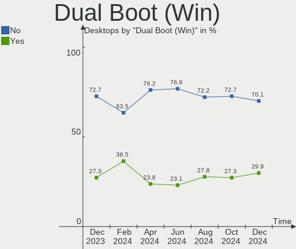
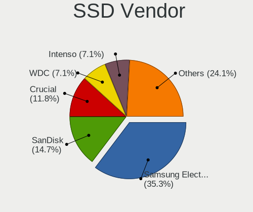
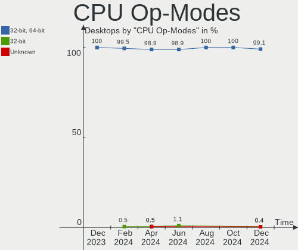
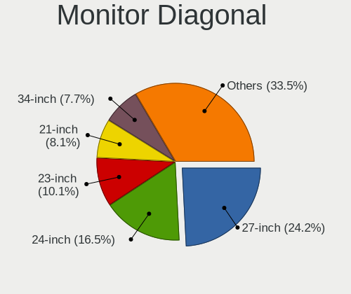
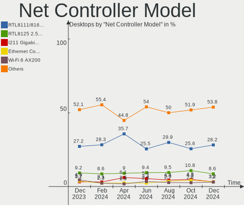
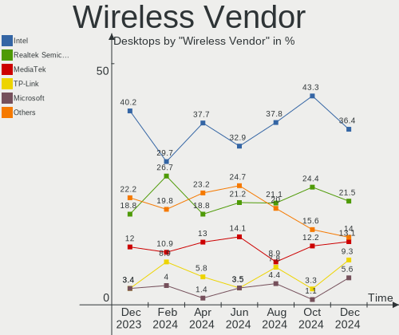
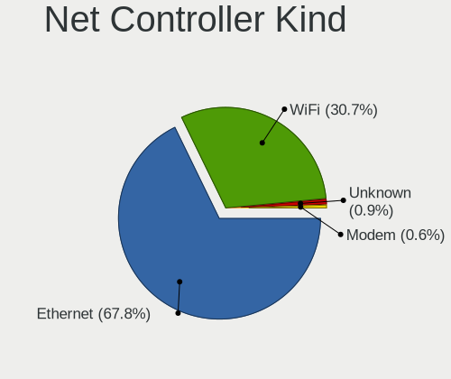
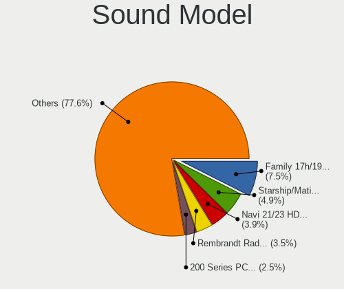

Linux in Germany - Hardware Trends (Desktops)
---------------------------------------------

A project to identify most popular hardware characteristics and track their change
over time based on data collected by Linux users at https://Linux-Hardware.org.

Anyone can contribute to this report by the [hw-probe](https://github.com/linuxhw/hw-probe) tool:

    sudo -E hw-probe -all -upload

Period: Nov, 2022.

Contents
--------

* [ System ](#system)
  - [ OS                       ](#os)
  - [ OS Family                ](#os-family)
  - [ Kernel                   ](#kernel)
  - [ Kernel Family            ](#kernel-family)
  - [ Kernel Major Ver.        ](#kernel-major-ver)
  - [ Arch                     ](#arch)
  - [ DE                       ](#de)
  - [ Display Server           ](#display-server)
  - [ Display Manager          ](#display-manager)
  - [ OS Lang                  ](#os-lang)
  - [ Boot Mode                ](#boot-mode)
  - [ Filesystem               ](#filesystem)
  - [ Part. scheme             ](#part-scheme)
  - [ Dual Boot with Linux/BSD ](#dual-boot-with-linuxbsd)
  - [ Dual Boot (Win)          ](#dual-boot-win)

* [ Board ](#board)
  - [ Vendor                   ](#vendor)
  - [ Model                    ](#model)
  - [ Model Family             ](#model-family)
  - [ MFG Year                 ](#mfg-year)
  - [ Form Factor              ](#form-factor)
  - [ Secure Boot              ](#secure-boot)
  - [ Coreboot                 ](#coreboot)
  - [ RAM Size                 ](#ram-size)
  - [ RAM Used                 ](#ram-used)
  - [ Total Drives             ](#total-drives)
  - [ Has CD-ROM               ](#has-cd-rom)
  - [ Has Ethernet             ](#has-ethernet)
  - [ Has WiFi                 ](#has-wifi)
  - [ Has Bluetooth            ](#has-bluetooth)

* [ Location ](#location)
  - [ Country                  ](#country)
  - [ City                     ](#city)

* [ Drives ](#drives)
  - [ Drive Vendor             ](#drive-vendor)
  - [ Drive Model              ](#drive-model)
  - [ HDD Vendor               ](#hdd-vendor)
  - [ SSD Vendor               ](#ssd-vendor)
  - [ Drive Kind               ](#drive-kind)
  - [ Drive Connector          ](#drive-connector)
  - [ Drive Size               ](#drive-size)
  - [ Space Total              ](#space-total)
  - [ Space Used               ](#space-used)
  - [ Malfunc. Drives          ](#malfunc-drives)
  - [ Malfunc. Drive Vendor    ](#malfunc-drive-vendor)
  - [ Malfunc. HDD Vendor      ](#malfunc-hdd-vendor)
  - [ Malfunc. Drive Kind      ](#malfunc-drive-kind)
  - [ Failed Drives            ](#failed-drives)
  - [ Failed Drive Vendor      ](#failed-drive-vendor)
  - [ Drive Status             ](#drive-status)

* [ Storage controller ](#storage-controller)
  - [ Storage Vendor           ](#storage-vendor)
  - [ Storage Model            ](#storage-model)
  - [ Storage Kind             ](#storage-kind)

* [ Processor ](#processor)
  - [ CPU Vendor               ](#cpu-vendor)
  - [ CPU Model                ](#cpu-model)
  - [ CPU Model Family         ](#cpu-model-family)
  - [ CPU Cores                ](#cpu-cores)
  - [ CPU Sockets              ](#cpu-sockets)
  - [ CPU Threads              ](#cpu-threads)
  - [ CPU Op-Modes             ](#cpu-op-modes)
  - [ CPU Microcode            ](#cpu-microcode)
  - [ CPU Microarch            ](#cpu-microarch)

* [ Graphics ](#graphics)
  - [ GPU Vendor               ](#gpu-vendor)
  - [ GPU Model                ](#gpu-model)
  - [ GPU Combo                ](#gpu-combo)
  - [ GPU Driver               ](#gpu-driver)
  - [ GPU Memory               ](#gpu-memory)

* [ Monitor ](#monitor)
  - [ Monitor Vendor           ](#monitor-vendor)
  - [ Monitor Model            ](#monitor-model)
  - [ Monitor Resolution       ](#monitor-resolution)
  - [ Monitor Diagonal         ](#monitor-diagonal)
  - [ Monitor Width            ](#monitor-width)
  - [ Aspect Ratio             ](#aspect-ratio)
  - [ Monitor Area             ](#monitor-area)
  - [ Pixel Density            ](#pixel-density)
  - [ Multiple Monitors        ](#multiple-monitors)

* [ Network ](#network)
  - [ Net Controller Vendor    ](#net-controller-vendor)
  - [ Net Controller Model     ](#net-controller-model)
  - [ Wireless Vendor          ](#wireless-vendor)
  - [ Wireless Model           ](#wireless-model)
  - [ Ethernet Vendor          ](#ethernet-vendor)
  - [ Ethernet Model           ](#ethernet-model)
  - [ Net Controller Kind      ](#net-controller-kind)
  - [ Used Controller          ](#used-controller)
  - [ NICs                     ](#nics)
  - [ IPv6                     ](#ipv6)

* [ Bluetooth ](#bluetooth)
  - [ Bluetooth Vendor         ](#bluetooth-vendor)
  - [ Bluetooth Model          ](#bluetooth-model)

* [ Sound ](#sound)
  - [ Sound Vendor             ](#sound-vendor)
  - [ Sound Model              ](#sound-model)

* [ Memory ](#memory)
  - [ Memory Vendor            ](#memory-vendor)
  - [ Memory Model             ](#memory-model)
  - [ Memory Kind              ](#memory-kind)
  - [ Memory Form Factor       ](#memory-form-factor)
  - [ Memory Size              ](#memory-size)
  - [ Memory Speed             ](#memory-speed)

* [ Printers & scanners ](#printers--scanners)
  - [ Printer Vendor           ](#printer-vendor)
  - [ Printer Model            ](#printer-model)
  - [ Scanner Vendor           ](#scanner-vendor)
  - [ Scanner Model            ](#scanner-model)

* [ Camera ](#camera)
  - [ Camera Vendor            ](#camera-vendor)
  - [ Camera Model             ](#camera-model)

* [ Security ](#security)
  - [ Fingerprint Vendor       ](#fingerprint-vendor)
  - [ Fingerprint Model        ](#fingerprint-model)
  - [ Chipcard Vendor          ](#chipcard-vendor)
  - [ Chipcard Model           ](#chipcard-model)

* [ Unsupported ](#unsupported)
  - [ Unsupported Devices      ](#unsupported-devices)
  - [ Unsupported Device Types ](#unsupported-device-types)

System
------

OS
--

Installed operating systems

| Name                         | Desktops | Percent |
|------------------------------|----------|---------|
| Ubuntu 22.04                 | 39       | 20.86%  |
| Linux Mint 21                | 16       | 8.56%   |
| Linux Mint 20.3              | 11       | 5.88%   |
| Ubuntu 22.10                 | 7        | 3.74%   |
| Ubuntu 20.04                 | 7        | 3.74%   |
| OpenMandriva 4.3             | 7        | 3.74%   |
| Fedora 37                    | 6        | 3.21%   |
| Zorin 16                     | 5        | 2.67%   |
| Ubuntu 18.04                 | 5        | 2.67%   |
| Manjaro                      | 5        | 2.67%   |
| Debian 11                    | 5        | 2.67%   |
| Fedora 36                    | 4        | 2.14%   |
| Arch Rolling                 | 4        | 2.14%   |
| Xubuntu 22.04                | 3        | 1.6%    |
| Pop!_OS 22.04                | 3        | 1.6%    |
| openSUSE Tumbleweed-XXXXXXXX | 3        | 1.6%    |
| OpenMandriva 4.50            | 3        | 1.6%    |
| Manjaro 22.0.0               | 3        | 1.6%    |
| LMDE 5                       | 3        | 1.6%    |
| Gentoo 2.9                   | 3        | 1.6%    |
| ROSA R11.1                   | 2        | 1.07%   |
| ROSA 12.3                    | 2        | 1.07%   |
| openSUSE Leap-15.3           | 2        | 1.07%   |
| Linux Mint 20.2              | 2        | 1.07%   |
| Kubuntu 22.04                | 2        | 1.07%   |
| Fedora 35                    | 2        | 1.07%   |
| CentOS 8                     | 2        | 1.07%   |
| ArcoLinux Rolling            | 2        | 1.07%   |
| Zorin 15                     | 1        | 0.53%   |
| Xubuntu 22.10                | 1        | 0.53%   |
| Ubuntu MATE 22.10            | 1        | 0.53%   |
| Ubuntu 21.10                 | 1        | 0.53%   |
| Reborn OS Rolling            | 1        | 0.53%   |
| PureOS 10                    | 1        | 0.53%   |
| org.kde.Platform 5.15-21.08  | 1        | 0.53%   |
| openSUSE Leap-15.4           | 1        | 0.53%   |
| openSUSE Leap-15.0           | 1        | 0.53%   |
| Nobara 36                    | 1        | 0.53%   |
| Mageia 8                     | 1        | 0.53%   |
| Lubuntu 18.04                | 1        | 0.53%   |

OS Family
---------

OS without a version

| Name             | Desktops | Percent |
|------------------|----------|---------|
| Ubuntu           | 59       | 31.55%  |
| Linux Mint       | 33       | 17.65%  |
| Fedora           | 12       | 6.42%   |
| OpenMandriva     | 10       | 5.35%   |
| Manjaro          | 8        | 4.28%   |
| openSUSE         | 7        | 3.74%   |
| Debian           | 7        | 3.74%   |
| Zorin            | 6        | 3.21%   |
| Xubuntu          | 4        | 2.14%   |
| ROSA             | 4        | 2.14%   |
| Kubuntu          | 4        | 2.14%   |
| Gentoo           | 4        | 2.14%   |
| Arch             | 4        | 2.14%   |
| Pop!_OS          | 3        | 1.6%    |
| LMDE             | 3        | 1.6%    |
| CentOS           | 2        | 1.07%   |
| ArcoLinux        | 2        | 1.07%   |
| Ubuntu MATE      | 1        | 0.53%   |
| Reborn OS        | 1        | 0.53%   |
| PureOS           | 1        | 0.53%   |
| org.kde.Platform | 1        | 0.53%   |
| Nobara           | 1        | 0.53%   |
| Mageia           | 1        | 0.53%   |
| Lubuntu          | 1        | 0.53%   |
| LinuxFX          | 1        | 0.53%   |
| KDE neon         | 1        | 0.53%   |
| EndeavourOS      | 1        | 0.53%   |
| Crystal Linux    | 1        | 0.53%   |
| ChimeraOS        | 1        | 0.53%   |
| BlackPanther     | 1        | 0.53%   |
| Alpine           | 1        | 0.53%   |
| AlmaLinux        | 1        | 0.53%   |

Kernel
------

Version of the Linux kernel

| Version                     | Desktops | Percent |
|-----------------------------|----------|---------|
| 5.15.0-53-generic           | 32       | 17.11%  |
| 5.15.0-52-generic           | 31       | 16.58%  |
| 5.19.0-23-generic           | 8        | 4.28%   |
| 5.16.7-desktop-1omv4003     | 7        | 3.74%   |
| 5.4.0-132-generic           | 6        | 3.21%   |
| 5.4.0-131-generic           | 5        | 2.67%   |
| 5.10.0-19-amd64             | 5        | 2.67%   |
| 6.0.9-300.fc37.x86_64       | 4        | 2.14%   |
| 6.0.5-200.fc36.x86_64       | 4        | 2.14%   |
| 6.0.9-arch1-1               | 3        | 1.6%    |
| 5.15.0-48-generic           | 3        | 1.6%    |
| 4.15.0-197-generic          | 3        | 1.6%    |
| 6.0.8-300.fc37.x86_64       | 2        | 1.07%   |
| 6.0.2-76060002-generic      | 2        | 1.07%   |
| 6.0.2-2-MANJARO             | 2        | 1.07%   |
| 6.0.10-arch2-1              | 2        | 1.07%   |
| 5.4.0-125-generic           | 2        | 1.07%   |
| 5.19.12-desktop-2omv4090    | 2        | 1.07%   |
| 5.19.0-21-generic           | 2        | 1.07%   |
| 5.15.60-1-pve               | 2        | 1.07%   |
| 5.10.60-qnap                | 2        | 1.07%   |
| 6.0.8-zen1-1-zen            | 1        | 0.53%   |
| 6.0.8-arch1-1               | 1        | 0.53%   |
| 6.0.8-1-default             | 1        | 0.53%   |
| 6.0.7-x64v1-xanmod1-MANJARO | 1        | 0.53%   |
| 6.0.7-x64v1-xanmod1-1.1     | 1        | 0.53%   |
| 6.0.7-arch1-1               | 1        | 0.53%   |
| 6.0.7-202.fsync.fc36.x86_64 | 1        | 0.53%   |
| 6.0.6-gentoo-x86_64         | 1        | 0.53%   |
| 6.0.6-arch1-1               | 1        | 0.53%   |
| 6.0.6-1-default             | 1        | 0.53%   |
| 6.0.3-76060003-generic      | 1        | 0.53%   |
| 6.0.10-0-edge               | 1        | 0.53%   |
| 6.0.10                      | 1        | 0.53%   |
| 6.0.0-4-amd64               | 1        | 0.53%   |
| 5.9.16-1-MANJARO            | 1        | 0.53%   |
| 5.4.83-generic-2rosa-x86_64 | 1        | 0.53%   |
| 5.4.0-91-generic            | 1        | 0.53%   |
| 5.4.0-84-generic            | 1        | 0.53%   |
| 5.4.0-52-generic            | 1        | 0.53%   |

Kernel Family
-------------

Linux kernel without a distro release

| Version  | Desktops | Percent |
|----------|----------|---------|
| 5.15.0   | 72       | 38.5%   |
| 5.4.0    | 21       | 11.23%  |
| 5.19.0   | 10       | 5.35%   |
| 6.0.9    | 7        | 3.74%   |
| 5.16.7   | 7        | 3.74%   |
| 5.10.0   | 7        | 3.74%   |
| 6.0.8    | 5        | 2.67%   |
| 4.15.0   | 5        | 2.67%   |
| 6.0.7    | 4        | 2.14%   |
| 6.0.5    | 4        | 2.14%   |
| 6.0.2    | 4        | 2.14%   |
| 6.0.10   | 4        | 2.14%   |
| 6.0.6    | 3        | 1.6%    |
| 5.15.75  | 3        | 1.6%    |
| 5.15.60  | 3        | 1.6%    |
| 5.3.18   | 2        | 1.07%   |
| 5.19.12  | 2        | 1.07%   |
| 5.15.74  | 2        | 1.07%   |
| 5.10.60  | 2        | 1.07%   |
| 4.18.0   | 2        | 1.07%   |
| 6.0.3    | 1        | 0.53%   |
| 6.0.0    | 1        | 0.53%   |
| 5.9.16   | 1        | 0.53%   |
| 5.4.83   | 1        | 0.53%   |
| 5.19.8   | 1        | 0.53%   |
| 5.19.5   | 1        | 0.53%   |
| 5.19.17  | 1        | 0.53%   |
| 5.19.14  | 1        | 0.53%   |
| 5.15.78  | 1        | 0.53%   |
| 5.15.77  | 1        | 0.53%   |
| 5.15.11  | 1        | 0.53%   |
| 5.14.21  | 1        | 0.53%   |
| 5.14.0   | 1        | 0.53%   |
| 5.13.0   | 1        | 0.53%   |
| 5.10.150 | 1        | 0.53%   |
| 4.19.0   | 1        | 0.53%   |
| 4.18.16  | 1        | 0.53%   |
| 4.12.14  | 1        | 0.53%   |

Kernel Major Ver.
-----------------

Linux kernel major version

| Version | Desktops | Percent |
|---------|----------|---------|
| 5.15    | 83       | 44.39%  |
| 6.0     | 33       | 17.65%  |
| 5.4     | 22       | 11.76%  |
| 5.19    | 16       | 8.56%   |
| 5.10    | 10       | 5.35%   |
| 5.16    | 7        | 3.74%   |
| 4.15    | 5        | 2.67%   |
| 4.18    | 3        | 1.6%    |
| 5.3     | 2        | 1.07%   |
| 5.14    | 2        | 1.07%   |
| 5.9     | 1        | 0.53%   |
| 5.13    | 1        | 0.53%   |
| 4.19    | 1        | 0.53%   |
| 4.12    | 1        | 0.53%   |

Arch
----

OS architecture (x86_64, i586, etc.)

| Name     | Desktops | Percent |
|----------|----------|---------|
| x86_64   | 186      | 99.47%  |
| armv5tel | 1        | 0.53%   |

DE
--

Desktop Environment

| Name         | Desktops | Percent |
|--------------|----------|---------|
| GNOME        | 81       | 43.32%  |
| X-Cinnamon   | 34       | 18.18%  |
| KDE5         | 32       | 17.11%  |
| XFCE         | 13       | 6.95%   |
| Unknown      | 11       | 5.88%   |
| MATE         | 6        | 3.21%   |
| KDE4         | 2        | 1.07%   |
| Cinnamon     | 2        | 1.07%   |
| trinity      | 1        | 0.53%   |
| none+awesome | 1        | 0.53%   |
| LXDE         | 1        | 0.53%   |
| KDE          | 1        | 0.53%   |
| i3           | 1        | 0.53%   |
| chadwm       | 1        | 0.53%   |

Display Server
--------------

X11 or Wayland

| Name    | Desktops | Percent |
|---------|----------|---------|
| X11     | 124      | 66.31%  |
| Wayland | 49       | 26.2%   |
| Tty     | 10       | 5.35%   |
| Unknown | 4        | 2.14%   |

Display Manager
---------------

SDDM, LightDM, etc.

| Name    | Desktops | Percent |
|---------|----------|---------|
| Unknown | 76       | 40.64%  |
| GDM3    | 50       | 26.74%  |
| SDDM    | 26       | 13.9%   |
| LightDM | 24       | 12.83%  |
| GDM     | 9        | 4.81%   |
| KDM     | 2        | 1.07%   |

OS Lang
-------

Language

| Lang    | Desktops | Percent |
|---------|----------|---------|
| de_DE   | 139      | 74.33%  |
| en_US   | 30       | 16.04%  |
| C       | 3        | 1.6%    |
| Unknown | 3        | 1.6%    |
| en_GB   | 2        | 1.07%   |
| tr_TR   | 1        | 0.53%   |
| ru_UA   | 1        | 0.53%   |
| ru_RU   | 1        | 0.53%   |
| ro_RO   | 1        | 0.53%   |
| POSIX   | 1        | 0.53%   |
| pl_PL   | 1        | 0.53%   |
| it_IT   | 1        | 0.53%   |
| hu_HU   | 1        | 0.53%   |
| fr_FR   | 1        | 0.53%   |
| es_ES   | 1        | 0.53%   |

Boot Mode
---------

EFI or BIOS

| Mode | Desktops | Percent |
|------|----------|---------|
| BIOS | 119      | 63.64%  |
| EFI  | 68       | 36.36%  |

Filesystem
----------

Type of filesystem

| Type          | Desktops | Percent |
|---------------|----------|---------|
| Ext4          | 146      | 78.07%  |
| Btrfs         | 17       | 9.09%   |
| Overlay       | 13       | 6.95%   |
| Zfs           | 5        | 2.67%   |
| Xfs           | 3        | 1.6%    |
| Reiserfs      | 1        | 0.53%   |
| Fuse.snapfuse | 1        | 0.53%   |
| F2fs          | 1        | 0.53%   |

Part. scheme
------------

Scheme of partitioning

| Type    | Desktops | Percent |
|---------|----------|---------|
| GPT     | 85       | 45.45%  |
| Unknown | 66       | 35.29%  |
| MBR     | 36       | 19.25%  |

Dual Boot with Linux/BSD
------------------------

Hosting more than one Linux/BSD

| Dual boot | Desktops | Percent |
|-----------|----------|---------|
| No        | 146      | 78.07%  |
| Yes       | 41       | 21.93%  |

Dual Boot (Win)
---------------

Hosting Linux and Windows

| Dual boot | Desktops | Percent |
|-----------|----------|---------|
| No        | 135      | 72.19%  |
| Yes       | 52       | 27.81%  |

Board
-----

Vendor
------

Motherboard manufacturer

| Name                | Desktops | Percent |
|---------------------|----------|---------|
| ASUSTek Computer    | 45       | 24.06%  |
| Gigabyte Technology | 31       | 16.58%  |
| MSI                 | 29       | 15.51%  |
| ASRock              | 16       | 8.56%   |
| Hewlett-Packard     | 11       | 5.88%   |
| Fujitsu             | 11       | 5.88%   |
| Dell                | 10       | 5.35%   |
| Lenovo              | 8        | 4.28%   |
| Medion              | 6        | 3.21%   |
| Acer                | 6        | 3.21%   |
| Unknown             | 4        | 2.14%   |
| Intel               | 3        | 1.6%    |
| Pegatron            | 2        | 1.07%   |
| T-bao               | 1        | 0.53%   |
| Shuttle             | 1        | 0.53%   |
| Fujitsu Siemens     | 1        | 0.53%   |
| Foxconn             | 1        | 0.53%   |
| Biostar             | 1        | 0.53%   |

Model
-----

Motherboard model

| Name                          | Desktops | Percent |
|-------------------------------|----------|---------|
| MSI MS-7C37                   | 5        | 2.67%   |
| Unknown                       | 4        | 2.14%   |
| ASUS PRIME A320M-K            | 3        | 1.6%    |
| MSI MS-7C35                   | 2        | 1.07%   |
| MSI MS-7B86                   | 2        | 1.07%   |
| MSI MS-7758                   | 2        | 1.07%   |
| HP Compaq Pro 6300 SFF        | 2        | 1.07%   |
| Gigabyte Z170-HD3P-CF         | 2        | 1.07%   |
| Gigabyte B550 AORUS ELITE V2  | 2        | 1.07%   |
| ASUS TUF Gaming X570-PLUS     | 2        | 1.07%   |
| ASUS PRO B460M-C              | 2        | 1.07%   |
| ASUS M5A78L-M LE/USB3         | 2        | 1.07%   |
| ASRock Q1900M                 | 2        | 1.07%   |
| ASRock Q1900B-ITX             | 2        | 1.07%   |
| T-bao MINI PC                 | 1        | 0.53%   |
| Shuttle XS35V4                | 1        | 0.53%   |
| Pegatron p7-1016de            | 1        | 0.53%   |
| Pegatron Elite 7500 Series MT | 1        | 0.53%   |
| MSI MS-7D22                   | 1        | 0.53%   |
| MSI MS-7D06                   | 1        | 0.53%   |
| MSI MS-7C95                   | 1        | 0.53%   |
| MSI MS-7C92                   | 1        | 0.53%   |
| MSI MS-7C91                   | 1        | 0.53%   |
| MSI MS-7C56                   | 1        | 0.53%   |
| MSI MS-7C52                   | 1        | 0.53%   |
| MSI MS-7C08                   | 1        | 0.53%   |
| MSI MS-7B89                   | 1        | 0.53%   |
| MSI MS-7B79                   | 1        | 0.53%   |
| MSI MS-7A38                   | 1        | 0.53%   |
| MSI MS-7994                   | 1        | 0.53%   |
| MSI MS-7918                   | 1        | 0.53%   |
| MSI MS-7760                   | 1        | 0.53%   |
| MSI MS-7697                   | 1        | 0.53%   |
| MSI MS-7696                   | 1        | 0.53%   |
| MSI MS-7693                   | 1        | 0.53%   |
| MSI ESPRIMO P1510             | 1        | 0.53%   |
| Medion S23003                 | 1        | 0.53%   |
| Medion MS-7800                | 1        | 0.53%   |
| Medion MS-7748                | 1        | 0.53%   |
| Medion MS-7728                | 1        | 0.53%   |

Model Family
------------

Motherboard model prefix

| Name                  | Desktops | Percent |
|-----------------------|----------|---------|
| ASUS PRIME            | 11       | 5.88%   |
| Dell OptiPlex         | 9        | 4.81%   |
| Fujitsu ESPRIMO       | 8        | 4.28%   |
| Lenovo ThinkCentre    | 7        | 3.74%   |
| ASUS ROG              | 7        | 3.74%   |
| ASUS M5A78L-M         | 6        | 3.21%   |
| MSI MS-7C37           | 5        | 2.67%   |
| HP Compaq             | 5        | 2.67%   |
| HP EliteDesk          | 4        | 2.14%   |
| Acer Aspire           | 4        | 2.14%   |
| Unknown               | 4        | 2.14%   |
| ASUS PRO              | 3        | 1.6%    |
| MSI MS-7C35           | 2        | 1.07%   |
| MSI MS-7B86           | 2        | 1.07%   |
| MSI MS-7758           | 2        | 1.07%   |
| Gigabyte Z390         | 2        | 1.07%   |
| Gigabyte Z170-HD3P-CF | 2        | 1.07%   |
| Gigabyte B550         | 2        | 1.07%   |
| Fujitsu CELSIUS       | 2        | 1.07%   |
| ASUS TUF              | 2        | 1.07%   |
| ASUS P5K              | 2        | 1.07%   |
| ASRock Q1900M         | 2        | 1.07%   |
| ASRock Q1900B-ITX     | 2        | 1.07%   |
| Acer Veriton          | 2        | 1.07%   |
| T-bao MINI            | 1        | 0.53%   |
| Shuttle XS35V4        | 1        | 0.53%   |
| Pegatron p7-1016de    | 1        | 0.53%   |
| Pegatron Elite        | 1        | 0.53%   |
| MSI MS-7D22           | 1        | 0.53%   |
| MSI MS-7D06           | 1        | 0.53%   |
| MSI MS-7C95           | 1        | 0.53%   |
| MSI MS-7C92           | 1        | 0.53%   |
| MSI MS-7C91           | 1        | 0.53%   |
| MSI MS-7C56           | 1        | 0.53%   |
| MSI MS-7C52           | 1        | 0.53%   |
| MSI MS-7C08           | 1        | 0.53%   |
| MSI MS-7B89           | 1        | 0.53%   |
| MSI MS-7B79           | 1        | 0.53%   |
| MSI MS-7A38           | 1        | 0.53%   |
| MSI MS-7994           | 1        | 0.53%   |

MFG Year
--------

Motherboard manufacture year

| Year    | Desktops | Percent |
|---------|----------|---------|
| 2012    | 24       | 12.83%  |
| 2019    | 20       | 10.7%   |
| 2020    | 16       | 8.56%   |
| 2013    | 16       | 8.56%   |
| 2014    | 15       | 8.02%   |
| 2011    | 15       | 8.02%   |
| 2018    | 14       | 7.49%   |
| 2010    | 11       | 5.88%   |
| 2021    | 9        | 4.81%   |
| 2017    | 9        | 4.81%   |
| 2016    | 9        | 4.81%   |
| 2015    | 7        | 3.74%   |
| 2009    | 7        | 3.74%   |
| 2008    | 5        | 2.67%   |
| 2022    | 4        | 2.14%   |
| 2007    | 4        | 2.14%   |
| Unknown | 2        | 1.07%   |

Form Factor
-----------

Physical design of the computer

| Name    | Desktops | Percent |
|---------|----------|---------|
| Desktop | 187      | 100%    |

Secure Boot
-----------

Enabled or disabled

| State    | Desktops | Percent |
|----------|----------|---------|
| Disabled | 184      | 98.4%   |
| Enabled  | 3        | 1.6%    |

Coreboot
--------

Have coreboot on board

| Used | Desktops | Percent |
|------|----------|---------|
| No   | 187      | 100%    |

RAM Size
--------

Total RAM memory

| Size in GB  | Desktops | Percent |
|-------------|----------|---------|
| 8.01-16.0   | 47       | 25.13%  |
| 16.01-24.0  | 38       | 20.32%  |
| 32.01-64.0  | 35       | 18.72%  |
| 4.01-8.0    | 34       | 18.18%  |
| 3.01-4.0    | 17       | 9.09%   |
| 64.01-256.0 | 10       | 5.35%   |
| 24.01-32.0  | 5        | 2.67%   |
| 0.51-1.0    | 1        | 0.53%   |

RAM Used
--------

Used RAM memory

| Used GB    | Desktops | Percent |
|------------|----------|---------|
| 1.01-2.0   | 65       | 34.76%  |
| 2.01-3.0   | 39       | 20.86%  |
| 4.01-8.0   | 27       | 14.44%  |
| 3.01-4.0   | 25       | 13.37%  |
| 8.01-16.0  | 13       | 6.95%   |
| 0.51-1.0   | 11       | 5.88%   |
| 0.01-0.5   | 3        | 1.6%    |
| 32.01-64.0 | 2        | 1.07%   |
| 16.01-24.0 | 2        | 1.07%   |

Total Drives
------------

Number of drives on board

| Drives | Desktops | Percent |
|--------|----------|---------|
| 1      | 60       | 32.09%  |
| 2      | 58       | 31.02%  |
| 3      | 36       | 19.25%  |
| 4      | 17       | 9.09%   |
| 6      | 5        | 2.67%   |
| 5      | 5        | 2.67%   |
| 7      | 2        | 1.07%   |
| 0      | 2        | 1.07%   |
| 9      | 1        | 0.53%   |
| 8      | 1        | 0.53%   |

Has CD-ROM
----------

Has CD-ROM on board

| Presented | Desktops | Percent |
|-----------|----------|---------|
| Yes       | 107      | 57.22%  |
| No        | 80       | 42.78%  |

Has Ethernet
------------

Has Ethernet on board

| Presented | Desktops | Percent |
|-----------|----------|---------|
| Yes       | 185      | 98.93%  |
| No        | 2        | 1.07%   |

Has WiFi
--------

Has WiFi module

| Presented | Desktops | Percent |
|-----------|----------|---------|
| No        | 123      | 65.78%  |
| Yes       | 64       | 34.22%  |

Has Bluetooth
-------------

Has Bluetooth module

| Presented | Desktops | Percent |
|-----------|----------|---------|
| No        | 135      | 72.19%  |
| Yes       | 52       | 27.81%  |

Location
--------

Country
-------

Geographic location (country)

| Country | Desktops | Percent |
|---------|----------|---------|
| Germany | 187      | 100%    |

City
----

Geographic location (city)

| City              | Desktops | Percent |
|-------------------|----------|---------|
| Berlin            | 17       | 9.09%   |
| Hamburg           | 6        | 3.21%   |
| Frankfurt am Main | 6        | 3.21%   |
| Munich            | 5        | 2.67%   |
| Bonn              | 4        | 2.14%   |
| Darmstadt         | 3        | 1.6%    |
| Stadtilm          | 2        | 1.07%   |
| Nuremberg         | 2        | 1.07%   |
| Münster          | 2        | 1.07%   |
| Ludwigsburg       | 2        | 1.07%   |
| Leipzig           | 2        | 1.07%   |
| Kirchzarten       | 2        | 1.07%   |
| Karlsruhe         | 2        | 1.07%   |
| Hildesheim        | 2        | 1.07%   |
| Hanover           | 2        | 1.07%   |
| Dresden           | 2        | 1.07%   |
| Cologne           | 2        | 1.07%   |
| Wuppertal         | 1        | 0.53%   |
| Wolnzach          | 1        | 0.53%   |
| Wettringen        | 1        | 0.53%   |
| Weissenfels       | 1        | 0.53%   |
| Weilburg          | 1        | 0.53%   |
| Warburg           | 1        | 0.53%   |
| Vechelde          | 1        | 0.53%   |
| Unterschleissheim | 1        | 0.53%   |
| Ulm               | 1        | 0.53%   |
| Uetze             | 1        | 0.53%   |
| Tübingen         | 1        | 0.53%   |
| Trippstadt        | 1        | 0.53%   |
| Sylt-Ost          | 1        | 0.53%   |
| Stuttgart         | 1        | 0.53%   |
| Strausberg        | 1        | 0.53%   |
| Straubing         | 1        | 0.53%   |
| Stockelsdorf      | 1        | 0.53%   |
| Stemwede          | 1        | 0.53%   |
| Schwieberdingen   | 1        | 0.53%   |
| Schotten          | 1        | 0.53%   |
| Schorndorf        | 1        | 0.53%   |
| Schmoelln         | 1        | 0.53%   |
| Schechingen       | 1        | 0.53%   |

Drives
------

Drive Vendor
------------

Hard drive vendors

| Vendor                      | Desktops | Drives | Percent |
|-----------------------------|----------|--------|---------|
| Samsung Electronics         | 67       | 92     | 18.87%  |
| Seagate                     | 55       | 67     | 15.49%  |
| WDC                         | 54       | 63     | 15.21%  |
| Sandisk                     | 29       | 30     | 8.17%   |
| Crucial                     | 25       | 29     | 7.04%   |
| Toshiba                     | 18       | 22     | 5.07%   |
| Intenso                     | 14       | 17     | 3.94%   |
| Kingston                    | 10       | 12     | 2.82%   |
| Hitachi                     | 10       | 13     | 2.82%   |
| Unknown                     | 7        | 11     | 1.97%   |
| Phison Electronics          | 7        | 8      | 1.97%   |
| Micron Technology           | 5        | 5      | 1.41%   |
| Patriot                     | 4        | 4      | 1.13%   |
| Micron/Crucial Technology   | 4        | 4      | 1.13%   |
| Intel                       | 4        | 6      | 1.13%   |
| OCZ                         | 3        | 3      | 0.85%   |
| Kingston Technology Company | 3        | 3      | 0.85%   |
| HGST                        | 3        | 5      | 0.85%   |
| China                       | 3        | 3      | 0.85%   |
| Transcend                   | 2        | 2      | 0.56%   |
| Maxtor                      | 2        | 2      | 0.56%   |
| KIOXIA-EXCERIA              | 2        | 3      | 0.56%   |
| ZOTAC                       | 1        | 1      | 0.28%   |
| XPG                         | 1        | 1      | 0.28%   |
| Verbatim                    | 1        | 1      | 0.28%   |
| Team                        | 1        | 1      | 0.28%   |
| SPCC                        | 1        | 3      | 0.28%   |
| Silicon Motion              | 1        | 1      | 0.28%   |
| SABRENT                     | 1        | 1      | 0.28%   |
| Phison                      | 1        | 1      | 0.28%   |
| Mushkin                     | 1        | 1      | 0.28%   |
| Leven                       | 1        | 1      | 0.28%   |
| KIOXIA                      | 1        | 1      | 0.28%   |
| KingDian                    | 1        | 1      | 0.28%   |
| JMicron Technology          | 1        | 1      | 0.28%   |
| INNOVATION IT               | 1        | 1      | 0.28%   |
| Hoodisk                     | 1        | 1      | 0.28%   |
| Gigabyte Technology         | 1        | 1      | 0.28%   |
| Emtec                       | 1        | 1      | 0.28%   |
| Config                      | 1        | 1      | 0.28%   |

Drive Model
-----------

Hard drive models

| Model                                                | Desktops | Percent |
|------------------------------------------------------|----------|---------|
| Samsung NVMe SSD Controller SM981/PM981/PM983 1TB    | 8        | 2%      |
| Samsung NVMe SSD Controller PM9A1/PM9A3/980PRO 250GB | 7        | 1.75%   |
| Seagate ST500DM002-1BD142 500GB                      | 6        | 1.5%    |
| Samsung SSD 850 EVO 500GB                            | 5        | 1.25%   |
| Unknown SD/MMC/MS PRO 8GB                            | 4        | 1%      |
| Toshiba HDWD110 1TB                                  | 4        | 1%      |
| Samsung SSD 860 EVO 1TB                              | 4        | 1%      |
| Phison E12 NVMe Controller 2TB                       | 4        | 1%      |
| Crucial CT1000MX500SSD1 1TB                          | 4        | 1%      |
| WDC WD5000AAKX-60U6AA0 500GB                         | 3        | 0.75%   |
| SanDisk SSD PLUS 1000GB                              | 3        | 0.75%   |
| Samsung SSD 870 QVO 1TB                              | 3        | 0.75%   |
| Samsung SSD 860 QVO 1TB                              | 3        | 0.75%   |
| Samsung SSD 860 EVO 250GB                            | 3        | 0.75%   |
| Samsung SSD 850 EVO 250GB                            | 3        | 0.75%   |
| Samsung HD103SJ 1TB                                  | 3        | 0.75%   |
| Phison E16 PCIe4 NVMe Controller 1TB                 | 3        | 0.75%   |
| Kingston Company A2000 NVMe SSD 500GB                | 3        | 0.75%   |
| Kingston SA400S37120G 120GB SSD                      | 3        | 0.75%   |
| Crucial CT500MX500SSD1 500GB                         | 3        | 0.75%   |
| Crucial CT480BX500SSD1 480GB                         | 3        | 0.75%   |
| Crucial CT240BX500SSD1 240GB                         | 3        | 0.75%   |
| WDC WD30EFRX-68EUZN0 3TB                             | 2        | 0.5%    |
| WDC WD20EZBX-00AYRA0 2TB                             | 2        | 0.5%    |
| WDC WD2002FAEX-007BA0 2TB                            | 2        | 0.5%    |
| WDC WD10EZEX-21WN4A0 1TB                             | 2        | 0.5%    |
| Unknown SD/MMC/M.S.PRO 32GB                          | 2        | 0.5%    |
| Unknown SD/MMC 2GB                                   | 2        | 0.5%    |
| Unknown M.S./M.S.Pro/HG 16GB                         | 2        | 0.5%    |
| Toshiba TR200 480GB SSD                              | 2        | 0.5%    |
| Toshiba HDWQ140 4TB                                  | 2        | 0.5%    |
| Toshiba DT01ACA100 1TB                               | 2        | 0.5%    |
| Seagate ST4000DM004-2CV104 4TB                       | 2        | 0.5%    |
| Seagate ST3500413AS 500GB                            | 2        | 0.5%    |
| Seagate ST3500312CS 500GB                            | 2        | 0.5%    |
| Seagate ST31000524AS 1TB                             | 2        | 0.5%    |
| Seagate ST2000LM015-2E8174 2TB                       | 2        | 0.5%    |
| Seagate ST2000DM008-2FR102 2TB                       | 2        | 0.5%    |
| Seagate ST2000DM001-1ER164 2TB                       | 2        | 0.5%    |
| Seagate ST1000DM003-1ER162 1TB                       | 2        | 0.5%    |

HDD Vendor
----------

Hard disk drive vendors

| Vendor              | Desktops | Drives | Percent |
|---------------------|----------|--------|---------|
| Seagate             | 55       | 67     | 35.48%  |
| WDC                 | 49       | 58     | 31.61%  |
| Toshiba             | 15       | 17     | 9.68%   |
| Samsung Electronics | 15       | 18     | 9.68%   |
| Hitachi             | 10       | 13     | 6.45%   |
| Unknown             | 4        | 4      | 2.58%   |
| HGST                | 3        | 5      | 1.94%   |
| Intenso             | 2        | 2      | 1.29%   |
| Maxtor              | 1        | 1      | 0.65%   |
| ASMT                | 1        | 1      | 0.65%   |

SSD Vendor
----------

Solid state drive vendors

| Vendor              | Desktops | Drives | Percent |
|---------------------|----------|--------|---------|
| Samsung Electronics | 38       | 46     | 27.54%  |
| SanDisk             | 23       | 24     | 16.67%  |
| Crucial             | 22       | 24     | 15.94%  |
| Intenso             | 9        | 11     | 6.52%   |
| Kingston            | 7        | 7      | 5.07%   |
| Patriot             | 4        | 4      | 2.9%    |
| Micron Technology   | 4        | 4      | 2.9%    |
| WDC                 | 3        | 3      | 2.17%   |
| Toshiba             | 3        | 5      | 2.17%   |
| OCZ                 | 3        | 3      | 2.17%   |
| China               | 3        | 3      | 2.17%   |
| Intel               | 2        | 4      | 1.45%   |
| Verbatim            | 1        | 1      | 0.72%   |
| Transcend           | 1        | 1      | 0.72%   |
| Team                | 1        | 1      | 0.72%   |
| SPCC                | 1        | 3      | 0.72%   |
| Phison              | 1        | 1      | 0.72%   |
| Mushkin             | 1        | 1      | 0.72%   |
| Maxtor              | 1        | 1      | 0.72%   |
| Leven               | 1        | 1      | 0.72%   |
| KIOXIA-EXCERIA      | 1        | 1      | 0.72%   |
| KingDian            | 1        | 1      | 0.72%   |
| JMicron Technology  | 1        | 1      | 0.72%   |
| INNOVATION IT       | 1        | 1      | 0.72%   |
| Hoodisk             | 1        | 1      | 0.72%   |
| Emtec               | 1        | 1      | 0.72%   |
| Colorful            | 1        | 1      | 0.72%   |
| A-DATA Technology   | 1        | 1      | 0.72%   |
| Unknown             | 1        | 1      | 0.72%   |

Drive Kind
----------

HDD or SSD

| Kind    | Desktops | Drives | Percent |
|---------|----------|--------|---------|
| HDD     | 118      | 186    | 39.73%  |
| SSD     | 116      | 157    | 39.06%  |
| NVMe    | 55       | 75     | 18.52%  |
| Unknown | 7        | 11     | 2.36%   |
| MMC     | 1        | 1      | 0.34%   |

Drive Connector
---------------

SATA, SAS, NVMe, etc.

| Type | Desktops | Drives | Percent |
|------|----------|--------|---------|
| SATA | 172      | 320    | 68.25%  |
| NVMe | 55       | 74     | 21.83%  |
| SAS  | 24       | 35     | 9.52%   |
| MMC  | 1        | 1      | 0.4%    |

Drive Size
----------

Size of hard drive

| Size in TB | Desktops | Drives | Percent |
|------------|----------|--------|---------|
| 0.01-0.5   | 120      | 177    | 48.78%  |
| 0.51-1.0   | 62       | 84     | 25.2%   |
| 1.01-2.0   | 39       | 45     | 15.85%  |
| 3.01-4.0   | 10       | 14     | 4.07%   |
| 4.01-10.0  | 7        | 11     | 2.85%   |
| 2.01-3.0   | 6        | 9      | 2.44%   |
| 10.01-20.0 | 2        | 3      | 0.81%   |

Space Total
-----------

Amount of disk space available on the file system

| Size in GB     | Desktops | Percent |
|----------------|----------|---------|
| 101-250        | 42       | 22.46%  |
| 501-1000       | 32       | 17.11%  |
| More than 3000 | 25       | 13.37%  |
| 251-500        | 25       | 13.37%  |
| 1001-2000      | 20       | 10.7%   |
| 2001-3000      | 16       | 8.56%   |
| 1-20           | 11       | 5.88%   |
| Unknown        | 8        | 4.28%   |
| 51-100         | 5        | 2.67%   |
| 21-50          | 3        | 1.6%    |

Space Used
----------

Amount of used disk space

| Used GB        | Desktops | Percent |
|----------------|----------|---------|
| 1-20           | 50       | 26.74%  |
| 21-50          | 26       | 13.9%   |
| 51-100         | 22       | 11.76%  |
| 501-1000       | 20       | 10.7%   |
| 101-250        | 19       | 10.16%  |
| 1001-2000      | 17       | 9.09%   |
| 251-500        | 10       | 5.35%   |
| More than 3000 | 9        | 4.81%   |
| Unknown        | 8        | 4.28%   |
| 2001-3000      | 6        | 3.21%   |

Malfunc. Drives
---------------

Drive models with a malfunction

| Model                                                         | Desktops | Drives | Percent |
|---------------------------------------------------------------|----------|--------|---------|
| Seagate ST500DM002-1BD142 500GB                               | 2        | 2      | 10%     |
| WDC WD800JD-75HKA1 80GB                                       | 1        | 1      | 5%      |
| WDC WD60EFAX-68SHWN0 6TB                                      | 1        | 1      | 5%      |
| WDC WD5000AAKS-007AA0 500GB                                   | 1        | 1      | 5%      |
| WDC WD30EFRX-68AX9N0 3TB                                      | 1        | 1      | 5%      |
| WDC WD10EADS-00L5B1 1TB                                       | 1        | 1      | 5%      |
| Transcend TS1TSSD230S 1024GB                                  | 1        | 1      | 5%      |
| Seagate ST3200822AS 200GB                                     | 1        | 1      | 5%      |
| Seagate ST31000524AS 1TB                                      | 1        | 1      | 5%      |
| Seagate ST2000LX001-1RG174 2TB                                | 1        | 1      | 5%      |
| Seagate ST2000DX001-1CM164 2TB                                | 1        | 1      | 5%      |
| SanDisk SSD PLUS 240GB                                        | 1        | 1      | 5%      |
| SanDisk SSD PLUS 120 GB                                       | 1        | 1      | 5%      |
| Samsung Electronics NVMe SSD Controller SM981/PM981/PM983 1TB | 1        | 1      | 5%      |
| Samsung Electronics HD502HJ 500GB                             | 1        | 1      | 5%      |
| Samsung Electronics HD400LD 400GB                             | 1        | 1      | 5%      |
| Samsung Electronics HD322HJ 320GB                             | 1        | 1      | 5%      |
| Maxtor STM3160215A 160GB                                      | 1        | 1      | 5%      |
| Intenso SSD Sata III 120GB                                    | 1        | 1      | 5%      |

Malfunc. Drive Vendor
---------------------

Vendors of faulty drives

| Vendor              | Desktops | Drives | Percent |
|---------------------|----------|--------|---------|
| Seagate             | 6        | 6      | 31.58%  |
| WDC                 | 4        | 5      | 21.05%  |
| Samsung Electronics | 4        | 4      | 21.05%  |
| SanDisk             | 2        | 2      | 10.53%  |
| Transcend           | 1        | 1      | 5.26%   |
| Maxtor              | 1        | 1      | 5.26%   |
| Intenso             | 1        | 1      | 5.26%   |

Malfunc. HDD Vendor
-------------------

Vendors of faulty HDD drives

| Vendor              | Desktops | Drives | Percent |
|---------------------|----------|--------|---------|
| Seagate             | 6        | 6      | 42.86%  |
| WDC                 | 4        | 5      | 28.57%  |
| Samsung Electronics | 3        | 3      | 21.43%  |
| Maxtor              | 1        | 1      | 7.14%   |

Malfunc. Drive Kind
-------------------

Kinds of faulty drives

| Kind | Desktops | Drives | Percent |
|------|----------|--------|---------|
| HDD  | 12       | 15     | 75%     |
| SSD  | 3        | 4      | 18.75%  |
| NVMe | 1        | 1      | 6.25%   |

Failed Drives
-------------

Failed drive models

Zero info for selected period =(

Failed Drive Vendor
-------------------

Failed drive vendors

Zero info for selected period =(

Drive Status
------------

Number of failed and malfunc. drives

| Status   | Desktops | Drives | Percent |
|----------|----------|--------|---------|
| Detected | 122      | 262    | 59.8%   |
| Works    | 66       | 148    | 32.35%  |
| Malfunc  | 16       | 20     | 7.84%   |

Storage controller
------------------

Storage Vendor
--------------

Storage controller vendors

| Vendor                      | Desktops | Percent |
|-----------------------------|----------|---------|
| Intel                       | 115      | 41.67%  |
| AMD                         | 70       | 25.36%  |
| Samsung Electronics         | 22       | 7.97%   |
| ASMedia Technology          | 12       | 4.35%   |
| Phison Electronics          | 9        | 3.26%   |
| SanDisk                     | 8        | 2.9%    |
| Micron/Crucial Technology   | 8        | 2.9%    |
| JMicron Technology          | 8        | 2.9%    |
| Marvell Technology Group    | 6        | 2.17%   |
| Kingston Technology Company | 6        | 2.17%   |
| Nvidia                      | 3        | 1.09%   |
| Silicon Motion              | 2        | 0.72%   |
| KIOXIA                      | 2        | 0.72%   |
| ADATA Technology            | 2        | 0.72%   |
| Silicon Image               | 1        | 0.36%   |
| Micron Technology           | 1        | 0.36%   |
| Adaptec                     | 1        | 0.36%   |

Storage Model
-------------

Storage controller models

| Model                                                                          | Desktops | Percent |
|--------------------------------------------------------------------------------|----------|---------|
| AMD FCH SATA Controller [AHCI mode]                                            | 38       | 11.45%  |
| Intel 7 Series/C210 Series Chipset Family 6-port SATA Controller [AHCI mode]   | 16       | 4.82%   |
| Intel 8 Series/C220 Series Chipset Family 6-port SATA Controller 1 [AHCI mode] | 13       | 3.92%   |
| AMD 400 Series Chipset SATA Controller                                         | 13       | 3.92%   |
| Samsung NVMe SSD Controller SM981/PM981/PM983                                  | 12       | 3.61%   |
| Intel Q170/Q150/B150/H170/H110/Z170/CM236 Chipset SATA Controller [AHCI Mode]  | 12       | 3.61%   |
| AMD SB7x0/SB8x0/SB9x0 IDE Controller                                           | 12       | 3.61%   |
| ASMedia ASM1062 Serial ATA Controller                                          | 11       | 3.31%   |
| AMD SB7x0/SB8x0/SB9x0 SATA Controller [IDE mode]                               | 10       | 3.01%   |
| AMD 500 Series Chipset SATA Controller                                         | 9        | 2.71%   |
| Samsung NVMe SSD Controller PM9A1/PM9A3/980PRO                                 | 8        | 2.41%   |
| Intel 6 Series/C200 Series Chipset Family 6 port Desktop SATA AHCI Controller  | 8        | 2.41%   |
| JMicron JMB363 SATA/IDE Controller                                             | 7        | 2.11%   |
| Intel 5 Series/3400 Series Chipset 6 port SATA AHCI Controller                 | 6        | 1.81%   |
| AMD SB7x0/SB8x0/SB9x0 SATA Controller [AHCI mode]                              | 6        | 1.81%   |
| Intel Atom Processor E3800 Series SATA AHCI Controller                         | 5        | 1.51%   |
| Intel 200 Series PCH SATA controller [AHCI mode]                               | 5        | 1.51%   |
| AMD FCH SATA Controller D                                                      | 5        | 1.51%   |
| Phison E16 PCIe4 NVMe Controller                                               | 4        | 1.2%    |
| Phison E12 NVMe Controller                                                     | 4        | 1.2%    |
| Kingston Company A2000 NVMe SSD                                                | 4        | 1.2%    |
| Intel SATA Controller [RAID mode]                                              | 4        | 1.2%    |
| Intel Celeron/Pentium Silver Processor SATA Controller                         | 4        | 1.2%    |
| Intel Cannon Lake PCH SATA AHCI Controller                                     | 4        | 1.2%    |
| Intel 5 Series/3400 Series Chipset PT IDER Controller                          | 4        | 1.2%    |
| SanDisk WD Black SN750 / PC SN730 NVMe SSD                                     | 3        | 0.9%    |
| Micron/Crucial P2 NVMe PCIe SSD                                                | 3        | 0.9%    |
| Intel Comet Lake SATA AHCI Controller                                          | 3        | 0.9%    |
| Intel C600/X79 series chipset 6-Port SATA AHCI Controller                      | 3        | 0.9%    |
| Intel 82801JD/DO (ICH10 Family) SATA AHCI Controller                           | 3        | 0.9%    |
| Intel 500 Series Chipset Family SATA AHCI Controller                           | 3        | 0.9%    |
| Silicon Motion SM2262/SM2262EN SSD Controller                                  | 2        | 0.6%    |
| SanDisk WD PC SN810 / Black SN850 NVMe SSD                                     | 2        | 0.6%    |
| SanDisk WD Black 2018/SN750 / PC SN720 NVMe SSD                                | 2        | 0.6%    |
| Samsung NVMe SSD Controller SM961/PM961/SM963                                  | 2        | 0.6%    |
| Samsung NVMe SSD Controller 980                                                | 2        | 0.6%    |
| Nvidia MCP61 SATA Controller                                                   | 2        | 0.6%    |
| Nvidia MCP61 IDE                                                               | 2        | 0.6%    |
| Micron/Crucial P5 Plus NVMe PCIe SSD                                           | 2        | 0.6%    |
| Micron/Crucial P1 NVMe PCIe SSD                                                | 2        | 0.6%    |

Storage Kind
------------

Kind of storage controller (IDE, SATA, NVMe, SAS, ...)

| Kind | Desktops | Percent |
|------|----------|---------|
| SATA | 168      | 62.69%  |
| NVMe | 55       | 20.52%  |
| IDE  | 38       | 14.18%  |
| RAID | 7        | 2.61%   |

Processor
---------

CPU Vendor
----------

Processor vendors

| Vendor                | Desktops | Percent |
|-----------------------|----------|---------|
| Intel                 | 114      | 60.96%  |
| AMD                   | 72       | 38.5%   |
| Marvell Semiconductor | 1        | 0.53%   |

CPU Model
---------

Processor models

| Model                                       | Desktops | Percent |
|---------------------------------------------|----------|---------|
| Intel Core i5-3470 CPU @ 3.20GHz            | 6        | 3.21%   |
| Intel Celeron CPU J1900 @ 1.99GHz           | 5        | 2.67%   |
| AMD Ryzen 7 5800X 8-Core Processor          | 4        | 2.14%   |
| AMD Ryzen 5 5600G with Radeon Graphics      | 4        | 2.14%   |
| AMD FX-8350 Eight-Core Processor            | 4        | 2.14%   |
| Intel Core i7-7700K CPU @ 4.20GHz           | 3        | 1.6%    |
| Intel Core i7-3770 CPU @ 3.40GHz            | 3        | 1.6%    |
| Intel Core i5-7400 CPU @ 3.00GHz            | 3        | 1.6%    |
| Intel Core i5-6500 CPU @ 3.20GHz            | 3        | 1.6%    |
| Intel Core i5 CPU 750 @ 2.67GHz             | 3        | 1.6%    |
| Intel Core i3-2120 CPU @ 3.30GHz            | 3        | 1.6%    |
| Intel Celeron J4125 CPU @ 2.00GHz           | 3        | 1.6%    |
| AMD Ryzen 9 5900X 12-Core Processor         | 3        | 1.6%    |
| AMD Ryzen 9 3900X 12-Core Processor         | 3        | 1.6%    |
| AMD Ryzen 7 5700G with Radeon Graphics      | 3        | 1.6%    |
| AMD FX-4100 Quad-Core Processor             | 3        | 1.6%    |
| Intel Pentium CPU G620 @ 2.60GHz            | 2        | 1.07%   |
| Intel Core i7-9700 CPU @ 3.00GHz            | 2        | 1.07%   |
| Intel Core i7-4790 CPU @ 3.60GHz            | 2        | 1.07%   |
| Intel Core i7 CPU 920 @ 2.67GHz             | 2        | 1.07%   |
| Intel Core i5-6600 CPU @ 3.30GHz            | 2        | 1.07%   |
| Intel Core i5-4590 CPU @ 3.30GHz            | 2        | 1.07%   |
| Intel Core i5-4440 CPU @ 3.10GHz            | 2        | 1.07%   |
| Intel Core i5-2500 CPU @ 3.30GHz            | 2        | 1.07%   |
| Intel Core i5 CPU 660 @ 3.33GHz             | 2        | 1.07%   |
| Intel Core i3-10100 CPU @ 3.60GHz           | 2        | 1.07%   |
| Intel Core 2 Duo CPU E8400 @ 3.00GHz        | 2        | 1.07%   |
| Intel 11th Gen Core i7-11700 @ 2.50GHz      | 2        | 1.07%   |
| AMD Ryzen 9 5950X 16-Core Processor         | 2        | 1.07%   |
| AMD Ryzen 7 3700X 8-Core Processor          | 2        | 1.07%   |
| AMD Ryzen 7 1700X Eight-Core Processor      | 2        | 1.07%   |
| AMD Ryzen 5 5600X 6-Core Processor          | 2        | 1.07%   |
| AMD Ryzen 5 3600X 6-Core Processor          | 2        | 1.07%   |
| AMD Ryzen 5 3600 6-Core Processor           | 2        | 1.07%   |
| AMD Ryzen 5 2600X Six-Core Processor        | 2        | 1.07%   |
| AMD Ryzen 5 2600 Six-Core Processor         | 2        | 1.07%   |
| AMD Ryzen 5 2400G with Radeon Vega Graphics | 2        | 1.07%   |
| AMD Ryzen 3 3200G with Radeon Vega Graphics | 2        | 1.07%   |
| AMD Ryzen 3 2200G with Radeon Vega Graphics | 2        | 1.07%   |
| AMD FX-6300 Six-Core Processor              | 2        | 1.07%   |

CPU Model Family
----------------

Processor model prefix

| Model                   | Desktops | Percent |
|-------------------------|----------|---------|
| Intel Core i5           | 43       | 22.99%  |
| Intel Core i7           | 21       | 11.23%  |
| AMD Ryzen 5             | 19       | 10.16%  |
| AMD Ryzen 7             | 14       | 7.49%   |
| Intel Core i3           | 12       | 6.42%   |
| AMD FX                  | 12       | 6.42%   |
| Intel Celeron           | 10       | 5.35%   |
| AMD Ryzen 9             | 8        | 4.28%   |
| Other                   | 7        | 3.74%   |
| Intel Pentium           | 5        | 2.67%   |
| Intel Core 2 Duo        | 5        | 2.67%   |
| AMD A8                  | 5        | 2.67%   |
| AMD Ryzen 3             | 4        | 2.14%   |
| Intel Core i9           | 3        | 1.6%    |
| Intel Core 2 Quad       | 3        | 1.6%    |
| AMD Athlon II X2        | 3        | 1.6%    |
| AMD A10                 | 3        | 1.6%    |
| Intel Pentium Dual-Core | 2        | 1.07%   |
| Intel Core 2            | 2        | 1.07%   |
| Intel Xeon              | 1        | 0.53%   |
| Intel Pentium Dual      | 1        | 0.53%   |
| AMD Phenom II X6        | 1        | 0.53%   |
| AMD Phenom II X4        | 1        | 0.53%   |
| AMD Athlon II X3        | 1        | 0.53%   |
| AMD A4                  | 1        | 0.53%   |

CPU Cores
---------

Number of processor cores

| Number | Desktops | Percent |
|--------|----------|---------|
| 4      | 85       | 45.45%  |
| 2      | 40       | 21.39%  |
| 6      | 26       | 13.9%   |
| 8      | 19       | 10.16%  |
| 12     | 7        | 3.74%   |
| 3      | 4        | 2.14%   |
| 16     | 2        | 1.07%   |
| 10     | 2        | 1.07%   |
| 1      | 2        | 1.07%   |

CPU Sockets
-----------

Number of sockets

| Number | Desktops | Percent |
|--------|----------|---------|
| 1      | 187      | 100%    |

CPU Threads
-----------

Threads per core (Hyper-Threading)

| Number | Desktops | Percent |
|--------|----------|---------|
| 2      | 100      | 53.48%  |
| 1      | 87       | 46.52%  |

CPU Op-Modes
------------

CPU Operation Modes (32-bit, 64-bit)

| Op mode        | Desktops | Percent |
|----------------|----------|---------|
| 32-bit, 64-bit | 185      | 98.93%  |
| Unknown        | 2        | 1.07%   |

CPU Microcode
-------------

Microcode number

| Number     | Desktops | Percent |
|------------|----------|---------|
| Unknown    | 63       | 33.69%  |
| 0x306a9    | 13       | 6.95%   |
| 0x306c3    | 9        | 4.81%   |
| 0x08701021 | 8        | 4.28%   |
| 0x506e3    | 7        | 3.74%   |
| 0x206a7    | 7        | 3.74%   |
| 0x906ed    | 4        | 2.14%   |
| 0x706a8    | 4        | 2.14%   |
| 0x106e5    | 4        | 2.14%   |
| 0x0a201016 | 4        | 2.14%   |
| 0x06000852 | 4        | 2.14%   |
| 0x906e9    | 3        | 1.6%    |
| 0x1067a    | 3        | 1.6%    |
| 0x0a50000d | 3        | 1.6%    |
| 0x08101016 | 3        | 1.6%    |
| 0x0600063e | 3        | 1.6%    |
| 0xa0671    | 2        | 1.07%   |
| 0xa0655    | 2        | 1.07%   |
| 0x906ea    | 2        | 1.07%   |
| 0x6fb      | 2        | 1.07%   |
| 0x30678    | 2        | 1.07%   |
| 0x10676    | 2        | 1.07%   |
| 0x0a50000c | 2        | 1.07%   |
| 0x0810100b | 2        | 1.07%   |
| 0x0800820d | 2        | 1.07%   |
| 0x03000027 | 2        | 1.07%   |
| 0x010000c8 | 2        | 1.07%   |
| 0x90672    | 1        | 0.53%   |
| 0x6fd      | 1        | 0.53%   |
| 0x6f6      | 1        | 0.53%   |
| 0x406c3    | 1        | 0.53%   |
| 0x306e4    | 1        | 0.53%   |
| 0x206d7    | 1        | 0.53%   |
| 0x20652    | 1        | 0.53%   |
| 0x106a5    | 1        | 0.53%   |
| 0x106a4    | 1        | 0.53%   |
| 0x0a50000b | 1        | 0.53%   |
| 0x0a201205 | 1        | 0.53%   |
| 0x0a201204 | 1        | 0.53%   |
| 0x0a201009 | 1        | 0.53%   |

CPU Microarch
-------------

Microarchitecture

| Name             | Desktops | Percent |
|------------------|----------|---------|
| Zen 3            | 18       | 9.63%   |
| IvyBridge        | 18       | 9.63%   |
| Haswell          | 16       | 8.56%   |
| SandyBridge      | 13       | 6.95%   |
| Zen 2            | 12       | 6.42%   |
| KabyLake         | 12       | 6.42%   |
| Piledriver       | 11       | 5.88%   |
| Skylake          | 10       | 5.35%   |
| Zen              | 8        | 4.28%   |
| Penryn           | 8        | 4.28%   |
| Zen+             | 7        | 3.74%   |
| Nehalem          | 7        | 3.74%   |
| Silvermont       | 6        | 3.21%   |
| K10              | 6        | 3.21%   |
| Core             | 5        | 2.67%   |
| CometLake        | 5        | 2.67%   |
| Westmere         | 4        | 2.14%   |
| K10 Llano        | 4        | 2.14%   |
| Goldmont plus    | 4        | 2.14%   |
| Bulldozer        | 4        | 2.14%   |
| Unknown          | 4        | 2.14%   |
| Steamroller      | 2        | 1.07%   |
| Icelake          | 2        | 1.07%   |
| Alderlake Hybrid | 1        | 0.53%   |

Graphics
--------

GPU Vendor
----------

Vendors of graphics cards

| Vendor | Desktops | Percent |
|--------|----------|---------|
| Nvidia | 69       | 35.2%   |
| Intel  | 69       | 35.2%   |
| AMD    | 58       | 29.59%  |

GPU Model
---------

Graphics card models

| Model                                                                       | Desktops | Percent |
|-----------------------------------------------------------------------------|----------|---------|
| Intel Xeon E3-1200 v3/4th Gen Core Processor Integrated Graphics Controller | 11       | 5.47%   |
| Intel 2nd Generation Core Processor Family Integrated Graphics Controller   | 10       | 4.98%   |
| Nvidia GK208B [GeForce GT 710]                                              | 8        | 3.98%   |
| Intel HD Graphics 530                                                       | 7        | 3.48%   |
| AMD Ellesmere [Radeon RX 470/480/570/570X/580/580X/590]                     | 7        | 3.48%   |
| Intel Xeon E3-1200 v2/3rd Gen Core processor Graphics Controller            | 6        | 2.99%   |
| Nvidia GT218 [GeForce 210]                                                  | 5        | 2.49%   |
| Intel CometLake-S GT2 [UHD Graphics 630]                                    | 5        | 2.49%   |
| Intel Atom Processor Z36xxx/Z37xxx Series Graphics & Display                | 5        | 2.49%   |
| AMD Raven Ridge [Radeon Vega Series / Radeon Vega Mobile Series]            | 5        | 2.49%   |
| AMD Cezanne [Radeon Vega Series / Radeon Vega Mobile Series]                | 5        | 2.49%   |
| Nvidia GP107 [GeForce GTX 1050 Ti]                                          | 4        | 1.99%   |
| Intel GeminiLake [UHD Graphics 600]                                         | 4        | 1.99%   |
| Intel 4 Series Chipset Integrated Graphics Controller                       | 4        | 1.99%   |
| AMD Sumo [Radeon HD 6550D]                                                  | 4        | 1.99%   |
| Nvidia GP108 [GeForce GT 1030]                                              | 3        | 1.49%   |
| Nvidia GP104 [GeForce GTX 1070]                                             | 3        | 1.49%   |
| Nvidia GK104 [GeForce GTX 760]                                              | 3        | 1.49%   |
| Intel IvyBridge GT2 [HD Graphics 4000]                                      | 3        | 1.49%   |
| Intel CoffeeLake-S GT2 [UHD Graphics 630]                                   | 3        | 1.49%   |
| Intel 4th Generation Core Processor Family Integrated Graphics Controller   | 3        | 1.49%   |
| Nvidia TU117 [GeForce GTX 1650]                                             | 2        | 1%      |
| Nvidia TU116 [GeForce GTX 1660 SUPER]                                       | 2        | 1%      |
| Nvidia GP106 [GeForce GTX 1060 3GB]                                         | 2        | 1%      |
| Nvidia GF119 [GeForce GT 610]                                               | 2        | 1%      |
| Nvidia GA102 [GeForce RTX 3080 Lite Hash Rate]                              | 2        | 1%      |
| Intel RocketLake-S GT1 [UHD Graphics 750]                                   | 2        | 1%      |
| AMD RS780L [Radeon 3000]                                                    | 2        | 1%      |
| AMD Picasso/Raven 2 [Radeon Vega Series / Radeon Vega Mobile Series]        | 2        | 1%      |
| AMD Oland PRO [Radeon R7 240/340 / Radeon 520]                              | 2        | 1%      |
| AMD Navi 23 [Radeon RX 6600/6600 XT/6600M]                                  | 2        | 1%      |
| AMD Navi 22 [Radeon RX 6700/6700 XT/6750 XT / 6800M]                        | 2        | 1%      |
| AMD Kaveri [Radeon R7 Graphics]                                             | 2        | 1%      |
| AMD Caicos [Radeon HD 6450/7450/8450 / R5 230 OEM]                          | 2        | 1%      |
| Nvidia TU106 [GeForce RTX 2060 SUPER]                                       | 1        | 0.5%    |
| Nvidia TU106 [GeForce RTX 2060 Rev. A]                                      | 1        | 0.5%    |
| Nvidia TU104GL [Quadro RTX 4000]                                            | 1        | 0.5%    |
| Nvidia TU104 [GeForce RTX 2080]                                             | 1        | 0.5%    |
| Nvidia TU104 [GeForce RTX 2080 SUPER]                                       | 1        | 0.5%    |
| Nvidia TU104 [GeForce RTX 2080 Rev. A]                                      | 1        | 0.5%    |

GPU Combo
---------

Combinations of graphics cards

| Name               | Desktops | Percent |
|--------------------|----------|---------|
| 1 x Nvidia         | 62       | 33.16%  |
| 1 x Intel          | 62       | 33.16%  |
| 1 x AMD            | 51       | 27.27%  |
| 2 x AMD            | 4        | 2.14%   |
| Intel + Nvidia     | 3        | 1.6%    |
| AMD + Nvidia       | 3        | 1.6%    |
| Other              | 1        | 0.53%   |
| Intel + 2 x Nvidia | 1        | 0.53%   |

GPU Driver
----------

Free vs proprietary

| Driver      | Desktops | Percent |
|-------------|----------|---------|
| Free        | 135      | 72.19%  |
| Proprietary | 40       | 21.39%  |
| Unknown     | 12       | 6.42%   |

GPU Memory
----------

Total video memory

| Size in GB | Desktops | Percent |
|------------|----------|---------|
| Unknown    | 105      | 56.15%  |
| 1.01-2.0   | 24       | 12.83%  |
| 0.51-1.0   | 15       | 8.02%   |
| 7.01-8.0   | 14       | 7.49%   |
| 3.01-4.0   | 9        | 4.81%   |
| 0.01-0.5   | 8        | 4.28%   |
| 8.01-16.0  | 5        | 2.67%   |
| 5.01-6.0   | 4        | 2.14%   |
| 2.01-3.0   | 2        | 1.07%   |
| 16.01-24.0 | 1        | 0.53%   |

Monitor
-------

Monitor Vendor
--------------

Monitor vendors

| Vendor               | Desktops | Percent |
|----------------------|----------|---------|
| Samsung Electronics  | 33       | 17.1%   |
| Acer                 | 22       | 11.4%   |
| Goldstar             | 17       | 8.81%   |
| BenQ                 | 14       | 7.25%   |
| Dell                 | 12       | 6.22%   |
| Ancor Communications | 8        | 4.15%   |
| Philips              | 7        | 3.63%   |
| Hewlett-Packard      | 7        | 3.63%   |
| Iiyama               | 6        | 3.11%   |
| Fujitsu Siemens      | 6        | 3.11%   |
| Medion               | 5        | 2.59%   |
| Eizo                 | 5        | 2.59%   |
| AOC                  | 5        | 2.59%   |
| ViewSonic            | 4        | 2.07%   |
| Toshiba              | 3        | 1.55%   |
| LG Electronics       | 3        | 1.55%   |
| HannStar             | 3        | 1.55%   |
| Gigabyte Technology  | 3        | 1.55%   |
| ASUSTek Computer     | 3        | 1.55%   |
| Xiaomi               | 2        | 1.04%   |
| Unknown              | 2        | 1.04%   |
| Sony                 | 2        | 1.04%   |
| NEC Computers        | 2        | 1.04%   |
| Lenovo               | 2        | 1.04%   |
| HUAWEI               | 2        | 1.04%   |
| Belinea              | 2        | 1.04%   |
| ___                  | 1        | 0.52%   |
| WYT                  | 1        | 0.52%   |
| Vestel Elektronik    | 1        | 0.52%   |
| Plain Tree Systems   | 1        | 0.52%   |
| Panasonic            | 1        | 0.52%   |
| MStar                | 1        | 0.52%   |
| Mi                   | 1        | 0.52%   |
| Idek Iiyama          | 1        | 0.52%   |
| Hyundai ImageQuest   | 1        | 0.52%   |
| HannStar Display     | 1        | 0.52%   |
| eMachines            | 1        | 0.52%   |
| Compal               | 1        | 0.52%   |
| Beko                 | 1        | 0.52%   |

Monitor Model
-------------

Monitor models

| Model                                                                  | Desktops | Percent |
|------------------------------------------------------------------------|----------|---------|
| Samsung Electronics S24F350 SAM0D20 1920x1080 521x293mm 23.5-inch      | 3        | 1.47%   |
| BenQ GL2450H BNQ78A7 1920x1080 531x298mm 24.0-inch                     | 3        | 1.47%   |
| Xiaomi Mi TV XMD00E2 3840x2160 800x450mm 36.1-inch                     | 2        | 0.98%   |
| Samsung Electronics SyncMaster SAM05C5 1920x1080                       | 2        | 0.98%   |
| Samsung Electronics S24F350 SAM0D21 1920x1080 521x293mm 23.5-inch      | 2        | 0.98%   |
| Iiyama PLE2483H IVM6113 1920x1080 531x299mm 24.0-inch                  | 2        | 0.98%   |
| HannStar HA224DPB HSD4B6F 1680x1050 473x296mm 22.0-inch                | 2        | 0.98%   |
| Goldstar W2443 GSM571C 1920x1080 510x290mm 23.1-inch                   | 2        | 0.98%   |
| AOC Q3279WG5B AOC3279 2560x1440 725x428mm 33.1-inch                    | 2        | 0.98%   |
| Ancor Communications VS278 ACI27A1 1920x1080 598x336mm 27.0-inch       | 2        | 0.98%   |
| Acer S240HL ACR0289 1920x1080 531x299mm 24.0-inch                      | 2        | 0.98%   |
| Acer S220HQL ACR0281 1920x1080 477x268mm 21.5-inch                     | 2        | 0.98%   |
| ___ LCD TV ___9000 1360x768                                            | 1        | 0.49%   |
| WYT MNT-ANALOG19W WYT1113 1440x900 410x256mm 19.0-inch                 | 1        | 0.49%   |
| ViewSonic VX3418-2KPC VSC613B 3440x1440 797x334mm 34.0-inch            | 1        | 0.49%   |
| ViewSonic VX2457 VSCB931 1920x1080 521x293mm 23.5-inch                 | 1        | 0.49%   |
| ViewSonic VA2216w-2 VSC2920 1680x1050 495x291mm 22.6-inch              | 1        | 0.49%   |
| ViewSonic LCD Monitor VSCD62F 1920x1080 620x340mm 27.8-inch            | 1        | 0.49%   |
| Vestel Elektronik 55UHD_LCD_TV VES3700 3840x2160 1872x1053mm 84.6-inch | 1        | 0.49%   |
| Unknown LCD TV 9000 1360x768 1600x900mm 72.3-inch                      | 1        | 0.49%   |
| Unknown LCD Monitor SAMSUNG 1920x1080                                  | 1        | 0.49%   |
| Toshiba TV TSB0110 1920x1080 705x398mm 31.9-inch                       | 1        | 0.49%   |
| Toshiba TV TSB0108 1360x768 580x320mm 26.1-inch                        | 1        | 0.49%   |
| Toshiba LCD Monitor TV 1920x1080                                       | 1        | 0.49%   |
| Sony TV SNYEE01 1920x1080                                              | 1        | 0.49%   |
| Sony TV SNYA401 1920x1080                                              | 1        | 0.49%   |
| Samsung Electronics U28E590 SAM0C4D 3840x2160 610x350mm 27.7-inch      | 1        | 0.49%   |
| Samsung Electronics T27B300 SAM0933 1920x1080 598x336mm 27.0-inch      | 1        | 0.49%   |
| Samsung Electronics SyncMaster SAM05CD 1920x1080                       | 1        | 0.49%   |
| Samsung Electronics SyncMaster SAM0588 1920x1080 521x293mm 23.5-inch   | 1        | 0.49%   |
| Samsung Electronics SyncMaster SAM03E4 1680x1050 474x296mm 22.0-inch   | 1        | 0.49%   |
| Samsung Electronics SyncMaster SAM021C 1400x1050 408x300mm 19.9-inch   | 1        | 0.49%   |
| Samsung Electronics SyncMaster SAM0161 1280x1024 340x270mm 17.1-inch   | 1        | 0.49%   |
| Samsung Electronics SAMTRON STN0021 1280x1024 338x270mm 17.0-inch      | 1        | 0.49%   |
| Samsung Electronics SA300/SA350 SAM0795 1920x1080 521x293mm 23.5-inch  | 1        | 0.49%   |
| Samsung Electronics S34J55x SAM0F71 3440x1440 800x330mm 34.1-inch      | 1        | 0.49%   |
| Samsung Electronics S24R35x SAM100E 1920x1080 527x296mm 23.8-inch      | 1        | 0.49%   |
| Samsung Electronics S24D330 SAM0D92 1920x1080 531x299mm 24.0-inch      | 1        | 0.49%   |
| Samsung Electronics S24C300 SAM0A28 1920x1080 531x299mm 24.0-inch      | 1        | 0.49%   |
| Samsung Electronics S22B300 SAM08AC 1920x1080 477x268mm 21.5-inch      | 1        | 0.49%   |

Monitor Resolution
------------------

Monitor screen resolution

| Resolution         | Desktops | Percent |
|--------------------|----------|---------|
| 1920x1080 (FHD)    | 84       | 44.92%  |
| 3840x2160 (4K)     | 21       | 11.23%  |
| 1280x1024 (SXGA)   | 19       | 10.16%  |
| 2560x1440 (QHD)    | 15       | 8.02%   |
| 1920x1200 (WUXGA)  | 11       | 5.88%   |
| 1680x1050 (WSXGA+) | 9        | 4.81%   |
| 3440x1440          | 5        | 2.67%   |
| Unknown            | 5        | 2.67%   |
| 3840x1080          | 3        | 1.6%    |
| 1440x900 (WXGA+)   | 3        | 1.6%    |
| 1360x768           | 3        | 1.6%    |
| 2560x1080          | 2        | 1.07%   |
| 4480x1440          | 1        | 0.53%   |
| 3840x1600          | 1        | 0.53%   |
| 3200x1080          | 1        | 0.53%   |
| 1920x540           | 1        | 0.53%   |
| 1600x900 (HD+)     | 1        | 0.53%   |
| 1400x1050          | 1        | 0.53%   |
| 1024x768 (XGA)     | 1        | 0.53%   |

Monitor Diagonal
----------------

Diagonal size in inches

| Inches  | Desktops | Percent |
|---------|----------|---------|
| 24      | 34       | 18.18%  |
| 27      | 27       | 14.44%  |
| 23      | 24       | 12.83%  |
| Unknown | 20       | 10.7%   |
| 19      | 13       | 6.95%   |
| 21      | 10       | 5.35%   |
| 31      | 9        | 4.81%   |
| 22      | 8        | 4.28%   |
| 17      | 7        | 3.74%   |
| 72      | 6        | 3.21%   |
| 34      | 6        | 3.21%   |
| 84      | 3        | 1.6%    |
| 25      | 3        | 1.6%    |
| 20      | 3        | 1.6%    |
| 36      | 2        | 1.07%   |
| 33      | 2        | 1.07%   |
| 52      | 1        | 0.53%   |
| 50      | 1        | 0.53%   |
| 48      | 1        | 0.53%   |
| 42      | 1        | 0.53%   |
| 37      | 1        | 0.53%   |
| 32      | 1        | 0.53%   |
| 28      | 1        | 0.53%   |
| 26      | 1        | 0.53%   |
| 16      | 1        | 0.53%   |
| 15      | 1        | 0.53%   |

Monitor Width
-------------

Physical width

| Width in mm | Desktops | Percent |
|-------------|----------|---------|
| 501-600     | 81       | 44.02%  |
| 401-500     | 23       | 12.5%   |
| Unknown     | 20       | 10.87%  |
| 601-700     | 15       | 8.15%   |
| 701-800     | 11       | 5.98%   |
| 351-400     | 11       | 5.98%   |
| 301-350     | 9        | 4.89%   |
| 1501-2000   | 9        | 4.89%   |
| 1001-1500   | 3        | 1.63%   |
| 801-900     | 1        | 0.54%   |
| 901-1000    | 1        | 0.54%   |

Aspect Ratio
------------

Proportional relationship between the width and the height

| Ratio   | Desktops | Percent |
|---------|----------|---------|
| 16/9    | 111      | 63.43%  |
| 16/10   | 22       | 12.57%  |
| 5/4     | 18       | 10.29%  |
| Unknown | 13       | 7.43%   |
| 21/9    | 8        | 4.57%   |
| 4/3     | 2        | 1.14%   |
| 6/5     | 1        | 0.57%   |

Monitor Area
------------

Area in inch²

| Area in inch² | Desktops | Percent |
|----------------|----------|---------|
| 201-250        | 64       | 34.22%  |
| 301-350        | 27       | 14.44%  |
| Unknown        | 20       | 10.7%   |
| 351-500        | 19       | 10.16%  |
| 151-200        | 18       | 9.63%   |
| 251-300        | 15       | 8.02%   |
| More than 1000 | 12       | 6.42%   |
| 141-150        | 7        | 3.74%   |
| 501-1000       | 3        | 1.6%    |
| 131-140        | 1        | 0.53%   |
| 111-120        | 1        | 0.53%   |

Pixel Density
-------------

Pixels per inch

| Density | Desktops | Percent |
|---------|----------|---------|
| 51-100  | 111      | 62.71%  |
| 101-120 | 25       | 14.12%  |
| Unknown | 20       | 11.3%   |
| 121-160 | 11       | 6.21%   |
| 1-50    | 8        | 4.52%   |
| 161-240 | 2        | 1.13%   |

Multiple Monitors
-----------------

Total monitors connected

| Total | Desktops | Percent |
|-------|----------|---------|
| 1     | 133      | 71.12%  |
| 2     | 35       | 18.72%  |
| 0     | 17       | 9.09%   |
| 3     | 2        | 1.07%   |

Network
-------

Net Controller Vendor
---------------------

Controller vendors

| Vendor                   | Desktops | Percent |
|--------------------------|----------|---------|
| Realtek Semiconductor    | 107      | 42.29%  |
| Intel                    | 88       | 34.78%  |
| Qualcomm Atheros         | 13       | 5.14%   |
| TP-Link                  | 7        | 2.77%   |
| Ralink Technology        | 6        | 2.37%   |
| Broadcom                 | 6        | 2.37%   |
| Broadcom Limited         | 4        | 1.58%   |
| Nvidia                   | 3        | 1.19%   |
| IMC Networks             | 3        | 1.19%   |
| Xiaomi                   | 2        | 0.79%   |
| Microsoft                | 2        | 0.79%   |
| Marvell Technology Group | 2        | 0.79%   |
| AVM                      | 2        | 0.79%   |
| ZyDAS                    | 1        | 0.4%    |
| Philips (or NXP)         | 1        | 0.4%    |
| MediaTek                 | 1        | 0.4%    |
| Edimax Technology        | 1        | 0.4%    |
| D-Link System            | 1        | 0.4%    |
| Atmel                    | 1        | 0.4%    |
| Aquantia                 | 1        | 0.4%    |
| AMD                      | 1        | 0.4%    |

Net Controller Model
--------------------

Controller models

| Model                                                             | Desktops | Percent |
|-------------------------------------------------------------------|----------|---------|
| Realtek RTL8111/8168/8411 PCI Express Gigabit Ethernet Controller | 89       | 31.9%   |
| Intel Wi-Fi 6 AX200                                               | 9        | 3.23%   |
| Intel I211 Gigabit Network Connection                             | 9        | 3.23%   |
| Realtek RTL8125 2.5GbE Controller                                 | 8        | 2.87%   |
| Intel Ethernet Controller I225-V                                  | 8        | 2.87%   |
| Intel 82579V Gigabit Network Connection                           | 8        | 2.87%   |
| Intel 82579LM Gigabit Network Connection (Lewisville)             | 8        | 2.87%   |
| Intel Ethernet Connection (2) I219-V                              | 7        | 2.51%   |
| Intel Ethernet Connection I217-LM                                 | 6        | 2.15%   |
| Intel Ethernet Connection (2) I219-LM                             | 6        | 2.15%   |
| Intel Wireless-AC 9260                                            | 5        | 1.79%   |
| Intel 82578DM Gigabit Network Connection                          | 4        | 1.43%   |
| Intel 82567LM-3 Gigabit Network Connection                        | 4        | 1.43%   |
| Realtek RTL88x2bu [AC1200 Techkey]                                | 3        | 1.08%   |
| Intel Dual Band Wireless-AC 3168NGW [Stone Peak]                  | 3        | 1.08%   |
| IMC Networks Mediao 802.11n WLAN [Realtek RTL8191SU]              | 3        | 1.08%   |
| TP-Link Archer T3U [Realtek RTL8812BU]                            | 2        | 0.72%   |
| Realtek RTL8821CE 802.11ac PCIe Wireless Network Adapter          | 2        | 0.72%   |
| Realtek RTL8192EE PCIe Wireless Network Adapter                   | 2        | 0.72%   |
| Realtek RTL8188EUS 802.11n Wireless Network Adapter               | 2        | 0.72%   |
| Realtek RTL8188EE Wireless Network Adapter                        | 2        | 0.72%   |
| Ralink MT7601U Wireless Adapter                                   | 2        | 0.72%   |
| Qualcomm Atheros Killer E220x Gigabit Ethernet Controller         | 2        | 0.72%   |
| Qualcomm Atheros Attansic L1 Gigabit Ethernet                     | 2        | 0.72%   |
| Qualcomm Atheros AR8151 v2.0 Gigabit Ethernet                     | 2        | 0.72%   |
| Nvidia MCP61 Ethernet                                             | 2        | 0.72%   |
| Marvell Group 88E8056 PCI-E Gigabit Ethernet Controller           | 2        | 0.72%   |
| Intel I210 Gigabit Network Connection                             | 2        | 0.72%   |
| Intel Ethernet Connection I217-V                                  | 2        | 0.72%   |
| Intel Ethernet Connection (2) I218-V                              | 2        | 0.72%   |
| Intel Ethernet Connection (12) I219-V                             | 2        | 0.72%   |
| Intel Comet Lake PCH CNVi WiFi                                    | 2        | 0.72%   |
| Intel 82580 Gigabit Network Connection                            | 2        | 0.72%   |
| ZyDAS ZD1211B 802.11g                                             | 1        | 0.36%   |
| Xiaomi Mi/Redmi series (RNDIS)                                    | 1        | 0.36%   |
| Xiaomi Mi/Redmi series (RNDIS + ADB)                              | 1        | 0.36%   |
| TP-Link TL-WN823N v2/v3 [Realtek RTL8192EU]                       | 1        | 0.36%   |
| TP-Link TL-WN822N Version 4 RTL8192EU                             | 1        | 0.36%   |
| TP-Link TL-WN722N v2/v3 [Realtek RTL8188EUS]                      | 1        | 0.36%   |
| TP-Link Archer T9UH v1 [Realtek RTL8814AU]                        | 1        | 0.36%   |

Wireless Vendor
---------------

Wireless vendors

| Vendor                | Desktops | Percent |
|-----------------------|----------|---------|
| Intel                 | 22       | 31.43%  |
| Realtek Semiconductor | 17       | 24.29%  |
| TP-Link               | 7        | 10%     |
| Ralink Technology     | 6        | 8.57%   |
| Qualcomm Atheros      | 4        | 5.71%   |
| IMC Networks          | 3        | 4.29%   |
| Microsoft             | 2        | 2.86%   |
| Broadcom              | 2        | 2.86%   |
| AVM                   | 2        | 2.86%   |
| ZyDAS                 | 1        | 1.43%   |
| Philips (or NXP)      | 1        | 1.43%   |
| MediaTek              | 1        | 1.43%   |
| Edimax Technology     | 1        | 1.43%   |
| D-Link System         | 1        | 1.43%   |

Wireless Model
--------------

Wireless models

| Model                                                             | Desktops | Percent |
|-------------------------------------------------------------------|----------|---------|
| Intel Wi-Fi 6 AX200                                               | 9        | 12.86%  |
| Intel Wireless-AC 9260                                            | 5        | 7.14%   |
| Realtek RTL88x2bu [AC1200 Techkey]                                | 3        | 4.29%   |
| Intel Dual Band Wireless-AC 3168NGW [Stone Peak]                  | 3        | 4.29%   |
| IMC Networks Mediao 802.11n WLAN [Realtek RTL8191SU]              | 3        | 4.29%   |
| TP-Link Archer T3U [Realtek RTL8812BU]                            | 2        | 2.86%   |
| Realtek RTL8821CE 802.11ac PCIe Wireless Network Adapter          | 2        | 2.86%   |
| Realtek RTL8192EE PCIe Wireless Network Adapter                   | 2        | 2.86%   |
| Realtek RTL8188EUS 802.11n Wireless Network Adapter               | 2        | 2.86%   |
| Realtek RTL8188EE Wireless Network Adapter                        | 2        | 2.86%   |
| Ralink MT7601U Wireless Adapter                                   | 2        | 2.86%   |
| Intel Comet Lake PCH CNVi WiFi                                    | 2        | 2.86%   |
| ZyDAS ZD1211B 802.11g                                             | 1        | 1.43%   |
| TP-Link TL-WN823N v2/v3 [Realtek RTL8192EU]                       | 1        | 1.43%   |
| TP-Link TL-WN822N Version 4 RTL8192EU                             | 1        | 1.43%   |
| TP-Link TL-WN722N v2/v3 [Realtek RTL8188EUS]                      | 1        | 1.43%   |
| TP-Link Archer T9UH v1 [Realtek RTL8814AU]                        | 1        | 1.43%   |
| TP-Link Archer T4U ver.3                                          | 1        | 1.43%   |
| Realtek RTL8852AE 802.11ax PCIe Wireless Network Adapter          | 1        | 1.43%   |
| Realtek RTL8822BE 802.11a/b/g/n/ac WiFi adapter                   | 1        | 1.43%   |
| Realtek RTL8811AU 802.11a/b/g/n/ac WLAN Adapter                   | 1        | 1.43%   |
| Realtek RTL8188CUS 802.11n WLAN Adapter                           | 1        | 1.43%   |
| Realtek 802.11n WLAN Adapter                                      | 1        | 1.43%   |
| Realtek 802.11ac NIC                                              | 1        | 1.43%   |
| Ralink RT5372 Wireless Adapter                                    | 1        | 1.43%   |
| Ralink RT5370 Wireless Adapter                                    | 1        | 1.43%   |
| Ralink RT2870/RT3070 Wireless Adapter                             | 1        | 1.43%   |
| Ralink RT2870 Wireless Adapter                                    | 1        | 1.43%   |
| Qualcomm Atheros QCA9377 802.11ac Wireless Network Adapter        | 1        | 1.43%   |
| Qualcomm Atheros AR9462 Wireless Network Adapter                  | 1        | 1.43%   |
| Qualcomm Atheros AR9227 Wireless Network Adapter                  | 1        | 1.43%   |
| Qualcomm Atheros AR5212/5213/2414 Wireless Network Adapter        | 1        | 1.43%   |
| Philips (or NXP) PTA01 Wireless Adapter                           | 1        | 1.43%   |
| Microsoft Xbox 360 Wireless Adapter                               | 1        | 1.43%   |
| Microsoft Wireless XBox Controller Dongle                         | 1        | 1.43%   |
| MediaTek MT7921K (RZ608) Wi-Fi 6E 80MHz                           | 1        | 1.43%   |
| Intel Wireless 3165                                               | 1        | 1.43%   |
| Intel Wi-Fi 6 AX210/AX211/AX411 160MHz                            | 1        | 1.43%   |
| Intel Centrino Wireless-N 1000 [Condor Peak]                      | 1        | 1.43%   |
| Edimax EW-7612UAn V2 802.11n Wireless Adapter [Realtek RTL8192CU] | 1        | 1.43%   |

Ethernet Vendor
---------------

Ethernet vendors

| Vendor                   | Desktops | Percent |
|--------------------------|----------|---------|
| Realtek Semiconductor    | 99       | 49.5%   |
| Intel                    | 75       | 37.5%   |
| Qualcomm Atheros         | 9        | 4.5%    |
| Broadcom Limited         | 4        | 2%      |
| Broadcom                 | 4        | 2%      |
| Nvidia                   | 3        | 1.5%    |
| Xiaomi                   | 2        | 1%      |
| Marvell Technology Group | 2        | 1%      |
| Aquantia                 | 1        | 0.5%    |
| AMD                      | 1        | 0.5%    |

Ethernet Model
--------------

Ethernet models

| Model                                                             | Desktops | Percent |
|-------------------------------------------------------------------|----------|---------|
| Realtek RTL8111/8168/8411 PCI Express Gigabit Ethernet Controller | 89       | 42.79%  |
| Intel I211 Gigabit Network Connection                             | 9        | 4.33%   |
| Realtek RTL8125 2.5GbE Controller                                 | 8        | 3.85%   |
| Intel Ethernet Controller I225-V                                  | 8        | 3.85%   |
| Intel 82579V Gigabit Network Connection                           | 8        | 3.85%   |
| Intel 82579LM Gigabit Network Connection (Lewisville)             | 8        | 3.85%   |
| Intel Ethernet Connection (2) I219-V                              | 7        | 3.37%   |
| Intel Ethernet Connection I217-LM                                 | 6        | 2.88%   |
| Intel Ethernet Connection (2) I219-LM                             | 6        | 2.88%   |
| Intel 82578DM Gigabit Network Connection                          | 4        | 1.92%   |
| Intel 82567LM-3 Gigabit Network Connection                        | 4        | 1.92%   |
| Qualcomm Atheros Killer E220x Gigabit Ethernet Controller         | 2        | 0.96%   |
| Qualcomm Atheros Attansic L1 Gigabit Ethernet                     | 2        | 0.96%   |
| Qualcomm Atheros AR8151 v2.0 Gigabit Ethernet                     | 2        | 0.96%   |
| Nvidia MCP61 Ethernet                                             | 2        | 0.96%   |
| Marvell Group 88E8056 PCI-E Gigabit Ethernet Controller           | 2        | 0.96%   |
| Intel I210 Gigabit Network Connection                             | 2        | 0.96%   |
| Intel Ethernet Connection I217-V                                  | 2        | 0.96%   |
| Intel Ethernet Connection (2) I218-V                              | 2        | 0.96%   |
| Intel Ethernet Connection (12) I219-V                             | 2        | 0.96%   |
| Intel 82580 Gigabit Network Connection                            | 2        | 0.96%   |
| Xiaomi Mi/Redmi series (RNDIS)                                    | 1        | 0.48%   |
| Xiaomi Mi/Redmi series (RNDIS + ADB)                              | 1        | 0.48%   |
| Realtek RTL8169 PCI Gigabit Ethernet Controller                   | 1        | 0.48%   |
| Realtek RTL8153 Gigabit Ethernet Adapter                          | 1        | 0.48%   |
| Realtek RTL810xE PCI Express Fast Ethernet controller             | 1        | 0.48%   |
| Realtek RTL-8110SC/8169SC Gigabit Ethernet                        | 1        | 0.48%   |
| Qualcomm Atheros QCA8171 Gigabit Ethernet                         | 1        | 0.48%   |
| Qualcomm Atheros AR8161 Gigabit Ethernet                          | 1        | 0.48%   |
| Qualcomm Atheros AR8131 Gigabit Ethernet                          | 1        | 0.48%   |
| Nvidia MCP73 Ethernet                                             | 1        | 0.48%   |
| Marvell Group 88E8001 Gigabit Ethernet Controller                 | 1        | 0.48%   |
| Intel Ethernet Controller X710 for 10GbE SFP+                     | 1        | 0.48%   |
| Intel Ethernet Connection (7) I219-V                              | 1        | 0.48%   |
| Intel Ethernet Connection (7) I219-LM                             | 1        | 0.48%   |
| Intel Ethernet Connection (14) I219-LM                            | 1        | 0.48%   |
| Intel Ethernet Connection (11) I219-V                             | 1        | 0.48%   |
| Intel Ethernet Connection (10) I219-V                             | 1        | 0.48%   |
| Intel 82578DC Gigabit Network Connection                          | 1        | 0.48%   |
| Intel 82567LF-2 Gigabit Network Connection                        | 1        | 0.48%   |

Net Controller Kind
-------------------

Ethernet, WiFi or modem

| Kind     | Desktops | Percent |
|----------|----------|---------|
| Ethernet | 185      | 74%     |
| WiFi     | 64       | 25.6%   |
| Modem    | 1        | 0.4%    |

Used Controller
---------------

Currently used network controller

| Kind     | Desktops | Percent |
|----------|----------|---------|
| Ethernet | 161      | 85.64%  |
| WiFi     | 27       | 14.36%  |

NICs
----

Total network controllers on board

| Total | Desktops | Percent |
|-------|----------|---------|
| 1     | 130      | 69.52%  |
| 2     | 43       | 22.99%  |
| 3     | 8        | 4.28%   |
| 5     | 3        | 1.6%    |
| 0     | 2        | 1.07%   |
| 4     | 1        | 0.53%   |

IPv6
----

IPv6 vs IPv4

| Used | Desktops | Percent |
|------|----------|---------|
| Yes  | 97       | 51.87%  |
| No   | 90       | 48.13%  |

Bluetooth
---------

Bluetooth Vendor
----------------

Controller vendors

| Vendor                          | Desktops | Percent |
|---------------------------------|----------|---------|
| Intel                           | 20       | 37.04%  |
| Cambridge Silicon Radio         | 14       | 25.93%  |
| Realtek Semiconductor           | 7        | 12.96%  |
| Broadcom                        | 3        | 5.56%   |
| Lite-On Technology              | 2        | 3.7%    |
| SINO WEALTH                     | 1        | 1.85%   |
| Qualcomm Atheros Communications | 1        | 1.85%   |
| Motorola PCS                    | 1        | 1.85%   |
| MediaTek                        | 1        | 1.85%   |
| Edimax Technology               | 1        | 1.85%   |
| Conwise Technology              | 1        | 1.85%   |
| ASUSTek Computer                | 1        | 1.85%   |
| Apple                           | 1        | 1.85%   |

Bluetooth Model
---------------

Controller models

| Model                                               | Desktops | Percent |
|-----------------------------------------------------|----------|---------|
| Cambridge Silicon Radio Bluetooth Dongle (HCI mode) | 14       | 25.93%  |
| Intel AX200 Bluetooth                               | 8        | 14.81%  |
| Realtek Bluetooth Radio                             | 6        | 11.11%  |
| Intel Wireless-AC 9260 Bluetooth Adapter            | 5        | 9.26%   |
| Intel Wireless-AC 3168 Bluetooth                    | 3        | 5.56%   |
| Broadcom BCM20702A0 Bluetooth 4.0                   | 3        | 5.56%   |
| Intel AX201 Bluetooth                               | 2        | 3.7%    |
| SINO WEALTH RK Bluetooth Keyboar                    | 1        | 1.85%   |
| Realtek Bluetooth 5.1 Radio                         | 1        | 1.85%   |
| Qualcomm Atheros AR3011 Bluetooth                   | 1        | 1.85%   |
| Motorola PCS Bluetooth Device                       | 1        | 1.85%   |
| MediaTek Wireless_Device                            | 1        | 1.85%   |
| Lite-On Qualcomm Atheros QCA9377 Bluetooth          | 1        | 1.85%   |
| Lite-On Bluetooth Device                            | 1        | 1.85%   |
| Intel Bluetooth wireless interface                  | 1        | 1.85%   |
| Intel AX210 Bluetooth                               | 1        | 1.85%   |
| Edimax Bluetooth Adapter                            | 1        | 1.85%   |
| Conwise CW6622                                      | 1        | 1.85%   |
| ASUS ASUS USB-BT500                                 | 1        | 1.85%   |
| Apple Bluetooth USB Host Controller                 | 1        | 1.85%   |

Sound
-----

Sound Vendor
------------

Sound card vendors

| Vendor                      | Desktops | Percent |
|-----------------------------|----------|---------|
| Intel                       | 109      | 37.33%  |
| AMD                         | 80       | 27.4%   |
| Nvidia                      | 67       | 22.95%  |
| C-Media Electronics         | 7        | 2.4%    |
| Razer USA                   | 3        | 1.03%   |
| SteelSeries ApS             | 2        | 0.68%   |
| Logitech                    | 2        | 0.68%   |
| FiiO Electronics Technology | 2        | 0.68%   |
| Creative Labs               | 2        | 0.68%   |
| USB MICROPHONE              | 1        | 0.34%   |
| Syntek                      | 1        | 0.34%   |
| Swissonic                   | 1        | 0.34%   |
| Sennheiser Communications   | 1        | 0.34%   |
| Samsung Electronics         | 1        | 0.34%   |
| Plantronics                 | 1        | 0.34%   |
| Native Instruments          | 1        | 0.34%   |
| Micro Star International    | 1        | 0.34%   |
| Mackie Designs              | 1        | 0.34%   |
| Kingston Technology         | 1        | 0.34%   |
| JMTek                       | 1        | 0.34%   |
| GN Netcom                   | 1        | 0.34%   |
| Digidesign                  | 1        | 0.34%   |
| DEXP BK-20                  | 1        | 0.34%   |
| Corsair                     | 1        | 0.34%   |
| Cambridge Silicon Radio     | 1        | 0.34%   |
| Blue Microphones            | 1        | 0.34%   |
| BEHRINGER International     | 1        | 0.34%   |

Sound Model
-----------

Sound card models

| Model                                                                      | Desktops | Percent |
|----------------------------------------------------------------------------|----------|---------|
| AMD Starship/Matisse HD Audio Controller                                   | 22       | 6.25%   |
| Intel 7 Series/C216 Chipset Family High Definition Audio Controller        | 18       | 5.11%   |
| AMD SBx00 Azalia (Intel HDA)                                               | 15       | 4.26%   |
| AMD Family 17h/19h HD Audio Controller                                     | 15       | 4.26%   |
| Intel Xeon E3-1200 v3/4th Gen Core Processor HD Audio Controller           | 14       | 3.98%   |
| Intel 8 Series/C220 Series Chipset High Definition Audio Controller        | 12       | 3.41%   |
| Intel 100 Series/C230 Series Chipset Family HD Audio Controller            | 12       | 3.41%   |
| Nvidia GK208 HDMI/DP Audio Controller                                      | 10       | 2.84%   |
| Intel 6 Series/C200 Series Chipset Family High Definition Audio Controller | 10       | 2.84%   |
| AMD FCH Azalia Controller                                                  | 9        | 2.56%   |
| Intel 5 Series/3400 Series Chipset High Definition Audio                   | 8        | 2.27%   |
| AMD Renoir Radeon High Definition Audio Controller                         | 8        | 2.27%   |
| AMD Family 17h (Models 00h-0fh) HD Audio Controller                        | 8        | 2.27%   |
| AMD Raven/Raven2/Fenghuang HDMI/DP Audio Controller                        | 7        | 1.99%   |
| AMD Ellesmere HDMI Audio [Radeon RX 470/480 / 570/580/590]                 | 7        | 1.99%   |
| Nvidia High Definition Audio Controller                                    | 6        | 1.7%    |
| Nvidia GP107GL High Definition Audio Controller                            | 6        | 1.7%    |
| AMD Navi 21/23 HDMI/DP Audio Controller                                    | 6        | 1.7%    |
| Intel Atom Processor Z36xxx/Z37xxx Series High Definition Audio Controller | 5        | 1.42%   |
| Nvidia TU104 HD Audio Controller                                           | 4        | 1.14%   |
| Nvidia GP104 High Definition Audio Controller                              | 4        | 1.14%   |
| Nvidia GK104 HDMI Audio Controller                                         | 4        | 1.14%   |
| Intel Tiger Lake-H HD Audio Controller                                     | 4        | 1.14%   |
| Intel Celeron/Pentium Silver Processor High Definition Audio               | 4        | 1.14%   |
| Intel Cannon Lake PCH cAVS                                                 | 4        | 1.14%   |
| Intel 82801JI (ICH10 Family) HD Audio Controller                           | 4        | 1.14%   |
| Intel 82801JD/DO (ICH10 Family) HD Audio Controller                        | 4        | 1.14%   |
| Intel 200 Series PCH HD Audio                                              | 4        | 1.14%   |
| AMD Turks HDMI Audio [Radeon HD 6500/6600 / 6700M Series]                  | 4        | 1.14%   |
| AMD Oland/Hainan/Cape Verde/Pitcairn HDMI Audio [Radeon HD 7000 Series]    | 4        | 1.14%   |
| Nvidia TU102 High Definition Audio Controller                              | 3        | 0.85%   |
| Nvidia GP108 High Definition Audio Controller                              | 3        | 0.85%   |
| Nvidia GP106 High Definition Audio Controller                              | 3        | 0.85%   |
| Nvidia GF108 High Definition Audio Controller                              | 3        | 0.85%   |
| Intel Comet Lake PCH cAVS                                                  | 3        | 0.85%   |
| Intel C600/X79 series chipset High Definition Audio Controller             | 3        | 0.85%   |
| Intel 82801I (ICH9 Family) HD Audio Controller                             | 3        | 0.85%   |
| AMD BeaverCreek HDMI Audio [Radeon HD 6500D and 6400G-6600G series]        | 3        | 0.85%   |
| Razer USA Razer BlackShark V2 Pro                                          | 2        | 0.57%   |
| Nvidia TU116 High Definition Audio Controller                              | 2        | 0.57%   |

Memory
------

Memory Vendor
-------------

Memory module vendors

| Vendor              | Desktops | Percent |
|---------------------|----------|---------|
| Kingston            | 15       | 16.85%  |
| Corsair             | 11       | 12.36%  |
| Samsung Electronics | 10       | 11.24%  |
| Crucial             | 10       | 11.24%  |
| Unknown             | 9        | 10.11%  |
| G.Skill             | 9        | 10.11%  |
| SK hynix            | 6        | 6.74%   |
| Micron Technology   | 3        | 3.37%   |
| Unknown             | 3        | 3.37%   |
| Unknown (ABCD)      | 2        | 2.25%   |
| Nanya Technology    | 2        | 2.25%   |
| Transcend           | 1        | 1.12%   |
| Timetec             | 1        | 1.12%   |
| Team                | 1        | 1.12%   |
| PNY                 | 1        | 1.12%   |
| Patriot             | 1        | 1.12%   |
| Lexar               | 1        | 1.12%   |
| Exceleram           | 1        | 1.12%   |
| Elpida              | 1        | 1.12%   |
| AMD                 | 1        | 1.12%   |

Memory Model
------------

Memory module models

| Model                                                        | Desktops | Percent |
|--------------------------------------------------------------|----------|---------|
| Unknown RAM Module 4GB DIMM 1333MT/s                         | 3        | 3.26%   |
| Unknown                                                      | 3        | 3.26%   |
| Unknown (ABCD) RAM 123456789012345678 4GB DIMM DDR4 2400MT/s | 2        | 2.17%   |
| SK hynix RAM HMT351U6CFR8C-PB 4096MB DIMM DDR3 1800MT/s      | 2        | 2.17%   |
| Samsung RAM M378B5273CH0-CK0 4GB DIMM DDR3 2000MT/s          | 2        | 2.17%   |
| Samsung RAM M378A4G43MB1-CTD 32GB DIMM DDR4 3466MT/s         | 2        | 2.17%   |
| Kingston RAM 9905471-011.A00LF 4096MB DIMM DDR3 1600MT/s     | 2        | 2.17%   |
| G.Skill RAM F4-3000C16-8GISB 8GB DIMM DDR4 3200MT/s          | 2        | 2.17%   |
| Corsair RAM CMK16GX4M2B3200C16 8GB DIMM DDR4 3600MT/s        | 2        | 2.17%   |
| Unknown RAM Module 8GB DIMM 400MT/s                          | 1        | 1.09%   |
| Unknown RAM Module 8192MB DIMM DDR3 1600MT/s                 | 1        | 1.09%   |
| Unknown RAM Module 4GB DIMM DDR3 1333MT/s                    | 1        | 1.09%   |
| Unknown RAM Module 4GB DIMM DDR3 1067MT/s                    | 1        | 1.09%   |
| Unknown RAM Module 4096MB DIMM DDR3 1333MT/s                 | 1        | 1.09%   |
| Unknown RAM Module 2GB DIMM DDR2 800MT/s                     | 1        | 1.09%   |
| Unknown RAM Module 1GB DIMM DDR2 800MT/s                     | 1        | 1.09%   |
| Transcend RAM TS2GLH64V1B 16384MB DIMM DDR4 2133MT/s         | 1        | 1.09%   |
| Timetec RAM UD3-1600 8GB DIMM DDR3 1600MT/s                  | 1        | 1.09%   |
| Team RAM TEAMGROUP-UD4-3200 16GB DIMM DDR4 3800MT/s          | 1        | 1.09%   |
| SK hynix RAM Module 4GB SODIMM DDR3 1333MT/s                 | 1        | 1.09%   |
| SK hynix RAM HYMP125U64CP8-Y5 2GB DIMM DDR2 667MT/s          | 1        | 1.09%   |
| SK hynix RAM HMP125U6EFR8C-S6 2GB DIMM DDR2 800MT/s          | 1        | 1.09%   |
| SK hynix RAM HMA81GU6CJR8N-XN 8GB DIMM DDR4 4266MT/s         | 1        | 1.09%   |
| Samsung RAM Module 4GB DIMM DDR3 1333MT/s                    | 1        | 1.09%   |
| Samsung RAM Module 4096MB SODIMM DDR4 2133MT/s               | 1        | 1.09%   |
| Samsung RAM M378B5773CH0-CK0 2GB DIMM DDR3 1600MT/s          | 1        | 1.09%   |
| Samsung RAM M378B5173DB0-CK0 4GB DIMM DDR3 1600MT/s          | 1        | 1.09%   |
| Samsung RAM M378A4G43AB2-CWE 32GB DIMM DDR4 3200MT/s         | 1        | 1.09%   |
| Samsung RAM M378A1G44AB0-CWE 8GB DIMM DDR4 3200MT/s          | 1        | 1.09%   |
| PNY RAM 8GBF1X08LIII43-12-K 8GB DIMM DDR4 2667MT/s           | 1        | 1.09%   |
| Patriot RAM 3200 C16 Series 16GB DIMM DDR4 3200MT/s          | 1        | 1.09%   |
| Nanya RAM Module 4GB SODIMM DDR3 1333MT/s                    | 1        | 1.09%   |
| Nanya RAM M2X8G64CB8HB5N-DG 8GB DIMM DDR3 1600MT/s           | 1        | 1.09%   |
| Micron RAM 8JTF25664AZ-1G4M1 2GB DIMM DDR3 1333MT/s          | 1        | 1.09%   |
| Micron RAM 16JTF1G64AZ-1G6E1 8GB DIMM DDR3 1600MT/s          | 1        | 1.09%   |
| Micron RAM 16HTF25664AZ-800H1 2GB DIMM DDR2 800MT/s          | 1        | 1.09%   |
| Lexar RAM LD4AU008G-H2666GST 8GB DIMM DDR4 2666MT/s          | 1        | 1.09%   |
| Kingston RAM M378A1K43BB2-CRC 4096MB DIMM DDR4 2400MT/s      | 1        | 1.09%   |
| Kingston RAM KVR24S17D8/16-SP 16384MB SODIMM DDR4 1200MT/s   | 1        | 1.09%   |
| Kingston RAM KP223C-ELD 2GB DIMM DDR3 1600MT/s               | 1        | 1.09%   |

Memory Kind
-----------

Memory module kinds

| Kind    | Desktops | Percent |
|---------|----------|---------|
| DDR4    | 37       | 49.33%  |
| DDR3    | 23       | 30.67%  |
| SDRAM   | 5        | 6.67%   |
| DDR2    | 4        | 5.33%   |
| Unknown | 4        | 5.33%   |
| LPDDR4  | 2        | 2.67%   |

Memory Form Factor
------------------

Physical design of the memory module

| Name   | Desktops | Percent |
|--------|----------|---------|
| DIMM   | 68       | 93.15%  |
| SODIMM | 5        | 6.85%   |

Memory Size
-----------

Memory module size

| Size  | Desktops | Percent |
|-------|----------|---------|
| 8192  | 29       | 36.25%  |
| 4096  | 22       | 27.5%   |
| 16384 | 14       | 17.5%   |
| 32768 | 7        | 8.75%   |
| 2048  | 7        | 8.75%   |
| 1024  | 1        | 1.25%   |

Memory Speed
------------

Memory module speed

| Speed | Desktops | Percent |
|-------|----------|---------|
| 1600  | 20       | 24.1%   |
| 3200  | 10       | 12.05%  |
| 1333  | 10       | 12.05%  |
| 3600  | 6        | 7.23%   |
| 2133  | 6        | 7.23%   |
| 2667  | 5        | 6.02%   |
| 2400  | 4        | 4.82%   |
| 3466  | 3        | 3.61%   |
| 800   | 3        | 3.61%   |
| 3000  | 2        | 2.41%   |
| 2000  | 2        | 2.41%   |
| 1800  | 2        | 2.41%   |
| 1067  | 2        | 2.41%   |
| 4266  | 1        | 1.2%    |
| 3800  | 1        | 1.2%    |
| 3733  | 1        | 1.2%    |
| 3400  | 1        | 1.2%    |
| 2666  | 1        | 1.2%    |
| 1200  | 1        | 1.2%    |
| 667   | 1        | 1.2%    |
| 400   | 1        | 1.2%    |

Printers & scanners
-------------------

Printer Vendor
--------------

Printer device vendors

| Vendor              | Desktops | Percent |
|---------------------|----------|---------|
| Brother Industries  | 6        | 33.33%  |
| Hewlett-Packard     | 5        | 27.78%  |
| Seiko Epson         | 2        | 11.11%  |
| Samsung Electronics | 2        | 11.11%  |
| Ricoh               | 1        | 5.56%   |
| Kyocera             | 1        | 5.56%   |
| Canon               | 1        | 5.56%   |

Printer Model
-------------

Printer device models

| Model                            | Desktops | Percent |
|----------------------------------|----------|---------|
| HP OfficeJet 3830 series         | 2        | 11.11%  |
| Seiko Epson WF-2840 Series       | 1        | 5.56%   |
| Seiko Epson ET-2600 Series       | 1        | 5.56%   |
| Samsung C48x Series              | 1        | 5.56%   |
| Samsung C1860 Series             | 1        | 5.56%   |
| Ricoh AficioSG2100N              | 1        | 5.56%   |
| Kyocera Mita FS-820              | 1        | 5.56%   |
| HP Photosmart B010 series        | 1        | 5.56%   |
| HP Laser 107a                    | 1        | 5.56%   |
| HP DeskJet 3630 series           | 1        | 5.56%   |
| Canon TS5100 series              | 1        | 5.56%   |
| Brother MFC-J6930DW              | 1        | 5.56%   |
| Brother MFC-J6530DW              | 1        | 5.56%   |
| Brother MFC-J245                 | 1        | 5.56%   |
| Brother HL-5470DW series         | 1        | 5.56%   |
| Brother DCP-L3550CDW series      | 1        | 5.56%   |
| Brother DCP-7055 scanner/printer | 1        | 5.56%   |

Scanner Vendor
--------------

Scanner device vendors

| Vendor      | Desktops | Percent |
|-------------|----------|---------|
| Canon       | 4        | 80%     |
| Seiko Epson | 1        | 20%     |

Scanner Model
-------------

Scanner device models

| Model                                                    | Desktops | Percent |
|----------------------------------------------------------|----------|---------|
| Canon CanoScan LiDE 210                                  | 2        | 40%     |
| Seiko Epson GT-F500/GT-F550 [Perfection 2480/2580 PHOTO] | 1        | 20%     |
| Canon CanoScan N650U/N656U                               | 1        | 20%     |
| Canon CanoScan LiDE 90                                   | 1        | 20%     |

Camera
------

Camera Vendor
-------------

Camera device vendors

| Vendor                        | Desktops | Percent |
|-------------------------------|----------|---------|
| Logitech                      | 11       | 32.35%  |
| Microdia                      | 8        | 23.53%  |
| Samsung Electronics           | 2        | 5.88%   |
| Realtek Semiconductor         | 2        | 5.88%   |
| Microsoft                     | 2        | 5.88%   |
| Xiaomi                        | 1        | 2.94%   |
| Sunplus Innovation Technology | 1        | 2.94%   |
| SJ-180517-N                   | 1        | 2.94%   |
| Philips (or NXP)              | 1        | 2.94%   |
| Jieli Technology              | 1        | 2.94%   |
| Genesys Logic                 | 1        | 2.94%   |
| GEMBIRD                       | 1        | 2.94%   |
| Asuscom Network               | 1        | 2.94%   |
| Alcor Micro                   | 1        | 2.94%   |

Camera Model
------------

Camera device models

| Model                                             | Desktops | Percent |
|---------------------------------------------------|----------|---------|
| Microdia Webcam Vitade AF                         | 4        | 11.76%  |
| Microdia USB 2.0 Camera                           | 3        | 8.82%   |
| Logitech HD Webcam C525                           | 3        | 8.82%   |
| Samsung Galaxy series, misc. (MTP mode)           | 2        | 5.88%   |
| Logitech C922 Pro Stream Webcam                   | 2        | 5.88%   |
| Logitech C920 PRO HD Webcam                       | 2        | 5.88%   |
| Xiaomi Redmi Note 10 Pro                          | 1        | 2.94%   |
| Sunplus Aukey-PC-LM1E Camera                      | 1        | 2.94%   |
| SJ-180517-N 1080P Webcam                          | 1        | 2.94%   |
| Realtek WEB CAMERA M9 Pro                         | 1        | 2.94%   |
| Realtek HD webcam                                 | 1        | 2.94%   |
| Philips (or NXP) PCVC740K ToUcam Pro [pwc]        | 1        | 2.94%   |
| Microsoft Microsoft LifeCam Studio              | 1        | 2.94%   |
| Microsoft LifeCam Cinema                          | 1        | 2.94%   |
| Microdia Camera                                   | 1        | 2.94%   |
| Logitech Webcam C310                              | 1        | 2.94%   |
| Logitech Webcam C270                              | 1        | 2.94%   |
| Logitech QuickCam Pro 4000                        | 1        | 2.94%   |
| Logitech Logi Webcam C920e                        | 1        | 2.94%   |
| Jieli USB PHY 2.0                                 | 1        | 2.94%   |
| Genesys Logic Camera                              | 1        | 2.94%   |
| GEMBIRD Generic UVC 1.00 camera [AppoTech AX2311] | 1        | 2.94%   |
| Asuscom Network Depstech webcam                   | 1        | 2.94%   |
| Alcor Micro USB 2.0 Camera                        | 1        | 2.94%   |

Security
--------

Fingerprint Vendor
------------------

Fingerprint sensor vendors

| Vendor             | Desktops | Percent |
|--------------------|----------|---------|
| STMicroelectronics | 1        | 100%    |

Fingerprint Model
-----------------

Fingerprint sensor models

| Model                                 | Desktops | Percent |
|---------------------------------------|----------|---------|
| STMicroelectronics Fingerprint Reader | 1        | 100%    |

Chipcard Vendor
---------------

Chipcard module vendors

Zero info for selected period =(

Chipcard Model
--------------

Chipcard module models

Zero info for selected period =(

Unsupported
-----------

Unsupported Devices
-------------------

Total unsupported devices on board

| Total | Desktops | Percent |
|-------|----------|---------|
| 0     | 156      | 83.42%  |
| 1     | 25       | 13.37%  |
| 5     | 2        | 1.07%   |
| 2     | 2        | 1.07%   |
| 8     | 1        | 0.53%   |
| 6     | 1        | 0.53%   |

Unsupported Device Types
------------------------

Types of unsupported devices

| Type                     | Desktops | Percent |
|--------------------------|----------|---------|
| Graphics card            | 12       | 27.27%  |
| Net/wireless             | 10       | 22.73%  |
| Sound                    | 5        | 11.36%  |
| Net/ethernet             | 4        | 9.09%   |
| Communication controller | 4        | 9.09%   |
| Bluetooth                | 3        | 6.82%   |
| Storage/ide              | 2        | 4.55%   |
| Unassigned class         | 1        | 2.27%   |
| Tv card                  | 1        | 2.27%   |
| Storage/raid             | 1        | 2.27%   |
| Fingerprint reader       | 1        | 2.27%   |

