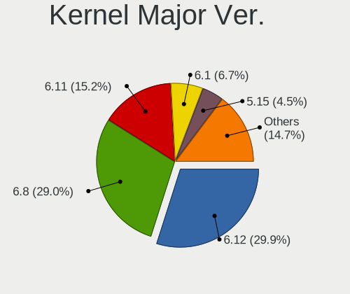
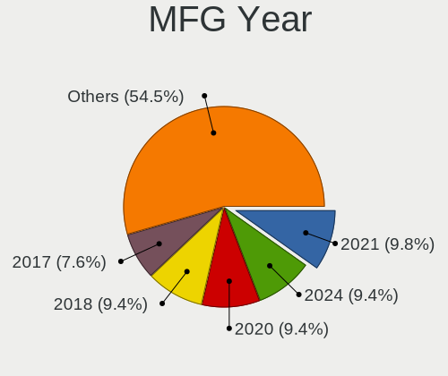
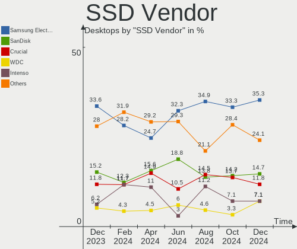
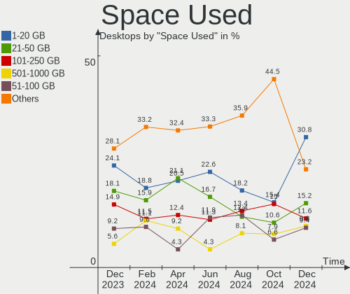
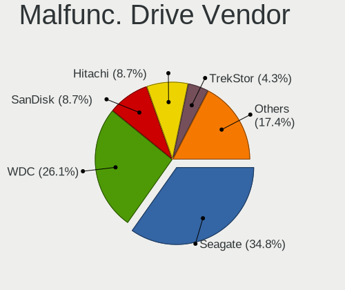
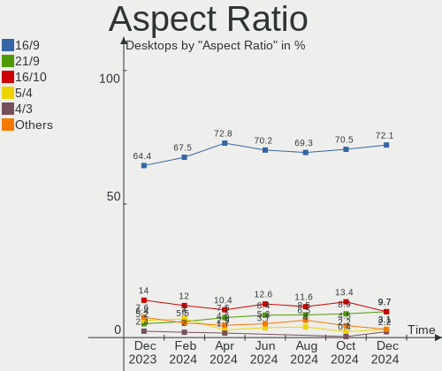
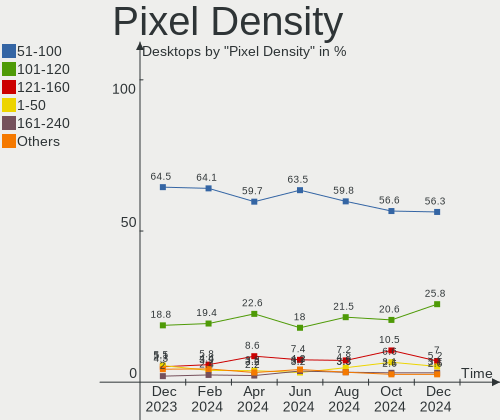

Linux in Germany - Hardware Trends (Desktops)
---------------------------------------------

A project to identify most popular hardware characteristics and track their change
over time based on data collected by Linux users at https://Linux-Hardware.org.

Anyone can contribute to this report by the [hw-probe](https://github.com/linuxhw/hw-probe) tool:

    sudo -E hw-probe -all -upload

Period: Apr, 2024.

Contents
--------

* [ System ](#system)
  - [ OS                       ](#os)
  - [ OS Family                ](#os-family)
  - [ Kernel                   ](#kernel)
  - [ Kernel Family            ](#kernel-family)
  - [ Kernel Major Ver.        ](#kernel-major-ver)
  - [ Arch                     ](#arch)
  - [ DE                       ](#de)
  - [ Display Server           ](#display-server)
  - [ Display Manager          ](#display-manager)
  - [ OS Lang                  ](#os-lang)
  - [ Boot Mode                ](#boot-mode)
  - [ Filesystem               ](#filesystem)
  - [ Part. scheme             ](#part-scheme)
  - [ Dual Boot with Linux/BSD ](#dual-boot-with-linuxbsd)
  - [ Dual Boot (Win)          ](#dual-boot-win)

* [ Board ](#board)
  - [ Vendor                   ](#vendor)
  - [ Model                    ](#model)
  - [ Model Family             ](#model-family)
  - [ MFG Year                 ](#mfg-year)
  - [ Form Factor              ](#form-factor)
  - [ Secure Boot              ](#secure-boot)
  - [ Coreboot                 ](#coreboot)
  - [ RAM Size                 ](#ram-size)
  - [ RAM Used                 ](#ram-used)
  - [ Total Drives             ](#total-drives)
  - [ Has CD-ROM               ](#has-cd-rom)
  - [ Has Ethernet             ](#has-ethernet)
  - [ Has WiFi                 ](#has-wifi)
  - [ Has Bluetooth            ](#has-bluetooth)

* [ Location ](#location)
  - [ Country                  ](#country)
  - [ City                     ](#city)

* [ Drives ](#drives)
  - [ Drive Vendor             ](#drive-vendor)
  - [ Drive Model              ](#drive-model)
  - [ HDD Vendor               ](#hdd-vendor)
  - [ SSD Vendor               ](#ssd-vendor)
  - [ Drive Kind               ](#drive-kind)
  - [ Drive Connector          ](#drive-connector)
  - [ Drive Size               ](#drive-size)
  - [ Space Total              ](#space-total)
  - [ Space Used               ](#space-used)
  - [ Malfunc. Drives          ](#malfunc-drives)
  - [ Malfunc. Drive Vendor    ](#malfunc-drive-vendor)
  - [ Malfunc. HDD Vendor      ](#malfunc-hdd-vendor)
  - [ Malfunc. Drive Kind      ](#malfunc-drive-kind)
  - [ Failed Drives            ](#failed-drives)
  - [ Failed Drive Vendor      ](#failed-drive-vendor)
  - [ Drive Status             ](#drive-status)

* [ Storage controller ](#storage-controller)
  - [ Storage Vendor           ](#storage-vendor)
  - [ Storage Model            ](#storage-model)
  - [ Storage Kind             ](#storage-kind)

* [ Processor ](#processor)
  - [ CPU Vendor               ](#cpu-vendor)
  - [ CPU Model                ](#cpu-model)
  - [ CPU Model Family         ](#cpu-model-family)
  - [ CPU Cores                ](#cpu-cores)
  - [ CPU Sockets              ](#cpu-sockets)
  - [ CPU Threads              ](#cpu-threads)
  - [ CPU Op-Modes             ](#cpu-op-modes)
  - [ CPU Microcode            ](#cpu-microcode)
  - [ CPU Microarch            ](#cpu-microarch)

* [ Graphics ](#graphics)
  - [ GPU Vendor               ](#gpu-vendor)
  - [ GPU Model                ](#gpu-model)
  - [ GPU Combo                ](#gpu-combo)
  - [ GPU Driver               ](#gpu-driver)
  - [ GPU Memory               ](#gpu-memory)

* [ Monitor ](#monitor)
  - [ Monitor Vendor           ](#monitor-vendor)
  - [ Monitor Model            ](#monitor-model)
  - [ Monitor Resolution       ](#monitor-resolution)
  - [ Monitor Diagonal         ](#monitor-diagonal)
  - [ Monitor Width            ](#monitor-width)
  - [ Aspect Ratio             ](#aspect-ratio)
  - [ Monitor Area             ](#monitor-area)
  - [ Pixel Density            ](#pixel-density)
  - [ Multiple Monitors        ](#multiple-monitors)

* [ Network ](#network)
  - [ Net Controller Vendor    ](#net-controller-vendor)
  - [ Net Controller Model     ](#net-controller-model)
  - [ Wireless Vendor          ](#wireless-vendor)
  - [ Wireless Model           ](#wireless-model)
  - [ Ethernet Vendor          ](#ethernet-vendor)
  - [ Ethernet Model           ](#ethernet-model)
  - [ Net Controller Kind      ](#net-controller-kind)
  - [ Used Controller          ](#used-controller)
  - [ NICs                     ](#nics)
  - [ IPv6                     ](#ipv6)

* [ Bluetooth ](#bluetooth)
  - [ Bluetooth Vendor         ](#bluetooth-vendor)
  - [ Bluetooth Model          ](#bluetooth-model)

* [ Sound ](#sound)
  - [ Sound Vendor             ](#sound-vendor)
  - [ Sound Model              ](#sound-model)

* [ Memory ](#memory)
  - [ Memory Vendor            ](#memory-vendor)
  - [ Memory Model             ](#memory-model)
  - [ Memory Kind              ](#memory-kind)
  - [ Memory Form Factor       ](#memory-form-factor)
  - [ Memory Size              ](#memory-size)
  - [ Memory Speed             ](#memory-speed)

* [ Printers & scanners ](#printers--scanners)
  - [ Printer Vendor           ](#printer-vendor)
  - [ Printer Model            ](#printer-model)
  - [ Scanner Vendor           ](#scanner-vendor)
  - [ Scanner Model            ](#scanner-model)

* [ Camera ](#camera)
  - [ Camera Vendor            ](#camera-vendor)
  - [ Camera Model             ](#camera-model)

* [ Security ](#security)
  - [ Fingerprint Vendor       ](#fingerprint-vendor)
  - [ Fingerprint Model        ](#fingerprint-model)
  - [ Chipcard Vendor          ](#chipcard-vendor)
  - [ Chipcard Model           ](#chipcard-model)

* [ Unsupported ](#unsupported)
  - [ Unsupported Devices      ](#unsupported-devices)
  - [ Unsupported Device Types ](#unsupported-device-types)

System
------

OS
--

Installed operating systems

| Name                         | Desktops | Percent |
|------------------------------|----------|---------|
| Ubuntu 22.04                 | 21       | 11.29%  |
| Debian 12                    | 14       | 7.53%   |
| Linux Mint 21.3              | 13       | 6.99%   |
| Ubuntu 23.10                 | 12       | 6.45%   |
| Fedora 40                    | 10       | 5.38%   |
| Nobara 39                    | 8        | 4.3%    |
| Fedora 39                    | 7        | 3.76%   |
| openSUSE Leap-15.5           | 6        | 3.23%   |
| Manjaro                      | 6        | 3.23%   |
| Zorin 17                     | 5        | 2.69%   |
| Ubuntu 24.04                 | 5        | 2.69%   |
| openSUSE Tumbleweed-XXXXXXXX | 5        | 2.69%   |
| OpenMandriva 23.08           | 5        | 2.69%   |
| LMDE 6                       | 4        | 2.15%   |
| KDE neon 22.04               | 4        | 2.15%   |
| Arch Rolling                 | 4        | 2.15%   |
| Ubuntu 20.04                 | 3        | 1.61%   |
| ROSA 12.5                    | 3        | 1.61%   |
| Pop!_OS 22.04                | 3        | 1.61%   |
| OpenMandriva 23.03           | 3        | 1.61%   |
| Kubuntu 22.04                | 3        | 1.61%   |
| BlackPanther 18.1            | 3        | 1.61%   |
| OpenMandriva 4.2             | 2        | 1.08%   |
| OpenMandriva 24.03           | 2        | 1.08%   |
| MX 23                        | 2        | 1.08%   |
| Manjaro 23.1.4               | 2        | 1.08%   |
| Garuda Linux Soaring         | 2        | 1.08%   |
| EndeavourOS Rolling          | 2        | 1.08%   |
| ArcoLinux Rolling            | 2        | 1.08%   |
| Xubuntu 23.10                | 1        | 0.54%   |
| Xubuntu 22.04                | 1        | 0.54%   |
| Xero Rolling                 | 1        | 0.54%   |
| Ubuntu Unity 22.04           | 1        | 0.54%   |
| Ubuntu MATE 20.04            | 1        | 0.54%   |
| Ubuntu 21.10                 | 1        | 0.54%   |
| Ubuntu 21.04                 | 1        | 0.54%   |
| Ubuntu 18.04                 | 1        | 0.54%   |
| TUXEDO OS 22.04              | 1        | 0.54%   |
| SteamOS 1.1.7_prerc-hotfix   | 1        | 0.54%   |
| OpenWrt 23.05.3              | 1        | 0.54%   |

OS Family
---------

OS without a version

| Name         | Desktops | Percent |
|--------------|----------|---------|
| Ubuntu       | 44       | 23.66%  |
| Fedora       | 17       | 9.14%   |
| Debian       | 16       | 8.6%    |
| OpenMandriva | 15       | 8.06%   |
| Linux Mint   | 15       | 8.06%   |
| openSUSE     | 12       | 6.45%   |
| Nobara       | 9        | 4.84%   |
| Manjaro      | 8        | 4.3%    |
| Zorin        | 5        | 2.69%   |
| LMDE         | 4        | 2.15%   |
| Kubuntu      | 4        | 2.15%   |
| KDE neon     | 4        | 2.15%   |
| Arch         | 4        | 2.15%   |
| ROSA         | 3        | 1.61%   |
| Pop!_OS      | 3        | 1.61%   |
| Garuda Linux | 3        | 1.61%   |
| BlackPanther | 3        | 1.61%   |
| Xubuntu      | 2        | 1.08%   |
| MX           | 2        | 1.08%   |
| EndeavourOS  | 2        | 1.08%   |
| ArcoLinux    | 2        | 1.08%   |
| Xero         | 1        | 0.54%   |
| Ubuntu Unity | 1        | 0.54%   |
| Ubuntu MATE  | 1        | 0.54%   |
| TUXEDO OS    | 1        | 0.54%   |
| SteamOS      | 1        | 0.54%   |
| OpenWrt      | 1        | 0.54%   |
| Neptune OS   | 1        | 0.54%   |
| Elementary   | 1        | 0.54%   |
| Dts-distro   | 1        | 0.54%   |

Kernel
------

Version of the Linux kernel

| Version                                                | Desktops | Percent |
|--------------------------------------------------------|----------|---------|
| 6.5.0-28-generic                                       | 17       | 9.14%   |
| 6.5.0-26-generic                                       | 15       | 8.06%   |
| 6.5.0-27-generic                                       | 14       | 7.53%   |
| 6.8.7-300.fc40.x86_64                                  | 8        | 4.3%    |
| 6.1.0-18-amd64                                         | 7        | 3.76%   |
| 6.1.0-20-amd64                                         | 6        | 3.23%   |
| 5.15.0-105-generic                                     | 6        | 3.23%   |
| 6.4.11-desktop-1omv2390                                | 5        | 2.69%   |
| 5.15.0-101-generic                                     | 5        | 2.69%   |
| 5.14.21-150500.55.52-default                           | 5        | 2.69%   |
| 6.8.5-201.fsync.fc39.x86_64                            | 4        | 2.15%   |
| 5.15.0-102-generic                                     | 4        | 2.15%   |
| 6.8.4-arch1-1                                          | 3        | 1.61%   |
| 6.8.0-31-generic                                       | 3        | 1.61%   |
| 6.2.6-desktop-1omv2390                                 | 3        | 1.61%   |
| 6.1.0-17-amd64                                         | 3        | 1.61%   |
| 6.8.7-desktop-1omv2490                                 | 2        | 1.08%   |
| 6.8.7-1-default                                        | 2        | 1.08%   |
| 6.8.6-200.fc39.x86_64                                  | 2        | 1.08%   |
| 6.8.5-1-MANJARO                                        | 2        | 1.08%   |
| 6.8.2-zen2-1-zen                                       | 2        | 1.08%   |
| 6.8.2-arch2-1                                          | 2        | 1.08%   |
| 6.8.0-76060800daily20240311-generic                    | 2        | 1.08%   |
| 6.7.6-201.fsync.fc39.x86_64                            | 2        | 1.08%   |
| 6.7.12-1-MANJARO                                       | 2        | 1.08%   |
| 6.6.26-1-MANJARO                                       | 2        | 1.08%   |
| 6.6.21-generic-8rosa2021.1-x86_64                      | 2        | 1.08%   |
| 5.6.14-desktop-2bP                                     | 2        | 1.08%   |
| 5.10.14-desktop-1omv4002                               | 2        | 1.08%   |
| 6.9.0-0.rc3.20240411gte8c39d0f.232.vanilla.fc39.x86_64 | 1        | 0.54%   |
| 6.8.7-lqx2-1-lqx                                       | 1        | 0.54%   |
| 6.8.7-arch1-2                                          | 1        | 0.54%   |
| 6.8.7-arch1-1                                          | 1        | 0.54%   |
| 6.8.6-1-default                                        | 1        | 0.54%   |
| 6.8.5-301.fc40.x86_64                                  | 1        | 0.54%   |
| 6.8.5-201.fc39.x86_64                                  | 1        | 0.54%   |
| 6.8.5-1-default                                        | 1        | 0.54%   |
| 6.8.4-zen1-1-zen                                       | 1        | 0.54%   |
| 6.8.4-200.fc39.x86_64                                  | 1        | 0.54%   |
| 6.8.2-300.fc40.x86_64                                  | 1        | 0.54%   |

Kernel Family
-------------

Linux kernel without a distro release

| Version  | Desktops | Percent |
|----------|----------|---------|
| 6.5.0    | 48       | 25.81%  |
| 5.15.0   | 18       | 9.68%   |
| 6.1.0    | 17       | 9.14%   |
| 6.8.7    | 15       | 8.06%   |
| 6.8.5    | 9        | 4.84%   |
| 6.8.2    | 7        | 3.76%   |
| 6.8.0    | 7        | 3.76%   |
| 5.14.21  | 6        | 3.23%   |
| 6.8.4    | 5        | 2.69%   |
| 6.4.11   | 5        | 2.69%   |
| 6.7.12   | 4        | 2.15%   |
| 6.8.6    | 3        | 1.61%   |
| 6.2.6    | 3        | 1.61%   |
| 6.8.1    | 2        | 1.08%   |
| 6.7.6    | 2        | 1.08%   |
| 6.6.26   | 2        | 1.08%   |
| 6.6.21   | 2        | 1.08%   |
| 6.2.0    | 2        | 1.08%   |
| 5.6.14   | 2        | 1.08%   |
| 5.10.14  | 2        | 1.08%   |
| 4.15.0   | 2        | 1.08%   |
| 6.9.0    | 1        | 0.54%   |
| 6.7.7    | 1        | 0.54%   |
| 6.7.5    | 1        | 0.54%   |
| 6.7.4    | 1        | 0.54%   |
| 6.7.10   | 1        | 0.54%   |
| 6.6.4    | 1        | 0.54%   |
| 6.6.25   | 1        | 0.54%   |
| 6.6.2    | 1        | 0.54%   |
| 6.6.19   | 1        | 0.54%   |
| 6.6.13   | 1        | 0.54%   |
| 6.6.10   | 1        | 0.54%   |
| 6.5.13   | 1        | 0.54%   |
| 6.5.11   | 1        | 0.54%   |
| 6.4.10   | 1        | 0.54%   |
| 6.3.5    | 1        | 0.54%   |
| 6.1.86   | 1        | 0.54%   |
| 5.4.0    | 1        | 0.54%   |
| 5.15.36  | 1        | 0.54%   |
| 5.15.150 | 1        | 0.54%   |

Kernel Major Ver.
-----------------

Linux kernel major version

| Version | Desktops | Percent |
|---------|----------|---------|
| 6.5     | 50       | 26.88%  |
| 6.8     | 48       | 25.81%  |
| 5.15    | 20       | 10.75%  |
| 6.1     | 18       | 9.68%   |
| 6.7     | 10       | 5.38%   |
| 6.6     | 10       | 5.38%   |
| 6.4     | 6        | 3.23%   |
| 5.14    | 6        | 3.23%   |
| 6.2     | 5        | 2.69%   |
| 5.10    | 3        | 1.61%   |
| 5.6     | 2        | 1.08%   |
| 4.15    | 2        | 1.08%   |
| 6.9     | 1        | 0.54%   |
| 6.3     | 1        | 0.54%   |
| 5.4     | 1        | 0.54%   |
| 5.13    | 1        | 0.54%   |
| 5.11    | 1        | 0.54%   |
| 4.18    | 1        | 0.54%   |

Arch
----

OS architecture (x86_64, i586, etc.)

| Name   | Desktops | Percent |
|--------|----------|---------|
| x86_64 | 184      | 98.92%  |
| mips   | 1        | 0.54%   |
| i686   | 1        | 0.54%   |

DE
--

Desktop Environment

| Name            | Desktops | Percent |
|-----------------|----------|---------|
| GNOME           | 65       | 34.95%  |
| KDE5            | 42       | 22.58%  |
| KDE6            | 23       | 12.37%  |
| X-Cinnamon      | 15       | 8.06%   |
| XFCE            | 13       | 6.99%   |
| Unknown         | 11       | 5.91%   |
| Cinnamon        | 5        | 2.69%   |
| MATE            | 4        | 2.15%   |
| Hyprland        | 2        | 1.08%   |
| Unity           | 1        | 0.54%   |
| Pantheon        | 1        | 0.54%   |
| KDE4            | 1        | 0.54%   |
| KDE             | 1        | 0.54%   |
| i3              | 1        | 0.54%   |
| GNOME Flashback | 1        | 0.54%   |

Display Server
--------------

X11 or Wayland

| Name    | Desktops | Percent |
|---------|----------|---------|
| X11     | 94       | 50.54%  |
| Wayland | 75       | 40.32%  |
| Tty     | 11       | 5.91%   |
| Unknown | 6        | 3.23%   |

Display Manager
---------------

SDDM, LightDM, etc.

| Name    | Desktops | Percent |
|---------|----------|---------|
| Unknown | 79       | 42.47%  |
| GDM3    | 40       | 21.51%  |
| SDDM    | 38       | 20.43%  |
| LightDM | 25       | 13.44%  |
| GDM     | 3        | 1.61%   |
| SLiM    | 1        | 0.54%   |

OS Lang
-------

Language

| Lang        | Desktops | Percent |
|-------------|----------|---------|
| de_DE       | 138      | 74.19%  |
| en_US       | 31       | 16.67%  |
| Unknown     | 4        | 2.15%   |
| C           | 3        | 1.61%   |
| ru_RU       | 2        | 1.08%   |
| POSIX       | 2        | 1.08%   |
| ro_RO       | 1        | 0.54%   |
| hu_HU       | 1        | 0.54%   |
| en_IE       | 1        | 0.54%   |
| en_GB       | 1        | 0.54%   |
| de_de-UTF-8 | 1        | 0.54%   |
| bg_BG       | 1        | 0.54%   |

Boot Mode
---------

EFI or BIOS

| Mode | Desktops | Percent |
|------|----------|---------|
| BIOS | 115      | 61.83%  |
| EFI  | 71       | 38.17%  |

Filesystem
----------

Type of filesystem

| Type    | Desktops | Percent |
|---------|----------|---------|
| Ext4    | 93       | 50%     |
| Btrfs   | 40       | 21.51%  |
| Tmpfs   | 35       | 18.82%  |
| Overlay | 11       | 5.91%   |
| Zfs     | 2        | 1.08%   |
| Xfs     | 2        | 1.08%   |
| Ext3    | 1        | 0.54%   |
| Ext2    | 1        | 0.54%   |
| Unknown | 1        | 0.54%   |

Part. scheme
------------

Scheme of partitioning

| Type    | Desktops | Percent |
|---------|----------|---------|
| GPT     | 99       | 53.23%  |
| Unknown | 69       | 37.1%   |
| MBR     | 18       | 9.68%   |

Dual Boot with Linux/BSD
------------------------

Hosting more than one Linux/BSD

| Dual boot | Desktops | Percent |
|-----------|----------|---------|
| No        | 148      | 79.57%  |
| Yes       | 38       | 20.43%  |

Dual Boot (Win)
---------------

Hosting Linux and Windows

| Dual boot | Desktops | Percent |
|-----------|----------|---------|
| No        | 142      | 76.34%  |
| Yes       | 44       | 23.66%  |

Board
-----

Vendor
------

Motherboard manufacturer

| Name                | Desktops | Percent |
|---------------------|----------|---------|
| ASUSTek Computer    | 57       | 30.65%  |
| MSI                 | 29       | 15.59%  |
| Gigabyte Technology | 28       | 15.05%  |
| ASRock              | 22       | 11.83%  |
| Hewlett-Packard     | 10       | 5.38%   |
| Fujitsu             | 6        | 3.23%   |
| Dell                | 5        | 2.69%   |
| Unknown             | 5        | 2.69%   |
| Medion              | 4        | 2.15%   |
| Acer                | 3        | 1.61%   |
| Lenovo              | 2        | 1.08%   |
| Foxconn             | 2        | 1.08%   |
| Biostar             | 2        | 1.08%   |
| SZMZ                | 1        | 0.54%   |
| Supermicro          | 1        | 0.54%   |
| PELADN              | 1        | 0.54%   |
| Packard Bell        | 1        | 0.54%   |
| NZXT                | 1        | 0.54%   |
| NCR                 | 1        | 0.54%   |
| Intel               | 1        | 0.54%   |
| Hardkernel          | 1        | 0.54%   |
| GEEKOM              | 1        | 0.54%   |
| Fujitsu Siemens     | 1        | 0.54%   |
| AZW                 | 1        | 0.54%   |

Model
-----

Motherboard model

| Name                          | Desktops | Percent |
|-------------------------------|----------|---------|
| Unknown                       | 5        | 2.69%   |
| MSI MS-7C56                   | 4        | 2.15%   |
| MSI MS-7D25                   | 2        | 1.08%   |
| MSI MS-7C37                   | 2        | 1.08%   |
| Gigabyte Z390 UD              | 2        | 1.08%   |
| Gigabyte B550M DS3H           | 2        | 1.08%   |
| Foxconn G41MX/G41MX-K 2.0 1.0 | 2        | 1.08%   |
| Biostar A960D+V2              | 2        | 1.08%   |
| ASUS ROG STRIX B450-F GAMING  | 2        | 1.08%   |
| ASUS Pro WS X570-ACE          | 2        | 1.08%   |
| ASUS PRIME A320M-K            | 2        | 1.08%   |
| ASUS M5A97 R2.0               | 2        | 1.08%   |
| ASUS All Series               | 2        | 1.08%   |
| ASUS A68HM-PLUS               | 2        | 1.08%   |
| ASRock X570 Phantom Gaming 4  | 2        | 1.08%   |
| SZMZ X99-S3                   | 1        | 0.54%   |
| Supermicro 59102100100        | 1        | 0.54%   |
| PELADN WI-6                   | 1        | 0.54%   |
| Packard Bell imax mini N3600  | 1        | 0.54%   |
| NZXT N7 B550                  | 1        | 0.54%   |
| NCR xxxx-xxxx-xxxx            | 1        | 0.54%   |
| MSI MS-7E26                   | 1        | 0.54%   |
| MSI MS-7E01                   | 1        | 0.54%   |
| MSI MS-7D76                   | 1        | 0.54%   |
| MSI MS-7D75                   | 1        | 0.54%   |
| MSI MS-7D73                   | 1        | 0.54%   |
| MSI MS-7D20                   | 1        | 0.54%   |
| MSI MS-7D15                   | 1        | 0.54%   |
| MSI MS-7C94                   | 1        | 0.54%   |
| MSI MS-7C51                   | 1        | 0.54%   |
| MSI MS-7C35                   | 1        | 0.54%   |
| MSI MS-7B86                   | 1        | 0.54%   |
| MSI MS-7B09                   | 1        | 0.54%   |
| MSI MS-7A95                   | 1        | 0.54%   |
| MSI MS-7A36                   | 1        | 0.54%   |
| MSI MS-7891                   | 1        | 0.54%   |
| MSI MS-7816                   | 1        | 0.54%   |
| MSI MS-7501                   | 1        | 0.54%   |
| MSI MS-7369                   | 1        | 0.54%   |
| MSI Mr.Whisper XII            | 1        | 0.54%   |

Model Family
------------

Motherboard model prefix

| Name                   | Desktops | Percent |
|------------------------|----------|---------|
| ASUS PRIME             | 15       | 8.06%   |
| ASUS TUF               | 8        | 4.3%    |
| ASUS ROG               | 5        | 2.69%   |
| Unknown                | 5        | 2.69%   |
| MSI MS-7C56            | 4        | 2.15%   |
| HP Compaq              | 4        | 2.15%   |
| HP EliteDesk           | 3        | 1.61%   |
| Gigabyte X570          | 3        | 1.61%   |
| Gigabyte B550M         | 3        | 1.61%   |
| Dell OptiPlex          | 3        | 1.61%   |
| ASUS Pro               | 3        | 1.61%   |
| MSI MS-7D25            | 2        | 1.08%   |
| MSI MS-7C37            | 2        | 1.08%   |
| Gigabyte Z790          | 2        | 1.08%   |
| Gigabyte Z390          | 2        | 1.08%   |
| Gigabyte B550          | 2        | 1.08%   |
| Fujitsu ESPRIMO        | 2        | 1.08%   |
| Foxconn G41MX          | 2        | 1.08%   |
| Biostar A960D+V2       | 2        | 1.08%   |
| ASUS M5A97             | 2        | 1.08%   |
| ASUS CROSSHAIR         | 2        | 1.08%   |
| ASUS All               | 2        | 1.08%   |
| ASUS A68HM-PLUS        | 2        | 1.08%   |
| ASRock X570            | 2        | 1.08%   |
| ASRock B450M           | 2        | 1.08%   |
| Acer Aspire            | 2        | 1.08%   |
| SZMZ X99-S3            | 1        | 0.54%   |
| Supermicro 59102100100 | 1        | 0.54%   |
| PELADN WI-6            | 1        | 0.54%   |
| Packard Bell imax      | 1        | 0.54%   |
| NZXT N7                | 1        | 0.54%   |
| NCR xxxx-xxxx-xxxx     | 1        | 0.54%   |
| MSI MS-7E26            | 1        | 0.54%   |
| MSI MS-7E01            | 1        | 0.54%   |
| MSI MS-7D76            | 1        | 0.54%   |
| MSI MS-7D75            | 1        | 0.54%   |
| MSI MS-7D73            | 1        | 0.54%   |
| MSI MS-7D20            | 1        | 0.54%   |
| MSI MS-7D15            | 1        | 0.54%   |
| MSI MS-7C94            | 1        | 0.54%   |

MFG Year
--------

Motherboard manufacture year

| Year    | Desktops | Percent |
|---------|----------|---------|
| 2018    | 20       | 10.75%  |
| 2020    | 19       | 10.22%  |
| 2023    | 16       | 8.6%    |
| 2019    | 16       | 8.6%    |
| 2017    | 16       | 8.6%    |
| 2022    | 14       | 7.53%   |
| 2021    | 12       | 6.45%   |
| 2013    | 12       | 6.45%   |
| 2014    | 10       | 5.38%   |
| 2012    | 10       | 5.38%   |
| 2015    | 9        | 4.84%   |
| 2009    | 9        | 4.84%   |
| 2011    | 6        | 3.23%   |
| 2024    | 4        | 2.15%   |
| 2010    | 4        | 2.15%   |
| 2008    | 3        | 1.61%   |
| 2016    | 2        | 1.08%   |
| 2007    | 1        | 0.54%   |
| 2006    | 1        | 0.54%   |
| 2005    | 1        | 0.54%   |
| Unknown | 1        | 0.54%   |

Form Factor
-----------

Physical design of the computer

| Name    | Desktops | Percent |
|---------|----------|---------|
| Desktop | 186      | 100%    |

Secure Boot
-----------

Enabled or disabled

| State    | Desktops | Percent |
|----------|----------|---------|
| Disabled | 181      | 97.31%  |
| Enabled  | 5        | 2.69%   |

Coreboot
--------

Have coreboot on board

| Used | Desktops | Percent |
|------|----------|---------|
| No   | 185      | 99.46%  |
| Yes  | 1        | 0.54%   |

RAM Size
--------

Total RAM memory

| Size in GB  | Desktops | Percent |
|-------------|----------|---------|
| 32.01-64.0  | 42       | 22.58%  |
| 16.01-24.0  | 39       | 20.97%  |
| 8.01-16.0   | 29       | 15.59%  |
| 64.01-256.0 | 28       | 15.05%  |
| 4.01-8.0    | 24       | 12.9%   |
| 3.01-4.0    | 13       | 6.99%   |
| 24.01-32.0  | 6        | 3.23%   |
| 2.01-3.0    | 2        | 1.08%   |
| 1.01-2.0    | 1        | 0.54%   |
| 0.51-1.0    | 1        | 0.54%   |
| 0.01-0.5    | 1        | 0.54%   |

RAM Used
--------

Used RAM memory

| Used GB     | Desktops | Percent |
|-------------|----------|---------|
| 1.01-2.0    | 55       | 29.57%  |
| 2.01-3.0    | 42       | 22.58%  |
| 4.01-8.0    | 38       | 20.43%  |
| 3.01-4.0    | 21       | 11.29%  |
| 8.01-16.0   | 12       | 6.45%   |
| 16.01-24.0  | 5        | 2.69%   |
| 0.51-1.0    | 4        | 2.15%   |
| 0.01-0.5    | 4        | 2.15%   |
| 64.01-256.0 | 2        | 1.08%   |
| 32.01-64.0  | 1        | 0.54%   |
| 24.01-32.0  | 1        | 0.54%   |
| 0           | 1        | 0.54%   |

Total Drives
------------

Number of drives on board

| Drives | Desktops | Percent |
|--------|----------|---------|
| 1      | 57       | 30.65%  |
| 2      | 54       | 29.03%  |
| 3      | 32       | 17.2%   |
| 4      | 19       | 10.22%  |
| 5      | 8        | 4.3%    |
| 7      | 7        | 3.76%   |
| 6      | 5        | 2.69%   |
| 9      | 2        | 1.08%   |
| 14     | 1        | 0.54%   |
| 0      | 1        | 0.54%   |

Has CD-ROM
----------

Has CD-ROM on board

| Presented | Desktops | Percent |
|-----------|----------|---------|
| No        | 102      | 54.84%  |
| Yes       | 84       | 45.16%  |

Has Ethernet
------------

Has Ethernet on board

| Presented | Desktops | Percent |
|-----------|----------|---------|
| Yes       | 185      | 99.46%  |
| No        | 1        | 0.54%   |

Has WiFi
--------

Has WiFi module

| Presented | Desktops | Percent |
|-----------|----------|---------|
| No        | 118      | 63.44%  |
| Yes       | 68       | 36.56%  |

Has Bluetooth
-------------

Has Bluetooth module

| Presented | Desktops | Percent |
|-----------|----------|---------|
| No        | 111      | 59.68%  |
| Yes       | 75       | 40.32%  |

Location
--------

Country
-------

Geographic location (country)

| Country | Desktops | Percent |
|---------|----------|---------|
| Germany | 186      | 100%    |

City
----

Geographic location (city)

| City                    | Desktops | Percent |
|-------------------------|----------|---------|
| Berlin                  | 13       | 6.99%   |
| Hamburg                 | 11       | 5.91%   |
| Munich                  | 9        | 4.84%   |
| Essen                   | 5        | 2.69%   |
| Cologne                 | 4        | 2.15%   |
| Stuttgart               | 3        | 1.61%   |
| Oldenburg               | 3        | 1.61%   |
| Heidelberg              | 3        | 1.61%   |
| Hanover                 | 3        | 1.61%   |
| Frankfurt am Main       | 3        | 1.61%   |
| Falkenstein             | 3        | 1.61%   |
| Dortmund                | 3        | 1.61%   |
| Wiesbaden               | 2        | 1.08%   |
| Ulm                     | 2        | 1.08%   |
| Uetze                   | 2        | 1.08%   |
| Regensburg              | 2        | 1.08%   |
| Pfaffenhofen an der Ilm | 2        | 1.08%   |
| Mannheim                | 2        | 1.08%   |
| Lahr                    | 2        | 1.08%   |
| Koblenz                 | 2        | 1.08%   |
| Haltern am See          | 2        | 1.08%   |
| Halle                   | 2        | 1.08%   |
| Freiburg im Breisgau    | 2        | 1.08%   |
| Delligsen               | 2        | 1.08%   |
| Dachau                  | 2        | 1.08%   |
| Bremen                  | 2        | 1.08%   |
| Bonn                    | 2        | 1.08%   |
| Bad Schoenborn          | 2        | 1.08%   |
| Wuppertal               | 1        | 0.54%   |
| Wittenberge             | 1        | 0.54%   |
| Winsen                  | 1        | 0.54%   |
| Wiehl                   | 1        | 0.54%   |
| Waiblingen              | 1        | 0.54%   |
| Vilshofen               | 1        | 0.54%   |
| Tuttlingen              | 1        | 0.54%   |
| Sundern                 | 1        | 0.54%   |
| Solingen                | 1        | 0.54%   |
| Siegen                  | 1        | 0.54%   |
| Seeheim-Jugenheim       | 1        | 0.54%   |
| Sangerhausen            | 1        | 0.54%   |

Drives
------

Drive Vendor
------------

Hard drive vendors

| Vendor                       | Desktops | Drives | Percent |
|------------------------------|----------|--------|---------|
| Samsung Electronics          | 72       | 106    | 19.73%  |
| WDC                          | 45       | 67     | 12.33%  |
| Seagate                      | 44       | 74     | 12.05%  |
| SanDisk                      | 33       | 42     | 9.04%   |
| Intenso                      | 24       | 27     | 6.58%   |
| Crucial                      | 23       | 31     | 6.3%    |
| Toshiba                      | 16       | 21     | 4.38%   |
| Kingston                     | 13       | 15     | 3.56%   |
| Micron Technology            | 11       | 11     | 3.01%   |
| Micron/Crucial Technology    | 10       | 12     | 2.74%   |
| Hitachi                      | 8        | 8      | 2.19%   |
| Unknown                      | 5        | 5      | 1.37%   |
| Phison Electronics           | 4        | 5      | 1.1%    |
| Intel                        | 4        | 4      | 1.1%    |
| Transcend                    | 3        | 3      | 0.82%   |
| OCZ                          | 3        | 5      | 0.82%   |
| Maxtor                       | 3        | 3      | 0.82%   |
| Kingston Technology Company  | 3        | 3      | 0.82%   |
| China                        | 3        | 3      | 0.82%   |
| Shenzhen Longsys Electronics | 2        | 3      | 0.55%   |
| Patriot                      | 2        | 2      | 0.55%   |
| FIKWOT                       | 2        | 2      | 0.55%   |
| ASMT                         | 2        | 2      | 0.55%   |
| ADATA Technology             | 2        | 2      | 0.55%   |
| Unknown                      | 2        | 2      | 0.55%   |
| Verbatim                     | 1        | 4      | 0.27%   |
| T-FORCE                      | 1        | 1      | 0.27%   |
| SXMicro                      | 1        | 1      | 0.27%   |
| SK hynix                     | 1        | 1      | 0.27%   |
| Silicon Motion               | 1        | 1      | 0.27%   |
| SABRENT                      | 1        | 1      | 0.27%   |
| Realtek Semiconductor        | 1        | 1      | 0.27%   |
| PNY                          | 1        | 1      | 0.27%   |
| Phison                       | 1        | 1      | 0.27%   |
| OCZ Technology Group         | 1        | 1      | 0.27%   |
| MSFT                         | 1        | 1      | 0.27%   |
| MAXIO Technology (Hangzhou)  | 1        | 1      | 0.27%   |
| Marvell Technology Group     | 1        | 1      | 0.27%   |
| Lexar                        | 1        | 1      | 0.27%   |
| Leven                        | 1        | 1      | 0.27%   |

Drive Model
-----------

Hard drive models

| Model                                               | Desktops | Percent |
|-----------------------------------------------------|----------|---------|
| Samsung NVMe SSD Controller SM981/PM981/PM983 1TB   | 10       | 2.3%    |
| Crucial CT500MX500SSD1 500GB                        | 7        | 1.61%   |
| Samsung SSD 850 EVO 500GB                           | 6        | 1.38%   |
| Samsung NVMe SSD Controller PM9A1/PM9A3/980PRO 1TB  | 6        | 1.38%   |
| Samsung SSD 860 EVO 1TB                             | 5        | 1.15%   |
| SanDisk SSD PLUS 240GB                              | 4        | 0.92%   |
| SanDisk SSD PLUS 1000GB                             | 4        | 0.92%   |
| Samsung SSD 860 EVO 500GB                           | 4        | 0.92%   |
| Samsung SSD 840 EVO 250GB                           | 4        | 0.92%   |
| Micron/Crucial P2 NVMe PCIe SSD 4TB                 | 4        | 0.92%   |
| Crucial CT1000MX500SSD1 1TB                         | 4        | 0.92%   |
| Toshiba HDWD110 1TB                                 | 3        | 0.69%   |
| Seagate ST4000DM004-2CV104 4TB                      | 3        | 0.69%   |
| Seagate ST2000DM008-2FR102 2TB                      | 3        | 0.69%   |
| Seagate ST1000DM010-2EP102 1TB                      | 3        | 0.69%   |
| SanDisk NVMe SSD Drive 1TB                          | 3        | 0.69%   |
| Samsung SSD 990 PRO 2TB                             | 3        | 0.69%   |
| Samsung SSD 870 EVO 2TB                             | 3        | 0.69%   |
| Samsung SSD 870 EVO 1TB                             | 3        | 0.69%   |
| Samsung SSD 860 QVO 1TB                             | 3        | 0.69%   |
| Samsung SSD 850 EVO 250GB                           | 3        | 0.69%   |
| Samsung SSD 840 Series 120GB                        | 3        | 0.69%   |
| Micron CT1000P3PSSD8 1TB                            | 3        | 0.69%   |
| Crucial CT1000BX500SSD1 1TB                         | 3        | 0.69%   |
| WDC WDS500G2B0A-00SM50 500GB SSD                    | 2        | 0.46%   |
| WDC WD5000AAKS-007AA0 500GB                         | 2        | 0.46%   |
| WDC WD40EZRZ-00GXCB0 4TB                            | 2        | 0.46%   |
| WDC WD20EFRX-68EUZN0 2TB                            | 2        | 0.46%   |
| WDC WD20EARS-00MVWB0 2TB                            | 2        | 0.46%   |
| WDC WD10EZEX-08WN4A0 1TB                            | 2        | 0.46%   |
| WDC WD10EARS-00Y5B1 1TB                             | 2        | 0.46%   |
| Unknown SD/MMC/MS PRO 128GB                         | 2        | 0.46%   |
| Toshiba DT01ACA300 3TB                              | 2        | 0.46%   |
| Toshiba DT01ACA100 1TB                              | 2        | 0.46%   |
| Seagate ST18000NM000J-2TV103 18TB                   | 2        | 0.46%   |
| Seagate ST1000DM003-1SB10C 1TB                      | 2        | 0.46%   |
| Sandisk WD Blue SN580 1TB                           | 2        | 0.46%   |
| Sandisk WD Black 2018/SN750 / PC SN720 NVMe SSD 1TB | 2        | 0.46%   |
| SanDisk SSD PLUS 480GB                              | 2        | 0.46%   |
| SanDisk SDSSDP064G 64GB                             | 2        | 0.46%   |

HDD Vendor
----------

Hard disk drive vendors

| Vendor              | Desktops | Drives | Percent |
|---------------------|----------|--------|---------|
| Seagate             | 42       | 72     | 33.6%   |
| WDC                 | 39       | 59     | 31.2%   |
| Toshiba             | 15       | 19     | 12%     |
| Samsung Electronics | 9        | 9      | 7.2%    |
| Hitachi             | 8        | 8      | 6.4%    |
| Maxtor              | 3        | 3      | 2.4%    |
| Unknown             | 2        | 2      | 1.6%    |
| Intenso             | 2        | 2      | 1.6%    |
| SABRENT             | 1        | 1      | 0.8%    |
| MSFT                | 1        | 1      | 0.8%    |
| JMicron Technology  | 1        | 1      | 0.8%    |
| HGST                | 1        | 1      | 0.8%    |
| Hewlett-Packard     | 1        | 1      | 0.8%    |

SSD Vendor
----------

Solid state drive vendors

| Vendor              | Desktops | Drives | Percent |
|---------------------|----------|--------|---------|
| Samsung Electronics | 38       | 49     | 24.68%  |
| SanDisk             | 24       | 27     | 15.58%  |
| Crucial             | 23       | 30     | 14.94%  |
| Intenso             | 17       | 20     | 11.04%  |
| Kingston            | 9        | 10     | 5.84%   |
| WDC                 | 7        | 7      | 4.55%   |
| Micron Technology   | 7        | 7      | 4.55%   |
| Transcend           | 3        | 3      | 1.95%   |
| OCZ                 | 3        | 5      | 1.95%   |
| Intel               | 3        | 3      | 1.95%   |
| Toshiba             | 2        | 2      | 1.3%    |
| Patriot             | 2        | 2      | 1.3%    |
| China               | 2        | 2      | 1.3%    |
| ASMT                | 2        | 2      | 1.3%    |
| Unknown             | 2        | 2      | 1.3%    |
| Verbatim            | 1        | 4      | 0.65%   |
| SXMicro             | 1        | 1      | 0.65%   |
| SK hynix            | 1        | 1      | 0.65%   |
| PNY                 | 1        | 1      | 0.65%   |
| Phison              | 1        | 1      | 0.65%   |
| Leven               | 1        | 1      | 0.65%   |
| Fanxiang            | 1        | 1      | 0.65%   |
| Drevo               | 1        | 1      | 0.65%   |
| ASMedia             | 1        | 1      | 0.65%   |
| Apacer              | 1        | 1      | 0.65%   |

Drive Kind
----------

HDD or SSD

| Kind    | Desktops | Drives | Percent |
|---------|----------|--------|---------|
| SSD     | 119      | 184    | 39.4%   |
| HDD     | 94       | 179    | 31.13%  |
| NVMe    | 78       | 113    | 25.83%  |
| Unknown | 10       | 12     | 3.31%   |
| MMC     | 1        | 1      | 0.33%   |

Drive Connector
---------------

SATA, SAS, NVMe, etc.

| Type | Desktops | Drives | Percent |
|------|----------|--------|---------|
| SATA | 158      | 350    | 61%     |
| NVMe | 78       | 112    | 30.12%  |
| SAS  | 22       | 26     | 8.49%   |
| MMC  | 1        | 1      | 0.39%   |

Drive Size
----------

Size of hard drive

| Size in TB | Desktops | Drives | Percent |
|------------|----------|--------|---------|
| 0.01-0.5   | 109      | 174    | 45.8%   |
| 0.51-1.0   | 60       | 82     | 25.21%  |
| 1.01-2.0   | 29       | 31     | 12.18%  |
| 3.01-4.0   | 15       | 25     | 6.3%    |
| 2.01-3.0   | 11       | 17     | 4.62%   |
| 4.01-10.0  | 9        | 15     | 3.78%   |
| 10.01-20.0 | 5        | 19     | 2.1%    |

Space Total
-----------

Amount of disk space available on the file system

| Size in GB     | Desktops | Percent |
|----------------|----------|---------|
| More than 3000 | 39       | 20.97%  |
| 101-250        | 39       | 20.97%  |
| 251-500        | 27       | 14.52%  |
| 1001-2000      | 24       | 12.9%   |
| 501-1000       | 23       | 12.37%  |
| 2001-3000      | 12       | 6.45%   |
| 51-100         | 8        | 4.3%    |
| 1-20           | 7        | 3.76%   |
| Unknown        | 7        | 3.76%   |

Space Used
----------

Amount of used disk space

| Used GB        | Desktops | Percent |
|----------------|----------|---------|
| 21-50          | 39       | 20.97%  |
| 1-20           | 38       | 20.43%  |
| 101-250        | 24       | 12.9%   |
| More than 3000 | 19       | 10.22%  |
| 501-1000       | 17       | 9.14%   |
| 251-500        | 14       | 7.53%   |
| 1001-2000      | 11       | 5.91%   |
| 2001-3000      | 8        | 4.3%    |
| 51-100         | 8        | 4.3%    |
| Unknown        | 7        | 3.76%   |
| 0              | 1        | 0.54%   |

Malfunc. Drives
---------------

Drive models with a malfunction

| Model                               | Desktops | Drives | Percent |
|-------------------------------------|----------|--------|---------|
| SanDisk SSD PLUS 480GB              | 2        | 2      | 11.76%  |
| WDC WD5000AAKS-007AA0 500GB         | 1        | 1      | 5.88%   |
| WDC WD3000FYYZ-01UL1B0 3TB          | 1        | 2      | 5.88%   |
| WDC WD1600AAJS-60B4A0 160GB         | 1        | 1      | 5.88%   |
| WDC WD10EZEX-08M2NA0 1TB            | 1        | 1      | 5.88%   |
| Transcend TS32GPSD330 32GB SSD      | 1        | 1      | 5.88%   |
| Transcend TS240GMTS820S 240GB SSD   | 1        | 1      | 5.88%   |
| Seagate ST980811AS 80GB             | 1        | 1      | 5.88%   |
| Seagate ST500DM002-1BD142 500GB     | 1        | 1      | 5.88%   |
| Seagate ST3250310NS 250GB           | 1        | 1      | 5.88%   |
| Seagate ST1000DX001-1NS162 1TB      | 1        | 1      | 5.88%   |
| Samsung Electronics SSD 870 EVO 1TB | 1        | 1      | 5.88%   |
| Samsung Electronics HD502IJ 500GB   | 1        | 1      | 5.88%   |
| Samsung Electronics HD501LJ 500GB   | 1        | 1      | 5.88%   |
| Kingston SV300S37A120G 120GB SSD    | 1        | 1      | 5.88%   |
| Crucial M4-CT064M4SSD2 64GB         | 1        | 1      | 5.88%   |

Malfunc. Drive Vendor
---------------------

Vendors of faulty drives

| Vendor              | Desktops | Drives | Percent |
|---------------------|----------|--------|---------|
| WDC                 | 4        | 5      | 23.53%  |
| Seagate             | 4        | 4      | 23.53%  |
| Samsung Electronics | 3        | 3      | 17.65%  |
| Transcend           | 2        | 2      | 11.76%  |
| SanDisk             | 2        | 2      | 11.76%  |
| Kingston            | 1        | 1      | 5.88%   |
| Crucial             | 1        | 1      | 5.88%   |

Malfunc. HDD Vendor
-------------------

Vendors of faulty HDD drives

| Vendor              | Desktops | Drives | Percent |
|---------------------|----------|--------|---------|
| WDC                 | 4        | 5      | 40%     |
| Seagate             | 4        | 4      | 40%     |
| Samsung Electronics | 2        | 2      | 20%     |

Malfunc. Drive Kind
-------------------

Kinds of faulty drives

| Kind | Desktops | Drives | Percent |
|------|----------|--------|---------|
| HDD  | 8        | 11     | 53.33%  |
| SSD  | 7        | 7      | 46.67%  |

Failed Drives
-------------

Failed drive models

Zero info for selected period =(

Failed Drive Vendor
-------------------

Failed drive vendors

Zero info for selected period =(

Drive Status
------------

Number of failed and malfunc. drives

| Status   | Desktops | Drives | Percent |
|----------|----------|--------|---------|
| Detected | 117      | 276    | 57.35%  |
| Works    | 73       | 195    | 35.78%  |
| Malfunc  | 14       | 18     | 6.86%   |

Storage controller
------------------

Storage Vendor
--------------

Storage controller vendors

| Vendor                       | Desktops | Percent |
|------------------------------|----------|---------|
| Intel                        | 95       | 32.53%  |
| AMD                          | 85       | 29.11%  |
| Samsung Electronics          | 34       | 11.64%  |
| ASMedia Technology           | 13       | 4.45%   |
| Sandisk                      | 11       | 3.77%   |
| Micron/Crucial Technology    | 11       | 3.77%   |
| Kingston Technology Company  | 7        | 2.4%    |
| Phison Electronics           | 5        | 1.71%   |
| Nvidia                       | 4        | 1.37%   |
| Micron Technology            | 4        | 1.37%   |
| JMicron Technology           | 4        | 1.37%   |
| MAXIO Technology (Hangzhou)  | 3        | 1.03%   |
| ADATA Technology             | 3        | 1.03%   |
| VIA Technologies             | 2        | 0.68%   |
| Shenzhen Longsys Electronics | 2        | 0.68%   |
| Silicon Motion               | 1        | 0.34%   |
| Silicon Image                | 1        | 0.34%   |
| Seagate Technology           | 1        | 0.34%   |
| Realtek Semiconductor        | 1        | 0.34%   |
| OCZ Technology Group         | 1        | 0.34%   |
| Marvell Technology Group     | 1        | 0.34%   |
| KIOXIA                       | 1        | 0.34%   |
| INNOGRIT                     | 1        | 0.34%   |
| Broadcom / LSI               | 1        | 0.34%   |

Storage Model
-------------

Storage controller models

| Model                                                                          | Desktops | Percent |
|--------------------------------------------------------------------------------|----------|---------|
| AMD FCH SATA Controller [AHCI mode]                                            | 38       | 10.92%  |
| AMD 500 Series Chipset SATA Controller                                         | 17       | 4.89%   |
| Samsung NVMe SSD Controller SM981/PM981/PM983                                  | 14       | 4.02%   |
| AMD 400 Series Chipset SATA Controller                                         | 13       | 3.74%   |
| ASMedia ASM1061/ASM1062 Serial ATA Controller                                  | 12       | 3.45%   |
| AMD SB7x0/SB8x0/SB9x0 IDE Controller                                           | 11       | 3.16%   |
| AMD 600 Series Chipset SATA Controller                                         | 11       | 3.16%   |
| Intel 6 Series/C200 Series Chipset Family 6 port Desktop SATA AHCI Controller  | 10       | 2.87%   |
| Intel Q170/Q150/B150/H170/H110/Z170/CM236 Chipset SATA Controller [AHCI Mode]  | 9        | 2.59%   |
| AMD SB7x0/SB8x0/SB9x0 SATA Controller [AHCI mode]                              | 9        | 2.59%   |
| Samsung NVMe SSD Controller PM9A1/PM9A3/980PRO                                 | 8        | 2.3%    |
| Intel 200 Series PCH SATA controller [AHCI mode]                               | 8        | 2.3%    |
| Samsung NVMe SSD Controller S4LV008[Pascal]                                    | 7        | 2.01%   |
| Intel Raptor Lake SATA AHCI Controller                                         | 7        | 2.01%   |
| Intel Alder Lake-S PCH SATA Controller [AHCI Mode]                             | 7        | 2.01%   |
| Intel 8 Series/C220 Series Chipset Family 6-port SATA Controller 1 [AHCI mode] | 7        | 2.01%   |
| Intel Cannon Lake PCH SATA AHCI Controller                                     | 6        | 1.72%   |
| AMD SB7x0/SB8x0/SB9x0 SATA Controller [IDE mode]                               | 6        | 1.72%   |
| Intel SATA controller                                                          | 5        | 1.44%   |
| AMD FCH SATA Controller D                                                      | 5        | 1.44%   |
| Samsung NVMe SSD Controller 980 (DRAM-less)                                    | 4        | 1.15%   |
| Micron/Crucial P2 [Nick P2] / P3 / P3 Plus NVMe PCIe SSD (DRAM-less)           | 4        | 1.15%   |
| Intel NM10/ICH7 Family SATA Controller [IDE mode]                              | 4        | 1.15%   |
| Intel 500 Series Chipset Family SATA AHCI Controller                           | 4        | 1.15%   |
| Sandisk WD Blue SN580 NVMe SSD (DRAM-less)                                     | 3        | 0.86%   |
| SanDisk Extreme Pro / WD Black SN750 / PC SN730 / Red SN700 NVMe SSD           | 3        | 0.86%   |
| Samsung NVMe SSD Controller SM961/PM961/SM963                                  | 3        | 0.86%   |
| Phison E16 PCIe4 NVMe Controller                                               | 3        | 0.86%   |
| Micron/Crucial T500 NVMe PCIe SSD                                              | 3        | 0.86%   |
| Micron 2550 NVMe SSD (DRAM-less)                                               | 3        | 0.86%   |
| MAXIO (Hangzhou) NVMe SSD Controller MAP1202 (DRAM-less)                       | 3        | 0.86%   |
| Kingston Company NV2 NVMe SSD E21T (DRAM-less)                                 | 3        | 0.86%   |
| JMicron JMB363 SATA/IDE Controller                                             | 3        | 0.86%   |
| Intel SATA Controller [RAID Mode]                                              | 3        | 0.86%   |
| Intel C610/X99 series chipset sSATA Controller [AHCI mode]                     | 3        | 0.86%   |
| Intel 82801G (ICH7 Family) IDE Controller                                      | 3        | 0.86%   |
| Intel 7 Series/C210 Series Chipset Family 6-port SATA Controller [AHCI mode]   | 3        | 0.86%   |
| AMD X370 Series Chipset SATA Controller                                        | 3        | 0.86%   |
| VIA VT6415 PATA IDE Host Controller                                            | 2        | 0.57%   |
| SanDisk WD Black SN770 / PC SN740 256GB / PC SN560 (DRAM-less) NVMe SSD        | 2        | 0.57%   |

Storage Kind
------------

Kind of storage controller (IDE, SATA, NVMe, SAS, ...)

| Kind | Desktops | Percent |
|------|----------|---------|
| SATA | 167      | 59.22%  |
| NVMe | 78       | 27.66%  |
| IDE  | 27       | 9.57%   |
| RAID | 9        | 3.19%   |
| SAS  | 1        | 0.35%   |

Processor
---------

CPU Vendor
----------

Processor vendors

| Vendor | Desktops | Percent |
|--------|----------|---------|
| Intel  | 98       | 52.69%  |
| AMD    | 87       | 46.77%  |
| MIPS   | 1        | 0.54%   |

CPU Model
---------

Processor models

| Model                                    | Desktops | Percent |
|------------------------------------------|----------|---------|
| Intel Core i5-3470 CPU @ 3.20GHz         | 5        | 2.69%   |
| AMD Ryzen 9 5900X 12-Core Processor      | 5        | 2.69%   |
| AMD Ryzen 7 3700X 8-Core Processor       | 5        | 2.69%   |
| AMD Ryzen 5 5600G with Radeon Graphics   | 5        | 2.69%   |
| AMD Ryzen 9 7950X3D 16-Core Processor    | 4        | 2.15%   |
| AMD Ryzen 7 5800X 8-Core Processor       | 4        | 2.15%   |
| AMD Ryzen 7 2700X Eight-Core Processor   | 4        | 2.15%   |
| AMD Ryzen 5 2600 Six-Core Processor      | 4        | 2.15%   |
| Intel N100                               | 3        | 1.61%   |
| Intel Core i5-9400 CPU @ 2.90GHz         | 3        | 1.61%   |
| Intel Core i5-2500 CPU @ 3.30GHz         | 3        | 1.61%   |
| Intel Core 2 Duo CPU E8400 @ 3.00GHz     | 3        | 1.61%   |
| AMD Ryzen 7 5700G with Radeon Graphics   | 3        | 1.61%   |
| AMD Ryzen 5 3600 6-Core Processor        | 3        | 1.61%   |
| AMD Ryzen 5 1600X Six-Core Processor     | 3        | 1.61%   |
| AMD FX-8350 Eight-Core Processor         | 3        | 1.61%   |
| Intel N95                                | 2        | 1.08%   |
| Intel Core i7-8086K CPU @ 4.00GHz        | 2        | 1.08%   |
| Intel Core i7-7700 CPU @ 3.60GHz         | 2        | 1.08%   |
| Intel Core i7-6700 CPU @ 3.40GHz         | 2        | 1.08%   |
| Intel Core i5-8400 CPU @ 2.80GHz         | 2        | 1.08%   |
| Intel Core i3-7100 CPU @ 3.90GHz         | 2        | 1.08%   |
| Intel 13th Gen Core i5-13500             | 2        | 1.08%   |
| AMD Ryzen 9 5950X 16-Core Processor      | 2        | 1.08%   |
| AMD Ryzen 7 7700 8-Core Processor        | 2        | 1.08%   |
| AMD Ryzen 7 5700X 8-Core Processor       | 2        | 1.08%   |
| AMD Ryzen 5 7600X 6-Core Processor       | 2        | 1.08%   |
| AMD A8-6600K APU with Radeon HD Graphics | 2        | 1.08%   |
| AMD A6-6400K APU with Radeon HD Graphics | 2        | 1.08%   |
| MIPS 24KEc V5.0                          | 1        | 0.54%   |
| Intel Xeon CPU E5-2687W v3 @ 3.10GHz     | 1        | 0.54%   |
| Intel Xeon CPU E5-2680 v4 @ 2.40GHz      | 1        | 0.54%   |
| Intel Xeon CPU E5-2665 0 @ 2.40GHz       | 1        | 0.54%   |
| Intel Xeon CPU E5-2643 v2 @ 3.50GHz      | 1        | 0.54%   |
| Intel Xeon CPU E3-1275 v5 @ 3.60GHz      | 1        | 0.54%   |
| Intel Xeon CPU E3-1245 v3 @ 3.40GHz      | 1        | 0.54%   |
| Intel Xeon CPU E3-1245 V2 @ 3.40GHz      | 1        | 0.54%   |
| Intel Xeon CPU E3-1220 v5 @ 3.00GHz      | 1        | 0.54%   |
| Intel Pentium D CPU 3.40GHz              | 1        | 0.54%   |
| Intel Pentium CPU G620 @ 2.60GHz         | 1        | 0.54%   |

CPU Model Family
----------------

Processor model prefix

| Model                  | Desktops | Percent |
|------------------------|----------|---------|
| Intel Core i5          | 29       | 15.59%  |
| AMD Ryzen 7            | 25       | 13.44%  |
| Other                  | 22       | 11.83%  |
| AMD Ryzen 5            | 20       | 10.75%  |
| Intel Core i7          | 16       | 8.6%    |
| AMD Ryzen 9            | 14       | 7.53%   |
| Intel Xeon             | 8        | 4.3%    |
| AMD FX                 | 8        | 4.3%    |
| AMD A8                 | 5        | 2.69%   |
| Intel Core 2 Duo       | 4        | 2.15%   |
| Intel Celeron          | 4        | 2.15%   |
| Intel Pentium          | 3        | 1.61%   |
| Intel Core i9          | 3        | 1.61%   |
| Intel Core i3          | 3        | 1.61%   |
| AMD A6                 | 3        | 1.61%   |
| AMD Phenom II X4       | 2        | 1.08%   |
| AMD Athlon II X4       | 2        | 1.08%   |
| Intel Pentium D        | 1        | 0.54%   |
| Intel Pentium 4        | 1        | 0.54%   |
| Intel Genuine          | 1        | 0.54%   |
| Intel Core 2 Quad      | 1        | 0.54%   |
| Intel Core 2 Extreme   | 1        | 0.54%   |
| Intel Celeron M        | 1        | 0.54%   |
| Intel Atom             | 1        | 0.54%   |
| AMD Ryzen Threadripper | 1        | 0.54%   |
| AMD Ryzen 3            | 1        | 0.54%   |
| AMD Phenom II X6       | 1        | 0.54%   |
| AMD Opteron            | 1        | 0.54%   |
| AMD GX                 | 1        | 0.54%   |
| AMD Athlon II X2       | 1        | 0.54%   |
| AMD Athlon 64 X2       | 1        | 0.54%   |
| AMD A10                | 1        | 0.54%   |

CPU Cores
---------

Number of processor cores

| Number | Desktops | Percent |
|--------|----------|---------|
| 4      | 55       | 29.57%  |
| 6      | 36       | 19.35%  |
| 8      | 29       | 15.59%  |
| 2      | 25       | 13.44%  |
| 12     | 11       | 5.91%   |
| 16     | 8        | 4.3%    |
| 1      | 7        | 3.76%   |
| 14     | 6        | 3.23%   |
| 10     | 3        | 1.61%   |
| 24     | 2        | 1.08%   |
| 20     | 2        | 1.08%   |
| 3      | 2        | 1.08%   |

CPU Sockets
-----------

Number of sockets

| Number | Desktops | Percent |
|--------|----------|---------|
| 1      | 184      | 98.92%  |
| 2      | 2        | 1.08%   |

CPU Threads
-----------

Threads per core (Hyper-Threading)

| Number | Desktops | Percent |
|--------|----------|---------|
| 2      | 130      | 69.89%  |
| 1      | 56       | 30.11%  |

CPU Op-Modes
------------

CPU Operation Modes (32-bit, 64-bit)

| Op mode        | Desktops | Percent |
|----------------|----------|---------|
| 32-bit, 64-bit | 184      | 98.92%  |
| 32-bit         | 1        | 0.54%   |
| Unknown        | 1        | 0.54%   |

CPU Microcode
-------------

Microcode number

| Number     | Desktops | Percent |
|------------|----------|---------|
| Unknown    | 128      | 68.82%  |
| 0xb06e0    | 4        | 2.15%   |
| 0x906ea    | 4        | 2.15%   |
| 0x0a20120e | 3        | 1.61%   |
| 0x08701021 | 3        | 1.61%   |
| 0x06001119 | 3        | 1.61%   |
| 0xb0671    | 2        | 1.08%   |
| 0x906e9    | 2        | 1.08%   |
| 0x306c3    | 2        | 1.08%   |
| 0x206a7    | 2        | 1.08%   |
| 0x0a601206 | 2        | 1.08%   |
| 0x0a601203 | 2        | 1.08%   |
| 0x0a20120a | 2        | 1.08%   |
| 0x0a201009 | 2        | 1.08%   |
| 0x06000852 | 2        | 1.08%   |
| 0xf65      | 1        | 0.54%   |
| 0xb06f2    | 1        | 0.54%   |
| 0x906ec    | 1        | 0.54%   |
| 0x90672    | 1        | 0.54%   |
| 0x706a8    | 1        | 0.54%   |
| 0x706a1    | 1        | 0.54%   |
| 0x6d8      | 1        | 0.54%   |
| 0x306f2    | 1        | 0.54%   |
| 0x306e4    | 1        | 0.54%   |
| 0x306a9    | 1        | 0.54%   |
| 0x1067a    | 1        | 0.54%   |
| 0x0a50000f | 1        | 0.54%   |
| 0x0a50000d | 1        | 0.54%   |
| 0x08701013 | 1        | 0.54%   |
| 0x08108109 | 1        | 0.54%   |
| 0x0800820d | 1        | 0.54%   |
| 0x08001129 | 1        | 0.54%   |
| 0x08001126 | 1        | 0.54%   |
| 0x06000822 | 1        | 0.54%   |
| 0x0600063d | 1        | 0.54%   |
| 0x010000dc | 1        | 0.54%   |
| 0x010000c8 | 1        | 0.54%   |
| 0x010000b6 | 1        | 0.54%   |

CPU Microarch
-------------

Microarchitecture

| Name             | Desktops | Percent |
|------------------|----------|---------|
| Unknown          | 26       | 13.98%  |
| Zen 3            | 23       | 12.37%  |
| KabyLake         | 17       | 9.14%   |
| Piledriver       | 15       | 8.06%   |
| Zen 2            | 13       | 6.99%   |
| Haswell          | 12       | 6.45%   |
| Skylake          | 10       | 5.38%   |
| IvyBridge        | 10       | 5.38%   |
| Zen+             | 9        | 4.84%   |
| SandyBridge      | 8        | 4.3%    |
| Alderlake Hybrid | 8        | 4.3%    |
| K10              | 6        | 3.23%   |
| Zen              | 5        | 2.69%   |
| Penryn           | 5        | 2.69%   |
| NetBurst         | 2        | 1.08%   |
| Nehalem          | 2        | 1.08%   |
| Goldmont plus    | 2        | 1.08%   |
| Westmere         | 1        | 0.54%   |
| Steamroller      | 1        | 0.54%   |
| P6               | 1        | 0.54%   |
| K8 Hammer        | 1        | 0.54%   |
| Jaguar           | 1        | 0.54%   |
| Icelake          | 1        | 0.54%   |
| Gracemont        | 1        | 0.54%   |
| Goldmont         | 1        | 0.54%   |
| Excavator        | 1        | 0.54%   |
| Core             | 1        | 0.54%   |
| Bulldozer        | 1        | 0.54%   |
| Broadwell        | 1        | 0.54%   |
| Bonnell          | 1        | 0.54%   |

Graphics
--------

GPU Vendor
----------

Vendors of graphics cards

| Vendor                     | Desktops | Percent |
|----------------------------|----------|---------|
| AMD                        | 81       | 40.5%   |
| Nvidia                     | 60       | 30%     |
| Intel                      | 57       | 28.5%   |
| Matrox Electronics Systems | 1        | 0.5%    |
| ASPEED Technology          | 1        | 0.5%    |

GPU Model
---------

Graphics card models

| Model                                                                       | Desktops | Percent |
|-----------------------------------------------------------------------------|----------|---------|
| Intel CoffeeLake-S GT2 [UHD Graphics 630]                                   | 10       | 4.85%   |
| AMD Navi 10 [Radeon RX 5600 OEM/5600 XT / 5700/5700 XT]                     | 8        | 3.88%   |
| Nvidia GK208B [GeForce GT 710]                                              | 6        | 2.91%   |
| Nvidia GA106 [GeForce RTX 3060 Lite Hash Rate]                              | 5        | 2.43%   |
| Intel Xeon E3-1200 v2/3rd Gen Core processor Graphics Controller            | 5        | 2.43%   |
| Intel Alder Lake-N [UHD Graphics]                                           | 5        | 2.43%   |
| AMD Raphael                                                                 | 5        | 2.43%   |
| AMD Navi 32 [Radeon RX 7700 XT / 7800 XT]                                   | 5        | 2.43%   |
| AMD Ellesmere [Radeon RX 470/480/570/570X/580/580X/590]                     | 5        | 2.43%   |
| AMD Cezanne [Radeon Vega Series / Radeon Vega Mobile Series]                | 5        | 2.43%   |
| Nvidia GP106 [GeForce GTX 1060 6GB]                                         | 4        | 1.94%   |
| Intel Xeon E3-1200 v3/4th Gen Core Processor Integrated Graphics Controller | 4        | 1.94%   |
| Intel AlderLake-S GT1                                                       | 4        | 1.94%   |
| AMD Oland PRO [Radeon R7 240/340 / Radeon 520]                              | 4        | 1.94%   |
| AMD Navi 31 [Radeon RX 7900 XT/7900 XTX/7900M]                              | 4        | 1.94%   |
| Nvidia GP107 [GeForce GTX 1050 Ti]                                          | 3        | 1.46%   |
| Intel HD Graphics 630                                                       | 3        | 1.46%   |
| Intel HD Graphics 530                                                       | 3        | 1.46%   |
| Intel 4 Series Chipset Integrated Graphics Controller                       | 3        | 1.46%   |
| AMD Richland [Radeon HD 8570D]                                              | 3        | 1.46%   |
| AMD Navi 22 [Radeon RX 6700/6700 XT/6750 XT / 6800M/6850M XT]               | 3        | 1.46%   |
| AMD Lexa PRO [Radeon 540/540X/550/550X / RX 540X/550/550X]                  | 3        | 1.46%   |
| Nvidia TU117 [GeForce GTX 1650]                                             | 2        | 0.97%   |
| Nvidia GP104 [GeForce GTX 1070]                                             | 2        | 0.97%   |
| Nvidia GP102 [GeForce GTX 1080 Ti]                                          | 2        | 0.97%   |
| Nvidia GM204 [GeForce GTX 980]                                              | 2        | 0.97%   |
| Nvidia GA104 [GeForce RTX 3070 Lite Hash Rate]                              | 2        | 0.97%   |
| Nvidia GA104 [GeForce RTX 3060 Ti Lite Hash Rate]                           | 2        | 0.97%   |
| Nvidia AD106 [GeForce RTX 4060 Ti 16GB]                                     | 2        | 0.97%   |
| Nvidia AD102 [GeForce RTX 4090]                                             | 2        | 0.97%   |
| Intel RocketLake-S GT1 [UHD Graphics 750]                                   | 2        | 0.97%   |
| Intel HD Graphics 510                                                       | 2        | 0.97%   |
| Intel GeminiLake [UHD Graphics 600]                                         | 2        | 0.97%   |
| Intel 2nd Generation Core Processor Family Integrated Graphics Controller   | 2        | 0.97%   |
| AMD RV530LE [Radeon X1600/X1650 PRO]                                        | 2        | 0.97%   |
| AMD RV530 [Radeon X1650] (Secondary)                                        | 2        | 0.97%   |
| AMD Richland [Radeon HD 8470D]                                              | 2        | 0.97%   |
| AMD Pitcairn PRO [Radeon HD 7850 / R7 265 / R9 270 1024SP]                  | 2        | 0.97%   |
| AMD Navi 33 [Radeon RX 7700S/7600/7600S/7600M XT/PRO W7600]                 | 2        | 0.97%   |
| AMD Navi 24 [Radeon RX 6400/6500 XT/6500M]                                  | 2        | 0.97%   |

GPU Combo
---------

Combinations of graphics cards

| Name           | Desktops | Percent |
|----------------|----------|---------|
| 1 x AMD        | 67       | 36.02%  |
| 1 x Nvidia     | 52       | 27.96%  |
| 1 x Intel      | 44       | 23.66%  |
| 2 x AMD        | 6        | 3.23%   |
| Intel + Nvidia | 4        | 2.15%   |
| Intel + AMD    | 4        | 2.15%   |
| AMD + Nvidia   | 4        | 2.15%   |
| Other          | 2        | 1.08%   |
| 2 x Intel      | 1        | 0.54%   |
| 1 x Matrox     | 1        | 0.54%   |
| 1 x ASPEED     | 1        | 0.54%   |

GPU Driver
----------

Free vs proprietary

| Driver      | Desktops | Percent |
|-------------|----------|---------|
| Free        | 137      | 73.66%  |
| Proprietary | 33       | 17.74%  |
| Unknown     | 16       | 8.6%    |

GPU Memory
----------

Total video memory

| Size in GB | Desktops | Percent |
|------------|----------|---------|
| Unknown    | 107      | 57.53%  |
| 7.01-8.0   | 18       | 9.68%   |
| 8.01-16.0  | 13       | 6.99%   |
| 3.01-4.0   | 12       | 6.45%   |
| 0.51-1.0   | 11       | 5.91%   |
| 1.01-2.0   | 9        | 4.84%   |
| 0.01-0.5   | 7        | 3.76%   |
| 16.01-24.0 | 5        | 2.69%   |
| 5.01-6.0   | 4        | 2.15%   |

Monitor
-------

Monitor Vendor
--------------

Monitor vendors

| Vendor               | Desktops | Percent |
|----------------------|----------|---------|
| Samsung Electronics  | 29       | 15.03%  |
| Acer                 | 24       | 12.44%  |
| Goldstar             | 21       | 10.88%  |
| AOC                  | 14       | 7.25%   |
| BenQ                 | 10       | 5.18%   |
| Dell                 | 9        | 4.66%   |
| Ancor Communications | 8        | 4.15%   |
| Philips              | 7        | 3.63%   |
| Hewlett-Packard      | 7        | 3.63%   |
| Iiyama               | 6        | 3.11%   |
| Medion               | 5        | 2.59%   |
| Fujitsu Siemens      | 5        | 2.59%   |
| ViewSonic            | 4        | 2.07%   |
| Lenovo               | 4        | 2.07%   |
| MSI                  | 3        | 1.55%   |
| HUAWEI               | 3        | 1.55%   |
| HannStar             | 3        | 1.55%   |
| Eizo                 | 3        | 1.55%   |
| ASUSTek Computer     | 3        | 1.55%   |
| Vestel Elektronik    | 2        | 1.04%   |
| Toshiba              | 2        | 1.04%   |
| Sharp                | 2        | 1.04%   |
| Denver               | 2        | 1.04%   |
| Compal               | 2        | 1.04%   |
| Xiaomi               | 1        | 0.52%   |
| Unknown              | 1        | 0.52%   |
| Sony                 | 1        | 0.52%   |
| Plain Tree Systems   | 1        | 0.52%   |
| PKB                  | 1        | 0.52%   |
| Panasonic            | 1        | 0.52%   |
| Onkyo                | 1        | 0.52%   |
| NEC Computers        | 1        | 0.52%   |
| Mi                   | 1        | 0.52%   |
| LG Electronics       | 1        | 0.52%   |
| Gigabyte Technology  | 1        | 0.52%   |
| FUN                  | 1        | 0.52%   |
| DENON                | 1        | 0.52%   |
| CHD                  | 1        | 0.52%   |
| AGO                  | 1        | 0.52%   |

Monitor Model
-------------

Monitor models

| Model                                                                 | Desktops | Percent |
|-----------------------------------------------------------------------|----------|---------|
| HUAWEI ZQE-CBA HWV6A25 3440x1440 797x334mm 34.0-inch                  | 3        | 1.49%   |
| Goldstar E2240 GSM57A4 1920x1080 477x268mm 21.5-inch                  | 3        | 1.49%   |
| Vestel Elektronik 22W_LCD_TV VES3700 1920x540                         | 2        | 1%      |
| Sharp HDMI SHP1022 1920x1080 700x400mm 31.7-inch                      | 2        | 1%      |
| Samsung Electronics S22E200 SAM0C6E 1920x1080 477x268mm 21.5-inch     | 2        | 1%      |
| Samsung Electronics LS27AG30x SAM717A 1920x1080 597x336mm 27.0-inch   | 2        | 1%      |
| Goldstar Ultra HD GSM5B09 3840x2160 600x340mm 27.2-inch               | 2        | 1%      |
| Goldstar TV SSCR2 GSMC0C8 3840x2160                                   | 2        | 1%      |
| Goldstar HDR 4K GSM7750 3840x2160 697x392mm 31.5-inch                 | 2        | 1%      |
| BenQ GL2460 BNQ78CE 1920x1080 531x299mm 24.0-inch                     | 2        | 1%      |
| BenQ EL2870U BNQ7949 3840x2160 621x341mm 27.9-inch                    | 2        | 1%      |
| AOC Q27P1B AOC2701 2560x1440 597x336mm 27.0-inch                      | 2        | 1%      |
| AOC 27G2G3 AOC2702 1920x1080 598x336mm 27.0-inch                      | 2        | 1%      |
| Ancor Communications ASUS VS247 ACI249A 1920x1080 521x293mm 23.5-inch | 2        | 1%      |
| Acer XB281HK ACR0460 3840x2160 621x341mm 27.9-inch                    | 2        | 1%      |
| Acer B226WL ACR033A 1680x1050 474x296mm 22.0-inch                     | 2        | 1%      |
| Xiaomi Mi TV XMD00E1 3840x2160 708x398mm 32.0-inch                    | 1        | 0.5%    |
| ViewSonic VG2448 VSC3B35 1920x1080 527x296mm 23.8-inch                | 1        | 0.5%    |
| ViewSonic VA2465 SERIES VSCB730 1920x1080 521x293mm 23.5-inch         | 1        | 0.5%    |
| ViewSonic VA2248 SERIES VSC0E28 1920x1080 477x268mm 21.5-inch         | 1        | 0.5%    |
| ViewSonic VA2216w-2 VSC2920 1680x1050 495x291mm 22.6-inch             | 1        | 0.5%    |
| Unknown LCD Monitor FFFF 2288x1287 2550x2550mm 142.0-inch             | 1        | 0.5%    |
| Toshiba TV TSB0105 1920x1080 708x398mm 32.0-inch                      | 1        | 0.5%    |
| Toshiba TV TSB0104 720x576 1960x1420mm 95.3-inch                      | 1        | 0.5%    |
| Sony TV SNY9801 1360x768                                              | 1        | 0.5%    |
| Samsung Electronics U28E850 SAM0CCB 3840x2160 607x345mm 27.5-inch     | 1        | 0.5%    |
| Samsung Electronics U28E590 SAM0C4E 3840x2160 608x345mm 27.5-inch     | 1        | 0.5%    |
| Samsung Electronics U28E590 SAM0C4D 3840x2160 607x345mm 27.5-inch     | 1        | 0.5%    |
| Samsung Electronics U28E590 SAM0C4C 3840x2160 608x345mm 27.5-inch     | 1        | 0.5%    |
| Samsung Electronics SM2333T SAM0737 1920x1080 510x290mm 23.1-inch     | 1        | 0.5%    |
| Samsung Electronics S34J55x SAM0F72 3440x1440 797x333mm 34.0-inch     | 1        | 0.5%    |
| Samsung Electronics S27E330 SAM0D91 1920x1080 598x336mm 27.0-inch     | 1        | 0.5%    |
| Samsung Electronics S24F350 SAM0D20 1920x1080 521x293mm 23.5-inch     | 1        | 0.5%    |
| Samsung Electronics S24D330 SAM0D92 1920x1080 531x299mm 24.0-inch     | 1        | 0.5%    |
| Samsung Electronics S24C300 SAM0A23 1920x1080 531x299mm 24.0-inch     | 1        | 0.5%    |
| Samsung Electronics S22B350 SAM08D4 1920x1080 477x268mm 21.5-inch     | 1        | 0.5%    |
| Samsung Electronics QBQ95 SAM7229 3840x2160 1872x1053mm 84.6-inch     | 1        | 0.5%    |
| Samsung Electronics LU28R55 SAM1016 3840x2160 632x360mm 28.6-inch     | 1        | 0.5%    |
| Samsung Electronics LS27A600U SAM7173 2560x1440 597x337mm 27.0-inch   | 1        | 0.5%    |
| Samsung Electronics LCD Monitor SMB2270HD 1920x1080                   | 1        | 0.5%    |

Monitor Resolution
------------------

Monitor screen resolution

| Resolution         | Desktops | Percent |
|--------------------|----------|---------|
| 1920x1080 (FHD)    | 85       | 45.95%  |
| 3840x2160 (4K)     | 35       | 18.92%  |
| 2560x1440 (QHD)    | 26       | 14.05%  |
| 3440x1440          | 12       | 6.49%   |
| 1280x1024 (SXGA)   | 5        | 2.7%    |
| 1680x1050 (WSXGA+) | 4        | 2.16%   |
| 1440x900 (WXGA+)   | 4        | 2.16%   |
| 3840x1080          | 3        | 1.62%   |
| 1920x1200 (WUXGA)  | 3        | 1.62%   |
| 2560x1080          | 2        | 1.08%   |
| 1920x540           | 2        | 1.08%   |
| 1360x768           | 2        | 1.08%   |
| 2288x1287          | 1        | 0.54%   |
| 1600x1200          | 1        | 0.54%   |

Monitor Diagonal
----------------

Diagonal size in inches

| Inches  | Desktops | Percent |
|---------|----------|---------|
| 27      | 45       | 23.68%  |
| 24      | 26       | 13.68%  |
| 23      | 25       | 13.16%  |
| 21      | 15       | 7.89%   |
| 34      | 13       | 6.84%   |
| 31      | 11       | 5.79%   |
| 19      | 7        | 3.68%   |
| Unknown | 6        | 3.16%   |
| 84      | 4        | 2.11%   |
| 25      | 4        | 2.11%   |
| 22      | 4        | 2.11%   |
| 72      | 2        | 1.05%   |
| 65      | 2        | 1.05%   |
| 47      | 2        | 1.05%   |
| 40      | 2        | 1.05%   |
| 39      | 2        | 1.05%   |
| 37      | 2        | 1.05%   |
| 36      | 2        | 1.05%   |
| 32      | 2        | 1.05%   |
| 17      | 2        | 1.05%   |
| 142     | 1        | 0.53%   |
| 95      | 1        | 0.53%   |
| 49      | 1        | 0.53%   |
| 48      | 1        | 0.53%   |
| 46      | 1        | 0.53%   |
| 43      | 1        | 0.53%   |
| 42      | 1        | 0.53%   |
| 33      | 1        | 0.53%   |
| 28      | 1        | 0.53%   |
| 20      | 1        | 0.53%   |
| 15      | 1        | 0.53%   |
| 12      | 1        | 0.53%   |

Monitor Width
-------------

Physical width

| Width in mm    | Desktops | Percent |
|----------------|----------|---------|
| 501-600        | 89       | 47.59%  |
| 401-500        | 24       | 12.83%  |
| 601-700        | 21       | 11.23%  |
| 701-800        | 17       | 9.09%   |
| 1001-1500      | 8        | 4.28%   |
| 1501-2000      | 7        | 3.74%   |
| 801-900        | 6        | 3.21%   |
| Unknown        | 6        | 3.21%   |
| 351-400        | 3        | 1.6%    |
| 301-350        | 3        | 1.6%    |
| More than 2000 | 1        | 0.53%   |
| 201-300        | 1        | 0.53%   |
| 901-1000       | 1        | 0.53%   |

Aspect Ratio
------------

Proportional relationship between the width and the height

| Ratio   | Desktops | Percent |
|---------|----------|---------|
| 16/9    | 128      | 73.56%  |
| 16/10   | 17       | 9.77%   |
| 21/9    | 13       | 7.47%   |
| 5/4     | 5        | 2.87%   |
| Unknown | 4        | 2.3%    |
| 4/3     | 3        | 1.72%   |
| 32/9    | 3        | 1.72%   |
| 1.00    | 1        | 0.57%   |

Monitor Area
------------

Area in inch

| Area in inch | Desktops | Percent |
|----------------|----------|---------|
| 201-250        | 52       | 28.11%  |
| 301-350        | 45       | 24.32%  |
| 351-500        | 28       | 15.14%  |
| 501-1000       | 14       | 7.57%   |
| 251-300        | 13       | 7.03%   |
| 151-200        | 13       | 7.03%   |
| More than 1000 | 10       | 5.41%   |
| Unknown        | 6        | 3.24%   |
| 141-150        | 2        | 1.08%   |
| 71-80          | 1        | 0.54%   |
| 101-110        | 1        | 0.54%   |

Pixel Density
-------------

Pixels per inch

| Density | Desktops | Percent |
|---------|----------|---------|
| 51-100  | 112      | 59.89%  |
| 101-120 | 42       | 22.46%  |
| 121-160 | 16       | 8.56%   |
| 1-50    | 7        | 3.74%   |
| Unknown | 6        | 3.21%   |
| 161-240 | 4        | 2.14%   |

Multiple Monitors
-----------------

Total monitors connected

| Total | Desktops | Percent |
|-------|----------|---------|
| 1     | 133      | 71.51%  |
| 2     | 32       | 17.2%   |
| 0     | 17       | 9.14%   |
| 3     | 4        | 2.15%   |

Network
-------

Net Controller Vendor
---------------------

Controller vendors

| Vendor                          | Desktops | Percent |
|---------------------------------|----------|---------|
| Realtek Semiconductor           | 129      | 52.02%  |
| Intel                           | 74       | 29.84%  |
| MediaTek                        | 11       | 4.44%   |
| Qualcomm Atheros                | 6        | 2.42%   |
| TP-Link                         | 4        | 1.61%   |
| AVM                             | 4        | 1.61%   |
| Nvidia                          | 3        | 1.21%   |
| NetGear                         | 3        | 1.21%   |
| Broadcom                        | 2        | 0.81%   |
| Aquantia                        | 2        | 0.81%   |
| Xiaomi                          | 1        | 0.4%    |
| Samsung Electronics             | 1        | 0.4%    |
| Qualcomm Atheros Communications | 1        | 0.4%    |
| Microsoft                       | 1        | 0.4%    |
| Mellanox Technologies           | 1        | 0.4%    |
| IMC Networks                    | 1        | 0.4%    |
| Edimax Technology               | 1        | 0.4%    |
| Broadcom Limited                | 1        | 0.4%    |
| ASUSTek Computer                | 1        | 0.4%    |
| ASIX Electronics                | 1        | 0.4%    |

Net Controller Model
--------------------

Controller models

| Model                                                                          | Desktops | Percent |
|--------------------------------------------------------------------------------|----------|---------|
| Realtek RTL8111/8168/8211/8411 PCI Express Gigabit Ethernet Controller         | 99       | 35.61%  |
| Realtek RTL8125 2.5GbE Controller                                              | 25       | 8.99%   |
| Intel I211 Gigabit Network Connection                                          | 17       | 6.12%   |
| MediaTek MT7922 802.11ax PCI Express Wireless Network Adapter                  | 7        | 2.52%   |
| Intel Ethernet Controller I225-V                                               | 7        | 2.52%   |
| Intel 82579LM Gigabit Network Connection (Lewisville)                          | 6        | 2.16%   |
| Intel Wi-Fi 6 AX200                                                            | 5        | 1.8%    |
| Intel I210 Gigabit Network Connection                                          | 4        | 1.44%   |
| Intel Dual Band Wireless-AC 3168NGW [Stone Peak]                               | 4        | 1.44%   |
| Realtek RTL8821CE 802.11ac PCIe Wireless Network Adapter                       | 3        | 1.08%   |
| Intel Wireless 3165                                                            | 3        | 1.08%   |
| Intel Wi-Fi 6E(802.11ax) AX210/AX1675* 2x2 [Typhoon Peak]                      | 3        | 1.08%   |
| Intel Raptor Lake-S PCH CNVi WiFi                                              | 3        | 1.08%   |
| Intel Ethernet Connection I217-LM                                              | 3        | 1.08%   |
| Intel Ethernet Connection (2) I219-V                                           | 3        | 1.08%   |
| Intel Ethernet Connection (2) I219-LM                                          | 3        | 1.08%   |
| TP-Link TL-WN823N v2/v3 [Realtek RTL8192EU]                                    | 2        | 0.72%   |
| Realtek RTL88x2bu [AC1200 Techkey]                                             | 2        | 0.72%   |
| Realtek RTL8192EU 802.11b/g/n WLAN Adapter                                     | 2        | 0.72%   |
| Realtek RTL8192CE PCIe Wireless Network Adapter                                | 2        | 0.72%   |
| Realtek RTL8111/8168/8411 PCI Express Gigabit Ethernet Controller              | 2        | 0.72%   |
| Realtek Killer E3000 2.5GbE Controller                                         | 2        | 0.72%   |
| Qualcomm Atheros AR93xx Wireless Network Adapter                               | 2        | 0.72%   |
| Intel Wireless 7265                                                            | 2        | 0.72%   |
| Intel Ethernet Controller I225-LM                                              | 2        | 0.72%   |
| Intel 82574L Gigabit Network Connection                                        | 2        | 0.72%   |
| AVM FRITZ!WLAN AC 860                                                          | 2        | 0.72%   |
| AVM FRITZ WLAN N v2 [RT5572/rt2870.bin]                                        | 2        | 0.72%   |
| Aquantia AQtion AQC107 NBase-T/IEEE 802.3an Ethernet Controller [Atlantic 10G] | 2        | 0.72%   |
| Xiaomi Mi/Redmi series (RNDIS)                                                 | 1        | 0.36%   |
| TP-Link RTL8812AU Archer T4U 802.11ac                                          | 1        | 0.36%   |
| TP-Link Archer T3U [Realtek RTL8812BU]                                         | 1        | 0.36%   |
| Samsung GT-I9070 (network tethering, USB debugging enabled)                    | 1        | 0.36%   |
| Realtek RTL8821AE 802.11ac PCIe Wireless Network Adapter                       | 1        | 0.36%   |
| Realtek RTL8812AU 802.11a/b/g/n/ac 2T2R DB WLAN Adapter                        | 1        | 0.36%   |
| Realtek RTL8811AU 802.11a/b/g/n/ac WLAN Adapter                                | 1        | 0.36%   |
| Realtek RTL8723BU 802.11b/g/n WLAN Adapter                                     | 1        | 0.36%   |
| Realtek RTL8192EE PCIe Wireless Network Adapter                                | 1        | 0.36%   |
| Realtek RTL8153 Gigabit Ethernet Adapter                                       | 1        | 0.36%   |
| Realtek 802.11ac NIC                                                           | 1        | 0.36%   |

Wireless Vendor
---------------

Wireless vendors

| Vendor                          | Desktops | Percent |
|---------------------------------|----------|---------|
| Intel                           | 26       | 37.14%  |
| Realtek Semiconductor           | 13       | 18.57%  |
| MediaTek                        | 10       | 14.29%  |
| TP-Link                         | 4        | 5.71%   |
| AVM                             | 4        | 5.71%   |
| Qualcomm Atheros                | 3        | 4.29%   |
| NetGear                         | 3        | 4.29%   |
| Qualcomm Atheros Communications | 1        | 1.43%   |
| Microsoft                       | 1        | 1.43%   |
| IMC Networks                    | 1        | 1.43%   |
| Edimax Technology               | 1        | 1.43%   |
| Broadcom Limited                | 1        | 1.43%   |
| Broadcom                        | 1        | 1.43%   |
| ASUSTek Computer                | 1        | 1.43%   |

Wireless Model
--------------

Wireless models

| Model                                                                         | Desktops | Percent |
|-------------------------------------------------------------------------------|----------|---------|
| MediaTek MT7922 802.11ax PCI Express Wireless Network Adapter                 | 7        | 9.72%   |
| Intel Wi-Fi 6 AX200                                                           | 5        | 6.94%   |
| Intel Dual Band Wireless-AC 3168NGW [Stone Peak]                              | 4        | 5.56%   |
| Realtek RTL8821CE 802.11ac PCIe Wireless Network Adapter                      | 3        | 4.17%   |
| Intel Wireless 3165                                                           | 3        | 4.17%   |
| Intel Wi-Fi 6E(802.11ax) AX210/AX1675* 2x2 [Typhoon Peak]                     | 3        | 4.17%   |
| Intel Raptor Lake-S PCH CNVi WiFi                                             | 3        | 4.17%   |
| TP-Link TL-WN823N v2/v3 [Realtek RTL8192EU]                                   | 2        | 2.78%   |
| Realtek RTL88x2bu [AC1200 Techkey]                                            | 2        | 2.78%   |
| Realtek RTL8192EU 802.11b/g/n WLAN Adapter                                    | 2        | 2.78%   |
| Realtek RTL8192CE PCIe Wireless Network Adapter                               | 2        | 2.78%   |
| Qualcomm Atheros AR93xx Wireless Network Adapter                              | 2        | 2.78%   |
| Intel Wireless 7265                                                           | 2        | 2.78%   |
| AVM FRITZ!WLAN AC 860                                                         | 2        | 2.78%   |
| AVM FRITZ WLAN N v2 [RT5572/rt2870.bin]                                       | 2        | 2.78%   |
| TP-Link RTL8812AU Archer T4U 802.11ac                                         | 1        | 1.39%   |
| TP-Link Archer T3U [Realtek RTL8812BU]                                        | 1        | 1.39%   |
| Realtek RTL8821AE 802.11ac PCIe Wireless Network Adapter                      | 1        | 1.39%   |
| Realtek RTL8812AU 802.11a/b/g/n/ac 2T2R DB WLAN Adapter                       | 1        | 1.39%   |
| Realtek RTL8811AU 802.11a/b/g/n/ac WLAN Adapter                               | 1        | 1.39%   |
| Realtek RTL8723BU 802.11b/g/n WLAN Adapter                                    | 1        | 1.39%   |
| Realtek RTL8192EE PCIe Wireless Network Adapter                               | 1        | 1.39%   |
| Realtek 802.11ac NIC                                                          | 1        | 1.39%   |
| Qualcomm Atheros TP-Link TL-WN821N v2 / TL-WN822N v1 802.11n [Atheros AR9170] | 1        | 1.39%   |
| Qualcomm Atheros AR9485 Wireless Network Adapter                              | 1        | 1.39%   |
| NetGear WNA3100M(v1) Wireless-N 300 [Realtek RTL8192CU]                       | 1        | 1.39%   |
| NetGear WG111v2 54 Mbps Wireless [RealTek RTL8187L]                           | 1        | 1.39%   |
| NetGear Nighthawk A7000 802.11ac Wireless Adapter AC1900 [Realtek 8814AU]     | 1        | 1.39%   |
| Microsoft XBOX ACC                                                            | 1        | 1.39%   |
| MediaTek Wi-Fi 6E MT7902 Wireless Network Adapter                             | 1        | 1.39%   |
| MediaTek MT7921K (RZ608) Wi-Fi 6E 80MHz                                       | 1        | 1.39%   |
| MediaTek MT7921 802.11ax PCI Express Wireless Network Adapter                 | 1        | 1.39%   |
| Intel Wireless 7260                                                           | 1        | 1.39%   |
| Intel Tiger Lake PCH CNVi WiFi                                                | 1        | 1.39%   |
| Intel CNVi: Wi-Fi                                                             | 1        | 1.39%   |
| Intel Cannon Lake PCH CNVi WiFi                                               | 1        | 1.39%   |
| Intel Alder Lake-S PCH CNVi WiFi                                              | 1        | 1.39%   |
| Intel Alder Lake-P PCH CNVi WiFi                                              | 1        | 1.39%   |
| IMC Networks AW-NU222 802.11bgn Wireless Module [Ralink RT2770+RT2720]        | 1        | 1.39%   |
| Edimax EW-7811Un 802.11n Wireless Adapter [Realtek RTL8188CUS]                | 1        | 1.39%   |

Ethernet Vendor
---------------

Ethernet vendors

| Vendor                | Desktops | Percent |
|-----------------------|----------|---------|
| Realtek Semiconductor | 127      | 64.47%  |
| Intel                 | 56       | 28.43%  |
| Qualcomm Atheros      | 3        | 1.52%   |
| Nvidia                | 3        | 1.52%   |
| Aquantia              | 2        | 1.02%   |
| Xiaomi                | 1        | 0.51%   |
| Samsung Electronics   | 1        | 0.51%   |
| Mellanox Technologies | 1        | 0.51%   |
| MediaTek              | 1        | 0.51%   |
| Broadcom              | 1        | 0.51%   |
| ASIX Electronics      | 1        | 0.51%   |

Ethernet Model
--------------

Ethernet models

| Model                                                                          | Desktops | Percent |
|--------------------------------------------------------------------------------|----------|---------|
| Realtek RTL8111/8168/8211/8411 PCI Express Gigabit Ethernet Controller         | 99       | 48.06%  |
| Realtek RTL8125 2.5GbE Controller                                              | 25       | 12.14%  |
| Intel I211 Gigabit Network Connection                                          | 17       | 8.25%   |
| Intel Ethernet Controller I225-V                                               | 7        | 3.4%    |
| Intel 82579LM Gigabit Network Connection (Lewisville)                          | 6        | 2.91%   |
| Intel I210 Gigabit Network Connection                                          | 4        | 1.94%   |
| Intel Ethernet Connection I217-LM                                              | 3        | 1.46%   |
| Intel Ethernet Connection (2) I219-V                                           | 3        | 1.46%   |
| Intel Ethernet Connection (2) I219-LM                                          | 3        | 1.46%   |
| Realtek RTL8111/8168/8411 PCI Express Gigabit Ethernet Controller              | 2        | 0.97%   |
| Realtek Killer E3000 2.5GbE Controller                                         | 2        | 0.97%   |
| Intel Ethernet Controller I225-LM                                              | 2        | 0.97%   |
| Intel 82574L Gigabit Network Connection                                        | 2        | 0.97%   |
| Aquantia AQtion AQC107 NBase-T/IEEE 802.3an Ethernet Controller [Atlantic 10G] | 2        | 0.97%   |
| Xiaomi Mi/Redmi series (RNDIS)                                                 | 1        | 0.49%   |
| Samsung GT-I9070 (network tethering, USB debugging enabled)                    | 1        | 0.49%   |
| Realtek RTL8153 Gigabit Ethernet Adapter                                       | 1        | 0.49%   |
| Qualcomm Atheros Killer E2500 Gigabit Ethernet Controller                      | 1        | 0.49%   |
| Qualcomm Atheros Killer E2400 Gigabit Ethernet Controller                      | 1        | 0.49%   |
| Qualcomm Atheros AR8151 v2.0 Gigabit Ethernet                                  | 1        | 0.49%   |
| Nvidia MCP79 Ethernet                                                          | 1        | 0.49%   |
| Nvidia MCP73 Ethernet                                                          | 1        | 0.49%   |
| Nvidia MCP55 Ethernet                                                          | 1        | 0.49%   |
| Mellanox MT27520 Family [ConnectX-3 Pro]                                       | 1        | 0.49%   |
| MediaTek MT7650 802.11ac                                                       | 1        | 0.49%   |
| Intel I350 Gigabit Network Connection                                          | 1        | 0.49%   |
| Intel Ethernet Controller X710 for 10GbE SFP+                                  | 1        | 0.49%   |
| Intel Ethernet Connection I217-V                                               | 1        | 0.49%   |
| Intel Ethernet Connection (7) I219-V                                           | 1        | 0.49%   |
| Intel Ethernet Connection (7) I219-LM                                          | 1        | 0.49%   |
| Intel Ethernet Connection (2) I218-V                                           | 1        | 0.49%   |
| Intel Ethernet Connection (2) I218-LM                                          | 1        | 0.49%   |
| Intel Ethernet Connection (17) I219-V                                          | 1        | 0.49%   |
| Intel Ethernet Connection (14) I219-V                                          | 1        | 0.49%   |
| Intel Ethernet Connection (10) I219-V                                          | 1        | 0.49%   |
| Intel Ethernet 10G 2P X520 Adapter                                             | 1        | 0.49%   |
| Intel 82801EB/ER (ICH5/ICH5R) integrated LAN Controller                        | 1        | 0.49%   |
| Intel 82583V Gigabit Network Connection                                        | 1        | 0.49%   |
| Intel 82579V Gigabit Network Connection                                        | 1        | 0.49%   |
| Intel 82567LM-3 Gigabit Network Connection                                     | 1        | 0.49%   |

Net Controller Kind
-------------------

Ethernet, WiFi or modem

| Kind     | Desktops | Percent |
|----------|----------|---------|
| Ethernet | 185      | 73.12%  |
| WiFi     | 68       | 26.88%  |

Used Controller
---------------

Currently used network controller

| Kind     | Desktops | Percent |
|----------|----------|---------|
| Ethernet | 155      | 80.73%  |
| WiFi     | 37       | 19.27%  |

NICs
----

Total network controllers on board

| Total | Desktops | Percent |
|-------|----------|---------|
| 1     | 121      | 65.05%  |
| 2     | 58       | 31.18%  |
| 5     | 2        | 1.08%   |
| 3     | 2        | 1.08%   |
| 6     | 1        | 0.54%   |
| 4     | 1        | 0.54%   |
| 0     | 1        | 0.54%   |

IPv6
----

IPv6 vs IPv4

| Used | Desktops | Percent |
|------|----------|---------|
| Yes  | 123      | 66.13%  |
| No   | 63       | 33.87%  |

Bluetooth
---------

Bluetooth Vendor
----------------

Controller vendors

| Vendor                  | Desktops | Percent |
|-------------------------|----------|---------|
| Intel                   | 26       | 33.33%  |
| Realtek Semiconductor   | 10       | 12.82%  |
| Cambridge Silicon Radio | 9        | 11.54%  |
| MediaTek                | 7        | 8.97%   |
| ASUSTek Computer        | 7        | 8.97%   |
| TP-Link                 | 4        | 5.13%   |
| Broadcom                | 4        | 5.13%   |
| IMC Networks            | 2        | 2.56%   |
| Foxconn / Hon Hai       | 2        | 2.56%   |
| Unknown                 | 2        | 2.56%   |
| SiW                     | 1        | 1.28%   |
| Realtek                 | 1        | 1.28%   |
| Dell                    | 1        | 1.28%   |
| Apple                   | 1        | 1.28%   |
| Actions                 | 1        | 1.28%   |

Bluetooth Model
---------------

Controller models

| Model                                               | Desktops | Percent |
|-----------------------------------------------------|----------|---------|
| Cambridge Silicon Radio Bluetooth Dongle (HCI mode) | 9        | 11.54%  |
| Realtek Bluetooth Radio                             | 8        | 10.26%  |
| MediaTek Wireless_Device                            | 6        | 7.69%   |
| Intel Bluetooth wireless interface                  | 6        | 7.69%   |
| Intel AX211 Bluetooth                               | 5        | 6.41%   |
| Intel AX200 Bluetooth                               | 5        | 6.41%   |
| TP-Link UB500 Adapter                               | 4        | 5.13%   |
| Intel Wireless-AC 3168 Bluetooth                    | 4        | 5.13%   |
| Intel AX210 Bluetooth                               | 3        | 3.85%   |
| Broadcom BCM20702A0 Bluetooth 4.0                   | 3        | 3.85%   |
| ASUS Broadcom BCM20702A0 Bluetooth                  | 3        | 3.85%   |
| ASUS ASUS USB-BT500                                 | 3        | 3.85%   |
| Realtek Bluetooth 5.3 Radio                         | 2        | 2.56%   |
| Intel AX201 Bluetooth                               | 2        | 2.56%   |
| IMC Networks Wireless_Device                        | 2        | 2.56%   |
| Foxconn / Hon Hai Wireless_Device                   | 2        | 2.56%   |
| Unknown                                             | 2        | 2.56%   |
| SiW SiW                                             | 1        | 1.28%   |
| Realtek Bluetooth Radio                             | 1        | 1.28%   |
| MediaTek MT7650 Bluetooth                           | 1        | 1.28%   |
| Intel Bluetooth 9460/9560 Jefferson Peak (JfP)      | 1        | 1.28%   |
| Dell BT Mini-Receiver                               | 1        | 1.28%   |
| Broadcom ANYCOM Blue USB-UHE 200/250                | 1        | 1.28%   |
| ASUS Bluetooth Radio                                | 1        | 1.28%   |
| Apple Bluetooth Host Controller                     | 1        | 1.28%   |
| Actions general adapter                             | 1        | 1.28%   |

Sound
-----

Sound Vendor
------------

Sound card vendors

| Vendor                                       | Desktops | Percent |
|----------------------------------------------|----------|---------|
| AMD                                          | 104      | 32.81%  |
| Intel                                        | 87       | 27.44%  |
| Nvidia                                       | 59       | 18.61%  |
| Creative Labs                                | 8        | 2.52%   |
| C-Media Electronics                          | 8        | 2.52%   |
| Creative Technology                          | 5        | 1.58%   |
| ASUSTek Computer                             | 4        | 1.26%   |
| Razer USA                                    | 3        | 0.95%   |
| Micro Star International                     | 3        | 0.95%   |
| JMTek                                        | 3        | 0.95%   |
| Focusrite-Novation                           | 3        | 0.95%   |
| Zoran Co. Personal Media Division (Nogatech) | 2        | 0.63%   |
| Texas Instruments                            | 2        | 0.63%   |
| Logitech                                     | 2        | 0.63%   |
| GN Netcom                                    | 2        | 0.63%   |
| Turtle Beach                                 | 1        | 0.32%   |
| Trust                                        | 1        | 0.32%   |
| Textech International                        | 1        | 0.32%   |
| Tenx Technology                              | 1        | 0.32%   |
| TEAC                                         | 1        | 0.32%   |
| SteelSeries ApS                              | 1        | 0.32%   |
| SM950T Microphone                            | 1        | 0.32%   |
| Schiit Audio                                 | 1        | 0.32%   |
| Samson Technologies                          | 1        | 0.32%   |
| RODE Microphones                             | 1        | 0.32%   |
| ROCCAT                                       | 1        | 0.32%   |
| Plantronics                                  | 1        | 0.32%   |
| Medeli Electronics                           | 1        | 0.32%   |
| Lautsprecher Teufel                          | 1        | 0.32%   |
| Kingston Technology                          | 1        | 0.32%   |
| iCreate Technologies                         | 1        | 0.32%   |
| Hewlett-Packard                              | 1        | 0.32%   |
| Generalplus Technology                       | 1        | 0.32%   |
| Elgato Systems                               | 1        | 0.32%   |
| Earth Computer Technologies                  | 1        | 0.32%   |
| Corsair                                      | 1        | 0.32%   |
| Blue Microphones                             | 1        | 0.32%   |

Sound Model
-----------

Sound card models

| Model                                                                                           | Desktops | Percent |
|-------------------------------------------------------------------------------------------------|----------|---------|
| AMD Starship/Matisse HD Audio Controller                                                        | 25       | 6.56%   |
| AMD Family 17h/19h HD Audio Controller                                                          | 17       | 4.46%   |
| AMD SBx00 Azalia (Intel HDA)                                                                    | 14       | 3.67%   |
| Intel 6 Series/C200 Series Chipset Family High Definition Audio Controller                      | 11       | 2.89%   |
| AMD Navi 31 HDMI/DP Audio                                                                       | 11       | 2.89%   |
| AMD Family 17h (Models 00h-0fh) HD Audio Controller                                             | 11       | 2.89%   |
| Intel 200 Series PCH HD Audio                                                                   | 10       | 2.62%   |
| AMD Navi 10 HDMI Audio                                                                          | 10       | 2.62%   |
| AMD Renoir Radeon High Definition Audio Controller                                              | 9        | 2.36%   |
| AMD FCH Azalia Controller                                                                       | 9        | 2.36%   |
| AMD Navi 21/23 HDMI/DP Audio Controller                                                         | 8        | 2.1%    |
| Nvidia GK208 HDMI/DP Audio Controller                                                           | 7        | 1.84%   |
| Intel 8 Series/C220 Series Chipset High Definition Audio Controller                             | 7        | 1.84%   |
| AMD Trinity HDMI Audio Controller                                                               | 7        | 1.84%   |
| Intel Raptor Lake High Definition Audio Controller                                              | 6        | 1.57%   |
| Intel Cannon Lake PCH cAVS                                                                      | 6        | 1.57%   |
| Intel Alder Lake-S HD Audio Controller                                                          | 6        | 1.57%   |
| Intel 100 Series/C230 Series Chipset Family HD Audio Controller                                 | 6        | 1.57%   |
| AMD Oland/Hainan/Cape Verde/Pitcairn HDMI Audio [Radeon HD 7000 Series]                         | 6        | 1.57%   |
| AMD Baffin HDMI/DP Audio [Radeon RX 550 640SP / RX 560/560X]                                    | 6        | 1.57%   |
| Nvidia GP107GL High Definition Audio Controller                                                 | 5        | 1.31%   |
| Nvidia GP106 High Definition Audio Controller                                                   | 5        | 1.31%   |
| Nvidia GA106 High Definition Audio Controller                                                   | 5        | 1.31%   |
| Nvidia GA104 High Definition Audio Controller                                                   | 5        | 1.31%   |
| Intel Xeon E3-1200 v3/4th Gen Core Processor HD Audio Controller                                | 5        | 1.31%   |
| Intel Alder Lake-N PCH High Definition Audio Controller                                         | 5        | 1.31%   |
| Intel 7 Series/C216 Chipset Family High Definition Audio Controller                             | 5        | 1.31%   |
| Creative Labs CA0132 Sound Core3D [Sound Blaster Recon3D / Z-Series / Sound BlasterX AE-5 Plus] | 5        | 1.31%   |
| AMD Ellesmere HDMI Audio [Radeon RX 470/480 / 570/580/590]                                      | 5        | 1.31%   |
| Intel NM10/ICH7 Family High Definition Audio Controller                                         | 4        | 1.05%   |
| AMD Rembrandt Radeon High Definition Audio Controller                                           | 4        | 1.05%   |
| Nvidia GM204 High Definition Audio Controller                                                   | 3        | 0.79%   |
| Nvidia Audio device                                                                             | 3        | 0.79%   |
| Micro Star International USB Audio                                                              | 3        | 0.79%   |
| Intel Tiger Lake-H HD Audio Controller                                                          | 3        | 0.79%   |
| Intel C610/X99 series chipset HD Audio Controller                                               | 3        | 0.79%   |
| AMD Cedar HDMI Audio [Radeon HD 5400/6300/7300 Series]                                          | 3        | 0.79%   |
| Zoran Co. Personal Media Division (Nogatech) USB Audio and HID                                  | 2        | 0.52%   |
| Nvidia TU116 High Definition Audio Controller                                                   | 2        | 0.52%   |
| Nvidia TU107 GeForce GTX 1650 High Definition Audio Controller                                  | 2        | 0.52%   |

Memory
------

Memory Vendor
-------------

Memory module vendors

| Vendor                       | Desktops | Percent |
|------------------------------|----------|---------|
| Corsair                      | 14       | 16.09%  |
| Crucial                      | 13       | 14.94%  |
| Kingston                     | 12       | 13.79%  |
| Samsung Electronics          | 10       | 11.49%  |
| Unknown                      | 9        | 10.34%  |
| G.Skill                      | 9        | 10.34%  |
| SK hynix                     | 4        | 4.6%    |
| Unknown (ABCD)               | 2        | 2.3%    |
| Team                         | 2        | 2.3%    |
| Micron Technology            | 2        | 2.3%    |
| Lexar Co Limited             | 2        | 2.3%    |
| Unknown                      | 2        | 2.3%    |
| Unknown (0x0E9D)             | 1        | 1.15%   |
| Unknown (0x0CC7)             | 1        | 1.15%   |
| Patriot Memory (PDP Systems) | 1        | 1.15%   |
| Patriot Memory               | 1        | 1.15%   |
| Nanya Technology             | 1        | 1.15%   |
| Exceleram                    | 1        | 1.15%   |

Memory Model
------------

Memory module models

| Model                                                                    | Desktops | Percent |
|--------------------------------------------------------------------------|----------|---------|
| Unknown RAM Module 2GB DIMM SDRAM                                        | 2        | 2.2%    |
| Unknown (ABCD) RAM 123456789012345678 4GB DIMM DDR4 2400MT/s             | 2        | 2.2%    |
| Kingston RAM KHX2400C15/8G 8GB DIMM DDR4 3400MT/s                        | 2        | 2.2%    |
| G.Skill RAM F4-3200C16-16GVK 16GB DIMM DDR4 3600MT/s                     | 2        | 2.2%    |
| Corsair RAM CMK32GX4M2A2400C16 16384MB DIMM DDR4 2400MT/s                | 2        | 2.2%    |
| Corsair RAM CMK16GX4M2B3200C16 8GB DIMM DDR4 3600MT/s                    | 2        | 2.2%    |
| Unknown                                                                  | 2        | 2.2%    |
| Unknown RAM Module 512MB DIMM SDRAM                                      | 1        | 1.1%    |
| Unknown RAM Module 4GB DIMM DDR3 800MT/s                                 | 1        | 1.1%    |
| Unknown RAM Module 4GB DIMM DDR3 1333MT/s                                | 1        | 1.1%    |
| Unknown RAM Module 4GB DIMM DDR 1333MT/s                                 | 1        | 1.1%    |
| Unknown RAM Module 4GB DIMM 1600MT/s                                     | 1        | 1.1%    |
| Unknown RAM Module 4GB DIMM 1066MT/s                                     | 1        | 1.1%    |
| Unknown RAM Module 1GB DIMM DDR2 800MT/s                                 | 1        | 1.1%    |
| Unknown (0x0E9D) RAM KINSOTIN8GB2666MHZ 8192MB SODIMM DDR4 2667MT/s      | 1        | 1.1%    |
| Unknown (0x0CC7) RAM DDR4 NB 8G 3200 8GB SODIMM DDR4 3200MT/s            | 1        | 1.1%    |
| Team RAM UD5-7200 16GB DIMM DDR5 7200MT/s                                | 1        | 1.1%    |
| Team RAM TEAMGROUP-UD4-3200 16GB DIMM DDR4 3733MT/s                      | 1        | 1.1%    |
| SK hynix RAM Module 8GB DIMM DDR4 2400MT/s                               | 1        | 1.1%    |
| SK hynix RAM HMT325U6CFR8C-H9 2GB DIMM DDR3 1600MT/s                     | 1        | 1.1%    |
| SK hynix RAM HMCG88MEBEA081N 32GB DIMM DDR5 3600MT/s                     | 1        | 1.1%    |
| SK hynix RAM HMA81GS6AFR8N-UH 8GB SODIMM DDR4 2667MT/s                   | 1        | 1.1%    |
| Samsung RAM Module 8GB DIMM DDR4 2667MT/s                                | 1        | 1.1%    |
| Samsung RAM M471B5173QH0-YK0 4GB SODIMM DDR3 1600MT/s                    | 1        | 1.1%    |
| Samsung RAM M393B2G70QH0-YK0 16GB DIMM DDR3 1600MT/s                     | 1        | 1.1%    |
| Samsung RAM M393B2G70EB0-YK0 16GB DIMM DDR3 1600MT/s                     | 1        | 1.1%    |
| Samsung RAM M393A4K40BB1-CRC 32GB DIMM DDR4 2400MT/s                     | 1        | 1.1%    |
| Samsung RAM M391A2K43BB1-CRC 16GB DIMM DDR4 2866MT/s                     | 1        | 1.1%    |
| Samsung RAM M391A2K43BB1-CPB 16GB DIMM DDR4 2133MT/s                     | 1        | 1.1%    |
| Samsung RAM M378A2K43BB1-CPB 16GB DIMM DDR4 2400MT/s                     | 1        | 1.1%    |
| Samsung RAM M378A1K43CB2-CTD 8GB DIMM DDR4 3266MT/s                      | 1        | 1.1%    |
| Samsung RAM M378A1K43CB2-CRC 8GB DIMM DDR4 3500MT/s                      | 1        | 1.1%    |
| Samsung RAM M378A1G43DB0-CPB 8GB DIMM 2400MT/s                           | 1        | 1.1%    |
| Patriot Memory RAM 3200 C16 Series 8GB DIMM DDR4 3400MT/s                | 1        | 1.1%    |
| Patriot Memory (PDP Systems) RAM 6000 C36 Series 16GB DIMM DDR5 4800MT/s | 1        | 1.1%    |
| Nanya RAM M2F8G64CC8HD5N-DI 8GB DIMM DDR3 1600MT/s                       | 1        | 1.1%    |
| Micron RAM MTC20C2085S1EC48BA1 32GB DIMM DDR5 4800MT/s                   | 1        | 1.1%    |
| Micron RAM 8ATF1G64AZ-2G6E1 8GB DIMM DDR4 2667MT/s                       | 1        | 1.1%    |
| Lexar Co Limited RAM LD4BU016G-3600WG 16GB DIMM DDR4 3200MT/s            | 1        | 1.1%    |
| Lexar Co Limited RAM LD4AS016G-3200ST 16GB SODIMM DDR4 3200MT/s          | 1        | 1.1%    |

Memory Kind
-----------

Memory module kinds

| Kind    | Desktops | Percent |
|---------|----------|---------|
| DDR4    | 47       | 56.63%  |
| DDR3    | 15       | 18.07%  |
| DDR5    | 11       | 13.25%  |
| SDRAM   | 3        | 3.61%   |
| LPDDR4  | 2        | 2.41%   |
| Unknown | 2        | 2.41%   |
| DRAM    | 1        | 1.2%    |
| DDR2    | 1        | 1.2%    |
| DDR     | 1        | 1.2%    |

Memory Form Factor
------------------

Physical design of the memory module

| Name   | Desktops | Percent |
|--------|----------|---------|
| DIMM   | 75       | 90.36%  |
| SODIMM | 8        | 9.64%   |

Memory Size
-----------

Memory module size

| Size  | Desktops | Percent |
|-------|----------|---------|
| 8192  | 33       | 38.37%  |
| 16384 | 28       | 32.56%  |
| 32768 | 10       | 11.63%  |
| 4096  | 9        | 10.47%  |
| 2048  | 4        | 4.65%   |
| 1024  | 1        | 1.16%   |
| 512   | 1        | 1.16%   |

Memory Speed
------------

Memory module speed

| Speed   | Desktops | Percent |
|---------|----------|---------|
| 1600    | 12       | 13.95%  |
| 3600    | 10       | 11.63%  |
| 2400    | 10       | 11.63%  |
| 3200    | 9        | 10.47%  |
| 2667    | 5        | 5.81%   |
| 4800    | 4        | 4.65%   |
| 3733    | 4        | 4.65%   |
| 3400    | 4        | 4.65%   |
| Unknown | 3        | 3.49%   |
| 5200    | 2        | 2.33%   |
| 3666    | 2        | 2.33%   |
| 3100    | 2        | 2.33%   |
| 1333    | 2        | 2.33%   |
| 800     | 2        | 2.33%   |
| 7200    | 1        | 1.16%   |
| 6400    | 1        | 1.16%   |
| 5600    | 1        | 1.16%   |
| 4000    | 1        | 1.16%   |
| 3866    | 1        | 1.16%   |
| 3800    | 1        | 1.16%   |
| 3500    | 1        | 1.16%   |
| 3266    | 1        | 1.16%   |
| 3000    | 1        | 1.16%   |
| 2866    | 1        | 1.16%   |
| 2666    | 1        | 1.16%   |
| 2133    | 1        | 1.16%   |
| 1800    | 1        | 1.16%   |
| 1067    | 1        | 1.16%   |
| 1066    | 1        | 1.16%   |

Printers & scanners
-------------------

Printer Vendor
--------------

Printer device vendors

| Vendor              | Desktops | Percent |
|---------------------|----------|---------|
| Brother Industries  | 4        | 30.77%  |
| Seiko Epson         | 3        | 23.08%  |
| Samsung Electronics | 2        | 15.38%  |
| Hewlett-Packard     | 2        | 15.38%  |
| Dymo-CoStar         | 1        | 7.69%   |
| Canon               | 1        | 7.69%   |

Printer Model
-------------

Printer device models

| Model                            | Desktops | Percent |
|----------------------------------|----------|---------|
| Seiko Epson XP-15000 Series      | 1        | 7.69%   |
| Seiko Epson ET-4800 Series       | 1        | 7.69%   |
| Seiko Epson ET-2710 Series       | 1        | 7.69%   |
| Samsung SCX-3200 Series          | 1        | 7.69%   |
| Samsung C43x Series              | 1        | 7.69%   |
| HP Smart Tank Plus 550 series    | 1        | 7.69%   |
| HP DeskJet 2700 series           | 1        | 7.69%   |
| Dymo-CoStar LabelWriter 450      | 1        | 7.69%   |
| Canon TS3400 series              | 1        | 7.69%   |
| Brother MFC-L2710DW series       | 1        | 7.69%   |
| Brother HL-3142CW series         | 1        | 7.69%   |
| Brother DCP-L2510D series        | 1        | 7.69%   |
| Brother DCP-7055 scanner/printer | 1        | 7.69%   |

Scanner Vendor
--------------

Scanner device vendors

| Vendor          | Desktops | Percent |
|-----------------|----------|---------|
| Canon           | 2        | 50%     |
| Seiko Epson     | 1        | 25%     |
| Hewlett-Packard | 1        | 25%     |

Scanner Model
-------------

Scanner device models

| Model                                 | Desktops | Percent |
|---------------------------------------|----------|---------|
| Seiko Epson GT-6600U [Perfection 610] | 1        | 25%     |
| HP ScanJet 82x0C                      | 1        | 25%     |
| Canon CanoScan LiDE 210               | 1        | 25%     |
| Canon CanoScan LiDE 120               | 1        | 25%     |

Camera
------

Camera Vendor
-------------

Camera device vendors

| Vendor                        | Desktops | Percent |
|-------------------------------|----------|---------|
| Logitech                      | 11       | 36.67%  |
| Microdia                      | 6        | 20%     |
| Sunplus Innovation Technology | 3        | 10%     |
| Microsoft                     | 3        | 10%     |
| SHENZHEN EMEET TECHNOLOGY     | 1        | 3.33%   |
| Razer USA                     | 1        | 3.33%   |
| Philips (or NXP)              | 1        | 3.33%   |
| MacroSilicon                  | 1        | 3.33%   |
| Guillemot                     | 1        | 3.33%   |
| eMeet                         | 1        | 3.33%   |
| ARC International             | 1        | 3.33%   |

Camera Model
------------

Camera device models

| Model                                          | Desktops | Percent |
|------------------------------------------------|----------|---------|
| Microdia USB 2.0 Camera                        | 3        | 10%     |
| Logitech C922 Pro Stream Webcam                | 3        | 10%     |
| Sunplus PC Camera                              | 2        | 6.67%   |
| Microsoft LifeCam HD-3000                      | 2        | 6.67%   |
| Logitech HD Pro Webcam C920                    | 2        | 6.67%   |
| Sunplus Full HD webcam                         | 1        | 3.33%   |
| SHENZHEN EMEET TECHNOLOGY HD Webcam eMeet C960 | 1        | 3.33%   |
| Razer USA Gaming Webcam [Kiyo]                 | 1        | 3.33%   |
| Philips (or NXP) SPC 520/525NC PC Camera       | 1        | 3.33%   |
| Microsoft LifeCam VX-500 [1357]                | 1        | 3.33%   |
| Microdia Rapoo Camera                          | 1        | 3.33%   |
| Microdia Defender G-Lens 2577 HD720p Camera    | 1        | 3.33%   |
| Microdia Camera                                | 1        | 3.33%   |
| MacroSilicon MiraBox Capture                   | 1        | 3.33%   |
| Logitech Webcam C270                           | 1        | 3.33%   |
| Logitech QuickCam E 3500                       | 1        | 3.33%   |
| Logitech Logi Webcam C920e                     | 1        | 3.33%   |
| Logitech HD Webcam C615                        | 1        | 3.33%   |
| Logitech HD Webcam C525                        | 1        | 3.33%   |
| Logitech BRIO 4K Stream Edition                | 1        | 3.33%   |
| Guillemot Hercules Dualpix Exchange            | 1        | 3.33%   |
| eMeet HD Webcam C960                           | 1        | 3.33%   |
| ARC International Camera                       | 1        | 3.33%   |

Security
--------

Fingerprint Vendor
------------------

Fingerprint sensor vendors

| Vendor | Desktops | Percent |
|--------|----------|---------|
| Dell   | 1        | 100%    |

Fingerprint Model
-----------------

Fingerprint sensor models

| Model                                               | Desktops | Percent |
|-----------------------------------------------------|----------|---------|
| Dell MS819 Dell Wired Mouse With Fingerprint Reader | 1        | 100%    |

Chipcard Vendor
---------------

Chipcard module vendors

| Vendor      | Desktops | Percent |
|-------------|----------|---------|
| CHERRY      | 1        | 50%     |
| Alcor Micro | 1        | 50%     |

Chipcard Model
--------------

Chipcard module models

| Model                                       | Desktops | Percent |
|---------------------------------------------|----------|---------|
| CHERRY SmartCard Reader Keyboard KC 1000 SC | 1        | 50%     |
| Alcor Micro Watchdata W 1981                | 1        | 50%     |

Unsupported
-----------

Unsupported Devices
-------------------

Total unsupported devices on board

| Total | Desktops | Percent |
|-------|----------|---------|
| 0     | 153      | 82.26%  |
| 1     | 27       | 14.52%  |
| 2     | 6        | 3.23%   |

Unsupported Device Types
------------------------

Types of unsupported devices

| Type                     | Desktops | Percent |
|--------------------------|----------|---------|
| Graphics card            | 21       | 53.85%  |
| Unassigned class         | 5        | 12.82%  |
| Communication controller | 5        | 12.82%  |
| Net/wireless             | 3        | 7.69%   |
| Net/ethernet             | 1        | 2.56%   |
| Multimedia controller    | 1        | 2.56%   |
| Chipcard                 | 1        | 2.56%   |
| Card reader              | 1        | 2.56%   |
| Bluetooth                | 1        | 2.56%   |

