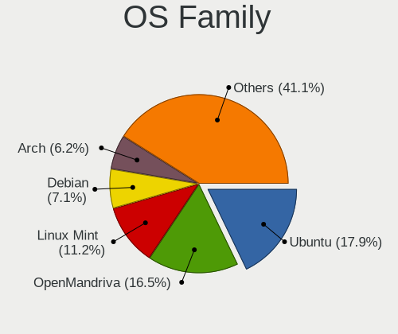
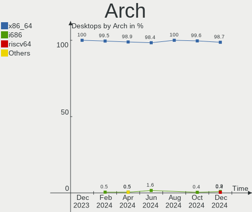
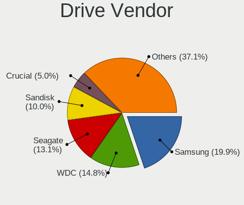
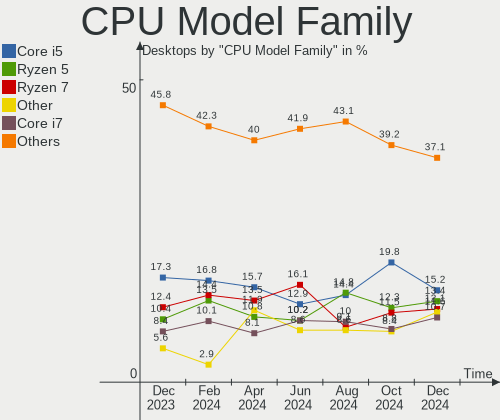
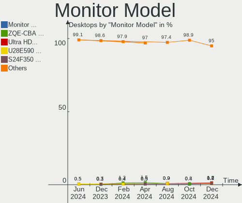
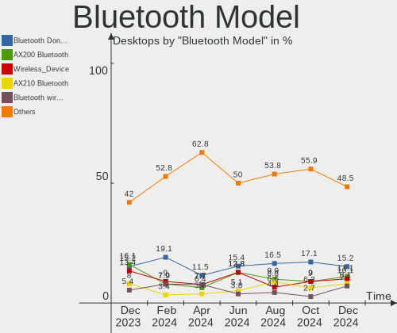
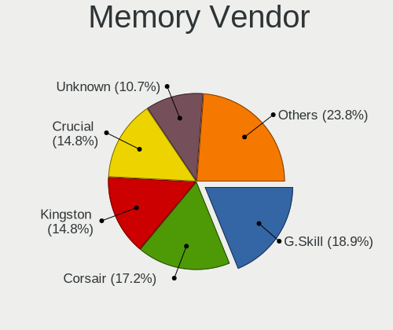
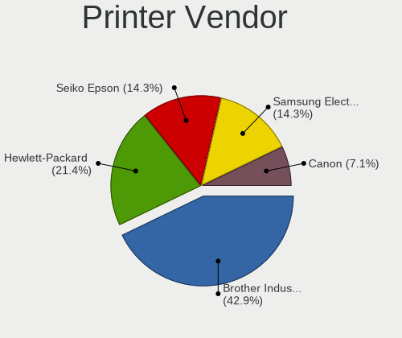

Linux in Germany - Hardware Trends (Desktops)
---------------------------------------------

A project to identify most popular hardware characteristics and track their change
over time based on data collected by Linux users at https://Linux-Hardware.org.

Anyone can contribute to this report by the [hw-probe](https://github.com/linuxhw/hw-probe) tool:

    sudo -E hw-probe -all -upload

Period: Jun, 2023.

Contents
--------

* [ System ](#system)
  - [ OS                       ](#os)
  - [ OS Family                ](#os-family)
  - [ Kernel                   ](#kernel)
  - [ Kernel Family            ](#kernel-family)
  - [ Kernel Major Ver.        ](#kernel-major-ver)
  - [ Arch                     ](#arch)
  - [ DE                       ](#de)
  - [ Display Server           ](#display-server)
  - [ Display Manager          ](#display-manager)
  - [ OS Lang                  ](#os-lang)
  - [ Boot Mode                ](#boot-mode)
  - [ Filesystem               ](#filesystem)
  - [ Part. scheme             ](#part-scheme)
  - [ Dual Boot with Linux/BSD ](#dual-boot-with-linuxbsd)
  - [ Dual Boot (Win)          ](#dual-boot-win)

* [ Board ](#board)
  - [ Vendor                   ](#vendor)
  - [ Model                    ](#model)
  - [ Model Family             ](#model-family)
  - [ MFG Year                 ](#mfg-year)
  - [ Form Factor              ](#form-factor)
  - [ Secure Boot              ](#secure-boot)
  - [ Coreboot                 ](#coreboot)
  - [ RAM Size                 ](#ram-size)
  - [ RAM Used                 ](#ram-used)
  - [ Total Drives             ](#total-drives)
  - [ Has CD-ROM               ](#has-cd-rom)
  - [ Has Ethernet             ](#has-ethernet)
  - [ Has WiFi                 ](#has-wifi)
  - [ Has Bluetooth            ](#has-bluetooth)

* [ Location ](#location)
  - [ Country                  ](#country)
  - [ City                     ](#city)

* [ Drives ](#drives)
  - [ Drive Vendor             ](#drive-vendor)
  - [ Drive Model              ](#drive-model)
  - [ HDD Vendor               ](#hdd-vendor)
  - [ SSD Vendor               ](#ssd-vendor)
  - [ Drive Kind               ](#drive-kind)
  - [ Drive Connector          ](#drive-connector)
  - [ Drive Size               ](#drive-size)
  - [ Space Total              ](#space-total)
  - [ Space Used               ](#space-used)
  - [ Malfunc. Drives          ](#malfunc-drives)
  - [ Malfunc. Drive Vendor    ](#malfunc-drive-vendor)
  - [ Malfunc. HDD Vendor      ](#malfunc-hdd-vendor)
  - [ Malfunc. Drive Kind      ](#malfunc-drive-kind)
  - [ Failed Drives            ](#failed-drives)
  - [ Failed Drive Vendor      ](#failed-drive-vendor)
  - [ Drive Status             ](#drive-status)

* [ Storage controller ](#storage-controller)
  - [ Storage Vendor           ](#storage-vendor)
  - [ Storage Model            ](#storage-model)
  - [ Storage Kind             ](#storage-kind)

* [ Processor ](#processor)
  - [ CPU Vendor               ](#cpu-vendor)
  - [ CPU Model                ](#cpu-model)
  - [ CPU Model Family         ](#cpu-model-family)
  - [ CPU Cores                ](#cpu-cores)
  - [ CPU Sockets              ](#cpu-sockets)
  - [ CPU Threads              ](#cpu-threads)
  - [ CPU Op-Modes             ](#cpu-op-modes)
  - [ CPU Microcode            ](#cpu-microcode)
  - [ CPU Microarch            ](#cpu-microarch)

* [ Graphics ](#graphics)
  - [ GPU Vendor               ](#gpu-vendor)
  - [ GPU Model                ](#gpu-model)
  - [ GPU Combo                ](#gpu-combo)
  - [ GPU Driver               ](#gpu-driver)
  - [ GPU Memory               ](#gpu-memory)

* [ Monitor ](#monitor)
  - [ Monitor Vendor           ](#monitor-vendor)
  - [ Monitor Model            ](#monitor-model)
  - [ Monitor Resolution       ](#monitor-resolution)
  - [ Monitor Diagonal         ](#monitor-diagonal)
  - [ Monitor Width            ](#monitor-width)
  - [ Aspect Ratio             ](#aspect-ratio)
  - [ Monitor Area             ](#monitor-area)
  - [ Pixel Density            ](#pixel-density)
  - [ Multiple Monitors        ](#multiple-monitors)

* [ Network ](#network)
  - [ Net Controller Vendor    ](#net-controller-vendor)
  - [ Net Controller Model     ](#net-controller-model)
  - [ Wireless Vendor          ](#wireless-vendor)
  - [ Wireless Model           ](#wireless-model)
  - [ Ethernet Vendor          ](#ethernet-vendor)
  - [ Ethernet Model           ](#ethernet-model)
  - [ Net Controller Kind      ](#net-controller-kind)
  - [ Used Controller          ](#used-controller)
  - [ NICs                     ](#nics)
  - [ IPv6                     ](#ipv6)

* [ Bluetooth ](#bluetooth)
  - [ Bluetooth Vendor         ](#bluetooth-vendor)
  - [ Bluetooth Model          ](#bluetooth-model)

* [ Sound ](#sound)
  - [ Sound Vendor             ](#sound-vendor)
  - [ Sound Model              ](#sound-model)

* [ Memory ](#memory)
  - [ Memory Vendor            ](#memory-vendor)
  - [ Memory Model             ](#memory-model)
  - [ Memory Kind              ](#memory-kind)
  - [ Memory Form Factor       ](#memory-form-factor)
  - [ Memory Size              ](#memory-size)
  - [ Memory Speed             ](#memory-speed)

* [ Printers & scanners ](#printers--scanners)
  - [ Printer Vendor           ](#printer-vendor)
  - [ Printer Model            ](#printer-model)
  - [ Scanner Vendor           ](#scanner-vendor)
  - [ Scanner Model            ](#scanner-model)

* [ Camera ](#camera)
  - [ Camera Vendor            ](#camera-vendor)
  - [ Camera Model             ](#camera-model)

* [ Security ](#security)
  - [ Fingerprint Vendor       ](#fingerprint-vendor)
  - [ Fingerprint Model        ](#fingerprint-model)
  - [ Chipcard Vendor          ](#chipcard-vendor)
  - [ Chipcard Model           ](#chipcard-model)

* [ Unsupported ](#unsupported)
  - [ Unsupported Devices      ](#unsupported-devices)
  - [ Unsupported Device Types ](#unsupported-device-types)

System
------

OS
--

Installed operating systems

| Name                         | Desktops | Percent |
|------------------------------|----------|---------|
| Ubuntu 22.04                 | 33       | 17.93%  |
| Linux Mint 21.1              | 25       | 13.59%  |
| Debian 12                    | 12       | 6.52%   |
| Debian 11                    | 9        | 4.89%   |
| Arch Rolling                 | 9        | 4.89%   |
| Fedora 38                    | 6        | 3.26%   |
| Ubuntu 23.04                 | 5        | 2.72%   |
| Pop!_OS 22.04                | 5        | 2.72%   |
| OpenMandriva 23.03           | 5        | 2.72%   |
| Linux Mint 20.3              | 5        | 2.72%   |
| Ubuntu 20.04                 | 4        | 2.17%   |
| ROSA 12.4                    | 4        | 2.17%   |
| OpenMandriva 4.3             | 4        | 2.17%   |
| OpenMandriva 23.06           | 4        | 2.17%   |
| Manjaro                      | 4        | 2.17%   |
| Zorin 16                     | 3        | 1.63%   |
| Xubuntu 22.04                | 3        | 1.63%   |
| openSUSE Leap-15.4           | 3        | 1.63%   |
| Kubuntu 22.04                | 3        | 1.63%   |
| BlackPanther 18.1            | 3        | 1.63%   |
| Ubuntu MATE 22.04            | 2        | 1.09%   |
| openSUSE Leap-15.5           | 2        | 1.09%   |
| OpenMandriva 4.2             | 2        | 1.09%   |
| Manjaro 23.0.0               | 2        | 1.09%   |
| LMDE 5                       | 2        | 1.09%   |
| Linux Mint 21                | 2        | 1.09%   |
| Kubuntu 23.04                | 2        | 1.09%   |
| Elementary 7                 | 2        | 1.09%   |
| Zorin 15                     | 1        | 0.54%   |
| Xubuntu 23.04                | 1        | 0.54%   |
| Xubuntu 18.04                | 1        | 0.54%   |
| Xero Rolling                 | 1        | 0.54%   |
| Ubuntu 22.10                 | 1        | 0.54%   |
| TUXEDO OS 22.04              | 1        | 0.54%   |
| SteamOS 3.4                  | 1        | 0.54%   |
| Parrot 5.3                   | 1        | 0.54%   |
| openSUSE Tumbleweed-XXXXXXXX | 1        | 0.54%   |
| Nobara 37                    | 1        | 0.54%   |
| Makulu-beta1                 | 1        | 0.54%   |
| Linux Mint 20                | 1        | 0.54%   |

OS Family
---------

OS without a version

| Name         | Desktops | Percent |
|--------------|----------|---------|
| Ubuntu       | 43       | 23.37%  |
| Linux Mint   | 33       | 17.93%  |
| Debian       | 22       | 11.96%  |
| OpenMandriva | 15       | 8.15%   |
| Arch         | 9        | 4.89%   |
| Fedora       | 7        | 3.8%    |
| openSUSE     | 6        | 3.26%   |
| Manjaro      | 6        | 3.26%   |
| Xubuntu      | 5        | 2.72%   |
| Pop!_OS      | 5        | 2.72%   |
| Kubuntu      | 5        | 2.72%   |
| Zorin        | 4        | 2.17%   |
| ROSA         | 4        | 2.17%   |
| BlackPanther | 3        | 1.63%   |
| Ubuntu MATE  | 2        | 1.09%   |
| LMDE         | 2        | 1.09%   |
| Elementary   | 2        | 1.09%   |
| Xero         | 1        | 0.54%   |
| TUXEDO OS    | 1        | 0.54%   |
| SteamOS      | 1        | 0.54%   |
| Parrot       | 1        | 0.54%   |
| Nobara       | 1        | 0.54%   |
| Makulu-beta1 | 1        | 0.54%   |
| KDE neon     | 1        | 0.54%   |
| Gentoo       | 1        | 0.54%   |
| ChimeraOS    | 1        | 0.54%   |
| Artix        | 1        | 0.54%   |
| ArcoLinux    | 1        | 0.54%   |

Kernel
------

Version of the Linux kernel

| Version                           | Desktops | Percent |
|-----------------------------------|----------|---------|
| 5.15.0-73-generic                 | 19       | 10.33%  |
| 5.19.0-43-generic                 | 18       | 9.78%   |
| 5.15.0-75-generic                 | 15       | 8.15%   |
| 6.1.0-9-amd64                     | 11       | 5.98%   |
| 5.19.0-45-generic                 | 7        | 3.8%    |
| 6.2.6-desktop-1omv2390            | 6        | 3.26%   |
| 5.10.0-23-amd64                   | 6        | 3.26%   |
| 6.2.6-76060206-generic            | 4        | 2.17%   |
| 6.2.0-23-generic                  | 4        | 2.17%   |
| 6.2.0-20-generic                  | 4        | 2.17%   |
| 6.1.20-generic-2rosa2021.1-x86_64 | 4        | 2.17%   |
| 6.3.9-arch1-1                     | 3        | 1.63%   |
| 5.16.7-desktop-1omv4003           | 3        | 1.63%   |
| 5.14.21-150400.24.63-default      | 3        | 1.63%   |
| 6.3.7-200.fc38.x86_64             | 2        | 1.09%   |
| 6.3.5-desktop-3omv2390            | 2        | 1.09%   |
| 6.2.15-300.fc38.x86_64            | 2        | 1.09%   |
| 6.1.33-1-lts                      | 2        | 1.09%   |
| 6.1.31-2-MANJARO                  | 2        | 1.09%   |
| 5.6.14-desktop-2bP                | 2        | 1.09%   |
| 5.4.0-152-generic                 | 2        | 1.09%   |
| 5.4.0-150-generic                 | 2        | 1.09%   |
| 5.19.0-46-generic                 | 2        | 1.09%   |
| 5.19.0-40-generic                 | 2        | 1.09%   |
| 5.15.0-71-generic                 | 2        | 1.09%   |
| 5.15.0-56-generic                 | 2        | 1.09%   |
| 5.14.21-150500.53-default         | 2        | 1.09%   |
| 5.10.0-22-amd64                   | 2        | 1.09%   |
| 6.3.9-zen1-1-zen                  | 1        | 0.54%   |
| 6.3.8-arch1-1                     | 1        | 0.54%   |
| 6.3.8-200.fc38.x86_64             | 1        | 0.54%   |
| 6.3.7-arch1-1                     | 1        | 0.54%   |
| 6.3.6-arch1-1                     | 1        | 0.54%   |
| 6.3.6-1-default                   | 1        | 0.54%   |
| 6.3.5-arch1-1                     | 1        | 0.54%   |
| 6.3.5-201.fsync.fc37.x86_64       | 1        | 0.54%   |
| 6.3.5-100.fc37.x86_64             | 1        | 0.54%   |
| 6.3.3-arch1-1                     | 1        | 0.54%   |
| 6.3.3-1-MANJARO                   | 1        | 0.54%   |
| 6.3.2-arch1-1                     | 1        | 0.54%   |

Kernel Family
-------------

Linux kernel without a distro release

| Version  | Desktops | Percent |
|----------|----------|---------|
| 5.15.0   | 43       | 23.37%  |
| 5.19.0   | 34       | 18.48%  |
| 6.1.0    | 12       | 6.52%   |
| 5.10.0   | 12       | 6.52%   |
| 6.2.6    | 10       | 5.43%   |
| 6.2.0    | 10       | 5.43%   |
| 5.4.0    | 8        | 4.35%   |
| 6.3.5    | 5        | 2.72%   |
| 5.14.21  | 5        | 2.72%   |
| 6.3.9    | 4        | 2.17%   |
| 6.1.20   | 4        | 2.17%   |
| 6.3.7    | 3        | 1.63%   |
| 6.1.31   | 3        | 1.63%   |
| 5.16.7   | 3        | 1.63%   |
| 6.3.8    | 2        | 1.09%   |
| 6.3.6    | 2        | 1.09%   |
| 6.3.3    | 2        | 1.09%   |
| 6.2.15   | 2        | 1.09%   |
| 6.1.33   | 2        | 1.09%   |
| 5.6.14   | 2        | 1.09%   |
| 5.13.0   | 2        | 1.09%   |
| 6.3.2    | 1        | 0.54%   |
| 6.2.9    | 1        | 0.54%   |
| 6.2.7    | 1        | 0.54%   |
| 6.1.32   | 1        | 0.54%   |
| 6.1.1    | 1        | 0.54%   |
| 6.0.0    | 1        | 0.54%   |
| 5.9.16   | 1        | 0.54%   |
| 5.16.13  | 1        | 0.54%   |
| 5.15.114 | 1        | 0.54%   |
| 5.15.107 | 1        | 0.54%   |
| 5.11.12  | 1        | 0.54%   |
| 5.10.60  | 1        | 0.54%   |
| 5.10.14  | 1        | 0.54%   |
| 4.18.16  | 1        | 0.54%   |

Kernel Major Ver.
-----------------

Linux kernel major version

| Version | Desktops | Percent |
|---------|----------|---------|
| 5.15    | 45       | 24.46%  |
| 5.19    | 34       | 18.48%  |
| 6.2     | 24       | 13.04%  |
| 6.1     | 23       | 12.5%   |
| 6.3     | 19       | 10.33%  |
| 5.10    | 14       | 7.61%   |
| 5.4     | 8        | 4.35%   |
| 5.14    | 5        | 2.72%   |
| 5.16    | 4        | 2.17%   |
| 5.6     | 2        | 1.09%   |
| 5.13    | 2        | 1.09%   |
| 6.0     | 1        | 0.54%   |
| 5.9     | 1        | 0.54%   |
| 5.11    | 1        | 0.54%   |
| 4.18    | 1        | 0.54%   |

Arch
----

OS architecture (x86_64, i586, etc.)

| Name   | Desktops | Percent |
|--------|----------|---------|
| x86_64 | 183      | 99.46%  |
| i686   | 1        | 0.54%   |

DE
--

Desktop Environment

| Name       | Desktops | Percent |
|------------|----------|---------|
| GNOME      | 71       | 38.59%  |
| KDE5       | 45       | 24.46%  |
| X-Cinnamon | 37       | 20.11%  |
| XFCE       | 10       | 5.43%   |
| Unknown    | 8        | 4.35%   |
| MATE       | 5        | 2.72%   |
| Cinnamon   | 3        | 1.63%   |
| Pantheon   | 2        | 1.09%   |
| openbox    | 1        | 0.54%   |
| LXDE       | 1        | 0.54%   |
| KDE        | 1        | 0.54%   |

Display Server
--------------

X11 or Wayland

| Name    | Desktops | Percent |
|---------|----------|---------|
| X11     | 133      | 72.28%  |
| Wayland | 36       | 19.57%  |
| Tty     | 10       | 5.43%   |
| Unknown | 5        | 2.72%   |

Display Manager
---------------

SDDM, LightDM, etc.

| Name    | Desktops | Percent |
|---------|----------|---------|
| Unknown | 63       | 34.24%  |
| GDM3    | 44       | 23.91%  |
| SDDM    | 36       | 19.57%  |
| LightDM | 30       | 16.3%   |
| GDM     | 9        | 4.89%   |
| SLiM    | 1        | 0.54%   |
| LXDM    | 1        | 0.54%   |

OS Lang
-------

Language

| Lang    | Desktops | Percent |
|---------|----------|---------|
| de_DE   | 133      | 72.28%  |
| en_US   | 30       | 16.3%   |
| Unknown | 7        | 3.8%    |
| en_GB   | 4        | 2.17%   |
| C       | 4        | 2.17%   |
| ru_RU   | 2        | 1.09%   |
| en_DE   | 2        | 1.09%   |
| POSIX   | 1        | 0.54%   |
| de_BE   | 1        | 0.54%   |

Boot Mode
---------

EFI or BIOS

| Mode | Desktops | Percent |
|------|----------|---------|
| BIOS | 104      | 56.52%  |
| EFI  | 80       | 43.48%  |

Filesystem
----------

Type of filesystem

| Type    | Desktops | Percent |
|---------|----------|---------|
| Ext4    | 124      | 67.39%  |
| Tmpfs   | 32       | 17.39%  |
| Btrfs   | 16       | 8.7%    |
| Overlay | 9        | 4.89%   |
| Xfs     | 1        | 0.54%   |
| Ext3    | 1        | 0.54%   |
| Ext2    | 1        | 0.54%   |

Part. scheme
------------

Scheme of partitioning

| Type    | Desktops | Percent |
|---------|----------|---------|
| GPT     | 98       | 53.26%  |
| Unknown | 56       | 30.43%  |
| MBR     | 30       | 16.3%   |

Dual Boot with Linux/BSD
------------------------

Hosting more than one Linux/BSD

| Dual boot | Desktops | Percent |
|-----------|----------|---------|
| No        | 134      | 72.83%  |
| Yes       | 50       | 27.17%  |

Dual Boot (Win)
---------------

Hosting Linux and Windows

| Dual boot | Desktops | Percent |
|-----------|----------|---------|
| No        | 118      | 64.13%  |
| Yes       | 66       | 35.87%  |

Board
-----

Vendor
------

Motherboard manufacturer

| Name                                 | Desktops | Percent |
|--------------------------------------|----------|---------|
| Gigabyte Technology                  | 36       | 19.57%  |
| ASUSTek Computer                     | 33       | 17.93%  |
| MSI                                  | 29       | 15.76%  |
| ASRock                               | 23       | 12.5%   |
| Hewlett-Packard                      | 14       | 7.61%   |
| Lenovo                               | 11       | 5.98%   |
| Dell                                 | 7        | 3.8%    |
| Fujitsu                              | 5        | 2.72%   |
| Medion                               | 3        | 1.63%   |
| Intel                                | 3        | 1.63%   |
| Shuttle                              | 2        | 1.09%   |
| Shenzhen Meigao Electronic Equipment | 2        | 1.09%   |
| Inventec                             | 2        | 1.09%   |
| Biostar                              | 2        | 1.09%   |
| AMI                                  | 2        | 1.09%   |
| Acer                                 | 2        | 1.09%   |
| Unknown                              | 2        | 1.09%   |
| Seco                                 | 1        | 0.54%   |
| Pegatron                             | 1        | 0.54%   |
| HC Technology.                       | 1        | 0.54%   |
| Hardkernel                           | 1        | 0.54%   |
| Fujitsu Siemens                      | 1        | 0.54%   |
| ASRockRack                           | 1        | 0.54%   |

Model
-----

Motherboard model

| Name                                       | Desktops | Percent |
|--------------------------------------------|----------|---------|
| ASUS PRIME B350-PLUS                       | 3        | 1.63%   |
| MSI MS-7C56                                | 2        | 1.09%   |
| MSI MS-7C02                                | 2        | 1.09%   |
| MSI MS-7B79                                | 2        | 1.09%   |
| Gigabyte Z390 UD                           | 2        | 1.09%   |
| Gigabyte B550M DS3H                        | 2        | 1.09%   |
| Gigabyte B450 AORUS ELITE                  | 2        | 1.09%   |
| ASUS F2A55-M LK                            | 2        | 1.09%   |
| ASUS All Series                            | 2        | 1.09%   |
| Unknown                                    | 2        | 1.09%   |
| Shuttle X50V4                              | 1        | 0.54%   |
| Shuttle SK45                               | 1        | 0.54%   |
| Shenzhen Meigao Electronic Equipment UM690 | 1        | 0.54%   |
| Shenzhen Meigao Electronic Equipment UM560 | 1        | 0.54%   |
| Seco C40                                   | 1        | 0.54%   |
| Pegatron Elite 7300 Series MT              | 1        | 0.54%   |
| MSI MT-7641                                | 1        | 0.54%   |
| MSI MS-7D75                                | 1        | 0.54%   |
| MSI MS-7D54                                | 1        | 0.54%   |
| MSI MS-7D50                                | 1        | 0.54%   |
| MSI MS-7D09                                | 1        | 0.54%   |
| MSI MS-7C95                                | 1        | 0.54%   |
| MSI MS-7C94                                | 1        | 0.54%   |
| MSI MS-7C79                                | 1        | 0.54%   |
| MSI MS-7C37                                | 1        | 0.54%   |
| MSI MS-7C35                                | 1        | 0.54%   |
| MSI MS-7B89                                | 1        | 0.54%   |
| MSI MS-7B86                                | 1        | 0.54%   |
| MSI MS-7B85                                | 1        | 0.54%   |
| MSI MS-7B09                                | 1        | 0.54%   |
| MSI MS-7A70                                | 1        | 0.54%   |
| MSI MS-7A68                                | 1        | 0.54%   |
| MSI MS-7996                                | 1        | 0.54%   |
| MSI MS-7978                                | 1        | 0.54%   |
| MSI MS-7915                                | 1        | 0.54%   |
| MSI MS-7850                                | 1        | 0.54%   |
| MSI MS-7751                                | 1        | 0.54%   |
| MSI MS-7693                                | 1        | 0.54%   |
| MSI MS-7641                                | 1        | 0.54%   |
| Medion S23003                              | 1        | 0.54%   |

Model Family
------------

Motherboard model prefix

| Name                                       | Desktops | Percent |
|--------------------------------------------|----------|---------|
| ASUS PRIME                                 | 7        | 3.8%    |
| Lenovo ThinkCentre                         | 6        | 3.26%   |
| HP Compaq                                  | 6        | 3.26%   |
| ASUS ROG                                   | 6        | 3.26%   |
| Gigabyte B450                              | 4        | 2.17%   |
| Dell OptiPlex                              | 4        | 2.17%   |
| ASUS TUF                                   | 3        | 1.63%   |
| MSI MS-7C56                                | 2        | 1.09%   |
| MSI MS-7C02                                | 2        | 1.09%   |
| MSI MS-7B79                                | 2        | 1.09%   |
| Medion Akoya                               | 2        | 1.09%   |
| Lenovo Legion                              | 2        | 1.09%   |
| Gigabyte Z390                              | 2        | 1.09%   |
| Gigabyte B550M                             | 2        | 1.09%   |
| Fujitsu ESPRIMO                            | 2        | 1.09%   |
| Fujitsu CELSIUS                            | 2        | 1.09%   |
| ASUS F2A55-M                               | 2        | 1.09%   |
| ASUS All                                   | 2        | 1.09%   |
| ASRock X399                                | 2        | 1.09%   |
| Unknown                                    | 2        | 1.09%   |
| Shuttle X50V4                              | 1        | 0.54%   |
| Shuttle SK45                               | 1        | 0.54%   |
| Shenzhen Meigao Electronic Equipment UM690 | 1        | 0.54%   |
| Shenzhen Meigao Electronic Equipment UM560 | 1        | 0.54%   |
| Seco C40                                   | 1        | 0.54%   |
| Pegatron Elite                             | 1        | 0.54%   |
| MSI MT-7641                                | 1        | 0.54%   |
| MSI MS-7D75                                | 1        | 0.54%   |
| MSI MS-7D54                                | 1        | 0.54%   |
| MSI MS-7D50                                | 1        | 0.54%   |
| MSI MS-7D09                                | 1        | 0.54%   |
| MSI MS-7C95                                | 1        | 0.54%   |
| MSI MS-7C94                                | 1        | 0.54%   |
| MSI MS-7C79                                | 1        | 0.54%   |
| MSI MS-7C37                                | 1        | 0.54%   |
| MSI MS-7C35                                | 1        | 0.54%   |
| MSI MS-7B89                                | 1        | 0.54%   |
| MSI MS-7B86                                | 1        | 0.54%   |
| MSI MS-7B85                                | 1        | 0.54%   |
| MSI MS-7B09                                | 1        | 0.54%   |

MFG Year
--------

Motherboard manufacture year

| Year    | Desktops | Percent |
|---------|----------|---------|
| 2018    | 25       | 13.59%  |
| 2020    | 19       | 10.33%  |
| 2017    | 16       | 8.7%    |
| 2021    | 15       | 8.15%   |
| 2019    | 15       | 8.15%   |
| 2012    | 14       | 7.61%   |
| 2013    | 13       | 7.07%   |
| 2011    | 11       | 5.98%   |
| 2016    | 10       | 5.43%   |
| 2022    | 9        | 4.89%   |
| 2015    | 9        | 4.89%   |
| 2010    | 7        | 3.8%    |
| 2008    | 7        | 3.8%    |
| 2014    | 6        | 3.26%   |
| 2009    | 4        | 2.17%   |
| 2023    | 3        | 1.63%   |
| Unknown | 1        | 0.54%   |

Form Factor
-----------

Physical design of the computer

| Name    | Desktops | Percent |
|---------|----------|---------|
| Desktop | 184      | 100%    |

Secure Boot
-----------

Enabled or disabled

| State    | Desktops | Percent |
|----------|----------|---------|
| Disabled | 181      | 98.37%  |
| Enabled  | 3        | 1.63%   |

Coreboot
--------

Have coreboot on board

| Used | Desktops | Percent |
|------|----------|---------|
| No   | 184      | 100%    |

RAM Size
--------

Total RAM memory

| Size in GB      | Desktops | Percent |
|-----------------|----------|---------|
| 16.01-24.0      | 43       | 23.37%  |
| 32.01-64.0      | 36       | 19.57%  |
| 8.01-16.0       | 30       | 16.3%   |
| 4.01-8.0        | 29       | 15.76%  |
| 3.01-4.0        | 18       | 9.78%   |
| 64.01-256.0     | 13       | 7.07%   |
| 24.01-32.0      | 12       | 6.52%   |
| 1.01-2.0        | 2        | 1.09%   |
| More than 256.0 | 1        | 0.54%   |

RAM Used
--------

Used RAM memory

| Used GB    | Desktops | Percent |
|------------|----------|---------|
| 1.01-2.0   | 59       | 32.07%  |
| 2.01-3.0   | 48       | 26.09%  |
| 4.01-8.0   | 38       | 20.65%  |
| 3.01-4.0   | 16       | 8.7%    |
| 8.01-16.0  | 10       | 5.43%   |
| 0.51-1.0   | 6        | 3.26%   |
| 16.01-24.0 | 5        | 2.72%   |
| 32.01-64.0 | 1        | 0.54%   |
| 0.01-0.5   | 1        | 0.54%   |

Total Drives
------------

Number of drives on board

| Drives | Desktops | Percent |
|--------|----------|---------|
| 1      | 57       | 30.98%  |
| 2      | 47       | 25.54%  |
| 3      | 39       | 21.2%   |
| 4      | 14       | 7.61%   |
| 6      | 10       | 5.43%   |
| 5      | 10       | 5.43%   |
| 8      | 3        | 1.63%   |
| 0      | 2        | 1.09%   |
| 9      | 1        | 0.54%   |
| 7      | 1        | 0.54%   |

Has CD-ROM
----------

Has CD-ROM on board

| Presented | Desktops | Percent |
|-----------|----------|---------|
| No        | 100      | 54.35%  |
| Yes       | 84       | 45.65%  |

Has Ethernet
------------

Has Ethernet on board

| Presented | Desktops | Percent |
|-----------|----------|---------|
| Yes       | 184      | 100%    |

Has WiFi
--------

Has WiFi module

| Presented | Desktops | Percent |
|-----------|----------|---------|
| No        | 115      | 62.5%   |
| Yes       | 69       | 37.5%   |

Has Bluetooth
-------------

Has Bluetooth module

| Presented | Desktops | Percent |
|-----------|----------|---------|
| No        | 120      | 65.22%  |
| Yes       | 64       | 34.78%  |

Location
--------

Country
-------

Geographic location (country)

| Country | Desktops | Percent |
|---------|----------|---------|
| Germany | 184      | 100%    |

City
----

Geographic location (city)

| City                    | Desktops | Percent |
|-------------------------|----------|---------|
| Munich                  | 13       | 7.07%   |
| Berlin                  | 12       | 6.52%   |
| Hanover                 | 6        | 3.26%   |
| Hamburg                 | 6        | 3.26%   |
| Frankfurt am Main       | 6        | 3.26%   |
| Leipzig                 | 5        | 2.72%   |
| Cologne                 | 5        | 2.72%   |
| Ludwigsburg             | 3        | 1.63%   |
| Dresden                 | 3        | 1.63%   |
| Delligsen               | 3        | 1.63%   |
| Bonn                    | 3        | 1.63%   |
| Augsburg                | 3        | 1.63%   |
| Tübingen               | 2        | 1.09%   |
| Pfaffenhofen an der Ilm | 2        | 1.09%   |
| Oer-Erkenschwick        | 2        | 1.09%   |
| Lüneburg               | 2        | 1.09%   |
| Karlsruhe               | 2        | 1.09%   |
| Hofheim am Taunus       | 2        | 1.09%   |
| Giessen                 | 2        | 1.09%   |
| Essen                   | 2        | 1.09%   |
| Bremen                  | 2        | 1.09%   |
| Bergisch Gladbach       | 2        | 1.09%   |
| Aachen                  | 2        | 1.09%   |
| Wuppertal               | 1        | 0.54%   |
| Winsen                  | 1        | 0.54%   |
| Wilhelmshaven           | 1        | 0.54%   |
| Weimar                  | 1        | 0.54%   |
| Wegberg                 | 1        | 0.54%   |
| Verden an der Aller     | 1        | 0.54%   |
| Tuttlingen              | 1        | 0.54%   |
| Traunstein              | 1        | 0.54%   |
| Templin                 | 1        | 0.54%   |
| Stuttgart               | 1        | 0.54%   |
| Stralsund               | 1        | 0.54%   |
| Steinberg am See        | 1        | 0.54%   |
| Stadthagen              | 1        | 0.54%   |
| Solingen                | 1        | 0.54%   |
| Siegsdorf               | 1        | 0.54%   |
| Seth                    | 1        | 0.54%   |
| Seligenstadt            | 1        | 0.54%   |

Drives
------

Drive Vendor
------------

Hard drive vendors

| Vendor                    | Desktops | Drives | Percent |
|---------------------------|----------|--------|---------|
| Samsung Electronics       | 76       | 106    | 19.59%  |
| Seagate                   | 51       | 62     | 13.14%  |
| WDC                       | 50       | 70     | 12.89%  |
| Sandisk                   | 36       | 42     | 9.28%   |
| Crucial                   | 26       | 28     | 6.7%    |
| Intenso                   | 23       | 26     | 5.93%   |
| Toshiba                   | 18       | 20     | 4.64%   |
| Kingston                  | 15       | 17     | 3.87%   |
| Hitachi                   | 9        | 9      | 2.32%   |
| HGST                      | 6        | 6      | 1.55%   |
| Unknown                   | 5        | 7      | 1.29%   |
| Phison Electronics        | 5        | 9      | 1.29%   |
| Micron/Crucial Technology | 5        | 6      | 1.29%   |
| Patriot                   | 4        | 4      | 1.03%   |
| KIOXIA                    | 4        | 4      | 1.03%   |
| Intel                     | 4        | 4      | 1.03%   |
| China                     | 3        | 3      | 0.77%   |
| A-DATA Technology         | 3        | 3      | 0.77%   |
| Transcend                 | 2        | 2      | 0.52%   |
| SPCC                      | 2        | 2      | 0.52%   |
| Phison                    | 2        | 2      | 0.52%   |
| Micron Technology         | 2        | 2      | 0.52%   |
| Leven                     | 2        | 2      | 0.52%   |
| INNOVATION IT             | 2        | 2      | 0.52%   |
| XPG                       | 1        | 1      | 0.26%   |
| WD Blue                   | 1        | 1      | 0.26%   |
| Verbatim                  | 1        | 1      | 0.26%   |
| V7                        | 1        | 1      | 0.26%   |
| Team                      | 1        | 1      | 0.26%   |
| T-FORCE                   | 1        | 1      | 0.26%   |
| SK hynix                  | 1        | 1      | 0.26%   |
| Silicon Motion            | 1        | 1      | 0.26%   |
| Seagate Technology        | 1        | 1      | 0.26%   |
| SABRENT                   | 1        | 1      | 0.26%   |
| Ramaxel Technology        | 1        | 1      | 0.26%   |
| PNY                       | 1        | 1      | 0.26%   |
| OOS14000                  | 1        | 1      | 0.26%   |
| OCZ                       | 1        | 1      | 0.26%   |
| Netac                     | 1        | 1      | 0.26%   |
| Maxone                    | 1        | 1      | 0.26%   |

Drive Model
-----------

Hard drive models

| Model                                               | Desktops | Percent |
|-----------------------------------------------------|----------|---------|
| Samsung NVMe SSD Controller SM981/PM981/PM983 250GB | 11       | 2.47%   |
| Sandisk WD Black SN750 / PC SN730 NVMe SSD 500GB    | 5        | 1.12%   |
| Samsung SSD 850 EVO 250GB                           | 5        | 1.12%   |
| Intenso SSD SATAIII 512GB                           | 5        | 1.12%   |
| Samsung SSD 860 EVO 500GB                           | 4        | 0.9%    |
| Samsung SSD 860 EVO 1TB                             | 4        | 0.9%    |
| Samsung NVMe SSD Controller PM9A1/PM9A3/980PRO 2TB  | 4        | 0.9%    |
| Micron/Crucial P2 NVMe PCIe SSD 4TB                 | 4        | 0.9%    |
| Kingston SA400S37120G 120GB SSD                     | 4        | 0.9%    |
| Crucial CT1000MX500SSD1 1TB                         | 4        | 0.9%    |
| WDC WDS100T2B0A-00SM50 1TB SSD                      | 3        | 0.67%   |
| WDC WD40EFRX-68N32N0 4TB                            | 3        | 0.67%   |
| WDC WD10EZEX-00BN5A0 1TB                            | 3        | 0.67%   |
| Toshiba HDWD110 1TB                                 | 3        | 0.67%   |
| Toshiba DT01ACA100 1TB                              | 3        | 0.67%   |
| Seagate ST4000DM004-2CV104 4TB                      | 3        | 0.67%   |
| Seagate ST2000DM008-2FR102 2TB                      | 3        | 0.67%   |
| Seagate ST2000DM001-1ER164 2TB                      | 3        | 0.67%   |
| SanDisk SSD PLUS 480GB                              | 3        | 0.67%   |
| SanDisk SSD PLUS 240GB                              | 3        | 0.67%   |
| SanDisk SSD PLUS 120GB                              | 3        | 0.67%   |
| Samsung SSD 980 1TB                                 | 3        | 0.67%   |
| Samsung SSD 970 EVO Plus 1TB                        | 3        | 0.67%   |
| Samsung SSD 870 QVO 1TB                             | 3        | 0.67%   |
| Samsung SSD 870 EVO 500GB                           | 3        | 0.67%   |
| Samsung SSD 860 EVO 250GB                           | 3        | 0.67%   |
| Samsung NVMe SSD Controller SM961/PM961/SM963 256GB | 3        | 0.67%   |
| Samsung HD103SJ 1TB                                 | 3        | 0.67%   |
| Phison E16 PCIe4 NVMe Controller 1TB                | 3        | 0.67%   |
| Intenso SSD 256GB                                   | 3        | 0.67%   |
| Crucial CT500MX500SSD1 500GB                        | 3        | 0.67%   |
| Crucial CT1000BX500SSD1 1TB                         | 3        | 0.67%   |
| WDC WD5000AAKS-007AA0 500GB                         | 2        | 0.45%   |
| WDC WD30EFRX-68EUZN0 3TB                            | 2        | 0.45%   |
| WDC WD20EFAX-68FB5N0 2TB                            | 2        | 0.45%   |
| WDC WD20EARS-00MVWB0 2TB                            | 2        | 0.45%   |
| WDC WD10EZEX-21WN4A0 1TB                            | 2        | 0.45%   |
| WDC WD10EZEX-08WN4A0 1TB                            | 2        | 0.45%   |
| Unknown SD/MMC 2GB                                  | 2        | 0.45%   |
| Unknown M.S./M.S.Pro/HG 16GB                        | 2        | 0.45%   |

HDD Vendor
----------

Hard disk drive vendors

| Vendor              | Desktops | Drives | Percent |
|---------------------|----------|--------|---------|
| Seagate             | 50       | 60     | 35.71%  |
| WDC                 | 47       | 64     | 33.57%  |
| Toshiba             | 16       | 18     | 11.43%  |
| Hitachi             | 9        | 9      | 6.43%   |
| Samsung Electronics | 8        | 11     | 5.71%   |
| HGST                | 6        | 6      | 4.29%   |
| Intenso             | 2        | 2      | 1.43%   |
| Unknown             | 1        | 1      | 0.71%   |
| Maxone              | 1        | 1      | 0.71%   |

SSD Vendor
----------

Solid state drive vendors

| Vendor              | Desktops | Drives | Percent |
|---------------------|----------|--------|---------|
| Samsung Electronics | 39       | 49     | 23.93%  |
| SanDisk             | 28       | 28     | 17.18%  |
| Crucial             | 21       | 23     | 12.88%  |
| Intenso             | 20       | 22     | 12.27%  |
| Kingston            | 12       | 14     | 7.36%   |
| WDC                 | 5        | 5      | 3.07%   |
| Patriot             | 3        | 3      | 1.84%   |
| China               | 3        | 3      | 1.84%   |
| A-DATA Technology   | 3        | 3      | 1.84%   |
| Toshiba             | 2        | 2      | 1.23%   |
| SPCC                | 2        | 2      | 1.23%   |
| Micron Technology   | 2        | 2      | 1.23%   |
| Leven               | 2        | 2      | 1.23%   |
| INNOVATION IT       | 2        | 2      | 1.23%   |
| Verbatim            | 1        | 1      | 0.61%   |
| V7                  | 1        | 1      | 0.61%   |
| Transcend           | 1        | 1      | 0.61%   |
| Team                | 1        | 1      | 0.61%   |
| T-FORCE             | 1        | 1      | 0.61%   |
| PNY                 | 1        | 1      | 0.61%   |
| Phison              | 1        | 1      | 0.61%   |
| OCZ                 | 1        | 1      | 0.61%   |
| Netac               | 1        | 1      | 0.61%   |
| LITEONIT            | 1        | 1      | 0.61%   |
| LITEON              | 1        | 1      | 0.61%   |
| Lexar               | 1        | 1      | 0.61%   |
| KOWIN               | 1        | 1      | 0.61%   |
| KingDian            | 1        | 1      | 0.61%   |
| Intel               | 1        | 1      | 0.61%   |
| Hewlett-Packard     | 1        | 1      | 0.61%   |
| DeLOCK              | 1        | 1      | 0.61%   |
| CT250MX5            | 1        | 1      | 0.61%   |
| Corsair             | 1        | 1      | 0.61%   |

Drive Kind
----------

HDD or SSD

| Kind    | Desktops | Drives | Percent |
|---------|----------|--------|---------|
| SSD     | 122      | 179    | 38.98%  |
| HDD     | 105      | 172    | 33.55%  |
| NVMe    | 74       | 104    | 23.64%  |
| Unknown | 10       | 14     | 3.19%   |
| MMC     | 2        | 2      | 0.64%   |

Drive Connector
---------------

SATA, SAS, NVMe, etc.

| Type | Desktops | Drives | Percent |
|------|----------|--------|---------|
| SATA | 157      | 331    | 60.85%  |
| NVMe | 72       | 101    | 27.91%  |
| SAS  | 27       | 37     | 10.47%  |
| MMC  | 2        | 2      | 0.78%   |

Drive Size
----------

Size of hard drive

| Size in TB | Desktops | Drives | Percent |
|------------|----------|--------|---------|
| 0.01-0.5   | 106      | 157    | 41.73%  |
| 0.51-1.0   | 83       | 106    | 32.68%  |
| 1.01-2.0   | 29       | 37     | 11.42%  |
| 3.01-4.0   | 19       | 26     | 7.48%   |
| 4.01-10.0  | 11       | 16     | 4.33%   |
| 2.01-3.0   | 5        | 8      | 1.97%   |
| 10.01-20.0 | 1        | 1      | 0.39%   |

Space Total
-----------

Amount of disk space available on the file system

| Size in GB     | Desktops | Percent |
|----------------|----------|---------|
| 101-250        | 37       | 20.11%  |
| More than 3000 | 32       | 17.39%  |
| 1001-2000      | 30       | 16.3%   |
| 501-1000       | 28       | 15.22%  |
| 251-500        | 22       | 11.96%  |
| 2001-3000      | 10       | 5.43%   |
| 1-20           | 10       | 5.43%   |
| Unknown        | 6        | 3.26%   |
| 51-100         | 5        | 2.72%   |
| 21-50          | 4        | 2.17%   |

Space Used
----------

Amount of used disk space

| Used GB        | Desktops | Percent |
|----------------|----------|---------|
| 1-20           | 48       | 26.09%  |
| 101-250        | 24       | 13.04%  |
| 251-500        | 21       | 11.41%  |
| 1001-2000      | 17       | 9.24%   |
| 501-1000       | 17       | 9.24%   |
| More than 3000 | 16       | 8.7%    |
| 21-50          | 16       | 8.7%    |
| 51-100         | 15       | 8.15%   |
| Unknown        | 6        | 3.26%   |
| 2001-3000      | 4        | 2.17%   |

Malfunc. Drives
---------------

Drive models with a malfunction

| Model                               | Desktops | Drives | Percent |
|-------------------------------------|----------|--------|---------|
| WDC WD5000AAKS-007AA0 500GB         | 2        | 2      | 8%      |
| WDC WD5000AADS-00S9B0 500GB         | 1        | 1      | 4%      |
| WDC WD3000FYYZ-01UL1B0 3TB          | 1        | 2      | 4%      |
| WDC WD10EALX-759BA1 1TB             | 1        | 1      | 4%      |
| Seagate ST9160412AS 160GB           | 1        | 1      | 4%      |
| Seagate ST500DM002-1BD142 500GB     | 1        | 1      | 4%      |
| Seagate ST3500418AS 500GB           | 1        | 1      | 4%      |
| Seagate ST3500413AS 500GB           | 1        | 1      | 4%      |
| Seagate ST3250310NS 250GB           | 1        | 1      | 4%      |
| Seagate ST1000LM024 HN-M101MBB 1TB  | 1        | 1      | 4%      |
| Seagate ST1000DM010-2EP102 1TB      | 1        | 1      | 4%      |
| Seagate ST1000DM003-9YN162 1TB      | 1        | 1      | 4%      |
| SanDisk SSD PLUS 120 GB             | 1        | 1      | 4%      |
| Samsung Electronics SSD 980 500GB   | 1        | 1      | 4%      |
| Samsung Electronics SSD 970 EVO 1TB | 1        | 1      | 4%      |
| Samsung Electronics SSD 850 EVO 1TB | 1        | 1      | 4%      |
| Samsung Electronics HD501LJ 500GB   | 1        | 1      | 4%      |
| Samsung Electronics HD154UI 1TB     | 1        | 1      | 4%      |
| OCZ AGILITY3 120GB SSD              | 1        | 1      | 4%      |
| Intenso SSD Sata III 512GB          | 1        | 1      | 4%      |
| Hitachi HTS541010G9SA00 100GB       | 1        | 1      | 4%      |
| Crucial CT525MX300SSD1 528GB        | 1        | 1      | 4%      |
| Crucial CT120M500SSD1 120GB         | 1        | 1      | 4%      |
| Crucial CT1000P1SSD8 1TB            | 1        | 1      | 4%      |

Malfunc. Drive Vendor
---------------------

Vendors of faulty drives

| Vendor              | Desktops | Drives | Percent |
|---------------------|----------|--------|---------|
| Seagate             | 8        | 8      | 32%     |
| WDC                 | 5        | 6      | 20%     |
| Samsung Electronics | 5        | 5      | 20%     |
| Crucial             | 3        | 3      | 12%     |
| SanDisk             | 1        | 1      | 4%      |
| OCZ                 | 1        | 1      | 4%      |
| Intenso             | 1        | 1      | 4%      |
| Hitachi             | 1        | 1      | 4%      |

Malfunc. HDD Vendor
-------------------

Vendors of faulty HDD drives

| Vendor              | Desktops | Drives | Percent |
|---------------------|----------|--------|---------|
| Seagate             | 8        | 8      | 50%     |
| WDC                 | 5        | 6      | 31.25%  |
| Samsung Electronics | 2        | 2      | 12.5%   |
| Hitachi             | 1        | 1      | 6.25%   |

Malfunc. Drive Kind
-------------------

Kinds of faulty drives

| Kind | Desktops | Drives | Percent |
|------|----------|--------|---------|
| HDD  | 14       | 17     | 60.87%  |
| SSD  | 6        | 6      | 26.09%  |
| NVMe | 3        | 3      | 13.04%  |

Failed Drives
-------------

Failed drive models

Zero info for selected period =(

Failed Drive Vendor
-------------------

Failed drive vendors

Zero info for selected period =(

Drive Status
------------

Number of failed and malfunc. drives

| Status   | Desktops | Drives | Percent |
|----------|----------|--------|---------|
| Detected | 105      | 246    | 50%     |
| Works    | 84       | 199    | 40%     |
| Malfunc  | 21       | 26     | 10%     |

Storage controller
------------------

Storage Vendor
--------------

Storage controller vendors

| Vendor                        | Desktops | Percent |
|-------------------------------|----------|---------|
| Intel                         | 107      | 37.02%  |
| AMD                           | 77       | 26.64%  |
| Samsung Electronics           | 39       | 13.49%  |
| ASMedia Technology            | 12       | 4.15%   |
| SanDisk                       | 11       | 3.81%   |
| Micron/Crucial Technology     | 10       | 3.46%   |
| Phison Electronics            | 7        | 2.42%   |
| Marvell Technology Group      | 4        | 1.38%   |
| KIOXIA                        | 3        | 1.04%   |
| Kingston Technology Company   | 3        | 1.04%   |
| Nvidia                        | 2        | 0.69%   |
| LSI Logic / Symbios Logic     | 2        | 0.69%   |
| ADATA Technology              | 2        | 0.69%   |
| Adaptec                       | 2        | 0.69%   |
| Transcend                     | 1        | 0.35%   |
| Toshiba America Info Systems  | 1        | 0.35%   |
| SK hynix                      | 1        | 0.35%   |
| Silicon Motion                | 1        | 0.35%   |
| Seagate Technology            | 1        | 0.35%   |
| MAXIO Technology (Hangzhou)   | 1        | 0.35%   |
| JMicron Technology            | 1        | 0.35%   |
| Integrated Technology Express | 1        | 0.35%   |

Storage Model
-------------

Storage controller models

| Model                                                                          | Desktops | Percent |
|--------------------------------------------------------------------------------|----------|---------|
| AMD FCH SATA Controller [AHCI mode]                                            | 44       | 12.46%  |
| Samsung NVMe SSD Controller SM981/PM981/PM983                                  | 22       | 6.23%   |
| AMD 400 Series Chipset SATA Controller                                         | 18       | 5.1%    |
| Intel 8 Series/C220 Series Chipset Family 6-port SATA Controller 1 [AHCI mode] | 13       | 3.68%   |
| AMD 500 Series Chipset SATA Controller                                         | 12       | 3.4%    |
| Intel Q170/Q150/B150/H170/H110/Z170/CM236 Chipset SATA Controller [AHCI Mode]  | 11       | 3.12%   |
| Intel 200 Series PCH SATA controller [AHCI mode]                               | 10       | 2.83%   |
| ASMedia ASM1062 Serial ATA Controller                                          | 10       | 2.83%   |
| Samsung NVMe SSD Controller PM9A1/PM9A3/980PRO                                 | 7        | 1.98%   |
| Intel Cannon Lake PCH SATA AHCI Controller                                     | 7        | 1.98%   |
| AMD SB7x0/SB8x0/SB9x0 SATA Controller [AHCI mode]                              | 7        | 1.98%   |
| AMD SB7x0/SB8x0/SB9x0 IDE Controller                                           | 7        | 1.98%   |
| Micron/Crucial P2 NVMe PCIe SSD                                                | 6        | 1.7%    |
| Intel 7 Series/C210 Series Chipset Family 6-port SATA Controller [AHCI mode]   | 6        | 1.7%    |
| Intel 6 Series/C200 Series Chipset Family 6 port Desktop SATA AHCI Controller  | 6        | 1.7%    |
| AMD 300 Series Chipset SATA Controller                                         | 6        | 1.7%    |
| SanDisk WD Black SN750 / PC SN730 NVMe SSD                                     | 5        | 1.42%   |
| Samsung NVMe SSD Controller 980                                                | 5        | 1.42%   |
| Intel SATA Controller [RAID mode]                                              | 5        | 1.42%   |
| Intel Alder Lake-S PCH SATA Controller [AHCI Mode]                             | 5        | 1.42%   |
| Intel 500 Series Chipset Family SATA AHCI Controller                           | 5        | 1.42%   |
| Intel 9 Series Chipset Family SATA Controller [AHCI Mode]                      | 4        | 1.13%   |
| AMD X370 Series Chipset SATA Controller                                        | 4        | 1.13%   |
| AMD SB7x0/SB8x0/SB9x0 SATA Controller [IDE mode]                               | 4        | 1.13%   |
| AMD FCH SATA Controller [IDE mode]                                             | 4        | 1.13%   |
| SanDisk WD Blue SN570 NVMe SSD 1TB                                             | 3        | 0.85%   |
| Samsung NVMe SSD Controller SM961/PM961/SM963                                  | 3        | 0.85%   |
| Samsung Electronics Non-Volatile memory controller                             | 3        | 0.85%   |
| Phison E16 PCIe4 NVMe Controller                                               | 3        | 0.85%   |
| Intel Comet Lake SATA AHCI Controller                                          | 3        | 0.85%   |
| Intel Celeron/Pentium Silver Processor SATA Controller                         | 3        | 0.85%   |
| Intel 82801JI (ICH10 Family) SATA AHCI Controller                              | 3        | 0.85%   |
| Intel 7 Series/C210 Series Chipset Family 4-port SATA Controller [IDE mode]    | 3        | 0.85%   |
| Intel 7 Series/C210 Series Chipset Family 2-port SATA Controller [IDE mode]    | 3        | 0.85%   |
| Intel 5 Series/3400 Series Chipset 6 port SATA AHCI Controller                 | 3        | 0.85%   |
| AMD X399 Series Chipset SATA Controller                                        | 3        | 0.85%   |
| AMD FCH IDE Controller                                                         | 3        | 0.85%   |
| SanDisk WD Black 2018/SN750 / PC SN720 NVMe SSD                                | 2        | 0.57%   |
| Phison PS5013 E13 NVMe Controller                                              | 2        | 0.57%   |
| Phison E12 NVMe Controller                                                     | 2        | 0.57%   |

Storage Kind
------------

Kind of storage controller (IDE, SATA, NVMe, SAS, ...)

| Kind | Desktops | Percent |
|------|----------|---------|
| SATA | 167      | 59.86%  |
| NVMe | 72       | 25.81%  |
| IDE  | 26       | 9.32%   |
| RAID | 12       | 4.3%    |
| SCSI | 2        | 0.72%   |

Processor
---------

CPU Vendor
----------

Processor vendors

| Vendor | Desktops | Percent |
|--------|----------|---------|
| Intel  | 106      | 57.61%  |
| AMD    | 78       | 42.39%  |

CPU Model
---------

Processor models

| Model                                       | Desktops | Percent |
|---------------------------------------------|----------|---------|
| Intel Core i5-4570 CPU @ 3.20GHz            | 5        | 2.72%   |
| AMD Ryzen 9 5900X 12-Core Processor         | 5        | 2.72%   |
| AMD Ryzen 5 3600 6-Core Processor           | 5        | 2.72%   |
| Intel Core i3-2120 CPU @ 3.30GHz            | 4        | 2.17%   |
| AMD Ryzen 7 1700X Eight-Core Processor      | 4        | 2.17%   |
| AMD Ryzen 5 5600G with Radeon Graphics      | 4        | 2.17%   |
| AMD Ryzen 5 2600 Six-Core Processor         | 4        | 2.17%   |
| AMD A8-6600K APU with Radeon HD Graphics    | 4        | 2.17%   |
| Intel Core i5-9400 CPU @ 2.90GHz            | 3        | 1.63%   |
| Intel Core i5-2500 CPU @ 3.30GHz            | 3        | 1.63%   |
| Intel Core i3-6100 CPU @ 3.70GHz            | 3        | 1.63%   |
| AMD Ryzen 7 3700X 8-Core Processor          | 3        | 1.63%   |
| AMD Ryzen 5 5600X 6-Core Processor          | 3        | 1.63%   |
| Intel Core i7-6700 CPU @ 3.40GHz            | 2        | 1.09%   |
| Intel Core i7-4790K CPU @ 4.00GHz           | 2        | 1.09%   |
| Intel Core i7-3770 CPU @ 3.40GHz            | 2        | 1.09%   |
| Intel Core i7-2600 CPU @ 3.40GHz            | 2        | 1.09%   |
| Intel Core i7-10700K CPU @ 3.80GHz          | 2        | 1.09%   |
| Intel Core i7 CPU 870 @ 2.93GHz             | 2        | 1.09%   |
| Intel Core i5-4590S CPU @ 3.00GHz           | 2        | 1.09%   |
| Intel Core i5-10600K CPU @ 4.10GHz          | 2        | 1.09%   |
| Intel Core i5 CPU 650 @ 3.20GHz             | 2        | 1.09%   |
| Intel Core i3-4170 CPU @ 3.70GHz            | 2        | 1.09%   |
| Intel Core 2 Quad CPU Q9550 @ 2.83GHz       | 2        | 1.09%   |
| Intel Celeron J4125 CPU @ 2.00GHz           | 2        | 1.09%   |
| AMD Ryzen 7 5800X 8-Core Processor          | 2        | 1.09%   |
| AMD Ryzen 7 1700 Eight-Core Processor       | 2        | 1.09%   |
| AMD Ryzen 3 3200G with Radeon Vega Graphics | 2        | 1.09%   |
| AMD FX-8350 Eight-Core Processor            | 2        | 1.09%   |
| Intel Xeon W-2135 CPU @ 3.70GHz             | 1        | 0.54%   |
| Intel Xeon CPU X5675 @ 3.07GHz              | 1        | 0.54%   |
| Intel Xeon CPU E3-1245 v3 @ 3.40GHz         | 1        | 0.54%   |
| Intel Xeon CPU E3-1220 v3 @ 3.10GHz         | 1        | 0.54%   |
| Intel Pentium Gold G5400 CPU @ 3.70GHz      | 1        | 0.54%   |
| Intel Pentium Dual-Core CPU E5400 @ 2.70GHz | 1        | 0.54%   |
| Intel Pentium CPU G620 @ 2.60GHz            | 1        | 0.54%   |
| Intel Pentium CPU G4400T @ 2.90GHz          | 1        | 0.54%   |
| Intel Pentium CPU G2020 @ 2.90GHz           | 1        | 0.54%   |
| Intel Core i9-9900K CPU @ 3.60GHz           | 1        | 0.54%   |
| Intel Core i9-10900K CPU @ 3.70GHz          | 1        | 0.54%   |

CPU Model Family
----------------

Processor model prefix

| Model                   | Desktops | Percent |
|-------------------------|----------|---------|
| Intel Core i5           | 36       | 19.57%  |
| AMD Ryzen 5             | 21       | 11.41%  |
| Intel Core i7           | 20       | 10.87%  |
| AMD Ryzen 7             | 19       | 10.33%  |
| Intel Core i3           | 14       | 7.61%   |
| Other                   | 10       | 5.43%   |
| Intel Celeron           | 8        | 4.35%   |
| AMD Ryzen 9             | 7        | 3.8%    |
| Intel Xeon              | 4        | 2.17%   |
| AMD FX                  | 4        | 2.17%   |
| AMD A8                  | 4        | 2.17%   |
| Intel Pentium           | 3        | 1.63%   |
| Intel Core 2 Quad       | 3        | 1.63%   |
| Intel Core 2 Duo        | 3        | 1.63%   |
| AMD Ryzen Threadripper  | 3        | 1.63%   |
| AMD Ryzen 3             | 3        | 1.63%   |
| Intel Core i9           | 2        | 1.09%   |
| AMD Phenom II X4        | 2        | 1.09%   |
| AMD G                   | 2        | 1.09%   |
| AMD Athlon II X4        | 2        | 1.09%   |
| AMD A4                  | 2        | 1.09%   |
| Intel Pentium Gold      | 1        | 0.54%   |
| Intel Pentium Dual-Core | 1        | 0.54%   |
| Intel Atom              | 1        | 0.54%   |
| AMD Ryzen Embedded      | 1        | 0.54%   |
| AMD Ryzen 7 PRO         | 1        | 0.54%   |
| AMD Ryzen 5 PRO         | 1        | 0.54%   |
| AMD Phenom II X6        | 1        | 0.54%   |
| AMD Athlon II X3        | 1        | 0.54%   |
| AMD Athlon              | 1        | 0.54%   |
| AMD A6                  | 1        | 0.54%   |
| AMD A12                 | 1        | 0.54%   |
| AMD A10                 | 1        | 0.54%   |

CPU Cores
---------

Number of processor cores

| Number | Desktops | Percent |
|--------|----------|---------|
| 4      | 69       | 37.5%   |
| 2      | 35       | 19.02%  |
| 6      | 34       | 18.48%  |
| 8      | 28       | 15.22%  |
| 12     | 9        | 4.89%   |
| 16     | 2        | 1.09%   |
| 10     | 2        | 1.09%   |
| 3      | 2        | 1.09%   |
| 24     | 1        | 0.54%   |
| 14     | 1        | 0.54%   |
| 5      | 1        | 0.54%   |

CPU Sockets
-----------

Number of sockets

| Number | Desktops | Percent |
|--------|----------|---------|
| 1      | 183      | 99.46%  |
| 2      | 1        | 0.54%   |

CPU Threads
-----------

Threads per core (Hyper-Threading)

| Number | Desktops | Percent |
|--------|----------|---------|
| 2      | 117      | 63.59%  |
| 1      | 67       | 36.41%  |

CPU Op-Modes
------------

CPU Operation Modes (32-bit, 64-bit)

| Op mode        | Desktops | Percent |
|----------------|----------|---------|
| 32-bit, 64-bit | 184      | 100%    |

CPU Microcode
-------------

Microcode number

| Number     | Desktops | Percent |
|------------|----------|---------|
| Unknown    | 72       | 39.13%  |
| 0x306c3    | 11       | 5.98%   |
| 0x206a7    | 7        | 3.8%    |
| 0x306a9    | 5        | 2.72%   |
| 0x0a20120a | 5        | 2.72%   |
| 0x906ea    | 4        | 2.17%   |
| 0x906e9    | 4        | 2.17%   |
| 0x506e3    | 4        | 2.17%   |
| 0x0a50000d | 4        | 2.17%   |
| 0x0a201016 | 4        | 2.17%   |
| 0x08108109 | 4        | 2.17%   |
| 0x08001137 | 4        | 2.17%   |
| 0xa0655    | 3        | 1.63%   |
| 0x406c4    | 3        | 1.63%   |
| 0x08701030 | 3        | 1.63%   |
| 0x0800820d | 3        | 1.63%   |
| 0x08001138 | 3        | 1.63%   |
| 0xb0671    | 2        | 1.09%   |
| 0x90672    | 2        | 1.09%   |
| 0x706a8    | 2        | 1.09%   |
| 0x40651    | 2        | 1.09%   |
| 0x20655    | 2        | 1.09%   |
| 0x1067a    | 2        | 1.09%   |
| 0x10677    | 2        | 1.09%   |
| 0x0a601203 | 2        | 1.09%   |
| 0x010000db | 2        | 1.09%   |
| 0x010000c8 | 2        | 1.09%   |
| 0x906ed    | 1        | 0.54%   |
| 0x906eb    | 1        | 0.54%   |
| 0x906c0    | 1        | 0.54%   |
| 0x906a3    | 1        | 0.54%   |
| 0x90675    | 1        | 0.54%   |
| 0x806c1    | 1        | 0.54%   |
| 0x706a1    | 1        | 0.54%   |
| 0x306e4    | 1        | 0.54%   |
| 0x206c2    | 1        | 0.54%   |
| 0x106e5    | 1        | 0.54%   |
| 0x0a201205 | 1        | 0.54%   |
| 0x0a201204 | 1        | 0.54%   |
| 0x08701021 | 1        | 0.54%   |

CPU Microarch
-------------

Microarchitecture

| Name             | Desktops | Percent |
|------------------|----------|---------|
| Zen 3            | 20       | 10.87%  |
| Haswell          | 20       | 10.87%  |
| KabyLake         | 16       | 8.7%    |
| Zen              | 13       | 7.07%   |
| Skylake          | 13       | 7.07%   |
| Zen 2            | 11       | 5.98%   |
| SandyBridge      | 11       | 5.98%   |
| Zen+             | 10       | 5.43%   |
| Piledriver       | 8        | 4.35%   |
| IvyBridge        | 8        | 4.35%   |
| CometLake        | 8        | 4.35%   |
| Unknown          | 8        | 4.35%   |
| Penryn           | 6        | 3.26%   |
| K10              | 6        | 3.26%   |
| Westmere         | 4        | 2.17%   |
| Alderlake Hybrid | 4        | 2.17%   |
| Silvermont       | 3        | 1.63%   |
| Goldmont plus    | 3        | 1.63%   |
| Excavator        | 3        | 1.63%   |
| Nehalem          | 2        | 1.09%   |
| Bobcat           | 2        | 1.09%   |
| Tremont          | 1        | 0.54%   |
| TigerLake        | 1        | 0.54%   |
| K10 Llano        | 1        | 0.54%   |
| Jaguar           | 1        | 0.54%   |
| Core             | 1        | 0.54%   |

Graphics
--------

GPU Vendor
----------

Vendors of graphics cards

| Vendor            | Desktops | Percent |
|-------------------|----------|---------|
| AMD               | 69       | 35.94%  |
| Nvidia            | 65       | 33.85%  |
| Intel             | 57       | 29.69%  |
| ASPEED Technology | 1        | 0.52%   |

GPU Model
---------

Graphics card models

| Model                                                                                    | Desktops | Percent |
|------------------------------------------------------------------------------------------|----------|---------|
| Intel Xeon E3-1200 v3/4th Gen Core Processor Integrated Graphics Controller              | 8        | 4.08%   |
| Intel 2nd Generation Core Processor Family Integrated Graphics Controller                | 7        | 3.57%   |
| Nvidia GK208B [GeForce GT 730]                                                           | 6        | 3.06%   |
| AMD Ellesmere [Radeon RX 470/480/570/570X/580/580X/590]                                  | 6        | 3.06%   |
| Nvidia GM206 [GeForce GTX 960]                                                           | 5        | 2.55%   |
| Nvidia GA106 [GeForce RTX 3060 Lite Hash Rate]                                           | 5        | 2.55%   |
| AMD Navi 10 [Radeon RX 5600 OEM/5600 XT / 5700/5700 XT]                                  | 5        | 2.55%   |
| Nvidia GT218 [GeForce 210]                                                               | 4        | 2.04%   |
| Nvidia GM107 [GeForce GTX 750 Ti]                                                        | 4        | 2.04%   |
| Intel Xeon E3-1200 v2/3rd Gen Core processor Graphics Controller                         | 4        | 2.04%   |
| Intel HD Graphics 530                                                                    | 4        | 2.04%   |
| AMD Navi 22 [Radeon RX 6700/6700 XT/6750 XT / 6800M/6850M XT]                            | 4        | 2.04%   |
| AMD Cezanne [Radeon Vega Series / Radeon Vega Mobile Series]                             | 4        | 2.04%   |
| Nvidia TU117 [GeForce GTX 1650]                                                          | 3        | 1.53%   |
| Nvidia GP108 [GeForce GT 1030]                                                           | 3        | 1.53%   |
| Nvidia GP107 [GeForce GTX 1050 Ti]                                                       | 3        | 1.53%   |
| Nvidia GP104 [GeForce GTX 1070]                                                          | 3        | 1.53%   |
| Nvidia GK208B [GeForce GT 710]                                                           | 3        | 1.53%   |
| Nvidia GA104 [GeForce RTX 3060 Ti Lite Hash Rate]                                        | 3        | 1.53%   |
| Intel HD Graphics 630                                                                    | 3        | 1.53%   |
| Intel GeminiLake [UHD Graphics 600]                                                      | 3        | 1.53%   |
| Intel CoffeeLake-S GT2 [UHD Graphics 630]                                                | 3        | 1.53%   |
| Intel Atom/Celeron/Pentium Processor x5-E8000/J3xxx/N3xxx Integrated Graphics Controller | 3        | 1.53%   |
| AMD Picasso/Raven 2 [Radeon Vega Series / Radeon Vega Mobile Series]                     | 3        | 1.53%   |
| AMD Oland PRO [Radeon R7 240/340 / Radeon 520]                                           | 3        | 1.53%   |
| AMD Navi 23 [Radeon RX 6600/6600 XT/6600M]                                               | 3        | 1.53%   |
| AMD Lexa PRO [Radeon 540/540X/550/550X / RX 540X/550/550X]                               | 3        | 1.53%   |
| AMD Baffin [Radeon RX 550 640SP / RX 560/560X]                                           | 3        | 1.53%   |
| Nvidia TU106 [GeForce RTX 2060 SUPER]                                                    | 2        | 1.02%   |
| Nvidia TU106 [GeForce RTX 2060 Rev. A]                                                   | 2        | 1.02%   |
| Nvidia GP107 [GeForce GTX 1050]                                                          | 2        | 1.02%   |
| Nvidia GP104 [GeForce GTX 1080]                                                          | 2        | 1.02%   |
| Nvidia GM200 [GeForce GTX 980 Ti]                                                        | 2        | 1.02%   |
| Nvidia GA102 [GeForce RTX 3080]                                                          | 2        | 1.02%   |
| Intel IvyBridge GT2 [HD Graphics 4000]                                                   | 2        | 1.02%   |
| Intel Haswell-ULT Integrated Graphics Controller                                         | 2        | 1.02%   |
| Intel Core Processor Integrated Graphics Controller                                      | 2        | 1.02%   |
| Intel CometLake-S GT2 [UHD Graphics 630]                                                 | 2        | 1.02%   |
| Intel CoffeeLake-S GT1 [UHD Graphics 610]                                                | 2        | 1.02%   |
| AMD Wani [Radeon R5/R6/R7 Graphics]                                                      | 2        | 1.02%   |

GPU Combo
---------

Combinations of graphics cards

| Name           | Desktops | Percent |
|----------------|----------|---------|
| 1 x AMD        | 64       | 34.78%  |
| 1 x Nvidia     | 58       | 31.52%  |
| 1 x Intel      | 48       | 26.09%  |
| Intel + Nvidia | 5        | 2.72%   |
| 2 x AMD        | 3        | 1.63%   |
| Other          | 1        | 0.54%   |
| 2 x Nvidia     | 1        | 0.54%   |
| 2 x Intel      | 1        | 0.54%   |
| Intel + AMD    | 1        | 0.54%   |
| 1 x ASPEED     | 1        | 0.54%   |
| AMD + Nvidia   | 1        | 0.54%   |

GPU Driver
----------

Free vs proprietary

| Driver      | Desktops | Percent |
|-------------|----------|---------|
| Free        | 132      | 71.74%  |
| Proprietary | 41       | 22.28%  |
| Unknown     | 11       | 5.98%   |

GPU Memory
----------

Total video memory

| Size in GB | Desktops | Percent |
|------------|----------|---------|
| Unknown    | 99       | 53.8%   |
| 3.01-4.0   | 18       | 9.78%   |
| 7.01-8.0   | 16       | 8.7%    |
| 1.01-2.0   | 16       | 8.7%    |
| 8.01-16.0  | 12       | 6.52%   |
| 0.51-1.0   | 11       | 5.98%   |
| 0.01-0.5   | 6        | 3.26%   |
| 5.01-6.0   | 4        | 2.17%   |
| 4.01-5.0   | 1        | 0.54%   |
| 16.01-24.0 | 1        | 0.54%   |

Monitor
-------

Monitor Vendor
--------------

Monitor vendors

| Vendor               | Desktops | Percent |
|----------------------|----------|---------|
| Samsung Electronics  | 31       | 16.23%  |
| Goldstar             | 22       | 11.52%  |
| BenQ                 | 16       | 8.38%   |
| Acer                 | 16       | 8.38%   |
| Dell                 | 14       | 7.33%   |
| Hewlett-Packard      | 9        | 4.71%   |
| Eizo                 | 8        | 4.19%   |
| Ancor Communications | 8        | 4.19%   |
| AOC                  | 7        | 3.66%   |
| ViewSonic            | 6        | 3.14%   |
| Iiyama               | 5        | 2.62%   |
| Fujitsu Siemens      | 5        | 2.62%   |
| Philips              | 4        | 2.09%   |
| Panasonic            | 4        | 2.09%   |
| Lenovo               | 3        | 1.57%   |
| Sony                 | 2        | 1.05%   |
| Mi                   | 2        | 1.05%   |
| Medion               | 2        | 1.05%   |
| LG Electronics       | 2        | 1.05%   |
| HKC                  | 2        | 1.05%   |
| Grundig              | 2        | 1.05%   |
| Belinea              | 2        | 1.05%   |
| ASUSTek Computer     | 2        | 1.05%   |
| Xiaomi               | 1        | 0.52%   |
| Vestel               | 1        | 0.52%   |
| Ruijiang             | 1        | 0.52%   |
| RTK                  | 1        | 0.52%   |
| PNP                  | 1        | 0.52%   |
| Optoma               | 1        | 0.52%   |
| ONKYO                | 1        | 0.52%   |
| MStar                | 1        | 0.52%   |
| MSI                  | 1        | 0.52%   |
| Idek Iiyama          | 1        | 0.52%   |
| HUAWEI               | 1        | 0.52%   |
| HannStar             | 1        | 0.52%   |
| Gigabyte Technology  | 1        | 0.52%   |
| FUS                  | 1        | 0.52%   |
| CVT                  | 1        | 0.52%   |
| Chimei Innolux       | 1        | 0.52%   |
| BOE                  | 1        | 0.52%   |

Monitor Model
-------------

Monitor models

| Model                                                                 | Desktops | Percent |
|-----------------------------------------------------------------------|----------|---------|
| Goldstar HDR 4K GSM7750 3840x2160 697x392mm 31.5-inch                 | 4        | 1.93%   |
| Sony TV SNYEE01 1920x1080                                             | 2        | 0.97%   |
| Samsung Electronics S24F350 SAM0D20 1920x1080 521x293mm 23.5-inch     | 2        | 0.97%   |
| Samsung Electronics LU28R55 SAM1017 3840x2160 632x360mm 28.6-inch     | 2        | 0.97%   |
| Samsung Electronics LS27AG30x SAM717A 1920x1080 597x336mm 27.0-inch   | 2        | 0.97%   |
| Samsung Electronics LF24T35 SAM707D 1920x1080 530x300mm 24.0-inch     | 2        | 0.97%   |
| Samsung Electronics C27FG7x SAM0E41 1920x1080 598x337mm 27.0-inch     | 2        | 0.97%   |
| Mi Monitor XMI23C3 1920x1080 527x293mm 23.7-inch                      | 2        | 0.97%   |
| Lenovo LEN T24i-20 LEN61F7 1920x1080 527x296mm 23.8-inch              | 2        | 0.97%   |
| Grundig WUXGA GRU4448 1920x1080                                       | 2        | 0.97%   |
| Goldstar LG IPS FULLHD GSM5AB8 1920x1080 480x270mm 21.7-inch          | 2        | 0.97%   |
| Goldstar HDR 4K GSM7707 3840x2160 600x340mm 27.2-inch                 | 2        | 0.97%   |
| BenQ ZOWIE XL LCD BNQ7F33 1920x1080 531x298mm 24.0-inch               | 2        | 0.97%   |
| AOC LCD Monitor 27G2G4                                                | 2        | 0.97%   |
| Ancor Communications ASUS VS247 ACI249A 1920x1080 521x293mm 23.5-inch | 2        | 0.97%   |
| Ancor Communications ASUS VS228 ACI22FD 1920x1080 476x268mm 21.5-inch | 2        | 0.97%   |
| Acer V243H ACR00DC 1920x1080 531x299mm 24.0-inch                      | 2        | 0.97%   |
| Acer G246HYL ACR035B 1920x1080 527x296mm 23.8-inch                    | 2        | 0.97%   |
| Xiaomi Mi TV XMD00E2 3840x2160 800x450mm 36.1-inch                    | 1        | 0.48%   |
| Xiaomi Mi TV XMD00E1 3840x2160 950x540mm 43.0-inch                    | 1        | 0.48%   |
| ViewSonic XG270QC VSCC438 2560x1440 597x336mm 27.0-inch               | 1        | 0.48%   |
| ViewSonic VX3258 series VSCDE35 2560x1440 700x390mm 31.5-inch         | 1        | 0.48%   |
| ViewSonic VX2757 VSCF931 1920x1080 598x336mm 27.0-inch                | 1        | 0.48%   |
| ViewSonic VX2468-PC-MHD VSC8B3B 1920x1080 522x294mm 23.6-inch         | 1        | 0.48%   |
| ViewSonic VA2216w-2 VSC2920 1680x1050 495x291mm 22.6-inch             | 1        | 0.48%   |
| ViewSonic LCD Monitor VA2732-FHD                                      | 1        | 0.48%   |
| Vestel LCD Monitor 32W_LCD_TV 1920x1080                               | 1        | 0.48%   |
| Samsung Electronics U32J59x SAM0F52 3840x2160 697x392mm 31.5-inch     | 1        | 0.48%   |
| Samsung Electronics U32J59x SAM0F35 3840x2160 697x392mm 31.5-inch     | 1        | 0.48%   |
| Samsung Electronics U28E590 SAM0C4D 3840x2160 607x345mm 27.5-inch     | 1        | 0.48%   |
| Samsung Electronics SyncMaster SAM05CD 1920x1080                      | 1        | 0.48%   |
| Samsung Electronics SyncMaster SAM05CC 1920x1080 530x300mm 24.0-inch  | 1        | 0.48%   |
| Samsung Electronics SyncMaster SAM0587 1920x1200 520x320mm 24.0-inch  | 1        | 0.48%   |
| Samsung Electronics SyncMaster SAM03E4 1680x1050 474x296mm 22.0-inch  | 1        | 0.48%   |
| Samsung Electronics SyncMaster SAM01E1 1280x1024 376x301mm 19.0-inch  | 1        | 0.48%   |
| Samsung Electronics SyncMaster SAM00A1 1280x1024 338x270mm 17.0-inch  | 1        | 0.48%   |
| Samsung Electronics SMS24A350H SAM07D5 1920x1080 531x299mm 24.0-inch  | 1        | 0.48%   |
| Samsung Electronics SMS22A450 SAM0836 1680x1050 459x296mm 21.5-inch   | 1        | 0.48%   |
| Samsung Electronics SAMTRON STN0022 1280x1024 376x301mm 19.0-inch     | 1        | 0.48%   |
| Samsung Electronics S27E450 SAM0C84 1920x1080 598x336mm 27.0-inch     | 1        | 0.48%   |

Monitor Resolution
------------------

Monitor screen resolution

| Resolution         | Desktops | Percent |
|--------------------|----------|---------|
| 1920x1080 (FHD)    | 92       | 49.73%  |
| 3840x2160 (4K)     | 24       | 12.97%  |
| 1280x1024 (SXGA)   | 20       | 10.81%  |
| 1680x1050 (WSXGA+) | 11       | 5.95%   |
| 2560x1440 (QHD)    | 9        | 4.86%   |
| 1920x1200 (WUXGA)  | 7        | 3.78%   |
| Unknown            | 6        | 3.24%   |
| 3440x1440          | 2        | 1.08%   |
| 1600x900 (HD+)     | 2        | 1.08%   |
| 1600x1200          | 2        | 1.08%   |
| 1440x900 (WXGA+)   | 2        | 1.08%   |
| 5760x1080          | 1        | 0.54%   |
| 4800x1080          | 1        | 0.54%   |
| 3840x1200          | 1        | 0.54%   |
| 3840x1080          | 1        | 0.54%   |
| 2560x1600          | 1        | 0.54%   |
| 1366x768 (WXGA)    | 1        | 0.54%   |
| 1360x768           | 1        | 0.54%   |
| 1280x720 (HD)      | 1        | 0.54%   |

Monitor Diagonal
----------------

Diagonal size in inches

| Inches  | Desktops | Percent |
|---------|----------|---------|
| 24      | 40       | 20.73%  |
| 27      | 29       | 15.03%  |
| 23      | 22       | 11.4%   |
| 19      | 15       | 7.77%   |
| Unknown | 15       | 7.77%   |
| 21      | 14       | 7.25%   |
| 31      | 13       | 6.74%   |
| 22      | 8        | 4.15%   |
| 17      | 6        | 3.11%   |
| 72      | 4        | 2.07%   |
| 28      | 3        | 1.55%   |
| 20      | 3        | 1.55%   |
| 84      | 2        | 1.04%   |
| 54      | 2        | 1.04%   |
| 34      | 2        | 1.04%   |
| 26      | 2        | 1.04%   |
| 18      | 2        | 1.04%   |
| 15      | 2        | 1.04%   |
| 13      | 2        | 1.04%   |
| 86      | 1        | 0.52%   |
| 65      | 1        | 0.52%   |
| 52      | 1        | 0.52%   |
| 42      | 1        | 0.52%   |
| 40      | 1        | 0.52%   |
| 36      | 1        | 0.52%   |
| 25      | 1        | 0.52%   |

Monitor Width
-------------

Physical width

| Width in mm | Desktops | Percent |
|-------------|----------|---------|
| 501-600     | 88       | 46.56%  |
| 401-500     | 28       | 14.81%  |
| 601-700     | 18       | 9.52%   |
| 351-400     | 15       | 7.94%   |
| Unknown     | 15       | 7.94%   |
| 301-350     | 8        | 4.23%   |
| 1501-2000   | 7        | 3.7%    |
| 1001-1500   | 4        | 2.12%   |
| 801-900     | 2        | 1.06%   |
| 701-800     | 2        | 1.06%   |
| 201-300     | 1        | 0.53%   |
| 901-1000    | 1        | 0.53%   |

Aspect Ratio
------------

Proportional relationship between the width and the height

| Ratio   | Desktops | Percent |
|---------|----------|---------|
| 16/9    | 117      | 66.86%  |
| 16/10   | 21       | 12%     |
| 5/4     | 18       | 10.29%  |
| Unknown | 13       | 7.43%   |
| 4/3     | 3        | 1.71%   |
| 21/9    | 2        | 1.14%   |
| 6/5     | 1        | 0.57%   |

Monitor Area
------------

Area in inch²

| Area in inch² | Desktops | Percent |
|----------------|----------|---------|
| 201-250        | 69       | 36.51%  |
| 301-350        | 29       | 15.34%  |
| 151-200        | 21       | 11.11%  |
| 351-500        | 18       | 9.52%   |
| Unknown        | 15       | 7.94%   |
| 251-300        | 13       | 6.88%   |
| More than 1000 | 11       | 5.82%   |
| 141-150        | 6        | 3.17%   |
| 501-1000       | 3        | 1.59%   |
| 81-90          | 2        | 1.06%   |
| 101-110        | 2        | 1.06%   |

Pixel Density
-------------

Pixels per inch

| Density | Desktops | Percent |
|---------|----------|---------|
| 51-100  | 117      | 65.73%  |
| 101-120 | 23       | 12.92%  |
| Unknown | 15       | 8.43%   |
| 121-160 | 14       | 7.87%   |
| 1-50    | 5        | 2.81%   |
| 161-240 | 4        | 2.25%   |

Multiple Monitors
-----------------

Total monitors connected

| Total | Desktops | Percent |
|-------|----------|---------|
| 1     | 129      | 70.11%  |
| 2     | 31       | 16.85%  |
| 0     | 17       | 9.24%   |
| 3     | 5        | 2.72%   |
| 4     | 2        | 1.09%   |

Network
-------

Net Controller Vendor
---------------------

Controller vendors

| Vendor                   | Desktops | Percent |
|--------------------------|----------|---------|
| Realtek Semiconductor    | 114      | 45.78%  |
| Intel                    | 86       | 34.54%  |
| Qualcomm Atheros         | 11       | 4.42%   |
| TP-Link                  | 6        | 2.41%   |
| Ralink Technology        | 5        | 2.01%   |
| Broadcom                 | 5        | 2.01%   |
| MediaTek                 | 3        | 1.2%    |
| D-Link System            | 3        | 1.2%    |
| Nvidia                   | 2        | 0.8%    |
| Edimax Technology        | 2        | 0.8%    |
| ZyXEL Communications     | 1        | 0.4%    |
| ROCCAT                   | 1        | 0.4%    |
| NetGear                  | 1        | 0.4%    |
| Marvell Technology Group | 1        | 0.4%    |
| Huawei Technologies      | 1        | 0.4%    |
| Fitbit                   | 1        | 0.4%    |
| Emulex                   | 1        | 0.4%    |
| Broadcom Limited         | 1        | 0.4%    |
| AVM                      | 1        | 0.4%    |
| ASUSTek Computer         | 1        | 0.4%    |
| ASIX Electronics         | 1        | 0.4%    |
| Aquantia                 | 1        | 0.4%    |

Net Controller Model
--------------------

Controller models

| Model                                                                | Desktops | Percent |
|----------------------------------------------------------------------|----------|---------|
| Realtek RTL8111/8168/8411 PCI Express Gigabit Ethernet Controller    | 92       | 32.97%  |
| Realtek RTL8125 2.5GbE Controller                                    | 18       | 6.45%   |
| Intel I211 Gigabit Network Connection                                | 16       | 5.73%   |
| Intel Ethernet Controller I225-V                                     | 10       | 3.58%   |
| Intel Wi-Fi 6 AX200                                                  | 9        | 3.23%   |
| Intel 82579LM Gigabit Network Connection (Lewisville)                | 9        | 3.23%   |
| Intel Dual Band Wireless-AC 3168NGW [Stone Peak]                     | 7        | 2.51%   |
| Intel Ethernet Connection I217-LM                                    | 5        | 1.79%   |
| Intel Ethernet Connection (2) I219-V                                 | 5        | 1.79%   |
| Intel I210 Gigabit Network Connection                                | 4        | 1.43%   |
| Realtek RTL8821CE 802.11ac PCIe Wireless Network Adapter             | 3        | 1.08%   |
| Realtek RTL8153 Gigabit Ethernet Adapter                             | 3        | 1.08%   |
| Qualcomm Atheros AR8151 v2.0 Gigabit Ethernet                        | 3        | 1.08%   |
| Intel Wireless-AC 9260                                               | 3        | 1.08%   |
| TP-Link 802.11ac NIC                                                 | 2        | 0.72%   |
| Ralink RT5372 Wireless Adapter                                       | 2        | 0.72%   |
| Qualcomm Atheros AR93xx Wireless Network Adapter                     | 2        | 0.72%   |
| MediaTek MT7921K (RZ608) Wi-Fi 6E 80MHz                              | 2        | 0.72%   |
| Intel Wireless 7260                                                  | 2        | 0.72%   |
| Intel Wireless 3165                                                  | 2        | 0.72%   |
| Intel Wi-Fi 6 AX210/AX211/AX411 160MHz                               | 2        | 0.72%   |
| Intel Ethernet Connection (7) I219-V                                 | 2        | 0.72%   |
| Intel Ethernet Connection (7) I219-LM                                | 2        | 0.72%   |
| Intel Ethernet Connection (2) I219-LM                                | 2        | 0.72%   |
| Intel Ethernet Connection (2) I218-V                                 | 2        | 0.72%   |
| Intel Dual Band Wireless-AC 3165 Plus Bluetooth                      | 2        | 0.72%   |
| Intel Comet Lake PCH CNVi WiFi                                       | 2        | 0.72%   |
| Intel Alder Lake-S PCH CNVi WiFi                                     | 2        | 0.72%   |
| Edimax EW-7811Un 802.11n Wireless Adapter [Realtek RTL8188CUS]       | 2        | 0.72%   |
| D-Link System DWA-140 RangeBooster N Adapter(rev.B2) [Ralink RT3072] | 2        | 0.72%   |
| ZyXEL ZyXEL Dual-Band Wireless AC USB Adapter                        | 1        | 0.36%   |
| TP-Link TL-WN823N v2/v3 [Realtek RTL8192EU]                          | 1        | 0.36%   |
| TP-Link TL-WN821N v5/v6 [RTL8192EU]                                  | 1        | 0.36%   |
| TP-Link RTL8812AU Archer T4U 802.11ac                                | 1        | 0.36%   |
| TP-Link AC600 wireless Realtek RTL8811AU [Archer T2U Nano]           | 1        | 0.36%   |
| ROCCAT OSA Express Network card                                      | 1        | 0.36%   |
| Realtek RTL88x2bu [AC1200 Techkey]                                   | 1        | 0.36%   |
| Realtek RTL8852BE PCIe 802.11ax Wireless Network Controller          | 1        | 0.36%   |
| Realtek RTL8723BU 802.11b/g/n WLAN Adapter                           | 1        | 0.36%   |
| Realtek RTL8192CU 802.11n WLAN Adapter                               | 1        | 0.36%   |

Wireless Vendor
---------------

Wireless vendors

| Vendor                | Desktops | Percent |
|-----------------------|----------|---------|
| Intel                 | 33       | 44.59%  |
| Realtek Semiconductor | 11       | 14.86%  |
| TP-Link               | 6        | 8.11%   |
| Ralink Technology     | 5        | 6.76%   |
| Qualcomm Atheros      | 5        | 6.76%   |
| MediaTek              | 3        | 4.05%   |
| D-Link System         | 3        | 4.05%   |
| Edimax Technology     | 2        | 2.7%    |
| Broadcom              | 2        | 2.7%    |
| ZyXEL Communications  | 1        | 1.35%   |
| NetGear               | 1        | 1.35%   |
| AVM                   | 1        | 1.35%   |
| ASUSTek Computer      | 1        | 1.35%   |

Wireless Model
--------------

Wireless models

| Model                                                                      | Desktops | Percent |
|----------------------------------------------------------------------------|----------|---------|
| Intel Wi-Fi 6 AX200                                                        | 9        | 12.16%  |
| Intel Dual Band Wireless-AC 3168NGW [Stone Peak]                           | 7        | 9.46%   |
| Realtek RTL8821CE 802.11ac PCIe Wireless Network Adapter                   | 3        | 4.05%   |
| Intel Wireless-AC 9260                                                     | 3        | 4.05%   |
| TP-Link 802.11ac NIC                                                       | 2        | 2.7%    |
| Ralink RT5372 Wireless Adapter                                             | 2        | 2.7%    |
| Qualcomm Atheros AR93xx Wireless Network Adapter                           | 2        | 2.7%    |
| MediaTek MT7921K (RZ608) Wi-Fi 6E 80MHz                                    | 2        | 2.7%    |
| Intel Wireless 7260                                                        | 2        | 2.7%    |
| Intel Wireless 3165                                                        | 2        | 2.7%    |
| Intel Wi-Fi 6 AX210/AX211/AX411 160MHz                                     | 2        | 2.7%    |
| Intel Dual Band Wireless-AC 3165 Plus Bluetooth                            | 2        | 2.7%    |
| Intel Comet Lake PCH CNVi WiFi                                             | 2        | 2.7%    |
| Intel Alder Lake-S PCH CNVi WiFi                                           | 2        | 2.7%    |
| Edimax EW-7811Un 802.11n Wireless Adapter [Realtek RTL8188CUS]             | 2        | 2.7%    |
| D-Link System DWA-140 RangeBooster N Adapter(rev.B2) [Ralink RT3072]       | 2        | 2.7%    |
| ZyXEL ZyXEL Dual-Band Wireless AC USB Adapter                              | 1        | 1.35%   |
| TP-Link TL-WN823N v2/v3 [Realtek RTL8192EU]                                | 1        | 1.35%   |
| TP-Link TL-WN821N v5/v6 [RTL8192EU]                                        | 1        | 1.35%   |
| TP-Link RTL8812AU Archer T4U 802.11ac                                      | 1        | 1.35%   |
| TP-Link AC600 wireless Realtek RTL8811AU [Archer T2U Nano]                 | 1        | 1.35%   |
| Realtek RTL88x2bu [AC1200 Techkey]                                         | 1        | 1.35%   |
| Realtek RTL8852BE PCIe 802.11ax Wireless Network Controller                | 1        | 1.35%   |
| Realtek RTL8723BU 802.11b/g/n WLAN Adapter                                 | 1        | 1.35%   |
| Realtek RTL8192CU 802.11n WLAN Adapter                                     | 1        | 1.35%   |
| Realtek RTL8192CE PCIe Wireless Network Adapter                            | 1        | 1.35%   |
| Realtek RTL8188EE Wireless Network Adapter                                 | 1        | 1.35%   |
| Realtek B1610311068                                                        | 1        | 1.35%   |
| Realtek 802.11ac NIC                                                       | 1        | 1.35%   |
| Ralink RT5370 Wireless Adapter                                             | 1        | 1.35%   |
| Ralink RT2870/RT3070 Wireless Adapter                                      | 1        | 1.35%   |
| Ralink RT2870 Wireless Adapter                                             | 1        | 1.35%   |
| Qualcomm Atheros QCA6174 802.11ac Wireless Network Adapter                 | 1        | 1.35%   |
| Qualcomm Atheros AR9287 Wireless Network Adapter (PCI-Express)             | 1        | 1.35%   |
| Qualcomm Atheros AR9285 Wireless Network Adapter (PCI-Express)             | 1        | 1.35%   |
| NetGear WNDA3100v3 802.11abgn 2x2:2 [MediaTek MT7632U]                     | 1        | 1.35%   |
| MediaTek MT7922 802.11ax PCI Express Wireless Network Adapter              | 1        | 1.35%   |
| Intel Wireless 3160                                                        | 1        | 1.35%   |
| Intel Tiger Lake PCH CNVi WiFi                                             | 1        | 1.35%   |
| D-Link System AirPlus G DWL-G122 Wireless Adapter(rev.C1) [Ralink RT2571W] | 1        | 1.35%   |

Ethernet Vendor
---------------

Ethernet vendors

| Vendor                   | Desktops | Percent |
|--------------------------|----------|---------|
| Realtek Semiconductor    | 110      | 56.99%  |
| Intel                    | 67       | 34.72%  |
| Qualcomm Atheros         | 6        | 3.11%   |
| Broadcom                 | 3        | 1.55%   |
| Nvidia                   | 2        | 1.04%   |
| Marvell Technology Group | 1        | 0.52%   |
| Emulex                   | 1        | 0.52%   |
| Broadcom Limited         | 1        | 0.52%   |
| ASIX Electronics         | 1        | 0.52%   |
| Aquantia                 | 1        | 0.52%   |

Ethernet Model
--------------

Ethernet models

| Model                                                             | Desktops | Percent |
|-------------------------------------------------------------------|----------|---------|
| Realtek RTL8111/8168/8411 PCI Express Gigabit Ethernet Controller | 92       | 45.54%  |
| Realtek RTL8125 2.5GbE Controller                                 | 18       | 8.91%   |
| Intel I211 Gigabit Network Connection                             | 16       | 7.92%   |
| Intel Ethernet Controller I225-V                                  | 10       | 4.95%   |
| Intel 82579LM Gigabit Network Connection (Lewisville)             | 9        | 4.46%   |
| Intel Ethernet Connection I217-LM                                 | 5        | 2.48%   |
| Intel Ethernet Connection (2) I219-V                              | 5        | 2.48%   |
| Intel I210 Gigabit Network Connection                             | 4        | 1.98%   |
| Realtek RTL8153 Gigabit Ethernet Adapter                          | 3        | 1.49%   |
| Qualcomm Atheros AR8151 v2.0 Gigabit Ethernet                     | 3        | 1.49%   |
| Intel Ethernet Connection (7) I219-V                              | 2        | 0.99%   |
| Intel Ethernet Connection (7) I219-LM                             | 2        | 0.99%   |
| Intel Ethernet Connection (2) I219-LM                             | 2        | 0.99%   |
| Intel Ethernet Connection (2) I218-V                              | 2        | 0.99%   |
| Realtek RTL-8100/8101L/8139 PCI Fast Ethernet Adapter             | 1        | 0.5%    |
| Qualcomm Atheros Killer E2500 Gigabit Ethernet Controller         | 1        | 0.5%    |
| Qualcomm Atheros Killer E2400 Gigabit Ethernet Controller         | 1        | 0.5%    |
| Qualcomm Atheros AR8121/AR8113/AR8114 Gigabit or Fast Ethernet    | 1        | 0.5%    |
| Nvidia MCP73 Ethernet                                             | 1        | 0.5%    |
| Nvidia MCP61 Ethernet                                             | 1        | 0.5%    |
| Marvell Group 88E8056 PCI-E Gigabit Ethernet Controller           | 1        | 0.5%    |
| Intel I350 Gigabit Network Connection                             | 1        | 0.5%    |
| Intel Ethernet Controller I226-V                                  | 1        | 0.5%    |
| Intel Ethernet Controller 10-Gigabit X540-AT2                     | 1        | 0.5%    |
| Intel Ethernet Connection I218-V                                  | 1        | 0.5%    |
| Intel Ethernet Connection I217-V                                  | 1        | 0.5%    |
| Intel Ethernet Connection (14) I219-V                             | 1        | 0.5%    |
| Intel Ethernet Connection (11) I219-LM                            | 1        | 0.5%    |
| Intel 82583V Gigabit Network Connection                           | 1        | 0.5%    |
| Intel 82579V Gigabit Network Connection                           | 1        | 0.5%    |
| Intel 82578DM Gigabit Network Connection                          | 1        | 0.5%    |
| Intel 82578DC Gigabit Network Connection                          | 1        | 0.5%    |
| Intel 82574L Gigabit Network Connection                           | 1        | 0.5%    |
| Intel 82567LM-3 Gigabit Network Connection                        | 1        | 0.5%    |
| Intel 82567LF-3 Gigabit Network Connection                        | 1        | 0.5%    |
| Intel 82566DM-2 Gigabit Network Connection                        | 1        | 0.5%    |
| Emulex OneConnect OCe10100/OCe10102 Series 10 GbE                 | 1        | 0.5%    |
| Broadcom NetXtreme II BCM5706 Gigabit Ethernet                    | 1        | 0.5%    |
| Broadcom NetXtreme BCM5761 Gigabit Ethernet PCIe                  | 1        | 0.5%    |
| Broadcom NetLink BCM57780 Gigabit Ethernet PCIe                   | 1        | 0.5%    |

Net Controller Kind
-------------------

Ethernet, WiFi or modem

| Kind     | Desktops | Percent |
|----------|----------|---------|
| Ethernet | 184      | 71.88%  |
| WiFi     | 69       | 26.95%  |
| Modem    | 2        | 0.78%   |
| Unknown  | 1        | 0.39%   |

Used Controller
---------------

Currently used network controller

| Kind     | Desktops | Percent |
|----------|----------|---------|
| Ethernet | 159      | 85.03%  |
| WiFi     | 28       | 14.97%  |

NICs
----

Total network controllers on board

| Total | Desktops | Percent |
|-------|----------|---------|
| 1     | 120      | 65.22%  |
| 2     | 53       | 28.8%   |
| 3     | 5        | 2.72%   |
| 4     | 4        | 2.17%   |
| 8     | 1        | 0.54%   |
| 0     | 1        | 0.54%   |

IPv6
----

IPv6 vs IPv4

| Used | Desktops | Percent |
|------|----------|---------|
| Yes  | 116      | 63.04%  |
| No   | 68       | 36.96%  |

Bluetooth
---------

Bluetooth Vendor
----------------

Controller vendors

| Vendor                   | Desktops | Percent |
|--------------------------|----------|---------|
| Intel                    | 33       | 49.25%  |
| Cambridge Silicon Radio  | 15       | 22.39%  |
| Realtek Semiconductor    | 6        | 8.96%   |
| MediaTek                 | 3        | 4.48%   |
| TP-Link                  | 2        | 2.99%   |
| Edimax Technology        | 2        | 2.99%   |
| Realtek                  | 1        | 1.49%   |
| ISSC                     | 1        | 1.49%   |
| HTC (High Tech Computer) | 1        | 1.49%   |
| Broadcom                 | 1        | 1.49%   |
| Actions                  | 1        | 1.49%   |
| Unknown                  | 1        | 1.49%   |

Bluetooth Model
---------------

Controller models

| Model                                                                | Desktops | Percent |
|----------------------------------------------------------------------|----------|---------|
| Cambridge Silicon Radio Bluetooth Dongle (HCI mode)                  | 15       | 22.39%  |
| Intel AX200 Bluetooth                                                | 9        | 13.43%  |
| Intel Wireless-AC 3168 Bluetooth                                     | 7        | 10.45%  |
| Intel Bluetooth wireless interface                                   | 7        | 10.45%  |
| Realtek Bluetooth Radio                                              | 5        | 7.46%   |
| Intel AX201 Bluetooth                                                | 5        | 7.46%   |
| MediaTek Wireless_Device                                             | 3        | 4.48%   |
| Intel Wireless-AC 9260 Bluetooth Adapter                             | 3        | 4.48%   |
| TP-Link UB500 Adapter                                                | 2        | 2.99%   |
| Intel AX210 Bluetooth                                                | 2        | 2.99%   |
| Edimax Bluetooth Adapter                                             | 2        | 2.99%   |
| Realtek  Bluetooth 4.2 Adapter                                       | 1        | 1.49%   |
| Realtek Bluetooth Radio                                              | 1        | 1.49%   |
| ISSC Bluetooth Device                                                | 1        | 1.49%   |
| HTC (High Tech Computer) Vive Hub Bluetooth 4.1 (Broadcom BCM920703) | 1        | 1.49%   |
| Broadcom ANYCOM Blue USB-UHE 200/250                                 | 1        | 1.49%   |
| Actions general adapter                                              | 1        | 1.49%   |
| Unknown                                                              | 1        | 1.49%   |

Sound
-----

Sound Vendor
------------

Sound card vendors

| Vendor                   | Desktops | Percent |
|--------------------------|----------|---------|
| Intel                    | 100      | 31.06%  |
| AMD                      | 87       | 27.02%  |
| Nvidia                   | 63       | 19.57%  |
| C-Media Electronics      | 16       | 4.97%   |
| Logitech                 | 11       | 3.42%   |
| Creative Labs            | 7        | 2.17%   |
| GN Netcom                | 4        | 1.24%   |
| Micro Star International | 3        | 0.93%   |
| VIA Technologies         | 2        | 0.62%   |
| ROCCAT                   | 2        | 0.62%   |
| Razer USA                | 2        | 0.62%   |
| JMTek                    | 2        | 0.62%   |
| Creative Technology      | 2        | 0.62%   |
| Zeroplus                 | 1        | 0.31%   |
| Valve Software           | 1        | 0.31%   |
| Textech International    | 1        | 0.31%   |
| Texas Instruments        | 1        | 0.31%   |
| TerraTec Electronic      | 1        | 0.31%   |
| SteelSeries ApS          | 1        | 0.31%   |
| RODE Microphones         | 1        | 0.31%   |
| QinHeng Electronics      | 1        | 0.31%   |
| Pioneer DJ               | 1        | 0.31%   |
| Mackie Designs           | 1        | 0.31%   |
| M-Audio                  | 1        | 0.31%   |
| Lautsprecher Teufel      | 1        | 0.31%   |
| iCreate Technologies     | 1        | 0.31%   |
| HTC (High Tech Computer) | 1        | 0.31%   |
| Giga-Byte Technology     | 1        | 0.31%   |
| Ensoniq                  | 1        | 0.31%   |
| Elite Silicon            | 1        | 0.31%   |
| Blue Microphones         | 1        | 0.31%   |
| ASUSTek Computer         | 1        | 0.31%   |
| Alesis                   | 1        | 0.31%   |
| AKAI Professional M.I.   | 1        | 0.31%   |

Sound Model
-----------

Sound card models

| Model                                                                                           | Desktops | Percent |
|-------------------------------------------------------------------------------------------------|----------|---------|
| AMD Starship/Matisse HD Audio Controller                                                        | 20       | 5.1%    |
| AMD Family 17h/19h HD Audio Controller                                                          | 17       | 4.34%   |
| AMD Family 17h (Models 00h-0fh) HD Audio Controller                                             | 16       | 4.08%   |
| Intel 8 Series/C220 Series Chipset High Definition Audio Controller                             | 14       | 3.57%   |
| Intel 100 Series/C230 Series Chipset Family HD Audio Controller                                 | 12       | 3.06%   |
| AMD Navi 21/23 HDMI/DP Audio Controller                                                         | 11       | 2.81%   |
| Intel Xeon E3-1200 v3/4th Gen Core Processor HD Audio Controller                                | 10       | 2.55%   |
| AMD SBx00 Azalia (Intel HDA)                                                                    | 10       | 2.55%   |
| Nvidia GK208 HDMI/DP Audio Controller                                                           | 9        | 2.3%    |
| Intel 7 Series/C216 Chipset Family High Definition Audio Controller                             | 9        | 2.3%    |
| Intel 6 Series/C200 Series Chipset Family High Definition Audio Controller                      | 9        | 2.3%    |
| Intel 200 Series PCH HD Audio                                                                   | 8        | 2.04%   |
| AMD Renoir Radeon High Definition Audio Controller                                              | 8        | 2.04%   |
| AMD Oland/Hainan/Cape Verde/Pitcairn HDMI Audio [Radeon HD 7000 Series]                         | 8        | 2.04%   |
| Intel Cannon Lake PCH cAVS                                                                      | 7        | 1.79%   |
| Nvidia GA106 High Definition Audio Controller                                                   | 6        | 1.53%   |
| C-Media Electronics Audio Adapter (Unitek Y-247A)                                               | 6        | 1.53%   |
| AMD Navi 10 HDMI Audio                                                                          | 6        | 1.53%   |
| AMD FCH Azalia Controller                                                                       | 6        | 1.53%   |
| AMD Ellesmere HDMI Audio [Radeon RX 470/480 / 570/580/590]                                      | 6        | 1.53%   |
| AMD Baffin HDMI/DP Audio [Radeon RX 550 640SP / RX 560/560X]                                    | 6        | 1.53%   |
| Nvidia High Definition Audio Controller                                                         | 5        | 1.28%   |
| Nvidia GP107GL High Definition Audio Controller                                                 | 5        | 1.28%   |
| Nvidia GP104 High Definition Audio Controller                                                   | 5        | 1.28%   |
| Nvidia GM206 High Definition Audio Controller                                                   | 5        | 1.28%   |
| Nvidia GM107 High Definition Audio Controller [GeForce 940MX]                                   | 5        | 1.28%   |
| Intel 5 Series/3400 Series Chipset High Definition Audio                                        | 5        | 1.28%   |
| AMD Raven/Raven2/Fenghuang HDMI/DP Audio Controller                                             | 5        | 1.28%   |
| Nvidia TU106 High Definition Audio Controller                                                   | 4        | 1.02%   |
| Nvidia GA104 High Definition Audio Controller                                                   | 4        | 1.02%   |
| Intel Comet Lake PCH cAVS                                                                       | 4        | 1.02%   |
| Intel Alder Lake-S HD Audio Controller                                                          | 4        | 1.02%   |
| Creative Labs CA0132 Sound Core3D [Sound Blaster Recon3D / Z-Series / Sound BlasterX AE-5 Plus] | 4        | 1.02%   |
| Nvidia TU107 GeForce GTX 1650 High Definition Audio Controller                                  | 3        | 0.77%   |
| Nvidia GP108 High Definition Audio Controller                                                   | 3        | 0.77%   |
| Micro Star International USB Audio                                                              | 3        | 0.77%   |
| Logitech H390 headset with microphone                                                           | 3        | 0.77%   |
| Intel Smart Sound Technology (SST) Audio Controller                                             | 3        | 0.77%   |
| Intel Celeron/Pentium Silver Processor High Definition Audio                                    | 3        | 0.77%   |
| Intel 9 Series Chipset Family HD Audio Controller                                               | 3        | 0.77%   |

Memory
------

Memory Vendor
-------------

Memory module vendors

| Vendor              | Desktops | Percent |
|---------------------|----------|---------|
| Kingston            | 14       | 13.21%  |
| Corsair             | 14       | 13.21%  |
| G.Skill             | 13       | 12.26%  |
| Crucial             | 13       | 12.26%  |
| Samsung Electronics | 12       | 11.32%  |
| Unknown             | 9        | 8.49%   |
| SK hynix            | 8        | 7.55%   |
| Unknown (ABCD)      | 3        | 2.83%   |
| Nanya Technology    | 3        | 2.83%   |
| Micron Technology   | 3        | 2.83%   |
| Ramaxel Technology  | 2        | 1.89%   |
| GIGA-BYTE           | 2        | 1.89%   |
| A-DATA Technology   | 2        | 1.89%   |
| Unknown (0x0E9D)    | 1        | 0.94%   |
| Team                | 1        | 0.94%   |
| PNY                 | 1        | 0.94%   |
| Mushkin             | 1        | 0.94%   |
| GOODRAM             | 1        | 0.94%   |
| Exceleram           | 1        | 0.94%   |
| Elpida              | 1        | 0.94%   |
| Unknown             | 1        | 0.94%   |

Memory Model
------------

Memory module models

| Model                                                            | Desktops | Percent |
|------------------------------------------------------------------|----------|---------|
| Unknown (ABCD) RAM 123456789012345678 2GB DIMM LPDDR4 2400MT/s   | 3        | 2.59%   |
| Samsung RAM M378A1K43CB2-CTD 8GB DIMM DDR4 3266MT/s              | 3        | 2.59%   |
| Corsair RAM CMK32GX4M2D3600C18 16GB DIMM DDR4 3800MT/s           | 3        | 2.59%   |
| Corsair RAM CMK16GX4M2B3200C16 8192MB DIMM DDR4 3600MT/s         | 3        | 2.59%   |
| Kingston RAM M378A1K43BB2-CRC 4096MB DIMM DDR4 2400MT/s          | 2        | 1.72%   |
| G.Skill RAM F4-3200C16-16GIS 16GB DIMM DDR4 3600MT/s             | 2        | 1.72%   |
| Crucial RAM BLS4G4D240FSB.8FBD2 4096MB DIMM DDR4 2400MT/s        | 2        | 1.72%   |
| Unknown RAM Module 8GB DIMM DDR3 1600MT/s                        | 1        | 0.86%   |
| Unknown RAM Module 8192MB DIMM DDR3 1333MT/s                     | 1        | 0.86%   |
| Unknown RAM Module 512MB DIMM DDR2                               | 1        | 0.86%   |
| Unknown RAM Module 4GB DIMM DDR3 800MT/s                         | 1        | 0.86%   |
| Unknown RAM Module 4GB DIMM DDR3 1333MT/s                        | 1        | 0.86%   |
| Unknown RAM Module 4GB DIMM DDR 1333MT/s                         | 1        | 0.86%   |
| Unknown RAM Module 2GB DIMM DDR 1333MT/s                         | 1        | 0.86%   |
| Unknown RAM Module 2GB DIMM 1066MT/s                             | 1        | 0.86%   |
| Unknown RAM Module 2048MB DIMM 800MT/s                           | 1        | 0.86%   |
| Unknown RAM DDR4 NB 8G 2666 8GB SODIMM DDR4 2667MT/s             | 1        | 0.86%   |
| Unknown (0x0E9D) RAM KINSOTIN8GB2666MHZ 8GB SODIMM DDR4 2667MT/s | 1        | 0.86%   |
| Team RAM TEAMGROUP-UD4-3200 8GB DIMM DDR4 3800MT/s               | 1        | 0.86%   |
| SK hynix RAM Module 4GB DIMM DDR3 1600MT/s                       | 1        | 0.86%   |
| SK hynix RAM HMT451U6AFR8C-PB 4096MB DIMM DDR3 1600MT/s          | 1        | 0.86%   |
| SK hynix RAM HMT451S6BFR8A-PB 4GB SODIMM DDR3 1600MT/s           | 1        | 0.86%   |
| SK hynix RAM HMT325U6CFR8C-PB 2GB DIMM DDR3 1600MT/s             | 1        | 0.86%   |
| SK hynix RAM HMT125U6TFR8C-H9 2GB DIMM DDR3 1333MT/s             | 1        | 0.86%   |
| SK hynix RAM HMA82GU6DJR8N-WM 16GB DIMM DDR4 2933MT/s            | 1        | 0.86%   |
| SK hynix RAM HMA451U6AFR8N-TF 4GB DIMM DDR4 2133MT/s             | 1        | 0.86%   |
| SK hynix RAM 484D543432355336 2GB SODIMM DDR3 1600MT/s           | 1        | 0.86%   |
| Samsung RAM Module 4096MB DIMM DDR3 1333MT/s                     | 1        | 0.86%   |
| Samsung RAM M471B5673EH1-CH9 2GB DIMM DDR3 1333MT/s              | 1        | 0.86%   |
| Samsung RAM M471A2K43EB1-CWE 16GB SODIMM DDR4 3200MT/s           | 1        | 0.86%   |
| Samsung RAM M393B1K70DH0-YH9 8GB DIMM 1333MT/s                   | 1        | 0.86%   |
| Samsung RAM M378B5173QH0-CK0 4GB DIMM DDR3 1600MT/s              | 1        | 0.86%   |
| Samsung RAM M378B5173DB0-CK0 4GB DIMM DDR3 1600MT/s              | 1        | 0.86%   |
| Samsung RAM M378B1G73QH0-CK0 8GB DIMM DDR3 1600MT/s              | 1        | 0.86%   |
| Samsung RAM M378A5244CB0-CRC 4096MB DIMM DDR4 3066MT/s           | 1        | 0.86%   |
| Samsung RAM M378A1K43DB2-CTD 8GB DIMM DDR4 4333MT/s              | 1        | 0.86%   |
| Samsung RAM M378A1K43CB2-CRC 8GB DIMM DDR4 3500MT/s              | 1        | 0.86%   |
| Samsung RAM M378A1G43DB0-CPB 8GB DIMM DDR4 2133MT/s              | 1        | 0.86%   |
| Ramaxel RAM RMT3020EF48E8W133 2GB DIMM DDR3 1333MT/s             | 1        | 0.86%   |
| Ramaxel RAM RMR5030ED58E8W1600 2GB DIMM DDR3 1600MT/s            | 1        | 0.86%   |

Memory Kind
-----------

Memory module kinds

| Kind    | Desktops | Percent |
|---------|----------|---------|
| DDR4    | 54       | 56.25%  |
| DDR3    | 29       | 30.21%  |
| SDRAM   | 3        | 3.13%   |
| LPDDR4  | 3        | 3.13%   |
| DDR5    | 3        | 3.13%   |
| Unknown | 2        | 2.08%   |
| DDR2    | 1        | 1.04%   |
| DDR     | 1        | 1.04%   |

Memory Form Factor
------------------

Physical design of the memory module

| Name   | Desktops | Percent |
|--------|----------|---------|
| DIMM   | 84       | 89.36%  |
| SODIMM | 10       | 10.64%  |

Memory Size
-----------

Memory module size

| Size  | Desktops | Percent |
|-------|----------|---------|
| 8192  | 41       | 38.68%  |
| 16384 | 22       | 20.75%  |
| 4096  | 22       | 20.75%  |
| 2048  | 12       | 11.32%  |
| 32768 | 8        | 7.55%   |
| 512   | 1        | 0.94%   |

Memory Speed
------------

Memory module speed

| Speed   | Desktops | Percent |
|---------|----------|---------|
| 1600    | 16       | 15.53%  |
| 3200    | 11       | 10.68%  |
| 1333    | 10       | 9.71%   |
| 2667    | 9        | 8.74%   |
| 3600    | 8        | 7.77%   |
| 2400    | 8        | 7.77%   |
| 2133    | 6        | 5.83%   |
| 3800    | 4        | 3.88%   |
| 3333    | 3        | 2.91%   |
| 3266    | 3        | 2.91%   |
| 2933    | 3        | 2.91%   |
| 1866    | 3        | 2.91%   |
| 6000    | 2        | 1.94%   |
| 3000    | 2        | 1.94%   |
| 800     | 2        | 1.94%   |
| 5600    | 1        | 0.97%   |
| 4333    | 1        | 0.97%   |
| 3733    | 1        | 0.97%   |
| 3500    | 1        | 0.97%   |
| 3100    | 1        | 0.97%   |
| 3066    | 1        | 0.97%   |
| 2666    | 1        | 0.97%   |
| 2048    | 1        | 0.97%   |
| 1867    | 1        | 0.97%   |
| 1800    | 1        | 0.97%   |
| 1067    | 1        | 0.97%   |
| 1066    | 1        | 0.97%   |
| Unknown | 1        | 0.97%   |

Printers & scanners
-------------------

Printer Vendor
--------------

Printer device vendors

| Vendor             | Desktops | Percent |
|--------------------|----------|---------|
| Canon              | 2        | 40%     |
| Kyocera            | 1        | 20%     |
| Hewlett-Packard    | 1        | 20%     |
| Brother Industries | 1        | 20%     |

Printer Model
-------------

Printer device models

| Model                        | Desktops | Percent |
|------------------------------|----------|---------|
| Kyocera PA2001               | 1        | 20%     |
| HP DeskJet 3700 series       | 1        | 20%     |
| Canon LiDE 400               | 1        | 20%     |
| Canon CanoScan LiDE 300      | 1        | 20%     |
| Brother QL-560 Label Printer | 1        | 20%     |

Scanner Vendor
--------------

Scanner device vendors

| Vendor | Desktops | Percent |
|--------|----------|---------|
| Canon  | 1        | 100%    |

Scanner Model
-------------

Scanner device models

| Model                  | Desktops | Percent |
|------------------------|----------|---------|
| Canon CanoScan LIDE 25 | 1        | 100%    |

Camera
------

Camera Vendor
-------------

Camera device vendors

| Vendor                        | Desktops | Percent |
|-------------------------------|----------|---------|
| Logitech                      | 8        | 25%     |
| Microdia                      | 4        | 12.5%   |
| Microsoft                     | 3        | 9.38%   |
| Sunplus Innovation Technology | 2        | 6.25%   |
| Generalplus Technology        | 2        | 6.25%   |
| Chicony Electronics           | 2        | 6.25%   |
| Valve Software                | 1        | 3.13%   |
| Unknown                       | 1        | 3.13%   |
| Trust                         | 1        | 3.13%   |
| Samsung Electronics           | 1        | 3.13%   |
| Oculus VR                     | 1        | 3.13%   |
| HTC (High Tech Computer)      | 1        | 3.13%   |
| Google                        | 1        | 3.13%   |
| Creative Technology           | 1        | 3.13%   |
| Apple                         | 1        | 3.13%   |
| AlcorMicroCorp                | 1        | 3.13%   |
| 2M UVC CAMERA                 | 1        | 3.13%   |

Camera Model
------------

Camera device models

| Model                                               | Desktops | Percent |
|-----------------------------------------------------|----------|---------|
| Sunplus FHD Camera Microphone                       | 2        | 6.25%   |
| Microsoft LifeCam HD-3000                           | 2        | 6.25%   |
| Logitech Webcam C270                                | 2        | 6.25%   |
| Logitech HD Pro Webcam C920                         | 2        | 6.25%   |
| Valve Software 3D Camera                            | 1        | 3.13%   |
| Unknown HD camera                                   | 1        | 3.13%   |
| Trust QHD Webcam                                    | 1        | 3.13%   |
| Samsung Galaxy (PTP mode)                           | 1        | 3.13%   |
| Oculus VR Quest 2                                   | 1        | 3.13%   |
| Microsoft LifeCam HD-5000                           | 1        | 3.13%   |
| Microdia Sonix USB 2.0 Camera                       | 1        | 3.13%   |
| Microdia PC-LM1E                                    | 1        | 3.13%   |
| Microdia Integrated Camera                          | 1        | 3.13%   |
| Microdia Camera                                     | 1        | 3.13%   |
| Logitech Webcam C170                                | 1        | 3.13%   |
| Logitech QuickCam Communicate MP/S5500              | 1        | 3.13%   |
| Logitech C922 Pro Stream Webcam                     | 1        | 3.13%   |
| Logitech C505 HD Webcam                             | 1        | 3.13%   |
| HTC (High Tech Computer) VIVE Pro Multimedia Camera | 1        | 3.13%   |
| Google HD USB Camera                                | 1        | 3.13%   |
| Generalplus WEB CAM                                 | 1        | 3.13%   |
| Generalplus GENERAL WEBCAM                          | 1        | 3.13%   |
| Creative Live! Cam Sync 1080p V2                    | 1        | 3.13%   |
| Chicony HP High Definition 1MP Webcam               | 1        | 3.13%   |
| Chicony Full HD Webcam                              | 1        | 3.13%   |
| Apple iPhone 5/5C/5S/6/SE/7/8/X                     | 1        | 3.13%   |
| AlcorMicroCorp SHUNCCM                              | 1        | 3.13%   |
| 2M UVC CAMERA NexiGo N660 FHD Webcam                | 1        | 3.13%   |

Security
--------

Fingerprint Vendor
------------------

Fingerprint sensor vendors

| Vendor                | Desktops | Percent |
|-----------------------|----------|---------|
| Elan Microelectronics | 1        | 100%    |

Fingerprint Model
-----------------

Fingerprint sensor models

| Model                                       | Desktops | Percent |
|---------------------------------------------|----------|---------|
| Elan fingerprint sensor [FeinTech FPS00200] | 1        | 100%    |

Chipcard Vendor
---------------

Chipcard module vendors

Zero info for selected period =(

Chipcard Model
--------------

Chipcard module models

Zero info for selected period =(

Unsupported
-----------

Unsupported Devices
-------------------

Total unsupported devices on board

| Total | Desktops | Percent |
|-------|----------|---------|
| 0     | 158      | 85.87%  |
| 1     | 23       | 12.5%   |
| 2     | 3        | 1.63%   |

Unsupported Device Types
------------------------

Types of unsupported devices

| Type                     | Desktops | Percent |
|--------------------------|----------|---------|
| Graphics card            | 15       | 51.72%  |
| Net/wireless             | 5        | 17.24%  |
| Card reader              | 3        | 10.34%  |
| Camera                   | 3        | 10.34%  |
| Multimedia controller    | 1        | 3.45%   |
| Fingerprint reader       | 1        | 3.45%   |
| Communication controller | 1        | 3.45%   |

