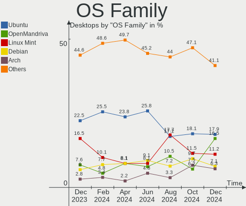
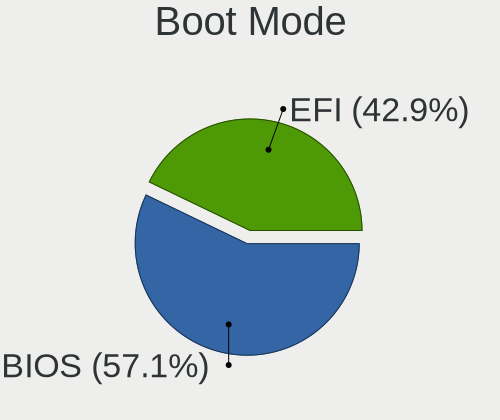
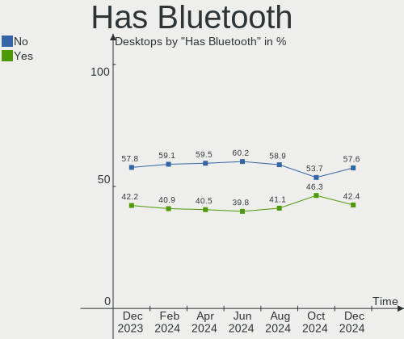
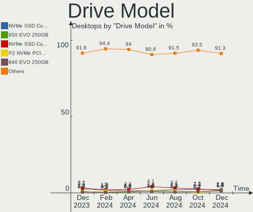
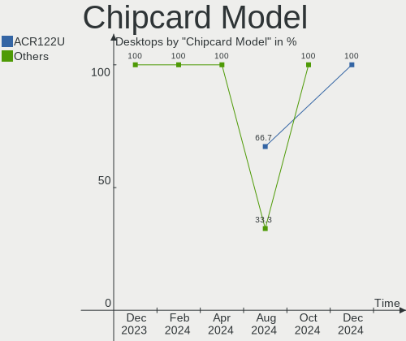

Linux in Germany - Hardware Trends (Desktops)
---------------------------------------------

A project to identify most popular hardware characteristics and track their change
over time based on data collected by Linux users at https://Linux-Hardware.org.

Anyone can contribute to this report by the [hw-probe](https://github.com/linuxhw/hw-probe) tool:

    sudo -E hw-probe -all -upload

Period: Dec, 2022.

Contents
--------

* [ System ](#system)
  - [ OS                       ](#os)
  - [ OS Family                ](#os-family)
  - [ Kernel                   ](#kernel)
  - [ Kernel Family            ](#kernel-family)
  - [ Kernel Major Ver.        ](#kernel-major-ver)
  - [ Arch                     ](#arch)
  - [ DE                       ](#de)
  - [ Display Server           ](#display-server)
  - [ Display Manager          ](#display-manager)
  - [ OS Lang                  ](#os-lang)
  - [ Boot Mode                ](#boot-mode)
  - [ Filesystem               ](#filesystem)
  - [ Part. scheme             ](#part-scheme)
  - [ Dual Boot with Linux/BSD ](#dual-boot-with-linuxbsd)
  - [ Dual Boot (Win)          ](#dual-boot-win)

* [ Board ](#board)
  - [ Vendor                   ](#vendor)
  - [ Model                    ](#model)
  - [ Model Family             ](#model-family)
  - [ MFG Year                 ](#mfg-year)
  - [ Form Factor              ](#form-factor)
  - [ Secure Boot              ](#secure-boot)
  - [ Coreboot                 ](#coreboot)
  - [ RAM Size                 ](#ram-size)
  - [ RAM Used                 ](#ram-used)
  - [ Total Drives             ](#total-drives)
  - [ Has CD-ROM               ](#has-cd-rom)
  - [ Has Ethernet             ](#has-ethernet)
  - [ Has WiFi                 ](#has-wifi)
  - [ Has Bluetooth            ](#has-bluetooth)

* [ Location ](#location)
  - [ Country                  ](#country)
  - [ City                     ](#city)

* [ Drives ](#drives)
  - [ Drive Vendor             ](#drive-vendor)
  - [ Drive Model              ](#drive-model)
  - [ HDD Vendor               ](#hdd-vendor)
  - [ SSD Vendor               ](#ssd-vendor)
  - [ Drive Kind               ](#drive-kind)
  - [ Drive Connector          ](#drive-connector)
  - [ Drive Size               ](#drive-size)
  - [ Space Total              ](#space-total)
  - [ Space Used               ](#space-used)
  - [ Malfunc. Drives          ](#malfunc-drives)
  - [ Malfunc. Drive Vendor    ](#malfunc-drive-vendor)
  - [ Malfunc. HDD Vendor      ](#malfunc-hdd-vendor)
  - [ Malfunc. Drive Kind      ](#malfunc-drive-kind)
  - [ Failed Drives            ](#failed-drives)
  - [ Failed Drive Vendor      ](#failed-drive-vendor)
  - [ Drive Status             ](#drive-status)

* [ Storage controller ](#storage-controller)
  - [ Storage Vendor           ](#storage-vendor)
  - [ Storage Model            ](#storage-model)
  - [ Storage Kind             ](#storage-kind)

* [ Processor ](#processor)
  - [ CPU Vendor               ](#cpu-vendor)
  - [ CPU Model                ](#cpu-model)
  - [ CPU Model Family         ](#cpu-model-family)
  - [ CPU Cores                ](#cpu-cores)
  - [ CPU Sockets              ](#cpu-sockets)
  - [ CPU Threads              ](#cpu-threads)
  - [ CPU Op-Modes             ](#cpu-op-modes)
  - [ CPU Microcode            ](#cpu-microcode)
  - [ CPU Microarch            ](#cpu-microarch)

* [ Graphics ](#graphics)
  - [ GPU Vendor               ](#gpu-vendor)
  - [ GPU Model                ](#gpu-model)
  - [ GPU Combo                ](#gpu-combo)
  - [ GPU Driver               ](#gpu-driver)
  - [ GPU Memory               ](#gpu-memory)

* [ Monitor ](#monitor)
  - [ Monitor Vendor           ](#monitor-vendor)
  - [ Monitor Model            ](#monitor-model)
  - [ Monitor Resolution       ](#monitor-resolution)
  - [ Monitor Diagonal         ](#monitor-diagonal)
  - [ Monitor Width            ](#monitor-width)
  - [ Aspect Ratio             ](#aspect-ratio)
  - [ Monitor Area             ](#monitor-area)
  - [ Pixel Density            ](#pixel-density)
  - [ Multiple Monitors        ](#multiple-monitors)

* [ Network ](#network)
  - [ Net Controller Vendor    ](#net-controller-vendor)
  - [ Net Controller Model     ](#net-controller-model)
  - [ Wireless Vendor          ](#wireless-vendor)
  - [ Wireless Model           ](#wireless-model)
  - [ Ethernet Vendor          ](#ethernet-vendor)
  - [ Ethernet Model           ](#ethernet-model)
  - [ Net Controller Kind      ](#net-controller-kind)
  - [ Used Controller          ](#used-controller)
  - [ NICs                     ](#nics)
  - [ IPv6                     ](#ipv6)

* [ Bluetooth ](#bluetooth)
  - [ Bluetooth Vendor         ](#bluetooth-vendor)
  - [ Bluetooth Model          ](#bluetooth-model)

* [ Sound ](#sound)
  - [ Sound Vendor             ](#sound-vendor)
  - [ Sound Model              ](#sound-model)

* [ Memory ](#memory)
  - [ Memory Vendor            ](#memory-vendor)
  - [ Memory Model             ](#memory-model)
  - [ Memory Kind              ](#memory-kind)
  - [ Memory Form Factor       ](#memory-form-factor)
  - [ Memory Size              ](#memory-size)
  - [ Memory Speed             ](#memory-speed)

* [ Printers & scanners ](#printers--scanners)
  - [ Printer Vendor           ](#printer-vendor)
  - [ Printer Model            ](#printer-model)
  - [ Scanner Vendor           ](#scanner-vendor)
  - [ Scanner Model            ](#scanner-model)

* [ Camera ](#camera)
  - [ Camera Vendor            ](#camera-vendor)
  - [ Camera Model             ](#camera-model)

* [ Security ](#security)
  - [ Fingerprint Vendor       ](#fingerprint-vendor)
  - [ Fingerprint Model        ](#fingerprint-model)
  - [ Chipcard Vendor          ](#chipcard-vendor)
  - [ Chipcard Model           ](#chipcard-model)

* [ Unsupported ](#unsupported)
  - [ Unsupported Devices      ](#unsupported-devices)
  - [ Unsupported Device Types ](#unsupported-device-types)

System
------

OS
--

Installed operating systems

| Name                         | Desktops | Percent |
|------------------------------|----------|---------|
| Ubuntu 22.04                 | 37       | 17.37%  |
| Ubuntu 22.10                 | 15       | 7.04%   |
| Debian 11                    | 12       | 5.63%   |
| Linux Mint 21                | 10       | 4.69%   |
| Pop!_OS 22.04                | 9        | 4.23%   |
| OpenMandriva 4.3             | 8        | 3.76%   |
| Linux Mint 21.1              | 8        | 3.76%   |
| Fedora 37                    | 7        | 3.29%   |
| Arch Rolling                 | 7        | 3.29%   |
| Zorin 16                     | 6        | 2.82%   |
| Ubuntu 20.04                 | 6        | 2.82%   |
| Xubuntu 22.04                | 5        | 2.35%   |
| Linux Mint 20.3              | 5        | 2.35%   |
| Kubuntu 22.04                | 5        | 2.35%   |
| KDE neon 22.04               | 5        | 2.35%   |
| Debian                       | 5        | 2.35%   |
| Ubuntu MATE 22.04            | 4        | 1.88%   |
| openSUSE Tumbleweed-XXXXXXXX | 4        | 1.88%   |
| OpenMandriva 4.50            | 4        | 1.88%   |
| OpenMandriva 22.12           | 4        | 1.88%   |
| Manjaro                      | 4        | 1.88%   |
| Manjaro 22.0.0               | 3        | 1.41%   |
| LMDE 5                       | 3        | 1.41%   |
| Debian 10                    | 3        | 1.41%   |
| OpenMandriva 4.90            | 2        | 0.94%   |
| Linux Mint 20                | 2        | 0.94%   |
| Kubuntu 22.10                | 2        | 0.94%   |
| Gentoo 2.9                   | 2        | 0.94%   |
| Elementary 6.1               | 2        | 0.94%   |
| Zorin 15                     | 1        | 0.47%   |
| Ubuntu Budgie 22.10          | 1        | 0.47%   |
| Ubuntu Budgie 20.04          | 1        | 0.47%   |
| Ubuntu 18.04                 | 1        | 0.47%   |
| SteamOS 3.4                  | 1        | 0.47%   |
| Reborn OS                    | 1        | 0.47%   |
| Pop!_OS 21.10                | 1        | 0.47%   |
| openSUSE Microos-XXXXXXXX    | 1        | 0.47%   |
| openSUSE Leap-15.3           | 1        | 0.47%   |
| Nobara 36                    | 1        | 0.47%   |
| NixOS 22.11                  | 1        | 0.47%   |

OS Family
---------

OS without a version

| Name          | Desktops | Percent |
|---------------|----------|---------|
| Ubuntu        | 59       | 27.7%   |
| Linux Mint    | 27       | 12.68%  |
| Debian        | 20       | 9.39%   |
| OpenMandriva  | 18       | 8.45%   |
| Pop!_OS       | 10       | 4.69%   |
| Kubuntu       | 8        | 3.76%   |
| Fedora        | 8        | 3.76%   |
| Zorin         | 7        | 3.29%   |
| Manjaro       | 7        | 3.29%   |
| Arch          | 7        | 3.29%   |
| openSUSE      | 6        | 2.82%   |
| Xubuntu       | 5        | 2.35%   |
| KDE neon      | 5        | 2.35%   |
| Ubuntu MATE   | 4        | 1.88%   |
| LMDE          | 3        | 1.41%   |
| Ubuntu Budgie | 2        | 0.94%   |
| Gentoo        | 2        | 0.94%   |
| Elementary    | 2        | 0.94%   |
| SteamOS       | 1        | 0.47%   |
| Reborn OS     | 1        | 0.47%   |
| Nobara        | 1        | 0.47%   |
| NixOS         | 1        | 0.47%   |
| MX            | 1        | 0.47%   |
| LinuxFX       | 1        | 0.47%   |
| Kali          | 1        | 0.47%   |
| Kaisen        | 1        | 0.47%   |
| Gnoppix       | 1        | 0.47%   |
| Garuda Linux  | 1        | 0.47%   |
| Endless       | 1        | 0.47%   |
| EndeavourOS   | 1        | 0.47%   |
| ArcoLinux     | 1        | 0.47%   |

Kernel
------

Version of the Linux kernel

| Version                  | Desktops | Percent |
|--------------------------|----------|---------|
| 5.15.0-56-generic        | 71       | 33.33%  |
| 5.19.0-26-generic        | 11       | 5.16%   |
| 5.10.0-19-amd64          | 8        | 3.76%   |
| 6.0.6-76060006-generic   | 6        | 2.82%   |
| 5.4.0-135-generic        | 6        | 2.82%   |
| 5.16.7-desktop-1omv4003  | 6        | 2.82%   |
| 5.15.0-53-generic        | 5        | 2.35%   |
| 6.1.1-arch1-1            | 4        | 1.88%   |
| 6.0.10-desktop-2omv22090 | 4        | 1.88%   |
| 5.15.0-43-generic        | 4        | 1.88%   |
| 5.10.0-20-amd64          | 4        | 1.88%   |
| 6.1.0-1-MANJARO          | 3        | 1.41%   |
| 6.0.12-76060006-generic  | 3        | 1.41%   |
| 6.0.11-arch1-1           | 3        | 1.41%   |
| 6.0.10-300.fc37.x86_64   | 3        | 1.41%   |
| 6.0.0-6-amd64            | 3        | 1.41%   |
| 5.19.12-desktop-2omv4090 | 3        | 1.41%   |
| 5.19.0-21-generic        | 3        | 1.41%   |
| 5.15.0-57-generic        | 3        | 1.41%   |
| 6.1.0-1-default          | 2        | 0.94%   |
| 6.0.12-300.fc37.x86_64   | 2        | 0.94%   |
| 6.0.12-1-default         | 2        | 0.94%   |
| 6.0.0-kali3-amd64        | 2        | 0.94%   |
| 5.4.0-131-generic        | 2        | 0.94%   |
| 5.19.0-23-generic        | 2        | 0.94%   |
| 5.18.12-desktop-3omv4090 | 2        | 0.94%   |
| 5.16.20-2-MANJARO        | 2        | 0.94%   |
| 5.16.13-desktop-1omv4003 | 2        | 0.94%   |
| 5.15.0-52-generic        | 2        | 0.94%   |
| 5.10.0-18-amd64          | 2        | 0.94%   |
| 4.15.0-200-generic       | 2        | 0.94%   |
| 6.1.0-0-amd64            | 1        | 0.47%   |
| 6.0.9-arch1-1            | 1        | 0.47%   |
| 6.0.15-200.fc36.x86_64   | 1        | 0.47%   |
| 6.0.14-300.fc37.x86_64   | 1        | 0.47%   |
| 6.0.12-zen1-1-zen        | 1        | 0.47%   |
| 6.0.11-zen1-1-zen        | 1        | 0.47%   |
| 6.0.11-300.fc37.x86_64   | 1        | 0.47%   |
| 6.0.11                   | 1        | 0.47%   |
| 6.0.10-gentoo-x86_64     | 1        | 0.47%   |

Kernel Family
-------------

Linux kernel without a distro release

| Version | Desktops | Percent |
|---------|----------|---------|
| 5.15.0  | 88       | 41.31%  |
| 5.19.0  | 17       | 7.98%   |
| 5.10.0  | 15       | 7.04%   |
| 6.0.10  | 10       | 4.69%   |
| 5.4.0   | 9        | 4.23%   |
| 6.0.12  | 8        | 3.76%   |
| 6.0.0   | 7        | 3.29%   |
| 6.1.0   | 6        | 2.82%   |
| 6.0.6   | 6        | 2.82%   |
| 6.0.11  | 6        | 2.82%   |
| 5.16.7  | 6        | 2.82%   |
| 6.1.1   | 4        | 1.88%   |
| 5.19.12 | 3        | 1.41%   |
| 5.11.0  | 3        | 1.41%   |
| 4.19.0  | 3        | 1.41%   |
| 5.18.12 | 2        | 0.94%   |
| 5.16.20 | 2        | 0.94%   |
| 5.16.13 | 2        | 0.94%   |
| 4.15.0  | 2        | 0.94%   |
| 6.0.9   | 1        | 0.47%   |
| 6.0.15  | 1        | 0.47%   |
| 6.0.14  | 1        | 0.47%   |
| 5.3.18  | 1        | 0.47%   |
| 5.19.5  | 1        | 0.47%   |
| 5.19.17 | 1        | 0.47%   |
| 5.18.10 | 1        | 0.47%   |
| 5.16.12 | 1        | 0.47%   |
| 5.15.84 | 1        | 0.47%   |
| 5.15.82 | 1        | 0.47%   |
| 5.15.80 | 1        | 0.47%   |
| 5.14.0  | 1        | 0.47%   |
| 5.13.0  | 1        | 0.47%   |
| 5.0.0   | 1        | 0.47%   |

Kernel Major Ver.
-----------------

Linux kernel major version

| Version | Desktops | Percent |
|---------|----------|---------|
| 5.15    | 91       | 42.72%  |
| 6.0     | 40       | 18.78%  |
| 5.19    | 22       | 10.33%  |
| 5.10    | 15       | 7.04%   |
| 5.16    | 11       | 5.16%   |
| 6.1     | 10       | 4.69%   |
| 5.4     | 9        | 4.23%   |
| 5.18    | 3        | 1.41%   |
| 5.11    | 3        | 1.41%   |
| 4.19    | 3        | 1.41%   |
| 4.15    | 2        | 0.94%   |
| 5.3     | 1        | 0.47%   |
| 5.14    | 1        | 0.47%   |
| 5.13    | 1        | 0.47%   |
| 5.0     | 1        | 0.47%   |

Arch
----

OS architecture (x86_64, i586, etc.)

| Name     | Desktops | Percent |
|----------|----------|---------|
| x86_64   | 212      | 99.53%  |
| armv5tel | 1        | 0.47%   |

DE
--

Desktop Environment

| Name       | Desktops | Percent |
|------------|----------|---------|
| GNOME      | 87       | 40.85%  |
| KDE5       | 45       | 21.13%  |
| X-Cinnamon | 23       | 10.8%   |
| XFCE       | 21       | 9.86%   |
| Unknown    | 17       | 7.98%   |
| MATE       | 9        | 4.23%   |
| Pantheon   | 2        | 0.94%   |
| i3         | 2        | 0.94%   |
| Cinnamon   | 2        | 0.94%   |
| Budgie     | 2        | 0.94%   |
| sway       | 1        | 0.47%   |
| qtile      | 1        | 0.47%   |
| KDE        | 1        | 0.47%   |

Display Server
--------------

X11 or Wayland

| Name    | Desktops | Percent |
|---------|----------|---------|
| X11     | 148      | 69.48%  |
| Wayland | 46       | 21.6%   |
| Tty     | 15       | 7.04%   |
| Unknown | 4        | 1.88%   |

Display Manager
---------------

SDDM, LightDM, etc.

| Name    | Desktops | Percent |
|---------|----------|---------|
| Unknown | 90       | 42.25%  |
| GDM3    | 55       | 25.82%  |
| SDDM    | 33       | 15.49%  |
| LightDM | 25       | 11.74%  |
| GDM     | 9        | 4.23%   |
| XDM     | 1        | 0.47%   |

OS Lang
-------

Language

| Lang    | Desktops | Percent |
|---------|----------|---------|
| de_DE   | 141      | 66.2%   |
| en_US   | 56       | 26.29%  |
| C       | 7        | 3.29%   |
| fr_FR   | 2        | 0.94%   |
| en_GB   | 2        | 0.94%   |
| zh_CN   | 1        | 0.47%   |
| en_DE   | 1        | 0.47%   |
| de_AT   | 1        | 0.47%   |
| cs_CZ   | 1        | 0.47%   |
| Unknown | 1        | 0.47%   |

Boot Mode
---------

EFI or BIOS

| Mode | Desktops | Percent |
|------|----------|---------|
| BIOS | 126      | 59.15%  |
| EFI  | 87       | 40.85%  |

Filesystem
----------

Type of filesystem

| Type    | Desktops | Percent |
|---------|----------|---------|
| Ext4    | 164      | 77%     |
| Btrfs   | 22       | 10.33%  |
| Overlay | 21       | 9.86%   |
| Zfs     | 3        | 1.41%   |
| Xfs     | 2        | 0.94%   |
| Tmpfs   | 1        | 0.47%   |

Part. scheme
------------

Scheme of partitioning

| Type    | Desktops | Percent |
|---------|----------|---------|
| GPT     | 114      | 53.52%  |
| Unknown | 73       | 34.27%  |
| MBR     | 26       | 12.21%  |

Dual Boot with Linux/BSD
------------------------

Hosting more than one Linux/BSD

| Dual boot | Desktops | Percent |
|-----------|----------|---------|
| No        | 171      | 80.28%  |
| Yes       | 42       | 19.72%  |

Dual Boot (Win)
---------------

Hosting Linux and Windows

| Dual boot | Desktops | Percent |
|-----------|----------|---------|
| No        | 152      | 71.36%  |
| Yes       | 61       | 28.64%  |

Board
-----

Vendor
------

Motherboard manufacturer

| Name                | Desktops | Percent |
|---------------------|----------|---------|
| ASUSTek Computer    | 67       | 31.46%  |
| MSI                 | 26       | 12.21%  |
| Gigabyte Technology | 23       | 10.8%   |
| ASRock              | 22       | 10.33%  |
| Dell                | 18       | 8.45%   |
| Hewlett-Packard     | 13       | 6.1%    |
| Fujitsu             | 11       | 5.16%   |
| Lenovo              | 7        | 3.29%   |
| Acer                | 6        | 2.82%   |
| BESSTAR Tech        | 4        | 1.88%   |
| Biostar             | 3        | 1.41%   |
| MiTAC               | 2        | 0.94%   |
| Medion              | 2        | 0.94%   |
| Intel               | 2        | 0.94%   |
| Apple               | 2        | 0.94%   |
| Unknown             | 2        | 0.94%   |
| Supermicro          | 1        | 0.47%   |
| ASRockRack          | 1        | 0.47%   |
| AMI                 | 1        | 0.47%   |

Model
-----

Motherboard model

| Name                      | Desktops | Percent |
|---------------------------|----------|---------|
| ASUS Z170 PRO GAMING      | 4        | 1.88%   |
| Dell OptiPlex 3020        | 3        | 1.41%   |
| ASUS A0000001             | 3        | 1.41%   |
| MSI MS-7C56               | 2        | 0.94%   |
| MSI MS-7C02               | 2        | 0.94%   |
| MSI MS-7A38               | 2        | 0.94%   |
| HP Compaq 6005 Pro SFF PC | 2        | 0.94%   |
| Gigabyte Z77M-D3H         | 2        | 0.94%   |
| Gigabyte X570 AORUS ELITE | 2        | 0.94%   |
| Gigabyte B550M DS3H       | 2        | 0.94%   |
| Dell OptiPlex 780         | 2        | 0.94%   |
| Dell OptiPlex 7010        | 2        | 0.94%   |
| ASUS WS C422 DC           | 2        | 0.94%   |
| ASUS PRIME X370-PRO       | 2        | 0.94%   |
| ASUS PRIME B550M-A        | 2        | 0.94%   |
| ASUS PRIME B450-PLUS      | 2        | 0.94%   |
| ASUS PRIME A320M-K        | 2        | 0.94%   |
| ASUS M5A78L-M/USB3        | 2        | 0.94%   |
| ASRock B75M R2.0          | 2        | 0.94%   |
| Unknown                   | 2        | 0.94%   |
| Supermicro C2SBX          | 1        | 0.47%   |
| MSI MS-7E07               | 1        | 0.47%   |
| MSI MS-7D75               | 1        | 0.47%   |
| MSI MS-7D30               | 1        | 0.47%   |
| MSI MS-7D25               | 1        | 0.47%   |
| MSI MS-7C96               | 1        | 0.47%   |
| MSI MS-7C91               | 1        | 0.47%   |
| MSI MS-7C52               | 1        | 0.47%   |
| MSI MS-7B98               | 1        | 0.47%   |
| MSI MS-7B86               | 1        | 0.47%   |
| MSI MS-7B49               | 1        | 0.47%   |
| MSI MS-7B28               | 1        | 0.47%   |
| MSI MS-7A59               | 1        | 0.47%   |
| MSI MS-7A32               | 1        | 0.47%   |
| MSI MS-7885               | 1        | 0.47%   |
| MSI MS-7680               | 1        | 0.47%   |
| MSI MS-7641               | 1        | 0.47%   |
| MSI MS-7502               | 1        | 0.47%   |
| MSI MS-7318               | 1        | 0.47%   |
| MSI MD34295               | 1        | 0.47%   |

Model Family
------------

Motherboard model prefix

| Name                  | Desktops | Percent |
|-----------------------|----------|---------|
| ASUS PRIME            | 15       | 7.04%   |
| Dell OptiPlex         | 14       | 6.57%   |
| ASUS ROG              | 10       | 4.69%   |
| Fujitsu ESPRIMO       | 7        | 3.29%   |
| Lenovo ThinkCentre    | 6        | 2.82%   |
| HP Compaq             | 5        | 2.35%   |
| ASUS Z170             | 5        | 2.35%   |
| Acer Aspire           | 5        | 2.35%   |
| ASUS TUF              | 3        | 1.41%   |
| ASUS M5A78L-M         | 3        | 1.41%   |
| ASUS A0000001         | 3        | 1.41%   |
| MSI MS-7C56           | 2        | 0.94%   |
| MSI MS-7C02           | 2        | 0.94%   |
| MSI MS-7A38           | 2        | 0.94%   |
| HP ProLiant           | 2        | 0.94%   |
| HP EliteDesk          | 2        | 0.94%   |
| Gigabyte Z77M-D3H     | 2        | 0.94%   |
| Gigabyte Z170X-Gaming | 2        | 0.94%   |
| Gigabyte X570         | 2        | 0.94%   |
| Gigabyte B550M        | 2        | 0.94%   |
| Gigabyte B550         | 2        | 0.94%   |
| Fujitsu FUTRO         | 2        | 0.94%   |
| Dell Precision        | 2        | 0.94%   |
| Dell Inspiron         | 2        | 0.94%   |
| ASUS WS               | 2        | 0.94%   |
| ASUS P5K              | 2        | 0.94%   |
| ASUS M4A88T-M         | 2        | 0.94%   |
| ASUS CROSSHAIR        | 2        | 0.94%   |
| ASRock Z77            | 2        | 0.94%   |
| ASRock X670E          | 2        | 0.94%   |
| ASRock B75M           | 2        | 0.94%   |
| Unknown               | 2        | 0.94%   |
| Supermicro C2SBX      | 1        | 0.47%   |
| MSI MS-7E07           | 1        | 0.47%   |
| MSI MS-7D75           | 1        | 0.47%   |
| MSI MS-7D30           | 1        | 0.47%   |
| MSI MS-7D25           | 1        | 0.47%   |
| MSI MS-7C96           | 1        | 0.47%   |
| MSI MS-7C91           | 1        | 0.47%   |
| MSI MS-7C52           | 1        | 0.47%   |

MFG Year
--------

Motherboard manufacture year

| Year    | Desktops | Percent |
|---------|----------|---------|
| 2021    | 21       | 9.86%   |
| 2019    | 19       | 8.92%   |
| 2018    | 19       | 8.92%   |
| 2012    | 18       | 8.45%   |
| 2022    | 17       | 7.98%   |
| 2020    | 17       | 7.98%   |
| 2017    | 16       | 7.51%   |
| 2015    | 15       | 7.04%   |
| 2011    | 12       | 5.63%   |
| 2010    | 11       | 5.16%   |
| 2014    | 10       | 4.69%   |
| 2013    | 10       | 4.69%   |
| 2009    | 10       | 4.69%   |
| 2016    | 8        | 3.76%   |
| 2007    | 5        | 2.35%   |
| 2008    | 3        | 1.41%   |
| 2006    | 1        | 0.47%   |
| Unknown | 1        | 0.47%   |

Form Factor
-----------

Physical design of the computer

| Name    | Desktops | Percent |
|---------|----------|---------|
| Desktop | 213      | 100%    |

Secure Boot
-----------

Enabled or disabled

| State    | Desktops | Percent |
|----------|----------|---------|
| Disabled | 207      | 97.18%  |
| Enabled  | 6        | 2.82%   |

Coreboot
--------

Have coreboot on board

| Used | Desktops | Percent |
|------|----------|---------|
| No   | 213      | 100%    |

RAM Size
--------

Total RAM memory

| Size in GB  | Desktops | Percent |
|-------------|----------|---------|
| 16.01-24.0  | 49       | 23%     |
| 8.01-16.0   | 48       | 22.54%  |
| 32.01-64.0  | 46       | 21.6%   |
| 4.01-8.0    | 26       | 12.21%  |
| 64.01-256.0 | 17       | 7.98%   |
| 3.01-4.0    | 16       | 7.51%   |
| 24.01-32.0  | 7        | 3.29%   |
| 1.01-2.0    | 2        | 0.94%   |
| 2.01-3.0    | 1        | 0.47%   |
| 0.01-0.5    | 1        | 0.47%   |

RAM Used
--------

Used RAM memory

| Used GB    | Desktops | Percent |
|------------|----------|---------|
| 1.01-2.0   | 80       | 37.56%  |
| 2.01-3.0   | 58       | 27.23%  |
| 4.01-8.0   | 33       | 15.49%  |
| 3.01-4.0   | 25       | 11.74%  |
| 8.01-16.0  | 7        | 3.29%   |
| 0.51-1.0   | 6        | 2.82%   |
| 16.01-24.0 | 2        | 0.94%   |
| 32.01-64.0 | 1        | 0.47%   |
| 0          | 1        | 0.47%   |

Total Drives
------------

Number of drives on board

| Drives | Desktops | Percent |
|--------|----------|---------|
| 1      | 75       | 35.21%  |
| 2      | 66       | 30.99%  |
| 3      | 24       | 11.27%  |
| 4      | 18       | 8.45%   |
| 5      | 13       | 6.1%    |
| 6      | 9        | 4.23%   |
| 7      | 4        | 1.88%   |
| 23     | 1        | 0.47%   |
| 13     | 1        | 0.47%   |
| 10     | 1        | 0.47%   |
| 8      | 1        | 0.47%   |

Has CD-ROM
----------

Has CD-ROM on board

| Presented | Desktops | Percent |
|-----------|----------|---------|
| Yes       | 111      | 52.11%  |
| No        | 102      | 47.89%  |

Has Ethernet
------------

Has Ethernet on board

| Presented | Desktops | Percent |
|-----------|----------|---------|
| Yes       | 212      | 99.53%  |
| No        | 1        | 0.47%   |

Has WiFi
--------

Has WiFi module

| Presented | Desktops | Percent |
|-----------|----------|---------|
| No        | 136      | 63.85%  |
| Yes       | 77       | 36.15%  |

Has Bluetooth
-------------

Has Bluetooth module

| Presented | Desktops | Percent |
|-----------|----------|---------|
| No        | 134      | 62.91%  |
| Yes       | 79       | 37.09%  |

Location
--------

Country
-------

Geographic location (country)

| Country | Desktops | Percent |
|---------|----------|---------|
| Germany | 213      | 100%    |

City
----

Geographic location (city)

| City                   | Desktops | Percent |
|------------------------|----------|---------|
| Berlin                 | 17       | 7.98%   |
| Munich                 | 11       | 5.16%   |
| Hamburg                | 11       | 5.16%   |
| Saarbrücken           | 6        | 2.82%   |
| Augsburg               | 5        | 2.35%   |
| Stuttgart              | 4        | 1.88%   |
| Düsseldorf            | 4        | 1.88%   |
| Dresden                | 4        | 1.88%   |
| Nuremberg              | 3        | 1.41%   |
| Münster               | 3        | 1.41%   |
| Frankfurt am Main      | 3        | 1.41%   |
| Chemnitz               | 3        | 1.41%   |
| Albstadt               | 3        | 1.41%   |
| Waren                  | 2        | 0.94%   |
| Vohenstrauss           | 2        | 0.94%   |
| Schemmerhofen          | 2        | 0.94%   |
| Neuss                  | 2        | 0.94%   |
| Mannheim               | 2        | 0.94%   |
| Magdeburg              | 2        | 0.94%   |
| Lahr                   | 2        | 0.94%   |
| Krefeld                | 2        | 0.94%   |
| Hochstadt an der Aisch | 2        | 0.94%   |
| Hanover                | 2        | 0.94%   |
| Gudensberg             | 2        | 0.94%   |
| Gruenenplan            | 2        | 0.94%   |
| Falkenstein            | 2        | 0.94%   |
| Cologne                | 2        | 0.94%   |
| Bremen                 | 2        | 0.94%   |
| Bonn                   | 2        | 0.94%   |
| Bamberg                | 2        | 0.94%   |
| Zeitz                  | 1        | 0.47%   |
| Wurzen                 | 1        | 0.47%   |
| Worms                  | 1        | 0.47%   |
| Winsen                 | 1        | 0.47%   |
| Wildeshausen           | 1        | 0.47%   |
| Wiesbaden              | 1        | 0.47%   |
| Wiesau                 | 1        | 0.47%   |
| Wetzlar                | 1        | 0.47%   |
| Weimar                 | 1        | 0.47%   |
| Waltrop                | 1        | 0.47%   |

Drives
------

Drive Vendor
------------

Hard drive vendors

| Vendor                      | Desktops | Drives | Percent |
|-----------------------------|----------|--------|---------|
| Samsung Electronics         | 97       | 155    | 23.83%  |
| WDC                         | 64       | 96     | 15.72%  |
| Seagate                     | 51       | 68     | 12.53%  |
| SanDisk                     | 34       | 41     | 8.35%   |
| Crucial                     | 21       | 24     | 5.16%   |
| Intenso                     | 18       | 18     | 4.42%   |
| Toshiba                     | 16       | 22     | 3.93%   |
| Kingston                    | 16       | 16     | 3.93%   |
| Hitachi                     | 13       | 17     | 3.19%   |
| Unknown                     | 11       | 17     | 2.7%    |
| Intel                       | 7        | 9      | 1.72%   |
| OCZ                         | 5        | 6      | 1.23%   |
| Micron/Crucial Technology   | 5        | 5      | 1.23%   |
| Phison Electronics          | 4        | 5      | 0.98%   |
| Kingston Technology Company | 4        | 4      | 0.98%   |
| Phison                      | 3        | 4      | 0.74%   |
| Micron Technology           | 3        | 3      | 0.74%   |
| China                       | 3        | 3      | 0.74%   |
| Verbatim                    | 2        | 2      | 0.49%   |
| USB3.0                      | 2        | 2      | 0.49%   |
| Transcend                   | 2        | 2      | 0.49%   |
| TO Exter                    | 2        | 2      | 0.49%   |
| SSK                         | 2        | 2      | 0.49%   |
| Silicon Motion              | 2        | 2      | 0.49%   |
| Hewlett-Packard             | 2        | 3      | 0.49%   |
| YS                          | 1        | 1      | 0.25%   |
| TrekStor                    | 1        | 1      | 0.25%   |
| tecmiyo                     | 1        | 1      | 0.25%   |
| Team                        | 1        | 1      | 0.25%   |
| SPCC                        | 1        | 1      | 0.25%   |
| PUSKILL                     | 1        | 1      | 0.25%   |
| PNY                         | 1        | 1      | 0.25%   |
| Patriot                     | 1        | 1      | 0.25%   |
| OYUNKEY                     | 1        | 1      | 0.25%   |
| JMicron Technology          | 1        | 1      | 0.25%   |
| HPE                         | 1        | 1      | 0.25%   |
| External                    | 1        | 1      | 0.25%   |
| Drevo                       | 1        | 1      | 0.25%   |
| Corsair                     | 1        | 1      | 0.25%   |
| Config                      | 1        | 1      | 0.25%   |

Drive Model
-----------

Hard drive models

| Model                                               | Desktops | Percent |
|-----------------------------------------------------|----------|---------|
| Samsung NVMe SSD Controller SM981/PM981/PM983 500GB | 16       | 3.18%   |
| Samsung SSD 850 EVO 250GB                           | 8        | 1.59%   |
| Samsung NVMe SSD Controller PM9A1/PM9A3/980PRO 2TB  | 8        | 1.59%   |
| WDC WD30EFRX-68EUZN0 3TB                            | 6        | 1.19%   |
| Unknown SD/MMC/MS PRO 64GB                          | 6        | 1.19%   |
| Samsung SSD 850 EVO 500GB                           | 6        | 1.19%   |
| Seagate ST2000DM006-2DM164 2TB                      | 5        | 0.99%   |
| Kingston SA400S37240G 240GB SSD                     | 5        | 0.99%   |
| Crucial CT1000MX500SSD1 1TB                         | 5        | 0.99%   |
| Unknown SD/MMC 2GB                                  | 4        | 0.8%    |
| Unknown M.S./M.S.Pro/HG 16GB                        | 4        | 0.8%    |
| Seagate ST500DM002-1BD142 500GB                     | 4        | 0.8%    |
| Seagate ST2000DM008-2FR102 2TB                      | 4        | 0.8%    |
| SanDisk SDSSDA120G 120GB                            | 4        | 0.8%    |
| Samsung SSD 970 EVO Plus 1TB                        | 4        | 0.8%    |
| Micron/Crucial P2 NVMe PCIe SSD 500GB               | 4        | 0.8%    |
| Intenso External USB 3.0 1TB                        | 4        | 0.8%    |
| Toshiba HDWD110 1TB                                 | 3        | 0.6%    |
| Seagate ST2000DM001-9YN164 2TB                      | 3        | 0.6%    |
| Seagate ST1000DM010-2EP102 1TB                      | 3        | 0.6%    |
| Sandisk WD Blue SN550 NVMe SSD 500GB                | 3        | 0.6%    |
| Samsung SSD 980 PRO 2TB                             | 3        | 0.6%    |
| Samsung SSD 980 PRO 1TB                             | 3        | 0.6%    |
| Samsung SSD 970 EVO Plus 500GB                      | 3        | 0.6%    |
| Samsung SSD 870 EVO 500GB                           | 3        | 0.6%    |
| Samsung SSD 860 EVO 500GB                           | 3        | 0.6%    |
| Samsung SSD 860 EVO 1TB                             | 3        | 0.6%    |
| Samsung SSD 850 PRO 512GB                           | 3        | 0.6%    |
| Samsung SSD 850 PRO 256GB                           | 3        | 0.6%    |
| Samsung SSD 840 EVO 120GB                           | 3        | 0.6%    |
| Phison E12 NVMe Controller 1TB                      | 3        | 0.6%    |
| Intenso SSD Sata III 256GB                          | 3        | 0.6%    |
| Intenso SSD 120GB                                   | 3        | 0.6%    |
| Crucial CT1000BX500SSD1 1TB                         | 3        | 0.6%    |
| WDC WD5000AAKS-00UU3A0 500GB                        | 2        | 0.4%    |
| WDC WD20EFRX-68EUZN0 2TB                            | 2        | 0.4%    |
| WDC WD2002FAEX-007BA0 2TB                           | 2        | 0.4%    |
| WDC WD10JPVX-22JC3T0 1TB                            | 2        | 0.4%    |
| WDC WD10EZEX-21WN4A0 1TB                            | 2        | 0.4%    |
| WDC WD10EARS-00Y5B1 1TB                             | 2        | 0.4%    |

HDD Vendor
----------

Hard disk drive vendors

| Vendor              | Desktops | Drives | Percent |
|---------------------|----------|--------|---------|
| WDC                 | 60       | 91     | 35.09%  |
| Seagate             | 49       | 66     | 28.65%  |
| Samsung Electronics | 18       | 21     | 10.53%  |
| Toshiba             | 16       | 21     | 9.36%   |
| Hitachi             | 13       | 17     | 7.6%    |
| Unknown             | 6        | 6      | 3.51%   |
| Intenso             | 4        | 4      | 2.34%   |
| USB3.0              | 2        | 2      | 1.17%   |
| HPE                 | 1        | 1      | 0.58%   |
| ASMT                | 1        | 1      | 0.58%   |
| Apple               | 1        | 1      | 0.58%   |

SSD Vendor
----------

Solid state drive vendors

| Vendor              | Desktops | Drives | Percent |
|---------------------|----------|--------|---------|
| Samsung Electronics | 50       | 66     | 33.11%  |
| SanDisk             | 24       | 28     | 15.89%  |
| Crucial             | 20       | 23     | 13.25%  |
| Intenso             | 12       | 12     | 7.95%   |
| Kingston            | 10       | 10     | 6.62%   |
| OCZ                 | 5        | 6      | 3.31%   |
| WDC                 | 4        | 5      | 2.65%   |
| Intel               | 3        | 3      | 1.99%   |
| China               | 3        | 3      | 1.99%   |
| Verbatim            | 2        | 2      | 1.32%   |
| Transcend           | 2        | 2      | 1.32%   |
| TO Exter            | 2        | 2      | 1.32%   |
| Micron Technology   | 2        | 2      | 1.32%   |
| YS                  | 1        | 1      | 0.66%   |
| TrekStor            | 1        | 1      | 0.66%   |
| tecmiyo             | 1        | 1      | 0.66%   |
| Team                | 1        | 1      | 0.66%   |
| SPCC                | 1        | 1      | 0.66%   |
| PUSKILL             | 1        | 1      | 0.66%   |
| PNY                 | 1        | 1      | 0.66%   |
| Phison              | 1        | 1      | 0.66%   |
| Hewlett-Packard     | 1        | 2      | 0.66%   |
| Drevo               | 1        | 1      | 0.66%   |
| Corsair             | 1        | 1      | 0.66%   |
| Apacer              | 1        | 1      | 0.66%   |

Drive Kind
----------

HDD or SSD

| Kind    | Desktops | Drives | Percent |
|---------|----------|--------|---------|
| HDD     | 127      | 231    | 36.6%   |
| SSD     | 118      | 177    | 34.01%  |
| NVMe    | 88       | 118    | 25.36%  |
| Unknown | 13       | 19     | 3.75%   |
| MMC     | 1        | 1      | 0.29%   |

Drive Connector
---------------

SATA, SAS, NVMe, etc.

| Type | Desktops | Drives | Percent |
|------|----------|--------|---------|
| SATA | 183      | 385    | 60.8%   |
| NVMe | 88       | 118    | 29.24%  |
| SAS  | 29       | 42     | 9.63%   |
| MMC  | 1        | 1      | 0.33%   |

Drive Size
----------

Size of hard drive

| Size in TB | Desktops | Drives | Percent |
|------------|----------|--------|---------|
| 0.01-0.5   | 131      | 178    | 45.8%   |
| 0.51-1.0   | 82       | 124    | 28.67%  |
| 1.01-2.0   | 37       | 48     | 12.94%  |
| 3.01-4.0   | 12       | 14     | 4.2%    |
| 2.01-3.0   | 12       | 25     | 4.2%    |
| 4.01-10.0  | 12       | 19     | 4.2%    |

Space Total
-----------

Amount of disk space available on the file system

| Size in GB     | Desktops | Percent |
|----------------|----------|---------|
| 101-250        | 44       | 20.66%  |
| 251-500        | 42       | 19.72%  |
| 501-1000       | 32       | 15.02%  |
| 1001-2000      | 27       | 12.68%  |
| More than 3000 | 24       | 11.27%  |
| 1-20           | 20       | 9.39%   |
| Unknown        | 8        | 3.76%   |
| 2001-3000      | 7        | 3.29%   |
| 51-100         | 6        | 2.82%   |
| 21-50          | 3        | 1.41%   |

Space Used
----------

Amount of used disk space

| Used GB        | Desktops | Percent |
|----------------|----------|---------|
| 1-20           | 66       | 30.99%  |
| 21-50          | 31       | 14.55%  |
| 101-250        | 26       | 12.21%  |
| 251-500        | 18       | 8.45%   |
| 501-1000       | 17       | 7.98%   |
| 51-100         | 17       | 7.98%   |
| 1001-2000      | 12       | 5.63%   |
| More than 3000 | 11       | 5.16%   |
| Unknown        | 8        | 3.76%   |
| 2001-3000      | 5        | 2.35%   |
| 0              | 2        | 0.94%   |

Malfunc. Drives
---------------

Drive models with a malfunction

| Model                                            | Desktops | Drives | Percent |
|--------------------------------------------------|----------|--------|---------|
| WDC WD60EFAX-68SHWN0 6TB                         | 1        | 1      | 5%      |
| WDC WD40PURX-64GVNY0 4TB                         | 1        | 1      | 5%      |
| WDC WD30EZRX-00MMMB0 3TB                         | 1        | 1      | 5%      |
| WDC WD30EFRX-68AX9N0 3TB                         | 1        | 1      | 5%      |
| USB3.0 Super Speed 1TB                           | 1        | 1      | 5%      |
| Toshiba MQ01ABC150 1TB                           | 1        | 1      | 5%      |
| Seagate ST3500418AS 500GB                        | 1        | 1      | 5%      |
| Seagate ST2000DM006-2DM164 2TB                   | 1        | 1      | 5%      |
| Samsung Electronics SSD 960 EVO 500GB            | 1        | 1      | 5%      |
| Samsung Electronics SSD 870 EVO 4TB              | 1        | 1      | 5%      |
| Samsung Electronics SP2514N 250GB                | 1        | 1      | 5%      |
| Samsung Electronics HD322HJ 320GB                | 1        | 1      | 5%      |
| Samsung Electronics HD103SI 1TB                  | 1        | 1      | 5%      |
| Micron Technology M510DC_MTFDDAK960MBP 960GB SSD | 1        | 1      | 5%      |
| Kingston SV300S37A240G 240GB SSD                 | 1        | 1      | 5%      |
| Intenso SSD Sata III 256GB                       | 1        | 1      | 5%      |
| Intel SSDSC2CW120A3 120GB                        | 1        | 1      | 5%      |
| Intel SSDSC2BB960G7 960GB                        | 1        | 1      | 5%      |
| Hitachi HDS722020ALA330 2TB                      | 1        | 1      | 5%      |
| Crucial CT500MX200SSD1 500GB                     | 1        | 1      | 5%      |

Malfunc. Drive Vendor
---------------------

Vendors of faulty drives

| Vendor              | Desktops | Drives | Percent |
|---------------------|----------|--------|---------|
| Samsung Electronics | 5        | 5      | 26.32%  |
| WDC                 | 3        | 4      | 15.79%  |
| Seagate             | 2        | 2      | 10.53%  |
| Intel               | 2        | 2      | 10.53%  |
| USB3.0              | 1        | 1      | 5.26%   |
| Toshiba             | 1        | 1      | 5.26%   |
| Micron Technology   | 1        | 1      | 5.26%   |
| Kingston            | 1        | 1      | 5.26%   |
| Intenso             | 1        | 1      | 5.26%   |
| Hitachi             | 1        | 1      | 5.26%   |
| Crucial             | 1        | 1      | 5.26%   |

Malfunc. HDD Vendor
-------------------

Vendors of faulty HDD drives

| Vendor              | Desktops | Drives | Percent |
|---------------------|----------|--------|---------|
| WDC                 | 3        | 4      | 27.27%  |
| Samsung Electronics | 3        | 3      | 27.27%  |
| Seagate             | 2        | 2      | 18.18%  |
| USB3.0              | 1        | 1      | 9.09%   |
| Toshiba             | 1        | 1      | 9.09%   |
| Hitachi             | 1        | 1      | 9.09%   |

Malfunc. Drive Kind
-------------------

Kinds of faulty drives

| Kind | Desktops | Drives | Percent |
|------|----------|--------|---------|
| HDD  | 10       | 12     | 55.56%  |
| SSD  | 7        | 7      | 38.89%  |
| NVMe | 1        | 1      | 5.56%   |

Failed Drives
-------------

Failed drive models

| Model                  | Desktops | Drives | Percent |
|------------------------|----------|--------|---------|
| Toshiba MG03ACA300 3TB | 1        | 1      | 100%    |

Failed Drive Vendor
-------------------

Failed drive vendors

| Vendor  | Desktops | Drives | Percent |
|---------|----------|--------|---------|
| Toshiba | 1        | 1      | 100%    |

Drive Status
------------

Number of failed and malfunc. drives

| Status   | Desktops | Drives | Percent |
|----------|----------|--------|---------|
| Detected | 143      | 316    | 58.85%  |
| Works    | 82       | 209    | 33.74%  |
| Malfunc  | 17       | 20     | 7%      |
| Failed   | 1        | 1      | 0.41%   |

Storage controller
------------------

Storage Vendor
--------------

Storage controller vendors

| Vendor                       | Desktops | Percent |
|------------------------------|----------|---------|
| Intel                        | 128      | 37.98%  |
| AMD                          | 83       | 24.63%  |
| Samsung Electronics          | 51       | 15.13%  |
| ASMedia Technology           | 17       | 5.04%   |
| SanDisk                      | 11       | 3.26%   |
| Kingston Technology Company  | 10       | 2.97%   |
| Phison Electronics           | 6        | 1.78%   |
| Micron/Crucial Technology    | 6        | 1.78%   |
| JMicron Technology           | 6        | 1.78%   |
| Silicon Motion               | 3        | 0.89%   |
| Marvell Technology Group     | 3        | 0.89%   |
| VIA Technologies             | 2        | 0.59%   |
| Nvidia                       | 2        | 0.59%   |
| Broadcom / LSI               | 2        | 0.59%   |
| Adaptec                      | 2        | 0.59%   |
| Toshiba America Info Systems | 1        | 0.3%    |
| Silicon Image                | 1        | 0.3%    |
| Seagate Technology           | 1        | 0.3%    |
| Micron Technology            | 1        | 0.3%    |
| MAXIO Technology (Hangzhou)  | 1        | 0.3%    |

Storage Model
-------------

Storage controller models

| Model                                                                                   | Desktops | Percent |
|-----------------------------------------------------------------------------------------|----------|---------|
| AMD FCH SATA Controller [AHCI mode]                                                     | 37       | 9.18%   |
| Samsung NVMe SSD Controller SM981/PM981/PM983                                           | 28       | 6.95%   |
| Samsung NVMe SSD Controller PM9A1/PM9A3/980PRO                                          | 18       | 4.47%   |
| ASMedia ASM1062 Serial ATA Controller                                                   | 17       | 4.22%   |
| AMD 500 Series Chipset SATA Controller                                                  | 16       | 3.97%   |
| Intel Q170/Q150/B150/H170/H110/Z170/CM236 Chipset SATA Controller [AHCI Mode]           | 15       | 3.72%   |
| Intel 8 Series/C220 Series Chipset Family 6-port SATA Controller 1 [AHCI mode]          | 13       | 3.23%   |
| AMD 400 Series Chipset SATA Controller                                                  | 13       | 3.23%   |
| Intel 7 Series/C210 Series Chipset Family 6-port SATA Controller [AHCI mode]            | 12       | 2.98%   |
| Intel 200 Series PCH SATA controller [AHCI mode]                                        | 10       | 2.48%   |
| AMD SB7x0/SB8x0/SB9x0 SATA Controller [IDE mode]                                        | 9        | 2.23%   |
| AMD SB7x0/SB8x0/SB9x0 IDE Controller                                                    | 9        | 2.23%   |
| Intel Alder Lake-S PCH SATA Controller [AHCI Mode]                                      | 7        | 1.74%   |
| AMD SB7x0/SB8x0/SB9x0 SATA Controller [AHCI mode]                                       | 7        | 1.74%   |
| AMD FCH SATA Controller D                                                               | 7        | 1.74%   |
| Sandisk Non-Volatile memory controller                                                  | 6        | 1.49%   |
| Samsung NVMe SSD Controller 980                                                         | 6        | 1.49%   |
| Kingston Company Company Non-Volatile memory controller                                 | 6        | 1.49%   |
| Intel SATA Controller [RAID mode]                                                       | 6        | 1.49%   |
| Intel Cannon Lake PCH SATA AHCI Controller                                              | 6        | 1.49%   |
| AMD SATA controller                                                                     | 6        | 1.49%   |
| Phison E12 NVMe Controller                                                              | 5        | 1.24%   |
| Micron/Crucial P2 NVMe PCIe SSD                                                         | 5        | 1.24%   |
| JMicron JMB363 SATA/IDE Controller                                                      | 5        | 1.24%   |
| Intel Volume Management Device NVMe RAID Controller                                     | 5        | 1.24%   |
| Intel 6 Series/C200 Series Chipset Family Desktop SATA Controller (IDE mode, ports 4-5) | 5        | 1.24%   |
| Intel 6 Series/C200 Series Chipset Family Desktop SATA Controller (IDE mode, ports 0-3) | 5        | 1.24%   |
| Intel SATA controller                                                                   | 4        | 0.99%   |
| Intel 82801I (ICH9 Family) 2 port SATA Controller [IDE mode]                            | 4        | 0.99%   |
| Intel 500 Series Chipset Family SATA AHCI Controller                                    | 4        | 0.99%   |
| AMD X370 Series Chipset SATA Controller                                                 | 4        | 0.99%   |
| Silicon Motion SM2262/SM2262EN SSD Controller                                           | 3        | 0.74%   |
| SanDisk WD Blue SN550 NVMe SSD                                                          | 3        | 0.74%   |
| Intel SSD 660P Series                                                                   | 3        | 0.74%   |
| Intel Celeron/Pentium Silver Processor SATA Controller                                  | 3        | 0.74%   |
| Intel Atom/Celeron/Pentium Processor x5-E8000/J3xxx/N3xxx Series SATA Controller        | 3        | 0.74%   |
| Intel 9 Series Chipset Family SATA Controller [AHCI Mode]                               | 3        | 0.74%   |
| Intel 82801JI (ICH10 Family) SATA AHCI Controller                                       | 3        | 0.74%   |
| Intel 82801JD/DO (ICH10 Family) SATA AHCI Controller                                    | 3        | 0.74%   |
| Intel 6 Series/C200 Series Chipset Family 6 port Desktop SATA AHCI Controller           | 3        | 0.74%   |

Storage Kind
------------

Kind of storage controller (IDE, SATA, NVMe, SAS, ...)

| Kind | Desktops | Percent |
|------|----------|---------|
| SATA | 180      | 55.73%  |
| NVMe | 88       | 27.24%  |
| IDE  | 32       | 9.91%   |
| RAID | 19       | 5.88%   |
| SAS  | 2        | 0.62%   |
| SCSI | 2        | 0.62%   |

Processor
---------

CPU Vendor
----------

Processor vendors

| Vendor                | Desktops | Percent |
|-----------------------|----------|---------|
| Intel                 | 127      | 59.62%  |
| AMD                   | 85       | 39.91%  |
| Marvell Semiconductor | 1        | 0.47%   |

CPU Model
---------

Processor models

| Model                                                                    | Desktops | Percent |
|--------------------------------------------------------------------------|----------|---------|
| Intel Core i7-6700K CPU @ 4.00GHz                                        | 6        | 2.82%   |
| AMD Ryzen 5 3600 6-Core Processor                                        | 6        | 2.82%   |
| AMD Ryzen 5 5600X 6-Core Processor                                       | 5        | 2.35%   |
| AMD Ryzen 7 3700X 8-Core Processor                                       | 4        | 1.88%   |
| Intel Core i7-6700 CPU @ 3.40GHz                                         | 3        | 1.41%   |
| Intel Core i5-9600K CPU @ 3.70GHz                                        | 3        | 1.41%   |
| Intel Core i5-4590 CPU @ 3.30GHz                                         | 3        | 1.41%   |
| Intel Core i5-3570K CPU @ 3.40GHz                                        | 3        | 1.41%   |
| Intel Core 2 Quad CPU Q9550 @ 2.83GHz                                    | 3        | 1.41%   |
| Intel 12th Gen Core i9-12900K                                            | 3        | 1.41%   |
| AMD Ryzen 7 3800X 8-Core Processor                                       | 3        | 1.41%   |
| AMD Ryzen 7 2700X Eight-Core Processor                                   | 3        | 1.41%   |
| AMD Ryzen 5 5600G with Radeon Graphics                                   | 3        | 1.41%   |
| AMD FX-8350 Eight-Core Processor                                         | 3        | 1.41%   |
| Intel Xeon W-2145 CPU @ 3.70GHz                                          | 2        | 0.94%   |
| Intel Core i7-9700K CPU @ 3.60GHz                                        | 2        | 0.94%   |
| Intel Core i7-7700K CPU @ 4.20GHz                                        | 2        | 0.94%   |
| Intel Core i7-4790 CPU @ 3.60GHz                                         | 2        | 0.94%   |
| Intel Core i5-4570T CPU @ 2.90GHz                                        | 2        | 0.94%   |
| Intel Core i5-3470 CPU @ 3.20GHz                                         | 2        | 0.94%   |
| Intel Core i3-4150 CPU @ 3.50GHz                                         | 2        | 0.94%   |
| Intel Core i3-3220 CPU @ 3.30GHz                                         | 2        | 0.94%   |
| Intel Core i3-2120 CPU @ 3.30GHz                                         | 2        | 0.94%   |
| Intel 13th Gen Core i9-13900K                                            | 2        | 0.94%   |
| Intel 11th Gen Core i5-11400F @ 2.60GHz                                  | 2        | 0.94%   |
| AMD Ryzen 9 7950X 16-Core Processor                                      | 2        | 0.94%   |
| AMD Ryzen 9 5900X 12-Core Processor                                      | 2        | 0.94%   |
| AMD Ryzen 9 3900X 12-Core Processor                                      | 2        | 0.94%   |
| AMD Ryzen 7 5700X 8-Core Processor                                       | 2        | 0.94%   |
| AMD Ryzen 7 1700 Eight-Core Processor                                    | 2        | 0.94%   |
| AMD Ryzen 5 PRO 4650G with Radeon Graphics                               | 2        | 0.94%   |
| AMD Ryzen 5 7600X 6-Core Processor                                       | 2        | 0.94%   |
| AMD Ryzen 5 5500                                                         | 2        | 0.94%   |
| AMD Ryzen 5 2600 Six-Core Processor                                      | 2        | 0.94%   |
| AMD Ryzen 3 3200G with Radeon Vega Graphics                              | 2        | 0.94%   |
| AMD FX-4100 Quad-Core Processor                                          | 2        | 0.94%   |
| Marvell Semiconductor Marvell Kirkwood (Flattened Device Tree) Processor | 1        | 0.47%   |
| Intel Xeon W-2295 CPU @ 3.00GHz                                          | 1        | 0.47%   |
| Intel Xeon CPU X5690 @ 3.47GHz                                           | 1        | 0.47%   |
| Intel Xeon CPU W3520 @ 2.67GHz                                           | 1        | 0.47%   |

CPU Model Family
----------------

Processor model prefix

| Model                   | Desktops | Percent |
|-------------------------|----------|---------|
| Intel Core i5           | 36       | 16.9%   |
| AMD Ryzen 5             | 25       | 11.74%  |
| Intel Core i7           | 21       | 9.86%   |
| AMD Ryzen 7             | 19       | 8.92%   |
| Other                   | 16       | 7.51%   |
| Intel Core i3           | 15       | 7.04%   |
| Intel Xeon              | 11       | 5.16%   |
| Intel Celeron           | 8        | 3.76%   |
| AMD Ryzen 9             | 8        | 3.76%   |
| Intel Core 2 Quad       | 7        | 3.29%   |
| AMD FX                  | 7        | 3.29%   |
| Intel Core 2 Duo        | 6        | 2.82%   |
| AMD Ryzen 3             | 4        | 1.88%   |
| Intel Pentium           | 3        | 1.41%   |
| AMD Phenom II X4        | 3        | 1.41%   |
| Intel Pentium Dual-Core | 2        | 0.94%   |
| AMD Ryzen 7 PRO         | 2        | 0.94%   |
| AMD Ryzen 5 PRO         | 2        | 0.94%   |
| AMD Athlon II X3        | 2        | 0.94%   |
| AMD Athlon II X2        | 2        | 0.94%   |
| AMD A6                  | 2        | 0.94%   |
| AMD A10                 | 2        | 0.94%   |
| Intel Pentium Gold      | 1        | 0.47%   |
| Intel Core i9           | 1        | 0.47%   |
| Intel Core 2            | 1        | 0.47%   |
| Intel Atom              | 1        | 0.47%   |
| AMD Phenom II X6        | 1        | 0.47%   |
| AMD GX                  | 1        | 0.47%   |
| AMD G                   | 1        | 0.47%   |
| AMD E1                  | 1        | 0.47%   |
| AMD Athlon II X4        | 1        | 0.47%   |
| AMD Athlon              | 1        | 0.47%   |

CPU Cores
---------

Number of processor cores

| Number | Desktops | Percent |
|--------|----------|---------|
| 4      | 80       | 37.56%  |
| 2      | 44       | 20.66%  |
| 6      | 38       | 17.84%  |
| 8      | 27       | 12.68%  |
| 12     | 9        | 4.23%   |
| 16     | 6        | 2.82%   |
| 24     | 2        | 0.94%   |
| 3      | 2        | 0.94%   |
| 1      | 2        | 0.94%   |
| 18     | 1        | 0.47%   |
| 14     | 1        | 0.47%   |
| 10     | 1        | 0.47%   |

CPU Sockets
-----------

Number of sockets

| Number | Desktops | Percent |
|--------|----------|---------|
| 1      | 212      | 99.53%  |
| 2      | 1        | 0.47%   |

CPU Threads
-----------

Threads per core (Hyper-Threading)

| Number | Desktops | Percent |
|--------|----------|---------|
| 2      | 123      | 57.75%  |
| 1      | 90       | 42.25%  |

CPU Op-Modes
------------

CPU Operation Modes (32-bit, 64-bit)

| Op mode        | Desktops | Percent |
|----------------|----------|---------|
| 32-bit, 64-bit | 212      | 99.53%  |
| Unknown        | 1        | 0.47%   |

CPU Microcode
-------------

Microcode number

| Number     | Desktops | Percent |
|------------|----------|---------|
| Unknown    | 79       | 37.09%  |
| 0x306a9    | 10       | 4.69%   |
| 0x306c3    | 9        | 4.23%   |
| 0x08701021 | 9        | 4.23%   |
| 0x506e3    | 7        | 3.29%   |
| 0x206a7    | 7        | 3.29%   |
| 0x1067a    | 7        | 3.29%   |
| 0x906ea    | 5        | 2.35%   |
| 0x010000c8 | 5        | 2.35%   |
| 0x906e9    | 4        | 1.88%   |
| 0x0a20120a | 4        | 1.88%   |
| 0x0a201016 | 4        | 1.88%   |
| 0x90672    | 3        | 1.41%   |
| 0x6fb      | 3        | 1.41%   |
| 0x0a601203 | 3        | 1.41%   |
| 0x0a50000d | 3        | 1.41%   |
| 0x0a50000c | 3        | 1.41%   |
| 0x08600106 | 3        | 1.41%   |
| 0x08108109 | 3        | 1.41%   |
| 0xb0671    | 2        | 0.94%   |
| 0x906ed    | 2        | 0.94%   |
| 0x706a8    | 2        | 0.94%   |
| 0x50654    | 2        | 0.94%   |
| 0x406c4    | 2        | 0.94%   |
| 0x406c3    | 2        | 0.94%   |
| 0x20655    | 2        | 0.94%   |
| 0x08001138 | 2        | 0.94%   |
| 0x06000852 | 2        | 0.94%   |
| 0xa0671    | 1        | 0.47%   |
| 0xa0655    | 1        | 0.47%   |
| 0x90675    | 1        | 0.47%   |
| 0x706a1    | 1        | 0.47%   |
| 0x6fd      | 1        | 0.47%   |
| 0x50657    | 1        | 0.47%   |
| 0x306f2    | 1        | 0.47%   |
| 0x306d4    | 1        | 0.47%   |
| 0x206d7    | 1        | 0.47%   |
| 0x206d6    | 1        | 0.47%   |
| 0x106a5    | 1        | 0.47%   |
| 0x106a4    | 1        | 0.47%   |

CPU Microarch
-------------

Microarchitecture

| Name             | Desktops | Percent |
|------------------|----------|---------|
| Zen 2            | 20       | 9.39%   |
| Skylake          | 19       | 8.92%   |
| Zen 3            | 18       | 8.45%   |
| Haswell          | 18       | 8.45%   |
| KabyLake         | 17       | 7.98%   |
| Unknown          | 15       | 7.04%   |
| IvyBridge        | 13       | 6.1%    |
| Zen+             | 11       | 5.16%   |
| SandyBridge      | 11       | 5.16%   |
| Penryn           | 10       | 4.69%   |
| K10              | 9        | 4.23%   |
| Zen              | 6        | 2.82%   |
| Piledriver       | 6        | 2.82%   |
| Core             | 6        | 2.82%   |
| Alderlake Hybrid | 6        | 2.82%   |
| Silvermont       | 5        | 2.35%   |
| Westmere         | 4        | 1.88%   |
| Nehalem          | 3        | 1.41%   |
| Goldmont plus    | 3        | 1.41%   |
| Puma             | 2        | 0.94%   |
| CometLake        | 2        | 0.94%   |
| Bulldozer        | 2        | 0.94%   |
| Steamroller      | 1        | 0.47%   |
| K8 Hammer        | 1        | 0.47%   |
| Jaguar           | 1        | 0.47%   |
| Icelake          | 1        | 0.47%   |
| Excavator        | 1        | 0.47%   |
| Broadwell        | 1        | 0.47%   |
| Bobcat           | 1        | 0.47%   |

Graphics
--------

GPU Vendor
----------

Vendors of graphics cards

| Vendor                     | Desktops | Percent |
|----------------------------|----------|---------|
| Nvidia                     | 90       | 38.96%  |
| AMD                        | 77       | 33.33%  |
| Intel                      | 57       | 24.68%  |
| ASPEED Technology          | 4        | 1.73%   |
| Matrox Electronics Systems | 2        | 0.87%   |
| ATI Technologies           | 1        | 0.43%   |

GPU Model
---------

Graphics card models

| Model                                                                                    | Desktops | Percent |
|------------------------------------------------------------------------------------------|----------|---------|
| Intel Xeon E3-1200 v3/4th Gen Core Processor Integrated Graphics Controller              | 9        | 3.83%   |
| AMD Ellesmere [Radeon RX 470/480/570/570X/580/580X/590]                                  | 7        | 2.98%   |
| Nvidia GP107 [GeForce GTX 1050 Ti]                                                       | 6        | 2.55%   |
| Nvidia GP104 [GeForce GTX 1080]                                                          | 6        | 2.55%   |
| Intel HD Graphics 530                                                                    | 6        | 2.55%   |
| AMD Raphael                                                                              | 6        | 2.55%   |
| Intel Xeon E3-1200 v2/3rd Gen Core processor Graphics Controller                         | 5        | 2.13%   |
| AMD Navi 10 [Radeon RX 5600 OEM/5600 XT / 5700/5700 XT]                                  | 5        | 2.13%   |
| Nvidia TU117 [GeForce GTX 1650]                                                          | 4        | 1.7%    |
| Nvidia GP108 [GeForce GT 1030]                                                           | 4        | 1.7%    |
| Nvidia GK208B [GeForce GT 710]                                                           | 4        | 1.7%    |
| Intel HD Graphics 630                                                                    | 4        | 1.7%    |
| Intel CoffeeLake-S GT2 [UHD Graphics 630]                                                | 4        | 1.7%    |
| Intel Atom/Celeron/Pentium Processor x5-E8000/J3xxx/N3xxx Integrated Graphics Controller | 4        | 1.7%    |
| Intel 2nd Generation Core Processor Family Integrated Graphics Controller                | 4        | 1.7%    |
| ASPEED Technology ASPEED Graphics Family                                                 | 4        | 1.7%    |
| AMD Renoir                                                                               | 4        | 1.7%    |
| AMD Picasso/Raven 2 [Radeon Vega Series / Radeon Vega Mobile Series]                     | 4        | 1.7%    |
| AMD Navi 23 [Radeon RX 6600/6600 XT/6600M]                                               | 4        | 1.7%    |
| Nvidia GT218 [GeForce 210]                                                               | 3        | 1.28%   |
| Nvidia GP104 [GeForce GTX 1070]                                                          | 3        | 1.28%   |
| Nvidia GK104 [GeForce GTX 760]                                                           | 3        | 1.28%   |
| Nvidia GF114 [GeForce GTX 560 Ti]                                                        | 3        | 1.28%   |
| Intel GeminiLake [UHD Graphics 600]                                                      | 3        | 1.28%   |
| Intel AlderLake-S GT1                                                                    | 3        | 1.28%   |
| Intel 4th Generation Core Processor Family Integrated Graphics Controller                | 3        | 1.28%   |
| AMD Navi 21 [Radeon RX 6800/6800 XT / 6900 XT]                                           | 3        | 1.28%   |
| AMD Lexa PRO [Radeon 540/540X/550/550X / RX 540X/550/550X]                               | 3        | 1.28%   |
| AMD Cezanne [Radeon Vega Series / Radeon Vega Mobile Series]                             | 3        | 1.28%   |
| AMD Cedar [Radeon HD 5000/6000/7350/8350 Series]                                         | 3        | 1.28%   |
| Nvidia TU116 [GeForce GTX 1660 SUPER]                                                    | 2        | 0.85%   |
| Nvidia TU106 [GeForce RTX 2060 Rev. A]                                                   | 2        | 0.85%   |
| Nvidia TU104 [GeForce RTX 2070 SUPER]                                                    | 2        | 0.85%   |
| Nvidia TU102 [GeForce RTX 2080 Ti Rev. A]                                                | 2        | 0.85%   |
| Nvidia GP107GL [Quadro P620]                                                             | 2        | 0.85%   |
| Nvidia GP106 [GeForce GTX 1060 6GB]                                                      | 2        | 0.85%   |
| Nvidia GK208B [GeForce GT 730]                                                           | 2        | 0.85%   |
| Nvidia GK208B [GeForce GT 720]                                                           | 2        | 0.85%   |
| Nvidia GK106 [GeForce GTX 660]                                                           | 2        | 0.85%   |
| Nvidia GF116 [GeForce GTX 550 Ti]                                                        | 2        | 0.85%   |

GPU Combo
---------

Combinations of graphics cards

| Name           | Desktops | Percent |
|----------------|----------|---------|
| 1 x Nvidia     | 81       | 38.03%  |
| 1 x AMD        | 68       | 31.92%  |
| 1 x Intel      | 42       | 19.72%  |
| AMD + Nvidia   | 6        | 2.82%   |
| 1 x ASPEED     | 4        | 1.88%   |
| Other          | 3        | 1.41%   |
| 2 x AMD        | 3        | 1.41%   |
| Intel + Nvidia | 3        | 1.41%   |
| 1 x Matrox     | 2        | 0.94%   |
| Intel + AMD    | 1        | 0.47%   |

GPU Driver
----------

Free vs proprietary

| Driver      | Desktops | Percent |
|-------------|----------|---------|
| Free        | 142      | 66.67%  |
| Proprietary | 57       | 26.76%  |
| Unknown     | 14       | 6.57%   |

GPU Memory
----------

Total video memory

| Size in GB | Desktops | Percent |
|------------|----------|---------|
| Unknown    | 105      | 49.3%   |
| 1.01-2.0   | 28       | 13.15%  |
| 7.01-8.0   | 18       | 8.45%   |
| 0.01-0.5   | 17       | 7.98%   |
| 0.51-1.0   | 13       | 6.1%    |
| 8.01-16.0  | 11       | 5.16%   |
| 3.01-4.0   | 10       | 4.69%   |
| 5.01-6.0   | 7        | 3.29%   |
| 16.01-24.0 | 3        | 1.41%   |
| 2.01-3.0   | 1        | 0.47%   |

Monitor
-------

Monitor Vendor
--------------

Monitor vendors

| Vendor               | Desktops | Percent |
|----------------------|----------|---------|
| Samsung Electronics  | 41       | 19.16%  |
| Acer                 | 21       | 9.81%   |
| Goldstar             | 20       | 9.35%   |
| Dell                 | 17       | 7.94%   |
| Ancor Communications | 17       | 7.94%   |
| BenQ                 | 15       | 7.01%   |
| AOC                  | 11       | 5.14%   |
| Philips              | 9        | 4.21%   |
| Eizo                 | 9        | 4.21%   |
| Medion               | 7        | 3.27%   |
| Hewlett-Packard      | 6        | 2.8%    |
| ASUSTek Computer     | 4        | 1.87%   |
| ViewSonic            | 3        | 1.4%    |
| LG Electronics       | 3        | 1.4%    |
| Fujitsu Siemens      | 3        | 1.4%    |
| Panasonic            | 2        | 0.93%   |
| Packard Bell         | 2        | 0.93%   |
| NEC Computers        | 2        | 0.93%   |
| MSI                  | 2        | 0.93%   |
| Compal               | 2        | 0.93%   |
| Yuraku               | 1        | 0.47%   |
| Unknown              | 1        | 0.47%   |
| Targa Visionary      | 1        | 0.47%   |
| Sharp                | 1        | 0.47%   |
| Plain Tree Systems   | 1        | 0.47%   |
| Lenovo Group Limited | 1        | 0.47%   |
| Lenovo               | 1        | 0.47%   |
| IPS                  | 1        | 0.47%   |
| Iiyama               | 1        | 0.47%   |
| HUAWEI               | 1        | 0.47%   |
| HPN                  | 1        | 0.47%   |
| Grundig              | 1        | 0.47%   |
| FUS                  | 1        | 0.47%   |
| eMachines            | 1        | 0.47%   |
| ELD                  | 1        | 0.47%   |
| CHD                  | 1        | 0.47%   |
| AML                  | 1        | 0.47%   |
| Unknown              | 1        | 0.47%   |

Monitor Model
-------------

Monitor models

| Model                                                                           | Desktops | Percent |
|---------------------------------------------------------------------------------|----------|---------|
| Samsung Electronics U28E590 SAM0C4D 3840x2160 607x345mm 27.5-inch               | 3        | 1.35%   |
| BenQ GL2450H BNQ78A7 1920x1080 531x298mm 24.0-inch                              | 3        | 1.35%   |
| Samsung Electronics U28E590 SAM0C4E 3840x2160 608x345mm 27.5-inch               | 2        | 0.9%    |
| Samsung Electronics C27F390 SAM0D32 1920x1080 598x336mm 27.0-inch               | 2        | 0.9%    |
| Goldstar ULTRAFINE GSM5BC2 3840x2160 600x340mm 27.2-inch                        | 2        | 0.9%    |
| Goldstar IPS FULLHD GSM5AB8 1920x1080 480x270mm 21.7-inch                       | 2        | 0.9%    |
| Goldstar HDR 4K GSM7750 3840x2160 697x392mm 31.5-inch                           | 2        | 0.9%    |
| Dell U2415 DELA0BA 1920x1200 520x320mm 24.0-inch                                | 2        | 0.9%    |
| AOC Q32G1WG4 AOC3201 2560x1440 697x393mm 31.5-inch                              | 2        | 0.9%    |
| AOC 2778G5 AOC2778 1920x1080 598x336mm 27.0-inch                                | 2        | 0.9%    |
| Ancor Communications VW222 ACI22A2 1680x1050 473x296mm 22.0-inch                | 2        | 0.9%    |
| Acer S242HL ACR0216 1920x1080 531x299mm 24.0-inch                               | 2        | 0.9%    |
| Yuraku YM19APR FAC01C6 1440x900 410x257mm 19.1-inch                             | 1        | 0.45%   |
| ViewSonic VX3276-FHD VSCE735 1920x1080 698x393mm 31.5-inch                      | 1        | 0.45%   |
| ViewSonic VX2776-4K-mhd VSC7137 3840x2160 608x355mm 27.7-inch                   | 1        | 0.45%   |
| ViewSonic VA2432-FHD VSCB639 1920x1080 530x300mm 24.0-inch                      | 1        | 0.45%   |
| Unknown LCD Monitor FFFF 2288x1287 2550x2550mm 142.0-inch                       | 1        | 0.45%   |
| Targa Visionary Targa Vision ary LCD 17-3 TARA034 1280x1024 337x270mm 17.0-inch | 1        | 0.45%   |
| Sharp HDMI SHP1048 1920x1080 1330x750mm 60.1-inch                               | 1        | 0.45%   |
| Samsung Electronics U32J59x SAM0F52 3840x2160 697x392mm 31.5-inch               | 1        | 0.45%   |
| Samsung Electronics T24D391 SAM0B73 1920x1080 521x293mm 23.5-inch               | 1        | 0.45%   |
| Samsung Electronics T24D390 SAM0B6E 1920x1080 521x293mm 23.5-inch               | 1        | 0.45%   |
| Samsung Electronics SyncMaster SAM0440 1920x1200 518x324mm 24.1-inch            | 1        | 0.45%   |
| Samsung Electronics SyncMaster SAM03E5 1680x1050 474x296mm 22.0-inch            | 1        | 0.45%   |
| Samsung Electronics SyncMaster SAM03E3 1680x1050 433x271mm 20.1-inch            | 1        | 0.45%   |
| Samsung Electronics SyncMaster SAM027F 1680x1050 474x296mm 22.0-inch            | 1        | 0.45%   |
| Samsung Electronics SyncMaster SAM0161 1280x1024 340x270mm 17.1-inch            | 1        | 0.45%   |
| Samsung Electronics SMT27A550 SAM07B8 1920x1080 598x336mm 27.0-inch             | 1        | 0.45%   |
| Samsung Electronics SMS27A650 SAM082E 1920x1080 598x336mm 27.0-inch             | 1        | 0.45%   |
| Samsung Electronics SMBX2240 SAM0684 1920x1080 477x268mm 21.5-inch              | 1        | 0.45%   |
| Samsung Electronics SMB2240W SAM0699 1680x1050 459x296mm 21.5-inch              | 1        | 0.45%   |
| Samsung Electronics SA300/SA350 SAM07D2 1920x1080 477x268mm 21.5-inch           | 1        | 0.45%   |
| Samsung Electronics S27E590 SAM0C5C 1920x1080 598x336mm 27.0-inch               | 1        | 0.45%   |
| Samsung Electronics S27C450 SAM09D1 1920x1080 598x336mm 27.0-inch               | 1        | 0.45%   |
| Samsung Electronics S27A950D SAM079F 1920x1080 598x336mm 27.0-inch              | 1        | 0.45%   |
| Samsung Electronics S24E650 SAM0CB7 1920x1080 521x293mm 23.5-inch               | 1        | 0.45%   |
| Samsung Electronics S24C300 SAM0A28 1920x1080 531x299mm 24.0-inch               | 1        | 0.45%   |
| Samsung Electronics S23A700 SAM085E 1920x1080 509x286mm 23.0-inch               | 1        | 0.45%   |
| Samsung Electronics LU28R55 SAM1018 3840x2160 632x360mm 28.6-inch               | 1        | 0.45%   |
| Samsung Electronics LU28R55 SAM1017 3840x2160 630x360mm 28.6-inch               | 1        | 0.45%   |

Monitor Resolution
------------------

Monitor screen resolution

| Resolution         | Desktops | Percent |
|--------------------|----------|---------|
| 1920x1080 (FHD)    | 90       | 43.69%  |
| 3840x2160 (4K)     | 35       | 16.99%  |
| 2560x1440 (QHD)    | 16       | 7.77%   |
| 1680x1050 (WSXGA+) | 16       | 7.77%   |
| 1280x1024 (SXGA)   | 12       | 5.83%   |
| 1920x1200 (WUXGA)  | 7        | 3.4%    |
| Unknown            | 5        | 2.43%   |
| 3840x1080          | 4        | 1.94%   |
| 3440x1440          | 4        | 1.94%   |
| 1600x900 (HD+)     | 3        | 1.46%   |
| 1360x768           | 2        | 0.97%   |
| 7680x2160          | 1        | 0.49%   |
| 5760x1080          | 1        | 0.49%   |
| 3840x1200          | 1        | 0.49%   |
| 3200x1080          | 1        | 0.49%   |
| 2560x1080          | 1        | 0.49%   |
| 2288x1287          | 1        | 0.49%   |
| 1920x540           | 1        | 0.49%   |
| 1600x1200          | 1        | 0.49%   |
| 1440x900 (WXGA+)   | 1        | 0.49%   |
| 1366x768 (WXGA)    | 1        | 0.49%   |
| 1280x720 (HD)      | 1        | 0.49%   |
| 1024x768 (XGA)     | 1        | 0.49%   |

Monitor Diagonal
----------------

Diagonal size in inches

| Inches  | Desktops | Percent |
|---------|----------|---------|
| 27      | 43       | 20.87%  |
| 24      | 34       | 16.5%   |
| 23      | 21       | 10.19%  |
| 21      | 19       | 9.22%   |
| Unknown | 16       | 7.77%   |
| 31      | 15       | 7.28%   |
| 22      | 14       | 6.8%    |
| 19      | 7        | 3.4%    |
| 17      | 6        | 2.91%   |
| 34      | 4        | 1.94%   |
| 28      | 4        | 1.94%   |
| 20      | 3        | 1.46%   |
| 84      | 2        | 0.97%   |
| 60      | 2        | 0.97%   |
| 49      | 2        | 0.97%   |
| 25      | 2        | 0.97%   |
| 18      | 2        | 0.97%   |
| 16      | 2        | 0.97%   |
| 142     | 1        | 0.49%   |
| 72      | 1        | 0.49%   |
| 54      | 1        | 0.49%   |
| 43      | 1        | 0.49%   |
| 39      | 1        | 0.49%   |
| 36      | 1        | 0.49%   |
| 32      | 1        | 0.49%   |
| 15      | 1        | 0.49%   |

Monitor Width
-------------

Physical width

| Width in mm    | Desktops | Percent |
|----------------|----------|---------|
| 501-600        | 88       | 43.56%  |
| 401-500        | 38       | 18.81%  |
| 601-700        | 28       | 13.86%  |
| Unknown        | 16       | 7.92%   |
| 301-350        | 9        | 4.46%   |
| 701-800        | 6        | 2.97%   |
| 351-400        | 6        | 2.97%   |
| 1001-1500      | 6        | 2.97%   |
| 1501-2000      | 3        | 1.49%   |
| More than 2000 | 1        | 0.5%    |
| 801-900        | 1        | 0.5%    |

Aspect Ratio
------------

Proportional relationship between the width and the height

| Ratio   | Desktops | Percent |
|---------|----------|---------|
| 16/9    | 127      | 66.15%  |
| 16/10   | 26       | 13.54%  |
| Unknown | 14       | 7.29%   |
| 5/4     | 11       | 5.73%   |
| 21/9    | 5        | 2.6%    |
| 4/3     | 3        | 1.56%   |
| 32/9    | 3        | 1.56%   |
| 6/5     | 1        | 0.52%   |
| 3.20    | 1        | 0.52%   |
| 1.00    | 1        | 0.52%   |

Monitor Area
------------

Area in inch²

| Area in inch² | Desktops | Percent |
|----------------|----------|---------|
| 201-250        | 69       | 33.99%  |
| 301-350        | 43       | 21.18%  |
| 351-500        | 23       | 11.33%  |
| 151-200        | 17       | 8.37%   |
| Unknown        | 16       | 7.88%   |
| 251-300        | 12       | 5.91%   |
| 141-150        | 8        | 3.94%   |
| More than 1000 | 7        | 3.45%   |
| 501-1000       | 5        | 2.46%   |
| 131-140        | 2        | 0.99%   |
| 101-110        | 1        | 0.49%   |

Pixel Density
-------------

Pixels per inch

| Density | Desktops | Percent |
|---------|----------|---------|
| 51-100  | 121      | 61.11%  |
| 101-120 | 29       | 14.65%  |
| 121-160 | 22       | 11.11%  |
| Unknown | 16       | 8.08%   |
| 1-50    | 5        | 2.53%   |
| 161-240 | 5        | 2.53%   |

Multiple Monitors
-----------------

Total monitors connected

| Total | Desktops | Percent |
|-------|----------|---------|
| 1     | 164      | 77%     |
| 2     | 27       | 12.68%  |
| 0     | 17       | 7.98%   |
| 3     | 5        | 2.35%   |

Network
-------

Net Controller Vendor
---------------------

Controller vendors

| Vendor                   | Desktops | Percent |
|--------------------------|----------|---------|
| Realtek Semiconductor    | 121      | 41.3%   |
| Intel                    | 107      | 36.52%  |
| Qualcomm Atheros         | 15       | 5.12%   |
| Broadcom                 | 9        | 3.07%   |
| MediaTek                 | 8        | 2.73%   |
| Ralink Technology        | 6        | 2.05%   |
| Edimax Technology        | 3        | 1.02%   |
| Aquantia                 | 3        | 1.02%   |
| VIA Technologies         | 2        | 0.68%   |
| TP-Link                  | 2        | 0.68%   |
| Nvidia                   | 2        | 0.68%   |
| IMC Networks             | 2        | 0.68%   |
| ASUSTek Computer         | 2        | 0.68%   |
| Sweex                    | 1        | 0.34%   |
| Samsung Electronics      | 1        | 0.34%   |
| QLogic                   | 1        | 0.34%   |
| MosChip Semiconductor    | 1        | 0.34%   |
| Mellanox Technologies    | 1        | 0.34%   |
| Marvell Technology Group | 1        | 0.34%   |
| Intersil                 | 1        | 0.34%   |
| HTC (High Tech Computer) | 1        | 0.34%   |
| DisplayLink              | 1        | 0.34%   |
| D-Link System            | 1        | 0.34%   |
| Broadcom Limited         | 1        | 0.34%   |

Net Controller Model
--------------------

Controller models

| Model                                                             | Desktops | Percent |
|-------------------------------------------------------------------|----------|---------|
| Realtek RTL8111/8168/8411 PCI Express Gigabit Ethernet Controller | 94       | 29.01%  |
| Intel Ethernet Connection (2) I219-V                              | 15       | 4.63%   |
| Realtek RTL8125 2.5GbE Controller                                 | 13       | 4.01%   |
| Intel I211 Gigabit Network Connection                             | 13       | 4.01%   |
| Intel Ethernet Controller I225-V                                  | 13       | 4.01%   |
| Intel Wi-Fi 6 AX200                                               | 8        | 2.47%   |
| Intel 82579LM Gigabit Network Connection (Lewisville)             | 7        | 2.16%   |
| Intel Ethernet Connection I217-LM                                 | 6        | 1.85%   |
| Intel Dual Band Wireless-AC 3168NGW [Stone Peak]                  | 6        | 1.85%   |
| Realtek RTL88x2bu [AC1200 Techkey]                                | 5        | 1.54%   |
| Realtek RTL8153 Gigabit Ethernet Adapter                          | 5        | 1.54%   |
| MediaTek MT7922 802.11ax PCI Express Wireless Network Adapter     | 4        | 1.23%   |
| Intel WLAN controller                                             | 4        | 1.23%   |
| Intel Ethernet Connection (7) I219-V                              | 4        | 1.23%   |
| Intel Alder Lake-S PCH CNVi WiFi                                  | 4        | 1.23%   |
| Intel 82574L Gigabit Network Connection                           | 4        | 1.23%   |
| Intel 82567LM-3 Gigabit Network Connection                        | 4        | 1.23%   |
| Realtek RTL8821CE 802.11ac PCIe Wireless Network Adapter          | 3        | 0.93%   |
| Ralink MT7601U Wireless Adapter                                   | 3        | 0.93%   |
| MediaTek MT7921K (RZ608) Wi-Fi 6E 80MHz                           | 3        | 0.93%   |
| Intel Ethernet Controller X550                                    | 3        | 0.93%   |
| Intel Ethernet Connection (2) I218-V                              | 3        | 0.93%   |
| Realtek RTL8822BE 802.11a/b/g/n/ac WiFi adapter                   | 2        | 0.62%   |
| Realtek RTL8169 PCI Gigabit Ethernet Controller                   | 2        | 0.62%   |
| Realtek RTL810xE PCI Express Fast Ethernet controller             | 2        | 0.62%   |
| Qualcomm Atheros Attansic L1 Gigabit Ethernet                     | 2        | 0.62%   |
| Qualcomm Atheros AR93xx Wireless Network Adapter                  | 2        | 0.62%   |
| Qualcomm Atheros AR8151 v2.0 Gigabit Ethernet                     | 2        | 0.62%   |
| Intel Wireless 3165                                               | 2        | 0.62%   |
| Intel Wi-Fi 6 AX210/AX211/AX411 160MHz                            | 2        | 0.62%   |
| Intel I210 Gigabit Network Connection                             | 2        | 0.62%   |
| Intel Ethernet Controller I226-V                                  | 2        | 0.62%   |
| Intel Ethernet Connection I217-V                                  | 2        | 0.62%   |
| Intel 82579V Gigabit Network Connection                           | 2        | 0.62%   |
| Intel 82578DC Gigabit Network Connection                          | 2        | 0.62%   |
| Edimax EW-7811Un 802.11n Wireless Adapter [Realtek RTL8188CUS]    | 2        | 0.62%   |
| Broadcom NetXtreme BCM5761 Gigabit Ethernet PCIe                  | 2        | 0.62%   |
| Broadcom NetXtreme BCM5720 Gigabit Ethernet PCIe                  | 2        | 0.62%   |
| Aquantia AQC107 NBase-T/IEEE 802.3bz Ethernet Controller [AQtion] | 2        | 0.62%   |
| VIA VT6102/VT6103 [Rhine-II]                                      | 1        | 0.31%   |

Wireless Vendor
---------------

Wireless vendors

| Vendor                | Desktops | Percent |
|-----------------------|----------|---------|
| Intel                 | 30       | 36.59%  |
| Realtek Semiconductor | 16       | 19.51%  |
| Qualcomm Atheros      | 8        | 9.76%   |
| MediaTek              | 8        | 9.76%   |
| Ralink Technology     | 6        | 7.32%   |
| Edimax Technology     | 3        | 3.66%   |
| TP-Link               | 2        | 2.44%   |
| IMC Networks          | 2        | 2.44%   |
| Broadcom              | 2        | 2.44%   |
| ASUSTek Computer      | 2        | 2.44%   |
| VIA Technologies      | 1        | 1.22%   |
| Sweex                 | 1        | 1.22%   |
| D-Link System         | 1        | 1.22%   |

Wireless Model
--------------

Wireless models

| Model                                                                  | Desktops | Percent |
|------------------------------------------------------------------------|----------|---------|
| Intel Wi-Fi 6 AX200                                                    | 8        | 9.76%   |
| Intel Dual Band Wireless-AC 3168NGW [Stone Peak]                       | 6        | 7.32%   |
| Realtek RTL88x2bu [AC1200 Techkey]                                     | 5        | 6.1%    |
| MediaTek MT7922 802.11ax PCI Express Wireless Network Adapter          | 4        | 4.88%   |
| Intel WLAN controller                                                  | 4        | 4.88%   |
| Intel Alder Lake-S PCH CNVi WiFi                                       | 4        | 4.88%   |
| Realtek RTL8821CE 802.11ac PCIe Wireless Network Adapter               | 3        | 3.66%   |
| Ralink MT7601U Wireless Adapter                                        | 3        | 3.66%   |
| MediaTek MT7921K (RZ608) Wi-Fi 6E 80MHz                                | 3        | 3.66%   |
| Realtek RTL8822BE 802.11a/b/g/n/ac WiFi adapter                        | 2        | 2.44%   |
| Qualcomm Atheros AR93xx Wireless Network Adapter                       | 2        | 2.44%   |
| Intel Wireless 3165                                                    | 2        | 2.44%   |
| Intel Wi-Fi 6 AX210/AX211/AX411 160MHz                                 | 2        | 2.44%   |
| Edimax EW-7811Un 802.11n Wireless Adapter [Realtek RTL8188CUS]         | 2        | 2.44%   |
| VIA USB2.0 WLAN                                                        | 1        | 1.22%   |
| TP-Link TL-WN823N v2/v3 [Realtek RTL8192EU]                            | 1        | 1.22%   |
| TP-Link TL-WN821N v5/v6 [RTL8192EU]                                    | 1        | 1.22%   |
| Sweex 802.11 n WLAN                                                    | 1        | 1.22%   |
| Realtek RTL8723BE PCIe Wireless Network Adapter                        | 1        | 1.22%   |
| Realtek RTL8192CU 802.11n WLAN Adapter                                 | 1        | 1.22%   |
| Realtek RTL8188FTV 802.11b/g/n 1T1R 2.4G WLAN Adapter                  | 1        | 1.22%   |
| Realtek RTL8188EUS 802.11n Wireless Network Adapter                    | 1        | 1.22%   |
| Realtek RTL-8185 IEEE 802.11a/b/g Wireless LAN Controller              | 1        | 1.22%   |
| Realtek B1680188186                                                    | 1        | 1.22%   |
| Ralink RT5372 Wireless Adapter                                         | 1        | 1.22%   |
| Ralink RT5370 Wireless Adapter                                         | 1        | 1.22%   |
| Ralink RT3072 Wireless Adapter                                         | 1        | 1.22%   |
| Qualcomm Atheros QCA9565 / AR9565 Wireless Network Adapter             | 1        | 1.22%   |
| Qualcomm Atheros QCA9377 802.11ac Wireless Network Adapter             | 1        | 1.22%   |
| Qualcomm Atheros AR9485 Wireless Network Adapter                       | 1        | 1.22%   |
| Qualcomm Atheros AR9285 Wireless Network Adapter (PCI-Express)         | 1        | 1.22%   |
| Qualcomm Atheros AR9227 Wireless Network Adapter                       | 1        | 1.22%   |
| Qualcomm Atheros AR5212/5213/2414 Wireless Network Adapter             | 1        | 1.22%   |
| MediaTek MT7921 802.11ax PCI Express Wireless Network Adapter          | 1        | 1.22%   |
| Intel Wireless-AC 9260                                                 | 1        | 1.22%   |
| Intel Wireless 3160                                                    | 1        | 1.22%   |
| Intel Comet Lake PCH CNVi WiFi                                         | 1        | 1.22%   |
| Intel Cannon Lake PCH CNVi WiFi                                        | 1        | 1.22%   |
| IMC Networks Mediao 802.11n WLAN [Realtek RTL8191SU]                   | 1        | 1.22%   |
| IMC Networks AW-NU222 802.11bgn Wireless Module [Ralink RT2770+RT2720] | 1        | 1.22%   |

Ethernet Vendor
---------------

Ethernet vendors

| Vendor                   | Desktops | Percent |
|--------------------------|----------|---------|
| Realtek Semiconductor    | 113      | 48.71%  |
| Intel                    | 91       | 39.22%  |
| Qualcomm Atheros         | 7        | 3.02%   |
| Broadcom                 | 7        | 3.02%   |
| Aquantia                 | 3        | 1.29%   |
| Nvidia                   | 2        | 0.86%   |
| VIA Technologies         | 1        | 0.43%   |
| Samsung Electronics      | 1        | 0.43%   |
| QLogic                   | 1        | 0.43%   |
| MosChip Semiconductor    | 1        | 0.43%   |
| Mellanox Technologies    | 1        | 0.43%   |
| Marvell Technology Group | 1        | 0.43%   |
| HTC (High Tech Computer) | 1        | 0.43%   |
| DisplayLink              | 1        | 0.43%   |
| Broadcom Limited         | 1        | 0.43%   |

Ethernet Model
--------------

Ethernet models

| Model                                                                          | Desktops | Percent |
|--------------------------------------------------------------------------------|----------|---------|
| Realtek RTL8111/8168/8411 PCI Express Gigabit Ethernet Controller              | 94       | 39%     |
| Intel Ethernet Connection (2) I219-V                                           | 15       | 6.22%   |
| Realtek RTL8125 2.5GbE Controller                                              | 13       | 5.39%   |
| Intel I211 Gigabit Network Connection                                          | 13       | 5.39%   |
| Intel Ethernet Controller I225-V                                               | 13       | 5.39%   |
| Intel 82579LM Gigabit Network Connection (Lewisville)                          | 7        | 2.9%    |
| Intel Ethernet Connection I217-LM                                              | 6        | 2.49%   |
| Realtek RTL8153 Gigabit Ethernet Adapter                                       | 5        | 2.07%   |
| Intel Ethernet Connection (7) I219-V                                           | 4        | 1.66%   |
| Intel 82574L Gigabit Network Connection                                        | 4        | 1.66%   |
| Intel 82567LM-3 Gigabit Network Connection                                     | 4        | 1.66%   |
| Intel Ethernet Controller X550                                                 | 3        | 1.24%   |
| Intel Ethernet Connection (2) I218-V                                           | 3        | 1.24%   |
| Realtek RTL8169 PCI Gigabit Ethernet Controller                                | 2        | 0.83%   |
| Realtek RTL810xE PCI Express Fast Ethernet controller                          | 2        | 0.83%   |
| Qualcomm Atheros Attansic L1 Gigabit Ethernet                                  | 2        | 0.83%   |
| Qualcomm Atheros AR8151 v2.0 Gigabit Ethernet                                  | 2        | 0.83%   |
| Intel I210 Gigabit Network Connection                                          | 2        | 0.83%   |
| Intel Ethernet Controller I226-V                                               | 2        | 0.83%   |
| Intel Ethernet Connection I217-V                                               | 2        | 0.83%   |
| Intel 82579V Gigabit Network Connection                                        | 2        | 0.83%   |
| Intel 82578DC Gigabit Network Connection                                       | 2        | 0.83%   |
| Broadcom NetXtreme BCM5761 Gigabit Ethernet PCIe                               | 2        | 0.83%   |
| Broadcom NetXtreme BCM5720 Gigabit Ethernet PCIe                               | 2        | 0.83%   |
| Aquantia AQC107 NBase-T/IEEE 802.3bz Ethernet Controller [AQtion]              | 2        | 0.83%   |
| VIA VT6102/VT6103 [Rhine-II]                                                   | 1        | 0.41%   |
| Samsung GT-I9070 (network tethering, USB debugging enabled)                    | 1        | 0.41%   |
| Realtek USB 10/100/1G/2.5G LAN                                                 | 1        | 0.41%   |
| Realtek Killer E3000 2.5GbE Controller                                         | 1        | 0.41%   |
| Qualcomm Atheros Killer E2400 Gigabit Ethernet Controller                      | 1        | 0.41%   |
| Qualcomm Atheros Killer E220x Gigabit Ethernet Controller                      | 1        | 0.41%   |
| Qualcomm Atheros AR8121/AR8113/AR8114 Gigabit or Fast Ethernet                 | 1        | 0.41%   |
| QLogic cLOM8214 1/10GbE Controller                                             | 1        | 0.41%   |
| Nvidia MCP61 Ethernet                                                          | 1        | 0.41%   |
| Nvidia MCP55 Ethernet                                                          | 1        | 0.41%   |
| MosChip MCS7832 10/100 Mbps Ethernet adapter                                   | 1        | 0.41%   |
| Mellanox MT26448 [ConnectX EN 10GigE, PCIe 2.0 5GT/s]                          | 1        | 0.41%   |
| Marvell Group Yukon Optima 88E8059 [PCIe Gigabit Ethernet Controller with AVB] | 1        | 0.41%   |
| Intel Ethernet Controller 10-Gigabit X540-AT2                                  | 1        | 0.41%   |
| Intel Ethernet controller                                                      | 1        | 0.41%   |

Net Controller Kind
-------------------

Ethernet, WiFi or modem

| Kind     | Desktops | Percent |
|----------|----------|---------|
| Ethernet | 212      | 73.1%   |
| WiFi     | 77       | 26.55%  |
| Unknown  | 1        | 0.34%   |

Used Controller
---------------

Currently used network controller

| Kind     | Desktops | Percent |
|----------|----------|---------|
| Ethernet | 182      | 83.11%  |
| WiFi     | 37       | 16.89%  |

NICs
----

Total network controllers on board

| Total | Desktops | Percent |
|-------|----------|---------|
| 1     | 135      | 63.38%  |
| 2     | 64       | 30.05%  |
| 3     | 10       | 4.69%   |
| 4     | 2        | 0.94%   |
| 0     | 2        | 0.94%   |

IPv6
----

IPv6 vs IPv4

| Used | Desktops | Percent |
|------|----------|---------|
| Yes  | 129      | 60.56%  |
| No   | 84       | 39.44%  |

Bluetooth
---------

Bluetooth Vendor
----------------

Controller vendors

| Vendor                          | Desktops | Percent |
|---------------------------------|----------|---------|
| Intel                           | 28       | 34.57%  |
| Cambridge Silicon Radio         | 18       | 22.22%  |
| ASUSTek Computer                | 10       | 12.35%  |
| Realtek Semiconductor           | 5        | 6.17%   |
| MediaTek                        | 5        | 6.17%   |
| Apple                           | 3        | 3.7%    |
| TP-Link                         | 2        | 2.47%   |
| Qualcomm Atheros Communications | 2        | 2.47%   |
| Broadcom                        | 2        | 2.47%   |
| Motorola PCS                    | 1        | 1.23%   |
| Logitech                        | 1        | 1.23%   |
| Lite-On Technology              | 1        | 1.23%   |
| IMC Networks                    | 1        | 1.23%   |
| Foxconn / Hon Hai               | 1        | 1.23%   |
| Belkin Components               | 1        | 1.23%   |

Bluetooth Model
---------------

Controller models

| Model                                                 | Desktops | Percent |
|-------------------------------------------------------|----------|---------|
| Cambridge Silicon Radio Bluetooth Dongle (HCI mode)   | 18       | 22.22%  |
| Intel AX200 Bluetooth                                 | 7        | 8.64%   |
| MediaTek Wireless_Device                              | 5        | 6.17%   |
| Intel Wireless-AC 3168 Bluetooth                      | 5        | 6.17%   |
| Intel AX201 Bluetooth                                 | 5        | 6.17%   |
| ASUS Bluetooth Device                                 | 5        | 6.17%   |
| Intel Bluetooth Device                                | 4        | 4.94%   |
| Realtek Bluetooth Radio                               | 3        | 3.7%    |
| Intel Bluetooth wireless interface                    | 3        | 3.7%    |
| ASUS Bluetooth Radio                                  | 3        | 3.7%    |
| TP-Link UB500 Adapter                                 | 2        | 2.47%   |
| Intel AX210 Bluetooth                                 | 2        | 2.47%   |
| Broadcom BCM20702A0 Bluetooth 4.0                     | 2        | 2.47%   |
| ASUS Broadcom BCM20702A0 Bluetooth                    | 2        | 2.47%   |
| Apple Built-in Bluetooth 2.0+EDR HCI                  | 2        | 2.47%   |
| Realtek  Bluetooth 4.2 Adapter                        | 1        | 1.23%   |
| Realtek Bluetooth 5.1 Radio                           | 1        | 1.23%   |
| Qualcomm Atheros  Bluetooth Device                    | 1        | 1.23%   |
| Qualcomm Atheros AR3011 Bluetooth                     | 1        | 1.23%   |
| Motorola PCS Bluetooth Device                         | 1        | 1.23%   |
| Logitech BT Mini-Receiver (HCI mode)                  | 1        | 1.23%   |
| Lite-On Qualcomm Atheros QCA9377 Bluetooth            | 1        | 1.23%   |
| Intel Wireless-AC 9260 Bluetooth Adapter              | 1        | 1.23%   |
| Intel Bluetooth 9460/9560 Jefferson Peak (JfP)        | 1        | 1.23%   |
| IMC Networks Wireless_Device                          | 1        | 1.23%   |
| Foxconn / Hon Hai Wireless_Device                     | 1        | 1.23%   |
| Belkin Components F8T065BF Mini Bluetooth 4.0 Adapter | 1        | 1.23%   |
| Apple Bluetooth USB Host Controller                   | 1        | 1.23%   |

Sound
-----

Sound Vendor
------------

Sound card vendors

| Vendor                                          | Desktops | Percent |
|-------------------------------------------------|----------|---------|
| Intel                                           | 116      | 30.93%  |
| AMD                                             | 104      | 27.73%  |
| Nvidia                                          | 89       | 23.73%  |
| C-Media Electronics                             | 9        | 2.4%    |
| ASUSTek Computer                                | 6        | 1.6%    |
| Logitech                                        | 5        | 1.33%   |
| Creative Labs                                   | 5        | 1.33%   |
| JMTek                                           | 4        | 1.07%   |
| VIA Technologies                                | 3        | 0.8%    |
| Razer USA                                       | 3        | 0.8%    |
| Micro Star International                        | 3        | 0.8%    |
| Generalplus Technology                          | 3        | 0.8%    |
| Native Instruments                              | 2        | 0.53%   |
| Kingston Technology                             | 2        | 0.53%   |
| GN Netcom                                       | 2        | 0.53%   |
| Corsair                                         | 2        | 0.53%   |
| Yamaha                                          | 1        | 0.27%   |
| USB MICROPHONE                                  | 1        | 0.27%   |
| Thesycon Systemsoftware & Consulting            | 1        | 0.27%   |
| Tenx Technology                                 | 1        | 0.27%   |
| SteelSeries ApS                                 | 1        | 0.27%   |
| Sony                                            | 1        | 0.27%   |
| Solid State Logic                               | 1        | 0.27%   |
| Roland                                          | 1        | 0.27%   |
| Plantronics                                     | 1        | 0.27%   |
| Licensed by Sony Computer Entertainment America | 1        | 0.27%   |
| Guillemot                                       | 1        | 0.27%   |
| Focusrite-Novation                              | 1        | 0.27%   |
| Dell                                            | 1        | 0.27%   |
| Darfon Electronics                              | 1        | 0.27%   |
| CMX Systems                                     | 1        | 0.27%   |
| ATI Technologies                                | 1        | 0.27%   |
| Unknown                                         | 1        | 0.27%   |

Sound Model
-----------

Sound card models

| Model                                                                      | Desktops | Percent |
|----------------------------------------------------------------------------|----------|---------|
| AMD Starship/Matisse HD Audio Controller                                   | 23       | 5.22%   |
| AMD Family 17h/19h HD Audio Controller                                     | 22       | 4.99%   |
| Intel 100 Series/C230 Series Chipset Family HD Audio Controller            | 17       | 3.85%   |
| AMD SBx00 Azalia (Intel HDA)                                               | 15       | 3.4%    |
| Intel Xeon E3-1200 v3/4th Gen Core Processor HD Audio Controller           | 13       | 2.95%   |
| Intel 8 Series/C220 Series Chipset High Definition Audio Controller        | 13       | 2.95%   |
| Intel 7 Series/C216 Chipset Family High Definition Audio Controller        | 13       | 2.95%   |
| AMD Renoir Radeon High Definition Audio Controller                         | 12       | 2.72%   |
| AMD Family 17h (Models 00h-0fh) HD Audio Controller                        | 11       | 2.49%   |
| Nvidia GP107GL High Definition Audio Controller                            | 9        | 2.04%   |
| Nvidia GP104 High Definition Audio Controller                              | 9        | 2.04%   |
| Intel 200 Series PCH HD Audio                                              | 9        | 2.04%   |
| AMD Navi 21/23 HDMI/DP Audio Controller                                    | 9        | 2.04%   |
| Nvidia GK208 HDMI/DP Audio Controller                                      | 8        | 1.81%   |
| Intel 6 Series/C200 Series Chipset Family High Definition Audio Controller | 8        | 1.81%   |
| AMD Navi 10 HDMI Audio                                                     | 7        | 1.59%   |
| AMD Ellesmere HDMI Audio [Radeon RX 470/480 / 570/580/590]                 | 7        | 1.59%   |
| Intel Cannon Lake PCH cAVS                                                 | 6        | 1.36%   |
| Intel Audio device                                                         | 6        | 1.36%   |
| Intel Alder Lake-S HD Audio Controller                                     | 6        | 1.36%   |
| AMD Rembrandt Radeon High Definition Audio Controller                      | 6        | 1.36%   |
| Nvidia TU104 HD Audio Controller                                           | 5        | 1.13%   |
| Intel 82801I (ICH9 Family) HD Audio Controller                             | 5        | 1.13%   |
| AMD Raven/Raven2/Fenghuang HDMI/DP Audio Controller                        | 5        | 1.13%   |
| AMD FCH Azalia Controller                                                  | 5        | 1.13%   |
| Nvidia TU107 GeForce GTX 1650 High Definition Audio Controller             | 4        | 0.91%   |
| Nvidia GP108 High Definition Audio Controller                              | 4        | 0.91%   |
| Nvidia GK104 HDMI Audio Controller                                         | 4        | 0.91%   |
| Intel 82801JI (ICH10 Family) HD Audio Controller                           | 4        | 0.91%   |
| Intel 82801JD/DO (ICH10 Family) HD Audio Controller                        | 4        | 0.91%   |
| Intel 5 Series/3400 Series Chipset High Definition Audio                   | 4        | 0.91%   |
| C-Media Electronics Audio Adapter (Unitek Y-247A)                          | 4        | 0.91%   |
| ASUSTek Computer USB Audio                                                 | 4        | 0.91%   |
| AMD Oland/Hainan/Cape Verde/Pitcairn HDMI Audio [Radeon HD 7000 Series]    | 4        | 0.91%   |
| AMD Baffin HDMI/DP Audio [Radeon RX 550 640SP / RX 560/560X]               | 4        | 0.91%   |
| Nvidia TU116 High Definition Audio Controller                              | 3        | 0.68%   |
| Nvidia High Definition Audio Controller                                    | 3        | 0.68%   |
| Nvidia GP106 High Definition Audio Controller                              | 3        | 0.68%   |
| Nvidia GF114 HDMI Audio Controller                                         | 3        | 0.68%   |
| Nvidia GF108 High Definition Audio Controller                              | 3        | 0.68%   |

Memory
------

Memory Vendor
-------------

Memory module vendors

| Vendor              | Desktops | Percent |
|---------------------|----------|---------|
| Kingston            | 15       | 15.15%  |
| Unknown             | 14       | 14.14%  |
| Crucial             | 14       | 14.14%  |
| Corsair             | 14       | 14.14%  |
| G.Skill             | 11       | 11.11%  |
| Samsung Electronics | 8        | 8.08%   |
| Micron Technology   | 7        | 7.07%   |
| SK hynix            | 5        | 5.05%   |
| Unknown             | 3        | 3.03%   |
| A-DATA Technology   | 2        | 2.02%   |
| Unknown (ABCD)      | 1        | 1.01%   |
| Team                | 1        | 1.01%   |
| TakeMS              | 1        | 1.01%   |
| Patriot             | 1        | 1.01%   |
| Nanya Technology    | 1        | 1.01%   |
| AVEXIR              | 1        | 1.01%   |

Memory Model
------------

Memory module models

| Model                                                        | Desktops | Percent |
|--------------------------------------------------------------|----------|---------|
| Unknown                                                      | 3        | 2.83%   |
| Unknown RAM Module 4GB DIMM DDR3 1333MT/s                    | 2        | 1.89%   |
| Unknown RAM Module 4GB DIMM DDR 1333MT/s                     | 2        | 1.89%   |
| Unknown RAM Module 4GB DIMM 1600MT/s                         | 2        | 1.89%   |
| Samsung RAM M391A4G43MB1-CTD 32GB DIMM DDR4 2667MT/s         | 2        | 1.89%   |
| Kingston RAM KF3200C16D4/32GX 32GB DIMM DDR4 3200MT/s        | 2        | 1.89%   |
| G.Skill RAM F4-3200C16-8GIS 8192MB DIMM DDR4 3200MT/s        | 2        | 1.89%   |
| G.Skill RAM F4-3000C16-8GISB 8GB DIMM DDR4 3200MT/s          | 2        | 1.89%   |
| Corsair RAM CMZ8GX3M2A1600C9 4GB DIMM DDR3 1600MT/s          | 2        | 1.89%   |
| Unknown RAM Module 8GB DIMM DDR4 2133MT/s                    | 1        | 0.94%   |
| Unknown RAM Module 8GB DIMM DDR3 1600MT/s                    | 1        | 0.94%   |
| Unknown RAM Module 4GB DIMM DDR3 1600MT/s                    | 1        | 0.94%   |
| Unknown RAM Module 2GB DIMM SDRAM 1066MT/s                   | 1        | 0.94%   |
| Unknown RAM Module 2GB DIMM DDR 1333MT/s                     | 1        | 0.94%   |
| Unknown RAM Module 2GB DIMM 800MT/s                          | 1        | 0.94%   |
| Unknown RAM Module 2GB DIMM 1333MT/s                         | 1        | 0.94%   |
| Unknown RAM Module 2GB DIMM                                  | 1        | 0.94%   |
| Unknown RAM Module 1GB DIMM DDR2 800MT/s                     | 1        | 0.94%   |
| Unknown RAM Module 1GB DIMM                                  | 1        | 0.94%   |
| Unknown (ABCD) RAM 123456789012345678 4GB DIMM DDR4 2400MT/s | 1        | 0.94%   |
| Team RAM TEAMGROUP-UD3-1333 4GB DIMM DDR3 1333MT/s           | 1        | 0.94%   |
| TakeMS RAM TMS4GB364E081139EM 4096MB DIMM DDR3 1333MT/s      | 1        | 0.94%   |
| SK hynix RAM HYMP125U64CP8-Y5 2GB DIMM DDR2 667MT/s          | 1        | 0.94%   |
| SK hynix RAM HMT41GU6MFR8C-PB 8GB DIMM DDR3 1600MT/s         | 1        | 0.94%   |
| SK hynix RAM HMT351U7CFR8A 4GB DIMM DDR3 1866MT/s            | 1        | 0.94%   |
| SK hynix RAM HMT351R7CFR8C-PB 4GB DIMM DDR3 1600MT/s         | 1        | 0.94%   |
| SK hynix RAM HMA851S6CJR6N-VK 4GB SODIMM DDR4 2667MT/s       | 1        | 0.94%   |
| Samsung RAM Module 32GB DIMM DDR4 2666MT/s                   | 1        | 0.94%   |
| Samsung RAM Module 2GB SODIMM DDR3 1333MT/s                  | 1        | 0.94%   |
| Samsung RAM M471B5173EB0-YK0 4GB SODIMM DDR3 1600MT/s        | 1        | 0.94%   |
| Samsung RAM M471B1G73EB0-YK0 8GB SODIMM DDR3 1600MT/s        | 1        | 0.94%   |
| Samsung RAM M471A1K43CB1-CRC 8GB SODIMM DDR4 2667MT/s        | 1        | 0.94%   |
| Samsung RAM M391A1K43BB1-CRC 8GB DIMM DDR4 2400MT/s          | 1        | 0.94%   |
| Samsung RAM M378B1G73QH0-CK0 8GB DIMM DDR3 1600MT/s          | 1        | 0.94%   |
| Patriot RAM 3200 C16 Series 16GB DIMM DDR4 3200MT/s          | 1        | 0.94%   |
| Nanya RAM NT2GT64U8HD0BY-AD 2GB DIMM DDR2 2048MT/s           | 1        | 0.94%   |
| Micron RAM Module 32GB DIMM DDR4 2666MT/s                    | 1        | 0.94%   |
| Micron RAM 8KTF51264HZ-1G9P1 4GB DIMM DDR3 1866MT/s          | 1        | 0.94%   |
| Micron RAM 8ATF2G64AZ-3G2F1 16GB DIMM DDR4 3200MT/s          | 1        | 0.94%   |
| Micron RAM 8ATF1G64AZ-2G6E1 8GB DIMM DDR4 2667MT/s           | 1        | 0.94%   |

Memory Kind
-----------

Memory module kinds

| Kind    | Desktops | Percent |
|---------|----------|---------|
| DDR4    | 52       | 56.52%  |
| DDR3    | 21       | 22.83%  |
| DDR5    | 8        | 8.7%    |
| Unknown | 5        | 5.43%   |
| DDR2    | 2        | 2.17%   |
| DDR     | 2        | 2.17%   |
| SDRAM   | 1        | 1.09%   |
| LPDDR4  | 1        | 1.09%   |

Memory Form Factor
------------------

Physical design of the memory module

| Name   | Desktops | Percent |
|--------|----------|---------|
| DIMM   | 84       | 91.3%   |
| SODIMM | 8        | 8.7%    |

Memory Size
-----------

Memory module size

| Size  | Desktops | Percent |
|-------|----------|---------|
| 8192  | 34       | 34.69%  |
| 16384 | 21       | 21.43%  |
| 4096  | 21       | 21.43%  |
| 32768 | 12       | 12.24%  |
| 2048  | 7        | 7.14%   |
| 1024  | 2        | 2.04%   |
| 65536 | 1        | 1.02%   |

Memory Speed
------------

Memory module speed

| Speed   | Desktops | Percent |
|---------|----------|---------|
| 1600    | 18       | 18.56%  |
| 3200    | 17       | 17.53%  |
| 2667    | 7        | 7.22%   |
| 1333    | 7        | 7.22%   |
| 2133    | 6        | 6.19%   |
| 3600    | 5        | 5.15%   |
| 2400    | 5        | 5.15%   |
| 4800    | 4        | 4.12%   |
| 3400    | 3        | 3.09%   |
| 2666    | 3        | 3.09%   |
| 6000    | 2        | 2.06%   |
| 3000    | 2        | 2.06%   |
| 1866    | 2        | 2.06%   |
| 800     | 2        | 2.06%   |
| 6400    | 1        | 1.03%   |
| 5200    | 1        | 1.03%   |
| 3866    | 1        | 1.03%   |
| 3800    | 1        | 1.03%   |
| 3733    | 1        | 1.03%   |
| 3466    | 1        | 1.03%   |
| 3334    | 1        | 1.03%   |
| 2472    | 1        | 1.03%   |
| 2176    | 1        | 1.03%   |
| 2048    | 1        | 1.03%   |
| 1867    | 1        | 1.03%   |
| 1066    | 1        | 1.03%   |
| 667     | 1        | 1.03%   |
| Unknown | 1        | 1.03%   |

Printers & scanners
-------------------

Printer Vendor
--------------

Printer device vendors

| Vendor              | Desktops | Percent |
|---------------------|----------|---------|
| Canon               | 4        | 30.77%  |
| Seiko Epson         | 2        | 15.38%  |
| Samsung Electronics | 2        | 15.38%  |
| Brother Industries  | 2        | 15.38%  |
| Ricoh               | 1        | 7.69%   |
| Hewlett-Packard     | 1        | 7.69%   |
| Dymo-CoStar         | 1        | 7.69%   |

Printer Model
-------------

Printer device models

| Model                         | Desktops | Percent |
|-------------------------------|----------|---------|
| Seiko Epson XP-3100 Series    | 1        | 7.69%   |
| Seiko Epson XP-2100 Series    | 1        | 7.69%   |
| Samsung SF-760 Series         | 1        | 7.69%   |
| Samsung M2020 Series          | 1        | 7.69%   |
| Ricoh SP 150                  | 1        | 7.69%   |
| HP LaserJet Pro M12w          | 1        | 7.69%   |
| Dymo-CoStar LabelWriter 450   | 1        | 7.69%   |
| Canon TR8500 series           | 1        | 7.69%   |
| Canon PIXMA MX530 Series      | 1        | 7.69%   |
| Canon PIXMA MG3600 Series     | 1        | 7.69%   |
| Canon CanoScan LiDE 300       | 1        | 7.69%   |
| Brother MFC-L2710DN series    | 1        | 7.69%   |
| Brother HL-2030 Laser Printer | 1        | 7.69%   |

Scanner Vendor
--------------

Scanner device vendors

| Vendor          | Desktops | Percent |
|-----------------|----------|---------|
| Canon           | 3        | 75%     |
| Hewlett-Packard | 1        | 25%     |

Scanner Model
-------------

Scanner device models

| Model                                  | Desktops | Percent |
|----------------------------------------|----------|---------|
| HP ScanJet 3970c                       | 1        | 25%     |
| Canon CanoScan LiDE 50/LiDE 35/LiDE 40 | 1        | 25%     |
| Canon CanoScan LiDE 220                | 1        | 25%     |
| Canon CanoScan LiDE 110                | 1        | 25%     |

Camera
------

Camera Vendor
-------------

Camera device vendors

| Vendor                        | Desktops | Percent |
|-------------------------------|----------|---------|
| Logitech                      | 15       | 38.46%  |
| Microdia                      | 7        | 17.95%  |
| Sunplus Innovation Technology | 2        | 5.13%   |
| Samsung Electronics           | 2        | 5.13%   |
| Generalplus Technology        | 2        | 5.13%   |
| WaveRider Communications      | 1        | 2.56%   |
| Tobii Technology AB           | 1        | 2.56%   |
| Sunplus IT                    | 1        | 2.56%   |
| Sonix Technology              | 1        | 2.56%   |
| Microsoft                     | 1        | 2.56%   |
| Lenovo                        | 1        | 2.56%   |
| Huawei Technologies           | 1        | 2.56%   |
| HD 2MP WEBCAM                 | 1        | 2.56%   |
| Genesys Logic                 | 1        | 2.56%   |
| ARC International             | 1        | 2.56%   |
| Apple                         | 1        | 2.56%   |

Camera Model
------------

Camera device models

| Model                                      | Desktops | Percent |
|--------------------------------------------|----------|---------|
| Logitech Webcam C270                       | 5        | 12.82%  |
| Sunplus HD 720P webcam                     | 2        | 5.13%   |
| Samsung Galaxy A5 (MTP)                    | 2        | 5.13%   |
| Microdia Webcam Vitade AF                  | 2        | 5.13%   |
| Microdia Camera                            | 2        | 5.13%   |
| Logitech HD Pro Webcam C920                | 2        | 5.13%   |
| Logitech C922 Pro Stream Webcam            | 2        | 5.13%   |
| Generalplus GENERAL WEBCAM                 | 2        | 5.13%   |
| WaveRider USB 2.0 Camera                   | 1        | 2.56%   |
| Tobii AB EyeChip                           | 1        | 2.56%   |
| Sunplus IT AUKEY PC-LM1 USB Camera         | 1        | 2.56%   |
| Sonix USB Camera                           | 1        | 2.56%   |
| Microsoft LifeCam VX-700                   | 1        | 2.56%   |
| Microdia USB Live camera                   | 1        | 2.56%   |
| Microdia USB 2.0 Camera                    | 1        | 2.56%   |
| Microdia Sonix USB 2.0 Camera              | 1        | 2.56%   |
| Logitech Webcam C925e                      | 1        | 2.56%   |
| Logitech Webcam C310                       | 1        | 2.56%   |
| Logitech Webcam C250                       | 1        | 2.56%   |
| Logitech QuickCam Communicate Deluxe/S7500 | 1        | 2.56%   |
| Logitech HD Webcam C910                    | 1        | 2.56%   |
| Logitech HD Webcam C510                    | 1        | 2.56%   |
| Lenovo 510 Camera                          | 1        | 2.56%   |
| Huawei UVC Camera                          | 1        | 2.56%   |
| HD 2MP WEBCAM HD 2MP WEBCAM                | 1        | 2.56%   |
| Genesys Logic HD camera                    | 1        | 2.56%   |
| ARC International Camera                   | 1        | 2.56%   |
| Apple iPhone5/5C/5S/6                      | 1        | 2.56%   |

Security
--------

Fingerprint Vendor
------------------

Fingerprint sensor vendors

Zero info for selected period =(

Fingerprint Model
-----------------

Fingerprint sensor models

Zero info for selected period =(

Chipcard Vendor
---------------

Chipcard module vendors

| Vendor                   | Desktops | Percent |
|--------------------------|----------|---------|
| Reiner SCT Kartensysteme | 1        | 100%    |

Chipcard Model
--------------

Chipcard module models

| Model                                  | Desktops | Percent |
|----------------------------------------|----------|---------|
| Reiner SCT Kartensysteme cyberJack one | 1        | 100%    |

Unsupported
-----------

Unsupported Devices
-------------------

Total unsupported devices on board

| Total | Desktops | Percent |
|-------|----------|---------|
| 0     | 177      | 83.1%   |
| 1     | 29       | 13.62%  |
| 2     | 6        | 2.82%   |
| 3     | 1        | 0.47%   |

Unsupported Device Types
------------------------

Types of unsupported devices

| Type                     | Desktops | Percent |
|--------------------------|----------|---------|
| Graphics card            | 14       | 34.15%  |
| Net/wireless             | 8        | 19.51%  |
| Communication controller | 5        | 12.2%   |
| Storage/raid             | 4        | 9.76%   |
| Multimedia controller    | 2        | 4.88%   |
| Card reader              | 2        | 4.88%   |
| Unassigned class         | 1        | 2.44%   |
| Tv card                  | 1        | 2.44%   |
| Storage/ide              | 1        | 2.44%   |
| Sound                    | 1        | 2.44%   |
| Network                  | 1        | 2.44%   |
| Chipcard                 | 1        | 2.44%   |

