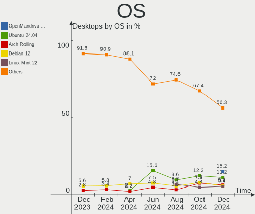
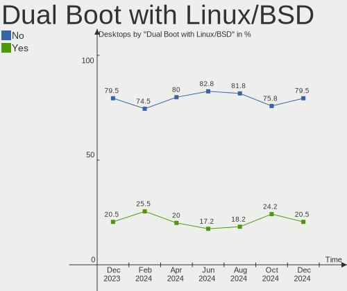
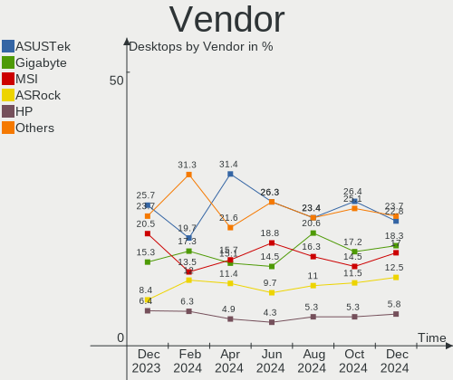
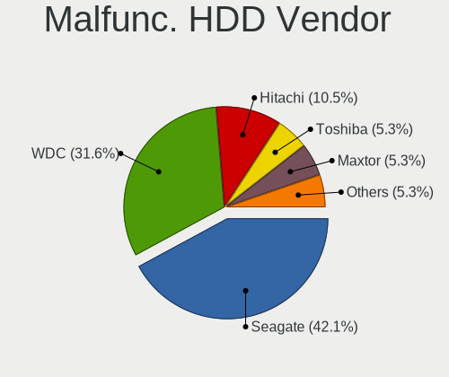
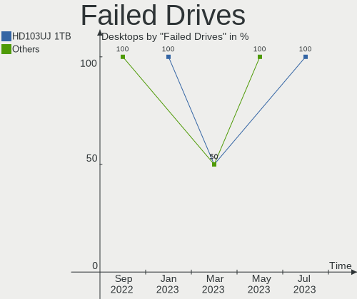
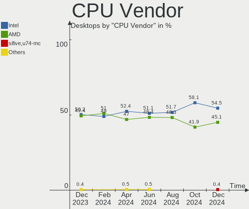
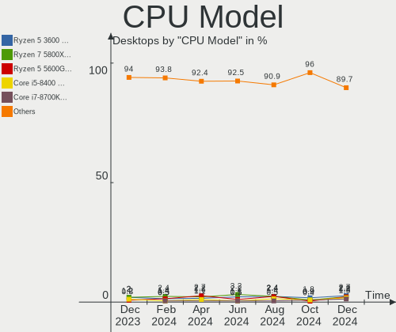
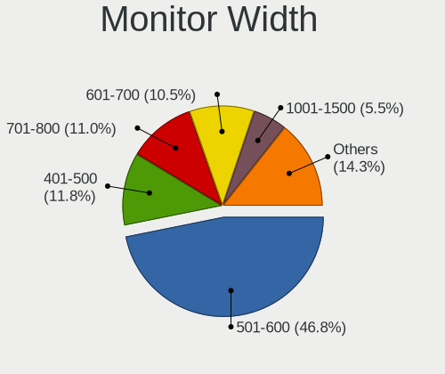
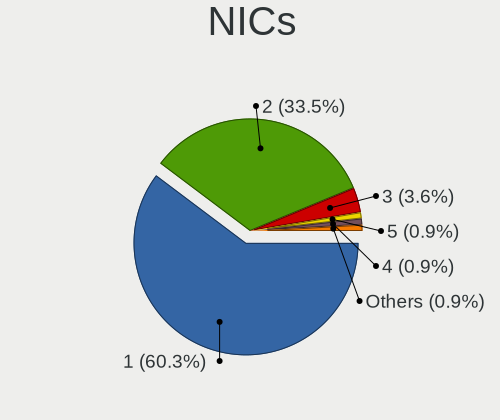
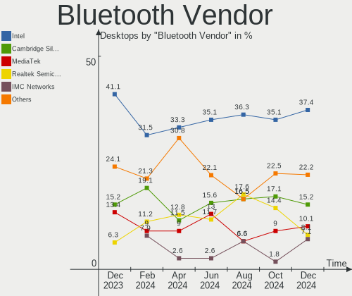

Linux in Germany - Hardware Trends (Desktops)
---------------------------------------------

A project to identify most popular hardware characteristics and track their change
over time based on data collected by Linux users at https://Linux-Hardware.org.

Anyone can contribute to this report by the [hw-probe](https://github.com/linuxhw/hw-probe) tool:

    sudo -E hw-probe -all -upload

Period: May, 2023.

Contents
--------

* [ System ](#system)
  - [ OS                       ](#os)
  - [ OS Family                ](#os-family)
  - [ Kernel                   ](#kernel)
  - [ Kernel Family            ](#kernel-family)
  - [ Kernel Major Ver.        ](#kernel-major-ver)
  - [ Arch                     ](#arch)
  - [ DE                       ](#de)
  - [ Display Server           ](#display-server)
  - [ Display Manager          ](#display-manager)
  - [ OS Lang                  ](#os-lang)
  - [ Boot Mode                ](#boot-mode)
  - [ Filesystem               ](#filesystem)
  - [ Part. scheme             ](#part-scheme)
  - [ Dual Boot with Linux/BSD ](#dual-boot-with-linuxbsd)
  - [ Dual Boot (Win)          ](#dual-boot-win)

* [ Board ](#board)
  - [ Vendor                   ](#vendor)
  - [ Model                    ](#model)
  - [ Model Family             ](#model-family)
  - [ MFG Year                 ](#mfg-year)
  - [ Form Factor              ](#form-factor)
  - [ Secure Boot              ](#secure-boot)
  - [ Coreboot                 ](#coreboot)
  - [ RAM Size                 ](#ram-size)
  - [ RAM Used                 ](#ram-used)
  - [ Total Drives             ](#total-drives)
  - [ Has CD-ROM               ](#has-cd-rom)
  - [ Has Ethernet             ](#has-ethernet)
  - [ Has WiFi                 ](#has-wifi)
  - [ Has Bluetooth            ](#has-bluetooth)

* [ Location ](#location)
  - [ Country                  ](#country)
  - [ City                     ](#city)

* [ Drives ](#drives)
  - [ Drive Vendor             ](#drive-vendor)
  - [ Drive Model              ](#drive-model)
  - [ HDD Vendor               ](#hdd-vendor)
  - [ SSD Vendor               ](#ssd-vendor)
  - [ Drive Kind               ](#drive-kind)
  - [ Drive Connector          ](#drive-connector)
  - [ Drive Size               ](#drive-size)
  - [ Space Total              ](#space-total)
  - [ Space Used               ](#space-used)
  - [ Malfunc. Drives          ](#malfunc-drives)
  - [ Malfunc. Drive Vendor    ](#malfunc-drive-vendor)
  - [ Malfunc. HDD Vendor      ](#malfunc-hdd-vendor)
  - [ Malfunc. Drive Kind      ](#malfunc-drive-kind)
  - [ Failed Drives            ](#failed-drives)
  - [ Failed Drive Vendor      ](#failed-drive-vendor)
  - [ Drive Status             ](#drive-status)

* [ Storage controller ](#storage-controller)
  - [ Storage Vendor           ](#storage-vendor)
  - [ Storage Model            ](#storage-model)
  - [ Storage Kind             ](#storage-kind)

* [ Processor ](#processor)
  - [ CPU Vendor               ](#cpu-vendor)
  - [ CPU Model                ](#cpu-model)
  - [ CPU Model Family         ](#cpu-model-family)
  - [ CPU Cores                ](#cpu-cores)
  - [ CPU Sockets              ](#cpu-sockets)
  - [ CPU Threads              ](#cpu-threads)
  - [ CPU Op-Modes             ](#cpu-op-modes)
  - [ CPU Microcode            ](#cpu-microcode)
  - [ CPU Microarch            ](#cpu-microarch)

* [ Graphics ](#graphics)
  - [ GPU Vendor               ](#gpu-vendor)
  - [ GPU Model                ](#gpu-model)
  - [ GPU Combo                ](#gpu-combo)
  - [ GPU Driver               ](#gpu-driver)
  - [ GPU Memory               ](#gpu-memory)

* [ Monitor ](#monitor)
  - [ Monitor Vendor           ](#monitor-vendor)
  - [ Monitor Model            ](#monitor-model)
  - [ Monitor Resolution       ](#monitor-resolution)
  - [ Monitor Diagonal         ](#monitor-diagonal)
  - [ Monitor Width            ](#monitor-width)
  - [ Aspect Ratio             ](#aspect-ratio)
  - [ Monitor Area             ](#monitor-area)
  - [ Pixel Density            ](#pixel-density)
  - [ Multiple Monitors        ](#multiple-monitors)

* [ Network ](#network)
  - [ Net Controller Vendor    ](#net-controller-vendor)
  - [ Net Controller Model     ](#net-controller-model)
  - [ Wireless Vendor          ](#wireless-vendor)
  - [ Wireless Model           ](#wireless-model)
  - [ Ethernet Vendor          ](#ethernet-vendor)
  - [ Ethernet Model           ](#ethernet-model)
  - [ Net Controller Kind      ](#net-controller-kind)
  - [ Used Controller          ](#used-controller)
  - [ NICs                     ](#nics)
  - [ IPv6                     ](#ipv6)

* [ Bluetooth ](#bluetooth)
  - [ Bluetooth Vendor         ](#bluetooth-vendor)
  - [ Bluetooth Model          ](#bluetooth-model)

* [ Sound ](#sound)
  - [ Sound Vendor             ](#sound-vendor)
  - [ Sound Model              ](#sound-model)

* [ Memory ](#memory)
  - [ Memory Vendor            ](#memory-vendor)
  - [ Memory Model             ](#memory-model)
  - [ Memory Kind              ](#memory-kind)
  - [ Memory Form Factor       ](#memory-form-factor)
  - [ Memory Size              ](#memory-size)
  - [ Memory Speed             ](#memory-speed)

* [ Printers & scanners ](#printers--scanners)
  - [ Printer Vendor           ](#printer-vendor)
  - [ Printer Model            ](#printer-model)
  - [ Scanner Vendor           ](#scanner-vendor)
  - [ Scanner Model            ](#scanner-model)

* [ Camera ](#camera)
  - [ Camera Vendor            ](#camera-vendor)
  - [ Camera Model             ](#camera-model)

* [ Security ](#security)
  - [ Fingerprint Vendor       ](#fingerprint-vendor)
  - [ Fingerprint Model        ](#fingerprint-model)
  - [ Chipcard Vendor          ](#chipcard-vendor)
  - [ Chipcard Model           ](#chipcard-model)

* [ Unsupported ](#unsupported)
  - [ Unsupported Devices      ](#unsupported-devices)
  - [ Unsupported Device Types ](#unsupported-device-types)

System
------

OS
--

Installed operating systems

| Name                         | Desktops | Percent |
|------------------------------|----------|---------|
| Ubuntu 22.04                 | 29       | 12.83%  |
| Linux Mint 21.1              | 23       | 10.18%  |
| Debian 11                    | 14       | 6.19%   |
| Ubuntu 23.04                 | 13       | 5.75%   |
| OpenMandriva 23.03           | 12       | 5.31%   |
| Debian 12                    | 10       | 4.42%   |
| Linux Mint 20.3              | 9        | 3.98%   |
| Fedora 38                    | 8        | 3.54%   |
| Pop!_OS 22.04                | 6        | 2.65%   |
| Kubuntu 22.04                | 6        | 2.65%   |
| Gentoo 2.13                  | 6        | 2.65%   |
| Ubuntu 20.04                 | 5        | 2.21%   |
| Ubuntu 22.10                 | 4        | 1.77%   |
| Nobara 37                    | 4        | 1.77%   |
| ArcoLinux Rolling            | 4        | 1.77%   |
| Zorin 16                     | 3        | 1.33%   |
| LMDE 5                       | 3        | 1.33%   |
| Linux Mint 20.2              | 3        | 1.33%   |
| Fedora 37                    | 3        | 1.33%   |
| Arch Rolling                 | 3        | 1.33%   |
| Xubuntu 22.04                | 2        | 0.88%   |
| Ubuntu MATE 22.04            | 2        | 0.88%   |
| ROSA 12.4                    | 2        | 0.88%   |
| openSUSE Tumbleweed-XXXXXXXX | 2        | 0.88%   |
| openSUSE Leap-15.4           | 2        | 0.88%   |
| OpenMandriva 4.90            | 2        | 0.88%   |
| Manjaro 22.1.1               | 2        | 0.88%   |
| Lubuntu 22.04                | 2        | 0.88%   |
| Linux Mint 21                | 2        | 0.88%   |
| Kubuntu 11                   | 2        | 0.88%   |
| Kali 2023.1                  | 2        | 0.88%   |
| Elementary 7                 | 2        | 0.88%   |
| BlackPanther 18.1            | 2        | 0.88%   |
| Zorin 15                     | 1        | 0.44%   |
| Xubuntu 23.04                | 1        | 0.44%   |
| XCP-ng 8.3.0                 | 1        | 0.44%   |
| Ubuntu Unity 22.04           | 1        | 0.44%   |
| Ubuntu Studio 22.10          | 1        | 0.44%   |
| Ubuntu MATE 22.10            | 1        | 0.44%   |
| Ubuntu 18.04                 | 1        | 0.44%   |

OS Family
---------

OS without a version

| Name          | Desktops | Percent |
|---------------|----------|---------|
| Ubuntu        | 52       | 23.01%  |
| Linux Mint    | 38       | 16.81%  |
| Debian        | 24       | 10.62%  |
| OpenMandriva  | 17       | 7.52%   |
| Fedora        | 12       | 5.31%   |
| Kubuntu       | 9        | 3.98%   |
| Pop!_OS       | 6        | 2.65%   |
| Gentoo        | 6        | 2.65%   |
| Nobara        | 5        | 2.21%   |
| Manjaro       | 5        | 2.21%   |
| ArcoLinux     | 5        | 2.21%   |
| Zorin         | 4        | 1.77%   |
| openSUSE      | 4        | 1.77%   |
| Xubuntu       | 3        | 1.33%   |
| Ubuntu MATE   | 3        | 1.33%   |
| ROSA          | 3        | 1.33%   |
| LMDE          | 3        | 1.33%   |
| Arch          | 3        | 1.33%   |
| Lubuntu       | 2        | 0.88%   |
| Linux Lite    | 2        | 0.88%   |
| Kali          | 2        | 0.88%   |
| Elementary    | 2        | 0.88%   |
| BlackPanther  | 2        | 0.88%   |
| XCP-ng        | 1        | 0.44%   |
| Ubuntu Unity  | 1        | 0.44%   |
| Ubuntu Studio | 1        | 0.44%   |
| SolydXK       | 1        | 0.44%   |
| Siduction     | 1        | 0.44%   |
| NixOS         | 1        | 0.44%   |
| MX            | 1        | 0.44%   |
| GetFreeOS     | 1        | 0.44%   |
| Garuda Linux  | 1        | 0.44%   |
| Devuan        | 1        | 0.44%   |
| ChimeraOS     | 1        | 0.44%   |
| CentOS        | 1        | 0.44%   |
| blendOS       | 1        | 0.44%   |
| Alpine        | 1        | 0.44%   |

Kernel
------

Version of the Linux kernel

| Version                           | Desktops | Percent |
|-----------------------------------|----------|---------|
| 5.19.0-41-generic                 | 23       | 10.18%  |
| 5.15.0-71-generic                 | 19       | 8.41%   |
| 5.15.0-72-generic                 | 16       | 7.08%   |
| 6.2.0-20-generic                  | 15       | 6.64%   |
| 6.2.6-desktop-1omv2390            | 12       | 5.31%   |
| 5.19.0-42-generic                 | 12       | 5.31%   |
| 6.1.0-9-amd64                     | 7        | 3.1%    |
| 5.10.0-22-amd64                   | 7        | 3.1%    |
| 6.2.6-76060206-generic            | 6        | 2.65%   |
| 5.4.0-148-generic                 | 6        | 2.65%   |
| 6.2.14-300.fc38.x86_64            | 5        | 2.21%   |
| 6.3.2-arch1-1                     | 4        | 1.77%   |
| 5.10.0-23-amd64                   | 4        | 1.77%   |
| 6.2.14-300.fsync.fc37.x86_64      | 3        | 1.33%   |
| 6.1.26-1-MANJARO                  | 3        | 1.33%   |
| 6.2.14-200.fc37.x86_64            | 2        | 0.88%   |
| 6.1.20-generic-2rosa2021.1-x86_64 | 2        | 0.88%   |
| 6.1.0-7-amd64                     | 2        | 0.88%   |
| 5.4.0-149-generic                 | 2        | 0.88%   |
| 5.15.0-69-generic                 | 2        | 0.88%   |
| 5.15.0-56-generic                 | 2        | 0.88%   |
| 5.15.0-52-generic                 | 2        | 0.88%   |
| 6.3.4-arch1-1                     | 1        | 0.44%   |
| 6.3.3-arch1-1                     | 1        | 0.44%   |
| 6.3.3-1-MANJARO                   | 1        | 0.44%   |
| 6.3.3-060303-generic              | 1        | 0.44%   |
| 6.3.3-0-edge                      | 1        | 0.44%   |
| 6.3.2-zen1-1-zen                  | 1        | 0.44%   |
| 6.3.2-1-default                   | 1        | 0.44%   |
| 6.3.1-x86_64                      | 1        | 0.44%   |
| 6.3.1-arch2-1                     | 1        | 0.44%   |
| 6.3.1-arch1-1                     | 1        | 0.44%   |
| 6.3.1-2-default                   | 1        | 0.44%   |
| 6.3.0-0-amd64                     | 1        | 0.44%   |
| 6.2.15-300.fc38.x86_64            | 1        | 0.44%   |
| 6.2.15-200.fc37.x86_64            | 1        | 0.44%   |
| 6.2.13-arch1-1                    | 1        | 0.44%   |
| 6.2.13-300.fc38.x86_64            | 1        | 0.44%   |
| 6.2.13-1-siduction-amd64          | 1        | 0.44%   |
| 6.2.12-200.fsync.fc37.x86_64      | 1        | 0.44%   |

Kernel Family
-------------

Linux kernel without a distro release

| Version  | Desktops | Percent |
|----------|----------|---------|
| 5.15.0   | 47       | 20.8%   |
| 5.19.0   | 40       | 17.7%   |
| 6.2.6    | 18       | 7.96%   |
| 6.2.0    | 16       | 7.08%   |
| 5.10.0   | 14       | 6.19%   |
| 6.1.0    | 13       | 5.75%   |
| 5.4.0    | 11       | 4.87%   |
| 6.2.14   | 10       | 4.42%   |
| 6.3.2    | 6        | 2.65%   |
| 6.3.3    | 4        | 1.77%   |
| 6.3.1    | 4        | 1.77%   |
| 6.2.13   | 3        | 1.33%   |
| 6.1.27   | 3        | 1.33%   |
| 6.1.26   | 3        | 1.33%   |
| 6.2.15   | 2        | 0.88%   |
| 6.2.11   | 2        | 0.88%   |
| 6.1.20   | 2        | 0.88%   |
| 6.1.19   | 2        | 0.88%   |
| 6.0.0    | 2        | 0.88%   |
| 5.14.21  | 2        | 0.88%   |
| 4.15.0   | 2        | 0.88%   |
| 6.3.4    | 1        | 0.44%   |
| 6.3.0    | 1        | 0.44%   |
| 6.2.12   | 1        | 0.44%   |
| 6.2.10   | 1        | 0.44%   |
| 6.1.8    | 1        | 0.44%   |
| 6.1.4    | 1        | 0.44%   |
| 6.1.30   | 1        | 0.44%   |
| 6.1.29   | 1        | 0.44%   |
| 6.1.1    | 1        | 0.44%   |
| 6.0.14   | 1        | 0.44%   |
| 5.6.14   | 1        | 0.44%   |
| 5.18.13  | 1        | 0.44%   |
| 5.18.12  | 1        | 0.44%   |
| 5.16.13  | 1        | 0.44%   |
| 5.15.94  | 1        | 0.44%   |
| 5.15.102 | 1        | 0.44%   |
| 5.14.0   | 1        | 0.44%   |
| 5.11.12  | 1        | 0.44%   |
| 4.19.0   | 1        | 0.44%   |

Kernel Major Ver.
-----------------

Linux kernel major version

| Version | Desktops | Percent |
|---------|----------|---------|
| 6.2     | 53       | 23.45%  |
| 5.15    | 49       | 21.68%  |
| 5.19    | 40       | 17.7%   |
| 6.1     | 28       | 12.39%  |
| 6.3     | 16       | 7.08%   |
| 5.10    | 14       | 6.19%   |
| 5.4     | 11       | 4.87%   |
| 6.0     | 3        | 1.33%   |
| 5.14    | 3        | 1.33%   |
| 5.18    | 2        | 0.88%   |
| 4.15    | 2        | 0.88%   |
| 5.6     | 1        | 0.44%   |
| 5.16    | 1        | 0.44%   |
| 5.11    | 1        | 0.44%   |
| 4.19    | 1        | 0.44%   |
| 4.18    | 1        | 0.44%   |

Arch
----

OS architecture (x86_64, i586, etc.)

| Name   | Desktops | Percent |
|--------|----------|---------|
| x86_64 | 223      | 98.67%  |
| i686   | 3        | 1.33%   |

DE
--

Desktop Environment

| Name          | Desktops | Percent |
|---------------|----------|---------|
| GNOME         | 87       | 38.5%   |
| KDE5          | 49       | 21.68%  |
| X-Cinnamon    | 32       | 14.16%  |
| Unknown       | 15       | 6.64%   |
| XFCE          | 12       | 5.31%   |
| MATE          | 12       | 5.31%   |
| Cinnamon      | 4        | 1.77%   |
| LXQt          | 3        | 1.33%   |
| i3            | 3        | 1.33%   |
| Pantheon      | 2        | 0.88%   |
| Hyprland      | 2        | 0.88%   |
| Unity         | 1        | 0.44%   |
| LXDE          | 1        | 0.44%   |
| KDE4          | 1        | 0.44%   |
| GNOME Classic | 1        | 0.44%   |
| Budgie        | 1        | 0.44%   |

Display Server
--------------

X11 or Wayland

| Name    | Desktops | Percent |
|---------|----------|---------|
| X11     | 145      | 64.16%  |
| Wayland | 63       | 27.88%  |
| Tty     | 9        | 3.98%   |
| Unknown | 9        | 3.98%   |

Display Manager
---------------

SDDM, LightDM, etc.

| Name    | Desktops | Percent |
|---------|----------|---------|
| Unknown | 85       | 37.61%  |
| GDM3    | 51       | 22.57%  |
| SDDM    | 43       | 19.03%  |
| LightDM | 43       | 19.03%  |
| GDM     | 3        | 1.33%   |
| KDM     | 1        | 0.44%   |

OS Lang
-------

Language

| Lang    | Desktops | Percent |
|---------|----------|---------|
| de_DE   | 172      | 76.11%  |
| en_US   | 33       | 14.6%   |
| C       | 7        | 3.1%    |
| Unknown | 5        | 2.21%   |
| en_GB   | 3        | 1.33%   |
| en_DE   | 2        | 0.88%   |
| C.UTF8  | 2        | 0.88%   |
| ru_RU   | 1        | 0.44%   |
| POSIX   | 1        | 0.44%   |

Boot Mode
---------

EFI or BIOS

| Mode | Desktops | Percent |
|------|----------|---------|
| BIOS | 125      | 55.31%  |
| EFI  | 101      | 44.69%  |

Filesystem
----------

Type of filesystem

| Type    | Desktops | Percent |
|---------|----------|---------|
| Ext4    | 142      | 62.83%  |
| Tmpfs   | 40       | 17.7%   |
| Btrfs   | 27       | 11.95%  |
| Overlay | 10       | 4.42%   |
| Zfs     | 2        | 0.88%   |
| Xfs     | 2        | 0.88%   |
| Ext3    | 2        | 0.88%   |
| Ext2    | 1        | 0.44%   |

Part. scheme
------------

Scheme of partitioning

| Type    | Desktops | Percent |
|---------|----------|---------|
| GPT     | 120      | 53.1%   |
| Unknown | 73       | 32.3%   |
| MBR     | 33       | 14.6%   |

Dual Boot with Linux/BSD
------------------------

Hosting more than one Linux/BSD

| Dual boot | Desktops | Percent |
|-----------|----------|---------|
| No        | 179      | 79.2%   |
| Yes       | 47       | 20.8%   |

Dual Boot (Win)
---------------

Hosting Linux and Windows

| Dual boot | Desktops | Percent |
|-----------|----------|---------|
| No        | 157      | 69.47%  |
| Yes       | 69       | 30.53%  |

Board
-----

Vendor
------

Motherboard manufacturer

| Name                | Desktops | Percent |
|---------------------|----------|---------|
| ASUSTek Computer    | 62       | 27.43%  |
| Gigabyte Technology | 43       | 19.03%  |
| MSI                 | 26       | 11.5%   |
| ASRock              | 26       | 11.5%   |
| Dell                | 12       | 5.31%   |
| Hewlett-Packard     | 10       | 4.42%   |
| Lenovo              | 6        | 2.65%   |
| Fujitsu             | 6        | 2.65%   |
| Acer                | 6        | 2.65%   |
| Medion              | 5        | 2.21%   |
| Unknown             | 4        | 1.77%   |
| Fujitsu Siemens     | 3        | 1.33%   |
| ZOTAC               | 2        | 0.88%   |
| Foxconn             | 2        | 0.88%   |
| AMI                 | 2        | 0.88%   |
| YANYU               | 1        | 0.44%   |
| TYAN Computer       | 1        | 0.44%   |
| Pegatron            | 1        | 0.44%   |
| Packard Bell        | 1        | 0.44%   |
| Inventec            | 1        | 0.44%   |
| Intel               | 1        | 0.44%   |
| ECS                 | 1        | 0.44%   |
| Biostar             | 1        | 0.44%   |
| BESSTAR Tech        | 1        | 0.44%   |
| AZW                 | 1        | 0.44%   |
| ASRockRack          | 1        | 0.44%   |

Model
-----

Motherboard model

| Name                             | Desktops | Percent |
|----------------------------------|----------|---------|
| Unknown                          | 6        | 2.65%   |
| MSI MS-7A38                      | 4        | 1.77%   |
| MSI MS-7B86                      | 3        | 1.33%   |
| HP EliteDesk 800 G2 DM 35W       | 3        | 1.33%   |
| Gigabyte X570 AORUS ELITE        | 3        | 1.33%   |
| ASUS PRIME B450-PLUS             | 3        | 1.33%   |
| MSI MS-7309                      | 2        | 0.88%   |
| Gigabyte B450 AORUS M            | 2        | 0.88%   |
| Fujitsu Siemens ESPRIMO P5730    | 2        | 0.88%   |
| Dell Precision T1700             | 2        | 0.88%   |
| ASUS TUF Gaming X570-PLUS        | 2        | 0.88%   |
| ASUS ROG STRIX B550-F GAMING     | 2        | 0.88%   |
| ASUS PRIME B350-PLUS             | 2        | 0.88%   |
| ASRock B450 Gaming-ITX/ac        | 2        | 0.88%   |
| ASRock 970 Pro3 R2.0             | 2        | 0.88%   |
| YANYU EPIC-N56_I522E Ver         | 1        | 0.44%   |
| TYAN VT82C694T                   | 1        | 0.44%   |
| Pegatron Elite 7300 Series MT    | 1        | 0.44%   |
| Packard Bell IMEDIA D6001 GE AIO | 1        | 0.44%   |
| MSI MS-7D91                      | 1        | 0.44%   |
| MSI MS-7D11                      | 1        | 0.44%   |
| MSI MS-7C95                      | 1        | 0.44%   |
| MSI MS-7C86                      | 1        | 0.44%   |
| MSI MS-7C82                      | 1        | 0.44%   |
| MSI MS-7C56                      | 1        | 0.44%   |
| MSI MS-7C02                      | 1        | 0.44%   |
| MSI MS-7B92                      | 1        | 0.44%   |
| MSI MS-7B85                      | 1        | 0.44%   |
| MSI MS-7B79                      | 1        | 0.44%   |
| MSI MS-7A33                      | 1        | 0.44%   |
| MSI MS-7821                      | 1        | 0.44%   |
| MSI MS-7721                      | 1        | 0.44%   |
| MSI MS-7693                      | 1        | 0.44%   |
| MSI MS-7681                      | 1        | 0.44%   |
| MSI MS-7680                      | 1        | 0.44%   |
| MSI MS-7589                      | 1        | 0.44%   |
| Medion S23003                    | 1        | 0.44%   |
| Medion MS-7621                   | 1        | 0.44%   |
| Medion MD34100/2543              | 1        | 0.44%   |
| Medion BTDD-LT                   | 1        | 0.44%   |

Model Family
------------

Motherboard model prefix

| Name                    | Desktops | Percent |
|-------------------------|----------|---------|
| ASUS ROG                | 16       | 7.08%   |
| ASUS PRIME              | 11       | 4.87%   |
| Dell OptiPlex           | 6        | 2.65%   |
| Unknown                 | 6        | 2.65%   |
| ASUS TUF                | 5        | 2.21%   |
| MSI MS-7A38             | 4        | 1.77%   |
| HP EliteDesk            | 4        | 1.77%   |
| Gigabyte X570           | 4        | 1.77%   |
| Fujitsu ESPRIMO         | 4        | 1.77%   |
| Dell Precision          | 4        | 1.77%   |
| MSI MS-7B86             | 3        | 1.33%   |
| Lenovo ThinkCentre      | 3        | 1.33%   |
| HP Pavilion             | 3        | 1.33%   |
| HP Compaq               | 3        | 1.33%   |
| Gigabyte Z390           | 3        | 1.33%   |
| Gigabyte B550           | 3        | 1.33%   |
| Gigabyte B450           | 3        | 1.33%   |
| Fujitsu Siemens ESPRIMO | 3        | 1.33%   |
| ASUS SABERTOOTH         | 3        | 1.33%   |
| MSI MS-7309             | 2        | 0.88%   |
| Lenovo ThinkStation     | 2        | 0.88%   |
| Gigabyte GA-78LMT-USB3  | 2        | 0.88%   |
| Gigabyte B550M          | 2        | 0.88%   |
| Gigabyte AX370-Gaming   | 2        | 0.88%   |
| ASUS P5Q                | 2        | 0.88%   |
| ASUS M5A78L-M           | 2        | 0.88%   |
| ASRock B450             | 2        | 0.88%   |
| ASRock 970              | 2        | 0.88%   |
| Acer Veriton            | 2        | 0.88%   |
| Acer Predator           | 2        | 0.88%   |
| Acer Aspire             | 2        | 0.88%   |
| YANYU EPIC-N56          | 1        | 0.44%   |
| TYAN VT82C694T          | 1        | 0.44%   |
| Pegatron Elite          | 1        | 0.44%   |
| Packard Bell IMEDIA     | 1        | 0.44%   |
| MSI MS-7D91             | 1        | 0.44%   |
| MSI MS-7D11             | 1        | 0.44%   |
| MSI MS-7C95             | 1        | 0.44%   |
| MSI MS-7C86             | 1        | 0.44%   |
| MSI MS-7C82             | 1        | 0.44%   |

MFG Year
--------

Motherboard manufacture year

| Year | Desktops | Percent |
|------|----------|---------|
| 2018 | 28       | 12.39%  |
| 2020 | 26       | 11.5%   |
| 2019 | 19       | 8.41%   |
| 2013 | 19       | 8.41%   |
| 2017 | 16       | 7.08%   |
| 2012 | 14       | 6.19%   |
| 2009 | 14       | 6.19%   |
| 2021 | 13       | 5.75%   |
| 2022 | 12       | 5.31%   |
| 2011 | 12       | 5.31%   |
| 2014 | 11       | 4.87%   |
| 2015 | 8        | 3.54%   |
| 2010 | 8        | 3.54%   |
| 2023 | 6        | 2.65%   |
| 2016 | 6        | 2.65%   |
| 2008 | 6        | 2.65%   |
| 2007 | 5        | 2.21%   |
| 2006 | 2        | 0.88%   |
| 2002 | 1        | 0.44%   |

Form Factor
-----------

Physical design of the computer

| Name    | Desktops | Percent |
|---------|----------|---------|
| Desktop | 226      | 100%    |

Secure Boot
-----------

Enabled or disabled

| State    | Desktops | Percent |
|----------|----------|---------|
| Disabled | 219      | 96.9%   |
| Enabled  | 7        | 3.1%    |

Coreboot
--------

Have coreboot on board

| Used | Desktops | Percent |
|------|----------|---------|
| No   | 226      | 100%    |

RAM Size
--------

Total RAM memory

| Size in GB      | Desktops | Percent |
|-----------------|----------|---------|
| 16.01-24.0      | 54       | 23.89%  |
| 8.01-16.0       | 45       | 19.91%  |
| 32.01-64.0      | 43       | 19.03%  |
| 3.01-4.0        | 26       | 11.5%   |
| 4.01-8.0        | 25       | 11.06%  |
| 64.01-256.0     | 17       | 7.52%   |
| 24.01-32.0      | 10       | 4.42%   |
| 1.01-2.0        | 3        | 1.33%   |
| 2.01-3.0        | 2        | 0.88%   |
| More than 256.0 | 1        | 0.44%   |

RAM Used
--------

Used RAM memory

| Used GB    | Desktops | Percent |
|------------|----------|---------|
| 1.01-2.0   | 85       | 37.61%  |
| 2.01-3.0   | 52       | 23.01%  |
| 4.01-8.0   | 45       | 19.91%  |
| 3.01-4.0   | 21       | 9.29%   |
| 0.51-1.0   | 9        | 3.98%   |
| 8.01-16.0  | 7        | 3.1%    |
| 0.01-0.5   | 4        | 1.77%   |
| 16.01-24.0 | 3        | 1.33%   |

Total Drives
------------

Number of drives on board

| Drives | Desktops | Percent |
|--------|----------|---------|
| 2      | 65       | 28.76%  |
| 1      | 65       | 28.76%  |
| 3      | 42       | 18.58%  |
| 4      | 24       | 10.62%  |
| 6      | 13       | 5.75%   |
| 5      | 10       | 4.42%   |
| 7      | 3        | 1.33%   |
| 0      | 3        | 1.33%   |
| 9      | 1        | 0.44%   |

Has CD-ROM
----------

Has CD-ROM on board

| Presented | Desktops | Percent |
|-----------|----------|---------|
| No        | 117      | 51.77%  |
| Yes       | 109      | 48.23%  |

Has Ethernet
------------

Has Ethernet on board

| Presented | Desktops | Percent |
|-----------|----------|---------|
| Yes       | 225      | 99.56%  |
| No        | 1        | 0.44%   |

Has WiFi
--------

Has WiFi module

| Presented | Desktops | Percent |
|-----------|----------|---------|
| No        | 117      | 51.77%  |
| Yes       | 109      | 48.23%  |

Has Bluetooth
-------------

Has Bluetooth module

| Presented | Desktops | Percent |
|-----------|----------|---------|
| No        | 141      | 62.39%  |
| Yes       | 85       | 37.61%  |

Location
--------

Country
-------

Geographic location (country)

| Country | Desktops | Percent |
|---------|----------|---------|
| Germany | 226      | 100%    |

City
----

Geographic location (city)

| City                 | Desktops | Percent |
|----------------------|----------|---------|
| Berlin               | 16       | 7.08%   |
| Hamburg              | 13       | 5.75%   |
| Munich               | 8        | 3.54%   |
| Hanover              | 7        | 3.1%    |
| Essen                | 6        | 2.65%   |
| Dortmund             | 5        | 2.21%   |
| Nuremberg            | 4        | 1.77%   |
| Frankfurt am Main    | 4        | 1.77%   |
| Düsseldorf          | 4        | 1.77%   |
| Siegsdorf            | 3        | 1.33%   |
| Landau               | 3        | 1.33%   |
| Karlsruhe            | 3        | 1.33%   |
| Gladbeck             | 3        | 1.33%   |
| Dresden              | 3        | 1.33%   |
| Delligsen            | 3        | 1.33%   |
| Cologne              | 3        | 1.33%   |
| Straubing            | 2        | 0.88%   |
| Singen               | 2        | 0.88%   |
| Rostock              | 2        | 0.88%   |
| Rheinfelden          | 2        | 0.88%   |
| Peine                | 2        | 0.88%   |
| Ober-Morlen          | 2        | 0.88%   |
| Neunkirchen          | 2        | 0.88%   |
| Munster              | 2        | 0.88%   |
| Mannheim             | 2        | 0.88%   |
| Lahr                 | 2        | 0.88%   |
| Kiel                 | 2        | 0.88%   |
| Jena                 | 2        | 0.88%   |
| Ingolstadt           | 2        | 0.88%   |
| Hamm                 | 2        | 0.88%   |
| Freiburg im Breisgau | 2        | 0.88%   |
| Bonn                 | 2        | 0.88%   |
| Bielefeld            | 2        | 0.88%   |
| Aachen               | 2        | 0.88%   |
| Würzburg            | 1        | 0.44%   |
| Wuppertal            | 1        | 0.44%   |
| Wolfsburg            | 1        | 0.44%   |
| Wittingen            | 1        | 0.44%   |
| Wismar               | 1        | 0.44%   |
| Werdau               | 1        | 0.44%   |

Drives
------

Drive Vendor
------------

Hard drive vendors

| Vendor                      | Desktops | Drives | Percent |
|-----------------------------|----------|--------|---------|
| Samsung Electronics         | 94       | 149    | 21.12%  |
| WDC                         | 61       | 78     | 13.71%  |
| Seagate                     | 57       | 84     | 12.81%  |
| SanDisk                     | 41       | 50     | 9.21%   |
| Crucial                     | 29       | 36     | 6.52%   |
| Toshiba                     | 24       | 30     | 5.39%   |
| Intenso                     | 21       | 23     | 4.72%   |
| Kingston                    | 14       | 14     | 3.15%   |
| Hitachi                     | 14       | 16     | 3.15%   |
| Unknown                     | 8        | 11     | 1.8%    |
| Micron/Crucial Technology   | 6        | 7      | 1.35%   |
| Transcend                   | 5        | 5      | 1.12%   |
| China                       | 5        | 5      | 1.12%   |
| Patriot                     | 4        | 4      | 0.9%    |
| A-DATA Technology           | 4        | 4      | 0.9%    |
| SK hynix                    | 3        | 3      | 0.67%   |
| Kingston Technology Company | 3        | 3      | 0.67%   |
| Intel                       | 3        | 3      | 0.67%   |
| HGST                        | 3        | 4      | 0.67%   |
| XPG                         | 2        | 2      | 0.45%   |
| WD MediaMax                 | 2        | 2      | 0.45%   |
| Silicon Motion              | 2        | 2      | 0.45%   |
| PNY                         | 2        | 2      | 0.45%   |
| Phison Electronics          | 2        | 2      | 0.45%   |
| Phison                      | 2        | 2      | 0.45%   |
| Micron Technology           | 2        | 2      | 0.45%   |
| LITEONIT                    | 2        | 2      | 0.45%   |
| Inateck                     | 2        | 2      | 0.45%   |
| Fujitsu                     | 2        | 2      | 0.45%   |
| ASMT                        | 2        | 2      | 0.45%   |
| Verbatim                    | 1        | 2      | 0.22%   |
| V7                          | 1        | 1      | 0.22%   |
| USB                         | 1        | 1      | 0.22%   |
| TrekStor                    | 1        | 1      | 0.22%   |
| Team                        | 1        | 1      | 0.22%   |
| SPCC                        | 1        | 1      | 0.22%   |
| Seagate Technology          | 1        | 1      | 0.22%   |
| SD                          | 1        | 1      | 0.22%   |
| SABRENT                     | 1        | 1      | 0.22%   |
| Plextor                     | 1        | 1      | 0.22%   |

Drive Model
-----------

Hard drive models

| Model                                               | Desktops | Percent |
|-----------------------------------------------------|----------|---------|
| Samsung NVMe SSD Controller SM981/PM981/PM983 256GB | 19       | 3.54%   |
| Samsung NVMe SSD Controller PM9A1/PM9A3/980PRO 1TB  | 11       | 2.05%   |
| Samsung SSD 860 EVO 500GB                           | 7        | 1.31%   |
| Toshiba DT01ACA100 1TB                              | 6        | 1.12%   |
| Seagate ST2000DM008-2FR102 2TB                      | 5        | 0.93%   |
| SanDisk SSD PLUS 480GB                              | 5        | 0.93%   |
| Samsung SSD 980 1TB                                 | 5        | 0.93%   |
| Samsung SSD 850 EVO 500GB                           | 5        | 0.93%   |
| Samsung SSD 850 EVO 250GB                           | 5        | 0.93%   |
| Micron/Crucial P2 NVMe PCIe SSD 1TB                 | 5        | 0.93%   |
| WDC WD20EZRZ-00Z5HB0 2TB                            | 4        | 0.75%   |
| Seagate ST4000DM004-2CV104 4TB                      | 4        | 0.75%   |
| Seagate ST1000DM003-1ER162 1TB                      | 4        | 0.75%   |
| SanDisk SSD PLUS 240GB                              | 4        | 0.75%   |
| SanDisk SSD PLUS 120GB                              | 4        | 0.75%   |
| SanDisk SSD PLUS 1000GB                             | 4        | 0.75%   |
| Samsung SSD 870 QVO 1TB                             | 4        | 0.75%   |
| Samsung SSD 860 EVO 1TB                             | 4        | 0.75%   |
| Samsung NVMe SSD Controller SM961/PM961/SM963 256GB | 4        | 0.75%   |
| Crucial CT500MX500SSD1 500GB                        | 4        | 0.75%   |
| WDC WD20EARX-00PASB0 2TB                            | 3        | 0.56%   |
| Unknown SD/MMC/MS PRO 64GB                          | 3        | 0.56%   |
| Toshiba HDWD110 1TB                                 | 3        | 0.56%   |
| Toshiba DT01ACA200 2TB                              | 3        | 0.56%   |
| Seagate ST2000DM001-1CH164 2TB                      | 3        | 0.56%   |
| Seagate ST1000DM010-2EP102 1TB                      | 3        | 0.56%   |
| Seagate ST1000DM003-1CH162 1TB                      | 3        | 0.56%   |
| Sandisk WD Black SN750 / PC SN730 NVMe SSD 256GB    | 3        | 0.56%   |
| Samsung SSD 850 EVO 1TB                             | 3        | 0.56%   |
| Samsung SSD 840 Series 120GB                        | 3        | 0.56%   |
| Samsung SSD 840 EVO 250GB                           | 3        | 0.56%   |
| Samsung SSD 840 EVO 120GB                           | 3        | 0.56%   |
| Kingston SV300S37A60G 64GB SSD                      | 3        | 0.56%   |
| Kingston SA400S37120G 120GB SSD                     | 3        | 0.56%   |
| Intenso SSD 256GB                                   | 3        | 0.56%   |
| Crucial CT2000BX500SSD1 2TB                         | 3        | 0.56%   |
| Crucial CT1000MX500SSD1 1TB                         | 3        | 0.56%   |
| Crucial CT1000BX500SSD1 1TB                         | 3        | 0.56%   |
| WDC WDS500G2B0A-00SM50 500GB SSD                    | 2        | 0.37%   |
| WDC WDS480G2G0A-00JH30 480GB SSD                    | 2        | 0.37%   |

HDD Vendor
----------

Hard disk drive vendors

| Vendor              | Desktops | Drives | Percent |
|---------------------|----------|--------|---------|
| Seagate             | 56       | 83     | 31.46%  |
| WDC                 | 54       | 67     | 30.34%  |
| Toshiba             | 23       | 29     | 12.92%  |
| Samsung Electronics | 18       | 22     | 10.11%  |
| Hitachi             | 14       | 16     | 7.87%   |
| Unknown             | 3        | 3      | 1.69%   |
| HGST                | 3        | 4      | 1.69%   |
| Fujitsu             | 2        | 2      | 1.12%   |
| WD MediaMax         | 1        | 1      | 0.56%   |
| USB                 | 1        | 1      | 0.56%   |
| Intenso             | 1        | 1      | 0.56%   |
| FSR202              | 1        | 1      | 0.56%   |
| ASMT                | 1        | 1      | 0.56%   |

SSD Vendor
----------

Solid state drive vendors

| Vendor              | Desktops | Drives | Percent |
|---------------------|----------|--------|---------|
| Samsung Electronics | 48       | 66     | 25.26%  |
| SanDisk             | 35       | 42     | 18.42%  |
| Crucial             | 28       | 33     | 14.74%  |
| Intenso             | 17       | 19     | 8.95%   |
| Kingston            | 11       | 11     | 5.79%   |
| WDC                 | 8        | 9      | 4.21%   |
| China               | 5        | 5      | 2.63%   |
| A-DATA Technology   | 4        | 4      | 2.11%   |
| Transcend           | 3        | 3      | 1.58%   |
| Patriot             | 3        | 3      | 1.58%   |
| PNY                 | 2        | 2      | 1.05%   |
| Phison              | 2        | 2      | 1.05%   |
| Micron Technology   | 2        | 2      | 1.05%   |
| LITEONIT            | 2        | 2      | 1.05%   |
| Intel               | 2        | 2      | 1.05%   |
| Verbatim            | 1        | 2      | 0.53%   |
| V7                  | 1        | 1      | 0.53%   |
| TrekStor            | 1        | 1      | 0.53%   |
| Toshiba             | 1        | 1      | 0.53%   |
| Team                | 1        | 1      | 0.53%   |
| SPCC                | 1        | 1      | 0.53%   |
| SK hynix            | 1        | 1      | 0.53%   |
| SD                  | 1        | 1      | 0.53%   |
| SABRENT             | 1        | 1      | 0.53%   |
| Plextor             | 1        | 1      | 0.53%   |
| Netac               | 1        | 1      | 0.53%   |
| Mushkin             | 1        | 1      | 0.53%   |
| Leven               | 1        | 1      | 0.53%   |
| KingDian            | 1        | 1      | 0.53%   |
| Innodisk            | 1        | 1      | 0.53%   |
| GeIL                | 1        | 1      | 0.53%   |
| Fanxiang            | 1        | 1      | 0.53%   |
| ASMT                | 1        | 1      | 0.53%   |

Drive Kind
----------

HDD or SSD

| Kind    | Desktops | Drives | Percent |
|---------|----------|--------|---------|
| SSD     | 146      | 224    | 38.93%  |
| HDD     | 139      | 231    | 37.07%  |
| NVMe    | 77       | 104    | 20.53%  |
| Unknown | 11       | 15     | 2.93%   |
| MMC     | 2        | 2      | 0.53%   |

Drive Connector
---------------

SATA, SAS, NVMe, etc.

| Type | Desktops | Drives | Percent |
|------|----------|--------|---------|
| SATA | 204      | 444    | 67.55%  |
| NVMe | 76       | 102    | 25.17%  |
| SAS  | 20       | 28     | 6.62%   |
| MMC  | 2        | 2      | 0.66%   |

Drive Size
----------

Size of hard drive

| Size in TB | Desktops | Drives | Percent |
|------------|----------|--------|---------|
| 0.01-0.5   | 140      | 219    | 44.3%   |
| 0.51-1.0   | 95       | 126    | 30.06%  |
| 1.01-2.0   | 45       | 60     | 14.24%  |
| 3.01-4.0   | 21       | 28     | 6.65%   |
| 4.01-10.0  | 8        | 13     | 2.53%   |
| 2.01-3.0   | 6        | 8      | 1.9%    |
| 10.01-20.0 | 1        | 1      | 0.32%   |

Space Total
-----------

Amount of disk space available on the file system

| Size in GB     | Desktops | Percent |
|----------------|----------|---------|
| 101-250        | 53       | 23.45%  |
| More than 3000 | 38       | 16.81%  |
| 501-1000       | 34       | 15.04%  |
| 251-500        | 32       | 14.16%  |
| 1001-2000      | 26       | 11.5%   |
| 2001-3000      | 14       | 6.19%   |
| 1-20           | 11       | 4.87%   |
| Unknown        | 8        | 3.54%   |
| 51-100         | 7        | 3.1%    |
| 21-50          | 3        | 1.33%   |

Space Used
----------

Amount of used disk space

| Used GB        | Desktops | Percent |
|----------------|----------|---------|
| 1-20           | 66       | 29.2%   |
| 21-50          | 32       | 14.16%  |
| 101-250        | 30       | 13.27%  |
| 251-500        | 26       | 11.5%   |
| 1001-2000      | 19       | 8.41%   |
| More than 3000 | 15       | 6.64%   |
| 501-1000       | 12       | 5.31%   |
| 51-100         | 11       | 4.87%   |
| Unknown        | 8        | 3.54%   |
| 2001-3000      | 7        | 3.1%    |

Malfunc. Drives
---------------

Drive models with a malfunction

| Model                                 | Desktops | Drives | Percent |
|---------------------------------------|----------|--------|---------|
| WDC WDS480G2G0A-00JH30 480GB SSD      | 1        | 2      | 4.17%   |
| WDC WD5000AAKX-75U6AA0 500GB          | 1        | 1      | 4.17%   |
| WDC WD5000AAKS-007AA0 500GB           | 1        | 1      | 4.17%   |
| WDC WD20EZRZ-00Z5HB0 2TB              | 1        | 1      | 4.17%   |
| WDC WD20EFRX-68EUZN0 2TB              | 1        | 2      | 4.17%   |
| WDC WD20EARS-00MVWB0 2TB              | 1        | 1      | 4.17%   |
| WDC WD10EZRX-00A8LB0 1TB              | 1        | 1      | 4.17%   |
| WDC WD10EADS-11M2B3 1TB               | 1        | 1      | 4.17%   |
| WD MediaMax WL1500GSA6472B 1TB        | 1        | 1      | 4.17%   |
| Toshiba DT01ACA200 2TB                | 1        | 1      | 4.17%   |
| Seagate ST4000DM005-2DP166 4TB        | 1        | 2      | 4.17%   |
| Seagate ST380011A 80GB                | 1        | 1      | 4.17%   |
| Seagate ST3250410AS 250GB             | 1        | 1      | 4.17%   |
| Seagate ST2000DM001-1E6164 2TB        | 1        | 1      | 4.17%   |
| Seagate ST1000DM003-9YN162 1TB        | 1        | 1      | 4.17%   |
| SanDisk SSD PLUS 480GB                | 1        | 1      | 4.17%   |
| SanDisk SSD PLUS 240GB                | 1        | 1      | 4.17%   |
| SanDisk SSD PLUS 1000GB               | 1        | 1      | 4.17%   |
| SanDisk SDSSDA-2T00 2TB               | 1        | 1      | 4.17%   |
| Samsung Electronics SSD 870 EVO 250GB | 1        | 1      | 4.17%   |
| Samsung Electronics HD501LJ 500GB     | 1        | 1      | 4.17%   |
| Intenso SSD 256GB                     | 1        | 1      | 4.17%   |
| Hitachi HTS721080G9SA00 80GB          | 1        | 1      | 4.17%   |
| Crucial CT120M500SSD1 120GB           | 1        | 1      | 4.17%   |

Malfunc. Drive Vendor
---------------------

Vendors of faulty drives

| Vendor              | Desktops | Drives | Percent |
|---------------------|----------|--------|---------|
| WDC                 | 8        | 10     | 34.78%  |
| Seagate             | 5        | 6      | 21.74%  |
| SanDisk             | 3        | 4      | 13.04%  |
| Samsung Electronics | 2        | 2      | 8.7%    |
| WD MediaMax         | 1        | 1      | 4.35%   |
| Toshiba             | 1        | 1      | 4.35%   |
| Intenso             | 1        | 1      | 4.35%   |
| Hitachi             | 1        | 1      | 4.35%   |
| Crucial             | 1        | 1      | 4.35%   |

Malfunc. HDD Vendor
-------------------

Vendors of faulty HDD drives

| Vendor              | Desktops | Drives | Percent |
|---------------------|----------|--------|---------|
| WDC                 | 7        | 8      | 43.75%  |
| Seagate             | 5        | 6      | 31.25%  |
| WD MediaMax         | 1        | 1      | 6.25%   |
| Toshiba             | 1        | 1      | 6.25%   |
| Samsung Electronics | 1        | 1      | 6.25%   |
| Hitachi             | 1        | 1      | 6.25%   |

Malfunc. Drive Kind
-------------------

Kinds of faulty drives

| Kind | Desktops | Drives | Percent |
|------|----------|--------|---------|
| HDD  | 16       | 18     | 69.57%  |
| SSD  | 7        | 9      | 30.43%  |

Failed Drives
-------------

Failed drive models

| Model                   | Desktops | Drives | Percent |
|-------------------------|----------|--------|---------|
| Toshiba MK3265GSX 320GB | 1        | 1      | 100%    |

Failed Drive Vendor
-------------------

Failed drive vendors

| Vendor  | Desktops | Drives | Percent |
|---------|----------|--------|---------|
| Toshiba | 1        | 1      | 100%    |

Drive Status
------------

Number of failed and malfunc. drives

| Status   | Desktops | Drives | Percent |
|----------|----------|--------|---------|
| Detected | 129      | 331    | 51.6%   |
| Works    | 99       | 217    | 39.6%   |
| Malfunc  | 21       | 27     | 8.4%    |
| Failed   | 1        | 1      | 0.4%    |

Storage controller
------------------

Storage Vendor
--------------

Storage controller vendors

| Vendor                       | Desktops | Percent |
|------------------------------|----------|---------|
| Intel                        | 112      | 32.37%  |
| AMD                          | 101      | 29.19%  |
| Samsung Electronics          | 48       | 13.87%  |
| ASMedia Technology           | 11       | 3.18%   |
| Nvidia                       | 10       | 2.89%   |
| SanDisk                      | 9        | 2.6%    |
| Micron/Crucial Technology    | 8        | 2.31%   |
| JMicron Technology           | 8        | 2.31%   |
| Kingston Technology Company  | 7        | 2.02%   |
| Marvell Technology Group     | 6        | 1.73%   |
| Adaptec                      | 6        | 1.73%   |
| VIA Technologies             | 3        | 0.87%   |
| Phison Electronics           | 3        | 0.87%   |
| ADATA Technology             | 3        | 0.87%   |
| Transcend                    | 2        | 0.58%   |
| SK hynix                     | 2        | 0.58%   |
| Silicon Motion               | 2        | 0.58%   |
| LSI Logic / Symbios Logic    | 2        | 0.58%   |
| Toshiba America Info Systems | 1        | 0.29%   |
| Silicon Image                | 1        | 0.29%   |
| Seagate Technology           | 1        | 0.29%   |

Storage Model
-------------

Storage controller models

| Model                                                                          | Desktops | Percent |
|--------------------------------------------------------------------------------|----------|---------|
| AMD FCH SATA Controller [AHCI mode]                                            | 55       | 13%     |
| AMD 400 Series Chipset SATA Controller                                         | 26       | 6.15%   |
| Samsung NVMe SSD Controller SM981/PM981/PM983                                  | 23       | 5.44%   |
| Intel 8 Series/C220 Series Chipset Family 6-port SATA Controller 1 [AHCI mode] | 19       | 4.49%   |
| AMD 500 Series Chipset SATA Controller                                         | 18       | 4.26%   |
| Samsung NVMe SSD Controller PM9A1/PM9A3/980PRO                                 | 14       | 3.31%   |
| AMD SB7x0/SB8x0/SB9x0 SATA Controller [AHCI mode]                              | 12       | 2.84%   |
| ASMedia ASM1062 Serial ATA Controller                                          | 11       | 2.6%    |
| AMD SB7x0/SB8x0/SB9x0 IDE Controller                                           | 10       | 2.36%   |
| Intel Q170/Q150/B150/H170/H110/Z170/CM236 Chipset SATA Controller [AHCI Mode]  | 9        | 2.13%   |
| Intel 200 Series PCH SATA controller [AHCI mode]                               | 9        | 2.13%   |
| AMD 300 Series Chipset SATA Controller                                         | 9        | 2.13%   |
| Intel 6 Series/C200 Series Chipset Family 6 port Desktop SATA AHCI Controller  | 8        | 1.89%   |
| Samsung NVMe SSD Controller SM961/PM961/SM963                                  | 7        | 1.65%   |
| Samsung NVMe SSD Controller 980                                                | 7        | 1.65%   |
| Micron/Crucial P2 NVMe PCIe SSD                                                | 7        | 1.65%   |
| Intel SATA Controller [RAID mode]                                              | 7        | 1.65%   |
| AMD SB7x0/SB8x0/SB9x0 SATA Controller [IDE mode]                               | 6        | 1.42%   |
| Intel Celeron/Pentium Silver Processor SATA Controller                         | 5        | 1.18%   |
| Intel 7 Series/C210 Series Chipset Family 6-port SATA Controller [AHCI mode]   | 5        | 1.18%   |
| Nvidia MCP61 SATA Controller                                                   | 4        | 0.95%   |
| Intel Cannon Lake PCH SATA AHCI Controller                                     | 4        | 0.95%   |
| Intel 500 Series Chipset Family SATA AHCI Controller                           | 4        | 0.95%   |
| Intel 400 Series Chipset Family SATA AHCI Controller                           | 4        | 0.95%   |
| AMD X370 Series Chipset SATA Controller                                        | 4        | 0.95%   |
| SanDisk WD Black SN750 / PC SN730 NVMe SSD                                     | 3        | 0.71%   |
| Kingston Company Company Non-Volatile memory controller                        | 3        | 0.71%   |
| JMicron JMB368 IDE controller                                                  | 3        | 0.71%   |
| JMicron JMB363 SATA/IDE Controller                                             | 3        | 0.71%   |
| Intel Volume Management Device NVMe RAID Controller                            | 3        | 0.71%   |
| Intel NM10/ICH7 Family SATA Controller [IDE mode]                              | 3        | 0.71%   |
| Intel 82801IR/IO/IH (ICH9R/DO/DH) 4 port SATA Controller [IDE mode]            | 3        | 0.71%   |
| Intel 82801I (ICH9 Family) 2 port SATA Controller [IDE mode]                   | 3        | 0.71%   |
| Intel 700 Series Chipset Family SATA AHCI Controller                           | 3        | 0.71%   |
| Intel 4 Series Chipset PT IDER Controller                                      | 3        | 0.71%   |
| VIA VT6415 PATA IDE Host Controller                                            | 2        | 0.47%   |
| Transcend Non-Volatile memory controller                                       | 2        | 0.47%   |
| Sandisk Western Digital WD Black SN850X NVMe SSD                               | 2        | 0.47%   |
| Phison E12 NVMe Controller                                                     | 2        | 0.47%   |
| Nvidia MCP73 IDE Controller                                                    | 2        | 0.47%   |

Storage Kind
------------

Kind of storage controller (IDE, SATA, NVMe, SAS, ...)

| Kind | Desktops | Percent |
|------|----------|---------|
| SATA | 194      | 58.43%  |
| NVMe | 77       | 23.19%  |
| IDE  | 42       | 12.65%  |
| RAID | 16       | 4.82%   |
| SCSI | 3        | 0.9%    |

Processor
---------

CPU Vendor
----------

Processor vendors

| Vendor | Desktops | Percent |
|--------|----------|---------|
| Intel  | 120      | 53.1%   |
| AMD    | 106      | 46.9%   |

CPU Model
---------

Processor models

| Model                                       | Desktops | Percent |
|---------------------------------------------|----------|---------|
| AMD Ryzen 5 2600 Six-Core Processor         | 9        | 3.98%   |
| AMD Ryzen 7 3700X 8-Core Processor          | 6        | 2.65%   |
| AMD Ryzen 5 5600G with Radeon Graphics      | 6        | 2.65%   |
| AMD Ryzen 5 5600X 6-Core Processor          | 5        | 2.21%   |
| AMD Ryzen 5 3600 6-Core Processor           | 5        | 2.21%   |
| Intel Core i5-6500T CPU @ 2.50GHz           | 4        | 1.77%   |
| AMD Ryzen 7 5800X 8-Core Processor          | 4        | 1.77%   |
| Intel Core i3-4130T CPU @ 2.90GHz           | 3        | 1.33%   |
| Intel Celeron J4125 CPU @ 2.00GHz           | 3        | 1.33%   |
| AMD Ryzen 9 5900X 12-Core Processor         | 3        | 1.33%   |
| AMD FX-4300 Quad-Core Processor             | 3        | 1.33%   |
| Intel Pentium Dual CPU E2200 @ 2.20GHz      | 2        | 0.88%   |
| Intel Pentium CPU G620 @ 2.60GHz            | 2        | 0.88%   |
| Intel Core i7-8700K CPU @ 3.70GHz           | 2        | 0.88%   |
| Intel Core i7-6700 CPU @ 3.40GHz            | 2        | 0.88%   |
| Intel Core i7-4790 CPU @ 3.60GHz            | 2        | 0.88%   |
| Intel Core i7-4770 CPU @ 3.40GHz            | 2        | 0.88%   |
| Intel Core i5-7400 CPU @ 3.00GHz            | 2        | 0.88%   |
| Intel Core i5-4590 CPU @ 3.30GHz            | 2        | 0.88%   |
| Intel Core i5-3470 CPU @ 3.20GHz            | 2        | 0.88%   |
| Intel Core i5-2500 CPU @ 3.30GHz            | 2        | 0.88%   |
| Intel Core i5-2400 CPU @ 3.10GHz            | 2        | 0.88%   |
| Intel Core i5-10400F CPU @ 2.90GHz          | 2        | 0.88%   |
| Intel Core i5 CPU 750 @ 2.67GHz             | 2        | 0.88%   |
| Intel Core i3-2120 CPU @ 3.30GHz            | 2        | 0.88%   |
| Intel Core 2 Quad CPU Q9550 @ 2.83GHz       | 2        | 0.88%   |
| Intel Core 2 Quad CPU Q6600 @ 2.40GHz       | 2        | 0.88%   |
| Intel Celeron CPU N3150 @ 1.60GHz           | 2        | 0.88%   |
| Intel Celeron CPU J1900 @ 1.99GHz           | 2        | 0.88%   |
| Intel Atom x5-Z8350 CPU @ 1.44GHz           | 2        | 0.88%   |
| Intel Atom CPU D510 @ 1.66GHz               | 2        | 0.88%   |
| Intel 11th Gen Core i5-11600K @ 3.90GHz     | 2        | 0.88%   |
| AMD Ryzen 9 7900X 12-Core Processor         | 2        | 0.88%   |
| AMD Ryzen 9 3900X 12-Core Processor         | 2        | 0.88%   |
| AMD Ryzen 7 7700 8-Core Processor           | 2        | 0.88%   |
| AMD Ryzen 7 1700X Eight-Core Processor      | 2        | 0.88%   |
| AMD Ryzen 3 2200G with Radeon Vega Graphics | 2        | 0.88%   |
| AMD Phenom II X6 1075T Processor            | 2        | 0.88%   |
| AMD FX-8350 Eight-Core Processor            | 2        | 0.88%   |
| AMD FX-6300 Six-Core Processor              | 2        | 0.88%   |

CPU Model Family
----------------

Processor model prefix

| Model                   | Desktops | Percent |
|-------------------------|----------|---------|
| AMD Ryzen 5             | 37       | 16.37%  |
| Intel Core i5           | 34       | 15.04%  |
| AMD Ryzen 7             | 19       | 8.41%   |
| Intel Core i7           | 16       | 7.08%   |
| Intel Core i3           | 11       | 4.87%   |
| AMD Ryzen 9             | 11       | 4.87%   |
| Other                   | 10       | 4.42%   |
| Intel Celeron           | 10       | 4.42%   |
| AMD FX                  | 9        | 3.98%   |
| Intel Core 2 Quad       | 8        | 3.54%   |
| Intel Xeon              | 7        | 3.1%    |
| Intel Atom              | 6        | 2.65%   |
| Intel Core 2 Duo        | 5        | 2.21%   |
| AMD Athlon II X2        | 5        | 2.21%   |
| Intel Pentium           | 4        | 1.77%   |
| Intel Core i9           | 3        | 1.33%   |
| AMD Ryzen 5 PRO         | 3        | 1.33%   |
| AMD Ryzen 3             | 3        | 1.33%   |
| AMD Phenom II X6        | 3        | 1.33%   |
| AMD A10                 | 3        | 1.33%   |
| Intel Pentium Dual-Core | 2        | 0.88%   |
| Intel Pentium Dual      | 2        | 0.88%   |
| AMD Ryzen Threadripper  | 2        | 0.88%   |
| AMD Phenom II X4        | 2        | 0.88%   |
| AMD Athlon X4           | 2        | 0.88%   |
| Intel Pentium III       | 1        | 0.44%   |
| Intel Genuine           | 1        | 0.44%   |
| AMD Ryzen 3 PRO         | 1        | 0.44%   |
| AMD Phenom II X2        | 1        | 0.44%   |
| AMD GX                  | 1        | 0.44%   |
| AMD G                   | 1        | 0.44%   |
| AMD Athlon II X4        | 1        | 0.44%   |
| AMD Athlon 64 X2        | 1        | 0.44%   |
| AMD A8                  | 1        | 0.44%   |

CPU Cores
---------

Number of processor cores

| Number | Desktops | Percent |
|--------|----------|---------|
| 4      | 85       | 37.61%  |
| 6      | 49       | 21.68%  |
| 2      | 46       | 20.35%  |
| 8      | 22       | 9.73%   |
| 12     | 10       | 4.42%   |
| 24     | 3        | 1.33%   |
| 16     | 3        | 1.33%   |
| 10     | 2        | 0.88%   |
| 3      | 2        | 0.88%   |
| 32     | 1        | 0.44%   |
| 18     | 1        | 0.44%   |
| 14     | 1        | 0.44%   |
| 1      | 1        | 0.44%   |

CPU Sockets
-----------

Number of sockets

| Number | Desktops | Percent |
|--------|----------|---------|
| 1      | 223      | 98.67%  |
| 2      | 3        | 1.33%   |

CPU Threads
-----------

Threads per core (Hyper-Threading)

| Number | Desktops | Percent |
|--------|----------|---------|
| 2      | 137      | 60.62%  |
| 1      | 88       | 38.94%  |
| 4      | 1        | 0.44%   |

CPU Op-Modes
------------

CPU Operation Modes (32-bit, 64-bit)

| Op mode        | Desktops | Percent |
|----------------|----------|---------|
| 32-bit, 64-bit | 224      | 99.12%  |
| 32-bit         | 1        | 0.44%   |
| Unknown        | 1        | 0.44%   |

CPU Microcode
-------------

Microcode number

| Number     | Desktops | Percent |
|------------|----------|---------|
| Unknown    | 93       | 41.15%  |
| 0x306c3    | 10       | 4.42%   |
| 0x0a20120a | 8        | 3.54%   |
| 0x08701021 | 8        | 3.54%   |
| 0x0800820d | 8        | 3.54%   |
| 0x06000852 | 6        | 2.65%   |
| 0x010000c8 | 6        | 2.65%   |
| 0x906ea    | 5        | 2.21%   |
| 0x506e3    | 5        | 2.21%   |
| 0x1067a    | 5        | 2.21%   |
| 0x0a50000d | 5        | 2.21%   |
| 0x0a201016 | 5        | 2.21%   |
| 0x0a601203 | 4        | 1.77%   |
| 0x306a9    | 3        | 1.33%   |
| 0x08001138 | 3        | 1.33%   |
| 0x706a8    | 2        | 0.88%   |
| 0x6fb      | 2        | 0.88%   |
| 0x50654    | 2        | 0.88%   |
| 0x206a7    | 2        | 0.88%   |
| 0x106e5    | 2        | 0.88%   |
| 0x106ca    | 2        | 0.88%   |
| 0x10676    | 2        | 0.88%   |
| 0x0a50000c | 2        | 0.88%   |
| 0x0a201205 | 2        | 0.88%   |
| 0x08001137 | 2        | 0.88%   |
| 0x010000dc | 2        | 0.88%   |
| 0xb06e0    | 1        | 0.44%   |
| 0xa0655    | 1        | 0.44%   |
| 0xa0653    | 1        | 0.44%   |
| 0x906eb    | 1        | 0.44%   |
| 0x906e9    | 1        | 0.44%   |
| 0x906c0    | 1        | 0.44%   |
| 0x90672    | 1        | 0.44%   |
| 0x706a1    | 1        | 0.44%   |
| 0x6fd      | 1        | 0.44%   |
| 0x406c4    | 1        | 0.44%   |
| 0x406c3    | 1        | 0.44%   |
| 0x306f1    | 1        | 0.44%   |
| 0x30678    | 1        | 0.44%   |
| 0x106c2    | 1        | 0.44%   |

CPU Microarch
-------------

Microarchitecture

| Name             | Desktops | Percent |
|------------------|----------|---------|
| Zen 3            | 25       | 11.06%  |
| Haswell          | 22       | 9.73%   |
| Zen 2            | 19       | 8.41%   |
| Skylake          | 17       | 7.52%   |
| Zen+             | 15       | 6.64%   |
| Piledriver       | 12       | 5.31%   |
| K10              | 12       | 5.31%   |
| Zen              | 11       | 4.87%   |
| SandyBridge      | 10       | 4.42%   |
| Penryn           | 10       | 4.42%   |
| KabyLake         | 9        | 3.98%   |
| IvyBridge        | 8        | 3.54%   |
| Core             | 8        | 3.54%   |
| Unknown          | 7        | 3.1%    |
| Silvermont       | 6        | 2.65%   |
| Goldmont plus    | 5        | 2.21%   |
| CometLake        | 5        | 2.21%   |
| Alderlake Hybrid | 5        | 2.21%   |
| Bonnell          | 4        | 1.77%   |
| Nehalem          | 3        | 1.33%   |
| Icelake          | 2        | 0.88%   |
| Westmere         | 1        | 0.44%   |
| Tremont          | 1        | 0.44%   |
| TigerLake        | 1        | 0.44%   |
| Steamroller      | 1        | 0.44%   |
| P6               | 1        | 0.44%   |
| K8 Hammer        | 1        | 0.44%   |
| Jaguar           | 1        | 0.44%   |
| Gracemont        | 1        | 0.44%   |
| Excavator        | 1        | 0.44%   |
| Bulldozer        | 1        | 0.44%   |
| Bobcat           | 1        | 0.44%   |

Graphics
--------

GPU Vendor
----------

Vendors of graphics cards

| Vendor            | Desktops | Percent |
|-------------------|----------|---------|
| AMD               | 88       | 37.93%  |
| Nvidia            | 83       | 35.78%  |
| Intel             | 59       | 25.43%  |
| ASPEED Technology | 2        | 0.86%   |

GPU Model
---------

Graphics card models

| Model                                                                                    | Desktops | Percent |
|------------------------------------------------------------------------------------------|----------|---------|
| AMD Ellesmere [Radeon RX 470/480/570/570X/580/580X/590]                                  | 11       | 4.62%   |
| Intel HD Graphics 530                                                                    | 9        | 3.78%   |
| Nvidia GP107 [GeForce GTX 1050 Ti]                                                       | 8        | 3.36%   |
| AMD Cezanne [Radeon Vega Series / Radeon Vega Mobile Series]                             | 7        | 2.94%   |
| Intel Xeon E3-1200 v3/4th Gen Core Processor Integrated Graphics Controller              | 6        | 2.52%   |
| AMD Raphael                                                                              | 6        | 2.52%   |
| AMD Navi 10 [Radeon RX 5600 OEM/5600 XT / 5700/5700 XT]                                  | 6        | 2.52%   |
| AMD Lexa PRO [Radeon 540/540X/550/550X / RX 540X/550/550X]                               | 6        | 2.52%   |
| Intel GeminiLake [UHD Graphics 600]                                                      | 5        | 2.1%    |
| AMD Navi 23 [Radeon RX 6600/6600 XT/6600M]                                               | 5        | 2.1%    |
| AMD Caicos [Radeon HD 6450/7450/8450 / R5 230 OEM]                                       | 5        | 2.1%    |
| Nvidia GP108 [GeForce GT 1030]                                                           | 4        | 1.68%   |
| Nvidia GM204 [GeForce GTX 970]                                                           | 4        | 1.68%   |
| Nvidia GK208B [GeForce GT 730]                                                           | 4        | 1.68%   |
| Nvidia GK208B [GeForce GT 710]                                                           | 4        | 1.68%   |
| Intel Xeon E3-1200 v2/3rd Gen Core processor Graphics Controller                         | 4        | 1.68%   |
| Intel Atom/Celeron/Pentium Processor x5-E8000/J3xxx/N3xxx Integrated Graphics Controller | 4        | 1.68%   |
| Intel 2nd Generation Core Processor Family Integrated Graphics Controller                | 4        | 1.68%   |
| AMD Vega 10 XL/XT [Radeon RX Vega 56/64]                                                 | 4        | 1.68%   |
| AMD Navi 21 [Radeon RX 6800/6800 XT / 6900 XT]                                           | 4        | 1.68%   |
| Nvidia GP106 [GeForce GTX 1060 6GB]                                                      | 3        | 1.26%   |
| Nvidia GM206 [GeForce GTX 960]                                                           | 3        | 1.26%   |
| Nvidia GM107 [GeForce GTX 750 Ti]                                                        | 3        | 1.26%   |
| Intel CometLake-S GT2 [UHD Graphics 630]                                                 | 3        | 1.26%   |
| Intel 4th Generation Core Processor Family Integrated Graphics Controller                | 3        | 1.26%   |
| AMD RS880 [Radeon HD 4250]                                                               | 3        | 1.26%   |
| AMD Raven Ridge [Radeon Vega Series / Radeon Vega Mobile Series]                         | 3        | 1.26%   |
| AMD Navi 31 [Radeon RX 7900 XT/7900 XTX]                                                 | 3        | 1.26%   |
| Nvidia TU116 [GeForce GTX 1660]                                                          | 2        | 0.84%   |
| Nvidia TU116 [GeForce GTX 1660 SUPER]                                                    | 2        | 0.84%   |
| Nvidia TU104 [GeForce RTX 2070 SUPER]                                                    | 2        | 0.84%   |
| Nvidia GP107 [GeForce GTX 1050]                                                          | 2        | 0.84%   |
| Nvidia GP104 [GeForce GTX 1070]                                                          | 2        | 0.84%   |
| Nvidia GM107GL [Quadro K620]                                                             | 2        | 0.84%   |
| Nvidia GK104 [GeForce GTX 770]                                                           | 2        | 0.84%   |
| Nvidia GF119 [GeForce GT 610]                                                            | 2        | 0.84%   |
| Nvidia GA106 [GeForce RTX 3060 Lite Hash Rate]                                           | 2        | 0.84%   |
| Nvidia GA104 [GeForce RTX 3070 Lite Hash Rate]                                           | 2        | 0.84%   |
| Nvidia GA104 [GeForce RTX 3060 Ti Lite Hash Rate]                                        | 2        | 0.84%   |
| Intel CoffeeLake-S GT2 [UHD Graphics 630]                                                | 2        | 0.84%   |

GPU Combo
---------

Combinations of graphics cards

| Name            | Desktops | Percent |
|-----------------|----------|---------|
| 1 x AMD         | 81       | 35.84%  |
| 1 x Nvidia      | 76       | 33.63%  |
| 1 x Intel       | 57       | 25.22%  |
| 2 x AMD         | 4        | 1.77%   |
| AMD + Nvidia    | 3        | 1.33%   |
| 2 x Nvidia      | 2        | 0.88%   |
| Nvidia + ASPEED | 1        | 0.44%   |
| Intel + Nvidia  | 1        | 0.44%   |
| 1 x ASPEED      | 1        | 0.44%   |

GPU Driver
----------

Free vs proprietary

| Driver      | Desktops | Percent |
|-------------|----------|---------|
| Free        | 165      | 73.01%  |
| Proprietary | 49       | 21.68%  |
| Unknown     | 12       | 5.31%   |

GPU Memory
----------

Total video memory

| Size in GB | Desktops | Percent |
|------------|----------|---------|
| Unknown    | 109      | 48.23%  |
| 1.01-2.0   | 28       | 12.39%  |
| 7.01-8.0   | 25       | 11.06%  |
| 0.01-0.5   | 17       | 7.52%   |
| 3.01-4.0   | 15       | 6.64%   |
| 0.51-1.0   | 14       | 6.19%   |
| 8.01-16.0  | 10       | 4.42%   |
| 5.01-6.0   | 4        | 1.77%   |
| 16.01-24.0 | 2        | 0.88%   |
| 4.01-5.0   | 1        | 0.44%   |
| 2.01-3.0   | 1        | 0.44%   |

Monitor
-------

Monitor Vendor
--------------

Monitor vendors

| Vendor               | Desktops | Percent |
|----------------------|----------|---------|
| Samsung Electronics  | 37       | 15.29%  |
| Goldstar             | 23       | 9.5%    |
| BenQ                 | 23       | 9.5%    |
| Dell                 | 20       | 8.26%   |
| Acer                 | 19       | 7.85%   |
| Ancor Communications | 13       | 5.37%   |
| Philips              | 11       | 4.55%   |
| Hewlett-Packard      | 11       | 4.55%   |
| AOC                  | 11       | 4.55%   |
| Iiyama               | 9        | 3.72%   |
| Medion               | 7        | 2.89%   |
| Lenovo               | 5        | 2.07%   |
| Fujitsu Siemens      | 5        | 2.07%   |
| Eizo                 | 4        | 1.65%   |
| ASUSTek Computer     | 4        | 1.65%   |
| ViewSonic            | 3        | 1.24%   |
| Sony                 | 3        | 1.24%   |
| MSI                  | 3        | 1.24%   |
| LG Electronics       | 3        | 1.24%   |
| Gigabyte Technology  | 3        | 1.24%   |
| HUAWEI               | 2        | 0.83%   |
| Unknown              | 2        | 0.83%   |
| ___                  | 1        | 0.41%   |
| Unknown              | 1        | 0.41%   |
| Toshiba              | 1        | 0.41%   |
| TCL                  | 1        | 0.41%   |
| Sharp                | 1        | 0.41%   |
| SGT                  | 1        | 0.41%   |
| Panasonic            | 1        | 0.41%   |
| ONKYO                | 1        | 0.41%   |
| Mi                   | 1        | 0.41%   |
| Medion Akoya         | 1        | 0.41%   |
| Idek Iiyama          | 1        | 0.41%   |
| HZB                  | 1        | 0.41%   |
| HKC                  | 1        | 0.41%   |
| Hitachi              | 1        | 0.41%   |
| HannStar             | 1        | 0.41%   |
| FUS                  | 1        | 0.41%   |
| Denver               | 1        | 0.41%   |
| DENON                | 1        | 0.41%   |

Monitor Model
-------------

Monitor models

| Model                                                                | Desktops | Percent |
|----------------------------------------------------------------------|----------|---------|
| Philips FTV PHL01EA 1920x1080 1440x810mm 65.0-inch                   | 3        | 1.17%   |
| Goldstar W2242 GSM5677 1680x1050 474x296mm 22.0-inch                 | 3        | 1.17%   |
| BenQ PD2700U BNQ802E 3840x2160 597x336mm 27.0-inch                   | 3        | 1.17%   |
| Sony TV SNYEE01 1920x1080                                            | 2        | 0.78%   |
| Samsung Electronics U28E590 SAM0C4D 1680x1050 610x350mm 27.7-inch    | 2        | 0.78%   |
| Samsung Electronics S24F350 SAM0D20 1920x1080 521x293mm 23.5-inch    | 2        | 0.78%   |
| Iiyama PL2530H IVM6132 1920x1080 544x303mm 24.5-inch                 | 2        | 0.78%   |
| Goldstar Ultra HD GSM5B09 3840x2160 600x340mm 27.2-inch              | 2        | 0.78%   |
| Gigabyte Technology M32U GBT3204 3840x2160 697x392mm 31.5-inch       | 2        | 0.78%   |
| Dell U2312HM DEL4072 1920x1080 510x287mm 23.0-inch                   | 2        | 0.78%   |
| Dell P2415Q DELA0BE 3840x2160 527x296mm 23.8-inch                    | 2        | 0.78%   |
| BenQ BenQG2222HDL BNQ785A 1920x1080 478x269mm 21.6-inch              | 2        | 0.78%   |
| AOC U34G2G4R3 AOC3402 3440x1440 797x334mm 34.0-inch                  | 2        | 0.78%   |
| Ancor Communications VS248 ACI2498 1920x1080 531x299mm 24.0-inch     | 2        | 0.78%   |
| Acer K272HL ACR03DC 1920x1080 598x336mm 27.0-inch                    | 2        | 0.78%   |
| Unknown                                                              | 2        | 0.78%   |
| ___ LCDTV16 ___0101 1920x1080                                        | 1        | 0.39%   |
| ViewSonic VA3456-WQHD VSCFC3A 3440x1440 800x335mm 34.1-inch          | 1        | 0.39%   |
| ViewSonic VA1926wSERIES VSC5920 1440x900 410x256mm 19.0-inch         | 1        | 0.39%   |
| ViewSonic LCD Monitor XG2705-2K                                      | 1        | 0.39%   |
| ViewSonic LCD Monitor XG2405                                         | 1        | 0.39%   |
| Unknown LCD TV 0101 1920x1080 1600x900mm 72.3-inch                   | 1        | 0.39%   |
| Toshiba TV TSB0108 1920x540                                          | 1        | 0.39%   |
| TCL SMART TV TCL6586 3840x2160 1210x680mm 54.6-inch                  | 1        | 0.39%   |
| Sony TV SNYE903 1920x1080                                            | 1        | 0.39%   |
| Sharp LCD Monitor SHP14D6 3840x2400 370x230mm 17.2-inch              | 1        | 0.39%   |
| SGT    SGT0161 1920x1080 345x194mm 15.6-inch                         | 1        | 0.39%   |
| Samsung Electronics U28E590 SAM0C4C 3840x2160 610x350mm 27.7-inch    | 1        | 0.39%   |
| Samsung Electronics SyncMaster SAM0656 1920x1080 510x287mm 23.0-inch | 1        | 0.39%   |
| Samsung Electronics SyncMaster SAM05CC 1920x1080 530x300mm 24.0-inch | 1        | 0.39%   |
| Samsung Electronics SyncMaster SAM050B 1920x1080 477x268mm 21.5-inch | 1        | 0.39%   |
| Samsung Electronics SyncMaster SAM04E5 1920x1080 477x268mm 21.5-inch | 1        | 0.39%   |
| Samsung Electronics SyncMaster SAM03F6 1920x1200                     | 1        | 0.39%   |
| Samsung Electronics SyncMaster SAM037C 1680x1050 474x296mm 22.0-inch | 1        | 0.39%   |
| Samsung Electronics SyncMaster SAM027F 1680x1050 474x296mm 22.0-inch | 1        | 0.39%   |
| Samsung Electronics SyncMaster SAM0248 1280x1024 376x301mm 19.0-inch | 1        | 0.39%   |
| Samsung Electronics SMS27A850 SAM083C 2560x1440 518x324mm 24.1-inch  | 1        | 0.39%   |
| Samsung Electronics SMS24A450 SAM083A 1920x1200 518x324mm 24.1-inch  | 1        | 0.39%   |
| Samsung Electronics SMS22A450 SAM0836 1680x1050 459x296mm 21.5-inch  | 1        | 0.39%   |
| Samsung Electronics SMBX2431 SAM0771 1920x1080 531x299mm 24.0-inch   | 1        | 0.39%   |

Monitor Resolution
------------------

Monitor screen resolution

| Resolution         | Desktops | Percent |
|--------------------|----------|---------|
| 1920x1080 (FHD)    | 110      | 47.01%  |
| 3840x2160 (4K)     | 29       | 12.39%  |
| 2560x1440 (QHD)    | 25       | 10.68%  |
| 1680x1050 (WSXGA+) | 20       | 8.55%   |
| 3440x1440          | 10       | 4.27%   |
| 1920x1200 (WUXGA)  | 9        | 3.85%   |
| 1280x1024 (SXGA)   | 9        | 3.85%   |
| 1440x900 (WXGA+)   | 5        | 2.14%   |
| Unknown            | 4        | 1.71%   |
| 2560x1080          | 2        | 0.85%   |
| 8320x1440          | 1        | 0.43%   |
| 7280x2160          | 1        | 0.43%   |
| 480x1920           | 1        | 0.43%   |
| 4800x1080          | 1        | 0.43%   |
| 3840x2400          | 1        | 0.43%   |
| 3840x1080          | 1        | 0.43%   |
| 2880x1800          | 1        | 0.43%   |
| 2288x1287          | 1        | 0.43%   |
| 1920x540           | 1        | 0.43%   |
| 1600x1200          | 1        | 0.43%   |
| 1024x768 (XGA)     | 1        | 0.43%   |

Monitor Diagonal
----------------

Diagonal size in inches

| Inches  | Desktops | Percent |
|---------|----------|---------|
| 27      | 49       | 20.5%   |
| 24      | 45       | 18.83%  |
| 23      | 30       | 12.55%  |
| Unknown | 19       | 7.95%   |
| 21      | 15       | 6.28%   |
| 22      | 13       | 5.44%   |
| 31      | 12       | 5.02%   |
| 19      | 11       | 4.6%    |
| 34      | 9        | 3.77%   |
| 72      | 7        | 2.93%   |
| 25      | 4        | 1.67%   |
| 17      | 4        | 1.67%   |
| 84      | 3        | 1.26%   |
| 65      | 3        | 1.26%   |
| 40      | 3        | 1.26%   |
| 35      | 3        | 1.26%   |
| 32      | 2        | 0.84%   |
| 20      | 2        | 0.84%   |
| 54      | 1        | 0.42%   |
| 33      | 1        | 0.42%   |
| 26      | 1        | 0.42%   |
| 18      | 1        | 0.42%   |
| 15      | 1        | 0.42%   |

Monitor Width
-------------

Physical width

| Width in mm | Desktops | Percent |
|-------------|----------|---------|
| 501-600     | 112      | 48.07%  |
| 401-500     | 38       | 16.31%  |
| 601-700     | 20       | 8.58%   |
| Unknown     | 19       | 8.15%   |
| 701-800     | 12       | 5.15%   |
| 1501-2000   | 10       | 4.29%   |
| 351-400     | 8        | 3.43%   |
| 801-900     | 6        | 2.58%   |
| 301-350     | 4        | 1.72%   |
| 1001-1500   | 4        | 1.72%   |

Aspect Ratio
------------

Proportional relationship between the width and the height

| Ratio   | Desktops | Percent |
|---------|----------|---------|
| 16/9    | 147      | 65.33%  |
| 16/10   | 34       | 15.11%  |
| Unknown | 15       | 6.67%   |
| 21/9    | 12       | 5.33%   |
| 5/4     | 9        | 4%      |
| 3/2     | 4        | 1.78%   |
| 4/3     | 2        | 0.89%   |
| 6/5     | 1        | 0.44%   |
| 0.25    | 1        | 0.44%   |

Monitor Area
------------

Area in inch²

| Area in inch² | Desktops | Percent |
|----------------|----------|---------|
| 201-250        | 78       | 33.77%  |
| 301-350        | 49       | 21.21%  |
| 351-500        | 27       | 11.69%  |
| 251-300        | 20       | 8.66%   |
| Unknown        | 19       | 8.23%   |
| 151-200        | 16       | 6.93%   |
| More than 1000 | 14       | 6.06%   |
| 141-150        | 3        | 1.3%    |
| 501-1000       | 3        | 1.3%    |
| 131-140        | 1        | 0.43%   |
| 101-110        | 1        | 0.43%   |

Pixel Density
-------------

Pixels per inch

| Density       | Desktops | Percent |
|---------------|----------|---------|
| 51-100        | 140      | 61.14%  |
| 101-120       | 37       | 16.16%  |
| Unknown       | 19       | 8.3%    |
| 121-160       | 17       | 7.42%   |
| 1-50          | 9        | 3.93%   |
| 161-240       | 6        | 2.62%   |
| More than 240 | 1        | 0.44%   |

Multiple Monitors
-----------------

Total monitors connected

| Total | Desktops | Percent |
|-------|----------|---------|
| 1     | 163      | 72.12%  |
| 2     | 43       | 19.03%  |
| 0     | 15       | 6.64%   |
| 3     | 3        | 1.33%   |
| 4     | 2        | 0.88%   |

Network
-------

Net Controller Vendor
---------------------

Controller vendors

| Vendor                | Desktops | Percent |
|-----------------------|----------|---------|
| Realtek Semiconductor | 140      | 44.73%  |
| Intel                 | 104      | 33.23%  |
| Qualcomm Atheros      | 15       | 4.79%   |
| MediaTek              | 9        | 2.88%   |
| Nvidia                | 6        | 1.92%   |
| TP-Link               | 5        | 1.6%    |
| Ralink Technology     | 5        | 1.6%    |
| Broadcom              | 4        | 1.28%   |
| AVM                   | 4        | 1.28%   |
| D-Link                | 3        | 0.96%   |
| Fitbit                | 2        | 0.64%   |
| Z-Com                 | 1        | 0.32%   |
| Sweex                 | 1        | 0.32%   |
| Samsung Electronics   | 1        | 0.32%   |
| Ralink                | 1        | 0.32%   |
| Qualcomm              | 1        | 0.32%   |
| Oculus VR             | 1        | 0.32%   |
| NetGear               | 1        | 0.32%   |
| Microsoft             | 1        | 0.32%   |
| Mellanox Technologies | 1        | 0.32%   |
| Input Club            | 1        | 0.32%   |
| Huawei Technologies   | 1        | 0.32%   |
| Google                | 1        | 0.32%   |
| Gemtek                | 1        | 0.32%   |
| Edimax Technology     | 1        | 0.32%   |
| American Megatrends   | 1        | 0.32%   |
| 3Com                  | 1        | 0.32%   |

Net Controller Model
--------------------

Controller models

| Model                                                             | Desktops | Percent |
|-------------------------------------------------------------------|----------|---------|
| Realtek RTL8111/8168/8411 PCI Express Gigabit Ethernet Controller | 106      | 28.34%  |
| Intel I211 Gigabit Network Connection                             | 24       | 6.42%   |
| Realtek RTL8125 2.5GbE Controller                                 | 18       | 4.81%   |
| Intel Wi-Fi 6 AX200                                               | 12       | 3.21%   |
| Intel Ethernet Controller I225-V                                  | 12       | 3.21%   |
| Intel Ethernet Connection I217-LM                                 | 7        | 1.87%   |
| Realtek RTL88x2bu [AC1200 Techkey]                                | 6        | 1.6%    |
| MediaTek MT7921K (RZ608) Wi-Fi 6E 80MHz                           | 6        | 1.6%    |
| Intel Wireless-AC 9260                                            | 6        | 1.6%    |
| Intel Dual Band Wireless-AC 3168NGW [Stone Peak]                  | 6        | 1.6%    |
| Realtek 802.11ac NIC                                              | 5        | 1.34%   |
| Intel Ethernet Connection I217-V                                  | 5        | 1.34%   |
| Intel Ethernet Connection (2) I219-LM                             | 5        | 1.34%   |
| Realtek RTL8821CE 802.11ac PCIe Wireless Network Adapter          | 4        | 1.07%   |
| Intel Wi-Fi 6 AX210/AX211/AX411 160MHz                            | 4        | 1.07%   |
| Intel I210 Gigabit Network Connection                             | 4        | 1.07%   |
| Intel 82579V Gigabit Network Connection                           | 4        | 1.07%   |
| Intel 82579LM Gigabit Network Connection (Lewisville)             | 4        | 1.07%   |
| Realtek RTL8187 Wireless Adapter                                  | 3        | 0.8%    |
| Realtek RTL8153 Gigabit Ethernet Adapter                          | 3        | 0.8%    |
| Realtek 802.11ac WLAN Adapter                                     | 3        | 0.8%    |
| MediaTek MT7922 802.11ax PCI Express Wireless Network Adapter     | 3        | 0.8%    |
| Intel Wireless 3165                                               | 3        | 0.8%    |
| Intel Ethernet Connection (7) I219-V                              | 3        | 0.8%    |
| Intel Ethernet Connection (2) I219-V                              | 3        | 0.8%    |
| TP-Link TL-WN823N v2/v3 [Realtek RTL8192EU]                       | 2        | 0.53%   |
| Realtek RTL8192CU 802.11n WLAN Adapter                            | 2        | 0.53%   |
| Realtek RTL8191SU 802.11n WLAN Adapter                            | 2        | 0.53%   |
| Realtek RTL810xE PCI Express Fast Ethernet controller             | 2        | 0.53%   |
| Ralink RT2501/RT2573 Wireless Adapter                             | 2        | 0.53%   |
| Qualcomm Atheros Killer E2500 Gigabit Ethernet Controller         | 2        | 0.53%   |
| Qualcomm Atheros AR9287 Wireless Network Adapter (PCI-Express)    | 2        | 0.53%   |
| Qualcomm Atheros AR8161 Gigabit Ethernet                          | 2        | 0.53%   |
| Qualcomm Atheros AR8151 v2.0 Gigabit Ethernet                     | 2        | 0.53%   |
| Qualcomm Atheros AR8131 Gigabit Ethernet                          | 2        | 0.53%   |
| Qualcomm Atheros AR8121/AR8113/AR8114 Gigabit or Fast Ethernet    | 2        | 0.53%   |
| Nvidia MCP73 Ethernet                                             | 2        | 0.53%   |
| Nvidia MCP61 Ethernet                                             | 2        | 0.53%   |
| Intel Wireless 3160                                               | 2        | 0.53%   |
| Intel Ethernet Controller I226-V                                  | 2        | 0.53%   |

Wireless Vendor
---------------

Wireless vendors

| Vendor                | Desktops | Percent |
|-----------------------|----------|---------|
| Intel                 | 43       | 36.44%  |
| Realtek Semiconductor | 37       | 31.36%  |
| MediaTek              | 9        | 7.63%   |
| Ralink Technology     | 5        | 4.24%   |
| Qualcomm Atheros      | 5        | 4.24%   |
| TP-Link               | 4        | 3.39%   |
| AVM                   | 4        | 3.39%   |
| D-Link                | 3        | 2.54%   |
| Z-Com                 | 1        | 0.85%   |
| Sweex                 | 1        | 0.85%   |
| Ralink                | 1        | 0.85%   |
| NetGear               | 1        | 0.85%   |
| Microsoft             | 1        | 0.85%   |
| Gemtek                | 1        | 0.85%   |
| Edimax Technology     | 1        | 0.85%   |
| Broadcom              | 1        | 0.85%   |

Wireless Model
--------------

Wireless models

| Model                                                          | Desktops | Percent |
|----------------------------------------------------------------|----------|---------|
| Intel Wi-Fi 6 AX200                                            | 12       | 10.17%  |
| Realtek RTL88x2bu [AC1200 Techkey]                             | 6        | 5.08%   |
| MediaTek MT7921K (RZ608) Wi-Fi 6E 80MHz                        | 6        | 5.08%   |
| Intel Wireless-AC 9260                                         | 6        | 5.08%   |
| Intel Dual Band Wireless-AC 3168NGW [Stone Peak]               | 6        | 5.08%   |
| Realtek 802.11ac NIC                                           | 5        | 4.24%   |
| Realtek RTL8821CE 802.11ac PCIe Wireless Network Adapter       | 4        | 3.39%   |
| Intel Wi-Fi 6 AX210/AX211/AX411 160MHz                         | 4        | 3.39%   |
| Realtek RTL8187 Wireless Adapter                               | 3        | 2.54%   |
| Realtek 802.11ac WLAN Adapter                                  | 3        | 2.54%   |
| MediaTek MT7922 802.11ax PCI Express Wireless Network Adapter  | 3        | 2.54%   |
| Intel Wireless 3165                                            | 3        | 2.54%   |
| TP-Link TL-WN823N v2/v3 [Realtek RTL8192EU]                    | 2        | 1.69%   |
| Realtek RTL8192CU 802.11n WLAN Adapter                         | 2        | 1.69%   |
| Realtek RTL8191SU 802.11n WLAN Adapter                         | 2        | 1.69%   |
| Ralink RT2501/RT2573 Wireless Adapter                          | 2        | 1.69%   |
| Qualcomm Atheros AR9287 Wireless Network Adapter (PCI-Express) | 2        | 1.69%   |
| Intel Wireless 3160                                            | 2        | 1.69%   |
| Intel Cannon Lake PCH CNVi WiFi                                | 2        | 1.69%   |
| Intel 700 Series Chipset Family Wi-Fi                          | 2        | 1.69%   |
| Z-Com XG-300 802.11b Adapter                                   | 1        | 0.85%   |
| TP-Link RTL8812AU Archer T4U 802.11ac                          | 1        | 0.85%   |
| TP-Link Archer T4U ver.3                                       | 1        | 0.85%   |
| Sweex 802.11 n WLAN                                            | 1        | 0.85%   |
| Realtek RTL8852BE PCIe 802.11ax Wireless Network Controller    | 1        | 0.85%   |
| Realtek RTL8822CE 802.11ac PCIe Wireless Network Adapter       | 1        | 0.85%   |
| Realtek RTL8822BE 802.11a/b/g/n/ac WiFi adapter                | 1        | 0.85%   |
| Realtek RTL8821AE 802.11ac PCIe Wireless Network Adapter       | 1        | 0.85%   |
| Realtek RTL8812AU 802.11a/b/g/n/ac 2T2R DB WLAN Adapter        | 1        | 0.85%   |
| Realtek RTL8192EU 802.11b/g/n WLAN Adapter                     | 1        | 0.85%   |
| Realtek RTL8192EE PCIe Wireless Network Adapter                | 1        | 0.85%   |
| Realtek RTL8192CE PCIe Wireless Network Adapter                | 1        | 0.85%   |
| Realtek RTL8191SEvB Wireless LAN Controller                    | 1        | 0.85%   |
| Realtek RTL8188EUS 802.11n Wireless Network Adapter            | 1        | 0.85%   |
| Realtek RTL8188CE 802.11b/g/n WiFi Adapter                     | 1        | 0.85%   |
| Realtek B1610311068                                            | 1        | 0.85%   |
| Ralink RT5372 Wireless Adapter                                 | 1        | 0.85%   |
| Ralink RT5370 Wireless Adapter                                 | 1        | 0.85%   |
| Ralink MT7601U Wireless Adapter                                | 1        | 0.85%   |
| Ralink RT3090 Wireless 802.11n 1T/1R PCIe                      | 1        | 0.85%   |

Ethernet Vendor
---------------

Ethernet vendors

| Vendor                | Desktops | Percent |
|-----------------------|----------|---------|
| Realtek Semiconductor | 129      | 53.09%  |
| Intel                 | 86       | 35.39%  |
| Qualcomm Atheros      | 12       | 4.94%   |
| Nvidia                | 6        | 2.47%   |
| Broadcom              | 3        | 1.23%   |
| TP-Link               | 1        | 0.41%   |
| Samsung Electronics   | 1        | 0.41%   |
| Qualcomm              | 1        | 0.41%   |
| Mellanox Technologies | 1        | 0.41%   |
| Google                | 1        | 0.41%   |
| American Megatrends   | 1        | 0.41%   |
| 3Com                  | 1        | 0.41%   |

Ethernet Model
--------------

Ethernet models

| Model                                                             | Desktops | Percent |
|-------------------------------------------------------------------|----------|---------|
| Realtek RTL8111/8168/8411 PCI Express Gigabit Ethernet Controller | 106      | 42.23%  |
| Intel I211 Gigabit Network Connection                             | 24       | 9.56%   |
| Realtek RTL8125 2.5GbE Controller                                 | 18       | 7.17%   |
| Intel Ethernet Controller I225-V                                  | 12       | 4.78%   |
| Intel Ethernet Connection I217-LM                                 | 7        | 2.79%   |
| Intel Ethernet Connection I217-V                                  | 5        | 1.99%   |
| Intel Ethernet Connection (2) I219-LM                             | 5        | 1.99%   |
| Intel I210 Gigabit Network Connection                             | 4        | 1.59%   |
| Intel 82579V Gigabit Network Connection                           | 4        | 1.59%   |
| Intel 82579LM Gigabit Network Connection (Lewisville)             | 4        | 1.59%   |
| Realtek RTL8153 Gigabit Ethernet Adapter                          | 3        | 1.2%    |
| Intel Ethernet Connection (7) I219-V                              | 3        | 1.2%    |
| Intel Ethernet Connection (2) I219-V                              | 3        | 1.2%    |
| Realtek RTL810xE PCI Express Fast Ethernet controller             | 2        | 0.8%    |
| Qualcomm Atheros Killer E2500 Gigabit Ethernet Controller         | 2        | 0.8%    |
| Qualcomm Atheros AR8161 Gigabit Ethernet                          | 2        | 0.8%    |
| Qualcomm Atheros AR8151 v2.0 Gigabit Ethernet                     | 2        | 0.8%    |
| Qualcomm Atheros AR8131 Gigabit Ethernet                          | 2        | 0.8%    |
| Qualcomm Atheros AR8121/AR8113/AR8114 Gigabit or Fast Ethernet    | 2        | 0.8%    |
| Nvidia MCP73 Ethernet                                             | 2        | 0.8%    |
| Nvidia MCP61 Ethernet                                             | 2        | 0.8%    |
| Intel Ethernet Controller I226-V                                  | 2        | 0.8%    |
| Intel 82567LF-3 Gigabit Network Connection                        | 2        | 0.8%    |
| Intel 82566DM-2 Gigabit Network Connection                        | 2        | 0.8%    |
| TP-Link Archer T2U PLUS [RTL8821AU]                               | 1        | 0.4%    |
| Samsung Galaxy series, misc. (tethering mode)                     | 1        | 0.4%    |
| Realtek RTL8169 PCI Gigabit Ethernet Controller                   | 1        | 0.4%    |
| Realtek Killer E3000 2.5GbE Controller                            | 1        | 0.4%    |
| Realtek Killer E2600 Gigabit Ethernet Controller                  | 1        | 0.4%    |
| Qualcomm Atheros QCA8171 Gigabit Ethernet                         | 1        | 0.4%    |
| Qualcomm Atheros Killer E220x Gigabit Ethernet Controller         | 1        | 0.4%    |
| Qualcomm A0001                                                    | 1        | 0.4%    |
| Nvidia MCP55 Ethernet                                             | 1        | 0.4%    |
| Nvidia MCP51 Ethernet Controller                                  | 1        | 0.4%    |
| Mellanox MT27520 Family [ConnectX-3 Pro]                          | 1        | 0.4%    |
| Intel I350 Gigabit Network Connection                             | 1        | 0.4%    |
| Intel Ethernet Controller I219-V                                  | 1        | 0.4%    |
| Intel Ethernet Connection (7) I219-LM                             | 1        | 0.4%    |
| Intel Ethernet Connection (5) I219-LM                             | 1        | 0.4%    |
| Intel Ethernet Connection (2) I218-V                              | 1        | 0.4%    |

Net Controller Kind
-------------------

Ethernet, WiFi or modem

| Kind     | Desktops | Percent |
|----------|----------|---------|
| Ethernet | 225      | 66.37%  |
| WiFi     | 109      | 32.15%  |
| Modem    | 5        | 1.47%   |

Used Controller
---------------

Currently used network controller

| Kind     | Desktops | Percent |
|----------|----------|---------|
| Ethernet | 188      | 81.39%  |
| WiFi     | 43       | 18.61%  |

NICs
----

Total network controllers on board

| Total | Desktops | Percent |
|-------|----------|---------|
| 1     | 133      | 58.85%  |
| 2     | 76       | 33.63%  |
| 3     | 12       | 5.31%   |
| 0     | 3        | 1.33%   |
| 5     | 1        | 0.44%   |
| 4     | 1        | 0.44%   |

IPv6
----

IPv6 vs IPv4

| Used | Desktops | Percent |
|------|----------|---------|
| Yes  | 137      | 60.62%  |
| No   | 89       | 39.38%  |

Bluetooth
---------

Bluetooth Vendor
----------------

Controller vendors

| Vendor                     | Desktops | Percent |
|----------------------------|----------|---------|
| Intel                      | 42       | 48.84%  |
| Cambridge Silicon Radio    | 12       | 13.95%  |
| Realtek Semiconductor      | 9        | 10.47%  |
| MediaTek                   | 8        | 9.3%    |
| Broadcom                   | 6        | 6.98%   |
| ASUSTek Computer           | 2        | 2.33%   |
| Unknown                    | 2        | 2.33%   |
| TP-Link                    | 1        | 1.16%   |
| Lite-On Technology         | 1        | 1.16%   |
| Integrated System Solution | 1        | 1.16%   |
| IMC Networks               | 1        | 1.16%   |
| Foxconn / Hon Hai          | 1        | 1.16%   |

Bluetooth Model
---------------

Controller models

| Model                                                 | Desktops | Percent |
|-------------------------------------------------------|----------|---------|
| Intel AX200 Bluetooth                                 | 12       | 13.95%  |
| Cambridge Silicon Radio Bluetooth Dongle (HCI mode)   | 12       | 13.95%  |
| MediaTek Wireless_Device                              | 8        | 9.3%    |
| Realtek Bluetooth Radio                               | 7        | 8.14%   |
| Intel Bluetooth wireless interface                    | 7        | 8.14%   |
| Intel Wireless-AC 9260 Bluetooth Adapter              | 6        | 6.98%   |
| Intel Wireless-AC 3168 Bluetooth                      | 6        | 6.98%   |
| Intel AX210 Bluetooth                                 | 4        | 4.65%   |
| Intel Bluetooth Device                                | 3        | 3.49%   |
| Intel Bluetooth 9460/9560 Jefferson Peak (JfP)        | 2        | 2.33%   |
| Broadcom BCM20702A0 Bluetooth 4.0                     | 2        | 2.33%   |
| Unknown                                               | 2        | 2.33%   |
| TP-Link UB500 Adapter                                 | 1        | 1.16%   |
| Realtek RTL8821A Bluetooth                            | 1        | 1.16%   |
| Realtek  Bluetooth 4.2 Adapter                        | 1        | 1.16%   |
| Lite-On Bluetooth Device                              | 1        | 1.16%   |
| Intel Centrino Bluetooth Wireless Transceiver         | 1        | 1.16%   |
| Intel AX201 Bluetooth                                 | 1        | 1.16%   |
| Integrated System Solution KY-BT100 Bluetooth Adapter | 1        | 1.16%   |
| IMC Networks Bluetooth Radio                          | 1        | 1.16%   |
| Foxconn / Hon Hai Wireless_Device                     | 1        | 1.16%   |
| Broadcom BCM2070B0                                    | 1        | 1.16%   |
| Broadcom BCM2045 Bluetooth                            | 1        | 1.16%   |
| Broadcom ANYCOM Blue USB-UHE 200/250                  | 1        | 1.16%   |
| Broadcom ANYCOM Blue USB-200/250                      | 1        | 1.16%   |
| ASUS Broadcom BCM20702A0 Bluetooth                    | 1        | 1.16%   |
| ASUS Bluetooth Radio                                  | 1        | 1.16%   |

Sound
-----

Sound Vendor
------------

Sound card vendors

| Vendor                                       | Desktops | Percent |
|----------------------------------------------|----------|---------|
| AMD                                          | 119      | 31.99%  |
| Intel                                        | 107      | 28.76%  |
| Nvidia                                       | 82       | 22.04%  |
| C-Media Electronics                          | 14       | 3.76%   |
| Razer USA                                    | 5        | 1.34%   |
| Creative Labs                                | 5        | 1.34%   |
| ASUSTek Computer                             | 5        | 1.34%   |
| Logitech                                     | 4        | 1.08%   |
| JMTek                                        | 3        | 0.81%   |
| GN Netcom                                    | 3        | 0.81%   |
| Creative Technology                          | 3        | 0.81%   |
| Focusrite-Novation                           | 2        | 0.54%   |
| Zoran Co. Personal Media Division (Nogatech) | 1        | 0.27%   |
| Yamaha                                       | 1        | 0.27%   |
| VIA Technologies                             | 1        | 0.27%   |
| USB Audio                                    | 1        | 0.27%   |
| UCQ01000                                     | 1        | 0.27%   |
| Trust                                        | 1        | 0.27%   |
| Thesycon Systemsoftware & Consulting         | 1        | 0.27%   |
| Texas Instruments                            | 1        | 0.27%   |
| Tenx Technology                              | 1        | 0.27%   |
| SteelSeries ApS                              | 1        | 0.27%   |
| Sony                                         | 1        | 0.27%   |
| ROCCAT                                       | 1        | 0.27%   |
| Realtek Semiconductor                        | 1        | 0.27%   |
| PreSonus Audio Electronics                   | 1        | 0.27%   |
| Micro Star International                     | 1        | 0.27%   |
| M-Audio                                      | 1        | 0.27%   |
| KTMicro                                      | 1        | 0.27%   |
| Kingston Technology                          | 1        | 0.27%   |
| DSEA A/S                                     | 1        | 0.27%   |
| Corsair                                      | 1        | 0.27%   |

Sound Model
-----------

Sound card models

| Model                                                                             | Desktops | Percent |
|-----------------------------------------------------------------------------------|----------|---------|
| AMD Starship/Matisse HD Audio Controller                                          | 30       | 6.58%   |
| Intel 8 Series/C220 Series Chipset High Definition Audio Controller               | 20       | 4.39%   |
| AMD Family 17h (Models 00h-0fh) HD Audio Controller                               | 20       | 4.39%   |
| AMD Family 17h/19h HD Audio Controller                                            | 18       | 3.95%   |
| AMD SBx00 Azalia (Intel HDA)                                                      | 17       | 3.73%   |
| AMD Renoir Radeon High Definition Audio Controller                                | 11       | 2.41%   |
| AMD Navi 21/23 HDMI/DP Audio Controller                                           | 11       | 2.41%   |
| AMD Ellesmere HDMI Audio [Radeon RX 470/480 / 570/580/590]                        | 11       | 2.41%   |
| Nvidia GP107GL High Definition Audio Controller                                   | 10       | 2.19%   |
| Intel Xeon E3-1200 v3/4th Gen Core Processor HD Audio Controller                  | 10       | 2.19%   |
| Intel 6 Series/C200 Series Chipset Family High Definition Audio Controller        | 9        | 1.97%   |
| Intel 100 Series/C230 Series Chipset Family HD Audio Controller                   | 9        | 1.97%   |
| Nvidia GK208 HDMI/DP Audio Controller                                             | 8        | 1.75%   |
| Intel 200 Series PCH HD Audio                                                     | 8        | 1.75%   |
| Nvidia GM107 High Definition Audio Controller [GeForce 940MX]                     | 7        | 1.54%   |
| Intel Cannon Lake PCH cAVS                                                        | 6        | 1.32%   |
| Intel 7 Series/C216 Chipset Family High Definition Audio Controller               | 6        | 1.32%   |
| AMD Rembrandt Radeon High Definition Audio Controller                             | 6        | 1.32%   |
| AMD Navi 10 HDMI Audio                                                            | 6        | 1.32%   |
| AMD FCH Azalia Controller                                                         | 6        | 1.32%   |
| AMD Caicos HDMI Audio [Radeon HD 6450 / 7450/8450/8490 OEM / R5 230/235/235X OEM] | 6        | 1.32%   |
| AMD Baffin HDMI/DP Audio [Radeon RX 550 640SP / RX 560/560X]                      | 6        | 1.32%   |
| Nvidia GA104 High Definition Audio Controller                                     | 5        | 1.1%    |
| Intel 82801I (ICH9 Family) HD Audio Controller                                    | 5        | 1.1%    |
| C-Media Electronics Audio Adapter (Unitek Y-247A)                                 | 5        | 1.1%    |
| AMD Raven/Raven2/Fenghuang HDMI/DP Audio Controller                               | 5        | 1.1%    |
| AMD Oland/Hainan/Cape Verde/Pitcairn HDMI Audio [Radeon HD 7000 Series]           | 5        | 1.1%    |
| Nvidia TU116 High Definition Audio Controller                                     | 4        | 0.88%   |
| Nvidia MCP61 High Definition Audio                                                | 4        | 0.88%   |
| Nvidia GP108 High Definition Audio Controller                                     | 4        | 0.88%   |
| Nvidia GP106 High Definition Audio Controller                                     | 4        | 0.88%   |
| Nvidia GM204 High Definition Audio Controller                                     | 4        | 0.88%   |
| Nvidia GK104 HDMI Audio Controller                                                | 4        | 0.88%   |
| Intel Celeron/Pentium Silver Processor High Definition Audio                      | 4        | 0.88%   |
| Intel 82801JI (ICH10 Family) HD Audio Controller                                  | 4        | 0.88%   |
| Intel 5 Series/3400 Series Chipset High Definition Audio                          | 4        | 0.88%   |
| AMD Vega 10 HDMI Audio [Radeon Vega 56/64]                                        | 4        | 0.88%   |
| Nvidia GP104 High Definition Audio Controller                                     | 3        | 0.66%   |
| Nvidia GM206 High Definition Audio Controller                                     | 3        | 0.66%   |
| Intel Tiger Lake-H HD Audio Controller                                            | 3        | 0.66%   |

Memory
------

Memory Vendor
-------------

Memory module vendors

| Vendor              | Desktops | Percent |
|---------------------|----------|---------|
| Kingston            | 22       | 17.74%  |
| G.Skill             | 17       | 13.71%  |
| Unknown             | 16       | 12.9%   |
| Crucial             | 15       | 12.1%   |
| SK hynix            | 11       | 8.87%   |
| Samsung Electronics | 11       | 8.87%   |
| Corsair             | 11       | 8.87%   |
| Team                | 3        | 2.42%   |
| Micron Technology   | 3        | 2.42%   |
| A-DATA Technology   | 3        | 2.42%   |
| Unknown (ABCD)      | 2        | 1.61%   |
| Unknown             | 2        | 1.61%   |
| Unknown (0x0B45)    | 1        | 0.81%   |
| Toshiba             | 1        | 0.81%   |
| Swissbit            | 1        | 0.81%   |
| Ramaxel Technology  | 1        | 0.81%   |
| PNY                 | 1        | 0.81%   |
| OCZ                 | 1        | 0.81%   |
| G Skil              | 1        | 0.81%   |
| Elpida              | 1        | 0.81%   |

Memory Model
------------

Memory module models

| Model                                                            | Desktops | Percent |
|------------------------------------------------------------------|----------|---------|
| Corsair RAM CMK16GX4M2B3200C16 8GB DIMM DDR4 3600MT/s            | 3        | 2.16%   |
| Unknown RAM Module 8GB DIMM 1333MT/s                             | 2        | 1.44%   |
| Unknown RAM Module 4GB DIMM 1066MT/s                             | 2        | 1.44%   |
| Unknown (ABCD) RAM 123456789012345678 2GB DIMM LPDDR4 2400MT/s   | 2        | 1.44%   |
| SK hynix RAM Module 4GB DIMM DDR3 1600MT/s                       | 2        | 1.44%   |
| Samsung RAM M378A5244CB0-CRC 4096MB DIMM DDR4 3066MT/s           | 2        | 1.44%   |
| Samsung RAM M378A1K43CB2-CRC 8GB DIMM DDR4 3500MT/s              | 2        | 1.44%   |
| Kingston RAM 9965745-039.A00G 32GB DIMM DDR4 3200MT/s            | 2        | 1.44%   |
| G.Skill RAM F4-4000C18-16GVK 16GB DIMM DDR4 4000MT/s             | 2        | 1.44%   |
| G.Skill RAM F4-3200C16-8GVKB 8GB DIMM DDR4 3866MT/s              | 2        | 1.44%   |
| G.Skill RAM F4-3000C16-8GISB 8192MB DIMM DDR4 3200MT/s           | 2        | 1.44%   |
| Corsair RAM CMK32GX4M2Z3600C18 16GB DIMM DDR4 3800MT/s           | 2        | 1.44%   |
| Unknown                                                          | 2        | 1.44%   |
| Unknown RAM Module 8GB DIMM DDR3 1866MT/s                        | 1        | 0.72%   |
| Unknown RAM Module 8GB DIMM 667MT/s                              | 1        | 0.72%   |
| Unknown RAM Module 8GB DIMM 1066MT/s                             | 1        | 0.72%   |
| Unknown RAM Module 512MB DIMM                                    | 1        | 0.72%   |
| Unknown RAM Module 4GB DIMM DDR3 1333MT/s                        | 1        | 0.72%   |
| Unknown RAM Module 4GB DIMM 1600MT/s                             | 1        | 0.72%   |
| Unknown RAM Module 4GB DIMM 1333MT/s                             | 1        | 0.72%   |
| Unknown RAM Module 4096MB DIMM 1333MT/s                          | 1        | 0.72%   |
| Unknown RAM Module 2GB SODIMM DDR2 800MT/s                       | 1        | 0.72%   |
| Unknown RAM Module 2GB DIMM SDRAM                                | 1        | 0.72%   |
| Unknown RAM Module 2GB DIMM DDR2 667MT/s                         | 1        | 0.72%   |
| Unknown RAM Module 2GB DIMM DDR 667MT/s                          | 1        | 0.72%   |
| Unknown RAM Module 2GB DIMM 1333MT/s                             | 1        | 0.72%   |
| Unknown RAM 3600 C18 Series 16GB DIMM DDR4 2933MT/s              | 1        | 0.72%   |
| Unknown (0x0B45) RAM WPBH26D416SXA-16G 16GB SODIMM DDR4 2667MT/s | 1        | 0.72%   |
| Toshiba RAM KHX2400C14S4/4G 4GB SODIMM DDR4 2400MT/s             | 1        | 0.72%   |
| Team RAM TEAMGROUP-UD4-2666 16384MB DIMM DDR4 2933MT/s           | 1        | 0.72%   |
| Team RAM Elite-800 2GB DIMM SDRAM 2048MT/s                       | 1        | 0.72%   |
| Team RAM Elite-1333 4GB DIMM DDR3 1333MT/s                       | 1        | 0.72%   |
| Swissbit RAM MEN02G64D2BF2EP-2A 2GB DIMM SDRAM 2048MT/s          | 1        | 0.72%   |
| SK hynix RAM Module 8GB SODIMM DDR4 2133MT/s                     | 1        | 0.72%   |
| SK hynix RAM Module 32GB DIMM DDR4 2400MT/s                      | 1        | 0.72%   |
| SK hynix RAM HYMP512U64CP8-Y5 1GB DIMM DDR2 1331MT/s             | 1        | 0.72%   |
| SK hynix RAM HMT41GU6BFR8C-PB 8GB DIMM DDR3 1600MT/s             | 1        | 0.72%   |
| SK hynix RAM HMT351U6EFR8C-PB 4GB DIMM DDR3 1800MT/s             | 1        | 0.72%   |
| SK hynix RAM HMT351S6CFR8C-H9 4096MB SODIMM DDR3 1333MT/s        | 1        | 0.72%   |
| SK hynix RAM HMA851U6AFR6N-UH 4GB DIMM DDR4 2400MT/s             | 1        | 0.72%   |

Memory Kind
-----------

Memory module kinds

| Kind    | Desktops | Percent |
|---------|----------|---------|
| DDR4    | 62       | 52.99%  |
| DDR3    | 25       | 21.37%  |
| SDRAM   | 9        | 7.69%   |
| Unknown | 9        | 7.69%   |
| DDR5    | 5        | 4.27%   |
| DDR2    | 4        | 3.42%   |
| LPDDR4  | 2        | 1.71%   |
| DDR     | 1        | 0.85%   |

Memory Form Factor
------------------

Physical design of the memory module

| Name   | Desktops | Percent |
|--------|----------|---------|
| DIMM   | 104      | 90.43%  |
| SODIMM | 11       | 9.57%   |

Memory Size
-----------

Memory module size

| Size  | Desktops | Percent |
|-------|----------|---------|
| 8192  | 42       | 32.81%  |
| 4096  | 27       | 21.09%  |
| 16384 | 26       | 20.31%  |
| 2048  | 18       | 14.06%  |
| 32768 | 10       | 7.81%   |
| 1024  | 4        | 3.13%   |
| 512   | 1        | 0.78%   |

Memory Speed
------------

Memory module speed

| Speed   | Desktops | Percent |
|---------|----------|---------|
| 1600    | 16       | 12.12%  |
| 3200    | 13       | 9.85%   |
| 1333    | 13       | 9.85%   |
| 3600    | 11       | 8.33%   |
| 2400    | 10       | 7.58%   |
| 2667    | 5        | 3.79%   |
| 2133    | 5        | 3.79%   |
| 667     | 4        | 3.03%   |
| 4800    | 3        | 2.27%   |
| 3866    | 3        | 2.27%   |
| 3800    | 3        | 2.27%   |
| 2933    | 3        | 2.27%   |
| 800     | 3        | 2.27%   |
| 4000    | 2        | 1.52%   |
| 3500    | 2        | 1.52%   |
| 3400    | 2        | 1.52%   |
| 3266    | 2        | 1.52%   |
| 3066    | 2        | 1.52%   |
| 2800    | 2        | 1.52%   |
| 2666    | 2        | 1.52%   |
| 2048    | 2        | 1.52%   |
| 1867    | 2        | 1.52%   |
| 1800    | 2        | 1.52%   |
| 1334    | 2        | 1.52%   |
| 1066    | 2        | 1.52%   |
| Unknown | 2        | 1.52%   |
| 5800    | 1        | 0.76%   |
| 5600    | 1        | 0.76%   |
| 3933    | 1        | 0.76%   |
| 3733    | 1        | 0.76%   |
| 3533    | 1        | 0.76%   |
| 3000    | 1        | 0.76%   |
| 2733    | 1        | 0.76%   |
| 2200    | 1        | 0.76%   |
| 2000    | 1        | 0.76%   |
| 1866    | 1        | 0.76%   |
| 1639    | 1        | 0.76%   |
| 1331    | 1        | 0.76%   |
| 1067    | 1        | 0.76%   |
| 133     | 1        | 0.76%   |

Printers & scanners
-------------------

Printer Vendor
--------------

Printer device vendors

| Vendor                 | Desktops | Percent |
|------------------------|----------|---------|
| Seiko Epson            | 3        | 25%     |
| Hewlett-Packard        | 3        | 25%     |
| Brother Industries     | 3        | 25%     |
| Prolific Technology    | 1        | 8.33%   |
| Canon                  | 1        | 8.33%   |
| Agere Systems (Lucent) | 1        | 8.33%   |

Printer Model
-------------

Printer device models

| Model                                       | Desktops | Percent |
|---------------------------------------------|----------|---------|
| Seiko Epson XP-7100 Series                  | 1        | 8.33%   |
| Seiko Epson XP-2100 Series                  | 1        | 8.33%   |
| Seiko Epson ET-2710 Series                  | 1        | 8.33%   |
| Prolific PL2305 Parallel Port               | 1        | 8.33%   |
| HP Laser 107a                               | 1        | 8.33%   |
| HP ENVY Inspire 7200 series                 | 1        | 8.33%   |
| HP DeskJet 2700 series                      | 1        | 8.33%   |
| Canon LiDE 400                              | 1        | 8.33%   |
| Brother QL-570 Label Printer                | 1        | 8.33%   |
| Brother HL-L2310D series                    | 1        | 8.33%   |
| Brother DCP-7030                            | 1        | 8.33%   |
| Agere Systems (Lucent) USS720 Parallel Port | 1        | 8.33%   |

Scanner Vendor
--------------

Scanner device vendors

| Vendor      | Desktops | Percent |
|-------------|----------|---------|
| Canon       | 5        | 83.33%  |
| Seiko Epson | 1        | 16.67%  |

Scanner Model
-------------

Scanner device models

| Model                                                   | Desktops | Percent |
|---------------------------------------------------------|----------|---------|
| Seiko Epson GT-F730 [GT-S630/Perfection V33/V330 Photo] | 1        | 16.67%  |
| Canon CanoScan N670U/N676U/LiDE 20                      | 1        | 16.67%  |
| Canon CanoScan LiDE 220                                 | 1        | 16.67%  |
| Canon CanoScan LiDE 210                                 | 1        | 16.67%  |
| Canon CanoScan LiDE 200                                 | 1        | 16.67%  |
| Canon CanoScan LiDE 110                                 | 1        | 16.67%  |

Camera
------

Camera Vendor
-------------

Camera device vendors

| Vendor                 | Desktops | Percent |
|------------------------|----------|---------|
| Logitech               | 19       | 42.22%  |
| Microsoft              | 5        | 11.11%  |
| MacroSilicon           | 4        | 8.89%   |
| Microdia               | 3        | 6.67%   |
| Trust                  | 2        | 4.44%   |
| Generalplus Technology | 2        | 4.44%   |
| webcam                 | 1        | 2.22%   |
| Tobii Technology AB    | 1        | 2.22%   |
| Samsung Electronics    | 1        | 2.22%   |
| Razer USA              | 1        | 2.22%   |
| Jieli Technology       | 1        | 2.22%   |
| Cubeternet             | 1        | 2.22%   |
| Creative Technology    | 1        | 2.22%   |
| Chicony Electronics    | 1        | 2.22%   |
| AlcorMicroCorp         | 1        | 2.22%   |
| Unknown                | 1        | 2.22%   |

Camera Model
------------

Camera device models

| Model                                      | Desktops | Percent |
|--------------------------------------------|----------|---------|
| Logitech Webcam C270                       | 6        | 13.33%  |
| MacroSilicon usb video                     | 4        | 8.89%   |
| Microsoft LifeCam HD-3000                  | 3        | 6.67%   |
| Logitech HD Pro Webcam C920                | 3        | 6.67%   |
| Logitech Webcam C930e                      | 2        | 4.44%   |
| Generalplus GENERAL WEBCAM                 | 2        | 4.44%   |
| webcam webcam                              | 1        | 2.22%   |
| Trust QHD Webcam                           | 1        | 2.22%   |
| Trust Full HD Webcam                       | 1        | 2.22%   |
| Tobii AB EyeChip                           | 1        | 2.22%   |
| Samsung Galaxy series, misc. (MTP mode)    | 1        | 2.22%   |
| Razer USA Razer Kiyo Pro                   | 1        | 2.22%   |
| Microsoft Microsoft LifeCam Studio       | 1        | 2.22%   |
| Microsoft LifeCam Studio                   | 1        | 2.22%   |
| Microdia USB 2.0 Camera                    | 1        | 2.22%   |
| Microdia Camera                            | 1        | 2.22%   |
| Microdia AUKEY-W1                          | 1        | 2.22%   |
| Logitech Webcam C310                       | 1        | 2.22%   |
| Logitech Webcam C170                       | 1        | 2.22%   |
| Logitech Webcam B500                       | 1        | 2.22%   |
| Logitech QuickCam Communicate MP/S5500     | 1        | 2.22%   |
| Logitech HD Webcam C525                    | 1        | 2.22%   |
| Logitech C922 Pro Stream Webcam            | 1        | 2.22%   |
| Logitech C505 HD Webcam                    | 1        | 2.22%   |
| Logitech BRIO 4K Stream Edition            | 1        | 2.22%   |
| Jieli USB PHY 2.0                          | 1        | 2.22%   |
| Cubeternet GL-UPC822 UVC WebCam            | 1        | 2.22%   |
| Creative Live! Cam Chat HD [VF0700/VF0790] | 1        | 2.22%   |
| Chicony WebCam                             | 1        | 2.22%   |
| AlcorMicroCorp SHUNCCM                     | 1        | 2.22%   |
| Unknown                                    | 1        | 2.22%   |

Security
--------

Fingerprint Vendor
------------------

Fingerprint sensor vendors

Zero info for selected period =(

Fingerprint Model
-----------------

Fingerprint sensor models

Zero info for selected period =(

Chipcard Vendor
---------------

Chipcard module vendors

| Vendor                   | Desktops | Percent |
|--------------------------|----------|---------|
| Reiner SCT Kartensysteme | 1        | 50%     |
| Advanced Card Systems    | 1        | 50%     |

Chipcard Model
--------------

Chipcard module models

| Model                                                                      | Desktops | Percent |
|----------------------------------------------------------------------------|----------|---------|
| Reiner SCT Kartensysteme cyberJack RFID basis contactless smartcard reader | 1        | 50%     |
| Advanced Card Systems ACR122U                                              | 1        | 50%     |

Unsupported
-----------

Unsupported Devices
-------------------

Total unsupported devices on board

| Total | Desktops | Percent |
|-------|----------|---------|
| 0     | 184      | 81.42%  |
| 1     | 35       | 15.49%  |
| 2     | 5        | 2.21%   |
| 4     | 2        | 0.88%   |

Unsupported Device Types
------------------------

Types of unsupported devices

| Type                     | Desktops | Percent |
|--------------------------|----------|---------|
| Graphics card            | 20       | 39.22%  |
| Net/wireless             | 13       | 25.49%  |
| Communication controller | 4        | 7.84%   |
| Multimedia controller    | 3        | 5.88%   |
| Unassigned class         | 2        | 3.92%   |
| Sound                    | 2        | 3.92%   |
| Net/ethernet             | 2        | 3.92%   |
| Chipcard                 | 2        | 3.92%   |
| Storage/nvme             | 1        | 1.96%   |
| Network                  | 1        | 1.96%   |
| Dvb card                 | 1        | 1.96%   |

