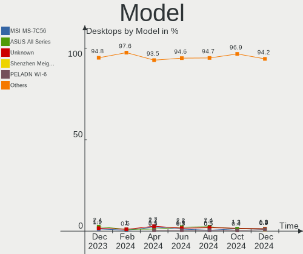
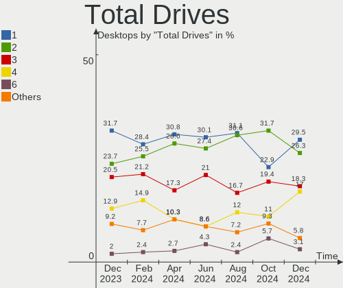
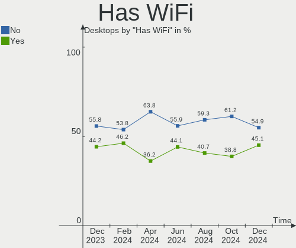
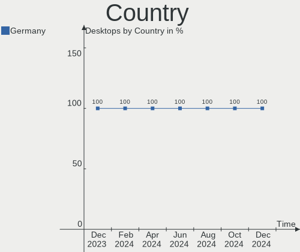
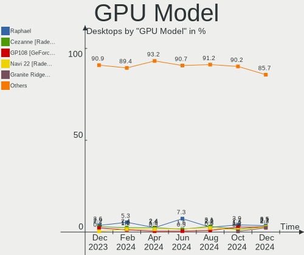
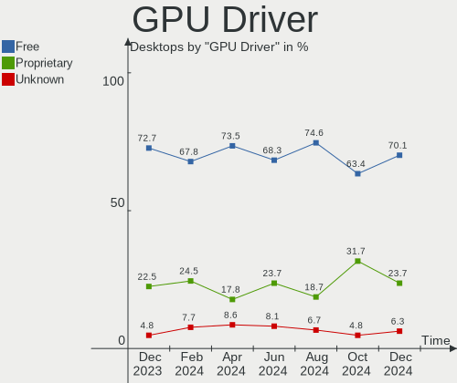
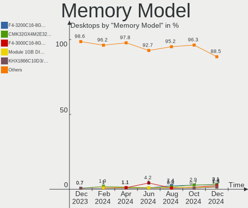
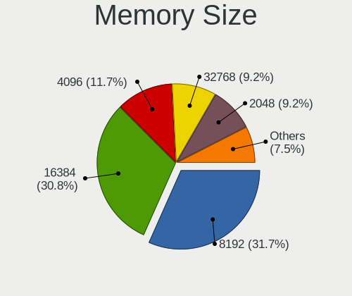
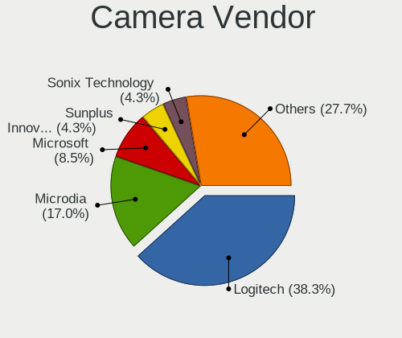

Linux in Germany - Hardware Trends (Desktops)
---------------------------------------------

A project to identify most popular hardware characteristics and track their change
over time based on data collected by Linux users at https://Linux-Hardware.org.

Anyone can contribute to this report by the [hw-probe](https://github.com/linuxhw/hw-probe) tool:

    sudo -E hw-probe -all -upload

Period: Jul, 2023.

Contents
--------

* [ System ](#system)
  - [ OS                       ](#os)
  - [ OS Family                ](#os-family)
  - [ Kernel                   ](#kernel)
  - [ Kernel Family            ](#kernel-family)
  - [ Kernel Major Ver.        ](#kernel-major-ver)
  - [ Arch                     ](#arch)
  - [ DE                       ](#de)
  - [ Display Server           ](#display-server)
  - [ Display Manager          ](#display-manager)
  - [ OS Lang                  ](#os-lang)
  - [ Boot Mode                ](#boot-mode)
  - [ Filesystem               ](#filesystem)
  - [ Part. scheme             ](#part-scheme)
  - [ Dual Boot with Linux/BSD ](#dual-boot-with-linuxbsd)
  - [ Dual Boot (Win)          ](#dual-boot-win)

* [ Board ](#board)
  - [ Vendor                   ](#vendor)
  - [ Model                    ](#model)
  - [ Model Family             ](#model-family)
  - [ MFG Year                 ](#mfg-year)
  - [ Form Factor              ](#form-factor)
  - [ Secure Boot              ](#secure-boot)
  - [ Coreboot                 ](#coreboot)
  - [ RAM Size                 ](#ram-size)
  - [ RAM Used                 ](#ram-used)
  - [ Total Drives             ](#total-drives)
  - [ Has CD-ROM               ](#has-cd-rom)
  - [ Has Ethernet             ](#has-ethernet)
  - [ Has WiFi                 ](#has-wifi)
  - [ Has Bluetooth            ](#has-bluetooth)

* [ Location ](#location)
  - [ Country                  ](#country)
  - [ City                     ](#city)

* [ Drives ](#drives)
  - [ Drive Vendor             ](#drive-vendor)
  - [ Drive Model              ](#drive-model)
  - [ HDD Vendor               ](#hdd-vendor)
  - [ SSD Vendor               ](#ssd-vendor)
  - [ Drive Kind               ](#drive-kind)
  - [ Drive Connector          ](#drive-connector)
  - [ Drive Size               ](#drive-size)
  - [ Space Total              ](#space-total)
  - [ Space Used               ](#space-used)
  - [ Malfunc. Drives          ](#malfunc-drives)
  - [ Malfunc. Drive Vendor    ](#malfunc-drive-vendor)
  - [ Malfunc. HDD Vendor      ](#malfunc-hdd-vendor)
  - [ Malfunc. Drive Kind      ](#malfunc-drive-kind)
  - [ Failed Drives            ](#failed-drives)
  - [ Failed Drive Vendor      ](#failed-drive-vendor)
  - [ Drive Status             ](#drive-status)

* [ Storage controller ](#storage-controller)
  - [ Storage Vendor           ](#storage-vendor)
  - [ Storage Model            ](#storage-model)
  - [ Storage Kind             ](#storage-kind)

* [ Processor ](#processor)
  - [ CPU Vendor               ](#cpu-vendor)
  - [ CPU Model                ](#cpu-model)
  - [ CPU Model Family         ](#cpu-model-family)
  - [ CPU Cores                ](#cpu-cores)
  - [ CPU Sockets              ](#cpu-sockets)
  - [ CPU Threads              ](#cpu-threads)
  - [ CPU Op-Modes             ](#cpu-op-modes)
  - [ CPU Microcode            ](#cpu-microcode)
  - [ CPU Microarch            ](#cpu-microarch)

* [ Graphics ](#graphics)
  - [ GPU Vendor               ](#gpu-vendor)
  - [ GPU Model                ](#gpu-model)
  - [ GPU Combo                ](#gpu-combo)
  - [ GPU Driver               ](#gpu-driver)
  - [ GPU Memory               ](#gpu-memory)

* [ Monitor ](#monitor)
  - [ Monitor Vendor           ](#monitor-vendor)
  - [ Monitor Model            ](#monitor-model)
  - [ Monitor Resolution       ](#monitor-resolution)
  - [ Monitor Diagonal         ](#monitor-diagonal)
  - [ Monitor Width            ](#monitor-width)
  - [ Aspect Ratio             ](#aspect-ratio)
  - [ Monitor Area             ](#monitor-area)
  - [ Pixel Density            ](#pixel-density)
  - [ Multiple Monitors        ](#multiple-monitors)

* [ Network ](#network)
  - [ Net Controller Vendor    ](#net-controller-vendor)
  - [ Net Controller Model     ](#net-controller-model)
  - [ Wireless Vendor          ](#wireless-vendor)
  - [ Wireless Model           ](#wireless-model)
  - [ Ethernet Vendor          ](#ethernet-vendor)
  - [ Ethernet Model           ](#ethernet-model)
  - [ Net Controller Kind      ](#net-controller-kind)
  - [ Used Controller          ](#used-controller)
  - [ NICs                     ](#nics)
  - [ IPv6                     ](#ipv6)

* [ Bluetooth ](#bluetooth)
  - [ Bluetooth Vendor         ](#bluetooth-vendor)
  - [ Bluetooth Model          ](#bluetooth-model)

* [ Sound ](#sound)
  - [ Sound Vendor             ](#sound-vendor)
  - [ Sound Model              ](#sound-model)

* [ Memory ](#memory)
  - [ Memory Vendor            ](#memory-vendor)
  - [ Memory Model             ](#memory-model)
  - [ Memory Kind              ](#memory-kind)
  - [ Memory Form Factor       ](#memory-form-factor)
  - [ Memory Size              ](#memory-size)
  - [ Memory Speed             ](#memory-speed)

* [ Printers & scanners ](#printers--scanners)
  - [ Printer Vendor           ](#printer-vendor)
  - [ Printer Model            ](#printer-model)
  - [ Scanner Vendor           ](#scanner-vendor)
  - [ Scanner Model            ](#scanner-model)

* [ Camera ](#camera)
  - [ Camera Vendor            ](#camera-vendor)
  - [ Camera Model             ](#camera-model)

* [ Security ](#security)
  - [ Fingerprint Vendor       ](#fingerprint-vendor)
  - [ Fingerprint Model        ](#fingerprint-model)
  - [ Chipcard Vendor          ](#chipcard-vendor)
  - [ Chipcard Model           ](#chipcard-model)

* [ Unsupported ](#unsupported)
  - [ Unsupported Devices      ](#unsupported-devices)
  - [ Unsupported Device Types ](#unsupported-device-types)

System
------

OS
--

Installed operating systems

| Name                         | Desktops | Percent |
|------------------------------|----------|---------|
| Ubuntu 22.04                 | 32       | 14.61%  |
| Linux Mint 21.1              | 20       | 9.13%   |
| Ubuntu 23.04                 | 17       | 7.76%   |
| Linux Mint 21.2              | 13       | 5.94%   |
| Fedora 38                    | 11       | 5.02%   |
| Debian 12                    | 11       | 5.02%   |
| Linux Mint 20.3              | 8        | 3.65%   |
| Ubuntu 20.04                 | 7        | 3.2%    |
| openSUSE Leap-15.5           | 7        | 3.2%    |
| Manjaro                      | 7        | 3.2%    |
| Pop!_OS 22.04                | 6        | 2.74%   |
| Gentoo 2.13                  | 6        | 2.74%   |
| ArcoLinux Rolling            | 6        | 2.74%   |
| Debian 11                    | 5        | 2.28%   |
| Arch Rolling                 | 5        | 2.28%   |
| Zorin 16                     | 4        | 1.83%   |
| OpenMandriva 23.07           | 4        | 1.83%   |
| Kubuntu 23.04                | 4        | 1.83%   |
| Ubuntu 22.10                 | 3        | 1.37%   |
| openSUSE Tumbleweed-XXXXXXXX | 3        | 1.37%   |
| LMDE 5                       | 3        | 1.37%   |
| Debian                       | 3        | 1.37%   |
| Xubuntu 23.04                | 2        | 0.91%   |
| Xubuntu 22.04                | 2        | 0.91%   |
| OpenMandriva 23.03           | 2        | 0.91%   |
| Kubuntu 22.04                | 2        | 0.91%   |
| Elementary 7                 | 2        | 0.91%   |
| Xero Rolling                 | 1        | 0.46%   |
| Ubuntu MATE 22.04            | 1        | 0.46%   |
| Ubuntu Core 22               | 1        | 0.46%   |
| Ubuntu Budgie 22.04          | 1        | 0.46%   |
| Ubuntu 20.10                 | 1        | 0.46%   |
| TUXEDO OS 22.04              | 1        | 0.46%   |
| Q4OS 5                       | 1        | 0.46%   |
| OpenMandriva 4.3             | 1        | 0.46%   |
| OpenMandriva 23.06           | 1        | 0.46%   |
| Nobara 38                    | 1        | 0.46%   |
| NixOS 23.11                  | 1        | 0.46%   |
| Manjaro 23.0.0               | 1        | 0.46%   |
| LinuxFX 11.3.1               | 1        | 0.46%   |

OS Family
---------

OS without a version

| Name          | Desktops | Percent |
|---------------|----------|---------|
| Ubuntu        | 61       | 27.85%  |
| Linux Mint    | 42       | 19.18%  |
| Debian        | 20       | 9.13%   |
| Fedora        | 11       | 5.02%   |
| openSUSE      | 10       | 4.57%   |
| OpenMandriva  | 8        | 3.65%   |
| Manjaro       | 8        | 3.65%   |
| Kubuntu       | 8        | 3.65%   |
| Pop!_OS       | 6        | 2.74%   |
| Gentoo        | 6        | 2.74%   |
| ArcoLinux     | 6        | 2.74%   |
| Arch          | 5        | 2.28%   |
| Zorin         | 4        | 1.83%   |
| Xubuntu       | 4        | 1.83%   |
| LMDE          | 3        | 1.37%   |
| Elementary    | 2        | 0.91%   |
| ChimeraOS     | 2        | 0.91%   |
| Xero          | 1        | 0.46%   |
| Ubuntu MATE   | 1        | 0.46%   |
| Ubuntu Budgie | 1        | 0.46%   |
| TUXEDO OS     | 1        | 0.46%   |
| Q4OS          | 1        | 0.46%   |
| Nobara        | 1        | 0.46%   |
| NixOS         | 1        | 0.46%   |
| LinuxFX       | 1        | 0.46%   |
| KDE neon      | 1        | 0.46%   |
| EndeavourOS   | 1        | 0.46%   |
| Devuan        | 1        | 0.46%   |
| blendOS       | 1        | 0.46%   |
| BlackPanther  | 1        | 0.46%   |

Kernel
------

Version of the Linux kernel

| Version                        | Desktops | Percent |
|--------------------------------|----------|---------|
| 5.15.0-76-generic              | 34       | 15.53%  |
| 5.19.0-46-generic              | 25       | 11.42%  |
| 6.2.0-24-generic               | 10       | 4.57%   |
| 6.1.0-10-amd64                 | 9        | 4.11%   |
| 5.15.0-78-generic              | 9        | 4.11%   |
| 6.2.0-25-generic               | 8        | 3.65%   |
| 5.4.0-153-generic              | 7        | 3.2%    |
| 5.10.0-23-amd64                | 7        | 3.2%    |
| 6.3.5-desktop-3omv2390         | 5        | 2.28%   |
| 6.2.6-76060206-generic         | 5        | 2.28%   |
| 5.19.0-50-generic              | 5        | 2.28%   |
| 6.3.12-200.fc38.x86_64         | 4        | 1.83%   |
| 5.14.21-150500.53-default      | 4        | 1.83%   |
| 6.3.9-arch1-1                  | 3        | 1.37%   |
| 6.3.8-200.fc38.x86_64          | 3        | 1.37%   |
| 6.2.0-26-generic               | 3        | 1.37%   |
| 6.4.6-200.fc38.x86_64          | 2        | 0.91%   |
| 6.4.3-zen1-2-zen               | 2        | 0.91%   |
| 6.4.0-060400-generic           | 2        | 0.91%   |
| 6.3.9-chimeraos-1              | 2        | 0.91%   |
| 6.3.11-200.fc38.x86_64         | 2        | 0.91%   |
| 6.3.0-2-amd64                  | 2        | 0.91%   |
| 6.3.0-1-amd64                  | 2        | 0.91%   |
| 6.2.6-desktop-1omv2390         | 2        | 0.91%   |
| 6.2.0-20-generic               | 2        | 0.91%   |
| 6.1.0-9-amd64                  | 2        | 0.91%   |
| 5.15.0-58-generic              | 2        | 0.91%   |
| 5.15.0-56-generic              | 2        | 0.91%   |
| 5.14.21-150500.55.7-default    | 2        | 0.91%   |
| 6.4.6-zen1-1-zen               | 1        | 0.46%   |
| 6.4.4-zen1-1-zen               | 1        | 0.46%   |
| 6.4.4-x86_64                   | 1        | 0.46%   |
| 6.4.4-lp154.2.g919c802-default | 1        | 0.46%   |
| 6.4.4-1-default                | 1        | 0.46%   |
| 6.4.3-arch1-2                  | 1        | 0.46%   |
| 6.4.3-arch1-1                  | 1        | 0.46%   |
| 6.4.3-273-tkg-pds              | 1        | 0.46%   |
| 6.4.3-1-MANJARO                | 1        | 0.46%   |
| 6.4.3-1-default                | 1        | 0.46%   |
| 6.4.2-arch1-1                  | 1        | 0.46%   |

Kernel Family
-------------

Linux kernel without a distro release

| Version  | Desktops | Percent |
|----------|----------|---------|
| 5.15.0   | 52       | 23.74%  |
| 5.19.0   | 37       | 16.89%  |
| 6.2.0    | 24       | 10.96%  |
| 6.1.0    | 11       | 5.02%   |
| 5.4.0    | 9        | 4.11%   |
| 5.10.0   | 8        | 3.65%   |
| 6.4.3    | 7        | 3.2%    |
| 6.2.6    | 7        | 3.2%    |
| 6.3.9    | 6        | 2.74%   |
| 6.3.12   | 6        | 2.74%   |
| 5.14.21  | 6        | 2.74%   |
| 6.3.5    | 5        | 2.28%   |
| 6.4.4    | 4        | 1.83%   |
| 6.3.8    | 4        | 1.83%   |
| 6.3.0    | 4        | 1.83%   |
| 6.4.6    | 3        | 1.37%   |
| 6.4.2    | 3        | 1.37%   |
| 6.4.0    | 3        | 1.37%   |
| 6.3.11   | 2        | 0.91%   |
| 6.1.38   | 2        | 0.91%   |
| 6.1.31   | 2        | 0.91%   |
| 4.19.0   | 2        | 0.91%   |
| 6.4.1    | 1        | 0.46%   |
| 6.3.6    | 1        | 0.46%   |
| 6.3.4    | 1        | 0.46%   |
| 6.2.16   | 1        | 0.46%   |
| 6.1.41   | 1        | 0.46%   |
| 6.1.28   | 1        | 0.46%   |
| 6.0.0    | 1        | 0.46%   |
| 5.8.0    | 1        | 0.46%   |
| 5.6.14   | 1        | 0.46%   |
| 5.17.5   | 1        | 0.46%   |
| 5.16.7   | 1        | 0.46%   |
| 5.15.120 | 1        | 0.46%   |

Kernel Major Ver.
-----------------

Linux kernel major version

| Version | Desktops | Percent |
|---------|----------|---------|
| 5.15    | 53       | 24.2%   |
| 5.19    | 37       | 16.89%  |
| 6.2     | 32       | 14.61%  |
| 6.3     | 29       | 13.24%  |
| 6.4     | 21       | 9.59%   |
| 6.1     | 17       | 7.76%   |
| 5.4     | 9        | 4.11%   |
| 5.10    | 8        | 3.65%   |
| 5.14    | 6        | 2.74%   |
| 4.19    | 2        | 0.91%   |
| 6.0     | 1        | 0.46%   |
| 5.8     | 1        | 0.46%   |
| 5.6     | 1        | 0.46%   |
| 5.17    | 1        | 0.46%   |
| 5.16    | 1        | 0.46%   |

Arch
----

OS architecture (x86_64, i586, etc.)

| Name   | Desktops | Percent |
|--------|----------|---------|
| x86_64 | 219      | 100%    |

DE
--

Desktop Environment

| Name         | Desktops | Percent |
|--------------|----------|---------|
| GNOME        | 85       | 38.81%  |
| KDE5         | 43       | 19.63%  |
| X-Cinnamon   | 34       | 15.53%  |
| XFCE         | 19       | 8.68%   |
| Unknown      | 16       | 7.31%   |
| Cinnamon     | 6        | 2.74%   |
| MATE         | 4        | 1.83%   |
| Pantheon     | 2        | 0.91%   |
| LXQt         | 2        | 0.91%   |
| LXDE         | 2        | 0.91%   |
| Hyprland     | 2        | 0.91%   |
| none+awesome | 1        | 0.46%   |
| KDE          | 1        | 0.46%   |
| chadwm       | 1        | 0.46%   |
| Budgie       | 1        | 0.46%   |

Display Server
--------------

X11 or Wayland

| Name    | Desktops | Percent |
|---------|----------|---------|
| X11     | 134      | 61.19%  |
| Wayland | 63       | 28.77%  |
| Unknown | 14       | 6.39%   |
| Tty     | 8        | 3.65%   |

Display Manager
---------------

SDDM, LightDM, etc.

| Name    | Desktops | Percent |
|---------|----------|---------|
| Unknown | 89       | 40.64%  |
| GDM3    | 52       | 23.74%  |
| SDDM    | 38       | 17.35%  |
| LightDM | 34       | 15.53%  |
| GDM     | 5        | 2.28%   |
| NODM    | 1        | 0.46%   |

OS Lang
-------

Language

| Lang    | Desktops | Percent |
|---------|----------|---------|
| de_DE   | 158      | 72.15%  |
| en_US   | 39       | 17.81%  |
| C       | 6        | 2.74%   |
| Unknown | 6        | 2.74%   |
| en_GB   | 4        | 1.83%   |
| C.UTF8  | 2        | 0.91%   |
| POSIX   | 1        | 0.46%   |
| es_DO   | 1        | 0.46%   |
| en_DE   | 1        | 0.46%   |
| bg_BG   | 1        | 0.46%   |

Boot Mode
---------

EFI or BIOS

| Mode | Desktops | Percent |
|------|----------|---------|
| BIOS | 119      | 54.34%  |
| EFI  | 100      | 45.66%  |

Filesystem
----------

Type of filesystem

| Type    | Desktops | Percent |
|---------|----------|---------|
| Ext4    | 130      | 59.36%  |
| Tmpfs   | 39       | 17.81%  |
| Btrfs   | 36       | 16.44%  |
| Overlay | 9        | 4.11%   |
| Zfs     | 4        | 1.83%   |
| Xfs     | 1        | 0.46%   |

Part. scheme
------------

Scheme of partitioning

| Type    | Desktops | Percent |
|---------|----------|---------|
| GPT     | 123      | 56.16%  |
| Unknown | 72       | 32.88%  |
| MBR     | 24       | 10.96%  |

Dual Boot with Linux/BSD
------------------------

Hosting more than one Linux/BSD

| Dual boot | Desktops | Percent |
|-----------|----------|---------|
| No        | 186      | 84.93%  |
| Yes       | 33       | 15.07%  |

Dual Boot (Win)
---------------

Hosting Linux and Windows

| Dual boot | Desktops | Percent |
|-----------|----------|---------|
| No        | 154      | 70.32%  |
| Yes       | 65       | 29.68%  |

Board
-----

Vendor
------

Motherboard manufacturer

| Name                                 | Desktops | Percent |
|--------------------------------------|----------|---------|
| ASUSTek Computer                     | 49       | 22.37%  |
| Gigabyte Technology                  | 45       | 20.55%  |
| MSI                                  | 32       | 14.61%  |
| ASRock                               | 21       | 9.59%   |
| Lenovo                               | 13       | 5.94%   |
| Hewlett-Packard                      | 13       | 5.94%   |
| Medion                               | 6        | 2.74%   |
| Fujitsu                              | 6        | 2.74%   |
| Biostar                              | 5        | 2.28%   |
| Unknown                              | 5        | 2.28%   |
| Acer                                 | 4        | 1.83%   |
| Dell                                 | 3        | 1.37%   |
| Shenzhen Meigao Electronic Equipment | 2        | 0.91%   |
| Intel                                | 2        | 0.91%   |
| Foxconn                              | 2        | 0.91%   |
| AZW                                  | 2        | 0.91%   |
| Wortmann AG                          | 1        | 0.46%   |
| T-bao                                | 1        | 0.46%   |
| Pegatron                             | 1        | 0.46%   |
| MW                                   | 1        | 0.46%   |
| LattePanda                           | 1        | 0.46%   |
| IceWhale Technology                  | 1        | 0.46%   |
| Gateway                              | 1        | 0.46%   |
| ECS                                  | 1        | 0.46%   |
| Apple                                | 1        | 0.46%   |

Model
-----

Motherboard model

| Name                                       | Desktops | Percent |
|--------------------------------------------|----------|---------|
| Unknown                                    | 5        | 2.28%   |
| ASUS All Series                            | 4        | 1.83%   |
| MSI MS-7C56                                | 3        | 1.37%   |
| MSI MS-7B85                                | 3        | 1.37%   |
| Gigabyte GA-890GPA-UD3H                    | 2        | 0.91%   |
| Gigabyte GA-78LMT-USB3 6.0                 | 2        | 0.91%   |
| Gigabyte B550I AORUS PRO AX                | 2        | 0.91%   |
| Gigabyte B450 I AORUS PRO WIFI             | 2        | 0.91%   |
| Biostar A960D+V2                           | 2        | 0.91%   |
| ASUS ROG STRIX B650E-I GAMING WIFI         | 2        | 0.91%   |
| ASUS ROG STRIX B450-F GAMING II            | 2        | 0.91%   |
| ASUS ROG STRIX B450-E GAMING               | 2        | 0.91%   |
| ASUS PRIME B450M-A                         | 2        | 0.91%   |
| ASUS PRIME A320M-K                         | 2        | 0.91%   |
| Wortmann AG TERRA_PC                       | 1        | 0.46%   |
| T-bao MINI PC                              | 1        | 0.46%   |
| Shenzhen Meigao Electronic Equipment UM690 | 1        | 0.46%   |
| Shenzhen Meigao Electronic Equipment UM560 | 1        | 0.46%   |
| Pegatron Elite 7300 Series MT              | 1        | 0.46%   |
| MW NAS-N5105                               | 1        | 0.46%   |
| MSI Silent Gamer GTX 550 R2                | 1        | 0.46%   |
| MSI MS-7D70                                | 1        | 0.46%   |
| MSI MS-7D67                                | 1        | 0.46%   |
| MSI MS-7D54                                | 1        | 0.46%   |
| MSI MS-7D50                                | 1        | 0.46%   |
| MSI MS-7D25                                | 1        | 0.46%   |
| MSI MS-7C91                                | 1        | 0.46%   |
| MSI MS-7C86                                | 1        | 0.46%   |
| MSI MS-7C79                                | 1        | 0.46%   |
| MSI MS-7C52                                | 1        | 0.46%   |
| MSI MS-7C35                                | 1        | 0.46%   |
| MSI MS-7B86                                | 1        | 0.46%   |
| MSI MS-7B79                                | 1        | 0.46%   |
| MSI MS-7B78                                | 1        | 0.46%   |
| MSI MS-7B50                                | 1        | 0.46%   |
| MSI MS-7A38                                | 1        | 0.46%   |
| MSI MS-7A31                                | 1        | 0.46%   |
| MSI MS-7850                                | 1        | 0.46%   |
| MSI MS-7788                                | 1        | 0.46%   |
| MSI MS-7693                                | 1        | 0.46%   |

Model Family
------------

Motherboard model prefix

| Name                                       | Desktops | Percent |
|--------------------------------------------|----------|---------|
| ASUS PRIME                                 | 14       | 6.39%   |
| ASUS ROG                                   | 11       | 5.02%   |
| Lenovo ThinkCentre                         | 9        | 4.11%   |
| Fujitsu ESPRIMO                            | 6        | 2.74%   |
| Unknown                                    | 5        | 2.28%   |
| HP EliteDesk                               | 4        | 1.83%   |
| HP Compaq                                  | 4        | 1.83%   |
| Gigabyte B550                              | 4        | 1.83%   |
| ASUS All                                   | 4        | 1.83%   |
| MSI MS-7C56                                | 3        | 1.37%   |
| MSI MS-7B85                                | 3        | 1.37%   |
| Gigabyte GA-890GPA-UD3H                    | 2        | 0.91%   |
| Gigabyte GA-78LMT-USB3                     | 2        | 0.91%   |
| Gigabyte B650                              | 2        | 0.91%   |
| Gigabyte B550I                             | 2        | 0.91%   |
| Gigabyte B450                              | 2        | 0.91%   |
| Dell OptiPlex                              | 2        | 0.91%   |
| Biostar A960D+V2                           | 2        | 0.91%   |
| ASUS TUF                                   | 2        | 0.91%   |
| ASUS Pro                                   | 2        | 0.91%   |
| ASRock B550                                | 2        | 0.91%   |
| ASRock B450M                               | 2        | 0.91%   |
| Acer Aspire                                | 2        | 0.91%   |
| Wortmann AG TERRA                          | 1        | 0.46%   |
| T-bao MINI                                 | 1        | 0.46%   |
| Shenzhen Meigao Electronic Equipment UM690 | 1        | 0.46%   |
| Shenzhen Meigao Electronic Equipment UM560 | 1        | 0.46%   |
| Pegatron Elite                             | 1        | 0.46%   |
| MW NAS-N5105                               | 1        | 0.46%   |
| MSI Silent                                 | 1        | 0.46%   |
| MSI MS-7D70                                | 1        | 0.46%   |
| MSI MS-7D67                                | 1        | 0.46%   |
| MSI MS-7D54                                | 1        | 0.46%   |
| MSI MS-7D50                                | 1        | 0.46%   |
| MSI MS-7D25                                | 1        | 0.46%   |
| MSI MS-7C91                                | 1        | 0.46%   |
| MSI MS-7C86                                | 1        | 0.46%   |
| MSI MS-7C79                                | 1        | 0.46%   |
| MSI MS-7C52                                | 1        | 0.46%   |
| MSI MS-7C35                                | 1        | 0.46%   |

MFG Year
--------

Motherboard manufacture year

| Year    | Desktops | Percent |
|---------|----------|---------|
| 2020    | 30       | 13.7%   |
| 2018    | 25       | 11.42%  |
| 2022    | 21       | 9.59%   |
| 2013    | 18       | 8.22%   |
| 2017    | 16       | 7.31%   |
| 2019    | 15       | 6.85%   |
| 2010    | 12       | 5.48%   |
| 2021    | 11       | 5.02%   |
| 2014    | 11       | 5.02%   |
| 2012    | 11       | 5.02%   |
| 2015    | 10       | 4.57%   |
| 2011    | 10       | 4.57%   |
| 2023    | 8        | 3.65%   |
| 2016    | 7        | 3.2%    |
| 2009    | 7        | 3.2%    |
| 2007    | 3        | 1.37%   |
| 2008    | 1        | 0.46%   |
| 2006    | 1        | 0.46%   |
| 2005    | 1        | 0.46%   |
| Unknown | 1        | 0.46%   |

Form Factor
-----------

Physical design of the computer

| Name    | Desktops | Percent |
|---------|----------|---------|
| Desktop | 219      | 100%    |

Secure Boot
-----------

Enabled or disabled

| State    | Desktops | Percent |
|----------|----------|---------|
| Disabled | 214      | 97.72%  |
| Enabled  | 5        | 2.28%   |

Coreboot
--------

Have coreboot on board

| Used | Desktops | Percent |
|------|----------|---------|
| No   | 219      | 100%    |

RAM Size
--------

Total RAM memory

| Size in GB      | Desktops | Percent |
|-----------------|----------|---------|
| 32.01-64.0      | 49       | 22.37%  |
| 16.01-24.0      | 46       | 21%     |
| 8.01-16.0       | 41       | 18.72%  |
| 4.01-8.0        | 28       | 12.79%  |
| 3.01-4.0        | 23       | 10.5%   |
| 64.01-256.0     | 18       | 8.22%   |
| 24.01-32.0      | 11       | 5.02%   |
| More than 256.0 | 1        | 0.46%   |
| 2.01-3.0        | 1        | 0.46%   |
| 0.51-1.0        | 1        | 0.46%   |

RAM Used
--------

Used RAM memory

| Used GB    | Desktops | Percent |
|------------|----------|---------|
| 1.01-2.0   | 68       | 31.05%  |
| 2.01-3.0   | 51       | 23.29%  |
| 4.01-8.0   | 48       | 21.92%  |
| 3.01-4.0   | 27       | 12.33%  |
| 0.51-1.0   | 8        | 3.65%   |
| 0.01-0.5   | 8        | 3.65%   |
| 8.01-16.0  | 7        | 3.2%    |
| 16.01-24.0 | 2        | 0.91%   |

Total Drives
------------

Number of drives on board

| Drives | Desktops | Percent |
|--------|----------|---------|
| 1      | 81       | 36.99%  |
| 2      | 53       | 24.2%   |
| 3      | 36       | 16.44%  |
| 4      | 27       | 12.33%  |
| 5      | 11       | 5.02%   |
| 6      | 6        | 2.74%   |
| 7      | 2        | 0.91%   |
| 0      | 2        | 0.91%   |
| 8      | 1        | 0.46%   |

Has CD-ROM
----------

Has CD-ROM on board

| Presented | Desktops | Percent |
|-----------|----------|---------|
| No        | 112      | 51.14%  |
| Yes       | 107      | 48.86%  |

Has Ethernet
------------

Has Ethernet on board

| Presented | Desktops | Percent |
|-----------|----------|---------|
| Yes       | 216      | 98.63%  |
| No        | 3        | 1.37%   |

Has WiFi
--------

Has WiFi module

| Presented | Desktops | Percent |
|-----------|----------|---------|
| No        | 130      | 59.36%  |
| Yes       | 89       | 40.64%  |

Has Bluetooth
-------------

Has Bluetooth module

| Presented | Desktops | Percent |
|-----------|----------|---------|
| No        | 139      | 63.47%  |
| Yes       | 80       | 36.53%  |

Location
--------

Country
-------

Geographic location (country)

| Country | Desktops | Percent |
|---------|----------|---------|
| Germany | 219      | 100%    |

City
----

Geographic location (city)

| City              | Desktops | Percent |
|-------------------|----------|---------|
| Berlin            | 19       | 8.68%   |
| Hamburg           | 8        | 3.65%   |
| Munich            | 6        | 2.74%   |
| Dresden           | 6        | 2.74%   |
| Kiel              | 5        | 2.28%   |
| Karlsruhe         | 4        | 1.83%   |
| Wiesbaden         | 3        | 1.37%   |
| Stuttgart         | 3        | 1.37%   |
| Frankfurt am Main | 3        | 1.37%   |
| Düsseldorf       | 3        | 1.37%   |
| Delligsen         | 3        | 1.37%   |
| Cologne           | 3        | 1.37%   |
| Bonn              | 3        | 1.37%   |
| Wegberg           | 2        | 0.91%   |
| Steinheim         | 2        | 0.91%   |
| Saarbrücken      | 2        | 0.91%   |
| Recklinghausen    | 2        | 0.91%   |
| Mülheim          | 2        | 0.91%   |
| Mannheim          | 2        | 0.91%   |
| Lüdenscheid      | 2        | 0.91%   |
| Lemgo             | 2        | 0.91%   |
| Jena              | 2        | 0.91%   |
| Heubach           | 2        | 0.91%   |
| Hanover           | 2        | 0.91%   |
| Darmstadt         | 2        | 0.91%   |
| Braunschweig      | 2        | 0.91%   |
| Bielefeld         | 2        | 0.91%   |
| Augsburg          | 2        | 0.91%   |
| Zwickau           | 1        | 0.46%   |
| Zetel             | 1        | 0.46%   |
| Würzburg         | 1        | 0.46%   |
| Wolfsburg         | 1        | 0.46%   |
| Wiesmoor          | 1        | 0.46%   |
| Walsrode          | 1        | 0.46%   |
| Viernheim         | 1        | 0.46%   |
| Untergruppenbach  | 1        | 0.46%   |
| Ulm               | 1        | 0.46%   |
| Tuttlingen        | 1        | 0.46%   |
| Tübingen         | 1        | 0.46%   |
| Troisdorf         | 1        | 0.46%   |

Drives
------

Drive Vendor
------------

Hard drive vendors

| Vendor                      | Desktops | Drives | Percent |
|-----------------------------|----------|--------|---------|
| Samsung Electronics         | 91       | 145    | 22.81%  |
| Seagate                     | 54       | 64     | 13.53%  |
| WDC                         | 51       | 69     | 12.78%  |
| SanDisk                     | 31       | 40     | 7.77%   |
| Crucial                     | 30       | 33     | 7.52%   |
| Intenso                     | 18       | 20     | 4.51%   |
| Toshiba                     | 16       | 22     | 4.01%   |
| Hitachi                     | 15       | 16     | 3.76%   |
| Kingston                    | 12       | 14     | 3.01%   |
| Micron/Crucial Technology   | 8        | 8      | 2.01%   |
| Maxtor                      | 5        | 5      | 1.25%   |
| Phison Electronics          | 4        | 5      | 1%      |
| OCZ                         | 4        | 4      | 1%      |
| Micron Technology           | 4        | 4      | 1%      |
| Kingston Technology Company | 4        | 7      | 1%      |
| Unknown                     | 3        | 4      | 0.75%   |
| SPCC                        | 3        | 4      | 0.75%   |
| China                       | 3        | 3      | 0.75%   |
| A-DATA Technology           | 3        | 3      | 0.75%   |
| Unknown                     | 3        | 3      | 0.75%   |
| Verbatim                    | 2        | 3      | 0.5%    |
| Silicon Motion              | 2        | 2      | 0.5%    |
| PNY                         | 2        | 2      | 0.5%    |
| Phison                      | 2        | 2      | 0.5%    |
| Netac                       | 2        | 2      | 0.5%    |
| Mushkin                     | 2        | 2      | 0.5%    |
| Intel                       | 2        | 2      | 0.5%    |
| Fanxiang                    | 2        | 2      | 0.5%    |
| Corsair                     | 2        | 2      | 0.5%    |
| AMD                         | 2        | 2      | 0.5%    |
| Vaseky                      | 1        | 1      | 0.25%   |
| Transcend                   | 1        | 1      | 0.25%   |
| QUANTUM                     | 1        | 1      | 0.25%   |
| Patriot                     | 1        | 1      | 0.25%   |
| MDT                         | 1        | 1      | 0.25%   |
| MAXIO Technology (Hangzhou) | 1        | 1      | 0.25%   |
| LITEONIT                    | 1        | 1      | 0.25%   |
| Leven                       | 1        | 1      | 0.25%   |
| KOWIN                       | 1        | 1      | 0.25%   |
| KIOXIA                      | 1        | 1      | 0.25%   |

Drive Model
-----------

Hard drive models

| Model                                               | Desktops | Percent |
|-----------------------------------------------------|----------|---------|
| Samsung NVMe SSD Controller SM981/PM981/PM983 500GB | 17       | 3.6%    |
| Samsung SSD 980 1TB                                 | 8        | 1.69%   |
| SanDisk SSD PLUS 240GB                              | 6        | 1.27%   |
| Samsung SSD 860 EVO 1TB                             | 5        | 1.06%   |
| Samsung SSD 850 EVO 250GB                           | 5        | 1.06%   |
| Samsung NVMe SSD Controller PM9A1/PM9A3/980PRO 1TB  | 5        | 1.06%   |
| Micron/Crucial P2 NVMe PCIe SSD 1TB                 | 5        | 1.06%   |
| Toshiba HDWD110 1TB                                 | 4        | 0.85%   |
| Seagate ST2000DM008-2FR102 2TB                      | 4        | 0.85%   |
| Samsung SSD 980 500GB                               | 4        | 0.85%   |
| Samsung SSD 870 QVO 2TB                             | 4        | 0.85%   |
| Samsung SSD 860 EVO 500GB                           | 4        | 0.85%   |
| Samsung NVMe SSD Controller SM961/PM961/SM963 256GB | 4        | 0.85%   |
| Samsung HD204UI 2TB                                 | 4        | 0.85%   |
| Crucial CT1000MX500SSD1 1TB                         | 4        | 0.85%   |
| WDC WD30EFRX-68EUZN0 3TB                            | 3        | 0.64%   |
| WDC WD20EZRZ-00Z5HB0 2TB                            | 3        | 0.64%   |
| Samsung SSD 980 PRO 2TB                             | 3        | 0.64%   |
| Samsung SSD 870 QVO 1TB                             | 3        | 0.64%   |
| Samsung SSD 870 EVO 1TB                             | 3        | 0.64%   |
| Samsung SSD 850 EVO 500GB                           | 3        | 0.64%   |
| Samsung SSD 840 EVO 250GB                           | 3        | 0.64%   |
| Samsung HD501LJ 500GB                               | 3        | 0.64%   |
| Samsung HD103SJ 1TB                                 | 3        | 0.64%   |
| Kingston SV300S37A120G 120GB SSD                    | 3        | 0.64%   |
| Kingston SA400S37240G 240GB SSD                     | 3        | 0.64%   |
| Kingston SA400S37120G 120GB SSD                     | 3        | 0.64%   |
| Crucial CT250MX500SSD1 250GB                        | 3        | 0.64%   |
| Crucial CT2000MX500SSD1 2TB                         | 3        | 0.64%   |
| Crucial CT1000P1SSD8 1TB                            | 3        | 0.64%   |
| Unknown                                             | 3        | 0.64%   |
| WDC WD40EZRZ-00GXCB0 4TB                            | 2        | 0.42%   |
| WDC WD40EFPX-68C6CN0 4TB                            | 2        | 0.42%   |
| WDC WD10EZRZ-00HTKB0 1TB                            | 2        | 0.42%   |
| WDC WD10EZEX-00BN5A0 1TB                            | 2        | 0.42%   |
| WDC WD10EARS-00Y5B1 1TB                             | 2        | 0.42%   |
| Verbatim Vi550 S3 128GB                             | 2        | 0.42%   |
| Toshiba MD04ACA400 4TB                              | 2        | 0.42%   |
| Seagate ST500DM002-1BD142 500GB                     | 2        | 0.42%   |
| Seagate ST3500418AS 500GB                           | 2        | 0.42%   |

HDD Vendor
----------

Hard disk drive vendors

| Vendor              | Desktops | Drives | Percent |
|---------------------|----------|--------|---------|
| Seagate             | 52       | 60     | 34.9%   |
| WDC                 | 42       | 57     | 28.19%  |
| Samsung Electronics | 16       | 19     | 10.74%  |
| Hitachi             | 15       | 16     | 10.07%  |
| Toshiba             | 14       | 20     | 9.4%    |
| Maxtor              | 5        | 5      | 3.36%   |
| Intenso             | 2        | 2      | 1.34%   |
| QUANTUM             | 1        | 1      | 0.67%   |
| MDT                 | 1        | 1      | 0.67%   |
| IBM                 | 1        | 1      | 0.67%   |

SSD Vendor
----------

Solid state drive vendors

| Vendor              | Desktops | Drives | Percent |
|---------------------|----------|--------|---------|
| Samsung Electronics | 45       | 57     | 28.85%  |
| Crucial             | 23       | 25     | 14.74%  |
| SanDisk             | 21       | 25     | 13.46%  |
| Intenso             | 13       | 14     | 8.33%   |
| WDC                 | 10       | 11     | 6.41%   |
| Kingston            | 10       | 12     | 6.41%   |
| OCZ                 | 4        | 4      | 2.56%   |
| China               | 3        | 3      | 1.92%   |
| Verbatim            | 2        | 3      | 1.28%   |
| Toshiba             | 2        | 2      | 1.28%   |
| SPCC                | 2        | 3      | 1.28%   |
| Mushkin             | 2        | 2      | 1.28%   |
| Micron Technology   | 2        | 2      | 1.28%   |
| Fanxiang            | 2        | 2      | 1.28%   |
| A-DATA Technology   | 2        | 2      | 1.28%   |
| Vaseky              | 1        | 1      | 0.64%   |
| Transcend           | 1        | 1      | 0.64%   |
| PNY                 | 1        | 1      | 0.64%   |
| Phison              | 1        | 1      | 0.64%   |
| Netac               | 1        | 1      | 0.64%   |
| LITEONIT            | 1        | 1      | 0.64%   |
| Leven               | 1        | 1      | 0.64%   |
| INNOVATION IT       | 1        | 1      | 0.64%   |
| Geonix              | 1        | 1      | 0.64%   |
| CT1000MX            | 1        | 1      | 0.64%   |
| Corsair             | 1        | 1      | 0.64%   |
| ASMT                | 1        | 2      | 0.64%   |
| Apacer              | 1        | 1      | 0.64%   |

Drive Kind
----------

HDD or SSD

| Kind    | Desktops | Drives | Percent |
|---------|----------|--------|---------|
| SSD     | 128      | 181    | 36.36%  |
| HDD     | 116      | 182    | 32.95%  |
| NVMe    | 95       | 133    | 26.99%  |
| Unknown | 10       | 13     | 2.84%   |
| MMC     | 3        | 3      | 0.85%   |

Drive Connector
---------------

SATA, SAS, NVMe, etc.

| Type | Desktops | Drives | Percent |
|------|----------|--------|---------|
| SATA | 178      | 340    | 58.94%  |
| NVMe | 95       | 133    | 31.46%  |
| SAS  | 26       | 36     | 8.61%   |
| MMC  | 3        | 3      | 0.99%   |

Drive Size
----------

Size of hard drive

| Size in TB | Desktops | Drives | Percent |
|------------|----------|--------|---------|
| 0.01-0.5   | 111      | 167    | 42.05%  |
| 0.51-1.0   | 74       | 97     | 28.03%  |
| 1.01-2.0   | 43       | 48     | 16.29%  |
| 3.01-4.0   | 15       | 22     | 5.68%   |
| 4.01-10.0  | 11       | 17     | 4.17%   |
| 2.01-3.0   | 8        | 10     | 3.03%   |
| 10.01-20.0 | 1        | 1      | 0.38%   |
| 0          | 1        | 1      | 0.38%   |

Space Total
-----------

Amount of disk space available on the file system

| Size in GB     | Desktops | Percent |
|----------------|----------|---------|
| 101-250        | 40       | 18.26%  |
| More than 3000 | 38       | 17.35%  |
| 501-1000       | 37       | 16.89%  |
| 1001-2000      | 36       | 16.44%  |
| 251-500        | 26       | 11.87%  |
| 2001-3000      | 13       | 5.94%   |
| Unknown        | 9        | 4.11%   |
| 1-20           | 8        | 3.65%   |
| 51-100         | 7        | 3.2%    |
| 21-50          | 5        | 2.28%   |

Space Used
----------

Amount of used disk space

| Used GB        | Desktops | Percent |
|----------------|----------|---------|
| 1-20           | 47       | 21.46%  |
| 21-50          | 34       | 15.53%  |
| 101-250        | 29       | 13.24%  |
| 251-500        | 23       | 10.5%   |
| 51-100         | 21       | 9.59%   |
| More than 3000 | 19       | 8.68%   |
| 501-1000       | 19       | 8.68%   |
| 1001-2000      | 13       | 5.94%   |
| Unknown        | 9        | 4.11%   |
| 2001-3000      | 5        | 2.28%   |

Malfunc. Drives
---------------

Drive models with a malfunction

| Model                                 | Desktops | Drives | Percent |
|---------------------------------------|----------|--------|---------|
| WDC WD30EFRX-68EUZN0 3TB              | 2        | 2      | 5%      |
| WDC WD10EARS-00Y5B1 1TB               | 2        | 2      | 5%      |
| WDC WD800BB-55JKC0 80GB               | 1        | 1      | 2.5%    |
| WDC WD60EFAX-68SHWN0 6TB              | 1        | 1      | 2.5%    |
| WDC WD5000AAKS-007AA0 500GB           | 1        | 1      | 2.5%    |
| WDC WD30EFRX-68AX9N0 3TB              | 1        | 1      | 2.5%    |
| WDC WD2500AAJS-00VTA0 250GB           | 1        | 1      | 2.5%    |
| WDC WD1200BB-22GUA0 120GB             | 1        | 1      | 2.5%    |
| WDC WD10EZRX-22A3KB0 1TB              | 1        | 1      | 2.5%    |
| WDC WD10EALX-759BA1 1TB               | 1        | 1      | 2.5%    |
| WDC WD Blue SA510 2.5 1000GB SSD      | 1        | 1      | 2.5%    |
| Toshiba MD04ACA400 4TB                | 1        | 1      | 2.5%    |
| Seagate ST500DM002-1BD142 500GB       | 1        | 1      | 2.5%    |
| Seagate ST3500413AS 500GB             | 1        | 2      | 2.5%    |
| Seagate ST320LT007-9ZV142 320GB       | 1        | 1      | 2.5%    |
| Seagate ST2000LM007-1R8174 2TB        | 1        | 1      | 2.5%    |
| Seagate ST2000DM001-1CH164 2TB        | 1        | 1      | 2.5%    |
| SanDisk SDSSDHII120G 120GB            | 1        | 1      | 2.5%    |
| Samsung Electronics SSD 980 500GB     | 1        | 1      | 2.5%    |
| Samsung Electronics SSD 870 EVO 1TB   | 1        | 1      | 2.5%    |
| Samsung Electronics SSD 850 EVO 250GB | 1        | 1      | 2.5%    |
| Samsung Electronics HD753LJ 752GB     | 1        | 1      | 2.5%    |
| Samsung Electronics HD642JJ 640GB     | 1        | 1      | 2.5%    |
| Samsung Electronics HD501LJ 500GB     | 1        | 1      | 2.5%    |
| OCZ VERTEX3 120GB SSD                 | 1        | 1      | 2.5%    |
| MDT MD6400AAKS-00A7B0 640GB           | 1        | 1      | 2.5%    |
| Maxtor STM3160215AS 160GB             | 1        | 1      | 2.5%    |
| Maxtor STM3160215A 160GB              | 1        | 1      | 2.5%    |
| Maxtor 90680D4 7GB                    | 1        | 1      | 2.5%    |
| Kingston SV300S37A120G 120GB SSD      | 1        | 1      | 2.5%    |
| Intenso TOP M.2 SATA 128GB SSD        | 1        | 1      | 2.5%    |
| Intel SSDPEKKW512G7 512GB             | 1        | 1      | 2.5%    |
| IBM DTLA-305040 41GB                  | 1        | 1      | 2.5%    |
| Hitachi HDS721010KLA330 1TB           | 1        | 1      | 2.5%    |
| Hitachi HDS721010CLA332 1TB           | 1        | 1      | 2.5%    |
| Crucial CT128MX100SSD1 128GB          | 1        | 1      | 2.5%    |
| Crucial CT1000MX500SSD1 1TB           | 1        | 1      | 2.5%    |
| ASMT USB 3.0 Destop H 120GB SSD       | 1        | 2      | 2.5%    |

Malfunc. Drive Vendor
---------------------

Vendors of faulty drives

| Vendor              | Desktops | Drives | Percent |
|---------------------|----------|--------|---------|
| WDC                 | 10       | 13     | 27.78%  |
| Seagate             | 5        | 6      | 13.89%  |
| Samsung Electronics | 5        | 6      | 13.89%  |
| Maxtor              | 3        | 3      | 8.33%   |
| Hitachi             | 2        | 2      | 5.56%   |
| Crucial             | 2        | 2      | 5.56%   |
| Toshiba             | 1        | 1      | 2.78%   |
| SanDisk             | 1        | 1      | 2.78%   |
| OCZ                 | 1        | 1      | 2.78%   |
| MDT                 | 1        | 1      | 2.78%   |
| Kingston            | 1        | 1      | 2.78%   |
| Intenso             | 1        | 1      | 2.78%   |
| Intel               | 1        | 1      | 2.78%   |
| IBM                 | 1        | 1      | 2.78%   |
| ASMT                | 1        | 2      | 2.78%   |

Malfunc. HDD Vendor
-------------------

Vendors of faulty HDD drives

| Vendor              | Desktops | Drives | Percent |
|---------------------|----------|--------|---------|
| WDC                 | 9        | 12     | 36%     |
| Seagate             | 5        | 6      | 20%     |
| Samsung Electronics | 3        | 3      | 12%     |
| Maxtor              | 3        | 3      | 12%     |
| Hitachi             | 2        | 2      | 8%      |
| Toshiba             | 1        | 1      | 4%      |
| MDT                 | 1        | 1      | 4%      |
| IBM                 | 1        | 1      | 4%      |

Malfunc. Drive Kind
-------------------

Kinds of faulty drives

| Kind | Desktops | Drives | Percent |
|------|----------|--------|---------|
| HDD  | 22       | 29     | 66.67%  |
| SSD  | 9        | 11     | 27.27%  |
| NVMe | 2        | 2      | 6.06%   |

Failed Drives
-------------

Failed drive models

| Model                           | Desktops | Drives | Percent |
|---------------------------------|----------|--------|---------|
| Samsung Electronics HD103UJ 1TB | 1        | 1      | 100%    |

Failed Drive Vendor
-------------------

Failed drive vendors

| Vendor              | Desktops | Drives | Percent |
|---------------------|----------|--------|---------|
| Samsung Electronics | 1        | 1      | 100%    |

Drive Status
------------

Number of failed and malfunc. drives

| Status   | Desktops | Drives | Percent |
|----------|----------|--------|---------|
| Detected | 130      | 272    | 51.38%  |
| Works    | 92       | 197    | 36.36%  |
| Malfunc  | 30       | 42     | 11.86%  |
| Failed   | 1        | 1      | 0.4%    |

Storage controller
------------------

Storage Vendor
--------------

Storage controller vendors

| Vendor                       | Desktops | Percent |
|------------------------------|----------|---------|
| Intel                        | 105      | 30.09%  |
| AMD                          | 103      | 29.51%  |
| Samsung Electronics          | 52       | 14.9%   |
| Micron/Crucial Technology    | 14       | 4.01%   |
| Sandisk                      | 13       | 3.72%   |
| ASMedia Technology           | 11       | 3.15%   |
| JMicron Technology           | 9        | 2.58%   |
| Phison Electronics           | 7        | 2.01%   |
| Kingston Technology Company  | 6        | 1.72%   |
| Nvidia                       | 5        | 1.43%   |
| Marvell Technology Group     | 5        | 1.43%   |
| Silicon Motion               | 4        | 1.15%   |
| Micron Technology            | 3        | 0.86%   |
| VIA Technologies             | 2        | 0.57%   |
| Toshiba America Info Systems | 1        | 0.29%   |
| Silicon Image                | 1        | 0.29%   |
| Seagate Technology           | 1        | 0.29%   |
| Netac Technology             | 1        | 0.29%   |
| MAXIO Technology (Hangzhou)  | 1        | 0.29%   |
| LSI Logic / Symbios Logic    | 1        | 0.29%   |
| HighPoint Technologies       | 1        | 0.29%   |
| Broadcom / LSI               | 1        | 0.29%   |
| Artop Electronic             | 1        | 0.29%   |
| ADATA Technology             | 1        | 0.29%   |

Storage Model
-------------

Storage controller models

| Model                                                                          | Desktops | Percent |
|--------------------------------------------------------------------------------|----------|---------|
| AMD FCH SATA Controller [AHCI mode]                                            | 56       | 13.4%   |
| Samsung NVMe SSD Controller SM981/PM981/PM983                                  | 26       | 6.22%   |
| AMD 400 Series Chipset SATA Controller                                         | 23       | 5.5%    |
| Intel 8 Series/C220 Series Chipset Family 6-port SATA Controller 1 [AHCI mode] | 18       | 4.31%   |
| AMD 500 Series Chipset SATA Controller                                         | 18       | 4.31%   |
| AMD SB7x0/SB8x0/SB9x0 IDE Controller                                           | 16       | 3.83%   |
| Samsung NVMe SSD Controller 980                                                | 13       | 3.11%   |
| Samsung NVMe SSD Controller PM9A1/PM9A3/980PRO                                 | 12       | 2.87%   |
| AMD SB7x0/SB8x0/SB9x0 SATA Controller [IDE mode]                               | 12       | 2.87%   |
| Intel Q170/Q150/B150/H170/H110/Z170/CM236 Chipset SATA Controller [AHCI Mode]  | 10       | 2.39%   |
| Intel 6 Series/C200 Series Chipset Family 6 port Desktop SATA AHCI Controller  | 8        | 1.91%   |
| Intel 200 Series PCH SATA controller [AHCI mode]                               | 8        | 1.91%   |
| ASMedia ASM1062 Serial ATA Controller                                          | 8        | 1.91%   |
| AMD SB7x0/SB8x0/SB9x0 SATA Controller [AHCI mode]                              | 8        | 1.91%   |
| Micron/Crucial P2 [Nick P2] / P3 / P3 Plus NVMe PCIe SSD (DRAM-less)           | 6        | 1.44%   |
| JMicron JMB363 SATA/IDE Controller                                             | 6        | 1.44%   |
| Intel Cannon Lake PCH SATA AHCI Controller                                     | 6        | 1.44%   |
| Intel 7 Series/C210 Series Chipset Family 6-port SATA Controller [AHCI mode]   | 6        | 1.44%   |
| Intel NM10/ICH7 Family SATA Controller [IDE mode]                              | 5        | 1.2%    |
| Intel Alder Lake-S PCH SATA Controller [AHCI Mode]                             | 5        | 1.2%    |
| Samsung NVMe SSD Controller SM961/PM961/SM963                                  | 4        | 0.96%   |
| AMD X370 Series Chipset SATA Controller                                        | 4        | 0.96%   |
| Silicon Motion SM2263EN/SM2263XT (DRAM-less) NVMe SSD Controllers              | 3        | 0.72%   |
| Sandisk Western Digital WD Black SN850X NVMe SSD                               | 3        | 0.72%   |
| SanDisk WD Blue SN550 NVMe SSD                                                 | 3        | 0.72%   |
| Samsung NVMe SSD Controller S4LV008[Pascal]                                    | 3        | 0.72%   |
| Micron/Crucial P1 NVMe PCIe SSD[Frampton]                                      | 3        | 0.72%   |
| Micron/Crucial P1 NVMe PCIe SSD[Frampton2]                                     | 3        | 0.72%   |
| Marvell Group 88SE9172 SATA 6Gb/s Controller                                   | 3        | 0.72%   |
| Kingston Company Company Non-Volatile memory controller                        | 3        | 0.72%   |
| Intel Jasper Lake SATA AHCI Controller                                         | 3        | 0.72%   |
| Intel Celeron/Pentium Silver Processor SATA Controller                         | 3        | 0.72%   |
| Intel 9 Series Chipset Family SATA Controller [AHCI Mode]                      | 3        | 0.72%   |
| Intel 82801G (ICH7 Family) IDE Controller                                      | 3        | 0.72%   |
| AMD FCH SATA Controller D                                                      | 3        | 0.72%   |
| AMD 300 Series Chipset SATA Controller                                         | 3        | 0.72%   |
| VIA VT6421 IDE/SATA Controller                                                 | 2        | 0.48%   |
| SanDisk WD Blue SN570 NVMe SSD 1TB                                             | 2        | 0.48%   |
| SanDisk WD Black SN770 / PC SN740 256GB / PC SN560 (DRAM-less) NVMe SSD        | 2        | 0.48%   |
| Phison PS5013 E13 NVMe Controller                                              | 2        | 0.48%   |

Storage Kind
------------

Kind of storage controller (IDE, SATA, NVMe, SAS, ...)

| Kind | Desktops | Percent |
|------|----------|---------|
| SATA | 194      | 57.4%   |
| NVMe | 95       | 28.11%  |
| IDE  | 38       | 11.24%  |
| RAID | 9        | 2.66%   |
| SAS  | 1        | 0.3%    |
| SCSI | 1        | 0.3%    |

Processor
---------

CPU Vendor
----------

Processor vendors

| Vendor | Desktops | Percent |
|--------|----------|---------|
| AMD    | 112      | 51.14%  |
| Intel  | 107      | 48.86%  |

CPU Model
---------

Processor models

| Model                                       | Desktops | Percent |
|---------------------------------------------|----------|---------|
| AMD Ryzen 7 5800X 8-Core Processor          | 6        | 2.74%   |
| AMD Ryzen 5 3600 6-Core Processor           | 6        | 2.74%   |
| AMD Ryzen 7 7800X3D 8-Core Processor        | 5        | 2.28%   |
| AMD Ryzen 7 5700G with Radeon Graphics      | 5        | 2.28%   |
| Intel Core i5-4590 CPU @ 3.30GHz            | 4        | 1.83%   |
| AMD Ryzen 9 5900X 12-Core Processor         | 4        | 1.83%   |
| Intel Core i5-9400 CPU @ 2.90GHz            | 3        | 1.37%   |
| Intel Core i5-6500 CPU @ 3.20GHz            | 3        | 1.37%   |
| Intel Core i5-4570T CPU @ 2.90GHz           | 3        | 1.37%   |
| Intel Celeron N5105 @ 2.00GHz               | 3        | 1.37%   |
| AMD Ryzen 9 5950X 16-Core Processor         | 3        | 1.37%   |
| AMD Ryzen 7 2700X Eight-Core Processor      | 3        | 1.37%   |
| AMD Ryzen 5 5600G with Radeon Graphics      | 3        | 1.37%   |
| AMD Ryzen 5 2600X Six-Core Processor        | 3        | 1.37%   |
| AMD Ryzen 5 1600X Six-Core Processor        | 3        | 1.37%   |
| AMD Ryzen 3 3200G with Radeon Vega Graphics | 3        | 1.37%   |
| AMD Phenom II X4 945 Processor              | 3        | 1.37%   |
| AMD FX-8350 Eight-Core Processor            | 3        | 1.37%   |
| AMD FX-4300 Quad-Core Processor             | 3        | 1.37%   |
| Intel Pentium Dual-Core CPU E5800 @ 3.20GHz | 2        | 0.91%   |
| Intel Pentium CPU G4400T @ 2.90GHz          | 2        | 0.91%   |
| Intel N95                                   | 2        | 0.91%   |
| Intel Core i7-4770 CPU @ 3.40GHz            | 2        | 0.91%   |
| Intel Core i7-2600 CPU @ 3.40GHz            | 2        | 0.91%   |
| Intel Core i5-7400 CPU @ 3.00GHz            | 2        | 0.91%   |
| Intel Core i5-6400 CPU @ 2.70GHz            | 2        | 0.91%   |
| Intel Core i5-4460 CPU @ 3.20GHz            | 2        | 0.91%   |
| Intel Core i5-3470 CPU @ 3.20GHz            | 2        | 0.91%   |
| Intel Core i5-2500 CPU @ 3.30GHz            | 2        | 0.91%   |
| Intel Core 2 Duo CPU E7500 @ 2.93GHz        | 2        | 0.91%   |
| AMD Ryzen 9 7950X 16-Core Processor         | 2        | 0.91%   |
| AMD Ryzen 7 7700X 8-Core Processor          | 2        | 0.91%   |
| AMD Ryzen 7 3800X 8-Core Processor          | 2        | 0.91%   |
| AMD Ryzen 7 3700X 8-Core Processor          | 2        | 0.91%   |
| AMD Ryzen 7 1700X Eight-Core Processor      | 2        | 0.91%   |
| AMD Ryzen 7 1700 Eight-Core Processor       | 2        | 0.91%   |
| AMD Ryzen 5 PRO 4650G with Radeon Graphics  | 2        | 0.91%   |
| AMD Ryzen 5 2400G with Radeon Vega Graphics | 2        | 0.91%   |
| AMD Phenom II X4 965 Processor              | 2        | 0.91%   |
| AMD FX-4100 Quad-Core Processor             | 2        | 0.91%   |

CPU Model Family
----------------

Processor model prefix

| Model                   | Desktops | Percent |
|-------------------------|----------|---------|
| Intel Core i5           | 37       | 16.89%  |
| AMD Ryzen 7             | 33       | 15.07%  |
| AMD Ryzen 5             | 25       | 11.42%  |
| Intel Core i7           | 17       | 7.76%   |
| Intel Celeron           | 14       | 6.39%   |
| AMD Ryzen 9             | 14       | 6.39%   |
| AMD FX                  | 12       | 5.48%   |
| Other                   | 8        | 3.65%   |
| Intel Core i3           | 7        | 3.2%    |
| AMD Phenom II X4        | 6        | 2.74%   |
| Intel Core 2 Duo        | 5        | 2.28%   |
| Intel Xeon              | 4        | 1.83%   |
| Intel Core i9           | 4        | 1.83%   |
| AMD Ryzen 3             | 4        | 1.83%   |
| Intel Pentium Dual-Core | 3        | 1.37%   |
| Intel Pentium           | 3        | 1.37%   |
| AMD Ryzen 5 PRO         | 3        | 1.37%   |
| Intel Atom              | 2        | 0.91%   |
| AMD Athlon II X2        | 2        | 0.91%   |
| AMD Athlon 64 X2        | 2        | 0.91%   |
| AMD A8                  | 2        | 0.91%   |
| Intel Pentium Gold      | 1        | 0.46%   |
| Intel Core 2 Quad       | 1        | 0.46%   |
| Intel Core 2 Extreme    | 1        | 0.46%   |
| AMD Sempron             | 1        | 0.46%   |
| AMD Ryzen Threadripper  | 1        | 0.46%   |
| AMD Phenom II X2        | 1        | 0.46%   |
| AMD EPYC                | 1        | 0.46%   |
| AMD Athlon II X3        | 1        | 0.46%   |
| AMD Athlon 64           | 1        | 0.46%   |
| AMD Athlon              | 1        | 0.46%   |
| AMD A6                  | 1        | 0.46%   |
| AMD A10                 | 1        | 0.46%   |

CPU Cores
---------

Number of processor cores

| Number | Desktops | Percent |
|--------|----------|---------|
| 4      | 73       | 33.33%  |
| 2      | 47       | 21.46%  |
| 8      | 35       | 15.98%  |
| 6      | 35       | 15.98%  |
| 16     | 10       | 4.57%   |
| 12     | 8        | 3.65%   |
| 3      | 3        | 1.37%   |
| 1      | 3        | 1.37%   |
| 10     | 2        | 0.91%   |
| 32     | 1        | 0.46%   |
| 18     | 1        | 0.46%   |
| 14     | 1        | 0.46%   |

CPU Sockets
-----------

Number of sockets

| Number | Desktops | Percent |
|--------|----------|---------|
| 1      | 219      | 100%    |

CPU Threads
-----------

Threads per core (Hyper-Threading)

| Number | Desktops | Percent |
|--------|----------|---------|
| 2      | 139      | 63.47%  |
| 1      | 80       | 36.53%  |

CPU Op-Modes
------------

CPU Operation Modes (32-bit, 64-bit)

| Op mode        | Desktops | Percent |
|----------------|----------|---------|
| 32-bit, 64-bit | 219      | 100%    |

CPU Microcode
-------------

Microcode number

| Number     | Desktops | Percent |
|------------|----------|---------|
| Unknown    | 102      | 46.58%  |
| 0x0a601203 | 9        | 4.11%   |
| 0x306c3    | 8        | 3.65%   |
| 0x0a50000d | 7        | 3.2%    |
| 0x0800820d | 7        | 3.2%    |
| 0x08701021 | 6        | 2.74%   |
| 0x08001138 | 6        | 2.74%   |
| 0x506e3    | 5        | 2.28%   |
| 0x206a7    | 5        | 2.28%   |
| 0x1067a    | 5        | 2.28%   |
| 0x0a20120a | 5        | 2.28%   |
| 0x08108109 | 5        | 2.28%   |
| 0xb0671    | 3        | 1.37%   |
| 0x306a9    | 3        | 1.37%   |
| 0x06000852 | 3        | 1.37%   |
| 0x010000c8 | 3        | 1.37%   |
| 0x906e9    | 2        | 0.91%   |
| 0x906c0    | 2        | 0.91%   |
| 0x0a50000c | 2        | 0.91%   |
| 0x0a201025 | 2        | 0.91%   |
| 0x0a201016 | 2        | 0.91%   |
| 0x010000db | 2        | 0.91%   |
| 0xb06e0    | 1        | 0.46%   |
| 0x906ed    | 1        | 0.46%   |
| 0x906ea    | 1        | 0.46%   |
| 0x90672    | 1        | 0.46%   |
| 0x706a8    | 1        | 0.46%   |
| 0x706a1    | 1        | 0.46%   |
| 0x6fd      | 1        | 0.46%   |
| 0x506c9    | 1        | 0.46%   |
| 0x50657    | 1        | 0.46%   |
| 0x406c3    | 1        | 0.46%   |
| 0x206c2    | 1        | 0.46%   |
| 0x106e5    | 1        | 0.46%   |
| 0x106ca    | 1        | 0.46%   |
| 0x10676    | 1        | 0.46%   |
| 0x0a601201 | 1        | 0.46%   |
| 0x0a404102 | 1        | 0.46%   |
| 0x0a201205 | 1        | 0.46%   |
| 0x08701013 | 1        | 0.46%   |

CPU Microarch
-------------

Microarchitecture

| Name             | Desktops | Percent |
|------------------|----------|---------|
| Zen 3            | 26       | 11.87%  |
| Haswell          | 21       | 9.59%   |
| Unknown          | 20       | 9.13%   |
| Zen 2            | 17       | 7.76%   |
| Zen+             | 15       | 6.85%   |
| KabyLake         | 13       | 5.94%   |
| Skylake          | 12       | 5.48%   |
| Zen              | 10       | 4.57%   |
| SandyBridge      | 10       | 4.57%   |
| K10              | 10       | 4.57%   |
| IvyBridge        | 10       | 4.57%   |
| Piledriver       | 9        | 4.11%   |
| Penryn           | 9        | 4.11%   |
| K8 Hammer        | 4        | 1.83%   |
| Excavator        | 4        | 1.83%   |
| Tremont          | 3        | 1.37%   |
| Silvermont       | 3        | 1.37%   |
| Nehalem          | 3        | 1.37%   |
| Goldmont plus    | 3        | 1.37%   |
| CometLake        | 3        | 1.37%   |
| Bulldozer        | 3        | 1.37%   |
| Alderlake Hybrid | 3        | 1.37%   |
| Westmere         | 2        | 0.91%   |
| Goldmont         | 2        | 0.91%   |
| Bonnell          | 2        | 0.91%   |
| Core             | 1        | 0.46%   |
| Broadwell        | 1        | 0.46%   |

Graphics
--------

GPU Vendor
----------

Vendors of graphics cards

| Vendor                     | Desktops | Percent |
|----------------------------|----------|---------|
| AMD                        | 88       | 37.77%  |
| Nvidia                     | 80       | 34.33%  |
| Intel                      | 64       | 27.47%  |
| Matrox Electronics Systems | 1        | 0.43%   |

GPU Model
---------

Graphics card models

| Model                                                                       | Desktops | Percent |
|-----------------------------------------------------------------------------|----------|---------|
| Intel Xeon E3-1200 v3/4th Gen Core Processor Integrated Graphics Controller | 11       | 4.66%   |
| AMD Raphael                                                                 | 8        | 3.39%   |
| Nvidia GP107 [GeForce GTX 1050 Ti]                                          | 7        | 2.97%   |
| Intel HD Graphics 530                                                       | 7        | 2.97%   |
| AMD Cezanne [Radeon Vega Series / Radeon Vega Mobile Series]                | 7        | 2.97%   |
| AMD Picasso/Raven 2 [Radeon Vega Series / Radeon Vega Mobile Series]        | 6        | 2.54%   |
| AMD Navi 21 [Radeon RX 6800/6800 XT / 6900 XT]                              | 6        | 2.54%   |
| AMD Ellesmere [Radeon RX 470/480/570/570X/580/580X/590]                     | 5        | 2.12%   |
| Intel JasperLake [UHD Graphics]                                             | 4        | 1.69%   |
| Intel 4 Series Chipset Integrated Graphics Controller                       | 4        | 1.69%   |
| AMD Wani [Radeon R5/R6/R7 Graphics]                                         | 4        | 1.69%   |
| AMD Lexa PRO [Radeon 540/540X/550/550X / RX 540X/550/550X]                  | 4        | 1.69%   |
| Nvidia GP108 [GeForce GT 1030]                                              | 3        | 1.27%   |
| Nvidia GM107 [GeForce GTX 750 Ti]                                           | 3        | 1.27%   |
| Nvidia GK208B [GeForce GT 730]                                              | 3        | 1.27%   |
| Nvidia GA106 [GeForce RTX 3060 Lite Hash Rate]                              | 3        | 1.27%   |
| Nvidia GA102 [GeForce RTX 3090]                                             | 3        | 1.27%   |
| Nvidia AD102 [GeForce RTX 4090]                                             | 3        | 1.27%   |
| Intel Xeon E3-1200 v2/3rd Gen Core processor Graphics Controller            | 3        | 1.27%   |
| Intel GeminiLake [UHD Graphics 600]                                         | 3        | 1.27%   |
| Intel 4th Generation Core Processor Family Integrated Graphics Controller   | 3        | 1.27%   |
| Intel 2nd Generation Core Processor Family Integrated Graphics Controller   | 3        | 1.27%   |
| AMD Renoir                                                                  | 3        | 1.27%   |
| AMD Navi 33 [Radeon RX 7700S/7600/7600S/7600M XT/PRO W7600]                 | 3        | 1.27%   |
| AMD Navi 22 [Radeon RX 6700/6700 XT/6750 XT / 6800M/6850M XT]               | 3        | 1.27%   |
| AMD Navi 10 [Radeon RX 5600 OEM/5600 XT / 5700/5700 XT]                     | 3        | 1.27%   |
| Nvidia TU116 [GeForce GTX 1660 SUPER]                                       | 2        | 0.85%   |
| Nvidia TU106 [GeForce RTX 2060 Rev. A]                                      | 2        | 0.85%   |
| Nvidia GP104 [GeForce GTX 1080]                                             | 2        | 0.85%   |
| Nvidia GP104 [GeForce GTX 1070]                                             | 2        | 0.85%   |
| Nvidia GK208B [GeForce GT 710]                                              | 2        | 0.85%   |
| Nvidia GK104 [GeForce GTX 760]                                              | 2        | 0.85%   |
| Nvidia GK104 [GeForce GTX 660 Ti]                                           | 2        | 0.85%   |
| Nvidia AD104 [GeForce RTX 4070 Ti]                                          | 2        | 0.85%   |
| Intel Raptor Lake-S GT1 [UHD Graphics 770]                                  | 2        | 0.85%   |
| Intel HD Graphics 630                                                       | 2        | 0.85%   |
| Intel HD Graphics 510                                                       | 2        | 0.85%   |
| Intel HD Graphics 500                                                       | 2        | 0.85%   |
| Intel CometLake-S GT2 [UHD Graphics 630]                                    | 2        | 0.85%   |
| Intel CoffeeLake-S GT2 [UHD Graphics 630]                                   | 2        | 0.85%   |

GPU Combo
---------

Combinations of graphics cards

| Name           | Desktops | Percent |
|----------------|----------|---------|
| 1 x AMD        | 77       | 35.16%  |
| 1 x Nvidia     | 70       | 31.96%  |
| 1 x Intel      | 56       | 25.57%  |
| AMD + Nvidia   | 7        | 3.2%    |
| 2 x AMD        | 3        | 1.37%   |
| Intel + Nvidia | 3        | 1.37%   |
| Other          | 1        | 0.46%   |
| 1 x Matrox     | 1        | 0.46%   |
| Intel + AMD    | 1        | 0.46%   |

GPU Driver
----------

Free vs proprietary

| Driver      | Desktops | Percent |
|-------------|----------|---------|
| Free        | 159      | 72.6%   |
| Proprietary | 51       | 23.29%  |
| Unknown     | 9        | 4.11%   |

GPU Memory
----------

Total video memory

| Size in GB | Desktops | Percent |
|------------|----------|---------|
| Unknown    | 117      | 53.42%  |
| 1.01-2.0   | 21       | 9.59%   |
| 7.01-8.0   | 18       | 8.22%   |
| 3.01-4.0   | 16       | 7.31%   |
| 0.01-0.5   | 16       | 7.31%   |
| 8.01-16.0  | 12       | 5.48%   |
| 0.51-1.0   | 9        | 4.11%   |
| 5.01-6.0   | 7        | 3.2%    |
| 16.01-24.0 | 3        | 1.37%   |

Monitor
-------

Monitor Vendor
--------------

Monitor vendors

| Vendor               | Desktops | Percent |
|----------------------|----------|---------|
| Samsung Electronics  | 42       | 17.57%  |
| Goldstar             | 24       | 10.04%  |
| Acer                 | 24       | 10.04%  |
| Dell                 | 23       | 9.62%   |
| Iiyama               | 12       | 5.02%   |
| Hewlett-Packard      | 12       | 5.02%   |
| Philips              | 11       | 4.6%    |
| BenQ                 | 10       | 4.18%   |
| Ancor Communications | 8        | 3.35%   |
| Fujitsu Siemens      | 7        | 2.93%   |
| Eizo                 | 7        | 2.93%   |
| AOC                  | 6        | 2.51%   |
| Lenovo               | 5        | 2.09%   |
| ASUSTek Computer     | 4        | 1.67%   |
| LG Electronics       | 3        | 1.26%   |
| HannStar             | 3        | 1.26%   |
| Xiaomi               | 2        | 0.84%   |
| ViewSonic            | 2        | 0.84%   |
| MSI                  | 2        | 0.84%   |
| Mi                   | 2        | 0.84%   |
| Hitachi              | 2        | 0.84%   |
| Grundig              | 2        | 0.84%   |
| Gigabyte Technology  | 2        | 0.84%   |
| Belinea              | 2        | 0.84%   |
| Unknown              | 2        | 0.84%   |
| Vestel Elektronik    | 1        | 0.42%   |
| Valve                | 1        | 0.42%   |
| Unknown              | 1        | 0.42%   |
| Toshiba              | 1        | 0.42%   |
| RTK                  | 1        | 0.42%   |
| Plain Tree Systems   | 1        | 0.42%   |
| Orion                | 1        | 0.42%   |
| Optoma               | 1        | 0.42%   |
| ONKYO                | 1        | 0.42%   |
| Medion               | 1        | 0.42%   |
| LCP                  | 1        | 0.42%   |
| JRY                  | 1        | 0.42%   |
| Jean                 | 1        | 0.42%   |
| Impression           | 1        | 0.42%   |
| Idek Iiyama          | 1        | 0.42%   |

Monitor Model
-------------

Monitor models

| Model                                                                 | Desktops | Percent |
|-----------------------------------------------------------------------|----------|---------|
| Samsung Electronics C27F390 SAM0D32 1920x1080 598x336mm 27.0-inch     | 3        | 1.21%   |
| Samsung Electronics LU28R55 SAM1015 3840x2160 632x360mm 28.6-inch     | 2        | 0.81%   |
| Iiyama PLE2483H IVM6113 1920x1080 531x299mm 24.0-inch                 | 2        | 0.81%   |
| Hitachi HISENSE HEC002F 3840x2160 1872x1053mm 84.6-inch               | 2        | 0.81%   |
| Grundig WUXGA GRU4448 1920x1080                                       | 2        | 0.81%   |
| Goldstar ULTRAGEAR GSM5BD3 2560x1440 697x392mm 31.5-inch              | 2        | 0.81%   |
| Fujitsu Siemens B24W-5 ECO FUS07D4 1920x1200 518x324mm 24.1-inch      | 2        | 0.81%   |
| Dell S2722DGM DEL4239 2560x1440 597x336mm 27.0-inch                   | 2        | 0.81%   |
| Dell S2721DGF DEL41D9 2560x1440 597x336mm 27.0-inch                   | 2        | 0.81%   |
| BenQ GW2270 BNQ78DB 1920x1080 476x268mm 21.5-inch                     | 2        | 0.81%   |
| BenQ GL2450H BNQ78A7 1920x1080 531x298mm 24.0-inch                    | 2        | 0.81%   |
| Ancor Communications ASUS VP278 ACI27C8 1920x1080 598x336mm 27.0-inch | 2        | 0.81%   |
| Unknown                                                               | 2        | 0.81%   |
| Xiaomi Mi TV XMD00E1 3840x2160 708x398mm 32.0-inch                    | 1        | 0.4%    |
| Xiaomi Mi TV XMD009A 3440x1440 480x270mm 21.7-inch                    | 1        | 0.4%    |
| ViewSonic VA2719 Series VSCC132 1920x1080 598x336mm 27.0-inch         | 1        | 0.4%    |
| ViewSonic VA2419 Series VSC7B32 1920x1080 527x296mm 23.8-inch         | 1        | 0.4%    |
| Vestel Elektronik 42 FHD_LCD-TV VES3700 1920x540                      | 1        | 0.4%    |
| Valve Index HMD VLV91A8                                               | 1        | 0.4%    |
| Unknown LCD Monitor FFFF 2288x1287 2550x2550mm 142.0-inch             | 1        | 0.4%    |
| Toshiba TV TSB0105 1920x1080 708x398mm 32.0-inch                      | 1        | 0.4%    |
| Samsung Electronics U32R59x SAM0F96 3840x2160 697x392mm 31.5-inch     | 1        | 0.4%    |
| Samsung Electronics U32J59x SAM0F52 3840x2160 697x392mm 31.5-inch     | 1        | 0.4%    |
| Samsung Electronics U28E850 SAM0CCE 3840x2160 608x345mm 27.5-inch     | 1        | 0.4%    |
| Samsung Electronics U28E590 SAM0C4D 3840x2160 607x345mm 27.5-inch     | 1        | 0.4%    |
| Samsung Electronics T24C300 SAM0A9B 1920x1080 531x299mm 24.0-inch     | 1        | 0.4%    |
| Samsung Electronics T24B350 SAM093E 1920x1080 530x300mm 24.0-inch     | 1        | 0.4%    |
| Samsung Electronics T22C300 SAM0AB1 1920x1080 477x268mm 21.5-inch     | 1        | 0.4%    |
| Samsung Electronics SyncMaster SAM0587 1920x1200 520x320mm 24.0-inch  | 1        | 0.4%    |
| Samsung Electronics SyncMaster SAM0585 2048x1152 510x287mm 23.0-inch  | 1        | 0.4%    |
| Samsung Electronics SyncMaster SAM04DD 1920x1080 477x268mm 21.5-inch  | 1        | 0.4%    |
| Samsung Electronics SyncMaster SAM04D4 1920x1080 530x300mm 24.0-inch  | 1        | 0.4%    |
| Samsung Electronics SyncMaster SAM0440 1920x1200 518x324mm 24.1-inch  | 1        | 0.4%    |
| Samsung Electronics SyncMaster SAM0194 1280x1024 376x301mm 19.0-inch  | 1        | 0.4%    |
| Samsung Electronics SM2443DW SAM073B 1920x1200 520x320mm 24.0-inch    | 1        | 0.4%    |
| Samsung Electronics SA300/SA350 SAM07D2 1920x1080 477x268mm 21.5-inch | 1        | 0.4%    |
| Samsung Electronics SA300/SA350 SAM0791 1920x1080 510x287mm 23.0-inch | 1        | 0.4%    |
| Samsung Electronics S27E510 SAM0C5F 1920x1080 598x336mm 27.0-inch     | 1        | 0.4%    |
| Samsung Electronics S27E330 SAM0D90 1920x1080 598x336mm 27.0-inch     | 1        | 0.4%    |
| Samsung Electronics S27D590 SAM0B49 1920x1080 598x336mm 27.0-inch     | 1        | 0.4%    |

Monitor Resolution
------------------

Monitor screen resolution

| Resolution         | Desktops | Percent |
|--------------------|----------|---------|
| 1920x1080 (FHD)    | 103      | 45.18%  |
| 3840x2160 (4K)     | 34       | 14.91%  |
| 2560x1440 (QHD)    | 27       | 11.84%  |
| 1280x1024 (SXGA)   | 13       | 5.7%    |
| 1920x1200 (WUXGA)  | 10       | 4.39%   |
| 1680x1050 (WSXGA+) | 10       | 4.39%   |
| 3440x1440          | 8        | 3.51%   |
| Unknown            | 6        | 2.63%   |
| 1440x900 (WXGA+)   | 3        | 1.32%   |
| 3840x1080          | 2        | 0.88%   |
| 1366x768 (WXGA)    | 2        | 0.88%   |
| 7680x2160          | 1        | 0.44%   |
| 5520x1080          | 1        | 0.44%   |
| 4800x1080          | 1        | 0.44%   |
| 4480x1440          | 1        | 0.44%   |
| 2560x1600          | 1        | 0.44%   |
| 2560x1080          | 1        | 0.44%   |
| 2288x1287          | 1        | 0.44%   |
| 2048x1152          | 1        | 0.44%   |
| 1920x540           | 1        | 0.44%   |
| 1600x1200          | 1        | 0.44%   |

Monitor Diagonal
----------------

Diagonal size in inches

| Inches  | Desktops | Percent |
|---------|----------|---------|
| 27      | 52       | 22.71%  |
| 24      | 47       | 20.52%  |
| 23      | 23       | 10.04%  |
| 21      | 18       | 7.86%   |
| 31      | 16       | 6.99%   |
| Unknown | 12       | 5.24%   |
| 19      | 10       | 4.37%   |
| 34      | 9        | 3.93%   |
| 40      | 5        | 2.18%   |
| 22      | 5        | 2.18%   |
| 84      | 4        | 1.75%   |
| 17      | 4        | 1.75%   |
| 20      | 3        | 1.31%   |
| 18      | 3        | 1.31%   |
| 15      | 3        | 1.31%   |
| 65      | 2        | 0.87%   |
| 54      | 2        | 0.87%   |
| 47      | 2        | 0.87%   |
| 28      | 2        | 0.87%   |
| 142     | 1        | 0.44%   |
| 72      | 1        | 0.44%   |
| 60      | 1        | 0.44%   |
| 52      | 1        | 0.44%   |
| 48      | 1        | 0.44%   |
| 29      | 1        | 0.44%   |
| 25      | 1        | 0.44%   |

Monitor Width
-------------

Physical width

| Width in mm    | Desktops | Percent |
|----------------|----------|---------|
| 501-600        | 112      | 50%     |
| 401-500        | 33       | 14.73%  |
| 601-700        | 23       | 10.27%  |
| Unknown        | 12       | 5.36%   |
| 701-800        | 9        | 4.02%   |
| 351-400        | 9        | 4.02%   |
| 1001-1500      | 9        | 4.02%   |
| 301-350        | 6        | 2.68%   |
| 801-900        | 5        | 2.23%   |
| 1501-2000      | 5        | 2.23%   |
| More than 2000 | 1        | 0.45%   |

Aspect Ratio
------------

Proportional relationship between the width and the height

| Ratio   | Desktops | Percent |
|---------|----------|---------|
| 16/9    | 148      | 70.14%  |
| 16/10   | 26       | 12.32%  |
| 5/4     | 11       | 5.21%   |
| Unknown | 10       | 4.74%   |
| 21/9    | 9        | 4.27%   |
| 4/3     | 2        | 0.95%   |
| 32/9    | 2        | 0.95%   |
| 3/2     | 2        | 0.95%   |
| 1.00    | 1        | 0.47%   |

Monitor Area
------------

Area in inch²

| Area in inch² | Desktops | Percent |
|----------------|----------|---------|
| 201-250        | 70       | 31.25%  |
| 301-350        | 52       | 23.21%  |
| 351-500        | 28       | 12.5%   |
| 251-300        | 17       | 7.59%   |
| 151-200        | 17       | 7.59%   |
| More than 1000 | 12       | 5.36%   |
| Unknown        | 12       | 5.36%   |
| 501-1000       | 7        | 3.13%   |
| 141-150        | 5        | 2.23%   |
| 101-110        | 2        | 0.89%   |
| 121-130        | 1        | 0.45%   |
| 111-120        | 1        | 0.45%   |

Pixel Density
-------------

Pixels per inch

| Density       | Desktops | Percent |
|---------------|----------|---------|
| 51-100        | 129      | 60%     |
| 101-120       | 46       | 21.4%   |
| 121-160       | 16       | 7.44%   |
| Unknown       | 12       | 5.58%   |
| 161-240       | 6        | 2.79%   |
| 1-50          | 5        | 2.33%   |
| More than 240 | 1        | 0.47%   |

Multiple Monitors
-----------------

Total monitors connected

| Total | Desktops | Percent |
|-------|----------|---------|
| 1     | 156      | 71.23%  |
| 2     | 38       | 17.35%  |
| 0     | 17       | 7.76%   |
| 3     | 8        | 3.65%   |

Network
-------

Net Controller Vendor
---------------------

Controller vendors

| Vendor                          | Desktops | Percent |
|---------------------------------|----------|---------|
| Realtek Semiconductor           | 132      | 45.21%  |
| Intel                           | 95       | 32.53%  |
| MediaTek                        | 14       | 4.79%   |
| Broadcom                        | 7        | 2.4%    |
| Qualcomm Atheros                | 6        | 2.05%   |
| Ralink Technology               | 5        | 1.71%   |
| Nvidia                          | 4        | 1.37%   |
| AVM                             | 4        | 1.37%   |
| Microsoft                       | 3        | 1.03%   |
| D-Link System                   | 3        | 1.03%   |
| Aquantia                        | 3        | 1.03%   |
| TP-Link                         | 2        | 0.68%   |
| Marvell Technology Group        | 2        | 0.68%   |
| ASIX Electronics                | 2        | 0.68%   |
| Texas Instruments               | 1        | 0.34%   |
| Ralink                          | 1        | 0.34%   |
| Qualcomm Atheros Communications | 1        | 0.34%   |
| QinHeng Electronics             | 1        | 0.34%   |
| IMC Networks                    | 1        | 0.34%   |
| ICS Advent                      | 1        | 0.34%   |
| Broadcom Limited                | 1        | 0.34%   |
| ASUSTek Computer                | 1        | 0.34%   |
| 3Com                            | 1        | 0.34%   |
| Unknown                         | 1        | 0.34%   |

Net Controller Model
--------------------

Controller models

| Model                                                             | Desktops | Percent |
|-------------------------------------------------------------------|----------|---------|
| Realtek RTL8111/8168/8411 PCI Express Gigabit Ethernet Controller | 105      | 31.16%  |
| Intel I211 Gigabit Network Connection                             | 23       | 6.82%   |
| Realtek RTL8125 2.5GbE Controller                                 | 21       | 6.23%   |
| MediaTek MT7922 802.11ax PCI Express Wireless Network Adapter     | 8        | 2.37%   |
| Intel Wireless-AC 9260                                            | 8        | 2.37%   |
| Intel Ethernet Controller I225-V                                  | 8        | 2.37%   |
| Intel Ethernet Connection (2) I219-V                              | 8        | 2.37%   |
| Intel Ethernet Connection I217-LM                                 | 7        | 2.08%   |
| MediaTek MT7921K (RZ608) Wi-Fi 6E 80MHz                           | 6        | 1.78%   |
| Intel Wi-Fi 6 AX210/AX211/AX411 160MHz                            | 6        | 1.78%   |
| Intel Wi-Fi 6 AX200                                               | 5        | 1.48%   |
| Intel Ethernet Connection (2) I219-LM                             | 5        | 1.48%   |
| Realtek RTL8821CE 802.11ac PCIe Wireless Network Adapter          | 4        | 1.19%   |
| Intel 82579LM Gigabit Network Connection (Lewisville)             | 4        | 1.19%   |
| Realtek RTL88x2bu [AC1200 Techkey]                                | 3        | 0.89%   |
| Realtek RTL8723BU 802.11b/g/n WLAN Adapter                        | 3        | 0.89%   |
| Realtek RTL810xE PCI Express Fast Ethernet controller             | 3        | 0.89%   |
| Realtek 802.11ac NIC                                              | 3        | 0.89%   |
| Intel Ethernet Connection I217-V                                  | 3        | 0.89%   |
| Intel Ethernet Connection (7) I219-V                              | 3        | 0.89%   |
| Intel Dual Band Wireless-AC 3168NGW [Stone Peak]                  | 3        | 0.89%   |
| AVM FRITZ WLAN N v2 [RT5572/rt2870.bin]                           | 3        | 0.89%   |
| Realtek RTL8852BE PCIe 802.11ax Wireless Network Controller       | 2        | 0.59%   |
| Realtek RTL8822BE 802.11a/b/g/n/ac WiFi adapter                   | 2        | 0.59%   |
| Realtek RTL8812AE 802.11ac PCIe Wireless Network Adapter          | 2        | 0.59%   |
| Realtek RTL8153 Gigabit Ethernet Adapter                          | 2        | 0.59%   |
| Microsoft Xbox Wireless Adapter for Windows                       | 2        | 0.59%   |
| Marvell Group 88E8001 Gigabit Ethernet Controller                 | 2        | 0.59%   |
| Intel Wi-Fi 6 AX201 160MHz                                        | 2        | 0.59%   |
| Intel I210 Gigabit Network Connection                             | 2        | 0.59%   |
| Intel Ethernet Connection (2) I218-V                              | 2        | 0.59%   |
| Intel 82579V Gigabit Network Connection                           | 2        | 0.59%   |
| Intel 82574L Gigabit Network Connection                           | 2        | 0.59%   |
| Intel 82567LM-3 Gigabit Network Connection                        | 2        | 0.59%   |
| Aquantia AQC107 NBase-T/IEEE 802.3bz Ethernet Controller [AQtion] | 2        | 0.59%   |
| TP-Link TL-WN722N v2/v3 [Realtek RTL8188EUS]                      | 1        | 0.3%    |
| TP-Link RTL8812AU Archer T4U 802.11ac                             | 1        | 0.3%    |
| Texas Instruments CC2531 ZigBee                                   | 1        | 0.3%    |
| Realtek USB 10/100/1G/2.5G LAN                                    | 1        | 0.3%    |
| Realtek RTL8811AU 802.11a/b/g/n/ac WLAN Adapter                   | 1        | 0.3%    |

Wireless Vendor
---------------

Wireless vendors

| Vendor                          | Desktops | Percent |
|---------------------------------|----------|---------|
| Intel                           | 32       | 34.78%  |
| Realtek Semiconductor           | 22       | 23.91%  |
| MediaTek                        | 14       | 15.22%  |
| Ralink Technology               | 5        | 5.43%   |
| AVM                             | 4        | 4.35%   |
| Microsoft                       | 3        | 3.26%   |
| TP-Link                         | 2        | 2.17%   |
| Qualcomm Atheros                | 2        | 2.17%   |
| D-Link System                   | 2        | 2.17%   |
| Ralink                          | 1        | 1.09%   |
| Qualcomm Atheros Communications | 1        | 1.09%   |
| IMC Networks                    | 1        | 1.09%   |
| Broadcom Limited                | 1        | 1.09%   |
| Broadcom                        | 1        | 1.09%   |
| ASUSTek Computer                | 1        | 1.09%   |

Wireless Model
--------------

Wireless models

| Model                                                          | Desktops | Percent |
|----------------------------------------------------------------|----------|---------|
| MediaTek MT7922 802.11ax PCI Express Wireless Network Adapter  | 8        | 8.6%    |
| Intel Wireless-AC 9260                                         | 8        | 8.6%    |
| MediaTek MT7921K (RZ608) Wi-Fi 6E 80MHz                        | 6        | 6.45%   |
| Intel Wi-Fi 6 AX210/AX211/AX411 160MHz                         | 6        | 6.45%   |
| Intel Wi-Fi 6 AX200                                            | 5        | 5.38%   |
| Realtek RTL8821CE 802.11ac PCIe Wireless Network Adapter       | 4        | 4.3%    |
| Realtek RTL88x2bu [AC1200 Techkey]                             | 3        | 3.23%   |
| Realtek RTL8723BU 802.11b/g/n WLAN Adapter                     | 3        | 3.23%   |
| Realtek 802.11ac NIC                                           | 3        | 3.23%   |
| Intel Dual Band Wireless-AC 3168NGW [Stone Peak]               | 3        | 3.23%   |
| AVM FRITZ WLAN N v2 [RT5572/rt2870.bin]                        | 3        | 3.23%   |
| Realtek RTL8852BE PCIe 802.11ax Wireless Network Controller    | 2        | 2.15%   |
| Realtek RTL8822BE 802.11a/b/g/n/ac WiFi adapter                | 2        | 2.15%   |
| Realtek RTL8812AE 802.11ac PCIe Wireless Network Adapter       | 2        | 2.15%   |
| Microsoft Xbox Wireless Adapter for Windows                    | 2        | 2.15%   |
| Intel Wi-Fi 6 AX201 160MHz                                     | 2        | 2.15%   |
| TP-Link TL-WN722N v2/v3 [Realtek RTL8188EUS]                   | 1        | 1.08%   |
| TP-Link RTL8812AU Archer T4U 802.11ac                          | 1        | 1.08%   |
| Realtek RTL8811AU 802.11a/b/g/n/ac WLAN Adapter                | 1        | 1.08%   |
| Realtek RTL8188EUS 802.11n Wireless Network Adapter            | 1        | 1.08%   |
| Realtek RTL8188CE 802.11b/g/n WiFi Adapter                     | 1        | 1.08%   |
| Realtek B1610311068                                            | 1        | 1.08%   |
| Ralink RT5572 Wireless Adapter                                 | 1        | 1.08%   |
| Ralink RT5370 Wireless Adapter                                 | 1        | 1.08%   |
| Ralink RT2870/RT3070 Wireless Adapter                          | 1        | 1.08%   |
| Ralink MT7610U ("Archer T2U" 2.4G+5G WLAN Adapter              | 1        | 1.08%   |
| Ralink MT7601U Wireless Adapter                                | 1        | 1.08%   |
| Ralink RT3090 Wireless 802.11n 1T/1R PCIe                      | 1        | 1.08%   |
| Qualcomm Atheros QCA6174 802.11ac Wireless Network Adapter     | 1        | 1.08%   |
| Qualcomm Atheros AR9271 802.11n                                | 1        | 1.08%   |
| Qualcomm Atheros AR9285 Wireless Network Adapter (PCI-Express) | 1        | 1.08%   |
| Microsoft Xbox 360 Wireless Adapter                            | 1        | 1.08%   |
| Intel Wireless 7265                                            | 1        | 1.08%   |
| Intel Wireless 3165                                            | 1        | 1.08%   |
| Intel Dual Band Wireless-AC 3165 Plus Bluetooth                | 1        | 1.08%   |
| Intel Comet Lake PCH CNVi WiFi                                 | 1        | 1.08%   |
| Intel Centrino Wireless-N 2230                                 | 1        | 1.08%   |
| Intel Centrino Advanced-N 6235                                 | 1        | 1.08%   |
| Intel Cannon Lake PCH CNVi WiFi                                | 1        | 1.08%   |
| Intel Alder Lake-S PCH CNVi WiFi                               | 1        | 1.08%   |

Ethernet Vendor
---------------

Ethernet vendors

| Vendor                   | Desktops | Percent |
|--------------------------|----------|---------|
| Realtek Semiconductor    | 131      | 56.22%  |
| Intel                    | 78       | 33.48%  |
| Broadcom                 | 6        | 2.58%   |
| Qualcomm Atheros         | 4        | 1.72%   |
| Nvidia                   | 4        | 1.72%   |
| Aquantia                 | 3        | 1.29%   |
| Marvell Technology Group | 2        | 0.86%   |
| ASIX Electronics         | 2        | 0.86%   |
| ICS Advent               | 1        | 0.43%   |
| D-Link System            | 1        | 0.43%   |
| 3Com                     | 1        | 0.43%   |

Ethernet Model
--------------

Ethernet models

| Model                                                             | Desktops | Percent |
|-------------------------------------------------------------------|----------|---------|
| Realtek RTL8111/8168/8411 PCI Express Gigabit Ethernet Controller | 105      | 43.57%  |
| Intel I211 Gigabit Network Connection                             | 23       | 9.54%   |
| Realtek RTL8125 2.5GbE Controller                                 | 21       | 8.71%   |
| Intel Ethernet Controller I225-V                                  | 8        | 3.32%   |
| Intel Ethernet Connection (2) I219-V                              | 8        | 3.32%   |
| Intel Ethernet Connection I217-LM                                 | 7        | 2.9%    |
| Intel Ethernet Connection (2) I219-LM                             | 5        | 2.07%   |
| Intel 82579LM Gigabit Network Connection (Lewisville)             | 4        | 1.66%   |
| Realtek RTL810xE PCI Express Fast Ethernet controller             | 3        | 1.24%   |
| Intel Ethernet Connection I217-V                                  | 3        | 1.24%   |
| Intel Ethernet Connection (7) I219-V                              | 3        | 1.24%   |
| Realtek RTL8153 Gigabit Ethernet Adapter                          | 2        | 0.83%   |
| Marvell Group 88E8001 Gigabit Ethernet Controller                 | 2        | 0.83%   |
| Intel I210 Gigabit Network Connection                             | 2        | 0.83%   |
| Intel Ethernet Connection (2) I218-V                              | 2        | 0.83%   |
| Intel 82579V Gigabit Network Connection                           | 2        | 0.83%   |
| Intel 82574L Gigabit Network Connection                           | 2        | 0.83%   |
| Intel 82567LM-3 Gigabit Network Connection                        | 2        | 0.83%   |
| Aquantia AQC107 NBase-T/IEEE 802.3bz Ethernet Controller [AQtion] | 2        | 0.83%   |
| Realtek USB 10/100/1G/2.5G LAN                                    | 1        | 0.41%   |
| Realtek Killer E3000 2.5GbE Controller                            | 1        | 0.41%   |
| Qualcomm Atheros Killer E2500 Gigabit Ethernet Controller         | 1        | 0.41%   |
| Qualcomm Atheros Killer E220x Gigabit Ethernet Controller         | 1        | 0.41%   |
| Qualcomm Atheros AR8151 v2.0 Gigabit Ethernet                     | 1        | 0.41%   |
| Qualcomm Atheros AR8131 Gigabit Ethernet                          | 1        | 0.41%   |
| Nvidia MCP77 Ethernet                                             | 1        | 0.41%   |
| Nvidia MCP73 Ethernet                                             | 1        | 0.41%   |
| Nvidia MCP67 Ethernet                                             | 1        | 0.41%   |
| Nvidia CK804 Ethernet Controller                                  | 1        | 0.41%   |
| Marvell Group 88E8055 PCI-E Gigabit Ethernet Controller           | 1        | 0.41%   |
| Intel Killer E3100X 2.5 Gigabit Ethernet Controller               | 1        | 0.41%   |
| Intel Ethernet Controller X550                                    | 1        | 0.41%   |
| Intel Ethernet Controller I226-V                                  | 1        | 0.41%   |
| Intel Ethernet Connection (7) I219-LM                             | 1        | 0.41%   |
| Intel Ethernet Connection (17) I219-V                             | 1        | 0.41%   |
| Intel Ethernet Connection (17) I219-LM                            | 1        | 0.41%   |
| Intel Ethernet Connection (14) I219-V                             | 1        | 0.41%   |
| Intel 82599 10 Gigabit Network Connection                         | 1        | 0.41%   |
| Intel 82578DM Gigabit Network Connection                          | 1        | 0.41%   |
| Intel 82578DC Gigabit Network Connection                          | 1        | 0.41%   |

Net Controller Kind
-------------------

Ethernet, WiFi or modem

| Kind     | Desktops | Percent |
|----------|----------|---------|
| Ethernet | 216      | 70.13%  |
| WiFi     | 89       | 28.9%   |
| Modem    | 3        | 0.97%   |

Used Controller
---------------

Currently used network controller

| Kind     | Desktops | Percent |
|----------|----------|---------|
| Ethernet | 194      | 84.35%  |
| WiFi     | 36       | 15.65%  |

NICs
----

Total network controllers on board

| Total | Desktops | Percent |
|-------|----------|---------|
| 1     | 135      | 61.64%  |
| 2     | 70       | 31.96%  |
| 3     | 9        | 4.11%   |
| 0     | 3        | 1.37%   |
| 5     | 1        | 0.46%   |
| 4     | 1        | 0.46%   |

IPv6
----

IPv6 vs IPv4

| Used | Desktops | Percent |
|------|----------|---------|
| Yes  | 138      | 63.01%  |
| No   | 81       | 36.99%  |

Bluetooth
---------

Bluetooth Vendor
----------------

Controller vendors

| Vendor                     | Desktops | Percent |
|----------------------------|----------|---------|
| Intel                      | 32       | 38.1%   |
| Cambridge Silicon Radio    | 17       | 20.24%  |
| Realtek Semiconductor      | 8        | 9.52%   |
| MediaTek                   | 8        | 9.52%   |
| Foxconn / Hon Hai          | 4        | 4.76%   |
| Broadcom                   | 4        | 4.76%   |
| ASUSTek Computer           | 3        | 3.57%   |
| TP-Link                    | 2        | 2.38%   |
| Integrated System Solution | 1        | 1.19%   |
| HTC (High Tech Computer)   | 1        | 1.19%   |
| Belkin Components          | 1        | 1.19%   |
| Apple                      | 1        | 1.19%   |
| Actions                    | 1        | 1.19%   |
| Unknown                    | 1        | 1.19%   |

Bluetooth Model
---------------

Controller models

| Model                                                                | Desktops | Percent |
|----------------------------------------------------------------------|----------|---------|
| Cambridge Silicon Radio Bluetooth Dongle (HCI mode)                  | 17       | 20.24%  |
| Intel Wireless-AC 9260 Bluetooth Adapter                             | 9        | 10.71%  |
| MediaTek Wireless_Device                                             | 8        | 9.52%   |
| Realtek Bluetooth Radio                                              | 7        | 8.33%   |
| Intel AX210 Bluetooth                                                | 6        | 7.14%   |
| Intel AX200 Bluetooth                                                | 4        | 4.76%   |
| Foxconn / Hon Hai Wireless_Device                                    | 4        | 4.76%   |
| Intel Wireless-AC 3168 Bluetooth                                     | 3        | 3.57%   |
| Intel Bluetooth wireless interface                                   | 3        | 3.57%   |
| Intel AX201 Bluetooth                                                | 3        | 3.57%   |
| Broadcom BCM20702A0 Bluetooth 4.0                                    | 3        | 3.57%   |
| TP-Link UB500 Adapter                                                | 2        | 2.38%   |
| Intel Centrino Bluetooth Wireless Transceiver                        | 2        | 2.38%   |
| Realtek  Bluetooth 4.2 Adapter                                       | 1        | 1.19%   |
| Intel Bluetooth Device                                               | 1        | 1.19%   |
| Intel Bluetooth 9460/9560 Jefferson Peak (JfP)                       | 1        | 1.19%   |
| Integrated System Solution Bluetooth Device                          | 1        | 1.19%   |
| HTC (High Tech Computer) Vive Hub Bluetooth 4.1 (Broadcom BCM920703) | 1        | 1.19%   |
| Broadcom BCM20702A0                                                  | 1        | 1.19%   |
| Belkin Components F8T065BF Mini Bluetooth 4.0 Adapter                | 1        | 1.19%   |
| ASUS Qualcomm Bluetooth 4.1                                          | 1        | 1.19%   |
| ASUS Broadcom BCM20702A0 Bluetooth                                   | 1        | 1.19%   |
| ASUS Bluetooth Radio                                                 | 1        | 1.19%   |
| Apple Built-in Bluetooth 2.0+EDR HCI                                 | 1        | 1.19%   |
| Actions general adapter                                              | 1        | 1.19%   |
| Unknown                                                              | 1        | 1.19%   |

Sound
-----

Sound Vendor
------------

Sound card vendors

| Vendor                                       | Desktops | Percent |
|----------------------------------------------|----------|---------|
| AMD                                          | 115      | 31.51%  |
| Intel                                        | 100      | 27.4%   |
| Nvidia                                       | 79       | 21.64%  |
| C-Media Electronics                          | 15       | 4.11%   |
| Logitech                                     | 6        | 1.64%   |
| Creative Labs                                | 5        | 1.37%   |
| Kingston Technology                          | 4        | 1.1%    |
| Creative Technology                          | 4        | 1.1%    |
| ASUSTek Computer                             | 4        | 1.1%    |
| Zoran Co. Personal Media Division (Nogatech) | 3        | 0.82%   |
| Razer USA                                    | 3        | 0.82%   |
| Micro Star International                     | 3        | 0.82%   |
| JMTek                                        | 3        | 0.82%   |
| Focusrite-Novation                           | 3        | 0.82%   |
| Texas Instruments                            | 2        | 0.55%   |
| KTMicro                                      | 2        | 0.55%   |
| BEHRINGER International                      | 2        | 0.55%   |
| Valve Software                               | 1        | 0.27%   |
| USB Audio                                    | 1        | 0.27%   |
| TerraTec Electronic                          | 1        | 0.27%   |
| Tdlasunnic                                   | 1        | 0.27%   |
| Schiit Audio                                 | 1        | 0.27%   |
| Realtek Semiconductor                        | 1        | 0.27%   |
| Plantronics                                  | 1        | 0.27%   |
| Lenovo                                       | 1        | 0.27%   |
| Lautsprecher Teufel                          | 1        | 0.27%   |
| Generalplus Technology                       | 1        | 0.27%   |
| DSEA A/S                                     | 1        | 0.27%   |
| Corsair                                      | 1        | 0.27%   |

Sound Model
-----------

Sound card models

| Model                                                                      | Desktops | Percent |
|----------------------------------------------------------------------------|----------|---------|
| AMD Family 17h/19h HD Audio Controller                                     | 34       | 7.46%   |
| AMD Starship/Matisse HD Audio Controller                                   | 24       | 5.26%   |
| Intel 8 Series/C220 Series Chipset High Definition Audio Controller        | 19       | 4.17%   |
| AMD SBx00 Azalia (Intel HDA)                                               | 19       | 4.17%   |
| Intel Xeon E3-1200 v3/4th Gen Core Processor HD Audio Controller           | 15       | 3.29%   |
| AMD Renoir Radeon High Definition Audio Controller                         | 15       | 3.29%   |
| AMD Family 17h (Models 00h-0fh) HD Audio Controller                        | 14       | 3.07%   |
| AMD Navi 21/23 HDMI/DP Audio Controller                                    | 12       | 2.63%   |
| Nvidia GP107GL High Definition Audio Controller                            | 10       | 2.19%   |
| Intel 100 Series/C230 Series Chipset Family HD Audio Controller            | 10       | 2.19%   |
| Intel 6 Series/C200 Series Chipset Family High Definition Audio Controller | 9        | 1.97%   |
| AMD Rembrandt Radeon High Definition Audio Controller                      | 9        | 1.97%   |
| Intel 200 Series PCH HD Audio                                              | 8        | 1.75%   |
| AMD Raven/Raven2/Fenghuang HDMI/DP Audio Controller                        | 8        | 1.75%   |
| Nvidia GK208 HDMI/DP Audio Controller                                      | 6        | 1.32%   |
| Intel Cannon Lake PCH cAVS                                                 | 6        | 1.32%   |
| Intel 7 Series/C216 Chipset Family High Definition Audio Controller        | 6        | 1.32%   |
| AMD Baffin HDMI/DP Audio [Radeon RX 550 640SP / RX 560/560X]               | 6        | 1.32%   |
| Nvidia GK104 HDMI Audio Controller                                         | 5        | 1.1%    |
| Nvidia GA102 High Definition Audio Controller                              | 5        | 1.1%    |
| Intel NM10/ICH7 Family High Definition Audio Controller                    | 5        | 1.1%    |
| Intel Alder Lake-S HD Audio Controller                                     | 5        | 1.1%    |
| AMD Oland/Hainan/Cape Verde/Pitcairn HDMI Audio [Radeon HD 7000 Series]    | 5        | 1.1%    |
| AMD Navi 31 HDMI/DP Audio                                                  | 5        | 1.1%    |
| AMD Ellesmere HDMI Audio [Radeon RX 470/480 / 570/580/590]                 | 5        | 1.1%    |
| Nvidia TU116 High Definition Audio Controller                              | 4        | 0.88%   |
| Nvidia TU106 High Definition Audio Controller                              | 4        | 0.88%   |
| Nvidia GP104 High Definition Audio Controller                              | 4        | 0.88%   |
| Nvidia Audio device                                                        | 4        | 0.88%   |
| Nvidia AD102 High Definition Audio Controller                              | 4        | 0.88%   |
| Intel Jasper Lake HD Audio                                                 | 4        | 0.88%   |
| C-Media Electronics Audio Adapter (Unitek Y-247A)                          | 4        | 0.88%   |
| ASUSTek Computer USB Audio                                                 | 4        | 0.88%   |
| AMD Navi 10 HDMI Audio                                                     | 4        | 0.88%   |
| AMD Kabini HDMI/DP Audio                                                   | 4        | 0.88%   |
| AMD Family 15h (Models 60h-6fh) Audio Controller                           | 4        | 0.88%   |
| Zoran Co. Personal Media Division (Nogatech) USB Audio and HID             | 3        | 0.66%   |
| Nvidia TU104 HD Audio Controller                                           | 3        | 0.66%   |
| Nvidia High Definition Audio Controller                                    | 3        | 0.66%   |
| Nvidia GP108 High Definition Audio Controller                              | 3        | 0.66%   |

Memory
------

Memory Vendor
-------------

Memory module vendors

| Vendor              | Desktops | Percent |
|---------------------|----------|---------|
| Corsair             | 20       | 17.09%  |
| G.Skill             | 18       | 15.38%  |
| Crucial             | 16       | 13.68%  |
| Kingston            | 13       | 11.11%  |
| Unknown             | 12       | 10.26%  |
| Samsung Electronics | 11       | 9.4%    |
| Micron Technology   | 6        | 5.13%   |
| SK hynix            | 5        | 4.27%   |
| Unknown (ABCD)      | 3        | 2.56%   |
| Elpida              | 2        | 1.71%   |
| A-DATA Technology   | 2        | 1.71%   |
| Unknown             | 2        | 1.71%   |
| Unknown (0x5846)    | 1        | 0.85%   |
| Team                | 1        | 0.85%   |
| Nanya Technology    | 1        | 0.85%   |
| Lexar               | 1        | 0.85%   |
| Hewlett-Packard     | 1        | 0.85%   |
| GeIL                | 1        | 0.85%   |
| Exceleram           | 1        | 0.85%   |

Memory Model
------------

Memory module models

| Model                                                             | Desktops | Percent |
|-------------------------------------------------------------------|----------|---------|
| Unknown (ABCD) RAM 123456789012345678 1536MB DIMM LPDDR4 2400MT/s | 3        | 2.44%   |
| Samsung RAM M471B5173QH0-YK0 4096MB SODIMM DDR3 1600MT/s          | 2        | 1.63%   |
| Samsung RAM M378A1K43CB2-CTD 8GB DIMM DDR4 3266MT/s               | 2        | 1.63%   |
| Kingston RAM KHX1600C9D3/4GX 4GB DIMM DDR3 1600MT/s               | 2        | 1.63%   |
| G.Skill RAM F4-3200C16-8GVKB 8GB DIMM DDR4 3866MT/s               | 2        | 1.63%   |
| Elpida RAM EBJ20UF8BDU0-GN-F 2GB SODIMM DDR3 1600MT/s             | 2        | 1.63%   |
| Corsair RAM CMX8GX3M2A1333C9 4GB DIMM DDR3 1333MT/s               | 2        | 1.63%   |
| Corsair RAM CMK32GX4M2E3200C16 16GB DIMM DDR4 3534MT/s            | 2        | 1.63%   |
| Corsair RAM CMK16GX4M2B3200C16 8GB DIMM DDR4 3600MT/s             | 2        | 1.63%   |
| Unknown                                                           | 2        | 1.63%   |
| Unknown RAM Module 4GB DIMM DDR3 667MT/s                          | 1        | 0.81%   |
| Unknown RAM Module 4GB DIMM DDR3 1333MT/s                         | 1        | 0.81%   |
| Unknown RAM Module 2GB SODIMM DDR2 800MT/s                        | 1        | 0.81%   |
| Unknown RAM Module 2GB DIMM SDRAM 667MT/s                         | 1        | 0.81%   |
| Unknown RAM Module 2GB DIMM SDRAM 533MT/s                         | 1        | 0.81%   |
| Unknown RAM Module 2GB DIMM DDR2 800MT/s                          | 1        | 0.81%   |
| Unknown RAM Module 2GB DIMM 1333MT/s                              | 1        | 0.81%   |
| Unknown RAM Module 1GB DIMM DDR2 800MT/s                          | 1        | 0.81%   |
| Unknown RAM Module 16384MB DIMM DDR4 2666MT/s                     | 1        | 0.81%   |
| Unknown RAM Module 1024MB DIMM 333MT/s                            | 1        | 0.81%   |
| Unknown RAM DDR4 NB 8G 2666 8GB SODIMM DDR4 2667MT/s              | 1        | 0.81%   |
| Unknown RAM 3600 C18 Series 16GB DIMM DDR4 2933MT/s               | 1        | 0.81%   |
| Unknown (0x5846) RAM DDR4 NB 8G 2666 8GB SODIMM DDR4 2667MT/s     | 1        | 0.81%   |
| Team RAM TEAMGROUP-UD4-3200 16GB DIMM DDR4 3733MT/s               | 1        | 0.81%   |
| SK hynix RAM Module 8GB DIMM DDR3 1333MT/s                        | 1        | 0.81%   |
| SK hynix RAM Module 4GB SODIMM DDR4 2133MT/s                      | 1        | 0.81%   |
| SK hynix RAM HMT451U6AFR8C 4GB DIMM DDR3 1600MT/s                 | 1        | 0.81%   |
| SK hynix RAM HMA81GU6CJR8N-XN 8GB DIMM DDR4 3200MT/s              | 1        | 0.81%   |
| SK hynix RAM HMA81GU6AFR8N-UH 8GB DIMM DDR4 2400MT/s              | 1        | 0.81%   |
| Samsung RAM Module 4GB DIMM DDR3 1333MT/s                         | 1        | 0.81%   |
| Samsung RAM Module 16GB DIMM DDR4 3200MT/s                        | 1        | 0.81%   |
| Samsung RAM M471A5244CB0-CRC 4GB SODIMM DDR4 2667MT/s             | 1        | 0.81%   |
| Samsung RAM M393B2G70BH0 16GB DIMM DDR3 1866MT/s                  | 1        | 0.81%   |
| Samsung RAM M378B5673FH0-CF8 2048MB DIMM DDR3 1067MT/s            | 1        | 0.81%   |
| Samsung RAM M378B5173QH0-CK0 4GB DIMM DDR3 1600MT/s               | 1        | 0.81%   |
| Samsung RAM M378A4G43MB1-CTD 32GB DIMM DDR4 3466MT/s              | 1        | 0.81%   |
| Samsung RAM M378A1K43CB2-CRC 8GB DIMM DDR4 3500MT/s               | 1        | 0.81%   |
| Nanya RAM Module 4GB DIMM DDR3 1333MT/s                           | 1        | 0.81%   |
| Micron RAM Module 4GB DIMM DDR3 1333MT/s                          | 1        | 0.81%   |
| Micron RAM CT4G4DFS8213.8FA11 4GB DIMM DDR4 2133MT/s              | 1        | 0.81%   |

Memory Kind
-----------

Memory module kinds

| Kind    | Desktops | Percent |
|---------|----------|---------|
| DDR4    | 61       | 55.96%  |
| DDR3    | 27       | 24.77%  |
| DDR5    | 11       | 10.09%  |
| LPDDR4  | 3        | 2.75%   |
| DDR2    | 3        | 2.75%   |
| SDRAM   | 2        | 1.83%   |
| Unknown | 2        | 1.83%   |

Memory Form Factor
------------------

Physical design of the memory module

| Name   | Desktops | Percent |
|--------|----------|---------|
| DIMM   | 90       | 82.57%  |
| SODIMM | 19       | 17.43%  |

Memory Size
-----------

Memory module size

| Size  | Desktops | Percent |
|-------|----------|---------|
| 8192  | 36       | 32.14%  |
| 16384 | 33       | 29.46%  |
| 4096  | 20       | 17.86%  |
| 2048  | 11       | 9.82%   |
| 32768 | 10       | 8.93%   |
| 1024  | 2        | 1.79%   |

Memory Speed
------------

Memory module speed

| Speed | Desktops | Percent |
|-------|----------|---------|
| 2400  | 14       | 11.86%  |
| 3200  | 11       | 9.32%   |
| 1600  | 10       | 8.47%   |
| 1333  | 10       | 8.47%   |
| 2667  | 8        | 6.78%   |
| 3600  | 6        | 5.08%   |
| 800   | 5        | 4.24%   |
| 4800  | 4        | 3.39%   |
| 2666  | 4        | 3.39%   |
| 5200  | 3        | 2.54%   |
| 3266  | 3        | 2.54%   |
| 2133  | 3        | 2.54%   |
| 1866  | 3        | 2.54%   |
| 5600  | 2        | 1.69%   |
| 3866  | 2        | 1.69%   |
| 3733  | 2        | 1.69%   |
| 3666  | 2        | 1.69%   |
| 3534  | 2        | 1.69%   |
| 3533  | 2        | 1.69%   |
| 3466  | 2        | 1.69%   |
| 3000  | 2        | 1.69%   |
| 2800  | 2        | 1.69%   |
| 1067  | 2        | 1.69%   |
| 667   | 2        | 1.69%   |
| 6400  | 1        | 0.85%   |
| 6000  | 1        | 0.85%   |
| 4000  | 1        | 0.85%   |
| 3800  | 1        | 0.85%   |
| 3500  | 1        | 0.85%   |
| 3400  | 1        | 0.85%   |
| 3100  | 1        | 0.85%   |
| 3020  | 1        | 0.85%   |
| 1867  | 1        | 0.85%   |
| 1800  | 1        | 0.85%   |
| 533   | 1        | 0.85%   |
| 333   | 1        | 0.85%   |

Printers & scanners
-------------------

Printer Vendor
--------------

Printer device vendors

| Vendor              | Desktops | Percent |
|---------------------|----------|---------|
| Samsung Electronics | 2        | 20%     |
| Hewlett-Packard     | 2        | 20%     |
| Canon               | 2        | 20%     |
| Seiko Epson         | 1        | 10%     |
| Prolific Technology | 1        | 10%     |
| Kyocera             | 1        | 10%     |
| Brother Industries  | 1        | 10%     |

Printer Model
-------------

Printer device models

| Model                         | Desktops | Percent |
|-------------------------------|----------|---------|
| Seiko Epson WF-4830 Series    | 1        | 10%     |
| Samsung ML-1630W Series       | 1        | 10%     |
| Samsung M2070 Series          | 1        | 10%     |
| Prolific PL2305 Parallel Port | 1        | 10%     |
| Kyocera FS-1300D              | 1        | 10%     |
| HP LaserJet 1200              | 1        | 10%     |
| HP DeskJet 3700 series        | 1        | 10%     |
| Canon TS700 series            | 1        | 10%     |
| Canon TS3400 series           | 1        | 10%     |
| Brother MFC-7460DN            | 1        | 10%     |

Scanner Vendor
--------------

Scanner device vendors

| Vendor      | Desktops | Percent |
|-------------|----------|---------|
| Canon       | 4        | 80%     |
| Seiko Epson | 1        | 20%     |

Scanner Model
-------------

Scanner device models

| Model                                                    | Desktops | Percent |
|----------------------------------------------------------|----------|---------|
| Seiko Epson GT-F500/GT-F550 [Perfection 2480/2580 PHOTO] | 1        | 20%     |
| Canon CanoScan LiDE 50/LiDE 35/LiDE 40                   | 1        | 20%     |
| Canon CanoScan LiDE 220                                  | 1        | 20%     |
| Canon CanoScan LiDE 210                                  | 1        | 20%     |
| Canon CanoScan LiDE 100                                  | 1        | 20%     |

Camera
------

Camera Vendor
-------------

Camera device vendors

| Vendor                        | Desktops | Percent |
|-------------------------------|----------|---------|
| Logitech                      | 10       | 37.04%  |
| Sunplus Innovation Technology | 3        | 11.11%  |
| Microsoft                     | 3        | 11.11%  |
| Microdia                      | 3        | 11.11%  |
| Creative Technology           | 2        | 7.41%   |
| YT-221117-J                   | 1        | 3.7%    |
| Valve Software                | 1        | 3.7%    |
| Trust                         | 1        | 3.7%    |
| Google                        | 1        | 3.7%    |
| Apple                         | 1        | 3.7%    |
| Anker PowerConf C200          | 1        | 3.7%    |

Camera Model
------------

Camera device models

| Model                                      | Desktops | Percent |
|--------------------------------------------|----------|---------|
| Sunplus 1080P Webcam                       | 3        | 10.71%  |
| Microsoft LifeCam HD-3000                  | 2        | 7.14%   |
| Logitech Webcam C270                       | 2        | 7.14%   |
| Logitech C920 PRO HD Webcam                | 2        | 7.14%   |
| YT-221117-J USB2.0 Camera                  | 1        | 3.57%   |
| Valve Software 3D Camera                   | 1        | 3.57%   |
| Trust QHD Webcam                           | 1        | 3.57%   |
| Microsoft LifeCam VX-500 [1357]            | 1        | 3.57%   |
| Microdia Webcam Vitade AF                  | 1        | 3.57%   |
| Microdia USB 2.0 Camera                    | 1        | 3.57%   |
| Microdia Camera                            | 1        | 3.57%   |
| Logitech Webcam C925e                      | 1        | 3.57%   |
| Logitech Webcam C310                       | 1        | 3.57%   |
| Logitech HD Webcam C525                    | 1        | 3.57%   |
| Logitech HD Pro Webcam C920                | 1        | 3.57%   |
| Logitech C930c                             | 1        | 3.57%   |
| Logitech BCC950 ConferenceCam              | 1        | 3.57%   |
| Google HD USB Camera                       | 1        | 3.57%   |
| Creative Live! Cam Sync HD [VF0770]        | 1        | 3.57%   |
| Creative Live! Cam Chat HD [VF0700/VF0790] | 1        | 3.57%   |
| Apple iPhone 5/5C/5S/6/SE/7/8/X            | 1        | 3.57%   |
| Apple iPhone 4                             | 1        | 3.57%   |
| Anker PowerConf C200 Anker PowerConf C200  | 1        | 3.57%   |

Security
--------

Fingerprint Vendor
------------------

Fingerprint sensor vendors

| Vendor    | Desktops | Percent |
|-----------|----------|---------|
| Synaptics | 1        | 100%    |

Fingerprint Model
-----------------

Fingerprint sensor models

| Model                                        | Desktops | Percent |
|----------------------------------------------|----------|---------|
| Synaptics  WBDI Fingerprint Reader - USB 052 | 1        | 100%    |

Chipcard Vendor
---------------

Chipcard module vendors

| Vendor                | Desktops | Percent |
|-----------------------|----------|---------|
| Yubico.com            | 1        | 33.33%  |
| Realtek Semiconductor | 1        | 33.33%  |
| OmniKey               | 1        | 33.33%  |

Chipcard Model
--------------

Chipcard module models

| Model                                             | Desktops | Percent |
|---------------------------------------------------|----------|---------|
| Yubico.com Yubikey 4/5 U2F+CCID                   | 1        | 33.33%  |
| Realtek Semiconductor Smart Card Reader Interface | 1        | 33.33%  |
| OmniKey CardMan Smart@Link                        | 1        | 33.33%  |

Unsupported
-----------

Unsupported Devices
-------------------

Total unsupported devices on board

| Total | Desktops | Percent |
|-------|----------|---------|
| 0     | 182      | 83.11%  |
| 1     | 30       | 13.7%   |
| 2     | 6        | 2.74%   |
| 5     | 1        | 0.46%   |

Unsupported Device Types
------------------------

Types of unsupported devices

| Type                     | Desktops | Percent |
|--------------------------|----------|---------|
| Graphics card            | 17       | 39.53%  |
| Net/wireless             | 8        | 18.6%   |
| Storage/raid             | 3        | 6.98%   |
| Sound                    | 3        | 6.98%   |
| Communication controller | 3        | 6.98%   |
| Net/ethernet             | 2        | 4.65%   |
| Chipcard                 | 2        | 4.65%   |
| Unassigned class         | 1        | 2.33%   |
| Storage/ide              | 1        | 2.33%   |
| Network                  | 1        | 2.33%   |
| Fingerprint reader       | 1        | 2.33%   |
| Bluetooth                | 1        | 2.33%   |

