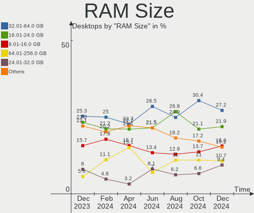
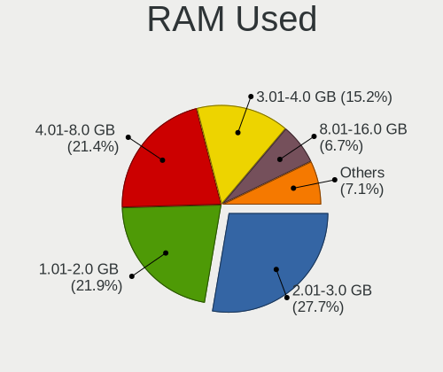
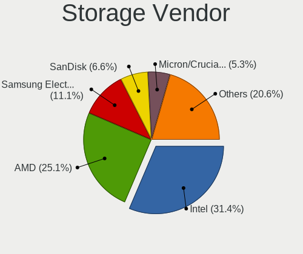
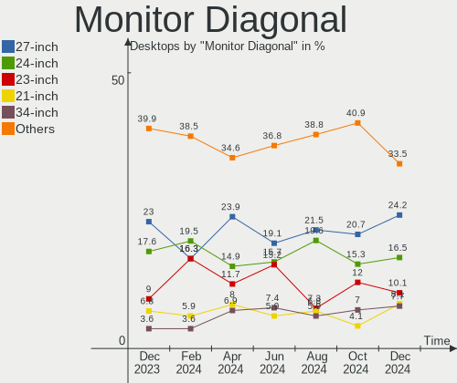
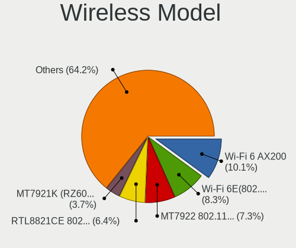
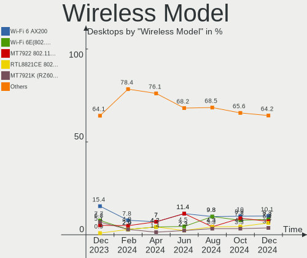
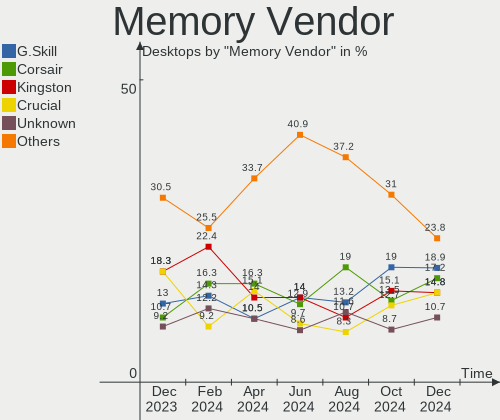
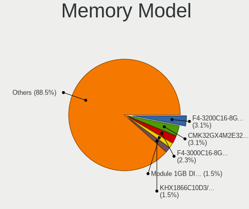

Linux in Germany - Hardware Trends (Desktops)
---------------------------------------------

A project to identify most popular hardware characteristics and track their change
over time based on data collected by Linux users at https://Linux-Hardware.org.

Anyone can contribute to this report by the [hw-probe](https://github.com/linuxhw/hw-probe) tool:

    sudo -E hw-probe -all -upload

Period: Nov, 2023.

Contents
--------

* [ System ](#system)
  - [ OS                       ](#os)
  - [ OS Family                ](#os-family)
  - [ Kernel                   ](#kernel)
  - [ Kernel Family            ](#kernel-family)
  - [ Kernel Major Ver.        ](#kernel-major-ver)
  - [ Arch                     ](#arch)
  - [ DE                       ](#de)
  - [ Display Server           ](#display-server)
  - [ Display Manager          ](#display-manager)
  - [ OS Lang                  ](#os-lang)
  - [ Boot Mode                ](#boot-mode)
  - [ Filesystem               ](#filesystem)
  - [ Part. scheme             ](#part-scheme)
  - [ Dual Boot with Linux/BSD ](#dual-boot-with-linuxbsd)
  - [ Dual Boot (Win)          ](#dual-boot-win)

* [ Board ](#board)
  - [ Vendor                   ](#vendor)
  - [ Model                    ](#model)
  - [ Model Family             ](#model-family)
  - [ MFG Year                 ](#mfg-year)
  - [ Form Factor              ](#form-factor)
  - [ Secure Boot              ](#secure-boot)
  - [ Coreboot                 ](#coreboot)
  - [ RAM Size                 ](#ram-size)
  - [ RAM Used                 ](#ram-used)
  - [ Total Drives             ](#total-drives)
  - [ Has CD-ROM               ](#has-cd-rom)
  - [ Has Ethernet             ](#has-ethernet)
  - [ Has WiFi                 ](#has-wifi)
  - [ Has Bluetooth            ](#has-bluetooth)

* [ Location ](#location)
  - [ Country                  ](#country)
  - [ City                     ](#city)

* [ Drives ](#drives)
  - [ Drive Vendor             ](#drive-vendor)
  - [ Drive Model              ](#drive-model)
  - [ HDD Vendor               ](#hdd-vendor)
  - [ SSD Vendor               ](#ssd-vendor)
  - [ Drive Kind               ](#drive-kind)
  - [ Drive Connector          ](#drive-connector)
  - [ Drive Size               ](#drive-size)
  - [ Space Total              ](#space-total)
  - [ Space Used               ](#space-used)
  - [ Malfunc. Drives          ](#malfunc-drives)
  - [ Malfunc. Drive Vendor    ](#malfunc-drive-vendor)
  - [ Malfunc. HDD Vendor      ](#malfunc-hdd-vendor)
  - [ Malfunc. Drive Kind      ](#malfunc-drive-kind)
  - [ Failed Drives            ](#failed-drives)
  - [ Failed Drive Vendor      ](#failed-drive-vendor)
  - [ Drive Status             ](#drive-status)

* [ Storage controller ](#storage-controller)
  - [ Storage Vendor           ](#storage-vendor)
  - [ Storage Model            ](#storage-model)
  - [ Storage Kind             ](#storage-kind)

* [ Processor ](#processor)
  - [ CPU Vendor               ](#cpu-vendor)
  - [ CPU Model                ](#cpu-model)
  - [ CPU Model Family         ](#cpu-model-family)
  - [ CPU Cores                ](#cpu-cores)
  - [ CPU Sockets              ](#cpu-sockets)
  - [ CPU Threads              ](#cpu-threads)
  - [ CPU Op-Modes             ](#cpu-op-modes)
  - [ CPU Microcode            ](#cpu-microcode)
  - [ CPU Microarch            ](#cpu-microarch)

* [ Graphics ](#graphics)
  - [ GPU Vendor               ](#gpu-vendor)
  - [ GPU Model                ](#gpu-model)
  - [ GPU Combo                ](#gpu-combo)
  - [ GPU Driver               ](#gpu-driver)
  - [ GPU Memory               ](#gpu-memory)

* [ Monitor ](#monitor)
  - [ Monitor Vendor           ](#monitor-vendor)
  - [ Monitor Model            ](#monitor-model)
  - [ Monitor Resolution       ](#monitor-resolution)
  - [ Monitor Diagonal         ](#monitor-diagonal)
  - [ Monitor Width            ](#monitor-width)
  - [ Aspect Ratio             ](#aspect-ratio)
  - [ Monitor Area             ](#monitor-area)
  - [ Pixel Density            ](#pixel-density)
  - [ Multiple Monitors        ](#multiple-monitors)

* [ Network ](#network)
  - [ Net Controller Vendor    ](#net-controller-vendor)
  - [ Net Controller Model     ](#net-controller-model)
  - [ Wireless Vendor          ](#wireless-vendor)
  - [ Wireless Model           ](#wireless-model)
  - [ Ethernet Vendor          ](#ethernet-vendor)
  - [ Ethernet Model           ](#ethernet-model)
  - [ Net Controller Kind      ](#net-controller-kind)
  - [ Used Controller          ](#used-controller)
  - [ NICs                     ](#nics)
  - [ IPv6                     ](#ipv6)

* [ Bluetooth ](#bluetooth)
  - [ Bluetooth Vendor         ](#bluetooth-vendor)
  - [ Bluetooth Model          ](#bluetooth-model)

* [ Sound ](#sound)
  - [ Sound Vendor             ](#sound-vendor)
  - [ Sound Model              ](#sound-model)

* [ Memory ](#memory)
  - [ Memory Vendor            ](#memory-vendor)
  - [ Memory Model             ](#memory-model)
  - [ Memory Kind              ](#memory-kind)
  - [ Memory Form Factor       ](#memory-form-factor)
  - [ Memory Size              ](#memory-size)
  - [ Memory Speed             ](#memory-speed)

* [ Printers & scanners ](#printers--scanners)
  - [ Printer Vendor           ](#printer-vendor)
  - [ Printer Model            ](#printer-model)
  - [ Scanner Vendor           ](#scanner-vendor)
  - [ Scanner Model            ](#scanner-model)

* [ Camera ](#camera)
  - [ Camera Vendor            ](#camera-vendor)
  - [ Camera Model             ](#camera-model)

* [ Security ](#security)
  - [ Fingerprint Vendor       ](#fingerprint-vendor)
  - [ Fingerprint Model        ](#fingerprint-model)
  - [ Chipcard Vendor          ](#chipcard-vendor)
  - [ Chipcard Model           ](#chipcard-model)

* [ Unsupported ](#unsupported)
  - [ Unsupported Devices      ](#unsupported-devices)
  - [ Unsupported Device Types ](#unsupported-device-types)

System
------

OS
--

Installed operating systems

| Name                         | Desktops | Percent |
|------------------------------|----------|---------|
| Linux Mint 21.2              | 41       | 16.27%  |
| Ubuntu 22.04                 | 30       | 11.9%   |
| OpenMandriva 5.0             | 18       | 7.14%   |
| Ubuntu 23.10                 | 15       | 5.95%   |
| OpenMandriva 23.08           | 12       | 4.76%   |
| Debian 12                    | 12       | 4.76%   |
| Arch Rolling                 | 10       | 3.97%   |
| Pop!_OS 22.04                | 8        | 3.17%   |
| openSUSE Tumbleweed-XXXXXXXX | 8        | 3.17%   |
| Fedora 38                    | 8        | 3.17%   |
| Zorin 16                     | 7        | 2.78%   |
| EndeavourOS Rolling          | 5        | 1.98%   |
| ArcoLinux Rolling            | 5        | 1.98%   |
| OpenMandriva 23.11           | 4        | 1.59%   |
| Nobara 38                    | 4        | 1.59%   |
| LMDE 6                       | 4        | 1.59%   |
| Kubuntu 22.04                | 4        | 1.59%   |
| Ubuntu 23.04                 | 3        | 1.19%   |
| Manjaro 23.1.0               | 3        | 1.19%   |
| Fedora 39                    | 3        | 1.19%   |
| Debian 11                    | 3        | 1.19%   |
| Debian                       | 3        | 1.19%   |
| Xubuntu 20.04                | 2        | 0.79%   |
| Xero Rolling                 | 2        | 0.79%   |
| TUXEDO OS 22.04              | 2        | 0.79%   |
| OpenWrt 22.03.5              | 2        | 0.79%   |
| openSUSE Microos-XXXXXXXX    | 2        | 0.79%   |
| Neptune OS 8.0               | 2        | 0.79%   |
| Linux Mint 21.1              | 2        | 0.79%   |
| Linux Mint 20.3              | 2        | 0.79%   |
| Kubuntu 23.10                | 2        | 0.79%   |
| Gentoo 2.14                  | 2        | 0.79%   |
| Xubuntu 22.04                | 1        | 0.4%    |
| Ubuntu Unity 23.04           | 1        | 0.4%    |
| Ubuntu Budgie 23.10          | 1        | 0.4%    |
| Ubuntu 22.10                 | 1        | 0.4%    |
| Ubuntu 21.04                 | 1        | 0.4%    |
| Ubuntu 20.04                 | 1        | 0.4%    |
| ROSA 12.4                    | 1        | 0.4%    |
| org.kde.Platform 5.15-21.08  | 1        | 0.4%    |

OS Family
---------

OS without a version

| Name             | Desktops | Percent |
|------------------|----------|---------|
| Ubuntu           | 51       | 20.24%  |
| Linux Mint       | 47       | 18.65%  |
| OpenMandriva     | 38       | 15.08%  |
| Debian           | 18       | 7.14%   |
| openSUSE         | 11       | 4.37%   |
| Fedora           | 11       | 4.37%   |
| Arch             | 10       | 3.97%   |
| Pop!_OS          | 8        | 3.17%   |
| Zorin            | 7        | 2.78%   |
| Kubuntu          | 7        | 2.78%   |
| EndeavourOS      | 5        | 1.98%   |
| ArcoLinux        | 5        | 1.98%   |
| Nobara           | 4        | 1.59%   |
| Manjaro          | 4        | 1.59%   |
| LMDE             | 4        | 1.59%   |
| Xubuntu          | 3        | 1.19%   |
| Xero             | 2        | 0.79%   |
| TUXEDO OS        | 2        | 0.79%   |
| OpenWrt          | 2        | 0.79%   |
| NixOS            | 2        | 0.79%   |
| Neptune OS       | 2        | 0.79%   |
| Gentoo           | 2        | 0.79%   |
| Ubuntu Unity     | 1        | 0.4%    |
| Ubuntu Budgie    | 1        | 0.4%    |
| ROSA             | 1        | 0.4%    |
| org.kde.Platform | 1        | 0.4%    |
| KDE neon         | 1        | 0.4%    |
| Elementary       | 1        | 0.4%    |
| ChimeraOS        | 1        | 0.4%    |

Kernel
------

Version of the Linux kernel

| Version                     | Desktops | Percent |
|-----------------------------|----------|---------|
| 6.2.0-36-generic            | 30       | 11.9%   |
| 5.15.0-88-generic           | 27       | 10.71%  |
| 6.6.2-desktop-1omv2390      | 20       | 7.94%   |
| 6.5.0-10-generic            | 14       | 5.56%   |
| 6.1.0-13-amd64              | 13       | 5.16%   |
| 6.4.11-desktop-1omv2390     | 11       | 4.37%   |
| 6.5.9-arch2-1               | 9        | 3.57%   |
| 5.15.0-89-generic           | 9        | 3.57%   |
| 6.5.6-76060506-generic      | 7        | 2.78%   |
| 6.6.2-arch1-1               | 6        | 2.38%   |
| 6.5.9-1-default             | 6        | 2.38%   |
| 6.2.0-37-generic            | 6        | 2.38%   |
| 5.15.0-87-generic           | 5        | 1.98%   |
| 6.5.10-200.fc38.x86_64      | 3        | 1.19%   |
| 6.5.0-10006-tuxedo          | 3        | 1.19%   |
| 6.6.2-1-default             | 2        | 0.79%   |
| 6.6.1-arch1-1               | 2        | 0.79%   |
| 6.5.9-201.fsync.fc38.x86_64 | 2        | 0.79%   |
| 6.5.8-200.fc38.x86_64       | 2        | 0.79%   |
| 6.5.12-300.fc39.x86_64      | 2        | 0.79%   |
| 6.5.11-1-MANJARO            | 2        | 0.79%   |
| 6.5.0-9-generic             | 2        | 0.79%   |
| 6.5.0-3-amd64               | 2        | 0.79%   |
| 6.5.0-13-generic            | 2        | 0.79%   |
| 6.2.0-34-generic            | 2        | 0.79%   |
| 6.1.0-9-amd64               | 2        | 0.79%   |
| 6.1.0-0.deb11.11-amd64      | 2        | 0.79%   |
| 5.4.0-166-generic           | 2        | 0.79%   |
| 5.15.0-84-generic           | 2        | 0.79%   |
| 5.15.0-78-generic           | 2        | 0.79%   |
| 5.10.176                    | 2        | 0.79%   |
| 6.6.2-gentoo                | 1        | 0.4%    |
| 6.6.1-desktop-1omv2390      | 1        | 0.4%    |
| 6.6.1-1-default             | 1        | 0.4%    |
| 6.6.1                       | 1        | 0.4%    |
| 6.6.0-desktop-1omv2390      | 1        | 0.4%    |
| 6.5.9-200.fsync.fc38.x86_64 | 1        | 0.4%    |
| 6.5.9-200.fc38.x86_64       | 1        | 0.4%    |
| 6.5.7-200.fc38.x86_64       | 1        | 0.4%    |
| 6.5.7-060507-generic        | 1        | 0.4%    |

Kernel Family
-------------

Linux kernel without a distro release

| Version  | Desktops | Percent |
|----------|----------|---------|
| 5.15.0   | 50       | 19.84%  |
| 6.2.0    | 41       | 16.27%  |
| 6.6.2    | 29       | 11.51%  |
| 6.5.0    | 25       | 9.92%   |
| 6.1.0    | 20       | 7.94%   |
| 6.5.9    | 19       | 7.54%   |
| 6.4.11   | 11       | 4.37%   |
| 6.5.6    | 8        | 3.17%   |
| 6.6.1    | 5        | 1.98%   |
| 6.5.10   | 4        | 1.59%   |
| 6.5.11   | 3        | 1.19%   |
| 6.5.8    | 2        | 0.79%   |
| 6.5.7    | 2        | 0.79%   |
| 6.5.12   | 2        | 0.79%   |
| 6.1.58   | 2        | 0.79%   |
| 5.4.0    | 2        | 0.79%   |
| 5.19.0   | 2        | 0.79%   |
| 5.10.176 | 2        | 0.79%   |
| 6.6.0    | 1        | 0.4%    |
| 6.5.5    | 1        | 0.4%    |
| 6.5.4    | 1        | 0.4%    |
| 6.5.3    | 1        | 0.4%    |
| 6.5.2    | 1        | 0.4%    |
| 6.5.1    | 1        | 0.4%    |
| 6.4.8    | 1        | 0.4%    |
| 6.4.10   | 1        | 0.4%    |
| 6.3.9    | 1        | 0.4%    |
| 6.3.8    | 1        | 0.4%    |
| 6.3.6    | 1        | 0.4%    |
| 6.3.5    | 1        | 0.4%    |
| 6.2.9    | 1        | 0.4%    |
| 6.2.6    | 1        | 0.4%    |
| 6.2.16   | 1        | 0.4%    |
| 6.1.63   | 1        | 0.4%    |
| 6.1.62   | 1        | 0.4%    |
| 6.1.61   | 1        | 0.4%    |
| 6.1.60   | 1        | 0.4%    |
| 6.1.4    | 1        | 0.4%    |
| 5.14.21  | 1        | 0.4%    |
| 5.11.0   | 1        | 0.4%    |

Kernel Major Ver.
-----------------

Linux kernel major version

| Version | Desktops | Percent |
|---------|----------|---------|
| 6.5     | 70       | 27.78%  |
| 5.15    | 50       | 19.84%  |
| 6.2     | 44       | 17.46%  |
| 6.6     | 35       | 13.89%  |
| 6.1     | 27       | 10.71%  |
| 6.4     | 13       | 5.16%   |
| 6.3     | 4        | 1.59%   |
| 5.4     | 2        | 0.79%   |
| 5.19    | 2        | 0.79%   |
| 5.10    | 2        | 0.79%   |
| 5.14    | 1        | 0.4%    |
| 5.11    | 1        | 0.4%    |
| 4.15    | 1        | 0.4%    |

Arch
----

OS architecture (x86_64, i586, etc.)

| Name   | Desktops | Percent |
|--------|----------|---------|
| x86_64 | 252      | 100%    |

DE
--

Desktop Environment

| Name         | Desktops | Percent |
|--------------|----------|---------|
| GNOME        | 89       | 35.32%  |
| KDE5         | 75       | 29.76%  |
| X-Cinnamon   | 42       | 16.67%  |
| Unknown      | 14       | 5.56%   |
| XFCE         | 9        | 3.57%   |
| MATE         | 5        | 1.98%   |
| Cinnamon     | 5        | 1.98%   |
| i3           | 3        | 1.19%   |
| LXQt         | 2        | 0.79%   |
| Hyprland     | 2        | 0.79%   |
| Unity        | 1        | 0.4%    |
| sway         | 1        | 0.4%    |
| Pantheon     | 1        | 0.4%    |
| none+awesome | 1        | 0.4%    |
| LXDE         | 1        | 0.4%    |
| Budgie       | 1        | 0.4%    |

Display Server
--------------

X11 or Wayland

| Name    | Desktops | Percent |
|---------|----------|---------|
| X11     | 144      | 57.14%  |
| Wayland | 92       | 36.51%  |
| Tty     | 8        | 3.17%   |
| Unknown | 8        | 3.17%   |

Display Manager
---------------

SDDM, LightDM, etc.

| Name    | Desktops | Percent |
|---------|----------|---------|
| Unknown | 98       | 38.89%  |
| SDDM    | 67       | 26.59%  |
| GDM3    | 48       | 19.05%  |
| LightDM | 32       | 12.7%   |
| GDM     | 6        | 2.38%   |
| WDM     | 1        | 0.4%    |

OS Lang
-------

Language

| Lang    | Desktops | Percent |
|---------|----------|---------|
| de_DE   | 188      | 74.6%   |
| en_US   | 42       | 16.67%  |
| Unknown | 7        | 2.78%   |
| C       | 5        | 1.98%   |
| pl_PL   | 2        | 0.79%   |
| it_IT   | 2        | 0.79%   |
| en_GB   | 2        | 0.79%   |
| UTF-8   | 1        | 0.4%    |
| nl_NL   | 1        | 0.4%    |
| en_IE   | 1        | 0.4%    |
| de_AT   | 1        | 0.4%    |

Boot Mode
---------

EFI or BIOS

| Mode | Desktops | Percent |
|------|----------|---------|
| BIOS | 135      | 53.57%  |
| EFI  | 117      | 46.43%  |

Filesystem
----------

Type of filesystem

| Type    | Desktops | Percent |
|---------|----------|---------|
| Ext4    | 137      | 54.37%  |
| Tmpfs   | 46       | 18.25%  |
| Btrfs   | 41       | 16.27%  |
| Overlay | 24       | 9.52%   |
| Zfs     | 2        | 0.79%   |
| Ext3    | 1        | 0.4%    |
| Ext2    | 1        | 0.4%    |

Part. scheme
------------

Scheme of partitioning

| Type    | Desktops | Percent |
|---------|----------|---------|
| GPT     | 140      | 55.56%  |
| Unknown | 85       | 33.73%  |
| MBR     | 27       | 10.71%  |

Dual Boot with Linux/BSD
------------------------

Hosting more than one Linux/BSD

| Dual boot | Desktops | Percent |
|-----------|----------|---------|
| No        | 196      | 77.78%  |
| Yes       | 56       | 22.22%  |

Dual Boot (Win)
---------------

Hosting Linux and Windows

| Dual boot | Desktops | Percent |
|-----------|----------|---------|
| No        | 180      | 71.43%  |
| Yes       | 72       | 28.57%  |

Board
-----

Vendor
------

Motherboard manufacturer

| Name                                 | Desktops | Percent |
|--------------------------------------|----------|---------|
| ASUSTek Computer                     | 50       | 19.84%  |
| MSI                                  | 38       | 15.08%  |
| Gigabyte Technology                  | 35       | 13.89%  |
| ASRock                               | 33       | 13.1%   |
| Fujitsu                              | 16       | 6.35%   |
| Dell                                 | 16       | 6.35%   |
| Hewlett-Packard                      | 15       | 5.95%   |
| Lenovo                               | 14       | 5.56%   |
| Medion                               | 9        | 3.57%   |
| Inventec                             | 4        | 1.59%   |
| Unknown                              | 4        | 1.59%   |
| Biostar                              | 3        | 1.19%   |
| Shuttle                              | 2        | 0.79%   |
| Shenzhen Meigao Electronic Equipment | 2        | 0.79%   |
| BESSTAR Tech                         | 2        | 0.79%   |
| Acer                                 | 2        | 0.79%   |
| Wistron                              | 1        | 0.4%    |
| Pegatron                             | 1        | 0.4%    |
| Packard Bell                         | 1        | 0.4%    |
| ONDA                                 | 1        | 0.4%    |
| GEEKOM                               | 1        | 0.4%    |
| Fujitsu Siemens                      | 1        | 0.4%    |
| ECS                                  | 1        | 0.4%    |

Model
-----

Motherboard model

| Name                                       | Desktops | Percent |
|--------------------------------------------|----------|---------|
| Unknown                                    | 4        | 1.59%   |
| MSI MS-7B86                                | 3        | 1.19%   |
| MSI MS-7B79                                | 3        | 1.19%   |
| Inventec D CLASS                           | 3        | 1.19%   |
| ASUS PRIME A320M-K                         | 3        | 1.19%   |
| ASUS A0000001                              | 3        | 1.19%   |
| ASRock B450 Steel Legend                   | 3        | 1.19%   |
| MSI MS-7C91                                | 2        | 0.79%   |
| MSI MS-7C84                                | 2        | 0.79%   |
| MSI MS-7C37                                | 2        | 0.79%   |
| MSI MS-7996                                | 2        | 0.79%   |
| Medion MS-7728                             | 2        | 0.79%   |
| Gigabyte X570 AORUS PRO                    | 2        | 0.79%   |
| Gigabyte GA-790XTA-UD4                     | 2        | 0.79%   |
| Gigabyte B550 AORUS ELITE V2               | 2        | 0.79%   |
| Gigabyte 970A-DS3P FX                      | 2        | 0.79%   |
| Fujitsu ESPRIMO E720                       | 2        | 0.79%   |
| Dell Precision 3660                        | 2        | 0.79%   |
| Dell OptiPlex 780                          | 2        | 0.79%   |
| Dell OptiPlex 3060                         | 2        | 0.79%   |
| ASUS Z170-A                                | 2        | 0.79%   |
| ASUS Z170 PRO GAMING                       | 2        | 0.79%   |
| ASUS PRIME X370-PRO                        | 2        | 0.79%   |
| ASUS M5A97 R2.0                            | 2        | 0.79%   |
| ASUS All Series                            | 2        | 0.79%   |
| ASRock Z77 Pro4                            | 2        | 0.79%   |
| ASRock B760M PG Riptide                    | 2        | 0.79%   |
| ASRock B450M Pro4                          | 2        | 0.79%   |
| Wistron Data Vault                         | 1        | 0.4%    |
| Shuttle SW580                              | 1        | 0.4%    |
| Shuttle DH170                              | 1        | 0.4%    |
| Shenzhen Meigao Electronic Equipment UM450 | 1        | 0.4%    |
| Shenzhen Meigao Electronic Equipment HX99G | 1        | 0.4%    |
| Pegatron p6730de                           | 1        | 0.4%    |
| Packard Bell IXTREME M5740                 | 1        | 0.4%    |
| ONDA H61V Ver:4.01                         | 1        | 0.4%    |
| MSI MS-7D73                                | 1        | 0.4%    |
| MSI MS-7D52                                | 1        | 0.4%    |
| MSI MS-7D20                                | 1        | 0.4%    |
| MSI MS-7D13                                | 1        | 0.4%    |

Model Family
------------

Motherboard model prefix

| Name                   | Desktops | Percent |
|------------------------|----------|---------|
| Fujitsu ESPRIMO        | 13       | 5.16%   |
| Dell OptiPlex          | 11       | 4.37%   |
| ASUS ROG               | 9        | 3.57%   |
| ASUS PRIME             | 8        | 3.17%   |
| Lenovo ThinkCentre     | 7        | 2.78%   |
| ASRock B450            | 6        | 2.38%   |
| ASUS TUF               | 5        | 1.98%   |
| Lenovo IdeaCentre      | 4        | 1.59%   |
| Unknown                | 4        | 1.59%   |
| MSI MS-7B86            | 3        | 1.19%   |
| MSI MS-7B79            | 3        | 1.19%   |
| Inventec D             | 3        | 1.19%   |
| HP EliteDesk           | 3        | 1.19%   |
| HP Compaq              | 3        | 1.19%   |
| Gigabyte X570          | 3        | 1.19%   |
| Gigabyte B550          | 3        | 1.19%   |
| Dell Precision         | 3        | 1.19%   |
| ASUS A0000001          | 3        | 1.19%   |
| ASRock Z77             | 3        | 1.19%   |
| MSI MS-7C91            | 2        | 0.79%   |
| MSI MS-7C84            | 2        | 0.79%   |
| MSI MS-7C37            | 2        | 0.79%   |
| MSI MS-7996            | 2        | 0.79%   |
| Medion MS-7728         | 2        | 0.79%   |
| Medion Akoya           | 2        | 0.79%   |
| HP ProDesk             | 2        | 0.79%   |
| HP Pavilion            | 2        | 0.79%   |
| Gigabyte GA-790XTA-UD4 | 2        | 0.79%   |
| Gigabyte B550M         | 2        | 0.79%   |
| Gigabyte B450          | 2        | 0.79%   |
| Gigabyte 970A-DS3P     | 2        | 0.79%   |
| ASUS Z170-A            | 2        | 0.79%   |
| ASUS Z170              | 2        | 0.79%   |
| ASUS M5A97             | 2        | 0.79%   |
| ASUS All               | 2        | 0.79%   |
| ASRock B760M           | 2        | 0.79%   |
| ASRock B450M           | 2        | 0.79%   |
| Acer Aspire            | 2        | 0.79%   |
| Wistron Data           | 1        | 0.4%    |
| Shuttle SW580          | 1        | 0.4%    |

MFG Year
--------

Motherboard manufacture year

| Year | Desktops | Percent |
|------|----------|---------|
| 2018 | 32       | 12.7%   |
| 2020 | 28       | 11.11%  |
| 2019 | 23       | 9.13%   |
| 2014 | 20       | 7.94%   |
| 2013 | 19       | 7.54%   |
| 2017 | 18       | 7.14%   |
| 2012 | 18       | 7.14%   |
| 2015 | 16       | 6.35%   |
| 2023 | 14       | 5.56%   |
| 2021 | 14       | 5.56%   |
| 2011 | 13       | 5.16%   |
| 2022 | 10       | 3.97%   |
| 2009 | 8        | 3.17%   |
| 2010 | 7        | 2.78%   |
| 2016 | 4        | 1.59%   |
| 2008 | 3        | 1.19%   |
| 2007 | 3        | 1.19%   |
| 2006 | 1        | 0.4%    |
| 2005 | 1        | 0.4%    |

Form Factor
-----------

Physical design of the computer

| Name    | Desktops | Percent |
|---------|----------|---------|
| Desktop | 252      | 100%    |

Secure Boot
-----------

Enabled or disabled

| State    | Desktops | Percent |
|----------|----------|---------|
| Disabled | 242      | 96.03%  |
| Enabled  | 10       | 3.97%   |

Coreboot
--------

Have coreboot on board

| Used | Desktops | Percent |
|------|----------|---------|
| No   | 252      | 100%    |

RAM Size
--------

Total RAM memory

| Size in GB  | Desktops | Percent |
|-------------|----------|---------|
| 32.01-64.0  | 73       | 28.97%  |
| 16.01-24.0  | 60       | 23.81%  |
| 4.01-8.0    | 43       | 17.06%  |
| 8.01-16.0   | 39       | 15.48%  |
| 3.01-4.0    | 20       | 7.94%   |
| 64.01-256.0 | 10       | 3.97%   |
| 24.01-32.0  | 4        | 1.59%   |
| 1.01-2.0    | 2        | 0.79%   |
| 2.01-3.0    | 1        | 0.4%    |

RAM Used
--------

Used RAM memory

| Used GB    | Desktops | Percent |
|------------|----------|---------|
| 1.01-2.0   | 81       | 32.14%  |
| 2.01-3.0   | 59       | 23.41%  |
| 4.01-8.0   | 45       | 17.86%  |
| 3.01-4.0   | 34       | 13.49%  |
| 8.01-16.0  | 14       | 5.56%   |
| 0.51-1.0   | 7        | 2.78%   |
| 0.01-0.5   | 5        | 1.98%   |
| 16.01-24.0 | 4        | 1.59%   |
| 24.01-32.0 | 2        | 0.79%   |
| 32.01-64.0 | 1        | 0.4%    |

Total Drives
------------

Number of drives on board

| Drives | Desktops | Percent |
|--------|----------|---------|
| 1      | 91       | 36.11%  |
| 2      | 68       | 26.98%  |
| 3      | 38       | 15.08%  |
| 4      | 25       | 9.92%   |
| 6      | 11       | 4.37%   |
| 5      | 9        | 3.57%   |
| 9      | 3        | 1.19%   |
| 7      | 3        | 1.19%   |
| 0      | 3        | 1.19%   |
| 8      | 1        | 0.4%    |

Has CD-ROM
----------

Has CD-ROM on board

| Presented | Desktops | Percent |
|-----------|----------|---------|
| No        | 139      | 55.16%  |
| Yes       | 113      | 44.84%  |

Has Ethernet
------------

Has Ethernet on board

| Presented | Desktops | Percent |
|-----------|----------|---------|
| Yes       | 251      | 99.6%   |
| No        | 1        | 0.4%    |

Has WiFi
--------

Has WiFi module

| Presented | Desktops | Percent |
|-----------|----------|---------|
| No        | 146      | 57.94%  |
| Yes       | 106      | 42.06%  |

Has Bluetooth
-------------

Has Bluetooth module

| Presented | Desktops | Percent |
|-----------|----------|---------|
| No        | 163      | 64.68%  |
| Yes       | 89       | 35.32%  |

Location
--------

Country
-------

Geographic location (country)

| Country | Desktops | Percent |
|---------|----------|---------|
| Germany | 252      | 100%    |

City
----

Geographic location (city)

| City                      | Desktops | Percent |
|---------------------------|----------|---------|
| Berlin                    | 21       | 8.33%   |
| Hamburg                   | 12       | 4.76%   |
| Cologne                   | 7        | 2.78%   |
| Frankfurt am Main         | 6        | 2.38%   |
| Düsseldorf               | 6        | 2.38%   |
| Nussdorf am Inn           | 5        | 1.98%   |
| Munich                    | 5        | 1.98%   |
| Karlsruhe                 | 5        | 1.98%   |
| Essen                     | 5        | 1.98%   |
| Mainz                     | 4        | 1.59%   |
| Leipzig                   | 4        | 1.59%   |
| Halle                     | 4        | 1.59%   |
| Furth                     | 4        | 1.59%   |
| Dortmund                  | 4        | 1.59%   |
| Paderborn                 | 3        | 1.19%   |
| Delligsen                 | 3        | 1.19%   |
| Darmstadt                 | 3        | 1.19%   |
| Wiesloch                  | 2        | 0.79%   |
| Stuttgart                 | 2        | 0.79%   |
| Schwerin                  | 2        | 0.79%   |
| Magdeburg                 | 2        | 0.79%   |
| Kiel                      | 2        | 0.79%   |
| Kassel                    | 2        | 0.79%   |
| Hof                       | 2        | 0.79%   |
| Hemmingen                 | 2        | 0.79%   |
| Fuerstenwalde             | 2        | 0.79%   |
| Duisburg                  | 2        | 0.79%   |
| Chemnitz                  | 2        | 0.79%   |
| Buchholz in der Nordheide | 2        | 0.79%   |
| Bonn                      | 2        | 0.79%   |
| Bochum                    | 2        | 0.79%   |
| Bielefeld                 | 2        | 0.79%   |
| Augsburg                  | 2        | 0.79%   |
| Würzburg                 | 1        | 0.4%    |
| Wuppertal                 | 1        | 0.4%    |
| Wolfsburg                 | 1        | 0.4%    |
| Witten                    | 1        | 0.4%    |
| Winsen                    | 1        | 0.4%    |
| Wildeshausen              | 1        | 0.4%    |
| Wetzlar                   | 1        | 0.4%    |

Drives
------

Drive Vendor
------------

Hard drive vendors

| Vendor                       | Desktops | Drives | Percent |
|------------------------------|----------|--------|---------|
| Samsung Electronics          | 105      | 154    | 22.83%  |
| WDC                          | 75       | 96     | 16.3%   |
| Seagate                      | 53       | 74     | 11.52%  |
| SanDisk                      | 34       | 41     | 7.39%   |
| Crucial                      | 25       | 29     | 5.43%   |
| Toshiba                      | 23       | 34     | 5%      |
| Intenso                      | 19       | 21     | 4.13%   |
| Kingston                     | 15       | 17     | 3.26%   |
| Hitachi                      | 9        | 10     | 1.96%   |
| Unknown                      | 8        | 14     | 1.74%   |
| Phison Electronics           | 8        | 9      | 1.74%   |
| Micron/Crucial Technology    | 7        | 8      | 1.52%   |
| China                        | 5        | 5      | 1.09%   |
| Silicon Motion               | 4        | 4      | 0.87%   |
| Micron Technology            | 4        | 4      | 0.87%   |
| Intel                        | 4        | 6      | 0.87%   |
| HGST                         | 4        | 5      | 0.87%   |
| Verbatim                     | 3        | 3      | 0.65%   |
| SPCC                         | 3        | 4      | 0.65%   |
| Kingston Technology Company  | 3        | 3      | 0.65%   |
| Transcend                    | 2        | 2      | 0.43%   |
| SK hynix                     | 2        | 2      | 0.43%   |
| Shenzhen Longsys Electronics | 2        | 3      | 0.43%   |
| PNY                          | 2        | 3      | 0.43%   |
| Plextor                      | 2        | 2      | 0.43%   |
| MAXIO Technology (Hangzhou)  | 2        | 2      | 0.43%   |
| KIOXIA-EXCERIA               | 2        | 2      | 0.43%   |
| KIOXIA                       | 2        | 2      | 0.43%   |
| JMicron Technology           | 2        | 2      | 0.43%   |
| Fanxiang                     | 2        | 2      | 0.43%   |
| ExcelStor                    | 2        | 2      | 0.43%   |
| Corsair                      | 2        | 2      | 0.43%   |
| A-DATA Technology            | 2        | 2      | 0.43%   |
| Unknown                      | 2        | 2      | 0.43%   |
| Zheino                       | 1        | 1      | 0.22%   |
| WDC WDS                      | 1        | 1      | 0.22%   |
| USB3.0                       | 1        | 1      | 0.22%   |
| Teclast                      | 1        | 1      | 0.22%   |
| Team                         | 1        | 1      | 0.22%   |
| Shenzhen                     | 1        | 1      | 0.22%   |

Drive Model
-----------

Hard drive models

| Model                                                 | Desktops | Percent |
|-------------------------------------------------------|----------|---------|
| Samsung NVMe SSD Controller SM981/PM981/PM983 250GB   | 17       | 3.01%   |
| Samsung NVMe SSD Controller PM9A1/PM9A3/980PRO 2TB    | 11       | 1.95%   |
| Samsung SSD 850 EVO 250GB                             | 10       | 1.77%   |
| Samsung SSD 860 EVO 250GB                             | 7        | 1.24%   |
| Toshiba HDWD110 1TB                                   | 5        | 0.89%   |
| Toshiba DT01ACA100 1TB                                | 5        | 0.89%   |
| Seagate ST500DM002-1BD142 500GB                       | 5        | 0.89%   |
| Seagate ST2000DM008-2FR102 2TB                        | 5        | 0.89%   |
| SanDisk SSD PLUS 240GB                                | 5        | 0.89%   |
| Samsung SSD 980 1TB                                   | 5        | 0.89%   |
| Samsung SSD 860 EVO 500GB                             | 5        | 0.89%   |
| Samsung SSD 850 EVO 500GB                             | 5        | 0.89%   |
| Samsung SSD 840 EVO 250GB                             | 5        | 0.89%   |
| Samsung HD103SI 1TB                                   | 5        | 0.89%   |
| WDC WD20EARS-00MVWB0 2TB                              | 4        | 0.71%   |
| Toshiba DT01ACA200 2TB                                | 4        | 0.71%   |
| Silicon Motion SM2263EN/SM2263XT SSD Controller 256GB | 4        | 0.71%   |
| Samsung SSD 990 PRO 2TB                               | 4        | 0.71%   |
| Samsung SSD 860 EVO 1TB                               | 4        | 0.71%   |
| Crucial CT250MX500SSD1 250GB                          | 4        | 0.71%   |
| Crucial CT2000MX500SSD1 2TB                           | 4        | 0.71%   |
| WDC WDS500G2B0A-00SM50 500GB SSD                      | 3        | 0.53%   |
| WDC WDS100T3X0C-00SJG0 1TB                            | 3        | 0.53%   |
| Unknown SD/MMC/M.S.PRO 32GB                           | 3        | 0.53%   |
| Unknown SD/MMC 2GB                                    | 3        | 0.53%   |
| Unknown M.S./M.S.Pro/HG 16GB                          | 3        | 0.53%   |
| Toshiba DT01ACA050 500GB                              | 3        | 0.53%   |
| Seagate ST1000DM010-2EP102 1TB                        | 3        | 0.53%   |
| SanDisk SSD PLUS 480GB                                | 3        | 0.53%   |
| SanDisk NVMe SSD Drive 1TB                            | 3        | 0.53%   |
| Samsung NVMe SSD Controller SM961/PM961/SM963 256GB   | 3        | 0.53%   |
| Samsung HD103UJ 1TB                                   | 3        | 0.53%   |
| Samsung HD103SJ 1TB                                   | 3        | 0.53%   |
| Phison E12 NVMe Controller 512GB                      | 3        | 0.53%   |
| Micron/Crucial P2 NVMe PCIe SSD 1TB                   | 3        | 0.53%   |
| Kingston SA400S37240G 240GB SSD                       | 3        | 0.53%   |
| Intenso SSD 128GB                                     | 3        | 0.53%   |
| Crucial CT500MX500SSD1 500GB                          | 3        | 0.53%   |
| Crucial CT1000MX500SSD1 1TB                           | 3        | 0.53%   |
| WDC WDS240G2G0A-00JH30 240GB SSD                      | 2        | 0.35%   |

HDD Vendor
----------

Hard disk drive vendors

| Vendor              | Desktops | Drives | Percent |
|---------------------|----------|--------|---------|
| WDC                 | 59       | 76     | 34.1%   |
| Seagate             | 51       | 72     | 29.48%  |
| Toshiba             | 22       | 33     | 12.72%  |
| Samsung Electronics | 19       | 20     | 10.98%  |
| Hitachi             | 9        | 10     | 5.2%    |
| HGST                | 4        | 5      | 2.31%   |
| Unknown             | 2        | 2      | 1.16%   |
| Intenso             | 2        | 2      | 1.16%   |
| ExcelStor           | 2        | 2      | 1.16%   |
| USB3.0              | 1        | 1      | 0.58%   |
| IB-377U3            | 1        | 1      | 0.58%   |
| ASMT                | 1        | 1      | 0.58%   |

SSD Vendor
----------

Solid state drive vendors

| Vendor              | Desktops | Drives | Percent |
|---------------------|----------|--------|---------|
| Samsung Electronics | 60       | 76     | 34.29%  |
| SanDisk             | 23       | 28     | 13.14%  |
| Crucial             | 21       | 25     | 12%     |
| Intenso             | 15       | 17     | 8.57%   |
| WDC                 | 14       | 14     | 8%      |
| Kingston            | 8        | 8      | 4.57%   |
| China               | 4        | 4      | 2.29%   |
| Verbatim            | 2        | 2      | 1.14%   |
| Transcend           | 2        | 2      | 1.14%   |
| SPCC                | 2        | 3      | 1.14%   |
| PNY                 | 2        | 3      | 1.14%   |
| Fanxiang            | 2        | 2      | 1.14%   |
| Corsair             | 2        | 2      | 1.14%   |
| Unknown             | 2        | 2      | 1.14%   |
| Zheino              | 1        | 1      | 0.57%   |
| WDC WDS             | 1        | 1      | 0.57%   |
| Unknown             | 1        | 1      | 0.57%   |
| Team                | 1        | 1      | 0.57%   |
| Seagate             | 1        | 1      | 0.57%   |
| Plextor             | 1        | 1      | 0.57%   |
| Phison              | 1        | 1      | 0.57%   |
| Patriot             | 1        | 1      | 0.57%   |
| OCZ                 | 1        | 1      | 0.57%   |
| Mushkin             | 1        | 1      | 0.57%   |
| Micron Technology   | 1        | 1      | 0.57%   |
| Lexar               | 1        | 1      | 0.57%   |
| KIOXIA-EXCERIA      | 1        | 1      | 0.57%   |
| JMicron Technology  | 1        | 1      | 0.57%   |
| Intel               | 1        | 1      | 0.57%   |
| A-DATA Technology   | 1        | 1      | 0.57%   |

Drive Kind
----------

HDD or SSD

| Kind    | Desktops | Drives | Percent |
|---------|----------|--------|---------|
| SSD     | 143      | 204    | 35.75%  |
| HDD     | 136      | 225    | 34%     |
| NVMe    | 104      | 140    | 26%     |
| Unknown | 15       | 22     | 3.75%   |
| MMC     | 2        | 2      | 0.5%    |

Drive Connector
---------------

SATA, SAS, NVMe, etc.

| Type | Desktops | Drives | Percent |
|------|----------|--------|---------|
| SATA | 205      | 413    | 60.83%  |
| NVMe | 104      | 140    | 30.86%  |
| SAS  | 26       | 38     | 7.72%   |
| MMC  | 2        | 2      | 0.59%   |

Drive Size
----------

Size of hard drive

| Size in TB | Desktops | Drives | Percent |
|------------|----------|--------|---------|
| 0.01-0.5   | 143      | 202    | 45.54%  |
| 0.51-1.0   | 94       | 117    | 29.94%  |
| 1.01-2.0   | 40       | 52     | 12.74%  |
| 2.01-3.0   | 15       | 21     | 4.78%   |
| 3.01-4.0   | 13       | 20     | 4.14%   |
| 4.01-10.0  | 8        | 12     | 2.55%   |
| 10.01-20.0 | 1        | 5      | 0.32%   |

Space Total
-----------

Amount of disk space available on the file system

| Size in GB     | Desktops | Percent |
|----------------|----------|---------|
| 251-500        | 51       | 20.24%  |
| 101-250        | 42       | 16.67%  |
| More than 3000 | 39       | 15.48%  |
| 1001-2000      | 33       | 13.1%   |
| 501-1000       | 32       | 12.7%   |
| 2001-3000      | 16       | 6.35%   |
| 1-20           | 15       | 5.95%   |
| Unknown        | 10       | 3.97%   |
| 21-50          | 7        | 2.78%   |
| 51-100         | 7        | 2.78%   |

Space Used
----------

Amount of used disk space

| Used GB        | Desktops | Percent |
|----------------|----------|---------|
| 1-20           | 60       | 23.81%  |
| 21-50          | 34       | 13.49%  |
| 251-500        | 29       | 11.51%  |
| 101-250        | 29       | 11.51%  |
| 51-100         | 28       | 11.11%  |
| 1001-2000      | 19       | 7.54%   |
| 501-1000       | 19       | 7.54%   |
| More than 3000 | 12       | 4.76%   |
| 2001-3000      | 11       | 4.37%   |
| Unknown        | 10       | 3.97%   |
| 0              | 1        | 0.4%    |

Malfunc. Drives
---------------

Drive models with a malfunction

| Model                                                           | Desktops | Drives | Percent |
|-----------------------------------------------------------------|----------|--------|---------|
| Seagate ST500DM002-1BD142 500GB                                 | 3        | 3      | 9.38%   |
| Samsung Electronics HD103SI 1TB                                 | 3        | 3      | 9.38%   |
| WDC WD5000AAVS-00ZTB0 500GB                                     | 1        | 1      | 3.13%   |
| WDC WD5000AAKX-221CA1 500GB                                     | 1        | 1      | 3.13%   |
| WDC WD20EARX-00PASB0 2TB                                        | 1        | 1      | 3.13%   |
| WDC WD1600AAJS-60B4A0 160GB                                     | 1        | 1      | 3.13%   |
| WDC WD10EZEX-08M2NA0 1TB                                        | 1        | 1      | 3.13%   |
| WDC WD Blue SA510 2.5 500GB                                     | 1        | 1      | 3.13%   |
| Transcend TS250GMTS425S 250GB SSD                               | 1        | 1      | 3.13%   |
| Toshiba MK5059GSXP 500GB                                        | 1        | 1      | 3.13%   |
| Toshiba DT01ACA100 1TB                                          | 1        | 1      | 3.13%   |
| Silicon Motion SM2263EN/SM2263XT SSD Controller 256GB           | 1        | 1      | 3.13%   |
| Seagate ST3500830AS 500GB                                       | 1        | 1      | 3.13%   |
| Seagate ST3500630NS 500GB                                       | 1        | 1      | 3.13%   |
| Seagate ST3250620AS 250GB                                       | 1        | 1      | 3.13%   |
| Seagate ST1000DM003-9YN162 1TB                                  | 1        | 1      | 3.13%   |
| SanDisk SDSSDP128G 128GB                                        | 1        | 1      | 3.13%   |
| Samsung Electronics SSD 980 1TB                                 | 1        | 1      | 3.13%   |
| Samsung Electronics SSD 870 EVO 500GB                           | 1        | 1      | 3.13%   |
| Samsung Electronics SSD 840 EVO 250GB                           | 1        | 1      | 3.13%   |
| Samsung Electronics NVMe SSD Controller SM981/PM981/PM983 250GB | 1        | 1      | 3.13%   |
| Samsung Electronics HD502HJ 500GB                               | 1        | 1      | 3.13%   |
| Samsung Electronics HD501LJ 500GB                               | 1        | 1      | 3.13%   |
| Samsung Electronics HD103UJ 1TB                                 | 1        | 1      | 3.13%   |
| Plextor PX-256M2S 256GB SSD                                     | 1        | 1      | 3.13%   |
| Intel SSDSCKKF180G8L 180GB                                      | 1        | 1      | 3.13%   |
| Corsair CSSD-V64GB2                                             | 1        | 1      | 3.13%   |
| A-DATA Technology SP900 256GB SSD                               | 1        | 1      | 3.13%   |

Malfunc. Drive Vendor
---------------------

Vendors of faulty drives

| Vendor              | Desktops | Drives | Percent |
|---------------------|----------|--------|---------|
| Samsung Electronics | 10       | 10     | 31.25%  |
| Seagate             | 7        | 7      | 21.88%  |
| WDC                 | 6        | 6      | 18.75%  |
| Toshiba             | 2        | 2      | 6.25%   |
| Transcend           | 1        | 1      | 3.13%   |
| Silicon Motion      | 1        | 1      | 3.13%   |
| SanDisk             | 1        | 1      | 3.13%   |
| Plextor             | 1        | 1      | 3.13%   |
| Intel               | 1        | 1      | 3.13%   |
| Corsair             | 1        | 1      | 3.13%   |
| A-DATA Technology   | 1        | 1      | 3.13%   |

Malfunc. HDD Vendor
-------------------

Vendors of faulty HDD drives

| Vendor              | Desktops | Drives | Percent |
|---------------------|----------|--------|---------|
| Seagate             | 7        | 7      | 35%     |
| Samsung Electronics | 6        | 6      | 30%     |
| WDC                 | 5        | 5      | 25%     |
| Toshiba             | 2        | 2      | 10%     |

Malfunc. Drive Kind
-------------------

Kinds of faulty drives

| Kind | Desktops | Drives | Percent |
|------|----------|--------|---------|
| HDD  | 19       | 20     | 65.52%  |
| SSD  | 7        | 9      | 24.14%  |
| NVMe | 3        | 3      | 10.34%  |

Failed Drives
-------------

Failed drive models

Zero info for selected period =(

Failed Drive Vendor
-------------------

Failed drive vendors

Zero info for selected period =(

Drive Status
------------

Number of failed and malfunc. drives

| Status   | Desktops | Drives | Percent |
|----------|----------|--------|---------|
| Detected | 146      | 325    | 51.59%  |
| Works    | 109      | 236    | 38.52%  |
| Malfunc  | 28       | 32     | 9.89%   |

Storage controller
------------------

Storage Vendor
--------------

Storage controller vendors

| Vendor                       | Desktops | Percent |
|------------------------------|----------|---------|
| Intel                        | 140      | 34.48%  |
| AMD                          | 108      | 26.6%   |
| Samsung Electronics          | 49       | 12.07%  |
| SanDisk                      | 18       | 4.43%   |
| ASMedia Technology           | 18       | 4.43%   |
| Micron/Crucial Technology    | 11       | 2.71%   |
| Kingston Technology Company  | 11       | 2.71%   |
| Phison Electronics           | 8        | 1.97%   |
| Marvell Technology Group     | 7        | 1.72%   |
| JMicron Technology           | 6        | 1.48%   |
| Silicon Motion               | 4        | 0.99%   |
| Realtek Semiconductor        | 3        | 0.74%   |
| Micron Technology            | 3        | 0.74%   |
| KIOXIA                       | 3        | 0.74%   |
| VIA Technologies             | 2        | 0.49%   |
| SK hynix                     | 2        | 0.49%   |
| Shenzhen Longsys Electronics | 2        | 0.49%   |
| MAXIO Technology (Hangzhou)  | 2        | 0.49%   |
| Adaptec                      | 2        | 0.49%   |
| Toshiba America Info Systems | 1        | 0.25%   |
| Seagate Technology           | 1        | 0.25%   |
| OCZ Technology Group         | 1        | 0.25%   |
| Nvidia                       | 1        | 0.25%   |
| LSI Logic / Symbios Logic    | 1        | 0.25%   |
| Lite-On Technology           | 1        | 0.25%   |
| ADATA Technology             | 1        | 0.25%   |

Storage Model
-------------

Storage controller models

| Model                                                                          | Desktops | Percent |
|--------------------------------------------------------------------------------|----------|---------|
| AMD FCH SATA Controller [AHCI mode]                                            | 55       | 11.41%  |
| Samsung NVMe SSD Controller SM981/PM981/PM983                                  | 29       | 6.02%   |
| Intel 8 Series/C220 Series Chipset Family 6-port SATA Controller 1 [AHCI mode] | 25       | 5.19%   |
| AMD 400 Series Chipset SATA Controller                                         | 25       | 5.19%   |
| AMD 500 Series Chipset SATA Controller                                         | 20       | 4.15%   |
| Intel Q170/Q150/B150/H170/H110/Z170/CM236 Chipset SATA Controller [AHCI Mode]  | 18       | 3.73%   |
| ASMedia ASM1062 Serial ATA Controller                                          | 15       | 3.11%   |
| Samsung NVMe SSD Controller PM9A1/PM9A3/980PRO                                 | 14       | 2.9%    |
| AMD SB7x0/SB8x0/SB9x0 IDE Controller                                           | 13       | 2.7%    |
| AMD SB7x0/SB8x0/SB9x0 SATA Controller [AHCI mode]                              | 12       | 2.49%   |
| Intel 6 Series/C200 Series Chipset Family 6 port Desktop SATA AHCI Controller  | 11       | 2.28%   |
| AMD SB7x0/SB8x0/SB9x0 SATA Controller [IDE mode]                               | 11       | 2.28%   |
| Intel Cannon Lake PCH SATA AHCI Controller                                     | 10       | 2.07%   |
| Intel 7 Series/C210 Series Chipset Family 6-port SATA Controller [AHCI mode]   | 9        | 1.87%   |
| Intel 500 Series Chipset Family SATA AHCI Controller                           | 8        | 1.66%   |
| Intel 200 Series PCH SATA controller [AHCI mode]                               | 7        | 1.45%   |
| AMD FCH SATA Controller D                                                      | 7        | 1.45%   |
| JMicron JMB363 SATA/IDE Controller                                             | 6        | 1.24%   |
| Samsung NVMe SSD Controller SM961/PM961/SM963                                  | 5        | 1.04%   |
| Samsung NVMe SSD Controller 980 (DRAM-less)                                    | 5        | 1.04%   |
| Micron/Crucial P2 [Nick P2] / P3 / P3 Plus NVMe PCIe SSD (DRAM-less)           | 5        | 1.04%   |
| Intel SATA Controller [RAID mode]                                              | 5        | 1.04%   |
| Intel NM10/ICH7 Family SATA Controller [IDE mode]                              | 5        | 1.04%   |
| AMD X370 Series Chipset SATA Controller                                        | 5        | 1.04%   |
| Silicon Motion SM2263EN/SM2263XT (DRAM-less) NVMe SSD Controllers              | 4        | 0.83%   |
| SanDisk Ultra 3D / WD Blue SN570 NVMe SSD (DRAM-less)                          | 4        | 0.83%   |
| SanDisk Extreme Pro / WD Black SN750 / PC SN730 / Red SN700 NVMe SSD           | 4        | 0.83%   |
| Samsung NVMe SSD Controller S4LV008[Pascal]                                    | 4        | 0.83%   |
| Intel Comet Lake SATA AHCI Controller                                          | 4        | 0.83%   |
| Intel Alder Lake-S PCH SATA Controller [AHCI Mode]                             | 4        | 0.83%   |
| Intel 700 Series Chipset Family SATA AHCI Controller                           | 4        | 0.83%   |
| Sandisk WD Black SN850X NVMe SSD                                               | 3        | 0.62%   |
| Phison E12 NVMe Controller                                                     | 3        | 0.62%   |
| Marvell Group 88SE9215 PCIe 2.0 x1 4-port SATA 6 Gb/s Controller               | 3        | 0.62%   |
| Kingston Company KC3000/FURY Renegade NVMe SSD E18                             | 3        | 0.62%   |
| Intel SSD 660P Series                                                          | 3        | 0.62%   |
| Intel Celeron/Pentium Silver Processor SATA Controller                         | 3        | 0.62%   |
| Intel C610/X99 series chipset 6-Port SATA Controller [AHCI mode]               | 3        | 0.62%   |
| Intel 9 Series Chipset Family SATA Controller [AHCI Mode]                      | 3        | 0.62%   |
| Intel 82801G (ICH7 Family) IDE Controller                                      | 3        | 0.62%   |

Storage Kind
------------

Kind of storage controller (IDE, SATA, NVMe, SAS, ...)

| Kind | Desktops | Percent |
|------|----------|---------|
| SATA | 226      | 59.32%  |
| NVMe | 105      | 27.56%  |
| IDE  | 33       | 8.66%   |
| RAID | 12       | 3.15%   |
| SCSI | 4        | 1.05%   |
| SAS  | 1        | 0.26%   |

Processor
---------

CPU Vendor
----------

Processor vendors

| Vendor | Desktops | Percent |
|--------|----------|---------|
| Intel  | 141      | 55.95%  |
| AMD    | 111      | 44.05%  |

CPU Model
---------

Processor models

| Model                                       | Desktops | Percent |
|---------------------------------------------|----------|---------|
| AMD Ryzen 5 3600 6-Core Processor           | 6        | 2.38%   |
| Intel Core i5-6500 CPU @ 3.20GHz            | 5        | 1.98%   |
| AMD Ryzen 7 5700X 8-Core Processor          | 5        | 1.98%   |
| AMD Ryzen 7 2700 Eight-Core Processor       | 5        | 1.98%   |
| AMD Ryzen 5 5600G with Radeon Graphics      | 5        | 1.98%   |
| Intel Core i9-9900K CPU @ 3.60GHz           | 4        | 1.59%   |
| Intel Core i5-7400 CPU @ 3.00GHz            | 4        | 1.59%   |
| AMD Ryzen 9 5900X 12-Core Processor         | 4        | 1.59%   |
| AMD Ryzen 5 2600 Six-Core Processor         | 4        | 1.59%   |
| Intel Core i5-4590 CPU @ 3.30GHz            | 3        | 1.19%   |
| Intel Core i5-4570 CPU @ 3.20GHz            | 3        | 1.19%   |
| Intel Core i5-3470 CPU @ 3.20GHz            | 3        | 1.19%   |
| Intel Core i3-3220 CPU @ 3.30GHz            | 3        | 1.19%   |
| AMD Ryzen 7 5800X3D 8-Core Processor        | 3        | 1.19%   |
| AMD Ryzen 5 5600X 6-Core Processor          | 3        | 1.19%   |
| AMD Phenom II X4 965 Processor              | 3        | 1.19%   |
| AMD G-T48E Processor                        | 3        | 1.19%   |
| AMD FX-8350 Eight-Core Processor            | 3        | 1.19%   |
| AMD FX-4300 Quad-Core Processor             | 3        | 1.19%   |
| Intel Pentium Dual-Core CPU E5400 @ 2.70GHz | 2        | 0.79%   |
| Intel Pentium CPU G3250 @ 3.20GHz           | 2        | 0.79%   |
| Intel Core i7-6700K CPU @ 4.00GHz           | 2        | 0.79%   |
| Intel Core i7-5820K CPU @ 3.30GHz           | 2        | 0.79%   |
| Intel Core i7-4790K CPU @ 4.00GHz           | 2        | 0.79%   |
| Intel Core i7-4770 CPU @ 3.40GHz            | 2        | 0.79%   |
| Intel Core i7-2600K CPU @ 3.40GHz           | 2        | 0.79%   |
| Intel Core i7-2600 CPU @ 3.40GHz            | 2        | 0.79%   |
| Intel Core i7-10700 CPU @ 2.90GHz           | 2        | 0.79%   |
| Intel Core i5-9400F CPU @ 2.90GHz           | 2        | 0.79%   |
| Intel Core i5-8400 CPU @ 2.80GHz            | 2        | 0.79%   |
| Intel Core i5-4460 CPU @ 3.20GHz            | 2        | 0.79%   |
| Intel Core i5-2500K CPU @ 3.30GHz           | 2        | 0.79%   |
| Intel Core i3-2100 CPU @ 3.10GHz            | 2        | 0.79%   |
| Intel Core 2 Quad CPU Q6600 @ 2.40GHz       | 2        | 0.79%   |
| Intel 13th Gen Core i7-13700KF              | 2        | 0.79%   |
| Intel 12th Gen Core i9-12900K               | 2        | 0.79%   |
| Intel 11th Gen Core i5-11500 @ 2.70GHz      | 2        | 0.79%   |
| AMD Ryzen 9 3900X 12-Core Processor         | 2        | 0.79%   |
| AMD Ryzen 7 5800X 8-Core Processor          | 2        | 0.79%   |
| AMD Ryzen 7 5700G with Radeon Graphics      | 2        | 0.79%   |

CPU Model Family
----------------

Processor model prefix

| Model                   | Desktops | Percent |
|-------------------------|----------|---------|
| Intel Core i5           | 46       | 18.25%  |
| AMD Ryzen 5             | 31       | 12.3%   |
| Intel Core i7           | 29       | 11.51%  |
| AMD Ryzen 7             | 28       | 11.11%  |
| Intel Core i3           | 14       | 5.56%   |
| Other                   | 12       | 4.76%   |
| AMD FX                  | 11       | 4.37%   |
| AMD Ryzen 9             | 9        | 3.57%   |
| Intel Xeon              | 7        | 2.78%   |
| Intel Pentium           | 7        | 2.78%   |
| Intel Core i9           | 6        | 2.38%   |
| Intel Celeron           | 6        | 2.38%   |
| AMD Phenom II X4        | 6        | 2.38%   |
| AMD Ryzen 3             | 4        | 1.59%   |
| AMD G                   | 4        | 1.59%   |
| AMD A8                  | 4        | 1.59%   |
| Intel Pentium Dual-Core | 3        | 1.19%   |
| Intel Core 2 Duo        | 3        | 1.19%   |
| AMD A10                 | 3        | 1.19%   |
| Intel Pentium 4         | 2        | 0.79%   |
| Intel Core 2 Quad       | 2        | 0.79%   |
| Intel Atom              | 2        | 0.79%   |
| AMD Ryzen 5 PRO         | 2        | 0.79%   |
| AMD PRO A10             | 2        | 0.79%   |
| AMD Phenom II X2        | 2        | 0.79%   |
| Intel Pentium Silver    | 1        | 0.4%    |
| Intel Core 2 Extreme    | 1        | 0.4%    |
| AMD Ryzen Threadripper  | 1        | 0.4%    |
| AMD Ryzen 7 PRO         | 1        | 0.4%    |
| AMD Athlon X4           | 1        | 0.4%    |
| AMD Athlon II X3        | 1        | 0.4%    |
| AMD A6                  | 1        | 0.4%    |

CPU Cores
---------

Number of processor cores

| Number | Desktops | Percent |
|--------|----------|---------|
| 4      | 96       | 38.1%   |
| 2      | 48       | 19.05%  |
| 6      | 44       | 17.46%  |
| 8      | 42       | 16.67%  |
| 16     | 7        | 2.78%   |
| 12     | 7        | 2.78%   |
| 10     | 2        | 0.79%   |
| 3      | 2        | 0.79%   |
| 1      | 2        | 0.79%   |
| 24     | 1        | 0.4%    |
| 20     | 1        | 0.4%    |

CPU Sockets
-----------

Number of sockets

| Number | Desktops | Percent |
|--------|----------|---------|
| 1      | 251      | 99.6%   |
| 2      | 1        | 0.4%    |

CPU Threads
-----------

Threads per core (Hyper-Threading)

| Number | Desktops | Percent |
|--------|----------|---------|
| 2      | 158      | 62.7%   |
| 1      | 94       | 37.3%   |

CPU Op-Modes
------------

CPU Operation Modes (32-bit, 64-bit)

| Op mode        | Desktops | Percent |
|----------------|----------|---------|
| 32-bit, 64-bit | 252      | 100%    |

CPU Microcode
-------------

Microcode number

| Number     | Desktops | Percent |
|------------|----------|---------|
| Unknown    | 125      | 49.6%   |
| 0x306c3    | 12       | 4.76%   |
| 0x0800820d | 9        | 3.57%   |
| 0x0a20120a | 7        | 2.78%   |
| 0x08701021 | 6        | 2.38%   |
| 0x08701030 | 5        | 1.98%   |
| 0x306a9    | 4        | 1.59%   |
| 0x206a7    | 4        | 1.59%   |
| 0x0a50000d | 4        | 1.59%   |
| 0x06000852 | 4        | 1.59%   |
| 0xa0655    | 3        | 1.19%   |
| 0x506e3    | 3        | 1.19%   |
| 0x0a50000c | 3        | 1.19%   |
| 0x0a201025 | 3        | 1.19%   |
| 0x08108109 | 3        | 1.19%   |
| 0x08108102 | 3        | 1.19%   |
| 0x010000c8 | 3        | 1.19%   |
| 0xa0671    | 2        | 0.79%   |
| 0x906e9    | 2        | 0.79%   |
| 0x1067a    | 2        | 0.79%   |
| 0x0a20120e | 2        | 0.79%   |
| 0x0a201205 | 2        | 0.79%   |
| 0x0a201016 | 2        | 0.79%   |
| 0x08001137 | 2        | 0.79%   |
| 0x0600611a | 2        | 0.79%   |
| 0x06000822 | 2        | 0.79%   |
| 0x06000817 | 2        | 0.79%   |
| 0x05000119 | 2        | 0.79%   |
| 0xf65      | 1        | 0.4%    |
| 0xf43      | 1        | 0.4%    |
| 0x906ed    | 1        | 0.4%    |
| 0x906ea    | 1        | 0.4%    |
| 0x706a8    | 1        | 0.4%    |
| 0x706a1    | 1        | 0.4%    |
| 0x6fb      | 1        | 0.4%    |
| 0x506ca    | 1        | 0.4%    |
| 0x406c3    | 1        | 0.4%    |
| 0x306e4    | 1        | 0.4%    |
| 0x106e5    | 1        | 0.4%    |
| 0x106ca    | 1        | 0.4%    |

CPU Microarch
-------------

Microarchitecture

| Name             | Desktops | Percent |
|------------------|----------|---------|
| Haswell          | 31       | 12.3%   |
| Zen 3            | 29       | 11.51%  |
| KabyLake         | 22       | 8.73%   |
| Zen 2            | 20       | 7.94%   |
| Zen+             | 18       | 7.14%   |
| Skylake          | 16       | 6.35%   |
| SandyBridge      | 15       | 5.95%   |
| Piledriver       | 12       | 4.76%   |
| IvyBridge        | 11       | 4.37%   |
| K10              | 9        | 3.57%   |
| CometLake        | 9        | 3.57%   |
| Unknown          | 8        | 3.17%   |
| Zen              | 6        | 2.38%   |
| Penryn           | 6        | 2.38%   |
| Excavator        | 5        | 1.98%   |
| Icelake          | 4        | 1.59%   |
| Bobcat           | 4        | 1.59%   |
| Alderlake Hybrid | 4        | 1.59%   |
| Steamroller      | 3        | 1.19%   |
| Silvermont       | 3        | 1.19%   |
| Goldmont plus    | 3        | 1.19%   |
| Core             | 3        | 1.19%   |
| NetBurst         | 2        | 0.79%   |
| Nehalem          | 2        | 0.79%   |
| Westmere         | 1        | 0.4%    |
| Tremont          | 1        | 0.4%    |
| Puma             | 1        | 0.4%    |
| Goldmont         | 1        | 0.4%    |
| Bulldozer        | 1        | 0.4%    |
| Broadwell        | 1        | 0.4%    |
| Bonnell          | 1        | 0.4%    |

Graphics
--------

GPU Vendor
----------

Vendors of graphics cards

| Vendor                     | Desktops | Percent |
|----------------------------|----------|---------|
| Nvidia                     | 98       | 37.12%  |
| AMD                        | 87       | 32.95%  |
| Intel                      | 77       | 29.17%  |
| Matrox Electronics Systems | 1        | 0.38%   |
| ATI Technologies           | 1        | 0.38%   |

GPU Model
---------

Graphics card models

| Model                                                                                    | Desktops | Percent |
|------------------------------------------------------------------------------------------|----------|---------|
| Intel Xeon E3-1200 v3/4th Gen Core Processor Integrated Graphics Controller              | 11       | 4.07%   |
| Intel HD Graphics 530                                                                    | 8        | 2.96%   |
| AMD Ellesmere [Radeon RX 470/480/570/570X/580/580X/590]                                  | 8        | 2.96%   |
| Intel Xeon E3-1200 v2/3rd Gen Core processor Graphics Controller                         | 7        | 2.59%   |
| Intel CoffeeLake-S GT2 [UHD Graphics 630]                                                | 7        | 2.59%   |
| Intel 2nd Generation Core Processor Family Integrated Graphics Controller                | 7        | 2.59%   |
| AMD Cezanne [Radeon Vega Series / Radeon Vega Mobile Series]                             | 7        | 2.59%   |
| Nvidia GP107 [GeForce GTX 1050 Ti]                                                       | 6        | 2.22%   |
| Nvidia GP104 [GeForce GTX 1070]                                                          | 6        | 2.22%   |
| Nvidia GK208B [GeForce GT 730]                                                           | 5        | 1.85%   |
| Intel CometLake-S GT2 [UHD Graphics 630]                                                 | 5        | 1.85%   |
| AMD Renoir [Radeon RX Vega 6 (Ryzen 4000/5000 Mobile Series)]                            | 5        | 1.85%   |
| AMD Picasso/Raven 2 [Radeon Vega Series / Radeon Vega Mobile Series]                     | 5        | 1.85%   |
| Nvidia GP108 [GeForce GT 1030]                                                           | 4        | 1.48%   |
| Nvidia GP106 [GeForce GTX 1060 6GB]                                                      | 4        | 1.48%   |
| Nvidia GM204 [GeForce GTX 970]                                                           | 4        | 1.48%   |
| Nvidia GK208B [GeForce GT 710]                                                           | 4        | 1.48%   |
| Intel HD Graphics 630                                                                    | 4        | 1.48%   |
| Intel 4 Series Chipset Integrated Graphics Controller                                    | 4        | 1.48%   |
| AMD Vega 10 XL/XT [Radeon RX Vega 56/64]                                                 | 4        | 1.48%   |
| AMD Navi 23 [Radeon RX 6600/6600 XT/6600M]                                               | 4        | 1.48%   |
| AMD Navi 21 [Radeon RX 6800/6800 XT / 6900 XT]                                           | 4        | 1.48%   |
| Nvidia TU116 [GeForce GTX 1660 SUPER]                                                    | 3        | 1.11%   |
| Nvidia TU106 [GeForce RTX 2070 Rev. A]                                                   | 3        | 1.11%   |
| Nvidia GM206 [GeForce GTX 960]                                                           | 3        | 1.11%   |
| Nvidia GA106 [GeForce RTX 3060 Lite Hash Rate]                                           | 3        | 1.11%   |
| Nvidia GA102 [GeForce RTX 3080]                                                          | 3        | 1.11%   |
| Intel Atom/Celeron/Pentium Processor x5-E8000/J3xxx/N3xxx Integrated Graphics Controller | 3        | 1.11%   |
| Intel 4th Generation Core Processor Family Integrated Graphics Controller                | 3        | 1.11%   |
| AMD Wrestler [Radeon HD 6250]                                                            | 3        | 1.11%   |
| AMD Wani [Radeon R5/R6/R7 Graphics]                                                      | 3        | 1.11%   |
| AMD Navi 22 [Radeon RX 6700/6700 XT/6750 XT / 6800M/6850M XT]                            | 3        | 1.11%   |
| AMD Cedar [Radeon HD 7350/8350 / R5 220]                                                 | 3        | 1.11%   |
| AMD Caicos [Radeon HD 6450/7450/8450 / R5 230 OEM]                                       | 3        | 1.11%   |
| Nvidia TU117 [GeForce GTX 1650]                                                          | 2        | 0.74%   |
| Nvidia TU106 [GeForce RTX 2060 Rev. A]                                                   | 2        | 0.74%   |
| Nvidia GM107 [GeForce GTX 750 Ti]                                                        | 2        | 0.74%   |
| Nvidia GK107GL [Quadro K2000]                                                            | 2        | 0.74%   |
| Nvidia GF119 [GeForce GT 610]                                                            | 2        | 0.74%   |
| Nvidia GF108GL [Quadro 600]                                                              | 2        | 0.74%   |

GPU Combo
---------

Combinations of graphics cards

| Name           | Desktops | Percent |
|----------------|----------|---------|
| 1 x Nvidia     | 92       | 36.51%  |
| 1 x AMD        | 85       | 33.73%  |
| 1 x Intel      | 63       | 25%     |
| Intel + Nvidia | 4        | 1.59%   |
| 2 x Nvidia     | 2        | 0.79%   |
| 2 x Intel      | 2        | 0.79%   |
| 2 x AMD        | 2        | 0.79%   |
| 1 x Matrox     | 1        | 0.4%    |
| Intel + AMD    | 1        | 0.4%    |

GPU Driver
----------

Free vs proprietary

| Driver      | Desktops | Percent |
|-------------|----------|---------|
| Free        | 182      | 72.22%  |
| Proprietary | 64       | 25.4%   |
| Unknown     | 6        | 2.38%   |

GPU Memory
----------

Total video memory

| Size in GB | Desktops | Percent |
|------------|----------|---------|
| Unknown    | 117      | 46.43%  |
| 7.01-8.0   | 29       | 11.51%  |
| 1.01-2.0   | 24       | 9.52%   |
| 8.01-16.0  | 20       | 7.94%   |
| 3.01-4.0   | 19       | 7.54%   |
| 0.01-0.5   | 19       | 7.54%   |
| 0.51-1.0   | 14       | 5.56%   |
| 5.01-6.0   | 8        | 3.17%   |
| 2.01-3.0   | 1        | 0.4%    |
| 16.01-24.0 | 1        | 0.4%    |

Monitor
-------

Monitor Vendor
--------------

Monitor vendors

| Vendor               | Desktops | Percent |
|----------------------|----------|---------|
| Samsung Electronics  | 46       | 16.43%  |
| Hewlett-Packard      | 21       | 7.5%    |
| Dell                 | 21       | 7.5%    |
| Acer                 | 18       | 6.43%   |
| Goldstar             | 17       | 6.07%   |
| Ancor Communications | 16       | 5.71%   |
| BenQ                 | 14       | 5%      |
| AOC                  | 13       | 4.64%   |
| Philips              | 12       | 4.29%   |
| Iiyama               | 9        | 3.21%   |
| ViewSonic            | 8        | 2.86%   |
| Fujitsu Siemens      | 8        | 2.86%   |
| Medion               | 7        | 2.5%    |
| Lenovo               | 5        | 1.79%   |
| Eizo                 | 5        | 1.79%   |
| NEC Computers        | 4        | 1.43%   |
| ASUSTek Computer     | 4        | 1.43%   |
| Sony                 | 3        | 1.07%   |
| Gigabyte Technology  | 3        | 1.07%   |
| Compal               | 3        | 1.07%   |
| MSI                  | 2        | 0.71%   |
| Medion Akoya         | 2        | 0.71%   |
| LG Electronics       | 2        | 0.71%   |
| HUAWEI               | 2        | 0.71%   |
| HKC                  | 2        | 0.71%   |
| HannStar             | 2        | 0.71%   |
| Grundig              | 2        | 0.71%   |
| FUS                  | 2        | 0.71%   |
| DENON                | 2        | 0.71%   |
| Unknown              | 2        | 0.71%   |
| ___                  | 1        | 0.36%   |
| Xiaomi               | 1        | 0.36%   |
| VIE                  | 1        | 0.36%   |
| Valve                | 1        | 0.36%   |
| Unknown              | 1        | 0.36%   |
| UGD                  | 1        | 0.36%   |
| Toshiba              | 1        | 0.36%   |
| SGT                  | 1        | 0.36%   |
| RTK                  | 1        | 0.36%   |
| Panasonic            | 1        | 0.36%   |

Monitor Model
-------------

Monitor models

| Model                                                                   | Desktops | Percent |
|-------------------------------------------------------------------------|----------|---------|
| Samsung Electronics U28E590 SAM0C4D 3840x2160 610x350mm 27.7-inch       | 4        | 1.33%   |
| Goldstar LG TV SSCR2 GSMC0C8 3840x2160                                  | 3        | 1%      |
| AOC 27V2G5 AOC2702 1920x1080 598x336mm 27.0-inch                        | 3        | 1%      |
| ViewSonic VG2448 VSC3B35 1920x1080 527x296mm 23.8-inch                  | 2        | 0.67%   |
| Samsung Electronics U28E590 SAM0C4E 3840x2160 608x345mm 27.5-inch       | 2        | 0.67%   |
| Samsung Electronics S24D330 SAM0D92 1920x1080 531x299mm 24.0-inch       | 2        | 0.67%   |
| Samsung Electronics LCD Monitor SAM0F14 3840x2160 1872x1053mm 84.6-inch | 2        | 0.67%   |
| Samsung Electronics LC34G55T SAM711A 1720x1440 800x340mm 34.2-inch      | 2        | 0.67%   |
| Samsung Electronics C24F390 SAM0D2C 1920x1080 521x293mm 23.5-inch       | 2        | 0.67%   |
| MSI MAG271CQR MSI3FA7 2560x1440 597x336mm 27.0-inch                     | 2        | 0.67%   |
| Grundig WXGA GRU4448 1600x1200                                          | 2        | 0.67%   |
| Goldstar TV GSMC0A0 3840x2160                                           | 2        | 0.67%   |
| Dell U2415 DELA0BA 1920x1200 518x324mm 24.1-inch                        | 2        | 0.67%   |
| Dell U2412M DELA07B 1920x1200 518x324mm 24.1-inch                       | 2        | 0.67%   |
| Dell 1704FPT DEL4004 1280x1024 338x270mm 17.0-inch                      | 2        | 0.67%   |
| BenQ GL2450H BNQ78A7 1920x1080 530x300mm 24.0-inch                      | 2        | 0.67%   |
| AOC Q32G1WG4 AOC3201 2560x1440 697x393mm 31.5-inch                      | 2        | 0.67%   |
| AOC Q3279WG5B AOC3279 2560x1440 725x428mm 33.1-inch                     | 2        | 0.67%   |
| Ancor Communications VS278 ACI27A1 1920x1080 598x336mm 27.0-inch        | 2        | 0.67%   |
| Ancor Communications ASUS VP228 ACI22C3 1920x1080 476x268mm 21.5-inch   | 2        | 0.67%   |
| Unknown                                                                 | 2        | 0.67%   |
| ___ LCD TV ___0101 1920x1080                                            | 1        | 0.33%   |
| Xiaomi Woieyeks-4K XMD009A 2880x1800 480x270mm 21.7-inch                | 1        | 0.33%   |
| ViewSonic VX3219-PC-MHD VSC053C 1920x1080 698x392mm 31.5-inch           | 1        | 0.33%   |
| ViewSonic VX3211-4K VSCC336 3840x2160 698x393mm 31.5-inch               | 1        | 0.33%   |
| ViewSonic VX2458-mhd VSC0437 1920x1080 521x293mm 23.5-inch              | 1        | 0.33%   |
| ViewSonic VA2407 Series VSC8C31 1920x1080 521x293mm 23.5-inch           | 1        | 0.33%   |
| ViewSonic VA2248 SERIES VSC0E28 1920x1080 477x268mm 21.5-inch           | 1        | 0.33%   |
| ViewSonic VA2216w-2 VSC2920 1680x1050 495x291mm 22.6-inch               | 1        | 0.33%   |
| VIE A/G2056 VIE2000 1600x900 443x249mm 20.0-inch                        | 1        | 0.33%   |
| Valve Index HMD VLV91A8                                                 | 1        | 0.33%   |
| Unknown LCD TV 0101 1920x1080 1600x900mm 72.3-inch                      | 1        | 0.33%   |
| UGD Artist13.3pro UGD1302 1920x1080 294x165mm 13.3-inch                 | 1        | 0.33%   |
| Toshiba TV TSB0105 1920x1080 708x398mm 32.0-inch                        | 1        | 0.33%   |
| Sony TV SNYEE01 1920x1080                                               | 1        | 0.33%   |
| Sony TV SNYAB03 1920x1080                                               | 1        | 0.33%   |
| Sony SDM-S51 SNY1E50 1024x768 304x228mm 15.0-inch                       | 1        | 0.33%   |
| SGT    SGT0161 1920x1080 345x194mm 15.6-inch                            | 1        | 0.33%   |
| Samsung Electronics U32R59x SAM0F96 3840x2160 700x390mm 31.5-inch       | 1        | 0.33%   |
| Samsung Electronics U32J59x SAM0F35 3840x2160 697x392mm 31.5-inch       | 1        | 0.33%   |

Monitor Resolution
------------------

Monitor screen resolution

| Resolution         | Desktops | Percent |
|--------------------|----------|---------|
| 1920x1080 (FHD)    | 122      | 43.88%  |
| 3840x2160 (4K)     | 37       | 13.31%  |
| 2560x1440 (QHD)    | 30       | 10.79%  |
| 1680x1050 (WSXGA+) | 19       | 6.83%   |
| 1280x1024 (SXGA)   | 13       | 4.68%   |
| 1920x1200 (WUXGA)  | 11       | 3.96%   |
| 3440x1440          | 9        | 3.24%   |
| Unknown            | 8        | 2.88%   |
| 1600x900 (HD+)     | 6        | 2.16%   |
| 1440x900 (WXGA+)   | 5        | 1.8%    |
| 3840x1080          | 2        | 0.72%   |
| 3360x1080          | 2        | 0.72%   |
| 1600x1200          | 2        | 0.72%   |
| 1024x768 (XGA)     | 2        | 0.72%   |
| 4800x1080          | 1        | 0.36%   |
| 4480x1440          | 1        | 0.36%   |
| 3840x1200          | 1        | 0.36%   |
| 3200x1080          | 1        | 0.36%   |
| 2560x1080          | 1        | 0.36%   |
| 1920x540           | 1        | 0.36%   |
| 1366x768 (WXGA)    | 1        | 0.36%   |
| 1360x768           | 1        | 0.36%   |
| 1280x960           | 1        | 0.36%   |
| 1280x720 (HD)      | 1        | 0.36%   |

Monitor Diagonal
----------------

Diagonal size in inches

| Inches  | Desktops | Percent |
|---------|----------|---------|
| 27      | 56       | 20.07%  |
| 24      | 51       | 18.28%  |
| 23      | 28       | 10.04%  |
| 21      | 24       | 8.6%    |
| Unknown | 16       | 5.73%   |
| 31      | 15       | 5.38%   |
| 22      | 14       | 5.02%   |
| 19      | 10       | 3.58%   |
| 72      | 8        | 2.87%   |
| 17      | 8        | 2.87%   |
| 34      | 7        | 2.51%   |
| 25      | 5        | 1.79%   |
| 20      | 5        | 1.79%   |
| 15      | 5        | 1.79%   |
| 84      | 3        | 1.08%   |
| 54      | 3        | 1.08%   |
| 28      | 3        | 1.08%   |
| 42      | 2        | 0.72%   |
| 40      | 2        | 0.72%   |
| 35      | 2        | 0.72%   |
| 33      | 2        | 0.72%   |
| 26      | 2        | 0.72%   |
| 100     | 1        | 0.36%   |
| 65      | 1        | 0.36%   |
| 48      | 1        | 0.36%   |
| 47      | 1        | 0.36%   |
| 36      | 1        | 0.36%   |
| 18      | 1        | 0.36%   |
| 16      | 1        | 0.36%   |
| 13      | 1        | 0.36%   |

Monitor Width
-------------

Physical width

| Width in mm    | Desktops | Percent |
|----------------|----------|---------|
| 501-600        | 124      | 45.93%  |
| 401-500        | 50       | 18.52%  |
| 601-700        | 25       | 9.26%   |
| Unknown        | 16       | 5.93%   |
| 301-350        | 13       | 4.81%   |
| 1501-2000      | 11       | 4.07%   |
| 701-800        | 10       | 3.7%    |
| 351-400        | 7        | 2.59%   |
| 1001-1500      | 6        | 2.22%   |
| 801-900        | 4        | 1.48%   |
| 901-1000       | 2        | 0.74%   |
| More than 2000 | 1        | 0.37%   |
| 201-300        | 1        | 0.37%   |

Aspect Ratio
------------

Proportional relationship between the width and the height

| Ratio   | Desktops | Percent |
|---------|----------|---------|
| 16/9    | 182      | 69.2%   |
| 16/10   | 35       | 13.31%  |
| 5/4     | 13       | 4.94%   |
| Unknown | 13       | 4.94%   |
| 21/9    | 9        | 3.42%   |
| 4/3     | 7        | 2.66%   |
| 32/9    | 2        | 0.76%   |
| 3/2     | 2        | 0.76%   |

Monitor Area
------------

Area in inch²

| Area in inch² | Desktops | Percent |
|----------------|----------|---------|
| 201-250        | 86       | 31.39%  |
| 301-350        | 58       | 21.17%  |
| 351-500        | 29       | 10.58%  |
| 151-200        | 26       | 9.49%   |
| 251-300        | 22       | 8.03%   |
| More than 1000 | 16       | 5.84%   |
| Unknown        | 16       | 5.84%   |
| 141-150        | 7        | 2.55%   |
| 501-1000       | 7        | 2.55%   |
| 101-110        | 5        | 1.82%   |
| 71-80          | 1        | 0.36%   |
| 131-140        | 1        | 0.36%   |

Pixel Density
-------------

Pixels per inch

| Density | Desktops | Percent |
|---------|----------|---------|
| 51-100  | 167      | 63.26%  |
| 101-120 | 49       | 18.56%  |
| 121-160 | 20       | 7.58%   |
| Unknown | 16       | 6.06%   |
| 1-50    | 8        | 3.03%   |
| 161-240 | 4        | 1.52%   |

Multiple Monitors
-----------------

Total monitors connected

| Total | Desktops | Percent |
|-------|----------|---------|
| 1     | 203      | 80.56%  |
| 2     | 31       | 12.3%   |
| 3     | 10       | 3.97%   |
| 0     | 7        | 2.78%   |
| 4     | 1        | 0.4%    |

Network
-------

Net Controller Vendor
---------------------

Controller vendors

| Vendor                | Desktops | Percent |
|-----------------------|----------|---------|
| Realtek Semiconductor | 170      | 47.89%  |
| Intel                 | 113      | 31.83%  |
| Qualcomm Atheros      | 15       | 4.23%   |
| TP-Link               | 10       | 2.82%   |
| Microsoft             | 8        | 2.25%   |
| Broadcom              | 8        | 2.25%   |
| MediaTek              | 5        | 1.41%   |
| Ralink Technology     | 3        | 0.85%   |
| IMC Networks          | 3        | 0.85%   |
| AVM                   | 3        | 0.85%   |
| Ralink                | 2        | 0.56%   |
| Holtek Semiconductor  | 2        | 0.56%   |
| D-Link System         | 2        | 0.56%   |
| Aquantia              | 2        | 0.56%   |
| Xiaomi                | 1        | 0.28%   |
| PEAK-System Technik   | 1        | 0.28%   |
| Nvidia                | 1        | 0.28%   |
| NetGear               | 1        | 0.28%   |
| Motorola PCS          | 1        | 0.28%   |
| Intersil              | 1        | 0.28%   |
| Edimax Technology     | 1        | 0.28%   |
| ASUSTek Computer      | 1        | 0.28%   |
| Arduino SA            | 1        | 0.28%   |

Net Controller Model
--------------------

Controller models

| Model                                                             | Desktops | Percent |
|-------------------------------------------------------------------|----------|---------|
| Realtek RTL8111/8168/8411 PCI Express Gigabit Ethernet Controller | 132      | 33.08%  |
| Realtek RTL8125 2.5GbE Controller                                 | 28       | 7.02%   |
| Intel I211 Gigabit Network Connection                             | 15       | 3.76%   |
| Intel Ethernet Connection I217-LM                                 | 11       | 2.76%   |
| Intel Ethernet Connection (2) I219-V                              | 9        | 2.26%   |
| Intel Wi-Fi 6 AX200                                               | 8        | 2.01%   |
| Intel Ethernet Controller I225-V                                  | 7        | 1.75%   |
| Intel Ethernet Connection (2) I219-LM                             | 7        | 1.75%   |
| Intel Ethernet Connection (7) I219-V                              | 6        | 1.5%    |
| Intel 82579LM Gigabit Network Connection (Lewisville)             | 6        | 1.5%    |
| Realtek RTL88x2bu [AC1200 Techkey]                                | 5        | 1.25%   |
| Realtek RTL8153 Gigabit Ethernet Adapter                          | 5        | 1.25%   |
| Microsoft XBOX ACC                                                | 5        | 1.25%   |
| Intel Wi-Fi 6 AX210/AX211/AX411 160MHz                            | 5        | 1.25%   |
| Realtek RTL8821CE 802.11ac PCIe Wireless Network Adapter          | 4        | 1%      |
| MediaTek MT7921K (RZ608) Wi-Fi 6E 80MHz                           | 4        | 1%      |
| Intel Wireless-AC 9260                                            | 4        | 1%      |
| Intel Ethernet Connection I217-V                                  | 4        | 1%      |
| Intel Ethernet Connection (2) I218-V                              | 4        | 1%      |
| Intel Dual Band Wireless-AC 3168NGW [Stone Peak]                  | 4        | 1%      |
| Realtek RTL8812AE 802.11ac PCIe Wireless Network Adapter          | 3        | 0.75%   |
| Qualcomm Atheros Killer E220x Gigabit Ethernet Controller         | 3        | 0.75%   |
| Qualcomm Atheros AR9485 Wireless Network Adapter                  | 3        | 0.75%   |
| Intel I210 Gigabit Network Connection                             | 3        | 0.75%   |
| Intel Ethernet Connection (17) I219-LM                            | 3        | 0.75%   |
| Intel Cannon Lake PCH CNVi WiFi                                   | 3        | 0.75%   |
| Intel 82579V Gigabit Network Connection                           | 3        | 0.75%   |
| IMC Networks Mediao 802.11n WLAN [Realtek RTL8191SU]              | 3        | 0.75%   |
| TP-Link TL-WN823N v2/v3 [Realtek RTL8192EU]                       | 2        | 0.5%    |
| TP-Link Archer T2U PLUS [RTL8821AU]                               | 2        | 0.5%    |
| TP-Link 802.11ac WLAN Adapter                                     | 2        | 0.5%    |
| Realtek RTL8852BE PCIe 802.11ax Wireless Network Controller       | 2        | 0.5%    |
| Realtek RTL8811AU 802.11a/b/g/n/ac WLAN Adapter                   | 2        | 0.5%    |
| Realtek RTL8188CUS 802.11n WLAN Adapter                           | 2        | 0.5%    |
| Realtek RTL810xE PCI Express Fast Ethernet controller             | 2        | 0.5%    |
| Realtek B1610311068                                               | 2        | 0.5%    |
| Ralink MT7601U Wireless Adapter                                   | 2        | 0.5%    |
| Intel Wireless 7265                                               | 2        | 0.5%    |
| Intel Wireless 7260                                               | 2        | 0.5%    |
| Intel I350 Gigabit Network Connection                             | 2        | 0.5%    |

Wireless Vendor
---------------

Wireless vendors

| Vendor                | Desktops | Percent |
|-----------------------|----------|---------|
| Intel                 | 33       | 30.56%  |
| Realtek Semiconductor | 25       | 23.15%  |
| TP-Link               | 10       | 9.26%   |
| Qualcomm Atheros      | 9        | 8.33%   |
| Microsoft             | 7        | 6.48%   |
| MediaTek              | 5        | 4.63%   |
| Broadcom              | 4        | 3.7%    |
| Ralink Technology     | 3        | 2.78%   |
| IMC Networks          | 3        | 2.78%   |
| AVM                   | 3        | 2.78%   |
| Ralink                | 2        | 1.85%   |
| NetGear               | 1        | 0.93%   |
| Edimax Technology     | 1        | 0.93%   |
| D-Link System         | 1        | 0.93%   |
| ASUSTek Computer      | 1        | 0.93%   |

Wireless Model
--------------

Wireless models

| Model                                                             | Desktops | Percent |
|-------------------------------------------------------------------|----------|---------|
| Intel Wi-Fi 6 AX200                                               | 8        | 7.34%   |
| Realtek RTL88x2bu [AC1200 Techkey]                                | 5        | 4.59%   |
| Microsoft XBOX ACC                                                | 5        | 4.59%   |
| Intel Wi-Fi 6 AX210/AX211/AX411 160MHz                            | 5        | 4.59%   |
| Realtek RTL8821CE 802.11ac PCIe Wireless Network Adapter          | 4        | 3.67%   |
| MediaTek MT7921K (RZ608) Wi-Fi 6E 80MHz                           | 4        | 3.67%   |
| Intel Wireless-AC 9260                                            | 4        | 3.67%   |
| Intel Dual Band Wireless-AC 3168NGW [Stone Peak]                  | 4        | 3.67%   |
| Realtek RTL8812AE 802.11ac PCIe Wireless Network Adapter          | 3        | 2.75%   |
| Qualcomm Atheros AR9485 Wireless Network Adapter                  | 3        | 2.75%   |
| Intel Cannon Lake PCH CNVi WiFi                                   | 3        | 2.75%   |
| IMC Networks Mediao 802.11n WLAN [Realtek RTL8191SU]              | 3        | 2.75%   |
| TP-Link TL-WN823N v2/v3 [Realtek RTL8192EU]                       | 2        | 1.83%   |
| TP-Link Archer T2U PLUS [RTL8821AU]                               | 2        | 1.83%   |
| TP-Link 802.11ac WLAN Adapter                                     | 2        | 1.83%   |
| Realtek RTL8811AU 802.11a/b/g/n/ac WLAN Adapter                   | 2        | 1.83%   |
| Realtek RTL8188CUS 802.11n WLAN Adapter                           | 2        | 1.83%   |
| Realtek B1610311068                                               | 2        | 1.83%   |
| Ralink MT7601U Wireless Adapter                                   | 2        | 1.83%   |
| Intel Wireless 7265                                               | 2        | 1.83%   |
| Intel Wireless 7260                                               | 2        | 1.83%   |
| Intel Dual Band Wireless-AC 3165 Plus Bluetooth                   | 2        | 1.83%   |
| TP-Link TL-WN821N v5/v6 [RTL8192EU]                               | 1        | 0.92%   |
| TP-Link RTL8812AU Archer T4U 802.11ac                             | 1        | 0.92%   |
| TP-Link Archer T4U ver.3                                          | 1        | 0.92%   |
| TP-Link Archer T4U v2 [Realtek RTL8812AU]                         | 1        | 0.92%   |
| TP-Link 802.11ac NIC                                              | 1        | 0.92%   |
| Realtek RTL8822CE 802.11ac PCIe Wireless Network Adapter          | 1        | 0.92%   |
| Realtek RTL8723BE PCIe Wireless Network Adapter                   | 1        | 0.92%   |
| Realtek RTL8192EU 802.11b/g/n WLAN Adapter                        | 1        | 0.92%   |
| Realtek RTL8192EE PCIe Wireless Network Adapter                   | 1        | 0.92%   |
| Realtek RTL8192CE PCIe Wireless Network Adapter                   | 1        | 0.92%   |
| Realtek Realtek WLAN controller                                   | 1        | 0.92%   |
| Realtek 802.11ac NIC                                              | 1        | 0.92%   |
| Ralink RT5370 Wireless Adapter                                    | 1        | 0.92%   |
| Ralink RT3090 Wireless 802.11n 1T/1R PCIe                         | 1        | 0.92%   |
| Ralink RT2500 Wireless 802.11bg                                   | 1        | 0.92%   |
| Qualcomm Atheros QCA9984 802.11ac Wave 2 Wireless Network Adapter | 1        | 0.92%   |
| Qualcomm Atheros QCA9565 / AR9565 Wireless Network Adapter        | 1        | 0.92%   |
| Qualcomm Atheros QCA9377 802.11ac Wireless Network Adapter        | 1        | 0.92%   |

Ethernet Vendor
---------------

Ethernet vendors

| Vendor                | Desktops | Percent |
|-----------------------|----------|---------|
| Realtek Semiconductor | 163      | 60.37%  |
| Intel                 | 91       | 33.7%   |
| Qualcomm Atheros      | 6        | 2.22%   |
| Broadcom              | 3        | 1.11%   |
| Aquantia              | 2        | 0.74%   |
| Xiaomi                | 1        | 0.37%   |
| Nvidia                | 1        | 0.37%   |
| Motorola PCS          | 1        | 0.37%   |
| Microsoft             | 1        | 0.37%   |
| D-Link System         | 1        | 0.37%   |

Ethernet Model
--------------

Ethernet models

| Model                                                                         | Desktops | Percent |
|-------------------------------------------------------------------------------|----------|---------|
| Realtek RTL8111/8168/8411 PCI Express Gigabit Ethernet Controller             | 132      | 46.48%  |
| Realtek RTL8125 2.5GbE Controller                                             | 28       | 9.86%   |
| Intel I211 Gigabit Network Connection                                         | 15       | 5.28%   |
| Intel Ethernet Connection I217-LM                                             | 11       | 3.87%   |
| Intel Ethernet Connection (2) I219-V                                          | 9        | 3.17%   |
| Intel Ethernet Controller I225-V                                              | 7        | 2.46%   |
| Intel Ethernet Connection (2) I219-LM                                         | 7        | 2.46%   |
| Intel Ethernet Connection (7) I219-V                                          | 6        | 2.11%   |
| Intel 82579LM Gigabit Network Connection (Lewisville)                         | 6        | 2.11%   |
| Realtek RTL8153 Gigabit Ethernet Adapter                                      | 5        | 1.76%   |
| Intel Ethernet Connection I217-V                                              | 4        | 1.41%   |
| Intel Ethernet Connection (2) I218-V                                          | 4        | 1.41%   |
| Qualcomm Atheros Killer E220x Gigabit Ethernet Controller                     | 3        | 1.06%   |
| Intel I210 Gigabit Network Connection                                         | 3        | 1.06%   |
| Intel Ethernet Connection (17) I219-LM                                        | 3        | 1.06%   |
| Intel 82579V Gigabit Network Connection                                       | 3        | 1.06%   |
| Realtek RTL8852BE PCIe 802.11ax Wireless Network Controller                   | 2        | 0.7%    |
| Realtek RTL810xE PCI Express Fast Ethernet controller                         | 2        | 0.7%    |
| Intel I350 Gigabit Network Connection                                         | 2        | 0.7%    |
| Intel Ethernet Controller I226-V                                              | 2        | 0.7%    |
| Intel Ethernet Connection (14) I219-V                                         | 2        | 0.7%    |
| Intel Ethernet Connection (14) I219-LM                                        | 2        | 0.7%    |
| Intel 82567LM-3 Gigabit Network Connection                                    | 2        | 0.7%    |
| Aquantia AQC107 NBase-T/IEEE 802.3bz Ethernet Controller [AQtion]             | 2        | 0.7%    |
| Xiaomi Mi/Redmi series (RNDIS)                                                | 1        | 0.35%   |
| Realtek USB 10/100/1G/2.5G LAN                                                | 1        | 0.35%   |
| Qualcomm Atheros QCA8171 Gigabit Ethernet                                     | 1        | 0.35%   |
| Qualcomm Atheros Killer E2500 Gigabit Ethernet Controller                     | 1        | 0.35%   |
| Qualcomm Atheros Attansic L1 Gigabit Ethernet                                 | 1        | 0.35%   |
| Nvidia MCP55 Ethernet                                                         | 1        | 0.35%   |
| Motorola PCS moto g62 5G                                                      | 1        | 0.35%   |
| Microsoft MN-130 (ADMtek Centaur-P based)                                     | 1        | 0.35%   |
| Intel Ethernet Connection (7) I219-LM                                         | 1        | 0.35%   |
| Intel Ethernet Connection (17) I219-V                                         | 1        | 0.35%   |
| Intel Ethernet Connection (11) I219-V                                         | 1        | 0.35%   |
| Intel 82583V Gigabit Network Connection                                       | 1        | 0.35%   |
| Intel 82578DC Gigabit Network Connection                                      | 1        | 0.35%   |
| Intel 82574L Gigabit Network Connection                                       | 1        | 0.35%   |
| Intel 82571EB/82571GB Gigabit Ethernet Controller D0/D1 (copper applications) | 1        | 0.35%   |
| Intel 82566DM-2 Gigabit Network Connection                                    | 1        | 0.35%   |

Net Controller Kind
-------------------

Ethernet, WiFi or modem

| Kind     | Desktops | Percent |
|----------|----------|---------|
| Ethernet | 251      | 69.15%  |
| WiFi     | 106      | 29.2%   |
| Unknown  | 4        | 1.1%    |
| Modem    | 2        | 0.55%   |

Used Controller
---------------

Currently used network controller

| Kind     | Desktops | Percent |
|----------|----------|---------|
| Ethernet | 216      | 83.4%   |
| WiFi     | 43       | 16.6%   |

NICs
----

Total network controllers on board

| Total | Desktops | Percent |
|-------|----------|---------|
| 1     | 164      | 65.08%  |
| 2     | 71       | 28.17%  |
| 3     | 11       | 4.37%   |
| 5     | 3        | 1.19%   |
| 7     | 1        | 0.4%    |
| 4     | 1        | 0.4%    |
| 0     | 1        | 0.4%    |

IPv6
----

IPv6 vs IPv4

| Used | Desktops | Percent |
|------|----------|---------|
| Yes  | 158      | 62.7%   |
| No   | 94       | 37.3%   |

Bluetooth
---------

Bluetooth Vendor
----------------

Controller vendors

| Vendor                          | Desktops | Percent |
|---------------------------------|----------|---------|
| Intel                           | 32       | 35.96%  |
| Cambridge Silicon Radio         | 20       | 22.47%  |
| Realtek Semiconductor           | 12       | 13.48%  |
| MediaTek                        | 5        | 5.62%   |
| IMC Networks                    | 4        | 4.49%   |
| TP-Link                         | 3        | 3.37%   |
| ASUSTek Computer                | 3        | 3.37%   |
| Qualcomm Atheros Communications | 2        | 2.25%   |
| Motorola PCS                    | 1        | 1.12%   |
| Lite-On Technology              | 1        | 1.12%   |
| Integrated System Solution      | 1        | 1.12%   |
| Foxconn / Hon Hai               | 1        | 1.12%   |
| Dell                            | 1        | 1.12%   |
| Broadcom                        | 1        | 1.12%   |
| Apple                           | 1        | 1.12%   |
| Unknown                         | 1        | 1.12%   |

Bluetooth Model
---------------

Controller models

| Model                                                 | Desktops | Percent |
|-------------------------------------------------------|----------|---------|
| Cambridge Silicon Radio Bluetooth Dongle (HCI mode)   | 20       | 22.47%  |
| Realtek Bluetooth Radio                               | 10       | 11.24%  |
| Intel Bluetooth wireless interface                    | 8        | 8.99%   |
| Intel AX200 Bluetooth                                 | 7        | 7.87%   |
| MediaTek Wireless_Device                              | 5        | 5.62%   |
| Intel AX210 Bluetooth                                 | 5        | 5.62%   |
| Intel Wireless-AC 9260 Bluetooth Adapter              | 4        | 4.49%   |
| Intel Wireless-AC 3168 Bluetooth                      | 4        | 4.49%   |
| IMC Networks Bluetooth Radio                          | 4        | 4.49%   |
| TP-Link TP-Cdj+ UB5A Adapter                          | 3        | 3.37%   |
| Intel Bluetooth 9460/9560 Jefferson Peak (JfP)        | 3        | 3.37%   |
| ASUS ASUS USB-BT500                                   | 3        | 3.37%   |
| Realtek RTL8723B Bluetooth                            | 1        | 1.12%   |
| Realtek  Bluetooth 4.2 Adapter                        | 1        | 1.12%   |
| Qualcomm Atheros  Bluetooth Device                    | 1        | 1.12%   |
| Qualcomm Atheros AR3011 Bluetooth                     | 1        | 1.12%   |
| Motorola PCS Bluetooth Device                         | 1        | 1.12%   |
| Lite-On Atheros AR3012 Bluetooth                      | 1        | 1.12%   |
| Intel AX201 Bluetooth                                 | 1        | 1.12%   |
| Integrated System Solution KY-BT100 Bluetooth Adapter | 1        | 1.12%   |
| Foxconn / Hon Hai Wireless_Device                     | 1        | 1.12%   |
| Dell BT Mini-Receiver                                 | 1        | 1.12%   |
| Broadcom BCM2210 Bluetooth                            | 1        | 1.12%   |
| Apple Bluetooth Host Controller                       | 1        | 1.12%   |
| Unknown                                               | 1        | 1.12%   |

Sound
-----

Sound Vendor
------------

Sound card vendors

| Vendor                               | Desktops | Percent |
|--------------------------------------|----------|---------|
| Intel                                | 131      | 30.61%  |
| AMD                                  | 126      | 29.44%  |
| Nvidia                               | 94       | 21.96%  |
| C-Media Electronics                  | 10       | 2.34%   |
| Creative Labs                        | 9        | 2.1%    |
| SteelSeries ApS                      | 6        | 1.4%    |
| Generalplus Technology               | 5        | 1.17%   |
| Kingston Technology                  | 4        | 0.93%   |
| ASUSTek Computer                     | 4        | 0.93%   |
| DSEA A/S                             | 3        | 0.7%    |
| Texas Instruments                    | 2        | 0.47%   |
| Plantronics                          | 2        | 0.47%   |
| Micro Star International             | 2        | 0.47%   |
| Mark of the Unicorn                  | 2        | 0.47%   |
| GN Netcom                            | 2        | 0.47%   |
| Focusrite-Novation                   | 2        | 0.47%   |
| Creative Technology                  | 2        | 0.47%   |
| Yamaha                               | 1        | 0.23%   |
| Valve Software                       | 1        | 0.23%   |
| Thomann                              | 1        | 0.23%   |
| Thesycon Systemsoftware & Consulting | 1        | 0.23%   |
| Textech International                | 1        | 0.23%   |
| TEAC                                 | 1        | 0.23%   |
| Stadium USB microphone               | 1        | 0.23%   |
| ROCCAT                               | 1        | 0.23%   |
| Razer USA                            | 1        | 0.23%   |
| PreSonus Audio Electronics           | 1        | 0.23%   |
| Native Instruments                   | 1        | 0.23%   |
| Logitech                             | 1        | 0.23%   |
| KTMicro                              | 1        | 0.23%   |
| JMTek                                | 1        | 0.23%   |
| Jieli Technology                     | 1        | 0.23%   |
| Hewlett-Packard                      | 1        | 0.23%   |
| fifinemicrophone.com                 | 1        | 0.23%   |
| fifine Microphones                   | 1        | 0.23%   |
| Dell                                 | 1        | 0.23%   |
| ATI Technologies                     | 1        | 0.23%   |
| Astro Gaming                         | 1        | 0.23%   |
| AKAI Professional M.I.               | 1        | 0.23%   |

Sound Model
-----------

Sound card models

| Model                                                                                           | Desktops | Percent |
|-------------------------------------------------------------------------------------------------|----------|---------|
| AMD Starship/Matisse HD Audio Controller                                                        | 31       | 6%      |
| AMD Family 17h/19h HD Audio Controller                                                          | 27       | 5.22%   |
| Intel 8 Series/C220 Series Chipset High Definition Audio Controller                             | 26       | 5.03%   |
| AMD SBx00 Azalia (Intel HDA)                                                                    | 22       | 4.26%   |
| AMD Renoir Radeon High Definition Audio Controller                                              | 17       | 3.29%   |
| Intel 100 Series/C230 Series Chipset Family HD Audio Controller                                 | 16       | 3.09%   |
| Intel Xeon E3-1200 v3/4th Gen Core Processor HD Audio Controller                                | 14       | 2.71%   |
| Intel 6 Series/C200 Series Chipset Family High Definition Audio Controller                      | 14       | 2.71%   |
| AMD Navi 21/23 HDMI/DP Audio Controller                                                         | 14       | 2.71%   |
| AMD Family 17h (Models 00h-0fh) HD Audio Controller                                             | 14       | 2.71%   |
| Intel Cannon Lake PCH cAVS                                                                      | 11       | 2.13%   |
| Intel 7 Series/C216 Chipset Family High Definition Audio Controller                             | 10       | 1.93%   |
| Nvidia GK208 HDMI/DP Audio Controller                                                           | 9        | 1.74%   |
| Nvidia GP107GL High Definition Audio Controller                                                 | 8        | 1.55%   |
| AMD Ellesmere HDMI Audio [Radeon RX 470/480 / 570/580/590]                                      | 8        | 1.55%   |
| Nvidia GA102 High Definition Audio Controller                                                   | 7        | 1.35%   |
| AMD FCH Azalia Controller                                                                       | 7        | 1.35%   |
| Nvidia TU106 High Definition Audio Controller                                                   | 6        | 1.16%   |
| Nvidia GP104 High Definition Audio Controller                                                   | 6        | 1.16%   |
| Intel 200 Series PCH HD Audio                                                                   | 6        | 1.16%   |
| AMD Raven/Raven2/Fenghuang HDMI/DP Audio Controller                                             | 6        | 1.16%   |
| AMD Oland/Hainan/Cape Verde/Pitcairn HDMI Audio [Radeon HD 7000 Series]                         | 6        | 1.16%   |
| Nvidia TU116 High Definition Audio Controller                                                   | 5        | 0.97%   |
| Nvidia GM206 High Definition Audio Controller                                                   | 5        | 0.97%   |
| Nvidia GM204 High Definition Audio Controller                                                   | 5        | 0.97%   |
| Nvidia GM107 High Definition Audio Controller [GeForce 940MX]                                   | 5        | 0.97%   |
| Intel NM10/ICH7 Family High Definition Audio Controller                                         | 5        | 0.97%   |
| Generalplus Technology USB Audio Device                                                         | 5        | 0.97%   |
| Creative Labs CA0132 Sound Core3D [Sound Blaster Recon3D / Z-Series / Sound BlasterX AE-5 Plus] | 5        | 0.97%   |
| AMD Family 15h (Models 60h-6fh) Audio Controller                                                | 5        | 0.97%   |
| Nvidia GP108 High Definition Audio Controller                                                   | 4        | 0.77%   |
| Nvidia GP106 High Definition Audio Controller                                                   | 4        | 0.77%   |
| Nvidia GF106 High Definition Audio Controller                                                   | 4        | 0.77%   |
| Nvidia GA104 High Definition Audio Controller                                                   | 4        | 0.77%   |
| Kingston Technology HyperX 7.1 Audio                                                            | 4        | 0.77%   |
| Intel Tiger Lake-H HD Audio Controller                                                          | 4        | 0.77%   |
| Intel Smart Sound Technology (SST) Audio Controller                                             | 4        | 0.77%   |
| Intel Alder Lake-S HD Audio Controller                                                          | 4        | 0.77%   |
| Intel 700 Series Chipset Family Precise Touch and Stylus Port #1                                | 4        | 0.77%   |
| AMD Wrestler HDMI Audio                                                                         | 4        | 0.77%   |

Memory
------

Memory Vendor
-------------

Memory module vendors

| Vendor              | Desktops | Percent |
|---------------------|----------|---------|
| G.Skill             | 26       | 18.57%  |
| Kingston            | 19       | 13.57%  |
| Samsung Electronics | 17       | 12.14%  |
| Corsair             | 17       | 12.14%  |
| Crucial             | 15       | 10.71%  |
| Unknown             | 14       | 10%     |
| SK hynix            | 9        | 6.43%   |
| Micron Technology   | 6        | 4.29%   |
| Team                | 2        | 1.43%   |
| Nanya Technology    | 2        | 1.43%   |
| Lexar               | 2        | 1.43%   |
| Wilk Elektronik     | 1        | 0.71%   |
| Unknown (ABCD)      | 1        | 0.71%   |
| Teclast             | 1        | 0.71%   |
| Ramaxel Technology  | 1        | 0.71%   |
| Patriot             | 1        | 0.71%   |
| Lexar Co Limited    | 1        | 0.71%   |
| INNOVATION PC       | 1        | 0.71%   |
| Exceleram           | 1        | 0.71%   |
| Avant               | 1        | 0.71%   |
| Apacer              | 1        | 0.71%   |
| A-DATA Technology   | 1        | 0.71%   |

Memory Model
------------

Memory module models

| Model                                                             | Desktops | Percent |
|-------------------------------------------------------------------|----------|---------|
| G.Skill RAM F4-3200C16-16GIS 16GB DIMM DDR4 3600MT/s              | 5        | 3.36%   |
| SK hynix RAM HMT351U6CFR8C-H9 4GB DIMM DDR3 1600MT/s              | 3        | 2.01%   |
| G.Skill RAM F4-3200C16-8GIS 8192MB DIMM DDR4 3200MT/s             | 3        | 2.01%   |
| G.Skill RAM F4-3000C16-8GISB 8192MB DIMM DDR4 3200MT/s            | 3        | 2.01%   |
| Corsair RAM CMK16GX4M2B3200C16 8GB DIMM DDR4 3600MT/s             | 3        | 2.01%   |
| Unknown RAM Module 8GB DIMM DDR3 1600MT/s                         | 2        | 1.34%   |
| Unknown RAM Module 4GB DIMM DDR3 1333MT/s                         | 2        | 1.34%   |
| Samsung RAM M378B5173QH0-CK0 4GB DIMM DDR3 1600MT/s               | 2        | 1.34%   |
| Samsung RAM M378A1K43CB2-CRC 8GB DIMM DDR4 3500MT/s               | 2        | 1.34%   |
| Micron RAM 8ATF1G64AZ-2G3E1 8GB DIMM DDR4 2400MT/s                | 2        | 1.34%   |
| Kingston RAM KHX1600C10D3/8G 4GB DIMM DDR3 1648MT/s               | 2        | 1.34%   |
| G.Skill RAM F4-3200C16-8GTZR 8GB DIMM DDR4 3200MT/s               | 2        | 1.34%   |
| G.Skill RAM F4-3000C16-16GISB 16GB DIMM DDR4 3200MT/s             | 2        | 1.34%   |
| Crucial RAM BLS8G3D1609DS1S00. 8GB DIMM DDR3 1800MT/s             | 2        | 1.34%   |
| Corsair RAM CMW32GX4M2Z3600C18 16GB DIMM DDR4 3733MT/s            | 2        | 1.34%   |
| Corsair RAM CMK32GX4M2A2666C16 16GB DIMM DDR4 3100MT/s            | 2        | 1.34%   |
| Corsair RAM CMK16GX4M2D3600C18 8GB DIMM DDR4 3600MT/s             | 2        | 1.34%   |
| Wilk Elektronik RAM IRP4000D4V64L18S/8G 8GB DIMM DDR4 2666MT/s    | 1        | 0.67%   |
| Unknown RAM Module 8GB SODIMM DDR3 1600MT/s                       | 1        | 0.67%   |
| Unknown RAM Module 8GB DIMM DDR4 2400MT/s                         | 1        | 0.67%   |
| Unknown RAM Module 8GB DIMM DDR3 1066MT/s                         | 1        | 0.67%   |
| Unknown RAM Module 8GB DIMM 1333MT/s                              | 1        | 0.67%   |
| Unknown RAM Module 4GB DIMM DDR2 800MT/s                          | 1        | 0.67%   |
| Unknown RAM Module 2GB DIMM SDRAM                                 | 1        | 0.67%   |
| Unknown RAM Module 2GB DIMM DDR3 1333MT/s                         | 1        | 0.67%   |
| Unknown RAM Module 2GB DIMM DDR2 400MT/s                          | 1        | 0.67%   |
| Unknown RAM Module 1GB DIMM DDR2 400MT/s                          | 1        | 0.67%   |
| Unknown RAM Module 1GB DIMM 667MT/s                               | 1        | 0.67%   |
| Unknown RAM 3733 C17 Series 8192MB DIMM DDR4 2133MT/s             | 1        | 0.67%   |
| Unknown (ABCD) RAM 123456789012345678 1536MB DIMM LPDDR4 2400MT/s | 1        | 0.67%   |
| Teclast RAM YTD48G26N10 8GB SODIMM DDR4 2667MT/s                  | 1        | 0.67%   |
| Team RAM TEAMGROUP-UD4-3200 8GB DIMM DDR4 3733MT/s                | 1        | 0.67%   |
| Team RAM TEAMGROUP-UD4-2133 8GB DIMM DDR4 2133MT/s                | 1        | 0.67%   |
| SK hynix RAM HMT41GU6MFR8C-PB 8GB DIMM DDR3 1600MT/s              | 1        | 0.67%   |
| SK hynix RAM HMT41GU6BFR8A-PB 8GB DIMM DDR3 2000MT/s              | 1        | 0.67%   |
| SK hynix RAM HMT112U6DFR8C-H9 1GB DIMM DDR3 1333MT/s              | 1        | 0.67%   |
| SK hynix RAM HMA851U6DJR6N-WM 4GB DIMM DDR4 2933MT/s              | 1        | 0.67%   |
| SK hynix RAM HMA81GU6DJR8N-WM 8GB DIMM DDR4 2933MT/s              | 1        | 0.67%   |
| SK hynix RAM HMA81GS6AFR8N-UH 8GB SODIMM DDR4 2667MT/s            | 1        | 0.67%   |
| SK hynix RAM HMA451U7AFR8N-TF 4GB DIMM DDR4 2133MT/s              | 1        | 0.67%   |

Memory Kind
-----------

Memory module kinds

| Kind    | Desktops | Percent |
|---------|----------|---------|
| DDR4    | 76       | 60.8%   |
| DDR3    | 37       | 29.6%   |
| DDR5    | 5        | 4%      |
| SDRAM   | 2        | 1.6%    |
| DDR2    | 2        | 1.6%    |
| Unknown | 2        | 1.6%    |
| LPDDR4  | 1        | 0.8%    |

Memory Form Factor
------------------

Physical design of the memory module

| Name   | Desktops | Percent |
|--------|----------|---------|
| DIMM   | 108      | 87.1%   |
| SODIMM | 16       | 12.9%   |

Memory Size
-----------

Memory module size

| Size  | Desktops | Percent |
|-------|----------|---------|
| 8192  | 60       | 45.11%  |
| 16384 | 28       | 21.05%  |
| 4096  | 26       | 19.55%  |
| 32768 | 9        | 6.77%   |
| 2048  | 7        | 5.26%   |
| 1024  | 3        | 2.26%   |

Memory Speed
------------

Memory module speed

| Speed   | Desktops | Percent |
|---------|----------|---------|
| 1600    | 20       | 14.18%  |
| 3600    | 16       | 11.35%  |
| 3200    | 15       | 10.64%  |
| 2667    | 10       | 7.09%   |
| 2133    | 10       | 7.09%   |
| 1333    | 9        | 6.38%   |
| 2400    | 8        | 5.67%   |
| 3733    | 7        | 4.96%   |
| 1867    | 4        | 2.84%   |
| 1866    | 3        | 2.13%   |
| 4800    | 2        | 1.42%   |
| 3666    | 2        | 1.42%   |
| 3500    | 2        | 1.42%   |
| 3100    | 2        | 1.42%   |
| 3000    | 2        | 1.42%   |
| 2933    | 2        | 1.42%   |
| 2666    | 2        | 1.42%   |
| 1800    | 2        | 1.42%   |
| 1066    | 2        | 1.42%   |
| 6000    | 1        | 0.71%   |
| 5600    | 1        | 0.71%   |
| 4802    | 1        | 0.71%   |
| 4000    | 1        | 0.71%   |
| 3933    | 1        | 0.71%   |
| 3866    | 1        | 0.71%   |
| 3800    | 1        | 0.71%   |
| 3533    | 1        | 0.71%   |
| 3466    | 1        | 0.71%   |
| 3400    | 1        | 0.71%   |
| 3066    | 1        | 0.71%   |
| 2800    | 1        | 0.71%   |
| 2200    | 1        | 0.71%   |
| 2134    | 1        | 0.71%   |
| 2132    | 1        | 0.71%   |
| 2000    | 1        | 0.71%   |
| 1067    | 1        | 0.71%   |
| 800     | 1        | 0.71%   |
| 667     | 1        | 0.71%   |
| 400     | 1        | 0.71%   |
| Unknown | 1        | 0.71%   |

Printers & scanners
-------------------

Printer Vendor
--------------

Printer device vendors

| Vendor              | Desktops | Percent |
|---------------------|----------|---------|
| Hewlett-Packard     | 4        | 33.33%  |
| Brother Industries  | 3        | 25%     |
| Canon               | 2        | 16.67%  |
| Seiko Epson         | 1        | 8.33%   |
| Samsung Electronics | 1        | 8.33%   |
| QinHeng Electronics | 1        | 8.33%   |

Printer Model
-------------

Printer device models

| Model                         | Desktops | Percent |
|-------------------------------|----------|---------|
| Seiko Epson L3150 Series      | 1        | 8.33%   |
| Samsung M2020 Series          | 1        | 8.33%   |
| QinHeng CH340S                | 1        | 8.33%   |
| HP LaserJet M402dn            | 1        | 8.33%   |
| HP DeskJet Plus 4100 series   | 1        | 8.33%   |
| HP DeskJet F4200 series       | 1        | 8.33%   |
| HP Deskjet F2280 series       | 1        | 8.33%   |
| Canon TS6000 series           | 1        | 8.33%   |
| Canon PIXMA MG5500 Series     | 1        | 8.33%   |
| Brother MFC-8510DN            | 1        | 8.33%   |
| Brother HL-2030 Laser Printer | 1        | 8.33%   |
| Brother DCP-7010              | 1        | 8.33%   |

Scanner Vendor
--------------

Scanner device vendors

| Vendor | Desktops | Percent |
|--------|----------|---------|
| Canon  | 5        | 100%    |

Scanner Model
-------------

Scanner device models

| Model                   | Desktops | Percent |
|-------------------------|----------|---------|
| Canon CanoScan LiDE 110 | 2        | 40%     |
| Canon CanoScan LiDE 220 | 1        | 20%     |
| Canon CanoScan LiDE 210 | 1        | 20%     |
| Canon CanoScan LiDE 120 | 1        | 20%     |

Camera
------

Camera Vendor
-------------

Camera device vendors

| Vendor                                 | Desktops | Percent |
|----------------------------------------|----------|---------|
| Logitech                               | 23       | 46.94%  |
| Microdia                               | 3        | 6.12%   |
| Z-Star Microelectronics                | 2        | 4.08%   |
| Sunplus Innovation Technology          | 2        | 4.08%   |
| Samsung Electronics                    | 2        | 4.08%   |
| Microsoft                              | 2        | 4.08%   |
| GEMBIRD                                | 2        | 4.08%   |
| ARC International                      | 2        | 4.08%   |
| Xiaomi                                 | 1        | 2.04%   |
| Valve Software                         | 1        | 2.04%   |
| Trust                                  | 1        | 2.04%   |
| Sony Ericsson Mobile Communications AB | 1        | 2.04%   |
| Sonix Technology                       | 1        | 2.04%   |
| SHENZHEN AONI ELECTRONIC               | 1        | 2.04%   |
| Ruision                                | 1        | 2.04%   |
| Razer USA                              | 1        | 2.04%   |
| Jieli Technology                       | 1        | 2.04%   |
| Generalplus Technology                 | 1        | 2.04%   |
| Bose                                   | 1        | 2.04%   |

Camera Model
------------

Camera device models

| Model                                             | Desktops | Percent |
|---------------------------------------------------|----------|---------|
| Logitech Webcam C270                              | 6        | 12.24%  |
| Logitech C922 Pro Stream Webcam                   | 4        | 8.16%   |
| Logitech C920 PRO HD Webcam                       | 3        | 6.12%   |
| Samsung Galaxy series, misc. (MTP mode)           | 2        | 4.08%   |
| Logitech Webcam C930e                             | 2        | 4.08%   |
| Logitech QuickCam Pro 9000                        | 2        | 4.08%   |
| ARC International Camera                          | 2        | 4.08%   |
| Z-Star USB 2.0 Web Camera                         | 1        | 2.04%   |
| Z-Star Integrated Camera                          | 1        | 2.04%   |
| Xiaomi Mi 11 Lite                                 | 1        | 2.04%   |
| Valve Software 3D Camera                          | 1        | 2.04%   |
| Trust USB Camera                                  | 1        | 2.04%   |
| Sunplus HD 720P webcam                            | 1        | 2.04%   |
| Sunplus FHD Camera Microphone                     | 1        | 2.04%   |
| Sony Ericsson Mobile AB XQ-AS52                   | 1        | 2.04%   |
| Sonix USB Camera                                  | 1        | 2.04%   |
| SHENZHEN AONI ELECTRONIC NexiGo N930AF FHD Webcam | 1        | 2.04%   |
| Ruision UVC Camera                                | 1        | 2.04%   |
| Razer USA Razer Kiyo Pro                          | 1        | 2.04%   |
| Microsoft LifeCam VX-700                          | 1        | 2.04%   |
| Microsoft LifeCam HD-3000                         | 1        | 2.04%   |
| Microdia USB Live camera                          | 1        | 2.04%   |
| Microdia USB 2.0 Camera                           | 1        | 2.04%   |
| Microdia Camera                                   | 1        | 2.04%   |
| Logitech Webcam C300                              | 1        | 2.04%   |
| Logitech StreamCam                                | 1        | 2.04%   |
| Logitech HD Webcam C510                           | 1        | 2.04%   |
| Logitech HD Pro Webcam C920                       | 1        | 2.04%   |
| Logitech BRIO Ultra HD Webcam                     | 1        | 2.04%   |
| Logitech BRIO 4K Stream Edition                   | 1        | 2.04%   |
| Jieli USB PHY 2.0                                 | 1        | 2.04%   |
| Generalplus GENERAL WEBCAM                        | 1        | 2.04%   |
| GEMBIRD TIGA Device                               | 1        | 2.04%   |
| GEMBIRD Generic UVC 1.00 camera [AppoTech AX2311] | 1        | 2.04%   |
| Bose Videobar VB-S                                | 1        | 2.04%   |

Security
--------

Fingerprint Vendor
------------------

Fingerprint sensor vendors

| Vendor | Desktops | Percent |
|--------|----------|---------|
| Dell   | 1        | 100%    |

Fingerprint Model
-----------------

Fingerprint sensor models

| Model                                          | Desktops | Percent |
|------------------------------------------------|----------|---------|
| Dell MS819 Wired Mouse With Fingerprint Reader | 1        | 100%    |

Chipcard Vendor
---------------

Chipcard module vendors

| Vendor                | Desktops | Percent |
|-----------------------|----------|---------|
| Realtek Semiconductor | 1        | 100%    |

Chipcard Model
--------------

Chipcard module models

| Model                                             | Desktops | Percent |
|---------------------------------------------------|----------|---------|
| Realtek Semiconductor Smart Card Reader Interface | 1        | 100%    |

Unsupported
-----------

Unsupported Devices
-------------------

Total unsupported devices on board

| Total | Desktops | Percent |
|-------|----------|---------|
| 0     | 218      | 86.51%  |
| 1     | 27       | 10.71%  |
| 2     | 4        | 1.59%   |
| 3     | 2        | 0.79%   |
| 4     | 1        | 0.4%    |

Unsupported Device Types
------------------------

Types of unsupported devices

| Type                     | Desktops | Percent |
|--------------------------|----------|---------|
| Graphics card            | 14       | 34.15%  |
| Net/wireless             | 12       | 29.27%  |
| Unassigned class         | 4        | 9.76%   |
| Sound                    | 4        | 9.76%   |
| Communication controller | 2        | 4.88%   |
| Card reader              | 2        | 4.88%   |
| Network                  | 1        | 2.44%   |
| Net/ethernet             | 1        | 2.44%   |
| Bluetooth                | 1        | 2.44%   |

