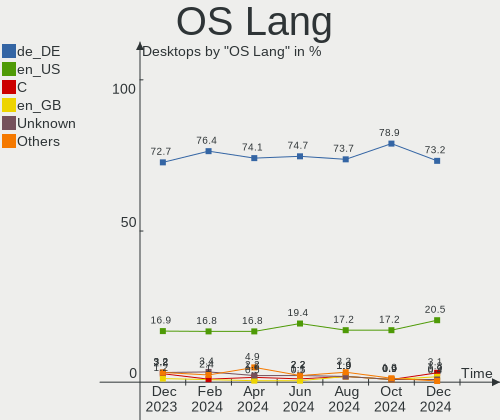
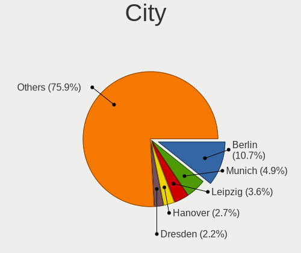
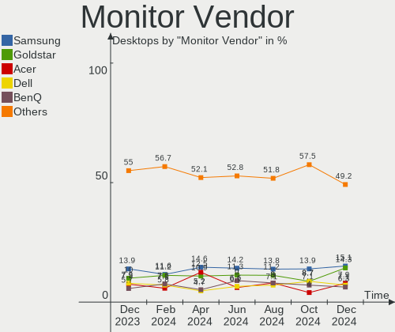
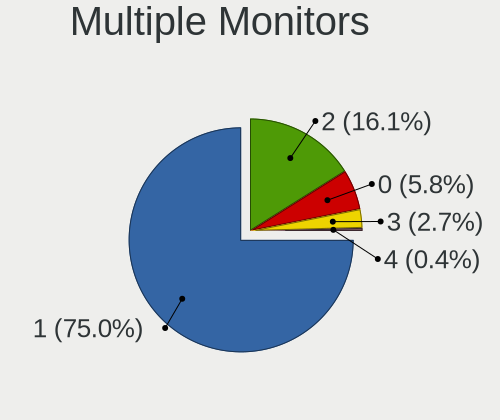

Linux in Germany - Hardware Trends (Desktops)
---------------------------------------------

A project to identify most popular hardware characteristics and track their change
over time based on data collected by Linux users at https://Linux-Hardware.org.

Anyone can contribute to this report by the [hw-probe](https://github.com/linuxhw/hw-probe) tool:

    sudo -E hw-probe -all -upload

Period: Apr, 2023.

Contents
--------

* [ System ](#system)
  - [ OS                       ](#os)
  - [ OS Family                ](#os-family)
  - [ Kernel                   ](#kernel)
  - [ Kernel Family            ](#kernel-family)
  - [ Kernel Major Ver.        ](#kernel-major-ver)
  - [ Arch                     ](#arch)
  - [ DE                       ](#de)
  - [ Display Server           ](#display-server)
  - [ Display Manager          ](#display-manager)
  - [ OS Lang                  ](#os-lang)
  - [ Boot Mode                ](#boot-mode)
  - [ Filesystem               ](#filesystem)
  - [ Part. scheme             ](#part-scheme)
  - [ Dual Boot with Linux/BSD ](#dual-boot-with-linuxbsd)
  - [ Dual Boot (Win)          ](#dual-boot-win)

* [ Board ](#board)
  - [ Vendor                   ](#vendor)
  - [ Model                    ](#model)
  - [ Model Family             ](#model-family)
  - [ MFG Year                 ](#mfg-year)
  - [ Form Factor              ](#form-factor)
  - [ Secure Boot              ](#secure-boot)
  - [ Coreboot                 ](#coreboot)
  - [ RAM Size                 ](#ram-size)
  - [ RAM Used                 ](#ram-used)
  - [ Total Drives             ](#total-drives)
  - [ Has CD-ROM               ](#has-cd-rom)
  - [ Has Ethernet             ](#has-ethernet)
  - [ Has WiFi                 ](#has-wifi)
  - [ Has Bluetooth            ](#has-bluetooth)

* [ Location ](#location)
  - [ Country                  ](#country)
  - [ City                     ](#city)

* [ Drives ](#drives)
  - [ Drive Vendor             ](#drive-vendor)
  - [ Drive Model              ](#drive-model)
  - [ HDD Vendor               ](#hdd-vendor)
  - [ SSD Vendor               ](#ssd-vendor)
  - [ Drive Kind               ](#drive-kind)
  - [ Drive Connector          ](#drive-connector)
  - [ Drive Size               ](#drive-size)
  - [ Space Total              ](#space-total)
  - [ Space Used               ](#space-used)
  - [ Malfunc. Drives          ](#malfunc-drives)
  - [ Malfunc. Drive Vendor    ](#malfunc-drive-vendor)
  - [ Malfunc. HDD Vendor      ](#malfunc-hdd-vendor)
  - [ Malfunc. Drive Kind      ](#malfunc-drive-kind)
  - [ Failed Drives            ](#failed-drives)
  - [ Failed Drive Vendor      ](#failed-drive-vendor)
  - [ Drive Status             ](#drive-status)

* [ Storage controller ](#storage-controller)
  - [ Storage Vendor           ](#storage-vendor)
  - [ Storage Model            ](#storage-model)
  - [ Storage Kind             ](#storage-kind)

* [ Processor ](#processor)
  - [ CPU Vendor               ](#cpu-vendor)
  - [ CPU Model                ](#cpu-model)
  - [ CPU Model Family         ](#cpu-model-family)
  - [ CPU Cores                ](#cpu-cores)
  - [ CPU Sockets              ](#cpu-sockets)
  - [ CPU Threads              ](#cpu-threads)
  - [ CPU Op-Modes             ](#cpu-op-modes)
  - [ CPU Microcode            ](#cpu-microcode)
  - [ CPU Microarch            ](#cpu-microarch)

* [ Graphics ](#graphics)
  - [ GPU Vendor               ](#gpu-vendor)
  - [ GPU Model                ](#gpu-model)
  - [ GPU Combo                ](#gpu-combo)
  - [ GPU Driver               ](#gpu-driver)
  - [ GPU Memory               ](#gpu-memory)

* [ Monitor ](#monitor)
  - [ Monitor Vendor           ](#monitor-vendor)
  - [ Monitor Model            ](#monitor-model)
  - [ Monitor Resolution       ](#monitor-resolution)
  - [ Monitor Diagonal         ](#monitor-diagonal)
  - [ Monitor Width            ](#monitor-width)
  - [ Aspect Ratio             ](#aspect-ratio)
  - [ Monitor Area             ](#monitor-area)
  - [ Pixel Density            ](#pixel-density)
  - [ Multiple Monitors        ](#multiple-monitors)

* [ Network ](#network)
  - [ Net Controller Vendor    ](#net-controller-vendor)
  - [ Net Controller Model     ](#net-controller-model)
  - [ Wireless Vendor          ](#wireless-vendor)
  - [ Wireless Model           ](#wireless-model)
  - [ Ethernet Vendor          ](#ethernet-vendor)
  - [ Ethernet Model           ](#ethernet-model)
  - [ Net Controller Kind      ](#net-controller-kind)
  - [ Used Controller          ](#used-controller)
  - [ NICs                     ](#nics)
  - [ IPv6                     ](#ipv6)

* [ Bluetooth ](#bluetooth)
  - [ Bluetooth Vendor         ](#bluetooth-vendor)
  - [ Bluetooth Model          ](#bluetooth-model)

* [ Sound ](#sound)
  - [ Sound Vendor             ](#sound-vendor)
  - [ Sound Model              ](#sound-model)

* [ Memory ](#memory)
  - [ Memory Vendor            ](#memory-vendor)
  - [ Memory Model             ](#memory-model)
  - [ Memory Kind              ](#memory-kind)
  - [ Memory Form Factor       ](#memory-form-factor)
  - [ Memory Size              ](#memory-size)
  - [ Memory Speed             ](#memory-speed)

* [ Printers & scanners ](#printers--scanners)
  - [ Printer Vendor           ](#printer-vendor)
  - [ Printer Model            ](#printer-model)
  - [ Scanner Vendor           ](#scanner-vendor)
  - [ Scanner Model            ](#scanner-model)

* [ Camera ](#camera)
  - [ Camera Vendor            ](#camera-vendor)
  - [ Camera Model             ](#camera-model)

* [ Security ](#security)
  - [ Fingerprint Vendor       ](#fingerprint-vendor)
  - [ Fingerprint Model        ](#fingerprint-model)
  - [ Chipcard Vendor          ](#chipcard-vendor)
  - [ Chipcard Model           ](#chipcard-model)

* [ Unsupported ](#unsupported)
  - [ Unsupported Devices      ](#unsupported-devices)
  - [ Unsupported Device Types ](#unsupported-device-types)

System
------

OS
--

Installed operating systems

| Name                         | Desktops | Percent |
|------------------------------|----------|---------|
| Ubuntu 22.04                 | 44       | 16.86%  |
| OpenMandriva 23.03           | 36       | 13.79%  |
| Linux Mint 21.1              | 29       | 11.11%  |
| Debian 11                    | 19       | 7.28%   |
| Pop!_OS 22.04                | 11       | 4.21%   |
| Zorin 16                     | 9        | 3.45%   |
| Linux Mint 20.3              | 8        | 3.07%   |
| Arch Rolling                 | 8        | 3.07%   |
| Ubuntu 23.04                 | 7        | 2.68%   |
| Ubuntu 22.10                 | 7        | 2.68%   |
| OpenMandriva 4.3             | 6        | 2.3%    |
| Manjaro 22.1.0               | 6        | 2.3%    |
| Ubuntu 20.04                 | 5        | 1.92%   |
| Manjaro                      | 5        | 1.92%   |
| Fedora 38                    | 5        | 1.92%   |
| Debian 12                    | 5        | 1.92%   |
| Nobara 37                    | 4        | 1.53%   |
| Gentoo 2.13                  | 4        | 1.53%   |
| OpenMandriva 4.2             | 3        | 1.15%   |
| OpenMandriva 23.01           | 3        | 1.15%   |
| Xubuntu 22.04                | 2        | 0.77%   |
| ROSA 12.4                    | 2        | 0.77%   |
| openSUSE Leap-15.4           | 2        | 0.77%   |
| LMDE 5                       | 2        | 0.77%   |
| Kubuntu 22.04                | 2        | 0.77%   |
| Kubuntu 11                   | 2        | 0.77%   |
| Fedora 37                    | 2        | 0.77%   |
| Xubuntu 22.10                | 1        | 0.38%   |
| Xubuntu 20.04                | 1        | 0.38%   |
| Ubuntu MATE 22.04            | 1        | 0.38%   |
| Ubuntu Budgie 20.04          | 1        | 0.38%   |
| SteamOS 3.4                  | 1        | 0.38%   |
| openSUSE Tumbleweed-XXXXXXXX | 1        | 0.38%   |
| MX 21                        | 1        | 0.38%   |
| Lubuntu 22.10                | 1        | 0.38%   |
| Lubuntu 20.04                | 1        | 0.38%   |
| Linux Mint 21                | 1        | 0.38%   |
| Kubuntu 23.04                | 1        | 0.38%   |
| KDE neon 22.04               | 1        | 0.38%   |
| Gentoo 2.9                   | 1        | 0.38%   |

OS Family
---------

OS without a version

| Name          | Desktops | Percent |
|---------------|----------|---------|
| Ubuntu        | 63       | 24.14%  |
| OpenMandriva  | 48       | 18.39%  |
| Linux Mint    | 38       | 14.56%  |
| Debian        | 24       | 9.2%    |
| Pop!_OS       | 11       | 4.21%   |
| Manjaro       | 11       | 4.21%   |
| Zorin         | 9        | 3.45%   |
| Fedora        | 8        | 3.07%   |
| Arch          | 8        | 3.07%   |
| Kubuntu       | 5        | 1.92%   |
| Gentoo        | 5        | 1.92%   |
| Xubuntu       | 4        | 1.53%   |
| Nobara        | 4        | 1.53%   |
| openSUSE      | 3        | 1.15%   |
| ROSA          | 2        | 0.77%   |
| Lubuntu       | 2        | 0.77%   |
| LMDE          | 2        | 0.77%   |
| Ubuntu MATE   | 1        | 0.38%   |
| Ubuntu Budgie | 1        | 0.38%   |
| SteamOS       | 1        | 0.38%   |
| MX            | 1        | 0.38%   |
| KDE neon      | 1        | 0.38%   |
| Garuda Linux  | 1        | 0.38%   |
| EndeavourOS   | 1        | 0.38%   |
| Elementary    | 1        | 0.38%   |
| Devuan        | 1        | 0.38%   |
| Clear Linux   | 1        | 0.38%   |
| CachyOS       | 1        | 0.38%   |
| BlackPanther  | 1        | 0.38%   |
| Artix         | 1        | 0.38%   |
| ArcoLinux     | 1        | 0.38%   |

Kernel
------

Version of the Linux kernel

| Version                           | Desktops | Percent |
|-----------------------------------|----------|---------|
| 6.2.6-desktop-1omv2390            | 36       | 13.79%  |
| 5.15.0-69-generic                 | 28       | 10.73%  |
| 5.19.0-38-generic                 | 24       | 9.2%    |
| 5.19.0-40-generic                 | 17       | 6.51%   |
| 5.10.0-21-amd64                   | 15       | 5.75%   |
| 6.2.6-76060206-generic            | 9        | 3.45%   |
| 6.2.0-20-generic                  | 8        | 3.07%   |
| 5.15.0-71-generic                 | 7        | 2.68%   |
| 5.15.0-70-generic                 | 6        | 2.3%    |
| 5.4.0-146-generic                 | 5        | 1.92%   |
| 5.19.0-41-generic                 | 5        | 1.92%   |
| 5.15.0-67-generic                 | 5        | 1.92%   |
| 6.1.0-7-amd64                     | 4        | 1.53%   |
| 5.10.14-desktop-1omv4002          | 4        | 1.53%   |
| 6.2.11-gentoo-x86_64              | 3        | 1.15%   |
| 6.2.11-300.fc38.x86_64            | 3        | 1.15%   |
| 6.1.25-1-MANJARO                  | 3        | 1.15%   |
| 6.1.1-desktop-1omv2290            | 3        | 1.15%   |
| 5.16.13-desktop-1omv4003          | 3        | 1.15%   |
| 5.15.0-56-generic                 | 3        | 1.15%   |
| 6.2.9-arch1-1                     | 2        | 0.77%   |
| 6.2.9-300.fc38.x86_64             | 2        | 0.77%   |
| 6.2.8-arch1-1                     | 2        | 0.77%   |
| 6.2.8-200.fsync.fc37.x86_64       | 2        | 0.77%   |
| 6.2.12-1-MANJARO                  | 2        | 0.77%   |
| 6.1.23-1-MANJARO                  | 2        | 0.77%   |
| 6.1.20-generic-2rosa2021.1-x86_64 | 2        | 0.77%   |
| 5.19.0-32-generic                 | 2        | 0.77%   |
| 5.16.7-desktop-1omv4003           | 2        | 0.77%   |
| 5.15.102-1-pve                    | 2        | 0.77%   |
| 5.15.0-69-lowlatency              | 2        | 0.77%   |
| 5.15.0-58-generic                 | 2        | 0.77%   |
| 5.14.21-150400.24.55-default      | 2        | 0.77%   |
| 5.10.0-20-amd64                   | 2        | 0.77%   |
| 6.3.0-4-cachyos-bore              | 1        | 0.38%   |
| 6.2.8-zen1-1-zen                  | 1        | 0.38%   |
| 6.2.8-200.fc37.x86_64             | 1        | 0.38%   |
| 6.2.6-201.fsync.fc37.x86_64       | 1        | 0.38%   |
| 6.2.6-1-default                   | 1        | 0.38%   |
| 6.2.12-arch1-1                    | 1        | 0.38%   |

Kernel Family
-------------

Linux kernel without a distro release

| Version  | Desktops | Percent |
|----------|----------|---------|
| 5.15.0   | 54       | 20.69%  |
| 5.19.0   | 52       | 19.92%  |
| 6.2.6    | 47       | 18.01%  |
| 5.10.0   | 17       | 6.51%   |
| 6.2.11   | 11       | 4.21%   |
| 6.2.0    | 9        | 3.45%   |
| 6.1.0    | 7        | 2.68%   |
| 5.4.0    | 7        | 2.68%   |
| 6.2.8    | 6        | 2.3%    |
| 6.2.9    | 4        | 1.53%   |
| 6.1.25   | 4        | 1.53%   |
| 6.1.1    | 4        | 1.53%   |
| 5.10.14  | 4        | 1.53%   |
| 6.2.12   | 3        | 1.15%   |
| 6.2.10   | 3        | 1.15%   |
| 5.16.13  | 3        | 1.15%   |
| 6.1.23   | 2        | 0.77%   |
| 6.1.20   | 2        | 0.77%   |
| 6.1.19   | 2        | 0.77%   |
| 5.16.7   | 2        | 0.77%   |
| 5.15.102 | 2        | 0.77%   |
| 5.14.21  | 2        | 0.77%   |
| 5.13.0   | 2        | 0.77%   |
| 6.3.0    | 1        | 0.38%   |
| 6.1.26   | 1        | 0.38%   |
| 6.1.22   | 1        | 0.38%   |
| 6.1.15   | 1        | 0.38%   |
| 6.1.13   | 1        | 0.38%   |
| 5.3.0    | 1        | 0.38%   |
| 5.18.5   | 1        | 0.38%   |
| 5.17.5   | 1        | 0.38%   |
| 5.15.107 | 1        | 0.38%   |
| 5.15.105 | 1        | 0.38%   |
| 5.15.104 | 1        | 0.38%   |
| 4.18.16  | 1        | 0.38%   |

Kernel Major Ver.
-----------------

Linux kernel major version

| Version | Desktops | Percent |
|---------|----------|---------|
| 6.2     | 83       | 31.8%   |
| 5.15    | 59       | 22.61%  |
| 5.19    | 52       | 19.92%  |
| 6.1     | 25       | 9.58%   |
| 5.10    | 21       | 8.05%   |
| 5.4     | 7        | 2.68%   |
| 5.16    | 5        | 1.92%   |
| 5.14    | 2        | 0.77%   |
| 5.13    | 2        | 0.77%   |
| 6.3     | 1        | 0.38%   |
| 5.3     | 1        | 0.38%   |
| 5.18    | 1        | 0.38%   |
| 5.17    | 1        | 0.38%   |
| 4.18    | 1        | 0.38%   |

Arch
----

OS architecture (x86_64, i586, etc.)

| Name   | Desktops | Percent |
|--------|----------|---------|
| x86_64 | 261      | 100%    |

DE
--

Desktop Environment

| Name       | Desktops | Percent |
|------------|----------|---------|
| GNOME      | 106      | 40.61%  |
| KDE5       | 70       | 26.82%  |
| X-Cinnamon | 33       | 12.64%  |
| XFCE       | 18       | 6.9%    |
| Unknown    | 13       | 4.98%   |
| MATE       | 6        | 2.3%    |
| LXQt       | 5        | 1.92%   |
| Cinnamon   | 3        | 1.15%   |
| Budgie     | 2        | 0.77%   |
| xmonad     | 1        | 0.38%   |
| sway       | 1        | 0.38%   |
| Pantheon   | 1        | 0.38%   |
| LXDE       | 1        | 0.38%   |
| KDE        | 1        | 0.38%   |

Display Server
--------------

X11 or Wayland

| Name    | Desktops | Percent |
|---------|----------|---------|
| X11     | 173      | 66.28%  |
| Wayland | 66       | 25.29%  |
| Tty     | 13       | 4.98%   |
| Unknown | 8        | 3.07%   |
| Web     | 1        | 0.38%   |

Display Manager
---------------

SDDM, LightDM, etc.

| Name    | Desktops | Percent |
|---------|----------|---------|
| Unknown | 83       | 31.8%   |
| GDM3    | 61       | 23.37%  |
| SDDM    | 59       | 22.61%  |
| LightDM | 38       | 14.56%  |
| GDM     | 18       | 6.9%    |
| SLiM    | 1        | 0.38%   |
| GREETD  | 1        | 0.38%   |

OS Lang
-------

Language

| Lang    | Desktops | Percent |
|---------|----------|---------|
| de_DE   | 208      | 79.69%  |
| en_US   | 35       | 13.41%  |
| Unknown | 7        | 2.68%   |
| C       | 4        | 1.53%   |
| it_IT   | 2        | 0.77%   |
| de_AT   | 2        | 0.77%   |
| POSIX   | 1        | 0.38%   |
| en_GB   | 1        | 0.38%   |
| de_CH   | 1        | 0.38%   |

Boot Mode
---------

EFI or BIOS

| Mode | Desktops | Percent |
|------|----------|---------|
| BIOS | 146      | 55.94%  |
| EFI  | 115      | 44.06%  |

Filesystem
----------

Type of filesystem

| Type    | Desktops | Percent |
|---------|----------|---------|
| Ext4    | 195      | 74.71%  |
| Btrfs   | 24       | 9.2%    |
| Overlay | 19       | 7.28%   |
| Tmpfs   | 18       | 6.9%    |
| Zfs     | 4        | 1.53%   |
| Xfs     | 1        | 0.38%   |

Part. scheme
------------

Scheme of partitioning

| Type    | Desktops | Percent |
|---------|----------|---------|
| GPT     | 150      | 57.47%  |
| Unknown | 70       | 26.82%  |
| MBR     | 41       | 15.71%  |

Dual Boot with Linux/BSD
------------------------

Hosting more than one Linux/BSD

| Dual boot | Desktops | Percent |
|-----------|----------|---------|
| No        | 203      | 77.78%  |
| Yes       | 58       | 22.22%  |

Dual Boot (Win)
---------------

Hosting Linux and Windows

| Dual boot | Desktops | Percent |
|-----------|----------|---------|
| No        | 170      | 65.13%  |
| Yes       | 91       | 34.87%  |

Board
-----

Vendor
------

Motherboard manufacturer

| Name                                 | Desktops | Percent |
|--------------------------------------|----------|---------|
| ASUSTek Computer                     | 52       | 19.92%  |
| Gigabyte Technology                  | 46       | 17.62%  |
| MSI                                  | 40       | 15.33%  |
| ASRock                               | 22       | 8.43%   |
| Hewlett-Packard                      | 19       | 7.28%   |
| Fujitsu                              | 12       | 4.6%    |
| Dell                                 | 11       | 4.21%   |
| Lenovo                               | 9        | 3.45%   |
| Medion                               | 7        | 2.68%   |
| Acer                                 | 7        | 2.68%   |
| Foxconn                              | 4        | 1.53%   |
| Biostar                              | 4        | 1.53%   |
| Inventec                             | 3        | 1.15%   |
| Intel                                | 3        | 1.15%   |
| Fujitsu Siemens                      | 3        | 1.15%   |
| BESSTAR Tech                         | 3        | 1.15%   |
| Unknown                              | 3        | 1.15%   |
| Shuttle                              | 2        | 0.77%   |
| AMI                                  | 2        | 0.77%   |
| YANYU                                | 1        | 0.38%   |
| Shenzhen Meigao Electronic Equipment | 1        | 0.38%   |
| Packard Bell                         | 1        | 0.38%   |
| MiTAC                                | 1        | 0.38%   |
| HPE                                  | 1        | 0.38%   |
| Hardkernel                           | 1        | 0.38%   |
| eMachines                            | 1        | 0.38%   |
| AZW                                  | 1        | 0.38%   |
| Apple                                | 1        | 0.38%   |

Model
-----

Motherboard model

| Name                                              | Desktops | Percent |
|---------------------------------------------------|----------|---------|
| MSI MS-7C37                                       | 6        | 2.3%    |
| ASUS All Series                                   | 5        | 1.92%   |
| MSI MS-7B86                                       | 4        | 1.53%   |
| HP ProLiant MicroServer Gen8                      | 3        | 1.15%   |
| HP EliteDesk 800 G2 DM 35W                        | 3        | 1.15%   |
| Unknown                                           | 3        | 1.15%   |
| MSI MS-7D75                                       | 2        | 0.77%   |
| MSI MS-7C52                                       | 2        | 0.77%   |
| MSI MS-7B79                                       | 2        | 0.77%   |
| Medion MS-7728                                    | 2        | 0.77%   |
| Inventec D CLASS                                  | 2        | 0.77%   |
| Gigabyte X570 GAMING X                            | 2        | 0.77%   |
| Gigabyte X570 AORUS ELITE                         | 2        | 0.77%   |
| Gigabyte GA-870A-UD3                              | 2        | 0.77%   |
| Gigabyte GA-78LMT-S2P                             | 2        | 0.77%   |
| Gigabyte B550M DS3H                               | 2        | 0.77%   |
| Gigabyte B450M S2H                                | 2        | 0.77%   |
| Foxconn 500B Microtower                           | 2        | 0.77%   |
| Dell Precision WorkStation T3500                  | 2        | 0.77%   |
| Dell Precision Tower 5810                         | 2        | 0.77%   |
| Dell OptiPlex 3020                                | 2        | 0.77%   |
| ASUS TUF Gaming X570-PLUS                         | 2        | 0.77%   |
| ASUS ROG STRIX B450-F GAMING II                   | 2        | 0.77%   |
| ASUS PRIME B450-PLUS                              | 2        | 0.77%   |
| ASRock X670E Pro RS                               | 2        | 0.77%   |
| ASRock A320M-DVS R4.0                             | 2        | 0.77%   |
| Acer Aspire X3950                                 | 2        | 0.77%   |
| YANYU EPIC-N56_I522E Ver                          | 1        | 0.38%   |
| Shuttle SH370                                     | 1        | 0.38%   |
| Shuttle DL20N                                     | 1        | 0.38%   |
| Shenzhen Meigao Electronic Equipment UM580 Series | 1        | 0.38%   |
| Packard Bell IPOWER G3610                         | 1        | 0.38%   |
| MSI WL351AA-ABD p6352de                           | 1        | 0.38%   |
| MSI MS-7D50                                       | 1        | 0.38%   |
| MSI MS-7D25                                       | 1        | 0.38%   |
| MSI MS-7D18                                       | 1        | 0.38%   |
| MSI MS-7D06                                       | 1        | 0.38%   |
| MSI MS-7C86                                       | 1        | 0.38%   |
| MSI MS-7B98                                       | 1        | 0.38%   |
| MSI MS-7B89                                       | 1        | 0.38%   |

Model Family
------------

Motherboard model prefix

| Name                                       | Desktops | Percent |
|--------------------------------------------|----------|---------|
| ASUS ROG                                   | 12       | 4.6%    |
| ASUS PRIME                                 | 11       | 4.21%   |
| Fujitsu ESPRIMO                            | 10       | 3.83%   |
| Dell OptiPlex                              | 7        | 2.68%   |
| MSI MS-7C37                                | 6        | 2.3%    |
| HP EliteDesk                               | 6        | 2.3%    |
| Gigabyte X570                              | 6        | 2.3%    |
| ASUS TUF                                   | 6        | 2.3%    |
| HP Compaq                                  | 5        | 1.92%   |
| ASUS All                                   | 5        | 1.92%   |
| Acer Aspire                                | 5        | 1.92%   |
| MSI MS-7B86                                | 4        | 1.53%   |
| Lenovo ThinkCentre                         | 4        | 1.53%   |
| HP ProLiant                                | 4        | 1.53%   |
| Dell Precision                             | 4        | 1.53%   |
| Lenovo IdeaCentre                          | 3        | 1.15%   |
| Gigabyte B550M                             | 3        | 1.15%   |
| Gigabyte B550                              | 3        | 1.15%   |
| Gigabyte B450M                             | 3        | 1.15%   |
| ASUS M5A97                                 | 3        | 1.15%   |
| Unknown                                    | 3        | 1.15%   |
| MSI MS-7D75                                | 2        | 0.77%   |
| MSI MS-7C52                                | 2        | 0.77%   |
| MSI MS-7B79                                | 2        | 0.77%   |
| Medion MS-7728                             | 2        | 0.77%   |
| Inventec D                                 | 2        | 0.77%   |
| Gigabyte GA-870A-UD3                       | 2        | 0.77%   |
| Gigabyte GA-78LMT-S2P                      | 2        | 0.77%   |
| Gigabyte B450                              | 2        | 0.77%   |
| Fujitsu Siemens ESPRIMO                    | 2        | 0.77%   |
| Foxconn 500B                               | 2        | 0.77%   |
| ASRock X670E                               | 2        | 0.77%   |
| ASRock B550                                | 2        | 0.77%   |
| ASRock A320M-DVS                           | 2        | 0.77%   |
| Acer Veriton                               | 2        | 0.77%   |
| YANYU EPIC-N56                             | 1        | 0.38%   |
| Shuttle SH370                              | 1        | 0.38%   |
| Shuttle DL20N                              | 1        | 0.38%   |
| Shenzhen Meigao Electronic Equipment UM580 | 1        | 0.38%   |
| Packard Bell IPOWER                        | 1        | 0.38%   |

MFG Year
--------

Motherboard manufacture year

| Year | Desktops | Percent |
|------|----------|---------|
| 2018 | 27       | 10.34%  |
| 2019 | 26       | 9.96%   |
| 2020 | 24       | 9.2%    |
| 2012 | 20       | 7.66%   |
| 2022 | 19       | 7.28%   |
| 2014 | 18       | 6.9%    |
| 2011 | 18       | 6.9%    |
| 2017 | 17       | 6.51%   |
| 2013 | 17       | 6.51%   |
| 2010 | 14       | 5.36%   |
| 2015 | 13       | 4.98%   |
| 2021 | 11       | 4.21%   |
| 2009 | 10       | 3.83%   |
| 2023 | 9        | 3.45%   |
| 2016 | 8        | 3.07%   |
| 2007 | 5        | 1.92%   |
| 2008 | 4        | 1.53%   |
| 2006 | 1        | 0.38%   |

Form Factor
-----------

Physical design of the computer

| Name    | Desktops | Percent |
|---------|----------|---------|
| Desktop | 261      | 100%    |

Secure Boot
-----------

Enabled or disabled

| State    | Desktops | Percent |
|----------|----------|---------|
| Disabled | 251      | 96.17%  |
| Enabled  | 10       | 3.83%   |

Coreboot
--------

Have coreboot on board

| Used | Desktops | Percent |
|------|----------|---------|
| No   | 261      | 100%    |

RAM Size
--------

Total RAM memory

| Size in GB  | Desktops | Percent |
|-------------|----------|---------|
| 16.01-24.0  | 71       | 27.2%   |
| 32.01-64.0  | 54       | 20.69%  |
| 8.01-16.0   | 40       | 15.33%  |
| 4.01-8.0    | 36       | 13.79%  |
| 3.01-4.0    | 27       | 10.34%  |
| 64.01-256.0 | 20       | 7.66%   |
| 24.01-32.0  | 7        | 2.68%   |
| 1.01-2.0    | 4        | 1.53%   |
| 2.01-3.0    | 2        | 0.77%   |

RAM Used
--------

Used RAM memory

| Used GB    | Desktops | Percent |
|------------|----------|---------|
| 1.01-2.0   | 97       | 37.16%  |
| 2.01-3.0   | 69       | 26.44%  |
| 4.01-8.0   | 43       | 16.48%  |
| 3.01-4.0   | 26       | 9.96%   |
| 8.01-16.0  | 8        | 3.07%   |
| 0.51-1.0   | 7        | 2.68%   |
| 24.01-32.0 | 4        | 1.53%   |
| 16.01-24.0 | 3        | 1.15%   |
| 0.01-0.5   | 3        | 1.15%   |
| 32.01-64.0 | 1        | 0.38%   |

Total Drives
------------

Number of drives on board

| Drives | Desktops | Percent |
|--------|----------|---------|
| 1      | 93       | 35.63%  |
| 2      | 56       | 21.46%  |
| 3      | 49       | 18.77%  |
| 4      | 31       | 11.88%  |
| 5      | 15       | 5.75%   |
| 6      | 7        | 2.68%   |
| 7      | 4        | 1.53%   |
| 8      | 2        | 0.77%   |
| 0      | 2        | 0.77%   |
| 10     | 1        | 0.38%   |
| 9      | 1        | 0.38%   |

Has CD-ROM
----------

Has CD-ROM on board

| Presented | Desktops | Percent |
|-----------|----------|---------|
| Yes       | 145      | 55.56%  |
| No        | 116      | 44.44%  |

Has Ethernet
------------

Has Ethernet on board

| Presented | Desktops | Percent |
|-----------|----------|---------|
| Yes       | 257      | 98.47%  |
| No        | 4        | 1.53%   |

Has WiFi
--------

Has WiFi module

| Presented | Desktops | Percent |
|-----------|----------|---------|
| No        | 149      | 57.09%  |
| Yes       | 112      | 42.91%  |

Has Bluetooth
-------------

Has Bluetooth module

| Presented | Desktops | Percent |
|-----------|----------|---------|
| No        | 169      | 64.75%  |
| Yes       | 92       | 35.25%  |

Location
--------

Country
-------

Geographic location (country)

| Country | Desktops | Percent |
|---------|----------|---------|
| Germany | 261      | 100%    |

City
----

Geographic location (city)

| City                  | Desktops | Percent |
|-----------------------|----------|---------|
| Hamburg               | 10       | 3.83%   |
| Berlin                | 10       | 3.83%   |
| Frankfurt am Main     | 9        | 3.45%   |
| Münster              | 5        | 1.92%   |
| Munich                | 5        | 1.92%   |
| Cologne               | 5        | 1.92%   |
| Traunstein            | 4        | 1.53%   |
| Nuremberg             | 4        | 1.53%   |
| Ludwigshafen am Rhein | 4        | 1.53%   |
| Lübeck               | 4        | 1.53%   |
| Oberursel             | 3        | 1.15%   |
| Lahr                  | 3        | 1.15%   |
| Kiel                  | 3        | 1.15%   |
| Heilbronn             | 3        | 1.15%   |
| Hanover               | 3        | 1.15%   |
| Halle                 | 3        | 1.15%   |
| Gummersbach           | 3        | 1.15%   |
| Dortmund              | 3        | 1.15%   |
| Cuxhaven              | 3        | 1.15%   |
| Chemnitz              | 3        | 1.15%   |
| Bremerhaven           | 3        | 1.15%   |
| Bochum                | 3        | 1.15%   |
| Würzburg             | 2        | 0.77%   |
| Waldkirch             | 2        | 0.77%   |
| Suhl                  | 2        | 0.77%   |
| Stuttgart             | 2        | 0.77%   |
| Soltau                | 2        | 0.77%   |
| Sindelfingen          | 2        | 0.77%   |
| Rostock               | 2        | 0.77%   |
| Reutlingen            | 2        | 0.77%   |
| Oberhausen            | 2        | 0.77%   |
| Ober-Morlen           | 2        | 0.77%   |
| Neuwied               | 2        | 0.77%   |
| Mönchengladbach      | 2        | 0.77%   |
| Mannheim              | 2        | 0.77%   |
| Leverkusen            | 2        | 0.77%   |
| Langenfeld            | 2        | 0.77%   |
| Gruenenplan           | 2        | 0.77%   |
| Erlangen              | 2        | 0.77%   |
| Dresden               | 2        | 0.77%   |

Drives
------

Drive Vendor
------------

Hard drive vendors

| Vendor                      | Desktops | Drives | Percent |
|-----------------------------|----------|--------|---------|
| Samsung Electronics         | 100      | 148    | 19.57%  |
| Seagate                     | 79       | 107    | 15.46%  |
| WDC                         | 60       | 94     | 11.74%  |
| SanDisk                     | 46       | 58     | 9%      |
| Crucial                     | 29       | 36     | 5.68%   |
| Toshiba                     | 26       | 34     | 5.09%   |
| Kingston                    | 18       | 18     | 3.52%   |
| Hitachi                     | 16       | 18     | 3.13%   |
| Intenso                     | 13       | 14     | 2.54%   |
| Unknown                     | 8        | 10     | 1.57%   |
| Phison Electronics          | 7        | 7      | 1.37%   |
| Micron/Crucial Technology   | 7        | 9      | 1.37%   |
| A-DATA Technology           | 7        | 9      | 1.37%   |
| Transcend                   | 5        | 5      | 0.98%   |
| JMicron Technology          | 5        | 5      | 0.98%   |
| Corsair                     | 5        | 5      | 0.98%   |
| SABRENT                     | 4        | 4      | 0.78%   |
| PNY                         | 4        | 4      | 0.78%   |
| Apacer                      | 4        | 4      | 0.78%   |
| SPCC                        | 3        | 3      | 0.59%   |
| Phison                      | 3        | 3      | 0.59%   |
| Patriot                     | 3        | 3      | 0.59%   |
| Micron Technology           | 3        | 3      | 0.59%   |
| MAXIO Technology (Hangzhou) | 3        | 3      | 0.59%   |
| Lexar                       | 3        | 3      | 0.59%   |
| KIOXIA-EXCERIA              | 3        | 3      | 0.59%   |
| Kingston Technology Company | 3        | 3      | 0.59%   |
| Intel                       | 3        | 3      | 0.59%   |
| HGST                        | 3        | 3      | 0.59%   |
| China                       | 3        | 3      | 0.59%   |
| ASMT                        | 3        | 3      | 0.59%   |
| Verbatim                    | 2        | 2      | 0.39%   |
| OCZ                         | 2        | 2      | 0.39%   |
| Inateck                     | 2        | 2      | 0.39%   |
| Hewlett-Packard             | 2        | 2      | 0.39%   |
| Unknown                     | 2        | 2      | 0.39%   |
| XrayDisk                    | 1        | 2      | 0.2%    |
| VICKTER                     | 1        | 1      | 0.2%    |
| VERICO                      | 1        | 1      | 0.2%    |
| UMIS                        | 1        | 1      | 0.2%    |

Drive Model
-----------

Hard drive models

| Model                                               | Desktops | Percent |
|-----------------------------------------------------|----------|---------|
| Samsung SSD 850 EVO 250GB                           | 13       | 2.12%   |
| Samsung NVMe SSD Controller SM981/PM981/PM983 1TB   | 11       | 1.8%    |
| Samsung SSD 860 EVO 500GB                           | 9        | 1.47%   |
| Samsung NVMe SSD Controller PM9A1/PM9A3/980PRO 2TB  | 8        | 1.31%   |
| Toshiba HDWD110 1TB                                 | 6        | 0.98%   |
| Seagate ST2000DM001-1ER164 2TB                      | 6        | 0.98%   |
| SanDisk SSD PLUS 240GB                              | 6        | 0.98%   |
| SanDisk SSD PLUS 1000GB                             | 6        | 0.98%   |
| Samsung SSD 860 EVO 1TB                             | 6        | 0.98%   |
| Samsung NVMe SSD Controller SM961/PM961/SM963 500GB | 6        | 0.98%   |
| WDC WD30EFRX-68EUZN0 3TB                            | 5        | 0.82%   |
| Toshiba DT01ACA200 2TB                              | 5        | 0.82%   |
| Seagate ST4000DM004-2CV104 4TB                      | 5        | 0.82%   |
| Phison E12 NVMe Controller 512GB                    | 5        | 0.82%   |
| Micron/Crucial P2 NVMe PCIe SSD 1TB                 | 5        | 0.82%   |
| Unknown SD/MMC/MS PRO 249GB                         | 4        | 0.65%   |
| Toshiba DT01ACA100 1TB                              | 4        | 0.65%   |
| Seagate ST2000DM008-2FR102 2TB                      | 4        | 0.65%   |
| Seagate ST1000DM003-1ER162 1TB                      | 4        | 0.65%   |
| Samsung SSD 980 1TB                                 | 4        | 0.65%   |
| Samsung SSD 970 EVO 500GB                           | 4        | 0.65%   |
| Samsung SSD 860 QVO 1TB                             | 4        | 0.65%   |
| JMicron Generic 1TB                                 | 4        | 0.65%   |
| Crucial CT1000MX500SSD1 1TB                         | 4        | 0.65%   |
| WDC WD10EZEX-08WN4A0 1TB                            | 3        | 0.49%   |
| Toshiba DT01ACA050 500GB                            | 3        | 0.49%   |
| Seagate ST500DM002-1BD142 500GB                     | 3        | 0.49%   |
| Seagate ST380815AS 80GB                             | 3        | 0.49%   |
| Seagate ST2000DM001-1CH164 2TB                      | 3        | 0.49%   |
| Seagate ST1000DM010-2EP102 1TB                      | 3        | 0.49%   |
| Seagate ST1000DM003-1CH162 1TB                      | 3        | 0.49%   |
| Seagate Expansion 4TB                               | 3        | 0.49%   |
| Sandisk WD Black SN750 / PC SN730 NVMe SSD 512GB    | 3        | 0.49%   |
| SanDisk SDSSDH3512G 512GB                           | 3        | 0.49%   |
| SanDisk SDSSDH3 1T00 1TB                            | 3        | 0.49%   |
| SanDisk NVMe SSD Drive 1TB                          | 3        | 0.49%   |
| Samsung SSD 850 EVO 500GB                           | 3        | 0.49%   |
| Samsung SSD 850 EVO 120GB                           | 3        | 0.49%   |
| MAXIO (Hangzhou) NVMe SSD Controller MAP1202 1TB    | 3        | 0.49%   |
| Kingston SA400S37240G 240GB SSD                     | 3        | 0.49%   |

HDD Vendor
----------

Hard disk drive vendors

| Vendor              | Desktops | Drives | Percent |
|---------------------|----------|--------|---------|
| Seagate             | 78       | 104    | 38.05%  |
| WDC                 | 53       | 84     | 25.85%  |
| Toshiba             | 24       | 31     | 11.71%  |
| Samsung Electronics | 16       | 18     | 7.8%    |
| Hitachi             | 16       | 18     | 7.8%    |
| Unknown             | 4        | 4      | 1.95%   |
| JMicron Technology  | 4        | 4      | 1.95%   |
| HGST                | 3        | 3      | 1.46%   |
| Intenso             | 2        | 2      | 0.98%   |
| Inateck             | 2        | 2      | 0.98%   |
| SABRENT             | 1        | 1      | 0.49%   |
| Fujitsu             | 1        | 1      | 0.49%   |
| ASMedia             | 1        | 1      | 0.49%   |

SSD Vendor
----------

Solid state drive vendors

| Vendor              | Desktops | Drives | Percent |
|---------------------|----------|--------|---------|
| Samsung Electronics | 60       | 74     | 29.56%  |
| SanDisk             | 36       | 42     | 17.73%  |
| Crucial             | 26       | 31     | 12.81%  |
| Kingston            | 10       | 10     | 4.93%   |
| Intenso             | 9        | 9      | 4.43%   |
| WDC                 | 7        | 7      | 3.45%   |
| Transcend           | 5        | 5      | 2.46%   |
| Apacer              | 4        | 4      | 1.97%   |
| A-DATA Technology   | 4        | 4      | 1.97%   |
| SPCC                | 3        | 3      | 1.48%   |
| PNY                 | 3        | 3      | 1.48%   |
| Patriot             | 3        | 3      | 1.48%   |
| Lexar               | 3        | 3      | 1.48%   |
| China               | 3        | 3      | 1.48%   |
| ASMT                | 3        | 3      | 1.48%   |
| Verbatim            | 2        | 2      | 0.99%   |
| Toshiba             | 2        | 2      | 0.99%   |
| OCZ                 | 2        | 2      | 0.99%   |
| Intel               | 2        | 2      | 0.99%   |
| Corsair             | 2        | 2      | 0.99%   |
| VERICO              | 1        | 1      | 0.49%   |
| Team                | 1        | 1      | 0.49%   |
| SK hynix            | 1        | 1      | 0.49%   |
| SABRENT             | 1        | 1      | 0.49%   |
| Phison              | 1        | 1      | 0.49%   |
| Micron Technology   | 1        | 1      | 0.49%   |
| Londisk             | 1        | 1      | 0.49%   |
| LITEONIT            | 1        | 1      | 0.49%   |
| Leven               | 1        | 1      | 0.49%   |
| KLEVV               | 1        | 1      | 0.49%   |
| Hewlett-Packard     | 1        | 1      | 0.49%   |
| Fanxiang            | 1        | 1      | 0.49%   |
| Emtec               | 1        | 1      | 0.49%   |
| Unknown             | 1        | 1      | 0.49%   |

Drive Kind
----------

HDD or SSD

| Kind    | Desktops | Drives | Percent |
|---------|----------|--------|---------|
| HDD     | 156      | 273    | 36.03%  |
| SSD     | 155      | 228    | 35.8%   |
| NVMe    | 108      | 140    | 24.94%  |
| Unknown | 12       | 15     | 2.77%   |
| MMC     | 2        | 2      | 0.46%   |

Drive Connector
---------------

SATA, SAS, NVMe, etc.

| Type | Desktops | Drives | Percent |
|------|----------|--------|---------|
| SATA | 230      | 471    | 60.53%  |
| NVMe | 108      | 139    | 28.42%  |
| SAS  | 40       | 46     | 10.53%  |
| MMC  | 2        | 2      | 0.53%   |

Drive Size
----------

Size of hard drive

| Size in TB | Desktops | Drives | Percent |
|------------|----------|--------|---------|
| 0.01-0.5   | 154      | 222    | 42.54%  |
| 0.51-1.0   | 103      | 133    | 28.45%  |
| 1.01-2.0   | 54       | 69     | 14.92%  |
| 3.01-4.0   | 20       | 25     | 5.52%   |
| 4.01-10.0  | 14       | 28     | 3.87%   |
| 2.01-3.0   | 12       | 19     | 3.31%   |
| 10.01-20.0 | 5        | 5      | 1.38%   |

Space Total
-----------

Amount of disk space available on the file system

| Size in GB     | Desktops | Percent |
|----------------|----------|---------|
| 101-250        | 59       | 22.61%  |
| 501-1000       | 38       | 14.56%  |
| 251-500        | 35       | 13.41%  |
| More than 3000 | 34       | 13.03%  |
| 1001-2000      | 33       | 12.64%  |
| 1-20           | 22       | 8.43%   |
| 2001-3000      | 16       | 6.13%   |
| 51-100         | 9        | 3.45%   |
| Unknown        | 9        | 3.45%   |
| 21-50          | 6        | 2.3%    |

Space Used
----------

Amount of used disk space

| Used GB        | Desktops | Percent |
|----------------|----------|---------|
| 1-20           | 90       | 34.48%  |
| 21-50          | 31       | 11.88%  |
| 51-100         | 26       | 9.96%   |
| 101-250        | 23       | 8.81%   |
| 251-500        | 21       | 8.05%   |
| 501-1000       | 19       | 7.28%   |
| More than 3000 | 18       | 6.9%    |
| 1001-2000      | 18       | 6.9%    |
| Unknown        | 9        | 3.45%   |
| 2001-3000      | 6        | 2.3%    |

Malfunc. Drives
---------------

Drive models with a malfunction

| Model                                 | Desktops | Drives | Percent |
|---------------------------------------|----------|--------|---------|
| Seagate ST2000DL003-9VT166 2TB        | 2        | 2      | 5.26%   |
| SanDisk SSD PLUS 240GB                | 2        | 2      | 5.26%   |
| WDC WD60EFAX-68SHWN0 6TB              | 1        | 1      | 2.63%   |
| WDC WD5000LPVX-22V0TT0 500GB          | 1        | 1      | 2.63%   |
| WDC WD5000AAKS-007AA0 500GB           | 1        | 1      | 2.63%   |
| WDC WD30EZRZ-00Z5HB0 3TB              | 1        | 1      | 2.63%   |
| WDC WD30EZRX-00D8PB0 3TB              | 1        | 1      | 2.63%   |
| WDC WD30EFRX-68AX9N0 3TB              | 1        | 1      | 2.63%   |
| WDC WD10EAVS-32D7B1 1TB               | 1        | 1      | 2.63%   |
| WDC WD10EARX-00N0YB0 1TB              | 1        | 1      | 2.63%   |
| Toshiba DT01ACA100 1TB                | 1        | 1      | 2.63%   |
| Toshiba DT01ACA050 500GB              | 1        | 1      | 2.63%   |
| Seagate ST980811AS 80GB               | 1        | 1      | 2.63%   |
| Seagate ST500DM002-9YN14C 500GB       | 1        | 1      | 2.63%   |
| Seagate ST4000NM0033-9ZM170 4TB       | 1        | 1      | 2.63%   |
| Seagate ST3320418AS 320GB             | 1        | 1      | 2.63%   |
| Seagate ST31000524AS 1TB              | 1        | 1      | 2.63%   |
| Seagate ST2000DM001-1ER164 2TB        | 1        | 1      | 2.63%   |
| Seagate ST2000DM001-1CH164 2TB        | 1        | 1      | 2.63%   |
| Seagate ST1000DM003-1CH162 1TB        | 1        | 1      | 2.63%   |
| SanDisk SSD PLUS 480GB                | 1        | 1      | 2.63%   |
| SanDisk SDSSDA-2T00 2TB               | 1        | 1      | 2.63%   |
| Samsung Electronics SSD 970 EVO 500GB | 1        | 1      | 2.63%   |
| Samsung Electronics SSD 850 PRO 256GB | 1        | 1      | 2.63%   |
| Samsung Electronics HD502HJ 500GB     | 1        | 1      | 2.63%   |
| Samsung Electronics HD501LJ 500GB     | 1        | 1      | 2.63%   |
| Samsung Electronics HD200HJ 200GB     | 1        | 2      | 2.63%   |
| Intenso USB 3.0 device 1TB            | 1        | 1      | 2.63%   |
| Intenso SSD SATAIII 256GB             | 1        | 1      | 2.63%   |
| Intel SSDSA2M080G2GC 80GB             | 1        | 1      | 2.63%   |
| Hitachi HTS542525K9SA00 250GB         | 1        | 1      | 2.63%   |
| Hitachi HDS721050DLE630 500GB         | 1        | 1      | 2.63%   |
| Hitachi HDS721010CLA332 1TB           | 1        | 1      | 2.63%   |
| Crucial CT525MX300SSD1 528GB          | 1        | 1      | 2.63%   |
| Crucial CT120M500SSD1 120GB           | 1        | 1      | 2.63%   |
| ASMedia ASM1153E 2TB                  | 1        | 1      | 2.63%   |

Malfunc. Drive Vendor
---------------------

Vendors of faulty drives

| Vendor              | Desktops | Drives | Percent |
|---------------------|----------|--------|---------|
| Seagate             | 10       | 10     | 27.03%  |
| WDC                 | 7        | 8      | 18.92%  |
| Samsung Electronics | 5        | 6      | 13.51%  |
| SanDisk             | 4        | 4      | 10.81%  |
| Hitachi             | 3        | 3      | 8.11%   |
| Toshiba             | 2        | 2      | 5.41%   |
| Intenso             | 2        | 2      | 5.41%   |
| Crucial             | 2        | 2      | 5.41%   |
| Intel               | 1        | 1      | 2.7%    |
| ASMedia             | 1        | 1      | 2.7%    |

Malfunc. HDD Vendor
-------------------

Vendors of faulty HDD drives

| Vendor              | Desktops | Drives | Percent |
|---------------------|----------|--------|---------|
| Seagate             | 10       | 10     | 37.04%  |
| WDC                 | 7        | 8      | 25.93%  |
| Samsung Electronics | 3        | 4      | 11.11%  |
| Hitachi             | 3        | 3      | 11.11%  |
| Toshiba             | 2        | 2      | 7.41%   |
| Intenso             | 1        | 1      | 3.7%    |
| ASMedia             | 1        | 1      | 3.7%    |

Malfunc. Drive Kind
-------------------

Kinds of faulty drives

| Kind | Desktops | Drives | Percent |
|------|----------|--------|---------|
| HDD  | 24       | 29     | 70.59%  |
| SSD  | 9        | 9      | 26.47%  |
| NVMe | 1        | 1      | 2.94%   |

Failed Drives
-------------

Failed drive models

Zero info for selected period =(

Failed Drive Vendor
-------------------

Failed drive vendors

Zero info for selected period =(

Drive Status
------------

Number of failed and malfunc. drives

| Status   | Desktops | Drives | Percent |
|----------|----------|--------|---------|
| Works    | 137      | 299    | 44.77%  |
| Detected | 136      | 320    | 44.44%  |
| Malfunc  | 33       | 39     | 10.78%  |

Storage controller
------------------

Storage Vendor
--------------

Storage controller vendors

| Vendor                       | Desktops | Percent |
|------------------------------|----------|---------|
| Intel                        | 135      | 33.17%  |
| AMD                          | 119      | 29.24%  |
| Samsung Electronics          | 46       | 11.3%   |
| ASMedia Technology           | 17       | 4.18%   |
| Sandisk                      | 15       | 3.69%   |
| Phison Electronics           | 14       | 3.44%   |
| Micron/Crucial Technology    | 12       | 2.95%   |
| Kingston Technology Company  | 11       | 2.7%    |
| JMicron Technology           | 7        | 1.72%   |
| Marvell Technology Group     | 5        | 1.23%   |
| Nvidia                       | 4        | 0.98%   |
| MAXIO Technology (Hangzhou)  | 4        | 0.98%   |
| KIOXIA                       | 3        | 0.74%   |
| ADATA Technology             | 3        | 0.74%   |
| Silicon Motion               | 2        | 0.49%   |
| Micron Technology            | 2        | 0.49%   |
| VIA Technologies             | 1        | 0.25%   |
| Union Memory (Shenzhen)      | 1        | 0.25%   |
| Toshiba America Info Systems | 1        | 0.25%   |
| Silicon Image                | 1        | 0.25%   |
| Shenzhen Longsys Electronics | 1        | 0.25%   |
| Seagate Technology           | 1        | 0.25%   |
| Netac Technology             | 1        | 0.25%   |
| Apple                        | 1        | 0.25%   |

Storage Model
-------------

Storage controller models

| Model                                                                          | Desktops | Percent |
|--------------------------------------------------------------------------------|----------|---------|
| AMD FCH SATA Controller [AHCI mode]                                            | 64       | 13.22%  |
| AMD 400 Series Chipset SATA Controller                                         | 24       | 4.96%   |
| Samsung NVMe SSD Controller SM981/PM981/PM983                                  | 23       | 4.75%   |
| Intel 8 Series/C220 Series Chipset Family 6-port SATA Controller 1 [AHCI mode] | 19       | 3.93%   |
| ASMedia ASM1062 Serial ATA Controller                                          | 16       | 3.31%   |
| AMD 500 Series Chipset SATA Controller                                         | 16       | 3.31%   |
| AMD SB7x0/SB8x0/SB9x0 SATA Controller [AHCI mode]                              | 15       | 3.1%    |
| Intel Q170/Q150/B150/H170/H110/Z170/CM236 Chipset SATA Controller [AHCI Mode]  | 14       | 2.89%   |
| Intel 6 Series/C200 Series Chipset Family 6 port Desktop SATA AHCI Controller  | 14       | 2.89%   |
| AMD SB7x0/SB8x0/SB9x0 IDE Controller                                           | 13       | 2.69%   |
| Samsung NVMe SSD Controller PM9A1/PM9A3/980PRO                                 | 10       | 2.07%   |
| Intel Cannon Lake PCH SATA AHCI Controller                                     | 10       | 2.07%   |
| Micron/Crucial P2 NVMe PCIe SSD                                                | 9        | 1.86%   |
| Intel 200 Series PCH SATA controller [AHCI mode]                               | 9        | 1.86%   |
| AMD SB7x0/SB8x0/SB9x0 SATA Controller [IDE mode]                               | 9        | 1.86%   |
| Samsung NVMe SSD Controller SM961/PM961/SM963                                  | 8        | 1.65%   |
| Intel 7 Series/C210 Series Chipset Family 6-port SATA Controller [AHCI mode]   | 8        | 1.65%   |
| Phison E12 NVMe Controller                                                     | 7        | 1.45%   |
| Intel SATA Controller [RAID mode]                                              | 6        | 1.24%   |
| Intel NM10/ICH7 Family SATA Controller [IDE mode]                              | 6        | 1.24%   |
| AMD 300 Series Chipset SATA Controller                                         | 6        | 1.24%   |
| Samsung NVMe SSD Controller 980                                                | 5        | 1.03%   |
| Kingston Company Company Non-Volatile memory controller                        | 5        | 1.03%   |
| Kingston Company A2000 NVMe SSD                                                | 5        | 1.03%   |
| Intel 82801G (ICH7 Family) IDE Controller                                      | 5        | 1.03%   |
| Intel 5 Series/3400 Series Chipset 6 port SATA AHCI Controller                 | 5        | 1.03%   |
| AMD FCH SATA Controller D                                                      | 5        | 1.03%   |
| SanDisk WD Black SN750 / PC SN730 NVMe SSD                                     | 4        | 0.83%   |
| SanDisk WD Black 2018/SN750 / PC SN720 NVMe SSD                                | 4        | 0.83%   |
| MAXIO (Hangzhou) NVMe SSD Controller MAP1202                                   | 4        | 0.83%   |
| JMicron JMB363 SATA/IDE Controller                                             | 4        | 0.83%   |
| Intel Alder Lake-S PCH SATA Controller [AHCI Mode]                             | 4        | 0.83%   |
| Intel 9 Series Chipset Family SATA Controller [AHCI Mode]                      | 4        | 0.83%   |
| Intel 400 Series Chipset Family SATA AHCI Controller                           | 4        | 0.83%   |
| AMD FCH SATA Controller [IDE mode]                                             | 4        | 0.83%   |
| SanDisk WD Blue SN550 NVMe SSD                                                 | 3        | 0.62%   |
| Phison PS5013 E13 NVMe Controller                                              | 3        | 0.62%   |
| Nvidia MCP61 SATA Controller                                                   | 3        | 0.62%   |
| Nvidia MCP61 IDE                                                               | 3        | 0.62%   |
| Micron/Crucial P1 NVMe PCIe SSD                                                | 3        | 0.62%   |

Storage Kind
------------

Kind of storage controller (IDE, SATA, NVMe, SAS, ...)

| Kind | Desktops | Percent |
|------|----------|---------|
| SATA | 237      | 59.25%  |
| NVMe | 108      | 27%     |
| IDE  | 44       | 11%     |
| RAID | 11       | 2.75%   |

Processor
---------

CPU Vendor
----------

Processor vendors

| Vendor | Desktops | Percent |
|--------|----------|---------|
| Intel  | 139      | 53.26%  |
| AMD    | 122      | 46.74%  |

CPU Model
---------

Processor models

| Model                                      | Desktops | Percent |
|--------------------------------------------|----------|---------|
| AMD Ryzen 7 2700X Eight-Core Processor     | 5        | 1.92%   |
| AMD Ryzen 5 5600G with Radeon Graphics     | 5        | 1.92%   |
| AMD Ryzen 5 3600X 6-Core Processor         | 5        | 1.92%   |
| AMD Ryzen 5 2600 Six-Core Processor        | 5        | 1.92%   |
| AMD Ryzen 5 1600 Six-Core Processor        | 5        | 1.92%   |
| Intel Core i5-8400 CPU @ 2.80GHz           | 4        | 1.53%   |
| Intel Core i5-6500T CPU @ 2.50GHz          | 4        | 1.53%   |
| AMD Ryzen 9 5900X 12-Core Processor        | 4        | 1.53%   |
| AMD Ryzen 7 5800X 8-Core Processor         | 4        | 1.53%   |
| AMD Ryzen 7 3700X 8-Core Processor         | 4        | 1.53%   |
| AMD Ryzen 5 5600X 6-Core Processor         | 4        | 1.53%   |
| AMD Ryzen 5 3600 6-Core Processor          | 4        | 1.53%   |
| Intel Xeon CPU E3-1230 V2 @ 3.30GHz        | 3        | 1.15%   |
| Intel Core i7-4770 CPU @ 3.40GHz           | 3        | 1.15%   |
| Intel Core i5-6500 CPU @ 3.20GHz           | 3        | 1.15%   |
| Intel Core i5-2400 CPU @ 3.10GHz           | 3        | 1.15%   |
| Intel Core i5 CPU 650 @ 3.20GHz            | 3        | 1.15%   |
| Intel Core i3-2120 CPU @ 3.30GHz           | 3        | 1.15%   |
| AMD Ryzen 9 3900X 12-Core Processor        | 3        | 1.15%   |
| AMD Ryzen 5 2600X Six-Core Processor       | 3        | 1.15%   |
| AMD FX-8350 Eight-Core Processor           | 3        | 1.15%   |
| AMD A8-3870 APU with Radeon HD Graphics    | 3        | 1.15%   |
| Intel Xeon CPU W3550 @ 3.07GHz             | 2        | 0.77%   |
| Intel Pentium Silver N6005 @ 2.00GHz       | 2        | 0.77%   |
| Intel Core i7-3770 CPU @ 3.40GHz           | 2        | 0.77%   |
| Intel Core i7-2600 CPU @ 3.40GHz           | 2        | 0.77%   |
| Intel Core i5-7400 CPU @ 3.00GHz           | 2        | 0.77%   |
| Intel Core i5-2500K CPU @ 3.30GHz          | 2        | 0.77%   |
| Intel Core i5-2320 CPU @ 3.00GHz           | 2        | 0.77%   |
| Intel Core i3-4160 CPU @ 3.60GHz           | 2        | 0.77%   |
| Intel Core i3-4130 CPU @ 3.40GHz           | 2        | 0.77%   |
| Intel Core i3-3220 CPU @ 3.30GHz           | 2        | 0.77%   |
| Intel Core i3-10100 CPU @ 3.60GHz          | 2        | 0.77%   |
| Intel Core 2 Quad CPU Q8400 @ 2.66GHz      | 2        | 0.77%   |
| Intel Core 2 Duo CPU E8400 @ 3.00GHz       | 2        | 0.77%   |
| AMD Ryzen 9 5950X 16-Core Processor        | 2        | 0.77%   |
| AMD Ryzen 7 PRO 4750G with Radeon Graphics | 2        | 0.77%   |
| AMD Ryzen 7 7700 8-Core Processor          | 2        | 0.77%   |
| AMD Ryzen 7 5800X3D 8-Core Processor       | 2        | 0.77%   |
| AMD Ryzen 5 7600X 6-Core Processor         | 2        | 0.77%   |

CPU Model Family
----------------

Processor model prefix

| Model                   | Desktops | Percent |
|-------------------------|----------|---------|
| Intel Core i5           | 49       | 18.77%  |
| AMD Ryzen 5             | 40       | 15.33%  |
| AMD Ryzen 7             | 22       | 8.43%   |
| Intel Core i7           | 18       | 6.9%    |
| Intel Core i3           | 17       | 6.51%   |
| AMD Ryzen 9             | 15       | 5.75%   |
| Intel Xeon              | 13       | 4.98%   |
| Other                   | 11       | 4.21%   |
| AMD FX                  | 10       | 3.83%   |
| Intel Core 2 Duo        | 6        | 2.3%    |
| Intel Celeron           | 5        | 1.92%   |
| Intel Pentium           | 4        | 1.53%   |
| Intel Core 2 Quad       | 4        | 1.53%   |
| AMD Phenom II X4        | 4        | 1.53%   |
| AMD A8                  | 4        | 1.53%   |
| AMD G                   | 3        | 1.15%   |
| AMD Athlon II X4        | 3        | 1.15%   |
| AMD Athlon II X2        | 3        | 1.15%   |
| Intel Pentium Silver    | 2        | 0.77%   |
| Intel Pentium Dual-Core | 2        | 0.77%   |
| Intel Core i9           | 2        | 0.77%   |
| Intel Atom              | 2        | 0.77%   |
| AMD Ryzen Threadripper  | 2        | 0.77%   |
| AMD Ryzen 7 PRO         | 2        | 0.77%   |
| AMD Phenom II X2        | 2        | 0.77%   |
| AMD Athlon X4           | 2        | 0.77%   |
| AMD A6                  | 2        | 0.77%   |
| Intel Pentium Gold      | 1        | 0.38%   |
| Intel Pentium D         | 1        | 0.38%   |
| Intel Pentium 4         | 1        | 0.38%   |
| Intel Core 2            | 1        | 0.38%   |
| AMD Ryzen 5 PRO         | 1        | 0.38%   |
| AMD Ryzen 3             | 1        | 0.38%   |
| AMD Phenom II X6        | 1        | 0.38%   |
| AMD GX                  | 1        | 0.38%   |
| AMD Athlon 64 X2        | 1        | 0.38%   |
| AMD Athlon              | 1        | 0.38%   |
| AMD A4                  | 1        | 0.38%   |
| AMD A10                 | 1        | 0.38%   |

CPU Cores
---------

Number of processor cores

| Number | Desktops | Percent |
|--------|----------|---------|
| 4      | 95       | 36.4%   |
| 2      | 54       | 20.69%  |
| 6      | 51       | 19.54%  |
| 8      | 30       | 11.49%  |
| 12     | 11       | 4.21%   |
| 16     | 8        | 3.07%   |
| 10     | 3        | 1.15%   |
| 1      | 3        | 1.15%   |
| 14     | 2        | 0.77%   |
| 3      | 2        | 0.77%   |
| 24     | 1        | 0.38%   |
| 18     | 1        | 0.38%   |

CPU Sockets
-----------

Number of sockets

| Number | Desktops | Percent |
|--------|----------|---------|
| 1      | 261      | 100%    |

CPU Threads
-----------

Threads per core (Hyper-Threading)

| Number | Desktops | Percent |
|--------|----------|---------|
| 2      | 158      | 60.54%  |
| 1      | 103      | 39.46%  |

CPU Op-Modes
------------

CPU Operation Modes (32-bit, 64-bit)

| Op mode        | Desktops | Percent |
|----------------|----------|---------|
| 32-bit, 64-bit | 261      | 100%    |

CPU Microcode
-------------

Microcode number

| Number     | Desktops | Percent |
|------------|----------|---------|
| Unknown    | 108      | 41.38%  |
| 0x08701021 | 14       | 5.36%   |
| 0x306c3    | 12       | 4.6%    |
| 0x0800820d | 9        | 3.45%   |
| 0x206a7    | 8        | 3.07%   |
| 0x0a201016 | 8        | 3.07%   |
| 0x906ea    | 7        | 2.68%   |
| 0x010000c8 | 7        | 2.68%   |
| 0x506e3    | 6        | 2.3%    |
| 0x0a20120a | 5        | 1.92%   |
| 0x1067a    | 4        | 1.53%   |
| 0x0a50000d | 4        | 1.53%   |
| 0x06000852 | 4        | 1.53%   |
| 0x906e9    | 3        | 1.15%   |
| 0x306a9    | 3        | 1.15%   |
| 0x0a601203 | 3        | 1.15%   |
| 0x0a201205 | 3        | 1.15%   |
| 0x03000027 | 3        | 1.15%   |
| 0xb0671    | 2        | 0.77%   |
| 0x306f2    | 2        | 0.77%   |
| 0x0a50000c | 2        | 0.77%   |
| 0x08600109 | 2        | 0.77%   |
| 0x08600106 | 2        | 0.77%   |
| 0x08108109 | 2        | 0.77%   |
| 0x0600611a | 2        | 0.77%   |
| 0x06001119 | 2        | 0.77%   |
| 0xf65      | 1        | 0.38%   |
| 0xa0655    | 1        | 0.38%   |
| 0xa0653    | 1        | 0.38%   |
| 0x906ed    | 1        | 0.38%   |
| 0x906ec    | 1        | 0.38%   |
| 0x906c0    | 1        | 0.38%   |
| 0x90675    | 1        | 0.38%   |
| 0x806c2    | 1        | 0.38%   |
| 0x706a8    | 1        | 0.38%   |
| 0x6fd      | 1        | 0.38%   |
| 0x6f6      | 1        | 0.38%   |
| 0x406c4    | 1        | 0.38%   |
| 0x40651    | 1        | 0.38%   |
| 0x306e4    | 1        | 0.38%   |

CPU Microarch
-------------

Microarchitecture

| Name             | Desktops | Percent |
|------------------|----------|---------|
| Haswell          | 28       | 10.73%  |
| Zen 3            | 24       | 9.2%    |
| Zen 2            | 24       | 9.2%    |
| KabyLake         | 21       | 8.05%   |
| Zen+             | 18       | 6.9%    |
| SandyBridge      | 16       | 6.13%   |
| Skylake          | 15       | 5.75%   |
| K10              | 13       | 4.98%   |
| Unknown          | 13       | 4.98%   |
| IvyBridge        | 12       | 4.6%    |
| Piledriver       | 11       | 4.21%   |
| Zen              | 10       | 3.83%   |
| Penryn           | 10       | 3.83%   |
| CometLake        | 6        | 2.3%    |
| Alderlake Hybrid | 5        | 1.92%   |
| Westmere         | 4        | 1.53%   |
| K10 Llano        | 4        | 1.53%   |
| Nehalem          | 3        | 1.15%   |
| Core             | 3        | 1.15%   |
| Bobcat           | 3        | 1.15%   |
| TigerLake        | 2        | 0.77%   |
| Silvermont       | 2        | 0.77%   |
| NetBurst         | 2        | 0.77%   |
| Excavator        | 2        | 0.77%   |
| Bulldozer        | 2        | 0.77%   |
| Tremont          | 1        | 0.38%   |
| Steamroller      | 1        | 0.38%   |
| Puma             | 1        | 0.38%   |
| K8 Hammer        | 1        | 0.38%   |
| Icelake          | 1        | 0.38%   |
| Gracemont        | 1        | 0.38%   |
| Goldmont plus    | 1        | 0.38%   |
| Bonnell          | 1        | 0.38%   |

Graphics
--------

GPU Vendor
----------

Vendors of graphics cards

| Vendor                     | Desktops | Percent |
|----------------------------|----------|---------|
| Nvidia                     | 99       | 35.87%  |
| AMD                        | 98       | 35.51%  |
| Intel                      | 75       | 27.17%  |
| Matrox Electronics Systems | 4        | 1.45%   |

GPU Model
---------

Graphics card models

| Model                                                                       | Desktops | Percent |
|-----------------------------------------------------------------------------|----------|---------|
| AMD Ellesmere [Radeon RX 470/480/570/570X/580/580X/590]                     | 12       | 4.29%   |
| Intel HD Graphics 530                                                       | 10       | 3.57%   |
| Intel Xeon E3-1200 v3/4th Gen Core Processor Integrated Graphics Controller | 9        | 3.21%   |
| Intel CoffeeLake-S GT2 [UHD Graphics 630]                                   | 8        | 2.86%   |
| AMD Raphael                                                                 | 7        | 2.5%    |
| Nvidia GP108 [GeForce GT 1030]                                              | 6        | 2.14%   |
| Nvidia GM107 [GeForce GTX 750 Ti]                                           | 6        | 2.14%   |
| Intel 4 Series Chipset Integrated Graphics Controller                       | 6        | 2.14%   |
| Nvidia GM206 [GeForce GTX 960]                                              | 5        | 1.79%   |
| Nvidia GK208B [GeForce GT 730]                                              | 5        | 1.79%   |
| Intel 2nd Generation Core Processor Family Integrated Graphics Controller   | 5        | 1.79%   |
| AMD Renoir                                                                  | 5        | 1.79%   |
| AMD Cezanne [Radeon Vega Series / Radeon Vega Mobile Series]                | 5        | 1.79%   |
| AMD Caicos [Radeon HD 6450/7450/8450 / R5 230 OEM]                          | 5        | 1.79%   |
| Nvidia TU106 [GeForce RTX 2060 Rev. A]                                      | 4        | 1.43%   |
| Nvidia GP107 [GeForce GTX 1050 Ti]                                          | 4        | 1.43%   |
| Nvidia GK208B [GeForce GT 710]                                              | 4        | 1.43%   |
| Intel 4th Generation Core Processor Family Integrated Graphics Controller   | 4        | 1.43%   |
| AMD Navi 21 [Radeon RX 6800/6800 XT / 6900 XT]                              | 4        | 1.43%   |
| AMD Cedar [Radeon HD 5000/6000/7350/8350 Series]                            | 4        | 1.43%   |
| Nvidia GP106 [GeForce GTX 1060 6GB]                                         | 3        | 1.07%   |
| Nvidia GK104 [GeForce GTX 760]                                              | 3        | 1.07%   |
| Nvidia AD104 [GeForce RTX 4070 Ti]                                          | 3        | 1.07%   |
| Matrox Electronics Systems MGA G200EH                                       | 3        | 1.07%   |
| Intel Xeon E3-1200 v2/3rd Gen Core processor Graphics Controller            | 3        | 1.07%   |
| Intel JasperLake [UHD Graphics]                                             | 3        | 1.07%   |
| Intel HD Graphics 630                                                       | 3        | 1.07%   |
| Intel CometLake-S GT2 [UHD Graphics 630]                                    | 3        | 1.07%   |
| AMD Picasso/Raven 2 [Radeon Vega Series / Radeon Vega Mobile Series]        | 3        | 1.07%   |
| AMD Navi 10 [Radeon RX 5600 OEM/5600 XT / 5700/5700 XT]                     | 3        | 1.07%   |
| AMD Baffin [Radeon RX 550 640SP / RX 560/560X]                              | 3        | 1.07%   |
| Nvidia TU116 [GeForce GTX 1660 SUPER]                                       | 2        | 0.71%   |
| Nvidia TU104 [GeForce RTX 2080 SUPER]                                       | 2        | 0.71%   |
| Nvidia GT218 [GeForce 210]                                                  | 2        | 0.71%   |
| Nvidia GP107 [GeForce GTX 1050]                                             | 2        | 0.71%   |
| Nvidia GP104 [GeForce GTX 1070]                                             | 2        | 0.71%   |
| Nvidia GP104 [GeForce GTX 1070 Ti]                                          | 2        | 0.71%   |
| Nvidia GM107 [GeForce GTX 750]                                              | 2        | 0.71%   |
| Nvidia GK107 [GeForce GTX 650]                                              | 2        | 0.71%   |
| Nvidia GF119 [GeForce GT 610]                                               | 2        | 0.71%   |

GPU Combo
---------

Combinations of graphics cards

| Name           | Desktops | Percent |
|----------------|----------|---------|
| 1 x AMD        | 90       | 34.48%  |
| 1 x Nvidia     | 87       | 33.33%  |
| 1 x Intel      | 63       | 24.14%  |
| Intel + Nvidia | 7        | 2.68%   |
| 1 x Matrox     | 4        | 1.53%   |
| AMD + Nvidia   | 4        | 1.53%   |
| 2 x AMD        | 3        | 1.15%   |
| 2 x Nvidia     | 1        | 0.38%   |
| 2 x Intel      | 1        | 0.38%   |
| Intel + AMD    | 1        | 0.38%   |

GPU Driver
----------

Free vs proprietary

| Driver      | Desktops | Percent |
|-------------|----------|---------|
| Free        | 193      | 73.95%  |
| Proprietary | 58       | 22.22%  |
| Unknown     | 10       | 3.83%   |

GPU Memory
----------

Total video memory

| Size in GB | Desktops | Percent |
|------------|----------|---------|
| Unknown    | 121      | 46.36%  |
| 1.01-2.0   | 34       | 13.03%  |
| 7.01-8.0   | 23       | 8.81%   |
| 0.01-0.5   | 23       | 8.81%   |
| 0.51-1.0   | 19       | 7.28%   |
| 3.01-4.0   | 15       | 5.75%   |
| 8.01-16.0  | 14       | 5.36%   |
| 5.01-6.0   | 10       | 3.83%   |
| 16.01-24.0 | 2        | 0.77%   |

Monitor
-------

Monitor Vendor
--------------

Monitor vendors

| Vendor               | Desktops | Percent |
|----------------------|----------|---------|
| Samsung Electronics  | 54       | 19.64%  |
| Goldstar             | 26       | 9.45%   |
| BenQ                 | 21       | 7.64%   |
| Acer                 | 20       | 7.27%   |
| Ancor Communications | 18       | 6.55%   |
| AOC                  | 16       | 5.82%   |
| Dell                 | 15       | 5.45%   |
| Iiyama               | 10       | 3.64%   |
| Fujitsu Siemens      | 9        | 3.27%   |
| Philips              | 8        | 2.91%   |
| Lenovo               | 8        | 2.91%   |
| Hewlett-Packard      | 7        | 2.55%   |
| Eizo                 | 7        | 2.55%   |
| ViewSonic            | 4        | 1.45%   |
| Unknown              | 4        | 1.45%   |
| Medion               | 4        | 1.45%   |
| Unknown              | 4        | 1.45%   |
| Sony                 | 3        | 1.09%   |
| LG Electronics       | 3        | 1.09%   |
| Gigabyte Technology  | 3        | 1.09%   |
| ASUSTek Computer     | 3        | 1.09%   |
| Lenovo Group Limited | 2        | 0.73%   |
| FUS                  | 2        | 0.73%   |
| VMO                  | 1        | 0.36%   |
| Vita                 | 1        | 0.36%   |
| Vestel Elektronik    | 1        | 0.36%   |
| SGT                  | 1        | 0.36%   |
| RTK                  | 1        | 0.36%   |
| RS                   | 1        | 0.36%   |
| Plain Tree Systems   | 1        | 0.36%   |
| Panasonic            | 1        | 0.36%   |
| ONKYO                | 1        | 0.36%   |
| NEC Computers        | 1        | 0.36%   |
| MSI                  | 1        | 0.36%   |
| Mi                   | 1        | 0.36%   |
| HUAWEI               | 1        | 0.36%   |
| Hitachi              | 1        | 0.36%   |
| HannStar Display     | 1        | 0.36%   |
| HannStar             | 1        | 0.36%   |
| GVV                  | 1        | 0.36%   |

Monitor Model
-------------

Monitor models

| Model                                                                  | Desktops | Percent |
|------------------------------------------------------------------------|----------|---------|
| Unknown                                                                | 4        | 1.39%   |
| Samsung Electronics U28E590 SAM0C4D 3840x2160 607x345mm 27.5-inch      | 3        | 1.04%   |
| Samsung Electronics S27F350 SAM0D22 1920x1080 598x336mm 27.0-inch      | 3        | 1.04%   |
| Samsung Electronics LCD Monitor SyncMaster                             | 3        | 1.04%   |
| Samsung Electronics SyncMaster SAM034D 1280x1024 376x301mm 19.0-inch   | 2        | 0.69%   |
| Samsung Electronics SyncMaster SAM027F 1680x1050 474x296mm 22.0-inch   | 2        | 0.69%   |
| Samsung Electronics SMBX2450L SAM0720 1920x1080 521x293mm 23.5-inch    | 2        | 0.69%   |
| Samsung Electronics S24D300 SAM0B43 1920x1080 531x299mm 24.0-inch      | 2        | 0.69%   |
| Samsung Electronics C27F390 SAM0D32 1920x1080 598x336mm 27.0-inch      | 2        | 0.69%   |
| Philips FTV PHL01EA 1920x1080 1440x810mm 65.0-inch                     | 2        | 0.69%   |
| Iiyama PL2480H IVM610B 1920x1080 521x293mm 23.5-inch                   | 2        | 0.69%   |
| Goldstar W2252 GSM567D 1680x1050 474x296mm 22.0-inch                   | 2        | 0.69%   |
| Goldstar Ultra HD GSM5B09 3840x2160 600x340mm 27.2-inch                | 2        | 0.69%   |
| Goldstar IPS236 GSM580C 1920x1080 510x290mm 23.1-inch                  | 2        | 0.69%   |
| Goldstar 26LG3000 GSM2600 1366x768 696x392mm 31.4-inch                 | 2        | 0.69%   |
| AOC 24B1W1 AOC2401 1920x1080 527x296mm 23.8-inch                       | 2        | 0.69%   |
| Ancor Communications VS278 ACI27A1 1920x1080 598x336mm 27.0-inch       | 2        | 0.69%   |
| Ancor Communications BE24A ACI24AB 1920x1200 518x324mm 24.1-inch       | 2        | 0.69%   |
| Ancor Communications ASUS VS228 ACI22FD 1920x1080 476x268mm 21.5-inch  | 2        | 0.69%   |
| Acer X223HQ ACR0098 1920x1080 477x268mm 21.5-inch                      | 2        | 0.69%   |
| Acer EB321HQU ACR0507 2560x1440 699x393mm 31.6-inch                    | 2        | 0.69%   |
| VMO QHD DVI VMO1501 2560x1440                                          | 1        | 0.35%   |
| Vita 588 VIT024C 1024x768 304x228mm 15.0-inch                          | 1        | 0.35%   |
| ViewSonic VX3258 series VSCDE35 2560x1440 700x390mm 31.5-inch          | 1        | 0.35%   |
| ViewSonic VP2650wb VSCEB20 1920x1200 550x344mm 25.5-inch               | 1        | 0.35%   |
| ViewSonic VG2448 VSC3B35 1920x1080 527x296mm 23.8-inch                 | 1        | 0.35%   |
| ViewSonic VA2719 Series VSCC132 1920x1080 598x336mm 27.0-inch          | 1        | 0.35%   |
| Vestel Elektronik 55UHD_LCD_TV VES3700 3840x2160 1872x1053mm 84.6-inch | 1        | 0.35%   |
| Unknown LCD TV 0101 1920x1080 1600x900mm 72.3-inch                     | 1        | 0.35%   |
| Unknown LCD Monitor XXX Union TV 1920x1080                             | 1        | 0.35%   |
| Unknown LCD Monitor SAMSUNG 1920x1080                                  | 1        | 0.35%   |
| Unknown LCD Monitor FFFF 2288x1287 2550x2550mm 142.0-inch              | 1        | 0.35%   |
| Sony TV *30 SNYB105 3840x2160 1439x809mm 65.0-inch                     | 1        | 0.35%   |
| Sony TV *01 SNYD902 1920x1080 1218x685mm 55.0-inch                     | 1        | 0.35%   |
| Sony TV *00 SNY9D03 1920x1080 1218x685mm 55.0-inch                     | 1        | 0.35%   |
| SGT LCD Monitor SGT0161 1920x1080 345x194mm 15.6-inch                  | 1        | 0.35%   |
| Samsung Electronics SyncMaster SAM0626 1920x1080                       | 1        | 0.35%   |
| Samsung Electronics SyncMaster SAM05CD 1920x1080                       | 1        | 0.35%   |
| Samsung Electronics SyncMaster SAM05CC 1920x1080 530x300mm 24.0-inch   | 1        | 0.35%   |
| Samsung Electronics SyncMaster SAM050A 1920x1080 477x268mm 21.5-inch   | 1        | 0.35%   |

Monitor Resolution
------------------

Monitor screen resolution

| Resolution         | Desktops | Percent |
|--------------------|----------|---------|
| 1920x1080 (FHD)    | 116      | 42.96%  |
| 2560x1440 (QHD)    | 32       | 11.85%  |
| 3840x2160 (4K)     | 31       | 11.48%  |
| 1680x1050 (WSXGA+) | 15       | 5.56%   |
| 1280x1024 (SXGA)   | 14       | 5.19%   |
| 1920x1200 (WUXGA)  | 13       | 4.81%   |
| Unknown            | 11       | 4.07%   |
| 1366x768 (WXGA)    | 7        | 2.59%   |
| 3440x1440          | 5        | 1.85%   |
| 3840x1080          | 3        | 1.11%   |
| 1600x900 (HD+)     | 3        | 1.11%   |
| 1440x900 (WXGA+)   | 3        | 1.11%   |
| 3840x1200          | 2        | 0.74%   |
| 2560x1080          | 2        | 0.74%   |
| 1600x1200          | 2        | 0.74%   |
| 1024x768 (XGA)     | 2        | 0.74%   |
| 5760x2160          | 1        | 0.37%   |
| 5120x1440          | 1        | 0.37%   |
| 3600x1080          | 1        | 0.37%   |
| 3000x1920          | 1        | 0.37%   |
| 2560x1600          | 1        | 0.37%   |
| 2288x1287          | 1        | 0.37%   |
| 1920x2160          | 1        | 0.37%   |
| 1366x1080          | 1        | 0.37%   |
| 1360x768           | 1        | 0.37%   |

Monitor Diagonal
----------------

Diagonal size in inches

| Inches  | Desktops | Percent |
|---------|----------|---------|
| 27      | 54       | 20.3%   |
| 24      | 41       | 15.41%  |
| Unknown | 31       | 11.65%  |
| 23      | 30       | 11.28%  |
| 21      | 18       | 6.77%   |
| 31      | 15       | 5.64%   |
| 19      | 12       | 4.51%   |
| 22      | 11       | 4.14%   |
| 40      | 6        | 2.26%   |
| 34      | 6        | 2.26%   |
| 20      | 6        | 2.26%   |
| 84      | 4        | 1.5%    |
| 26      | 4        | 1.5%    |
| 32      | 3        | 1.13%   |
| 15      | 3        | 1.13%   |
| 72      | 2        | 0.75%   |
| 65      | 2        | 0.75%   |
| 55      | 2        | 0.75%   |
| 54      | 2        | 0.75%   |
| 25      | 2        | 0.75%   |
| 18      | 2        | 0.75%   |
| 142     | 1        | 0.38%   |
| 75      | 1        | 0.38%   |
| 42      | 1        | 0.38%   |
| 35      | 1        | 0.38%   |
| 33      | 1        | 0.38%   |
| 29      | 1        | 0.38%   |
| 28      | 1        | 0.38%   |
| 17      | 1        | 0.38%   |
| 16      | 1        | 0.38%   |
| 10      | 1        | 0.38%   |

Monitor Width
-------------

Physical width

| Width in mm    | Desktops | Percent |
|----------------|----------|---------|
| 501-600        | 113      | 43.8%   |
| 401-500        | 42       | 16.28%  |
| Unknown        | 31       | 12.02%  |
| 601-700        | 25       | 9.69%   |
| 701-800        | 10       | 3.88%   |
| 351-400        | 9        | 3.49%   |
| 801-900        | 7        | 2.71%   |
| 1501-2000      | 7        | 2.71%   |
| 1001-1500      | 6        | 2.33%   |
| 301-350        | 5        | 1.94%   |
| More than 2000 | 1        | 0.39%   |
| 201-300        | 1        | 0.39%   |
| 901-1000       | 1        | 0.39%   |

Aspect Ratio
------------

Proportional relationship between the width and the height

| Ratio   | Desktops | Percent |
|---------|----------|---------|
| 16/9    | 163      | 65.2%   |
| 16/10   | 34       | 13.6%   |
| Unknown | 28       | 11.2%   |
| 5/4     | 10       | 4%      |
| 21/9    | 7        | 2.8%    |
| 4/3     | 4        | 1.6%    |
| 3/2     | 2        | 0.8%    |
| 6/5     | 1        | 0.4%    |
| 1.00    | 1        | 0.4%    |

Monitor Area
------------

Area in inch²

| Area in inch² | Desktops | Percent |
|----------------|----------|---------|
| 201-250        | 74       | 27.92%  |
| 301-350        | 57       | 21.51%  |
| Unknown        | 31       | 11.7%   |
| 351-500        | 27       | 10.19%  |
| 151-200        | 26       | 9.81%   |
| 251-300        | 21       | 7.92%   |
| More than 1000 | 14       | 5.28%   |
| 501-1000       | 7        | 2.64%   |
| 141-150        | 3        | 1.13%   |
| 101-110        | 3        | 1.13%   |
| 51-60          | 1        | 0.38%   |
| 131-140        | 1        | 0.38%   |

Pixel Density
-------------

Pixels per inch

| Density | Desktops | Percent |
|---------|----------|---------|
| 51-100  | 148      | 58.96%  |
| 101-120 | 41       | 16.33%  |
| Unknown | 31       | 12.35%  |
| 121-160 | 16       | 6.37%   |
| 1-50    | 11       | 4.38%   |
| 161-240 | 4        | 1.59%   |

Multiple Monitors
-----------------

Total monitors connected

| Total | Desktops | Percent |
|-------|----------|---------|
| 1     | 203      | 77.78%  |
| 2     | 35       | 13.41%  |
| 0     | 13       | 4.98%   |
| 3     | 9        | 3.45%   |
| 4     | 1        | 0.38%   |

Network
-------

Net Controller Vendor
---------------------

Controller vendors

| Vendor                          | Desktops | Percent |
|---------------------------------|----------|---------|
| Realtek Semiconductor           | 156      | 43.45%  |
| Intel                           | 116      | 32.31%  |
| Qualcomm Atheros                | 13       | 3.62%   |
| MediaTek                        | 11       | 3.06%   |
| Broadcom                        | 10       | 2.79%   |
| TP-Link                         | 6        | 1.67%   |
| AVM                             | 6        | 1.67%   |
| Ralink Technology               | 5        | 1.39%   |
| Ralink                          | 3        | 0.84%   |
| Nvidia                          | 3        | 0.84%   |
| Microsoft                       | 3        | 0.84%   |
| Broadcom Limited                | 3        | 0.84%   |
| Aquantia                        | 3        | 0.84%   |
| Samsung Electronics             | 2        | 0.56%   |
| IMC Networks                    | 2        | 0.56%   |
| Edimax Technology               | 2        | 0.56%   |
| VIA Technologies                | 1        | 0.28%   |
| STMicroelectronics              | 1        | 0.28%   |
| Sitecom Europe                  | 1        | 0.28%   |
| Qualcomm Atheros Communications | 1        | 0.28%   |
| Philips (or NXP)                | 1        | 0.28%   |
| OpenMoko                        | 1        | 0.28%   |
| Loupedeck                       | 1        | 0.28%   |
| Huawei Technologies             | 1        | 0.28%   |
| Hewlett-Packard                 | 1        | 0.28%   |
| Emulex                          | 1        | 0.28%   |
| D-Link                          | 1        | 0.28%   |
| Belkin Components               | 1        | 0.28%   |
| ASUSTek Computer                | 1        | 0.28%   |
| ASIX Electronics                | 1        | 0.28%   |
| 3Com                            | 1        | 0.28%   |

Net Controller Model
--------------------

Controller models

| Model                                                             | Desktops | Percent |
|-------------------------------------------------------------------|----------|---------|
| Realtek RTL8111/8168/8411 PCI Express Gigabit Ethernet Controller | 120      | 30.15%  |
| Realtek RTL8125 2.5GbE Controller                                 | 21       | 5.28%   |
| Intel I211 Gigabit Network Connection                             | 21       | 5.28%   |
| Intel Ethernet Controller I225-V                                  | 13       | 3.27%   |
| Intel Wi-Fi 6 AX200                                               | 9        | 2.26%   |
| Intel Wireless-AC 9260                                            | 8        | 2.01%   |
| Intel Ethernet Connection (2) I219-V                              | 8        | 2.01%   |
| MediaTek MT7921K (RZ608) Wi-Fi 6E 80MHz                           | 7        | 1.76%   |
| Intel Ethernet Connection I217-LM                                 | 7        | 1.76%   |
| Realtek RTL88x2bu [AC1200 Techkey]                                | 6        | 1.51%   |
| Intel Ethernet Connection I217-V                                  | 6        | 1.51%   |
| Intel 82579V Gigabit Network Connection                           | 6        | 1.51%   |
| Intel Ethernet Connection (2) I219-LM                             | 5        | 1.26%   |
| Intel Dual Band Wireless-AC 3168NGW [Stone Peak]                  | 5        | 1.26%   |
| Intel 82579LM Gigabit Network Connection (Lewisville)             | 5        | 1.26%   |
| Realtek RTL810xE PCI Express Fast Ethernet controller             | 4        | 1.01%   |
| MediaTek MT7922 802.11ax PCI Express Wireless Network Adapter     | 4        | 1.01%   |
| Intel Ethernet Connection (2) I218-V                              | 4        | 1.01%   |
| Realtek RTL8192EE PCIe Wireless Network Adapter                   | 3        | 0.75%   |
| Ralink RT2870/RT3070 Wireless Adapter                             | 3        | 0.75%   |
| Intel Wireless 3165                                               | 3        | 0.75%   |
| Intel Wi-Fi 6 AX210/AX211/AX411 160MHz                            | 3        | 0.75%   |
| Intel Ethernet Controller I226-V                                  | 3        | 0.75%   |
| Intel Ethernet Connection (7) I219-LM                             | 3        | 0.75%   |
| Broadcom NetXtreme BCM5761 Gigabit Ethernet PCIe                  | 3        | 0.75%   |
| Broadcom NetXtreme BCM5720 Gigabit Ethernet PCIe                  | 3        | 0.75%   |
| TP-Link TL-WN722N v2/v3 [Realtek RTL8188EUS]                      | 2        | 0.5%    |
| Realtek RTL8852BE PCIe 802.11ax Wireless Network Controller       | 2        | 0.5%    |
| Realtek RTL8723BU 802.11b/g/n WLAN Adapter                        | 2        | 0.5%    |
| Realtek RTL8188EUS 802.11n Wireless Network Adapter               | 2        | 0.5%    |
| Realtek RTL8187 Wireless Adapter                                  | 2        | 0.5%    |
| Realtek RTL8153 Gigabit Ethernet Adapter                          | 2        | 0.5%    |
| Realtek RTL-8185 IEEE 802.11a/b/g Wireless LAN Controller         | 2        | 0.5%    |
| Qualcomm Atheros Killer E2500 Gigabit Ethernet Controller         | 2        | 0.5%    |
| Qualcomm Atheros AR8151 v2.0 Gigabit Ethernet                     | 2        | 0.5%    |
| Nvidia MCP61 Ethernet                                             | 2        | 0.5%    |
| Microsoft Xbox 360 Wireless Adapter                               | 2        | 0.5%    |
| Intel Wireless 7265                                               | 2        | 0.5%    |
| Intel Wireless 7260                                               | 2        | 0.5%    |
| Intel I350 Gigabit Network Connection                             | 2        | 0.5%    |

Wireless Vendor
---------------

Wireless vendors

| Vendor                          | Desktops | Percent |
|---------------------------------|----------|---------|
| Intel                           | 39       | 33.33%  |
| Realtek Semiconductor           | 26       | 22.22%  |
| MediaTek                        | 11       | 9.4%    |
| TP-Link                         | 6        | 5.13%   |
| Qualcomm Atheros                | 6        | 5.13%   |
| AVM                             | 6        | 5.13%   |
| Ralink Technology               | 5        | 4.27%   |
| Ralink                          | 3        | 2.56%   |
| Microsoft                       | 3        | 2.56%   |
| IMC Networks                    | 2        | 1.71%   |
| Edimax Technology               | 2        | 1.71%   |
| Broadcom                        | 2        | 1.71%   |
| Sitecom Europe                  | 1        | 0.85%   |
| Qualcomm Atheros Communications | 1        | 0.85%   |
| Philips (or NXP)                | 1        | 0.85%   |
| D-Link                          | 1        | 0.85%   |
| Belkin Components               | 1        | 0.85%   |
| ASUSTek Computer                | 1        | 0.85%   |

Wireless Model
--------------

Wireless models

| Model                                                          | Desktops | Percent |
|----------------------------------------------------------------|----------|---------|
| Intel Wi-Fi 6 AX200                                            | 9        | 7.69%   |
| Intel Wireless-AC 9260                                         | 8        | 6.84%   |
| MediaTek MT7921K (RZ608) Wi-Fi 6E 80MHz                        | 7        | 5.98%   |
| Realtek RTL88x2bu [AC1200 Techkey]                             | 6        | 5.13%   |
| Intel Dual Band Wireless-AC 3168NGW [Stone Peak]               | 5        | 4.27%   |
| MediaTek MT7922 802.11ax PCI Express Wireless Network Adapter  | 4        | 3.42%   |
| Realtek RTL8192EE PCIe Wireless Network Adapter                | 3        | 2.56%   |
| Ralink RT2870/RT3070 Wireless Adapter                          | 3        | 2.56%   |
| Intel Wireless 3165                                            | 3        | 2.56%   |
| Intel Wi-Fi 6 AX210/AX211/AX411 160MHz                         | 3        | 2.56%   |
| TP-Link TL-WN722N v2/v3 [Realtek RTL8188EUS]                   | 2        | 1.71%   |
| Realtek RTL8852BE PCIe 802.11ax Wireless Network Controller    | 2        | 1.71%   |
| Realtek RTL8723BU 802.11b/g/n WLAN Adapter                     | 2        | 1.71%   |
| Realtek RTL8188EUS 802.11n Wireless Network Adapter            | 2        | 1.71%   |
| Realtek RTL8187 Wireless Adapter                               | 2        | 1.71%   |
| Realtek RTL-8185 IEEE 802.11a/b/g Wireless LAN Controller      | 2        | 1.71%   |
| Microsoft Xbox 360 Wireless Adapter                            | 2        | 1.71%   |
| Intel Wireless 7265                                            | 2        | 1.71%   |
| Intel Wireless 7260                                            | 2        | 1.71%   |
| Intel Alder Lake-S PCH CNVi WiFi                               | 2        | 1.71%   |
| Edimax EW-7811Un 802.11n Wireless Adapter [Realtek RTL8188CUS] | 2        | 1.71%   |
| AVM Fritz!WLAN N [Atheros AR9001U]                             | 2        | 1.71%   |
| AVM FRITZ!WLAN AC 860                                          | 2        | 1.71%   |
| AVM FRITZ WLAN N v2 [RT5572/rt2870.bin]                        | 2        | 1.71%   |
| TP-Link TL-WN823N v2/v3 [Realtek RTL8192EU]                    | 1        | 0.85%   |
| TP-Link RTL8812AU Archer T4U 802.11ac                          | 1        | 0.85%   |
| TP-Link Archer T4U ver.3                                       | 1        | 0.85%   |
| TP-Link Archer T2U PLUS [RTL8821AU]                            | 1        | 0.85%   |
| Sitecom Europe RTL8191S WLAN Adapter                           | 1        | 0.85%   |
| Realtek RTL8822BE 802.11a/b/g/n/ac WiFi adapter                | 1        | 0.85%   |
| Realtek RTL8821AE 802.11ac PCIe Wireless Network Adapter       | 1        | 0.85%   |
| Realtek RTL8812AU 802.11a/b/g/n/ac 2T2R DB WLAN Adapter        | 1        | 0.85%   |
| Realtek RTL8811AU 802.11a/b/g/n/ac WLAN Adapter                | 1        | 0.85%   |
| Realtek RTL8192CU 802.11n WLAN Adapter                         | 1        | 0.85%   |
| Realtek RTL8192CE PCIe Wireless Network Adapter                | 1        | 0.85%   |
| Realtek RTL8188CUS 802.11n WLAN Adapter                        | 1        | 0.85%   |
| Ralink RT5372 Wireless Adapter                                 | 1        | 0.85%   |
| Ralink RT5370 Wireless Adapter                                 | 1        | 0.85%   |
| Ralink RT5392 PCIe Wireless Network Adapter                    | 1        | 0.85%   |
| Ralink RT3060 Wireless 802.11n 1T/1R                           | 1        | 0.85%   |

Ethernet Vendor
---------------

Ethernet vendors

| Vendor                | Desktops | Percent |
|-----------------------|----------|---------|
| Realtek Semiconductor | 146      | 53.48%  |
| Intel                 | 97       | 35.53%  |
| Broadcom              | 8        | 2.93%   |
| Qualcomm Atheros      | 7        | 2.56%   |
| Nvidia                | 3        | 1.1%    |
| Broadcom Limited      | 3        | 1.1%    |
| Aquantia              | 3        | 1.1%    |
| VIA Technologies      | 1        | 0.37%   |
| Samsung Electronics   | 1        | 0.37%   |
| Hewlett-Packard       | 1        | 0.37%   |
| Emulex                | 1        | 0.37%   |
| ASIX Electronics      | 1        | 0.37%   |
| 3Com                  | 1        | 0.37%   |

Ethernet Model
--------------

Ethernet models

| Model                                                             | Desktops | Percent |
|-------------------------------------------------------------------|----------|---------|
| Realtek RTL8111/8168/8411 PCI Express Gigabit Ethernet Controller | 120      | 43.48%  |
| Realtek RTL8125 2.5GbE Controller                                 | 21       | 7.61%   |
| Intel I211 Gigabit Network Connection                             | 21       | 7.61%   |
| Intel Ethernet Controller I225-V                                  | 13       | 4.71%   |
| Intel Ethernet Connection (2) I219-V                              | 8        | 2.9%    |
| Intel Ethernet Connection I217-LM                                 | 7        | 2.54%   |
| Intel Ethernet Connection I217-V                                  | 6        | 2.17%   |
| Intel 82579V Gigabit Network Connection                           | 6        | 2.17%   |
| Intel Ethernet Connection (2) I219-LM                             | 5        | 1.81%   |
| Intel 82579LM Gigabit Network Connection (Lewisville)             | 5        | 1.81%   |
| Realtek RTL810xE PCI Express Fast Ethernet controller             | 4        | 1.45%   |
| Intel Ethernet Connection (2) I218-V                              | 4        | 1.45%   |
| Intel Ethernet Controller I226-V                                  | 3        | 1.09%   |
| Intel Ethernet Connection (7) I219-LM                             | 3        | 1.09%   |
| Broadcom NetXtreme BCM5761 Gigabit Ethernet PCIe                  | 3        | 1.09%   |
| Broadcom NetXtreme BCM5720 Gigabit Ethernet PCIe                  | 3        | 1.09%   |
| Realtek RTL8153 Gigabit Ethernet Adapter                          | 2        | 0.72%   |
| Qualcomm Atheros Killer E2500 Gigabit Ethernet Controller         | 2        | 0.72%   |
| Qualcomm Atheros AR8151 v2.0 Gigabit Ethernet                     | 2        | 0.72%   |
| Nvidia MCP61 Ethernet                                             | 2        | 0.72%   |
| Intel I350 Gigabit Network Connection                             | 2        | 0.72%   |
| Intel Ethernet Connection (7) I219-V                              | 2        | 0.72%   |
| Intel 82567LM-3 Gigabit Network Connection                        | 2        | 0.72%   |
| Aquantia AQC107 NBase-T/IEEE 802.3bz Ethernet Controller [AQtion] | 2        | 0.72%   |
| VIA VT6102/VT6103 [Rhine-II]                                      | 1        | 0.36%   |
| Samsung Galaxy series, misc. (tethering mode)                     | 1        | 0.36%   |
| Qualcomm Atheros QCA8171 Gigabit Ethernet                         | 1        | 0.36%   |
| Qualcomm Atheros AR8161 Gigabit Ethernet                          | 1        | 0.36%   |
| Qualcomm Atheros AR8132 Fast Ethernet                             | 1        | 0.36%   |
| Nvidia MCP73 Ethernet                                             | 1        | 0.36%   |
| Intel I210 Gigabit Network Connection                             | 1        | 0.36%   |
| Intel Ethernet Controller X550                                    | 1        | 0.36%   |
| Intel Ethernet Connection I218-V                                  | 1        | 0.36%   |
| Intel Ethernet Connection (17) I219-V                             | 1        | 0.36%   |
| Intel Ethernet Connection (14) I219-V                             | 1        | 0.36%   |
| Intel 82599 10 Gigabit Network Connection                         | 1        | 0.36%   |
| Intel 82578DM Gigabit Network Connection                          | 1        | 0.36%   |
| Intel 82578DC Gigabit Network Connection                          | 1        | 0.36%   |
| Intel 82574L Gigabit Network Connection                           | 1        | 0.36%   |
| Intel 82567V-2 Gigabit Network Connection                         | 1        | 0.36%   |

Net Controller Kind
-------------------

Ethernet, WiFi or modem

| Kind     | Desktops | Percent |
|----------|----------|---------|
| Ethernet | 257      | 68.72%  |
| WiFi     | 112      | 29.95%  |
| Modem    | 5        | 1.34%   |

Used Controller
---------------

Currently used network controller

| Kind     | Desktops | Percent |
|----------|----------|---------|
| Ethernet | 212      | 78.81%  |
| WiFi     | 57       | 21.19%  |

NICs
----

Total network controllers on board

| Total | Desktops | Percent |
|-------|----------|---------|
| 1     | 174      | 66.67%  |
| 2     | 71       | 27.2%   |
| 3     | 11       | 4.21%   |
| 4     | 2        | 0.77%   |
| 0     | 2        | 0.77%   |
| 8     | 1        | 0.38%   |

IPv6
----

IPv6 vs IPv4

| Used | Desktops | Percent |
|------|----------|---------|
| Yes  | 151      | 57.85%  |
| No   | 110      | 42.15%  |

Bluetooth
---------

Bluetooth Vendor
----------------

Controller vendors

| Vendor                          | Desktops | Percent |
|---------------------------------|----------|---------|
| Intel                           | 36       | 37.5%   |
| Cambridge Silicon Radio         | 24       | 25%     |
| MediaTek                        | 12       | 12.5%   |
| Realtek Semiconductor           | 7        | 7.29%   |
| ASUSTek Computer                | 6        | 6.25%   |
| Broadcom                        | 5        | 5.21%   |
| TP-Link                         | 2        | 2.08%   |
| Qualcomm Atheros Communications | 1        | 1.04%   |
| Motorola PCS                    | 1        | 1.04%   |
| IMC Networks                    | 1        | 1.04%   |
| Belkin Components               | 1        | 1.04%   |

Bluetooth Model
---------------

Controller models

| Model                                                 | Desktops | Percent |
|-------------------------------------------------------|----------|---------|
| Cambridge Silicon Radio Bluetooth Dongle (HCI mode)   | 24       | 25%     |
| MediaTek Wireless_Device                              | 12       | 12.5%   |
| Intel AX200 Bluetooth                                 | 9        | 9.38%   |
| Intel Bluetooth wireless interface                    | 8        | 8.33%   |
| Intel Wireless-AC 9260 Bluetooth Adapter              | 7        | 7.29%   |
| Realtek Bluetooth Radio                               | 6        | 6.25%   |
| Intel Wireless-AC 3168 Bluetooth                      | 5        | 5.21%   |
| Intel AX210 Bluetooth                                 | 3        | 3.13%   |
| ASUS ASUS USB-BT500                                   | 3        | 3.13%   |
| TP-Link UB500 Adapter                                 | 2        | 2.08%   |
| Intel AX201 Bluetooth                                 | 2        | 2.08%   |
| Broadcom BCM2045 Bluetooth                            | 2        | 2.08%   |
| ASUS Broadcom BCM20702A0 Bluetooth                    | 2        | 2.08%   |
| Realtek  Bluetooth 4.2 Adapter                        | 1        | 1.04%   |
| Qualcomm Atheros AR3011 Bluetooth                     | 1        | 1.04%   |
| Motorola PCS Bluetooth Device                         | 1        | 1.04%   |
| Intel Centrino Bluetooth Wireless Transceiver         | 1        | 1.04%   |
| Intel Bluetooth Device                                | 1        | 1.04%   |
| IMC Networks Bluetooth Radio                          | 1        | 1.04%   |
| Broadcom BCM20702A0 Bluetooth 4.0                     | 1        | 1.04%   |
| Broadcom ANYCOM Blue USB-UHE 200/250                  | 1        | 1.04%   |
| Broadcom ANYCOM Blue USB-200/250                      | 1        | 1.04%   |
| Belkin Components F8T065BF Mini Bluetooth 4.0 Adapter | 1        | 1.04%   |
| ASUS Qualcomm Bluetooth 4.1                           | 1        | 1.04%   |

Sound
-----

Sound Vendor
------------

Sound card vendors

| Vendor                         | Desktops | Percent |
|--------------------------------|----------|---------|
| AMD                            | 147      | 32.24%  |
| Intel                          | 128      | 28.07%  |
| Nvidia                         | 96       | 21.05%  |
| C-Media Electronics            | 16       | 3.51%   |
| Creative Labs                  | 6        | 1.32%   |
| Micro Star International       | 5        | 1.1%    |
| Creative Technology            | 5        | 1.1%    |
| RODE Microphones               | 4        | 0.88%   |
| JMTek                          | 4        | 0.88%   |
| ASUSTek Computer               | 4        | 0.88%   |
| Texas Instruments              | 3        | 0.66%   |
| Trust                          | 2        | 0.44%   |
| Realtek Semiconductor          | 2        | 0.44%   |
| Razer USA                      | 2        | 0.44%   |
| Logitech                       | 2        | 0.44%   |
| GN Netcom                      | 2        | 0.44%   |
| Focusrite-Novation             | 2        | 0.44%   |
| DSEA A/S                       | 2        | 0.44%   |
| DCMT Technology                | 2        | 0.44%   |
| Yamaha                         | 1        | 0.22%   |
| XMOS                           | 1        | 0.22%   |
| VIA Technologies               | 1        | 0.22%   |
| USB Audio                      | 1        | 0.22%   |
| SteelSeries ApS                | 1        | 0.22%   |
| RME                            | 1        | 0.22%   |
| Plantronics                    | 1        | 0.22%   |
| NanosIC                        | 1        | 0.22%   |
| Mark of the Unicorn            | 1        | 0.22%   |
| Lewitt                         | 1        | 0.22%   |
| Kawai Musical Instruments Mfg. | 1        | 0.22%   |
| iCreate Technologies           | 1        | 0.22%   |
| Giga-Byte Technology           | 1        | 0.22%   |
| Generalplus Technology         | 1        | 0.22%   |
| Digidesign                     | 1        | 0.22%   |
| Dell                           | 1        | 0.22%   |
| Corsair                        | 1        | 0.22%   |
| BR25                           | 1        | 0.22%   |
| BEHRINGER International        | 1        | 0.22%   |
| Audioengine                    | 1        | 0.22%   |
| Audio-Technica                 | 1        | 0.22%   |

Sound Model
-----------

Sound card models

| Model                                                                             | Desktops | Percent |
|-----------------------------------------------------------------------------------|----------|---------|
| AMD Starship/Matisse HD Audio Controller                                          | 36       | 6.64%   |
| AMD SBx00 Azalia (Intel HDA)                                                      | 24       | 4.43%   |
| AMD Family 17h (Models 00h-0fh) HD Audio Controller                               | 23       | 4.24%   |
| AMD Family 17h/19h HD Audio Controller                                            | 22       | 4.06%   |
| Intel 8 Series/C220 Series Chipset High Definition Audio Controller               | 19       | 3.51%   |
| Intel 6 Series/C200 Series Chipset Family High Definition Audio Controller        | 14       | 2.58%   |
| Intel Xeon E3-1200 v3/4th Gen Core Processor HD Audio Controller                  | 13       | 2.4%    |
| Intel 100 Series/C230 Series Chipset Family HD Audio Controller                   | 13       | 2.4%    |
| AMD Navi 21/23 HDMI/DP Audio Controller                                           | 13       | 2.4%    |
| AMD Ellesmere HDMI Audio [Radeon RX 470/480 / 570/580/590]                        | 12       | 2.21%   |
| AMD Renoir Radeon High Definition Audio Controller                                | 11       | 2.03%   |
| Intel 7 Series/C216 Chipset Family High Definition Audio Controller               | 10       | 1.85%   |
| Nvidia GP107GL High Definition Audio Controller                                   | 9        | 1.66%   |
| Nvidia GM107 High Definition Audio Controller [GeForce 940MX]                     | 9        | 1.66%   |
| Nvidia GK208 HDMI/DP Audio Controller                                             | 9        | 1.66%   |
| Intel Cannon Lake PCH cAVS                                                        | 9        | 1.66%   |
| Intel 200 Series PCH HD Audio                                                     | 9        | 1.66%   |
| AMD FCH Azalia Controller                                                         | 9        | 1.66%   |
| C-Media Electronics Audio Adapter (Unitek Y-247A)                                 | 7        | 1.29%   |
| AMD Rembrandt Radeon High Definition Audio Controller                             | 7        | 1.29%   |
| Nvidia TU106 High Definition Audio Controller                                     | 6        | 1.11%   |
| Nvidia GP108 High Definition Audio Controller                                     | 6        | 1.11%   |
| Intel NM10/ICH7 Family High Definition Audio Controller                           | 6        | 1.11%   |
| AMD Baffin HDMI/DP Audio [Radeon RX 550 640SP / RX 560/560X]                      | 6        | 1.11%   |
| Nvidia GP104 High Definition Audio Controller                                     | 5        | 0.92%   |
| Nvidia GM206 High Definition Audio Controller                                     | 5        | 0.92%   |
| Nvidia GK104 HDMI Audio Controller                                                | 5        | 0.92%   |
| Nvidia GA104 High Definition Audio Controller                                     | 5        | 0.92%   |
| Nvidia GA102 High Definition Audio Controller                                     | 5        | 0.92%   |
| Micro Star International USB Audio                                                | 5        | 0.92%   |
| Intel 5 Series/3400 Series Chipset High Definition Audio                          | 5        | 0.92%   |
| AMD Oland/Hainan/Cape Verde/Pitcairn HDMI Audio [Radeon HD 7000 Series]           | 5        | 0.92%   |
| AMD Cedar HDMI Audio [Radeon HD 5400/6300/7300 Series]                            | 5        | 0.92%   |
| AMD Caicos HDMI Audio [Radeon HD 6450 / 7450/8450/8490 OEM / R5 230/235/235X OEM] | 5        | 0.92%   |
| RODE Microphones RODE NT-USB                                                      | 4        | 0.74%   |
| Nvidia Audio device                                                               | 4        | 0.74%   |
| JMTek USB PnP Audio Device                                                        | 4        | 0.74%   |
| Intel Comet Lake PCH-V cAVS                                                       | 4        | 0.74%   |
| Intel C610/X99 series chipset HD Audio Controller                                 | 4        | 0.74%   |
| Intel Alder Lake-S HD Audio Controller                                            | 4        | 0.74%   |

Memory
------

Memory Vendor
-------------

Memory module vendors

| Vendor                       | Desktops | Percent |
|------------------------------|----------|---------|
| Kingston                     | 30       | 16.76%  |
| G.Skill                      | 27       | 15.08%  |
| Unknown                      | 22       | 12.29%  |
| Corsair                      | 20       | 11.17%  |
| Crucial                      | 18       | 10.06%  |
| Samsung Electronics          | 17       | 9.5%    |
| SK hynix                     | 11       | 6.15%   |
| Micron Technology            | 11       | 6.15%   |
| Ramaxel Technology           | 3        | 1.68%   |
| Nanya Technology             | 3        | 1.68%   |
| GOODRAM                      | 3        | 1.68%   |
| A-DATA Technology            | 3        | 1.68%   |
| Unknown (ABCD)               | 1        | 0.56%   |
| Unifosa                      | 1        | 0.56%   |
| Transcend                    | 1        | 0.56%   |
| Toshiba                      | 1        | 0.56%   |
| Team                         | 1        | 0.56%   |
| Patriot Memory (PDP Systems) | 1        | 0.56%   |
| HPE                          | 1        | 0.56%   |
| Hewlett-Packard              | 1        | 0.56%   |
| H                            | 1        | 0.56%   |
| Elpida                       | 1        | 0.56%   |
| Unknown                      | 1        | 0.56%   |

Memory Model
------------

Memory module models

| Model                                                          | Desktops | Percent |
|----------------------------------------------------------------|----------|---------|
| G.Skill RAM F4-3200C16-16GIS 16GB DIMM DDR4 3600MT/s           | 5        | 2.6%    |
| Corsair RAM CMK16GX4M2B3200C16 8GB DIMM DDR4 3600MT/s          | 4        | 2.08%   |
| Unknown RAM Module 4GB DIMM 1333MT/s                           | 3        | 1.56%   |
| Kingston RAM 99U5471-054.A00LF 8GB DIMM DDR3 1600MT/s          | 3        | 1.56%   |
| G.Skill RAM F4-3200C16-8GIS 8GB DIMM DDR4 3200MT/s             | 3        | 1.56%   |
| G.Skill RAM F4-3000C16-8GISB 8192MB DIMM DDR4 3200MT/s         | 3        | 1.56%   |
| Unknown RAM Module 8GB DIMM DDR3 1333MT/s                      | 2        | 1.04%   |
| Unknown RAM Module 2GB DIMM 1066MT/s                           | 2        | 1.04%   |
| SK hynix RAM 484D543432355336 2GB SODIMM DDR3 1600MT/s         | 2        | 1.04%   |
| Samsung RAM M378A1K43CB2-CRC 8GB DIMM DDR4 3500MT/s            | 2        | 1.04%   |
| Kingston RAM KF552C40-16 16GB DIMM DDR5 5200MT/s               | 2        | 1.04%   |
| GOODRAM RAM GR3200D464L22S/16G 16GB DIMM DDR4 2400MT/s         | 2        | 1.04%   |
| G.Skill RAM F4-3200C16-8GVKB 8GB DIMM DDR4 3866MT/s            | 2        | 1.04%   |
| G.Skill RAM F4-3000C16-16GISB 16GB DIMM DDR4 3200MT/s          | 2        | 1.04%   |
| Crucial RAM BLS8G3D1609DS1S00. 8GB DIMM DDR3 1600MT/s          | 2        | 1.04%   |
| Corsair RAM CMK32GX4M2A2666C16 16GB DIMM DDR4 3100MT/s         | 2        | 1.04%   |
| Unknown RAM Module 8GB DIMM DDR3 1600MT/s                      | 1        | 0.52%   |
| Unknown RAM Module 8GB DIMM 1333MT/s                           | 1        | 0.52%   |
| Unknown RAM Module 512MB DIMM DDR2 667MT/s                     | 1        | 0.52%   |
| Unknown RAM Module 4GB DIMM DDR3 800MT/s                       | 1        | 0.52%   |
| Unknown RAM Module 4GB DIMM DDR3 1600MT/s                      | 1        | 0.52%   |
| Unknown RAM Module 4GB DIMM DDR3 1333MT/s                      | 1        | 0.52%   |
| Unknown RAM Module 4GB DIMM 1066MT/s                           | 1        | 0.52%   |
| Unknown RAM Module 2GB DIMM SDRAM                              | 1        | 0.52%   |
| Unknown RAM Module 2GB DIMM DDR3 800MT/s                       | 1        | 0.52%   |
| Unknown RAM Module 2GB DIMM DDR3 1333MT/s                      | 1        | 0.52%   |
| Unknown RAM Module 2GB DIMM DDR2 667MT/s                       | 1        | 0.52%   |
| Unknown RAM Module 2GB DIMM DDR2 400MT/s                       | 1        | 0.52%   |
| Unknown RAM Module 2GB DIMM 800MT/s                            | 1        | 0.52%   |
| Unknown RAM Module 2GB DIMM 1333MT/s                           | 1        | 0.52%   |
| Unknown RAM Module 2GB DIMM                                    | 1        | 0.52%   |
| Unknown RAM Module 1GB DIMM DDR2 667MT/s                       | 1        | 0.52%   |
| Unknown RAM Module 1GB DIMM DDR2 400MT/s                       | 1        | 0.52%   |
| Unknown RAM Module 1GB DIMM                                    | 1        | 0.52%   |
| Unknown RAM 4400 C19 Series 8GB DIMM DDR4 2133MT/s             | 1        | 0.52%   |
| Unknown (ABCD) RAM 123456789012345678 2GB DIMM LPDDR4 2400MT/s | 1        | 0.52%   |
| Unifosa RAM GU512303EP0202 2GB DIMM DDR3 1333MT/s              | 1        | 0.52%   |
| Transcend RAM JM2666HLB-8G 8GB DIMM DDR4 2667MT/s              | 1        | 0.52%   |
| Toshiba RAM ACR256X64D3U1333C9 2GB DIMM DDR3 1333MT/s          | 1        | 0.52%   |
| Team RAM Module 16GB SODIMM DDR4 2667MT/s                      | 1        | 0.52%   |

Memory Kind
-----------

Memory module kinds

| Kind    | Desktops | Percent |
|---------|----------|---------|
| DDR4    | 87       | 54.04%  |
| DDR3    | 45       | 27.95%  |
| Unknown | 9        | 5.59%   |
| SDRAM   | 7        | 4.35%   |
| DDR5    | 6        | 3.73%   |
| DDR2    | 5        | 3.11%   |
| LPDDR4  | 2        | 1.24%   |

Memory Form Factor
------------------

Physical design of the memory module

| Name         | Desktops | Percent |
|--------------|----------|---------|
| DIMM         | 140      | 88.61%  |
| SODIMM       | 16       | 10.13%  |
| Row Of Chips | 1        | 0.63%   |
| RIMM         | 1        | 0.63%   |

Memory Size
-----------

Memory module size

| Size  | Desktops | Percent |
|-------|----------|---------|
| 8192  | 66       | 37.93%  |
| 16384 | 41       | 23.56%  |
| 2048  | 31       | 17.82%  |
| 4096  | 23       | 13.22%  |
| 32768 | 7        | 4.02%   |
| 1024  | 5        | 2.87%   |
| 512   | 1        | 0.57%   |

Memory Speed
------------

Memory module speed

| Speed   | Desktops | Percent |
|---------|----------|---------|
| 1600    | 26       | 15.12%  |
| 1333    | 25       | 14.53%  |
| 3200    | 22       | 12.79%  |
| 3600    | 16       | 9.3%    |
| 2667    | 13       | 7.56%   |
| 2400    | 11       | 6.4%    |
| 2133    | 6        | 3.49%   |
| 800     | 5        | 2.91%   |
| 2666    | 4        | 2.33%   |
| 3866    | 3        | 1.74%   |
| 3733    | 3        | 1.74%   |
| 2933    | 3        | 1.74%   |
| 1866    | 3        | 1.74%   |
| 1066    | 3        | 1.74%   |
| 5200    | 2        | 1.16%   |
| 3666    | 2        | 1.16%   |
| 3500    | 2        | 1.16%   |
| 3100    | 2        | 1.16%   |
| 667     | 2        | 1.16%   |
| Unknown | 2        | 1.16%   |
| 8400    | 1        | 0.58%   |
| 6400    | 1        | 0.58%   |
| 6000    | 1        | 0.58%   |
| 5808    | 1        | 0.58%   |
| 4800    | 1        | 0.58%   |
| 4266    | 1        | 0.58%   |
| 4133    | 1        | 0.58%   |
| 3800    | 1        | 0.58%   |
| 3534    | 1        | 0.58%   |
| 3533    | 1        | 0.58%   |
| 3466    | 1        | 0.58%   |
| 3266    | 1        | 0.58%   |
| 3000    | 1        | 0.58%   |
| 1867    | 1        | 0.58%   |
| 1334    | 1        | 0.58%   |
| 1331    | 1        | 0.58%   |
| 400     | 1        | 0.58%   |

Printers & scanners
-------------------

Printer Vendor
--------------

Printer device vendors

| Vendor             | Desktops | Percent |
|--------------------|----------|---------|
| Hewlett-Packard    | 3        | 30%     |
| Brother Industries | 3        | 30%     |
| Seiko Epson        | 2        | 20%     |
| Xerox              | 1        | 10%     |
| Canon              | 1        | 10%     |

Printer Model
-------------

Printer device models

| Model                          | Desktops | Percent |
|--------------------------------|----------|---------|
| Xerox Phaser 6510              | 1        | 10%     |
| Seiko Epson WF-2510 Series     | 1        | 10%     |
| Seiko Epson L555 Series        | 1        | 10%     |
| HP OfficeJet 200 Mobile Series | 1        | 10%     |
| HP DeskJet 960c                | 1        | 10%     |
| HP DeskJet 4100 series         | 1        | 10%     |
| Canon PIXMA MX340              | 1        | 10%     |
| Brother MFC-J6930DW            | 1        | 10%     |
| Brother MFC-J497DW             | 1        | 10%     |
| Brother HL-4150CDN series      | 1        | 10%     |

Scanner Vendor
--------------

Scanner device vendors

| Vendor         | Desktops | Percent |
|----------------|----------|---------|
| Canon          | 4        | 80%     |
| Mustek Systems | 1        | 20%     |

Scanner Model
-------------

Scanner device models

| Model                              | Desktops | Percent |
|------------------------------------|----------|---------|
| Mustek Systems ScanExpress A3 USB  | 1        | 20%     |
| Canon CanoScan N670U/N676U/LiDE 20 | 1        | 20%     |
| Canon CanoScan LiDE 90             | 1        | 20%     |
| Canon CanoScan LiDE 220            | 1        | 20%     |
| Canon CanoScan LiDE 110            | 1        | 20%     |

Camera
------

Camera Vendor
-------------

Camera device vendors

| Vendor                        | Desktops | Percent |
|-------------------------------|----------|---------|
| Logitech                      | 29       | 46.03%  |
| Tobii Technology AB           | 3        | 4.76%   |
| Microsoft                     | 3        | 4.76%   |
| Microdia                      | 3        | 4.76%   |
| Creative Technology           | 3        | 4.76%   |
| Sunplus Innovation Technology | 2        | 3.17%   |
| Samsung Electronics           | 2        | 3.17%   |
| ARC International             | 2        | 3.17%   |
| WaveRider Communications      | 1        | 1.59%   |
| Remo Tech                     | 1        | 1.59%   |
| KYE Systems (Mouse Systems)   | 1        | 1.59%   |
| IMC Networks                  | 1        | 1.59%   |
| Guillemot                     | 1        | 1.59%   |
| GenesysLogic Technology       | 1        | 1.59%   |
| Genesys Logic                 | 1        | 1.59%   |
| Generalplus Technology        | 1        | 1.59%   |
| GEMBIRD                       | 1        | 1.59%   |
| eMeet-200611                  | 1        | 1.59%   |
| eMeet                         | 1        | 1.59%   |
| Cubeternet                    | 1        | 1.59%   |
| Chicony Electronics           | 1        | 1.59%   |
| AVerMedia Technologies        | 1        | 1.59%   |
| Aveo Technology               | 1        | 1.59%   |
| Unknown                       | 1        | 1.59%   |

Camera Model
------------

Camera device models

| Model                                      | Desktops | Percent |
|--------------------------------------------|----------|---------|
| Logitech Webcam C270                       | 7        | 11.11%  |
| Logitech HD Pro Webcam C920                | 4        | 6.35%   |
| Tobii AB EyeChip                           | 3        | 4.76%   |
| Creative Live! Cam Chat HD [VF0700/VF0790] | 3        | 4.76%   |
| Samsung Galaxy series, misc. (MTP mode)    | 2        | 3.17%   |
| Microsoft LifeCam HD-3000                  | 2        | 3.17%   |
| Logitech Webcam C170                       | 2        | 3.17%   |
| Logitech StreamCam                         | 2        | 3.17%   |
| Logitech QuickCam Communicate MP/S5500     | 2        | 3.17%   |
| Logitech HD Webcam C615                    | 2        | 3.17%   |
| Logitech B525 HD Webcam                    | 2        | 3.17%   |
| ARC International Camera                   | 2        | 3.17%   |
| WaveRider USB 2.0 Camera                   | 1        | 1.59%   |
| Sunplus ProXtend                           | 1        | 1.59%   |
| Sunplus FHD Camera Microphone              | 1        | 1.59%   |
| Remo Tech OBSBOT Meet 4K                   | 1        | 1.59%   |
| Microsoft LifeCam HD-5000                  | 1        | 1.59%   |
| Microdia USB camera                        | 1        | 1.59%   |
| Microdia PC-LM1E                           | 1        | 1.59%   |
| Microdia AUKEY-W1                          | 1        | 1.59%   |
| Logitech Webcam Pro 9000                   | 1        | 1.59%   |
| Logitech Webcam C310                       | 1        | 1.59%   |
| Logitech Webcam C300                       | 1        | 1.59%   |
| Logitech Webcam C120                       | 1        | 1.59%   |
| Logitech QuickCam Pro 9000                 | 1        | 1.59%   |
| Logitech HD Webcam C910                    | 1        | 1.59%   |
| Logitech HD Webcam C525                    | 1        | 1.59%   |
| Logitech C920 PRO HD Webcam                | 1        | 1.59%   |
| KYE Systems (Mouse Systems) PC-LM1E Camera | 1        | 1.59%   |
| IMC Networks USB2.0 UVC HD Webcam          | 1        | 1.59%   |
| Guillemot Hercules Dualpix Exchange        | 1        | 1.59%   |
| GenesysLogic USB2.0 UVC PC Camera          | 1        | 1.59%   |
| Genesys Logic Camera                       | 1        | 1.59%   |
| Generalplus GENERAL WEBCAM                 | 1        | 1.59%   |
| GEMBIRD USB2.0 PC CAMERA                   | 1        | 1.59%   |
| eMeet-200611 eMeet Nova                    | 1        | 1.59%   |
| eMeet HD Webcam C960                       | 1        | 1.59%   |
| Cubeternet eEver USB Device                | 1        | 1.59%   |
| Chicony USB 2.0 Camera                     | 1        | 1.59%   |
| AVerMedia USB Device                       | 1        | 1.59%   |

Security
--------

Fingerprint Vendor
------------------

Fingerprint sensor vendors

Zero info for selected period =(

Fingerprint Model
-----------------

Fingerprint sensor models

Zero info for selected period =(

Chipcard Vendor
---------------

Chipcard module vendors

| Vendor                | Desktops | Percent |
|-----------------------|----------|---------|
| Gemalto (was Gemplus) | 1        | 50%     |
| Advanced Card Systems | 1        | 50%     |

Chipcard Model
--------------

Chipcard module models

| Model                                             | Desktops | Percent |
|---------------------------------------------------|----------|---------|
| Gemalto (was Gemplus) GemPC Twin SmartCard Reader | 1        | 50%     |
| Advanced Card Systems ACR38 SmartCard Reader      | 1        | 50%     |

Unsupported
-----------

Unsupported Devices
-------------------

Total unsupported devices on board

| Total | Desktops | Percent |
|-------|----------|---------|
| 0     | 228      | 87.36%  |
| 1     | 29       | 11.11%  |
| 3     | 3        | 1.15%   |
| 2     | 1        | 0.38%   |

Unsupported Device Types
------------------------

Types of unsupported devices

| Type                     | Desktops | Percent |
|--------------------------|----------|---------|
| Graphics card            | 12       | 31.58%  |
| Net/wireless             | 7        | 18.42%  |
| Unassigned class         | 4        | 10.53%  |
| Sound                    | 4        | 10.53%  |
| Card reader              | 2        | 5.26%   |
| Bluetooth                | 2        | 5.26%   |
| Storage/ide              | 1        | 2.63%   |
| Network                  | 1        | 2.63%   |
| Net/ethernet             | 1        | 2.63%   |
| Multimedia controller    | 1        | 2.63%   |
| Communication controller | 1        | 2.63%   |
| Chipcard                 | 1        | 2.63%   |
| Camera                   | 1        | 2.63%   |

